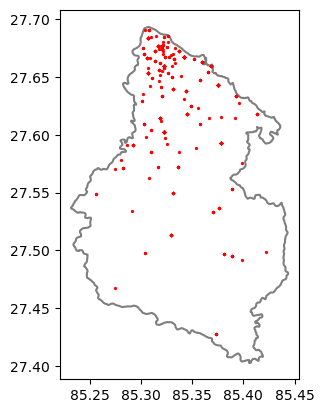

## Importing and installing required libraries


```python
#File Load
import os
os.chdir('D:\\BE\\8th\\Project\\Suicide_Lalitpur\\SuicideAnalysisLalitpur\\hotspots')
```


```python
#Used library 
!pip install osmnx
 !pip install networkx
 !pip install geopandas
 !pip install pysal
 !pip install libpysal
 !pip install feather
 !pip install feather
 !pip install folium
 !pip install geofeather
```


```python
import osmnx as ox
from matplotlib import pyplot as plt
import pandas as pd
import geopandas as gpd
import numpy as np
import seaborn as sns
import json
```


```python
%load_ext autoreload
%autoreload 2
import Sources.getis
import Sources.aggregation
```

    C:\Users\Asus\AppData\Roaming\Python\Python310\site-packages\spaghetti\network.py:40: FutureWarning: The next major release of pysal/spaghetti (2.0.0) will drop support for all ``libpysal.cg`` geometries. This change is a first step in refactoring ``spaghetti`` that is expected to result in dramatically reduced runtimes for network instantiation and operations. Users currently requiring network and point pattern input as ``libpysal.cg`` geometries should prepare for this simply by converting to ``shapely`` geometries.
      warnings.warn(dep_msg, FutureWarning, stacklevel=1)
    


```python
import pandas as pd
import geopandas as gpd
import scipy.stats as stats
from datetime import datetime
import pysal 
import libpysal #added
pd.options.mode.chained_assignment = None 
from geofeather import to_geofeather, from_geofeather
import json
import feather

from pysal.explore import esda
import numpy as np
from pyproj import CRS
import folium
from pyproj import Transformer
import osmnx as ox
import networkx as nx
```

# Coordinate System Transformation


```python
'''Project the given lat,lng from EPSG:4326 to EPSG: 32645'''
inputCRS = CRS.from_epsg(4326)
outputCRS = CRS.from_epsg(32645)
transformer = Transformer.from_crs(inputCRS, outputCRS)
def project(a,b):
    return transformer.transform(a, b)
```

# This is GetisOrd Function


```python
'''Default getis function using pysal library'''
def getisOrd(data, value = 'value', threshold = 50, lat = 'lat', lng = 'lng'):
    coords = [project(row[lat], row[lng]) for index, row in data.iterrows()]
    w = libpysal.weights.DistanceBand(coords, threshold, binary=True) 
    #w = pysal.weights.DistanceBand(coords, threshold)
    #getisOrdGlobal = esda.getisord.G(data_speed['time_sec'], w)
    print(w)
    getisOrdLocal = esda.getisord.G_Local(np.array(data[value]), w, transform='B')
    getisOrdLocal.Zs

    data['z_score'] = getisOrdLocal.Zs
    data['p_value'] = getisOrdLocal.p_norm

    return data
```

# P_value & Z_value plot function(Red=hotspot,Blue=coldspot)


```python
def pltcolor(p_value, z_score, confidence):
    cols=[]
    size=[]
    for p, z in zip(p_value, z_score):
        if p < confidence:
            if z > 0:
                cols.append('red')        #hotspot color
                size.append(20)
            else:
                cols.append('blue')       #coldspot color
                size.append(20)
        else:
            cols.append('grey')           #others
            size.append(10)
    return cols , size

def plot(data, lat = 'lat', lng = 'lng', p_field = 'p_value', z_field = 'z_score'):
    from matplotlib import pyplot as plt
    #z_score>1.96 hot spots (95% ci)
    #z_score<-1.96 cold spots
    from matplotlib import colors as cls

    f, axarr = plt.subplots(1, figsize=(10,10))
    total_range = cls.Normalize(vmin = - 1.96, vmax = 1.96)
    
    cols, sizes = pltcolor(data[p_field], data[z_field], 0.05)

    plt.scatter(x=data['lng'], y=data['lat'], s=sizes, c=cols, lw = 0) #Pass on the list created by the function here
    plt.grid(True)
    plt.show()

    
```

# Aggregation (Grid)Mean Function


```python

def aggregate_mean(data):
    return data.mean()
    
def map(m, data, value = 'value', style = 'hotspots', lat = 'lat', lng = 'lng', p_field = 'p_value', z_field = 'z_score', col ='#f09205'):

    lats = data[lat]
    lngs = data[lng]

    avg_lat = sum(lats) / len(lats)
    avg_lngs = sum(lngs) / len(lngs)

    latlngs = []
    if style == 'hotspots':
        #z-value
        z = data[z_field]
        p = data[p_field]
        color, sizes = pltcolor(p, z, 0.05)
        value = data[value]
        for lat,lng,c,v in zip(lats, lngs, color, value):
            folium.CircleMarker([lat,lng], color = c, radius =3, fill = c, popup = makepopup(v)).add_to(m)
            latlngs.append([lat,lng])
    else:
        color = [col]*len(data)
        for lat,lng,c in zip(lats, lngs, color):
            folium.CircleMarker([lat,lng], color = c, radius =3, fill = c).add_to(m)
            latlngs.append([lat,lng])

    m.fit_bounds(latlngs)

```

# Aggregation data(Polygon VDC) function


```python
def add_polygon(m, polygon,fillColor):
    folium.GeoJson(
        polygon,
        style_function= lambda feature:{
            'fillColor': fillColor,
            'color' : '#f7f7f7',
            'weight' : 1,
            'fillOpacity' : 0.7,
        }
    ).add_to(m)
```

# Data Import
Suicide data is imported and saved in geofeather format, which is a faster for geometries with geopandas.


```python
#Data Import
df = gpd.read_file('D:\\BE\\8th\\Project\\SpatialData\\WGS\\Sucide.shp')
boundary = gpd.read_file('D:\\BE\\8th\\Project\\SpatialData\\WGS\\Study_Area.shp')
```


```python
#load data description
df.head()
```


<div>
<style scoped>
    .dataframe tbody tr th:only-of-type {
        vertical-align: middle;
    }

    .dataframe tbody tr th {
        vertical-align: top;
    }

    .dataframe thead th {
        text-align: right;
    }
</style>
<table border="1" class="dataframe">
  <thead>
    <tr style="text-align: right;">
      <th></th>
      <th>Location</th>
      <th>Number</th>
      <th>Fiscal_Yea</th>
      <th>X</th>
      <th>Y</th>
      <th>lat</th>
      <th>lng</th>
      <th>geometry</th>
    </tr>
  </thead>
  <tbody>
    <tr>
      <th>0</th>
      <td>Bangalamukhi</td>
      <td>1</td>
      <td>074-075</td>
      <td>631011.556000</td>
      <td>3.062684e+06</td>
      <td>27.676243</td>
      <td>85.325874</td>
      <td>POINT (85.32587 27.67624)</td>
    </tr>
    <tr>
      <th>1</th>
      <td>Godawari</td>
      <td>1</td>
      <td>074-075</td>
      <td>636303.000000</td>
      <td>3.053499e+06</td>
      <td>27.592850</td>
      <td>85.378462</td>
      <td>POINT (85.37846 27.59285)</td>
    </tr>
    <tr>
      <th>2</th>
      <td>Imadol</td>
      <td>1</td>
      <td>074-075</td>
      <td>632620.771765</td>
      <td>3.061675e+06</td>
      <td>27.666985</td>
      <td>85.342072</td>
      <td>POINT (85.34207 27.66698)</td>
    </tr>
    <tr>
      <th>3</th>
      <td>Iti Tole</td>
      <td>1</td>
      <td>074-075</td>
      <td>629556.375000</td>
      <td>3.052578e+06</td>
      <td>27.585197</td>
      <td>85.310040</td>
      <td>POINT (85.31004 27.58520)</td>
    </tr>
    <tr>
      <th>4</th>
      <td>Jawalakhel</td>
      <td>1</td>
      <td>074-075</td>
      <td>629797.590600</td>
      <td>3.062272e+06</td>
      <td>27.672644</td>
      <td>85.313526</td>
      <td>POINT (85.31353 27.67264)</td>
    </tr>
  </tbody>
</table>
</div>


```python
# Create a new figure and axis
fig, ax = plt.subplots()

# Plot the boundary
boundary.plot(ax=ax, color='white', edgecolor='black', linewidth=1.5, alpha=0.5)

# Plot the point data in red (using the 'plot' function of GeoDataFrame)
df.plot(ax=ax, color='red', markersize=1.8)

# Display the plot
plt.show()
```


    

    


### Hotspots For number of sucides 


```python
## group by location
data_Sucide = df.groupby(['lat','lng'])[['Number']].sum().reset_index()

### plot times
plt.plot(data_Sucide['Number'])
data_Sucide['Number'].describe()
```


    count    199.000000
    mean       2.884422
    std        1.959620
    min        1.000000
    25%        1.000000
    50%        2.000000
    75%        4.000000
    max        9.000000
    Name: Number, dtype: float64


    

    


```python
sns.distplot(data_Sucide['Number'])
data_Sucide['Number'].describe()
```

    C:\Users\Asus\AppData\Local\Temp\ipykernel_9324\925499812.py:1: UserWarning: 
    
    `distplot` is a deprecated function and will be removed in seaborn v0.14.0.
    
    Please adapt your code to use either `displot` (a figure-level function with
    similar flexibility) or `histplot` (an axes-level function for histograms).
    
    For a guide to updating your code to use the new functions, please see
    https://gist.github.com/mwaskom/de44147ed2974457ad6372750bbe5751
    
      sns.distplot(data_Sucide['Number'])
    


    count    199.000000
    mean       2.884422
    std        1.959620
    min        1.000000
    25%        1.000000
    50%        2.000000
    75%        4.000000
    max        9.000000
    Name: Number, dtype: float64


    

    


```python
# Convert Number into float
data_Sucide['Number']= data_Sucide['Number'].astype(float)
```


```python
#data plot by getisord in threashold 5km
sucideGetis = getisOrd(data_Sucide, 'Number', 5000)
```

    C:\Users\Asus\AppData\Roaming\Python\Python310\site-packages\libpysal\weights\weights.py:172: UserWarning: The weights matrix is not fully connected: 
     There are 2 disconnected components.
      warnings.warn(message)
    

    <libpysal.weights.distance.DistanceBand object at 0x00000254ED873B20>
    


```python
import pysal.lib as ps
```


```python
#plot 5km threashold hotspots coldspots
plot(sucideGetis)
```


    

    


```python
#ploted data load on osm
m = folium.Map(tiles = 'OpenStreetMap', zoom_start=12)
map(m, sucideGetis, value = 'Number', style ='hotspots')
folium.GeoJson(boundary).add_to(m)
m

```


<div style="width:100%;"><div style="position:relative;width:100%;height:0;padding-bottom:60%;"><span style="color:#565656">Make this Notebook Trusted to load map: File -> Trust Notebook</span><iframe srcdoc="&lt;!DOCTYPE html&gt;
&lt;html&gt;
&lt;head&gt;

    &lt;meta http-equiv=&quot;content-type&quot; content=&quot;text/html; charset=UTF-8&quot; /&gt;

        &lt;script&gt;
            L_NO_TOUCH = false;
            L_DISABLE_3D = false;
        &lt;/script&gt;

    &lt;style&gt;html, body {width: 100%;height: 100%;margin: 0;padding: 0;}&lt;/style&gt;
    &lt;style&gt;#map {position:absolute;top:0;bottom:0;right:0;left:0;}&lt;/style&gt;
    &lt;script src=&quot;https://cdn.jsdelivr.net/npm/leaflet@1.9.3/dist/leaflet.js&quot;&gt;&lt;/script&gt;
    &lt;script src=&quot;https://code.jquery.com/jquery-1.12.4.min.js&quot;&gt;&lt;/script&gt;
    &lt;script src=&quot;https://cdn.jsdelivr.net/npm/bootstrap@5.2.2/dist/js/bootstrap.bundle.min.js&quot;&gt;&lt;/script&gt;
    &lt;script src=&quot;https://cdnjs.cloudflare.com/ajax/libs/Leaflet.awesome-markers/2.0.2/leaflet.awesome-markers.js&quot;&gt;&lt;/script&gt;
    &lt;link rel=&quot;stylesheet&quot; href=&quot;https://cdn.jsdelivr.net/npm/leaflet@1.9.3/dist/leaflet.css&quot;/&gt;
    &lt;link rel=&quot;stylesheet&quot; href=&quot;https://cdn.jsdelivr.net/npm/bootstrap@5.2.2/dist/css/bootstrap.min.css&quot;/&gt;
    &lt;link rel=&quot;stylesheet&quot; href=&quot;https://netdna.bootstrapcdn.com/bootstrap/3.0.0/css/bootstrap.min.css&quot;/&gt;
    &lt;link rel=&quot;stylesheet&quot; href=&quot;https://cdn.jsdelivr.net/npm/@fortawesome/fontawesome-free@6.2.0/css/all.min.css&quot;/&gt;
    &lt;link rel=&quot;stylesheet&quot; href=&quot;https://cdnjs.cloudflare.com/ajax/libs/Leaflet.awesome-markers/2.0.2/leaflet.awesome-markers.css&quot;/&gt;
    &lt;link rel=&quot;stylesheet&quot; href=&quot;https://cdn.jsdelivr.net/gh/python-visualization/folium/folium/templates/leaflet.awesome.rotate.min.css&quot;/&gt;

            &lt;meta name=&quot;viewport&quot; content=&quot;width=device-width,
                initial-scale=1.0, maximum-scale=1.0, user-scalable=no&quot; /&gt;
            &lt;style&gt;
                #map_8e984d8997391329422708b6161cb06b {
                    position: relative;
                    width: 100.0%;
                    height: 100.0%;
                    left: 0.0%;
                    top: 0.0%;
                }
                .leaflet-container { font-size: 1rem; }
            &lt;/style&gt;

&lt;/head&gt;
&lt;body&gt;


            &lt;div class=&quot;folium-map&quot; id=&quot;map_8e984d8997391329422708b6161cb06b&quot; &gt;&lt;/div&gt;

&lt;/body&gt;
&lt;script&gt;


            var map_8e984d8997391329422708b6161cb06b = L.map(
                &quot;map_8e984d8997391329422708b6161cb06b&quot;,
                {
                    center: [0, 0],
                    crs: L.CRS.EPSG3857,
                    zoom: 1,
                    zoomControl: true,
                    preferCanvas: false,
                }
            );


            var tile_layer_4243f3fce2f9652e30d0a263f770d2a3 = L.tileLayer(
                &quot;https://{s}.tile.openstreetmap.org/{z}/{x}/{y}.png&quot;,
                {&quot;attribution&quot;: &quot;Data by \u0026copy; \u003ca target=\&quot;_blank\&quot; href=\&quot;http://openstreetmap.org\&quot;\u003eOpenStreetMap\u003c/a\u003e, under \u003ca target=\&quot;_blank\&quot; href=\&quot;http://www.openstreetmap.org/copyright\&quot;\u003eODbL\u003c/a\u003e.&quot;, &quot;detectRetina&quot;: false, &quot;maxNativeZoom&quot;: 18, &quot;maxZoom&quot;: 18, &quot;minZoom&quot;: 0, &quot;noWrap&quot;: false, &quot;opacity&quot;: 1, &quot;subdomains&quot;: &quot;abc&quot;, &quot;tms&quot;: false}
            ).addTo(map_8e984d8997391329422708b6161cb06b);


            var circle_marker_ffa7fcb51a839edf9173c4a746552f96 = L.circleMarker(
                [27.4278380032, 85.3732852408],
                {&quot;bubblingMouseEvents&quot;: true, &quot;color&quot;: &quot;grey&quot;, &quot;dashArray&quot;: null, &quot;dashOffset&quot;: null, &quot;fill&quot;: &quot;grey&quot;, &quot;fillColor&quot;: &quot;grey&quot;, &quot;fillOpacity&quot;: 0.2, &quot;fillRule&quot;: &quot;evenodd&quot;, &quot;lineCap&quot;: &quot;round&quot;, &quot;lineJoin&quot;: &quot;round&quot;, &quot;opacity&quot;: 1.0, &quot;radius&quot;: 3, &quot;stroke&quot;: true, &quot;weight&quot;: 3}
            ).addTo(map_8e984d8997391329422708b6161cb06b);


        var popup_956f1b741791b1bab02b8edc9fe3c7f4 = L.popup({&quot;maxWidth&quot;: &quot;100%&quot;});


                var html_000c67c60f438bbce3e3dad710a9b6ac = $(`&lt;div id=&quot;html_000c67c60f438bbce3e3dad710a9b6ac&quot; style=&quot;width: 100.0%; height: 100.0%;&quot;&gt;2.0&lt;/div&gt;`)[0];
                popup_956f1b741791b1bab02b8edc9fe3c7f4.setContent(html_000c67c60f438bbce3e3dad710a9b6ac);


        circle_marker_ffa7fcb51a839edf9173c4a746552f96.bindPopup(popup_956f1b741791b1bab02b8edc9fe3c7f4)
        ;


            var circle_marker_071ecf931945511d7bea3d980b58a42a = L.circleMarker(
                [27.4278380033, 85.3732852337],
                {&quot;bubblingMouseEvents&quot;: true, &quot;color&quot;: &quot;grey&quot;, &quot;dashArray&quot;: null, &quot;dashOffset&quot;: null, &quot;fill&quot;: &quot;grey&quot;, &quot;fillColor&quot;: &quot;grey&quot;, &quot;fillOpacity&quot;: 0.2, &quot;fillRule&quot;: &quot;evenodd&quot;, &quot;lineCap&quot;: &quot;round&quot;, &quot;lineJoin&quot;: &quot;round&quot;, &quot;opacity&quot;: 1.0, &quot;radius&quot;: 3, &quot;stroke&quot;: true, &quot;weight&quot;: 3}
            ).addTo(map_8e984d8997391329422708b6161cb06b);


        var popup_ade0c4c1837ffe9d127aff85870fd092 = L.popup({&quot;maxWidth&quot;: &quot;100%&quot;});


                var html_879852eed38670f27524c3a8d0a57610 = $(`&lt;div id=&quot;html_879852eed38670f27524c3a8d0a57610&quot; style=&quot;width: 100.0%; height: 100.0%;&quot;&gt;2.0&lt;/div&gt;`)[0];
                popup_ade0c4c1837ffe9d127aff85870fd092.setContent(html_879852eed38670f27524c3a8d0a57610);


        circle_marker_071ecf931945511d7bea3d980b58a42a.bindPopup(popup_ade0c4c1837ffe9d127aff85870fd092)
        ;


            var circle_marker_d48f8c857fc178b9383e244afcb4c99e = L.circleMarker(
                [27.4676586537, 85.275012943],
                {&quot;bubblingMouseEvents&quot;: true, &quot;color&quot;: &quot;grey&quot;, &quot;dashArray&quot;: null, &quot;dashOffset&quot;: null, &quot;fill&quot;: &quot;grey&quot;, &quot;fillColor&quot;: &quot;grey&quot;, &quot;fillOpacity&quot;: 0.2, &quot;fillRule&quot;: &quot;evenodd&quot;, &quot;lineCap&quot;: &quot;round&quot;, &quot;lineJoin&quot;: &quot;round&quot;, &quot;opacity&quot;: 1.0, &quot;radius&quot;: 3, &quot;stroke&quot;: true, &quot;weight&quot;: 3}
            ).addTo(map_8e984d8997391329422708b6161cb06b);


        var popup_23aab1d0d37671aaf86b014f48a05629 = L.popup({&quot;maxWidth&quot;: &quot;100%&quot;});


                var html_15fc11b422c4b6b79a21e0a0138f70e0 = $(`&lt;div id=&quot;html_15fc11b422c4b6b79a21e0a0138f70e0&quot; style=&quot;width: 100.0%; height: 100.0%;&quot;&gt;1.0&lt;/div&gt;`)[0];
                popup_23aab1d0d37671aaf86b014f48a05629.setContent(html_15fc11b422c4b6b79a21e0a0138f70e0);


        circle_marker_d48f8c857fc178b9383e244afcb4c99e.bindPopup(popup_23aab1d0d37671aaf86b014f48a05629)
        ;


            var circle_marker_29276dc46ffaff932e6175d30a730f83 = L.circleMarker(
                [27.4918612476, 85.3987504767],
                {&quot;bubblingMouseEvents&quot;: true, &quot;color&quot;: &quot;grey&quot;, &quot;dashArray&quot;: null, &quot;dashOffset&quot;: null, &quot;fill&quot;: &quot;grey&quot;, &quot;fillColor&quot;: &quot;grey&quot;, &quot;fillOpacity&quot;: 0.2, &quot;fillRule&quot;: &quot;evenodd&quot;, &quot;lineCap&quot;: &quot;round&quot;, &quot;lineJoin&quot;: &quot;round&quot;, &quot;opacity&quot;: 1.0, &quot;radius&quot;: 3, &quot;stroke&quot;: true, &quot;weight&quot;: 3}
            ).addTo(map_8e984d8997391329422708b6161cb06b);


        var popup_b9b35f0679fccf46f2ad157a12523c72 = L.popup({&quot;maxWidth&quot;: &quot;100%&quot;});


                var html_08717021dd5834f6fb026462c7b2b040 = $(`&lt;div id=&quot;html_08717021dd5834f6fb026462c7b2b040&quot; style=&quot;width: 100.0%; height: 100.0%;&quot;&gt;1.0&lt;/div&gt;`)[0];
                popup_b9b35f0679fccf46f2ad157a12523c72.setContent(html_08717021dd5834f6fb026462c7b2b040);


        circle_marker_29276dc46ffaff932e6175d30a730f83.bindPopup(popup_b9b35f0679fccf46f2ad157a12523c72)
        ;


            var circle_marker_4e5765bbfbed93396b69685202f8b7b4 = L.circleMarker(
                [27.4951963065, 85.388706544],
                {&quot;bubblingMouseEvents&quot;: true, &quot;color&quot;: &quot;grey&quot;, &quot;dashArray&quot;: null, &quot;dashOffset&quot;: null, &quot;fill&quot;: &quot;grey&quot;, &quot;fillColor&quot;: &quot;grey&quot;, &quot;fillOpacity&quot;: 0.2, &quot;fillRule&quot;: &quot;evenodd&quot;, &quot;lineCap&quot;: &quot;round&quot;, &quot;lineJoin&quot;: &quot;round&quot;, &quot;opacity&quot;: 1.0, &quot;radius&quot;: 3, &quot;stroke&quot;: true, &quot;weight&quot;: 3}
            ).addTo(map_8e984d8997391329422708b6161cb06b);


        var popup_a9c046e32eff174ec86d0f0e91c2dbcc = L.popup({&quot;maxWidth&quot;: &quot;100%&quot;});


                var html_dd9ab4a7afa51ac7b25411bec8f1e50f = $(`&lt;div id=&quot;html_dd9ab4a7afa51ac7b25411bec8f1e50f&quot; style=&quot;width: 100.0%; height: 100.0%;&quot;&gt;1.0&lt;/div&gt;`)[0];
                popup_a9c046e32eff174ec86d0f0e91c2dbcc.setContent(html_dd9ab4a7afa51ac7b25411bec8f1e50f);


        circle_marker_4e5765bbfbed93396b69685202f8b7b4.bindPopup(popup_a9c046e32eff174ec86d0f0e91c2dbcc)
        ;


            var circle_marker_44cee6c797ea3fbd51f1dff05c8b3281 = L.circleMarker(
                [27.4951963081, 85.3887065405],
                {&quot;bubblingMouseEvents&quot;: true, &quot;color&quot;: &quot;grey&quot;, &quot;dashArray&quot;: null, &quot;dashOffset&quot;: null, &quot;fill&quot;: &quot;grey&quot;, &quot;fillColor&quot;: &quot;grey&quot;, &quot;fillOpacity&quot;: 0.2, &quot;fillRule&quot;: &quot;evenodd&quot;, &quot;lineCap&quot;: &quot;round&quot;, &quot;lineJoin&quot;: &quot;round&quot;, &quot;opacity&quot;: 1.0, &quot;radius&quot;: 3, &quot;stroke&quot;: true, &quot;weight&quot;: 3}
            ).addTo(map_8e984d8997391329422708b6161cb06b);


        var popup_6a5cc77dcec0f16dbd29c009cfae6f41 = L.popup({&quot;maxWidth&quot;: &quot;100%&quot;});


                var html_89a790f1639447e8822bae0404b04e4d = $(`&lt;div id=&quot;html_89a790f1639447e8822bae0404b04e4d&quot; style=&quot;width: 100.0%; height: 100.0%;&quot;&gt;2.0&lt;/div&gt;`)[0];
                popup_6a5cc77dcec0f16dbd29c009cfae6f41.setContent(html_89a790f1639447e8822bae0404b04e4d);


        circle_marker_44cee6c797ea3fbd51f1dff05c8b3281.bindPopup(popup_6a5cc77dcec0f16dbd29c009cfae6f41)
        ;


            var circle_marker_216ad0892b6ef1b30f2691c3e4227e6d = L.circleMarker(
                [27.4951963096, 85.3887065441],
                {&quot;bubblingMouseEvents&quot;: true, &quot;color&quot;: &quot;grey&quot;, &quot;dashArray&quot;: null, &quot;dashOffset&quot;: null, &quot;fill&quot;: &quot;grey&quot;, &quot;fillColor&quot;: &quot;grey&quot;, &quot;fillOpacity&quot;: 0.2, &quot;fillRule&quot;: &quot;evenodd&quot;, &quot;lineCap&quot;: &quot;round&quot;, &quot;lineJoin&quot;: &quot;round&quot;, &quot;opacity&quot;: 1.0, &quot;radius&quot;: 3, &quot;stroke&quot;: true, &quot;weight&quot;: 3}
            ).addTo(map_8e984d8997391329422708b6161cb06b);


        var popup_3265279283ae64483ae8fa14e5392789 = L.popup({&quot;maxWidth&quot;: &quot;100%&quot;});


                var html_cb9e417ba872c1e8560569dd542fd4b0 = $(`&lt;div id=&quot;html_cb9e417ba872c1e8560569dd542fd4b0&quot; style=&quot;width: 100.0%; height: 100.0%;&quot;&gt;1.0&lt;/div&gt;`)[0];
                popup_3265279283ae64483ae8fa14e5392789.setContent(html_cb9e417ba872c1e8560569dd542fd4b0);


        circle_marker_216ad0892b6ef1b30f2691c3e4227e6d.bindPopup(popup_3265279283ae64483ae8fa14e5392789)
        ;


            var circle_marker_1e99a89d6b0c1241b414c9ee8a55addb = L.circleMarker(
                [27.4951963113, 85.3887065405],
                {&quot;bubblingMouseEvents&quot;: true, &quot;color&quot;: &quot;grey&quot;, &quot;dashArray&quot;: null, &quot;dashOffset&quot;: null, &quot;fill&quot;: &quot;grey&quot;, &quot;fillColor&quot;: &quot;grey&quot;, &quot;fillOpacity&quot;: 0.2, &quot;fillRule&quot;: &quot;evenodd&quot;, &quot;lineCap&quot;: &quot;round&quot;, &quot;lineJoin&quot;: &quot;round&quot;, &quot;opacity&quot;: 1.0, &quot;radius&quot;: 3, &quot;stroke&quot;: true, &quot;weight&quot;: 3}
            ).addTo(map_8e984d8997391329422708b6161cb06b);


        var popup_1adadcdfe1417e0bd1b1246bc829c70a = L.popup({&quot;maxWidth&quot;: &quot;100%&quot;});


                var html_dfdcb7d382d345e069630126ad24f777 = $(`&lt;div id=&quot;html_dfdcb7d382d345e069630126ad24f777&quot; style=&quot;width: 100.0%; height: 100.0%;&quot;&gt;2.0&lt;/div&gt;`)[0];
                popup_1adadcdfe1417e0bd1b1246bc829c70a.setContent(html_dfdcb7d382d345e069630126ad24f777);


        circle_marker_1e99a89d6b0c1241b414c9ee8a55addb.bindPopup(popup_1adadcdfe1417e0bd1b1246bc829c70a)
        ;


            var circle_marker_5b529105101b66713aceb40100265adf = L.circleMarker(
                [27.4967331575, 85.3807738298],
                {&quot;bubblingMouseEvents&quot;: true, &quot;color&quot;: &quot;grey&quot;, &quot;dashArray&quot;: null, &quot;dashOffset&quot;: null, &quot;fill&quot;: &quot;grey&quot;, &quot;fillColor&quot;: &quot;grey&quot;, &quot;fillOpacity&quot;: 0.2, &quot;fillRule&quot;: &quot;evenodd&quot;, &quot;lineCap&quot;: &quot;round&quot;, &quot;lineJoin&quot;: &quot;round&quot;, &quot;opacity&quot;: 1.0, &quot;radius&quot;: 3, &quot;stroke&quot;: true, &quot;weight&quot;: 3}
            ).addTo(map_8e984d8997391329422708b6161cb06b);


        var popup_1db4a88c7419b9097db6666984dc8471 = L.popup({&quot;maxWidth&quot;: &quot;100%&quot;});


                var html_5abb143b66cfe04d11c08ddd5d1f21e5 = $(`&lt;div id=&quot;html_5abb143b66cfe04d11c08ddd5d1f21e5&quot; style=&quot;width: 100.0%; height: 100.0%;&quot;&gt;4.0&lt;/div&gt;`)[0];
                popup_1db4a88c7419b9097db6666984dc8471.setContent(html_5abb143b66cfe04d11c08ddd5d1f21e5);


        circle_marker_5b529105101b66713aceb40100265adf.bindPopup(popup_1db4a88c7419b9097db6666984dc8471)
        ;


            var circle_marker_ebacb3952b334313b1e068b6a0b122e2 = L.circleMarker(
                [27.498093641, 85.3043069175],
                {&quot;bubblingMouseEvents&quot;: true, &quot;color&quot;: &quot;grey&quot;, &quot;dashArray&quot;: null, &quot;dashOffset&quot;: null, &quot;fill&quot;: &quot;grey&quot;, &quot;fillColor&quot;: &quot;grey&quot;, &quot;fillOpacity&quot;: 0.2, &quot;fillRule&quot;: &quot;evenodd&quot;, &quot;lineCap&quot;: &quot;round&quot;, &quot;lineJoin&quot;: &quot;round&quot;, &quot;opacity&quot;: 1.0, &quot;radius&quot;: 3, &quot;stroke&quot;: true, &quot;weight&quot;: 3}
            ).addTo(map_8e984d8997391329422708b6161cb06b);


        var popup_ad20984019c8a1fd8788ccf16921f0af = L.popup({&quot;maxWidth&quot;: &quot;100%&quot;});


                var html_6726e21377a8d2b422d5859b09e0d729 = $(`&lt;div id=&quot;html_6726e21377a8d2b422d5859b09e0d729&quot; style=&quot;width: 100.0%; height: 100.0%;&quot;&gt;2.0&lt;/div&gt;`)[0];
                popup_ad20984019c8a1fd8788ccf16921f0af.setContent(html_6726e21377a8d2b422d5859b09e0d729);


        circle_marker_ebacb3952b334313b1e068b6a0b122e2.bindPopup(popup_ad20984019c8a1fd8788ccf16921f0af)
        ;


            var circle_marker_44c8180f0f3a31cda7fd785cabc175a5 = L.circleMarker(
                [27.4988135464, 85.4224998441],
                {&quot;bubblingMouseEvents&quot;: true, &quot;color&quot;: &quot;grey&quot;, &quot;dashArray&quot;: null, &quot;dashOffset&quot;: null, &quot;fill&quot;: &quot;grey&quot;, &quot;fillColor&quot;: &quot;grey&quot;, &quot;fillOpacity&quot;: 0.2, &quot;fillRule&quot;: &quot;evenodd&quot;, &quot;lineCap&quot;: &quot;round&quot;, &quot;lineJoin&quot;: &quot;round&quot;, &quot;opacity&quot;: 1.0, &quot;radius&quot;: 3, &quot;stroke&quot;: true, &quot;weight&quot;: 3}
            ).addTo(map_8e984d8997391329422708b6161cb06b);


        var popup_79b0207da9283c19cff857adc478f207 = L.popup({&quot;maxWidth&quot;: &quot;100%&quot;});


                var html_53ae34bd99dda1bf02272611f56ae2ce = $(`&lt;div id=&quot;html_53ae34bd99dda1bf02272611f56ae2ce&quot; style=&quot;width: 100.0%; height: 100.0%;&quot;&gt;1.0&lt;/div&gt;`)[0];
                popup_79b0207da9283c19cff857adc478f207.setContent(html_53ae34bd99dda1bf02272611f56ae2ce);


        circle_marker_44c8180f0f3a31cda7fd785cabc175a5.bindPopup(popup_79b0207da9283c19cff857adc478f207)
        ;


            var circle_marker_66ed7e7a3fec390df62623f2f96d2092 = L.circleMarker(
                [27.5129247066, 85.3297752953],
                {&quot;bubblingMouseEvents&quot;: true, &quot;color&quot;: &quot;blue&quot;, &quot;dashArray&quot;: null, &quot;dashOffset&quot;: null, &quot;fill&quot;: &quot;blue&quot;, &quot;fillColor&quot;: &quot;blue&quot;, &quot;fillOpacity&quot;: 0.2, &quot;fillRule&quot;: &quot;evenodd&quot;, &quot;lineCap&quot;: &quot;round&quot;, &quot;lineJoin&quot;: &quot;round&quot;, &quot;opacity&quot;: 1.0, &quot;radius&quot;: 3, &quot;stroke&quot;: true, &quot;weight&quot;: 3}
            ).addTo(map_8e984d8997391329422708b6161cb06b);


        var popup_b5f74577272e9ea9e5acc8961b497ad6 = L.popup({&quot;maxWidth&quot;: &quot;100%&quot;});


                var html_5c4b4b69f75552c1e750425d416c135b = $(`&lt;div id=&quot;html_5c4b4b69f75552c1e750425d416c135b&quot; style=&quot;width: 100.0%; height: 100.0%;&quot;&gt;6.0&lt;/div&gt;`)[0];
                popup_b5f74577272e9ea9e5acc8961b497ad6.setContent(html_5c4b4b69f75552c1e750425d416c135b);


        circle_marker_66ed7e7a3fec390df62623f2f96d2092.bindPopup(popup_b5f74577272e9ea9e5acc8961b497ad6)
        ;


            var circle_marker_12cfb7f8d007113862e9a29a4c1a42f8 = L.circleMarker(
                [27.5129247098, 85.3297752936],
                {&quot;bubblingMouseEvents&quot;: true, &quot;color&quot;: &quot;blue&quot;, &quot;dashArray&quot;: null, &quot;dashOffset&quot;: null, &quot;fill&quot;: &quot;blue&quot;, &quot;fillColor&quot;: &quot;blue&quot;, &quot;fillOpacity&quot;: 0.2, &quot;fillRule&quot;: &quot;evenodd&quot;, &quot;lineCap&quot;: &quot;round&quot;, &quot;lineJoin&quot;: &quot;round&quot;, &quot;opacity&quot;: 1.0, &quot;radius&quot;: 3, &quot;stroke&quot;: true, &quot;weight&quot;: 3}
            ).addTo(map_8e984d8997391329422708b6161cb06b);


        var popup_179dbea3d820e391a76418ec7f54d6e0 = L.popup({&quot;maxWidth&quot;: &quot;100%&quot;});


                var html_1534433d07fa9528fa7644cc0be36e17 = $(`&lt;div id=&quot;html_1534433d07fa9528fa7644cc0be36e17&quot; style=&quot;width: 100.0%; height: 100.0%;&quot;&gt;5.0&lt;/div&gt;`)[0];
                popup_179dbea3d820e391a76418ec7f54d6e0.setContent(html_1534433d07fa9528fa7644cc0be36e17);


        circle_marker_12cfb7f8d007113862e9a29a4c1a42f8.bindPopup(popup_179dbea3d820e391a76418ec7f54d6e0)
        ;


            var circle_marker_f81265f47122e9244e178a07ad6a36f2 = L.circleMarker(
                [27.533551331, 85.3705833591],
                {&quot;bubblingMouseEvents&quot;: true, &quot;color&quot;: &quot;blue&quot;, &quot;dashArray&quot;: null, &quot;dashOffset&quot;: null, &quot;fill&quot;: &quot;blue&quot;, &quot;fillColor&quot;: &quot;blue&quot;, &quot;fillOpacity&quot;: 0.2, &quot;fillRule&quot;: &quot;evenodd&quot;, &quot;lineCap&quot;: &quot;round&quot;, &quot;lineJoin&quot;: &quot;round&quot;, &quot;opacity&quot;: 1.0, &quot;radius&quot;: 3, &quot;stroke&quot;: true, &quot;weight&quot;: 3}
            ).addTo(map_8e984d8997391329422708b6161cb06b);


        var popup_ece83ad39542f5dae2434d234eb140b6 = L.popup({&quot;maxWidth&quot;: &quot;100%&quot;});


                var html_5eadd8757bf45050746eb147b77d0873 = $(`&lt;div id=&quot;html_5eadd8757bf45050746eb147b77d0873&quot; style=&quot;width: 100.0%; height: 100.0%;&quot;&gt;4.0&lt;/div&gt;`)[0];
                popup_ece83ad39542f5dae2434d234eb140b6.setContent(html_5eadd8757bf45050746eb147b77d0873);


        circle_marker_f81265f47122e9244e178a07ad6a36f2.bindPopup(popup_ece83ad39542f5dae2434d234eb140b6)
        ;


            var circle_marker_0389f6c3a8ca9242472a74ee01eef8c2 = L.circleMarker(
                [27.5341793714, 85.2913609815],
                {&quot;bubblingMouseEvents&quot;: true, &quot;color&quot;: &quot;blue&quot;, &quot;dashArray&quot;: null, &quot;dashOffset&quot;: null, &quot;fill&quot;: &quot;blue&quot;, &quot;fillColor&quot;: &quot;blue&quot;, &quot;fillOpacity&quot;: 0.2, &quot;fillRule&quot;: &quot;evenodd&quot;, &quot;lineCap&quot;: &quot;round&quot;, &quot;lineJoin&quot;: &quot;round&quot;, &quot;opacity&quot;: 1.0, &quot;radius&quot;: 3, &quot;stroke&quot;: true, &quot;weight&quot;: 3}
            ).addTo(map_8e984d8997391329422708b6161cb06b);


        var popup_4fd0bdc6cc001222f9d77c293fe87c4d = L.popup({&quot;maxWidth&quot;: &quot;100%&quot;});


                var html_d03975941f880336d833370160a9137b = $(`&lt;div id=&quot;html_d03975941f880336d833370160a9137b&quot; style=&quot;width: 100.0%; height: 100.0%;&quot;&gt;1.0&lt;/div&gt;`)[0];
                popup_4fd0bdc6cc001222f9d77c293fe87c4d.setContent(html_d03975941f880336d833370160a9137b);


        circle_marker_0389f6c3a8ca9242472a74ee01eef8c2.bindPopup(popup_4fd0bdc6cc001222f9d77c293fe87c4d)
        ;


            var circle_marker_c03fbd11b0ca9ccdb24ab9002174140e = L.circleMarker(
                [27.5367971615, 85.3764498276],
                {&quot;bubblingMouseEvents&quot;: true, &quot;color&quot;: &quot;blue&quot;, &quot;dashArray&quot;: null, &quot;dashOffset&quot;: null, &quot;fill&quot;: &quot;blue&quot;, &quot;fillColor&quot;: &quot;blue&quot;, &quot;fillOpacity&quot;: 0.2, &quot;fillRule&quot;: &quot;evenodd&quot;, &quot;lineCap&quot;: &quot;round&quot;, &quot;lineJoin&quot;: &quot;round&quot;, &quot;opacity&quot;: 1.0, &quot;radius&quot;: 3, &quot;stroke&quot;: true, &quot;weight&quot;: 3}
            ).addTo(map_8e984d8997391329422708b6161cb06b);


        var popup_62602dda8b78b4ece48b4cc3a2fd5aaf = L.popup({&quot;maxWidth&quot;: &quot;100%&quot;});


                var html_40b0ff84e6fd6486825cee49089eabfe = $(`&lt;div id=&quot;html_40b0ff84e6fd6486825cee49089eabfe&quot; style=&quot;width: 100.0%; height: 100.0%;&quot;&gt;3.0&lt;/div&gt;`)[0];
                popup_62602dda8b78b4ece48b4cc3a2fd5aaf.setContent(html_40b0ff84e6fd6486825cee49089eabfe);


        circle_marker_c03fbd11b0ca9ccdb24ab9002174140e.bindPopup(popup_62602dda8b78b4ece48b4cc3a2fd5aaf)
        ;


            var circle_marker_a319ef0b7faca5780f0949332d9aebc3 = L.circleMarker(
                [27.536797163, 85.376449833],
                {&quot;bubblingMouseEvents&quot;: true, &quot;color&quot;: &quot;blue&quot;, &quot;dashArray&quot;: null, &quot;dashOffset&quot;: null, &quot;fill&quot;: &quot;blue&quot;, &quot;fillColor&quot;: &quot;blue&quot;, &quot;fillOpacity&quot;: 0.2, &quot;fillRule&quot;: &quot;evenodd&quot;, &quot;lineCap&quot;: &quot;round&quot;, &quot;lineJoin&quot;: &quot;round&quot;, &quot;opacity&quot;: 1.0, &quot;radius&quot;: 3, &quot;stroke&quot;: true, &quot;weight&quot;: 3}
            ).addTo(map_8e984d8997391329422708b6161cb06b);


        var popup_2225c15db4251d4f38fb54b65d6eefec = L.popup({&quot;maxWidth&quot;: &quot;100%&quot;});


                var html_eb16a88363aaec63b33b36668417d283 = $(`&lt;div id=&quot;html_eb16a88363aaec63b33b36668417d283&quot; style=&quot;width: 100.0%; height: 100.0%;&quot;&gt;3.0&lt;/div&gt;`)[0];
                popup_2225c15db4251d4f38fb54b65d6eefec.setContent(html_eb16a88363aaec63b33b36668417d283);


        circle_marker_a319ef0b7faca5780f0949332d9aebc3.bindPopup(popup_2225c15db4251d4f38fb54b65d6eefec)
        ;


            var circle_marker_bed305e5ac0c4907fdbc364bc4a00858 = L.circleMarker(
                [27.5485665557, 85.2557916615],
                {&quot;bubblingMouseEvents&quot;: true, &quot;color&quot;: &quot;grey&quot;, &quot;dashArray&quot;: null, &quot;dashOffset&quot;: null, &quot;fill&quot;: &quot;grey&quot;, &quot;fillColor&quot;: &quot;grey&quot;, &quot;fillOpacity&quot;: 0.2, &quot;fillRule&quot;: &quot;evenodd&quot;, &quot;lineCap&quot;: &quot;round&quot;, &quot;lineJoin&quot;: &quot;round&quot;, &quot;opacity&quot;: 1.0, &quot;radius&quot;: 3, &quot;stroke&quot;: true, &quot;weight&quot;: 3}
            ).addTo(map_8e984d8997391329422708b6161cb06b);


        var popup_34da3d9873aab96bdcdce961bb940df0 = L.popup({&quot;maxWidth&quot;: &quot;100%&quot;});


                var html_26cb56e79d27869e193e92d7b6c15537 = $(`&lt;div id=&quot;html_26cb56e79d27869e193e92d7b6c15537&quot; style=&quot;width: 100.0%; height: 100.0%;&quot;&gt;2.0&lt;/div&gt;`)[0];
                popup_34da3d9873aab96bdcdce961bb940df0.setContent(html_26cb56e79d27869e193e92d7b6c15537);


        circle_marker_bed305e5ac0c4907fdbc364bc4a00858.bindPopup(popup_34da3d9873aab96bdcdce961bb940df0)
        ;


            var circle_marker_0973cc610f90b8c75e4fada5c66c558b = L.circleMarker(
                [27.5497796307, 85.3317388762],
                {&quot;bubblingMouseEvents&quot;: true, &quot;color&quot;: &quot;blue&quot;, &quot;dashArray&quot;: null, &quot;dashOffset&quot;: null, &quot;fill&quot;: &quot;blue&quot;, &quot;fillColor&quot;: &quot;blue&quot;, &quot;fillOpacity&quot;: 0.2, &quot;fillRule&quot;: &quot;evenodd&quot;, &quot;lineCap&quot;: &quot;round&quot;, &quot;lineJoin&quot;: &quot;round&quot;, &quot;opacity&quot;: 1.0, &quot;radius&quot;: 3, &quot;stroke&quot;: true, &quot;weight&quot;: 3}
            ).addTo(map_8e984d8997391329422708b6161cb06b);


        var popup_147e948641bb03961a91b4df1ee83532 = L.popup({&quot;maxWidth&quot;: &quot;100%&quot;});


                var html_63b8d53e4f281a440682c9af9676af89 = $(`&lt;div id=&quot;html_63b8d53e4f281a440682c9af9676af89&quot; style=&quot;width: 100.0%; height: 100.0%;&quot;&gt;1.0&lt;/div&gt;`)[0];
                popup_147e948641bb03961a91b4df1ee83532.setContent(html_63b8d53e4f281a440682c9af9676af89);


        circle_marker_0973cc610f90b8c75e4fada5c66c558b.bindPopup(popup_147e948641bb03961a91b4df1ee83532)
        ;


            var circle_marker_aa7f471f3477c3b82f9ae356ab2da4c7 = L.circleMarker(
                [27.5497796308, 85.3317388715],
                {&quot;bubblingMouseEvents&quot;: true, &quot;color&quot;: &quot;blue&quot;, &quot;dashArray&quot;: null, &quot;dashOffset&quot;: null, &quot;fill&quot;: &quot;blue&quot;, &quot;fillColor&quot;: &quot;blue&quot;, &quot;fillOpacity&quot;: 0.2, &quot;fillRule&quot;: &quot;evenodd&quot;, &quot;lineCap&quot;: &quot;round&quot;, &quot;lineJoin&quot;: &quot;round&quot;, &quot;opacity&quot;: 1.0, &quot;radius&quot;: 3, &quot;stroke&quot;: true, &quot;weight&quot;: 3}
            ).addTo(map_8e984d8997391329422708b6161cb06b);


        var popup_cd5113b5eb64c3c6b495f7bc2bacf43b = L.popup({&quot;maxWidth&quot;: &quot;100%&quot;});


                var html_0ab51366a4f91d5e0f5d7504988f93fd = $(`&lt;div id=&quot;html_0ab51366a4f91d5e0f5d7504988f93fd&quot; style=&quot;width: 100.0%; height: 100.0%;&quot;&gt;1.0&lt;/div&gt;`)[0];
                popup_cd5113b5eb64c3c6b495f7bc2bacf43b.setContent(html_0ab51366a4f91d5e0f5d7504988f93fd);


        circle_marker_aa7f471f3477c3b82f9ae356ab2da4c7.bindPopup(popup_cd5113b5eb64c3c6b495f7bc2bacf43b)
        ;


            var circle_marker_21a2127eecb6af2e2a7dce0c2a3c70c3 = L.circleMarker(
                [27.5497796328, 85.3317388786],
                {&quot;bubblingMouseEvents&quot;: true, &quot;color&quot;: &quot;blue&quot;, &quot;dashArray&quot;: null, &quot;dashOffset&quot;: null, &quot;fill&quot;: &quot;blue&quot;, &quot;fillColor&quot;: &quot;blue&quot;, &quot;fillOpacity&quot;: 0.2, &quot;fillRule&quot;: &quot;evenodd&quot;, &quot;lineCap&quot;: &quot;round&quot;, &quot;lineJoin&quot;: &quot;round&quot;, &quot;opacity&quot;: 1.0, &quot;radius&quot;: 3, &quot;stroke&quot;: true, &quot;weight&quot;: 3}
            ).addTo(map_8e984d8997391329422708b6161cb06b);


        var popup_4b781f832ef3d249eda3a8d29b7a0894 = L.popup({&quot;maxWidth&quot;: &quot;100%&quot;});


                var html_45f4cf553e694c6a48f47cb4a4b62a61 = $(`&lt;div id=&quot;html_45f4cf553e694c6a48f47cb4a4b62a61&quot; style=&quot;width: 100.0%; height: 100.0%;&quot;&gt;1.0&lt;/div&gt;`)[0];
                popup_4b781f832ef3d249eda3a8d29b7a0894.setContent(html_45f4cf553e694c6a48f47cb4a4b62a61);


        circle_marker_21a2127eecb6af2e2a7dce0c2a3c70c3.bindPopup(popup_4b781f832ef3d249eda3a8d29b7a0894)
        ;


            var circle_marker_e72d7129758f0981d8576824d564562c = L.circleMarker(
                [27.5497796329, 85.3317388739],
                {&quot;bubblingMouseEvents&quot;: true, &quot;color&quot;: &quot;blue&quot;, &quot;dashArray&quot;: null, &quot;dashOffset&quot;: null, &quot;fill&quot;: &quot;blue&quot;, &quot;fillColor&quot;: &quot;blue&quot;, &quot;fillOpacity&quot;: 0.2, &quot;fillRule&quot;: &quot;evenodd&quot;, &quot;lineCap&quot;: &quot;round&quot;, &quot;lineJoin&quot;: &quot;round&quot;, &quot;opacity&quot;: 1.0, &quot;radius&quot;: 3, &quot;stroke&quot;: true, &quot;weight&quot;: 3}
            ).addTo(map_8e984d8997391329422708b6161cb06b);


        var popup_8bde73f7f3875823b502c36efd29667c = L.popup({&quot;maxWidth&quot;: &quot;100%&quot;});


                var html_0356d5eb9019513a3af22d63ba137152 = $(`&lt;div id=&quot;html_0356d5eb9019513a3af22d63ba137152&quot; style=&quot;width: 100.0%; height: 100.0%;&quot;&gt;1.0&lt;/div&gt;`)[0];
                popup_8bde73f7f3875823b502c36efd29667c.setContent(html_0356d5eb9019513a3af22d63ba137152);


        circle_marker_e72d7129758f0981d8576824d564562c.bindPopup(popup_8bde73f7f3875823b502c36efd29667c)
        ;


            var circle_marker_7aa36b27f3b806090c2ccb36627f701d = L.circleMarker(
                [27.5497796392, 85.3317388716],
                {&quot;bubblingMouseEvents&quot;: true, &quot;color&quot;: &quot;blue&quot;, &quot;dashArray&quot;: null, &quot;dashOffset&quot;: null, &quot;fill&quot;: &quot;blue&quot;, &quot;fillColor&quot;: &quot;blue&quot;, &quot;fillOpacity&quot;: 0.2, &quot;fillRule&quot;: &quot;evenodd&quot;, &quot;lineCap&quot;: &quot;round&quot;, &quot;lineJoin&quot;: &quot;round&quot;, &quot;opacity&quot;: 1.0, &quot;radius&quot;: 3, &quot;stroke&quot;: true, &quot;weight&quot;: 3}
            ).addTo(map_8e984d8997391329422708b6161cb06b);


        var popup_06cb4496507c5d6fe5ffdb6611cf1efe = L.popup({&quot;maxWidth&quot;: &quot;100%&quot;});


                var html_7e376eafa0ba29b177461ab61e9c5872 = $(`&lt;div id=&quot;html_7e376eafa0ba29b177461ab61e9c5872&quot; style=&quot;width: 100.0%; height: 100.0%;&quot;&gt;1.0&lt;/div&gt;`)[0];
                popup_06cb4496507c5d6fe5ffdb6611cf1efe.setContent(html_7e376eafa0ba29b177461ab61e9c5872);


        circle_marker_7aa36b27f3b806090c2ccb36627f701d.bindPopup(popup_06cb4496507c5d6fe5ffdb6611cf1efe)
        ;


            var circle_marker_6e798c4f6ef32da5103401d5a4db7a8a = L.circleMarker(
                [27.5497796392, 85.3317388763],
                {&quot;bubblingMouseEvents&quot;: true, &quot;color&quot;: &quot;blue&quot;, &quot;dashArray&quot;: null, &quot;dashOffset&quot;: null, &quot;fill&quot;: &quot;blue&quot;, &quot;fillColor&quot;: &quot;blue&quot;, &quot;fillOpacity&quot;: 0.2, &quot;fillRule&quot;: &quot;evenodd&quot;, &quot;lineCap&quot;: &quot;round&quot;, &quot;lineJoin&quot;: &quot;round&quot;, &quot;opacity&quot;: 1.0, &quot;radius&quot;: 3, &quot;stroke&quot;: true, &quot;weight&quot;: 3}
            ).addTo(map_8e984d8997391329422708b6161cb06b);


        var popup_8225390e859bc90b5ea54c147773054e = L.popup({&quot;maxWidth&quot;: &quot;100%&quot;});


                var html_2db674f12591be71fc0893a0f8ccc21e = $(`&lt;div id=&quot;html_2db674f12591be71fc0893a0f8ccc21e&quot; style=&quot;width: 100.0%; height: 100.0%;&quot;&gt;1.0&lt;/div&gt;`)[0];
                popup_8225390e859bc90b5ea54c147773054e.setContent(html_2db674f12591be71fc0893a0f8ccc21e);


        circle_marker_6e798c4f6ef32da5103401d5a4db7a8a.bindPopup(popup_8225390e859bc90b5ea54c147773054e)
        ;


            var circle_marker_af104b664ffd6da78e3977fbaa54b2aa = L.circleMarker(
                [27.5497796413, 85.331738874],
                {&quot;bubblingMouseEvents&quot;: true, &quot;color&quot;: &quot;blue&quot;, &quot;dashArray&quot;: null, &quot;dashOffset&quot;: null, &quot;fill&quot;: &quot;blue&quot;, &quot;fillColor&quot;: &quot;blue&quot;, &quot;fillOpacity&quot;: 0.2, &quot;fillRule&quot;: &quot;evenodd&quot;, &quot;lineCap&quot;: &quot;round&quot;, &quot;lineJoin&quot;: &quot;round&quot;, &quot;opacity&quot;: 1.0, &quot;radius&quot;: 3, &quot;stroke&quot;: true, &quot;weight&quot;: 3}
            ).addTo(map_8e984d8997391329422708b6161cb06b);


        var popup_ad6a8fa9c31a49a410c6b2e92dee4919 = L.popup({&quot;maxWidth&quot;: &quot;100%&quot;});


                var html_4becab0474cb4b04f3177f7afd622758 = $(`&lt;div id=&quot;html_4becab0474cb4b04f3177f7afd622758&quot; style=&quot;width: 100.0%; height: 100.0%;&quot;&gt;1.0&lt;/div&gt;`)[0];
                popup_ad6a8fa9c31a49a410c6b2e92dee4919.setContent(html_4becab0474cb4b04f3177f7afd622758);


        circle_marker_af104b664ffd6da78e3977fbaa54b2aa.bindPopup(popup_ad6a8fa9c31a49a410c6b2e92dee4919)
        ;


            var circle_marker_6596b7669f47db8b4d598de879617380 = L.circleMarker(
                [27.5497796413, 85.3317388787],
                {&quot;bubblingMouseEvents&quot;: true, &quot;color&quot;: &quot;blue&quot;, &quot;dashArray&quot;: null, &quot;dashOffset&quot;: null, &quot;fill&quot;: &quot;blue&quot;, &quot;fillColor&quot;: &quot;blue&quot;, &quot;fillOpacity&quot;: 0.2, &quot;fillRule&quot;: &quot;evenodd&quot;, &quot;lineCap&quot;: &quot;round&quot;, &quot;lineJoin&quot;: &quot;round&quot;, &quot;opacity&quot;: 1.0, &quot;radius&quot;: 3, &quot;stroke&quot;: true, &quot;weight&quot;: 3}
            ).addTo(map_8e984d8997391329422708b6161cb06b);


        var popup_dabe581b2b0878511d45551b65ae8b7c = L.popup({&quot;maxWidth&quot;: &quot;100%&quot;});


                var html_61928e63e3f88d394a899589fa4cd0ab = $(`&lt;div id=&quot;html_61928e63e3f88d394a899589fa4cd0ab&quot; style=&quot;width: 100.0%; height: 100.0%;&quot;&gt;1.0&lt;/div&gt;`)[0];
                popup_dabe581b2b0878511d45551b65ae8b7c.setContent(html_61928e63e3f88d394a899589fa4cd0ab);


        circle_marker_6596b7669f47db8b4d598de879617380.bindPopup(popup_dabe581b2b0878511d45551b65ae8b7c)
        ;


            var circle_marker_1d0482552264a38ee4258fb0a7d22dec = L.circleMarker(
                [27.5527208616, 85.3887150362],
                {&quot;bubblingMouseEvents&quot;: true, &quot;color&quot;: &quot;red&quot;, &quot;dashArray&quot;: null, &quot;dashOffset&quot;: null, &quot;fill&quot;: &quot;red&quot;, &quot;fillColor&quot;: &quot;red&quot;, &quot;fillOpacity&quot;: 0.2, &quot;fillRule&quot;: &quot;evenodd&quot;, &quot;lineCap&quot;: &quot;round&quot;, &quot;lineJoin&quot;: &quot;round&quot;, &quot;opacity&quot;: 1.0, &quot;radius&quot;: 3, &quot;stroke&quot;: true, &quot;weight&quot;: 3}
            ).addTo(map_8e984d8997391329422708b6161cb06b);


        var popup_bd11ab6043731ecae572b157043bf002 = L.popup({&quot;maxWidth&quot;: &quot;100%&quot;});


                var html_5e0c2961bb9c422497164448fc3e5de7 = $(`&lt;div id=&quot;html_5e0c2961bb9c422497164448fc3e5de7&quot; style=&quot;width: 100.0%; height: 100.0%;&quot;&gt;3.0&lt;/div&gt;`)[0];
                popup_bd11ab6043731ecae572b157043bf002.setContent(html_5e0c2961bb9c422497164448fc3e5de7);


        circle_marker_1d0482552264a38ee4258fb0a7d22dec.bindPopup(popup_bd11ab6043731ecae572b157043bf002)
        ;


            var circle_marker_2ff7bd1d84bed2cf2ebb462620781bfc = L.circleMarker(
                [27.5624989096, 85.3079741057],
                {&quot;bubblingMouseEvents&quot;: true, &quot;color&quot;: &quot;grey&quot;, &quot;dashArray&quot;: null, &quot;dashOffset&quot;: null, &quot;fill&quot;: &quot;grey&quot;, &quot;fillColor&quot;: &quot;grey&quot;, &quot;fillOpacity&quot;: 0.2, &quot;fillRule&quot;: &quot;evenodd&quot;, &quot;lineCap&quot;: &quot;round&quot;, &quot;lineJoin&quot;: &quot;round&quot;, &quot;opacity&quot;: 1.0, &quot;radius&quot;: 3, &quot;stroke&quot;: true, &quot;weight&quot;: 3}
            ).addTo(map_8e984d8997391329422708b6161cb06b);


        var popup_68596c6aff29aca5d1795da61080683a = L.popup({&quot;maxWidth&quot;: &quot;100%&quot;});


                var html_a7c8c2c3933c2d8bab4f59950fa3ded3 = $(`&lt;div id=&quot;html_a7c8c2c3933c2d8bab4f59950fa3ded3&quot; style=&quot;width: 100.0%; height: 100.0%;&quot;&gt;1.0&lt;/div&gt;`)[0];
                popup_68596c6aff29aca5d1795da61080683a.setContent(html_a7c8c2c3933c2d8bab4f59950fa3ded3);


        circle_marker_2ff7bd1d84bed2cf2ebb462620781bfc.bindPopup(popup_68596c6aff29aca5d1795da61080683a)
        ;


            var circle_marker_20deb7af3c7cf5d7ce981b9ba79c4f9f = L.circleMarker(
                [27.5704899115, 85.274691407],
                {&quot;bubblingMouseEvents&quot;: true, &quot;color&quot;: &quot;blue&quot;, &quot;dashArray&quot;: null, &quot;dashOffset&quot;: null, &quot;fill&quot;: &quot;blue&quot;, &quot;fillColor&quot;: &quot;blue&quot;, &quot;fillOpacity&quot;: 0.2, &quot;fillRule&quot;: &quot;evenodd&quot;, &quot;lineCap&quot;: &quot;round&quot;, &quot;lineJoin&quot;: &quot;round&quot;, &quot;opacity&quot;: 1.0, &quot;radius&quot;: 3, &quot;stroke&quot;: true, &quot;weight&quot;: 3}
            ).addTo(map_8e984d8997391329422708b6161cb06b);


        var popup_d29de963d354dfad564818f4a4d7bccc = L.popup({&quot;maxWidth&quot;: &quot;100%&quot;});


                var html_a72500b7a48b0566466272f9ac33c91c = $(`&lt;div id=&quot;html_a72500b7a48b0566466272f9ac33c91c&quot; style=&quot;width: 100.0%; height: 100.0%;&quot;&gt;1.0&lt;/div&gt;`)[0];
                popup_d29de963d354dfad564818f4a4d7bccc.setContent(html_a72500b7a48b0566466272f9ac33c91c);


        circle_marker_20deb7af3c7cf5d7ce981b9ba79c4f9f.bindPopup(popup_d29de963d354dfad564818f4a4d7bccc)
        ;


            var circle_marker_1c186dd24d79618077ca5458ba00bf82 = L.circleMarker(
                [27.5710219, 85.2828233157],
                {&quot;bubblingMouseEvents&quot;: true, &quot;color&quot;: &quot;blue&quot;, &quot;dashArray&quot;: null, &quot;dashOffset&quot;: null, &quot;fill&quot;: &quot;blue&quot;, &quot;fillColor&quot;: &quot;blue&quot;, &quot;fillOpacity&quot;: 0.2, &quot;fillRule&quot;: &quot;evenodd&quot;, &quot;lineCap&quot;: &quot;round&quot;, &quot;lineJoin&quot;: &quot;round&quot;, &quot;opacity&quot;: 1.0, &quot;radius&quot;: 3, &quot;stroke&quot;: true, &quot;weight&quot;: 3}
            ).addTo(map_8e984d8997391329422708b6161cb06b);


        var popup_d8d6c018f76a00f0062a119c1e9f78b0 = L.popup({&quot;maxWidth&quot;: &quot;100%&quot;});


                var html_aa66ba3265aa00183c6262c3af3445cc = $(`&lt;div id=&quot;html_aa66ba3265aa00183c6262c3af3445cc&quot; style=&quot;width: 100.0%; height: 100.0%;&quot;&gt;3.0&lt;/div&gt;`)[0];
                popup_d8d6c018f76a00f0062a119c1e9f78b0.setContent(html_aa66ba3265aa00183c6262c3af3445cc);


        circle_marker_1c186dd24d79618077ca5458ba00bf82.bindPopup(popup_d8d6c018f76a00f0062a119c1e9f78b0)
        ;


            var circle_marker_fbb079cefcf83603e4b22dc58d4d3cf9 = L.circleMarker(
                [27.5721261453, 85.3162222694],
                {&quot;bubblingMouseEvents&quot;: true, &quot;color&quot;: &quot;grey&quot;, &quot;dashArray&quot;: null, &quot;dashOffset&quot;: null, &quot;fill&quot;: &quot;grey&quot;, &quot;fillColor&quot;: &quot;grey&quot;, &quot;fillOpacity&quot;: 0.2, &quot;fillRule&quot;: &quot;evenodd&quot;, &quot;lineCap&quot;: &quot;round&quot;, &quot;lineJoin&quot;: &quot;round&quot;, &quot;opacity&quot;: 1.0, &quot;radius&quot;: 3, &quot;stroke&quot;: true, &quot;weight&quot;: 3}
            ).addTo(map_8e984d8997391329422708b6161cb06b);


        var popup_75ccfef6fd0700a5df6030242c93a2bf = L.popup({&quot;maxWidth&quot;: &quot;100%&quot;});


                var html_b82c432a2fb4815a58b771bb35485de2 = $(`&lt;div id=&quot;html_b82c432a2fb4815a58b771bb35485de2&quot; style=&quot;width: 100.0%; height: 100.0%;&quot;&gt;2.0&lt;/div&gt;`)[0];
                popup_75ccfef6fd0700a5df6030242c93a2bf.setContent(html_b82c432a2fb4815a58b771bb35485de2);


        circle_marker_fbb079cefcf83603e4b22dc58d4d3cf9.bindPopup(popup_75ccfef6fd0700a5df6030242c93a2bf)
        ;


            var circle_marker_52ffea9e346010999f99516071d93af1 = L.circleMarker(
                [27.572400495, 85.3363934748],
                {&quot;bubblingMouseEvents&quot;: true, &quot;color&quot;: &quot;grey&quot;, &quot;dashArray&quot;: null, &quot;dashOffset&quot;: null, &quot;fill&quot;: &quot;grey&quot;, &quot;fillColor&quot;: &quot;grey&quot;, &quot;fillOpacity&quot;: 0.2, &quot;fillRule&quot;: &quot;evenodd&quot;, &quot;lineCap&quot;: &quot;round&quot;, &quot;lineJoin&quot;: &quot;round&quot;, &quot;opacity&quot;: 1.0, &quot;radius&quot;: 3, &quot;stroke&quot;: true, &quot;weight&quot;: 3}
            ).addTo(map_8e984d8997391329422708b6161cb06b);


        var popup_b7facd29eabc39d3f875c0344243d008 = L.popup({&quot;maxWidth&quot;: &quot;100%&quot;});


                var html_244d2339167186281af29c60d79cd95f = $(`&lt;div id=&quot;html_244d2339167186281af29c60d79cd95f&quot; style=&quot;width: 100.0%; height: 100.0%;&quot;&gt;2.0&lt;/div&gt;`)[0];
                popup_b7facd29eabc39d3f875c0344243d008.setContent(html_244d2339167186281af29c60d79cd95f);


        circle_marker_52ffea9e346010999f99516071d93af1.bindPopup(popup_b7facd29eabc39d3f875c0344243d008)
        ;


            var circle_marker_2e63c60d43ef613035f0d3fb326b82d6 = L.circleMarker(
                [27.5724004983, 85.3363934623],
                {&quot;bubblingMouseEvents&quot;: true, &quot;color&quot;: &quot;grey&quot;, &quot;dashArray&quot;: null, &quot;dashOffset&quot;: null, &quot;fill&quot;: &quot;grey&quot;, &quot;fillColor&quot;: &quot;grey&quot;, &quot;fillOpacity&quot;: 0.2, &quot;fillRule&quot;: &quot;evenodd&quot;, &quot;lineCap&quot;: &quot;round&quot;, &quot;lineJoin&quot;: &quot;round&quot;, &quot;opacity&quot;: 1.0, &quot;radius&quot;: 3, &quot;stroke&quot;: true, &quot;weight&quot;: 3}
            ).addTo(map_8e984d8997391329422708b6161cb06b);


        var popup_c532d321ca89fa4c15e3e1a233f403f7 = L.popup({&quot;maxWidth&quot;: &quot;100%&quot;});


                var html_dbec6fe9f05b8015b73c3be8afeb8687 = $(`&lt;div id=&quot;html_dbec6fe9f05b8015b73c3be8afeb8687&quot; style=&quot;width: 100.0%; height: 100.0%;&quot;&gt;3.0&lt;/div&gt;`)[0];
                popup_c532d321ca89fa4c15e3e1a233f403f7.setContent(html_dbec6fe9f05b8015b73c3be8afeb8687);


        circle_marker_2e63c60d43ef613035f0d3fb326b82d6.bindPopup(popup_c532d321ca89fa4c15e3e1a233f403f7)
        ;


            var circle_marker_875e59f49ac43cf188d19210957895d6 = L.circleMarker(
                [27.5755397074, 85.3984013227],
                {&quot;bubblingMouseEvents&quot;: true, &quot;color&quot;: &quot;grey&quot;, &quot;dashArray&quot;: null, &quot;dashOffset&quot;: null, &quot;fill&quot;: &quot;grey&quot;, &quot;fillColor&quot;: &quot;grey&quot;, &quot;fillOpacity&quot;: 0.2, &quot;fillRule&quot;: &quot;evenodd&quot;, &quot;lineCap&quot;: &quot;round&quot;, &quot;lineJoin&quot;: &quot;round&quot;, &quot;opacity&quot;: 1.0, &quot;radius&quot;: 3, &quot;stroke&quot;: true, &quot;weight&quot;: 3}
            ).addTo(map_8e984d8997391329422708b6161cb06b);


        var popup_97abad1c2508c254aa295b46175d2f9e = L.popup({&quot;maxWidth&quot;: &quot;100%&quot;});


                var html_38dd9ebd80ece1e68e1f08704e173363 = $(`&lt;div id=&quot;html_38dd9ebd80ece1e68e1f08704e173363&quot; style=&quot;width: 100.0%; height: 100.0%;&quot;&gt;1.0&lt;/div&gt;`)[0];
                popup_97abad1c2508c254aa295b46175d2f9e.setContent(html_38dd9ebd80ece1e68e1f08704e173363);


        circle_marker_875e59f49ac43cf188d19210957895d6.bindPopup(popup_97abad1c2508c254aa295b46175d2f9e)
        ;


            var circle_marker_bcd199df834a37a11ef0233f6f388c49 = L.circleMarker(
                [27.5782135543, 85.2808228466],
                {&quot;bubblingMouseEvents&quot;: true, &quot;color&quot;: &quot;grey&quot;, &quot;dashArray&quot;: null, &quot;dashOffset&quot;: null, &quot;fill&quot;: &quot;grey&quot;, &quot;fillColor&quot;: &quot;grey&quot;, &quot;fillOpacity&quot;: 0.2, &quot;fillRule&quot;: &quot;evenodd&quot;, &quot;lineCap&quot;: &quot;round&quot;, &quot;lineJoin&quot;: &quot;round&quot;, &quot;opacity&quot;: 1.0, &quot;radius&quot;: 3, &quot;stroke&quot;: true, &quot;weight&quot;: 3}
            ).addTo(map_8e984d8997391329422708b6161cb06b);


        var popup_6cb3baa1c99ceb26f0c2578ff31fd5ce = L.popup({&quot;maxWidth&quot;: &quot;100%&quot;});


                var html_ae6a56312fbc4ce6b55f2f0b69203aff = $(`&lt;div id=&quot;html_ae6a56312fbc4ce6b55f2f0b69203aff&quot; style=&quot;width: 100.0%; height: 100.0%;&quot;&gt;1.0&lt;/div&gt;`)[0];
                popup_6cb3baa1c99ceb26f0c2578ff31fd5ce.setContent(html_ae6a56312fbc4ce6b55f2f0b69203aff);


        circle_marker_bcd199df834a37a11ef0233f6f388c49.bindPopup(popup_6cb3baa1c99ceb26f0c2578ff31fd5ce)
        ;


            var circle_marker_e265671d7efe81273d5950775e7d685b = L.circleMarker(
                [27.5851969766, 85.3100397331],
                {&quot;bubblingMouseEvents&quot;: true, &quot;color&quot;: &quot;grey&quot;, &quot;dashArray&quot;: null, &quot;dashOffset&quot;: null, &quot;fill&quot;: &quot;grey&quot;, &quot;fillColor&quot;: &quot;grey&quot;, &quot;fillOpacity&quot;: 0.2, &quot;fillRule&quot;: &quot;evenodd&quot;, &quot;lineCap&quot;: &quot;round&quot;, &quot;lineJoin&quot;: &quot;round&quot;, &quot;opacity&quot;: 1.0, &quot;radius&quot;: 3, &quot;stroke&quot;: true, &quot;weight&quot;: 3}
            ).addTo(map_8e984d8997391329422708b6161cb06b);


        var popup_9faf2ca6de51287c653785509ca48165 = L.popup({&quot;maxWidth&quot;: &quot;100%&quot;});


                var html_6796ebb8e96983e7780c84d2d02e184a = $(`&lt;div id=&quot;html_6796ebb8e96983e7780c84d2d02e184a&quot; style=&quot;width: 100.0%; height: 100.0%;&quot;&gt;1.0&lt;/div&gt;`)[0];
                popup_9faf2ca6de51287c653785509ca48165.setContent(html_6796ebb8e96983e7780c84d2d02e184a);


        circle_marker_e265671d7efe81273d5950775e7d685b.bindPopup(popup_9faf2ca6de51287c653785509ca48165)
        ;


            var circle_marker_d53159b46de6a5ed8ae7742f732ef5bd = L.circleMarker(
                [27.5851969767, 85.3100397206],
                {&quot;bubblingMouseEvents&quot;: true, &quot;color&quot;: &quot;grey&quot;, &quot;dashArray&quot;: null, &quot;dashOffset&quot;: null, &quot;fill&quot;: &quot;grey&quot;, &quot;fillColor&quot;: &quot;grey&quot;, &quot;fillOpacity&quot;: 0.2, &quot;fillRule&quot;: &quot;evenodd&quot;, &quot;lineCap&quot;: &quot;round&quot;, &quot;lineJoin&quot;: &quot;round&quot;, &quot;opacity&quot;: 1.0, &quot;radius&quot;: 3, &quot;stroke&quot;: true, &quot;weight&quot;: 3}
            ).addTo(map_8e984d8997391329422708b6161cb06b);


        var popup_e7f6dd8e40a7ff3ebc30874ce6c997bc = L.popup({&quot;maxWidth&quot;: &quot;100%&quot;});


                var html_7a6f7f772b804f0ce40fea1d571a04ce = $(`&lt;div id=&quot;html_7a6f7f772b804f0ce40fea1d571a04ce&quot; style=&quot;width: 100.0%; height: 100.0%;&quot;&gt;2.0&lt;/div&gt;`)[0];
                popup_e7f6dd8e40a7ff3ebc30874ce6c997bc.setContent(html_7a6f7f772b804f0ce40fea1d571a04ce);


        circle_marker_d53159b46de6a5ed8ae7742f732ef5bd.bindPopup(popup_e7f6dd8e40a7ff3ebc30874ce6c997bc)
        ;


            var circle_marker_adfaf503efa33c1bb2d29c7473d611a0 = L.circleMarker(
                [27.5853548747, 85.3370201528],
                {&quot;bubblingMouseEvents&quot;: true, &quot;color&quot;: &quot;grey&quot;, &quot;dashArray&quot;: null, &quot;dashOffset&quot;: null, &quot;fill&quot;: &quot;grey&quot;, &quot;fillColor&quot;: &quot;grey&quot;, &quot;fillOpacity&quot;: 0.2, &quot;fillRule&quot;: &quot;evenodd&quot;, &quot;lineCap&quot;: &quot;round&quot;, &quot;lineJoin&quot;: &quot;round&quot;, &quot;opacity&quot;: 1.0, &quot;radius&quot;: 3, &quot;stroke&quot;: true, &quot;weight&quot;: 3}
            ).addTo(map_8e984d8997391329422708b6161cb06b);


        var popup_95bca6fa50222ad0f160095ac251abd2 = L.popup({&quot;maxWidth&quot;: &quot;100%&quot;});


                var html_7062d4e773619d0d6b5823b289faaeb3 = $(`&lt;div id=&quot;html_7062d4e773619d0d6b5823b289faaeb3&quot; style=&quot;width: 100.0%; height: 100.0%;&quot;&gt;1.0&lt;/div&gt;`)[0];
                popup_95bca6fa50222ad0f160095ac251abd2.setContent(html_7062d4e773619d0d6b5823b289faaeb3);


        circle_marker_adfaf503efa33c1bb2d29c7473d611a0.bindPopup(popup_95bca6fa50222ad0f160095ac251abd2)
        ;


            var circle_marker_f260d9a98f4d5a344584a6011bc3b484 = L.circleMarker(
                [27.5885984103, 85.353833047],
                {&quot;bubblingMouseEvents&quot;: true, &quot;color&quot;: &quot;grey&quot;, &quot;dashArray&quot;: null, &quot;dashOffset&quot;: null, &quot;fill&quot;: &quot;grey&quot;, &quot;fillColor&quot;: &quot;grey&quot;, &quot;fillOpacity&quot;: 0.2, &quot;fillRule&quot;: &quot;evenodd&quot;, &quot;lineCap&quot;: &quot;round&quot;, &quot;lineJoin&quot;: &quot;round&quot;, &quot;opacity&quot;: 1.0, &quot;radius&quot;: 3, &quot;stroke&quot;: true, &quot;weight&quot;: 3}
            ).addTo(map_8e984d8997391329422708b6161cb06b);


        var popup_d8ecdb0e3b379199604be1922719425f = L.popup({&quot;maxWidth&quot;: &quot;100%&quot;});


                var html_28742a7d63bf1e4a578132726eb15294 = $(`&lt;div id=&quot;html_28742a7d63bf1e4a578132726eb15294&quot; style=&quot;width: 100.0%; height: 100.0%;&quot;&gt;1.0&lt;/div&gt;`)[0];
                popup_d8ecdb0e3b379199604be1922719425f.setContent(html_28742a7d63bf1e4a578132726eb15294);


        circle_marker_f260d9a98f4d5a344584a6011bc3b484.bindPopup(popup_d8ecdb0e3b379199604be1922719425f)
        ;


            var circle_marker_0400bcb117b7ec09be42e6fe37c036e4 = L.circleMarker(
                [27.591010064, 85.2925257479],
                {&quot;bubblingMouseEvents&quot;: true, &quot;color&quot;: &quot;grey&quot;, &quot;dashArray&quot;: null, &quot;dashOffset&quot;: null, &quot;fill&quot;: &quot;grey&quot;, &quot;fillColor&quot;: &quot;grey&quot;, &quot;fillOpacity&quot;: 0.2, &quot;fillRule&quot;: &quot;evenodd&quot;, &quot;lineCap&quot;: &quot;round&quot;, &quot;lineJoin&quot;: &quot;round&quot;, &quot;opacity&quot;: 1.0, &quot;radius&quot;: 3, &quot;stroke&quot;: true, &quot;weight&quot;: 3}
            ).addTo(map_8e984d8997391329422708b6161cb06b);


        var popup_1a1a78a442e911a06d9ec9435e63c1ba = L.popup({&quot;maxWidth&quot;: &quot;100%&quot;});


                var html_184618bfd9f664e8bbb483d92a40dc07 = $(`&lt;div id=&quot;html_184618bfd9f664e8bbb483d92a40dc07&quot; style=&quot;width: 100.0%; height: 100.0%;&quot;&gt;2.0&lt;/div&gt;`)[0];
                popup_1a1a78a442e911a06d9ec9435e63c1ba.setContent(html_184618bfd9f664e8bbb483d92a40dc07);


        circle_marker_0400bcb117b7ec09be42e6fe37c036e4.bindPopup(popup_1a1a78a442e911a06d9ec9435e63c1ba)
        ;


            var circle_marker_dff40c95e1e958a4702ec85ce392fec0 = L.circleMarker(
                [27.5910100657, 85.2925257337],
                {&quot;bubblingMouseEvents&quot;: true, &quot;color&quot;: &quot;grey&quot;, &quot;dashArray&quot;: null, &quot;dashOffset&quot;: null, &quot;fill&quot;: &quot;grey&quot;, &quot;fillColor&quot;: &quot;grey&quot;, &quot;fillOpacity&quot;: 0.2, &quot;fillRule&quot;: &quot;evenodd&quot;, &quot;lineCap&quot;: &quot;round&quot;, &quot;lineJoin&quot;: &quot;round&quot;, &quot;opacity&quot;: 1.0, &quot;radius&quot;: 3, &quot;stroke&quot;: true, &quot;weight&quot;: 3}
            ).addTo(map_8e984d8997391329422708b6161cb06b);


        var popup_4f0b2aeda5f9c946af3da1b2ffbd30bc = L.popup({&quot;maxWidth&quot;: &quot;100%&quot;});


                var html_99000f68827efa710c45378446b3c8ba = $(`&lt;div id=&quot;html_99000f68827efa710c45378446b3c8ba&quot; style=&quot;width: 100.0%; height: 100.0%;&quot;&gt;2.0&lt;/div&gt;`)[0];
                popup_4f0b2aeda5f9c946af3da1b2ffbd30bc.setContent(html_99000f68827efa710c45378446b3c8ba);


        circle_marker_dff40c95e1e958a4702ec85ce392fec0.bindPopup(popup_4f0b2aeda5f9c946af3da1b2ffbd30bc)
        ;


            var circle_marker_156d7b9a52e3157046e07aa8be293b42 = L.circleMarker(
                [27.5910100687, 85.2925257516],
                {&quot;bubblingMouseEvents&quot;: true, &quot;color&quot;: &quot;grey&quot;, &quot;dashArray&quot;: null, &quot;dashOffset&quot;: null, &quot;fill&quot;: &quot;grey&quot;, &quot;fillColor&quot;: &quot;grey&quot;, &quot;fillOpacity&quot;: 0.2, &quot;fillRule&quot;: &quot;evenodd&quot;, &quot;lineCap&quot;: &quot;round&quot;, &quot;lineJoin&quot;: &quot;round&quot;, &quot;opacity&quot;: 1.0, &quot;radius&quot;: 3, &quot;stroke&quot;: true, &quot;weight&quot;: 3}
            ).addTo(map_8e984d8997391329422708b6161cb06b);


        var popup_9ddd86f06dea56442d3400e1d5119434 = L.popup({&quot;maxWidth&quot;: &quot;100%&quot;});


                var html_8c64d93c5a0f566c0b4fca2d778375ca = $(`&lt;div id=&quot;html_8c64d93c5a0f566c0b4fca2d778375ca&quot; style=&quot;width: 100.0%; height: 100.0%;&quot;&gt;2.0&lt;/div&gt;`)[0];
                popup_9ddd86f06dea56442d3400e1d5119434.setContent(html_8c64d93c5a0f566c0b4fca2d778375ca);


        circle_marker_156d7b9a52e3157046e07aa8be293b42.bindPopup(popup_9ddd86f06dea56442d3400e1d5119434)
        ;


            var circle_marker_ee2b1587c769db110e629628c90a5373 = L.circleMarker(
                [27.5910100704, 85.2925257373],
                {&quot;bubblingMouseEvents&quot;: true, &quot;color&quot;: &quot;grey&quot;, &quot;dashArray&quot;: null, &quot;dashOffset&quot;: null, &quot;fill&quot;: &quot;grey&quot;, &quot;fillColor&quot;: &quot;grey&quot;, &quot;fillOpacity&quot;: 0.2, &quot;fillRule&quot;: &quot;evenodd&quot;, &quot;lineCap&quot;: &quot;round&quot;, &quot;lineJoin&quot;: &quot;round&quot;, &quot;opacity&quot;: 1.0, &quot;radius&quot;: 3, &quot;stroke&quot;: true, &quot;weight&quot;: 3}
            ).addTo(map_8e984d8997391329422708b6161cb06b);


        var popup_d131bf14b70575c6bf87836256f84b94 = L.popup({&quot;maxWidth&quot;: &quot;100%&quot;});


                var html_8fb23b457fb3ce3795512408476abc95 = $(`&lt;div id=&quot;html_8fb23b457fb3ce3795512408476abc95&quot; style=&quot;width: 100.0%; height: 100.0%;&quot;&gt;2.0&lt;/div&gt;`)[0];
                popup_d131bf14b70575c6bf87836256f84b94.setContent(html_8fb23b457fb3ce3795512408476abc95);


        circle_marker_ee2b1587c769db110e629628c90a5373.bindPopup(popup_d131bf14b70575c6bf87836256f84b94)
        ;


            var circle_marker_077289a063f20735a25d2d0533f0d985 = L.circleMarker(
                [27.5912782458, 85.2862405568],
                {&quot;bubblingMouseEvents&quot;: true, &quot;color&quot;: &quot;grey&quot;, &quot;dashArray&quot;: null, &quot;dashOffset&quot;: null, &quot;fill&quot;: &quot;grey&quot;, &quot;fillColor&quot;: &quot;grey&quot;, &quot;fillOpacity&quot;: 0.2, &quot;fillRule&quot;: &quot;evenodd&quot;, &quot;lineCap&quot;: &quot;round&quot;, &quot;lineJoin&quot;: &quot;round&quot;, &quot;opacity&quot;: 1.0, &quot;radius&quot;: 3, &quot;stroke&quot;: true, &quot;weight&quot;: 3}
            ).addTo(map_8e984d8997391329422708b6161cb06b);


        var popup_97d05189bd7a457b38909e51073f6799 = L.popup({&quot;maxWidth&quot;: &quot;100%&quot;});


                var html_132b38c5cb6537d694ef3fd3e55ab79a = $(`&lt;div id=&quot;html_132b38c5cb6537d694ef3fd3e55ab79a&quot; style=&quot;width: 100.0%; height: 100.0%;&quot;&gt;1.0&lt;/div&gt;`)[0];
                popup_97d05189bd7a457b38909e51073f6799.setContent(html_132b38c5cb6537d694ef3fd3e55ab79a);


        circle_marker_077289a063f20735a25d2d0533f0d985.bindPopup(popup_97d05189bd7a457b38909e51073f6799)
        ;


            var circle_marker_ebc8cabab416afb3a5ef4ae2137b4b6a = L.circleMarker(
                [27.5922546528, 85.3250317023],
                {&quot;bubblingMouseEvents&quot;: true, &quot;color&quot;: &quot;grey&quot;, &quot;dashArray&quot;: null, &quot;dashOffset&quot;: null, &quot;fill&quot;: &quot;grey&quot;, &quot;fillColor&quot;: &quot;grey&quot;, &quot;fillOpacity&quot;: 0.2, &quot;fillRule&quot;: &quot;evenodd&quot;, &quot;lineCap&quot;: &quot;round&quot;, &quot;lineJoin&quot;: &quot;round&quot;, &quot;opacity&quot;: 1.0, &quot;radius&quot;: 3, &quot;stroke&quot;: true, &quot;weight&quot;: 3}
            ).addTo(map_8e984d8997391329422708b6161cb06b);


        var popup_ff34a500bc8e9275a0171090f4dc3949 = L.popup({&quot;maxWidth&quot;: &quot;100%&quot;});


                var html_26b9146327dbf9d511b3920a8d2b52bf = $(`&lt;div id=&quot;html_26b9146327dbf9d511b3920a8d2b52bf&quot; style=&quot;width: 100.0%; height: 100.0%;&quot;&gt;1.0&lt;/div&gt;`)[0];
                popup_ff34a500bc8e9275a0171090f4dc3949.setContent(html_26b9146327dbf9d511b3920a8d2b52bf);


        circle_marker_ebc8cabab416afb3a5ef4ae2137b4b6a.bindPopup(popup_ff34a500bc8e9275a0171090f4dc3949)
        ;


            var circle_marker_78295b3f8b7345d37ad5f7f13828dcab = L.circleMarker(
                [27.592849841, 85.3784619122],
                {&quot;bubblingMouseEvents&quot;: true, &quot;color&quot;: &quot;grey&quot;, &quot;dashArray&quot;: null, &quot;dashOffset&quot;: null, &quot;fill&quot;: &quot;grey&quot;, &quot;fillColor&quot;: &quot;grey&quot;, &quot;fillOpacity&quot;: 0.2, &quot;fillRule&quot;: &quot;evenodd&quot;, &quot;lineCap&quot;: &quot;round&quot;, &quot;lineJoin&quot;: &quot;round&quot;, &quot;opacity&quot;: 1.0, &quot;radius&quot;: 3, &quot;stroke&quot;: true, &quot;weight&quot;: 3}
            ).addTo(map_8e984d8997391329422708b6161cb06b);


        var popup_a77f0918d486edaf8100d0412beb4b5f = L.popup({&quot;maxWidth&quot;: &quot;100%&quot;});


                var html_dc6e26b44c911deb29029d6198b077fd = $(`&lt;div id=&quot;html_dc6e26b44c911deb29029d6198b077fd&quot; style=&quot;width: 100.0%; height: 100.0%;&quot;&gt;5.0&lt;/div&gt;`)[0];
                popup_a77f0918d486edaf8100d0412beb4b5f.setContent(html_dc6e26b44c911deb29029d6198b077fd);


        circle_marker_78295b3f8b7345d37ad5f7f13828dcab.bindPopup(popup_a77f0918d486edaf8100d0412beb4b5f)
        ;


            var circle_marker_6d54ab7cf64e20dc1ecb4def178e8cfa = L.circleMarker(
                [27.5928498415, 85.3784618622],
                {&quot;bubblingMouseEvents&quot;: true, &quot;color&quot;: &quot;grey&quot;, &quot;dashArray&quot;: null, &quot;dashOffset&quot;: null, &quot;fill&quot;: &quot;grey&quot;, &quot;fillColor&quot;: &quot;grey&quot;, &quot;fillOpacity&quot;: 0.2, &quot;fillRule&quot;: &quot;evenodd&quot;, &quot;lineCap&quot;: &quot;round&quot;, &quot;lineJoin&quot;: &quot;round&quot;, &quot;opacity&quot;: 1.0, &quot;radius&quot;: 3, &quot;stroke&quot;: true, &quot;weight&quot;: 3}
            ).addTo(map_8e984d8997391329422708b6161cb06b);


        var popup_b12946b525ec0137de59a80fce75c6dd = L.popup({&quot;maxWidth&quot;: &quot;100%&quot;});


                var html_3d18fc2291b1558f94264c9703a7328c = $(`&lt;div id=&quot;html_3d18fc2291b1558f94264c9703a7328c&quot; style=&quot;width: 100.0%; height: 100.0%;&quot;&gt;5.0&lt;/div&gt;`)[0];
                popup_b12946b525ec0137de59a80fce75c6dd.setContent(html_3d18fc2291b1558f94264c9703a7328c);


        circle_marker_6d54ab7cf64e20dc1ecb4def178e8cfa.bindPopup(popup_b12946b525ec0137de59a80fce75c6dd)
        ;


            var circle_marker_e44751ef89913caf996c9b920a9ea268 = L.circleMarker(
                [27.5928498487, 85.3784619292],
                {&quot;bubblingMouseEvents&quot;: true, &quot;color&quot;: &quot;grey&quot;, &quot;dashArray&quot;: null, &quot;dashOffset&quot;: null, &quot;fill&quot;: &quot;grey&quot;, &quot;fillColor&quot;: &quot;grey&quot;, &quot;fillOpacity&quot;: 0.2, &quot;fillRule&quot;: &quot;evenodd&quot;, &quot;lineCap&quot;: &quot;round&quot;, &quot;lineJoin&quot;: &quot;round&quot;, &quot;opacity&quot;: 1.0, &quot;radius&quot;: 3, &quot;stroke&quot;: true, &quot;weight&quot;: 3}
            ).addTo(map_8e984d8997391329422708b6161cb06b);


        var popup_8f76defb8ff50d2dc3cdff3c7c85bfcd = L.popup({&quot;maxWidth&quot;: &quot;100%&quot;});


                var html_d92a4d7d074241624af6a8953531c372 = $(`&lt;div id=&quot;html_d92a4d7d074241624af6a8953531c372&quot; style=&quot;width: 100.0%; height: 100.0%;&quot;&gt;5.0&lt;/div&gt;`)[0];
                popup_8f76defb8ff50d2dc3cdff3c7c85bfcd.setContent(html_d92a4d7d074241624af6a8953531c372);


        circle_marker_e44751ef89913caf996c9b920a9ea268.bindPopup(popup_8f76defb8ff50d2dc3cdff3c7c85bfcd)
        ;


            var circle_marker_29b2aac5c63e3cd9ede07105e43dd581 = L.circleMarker(
                [27.5928498492, 85.3784618792],
                {&quot;bubblingMouseEvents&quot;: true, &quot;color&quot;: &quot;grey&quot;, &quot;dashArray&quot;: null, &quot;dashOffset&quot;: null, &quot;fill&quot;: &quot;grey&quot;, &quot;fillColor&quot;: &quot;grey&quot;, &quot;fillOpacity&quot;: 0.2, &quot;fillRule&quot;: &quot;evenodd&quot;, &quot;lineCap&quot;: &quot;round&quot;, &quot;lineJoin&quot;: &quot;round&quot;, &quot;opacity&quot;: 1.0, &quot;radius&quot;: 3, &quot;stroke&quot;: true, &quot;weight&quot;: 3}
            ).addTo(map_8e984d8997391329422708b6161cb06b);


        var popup_cd1bc36e86fef3acebb8f83ae8dab085 = L.popup({&quot;maxWidth&quot;: &quot;100%&quot;});


                var html_467a411337640215ab85ae10c1c1f73e = $(`&lt;div id=&quot;html_467a411337640215ab85ae10c1c1f73e&quot; style=&quot;width: 100.0%; height: 100.0%;&quot;&gt;6.0&lt;/div&gt;`)[0];
                popup_cd1bc36e86fef3acebb8f83ae8dab085.setContent(html_467a411337640215ab85ae10c1c1f73e);


        circle_marker_29b2aac5c63e3cd9ede07105e43dd581.bindPopup(popup_cd1bc36e86fef3acebb8f83ae8dab085)
        ;


            var circle_marker_ee6bcad8940fb6801b76d4661924de89 = L.circleMarker(
                [27.5928498731, 85.378461884],
                {&quot;bubblingMouseEvents&quot;: true, &quot;color&quot;: &quot;grey&quot;, &quot;dashArray&quot;: null, &quot;dashOffset&quot;: null, &quot;fill&quot;: &quot;grey&quot;, &quot;fillColor&quot;: &quot;grey&quot;, &quot;fillOpacity&quot;: 0.2, &quot;fillRule&quot;: &quot;evenodd&quot;, &quot;lineCap&quot;: &quot;round&quot;, &quot;lineJoin&quot;: &quot;round&quot;, &quot;opacity&quot;: 1.0, &quot;radius&quot;: 3, &quot;stroke&quot;: true, &quot;weight&quot;: 3}
            ).addTo(map_8e984d8997391329422708b6161cb06b);


        var popup_b5a83838880c06d6b8dd27006f553a77 = L.popup({&quot;maxWidth&quot;: &quot;100%&quot;});


                var html_a37bb111643e76531802ba3e8d50a8bf = $(`&lt;div id=&quot;html_a37bb111643e76531802ba3e8d50a8bf&quot; style=&quot;width: 100.0%; height: 100.0%;&quot;&gt;5.0&lt;/div&gt;`)[0];
                popup_b5a83838880c06d6b8dd27006f553a77.setContent(html_a37bb111643e76531802ba3e8d50a8bf);


        circle_marker_ee6bcad8940fb6801b76d4661924de89.bindPopup(popup_b5a83838880c06d6b8dd27006f553a77)
        ;


            var circle_marker_ef992de7bea7df5a876c3bb2d7082e57 = L.circleMarker(
                [27.5928498736, 85.378461834],
                {&quot;bubblingMouseEvents&quot;: true, &quot;color&quot;: &quot;grey&quot;, &quot;dashArray&quot;: null, &quot;dashOffset&quot;: null, &quot;fill&quot;: &quot;grey&quot;, &quot;fillColor&quot;: &quot;grey&quot;, &quot;fillOpacity&quot;: 0.2, &quot;fillRule&quot;: &quot;evenodd&quot;, &quot;lineCap&quot;: &quot;round&quot;, &quot;lineJoin&quot;: &quot;round&quot;, &quot;opacity&quot;: 1.0, &quot;radius&quot;: 3, &quot;stroke&quot;: true, &quot;weight&quot;: 3}
            ).addTo(map_8e984d8997391329422708b6161cb06b);


        var popup_eb5c6a8be2f1b6de780f50703f8c5101 = L.popup({&quot;maxWidth&quot;: &quot;100%&quot;});


                var html_8faedad7dc5fd6b60fb0e099fd5cb0df = $(`&lt;div id=&quot;html_8faedad7dc5fd6b60fb0e099fd5cb0df&quot; style=&quot;width: 100.0%; height: 100.0%;&quot;&gt;5.0&lt;/div&gt;`)[0];
                popup_eb5c6a8be2f1b6de780f50703f8c5101.setContent(html_8faedad7dc5fd6b60fb0e099fd5cb0df);


        circle_marker_ef992de7bea7df5a876c3bb2d7082e57.bindPopup(popup_eb5c6a8be2f1b6de780f50703f8c5101)
        ;


            var circle_marker_62a5a402e80b9015313f38c405c4e71a = L.circleMarker(
                [27.5974299083, 85.3238907439],
                {&quot;bubblingMouseEvents&quot;: true, &quot;color&quot;: &quot;grey&quot;, &quot;dashArray&quot;: null, &quot;dashOffset&quot;: null, &quot;fill&quot;: &quot;grey&quot;, &quot;fillColor&quot;: &quot;grey&quot;, &quot;fillOpacity&quot;: 0.2, &quot;fillRule&quot;: &quot;evenodd&quot;, &quot;lineCap&quot;: &quot;round&quot;, &quot;lineJoin&quot;: &quot;round&quot;, &quot;opacity&quot;: 1.0, &quot;radius&quot;: 3, &quot;stroke&quot;: true, &quot;weight&quot;: 3}
            ).addTo(map_8e984d8997391329422708b6161cb06b);


        var popup_1d3670adb118d9fd2f15c5ca6f9fd350 = L.popup({&quot;maxWidth&quot;: &quot;100%&quot;});


                var html_31a1c557d2c321c72deb034d96b5a4fd = $(`&lt;div id=&quot;html_31a1c557d2c321c72deb034d96b5a4fd&quot; style=&quot;width: 100.0%; height: 100.0%;&quot;&gt;1.0&lt;/div&gt;`)[0];
                popup_1d3670adb118d9fd2f15c5ca6f9fd350.setContent(html_31a1c557d2c321c72deb034d96b5a4fd);


        circle_marker_62a5a402e80b9015313f38c405c4e71a.bindPopup(popup_1d3670adb118d9fd2f15c5ca6f9fd350)
        ;


            var circle_marker_0df97b655f49d80b270e9b2a3aba92f1 = L.circleMarker(
                [27.5984374386, 85.3049354007],
                {&quot;bubblingMouseEvents&quot;: true, &quot;color&quot;: &quot;grey&quot;, &quot;dashArray&quot;: null, &quot;dashOffset&quot;: null, &quot;fill&quot;: &quot;grey&quot;, &quot;fillColor&quot;: &quot;grey&quot;, &quot;fillOpacity&quot;: 0.2, &quot;fillRule&quot;: &quot;evenodd&quot;, &quot;lineCap&quot;: &quot;round&quot;, &quot;lineJoin&quot;: &quot;round&quot;, &quot;opacity&quot;: 1.0, &quot;radius&quot;: 3, &quot;stroke&quot;: true, &quot;weight&quot;: 3}
            ).addTo(map_8e984d8997391329422708b6161cb06b);


        var popup_30c4d4b3e575e9cd8daeb45ae2a47bba = L.popup({&quot;maxWidth&quot;: &quot;100%&quot;});


                var html_84ba2f476c15fc52e91d607e0af416a4 = $(`&lt;div id=&quot;html_84ba2f476c15fc52e91d607e0af416a4&quot; style=&quot;width: 100.0%; height: 100.0%;&quot;&gt;1.0&lt;/div&gt;`)[0];
                popup_30c4d4b3e575e9cd8daeb45ae2a47bba.setContent(html_84ba2f476c15fc52e91d607e0af416a4);


        circle_marker_0df97b655f49d80b270e9b2a3aba92f1.bindPopup(popup_30c4d4b3e575e9cd8daeb45ae2a47bba)
        ;


            var circle_marker_6ef12affce779d491b4db8438d309574 = L.circleMarker(
                [27.6027130691, 85.3226552065],
                {&quot;bubblingMouseEvents&quot;: true, &quot;color&quot;: &quot;grey&quot;, &quot;dashArray&quot;: null, &quot;dashOffset&quot;: null, &quot;fill&quot;: &quot;grey&quot;, &quot;fillColor&quot;: &quot;grey&quot;, &quot;fillOpacity&quot;: 0.2, &quot;fillRule&quot;: &quot;evenodd&quot;, &quot;lineCap&quot;: &quot;round&quot;, &quot;lineJoin&quot;: &quot;round&quot;, &quot;opacity&quot;: 1.0, &quot;radius&quot;: 3, &quot;stroke&quot;: true, &quot;weight&quot;: 3}
            ).addTo(map_8e984d8997391329422708b6161cb06b);


        var popup_434a3e3ec1726ed2570d3170607ebfa0 = L.popup({&quot;maxWidth&quot;: &quot;100%&quot;});


                var html_2de40a482f3a21ea14032545e64462ee = $(`&lt;div id=&quot;html_2de40a482f3a21ea14032545e64462ee&quot; style=&quot;width: 100.0%; height: 100.0%;&quot;&gt;8.0&lt;/div&gt;`)[0];
                popup_434a3e3ec1726ed2570d3170607ebfa0.setContent(html_2de40a482f3a21ea14032545e64462ee);


        circle_marker_6ef12affce779d491b4db8438d309574.bindPopup(popup_434a3e3ec1726ed2570d3170607ebfa0)
        ;


            var circle_marker_23225e6f8fd9913f0cab6a9fc765d51f = L.circleMarker(
                [27.6027130692, 85.3226551922],
                {&quot;bubblingMouseEvents&quot;: true, &quot;color&quot;: &quot;grey&quot;, &quot;dashArray&quot;: null, &quot;dashOffset&quot;: null, &quot;fill&quot;: &quot;grey&quot;, &quot;fillColor&quot;: &quot;grey&quot;, &quot;fillOpacity&quot;: 0.2, &quot;fillRule&quot;: &quot;evenodd&quot;, &quot;lineCap&quot;: &quot;round&quot;, &quot;lineJoin&quot;: &quot;round&quot;, &quot;opacity&quot;: 1.0, &quot;radius&quot;: 3, &quot;stroke&quot;: true, &quot;weight&quot;: 3}
            ).addTo(map_8e984d8997391329422708b6161cb06b);


        var popup_31f41a3242613498c391b1f8a6027740 = L.popup({&quot;maxWidth&quot;: &quot;100%&quot;});


                var html_ad365fb2f15748f333d9c5632831b74d = $(`&lt;div id=&quot;html_ad365fb2f15748f333d9c5632831b74d&quot; style=&quot;width: 100.0%; height: 100.0%;&quot;&gt;8.0&lt;/div&gt;`)[0];
                popup_31f41a3242613498c391b1f8a6027740.setContent(html_ad365fb2f15748f333d9c5632831b74d);


        circle_marker_23225e6f8fd9913f0cab6a9fc765d51f.bindPopup(popup_31f41a3242613498c391b1f8a6027740)
        ;


            var circle_marker_40cdb246b6925b862c007c59f9452095 = L.circleMarker(
                [27.602713073, 85.3226552137],
                {&quot;bubblingMouseEvents&quot;: true, &quot;color&quot;: &quot;grey&quot;, &quot;dashArray&quot;: null, &quot;dashOffset&quot;: null, &quot;fill&quot;: &quot;grey&quot;, &quot;fillColor&quot;: &quot;grey&quot;, &quot;fillOpacity&quot;: 0.2, &quot;fillRule&quot;: &quot;evenodd&quot;, &quot;lineCap&quot;: &quot;round&quot;, &quot;lineJoin&quot;: &quot;round&quot;, &quot;opacity&quot;: 1.0, &quot;radius&quot;: 3, &quot;stroke&quot;: true, &quot;weight&quot;: 3}
            ).addTo(map_8e984d8997391329422708b6161cb06b);


        var popup_35051a57331754b6cac1e1c0e2c72f2f = L.popup({&quot;maxWidth&quot;: &quot;100%&quot;});


                var html_5d41a0e91457b11a4080ce869e380ae6 = $(`&lt;div id=&quot;html_5d41a0e91457b11a4080ce869e380ae6&quot; style=&quot;width: 100.0%; height: 100.0%;&quot;&gt;8.0&lt;/div&gt;`)[0];
                popup_35051a57331754b6cac1e1c0e2c72f2f.setContent(html_5d41a0e91457b11a4080ce869e380ae6);


        circle_marker_40cdb246b6925b862c007c59f9452095.bindPopup(popup_35051a57331754b6cac1e1c0e2c72f2f)
        ;


            var circle_marker_e8a18f9f0af6ff435b14cf832da28080 = L.circleMarker(
                [27.6027130731, 85.3226551994],
                {&quot;bubblingMouseEvents&quot;: true, &quot;color&quot;: &quot;grey&quot;, &quot;dashArray&quot;: null, &quot;dashOffset&quot;: null, &quot;fill&quot;: &quot;grey&quot;, &quot;fillColor&quot;: &quot;grey&quot;, &quot;fillOpacity&quot;: 0.2, &quot;fillRule&quot;: &quot;evenodd&quot;, &quot;lineCap&quot;: &quot;round&quot;, &quot;lineJoin&quot;: &quot;round&quot;, &quot;opacity&quot;: 1.0, &quot;radius&quot;: 3, &quot;stroke&quot;: true, &quot;weight&quot;: 3}
            ).addTo(map_8e984d8997391329422708b6161cb06b);


        var popup_6bd48b3641d5e3b2306ab1c04cc26971 = L.popup({&quot;maxWidth&quot;: &quot;100%&quot;});


                var html_4d462d39309870c62925217487332c54 = $(`&lt;div id=&quot;html_4d462d39309870c62925217487332c54&quot; style=&quot;width: 100.0%; height: 100.0%;&quot;&gt;8.0&lt;/div&gt;`)[0];
                popup_6bd48b3641d5e3b2306ab1c04cc26971.setContent(html_4d462d39309870c62925217487332c54);


        circle_marker_e8a18f9f0af6ff435b14cf832da28080.bindPopup(popup_6bd48b3641d5e3b2306ab1c04cc26971)
        ;


            var circle_marker_94bff8219d11b1310b1acad93495a767 = L.circleMarker(
                [27.602713077, 85.3226552066],
                {&quot;bubblingMouseEvents&quot;: true, &quot;color&quot;: &quot;grey&quot;, &quot;dashArray&quot;: null, &quot;dashOffset&quot;: null, &quot;fill&quot;: &quot;grey&quot;, &quot;fillColor&quot;: &quot;grey&quot;, &quot;fillOpacity&quot;: 0.2, &quot;fillRule&quot;: &quot;evenodd&quot;, &quot;lineCap&quot;: &quot;round&quot;, &quot;lineJoin&quot;: &quot;round&quot;, &quot;opacity&quot;: 1.0, &quot;radius&quot;: 3, &quot;stroke&quot;: true, &quot;weight&quot;: 3}
            ).addTo(map_8e984d8997391329422708b6161cb06b);


        var popup_dbaad1324b056b9d957b2fcdcda6b451 = L.popup({&quot;maxWidth&quot;: &quot;100%&quot;});


                var html_1a0a225dbcaef69353f6b6741b933093 = $(`&lt;div id=&quot;html_1a0a225dbcaef69353f6b6741b933093&quot; style=&quot;width: 100.0%; height: 100.0%;&quot;&gt;4.0&lt;/div&gt;`)[0];
                popup_dbaad1324b056b9d957b2fcdcda6b451.setContent(html_1a0a225dbcaef69353f6b6741b933093);


        circle_marker_94bff8219d11b1310b1acad93495a767.bindPopup(popup_dbaad1324b056b9d957b2fcdcda6b451)
        ;


            var circle_marker_9651b4f8f38119f3ee421353933ed71f = L.circleMarker(
                [27.6027130772, 85.3226551923],
                {&quot;bubblingMouseEvents&quot;: true, &quot;color&quot;: &quot;grey&quot;, &quot;dashArray&quot;: null, &quot;dashOffset&quot;: null, &quot;fill&quot;: &quot;grey&quot;, &quot;fillColor&quot;: &quot;grey&quot;, &quot;fillOpacity&quot;: 0.2, &quot;fillRule&quot;: &quot;evenodd&quot;, &quot;lineCap&quot;: &quot;round&quot;, &quot;lineJoin&quot;: &quot;round&quot;, &quot;opacity&quot;: 1.0, &quot;radius&quot;: 3, &quot;stroke&quot;: true, &quot;weight&quot;: 3}
            ).addTo(map_8e984d8997391329422708b6161cb06b);


        var popup_b7db71db66a302beee0f85d9682342a0 = L.popup({&quot;maxWidth&quot;: &quot;100%&quot;});


                var html_ba95d497201c622cb180ae96837dd3a5 = $(`&lt;div id=&quot;html_ba95d497201c622cb180ae96837dd3a5&quot; style=&quot;width: 100.0%; height: 100.0%;&quot;&gt;4.0&lt;/div&gt;`)[0];
                popup_b7db71db66a302beee0f85d9682342a0.setContent(html_ba95d497201c622cb180ae96837dd3a5);


        circle_marker_9651b4f8f38119f3ee421353933ed71f.bindPopup(popup_b7db71db66a302beee0f85d9682342a0)
        ;


            var circle_marker_10dff97328b12aba3c35e605e5856abc = L.circleMarker(
                [27.6027130809, 85.3226552138],
                {&quot;bubblingMouseEvents&quot;: true, &quot;color&quot;: &quot;grey&quot;, &quot;dashArray&quot;: null, &quot;dashOffset&quot;: null, &quot;fill&quot;: &quot;grey&quot;, &quot;fillColor&quot;: &quot;grey&quot;, &quot;fillOpacity&quot;: 0.2, &quot;fillRule&quot;: &quot;evenodd&quot;, &quot;lineCap&quot;: &quot;round&quot;, &quot;lineJoin&quot;: &quot;round&quot;, &quot;opacity&quot;: 1.0, &quot;radius&quot;: 3, &quot;stroke&quot;: true, &quot;weight&quot;: 3}
            ).addTo(map_8e984d8997391329422708b6161cb06b);


        var popup_685b5cd10e33fef5f481bdd18dabec41 = L.popup({&quot;maxWidth&quot;: &quot;100%&quot;});


                var html_57378b840160dc82ec0c3537717a0659 = $(`&lt;div id=&quot;html_57378b840160dc82ec0c3537717a0659&quot; style=&quot;width: 100.0%; height: 100.0%;&quot;&gt;8.0&lt;/div&gt;`)[0];
                popup_685b5cd10e33fef5f481bdd18dabec41.setContent(html_57378b840160dc82ec0c3537717a0659);


        circle_marker_10dff97328b12aba3c35e605e5856abc.bindPopup(popup_685b5cd10e33fef5f481bdd18dabec41)
        ;


            var circle_marker_1a3ce1c4dd11de7b4247dec901b0fb8a = L.circleMarker(
                [27.6027130811, 85.3226551995],
                {&quot;bubblingMouseEvents&quot;: true, &quot;color&quot;: &quot;grey&quot;, &quot;dashArray&quot;: null, &quot;dashOffset&quot;: null, &quot;fill&quot;: &quot;grey&quot;, &quot;fillColor&quot;: &quot;grey&quot;, &quot;fillOpacity&quot;: 0.2, &quot;fillRule&quot;: &quot;evenodd&quot;, &quot;lineCap&quot;: &quot;round&quot;, &quot;lineJoin&quot;: &quot;round&quot;, &quot;opacity&quot;: 1.0, &quot;radius&quot;: 3, &quot;stroke&quot;: true, &quot;weight&quot;: 3}
            ).addTo(map_8e984d8997391329422708b6161cb06b);


        var popup_e5fc83accf5e50347c853e45f0d91b39 = L.popup({&quot;maxWidth&quot;: &quot;100%&quot;});


                var html_31ab54a15e7a42a65506f121663dc3e7 = $(`&lt;div id=&quot;html_31ab54a15e7a42a65506f121663dc3e7&quot; style=&quot;width: 100.0%; height: 100.0%;&quot;&gt;8.0&lt;/div&gt;`)[0];
                popup_e5fc83accf5e50347c853e45f0d91b39.setContent(html_31ab54a15e7a42a65506f121663dc3e7);


        circle_marker_1a3ce1c4dd11de7b4247dec901b0fb8a.bindPopup(popup_e5fc83accf5e50347c853e45f0d91b39)
        ;


            var circle_marker_d452a10089a1f20d1ac4ad50cccd90ef = L.circleMarker(
                [27.6037880586, 85.3096457888],
                {&quot;bubblingMouseEvents&quot;: true, &quot;color&quot;: &quot;grey&quot;, &quot;dashArray&quot;: null, &quot;dashOffset&quot;: null, &quot;fill&quot;: &quot;grey&quot;, &quot;fillColor&quot;: &quot;grey&quot;, &quot;fillOpacity&quot;: 0.2, &quot;fillRule&quot;: &quot;evenodd&quot;, &quot;lineCap&quot;: &quot;round&quot;, &quot;lineJoin&quot;: &quot;round&quot;, &quot;opacity&quot;: 1.0, &quot;radius&quot;: 3, &quot;stroke&quot;: true, &quot;weight&quot;: 3}
            ).addTo(map_8e984d8997391329422708b6161cb06b);


        var popup_ae999c348a805f2fd4fd82e6d29f0a9a = L.popup({&quot;maxWidth&quot;: &quot;100%&quot;});


                var html_a703412faefaadeeaf73949c8df4b5cd = $(`&lt;div id=&quot;html_a703412faefaadeeaf73949c8df4b5cd&quot; style=&quot;width: 100.0%; height: 100.0%;&quot;&gt;2.0&lt;/div&gt;`)[0];
                popup_ae999c348a805f2fd4fd82e6d29f0a9a.setContent(html_a703412faefaadeeaf73949c8df4b5cd);


        circle_marker_d452a10089a1f20d1ac4ad50cccd90ef.bindPopup(popup_ae999c348a805f2fd4fd82e6d29f0a9a)
        ;


            var circle_marker_67485c8030378738f96ef4236dc4cf07 = L.circleMarker(
                [27.6088551416, 85.3581353277],
                {&quot;bubblingMouseEvents&quot;: true, &quot;color&quot;: &quot;red&quot;, &quot;dashArray&quot;: null, &quot;dashOffset&quot;: null, &quot;fill&quot;: &quot;red&quot;, &quot;fillColor&quot;: &quot;red&quot;, &quot;fillOpacity&quot;: 0.2, &quot;fillRule&quot;: &quot;evenodd&quot;, &quot;lineCap&quot;: &quot;round&quot;, &quot;lineJoin&quot;: &quot;round&quot;, &quot;opacity&quot;: 1.0, &quot;radius&quot;: 3, &quot;stroke&quot;: true, &quot;weight&quot;: 3}
            ).addTo(map_8e984d8997391329422708b6161cb06b);


        var popup_27d023e8c527ea28dd0aa7e889826267 = L.popup({&quot;maxWidth&quot;: &quot;100%&quot;});


                var html_d6c27118c783c903444d305be3985202 = $(`&lt;div id=&quot;html_d6c27118c783c903444d305be3985202&quot; style=&quot;width: 100.0%; height: 100.0%;&quot;&gt;2.0&lt;/div&gt;`)[0];
                popup_27d023e8c527ea28dd0aa7e889826267.setContent(html_d6c27118c783c903444d305be3985202);


        circle_marker_67485c8030378738f96ef4236dc4cf07.bindPopup(popup_27d023e8c527ea28dd0aa7e889826267)
        ;


            var circle_marker_9f5f319bb6ed982b64e7ecbc8abca665 = L.circleMarker(
                [27.609206289, 85.3029374597],
                {&quot;bubblingMouseEvents&quot;: true, &quot;color&quot;: &quot;grey&quot;, &quot;dashArray&quot;: null, &quot;dashOffset&quot;: null, &quot;fill&quot;: &quot;grey&quot;, &quot;fillColor&quot;: &quot;grey&quot;, &quot;fillOpacity&quot;: 0.2, &quot;fillRule&quot;: &quot;evenodd&quot;, &quot;lineCap&quot;: &quot;round&quot;, &quot;lineJoin&quot;: &quot;round&quot;, &quot;opacity&quot;: 1.0, &quot;radius&quot;: 3, &quot;stroke&quot;: true, &quot;weight&quot;: 3}
            ).addTo(map_8e984d8997391329422708b6161cb06b);


        var popup_b609bd46cf3b0fdf19c3c63e6afe2b49 = L.popup({&quot;maxWidth&quot;: &quot;100%&quot;});


                var html_4ca07fcf78296f91fa4341caf890fa66 = $(`&lt;div id=&quot;html_4ca07fcf78296f91fa4341caf890fa66&quot; style=&quot;width: 100.0%; height: 100.0%;&quot;&gt;4.0&lt;/div&gt;`)[0];
                popup_b609bd46cf3b0fdf19c3c63e6afe2b49.setContent(html_4ca07fcf78296f91fa4341caf890fa66);


        circle_marker_9f5f319bb6ed982b64e7ecbc8abca665.bindPopup(popup_b609bd46cf3b0fdf19c3c63e6afe2b49)
        ;


            var circle_marker_e3eb94fa844d2f98e93862795a1a3429 = L.circleMarker(
                [27.611686874, 85.319185819],
                {&quot;bubblingMouseEvents&quot;: true, &quot;color&quot;: &quot;grey&quot;, &quot;dashArray&quot;: null, &quot;dashOffset&quot;: null, &quot;fill&quot;: &quot;grey&quot;, &quot;fillColor&quot;: &quot;grey&quot;, &quot;fillOpacity&quot;: 0.2, &quot;fillRule&quot;: &quot;evenodd&quot;, &quot;lineCap&quot;: &quot;round&quot;, &quot;lineJoin&quot;: &quot;round&quot;, &quot;opacity&quot;: 1.0, &quot;radius&quot;: 3, &quot;stroke&quot;: true, &quot;weight&quot;: 3}
            ).addTo(map_8e984d8997391329422708b6161cb06b);


        var popup_494fdfa3619fc7723412a0faf8f4c2f7 = L.popup({&quot;maxWidth&quot;: &quot;100%&quot;});


                var html_9cbd7a4a7a1ee195cdf0482b4eeeda98 = $(`&lt;div id=&quot;html_9cbd7a4a7a1ee195cdf0482b4eeeda98&quot; style=&quot;width: 100.0%; height: 100.0%;&quot;&gt;1.0&lt;/div&gt;`)[0];
                popup_494fdfa3619fc7723412a0faf8f4c2f7.setContent(html_9cbd7a4a7a1ee195cdf0482b4eeeda98);


        circle_marker_e3eb94fa844d2f98e93862795a1a3429.bindPopup(popup_494fdfa3619fc7723412a0faf8f4c2f7)
        ;


            var circle_marker_495343676cf70368d12285db3578a899 = L.circleMarker(
                [27.6142564401, 85.3661241582],
                {&quot;bubblingMouseEvents&quot;: true, &quot;color&quot;: &quot;red&quot;, &quot;dashArray&quot;: null, &quot;dashOffset&quot;: null, &quot;fill&quot;: &quot;red&quot;, &quot;fillColor&quot;: &quot;red&quot;, &quot;fillOpacity&quot;: 0.2, &quot;fillRule&quot;: &quot;evenodd&quot;, &quot;lineCap&quot;: &quot;round&quot;, &quot;lineJoin&quot;: &quot;round&quot;, &quot;opacity&quot;: 1.0, &quot;radius&quot;: 3, &quot;stroke&quot;: true, &quot;weight&quot;: 3}
            ).addTo(map_8e984d8997391329422708b6161cb06b);


        var popup_90ccbbe68bfd5a52eaaffe99f0e0e5d7 = L.popup({&quot;maxWidth&quot;: &quot;100%&quot;});


                var html_fe773f45f84dc394f18125aee0159d79 = $(`&lt;div id=&quot;html_fe773f45f84dc394f18125aee0159d79&quot; style=&quot;width: 100.0%; height: 100.0%;&quot;&gt;1.0&lt;/div&gt;`)[0];
                popup_90ccbbe68bfd5a52eaaffe99f0e0e5d7.setContent(html_fe773f45f84dc394f18125aee0159d79);


        circle_marker_495343676cf70368d12285db3578a899.bindPopup(popup_90ccbbe68bfd5a52eaaffe99f0e0e5d7)
        ;


            var circle_marker_27ccab7a89b1e3fc1305fd486b3276a8 = L.circleMarker(
                [27.6143283645, 85.3183128173],
                {&quot;bubblingMouseEvents&quot;: true, &quot;color&quot;: &quot;grey&quot;, &quot;dashArray&quot;: null, &quot;dashOffset&quot;: null, &quot;fill&quot;: &quot;grey&quot;, &quot;fillColor&quot;: &quot;grey&quot;, &quot;fillOpacity&quot;: 0.2, &quot;fillRule&quot;: &quot;evenodd&quot;, &quot;lineCap&quot;: &quot;round&quot;, &quot;lineJoin&quot;: &quot;round&quot;, &quot;opacity&quot;: 1.0, &quot;radius&quot;: 3, &quot;stroke&quot;: true, &quot;weight&quot;: 3}
            ).addTo(map_8e984d8997391329422708b6161cb06b);


        var popup_19828851d26158dff2935c93265ad097 = L.popup({&quot;maxWidth&quot;: &quot;100%&quot;});


                var html_a92673c4326426ea67c56373ab575494 = $(`&lt;div id=&quot;html_a92673c4326426ea67c56373ab575494&quot; style=&quot;width: 100.0%; height: 100.0%;&quot;&gt;3.0&lt;/div&gt;`)[0];
                popup_19828851d26158dff2935c93265ad097.setContent(html_a92673c4326426ea67c56373ab575494);


        circle_marker_27ccab7a89b1e3fc1305fd486b3276a8.bindPopup(popup_19828851d26158dff2935c93265ad097)
        ;


            var circle_marker_245551ee59d14e792f9e19ad9949532b = L.circleMarker(
                [27.614328366, 85.3183128227],
                {&quot;bubblingMouseEvents&quot;: true, &quot;color&quot;: &quot;grey&quot;, &quot;dashArray&quot;: null, &quot;dashOffset&quot;: null, &quot;fill&quot;: &quot;grey&quot;, &quot;fillColor&quot;: &quot;grey&quot;, &quot;fillOpacity&quot;: 0.2, &quot;fillRule&quot;: &quot;evenodd&quot;, &quot;lineCap&quot;: &quot;round&quot;, &quot;lineJoin&quot;: &quot;round&quot;, &quot;opacity&quot;: 1.0, &quot;radius&quot;: 3, &quot;stroke&quot;: true, &quot;weight&quot;: 3}
            ).addTo(map_8e984d8997391329422708b6161cb06b);


        var popup_70673796ff06cbcf263983add32647db = L.popup({&quot;maxWidth&quot;: &quot;100%&quot;});


                var html_0abc09b8118b983b5eda9b613fad414c = $(`&lt;div id=&quot;html_0abc09b8118b983b5eda9b613fad414c&quot; style=&quot;width: 100.0%; height: 100.0%;&quot;&gt;3.0&lt;/div&gt;`)[0];
                popup_70673796ff06cbcf263983add32647db.setContent(html_0abc09b8118b983b5eda9b613fad414c);


        circle_marker_245551ee59d14e792f9e19ad9949532b.bindPopup(popup_70673796ff06cbcf263983add32647db)
        ;


            var circle_marker_68fbcd9b062f2659407656e1790c3b24 = L.circleMarker(
                [27.6143283725, 85.3183128103],
                {&quot;bubblingMouseEvents&quot;: true, &quot;color&quot;: &quot;grey&quot;, &quot;dashArray&quot;: null, &quot;dashOffset&quot;: null, &quot;fill&quot;: &quot;grey&quot;, &quot;fillColor&quot;: &quot;grey&quot;, &quot;fillOpacity&quot;: 0.2, &quot;fillRule&quot;: &quot;evenodd&quot;, &quot;lineCap&quot;: &quot;round&quot;, &quot;lineJoin&quot;: &quot;round&quot;, &quot;opacity&quot;: 1.0, &quot;radius&quot;: 3, &quot;stroke&quot;: true, &quot;weight&quot;: 3}
            ).addTo(map_8e984d8997391329422708b6161cb06b);


        var popup_3994e6f593d0e20f0a911ba0fb53f8f5 = L.popup({&quot;maxWidth&quot;: &quot;100%&quot;});


                var html_83a172d02610f53f68ea68118f63842a = $(`&lt;div id=&quot;html_83a172d02610f53f68ea68118f63842a&quot; style=&quot;width: 100.0%; height: 100.0%;&quot;&gt;3.0&lt;/div&gt;`)[0];
                popup_3994e6f593d0e20f0a911ba0fb53f8f5.setContent(html_83a172d02610f53f68ea68118f63842a);


        circle_marker_68fbcd9b062f2659407656e1790c3b24.bindPopup(popup_3994e6f593d0e20f0a911ba0fb53f8f5)
        ;


            var circle_marker_1ac06fc340bb00515084fdcccabd9486 = L.circleMarker(
                [27.614328374, 85.3183128157],
                {&quot;bubblingMouseEvents&quot;: true, &quot;color&quot;: &quot;grey&quot;, &quot;dashArray&quot;: null, &quot;dashOffset&quot;: null, &quot;fill&quot;: &quot;grey&quot;, &quot;fillColor&quot;: &quot;grey&quot;, &quot;fillOpacity&quot;: 0.2, &quot;fillRule&quot;: &quot;evenodd&quot;, &quot;lineCap&quot;: &quot;round&quot;, &quot;lineJoin&quot;: &quot;round&quot;, &quot;opacity&quot;: 1.0, &quot;radius&quot;: 3, &quot;stroke&quot;: true, &quot;weight&quot;: 3}
            ).addTo(map_8e984d8997391329422708b6161cb06b);


        var popup_66dcad4c0f305fd9bf98c9377011b29e = L.popup({&quot;maxWidth&quot;: &quot;100%&quot;});


                var html_653e7224def5ba81eede085907580763 = $(`&lt;div id=&quot;html_653e7224def5ba81eede085907580763&quot; style=&quot;width: 100.0%; height: 100.0%;&quot;&gt;4.0&lt;/div&gt;`)[0];
                popup_66dcad4c0f305fd9bf98c9377011b29e.setContent(html_653e7224def5ba81eede085907580763);


        circle_marker_1ac06fc340bb00515084fdcccabd9486.bindPopup(popup_66dcad4c0f305fd9bf98c9377011b29e)
        ;


            var circle_marker_5161096258bf447411d138e5883bc4f7 = L.circleMarker(
                [27.6145149083, 85.3921461532],
                {&quot;bubblingMouseEvents&quot;: true, &quot;color&quot;: &quot;red&quot;, &quot;dashArray&quot;: null, &quot;dashOffset&quot;: null, &quot;fill&quot;: &quot;red&quot;, &quot;fillColor&quot;: &quot;red&quot;, &quot;fillOpacity&quot;: 0.2, &quot;fillRule&quot;: &quot;evenodd&quot;, &quot;lineCap&quot;: &quot;round&quot;, &quot;lineJoin&quot;: &quot;round&quot;, &quot;opacity&quot;: 1.0, &quot;radius&quot;: 3, &quot;stroke&quot;: true, &quot;weight&quot;: 3}
            ).addTo(map_8e984d8997391329422708b6161cb06b);


        var popup_96cef5e47803308eaddd83951795c13b = L.popup({&quot;maxWidth&quot;: &quot;100%&quot;});


                var html_365a4a9029f747923a471ffda662c1d4 = $(`&lt;div id=&quot;html_365a4a9029f747923a471ffda662c1d4&quot; style=&quot;width: 100.0%; height: 100.0%;&quot;&gt;1.0&lt;/div&gt;`)[0];
                popup_96cef5e47803308eaddd83951795c13b.setContent(html_365a4a9029f747923a471ffda662c1d4);


        circle_marker_5161096258bf447411d138e5883bc4f7.bindPopup(popup_96cef5e47803308eaddd83951795c13b)
        ;


            var circle_marker_f9a5d5bd08d3eb93127bf13ebcb353d8 = L.circleMarker(
                [27.6151677885, 85.37799032],
                {&quot;bubblingMouseEvents&quot;: true, &quot;color&quot;: &quot;red&quot;, &quot;dashArray&quot;: null, &quot;dashOffset&quot;: null, &quot;fill&quot;: &quot;red&quot;, &quot;fillColor&quot;: &quot;red&quot;, &quot;fillOpacity&quot;: 0.2, &quot;fillRule&quot;: &quot;evenodd&quot;, &quot;lineCap&quot;: &quot;round&quot;, &quot;lineJoin&quot;: &quot;round&quot;, &quot;opacity&quot;: 1.0, &quot;radius&quot;: 3, &quot;stroke&quot;: true, &quot;weight&quot;: 3}
            ).addTo(map_8e984d8997391329422708b6161cb06b);


        var popup_1b06823ebd431b3ca41ea2e1b005d9a3 = L.popup({&quot;maxWidth&quot;: &quot;100%&quot;});


                var html_4d31648575c1c15623ac7d1a00c5e215 = $(`&lt;div id=&quot;html_4d31648575c1c15623ac7d1a00c5e215&quot; style=&quot;width: 100.0%; height: 100.0%;&quot;&gt;1.0&lt;/div&gt;`)[0];
                popup_1b06823ebd431b3ca41ea2e1b005d9a3.setContent(html_4d31648575c1c15623ac7d1a00c5e215);


        circle_marker_f9a5d5bd08d3eb93127bf13ebcb353d8.bindPopup(popup_1b06823ebd431b3ca41ea2e1b005d9a3)
        ;


            var circle_marker_0371e20cee841ebd4936841c95453a33 = L.circleMarker(
                [27.6175223272, 85.4134810728],
                {&quot;bubblingMouseEvents&quot;: true, &quot;color&quot;: &quot;red&quot;, &quot;dashArray&quot;: null, &quot;dashOffset&quot;: null, &quot;fill&quot;: &quot;red&quot;, &quot;fillColor&quot;: &quot;red&quot;, &quot;fillOpacity&quot;: 0.2, &quot;fillRule&quot;: &quot;evenodd&quot;, &quot;lineCap&quot;: &quot;round&quot;, &quot;lineJoin&quot;: &quot;round&quot;, &quot;opacity&quot;: 1.0, &quot;radius&quot;: 3, &quot;stroke&quot;: true, &quot;weight&quot;: 3}
            ).addTo(map_8e984d8997391329422708b6161cb06b);


        var popup_33ecf95f1104a7c2b8f027315c9fac2b = L.popup({&quot;maxWidth&quot;: &quot;100%&quot;});


                var html_0f5f9ef81e7f798de6f6e536de112273 = $(`&lt;div id=&quot;html_0f5f9ef81e7f798de6f6e536de112273&quot; style=&quot;width: 100.0%; height: 100.0%;&quot;&gt;3.0&lt;/div&gt;`)[0];
                popup_33ecf95f1104a7c2b8f027315c9fac2b.setContent(html_0f5f9ef81e7f798de6f6e536de112273);


        circle_marker_0371e20cee841ebd4936841c95453a33.bindPopup(popup_33ecf95f1104a7c2b8f027315c9fac2b)
        ;


            var circle_marker_480ba172066f40d2b2bc8d3184cae80b = L.circleMarker(
                [27.6175223287, 85.4134810746],
                {&quot;bubblingMouseEvents&quot;: true, &quot;color&quot;: &quot;red&quot;, &quot;dashArray&quot;: null, &quot;dashOffset&quot;: null, &quot;fill&quot;: &quot;red&quot;, &quot;fillColor&quot;: &quot;red&quot;, &quot;fillOpacity&quot;: 0.2, &quot;fillRule&quot;: &quot;evenodd&quot;, &quot;lineCap&quot;: &quot;round&quot;, &quot;lineJoin&quot;: &quot;round&quot;, &quot;opacity&quot;: 1.0, &quot;radius&quot;: 3, &quot;stroke&quot;: true, &quot;weight&quot;: 3}
            ).addTo(map_8e984d8997391329422708b6161cb06b);


        var popup_8ac6df19e2ccd0f6c5c6c24ec566f770 = L.popup({&quot;maxWidth&quot;: &quot;100%&quot;});


                var html_76bd436b90d84d166ae0a0d804f5a07f = $(`&lt;div id=&quot;html_76bd436b90d84d166ae0a0d804f5a07f&quot; style=&quot;width: 100.0%; height: 100.0%;&quot;&gt;3.0&lt;/div&gt;`)[0];
                popup_8ac6df19e2ccd0f6c5c6c24ec566f770.setContent(html_76bd436b90d84d166ae0a0d804f5a07f);


        circle_marker_480ba172066f40d2b2bc8d3184cae80b.bindPopup(popup_8ac6df19e2ccd0f6c5c6c24ec566f770)
        ;


            var circle_marker_cd8720f1f7215565788654687db316e1 = L.circleMarker(
                [27.6178859212, 85.3449129294],
                {&quot;bubblingMouseEvents&quot;: true, &quot;color&quot;: &quot;grey&quot;, &quot;dashArray&quot;: null, &quot;dashOffset&quot;: null, &quot;fill&quot;: &quot;grey&quot;, &quot;fillColor&quot;: &quot;grey&quot;, &quot;fillOpacity&quot;: 0.2, &quot;fillRule&quot;: &quot;evenodd&quot;, &quot;lineCap&quot;: &quot;round&quot;, &quot;lineJoin&quot;: &quot;round&quot;, &quot;opacity&quot;: 1.0, &quot;radius&quot;: 3, &quot;stroke&quot;: true, &quot;weight&quot;: 3}
            ).addTo(map_8e984d8997391329422708b6161cb06b);


        var popup_b12c4616a1f7ef07326fd3146924a688 = L.popup({&quot;maxWidth&quot;: &quot;100%&quot;});


                var html_3f40a30676b691992e63c91bb6cbd4ef = $(`&lt;div id=&quot;html_3f40a30676b691992e63c91bb6cbd4ef&quot; style=&quot;width: 100.0%; height: 100.0%;&quot;&gt;3.0&lt;/div&gt;`)[0];
                popup_b12c4616a1f7ef07326fd3146924a688.setContent(html_3f40a30676b691992e63c91bb6cbd4ef);


        circle_marker_cd8720f1f7215565788654687db316e1.bindPopup(popup_b12c4616a1f7ef07326fd3146924a688)
        ;


            var circle_marker_49c61b9a328ee81336450f779130eb9f = L.circleMarker(
                [27.6178859213, 85.3449129258],
                {&quot;bubblingMouseEvents&quot;: true, &quot;color&quot;: &quot;grey&quot;, &quot;dashArray&quot;: null, &quot;dashOffset&quot;: null, &quot;fill&quot;: &quot;grey&quot;, &quot;fillColor&quot;: &quot;grey&quot;, &quot;fillOpacity&quot;: 0.2, &quot;fillRule&quot;: &quot;evenodd&quot;, &quot;lineCap&quot;: &quot;round&quot;, &quot;lineJoin&quot;: &quot;round&quot;, &quot;opacity&quot;: 1.0, &quot;radius&quot;: 3, &quot;stroke&quot;: true, &quot;weight&quot;: 3}
            ).addTo(map_8e984d8997391329422708b6161cb06b);


        var popup_42f51c3ed0261232986890e4458486ad = L.popup({&quot;maxWidth&quot;: &quot;100%&quot;});


                var html_a66d56076bdef36c34b5a52edf8ccf07 = $(`&lt;div id=&quot;html_a66d56076bdef36c34b5a52edf8ccf07&quot; style=&quot;width: 100.0%; height: 100.0%;&quot;&gt;3.0&lt;/div&gt;`)[0];
                popup_42f51c3ed0261232986890e4458486ad.setContent(html_a66d56076bdef36c34b5a52edf8ccf07);


        circle_marker_49c61b9a328ee81336450f779130eb9f.bindPopup(popup_42f51c3ed0261232986890e4458486ad)
        ;


            var circle_marker_39773ecd9f4a5b2ddbadc8e059ab854e = L.circleMarker(
                [27.617885926, 85.3449129241],
                {&quot;bubblingMouseEvents&quot;: true, &quot;color&quot;: &quot;grey&quot;, &quot;dashArray&quot;: null, &quot;dashOffset&quot;: null, &quot;fill&quot;: &quot;grey&quot;, &quot;fillColor&quot;: &quot;grey&quot;, &quot;fillOpacity&quot;: 0.2, &quot;fillRule&quot;: &quot;evenodd&quot;, &quot;lineCap&quot;: &quot;round&quot;, &quot;lineJoin&quot;: &quot;round&quot;, &quot;opacity&quot;: 1.0, &quot;radius&quot;: 3, &quot;stroke&quot;: true, &quot;weight&quot;: 3}
            ).addTo(map_8e984d8997391329422708b6161cb06b);


        var popup_37e2c31febbade9740135a521ec4c752 = L.popup({&quot;maxWidth&quot;: &quot;100%&quot;});


                var html_b00bf0c723e5ed150b48abe1a25b4930 = $(`&lt;div id=&quot;html_b00bf0c723e5ed150b48abe1a25b4930&quot; style=&quot;width: 100.0%; height: 100.0%;&quot;&gt;3.0&lt;/div&gt;`)[0];
                popup_37e2c31febbade9740135a521ec4c752.setContent(html_b00bf0c723e5ed150b48abe1a25b4930);


        circle_marker_39773ecd9f4a5b2ddbadc8e059ab854e.bindPopup(popup_37e2c31febbade9740135a521ec4c752)
        ;


            var circle_marker_c696890163abe3e4cad9c0c49d32859e = L.circleMarker(
                [27.617885926, 85.3449129277],
                {&quot;bubblingMouseEvents&quot;: true, &quot;color&quot;: &quot;grey&quot;, &quot;dashArray&quot;: null, &quot;dashOffset&quot;: null, &quot;fill&quot;: &quot;grey&quot;, &quot;fillColor&quot;: &quot;grey&quot;, &quot;fillOpacity&quot;: 0.2, &quot;fillRule&quot;: &quot;evenodd&quot;, &quot;lineCap&quot;: &quot;round&quot;, &quot;lineJoin&quot;: &quot;round&quot;, &quot;opacity&quot;: 1.0, &quot;radius&quot;: 3, &quot;stroke&quot;: true, &quot;weight&quot;: 3}
            ).addTo(map_8e984d8997391329422708b6161cb06b);


        var popup_a6a3aecfbab72296b781ea03365c2838 = L.popup({&quot;maxWidth&quot;: &quot;100%&quot;});


                var html_2fd247192100e76421f44fa0f6386a90 = $(`&lt;div id=&quot;html_2fd247192100e76421f44fa0f6386a90&quot; style=&quot;width: 100.0%; height: 100.0%;&quot;&gt;3.0&lt;/div&gt;`)[0];
                popup_a6a3aecfbab72296b781ea03365c2838.setContent(html_2fd247192100e76421f44fa0f6386a90);


        circle_marker_c696890163abe3e4cad9c0c49d32859e.bindPopup(popup_a6a3aecfbab72296b781ea03365c2838)
        ;


            var circle_marker_838e3c425354f796f97960a0a391fb5f = L.circleMarker(
                [27.6231317753, 85.3559514073],
                {&quot;bubblingMouseEvents&quot;: true, &quot;color&quot;: &quot;red&quot;, &quot;dashArray&quot;: null, &quot;dashOffset&quot;: null, &quot;fill&quot;: &quot;red&quot;, &quot;fillColor&quot;: &quot;red&quot;, &quot;fillOpacity&quot;: 0.2, &quot;fillRule&quot;: &quot;evenodd&quot;, &quot;lineCap&quot;: &quot;round&quot;, &quot;lineJoin&quot;: &quot;round&quot;, &quot;opacity&quot;: 1.0, &quot;radius&quot;: 3, &quot;stroke&quot;: true, &quot;weight&quot;: 3}
            ).addTo(map_8e984d8997391329422708b6161cb06b);


        var popup_8c47f9f459590c2932f4b8650a9ea6ae = L.popup({&quot;maxWidth&quot;: &quot;100%&quot;});


                var html_f4683812c04f0b7f091b31e59faefa2c = $(`&lt;div id=&quot;html_f4683812c04f0b7f091b31e59faefa2c&quot; style=&quot;width: 100.0%; height: 100.0%;&quot;&gt;1.0&lt;/div&gt;`)[0];
                popup_8c47f9f459590c2932f4b8650a9ea6ae.setContent(html_f4683812c04f0b7f091b31e59faefa2c);


        circle_marker_838e3c425354f796f97960a0a391fb5f.bindPopup(popup_8c47f9f459590c2932f4b8650a9ea6ae)
        ;


            var circle_marker_9c1086a099c264f310071afcf8f646b6 = L.circleMarker(
                [27.6250020037, 85.3485394609],
                {&quot;bubblingMouseEvents&quot;: true, &quot;color&quot;: &quot;red&quot;, &quot;dashArray&quot;: null, &quot;dashOffset&quot;: null, &quot;fill&quot;: &quot;red&quot;, &quot;fillColor&quot;: &quot;red&quot;, &quot;fillOpacity&quot;: 0.2, &quot;fillRule&quot;: &quot;evenodd&quot;, &quot;lineCap&quot;: &quot;round&quot;, &quot;lineJoin&quot;: &quot;round&quot;, &quot;opacity&quot;: 1.0, &quot;radius&quot;: 3, &quot;stroke&quot;: true, &quot;weight&quot;: 3}
            ).addTo(map_8e984d8997391329422708b6161cb06b);


        var popup_d3b45348765cb8a6386d2bd18e88983e = L.popup({&quot;maxWidth&quot;: &quot;100%&quot;});


                var html_746faed7b68a2d5c96b221cc923ab752 = $(`&lt;div id=&quot;html_746faed7b68a2d5c96b221cc923ab752&quot; style=&quot;width: 100.0%; height: 100.0%;&quot;&gt;2.0&lt;/div&gt;`)[0];
                popup_d3b45348765cb8a6386d2bd18e88983e.setContent(html_746faed7b68a2d5c96b221cc923ab752);


        circle_marker_9c1086a099c264f310071afcf8f646b6.bindPopup(popup_d3b45348765cb8a6386d2bd18e88983e)
        ;


            var circle_marker_7a4cc22c83953ad0b78c08b145c80c88 = L.circleMarker(
                [27.6250020084, 85.3485394681],
                {&quot;bubblingMouseEvents&quot;: true, &quot;color&quot;: &quot;red&quot;, &quot;dashArray&quot;: null, &quot;dashOffset&quot;: null, &quot;fill&quot;: &quot;red&quot;, &quot;fillColor&quot;: &quot;red&quot;, &quot;fillOpacity&quot;: 0.2, &quot;fillRule&quot;: &quot;evenodd&quot;, &quot;lineCap&quot;: &quot;round&quot;, &quot;lineJoin&quot;: &quot;round&quot;, &quot;opacity&quot;: 1.0, &quot;radius&quot;: 3, &quot;stroke&quot;: true, &quot;weight&quot;: 3}
            ).addTo(map_8e984d8997391329422708b6161cb06b);


        var popup_739d77a36b6b5937096cf71f26551cfb = L.popup({&quot;maxWidth&quot;: &quot;100%&quot;});


                var html_7a632e16466a57930a5bf5c043693903 = $(`&lt;div id=&quot;html_7a632e16466a57930a5bf5c043693903&quot; style=&quot;width: 100.0%; height: 100.0%;&quot;&gt;2.0&lt;/div&gt;`)[0];
                popup_739d77a36b6b5937096cf71f26551cfb.setContent(html_7a632e16466a57930a5bf5c043693903);


        circle_marker_7a4cc22c83953ad0b78c08b145c80c88.bindPopup(popup_739d77a36b6b5937096cf71f26551cfb)
        ;


            var circle_marker_ca7c27fe5c320cb3d76ef37299d7e900 = L.circleMarker(
                [27.6277908161, 85.3955743248],
                {&quot;bubblingMouseEvents&quot;: true, &quot;color&quot;: &quot;red&quot;, &quot;dashArray&quot;: null, &quot;dashOffset&quot;: null, &quot;fill&quot;: &quot;red&quot;, &quot;fillColor&quot;: &quot;red&quot;, &quot;fillOpacity&quot;: 0.2, &quot;fillRule&quot;: &quot;evenodd&quot;, &quot;lineCap&quot;: &quot;round&quot;, &quot;lineJoin&quot;: &quot;round&quot;, &quot;opacity&quot;: 1.0, &quot;radius&quot;: 3, &quot;stroke&quot;: true, &quot;weight&quot;: 3}
            ).addTo(map_8e984d8997391329422708b6161cb06b);


        var popup_9b170543374f3e930a3204a19cb55f4a = L.popup({&quot;maxWidth&quot;: &quot;100%&quot;});


                var html_4f77f9df41ab2c268d2ec124dc2a4b23 = $(`&lt;div id=&quot;html_4f77f9df41ab2c268d2ec124dc2a4b23&quot; style=&quot;width: 100.0%; height: 100.0%;&quot;&gt;1.0&lt;/div&gt;`)[0];
                popup_9b170543374f3e930a3204a19cb55f4a.setContent(html_4f77f9df41ab2c268d2ec124dc2a4b23);


        circle_marker_ca7c27fe5c320cb3d76ef37299d7e900.bindPopup(popup_9b170543374f3e930a3204a19cb55f4a)
        ;


            var circle_marker_9d7139e783bac0e991ffe6afec0ce18c = L.circleMarker(
                [27.6287911862, 85.3013109557],
                {&quot;bubblingMouseEvents&quot;: true, &quot;color&quot;: &quot;grey&quot;, &quot;dashArray&quot;: null, &quot;dashOffset&quot;: null, &quot;fill&quot;: &quot;grey&quot;, &quot;fillColor&quot;: &quot;grey&quot;, &quot;fillOpacity&quot;: 0.2, &quot;fillRule&quot;: &quot;evenodd&quot;, &quot;lineCap&quot;: &quot;round&quot;, &quot;lineJoin&quot;: &quot;round&quot;, &quot;opacity&quot;: 1.0, &quot;radius&quot;: 3, &quot;stroke&quot;: true, &quot;weight&quot;: 3}
            ).addTo(map_8e984d8997391329422708b6161cb06b);


        var popup_f569d3ffcabebd06a5216d34283335e2 = L.popup({&quot;maxWidth&quot;: &quot;100%&quot;});


                var html_0d4b45e389f338d4e4daf9780b6c1cbd = $(`&lt;div id=&quot;html_0d4b45e389f338d4e4daf9780b6c1cbd&quot; style=&quot;width: 100.0%; height: 100.0%;&quot;&gt;2.0&lt;/div&gt;`)[0];
                popup_f569d3ffcabebd06a5216d34283335e2.setContent(html_0d4b45e389f338d4e4daf9780b6c1cbd);


        circle_marker_9d7139e783bac0e991ffe6afec0ce18c.bindPopup(popup_f569d3ffcabebd06a5216d34283335e2)
        ;


            var circle_marker_3153c72f613e2e4bfe3e2b245613334e = L.circleMarker(
                [27.6307496078, 85.3422769969],
                {&quot;bubblingMouseEvents&quot;: true, &quot;color&quot;: &quot;red&quot;, &quot;dashArray&quot;: null, &quot;dashOffset&quot;: null, &quot;fill&quot;: &quot;red&quot;, &quot;fillColor&quot;: &quot;red&quot;, &quot;fillOpacity&quot;: 0.2, &quot;fillRule&quot;: &quot;evenodd&quot;, &quot;lineCap&quot;: &quot;round&quot;, &quot;lineJoin&quot;: &quot;round&quot;, &quot;opacity&quot;: 1.0, &quot;radius&quot;: 3, &quot;stroke&quot;: true, &quot;weight&quot;: 3}
            ).addTo(map_8e984d8997391329422708b6161cb06b);


        var popup_886b05c78cb5967b3376b121abf91d50 = L.popup({&quot;maxWidth&quot;: &quot;100%&quot;});


                var html_843bdffd2298e29d37d8ed6f841f47d4 = $(`&lt;div id=&quot;html_843bdffd2298e29d37d8ed6f841f47d4&quot; style=&quot;width: 100.0%; height: 100.0%;&quot;&gt;1.0&lt;/div&gt;`)[0];
                popup_886b05c78cb5967b3376b121abf91d50.setContent(html_843bdffd2298e29d37d8ed6f841f47d4);


        circle_marker_3153c72f613e2e4bfe3e2b245613334e.bindPopup(popup_886b05c78cb5967b3376b121abf91d50)
        ;


            var circle_marker_4850e44f55cbf48149a40c9fc98cfbb0 = L.circleMarker(
                [27.6332514492, 85.32021921],
                {&quot;bubblingMouseEvents&quot;: true, &quot;color&quot;: &quot;grey&quot;, &quot;dashArray&quot;: null, &quot;dashOffset&quot;: null, &quot;fill&quot;: &quot;grey&quot;, &quot;fillColor&quot;: &quot;grey&quot;, &quot;fillOpacity&quot;: 0.2, &quot;fillRule&quot;: &quot;evenodd&quot;, &quot;lineCap&quot;: &quot;round&quot;, &quot;lineJoin&quot;: &quot;round&quot;, &quot;opacity&quot;: 1.0, &quot;radius&quot;: 3, &quot;stroke&quot;: true, &quot;weight&quot;: 3}
            ).addTo(map_8e984d8997391329422708b6161cb06b);


        var popup_6e864d3351379236550b8abeef916eb7 = L.popup({&quot;maxWidth&quot;: &quot;100%&quot;});


                var html_fbcf029c44a931bcbe877c9f0d7380b6 = $(`&lt;div id=&quot;html_fbcf029c44a931bcbe877c9f0d7380b6&quot; style=&quot;width: 100.0%; height: 100.0%;&quot;&gt;4.0&lt;/div&gt;`)[0];
                popup_6e864d3351379236550b8abeef916eb7.setContent(html_fbcf029c44a931bcbe877c9f0d7380b6);


        circle_marker_4850e44f55cbf48149a40c9fc98cfbb0.bindPopup(popup_6e864d3351379236550b8abeef916eb7)
        ;


            var circle_marker_9f140bcee91333902952d467ae9ffebc = L.circleMarker(
                [27.6335865801, 85.3931889072],
                {&quot;bubblingMouseEvents&quot;: true, &quot;color&quot;: &quot;red&quot;, &quot;dashArray&quot;: null, &quot;dashOffset&quot;: null, &quot;fill&quot;: &quot;red&quot;, &quot;fillColor&quot;: &quot;red&quot;, &quot;fillOpacity&quot;: 0.2, &quot;fillRule&quot;: &quot;evenodd&quot;, &quot;lineCap&quot;: &quot;round&quot;, &quot;lineJoin&quot;: &quot;round&quot;, &quot;opacity&quot;: 1.0, &quot;radius&quot;: 3, &quot;stroke&quot;: true, &quot;weight&quot;: 3}
            ).addTo(map_8e984d8997391329422708b6161cb06b);


        var popup_1aae7f843ff1e677e451e3c5359c0a30 = L.popup({&quot;maxWidth&quot;: &quot;100%&quot;});


                var html_43e77a56bedec7e3dde8e41689db6b0c = $(`&lt;div id=&quot;html_43e77a56bedec7e3dde8e41689db6b0c&quot; style=&quot;width: 100.0%; height: 100.0%;&quot;&gt;4.0&lt;/div&gt;`)[0];
                popup_1aae7f843ff1e677e451e3c5359c0a30.setContent(html_43e77a56bedec7e3dde8e41689db6b0c);


        circle_marker_9f140bcee91333902952d467ae9ffebc.bindPopup(popup_1aae7f843ff1e677e451e3c5359c0a30)
        ;


            var circle_marker_69f0ffae1764e5602e35a443bdb827ad = L.circleMarker(
                [27.6335865802, 85.3931888985],
                {&quot;bubblingMouseEvents&quot;: true, &quot;color&quot;: &quot;red&quot;, &quot;dashArray&quot;: null, &quot;dashOffset&quot;: null, &quot;fill&quot;: &quot;red&quot;, &quot;fillColor&quot;: &quot;red&quot;, &quot;fillOpacity&quot;: 0.2, &quot;fillRule&quot;: &quot;evenodd&quot;, &quot;lineCap&quot;: &quot;round&quot;, &quot;lineJoin&quot;: &quot;round&quot;, &quot;opacity&quot;: 1.0, &quot;radius&quot;: 3, &quot;stroke&quot;: true, &quot;weight&quot;: 3}
            ).addTo(map_8e984d8997391329422708b6161cb06b);


        var popup_a21727a5ffc7bf41f724f235b8ea2ff9 = L.popup({&quot;maxWidth&quot;: &quot;100%&quot;});


                var html_c18963182f63ab2744f61d3ea752d89c = $(`&lt;div id=&quot;html_c18963182f63ab2744f61d3ea752d89c&quot; style=&quot;width: 100.0%; height: 100.0%;&quot;&gt;4.0&lt;/div&gt;`)[0];
                popup_a21727a5ffc7bf41f724f235b8ea2ff9.setContent(html_c18963182f63ab2744f61d3ea752d89c);


        circle_marker_69f0ffae1764e5602e35a443bdb827ad.bindPopup(popup_a21727a5ffc7bf41f724f235b8ea2ff9)
        ;


            var circle_marker_32abb2fe75635039c95aa1c5b17d8bad = L.circleMarker(
                [27.635452542, 85.3019202753],
                {&quot;bubblingMouseEvents&quot;: true, &quot;color&quot;: &quot;grey&quot;, &quot;dashArray&quot;: null, &quot;dashOffset&quot;: null, &quot;fill&quot;: &quot;grey&quot;, &quot;fillColor&quot;: &quot;grey&quot;, &quot;fillOpacity&quot;: 0.2, &quot;fillRule&quot;: &quot;evenodd&quot;, &quot;lineCap&quot;: &quot;round&quot;, &quot;lineJoin&quot;: &quot;round&quot;, &quot;opacity&quot;: 1.0, &quot;radius&quot;: 3, &quot;stroke&quot;: true, &quot;weight&quot;: 3}
            ).addTo(map_8e984d8997391329422708b6161cb06b);


        var popup_4d8218e288f950240f88079f38a48a4f = L.popup({&quot;maxWidth&quot;: &quot;100%&quot;});


                var html_99252b6c438110154429c74d90e13b27 = $(`&lt;div id=&quot;html_99252b6c438110154429c74d90e13b27&quot; style=&quot;width: 100.0%; height: 100.0%;&quot;&gt;1.0&lt;/div&gt;`)[0];
                popup_4d8218e288f950240f88079f38a48a4f.setContent(html_99252b6c438110154429c74d90e13b27);


        circle_marker_32abb2fe75635039c95aa1c5b17d8bad.bindPopup(popup_4d8218e288f950240f88079f38a48a4f)
        ;


            var circle_marker_6d9a6c26a4465becd69a37350dd5afeb = L.circleMarker(
                [27.6376260452, 85.3439022657],
                {&quot;bubblingMouseEvents&quot;: true, &quot;color&quot;: &quot;red&quot;, &quot;dashArray&quot;: null, &quot;dashOffset&quot;: null, &quot;fill&quot;: &quot;red&quot;, &quot;fillColor&quot;: &quot;red&quot;, &quot;fillOpacity&quot;: 0.2, &quot;fillRule&quot;: &quot;evenodd&quot;, &quot;lineCap&quot;: &quot;round&quot;, &quot;lineJoin&quot;: &quot;round&quot;, &quot;opacity&quot;: 1.0, &quot;radius&quot;: 3, &quot;stroke&quot;: true, &quot;weight&quot;: 3}
            ).addTo(map_8e984d8997391329422708b6161cb06b);


        var popup_4a7aa2d18855bfcf73542ba6cd560f4b = L.popup({&quot;maxWidth&quot;: &quot;100%&quot;});


                var html_18b0115d13cfc701ad57b49b5fe4e892 = $(`&lt;div id=&quot;html_18b0115d13cfc701ad57b49b5fe4e892&quot; style=&quot;width: 100.0%; height: 100.0%;&quot;&gt;3.0&lt;/div&gt;`)[0];
                popup_4a7aa2d18855bfcf73542ba6cd560f4b.setContent(html_18b0115d13cfc701ad57b49b5fe4e892);


        circle_marker_6d9a6c26a4465becd69a37350dd5afeb.bindPopup(popup_4a7aa2d18855bfcf73542ba6cd560f4b)
        ;


            var circle_marker_1ecf0fe0c226a59117c3cabce8ec87f9 = L.circleMarker(
                [27.6376260531, 85.3439022658],
                {&quot;bubblingMouseEvents&quot;: true, &quot;color&quot;: &quot;red&quot;, &quot;dashArray&quot;: null, &quot;dashOffset&quot;: null, &quot;fill&quot;: &quot;red&quot;, &quot;fillColor&quot;: &quot;red&quot;, &quot;fillOpacity&quot;: 0.2, &quot;fillRule&quot;: &quot;evenodd&quot;, &quot;lineCap&quot;: &quot;round&quot;, &quot;lineJoin&quot;: &quot;round&quot;, &quot;opacity&quot;: 1.0, &quot;radius&quot;: 3, &quot;stroke&quot;: true, &quot;weight&quot;: 3}
            ).addTo(map_8e984d8997391329422708b6161cb06b);


        var popup_1bb4116e0fed2c6c5577e8e69f4a52a1 = L.popup({&quot;maxWidth&quot;: &quot;100%&quot;});


                var html_df3cdad1a14ef343bc2dbb2b196cba40 = $(`&lt;div id=&quot;html_df3cdad1a14ef343bc2dbb2b196cba40&quot; style=&quot;width: 100.0%; height: 100.0%;&quot;&gt;3.0&lt;/div&gt;`)[0];
                popup_1bb4116e0fed2c6c5577e8e69f4a52a1.setContent(html_df3cdad1a14ef343bc2dbb2b196cba40);


        circle_marker_1ecf0fe0c226a59117c3cabce8ec87f9.bindPopup(popup_1bb4116e0fed2c6c5577e8e69f4a52a1)
        ;


            var circle_marker_556447ead85cc8025f53296086d9d668 = L.circleMarker(
                [27.6376260531, 85.3439022694],
                {&quot;bubblingMouseEvents&quot;: true, &quot;color&quot;: &quot;red&quot;, &quot;dashArray&quot;: null, &quot;dashOffset&quot;: null, &quot;fill&quot;: &quot;red&quot;, &quot;fillColor&quot;: &quot;red&quot;, &quot;fillOpacity&quot;: 0.2, &quot;fillRule&quot;: &quot;evenodd&quot;, &quot;lineCap&quot;: &quot;round&quot;, &quot;lineJoin&quot;: &quot;round&quot;, &quot;opacity&quot;: 1.0, &quot;radius&quot;: 3, &quot;stroke&quot;: true, &quot;weight&quot;: 3}
            ).addTo(map_8e984d8997391329422708b6161cb06b);


        var popup_b03c8b716cc82a246112e59baec65f11 = L.popup({&quot;maxWidth&quot;: &quot;100%&quot;});


                var html_27feab0d9a74bd8809a16a490aa5f11d = $(`&lt;div id=&quot;html_27feab0d9a74bd8809a16a490aa5f11d&quot; style=&quot;width: 100.0%; height: 100.0%;&quot;&gt;3.0&lt;/div&gt;`)[0];
                popup_b03c8b716cc82a246112e59baec65f11.setContent(html_27feab0d9a74bd8809a16a490aa5f11d);


        circle_marker_556447ead85cc8025f53296086d9d668.bindPopup(popup_b03c8b716cc82a246112e59baec65f11)
        ;


            var circle_marker_6e33822e3ae6e5850865443ac7827cee = L.circleMarker(
                [27.6391805736, 85.3314886964],
                {&quot;bubblingMouseEvents&quot;: true, &quot;color&quot;: &quot;red&quot;, &quot;dashArray&quot;: null, &quot;dashOffset&quot;: null, &quot;fill&quot;: &quot;red&quot;, &quot;fillColor&quot;: &quot;red&quot;, &quot;fillOpacity&quot;: 0.2, &quot;fillRule&quot;: &quot;evenodd&quot;, &quot;lineCap&quot;: &quot;round&quot;, &quot;lineJoin&quot;: &quot;round&quot;, &quot;opacity&quot;: 1.0, &quot;radius&quot;: 3, &quot;stroke&quot;: true, &quot;weight&quot;: 3}
            ).addTo(map_8e984d8997391329422708b6161cb06b);


        var popup_6f8cabc6230bb6f9ffebff40072760fb = L.popup({&quot;maxWidth&quot;: &quot;100%&quot;});


                var html_7fa658037838f003e389b51415a47f86 = $(`&lt;div id=&quot;html_7fa658037838f003e389b51415a47f86&quot; style=&quot;width: 100.0%; height: 100.0%;&quot;&gt;2.0&lt;/div&gt;`)[0];
                popup_6f8cabc6230bb6f9ffebff40072760fb.setContent(html_7fa658037838f003e389b51415a47f86);


        circle_marker_6e33822e3ae6e5850865443ac7827cee.bindPopup(popup_6f8cabc6230bb6f9ffebff40072760fb)
        ;


            var circle_marker_d70d105361789724293f561815167036 = L.circleMarker(
                [27.639180575, 85.3314887125],
                {&quot;bubblingMouseEvents&quot;: true, &quot;color&quot;: &quot;red&quot;, &quot;dashArray&quot;: null, &quot;dashOffset&quot;: null, &quot;fill&quot;: &quot;red&quot;, &quot;fillColor&quot;: &quot;red&quot;, &quot;fillOpacity&quot;: 0.2, &quot;fillRule&quot;: &quot;evenodd&quot;, &quot;lineCap&quot;: &quot;round&quot;, &quot;lineJoin&quot;: &quot;round&quot;, &quot;opacity&quot;: 1.0, &quot;radius&quot;: 3, &quot;stroke&quot;: true, &quot;weight&quot;: 3}
            ).addTo(map_8e984d8997391329422708b6161cb06b);


        var popup_de8492dc37b08b6f6a56f0dde928b264 = L.popup({&quot;maxWidth&quot;: &quot;100%&quot;});


                var html_84db286c5c84ce5a36ded3b8aad43612 = $(`&lt;div id=&quot;html_84db286c5c84ce5a36ded3b8aad43612&quot; style=&quot;width: 100.0%; height: 100.0%;&quot;&gt;3.0&lt;/div&gt;`)[0];
                popup_de8492dc37b08b6f6a56f0dde928b264.setContent(html_84db286c5c84ce5a36ded3b8aad43612);


        circle_marker_d70d105361789724293f561815167036.bindPopup(popup_de8492dc37b08b6f6a56f0dde928b264)
        ;


            var circle_marker_4bc9e83fcf8ef46f5b1c01e9a748e56c = L.circleMarker(
                [27.6391805783, 85.3314887054],
                {&quot;bubblingMouseEvents&quot;: true, &quot;color&quot;: &quot;red&quot;, &quot;dashArray&quot;: null, &quot;dashOffset&quot;: null, &quot;fill&quot;: &quot;red&quot;, &quot;fillColor&quot;: &quot;red&quot;, &quot;fillOpacity&quot;: 0.2, &quot;fillRule&quot;: &quot;evenodd&quot;, &quot;lineCap&quot;: &quot;round&quot;, &quot;lineJoin&quot;: &quot;round&quot;, &quot;opacity&quot;: 1.0, &quot;radius&quot;: 3, &quot;stroke&quot;: true, &quot;weight&quot;: 3}
            ).addTo(map_8e984d8997391329422708b6161cb06b);


        var popup_4f573f8de044f0b44789d08dbd8a3f44 = L.popup({&quot;maxWidth&quot;: &quot;100%&quot;});


                var html_234af7da44e4b7fa16d254c3b70e5a90 = $(`&lt;div id=&quot;html_234af7da44e4b7fa16d254c3b70e5a90&quot; style=&quot;width: 100.0%; height: 100.0%;&quot;&gt;4.0&lt;/div&gt;`)[0];
                popup_4f573f8de044f0b44789d08dbd8a3f44.setContent(html_234af7da44e4b7fa16d254c3b70e5a90);


        circle_marker_4bc9e83fcf8ef46f5b1c01e9a748e56c.bindPopup(popup_4f573f8de044f0b44789d08dbd8a3f44)
        ;


            var circle_marker_a22da4e82cbb09bc06027f70cc0ff0ab = L.circleMarker(
                [27.6415885804, 85.3198303871],
                {&quot;bubblingMouseEvents&quot;: true, &quot;color&quot;: &quot;grey&quot;, &quot;dashArray&quot;: null, &quot;dashOffset&quot;: null, &quot;fill&quot;: &quot;grey&quot;, &quot;fillColor&quot;: &quot;grey&quot;, &quot;fillOpacity&quot;: 0.2, &quot;fillRule&quot;: &quot;evenodd&quot;, &quot;lineCap&quot;: &quot;round&quot;, &quot;lineJoin&quot;: &quot;round&quot;, &quot;opacity&quot;: 1.0, &quot;radius&quot;: 3, &quot;stroke&quot;: true, &quot;weight&quot;: 3}
            ).addTo(map_8e984d8997391329422708b6161cb06b);


        var popup_983bd8d522a62c9abbb94cb69ddd35c6 = L.popup({&quot;maxWidth&quot;: &quot;100%&quot;});


                var html_276f448b60ac8fa1b8d1b3b6671bb3e0 = $(`&lt;div id=&quot;html_276f448b60ac8fa1b8d1b3b6671bb3e0&quot; style=&quot;width: 100.0%; height: 100.0%;&quot;&gt;2.0&lt;/div&gt;`)[0];
                popup_983bd8d522a62c9abbb94cb69ddd35c6.setContent(html_276f448b60ac8fa1b8d1b3b6671bb3e0);


        circle_marker_a22da4e82cbb09bc06027f70cc0ff0ab.bindPopup(popup_983bd8d522a62c9abbb94cb69ddd35c6)
        ;


            var circle_marker_c99fd09bfbfdcd2f6a7896a192496bc1 = L.circleMarker(
                [27.6418694524, 85.3090497762],
                {&quot;bubblingMouseEvents&quot;: true, &quot;color&quot;: &quot;grey&quot;, &quot;dashArray&quot;: null, &quot;dashOffset&quot;: null, &quot;fill&quot;: &quot;grey&quot;, &quot;fillColor&quot;: &quot;grey&quot;, &quot;fillOpacity&quot;: 0.2, &quot;fillRule&quot;: &quot;evenodd&quot;, &quot;lineCap&quot;: &quot;round&quot;, &quot;lineJoin&quot;: &quot;round&quot;, &quot;opacity&quot;: 1.0, &quot;radius&quot;: 3, &quot;stroke&quot;: true, &quot;weight&quot;: 3}
            ).addTo(map_8e984d8997391329422708b6161cb06b);


        var popup_8ca232131544505f16a0e07acd0cb246 = L.popup({&quot;maxWidth&quot;: &quot;100%&quot;});


                var html_4aee31cfd013b9ec0cf6f3e6d014dd5a = $(`&lt;div id=&quot;html_4aee31cfd013b9ec0cf6f3e6d014dd5a&quot; style=&quot;width: 100.0%; height: 100.0%;&quot;&gt;1.0&lt;/div&gt;`)[0];
                popup_8ca232131544505f16a0e07acd0cb246.setContent(html_4aee31cfd013b9ec0cf6f3e6d014dd5a);


        circle_marker_c99fd09bfbfdcd2f6a7896a192496bc1.bindPopup(popup_8ca232131544505f16a0e07acd0cb246)
        ;


            var circle_marker_b7b59a3799929eae739c4e6333acbb45 = L.circleMarker(
                [27.6433537173, 85.3754289636],
                {&quot;bubblingMouseEvents&quot;: true, &quot;color&quot;: &quot;grey&quot;, &quot;dashArray&quot;: null, &quot;dashOffset&quot;: null, &quot;fill&quot;: &quot;grey&quot;, &quot;fillColor&quot;: &quot;grey&quot;, &quot;fillOpacity&quot;: 0.2, &quot;fillRule&quot;: &quot;evenodd&quot;, &quot;lineCap&quot;: &quot;round&quot;, &quot;lineJoin&quot;: &quot;round&quot;, &quot;opacity&quot;: 1.0, &quot;radius&quot;: 3, &quot;stroke&quot;: true, &quot;weight&quot;: 3}
            ).addTo(map_8e984d8997391329422708b6161cb06b);


        var popup_568ab865a22d2a84529d9a4d2411b15b = L.popup({&quot;maxWidth&quot;: &quot;100%&quot;});


                var html_770ecb90dc9184fd935e7dafbf01e6ae = $(`&lt;div id=&quot;html_770ecb90dc9184fd935e7dafbf01e6ae&quot; style=&quot;width: 100.0%; height: 100.0%;&quot;&gt;8.0&lt;/div&gt;`)[0];
                popup_568ab865a22d2a84529d9a4d2411b15b.setContent(html_770ecb90dc9184fd935e7dafbf01e6ae);


        circle_marker_b7b59a3799929eae739c4e6333acbb45.bindPopup(popup_568ab865a22d2a84529d9a4d2411b15b)
        ;


            var circle_marker_7433ba620f8ba4426be7f7378115f386 = L.circleMarker(
                [27.6433537189, 85.3754289565],
                {&quot;bubblingMouseEvents&quot;: true, &quot;color&quot;: &quot;grey&quot;, &quot;dashArray&quot;: null, &quot;dashOffset&quot;: null, &quot;fill&quot;: &quot;grey&quot;, &quot;fillColor&quot;: &quot;grey&quot;, &quot;fillOpacity&quot;: 0.2, &quot;fillRule&quot;: &quot;evenodd&quot;, &quot;lineCap&quot;: &quot;round&quot;, &quot;lineJoin&quot;: &quot;round&quot;, &quot;opacity&quot;: 1.0, &quot;radius&quot;: 3, &quot;stroke&quot;: true, &quot;weight&quot;: 3}
            ).addTo(map_8e984d8997391329422708b6161cb06b);


        var popup_45b03de63025d0d684db0137ede56b4d = L.popup({&quot;maxWidth&quot;: &quot;100%&quot;});


                var html_10bbb22d72597f86ef29308faa70f4ce = $(`&lt;div id=&quot;html_10bbb22d72597f86ef29308faa70f4ce&quot; style=&quot;width: 100.0%; height: 100.0%;&quot;&gt;9.0&lt;/div&gt;`)[0];
                popup_45b03de63025d0d684db0137ede56b4d.setContent(html_10bbb22d72597f86ef29308faa70f4ce);


        circle_marker_7433ba620f8ba4426be7f7378115f386.bindPopup(popup_45b03de63025d0d684db0137ede56b4d)
        ;


            var circle_marker_31942c3391f0d6739142773b805da500 = L.circleMarker(
                [27.6433537219, 85.3754289744],
                {&quot;bubblingMouseEvents&quot;: true, &quot;color&quot;: &quot;grey&quot;, &quot;dashArray&quot;: null, &quot;dashOffset&quot;: null, &quot;fill&quot;: &quot;grey&quot;, &quot;fillColor&quot;: &quot;grey&quot;, &quot;fillOpacity&quot;: 0.2, &quot;fillRule&quot;: &quot;evenodd&quot;, &quot;lineCap&quot;: &quot;round&quot;, &quot;lineJoin&quot;: &quot;round&quot;, &quot;opacity&quot;: 1.0, &quot;radius&quot;: 3, &quot;stroke&quot;: true, &quot;weight&quot;: 3}
            ).addTo(map_8e984d8997391329422708b6161cb06b);


        var popup_c79c4b1aa2dd2388ec0bf8d9b7b619d8 = L.popup({&quot;maxWidth&quot;: &quot;100%&quot;});


                var html_37cf6304422daa0d3aadc1bb6f10b69b = $(`&lt;div id=&quot;html_37cf6304422daa0d3aadc1bb6f10b69b&quot; style=&quot;width: 100.0%; height: 100.0%;&quot;&gt;8.0&lt;/div&gt;`)[0];
                popup_c79c4b1aa2dd2388ec0bf8d9b7b619d8.setContent(html_37cf6304422daa0d3aadc1bb6f10b69b);


        circle_marker_31942c3391f0d6739142773b805da500.bindPopup(popup_c79c4b1aa2dd2388ec0bf8d9b7b619d8)
        ;


            var circle_marker_f515499816df6149b273ff3eb684003b = L.circleMarker(
                [27.6433537253, 85.3754289566],
                {&quot;bubblingMouseEvents&quot;: true, &quot;color&quot;: &quot;grey&quot;, &quot;dashArray&quot;: null, &quot;dashOffset&quot;: null, &quot;fill&quot;: &quot;grey&quot;, &quot;fillColor&quot;: &quot;grey&quot;, &quot;fillOpacity&quot;: 0.2, &quot;fillRule&quot;: &quot;evenodd&quot;, &quot;lineCap&quot;: &quot;round&quot;, &quot;lineJoin&quot;: &quot;round&quot;, &quot;opacity&quot;: 1.0, &quot;radius&quot;: 3, &quot;stroke&quot;: true, &quot;weight&quot;: 3}
            ).addTo(map_8e984d8997391329422708b6161cb06b);


        var popup_0ea5e8c14ec6abfc9a49b56ac8fadea1 = L.popup({&quot;maxWidth&quot;: &quot;100%&quot;});


                var html_ad2b97e33b0de8e8b596693b81852758 = $(`&lt;div id=&quot;html_ad2b97e33b0de8e8b596693b81852758&quot; style=&quot;width: 100.0%; height: 100.0%;&quot;&gt;8.0&lt;/div&gt;`)[0];
                popup_0ea5e8c14ec6abfc9a49b56ac8fadea1.setContent(html_ad2b97e33b0de8e8b596693b81852758);


        circle_marker_f515499816df6149b273ff3eb684003b.bindPopup(popup_0ea5e8c14ec6abfc9a49b56ac8fadea1)
        ;


            var circle_marker_54fd316f51b7a3a97ebd8fed14f8458e = L.circleMarker(
                [27.6433537315, 85.3754289709],
                {&quot;bubblingMouseEvents&quot;: true, &quot;color&quot;: &quot;grey&quot;, &quot;dashArray&quot;: null, &quot;dashOffset&quot;: null, &quot;fill&quot;: &quot;grey&quot;, &quot;fillColor&quot;: &quot;grey&quot;, &quot;fillOpacity&quot;: 0.2, &quot;fillRule&quot;: &quot;evenodd&quot;, &quot;lineCap&quot;: &quot;round&quot;, &quot;lineJoin&quot;: &quot;round&quot;, &quot;opacity&quot;: 1.0, &quot;radius&quot;: 3, &quot;stroke&quot;: true, &quot;weight&quot;: 3}
            ).addTo(map_8e984d8997391329422708b6161cb06b);


        var popup_4fdbbbe430d3c9e24041fb4a4d5b8233 = L.popup({&quot;maxWidth&quot;: &quot;100%&quot;});


                var html_c9c1baf0cde244ea5ac600b77bdf174d = $(`&lt;div id=&quot;html_c9c1baf0cde244ea5ac600b77bdf174d&quot; style=&quot;width: 100.0%; height: 100.0%;&quot;&gt;8.0&lt;/div&gt;`)[0];
                popup_4fdbbbe430d3c9e24041fb4a4d5b8233.setContent(html_c9c1baf0cde244ea5ac600b77bdf174d);


        circle_marker_54fd316f51b7a3a97ebd8fed14f8458e.bindPopup(popup_4fdbbbe430d3c9e24041fb4a4d5b8233)
        ;


            var circle_marker_1811fc7dd1ecfd463a1e07fb24e1eee3 = L.circleMarker(
                [27.6463816453, 85.3172736497],
                {&quot;bubblingMouseEvents&quot;: true, &quot;color&quot;: &quot;red&quot;, &quot;dashArray&quot;: null, &quot;dashOffset&quot;: null, &quot;fill&quot;: &quot;red&quot;, &quot;fillColor&quot;: &quot;red&quot;, &quot;fillOpacity&quot;: 0.2, &quot;fillRule&quot;: &quot;evenodd&quot;, &quot;lineCap&quot;: &quot;round&quot;, &quot;lineJoin&quot;: &quot;round&quot;, &quot;opacity&quot;: 1.0, &quot;radius&quot;: 3, &quot;stroke&quot;: true, &quot;weight&quot;: 3}
            ).addTo(map_8e984d8997391329422708b6161cb06b);


        var popup_8aff30c23cb9f3f85cfe5a46e5fc7780 = L.popup({&quot;maxWidth&quot;: &quot;100%&quot;});


                var html_d56afe5614687813e42d144b943579a0 = $(`&lt;div id=&quot;html_d56afe5614687813e42d144b943579a0&quot; style=&quot;width: 100.0%; height: 100.0%;&quot;&gt;1.0&lt;/div&gt;`)[0];
                popup_8aff30c23cb9f3f85cfe5a46e5fc7780.setContent(html_d56afe5614687813e42d144b943579a0);


        circle_marker_1811fc7dd1ecfd463a1e07fb24e1eee3.bindPopup(popup_8aff30c23cb9f3f85cfe5a46e5fc7780)
        ;


            var circle_marker_75d0ddf7a059b6eadb7df694e62867ea = L.circleMarker(
                [27.6474639529, 85.3579694665],
                {&quot;bubblingMouseEvents&quot;: true, &quot;color&quot;: &quot;grey&quot;, &quot;dashArray&quot;: null, &quot;dashOffset&quot;: null, &quot;fill&quot;: &quot;grey&quot;, &quot;fillColor&quot;: &quot;grey&quot;, &quot;fillOpacity&quot;: 0.2, &quot;fillRule&quot;: &quot;evenodd&quot;, &quot;lineCap&quot;: &quot;round&quot;, &quot;lineJoin&quot;: &quot;round&quot;, &quot;opacity&quot;: 1.0, &quot;radius&quot;: 3, &quot;stroke&quot;: true, &quot;weight&quot;: 3}
            ).addTo(map_8e984d8997391329422708b6161cb06b);


        var popup_f1d80311badf0a01f89af4cfc77cefca = L.popup({&quot;maxWidth&quot;: &quot;100%&quot;});


                var html_3799aba20dd5ad366e0143dd6b5fb409 = $(`&lt;div id=&quot;html_3799aba20dd5ad366e0143dd6b5fb409&quot; style=&quot;width: 100.0%; height: 100.0%;&quot;&gt;2.0&lt;/div&gt;`)[0];
                popup_f1d80311badf0a01f89af4cfc77cefca.setContent(html_3799aba20dd5ad366e0143dd6b5fb409);


        circle_marker_75d0ddf7a059b6eadb7df694e62867ea.bindPopup(popup_f1d80311badf0a01f89af4cfc77cefca)
        ;


            var circle_marker_97929de519adef84f4563f204f338433 = L.circleMarker(
                [27.6474639561, 85.3579694612],
                {&quot;bubblingMouseEvents&quot;: true, &quot;color&quot;: &quot;grey&quot;, &quot;dashArray&quot;: null, &quot;dashOffset&quot;: null, &quot;fill&quot;: &quot;grey&quot;, &quot;fillColor&quot;: &quot;grey&quot;, &quot;fillOpacity&quot;: 0.2, &quot;fillRule&quot;: &quot;evenodd&quot;, &quot;lineCap&quot;: &quot;round&quot;, &quot;lineJoin&quot;: &quot;round&quot;, &quot;opacity&quot;: 1.0, &quot;radius&quot;: 3, &quot;stroke&quot;: true, &quot;weight&quot;: 3}
            ).addTo(map_8e984d8997391329422708b6161cb06b);


        var popup_3f017cac21af3ddf28ff6ce6ca9c96cb = L.popup({&quot;maxWidth&quot;: &quot;100%&quot;});


                var html_500655847fb00e021ccec3f2f4a71c6c = $(`&lt;div id=&quot;html_500655847fb00e021ccec3f2f4a71c6c&quot; style=&quot;width: 100.0%; height: 100.0%;&quot;&gt;2.0&lt;/div&gt;`)[0];
                popup_3f017cac21af3ddf28ff6ce6ca9c96cb.setContent(html_500655847fb00e021ccec3f2f4a71c6c);


        circle_marker_97929de519adef84f4563f204f338433.bindPopup(popup_3f017cac21af3ddf28ff6ce6ca9c96cb)
        ;


            var circle_marker_e642404b79df5d746910ead56d58ca7e = L.circleMarker(
                [27.6488205354, 85.3110941593],
                {&quot;bubblingMouseEvents&quot;: true, &quot;color&quot;: &quot;grey&quot;, &quot;dashArray&quot;: null, &quot;dashOffset&quot;: null, &quot;fill&quot;: &quot;grey&quot;, &quot;fillColor&quot;: &quot;grey&quot;, &quot;fillOpacity&quot;: 0.2, &quot;fillRule&quot;: &quot;evenodd&quot;, &quot;lineCap&quot;: &quot;round&quot;, &quot;lineJoin&quot;: &quot;round&quot;, &quot;opacity&quot;: 1.0, &quot;radius&quot;: 3, &quot;stroke&quot;: true, &quot;weight&quot;: 3}
            ).addTo(map_8e984d8997391329422708b6161cb06b);


        var popup_829bed591ef5cad74e25894cb9e72386 = L.popup({&quot;maxWidth&quot;: &quot;100%&quot;});


                var html_8ed68c764d5acfd6fe4e7f16e7ee4e4b = $(`&lt;div id=&quot;html_8ed68c764d5acfd6fe4e7f16e7ee4e4b&quot; style=&quot;width: 100.0%; height: 100.0%;&quot;&gt;2.0&lt;/div&gt;`)[0];
                popup_829bed591ef5cad74e25894cb9e72386.setContent(html_8ed68c764d5acfd6fe4e7f16e7ee4e4b);


        circle_marker_e642404b79df5d746910ead56d58ca7e.bindPopup(popup_829bed591ef5cad74e25894cb9e72386)
        ;


            var circle_marker_3396277e3d39a19cdc9e51acec8c3fe4 = L.circleMarker(
                [27.6501324707, 85.3301817782],
                {&quot;bubblingMouseEvents&quot;: true, &quot;color&quot;: &quot;grey&quot;, &quot;dashArray&quot;: null, &quot;dashOffset&quot;: null, &quot;fill&quot;: &quot;grey&quot;, &quot;fillColor&quot;: &quot;grey&quot;, &quot;fillOpacity&quot;: 0.2, &quot;fillRule&quot;: &quot;evenodd&quot;, &quot;lineCap&quot;: &quot;round&quot;, &quot;lineJoin&quot;: &quot;round&quot;, &quot;opacity&quot;: 1.0, &quot;radius&quot;: 3, &quot;stroke&quot;: true, &quot;weight&quot;: 3}
            ).addTo(map_8e984d8997391329422708b6161cb06b);


        var popup_04b15436d1963c44eaabf963f973a3d4 = L.popup({&quot;maxWidth&quot;: &quot;100%&quot;});


                var html_0085b48a3c4cbbf6e1b2f580c0991a7b = $(`&lt;div id=&quot;html_0085b48a3c4cbbf6e1b2f580c0991a7b&quot; style=&quot;width: 100.0%; height: 100.0%;&quot;&gt;1.0&lt;/div&gt;`)[0];
                popup_04b15436d1963c44eaabf963f973a3d4.setContent(html_0085b48a3c4cbbf6e1b2f580c0991a7b);


        circle_marker_3396277e3d39a19cdc9e51acec8c3fe4.bindPopup(popup_04b15436d1963c44eaabf963f973a3d4)
        ;


            var circle_marker_aaee7e7d44c26a72da2384de57635b7b = L.circleMarker(
                [27.6501324722, 85.3301817889],
                {&quot;bubblingMouseEvents&quot;: true, &quot;color&quot;: &quot;grey&quot;, &quot;dashArray&quot;: null, &quot;dashOffset&quot;: null, &quot;fill&quot;: &quot;grey&quot;, &quot;fillColor&quot;: &quot;grey&quot;, &quot;fillOpacity&quot;: 0.2, &quot;fillRule&quot;: &quot;evenodd&quot;, &quot;lineCap&quot;: &quot;round&quot;, &quot;lineJoin&quot;: &quot;round&quot;, &quot;opacity&quot;: 1.0, &quot;radius&quot;: 3, &quot;stroke&quot;: true, &quot;weight&quot;: 3}
            ).addTo(map_8e984d8997391329422708b6161cb06b);


        var popup_55d6a0e0ecd2756b1d2495419f422c27 = L.popup({&quot;maxWidth&quot;: &quot;100%&quot;});


                var html_01ccf0bea08aaaf64c9c4f0c0bb122e3 = $(`&lt;div id=&quot;html_01ccf0bea08aaaf64c9c4f0c0bb122e3&quot; style=&quot;width: 100.0%; height: 100.0%;&quot;&gt;1.0&lt;/div&gt;`)[0];
                popup_55d6a0e0ecd2756b1d2495419f422c27.setContent(html_01ccf0bea08aaaf64c9c4f0c0bb122e3);


        circle_marker_aaee7e7d44c26a72da2384de57635b7b.bindPopup(popup_55d6a0e0ecd2756b1d2495419f422c27)
        ;


            var circle_marker_6c9f2b75792d9e73580d58f230f46a51 = L.circleMarker(
                [27.6501324739, 85.33018178],
                {&quot;bubblingMouseEvents&quot;: true, &quot;color&quot;: &quot;grey&quot;, &quot;dashArray&quot;: null, &quot;dashOffset&quot;: null, &quot;fill&quot;: &quot;grey&quot;, &quot;fillColor&quot;: &quot;grey&quot;, &quot;fillOpacity&quot;: 0.2, &quot;fillRule&quot;: &quot;evenodd&quot;, &quot;lineCap&quot;: &quot;round&quot;, &quot;lineJoin&quot;: &quot;round&quot;, &quot;opacity&quot;: 1.0, &quot;radius&quot;: 3, &quot;stroke&quot;: true, &quot;weight&quot;: 3}
            ).addTo(map_8e984d8997391329422708b6161cb06b);


        var popup_d411a224470a6356a3e6be07bfd3d926 = L.popup({&quot;maxWidth&quot;: &quot;100%&quot;});


                var html_a4a111a4108a2f842eafe4e40fe63bf1 = $(`&lt;div id=&quot;html_a4a111a4108a2f842eafe4e40fe63bf1&quot; style=&quot;width: 100.0%; height: 100.0%;&quot;&gt;1.0&lt;/div&gt;`)[0];
                popup_d411a224470a6356a3e6be07bfd3d926.setContent(html_a4a111a4108a2f842eafe4e40fe63bf1);


        circle_marker_6c9f2b75792d9e73580d58f230f46a51.bindPopup(popup_d411a224470a6356a3e6be07bfd3d926)
        ;


            var circle_marker_7998ecab6047b6efece12559b29f7742 = L.circleMarker(
                [27.6511179197, 85.3393234069],
                {&quot;bubblingMouseEvents&quot;: true, &quot;color&quot;: &quot;grey&quot;, &quot;dashArray&quot;: null, &quot;dashOffset&quot;: null, &quot;fill&quot;: &quot;grey&quot;, &quot;fillColor&quot;: &quot;grey&quot;, &quot;fillOpacity&quot;: 0.2, &quot;fillRule&quot;: &quot;evenodd&quot;, &quot;lineCap&quot;: &quot;round&quot;, &quot;lineJoin&quot;: &quot;round&quot;, &quot;opacity&quot;: 1.0, &quot;radius&quot;: 3, &quot;stroke&quot;: true, &quot;weight&quot;: 3}
            ).addTo(map_8e984d8997391329422708b6161cb06b);


        var popup_ba991a69aec46c63033567bb1fbceba4 = L.popup({&quot;maxWidth&quot;: &quot;100%&quot;});


                var html_ee8fae207e7356946d417e1a04da1d99 = $(`&lt;div id=&quot;html_ee8fae207e7356946d417e1a04da1d99&quot; style=&quot;width: 100.0%; height: 100.0%;&quot;&gt;1.0&lt;/div&gt;`)[0];
                popup_ba991a69aec46c63033567bb1fbceba4.setContent(html_ee8fae207e7356946d417e1a04da1d99);


        circle_marker_7998ecab6047b6efece12559b29f7742.bindPopup(popup_ba991a69aec46c63033567bb1fbceba4)
        ;


            var circle_marker_d392c1ea68c2492132a90faf46222297 = L.circleMarker(
                [27.6515223591, 85.3182182993],
                {&quot;bubblingMouseEvents&quot;: true, &quot;color&quot;: &quot;grey&quot;, &quot;dashArray&quot;: null, &quot;dashOffset&quot;: null, &quot;fill&quot;: &quot;grey&quot;, &quot;fillColor&quot;: &quot;grey&quot;, &quot;fillOpacity&quot;: 0.2, &quot;fillRule&quot;: &quot;evenodd&quot;, &quot;lineCap&quot;: &quot;round&quot;, &quot;lineJoin&quot;: &quot;round&quot;, &quot;opacity&quot;: 1.0, &quot;radius&quot;: 3, &quot;stroke&quot;: true, &quot;weight&quot;: 3}
            ).addTo(map_8e984d8997391329422708b6161cb06b);


        var popup_b1cce95e69fb60dbdff95f07201f1062 = L.popup({&quot;maxWidth&quot;: &quot;100%&quot;});


                var html_ad0b1516bd9c13a95afde5b17984404b = $(`&lt;div id=&quot;html_ad0b1516bd9c13a95afde5b17984404b&quot; style=&quot;width: 100.0%; height: 100.0%;&quot;&gt;1.0&lt;/div&gt;`)[0];
                popup_b1cce95e69fb60dbdff95f07201f1062.setContent(html_ad0b1516bd9c13a95afde5b17984404b);


        circle_marker_d392c1ea68c2492132a90faf46222297.bindPopup(popup_b1cce95e69fb60dbdff95f07201f1062)
        ;


            var circle_marker_c5dff5d1f2a5c6be27227e76b5c1d040 = L.circleMarker(
                [27.6530673371, 85.3066739021],
                {&quot;bubblingMouseEvents&quot;: true, &quot;color&quot;: &quot;grey&quot;, &quot;dashArray&quot;: null, &quot;dashOffset&quot;: null, &quot;fill&quot;: &quot;grey&quot;, &quot;fillColor&quot;: &quot;grey&quot;, &quot;fillOpacity&quot;: 0.2, &quot;fillRule&quot;: &quot;evenodd&quot;, &quot;lineCap&quot;: &quot;round&quot;, &quot;lineJoin&quot;: &quot;round&quot;, &quot;opacity&quot;: 1.0, &quot;radius&quot;: 3, &quot;stroke&quot;: true, &quot;weight&quot;: 3}
            ).addTo(map_8e984d8997391329422708b6161cb06b);


        var popup_a37cc2fab3a1edadfc84fc37fc237d1e = L.popup({&quot;maxWidth&quot;: &quot;100%&quot;});


                var html_d4678cb0eb592657ec95e758e7070c00 = $(`&lt;div id=&quot;html_d4678cb0eb592657ec95e758e7070c00&quot; style=&quot;width: 100.0%; height: 100.0%;&quot;&gt;4.0&lt;/div&gt;`)[0];
                popup_a37cc2fab3a1edadfc84fc37fc237d1e.setContent(html_d4678cb0eb592657ec95e758e7070c00);


        circle_marker_c5dff5d1f2a5c6be27227e76b5c1d040.bindPopup(popup_a37cc2fab3a1edadfc84fc37fc237d1e)
        ;


            var circle_marker_950bf852e9907fc4fb9109e70ec1e73f = L.circleMarker(
                [27.6530673391, 85.3066738956],
                {&quot;bubblingMouseEvents&quot;: true, &quot;color&quot;: &quot;grey&quot;, &quot;dashArray&quot;: null, &quot;dashOffset&quot;: null, &quot;fill&quot;: &quot;grey&quot;, &quot;fillColor&quot;: &quot;grey&quot;, &quot;fillOpacity&quot;: 0.2, &quot;fillRule&quot;: &quot;evenodd&quot;, &quot;lineCap&quot;: &quot;round&quot;, &quot;lineJoin&quot;: &quot;round&quot;, &quot;opacity&quot;: 1.0, &quot;radius&quot;: 3, &quot;stroke&quot;: true, &quot;weight&quot;: 3}
            ).addTo(map_8e984d8997391329422708b6161cb06b);


        var popup_11c313c282c8e435cfbd5de74b904a8c = L.popup({&quot;maxWidth&quot;: &quot;100%&quot;});


                var html_b052bf9c7aff93b7e62ee69ab099bb3d = $(`&lt;div id=&quot;html_b052bf9c7aff93b7e62ee69ab099bb3d&quot; style=&quot;width: 100.0%; height: 100.0%;&quot;&gt;6.0&lt;/div&gt;`)[0];
                popup_11c313c282c8e435cfbd5de74b904a8c.setContent(html_b052bf9c7aff93b7e62ee69ab099bb3d);


        circle_marker_950bf852e9907fc4fb9109e70ec1e73f.bindPopup(popup_11c313c282c8e435cfbd5de74b904a8c)
        ;


            var circle_marker_c37c230c783956e5a37bd99c1d38b700 = L.circleMarker(
                [27.653067341, 85.3066738957],
                {&quot;bubblingMouseEvents&quot;: true, &quot;color&quot;: &quot;grey&quot;, &quot;dashArray&quot;: null, &quot;dashOffset&quot;: null, &quot;fill&quot;: &quot;grey&quot;, &quot;fillColor&quot;: &quot;grey&quot;, &quot;fillOpacity&quot;: 0.2, &quot;fillRule&quot;: &quot;evenodd&quot;, &quot;lineCap&quot;: &quot;round&quot;, &quot;lineJoin&quot;: &quot;round&quot;, &quot;opacity&quot;: 1.0, &quot;radius&quot;: 3, &quot;stroke&quot;: true, &quot;weight&quot;: 3}
            ).addTo(map_8e984d8997391329422708b6161cb06b);


        var popup_3a6515f1a3e0ce4fb58936a33e3fd050 = L.popup({&quot;maxWidth&quot;: &quot;100%&quot;});


                var html_64d28115635180d82b92e80138da6e55 = $(`&lt;div id=&quot;html_64d28115635180d82b92e80138da6e55&quot; style=&quot;width: 100.0%; height: 100.0%;&quot;&gt;5.0&lt;/div&gt;`)[0];
                popup_3a6515f1a3e0ce4fb58936a33e3fd050.setContent(html_64d28115635180d82b92e80138da6e55);


        circle_marker_c37c230c783956e5a37bd99c1d38b700.bindPopup(popup_3a6515f1a3e0ce4fb58936a33e3fd050)
        ;


            var circle_marker_d602b5f6b1800636e4d5176e9d2ad381 = L.circleMarker(
                [27.653067343, 85.3066738892],
                {&quot;bubblingMouseEvents&quot;: true, &quot;color&quot;: &quot;grey&quot;, &quot;dashArray&quot;: null, &quot;dashOffset&quot;: null, &quot;fill&quot;: &quot;grey&quot;, &quot;fillColor&quot;: &quot;grey&quot;, &quot;fillOpacity&quot;: 0.2, &quot;fillRule&quot;: &quot;evenodd&quot;, &quot;lineCap&quot;: &quot;round&quot;, &quot;lineJoin&quot;: &quot;round&quot;, &quot;opacity&quot;: 1.0, &quot;radius&quot;: 3, &quot;stroke&quot;: true, &quot;weight&quot;: 3}
            ).addTo(map_8e984d8997391329422708b6161cb06b);


        var popup_cf9a3bf68299259aa49969f4896dbb5d = L.popup({&quot;maxWidth&quot;: &quot;100%&quot;});


                var html_91153cbcfd9ecf1d64379934fa49983c = $(`&lt;div id=&quot;html_91153cbcfd9ecf1d64379934fa49983c&quot; style=&quot;width: 100.0%; height: 100.0%;&quot;&gt;4.0&lt;/div&gt;`)[0];
                popup_cf9a3bf68299259aa49969f4896dbb5d.setContent(html_91153cbcfd9ecf1d64379934fa49983c);


        circle_marker_d602b5f6b1800636e4d5176e9d2ad381.bindPopup(popup_cf9a3bf68299259aa49969f4896dbb5d)
        ;


            var circle_marker_384e50296ed82008fe25874687ac0adb = L.circleMarker(
                [27.6536148399, 85.3264604403],
                {&quot;bubblingMouseEvents&quot;: true, &quot;color&quot;: &quot;grey&quot;, &quot;dashArray&quot;: null, &quot;dashOffset&quot;: null, &quot;fill&quot;: &quot;grey&quot;, &quot;fillColor&quot;: &quot;grey&quot;, &quot;fillOpacity&quot;: 0.2, &quot;fillRule&quot;: &quot;evenodd&quot;, &quot;lineCap&quot;: &quot;round&quot;, &quot;lineJoin&quot;: &quot;round&quot;, &quot;opacity&quot;: 1.0, &quot;radius&quot;: 3, &quot;stroke&quot;: true, &quot;weight&quot;: 3}
            ).addTo(map_8e984d8997391329422708b6161cb06b);


        var popup_fa9afb2492cc6f327d873eb927a518cb = L.popup({&quot;maxWidth&quot;: &quot;100%&quot;});


                var html_acf09f43e8d098f5b08f58cf84c13d82 = $(`&lt;div id=&quot;html_acf09f43e8d098f5b08f58cf84c13d82&quot; style=&quot;width: 100.0%; height: 100.0%;&quot;&gt;2.0&lt;/div&gt;`)[0];
                popup_fa9afb2492cc6f327d873eb927a518cb.setContent(html_acf09f43e8d098f5b08f58cf84c13d82);


        circle_marker_384e50296ed82008fe25874687ac0adb.bindPopup(popup_fa9afb2492cc6f327d873eb927a518cb)
        ;


            var circle_marker_05de7739f123767973b6c50228760bd3 = L.circleMarker(
                [27.6545459891, 85.3658957683],
                {&quot;bubblingMouseEvents&quot;: true, &quot;color&quot;: &quot;grey&quot;, &quot;dashArray&quot;: null, &quot;dashOffset&quot;: null, &quot;fill&quot;: &quot;grey&quot;, &quot;fillColor&quot;: &quot;grey&quot;, &quot;fillOpacity&quot;: 0.2, &quot;fillRule&quot;: &quot;evenodd&quot;, &quot;lineCap&quot;: &quot;round&quot;, &quot;lineJoin&quot;: &quot;round&quot;, &quot;opacity&quot;: 1.0, &quot;radius&quot;: 3, &quot;stroke&quot;: true, &quot;weight&quot;: 3}
            ).addTo(map_8e984d8997391329422708b6161cb06b);


        var popup_3e97a5cdf38709d8a8fac1f0f39fcd6d = L.popup({&quot;maxWidth&quot;: &quot;100%&quot;});


                var html_754891d8829c73c5ffdcc6eb992c47e9 = $(`&lt;div id=&quot;html_754891d8829c73c5ffdcc6eb992c47e9&quot; style=&quot;width: 100.0%; height: 100.0%;&quot;&gt;4.0&lt;/div&gt;`)[0];
                popup_3e97a5cdf38709d8a8fac1f0f39fcd6d.setContent(html_754891d8829c73c5ffdcc6eb992c47e9);


        circle_marker_05de7739f123767973b6c50228760bd3.bindPopup(popup_3e97a5cdf38709d8a8fac1f0f39fcd6d)
        ;


            var circle_marker_0f6fcf78f85eda1699a1a58e5f209f9d = L.circleMarker(
                [27.6554959937, 85.3201146816],
                {&quot;bubblingMouseEvents&quot;: true, &quot;color&quot;: &quot;grey&quot;, &quot;dashArray&quot;: null, &quot;dashOffset&quot;: null, &quot;fill&quot;: &quot;grey&quot;, &quot;fillColor&quot;: &quot;grey&quot;, &quot;fillOpacity&quot;: 0.2, &quot;fillRule&quot;: &quot;evenodd&quot;, &quot;lineCap&quot;: &quot;round&quot;, &quot;lineJoin&quot;: &quot;round&quot;, &quot;opacity&quot;: 1.0, &quot;radius&quot;: 3, &quot;stroke&quot;: true, &quot;weight&quot;: 3}
            ).addTo(map_8e984d8997391329422708b6161cb06b);


        var popup_b8ebb7090bd1f0836a61a08ea925b083 = L.popup({&quot;maxWidth&quot;: &quot;100%&quot;});


                var html_2d1869ff990d9636fa70b921677c9d8f = $(`&lt;div id=&quot;html_2d1869ff990d9636fa70b921677c9d8f&quot; style=&quot;width: 100.0%; height: 100.0%;&quot;&gt;1.0&lt;/div&gt;`)[0];
                popup_b8ebb7090bd1f0836a61a08ea925b083.setContent(html_2d1869ff990d9636fa70b921677c9d8f);


        circle_marker_0f6fcf78f85eda1699a1a58e5f209f9d.bindPopup(popup_b8ebb7090bd1f0836a61a08ea925b083)
        ;


            var circle_marker_7b10da17c527d05446fafb31031931cf = L.circleMarker(
                [27.655574235, 85.3175781755],
                {&quot;bubblingMouseEvents&quot;: true, &quot;color&quot;: &quot;grey&quot;, &quot;dashArray&quot;: null, &quot;dashOffset&quot;: null, &quot;fill&quot;: &quot;grey&quot;, &quot;fillColor&quot;: &quot;grey&quot;, &quot;fillOpacity&quot;: 0.2, &quot;fillRule&quot;: &quot;evenodd&quot;, &quot;lineCap&quot;: &quot;round&quot;, &quot;lineJoin&quot;: &quot;round&quot;, &quot;opacity&quot;: 1.0, &quot;radius&quot;: 3, &quot;stroke&quot;: true, &quot;weight&quot;: 3}
            ).addTo(map_8e984d8997391329422708b6161cb06b);


        var popup_d7c78e8e1bf2e3775ab53f128b69886d = L.popup({&quot;maxWidth&quot;: &quot;100%&quot;});


                var html_6ae214f91de250429c79ede467d82c96 = $(`&lt;div id=&quot;html_6ae214f91de250429c79ede467d82c96&quot; style=&quot;width: 100.0%; height: 100.0%;&quot;&gt;3.0&lt;/div&gt;`)[0];
                popup_d7c78e8e1bf2e3775ab53f128b69886d.setContent(html_6ae214f91de250429c79ede467d82c96);


        circle_marker_7b10da17c527d05446fafb31031931cf.bindPopup(popup_d7c78e8e1bf2e3775ab53f128b69886d)
        ;


            var circle_marker_b143258c620be2067f170ea46ea9963f = L.circleMarker(
                [27.6555742366, 85.3175781791],
                {&quot;bubblingMouseEvents&quot;: true, &quot;color&quot;: &quot;grey&quot;, &quot;dashArray&quot;: null, &quot;dashOffset&quot;: null, &quot;fill&quot;: &quot;grey&quot;, &quot;fillColor&quot;: &quot;grey&quot;, &quot;fillOpacity&quot;: 0.2, &quot;fillRule&quot;: &quot;evenodd&quot;, &quot;lineCap&quot;: &quot;round&quot;, &quot;lineJoin&quot;: &quot;round&quot;, &quot;opacity&quot;: 1.0, &quot;radius&quot;: 3, &quot;stroke&quot;: true, &quot;weight&quot;: 3}
            ).addTo(map_8e984d8997391329422708b6161cb06b);


        var popup_1773775afff84be9087cae0344c666ff = L.popup({&quot;maxWidth&quot;: &quot;100%&quot;});


                var html_074770c185858011215646f40da301f4 = $(`&lt;div id=&quot;html_074770c185858011215646f40da301f4&quot; style=&quot;width: 100.0%; height: 100.0%;&quot;&gt;2.0&lt;/div&gt;`)[0];
                popup_1773775afff84be9087cae0344c666ff.setContent(html_074770c185858011215646f40da301f4);


        circle_marker_b143258c620be2067f170ea46ea9963f.bindPopup(popup_1773775afff84be9087cae0344c666ff)
        ;


            var circle_marker_ab0def46f6b04c494f5ac5ad9108b7a9 = L.circleMarker(
                [27.6574909049, 85.3222600698],
                {&quot;bubblingMouseEvents&quot;: true, &quot;color&quot;: &quot;grey&quot;, &quot;dashArray&quot;: null, &quot;dashOffset&quot;: null, &quot;fill&quot;: &quot;grey&quot;, &quot;fillColor&quot;: &quot;grey&quot;, &quot;fillOpacity&quot;: 0.2, &quot;fillRule&quot;: &quot;evenodd&quot;, &quot;lineCap&quot;: &quot;round&quot;, &quot;lineJoin&quot;: &quot;round&quot;, &quot;opacity&quot;: 1.0, &quot;radius&quot;: 3, &quot;stroke&quot;: true, &quot;weight&quot;: 3}
            ).addTo(map_8e984d8997391329422708b6161cb06b);


        var popup_2d0b3d9f328daf0c69de5d35b03b7845 = L.popup({&quot;maxWidth&quot;: &quot;100%&quot;});


                var html_71d0c52896810e765786d62ac777b9cd = $(`&lt;div id=&quot;html_71d0c52896810e765786d62ac777b9cd&quot; style=&quot;width: 100.0%; height: 100.0%;&quot;&gt;1.0&lt;/div&gt;`)[0];
                popup_2d0b3d9f328daf0c69de5d35b03b7845.setContent(html_71d0c52896810e765786d62ac777b9cd);


        circle_marker_ab0def46f6b04c494f5ac5ad9108b7a9.bindPopup(popup_2d0b3d9f328daf0c69de5d35b03b7845)
        ;


            var circle_marker_45823e0092f4305ccf4dd45be3ef93c9 = L.circleMarker(
                [27.6574909101, 85.3222600679],
                {&quot;bubblingMouseEvents&quot;: true, &quot;color&quot;: &quot;grey&quot;, &quot;dashArray&quot;: null, &quot;dashOffset&quot;: null, &quot;fill&quot;: &quot;grey&quot;, &quot;fillColor&quot;: &quot;grey&quot;, &quot;fillOpacity&quot;: 0.2, &quot;fillRule&quot;: &quot;evenodd&quot;, &quot;lineCap&quot;: &quot;round&quot;, &quot;lineJoin&quot;: &quot;round&quot;, &quot;opacity&quot;: 1.0, &quot;radius&quot;: 3, &quot;stroke&quot;: true, &quot;weight&quot;: 3}
            ).addTo(map_8e984d8997391329422708b6161cb06b);


        var popup_e211874925ee7bc15df4936d77186ac6 = L.popup({&quot;maxWidth&quot;: &quot;100%&quot;});


                var html_c4aa26365895ada22057f4753b7b4d6d = $(`&lt;div id=&quot;html_c4aa26365895ada22057f4753b7b4d6d&quot; style=&quot;width: 100.0%; height: 100.0%;&quot;&gt;1.0&lt;/div&gt;`)[0];
                popup_e211874925ee7bc15df4936d77186ac6.setContent(html_c4aa26365895ada22057f4753b7b4d6d);


        circle_marker_45823e0092f4305ccf4dd45be3ef93c9.bindPopup(popup_e211874925ee7bc15df4936d77186ac6)
        ;


            var circle_marker_ce4fd7cab879b311cc3da0f1beff6251 = L.circleMarker(
                [27.6577621552, 85.3070854343],
                {&quot;bubblingMouseEvents&quot;: true, &quot;color&quot;: &quot;grey&quot;, &quot;dashArray&quot;: null, &quot;dashOffset&quot;: null, &quot;fill&quot;: &quot;grey&quot;, &quot;fillColor&quot;: &quot;grey&quot;, &quot;fillOpacity&quot;: 0.2, &quot;fillRule&quot;: &quot;evenodd&quot;, &quot;lineCap&quot;: &quot;round&quot;, &quot;lineJoin&quot;: &quot;round&quot;, &quot;opacity&quot;: 1.0, &quot;radius&quot;: 3, &quot;stroke&quot;: true, &quot;weight&quot;: 3}
            ).addTo(map_8e984d8997391329422708b6161cb06b);


        var popup_2e7fa28e5c11053b2f0893dbd5fb13f9 = L.popup({&quot;maxWidth&quot;: &quot;100%&quot;});


                var html_f7064c4f5a7b054c4c602ce5f9b4c390 = $(`&lt;div id=&quot;html_f7064c4f5a7b054c4c602ce5f9b4c390&quot; style=&quot;width: 100.0%; height: 100.0%;&quot;&gt;1.0&lt;/div&gt;`)[0];
                popup_2e7fa28e5c11053b2f0893dbd5fb13f9.setContent(html_f7064c4f5a7b054c4c602ce5f9b4c390);


        circle_marker_ce4fd7cab879b311cc3da0f1beff6251.bindPopup(popup_2e7fa28e5c11053b2f0893dbd5fb13f9)
        ;


            var circle_marker_7c8416e04fc36b7d97ad8b010f48b6a6 = L.circleMarker(
                [27.6591228645, 85.3223097505],
                {&quot;bubblingMouseEvents&quot;: true, &quot;color&quot;: &quot;grey&quot;, &quot;dashArray&quot;: null, &quot;dashOffset&quot;: null, &quot;fill&quot;: &quot;grey&quot;, &quot;fillColor&quot;: &quot;grey&quot;, &quot;fillOpacity&quot;: 0.2, &quot;fillRule&quot;: &quot;evenodd&quot;, &quot;lineCap&quot;: &quot;round&quot;, &quot;lineJoin&quot;: &quot;round&quot;, &quot;opacity&quot;: 1.0, &quot;radius&quot;: 3, &quot;stroke&quot;: true, &quot;weight&quot;: 3}
            ).addTo(map_8e984d8997391329422708b6161cb06b);


        var popup_b25c77f6458b0ebc4c634e480268c8de = L.popup({&quot;maxWidth&quot;: &quot;100%&quot;});


                var html_d4016720f989270520c1a5366b57836c = $(`&lt;div id=&quot;html_d4016720f989270520c1a5366b57836c&quot; style=&quot;width: 100.0%; height: 100.0%;&quot;&gt;5.0&lt;/div&gt;`)[0];
                popup_b25c77f6458b0ebc4c634e480268c8de.setContent(html_d4016720f989270520c1a5366b57836c);


        circle_marker_7c8416e04fc36b7d97ad8b010f48b6a6.bindPopup(popup_b25c77f6458b0ebc4c634e480268c8de)
        ;


            var circle_marker_5d42e07d0a5a80b89b953ab61f361792 = L.circleMarker(
                [27.6591228713, 85.3223097683],
                {&quot;bubblingMouseEvents&quot;: true, &quot;color&quot;: &quot;grey&quot;, &quot;dashArray&quot;: null, &quot;dashOffset&quot;: null, &quot;fill&quot;: &quot;grey&quot;, &quot;fillColor&quot;: &quot;grey&quot;, &quot;fillOpacity&quot;: 0.2, &quot;fillRule&quot;: &quot;evenodd&quot;, &quot;lineCap&quot;: &quot;round&quot;, &quot;lineJoin&quot;: &quot;round&quot;, &quot;opacity&quot;: 1.0, &quot;radius&quot;: 3, &quot;stroke&quot;: true, &quot;weight&quot;: 3}
            ).addTo(map_8e984d8997391329422708b6161cb06b);


        var popup_d7ae2f3e9800be97c6e9079627a56675 = L.popup({&quot;maxWidth&quot;: &quot;100%&quot;});


                var html_c262c52333dc47f344267ce8bacae8f0 = $(`&lt;div id=&quot;html_c262c52333dc47f344267ce8bacae8f0&quot; style=&quot;width: 100.0%; height: 100.0%;&quot;&gt;5.0&lt;/div&gt;`)[0];
                popup_d7ae2f3e9800be97c6e9079627a56675.setContent(html_c262c52333dc47f344267ce8bacae8f0);


        circle_marker_5d42e07d0a5a80b89b953ab61f361792.bindPopup(popup_d7ae2f3e9800be97c6e9079627a56675)
        ;


            var circle_marker_0d108a2412e6eee9f398d2ccbd19072b = L.circleMarker(
                [27.6591228731, 85.3223097585],
                {&quot;bubblingMouseEvents&quot;: true, &quot;color&quot;: &quot;grey&quot;, &quot;dashArray&quot;: null, &quot;dashOffset&quot;: null, &quot;fill&quot;: &quot;grey&quot;, &quot;fillColor&quot;: &quot;grey&quot;, &quot;fillOpacity&quot;: 0.2, &quot;fillRule&quot;: &quot;evenodd&quot;, &quot;lineCap&quot;: &quot;round&quot;, &quot;lineJoin&quot;: &quot;round&quot;, &quot;opacity&quot;: 1.0, &quot;radius&quot;: 3, &quot;stroke&quot;: true, &quot;weight&quot;: 3}
            ).addTo(map_8e984d8997391329422708b6161cb06b);


        var popup_a4cad174688aafd309a33193f9ee39be = L.popup({&quot;maxWidth&quot;: &quot;100%&quot;});


                var html_22745d30f4cc1274db384bee7ccedbd9 = $(`&lt;div id=&quot;html_22745d30f4cc1274db384bee7ccedbd9&quot; style=&quot;width: 100.0%; height: 100.0%;&quot;&gt;6.0&lt;/div&gt;`)[0];
                popup_a4cad174688aafd309a33193f9ee39be.setContent(html_22745d30f4cc1274db384bee7ccedbd9);


        circle_marker_0d108a2412e6eee9f398d2ccbd19072b.bindPopup(popup_a4cad174688aafd309a33193f9ee39be)
        ;


            var circle_marker_e62b5181d7237fe0ace874625d6f688b = L.circleMarker(
                [27.659122875, 85.3223097467],
                {&quot;bubblingMouseEvents&quot;: true, &quot;color&quot;: &quot;grey&quot;, &quot;dashArray&quot;: null, &quot;dashOffset&quot;: null, &quot;fill&quot;: &quot;grey&quot;, &quot;fillColor&quot;: &quot;grey&quot;, &quot;fillOpacity&quot;: 0.2, &quot;fillRule&quot;: &quot;evenodd&quot;, &quot;lineCap&quot;: &quot;round&quot;, &quot;lineJoin&quot;: &quot;round&quot;, &quot;opacity&quot;: 1.0, &quot;radius&quot;: 3, &quot;stroke&quot;: true, &quot;weight&quot;: 3}
            ).addTo(map_8e984d8997391329422708b6161cb06b);


        var popup_f928c33424849769377452c76c030dfc = L.popup({&quot;maxWidth&quot;: &quot;100%&quot;});


                var html_9839b7312a9e664e080c2c404c193427 = $(`&lt;div id=&quot;html_9839b7312a9e664e080c2c404c193427&quot; style=&quot;width: 100.0%; height: 100.0%;&quot;&gt;5.0&lt;/div&gt;`)[0];
                popup_f928c33424849769377452c76c030dfc.setContent(html_9839b7312a9e664e080c2c404c193427);


        circle_marker_e62b5181d7237fe0ace874625d6f688b.bindPopup(popup_f928c33424849769377452c76c030dfc)
        ;


            var circle_marker_2a894775adabc6d90e350e31b25c2a5f = L.circleMarker(
                [27.65912288, 85.3223097763],
                {&quot;bubblingMouseEvents&quot;: true, &quot;color&quot;: &quot;grey&quot;, &quot;dashArray&quot;: null, &quot;dashOffset&quot;: null, &quot;fill&quot;: &quot;grey&quot;, &quot;fillColor&quot;: &quot;grey&quot;, &quot;fillOpacity&quot;: 0.2, &quot;fillRule&quot;: &quot;evenodd&quot;, &quot;lineCap&quot;: &quot;round&quot;, &quot;lineJoin&quot;: &quot;round&quot;, &quot;opacity&quot;: 1.0, &quot;radius&quot;: 3, &quot;stroke&quot;: true, &quot;weight&quot;: 3}
            ).addTo(map_8e984d8997391329422708b6161cb06b);


        var popup_984663747095a3541101c705632b5507 = L.popup({&quot;maxWidth&quot;: &quot;100%&quot;});


                var html_997b92e680ff020234e669e80e962abc = $(`&lt;div id=&quot;html_997b92e680ff020234e669e80e962abc&quot; style=&quot;width: 100.0%; height: 100.0%;&quot;&gt;6.0&lt;/div&gt;`)[0];
                popup_984663747095a3541101c705632b5507.setContent(html_997b92e680ff020234e669e80e962abc);


        circle_marker_2a894775adabc6d90e350e31b25c2a5f.bindPopup(popup_984663747095a3541101c705632b5507)
        ;


            var circle_marker_bf7136d16e0375b4d2c99b073ee8d66b = L.circleMarker(
                [27.6591228818, 85.3223097645],
                {&quot;bubblingMouseEvents&quot;: true, &quot;color&quot;: &quot;grey&quot;, &quot;dashArray&quot;: null, &quot;dashOffset&quot;: null, &quot;fill&quot;: &quot;grey&quot;, &quot;fillColor&quot;: &quot;grey&quot;, &quot;fillOpacity&quot;: 0.2, &quot;fillRule&quot;: &quot;evenodd&quot;, &quot;lineCap&quot;: &quot;round&quot;, &quot;lineJoin&quot;: &quot;round&quot;, &quot;opacity&quot;: 1.0, &quot;radius&quot;: 3, &quot;stroke&quot;: true, &quot;weight&quot;: 3}
            ).addTo(map_8e984d8997391329422708b6161cb06b);


        var popup_8ae0bda4a95586b81bddd186e07ac837 = L.popup({&quot;maxWidth&quot;: &quot;100%&quot;});


                var html_d6076474e59f134c7d5a338f4f40d4e0 = $(`&lt;div id=&quot;html_d6076474e59f134c7d5a338f4f40d4e0&quot; style=&quot;width: 100.0%; height: 100.0%;&quot;&gt;5.0&lt;/div&gt;`)[0];
                popup_8ae0bda4a95586b81bddd186e07ac837.setContent(html_d6076474e59f134c7d5a338f4f40d4e0);


        circle_marker_bf7136d16e0375b4d2c99b073ee8d66b.bindPopup(popup_8ae0bda4a95586b81bddd186e07ac837)
        ;


            var circle_marker_cb727d32027a3a41589b4c8725eeaf5a = L.circleMarker(
                [27.6591228837, 85.3223097547],
                {&quot;bubblingMouseEvents&quot;: true, &quot;color&quot;: &quot;grey&quot;, &quot;dashArray&quot;: null, &quot;dashOffset&quot;: null, &quot;fill&quot;: &quot;grey&quot;, &quot;fillColor&quot;: &quot;grey&quot;, &quot;fillOpacity&quot;: 0.2, &quot;fillRule&quot;: &quot;evenodd&quot;, &quot;lineCap&quot;: &quot;round&quot;, &quot;lineJoin&quot;: &quot;round&quot;, &quot;opacity&quot;: 1.0, &quot;radius&quot;: 3, &quot;stroke&quot;: true, &quot;weight&quot;: 3}
            ).addTo(map_8e984d8997391329422708b6161cb06b);


        var popup_f1edaaf26ade35c935ee10646a31ff91 = L.popup({&quot;maxWidth&quot;: &quot;100%&quot;});


                var html_c44a5a9fc9a0eee9c3f8a8ba8eb78dad = $(`&lt;div id=&quot;html_c44a5a9fc9a0eee9c3f8a8ba8eb78dad&quot; style=&quot;width: 100.0%; height: 100.0%;&quot;&gt;6.0&lt;/div&gt;`)[0];
                popup_f1edaaf26ade35c935ee10646a31ff91.setContent(html_c44a5a9fc9a0eee9c3f8a8ba8eb78dad);


        circle_marker_cb727d32027a3a41589b4c8725eeaf5a.bindPopup(popup_f1edaaf26ade35c935ee10646a31ff91)
        ;


            var circle_marker_85fe1fc288da3d31a1bf7279c4a6f8cc = L.circleMarker(
                [27.6591228905, 85.3223097725],
                {&quot;bubblingMouseEvents&quot;: true, &quot;color&quot;: &quot;grey&quot;, &quot;dashArray&quot;: null, &quot;dashOffset&quot;: null, &quot;fill&quot;: &quot;grey&quot;, &quot;fillColor&quot;: &quot;grey&quot;, &quot;fillOpacity&quot;: 0.2, &quot;fillRule&quot;: &quot;evenodd&quot;, &quot;lineCap&quot;: &quot;round&quot;, &quot;lineJoin&quot;: &quot;round&quot;, &quot;opacity&quot;: 1.0, &quot;radius&quot;: 3, &quot;stroke&quot;: true, &quot;weight&quot;: 3}
            ).addTo(map_8e984d8997391329422708b6161cb06b);


        var popup_f1b1c2f2702d2678662c3ee5f3384eb1 = L.popup({&quot;maxWidth&quot;: &quot;100%&quot;});


                var html_b8c045d26422bafd7040cbd0bb9dfa23 = $(`&lt;div id=&quot;html_b8c045d26422bafd7040cbd0bb9dfa23&quot; style=&quot;width: 100.0%; height: 100.0%;&quot;&gt;6.0&lt;/div&gt;`)[0];
                popup_f1b1c2f2702d2678662c3ee5f3384eb1.setContent(html_b8c045d26422bafd7040cbd0bb9dfa23);


        circle_marker_85fe1fc288da3d31a1bf7279c4a6f8cc.bindPopup(popup_f1b1c2f2702d2678662c3ee5f3384eb1)
        ;


            var circle_marker_efe66d2d5a238dc69b483e8675d2f189 = L.circleMarker(
                [27.6594286348, 85.3684087809],
                {&quot;bubblingMouseEvents&quot;: true, &quot;color&quot;: &quot;grey&quot;, &quot;dashArray&quot;: null, &quot;dashOffset&quot;: null, &quot;fill&quot;: &quot;grey&quot;, &quot;fillColor&quot;: &quot;grey&quot;, &quot;fillOpacity&quot;: 0.2, &quot;fillRule&quot;: &quot;evenodd&quot;, &quot;lineCap&quot;: &quot;round&quot;, &quot;lineJoin&quot;: &quot;round&quot;, &quot;opacity&quot;: 1.0, &quot;radius&quot;: 3, &quot;stroke&quot;: true, &quot;weight&quot;: 3}
            ).addTo(map_8e984d8997391329422708b6161cb06b);


        var popup_45b557037b3ed56813f02233f1c574cb = L.popup({&quot;maxWidth&quot;: &quot;100%&quot;});


                var html_df9c3d33f122ac9322e25277dd28c9cf = $(`&lt;div id=&quot;html_df9c3d33f122ac9322e25277dd28c9cf&quot; style=&quot;width: 100.0%; height: 100.0%;&quot;&gt;2.0&lt;/div&gt;`)[0];
                popup_45b557037b3ed56813f02233f1c574cb.setContent(html_df9c3d33f122ac9322e25277dd28c9cf);


        circle_marker_efe66d2d5a238dc69b483e8675d2f189.bindPopup(popup_45b557037b3ed56813f02233f1c574cb)
        ;


            var circle_marker_5f670fcb3bc522c926c3954a96917c29 = L.circleMarker(
                [27.6594286349, 85.3684087731],
                {&quot;bubblingMouseEvents&quot;: true, &quot;color&quot;: &quot;grey&quot;, &quot;dashArray&quot;: null, &quot;dashOffset&quot;: null, &quot;fill&quot;: &quot;grey&quot;, &quot;fillColor&quot;: &quot;grey&quot;, &quot;fillOpacity&quot;: 0.2, &quot;fillRule&quot;: &quot;evenodd&quot;, &quot;lineCap&quot;: &quot;round&quot;, &quot;lineJoin&quot;: &quot;round&quot;, &quot;opacity&quot;: 1.0, &quot;radius&quot;: 3, &quot;stroke&quot;: true, &quot;weight&quot;: 3}
            ).addTo(map_8e984d8997391329422708b6161cb06b);


        var popup_59c095874d3a3dabae40db78e95617e8 = L.popup({&quot;maxWidth&quot;: &quot;100%&quot;});


                var html_202e645829d072921b66d713e417f11b = $(`&lt;div id=&quot;html_202e645829d072921b66d713e417f11b&quot; style=&quot;width: 100.0%; height: 100.0%;&quot;&gt;2.0&lt;/div&gt;`)[0];
                popup_59c095874d3a3dabae40db78e95617e8.setContent(html_202e645829d072921b66d713e417f11b);


        circle_marker_5f670fcb3bc522c926c3954a96917c29.bindPopup(popup_59c095874d3a3dabae40db78e95617e8)
        ;


            var circle_marker_477f2f98cc56b9525892814b28c270e7 = L.circleMarker(
                [27.6594286418, 85.368408785],
                {&quot;bubblingMouseEvents&quot;: true, &quot;color&quot;: &quot;grey&quot;, &quot;dashArray&quot;: null, &quot;dashOffset&quot;: null, &quot;fill&quot;: &quot;grey&quot;, &quot;fillColor&quot;: &quot;grey&quot;, &quot;fillOpacity&quot;: 0.2, &quot;fillRule&quot;: &quot;evenodd&quot;, &quot;lineCap&quot;: &quot;round&quot;, &quot;lineJoin&quot;: &quot;round&quot;, &quot;opacity&quot;: 1.0, &quot;radius&quot;: 3, &quot;stroke&quot;: true, &quot;weight&quot;: 3}
            ).addTo(map_8e984d8997391329422708b6161cb06b);


        var popup_02fdaa513f720d1f6fd3b16f52665242 = L.popup({&quot;maxWidth&quot;: &quot;100%&quot;});


                var html_ae86eb6cdd3144896f3b9b8fe801dfef = $(`&lt;div id=&quot;html_ae86eb6cdd3144896f3b9b8fe801dfef&quot; style=&quot;width: 100.0%; height: 100.0%;&quot;&gt;2.0&lt;/div&gt;`)[0];
                popup_02fdaa513f720d1f6fd3b16f52665242.setContent(html_ae86eb6cdd3144896f3b9b8fe801dfef);


        circle_marker_477f2f98cc56b9525892814b28c270e7.bindPopup(popup_02fdaa513f720d1f6fd3b16f52665242)
        ;


            var circle_marker_b2b60a719eb041e3437c64e60d18c786 = L.circleMarker(
                [27.6594286419, 85.3684087771],
                {&quot;bubblingMouseEvents&quot;: true, &quot;color&quot;: &quot;grey&quot;, &quot;dashArray&quot;: null, &quot;dashOffset&quot;: null, &quot;fill&quot;: &quot;grey&quot;, &quot;fillColor&quot;: &quot;grey&quot;, &quot;fillOpacity&quot;: 0.2, &quot;fillRule&quot;: &quot;evenodd&quot;, &quot;lineCap&quot;: &quot;round&quot;, &quot;lineJoin&quot;: &quot;round&quot;, &quot;opacity&quot;: 1.0, &quot;radius&quot;: 3, &quot;stroke&quot;: true, &quot;weight&quot;: 3}
            ).addTo(map_8e984d8997391329422708b6161cb06b);


        var popup_63971fe0e6430a117f9d2ab9f0c4196e = L.popup({&quot;maxWidth&quot;: &quot;100%&quot;});


                var html_5bc6bef63d84e071df8c4cf319364030 = $(`&lt;div id=&quot;html_5bc6bef63d84e071df8c4cf319364030&quot; style=&quot;width: 100.0%; height: 100.0%;&quot;&gt;2.0&lt;/div&gt;`)[0];
                popup_63971fe0e6430a117f9d2ab9f0c4196e.setContent(html_5bc6bef63d84e071df8c4cf319364030);


        circle_marker_b2b60a719eb041e3437c64e60d18c786.bindPopup(popup_63971fe0e6430a117f9d2ab9f0c4196e)
        ;


            var circle_marker_1b4568796586a845c129208aba962a46 = L.circleMarker(
                [27.6597379907, 85.3306131609],
                {&quot;bubblingMouseEvents&quot;: true, &quot;color&quot;: &quot;grey&quot;, &quot;dashArray&quot;: null, &quot;dashOffset&quot;: null, &quot;fill&quot;: &quot;grey&quot;, &quot;fillColor&quot;: &quot;grey&quot;, &quot;fillOpacity&quot;: 0.2, &quot;fillRule&quot;: &quot;evenodd&quot;, &quot;lineCap&quot;: &quot;round&quot;, &quot;lineJoin&quot;: &quot;round&quot;, &quot;opacity&quot;: 1.0, &quot;radius&quot;: 3, &quot;stroke&quot;: true, &quot;weight&quot;: 3}
            ).addTo(map_8e984d8997391329422708b6161cb06b);


        var popup_d82d826cc61a897a4c9055728f2a717b = L.popup({&quot;maxWidth&quot;: &quot;100%&quot;});


                var html_e58a43a1337e205074637ce02c5eb907 = $(`&lt;div id=&quot;html_e58a43a1337e205074637ce02c5eb907&quot; style=&quot;width: 100.0%; height: 100.0%;&quot;&gt;1.0&lt;/div&gt;`)[0];
                popup_d82d826cc61a897a4c9055728f2a717b.setContent(html_e58a43a1337e205074637ce02c5eb907);


        circle_marker_1b4568796586a845c129208aba962a46.bindPopup(popup_d82d826cc61a897a4c9055728f2a717b)
        ;


            var circle_marker_e302367356759cb59c6d385bc030139a = L.circleMarker(
                [27.6615933349, 85.3184193356],
                {&quot;bubblingMouseEvents&quot;: true, &quot;color&quot;: &quot;grey&quot;, &quot;dashArray&quot;: null, &quot;dashOffset&quot;: null, &quot;fill&quot;: &quot;grey&quot;, &quot;fillColor&quot;: &quot;grey&quot;, &quot;fillOpacity&quot;: 0.2, &quot;fillRule&quot;: &quot;evenodd&quot;, &quot;lineCap&quot;: &quot;round&quot;, &quot;lineJoin&quot;: &quot;round&quot;, &quot;opacity&quot;: 1.0, &quot;radius&quot;: 3, &quot;stroke&quot;: true, &quot;weight&quot;: 3}
            ).addTo(map_8e984d8997391329422708b6161cb06b);


        var popup_227408d6c748fce8df628a9d716481ad = L.popup({&quot;maxWidth&quot;: &quot;100%&quot;});


                var html_fd4b564151a14734d1990735a3afbcd9 = $(`&lt;div id=&quot;html_fd4b564151a14734d1990735a3afbcd9&quot; style=&quot;width: 100.0%; height: 100.0%;&quot;&gt;3.0&lt;/div&gt;`)[0];
                popup_227408d6c748fce8df628a9d716481ad.setContent(html_fd4b564151a14734d1990735a3afbcd9);


        circle_marker_e302367356759cb59c6d385bc030139a.bindPopup(popup_227408d6c748fce8df628a9d716481ad)
        ;


            var circle_marker_4fa955c3bb9213523faac55707bc6d6a = L.circleMarker(
                [27.6617837335, 85.3333997545],
                {&quot;bubblingMouseEvents&quot;: true, &quot;color&quot;: &quot;grey&quot;, &quot;dashArray&quot;: null, &quot;dashOffset&quot;: null, &quot;fill&quot;: &quot;grey&quot;, &quot;fillColor&quot;: &quot;grey&quot;, &quot;fillOpacity&quot;: 0.2, &quot;fillRule&quot;: &quot;evenodd&quot;, &quot;lineCap&quot;: &quot;round&quot;, &quot;lineJoin&quot;: &quot;round&quot;, &quot;opacity&quot;: 1.0, &quot;radius&quot;: 3, &quot;stroke&quot;: true, &quot;weight&quot;: 3}
            ).addTo(map_8e984d8997391329422708b6161cb06b);


        var popup_32bf5ab96498719d4acd8912908ba262 = L.popup({&quot;maxWidth&quot;: &quot;100%&quot;});


                var html_ff40a45b363e4eb61e08be2fceab82ca = $(`&lt;div id=&quot;html_ff40a45b363e4eb61e08be2fceab82ca&quot; style=&quot;width: 100.0%; height: 100.0%;&quot;&gt;1.0&lt;/div&gt;`)[0];
                popup_32bf5ab96498719d4acd8912908ba262.setContent(html_ff40a45b363e4eb61e08be2fceab82ca);


        circle_marker_4fa955c3bb9213523faac55707bc6d6a.bindPopup(popup_32bf5ab96498719d4acd8912908ba262)
        ;


            var circle_marker_81ca21099207171d94a46cec19b1ea7a = L.circleMarker(
                [27.6626851265, 85.3591369646],
                {&quot;bubblingMouseEvents&quot;: true, &quot;color&quot;: &quot;grey&quot;, &quot;dashArray&quot;: null, &quot;dashOffset&quot;: null, &quot;fill&quot;: &quot;grey&quot;, &quot;fillColor&quot;: &quot;grey&quot;, &quot;fillOpacity&quot;: 0.2, &quot;fillRule&quot;: &quot;evenodd&quot;, &quot;lineCap&quot;: &quot;round&quot;, &quot;lineJoin&quot;: &quot;round&quot;, &quot;opacity&quot;: 1.0, &quot;radius&quot;: 3, &quot;stroke&quot;: true, &quot;weight&quot;: 3}
            ).addTo(map_8e984d8997391329422708b6161cb06b);


        var popup_c8e10b66c2a398f3c6512c3d04674354 = L.popup({&quot;maxWidth&quot;: &quot;100%&quot;});


                var html_2c6ec62229700ccc9124efda8c78b47a = $(`&lt;div id=&quot;html_2c6ec62229700ccc9124efda8c78b47a&quot; style=&quot;width: 100.0%; height: 100.0%;&quot;&gt;4.0&lt;/div&gt;`)[0];
                popup_c8e10b66c2a398f3c6512c3d04674354.setContent(html_2c6ec62229700ccc9124efda8c78b47a);


        circle_marker_81ca21099207171d94a46cec19b1ea7a.bindPopup(popup_c8e10b66c2a398f3c6512c3d04674354)
        ;


            var circle_marker_32668584bf22c9cb11d552cd724e5e1a = L.circleMarker(
                [27.6626851265, 85.3591369686],
                {&quot;bubblingMouseEvents&quot;: true, &quot;color&quot;: &quot;grey&quot;, &quot;dashArray&quot;: null, &quot;dashOffset&quot;: null, &quot;fill&quot;: &quot;grey&quot;, &quot;fillColor&quot;: &quot;grey&quot;, &quot;fillOpacity&quot;: 0.2, &quot;fillRule&quot;: &quot;evenodd&quot;, &quot;lineCap&quot;: &quot;round&quot;, &quot;lineJoin&quot;: &quot;round&quot;, &quot;opacity&quot;: 1.0, &quot;radius&quot;: 3, &quot;stroke&quot;: true, &quot;weight&quot;: 3}
            ).addTo(map_8e984d8997391329422708b6161cb06b);


        var popup_d548b176781cebf951be5ee02bbda13e = L.popup({&quot;maxWidth&quot;: &quot;100%&quot;});


                var html_6503d5a9a8e0ff1517c51cfb5ca3e9b6 = $(`&lt;div id=&quot;html_6503d5a9a8e0ff1517c51cfb5ca3e9b6&quot; style=&quot;width: 100.0%; height: 100.0%;&quot;&gt;5.0&lt;/div&gt;`)[0];
                popup_d548b176781cebf951be5ee02bbda13e.setContent(html_6503d5a9a8e0ff1517c51cfb5ca3e9b6);


        circle_marker_32668584bf22c9cb11d552cd724e5e1a.bindPopup(popup_d548b176781cebf951be5ee02bbda13e)
        ;


            var circle_marker_e2ba63af024afc269c7a8b5f7f5e0994 = L.circleMarker(
                [27.6639572536, 85.3142544076],
                {&quot;bubblingMouseEvents&quot;: true, &quot;color&quot;: &quot;grey&quot;, &quot;dashArray&quot;: null, &quot;dashOffset&quot;: null, &quot;fill&quot;: &quot;grey&quot;, &quot;fillColor&quot;: &quot;grey&quot;, &quot;fillOpacity&quot;: 0.2, &quot;fillRule&quot;: &quot;evenodd&quot;, &quot;lineCap&quot;: &quot;round&quot;, &quot;lineJoin&quot;: &quot;round&quot;, &quot;opacity&quot;: 1.0, &quot;radius&quot;: 3, &quot;stroke&quot;: true, &quot;weight&quot;: 3}
            ).addTo(map_8e984d8997391329422708b6161cb06b);


        var popup_d0818fe8d6694f027e755a5ff15b518e = L.popup({&quot;maxWidth&quot;: &quot;100%&quot;});


                var html_97f3094ef4f506ee2a4a700c545ee73b = $(`&lt;div id=&quot;html_97f3094ef4f506ee2a4a700c545ee73b&quot; style=&quot;width: 100.0%; height: 100.0%;&quot;&gt;2.0&lt;/div&gt;`)[0];
                popup_d0818fe8d6694f027e755a5ff15b518e.setContent(html_97f3094ef4f506ee2a4a700c545ee73b);


        circle_marker_e2ba63af024afc269c7a8b5f7f5e0994.bindPopup(popup_d0818fe8d6694f027e755a5ff15b518e)
        ;


            var circle_marker_fb3c42d97e110294503238fa277608fc = L.circleMarker(
                [27.6639572537, 85.3142544004],
                {&quot;bubblingMouseEvents&quot;: true, &quot;color&quot;: &quot;grey&quot;, &quot;dashArray&quot;: null, &quot;dashOffset&quot;: null, &quot;fill&quot;: &quot;grey&quot;, &quot;fillColor&quot;: &quot;grey&quot;, &quot;fillOpacity&quot;: 0.2, &quot;fillRule&quot;: &quot;evenodd&quot;, &quot;lineCap&quot;: &quot;round&quot;, &quot;lineJoin&quot;: &quot;round&quot;, &quot;opacity&quot;: 1.0, &quot;radius&quot;: 3, &quot;stroke&quot;: true, &quot;weight&quot;: 3}
            ).addTo(map_8e984d8997391329422708b6161cb06b);


        var popup_0a056b2417aeb96998ccf8f99af3f94a = L.popup({&quot;maxWidth&quot;: &quot;100%&quot;});


                var html_548b90af89885417d29e4782d3ef45ba = $(`&lt;div id=&quot;html_548b90af89885417d29e4782d3ef45ba&quot; style=&quot;width: 100.0%; height: 100.0%;&quot;&gt;2.0&lt;/div&gt;`)[0];
                popup_0a056b2417aeb96998ccf8f99af3f94a.setContent(html_548b90af89885417d29e4782d3ef45ba);


        circle_marker_fb3c42d97e110294503238fa277608fc.bindPopup(popup_0a056b2417aeb96998ccf8f99af3f94a)
        ;


            var circle_marker_6682df31f8d057fd7ca114e3c256d66b = L.circleMarker(
                [27.6653179968, 85.3521961273],
                {&quot;bubblingMouseEvents&quot;: true, &quot;color&quot;: &quot;grey&quot;, &quot;dashArray&quot;: null, &quot;dashOffset&quot;: null, &quot;fill&quot;: &quot;grey&quot;, &quot;fillColor&quot;: &quot;grey&quot;, &quot;fillOpacity&quot;: 0.2, &quot;fillRule&quot;: &quot;evenodd&quot;, &quot;lineCap&quot;: &quot;round&quot;, &quot;lineJoin&quot;: &quot;round&quot;, &quot;opacity&quot;: 1.0, &quot;radius&quot;: 3, &quot;stroke&quot;: true, &quot;weight&quot;: 3}
            ).addTo(map_8e984d8997391329422708b6161cb06b);


        var popup_629a7552167c8f6ec27bc64b3814c49f = L.popup({&quot;maxWidth&quot;: &quot;100%&quot;});


                var html_afc0cf1f9175ab39b738986acce176cf = $(`&lt;div id=&quot;html_afc0cf1f9175ab39b738986acce176cf&quot; style=&quot;width: 100.0%; height: 100.0%;&quot;&gt;2.0&lt;/div&gt;`)[0];
                popup_629a7552167c8f6ec27bc64b3814c49f.setContent(html_afc0cf1f9175ab39b738986acce176cf);


        circle_marker_6682df31f8d057fd7ca114e3c256d66b.bindPopup(popup_629a7552167c8f6ec27bc64b3814c49f)
        ;


            var circle_marker_7818b2f82453deb9606d0ca18e81f3b2 = L.circleMarker(
                [27.6654258781, 85.3326770177],
                {&quot;bubblingMouseEvents&quot;: true, &quot;color&quot;: &quot;grey&quot;, &quot;dashArray&quot;: null, &quot;dashOffset&quot;: null, &quot;fill&quot;: &quot;grey&quot;, &quot;fillColor&quot;: &quot;grey&quot;, &quot;fillOpacity&quot;: 0.2, &quot;fillRule&quot;: &quot;evenodd&quot;, &quot;lineCap&quot;: &quot;round&quot;, &quot;lineJoin&quot;: &quot;round&quot;, &quot;opacity&quot;: 1.0, &quot;radius&quot;: 3, &quot;stroke&quot;: true, &quot;weight&quot;: 3}
            ).addTo(map_8e984d8997391329422708b6161cb06b);


        var popup_b7e3f2d50616d4d6d56a10284c53bb45 = L.popup({&quot;maxWidth&quot;: &quot;100%&quot;});


                var html_3aabc4bf0c9453d27f1843ccd29c0a2c = $(`&lt;div id=&quot;html_3aabc4bf0c9453d27f1843ccd29c0a2c&quot; style=&quot;width: 100.0%; height: 100.0%;&quot;&gt;2.0&lt;/div&gt;`)[0];
                popup_b7e3f2d50616d4d6d56a10284c53bb45.setContent(html_3aabc4bf0c9453d27f1843ccd29c0a2c);


        circle_marker_7818b2f82453deb9606d0ca18e81f3b2.bindPopup(popup_b7e3f2d50616d4d6d56a10284c53bb45)
        ;


            var circle_marker_74d603426bb8ff9176b31633be5ed497 = L.circleMarker(
                [27.6654258829, 85.3326770106],
                {&quot;bubblingMouseEvents&quot;: true, &quot;color&quot;: &quot;grey&quot;, &quot;dashArray&quot;: null, &quot;dashOffset&quot;: null, &quot;fill&quot;: &quot;grey&quot;, &quot;fillColor&quot;: &quot;grey&quot;, &quot;fillOpacity&quot;: 0.2, &quot;fillRule&quot;: &quot;evenodd&quot;, &quot;lineCap&quot;: &quot;round&quot;, &quot;lineJoin&quot;: &quot;round&quot;, &quot;opacity&quot;: 1.0, &quot;radius&quot;: 3, &quot;stroke&quot;: true, &quot;weight&quot;: 3}
            ).addTo(map_8e984d8997391329422708b6161cb06b);


        var popup_c782ca9de9d0f7e3d3d5794c6008544c = L.popup({&quot;maxWidth&quot;: &quot;100%&quot;});


                var html_99d5423ee6a52d397bd9e24437b6c5ed = $(`&lt;div id=&quot;html_99d5423ee6a52d397bd9e24437b6c5ed&quot; style=&quot;width: 100.0%; height: 100.0%;&quot;&gt;2.0&lt;/div&gt;`)[0];
                popup_c782ca9de9d0f7e3d3d5794c6008544c.setContent(html_99d5423ee6a52d397bd9e24437b6c5ed);


        circle_marker_74d603426bb8ff9176b31633be5ed497.bindPopup(popup_c782ca9de9d0f7e3d3d5794c6008544c)
        ;


            var circle_marker_c422ae0df8902a8ee36fee47f3f252c9 = L.circleMarker(
                [27.6665098039, 85.3060788492],
                {&quot;bubblingMouseEvents&quot;: true, &quot;color&quot;: &quot;grey&quot;, &quot;dashArray&quot;: null, &quot;dashOffset&quot;: null, &quot;fill&quot;: &quot;grey&quot;, &quot;fillColor&quot;: &quot;grey&quot;, &quot;fillOpacity&quot;: 0.2, &quot;fillRule&quot;: &quot;evenodd&quot;, &quot;lineCap&quot;: &quot;round&quot;, &quot;lineJoin&quot;: &quot;round&quot;, &quot;opacity&quot;: 1.0, &quot;radius&quot;: 3, &quot;stroke&quot;: true, &quot;weight&quot;: 3}
            ).addTo(map_8e984d8997391329422708b6161cb06b);


        var popup_4310558eda18aad0615e2629750957e8 = L.popup({&quot;maxWidth&quot;: &quot;100%&quot;});


                var html_fdc92a2c209c23f426cd4eef2e9ad11c = $(`&lt;div id=&quot;html_fdc92a2c209c23f426cd4eef2e9ad11c&quot; style=&quot;width: 100.0%; height: 100.0%;&quot;&gt;4.0&lt;/div&gt;`)[0];
                popup_4310558eda18aad0615e2629750957e8.setContent(html_fdc92a2c209c23f426cd4eef2e9ad11c);


        circle_marker_c422ae0df8902a8ee36fee47f3f252c9.bindPopup(popup_4310558eda18aad0615e2629750957e8)
        ;


            var circle_marker_5acfd7584bf43584262dd79cee8fddd5 = L.circleMarker(
                [27.6665098057, 85.3060788414],
                {&quot;bubblingMouseEvents&quot;: true, &quot;color&quot;: &quot;grey&quot;, &quot;dashArray&quot;: null, &quot;dashOffset&quot;: null, &quot;fill&quot;: &quot;grey&quot;, &quot;fillColor&quot;: &quot;grey&quot;, &quot;fillOpacity&quot;: 0.2, &quot;fillRule&quot;: &quot;evenodd&quot;, &quot;lineCap&quot;: &quot;round&quot;, &quot;lineJoin&quot;: &quot;round&quot;, &quot;opacity&quot;: 1.0, &quot;radius&quot;: 3, &quot;stroke&quot;: true, &quot;weight&quot;: 3}
            ).addTo(map_8e984d8997391329422708b6161cb06b);


        var popup_4b4471e33e9e3e3353d7998c691e1bf1 = L.popup({&quot;maxWidth&quot;: &quot;100%&quot;});


                var html_c306e38a335b3e842f440d44e3f073c9 = $(`&lt;div id=&quot;html_c306e38a335b3e842f440d44e3f073c9&quot; style=&quot;width: 100.0%; height: 100.0%;&quot;&gt;5.0&lt;/div&gt;`)[0];
                popup_4b4471e33e9e3e3353d7998c691e1bf1.setContent(html_c306e38a335b3e842f440d44e3f073c9);


        circle_marker_5acfd7584bf43584262dd79cee8fddd5.bindPopup(popup_4b4471e33e9e3e3353d7998c691e1bf1)
        ;


            var circle_marker_be39ad6ea6a2eebdf28dae887fd8e09e = L.circleMarker(
                [27.6666598182, 85.3088549648],
                {&quot;bubblingMouseEvents&quot;: true, &quot;color&quot;: &quot;grey&quot;, &quot;dashArray&quot;: null, &quot;dashOffset&quot;: null, &quot;fill&quot;: &quot;grey&quot;, &quot;fillColor&quot;: &quot;grey&quot;, &quot;fillOpacity&quot;: 0.2, &quot;fillRule&quot;: &quot;evenodd&quot;, &quot;lineCap&quot;: &quot;round&quot;, &quot;lineJoin&quot;: &quot;round&quot;, &quot;opacity&quot;: 1.0, &quot;radius&quot;: 3, &quot;stroke&quot;: true, &quot;weight&quot;: 3}
            ).addTo(map_8e984d8997391329422708b6161cb06b);


        var popup_9ed68eec61361c87ca7a864e2a961b5b = L.popup({&quot;maxWidth&quot;: &quot;100%&quot;});


                var html_afc436b93027da54319bcbcb9d700379 = $(`&lt;div id=&quot;html_afc436b93027da54319bcbcb9d700379&quot; style=&quot;width: 100.0%; height: 100.0%;&quot;&gt;1.0&lt;/div&gt;`)[0];
                popup_9ed68eec61361c87ca7a864e2a961b5b.setContent(html_afc436b93027da54319bcbcb9d700379);


        circle_marker_be39ad6ea6a2eebdf28dae887fd8e09e.bindPopup(popup_9ed68eec61361c87ca7a864e2a961b5b)
        ;


            var circle_marker_7b2459fd4fd3390d391402aeacdb4a6e = L.circleMarker(
                [27.6669844577, 85.3230524061],
                {&quot;bubblingMouseEvents&quot;: true, &quot;color&quot;: &quot;grey&quot;, &quot;dashArray&quot;: null, &quot;dashOffset&quot;: null, &quot;fill&quot;: &quot;grey&quot;, &quot;fillColor&quot;: &quot;grey&quot;, &quot;fillOpacity&quot;: 0.2, &quot;fillRule&quot;: &quot;evenodd&quot;, &quot;lineCap&quot;: &quot;round&quot;, &quot;lineJoin&quot;: &quot;round&quot;, &quot;opacity&quot;: 1.0, &quot;radius&quot;: 3, &quot;stroke&quot;: true, &quot;weight&quot;: 3}
            ).addTo(map_8e984d8997391329422708b6161cb06b);


        var popup_fd712e141ec95168a99b73e0278d77a1 = L.popup({&quot;maxWidth&quot;: &quot;100%&quot;});


                var html_b4f0b20650a81f43d087c0f0527bd4f3 = $(`&lt;div id=&quot;html_b4f0b20650a81f43d087c0f0527bd4f3&quot; style=&quot;width: 100.0%; height: 100.0%;&quot;&gt;2.0&lt;/div&gt;`)[0];
                popup_fd712e141ec95168a99b73e0278d77a1.setContent(html_b4f0b20650a81f43d087c0f0527bd4f3);


        circle_marker_7b2459fd4fd3390d391402aeacdb4a6e.bindPopup(popup_fd712e141ec95168a99b73e0278d77a1)
        ;


            var circle_marker_cc26b6ce36055bbef3378b311fef0e2b = L.circleMarker(
                [27.6669844608, 85.3230524062],
                {&quot;bubblingMouseEvents&quot;: true, &quot;color&quot;: &quot;grey&quot;, &quot;dashArray&quot;: null, &quot;dashOffset&quot;: null, &quot;fill&quot;: &quot;grey&quot;, &quot;fillColor&quot;: &quot;grey&quot;, &quot;fillOpacity&quot;: 0.2, &quot;fillRule&quot;: &quot;evenodd&quot;, &quot;lineCap&quot;: &quot;round&quot;, &quot;lineJoin&quot;: &quot;round&quot;, &quot;opacity&quot;: 1.0, &quot;radius&quot;: 3, &quot;stroke&quot;: true, &quot;weight&quot;: 3}
            ).addTo(map_8e984d8997391329422708b6161cb06b);


        var popup_4385c6723780f867062df1b61e38b25f = L.popup({&quot;maxWidth&quot;: &quot;100%&quot;});


                var html_5513e9be230cfb67bb30f8bdf2679c8e = $(`&lt;div id=&quot;html_5513e9be230cfb67bb30f8bdf2679c8e&quot; style=&quot;width: 100.0%; height: 100.0%;&quot;&gt;2.0&lt;/div&gt;`)[0];
                popup_4385c6723780f867062df1b61e38b25f.setContent(html_5513e9be230cfb67bb30f8bdf2679c8e);


        circle_marker_cc26b6ce36055bbef3378b311fef0e2b.bindPopup(popup_4385c6723780f867062df1b61e38b25f)
        ;


            var circle_marker_0191dfde22f08044c72ba895f5140483 = L.circleMarker(
                [27.6669848948, 85.3420717063],
                {&quot;bubblingMouseEvents&quot;: true, &quot;color&quot;: &quot;grey&quot;, &quot;dashArray&quot;: null, &quot;dashOffset&quot;: null, &quot;fill&quot;: &quot;grey&quot;, &quot;fillColor&quot;: &quot;grey&quot;, &quot;fillOpacity&quot;: 0.2, &quot;fillRule&quot;: &quot;evenodd&quot;, &quot;lineCap&quot;: &quot;round&quot;, &quot;lineJoin&quot;: &quot;round&quot;, &quot;opacity&quot;: 1.0, &quot;radius&quot;: 3, &quot;stroke&quot;: true, &quot;weight&quot;: 3}
            ).addTo(map_8e984d8997391329422708b6161cb06b);


        var popup_53f257cb62bc32f6ce04e69af3b9c4e4 = L.popup({&quot;maxWidth&quot;: &quot;100%&quot;});


                var html_5b1220d8625ca4c5e84f6d784c149762 = $(`&lt;div id=&quot;html_5b1220d8625ca4c5e84f6d784c149762&quot; style=&quot;width: 100.0%; height: 100.0%;&quot;&gt;4.0&lt;/div&gt;`)[0];
                popup_53f257cb62bc32f6ce04e69af3b9c4e4.setContent(html_5b1220d8625ca4c5e84f6d784c149762);


        circle_marker_0191dfde22f08044c72ba895f5140483.bindPopup(popup_53f257cb62bc32f6ce04e69af3b9c4e4)
        ;


            var circle_marker_4f1248f2e49bdd922a2d0775cea546fe = L.circleMarker(
                [27.6669857412, 85.3420727826],
                {&quot;bubblingMouseEvents&quot;: true, &quot;color&quot;: &quot;grey&quot;, &quot;dashArray&quot;: null, &quot;dashOffset&quot;: null, &quot;fill&quot;: &quot;grey&quot;, &quot;fillColor&quot;: &quot;grey&quot;, &quot;fillOpacity&quot;: 0.2, &quot;fillRule&quot;: &quot;evenodd&quot;, &quot;lineCap&quot;: &quot;round&quot;, &quot;lineJoin&quot;: &quot;round&quot;, &quot;opacity&quot;: 1.0, &quot;radius&quot;: 3, &quot;stroke&quot;: true, &quot;weight&quot;: 3}
            ).addTo(map_8e984d8997391329422708b6161cb06b);


        var popup_0cc26130e0db6a673c24608f3e00da97 = L.popup({&quot;maxWidth&quot;: &quot;100%&quot;});


                var html_e928889b2d2237cdc802055cad5c0409 = $(`&lt;div id=&quot;html_e928889b2d2237cdc802055cad5c0409&quot; style=&quot;width: 100.0%; height: 100.0%;&quot;&gt;2.0&lt;/div&gt;`)[0];
                popup_0cc26130e0db6a673c24608f3e00da97.setContent(html_e928889b2d2237cdc802055cad5c0409);


        circle_marker_4f1248f2e49bdd922a2d0775cea546fe.bindPopup(popup_0cc26130e0db6a673c24608f3e00da97)
        ;


            var circle_marker_0885f1042e536d2e1474e46f4b699fa6 = L.circleMarker(
                [27.6669858283, 85.3420759762],
                {&quot;bubblingMouseEvents&quot;: true, &quot;color&quot;: &quot;grey&quot;, &quot;dashArray&quot;: null, &quot;dashOffset&quot;: null, &quot;fill&quot;: &quot;grey&quot;, &quot;fillColor&quot;: &quot;grey&quot;, &quot;fillOpacity&quot;: 0.2, &quot;fillRule&quot;: &quot;evenodd&quot;, &quot;lineCap&quot;: &quot;round&quot;, &quot;lineJoin&quot;: &quot;round&quot;, &quot;opacity&quot;: 1.0, &quot;radius&quot;: 3, &quot;stroke&quot;: true, &quot;weight&quot;: 3}
            ).addTo(map_8e984d8997391329422708b6161cb06b);


        var popup_ba5bd4b1594d87bb6fc5afd31c90eb18 = L.popup({&quot;maxWidth&quot;: &quot;100%&quot;});


                var html_79495d9dd4f4d45b4bc2128e88ac30ed = $(`&lt;div id=&quot;html_79495d9dd4f4d45b4bc2128e88ac30ed&quot; style=&quot;width: 100.0%; height: 100.0%;&quot;&gt;2.0&lt;/div&gt;`)[0];
                popup_ba5bd4b1594d87bb6fc5afd31c90eb18.setContent(html_79495d9dd4f4d45b4bc2128e88ac30ed);


        circle_marker_0885f1042e536d2e1474e46f4b699fa6.bindPopup(popup_ba5bd4b1594d87bb6fc5afd31c90eb18)
        ;


            var circle_marker_2173b4ae97935d437be4e64d8ad83070 = L.circleMarker(
                [27.6669876338, 85.3420760846],
                {&quot;bubblingMouseEvents&quot;: true, &quot;color&quot;: &quot;grey&quot;, &quot;dashArray&quot;: null, &quot;dashOffset&quot;: null, &quot;fill&quot;: &quot;grey&quot;, &quot;fillColor&quot;: &quot;grey&quot;, &quot;fillOpacity&quot;: 0.2, &quot;fillRule&quot;: &quot;evenodd&quot;, &quot;lineCap&quot;: &quot;round&quot;, &quot;lineJoin&quot;: &quot;round&quot;, &quot;opacity&quot;: 1.0, &quot;radius&quot;: 3, &quot;stroke&quot;: true, &quot;weight&quot;: 3}
            ).addTo(map_8e984d8997391329422708b6161cb06b);


        var popup_549b87d3a9b8b727e3bc4815aeaa91a1 = L.popup({&quot;maxWidth&quot;: &quot;100%&quot;});


                var html_03ed524beeaa2e91f03e506066585f28 = $(`&lt;div id=&quot;html_03ed524beeaa2e91f03e506066585f28&quot; style=&quot;width: 100.0%; height: 100.0%;&quot;&gt;2.0&lt;/div&gt;`)[0];
                popup_549b87d3a9b8b727e3bc4815aeaa91a1.setContent(html_03ed524beeaa2e91f03e506066585f28);


        circle_marker_2173b4ae97935d437be4e64d8ad83070.bindPopup(popup_549b87d3a9b8b727e3bc4815aeaa91a1)
        ;


            var circle_marker_3cf219c2b9fafccc1b00950040f81b9e = L.circleMarker(
                [27.6669880964, 85.3420728323],
                {&quot;bubblingMouseEvents&quot;: true, &quot;color&quot;: &quot;grey&quot;, &quot;dashArray&quot;: null, &quot;dashOffset&quot;: null, &quot;fill&quot;: &quot;grey&quot;, &quot;fillColor&quot;: &quot;grey&quot;, &quot;fillOpacity&quot;: 0.2, &quot;fillRule&quot;: &quot;evenodd&quot;, &quot;lineCap&quot;: &quot;round&quot;, &quot;lineJoin&quot;: &quot;round&quot;, &quot;opacity&quot;: 1.0, &quot;radius&quot;: 3, &quot;stroke&quot;: true, &quot;weight&quot;: 3}
            ).addTo(map_8e984d8997391329422708b6161cb06b);


        var popup_01dcd37d41ada270618e00f4bd3c98f4 = L.popup({&quot;maxWidth&quot;: &quot;100%&quot;});


                var html_f68e4d9f6b0bbab09c981dfe56087fbb = $(`&lt;div id=&quot;html_f68e4d9f6b0bbab09c981dfe56087fbb&quot; style=&quot;width: 100.0%; height: 100.0%;&quot;&gt;2.0&lt;/div&gt;`)[0];
                popup_01dcd37d41ada270618e00f4bd3c98f4.setContent(html_f68e4d9f6b0bbab09c981dfe56087fbb);


        circle_marker_3cf219c2b9fafccc1b00950040f81b9e.bindPopup(popup_01dcd37d41ada270618e00f4bd3c98f4)
        ;


            var circle_marker_2b58bb46077279e1e4d1bbc997601e0a = L.circleMarker(
                [27.6669881158, 85.3420802849],
                {&quot;bubblingMouseEvents&quot;: true, &quot;color&quot;: &quot;grey&quot;, &quot;dashArray&quot;: null, &quot;dashOffset&quot;: null, &quot;fill&quot;: &quot;grey&quot;, &quot;fillColor&quot;: &quot;grey&quot;, &quot;fillOpacity&quot;: 0.2, &quot;fillRule&quot;: &quot;evenodd&quot;, &quot;lineCap&quot;: &quot;round&quot;, &quot;lineJoin&quot;: &quot;round&quot;, &quot;opacity&quot;: 1.0, &quot;radius&quot;: 3, &quot;stroke&quot;: true, &quot;weight&quot;: 3}
            ).addTo(map_8e984d8997391329422708b6161cb06b);


        var popup_1ef809438f065ea095f3c5da277eba93 = L.popup({&quot;maxWidth&quot;: &quot;100%&quot;});


                var html_847e666b9f2823ed24f733605c07c50a = $(`&lt;div id=&quot;html_847e666b9f2823ed24f733605c07c50a&quot; style=&quot;width: 100.0%; height: 100.0%;&quot;&gt;6.0&lt;/div&gt;`)[0];
                popup_1ef809438f065ea095f3c5da277eba93.setContent(html_847e666b9f2823ed24f733605c07c50a);


        circle_marker_2b58bb46077279e1e4d1bbc997601e0a.bindPopup(popup_1ef809438f065ea095f3c5da277eba93)
        ;


            var circle_marker_0ea04697d9feab92ef4ffff6c57ee331 = L.circleMarker(
                [27.6669891339, 85.3420747302],
                {&quot;bubblingMouseEvents&quot;: true, &quot;color&quot;: &quot;grey&quot;, &quot;dashArray&quot;: null, &quot;dashOffset&quot;: null, &quot;fill&quot;: &quot;grey&quot;, &quot;fillColor&quot;: &quot;grey&quot;, &quot;fillOpacity&quot;: 0.2, &quot;fillRule&quot;: &quot;evenodd&quot;, &quot;lineCap&quot;: &quot;round&quot;, &quot;lineJoin&quot;: &quot;round&quot;, &quot;opacity&quot;: 1.0, &quot;radius&quot;: 3, &quot;stroke&quot;: true, &quot;weight&quot;: 3}
            ).addTo(map_8e984d8997391329422708b6161cb06b);


        var popup_0f426c6bdf8e498b12b219872237b8c0 = L.popup({&quot;maxWidth&quot;: &quot;100%&quot;});


                var html_ab931c9cd1741a17d42abdd3cbf22fd6 = $(`&lt;div id=&quot;html_ab931c9cd1741a17d42abdd3cbf22fd6&quot; style=&quot;width: 100.0%; height: 100.0%;&quot;&gt;5.0&lt;/div&gt;`)[0];
                popup_0f426c6bdf8e498b12b219872237b8c0.setContent(html_ab931c9cd1741a17d42abdd3cbf22fd6);


        circle_marker_0ea04697d9feab92ef4ffff6c57ee331.bindPopup(popup_0f426c6bdf8e498b12b219872237b8c0)
        ;


            var circle_marker_199d8e9be2c344add1ec6846c99b62d2 = L.circleMarker(
                [27.6669907248, 85.3420768591],
                {&quot;bubblingMouseEvents&quot;: true, &quot;color&quot;: &quot;grey&quot;, &quot;dashArray&quot;: null, &quot;dashOffset&quot;: null, &quot;fill&quot;: &quot;grey&quot;, &quot;fillColor&quot;: &quot;grey&quot;, &quot;fillOpacity&quot;: 0.2, &quot;fillRule&quot;: &quot;evenodd&quot;, &quot;lineCap&quot;: &quot;round&quot;, &quot;lineJoin&quot;: &quot;round&quot;, &quot;opacity&quot;: 1.0, &quot;radius&quot;: 3, &quot;stroke&quot;: true, &quot;weight&quot;: 3}
            ).addTo(map_8e984d8997391329422708b6161cb06b);


        var popup_db191463af0961021c9dd965edbb53fe = L.popup({&quot;maxWidth&quot;: &quot;100%&quot;});


                var html_40a1cb953f9d16c2528ab0623a0f00c5 = $(`&lt;div id=&quot;html_40a1cb953f9d16c2528ab0623a0f00c5&quot; style=&quot;width: 100.0%; height: 100.0%;&quot;&gt;6.0&lt;/div&gt;`)[0];
                popup_db191463af0961021c9dd965edbb53fe.setContent(html_40a1cb953f9d16c2528ab0623a0f00c5);


        circle_marker_199d8e9be2c344add1ec6846c99b62d2.bindPopup(popup_db191463af0961021c9dd965edbb53fe)
        ;


            var circle_marker_8cd8fc31fb0ff660dead930011a0cb3f = L.circleMarker(
                [27.6669917513, 85.3420719406],
                {&quot;bubblingMouseEvents&quot;: true, &quot;color&quot;: &quot;grey&quot;, &quot;dashArray&quot;: null, &quot;dashOffset&quot;: null, &quot;fill&quot;: &quot;grey&quot;, &quot;fillColor&quot;: &quot;grey&quot;, &quot;fillOpacity&quot;: 0.2, &quot;fillRule&quot;: &quot;evenodd&quot;, &quot;lineCap&quot;: &quot;round&quot;, &quot;lineJoin&quot;: &quot;round&quot;, &quot;opacity&quot;: 1.0, &quot;radius&quot;: 3, &quot;stroke&quot;: true, &quot;weight&quot;: 3}
            ).addTo(map_8e984d8997391329422708b6161cb06b);


        var popup_f8ad7e01fdb2f2bd5d59da6638774f63 = L.popup({&quot;maxWidth&quot;: &quot;100%&quot;});


                var html_1105cecbf681ca0aa88468a4223ef8d7 = $(`&lt;div id=&quot;html_1105cecbf681ca0aa88468a4223ef8d7&quot; style=&quot;width: 100.0%; height: 100.0%;&quot;&gt;4.0&lt;/div&gt;`)[0];
                popup_f8ad7e01fdb2f2bd5d59da6638774f63.setContent(html_1105cecbf681ca0aa88468a4223ef8d7);


        circle_marker_8cd8fc31fb0ff660dead930011a0cb3f.bindPopup(popup_f8ad7e01fdb2f2bd5d59da6638774f63)
        ;


            var circle_marker_ab95e8e91f5208959fc1c439662bed25 = L.circleMarker(
                [27.666992412, 85.3420753527],
                {&quot;bubblingMouseEvents&quot;: true, &quot;color&quot;: &quot;grey&quot;, &quot;dashArray&quot;: null, &quot;dashOffset&quot;: null, &quot;fill&quot;: &quot;grey&quot;, &quot;fillColor&quot;: &quot;grey&quot;, &quot;fillOpacity&quot;: 0.2, &quot;fillRule&quot;: &quot;evenodd&quot;, &quot;lineCap&quot;: &quot;round&quot;, &quot;lineJoin&quot;: &quot;round&quot;, &quot;opacity&quot;: 1.0, &quot;radius&quot;: 3, &quot;stroke&quot;: true, &quot;weight&quot;: 3}
            ).addTo(map_8e984d8997391329422708b6161cb06b);


        var popup_18bcbfc3b34d036c181f087c3d444502 = L.popup({&quot;maxWidth&quot;: &quot;100%&quot;});


                var html_d1c534af4b32fed0c6aa9273f5ee2b1e = $(`&lt;div id=&quot;html_d1c534af4b32fed0c6aa9273f5ee2b1e&quot; style=&quot;width: 100.0%; height: 100.0%;&quot;&gt;6.0&lt;/div&gt;`)[0];
                popup_18bcbfc3b34d036c181f087c3d444502.setContent(html_d1c534af4b32fed0c6aa9273f5ee2b1e);


        circle_marker_ab95e8e91f5208959fc1c439662bed25.bindPopup(popup_18bcbfc3b34d036c181f087c3d444502)
        ;


            var circle_marker_c965b5e17b759f6d04137b0b61df1d28 = L.circleMarker(
                [27.6673380615, 85.3273105576],
                {&quot;bubblingMouseEvents&quot;: true, &quot;color&quot;: &quot;grey&quot;, &quot;dashArray&quot;: null, &quot;dashOffset&quot;: null, &quot;fill&quot;: &quot;grey&quot;, &quot;fillColor&quot;: &quot;grey&quot;, &quot;fillOpacity&quot;: 0.2, &quot;fillRule&quot;: &quot;evenodd&quot;, &quot;lineCap&quot;: &quot;round&quot;, &quot;lineJoin&quot;: &quot;round&quot;, &quot;opacity&quot;: 1.0, &quot;radius&quot;: 3, &quot;stroke&quot;: true, &quot;weight&quot;: 3}
            ).addTo(map_8e984d8997391329422708b6161cb06b);


        var popup_2ea99ef8892ca537c303648486c8e3e7 = L.popup({&quot;maxWidth&quot;: &quot;100%&quot;});


                var html_052518a9b00a51dd0df159f143dc5283 = $(`&lt;div id=&quot;html_052518a9b00a51dd0df159f143dc5283&quot; style=&quot;width: 100.0%; height: 100.0%;&quot;&gt;2.0&lt;/div&gt;`)[0];
                popup_2ea99ef8892ca537c303648486c8e3e7.setContent(html_052518a9b00a51dd0df159f143dc5283);


        circle_marker_c965b5e17b759f6d04137b0b61df1d28.bindPopup(popup_2ea99ef8892ca537c303648486c8e3e7)
        ;


            var circle_marker_8bc5502590980f11265a09030a45026d = L.circleMarker(
                [27.6684994476, 85.3296512044],
                {&quot;bubblingMouseEvents&quot;: true, &quot;color&quot;: &quot;grey&quot;, &quot;dashArray&quot;: null, &quot;dashOffset&quot;: null, &quot;fill&quot;: &quot;grey&quot;, &quot;fillColor&quot;: &quot;grey&quot;, &quot;fillOpacity&quot;: 0.2, &quot;fillRule&quot;: &quot;evenodd&quot;, &quot;lineCap&quot;: &quot;round&quot;, &quot;lineJoin&quot;: &quot;round&quot;, &quot;opacity&quot;: 1.0, &quot;radius&quot;: 3, &quot;stroke&quot;: true, &quot;weight&quot;: 3}
            ).addTo(map_8e984d8997391329422708b6161cb06b);


        var popup_29220d01dcb5e336ba05a0058c31b026 = L.popup({&quot;maxWidth&quot;: &quot;100%&quot;});


                var html_2ba73e4a9055d4e83e4988e6d69a626e = $(`&lt;div id=&quot;html_2ba73e4a9055d4e83e4988e6d69a626e&quot; style=&quot;width: 100.0%; height: 100.0%;&quot;&gt;1.0&lt;/div&gt;`)[0];
                popup_29220d01dcb5e336ba05a0058c31b026.setContent(html_2ba73e4a9055d4e83e4988e6d69a626e);


        circle_marker_8bc5502590980f11265a09030a45026d.bindPopup(popup_29220d01dcb5e336ba05a0058c31b026)
        ;


            var circle_marker_fec4eacda6d5bd52aa3a0d310834ba8e = L.circleMarker(
                [27.669360024, 85.3312426135],
                {&quot;bubblingMouseEvents&quot;: true, &quot;color&quot;: &quot;grey&quot;, &quot;dashArray&quot;: null, &quot;dashOffset&quot;: null, &quot;fill&quot;: &quot;grey&quot;, &quot;fillColor&quot;: &quot;grey&quot;, &quot;fillOpacity&quot;: 0.2, &quot;fillRule&quot;: &quot;evenodd&quot;, &quot;lineCap&quot;: &quot;round&quot;, &quot;lineJoin&quot;: &quot;round&quot;, &quot;opacity&quot;: 1.0, &quot;radius&quot;: 3, &quot;stroke&quot;: true, &quot;weight&quot;: 3}
            ).addTo(map_8e984d8997391329422708b6161cb06b);


        var popup_3e8193b5910f80e52d7399e0382be355 = L.popup({&quot;maxWidth&quot;: &quot;100%&quot;});


                var html_13565a1bfabadf894bab6fdd5b95d12a = $(`&lt;div id=&quot;html_13565a1bfabadf894bab6fdd5b95d12a&quot; style=&quot;width: 100.0%; height: 100.0%;&quot;&gt;1.0&lt;/div&gt;`)[0];
                popup_3e8193b5910f80e52d7399e0382be355.setContent(html_13565a1bfabadf894bab6fdd5b95d12a);


        circle_marker_fec4eacda6d5bd52aa3a0d310834ba8e.bindPopup(popup_3e8193b5910f80e52d7399e0382be355)
        ;


            var circle_marker_1a9e5ef6a536318a4d0de26b22bdc70a = L.circleMarker(
                [27.66966977, 85.3216858355],
                {&quot;bubblingMouseEvents&quot;: true, &quot;color&quot;: &quot;grey&quot;, &quot;dashArray&quot;: null, &quot;dashOffset&quot;: null, &quot;fill&quot;: &quot;grey&quot;, &quot;fillColor&quot;: &quot;grey&quot;, &quot;fillOpacity&quot;: 0.2, &quot;fillRule&quot;: &quot;evenodd&quot;, &quot;lineCap&quot;: &quot;round&quot;, &quot;lineJoin&quot;: &quot;round&quot;, &quot;opacity&quot;: 1.0, &quot;radius&quot;: 3, &quot;stroke&quot;: true, &quot;weight&quot;: 3}
            ).addTo(map_8e984d8997391329422708b6161cb06b);


        var popup_a482a0fe21d1cafe9ae6429de2c43d37 = L.popup({&quot;maxWidth&quot;: &quot;100%&quot;});


                var html_5e11e448159a32bbbb8d03b06a58c46f = $(`&lt;div id=&quot;html_5e11e448159a32bbbb8d03b06a58c46f&quot; style=&quot;width: 100.0%; height: 100.0%;&quot;&gt;1.0&lt;/div&gt;`)[0];
                popup_a482a0fe21d1cafe9ae6429de2c43d37.setContent(html_5e11e448159a32bbbb8d03b06a58c46f);


        circle_marker_1a9e5ef6a536318a4d0de26b22bdc70a.bindPopup(popup_a482a0fe21d1cafe9ae6429de2c43d37)
        ;


            var circle_marker_627d71d2c7b16e7bf36c16e97ea81a2c = L.circleMarker(
                [27.6697387799, 85.302833233],
                {&quot;bubblingMouseEvents&quot;: true, &quot;color&quot;: &quot;grey&quot;, &quot;dashArray&quot;: null, &quot;dashOffset&quot;: null, &quot;fill&quot;: &quot;grey&quot;, &quot;fillColor&quot;: &quot;grey&quot;, &quot;fillOpacity&quot;: 0.2, &quot;fillRule&quot;: &quot;evenodd&quot;, &quot;lineCap&quot;: &quot;round&quot;, &quot;lineJoin&quot;: &quot;round&quot;, &quot;opacity&quot;: 1.0, &quot;radius&quot;: 3, &quot;stroke&quot;: true, &quot;weight&quot;: 3}
            ).addTo(map_8e984d8997391329422708b6161cb06b);


        var popup_9afd842ea9601cb664116c81fa8f98f1 = L.popup({&quot;maxWidth&quot;: &quot;100%&quot;});


                var html_f74e9b569c28411281dbffb0a5445649 = $(`&lt;div id=&quot;html_f74e9b569c28411281dbffb0a5445649&quot; style=&quot;width: 100.0%; height: 100.0%;&quot;&gt;4.0&lt;/div&gt;`)[0];
                popup_9afd842ea9601cb664116c81fa8f98f1.setContent(html_f74e9b569c28411281dbffb0a5445649);


        circle_marker_627d71d2c7b16e7bf36c16e97ea81a2c.bindPopup(popup_9afd842ea9601cb664116c81fa8f98f1)
        ;


            var circle_marker_cd49db8b70508570a69361e0fff88236 = L.circleMarker(
                [27.6725001257, 85.3213235332],
                {&quot;bubblingMouseEvents&quot;: true, &quot;color&quot;: &quot;grey&quot;, &quot;dashArray&quot;: null, &quot;dashOffset&quot;: null, &quot;fill&quot;: &quot;grey&quot;, &quot;fillColor&quot;: &quot;grey&quot;, &quot;fillOpacity&quot;: 0.2, &quot;fillRule&quot;: &quot;evenodd&quot;, &quot;lineCap&quot;: &quot;round&quot;, &quot;lineJoin&quot;: &quot;round&quot;, &quot;opacity&quot;: 1.0, &quot;radius&quot;: 3, &quot;stroke&quot;: true, &quot;weight&quot;: 3}
            ).addTo(map_8e984d8997391329422708b6161cb06b);


        var popup_45902138e15f264f826fa1fa472f3867 = L.popup({&quot;maxWidth&quot;: &quot;100%&quot;});


                var html_4a64399ea2b206d5e2498e50aa17836e = $(`&lt;div id=&quot;html_4a64399ea2b206d5e2498e50aa17836e&quot; style=&quot;width: 100.0%; height: 100.0%;&quot;&gt;1.0&lt;/div&gt;`)[0];
                popup_45902138e15f264f826fa1fa472f3867.setContent(html_4a64399ea2b206d5e2498e50aa17836e);


        circle_marker_cd49db8b70508570a69361e0fff88236.bindPopup(popup_45902138e15f264f826fa1fa472f3867)
        ;


            var circle_marker_5ad28c599c2fabc78f5f83efbaaa9085 = L.circleMarker(
                [27.6726236202, 85.336984555],
                {&quot;bubblingMouseEvents&quot;: true, &quot;color&quot;: &quot;grey&quot;, &quot;dashArray&quot;: null, &quot;dashOffset&quot;: null, &quot;fill&quot;: &quot;grey&quot;, &quot;fillColor&quot;: &quot;grey&quot;, &quot;fillOpacity&quot;: 0.2, &quot;fillRule&quot;: &quot;evenodd&quot;, &quot;lineCap&quot;: &quot;round&quot;, &quot;lineJoin&quot;: &quot;round&quot;, &quot;opacity&quot;: 1.0, &quot;radius&quot;: 3, &quot;stroke&quot;: true, &quot;weight&quot;: 3}
            ).addTo(map_8e984d8997391329422708b6161cb06b);


        var popup_eaed19d4e7b3dbfc7c35233dd6d48581 = L.popup({&quot;maxWidth&quot;: &quot;100%&quot;});


                var html_8110911aa7ec80a1f559cbbaa1a172c8 = $(`&lt;div id=&quot;html_8110911aa7ec80a1f559cbbaa1a172c8&quot; style=&quot;width: 100.0%; height: 100.0%;&quot;&gt;3.0&lt;/div&gt;`)[0];
                popup_eaed19d4e7b3dbfc7c35233dd6d48581.setContent(html_8110911aa7ec80a1f559cbbaa1a172c8);


        circle_marker_5ad28c599c2fabc78f5f83efbaaa9085.bindPopup(popup_eaed19d4e7b3dbfc7c35233dd6d48581)
        ;


            var circle_marker_0ca565b1eb9a1a006eb322934b33e7ff = L.circleMarker(
                [27.6726236221, 85.3369845491],
                {&quot;bubblingMouseEvents&quot;: true, &quot;color&quot;: &quot;grey&quot;, &quot;dashArray&quot;: null, &quot;dashOffset&quot;: null, &quot;fill&quot;: &quot;grey&quot;, &quot;fillColor&quot;: &quot;grey&quot;, &quot;fillOpacity&quot;: 0.2, &quot;fillRule&quot;: &quot;evenodd&quot;, &quot;lineCap&quot;: &quot;round&quot;, &quot;lineJoin&quot;: &quot;round&quot;, &quot;opacity&quot;: 1.0, &quot;radius&quot;: 3, &quot;stroke&quot;: true, &quot;weight&quot;: 3}
            ).addTo(map_8e984d8997391329422708b6161cb06b);


        var popup_9429fbbe5689fc2f655522b422cf1083 = L.popup({&quot;maxWidth&quot;: &quot;100%&quot;});


                var html_cfcd7635deca4211471424c5b2601fe3 = $(`&lt;div id=&quot;html_cfcd7635deca4211471424c5b2601fe3&quot; style=&quot;width: 100.0%; height: 100.0%;&quot;&gt;3.0&lt;/div&gt;`)[0];
                popup_9429fbbe5689fc2f655522b422cf1083.setContent(html_cfcd7635deca4211471424c5b2601fe3);


        circle_marker_0ca565b1eb9a1a006eb322934b33e7ff.bindPopup(popup_9429fbbe5689fc2f655522b422cf1083)
        ;


            var circle_marker_544ef27e7f8ae542f9e6d433cff54496 = L.circleMarker(
                [27.6726236237, 85.3369845609],
                {&quot;bubblingMouseEvents&quot;: true, &quot;color&quot;: &quot;grey&quot;, &quot;dashArray&quot;: null, &quot;dashOffset&quot;: null, &quot;fill&quot;: &quot;grey&quot;, &quot;fillColor&quot;: &quot;grey&quot;, &quot;fillOpacity&quot;: 0.2, &quot;fillRule&quot;: &quot;evenodd&quot;, &quot;lineCap&quot;: &quot;round&quot;, &quot;lineJoin&quot;: &quot;round&quot;, &quot;opacity&quot;: 1.0, &quot;radius&quot;: 3, &quot;stroke&quot;: true, &quot;weight&quot;: 3}
            ).addTo(map_8e984d8997391329422708b6161cb06b);


        var popup_6f35e4aaacf435865e8c8ffba530956e = L.popup({&quot;maxWidth&quot;: &quot;100%&quot;});


                var html_eb9b5c5f8c904288c9ec79b5e05b4a7d = $(`&lt;div id=&quot;html_eb9b5c5f8c904288c9ec79b5e05b4a7d&quot; style=&quot;width: 100.0%; height: 100.0%;&quot;&gt;3.0&lt;/div&gt;`)[0];
                popup_6f35e4aaacf435865e8c8ffba530956e.setContent(html_eb9b5c5f8c904288c9ec79b5e05b4a7d);


        circle_marker_544ef27e7f8ae542f9e6d433cff54496.bindPopup(popup_6f35e4aaacf435865e8c8ffba530956e)
        ;


            var circle_marker_c5450169c85fb895408b41f6ce3812c3 = L.circleMarker(
                [27.6726236255, 85.3369845551],
                {&quot;bubblingMouseEvents&quot;: true, &quot;color&quot;: &quot;grey&quot;, &quot;dashArray&quot;: null, &quot;dashOffset&quot;: null, &quot;fill&quot;: &quot;grey&quot;, &quot;fillColor&quot;: &quot;grey&quot;, &quot;fillOpacity&quot;: 0.2, &quot;fillRule&quot;: &quot;evenodd&quot;, &quot;lineCap&quot;: &quot;round&quot;, &quot;lineJoin&quot;: &quot;round&quot;, &quot;opacity&quot;: 1.0, &quot;radius&quot;: 3, &quot;stroke&quot;: true, &quot;weight&quot;: 3}
            ).addTo(map_8e984d8997391329422708b6161cb06b);


        var popup_d1ccf165293348a88e60d49dfac336cf = L.popup({&quot;maxWidth&quot;: &quot;100%&quot;});


                var html_58f08124bb88fb62833b6043cdeafef9 = $(`&lt;div id=&quot;html_58f08124bb88fb62833b6043cdeafef9&quot; style=&quot;width: 100.0%; height: 100.0%;&quot;&gt;1.0&lt;/div&gt;`)[0];
                popup_d1ccf165293348a88e60d49dfac336cf.setContent(html_58f08124bb88fb62833b6043cdeafef9);


        circle_marker_c5450169c85fb895408b41f6ce3812c3.bindPopup(popup_d1ccf165293348a88e60d49dfac336cf)
        ;


            var circle_marker_ea3ec8000c2c832b53478b10f4e04e93 = L.circleMarker(
                [27.6726437235, 85.3135262478],
                {&quot;bubblingMouseEvents&quot;: true, &quot;color&quot;: &quot;grey&quot;, &quot;dashArray&quot;: null, &quot;dashOffset&quot;: null, &quot;fill&quot;: &quot;grey&quot;, &quot;fillColor&quot;: &quot;grey&quot;, &quot;fillOpacity&quot;: 0.2, &quot;fillRule&quot;: &quot;evenodd&quot;, &quot;lineCap&quot;: &quot;round&quot;, &quot;lineJoin&quot;: &quot;round&quot;, &quot;opacity&quot;: 1.0, &quot;radius&quot;: 3, &quot;stroke&quot;: true, &quot;weight&quot;: 3}
            ).addTo(map_8e984d8997391329422708b6161cb06b);


        var popup_80327c3cb8630697948c733d3859a772 = L.popup({&quot;maxWidth&quot;: &quot;100%&quot;});


                var html_1a3a6bf11d70b9ab213f584ef5bff12f = $(`&lt;div id=&quot;html_1a3a6bf11d70b9ab213f584ef5bff12f&quot; style=&quot;width: 100.0%; height: 100.0%;&quot;&gt;3.0&lt;/div&gt;`)[0];
                popup_80327c3cb8630697948c733d3859a772.setContent(html_1a3a6bf11d70b9ab213f584ef5bff12f);


        circle_marker_ea3ec8000c2c832b53478b10f4e04e93.bindPopup(popup_80327c3cb8630697948c733d3859a772)
        ;


            var circle_marker_efcfdd1f90aeeaa3e9350e9f7b4a56a9 = L.circleMarker(
                [27.6726437236, 85.313526238],
                {&quot;bubblingMouseEvents&quot;: true, &quot;color&quot;: &quot;grey&quot;, &quot;dashArray&quot;: null, &quot;dashOffset&quot;: null, &quot;fill&quot;: &quot;grey&quot;, &quot;fillColor&quot;: &quot;grey&quot;, &quot;fillOpacity&quot;: 0.2, &quot;fillRule&quot;: &quot;evenodd&quot;, &quot;lineCap&quot;: &quot;round&quot;, &quot;lineJoin&quot;: &quot;round&quot;, &quot;opacity&quot;: 1.0, &quot;radius&quot;: 3, &quot;stroke&quot;: true, &quot;weight&quot;: 3}
            ).addTo(map_8e984d8997391329422708b6161cb06b);


        var popup_ccc70c5ade6d78eacbbe73086fbaba07 = L.popup({&quot;maxWidth&quot;: &quot;100%&quot;});


                var html_4b69948a9a36314784788c5f6886c11c = $(`&lt;div id=&quot;html_4b69948a9a36314784788c5f6886c11c&quot; style=&quot;width: 100.0%; height: 100.0%;&quot;&gt;4.0&lt;/div&gt;`)[0];
                popup_ccc70c5ade6d78eacbbe73086fbaba07.setContent(html_4b69948a9a36314784788c5f6886c11c);


        circle_marker_efcfdd1f90aeeaa3e9350e9f7b4a56a9.bindPopup(popup_ccc70c5ade6d78eacbbe73086fbaba07)
        ;


            var circle_marker_d2b4a07dd6c07ca20187d5401d2d9171 = L.circleMarker(
                [27.6737416026, 85.3208564419],
                {&quot;bubblingMouseEvents&quot;: true, &quot;color&quot;: &quot;grey&quot;, &quot;dashArray&quot;: null, &quot;dashOffset&quot;: null, &quot;fill&quot;: &quot;grey&quot;, &quot;fillColor&quot;: &quot;grey&quot;, &quot;fillOpacity&quot;: 0.2, &quot;fillRule&quot;: &quot;evenodd&quot;, &quot;lineCap&quot;: &quot;round&quot;, &quot;lineJoin&quot;: &quot;round&quot;, &quot;opacity&quot;: 1.0, &quot;radius&quot;: 3, &quot;stroke&quot;: true, &quot;weight&quot;: 3}
            ).addTo(map_8e984d8997391329422708b6161cb06b);


        var popup_152b083e62a877afb6a0e7f423f73897 = L.popup({&quot;maxWidth&quot;: &quot;100%&quot;});


                var html_faf7059c10c3cf2b3a461ebd7e4923d7 = $(`&lt;div id=&quot;html_faf7059c10c3cf2b3a461ebd7e4923d7&quot; style=&quot;width: 100.0%; height: 100.0%;&quot;&gt;4.0&lt;/div&gt;`)[0];
                popup_152b083e62a877afb6a0e7f423f73897.setContent(html_faf7059c10c3cf2b3a461ebd7e4923d7);


        circle_marker_d2b4a07dd6c07ca20187d5401d2d9171.bindPopup(popup_152b083e62a877afb6a0e7f423f73897)
        ;


            var circle_marker_07ab4795ad37b9be4429398af47e8a1c = L.circleMarker(
                [27.6737416043, 85.3208564294],
                {&quot;bubblingMouseEvents&quot;: true, &quot;color&quot;: &quot;grey&quot;, &quot;dashArray&quot;: null, &quot;dashOffset&quot;: null, &quot;fill&quot;: &quot;grey&quot;, &quot;fillColor&quot;: &quot;grey&quot;, &quot;fillOpacity&quot;: 0.2, &quot;fillRule&quot;: &quot;evenodd&quot;, &quot;lineCap&quot;: &quot;round&quot;, &quot;lineJoin&quot;: &quot;round&quot;, &quot;opacity&quot;: 1.0, &quot;radius&quot;: 3, &quot;stroke&quot;: true, &quot;weight&quot;: 3}
            ).addTo(map_8e984d8997391329422708b6161cb06b);


        var popup_925f71b2d307552db61265bd959b888a = L.popup({&quot;maxWidth&quot;: &quot;100%&quot;});


                var html_ff71ecec8962ef5b1cb4a3bec90a6734 = $(`&lt;div id=&quot;html_ff71ecec8962ef5b1cb4a3bec90a6734&quot; style=&quot;width: 100.0%; height: 100.0%;&quot;&gt;5.0&lt;/div&gt;`)[0];
                popup_925f71b2d307552db61265bd959b888a.setContent(html_ff71ecec8962ef5b1cb4a3bec90a6734);


        circle_marker_07ab4795ad37b9be4429398af47e8a1c.bindPopup(popup_925f71b2d307552db61265bd959b888a)
        ;


            var circle_marker_b4fd3fd39bee3cad18926afb98dad151 = L.circleMarker(
                [27.6737416057, 85.3208564455],
                {&quot;bubblingMouseEvents&quot;: true, &quot;color&quot;: &quot;grey&quot;, &quot;dashArray&quot;: null, &quot;dashOffset&quot;: null, &quot;fill&quot;: &quot;grey&quot;, &quot;fillColor&quot;: &quot;grey&quot;, &quot;fillOpacity&quot;: 0.2, &quot;fillRule&quot;: &quot;evenodd&quot;, &quot;lineCap&quot;: &quot;round&quot;, &quot;lineJoin&quot;: &quot;round&quot;, &quot;opacity&quot;: 1.0, &quot;radius&quot;: 3, &quot;stroke&quot;: true, &quot;weight&quot;: 3}
            ).addTo(map_8e984d8997391329422708b6161cb06b);


        var popup_a9f7939bce15681379ec402e12ad25a9 = L.popup({&quot;maxWidth&quot;: &quot;100%&quot;});


                var html_77fe3e9a7ab229582abfc5d3e47f50db = $(`&lt;div id=&quot;html_77fe3e9a7ab229582abfc5d3e47f50db&quot; style=&quot;width: 100.0%; height: 100.0%;&quot;&gt;5.0&lt;/div&gt;`)[0];
                popup_a9f7939bce15681379ec402e12ad25a9.setContent(html_77fe3e9a7ab229582abfc5d3e47f50db);


        circle_marker_b4fd3fd39bee3cad18926afb98dad151.bindPopup(popup_a9f7939bce15681379ec402e12ad25a9)
        ;


            var circle_marker_a299a36f5c32e7404e47dc66294750e0 = L.circleMarker(
                [27.6737416074, 85.320856433],
                {&quot;bubblingMouseEvents&quot;: true, &quot;color&quot;: &quot;grey&quot;, &quot;dashArray&quot;: null, &quot;dashOffset&quot;: null, &quot;fill&quot;: &quot;grey&quot;, &quot;fillColor&quot;: &quot;grey&quot;, &quot;fillOpacity&quot;: 0.2, &quot;fillRule&quot;: &quot;evenodd&quot;, &quot;lineCap&quot;: &quot;round&quot;, &quot;lineJoin&quot;: &quot;round&quot;, &quot;opacity&quot;: 1.0, &quot;radius&quot;: 3, &quot;stroke&quot;: true, &quot;weight&quot;: 3}
            ).addTo(map_8e984d8997391329422708b6161cb06b);


        var popup_4b7d19876282981bf5bc489a622fa321 = L.popup({&quot;maxWidth&quot;: &quot;100%&quot;});


                var html_04e98734afc3094166b3eac08c65d459 = $(`&lt;div id=&quot;html_04e98734afc3094166b3eac08c65d459&quot; style=&quot;width: 100.0%; height: 100.0%;&quot;&gt;5.0&lt;/div&gt;`)[0];
                popup_4b7d19876282981bf5bc489a622fa321.setContent(html_04e98734afc3094166b3eac08c65d459);


        circle_marker_a299a36f5c32e7404e47dc66294750e0.bindPopup(popup_4b7d19876282981bf5bc489a622fa321)
        ;


            var circle_marker_ba3fed273083e123fec99d6f89f61cc5 = L.circleMarker(
                [27.674217419, 85.3172979303],
                {&quot;bubblingMouseEvents&quot;: true, &quot;color&quot;: &quot;grey&quot;, &quot;dashArray&quot;: null, &quot;dashOffset&quot;: null, &quot;fill&quot;: &quot;grey&quot;, &quot;fillColor&quot;: &quot;grey&quot;, &quot;fillOpacity&quot;: 0.2, &quot;fillRule&quot;: &quot;evenodd&quot;, &quot;lineCap&quot;: &quot;round&quot;, &quot;lineJoin&quot;: &quot;round&quot;, &quot;opacity&quot;: 1.0, &quot;radius&quot;: 3, &quot;stroke&quot;: true, &quot;weight&quot;: 3}
            ).addTo(map_8e984d8997391329422708b6161cb06b);


        var popup_1a783ed3283b470a6fb1c5d8b185441a = L.popup({&quot;maxWidth&quot;: &quot;100%&quot;});


                var html_380adb951e54c67c7829ab98a7b7d11d = $(`&lt;div id=&quot;html_380adb951e54c67c7829ab98a7b7d11d&quot; style=&quot;width: 100.0%; height: 100.0%;&quot;&gt;1.0&lt;/div&gt;`)[0];
                popup_1a783ed3283b470a6fb1c5d8b185441a.setContent(html_380adb951e54c67c7829ab98a7b7d11d);


        circle_marker_ba3fed273083e123fec99d6f89f61cc5.bindPopup(popup_1a783ed3283b470a6fb1c5d8b185441a)
        ;


            var circle_marker_6011432a68ba851ad1e9b2cf543e673b = L.circleMarker(
                [27.6751065689, 85.3020480766],
                {&quot;bubblingMouseEvents&quot;: true, &quot;color&quot;: &quot;grey&quot;, &quot;dashArray&quot;: null, &quot;dashOffset&quot;: null, &quot;fill&quot;: &quot;grey&quot;, &quot;fillColor&quot;: &quot;grey&quot;, &quot;fillOpacity&quot;: 0.2, &quot;fillRule&quot;: &quot;evenodd&quot;, &quot;lineCap&quot;: &quot;round&quot;, &quot;lineJoin&quot;: &quot;round&quot;, &quot;opacity&quot;: 1.0, &quot;radius&quot;: 3, &quot;stroke&quot;: true, &quot;weight&quot;: 3}
            ).addTo(map_8e984d8997391329422708b6161cb06b);


        var popup_f7c4274d9471939673a9c9aac0a0620d = L.popup({&quot;maxWidth&quot;: &quot;100%&quot;});


                var html_1055e90f608fc83a0ef1525314325869 = $(`&lt;div id=&quot;html_1055e90f608fc83a0ef1525314325869&quot; style=&quot;width: 100.0%; height: 100.0%;&quot;&gt;2.0&lt;/div&gt;`)[0];
                popup_f7c4274d9471939673a9c9aac0a0620d.setContent(html_1055e90f608fc83a0ef1525314325869);


        circle_marker_6011432a68ba851ad1e9b2cf543e673b.bindPopup(popup_f7c4274d9471939673a9c9aac0a0620d)
        ;


            var circle_marker_e8670567460df978278276504ee1fb4c = L.circleMarker(
                [27.6753132658, 85.3334030942],
                {&quot;bubblingMouseEvents&quot;: true, &quot;color&quot;: &quot;grey&quot;, &quot;dashArray&quot;: null, &quot;dashOffset&quot;: null, &quot;fill&quot;: &quot;grey&quot;, &quot;fillColor&quot;: &quot;grey&quot;, &quot;fillOpacity&quot;: 0.2, &quot;fillRule&quot;: &quot;evenodd&quot;, &quot;lineCap&quot;: &quot;round&quot;, &quot;lineJoin&quot;: &quot;round&quot;, &quot;opacity&quot;: 1.0, &quot;radius&quot;: 3, &quot;stroke&quot;: true, &quot;weight&quot;: 3}
            ).addTo(map_8e984d8997391329422708b6161cb06b);


        var popup_cb58d0fdc6f4a0268b710bf086091c2d = L.popup({&quot;maxWidth&quot;: &quot;100%&quot;});


                var html_58058aa494bc20fb719dd09c9ac1b348 = $(`&lt;div id=&quot;html_58058aa494bc20fb719dd09c9ac1b348&quot; style=&quot;width: 100.0%; height: 100.0%;&quot;&gt;1.0&lt;/div&gt;`)[0];
                popup_cb58d0fdc6f4a0268b710bf086091c2d.setContent(html_58058aa494bc20fb719dd09c9ac1b348);


        circle_marker_e8670567460df978278276504ee1fb4c.bindPopup(popup_cb58d0fdc6f4a0268b710bf086091c2d)
        ;


            var circle_marker_c83e1663743da4eb79699042edaeeb93 = L.circleMarker(
                [27.6756111811, 85.3205758963],
                {&quot;bubblingMouseEvents&quot;: true, &quot;color&quot;: &quot;grey&quot;, &quot;dashArray&quot;: null, &quot;dashOffset&quot;: null, &quot;fill&quot;: &quot;grey&quot;, &quot;fillColor&quot;: &quot;grey&quot;, &quot;fillOpacity&quot;: 0.2, &quot;fillRule&quot;: &quot;evenodd&quot;, &quot;lineCap&quot;: &quot;round&quot;, &quot;lineJoin&quot;: &quot;round&quot;, &quot;opacity&quot;: 1.0, &quot;radius&quot;: 3, &quot;stroke&quot;: true, &quot;weight&quot;: 3}
            ).addTo(map_8e984d8997391329422708b6161cb06b);


        var popup_1de0794250d261e898ca92f9884c157a = L.popup({&quot;maxWidth&quot;: &quot;100%&quot;});


                var html_c0edde21ad2ebd98e2182b2953d23c54 = $(`&lt;div id=&quot;html_c0edde21ad2ebd98e2182b2953d23c54&quot; style=&quot;width: 100.0%; height: 100.0%;&quot;&gt;1.0&lt;/div&gt;`)[0];
                popup_1de0794250d261e898ca92f9884c157a.setContent(html_c0edde21ad2ebd98e2182b2953d23c54);


        circle_marker_c83e1663743da4eb79699042edaeeb93.bindPopup(popup_1de0794250d261e898ca92f9884c157a)
        ;


            var circle_marker_1a7043e6be0c6ba4fb1efd25c228abe9 = L.circleMarker(
                [27.6762433186, 85.3258739839],
                {&quot;bubblingMouseEvents&quot;: true, &quot;color&quot;: &quot;grey&quot;, &quot;dashArray&quot;: null, &quot;dashOffset&quot;: null, &quot;fill&quot;: &quot;grey&quot;, &quot;fillColor&quot;: &quot;grey&quot;, &quot;fillOpacity&quot;: 0.2, &quot;fillRule&quot;: &quot;evenodd&quot;, &quot;lineCap&quot;: &quot;round&quot;, &quot;lineJoin&quot;: &quot;round&quot;, &quot;opacity&quot;: 1.0, &quot;radius&quot;: 3, &quot;stroke&quot;: true, &quot;weight&quot;: 3}
            ).addTo(map_8e984d8997391329422708b6161cb06b);


        var popup_8f406b03b5879d207653183593efcaf7 = L.popup({&quot;maxWidth&quot;: &quot;100%&quot;});


                var html_0b8f3bc0df858397463d1c3a3966c943 = $(`&lt;div id=&quot;html_0b8f3bc0df858397463d1c3a3966c943&quot; style=&quot;width: 100.0%; height: 100.0%;&quot;&gt;2.0&lt;/div&gt;`)[0];
                popup_8f406b03b5879d207653183593efcaf7.setContent(html_0b8f3bc0df858397463d1c3a3966c943);


        circle_marker_1a7043e6be0c6ba4fb1efd25c228abe9.bindPopup(popup_8f406b03b5879d207653183593efcaf7)
        ;


            var circle_marker_3d8881b761ce8b5820b3a9905fd7dc0b = L.circleMarker(
                [27.6764611439, 85.3193652498],
                {&quot;bubblingMouseEvents&quot;: true, &quot;color&quot;: &quot;grey&quot;, &quot;dashArray&quot;: null, &quot;dashOffset&quot;: null, &quot;fill&quot;: &quot;grey&quot;, &quot;fillColor&quot;: &quot;grey&quot;, &quot;fillOpacity&quot;: 0.2, &quot;fillRule&quot;: &quot;evenodd&quot;, &quot;lineCap&quot;: &quot;round&quot;, &quot;lineJoin&quot;: &quot;round&quot;, &quot;opacity&quot;: 1.0, &quot;radius&quot;: 3, &quot;stroke&quot;: true, &quot;weight&quot;: 3}
            ).addTo(map_8e984d8997391329422708b6161cb06b);


        var popup_8cc07d75b4c65943172d917515759f97 = L.popup({&quot;maxWidth&quot;: &quot;100%&quot;});


                var html_b1dace521c2b68a9557584b4c4e55d47 = $(`&lt;div id=&quot;html_b1dace521c2b68a9557584b4c4e55d47&quot; style=&quot;width: 100.0%; height: 100.0%;&quot;&gt;1.0&lt;/div&gt;`)[0];
                popup_8cc07d75b4c65943172d917515759f97.setContent(html_b1dace521c2b68a9557584b4c4e55d47);


        circle_marker_3d8881b761ce8b5820b3a9905fd7dc0b.bindPopup(popup_8cc07d75b4c65943172d917515759f97)
        ;


            var circle_marker_23b6014504ce270c4b60faab7e52701c = L.circleMarker(
                [27.6769257082, 85.3164063218],
                {&quot;bubblingMouseEvents&quot;: true, &quot;color&quot;: &quot;grey&quot;, &quot;dashArray&quot;: null, &quot;dashOffset&quot;: null, &quot;fill&quot;: &quot;grey&quot;, &quot;fillColor&quot;: &quot;grey&quot;, &quot;fillOpacity&quot;: 0.2, &quot;fillRule&quot;: &quot;evenodd&quot;, &quot;lineCap&quot;: &quot;round&quot;, &quot;lineJoin&quot;: &quot;round&quot;, &quot;opacity&quot;: 1.0, &quot;radius&quot;: 3, &quot;stroke&quot;: true, &quot;weight&quot;: 3}
            ).addTo(map_8e984d8997391329422708b6161cb06b);


        var popup_397d7f3b0dae4f24c5fde8e0cec83225 = L.popup({&quot;maxWidth&quot;: &quot;100%&quot;});


                var html_df90ec952bb28de43c5fc299eefcb2c3 = $(`&lt;div id=&quot;html_df90ec952bb28de43c5fc299eefcb2c3&quot; style=&quot;width: 100.0%; height: 100.0%;&quot;&gt;3.0&lt;/div&gt;`)[0];
                popup_397d7f3b0dae4f24c5fde8e0cec83225.setContent(html_df90ec952bb28de43c5fc299eefcb2c3);


        circle_marker_23b6014504ce270c4b60faab7e52701c.bindPopup(popup_397d7f3b0dae4f24c5fde8e0cec83225)
        ;


            var circle_marker_9c464d49bafc98b6d76d90c21e06f91f = L.circleMarker(
                [27.6769257097, 85.3164063272],
                {&quot;bubblingMouseEvents&quot;: true, &quot;color&quot;: &quot;grey&quot;, &quot;dashArray&quot;: null, &quot;dashOffset&quot;: null, &quot;fill&quot;: &quot;grey&quot;, &quot;fillColor&quot;: &quot;grey&quot;, &quot;fillOpacity&quot;: 0.2, &quot;fillRule&quot;: &quot;evenodd&quot;, &quot;lineCap&quot;: &quot;round&quot;, &quot;lineJoin&quot;: &quot;round&quot;, &quot;opacity&quot;: 1.0, &quot;radius&quot;: 3, &quot;stroke&quot;: true, &quot;weight&quot;: 3}
            ).addTo(map_8e984d8997391329422708b6161cb06b);


        var popup_a566b5513b94d46d543670c906d01846 = L.popup({&quot;maxWidth&quot;: &quot;100%&quot;});


                var html_3b9a2656a41d545f9608fdb5c49752a5 = $(`&lt;div id=&quot;html_3b9a2656a41d545f9608fdb5c49752a5&quot; style=&quot;width: 100.0%; height: 100.0%;&quot;&gt;4.0&lt;/div&gt;`)[0];
                popup_a566b5513b94d46d543670c906d01846.setContent(html_3b9a2656a41d545f9608fdb5c49752a5);


        circle_marker_9c464d49bafc98b6d76d90c21e06f91f.bindPopup(popup_a566b5513b94d46d543670c906d01846)
        ;


            var circle_marker_5ae019b65e2e02847c0c39dee694408f = L.circleMarker(
                [27.6769257146, 85.3164063201],
                {&quot;bubblingMouseEvents&quot;: true, &quot;color&quot;: &quot;grey&quot;, &quot;dashArray&quot;: null, &quot;dashOffset&quot;: null, &quot;fill&quot;: &quot;grey&quot;, &quot;fillColor&quot;: &quot;grey&quot;, &quot;fillOpacity&quot;: 0.2, &quot;fillRule&quot;: &quot;evenodd&quot;, &quot;lineCap&quot;: &quot;round&quot;, &quot;lineJoin&quot;: &quot;round&quot;, &quot;opacity&quot;: 1.0, &quot;radius&quot;: 3, &quot;stroke&quot;: true, &quot;weight&quot;: 3}
            ).addTo(map_8e984d8997391329422708b6161cb06b);


        var popup_5ce93279763927920207755e011b77c7 = L.popup({&quot;maxWidth&quot;: &quot;100%&quot;});


                var html_d3c1827e40a5d37b2c39ad5330873faa = $(`&lt;div id=&quot;html_d3c1827e40a5d37b2c39ad5330873faa&quot; style=&quot;width: 100.0%; height: 100.0%;&quot;&gt;3.0&lt;/div&gt;`)[0];
                popup_5ce93279763927920207755e011b77c7.setContent(html_d3c1827e40a5d37b2c39ad5330873faa);


        circle_marker_5ae019b65e2e02847c0c39dee694408f.bindPopup(popup_5ce93279763927920207755e011b77c7)
        ;


            var circle_marker_a6f1d91815e03a4f81fc6a8ddc30c27f = L.circleMarker(
                [27.6769257161, 85.3164063255],
                {&quot;bubblingMouseEvents&quot;: true, &quot;color&quot;: &quot;grey&quot;, &quot;dashArray&quot;: null, &quot;dashOffset&quot;: null, &quot;fill&quot;: &quot;grey&quot;, &quot;fillColor&quot;: &quot;grey&quot;, &quot;fillOpacity&quot;: 0.2, &quot;fillRule&quot;: &quot;evenodd&quot;, &quot;lineCap&quot;: &quot;round&quot;, &quot;lineJoin&quot;: &quot;round&quot;, &quot;opacity&quot;: 1.0, &quot;radius&quot;: 3, &quot;stroke&quot;: true, &quot;weight&quot;: 3}
            ).addTo(map_8e984d8997391329422708b6161cb06b);


        var popup_0028c3d0a091b00b092767fe677096bf = L.popup({&quot;maxWidth&quot;: &quot;100%&quot;});


                var html_fcd6b71ce945352f5e24c902512a8b2c = $(`&lt;div id=&quot;html_fcd6b71ce945352f5e24c902512a8b2c&quot; style=&quot;width: 100.0%; height: 100.0%;&quot;&gt;3.0&lt;/div&gt;`)[0];
                popup_0028c3d0a091b00b092767fe677096bf.setContent(html_fcd6b71ce945352f5e24c902512a8b2c);


        circle_marker_a6f1d91815e03a4f81fc6a8ddc30c27f.bindPopup(popup_0028c3d0a091b00b092767fe677096bf)
        ;


            var circle_marker_5133eca0eeddd8d2048cba2189ee53b2 = L.circleMarker(
                [27.6778438745, 85.3213693068],
                {&quot;bubblingMouseEvents&quot;: true, &quot;color&quot;: &quot;grey&quot;, &quot;dashArray&quot;: null, &quot;dashOffset&quot;: null, &quot;fill&quot;: &quot;grey&quot;, &quot;fillColor&quot;: &quot;grey&quot;, &quot;fillOpacity&quot;: 0.2, &quot;fillRule&quot;: &quot;evenodd&quot;, &quot;lineCap&quot;: &quot;round&quot;, &quot;lineJoin&quot;: &quot;round&quot;, &quot;opacity&quot;: 1.0, &quot;radius&quot;: 3, &quot;stroke&quot;: true, &quot;weight&quot;: 3}
            ).addTo(map_8e984d8997391329422708b6161cb06b);


        var popup_0a5a3da93a78ac17a5ccda313ddbf10d = L.popup({&quot;maxWidth&quot;: &quot;100%&quot;});


                var html_af6ab1a72a3154a8130a78b48c23a18d = $(`&lt;div id=&quot;html_af6ab1a72a3154a8130a78b48c23a18d&quot; style=&quot;width: 100.0%; height: 100.0%;&quot;&gt;3.0&lt;/div&gt;`)[0];
                popup_0a5a3da93a78ac17a5ccda313ddbf10d.setContent(html_af6ab1a72a3154a8130a78b48c23a18d);


        circle_marker_5133eca0eeddd8d2048cba2189ee53b2.bindPopup(popup_0a5a3da93a78ac17a5ccda313ddbf10d)
        ;


            var circle_marker_2dd5c6ec221bd879eedae689b1822d4c = L.circleMarker(
                [27.6798435666, 85.3265548454],
                {&quot;bubblingMouseEvents&quot;: true, &quot;color&quot;: &quot;grey&quot;, &quot;dashArray&quot;: null, &quot;dashOffset&quot;: null, &quot;fill&quot;: &quot;grey&quot;, &quot;fillColor&quot;: &quot;grey&quot;, &quot;fillOpacity&quot;: 0.2, &quot;fillRule&quot;: &quot;evenodd&quot;, &quot;lineCap&quot;: &quot;round&quot;, &quot;lineJoin&quot;: &quot;round&quot;, &quot;opacity&quot;: 1.0, &quot;radius&quot;: 3, &quot;stroke&quot;: true, &quot;weight&quot;: 3}
            ).addTo(map_8e984d8997391329422708b6161cb06b);


        var popup_051485517bf04aac9fd085c19b3e2050 = L.popup({&quot;maxWidth&quot;: &quot;100%&quot;});


                var html_83c57529708a3e57bd0cb866ae31e310 = $(`&lt;div id=&quot;html_83c57529708a3e57bd0cb866ae31e310&quot; style=&quot;width: 100.0%; height: 100.0%;&quot;&gt;1.0&lt;/div&gt;`)[0];
                popup_051485517bf04aac9fd085c19b3e2050.setContent(html_83c57529708a3e57bd0cb866ae31e310);


        circle_marker_2dd5c6ec221bd879eedae689b1822d4c.bindPopup(popup_051485517bf04aac9fd085c19b3e2050)
        ;


            var circle_marker_08972f0c3e39ede96588a99a5ebba5e9 = L.circleMarker(
                [27.6801254714, 85.3215952303],
                {&quot;bubblingMouseEvents&quot;: true, &quot;color&quot;: &quot;grey&quot;, &quot;dashArray&quot;: null, &quot;dashOffset&quot;: null, &quot;fill&quot;: &quot;grey&quot;, &quot;fillColor&quot;: &quot;grey&quot;, &quot;fillOpacity&quot;: 0.2, &quot;fillRule&quot;: &quot;evenodd&quot;, &quot;lineCap&quot;: &quot;round&quot;, &quot;lineJoin&quot;: &quot;round&quot;, &quot;opacity&quot;: 1.0, &quot;radius&quot;: 3, &quot;stroke&quot;: true, &quot;weight&quot;: 3}
            ).addTo(map_8e984d8997391329422708b6161cb06b);


        var popup_cd9af4ca6a74047b9b57254a3624d025 = L.popup({&quot;maxWidth&quot;: &quot;100%&quot;});


                var html_0820ed2f9ab23487c1aa78bebd1628fe = $(`&lt;div id=&quot;html_0820ed2f9ab23487c1aa78bebd1628fe&quot; style=&quot;width: 100.0%; height: 100.0%;&quot;&gt;1.0&lt;/div&gt;`)[0];
                popup_cd9af4ca6a74047b9b57254a3624d025.setContent(html_0820ed2f9ab23487c1aa78bebd1628fe);


        circle_marker_08972f0c3e39ede96588a99a5ebba5e9.bindPopup(popup_cd9af4ca6a74047b9b57254a3624d025)
        ;


            var circle_marker_7a6b141b02b57bb7f8df685b948037af = L.circleMarker(
                [27.6840135237, 85.3065105569],
                {&quot;bubblingMouseEvents&quot;: true, &quot;color&quot;: &quot;grey&quot;, &quot;dashArray&quot;: null, &quot;dashOffset&quot;: null, &quot;fill&quot;: &quot;grey&quot;, &quot;fillColor&quot;: &quot;grey&quot;, &quot;fillOpacity&quot;: 0.2, &quot;fillRule&quot;: &quot;evenodd&quot;, &quot;lineCap&quot;: &quot;round&quot;, &quot;lineJoin&quot;: &quot;round&quot;, &quot;opacity&quot;: 1.0, &quot;radius&quot;: 3, &quot;stroke&quot;: true, &quot;weight&quot;: 3}
            ).addTo(map_8e984d8997391329422708b6161cb06b);


        var popup_7b24ccb1404a3c2767684bead422df5b = L.popup({&quot;maxWidth&quot;: &quot;100%&quot;});


                var html_516bb45095e133cc0666aa501bcb5a42 = $(`&lt;div id=&quot;html_516bb45095e133cc0666aa501bcb5a42&quot; style=&quot;width: 100.0%; height: 100.0%;&quot;&gt;4.0&lt;/div&gt;`)[0];
                popup_7b24ccb1404a3c2767684bead422df5b.setContent(html_516bb45095e133cc0666aa501bcb5a42);


        circle_marker_7a6b141b02b57bb7f8df685b948037af.bindPopup(popup_7b24ccb1404a3c2767684bead422df5b)
        ;


            var circle_marker_2aeeb9487bb30c4071429b5708889f00 = L.circleMarker(
                [27.6840135254, 85.3065105589],
                {&quot;bubblingMouseEvents&quot;: true, &quot;color&quot;: &quot;grey&quot;, &quot;dashArray&quot;: null, &quot;dashOffset&quot;: null, &quot;fill&quot;: &quot;grey&quot;, &quot;fillColor&quot;: &quot;grey&quot;, &quot;fillOpacity&quot;: 0.2, &quot;fillRule&quot;: &quot;evenodd&quot;, &quot;lineCap&quot;: &quot;round&quot;, &quot;lineJoin&quot;: &quot;round&quot;, &quot;opacity&quot;: 1.0, &quot;radius&quot;: 3, &quot;stroke&quot;: true, &quot;weight&quot;: 3}
            ).addTo(map_8e984d8997391329422708b6161cb06b);


        var popup_22505bd6f42ab77abb58b93db8f72052 = L.popup({&quot;maxWidth&quot;: &quot;100%&quot;});


                var html_949baee95dc09b2a2439bd164f19e3aa = $(`&lt;div id=&quot;html_949baee95dc09b2a2439bd164f19e3aa&quot; style=&quot;width: 100.0%; height: 100.0%;&quot;&gt;5.0&lt;/div&gt;`)[0];
                popup_22505bd6f42ab77abb58b93db8f72052.setContent(html_949baee95dc09b2a2439bd164f19e3aa);


        circle_marker_2aeeb9487bb30c4071429b5708889f00.bindPopup(popup_22505bd6f42ab77abb58b93db8f72052)
        ;


            var circle_marker_27c2b63baf46368fe655ef9da92e318a = L.circleMarker(
                [27.6840135272, 85.306510555],
                {&quot;bubblingMouseEvents&quot;: true, &quot;color&quot;: &quot;grey&quot;, &quot;dashArray&quot;: null, &quot;dashOffset&quot;: null, &quot;fill&quot;: &quot;grey&quot;, &quot;fillColor&quot;: &quot;grey&quot;, &quot;fillOpacity&quot;: 0.2, &quot;fillRule&quot;: &quot;evenodd&quot;, &quot;lineCap&quot;: &quot;round&quot;, &quot;lineJoin&quot;: &quot;round&quot;, &quot;opacity&quot;: 1.0, &quot;radius&quot;: 3, &quot;stroke&quot;: true, &quot;weight&quot;: 3}
            ).addTo(map_8e984d8997391329422708b6161cb06b);


        var popup_afc70efa9b961d3ed305802318646ffb = L.popup({&quot;maxWidth&quot;: &quot;100%&quot;});


                var html_21d3fecddd623b8a3cd36e92587532b1 = $(`&lt;div id=&quot;html_21d3fecddd623b8a3cd36e92587532b1&quot; style=&quot;width: 100.0%; height: 100.0%;&quot;&gt;4.0&lt;/div&gt;`)[0];
                popup_afc70efa9b961d3ed305802318646ffb.setContent(html_21d3fecddd623b8a3cd36e92587532b1);


        circle_marker_27c2b63baf46368fe655ef9da92e318a.bindPopup(popup_afc70efa9b961d3ed305802318646ffb)
        ;


            var circle_marker_1e7d5a41ca568751578a5cdeb2127ee4 = L.circleMarker(
                [27.684013529, 85.306510557],
                {&quot;bubblingMouseEvents&quot;: true, &quot;color&quot;: &quot;grey&quot;, &quot;dashArray&quot;: null, &quot;dashOffset&quot;: null, &quot;fill&quot;: &quot;grey&quot;, &quot;fillColor&quot;: &quot;grey&quot;, &quot;fillOpacity&quot;: 0.2, &quot;fillRule&quot;: &quot;evenodd&quot;, &quot;lineCap&quot;: &quot;round&quot;, &quot;lineJoin&quot;: &quot;round&quot;, &quot;opacity&quot;: 1.0, &quot;radius&quot;: 3, &quot;stroke&quot;: true, &quot;weight&quot;: 3}
            ).addTo(map_8e984d8997391329422708b6161cb06b);


        var popup_078b00bd6d58f52c430978c816935041 = L.popup({&quot;maxWidth&quot;: &quot;100%&quot;});


                var html_ad70a730d2f7aa4611e9b4c2edd0a736 = $(`&lt;div id=&quot;html_ad70a730d2f7aa4611e9b4c2edd0a736&quot; style=&quot;width: 100.0%; height: 100.0%;&quot;&gt;4.0&lt;/div&gt;`)[0];
                popup_078b00bd6d58f52c430978c816935041.setContent(html_ad70a730d2f7aa4611e9b4c2edd0a736);


        circle_marker_1e7d5a41ca568751578a5cdeb2127ee4.bindPopup(popup_078b00bd6d58f52c430978c816935041)
        ;


            var circle_marker_d774a4a4f847796513875a371f58f4c1 = L.circleMarker(
                [27.6842299807, 85.3098410367],
                {&quot;bubblingMouseEvents&quot;: true, &quot;color&quot;: &quot;grey&quot;, &quot;dashArray&quot;: null, &quot;dashOffset&quot;: null, &quot;fill&quot;: &quot;grey&quot;, &quot;fillColor&quot;: &quot;grey&quot;, &quot;fillOpacity&quot;: 0.2, &quot;fillRule&quot;: &quot;evenodd&quot;, &quot;lineCap&quot;: &quot;round&quot;, &quot;lineJoin&quot;: &quot;round&quot;, &quot;opacity&quot;: 1.0, &quot;radius&quot;: 3, &quot;stroke&quot;: true, &quot;weight&quot;: 3}
            ).addTo(map_8e984d8997391329422708b6161cb06b);


        var popup_72fa99717a301bee7655d7768adfa068 = L.popup({&quot;maxWidth&quot;: &quot;100%&quot;});


                var html_a40818a4b6e73ac70e60634a28560a27 = $(`&lt;div id=&quot;html_a40818a4b6e73ac70e60634a28560a27&quot; style=&quot;width: 100.0%; height: 100.0%;&quot;&gt;1.0&lt;/div&gt;`)[0];
                popup_72fa99717a301bee7655d7768adfa068.setContent(html_a40818a4b6e73ac70e60634a28560a27);


        circle_marker_d774a4a4f847796513875a371f58f4c1.bindPopup(popup_72fa99717a301bee7655d7768adfa068)
        ;


            var circle_marker_52f893380d14684ba00e08d669561616 = L.circleMarker(
                [27.6842765118, 85.3229649199],
                {&quot;bubblingMouseEvents&quot;: true, &quot;color&quot;: &quot;grey&quot;, &quot;dashArray&quot;: null, &quot;dashOffset&quot;: null, &quot;fill&quot;: &quot;grey&quot;, &quot;fillColor&quot;: &quot;grey&quot;, &quot;fillOpacity&quot;: 0.2, &quot;fillRule&quot;: &quot;evenodd&quot;, &quot;lineCap&quot;: &quot;round&quot;, &quot;lineJoin&quot;: &quot;round&quot;, &quot;opacity&quot;: 1.0, &quot;radius&quot;: 3, &quot;stroke&quot;: true, &quot;weight&quot;: 3}
            ).addTo(map_8e984d8997391329422708b6161cb06b);


        var popup_8b5ac37fb2202993d653af65287f905f = L.popup({&quot;maxWidth&quot;: &quot;100%&quot;});


                var html_2155ae9fce0db511599a8ffe30c73fc1 = $(`&lt;div id=&quot;html_2155ae9fce0db511599a8ffe30c73fc1&quot; style=&quot;width: 100.0%; height: 100.0%;&quot;&gt;2.0&lt;/div&gt;`)[0];
                popup_8b5ac37fb2202993d653af65287f905f.setContent(html_2155ae9fce0db511599a8ffe30c73fc1);


        circle_marker_52f893380d14684ba00e08d669561616.bindPopup(popup_8b5ac37fb2202993d653af65287f905f)
        ;


            var circle_marker_55628501fbc002af12aa0fdfe25f5557 = L.circleMarker(
                [27.6852059679, 85.3261053667],
                {&quot;bubblingMouseEvents&quot;: true, &quot;color&quot;: &quot;grey&quot;, &quot;dashArray&quot;: null, &quot;dashOffset&quot;: null, &quot;fill&quot;: &quot;grey&quot;, &quot;fillColor&quot;: &quot;grey&quot;, &quot;fillOpacity&quot;: 0.2, &quot;fillRule&quot;: &quot;evenodd&quot;, &quot;lineCap&quot;: &quot;round&quot;, &quot;lineJoin&quot;: &quot;round&quot;, &quot;opacity&quot;: 1.0, &quot;radius&quot;: 3, &quot;stroke&quot;: true, &quot;weight&quot;: 3}
            ).addTo(map_8e984d8997391329422708b6161cb06b);


        var popup_d40a5b8a7c7b41e026f7c8f9e40cbdae = L.popup({&quot;maxWidth&quot;: &quot;100%&quot;});


                var html_de9132871ca7f3d5b7142f43abf77756 = $(`&lt;div id=&quot;html_de9132871ca7f3d5b7142f43abf77756&quot; style=&quot;width: 100.0%; height: 100.0%;&quot;&gt;2.0&lt;/div&gt;`)[0];
                popup_d40a5b8a7c7b41e026f7c8f9e40cbdae.setContent(html_de9132871ca7f3d5b7142f43abf77756);


        circle_marker_55628501fbc002af12aa0fdfe25f5557.bindPopup(popup_d40a5b8a7c7b41e026f7c8f9e40cbdae)
        ;


            var circle_marker_37e63f19095c744d9afe168b0beb78e7 = L.circleMarker(
                [27.685682105, 85.3147019759],
                {&quot;bubblingMouseEvents&quot;: true, &quot;color&quot;: &quot;grey&quot;, &quot;dashArray&quot;: null, &quot;dashOffset&quot;: null, &quot;fill&quot;: &quot;grey&quot;, &quot;fillColor&quot;: &quot;grey&quot;, &quot;fillOpacity&quot;: 0.2, &quot;fillRule&quot;: &quot;evenodd&quot;, &quot;lineCap&quot;: &quot;round&quot;, &quot;lineJoin&quot;: &quot;round&quot;, &quot;opacity&quot;: 1.0, &quot;radius&quot;: 3, &quot;stroke&quot;: true, &quot;weight&quot;: 3}
            ).addTo(map_8e984d8997391329422708b6161cb06b);


        var popup_5eb470b64b21db58040d9a9a599eb59a = L.popup({&quot;maxWidth&quot;: &quot;100%&quot;});


                var html_1aad79892792ea7cc9d6b3dbc7d09c44 = $(`&lt;div id=&quot;html_1aad79892792ea7cc9d6b3dbc7d09c44&quot; style=&quot;width: 100.0%; height: 100.0%;&quot;&gt;1.0&lt;/div&gt;`)[0];
                popup_5eb470b64b21db58040d9a9a599eb59a.setContent(html_1aad79892792ea7cc9d6b3dbc7d09c44);


        circle_marker_37e63f19095c744d9afe168b0beb78e7.bindPopup(popup_5eb470b64b21db58040d9a9a599eb59a)
        ;


            var circle_marker_665f900a14d7f633a7536a713c22339f = L.circleMarker(
                [27.690867983, 85.3041297191],
                {&quot;bubblingMouseEvents&quot;: true, &quot;color&quot;: &quot;grey&quot;, &quot;dashArray&quot;: null, &quot;dashOffset&quot;: null, &quot;fill&quot;: &quot;grey&quot;, &quot;fillColor&quot;: &quot;grey&quot;, &quot;fillOpacity&quot;: 0.2, &quot;fillRule&quot;: &quot;evenodd&quot;, &quot;lineCap&quot;: &quot;round&quot;, &quot;lineJoin&quot;: &quot;round&quot;, &quot;opacity&quot;: 1.0, &quot;radius&quot;: 3, &quot;stroke&quot;: true, &quot;weight&quot;: 3}
            ).addTo(map_8e984d8997391329422708b6161cb06b);


        var popup_db225a427ddf391f88215ea2af2b9ee4 = L.popup({&quot;maxWidth&quot;: &quot;100%&quot;});


                var html_2e7cecf3b094bdaa9adf637822f7052f = $(`&lt;div id=&quot;html_2e7cecf3b094bdaa9adf637822f7052f&quot; style=&quot;width: 100.0%; height: 100.0%;&quot;&gt;1.0&lt;/div&gt;`)[0];
                popup_db225a427ddf391f88215ea2af2b9ee4.setContent(html_2e7cecf3b094bdaa9adf637822f7052f);


        circle_marker_665f900a14d7f633a7536a713c22339f.bindPopup(popup_db225a427ddf391f88215ea2af2b9ee4)
        ;


            var circle_marker_b9ef0018c95c28ac7a46754c89bfaf2a = L.circleMarker(
                [27.6909594432, 85.3076015512],
                {&quot;bubblingMouseEvents&quot;: true, &quot;color&quot;: &quot;grey&quot;, &quot;dashArray&quot;: null, &quot;dashOffset&quot;: null, &quot;fill&quot;: &quot;grey&quot;, &quot;fillColor&quot;: &quot;grey&quot;, &quot;fillOpacity&quot;: 0.2, &quot;fillRule&quot;: &quot;evenodd&quot;, &quot;lineCap&quot;: &quot;round&quot;, &quot;lineJoin&quot;: &quot;round&quot;, &quot;opacity&quot;: 1.0, &quot;radius&quot;: 3, &quot;stroke&quot;: true, &quot;weight&quot;: 3}
            ).addTo(map_8e984d8997391329422708b6161cb06b);


        var popup_0b12b385c65da207920fee264d68c359 = L.popup({&quot;maxWidth&quot;: &quot;100%&quot;});


                var html_625a16421676de8f999261bb1d8f6f1f = $(`&lt;div id=&quot;html_625a16421676de8f999261bb1d8f6f1f&quot; style=&quot;width: 100.0%; height: 100.0%;&quot;&gt;2.0&lt;/div&gt;`)[0];
                popup_0b12b385c65da207920fee264d68c359.setContent(html_625a16421676de8f999261bb1d8f6f1f);


        circle_marker_b9ef0018c95c28ac7a46754c89bfaf2a.bindPopup(popup_0b12b385c65da207920fee264d68c359)
        ;


            var circle_marker_665728fc65fa63fdb8cce62cc6f4a846 = L.circleMarker(
                [27.690959448, 85.3076015477],
                {&quot;bubblingMouseEvents&quot;: true, &quot;color&quot;: &quot;grey&quot;, &quot;dashArray&quot;: null, &quot;dashOffset&quot;: null, &quot;fill&quot;: &quot;grey&quot;, &quot;fillColor&quot;: &quot;grey&quot;, &quot;fillOpacity&quot;: 0.2, &quot;fillRule&quot;: &quot;evenodd&quot;, &quot;lineCap&quot;: &quot;round&quot;, &quot;lineJoin&quot;: &quot;round&quot;, &quot;opacity&quot;: 1.0, &quot;radius&quot;: 3, &quot;stroke&quot;: true, &quot;weight&quot;: 3}
            ).addTo(map_8e984d8997391329422708b6161cb06b);


        var popup_15ee6768492140673175f177bfaf0122 = L.popup({&quot;maxWidth&quot;: &quot;100%&quot;});


                var html_5fcff48e5cb5ee45a4b191ee8c33276b = $(`&lt;div id=&quot;html_5fcff48e5cb5ee45a4b191ee8c33276b&quot; style=&quot;width: 100.0%; height: 100.0%;&quot;&gt;2.0&lt;/div&gt;`)[0];
                popup_15ee6768492140673175f177bfaf0122.setContent(html_5fcff48e5cb5ee45a4b191ee8c33276b);


        circle_marker_665728fc65fa63fdb8cce62cc6f4a846.bindPopup(popup_15ee6768492140673175f177bfaf0122)
        ;


            map_8e984d8997391329422708b6161cb06b.fitBounds(
                [[27.4278380032, 85.3732852408], [27.4278380033, 85.3732852337], [27.4676586537, 85.275012943], [27.4918612476, 85.3987504767], [27.4951963065, 85.388706544], [27.4951963081, 85.3887065405], [27.4951963096, 85.3887065441], [27.4951963113, 85.3887065405], [27.4967331575, 85.3807738298], [27.498093641, 85.3043069175], [27.4988135464, 85.4224998441], [27.5129247066, 85.3297752953], [27.5129247098, 85.3297752936], [27.533551331, 85.3705833591], [27.5341793714, 85.2913609815], [27.5367971615, 85.3764498276], [27.536797163, 85.376449833], [27.5485665557, 85.2557916615], [27.5497796307, 85.3317388762], [27.5497796308, 85.3317388715], [27.5497796328, 85.3317388786], [27.5497796329, 85.3317388739], [27.5497796392, 85.3317388716], [27.5497796392, 85.3317388763], [27.5497796413, 85.331738874], [27.5497796413, 85.3317388787], [27.5527208616, 85.3887150362], [27.5624989096, 85.3079741057], [27.5704899115, 85.274691407], [27.5710219, 85.2828233157], [27.5721261453, 85.3162222694], [27.572400495, 85.3363934748], [27.5724004983, 85.3363934623], [27.5755397074, 85.3984013227], [27.5782135543, 85.2808228466], [27.5851969766, 85.3100397331], [27.5851969767, 85.3100397206], [27.5853548747, 85.3370201528], [27.5885984103, 85.353833047], [27.591010064, 85.2925257479], [27.5910100657, 85.2925257337], [27.5910100687, 85.2925257516], [27.5910100704, 85.2925257373], [27.5912782458, 85.2862405568], [27.5922546528, 85.3250317023], [27.592849841, 85.3784619122], [27.5928498415, 85.3784618622], [27.5928498487, 85.3784619292], [27.5928498492, 85.3784618792], [27.5928498731, 85.378461884], [27.5928498736, 85.378461834], [27.5974299083, 85.3238907439], [27.5984374386, 85.3049354007], [27.6027130691, 85.3226552065], [27.6027130692, 85.3226551922], [27.602713073, 85.3226552137], [27.6027130731, 85.3226551994], [27.602713077, 85.3226552066], [27.6027130772, 85.3226551923], [27.6027130809, 85.3226552138], [27.6027130811, 85.3226551995], [27.6037880586, 85.3096457888], [27.6088551416, 85.3581353277], [27.609206289, 85.3029374597], [27.611686874, 85.319185819], [27.6142564401, 85.3661241582], [27.6143283645, 85.3183128173], [27.614328366, 85.3183128227], [27.6143283725, 85.3183128103], [27.614328374, 85.3183128157], [27.6145149083, 85.3921461532], [27.6151677885, 85.37799032], [27.6175223272, 85.4134810728], [27.6175223287, 85.4134810746], [27.6178859212, 85.3449129294], [27.6178859213, 85.3449129258], [27.617885926, 85.3449129241], [27.617885926, 85.3449129277], [27.6231317753, 85.3559514073], [27.6250020037, 85.3485394609], [27.6250020084, 85.3485394681], [27.6277908161, 85.3955743248], [27.6287911862, 85.3013109557], [27.6307496078, 85.3422769969], [27.6332514492, 85.32021921], [27.6335865801, 85.3931889072], [27.6335865802, 85.3931888985], [27.635452542, 85.3019202753], [27.6376260452, 85.3439022657], [27.6376260531, 85.3439022658], [27.6376260531, 85.3439022694], [27.6391805736, 85.3314886964], [27.639180575, 85.3314887125], [27.6391805783, 85.3314887054], [27.6415885804, 85.3198303871], [27.6418694524, 85.3090497762], [27.6433537173, 85.3754289636], [27.6433537189, 85.3754289565], [27.6433537219, 85.3754289744], [27.6433537253, 85.3754289566], [27.6433537315, 85.3754289709], [27.6463816453, 85.3172736497], [27.6474639529, 85.3579694665], [27.6474639561, 85.3579694612], [27.6488205354, 85.3110941593], [27.6501324707, 85.3301817782], [27.6501324722, 85.3301817889], [27.6501324739, 85.33018178], [27.6511179197, 85.3393234069], [27.6515223591, 85.3182182993], [27.6530673371, 85.3066739021], [27.6530673391, 85.3066738956], [27.653067341, 85.3066738957], [27.653067343, 85.3066738892], [27.6536148399, 85.3264604403], [27.6545459891, 85.3658957683], [27.6554959937, 85.3201146816], [27.655574235, 85.3175781755], [27.6555742366, 85.3175781791], [27.6574909049, 85.3222600698], [27.6574909101, 85.3222600679], [27.6577621552, 85.3070854343], [27.6591228645, 85.3223097505], [27.6591228713, 85.3223097683], [27.6591228731, 85.3223097585], [27.659122875, 85.3223097467], [27.65912288, 85.3223097763], [27.6591228818, 85.3223097645], [27.6591228837, 85.3223097547], [27.6591228905, 85.3223097725], [27.6594286348, 85.3684087809], [27.6594286349, 85.3684087731], [27.6594286418, 85.368408785], [27.6594286419, 85.3684087771], [27.6597379907, 85.3306131609], [27.6615933349, 85.3184193356], [27.6617837335, 85.3333997545], [27.6626851265, 85.3591369646], [27.6626851265, 85.3591369686], [27.6639572536, 85.3142544076], [27.6639572537, 85.3142544004], [27.6653179968, 85.3521961273], [27.6654258781, 85.3326770177], [27.6654258829, 85.3326770106], [27.6665098039, 85.3060788492], [27.6665098057, 85.3060788414], [27.6666598182, 85.3088549648], [27.6669844577, 85.3230524061], [27.6669844608, 85.3230524062], [27.6669848948, 85.3420717063], [27.6669857412, 85.3420727826], [27.6669858283, 85.3420759762], [27.6669876338, 85.3420760846], [27.6669880964, 85.3420728323], [27.6669881158, 85.3420802849], [27.6669891339, 85.3420747302], [27.6669907248, 85.3420768591], [27.6669917513, 85.3420719406], [27.666992412, 85.3420753527], [27.6673380615, 85.3273105576], [27.6684994476, 85.3296512044], [27.669360024, 85.3312426135], [27.66966977, 85.3216858355], [27.6697387799, 85.302833233], [27.6725001257, 85.3213235332], [27.6726236202, 85.336984555], [27.6726236221, 85.3369845491], [27.6726236237, 85.3369845609], [27.6726236255, 85.3369845551], [27.6726437235, 85.3135262478], [27.6726437236, 85.313526238], [27.6737416026, 85.3208564419], [27.6737416043, 85.3208564294], [27.6737416057, 85.3208564455], [27.6737416074, 85.320856433], [27.674217419, 85.3172979303], [27.6751065689, 85.3020480766], [27.6753132658, 85.3334030942], [27.6756111811, 85.3205758963], [27.6762433186, 85.3258739839], [27.6764611439, 85.3193652498], [27.6769257082, 85.3164063218], [27.6769257097, 85.3164063272], [27.6769257146, 85.3164063201], [27.6769257161, 85.3164063255], [27.6778438745, 85.3213693068], [27.6798435666, 85.3265548454], [27.6801254714, 85.3215952303], [27.6840135237, 85.3065105569], [27.6840135254, 85.3065105589], [27.6840135272, 85.306510555], [27.684013529, 85.306510557], [27.6842299807, 85.3098410367], [27.6842765118, 85.3229649199], [27.6852059679, 85.3261053667], [27.685682105, 85.3147019759], [27.690867983, 85.3041297191], [27.6909594432, 85.3076015512], [27.690959448, 85.3076015477]],
                {}
            );


        function geo_json_0262402f7087b0a22ab389e2a8a39b9e_onEachFeature(feature, layer) {
            layer.on({
            });
        };
        var geo_json_0262402f7087b0a22ab389e2a8a39b9e = L.geoJson(null, {
                onEachFeature: geo_json_0262402f7087b0a22ab389e2a8a39b9e_onEachFeature,

        });

        function geo_json_0262402f7087b0a22ab389e2a8a39b9e_add (data) {
            geo_json_0262402f7087b0a22ab389e2a8a39b9e
                .addData(data)
                .addTo(map_8e984d8997391329422708b6161cb06b);
        }
            geo_json_0262402f7087b0a22ab389e2a8a39b9e_add({&quot;bbox&quot;: [85.23132692100006, 27.40308935300004, 85.44320894300006, 27.693577394000044], &quot;features&quot;: [{&quot;bbox&quot;: [85.23132692100006, 27.40308935300004, 85.44320894300006, 27.693577394000044], &quot;geometry&quot;: {&quot;coordinates&quot;: [[[85.32076818200005, 27.687105127000052], [85.32128905800005, 27.686901715000033], [85.32161120400008, 27.68692790700004], [85.32187054700006, 27.686893853000072], [85.32257970500007, 27.686963796000043], [85.32290366500007, 27.686929118000023], [85.32316319600005, 27.68685669100006], [85.32361582700008, 27.68682757700003], [85.32387598200006, 27.686755150000067], [85.32412116400008, 27.686832018000075], [85.32419712700005, 27.686855835000074], [85.32441235000005, 27.686840277000044], [85.32508320600004, 27.686680428000045], [85.32612358200004, 27.68631404000007], [85.32631949700004, 27.686221927000076], [85.32655787700008, 27.686026542000036], [85.32675676200006, 27.685863528000027], [85.32690999500005, 27.68575160200004], [85.32746000200007, 27.685128165000037], [85.32768085500004, 27.68484631800004], [85.32783709200004, 27.68456053400007], [85.32794720500004, 27.684446732000026], [85.32855046800006, 27.68330846500004], [85.32859143600007, 27.683255721000023], [85.32872701200006, 27.68308117600003], [85.32882101000007, 27.68267871200004], [85.32915792200004, 27.681937781000045], [85.32928038100005, 27.681596512000056], [85.32936259500008, 27.681367395000052], [85.32951801900003, 27.681119919000025], [85.32973843400003, 27.68085613200003], [85.32993491300005, 27.680705337000063], [85.33007267000005, 27.680621656000028], [85.33024056500005, 27.680519670000024], [85.33030693400008, 27.68040624400004], [85.33035086800004, 27.680367498000066], [85.33061653100003, 27.679970162000075], [85.33084394400004, 27.679758184000036], [85.33085769200005, 27.679744498000048], [85.33157473600005, 27.679315735000046], [85.33176921200004, 27.67926199300007], [85.33200812300004, 27.679113073000053], [85.33235814900007, 27.67877354500007], [85.33248776000005, 27.67869819200007], [85.33248832100008, 27.67869786600005], [85.33312149600005, 27.67845939800003], [85.33326654200005, 27.678406093000035], [85.33352701200005, 27.678256985000075], [85.33372142600007, 27.67820324300004], [85.33391471400006, 27.678205871000046], [85.33393639700006, 27.678201499000068], [85.33417318200009, 27.67815375500004], [85.33436740900004, 27.678079765000064], [85.33523656000006, 27.677556950000053], [85.33560814600008, 27.67721948600007], [85.33580356100003, 27.67708906200005], [85.33645273600007, 27.676812036000058], [85.33664915100007, 27.67666130200007], [85.33710459900004, 27.676401957000053], [85.33729951400005, 27.67632790500005], [85.33762510200006, 27.676123990000065], [85.33795225300008, 27.675879517000055], [85.33808205100007, 27.675824024000065], [85.33849569300008, 27.675506434000056], [85.33875535000004, 27.675395698000045], [85.33901657000007, 27.675208156000053], [85.33934122000005, 27.67507867200004], [85.33975480000004, 27.674761083000078], [85.34006114200008, 27.67447842400003], [85.34034611300007, 27.674157582000078], [85.34050815400008, 27.674008951000076], [85.34104460200007, 27.67351689900005], [85.34326491900003, 27.671907201000067], [85.34341683900004, 27.671795213000053], [85.34498022400004, 27.670864133000066], [85.34563014900004, 27.67054873400008], [85.34578225700005, 27.670454807000056], [85.34597854900005, 27.67028595100004], [85.34602254400005, 27.670211082000037], [85.34613322100006, 27.670040786000072], [85.34650349300006, 27.66975975500003], [85.34695887900006, 27.669498159000057], [85.34747856800004, 27.669258439000032], [85.34767260700005, 27.669222759000036], [85.34786721000006, 27.669130583000026], [85.34838589800006, 27.66896766800005], [85.34877666600005, 27.66870438600006], [85.34890646300005, 27.668648955000037], [85.34925148300005, 27.668580217000056], [85.34965993200007, 27.66856722500006], [85.35017755700005, 27.66842230900005], [85.35052220200004, 27.668371570000033], [85.35179498500008, 27.668027497000026], [85.35215850100008, 27.668073624000044], [85.35252345400005, 27.668079068000054], [85.35323061300005, 27.66814888700003], [85.35355125900008, 27.668211201000076], [85.35380847600004, 27.668215455000052], [85.35471223900004, 27.66809829300007], [85.35523048800007, 27.66795337800005], [85.35555238400008, 27.667959258000053], [85.35587578300004, 27.667886145000068], [85.35606844500006, 27.66789102300004], [85.35645333200006, 27.66797308500003], [85.35715442100008, 27.66836993900006], [85.35747250200006, 27.668585677000067], [85.35779120800004, 27.66874498100003], [85.35817490500006, 27.668885601000056], [85.35842266000003, 27.669019019000075], [85.35842999400006, 27.669022969000025], [85.35877101100004, 27.66914365300005], [85.35883562800007, 27.669145279000077], [85.35922014000005, 27.66924752700004], [85.36011989900004, 27.66931991100006], [85.36037774000005, 27.66932416700007], [85.36057159300003, 27.669270362000077], [85.36078831600008, 27.669177998000066], [85.36100742000008, 27.668914150000035], [85.36103411000005, 27.668665735000047], [85.36127656600007, 27.668331978000026], [85.36136420300005, 27.668211341000074], [85.36158874900008, 27.667676766000056], [85.36180653800005, 27.667509909000046], [85.36200501900004, 27.667223750000062], [85.36223473200005, 27.667070212000056], [85.36236816500008, 27.666981027000077], [85.36239641300006, 27.666962716000057], [85.36293403400003, 27.666896481000038], [85.36315276000005, 27.66670937600003], [85.36315551300004, 27.66657401300006], [85.36311452000007, 27.666479645000038], [85.36303103400007, 27.666342843000052], [85.36294673400005, 27.666285034000055], [85.36277581800005, 27.666243847000032], [85.36266808200008, 27.666242657000055], [85.36258177900004, 27.666279591000034], [85.36255454900004, 27.666305796000074], [85.36223125400005, 27.666616930000032], [85.36216719900006, 27.66661530400006], [85.36208227400004, 27.666557495000063], [85.36206315400005, 27.666442629000073], [85.36207022300005, 27.666097346000072], [85.36215859000004, 27.665965672000027], [85.36250555000004, 27.66579981700005], [85.36261460100008, 27.66570626400005], [85.36268691400005, 27.66530623700004], [85.36269048700007, 27.665298638000024], [85.36277640700007, 27.66511588000003], [85.36286152100007, 27.66513763000006], [85.36298881400006, 27.665235624000047], [85.36313854500008, 27.665256687000067], [85.36326878000006, 27.665183133000028], [85.36331421400007, 27.66506770600006], [85.36329565800008, 27.664896471000077], [85.36325729300006, 27.66466673900004], [85.36315493600006, 27.664435383000068], [85.36307551600004, 27.664109033000045], [85.36282887200008, 27.663570075000052], [85.36259521800008, 27.66343252000007], [85.36242355200005, 27.66342958000007], [85.36221595600006, 27.663504371000045], [85.36181818700004, 27.66364767600004], [85.36156172100004, 27.663605050000058], [85.36150073200008, 27.663434250000023], [85.36156954100005, 27.663205709000067], [85.36155148500006, 27.663032161000046], [85.36129958500004, 27.66274136900006], [85.36113561500008, 27.662339212000063], [85.36094633100004, 27.662144788000035], [85.36067193400004, 27.66192867700005], [85.36050558600004, 27.661639260000072], [85.36050796400008, 27.66152420700007], [85.36061820300006, 27.661374222000063], [85.36081380600007, 27.661263985000062], [85.36087842200004, 27.661263361000067], [85.36130661700008, 27.661308803000054], [85.36147665700008, 27.661388361000036], [85.36175167900006, 27.661604473000068], [85.36183404000008, 27.66175714900004], [85.36191064500008, 27.662216487000023], [85.36192729000004, 27.662239690000035], [85.36216135500007, 27.66256596100004], [85.36228821100008, 27.662682017000066], [85.36254230000003, 27.66283969500006], [85.36288488100007, 27.66288369700004], [85.36301511600004, 27.662810269000033], [85.36316878700006, 27.66263953500004], [85.36321428500008, 27.662526296000067], [85.36321954000005, 27.662239758000055], [85.36313937000006, 27.661951781000027], [85.36320792800007, 27.661761612000078], [85.36329548100008, 27.661668246000033], [85.36342565300004, 27.661592505000044], [85.36374905200006, 27.661521642000025], [85.36403496100007, 27.661182738000036], [85.36414363600005, 27.661109434000025], [85.36442278800007, 27.661095439000064], [85.36450971600004, 27.661058507000064], [85.36461995500008, 27.660906272000034], [85.36464667900003, 27.660578736000048], [85.36464796000007, 27.660563052000043], [85.36482325300005, 27.66039438100006], [85.36488762100004, 27.660375697000063], [85.36514389900003, 27.66045669500005], [85.36527200700004, 27.660474329000067], [85.36546492000008, 27.660500885000033], [85.36585237200006, 27.660431646000063], [85.36593095900008, 27.66039358000006], [85.36630881900004, 27.660210549000055], [85.36659297600005, 27.659986699000058], [85.36663765900005, 27.659911831000045], [85.36683426200005, 27.65978128200004], [85.36689887800009, 27.659782908000068], [85.36715334400003, 27.659920276000037], [85.36751602900006, 27.660269323000023], [85.36765914400007, 27.660407056000054], [85.36789110800004, 27.660621355000046], [85.36816531900007, 27.660873526000046], [85.36861363400004, 27.661015771000052], [85.36878492300008, 27.66103664800005], [85.36902470900003, 27.660907913000074], [85.36918376000006, 27.660511576000033], [85.36933849400003, 27.660322781000048], [85.36971158000006, 27.659967193000057], [85.36975820300006, 27.659795271000064], [85.36957748900005, 27.65922181700006], [85.36964686000005, 27.658993275000057], [85.36969267000006, 27.65885972500007], [85.36968049400008, 27.658440260000077], [85.36960347000007, 27.658154454000055], [85.36954102300007, 27.65792273900007], [85.36959121100006, 27.657579395000027], [85.36963536800005, 27.65751272700004], [85.36970251400004, 27.65741134900003], [85.36972638900005, 27.657296046000056], [85.36971383700006, 27.656896892000077], [85.36965397400007, 27.656665099000065], [85.36968679500006, 27.656150456000034], [85.36967507700007, 27.656125833000033], [85.36935766500005, 27.65545888400004], [85.36932355300007, 27.65505766600006], [85.36939367600007, 27.654790753000043], [85.36954884800008, 27.65458396100007], [85.37007185000004, 27.65426968500003], [85.37026926700008, 27.654100828000026], [85.37060004700004, 27.653707242000053], [85.37092688500007, 27.65350326600003], [85.37112111100004, 27.653487832000053], [85.37130220200004, 27.653526361000047], [85.37131352300008, 27.653528770000037], [85.37156905000006, 27.65364807700007], [85.37186794700006, 27.653748887000063], [85.37212378700008, 27.65385013300005], [85.37245112000005, 27.653887448000035], [85.37250636500005, 27.653801206000026], [85.37265110200008, 27.653571916000033], [85.37283739700007, 27.653279006000048], [85.37300107300007, 27.652891667000063], [85.37323073700009, 27.65261869400007], [85.37344208900004, 27.652501521000033], [85.37380323300005, 27.652360353000063], [85.37392903300008, 27.65224180200005], [85.37396990400003, 27.65216468400007], [85.37397146700005, 27.652130331000023], [85.37398478500006, 27.65183746200006], [85.37417332700005, 27.651661856000032], [85.37438705000005, 27.65163942500004], [85.37464482800004, 27.651693300000034], [85.37481643200005, 27.651689427000065], [85.37523876000006, 27.651432457000055], [85.37545179600005, 27.651389777000077], [85.37560071500008, 27.651349908000043], [85.37577119400004, 27.651307665000047], [85.37636886900003, 27.651240744000063], [85.37705078700003, 27.651073833000055], [85.37717315100008, 27.65107170300007], [85.37764977400008, 27.65106340600005], [85.37790761500008, 27.65111721900007], [85.37859184100006, 27.651085609000063], [85.37876113400006, 27.65100499400006], [85.37918177600005, 27.650653344000034], [85.37928414700008, 27.650596896000025], [85.37943587100006, 27.65051323600005], [85.37969165300007, 27.65045205800004], [85.38001561600004, 27.650429813000073], [85.38046049500008, 27.650399264000043], [85.38131226500008, 27.65019223400003], [85.38152330500003, 27.650054813000054], [85.38163010500006, 27.65003344200005], [85.38168914700003, 27.649963006000064], [85.38200575400003, 27.649585299000023], [85.38223835300005, 27.64944762700003], [85.38243033000003, 27.649405072000036], [85.38294538000008, 27.64940808800003], [85.38328665700004, 27.649410087000035], [85.38354175300003, 27.649346597000033], [85.38371085800009, 27.64924792100004], [85.38413755500005, 27.649182746000065], [85.38430691000008, 27.64910438100003], [85.38439165000005, 27.64904488700006], [85.38455807200006, 27.648831159000054], [85.38472262000005, 27.648520438000048], [85.38488486100005, 27.648076666000065], [85.38481200300004, 27.647673575000056], [85.38478849300003, 27.647595460000048], [85.38467390700004, 27.647214736000024], [85.38467066000004, 27.647061373000042], [85.38474972000006, 27.64675152600006], [85.38501651000007, 27.646209640000052], [85.38585086600006, 27.645177181000065], [85.38629125800009, 27.644746413000064], [85.38664559700004, 27.64431883000003], [85.38685620000007, 27.644142974000033], [85.38696000200008, 27.64398623900007], [85.38708580200006, 27.643869938000023], [85.38728258500004, 27.644057489000033], [85.38730054600006, 27.64407298200007], [85.38769621200004, 27.644414279000046], [85.38795630100003, 27.644544772000074], [85.38841129900004, 27.64482444400005], [85.38867182500007, 27.64499330900003], [85.38893097600004, 27.64510349300008], [85.38910513800005, 27.645255232000068], [85.38931599100005, 27.645097375000034], [85.38946122800007, 27.64486583400003], [85.38952035000005, 27.644632855000054], [85.38962898200003, 27.643709123000065], [85.38972960200005, 27.643401339000036], [85.38991564700007, 27.643090432000065], [85.39003713900007, 27.642780147000053], [85.39017367200006, 27.641948256000035], [85.39018882800008, 27.641855916000054], [85.39035175400005, 27.641468515000042], [85.39049699000003, 27.64123472400007], [85.39053592700003, 27.641062866000027], [85.39052637600008, 27.64060052900004], [85.39056393900006, 27.640370050000058], [85.39080917100006, 27.639828412000043], [85.39101459100004, 27.639402327000028], [85.39130253400003, 27.638973633000035], [85.39136705900006, 27.638877566000076], [85.39190963000004, 27.638213445000076], [85.39194400900004, 27.63782954000004], [85.39206612600003, 27.637519257000065], [85.39227304300005, 27.637208162000036], [85.39246158700007, 27.63699418300007], [85.39254389200005, 27.636839948000045], [85.39264819100003, 27.63648130300004], [85.39272350900006, 27.636222317000033], [85.39288799600007, 27.63591159500004], [85.39305410500003, 27.635677556000076], [85.39320121400004, 27.635540757000058], [85.39343287600008, 27.63538277600003], [85.39367486200007, 27.635182738000026], [85.39381139800008, 27.63506987200003], [85.39423160300004, 27.634697973000073], [85.39492758800003, 27.63420371500007], [85.39505338700008, 27.63408735200005], [85.39515712800005, 27.63393061800008], [85.39547196900008, 27.63363871100006], [85.39561951500008, 27.63354022200008], [85.39569243500006, 27.633469451000053], [85.39616439500008, 27.633011401000033], [85.39641817900008, 27.632853170000033], [85.39692761800006, 27.63267207000007], [85.39730713900008, 27.632395287000065], [85.39764716100007, 27.63229261400005], [85.39841787600005, 27.63229837800003], [85.39910041500008, 27.632192212000064], [85.39947430100005, 27.632268168000053], [85.39978801300003, 27.632331899000064], [85.40004441700006, 27.632329342000048], [85.40022426800004, 27.63223010400003], [85.40029845100008, 27.63218917000006], [85.40063934700004, 27.632106747000023], [85.40132344900007, 27.63207501200003], [85.40175214300007, 27.63212482800003], [85.40207325100005, 27.632191771000066], [85.40226838800004, 27.63223245200004], [85.40244136400008, 27.63234344600005], [85.40287368000008, 27.632528501000024], [85.40321832000006, 27.63263787300008], [85.40364764000003, 27.63268768900008], [85.40392535500007, 27.63266457000003], [85.40409439900003, 27.63256364500006], [85.40422019800008, 27.632447282000044], [85.40442823900008, 27.63217449700005], [85.40455185500008, 27.631940894000024], [85.40465340900005, 27.631709728000033], [85.40474802500006, 27.631389183000067], [85.40481302600006, 27.63116896500003], [85.40518343300005, 27.63047040500004], [85.40532885700009, 27.630256863000056], [85.40551484000008, 27.62994589300007], [85.40583149100007, 27.62974872800004], [85.40634168100007, 27.62958562600005], [85.40659783600006, 27.62956269500006], [85.40727681800007, 27.629280607000055], [85.40735425500003, 27.628896329000042], [85.40741331500004, 27.628665599000044], [85.40751705600007, 27.62850892700004], [85.40768634900007, 27.628428248000034], [85.40789713900006, 27.62827264200007], [85.40821185400006, 27.62797848400004], [85.40850669800005, 27.627761195000062], [85.40909962900008, 27.62748216700004], [85.40940803200004, 27.627372640000033], [85.40960956700008, 27.627301067000076], [85.40994884100007, 27.627141962000053], [85.41087848500007, 27.626606837000054], [85.41136199500005, 27.626193630000046], [85.41167858500006, 27.625996402000055], [85.41224433800005, 27.625428899000042], [85.41237213800008, 27.62531709900003], [85.41247600100007, 27.625225795000063], [85.41293496700007, 27.624178893000078], [85.41302540300006, 27.624051717000043], [85.41369120700006, 27.623115435000045], [85.41416778000007, 27.622751849000053], [85.41436088400008, 27.622603239000057], [85.41519574000006, 27.622172845000023], [85.41523584600003, 27.62215216900006], [85.41546412600007, 27.62198347700007], [85.41633784900006, 27.621337821000054], [85.41659592000008, 27.621264464000035], [85.41686459800007, 27.621188093000058], [85.41698870800008, 27.62105328100006], [85.41764451800003, 27.620340929000065], [85.41794742200005, 27.62016638700004], [85.41838986900007, 27.620008533000032], [85.41878900600005, 27.619977293000034], [85.41919629600005, 27.620275467000056], [85.41944547500003, 27.62045788900008], [85.41961838900005, 27.62051026200004], [85.41998984200006, 27.620542517000047], [85.42024175400007, 27.62024217100003], [85.42022609600008, 27.620214587000078], [85.42019566600004, 27.620160979000048], [85.41988018900008, 27.61960522000004], [85.41978689900003, 27.619145944000024], [85.41986664800004, 27.61870298300005], [85.42033323100009, 27.617967304000047], [85.42063314700005, 27.617260370000054], [85.42094873800005, 27.616986461000067], [85.42120564500004, 27.616875538000045], [85.42169258300004, 27.616879546000064], [85.42231613700005, 27.61653027500006], [85.42335013500008, 27.616339184000026], [85.42419260000008, 27.615933485000028], [85.42511528500006, 27.615740906000042], [85.42578390500006, 27.615601354000034], [85.42654479700008, 27.615295529000036], [85.42688983800008, 27.615156848000026], [85.42695329500003, 27.61515750500007], [85.42732553200005, 27.615161356000044], [85.42772254100004, 27.61531066300006], [85.42816323000005, 27.615558838000027], [85.42870065700004, 27.615697648000037], [85.42902124200003, 27.615712403000032], [85.42947012700006, 27.615518302000055], [85.42956755400007, 27.615418000000034], [85.42967280000005, 27.61503797200004], [85.42970856100004, 27.61437884000003], [85.42985711000006, 27.61411561600005], [85.43029505800007, 27.61395776300003], [85.43043054600008, 27.61371272300005], [85.43049328000006, 27.613381152000045], [85.43053660700008, 27.61315214800004], [85.43091175900008, 27.61264294800003], [85.43121554200007, 27.612296920000063], [85.43145963700005, 27.612222243000076], [85.43189758900007, 27.611919902000068], [85.43232461100007, 27.61125677900003], [85.43308246100008, 27.610924133000026], [85.43368989700008, 27.610313259000066], [85.43404618500006, 27.610079324000026], [85.43426239500008, 27.60993736300003], [85.43438774100008, 27.609613508000052], [85.43449031800003, 27.60934847900006], [85.43480115700004, 27.608882479000044], [85.43487215700009, 27.60877603600005], [85.43520567900003, 27.608673363000037], [85.43543203300004, 27.608364205000044], [85.43545619500009, 27.606568296000034], [85.43534815000004, 27.60638893500004], [85.43489999100007, 27.605958530000066], [85.43466025400005, 27.60572829000006], [85.43441379700005, 27.605180395000048], [85.43422301400005, 27.604920664000076], [85.43404422800006, 27.604805234000025], [85.43328301600008, 27.60458748900004], [85.43267704000004, 27.60418769900008], [85.43249313400008, 27.603819602000044], [85.43259659000006, 27.602764595000053], [85.43268534200007, 27.60185952200004], [85.43266091600003, 27.60148980300005], [85.43307738300007, 27.60060119900004], [85.43296877300008, 27.600530140000046], [85.43220511600003, 27.600709486000028], [85.43186515600007, 27.60085734200004], [85.43150231500005, 27.601384478000057], [85.43101237100007, 27.60167825700006], [85.43015448000006, 27.60166911700003], [85.42986076900007, 27.60157280800007], [85.42947425100004, 27.60179340700006], [85.42926720700007, 27.60212937400007], [85.42911378900004, 27.60227728700005], [85.42898336200005, 27.602403034000076], [85.42859159700004, 27.60246120900007], [85.42791646400008, 27.60235352500007], [85.42790075000005, 27.602351019000025], [85.42789863900003, 27.60235235700003], [85.42668513700005, 27.60312149300006], [85.42616808800005, 27.602648525000063], [85.42570984800005, 27.602066628000046], [85.42552031800005, 27.60165359800004], [85.42545902400008, 27.601221071000055], [85.42561152000007, 27.600533694000035], [85.42631950500004, 27.600012064000055], [85.42701678600008, 27.599593472000038], [85.42725233600004, 27.599452067000072], [85.42770428800003, 27.59905942000006], [85.42809743500004, 27.598622214000045], [85.42842778000005, 27.598077329000034], [85.42859120900005, 27.597552376000067], [85.42863814900005, 27.597218031000068], [85.42858191200008, 27.59692980400007], [85.42839881700007, 27.596624890000044], [85.42767638000004, 27.595948815000042], [85.42716849900006, 27.595473527000024], [85.42706814500008, 27.59510455700007], [85.42709380800005, 27.595050963000062], [85.42715932600004, 27.594914138000036], [85.42706946400006, 27.594815831000062], [85.42675063400003, 27.594638529000065], [85.42648292200005, 27.59439773200006], [85.42636157900006, 27.59433590200007], [85.42568447100007, 27.593990878000056], [85.42538329400008, 27.59370192700004], [85.42520054400006, 27.59352659500007], [85.42396039900007, 27.593079111000065], [85.42283804100003, 27.593018408000034], [85.42192385000004, 27.592820284000027], [85.42138604400003, 27.592789651000032], [85.42103858600007, 27.59289251200005], [85.41996963800005, 27.593841912000073], [85.41992195400007, 27.593916695000075], [85.41981327700006, 27.594087139000067], [85.41914940900006, 27.59473457100006], [85.41869595100007, 27.595406943000057], [85.41834004100008, 27.596132500000067], [85.41787471700007, 27.596570392000046], [85.41729553100004, 27.596919227000058], [85.41633198400007, 27.59719695000007], [85.41615966900008, 27.597246616000064], [85.41569547000006, 27.597576205000053], [85.41543486400008, 27.598183461000076], [85.41503465100004, 27.59876502900005], [85.41475410800007, 27.599498838000045], [85.41475291700004, 27.599697321000065], [85.41497412800004, 27.60016434700003], [85.41567292700006, 27.601135483000064], [85.41577337700005, 27.60127507900006], [85.41599046400006, 27.601669924000078], [85.41610137400005, 27.60226437700004], [85.41635988800004, 27.60297457100006], [85.41667621000005, 27.603548902000057], [85.41689691800008, 27.604169229000036], [85.41704538200008, 27.60488060800003], [85.41712947600007, 27.605809156000078], [85.41711572200006, 27.60607100800007], [85.41696429500007, 27.606451535000076], [85.41682905900007, 27.606570211000076], [85.41555497600007, 27.606348581000077], [85.41548217300004, 27.60632021400005], [85.41492318700006, 27.606102403000023], [85.41454435900005, 27.60613333200007], [85.41416777900008, 27.60628831200006], [85.41398511200003, 27.606364615000075], [85.41383141600005, 27.606484806000026], [85.41290954200008, 27.607205711000063], [85.41275644000007, 27.607062907000056], [85.41326852200007, 27.605986846000064], [85.41332170800007, 27.60587508100008], [85.41335602400005, 27.605540861000065], [85.41331309500003, 27.605351813000027], [85.41308432400007, 27.604839790000028], [85.41251678100008, 27.60442137900003], [85.41206010500008, 27.603713243000072], [85.41135158100008, 27.603215084000055], [85.41097406700004, 27.60319189200004], [85.41069287700003, 27.60333448500006], [85.41055642700007, 27.603403679000053], [85.41015891700005, 27.603308430000027], [85.40963467600005, 27.603106189000073], [85.40906019400006, 27.602787205000027], [85.40825961200005, 27.602605831000062], [85.40747202500006, 27.602604817000042], [85.40571037600006, 27.60251435500004], [85.40519119400005, 27.602411355000072], [85.40370963100008, 27.602444388000038], [85.40325568900005, 27.602394821000075], [85.40229025500008, 27.60214288700007], [85.40235600600005, 27.601736173000063], [85.40256254900004, 27.601454326000066], [85.40282152000003, 27.60130728100006], [85.40313623200007, 27.601213920000077], [85.40350262800007, 27.600957573000073], [85.40408748700008, 27.600217689000033], [85.40414250200007, 27.60014809100005], [85.40426049700005, 27.599722692000057], [85.40416616100003, 27.598577662000025], [85.40417483400006, 27.597173375000068], [85.40418165400007, 27.59606893800003], [85.40405730400005, 27.59560085100003], [85.40390351600007, 27.59540399100007], [85.40334378300008, 27.594994577000023], [85.40308920000007, 27.594591044000026], [85.40305296300005, 27.594230512000024], [85.40321576200006, 27.593940103000023], [85.40467835400005, 27.592679985000075], [85.40471110900006, 27.592664330000048], [85.40523772700004, 27.592412643000046], [85.40547120400004, 27.592103486000042], [85.40562844800007, 27.59147929200003], [85.40544548300005, 27.59098483100007], [85.40526113700008, 27.590725038000073], [85.40495125400008, 27.590447521000044], [85.40487250600006, 27.590376997000078], [85.40430809600008, 27.589552557000047], [85.40397978400006, 27.588671563000048], [85.40412277200005, 27.58841746300004], [85.40439392900004, 27.588189113000055], [85.40515429500005, 27.58796794500006], [85.40516521200004, 27.587964770000042], [85.40542855900009, 27.587718421000034], [85.40555992700007, 27.587302021000028], [85.40535366000006, 27.58641078100004], [85.40496002000003, 27.585837341000058], [85.40495378700007, 27.585828261000074], [85.40470895800007, 27.58514493900003], [85.40467850600004, 27.58497766200003], [85.40457286800006, 27.584397375000037], [85.40462505100004, 27.584270512000046], [85.40451757200003, 27.583982848000062], [85.40424630100006, 27.583656183000073], [85.40419868300006, 27.58359806200008], [85.40372316400004, 27.583165824000048], [85.40278483000003, 27.582312896000076], [85.40255067900006, 27.581972420000056], [85.40239989500003, 27.581558828000027], [85.40240309400008, 27.581017374000055], [85.40249199800007, 27.580781987000023], [85.40261864200005, 27.580446676000065], [85.40270027500009, 27.579696928000033], [85.40239183300008, 27.578788625000072], [85.40220773800007, 27.57854683000005], [85.40172122400008, 27.578059879000023], [85.40152052800005, 27.577859002000025], [85.40136180500008, 27.57757183500007], [85.40126370400003, 27.57703138000005], [85.40131896400004, 27.576290881000034], [85.40141509400007, 27.575701166000044], [85.40161953000006, 27.574447043000077], [85.40159135900007, 27.573869717000036], [85.40149806800008, 27.573500747000026], [85.40134602800003, 27.573294761000056], [85.40112975400007, 27.57280967400004], [85.40008672200008, 27.571809490000078], [85.39947471400006, 27.571398634000047], [85.39868304600003, 27.570867170000042], [85.39774279600005, 27.57063298500003], [85.39665437500008, 27.570445481000036], [85.39633592100006, 27.570232057000055], [85.39611364900009, 27.569728971000075], [85.39590488600004, 27.568630123000048], [85.39493546400007, 27.567890918000046], [85.39448443300006, 27.567438079000055], [85.39433036800006, 27.56728339600005], [85.39398048500004, 27.566790620000063], [85.39373858200008, 27.566675687000043], [85.39263423500006, 27.566073156000073], [85.39227484400004, 27.56603165300004], [85.39190376500005, 27.566062457000044], [85.39153087400007, 27.565984679000053], [85.39107824900003, 27.56589026900008], [85.39055244000008, 27.565949629000045], [85.39004738200003, 27.565792258000045], [85.38930585900005, 27.56545677300005], [85.38859271300004, 27.564859311000077], [85.38828773400007, 27.564404308000064], [85.38825026800004, 27.564348412000072], [85.38779915000003, 27.56380251300004], [85.38746871900008, 27.56351076800007], [85.38721292400004, 27.563284921000047], [85.38668218300006, 27.56310074000004], [85.38712352200008, 27.562212011000042], [85.38712502400006, 27.56213076800003], [85.38733837900008, 27.561785738000026], [85.38778226700003, 27.561456462000024], [85.38872394500004, 27.561026810000044], [85.38972347800006, 27.56057075900003], [85.39056769700005, 27.559975825000038], [85.39150659300003, 27.55930764900006], [85.39176723800006, 27.559066534000067], [85.39217714700004, 27.558687338000027], [85.39255873500008, 27.558187201000067], [85.39309380300006, 27.55771262500008], [85.39384715500006, 27.557235804000072], [85.39446239400007, 27.557049144000075], [85.39522497100006, 27.55691199300003], [85.39541890200007, 27.55687711400003], [85.39608713600006, 27.556626772000072], [85.39640412300008, 27.55609236400005], [85.39669558200006, 27.55560099400003], [85.39703236100007, 27.555164475000026], [85.39760436200004, 27.554707524000037], [85.39814792300007, 27.554633097000078], [85.39838701500008, 27.55460036000005], [85.39874003600005, 27.554443442000036], [85.39898726500007, 27.553980736000028], [85.39920005600004, 27.553743948000033], [85.39994642900007, 27.55237389000007], [85.40051057200003, 27.551204062000068], [85.40104185700005, 27.54943915900003], [85.40104193900004, 27.54943874500003], [85.40127372900008, 27.548263700000064], [85.40162457700006, 27.54749314700007], [85.40314361800006, 27.545438474000036], [85.40340727600005, 27.54527336800004], [85.40378548000007, 27.545161258000064], [85.40402307500005, 27.54518594900003], [85.40443858100008, 27.545317132000037], [85.40451385600005, 27.545360152000057], [85.40512117400004, 27.545707237000045], [85.40608042000008, 27.546004354000047], [85.40742706700007, 27.545774148000078], [85.40826979900004, 27.545434885000077], [85.40869173100003, 27.54526502600004], [85.40928309700007, 27.545096614000045], [85.40975153900007, 27.545064812000078], [85.41030178000005, 27.54509531900004], [85.41046125600008, 27.545292243000063], [85.41067302300007, 27.54612030100003], [85.41071373200003, 27.546657201000073], [85.41072019000006, 27.546742375000065], [85.41083304300008, 27.547057100000075], [85.41118836000004, 27.547630995000077], [85.41124416100007, 27.547883099000046], [85.41161941800004, 27.54818608000005], [85.41306723000008, 27.548388027000044], [85.41406585200008, 27.548449977000075], [85.41416946400005, 27.548439916000063], [85.41557897500007, 27.548317265000037], [85.41586269800007, 27.54794442700006], [85.41599293800004, 27.547690389000024], [85.41599464000006, 27.54767418700004], [85.41608882100007, 27.54677803000004], [85.41639229200007, 27.546314763000055], [85.41661795500005, 27.546150031000025], [85.41706658800007, 27.546055171000035], [85.41807264800008, 27.546054002000062], [85.41855390100005, 27.545985892000033], [85.41879181100006, 27.545839096000066], [85.41926782300004, 27.54541007800003], [85.41983602500005, 27.545160682000073], [85.42034119700008, 27.544938951000063], [85.42081033500006, 27.54451905700006], [85.42113917300009, 27.544308143000023], [85.42202402200007, 27.54329743200003], [85.42221493800008, 27.54280193900007], [85.42225788000007, 27.542690488000062], [85.42265065900006, 27.54199386700003], [85.42271809100004, 27.541873691000035], [85.42342095500004, 27.541180637000025], [85.42361999500008, 27.54106127600005], [85.42464762500003, 27.54062664500003], [85.42539209600005, 27.540465609000023], [85.42583472600006, 27.540488177000043], [85.42588925700005, 27.540500097000063], [85.42630735200004, 27.540591489000064], [85.42763642200003, 27.54111034300007], [85.42825115500005, 27.541140103000032], [85.42878902600006, 27.54109849100007], [85.42953151100005, 27.540387002000045], [85.42972967600008, 27.54024964200005], [85.43042274800007, 27.539368755000055], [85.43045979200008, 27.53932167200003], [85.43118714700006, 27.538863036000066], [85.43182831900003, 27.53873912100005], [85.43258441000006, 27.538740321000034], [85.43306953200005, 27.538924816000076], [85.43436016900006, 27.53940786000004], [85.43509293600005, 27.54009506400007], [85.43525827200006, 27.540297801000065], [85.43563297700007, 27.54075726800005], [85.43600785800004, 27.541168490000075], [85.43617414800008, 27.541256985000075], [85.43670994600006, 27.541639462000035], [85.43692392800006, 27.54121312700005], [85.43703601900006, 27.540519838000023], [85.43707736800008, 27.540264086000036], [85.43737954400007, 27.539124000000072], [85.43750966000005, 27.53877072000006], [85.43787112500007, 27.538297766000028], [85.43814184500008, 27.538051293000024], [85.43843369400008, 27.53757902500007], [85.43864868200006, 27.536936147000063], [85.43886586400004, 27.535977357000036], [85.43928883300003, 27.53493526500006], [85.43959813800006, 27.53352439200006], [85.43969807500008, 27.533320123000067], [85.44024152400004, 27.532209327000032], [85.44030052400007, 27.531883856000036], [85.44027116200004, 27.531478078000077], [85.44020986300006, 27.531189975000075], [85.44000683700006, 27.53075894600005], [85.43934606600004, 27.529863385000056], [85.43932903900009, 27.52984501000003], [85.43871659800004, 27.529184118000046], [85.43852888900005, 27.52841899300006], [85.43853371600005, 27.527769360000036], [85.43889018800007, 27.52701661900005], [85.43918147200003, 27.526236294000057], [85.43943121500007, 27.52556725100004], [85.43952131100008, 27.525055830000042], [85.43960321500003, 27.524590900000078], [85.43988183300007, 27.52403649100006], [85.44036902700003, 27.523067044000072], [85.44113135300006, 27.520983733000037], [85.44117317400008, 27.52040572100003], [85.44114661100008, 27.520120225000028], [85.44100542300004, 27.518602746000056], [85.44100786900003, 27.51820565500003], [85.44123972100004, 27.51794155700003], [85.44139520700008, 27.517687331000047], [85.44168018200008, 27.51717900400007], [85.44183527900003, 27.517059300000028], [85.44198827300005, 27.516941218000056], [85.44247378900008, 27.51628646900008], [85.44256484600004, 27.51604186700007], [85.44253567200008, 27.51560002900004], [85.44239182600006, 27.515096131000064], [85.44191690600007, 27.514234884000075], [85.44152840300006, 27.513787728000068], [85.44139152900004, 27.51354505100005], [85.44092625300004, 27.51272011900005], [85.44052257400006, 27.511839999000074], [85.44048292400004, 27.511060153000074], [85.44046479500008, 27.510703594000063], [85.44025469500008, 27.510246815000073], [85.44010542200004, 27.50992228000007], [85.44003725900006, 27.509369289000063], [85.44001988400004, 27.509228337000025], [85.44016801500004, 27.508170992000032], [85.44003886300004, 27.50733318600004], [85.43946858400005, 27.506283265000036], [85.43939204400004, 27.50601451500006], [85.43908678700006, 27.50494268400007], [85.43909061500005, 27.504265867000072], [85.43914576600008, 27.50402557600006], [85.43951204000007, 27.50242971800003], [85.43947987700005, 27.501563791000024], [85.43936859600007, 27.500788917000023], [85.43892576100006, 27.500409998000066], [85.43883198700007, 27.500329759000067], [85.43870795100008, 27.499886606000075], [85.43860822200008, 27.49946351600005], [85.43858954100006, 27.49929227900003], [85.43865916400006, 27.499007305000077], [85.43884446100003, 27.498728594000056], [85.43892345100005, 27.498609781000027], [85.43903663200007, 27.498267999000063], [85.43911426400007, 27.497524939000073], [85.43902404700003, 27.496569393000073], [85.43886301900005, 27.495957442000076], [85.43870317900007, 27.49528680900005], [85.43866501100007, 27.49501732400006], [85.43864607100005, 27.494883593000054], [85.43865034200007, 27.494648187000053], [85.43866265200006, 27.493969795000055], [85.43863267200004, 27.493223358000023], [85.43865817400007, 27.49299525300006], [85.43890378000003, 27.49242649300004], [85.43899771800005, 27.491969846000075], [85.43900122100007, 27.491798361000065], [85.43894692800006, 27.49122365900007], [85.43865383500008, 27.490285461000042], [85.43864205100004, 27.49024773600007], [85.43860368600008, 27.490018005000024], [85.43861275800003, 27.48950129900004], [85.43875425700008, 27.48875986400003], [85.43876170300007, 27.488358274000063], [85.43891838000008, 27.487959622000062], [85.43905143100005, 27.48773264400006], [85.43926950900004, 27.48745152400005], [85.43970949100003, 27.48688435300005], [85.44014588300007, 27.48645120900005], [85.44049778800007, 27.485940010000036], [85.44050404500007, 27.485597039000027], [85.44060085900009, 27.484968907000052], [85.44056288200005, 27.484613702000047], [85.44047196500009, 27.483763319000047], [85.44048072500004, 27.483266924000077], [85.44070746200003, 27.482565238000063], [85.44097050000005, 27.482224083000062], [85.44136108000004, 27.481962862000046], [85.44168429100006, 27.481871564000073], [85.44189907700007, 27.481855820000078], [85.44215729500007, 27.481821514000046], [85.44235809200006, 27.481743049000045], [85.44239445400007, 27.481728839000027], [85.44263355400005, 27.48154136000005], [85.44307432600004, 27.480860051000036], [85.44320894300006, 27.480518019000044], [85.44317107800003, 27.480231855000056], [85.44294393100006, 27.47973339300006], [85.44279757800007, 27.479520596000043], [85.44247912400004, 27.479343480000068], [85.44190783000005, 27.478936567000062], [85.44171773200009, 27.47876026600005], [85.44161368700009, 27.478587654000023], [85.44158144300008, 27.478496457000062], [85.44151195700005, 27.478299927000023], [85.44151171300007, 27.478204963000053], [85.44150917000007, 27.477212644000076], [85.44141369600004, 27.476581946000067], [85.44124910000005, 27.476177602000064], [85.44108050000006, 27.476003364000064], [85.44097532900008, 27.475889434000067], [85.44050939600004, 27.475558078000063], [85.44019084300004, 27.475366792000045], [85.44002190200007, 27.475265345000025], [85.43950972000005, 27.475124034000032], [85.43908565300006, 27.474945668000032], [85.43874569800005, 27.474863481000057], [85.43849185800008, 27.47474423700004], [85.43790125400005, 27.47435332200007], [85.43762691600006, 27.474214016000076], [85.43735464400004, 27.473941534000062], [85.43716811200005, 27.473652556000047], [85.43680380500007, 27.472670445000063], [85.43661796100008, 27.472381341000073], [85.43655753500008, 27.47220829300005], [85.43649417000006, 27.47214804600003], [85.43606368100006, 27.471281737000027], [85.43551238300006, 27.470423862000075], [85.43550483300004, 27.470412113000066], [85.43545831200004, 27.470366734000038], [85.43508602000009, 27.470003578000046], [85.43501263600007, 27.469895864000023], [85.43494104400008, 27.46979078100003], [85.43475263500005, 27.469596481000053], [85.43462738700003, 27.469488838000075], [85.43448023800005, 27.469362371000045], [85.43391000400004, 27.469027702000062], [85.43351037500008, 27.468733970000073], [85.43293939100005, 27.468437548000054], [85.43232866600005, 27.46800850900007], [85.43188804200008, 27.46761815900004], [85.43147041900005, 27.46715325400004], [85.43105686100006, 27.466514551000046], [85.43066148400004, 27.466011087000027], [85.43045039700007, 27.465762167000037], [85.43011900500005, 27.465371381000068], [85.42940629700007, 27.464726736000046], [85.42923750900007, 27.464629242000058], [85.42871189700008, 27.46421951600007], [85.42854267000007, 27.46414002100005], [85.42777645800004, 27.46399451900004], [85.42760560500005, 27.463991703000033], [85.42734769900005, 27.46404400700004], [85.42649343300008, 27.464030181000055], [85.42581264600005, 27.463904054000068], [85.42538939300005, 27.463687315000072], [85.42471805300005, 27.463103165000064], [85.42446540200007, 27.46292523900007], [85.42372663000003, 27.462513197000078], [85.42290806200003, 27.461790618000066], [85.42231589300007, 27.46151475700003], [85.42200131400006, 27.461240399000076], [85.42183646700005, 27.460951108000074], [85.42164651700006, 27.45980026500007], [85.42138037600006, 27.459261556000058], [85.42113473000006, 27.458740659000057], [85.42111860900008, 27.458666352000023], [85.42107624400006, 27.458470556000066], [85.42097182400005, 27.45831594200007], [85.42082490700005, 27.45819788600005], [85.42065392900008, 27.45817707200007], [85.42056781400004, 27.458214068000075], [85.42043770300006, 27.458325932000037], [85.42002775100008, 27.458551154000077], [85.41989395100006, 27.45866533000003], [85.41970134700006, 27.45883200000003], [85.41911997900007, 27.459052220000046], [85.41866778200006, 27.459237322000035], [85.41851554900006, 27.459349372000077], [85.41834363100008, 27.459403052000027], [85.41817290300008, 27.459400237000068], [85.41802386100005, 27.459358863000034], [85.41770734300007, 27.459181684000043], [85.41731015100004, 27.458775150000065], [85.41725178700005, 27.45866515800003], [85.41700051700008, 27.458194005000053], [85.41658164300009, 27.457726725000043], [85.41635512000005, 27.45726432300006], [85.41635856100004, 27.45709058700004], [85.41624290300007, 27.45639920700006], [85.41616060500007, 27.456244344000027], [85.41597200800004, 27.456029734000026], [85.41534053700008, 27.455539827000052], [85.41508682300008, 27.45538221000004], [85.41491628200004, 27.455341085000043], [85.41423374400006, 27.455311950000066], [85.41417187800005, 27.455319324000072], [85.41371999700004, 27.455380311000056], [85.41329505200008, 27.455276311000034], [85.41304089900007, 27.45517737800003], [85.41251510100005, 27.454747343000065], [85.41199593400006, 27.453990085000044], [85.41195963400008, 27.453624991000027], [85.41196551400003, 27.453338452000025], [85.41192477200008, 27.45322152400007], [85.41195146200005, 27.45293473600003], [85.41171157500008, 27.452068618000055], [85.41135850700005, 27.45154434400007], [85.41123283900004, 27.451407978000077], [85.41085307900005, 27.451172679000024], [85.41041414600005, 27.450667276000047], [85.40999195500007, 27.450430164000068], [85.40939684500006, 27.450305351000054], [85.40888578700003, 27.450238348000028], [85.40793197800008, 27.44989604700004], [85.40787775700005, 27.44985728100005], [85.40765820500008, 27.449700309000036], [85.40734462800003, 27.44935152100004], [85.40731587300007, 27.449247446000072], [85.40726445600006, 27.449061356000072], [85.40707804900006, 27.448769940000034], [85.40701965000005, 27.44860522700003], [85.40699675200005, 27.448540645000037], [85.40664249400004, 27.44807274200008], [85.40646015400006, 27.44755346900007], [85.40657264800006, 27.447247747000063], [85.40674606600004, 27.447117449000075], [85.40700153300008, 27.447121641000024], [85.40734180100003, 27.447183580000058], [85.40740310300004, 27.447148737000077], [85.40747109900008, 27.447110088000045], [85.40758146400003, 27.446939792000023], [85.40776020200008, 27.446482272000026], [85.40783164000004, 27.446079995000048], [85.40801100100003, 27.44562247400006], [85.40809874400009, 27.44550879700006], [85.40818811100007, 27.445280068000045], [85.40825316700005, 27.445225262000065], [85.40831539000004, 27.445066246000067], [85.40832053800005, 27.445053090000044], [85.40833264600008, 27.445037353000032], [85.40858294900005, 27.444712061000075], [85.40869544300006, 27.444368031000067], [85.40886973700003, 27.44419929700007], [85.40919332600004, 27.443993008000064], [85.40964333400007, 27.44388458800006], [85.40996216700006, 27.443949151000027], [85.41015433000007, 27.443951716000072], [85.41149390500004, 27.44420434500006], [85.41174843300007, 27.444285216000026], [85.41213144600005, 27.44432878200007], [85.41251389500007, 27.444430843000077], [85.41289697100007, 27.444476596000072], [85.41315149900004, 27.444557531000044], [85.41340709200006, 27.444579721000025], [85.41372542400006, 27.44470059100007], [85.41404494500006, 27.44472440800007], [85.41417167900005, 27.444700537000074], [85.41443027300005, 27.444655046000037], [85.41475085700006, 27.444660863000024], [85.41532403000008, 27.44484223300003], [85.41602587400007, 27.44500660700004], [85.41717672500005, 27.445177613000055], [85.41745600500008, 27.445068752000054], [85.41771672700008, 27.44484277600003], [85.41787065000005, 27.444615611000074], [85.41794077400004, 27.44426964200005], [85.41794828200005, 27.443868051000038], [85.41803883900008, 27.443582890000073], [85.41804115300005, 27.443467836000025], [85.41802353600008, 27.44327622700007], [85.41798360700005, 27.44312098900008], [85.41741619000004, 27.442594461000056], [85.41724777700006, 27.442476531000068], [85.41690844700008, 27.442335599000046], [85.41596888000004, 27.442320335000034], [85.41571335200007, 27.442259771000067], [85.41531172000003, 27.442042720000074], [85.41505925600006, 27.441826485000036], [85.41487166100006, 27.441593751000028], [85.41476767700004, 27.441418890000023], [85.41472818600005, 27.441247840000074], [85.41449997300003, 27.440898240000024], [85.41433093400008, 27.440780373000052], [85.41417183000004, 27.44074362300006], [85.41396960800006, 27.440698310000073], [85.41373864200006, 27.440481825000063], [85.41345162900006, 27.439884621000033], [85.41324097100005, 27.439726630000052], [85.41290270500008, 27.43956757500007], [85.41247632300008, 27.43954257000007], [85.41196726500004, 27.439380824000068], [85.41179697500007, 27.439357698000038], [85.41160631400004, 27.439278452000053], [85.41124999100003, 27.43894591000003], [85.41102115400008, 27.43859856100005], [85.41100547500008, 27.438309960000026], [85.41109715700009, 27.43796611600004], [85.41138000300003, 27.437683520000064], [85.41163885000003, 27.437513977000037], [85.41195993500008, 27.437463300000047], [85.41221483800007, 27.43752398600003], [85.41240631400007, 27.43752648900005], [85.41297955000005, 27.43771017100005], [85.41317108900006, 27.437712737000027], [85.41375014300007, 27.437569260000032], [85.41415872000005, 27.437384658000042], [85.41417178200004, 27.437370971000064], [85.41439788300005, 27.437156619000064], [85.41459530100008, 27.43687258400007], [85.41509750100005, 27.436305766000032], [85.41514224700006, 27.43619252700006], [85.41514737800009, 27.435903738000036], [85.41517175400008, 27.435732004000045], [85.41516083000005, 27.43517492500007], [85.41510140600008, 27.434925070000077], [85.41495586600007, 27.43471227300006], [85.41461810200008, 27.434496849000027], [85.41419259600008, 27.434392912000078], [85.41417178600005, 27.43439759900008], [85.41385026200004, 27.434464025000068], [85.41341968800003, 27.43464887700003], [85.41328964000007, 27.43476074000006], [85.41311803400004, 27.434834668000065], [85.41281857200005, 27.434848974000033], [85.41277701600006, 27.434811039000067], [85.41226683300005, 27.434705663000045], [85.41201305500005, 27.434586419000027], [85.41167579100005, 27.434350746000064], [85.41142082500005, 27.43429012100006], [85.41102019300007, 27.434052821000023], [85.41089264800007, 27.434013510000057], [85.41047327100006, 27.433640971000045], [85.41030661000008, 27.43340805100007], [85.41024681100004, 27.433178570000052], [85.41023075700008, 27.432910280000044], [85.41034287400004, 27.43258424700008], [85.41062916100003, 27.432130164000057], [85.41087408100003, 27.431559218000075], [85.41107149900006, 27.43127518400007], [85.41124504400005, 27.431104263000066], [85.41131235100005, 27.430932029000076], [85.41135822400008, 27.430760233000058], [85.41134542400005, 27.430300146000036], [85.41141679800006, 27.429900119000024], [85.41152691400004, 27.42970944900003], [85.41213316100004, 27.429220564000047], [85.41217847000007, 27.42910732400003], [85.41220566200008, 27.428761854000072], [85.41208781300008, 27.428241958000058], [85.41209069200005, 27.428070474000037], [85.41218356400003, 27.42766794700003], [85.41231592700007, 27.427441031000058], [85.41251253300004, 27.42719536800007], [85.41318377300007, 27.42664936400007], [85.41351117800008, 27.426253528000075], [85.41364873400005, 27.42573776200004], [85.41365624300005, 27.42533392100006], [85.41330204700006, 27.42486826700008], [85.41313332100003, 27.42477064600007], [85.41279349200005, 27.424688397000068], [85.41202652800007, 27.424617203000025], [85.41179474700004, 27.42447971000007], [85.41164952100007, 27.424246539000023], [85.41165396400004, 27.423998373000074], [85.41166072100003, 27.423632843000064], [85.41143770200006, 27.422996642000044], [85.41122754400004, 27.422820528000045], [85.41065712300008, 27.422544354000024], [85.41053487000005, 27.42241576400005], [85.41048927300005, 27.422367803000043], [85.41038710400005, 27.422136446000025], [85.41039739100006, 27.420410530000026], [85.41035908800006, 27.420180861000063], [85.41025804600008, 27.41989082200007], [85.41022093100008, 27.419602471000076], [85.41003915500005, 27.419024516000036], [85.40931514900007, 27.41780460700005], [85.40917236200005, 27.417456322000078], [85.40920205600008, 27.417002610000054], [85.40947072500006, 27.416368232000025], [85.40955915400008, 27.416216183000074], [85.40979875400006, 27.41597233300007], [85.41085688500004, 27.415336781000065], [85.41098868400007, 27.415166235000072], [85.41127678500004, 27.414612850000026], [85.41149482500003, 27.414366999000038], [85.41168936600008, 27.414256762000036], [85.41201176400006, 27.414165526000033], [85.41226879400006, 27.414151595000078], [85.41375805000007, 27.414401186000077], [85.41417260900005, 27.414470664000078], [85.41431196500008, 27.41449410200005], [85.41459005500008, 27.414498044000027], [85.41482796600008, 27.41436930900005], [85.41484633400006, 27.414351730000078], [85.41524254700005, 27.413972538000053], [85.41548583700006, 27.41357526400003], [85.41559563800007, 27.413461401000063], [85.41635217700008, 27.413072446000058], [85.41656939400008, 27.412936579000075], [85.41659046200004, 27.412923401000057], [85.41667246400004, 27.412846186000024], [85.41673901500008, 27.412783520000062], [85.41683024900004, 27.412697611000056], [85.41700617000004, 27.41247019700006], [85.41705147900007, 27.412356957000043], [85.41706671800006, 27.41226735300006], [85.41714910500008, 27.411782945000027], [85.41726240900005, 27.411497534000034], [85.41741802100006, 27.411211749000074], [85.41787903700003, 27.41064530500006], [85.41833429700006, 27.409798187000035], [85.41836912000008, 27.409733390000042], [85.41842014500008, 27.408334198000034], [85.41822400700005, 27.40845885600004], [85.41800894200009, 27.408595543000047], [85.41775078600006, 27.40866815700008], [85.41698113300004, 27.40867370500007], [85.41579060200007, 27.408383522000065], [85.41553632500006, 27.408264277000058], [85.41511551000008, 27.407970732000024], [85.41492685100008, 27.40779443100007], [85.41463664700007, 27.40738677400003], [85.41449448500003, 27.40703855000004], [85.41443524700009, 27.406806819000053], [85.41447895200008, 27.40577309500003], [85.41440059600006, 27.405426498000054], [85.41423612300008, 27.40511683400007], [85.41417294500008, 27.405065586000035], [85.41408926900004, 27.404998716000023], [85.41391979200006, 27.404939655000078], [85.41374912600008, 27.40493452800007], [85.41348940600005, 27.40508382200005], [85.41340372900004, 27.40510269400005], [85.41290459800007, 27.405457468000066], [85.41283916500004, 27.40553258600005], [85.41236234500008, 27.405850987000065], [85.41186396400008, 27.40616732600006], [85.41143276300005, 27.406352178000077], [85.41112917100008, 27.40657634200005], [85.41044275500008, 27.406718629000068], [85.40984445600003, 27.406726931000037], [85.40958892800006, 27.40666636800006], [85.40924803300004, 27.40664048900004], [85.40898008100004, 27.406498274000057], [85.40891020500004, 27.406461187000048], [85.40880378100007, 27.40644193600008], [85.40859287400008, 27.40630419400003], [85.40836340900006, 27.40604933700007], [85.40809082300007, 27.405833224000048], [85.40779768000004, 27.405540682000037], [85.40766074500004, 27.405376628000056], [85.40736074700004, 27.40501721800007], [85.40707173100003, 27.404550878000066], [85.40703405300007, 27.404321148000065], [85.40706136900008, 27.404034358000047], [85.40700519600006, 27.403687513000023], [85.40688140400005, 27.403492464000067], [85.40662787800005, 27.403334848000043], [85.40569393800007, 27.40308935300004], [85.40543653300006, 27.403123532000052], [85.40522130800008, 27.403195648000064], [85.40496046100003, 27.40340356200005], [85.40491646600003, 27.403478430000064], [85.40486734000007, 27.403783529000066], [85.40498581600008, 27.404208682000046], [85.40522595600004, 27.404959748000067], [85.40522360100005, 27.405066314000067], [85.40521832400003, 27.40530503100007], [85.40510921000003, 27.405418895000025], [85.40478405900006, 27.405643244000032], [85.40444053800007, 27.40571441900005], [85.40384399000004, 27.405664039000044], [85.40316464300008, 27.40546104400005], [85.40248254400007, 27.405391224000027], [85.40121177600008, 27.404948302000037], [85.40019316100006, 27.40470130500006], [85.39951212400007, 27.404613425000036], [85.39917291900008, 27.404531113000075], [85.39857962400004, 27.40432949500007], [85.39832284400006, 27.40436367500007], [85.39789289400005, 27.40454846500006], [85.39728858800004, 27.404883863000066], [85.39715853900003, 27.404995788000065], [85.39691781300007, 27.405300445000023], [85.39666926700005, 27.405986446000043], [85.39669286800006, 27.406908930000043], [85.39672960700005, 27.407215405000045], [85.39682858500004, 27.407600123000066], [85.39682232900003, 27.40790703500005], [85.39663602400003, 27.408671404000074], [85.39629904800006, 27.409511764000058], [85.39616706000004, 27.40972061900004], [85.39581903400006, 27.410039961000052], [85.39525065300006, 27.41072245600003], [85.39470771100008, 27.411174532000075], [85.39455704100004, 27.41124827400006], [85.39430051000005, 27.411300452000035], [85.39378970200005, 27.411235635000025], [85.39347374500005, 27.411037960000044], [85.39262623500008, 27.410735158000023], [85.39231071700004, 27.410519484000076], [85.39214186500004, 27.410460235000073], [85.39161619000004, 27.41006619700005], [85.39026606500005, 27.409335172000056], [85.38986793600003, 27.40898269400003], [85.38931832300005, 27.408742268000026], [85.38864579500006, 27.40823242400006], [85.38828369700008, 27.40813817000003], [85.38786090000008, 27.408028115000036], [85.38692289300008, 27.408012599000074], [85.38645232700009, 27.408080461000054], [85.38515186700005, 27.408039253000027], [85.38463868200006, 27.408089490000066], [85.38403731500006, 27.408309772000052], [85.38386464700005, 27.40840170000007], [85.38366898100008, 27.40857286800008], [85.38358055200007, 27.40872485400007], [85.38351193000005, 27.408953396000072], [85.38353928400005, 27.40972014400006], [85.38361826800008, 27.410030681000023], [85.38371975000007, 27.41026203800004], [85.38392984300003, 27.410438216000045], [85.38426147900003, 27.410883871000067], [85.38433332900007, 27.411575751000044], [85.38427619600003, 27.412266629000044], [85.38380823300008, 27.413257100000067], [85.38365468600006, 27.41346620300004], [85.38332890800007, 27.413746925000055], [85.38291870500007, 27.41399014600006], [85.38257149200007, 27.414273302000026], [85.38214010400003, 27.414496402000054], [85.38117340700006, 27.414824044000056], [85.38058997200005, 27.415217875000053], [85.38033119000005, 27.415349046000074], [85.37998666700008, 27.41549684100005], [85.37981525100008, 27.41553239700005], [85.37927800200004, 27.41573399600003], [85.37906227600007, 27.41586466900003], [85.37864907000005, 27.416241004000028], [85.37849564700008, 27.41645010900004], [85.37819092300003, 27.41700130600003], [85.37787626400007, 27.417570690000048], [85.37763622600005, 27.417834725000034], [85.37733382100004, 27.41806107700006], [85.37709691200007, 27.41817168700004], [85.37675395200006, 27.41824273800006], [85.37581469600008, 27.41828359300007], [85.37496268000007, 27.418231082000034], [85.37453404500008, 27.41832106700008], [85.37427670100004, 27.418411553000055], [85.37359003400007, 27.41859208900007], [85.37316071100008, 27.418679762000068], [85.37289636800006, 27.418770374000076], [85.37264658500004, 27.418860799000072], [85.37251110100004, 27.41889148200005], [85.37237180600005, 27.418922164000037], [85.37169388500007, 27.419197317000055], [85.37129249400004, 27.419451663000075], [85.37104008200004, 27.419684264000068], [85.37079085500005, 27.42007247600003], [85.37053850700005, 27.420323137000025], [85.37033015200007, 27.420593611000072], [85.37020385300008, 27.42071216100004], [85.36997113000007, 27.420847583000068], [85.36969990600005, 27.42119767400004], [85.36940400100008, 27.42139233900008], [85.36921527100003, 27.421567883000023], [85.36911096800003, 27.42172230500006], [85.36896504500004, 27.42193353600004], [85.36869238600008, 27.422225006000076], [85.36867351000006, 27.42237861800004], [85.36871900000006, 27.422531543000048], [85.36895813800004, 27.42297824600007], [85.36900495100008, 27.423065690000044], [85.36907175200008, 27.42325673700003], [85.36899512500008, 27.423756070000024], [85.36878814300007, 27.424141657000064], [85.36853585700004, 27.424394506000056], [85.36734606400006, 27.424676899000076], [85.36666427300008, 27.42474225500007], [85.36547335700004, 27.424986339000043], [85.36471032200006, 27.425282550000077], [85.36458269600007, 27.425299023000036], [85.36453990500007, 27.425304546000064], [85.36355796200007, 27.425715274000027], [85.36350171400005, 27.42573880200007], [85.36307838900007, 27.425955026000054], [85.36214699700008, 27.42638822300006], [85.36164030400005, 27.426720312000043], [85.36079477600003, 27.42719106900006], [85.36045550300008, 27.427309428000058], [85.36003192700008, 27.42750527800007], [85.35960760300009, 27.427644821000058], [85.35876020200004, 27.42802077400006], [85.35859003600007, 27.42806083100004], [85.35842142800004, 27.428177505000065], [85.35833637700006, 27.428196378000052], [85.35816777000008, 27.42831536400007], [85.35706733400008, 27.428883296000038], [85.35655745900004, 27.429005652000058], [85.35572643800003, 27.429072319000056], [85.35508610100004, 27.429156586000033], [85.35444915900007, 27.429240407000066], [85.35402464700007, 27.429361826000047], [85.35368362800006, 27.429385443000058], [85.35334329300008, 27.42946543000005], [85.35308888700007, 27.429544607000025], [85.35300427100003, 27.429604099000073], [85.35190059100006, 27.42996223700004], [85.35156175400004, 27.430118906000075], [85.35113955200006, 27.43037343800006], [85.35082389900003, 27.43066534600007], [85.35065504300007, 27.430761647000054], [85.35048755900004, 27.430975314000023], [85.35025214500007, 27.43112016200007], [85.35023415100005, 27.431131234000077], [85.34989537700005, 27.43129015100004], [85.34955498200009, 27.431370139000023], [85.34938437800008, 27.431371822000074], [85.34931668500008, 27.431347507000055], [85.34912722500007, 27.43127945200007], [85.34886701300007, 27.43103390500005], [85.34865173200006, 27.43090059900004], [85.34836858800008, 27.43054012500005], [85.34808794100007, 27.430333137000048], [85.34793484000005, 27.430104404000076], [85.34782317300005, 27.429818926000053], [85.34758121400006, 27.42936108600003], [85.34748798700008, 27.428863439000054], [85.34722833700005, 27.428617831000054], [85.34705798400006, 27.428639763000035], [85.34654879400006, 27.42881836400005], [85.34637906400008, 27.42889672900003], [85.34616858700008, 27.429052150000075], [85.34600091700008, 27.42924550400005], [85.34585293300006, 27.429343994000078], [85.34566439000008, 27.429537538000034], [85.34524711700004, 27.430155228000046], [85.34499564300006, 27.430428324000047], [85.34472448200006, 27.430794164000076], [85.34413766900008, 27.431341231000033], [85.34329376700003, 27.431755494000072], [85.34270096100005, 27.43197546500005], [85.34202304400003, 27.432158062000042], [85.34134606100008, 27.432417215000044], [85.34123047700007, 27.432486379000068], [85.34105103200005, 27.432593757000063], [85.34041929100005, 27.432985651000024], [85.34024999900004, 27.433045892000052], [85.33991097700005, 27.433128129000067], [85.33940047800007, 27.433153368000035], [85.33880064500005, 27.433046142000023], [85.33860995600008, 27.433012054000073], [85.33689706000007, 27.432496067000045], [85.33621015400007, 27.432198079000045], [85.33552661900006, 27.432073828000057], [85.33510154700008, 27.432098257000064], [85.33476314900008, 27.432236801000045], [85.33438687500006, 27.432646447000025], [85.33407490600007, 27.43303522100007], [85.33395122900004, 27.433266511000056], [85.33376381100004, 27.43350067600005], [85.33349683200004, 27.434060499000054], [85.33325284900008, 27.43469900200006], [85.33321397300006, 27.434929483000076], [85.33312493800008, 27.43527442900006], [85.33307504100009, 27.43546774600003], [85.33291155300003, 27.43585508500007], [85.33272500700008, 27.436165931000062], [85.33259939600003, 27.436282168000048], [85.33219975300005, 27.43653645300003], [85.33207432900008, 27.436673002000077], [85.33192672100006, 27.436751118000075], [85.33180129600004, 27.436887667000065], [85.33156994700005, 27.43704552300005], [85.33136053100003, 27.437239316000046], [85.33121317200005, 27.437337742000068], [85.33084971600005, 27.437494597000068], [85.33070504500006, 27.43755690200004], [85.33030434000005, 27.437829184000066], [85.32979583600007, 27.438066406000075], [85.32894537600004, 27.438309119000053], [85.32860410500007, 27.438371046000043], [85.32783620100008, 27.438437027000077], [85.32723634200005, 27.43832996200007], [85.32635945400006, 27.438322510000035], [85.32514460400006, 27.438489661000062], [85.32502520200006, 27.43845439200004], [85.32402744000007, 27.438159669000072], [85.32334246700003, 27.438071414000035], [85.32291339700004, 27.43798078900005], [85.32231079300004, 27.43775861100005], [85.32196715000003, 27.437664862000076], [85.32110639200005, 27.43731206500007], [85.32058827700007, 27.437010206000025], [85.32015902200004, 27.436901458000023], [85.31972976700007, 27.436790460000054], [85.31921183900005, 27.436508848000074], [85.31886682300006, 27.436360980000075], [85.31815991500008, 27.436234541000033], [85.31755868300007, 27.43606879400005], [85.31678946700004, 27.43607828000006], [85.31625428600006, 27.436047273000042], [85.31561499000009, 27.43613225400003], [85.31516979200006, 27.436330480000038], [85.31495837900007, 27.43646558900008], [85.31468653100006, 27.436777246000077], [85.31450079500007, 27.437164772000074], [85.31442098600007, 27.437472306000075], [85.31432617100006, 27.438165809000054], [85.31442301900006, 27.438816880000047], [85.31462048800006, 27.439101548000053], [85.31475078100004, 27.439215352000076], [85.31514035000004, 27.439498210000068], [85.31559422400005, 27.439762384000062], [85.31579169200006, 27.440047050000032], [85.31592491800006, 27.440354838000076], [85.31597190800005, 27.44058450800003], [85.31597590200005, 27.440814488000058], [85.31593596600004, 27.44096835000005], [85.31554374900008, 27.441741339000032], [85.31531414600005, 27.442052621000073], [85.31502117500008, 27.44240052400005], [85.31485606400008, 27.44271118200004], [85.31395471400003, 27.443892816000073], [85.31370454900008, 27.444337336000046], [85.31353712800006, 27.444551003000072], [85.31325886600007, 27.44480790700004], [85.31307305200005, 27.444979458000034], [85.31273290400009, 27.445138375000056], [85.31254271900008, 27.445197214000075], [85.31247718500003, 27.445217489000072], [85.31186025800008, 27.445437585000036], [85.31160610000006, 27.445593380000048], [85.31125976100003, 27.445894648000035], [85.31124688700004, 27.445905847000063], [85.31084405900003, 27.44616006800004], [85.31058921300007, 27.446259492000024], [85.31058814300007, 27.446259749000035], [85.31024750400007, 27.44634166700007], [85.30999091300004, 27.446344037000074], [85.30870245700004, 27.446071912000036], [85.30852960500005, 27.445996854000043], [85.30809972500003, 27.445888042000036], [85.30747786900008, 27.44579916400005], [85.30657573600007, 27.445636162000028], [85.30528934000006, 27.445481277000056], [85.30494669700005, 27.445484457000077], [85.30366560400006, 27.44567241900006], [85.30290000700006, 27.445990941000048], [85.30273046300005, 27.44608730400006], [85.30221896200004, 27.446247782000057], [85.30162197200008, 27.446390946000065], [85.30121864400007, 27.446606734000056], [85.30096529600007, 27.44683914700005], [85.30012563000008, 27.447848733000058], [85.29951444300008, 27.448452296000028], [85.29871084400008, 27.44909597800006], [85.29852024000007, 27.449233088000028], [85.29803379400005, 27.449585049000063], [85.29748791000009, 27.45026241900007], [85.29732148700003, 27.450573078000048], [85.29704932700008, 27.450923043000046], [85.29690171600004, 27.451057529000025], [85.29669005200003, 27.45123319700008], [85.29655468800007, 27.451297440000076], [85.29652032200005, 27.451313750000054], [85.29637246300007, 27.45143017500004], [85.29509923400008, 27.45213690500003], [85.29467372100004, 27.452296509000064], [85.29407510900006, 27.452360742000053], [85.29375352500006, 27.452325365000036], [85.29313591100004, 27.45254539800004], [85.29287994300006, 27.452606514000024], [85.29253792300005, 27.45260963100003], [85.29150793000008, 27.452488311000025], [85.29116441500008, 27.45241481200003], [85.29107657300005, 27.45237521300004], [85.29012974300008, 27.451948395000045], [85.28987196400004, 27.451912393000043], [85.28918723900006, 27.45190519500005], [85.28901588500008, 27.451904504000026], [85.28807875100006, 27.452050788000065], [85.28705169600005, 27.451967839000076], [85.28662518700008, 27.451992079000036], [85.28636990500007, 27.45205313200006], [85.28594121100008, 27.452000629000054], [85.28568324700007, 27.451887947000046], [85.28525486500007, 27.45179713400006], [85.28465706500003, 27.451825246000055], [85.28397221600005, 27.45175711400003], [85.28345865800009, 27.451685110000028], [85.28285830000004, 27.451539488000037], [85.28225856500006, 27.45145254700003], [85.28140604700008, 27.451482905000034], [85.28089467400008, 27.451546265000047], [85.28051315600004, 27.451685183000052], [85.27964332300007, 27.45196614400004], [85.27921993500007, 27.45214599700006], [85.27870968500008, 27.452249916000028], [85.27830192300007, 27.452393691000054], [85.27786216000004, 27.452548750000062], [85.27641665000004, 27.452857512000037], [85.27590783500006, 27.453035924000062], [85.27505800100005, 27.453239955000072], [85.27454987200008, 27.45347705100005], [85.27395925200005, 27.45385013400005], [85.27353598900004, 27.45404804700007], [85.27328152000007, 27.454129286000068], [85.27311260000005, 27.45422783600003], [85.27251823600005, 27.454388937000033], [85.27234844200007, 27.454467239000053], [85.27202860700004, 27.454472358000032], [85.27145205700003, 27.454423478000024], [85.27025252800007, 27.454132168000058], [85.27008117600008, 27.454075045000025], [85.26982190000007, 27.453905930000076], [85.26937114900005, 27.45373862300005], [85.26917583600004, 27.453663653000035], [85.26879135200005, 27.453516070000035], [85.26801658400007, 27.453103466000073], [85.26793103400007, 27.45308621600003], [85.26750627300004, 27.45320738600003], [85.26708457000007, 27.453481918000023], [85.26649475900007, 27.453931744000045], [85.26622115100008, 27.454074819000027], [85.26615667300007, 27.454108536000035], [85.26577403200008, 27.454209019000075], [85.26564826500004, 27.454201649000026], [85.26524072600006, 27.454177764000065], [85.26464660900007, 27.454359112000077], [85.26405355300005, 27.454637516000048], [85.26363160200003, 27.454891735000047], [85.26329264100008, 27.455050467000035], [85.26299773600005, 27.455247195000027], [85.26167475100004, 27.456495440000026], [85.26131878800004, 27.45688446300005], [85.26064486200005, 27.457393658000058], [85.26039082900007, 27.457511019000037], [85.25999099700005, 27.457823735000034], [85.25982183000008, 27.45790422600004], [85.25914253600007, 27.458104384000023], [85.25869758900006, 27.45828436100004], [85.25855010500004, 27.458382725000035], [85.25825807300004, 27.45866282000003], [85.25802478600008, 27.45888835900007], [85.25794179300004, 27.459042470000043], [85.25786185800007, 27.459352255000056], [85.25787371400008, 27.460119189000068], [85.25794295000009, 27.46042541500003], [85.25814054200004, 27.46078682500007], [85.25814375700008, 27.460797452000065], [85.25836587000003, 27.461531516000036], [85.25826743400006, 27.462051345000077], [85.25808300900007, 27.46251323900003], [85.25728677800004, 27.463445397000044], [85.25672208200007, 27.464161138000065], [85.25634930300004, 27.464857073000076], [85.25622393900005, 27.46501162000004], [85.25605801700004, 27.46532221600006], [85.25589508900003, 27.46578392400005], [85.25588220500003, 27.466321003000076], [85.25599224700005, 27.466550047000055], [85.25636181600004, 27.466966393000064], [85.25677650000006, 27.467576287000043], [85.25699265600008, 27.467725466000047], [85.25710120200006, 27.467877892000047], [85.25712500800006, 27.468031067000027], [85.25706750600006, 27.468415158000028], [85.25692308100008, 27.468723255000043], [85.25671428900006, 27.468995853000024], [85.25633570400004, 27.469346691000055], [85.25593456200005, 27.469600725000078], [85.25566096600005, 27.469835575000047], [85.25492117500005, 27.470284461000062], [85.25443716500007, 27.470712916000025], [85.25422818500004, 27.470965266000064], [85.25398164000006, 27.471583335000048], [85.25394401300008, 27.471890495000025], [85.25388251700008, 27.47204448100007], [85.25325364500009, 27.472742722000078], [85.25316896600003, 27.472802154000078], [85.25257516100004, 27.47302181200007], [85.25227957000004, 27.47321622800007], [85.25137734900005, 27.474187691000054], [85.25040589700006, 27.474794247000034], [85.24977321700004, 27.475264696000067], [85.24875951800004, 27.475930309000034], [85.24842168100008, 27.476145410000072], [85.24817597800006, 27.476260208000042], [85.24799835500005, 27.476343198000052], [85.24752572100004, 27.476654289000066], [85.24751253400007, 27.47666341200005], [85.24728569000007, 27.476568416000077], [85.24724888200006, 27.476613850000035], [85.24702633800007, 27.477067057000056], [85.24687770700007, 27.478131027000074], [85.24687226400005, 27.47843562500003], [85.24672638700008, 27.47934835800004], [85.24676331400008, 27.479652583000075], [85.24680424300004, 27.47974920000007], [85.24686623300005, 27.479863754000064], [85.24688998400006, 27.479898407000064], [85.24701221000004, 27.480076738000037], [85.24689652600006, 27.480531261000067], [85.24692738500005, 27.48114008400006], [85.24698862200006, 27.481295197000065], [85.24736544000007, 27.481738541000027], [85.24744642400003, 27.48196789700006], [85.24745040300007, 27.48288382000004], [85.24737884200005, 27.48326347400007], [85.24674033800005, 27.484241567000026], [85.24658773000004, 27.484391801000072], [85.24625600800005, 27.48497687100007], [85.24568619000007, 27.48570842400005], [85.24560090900007, 27.485781807000023], [85.24494708200007, 27.486344419000034], [85.24445314200005, 27.48645040100007], [85.24438839900006, 27.48648708500008], [85.24427959900004, 27.48660082300006], [85.24416666800005, 27.486901921000026], [85.24432757300008, 27.48743737800004], [85.24494978400008, 27.48843799100007], [85.24545014300008, 27.489114880000045], [85.24610148400006, 27.489733964000038], [85.24637294200005, 27.490081189000023], [85.24645561500006, 27.490236116000062], [85.24668526800008, 27.490525095000066], [85.24672049300005, 27.49059840500007], [85.24686986100005, 27.49090925300004], [85.24698836900006, 27.491442432000042], [85.24698845900008, 27.491442835000043], [85.24704250200006, 27.49197704000005], [85.24714072900008, 27.492436378000036], [85.24716445400009, 27.493426544000044], [85.24730498900004, 27.493885508000062], [85.24744593800006, 27.495683058000054], [85.24746161200005, 27.495882966000067], [85.24752527400005, 27.496651714000052], [85.24722880900003, 27.496778447000054], [85.24651995700003, 27.49695848300007], [85.24585779700004, 27.497195185000066], [85.24565881000007, 27.497266316000037], [85.24480041400005, 27.497425099000054], [85.24462749700007, 27.49751690100004], [85.24421717200005, 27.497642383000027], [85.24382696500004, 27.497866982000062], [85.24345444200009, 27.498260567000045], [85.24329945600005, 27.49848760800006], [85.24311359000006, 27.499170547000062], [85.24284123300004, 27.49987010700005], [85.24275255400005, 27.500022030000025], [85.24262156800006, 27.50013376800007], [85.24253217300009, 27.500231088000078], [85.24244602300007, 27.500324874000057], [85.24242347500007, 27.50033031600003], [85.24206750700006, 27.500416234000056], [85.24191827400006, 27.50053034700005], [85.24130078600007, 27.50068476000007], [85.24036259500008, 27.50060962500004], [85.24019136700008, 27.500572813000076], [85.23968011900007, 27.500554742000077], [85.23942396600006, 27.50049843000005], [85.23900964800004, 27.50032618800003], [85.23912494700005, 27.500286755000047], [85.23896066200007, 27.499961093000024], [85.23881274600006, 27.499863162000054], [85.23846991500005, 27.499857218000045], [85.23819032400007, 27.499911583000028], [85.23786686200003, 27.50000019500004], [85.23754133700004, 27.500185799000064], [85.23697365500004, 27.50032621400004], [85.23675849200004, 27.500486072000058], [85.23660963300006, 27.50063855700006], [85.23593175700006, 27.50172745100008], [85.23572120500006, 27.502412952000043], [85.23538292100005, 27.50310169900007], [85.23510713500008, 27.503444853000076], [85.23463968800007, 27.50378962800005], [85.23442727300005, 27.503960797000047], [85.23423672500007, 27.504400132000058], [85.23385470100004, 27.504859211000053], [85.23377039500008, 27.50501113300004], [85.23372932800004, 27.505469407000078], [85.23373001100003, 27.50569732500003], [85.23377337600004, 27.505850313000053], [85.23403089600004, 27.506308279000052], [85.23433116000007, 27.506745558000034], [85.23482311200007, 27.507278600000063], [85.23490938400005, 27.50737207900005], [85.23503799100007, 27.50750632000006], [85.23525208500007, 27.507696244000044], [85.23568008100005, 27.508190960000036], [85.23589498300004, 27.508572555000057], [85.23604601800008, 27.508952527000076], [85.23617592600004, 27.509486047000053], [85.23621929200004, 27.50978723600008], [85.23624178400007, 27.50994344600008], [85.23632783000005, 27.510172741000076], [85.23643518800003, 27.510325230000035], [85.23647867900007, 27.51047821700007], [85.23660691000003, 27.510630519000074], [85.23662859300003, 27.510707013000058], [85.23684280900005, 27.510971306000044], [85.23690200100003, 27.51101391700007], [85.23705646700006, 27.511125110000023], [85.23716357400008, 27.511257226000055], [85.23754858300003, 27.511524460000032], [85.23780504700005, 27.511657641000056], [85.23857382000006, 27.51184488900003], [85.23921373400003, 27.51205344400006], [85.23934215600008, 27.512052260000075], [85.23972660300007, 27.512204503000078], [85.24049494000008, 27.512355565000064], [85.24075072000005, 27.51237363200005], [85.24098581200008, 27.512468504000026], [85.24117815900007, 27.51264055400003], [85.24128613800008, 27.513020837000056], [85.24120425600006, 27.513784083000075], [85.24097270400006, 27.514623132000054], [85.24090902200004, 27.514700436000055], [85.24086714900005, 27.514851923000037], [85.24048661800003, 27.515615601000036], [85.24029557400007, 27.515903824000077], [85.24016870700007, 27.516207233000046], [85.24010552300007, 27.516437962000055], [85.24012733100005, 27.51651445600004], [85.24009506900006, 27.516751170000077], [85.24008576700004, 27.516819430000055], [85.24008726000005, 27.517123966000042], [85.24015187200007, 27.517351260000055], [85.24051606700004, 27.517733797000062], [85.24102980400005, 27.518189393000057], [85.24141443800005, 27.518416067000032], [85.24205621900006, 27.518949533000068], [85.24250559300003, 27.51925232900004], [85.24295434200008, 27.519501003000073], [85.24365843800007, 27.51961206800007], [85.24538634000004, 27.519799645000035], [85.24564249500008, 27.519799587000023], [85.24583484400006, 27.519856524000033], [85.24647438700003, 27.51991171700007], [85.24698681900009, 27.520024405000072], [85.24746740000006, 27.52005028700006], [85.24748944300006, 27.52005147400007], [85.24752431200005, 27.520060286000046], [85.24812429600007, 27.520196972000065], [85.24865359900008, 27.52040427600008], [85.24924539100004, 27.520764445000054], [85.24938220000007, 27.520847849000063], [85.25002571800007, 27.521240168000077], [85.25024449700004, 27.521509025000057], [85.25037228700006, 27.521792065000056], [85.25041677400003, 27.522087228000032], [85.25019757200005, 27.524015811000027], [85.25028296200009, 27.525695793000068], [85.25063639000007, 27.52684995100003], [85.25089765500007, 27.527515337000068], [85.25092601900008, 27.52784224800007], [85.25091094900006, 27.528243963000023], [85.25081670700007, 27.528470380000044], [85.25061803900007, 27.52863686200004], [85.25011347600008, 27.52877221700004], [85.24959935300006, 27.528794892000064], [85.24811654800004, 27.528472082000064], [85.24787733100004, 27.528356900000063], [85.24778221900004, 27.52833521200006], [85.24752431400003, 27.528353331000062], [85.24691426600003, 27.528394880000064], [85.24650919100003, 27.528434619000052], [85.24633877500008, 27.528415868000025], [85.24582696400006, 27.528530973000045], [85.24544382100004, 27.528665267000065], [85.24529496200006, 27.528761320000058], [85.24512485600007, 27.52893430100005], [85.24512634900003, 27.529238900000053], [85.24538116200006, 27.530097948000048], [85.24562356100006, 27.530915142000026], [85.24566847900007, 27.531526153000073], [85.24560604300007, 27.53183125100003], [85.24533050500008, 27.53225108500004], [85.24503278800006, 27.532499684000072], [85.24469245200004, 27.53267191300006], [85.24456471600007, 27.532785838000052], [85.24396834800007, 27.533037119000028], [85.24345691200006, 27.53313197700004], [85.24234811500008, 27.533096710000052], [85.24183599400004, 27.533022333000076], [85.24149459900008, 27.533099820000075], [85.24123969000004, 27.533214868000073], [85.24106927400004, 27.533252486000038], [85.24030292500004, 27.53363612800007], [85.24015319600005, 27.53359906700007], [85.24008932900006, 27.533541007000053], [85.23940554800004, 27.533217711000077], [85.23872182800005, 27.533009465000077], [85.23855159900006, 27.533011025000064], [85.23829538300004, 27.53295465000008], [85.23804022500008, 27.533051637000028], [85.23778444500005, 27.53308994300005], [85.23718957600005, 27.533359284000028], [85.23701940800004, 27.533475833000068], [85.23624034200003, 27.533869130000028], [85.23591397300004, 27.534033891000036], [85.23570362400005, 27.53418625200004], [85.23527698200007, 27.534495278000065], [85.23489489700006, 27.534841554000025], [85.23455649300007, 27.53524388900007], [85.23434395500004, 27.535417246000065], [85.23408898200006, 27.535588664000045], [85.23374927100008, 27.53576320600007], [85.23332319800005, 27.53591806000003], [85.23304704300006, 27.535995048000075], [85.23279144900005, 27.536053726000034], [85.23236649900008, 27.536244702000033], [85.23204722300005, 27.53643705500008], [85.23183505900005, 27.53659241400004], [85.23154096400003, 27.536887040000067], [85.23145341200006, 27.536974749000024], [85.23141122700008, 27.537051804000043], [85.23132692100006, 27.537262347000024], [85.23158357200003, 27.537472147000074], [85.23166980700006, 27.537663132000034], [85.23194870000003, 27.538044229000036], [85.23248337200005, 27.538499638000076], [85.23269416400007, 27.538721774000066], [85.23293349100004, 27.538973980000037], [85.23325537800008, 27.53941326100005], [85.23329695900009, 27.539536014000078], [85.23338491500004, 27.539795669000057], [85.23379334600008, 27.540556861000027], [85.23426477400005, 27.541127945000028], [85.23460890300004, 27.541738525000028], [85.23476475400008, 27.541989819000037], [85.23484530300004, 27.542119934000027], [85.23490923100007, 27.542175806000046], [85.23555349900005, 27.54332059500007], [85.23568235400006, 27.543472896000026], [85.23602405600008, 27.54369994600006], [85.23615228700004, 27.543737195000062], [85.23649424000007, 27.543928122000068], [85.23694311100007, 27.544346032000078], [85.23722200400005, 27.544785749000027], [85.23737198300006, 27.544899430000044], [85.23739372800009, 27.544975987000043], [85.23762894200007, 27.54524234300004], [85.23788733400005, 27.545774678000043], [85.23807999100006, 27.54607978000007], [85.23831608000006, 27.54636644800007], [85.23835944600006, 27.546519498000066], [85.23848798700004, 27.546748480000076], [85.23880925000003, 27.547070459000054], [85.23898122100007, 27.54745242900003], [85.23925992700003, 27.547815465000042], [85.23949539200004, 27.548043450000023], [85.23975141900007, 27.548194568000042], [85.23994383100006, 27.548251503000074], [85.24032759300007, 27.548288694000064], [85.24122260700005, 27.548246902000074], [85.24154231500006, 27.548264343000028], [85.24198963500004, 27.54820391900006], [85.24250156900007, 27.54820161500004], [85.24275735000003, 27.548160936000045], [85.24291297600007, 27.548160319000033], [85.24412217700007, 27.548155523000048], [85.24454955700008, 27.54834345300003], [85.24529838800004, 27.548817301000042], [85.24600553300007, 27.549519316000044], [85.24673554400005, 27.550451249000048], [85.24712304200006, 27.551138136000077], [85.24710166700004, 27.551212754000062], [85.24689037600007, 27.551501164000058], [85.24631743500004, 27.552095165000026], [85.24614795200006, 27.552326767000068], [85.24602083700006, 27.55255580800008], [85.24586868000006, 27.553111020000074], [85.24583240900006, 27.553243371000065], [85.24598419300008, 27.553625467000074], [85.24621984400005, 27.553930132000062], [85.24622988600004, 27.553940297000054], [85.24667052600006, 27.554386351000062], [85.24707877300006, 27.55501436800006], [85.24738258600007, 27.55608097000004], [85.24745866500007, 27.55676140500003], [85.24749598500006, 27.55709519900006], [85.24752366900003, 27.55714456900006], [85.24768776500008, 27.557438610000077], [85.24805576300008, 27.558306106000032], [85.24808679100005, 27.558346438000058], [85.24842120500006, 27.55878113400007], [85.24871622400008, 27.559069489000024], [85.24879365000004, 27.55914542100004], [85.25008246300007, 27.560185232000038], [85.25061188100005, 27.56088655700006], [85.25074972700008, 27.561325272000033], [85.25069434600005, 27.562020587000063], [85.25007817600005, 27.56389875600007], [85.24994682600004, 27.564299129000062], [85.25066909000003, 27.565152132000037], [85.25129012700006, 27.565563920000045], [85.25157421000006, 27.565834340000038], [85.25226572300005, 27.56687038900003], [85.25293123800003, 27.568019427000024], [85.25305696200007, 27.568501139000034], [85.25331048400005, 27.568866550000052], [85.25382159500003, 27.569396639000047], [85.25434045600008, 27.569782303000068], [85.25526132900006, 27.57028146400006], [85.25546524000004, 27.570349587000067], [85.25619458200003, 27.57043096900003], [85.25661377300008, 27.57066633000005], [85.25737884700004, 27.57143321700005], [85.25781491300006, 27.571598461000065], [85.25794333400006, 27.571592776000045], [85.25860632100006, 27.57123481800005], [85.25889535000005, 27.571047152000062], [85.25900952600006, 27.570904041000063], [85.26003952800005, 27.57040152600007], [85.26018365600004, 27.570331209000074], [85.26045592100007, 27.570198377000054], [85.26088299400004, 27.570083956000076], [85.26151584900003, 27.570191021000028], [85.26246753100008, 27.57061781400006], [85.26282239400007, 27.570932649000042], [85.26282241600006, 27.570932669000058], [85.26282254200004, 27.57093253000005], [85.26286985000007, 27.570880299000066], [85.26289022300006, 27.57087808400007], [85.26390302000004, 27.570768016000045], [85.26391165700005, 27.570767077000028], [85.26453697900007, 27.570624740000028], [85.26471775700008, 27.570583756000076], [85.26569262300006, 27.570498327000053], [85.26640271600007, 27.570712756000034], [85.26640274300007, 27.57071277400007], [85.26680733400008, 27.571167040000034], [85.26701328900003, 27.571496729000046], [85.26731601100005, 27.571981347000076], [85.26749333100008, 27.572265257000026], [85.26760039400006, 27.572436696000068], [85.26808606100008, 27.573336925000035], [85.26815379700008, 27.57357647200007], [85.26824766000004, 27.573908450000033], [85.26824768300008, 27.573908472000028], [85.26853967600005, 27.574361542000076], [85.26917920000005, 27.575050505000036], [85.26954139400004, 27.57525275200004], [85.27010545100006, 27.57556771700007], [85.27065433400008, 27.575975250000056], [85.27133302400006, 27.576479161000066], [85.27155252100005, 27.576755900000023], [85.27198495900006, 27.577301136000074], [85.27198497900008, 27.577301168000076], [85.27229178600004, 27.577941629000065], [85.27259840600004, 27.578581693000046], [85.27260044100007, 27.578585942000075], [85.27282827100004, 27.579296698000064], [85.27306768600005, 27.57952446400003], [85.27319081800005, 27.579641604000074], [85.27319240500003, 27.57964311300003], [85.27393736200008, 27.580134834000035], [85.27571660300003, 27.58150362500004], [85.27571663000003, 27.581503652000038], [85.27592552600004, 27.581765853000036], [85.27656059900005, 27.582562987000074], [85.27698466100009, 27.582996708000053], [85.27735635300007, 27.583117393000066], [85.27846477800006, 27.583235714000068], [85.27887197600006, 27.583252345000062], [85.27891778600008, 27.58325411100003], [85.27914241300005, 27.583262776000026], [85.27920249700009, 27.583265100000062], [85.27931730200004, 27.583338474000072], [85.27944882500003, 27.583497717000057], [85.27957988300005, 27.583656397000027], [85.27962930300004, 27.58371462100007], [85.27975835900008, 27.58404689200006], [85.27993137800007, 27.584492383000054], [85.28007801200005, 27.584720958000048], [85.28022345300008, 27.584947663000037], [85.28034728500006, 27.58506486700003], [85.28053503300004, 27.585242580000056], [85.28086136500008, 27.585374950000073], [85.28144010300008, 27.585389896000038], [85.28163132700007, 27.58545358400005], [85.28336454400005, 27.585462362000044], [85.28347585800003, 27.585492630000033], [85.28356521100005, 27.58551691400004], [85.28358439900006, 27.585518076000028], [85.28440515500006, 27.585567799000046], [85.28464850000006, 27.585646750000024], [85.28491495900005, 27.586025541000026], [85.28489976500003, 27.586461119000035], [85.28463209100005, 27.586770982000075], [85.28450686500008, 27.586915947000023], [85.28409040300005, 27.58726575700007], [85.28380415600003, 27.587506189000067], [85.28342060000006, 27.587828354000067], [85.28254147100006, 27.588001184000063], [85.28134349200008, 27.588023546000045], [85.28077781100006, 27.58815052400007], [85.28077637400008, 27.588150347000067], [85.28060726800004, 27.58812942900005], [85.28050739600008, 27.58811707700005], [85.28050647200007, 27.58811696300006], [85.28027947300006, 27.588144082000042], [85.28001534500004, 27.588175634000038], [85.27929630400007, 27.58850715500006], [85.27916150500005, 27.588677576000066], [85.27909307400006, 27.58884383000003], [85.27906550000006, 27.58891081300004], [85.27907430900007, 27.589124992000052], [85.27908312400007, 27.58933926800006], [85.27925296100005, 27.58964619900007], [85.27925703300008, 27.589653557000076], [85.27936023600006, 27.589788515000066], [85.27949168400005, 27.58996041000006], [85.28022159900007, 27.590552717000037], [85.28114223200004, 27.59130167400008], [85.28121005000008, 27.591356846000053], [85.28144274700009, 27.591740559000073], [85.28149919700007, 27.591834671000072], [85.28120627200008, 27.59304886600006], [85.28103926100005, 27.59335876800003], [85.28090079700007, 27.593615687000067], [85.27982007000008, 27.59473549300003], [85.27980678700004, 27.594749258000036], [85.27967260800006, 27.595075354000073], [85.27970084500004, 27.595490194000035], [85.27996294600007, 27.59563988700006], [85.28036550200005, 27.59586979900007], [85.28036681300006, 27.59587054700006], [85.28055222600005, 27.595976293000035], [85.28115684300008, 27.59611774800004], [85.28133138700008, 27.596158583000033], [85.28189745400005, 27.596291007000048], [85.28189786000007, 27.596291101000077], [85.28227657800005, 27.59624495500003], [85.28338030200007, 27.596110457000066], [85.28351072400005, 27.596057338000037], [85.28365108500003, 27.595877794000046], [85.28406934900005, 27.59564613300006], [85.28416949600006, 27.59554554700003], [85.28431651200003, 27.59539790900004], [85.28432345200008, 27.595179004000045], [85.28421109200008, 27.594934144000035], [85.28381497500004, 27.59440541300006], [85.28379162000004, 27.593984016000036], [85.28378773700007, 27.59391383800005], [85.28381690100008, 27.59387713800004], [85.28395928300006, 27.593697922000047], [85.28440861600006, 27.593416319000028], [85.28454990900008, 27.59339176700007], [85.28472457000004, 27.593361919000074], [85.28528792600008, 27.593687884000076], [85.28566605500004, 27.594137853000063], [85.28614690100005, 27.59552986700004], [85.28632254100006, 27.596638152000025], [85.28648088700004, 27.597024685000065], [85.28686801600008, 27.597596403000068], [85.28711340100006, 27.597778125000048], [85.28747054500008, 27.59804261000005], [85.28751485900005, 27.598075426000037], [85.28751489600006, 27.598075446000053], [85.28802646300005, 27.598242164000055], [85.28847858600005, 27.59825375400004], [85.28847861200006, 27.598253733000035], [85.28855731900006, 27.598188117000063], [85.28857734000007, 27.59817142600008], [85.28871119500008, 27.598059831000057], [85.28888962300005, 27.59802215900004], [85.28908003500004, 27.597981961000073], [85.28918452300007, 27.597938155000065], [85.28961547300008, 27.59775817600007], [85.29039950400005, 27.597518524000066], [85.29114747400007, 27.597385236000036], [85.29114852800006, 27.597385478000035], [85.29137076700005, 27.597436370000025], [85.29147880500005, 27.59746111000004], [85.29152022700003, 27.597503907000032], [85.29152087400007, 27.597504565000065], [85.29158265400008, 27.597568414000023], [85.29160197500005, 27.59769756600008], [85.29161972600008, 27.597816218000048], [85.29155417100003, 27.59826881300006], [85.29132164200007, 27.599874207000028], [85.29101184700005, 27.60125997700004], [85.29102776900004, 27.601432078000073], [85.29104376700008, 27.601604875000078], [85.29156549900006, 27.602258766000034], [85.29337137500005, 27.603096915000037], [85.29373613600006, 27.60332590200005], [85.29395828800006, 27.60363969200006], [85.29424730000005, 27.60425964500007], [85.29436799300004, 27.604952242000024], [85.29439251300005, 27.605092950000028], [85.29438744800007, 27.605253188000063], [85.29434397600005, 27.60537761100005], [85.29413495300008, 27.60597586800003], [85.29413202600006, 27.605984246000048], [85.29408233700008, 27.606440331000044], [85.29380960800006, 27.606719266000027], [85.29379955100006, 27.606729552000047], [85.29378910700007, 27.607045904000074], [85.29377854600006, 27.607365943000048], [85.29383414800003, 27.607624859000055], [85.29382445700008, 27.607931764000057], [85.29364164000003, 27.608372678000023], [85.29359909900006, 27.608475274000057], [85.29350496400008, 27.608560617000023], [85.29286242700005, 27.60914315100007], [85.29241158800005, 27.60973272800004], [85.29211356400003, 27.610122481000076], [85.29187534000005, 27.610323148000077], [85.29150516400006, 27.610513153000056], [85.29108737600006, 27.61072759600006], [85.29060430700008, 27.611106568000025], [85.29020177700005, 27.611439648000044], [85.29020175300008, 27.611439690000054], [85.28989180500008, 27.611950224000054], [85.28990596500006, 27.612103614000034], [85.28992009600006, 27.612256708000075], [85.29029640600004, 27.61254163900003], [85.29030273400008, 27.612546439000027], [85.29043007000007, 27.612542537000024], [85.29093943500004, 27.612526974000048], [85.29141227900004, 27.61240977500006], [85.29167238000008, 27.612305958000036], [85.29188934000007, 27.612220361000027], [85.29268283000005, 27.612127244000078], [85.29285088400007, 27.612150494000048], [85.29314553900008, 27.612333458000023], [85.29337452900006, 27.612477236000075], [85.29344521300004, 27.61268595000007], [85.29344534400008, 27.612686348000068], [85.29344562500006, 27.612693172000036], [85.29346207600008, 27.61308325500005], [85.29331889800005, 27.61345684500003], [85.29238766400005, 27.615245488000028], [85.29209080800007, 27.616060352000034], [85.29200424200008, 27.616672549000043], [85.29187977700008, 27.617552415000034], [85.29187439300006, 27.617590590000077], [85.29187387600007, 27.617594215000054], [85.29187012200003, 27.617608372000063], [85.29148769200003, 27.61905514800003], [85.29151130500009, 27.61944524000006], [85.29170282500007, 27.619838068000035], [85.29189342300003, 27.620228991000033], [85.29255226400005, 27.62090638500007], [85.29255228300008, 27.620906409000042], [85.29279678800003, 27.62123798600004], [85.29279679600006, 27.621238020000078], [85.29289320800007, 27.62152365000003], [85.29291511400004, 27.621689563000075], [85.29294049800006, 27.621881875000042], [85.29291113600004, 27.62206661700003], [85.29281013000008, 27.62270198600004], [85.29281622100007, 27.624134489000028], [85.29270620700004, 27.624950562000038], [85.29265665200006, 27.625318073000074], [85.29263858900003, 27.625449124000056], [85.29252809400003, 27.62585171300003], [85.29267387700008, 27.626082705000044], [85.29279895400003, 27.626188236000075], [85.29292778400009, 27.62629693300005], [85.29315637300004, 27.62641112600005], [85.29324692600005, 27.626456362000056], [85.29327975200005, 27.626458557000035], [85.29363344600006, 27.626482107000072], [85.29368381300003, 27.626497563000044], [85.29376179800005, 27.626521491000062], [85.29408419300006, 27.62652749600005], [85.29456176200006, 27.62632452200006], [85.29488171900005, 27.626445641000032], [85.29496337800003, 27.626656939000043], [85.29496171000005, 27.626734715000055], [85.29496009000007, 27.62681036500004], [85.29484815300003, 27.627037019000056], [85.29481013100008, 27.62711356500006], [85.29473559400003, 27.62726363200005], [85.29425666800006, 27.627809289000027], [85.29400886900004, 27.62809161100006], [85.29388722500005, 27.628203659000064], [85.29341754300003, 27.628636304000054], [85.29328869300008, 27.628782225000066], [85.29328499400003, 27.628786413000057], [85.29306215100007, 27.629165252000064], [85.29299005600006, 27.629356770000072], [85.29294795400006, 27.629468608000025], [85.29295370200003, 27.62986939700005], [85.29295964300007, 27.630283649000035], [85.29296549200006, 27.63069112100004], [85.29289654200005, 27.630917844000066], [85.29289599000003, 27.630919663000043], [85.29289598300005, 27.630919692000077], [85.29286786700004, 27.631224511000028], [85.29282647900004, 27.63136035200006], [85.29275206100004, 27.63160460200004], [85.29261369200003, 27.632061623000027], [85.29258763600006, 27.632271615000036], [85.29262580300008, 27.632501387000048], [85.29259911300005, 27.63262836900003], [85.29257780800003, 27.632729691000065], [85.29268164500007, 27.63305770000005], [85.29269884600006, 27.633112036000057], [85.29272166600003, 27.633200446000046], [85.29277845300004, 27.63342038500008], [85.29286392100005, 27.633612810000045], [85.29288124800007, 27.633651805000056], [85.29287630600004, 27.633879660000048], [85.29282999500003, 27.634031272000072], [85.29245075000006, 27.634414977000063], [85.29234617100008, 27.634520784000074], [85.29233191100008, 27.634529760000078], [85.29225880600006, 27.634575777000066], [85.29184941400007, 27.63469287500004], [85.29156582800005, 27.634773989000053], [85.29107479200007, 27.634874214000035], [85.29084586600004, 27.63492094000003], [85.29026885100006, 27.63503871300003], [85.28983509000005, 27.635202931000038], [85.28956927400003, 27.63534472200007], [85.28948645300005, 27.63538890800004], [85.28918336100008, 27.635626321000075], [85.28898313300004, 27.635781617000077], [85.28892625800006, 27.635812195000028], [85.28874402600007, 27.63591016400005], [85.28832814200007, 27.636247939000043], [85.28813470300008, 27.636367608000057], [85.28793581800005, 27.63649066800008], [85.28793579300003, 27.636490689000027], [85.28786956800008, 27.63656578000007], [85.28691160100004, 27.637122841000064], [85.28672077500005, 27.637260809000054], [85.28662714700005, 27.637328505000028], [85.28641578500003, 27.637509699000077], [85.28634247700006, 27.63757254500007], [85.28619809200006, 27.637742137000032], [85.28616631000006, 27.63777946700003], [85.28611223600006, 27.63787183900007], [85.28603220700006, 27.63800856100005], [85.28528855200005, 27.63884821000005], [85.28528277300006, 27.638854735000052], [85.28484245400006, 27.639325803000077], [85.28442099300008, 27.63995011700007], [85.28393304000008, 27.640629175000072], [85.28391441300005, 27.640648772000077], [85.28316293100005, 27.64143940500003], [85.28309608300003, 27.641570754000043], [85.28296107800008, 27.64183606000006], [85.28295787800005, 27.64184668100006], [85.28293788700006, 27.641912985000033], [85.28253106200003, 27.642637980000075], [85.28251286100004, 27.642670414000065], [85.28235293400007, 27.643125310000073], [85.28235257100005, 27.643127211000035], [85.28232157300005, 27.643289821000053], [85.28228012200003, 27.643507276000037], [85.28211950800005, 27.643962172000045], [85.28215177400006, 27.64418125700007], [85.28215285300007, 27.644188580000048], [85.28217591800006, 27.644345196000074], [85.28227578600007, 27.64470973500005], [85.28255043000007, 27.644962157000066], [85.28280451800003, 27.645137959000067], [85.28338212900007, 27.64530183100004], [85.28370458800003, 27.645305648000033], [85.28385849800009, 27.64527331800008], [85.28454736000003, 27.645128615000033], [85.28487225800006, 27.645019568000066], [85.28519834700006, 27.64485183800008], [85.28556836600006, 27.644647674000055], [85.28580934000007, 27.64446044500005], [85.28606924600007, 27.644370020000054], [85.28645626000008, 27.644375465000053], [85.28671303700008, 27.644456586000047], [85.28715978700006, 27.644691575000024], [85.28730582800006, 27.644886435000046], [85.28740693200007, 27.64519234900007], [85.28740367900008, 27.64534577300003], [85.28731155900005, 27.645648933000075], [85.28702008400006, 27.646179508000046], [85.28697114700003, 27.646484606000058], [85.28685677900006, 27.64678789100003], [85.28685033500005, 27.647094740000057], [85.28678077700005, 27.64732328100007], [85.28676995300003, 27.647858049000035], [85.28676783400005, 27.647870110000042], [85.28662270300003, 27.648696348000044], [85.28661613500003, 27.649000947000047], [85.28667092900008, 27.649460659000056], [85.28701736500005, 27.65038240000007], [85.28714172000008, 27.650613632000045], [85.28741248800003, 27.651019416000054], [85.28764326500004, 27.651310582000065], [85.28795546400005, 27.651792672000056], [85.28827035300003, 27.65218001900007], [85.28852325300005, 27.65241231600004], [85.28877777900004, 27.652570120000064], [85.28918253300003, 27.652889037000023], [85.28966702600007, 27.653272451000078], [85.28985881200003, 27.653369946000055], [85.29017639100005, 27.653606120000063], [85.29073031300004, 27.65390098000006], [85.29111119600003, 27.654195273000028], [85.29117543800004, 27.654214961000037], [85.29161955900008, 27.654603373000043], [85.29212930100005, 27.654918918000078], [85.29238370200005, 27.655115093000063], [85.29262668000007, 27.655313169000067], [85.29293368400005, 27.655563440000037], [85.29316571200008, 27.65579586100006], [85.29349890600008, 27.65633644600007], [85.29368462500008, 27.656722729000023], [85.29368709800008, 27.65673951800005], [85.29374104600004, 27.657105698000066], [85.29357717800008, 27.65771408100005], [85.29351099800004, 27.657789197000056], [85.29346450000008, 27.657940747000055], [85.29341068200006, 27.658473638000032], [85.29347041900007, 27.65870549500005], [85.29378186800005, 27.659225956000057], [85.29405451400004, 27.65957530600008], [85.29437146600003, 27.659865661000026], [85.29449913600007, 27.659945656000048], [85.29481953000004, 27.66004646600004], [85.29501300500004, 27.660069468000074], [85.29524665900004, 27.660225209000032], [85.29545569000004, 27.66049619000006], [85.29571009000006, 27.660692364000056], [85.29583844800004, 27.660731739000028], [85.29609866600003, 27.66065943700005], [85.29637888100007, 27.660627445000046], [85.29649489000008, 27.66068156700004], [85.29654954500006, 27.660707066000043], [85.29667633900004, 27.660823247000053], [85.29674285800007, 27.661078874000054], [85.29677588000004, 27.661205778000067], [85.29673311300007, 27.662198755000077], [85.29663780300007, 27.662655339000025], [85.29654933000006, 27.66302566300004], [85.29651949400005, 27.663150546000054], [85.29650577000007, 27.663177740000037], [85.29646011300008, 27.663268206000055], [85.29645200000004, 27.663284282000063], [85.29633125200007, 27.663892229000055], [85.29616957200005, 27.66442386800003], [85.29614319500007, 27.66465422300007], [85.29632240700005, 27.665345167000055], [85.29694880600005, 27.666252976000067], [85.29728694400006, 27.66656326900005], [85.29747428900004, 27.666872933000036], [85.29748697100007, 27.666978862000065], [85.29751090200006, 27.667179344000033], [85.29748083200008, 27.667639867000048], [85.29734240300007, 27.668096889000026], [85.29712155000004, 27.66838092300003], [85.29679414800006, 27.66860508600007], [85.29662123200006, 27.668658578000077], [85.29618903400007, 27.668748375000064], [85.29515441400008, 27.668787353000027], [85.29480870700007, 27.668858279000062], [85.29463641700005, 27.66885540000004], [85.29446281300005, 27.668908892000047], [85.29429114700008, 27.668905952000046], [85.29351217900006, 27.66908473500007], [85.29323033800006, 27.669195596000066], [85.29307729200008, 27.669327895000038], [85.29290049700006, 27.66953481200005], [85.29237436400007, 27.670042821000038], [85.29220277100006, 27.670251026000074], [85.29184598000006, 27.670683944000075], [85.29153550700005, 27.671216956000023], [85.29140095500009, 27.671520490000034], [85.29135426800008, 27.671748782000066], [85.29135915100005, 27.671844666000027], [85.29136988400006, 27.672055443000033], [85.29138249700009, 27.67253584100007], [85.29141110800003, 27.67273699800006], [85.29143985600007, 27.672939120000024], [85.29169119000005, 27.673306781000065], [85.29172031300004, 27.673342018000028], [85.29184278100007, 27.67349020200004], [85.29202795000003, 27.673714252000025], [85.29266323400003, 27.674242968000044], [85.29289713700007, 27.674419082000043], [85.29311332800006, 27.674482539000053], [85.29338857100004, 27.674563329000023], [85.29367064900003, 27.67473618200006], [85.29370758900006, 27.674758818000043], [85.29378305900008, 27.67478734100007], [85.29434837600007, 27.67500099700004], [85.29511846100007, 27.67524424000004], [85.29550109500008, 27.675461728000073], [85.29562951500003, 27.675503414000048], [85.29582017500007, 27.67565952900003], [85.29610438100008, 27.675826552000046], [85.29645877300004, 27.676034822000076], [85.29664937000007, 27.67619093600007], [85.29703269100008, 27.676408425000034], [85.29754174400006, 27.67676227800007], [85.29824897700007, 27.677481854000064], [85.29836568300004, 27.677600596000048], [85.29859658400005, 27.677891764000037], [85.29862045300007, 27.677951389000043], [85.29884397600006, 27.678509778000034], [85.29890433800006, 27.67873932200007], [85.29915216900008, 27.67928071800003], [85.29921190600004, 27.67956888200007], [85.29923387200006, 27.67965295700003], [85.29941298700004, 27.680338508000034], [85.29941000400004, 27.68050157600004], [85.29939759500007, 27.681180186000063], [85.29935095900004, 27.681476747000033], [85.29934928200004, 27.681487408000066], [85.29921316600007, 27.681867686000032], [85.29916485200005, 27.682172722000075], [85.29919514500006, 27.682862726000053], [85.29931167800004, 27.683554231000073], [85.29926236200004, 27.683938197000032], [85.29927804000005, 27.684244860000035], [85.29946344400008, 27.684707824000043], [85.29958948800004, 27.684862313000053], [85.29999192900004, 27.685194667000076], [85.30030675400008, 27.685622574000035], [85.30036961900004, 27.68573706500007], [85.30075203800004, 27.687161451000065], [85.30126781900003, 27.688397416000043], [85.30134392200006, 27.68893587200006], [85.30150614000007, 27.689473517000067], [85.30163017900009, 27.689783680000062], [85.30202623800005, 27.690479253000035], [85.30219108300008, 27.69086572300006], [85.30227144100007, 27.69117407300007], [85.30235255000008, 27.691441738000037], [85.30267582600004, 27.69188343600007], [85.30279366800005, 27.69204444500008], [85.30298432700005, 27.69220056100005], [85.30343076400004, 27.692496418000076], [85.30407042600007, 27.692794968000044], [85.30482422900008, 27.69303261300007], [85.30516115400007, 27.693138832000045], [85.30528982600003, 27.69314214700006], [85.30554591500004, 27.693261579000023], [85.30586724700004, 27.69332395400005], [85.30643216000004, 27.693517298000074], [85.30657284000006, 27.693565446000036], [85.30698135400007, 27.69357302000003], [85.30715759400005, 27.69357628700004], [85.30721732000006, 27.693577394000044], [85.30727853100007, 27.693562104000023], [85.30793054600008, 27.693399235000072], [85.30823457500009, 27.69323169300003], [85.30866764800004, 27.69304709000005], [85.30905947800005, 27.692806493000035], [85.30931863500007, 27.69275219000008], [85.31022733800006, 27.69244354500006], [85.31072384100008, 27.69231700200004], [85.31076815000006, 27.692260195000074], [85.31089757100005, 27.692225138000026], [85.31122315800008, 27.69205734600007], [85.31148268900006, 27.691984981000076], [85.31167816800007, 27.691854559000035], [85.31219866900005, 27.69161502700007], [85.31349738900008, 27.691178586000035], [85.31377748100005, 27.691030565000062], [85.31395383700004, 27.69093736600007], [85.31467488200008, 27.690411674000075], [85.31526218900007, 27.690097023000078], [85.31578694500007, 27.689683693000063], [85.31594142900008, 27.689513085000044], [85.31602656000007, 27.689443684000025], [85.31640069100007, 27.689138687000025], [85.31718698000003, 27.688558252000064], [85.31764323800007, 27.688355401000024], [85.31816674300006, 27.687998441000047], [85.31855876100008, 27.687775905000024], [85.31901383100006, 27.68763173700006], [85.31985603900006, 27.68749057800005], [85.32005195500005, 27.68739846400007], [85.32037654000004, 27.687309665000043], [85.32076818200005, 27.687105127000052]]], &quot;type&quot;: &quot;Polygon&quot;}, &quot;id&quot;: &quot;0&quot;, &quot;properties&quot;: {&quot;DISTRICT&quot;: &quot;LALITPUR&quot;, &quot;OBJECTID&quot;: 1, &quot;STATE_CODE&quot;: 3, &quot;Shape_Area&quot;: 0.0362470622595, &quot;Shape_Leng&quot;: 1.15946296265}, &quot;type&quot;: &quot;Feature&quot;}], &quot;type&quot;: &quot;FeatureCollection&quot;});


&lt;/script&gt;
&lt;/html&gt;" style="position:absolute;width:100%;height:100%;left:0;top:0;border:none !important;" allowfullscreen webkitallowfullscreen mozallowfullscreen></iframe></div></div>


```python
#save in html 
m.save('sucideGetis5000.html')
```


```python
len(sucideGetis[sucideGetis['p_value'] < 0.01])
#sucideGetis
```


    31


```python
#description about p_value and z_value data
sucideGetis.describe()
```


<div>
<style scoped>
    .dataframe tbody tr th:only-of-type {
        vertical-align: middle;
    }

    .dataframe tbody tr th {
        vertical-align: top;
    }

    .dataframe thead th {
        text-align: right;
    }
</style>
<table border="1" class="dataframe">
  <thead>
    <tr style="text-align: right;">
      <th></th>
      <th>lat</th>
      <th>lng</th>
      <th>Number</th>
      <th>z_score</th>
      <th>p_value</th>
    </tr>
  </thead>
  <tbody>
    <tr>
      <th>count</th>
      <td>199.000000</td>
      <td>199.000000</td>
      <td>199.000000</td>
      <td>199.000000</td>
      <td>199.000000</td>
    </tr>
    <tr>
      <th>mean</th>
      <td>27.625177</td>
      <td>85.334028</td>
      <td>2.884422</td>
      <td>0.125905</td>
      <td>0.180845</td>
    </tr>
    <tr>
      <th>std</th>
      <td>0.054374</td>
      <td>0.029064</td>
      <td>1.959620</td>
      <td>1.487223</td>
      <td>0.118969</td>
    </tr>
    <tr>
      <th>min</th>
      <td>27.427838</td>
      <td>85.255792</td>
      <td>1.000000</td>
      <td>-2.714830</td>
      <td>0.000005</td>
    </tr>
    <tr>
      <th>25%</th>
      <td>27.592850</td>
      <td>85.316840</td>
      <td>1.000000</td>
      <td>-0.838607</td>
      <td>0.087738</td>
    </tr>
    <tr>
      <th>50%</th>
      <td>27.643354</td>
      <td>85.326460</td>
      <td>2.000000</td>
      <td>-0.379642</td>
      <td>0.179372</td>
    </tr>
    <tr>
      <th>75%</th>
      <td>27.666985</td>
      <td>85.344913</td>
      <td>4.000000</td>
      <td>1.000152</td>
      <td>0.269060</td>
    </tr>
    <tr>
      <th>max</th>
      <td>27.690959</td>
      <td>85.422500</td>
      <td>9.000000</td>
      <td>4.438930</td>
      <td>0.485233</td>
    </tr>
  </tbody>
</table>
</div>


```python
sucideGetis.head()
```


<div>
<style scoped>
    .dataframe tbody tr th:only-of-type {
        vertical-align: middle;
    }

    .dataframe tbody tr th {
        vertical-align: top;
    }

    .dataframe thead th {
        text-align: right;
    }
</style>
<table border="1" class="dataframe">
  <thead>
    <tr style="text-align: right;">
      <th></th>
      <th>lat</th>
      <th>lng</th>
      <th>Number</th>
      <th>z_score</th>
      <th>p_value</th>
    </tr>
  </thead>
  <tbody>
    <tr>
      <th>0</th>
      <td>27.427838</td>
      <td>85.373285</td>
      <td>2.0</td>
      <td>-0.453837</td>
      <td>0.324973</td>
    </tr>
    <tr>
      <th>1</th>
      <td>27.427838</td>
      <td>85.373285</td>
      <td>2.0</td>
      <td>-0.453837</td>
      <td>0.324973</td>
    </tr>
    <tr>
      <th>2</th>
      <td>27.467659</td>
      <td>85.275013</td>
      <td>1.0</td>
      <td>-0.457254</td>
      <td>0.323744</td>
    </tr>
    <tr>
      <th>3</th>
      <td>27.491861</td>
      <td>85.398750</td>
      <td>1.0</td>
      <td>-1.346053</td>
      <td>0.089143</td>
    </tr>
    <tr>
      <th>4</th>
      <td>27.495196</td>
      <td>85.388707</td>
      <td>1.0</td>
      <td>-0.878276</td>
      <td>0.189897</td>
    </tr>
  </tbody>
</table>
</div>


# Hotspots and Coldspots aggregated over polygon features

## Old ward Boundary


```python
ward = gpd.read_file('WGS\Ward.shp')
getis_sucide = gpd.GeoDataFrame(sucideGetis, geometry=gpd.points_from_xy(sucideGetis.lng, sucideGetis.lat), crs='epsg:4326')
Sucide_df_join = gpd.sjoin(ward, getis_sucide)
#sucide_ward = Sucide_df_join.dissolve(by='Number', aggfunc='mean')
```

    C:\Users\Asus\AppData\Local\Temp\ipykernel_40268\458801533.py:3: UserWarning: CRS mismatch between the CRS of left geometries and the CRS of right geometries.
    Use `to_crs()` to reproject one of the input geometries to match the CRS of the other.
    
    Left CRS: GEOGCS["WGS 84",DATUM["WGS_1984",SPHEROID["WGS 84" ...
    Right CRS: EPSG:4326
    
      Sucide_df_join = gpd.sjoin(ward, getis_sucide)
    


```python
# Perform the spatial join
Sucide_df_join = gpd.sjoin(ward, getis_sucide, how='inner', op='intersects')

# Specify the output shapefile path and filename
output_shapefile = 'WGS\ForMoran_shapefile.shp'
Sucide_df_join.to_file(output_shapefile)
```

    C:\ProgramData\anaconda3\lib\site-packages\IPython\core\interactiveshell.py:3400: FutureWarning: The `op` parameter is deprecated and will be removed in a future release. Please use the `predicate` parameter instead.
      if await self.run_code(code, result, async_=asy):
    C:\Users\Asus\AppData\Local\Temp\ipykernel_40268\2236142430.py:2: UserWarning: CRS mismatch between the CRS of left geometries and the CRS of right geometries.
    Use `to_crs()` to reproject one of the input geometries to match the CRS of the other.
    
    Left CRS: GEOGCS["WGS 84",DATUM["WGS_1984",SPHEROID["WGS 84" ...
    Right CRS: EPSG:4326
    
      Sucide_df_join = gpd.sjoin(ward, getis_sucide, how='inner', op='intersects')
    C:\Users\Asus\AppData\Local\Temp\ipykernel_40268\2236142430.py:6: UserWarning: Column names longer than 10 characters will be truncated when saved to ESRI Shapefile.
      Sucide_df_join.to_file(output_shapefile)
    


```python
Sucide_df_join.plot()
```


    <Axes: >


    

    


```python
#ward with population
population_ward = gpd.read_file('WGS\Population_Ward.shp')
```


```python
print(population_ward.columns)
```

    Index(['WNO', 'VCODE', 'AAN', 'DCODE', 'DISTRICT', 'ZONE', 'DDVDC', 'AREA',
           'Key', 'AAN_1', 'WNO_1', 'HOUSEHOLD', 'TOTAL', 'MALE', 'FEMALE',
           'Key_1', 'geometry'],
          dtype='object')
    


```python
!pip install --upgrade pysal
```

    Defaulting to user installation because normal site-packages is not writeable
    Requirement already satisfied: pysal in c:\users\asus\appdata\roaming\python\python310\site-packages (23.7)
    Requirement already satisfied: giddy>=2.3.3 in c:\users\asus\appdata\roaming\python\python310\site-packages (from pysal) (2.3.4)
    Requirement already satisfied: pointpats>=2.2.0 in c:\users\asus\appdata\roaming\python\python310\site-packages (from pysal) (2.3.0)
    Requirement already satisfied: spaghetti>=1.6.6 in c:\users\asus\appdata\roaming\python\python310\site-packages (from pysal) (1.7.4)
    Requirement already satisfied: spvcm>=0.3.0 in c:\users\asus\appdata\roaming\python\python310\site-packages (from pysal) (0.3.0)
    Requirement already satisfied: tobler>=0.8.2 in c:\users\asus\appdata\roaming\python\python310\site-packages (from pysal) (0.10)
    Requirement already satisfied: inequality>=1.0.0 in c:\users\asus\appdata\roaming\python\python310\site-packages (from pysal) (1.0.0)
    Requirement already satisfied: esda>=2.4.1 in c:\users\asus\appdata\roaming\python\python310\site-packages (from pysal) (2.4.3)
    Requirement already satisfied: mgwr>=2.1.2 in c:\users\asus\appdata\roaming\python\python310\site-packages (from pysal) (2.1.2)
    Requirement already satisfied: spint>=1.0.7 in c:\users\asus\appdata\roaming\python\python310\site-packages (from pysal) (1.0.7)
    Requirement already satisfied: mapclassify>=2.4.3 in c:\users\asus\appdata\roaming\python\python310\site-packages (from pysal) (2.5.0)
    Requirement already satisfied: access>=1.1.8 in c:\users\asus\appdata\roaming\python\python310\site-packages (from pysal) (1.1.9)
    Requirement already satisfied: momepy>=0.5.3 in c:\users\asus\appdata\roaming\python\python310\site-packages (from pysal) (0.6.0)
    Requirement already satisfied: spglm>=1.0.8 in c:\users\asus\appdata\roaming\python\python310\site-packages (from pysal) (1.0.8)
    Requirement already satisfied: splot>=1.1.5.post1 in c:\users\asus\appdata\roaming\python\python310\site-packages (from pysal) (1.1.5.post1)
    Requirement already satisfied: spopt>=0.4.1 in c:\users\asus\appdata\roaming\python\python310\site-packages (from pysal) (0.5.0)
    Requirement already satisfied: libpysal>=4.6.2 in c:\users\asus\appdata\roaming\python\python310\site-packages (from pysal) (4.7.0)
    Requirement already satisfied: spreg>=1.2.4 in c:\users\asus\appdata\roaming\python\python310\site-packages (from pysal) (1.3.2)
    Requirement already satisfied: segregation>=2.3.1 in c:\users\asus\appdata\roaming\python\python310\site-packages (from pysal) (2.4.2)
    Requirement already satisfied: geopandas in c:\users\asus\appdata\roaming\python\python310\site-packages (from access>=1.1.8->pysal) (0.13.2)
    Requirement already satisfied: pandas>=0.23.4 in c:\programdata\anaconda3\lib\site-packages (from access>=1.1.8->pysal) (1.5.3)
    Requirement already satisfied: numpy>=1.3 in c:\programdata\anaconda3\lib\site-packages (from access>=1.1.8->pysal) (1.23.5)
    Requirement already satisfied: requests>=2 in c:\programdata\anaconda3\lib\site-packages (from access>=1.1.8->pysal) (2.28.1)
    Requirement already satisfied: scikit-learn in c:\programdata\anaconda3\lib\site-packages (from esda>=2.4.1->pysal) (1.2.1)
    Requirement already satisfied: scipy>=0.11 in c:\programdata\anaconda3\lib\site-packages (from esda>=2.4.1->pysal) (1.10.0)
    Requirement already satisfied: quantecon>=0.4.7 in c:\users\asus\appdata\roaming\python\python310\site-packages (from giddy>=2.3.3->pysal) (0.7.1)
    Requirement already satisfied: beautifulsoup4 in c:\programdata\anaconda3\lib\site-packages (from libpysal>=4.6.2->pysal) (4.11.1)
    Requirement already satisfied: jinja2 in c:\programdata\anaconda3\lib\site-packages (from libpysal>=4.6.2->pysal) (3.1.2)
    Requirement already satisfied: packaging in c:\programdata\anaconda3\lib\site-packages (from libpysal>=4.6.2->pysal) (22.0)
    Requirement already satisfied: platformdirs in c:\programdata\anaconda3\lib\site-packages (from libpysal>=4.6.2->pysal) (2.5.2)
    Requirement already satisfied: networkx in c:\programdata\anaconda3\lib\site-packages (from mapclassify>=2.4.3->pysal) (2.8.4)
    Requirement already satisfied: shapely>=2 in c:\users\asus\appdata\roaming\python\python310\site-packages (from momepy>=0.5.3->pysal) (2.0.1)
    Requirement already satisfied: tqdm>=4.27.0 in c:\programdata\anaconda3\lib\site-packages (from momepy>=0.5.3->pysal) (4.64.1)
    Requirement already satisfied: matplotlib in c:\programdata\anaconda3\lib\site-packages (from pointpats>=2.2.0->pysal) (3.7.0)
    Requirement already satisfied: deprecation in c:\users\asus\appdata\roaming\python\python310\site-packages (from segregation>=2.3.1->pysal) (2.1.0)
    Requirement already satisfied: seaborn in c:\programdata\anaconda3\lib\site-packages (from segregation>=2.3.1->pysal) (0.12.2)
    Requirement already satisfied: numba in c:\programdata\anaconda3\lib\site-packages (from segregation>=2.3.1->pysal) (0.56.4)
    Requirement already satisfied: joblib in c:\programdata\anaconda3\lib\site-packages (from segregation>=2.3.1->pysal) (1.1.1)
    Requirement already satisfied: pyproj>=3 in c:\users\asus\appdata\roaming\python\python310\site-packages (from segregation>=2.3.1->pysal) (3.6.0)
    Requirement already satisfied: rtree in c:\programdata\anaconda3\lib\site-packages (from spaghetti>=1.6.6->pysal) (1.0.1)
    Requirement already satisfied: pulp in c:\users\asus\appdata\roaming\python\python310\site-packages (from spopt>=0.4.1->pysal) (2.7.0)
    Requirement already satisfied: rasterstats in c:\users\asus\appdata\roaming\python\python310\site-packages (from tobler>=0.8.2->pysal) (0.19.0)
    Requirement already satisfied: statsmodels in c:\programdata\anaconda3\lib\site-packages (from tobler>=0.8.2->pysal) (0.13.5)
    Requirement already satisfied: rasterio in c:\users\asus\appdata\roaming\python\python310\site-packages (from tobler>=0.8.2->pysal) (1.3.7)
    Requirement already satisfied: fiona>=1.8.19 in c:\users\asus\appdata\roaming\python\python310\site-packages (from geopandas->access>=1.1.8->pysal) (1.9.4.post1)
    Requirement already satisfied: python-dateutil>=2.8.1 in c:\programdata\anaconda3\lib\site-packages (from pandas>=0.23.4->access>=1.1.8->pysal) (2.8.2)
    Requirement already satisfied: pytz>=2020.1 in c:\programdata\anaconda3\lib\site-packages (from pandas>=0.23.4->access>=1.1.8->pysal) (2022.7)
    Requirement already satisfied: certifi in c:\programdata\anaconda3\lib\site-packages (from pyproj>=3->segregation>=2.3.1->pysal) (2022.12.7)
    Requirement already satisfied: sympy in c:\programdata\anaconda3\lib\site-packages (from quantecon>=0.4.7->giddy>=2.3.3->pysal) (1.11.1)
    Requirement already satisfied: setuptools in c:\programdata\anaconda3\lib\site-packages (from numba->segregation>=2.3.1->pysal) (65.6.3)
    Requirement already satisfied: llvmlite<0.40,>=0.39.0dev0 in c:\programdata\anaconda3\lib\site-packages (from numba->segregation>=2.3.1->pysal) (0.39.1)
    Requirement already satisfied: urllib3<1.27,>=1.21.1 in c:\programdata\anaconda3\lib\site-packages (from requests>=2->access>=1.1.8->pysal) (1.26.14)
    Requirement already satisfied: charset-normalizer<3,>=2 in c:\programdata\anaconda3\lib\site-packages (from requests>=2->access>=1.1.8->pysal) (2.0.4)
    Requirement already satisfied: idna<4,>=2.5 in c:\programdata\anaconda3\lib\site-packages (from requests>=2->access>=1.1.8->pysal) (3.4)
    Requirement already satisfied: threadpoolctl>=2.0.0 in c:\programdata\anaconda3\lib\site-packages (from scikit-learn->esda>=2.4.1->pysal) (2.2.0)
    Requirement already satisfied: colorama in c:\programdata\anaconda3\lib\site-packages (from tqdm>=4.27.0->momepy>=0.5.3->pysal) (0.4.6)
    Requirement already satisfied: soupsieve>1.2 in c:\programdata\anaconda3\lib\site-packages (from beautifulsoup4->libpysal>=4.6.2->pysal) (2.3.2.post1)
    Requirement already satisfied: MarkupSafe>=2.0 in c:\programdata\anaconda3\lib\site-packages (from jinja2->libpysal>=4.6.2->pysal) (2.1.1)
    Requirement already satisfied: contourpy>=1.0.1 in c:\programdata\anaconda3\lib\site-packages (from matplotlib->pointpats>=2.2.0->pysal) (1.0.5)
    Requirement already satisfied: pillow>=6.2.0 in c:\programdata\anaconda3\lib\site-packages (from matplotlib->pointpats>=2.2.0->pysal) (9.4.0)
    Requirement already satisfied: cycler>=0.10 in c:\programdata\anaconda3\lib\site-packages (from matplotlib->pointpats>=2.2.0->pysal) (0.11.0)
    Requirement already satisfied: pyparsing>=2.3.1 in c:\programdata\anaconda3\lib\site-packages (from matplotlib->pointpats>=2.2.0->pysal) (3.0.9)
    Requirement already satisfied: kiwisolver>=1.0.1 in c:\programdata\anaconda3\lib\site-packages (from matplotlib->pointpats>=2.2.0->pysal) (1.4.4)
    Requirement already satisfied: fonttools>=4.22.0 in c:\programdata\anaconda3\lib\site-packages (from matplotlib->pointpats>=2.2.0->pysal) (4.25.0)
    Requirement already satisfied: cligj>=0.5 in c:\users\asus\appdata\roaming\python\python310\site-packages (from rasterio->tobler>=0.8.2->pysal) (0.7.2)
    Requirement already satisfied: attrs in c:\programdata\anaconda3\lib\site-packages (from rasterio->tobler>=0.8.2->pysal) (22.1.0)
    Requirement already satisfied: affine in c:\users\asus\appdata\roaming\python\python310\site-packages (from rasterio->tobler>=0.8.2->pysal) (2.4.0)
    Requirement already satisfied: click>=4.0 in c:\programdata\anaconda3\lib\site-packages (from rasterio->tobler>=0.8.2->pysal) (8.0.4)
    Requirement already satisfied: click-plugins in c:\users\asus\appdata\roaming\python\python310\site-packages (from rasterio->tobler>=0.8.2->pysal) (1.1.1)
    Requirement already satisfied: snuggs>=1.4.1 in c:\users\asus\appdata\roaming\python\python310\site-packages (from rasterio->tobler>=0.8.2->pysal) (1.4.7)
    Requirement already satisfied: simplejson in c:\users\asus\appdata\roaming\python\python310\site-packages (from rasterstats->tobler>=0.8.2->pysal) (3.19.1)
    Requirement already satisfied: patsy>=0.5.2 in c:\programdata\anaconda3\lib\site-packages (from statsmodels->tobler>=0.8.2->pysal) (0.5.3)
    Requirement already satisfied: six in c:\programdata\anaconda3\lib\site-packages (from fiona>=1.8.19->geopandas->access>=1.1.8->pysal) (1.16.0)
    Requirement already satisfied: mpmath>=0.19 in c:\programdata\anaconda3\lib\site-packages (from sympy->quantecon>=0.4.7->giddy>=2.3.3->pysal) (1.2.1)
    


```python
import pysal.lib as ps
```


```python
from pysal.explore import esda
Sucide_Number = Sucide_df_join['Number']
w = pysal.lib.weights.Queen.from_dataframe(Sucide_df_join)
moran_sucide = esda.Moran_Local(Sucide_Number, w, permutations=9999)
sig = moran_sucide.p_sim < 0.10
hotspots = moran_sucide.q==1 * sig
coldspots = moran_sucide.q==3 * sig
```

    C:\Users\Asus\AppData\Roaming\Python\Python310\site-packages\libpysal\weights\weights.py:172: UserWarning: The weights matrix is not fully connected: 
     There are 34 disconnected components.
     There are 12 islands with ids: 0, 2, 4, 7, 39, 40, 53, 61, 62, 78, 79, 171.
      warnings.warn(message)
    

    ('WARNING: ', 0, ' is an island (no neighbors)')
    ('WARNING: ', 2, ' is an island (no neighbors)')
    ('WARNING: ', 4, ' is an island (no neighbors)')
    ('WARNING: ', 7, ' is an island (no neighbors)')
    ('WARNING: ', 39, ' is an island (no neighbors)')
    ('WARNING: ', 40, ' is an island (no neighbors)')
    ('WARNING: ', 53, ' is an island (no neighbors)')
    ('WARNING: ', 61, ' is an island (no neighbors)')
    ('WARNING: ', 62, ' is an island (no neighbors)')
    ('WARNING: ', 78, ' is an island (no neighbors)')
    ('WARNING: ', 79, ' is an island (no neighbors)')
    ('WARNING: ', 171, ' is an island (no neighbors)')
    


```python
from matplotlib import colors
hcmap = colors.ListedColormap(['grey', 'red','blue'])
hotcold = hotspots*1 + coldspots*2
f, ax = plt.subplots(1, figsize=(9, 9))
Sucide_df_join.assign(cl=hotcold).plot(column='cl', categorical=True, \
        k=2, cmap=hcmap,linewidth=0.1, ax=ax, \
        edgecolor='white', legend=True)
ax.set_axis_off()
plt.show()
```


    

    


```python
center_lat= 27.541967
center_lng = 85.334297

m = folium.Map(location=[center_lat, center_lng], tiles = 'OpenStreetMap', zoom_start=11)
Sources.getis.add_polygon(m,Sucide_df_join, '#ada8a7')
Sources.getis.add_polygon(m, Sucide_df_join[hotspots],'#ea6348')
Sources.getis.add_polygon(m, Sucide_df_join[coldspots],'#5990ed')
folium.GeoJson(boundary).add_to(m)
folium.GeoJson(ward).add_to(m)
m

```


<div style="width:100%;"><div style="position:relative;width:100%;height:0;padding-bottom:60%;"><span style="color:#565656">Make this Notebook Trusted to load map: File -> Trust Notebook</span><iframe srcdoc="&lt;!DOCTYPE html&gt;
&lt;html&gt;
&lt;head&gt;

    &lt;meta http-equiv=&quot;content-type&quot; content=&quot;text/html; charset=UTF-8&quot; /&gt;

        &lt;script&gt;
            L_NO_TOUCH = false;
            L_DISABLE_3D = false;
        &lt;/script&gt;

    &lt;style&gt;html, body {width: 100%;height: 100%;margin: 0;padding: 0;}&lt;/style&gt;
    &lt;style&gt;#map {position:absolute;top:0;bottom:0;right:0;left:0;}&lt;/style&gt;
    &lt;script src=&quot;https://cdn.jsdelivr.net/npm/leaflet@1.9.3/dist/leaflet.js&quot;&gt;&lt;/script&gt;
    &lt;script src=&quot;https://code.jquery.com/jquery-1.12.4.min.js&quot;&gt;&lt;/script&gt;
    &lt;script src=&quot;https://cdn.jsdelivr.net/npm/bootstrap@5.2.2/dist/js/bootstrap.bundle.min.js&quot;&gt;&lt;/script&gt;
    &lt;script src=&quot;https://cdnjs.cloudflare.com/ajax/libs/Leaflet.awesome-markers/2.0.2/leaflet.awesome-markers.js&quot;&gt;&lt;/script&gt;
    &lt;link rel=&quot;stylesheet&quot; href=&quot;https://cdn.jsdelivr.net/npm/leaflet@1.9.3/dist/leaflet.css&quot;/&gt;
    &lt;link rel=&quot;stylesheet&quot; href=&quot;https://cdn.jsdelivr.net/npm/bootstrap@5.2.2/dist/css/bootstrap.min.css&quot;/&gt;
    &lt;link rel=&quot;stylesheet&quot; href=&quot;https://netdna.bootstrapcdn.com/bootstrap/3.0.0/css/bootstrap.min.css&quot;/&gt;
    &lt;link rel=&quot;stylesheet&quot; href=&quot;https://cdn.jsdelivr.net/npm/@fortawesome/fontawesome-free@6.2.0/css/all.min.css&quot;/&gt;
    &lt;link rel=&quot;stylesheet&quot; href=&quot;https://cdnjs.cloudflare.com/ajax/libs/Leaflet.awesome-markers/2.0.2/leaflet.awesome-markers.css&quot;/&gt;
    &lt;link rel=&quot;stylesheet&quot; href=&quot;https://cdn.jsdelivr.net/gh/python-visualization/folium/folium/templates/leaflet.awesome.rotate.min.css&quot;/&gt;

            &lt;meta name=&quot;viewport&quot; content=&quot;width=device-width,
                initial-scale=1.0, maximum-scale=1.0, user-scalable=no&quot; /&gt;
            &lt;style&gt;
                #map_877cfa536622c631e301622c21f5caea {
                    position: relative;
                    width: 100.0%;
                    height: 100.0%;
                    left: 0.0%;
                    top: 0.0%;
                }
                .leaflet-container { font-size: 1rem; }
            &lt;/style&gt;

&lt;/head&gt;
&lt;body&gt;


            &lt;div class=&quot;folium-map&quot; id=&quot;map_877cfa536622c631e301622c21f5caea&quot; &gt;&lt;/div&gt;

&lt;/body&gt;
&lt;script&gt;


            var map_877cfa536622c631e301622c21f5caea = L.map(
                &quot;map_877cfa536622c631e301622c21f5caea&quot;,
                {
                    center: [27.541967, 85.334297],
                    crs: L.CRS.EPSG3857,
                    zoom: 11,
                    zoomControl: true,
                    preferCanvas: false,
                }
            );


            var tile_layer_da9da9705356ba3baced117233667b52 = L.tileLayer(
                &quot;https://{s}.tile.openstreetmap.org/{z}/{x}/{y}.png&quot;,
                {&quot;attribution&quot;: &quot;Data by \u0026copy; \u003ca target=\&quot;_blank\&quot; href=\&quot;http://openstreetmap.org\&quot;\u003eOpenStreetMap\u003c/a\u003e, under \u003ca target=\&quot;_blank\&quot; href=\&quot;http://www.openstreetmap.org/copyright\&quot;\u003eODbL\u003c/a\u003e.&quot;, &quot;detectRetina&quot;: false, &quot;maxNativeZoom&quot;: 18, &quot;maxZoom&quot;: 18, &quot;minZoom&quot;: 0, &quot;noWrap&quot;: false, &quot;opacity&quot;: 1, &quot;subdomains&quot;: &quot;abc&quot;, &quot;tms&quot;: false}
            ).addTo(map_877cfa536622c631e301622c21f5caea);


        function geo_json_40b9013b8851cc4f33e21fe43be8f580_styler(feature) {
            switch(feature.properties.index_right) {
                default:
                    return {&quot;color&quot;: &quot;#f7f7f7&quot;, &quot;fillColor&quot;: &quot;#ada8a7&quot;, &quot;fillOpacity&quot;: 0.7, &quot;weight&quot;: 1};
            }
        }

        function geo_json_40b9013b8851cc4f33e21fe43be8f580_onEachFeature(feature, layer) {
            layer.on({
            });
        };
        var geo_json_40b9013b8851cc4f33e21fe43be8f580 = L.geoJson(null, {
                onEachFeature: geo_json_40b9013b8851cc4f33e21fe43be8f580_onEachFeature,

                style: geo_json_40b9013b8851cc4f33e21fe43be8f580_styler,
        });

        function geo_json_40b9013b8851cc4f33e21fe43be8f580_add (data) {
            geo_json_40b9013b8851cc4f33e21fe43be8f580
                .addData(data)
                .addTo(map_877cfa536622c631e301622c21f5caea);
        }
            geo_json_40b9013b8851cc4f33e21fe43be8f580_add({&quot;bbox&quot;: [85.24758419330458, 27.423782319903907, 85.44130027280995, 27.69357946086547], &quot;features&quot;: [{&quot;bbox&quot;: [85.35032328609321, 27.58826421906156, 85.36220193643442, 27.59196781470668], &quot;geometry&quot;: {&quot;coordinates&quot;: [[[85.3523644480572, 27.59154629188665], [85.35267856348118, 27.59176431384459], [85.35300648981072, 27.591921289993262], [85.35355651265424, 27.59196781470668], [85.35506452901572, 27.59151996166541], [85.35621198619738, 27.591350840300038], [85.3573305504722, 27.590994748974268], [85.35887541353658, 27.590354740033273], [85.35996163828594, 27.590098205820905], [85.36088229443008, 27.590120766870132], [85.3615646499618, 27.590017070730283], [85.36220193643442, 27.588418126281784], [85.36152932376189, 27.588284856146917], [85.3609894796, 27.58829240538953], [85.36024117210138, 27.588385464967814], [85.35962542700541, 27.588551668376358], [85.35830510885029, 27.58871348476527], [85.35761372696376, 27.588546540095173], [85.35700298849338, 27.588502880471253], [85.35550965345284, 27.588596427206273], [85.35411403392811, 27.588400244155114], [85.35367810016135, 27.58846766188588], [85.35272236622866, 27.58837094826947], [85.35211081021983, 27.588415256819832], [85.35163611545244, 27.58826421906156], [85.35153049424738, 27.58858107956209], [85.35092554763831, 27.589216376077225], [85.35032328609321, 27.589761406177328], [85.3504959934583, 27.58980484507403], [85.35117690286249, 27.589737308995037], [85.35148626606919, 27.589774904632538], [85.35189275007559, 27.58993788668934], [85.35221906247544, 27.590324986867284], [85.35238366765533, 27.590946023776247], [85.3523644480572, 27.59154629188665]]], &quot;type&quot;: &quot;Polygon&quot;}, &quot;id&quot;: &quot;13&quot;, &quot;properties&quot;: {&quot;AAN&quot;: &quot;BADIKHEL&quot;, &quot;AREA&quot;: 281844.672, &quot;DCODE&quot;: 25, &quot;DDVDC&quot;: 25002, &quot;DISTRICT&quot;: &quot;LALITPUR&quot;, &quot;Key&quot;: &quot;BADIKHEL5&quot;, &quot;Number&quot;: 1.0, &quot;VCODE&quot;: 2, &quot;WNO&quot;: 5, &quot;ZONE&quot;: &quot;BAGMATI&quot;, &quot;index_right&quot;: 38, &quot;lat&quot;: 27.5885984103, &quot;lng&quot;: 85.353833047, &quot;p_value&quot;: 0.35975206506352275, &quot;z_score&quot;: 0.3591215911457727}, &quot;type&quot;: &quot;Feature&quot;}, {&quot;bbox&quot;: [85.33309505433199, 27.57625356070424, 85.34884563105162, 27.594342669188173], &quot;geometry&quot;: {&quot;coordinates&quot;: [[[85.34628616954647, 27.583657669858823], [85.3463060355099, 27.583574007129194], [85.3458041114913, 27.58170869111439], [85.34579293460881, 27.581104204932256], [85.34584994494497, 27.5807449563537], [85.34607202400916, 27.580426970720307], [85.34628128117849, 27.5802512339016], [85.34884563105162, 27.57867199913351], [85.34819224130622, 27.57850012432689], [85.34712064169834, 27.578133780486215], [85.34679843317382, 27.57797447743847], [85.34561977844321, 27.577185041177756], [85.34417806896613, 27.57641393250109], [85.34373243721208, 27.57625356070424], [85.34317935341743, 27.576520601815073], [85.3415767548298, 27.57771370081846], [85.34129066854604, 27.577973643046782], [85.34095990727823, 27.578671671037924], [85.34053166179412, 27.57916083576983], [85.34048496288149, 27.579276340192983], [85.34029714736056, 27.579758671157414], [85.34010791581595, 27.579864271375843], [85.33980111104574, 27.58050341077801], [85.3392708628936, 27.581298109675895], [85.33884441926361, 27.58172859731991], [85.3385490510483, 27.58185101053401], [85.33795010283791, 27.582253831000084], [85.33761713229117, 27.58256384876666], [85.337052799516, 27.583264117930486], [85.336798048005, 27.583656850872675], [85.33613255410614, 27.584680691815947], [85.33439556138609, 27.586134439633334], [85.33384486859144, 27.586814261720328], [85.3336015734839, 27.58747533760466], [85.33326945435628, 27.588067331548025], [85.33309505433199, 27.58877286401209], [85.3331585604685, 27.58936557008894], [85.33324585015178, 27.58962191055458], [85.33379780165765, 27.5906137400626], [85.33413141358668, 27.590876736802098], [85.33458545754345, 27.59104833683846], [85.33557564793003, 27.591271176998866], [85.33617780997018, 27.59133757282718], [85.33654988555989, 27.591430996933198], [85.33729054604773, 27.59200815524559], [85.33739825818442, 27.59196425450354], [85.33767917054557, 27.59153517316371], [85.33801024646847, 27.59064990572107], [85.33834923696632, 27.590364644173615], [85.3389310186254, 27.589587499073307], [85.33949013714887, 27.588977510683083], [85.33990430095425, 27.588628353558953], [85.34010045460754, 27.588518174631012], [85.34038752633789, 27.58844095691724], [85.3411427581957, 27.588499085738114], [85.34191790587188, 27.588893154395574], [85.34277380116274, 27.589056330781013], [85.34285002551476, 27.58913003981418], [85.34291766027467, 27.58948582548685], [85.34274681198498, 27.59042595270153], [85.34242620162577, 27.59149160514011], [85.34241469244941, 27.59184590032158], [85.34248752702099, 27.592316689133995], [85.34279917326765, 27.592800959610546], [85.34338629009429, 27.593293843393496], [85.3448037571355, 27.594342669188173], [85.34533278810429, 27.59391342503317], [85.34573261178441, 27.593478663774945], [85.34606324723116, 27.592925007209907], [85.34613126817257, 27.592534068945763], [85.34605085185532, 27.592169385458387], [85.34588727026625, 27.591525770867605], [85.34587967366961, 27.591422070977753], [85.34583580110211, 27.590835950190545], [85.34606697601029, 27.59022460321145], [85.34648753164598, 27.589726472452252], [85.34676119119949, 27.589225253705326], [85.3465448848011, 27.588514472678813], [85.34657251912088, 27.58735690370439], [85.34669319483125, 27.586457866089187], [85.34659767320258, 27.58599632331106], [85.34614394258188, 27.584243339569877], [85.34628616954647, 27.583657669858823]]], &quot;type&quot;: &quot;Polygon&quot;}, &quot;id&quot;: &quot;16&quot;, &quot;properties&quot;: {&quot;AAN&quot;: &quot;BADIKHEL&quot;, &quot;AREA&quot;: 1500417.414, &quot;DCODE&quot;: 25, &quot;DDVDC&quot;: 25002, &quot;DISTRICT&quot;: &quot;LALITPUR&quot;, &quot;Key&quot;: &quot;BADIKHEL8&quot;, &quot;Number&quot;: 1.0, &quot;VCODE&quot;: 2, &quot;WNO&quot;: 8, &quot;ZONE&quot;: &quot;BAGMATI&quot;, &quot;index_right&quot;: 37, &quot;lat&quot;: 27.5853548747, &quot;lng&quot;: 85.3370201528, &quot;p_value&quot;: 0.2678868280976173, &quot;z_score&quot;: 0.6192166324822764}, &quot;type&quot;: &quot;Feature&quot;}, {&quot;bbox&quot;: [85.38315568278338, 27.55026039628098, 85.39904782092499, 27.559977806067668], &quot;geometry&quot;: {&quot;coordinates&quot;: [[[85.39062823401635, 27.559977806067668], [85.39156713858948, 27.559309672437927], [85.39223769001487, 27.55868934083311], [85.39261929197194, 27.558189211271255], [85.39315435186155, 27.557714613158765], [85.39390769656357, 27.557237823207117], [85.39452295376087, 27.557051174540508], [85.39547947323081, 27.5568791433592], [85.39614770759731, 27.55662878945037], [85.39675613376158, 27.55560299382441], [85.39709294902302, 27.555166468865846], [85.39766490035255, 27.554709530570424], [85.39844756712549, 27.554602394323805], [85.39880057152997, 27.554445437704164], [85.39904782092499, 27.55398273876598], [85.39678116360494, 27.553680689658318], [85.39593530332755, 27.553644071711602], [85.39406046581638, 27.553401206838945], [85.39280027814038, 27.553125085340604], [85.39015874956566, 27.552447687326858], [85.38884898850863, 27.55190131308781], [85.38801950034531, 27.55140427188998], [85.38773256863212, 27.551280805368783], [85.38720711347018, 27.551159719676207], [85.38534953509765, 27.55117825190447], [85.38485070207338, 27.55111103429733], [85.38430721637754, 27.550863784676753], [85.3836071168582, 27.55033835597397], [85.38328026591799, 27.55026039628098], [85.38316141633194, 27.5508751947423], [85.38315568278338, 27.551579104704622], [85.38382590385758, 27.552799661914968], [85.38388052919498, 27.55342175670138], [85.38427304658111, 27.554193889187427], [85.38475572650331, 27.555696045223776], [85.3850281679464, 27.55612646938678], [85.38567042208001, 27.556778798677286], [85.3860569491805, 27.557424652483693], [85.38675168608613, 27.558022310247644], [85.38749132414888, 27.558466112338618], [85.38799150545118, 27.558587448397667], [85.38918136640827, 27.55870188803547], [85.38957127653184, 27.55886041583821], [85.39020881812982, 27.559386437665744], [85.39056544436751, 27.559816007472165], [85.39062823401635, 27.559977806067668]]], &quot;type&quot;: &quot;Polygon&quot;}, &quot;id&quot;: &quot;20&quot;, &quot;properties&quot;: {&quot;AAN&quot;: &quot;BHARDEU&quot;, &quot;AREA&quot;: 796391.0, &quot;DCODE&quot;: 25, &quot;DDVDC&quot;: 25003, &quot;DISTRICT&quot;: &quot;LALITPUR&quot;, &quot;Key&quot;: &quot;BHARDEU3&quot;, &quot;Number&quot;: 3.0, &quot;VCODE&quot;: 3, &quot;WNO&quot;: 3, &quot;ZONE&quot;: &quot;BAGMATI&quot;, &quot;index_right&quot;: 26, &quot;lat&quot;: 27.5527208616, &quot;lng&quot;: 85.3887150362, &quot;p_value&quot;: 0.014845822023212052, &quot;z_score&quot;: 2.17417967665972}, &quot;type&quot;: &quot;Feature&quot;}, {&quot;bbox&quot;: [85.27684825625782, 27.51784500574891, 85.30990273969476, 27.539419994684284], &quot;geometry&quot;: {&quot;coordinates&quot;: [[[85.28924647997995, 27.53762420501582], [85.28991043335262, 27.537590973386866], [85.2908230917139, 27.53767048485582], [85.29145335874928, 27.537948885496206], [85.29220256304328, 27.538063746204315], [85.29503603697921, 27.537757633720698], [85.29551360322708, 27.537854703106067], [85.29616578903921, 27.538166717581095], [85.2962513860909, 27.538289998760973], [85.29669925976339, 27.538606171763956], [85.29757820784361, 27.538992767347935], [85.29835977995397, 27.539276491389366], [85.29905247706093, 27.53931965095735], [85.3011863822693, 27.539245547634774], [85.302444216969, 27.53929919061755], [85.303280633426, 27.539135687657215], [85.30368400071103, 27.538949170214043], [85.3044573014099, 27.538745644509323], [85.3050475547434, 27.538740103921295], [85.30563061157734, 27.53892864303498], [85.30595538817234, 27.539266245500055], [85.3063803071972, 27.53940437944057], [85.3068790705272, 27.539419994684284], [85.30778530280963, 27.53922196856503], [85.30777258966214, 27.539003257862163], [85.30777734018704, 27.538870110187023], [85.30792926638097, 27.53844906790838], [85.30798379235492, 27.538031198011044], [85.30763556372094, 27.53672826006462], [85.3075634500867, 27.536248413925765], [85.3076584048085, 27.535611333305813], [85.30805865987406, 27.53436226449037], [85.308466486497, 27.533539504262777], [85.30909115700527, 27.53270342120782], [85.30972425767169, 27.532205653640908], [85.30990273969476, 27.532104708750296], [85.30978877282838, 27.531990727365898], [85.30705292949345, 27.530906531380055], [85.30542981360776, 27.530450280562423], [85.3048356822215, 27.53028440305465], [85.30328826613746, 27.52943261834455], [85.30274591626478, 27.52882858450291], [85.30215441223307, 27.528455119581515], [85.30100762502832, 27.52734462855381], [85.30012328412064, 27.526707687512165], [85.29986184802756, 27.526049126626305], [85.29936155623928, 27.525575532701396], [85.2991331992625, 27.525200915958486], [85.29890839661553, 27.52512856845101], [85.29843565940521, 27.525114935857896], [85.2980527131452, 27.524989919832297], [85.29784493455183, 27.52485875584937], [85.29779838022334, 27.52471931885961], [85.29808100916355, 27.523951899277606], [85.29804804998193, 27.52373111970907], [85.29781511781816, 27.523397151074292], [85.29714609377865, 27.523044690835455], [85.29681522101559, 27.522612370276494], [85.29676221392845, 27.521976674440822], [85.29711271682791, 27.521332703223948], [85.29735267707979, 27.521134193261467], [85.29763802349973, 27.520975867267296], [85.2978812336561, 27.520946525602596], [85.29845920589298, 27.52076516254699], [85.29866158475295, 27.520652729043835], [85.29884468462824, 27.520353227904682], [85.29887772466205, 27.52020402376236], [85.29871221928283, 27.51952425957146], [85.29845439084386, 27.519224364048565], [85.29820211073121, 27.519127455645467], [85.29816974901969, 27.519172877620065], [85.29797931089043, 27.519278430942574], [85.29769639954276, 27.519535998559654], [85.29735265199683, 27.51967682150629], [85.29669023366824, 27.519723607672635], [85.29574716098197, 27.51995122961746], [85.2947143279955, 27.520563200159398], [85.29431921389273, 27.521018077330936], [85.29377897224909, 27.522315789961123], [85.29350144477763, 27.522494339452006], [85.29308275192436, 27.522665177219853], [85.29259047306427, 27.52303522540619], [85.29212220045713, 27.523240361160997], [85.29194840766232, 27.52352623145611], [85.29180592798912, 27.524326177618313], [85.2914897796041, 27.524502826052625], [85.29086009024702, 27.524538001212388], [85.29064465051692, 27.524454273257465], [85.29051463249961, 27.524480295986116], [85.2898538370433, 27.52488573868241], [85.28932961385074, 27.5255561195696], [85.28924629900872, 27.525572684083617], [85.28862964708466, 27.525695712283927], [85.2881096702516, 27.525862962141673], [85.28742627245413, 27.5261761071558], [85.28673789542985, 27.526333631152966], [85.28632579875992, 27.526964611542493], [85.2858994837156, 27.527189642723222], [85.28577154530781, 27.527177289919543], [85.28564753902683, 27.52706789273633], [85.2856053120782, 27.526592267647434], [85.28542557830377, 27.52615175377846], [85.28547781008358, 27.525801591178087], [85.28634040292303, 27.525121326313627], [85.28661632302784, 27.52474878978504], [85.28674383439906, 27.524181354355328], [85.28729181372884, 27.523540090916086], [85.28755715148591, 27.522585603087723], [85.28848436093597, 27.521807719337282], [85.28924649103456, 27.520979472279784], [85.2895707012684, 27.520626786445792], [85.28971850938125, 27.520336647971767], [85.28959084734737, 27.52002199221061], [85.28924633285888, 27.51966422692663], [85.28919639003142, 27.519612801973956], [85.28906237875428, 27.519295948499924], [85.28869084939292, 27.519116656007434], [85.28852196776052, 27.518955788985238], [85.28823142042246, 27.518234305070546], [85.28809614188208, 27.51813403816294], [85.2876974868648, 27.518286626009754], [85.28744816596155, 27.51827991036324], [85.28699031272123, 27.517857764291684], [85.28666248088787, 27.51784500574891], [85.2865321782388, 27.51790035523882], [85.28549413590726, 27.518665714450652], [85.28528073106999, 27.518755670954153], [85.28473588611429, 27.51874040143173], [85.28452155616907, 27.51885969334496], [85.28429725541598, 27.519100901067933], [85.28256315024764, 27.52028776984121], [85.28145537440739, 27.52044462253679], [85.28072483596046, 27.520782984883066], [85.28044974179991, 27.52095471836032], [85.27946739095621, 27.521290880686962], [85.27933021311217, 27.52244721608738], [85.27917356143095, 27.523069057872732], [85.27879235684368, 27.523857652941278], [85.27879618479786, 27.52473520254256], [85.27891315516389, 27.52522142312171], [85.27917306181021, 27.525704072632134], [85.2796309871106, 27.52624129933109], [85.2796515895498, 27.52632683775993], [85.27959546749415, 27.526397290292852], [85.27909175668736, 27.526604965136467], [85.27849609137515, 27.52673903571499], [85.27790471571899, 27.527134760543333], [85.2770175252882, 27.527937024563585], [85.27684825625782, 27.528344659496955], [85.27690497533779, 27.528982587072676], [85.27719819962674, 27.529884550250223], [85.27739000537893, 27.530331732287788], [85.27789732468833, 27.530981310276562], [85.27804191920418, 27.531722205209206], [85.27793661422261, 27.532190165267558], [85.27807887482159, 27.53261975347308], [85.27844244882486, 27.533257114374035], [85.27855683568224, 27.53335532637383], [85.27918497802716, 27.53427450744982], [85.28006553325184, 27.53508081733098], [85.28070464948341, 27.53558027416448], [85.28241469978133, 27.53655037942938], [85.28253706394617, 27.536517666549734], [85.28287448153348, 27.536697288676404], [85.28324918059316, 27.536763765991], [85.28366734140307, 27.536922336761318], [85.28396808236047, 27.536885719267016], [85.28428114116056, 27.536711371600497], [85.28472230558188, 27.53656291128009], [85.28543071757824, 27.536109675214227], [85.28601535807915, 27.535840316334085], [85.2867299428805, 27.535700599984967], [85.28722911032216, 27.5357523784471], [85.2881762909525, 27.53662344183138], [85.28883192167734, 27.53739568213853], [85.2889685405565, 27.537662878497073], [85.28903465163742, 27.53763519352304], [85.28924647997995, 27.53762420501582]]], &quot;type&quot;: &quot;Polygon&quot;}, &quot;id&quot;: &quot;29&quot;, &quot;properties&quot;: {&quot;AAN&quot;: &quot;BHATTEDANDA&quot;, &quot;AREA&quot;: 4530285.016, &quot;DCODE&quot;: 25, &quot;DDVDC&quot;: 25004, &quot;DISTRICT&quot;: &quot;LALITPUR&quot;, &quot;Key&quot;: &quot;BHATTEDANDA3&quot;, &quot;Number&quot;: 1.0, &quot;VCODE&quot;: 4, &quot;WNO&quot;: 3, &quot;ZONE&quot;: &quot;BAGMATI&quot;, &quot;index_right&quot;: 14, &quot;lat&quot;: 27.5341793714, &quot;lng&quot;: 85.2913609815, &quot;p_value&quot;: 0.009257652427524299, &quot;z_score&quot;: -2.35514849814023}, &quot;type&quot;: &quot;Feature&quot;}, {&quot;bbox&quot;: [85.29464156211608, 27.489322820932163, 85.31085877037168, 27.501884582258327], &quot;geometry&quot;: {&quot;coordinates&quot;: [[[85.2992001819444, 27.501884582258327], [85.29974582242323, 27.50165162991497], [85.30114090021209, 27.500880574395104], [85.30138556442743, 27.500817374094414], [85.30194244267147, 27.50084149194287], [85.30242218872334, 27.500545978033013], [85.3036245405273, 27.500652029053295], [85.30429098084325, 27.500634502931327], [85.30539170299733, 27.500328644096108], [85.3054910607993, 27.500011872408503], [85.30561697243336, 27.499855027176384], [85.30587150391807, 27.499717278639668], [85.30638454672587, 27.499671854385586], [85.30724524826455, 27.49992997747686], [85.30750176982968, 27.49990726304442], [85.30784143515763, 27.49974840692049], [85.30790265003343, 27.49957637588138], [85.3078787021266, 27.49942319335643], [85.30768001818316, 27.499041541759013], [85.30763456874075, 27.498888561256038], [85.30763212335478, 27.498735176570225], [85.30771414676418, 27.49850429415481], [85.30777735350078, 27.498447300187102], [85.30862584922183, 27.49799489131516], [85.30875308028253, 27.497896686827563], [85.30889897360098, 27.49766520297517], [85.30902535813149, 27.497548958255038], [85.3092583782279, 27.497411406097505], [85.30944857297197, 27.497235904692655], [85.30954970704481, 27.496910089642274], [85.30952729772949, 27.496833596730095], [85.3096292772453, 27.49652582162074], [85.30981883752126, 27.496350325713802], [85.31009615712478, 27.496268755064026], [85.31022253881841, 27.4961525093331], [85.3105774912691, 27.495630287770158], [85.31065974690979, 27.49541970549885], [85.31075682331122, 27.494805160523335], [85.31067699195066, 27.49388546658092], [85.31085877037168, 27.493213723728314], [85.309780649884, 27.492750116658726], [85.30943744838336, 27.49271499466933], [85.30900760359695, 27.492626542985533], [85.30832322100284, 27.4926735871364], [85.30806580983156, 27.49261960714661], [85.30776319223787, 27.492432947703538], [85.30752396564998, 27.492205084006926], [85.30719478159584, 27.49175020918114], [85.30706109605744, 27.491408553267235], [85.30701411292678, 27.491178882781227], [85.30702894771981, 27.490774919834017], [85.30693365058738, 27.49020279134825], [85.30686712532761, 27.490031960234663], [85.30660441519316, 27.48968925930963], [85.30647408254676, 27.489577683003354], [85.3063873895149, 27.489519840882355], [85.3060437728946, 27.489448618135306], [85.30578706216308, 27.48945328308431], [85.30501953029523, 27.489634194657512], [85.3046788066243, 27.48975470135238], [85.30433693906687, 27.489778209967856], [85.30399269037521, 27.48970698806663], [85.30347526612513, 27.48948397943389], [85.30261642863145, 27.489322820932163], [85.3020176119615, 27.489330680668058], [85.30176156428435, 27.489391732007498], [85.3013798220627, 27.489627670440985], [85.30119092194705, 27.48985954891097], [85.30098358852898, 27.49024500754757], [85.30061068031036, 27.491017789668337], [85.30057164789493, 27.49124826658188], [85.3005971171722, 27.49147814065436], [85.3007079303126, 27.491704961029285], [85.30093445564727, 27.492467627740353], [85.30100626512271, 27.492927180479654], [85.3009472661194, 27.493234548121027], [85.30076079466785, 27.493619811386644], [85.30029694333001, 27.494027970687803], [85.30021204836227, 27.494069371976178], [85.29995553819855, 27.494092072566293], [85.29961103987866, 27.49400053845472], [85.29937359727957, 27.49386965182426], [85.29900534822872, 27.493586577859517], [85.29840191075378, 27.493364353591694], [85.29805654266751, 27.493198375586523], [85.2975415437087, 27.49312873061378], [85.29728479695876, 27.49313112442517], [85.29694117390078, 27.493059879418038], [85.29616504713805, 27.492726454491415], [85.29582118822609, 27.49263490483167], [85.2955624632428, 27.49252225768941], [85.2951062726104, 27.492127191525135], [85.29468279668345, 27.492419900584064], [85.29464156211608, 27.492517292380754], [85.29464528110991, 27.492727066128765], [85.29480438846996, 27.49329861065933], [85.29511537829376, 27.493986053553467], [85.29523014105219, 27.494442953973163], [85.2954504864389, 27.494842471254042], [85.2955848000249, 27.49518638912794], [85.29565392341513, 27.49547225780967], [85.29575183472171, 27.49621808279436], [85.29602574939823, 27.497248780534175], [85.29689087445033, 27.499074848276447], [85.29774416372862, 27.500212939952117], [85.29780912059202, 27.500250686040285], [85.29787455385352, 27.5003290356475], [85.29823837570687, 27.500718185136016], [85.29909679763672, 27.501752443752356], [85.2992001819444, 27.501884582258327]]], &quot;type&quot;: &quot;Polygon&quot;}, &quot;id&quot;: &quot;34&quot;, &quot;properties&quot;: {&quot;AAN&quot;: &quot;BHATTEDANDA&quot;, &quot;AREA&quot;: 1346080.18, &quot;DCODE&quot;: 25, &quot;DDVDC&quot;: 25004, &quot;DISTRICT&quot;: &quot;LALITPUR&quot;, &quot;Key&quot;: &quot;BHATTEDANDA8&quot;, &quot;Number&quot;: 2.0, &quot;VCODE&quot;: 4, &quot;WNO&quot;: 8, &quot;ZONE&quot;: &quot;BAGMATI&quot;, &quot;index_right&quot;: 9, &quot;lat&quot;: 27.498093641, &quot;lng&quot;: 85.3043069175, &quot;p_value&quot;: 0.3551016481902325, &quot;z_score&quot;: 0.3715830696738713}, &quot;type&quot;: &quot;Feature&quot;}, {&quot;bbox&quot;: [85.37247338931898, 27.608630954739873, 85.38532085040886, 27.623091299373876], &quot;geometry&quot;: {&quot;coordinates&quot;: [[[85.37991849334892, 27.62307236806172], [85.38075590305606, 27.622998613312895], [85.38141621010061, 27.623091299373876], [85.3821091193544, 27.62305732604902], [85.38266748920279, 27.622898359053323], [85.38360209628098, 27.6220949572213], [85.38428458154411, 27.621736225199868], [85.38532085040886, 27.621013010690497], [85.38529799641505, 27.62070643430994], [85.38494181502274, 27.620276854800377], [85.38397768432796, 27.61963677278521], [85.38362178587438, 27.619279376134404], [85.38322816953274, 27.61874188113779], [85.3830418952042, 27.617724063264333], [85.38283449580938, 27.617040331460455], [85.38271517767906, 27.616815928841543], [85.3820537354609, 27.61597429398145], [85.38153843199171, 27.615374839815168], [85.38112472091889, 27.614999964280987], [85.38051218729481, 27.61457292380735], [85.380239834244, 27.61416054406827], [85.37965975204706, 27.61354367931973], [85.37872910476212, 27.61284005905181], [85.37799604692154, 27.61208935146327], [85.37805087824293, 27.61166469337559], [85.37827380564246, 27.611012773289893], [85.37805944225329, 27.610274959607068], [85.37769436444479, 27.610242490147186], [85.37744520023108, 27.610163750602684], [85.3770994963855, 27.610212300496514], [85.37668942989788, 27.610126132684794], [85.3762999412042, 27.609913427764337], [85.3758029603997, 27.609458147660458], [85.37540744039045, 27.60921842880384], [85.37512241667321, 27.608752021233535], [85.37491001577315, 27.60872705486453], [85.37459099899188, 27.608630954739873], [85.37456524316448, 27.60874851802254], [85.37430563659066, 27.609202274624664], [85.37423316413816, 27.60948272719219], [85.3742705980343, 27.60959064088436], [85.37483649328084, 27.610343025946953], [85.37544284905051, 27.611546192252124], [85.37580229529271, 27.612444998248186], [85.37579932142172, 27.61281499926483], [85.37569508569013, 27.6130867436852], [85.37500439970925, 27.61385158076545], [85.37455324718644, 27.61412676204291], [85.37442552558096, 27.614191193228702], [85.37340644713802, 27.614111047806936], [85.3728339254792, 27.614351330195134], [85.37256663272844, 27.614748761662216], [85.37247338931898, 27.61488729552238], [85.3725667303148, 27.61490893137407], [85.37262514055578, 27.61492188905419], [85.37281604265738, 27.61510047421862], [85.37367809041831, 27.615534102799316], [85.37445019565925, 27.616167138176436], [85.37492256595469, 27.616424144719304], [85.37524949761328, 27.61649309383812], [85.37570099750522, 27.616903707259652], [85.37587173687102, 27.617190772163074], [85.37600984475793, 27.61770375271312], [85.37623823859198, 27.618955779796178], [85.37620183832487, 27.619741201643684], [85.3762632851041, 27.62004739737058], [85.37659227316917, 27.62068481470682], [85.37668680484451, 27.620801184481223], [85.3778941724304, 27.621502067849445], [85.37823321609892, 27.62177843375134], [85.37854879081459, 27.622253552922544], [85.37872752835277, 27.622369084325825], [85.3793301504308, 27.62250747219514], [85.37976328500949, 27.622864111563523], [85.37991849334892, 27.62307236806172]]], &quot;type&quot;: &quot;Polygon&quot;}, &quot;id&quot;: &quot;37&quot;, &quot;properties&quot;: {&quot;AAN&quot;: &quot;BISANKHUNARAYAN&quot;, &quot;AREA&quot;: 857431.461, &quot;DCODE&quot;: 25, &quot;DDVDC&quot;: 25005, &quot;DISTRICT&quot;: &quot;LALITPUR&quot;, &quot;Key&quot;: &quot;BISANKHUNARAYAN2&quot;, &quot;Number&quot;: 1.0, &quot;VCODE&quot;: 5, &quot;WNO&quot;: 2, &quot;ZONE&quot;: &quot;BAGMATI&quot;, &quot;index_right&quot;: 71, &quot;lat&quot;: 27.6151677885, &quot;lng&quot;: 85.37799032, &quot;p_value&quot;: 0.017457492482546244, &quot;z_score&quot;: 2.109343008536398}, &quot;type&quot;: &quot;Feature&quot;}, {&quot;bbox&quot;: [85.37805944225329, 27.60748681632035, 85.39720820399297, 27.619330856216187], &quot;geometry&quot;: {&quot;coordinates&quot;: [[[85.38840406637347, 27.619330856216187], [85.38921373028238, 27.61881742557119], [85.39033575776014, 27.61802112682235], [85.39047124775344, 27.617920508651178], [85.39072900778119, 27.617575025941576], [85.39252672161979, 27.616239539282738], [85.39287739605471, 27.61553217395423], [85.39297984750411, 27.61542286147874], [85.39337856919057, 27.615310573732568], [85.3941272491986, 27.614635302222293], [85.39456924284451, 27.614540623629534], [85.39482034435167, 27.614420791943726], [85.39507980610203, 27.614111379065918], [85.39581007919236, 27.61308436154016], [85.39599364648534, 27.612532071952515], [85.39644584840157, 27.611995126005088], [85.39698266391402, 27.611141498985965], [85.39712754043101, 27.610733975957974], [85.39720820399297, 27.610155650016395], [85.39717540762373, 27.60921752038733], [85.3969557304592, 27.608669289279902], [85.39677067474568, 27.608454584474085], [85.39590942377376, 27.607786476889036], [85.39519909502145, 27.60748681632035], [85.39390197123609, 27.60894363801512], [85.39308492924668, 27.609366931650257], [85.39277681317651, 27.60943319033615], [85.39218792514299, 27.60947519469581], [85.39171866637167, 27.609615257063844], [85.39121635088894, 27.609945146290126], [85.39055147074662, 27.610637609672896], [85.3898809749861, 27.61108648727478], [85.3891252332389, 27.61120233950796], [85.38784945696247, 27.61109779845705], [85.38701597869965, 27.611124180050254], [85.38655952863301, 27.611327262966963], [85.38593499626437, 27.611757615312495], [85.38502325507666, 27.612055477092003], [85.38410560286837, 27.612236084146463], [85.38332926739753, 27.6122257790594], [85.38242057263602, 27.61190998325388], [85.38137914592875, 27.611460147585355], [85.38081279740183, 27.61097850580283], [85.38028204043184, 27.610658933889937], [85.37980317273332, 27.610438104452033], [85.37925826789201, 27.610353285108655], [85.3784463846333, 27.610081618564635], [85.37820915572527, 27.610147140925687], [85.37805944225329, 27.610274959607068], [85.37827380564246, 27.611012773289893], [85.37845295476338, 27.611010993632146], [85.37873913006133, 27.611314955803653], [85.37903581867812, 27.61195268936198], [85.37931700162726, 27.612211581370172], [85.37995725692156, 27.612376665101106], [85.38041108141182, 27.612417269157124], [85.38078213652759, 27.612521861237898], [85.38145776303536, 27.61308362797499], [85.38221364737652, 27.61322950234144], [85.38317914746929, 27.61358082759013], [85.38354257458819, 27.613884009043428], [85.38406593912266, 27.614167546710846], [85.38460286308548, 27.61427047351054], [85.38534118144243, 27.614227008645166], [85.38604649870682, 27.614328248295173], [85.38632720067147, 27.61449689350176], [85.38651787998678, 27.61475667449349], [85.38690411727785, 27.616467310946106], [85.38716718591685, 27.617195597776416], [85.38820054922375, 27.619008041151076], [85.38840406637347, 27.619330856216187]]], &quot;type&quot;: &quot;Polygon&quot;}, &quot;id&quot;: &quot;39&quot;, &quot;properties&quot;: {&quot;AAN&quot;: &quot;BISANKHUNARAYAN&quot;, &quot;AREA&quot;: 901135.563, &quot;DCODE&quot;: 25, &quot;DDVDC&quot;: 25005, &quot;DISTRICT&quot;: &quot;LALITPUR&quot;, &quot;Key&quot;: &quot;BISANKHUNARAYAN4&quot;, &quot;Number&quot;: 1.0, &quot;VCODE&quot;: 5, &quot;WNO&quot;: 4, &quot;ZONE&quot;: &quot;BAGMATI&quot;, &quot;index_right&quot;: 70, &quot;lat&quot;: 27.6145149083, &quot;lng&quot;: 85.3921461532, &quot;p_value&quot;: 0.002990516557301981, &quot;z_score&quot;: 2.7488193980059035}, &quot;type&quot;: &quot;Feature&quot;}, {&quot;bbox&quot;: [85.29263842337274, 27.627265714071928, 85.30319104084664, 27.633422443343303], &quot;geometry&quot;: {&quot;coordinates&quot;: [[[85.29283904969839, 27.633422443343303], [85.29331953898689, 27.63308633693071], [85.29349426465741, 27.632974165277904], [85.29392680170753, 27.632868612087123], [85.29461730864874, 27.632783209244824], [85.29498342096794, 27.632791070878714], [85.29524241495474, 27.63273676514039], [85.29541674390494, 27.63264489846779], [85.29576374499949, 27.63253562664383], [85.29619543675881, 27.632466169718626], [85.29643232598218, 27.63247072333799], [85.29675514160542, 27.632458681413812], [85.2970137399783, 27.632424679738072], [85.29721140429722, 27.63221753868613], [85.29743002125018, 27.63206885629293], [85.29794965720829, 27.631885773255537], [85.29825540543557, 27.631661827470392], [85.29856277981614, 27.631361163205288], [85.29891281472071, 27.631080402380118], [85.29915111476923, 27.630990187944636], [85.29940847533621, 27.631012592459207], [85.2996652625012, 27.631093656786838], [85.3000948993943, 27.631118957407654], [85.30052333022928, 27.6312029229091], [85.30086318483184, 27.631400515811666], [85.30111630288383, 27.63165306458806], [85.3015439237997, 27.631775385729387], [85.30188907679913, 27.63172477100649], [85.3020609341297, 27.631745717196747], [85.30229758128107, 27.631729959484854], [85.30232930415121, 27.631253654675323], [85.30241724614491, 27.631140030990256], [85.30250419646949, 27.63110311910394], [85.3028326923321, 27.630822550923924], [85.30317985851258, 27.630674908016985], [85.303187373045, 27.630293580701473], [85.30319104084664, 27.630122093511318], [85.30295701289727, 27.629984422973816], [85.30289426823407, 27.629926357534163], [85.30256863157081, 27.630073797491796], [85.30217715235194, 27.63027599789445], [85.3019179278492, 27.630310014925573], [85.30187469313097, 27.630348772049146], [85.3017674210279, 27.63032721938067], [85.30161953157011, 27.630190993984975], [85.30153869004687, 27.62994134134087], [85.30155108639303, 27.62932986040596], [85.30163926794059, 27.629236538577175], [85.30200756545143, 27.629109003963915], [85.30197811013359, 27.628439260950906], [85.30146111527077, 27.628468928654353], [85.30120090226991, 27.62857965611502], [85.30102781739583, 27.62861511919957], [85.30085657161075, 27.628591909897587], [85.30008017416783, 27.6286939399336], [85.29973562972923, 27.62868814527395], [85.29947866796279, 27.628645433855226], [85.29928688880588, 27.628545712366144], [85.29913981832193, 27.62837112517011], [85.29886542492645, 27.62813907524456], [85.29851455856597, 27.628455938974515], [85.29825557644756, 27.628510250456305], [85.29774264971329, 27.62834810962176], [85.29672008464553, 27.627872642007596], [85.29646207205175, 27.627847982428115], [85.2961197923886, 27.627765454855496], [85.29526724657823, 27.62736960192438], [85.29479617409648, 27.627265714071928], [85.29406947631585, 27.628093666283625], [85.29347811503405, 27.62863835749124], [85.29334563536395, 27.62878848644322], [85.29312275838546, 27.6291673103227], [85.29300854252861, 27.629470674127937], [85.29302607729355, 27.630693242150155], [85.29295657335267, 27.630921742286468], [85.29292849361032, 27.631226558919884], [85.29281264389927, 27.63160664047819], [85.29267426703973, 27.632063634613772], [85.29264823901345, 27.632273681655377], [85.29268640079107, 27.632503434039705], [85.29263842337274, 27.632731733352554], [85.29275943551218, 27.63311411881404], [85.29283904969839, 27.633422443343303]]], &quot;type&quot;: &quot;Polygon&quot;}, &quot;id&quot;: &quot;55&quot;, &quot;properties&quot;: {&quot;AAN&quot;: &quot;BUNGMATI&quot;, &quot;AREA&quot;: 391237.203, &quot;DCODE&quot;: 25, &quot;DDVDC&quot;: 25007, &quot;DISTRICT&quot;: &quot;LALITPUR&quot;, &quot;Key&quot;: &quot;BUNGMATI2&quot;, &quot;Number&quot;: 2.0, &quot;VCODE&quot;: 7, &quot;WNO&quot;: 2, &quot;ZONE&quot;: &quot;BAGMATI&quot;, &quot;index_right&quot;: 82, &quot;lat&quot;: 27.6287911862, &quot;lng&quot;: 85.3013109557, &quot;p_value&quot;: 0.18852418706346163, &quot;z_score&quot;: 0.8833478201095253}, &quot;type&quot;: &quot;Feature&quot;}, {&quot;bbox&quot;: [85.31423942441162, 27.590275089727967, 85.32403419250387, 27.609319466391064], &quot;geometry&quot;: {&quot;coordinates&quot;: [[[85.31681508090779, 27.60725790965718], [85.31714766201506, 27.607857093720384], [85.31767049406258, 27.6084296548762], [85.3183632618176, 27.608759212184427], [85.31899028614897, 27.609308218504744], [85.31994262366338, 27.609319466391064], [85.3211902262128, 27.60882256299912], [85.3217940296773, 27.60870175907775], [85.32141148642786, 27.608003800726838], [85.32155883125091, 27.607251164728858], [85.322100782713, 27.605723233125975], [85.32232470562842, 27.60544361719457], [85.3225775907785, 27.605256219039333], [85.32312330024952, 27.60499158237679], [85.32403419250387, 27.604770835002473], [85.32369745184593, 27.604196523090867], [85.32360558836548, 27.60371688098243], [85.32372107785568, 27.60247500440322], [85.32384718307023, 27.602169247651506], [85.32390506063514, 27.60171750457331], [85.3234336269065, 27.60062786250089], [85.3233390973907, 27.59971510178211], [85.32312009681017, 27.598927605058723], [85.32229311456074, 27.59785488278907], [85.32080268992364, 27.59651549877595], [85.32068050393833, 27.59572256404814], [85.32020622663602, 27.594443435135776], [85.32035048422775, 27.59406757383488], [85.3205542318182, 27.59384906360536], [85.32085195278111, 27.59365447448641], [85.32065089860676, 27.59325257073505], [85.31924528290988, 27.59121752435494], [85.31879470153687, 27.59032844501848], [85.31871177250261, 27.590275089727967], [85.31798803618207, 27.590363177312156], [85.3168883519813, 27.590721031428995], [85.31634470274506, 27.591100677195374], [85.3159877132943, 27.59158006984279], [85.31503576928812, 27.591801151294895], [85.31475467236555, 27.59216927979798], [85.31467983333259, 27.592528686644474], [85.31472783582784, 27.593315562924428], [85.31458375019137, 27.593495148528287], [85.31423942441162, 27.59349840890288], [85.31435869738102, 27.59389207304274], [85.31435364148119, 27.594370384919173], [85.31451497653609, 27.594522262623606], [85.31469485623693, 27.594689756221147], [85.31558223681533, 27.595103213627105], [85.31626326606906, 27.595782569496002], [85.31651098824652, 27.596276531518775], [85.31656483423819, 27.596650510228056], [85.31598893227734, 27.598095274282098], [85.31574257289124, 27.599570751821627], [85.31626973447815, 27.60024479722039], [85.31738560318173, 27.601073426690856], [85.31844329165884, 27.602328975383745], [85.3191738554231, 27.603068754955697], [85.31929171801167, 27.603500778300372], [85.31912578839187, 27.603865564637534], [85.31878526614571, 27.604189146842707], [85.31880606559947, 27.605556058922463], [85.31836972927766, 27.606126449976365], [85.31765159586064, 27.607220641724528], [85.31681508090779, 27.60725790965718]]], &quot;type&quot;: &quot;Polygon&quot;}, &quot;id&quot;: &quot;73&quot;, &quot;properties&quot;: {&quot;AAN&quot;: &quot;CHAPAGAUN&quot;, &quot;AREA&quot;: 1031039.625, &quot;DCODE&quot;: 25, &quot;DDVDC&quot;: 25009, &quot;DISTRICT&quot;: &quot;LALITPUR&quot;, &quot;Key&quot;: &quot;CHAPAGAUN2&quot;, &quot;Number&quot;: 8.0, &quot;VCODE&quot;: 9, &quot;WNO&quot;: 2, &quot;ZONE&quot;: &quot;BAGMATI&quot;, &quot;index_right&quot;: 53, &quot;lat&quot;: 27.6027130691, &quot;lng&quot;: 85.3226552065, &quot;p_value&quot;: 0.26628887158806935, &quot;z_score&quot;: -0.6240758956122808}, &quot;type&quot;: &quot;Feature&quot;}, {&quot;bbox&quot;: [85.31423942441162, 27.590275089727967, 85.32403419250387, 27.609319466391064], &quot;geometry&quot;: {&quot;coordinates&quot;: [[[85.31681508090779, 27.60725790965718], [85.31714766201506, 27.607857093720384], [85.31767049406258, 27.6084296548762], [85.3183632618176, 27.608759212184427], [85.31899028614897, 27.609308218504744], [85.31994262366338, 27.609319466391064], [85.3211902262128, 27.60882256299912], [85.3217940296773, 27.60870175907775], [85.32141148642786, 27.608003800726838], [85.32155883125091, 27.607251164728858], [85.322100782713, 27.605723233125975], [85.32232470562842, 27.60544361719457], [85.3225775907785, 27.605256219039333], [85.32312330024952, 27.60499158237679], [85.32403419250387, 27.604770835002473], [85.32369745184593, 27.604196523090867], [85.32360558836548, 27.60371688098243], [85.32372107785568, 27.60247500440322], [85.32384718307023, 27.602169247651506], [85.32390506063514, 27.60171750457331], [85.3234336269065, 27.60062786250089], [85.3233390973907, 27.59971510178211], [85.32312009681017, 27.598927605058723], [85.32229311456074, 27.59785488278907], [85.32080268992364, 27.59651549877595], [85.32068050393833, 27.59572256404814], [85.32020622663602, 27.594443435135776], [85.32035048422775, 27.59406757383488], [85.3205542318182, 27.59384906360536], [85.32085195278111, 27.59365447448641], [85.32065089860676, 27.59325257073505], [85.31924528290988, 27.59121752435494], [85.31879470153687, 27.59032844501848], [85.31871177250261, 27.590275089727967], [85.31798803618207, 27.590363177312156], [85.3168883519813, 27.590721031428995], [85.31634470274506, 27.591100677195374], [85.3159877132943, 27.59158006984279], [85.31503576928812, 27.591801151294895], [85.31475467236555, 27.59216927979798], [85.31467983333259, 27.592528686644474], [85.31472783582784, 27.593315562924428], [85.31458375019137, 27.593495148528287], [85.31423942441162, 27.59349840890288], [85.31435869738102, 27.59389207304274], [85.31435364148119, 27.594370384919173], [85.31451497653609, 27.594522262623606], [85.31469485623693, 27.594689756221147], [85.31558223681533, 27.595103213627105], [85.31626326606906, 27.595782569496002], [85.31651098824652, 27.596276531518775], [85.31656483423819, 27.596650510228056], [85.31598893227734, 27.598095274282098], [85.31574257289124, 27.599570751821627], [85.31626973447815, 27.60024479722039], [85.31738560318173, 27.601073426690856], [85.31844329165884, 27.602328975383745], [85.3191738554231, 27.603068754955697], [85.31929171801167, 27.603500778300372], [85.31912578839187, 27.603865564637534], [85.31878526614571, 27.604189146842707], [85.31880606559947, 27.605556058922463], [85.31836972927766, 27.606126449976365], [85.31765159586064, 27.607220641724528], [85.31681508090779, 27.60725790965718]]], &quot;type&quot;: &quot;Polygon&quot;}, &quot;id&quot;: &quot;73&quot;, &quot;properties&quot;: {&quot;AAN&quot;: &quot;CHAPAGAUN&quot;, &quot;AREA&quot;: 1031039.625, &quot;DCODE&quot;: 25, &quot;DDVDC&quot;: 25009, &quot;DISTRICT&quot;: &quot;LALITPUR&quot;, &quot;Key&quot;: &quot;CHAPAGAUN2&quot;, &quot;Number&quot;: 8.0, &quot;VCODE&quot;: 9, &quot;WNO&quot;: 2, &quot;ZONE&quot;: &quot;BAGMATI&quot;, &quot;index_right&quot;: 54, &quot;lat&quot;: 27.6027130692, &quot;lng&quot;: 85.3226551922, &quot;p_value&quot;: 0.26628887158806935, &quot;z_score&quot;: -0.6240758956122808}, &quot;type&quot;: &quot;Feature&quot;}, {&quot;bbox&quot;: [85.31423942441162, 27.590275089727967, 85.32403419250387, 27.609319466391064], &quot;geometry&quot;: {&quot;coordinates&quot;: [[[85.31681508090779, 27.60725790965718], [85.31714766201506, 27.607857093720384], [85.31767049406258, 27.6084296548762], [85.3183632618176, 27.608759212184427], [85.31899028614897, 27.609308218504744], [85.31994262366338, 27.609319466391064], [85.3211902262128, 27.60882256299912], [85.3217940296773, 27.60870175907775], [85.32141148642786, 27.608003800726838], [85.32155883125091, 27.607251164728858], [85.322100782713, 27.605723233125975], [85.32232470562842, 27.60544361719457], [85.3225775907785, 27.605256219039333], [85.32312330024952, 27.60499158237679], [85.32403419250387, 27.604770835002473], [85.32369745184593, 27.604196523090867], [85.32360558836548, 27.60371688098243], [85.32372107785568, 27.60247500440322], [85.32384718307023, 27.602169247651506], [85.32390506063514, 27.60171750457331], [85.3234336269065, 27.60062786250089], [85.3233390973907, 27.59971510178211], [85.32312009681017, 27.598927605058723], [85.32229311456074, 27.59785488278907], [85.32080268992364, 27.59651549877595], [85.32068050393833, 27.59572256404814], [85.32020622663602, 27.594443435135776], [85.32035048422775, 27.59406757383488], [85.3205542318182, 27.59384906360536], [85.32085195278111, 27.59365447448641], [85.32065089860676, 27.59325257073505], [85.31924528290988, 27.59121752435494], [85.31879470153687, 27.59032844501848], [85.31871177250261, 27.590275089727967], [85.31798803618207, 27.590363177312156], [85.3168883519813, 27.590721031428995], [85.31634470274506, 27.591100677195374], [85.3159877132943, 27.59158006984279], [85.31503576928812, 27.591801151294895], [85.31475467236555, 27.59216927979798], [85.31467983333259, 27.592528686644474], [85.31472783582784, 27.593315562924428], [85.31458375019137, 27.593495148528287], [85.31423942441162, 27.59349840890288], [85.31435869738102, 27.59389207304274], [85.31435364148119, 27.594370384919173], [85.31451497653609, 27.594522262623606], [85.31469485623693, 27.594689756221147], [85.31558223681533, 27.595103213627105], [85.31626326606906, 27.595782569496002], [85.31651098824652, 27.596276531518775], [85.31656483423819, 27.596650510228056], [85.31598893227734, 27.598095274282098], [85.31574257289124, 27.599570751821627], [85.31626973447815, 27.60024479722039], [85.31738560318173, 27.601073426690856], [85.31844329165884, 27.602328975383745], [85.3191738554231, 27.603068754955697], [85.31929171801167, 27.603500778300372], [85.31912578839187, 27.603865564637534], [85.31878526614571, 27.604189146842707], [85.31880606559947, 27.605556058922463], [85.31836972927766, 27.606126449976365], [85.31765159586064, 27.607220641724528], [85.31681508090779, 27.60725790965718]]], &quot;type&quot;: &quot;Polygon&quot;}, &quot;id&quot;: &quot;73&quot;, &quot;properties&quot;: {&quot;AAN&quot;: &quot;CHAPAGAUN&quot;, &quot;AREA&quot;: 1031039.625, &quot;DCODE&quot;: 25, &quot;DDVDC&quot;: 25009, &quot;DISTRICT&quot;: &quot;LALITPUR&quot;, &quot;Key&quot;: &quot;CHAPAGAUN2&quot;, &quot;Number&quot;: 8.0, &quot;VCODE&quot;: 9, &quot;WNO&quot;: 2, &quot;ZONE&quot;: &quot;BAGMATI&quot;, &quot;index_right&quot;: 55, &quot;lat&quot;: 27.602713073, &quot;lng&quot;: 85.3226552137, &quot;p_value&quot;: 0.26628887158806935, &quot;z_score&quot;: -0.6240758956122808}, &quot;type&quot;: &quot;Feature&quot;}, {&quot;bbox&quot;: [85.31423942441162, 27.590275089727967, 85.32403419250387, 27.609319466391064], &quot;geometry&quot;: {&quot;coordinates&quot;: [[[85.31681508090779, 27.60725790965718], [85.31714766201506, 27.607857093720384], [85.31767049406258, 27.6084296548762], [85.3183632618176, 27.608759212184427], [85.31899028614897, 27.609308218504744], [85.31994262366338, 27.609319466391064], [85.3211902262128, 27.60882256299912], [85.3217940296773, 27.60870175907775], [85.32141148642786, 27.608003800726838], [85.32155883125091, 27.607251164728858], [85.322100782713, 27.605723233125975], [85.32232470562842, 27.60544361719457], [85.3225775907785, 27.605256219039333], [85.32312330024952, 27.60499158237679], [85.32403419250387, 27.604770835002473], [85.32369745184593, 27.604196523090867], [85.32360558836548, 27.60371688098243], [85.32372107785568, 27.60247500440322], [85.32384718307023, 27.602169247651506], [85.32390506063514, 27.60171750457331], [85.3234336269065, 27.60062786250089], [85.3233390973907, 27.59971510178211], [85.32312009681017, 27.598927605058723], [85.32229311456074, 27.59785488278907], [85.32080268992364, 27.59651549877595], [85.32068050393833, 27.59572256404814], [85.32020622663602, 27.594443435135776], [85.32035048422775, 27.59406757383488], [85.3205542318182, 27.59384906360536], [85.32085195278111, 27.59365447448641], [85.32065089860676, 27.59325257073505], [85.31924528290988, 27.59121752435494], [85.31879470153687, 27.59032844501848], [85.31871177250261, 27.590275089727967], [85.31798803618207, 27.590363177312156], [85.3168883519813, 27.590721031428995], [85.31634470274506, 27.591100677195374], [85.3159877132943, 27.59158006984279], [85.31503576928812, 27.591801151294895], [85.31475467236555, 27.59216927979798], [85.31467983333259, 27.592528686644474], [85.31472783582784, 27.593315562924428], [85.31458375019137, 27.593495148528287], [85.31423942441162, 27.59349840890288], [85.31435869738102, 27.59389207304274], [85.31435364148119, 27.594370384919173], [85.31451497653609, 27.594522262623606], [85.31469485623693, 27.594689756221147], [85.31558223681533, 27.595103213627105], [85.31626326606906, 27.595782569496002], [85.31651098824652, 27.596276531518775], [85.31656483423819, 27.596650510228056], [85.31598893227734, 27.598095274282098], [85.31574257289124, 27.599570751821627], [85.31626973447815, 27.60024479722039], [85.31738560318173, 27.601073426690856], [85.31844329165884, 27.602328975383745], [85.3191738554231, 27.603068754955697], [85.31929171801167, 27.603500778300372], [85.31912578839187, 27.603865564637534], [85.31878526614571, 27.604189146842707], [85.31880606559947, 27.605556058922463], [85.31836972927766, 27.606126449976365], [85.31765159586064, 27.607220641724528], [85.31681508090779, 27.60725790965718]]], &quot;type&quot;: &quot;Polygon&quot;}, &quot;id&quot;: &quot;73&quot;, &quot;properties&quot;: {&quot;AAN&quot;: &quot;CHAPAGAUN&quot;, &quot;AREA&quot;: 1031039.625, &quot;DCODE&quot;: 25, &quot;DDVDC&quot;: 25009, &quot;DISTRICT&quot;: &quot;LALITPUR&quot;, &quot;Key&quot;: &quot;CHAPAGAUN2&quot;, &quot;Number&quot;: 8.0, &quot;VCODE&quot;: 9, &quot;WNO&quot;: 2, &quot;ZONE&quot;: &quot;BAGMATI&quot;, &quot;index_right&quot;: 56, &quot;lat&quot;: 27.6027130731, &quot;lng&quot;: 85.3226551994, &quot;p_value&quot;: 0.26628887158806935, &quot;z_score&quot;: -0.6240758956122808}, &quot;type&quot;: &quot;Feature&quot;}, {&quot;bbox&quot;: [85.31423942441162, 27.590275089727967, 85.32403419250387, 27.609319466391064], &quot;geometry&quot;: {&quot;coordinates&quot;: [[[85.31681508090779, 27.60725790965718], [85.31714766201506, 27.607857093720384], [85.31767049406258, 27.6084296548762], [85.3183632618176, 27.608759212184427], [85.31899028614897, 27.609308218504744], [85.31994262366338, 27.609319466391064], [85.3211902262128, 27.60882256299912], [85.3217940296773, 27.60870175907775], [85.32141148642786, 27.608003800726838], [85.32155883125091, 27.607251164728858], [85.322100782713, 27.605723233125975], [85.32232470562842, 27.60544361719457], [85.3225775907785, 27.605256219039333], [85.32312330024952, 27.60499158237679], [85.32403419250387, 27.604770835002473], [85.32369745184593, 27.604196523090867], [85.32360558836548, 27.60371688098243], [85.32372107785568, 27.60247500440322], [85.32384718307023, 27.602169247651506], [85.32390506063514, 27.60171750457331], [85.3234336269065, 27.60062786250089], [85.3233390973907, 27.59971510178211], [85.32312009681017, 27.598927605058723], [85.32229311456074, 27.59785488278907], [85.32080268992364, 27.59651549877595], [85.32068050393833, 27.59572256404814], [85.32020622663602, 27.594443435135776], [85.32035048422775, 27.59406757383488], [85.3205542318182, 27.59384906360536], [85.32085195278111, 27.59365447448641], [85.32065089860676, 27.59325257073505], [85.31924528290988, 27.59121752435494], [85.31879470153687, 27.59032844501848], [85.31871177250261, 27.590275089727967], [85.31798803618207, 27.590363177312156], [85.3168883519813, 27.590721031428995], [85.31634470274506, 27.591100677195374], [85.3159877132943, 27.59158006984279], [85.31503576928812, 27.591801151294895], [85.31475467236555, 27.59216927979798], [85.31467983333259, 27.592528686644474], [85.31472783582784, 27.593315562924428], [85.31458375019137, 27.593495148528287], [85.31423942441162, 27.59349840890288], [85.31435869738102, 27.59389207304274], [85.31435364148119, 27.594370384919173], [85.31451497653609, 27.594522262623606], [85.31469485623693, 27.594689756221147], [85.31558223681533, 27.595103213627105], [85.31626326606906, 27.595782569496002], [85.31651098824652, 27.596276531518775], [85.31656483423819, 27.596650510228056], [85.31598893227734, 27.598095274282098], [85.31574257289124, 27.599570751821627], [85.31626973447815, 27.60024479722039], [85.31738560318173, 27.601073426690856], [85.31844329165884, 27.602328975383745], [85.3191738554231, 27.603068754955697], [85.31929171801167, 27.603500778300372], [85.31912578839187, 27.603865564637534], [85.31878526614571, 27.604189146842707], [85.31880606559947, 27.605556058922463], [85.31836972927766, 27.606126449976365], [85.31765159586064, 27.607220641724528], [85.31681508090779, 27.60725790965718]]], &quot;type&quot;: &quot;Polygon&quot;}, &quot;id&quot;: &quot;73&quot;, &quot;properties&quot;: {&quot;AAN&quot;: &quot;CHAPAGAUN&quot;, &quot;AREA&quot;: 1031039.625, &quot;DCODE&quot;: 25, &quot;DDVDC&quot;: 25009, &quot;DISTRICT&quot;: &quot;LALITPUR&quot;, &quot;Key&quot;: &quot;CHAPAGAUN2&quot;, &quot;Number&quot;: 4.0, &quot;VCODE&quot;: 9, &quot;WNO&quot;: 2, &quot;ZONE&quot;: &quot;BAGMATI&quot;, &quot;index_right&quot;: 57, &quot;lat&quot;: 27.602713077, &quot;lng&quot;: 85.3226552066, &quot;p_value&quot;: 0.35414183074166194, &quot;z_score&quot;: -0.3741621776622876}, &quot;type&quot;: &quot;Feature&quot;}, {&quot;bbox&quot;: [85.31423942441162, 27.590275089727967, 85.32403419250387, 27.609319466391064], &quot;geometry&quot;: {&quot;coordinates&quot;: [[[85.31681508090779, 27.60725790965718], [85.31714766201506, 27.607857093720384], [85.31767049406258, 27.6084296548762], [85.3183632618176, 27.608759212184427], [85.31899028614897, 27.609308218504744], [85.31994262366338, 27.609319466391064], [85.3211902262128, 27.60882256299912], [85.3217940296773, 27.60870175907775], [85.32141148642786, 27.608003800726838], [85.32155883125091, 27.607251164728858], [85.322100782713, 27.605723233125975], [85.32232470562842, 27.60544361719457], [85.3225775907785, 27.605256219039333], [85.32312330024952, 27.60499158237679], [85.32403419250387, 27.604770835002473], [85.32369745184593, 27.604196523090867], [85.32360558836548, 27.60371688098243], [85.32372107785568, 27.60247500440322], [85.32384718307023, 27.602169247651506], [85.32390506063514, 27.60171750457331], [85.3234336269065, 27.60062786250089], [85.3233390973907, 27.59971510178211], [85.32312009681017, 27.598927605058723], [85.32229311456074, 27.59785488278907], [85.32080268992364, 27.59651549877595], [85.32068050393833, 27.59572256404814], [85.32020622663602, 27.594443435135776], [85.32035048422775, 27.59406757383488], [85.3205542318182, 27.59384906360536], [85.32085195278111, 27.59365447448641], [85.32065089860676, 27.59325257073505], [85.31924528290988, 27.59121752435494], [85.31879470153687, 27.59032844501848], [85.31871177250261, 27.590275089727967], [85.31798803618207, 27.590363177312156], [85.3168883519813, 27.590721031428995], [85.31634470274506, 27.591100677195374], [85.3159877132943, 27.59158006984279], [85.31503576928812, 27.591801151294895], [85.31475467236555, 27.59216927979798], [85.31467983333259, 27.592528686644474], [85.31472783582784, 27.593315562924428], [85.31458375019137, 27.593495148528287], [85.31423942441162, 27.59349840890288], [85.31435869738102, 27.59389207304274], [85.31435364148119, 27.594370384919173], [85.31451497653609, 27.594522262623606], [85.31469485623693, 27.594689756221147], [85.31558223681533, 27.595103213627105], [85.31626326606906, 27.595782569496002], [85.31651098824652, 27.596276531518775], [85.31656483423819, 27.596650510228056], [85.31598893227734, 27.598095274282098], [85.31574257289124, 27.599570751821627], [85.31626973447815, 27.60024479722039], [85.31738560318173, 27.601073426690856], [85.31844329165884, 27.602328975383745], [85.3191738554231, 27.603068754955697], [85.31929171801167, 27.603500778300372], [85.31912578839187, 27.603865564637534], [85.31878526614571, 27.604189146842707], [85.31880606559947, 27.605556058922463], [85.31836972927766, 27.606126449976365], [85.31765159586064, 27.607220641724528], [85.31681508090779, 27.60725790965718]]], &quot;type&quot;: &quot;Polygon&quot;}, &quot;id&quot;: &quot;73&quot;, &quot;properties&quot;: {&quot;AAN&quot;: &quot;CHAPAGAUN&quot;, &quot;AREA&quot;: 1031039.625, &quot;DCODE&quot;: 25, &quot;DDVDC&quot;: 25009, &quot;DISTRICT&quot;: &quot;LALITPUR&quot;, &quot;Key&quot;: &quot;CHAPAGAUN2&quot;, &quot;Number&quot;: 4.0, &quot;VCODE&quot;: 9, &quot;WNO&quot;: 2, &quot;ZONE&quot;: &quot;BAGMATI&quot;, &quot;index_right&quot;: 58, &quot;lat&quot;: 27.6027130772, &quot;lng&quot;: 85.3226551923, &quot;p_value&quot;: 0.35414183074166194, &quot;z_score&quot;: -0.3741621776622876}, &quot;type&quot;: &quot;Feature&quot;}, {&quot;bbox&quot;: [85.31423942441162, 27.590275089727967, 85.32403419250387, 27.609319466391064], &quot;geometry&quot;: {&quot;coordinates&quot;: [[[85.31681508090779, 27.60725790965718], [85.31714766201506, 27.607857093720384], [85.31767049406258, 27.6084296548762], [85.3183632618176, 27.608759212184427], [85.31899028614897, 27.609308218504744], [85.31994262366338, 27.609319466391064], [85.3211902262128, 27.60882256299912], [85.3217940296773, 27.60870175907775], [85.32141148642786, 27.608003800726838], [85.32155883125091, 27.607251164728858], [85.322100782713, 27.605723233125975], [85.32232470562842, 27.60544361719457], [85.3225775907785, 27.605256219039333], [85.32312330024952, 27.60499158237679], [85.32403419250387, 27.604770835002473], [85.32369745184593, 27.604196523090867], [85.32360558836548, 27.60371688098243], [85.32372107785568, 27.60247500440322], [85.32384718307023, 27.602169247651506], [85.32390506063514, 27.60171750457331], [85.3234336269065, 27.60062786250089], [85.3233390973907, 27.59971510178211], [85.32312009681017, 27.598927605058723], [85.32229311456074, 27.59785488278907], [85.32080268992364, 27.59651549877595], [85.32068050393833, 27.59572256404814], [85.32020622663602, 27.594443435135776], [85.32035048422775, 27.59406757383488], [85.3205542318182, 27.59384906360536], [85.32085195278111, 27.59365447448641], [85.32065089860676, 27.59325257073505], [85.31924528290988, 27.59121752435494], [85.31879470153687, 27.59032844501848], [85.31871177250261, 27.590275089727967], [85.31798803618207, 27.590363177312156], [85.3168883519813, 27.590721031428995], [85.31634470274506, 27.591100677195374], [85.3159877132943, 27.59158006984279], [85.31503576928812, 27.591801151294895], [85.31475467236555, 27.59216927979798], [85.31467983333259, 27.592528686644474], [85.31472783582784, 27.593315562924428], [85.31458375019137, 27.593495148528287], [85.31423942441162, 27.59349840890288], [85.31435869738102, 27.59389207304274], [85.31435364148119, 27.594370384919173], [85.31451497653609, 27.594522262623606], [85.31469485623693, 27.594689756221147], [85.31558223681533, 27.595103213627105], [85.31626326606906, 27.595782569496002], [85.31651098824652, 27.596276531518775], [85.31656483423819, 27.596650510228056], [85.31598893227734, 27.598095274282098], [85.31574257289124, 27.599570751821627], [85.31626973447815, 27.60024479722039], [85.31738560318173, 27.601073426690856], [85.31844329165884, 27.602328975383745], [85.3191738554231, 27.603068754955697], [85.31929171801167, 27.603500778300372], [85.31912578839187, 27.603865564637534], [85.31878526614571, 27.604189146842707], [85.31880606559947, 27.605556058922463], [85.31836972927766, 27.606126449976365], [85.31765159586064, 27.607220641724528], [85.31681508090779, 27.60725790965718]]], &quot;type&quot;: &quot;Polygon&quot;}, &quot;id&quot;: &quot;73&quot;, &quot;properties&quot;: {&quot;AAN&quot;: &quot;CHAPAGAUN&quot;, &quot;AREA&quot;: 1031039.625, &quot;DCODE&quot;: 25, &quot;DDVDC&quot;: 25009, &quot;DISTRICT&quot;: &quot;LALITPUR&quot;, &quot;Key&quot;: &quot;CHAPAGAUN2&quot;, &quot;Number&quot;: 8.0, &quot;VCODE&quot;: 9, &quot;WNO&quot;: 2, &quot;ZONE&quot;: &quot;BAGMATI&quot;, &quot;index_right&quot;: 59, &quot;lat&quot;: 27.6027130809, &quot;lng&quot;: 85.3226552138, &quot;p_value&quot;: 0.26628887158806935, &quot;z_score&quot;: -0.6240758956122808}, &quot;type&quot;: &quot;Feature&quot;}, {&quot;bbox&quot;: [85.31423942441162, 27.590275089727967, 85.32403419250387, 27.609319466391064], &quot;geometry&quot;: {&quot;coordinates&quot;: [[[85.31681508090779, 27.60725790965718], [85.31714766201506, 27.607857093720384], [85.31767049406258, 27.6084296548762], [85.3183632618176, 27.608759212184427], [85.31899028614897, 27.609308218504744], [85.31994262366338, 27.609319466391064], [85.3211902262128, 27.60882256299912], [85.3217940296773, 27.60870175907775], [85.32141148642786, 27.608003800726838], [85.32155883125091, 27.607251164728858], [85.322100782713, 27.605723233125975], [85.32232470562842, 27.60544361719457], [85.3225775907785, 27.605256219039333], [85.32312330024952, 27.60499158237679], [85.32403419250387, 27.604770835002473], [85.32369745184593, 27.604196523090867], [85.32360558836548, 27.60371688098243], [85.32372107785568, 27.60247500440322], [85.32384718307023, 27.602169247651506], [85.32390506063514, 27.60171750457331], [85.3234336269065, 27.60062786250089], [85.3233390973907, 27.59971510178211], [85.32312009681017, 27.598927605058723], [85.32229311456074, 27.59785488278907], [85.32080268992364, 27.59651549877595], [85.32068050393833, 27.59572256404814], [85.32020622663602, 27.594443435135776], [85.32035048422775, 27.59406757383488], [85.3205542318182, 27.59384906360536], [85.32085195278111, 27.59365447448641], [85.32065089860676, 27.59325257073505], [85.31924528290988, 27.59121752435494], [85.31879470153687, 27.59032844501848], [85.31871177250261, 27.590275089727967], [85.31798803618207, 27.590363177312156], [85.3168883519813, 27.590721031428995], [85.31634470274506, 27.591100677195374], [85.3159877132943, 27.59158006984279], [85.31503576928812, 27.591801151294895], [85.31475467236555, 27.59216927979798], [85.31467983333259, 27.592528686644474], [85.31472783582784, 27.593315562924428], [85.31458375019137, 27.593495148528287], [85.31423942441162, 27.59349840890288], [85.31435869738102, 27.59389207304274], [85.31435364148119, 27.594370384919173], [85.31451497653609, 27.594522262623606], [85.31469485623693, 27.594689756221147], [85.31558223681533, 27.595103213627105], [85.31626326606906, 27.595782569496002], [85.31651098824652, 27.596276531518775], [85.31656483423819, 27.596650510228056], [85.31598893227734, 27.598095274282098], [85.31574257289124, 27.599570751821627], [85.31626973447815, 27.60024479722039], [85.31738560318173, 27.601073426690856], [85.31844329165884, 27.602328975383745], [85.3191738554231, 27.603068754955697], [85.31929171801167, 27.603500778300372], [85.31912578839187, 27.603865564637534], [85.31878526614571, 27.604189146842707], [85.31880606559947, 27.605556058922463], [85.31836972927766, 27.606126449976365], [85.31765159586064, 27.607220641724528], [85.31681508090779, 27.60725790965718]]], &quot;type&quot;: &quot;Polygon&quot;}, &quot;id&quot;: &quot;73&quot;, &quot;properties&quot;: {&quot;AAN&quot;: &quot;CHAPAGAUN&quot;, &quot;AREA&quot;: 1031039.625, &quot;DCODE&quot;: 25, &quot;DDVDC&quot;: 25009, &quot;DISTRICT&quot;: &quot;LALITPUR&quot;, &quot;Key&quot;: &quot;CHAPAGAUN2&quot;, &quot;Number&quot;: 8.0, &quot;VCODE&quot;: 9, &quot;WNO&quot;: 2, &quot;ZONE&quot;: &quot;BAGMATI&quot;, &quot;index_right&quot;: 60, &quot;lat&quot;: 27.6027130811, &quot;lng&quot;: 85.3226551995, &quot;p_value&quot;: 0.26628887158806935, &quot;z_score&quot;: -0.6240758956122808}, &quot;type&quot;: &quot;Feature&quot;}, {&quot;bbox&quot;: [85.32020622663602, 27.592693958145908, 85.32952304739737, 27.60040302045309], &quot;geometry&quot;: {&quot;coordinates&quot;: [[[85.3233390973907, 27.59971510178211], [85.32380248868849, 27.59960916473717], [85.32417039012972, 27.599301101227617], [85.32446577713982, 27.59896440135442], [85.32507261495451, 27.598626983804873], [85.32529031413466, 27.598568506406448], [85.32546382279692, 27.598625504395024], [85.32559649632984, 27.598813737560157], [85.32573127907258, 27.599229801871722], [85.3258573067729, 27.59933913980774], [85.32628594654624, 27.599501985107345], [85.32677940709351, 27.59926490552639], [85.32704824528575, 27.599352573516427], [85.32785463506471, 27.599920129204676], [85.32842535324735, 27.60021019769759], [85.32902085665181, 27.60040302045309], [85.32929621321767, 27.60034849652662], [85.32945164234121, 27.600218418490538], [85.32952304739737, 27.599892877331527], [85.32944608247875, 27.599390537123057], [85.32851069626194, 27.59825798119546], [85.32829030967817, 27.59788334618291], [85.3282219343131, 27.59741025017941], [85.32836218433994, 27.59717654475297], [85.32862542730005, 27.596905566683457], [85.32847446195966, 27.59682805326223], [85.32790313206068, 27.596328186475276], [85.32759820647826, 27.59597691839082], [85.3274128852594, 27.595622249883263], [85.3271267256296, 27.59477900291412], [85.32681182120925, 27.59422930415437], [85.32639999724609, 27.593673762819016], [85.32558670681965, 27.592738541766735], [85.3252943496225, 27.592693958145908], [85.32513968514967, 27.592887191009105], [85.32426472304975, 27.59356104810363], [85.32338955311037, 27.59411308016413], [85.3229791698085, 27.594308748441755], [85.32260435921687, 27.59440932636893], [85.32192174649902, 27.59433912612316], [85.3214496322529, 27.594138329121343], [85.32092913980856, 27.593809401176014], [85.32085195278111, 27.59365447448641], [85.3205542318182, 27.59384906360536], [85.32035048422775, 27.59406757383488], [85.32020622663602, 27.594443435135776], [85.32068050393833, 27.59572256404814], [85.32080268992364, 27.59651549877595], [85.32229311456074, 27.59785488278907], [85.32312009681017, 27.598927605058723], [85.3233390973907, 27.59971510178211]]], &quot;type&quot;: &quot;Polygon&quot;}, &quot;id&quot;: &quot;76&quot;, &quot;properties&quot;: {&quot;AAN&quot;: &quot;CHAPAGAUN&quot;, &quot;AREA&quot;: 413472.172, &quot;DCODE&quot;: 25, &quot;DDVDC&quot;: 25009, &quot;DISTRICT&quot;: &quot;LALITPUR&quot;, &quot;Key&quot;: &quot;CHAPAGAUN5&quot;, &quot;Number&quot;: 1.0, &quot;VCODE&quot;: 9, &quot;WNO&quot;: 5, &quot;ZONE&quot;: &quot;BAGMATI&quot;, &quot;index_right&quot;: 51, &quot;lat&quot;: 27.5974299083, &quot;lng&quot;: 85.3238907439, &quot;p_value&quot;: 0.4534948424434426, &quot;z_score&quot;: 0.11683641685967476}, &quot;type&quot;: &quot;Feature&quot;}, {&quot;bbox&quot;: [85.31112977613103, 27.580153864129468, 85.3287409120067, 27.59440932636893], &quot;geometry&quot;: {&quot;coordinates&quot;: [[[85.32839541591487, 27.583654025872736], [85.32823751926452, 27.582947165509573], [85.3281985410628, 27.5821286253914], [85.32858406191167, 27.581292488369904], [85.3287409120067, 27.580494634039816], [85.32866220203326, 27.580213392321088], [85.32556682202306, 27.58198006546474], [85.32478577023512, 27.58224469915558], [85.32405051325838, 27.582159217920513], [85.3234361481436, 27.5820206934501], [85.32268969094699, 27.581951103420085], [85.32153367209577, 27.58203655743754], [85.32107686950744, 27.582158214377905], [85.32069317902247, 27.582148328613858], [85.3199628601849, 27.582263559362865], [85.31915366889164, 27.582293809044156], [85.31874039656769, 27.582403764998784], [85.31820060170436, 27.582625463188496], [85.3176179554246, 27.582757327410143], [85.31687461987632, 27.582737307734288], [85.3164943335216, 27.58253562111624], [85.31634734165951, 27.582417448584835], [85.31555575368819, 27.58132403966664], [85.3151751935837, 27.58093961856528], [85.31478204370686, 27.580720001074386], [85.31335903346694, 27.58033641751875], [85.31119154737569, 27.580153864129468], [85.31112977613103, 27.581133537559158], [85.3113897237215, 27.581862016329172], [85.31155285215227, 27.583656225503766], [85.31161253307168, 27.584309892126143], [85.31162320432522, 27.585153522826577], [85.31144685734016, 27.586664430113395], [85.31158912874052, 27.587662479032492], [85.31138673623587, 27.58847428260956], [85.3116231751272, 27.58929998829713], [85.31214986907287, 27.5899943602839], [85.31297095910375, 27.590426510125887], [85.31365888221622, 27.590891498611455], [85.31358791856712, 27.591257636218472], [85.31316074255345, 27.592222718189827], [85.31314806145188, 27.59259281615133], [85.31346528119165, 27.592971072806186], [85.31423942441162, 27.59349840890288], [85.31458375019137, 27.593495148528287], [85.31472783582784, 27.593315562924428], [85.31467983333259, 27.592528686644474], [85.31475467236555, 27.59216927979798], [85.31503576928812, 27.591801151294895], [85.3159877132943, 27.59158006984279], [85.31634470274506, 27.591100677195374], [85.3168883519813, 27.590721031428995], [85.31798803618207, 27.590363177312156], [85.31871177250261, 27.590275089727967], [85.31879470153687, 27.59032844501848], [85.31924528290988, 27.59121752435494], [85.32065089860676, 27.59325257073505], [85.32085195278111, 27.59365447448641], [85.32092913980856, 27.593809401176014], [85.3214496322529, 27.594138329121343], [85.32192174649902, 27.59433912612316], [85.32260435921687, 27.59440932636893], [85.3229791698085, 27.594308748441755], [85.32338955311037, 27.59411308016413], [85.32426472304975, 27.59356104810363], [85.32513968514967, 27.592887191009105], [85.3252943496225, 27.592693958145908], [85.32558670681965, 27.592738541766735], [85.32612001756995, 27.5928169184313], [85.32650867484332, 27.592973377910084], [85.32694008554517, 27.593210642008486], [85.3275735901547, 27.593881371507287], [85.32770063077763, 27.593812477795083], [85.32775749152907, 27.593593106251383], [85.3277389613398, 27.59347371785211], [85.32767097240666, 27.593032200844874], [85.32711074383616, 27.59155990661013], [85.32705195680663, 27.591251402557813], [85.32712952533959, 27.59112207150262], [85.32730176513427, 27.591127192658135], [85.32786213753019, 27.59145571519241], [85.32805036847378, 27.591632135093175], [85.32833825838426, 27.59172638672861], [85.32854358251834, 27.591692838488704], [85.32861198184855, 27.591590665868175], [85.32860542257387, 27.591466651084865], [85.32840800660577, 27.591053444477627], [85.32798239881066, 27.590509319179958], [85.32751797402712, 27.589737711991518], [85.32720108934203, 27.58891731749696], [85.32715584513514, 27.588419183463152], [85.32738118215104, 27.587419895994035], [85.32739080590058, 27.587115249706752], [85.32727330434923, 27.586766699628544], [85.32707253132858, 27.58644150496819], [85.32681770134553, 27.58620029703655], [85.32645001382832, 27.585680428015518], [85.32653105810165, 27.5853141884186], [85.32667448070772, 27.585134597310798], [85.3270377739504, 27.58507923841346], [85.32782449934636, 27.58523188975304], [85.32814235147544, 27.58524012936333], [85.32835014860184, 27.585150159088737], [85.32846147276086, 27.585038552036057], [85.32851595975528, 27.584832738532686], [85.3285004615545, 27.584124516055763], [85.32839541591487, 27.583654025872736]]], &quot;type&quot;: &quot;Polygon&quot;}, &quot;id&quot;: &quot;77&quot;, &quot;properties&quot;: {&quot;AAN&quot;: &quot;CHAPAGAUN&quot;, &quot;AREA&quot;: 1897928.266, &quot;DCODE&quot;: 25, &quot;DDVDC&quot;: 25009, &quot;DISTRICT&quot;: &quot;LALITPUR&quot;, &quot;Key&quot;: &quot;CHAPAGAUN6&quot;, &quot;Number&quot;: 1.0, &quot;VCODE&quot;: 9, &quot;WNO&quot;: 6, &quot;ZONE&quot;: &quot;BAGMATI&quot;, &quot;index_right&quot;: 44, &quot;lat&quot;: 27.5922546528, &quot;lng&quot;: 85.3250317023, &quot;p_value&quot;: 0.17199707325074076, &quot;z_score&quot;: -0.9463028375434843}, &quot;type&quot;: &quot;Feature&quot;}, {&quot;bbox&quot;: [85.36601817087559, 27.52754318580655, 85.37846454362979, 27.538621930391624], &quot;geometry&quot;: {&quot;coordinates&quot;: [[[85.37256863421032, 27.538080729416723], [85.37279243749919, 27.53816875718], [85.37396160456254, 27.538621930391624], [85.37526848798886, 27.538599982088733], [85.37618518434093, 27.538491647381598], [85.3768398616971, 27.538376878569576], [85.37732267539815, 27.53812845304916], [85.37801478616625, 27.538022331635734], [85.37825802144154, 27.537081446637462], [85.3782551048329, 27.536594191256327], [85.37846454362979, 27.53492271437542], [85.37839575636058, 27.534733896984164], [85.37712517236707, 27.5332485410706], [85.37699162540068, 27.53288891234013], [85.37689524760721, 27.532059678125247], [85.3766889289157, 27.531393960752478], [85.37625131493935, 27.530748580425783], [85.37615173733111, 27.530271304983053], [85.37528903773796, 27.53003619929907], [85.37477941757912, 27.52965321633286], [85.37384493264065, 27.528579597650705], [85.37364297367716, 27.5282116172321], [85.37315851772935, 27.527765212585443], [85.37296792494351, 27.527649785362698], [85.37256867231456, 27.52754318580655], [85.37217650019548, 27.527853866314402], [85.37220291854125, 27.528045361485365], [85.37222586603569, 27.52821207543148], [85.37204343816512, 27.5290598577525], [85.37168073452364, 27.53057266831717], [85.37171416595366, 27.531379968988865], [85.37157815920789, 27.53199267362998], [85.37131649948803, 27.532166707233003], [85.37088837912272, 27.532182209431312], [85.37016659263685, 27.532290843068065], [85.36992917047304, 27.53237890907401], [85.36970689538134, 27.532566087323136], [85.36926990946604, 27.533091517071544], [85.36897667877513, 27.53373058346548], [85.3688157697476, 27.534377370197983], [85.36863262701772, 27.535680857539134], [85.36864740125381, 27.536260491565994], [85.36860072037199, 27.53637374874325], [85.36846163247864, 27.536535290639076], [85.36796779838771, 27.53676349065001], [85.36759830652268, 27.5368145014186], [85.36712977385956, 27.537042449586664], [85.36655206617236, 27.537855761147323], [85.366225782791, 27.53807553996803], [85.36601817087559, 27.538221961376976], [85.36642981182099, 27.538355528384933], [85.36675192808003, 27.53836138522297], [85.36691913522404, 27.538222127943474], [85.36767944757518, 27.5376957800991], [85.36802598051908, 27.53752768554421], [85.36844608382611, 27.537476175329545], [85.36994240464008, 27.5376802633122], [85.37027052522816, 27.537864272903054], [85.37036193010466, 27.537888187240576], [85.37078778874354, 27.53799452966798], [85.37092478173025, 27.53807213682385], [85.37234557599245, 27.538001717720945], [85.37246055643622, 27.538038933587977], [85.37256863421032, 27.538080729416723]]], &quot;type&quot;: &quot;Polygon&quot;}, &quot;id&quot;: &quot;82&quot;, &quot;properties&quot;: {&quot;AAN&quot;: &quot;CHAUGHARE&quot;, &quot;AREA&quot;: 779538.93, &quot;DCODE&quot;: 25, &quot;DDVDC&quot;: 25010, &quot;DISTRICT&quot;: &quot;LALITPUR&quot;, &quot;Key&quot;: &quot;CHAUGHARE2&quot;, &quot;Number&quot;: 4.0, &quot;VCODE&quot;: 10, &quot;WNO&quot;: 2, &quot;ZONE&quot;: &quot;BAGMATI&quot;, &quot;index_right&quot;: 13, &quot;lat&quot;: 27.533551331, &quot;lng&quot;: 85.3705833591, &quot;p_value&quot;: 0.04091263984658089, &quot;z_score&quot;: -1.740192172072341}, &quot;type&quot;: &quot;Feature&quot;}, {&quot;bbox&quot;: [85.36601817087559, 27.52754318580655, 85.37846454362979, 27.538621930391624], &quot;geometry&quot;: {&quot;coordinates&quot;: [[[85.37256863421032, 27.538080729416723], [85.37279243749919, 27.53816875718], [85.37396160456254, 27.538621930391624], [85.37526848798886, 27.538599982088733], [85.37618518434093, 27.538491647381598], [85.3768398616971, 27.538376878569576], [85.37732267539815, 27.53812845304916], [85.37801478616625, 27.538022331635734], [85.37825802144154, 27.537081446637462], [85.3782551048329, 27.536594191256327], [85.37846454362979, 27.53492271437542], [85.37839575636058, 27.534733896984164], [85.37712517236707, 27.5332485410706], [85.37699162540068, 27.53288891234013], [85.37689524760721, 27.532059678125247], [85.3766889289157, 27.531393960752478], [85.37625131493935, 27.530748580425783], [85.37615173733111, 27.530271304983053], [85.37528903773796, 27.53003619929907], [85.37477941757912, 27.52965321633286], [85.37384493264065, 27.528579597650705], [85.37364297367716, 27.5282116172321], [85.37315851772935, 27.527765212585443], [85.37296792494351, 27.527649785362698], [85.37256867231456, 27.52754318580655], [85.37217650019548, 27.527853866314402], [85.37220291854125, 27.528045361485365], [85.37222586603569, 27.52821207543148], [85.37204343816512, 27.5290598577525], [85.37168073452364, 27.53057266831717], [85.37171416595366, 27.531379968988865], [85.37157815920789, 27.53199267362998], [85.37131649948803, 27.532166707233003], [85.37088837912272, 27.532182209431312], [85.37016659263685, 27.532290843068065], [85.36992917047304, 27.53237890907401], [85.36970689538134, 27.532566087323136], [85.36926990946604, 27.533091517071544], [85.36897667877513, 27.53373058346548], [85.3688157697476, 27.534377370197983], [85.36863262701772, 27.535680857539134], [85.36864740125381, 27.536260491565994], [85.36860072037199, 27.53637374874325], [85.36846163247864, 27.536535290639076], [85.36796779838771, 27.53676349065001], [85.36759830652268, 27.5368145014186], [85.36712977385956, 27.537042449586664], [85.36655206617236, 27.537855761147323], [85.366225782791, 27.53807553996803], [85.36601817087559, 27.538221961376976], [85.36642981182099, 27.538355528384933], [85.36675192808003, 27.53836138522297], [85.36691913522404, 27.538222127943474], [85.36767944757518, 27.5376957800991], [85.36802598051908, 27.53752768554421], [85.36844608382611, 27.537476175329545], [85.36994240464008, 27.5376802633122], [85.37027052522816, 27.537864272903054], [85.37036193010466, 27.537888187240576], [85.37078778874354, 27.53799452966798], [85.37092478173025, 27.53807213682385], [85.37234557599245, 27.538001717720945], [85.37246055643622, 27.538038933587977], [85.37256863421032, 27.538080729416723]]], &quot;type&quot;: &quot;Polygon&quot;}, &quot;id&quot;: &quot;82&quot;, &quot;properties&quot;: {&quot;AAN&quot;: &quot;CHAUGHARE&quot;, &quot;AREA&quot;: 779538.93, &quot;DCODE&quot;: 25, &quot;DDVDC&quot;: 25010, &quot;DISTRICT&quot;: &quot;LALITPUR&quot;, &quot;Key&quot;: &quot;CHAUGHARE2&quot;, &quot;Number&quot;: 3.0, &quot;VCODE&quot;: 10, &quot;WNO&quot;: 2, &quot;ZONE&quot;: &quot;BAGMATI&quot;, &quot;index_right&quot;: 15, &quot;lat&quot;: 27.5367971615, &quot;lng&quot;: 85.3764498276, &quot;p_value&quot;: 0.004858968530460528, &quot;z_score&quot;: -2.5857074611443656}, &quot;type&quot;: &quot;Feature&quot;}, {&quot;bbox&quot;: [85.36601817087559, 27.52754318580655, 85.37846454362979, 27.538621930391624], &quot;geometry&quot;: {&quot;coordinates&quot;: [[[85.37256863421032, 27.538080729416723], [85.37279243749919, 27.53816875718], [85.37396160456254, 27.538621930391624], [85.37526848798886, 27.538599982088733], [85.37618518434093, 27.538491647381598], [85.3768398616971, 27.538376878569576], [85.37732267539815, 27.53812845304916], [85.37801478616625, 27.538022331635734], [85.37825802144154, 27.537081446637462], [85.3782551048329, 27.536594191256327], [85.37846454362979, 27.53492271437542], [85.37839575636058, 27.534733896984164], [85.37712517236707, 27.5332485410706], [85.37699162540068, 27.53288891234013], [85.37689524760721, 27.532059678125247], [85.3766889289157, 27.531393960752478], [85.37625131493935, 27.530748580425783], [85.37615173733111, 27.530271304983053], [85.37528903773796, 27.53003619929907], [85.37477941757912, 27.52965321633286], [85.37384493264065, 27.528579597650705], [85.37364297367716, 27.5282116172321], [85.37315851772935, 27.527765212585443], [85.37296792494351, 27.527649785362698], [85.37256867231456, 27.52754318580655], [85.37217650019548, 27.527853866314402], [85.37220291854125, 27.528045361485365], [85.37222586603569, 27.52821207543148], [85.37204343816512, 27.5290598577525], [85.37168073452364, 27.53057266831717], [85.37171416595366, 27.531379968988865], [85.37157815920789, 27.53199267362998], [85.37131649948803, 27.532166707233003], [85.37088837912272, 27.532182209431312], [85.37016659263685, 27.532290843068065], [85.36992917047304, 27.53237890907401], [85.36970689538134, 27.532566087323136], [85.36926990946604, 27.533091517071544], [85.36897667877513, 27.53373058346548], [85.3688157697476, 27.534377370197983], [85.36863262701772, 27.535680857539134], [85.36864740125381, 27.536260491565994], [85.36860072037199, 27.53637374874325], [85.36846163247864, 27.536535290639076], [85.36796779838771, 27.53676349065001], [85.36759830652268, 27.5368145014186], [85.36712977385956, 27.537042449586664], [85.36655206617236, 27.537855761147323], [85.366225782791, 27.53807553996803], [85.36601817087559, 27.538221961376976], [85.36642981182099, 27.538355528384933], [85.36675192808003, 27.53836138522297], [85.36691913522404, 27.538222127943474], [85.36767944757518, 27.5376957800991], [85.36802598051908, 27.53752768554421], [85.36844608382611, 27.537476175329545], [85.36994240464008, 27.5376802633122], [85.37027052522816, 27.537864272903054], [85.37036193010466, 27.537888187240576], [85.37078778874354, 27.53799452966798], [85.37092478173025, 27.53807213682385], [85.37234557599245, 27.538001717720945], [85.37246055643622, 27.538038933587977], [85.37256863421032, 27.538080729416723]]], &quot;type&quot;: &quot;Polygon&quot;}, &quot;id&quot;: &quot;82&quot;, &quot;properties&quot;: {&quot;AAN&quot;: &quot;CHAUGHARE&quot;, &quot;AREA&quot;: 779538.93, &quot;DCODE&quot;: 25, &quot;DDVDC&quot;: 25010, &quot;DISTRICT&quot;: &quot;LALITPUR&quot;, &quot;Key&quot;: &quot;CHAUGHARE2&quot;, &quot;Number&quot;: 3.0, &quot;VCODE&quot;: 10, &quot;WNO&quot;: 2, &quot;ZONE&quot;: &quot;BAGMATI&quot;, &quot;index_right&quot;: 16, &quot;lat&quot;: 27.536797163, &quot;lng&quot;: 85.376449833, &quot;p_value&quot;: 0.004858968530460528, &quot;z_score&quot;: -2.5857074611443656}, &quot;type&quot;: &quot;Feature&quot;}, {&quot;bbox&quot;: [85.30217006658812, 27.59244540110157, 85.31656483423819, 27.6021771475966], &quot;geometry&quot;: {&quot;coordinates&quot;: [[[85.30217036824084, 27.60208330723621], [85.30322871270562, 27.6021771475966], [85.30597332042002, 27.60203629373845], [85.30775276654113, 27.601705958843777], [85.30971255716446, 27.60152956102374], [85.31338320535113, 27.600901555539636], [85.31498381975362, 27.60070817862531], [85.31574486521332, 27.600504697423727], [85.31626973447815, 27.60024479722039], [85.31574257289124, 27.599570751821627], [85.31598893227734, 27.598095274282098], [85.31656483423819, 27.596650510228056], [85.31651098824652, 27.596276531518775], [85.31626326606906, 27.595782569496002], [85.31558223681533, 27.595103213627105], [85.31469485623693, 27.594689756221147], [85.31451497653609, 27.594522262623606], [85.31371651719628, 27.594717066498248], [85.31358733977456, 27.59471377706582], [85.31333186853676, 27.594630467826622], [85.3130659086866, 27.594463786697652], [85.31230658641071, 27.593214395711946], [85.31200508608083, 27.592826963912334], [85.31152093078722, 27.592569847152337], [85.31109387924548, 27.592589672953846], [85.30987902766323, 27.592528950724088], [85.3091733014354, 27.59258975132052], [85.30855392011304, 27.59251212053417], [85.3066682077603, 27.5925163474577], [85.30605650371079, 27.59244540110157], [85.30468348708125, 27.592498919643592], [85.30434739924618, 27.592556221200706], [85.30345106328986, 27.592557872486562], [85.30352442773281, 27.592712845415505], [85.30507799127217, 27.594006709450923], [85.30578033704874, 27.59483481207061], [85.30621693733217, 27.595245802082413], [85.30644577644618, 27.595699353594927], [85.30631308520911, 27.595987110088217], [85.30592820391983, 27.59625467972561], [85.30536705797257, 27.596819437669364], [85.30474360302841, 27.597682566707288], [85.3042668014471, 27.598154032923805], [85.30385736682986, 27.598701567601378], [85.30380655744405, 27.599169029910488], [85.30365577336103, 27.599533656812945], [85.30296874058197, 27.60010861175963], [85.30245045097742, 27.600713563534303], [85.30225412527133, 27.60118915872742], [85.30217006658812, 27.60179003446373], [85.30217036824084, 27.60208330723621]]], &quot;type&quot;: &quot;Polygon&quot;}, &quot;id&quot;: &quot;90&quot;, &quot;properties&quot;: {&quot;AAN&quot;: &quot;CHHAMPI&quot;, &quot;AREA&quot;: 1055872.875, &quot;DCODE&quot;: 25, &quot;DDVDC&quot;: 25011, &quot;DISTRICT&quot;: &quot;LALITPUR&quot;, &quot;Key&quot;: &quot;CHHAMPI1&quot;, &quot;Number&quot;: 1.0, &quot;VCODE&quot;: 11, &quot;WNO&quot;: 1, &quot;ZONE&quot;: &quot;BAGMATI&quot;, &quot;index_right&quot;: 52, &quot;lat&quot;: 27.5984374386, &quot;lng&quot;: 85.3049354007, &quot;p_value&quot;: 0.28498952210492, &quot;z_score&quot;: 0.5680823612866313}, &quot;type&quot;: &quot;Feature&quot;}, {&quot;bbox&quot;: [85.29401884353143, 27.602328975383745, 85.31929171801167, 27.60933939925031], &quot;geometry&quot;: {&quot;coordinates&quot;: [[[85.29629529221825, 27.609332588360182], [85.29653215815858, 27.60933939925031], [85.2971682627748, 27.609001827210584], [85.29727911592946, 27.608899272405854], [85.29744189312731, 27.60836759838974], [85.29772765262565, 27.608010739518097], [85.29790120673378, 27.607963997016398], [85.29824842605119, 27.60793367738989], [85.29850269486083, 27.607913250576942], [85.2985575564274, 27.607894689470594], [85.29930780769745, 27.607842547371554], [85.29952859322096, 27.60772091373837], [85.29980217434434, 27.607030281884825], [85.30019134645391, 27.606692753181534], [85.30033894306197, 27.60664625090172], [85.30131335063425, 27.606544622290198], [85.30250733253604, 27.606005524938784], [85.30351278798157, 27.605799815285067], [85.30479122296784, 27.60571109814238], [85.30556728401189, 27.60570154324047], [85.30640618308267, 27.605598897982574], [85.3086456828688, 27.605140140834894], [85.30942325158087, 27.60504482371168], [85.31050521567505, 27.60504589037103], [85.31217174816172, 27.60469400465756], [85.31324222041167, 27.60463424779902], [85.31470583336387, 27.604733187874597], [85.31605032275476, 27.60519419545622], [85.31692221165524, 27.60562809194935], [85.31811743213802, 27.605993489243765], [85.31824374263648, 27.606073503870952], [85.31836972927766, 27.606126449976365], [85.31880606559947, 27.605556058922463], [85.31878526614571, 27.604189146842707], [85.31912578839187, 27.603865564637534], [85.31929171801167, 27.603500778300372], [85.3191738554231, 27.603068754955697], [85.31844329165884, 27.602328975383745], [85.31817313497017, 27.602342821384127], [85.31688178420998, 27.602352824672035], [85.31619509859499, 27.60242250557152], [85.3133204434054, 27.60243394662916], [85.31279033355091, 27.60257431970177], [85.31226757970946, 27.603066551089036], [85.31126974502534, 27.603430168517676], [85.31062440835154, 27.603517479084093], [85.30974312380499, 27.60378072269088], [85.30912763195252, 27.60382262546457], [85.30802108517078, 27.60404286378142], [85.30723280470129, 27.604088642625097], [85.30692164660877, 27.60406224572361], [85.30590348276131, 27.60415530098994], [85.30471677611435, 27.604076224230113], [85.30279299923727, 27.60435824502272], [85.30219265886932, 27.604343575791564], [85.30176347315609, 27.604347602293664], [85.30003195699685, 27.604345785688825], [85.2987946187783, 27.603570038599408], [85.2978173707747, 27.60321371402415], [85.29648433252929, 27.602964481125387], [85.29610513656614, 27.60301991027104], [85.29533534914833, 27.60313087184053], [85.29492445863188, 27.603344511469423], [85.2945548384266, 27.603460758257075], [85.29401884353143, 27.603641722640006], [85.2943078514705, 27.60426167517854], [85.29445312678902, 27.60509502884031], [85.29444804589717, 27.60525525004163], [85.29419263659939, 27.6059863102038], [85.29414291753697, 27.606442479605647], [85.29420076196148, 27.60646224387254], [85.29490323563553, 27.60757013908376], [85.29507535679254, 27.607778337864328], [85.29516633601773, 27.60786998343484], [85.29530563867885, 27.60797922561945], [85.2954095709563, 27.60809556575367], [85.29552710470402, 27.60845316735284], [85.29558816252282, 27.60912261962316], [85.29582287552482, 27.60926932180456], [85.29616609744708, 27.609329283289032], [85.29629529221825, 27.609332588360182]]], &quot;type&quot;: &quot;Polygon&quot;}, &quot;id&quot;: &quot;91&quot;, &quot;properties&quot;: {&quot;AAN&quot;: &quot;CHHAMPI&quot;, &quot;AREA&quot;: 714808.625, &quot;DCODE&quot;: 25, &quot;DDVDC&quot;: 25011, &quot;DISTRICT&quot;: &quot;LALITPUR&quot;, &quot;Key&quot;: &quot;CHHAMPI2&quot;, &quot;Number&quot;: 2.0, &quot;VCODE&quot;: 11, &quot;WNO&quot;: 2, &quot;ZONE&quot;: &quot;BAGMATI&quot;, &quot;index_right&quot;: 61, &quot;lat&quot;: 27.6037880586, &quot;lng&quot;: 85.3096457888, &quot;p_value&quot;: 0.4852327913642266, &quot;z_score&quot;: -0.03702435981671682}, &quot;type&quot;: &quot;Feature&quot;}, {&quot;bbox&quot;: [85.29981639145589, 27.581272814469365, 85.31451497653609, 27.594717066498248], &quot;geometry&quot;: {&quot;coordinates&quot;: [[[85.31451497653609, 27.594522262623606], [85.31435364148119, 27.594370384919173], [85.31435869738102, 27.59389207304274], [85.31423942441162, 27.59349840890288], [85.31346528119165, 27.592971072806186], [85.31314806145188, 27.59259281615133], [85.31316074255345, 27.592222718189827], [85.31358791856712, 27.591257636218472], [85.31365888221622, 27.590891498611455], [85.31297095910375, 27.590426510125887], [85.31214986907287, 27.5899943602839], [85.3116231751272, 27.58929998829713], [85.31138673623587, 27.58847428260956], [85.31158912874052, 27.587662479032492], [85.31144685734016, 27.586664430113395], [85.31162320432522, 27.585153522826577], [85.31119175586062, 27.585067359323343], [85.31078732424648, 27.58491100442636], [85.30966276587986, 27.5843982320963], [85.30888455969912, 27.584107782600153], [85.30789873870174, 27.583656854698166], [85.30646614728185, 27.58300031887277], [85.30525950129737, 27.582607848508417], [85.30339151321121, 27.582169689586507], [85.30288064387649, 27.582003030248067], [85.30136051804429, 27.581272814469365], [85.30043160079481, 27.58252907042095], [85.30015239717892, 27.583113726121752], [85.2999942285308, 27.58365664060846], [85.29993765656232, 27.583851183937767], [85.29981639145589, 27.584517831208668], [85.29993703991185, 27.585301780143897], [85.30004522103367, 27.585618859335842], [85.30024129204631, 27.585874204102833], [85.30219109864994, 27.586214629828987], [85.3028232581136, 27.586091388795776], [85.30390853388987, 27.586388012615878], [85.30429020390355, 27.586546857443413], [85.30479690878407, 27.587108344697278], [85.30518752350476, 27.587273870789033], [85.3052166149, 27.58764583219518], [85.30464517811778, 27.58953042544347], [85.30416202934116, 27.591120911051338], [85.30391091198213, 27.591511296528502], [85.30356635712286, 27.59192286273416], [85.30343645355744, 27.592179006962482], [85.3034056362311, 27.59246354834928], [85.30345106328986, 27.592557872486562], [85.30434739924618, 27.592556221200706], [85.30468348708125, 27.592498919643592], [85.30605650371079, 27.59244540110157], [85.3066682077603, 27.5925163474577], [85.30855392011304, 27.59251212053417], [85.3091733014354, 27.59258975132052], [85.30987902766323, 27.592528950724088], [85.31109387924548, 27.592589672953846], [85.31152093078722, 27.592569847152337], [85.31200508608083, 27.592826963912334], [85.31230658641071, 27.593214395711946], [85.3130659086866, 27.594463786697652], [85.31333186853676, 27.594630467826622], [85.31358733977456, 27.59471377706582], [85.31371651719628, 27.594717066498248], [85.31451497653609, 27.594522262623606]]], &quot;type&quot;: &quot;Polygon&quot;}, &quot;id&quot;: &quot;93&quot;, &quot;properties&quot;: {&quot;AAN&quot;: &quot;CHHAMPI&quot;, &quot;AREA&quot;: 967059.125, &quot;DCODE&quot;: 25, &quot;DDVDC&quot;: 25011, &quot;DISTRICT&quot;: &quot;LALITPUR&quot;, &quot;Key&quot;: &quot;CHHAMPI4&quot;, &quot;Number&quot;: 1.0, &quot;VCODE&quot;: 11, &quot;WNO&quot;: 4, &quot;ZONE&quot;: &quot;BAGMATI&quot;, &quot;index_right&quot;: 35, &quot;lat&quot;: 27.5851969766, &quot;lng&quot;: 85.3100397331, &quot;p_value&quot;: 0.29959807591285526, &quot;z_score&quot;: -0.5255568388179004}, &quot;type&quot;: &quot;Feature&quot;}, {&quot;bbox&quot;: [85.29981639145589, 27.581272814469365, 85.31451497653609, 27.594717066498248], &quot;geometry&quot;: {&quot;coordinates&quot;: [[[85.31451497653609, 27.594522262623606], [85.31435364148119, 27.594370384919173], [85.31435869738102, 27.59389207304274], [85.31423942441162, 27.59349840890288], [85.31346528119165, 27.592971072806186], [85.31314806145188, 27.59259281615133], [85.31316074255345, 27.592222718189827], [85.31358791856712, 27.591257636218472], [85.31365888221622, 27.590891498611455], [85.31297095910375, 27.590426510125887], [85.31214986907287, 27.5899943602839], [85.3116231751272, 27.58929998829713], [85.31138673623587, 27.58847428260956], [85.31158912874052, 27.587662479032492], [85.31144685734016, 27.586664430113395], [85.31162320432522, 27.585153522826577], [85.31119175586062, 27.585067359323343], [85.31078732424648, 27.58491100442636], [85.30966276587986, 27.5843982320963], [85.30888455969912, 27.584107782600153], [85.30789873870174, 27.583656854698166], [85.30646614728185, 27.58300031887277], [85.30525950129737, 27.582607848508417], [85.30339151321121, 27.582169689586507], [85.30288064387649, 27.582003030248067], [85.30136051804429, 27.581272814469365], [85.30043160079481, 27.58252907042095], [85.30015239717892, 27.583113726121752], [85.2999942285308, 27.58365664060846], [85.29993765656232, 27.583851183937767], [85.29981639145589, 27.584517831208668], [85.29993703991185, 27.585301780143897], [85.30004522103367, 27.585618859335842], [85.30024129204631, 27.585874204102833], [85.30219109864994, 27.586214629828987], [85.3028232581136, 27.586091388795776], [85.30390853388987, 27.586388012615878], [85.30429020390355, 27.586546857443413], [85.30479690878407, 27.587108344697278], [85.30518752350476, 27.587273870789033], [85.3052166149, 27.58764583219518], [85.30464517811778, 27.58953042544347], [85.30416202934116, 27.591120911051338], [85.30391091198213, 27.591511296528502], [85.30356635712286, 27.59192286273416], [85.30343645355744, 27.592179006962482], [85.3034056362311, 27.59246354834928], [85.30345106328986, 27.592557872486562], [85.30434739924618, 27.592556221200706], [85.30468348708125, 27.592498919643592], [85.30605650371079, 27.59244540110157], [85.3066682077603, 27.5925163474577], [85.30855392011304, 27.59251212053417], [85.3091733014354, 27.59258975132052], [85.30987902766323, 27.592528950724088], [85.31109387924548, 27.592589672953846], [85.31152093078722, 27.592569847152337], [85.31200508608083, 27.592826963912334], [85.31230658641071, 27.593214395711946], [85.3130659086866, 27.594463786697652], [85.31333186853676, 27.594630467826622], [85.31358733977456, 27.59471377706582], [85.31371651719628, 27.594717066498248], [85.31451497653609, 27.594522262623606]]], &quot;type&quot;: &quot;Polygon&quot;}, &quot;id&quot;: &quot;93&quot;, &quot;properties&quot;: {&quot;AAN&quot;: &quot;CHHAMPI&quot;, &quot;AREA&quot;: 967059.125, &quot;DCODE&quot;: 25, &quot;DDVDC&quot;: 25011, &quot;DISTRICT&quot;: &quot;LALITPUR&quot;, &quot;Key&quot;: &quot;CHHAMPI4&quot;, &quot;Number&quot;: 2.0, &quot;VCODE&quot;: 11, &quot;WNO&quot;: 4, &quot;ZONE&quot;: &quot;BAGMATI&quot;, &quot;index_right&quot;: 36, &quot;lat&quot;: 27.5851969767, &quot;lng&quot;: 85.3100397206, &quot;p_value&quot;: 0.2774666962875235, &quot;z_score&quot;: -0.5903837648158057}, &quot;type&quot;: &quot;Feature&quot;}, {&quot;bbox&quot;: [85.29940248086824, 27.6084988917332, 85.31232669043432, 27.616770475368046], &quot;geometry&quot;: {&quot;coordinates&quot;: [[[85.3067010442568, 27.61593519166614], [85.30706843408356, 27.616322011907908], [85.30734895685686, 27.616538196805955], [85.30783671461933, 27.616770475368046], [85.30968943182407, 27.616565753339327], [85.31024477933373, 27.616305586492413], [85.31016211132484, 27.61606272376079], [85.31020266850815, 27.615746506676388], [85.31062984517, 27.61514464315346], [85.31079725370688, 27.614581328142485], [85.31076863496041, 27.614464288710355], [85.3105134382409, 27.614141841460544], [85.31041960655101, 27.613865244856353], [85.31051606760833, 27.61372446436364], [85.31205957923935, 27.6128142615224], [85.3122533554214, 27.612604880872237], [85.31232669043432, 27.612277073408602], [85.31213396181623, 27.612096163540016], [85.31155780684163, 27.61177675288196], [85.31117454194916, 27.611651785519022], [85.31091492721542, 27.61148955356858], [85.31084207990595, 27.611273669750823], [85.31085319126765, 27.610930659031258], [85.31094303876462, 27.610713238139628], [85.31123583003564, 27.61036530989441], [85.31172970171436, 27.6099432896508], [85.31193318736425, 27.609645835300427], [85.31165291275028, 27.60955599061258], [85.3112760899049, 27.609546016321794], [85.3087484520425, 27.60973907634089], [85.3075196547279, 27.60974614869417], [85.30587176147989, 27.609648868746437], [85.30246068646983, 27.608859757624028], [85.30165580811354, 27.60873646412975], [85.3007004069802, 27.608679999901593], [85.30014719536065, 27.608583665894116], [85.3000455297, 27.6084988917332], [85.30002377877885, 27.608587078154425], [85.29940248086824, 27.60964192135547], [85.29944365813259, 27.60991225156949], [85.29956594018708, 27.610134446915755], [85.29982853530358, 27.610228993782037], [85.30062197582068, 27.610133576298107], [85.3011729432605, 27.6101464585565], [85.302031994799, 27.61035271691903], [85.30217837238538, 27.610631082789297], [85.30224212845523, 27.611043325750536], [85.30283720630783, 27.612215352185284], [85.30306479288404, 27.613149439424184], [85.30304695685152, 27.613675246119694], [85.30297678904184, 27.61384510224447], [85.30285700111058, 27.613995120630694], [85.30234538910263, 27.61431350261274], [85.30202982155438, 27.614666138537963], [85.30188443632458, 27.61495401003853], [85.3019017304607, 27.61507792568395], [85.30209976032661, 27.615333246989664], [85.30241769563635, 27.615501715876817], [85.30489592023912, 27.61582810348515], [85.30582459809182, 27.615654680740235], [85.30640370815294, 27.615795866318383], [85.3067010442568, 27.61593519166614]]], &quot;type&quot;: &quot;Polygon&quot;}, &quot;id&quot;: &quot;96&quot;, &quot;properties&quot;: {&quot;AAN&quot;: &quot;CHHAMPI&quot;, &quot;AREA&quot;: 665573.289, &quot;DCODE&quot;: 25, &quot;DDVDC&quot;: 25011, &quot;DISTRICT&quot;: &quot;LALITPUR&quot;, &quot;Key&quot;: &quot;CHHAMPI7&quot;, &quot;Number&quot;: 4.0, &quot;VCODE&quot;: 11, &quot;WNO&quot;: 7, &quot;ZONE&quot;: &quot;BAGMATI&quot;, &quot;index_right&quot;: 63, &quot;lat&quot;: 27.609206289, &quot;lng&quot;: 85.3029374597, &quot;p_value&quot;: 0.22511758056808107, &quot;z_score&quot;: 0.7550230348382949}, &quot;type&quot;: &quot;Feature&quot;}, {&quot;bbox&quot;: [85.2804252592933, 27.563900320988424, 85.29554201671537, 27.58332570459013], &quot;geometry&quot;: {&quot;coordinates&quot;: [[[85.28564341941488, 27.583321017932832], [85.28580422878684, 27.58332404082246], [85.28586817805795, 27.58332570459013], [85.28617883072853, 27.583151372831836], [85.28711519485442, 27.582084641501115], [85.28810944892274, 27.581206869444856], [85.28884584017145, 27.580850359496125], [85.28924513841004, 27.580896284264263], [85.28986629009462, 27.58096947494609], [85.2902802225281, 27.580859598239787], [85.2908361285967, 27.58060401796164], [85.29227817926758, 27.58056578930974], [85.29292268431136, 27.580363519712062], [85.293166681421, 27.580228144957598], [85.29415163838141, 27.579318833904754], [85.29456484475908, 27.579148040039627], [85.29504226447128, 27.57905560532479], [85.29544816224545, 27.578855549344674], [85.29553799715117, 27.578744168395264], [85.29554201671537, 27.578493717472806], [85.29540571422368, 27.578528828692782], [85.29514043540968, 27.57852227919098], [85.29446219623227, 27.578275933739548], [85.29400335097199, 27.577955349394312], [85.29397542046166, 27.577840554788487], [85.29411247778597, 27.577600143966908], [85.29452453915387, 27.577332353971485], [85.29463620624642, 27.57719369833952], [85.29473786283324, 27.57674155505175], [85.29460313201997, 27.57653300518196], [85.29420660005005, 27.576128369155043], [85.29388686811828, 27.57536431578663], [85.29379357517344, 27.574749302749964], [85.29380784993648, 27.574347605517534], [85.29390632650053, 27.57410981027675], [85.2943347161272, 27.573670414509284], [85.29446530706107, 27.57341878372119], [85.29448626806898, 27.572832033808314], [85.29410768642518, 27.571960241888174], [85.29370032748909, 27.570684896294306], [85.29328879657864, 27.569700609406222], [85.29283946989818, 27.568946782863314], [85.2922231691714, 27.56830956320458], [85.2921294586762, 27.568251779464884], [85.2909569780482, 27.567515951458205], [85.289695788699, 27.566932087637277], [85.28924562723579, 27.566591101060745], [85.28918242608226, 27.566544311987013], [85.28875381188709, 27.565826374388152], [85.28825904840137, 27.565242151836255], [85.28758489194834, 27.564740805730416], [85.28732083824444, 27.564456742883625], [85.28699032293467, 27.563900320988424], [85.28615894004616, 27.56402533222216], [85.28502440644911, 27.56452989290732], [85.28318249781226, 27.565104148332072], [85.28243765930372, 27.565271201876023], [85.28201868362154, 27.56543298843002], [85.28070582206493, 27.565625577904566], [85.28076108731368, 27.56695158937143], [85.2805196216243, 27.56986629554597], [85.28055926675887, 27.572354283394834], [85.2804252592933, 27.573731670484253], [85.28044637098482, 27.57418718499472], [85.28062603232044, 27.574724709010486], [85.28114009748606, 27.57538999536608], [85.28194624268889, 27.57673389100178], [85.28228076173427, 27.57719779129555], [85.28364674431297, 27.578403402404742], [85.28388505236633, 27.578865931770338], [85.28450377002278, 27.581447821245018], [85.2847476394282, 27.58227802217397], [85.28489854807285, 27.58257215931153], [85.28564341941488, 27.583321017932832]]], &quot;type&quot;: &quot;Polygon&quot;}, &quot;id&quot;: &quot;111&quot;, &quot;properties&quot;: {&quot;AAN&quot;: &quot;DEVICHAUR&quot;, &quot;AREA&quot;: 2089912.695, &quot;DCODE&quot;: 25, &quot;DDVDC&quot;: 25013, &quot;DISTRICT&quot;: &quot;LALITPUR&quot;, &quot;Key&quot;: &quot;DEVICHAUR4&quot;, &quot;Number&quot;: 3.0, &quot;VCODE&quot;: 13, &quot;WNO&quot;: 4, &quot;ZONE&quot;: &quot;BAGMATI&quot;, &quot;index_right&quot;: 29, &quot;lat&quot;: 27.5710219, &quot;lng&quot;: 85.2828233157, &quot;p_value&quot;: 0.003315491961206285, &quot;z_score&quot;: -2.714829800944261}, &quot;type&quot;: &quot;Feature&quot;}, {&quot;bbox&quot;: [85.27139361229509, 27.565625577904566, 85.28564341941488, 27.585464418216763], &quot;geometry&quot;: {&quot;coordinates&quot;: [[[85.28342513197096, 27.585464418216763], [85.28316174107756, 27.584805850237675], [85.28332779984703, 27.584280927837018], [85.28357657354927, 27.583956022939194], [85.28371919217682, 27.583864465177868], [85.28390286811837, 27.583819903233906], [85.28416401644547, 27.58390547144767], [85.28427864226214, 27.58412775335969], [85.28428380411951, 27.584299160154252], [85.28436264610498, 27.584492445206944], [85.2845739806378, 27.58459426524147], [85.28471366931431, 27.584577180928925], [85.2850657591487, 27.58431899687009], [85.28544921445524, 27.583656701095766], [85.28564341941488, 27.583321017932832], [85.28489854807285, 27.58257215931153], [85.2847476394282, 27.58227802217397], [85.28450377002278, 27.581447821245018], [85.28388505236633, 27.578865931770338], [85.28364674431297, 27.578403402404742], [85.28228076173427, 27.57719779129555], [85.28194624268889, 27.57673389100178], [85.28114009748606, 27.57538999536608], [85.28062603232044, 27.574724709010486], [85.28044637098482, 27.57418718499472], [85.2804252592933, 27.573731670484253], [85.28055926675887, 27.572354283394834], [85.2805196216243, 27.56986629554597], [85.28076108731368, 27.56695158937143], [85.28070582206493, 27.565625577904566], [85.28052892598484, 27.565652024602016], [85.2799192370234, 27.565795258981158], [85.27962583127949, 27.565761866326053], [85.27949586662801, 27.565796903333453], [85.27855010558031, 27.565665740245162], [85.27731600655096, 27.565719957508968], [85.27736667696878, 27.565778147306986], [85.27729404347699, 27.565954782426143], [85.27683988858632, 27.566304124244564], [85.27560538063959, 27.56681629634978], [85.27494278268435, 27.567584904474593], [85.27489352269023, 27.56803204274823], [85.27535308767908, 27.56940848984285], [85.27580731326545, 27.572073153654795], [85.27572564321508, 27.572782284315366], [85.27545585275112, 27.573752581332926], [85.27519244113063, 27.574289669472826], [85.27461667183232, 27.574743896722666], [85.27360965406834, 27.57523366106968], [85.2728688189905, 27.575754818679002], [85.27139361229509, 27.576481224715693], [85.27204552016319, 27.5773032029572], [85.27266100564746, 27.57858798924295], [85.27288884298946, 27.579298793261295], [85.27325298977317, 27.579645132949683], [85.2739979569538, 27.580136873404598], [85.2757772015107, 27.581505713522525], [85.2766211776772, 27.58256503774987], [85.27704522585258, 27.582998799429173], [85.27741691048493, 27.583119459607413], [85.27852534613535, 27.583237848708677], [85.27893253755269, 27.58325440255857], [85.27926309555698, 27.583267149310643], [85.2793778818105, 27.583340539161053], [85.27964045707556, 27.58365846914574], [85.27968987152472, 27.583716669293725], [85.27999196888159, 27.584494454811303], [85.28028399499587, 27.58494972684819], [85.28059568198825, 27.58524464209991], [85.2809219390733, 27.58537699146723], [85.28150065804232, 27.585391955000905], [85.28169192564806, 27.58545561296059], [85.28342513197096, 27.585464418216763]]], &quot;type&quot;: &quot;Polygon&quot;}, &quot;id&quot;: &quot;112&quot;, &quot;properties&quot;: {&quot;AAN&quot;: &quot;DEVICHAUR&quot;, &quot;AREA&quot;: 1483839.109, &quot;DCODE&quot;: 25, &quot;DDVDC&quot;: 25013, &quot;DISTRICT&quot;: &quot;LALITPUR&quot;, &quot;Key&quot;: &quot;DEVICHAUR5&quot;, &quot;Number&quot;: 1.0, &quot;VCODE&quot;: 13, &quot;WNO&quot;: 5, &quot;ZONE&quot;: &quot;BAGMATI&quot;, &quot;index_right&quot;: 34, &quot;lat&quot;: 27.5782135543, &quot;lng&quot;: 85.2808228466, &quot;p_value&quot;: 0.1034270786916307, &quot;z_score&quot;: 1.2622630234646401}, &quot;type&quot;: &quot;Feature&quot;}, {&quot;bbox&quot;: [85.26575263140295, 27.563120730766894, 85.27736667696878, 27.576481224715693], &quot;geometry&quot;: {&quot;coordinates&quot;: [[[85.26737660220323, 27.571983398003617], [85.26766094789481, 27.57243876956696], [85.26814661374625, 27.57333898885876], [85.26830825070252, 27.573910534855393], [85.26860017376036, 27.574363578966672], [85.26923975777213, 27.57505258053806], [85.27016598576034, 27.575569758233602], [85.27139361229509, 27.576481224715693], [85.2728688189905, 27.575754818679002], [85.27360965406834, 27.57523366106968], [85.27461667183232, 27.574743896722666], [85.27519244113063, 27.574289669472826], [85.27545585275112, 27.573752581332926], [85.27572564321508, 27.572782284315366], [85.27580731326545, 27.572073153654795], [85.27535308767908, 27.56940848984285], [85.27489352269023, 27.56803204274823], [85.27494278268435, 27.567584904474593], [85.27560538063959, 27.56681629634978], [85.27683988858632, 27.566304124244564], [85.27729404347699, 27.565954782426143], [85.27736667696878, 27.565778147306986], [85.27731600655096, 27.565719957508968], [85.27713900302771, 27.565518545893383], [85.27668477546467, 27.565369313986917], [85.27638216662974, 27.565360814901638], [85.27559446665275, 27.56554401778796], [85.27533423413192, 27.565697558640174], [85.27474018640538, 27.56593537847456], [85.27374276525767, 27.5658791043228], [85.27342219187562, 27.565739916008223], [85.2733063607429, 27.565574034407742], [85.2731607545574, 27.564747419849116], [85.27274115628987, 27.563375109286035], [85.27268126497134, 27.563120730766894], [85.27240420927694, 27.56346166769877], [85.27199006169226, 27.564207682255596], [85.27179871440948, 27.565066711623693], [85.27166266196582, 27.565397332165436], [85.27103671037146, 27.566382162100076], [85.27038837910307, 27.56696337127622], [85.26946171301593, 27.567666689233352], [85.26872226483596, 27.567975748407317], [85.26786173658863, 27.568267861031472], [85.26722679865713, 27.56858498240044], [85.26686868542431, 27.568924392284256], [85.26614046080076, 27.569826662215046], [85.26601416012903, 27.57007146088384], [85.26575263140295, 27.570500227402363], [85.26646330855061, 27.57071483649303], [85.26686788580948, 27.571169113560277], [85.26737660220323, 27.571983398003617]]], &quot;type&quot;: &quot;Polygon&quot;}, &quot;id&quot;: &quot;113&quot;, &quot;properties&quot;: {&quot;AAN&quot;: &quot;DEVICHAUR&quot;, &quot;AREA&quot;: 822742.703, &quot;DCODE&quot;: 25, &quot;DDVDC&quot;: 25013, &quot;DISTRICT&quot;: &quot;LALITPUR&quot;, &quot;Key&quot;: &quot;DEVICHAUR6&quot;, &quot;Number&quot;: 1.0, &quot;VCODE&quot;: 13, &quot;WNO&quot;: 6, &quot;ZONE&quot;: &quot;BAGMATI&quot;, &quot;index_right&quot;: 28, &quot;lat&quot;: 27.5704899115, &quot;lng&quot;: 85.274691407, &quot;p_value&quot;: 0.006614233586763052, &quot;z_score&quot;: -2.4775586331958293}, &quot;type&quot;: &quot;Feature&quot;}, {&quot;bbox&quot;: [85.323425151984, 27.638345030704702, 85.33601585965154, 27.650927364645888], &quot;geometry&quot;: {&quot;coordinates&quot;: [[[85.323425151984, 27.644257993776154], [85.3235072483529, 27.644448965173574], [85.32379304631388, 27.645199721153116], [85.32387192506327, 27.645544127021246], [85.32401664372154, 27.645833761458846], [85.32426782266715, 27.646181033313052], [85.32439223306764, 27.64641446274691], [85.32466896806073, 27.64762100299395], [85.32479216084734, 27.647910842101282], [85.32500147817916, 27.648199857937563], [85.32526517929243, 27.649007219679266], [85.32543021782764, 27.649353056522987], [85.32576573611932, 27.649760429121233], [85.32602178100443, 27.649879800865797], [85.32636453776824, 27.649941944015062], [85.32679466648928, 27.649949107557635], [85.32722601414902, 27.64989985963341], [85.32774229499626, 27.649908451307187], [85.32817162026826, 27.649953969214913], [85.32894209825825, 27.65013833975287], [85.32928607504728, 27.65014406548218], [85.3296322905229, 27.650073067023673], [85.33006001185048, 27.6501952962781], [85.33012341563338, 27.650253342275967], [85.33016490053714, 27.65033190199825], [85.33015402558539, 27.650846359903014], [85.33019589835656, 27.650904612452887], [85.3302601051155, 27.650924299744904], [85.33041087988921, 27.650927364645888], [85.33090478030931, 27.65065642310942], [85.33101929912866, 27.650594413295224], [85.33145178648856, 27.65043008852238], [85.33177799652341, 27.650223920711436], [85.33272991845341, 27.649858334376486], [85.33324993630451, 27.649600669227944], [85.3341641469517, 27.64894667627525], [85.33477271105, 27.648575356635], [85.3351657398805, 27.64823994944622], [85.3353393966154, 27.648145783503423], [85.33562294473569, 27.64792197038485], [85.33586141506946, 27.647793340337145], [85.33590809276653, 27.64762143951767], [85.33576173958394, 27.647408535961056], [85.33563956619756, 27.647100650012852], [85.33575144461952, 27.646873978616423], [85.335992700668, 27.646609965459326], [85.33601585965154, 27.64653529643207], [85.33595604378634, 27.646303511565293], [85.33574573425406, 27.646091224201793], [85.33566438882224, 27.645859646605153], [85.33551585573707, 27.64577986385105], [85.33538623186884, 27.64579690401778], [85.33519165422754, 27.64588901550423], [85.33499845886662, 27.645886364121758], [85.33487068308202, 27.645846987624815], [85.33467989072285, 27.645729259935827], [85.33459614477971, 27.64561275747462], [85.33457740427603, 27.64547758172507], [85.33466935509588, 27.645174401142707], [85.33456808447589, 27.644866312785652], [85.33461277433783, 27.644791436701155], [85.33485242700284, 27.644604142761317], [85.33491983439555, 27.64447039351965], [85.33489990607472, 27.644393883572423], [85.33477351493123, 27.64425974428234], [85.33447686882826, 27.644082124985232], [85.33447968624272, 27.64394899761969], [85.33465673615716, 27.64366530132015], [85.33492031907541, 27.643362724181802], [85.33503379730156, 27.643059336068394], [85.33499714470639, 27.642752881631885], [85.33491422915166, 27.64260027628504], [85.3347254313272, 27.642385523979545], [85.33466404615551, 27.64223271119305], [85.33474247468871, 27.64154615138632], [85.3346396055998, 27.641314780099336], [85.33447275433984, 27.64108176859048], [85.33443289978305, 27.64092874842472], [85.33456630443563, 27.640701870719106], [85.33480476079946, 27.640573242867738], [85.33493573408535, 27.640459185095597], [85.3350244767067, 27.640309438824637], [85.33509326416845, 27.640080926840092], [85.33509806946228, 27.639850774964813], [85.33493583360378, 27.639371822302074], [85.33388860131453, 27.63918112200484], [85.33318045422091, 27.639169884942014], [85.33240630736651, 27.6392517719701], [85.33189092876931, 27.639261235241747], [85.33104958917161, 27.639494908084867], [85.33090474740261, 27.63950983404412], [85.33072639992649, 27.639529593293958], [85.32981571759673, 27.63989476875571], [85.32858263977857, 27.640256260050304], [85.32838840562201, 27.64027165667111], [85.3281281945477, 27.640382434514564], [85.32806438241461, 27.640342438791496], [85.3280229303106, 27.64026613382529], [85.32796396575391, 27.639998241580958], [85.32805146955663, 27.63885364132574], [85.32796773602117, 27.638737134316386], [85.32721363194362, 27.6388007528741], [85.32656778584717, 27.63880918908288], [85.32599079201316, 27.638645512254893], [85.32547900093086, 27.638427067091463], [85.32509297807961, 27.638345030704702], [85.32504772421615, 27.638478563792322], [85.32489033236337, 27.638818459182733], [85.32462526641173, 27.63915712711215], [85.32429561104667, 27.63949641144913], [85.3241621861146, 27.639723280001462], [85.32388987267765, 27.64040717510281], [85.32386289972486, 27.640691681458552], [85.32394543702647, 27.64086685692765], [85.32434753667815, 27.64117884887104], [85.32460394841974, 27.641277916938048], [85.32511955574405, 27.641286525866335], [85.32520489704766, 27.641326317186618], [85.32520087542463, 27.641518110698893], [85.32509019996496, 27.641688364110948], [85.32428113451398, 27.64234354938837], [85.3241054241482, 27.64253021479964], [85.3237457362063, 27.643269086569852], [85.323425151984, 27.644257993776154]]], &quot;type&quot;: &quot;Polygon&quot;}, &quot;id&quot;: &quot;117&quot;, &quot;properties&quot;: {&quot;AAN&quot;: &quot;DHAPAKHEL&quot;, &quot;AREA&quot;: 1240897.18, &quot;DCODE&quot;: 25, &quot;DDVDC&quot;: 25014, &quot;DISTRICT&quot;: &quot;LALITPUR&quot;, &quot;Key&quot;: &quot;DHAPAKHEL1&quot;, &quot;Number&quot;: 1.0, &quot;VCODE&quot;: 14, &quot;WNO&quot;: 1, &quot;ZONE&quot;: &quot;BAGMATI&quot;, &quot;index_right&quot;: 105, &quot;lat&quot;: 27.6501324707, &quot;lng&quot;: 85.3301817782, &quot;p_value&quot;: 0.14688891129753745, &quot;z_score&quot;: 1.0498701382967288}, &quot;type&quot;: &quot;Feature&quot;}, {&quot;bbox&quot;: [85.323425151984, 27.638345030704702, 85.33601585965154, 27.650927364645888], &quot;geometry&quot;: {&quot;coordinates&quot;: [[[85.323425151984, 27.644257993776154], [85.3235072483529, 27.644448965173574], [85.32379304631388, 27.645199721153116], [85.32387192506327, 27.645544127021246], [85.32401664372154, 27.645833761458846], [85.32426782266715, 27.646181033313052], [85.32439223306764, 27.64641446274691], [85.32466896806073, 27.64762100299395], [85.32479216084734, 27.647910842101282], [85.32500147817916, 27.648199857937563], [85.32526517929243, 27.649007219679266], [85.32543021782764, 27.649353056522987], [85.32576573611932, 27.649760429121233], [85.32602178100443, 27.649879800865797], [85.32636453776824, 27.649941944015062], [85.32679466648928, 27.649949107557635], [85.32722601414902, 27.64989985963341], [85.32774229499626, 27.649908451307187], [85.32817162026826, 27.649953969214913], [85.32894209825825, 27.65013833975287], [85.32928607504728, 27.65014406548218], [85.3296322905229, 27.650073067023673], [85.33006001185048, 27.6501952962781], [85.33012341563338, 27.650253342275967], [85.33016490053714, 27.65033190199825], [85.33015402558539, 27.650846359903014], [85.33019589835656, 27.650904612452887], [85.3302601051155, 27.650924299744904], [85.33041087988921, 27.650927364645888], [85.33090478030931, 27.65065642310942], [85.33101929912866, 27.650594413295224], [85.33145178648856, 27.65043008852238], [85.33177799652341, 27.650223920711436], [85.33272991845341, 27.649858334376486], [85.33324993630451, 27.649600669227944], [85.3341641469517, 27.64894667627525], [85.33477271105, 27.648575356635], [85.3351657398805, 27.64823994944622], [85.3353393966154, 27.648145783503423], [85.33562294473569, 27.64792197038485], [85.33586141506946, 27.647793340337145], [85.33590809276653, 27.64762143951767], [85.33576173958394, 27.647408535961056], [85.33563956619756, 27.647100650012852], [85.33575144461952, 27.646873978616423], [85.335992700668, 27.646609965459326], [85.33601585965154, 27.64653529643207], [85.33595604378634, 27.646303511565293], [85.33574573425406, 27.646091224201793], [85.33566438882224, 27.645859646605153], [85.33551585573707, 27.64577986385105], [85.33538623186884, 27.64579690401778], [85.33519165422754, 27.64588901550423], [85.33499845886662, 27.645886364121758], [85.33487068308202, 27.645846987624815], [85.33467989072285, 27.645729259935827], [85.33459614477971, 27.64561275747462], [85.33457740427603, 27.64547758172507], [85.33466935509588, 27.645174401142707], [85.33456808447589, 27.644866312785652], [85.33461277433783, 27.644791436701155], [85.33485242700284, 27.644604142761317], [85.33491983439555, 27.64447039351965], [85.33489990607472, 27.644393883572423], [85.33477351493123, 27.64425974428234], [85.33447686882826, 27.644082124985232], [85.33447968624272, 27.64394899761969], [85.33465673615716, 27.64366530132015], [85.33492031907541, 27.643362724181802], [85.33503379730156, 27.643059336068394], [85.33499714470639, 27.642752881631885], [85.33491422915166, 27.64260027628504], [85.3347254313272, 27.642385523979545], [85.33466404615551, 27.64223271119305], [85.33474247468871, 27.64154615138632], [85.3346396055998, 27.641314780099336], [85.33447275433984, 27.64108176859048], [85.33443289978305, 27.64092874842472], [85.33456630443563, 27.640701870719106], [85.33480476079946, 27.640573242867738], [85.33493573408535, 27.640459185095597], [85.3350244767067, 27.640309438824637], [85.33509326416845, 27.640080926840092], [85.33509806946228, 27.639850774964813], [85.33493583360378, 27.639371822302074], [85.33388860131453, 27.63918112200484], [85.33318045422091, 27.639169884942014], [85.33240630736651, 27.6392517719701], [85.33189092876931, 27.639261235241747], [85.33104958917161, 27.639494908084867], [85.33090474740261, 27.63950983404412], [85.33072639992649, 27.639529593293958], [85.32981571759673, 27.63989476875571], [85.32858263977857, 27.640256260050304], [85.32838840562201, 27.64027165667111], [85.3281281945477, 27.640382434514564], [85.32806438241461, 27.640342438791496], [85.3280229303106, 27.64026613382529], [85.32796396575391, 27.639998241580958], [85.32805146955663, 27.63885364132574], [85.32796773602117, 27.638737134316386], [85.32721363194362, 27.6388007528741], [85.32656778584717, 27.63880918908288], [85.32599079201316, 27.638645512254893], [85.32547900093086, 27.638427067091463], [85.32509297807961, 27.638345030704702], [85.32504772421615, 27.638478563792322], [85.32489033236337, 27.638818459182733], [85.32462526641173, 27.63915712711215], [85.32429561104667, 27.63949641144913], [85.3241621861146, 27.639723280001462], [85.32388987267765, 27.64040717510281], [85.32386289972486, 27.640691681458552], [85.32394543702647, 27.64086685692765], [85.32434753667815, 27.64117884887104], [85.32460394841974, 27.641277916938048], [85.32511955574405, 27.641286525866335], [85.32520489704766, 27.641326317186618], [85.32520087542463, 27.641518110698893], [85.32509019996496, 27.641688364110948], [85.32428113451398, 27.64234354938837], [85.3241054241482, 27.64253021479964], [85.3237457362063, 27.643269086569852], [85.323425151984, 27.644257993776154]]], &quot;type&quot;: &quot;Polygon&quot;}, &quot;id&quot;: &quot;117&quot;, &quot;properties&quot;: {&quot;AAN&quot;: &quot;DHAPAKHEL&quot;, &quot;AREA&quot;: 1240897.18, &quot;DCODE&quot;: 25, &quot;DDVDC&quot;: 25014, &quot;DISTRICT&quot;: &quot;LALITPUR&quot;, &quot;Key&quot;: &quot;DHAPAKHEL1&quot;, &quot;Number&quot;: 1.0, &quot;VCODE&quot;: 14, &quot;WNO&quot;: 1, &quot;ZONE&quot;: &quot;BAGMATI&quot;, &quot;index_right&quot;: 106, &quot;lat&quot;: 27.6501324722, &quot;lng&quot;: 85.3301817889, &quot;p_value&quot;: 0.14688891129753745, &quot;z_score&quot;: 1.0498701382967288}, &quot;type&quot;: &quot;Feature&quot;}, {&quot;bbox&quot;: [85.323425151984, 27.638345030704702, 85.33601585965154, 27.650927364645888], &quot;geometry&quot;: {&quot;coordinates&quot;: [[[85.323425151984, 27.644257993776154], [85.3235072483529, 27.644448965173574], [85.32379304631388, 27.645199721153116], [85.32387192506327, 27.645544127021246], [85.32401664372154, 27.645833761458846], [85.32426782266715, 27.646181033313052], [85.32439223306764, 27.64641446274691], [85.32466896806073, 27.64762100299395], [85.32479216084734, 27.647910842101282], [85.32500147817916, 27.648199857937563], [85.32526517929243, 27.649007219679266], [85.32543021782764, 27.649353056522987], [85.32576573611932, 27.649760429121233], [85.32602178100443, 27.649879800865797], [85.32636453776824, 27.649941944015062], [85.32679466648928, 27.649949107557635], [85.32722601414902, 27.64989985963341], [85.32774229499626, 27.649908451307187], [85.32817162026826, 27.649953969214913], [85.32894209825825, 27.65013833975287], [85.32928607504728, 27.65014406548218], [85.3296322905229, 27.650073067023673], [85.33006001185048, 27.6501952962781], [85.33012341563338, 27.650253342275967], [85.33016490053714, 27.65033190199825], [85.33015402558539, 27.650846359903014], [85.33019589835656, 27.650904612452887], [85.3302601051155, 27.650924299744904], [85.33041087988921, 27.650927364645888], [85.33090478030931, 27.65065642310942], [85.33101929912866, 27.650594413295224], [85.33145178648856, 27.65043008852238], [85.33177799652341, 27.650223920711436], [85.33272991845341, 27.649858334376486], [85.33324993630451, 27.649600669227944], [85.3341641469517, 27.64894667627525], [85.33477271105, 27.648575356635], [85.3351657398805, 27.64823994944622], [85.3353393966154, 27.648145783503423], [85.33562294473569, 27.64792197038485], [85.33586141506946, 27.647793340337145], [85.33590809276653, 27.64762143951767], [85.33576173958394, 27.647408535961056], [85.33563956619756, 27.647100650012852], [85.33575144461952, 27.646873978616423], [85.335992700668, 27.646609965459326], [85.33601585965154, 27.64653529643207], [85.33595604378634, 27.646303511565293], [85.33574573425406, 27.646091224201793], [85.33566438882224, 27.645859646605153], [85.33551585573707, 27.64577986385105], [85.33538623186884, 27.64579690401778], [85.33519165422754, 27.64588901550423], [85.33499845886662, 27.645886364121758], [85.33487068308202, 27.645846987624815], [85.33467989072285, 27.645729259935827], [85.33459614477971, 27.64561275747462], [85.33457740427603, 27.64547758172507], [85.33466935509588, 27.645174401142707], [85.33456808447589, 27.644866312785652], [85.33461277433783, 27.644791436701155], [85.33485242700284, 27.644604142761317], [85.33491983439555, 27.64447039351965], [85.33489990607472, 27.644393883572423], [85.33477351493123, 27.64425974428234], [85.33447686882826, 27.644082124985232], [85.33447968624272, 27.64394899761969], [85.33465673615716, 27.64366530132015], [85.33492031907541, 27.643362724181802], [85.33503379730156, 27.643059336068394], [85.33499714470639, 27.642752881631885], [85.33491422915166, 27.64260027628504], [85.3347254313272, 27.642385523979545], [85.33466404615551, 27.64223271119305], [85.33474247468871, 27.64154615138632], [85.3346396055998, 27.641314780099336], [85.33447275433984, 27.64108176859048], [85.33443289978305, 27.64092874842472], [85.33456630443563, 27.640701870719106], [85.33480476079946, 27.640573242867738], [85.33493573408535, 27.640459185095597], [85.3350244767067, 27.640309438824637], [85.33509326416845, 27.640080926840092], [85.33509806946228, 27.639850774964813], [85.33493583360378, 27.639371822302074], [85.33388860131453, 27.63918112200484], [85.33318045422091, 27.639169884942014], [85.33240630736651, 27.6392517719701], [85.33189092876931, 27.639261235241747], [85.33104958917161, 27.639494908084867], [85.33090474740261, 27.63950983404412], [85.33072639992649, 27.639529593293958], [85.32981571759673, 27.63989476875571], [85.32858263977857, 27.640256260050304], [85.32838840562201, 27.64027165667111], [85.3281281945477, 27.640382434514564], [85.32806438241461, 27.640342438791496], [85.3280229303106, 27.64026613382529], [85.32796396575391, 27.639998241580958], [85.32805146955663, 27.63885364132574], [85.32796773602117, 27.638737134316386], [85.32721363194362, 27.6388007528741], [85.32656778584717, 27.63880918908288], [85.32599079201316, 27.638645512254893], [85.32547900093086, 27.638427067091463], [85.32509297807961, 27.638345030704702], [85.32504772421615, 27.638478563792322], [85.32489033236337, 27.638818459182733], [85.32462526641173, 27.63915712711215], [85.32429561104667, 27.63949641144913], [85.3241621861146, 27.639723280001462], [85.32388987267765, 27.64040717510281], [85.32386289972486, 27.640691681458552], [85.32394543702647, 27.64086685692765], [85.32434753667815, 27.64117884887104], [85.32460394841974, 27.641277916938048], [85.32511955574405, 27.641286525866335], [85.32520489704766, 27.641326317186618], [85.32520087542463, 27.641518110698893], [85.32509019996496, 27.641688364110948], [85.32428113451398, 27.64234354938837], [85.3241054241482, 27.64253021479964], [85.3237457362063, 27.643269086569852], [85.323425151984, 27.644257993776154]]], &quot;type&quot;: &quot;Polygon&quot;}, &quot;id&quot;: &quot;117&quot;, &quot;properties&quot;: {&quot;AAN&quot;: &quot;DHAPAKHEL&quot;, &quot;AREA&quot;: 1240897.18, &quot;DCODE&quot;: 25, &quot;DDVDC&quot;: 25014, &quot;DISTRICT&quot;: &quot;LALITPUR&quot;, &quot;Key&quot;: &quot;DHAPAKHEL1&quot;, &quot;Number&quot;: 1.0, &quot;VCODE&quot;: 14, &quot;WNO&quot;: 1, &quot;ZONE&quot;: &quot;BAGMATI&quot;, &quot;index_right&quot;: 107, &quot;lat&quot;: 27.6501324739, &quot;lng&quot;: 85.33018178, &quot;p_value&quot;: 0.14688891129753745, &quot;z_score&quot;: 1.0498701382967288}, &quot;type&quot;: &quot;Feature&quot;}, {&quot;bbox&quot;: [85.32477119020938, 27.63513112964095, 85.33574973146384, 27.640382434514564], &quot;geometry&quot;: {&quot;coordinates&quot;: [[[85.33090474740261, 27.63950983404412], [85.33104958917161, 27.639494908084867], [85.33189092876931, 27.639261235241747], [85.33240630736651, 27.6392517719701], [85.33318045422091, 27.639169884942014], [85.33388860131453, 27.63918112200484], [85.33493583360378, 27.639371822302074], [85.33496178159089, 27.639161770290077], [85.33502896674538, 27.63900997562337], [85.3350947690102, 27.6389529436219], [85.3355068904723, 27.638732404911877], [85.33568216101295, 27.638563777331633], [85.33574973146384, 27.638391675189464], [85.33560402486667, 27.638178764646252], [85.33554062554852, 27.63812072091352], [85.3354343876353, 27.63808113722461], [85.33480797162048, 27.638281179320202], [85.33466163375597, 27.638068273809004], [85.33434145951935, 27.63798562950796], [85.33350875997449, 27.637781581678137], [85.33125834881938, 27.637645289288322], [85.33090468950576, 27.63767349948535], [85.33048335923678, 27.637709125919542], [85.3301585424501, 27.63781827133847], [85.32976775092044, 27.638022798222487], [85.32937953627365, 27.63807389535126], [85.32931572508788, 27.63803390016017], [85.329045818401, 27.637551460027268], [85.32866824312963, 27.637067795022475], [85.32843619171958, 27.63683540032912], [85.32828745808565, 27.63673756366794], [85.32803246343141, 27.636597881641826], [85.32783986972296, 27.636538815536227], [85.32718134885864, 27.636125514370523], [85.32698936237271, 27.63606418529198], [85.32647838563557, 27.635807384661167], [85.32634957565116, 27.635786057313], [85.32590282578263, 27.63555119959511], [85.32526221309831, 27.63530916943037], [85.32487725044881, 27.63520907443968], [85.32477119020938, 27.63513112964095], [85.32478625530229, 27.63543553818406], [85.3248472340628, 27.635608663315132], [85.32495249037095, 27.63572496676583], [85.32529342234156, 27.635902184389533], [85.32537676225998, 27.636039000441997], [85.32541660225462, 27.636192023821213], [85.32541055647197, 27.636478586433398], [85.32557679484886, 27.63676801411139], [85.32565808453039, 27.63699734322277], [85.32562873117745, 27.637399181714482], [85.32549387395055, 27.63766441620397], [85.32536045359812, 27.63789128580355], [85.32509297807961, 27.638345030704702], [85.32547900093086, 27.638427067091463], [85.32599079201316, 27.638645512254893], [85.32656778584717, 27.63880918908288], [85.32721363194362, 27.6388007528741], [85.32796773602117, 27.638737134316386], [85.32805146955663, 27.63885364132574], [85.32796396575391, 27.639998241580958], [85.3280229303106, 27.64026613382529], [85.32806438241461, 27.640342438791496], [85.3281281945477, 27.640382434514564], [85.32838840562201, 27.64027165667111], [85.32858263977857, 27.640256260050304], [85.32981571759673, 27.63989476875571], [85.33072639992649, 27.639529593293958], [85.33090474740261, 27.63950983404412]]], &quot;type&quot;: &quot;Polygon&quot;}, &quot;id&quot;: &quot;118&quot;, &quot;properties&quot;: {&quot;AAN&quot;: &quot;DHAPAKHEL&quot;, &quot;AREA&quot;: 228655.102, &quot;DCODE&quot;: 25, &quot;DDVDC&quot;: 25014, &quot;DISTRICT&quot;: &quot;LALITPUR&quot;, &quot;Key&quot;: &quot;DHAPAKHEL2&quot;, &quot;Number&quot;: 2.0, &quot;VCODE&quot;: 14, &quot;WNO&quot;: 2, &quot;ZONE&quot;: &quot;BAGMATI&quot;, &quot;index_right&quot;: 91, &quot;lat&quot;: 27.6391805736, &quot;lng&quot;: 85.3314886964, &quot;p_value&quot;: 0.0006955591311381681, &quot;z_score&quot;: 3.196487557461643}, &quot;type&quot;: &quot;Feature&quot;}, {&quot;bbox&quot;: [85.32477119020938, 27.63513112964095, 85.33574973146384, 27.640382434514564], &quot;geometry&quot;: {&quot;coordinates&quot;: [[[85.33090474740261, 27.63950983404412], [85.33104958917161, 27.639494908084867], [85.33189092876931, 27.639261235241747], [85.33240630736651, 27.6392517719701], [85.33318045422091, 27.639169884942014], [85.33388860131453, 27.63918112200484], [85.33493583360378, 27.639371822302074], [85.33496178159089, 27.639161770290077], [85.33502896674538, 27.63900997562337], [85.3350947690102, 27.6389529436219], [85.3355068904723, 27.638732404911877], [85.33568216101295, 27.638563777331633], [85.33574973146384, 27.638391675189464], [85.33560402486667, 27.638178764646252], [85.33554062554852, 27.63812072091352], [85.3354343876353, 27.63808113722461], [85.33480797162048, 27.638281179320202], [85.33466163375597, 27.638068273809004], [85.33434145951935, 27.63798562950796], [85.33350875997449, 27.637781581678137], [85.33125834881938, 27.637645289288322], [85.33090468950576, 27.63767349948535], [85.33048335923678, 27.637709125919542], [85.3301585424501, 27.63781827133847], [85.32976775092044, 27.638022798222487], [85.32937953627365, 27.63807389535126], [85.32931572508788, 27.63803390016017], [85.329045818401, 27.637551460027268], [85.32866824312963, 27.637067795022475], [85.32843619171958, 27.63683540032912], [85.32828745808565, 27.63673756366794], [85.32803246343141, 27.636597881641826], [85.32783986972296, 27.636538815536227], [85.32718134885864, 27.636125514370523], [85.32698936237271, 27.63606418529198], [85.32647838563557, 27.635807384661167], [85.32634957565116, 27.635786057313], [85.32590282578263, 27.63555119959511], [85.32526221309831, 27.63530916943037], [85.32487725044881, 27.63520907443968], [85.32477119020938, 27.63513112964095], [85.32478625530229, 27.63543553818406], [85.3248472340628, 27.635608663315132], [85.32495249037095, 27.63572496676583], [85.32529342234156, 27.635902184389533], [85.32537676225998, 27.636039000441997], [85.32541660225462, 27.636192023821213], [85.32541055647197, 27.636478586433398], [85.32557679484886, 27.63676801411139], [85.32565808453039, 27.63699734322277], [85.32562873117745, 27.637399181714482], [85.32549387395055, 27.63766441620397], [85.32536045359812, 27.63789128580355], [85.32509297807961, 27.638345030704702], [85.32547900093086, 27.638427067091463], [85.32599079201316, 27.638645512254893], [85.32656778584717, 27.63880918908288], [85.32721363194362, 27.6388007528741], [85.32796773602117, 27.638737134316386], [85.32805146955663, 27.63885364132574], [85.32796396575391, 27.639998241580958], [85.3280229303106, 27.64026613382529], [85.32806438241461, 27.640342438791496], [85.3281281945477, 27.640382434514564], [85.32838840562201, 27.64027165667111], [85.32858263977857, 27.640256260050304], [85.32981571759673, 27.63989476875571], [85.33072639992649, 27.639529593293958], [85.33090474740261, 27.63950983404412]]], &quot;type&quot;: &quot;Polygon&quot;}, &quot;id&quot;: &quot;118&quot;, &quot;properties&quot;: {&quot;AAN&quot;: &quot;DHAPAKHEL&quot;, &quot;AREA&quot;: 228655.102, &quot;DCODE&quot;: 25, &quot;DDVDC&quot;: 25014, &quot;DISTRICT&quot;: &quot;LALITPUR&quot;, &quot;Key&quot;: &quot;DHAPAKHEL2&quot;, &quot;Number&quot;: 3.0, &quot;VCODE&quot;: 14, &quot;WNO&quot;: 2, &quot;ZONE&quot;: &quot;BAGMATI&quot;, &quot;index_right&quot;: 92, &quot;lat&quot;: 27.639180575, &quot;lng&quot;: 85.3314887125, &quot;p_value&quot;: 0.0007671630689928266, &quot;z_score&quot;: 3.1681115936923976}, &quot;type&quot;: &quot;Feature&quot;}, {&quot;bbox&quot;: [85.32477119020938, 27.63513112964095, 85.33574973146384, 27.640382434514564], &quot;geometry&quot;: {&quot;coordinates&quot;: [[[85.33090474740261, 27.63950983404412], [85.33104958917161, 27.639494908084867], [85.33189092876931, 27.639261235241747], [85.33240630736651, 27.6392517719701], [85.33318045422091, 27.639169884942014], [85.33388860131453, 27.63918112200484], [85.33493583360378, 27.639371822302074], [85.33496178159089, 27.639161770290077], [85.33502896674538, 27.63900997562337], [85.3350947690102, 27.6389529436219], [85.3355068904723, 27.638732404911877], [85.33568216101295, 27.638563777331633], [85.33574973146384, 27.638391675189464], [85.33560402486667, 27.638178764646252], [85.33554062554852, 27.63812072091352], [85.3354343876353, 27.63808113722461], [85.33480797162048, 27.638281179320202], [85.33466163375597, 27.638068273809004], [85.33434145951935, 27.63798562950796], [85.33350875997449, 27.637781581678137], [85.33125834881938, 27.637645289288322], [85.33090468950576, 27.63767349948535], [85.33048335923678, 27.637709125919542], [85.3301585424501, 27.63781827133847], [85.32976775092044, 27.638022798222487], [85.32937953627365, 27.63807389535126], [85.32931572508788, 27.63803390016017], [85.329045818401, 27.637551460027268], [85.32866824312963, 27.637067795022475], [85.32843619171958, 27.63683540032912], [85.32828745808565, 27.63673756366794], [85.32803246343141, 27.636597881641826], [85.32783986972296, 27.636538815536227], [85.32718134885864, 27.636125514370523], [85.32698936237271, 27.63606418529198], [85.32647838563557, 27.635807384661167], [85.32634957565116, 27.635786057313], [85.32590282578263, 27.63555119959511], [85.32526221309831, 27.63530916943037], [85.32487725044881, 27.63520907443968], [85.32477119020938, 27.63513112964095], [85.32478625530229, 27.63543553818406], [85.3248472340628, 27.635608663315132], [85.32495249037095, 27.63572496676583], [85.32529342234156, 27.635902184389533], [85.32537676225998, 27.636039000441997], [85.32541660225462, 27.636192023821213], [85.32541055647197, 27.636478586433398], [85.32557679484886, 27.63676801411139], [85.32565808453039, 27.63699734322277], [85.32562873117745, 27.637399181714482], [85.32549387395055, 27.63766441620397], [85.32536045359812, 27.63789128580355], [85.32509297807961, 27.638345030704702], [85.32547900093086, 27.638427067091463], [85.32599079201316, 27.638645512254893], [85.32656778584717, 27.63880918908288], [85.32721363194362, 27.6388007528741], [85.32796773602117, 27.638737134316386], [85.32805146955663, 27.63885364132574], [85.32796396575391, 27.639998241580958], [85.3280229303106, 27.64026613382529], [85.32806438241461, 27.640342438791496], [85.3281281945477, 27.640382434514564], [85.32838840562201, 27.64027165667111], [85.32858263977857, 27.640256260050304], [85.32981571759673, 27.63989476875571], [85.33072639992649, 27.639529593293958], [85.33090474740261, 27.63950983404412]]], &quot;type&quot;: &quot;Polygon&quot;}, &quot;id&quot;: &quot;118&quot;, &quot;properties&quot;: {&quot;AAN&quot;: &quot;DHAPAKHEL&quot;, &quot;AREA&quot;: 228655.102, &quot;DCODE&quot;: 25, &quot;DDVDC&quot;: 25014, &quot;DISTRICT&quot;: &quot;LALITPUR&quot;, &quot;Key&quot;: &quot;DHAPAKHEL2&quot;, &quot;Number&quot;: 4.0, &quot;VCODE&quot;: 14, &quot;WNO&quot;: 2, &quot;ZONE&quot;: &quot;BAGMATI&quot;, &quot;index_right&quot;: 93, &quot;lat&quot;: 27.6391805783, &quot;lng&quot;: 85.3314887054, &quot;p_value&quot;: 0.0008335060800840344, &quot;z_score&quot;: 3.1439196309465594}, &quot;type&quot;: &quot;Feature&quot;}, {&quot;bbox&quot;: [85.29099469327866, 27.58614318073809, 85.29595958249175, 27.593239410991718], &quot;geometry&quot;: {&quot;coordinates&quot;: [[[85.2918418642969, 27.593239410991718], [85.29281373608178, 27.592445284317794], [85.29359012020946, 27.591122819018864], [85.2940826951284, 27.59086104719024], [85.29453609585656, 27.5904439767866], [85.29511876183936, 27.58944591389662], [85.29592356215112, 27.58903684039833], [85.29595958249175, 27.588977848850035], [85.295649697648, 27.58878672751461], [85.29506389799647, 27.587955226954154], [85.2948860930621, 27.58693718501656], [85.29487549919213, 27.58614318073809], [85.2940939636366, 27.586321921581348], [85.29310984565417, 27.58666046332694], [85.29183099296316, 27.587937970967417], [85.29113276562703, 27.588853624471973], [85.29099469327866, 27.58938731878729], [85.29121369600374, 27.5907366113636], [85.29121499939042, 27.592198471053276], [85.29140447801053, 27.59275619020912], [85.2918418642969, 27.593239410991718]]], &quot;type&quot;: &quot;Polygon&quot;}, &quot;id&quot;: &quot;128&quot;, &quot;properties&quot;: {&quot;AAN&quot;: &quot;DUKUCHHAP&quot;, &quot;AREA&quot;: 207189.969, &quot;DCODE&quot;: 25, &quot;DDVDC&quot;: 25015, &quot;DISTRICT&quot;: &quot;LALITPUR&quot;, &quot;Key&quot;: &quot;DUKUCHHAP3&quot;, &quot;Number&quot;: 2.0, &quot;VCODE&quot;: 15, &quot;WNO&quot;: 3, &quot;ZONE&quot;: &quot;BAGMATI&quot;, &quot;index_right&quot;: 39, &quot;lat&quot;: 27.591010064, &quot;lng&quot;: 85.2925257479, &quot;p_value&quot;: 0.17392190560137455, &quot;z_score&quot;: 0.9387798018477251}, &quot;type&quot;: &quot;Feature&quot;}, {&quot;bbox&quot;: [85.29099469327866, 27.58614318073809, 85.29595958249175, 27.593239410991718], &quot;geometry&quot;: {&quot;coordinates&quot;: [[[85.2918418642969, 27.593239410991718], [85.29281373608178, 27.592445284317794], [85.29359012020946, 27.591122819018864], [85.2940826951284, 27.59086104719024], [85.29453609585656, 27.5904439767866], [85.29511876183936, 27.58944591389662], [85.29592356215112, 27.58903684039833], [85.29595958249175, 27.588977848850035], [85.295649697648, 27.58878672751461], [85.29506389799647, 27.587955226954154], [85.2948860930621, 27.58693718501656], [85.29487549919213, 27.58614318073809], [85.2940939636366, 27.586321921581348], [85.29310984565417, 27.58666046332694], [85.29183099296316, 27.587937970967417], [85.29113276562703, 27.588853624471973], [85.29099469327866, 27.58938731878729], [85.29121369600374, 27.5907366113636], [85.29121499939042, 27.592198471053276], [85.29140447801053, 27.59275619020912], [85.2918418642969, 27.593239410991718]]], &quot;type&quot;: &quot;Polygon&quot;}, &quot;id&quot;: &quot;128&quot;, &quot;properties&quot;: {&quot;AAN&quot;: &quot;DUKUCHHAP&quot;, &quot;AREA&quot;: 207189.969, &quot;DCODE&quot;: 25, &quot;DDVDC&quot;: 25015, &quot;DISTRICT&quot;: &quot;LALITPUR&quot;, &quot;Key&quot;: &quot;DUKUCHHAP3&quot;, &quot;Number&quot;: 2.0, &quot;VCODE&quot;: 15, &quot;WNO&quot;: 3, &quot;ZONE&quot;: &quot;BAGMATI&quot;, &quot;index_right&quot;: 40, &quot;lat&quot;: 27.5910100657, &quot;lng&quot;: 85.2925257337, &quot;p_value&quot;: 0.17392190560137455, &quot;z_score&quot;: 0.9387798018477251}, &quot;type&quot;: &quot;Feature&quot;}, {&quot;bbox&quot;: [85.29099469327866, 27.58614318073809, 85.29595958249175, 27.593239410991718], &quot;geometry&quot;: {&quot;coordinates&quot;: [[[85.2918418642969, 27.593239410991718], [85.29281373608178, 27.592445284317794], [85.29359012020946, 27.591122819018864], [85.2940826951284, 27.59086104719024], [85.29453609585656, 27.5904439767866], [85.29511876183936, 27.58944591389662], [85.29592356215112, 27.58903684039833], [85.29595958249175, 27.588977848850035], [85.295649697648, 27.58878672751461], [85.29506389799647, 27.587955226954154], [85.2948860930621, 27.58693718501656], [85.29487549919213, 27.58614318073809], [85.2940939636366, 27.586321921581348], [85.29310984565417, 27.58666046332694], [85.29183099296316, 27.587937970967417], [85.29113276562703, 27.588853624471973], [85.29099469327866, 27.58938731878729], [85.29121369600374, 27.5907366113636], [85.29121499939042, 27.592198471053276], [85.29140447801053, 27.59275619020912], [85.2918418642969, 27.593239410991718]]], &quot;type&quot;: &quot;Polygon&quot;}, &quot;id&quot;: &quot;128&quot;, &quot;properties&quot;: {&quot;AAN&quot;: &quot;DUKUCHHAP&quot;, &quot;AREA&quot;: 207189.969, &quot;DCODE&quot;: 25, &quot;DDVDC&quot;: 25015, &quot;DISTRICT&quot;: &quot;LALITPUR&quot;, &quot;Key&quot;: &quot;DUKUCHHAP3&quot;, &quot;Number&quot;: 2.0, &quot;VCODE&quot;: 15, &quot;WNO&quot;: 3, &quot;ZONE&quot;: &quot;BAGMATI&quot;, &quot;index_right&quot;: 41, &quot;lat&quot;: 27.5910100687, &quot;lng&quot;: 85.2925257516, &quot;p_value&quot;: 0.17392190560137455, &quot;z_score&quot;: 0.9387798018477251}, &quot;type&quot;: &quot;Feature&quot;}, {&quot;bbox&quot;: [85.29099469327866, 27.58614318073809, 85.29595958249175, 27.593239410991718], &quot;geometry&quot;: {&quot;coordinates&quot;: [[[85.2918418642969, 27.593239410991718], [85.29281373608178, 27.592445284317794], [85.29359012020946, 27.591122819018864], [85.2940826951284, 27.59086104719024], [85.29453609585656, 27.5904439767866], [85.29511876183936, 27.58944591389662], [85.29592356215112, 27.58903684039833], [85.29595958249175, 27.588977848850035], [85.295649697648, 27.58878672751461], [85.29506389799647, 27.587955226954154], [85.2948860930621, 27.58693718501656], [85.29487549919213, 27.58614318073809], [85.2940939636366, 27.586321921581348], [85.29310984565417, 27.58666046332694], [85.29183099296316, 27.587937970967417], [85.29113276562703, 27.588853624471973], [85.29099469327866, 27.58938731878729], [85.29121369600374, 27.5907366113636], [85.29121499939042, 27.592198471053276], [85.29140447801053, 27.59275619020912], [85.2918418642969, 27.593239410991718]]], &quot;type&quot;: &quot;Polygon&quot;}, &quot;id&quot;: &quot;128&quot;, &quot;properties&quot;: {&quot;AAN&quot;: &quot;DUKUCHHAP&quot;, &quot;AREA&quot;: 207189.969, &quot;DCODE&quot;: 25, &quot;DDVDC&quot;: 25015, &quot;DISTRICT&quot;: &quot;LALITPUR&quot;, &quot;Key&quot;: &quot;DUKUCHHAP3&quot;, &quot;Number&quot;: 2.0, &quot;VCODE&quot;: 15, &quot;WNO&quot;: 3, &quot;ZONE&quot;: &quot;BAGMATI&quot;, &quot;index_right&quot;: 42, &quot;lat&quot;: 27.5910100704, &quot;lng&quot;: 85.2925257373, &quot;p_value&quot;: 0.17392190560137455, &quot;z_score&quot;: 0.9387798018477251}, &quot;type&quot;: &quot;Feature&quot;}, {&quot;bbox&quot;: [85.28465649973913, 27.58913553412633, 85.29036714231292, 27.595531915975638], &quot;geometry&quot;: {&quot;coordinates&quot;: [[[85.28620747779635, 27.595531915975638], [85.28684578092661, 27.59511541230271], [85.28763187676006, 27.59467046320993], [85.28868151576279, 27.59418922377991], [85.28924537901217, 27.594120820647845], [85.28957153844016, 27.594079439434633], [85.29036714231292, 27.593961503243886], [85.29002072800897, 27.593948931150006], [85.29013847062518, 27.593083798494145], [85.29011955065066, 27.59244102140648], [85.28999972983353, 27.591884908988234], [85.28965919403396, 27.59107592173656], [85.28947036395223, 27.590897197744983], [85.2892454044067, 27.590768440489096], [85.2886424995418, 27.590419849968594], [85.2880872017444, 27.589757234191584], [85.28725513379915, 27.58913553412633], [85.28720373318637, 27.589233017757017], [85.28690875257928, 27.58972078768957], [85.28668706310215, 27.589925880539983], [85.28623730069486, 27.590277468940194], [85.28581668221389, 27.590414468088362], [85.28542450989127, 27.590873807478427], [85.28526465671293, 27.59117082067126], [85.28482110368539, 27.591675753690186], [85.28465649973913, 27.59199988192689], [85.28510370884332, 27.592785334932444], [85.28512498154167, 27.59314383844626], [85.28507660419338, 27.593446587298295], [85.28534847981075, 27.593689971687432], [85.28572658386776, 27.59413992151817], [85.28620747779635, 27.595531915975638]]], &quot;type&quot;: &quot;Polygon&quot;}, &quot;id&quot;: &quot;129&quot;, &quot;properties&quot;: {&quot;AAN&quot;: &quot;DUKUCHHAP&quot;, &quot;AREA&quot;: 231157.758, &quot;DCODE&quot;: 25, &quot;DDVDC&quot;: 25015, &quot;DISTRICT&quot;: &quot;LALITPUR&quot;, &quot;Key&quot;: &quot;DUKUCHHAP4&quot;, &quot;Number&quot;: 1.0, &quot;VCODE&quot;: 15, &quot;WNO&quot;: 4, &quot;ZONE&quot;: &quot;BAGMATI&quot;, &quot;index_right&quot;: 43, &quot;lat&quot;: 27.5912782458, &quot;lng&quot;: 85.2862405568, &quot;p_value&quot;: 0.09125941958036066, &quot;z_score&quot;: 1.3330395073941674}, &quot;type&quot;: &quot;Feature&quot;}, {&quot;bbox&quot;: [85.24758419330458, 27.54095944721759, 85.26231967806336, 27.56132732591027], &quot;geometry&quot;: {&quot;coordinates&quot;: [[[85.25081030366742, 27.56132732591027], [85.25119936285608, 27.561314798443934], [85.2511415939163, 27.561243126573604], [85.25108581907702, 27.56112406062296], [85.25105955403713, 27.560761080401406], [85.25150218249495, 27.560226932667724], [85.2520753840926, 27.559878855261427], [85.2525844377579, 27.55928770545501], [85.25309458832751, 27.55823631907493], [85.25328018052477, 27.55797294852689], [85.25368309294099, 27.55756548866647], [85.2542100649326, 27.55727196406078], [85.25481049363046, 27.55703868622388], [85.25536978235468, 27.55691632175034], [85.25601501427761, 27.556894698307133], [85.25647771099608, 27.556737106525052], [85.2567091008071, 27.55660642161867], [85.25717018610953, 27.555918681426743], [85.25717988618194, 27.555659153290676], [85.257108013197, 27.55540487521444], [85.25691857823956, 27.55516294063492], [85.2562756622943, 27.55488675457845], [85.25486337633866, 27.554565627842308], [85.25447148669825, 27.554438318247204], [85.2539042021247, 27.554134366023433], [85.25358305622689, 27.55382819098582], [85.25346333529204, 27.553594646446456], [85.25347150454168, 27.553366716170277], [85.2536667017788, 27.552891193957727], [85.25389816609228, 27.552600336697818], [85.25530819145817, 27.551389666869508], [85.25801852715371, 27.55034318603209], [85.25874476403715, 27.549937296762632], [85.2607864226775, 27.54846817789157], [85.26221940007662, 27.547615936628542], [85.26231967806336, 27.547531553684447], [85.26228810832005, 27.547482208369416], [85.26007245201295, 27.547175195143296], [85.25932365947429, 27.547154910447823], [85.2587092875453, 27.547047676093243], [85.25859284040905, 27.54687953034479], [85.25857247634728, 27.546647346222287], [85.25878236294359, 27.54557609873266], [85.2586295586631, 27.54432765543776], [85.25697123681636, 27.54583839584423], [85.25641053783626, 27.54627661921409], [85.25568067311531, 27.546696064923243], [85.25491995505236, 27.54696237703882], [85.25481925420722, 27.546787317771454], [85.25495295950142, 27.54663721398475], [85.25495817568273, 27.54648375839482], [85.25486729897285, 27.54633793852302], [85.25455227702932, 27.546234750291834], [85.2538566191814, 27.546268100461187], [85.25312150674237, 27.546114554240013], [85.25248822493764, 27.545678085312556], [85.25214336803477, 27.545566136347453], [85.25191840417523, 27.545536578891554], [85.25101503424638, 27.545666538067376], [85.25080861678367, 27.545598459702326], [85.25065487368394, 27.545376498363883], [85.25059853536828, 27.54487165914824], [85.25091262018172, 27.54411081323403], [85.25063226727123, 27.543659878230745], [85.25027727311921, 27.542595979163238], [85.25004640873074, 27.542212277873457], [85.24983383359508, 27.54199084448306], [85.2493926649835, 27.54153007254219], [85.24914649492722, 27.541414972542334], [85.24867832458584, 27.541475579591637], [85.24830836096072, 27.541436038566633], [85.24798900187565, 27.541283241575787], [85.24761835878547, 27.54095944721759], [85.24778139809374, 27.54144528233767], [85.24793181556316, 27.541989886839744], [85.24800505039191, 27.542255438689207], [85.24822873370022, 27.544579377845476], [85.24826160640458, 27.54603195360283], [85.24812030814563, 27.54657466520077], [85.2476874118874, 27.546847017617747], [85.24758419330458, 27.547008121023826], [85.24762180495516, 27.547368745068905], [85.24791909467417, 27.548814434358825], [85.24813487254791, 27.54937424294052], [85.24806756523901, 27.550417123865223], [85.24772031120109, 27.55143770249635], [85.24760257773882, 27.552106538310962], [85.2476102519766, 27.55278552811177], [85.24805447895653, 27.55390503108071], [85.24859422315991, 27.55434912760247], [85.24913314925939, 27.55466463682025], [85.24915518069872, 27.5550457040188], [85.24887795268486, 27.5554881175467], [85.2483772490153, 27.556649948975608], [85.24827774802066, 27.557420141420874], [85.24853300371521, 27.558502987137413], [85.24877674967058, 27.55907156612785], [85.24885418287548, 27.55914757432079], [85.2501430231015, 27.56018728156509], [85.25067243349139, 27.560888646226044], [85.25081030366742, 27.56132732591027]]], &quot;type&quot;: &quot;Polygon&quot;}, &quot;id&quot;: &quot;143&quot;, &quot;properties&quot;: {&quot;AAN&quot;: &quot;GHUSEL&quot;, &quot;AREA&quot;: 1376151.531, &quot;DCODE&quot;: 25, &quot;DDVDC&quot;: 25016, &quot;DISTRICT&quot;: &quot;LALITPUR&quot;, &quot;Key&quot;: &quot;GHUSEL9&quot;, &quot;Number&quot;: 2.0, &quot;VCODE&quot;: 16, &quot;WNO&quot;: 9, &quot;ZONE&quot;: &quot;BAGMATI&quot;, &quot;index_right&quot;: 17, &quot;lat&quot;: 27.5485665557, &quot;lng&quot;: 85.2557916615, &quot;p_value&quot;: 0.07647831362857427, &quot;z_score&quot;: -1.4291656525918133}, &quot;type&quot;: &quot;Feature&quot;}, {&quot;bbox&quot;: [85.3729512544149, 27.423782319903907, 85.38493712768194, 27.438287230932687], &quot;geometry&quot;: {&quot;coordinates&quot;: [[[85.37746454969688, 27.438287230932687], [85.37762085940972, 27.437945033155604], [85.37851541059577, 27.436986420004512], [85.37886784800058, 27.436455034449192], [85.37891400412477, 27.43630342729896], [85.37904645556601, 27.436076518905733], [85.37905117968509, 27.43584636257653], [85.37926166478854, 27.43493060891505], [85.37948104006595, 27.434628392517137], [85.37971900694549, 27.434499701895604], [85.38040616074458, 27.43430113863356], [85.38083395675652, 27.434290132288808], [85.38164786275348, 27.434169266069024], [85.38169652802763, 27.43386422687307], [85.38189755141609, 27.4334087824919], [85.38203653710309, 27.432895297740714], [85.38206832780484, 27.431286471741508], [85.38212249537193, 27.43071291661937], [85.38221256173922, 27.43048416976924], [85.3823668950867, 27.430238993573365], [85.38260736190973, 27.429956867113763], [85.38286852933633, 27.429712886452148], [85.38308810979389, 27.42942871047575], [85.38319905715034, 27.429202011780625], [85.38339714803824, 27.428918048625118], [85.38366261928475, 27.42846196209341], [85.38406397043978, 27.427548818615474], [85.38417727103472, 27.42720704103995], [85.38446415101095, 27.426694341053505], [85.38468889512326, 27.426064947075012], [85.38476506703196, 27.425432516965916], [85.38490038267172, 27.425031864713652], [85.38493712768194, 27.424228371992044], [85.38489648218882, 27.424111465060225], [85.38489939876048, 27.423939981855828], [85.3848585999383, 27.42386142803238], [85.38479530380667, 27.42380340149786], [85.38464651105859, 27.423782319903907], [85.38445182761163, 27.423933148215742], [85.38418697348344, 27.424386974043813], [85.38399190955121, 27.424558109317697], [85.38390578001942, 27.424595060138707], [85.38347928602838, 27.42460606198982], [85.38305533231188, 27.424465886837268], [85.38280008736574, 27.424423299758832], [85.38247979237633, 27.42443550089072], [85.38228472561799, 27.42460663387431], [85.38221615057896, 27.424835167697687], [85.38233409212098, 27.425373176734148], [85.3823284336091, 27.425680045809337], [85.38226026531405, 27.425890527782485], [85.38219521409862, 27.425945316361425], [85.38210986924494, 27.42594390670952], [85.3820046100472, 27.425865991225802], [85.381635734872, 27.425073288065192], [85.38139687685756, 27.42528094958857], [85.3811387081933, 27.425409842833865], [85.38053814925738, 27.425553407254245], [85.38011038682536, 27.425564411460446], [85.37985514021233, 27.42552181904575], [85.37942841738752, 27.425514763030236], [85.37814339799586, 27.425662833587495], [85.37737450766404, 27.42568848186304], [85.37711900966715, 27.425625583074257], [85.37652686329072, 27.425326875010064], [85.37608732707673, 27.424898066797002], [85.37568700970705, 27.424624532732647], [85.37551723925596, 27.424542736911228], [85.37440988459309, 27.424388973819426], [85.37417773557198, 27.424271695682513], [85.37412428961865, 27.424804634442545], [85.37390273503694, 27.425185823537976], [85.37362359845272, 27.426327845822566], [85.37348798895766, 27.426708187248817], [85.37301985036453, 27.427696407996134], [85.3729512544149, 27.427924937935032], [85.37296642584784, 27.428231602029665], [85.37304820591245, 27.428404506980453], [85.3731737791591, 27.428540884689323], [85.37342666268194, 27.42869856755977], [85.37380868694547, 27.428821137302823], [85.37400048854168, 27.428844062309054], [85.37438248593621, 27.42896437472913], [85.37446783323625, 27.42896578903152], [85.37491040675202, 27.429281772863295], [85.37509665990558, 27.429570956754883], [85.3751365087087, 27.42972622621146], [85.37513177613332, 27.429956382893987], [85.3749730743375, 27.43041140076021], [85.37438014588564, 27.43122489035423], [85.37429164068216, 27.431376913844883], [85.37422146733142, 27.43168216316867], [85.37434505935403, 27.431913310321896], [85.37452620160207, 27.432452958958486], [85.37471072485397, 27.432857215147067], [85.37508724366697, 27.433248296734313], [85.37567902146634, 27.43356506103306], [85.37599521770743, 27.43378076913626], [85.37632993498913, 27.43411360442871], [85.3766636819395, 27.43452089570744], [85.37725153097084, 27.435029449868505], [85.37748042657512, 27.435340768226382], [85.3776040296855, 27.435571911970193], [85.37766061861184, 27.435954868607944], [85.3775234371435, 27.436411932170422], [85.37718775470469, 27.437173258544348], [85.37716308532019, 27.43732465281583], [85.37715520538568, 27.43770824675286], [85.37725675725609, 27.437996008036457], [85.37746454969688, 27.438287230932687]]], &quot;type&quot;: &quot;Polygon&quot;}, &quot;id&quot;: &quot;147&quot;, &quot;properties&quot;: {&quot;AAN&quot;: &quot;GIMDI&quot;, &quot;AREA&quot;: 951278.25, &quot;DCODE&quot;: 25, &quot;DDVDC&quot;: 25017, &quot;DISTRICT&quot;: &quot;LALITPUR&quot;, &quot;Key&quot;: &quot;GIMDI4&quot;, &quot;Number&quot;: 2.0, &quot;VCODE&quot;: 17, &quot;WNO&quot;: 4, &quot;ZONE&quot;: &quot;BAGMATI&quot;, &quot;index_right&quot;: 0, &quot;lat&quot;: 27.4278380032, &quot;lng&quot;: 85.3732852408, &quot;p_value&quot;: 0.32497292463341143, &quot;z_score&quot;: -0.453837418658494}, &quot;type&quot;: &quot;Feature&quot;}, {&quot;bbox&quot;: [85.3729512544149, 27.423782319903907, 85.38493712768194, 27.438287230932687], &quot;geometry&quot;: {&quot;coordinates&quot;: [[[85.37746454969688, 27.438287230932687], [85.37762085940972, 27.437945033155604], [85.37851541059577, 27.436986420004512], [85.37886784800058, 27.436455034449192], [85.37891400412477, 27.43630342729896], [85.37904645556601, 27.436076518905733], [85.37905117968509, 27.43584636257653], [85.37926166478854, 27.43493060891505], [85.37948104006595, 27.434628392517137], [85.37971900694549, 27.434499701895604], [85.38040616074458, 27.43430113863356], [85.38083395675652, 27.434290132288808], [85.38164786275348, 27.434169266069024], [85.38169652802763, 27.43386422687307], [85.38189755141609, 27.4334087824919], [85.38203653710309, 27.432895297740714], [85.38206832780484, 27.431286471741508], [85.38212249537193, 27.43071291661937], [85.38221256173922, 27.43048416976924], [85.3823668950867, 27.430238993573365], [85.38260736190973, 27.429956867113763], [85.38286852933633, 27.429712886452148], [85.38308810979389, 27.42942871047575], [85.38319905715034, 27.429202011780625], [85.38339714803824, 27.428918048625118], [85.38366261928475, 27.42846196209341], [85.38406397043978, 27.427548818615474], [85.38417727103472, 27.42720704103995], [85.38446415101095, 27.426694341053505], [85.38468889512326, 27.426064947075012], [85.38476506703196, 27.425432516965916], [85.38490038267172, 27.425031864713652], [85.38493712768194, 27.424228371992044], [85.38489648218882, 27.424111465060225], [85.38489939876048, 27.423939981855828], [85.3848585999383, 27.42386142803238], [85.38479530380667, 27.42380340149786], [85.38464651105859, 27.423782319903907], [85.38445182761163, 27.423933148215742], [85.38418697348344, 27.424386974043813], [85.38399190955121, 27.424558109317697], [85.38390578001942, 27.424595060138707], [85.38347928602838, 27.42460606198982], [85.38305533231188, 27.424465886837268], [85.38280008736574, 27.424423299758832], [85.38247979237633, 27.42443550089072], [85.38228472561799, 27.42460663387431], [85.38221615057896, 27.424835167697687], [85.38233409212098, 27.425373176734148], [85.3823284336091, 27.425680045809337], [85.38226026531405, 27.425890527782485], [85.38219521409862, 27.425945316361425], [85.38210986924494, 27.42594390670952], [85.3820046100472, 27.425865991225802], [85.381635734872, 27.425073288065192], [85.38139687685756, 27.42528094958857], [85.3811387081933, 27.425409842833865], [85.38053814925738, 27.425553407254245], [85.38011038682536, 27.425564411460446], [85.37985514021233, 27.42552181904575], [85.37942841738752, 27.425514763030236], [85.37814339799586, 27.425662833587495], [85.37737450766404, 27.42568848186304], [85.37711900966715, 27.425625583074257], [85.37652686329072, 27.425326875010064], [85.37608732707673, 27.424898066797002], [85.37568700970705, 27.424624532732647], [85.37551723925596, 27.424542736911228], [85.37440988459309, 27.424388973819426], [85.37417773557198, 27.424271695682513], [85.37412428961865, 27.424804634442545], [85.37390273503694, 27.425185823537976], [85.37362359845272, 27.426327845822566], [85.37348798895766, 27.426708187248817], [85.37301985036453, 27.427696407996134], [85.3729512544149, 27.427924937935032], [85.37296642584784, 27.428231602029665], [85.37304820591245, 27.428404506980453], [85.3731737791591, 27.428540884689323], [85.37342666268194, 27.42869856755977], [85.37380868694547, 27.428821137302823], [85.37400048854168, 27.428844062309054], [85.37438248593621, 27.42896437472913], [85.37446783323625, 27.42896578903152], [85.37491040675202, 27.429281772863295], [85.37509665990558, 27.429570956754883], [85.3751365087087, 27.42972622621146], [85.37513177613332, 27.429956382893987], [85.3749730743375, 27.43041140076021], [85.37438014588564, 27.43122489035423], [85.37429164068216, 27.431376913844883], [85.37422146733142, 27.43168216316867], [85.37434505935403, 27.431913310321896], [85.37452620160207, 27.432452958958486], [85.37471072485397, 27.432857215147067], [85.37508724366697, 27.433248296734313], [85.37567902146634, 27.43356506103306], [85.37599521770743, 27.43378076913626], [85.37632993498913, 27.43411360442871], [85.3766636819395, 27.43452089570744], [85.37725153097084, 27.435029449868505], [85.37748042657512, 27.435340768226382], [85.3776040296855, 27.435571911970193], [85.37766061861184, 27.435954868607944], [85.3775234371435, 27.436411932170422], [85.37718775470469, 27.437173258544348], [85.37716308532019, 27.43732465281583], [85.37715520538568, 27.43770824675286], [85.37725675725609, 27.437996008036457], [85.37746454969688, 27.438287230932687]]], &quot;type&quot;: &quot;Polygon&quot;}, &quot;id&quot;: &quot;147&quot;, &quot;properties&quot;: {&quot;AAN&quot;: &quot;GIMDI&quot;, &quot;AREA&quot;: 951278.25, &quot;DCODE&quot;: 25, &quot;DDVDC&quot;: 25017, &quot;DISTRICT&quot;: &quot;LALITPUR&quot;, &quot;Key&quot;: &quot;GIMDI4&quot;, &quot;Number&quot;: 2.0, &quot;VCODE&quot;: 17, &quot;WNO&quot;: 4, &quot;ZONE&quot;: &quot;BAGMATI&quot;, &quot;index_right&quot;: 1, &quot;lat&quot;: 27.4278380033, &quot;lng&quot;: 85.3732852337, &quot;p_value&quot;: 0.32497292463341143, &quot;z_score&quot;: -0.453837418658494}, &quot;type&quot;: &quot;Feature&quot;}, {&quot;bbox&quot;: [85.35956551658961, 27.60818546194331, 85.37037436014472, 27.6177224810308], &quot;geometry&quot;: {&quot;coordinates&quot;: [[[85.35956551658961, 27.61431730193577], [85.35965948611477, 27.614697633601317], [85.36066566060765, 27.61480958977587], [85.36131022101299, 27.614760404223418], [85.36197211730378, 27.61452605918317], [85.36266462209326, 27.61400265131509], [85.36332389470189, 27.61376155796964], [85.36381999439256, 27.613483714779065], [85.36423477759288, 27.613745836702815], [85.36445833365677, 27.614057212584115], [85.36462288313439, 27.61481809839058], [85.36463474219364, 27.61536617255143], [85.36474140158403, 27.615798261782288], [85.36513921046712, 27.61632449125428], [85.36658367938443, 27.6177224810308], [85.36687389779125, 27.61769029484426], [85.36741261740289, 27.617427810280923], [85.36781516742468, 27.617162154440543], [85.36830181519059, 27.616582094240023], [85.36863839665013, 27.616256176705768], [85.36882386955138, 27.615947540850133], [85.36912741767975, 27.614798534830737], [85.37010570077298, 27.613482695942842], [85.37025912949251, 27.613296194758266], [85.37037436014472, 27.61324542629818], [85.36980055462408, 27.612619432928525], [85.36858766696442, 27.610596554762193], [85.36833391521684, 27.61004635484382], [85.36826796335342, 27.609528141558133], [85.36759434505898, 27.608815140846023], [85.36683818938177, 27.608337566329748], [85.36624815146891, 27.60818546194331], [85.36555829826399, 27.608765258886894], [85.36521847759474, 27.608931029696855], [85.36486974546686, 27.60899085859696], [85.36431183280327, 27.608876780845414], [85.36384027516903, 27.60914084858618], [85.36343182251098, 27.609081696493476], [85.36242236485428, 27.609109659043234], [85.36251064048527, 27.609643448191264], [85.36238394267487, 27.610558344672604], [85.362104077845, 27.611170193891496], [85.36189667038788, 27.611395567061166], [85.36169983927599, 27.611503527681847], [85.36102576815527, 27.61157105149678], [85.36078145410299, 27.611832879997444], [85.3607737868403, 27.61208336367559], [85.36113200150582, 27.6128919855567], [85.36116434846132, 27.613101469876728], [85.36104394276626, 27.61334854761707], [85.36092301812513, 27.61345125071919], [85.36013308912001, 27.613725196701825], [85.35983481910505, 27.613976272909156], [85.35956551658961, 27.61431730193577]]], &quot;type&quot;: &quot;Polygon&quot;}, &quot;id&quot;: &quot;153&quot;, &quot;properties&quot;: {&quot;AAN&quot;: &quot;GODAMCHAUR&quot;, &quot;AREA&quot;: 583291.93, &quot;DCODE&quot;: 25, &quot;DDVDC&quot;: 25018, &quot;DISTRICT&quot;: &quot;LALITPUR&quot;, &quot;Key&quot;: &quot;GODAMCHAUR1&quot;, &quot;Number&quot;: 1.0, &quot;VCODE&quot;: 18, &quot;WNO&quot;: 1, &quot;ZONE&quot;: &quot;BAGMATI&quot;, &quot;index_right&quot;: 65, &quot;lat&quot;: 27.6142564401, &quot;lng&quot;: 85.3661241582, &quot;p_value&quot;: 4.520369271010516e-06, &quot;z_score&quot;: 4.43892958719717}, &quot;type&quot;: &quot;Feature&quot;}, {&quot;bbox&quot;: [85.35336578425256, 27.6217650550075, 85.35868853252579, 27.624835986115837], &quot;geometry&quot;: {&quot;coordinates&quot;: [[[85.35336578425256, 27.624405542275827], [85.35359122519829, 27.624355967915676], [85.35404913825239, 27.62410785795374], [85.3543085444802, 27.624039903428955], [85.35453338431265, 27.624044475799543], [85.35475355914444, 27.624184449273155], [85.3549558689808, 27.624570493431616], [85.35510130938465, 27.624708940386462], [85.35572087468893, 27.624835986115837], [85.35673985285037, 27.6246951789529], [85.35737951357045, 27.624397905781024], [85.35868491578377, 27.623198506155063], [85.35868853252579, 27.62308116237127], [85.3584181858001, 27.62282663410126], [85.35624467371339, 27.6217650550075], [85.3562585685498, 27.622173242780374], [85.35622876945354, 27.622272795117784], [85.35546064193008, 27.622729233431855], [85.35466244071324, 27.62310925963653], [85.3544880682565, 27.62319217599349], [85.35412021670025, 27.623606347141774], [85.3536118835644, 27.623924883237162], [85.35344853159336, 27.624131767073404], [85.35336578425256, 27.624405542275827]]], &quot;type&quot;: &quot;Polygon&quot;}, &quot;id&quot;: &quot;159&quot;, &quot;properties&quot;: {&quot;AAN&quot;: &quot;GODAMCHAUR&quot;, &quot;AREA&quot;: 90188.82, &quot;DCODE&quot;: 25, &quot;DDVDC&quot;: 25018, &quot;DISTRICT&quot;: &quot;LALITPUR&quot;, &quot;Key&quot;: &quot;GODAMCHAUR7&quot;, &quot;Number&quot;: 1.0, &quot;VCODE&quot;: 18, &quot;WNO&quot;: 7, &quot;ZONE&quot;: &quot;BAGMATI&quot;, &quot;index_right&quot;: 78, &quot;lat&quot;: 27.6231317753, &quot;lng&quot;: 85.3559514073, &quot;p_value&quot;: 0.0017734795549800841, &quot;z_score&quot;: 2.915872065174701}, &quot;type&quot;: &quot;Feature&quot;}, {&quot;bbox&quot;: [85.34894134799812, 27.60525284813275, 85.36838429293029, 27.61431730193577], &quot;geometry&quot;: {&quot;coordinates&quot;: [[[85.35683151883428, 27.613640214650264], [85.35697634977166, 27.613627518556683], [85.35760119855506, 27.613366485412577], [85.3580973743297, 27.613350349872654], [85.35882609877225, 27.613708676043608], [85.3592166204887, 27.613955259343765], [85.35950853359913, 27.614265973870253], [85.35956551658961, 27.61431730193577], [85.35983481910505, 27.613976272909156], [85.36013308912001, 27.613725196701825], [85.36092301812513, 27.61345125071919], [85.36104394276626, 27.61334854761707], [85.36116434846132, 27.613101469876728], [85.36113200150582, 27.6128919855567], [85.3607737868403, 27.61208336367559], [85.36078145410299, 27.611832879997444], [85.36102576815527, 27.61157105149678], [85.36169983927599, 27.611503527681847], [85.36189667038788, 27.611395567061166], [85.362104077845, 27.611170193891496], [85.36238394267487, 27.610558344672604], [85.36251064048527, 27.609643448191264], [85.36242236485428, 27.609109659043234], [85.36240525533908, 27.609006054147727], [85.36247301975628, 27.608700837929362], [85.36266624438456, 27.6083018964664], [85.36304565025496, 27.60800941080829], [85.36352525768986, 27.607833248058764], [85.36428615780243, 27.60772425228177], [85.364514277098, 27.607638539832], [85.3658193795108, 27.60684514810733], [85.36669156403053, 27.60657261698437], [85.36730297081469, 27.60655982626067], [85.36790176693012, 27.60639826576672], [85.36827113584533, 27.606114888931717], [85.36838429293029, 27.606050607115446], [85.36818785216303, 27.60598486613971], [85.36690503362398, 27.605817033545637], [85.36572377536993, 27.605925669080257], [85.36529887823008, 27.60602008736781], [85.36458336241749, 27.606060964154047], [85.36399633695493, 27.605895284518876], [85.3635713727945, 27.605626493050146], [85.3630147347006, 27.605613914006756], [85.362668086952, 27.60573913874156], [85.36178842793011, 27.606277918181863], [85.36060585586691, 27.606691074362868], [85.35830939859238, 27.607031658738737], [85.35804020570393, 27.607072644349877], [85.35640473307689, 27.60685176695045], [85.35519944066475, 27.60634693347086], [85.35426783930446, 27.606114642897246], [85.35398702583063, 27.606085799962884], [85.35356941677247, 27.60595000580782], [85.35314051204489, 27.605667684520924], [85.35291358470788, 27.605593195159944], [85.35254838838495, 27.605549380333432], [85.3516780531719, 27.605562372238754], [85.35079542801797, 27.605347628415878], [85.35072332343104, 27.60540472874472], [85.3506117295727, 27.605545683143667], [85.35048133233347, 27.60559883879784], [85.35031074786974, 27.60557568342315], [85.34987122672719, 27.60525284813275], [85.34961835433997, 27.60528237891884], [85.34928235715269, 27.60570976300086], [85.34894134799812, 27.606710203869344], [85.34947225409965, 27.60715397405021], [85.34955207291624, 27.607726206485744], [85.34944436457242, 27.608029549861392], [85.34977262998345, 27.608520407880953], [85.34981384677774, 27.608783951831], [85.34969975839842, 27.609186618751124], [85.349757323634, 27.609440979915366], [85.35043796723572, 27.609341863916008], [85.35076032978824, 27.60950566568181], [85.35073152807588, 27.609738307703402], [85.35049931312207, 27.610162428467838], [85.35107620537421, 27.610585440672754], [85.35140524799505, 27.610570956669434], [85.35250257101603, 27.610427164682328], [85.35295123392761, 27.610461141606976], [85.35339302609333, 27.610605724984982], [85.35527355935893, 27.611546142446034], [85.35568441799437, 27.61190307834761], [85.35604068226955, 27.612350783910806], [85.35617687346357, 27.612613397149783], [85.35601123614215, 27.613352706636725], [85.35629964616997, 27.613688277735942], [85.35683151883428, 27.613640214650264]]], &quot;type&quot;: &quot;Polygon&quot;}, &quot;id&quot;: &quot;162&quot;, &quot;properties&quot;: {&quot;AAN&quot;: &quot;GODAWARI&quot;, &quot;AREA&quot;: 879215.742, &quot;DCODE&quot;: 25, &quot;DDVDC&quot;: 25019, &quot;DISTRICT&quot;: &quot;LALITPUR&quot;, &quot;Key&quot;: &quot;GODAWARI1&quot;, &quot;Number&quot;: 2.0, &quot;VCODE&quot;: 19, &quot;WNO&quot;: 1, &quot;ZONE&quot;: &quot;BAGMATI&quot;, &quot;index_right&quot;: 62, &quot;lat&quot;: 27.6088551416, &quot;lng&quot;: 85.3581353277, &quot;p_value&quot;: 8.270914965358145e-06, &quot;z_score&quot;: 4.307087349760049}, &quot;type&quot;: &quot;Feature&quot;}, {&quot;bbox&quot;: [85.37729108655196, 27.566792602246064, 85.40568900853377, 27.60350596657049], &quot;geometry&quot;: {&quot;coordinates&quot;: [[[85.39174528508165, 27.60350596657049], [85.39240113555529, 27.603355009019044], [85.39290729767212, 27.60333188227919], [85.3934080012686, 27.603227595485162], [85.39405741319855, 27.602968410834794], [85.39467477754123, 27.602628332282908], [85.39560284268605, 27.601978322351], [85.39623889597125, 27.601665120125016], [85.39666190008518, 27.601624769169465], [85.39746933594165, 27.601797114347598], [85.398592782068, 27.602327216836695], [85.39918823682171, 27.602456569610432], [85.39999057209147, 27.60237628889757], [85.40139539414017, 27.60208237703643], [85.40191587581982, 27.602041025720236], [85.40235084407533, 27.602144914982144], [85.40241656818044, 27.60173818656958], [85.40262315453832, 27.601456365674547], [85.40288210134123, 27.60130936997813], [85.40319680566722, 27.60121595198198], [85.40356324266577, 27.60095958442758], [85.40420306748851, 27.600150007595428], [85.40432108983524, 27.599724701952617], [85.40422672984647, 27.598579653149653], [85.40424223021802, 27.596070921041328], [85.40411789058007, 27.595602948896435], [85.40396408845618, 27.59540598424446], [85.40340434708752, 27.59499655653677], [85.40314979929381, 27.59459306533565], [85.40311355666051, 27.59423248536809], [85.4032763408588, 27.593942082739375], [85.40473899352244, 27.5926820239799], [85.40529832534328, 27.592414676609355], [85.40553175806434, 27.59210550894982], [85.40568900853377, 27.591481284427726], [85.40550609563029, 27.590986835395793], [85.40532174562858, 27.590727015699027], [85.40493308196108, 27.59037902703868], [85.40436870753679, 27.58955456082793], [85.40404035699191, 27.58867356316434], [85.40418333822907, 27.588419454470408], [85.40445450905091, 27.588191119859243], [85.40522578175303, 27.587966747281506], [85.40548912439378, 27.587720442636645], [85.40562053646134, 27.587304023774237], [85.40541421578592, 27.586412769981404], [85.40501434988654, 27.585830279066933], [85.40476954496278, 27.585146957690796], [85.40463342602467, 27.584399370549946], [85.40468561079348, 27.584272511257033], [85.40457814033405, 27.583984841154393], [85.40430687228763, 27.583658221230642], [85.40425929268572, 27.583600048609938], [85.40284537819726, 27.582314932793764], [85.4026112861659, 27.581974398110496], [85.40246044781341, 27.581560832695466], [85.40246368675821, 27.581019379440978], [85.40267922031144, 27.58044871072313], [85.40276082293963, 27.57969892121764], [85.40245242484654, 27.578790644877955], [85.40226833310571, 27.578548864696657], [85.40158109405137, 27.57786097952417], [85.40142237878041, 27.57757382355189], [85.40132437011847, 27.57703339164089], [85.40137951636154, 27.576292893073028], [85.40168012903293, 27.5744490274742], [85.40165190652446, 27.573871796409485], [85.40155861082071, 27.573502766826355], [85.40140662961461, 27.573296755725313], [85.40119034535438, 27.572811658873512], [85.40014730069217, 27.571811524967977], [85.3987436331012, 27.57086915709009], [85.39780336902783, 27.570634983535736], [85.3967149725182, 27.570447411758963], [85.3963964648079, 27.570234045571794], [85.39617428529804, 27.569730951805518], [85.395965453565, 27.568632158900133], [85.39499604358619, 27.567892930846003], [85.39439094004076, 27.567285394518173], [85.39404106904692, 27.566792602246064], [85.39384131629656, 27.567011175965096], [85.39332446815754, 27.567828495654933], [85.39268052268376, 27.5683041868928], [85.392242836243, 27.56852514393762], [85.38898897559716, 27.569306690382685], [85.38742316548519, 27.569602075806227], [85.38661542567333, 27.569637213352717], [85.3858716923702, 27.56977999228021], [85.38307184773903, 27.57063808459639], [85.38094192192382, 27.571020227851378], [85.38022899698211, 27.571198765578565], [85.37976641173411, 27.571456026557424], [85.37908902191536, 27.57214855861212], [85.37800926839645, 27.57351283716417], [85.37793605366637, 27.573883536904695], [85.37829066521292, 27.574556798323947], [85.37850441064768, 27.57515024339846], [85.37853389718396, 27.575483828919026], [85.37836852762321, 27.576279559089453], [85.37843699962599, 27.576693971225502], [85.37905961063201, 27.57733749837664], [85.3792695731525, 27.577678314895984], [85.3794307118329, 27.5784166601821], [85.37947254136031, 27.578876454852637], [85.37935590095458, 27.57992436607712], [85.37879386527447, 27.580633798854624], [85.37898978090743, 27.581976388686165], [85.37887481124031, 27.58275357091393], [85.37885192174781, 27.58365617074873], [85.37884977308872, 27.58373740560867], [85.37863361411812, 27.58538186987335], [85.378629989006, 27.58585113945401], [85.37925601562426, 27.587117266275314], [85.37928022027197, 27.587432855985018], [85.37900231504952, 27.588644795010566], [85.37888545872208, 27.58982806274574], [85.37888022733894, 27.590522940888384], [85.37916554352046, 27.59202706697036], [85.37893378737189, 27.59318440464748], [85.37856719043653, 27.594189678001065], [85.37780967211373, 27.595370281867044], [85.37743146474618, 27.59625835937698], [85.37729108655196, 27.597080910180388], [85.37749103668739, 27.598592653355116], [85.37754137696726, 27.598973405440386], [85.37759026666026, 27.599288749991633], [85.37783600092676, 27.598943409821285], [85.37858987063981, 27.598430596338016], [85.379298023838, 27.598008470287162], [85.37981393315972, 27.59755215718279], [85.38007249662745, 27.597170590898315], [85.3802265534568, 27.59708784568786], [85.38055890036324, 27.597138682647962], [85.38101994194943, 27.597305546522577], [85.38173857353168, 27.59731644182175], [85.3826999872238, 27.597252725433858], [85.38450415664275, 27.5977581150834], [85.38511065524057, 27.598013751032884], [85.38539798310848, 27.598209404597682], [85.38587555425337, 27.598682892497592], [85.38650357795056, 27.59964215489599], [85.38783966991329, 27.601027472164827], [85.38844410201675, 27.601418468630264], [85.38872108947963, 27.60159617091045], [85.38977843225473, 27.602560143990146], [85.3903211513516, 27.60282541831774], [85.39081439880621, 27.60298290214829], [85.39174528508165, 27.60350596657049]]], &quot;type&quot;: &quot;Polygon&quot;}, &quot;id&quot;: &quot;166&quot;, &quot;properties&quot;: {&quot;AAN&quot;: &quot;GODAWARI&quot;, &quot;AREA&quot;: 8343538.297, &quot;DCODE&quot;: 25, &quot;DDVDC&quot;: 25019, &quot;DISTRICT&quot;: &quot;LALITPUR&quot;, &quot;Key&quot;: &quot;GODAWARI5&quot;, &quot;Number&quot;: 1.0, &quot;VCODE&quot;: 19, &quot;WNO&quot;: 5, &quot;ZONE&quot;: &quot;BAGMATI&quot;, &quot;index_right&quot;: 33, &quot;lat&quot;: 27.5755397074, &quot;lng&quot;: 85.3984013227, &quot;p_value&quot;: 0.11503056315715932, &quot;z_score&quot;: 1.2002014140049004}, &quot;type&quot;: &quot;Feature&quot;}, {&quot;bbox&quot;: [85.36356284201186, 27.559246104268002, 85.39404106904692, 27.600563100480908], &quot;geometry&quot;: {&quot;coordinates&quot;: [[[85.37885192174781, 27.58365617074873], [85.37887481124031, 27.58275357091393], [85.37898978090743, 27.581976388686165], [85.37879386527447, 27.580633798854624], [85.37935590095458, 27.57992436607712], [85.37947254136031, 27.578876454852637], [85.3794307118329, 27.5784166601821], [85.3792695731525, 27.577678314895984], [85.37905961063201, 27.57733749837664], [85.37843699962599, 27.576693971225502], [85.37836852762321, 27.576279559089453], [85.37853389718396, 27.575483828919026], [85.37850441064768, 27.57515024339846], [85.37829066521292, 27.574556798323947], [85.37793605366637, 27.573883536904695], [85.37800926839645, 27.57351283716417], [85.37908902191536, 27.57214855861212], [85.37976641173411, 27.571456026557424], [85.38022899698211, 27.571198765578565], [85.38094192192382, 27.571020227851378], [85.38307184773903, 27.57063808459639], [85.3858716923702, 27.56977999228021], [85.38661542567333, 27.569637213352717], [85.38742316548519, 27.569602075806227], [85.38898897559716, 27.569306690382685], [85.392242836243, 27.56852514393762], [85.39268052268376, 27.5683041868928], [85.39332446815754, 27.567828495654933], [85.39384131629656, 27.567011175965096], [85.39404106904692, 27.566792602246064], [85.39379913151397, 27.566677721914598], [85.39269478274956, 27.566075186425742], [85.39233543052244, 27.566033670376004], [85.39196433382675, 27.566064460821572], [85.39113881903253, 27.565892256552257], [85.39061303400902, 27.56595166368094], [85.3901079323014, 27.56579429251862], [85.38936643357441, 27.565458809712798], [85.38865328412827, 27.564861351346842], [85.38831081239655, 27.56435042214692], [85.3878596875388, 27.563804482660927], [85.38727349708573, 27.563286961659863], [85.38674276139648, 27.5631027625358], [85.38649234996898, 27.56316842824512], [85.38608344561113, 27.563010081703208], [85.3854113430853, 27.563007762589805], [85.38493441077398, 27.56332834907652], [85.38463911825566, 27.56344860135391], [85.38433774407368, 27.563487699989633], [85.38399849130231, 27.563382795559743], [85.38367831430791, 27.563385985142578], [85.3831642436381, 27.56357157953782], [85.38211887597042, 27.563780506786863], [85.38128735734661, 27.56358123150764], [85.38054865016258, 27.563769049870395], [85.3802163361879, 27.563763328375227], [85.379608298786, 27.563570846023666], [85.37913528636508, 27.56354847170344], [85.37900645324484, 27.563468536971182], [85.37875941322181, 27.56314613416332], [85.37857129752753, 27.562525362334856], [85.37824484616586, 27.562330079044113], [85.3777283440202, 27.562118632426795], [85.37718322009991, 27.562250370259424], [85.37705402523449, 27.56224262724828], [85.3765569857712, 27.561967816974576], [85.37642532722599, 27.561508909938762], [85.37624050621434, 27.561303194614972], [85.37589575500344, 27.561162229403013], [85.3750635339215, 27.56110730307306], [85.37453337660895, 27.560814765519986], [85.3741033736525, 27.560891209540486], [85.37397603735603, 27.56082930265212], [85.37373460028356, 27.560497811058706], [85.37367964105485, 27.560200570282007], [85.37359714837625, 27.560029934411574], [85.373362307321, 27.55977056696866], [85.37295956634892, 27.559494810955695], [85.37256833858605, 27.55938136779105], [85.37210216774139, 27.559246104268002], [85.37217077764056, 27.55947102085579], [85.37211319070906, 27.560132580678065], [85.37224719528304, 27.561392328544155], [85.3722323053334, 27.56182336045843], [85.37205861747347, 27.562817690253976], [85.37109050005935, 27.564406408019277], [85.37027438163028, 27.565598830332075], [85.36961021343333, 27.566237044276424], [85.36872950707438, 27.566969882732725], [85.36841813583155, 27.567173729462443], [85.36795197908641, 27.567654324936008], [85.36775970553977, 27.568123198418498], [85.36775037804713, 27.568391747357374], [85.36795786494918, 27.568588226895464], [85.36848551935967, 27.56877929602466], [85.37035727457545, 27.56839989117952], [85.37069662754148, 27.56856348227074], [85.37140342825938, 27.56901220522179], [85.3720387785746, 27.569669176634854], [85.37223166201186, 27.569962799119835], [85.37233294736681, 27.571236403768587], [85.37224186822667, 27.57164788449708], [85.37201489217347, 27.57192083954959], [85.37179351368168, 27.572135084560003], [85.37125335802286, 27.572925485455006], [85.37093188658962, 27.573285097475395], [85.37065276003389, 27.573894700067054], [85.3706031231444, 27.574127551626244], [85.3707638331535, 27.5744801477903], [85.37146531759082, 27.574854475577258], [85.37198793699795, 27.575350131558473], [85.37220683841853, 27.576004446493545], [85.37226119137365, 27.576608500529858], [85.37223283420074, 27.577432197679425], [85.37194117814552, 27.578459274689866], [85.37151115506983, 27.579201213875976], [85.37121123131693, 27.57941172205482], [85.36974995900084, 27.579884099467282], [85.36870379755317, 27.579941789995043], [85.36811199565062, 27.57983933703167], [85.36771722700422, 27.579701101851136], [85.36797556371327, 27.580321196006363], [85.36834932076582, 27.58075516528598], [85.36854201390499, 27.580879598758905], [85.36872838434302, 27.58090257708816], [85.36945472613398, 27.58128794846742], [85.36967030042479, 27.58147080899386], [85.36978379901711, 27.581690771172227], [85.36973269821232, 27.582162766038657], [85.36856066306993, 27.583656473631226], [85.36829583238179, 27.583992962402984], [85.36789516462058, 27.584400723089697], [85.36623617449891, 27.585524723138104], [85.36474489490024, 27.586189100172938], [85.36417738126264, 27.586517276769722], [85.36356284201186, 27.587035411819574], [85.36373275686005, 27.58716007543511], [85.36385889788384, 27.587634839270684], [85.3642715518729, 27.588397803651635], [85.36487547755506, 27.589986815074788], [85.36562708320575, 27.591129950954155], [85.36626495665166, 27.591931299418345], [85.36676884655492, 27.592851272500564], [85.36745955929044, 27.594491302033582], [85.36762696172308, 27.595279229622882], [85.3676032880384, 27.596023920961102], [85.3675483492051, 27.59623877593246], [85.36752904662264, 27.596315667846195], [85.36718297254285, 27.59704548764285], [85.36714621231106, 27.597603065260444], [85.36679801269541, 27.599131505393196], [85.36677479881278, 27.59986265624489], [85.36666257598628, 27.600563100480908], [85.36722322357302, 27.600135719243422], [85.36900993095632, 27.59760725466296], [85.37006008738177, 27.595922991172984], [85.3703569359879, 27.5956651404931], [85.37067379121137, 27.595641708571893], [85.37070788938561, 27.595533087120597], [85.37090487005739, 27.595287501141335], [85.37104728600781, 27.595184577574816], [85.37146448211571, 27.59518722392148], [85.3718321466653, 27.595533260118884], [85.37233945754525, 27.59580798080509], [85.37256792438306, 27.595803465861508], [85.37322363227479, 27.595794724396544], [85.37406369698515, 27.595696173680018], [85.37569057365549, 27.595797367552038], [85.37632047944233, 27.595547482788472], [85.37856719043653, 27.594189678001065], [85.37893378737189, 27.59318440464748], [85.37916554352046, 27.59202706697036], [85.37888022733894, 27.590522940888384], [85.37888545872208, 27.58982806274574], [85.37900231504952, 27.588644795010566], [85.37928022027197, 27.587432855985018], [85.37925601562426, 27.587117266275314], [85.378629989006, 27.58585113945401], [85.37863361411812, 27.58538186987335], [85.37884977308872, 27.58373740560867], [85.37885192174781, 27.58365617074873]]], &quot;type&quot;: &quot;Polygon&quot;}, &quot;id&quot;: &quot;167&quot;, &quot;properties&quot;: {&quot;AAN&quot;: &quot;GODAWARI&quot;, &quot;AREA&quot;: 4634576.906, &quot;DCODE&quot;: 25, &quot;DDVDC&quot;: 25019, &quot;DISTRICT&quot;: &quot;LALITPUR&quot;, &quot;Key&quot;: &quot;GODAWARI6&quot;, &quot;Number&quot;: 5.0, &quot;VCODE&quot;: 19, &quot;WNO&quot;: 6, &quot;ZONE&quot;: &quot;BAGMATI&quot;, &quot;index_right&quot;: 45, &quot;lat&quot;: 27.592849841, &quot;lng&quot;: 85.3784619122, &quot;p_value&quot;: 0.35210558765611455, &quot;z_score&quot;: -0.37964200550675686}, &quot;type&quot;: &quot;Feature&quot;}, {&quot;bbox&quot;: [85.36356284201186, 27.559246104268002, 85.39404106904692, 27.600563100480908], &quot;geometry&quot;: {&quot;coordinates&quot;: [[[85.37885192174781, 27.58365617074873], [85.37887481124031, 27.58275357091393], [85.37898978090743, 27.581976388686165], [85.37879386527447, 27.580633798854624], [85.37935590095458, 27.57992436607712], [85.37947254136031, 27.578876454852637], [85.3794307118329, 27.5784166601821], [85.3792695731525, 27.577678314895984], [85.37905961063201, 27.57733749837664], [85.37843699962599, 27.576693971225502], [85.37836852762321, 27.576279559089453], [85.37853389718396, 27.575483828919026], [85.37850441064768, 27.57515024339846], [85.37829066521292, 27.574556798323947], [85.37793605366637, 27.573883536904695], [85.37800926839645, 27.57351283716417], [85.37908902191536, 27.57214855861212], [85.37976641173411, 27.571456026557424], [85.38022899698211, 27.571198765578565], [85.38094192192382, 27.571020227851378], [85.38307184773903, 27.57063808459639], [85.3858716923702, 27.56977999228021], [85.38661542567333, 27.569637213352717], [85.38742316548519, 27.569602075806227], [85.38898897559716, 27.569306690382685], [85.392242836243, 27.56852514393762], [85.39268052268376, 27.5683041868928], [85.39332446815754, 27.567828495654933], [85.39384131629656, 27.567011175965096], [85.39404106904692, 27.566792602246064], [85.39379913151397, 27.566677721914598], [85.39269478274956, 27.566075186425742], [85.39233543052244, 27.566033670376004], [85.39196433382675, 27.566064460821572], [85.39113881903253, 27.565892256552257], [85.39061303400902, 27.56595166368094], [85.3901079323014, 27.56579429251862], [85.38936643357441, 27.565458809712798], [85.38865328412827, 27.564861351346842], [85.38831081239655, 27.56435042214692], [85.3878596875388, 27.563804482660927], [85.38727349708573, 27.563286961659863], [85.38674276139648, 27.5631027625358], [85.38649234996898, 27.56316842824512], [85.38608344561113, 27.563010081703208], [85.3854113430853, 27.563007762589805], [85.38493441077398, 27.56332834907652], [85.38463911825566, 27.56344860135391], [85.38433774407368, 27.563487699989633], [85.38399849130231, 27.563382795559743], [85.38367831430791, 27.563385985142578], [85.3831642436381, 27.56357157953782], [85.38211887597042, 27.563780506786863], [85.38128735734661, 27.56358123150764], [85.38054865016258, 27.563769049870395], [85.3802163361879, 27.563763328375227], [85.379608298786, 27.563570846023666], [85.37913528636508, 27.56354847170344], [85.37900645324484, 27.563468536971182], [85.37875941322181, 27.56314613416332], [85.37857129752753, 27.562525362334856], [85.37824484616586, 27.562330079044113], [85.3777283440202, 27.562118632426795], [85.37718322009991, 27.562250370259424], [85.37705402523449, 27.56224262724828], [85.3765569857712, 27.561967816974576], [85.37642532722599, 27.561508909938762], [85.37624050621434, 27.561303194614972], [85.37589575500344, 27.561162229403013], [85.3750635339215, 27.56110730307306], [85.37453337660895, 27.560814765519986], [85.3741033736525, 27.560891209540486], [85.37397603735603, 27.56082930265212], [85.37373460028356, 27.560497811058706], [85.37367964105485, 27.560200570282007], [85.37359714837625, 27.560029934411574], [85.373362307321, 27.55977056696866], [85.37295956634892, 27.559494810955695], [85.37256833858605, 27.55938136779105], [85.37210216774139, 27.559246104268002], [85.37217077764056, 27.55947102085579], [85.37211319070906, 27.560132580678065], [85.37224719528304, 27.561392328544155], [85.3722323053334, 27.56182336045843], [85.37205861747347, 27.562817690253976], [85.37109050005935, 27.564406408019277], [85.37027438163028, 27.565598830332075], [85.36961021343333, 27.566237044276424], [85.36872950707438, 27.566969882732725], [85.36841813583155, 27.567173729462443], [85.36795197908641, 27.567654324936008], [85.36775970553977, 27.568123198418498], [85.36775037804713, 27.568391747357374], [85.36795786494918, 27.568588226895464], [85.36848551935967, 27.56877929602466], [85.37035727457545, 27.56839989117952], [85.37069662754148, 27.56856348227074], [85.37140342825938, 27.56901220522179], [85.3720387785746, 27.569669176634854], [85.37223166201186, 27.569962799119835], [85.37233294736681, 27.571236403768587], [85.37224186822667, 27.57164788449708], [85.37201489217347, 27.57192083954959], [85.37179351368168, 27.572135084560003], [85.37125335802286, 27.572925485455006], [85.37093188658962, 27.573285097475395], [85.37065276003389, 27.573894700067054], [85.3706031231444, 27.574127551626244], [85.3707638331535, 27.5744801477903], [85.37146531759082, 27.574854475577258], [85.37198793699795, 27.575350131558473], [85.37220683841853, 27.576004446493545], [85.37226119137365, 27.576608500529858], [85.37223283420074, 27.577432197679425], [85.37194117814552, 27.578459274689866], [85.37151115506983, 27.579201213875976], [85.37121123131693, 27.57941172205482], [85.36974995900084, 27.579884099467282], [85.36870379755317, 27.579941789995043], [85.36811199565062, 27.57983933703167], [85.36771722700422, 27.579701101851136], [85.36797556371327, 27.580321196006363], [85.36834932076582, 27.58075516528598], [85.36854201390499, 27.580879598758905], [85.36872838434302, 27.58090257708816], [85.36945472613398, 27.58128794846742], [85.36967030042479, 27.58147080899386], [85.36978379901711, 27.581690771172227], [85.36973269821232, 27.582162766038657], [85.36856066306993, 27.583656473631226], [85.36829583238179, 27.583992962402984], [85.36789516462058, 27.584400723089697], [85.36623617449891, 27.585524723138104], [85.36474489490024, 27.586189100172938], [85.36417738126264, 27.586517276769722], [85.36356284201186, 27.587035411819574], [85.36373275686005, 27.58716007543511], [85.36385889788384, 27.587634839270684], [85.3642715518729, 27.588397803651635], [85.36487547755506, 27.589986815074788], [85.36562708320575, 27.591129950954155], [85.36626495665166, 27.591931299418345], [85.36676884655492, 27.592851272500564], [85.36745955929044, 27.594491302033582], [85.36762696172308, 27.595279229622882], [85.3676032880384, 27.596023920961102], [85.3675483492051, 27.59623877593246], [85.36752904662264, 27.596315667846195], [85.36718297254285, 27.59704548764285], [85.36714621231106, 27.597603065260444], [85.36679801269541, 27.599131505393196], [85.36677479881278, 27.59986265624489], [85.36666257598628, 27.600563100480908], [85.36722322357302, 27.600135719243422], [85.36900993095632, 27.59760725466296], [85.37006008738177, 27.595922991172984], [85.3703569359879, 27.5956651404931], [85.37067379121137, 27.595641708571893], [85.37070788938561, 27.595533087120597], [85.37090487005739, 27.595287501141335], [85.37104728600781, 27.595184577574816], [85.37146448211571, 27.59518722392148], [85.3718321466653, 27.595533260118884], [85.37233945754525, 27.59580798080509], [85.37256792438306, 27.595803465861508], [85.37322363227479, 27.595794724396544], [85.37406369698515, 27.595696173680018], [85.37569057365549, 27.595797367552038], [85.37632047944233, 27.595547482788472], [85.37856719043653, 27.594189678001065], [85.37893378737189, 27.59318440464748], [85.37916554352046, 27.59202706697036], [85.37888022733894, 27.590522940888384], [85.37888545872208, 27.58982806274574], [85.37900231504952, 27.588644795010566], [85.37928022027197, 27.587432855985018], [85.37925601562426, 27.587117266275314], [85.378629989006, 27.58585113945401], [85.37863361411812, 27.58538186987335], [85.37884977308872, 27.58373740560867], [85.37885192174781, 27.58365617074873]]], &quot;type&quot;: &quot;Polygon&quot;}, &quot;id&quot;: &quot;167&quot;, &quot;properties&quot;: {&quot;AAN&quot;: &quot;GODAWARI&quot;, &quot;AREA&quot;: 4634576.906, &quot;DCODE&quot;: 25, &quot;DDVDC&quot;: 25019, &quot;DISTRICT&quot;: &quot;LALITPUR&quot;, &quot;Key&quot;: &quot;GODAWARI6&quot;, &quot;Number&quot;: 5.0, &quot;VCODE&quot;: 19, &quot;WNO&quot;: 6, &quot;ZONE&quot;: &quot;BAGMATI&quot;, &quot;index_right&quot;: 46, &quot;lat&quot;: 27.5928498415, &quot;lng&quot;: 85.3784618622, &quot;p_value&quot;: 0.35210558765611455, &quot;z_score&quot;: -0.37964200550675686}, &quot;type&quot;: &quot;Feature&quot;}, {&quot;bbox&quot;: [85.36356284201186, 27.559246104268002, 85.39404106904692, 27.600563100480908], &quot;geometry&quot;: {&quot;coordinates&quot;: [[[85.37885192174781, 27.58365617074873], [85.37887481124031, 27.58275357091393], [85.37898978090743, 27.581976388686165], [85.37879386527447, 27.580633798854624], [85.37935590095458, 27.57992436607712], [85.37947254136031, 27.578876454852637], [85.3794307118329, 27.5784166601821], [85.3792695731525, 27.577678314895984], [85.37905961063201, 27.57733749837664], [85.37843699962599, 27.576693971225502], [85.37836852762321, 27.576279559089453], [85.37853389718396, 27.575483828919026], [85.37850441064768, 27.57515024339846], [85.37829066521292, 27.574556798323947], [85.37793605366637, 27.573883536904695], [85.37800926839645, 27.57351283716417], [85.37908902191536, 27.57214855861212], [85.37976641173411, 27.571456026557424], [85.38022899698211, 27.571198765578565], [85.38094192192382, 27.571020227851378], [85.38307184773903, 27.57063808459639], [85.3858716923702, 27.56977999228021], [85.38661542567333, 27.569637213352717], [85.38742316548519, 27.569602075806227], [85.38898897559716, 27.569306690382685], [85.392242836243, 27.56852514393762], [85.39268052268376, 27.5683041868928], [85.39332446815754, 27.567828495654933], [85.39384131629656, 27.567011175965096], [85.39404106904692, 27.566792602246064], [85.39379913151397, 27.566677721914598], [85.39269478274956, 27.566075186425742], [85.39233543052244, 27.566033670376004], [85.39196433382675, 27.566064460821572], [85.39113881903253, 27.565892256552257], [85.39061303400902, 27.56595166368094], [85.3901079323014, 27.56579429251862], [85.38936643357441, 27.565458809712798], [85.38865328412827, 27.564861351346842], [85.38831081239655, 27.56435042214692], [85.3878596875388, 27.563804482660927], [85.38727349708573, 27.563286961659863], [85.38674276139648, 27.5631027625358], [85.38649234996898, 27.56316842824512], [85.38608344561113, 27.563010081703208], [85.3854113430853, 27.563007762589805], [85.38493441077398, 27.56332834907652], [85.38463911825566, 27.56344860135391], [85.38433774407368, 27.563487699989633], [85.38399849130231, 27.563382795559743], [85.38367831430791, 27.563385985142578], [85.3831642436381, 27.56357157953782], [85.38211887597042, 27.563780506786863], [85.38128735734661, 27.56358123150764], [85.38054865016258, 27.563769049870395], [85.3802163361879, 27.563763328375227], [85.379608298786, 27.563570846023666], [85.37913528636508, 27.56354847170344], [85.37900645324484, 27.563468536971182], [85.37875941322181, 27.56314613416332], [85.37857129752753, 27.562525362334856], [85.37824484616586, 27.562330079044113], [85.3777283440202, 27.562118632426795], [85.37718322009991, 27.562250370259424], [85.37705402523449, 27.56224262724828], [85.3765569857712, 27.561967816974576], [85.37642532722599, 27.561508909938762], [85.37624050621434, 27.561303194614972], [85.37589575500344, 27.561162229403013], [85.3750635339215, 27.56110730307306], [85.37453337660895, 27.560814765519986], [85.3741033736525, 27.560891209540486], [85.37397603735603, 27.56082930265212], [85.37373460028356, 27.560497811058706], [85.37367964105485, 27.560200570282007], [85.37359714837625, 27.560029934411574], [85.373362307321, 27.55977056696866], [85.37295956634892, 27.559494810955695], [85.37256833858605, 27.55938136779105], [85.37210216774139, 27.559246104268002], [85.37217077764056, 27.55947102085579], [85.37211319070906, 27.560132580678065], [85.37224719528304, 27.561392328544155], [85.3722323053334, 27.56182336045843], [85.37205861747347, 27.562817690253976], [85.37109050005935, 27.564406408019277], [85.37027438163028, 27.565598830332075], [85.36961021343333, 27.566237044276424], [85.36872950707438, 27.566969882732725], [85.36841813583155, 27.567173729462443], [85.36795197908641, 27.567654324936008], [85.36775970553977, 27.568123198418498], [85.36775037804713, 27.568391747357374], [85.36795786494918, 27.568588226895464], [85.36848551935967, 27.56877929602466], [85.37035727457545, 27.56839989117952], [85.37069662754148, 27.56856348227074], [85.37140342825938, 27.56901220522179], [85.3720387785746, 27.569669176634854], [85.37223166201186, 27.569962799119835], [85.37233294736681, 27.571236403768587], [85.37224186822667, 27.57164788449708], [85.37201489217347, 27.57192083954959], [85.37179351368168, 27.572135084560003], [85.37125335802286, 27.572925485455006], [85.37093188658962, 27.573285097475395], [85.37065276003389, 27.573894700067054], [85.3706031231444, 27.574127551626244], [85.3707638331535, 27.5744801477903], [85.37146531759082, 27.574854475577258], [85.37198793699795, 27.575350131558473], [85.37220683841853, 27.576004446493545], [85.37226119137365, 27.576608500529858], [85.37223283420074, 27.577432197679425], [85.37194117814552, 27.578459274689866], [85.37151115506983, 27.579201213875976], [85.37121123131693, 27.57941172205482], [85.36974995900084, 27.579884099467282], [85.36870379755317, 27.579941789995043], [85.36811199565062, 27.57983933703167], [85.36771722700422, 27.579701101851136], [85.36797556371327, 27.580321196006363], [85.36834932076582, 27.58075516528598], [85.36854201390499, 27.580879598758905], [85.36872838434302, 27.58090257708816], [85.36945472613398, 27.58128794846742], [85.36967030042479, 27.58147080899386], [85.36978379901711, 27.581690771172227], [85.36973269821232, 27.582162766038657], [85.36856066306993, 27.583656473631226], [85.36829583238179, 27.583992962402984], [85.36789516462058, 27.584400723089697], [85.36623617449891, 27.585524723138104], [85.36474489490024, 27.586189100172938], [85.36417738126264, 27.586517276769722], [85.36356284201186, 27.587035411819574], [85.36373275686005, 27.58716007543511], [85.36385889788384, 27.587634839270684], [85.3642715518729, 27.588397803651635], [85.36487547755506, 27.589986815074788], [85.36562708320575, 27.591129950954155], [85.36626495665166, 27.591931299418345], [85.36676884655492, 27.592851272500564], [85.36745955929044, 27.594491302033582], [85.36762696172308, 27.595279229622882], [85.3676032880384, 27.596023920961102], [85.3675483492051, 27.59623877593246], [85.36752904662264, 27.596315667846195], [85.36718297254285, 27.59704548764285], [85.36714621231106, 27.597603065260444], [85.36679801269541, 27.599131505393196], [85.36677479881278, 27.59986265624489], [85.36666257598628, 27.600563100480908], [85.36722322357302, 27.600135719243422], [85.36900993095632, 27.59760725466296], [85.37006008738177, 27.595922991172984], [85.3703569359879, 27.5956651404931], [85.37067379121137, 27.595641708571893], [85.37070788938561, 27.595533087120597], [85.37090487005739, 27.595287501141335], [85.37104728600781, 27.595184577574816], [85.37146448211571, 27.59518722392148], [85.3718321466653, 27.595533260118884], [85.37233945754525, 27.59580798080509], [85.37256792438306, 27.595803465861508], [85.37322363227479, 27.595794724396544], [85.37406369698515, 27.595696173680018], [85.37569057365549, 27.595797367552038], [85.37632047944233, 27.595547482788472], [85.37856719043653, 27.594189678001065], [85.37893378737189, 27.59318440464748], [85.37916554352046, 27.59202706697036], [85.37888022733894, 27.590522940888384], [85.37888545872208, 27.58982806274574], [85.37900231504952, 27.588644795010566], [85.37928022027197, 27.587432855985018], [85.37925601562426, 27.587117266275314], [85.378629989006, 27.58585113945401], [85.37863361411812, 27.58538186987335], [85.37884977308872, 27.58373740560867], [85.37885192174781, 27.58365617074873]]], &quot;type&quot;: &quot;Polygon&quot;}, &quot;id&quot;: &quot;167&quot;, &quot;properties&quot;: {&quot;AAN&quot;: &quot;GODAWARI&quot;, &quot;AREA&quot;: 4634576.906, &quot;DCODE&quot;: 25, &quot;DDVDC&quot;: 25019, &quot;DISTRICT&quot;: &quot;LALITPUR&quot;, &quot;Key&quot;: &quot;GODAWARI6&quot;, &quot;Number&quot;: 5.0, &quot;VCODE&quot;: 19, &quot;WNO&quot;: 6, &quot;ZONE&quot;: &quot;BAGMATI&quot;, &quot;index_right&quot;: 47, &quot;lat&quot;: 27.5928498487, &quot;lng&quot;: 85.3784619292, &quot;p_value&quot;: 0.35210558765611455, &quot;z_score&quot;: -0.37964200550675686}, &quot;type&quot;: &quot;Feature&quot;}, {&quot;bbox&quot;: [85.36356284201186, 27.559246104268002, 85.39404106904692, 27.600563100480908], &quot;geometry&quot;: {&quot;coordinates&quot;: [[[85.37885192174781, 27.58365617074873], [85.37887481124031, 27.58275357091393], [85.37898978090743, 27.581976388686165], [85.37879386527447, 27.580633798854624], [85.37935590095458, 27.57992436607712], [85.37947254136031, 27.578876454852637], [85.3794307118329, 27.5784166601821], [85.3792695731525, 27.577678314895984], [85.37905961063201, 27.57733749837664], [85.37843699962599, 27.576693971225502], [85.37836852762321, 27.576279559089453], [85.37853389718396, 27.575483828919026], [85.37850441064768, 27.57515024339846], [85.37829066521292, 27.574556798323947], [85.37793605366637, 27.573883536904695], [85.37800926839645, 27.57351283716417], [85.37908902191536, 27.57214855861212], [85.37976641173411, 27.571456026557424], [85.38022899698211, 27.571198765578565], [85.38094192192382, 27.571020227851378], [85.38307184773903, 27.57063808459639], [85.3858716923702, 27.56977999228021], [85.38661542567333, 27.569637213352717], [85.38742316548519, 27.569602075806227], [85.38898897559716, 27.569306690382685], [85.392242836243, 27.56852514393762], [85.39268052268376, 27.5683041868928], [85.39332446815754, 27.567828495654933], [85.39384131629656, 27.567011175965096], [85.39404106904692, 27.566792602246064], [85.39379913151397, 27.566677721914598], [85.39269478274956, 27.566075186425742], [85.39233543052244, 27.566033670376004], [85.39196433382675, 27.566064460821572], [85.39113881903253, 27.565892256552257], [85.39061303400902, 27.56595166368094], [85.3901079323014, 27.56579429251862], [85.38936643357441, 27.565458809712798], [85.38865328412827, 27.564861351346842], [85.38831081239655, 27.56435042214692], [85.3878596875388, 27.563804482660927], [85.38727349708573, 27.563286961659863], [85.38674276139648, 27.5631027625358], [85.38649234996898, 27.56316842824512], [85.38608344561113, 27.563010081703208], [85.3854113430853, 27.563007762589805], [85.38493441077398, 27.56332834907652], [85.38463911825566, 27.56344860135391], [85.38433774407368, 27.563487699989633], [85.38399849130231, 27.563382795559743], [85.38367831430791, 27.563385985142578], [85.3831642436381, 27.56357157953782], [85.38211887597042, 27.563780506786863], [85.38128735734661, 27.56358123150764], [85.38054865016258, 27.563769049870395], [85.3802163361879, 27.563763328375227], [85.379608298786, 27.563570846023666], [85.37913528636508, 27.56354847170344], [85.37900645324484, 27.563468536971182], [85.37875941322181, 27.56314613416332], [85.37857129752753, 27.562525362334856], [85.37824484616586, 27.562330079044113], [85.3777283440202, 27.562118632426795], [85.37718322009991, 27.562250370259424], [85.37705402523449, 27.56224262724828], [85.3765569857712, 27.561967816974576], [85.37642532722599, 27.561508909938762], [85.37624050621434, 27.561303194614972], [85.37589575500344, 27.561162229403013], [85.3750635339215, 27.56110730307306], [85.37453337660895, 27.560814765519986], [85.3741033736525, 27.560891209540486], [85.37397603735603, 27.56082930265212], [85.37373460028356, 27.560497811058706], [85.37367964105485, 27.560200570282007], [85.37359714837625, 27.560029934411574], [85.373362307321, 27.55977056696866], [85.37295956634892, 27.559494810955695], [85.37256833858605, 27.55938136779105], [85.37210216774139, 27.559246104268002], [85.37217077764056, 27.55947102085579], [85.37211319070906, 27.560132580678065], [85.37224719528304, 27.561392328544155], [85.3722323053334, 27.56182336045843], [85.37205861747347, 27.562817690253976], [85.37109050005935, 27.564406408019277], [85.37027438163028, 27.565598830332075], [85.36961021343333, 27.566237044276424], [85.36872950707438, 27.566969882732725], [85.36841813583155, 27.567173729462443], [85.36795197908641, 27.567654324936008], [85.36775970553977, 27.568123198418498], [85.36775037804713, 27.568391747357374], [85.36795786494918, 27.568588226895464], [85.36848551935967, 27.56877929602466], [85.37035727457545, 27.56839989117952], [85.37069662754148, 27.56856348227074], [85.37140342825938, 27.56901220522179], [85.3720387785746, 27.569669176634854], [85.37223166201186, 27.569962799119835], [85.37233294736681, 27.571236403768587], [85.37224186822667, 27.57164788449708], [85.37201489217347, 27.57192083954959], [85.37179351368168, 27.572135084560003], [85.37125335802286, 27.572925485455006], [85.37093188658962, 27.573285097475395], [85.37065276003389, 27.573894700067054], [85.3706031231444, 27.574127551626244], [85.3707638331535, 27.5744801477903], [85.37146531759082, 27.574854475577258], [85.37198793699795, 27.575350131558473], [85.37220683841853, 27.576004446493545], [85.37226119137365, 27.576608500529858], [85.37223283420074, 27.577432197679425], [85.37194117814552, 27.578459274689866], [85.37151115506983, 27.579201213875976], [85.37121123131693, 27.57941172205482], [85.36974995900084, 27.579884099467282], [85.36870379755317, 27.579941789995043], [85.36811199565062, 27.57983933703167], [85.36771722700422, 27.579701101851136], [85.36797556371327, 27.580321196006363], [85.36834932076582, 27.58075516528598], [85.36854201390499, 27.580879598758905], [85.36872838434302, 27.58090257708816], [85.36945472613398, 27.58128794846742], [85.36967030042479, 27.58147080899386], [85.36978379901711, 27.581690771172227], [85.36973269821232, 27.582162766038657], [85.36856066306993, 27.583656473631226], [85.36829583238179, 27.583992962402984], [85.36789516462058, 27.584400723089697], [85.36623617449891, 27.585524723138104], [85.36474489490024, 27.586189100172938], [85.36417738126264, 27.586517276769722], [85.36356284201186, 27.587035411819574], [85.36373275686005, 27.58716007543511], [85.36385889788384, 27.587634839270684], [85.3642715518729, 27.588397803651635], [85.36487547755506, 27.589986815074788], [85.36562708320575, 27.591129950954155], [85.36626495665166, 27.591931299418345], [85.36676884655492, 27.592851272500564], [85.36745955929044, 27.594491302033582], [85.36762696172308, 27.595279229622882], [85.3676032880384, 27.596023920961102], [85.3675483492051, 27.59623877593246], [85.36752904662264, 27.596315667846195], [85.36718297254285, 27.59704548764285], [85.36714621231106, 27.597603065260444], [85.36679801269541, 27.599131505393196], [85.36677479881278, 27.59986265624489], [85.36666257598628, 27.600563100480908], [85.36722322357302, 27.600135719243422], [85.36900993095632, 27.59760725466296], [85.37006008738177, 27.595922991172984], [85.3703569359879, 27.5956651404931], [85.37067379121137, 27.595641708571893], [85.37070788938561, 27.595533087120597], [85.37090487005739, 27.595287501141335], [85.37104728600781, 27.595184577574816], [85.37146448211571, 27.59518722392148], [85.3718321466653, 27.595533260118884], [85.37233945754525, 27.59580798080509], [85.37256792438306, 27.595803465861508], [85.37322363227479, 27.595794724396544], [85.37406369698515, 27.595696173680018], [85.37569057365549, 27.595797367552038], [85.37632047944233, 27.595547482788472], [85.37856719043653, 27.594189678001065], [85.37893378737189, 27.59318440464748], [85.37916554352046, 27.59202706697036], [85.37888022733894, 27.590522940888384], [85.37888545872208, 27.58982806274574], [85.37900231504952, 27.588644795010566], [85.37928022027197, 27.587432855985018], [85.37925601562426, 27.587117266275314], [85.378629989006, 27.58585113945401], [85.37863361411812, 27.58538186987335], [85.37884977308872, 27.58373740560867], [85.37885192174781, 27.58365617074873]]], &quot;type&quot;: &quot;Polygon&quot;}, &quot;id&quot;: &quot;167&quot;, &quot;properties&quot;: {&quot;AAN&quot;: &quot;GODAWARI&quot;, &quot;AREA&quot;: 4634576.906, &quot;DCODE&quot;: 25, &quot;DDVDC&quot;: 25019, &quot;DISTRICT&quot;: &quot;LALITPUR&quot;, &quot;Key&quot;: &quot;GODAWARI6&quot;, &quot;Number&quot;: 6.0, &quot;VCODE&quot;: 19, &quot;WNO&quot;: 6, &quot;ZONE&quot;: &quot;BAGMATI&quot;, &quot;index_right&quot;: 48, &quot;lat&quot;: 27.5928498492, &quot;lng&quot;: 85.3784618792, &quot;p_value&quot;: 0.31825113172755715, &quot;z_score&quot;: -0.4725948415121945}, &quot;type&quot;: &quot;Feature&quot;}, {&quot;bbox&quot;: [85.36356284201186, 27.559246104268002, 85.39404106904692, 27.600563100480908], &quot;geometry&quot;: {&quot;coordinates&quot;: [[[85.37885192174781, 27.58365617074873], [85.37887481124031, 27.58275357091393], [85.37898978090743, 27.581976388686165], [85.37879386527447, 27.580633798854624], [85.37935590095458, 27.57992436607712], [85.37947254136031, 27.578876454852637], [85.3794307118329, 27.5784166601821], [85.3792695731525, 27.577678314895984], [85.37905961063201, 27.57733749837664], [85.37843699962599, 27.576693971225502], [85.37836852762321, 27.576279559089453], [85.37853389718396, 27.575483828919026], [85.37850441064768, 27.57515024339846], [85.37829066521292, 27.574556798323947], [85.37793605366637, 27.573883536904695], [85.37800926839645, 27.57351283716417], [85.37908902191536, 27.57214855861212], [85.37976641173411, 27.571456026557424], [85.38022899698211, 27.571198765578565], [85.38094192192382, 27.571020227851378], [85.38307184773903, 27.57063808459639], [85.3858716923702, 27.56977999228021], [85.38661542567333, 27.569637213352717], [85.38742316548519, 27.569602075806227], [85.38898897559716, 27.569306690382685], [85.392242836243, 27.56852514393762], [85.39268052268376, 27.5683041868928], [85.39332446815754, 27.567828495654933], [85.39384131629656, 27.567011175965096], [85.39404106904692, 27.566792602246064], [85.39379913151397, 27.566677721914598], [85.39269478274956, 27.566075186425742], [85.39233543052244, 27.566033670376004], [85.39196433382675, 27.566064460821572], [85.39113881903253, 27.565892256552257], [85.39061303400902, 27.56595166368094], [85.3901079323014, 27.56579429251862], [85.38936643357441, 27.565458809712798], [85.38865328412827, 27.564861351346842], [85.38831081239655, 27.56435042214692], [85.3878596875388, 27.563804482660927], [85.38727349708573, 27.563286961659863], [85.38674276139648, 27.5631027625358], [85.38649234996898, 27.56316842824512], [85.38608344561113, 27.563010081703208], [85.3854113430853, 27.563007762589805], [85.38493441077398, 27.56332834907652], [85.38463911825566, 27.56344860135391], [85.38433774407368, 27.563487699989633], [85.38399849130231, 27.563382795559743], [85.38367831430791, 27.563385985142578], [85.3831642436381, 27.56357157953782], [85.38211887597042, 27.563780506786863], [85.38128735734661, 27.56358123150764], [85.38054865016258, 27.563769049870395], [85.3802163361879, 27.563763328375227], [85.379608298786, 27.563570846023666], [85.37913528636508, 27.56354847170344], [85.37900645324484, 27.563468536971182], [85.37875941322181, 27.56314613416332], [85.37857129752753, 27.562525362334856], [85.37824484616586, 27.562330079044113], [85.3777283440202, 27.562118632426795], [85.37718322009991, 27.562250370259424], [85.37705402523449, 27.56224262724828], [85.3765569857712, 27.561967816974576], [85.37642532722599, 27.561508909938762], [85.37624050621434, 27.561303194614972], [85.37589575500344, 27.561162229403013], [85.3750635339215, 27.56110730307306], [85.37453337660895, 27.560814765519986], [85.3741033736525, 27.560891209540486], [85.37397603735603, 27.56082930265212], [85.37373460028356, 27.560497811058706], [85.37367964105485, 27.560200570282007], [85.37359714837625, 27.560029934411574], [85.373362307321, 27.55977056696866], [85.37295956634892, 27.559494810955695], [85.37256833858605, 27.55938136779105], [85.37210216774139, 27.559246104268002], [85.37217077764056, 27.55947102085579], [85.37211319070906, 27.560132580678065], [85.37224719528304, 27.561392328544155], [85.3722323053334, 27.56182336045843], [85.37205861747347, 27.562817690253976], [85.37109050005935, 27.564406408019277], [85.37027438163028, 27.565598830332075], [85.36961021343333, 27.566237044276424], [85.36872950707438, 27.566969882732725], [85.36841813583155, 27.567173729462443], [85.36795197908641, 27.567654324936008], [85.36775970553977, 27.568123198418498], [85.36775037804713, 27.568391747357374], [85.36795786494918, 27.568588226895464], [85.36848551935967, 27.56877929602466], [85.37035727457545, 27.56839989117952], [85.37069662754148, 27.56856348227074], [85.37140342825938, 27.56901220522179], [85.3720387785746, 27.569669176634854], [85.37223166201186, 27.569962799119835], [85.37233294736681, 27.571236403768587], [85.37224186822667, 27.57164788449708], [85.37201489217347, 27.57192083954959], [85.37179351368168, 27.572135084560003], [85.37125335802286, 27.572925485455006], [85.37093188658962, 27.573285097475395], [85.37065276003389, 27.573894700067054], [85.3706031231444, 27.574127551626244], [85.3707638331535, 27.5744801477903], [85.37146531759082, 27.574854475577258], [85.37198793699795, 27.575350131558473], [85.37220683841853, 27.576004446493545], [85.37226119137365, 27.576608500529858], [85.37223283420074, 27.577432197679425], [85.37194117814552, 27.578459274689866], [85.37151115506983, 27.579201213875976], [85.37121123131693, 27.57941172205482], [85.36974995900084, 27.579884099467282], [85.36870379755317, 27.579941789995043], [85.36811199565062, 27.57983933703167], [85.36771722700422, 27.579701101851136], [85.36797556371327, 27.580321196006363], [85.36834932076582, 27.58075516528598], [85.36854201390499, 27.580879598758905], [85.36872838434302, 27.58090257708816], [85.36945472613398, 27.58128794846742], [85.36967030042479, 27.58147080899386], [85.36978379901711, 27.581690771172227], [85.36973269821232, 27.582162766038657], [85.36856066306993, 27.583656473631226], [85.36829583238179, 27.583992962402984], [85.36789516462058, 27.584400723089697], [85.36623617449891, 27.585524723138104], [85.36474489490024, 27.586189100172938], [85.36417738126264, 27.586517276769722], [85.36356284201186, 27.587035411819574], [85.36373275686005, 27.58716007543511], [85.36385889788384, 27.587634839270684], [85.3642715518729, 27.588397803651635], [85.36487547755506, 27.589986815074788], [85.36562708320575, 27.591129950954155], [85.36626495665166, 27.591931299418345], [85.36676884655492, 27.592851272500564], [85.36745955929044, 27.594491302033582], [85.36762696172308, 27.595279229622882], [85.3676032880384, 27.596023920961102], [85.3675483492051, 27.59623877593246], [85.36752904662264, 27.596315667846195], [85.36718297254285, 27.59704548764285], [85.36714621231106, 27.597603065260444], [85.36679801269541, 27.599131505393196], [85.36677479881278, 27.59986265624489], [85.36666257598628, 27.600563100480908], [85.36722322357302, 27.600135719243422], [85.36900993095632, 27.59760725466296], [85.37006008738177, 27.595922991172984], [85.3703569359879, 27.5956651404931], [85.37067379121137, 27.595641708571893], [85.37070788938561, 27.595533087120597], [85.37090487005739, 27.595287501141335], [85.37104728600781, 27.595184577574816], [85.37146448211571, 27.59518722392148], [85.3718321466653, 27.595533260118884], [85.37233945754525, 27.59580798080509], [85.37256792438306, 27.595803465861508], [85.37322363227479, 27.595794724396544], [85.37406369698515, 27.595696173680018], [85.37569057365549, 27.595797367552038], [85.37632047944233, 27.595547482788472], [85.37856719043653, 27.594189678001065], [85.37893378737189, 27.59318440464748], [85.37916554352046, 27.59202706697036], [85.37888022733894, 27.590522940888384], [85.37888545872208, 27.58982806274574], [85.37900231504952, 27.588644795010566], [85.37928022027197, 27.587432855985018], [85.37925601562426, 27.587117266275314], [85.378629989006, 27.58585113945401], [85.37863361411812, 27.58538186987335], [85.37884977308872, 27.58373740560867], [85.37885192174781, 27.58365617074873]]], &quot;type&quot;: &quot;Polygon&quot;}, &quot;id&quot;: &quot;167&quot;, &quot;properties&quot;: {&quot;AAN&quot;: &quot;GODAWARI&quot;, &quot;AREA&quot;: 4634576.906, &quot;DCODE&quot;: 25, &quot;DDVDC&quot;: 25019, &quot;DISTRICT&quot;: &quot;LALITPUR&quot;, &quot;Key&quot;: &quot;GODAWARI6&quot;, &quot;Number&quot;: 5.0, &quot;VCODE&quot;: 19, &quot;WNO&quot;: 6, &quot;ZONE&quot;: &quot;BAGMATI&quot;, &quot;index_right&quot;: 49, &quot;lat&quot;: 27.5928498731, &quot;lng&quot;: 85.378461884, &quot;p_value&quot;: 0.35210558765611455, &quot;z_score&quot;: -0.37964200550675686}, &quot;type&quot;: &quot;Feature&quot;}, {&quot;bbox&quot;: [85.36356284201186, 27.559246104268002, 85.39404106904692, 27.600563100480908], &quot;geometry&quot;: {&quot;coordinates&quot;: [[[85.37885192174781, 27.58365617074873], [85.37887481124031, 27.58275357091393], [85.37898978090743, 27.581976388686165], [85.37879386527447, 27.580633798854624], [85.37935590095458, 27.57992436607712], [85.37947254136031, 27.578876454852637], [85.3794307118329, 27.5784166601821], [85.3792695731525, 27.577678314895984], [85.37905961063201, 27.57733749837664], [85.37843699962599, 27.576693971225502], [85.37836852762321, 27.576279559089453], [85.37853389718396, 27.575483828919026], [85.37850441064768, 27.57515024339846], [85.37829066521292, 27.574556798323947], [85.37793605366637, 27.573883536904695], [85.37800926839645, 27.57351283716417], [85.37908902191536, 27.57214855861212], [85.37976641173411, 27.571456026557424], [85.38022899698211, 27.571198765578565], [85.38094192192382, 27.571020227851378], [85.38307184773903, 27.57063808459639], [85.3858716923702, 27.56977999228021], [85.38661542567333, 27.569637213352717], [85.38742316548519, 27.569602075806227], [85.38898897559716, 27.569306690382685], [85.392242836243, 27.56852514393762], [85.39268052268376, 27.5683041868928], [85.39332446815754, 27.567828495654933], [85.39384131629656, 27.567011175965096], [85.39404106904692, 27.566792602246064], [85.39379913151397, 27.566677721914598], [85.39269478274956, 27.566075186425742], [85.39233543052244, 27.566033670376004], [85.39196433382675, 27.566064460821572], [85.39113881903253, 27.565892256552257], [85.39061303400902, 27.56595166368094], [85.3901079323014, 27.56579429251862], [85.38936643357441, 27.565458809712798], [85.38865328412827, 27.564861351346842], [85.38831081239655, 27.56435042214692], [85.3878596875388, 27.563804482660927], [85.38727349708573, 27.563286961659863], [85.38674276139648, 27.5631027625358], [85.38649234996898, 27.56316842824512], [85.38608344561113, 27.563010081703208], [85.3854113430853, 27.563007762589805], [85.38493441077398, 27.56332834907652], [85.38463911825566, 27.56344860135391], [85.38433774407368, 27.563487699989633], [85.38399849130231, 27.563382795559743], [85.38367831430791, 27.563385985142578], [85.3831642436381, 27.56357157953782], [85.38211887597042, 27.563780506786863], [85.38128735734661, 27.56358123150764], [85.38054865016258, 27.563769049870395], [85.3802163361879, 27.563763328375227], [85.379608298786, 27.563570846023666], [85.37913528636508, 27.56354847170344], [85.37900645324484, 27.563468536971182], [85.37875941322181, 27.56314613416332], [85.37857129752753, 27.562525362334856], [85.37824484616586, 27.562330079044113], [85.3777283440202, 27.562118632426795], [85.37718322009991, 27.562250370259424], [85.37705402523449, 27.56224262724828], [85.3765569857712, 27.561967816974576], [85.37642532722599, 27.561508909938762], [85.37624050621434, 27.561303194614972], [85.37589575500344, 27.561162229403013], [85.3750635339215, 27.56110730307306], [85.37453337660895, 27.560814765519986], [85.3741033736525, 27.560891209540486], [85.37397603735603, 27.56082930265212], [85.37373460028356, 27.560497811058706], [85.37367964105485, 27.560200570282007], [85.37359714837625, 27.560029934411574], [85.373362307321, 27.55977056696866], [85.37295956634892, 27.559494810955695], [85.37256833858605, 27.55938136779105], [85.37210216774139, 27.559246104268002], [85.37217077764056, 27.55947102085579], [85.37211319070906, 27.560132580678065], [85.37224719528304, 27.561392328544155], [85.3722323053334, 27.56182336045843], [85.37205861747347, 27.562817690253976], [85.37109050005935, 27.564406408019277], [85.37027438163028, 27.565598830332075], [85.36961021343333, 27.566237044276424], [85.36872950707438, 27.566969882732725], [85.36841813583155, 27.567173729462443], [85.36795197908641, 27.567654324936008], [85.36775970553977, 27.568123198418498], [85.36775037804713, 27.568391747357374], [85.36795786494918, 27.568588226895464], [85.36848551935967, 27.56877929602466], [85.37035727457545, 27.56839989117952], [85.37069662754148, 27.56856348227074], [85.37140342825938, 27.56901220522179], [85.3720387785746, 27.569669176634854], [85.37223166201186, 27.569962799119835], [85.37233294736681, 27.571236403768587], [85.37224186822667, 27.57164788449708], [85.37201489217347, 27.57192083954959], [85.37179351368168, 27.572135084560003], [85.37125335802286, 27.572925485455006], [85.37093188658962, 27.573285097475395], [85.37065276003389, 27.573894700067054], [85.3706031231444, 27.574127551626244], [85.3707638331535, 27.5744801477903], [85.37146531759082, 27.574854475577258], [85.37198793699795, 27.575350131558473], [85.37220683841853, 27.576004446493545], [85.37226119137365, 27.576608500529858], [85.37223283420074, 27.577432197679425], [85.37194117814552, 27.578459274689866], [85.37151115506983, 27.579201213875976], [85.37121123131693, 27.57941172205482], [85.36974995900084, 27.579884099467282], [85.36870379755317, 27.579941789995043], [85.36811199565062, 27.57983933703167], [85.36771722700422, 27.579701101851136], [85.36797556371327, 27.580321196006363], [85.36834932076582, 27.58075516528598], [85.36854201390499, 27.580879598758905], [85.36872838434302, 27.58090257708816], [85.36945472613398, 27.58128794846742], [85.36967030042479, 27.58147080899386], [85.36978379901711, 27.581690771172227], [85.36973269821232, 27.582162766038657], [85.36856066306993, 27.583656473631226], [85.36829583238179, 27.583992962402984], [85.36789516462058, 27.584400723089697], [85.36623617449891, 27.585524723138104], [85.36474489490024, 27.586189100172938], [85.36417738126264, 27.586517276769722], [85.36356284201186, 27.587035411819574], [85.36373275686005, 27.58716007543511], [85.36385889788384, 27.587634839270684], [85.3642715518729, 27.588397803651635], [85.36487547755506, 27.589986815074788], [85.36562708320575, 27.591129950954155], [85.36626495665166, 27.591931299418345], [85.36676884655492, 27.592851272500564], [85.36745955929044, 27.594491302033582], [85.36762696172308, 27.595279229622882], [85.3676032880384, 27.596023920961102], [85.3675483492051, 27.59623877593246], [85.36752904662264, 27.596315667846195], [85.36718297254285, 27.59704548764285], [85.36714621231106, 27.597603065260444], [85.36679801269541, 27.599131505393196], [85.36677479881278, 27.59986265624489], [85.36666257598628, 27.600563100480908], [85.36722322357302, 27.600135719243422], [85.36900993095632, 27.59760725466296], [85.37006008738177, 27.595922991172984], [85.3703569359879, 27.5956651404931], [85.37067379121137, 27.595641708571893], [85.37070788938561, 27.595533087120597], [85.37090487005739, 27.595287501141335], [85.37104728600781, 27.595184577574816], [85.37146448211571, 27.59518722392148], [85.3718321466653, 27.595533260118884], [85.37233945754525, 27.59580798080509], [85.37256792438306, 27.595803465861508], [85.37322363227479, 27.595794724396544], [85.37406369698515, 27.595696173680018], [85.37569057365549, 27.595797367552038], [85.37632047944233, 27.595547482788472], [85.37856719043653, 27.594189678001065], [85.37893378737189, 27.59318440464748], [85.37916554352046, 27.59202706697036], [85.37888022733894, 27.590522940888384], [85.37888545872208, 27.58982806274574], [85.37900231504952, 27.588644795010566], [85.37928022027197, 27.587432855985018], [85.37925601562426, 27.587117266275314], [85.378629989006, 27.58585113945401], [85.37863361411812, 27.58538186987335], [85.37884977308872, 27.58373740560867], [85.37885192174781, 27.58365617074873]]], &quot;type&quot;: &quot;Polygon&quot;}, &quot;id&quot;: &quot;167&quot;, &quot;properties&quot;: {&quot;AAN&quot;: &quot;GODAWARI&quot;, &quot;AREA&quot;: 4634576.906, &quot;DCODE&quot;: 25, &quot;DDVDC&quot;: 25019, &quot;DISTRICT&quot;: &quot;LALITPUR&quot;, &quot;Key&quot;: &quot;GODAWARI6&quot;, &quot;Number&quot;: 5.0, &quot;VCODE&quot;: 19, &quot;WNO&quot;: 6, &quot;ZONE&quot;: &quot;BAGMATI&quot;, &quot;index_right&quot;: 50, &quot;lat&quot;: 27.5928498736, &quot;lng&quot;: 85.378461834, &quot;p_value&quot;: 0.35210558765611455, &quot;z_score&quot;: -0.37964200550675686}, &quot;type&quot;: &quot;Feature&quot;}, {&quot;bbox&quot;: [85.39436167650373, 27.49046350897933, 85.40221800005335, 27.4986634564475], &quot;geometry&quot;: {&quot;coordinates&quot;: [[[85.39888073421058, 27.49605869865057], [85.39957941485622, 27.496394576363315], [85.39980900064279, 27.496644932773826], [85.39988504482145, 27.49710663665767], [85.3998126892933, 27.497486363563446], [85.39980801170834, 27.4977165171109], [85.39990492547714, 27.49817801092661], [85.40002787121705, 27.498447487303707], [85.40009058711216, 27.49850551078575], [85.40028014700376, 27.498641215764263], [85.40053594495674, 27.4986634564475], [85.40066515568891, 27.498628316530095], [85.4009032017675, 27.498497330985096], [85.40129703677319, 27.49808278294958], [85.40145086365295, 27.497893990141538], [85.40153975488433, 27.497721642920844], [85.40178094219458, 27.497439475988806], [85.40206862030827, 27.496983132427303], [85.40220702745134, 27.4965260367711], [85.40221521889339, 27.49612439600858], [85.4021798591673, 27.49577959274664], [85.40221800005335, 27.494996395363977], [85.4021384576788, 27.494708435909683], [85.40189086152388, 27.494284556946052], [85.40172436563915, 27.49407191943165], [85.40140950254273, 27.493779561982635], [85.40098774436615, 27.493486024112716], [85.40080078764974, 27.49325554381922], [85.40072006712863, 27.493023993882304], [85.40072944757486, 27.49256594223391], [85.40067141095729, 27.49227776520993], [85.40059069151296, 27.492046215129612], [85.40038339328939, 27.49175728424558], [85.40032238731837, 27.491584190213715], [85.40037462176515, 27.49116405832293], [85.3998017992552, 27.490926179277384], [85.39946100031125, 27.49088223210337], [85.39903264329105, 27.490915866636513], [85.39851979059868, 27.490869134907427], [85.3981801767813, 27.49076877394155], [85.39792648194476, 27.49061115031653], [85.39775687781582, 27.49055194336139], [85.3974162572443, 27.490471894137432], [85.39690325868986, 27.49046350897933], [85.39655948728618, 27.49053463790579], [85.3953730358368, 27.491033825104598], [85.39436167650373, 27.491325956559745], [85.39443963296839, 27.49169063942953], [85.39454380718404, 27.491827208470493], [85.39467000712035, 27.491904901958293], [85.39518142163067, 27.491987757416585], [85.39562781209597, 27.4921299178412], [85.3962031240341, 27.49221438456852], [85.39678100660332, 27.492201817268807], [85.39710094132597, 27.492245980401627], [85.3973970064282, 27.492403179941768], [85.39775500323373, 27.49265676253438], [85.39783765389477, 27.492791289205826], [85.39787753265567, 27.492944293093522], [85.3978874760878, 27.493481108912164], [85.3980258173185, 27.494018890662407], [85.39824799718751, 27.494634787909966], [85.39853913339272, 27.495001837394902], [85.3988074392597, 27.495463865498504], [85.39882114019929, 27.495847238766302], [85.39888073421058, 27.49605869865057]]], &quot;type&quot;: &quot;Polygon&quot;}, &quot;id&quot;: &quot;173&quot;, &quot;properties&quot;: {&quot;AAN&quot;: &quot;GOTIKHEL&quot;, &quot;AREA&quot;: 284753.789, &quot;DCODE&quot;: 25, &quot;DDVDC&quot;: 25020, &quot;DISTRICT&quot;: &quot;LALITPUR&quot;, &quot;Key&quot;: &quot;GOTIKHEL3&quot;, &quot;Number&quot;: 1.0, &quot;VCODE&quot;: 20, &quot;WNO&quot;: 3, &quot;ZONE&quot;: &quot;BAGMATI&quot;, &quot;index_right&quot;: 3, &quot;lat&quot;: 27.4918612476, &quot;lng&quot;: 85.3987504767, &quot;p_value&quot;: 0.08914274881234441, &quot;z_score&quot;: -1.3460527736882115}, &quot;type&quot;: &quot;Feature&quot;}, {&quot;bbox&quot;: [85.38523753907104, 27.49166295120796, 85.40006122196053, 27.51453225171602], &quot;geometry&quot;: {&quot;coordinates&quot;: [[[85.38966554017605, 27.51339777424506], [85.39044364165173, 27.513805091569814], [85.39165254600539, 27.514063713796766], [85.39221056804199, 27.514022033862723], [85.39255086981434, 27.51382010378973], [85.39288494466716, 27.51372652062851], [85.39376961194236, 27.51365449142527], [85.39444053911281, 27.513738003971362], [85.39482240083638, 27.514022935626006], [85.39486148767, 27.51411278136487], [85.3953247519731, 27.51453225171602], [85.39543738213067, 27.514134075665023], [85.39581993668328, 27.513471501372], [85.3964580038024, 27.5128063608567], [85.39706643266175, 27.51179861192181], [85.39756710514207, 27.510773895716007], [85.39768454506515, 27.510456883592514], [85.39775291229135, 27.50986062755158], [85.39770502268226, 27.509274563488393], [85.39772855854818, 27.508534377465164], [85.39786019992617, 27.508190151144852], [85.39809094712355, 27.50798028525303], [85.39846867987525, 27.508039654549417], [85.3996688484902, 27.507711751138583], [85.40006122196053, 27.507328804006768], [85.3999733917668, 27.50708604615875], [85.39956213445213, 27.506476568021046], [85.39946775347025, 27.50621582813783], [85.39994895952115, 27.50505594309258], [85.40005213831334, 27.503963027940323], [85.39997308537266, 27.50331411164299], [85.39971945388204, 27.502414286059345], [85.39970422348594, 27.502360296628392], [85.39796795519352, 27.501502447949072], [85.39771416596263, 27.50118916550224], [85.39752857976994, 27.500717281201975], [85.39706939012096, 27.500816642860784], [85.39597494703007, 27.500746414800062], [85.39568780457486, 27.500332377361357], [85.39568713212051, 27.50032969161723], [85.3956661718459, 27.500235156726568], [85.39410476258469, 27.499395807120152], [85.39378990300601, 27.49910343245509], [85.39341768399314, 27.498525125953805], [85.39329631769567, 27.498178925202915], [85.39327895315769, 27.498005390987842], [85.39295617645807, 27.49708368349673], [85.39268945441495, 27.496544925485225], [85.39180657287959, 27.495843135301946], [85.39121559912316, 27.495470045674498], [85.39104599063275, 27.495410830720957], [85.39081341775048, 27.495273286631125], [85.39037017981168, 27.494979930704734], [85.39009877771356, 27.494671320985788], [85.38989147258903, 27.49438011806793], [85.38968591397521, 27.493976099724847], [85.38956989635739, 27.49339973444569], [85.38922629772125, 27.49247822444595], [85.38927753660158, 27.49207615318529], [85.38873002554726, 27.491686826424775], [85.38840971724096, 27.49166295120796], [85.38784561994352, 27.4920182512404], [85.38784010505303, 27.49228450884322], [85.38800619445234, 27.492517471473374], [85.38849021699487, 27.49288713093914], [85.38859438526961, 27.49302370464302], [85.38867545833693, 27.49323495520933], [85.38867191842719, 27.493406442996896], [85.38833881263199, 27.493976011241813], [85.38812147681341, 27.494145120100598], [85.38794848225068, 27.49421903629805], [85.3870658767606, 27.49449403984658], [85.38642405376358, 27.494502692320324], [85.3861671046867, 27.494539091606235], [85.38605131440546, 27.49458536415399], [85.3856706252203, 27.49474030472001], [85.38523753907104, 27.495004051744804], [85.38559432720548, 27.495314076981344], [85.38625590255661, 27.49637680956427], [85.38626262523553, 27.497064808467627], [85.38621488918086, 27.49729313538293], [85.38633504195748, 27.497695753909138], [85.38653999198982, 27.498102039164753], [85.38687215650307, 27.498565710804996], [85.38705150897168, 27.49920010152864], [85.38764756997013, 27.500331157628374], [85.38769990216645, 27.50097358189321], [85.38789953791228, 27.501711542519764], [85.38786049980801, 27.50288502655406], [85.38802234758286, 27.5034338638185], [85.38825665179846, 27.50390978734825], [85.38828750725067, 27.504302014787445], [85.38831004730007, 27.504586039572278], [85.38758091786892, 27.507219240293214], [85.38745782607921, 27.507491182089566], [85.3869616862314, 27.50787512952494], [85.38666991522538, 27.508365323662467], [85.38656399413128, 27.508998045519103], [85.38656021030756, 27.509503415974933], [85.38692612580498, 27.510284838234117], [85.38781926430636, 27.510889547632072], [85.38831952120991, 27.5115884110509], [85.3886802360069, 27.512306713328908], [85.38905420797064, 27.512871477661136], [85.38966554017605, 27.51339777424506]]], &quot;type&quot;: &quot;Polygon&quot;}, &quot;id&quot;: &quot;178&quot;, &quot;properties&quot;: {&quot;AAN&quot;: &quot;GOTIKHEL&quot;, &quot;AREA&quot;: 2005936.934, &quot;DCODE&quot;: 25, &quot;DDVDC&quot;: 25020, &quot;DISTRICT&quot;: &quot;LALITPUR&quot;, &quot;Key&quot;: &quot;GOTIKHEL8&quot;, &quot;Number&quot;: 1.0, &quot;VCODE&quot;: 20, &quot;WNO&quot;: 8, &quot;ZONE&quot;: &quot;BAGMATI&quot;, &quot;index_right&quot;: 4, &quot;lat&quot;: 27.4951963065, &quot;lng&quot;: 85.388706544, &quot;p_value&quot;: 0.18989692475106235, &quot;z_score&quot;: -0.8782761978990512}, &quot;type&quot;: &quot;Feature&quot;}, {&quot;bbox&quot;: [85.38523753907104, 27.49166295120796, 85.40006122196053, 27.51453225171602], &quot;geometry&quot;: {&quot;coordinates&quot;: [[[85.38966554017605, 27.51339777424506], [85.39044364165173, 27.513805091569814], [85.39165254600539, 27.514063713796766], [85.39221056804199, 27.514022033862723], [85.39255086981434, 27.51382010378973], [85.39288494466716, 27.51372652062851], [85.39376961194236, 27.51365449142527], [85.39444053911281, 27.513738003971362], [85.39482240083638, 27.514022935626006], [85.39486148767, 27.51411278136487], [85.3953247519731, 27.51453225171602], [85.39543738213067, 27.514134075665023], [85.39581993668328, 27.513471501372], [85.3964580038024, 27.5128063608567], [85.39706643266175, 27.51179861192181], [85.39756710514207, 27.510773895716007], [85.39768454506515, 27.510456883592514], [85.39775291229135, 27.50986062755158], [85.39770502268226, 27.509274563488393], [85.39772855854818, 27.508534377465164], [85.39786019992617, 27.508190151144852], [85.39809094712355, 27.50798028525303], [85.39846867987525, 27.508039654549417], [85.3996688484902, 27.507711751138583], [85.40006122196053, 27.507328804006768], [85.3999733917668, 27.50708604615875], [85.39956213445213, 27.506476568021046], [85.39946775347025, 27.50621582813783], [85.39994895952115, 27.50505594309258], [85.40005213831334, 27.503963027940323], [85.39997308537266, 27.50331411164299], [85.39971945388204, 27.502414286059345], [85.39970422348594, 27.502360296628392], [85.39796795519352, 27.501502447949072], [85.39771416596263, 27.50118916550224], [85.39752857976994, 27.500717281201975], [85.39706939012096, 27.500816642860784], [85.39597494703007, 27.500746414800062], [85.39568780457486, 27.500332377361357], [85.39568713212051, 27.50032969161723], [85.3956661718459, 27.500235156726568], [85.39410476258469, 27.499395807120152], [85.39378990300601, 27.49910343245509], [85.39341768399314, 27.498525125953805], [85.39329631769567, 27.498178925202915], [85.39327895315769, 27.498005390987842], [85.39295617645807, 27.49708368349673], [85.39268945441495, 27.496544925485225], [85.39180657287959, 27.495843135301946], [85.39121559912316, 27.495470045674498], [85.39104599063275, 27.495410830720957], [85.39081341775048, 27.495273286631125], [85.39037017981168, 27.494979930704734], [85.39009877771356, 27.494671320985788], [85.38989147258903, 27.49438011806793], [85.38968591397521, 27.493976099724847], [85.38956989635739, 27.49339973444569], [85.38922629772125, 27.49247822444595], [85.38927753660158, 27.49207615318529], [85.38873002554726, 27.491686826424775], [85.38840971724096, 27.49166295120796], [85.38784561994352, 27.4920182512404], [85.38784010505303, 27.49228450884322], [85.38800619445234, 27.492517471473374], [85.38849021699487, 27.49288713093914], [85.38859438526961, 27.49302370464302], [85.38867545833693, 27.49323495520933], [85.38867191842719, 27.493406442996896], [85.38833881263199, 27.493976011241813], [85.38812147681341, 27.494145120100598], [85.38794848225068, 27.49421903629805], [85.3870658767606, 27.49449403984658], [85.38642405376358, 27.494502692320324], [85.3861671046867, 27.494539091606235], [85.38605131440546, 27.49458536415399], [85.3856706252203, 27.49474030472001], [85.38523753907104, 27.495004051744804], [85.38559432720548, 27.495314076981344], [85.38625590255661, 27.49637680956427], [85.38626262523553, 27.497064808467627], [85.38621488918086, 27.49729313538293], [85.38633504195748, 27.497695753909138], [85.38653999198982, 27.498102039164753], [85.38687215650307, 27.498565710804996], [85.38705150897168, 27.49920010152864], [85.38764756997013, 27.500331157628374], [85.38769990216645, 27.50097358189321], [85.38789953791228, 27.501711542519764], [85.38786049980801, 27.50288502655406], [85.38802234758286, 27.5034338638185], [85.38825665179846, 27.50390978734825], [85.38828750725067, 27.504302014787445], [85.38831004730007, 27.504586039572278], [85.38758091786892, 27.507219240293214], [85.38745782607921, 27.507491182089566], [85.3869616862314, 27.50787512952494], [85.38666991522538, 27.508365323662467], [85.38656399413128, 27.508998045519103], [85.38656021030756, 27.509503415974933], [85.38692612580498, 27.510284838234117], [85.38781926430636, 27.510889547632072], [85.38831952120991, 27.5115884110509], [85.3886802360069, 27.512306713328908], [85.38905420797064, 27.512871477661136], [85.38966554017605, 27.51339777424506]]], &quot;type&quot;: &quot;Polygon&quot;}, &quot;id&quot;: &quot;178&quot;, &quot;properties&quot;: {&quot;AAN&quot;: &quot;GOTIKHEL&quot;, &quot;AREA&quot;: 2005936.934, &quot;DCODE&quot;: 25, &quot;DDVDC&quot;: 25020, &quot;DISTRICT&quot;: &quot;LALITPUR&quot;, &quot;Key&quot;: &quot;GOTIKHEL8&quot;, &quot;Number&quot;: 2.0, &quot;VCODE&quot;: 20, &quot;WNO&quot;: 8, &quot;ZONE&quot;: &quot;BAGMATI&quot;, &quot;index_right&quot;: 5, &quot;lat&quot;: 27.4951963081, &quot;lng&quot;: 85.3887065405, &quot;p_value&quot;: 0.14858497623960232, &quot;z_score&quot;: -1.0425215222238458}, &quot;type&quot;: &quot;Feature&quot;}, {&quot;bbox&quot;: [85.38523753907104, 27.49166295120796, 85.40006122196053, 27.51453225171602], &quot;geometry&quot;: {&quot;coordinates&quot;: [[[85.38966554017605, 27.51339777424506], [85.39044364165173, 27.513805091569814], [85.39165254600539, 27.514063713796766], [85.39221056804199, 27.514022033862723], [85.39255086981434, 27.51382010378973], [85.39288494466716, 27.51372652062851], [85.39376961194236, 27.51365449142527], [85.39444053911281, 27.513738003971362], [85.39482240083638, 27.514022935626006], [85.39486148767, 27.51411278136487], [85.3953247519731, 27.51453225171602], [85.39543738213067, 27.514134075665023], [85.39581993668328, 27.513471501372], [85.3964580038024, 27.5128063608567], [85.39706643266175, 27.51179861192181], [85.39756710514207, 27.510773895716007], [85.39768454506515, 27.510456883592514], [85.39775291229135, 27.50986062755158], [85.39770502268226, 27.509274563488393], [85.39772855854818, 27.508534377465164], [85.39786019992617, 27.508190151144852], [85.39809094712355, 27.50798028525303], [85.39846867987525, 27.508039654549417], [85.3996688484902, 27.507711751138583], [85.40006122196053, 27.507328804006768], [85.3999733917668, 27.50708604615875], [85.39956213445213, 27.506476568021046], [85.39946775347025, 27.50621582813783], [85.39994895952115, 27.50505594309258], [85.40005213831334, 27.503963027940323], [85.39997308537266, 27.50331411164299], [85.39971945388204, 27.502414286059345], [85.39970422348594, 27.502360296628392], [85.39796795519352, 27.501502447949072], [85.39771416596263, 27.50118916550224], [85.39752857976994, 27.500717281201975], [85.39706939012096, 27.500816642860784], [85.39597494703007, 27.500746414800062], [85.39568780457486, 27.500332377361357], [85.39568713212051, 27.50032969161723], [85.3956661718459, 27.500235156726568], [85.39410476258469, 27.499395807120152], [85.39378990300601, 27.49910343245509], [85.39341768399314, 27.498525125953805], [85.39329631769567, 27.498178925202915], [85.39327895315769, 27.498005390987842], [85.39295617645807, 27.49708368349673], [85.39268945441495, 27.496544925485225], [85.39180657287959, 27.495843135301946], [85.39121559912316, 27.495470045674498], [85.39104599063275, 27.495410830720957], [85.39081341775048, 27.495273286631125], [85.39037017981168, 27.494979930704734], [85.39009877771356, 27.494671320985788], [85.38989147258903, 27.49438011806793], [85.38968591397521, 27.493976099724847], [85.38956989635739, 27.49339973444569], [85.38922629772125, 27.49247822444595], [85.38927753660158, 27.49207615318529], [85.38873002554726, 27.491686826424775], [85.38840971724096, 27.49166295120796], [85.38784561994352, 27.4920182512404], [85.38784010505303, 27.49228450884322], [85.38800619445234, 27.492517471473374], [85.38849021699487, 27.49288713093914], [85.38859438526961, 27.49302370464302], [85.38867545833693, 27.49323495520933], [85.38867191842719, 27.493406442996896], [85.38833881263199, 27.493976011241813], [85.38812147681341, 27.494145120100598], [85.38794848225068, 27.49421903629805], [85.3870658767606, 27.49449403984658], [85.38642405376358, 27.494502692320324], [85.3861671046867, 27.494539091606235], [85.38605131440546, 27.49458536415399], [85.3856706252203, 27.49474030472001], [85.38523753907104, 27.495004051744804], [85.38559432720548, 27.495314076981344], [85.38625590255661, 27.49637680956427], [85.38626262523553, 27.497064808467627], [85.38621488918086, 27.49729313538293], [85.38633504195748, 27.497695753909138], [85.38653999198982, 27.498102039164753], [85.38687215650307, 27.498565710804996], [85.38705150897168, 27.49920010152864], [85.38764756997013, 27.500331157628374], [85.38769990216645, 27.50097358189321], [85.38789953791228, 27.501711542519764], [85.38786049980801, 27.50288502655406], [85.38802234758286, 27.5034338638185], [85.38825665179846, 27.50390978734825], [85.38828750725067, 27.504302014787445], [85.38831004730007, 27.504586039572278], [85.38758091786892, 27.507219240293214], [85.38745782607921, 27.507491182089566], [85.3869616862314, 27.50787512952494], [85.38666991522538, 27.508365323662467], [85.38656399413128, 27.508998045519103], [85.38656021030756, 27.509503415974933], [85.38692612580498, 27.510284838234117], [85.38781926430636, 27.510889547632072], [85.38831952120991, 27.5115884110509], [85.3886802360069, 27.512306713328908], [85.38905420797064, 27.512871477661136], [85.38966554017605, 27.51339777424506]]], &quot;type&quot;: &quot;Polygon&quot;}, &quot;id&quot;: &quot;178&quot;, &quot;properties&quot;: {&quot;AAN&quot;: &quot;GOTIKHEL&quot;, &quot;AREA&quot;: 2005936.934, &quot;DCODE&quot;: 25, &quot;DDVDC&quot;: 25020, &quot;DISTRICT&quot;: &quot;LALITPUR&quot;, &quot;Key&quot;: &quot;GOTIKHEL8&quot;, &quot;Number&quot;: 1.0, &quot;VCODE&quot;: 20, &quot;WNO&quot;: 8, &quot;ZONE&quot;: &quot;BAGMATI&quot;, &quot;index_right&quot;: 6, &quot;lat&quot;: 27.4951963096, &quot;lng&quot;: 85.3887065441, &quot;p_value&quot;: 0.18989692475106235, &quot;z_score&quot;: -0.8782761978990512}, &quot;type&quot;: &quot;Feature&quot;}, {&quot;bbox&quot;: [85.38523753907104, 27.49166295120796, 85.40006122196053, 27.51453225171602], &quot;geometry&quot;: {&quot;coordinates&quot;: [[[85.38966554017605, 27.51339777424506], [85.39044364165173, 27.513805091569814], [85.39165254600539, 27.514063713796766], [85.39221056804199, 27.514022033862723], [85.39255086981434, 27.51382010378973], [85.39288494466716, 27.51372652062851], [85.39376961194236, 27.51365449142527], [85.39444053911281, 27.513738003971362], [85.39482240083638, 27.514022935626006], [85.39486148767, 27.51411278136487], [85.3953247519731, 27.51453225171602], [85.39543738213067, 27.514134075665023], [85.39581993668328, 27.513471501372], [85.3964580038024, 27.5128063608567], [85.39706643266175, 27.51179861192181], [85.39756710514207, 27.510773895716007], [85.39768454506515, 27.510456883592514], [85.39775291229135, 27.50986062755158], [85.39770502268226, 27.509274563488393], [85.39772855854818, 27.508534377465164], [85.39786019992617, 27.508190151144852], [85.39809094712355, 27.50798028525303], [85.39846867987525, 27.508039654549417], [85.3996688484902, 27.507711751138583], [85.40006122196053, 27.507328804006768], [85.3999733917668, 27.50708604615875], [85.39956213445213, 27.506476568021046], [85.39946775347025, 27.50621582813783], [85.39994895952115, 27.50505594309258], [85.40005213831334, 27.503963027940323], [85.39997308537266, 27.50331411164299], [85.39971945388204, 27.502414286059345], [85.39970422348594, 27.502360296628392], [85.39796795519352, 27.501502447949072], [85.39771416596263, 27.50118916550224], [85.39752857976994, 27.500717281201975], [85.39706939012096, 27.500816642860784], [85.39597494703007, 27.500746414800062], [85.39568780457486, 27.500332377361357], [85.39568713212051, 27.50032969161723], [85.3956661718459, 27.500235156726568], [85.39410476258469, 27.499395807120152], [85.39378990300601, 27.49910343245509], [85.39341768399314, 27.498525125953805], [85.39329631769567, 27.498178925202915], [85.39327895315769, 27.498005390987842], [85.39295617645807, 27.49708368349673], [85.39268945441495, 27.496544925485225], [85.39180657287959, 27.495843135301946], [85.39121559912316, 27.495470045674498], [85.39104599063275, 27.495410830720957], [85.39081341775048, 27.495273286631125], [85.39037017981168, 27.494979930704734], [85.39009877771356, 27.494671320985788], [85.38989147258903, 27.49438011806793], [85.38968591397521, 27.493976099724847], [85.38956989635739, 27.49339973444569], [85.38922629772125, 27.49247822444595], [85.38927753660158, 27.49207615318529], [85.38873002554726, 27.491686826424775], [85.38840971724096, 27.49166295120796], [85.38784561994352, 27.4920182512404], [85.38784010505303, 27.49228450884322], [85.38800619445234, 27.492517471473374], [85.38849021699487, 27.49288713093914], [85.38859438526961, 27.49302370464302], [85.38867545833693, 27.49323495520933], [85.38867191842719, 27.493406442996896], [85.38833881263199, 27.493976011241813], [85.38812147681341, 27.494145120100598], [85.38794848225068, 27.49421903629805], [85.3870658767606, 27.49449403984658], [85.38642405376358, 27.494502692320324], [85.3861671046867, 27.494539091606235], [85.38605131440546, 27.49458536415399], [85.3856706252203, 27.49474030472001], [85.38523753907104, 27.495004051744804], [85.38559432720548, 27.495314076981344], [85.38625590255661, 27.49637680956427], [85.38626262523553, 27.497064808467627], [85.38621488918086, 27.49729313538293], [85.38633504195748, 27.497695753909138], [85.38653999198982, 27.498102039164753], [85.38687215650307, 27.498565710804996], [85.38705150897168, 27.49920010152864], [85.38764756997013, 27.500331157628374], [85.38769990216645, 27.50097358189321], [85.38789953791228, 27.501711542519764], [85.38786049980801, 27.50288502655406], [85.38802234758286, 27.5034338638185], [85.38825665179846, 27.50390978734825], [85.38828750725067, 27.504302014787445], [85.38831004730007, 27.504586039572278], [85.38758091786892, 27.507219240293214], [85.38745782607921, 27.507491182089566], [85.3869616862314, 27.50787512952494], [85.38666991522538, 27.508365323662467], [85.38656399413128, 27.508998045519103], [85.38656021030756, 27.509503415974933], [85.38692612580498, 27.510284838234117], [85.38781926430636, 27.510889547632072], [85.38831952120991, 27.5115884110509], [85.3886802360069, 27.512306713328908], [85.38905420797064, 27.512871477661136], [85.38966554017605, 27.51339777424506]]], &quot;type&quot;: &quot;Polygon&quot;}, &quot;id&quot;: &quot;178&quot;, &quot;properties&quot;: {&quot;AAN&quot;: &quot;GOTIKHEL&quot;, &quot;AREA&quot;: 2005936.934, &quot;DCODE&quot;: 25, &quot;DDVDC&quot;: 25020, &quot;DISTRICT&quot;: &quot;LALITPUR&quot;, &quot;Key&quot;: &quot;GOTIKHEL8&quot;, &quot;Number&quot;: 2.0, &quot;VCODE&quot;: 20, &quot;WNO&quot;: 8, &quot;ZONE&quot;: &quot;BAGMATI&quot;, &quot;index_right&quot;: 7, &quot;lat&quot;: 27.4951963113, &quot;lng&quot;: 85.3887065405, &quot;p_value&quot;: 0.14858497623960232, &quot;z_score&quot;: -1.0425215222238458}, &quot;type&quot;: &quot;Feature&quot;}, {&quot;bbox&quot;: [85.3404249011733, 27.63605105181232, 85.35292027572746, 27.64282269638152], &quot;geometry&quot;: {&quot;coordinates&quot;: [[[85.34117585481482, 27.63747301983166], [85.34141228560412, 27.637439149783656], [85.34149922664531, 27.637402213759017], [85.34175638727967, 27.637406493469655], [85.34184131804024, 27.637464325936484], [85.34226812061999, 27.63756622410622], [85.3425280894506, 27.637437375075837], [85.34304425495436, 27.637389513984317], [85.34347155415996, 27.637532010422852], [85.34432205611365, 27.63794788308626], [85.3445782559249, 27.638028868558102], [85.34492178135237, 27.63805260826873], [85.34552554910162, 27.637970049209397], [85.34622142230886, 27.637600089986993], [85.34647921639481, 27.6376043547663], [85.34656456192472, 27.63764413278525], [85.34668996881372, 27.637800830143725], [85.34670910701895, 27.637915696797986], [85.34654264231615, 27.639629565517975], [85.34654435783202, 27.640545456937076], [85.3464007270406, 27.64122814290629], [85.34608675792484, 27.64191248253872], [85.34603952217684, 27.642140790138527], [85.34603471230778, 27.642368685847618], [85.34613639677217, 27.642656457766364], [85.34626340302577, 27.642736438104624], [85.34647694060864, 27.642797530555494], [85.34690536124086, 27.64282269638152], [85.34767993075717, 27.64272267646947], [85.34810939641686, 27.64272978097866], [85.34845389611297, 27.64267680044448], [85.34896991975388, 27.642667268919045], [85.34931310375178, 27.64271355993932], [85.3497439982245, 27.64268229468654], [85.35034496075589, 27.642730585271423], [85.35154891642743, 27.642734645747343], [85.35171978089569, 27.64277584266782], [85.35197679191663, 27.642818455297622], [85.35214573186404, 27.64198211464144], [85.35230651901436, 27.640534496797006], [85.35228978678288, 27.640306811250817], [85.3522106625195, 27.640000776680967], [85.35221543195767, 27.6397706254844], [85.352314982705, 27.63916280988498], [85.3521168308515, 27.638395470596237], [85.35212162830005, 27.63816757500496], [85.35224045639879, 27.637634017031694], [85.3523298060419, 27.63748425436786], [85.35246923230233, 27.637029452828177], [85.35287280653324, 27.636272035771356], [85.35292027572746, 27.636064027176857], [85.35236002115694, 27.636130402206316], [85.35175947802767, 27.636061811948416], [85.3512432366676, 27.63605105181232], [85.35012351991416, 27.636145427577976], [85.34900618900873, 27.636124718647437], [85.34728490937638, 27.636170779997315], [85.34642377448957, 27.63623103036133], [85.34633801782657, 27.636209303670245], [85.34556263842056, 27.636291275409437], [85.3443591638292, 27.63626910895024], [85.34418767874334, 27.63622790859926], [85.34367127134911, 27.636255472742338], [85.34246862266731, 27.63619718688817], [85.34203772292247, 27.63622617305658], [85.3412665804782, 27.63613662876178], [85.34043090780419, 27.63610410231832], [85.3404249011733, 27.636390664207983], [85.34047150457761, 27.6366812294005], [85.34084993491204, 27.636607636702216], [85.34102078633747, 27.636648847326438], [85.34106122695853, 27.636745461444274], [85.34117585481482, 27.63747301983166]]], &quot;type&quot;: &quot;Polygon&quot;}, &quot;id&quot;: &quot;186&quot;, &quot;properties&quot;: {&quot;AAN&quot;: &quot;HARISIDDHI&quot;, &quot;AREA&quot;: 509630.023, &quot;DCODE&quot;: 25, &quot;DDVDC&quot;: 25021, &quot;DISTRICT&quot;: &quot;LALITPUR&quot;, &quot;Key&quot;: &quot;HARISIDDHI7&quot;, &quot;Number&quot;: 3.0, &quot;VCODE&quot;: 21, &quot;WNO&quot;: 7, &quot;ZONE&quot;: &quot;BAGMATI&quot;, &quot;index_right&quot;: 88, &quot;lat&quot;: 27.6376260452, &quot;lng&quot;: 85.3439022657, &quot;p_value&quot;: 0.0008537420612086954, &quot;z_score&quot;: 3.136893028854001}, &quot;type&quot;: &quot;Feature&quot;}, {&quot;bbox&quot;: [85.3404249011733, 27.63605105181232, 85.35292027572746, 27.64282269638152], &quot;geometry&quot;: {&quot;coordinates&quot;: [[[85.34117585481482, 27.63747301983166], [85.34141228560412, 27.637439149783656], [85.34149922664531, 27.637402213759017], [85.34175638727967, 27.637406493469655], [85.34184131804024, 27.637464325936484], [85.34226812061999, 27.63756622410622], [85.3425280894506, 27.637437375075837], [85.34304425495436, 27.637389513984317], [85.34347155415996, 27.637532010422852], [85.34432205611365, 27.63794788308626], [85.3445782559249, 27.638028868558102], [85.34492178135237, 27.63805260826873], [85.34552554910162, 27.637970049209397], [85.34622142230886, 27.637600089986993], [85.34647921639481, 27.6376043547663], [85.34656456192472, 27.63764413278525], [85.34668996881372, 27.637800830143725], [85.34670910701895, 27.637915696797986], [85.34654264231615, 27.639629565517975], [85.34654435783202, 27.640545456937076], [85.3464007270406, 27.64122814290629], [85.34608675792484, 27.64191248253872], [85.34603952217684, 27.642140790138527], [85.34603471230778, 27.642368685847618], [85.34613639677217, 27.642656457766364], [85.34626340302577, 27.642736438104624], [85.34647694060864, 27.642797530555494], [85.34690536124086, 27.64282269638152], [85.34767993075717, 27.64272267646947], [85.34810939641686, 27.64272978097866], [85.34845389611297, 27.64267680044448], [85.34896991975388, 27.642667268919045], [85.34931310375178, 27.64271355993932], [85.3497439982245, 27.64268229468654], [85.35034496075589, 27.642730585271423], [85.35154891642743, 27.642734645747343], [85.35171978089569, 27.64277584266782], [85.35197679191663, 27.642818455297622], [85.35214573186404, 27.64198211464144], [85.35230651901436, 27.640534496797006], [85.35228978678288, 27.640306811250817], [85.3522106625195, 27.640000776680967], [85.35221543195767, 27.6397706254844], [85.352314982705, 27.63916280988498], [85.3521168308515, 27.638395470596237], [85.35212162830005, 27.63816757500496], [85.35224045639879, 27.637634017031694], [85.3523298060419, 27.63748425436786], [85.35246923230233, 27.637029452828177], [85.35287280653324, 27.636272035771356], [85.35292027572746, 27.636064027176857], [85.35236002115694, 27.636130402206316], [85.35175947802767, 27.636061811948416], [85.3512432366676, 27.63605105181232], [85.35012351991416, 27.636145427577976], [85.34900618900873, 27.636124718647437], [85.34728490937638, 27.636170779997315], [85.34642377448957, 27.63623103036133], [85.34633801782657, 27.636209303670245], [85.34556263842056, 27.636291275409437], [85.3443591638292, 27.63626910895024], [85.34418767874334, 27.63622790859926], [85.34367127134911, 27.636255472742338], [85.34246862266731, 27.63619718688817], [85.34203772292247, 27.63622617305658], [85.3412665804782, 27.63613662876178], [85.34043090780419, 27.63610410231832], [85.3404249011733, 27.636390664207983], [85.34047150457761, 27.6366812294005], [85.34084993491204, 27.636607636702216], [85.34102078633747, 27.636648847326438], [85.34106122695853, 27.636745461444274], [85.34117585481482, 27.63747301983166]]], &quot;type&quot;: &quot;Polygon&quot;}, &quot;id&quot;: &quot;186&quot;, &quot;properties&quot;: {&quot;AAN&quot;: &quot;HARISIDDHI&quot;, &quot;AREA&quot;: 509630.023, &quot;DCODE&quot;: 25, &quot;DDVDC&quot;: 25021, &quot;DISTRICT&quot;: &quot;LALITPUR&quot;, &quot;Key&quot;: &quot;HARISIDDHI7&quot;, &quot;Number&quot;: 3.0, &quot;VCODE&quot;: 21, &quot;WNO&quot;: 7, &quot;ZONE&quot;: &quot;BAGMATI&quot;, &quot;index_right&quot;: 90, &quot;lat&quot;: 27.6376260531, &quot;lng&quot;: 85.3439022694, &quot;p_value&quot;: 0.0008537420612086954, &quot;z_score&quot;: 3.136893028854001}, &quot;type&quot;: &quot;Feature&quot;}, {&quot;bbox&quot;: [85.3404249011733, 27.63605105181232, 85.35292027572746, 27.64282269638152], &quot;geometry&quot;: {&quot;coordinates&quot;: [[[85.34117585481482, 27.63747301983166], [85.34141228560412, 27.637439149783656], [85.34149922664531, 27.637402213759017], [85.34175638727967, 27.637406493469655], [85.34184131804024, 27.637464325936484], [85.34226812061999, 27.63756622410622], [85.3425280894506, 27.637437375075837], [85.34304425495436, 27.637389513984317], [85.34347155415996, 27.637532010422852], [85.34432205611365, 27.63794788308626], [85.3445782559249, 27.638028868558102], [85.34492178135237, 27.63805260826873], [85.34552554910162, 27.637970049209397], [85.34622142230886, 27.637600089986993], [85.34647921639481, 27.6376043547663], [85.34656456192472, 27.63764413278525], [85.34668996881372, 27.637800830143725], [85.34670910701895, 27.637915696797986], [85.34654264231615, 27.639629565517975], [85.34654435783202, 27.640545456937076], [85.3464007270406, 27.64122814290629], [85.34608675792484, 27.64191248253872], [85.34603952217684, 27.642140790138527], [85.34603471230778, 27.642368685847618], [85.34613639677217, 27.642656457766364], [85.34626340302577, 27.642736438104624], [85.34647694060864, 27.642797530555494], [85.34690536124086, 27.64282269638152], [85.34767993075717, 27.64272267646947], [85.34810939641686, 27.64272978097866], [85.34845389611297, 27.64267680044448], [85.34896991975388, 27.642667268919045], [85.34931310375178, 27.64271355993932], [85.3497439982245, 27.64268229468654], [85.35034496075589, 27.642730585271423], [85.35154891642743, 27.642734645747343], [85.35171978089569, 27.64277584266782], [85.35197679191663, 27.642818455297622], [85.35214573186404, 27.64198211464144], [85.35230651901436, 27.640534496797006], [85.35228978678288, 27.640306811250817], [85.3522106625195, 27.640000776680967], [85.35221543195767, 27.6397706254844], [85.352314982705, 27.63916280988498], [85.3521168308515, 27.638395470596237], [85.35212162830005, 27.63816757500496], [85.35224045639879, 27.637634017031694], [85.3523298060419, 27.63748425436786], [85.35246923230233, 27.637029452828177], [85.35287280653324, 27.636272035771356], [85.35292027572746, 27.636064027176857], [85.35236002115694, 27.636130402206316], [85.35175947802767, 27.636061811948416], [85.3512432366676, 27.63605105181232], [85.35012351991416, 27.636145427577976], [85.34900618900873, 27.636124718647437], [85.34728490937638, 27.636170779997315], [85.34642377448957, 27.63623103036133], [85.34633801782657, 27.636209303670245], [85.34556263842056, 27.636291275409437], [85.3443591638292, 27.63626910895024], [85.34418767874334, 27.63622790859926], [85.34367127134911, 27.636255472742338], [85.34246862266731, 27.63619718688817], [85.34203772292247, 27.63622617305658], [85.3412665804782, 27.63613662876178], [85.34043090780419, 27.63610410231832], [85.3404249011733, 27.636390664207983], [85.34047150457761, 27.6366812294005], [85.34084993491204, 27.636607636702216], [85.34102078633747, 27.636648847326438], [85.34106122695853, 27.636745461444274], [85.34117585481482, 27.63747301983166]]], &quot;type&quot;: &quot;Polygon&quot;}, &quot;id&quot;: &quot;186&quot;, &quot;properties&quot;: {&quot;AAN&quot;: &quot;HARISIDDHI&quot;, &quot;AREA&quot;: 509630.023, &quot;DCODE&quot;: 25, &quot;DDVDC&quot;: 25021, &quot;DISTRICT&quot;: &quot;LALITPUR&quot;, &quot;Key&quot;: &quot;HARISIDDHI7&quot;, &quot;Number&quot;: 3.0, &quot;VCODE&quot;: 21, &quot;WNO&quot;: 7, &quot;ZONE&quot;: &quot;BAGMATI&quot;, &quot;index_right&quot;: 89, &quot;lat&quot;: 27.6376260531, &quot;lng&quot;: 85.3439022658, &quot;p_value&quot;: 0.0008537420612086954, &quot;z_score&quot;: 3.136893028854001}, &quot;type&quot;: &quot;Feature&quot;}, {&quot;bbox&quot;: [85.33555971293251, 27.629854575148645, 85.34451431121104, 27.63543131549696], &quot;geometry&quot;: {&quot;coordinates&quot;: [[[85.34025109499348, 27.63543131549696], [85.34046558018453, 27.635415706746816], [85.34072458158153, 27.63536357230669], [85.34255426716584, 27.635224049882595], [85.34264203189507, 27.63515101025342], [85.34327927845077, 27.633558916830342], [85.34336720627297, 27.633447524298134], [85.34408394085504, 27.632143417030402], [85.34442256237215, 27.631404700003777], [85.34451431121104, 27.63113986616217], [85.34447268714278, 27.63110191878853], [85.3437254450879, 27.630840704436537], [85.3433654237702, 27.63060506296723], [85.34308889843135, 27.630465617202592], [85.34298384912222, 27.630367373290156], [85.34279709508465, 27.630060118309792], [85.34256365381155, 27.6299225102253], [85.34239055494088, 27.629955768870232], [85.34186594257812, 27.63034661079535], [85.34151883363069, 27.63049434871103], [85.34108938780702, 27.630484966389623], [85.34014898960409, 27.630221088168007], [85.33955272838374, 27.62998095126091], [85.339038141386, 27.629895682937914], [85.33792125839321, 27.629854575148645], [85.33766309578608, 27.62987060097395], [85.33757613176618, 27.62990527879227], [85.33737935013464, 27.630074115968878], [85.33732763312037, 27.63045586837384], [85.33723788149905, 27.630625929216713], [85.33704043751224, 27.630792516389363], [85.33678105825017, 27.63086495083989], [85.33618038330118, 27.630834644270564], [85.33577232316466, 27.630865646372133], [85.33565927216182, 27.631150983587737], [85.33565444022676, 27.631378880032795], [85.33560840105964, 27.63155077483182], [85.33555971293251, 27.63181744458824], [85.3356394175405, 27.63212348476712], [85.33586885209274, 27.632452898007507], [85.33629725875099, 27.632480353841633], [85.33638419780715, 27.632443421076847], [85.33690073011299, 27.632375276387325], [85.33715746536302, 27.632397616551536], [85.33758427179922, 27.63250178573657], [85.33792419309141, 27.63269928529043], [85.33881143507249, 27.63338103971412], [85.33955262155642, 27.6338724443819], [85.33969871546181, 27.63406504367665], [85.33996306414463, 27.634815972444883], [85.34019169067923, 27.63518148071529], [85.34025109499348, 27.63543131549696]]], &quot;type&quot;: &quot;Polygon&quot;}, &quot;id&quot;: &quot;188&quot;, &quot;properties&quot;: {&quot;AAN&quot;: &quot;HARISIDDHI&quot;, &quot;AREA&quot;: 321999.516, &quot;DCODE&quot;: 25, &quot;DDVDC&quot;: 25021, &quot;DISTRICT&quot;: &quot;LALITPUR&quot;, &quot;Key&quot;: &quot;HARISIDDHI9&quot;, &quot;Number&quot;: 1.0, &quot;VCODE&quot;: 21, &quot;WNO&quot;: 9, &quot;ZONE&quot;: &quot;BAGMATI&quot;, &quot;index_right&quot;: 83, &quot;lat&quot;: 27.6307496078, &quot;lng&quot;: 85.3422769969, &quot;p_value&quot;: 0.002099254773905712, &quot;z_score&quot;: 2.862848730674656}, &quot;type&quot;: &quot;Feature&quot;}, {&quot;bbox&quot;: [85.34815941388757, 27.66464582352526, 85.3541925542334, 27.66858226103212], &quot;geometry&quot;: {&quot;coordinates&quot;: [[[85.35295884788096, 27.666983349274783], [85.35296991504492, 27.666956170180672], [85.35299744914975, 27.66667165546813], [85.35310730943944, 27.666539739396544], [85.35343409495339, 27.666277117240522], [85.35356869319757, 27.665993812591], [85.35398561072208, 27.66554081151068], [85.3541865853125, 27.665144061744634], [85.3541925542334, 27.664857501638142], [85.35415383948428, 27.66464582352526], [85.35305729779853, 27.664742259584372], [85.3517599607838, 27.665199337275116], [85.3511356211477, 27.665320478194495], [85.34993375717481, 27.66530060872437], [85.34933155045907, 27.66536738383323], [85.34889862275601, 27.665549816589778], [85.3485291437242, 27.66579254047973], [85.34815941388757, 27.66601496255662], [85.34832633366521, 27.66624795439787], [85.34855453214048, 27.666983420257072], [85.34858882414498, 27.667093626688573], [85.3488776562776, 27.667711193787063], [85.3493121320351, 27.66858226103212], [85.34972054790737, 27.66856925959647], [85.35023819587666, 27.668424349180246], [85.35058280206337, 27.668373616360263], [85.35185560127746, 27.668029584186733], [85.3521162011036, 27.667844311975408], [85.3523750217996, 27.667771852637244], [85.35256984409793, 27.667697761626556], [85.35272731964966, 27.667317229893523], [85.35290235638055, 27.66712827969437], [85.35295884788096, 27.666983349274783]]], &quot;type&quot;: &quot;Polygon&quot;}, &quot;id&quot;: &quot;198&quot;, &quot;properties&quot;: {&quot;AAN&quot;: &quot;IMADOL&quot;, &quot;AREA&quot;: 155789.281, &quot;DCODE&quot;: 25, &quot;DDVDC&quot;: 25023, &quot;DISTRICT&quot;: &quot;LALITPUR&quot;, &quot;Key&quot;: &quot;IMADOL1&quot;, &quot;Number&quot;: 2.0, &quot;VCODE&quot;: 23, &quot;WNO&quot;: 1, &quot;ZONE&quot;: &quot;BAGMATI&quot;, &quot;index_right&quot;: 141, &quot;lat&quot;: 27.6653179968, &quot;lng&quot;: 85.3521961273, &quot;p_value&quot;: 0.10311509956840248, &quot;z_score&quot;: 1.26399952027648}, &quot;type&quot;: &quot;Feature&quot;}, {&quot;bbox&quot;: [85.33370893336603, 27.664785555494092, 85.34424316331786, 27.669875124943594], &quot;geometry&quot;: {&quot;coordinates&quot;: [[[85.33409493923375, 27.66698352105313], [85.33411448639522, 27.66749768476666], [85.33415515277856, 27.667612345618917], [85.33426125173067, 27.667690281544534], [85.33441183023146, 27.667675295948907], [85.3344766292304, 27.66763857704018], [85.33471751772677, 27.667392616578823], [85.33482538572112, 27.667355482650464], [85.33525511592366, 27.66732427119643], [85.33552398510714, 27.666983290747016], [85.3358053279748, 27.6666263980552], [85.33593594356707, 27.666532645780382], [85.33617188515798, 27.666557442022267], [85.33634195448954, 27.666634759494155], [85.33669838857102, 27.666983246421122], [85.3367208309812, 27.667005589208735], [85.3368899621377, 27.667161872505762], [85.33716497472207, 27.667378043915644], [85.33752789305365, 27.66747831394187], [85.33838817882165, 27.667379770142112], [85.33855946380422, 27.667400674891514], [85.33872956351019, 27.667480244979032], [85.33885601479521, 27.667616634770617], [85.33893738502483, 27.667848208979343], [85.33892842668574, 27.66830850457727], [85.33898944799577, 27.668481621258536], [85.33919765826258, 27.66882927765383], [85.33918814943695, 27.669348232580617], [85.33924917180221, 27.669521349087308], [85.33931140687021, 27.669638055687326], [85.33952298254968, 27.66979392523528], [85.33975771945148, 27.669875124943594], [85.33980136847853, 27.669818304739742], [85.34032622631702, 27.66932820460219], [85.34037028799945, 27.66925333283204], [85.34065385044724, 27.66902725285982], [85.34097907702005, 27.66884137577164], [85.34136733760411, 27.668733845127996], [85.3418182198853, 27.668722711777672], [85.34220628678032, 27.668651275483267], [85.3422223590657, 27.66778935649921], [85.34229433861424, 27.667407407914958], [85.34238306355913, 27.667255401425248], [85.3425134534323, 27.66714359786557], [85.34290247674734, 27.666995449048166], [85.3430898431636, 27.666984609389452], [85.34361201241363, 27.66695022015865], [85.34382798919734, 27.666896239518984], [85.34411054762137, 27.66669272171522], [85.34424316331786, 27.666504193563856], [85.34416299320738, 27.666216212940057], [85.34387265276858, 27.665731749285012], [85.34376976743128, 27.665502642700815], [85.34375180885924, 27.665329110630328], [85.34379905720758, 27.66510080403089], [85.34345767593264, 27.66500034155523], [85.34333026003561, 27.66494066679737], [85.34294498599684, 27.664876723326504], [85.34210964452392, 27.664785555494092], [85.34153017983881, 27.664795678313233], [85.34075464976947, 27.66493402773989], [85.34068985455595, 27.66497074946862], [85.34010895621832, 27.665019230997764], [85.33914341787117, 27.665003749882263], [85.33888699183525, 27.664961109128708], [85.3383718803989, 27.664950293623328], [85.33804883950333, 27.66500304364588], [85.33759797154828, 27.665014164207783], [85.33682364784617, 27.665096081921117], [85.33637357943705, 27.665068840004764], [85.3361149200992, 27.665102917219915], [85.33592072354956, 27.665176979240826], [85.33507397949163, 27.665658884900107], [85.33390617008608, 27.666096502024548], [85.33370893336603, 27.66628564270978], [85.33385707936775, 27.66638347766654], [85.3339831092528, 27.666537923609873], [85.33408575639953, 27.666748992788552], [85.33409493923375, 27.66698352105313]]], &quot;type&quot;: &quot;Polygon&quot;}, &quot;id&quot;: &quot;202&quot;, &quot;properties&quot;: {&quot;AAN&quot;: &quot;IMADOL&quot;, &quot;AREA&quot;: 296287.563, &quot;DCODE&quot;: 25, &quot;DDVDC&quot;: 25023, &quot;DISTRICT&quot;: &quot;LALITPUR&quot;, &quot;Key&quot;: &quot;IMADOL5&quot;, &quot;Number&quot;: 4.0, &quot;VCODE&quot;: 23, &quot;WNO&quot;: 5, &quot;ZONE&quot;: &quot;BAGMATI&quot;, &quot;index_right&quot;: 149, &quot;lat&quot;: 27.6669848948, &quot;lng&quot;: 85.3420717063, &quot;p_value&quot;: 0.15571491526568915, &quot;z_score&quot;: 1.0122263699999012}, &quot;type&quot;: &quot;Feature&quot;}, {&quot;bbox&quot;: [85.33370893336603, 27.664785555494092, 85.34424316331786, 27.669875124943594], &quot;geometry&quot;: {&quot;coordinates&quot;: [[[85.33409493923375, 27.66698352105313], [85.33411448639522, 27.66749768476666], [85.33415515277856, 27.667612345618917], [85.33426125173067, 27.667690281544534], [85.33441183023146, 27.667675295948907], [85.3344766292304, 27.66763857704018], [85.33471751772677, 27.667392616578823], [85.33482538572112, 27.667355482650464], [85.33525511592366, 27.66732427119643], [85.33552398510714, 27.666983290747016], [85.3358053279748, 27.6666263980552], [85.33593594356707, 27.666532645780382], [85.33617188515798, 27.666557442022267], [85.33634195448954, 27.666634759494155], [85.33669838857102, 27.666983246421122], [85.3367208309812, 27.667005589208735], [85.3368899621377, 27.667161872505762], [85.33716497472207, 27.667378043915644], [85.33752789305365, 27.66747831394187], [85.33838817882165, 27.667379770142112], [85.33855946380422, 27.667400674891514], [85.33872956351019, 27.667480244979032], [85.33885601479521, 27.667616634770617], [85.33893738502483, 27.667848208979343], [85.33892842668574, 27.66830850457727], [85.33898944799577, 27.668481621258536], [85.33919765826258, 27.66882927765383], [85.33918814943695, 27.669348232580617], [85.33924917180221, 27.669521349087308], [85.33931140687021, 27.669638055687326], [85.33952298254968, 27.66979392523528], [85.33975771945148, 27.669875124943594], [85.33980136847853, 27.669818304739742], [85.34032622631702, 27.66932820460219], [85.34037028799945, 27.66925333283204], [85.34065385044724, 27.66902725285982], [85.34097907702005, 27.66884137577164], [85.34136733760411, 27.668733845127996], [85.3418182198853, 27.668722711777672], [85.34220628678032, 27.668651275483267], [85.3422223590657, 27.66778935649921], [85.34229433861424, 27.667407407914958], [85.34238306355913, 27.667255401425248], [85.3425134534323, 27.66714359786557], [85.34290247674734, 27.666995449048166], [85.3430898431636, 27.666984609389452], [85.34361201241363, 27.66695022015865], [85.34382798919734, 27.666896239518984], [85.34411054762137, 27.66669272171522], [85.34424316331786, 27.666504193563856], [85.34416299320738, 27.666216212940057], [85.34387265276858, 27.665731749285012], [85.34376976743128, 27.665502642700815], [85.34375180885924, 27.665329110630328], [85.34379905720758, 27.66510080403089], [85.34345767593264, 27.66500034155523], [85.34333026003561, 27.66494066679737], [85.34294498599684, 27.664876723326504], [85.34210964452392, 27.664785555494092], [85.34153017983881, 27.664795678313233], [85.34075464976947, 27.66493402773989], [85.34068985455595, 27.66497074946862], [85.34010895621832, 27.665019230997764], [85.33914341787117, 27.665003749882263], [85.33888699183525, 27.664961109128708], [85.3383718803989, 27.664950293623328], [85.33804883950333, 27.66500304364588], [85.33759797154828, 27.665014164207783], [85.33682364784617, 27.665096081921117], [85.33637357943705, 27.665068840004764], [85.3361149200992, 27.665102917219915], [85.33592072354956, 27.665176979240826], [85.33507397949163, 27.665658884900107], [85.33390617008608, 27.666096502024548], [85.33370893336603, 27.66628564270978], [85.33385707936775, 27.66638347766654], [85.3339831092528, 27.666537923609873], [85.33408575639953, 27.666748992788552], [85.33409493923375, 27.66698352105313]]], &quot;type&quot;: &quot;Polygon&quot;}, &quot;id&quot;: &quot;202&quot;, &quot;properties&quot;: {&quot;AAN&quot;: &quot;IMADOL&quot;, &quot;AREA&quot;: 296287.563, &quot;DCODE&quot;: 25, &quot;DDVDC&quot;: 25023, &quot;DISTRICT&quot;: &quot;LALITPUR&quot;, &quot;Key&quot;: &quot;IMADOL5&quot;, &quot;Number&quot;: 2.0, &quot;VCODE&quot;: 23, &quot;WNO&quot;: 5, &quot;ZONE&quot;: &quot;BAGMATI&quot;, &quot;index_right&quot;: 150, &quot;lat&quot;: 27.6669857412, &quot;lng&quot;: 85.3420727826, &quot;p_value&quot;: 0.14139969868521463, &quot;z_score&quot;: 1.0740519525817402}, &quot;type&quot;: &quot;Feature&quot;}, {&quot;bbox&quot;: [85.33370893336603, 27.664785555494092, 85.34424316331786, 27.669875124943594], &quot;geometry&quot;: {&quot;coordinates&quot;: [[[85.33409493923375, 27.66698352105313], [85.33411448639522, 27.66749768476666], [85.33415515277856, 27.667612345618917], [85.33426125173067, 27.667690281544534], [85.33441183023146, 27.667675295948907], [85.3344766292304, 27.66763857704018], [85.33471751772677, 27.667392616578823], [85.33482538572112, 27.667355482650464], [85.33525511592366, 27.66732427119643], [85.33552398510714, 27.666983290747016], [85.3358053279748, 27.6666263980552], [85.33593594356707, 27.666532645780382], [85.33617188515798, 27.666557442022267], [85.33634195448954, 27.666634759494155], [85.33669838857102, 27.666983246421122], [85.3367208309812, 27.667005589208735], [85.3368899621377, 27.667161872505762], [85.33716497472207, 27.667378043915644], [85.33752789305365, 27.66747831394187], [85.33838817882165, 27.667379770142112], [85.33855946380422, 27.667400674891514], [85.33872956351019, 27.667480244979032], [85.33885601479521, 27.667616634770617], [85.33893738502483, 27.667848208979343], [85.33892842668574, 27.66830850457727], [85.33898944799577, 27.668481621258536], [85.33919765826258, 27.66882927765383], [85.33918814943695, 27.669348232580617], [85.33924917180221, 27.669521349087308], [85.33931140687021, 27.669638055687326], [85.33952298254968, 27.66979392523528], [85.33975771945148, 27.669875124943594], [85.33980136847853, 27.669818304739742], [85.34032622631702, 27.66932820460219], [85.34037028799945, 27.66925333283204], [85.34065385044724, 27.66902725285982], [85.34097907702005, 27.66884137577164], [85.34136733760411, 27.668733845127996], [85.3418182198853, 27.668722711777672], [85.34220628678032, 27.668651275483267], [85.3422223590657, 27.66778935649921], [85.34229433861424, 27.667407407914958], [85.34238306355913, 27.667255401425248], [85.3425134534323, 27.66714359786557], [85.34290247674734, 27.666995449048166], [85.3430898431636, 27.666984609389452], [85.34361201241363, 27.66695022015865], [85.34382798919734, 27.666896239518984], [85.34411054762137, 27.66669272171522], [85.34424316331786, 27.666504193563856], [85.34416299320738, 27.666216212940057], [85.34387265276858, 27.665731749285012], [85.34376976743128, 27.665502642700815], [85.34375180885924, 27.665329110630328], [85.34379905720758, 27.66510080403089], [85.34345767593264, 27.66500034155523], [85.34333026003561, 27.66494066679737], [85.34294498599684, 27.664876723326504], [85.34210964452392, 27.664785555494092], [85.34153017983881, 27.664795678313233], [85.34075464976947, 27.66493402773989], [85.34068985455595, 27.66497074946862], [85.34010895621832, 27.665019230997764], [85.33914341787117, 27.665003749882263], [85.33888699183525, 27.664961109128708], [85.3383718803989, 27.664950293623328], [85.33804883950333, 27.66500304364588], [85.33759797154828, 27.665014164207783], [85.33682364784617, 27.665096081921117], [85.33637357943705, 27.665068840004764], [85.3361149200992, 27.665102917219915], [85.33592072354956, 27.665176979240826], [85.33507397949163, 27.665658884900107], [85.33390617008608, 27.666096502024548], [85.33370893336603, 27.66628564270978], [85.33385707936775, 27.66638347766654], [85.3339831092528, 27.666537923609873], [85.33408575639953, 27.666748992788552], [85.33409493923375, 27.66698352105313]]], &quot;type&quot;: &quot;Polygon&quot;}, &quot;id&quot;: &quot;202&quot;, &quot;properties&quot;: {&quot;AAN&quot;: &quot;IMADOL&quot;, &quot;AREA&quot;: 296287.563, &quot;DCODE&quot;: 25, &quot;DDVDC&quot;: 25023, &quot;DISTRICT&quot;: &quot;LALITPUR&quot;, &quot;Key&quot;: &quot;IMADOL5&quot;, &quot;Number&quot;: 2.0, &quot;VCODE&quot;: 23, &quot;WNO&quot;: 5, &quot;ZONE&quot;: &quot;BAGMATI&quot;, &quot;index_right&quot;: 151, &quot;lat&quot;: 27.6669858283, &quot;lng&quot;: 85.3420759762, &quot;p_value&quot;: 0.14139969868521463, &quot;z_score&quot;: 1.0740519525817402}, &quot;type&quot;: &quot;Feature&quot;}, {&quot;bbox&quot;: [85.33370893336603, 27.664785555494092, 85.34424316331786, 27.669875124943594], &quot;geometry&quot;: {&quot;coordinates&quot;: [[[85.33409493923375, 27.66698352105313], [85.33411448639522, 27.66749768476666], [85.33415515277856, 27.667612345618917], [85.33426125173067, 27.667690281544534], [85.33441183023146, 27.667675295948907], [85.3344766292304, 27.66763857704018], [85.33471751772677, 27.667392616578823], [85.33482538572112, 27.667355482650464], [85.33525511592366, 27.66732427119643], [85.33552398510714, 27.666983290747016], [85.3358053279748, 27.6666263980552], [85.33593594356707, 27.666532645780382], [85.33617188515798, 27.666557442022267], [85.33634195448954, 27.666634759494155], [85.33669838857102, 27.666983246421122], [85.3367208309812, 27.667005589208735], [85.3368899621377, 27.667161872505762], [85.33716497472207, 27.667378043915644], [85.33752789305365, 27.66747831394187], [85.33838817882165, 27.667379770142112], [85.33855946380422, 27.667400674891514], [85.33872956351019, 27.667480244979032], [85.33885601479521, 27.667616634770617], [85.33893738502483, 27.667848208979343], [85.33892842668574, 27.66830850457727], [85.33898944799577, 27.668481621258536], [85.33919765826258, 27.66882927765383], [85.33918814943695, 27.669348232580617], [85.33924917180221, 27.669521349087308], [85.33931140687021, 27.669638055687326], [85.33952298254968, 27.66979392523528], [85.33975771945148, 27.669875124943594], [85.33980136847853, 27.669818304739742], [85.34032622631702, 27.66932820460219], [85.34037028799945, 27.66925333283204], [85.34065385044724, 27.66902725285982], [85.34097907702005, 27.66884137577164], [85.34136733760411, 27.668733845127996], [85.3418182198853, 27.668722711777672], [85.34220628678032, 27.668651275483267], [85.3422223590657, 27.66778935649921], [85.34229433861424, 27.667407407914958], [85.34238306355913, 27.667255401425248], [85.3425134534323, 27.66714359786557], [85.34290247674734, 27.666995449048166], [85.3430898431636, 27.666984609389452], [85.34361201241363, 27.66695022015865], [85.34382798919734, 27.666896239518984], [85.34411054762137, 27.66669272171522], [85.34424316331786, 27.666504193563856], [85.34416299320738, 27.666216212940057], [85.34387265276858, 27.665731749285012], [85.34376976743128, 27.665502642700815], [85.34375180885924, 27.665329110630328], [85.34379905720758, 27.66510080403089], [85.34345767593264, 27.66500034155523], [85.34333026003561, 27.66494066679737], [85.34294498599684, 27.664876723326504], [85.34210964452392, 27.664785555494092], [85.34153017983881, 27.664795678313233], [85.34075464976947, 27.66493402773989], [85.34068985455595, 27.66497074946862], [85.34010895621832, 27.665019230997764], [85.33914341787117, 27.665003749882263], [85.33888699183525, 27.664961109128708], [85.3383718803989, 27.664950293623328], [85.33804883950333, 27.66500304364588], [85.33759797154828, 27.665014164207783], [85.33682364784617, 27.665096081921117], [85.33637357943705, 27.665068840004764], [85.3361149200992, 27.665102917219915], [85.33592072354956, 27.665176979240826], [85.33507397949163, 27.665658884900107], [85.33390617008608, 27.666096502024548], [85.33370893336603, 27.66628564270978], [85.33385707936775, 27.66638347766654], [85.3339831092528, 27.666537923609873], [85.33408575639953, 27.666748992788552], [85.33409493923375, 27.66698352105313]]], &quot;type&quot;: &quot;Polygon&quot;}, &quot;id&quot;: &quot;202&quot;, &quot;properties&quot;: {&quot;AAN&quot;: &quot;IMADOL&quot;, &quot;AREA&quot;: 296287.563, &quot;DCODE&quot;: 25, &quot;DDVDC&quot;: 25023, &quot;DISTRICT&quot;: &quot;LALITPUR&quot;, &quot;Key&quot;: &quot;IMADOL5&quot;, &quot;Number&quot;: 2.0, &quot;VCODE&quot;: 23, &quot;WNO&quot;: 5, &quot;ZONE&quot;: &quot;BAGMATI&quot;, &quot;index_right&quot;: 152, &quot;lat&quot;: 27.6669876338, &quot;lng&quot;: 85.3420760846, &quot;p_value&quot;: 0.14139969868521463, &quot;z_score&quot;: 1.0740519525817402}, &quot;type&quot;: &quot;Feature&quot;}, {&quot;bbox&quot;: [85.33370893336603, 27.664785555494092, 85.34424316331786, 27.669875124943594], &quot;geometry&quot;: {&quot;coordinates&quot;: [[[85.33409493923375, 27.66698352105313], [85.33411448639522, 27.66749768476666], [85.33415515277856, 27.667612345618917], [85.33426125173067, 27.667690281544534], [85.33441183023146, 27.667675295948907], [85.3344766292304, 27.66763857704018], [85.33471751772677, 27.667392616578823], [85.33482538572112, 27.667355482650464], [85.33525511592366, 27.66732427119643], [85.33552398510714, 27.666983290747016], [85.3358053279748, 27.6666263980552], [85.33593594356707, 27.666532645780382], [85.33617188515798, 27.666557442022267], [85.33634195448954, 27.666634759494155], [85.33669838857102, 27.666983246421122], [85.3367208309812, 27.667005589208735], [85.3368899621377, 27.667161872505762], [85.33716497472207, 27.667378043915644], [85.33752789305365, 27.66747831394187], [85.33838817882165, 27.667379770142112], [85.33855946380422, 27.667400674891514], [85.33872956351019, 27.667480244979032], [85.33885601479521, 27.667616634770617], [85.33893738502483, 27.667848208979343], [85.33892842668574, 27.66830850457727], [85.33898944799577, 27.668481621258536], [85.33919765826258, 27.66882927765383], [85.33918814943695, 27.669348232580617], [85.33924917180221, 27.669521349087308], [85.33931140687021, 27.669638055687326], [85.33952298254968, 27.66979392523528], [85.33975771945148, 27.669875124943594], [85.33980136847853, 27.669818304739742], [85.34032622631702, 27.66932820460219], [85.34037028799945, 27.66925333283204], [85.34065385044724, 27.66902725285982], [85.34097907702005, 27.66884137577164], [85.34136733760411, 27.668733845127996], [85.3418182198853, 27.668722711777672], [85.34220628678032, 27.668651275483267], [85.3422223590657, 27.66778935649921], [85.34229433861424, 27.667407407914958], [85.34238306355913, 27.667255401425248], [85.3425134534323, 27.66714359786557], [85.34290247674734, 27.666995449048166], [85.3430898431636, 27.666984609389452], [85.34361201241363, 27.66695022015865], [85.34382798919734, 27.666896239518984], [85.34411054762137, 27.66669272171522], [85.34424316331786, 27.666504193563856], [85.34416299320738, 27.666216212940057], [85.34387265276858, 27.665731749285012], [85.34376976743128, 27.665502642700815], [85.34375180885924, 27.665329110630328], [85.34379905720758, 27.66510080403089], [85.34345767593264, 27.66500034155523], [85.34333026003561, 27.66494066679737], [85.34294498599684, 27.664876723326504], [85.34210964452392, 27.664785555494092], [85.34153017983881, 27.664795678313233], [85.34075464976947, 27.66493402773989], [85.34068985455595, 27.66497074946862], [85.34010895621832, 27.665019230997764], [85.33914341787117, 27.665003749882263], [85.33888699183525, 27.664961109128708], [85.3383718803989, 27.664950293623328], [85.33804883950333, 27.66500304364588], [85.33759797154828, 27.665014164207783], [85.33682364784617, 27.665096081921117], [85.33637357943705, 27.665068840004764], [85.3361149200992, 27.665102917219915], [85.33592072354956, 27.665176979240826], [85.33507397949163, 27.665658884900107], [85.33390617008608, 27.666096502024548], [85.33370893336603, 27.66628564270978], [85.33385707936775, 27.66638347766654], [85.3339831092528, 27.666537923609873], [85.33408575639953, 27.666748992788552], [85.33409493923375, 27.66698352105313]]], &quot;type&quot;: &quot;Polygon&quot;}, &quot;id&quot;: &quot;202&quot;, &quot;properties&quot;: {&quot;AAN&quot;: &quot;IMADOL&quot;, &quot;AREA&quot;: 296287.563, &quot;DCODE&quot;: 25, &quot;DDVDC&quot;: 25023, &quot;DISTRICT&quot;: &quot;LALITPUR&quot;, &quot;Key&quot;: &quot;IMADOL5&quot;, &quot;Number&quot;: 2.0, &quot;VCODE&quot;: 23, &quot;WNO&quot;: 5, &quot;ZONE&quot;: &quot;BAGMATI&quot;, &quot;index_right&quot;: 153, &quot;lat&quot;: 27.6669880964, &quot;lng&quot;: 85.3420728323, &quot;p_value&quot;: 0.14139969868521463, &quot;z_score&quot;: 1.0740519525817402}, &quot;type&quot;: &quot;Feature&quot;}, {&quot;bbox&quot;: [85.33370893336603, 27.664785555494092, 85.34424316331786, 27.669875124943594], &quot;geometry&quot;: {&quot;coordinates&quot;: [[[85.33409493923375, 27.66698352105313], [85.33411448639522, 27.66749768476666], [85.33415515277856, 27.667612345618917], [85.33426125173067, 27.667690281544534], [85.33441183023146, 27.667675295948907], [85.3344766292304, 27.66763857704018], [85.33471751772677, 27.667392616578823], [85.33482538572112, 27.667355482650464], [85.33525511592366, 27.66732427119643], [85.33552398510714, 27.666983290747016], [85.3358053279748, 27.6666263980552], [85.33593594356707, 27.666532645780382], [85.33617188515798, 27.666557442022267], [85.33634195448954, 27.666634759494155], [85.33669838857102, 27.666983246421122], [85.3367208309812, 27.667005589208735], [85.3368899621377, 27.667161872505762], [85.33716497472207, 27.667378043915644], [85.33752789305365, 27.66747831394187], [85.33838817882165, 27.667379770142112], [85.33855946380422, 27.667400674891514], [85.33872956351019, 27.667480244979032], [85.33885601479521, 27.667616634770617], [85.33893738502483, 27.667848208979343], [85.33892842668574, 27.66830850457727], [85.33898944799577, 27.668481621258536], [85.33919765826258, 27.66882927765383], [85.33918814943695, 27.669348232580617], [85.33924917180221, 27.669521349087308], [85.33931140687021, 27.669638055687326], [85.33952298254968, 27.66979392523528], [85.33975771945148, 27.669875124943594], [85.33980136847853, 27.669818304739742], [85.34032622631702, 27.66932820460219], [85.34037028799945, 27.66925333283204], [85.34065385044724, 27.66902725285982], [85.34097907702005, 27.66884137577164], [85.34136733760411, 27.668733845127996], [85.3418182198853, 27.668722711777672], [85.34220628678032, 27.668651275483267], [85.3422223590657, 27.66778935649921], [85.34229433861424, 27.667407407914958], [85.34238306355913, 27.667255401425248], [85.3425134534323, 27.66714359786557], [85.34290247674734, 27.666995449048166], [85.3430898431636, 27.666984609389452], [85.34361201241363, 27.66695022015865], [85.34382798919734, 27.666896239518984], [85.34411054762137, 27.66669272171522], [85.34424316331786, 27.666504193563856], [85.34416299320738, 27.666216212940057], [85.34387265276858, 27.665731749285012], [85.34376976743128, 27.665502642700815], [85.34375180885924, 27.665329110630328], [85.34379905720758, 27.66510080403089], [85.34345767593264, 27.66500034155523], [85.34333026003561, 27.66494066679737], [85.34294498599684, 27.664876723326504], [85.34210964452392, 27.664785555494092], [85.34153017983881, 27.664795678313233], [85.34075464976947, 27.66493402773989], [85.34068985455595, 27.66497074946862], [85.34010895621832, 27.665019230997764], [85.33914341787117, 27.665003749882263], [85.33888699183525, 27.664961109128708], [85.3383718803989, 27.664950293623328], [85.33804883950333, 27.66500304364588], [85.33759797154828, 27.665014164207783], [85.33682364784617, 27.665096081921117], [85.33637357943705, 27.665068840004764], [85.3361149200992, 27.665102917219915], [85.33592072354956, 27.665176979240826], [85.33507397949163, 27.665658884900107], [85.33390617008608, 27.666096502024548], [85.33370893336603, 27.66628564270978], [85.33385707936775, 27.66638347766654], [85.3339831092528, 27.666537923609873], [85.33408575639953, 27.666748992788552], [85.33409493923375, 27.66698352105313]]], &quot;type&quot;: &quot;Polygon&quot;}, &quot;id&quot;: &quot;202&quot;, &quot;properties&quot;: {&quot;AAN&quot;: &quot;IMADOL&quot;, &quot;AREA&quot;: 296287.563, &quot;DCODE&quot;: 25, &quot;DDVDC&quot;: 25023, &quot;DISTRICT&quot;: &quot;LALITPUR&quot;, &quot;Key&quot;: &quot;IMADOL5&quot;, &quot;Number&quot;: 6.0, &quot;VCODE&quot;: 23, &quot;WNO&quot;: 5, &quot;ZONE&quot;: &quot;BAGMATI&quot;, &quot;index_right&quot;: 154, &quot;lat&quot;: 27.6669881158, &quot;lng&quot;: 85.3420802849, &quot;p_value&quot;: 0.16967769458704351, &quot;z_score&quot;: 0.955439692965855}, &quot;type&quot;: &quot;Feature&quot;}, {&quot;bbox&quot;: [85.33370893336603, 27.664785555494092, 85.34424316331786, 27.669875124943594], &quot;geometry&quot;: {&quot;coordinates&quot;: [[[85.33409493923375, 27.66698352105313], [85.33411448639522, 27.66749768476666], [85.33415515277856, 27.667612345618917], [85.33426125173067, 27.667690281544534], [85.33441183023146, 27.667675295948907], [85.3344766292304, 27.66763857704018], [85.33471751772677, 27.667392616578823], [85.33482538572112, 27.667355482650464], [85.33525511592366, 27.66732427119643], [85.33552398510714, 27.666983290747016], [85.3358053279748, 27.6666263980552], [85.33593594356707, 27.666532645780382], [85.33617188515798, 27.666557442022267], [85.33634195448954, 27.666634759494155], [85.33669838857102, 27.666983246421122], [85.3367208309812, 27.667005589208735], [85.3368899621377, 27.667161872505762], [85.33716497472207, 27.667378043915644], [85.33752789305365, 27.66747831394187], [85.33838817882165, 27.667379770142112], [85.33855946380422, 27.667400674891514], [85.33872956351019, 27.667480244979032], [85.33885601479521, 27.667616634770617], [85.33893738502483, 27.667848208979343], [85.33892842668574, 27.66830850457727], [85.33898944799577, 27.668481621258536], [85.33919765826258, 27.66882927765383], [85.33918814943695, 27.669348232580617], [85.33924917180221, 27.669521349087308], [85.33931140687021, 27.669638055687326], [85.33952298254968, 27.66979392523528], [85.33975771945148, 27.669875124943594], [85.33980136847853, 27.669818304739742], [85.34032622631702, 27.66932820460219], [85.34037028799945, 27.66925333283204], [85.34065385044724, 27.66902725285982], [85.34097907702005, 27.66884137577164], [85.34136733760411, 27.668733845127996], [85.3418182198853, 27.668722711777672], [85.34220628678032, 27.668651275483267], [85.3422223590657, 27.66778935649921], [85.34229433861424, 27.667407407914958], [85.34238306355913, 27.667255401425248], [85.3425134534323, 27.66714359786557], [85.34290247674734, 27.666995449048166], [85.3430898431636, 27.666984609389452], [85.34361201241363, 27.66695022015865], [85.34382798919734, 27.666896239518984], [85.34411054762137, 27.66669272171522], [85.34424316331786, 27.666504193563856], [85.34416299320738, 27.666216212940057], [85.34387265276858, 27.665731749285012], [85.34376976743128, 27.665502642700815], [85.34375180885924, 27.665329110630328], [85.34379905720758, 27.66510080403089], [85.34345767593264, 27.66500034155523], [85.34333026003561, 27.66494066679737], [85.34294498599684, 27.664876723326504], [85.34210964452392, 27.664785555494092], [85.34153017983881, 27.664795678313233], [85.34075464976947, 27.66493402773989], [85.34068985455595, 27.66497074946862], [85.34010895621832, 27.665019230997764], [85.33914341787117, 27.665003749882263], [85.33888699183525, 27.664961109128708], [85.3383718803989, 27.664950293623328], [85.33804883950333, 27.66500304364588], [85.33759797154828, 27.665014164207783], [85.33682364784617, 27.665096081921117], [85.33637357943705, 27.665068840004764], [85.3361149200992, 27.665102917219915], [85.33592072354956, 27.665176979240826], [85.33507397949163, 27.665658884900107], [85.33390617008608, 27.666096502024548], [85.33370893336603, 27.66628564270978], [85.33385707936775, 27.66638347766654], [85.3339831092528, 27.666537923609873], [85.33408575639953, 27.666748992788552], [85.33409493923375, 27.66698352105313]]], &quot;type&quot;: &quot;Polygon&quot;}, &quot;id&quot;: &quot;202&quot;, &quot;properties&quot;: {&quot;AAN&quot;: &quot;IMADOL&quot;, &quot;AREA&quot;: 296287.563, &quot;DCODE&quot;: 25, &quot;DDVDC&quot;: 25023, &quot;DISTRICT&quot;: &quot;LALITPUR&quot;, &quot;Key&quot;: &quot;IMADOL5&quot;, &quot;Number&quot;: 5.0, &quot;VCODE&quot;: 23, &quot;WNO&quot;: 5, &quot;ZONE&quot;: &quot;BAGMATI&quot;, &quot;index_right&quot;: 155, &quot;lat&quot;: 27.6669891339, &quot;lng&quot;: 85.3420747302, &quot;p_value&quot;: 0.16274104099391173, &quot;z_score&quot;: 0.9832547350754678}, &quot;type&quot;: &quot;Feature&quot;}, {&quot;bbox&quot;: [85.33370893336603, 27.664785555494092, 85.34424316331786, 27.669875124943594], &quot;geometry&quot;: {&quot;coordinates&quot;: [[[85.33409493923375, 27.66698352105313], [85.33411448639522, 27.66749768476666], [85.33415515277856, 27.667612345618917], [85.33426125173067, 27.667690281544534], [85.33441183023146, 27.667675295948907], [85.3344766292304, 27.66763857704018], [85.33471751772677, 27.667392616578823], [85.33482538572112, 27.667355482650464], [85.33525511592366, 27.66732427119643], [85.33552398510714, 27.666983290747016], [85.3358053279748, 27.6666263980552], [85.33593594356707, 27.666532645780382], [85.33617188515798, 27.666557442022267], [85.33634195448954, 27.666634759494155], [85.33669838857102, 27.666983246421122], [85.3367208309812, 27.667005589208735], [85.3368899621377, 27.667161872505762], [85.33716497472207, 27.667378043915644], [85.33752789305365, 27.66747831394187], [85.33838817882165, 27.667379770142112], [85.33855946380422, 27.667400674891514], [85.33872956351019, 27.667480244979032], [85.33885601479521, 27.667616634770617], [85.33893738502483, 27.667848208979343], [85.33892842668574, 27.66830850457727], [85.33898944799577, 27.668481621258536], [85.33919765826258, 27.66882927765383], [85.33918814943695, 27.669348232580617], [85.33924917180221, 27.669521349087308], [85.33931140687021, 27.669638055687326], [85.33952298254968, 27.66979392523528], [85.33975771945148, 27.669875124943594], [85.33980136847853, 27.669818304739742], [85.34032622631702, 27.66932820460219], [85.34037028799945, 27.66925333283204], [85.34065385044724, 27.66902725285982], [85.34097907702005, 27.66884137577164], [85.34136733760411, 27.668733845127996], [85.3418182198853, 27.668722711777672], [85.34220628678032, 27.668651275483267], [85.3422223590657, 27.66778935649921], [85.34229433861424, 27.667407407914958], [85.34238306355913, 27.667255401425248], [85.3425134534323, 27.66714359786557], [85.34290247674734, 27.666995449048166], [85.3430898431636, 27.666984609389452], [85.34361201241363, 27.66695022015865], [85.34382798919734, 27.666896239518984], [85.34411054762137, 27.66669272171522], [85.34424316331786, 27.666504193563856], [85.34416299320738, 27.666216212940057], [85.34387265276858, 27.665731749285012], [85.34376976743128, 27.665502642700815], [85.34375180885924, 27.665329110630328], [85.34379905720758, 27.66510080403089], [85.34345767593264, 27.66500034155523], [85.34333026003561, 27.66494066679737], [85.34294498599684, 27.664876723326504], [85.34210964452392, 27.664785555494092], [85.34153017983881, 27.664795678313233], [85.34075464976947, 27.66493402773989], [85.34068985455595, 27.66497074946862], [85.34010895621832, 27.665019230997764], [85.33914341787117, 27.665003749882263], [85.33888699183525, 27.664961109128708], [85.3383718803989, 27.664950293623328], [85.33804883950333, 27.66500304364588], [85.33759797154828, 27.665014164207783], [85.33682364784617, 27.665096081921117], [85.33637357943705, 27.665068840004764], [85.3361149200992, 27.665102917219915], [85.33592072354956, 27.665176979240826], [85.33507397949163, 27.665658884900107], [85.33390617008608, 27.666096502024548], [85.33370893336603, 27.66628564270978], [85.33385707936775, 27.66638347766654], [85.3339831092528, 27.666537923609873], [85.33408575639953, 27.666748992788552], [85.33409493923375, 27.66698352105313]]], &quot;type&quot;: &quot;Polygon&quot;}, &quot;id&quot;: &quot;202&quot;, &quot;properties&quot;: {&quot;AAN&quot;: &quot;IMADOL&quot;, &quot;AREA&quot;: 296287.563, &quot;DCODE&quot;: 25, &quot;DDVDC&quot;: 25023, &quot;DISTRICT&quot;: &quot;LALITPUR&quot;, &quot;Key&quot;: &quot;IMADOL5&quot;, &quot;Number&quot;: 6.0, &quot;VCODE&quot;: 23, &quot;WNO&quot;: 5, &quot;ZONE&quot;: &quot;BAGMATI&quot;, &quot;index_right&quot;: 156, &quot;lat&quot;: 27.6669907248, &quot;lng&quot;: 85.3420768591, &quot;p_value&quot;: 0.16967769458704351, &quot;z_score&quot;: 0.955439692965855}, &quot;type&quot;: &quot;Feature&quot;}, {&quot;bbox&quot;: [85.33370893336603, 27.664785555494092, 85.34424316331786, 27.669875124943594], &quot;geometry&quot;: {&quot;coordinates&quot;: [[[85.33409493923375, 27.66698352105313], [85.33411448639522, 27.66749768476666], [85.33415515277856, 27.667612345618917], [85.33426125173067, 27.667690281544534], [85.33441183023146, 27.667675295948907], [85.3344766292304, 27.66763857704018], [85.33471751772677, 27.667392616578823], [85.33482538572112, 27.667355482650464], [85.33525511592366, 27.66732427119643], [85.33552398510714, 27.666983290747016], [85.3358053279748, 27.6666263980552], [85.33593594356707, 27.666532645780382], [85.33617188515798, 27.666557442022267], [85.33634195448954, 27.666634759494155], [85.33669838857102, 27.666983246421122], [85.3367208309812, 27.667005589208735], [85.3368899621377, 27.667161872505762], [85.33716497472207, 27.667378043915644], [85.33752789305365, 27.66747831394187], [85.33838817882165, 27.667379770142112], [85.33855946380422, 27.667400674891514], [85.33872956351019, 27.667480244979032], [85.33885601479521, 27.667616634770617], [85.33893738502483, 27.667848208979343], [85.33892842668574, 27.66830850457727], [85.33898944799577, 27.668481621258536], [85.33919765826258, 27.66882927765383], [85.33918814943695, 27.669348232580617], [85.33924917180221, 27.669521349087308], [85.33931140687021, 27.669638055687326], [85.33952298254968, 27.66979392523528], [85.33975771945148, 27.669875124943594], [85.33980136847853, 27.669818304739742], [85.34032622631702, 27.66932820460219], [85.34037028799945, 27.66925333283204], [85.34065385044724, 27.66902725285982], [85.34097907702005, 27.66884137577164], [85.34136733760411, 27.668733845127996], [85.3418182198853, 27.668722711777672], [85.34220628678032, 27.668651275483267], [85.3422223590657, 27.66778935649921], [85.34229433861424, 27.667407407914958], [85.34238306355913, 27.667255401425248], [85.3425134534323, 27.66714359786557], [85.34290247674734, 27.666995449048166], [85.3430898431636, 27.666984609389452], [85.34361201241363, 27.66695022015865], [85.34382798919734, 27.666896239518984], [85.34411054762137, 27.66669272171522], [85.34424316331786, 27.666504193563856], [85.34416299320738, 27.666216212940057], [85.34387265276858, 27.665731749285012], [85.34376976743128, 27.665502642700815], [85.34375180885924, 27.665329110630328], [85.34379905720758, 27.66510080403089], [85.34345767593264, 27.66500034155523], [85.34333026003561, 27.66494066679737], [85.34294498599684, 27.664876723326504], [85.34210964452392, 27.664785555494092], [85.34153017983881, 27.664795678313233], [85.34075464976947, 27.66493402773989], [85.34068985455595, 27.66497074946862], [85.34010895621832, 27.665019230997764], [85.33914341787117, 27.665003749882263], [85.33888699183525, 27.664961109128708], [85.3383718803989, 27.664950293623328], [85.33804883950333, 27.66500304364588], [85.33759797154828, 27.665014164207783], [85.33682364784617, 27.665096081921117], [85.33637357943705, 27.665068840004764], [85.3361149200992, 27.665102917219915], [85.33592072354956, 27.665176979240826], [85.33507397949163, 27.665658884900107], [85.33390617008608, 27.666096502024548], [85.33370893336603, 27.66628564270978], [85.33385707936775, 27.66638347766654], [85.3339831092528, 27.666537923609873], [85.33408575639953, 27.666748992788552], [85.33409493923375, 27.66698352105313]]], &quot;type&quot;: &quot;Polygon&quot;}, &quot;id&quot;: &quot;202&quot;, &quot;properties&quot;: {&quot;AAN&quot;: &quot;IMADOL&quot;, &quot;AREA&quot;: 296287.563, &quot;DCODE&quot;: 25, &quot;DDVDC&quot;: 25023, &quot;DISTRICT&quot;: &quot;LALITPUR&quot;, &quot;Key&quot;: &quot;IMADOL5&quot;, &quot;Number&quot;: 4.0, &quot;VCODE&quot;: 23, &quot;WNO&quot;: 5, &quot;ZONE&quot;: &quot;BAGMATI&quot;, &quot;index_right&quot;: 157, &quot;lat&quot;: 27.6669917513, &quot;lng&quot;: 85.3420719406, &quot;p_value&quot;: 0.15571491526568915, &quot;z_score&quot;: 1.0122263699999012}, &quot;type&quot;: &quot;Feature&quot;}, {&quot;bbox&quot;: [85.33370893336603, 27.664785555494092, 85.34424316331786, 27.669875124943594], &quot;geometry&quot;: {&quot;coordinates&quot;: [[[85.33409493923375, 27.66698352105313], [85.33411448639522, 27.66749768476666], [85.33415515277856, 27.667612345618917], [85.33426125173067, 27.667690281544534], [85.33441183023146, 27.667675295948907], [85.3344766292304, 27.66763857704018], [85.33471751772677, 27.667392616578823], [85.33482538572112, 27.667355482650464], [85.33525511592366, 27.66732427119643], [85.33552398510714, 27.666983290747016], [85.3358053279748, 27.6666263980552], [85.33593594356707, 27.666532645780382], [85.33617188515798, 27.666557442022267], [85.33634195448954, 27.666634759494155], [85.33669838857102, 27.666983246421122], [85.3367208309812, 27.667005589208735], [85.3368899621377, 27.667161872505762], [85.33716497472207, 27.667378043915644], [85.33752789305365, 27.66747831394187], [85.33838817882165, 27.667379770142112], [85.33855946380422, 27.667400674891514], [85.33872956351019, 27.667480244979032], [85.33885601479521, 27.667616634770617], [85.33893738502483, 27.667848208979343], [85.33892842668574, 27.66830850457727], [85.33898944799577, 27.668481621258536], [85.33919765826258, 27.66882927765383], [85.33918814943695, 27.669348232580617], [85.33924917180221, 27.669521349087308], [85.33931140687021, 27.669638055687326], [85.33952298254968, 27.66979392523528], [85.33975771945148, 27.669875124943594], [85.33980136847853, 27.669818304739742], [85.34032622631702, 27.66932820460219], [85.34037028799945, 27.66925333283204], [85.34065385044724, 27.66902725285982], [85.34097907702005, 27.66884137577164], [85.34136733760411, 27.668733845127996], [85.3418182198853, 27.668722711777672], [85.34220628678032, 27.668651275483267], [85.3422223590657, 27.66778935649921], [85.34229433861424, 27.667407407914958], [85.34238306355913, 27.667255401425248], [85.3425134534323, 27.66714359786557], [85.34290247674734, 27.666995449048166], [85.3430898431636, 27.666984609389452], [85.34361201241363, 27.66695022015865], [85.34382798919734, 27.666896239518984], [85.34411054762137, 27.66669272171522], [85.34424316331786, 27.666504193563856], [85.34416299320738, 27.666216212940057], [85.34387265276858, 27.665731749285012], [85.34376976743128, 27.665502642700815], [85.34375180885924, 27.665329110630328], [85.34379905720758, 27.66510080403089], [85.34345767593264, 27.66500034155523], [85.34333026003561, 27.66494066679737], [85.34294498599684, 27.664876723326504], [85.34210964452392, 27.664785555494092], [85.34153017983881, 27.664795678313233], [85.34075464976947, 27.66493402773989], [85.34068985455595, 27.66497074946862], [85.34010895621832, 27.665019230997764], [85.33914341787117, 27.665003749882263], [85.33888699183525, 27.664961109128708], [85.3383718803989, 27.664950293623328], [85.33804883950333, 27.66500304364588], [85.33759797154828, 27.665014164207783], [85.33682364784617, 27.665096081921117], [85.33637357943705, 27.665068840004764], [85.3361149200992, 27.665102917219915], [85.33592072354956, 27.665176979240826], [85.33507397949163, 27.665658884900107], [85.33390617008608, 27.666096502024548], [85.33370893336603, 27.66628564270978], [85.33385707936775, 27.66638347766654], [85.3339831092528, 27.666537923609873], [85.33408575639953, 27.666748992788552], [85.33409493923375, 27.66698352105313]]], &quot;type&quot;: &quot;Polygon&quot;}, &quot;id&quot;: &quot;202&quot;, &quot;properties&quot;: {&quot;AAN&quot;: &quot;IMADOL&quot;, &quot;AREA&quot;: 296287.563, &quot;DCODE&quot;: 25, &quot;DDVDC&quot;: 25023, &quot;DISTRICT&quot;: &quot;LALITPUR&quot;, &quot;Key&quot;: &quot;IMADOL5&quot;, &quot;Number&quot;: 6.0, &quot;VCODE&quot;: 23, &quot;WNO&quot;: 5, &quot;ZONE&quot;: &quot;BAGMATI&quot;, &quot;index_right&quot;: 158, &quot;lat&quot;: 27.666992412, &quot;lng&quot;: 85.3420753527, &quot;p_value&quot;: 0.16967769458704351, &quot;z_score&quot;: 0.955439692965855}, &quot;type&quot;: &quot;Feature&quot;}, {&quot;bbox&quot;: [85.33494925112976, 27.64433974150282, 85.3518231229058, 27.659452884666756], &quot;geometry&quot;: {&quot;coordinates&quot;: [[[85.34416955643995, 27.659452884666756], [85.34570256718435, 27.659002614246553], [85.34609155745504, 27.658854457480878], [85.3467868665613, 27.65842810044648], [85.34733558959925, 27.65782494701259], [85.34759999278104, 27.657486243578315], [85.34799419200395, 27.657092135150815], [85.34847910077745, 27.656451247313026], [85.34915642043116, 27.655851347672648], [85.34946524761891, 27.65541745958501], [85.34959624977157, 27.655305643763835], [85.3499009058196, 27.655099643781845], [85.34986061237073, 27.65496468070516], [85.34984146712212, 27.654849814984065], [85.34986500202557, 27.654754836937787], [85.35003906700996, 27.65464260133526], [85.3502759426736, 27.65459066362503], [85.35051501442327, 27.654459746753886], [85.35064658792983, 27.65429152629832], [85.35064897392414, 27.65417645088908], [85.3506960420493, 27.653986494560534], [85.35067648462633, 27.653889680372505], [85.35070338965129, 27.65360517166988], [85.35052745805721, 27.652740610695172], [85.35056034252473, 27.652169541197992], [85.3505029065886, 27.651824944197916], [85.35062249011163, 27.651196631782636], [85.35078217532727, 27.65073937884048], [85.35080666603254, 27.65056768983643], [85.35096519837724, 27.650171357917948], [85.35109975750922, 27.649885799847617], [85.35135071291676, 27.649125362619507], [85.35140871554634, 27.64838259754312], [85.35147867938839, 27.648097668802436], [85.35156776063273, 27.647925349951], [85.35163893025, 27.647584011219212], [85.35175195418299, 27.64729866250438], [85.3518231229058, 27.646957323682884], [85.35176925015118, 27.646438985912315], [85.35177763931537, 27.64603960511332], [85.35161913482764, 27.645407235091298], [85.35161498991081, 27.644606421409197], [85.35166427635268, 27.64433974150282], [85.35149115824329, 27.64437301215442], [85.35127363914438, 27.644503720229736], [85.35068198859344, 27.645008045489767], [85.350527466779, 27.645214840218276], [85.35039647718031, 27.645326656615424], [85.35022283853648, 27.645420840844544], [85.3500914367297, 27.64555070840043], [85.34937430602795, 27.645997596076942], [85.34906391137243, 27.646508200645545], [85.34882268795292, 27.646772235436192], [85.34838505412584, 27.647184815630105], [85.34801522185009, 27.647445588050097], [85.34762185219999, 27.64780133731403], [85.3471215951647, 27.648117517506325], [85.34634261815127, 27.64842963533189], [85.34591175693845, 27.648517288491], [85.34565418571877, 27.648533324521946], [85.3445428072107, 27.648284676187053], [85.34359894760061, 27.648269012066255], [85.34342807709534, 27.648227805361955], [85.34308873051515, 27.648030315652043], [85.3424026915651, 27.648018913036427], [85.34180594211881, 27.647799097132125], [85.34155170367484, 27.647621083140088], [85.34126899510025, 27.647808805043294], [85.34101139695754, 27.647822576747014], [85.34066886025323, 27.647778515188946], [85.34041368644336, 27.647679465730224], [85.34015506939117, 27.647713549078986], [85.3398954596398, 27.64782208731209], [85.33921080055028, 27.647715906335687], [85.33878233402451, 27.647688461689214], [85.33860906719919, 27.64776232469688], [85.33839174504384, 27.647911058618607], [85.33796065877547, 27.647980641872046], [85.33770347321881, 27.647976355995844], [85.33719208294613, 27.64779630309028], [85.33684874722894, 27.647790590630077], [85.33657083158806, 27.647748151660675], [85.33622468079642, 27.647875564913896], [85.3360952739283, 27.64791065118291], [85.33615589155491, 27.648104077298935], [85.3362324099755, 27.648563550338626], [85.33650453089724, 27.648910596871243], [85.3367784483828, 27.64914482880514], [85.33679719240627, 27.649280004069865], [85.33659858118011, 27.649561654935383], [85.3360949138879, 27.650069583503054], [85.33587736442742, 27.650200268358827], [85.3355533697215, 27.650327466595947], [85.33548874844426, 27.650325833235875], [85.33535856515813, 27.650401533176467], [85.33527022953228, 27.650533228260226], [85.33526782732952, 27.65064830403096], [85.33532883189477, 27.650821423303384], [85.33541192212847, 27.650935675500204], [85.33553956412989, 27.65101565940927], [85.33585975012184, 27.651096043751526], [85.33600707638178, 27.651232235854028], [85.33604856581402, 27.6513107936431], [85.33604616444615, 27.651425869386618], [85.33597855994446, 27.65159571595565], [85.33558273371158, 27.652066508495228], [85.33555637095243, 27.652294611763633], [85.3354445145067, 27.652523538708092], [85.33494925112976, 27.6526298262728], [85.33500959575244, 27.652800696045897], [85.33534515962033, 27.653208043635964], [85.33606532363925, 27.65367936172245], [85.33683338621418, 27.65392236478523], [85.33747140503677, 27.654200457343155], [85.33811102640934, 27.65440182973485], [85.33836806067404, 27.65444446675424], [85.33887989756445, 27.65460646255045], [85.33926408676204, 27.654688476333387], [85.34020623862772, 27.654819237518332], [85.34037631954797, 27.654898806371385], [85.34048059216305, 27.655035409706663], [85.34054080872849, 27.65524688473317], [85.34073121083352, 27.655382654823264], [85.3410081830732, 27.65550179559215], [85.34113478798344, 27.655599831523087], [85.34136307913538, 27.655985642217324], [85.34159338189728, 27.65627668399067], [85.34178499846576, 27.65635604256003], [85.34197942327343, 27.656302273876847], [85.34210801193514, 27.65630328472568], [85.34238476748068, 27.656404377299754], [85.34257399040129, 27.656598810280293], [85.34276145311088, 27.656908312364514], [85.34305492795806, 27.65723709027013], [85.34337277104214, 27.657434787507928], [85.34343736888171, 27.657434161377488], [85.34371333070084, 27.657573609634994], [85.34377674584944, 27.657631648920365], [85.34383815307041, 27.657784456586963], [85.34382759127483, 27.658319213725395], [85.3440046640511, 27.659125118523068], [85.34416955643995, 27.659452884666756]]], &quot;type&quot;: &quot;Polygon&quot;}, &quot;id&quot;: &quot;206&quot;, &quot;properties&quot;: {&quot;AAN&quot;: &quot;IMADOL&quot;, &quot;AREA&quot;: 1440068.555, &quot;DCODE&quot;: 25, &quot;DDVDC&quot;: 25023, &quot;DISTRICT&quot;: &quot;LALITPUR&quot;, &quot;Key&quot;: &quot;IMADOL9&quot;, &quot;Number&quot;: 1.0, &quot;VCODE&quot;: 23, &quot;WNO&quot;: 9, &quot;ZONE&quot;: &quot;BAGMATI&quot;, &quot;index_right&quot;: 108, &quot;lat&quot;: 27.6511179197, &quot;lng&quot;: 85.3393234069, &quot;p_value&quot;: 0.18122045144945576, &quot;z_score&quot;: 0.9107238337560235}, &quot;type&quot;: &quot;Feature&quot;}, {&quot;bbox&quot;: [85.33687661572162, 27.613256051743782, 85.34948308882791, 27.622533887019905], &quot;geometry&quot;: {&quot;coordinates&quot;: [[[85.34237472901242, 27.622533887019905], [85.3423674092009, 27.622141424485324], [85.3427992732716, 27.621625146543142], [85.34333969681387, 27.621132631425322], [85.3446770991138, 27.620158644168466], [85.34525995594323, 27.61987551280235], [85.34813050676193, 27.61897685477379], [85.34823670134668, 27.61839379102758], [85.34860875696043, 27.61770211395917], [85.34853370411516, 27.617312566405875], [85.34863342639859, 27.6167182855462], [85.34880331513278, 27.615701462146877], [85.34916120730215, 27.61545659698515], [85.3493028319418, 27.61513036470756], [85.34916951470207, 27.61484290119934], [85.34948308882791, 27.61459846622691], [85.34928870212333, 27.614442441171928], [85.34870176706058, 27.614389493562523], [85.3480678797569, 27.614431749073113], [85.34743863837579, 27.61433634432], [85.3468841446076, 27.61393340336078], [85.34662321315007, 27.613926912395655], [85.34603122089126, 27.614029662284914], [85.34572814755907, 27.61394236464599], [85.34491377690428, 27.61351486465475], [85.34391849659305, 27.613256051743782], [85.34323025254045, 27.61330557934245], [85.34295159600144, 27.613506799625043], [85.34310606169603, 27.613816624314985], [85.34312392476308, 27.6139315043886], [85.34285578021148, 27.614267979213587], [85.34255934013288, 27.614412972352692], [85.34240657720383, 27.614606205504483], [85.34243035522263, 27.61499850920411], [85.34319237504515, 27.616480054682185], [85.3431841724016, 27.61674182316416], [85.34244800998987, 27.61712117866536], [85.34228943599811, 27.617253557555927], [85.34210548228904, 27.617485443183163], [85.34212615091667, 27.617778515494773], [85.34198219042037, 27.61801903782228], [85.34168367570697, 27.618098627098124], [85.34130831054694, 27.618106768684097], [85.34118827056066, 27.61818011933826], [85.34112063826177, 27.6182935702048], [85.34096910947396, 27.61832887408442], [85.34021013506623, 27.61777222295143], [85.34006675585269, 27.617748792627808], [85.33960143693471, 27.617805173213295], [85.3392248137113, 27.617605774621268], [85.33865139826709, 27.61710372174871], [85.338361533914, 27.617009512828105], [85.33749266471156, 27.617150992678685], [85.33727507076438, 27.617272655255842], [85.33687661572162, 27.617725428174058], [85.33738328666729, 27.618049912430383], [85.33778552578903, 27.618429544450887], [85.33826691999178, 27.61907010093817], [85.33836621974316, 27.61937369515135], [85.33939480330342, 27.620232305438286], [85.34087469583989, 27.621077522194817], [85.34237472901242, 27.622533887019905]]], &quot;type&quot;: &quot;Polygon&quot;}, &quot;id&quot;: &quot;207&quot;, &quot;properties&quot;: {&quot;AAN&quot;: &quot;JHARUWARASI&quot;, &quot;AREA&quot;: 568172.109, &quot;DCODE&quot;: 25, &quot;DDVDC&quot;: 25024, &quot;DISTRICT&quot;: &quot;LALITPUR&quot;, &quot;Key&quot;: &quot;JHARUWARASI1&quot;, &quot;Number&quot;: 3.0, &quot;VCODE&quot;: 24, &quot;WNO&quot;: 1, &quot;ZONE&quot;: &quot;BAGMATI&quot;, &quot;index_right&quot;: 74, &quot;lat&quot;: 27.6178859212, &quot;lng&quot;: 85.3449129294, &quot;p_value&quot;: 0.05363702724707642, &quot;z_score&quot;: 1.6105673520477146}, &quot;type&quot;: &quot;Feature&quot;}, {&quot;bbox&quot;: [85.33687661572162, 27.613256051743782, 85.34948308882791, 27.622533887019905], &quot;geometry&quot;: {&quot;coordinates&quot;: [[[85.34237472901242, 27.622533887019905], [85.3423674092009, 27.622141424485324], [85.3427992732716, 27.621625146543142], [85.34333969681387, 27.621132631425322], [85.3446770991138, 27.620158644168466], [85.34525995594323, 27.61987551280235], [85.34813050676193, 27.61897685477379], [85.34823670134668, 27.61839379102758], [85.34860875696043, 27.61770211395917], [85.34853370411516, 27.617312566405875], [85.34863342639859, 27.6167182855462], [85.34880331513278, 27.615701462146877], [85.34916120730215, 27.61545659698515], [85.3493028319418, 27.61513036470756], [85.34916951470207, 27.61484290119934], [85.34948308882791, 27.61459846622691], [85.34928870212333, 27.614442441171928], [85.34870176706058, 27.614389493562523], [85.3480678797569, 27.614431749073113], [85.34743863837579, 27.61433634432], [85.3468841446076, 27.61393340336078], [85.34662321315007, 27.613926912395655], [85.34603122089126, 27.614029662284914], [85.34572814755907, 27.61394236464599], [85.34491377690428, 27.61351486465475], [85.34391849659305, 27.613256051743782], [85.34323025254045, 27.61330557934245], [85.34295159600144, 27.613506799625043], [85.34310606169603, 27.613816624314985], [85.34312392476308, 27.6139315043886], [85.34285578021148, 27.614267979213587], [85.34255934013288, 27.614412972352692], [85.34240657720383, 27.614606205504483], [85.34243035522263, 27.61499850920411], [85.34319237504515, 27.616480054682185], [85.3431841724016, 27.61674182316416], [85.34244800998987, 27.61712117866536], [85.34228943599811, 27.617253557555927], [85.34210548228904, 27.617485443183163], [85.34212615091667, 27.617778515494773], [85.34198219042037, 27.61801903782228], [85.34168367570697, 27.618098627098124], [85.34130831054694, 27.618106768684097], [85.34118827056066, 27.61818011933826], [85.34112063826177, 27.6182935702048], [85.34096910947396, 27.61832887408442], [85.34021013506623, 27.61777222295143], [85.34006675585269, 27.617748792627808], [85.33960143693471, 27.617805173213295], [85.3392248137113, 27.617605774621268], [85.33865139826709, 27.61710372174871], [85.338361533914, 27.617009512828105], [85.33749266471156, 27.617150992678685], [85.33727507076438, 27.617272655255842], [85.33687661572162, 27.617725428174058], [85.33738328666729, 27.618049912430383], [85.33778552578903, 27.618429544450887], [85.33826691999178, 27.61907010093817], [85.33836621974316, 27.61937369515135], [85.33939480330342, 27.620232305438286], [85.34087469583989, 27.621077522194817], [85.34237472901242, 27.622533887019905]]], &quot;type&quot;: &quot;Polygon&quot;}, &quot;id&quot;: &quot;207&quot;, &quot;properties&quot;: {&quot;AAN&quot;: &quot;JHARUWARASI&quot;, &quot;AREA&quot;: 568172.109, &quot;DCODE&quot;: 25, &quot;DDVDC&quot;: 25024, &quot;DISTRICT&quot;: &quot;LALITPUR&quot;, &quot;Key&quot;: &quot;JHARUWARASI1&quot;, &quot;Number&quot;: 3.0, &quot;VCODE&quot;: 24, &quot;WNO&quot;: 1, &quot;ZONE&quot;: &quot;BAGMATI&quot;, &quot;index_right&quot;: 75, &quot;lat&quot;: 27.6178859213, &quot;lng&quot;: 85.3449129258, &quot;p_value&quot;: 0.05363702724707642, &quot;z_score&quot;: 1.6105673520477146}, &quot;type&quot;: &quot;Feature&quot;}, {&quot;bbox&quot;: [85.33687661572162, 27.613256051743782, 85.34948308882791, 27.622533887019905], &quot;geometry&quot;: {&quot;coordinates&quot;: [[[85.34237472901242, 27.622533887019905], [85.3423674092009, 27.622141424485324], [85.3427992732716, 27.621625146543142], [85.34333969681387, 27.621132631425322], [85.3446770991138, 27.620158644168466], [85.34525995594323, 27.61987551280235], [85.34813050676193, 27.61897685477379], [85.34823670134668, 27.61839379102758], [85.34860875696043, 27.61770211395917], [85.34853370411516, 27.617312566405875], [85.34863342639859, 27.6167182855462], [85.34880331513278, 27.615701462146877], [85.34916120730215, 27.61545659698515], [85.3493028319418, 27.61513036470756], [85.34916951470207, 27.61484290119934], [85.34948308882791, 27.61459846622691], [85.34928870212333, 27.614442441171928], [85.34870176706058, 27.614389493562523], [85.3480678797569, 27.614431749073113], [85.34743863837579, 27.61433634432], [85.3468841446076, 27.61393340336078], [85.34662321315007, 27.613926912395655], [85.34603122089126, 27.614029662284914], [85.34572814755907, 27.61394236464599], [85.34491377690428, 27.61351486465475], [85.34391849659305, 27.613256051743782], [85.34323025254045, 27.61330557934245], [85.34295159600144, 27.613506799625043], [85.34310606169603, 27.613816624314985], [85.34312392476308, 27.6139315043886], [85.34285578021148, 27.614267979213587], [85.34255934013288, 27.614412972352692], [85.34240657720383, 27.614606205504483], [85.34243035522263, 27.61499850920411], [85.34319237504515, 27.616480054682185], [85.3431841724016, 27.61674182316416], [85.34244800998987, 27.61712117866536], [85.34228943599811, 27.617253557555927], [85.34210548228904, 27.617485443183163], [85.34212615091667, 27.617778515494773], [85.34198219042037, 27.61801903782228], [85.34168367570697, 27.618098627098124], [85.34130831054694, 27.618106768684097], [85.34118827056066, 27.61818011933826], [85.34112063826177, 27.6182935702048], [85.34096910947396, 27.61832887408442], [85.34021013506623, 27.61777222295143], [85.34006675585269, 27.617748792627808], [85.33960143693471, 27.617805173213295], [85.3392248137113, 27.617605774621268], [85.33865139826709, 27.61710372174871], [85.338361533914, 27.617009512828105], [85.33749266471156, 27.617150992678685], [85.33727507076438, 27.617272655255842], [85.33687661572162, 27.617725428174058], [85.33738328666729, 27.618049912430383], [85.33778552578903, 27.618429544450887], [85.33826691999178, 27.61907010093817], [85.33836621974316, 27.61937369515135], [85.33939480330342, 27.620232305438286], [85.34087469583989, 27.621077522194817], [85.34237472901242, 27.622533887019905]]], &quot;type&quot;: &quot;Polygon&quot;}, &quot;id&quot;: &quot;207&quot;, &quot;properties&quot;: {&quot;AAN&quot;: &quot;JHARUWARASI&quot;, &quot;AREA&quot;: 568172.109, &quot;DCODE&quot;: 25, &quot;DDVDC&quot;: 25024, &quot;DISTRICT&quot;: &quot;LALITPUR&quot;, &quot;Key&quot;: &quot;JHARUWARASI1&quot;, &quot;Number&quot;: 3.0, &quot;VCODE&quot;: 24, &quot;WNO&quot;: 1, &quot;ZONE&quot;: &quot;BAGMATI&quot;, &quot;index_right&quot;: 77, &quot;lat&quot;: 27.617885926, &quot;lng&quot;: 85.3449129277, &quot;p_value&quot;: 0.05363702724707642, &quot;z_score&quot;: 1.6105673520477146}, &quot;type&quot;: &quot;Feature&quot;}, {&quot;bbox&quot;: [85.33687661572162, 27.613256051743782, 85.34948308882791, 27.622533887019905], &quot;geometry&quot;: {&quot;coordinates&quot;: [[[85.34237472901242, 27.622533887019905], [85.3423674092009, 27.622141424485324], [85.3427992732716, 27.621625146543142], [85.34333969681387, 27.621132631425322], [85.3446770991138, 27.620158644168466], [85.34525995594323, 27.61987551280235], [85.34813050676193, 27.61897685477379], [85.34823670134668, 27.61839379102758], [85.34860875696043, 27.61770211395917], [85.34853370411516, 27.617312566405875], [85.34863342639859, 27.6167182855462], [85.34880331513278, 27.615701462146877], [85.34916120730215, 27.61545659698515], [85.3493028319418, 27.61513036470756], [85.34916951470207, 27.61484290119934], [85.34948308882791, 27.61459846622691], [85.34928870212333, 27.614442441171928], [85.34870176706058, 27.614389493562523], [85.3480678797569, 27.614431749073113], [85.34743863837579, 27.61433634432], [85.3468841446076, 27.61393340336078], [85.34662321315007, 27.613926912395655], [85.34603122089126, 27.614029662284914], [85.34572814755907, 27.61394236464599], [85.34491377690428, 27.61351486465475], [85.34391849659305, 27.613256051743782], [85.34323025254045, 27.61330557934245], [85.34295159600144, 27.613506799625043], [85.34310606169603, 27.613816624314985], [85.34312392476308, 27.6139315043886], [85.34285578021148, 27.614267979213587], [85.34255934013288, 27.614412972352692], [85.34240657720383, 27.614606205504483], [85.34243035522263, 27.61499850920411], [85.34319237504515, 27.616480054682185], [85.3431841724016, 27.61674182316416], [85.34244800998987, 27.61712117866536], [85.34228943599811, 27.617253557555927], [85.34210548228904, 27.617485443183163], [85.34212615091667, 27.617778515494773], [85.34198219042037, 27.61801903782228], [85.34168367570697, 27.618098627098124], [85.34130831054694, 27.618106768684097], [85.34118827056066, 27.61818011933826], [85.34112063826177, 27.6182935702048], [85.34096910947396, 27.61832887408442], [85.34021013506623, 27.61777222295143], [85.34006675585269, 27.617748792627808], [85.33960143693471, 27.617805173213295], [85.3392248137113, 27.617605774621268], [85.33865139826709, 27.61710372174871], [85.338361533914, 27.617009512828105], [85.33749266471156, 27.617150992678685], [85.33727507076438, 27.617272655255842], [85.33687661572162, 27.617725428174058], [85.33738328666729, 27.618049912430383], [85.33778552578903, 27.618429544450887], [85.33826691999178, 27.61907010093817], [85.33836621974316, 27.61937369515135], [85.33939480330342, 27.620232305438286], [85.34087469583989, 27.621077522194817], [85.34237472901242, 27.622533887019905]]], &quot;type&quot;: &quot;Polygon&quot;}, &quot;id&quot;: &quot;207&quot;, &quot;properties&quot;: {&quot;AAN&quot;: &quot;JHARUWARASI&quot;, &quot;AREA&quot;: 568172.109, &quot;DCODE&quot;: 25, &quot;DDVDC&quot;: 25024, &quot;DISTRICT&quot;: &quot;LALITPUR&quot;, &quot;Key&quot;: &quot;JHARUWARASI1&quot;, &quot;Number&quot;: 3.0, &quot;VCODE&quot;: 24, &quot;WNO&quot;: 1, &quot;ZONE&quot;: &quot;BAGMATI&quot;, &quot;index_right&quot;: 76, &quot;lat&quot;: 27.617885926, &quot;lng&quot;: 85.3449129241, &quot;p_value&quot;: 0.05363702724707642, &quot;z_score&quot;: 1.6105673520477146}, &quot;type&quot;: &quot;Feature&quot;}, {&quot;bbox&quot;: [85.41708178771792, 27.49479780422337, 85.44130027280995, 27.541641458774876], &quot;geometry&quot;: {&quot;coordinates&quot;: [[[85.42538798480771, 27.500330864805665], [85.42544572858459, 27.500296434220882], [85.4251139548138, 27.49967945210174], [85.42505655640437, 27.499298787665087], [85.42507010472515, 27.498533888152544], [85.42490762538691, 27.49799864055106], [85.42472334086942, 27.49753806171975], [85.42430648765325, 27.49684524657309], [85.42410004589541, 27.496382637603748], [85.42376677868549, 27.495844624352753], [85.42355620630987, 27.495650512725483], [85.42319910031851, 27.49522553849749], [85.42267057015926, 27.49479780422337], [85.42258000282756, 27.495082977887627], [85.42236248782152, 27.495234093230657], [85.42178276354093, 27.495300928444838], [85.42145949252092, 27.495392212790474], [85.42120126228002, 27.495426433711515], [85.42088033623645, 27.495404896040316], [85.42055743580096, 27.49547587111715], [85.42036218996336, 27.495588405164632], [85.42023104406391, 27.495718332160102], [85.42003125325563, 27.49611741591272], [85.42001972678887, 27.496746939412972], [85.42038834749769, 27.497724508318477], [85.4204668869119, 27.498127518735348], [85.42043761193311, 27.499788185030532], [85.42047312192368, 27.50018937866891], [85.42053502366554, 27.500330870445907], [85.42086100413306, 27.5004493620184], [85.42105641069432, 27.500988790150622], [85.42114404638244, 27.50229633597756], [85.4214198683083, 27.503186867247194], [85.42146785776808, 27.503574397214155], [85.42125319684445, 27.50424434634827], [85.42147825257501, 27.50507222969136], [85.42124441637124, 27.50548068664544], [85.42048603590194, 27.506120093835197], [85.42024434903601, 27.50685348355106], [85.42021507401144, 27.507332039955273], [85.4204994424637, 27.507951773302565], [85.42173718733036, 27.509617539809444], [85.42249800172642, 27.51093624752408], [85.422521258049, 27.511170626301517], [85.42228012051466, 27.51165134931801], [85.42240090265672, 27.51199301535793], [85.42215678668146, 27.513078357552168], [85.42184590425434, 27.51359588787029], [85.42160524544775, 27.514311221475065], [85.4212085421425, 27.51509131539805], [85.42097588709981, 27.515445617602715], [85.42024700721166, 27.5162200788606], [85.41983557614975, 27.516494991450347], [85.41941053203652, 27.516941492423893], [85.41897943567254, 27.517261721884196], [85.41736187024497, 27.51868591770754], [85.41717432679391, 27.51895854065227], [85.41708178771792, 27.519437740786937], [85.41711074261082, 27.519870584194283], [85.41750533966243, 27.52025458220461], [85.41809102690765, 27.520790033537487], [85.41918394380419, 27.520183318577107], [85.4201407124125, 27.5198126022789], [85.4204672622761, 27.51987243295565], [85.42059480625582, 27.519952343434525], [85.42072104345267, 27.520176646494125], [85.4210362865017, 27.520931416846572], [85.42115169846304, 27.521002427030574], [85.42167674382554, 27.521051202241146], [85.42182920172218, 27.52124816496606], [85.4219079880133, 27.52181585277089], [85.42230842930216, 27.522308061066116], [85.42321590802503, 27.52267777114306], [85.42336249741604, 27.522811626169418], [85.42361522286988, 27.523278271287573], [85.42367343344513, 27.52426125841735], [85.42401814490674, 27.52538569050171], [85.42392416170516, 27.526045382801314], [85.4240797470931, 27.52672959007857], [85.42386488260013, 27.527336378187698], [85.42390059300995, 27.527751102356127], [85.4240203163893, 27.528155942310114], [85.42424767636513, 27.5284694425821], [85.42471347338733, 27.528924878244208], [85.42547580183363, 27.529954788068594], [85.42611396133567, 27.53116644067381], [85.42667909034614, 27.531963749930355], [85.42678181624362, 27.532080003511048], [85.42724617363747, 27.532373018288247], [85.42788832534589, 27.53320562599282], [85.42840602389163, 27.533317615200808], [85.4296253179946, 27.534063069635653], [85.43168334382855, 27.535720290926914], [85.43269121321435, 27.536404728684126], [85.43335395575042, 27.536966386834365], [85.43366584766099, 27.537306069339028], [85.43487636581618, 27.538295204283425], [85.43607616519905, 27.54001535441577], [85.4366271747426, 27.541128592559993], [85.43666319441516, 27.54141697696119], [85.4367705115142, 27.541641458774876], [85.43698451319403, 27.54121513493197], [85.43713793085013, 27.540266065687504], [85.43744007357164, 27.539125961586187], [85.43757023869445, 27.53877269308619], [85.43793167387571, 27.538299724691697], [85.43820241846764, 27.538053285025864], [85.43849426286896, 27.537581035299194], [85.43870922563052, 27.536938131469135], [85.43892639813185, 27.53597937674011], [85.43934936385116, 27.534937278058948], [85.43965869780934, 27.533526385393], [85.44030204850849, 27.53221129189544], [85.44036107034276, 27.53188582895777], [85.44033173950466, 27.531480068561436], [85.44027041234827, 27.531191947096087], [85.44006740825131, 27.53076091480606], [85.43940664819924, 27.529865392367626], [85.43877718351534, 27.52918611029197], [85.43858945168787, 27.528421042036364], [85.43859427724882, 27.5277712886363], [85.43895076675791, 27.52701863574145], [85.43949175666539, 27.525569250094904], [85.43966376046785, 27.52459291385856], [85.44042959760287, 27.52306900717175], [85.44119191524112, 27.520985665996555], [85.44123372087375, 27.52040771831961], [85.44106598505473, 27.51860472389471], [85.44106839945755, 27.51820765759645], [85.44130027280995, 27.517943568270244], [85.44099376845334, 27.517820413316226], [85.4403880881419, 27.51745671772674], [85.43974962299329, 27.517246761180488], [85.43907177485387, 27.516829664719513], [85.43809252690149, 27.51575695356909], [85.4372964171863, 27.51509743147518], [85.43555606605118, 27.51381599645509], [85.4353719018591, 27.51356523411328], [85.43452286018845, 27.51311378610999], [85.4338658107179, 27.512687424550734], [85.43344167818438, 27.511978924982866], [85.43272186788612, 27.511345659519545], [85.43166951596174, 27.510724837066107], [85.43132550275766, 27.510340358669517], [85.42981283082793, 27.50953476001835], [85.42952047251502, 27.509230959140567], [85.42888213187794, 27.508046389093078], [85.42865235198411, 27.506857619994246], [85.42862159432414, 27.50653308240098], [85.42867254904759, 27.505630188208702], [85.42892099961718, 27.504788431348477], [85.42892482374837, 27.504301111730076], [85.42852425667213, 27.503845016450292], [85.4275029880295, 27.503223839991218], [85.42703195090888, 27.502795534317535], [85.42670290883878, 27.50229358103315], [85.42630419586087, 27.50144041610687], [85.42611733990584, 27.50058507823192], [85.42538798480771, 27.500330864805665]]], &quot;type&quot;: &quot;Polygon&quot;}, &quot;id&quot;: &quot;217&quot;, &quot;properties&quot;: {&quot;AAN&quot;: &quot;KALESHWAR&quot;, &quot;AREA&quot;: 5526711.953, &quot;DCODE&quot;: 25, &quot;DDVDC&quot;: 25025, &quot;DISTRICT&quot;: &quot;LALITPUR&quot;, &quot;Key&quot;: &quot;KALESHWAR2&quot;, &quot;Number&quot;: 1.0, &quot;VCODE&quot;: 25, &quot;WNO&quot;: 2, &quot;ZONE&quot;: &quot;BAGMATI&quot;, &quot;index_right&quot;: 10, &quot;lat&quot;: 27.4988135464, &quot;lng&quot;: 85.4224998441, &quot;p_value&quot;: 0.08914274881234441, &quot;z_score&quot;: -1.3460527736882115}, &quot;type&quot;: &quot;Feature&quot;}, {&quot;bbox&quot;: [85.28747306577657, 27.633988598663706, 85.3043751787853, 27.655117159552024], &quot;geometry&quot;: {&quot;coordinates&quot;: [[[[85.2907908677279, 27.65390307125562], [85.29117181561227, 27.654197309419555], [85.29123601811517, 27.65421701495756], [85.29168014596166, 27.654605413205672], [85.29218992591646, 27.654921007344978], [85.29244431797348, 27.655117159552024], [85.2925540332967, 27.65502138638096], [85.29264511023142, 27.65479494157316], [85.29264937046914, 27.65456479445783], [85.29271767780088, 27.65439496081388], [85.29322470769935, 27.653830754462103], [85.29325236872626, 27.65354399013465], [85.29319021809825, 27.653429516281925], [85.29317357834452, 27.653199564119102], [85.2934406188223, 27.652802280473157], [85.29374766911349, 27.652521932578484], [85.29449038092392, 27.65201868868041], [85.29477692185436, 27.651718226527404], [85.29497625325332, 27.651434370216386], [85.29510752116127, 27.65134064973283], [85.29530301682955, 27.65126888853349], [85.29556042457482, 27.651291298528335], [85.29588474333654, 27.651240892015302], [85.29668714633529, 27.650967185984413], [85.29703848093843, 27.650630017970563], [85.2971713741581, 27.650459577954194], [85.2973048679966, 27.650232733352116], [85.29750849946063, 27.649777380841584], [85.29753494113646, 27.649549282016135], [85.29824064179856, 27.648757603077588], [85.29839813026352, 27.648417735082678], [85.29844610107425, 27.648189434455354], [85.29868913894995, 27.64790741964779], [85.29882325998774, 27.647680567783162], [85.29906686931275, 27.647339892194534], [85.29938364965291, 27.646599226597136], [85.29953890528506, 27.64639247957286], [85.29967058321344, 27.646280703474467], [85.30006290945373, 27.64603789394764], [85.30030717135548, 27.645699466122515], [85.30039943129131, 27.64541435062721], [85.30038337795945, 27.645127995079058], [85.30034215618267, 27.645069726912148], [85.30032487027295, 27.644839781746292], [85.30022393524207, 27.644551966267198], [85.2999069833993, 27.644259408330388], [85.29959249965185, 27.643854028753104], [85.29944417388826, 27.64373585340266], [85.29907058988313, 27.6430986630556], [85.29905150002295, 27.642983788207832], [85.29899097684645, 27.64279259906914], [85.29875406544936, 27.642788050594934], [85.29847653472588, 27.642668828398538], [85.29789934410877, 27.642486988334756], [85.2971262830172, 27.642397216634283], [85.29644018419864, 27.64227053218001], [85.29601008342358, 27.64226327332444], [85.29617562211142, 27.642552744314617], [85.29640517717301, 27.642900271389355], [85.29646611643967, 27.643073410223437], [85.2967184385162, 27.64336432490847], [85.29680214349601, 27.64348085174117], [85.29695043957885, 27.64359677432509], [85.29739067960644, 27.644140852702332], [85.29755318204262, 27.64460180283367], [85.29774089230737, 27.644891064167055], [85.29780469672932, 27.64493107411436], [85.29792860358195, 27.64518032520058], [85.29804560725464, 27.64575675423332], [85.29800049802542, 27.645851926671646], [85.29773288934183, 27.646305622842988], [85.29759876756306, 27.646532473716018], [85.2973939076127, 27.647044236766718], [85.2972173288854, 27.647269228653855], [85.29664819825746, 27.647718976015245], [85.29640841270394, 27.647847552021016], [85.2962767561138, 27.6479615808799], [85.29586367107237, 27.64816396685385], [85.29540891209032, 27.64826973496938], [85.29482557131355, 27.648374446680933], [85.29469635717902, 27.64837339753558], [85.29456654057999, 27.648428752788604], [85.29430727054785, 27.648462757049618], [85.29391489591437, 27.648703295225204], [85.29352312252739, 27.64888742781179], [85.29306983329515, 27.64895707935438], [85.2924173657993, 27.649269973834393], [85.29228733478006, 27.649307281345973], [85.2918303314879, 27.649546160272884], [85.2909881270872, 27.649666803849136], [85.29072679876485, 27.649795570876847], [85.29059574059961, 27.64990733298181], [85.29039739975431, 27.65011447149244], [85.29008584297983, 27.650604658071888], [85.28980176789095, 27.650792290001235], [85.28960669070432, 27.650845991957127], [85.28928466292471, 27.650821915907933], [85.28924334047244, 27.650808764481212], [85.28890006899842, 27.650701414663626], [85.28851381530266, 27.65065537437421], [85.28799507593371, 27.650761713236175], [85.28760394443185, 27.65094807945402], [85.28747306577657, 27.65102148573771], [85.28770385200914, 27.651312616677533], [85.28801604783966, 27.65179474721698], [85.28833093578137, 27.65218210170875], [85.28858383793312, 27.652414370574327], [85.28883840148123, 27.652572176904943], [85.28924306273844, 27.652891015711578], [85.28972765663717, 27.65327453230754], [85.28991944532797, 27.653372009786374], [85.29023700349319, 27.65360818566352], [85.2907908677279, 27.65390307125562]]], [[[85.29879591064609, 27.63673267209886], [85.29879142263111, 27.636942518147478], [85.29879021557797, 27.637001184337304], [85.29885359555942, 27.63705924558122], [85.29913373287336, 27.63702503796935], [85.29964977550723, 27.637072089411124], [85.30008108873955, 27.63702292719788], [85.3004285181609, 27.636895591864604], [85.30060056316047, 27.636878186640644], [85.30085778476199, 27.636941196606326], [85.30119844416379, 27.637098173318492], [85.30160233334779, 27.637353817719855], [85.30172909665868, 27.63746993748288], [85.3021563482272, 27.637612563117884], [85.30249866274218, 27.637695074464904], [85.3027566726814, 27.637717466232207], [85.30301528100951, 27.637683453026085], [85.30316702903117, 27.637609836455272], [85.30312559499374, 27.637533523380075], [85.30302279553645, 27.63730212605903], [85.30307198431595, 27.637017413527172], [85.30325584341945, 27.636447185049565], [85.30324098967253, 27.636102163528573], [85.30328651003074, 27.63598893796591], [85.30348579216593, 27.635705070524477], [85.3035337479329, 27.635476768282526], [85.30362169183655, 27.635363143827494], [85.30390266150086, 27.635292823608392], [85.30405666236511, 27.6351424824862], [85.30426384395118, 27.634456979707842], [85.3043751787853, 27.63428673592814], [85.30412003119848, 27.634131218695146], [85.30395000736145, 27.634051603089688], [85.30369279106797, 27.633988598663706], [85.30326191116453, 27.634019720081863], [85.30256957470604, 27.634217980991252], [85.30176042234395, 27.634873038265535], [85.30103740176042, 27.6355295388927], [85.30088502182501, 27.635603159044262], [85.3004892752883, 27.636035502695513], [85.30044296565245, 27.636189342029834], [85.30039702240444, 27.636320618348183], [85.30030868116339, 27.636454548178627], [85.30024325477713, 27.63649125696744], [85.29998359503784, 27.636543322466956], [85.29955270360598, 27.636574432726597], [85.29911955173189, 27.636682265368066], [85.29879591064609, 27.63673267209886]]]], &quot;type&quot;: &quot;MultiPolygon&quot;}, &quot;id&quot;: &quot;227&quot;, &quot;properties&quot;: {&quot;AAN&quot;: &quot;KHOKANA&quot;, &quot;AREA&quot;: 608960.766, &quot;DCODE&quot;: 25, &quot;DDVDC&quot;: 25026, &quot;DISTRICT&quot;: &quot;LALITPUR&quot;, &quot;Key&quot;: &quot;KHOKANA3&quot;, &quot;Number&quot;: 1.0, &quot;VCODE&quot;: 26, &quot;WNO&quot;: 3, &quot;ZONE&quot;: &quot;BAGMATI&quot;, &quot;index_right&quot;: 87, &quot;lat&quot;: 27.635452542, &quot;lng&quot;: 85.3019202753, &quot;p_value&quot;: 0.08633397087004147, &quot;z_score&quot;: 1.3636811420398038}, &quot;type&quot;: &quot;Feature&quot;}, {&quot;bbox&quot;: [85.3089086054446, 27.682375627247783, 85.3168149422909, 27.692319086570148], &quot;geometry&quot;: {&quot;coordinates&quot;: [[[85.31078445406239, 27.692319086570148], [85.31082876042876, 27.692262268847525], [85.31095822806613, 27.692227204299307], [85.31128379067421, 27.692059438833663], [85.31154333161855, 27.691987047114406], [85.31173881918814, 27.691856607376664], [85.31225930018209, 27.69161705933268], [85.31355800198108, 27.691180631753078], [85.31401446374215, 27.690939428538435], [85.31473552060154, 27.690413720663102], [85.31532288101045, 27.690099080703867], [85.31584759783651, 27.689685772519734], [85.31574187948782, 27.689587515918966], [85.31545052936768, 27.689066907257246], [85.31510356741852, 27.68808210378826], [85.31506589888818, 27.687793702042793], [85.31511223347019, 27.68764211456996], [85.31526646266664, 27.687453407573322], [85.31552718738256, 27.687322343179826], [85.31643730013174, 27.687031704053712], [85.31665536212714, 27.68688299562349], [85.3167888288408, 27.686653877594097], [85.31677455245692, 27.686308855644903], [85.31613319255518, 27.684918529040434], [85.31611407577432, 27.6848036580878], [85.3161372282839, 27.684726736354705], [85.31624676124316, 27.6846151547756], [85.31652884272852, 27.68452223655641], [85.3167257515691, 27.68435342575132], [85.3168149422909, 27.684183382855725], [85.31667018731054, 27.68389374355495], [85.31646622499979, 27.683315907303342], [85.31641364734212, 27.68268248960486], [85.31641947040276, 27.682375627247783], [85.31598759939594, 27.68244515302581], [85.315127259693, 27.68239241383314], [85.3146957779521, 27.682441628493404], [85.31382757483536, 27.68279051231719], [85.31262873894498, 27.683517009762305], [85.31223613669208, 27.68379820982023], [85.3119957276651, 27.683985473930655], [85.31170738936068, 27.68440329699551], [85.3116169908024, 27.68463200256647], [85.31163647978228, 27.68583874354968], [85.31171724243426, 27.68612899436534], [85.311843265946, 27.68628346032122], [85.3120587053202, 27.686285931487603], [85.31231987610933, 27.68613907731787], [85.31240563942586, 27.686158568104926], [85.31257135957208, 27.686506667605048], [85.3125473958291, 27.686621947372718], [85.31250309252708, 27.686678765580904], [85.31167694240534, 27.687103940000824], [85.31128653602474, 27.687252016642493], [85.31096032692847, 27.687417532051235], [85.3105052750352, 27.687563962481843], [85.31024331610581, 27.687751427640446], [85.30993645720687, 27.68805211377738], [85.30913051450564, 27.688632741872], [85.30897627288859, 27.688821442424665], [85.3089086054446, 27.688991277147643], [85.30892834914988, 27.689106143275584], [85.3090324419499, 27.68928112242986], [85.30907252411339, 27.689454450615028], [85.3092179008687, 27.689744092082766], [85.30925675580055, 27.689973830177287], [85.30971505247288, 27.69078840123353], [85.31009319946594, 27.691310457277257], [85.31028046050429, 27.69165835548317], [85.31078445406239, 27.692319086570148]]], &quot;type&quot;: &quot;Polygon&quot;}, &quot;id&quot;: &quot;234&quot;, &quot;properties&quot;: {&quot;AAN&quot;: &quot;LALITPUR SUB METROPOLITAN CITY&quot;, &quot;AREA&quot;: 481023.906, &quot;DCODE&quot;: 25, &quot;DDVDC&quot;: 25027, &quot;DISTRICT&quot;: &quot;LALITPUR&quot;, &quot;Key&quot;: &quot;LALITPUR SUB METROPOLITAN CITY1&quot;, &quot;Number&quot;: 1.0, &quot;VCODE&quot;: 27, &quot;WNO&quot;: 1, &quot;ZONE&quot;: &quot;BAGMATI&quot;, &quot;index_right&quot;: 195, &quot;lat&quot;: 27.685682105, &quot;lng&quot;: 85.3147019759, &quot;p_value&quot;: 0.2690598619521014, &quot;z_score&quot;: -0.6156588161673626}, &quot;type&quot;: &quot;Feature&quot;}, {&quot;bbox&quot;: [85.31506589888818, 27.67835360592833, 85.32681740871243, 27.689685772519734], &quot;geometry&quot;: {&quot;coordinates&quot;: [[[85.31584759783651, 27.689685772519734], [85.31600204485287, 27.689515110102253], [85.31646133213894, 27.689140772243373], [85.31724759934482, 27.688560289518488], [85.31770386874015, 27.688357427192543], [85.3182273450296, 27.68800052040933], [85.31861938341422, 27.68777796310706], [85.31907445129808, 27.687633762032426], [85.31991666266359, 27.687492638307415], [85.3201125932339, 27.687400533711013], [85.32043717628859, 27.687311714216033], [85.32082879120037, 27.6871072022892], [85.321349663287, 27.68690371212207], [85.3216718281846, 27.68692996528176], [85.32193117782128, 27.68689590714105], [85.32264034106802, 27.68696583830719], [85.3229643061376, 27.686931161166996], [85.32322382643181, 27.686858748189948], [85.32367647036523, 27.68682960774578], [85.32393662337974, 27.686757187402236], [85.32425778589338, 27.686857889762397], [85.32447300805806, 27.68684229621949], [85.32514391877295, 27.68668247565967], [85.32618422970144, 27.686316081836466], [85.32638015256275, 27.686223968613145], [85.32681740871243, 27.685865599933482], [85.32673405375171, 27.685731042758405], [85.3265868603741, 27.68555649027533], [85.32648332938841, 27.685325121273998], [85.32621167499386, 27.68491714374378], [85.32589930999372, 27.68433810475884], [85.32579760720361, 27.684048063496235], [85.32575872048585, 27.683818330983012], [85.32577611100204, 27.682897745568845], [85.3256977529781, 27.682494684236232], [85.32561639810797, 27.682263102127067], [85.32551228655821, 27.682088135954558], [85.32513351556511, 27.681622526637444], [85.32496895680165, 27.68121577747766], [85.32480201410034, 27.680926359233602], [85.32450684309482, 27.680615607588134], [85.32401775676314, 27.680299941057456], [85.32299249419496, 27.679860806466092], [85.3227583342053, 27.679723174874994], [85.32218647305396, 27.67921428183337], [85.32208159201593, 27.679079926917645], [85.3213808776242, 27.678549700688713], [85.32112638009025, 27.67835360592833], [85.32101485807878, 27.678562215259078], [85.32044210537252, 27.679242199795247], [85.32030841063106, 27.67945101993708], [85.32006683003316, 27.679696963011917], [85.31978253617228, 27.67992075330722], [85.3194348519201, 27.680088748516926], [85.31891923457272, 27.680041772304577], [85.31857355080855, 27.680112741201214], [85.31796569480838, 27.68035088705844], [85.31761959249125, 27.680439905064084], [85.3174903413226, 27.680438878493234], [85.31733749530075, 27.68053056948543], [85.31733651523457, 27.68060728056425], [85.31748249082281, 27.680840509406604], [85.31760592263353, 27.681148398323153], [85.31785540833009, 27.681613003246866], [85.31789528434616, 27.68176828327328], [85.31787193343301, 27.68188130210674], [85.31782763476882, 27.68193812189433], [85.31756629203996, 27.68206919620455], [85.31678711757891, 27.682286407277534], [85.31641947040276, 27.682375627247783], [85.31641364734212, 27.68268248960486], [85.31646622499979, 27.683315907303342], [85.31667018731054, 27.68389374355495], [85.3168149422909, 27.684183382855725], [85.3167257515691, 27.68435342575132], [85.31652884272852, 27.68452223655641], [85.31624676124316, 27.6846151547756], [85.3161372282839, 27.684726736354705], [85.31611407577432, 27.6848036580878], [85.31613319255518, 27.684918529040434], [85.31677455245692, 27.686308855644903], [85.3167888288408, 27.686653877594097], [85.31665536212714, 27.68688299562349], [85.31643730013174, 27.687031704053712], [85.31552718738256, 27.687322343179826], [85.31526646266664, 27.687453407573322], [85.31511223347019, 27.68764211456996], [85.31506589888818, 27.687793702042793], [85.31510356741852, 27.68808210378826], [85.31545052936768, 27.689066907257246], [85.31574187948782, 27.689587515918966], [85.31584759783651, 27.689685772519734]]], &quot;type&quot;: &quot;Polygon&quot;}, &quot;id&quot;: &quot;235&quot;, &quot;properties&quot;: {&quot;AAN&quot;: &quot;LALITPUR SUB METROPOLITAN CITY&quot;, &quot;AREA&quot;: 761883.719, &quot;DCODE&quot;: 25, &quot;DDVDC&quot;: 25027, &quot;DISTRICT&quot;: &quot;LALITPUR&quot;, &quot;Key&quot;: &quot;LALITPUR SUB METROPOLITAN CITY10&quot;, &quot;Number&quot;: 2.0, &quot;VCODE&quot;: 27, &quot;WNO&quot;: 10, &quot;ZONE&quot;: &quot;BAGMATI&quot;, &quot;index_right&quot;: 193, &quot;lat&quot;: 27.6842765118, &quot;lng&quot;: 85.3229649199, &quot;p_value&quot;: 0.33750724530222587, &quot;z_score&quot;: -0.419275923116994}, &quot;type&quot;: &quot;Feature&quot;}, {&quot;bbox&quot;: [85.31506589888818, 27.67835360592833, 85.32681740871243, 27.689685772519734], &quot;geometry&quot;: {&quot;coordinates&quot;: [[[85.31584759783651, 27.689685772519734], [85.31600204485287, 27.689515110102253], [85.31646133213894, 27.689140772243373], [85.31724759934482, 27.688560289518488], [85.31770386874015, 27.688357427192543], [85.3182273450296, 27.68800052040933], [85.31861938341422, 27.68777796310706], [85.31907445129808, 27.687633762032426], [85.31991666266359, 27.687492638307415], [85.3201125932339, 27.687400533711013], [85.32043717628859, 27.687311714216033], [85.32082879120037, 27.6871072022892], [85.321349663287, 27.68690371212207], [85.3216718281846, 27.68692996528176], [85.32193117782128, 27.68689590714105], [85.32264034106802, 27.68696583830719], [85.3229643061376, 27.686931161166996], [85.32322382643181, 27.686858748189948], [85.32367647036523, 27.68682960774578], [85.32393662337974, 27.686757187402236], [85.32425778589338, 27.686857889762397], [85.32447300805806, 27.68684229621949], [85.32514391877295, 27.68668247565967], [85.32618422970144, 27.686316081836466], [85.32638015256275, 27.686223968613145], [85.32681740871243, 27.685865599933482], [85.32673405375171, 27.685731042758405], [85.3265868603741, 27.68555649027533], [85.32648332938841, 27.685325121273998], [85.32621167499386, 27.68491714374378], [85.32589930999372, 27.68433810475884], [85.32579760720361, 27.684048063496235], [85.32575872048585, 27.683818330983012], [85.32577611100204, 27.682897745568845], [85.3256977529781, 27.682494684236232], [85.32561639810797, 27.682263102127067], [85.32551228655821, 27.682088135954558], [85.32513351556511, 27.681622526637444], [85.32496895680165, 27.68121577747766], [85.32480201410034, 27.680926359233602], [85.32450684309482, 27.680615607588134], [85.32401775676314, 27.680299941057456], [85.32299249419496, 27.679860806466092], [85.3227583342053, 27.679723174874994], [85.32218647305396, 27.67921428183337], [85.32208159201593, 27.679079926917645], [85.3213808776242, 27.678549700688713], [85.32112638009025, 27.67835360592833], [85.32101485807878, 27.678562215259078], [85.32044210537252, 27.679242199795247], [85.32030841063106, 27.67945101993708], [85.32006683003316, 27.679696963011917], [85.31978253617228, 27.67992075330722], [85.3194348519201, 27.680088748516926], [85.31891923457272, 27.680041772304577], [85.31857355080855, 27.680112741201214], [85.31796569480838, 27.68035088705844], [85.31761959249125, 27.680439905064084], [85.3174903413226, 27.680438878493234], [85.31733749530075, 27.68053056948543], [85.31733651523457, 27.68060728056425], [85.31748249082281, 27.680840509406604], [85.31760592263353, 27.681148398323153], [85.31785540833009, 27.681613003246866], [85.31789528434616, 27.68176828327328], [85.31787193343301, 27.68188130210674], [85.31782763476882, 27.68193812189433], [85.31756629203996, 27.68206919620455], [85.31678711757891, 27.682286407277534], [85.31641947040276, 27.682375627247783], [85.31641364734212, 27.68268248960486], [85.31646622499979, 27.683315907303342], [85.31667018731054, 27.68389374355495], [85.3168149422909, 27.684183382855725], [85.3167257515691, 27.68435342575132], [85.31652884272852, 27.68452223655641], [85.31624676124316, 27.6846151547756], [85.3161372282839, 27.684726736354705], [85.31611407577432, 27.6848036580878], [85.31613319255518, 27.684918529040434], [85.31677455245692, 27.686308855644903], [85.3167888288408, 27.686653877594097], [85.31665536212714, 27.68688299562349], [85.31643730013174, 27.687031704053712], [85.31552718738256, 27.687322343179826], [85.31526646266664, 27.687453407573322], [85.31511223347019, 27.68764211456996], [85.31506589888818, 27.687793702042793], [85.31510356741852, 27.68808210378826], [85.31545052936768, 27.689066907257246], [85.31574187948782, 27.689587515918966], [85.31584759783651, 27.689685772519734]]], &quot;type&quot;: &quot;Polygon&quot;}, &quot;id&quot;: &quot;235&quot;, &quot;properties&quot;: {&quot;AAN&quot;: &quot;LALITPUR SUB METROPOLITAN CITY&quot;, &quot;AREA&quot;: 761883.719, &quot;DCODE&quot;: 25, &quot;DDVDC&quot;: 25027, &quot;DISTRICT&quot;: &quot;LALITPUR&quot;, &quot;Key&quot;: &quot;LALITPUR SUB METROPOLITAN CITY10&quot;, &quot;Number&quot;: 2.0, &quot;VCODE&quot;: 27, &quot;WNO&quot;: 10, &quot;ZONE&quot;: &quot;BAGMATI&quot;, &quot;index_right&quot;: 194, &quot;lat&quot;: 27.6852059679, &quot;lng&quot;: 85.3261053667, &quot;p_value&quot;: 0.3888098837322068, &quot;z_score&quot;: -0.28242223515739573}, &quot;type&quot;: &quot;Feature&quot;}, {&quot;bbox&quot;: [85.31506589888818, 27.67835360592833, 85.32681740871243, 27.689685772519734], &quot;geometry&quot;: {&quot;coordinates&quot;: [[[85.31584759783651, 27.689685772519734], [85.31600204485287, 27.689515110102253], [85.31646133213894, 27.689140772243373], [85.31724759934482, 27.688560289518488], [85.31770386874015, 27.688357427192543], [85.3182273450296, 27.68800052040933], [85.31861938341422, 27.68777796310706], [85.31907445129808, 27.687633762032426], [85.31991666266359, 27.687492638307415], [85.3201125932339, 27.687400533711013], [85.32043717628859, 27.687311714216033], [85.32082879120037, 27.6871072022892], [85.321349663287, 27.68690371212207], [85.3216718281846, 27.68692996528176], [85.32193117782128, 27.68689590714105], [85.32264034106802, 27.68696583830719], [85.3229643061376, 27.686931161166996], [85.32322382643181, 27.686858748189948], [85.32367647036523, 27.68682960774578], [85.32393662337974, 27.686757187402236], [85.32425778589338, 27.686857889762397], [85.32447300805806, 27.68684229621949], [85.32514391877295, 27.68668247565967], [85.32618422970144, 27.686316081836466], [85.32638015256275, 27.686223968613145], [85.32681740871243, 27.685865599933482], [85.32673405375171, 27.685731042758405], [85.3265868603741, 27.68555649027533], [85.32648332938841, 27.685325121273998], [85.32621167499386, 27.68491714374378], [85.32589930999372, 27.68433810475884], [85.32579760720361, 27.684048063496235], [85.32575872048585, 27.683818330983012], [85.32577611100204, 27.682897745568845], [85.3256977529781, 27.682494684236232], [85.32561639810797, 27.682263102127067], [85.32551228655821, 27.682088135954558], [85.32513351556511, 27.681622526637444], [85.32496895680165, 27.68121577747766], [85.32480201410034, 27.680926359233602], [85.32450684309482, 27.680615607588134], [85.32401775676314, 27.680299941057456], [85.32299249419496, 27.679860806466092], [85.3227583342053, 27.679723174874994], [85.32218647305396, 27.67921428183337], [85.32208159201593, 27.679079926917645], [85.3213808776242, 27.678549700688713], [85.32112638009025, 27.67835360592833], [85.32101485807878, 27.678562215259078], [85.32044210537252, 27.679242199795247], [85.32030841063106, 27.67945101993708], [85.32006683003316, 27.679696963011917], [85.31978253617228, 27.67992075330722], [85.3194348519201, 27.680088748516926], [85.31891923457272, 27.680041772304577], [85.31857355080855, 27.680112741201214], [85.31796569480838, 27.68035088705844], [85.31761959249125, 27.680439905064084], [85.3174903413226, 27.680438878493234], [85.31733749530075, 27.68053056948543], [85.31733651523457, 27.68060728056425], [85.31748249082281, 27.680840509406604], [85.31760592263353, 27.681148398323153], [85.31785540833009, 27.681613003246866], [85.31789528434616, 27.68176828327328], [85.31787193343301, 27.68188130210674], [85.31782763476882, 27.68193812189433], [85.31756629203996, 27.68206919620455], [85.31678711757891, 27.682286407277534], [85.31641947040276, 27.682375627247783], [85.31641364734212, 27.68268248960486], [85.31646622499979, 27.683315907303342], [85.31667018731054, 27.68389374355495], [85.3168149422909, 27.684183382855725], [85.3167257515691, 27.68435342575132], [85.31652884272852, 27.68452223655641], [85.31624676124316, 27.6846151547756], [85.3161372282839, 27.684726736354705], [85.31611407577432, 27.6848036580878], [85.31613319255518, 27.684918529040434], [85.31677455245692, 27.686308855644903], [85.3167888288408, 27.686653877594097], [85.31665536212714, 27.68688299562349], [85.31643730013174, 27.687031704053712], [85.31552718738256, 27.687322343179826], [85.31526646266664, 27.687453407573322], [85.31511223347019, 27.68764211456996], [85.31506589888818, 27.687793702042793], [85.31510356741852, 27.68808210378826], [85.31545052936768, 27.689066907257246], [85.31574187948782, 27.689587515918966], [85.31584759783651, 27.689685772519734]]], &quot;type&quot;: &quot;Polygon&quot;}, &quot;id&quot;: &quot;235&quot;, &quot;properties&quot;: {&quot;AAN&quot;: &quot;LALITPUR SUB METROPOLITAN CITY&quot;, &quot;AREA&quot;: 761883.719, &quot;DCODE&quot;: 25, &quot;DDVDC&quot;: 25027, &quot;DISTRICT&quot;: &quot;LALITPUR&quot;, &quot;Key&quot;: &quot;LALITPUR SUB METROPOLITAN CITY10&quot;, &quot;Number&quot;: 1.0, &quot;VCODE&quot;: 27, &quot;WNO&quot;: 10, &quot;ZONE&quot;: &quot;BAGMATI&quot;, &quot;index_right&quot;: 187, &quot;lat&quot;: 27.6801254714, &quot;lng&quot;: 85.3215952303, &quot;p_value&quot;: 0.3604000585132944, &quot;z_score&quot;: -0.35738965923379135}, &quot;type&quot;: &quot;Feature&quot;}, {&quot;bbox&quot;: [85.30582835017184, 27.65763796552547, 85.31507321904651, 27.66958120581455], &quot;geometry&quot;: {&quot;coordinates&quot;: [[[85.31009933763671, 27.66958120581455], [85.31051465890735, 27.66924339900507], [85.31099359829676, 27.668981691087293], [85.31136623533769, 27.668623982198675], [85.31149630861471, 27.66858891200608], [85.31156052287898, 27.668608607671377], [85.31168736075384, 27.668726971891736], [85.31193879971508, 27.66909456568098], [85.31212904462159, 27.669270983539185], [85.31251274345206, 27.669468128156826], [85.31264320806942, 27.669412749708535], [85.31292868995723, 27.66913030837639], [85.31308549836683, 27.668788175539756], [85.31316042302245, 27.668273111187005], [85.31348250797231, 27.667184951282728], [85.31354911828706, 27.666981285249804], [85.31362066048302, 27.666766292730422], [85.31375982185743, 27.666273178447156], [85.31400890405384, 27.66570231977133], [85.31412449463464, 27.66530417813162], [85.31471550338165, 27.663823187210472], [85.31479227651607, 27.663251705847898], [85.31492819784881, 27.66291202511192], [85.31495457819007, 27.662681668839568], [85.31502162999497, 27.66256823555511], [85.31506957091058, 27.662339930607878], [85.31507321904651, 27.662168444480965], [85.31501223891767, 27.661995315672687], [85.314722829712, 27.661418284631768], [85.31456020119751, 27.660955103385902], [85.3141255178073, 27.660147086741457], [85.31347721914847, 27.659219272212663], [85.31318172250424, 27.65892654384708], [85.31258938621579, 27.65844035929802], [85.31233372535056, 27.65830065587178], [85.31220797742952, 27.65816648986426], [85.31203766782933, 27.658066584738467], [85.31152478573378, 27.65786840401788], [85.31092512592477, 27.65772292887159], [85.31036735974048, 27.65763796552547], [85.30992380219831, 27.658260287258514], [85.3092038849896, 27.658706998820048], [85.30874771948415, 27.65890983027264], [85.30855101847122, 27.65904027644936], [85.30783391284339, 27.659351597833993], [85.30765754120596, 27.659540505526955], [85.30752324834557, 27.659805718178166], [85.307495596981, 27.66009022818298], [85.30742693613271, 27.661293294785484], [85.30745784808731, 27.661868269145813], [85.30749725570139, 27.66203934916984], [85.30749059594199, 27.662384571560843], [85.3074666041431, 27.66249759515157], [85.30737801047432, 27.66261122819966], [85.30724674048822, 27.66270496026165], [85.30696588110632, 27.66273693659778], [85.30677307376816, 27.662716195368493], [85.30625892185688, 27.66257215024293], [85.30582835017184, 27.662585231840453], [85.30592914078917, 27.66291139417692], [85.30629980768427, 27.663720040938237], [85.30667593992058, 27.664242129985947], [85.30711244951775, 27.66499375469958], [85.30738518415153, 27.665343109117302], [85.30834498940547, 27.666791389757762], [85.30845494705763, 27.666982106659333], [85.30884438342089, 27.667661979391937], [85.30894965551653, 27.667778293995017], [85.30945092030798, 27.66859246487286], [85.30974463935719, 27.66900027023144], [85.30993122477985, 27.66934817734118], [85.31009933763671, 27.66958120581455]]], &quot;type&quot;: &quot;Polygon&quot;}, &quot;id&quot;: &quot;238&quot;, &quot;properties&quot;: {&quot;AAN&quot;: &quot;LALITPUR SUB METROPOLITAN CITY&quot;, &quot;AREA&quot;: 751321.555, &quot;DCODE&quot;: 25, &quot;DDVDC&quot;: 25027, &quot;DISTRICT&quot;: &quot;LALITPUR&quot;, &quot;Key&quot;: &quot;LALITPUR SUB METROPOLITAN CITY13&quot;, &quot;Number&quot;: 1.0, &quot;VCODE&quot;: 27, &quot;WNO&quot;: 13, &quot;ZONE&quot;: &quot;BAGMATI&quot;, &quot;index_right&quot;: 146, &quot;lat&quot;: 27.6666598182, &quot;lng&quot;: 85.3088549648, &quot;p_value&quot;: 0.32416639524608837, &quot;z_score&quot;: -0.4560795286022273}, &quot;type&quot;: &quot;Feature&quot;}, {&quot;bbox&quot;: [85.30582835017184, 27.65763796552547, 85.31507321904651, 27.66958120581455], &quot;geometry&quot;: {&quot;coordinates&quot;: [[[85.31009933763671, 27.66958120581455], [85.31051465890735, 27.66924339900507], [85.31099359829676, 27.668981691087293], [85.31136623533769, 27.668623982198675], [85.31149630861471, 27.66858891200608], [85.31156052287898, 27.668608607671377], [85.31168736075384, 27.668726971891736], [85.31193879971508, 27.66909456568098], [85.31212904462159, 27.669270983539185], [85.31251274345206, 27.669468128156826], [85.31264320806942, 27.669412749708535], [85.31292868995723, 27.66913030837639], [85.31308549836683, 27.668788175539756], [85.31316042302245, 27.668273111187005], [85.31348250797231, 27.667184951282728], [85.31354911828706, 27.666981285249804], [85.31362066048302, 27.666766292730422], [85.31375982185743, 27.666273178447156], [85.31400890405384, 27.66570231977133], [85.31412449463464, 27.66530417813162], [85.31471550338165, 27.663823187210472], [85.31479227651607, 27.663251705847898], [85.31492819784881, 27.66291202511192], [85.31495457819007, 27.662681668839568], [85.31502162999497, 27.66256823555511], [85.31506957091058, 27.662339930607878], [85.31507321904651, 27.662168444480965], [85.31501223891767, 27.661995315672687], [85.314722829712, 27.661418284631768], [85.31456020119751, 27.660955103385902], [85.3141255178073, 27.660147086741457], [85.31347721914847, 27.659219272212663], [85.31318172250424, 27.65892654384708], [85.31258938621579, 27.65844035929802], [85.31233372535056, 27.65830065587178], [85.31220797742952, 27.65816648986426], [85.31203766782933, 27.658066584738467], [85.31152478573378, 27.65786840401788], [85.31092512592477, 27.65772292887159], [85.31036735974048, 27.65763796552547], [85.30992380219831, 27.658260287258514], [85.3092038849896, 27.658706998820048], [85.30874771948415, 27.65890983027264], [85.30855101847122, 27.65904027644936], [85.30783391284339, 27.659351597833993], [85.30765754120596, 27.659540505526955], [85.30752324834557, 27.659805718178166], [85.307495596981, 27.66009022818298], [85.30742693613271, 27.661293294785484], [85.30745784808731, 27.661868269145813], [85.30749725570139, 27.66203934916984], [85.30749059594199, 27.662384571560843], [85.3074666041431, 27.66249759515157], [85.30737801047432, 27.66261122819966], [85.30724674048822, 27.66270496026165], [85.30696588110632, 27.66273693659778], [85.30677307376816, 27.662716195368493], [85.30625892185688, 27.66257215024293], [85.30582835017184, 27.662585231840453], [85.30592914078917, 27.66291139417692], [85.30629980768427, 27.663720040938237], [85.30667593992058, 27.664242129985947], [85.30711244951775, 27.66499375469958], [85.30738518415153, 27.665343109117302], [85.30834498940547, 27.666791389757762], [85.30845494705763, 27.666982106659333], [85.30884438342089, 27.667661979391937], [85.30894965551653, 27.667778293995017], [85.30945092030798, 27.66859246487286], [85.30974463935719, 27.66900027023144], [85.30993122477985, 27.66934817734118], [85.31009933763671, 27.66958120581455]]], &quot;type&quot;: &quot;Polygon&quot;}, &quot;id&quot;: &quot;238&quot;, &quot;properties&quot;: {&quot;AAN&quot;: &quot;LALITPUR SUB METROPOLITAN CITY&quot;, &quot;AREA&quot;: 751321.555, &quot;DCODE&quot;: 25, &quot;DDVDC&quot;: 25027, &quot;DISTRICT&quot;: &quot;LALITPUR&quot;, &quot;Key&quot;: &quot;LALITPUR SUB METROPOLITAN CITY13&quot;, &quot;Number&quot;: 2.0, &quot;VCODE&quot;: 27, &quot;WNO&quot;: 13, &quot;ZONE&quot;: &quot;BAGMATI&quot;, &quot;index_right&quot;: 139, &quot;lat&quot;: 27.6639572536, &quot;lng&quot;: 85.3142544076, &quot;p_value&quot;: 0.22452764419116078, &quot;z_score&quot;: -0.756990943336017}, &quot;type&quot;: &quot;Feature&quot;}, {&quot;bbox&quot;: [85.30582835017184, 27.65763796552547, 85.31507321904651, 27.66958120581455], &quot;geometry&quot;: {&quot;coordinates&quot;: [[[85.31009933763671, 27.66958120581455], [85.31051465890735, 27.66924339900507], [85.31099359829676, 27.668981691087293], [85.31136623533769, 27.668623982198675], [85.31149630861471, 27.66858891200608], [85.31156052287898, 27.668608607671377], [85.31168736075384, 27.668726971891736], [85.31193879971508, 27.66909456568098], [85.31212904462159, 27.669270983539185], [85.31251274345206, 27.669468128156826], [85.31264320806942, 27.669412749708535], [85.31292868995723, 27.66913030837639], [85.31308549836683, 27.668788175539756], [85.31316042302245, 27.668273111187005], [85.31348250797231, 27.667184951282728], [85.31354911828706, 27.666981285249804], [85.31362066048302, 27.666766292730422], [85.31375982185743, 27.666273178447156], [85.31400890405384, 27.66570231977133], [85.31412449463464, 27.66530417813162], [85.31471550338165, 27.663823187210472], [85.31479227651607, 27.663251705847898], [85.31492819784881, 27.66291202511192], [85.31495457819007, 27.662681668839568], [85.31502162999497, 27.66256823555511], [85.31506957091058, 27.662339930607878], [85.31507321904651, 27.662168444480965], [85.31501223891767, 27.661995315672687], [85.314722829712, 27.661418284631768], [85.31456020119751, 27.660955103385902], [85.3141255178073, 27.660147086741457], [85.31347721914847, 27.659219272212663], [85.31318172250424, 27.65892654384708], [85.31258938621579, 27.65844035929802], [85.31233372535056, 27.65830065587178], [85.31220797742952, 27.65816648986426], [85.31203766782933, 27.658066584738467], [85.31152478573378, 27.65786840401788], [85.31092512592477, 27.65772292887159], [85.31036735974048, 27.65763796552547], [85.30992380219831, 27.658260287258514], [85.3092038849896, 27.658706998820048], [85.30874771948415, 27.65890983027264], [85.30855101847122, 27.65904027644936], [85.30783391284339, 27.659351597833993], [85.30765754120596, 27.659540505526955], [85.30752324834557, 27.659805718178166], [85.307495596981, 27.66009022818298], [85.30742693613271, 27.661293294785484], [85.30745784808731, 27.661868269145813], [85.30749725570139, 27.66203934916984], [85.30749059594199, 27.662384571560843], [85.3074666041431, 27.66249759515157], [85.30737801047432, 27.66261122819966], [85.30724674048822, 27.66270496026165], [85.30696588110632, 27.66273693659778], [85.30677307376816, 27.662716195368493], [85.30625892185688, 27.66257215024293], [85.30582835017184, 27.662585231840453], [85.30592914078917, 27.66291139417692], [85.30629980768427, 27.663720040938237], [85.30667593992058, 27.664242129985947], [85.30711244951775, 27.66499375469958], [85.30738518415153, 27.665343109117302], [85.30834498940547, 27.666791389757762], [85.30845494705763, 27.666982106659333], [85.30884438342089, 27.667661979391937], [85.30894965551653, 27.667778293995017], [85.30945092030798, 27.66859246487286], [85.30974463935719, 27.66900027023144], [85.30993122477985, 27.66934817734118], [85.31009933763671, 27.66958120581455]]], &quot;type&quot;: &quot;Polygon&quot;}, &quot;id&quot;: &quot;238&quot;, &quot;properties&quot;: {&quot;AAN&quot;: &quot;LALITPUR SUB METROPOLITAN CITY&quot;, &quot;AREA&quot;: 751321.555, &quot;DCODE&quot;: 25, &quot;DDVDC&quot;: 25027, &quot;DISTRICT&quot;: &quot;LALITPUR&quot;, &quot;Key&quot;: &quot;LALITPUR SUB METROPOLITAN CITY13&quot;, &quot;Number&quot;: 2.0, &quot;VCODE&quot;: 27, &quot;WNO&quot;: 13, &quot;ZONE&quot;: &quot;BAGMATI&quot;, &quot;index_right&quot;: 140, &quot;lat&quot;: 27.6639572537, &quot;lng&quot;: 85.3142544004, &quot;p_value&quot;: 0.22452764419116078, &quot;z_score&quot;: -0.756990943336017}, &quot;type&quot;: &quot;Feature&quot;}, {&quot;bbox&quot;: [85.31036735974048, 27.64238527823475, 85.32233064755042, 27.667006977890175], &quot;geometry&quot;: {&quot;coordinates&quot;: [[[85.31496487263445, 27.666981393106095], [85.3150797564653, 27.667000606305663], [85.3153591826827, 27.667006977890175], [85.31541905612737, 27.666981594196375], [85.31544615616109, 27.66697005723869], [85.31560057340762, 27.666799395810543], [85.31567007623657, 27.666573141996953], [85.31566124483686, 27.66594156282689], [85.31571041025688, 27.665656847645895], [85.31574650564642, 27.66496844334477], [85.3157204205459, 27.66416557642905], [85.3157911193365, 27.663880656726022], [85.31653720208548, 27.663185509105734], [85.31750135886291, 27.662400302950072], [85.31774577330627, 27.66202349314495], [85.31803266324609, 27.661702677459953], [85.31829335169519, 27.66157386530548], [85.31912419522757, 27.66097715935563], [85.31941086172083, 27.660638295554357], [85.31967821153164, 27.660220657257028], [85.32040173331436, 27.65960240646802], [85.3206221541644, 27.65933861738648], [85.32070914688202, 27.659303949344753], [85.32136680868553, 27.658740463844563], [85.32141151295588, 27.658665591650436], [85.3216512632861, 27.65853471709396], [85.32176076549294, 27.658423131848107], [85.32219841919915, 27.658105381920624], [85.32233064755042, 27.65793492503781], [85.3222721015617, 27.657648979403845], [85.32210884170661, 27.657188069408438], [85.32203356879297, 27.6566699214612], [85.32197258126207, 27.656496795858047], [85.32197621882074, 27.656325309790564], [85.32185602739283, 27.655863988551122], [85.3217862047954, 27.655061539955774], [85.32170488094256, 27.654829953659156], [85.3217085189787, 27.654658467545858], [85.32156501545049, 27.654312421102247], [85.3215483162504, 27.654082474435562], [85.32144482830722, 27.653851099238565], [85.3214699988546, 27.653679407819784], [85.32140904118793, 27.65350853748871], [85.32142535161945, 27.652705267207935], [85.32154331999057, 27.652192044054583], [85.32154937492103, 27.651905481861096], [85.32161941868692, 27.651620565532095], [85.32162847845579, 27.651162523162334], [85.32134026098348, 27.65052683941553], [85.32126016383778, 27.650238842377842], [85.32117684450016, 27.65010428000353], [85.3208378745634, 27.649830029356533], [85.32071268866024, 27.6496372110883], [85.32045931129886, 27.649423054391352], [85.32018780052053, 27.64901731479504], [85.32012682063944, 27.648844187943855], [85.3198768436416, 27.6484382425779], [85.31975789383004, 27.647920508185216], [85.31984890868209, 27.64769404741622], [85.31985132711368, 27.647578971302067], [85.31981065673106, 27.647462049462447], [85.31981611028542, 27.64717774871972], [85.31977544010705, 27.647060826856695], [85.31976119203625, 27.64671805912736], [85.3195770363852, 27.646255087753623], [85.3195381794594, 27.646025351353586], [85.31937680661513, 27.64550802012161], [85.31923451957366, 27.645103304220644], [85.31915079009548, 27.6449867918274], [85.3190695071784, 27.644757458889714], [85.31903128521817, 27.644527716219017], [85.31903871652467, 27.644144134975214], [85.31893023185083, 27.644181262149505], [85.3184977052272, 27.644289149581304], [85.31823989423599, 27.64428483328002], [85.317462600001, 27.644425322459092], [85.31686080207471, 27.644412992188954], [85.3163417337516, 27.64453974249093], [85.31616943714131, 27.64453686635618], [85.31547825942116, 27.64467652695732], [85.31513390855143, 27.644691073553336], [85.314876486939, 27.64466644380291], [85.31479114644846, 27.64462664610242], [85.3145329439804, 27.644642630152013], [85.31427611497602, 27.6445615949918], [85.31349203555094, 27.643975711374434], [85.31336645167036, 27.64380093716953], [85.31309863314722, 27.643223695348926], [85.31280479963226, 27.642854246444497], [85.3125311498466, 27.642583867505966], [85.31231942245279, 27.6424076517411], [85.31206140029364, 27.64238527823475], [85.31192914632328, 27.64255346990161], [85.31170954492679, 27.64277888655401], [85.31142574354486, 27.642984606595146], [85.31118745581728, 27.643077098221703], [85.3109241314585, 27.643300671209737], [85.31079148343576, 27.643489169107212], [85.31078824607448, 27.643642604237968], [85.31084920818172, 27.64381573593514], [85.3109735608216, 27.644046922880094], [85.31107881138583, 27.644163236956548], [85.31118040733833, 27.64445103758904], [85.31117861299383, 27.644566107926522], [85.31108638194584, 27.64485122964048], [85.31097568100242, 27.645021472579952], [85.31051430004311, 27.645472512368414], [85.31042390058232, 27.645698961696517], [85.31039628559571, 27.645985728156322], [85.31081972254185, 27.64633590907503], [85.31094572362628, 27.64649263402852], [85.31121839472927, 27.64683972728385], [85.31132244810975, 27.647014707016332], [85.31140251674567, 27.647302710913802], [85.31169672234742, 27.64764959939435], [85.3117995504081, 27.64788098898022], [85.31222359260356, 27.648174760826013], [85.31248060426628, 27.648217446755282], [85.31282643560048, 27.64816679731098], [85.31315130150844, 27.64805769099965], [85.3133270125625, 27.647868782974026], [85.31347957531679, 27.647756796228265], [85.31425692596089, 27.647618584146425], [85.3144271938814, 27.64771623149327], [85.31455398265415, 27.64783233847658], [85.31457066573228, 27.64806228673012], [85.31412902781781, 27.64862820432813], [85.31397281426545, 27.64891167825978], [85.31370769078714, 27.6492503268497], [85.31311789779869, 27.649661985043007], [85.31294257443994, 27.64983058565396], [85.31258862444119, 27.65026256724485], [85.31249825273828, 27.650491273452708], [85.31242512629716, 27.650891268214703], [85.31228737741, 27.65128961876344], [85.31221547642495, 27.651633203161364], [85.31217996595718, 27.652319346763118], [85.31232223784384, 27.652724070073873], [85.31229705308363, 27.65289576034312], [85.31239500863055, 27.653355045746512], [85.31272196232972, 27.654161833926164], [85.31277506396718, 27.654736596862065], [85.31272712087531, 27.65496490130978], [85.31241828142349, 27.65530396163631], [85.31215556476945, 27.655527531511474], [85.31206859898616, 27.6555644498811], [85.31165309027938, 27.655881958834797], [85.31117315699196, 27.656161724987555], [85.31097628792621, 27.65633052711381], [85.3108194226877, 27.65661400383532], [85.31068043428088, 27.657068763143435], [85.31054576039935, 27.657354285661764], [85.31045717391758, 27.657467920507415], [85.31036735974048, 27.65763796552547], [85.31092512592477, 27.65772292887159], [85.31152478573378, 27.65786840401788], [85.31203766782933, 27.658066584738467], [85.31220797742952, 27.65816648986426], [85.31233372535056, 27.65830065587178], [85.31258938621579, 27.65844035929802], [85.31318172250424, 27.65892654384708], [85.31347721914847, 27.659219272212663], [85.3141255178073, 27.660147086741457], [85.31456020119751, 27.660955103385902], [85.314722829712, 27.661418284631768], [85.31501223891767, 27.661995315672687], [85.31507321904651, 27.662168444480965], [85.31506957091058, 27.662339930607878], [85.31502162999497, 27.66256823555511], [85.31495457819007, 27.662681668839568], [85.31492819784881, 27.66291202511192], [85.31479227651607, 27.663251705847898], [85.31471550338165, 27.663823187210472], [85.31412449463464, 27.66530417813162], [85.31400890405384, 27.66570231977133], [85.31375982185743, 27.666273178447156], [85.31362066048302, 27.666766292730422], [85.31411345364069, 27.66686990534371], [85.31430732007799, 27.666872578559094], [85.31496487263445, 27.666981393106095]]], &quot;type&quot;: &quot;Polygon&quot;}, &quot;id&quot;: &quot;239&quot;, &quot;properties&quot;: {&quot;AAN&quot;: &quot;LALITPUR SUB METROPOLITAN CITY&quot;, &quot;AREA&quot;: 1720447.117, &quot;DCODE&quot;: 25, &quot;DDVDC&quot;: 25027, &quot;DISTRICT&quot;: &quot;LALITPUR&quot;, &quot;Key&quot;: &quot;LALITPUR SUB METROPOLITAN CITY14&quot;, &quot;Number&quot;: 1.0, &quot;VCODE&quot;: 27, &quot;WNO&quot;: 14, &quot;ZONE&quot;: &quot;BAGMATI&quot;, &quot;index_right&quot;: 101, &quot;lat&quot;: 27.6463816453, &quot;lng&quot;: 85.3172736497, &quot;p_value&quot;: 0.03514076001454869, &quot;z_score&quot;: 1.8100920087370305}, &quot;type&quot;: &quot;Feature&quot;}, {&quot;bbox&quot;: [85.31036735974048, 27.64238527823475, 85.32233064755042, 27.667006977890175], &quot;geometry&quot;: {&quot;coordinates&quot;: [[[85.31496487263445, 27.666981393106095], [85.3150797564653, 27.667000606305663], [85.3153591826827, 27.667006977890175], [85.31541905612737, 27.666981594196375], [85.31544615616109, 27.66697005723869], [85.31560057340762, 27.666799395810543], [85.31567007623657, 27.666573141996953], [85.31566124483686, 27.66594156282689], [85.31571041025688, 27.665656847645895], [85.31574650564642, 27.66496844334477], [85.3157204205459, 27.66416557642905], [85.3157911193365, 27.663880656726022], [85.31653720208548, 27.663185509105734], [85.31750135886291, 27.662400302950072], [85.31774577330627, 27.66202349314495], [85.31803266324609, 27.661702677459953], [85.31829335169519, 27.66157386530548], [85.31912419522757, 27.66097715935563], [85.31941086172083, 27.660638295554357], [85.31967821153164, 27.660220657257028], [85.32040173331436, 27.65960240646802], [85.3206221541644, 27.65933861738648], [85.32070914688202, 27.659303949344753], [85.32136680868553, 27.658740463844563], [85.32141151295588, 27.658665591650436], [85.3216512632861, 27.65853471709396], [85.32176076549294, 27.658423131848107], [85.32219841919915, 27.658105381920624], [85.32233064755042, 27.65793492503781], [85.3222721015617, 27.657648979403845], [85.32210884170661, 27.657188069408438], [85.32203356879297, 27.6566699214612], [85.32197258126207, 27.656496795858047], [85.32197621882074, 27.656325309790564], [85.32185602739283, 27.655863988551122], [85.3217862047954, 27.655061539955774], [85.32170488094256, 27.654829953659156], [85.3217085189787, 27.654658467545858], [85.32156501545049, 27.654312421102247], [85.3215483162504, 27.654082474435562], [85.32144482830722, 27.653851099238565], [85.3214699988546, 27.653679407819784], [85.32140904118793, 27.65350853748871], [85.32142535161945, 27.652705267207935], [85.32154331999057, 27.652192044054583], [85.32154937492103, 27.651905481861096], [85.32161941868692, 27.651620565532095], [85.32162847845579, 27.651162523162334], [85.32134026098348, 27.65052683941553], [85.32126016383778, 27.650238842377842], [85.32117684450016, 27.65010428000353], [85.3208378745634, 27.649830029356533], [85.32071268866024, 27.6496372110883], [85.32045931129886, 27.649423054391352], [85.32018780052053, 27.64901731479504], [85.32012682063944, 27.648844187943855], [85.3198768436416, 27.6484382425779], [85.31975789383004, 27.647920508185216], [85.31984890868209, 27.64769404741622], [85.31985132711368, 27.647578971302067], [85.31981065673106, 27.647462049462447], [85.31981611028542, 27.64717774871972], [85.31977544010705, 27.647060826856695], [85.31976119203625, 27.64671805912736], [85.3195770363852, 27.646255087753623], [85.3195381794594, 27.646025351353586], [85.31937680661513, 27.64550802012161], [85.31923451957366, 27.645103304220644], [85.31915079009548, 27.6449867918274], [85.3190695071784, 27.644757458889714], [85.31903128521817, 27.644527716219017], [85.31903871652467, 27.644144134975214], [85.31893023185083, 27.644181262149505], [85.3184977052272, 27.644289149581304], [85.31823989423599, 27.64428483328002], [85.317462600001, 27.644425322459092], [85.31686080207471, 27.644412992188954], [85.3163417337516, 27.64453974249093], [85.31616943714131, 27.64453686635618], [85.31547825942116, 27.64467652695732], [85.31513390855143, 27.644691073553336], [85.314876486939, 27.64466644380291], [85.31479114644846, 27.64462664610242], [85.3145329439804, 27.644642630152013], [85.31427611497602, 27.6445615949918], [85.31349203555094, 27.643975711374434], [85.31336645167036, 27.64380093716953], [85.31309863314722, 27.643223695348926], [85.31280479963226, 27.642854246444497], [85.3125311498466, 27.642583867505966], [85.31231942245279, 27.6424076517411], [85.31206140029364, 27.64238527823475], [85.31192914632328, 27.64255346990161], [85.31170954492679, 27.64277888655401], [85.31142574354486, 27.642984606595146], [85.31118745581728, 27.643077098221703], [85.3109241314585, 27.643300671209737], [85.31079148343576, 27.643489169107212], [85.31078824607448, 27.643642604237968], [85.31084920818172, 27.64381573593514], [85.3109735608216, 27.644046922880094], [85.31107881138583, 27.644163236956548], [85.31118040733833, 27.64445103758904], [85.31117861299383, 27.644566107926522], [85.31108638194584, 27.64485122964048], [85.31097568100242, 27.645021472579952], [85.31051430004311, 27.645472512368414], [85.31042390058232, 27.645698961696517], [85.31039628559571, 27.645985728156322], [85.31081972254185, 27.64633590907503], [85.31094572362628, 27.64649263402852], [85.31121839472927, 27.64683972728385], [85.31132244810975, 27.647014707016332], [85.31140251674567, 27.647302710913802], [85.31169672234742, 27.64764959939435], [85.3117995504081, 27.64788098898022], [85.31222359260356, 27.648174760826013], [85.31248060426628, 27.648217446755282], [85.31282643560048, 27.64816679731098], [85.31315130150844, 27.64805769099965], [85.3133270125625, 27.647868782974026], [85.31347957531679, 27.647756796228265], [85.31425692596089, 27.647618584146425], [85.3144271938814, 27.64771623149327], [85.31455398265415, 27.64783233847658], [85.31457066573228, 27.64806228673012], [85.31412902781781, 27.64862820432813], [85.31397281426545, 27.64891167825978], [85.31370769078714, 27.6492503268497], [85.31311789779869, 27.649661985043007], [85.31294257443994, 27.64983058565396], [85.31258862444119, 27.65026256724485], [85.31249825273828, 27.650491273452708], [85.31242512629716, 27.650891268214703], [85.31228737741, 27.65128961876344], [85.31221547642495, 27.651633203161364], [85.31217996595718, 27.652319346763118], [85.31232223784384, 27.652724070073873], [85.31229705308363, 27.65289576034312], [85.31239500863055, 27.653355045746512], [85.31272196232972, 27.654161833926164], [85.31277506396718, 27.654736596862065], [85.31272712087531, 27.65496490130978], [85.31241828142349, 27.65530396163631], [85.31215556476945, 27.655527531511474], [85.31206859898616, 27.6555644498811], [85.31165309027938, 27.655881958834797], [85.31117315699196, 27.656161724987555], [85.31097628792621, 27.65633052711381], [85.3108194226877, 27.65661400383532], [85.31068043428088, 27.657068763143435], [85.31054576039935, 27.657354285661764], [85.31045717391758, 27.657467920507415], [85.31036735974048, 27.65763796552547], [85.31092512592477, 27.65772292887159], [85.31152478573378, 27.65786840401788], [85.31203766782933, 27.658066584738467], [85.31220797742952, 27.65816648986426], [85.31233372535056, 27.65830065587178], [85.31258938621579, 27.65844035929802], [85.31318172250424, 27.65892654384708], [85.31347721914847, 27.659219272212663], [85.3141255178073, 27.660147086741457], [85.31456020119751, 27.660955103385902], [85.314722829712, 27.661418284631768], [85.31501223891767, 27.661995315672687], [85.31507321904651, 27.662168444480965], [85.31506957091058, 27.662339930607878], [85.31502162999497, 27.66256823555511], [85.31495457819007, 27.662681668839568], [85.31492819784881, 27.66291202511192], [85.31479227651607, 27.663251705847898], [85.31471550338165, 27.663823187210472], [85.31412449463464, 27.66530417813162], [85.31400890405384, 27.66570231977133], [85.31375982185743, 27.666273178447156], [85.31362066048302, 27.666766292730422], [85.31411345364069, 27.66686990534371], [85.31430732007799, 27.666872578559094], [85.31496487263445, 27.666981393106095]]], &quot;type&quot;: &quot;Polygon&quot;}, &quot;id&quot;: &quot;239&quot;, &quot;properties&quot;: {&quot;AAN&quot;: &quot;LALITPUR SUB METROPOLITAN CITY&quot;, &quot;AREA&quot;: 1720447.117, &quot;DCODE&quot;: 25, &quot;DDVDC&quot;: 25027, &quot;DISTRICT&quot;: &quot;LALITPUR&quot;, &quot;Key&quot;: &quot;LALITPUR SUB METROPOLITAN CITY14&quot;, &quot;Number&quot;: 1.0, &quot;VCODE&quot;: 27, &quot;WNO&quot;: 14, &quot;ZONE&quot;: &quot;BAGMATI&quot;, &quot;index_right&quot;: 109, &quot;lat&quot;: 27.6515223591, &quot;lng&quot;: 85.3182182993, &quot;p_value&quot;: 0.1980415025479103, &quot;z_score&quot;: -0.8486375512815907}, &quot;type&quot;: &quot;Feature&quot;}, {&quot;bbox&quot;: [85.31036735974048, 27.64238527823475, 85.32233064755042, 27.667006977890175], &quot;geometry&quot;: {&quot;coordinates&quot;: [[[85.31496487263445, 27.666981393106095], [85.3150797564653, 27.667000606305663], [85.3153591826827, 27.667006977890175], [85.31541905612737, 27.666981594196375], [85.31544615616109, 27.66697005723869], [85.31560057340762, 27.666799395810543], [85.31567007623657, 27.666573141996953], [85.31566124483686, 27.66594156282689], [85.31571041025688, 27.665656847645895], [85.31574650564642, 27.66496844334477], [85.3157204205459, 27.66416557642905], [85.3157911193365, 27.663880656726022], [85.31653720208548, 27.663185509105734], [85.31750135886291, 27.662400302950072], [85.31774577330627, 27.66202349314495], [85.31803266324609, 27.661702677459953], [85.31829335169519, 27.66157386530548], [85.31912419522757, 27.66097715935563], [85.31941086172083, 27.660638295554357], [85.31967821153164, 27.660220657257028], [85.32040173331436, 27.65960240646802], [85.3206221541644, 27.65933861738648], [85.32070914688202, 27.659303949344753], [85.32136680868553, 27.658740463844563], [85.32141151295588, 27.658665591650436], [85.3216512632861, 27.65853471709396], [85.32176076549294, 27.658423131848107], [85.32219841919915, 27.658105381920624], [85.32233064755042, 27.65793492503781], [85.3222721015617, 27.657648979403845], [85.32210884170661, 27.657188069408438], [85.32203356879297, 27.6566699214612], [85.32197258126207, 27.656496795858047], [85.32197621882074, 27.656325309790564], [85.32185602739283, 27.655863988551122], [85.3217862047954, 27.655061539955774], [85.32170488094256, 27.654829953659156], [85.3217085189787, 27.654658467545858], [85.32156501545049, 27.654312421102247], [85.3215483162504, 27.654082474435562], [85.32144482830722, 27.653851099238565], [85.3214699988546, 27.653679407819784], [85.32140904118793, 27.65350853748871], [85.32142535161945, 27.652705267207935], [85.32154331999057, 27.652192044054583], [85.32154937492103, 27.651905481861096], [85.32161941868692, 27.651620565532095], [85.32162847845579, 27.651162523162334], [85.32134026098348, 27.65052683941553], [85.32126016383778, 27.650238842377842], [85.32117684450016, 27.65010428000353], [85.3208378745634, 27.649830029356533], [85.32071268866024, 27.6496372110883], [85.32045931129886, 27.649423054391352], [85.32018780052053, 27.64901731479504], [85.32012682063944, 27.648844187943855], [85.3198768436416, 27.6484382425779], [85.31975789383004, 27.647920508185216], [85.31984890868209, 27.64769404741622], [85.31985132711368, 27.647578971302067], [85.31981065673106, 27.647462049462447], [85.31981611028542, 27.64717774871972], [85.31977544010705, 27.647060826856695], [85.31976119203625, 27.64671805912736], [85.3195770363852, 27.646255087753623], [85.3195381794594, 27.646025351353586], [85.31937680661513, 27.64550802012161], [85.31923451957366, 27.645103304220644], [85.31915079009548, 27.6449867918274], [85.3190695071784, 27.644757458889714], [85.31903128521817, 27.644527716219017], [85.31903871652467, 27.644144134975214], [85.31893023185083, 27.644181262149505], [85.3184977052272, 27.644289149581304], [85.31823989423599, 27.64428483328002], [85.317462600001, 27.644425322459092], [85.31686080207471, 27.644412992188954], [85.3163417337516, 27.64453974249093], [85.31616943714131, 27.64453686635618], [85.31547825942116, 27.64467652695732], [85.31513390855143, 27.644691073553336], [85.314876486939, 27.64466644380291], [85.31479114644846, 27.64462664610242], [85.3145329439804, 27.644642630152013], [85.31427611497602, 27.6445615949918], [85.31349203555094, 27.643975711374434], [85.31336645167036, 27.64380093716953], [85.31309863314722, 27.643223695348926], [85.31280479963226, 27.642854246444497], [85.3125311498466, 27.642583867505966], [85.31231942245279, 27.6424076517411], [85.31206140029364, 27.64238527823475], [85.31192914632328, 27.64255346990161], [85.31170954492679, 27.64277888655401], [85.31142574354486, 27.642984606595146], [85.31118745581728, 27.643077098221703], [85.3109241314585, 27.643300671209737], [85.31079148343576, 27.643489169107212], [85.31078824607448, 27.643642604237968], [85.31084920818172, 27.64381573593514], [85.3109735608216, 27.644046922880094], [85.31107881138583, 27.644163236956548], [85.31118040733833, 27.64445103758904], [85.31117861299383, 27.644566107926522], [85.31108638194584, 27.64485122964048], [85.31097568100242, 27.645021472579952], [85.31051430004311, 27.645472512368414], [85.31042390058232, 27.645698961696517], [85.31039628559571, 27.645985728156322], [85.31081972254185, 27.64633590907503], [85.31094572362628, 27.64649263402852], [85.31121839472927, 27.64683972728385], [85.31132244810975, 27.647014707016332], [85.31140251674567, 27.647302710913802], [85.31169672234742, 27.64764959939435], [85.3117995504081, 27.64788098898022], [85.31222359260356, 27.648174760826013], [85.31248060426628, 27.648217446755282], [85.31282643560048, 27.64816679731098], [85.31315130150844, 27.64805769099965], [85.3133270125625, 27.647868782974026], [85.31347957531679, 27.647756796228265], [85.31425692596089, 27.647618584146425], [85.3144271938814, 27.64771623149327], [85.31455398265415, 27.64783233847658], [85.31457066573228, 27.64806228673012], [85.31412902781781, 27.64862820432813], [85.31397281426545, 27.64891167825978], [85.31370769078714, 27.6492503268497], [85.31311789779869, 27.649661985043007], [85.31294257443994, 27.64983058565396], [85.31258862444119, 27.65026256724485], [85.31249825273828, 27.650491273452708], [85.31242512629716, 27.650891268214703], [85.31228737741, 27.65128961876344], [85.31221547642495, 27.651633203161364], [85.31217996595718, 27.652319346763118], [85.31232223784384, 27.652724070073873], [85.31229705308363, 27.65289576034312], [85.31239500863055, 27.653355045746512], [85.31272196232972, 27.654161833926164], [85.31277506396718, 27.654736596862065], [85.31272712087531, 27.65496490130978], [85.31241828142349, 27.65530396163631], [85.31215556476945, 27.655527531511474], [85.31206859898616, 27.6555644498811], [85.31165309027938, 27.655881958834797], [85.31117315699196, 27.656161724987555], [85.31097628792621, 27.65633052711381], [85.3108194226877, 27.65661400383532], [85.31068043428088, 27.657068763143435], [85.31054576039935, 27.657354285661764], [85.31045717391758, 27.657467920507415], [85.31036735974048, 27.65763796552547], [85.31092512592477, 27.65772292887159], [85.31152478573378, 27.65786840401788], [85.31203766782933, 27.658066584738467], [85.31220797742952, 27.65816648986426], [85.31233372535056, 27.65830065587178], [85.31258938621579, 27.65844035929802], [85.31318172250424, 27.65892654384708], [85.31347721914847, 27.659219272212663], [85.3141255178073, 27.660147086741457], [85.31456020119751, 27.660955103385902], [85.314722829712, 27.661418284631768], [85.31501223891767, 27.661995315672687], [85.31507321904651, 27.662168444480965], [85.31506957091058, 27.662339930607878], [85.31502162999497, 27.66256823555511], [85.31495457819007, 27.662681668839568], [85.31492819784881, 27.66291202511192], [85.31479227651607, 27.663251705847898], [85.31471550338165, 27.663823187210472], [85.31412449463464, 27.66530417813162], [85.31400890405384, 27.66570231977133], [85.31375982185743, 27.666273178447156], [85.31362066048302, 27.666766292730422], [85.31411345364069, 27.66686990534371], [85.31430732007799, 27.666872578559094], [85.31496487263445, 27.666981393106095]]], &quot;type&quot;: &quot;Polygon&quot;}, &quot;id&quot;: &quot;239&quot;, &quot;properties&quot;: {&quot;AAN&quot;: &quot;LALITPUR SUB METROPOLITAN CITY&quot;, &quot;AREA&quot;: 1720447.117, &quot;DCODE&quot;: 25, &quot;DDVDC&quot;: 25027, &quot;DISTRICT&quot;: &quot;LALITPUR&quot;, &quot;Key&quot;: &quot;LALITPUR SUB METROPOLITAN CITY14&quot;, &quot;Number&quot;: 1.0, &quot;VCODE&quot;: 27, &quot;WNO&quot;: 14, &quot;ZONE&quot;: &quot;BAGMATI&quot;, &quot;index_right&quot;: 116, &quot;lat&quot;: 27.6554959937, &quot;lng&quot;: 85.3201146816, &quot;p_value&quot;: 0.14476876523151194, &quot;z_score&quot;: -1.0591366948175627}, &quot;type&quot;: &quot;Feature&quot;}, {&quot;bbox&quot;: [85.31036735974048, 27.64238527823475, 85.32233064755042, 27.667006977890175], &quot;geometry&quot;: {&quot;coordinates&quot;: [[[85.31496487263445, 27.666981393106095], [85.3150797564653, 27.667000606305663], [85.3153591826827, 27.667006977890175], [85.31541905612737, 27.666981594196375], [85.31544615616109, 27.66697005723869], [85.31560057340762, 27.666799395810543], [85.31567007623657, 27.666573141996953], [85.31566124483686, 27.66594156282689], [85.31571041025688, 27.665656847645895], [85.31574650564642, 27.66496844334477], [85.3157204205459, 27.66416557642905], [85.3157911193365, 27.663880656726022], [85.31653720208548, 27.663185509105734], [85.31750135886291, 27.662400302950072], [85.31774577330627, 27.66202349314495], [85.31803266324609, 27.661702677459953], [85.31829335169519, 27.66157386530548], [85.31912419522757, 27.66097715935563], [85.31941086172083, 27.660638295554357], [85.31967821153164, 27.660220657257028], [85.32040173331436, 27.65960240646802], [85.3206221541644, 27.65933861738648], [85.32070914688202, 27.659303949344753], [85.32136680868553, 27.658740463844563], [85.32141151295588, 27.658665591650436], [85.3216512632861, 27.65853471709396], [85.32176076549294, 27.658423131848107], [85.32219841919915, 27.658105381920624], [85.32233064755042, 27.65793492503781], [85.3222721015617, 27.657648979403845], [85.32210884170661, 27.657188069408438], [85.32203356879297, 27.6566699214612], [85.32197258126207, 27.656496795858047], [85.32197621882074, 27.656325309790564], [85.32185602739283, 27.655863988551122], [85.3217862047954, 27.655061539955774], [85.32170488094256, 27.654829953659156], [85.3217085189787, 27.654658467545858], [85.32156501545049, 27.654312421102247], [85.3215483162504, 27.654082474435562], [85.32144482830722, 27.653851099238565], [85.3214699988546, 27.653679407819784], [85.32140904118793, 27.65350853748871], [85.32142535161945, 27.652705267207935], [85.32154331999057, 27.652192044054583], [85.32154937492103, 27.651905481861096], [85.32161941868692, 27.651620565532095], [85.32162847845579, 27.651162523162334], [85.32134026098348, 27.65052683941553], [85.32126016383778, 27.650238842377842], [85.32117684450016, 27.65010428000353], [85.3208378745634, 27.649830029356533], [85.32071268866024, 27.6496372110883], [85.32045931129886, 27.649423054391352], [85.32018780052053, 27.64901731479504], [85.32012682063944, 27.648844187943855], [85.3198768436416, 27.6484382425779], [85.31975789383004, 27.647920508185216], [85.31984890868209, 27.64769404741622], [85.31985132711368, 27.647578971302067], [85.31981065673106, 27.647462049462447], [85.31981611028542, 27.64717774871972], [85.31977544010705, 27.647060826856695], [85.31976119203625, 27.64671805912736], [85.3195770363852, 27.646255087753623], [85.3195381794594, 27.646025351353586], [85.31937680661513, 27.64550802012161], [85.31923451957366, 27.645103304220644], [85.31915079009548, 27.6449867918274], [85.3190695071784, 27.644757458889714], [85.31903128521817, 27.644527716219017], [85.31903871652467, 27.644144134975214], [85.31893023185083, 27.644181262149505], [85.3184977052272, 27.644289149581304], [85.31823989423599, 27.64428483328002], [85.317462600001, 27.644425322459092], [85.31686080207471, 27.644412992188954], [85.3163417337516, 27.64453974249093], [85.31616943714131, 27.64453686635618], [85.31547825942116, 27.64467652695732], [85.31513390855143, 27.644691073553336], [85.314876486939, 27.64466644380291], [85.31479114644846, 27.64462664610242], [85.3145329439804, 27.644642630152013], [85.31427611497602, 27.6445615949918], [85.31349203555094, 27.643975711374434], [85.31336645167036, 27.64380093716953], [85.31309863314722, 27.643223695348926], [85.31280479963226, 27.642854246444497], [85.3125311498466, 27.642583867505966], [85.31231942245279, 27.6424076517411], [85.31206140029364, 27.64238527823475], [85.31192914632328, 27.64255346990161], [85.31170954492679, 27.64277888655401], [85.31142574354486, 27.642984606595146], [85.31118745581728, 27.643077098221703], [85.3109241314585, 27.643300671209737], [85.31079148343576, 27.643489169107212], [85.31078824607448, 27.643642604237968], [85.31084920818172, 27.64381573593514], [85.3109735608216, 27.644046922880094], [85.31107881138583, 27.644163236956548], [85.31118040733833, 27.64445103758904], [85.31117861299383, 27.644566107926522], [85.31108638194584, 27.64485122964048], [85.31097568100242, 27.645021472579952], [85.31051430004311, 27.645472512368414], [85.31042390058232, 27.645698961696517], [85.31039628559571, 27.645985728156322], [85.31081972254185, 27.64633590907503], [85.31094572362628, 27.64649263402852], [85.31121839472927, 27.64683972728385], [85.31132244810975, 27.647014707016332], [85.31140251674567, 27.647302710913802], [85.31169672234742, 27.64764959939435], [85.3117995504081, 27.64788098898022], [85.31222359260356, 27.648174760826013], [85.31248060426628, 27.648217446755282], [85.31282643560048, 27.64816679731098], [85.31315130150844, 27.64805769099965], [85.3133270125625, 27.647868782974026], [85.31347957531679, 27.647756796228265], [85.31425692596089, 27.647618584146425], [85.3144271938814, 27.64771623149327], [85.31455398265415, 27.64783233847658], [85.31457066573228, 27.64806228673012], [85.31412902781781, 27.64862820432813], [85.31397281426545, 27.64891167825978], [85.31370769078714, 27.6492503268497], [85.31311789779869, 27.649661985043007], [85.31294257443994, 27.64983058565396], [85.31258862444119, 27.65026256724485], [85.31249825273828, 27.650491273452708], [85.31242512629716, 27.650891268214703], [85.31228737741, 27.65128961876344], [85.31221547642495, 27.651633203161364], [85.31217996595718, 27.652319346763118], [85.31232223784384, 27.652724070073873], [85.31229705308363, 27.65289576034312], [85.31239500863055, 27.653355045746512], [85.31272196232972, 27.654161833926164], [85.31277506396718, 27.654736596862065], [85.31272712087531, 27.65496490130978], [85.31241828142349, 27.65530396163631], [85.31215556476945, 27.655527531511474], [85.31206859898616, 27.6555644498811], [85.31165309027938, 27.655881958834797], [85.31117315699196, 27.656161724987555], [85.31097628792621, 27.65633052711381], [85.3108194226877, 27.65661400383532], [85.31068043428088, 27.657068763143435], [85.31054576039935, 27.657354285661764], [85.31045717391758, 27.657467920507415], [85.31036735974048, 27.65763796552547], [85.31092512592477, 27.65772292887159], [85.31152478573378, 27.65786840401788], [85.31203766782933, 27.658066584738467], [85.31220797742952, 27.65816648986426], [85.31233372535056, 27.65830065587178], [85.31258938621579, 27.65844035929802], [85.31318172250424, 27.65892654384708], [85.31347721914847, 27.659219272212663], [85.3141255178073, 27.660147086741457], [85.31456020119751, 27.660955103385902], [85.314722829712, 27.661418284631768], [85.31501223891767, 27.661995315672687], [85.31507321904651, 27.662168444480965], [85.31506957091058, 27.662339930607878], [85.31502162999497, 27.66256823555511], [85.31495457819007, 27.662681668839568], [85.31492819784881, 27.66291202511192], [85.31479227651607, 27.663251705847898], [85.31471550338165, 27.663823187210472], [85.31412449463464, 27.66530417813162], [85.31400890405384, 27.66570231977133], [85.31375982185743, 27.666273178447156], [85.31362066048302, 27.666766292730422], [85.31411345364069, 27.66686990534371], [85.31430732007799, 27.666872578559094], [85.31496487263445, 27.666981393106095]]], &quot;type&quot;: &quot;Polygon&quot;}, &quot;id&quot;: &quot;239&quot;, &quot;properties&quot;: {&quot;AAN&quot;: &quot;LALITPUR SUB METROPOLITAN CITY&quot;, &quot;AREA&quot;: 1720447.117, &quot;DCODE&quot;: 25, &quot;DDVDC&quot;: 25027, &quot;DISTRICT&quot;: &quot;LALITPUR&quot;, &quot;Key&quot;: &quot;LALITPUR SUB METROPOLITAN CITY14&quot;, &quot;Number&quot;: 3.0, &quot;VCODE&quot;: 27, &quot;WNO&quot;: 14, &quot;ZONE&quot;: &quot;BAGMATI&quot;, &quot;index_right&quot;: 117, &quot;lat&quot;: 27.655574235, &quot;lng&quot;: 85.3175781755, &quot;p_value&quot;: 0.19866264030235725, &quot;z_score&quot;: -0.8464078144946929}, &quot;type&quot;: &quot;Feature&quot;}, {&quot;bbox&quot;: [85.31036735974048, 27.64238527823475, 85.32233064755042, 27.667006977890175], &quot;geometry&quot;: {&quot;coordinates&quot;: [[[85.31496487263445, 27.666981393106095], [85.3150797564653, 27.667000606305663], [85.3153591826827, 27.667006977890175], [85.31541905612737, 27.666981594196375], [85.31544615616109, 27.66697005723869], [85.31560057340762, 27.666799395810543], [85.31567007623657, 27.666573141996953], [85.31566124483686, 27.66594156282689], [85.31571041025688, 27.665656847645895], [85.31574650564642, 27.66496844334477], [85.3157204205459, 27.66416557642905], [85.3157911193365, 27.663880656726022], [85.31653720208548, 27.663185509105734], [85.31750135886291, 27.662400302950072], [85.31774577330627, 27.66202349314495], [85.31803266324609, 27.661702677459953], [85.31829335169519, 27.66157386530548], [85.31912419522757, 27.66097715935563], [85.31941086172083, 27.660638295554357], [85.31967821153164, 27.660220657257028], [85.32040173331436, 27.65960240646802], [85.3206221541644, 27.65933861738648], [85.32070914688202, 27.659303949344753], [85.32136680868553, 27.658740463844563], [85.32141151295588, 27.658665591650436], [85.3216512632861, 27.65853471709396], [85.32176076549294, 27.658423131848107], [85.32219841919915, 27.658105381920624], [85.32233064755042, 27.65793492503781], [85.3222721015617, 27.657648979403845], [85.32210884170661, 27.657188069408438], [85.32203356879297, 27.6566699214612], [85.32197258126207, 27.656496795858047], [85.32197621882074, 27.656325309790564], [85.32185602739283, 27.655863988551122], [85.3217862047954, 27.655061539955774], [85.32170488094256, 27.654829953659156], [85.3217085189787, 27.654658467545858], [85.32156501545049, 27.654312421102247], [85.3215483162504, 27.654082474435562], [85.32144482830722, 27.653851099238565], [85.3214699988546, 27.653679407819784], [85.32140904118793, 27.65350853748871], [85.32142535161945, 27.652705267207935], [85.32154331999057, 27.652192044054583], [85.32154937492103, 27.651905481861096], [85.32161941868692, 27.651620565532095], [85.32162847845579, 27.651162523162334], [85.32134026098348, 27.65052683941553], [85.32126016383778, 27.650238842377842], [85.32117684450016, 27.65010428000353], [85.3208378745634, 27.649830029356533], [85.32071268866024, 27.6496372110883], [85.32045931129886, 27.649423054391352], [85.32018780052053, 27.64901731479504], [85.32012682063944, 27.648844187943855], [85.3198768436416, 27.6484382425779], [85.31975789383004, 27.647920508185216], [85.31984890868209, 27.64769404741622], [85.31985132711368, 27.647578971302067], [85.31981065673106, 27.647462049462447], [85.31981611028542, 27.64717774871972], [85.31977544010705, 27.647060826856695], [85.31976119203625, 27.64671805912736], [85.3195770363852, 27.646255087753623], [85.3195381794594, 27.646025351353586], [85.31937680661513, 27.64550802012161], [85.31923451957366, 27.645103304220644], [85.31915079009548, 27.6449867918274], [85.3190695071784, 27.644757458889714], [85.31903128521817, 27.644527716219017], [85.31903871652467, 27.644144134975214], [85.31893023185083, 27.644181262149505], [85.3184977052272, 27.644289149581304], [85.31823989423599, 27.64428483328002], [85.317462600001, 27.644425322459092], [85.31686080207471, 27.644412992188954], [85.3163417337516, 27.64453974249093], [85.31616943714131, 27.64453686635618], [85.31547825942116, 27.64467652695732], [85.31513390855143, 27.644691073553336], [85.314876486939, 27.64466644380291], [85.31479114644846, 27.64462664610242], [85.3145329439804, 27.644642630152013], [85.31427611497602, 27.6445615949918], [85.31349203555094, 27.643975711374434], [85.31336645167036, 27.64380093716953], [85.31309863314722, 27.643223695348926], [85.31280479963226, 27.642854246444497], [85.3125311498466, 27.642583867505966], [85.31231942245279, 27.6424076517411], [85.31206140029364, 27.64238527823475], [85.31192914632328, 27.64255346990161], [85.31170954492679, 27.64277888655401], [85.31142574354486, 27.642984606595146], [85.31118745581728, 27.643077098221703], [85.3109241314585, 27.643300671209737], [85.31079148343576, 27.643489169107212], [85.31078824607448, 27.643642604237968], [85.31084920818172, 27.64381573593514], [85.3109735608216, 27.644046922880094], [85.31107881138583, 27.644163236956548], [85.31118040733833, 27.64445103758904], [85.31117861299383, 27.644566107926522], [85.31108638194584, 27.64485122964048], [85.31097568100242, 27.645021472579952], [85.31051430004311, 27.645472512368414], [85.31042390058232, 27.645698961696517], [85.31039628559571, 27.645985728156322], [85.31081972254185, 27.64633590907503], [85.31094572362628, 27.64649263402852], [85.31121839472927, 27.64683972728385], [85.31132244810975, 27.647014707016332], [85.31140251674567, 27.647302710913802], [85.31169672234742, 27.64764959939435], [85.3117995504081, 27.64788098898022], [85.31222359260356, 27.648174760826013], [85.31248060426628, 27.648217446755282], [85.31282643560048, 27.64816679731098], [85.31315130150844, 27.64805769099965], [85.3133270125625, 27.647868782974026], [85.31347957531679, 27.647756796228265], [85.31425692596089, 27.647618584146425], [85.3144271938814, 27.64771623149327], [85.31455398265415, 27.64783233847658], [85.31457066573228, 27.64806228673012], [85.31412902781781, 27.64862820432813], [85.31397281426545, 27.64891167825978], [85.31370769078714, 27.6492503268497], [85.31311789779869, 27.649661985043007], [85.31294257443994, 27.64983058565396], [85.31258862444119, 27.65026256724485], [85.31249825273828, 27.650491273452708], [85.31242512629716, 27.650891268214703], [85.31228737741, 27.65128961876344], [85.31221547642495, 27.651633203161364], [85.31217996595718, 27.652319346763118], [85.31232223784384, 27.652724070073873], [85.31229705308363, 27.65289576034312], [85.31239500863055, 27.653355045746512], [85.31272196232972, 27.654161833926164], [85.31277506396718, 27.654736596862065], [85.31272712087531, 27.65496490130978], [85.31241828142349, 27.65530396163631], [85.31215556476945, 27.655527531511474], [85.31206859898616, 27.6555644498811], [85.31165309027938, 27.655881958834797], [85.31117315699196, 27.656161724987555], [85.31097628792621, 27.65633052711381], [85.3108194226877, 27.65661400383532], [85.31068043428088, 27.657068763143435], [85.31054576039935, 27.657354285661764], [85.31045717391758, 27.657467920507415], [85.31036735974048, 27.65763796552547], [85.31092512592477, 27.65772292887159], [85.31152478573378, 27.65786840401788], [85.31203766782933, 27.658066584738467], [85.31220797742952, 27.65816648986426], [85.31233372535056, 27.65830065587178], [85.31258938621579, 27.65844035929802], [85.31318172250424, 27.65892654384708], [85.31347721914847, 27.659219272212663], [85.3141255178073, 27.660147086741457], [85.31456020119751, 27.660955103385902], [85.314722829712, 27.661418284631768], [85.31501223891767, 27.661995315672687], [85.31507321904651, 27.662168444480965], [85.31506957091058, 27.662339930607878], [85.31502162999497, 27.66256823555511], [85.31495457819007, 27.662681668839568], [85.31492819784881, 27.66291202511192], [85.31479227651607, 27.663251705847898], [85.31471550338165, 27.663823187210472], [85.31412449463464, 27.66530417813162], [85.31400890405384, 27.66570231977133], [85.31375982185743, 27.666273178447156], [85.31362066048302, 27.666766292730422], [85.31411345364069, 27.66686990534371], [85.31430732007799, 27.666872578559094], [85.31496487263445, 27.666981393106095]]], &quot;type&quot;: &quot;Polygon&quot;}, &quot;id&quot;: &quot;239&quot;, &quot;properties&quot;: {&quot;AAN&quot;: &quot;LALITPUR SUB METROPOLITAN CITY&quot;, &quot;AREA&quot;: 1720447.117, &quot;DCODE&quot;: 25, &quot;DDVDC&quot;: 25027, &quot;DISTRICT&quot;: &quot;LALITPUR&quot;, &quot;Key&quot;: &quot;LALITPUR SUB METROPOLITAN CITY14&quot;, &quot;Number&quot;: 2.0, &quot;VCODE&quot;: 27, &quot;WNO&quot;: 14, &quot;ZONE&quot;: &quot;BAGMATI&quot;, &quot;index_right&quot;: 118, &quot;lat&quot;: 27.6555742366, &quot;lng&quot;: 85.3175781791, &quot;p_value&quot;: 0.20713327483980937, &quot;z_score&quot;: -0.8164084773617114}, &quot;type&quot;: &quot;Feature&quot;}, {&quot;bbox&quot;: [85.31829335169519, 27.6435634481341, 85.33679719240627, 27.66739778479168], &quot;geometry&quot;: {&quot;coordinates&quot;: [[[85.32339478146022, 27.66698235342456], [85.32356559103394, 27.6668589015079], [85.32366322048297, 27.666287217363145], [85.32384201501259, 27.6659854699762], [85.32393461661265, 27.665680034023943], [85.32402399956518, 27.665528032361166], [85.32428710272885, 27.665284133174467], [85.32452567055812, 27.665211919093665], [85.32487332755628, 27.665046168344414], [85.32500500018253, 27.664934368584323], [85.32550624993493, 27.66463630338513], [85.32585453691813, 27.664470544217487], [85.32642365374784, 27.66402293477581], [85.32683792859272, 27.66376179233617], [85.32708012061626, 27.66351808826407], [85.32729812215787, 27.66336936471907], [85.32738749862028, 27.66321736106559], [85.32745792108713, 27.66291213539046], [85.32750503273459, 27.662722185626702], [85.32744644301756, 27.662433987258712], [85.3273892424073, 27.662051026290893], [85.32730632146628, 27.661898416946187], [85.32731274885857, 27.661591548269453], [85.32746935923217, 27.661290008921338], [85.32775356291191, 27.66106394882344], [85.32793128952827, 27.660780254151806], [85.32806797010991, 27.660402203347438], [85.32811748927371, 27.660097177621267], [85.32827567438646, 27.65971666460168], [85.32845220666995, 27.65949163505042], [85.32860498708682, 27.659397677197212], [85.32879942448332, 27.65934392661401], [85.3289737647642, 27.659252017587338], [85.32948928675587, 27.659298959775125], [85.33009113797505, 27.65930897660626], [85.33026506218913, 27.659235117447047], [85.33060906740249, 27.65924083888262], [85.33090475353589, 27.659179345468832], [85.33112653156425, 27.659134352837228], [85.33147031774898, 27.659122026777734], [85.33181529295601, 27.659051034178987], [85.33207250471061, 27.659055330071293], [85.3326753241506, 27.658988624682976], [85.33293416604754, 27.65891845752714], [85.33327833815183, 27.658885819898302], [85.33396444606826, 27.658897265305434], [85.33439599212564, 27.658809641547453], [85.33491400414097, 27.658644481993186], [85.33547833751757, 27.65832998272834], [85.33552543356139, 27.658140030672065], [85.33578924155898, 27.657801354577835], [85.33577011030862, 27.657686486455024], [85.33570733250896, 27.65762843725401], [85.33562597753456, 27.657396860308488], [85.3356275786416, 27.657320143202117], [85.33606450043119, 27.656945959310697], [85.33617694060923, 27.65666062800419], [85.33605798370844, 27.65620156466979], [85.33601649226725, 27.656123007002883], [85.3359526954519, 27.656085271090657], [85.33586755820852, 27.656063532352558], [85.33526298853216, 27.656245320605958], [85.33506936087458, 27.65626072141589], [85.33479399430684, 27.656064851499284], [85.3346295490829, 27.655719021425394], [85.33463355366057, 27.65552722858247], [85.33472109293048, 27.65543389239759], [85.33515157742607, 27.65536432429048], [85.33530492762985, 27.655213955485785], [85.3352666673228, 27.654984218949558], [85.33503759858662, 27.654636755899226], [85.3348479779552, 27.654460363435604], [85.3346563693372, 27.654380994958952], [85.33461570794888, 27.654266333886582], [85.33463845510205, 27.654209716533046], [85.33474711126647, 27.654134224477144], [85.33500552627083, 27.654082105305292], [85.33507133722449, 27.65402507311702], [85.33507255208747, 27.653968663090467], [85.33494813756063, 27.65373750025939], [85.33497568932111, 27.653450731395505], [85.3348285287694, 27.65327618581804], [85.33468763580306, 27.65283537956252], [85.33471013612741, 27.65275846116914], [85.33479830651571, 27.65266511888136], [85.33494925112976, 27.6526298262728], [85.3354445145067, 27.652523538708092], [85.33555637095243, 27.652294611763633], [85.33558273371158, 27.652066508495228], [85.33597855994446, 27.65159571595565], [85.33604616444615, 27.651425869386618], [85.33604856581402, 27.6513107936431], [85.33600707638178, 27.651232235854028], [85.33585975012184, 27.651096043751526], [85.33553956412989, 27.65101565940927], [85.33541192212847, 27.650935675500204], [85.33532883189477, 27.650821423303384], [85.33526782732952, 27.65064830403096], [85.33527022953228, 27.650533228260226], [85.33535856515813, 27.650401533176467], [85.33548874844426, 27.650325833235875], [85.3355533697215, 27.650327466595947], [85.33587736442742, 27.650200268358827], [85.3360949138879, 27.650069583503054], [85.33659858118011, 27.649561654935383], [85.33679719240627, 27.649280004069865], [85.3367784483828, 27.64914482880514], [85.33650453089724, 27.648910596871243], [85.3362324099755, 27.648563550338626], [85.33615589155491, 27.648104077298935], [85.3360952739283, 27.64791065118291], [85.33586141506946, 27.647793340337145], [85.33562294473569, 27.64792197038485], [85.3353393966154, 27.648145783503423], [85.3351657398805, 27.64823994944622], [85.33477271105, 27.648575356635], [85.3341641469517, 27.64894667627525], [85.33324993630451, 27.649600669227944], [85.33272991845341, 27.649858334376486], [85.33177799652341, 27.650223920711436], [85.33145178648856, 27.65043008852238], [85.33101929912866, 27.650594413295224], [85.33090478030931, 27.65065642310942], [85.33041087988921, 27.650927364645888], [85.3302601051155, 27.650924299744904], [85.33019589835656, 27.650904612452887], [85.33015402558539, 27.650846359903014], [85.33016490053714, 27.65033190199825], [85.33012341563338, 27.650253342275967], [85.33006001185048, 27.6501952962781], [85.3296322905229, 27.650073067023673], [85.32928607504728, 27.65014406548218], [85.32894209825825, 27.65013833975287], [85.32817162026826, 27.649953969214913], [85.32774229499626, 27.649908451307187], [85.32722601414902, 27.64989985963341], [85.32679466648928, 27.649949107557635], [85.32636453776824, 27.649941944015062], [85.32602178100443, 27.649879800865797], [85.32576573611932, 27.649760429121233], [85.32543021782764, 27.649353056522987], [85.32526517929243, 27.649007219679266], [85.32500147817916, 27.648199857937563], [85.32479216084734, 27.647910842101282], [85.32466896806073, 27.64762100299395], [85.32439223306764, 27.64641446274691], [85.32426782266715, 27.646181033313052], [85.32401664372154, 27.645833761458846], [85.32387192506327, 27.645544127021246], [85.32379304631388, 27.645199721153116], [85.3235072483529, 27.644448965173574], [85.323425151984, 27.644257993776154], [85.32308339127292, 27.644119131269083], [85.3225089615128, 27.6438020120651], [85.32199715232473, 27.643583554802387], [85.3218246851268, 27.643619038325674], [85.32148090071344, 27.643574940666113], [85.32079298738469, 27.6435634481341], [85.32053314980585, 27.643653905005063], [85.32036046524912, 27.643671341239344], [85.31957912014083, 27.64400138001783], [85.31940745770801, 27.643998501854387], [85.31903871652467, 27.644144134975214], [85.31903128521817, 27.644527716219017], [85.3190695071784, 27.644757458889714], [85.31915079009548, 27.6449867918274], [85.31923451957366, 27.645103304220644], [85.31937680661513, 27.64550802012161], [85.3195381794594, 27.646025351353586], [85.3195770363852, 27.646255087753623], [85.31976119203625, 27.64671805912736], [85.31977544010705, 27.647060826856695], [85.31981611028542, 27.64717774871972], [85.31981065673106, 27.647462049462447], [85.31985132711368, 27.647578971302067], [85.31984890868209, 27.64769404741622], [85.31975789383004, 27.647920508185216], [85.3198768436416, 27.6484382425779], [85.32012682063944, 27.648844187943855], [85.32018780052053, 27.64901731479504], [85.32045931129886, 27.649423054391352], [85.32071268866024, 27.6496372110883], [85.3208378745634, 27.649830029356533], [85.32117684450016, 27.65010428000353], [85.32126016383778, 27.650238842377842], [85.32134026098348, 27.65052683941553], [85.32162847845579, 27.651162523162334], [85.32161941868692, 27.651620565532095], [85.32154937492103, 27.651905481861096], [85.32154331999057, 27.652192044054583], [85.32142535161945, 27.652705267207935], [85.32140904118793, 27.65350853748871], [85.3214699988546, 27.653679407819784], [85.32144482830722, 27.653851099238565], [85.3215483162504, 27.654082474435562], [85.32156501545049, 27.654312421102247], [85.3217085189787, 27.654658467545858], [85.32170488094256, 27.654829953659156], [85.3217862047954, 27.655061539955774], [85.32185602739283, 27.655863988551122], [85.32197621882074, 27.656325309790564], [85.32197258126207, 27.656496795858047], [85.32203356879297, 27.6566699214612], [85.32210884170661, 27.657188069408438], [85.3222721015617, 27.657648979403845], [85.32233064755042, 27.65793492503781], [85.32219841919915, 27.658105381920624], [85.32176076549294, 27.658423131848107], [85.3216512632861, 27.65853471709396], [85.32141151295588, 27.658665591650436], [85.32136680868553, 27.658740463844563], [85.32070914688202, 27.659303949344753], [85.3206221541644, 27.65933861738648], [85.32040173331436, 27.65960240646802], [85.31967821153164, 27.660220657257028], [85.31941086172083, 27.660638295554357], [85.31912419522757, 27.66097715935563], [85.31829335169519, 27.66157386530548], [85.31875226798621, 27.662286887761166], [85.31937362494875, 27.663445037841], [85.31953625056696, 27.663905956760605], [85.31964072377056, 27.664060621654336], [85.31992935995362, 27.664675999684004], [85.32005375687649, 27.664907176317765], [85.32030499698476, 27.665256709018735], [85.32043261858902, 27.665334450806935], [85.32082093426051, 27.665283375423837], [85.32138402200653, 27.665122347552785], [85.32151286587204, 27.665143678260083], [85.32166002262252, 27.66531823787297], [85.32182427145575, 27.66570243635784], [85.32205315212542, 27.66608827392197], [85.32219586901321, 27.666472677289942], [85.32246994898537, 27.666982159218566], [85.32252762274857, 27.667089893684295], [85.32265041798229, 27.66739778479168], [85.32286826174204, 27.667287420357518], [85.32302084040782, 27.667175422811937], [85.32328111932023, 27.66706465257542], [85.32339478146022, 27.66698235342456]]], &quot;type&quot;: &quot;Polygon&quot;}, &quot;id&quot;: &quot;240&quot;, &quot;properties&quot;: {&quot;AAN&quot;: &quot;LALITPUR SUB METROPOLITAN CITY&quot;, &quot;AREA&quot;: 2280700.219, &quot;DCODE&quot;: 25, &quot;DDVDC&quot;: 25027, &quot;DISTRICT&quot;: &quot;LALITPUR&quot;, &quot;Key&quot;: &quot;LALITPUR SUB METROPOLITAN CITY15&quot;, &quot;Number&quot;: 2.0, &quot;VCODE&quot;: 27, &quot;WNO&quot;: 15, &quot;ZONE&quot;: &quot;BAGMATI&quot;, &quot;index_right&quot;: 147, &quot;lat&quot;: 27.6669844577, &quot;lng&quot;: 85.3230524061, &quot;p_value&quot;: 0.1741830709258927, &quot;z_score&quot;: -0.9377631511697403}, &quot;type&quot;: &quot;Feature&quot;}, {&quot;bbox&quot;: [85.31829335169519, 27.6435634481341, 85.33679719240627, 27.66739778479168], &quot;geometry&quot;: {&quot;coordinates&quot;: [[[85.32339478146022, 27.66698235342456], [85.32356559103394, 27.6668589015079], [85.32366322048297, 27.666287217363145], [85.32384201501259, 27.6659854699762], [85.32393461661265, 27.665680034023943], [85.32402399956518, 27.665528032361166], [85.32428710272885, 27.665284133174467], [85.32452567055812, 27.665211919093665], [85.32487332755628, 27.665046168344414], [85.32500500018253, 27.664934368584323], [85.32550624993493, 27.66463630338513], [85.32585453691813, 27.664470544217487], [85.32642365374784, 27.66402293477581], [85.32683792859272, 27.66376179233617], [85.32708012061626, 27.66351808826407], [85.32729812215787, 27.66336936471907], [85.32738749862028, 27.66321736106559], [85.32745792108713, 27.66291213539046], [85.32750503273459, 27.662722185626702], [85.32744644301756, 27.662433987258712], [85.3273892424073, 27.662051026290893], [85.32730632146628, 27.661898416946187], [85.32731274885857, 27.661591548269453], [85.32746935923217, 27.661290008921338], [85.32775356291191, 27.66106394882344], [85.32793128952827, 27.660780254151806], [85.32806797010991, 27.660402203347438], [85.32811748927371, 27.660097177621267], [85.32827567438646, 27.65971666460168], [85.32845220666995, 27.65949163505042], [85.32860498708682, 27.659397677197212], [85.32879942448332, 27.65934392661401], [85.3289737647642, 27.659252017587338], [85.32948928675587, 27.659298959775125], [85.33009113797505, 27.65930897660626], [85.33026506218913, 27.659235117447047], [85.33060906740249, 27.65924083888262], [85.33090475353589, 27.659179345468832], [85.33112653156425, 27.659134352837228], [85.33147031774898, 27.659122026777734], [85.33181529295601, 27.659051034178987], [85.33207250471061, 27.659055330071293], [85.3326753241506, 27.658988624682976], [85.33293416604754, 27.65891845752714], [85.33327833815183, 27.658885819898302], [85.33396444606826, 27.658897265305434], [85.33439599212564, 27.658809641547453], [85.33491400414097, 27.658644481993186], [85.33547833751757, 27.65832998272834], [85.33552543356139, 27.658140030672065], [85.33578924155898, 27.657801354577835], [85.33577011030862, 27.657686486455024], [85.33570733250896, 27.65762843725401], [85.33562597753456, 27.657396860308488], [85.3356275786416, 27.657320143202117], [85.33606450043119, 27.656945959310697], [85.33617694060923, 27.65666062800419], [85.33605798370844, 27.65620156466979], [85.33601649226725, 27.656123007002883], [85.3359526954519, 27.656085271090657], [85.33586755820852, 27.656063532352558], [85.33526298853216, 27.656245320605958], [85.33506936087458, 27.65626072141589], [85.33479399430684, 27.656064851499284], [85.3346295490829, 27.655719021425394], [85.33463355366057, 27.65552722858247], [85.33472109293048, 27.65543389239759], [85.33515157742607, 27.65536432429048], [85.33530492762985, 27.655213955485785], [85.3352666673228, 27.654984218949558], [85.33503759858662, 27.654636755899226], [85.3348479779552, 27.654460363435604], [85.3346563693372, 27.654380994958952], [85.33461570794888, 27.654266333886582], [85.33463845510205, 27.654209716533046], [85.33474711126647, 27.654134224477144], [85.33500552627083, 27.654082105305292], [85.33507133722449, 27.65402507311702], [85.33507255208747, 27.653968663090467], [85.33494813756063, 27.65373750025939], [85.33497568932111, 27.653450731395505], [85.3348285287694, 27.65327618581804], [85.33468763580306, 27.65283537956252], [85.33471013612741, 27.65275846116914], [85.33479830651571, 27.65266511888136], [85.33494925112976, 27.6526298262728], [85.3354445145067, 27.652523538708092], [85.33555637095243, 27.652294611763633], [85.33558273371158, 27.652066508495228], [85.33597855994446, 27.65159571595565], [85.33604616444615, 27.651425869386618], [85.33604856581402, 27.6513107936431], [85.33600707638178, 27.651232235854028], [85.33585975012184, 27.651096043751526], [85.33553956412989, 27.65101565940927], [85.33541192212847, 27.650935675500204], [85.33532883189477, 27.650821423303384], [85.33526782732952, 27.65064830403096], [85.33527022953228, 27.650533228260226], [85.33535856515813, 27.650401533176467], [85.33548874844426, 27.650325833235875], [85.3355533697215, 27.650327466595947], [85.33587736442742, 27.650200268358827], [85.3360949138879, 27.650069583503054], [85.33659858118011, 27.649561654935383], [85.33679719240627, 27.649280004069865], [85.3367784483828, 27.64914482880514], [85.33650453089724, 27.648910596871243], [85.3362324099755, 27.648563550338626], [85.33615589155491, 27.648104077298935], [85.3360952739283, 27.64791065118291], [85.33586141506946, 27.647793340337145], [85.33562294473569, 27.64792197038485], [85.3353393966154, 27.648145783503423], [85.3351657398805, 27.64823994944622], [85.33477271105, 27.648575356635], [85.3341641469517, 27.64894667627525], [85.33324993630451, 27.649600669227944], [85.33272991845341, 27.649858334376486], [85.33177799652341, 27.650223920711436], [85.33145178648856, 27.65043008852238], [85.33101929912866, 27.650594413295224], [85.33090478030931, 27.65065642310942], [85.33041087988921, 27.650927364645888], [85.3302601051155, 27.650924299744904], [85.33019589835656, 27.650904612452887], [85.33015402558539, 27.650846359903014], [85.33016490053714, 27.65033190199825], [85.33012341563338, 27.650253342275967], [85.33006001185048, 27.6501952962781], [85.3296322905229, 27.650073067023673], [85.32928607504728, 27.65014406548218], [85.32894209825825, 27.65013833975287], [85.32817162026826, 27.649953969214913], [85.32774229499626, 27.649908451307187], [85.32722601414902, 27.64989985963341], [85.32679466648928, 27.649949107557635], [85.32636453776824, 27.649941944015062], [85.32602178100443, 27.649879800865797], [85.32576573611932, 27.649760429121233], [85.32543021782764, 27.649353056522987], [85.32526517929243, 27.649007219679266], [85.32500147817916, 27.648199857937563], [85.32479216084734, 27.647910842101282], [85.32466896806073, 27.64762100299395], [85.32439223306764, 27.64641446274691], [85.32426782266715, 27.646181033313052], [85.32401664372154, 27.645833761458846], [85.32387192506327, 27.645544127021246], [85.32379304631388, 27.645199721153116], [85.3235072483529, 27.644448965173574], [85.323425151984, 27.644257993776154], [85.32308339127292, 27.644119131269083], [85.3225089615128, 27.6438020120651], [85.32199715232473, 27.643583554802387], [85.3218246851268, 27.643619038325674], [85.32148090071344, 27.643574940666113], [85.32079298738469, 27.6435634481341], [85.32053314980585, 27.643653905005063], [85.32036046524912, 27.643671341239344], [85.31957912014083, 27.64400138001783], [85.31940745770801, 27.643998501854387], [85.31903871652467, 27.644144134975214], [85.31903128521817, 27.644527716219017], [85.3190695071784, 27.644757458889714], [85.31915079009548, 27.6449867918274], [85.31923451957366, 27.645103304220644], [85.31937680661513, 27.64550802012161], [85.3195381794594, 27.646025351353586], [85.3195770363852, 27.646255087753623], [85.31976119203625, 27.64671805912736], [85.31977544010705, 27.647060826856695], [85.31981611028542, 27.64717774871972], [85.31981065673106, 27.647462049462447], [85.31985132711368, 27.647578971302067], [85.31984890868209, 27.64769404741622], [85.31975789383004, 27.647920508185216], [85.3198768436416, 27.6484382425779], [85.32012682063944, 27.648844187943855], [85.32018780052053, 27.64901731479504], [85.32045931129886, 27.649423054391352], [85.32071268866024, 27.6496372110883], [85.3208378745634, 27.649830029356533], [85.32117684450016, 27.65010428000353], [85.32126016383778, 27.650238842377842], [85.32134026098348, 27.65052683941553], [85.32162847845579, 27.651162523162334], [85.32161941868692, 27.651620565532095], [85.32154937492103, 27.651905481861096], [85.32154331999057, 27.652192044054583], [85.32142535161945, 27.652705267207935], [85.32140904118793, 27.65350853748871], [85.3214699988546, 27.653679407819784], [85.32144482830722, 27.653851099238565], [85.3215483162504, 27.654082474435562], [85.32156501545049, 27.654312421102247], [85.3217085189787, 27.654658467545858], [85.32170488094256, 27.654829953659156], [85.3217862047954, 27.655061539955774], [85.32185602739283, 27.655863988551122], [85.32197621882074, 27.656325309790564], [85.32197258126207, 27.656496795858047], [85.32203356879297, 27.6566699214612], [85.32210884170661, 27.657188069408438], [85.3222721015617, 27.657648979403845], [85.32233064755042, 27.65793492503781], [85.32219841919915, 27.658105381920624], [85.32176076549294, 27.658423131848107], [85.3216512632861, 27.65853471709396], [85.32141151295588, 27.658665591650436], [85.32136680868553, 27.658740463844563], [85.32070914688202, 27.659303949344753], [85.3206221541644, 27.65933861738648], [85.32040173331436, 27.65960240646802], [85.31967821153164, 27.660220657257028], [85.31941086172083, 27.660638295554357], [85.31912419522757, 27.66097715935563], [85.31829335169519, 27.66157386530548], [85.31875226798621, 27.662286887761166], [85.31937362494875, 27.663445037841], [85.31953625056696, 27.663905956760605], [85.31964072377056, 27.664060621654336], [85.31992935995362, 27.664675999684004], [85.32005375687649, 27.664907176317765], [85.32030499698476, 27.665256709018735], [85.32043261858902, 27.665334450806935], [85.32082093426051, 27.665283375423837], [85.32138402200653, 27.665122347552785], [85.32151286587204, 27.665143678260083], [85.32166002262252, 27.66531823787297], [85.32182427145575, 27.66570243635784], [85.32205315212542, 27.66608827392197], [85.32219586901321, 27.666472677289942], [85.32246994898537, 27.666982159218566], [85.32252762274857, 27.667089893684295], [85.32265041798229, 27.66739778479168], [85.32286826174204, 27.667287420357518], [85.32302084040782, 27.667175422811937], [85.32328111932023, 27.66706465257542], [85.32339478146022, 27.66698235342456]]], &quot;type&quot;: &quot;Polygon&quot;}, &quot;id&quot;: &quot;240&quot;, &quot;properties&quot;: {&quot;AAN&quot;: &quot;LALITPUR SUB METROPOLITAN CITY&quot;, &quot;AREA&quot;: 2280700.219, &quot;DCODE&quot;: 25, &quot;DDVDC&quot;: 25027, &quot;DISTRICT&quot;: &quot;LALITPUR&quot;, &quot;Key&quot;: &quot;LALITPUR SUB METROPOLITAN CITY15&quot;, &quot;Number&quot;: 2.0, &quot;VCODE&quot;: 27, &quot;WNO&quot;: 15, &quot;ZONE&quot;: &quot;BAGMATI&quot;, &quot;index_right&quot;: 148, &quot;lat&quot;: 27.6669844608, &quot;lng&quot;: 85.3230524062, &quot;p_value&quot;: 0.1741830709258927, &quot;z_score&quot;: -0.9377631511697403}, &quot;type&quot;: &quot;Feature&quot;}, {&quot;bbox&quot;: [85.31829335169519, 27.6435634481341, 85.33679719240627, 27.66739778479168], &quot;geometry&quot;: {&quot;coordinates&quot;: [[[85.32339478146022, 27.66698235342456], [85.32356559103394, 27.6668589015079], [85.32366322048297, 27.666287217363145], [85.32384201501259, 27.6659854699762], [85.32393461661265, 27.665680034023943], [85.32402399956518, 27.665528032361166], [85.32428710272885, 27.665284133174467], [85.32452567055812, 27.665211919093665], [85.32487332755628, 27.665046168344414], [85.32500500018253, 27.664934368584323], [85.32550624993493, 27.66463630338513], [85.32585453691813, 27.664470544217487], [85.32642365374784, 27.66402293477581], [85.32683792859272, 27.66376179233617], [85.32708012061626, 27.66351808826407], [85.32729812215787, 27.66336936471907], [85.32738749862028, 27.66321736106559], [85.32745792108713, 27.66291213539046], [85.32750503273459, 27.662722185626702], [85.32744644301756, 27.662433987258712], [85.3273892424073, 27.662051026290893], [85.32730632146628, 27.661898416946187], [85.32731274885857, 27.661591548269453], [85.32746935923217, 27.661290008921338], [85.32775356291191, 27.66106394882344], [85.32793128952827, 27.660780254151806], [85.32806797010991, 27.660402203347438], [85.32811748927371, 27.660097177621267], [85.32827567438646, 27.65971666460168], [85.32845220666995, 27.65949163505042], [85.32860498708682, 27.659397677197212], [85.32879942448332, 27.65934392661401], [85.3289737647642, 27.659252017587338], [85.32948928675587, 27.659298959775125], [85.33009113797505, 27.65930897660626], [85.33026506218913, 27.659235117447047], [85.33060906740249, 27.65924083888262], [85.33090475353589, 27.659179345468832], [85.33112653156425, 27.659134352837228], [85.33147031774898, 27.659122026777734], [85.33181529295601, 27.659051034178987], [85.33207250471061, 27.659055330071293], [85.3326753241506, 27.658988624682976], [85.33293416604754, 27.65891845752714], [85.33327833815183, 27.658885819898302], [85.33396444606826, 27.658897265305434], [85.33439599212564, 27.658809641547453], [85.33491400414097, 27.658644481993186], [85.33547833751757, 27.65832998272834], [85.33552543356139, 27.658140030672065], [85.33578924155898, 27.657801354577835], [85.33577011030862, 27.657686486455024], [85.33570733250896, 27.65762843725401], [85.33562597753456, 27.657396860308488], [85.3356275786416, 27.657320143202117], [85.33606450043119, 27.656945959310697], [85.33617694060923, 27.65666062800419], [85.33605798370844, 27.65620156466979], [85.33601649226725, 27.656123007002883], [85.3359526954519, 27.656085271090657], [85.33586755820852, 27.656063532352558], [85.33526298853216, 27.656245320605958], [85.33506936087458, 27.65626072141589], [85.33479399430684, 27.656064851499284], [85.3346295490829, 27.655719021425394], [85.33463355366057, 27.65552722858247], [85.33472109293048, 27.65543389239759], [85.33515157742607, 27.65536432429048], [85.33530492762985, 27.655213955485785], [85.3352666673228, 27.654984218949558], [85.33503759858662, 27.654636755899226], [85.3348479779552, 27.654460363435604], [85.3346563693372, 27.654380994958952], [85.33461570794888, 27.654266333886582], [85.33463845510205, 27.654209716533046], [85.33474711126647, 27.654134224477144], [85.33500552627083, 27.654082105305292], [85.33507133722449, 27.65402507311702], [85.33507255208747, 27.653968663090467], [85.33494813756063, 27.65373750025939], [85.33497568932111, 27.653450731395505], [85.3348285287694, 27.65327618581804], [85.33468763580306, 27.65283537956252], [85.33471013612741, 27.65275846116914], [85.33479830651571, 27.65266511888136], [85.33494925112976, 27.6526298262728], [85.3354445145067, 27.652523538708092], [85.33555637095243, 27.652294611763633], [85.33558273371158, 27.652066508495228], [85.33597855994446, 27.65159571595565], [85.33604616444615, 27.651425869386618], [85.33604856581402, 27.6513107936431], [85.33600707638178, 27.651232235854028], [85.33585975012184, 27.651096043751526], [85.33553956412989, 27.65101565940927], [85.33541192212847, 27.650935675500204], [85.33532883189477, 27.650821423303384], [85.33526782732952, 27.65064830403096], [85.33527022953228, 27.650533228260226], [85.33535856515813, 27.650401533176467], [85.33548874844426, 27.650325833235875], [85.3355533697215, 27.650327466595947], [85.33587736442742, 27.650200268358827], [85.3360949138879, 27.650069583503054], [85.33659858118011, 27.649561654935383], [85.33679719240627, 27.649280004069865], [85.3367784483828, 27.64914482880514], [85.33650453089724, 27.648910596871243], [85.3362324099755, 27.648563550338626], [85.33615589155491, 27.648104077298935], [85.3360952739283, 27.64791065118291], [85.33586141506946, 27.647793340337145], [85.33562294473569, 27.64792197038485], [85.3353393966154, 27.648145783503423], [85.3351657398805, 27.64823994944622], [85.33477271105, 27.648575356635], [85.3341641469517, 27.64894667627525], [85.33324993630451, 27.649600669227944], [85.33272991845341, 27.649858334376486], [85.33177799652341, 27.650223920711436], [85.33145178648856, 27.65043008852238], [85.33101929912866, 27.650594413295224], [85.33090478030931, 27.65065642310942], [85.33041087988921, 27.650927364645888], [85.3302601051155, 27.650924299744904], [85.33019589835656, 27.650904612452887], [85.33015402558539, 27.650846359903014], [85.33016490053714, 27.65033190199825], [85.33012341563338, 27.650253342275967], [85.33006001185048, 27.6501952962781], [85.3296322905229, 27.650073067023673], [85.32928607504728, 27.65014406548218], [85.32894209825825, 27.65013833975287], [85.32817162026826, 27.649953969214913], [85.32774229499626, 27.649908451307187], [85.32722601414902, 27.64989985963341], [85.32679466648928, 27.649949107557635], [85.32636453776824, 27.649941944015062], [85.32602178100443, 27.649879800865797], [85.32576573611932, 27.649760429121233], [85.32543021782764, 27.649353056522987], [85.32526517929243, 27.649007219679266], [85.32500147817916, 27.648199857937563], [85.32479216084734, 27.647910842101282], [85.32466896806073, 27.64762100299395], [85.32439223306764, 27.64641446274691], [85.32426782266715, 27.646181033313052], [85.32401664372154, 27.645833761458846], [85.32387192506327, 27.645544127021246], [85.32379304631388, 27.645199721153116], [85.3235072483529, 27.644448965173574], [85.323425151984, 27.644257993776154], [85.32308339127292, 27.644119131269083], [85.3225089615128, 27.6438020120651], [85.32199715232473, 27.643583554802387], [85.3218246851268, 27.643619038325674], [85.32148090071344, 27.643574940666113], [85.32079298738469, 27.6435634481341], [85.32053314980585, 27.643653905005063], [85.32036046524912, 27.643671341239344], [85.31957912014083, 27.64400138001783], [85.31940745770801, 27.643998501854387], [85.31903871652467, 27.644144134975214], [85.31903128521817, 27.644527716219017], [85.3190695071784, 27.644757458889714], [85.31915079009548, 27.6449867918274], [85.31923451957366, 27.645103304220644], [85.31937680661513, 27.64550802012161], [85.3195381794594, 27.646025351353586], [85.3195770363852, 27.646255087753623], [85.31976119203625, 27.64671805912736], [85.31977544010705, 27.647060826856695], [85.31981611028542, 27.64717774871972], [85.31981065673106, 27.647462049462447], [85.31985132711368, 27.647578971302067], [85.31984890868209, 27.64769404741622], [85.31975789383004, 27.647920508185216], [85.3198768436416, 27.6484382425779], [85.32012682063944, 27.648844187943855], [85.32018780052053, 27.64901731479504], [85.32045931129886, 27.649423054391352], [85.32071268866024, 27.6496372110883], [85.3208378745634, 27.649830029356533], [85.32117684450016, 27.65010428000353], [85.32126016383778, 27.650238842377842], [85.32134026098348, 27.65052683941553], [85.32162847845579, 27.651162523162334], [85.32161941868692, 27.651620565532095], [85.32154937492103, 27.651905481861096], [85.32154331999057, 27.652192044054583], [85.32142535161945, 27.652705267207935], [85.32140904118793, 27.65350853748871], [85.3214699988546, 27.653679407819784], [85.32144482830722, 27.653851099238565], [85.3215483162504, 27.654082474435562], [85.32156501545049, 27.654312421102247], [85.3217085189787, 27.654658467545858], [85.32170488094256, 27.654829953659156], [85.3217862047954, 27.655061539955774], [85.32185602739283, 27.655863988551122], [85.32197621882074, 27.656325309790564], [85.32197258126207, 27.656496795858047], [85.32203356879297, 27.6566699214612], [85.32210884170661, 27.657188069408438], [85.3222721015617, 27.657648979403845], [85.32233064755042, 27.65793492503781], [85.32219841919915, 27.658105381920624], [85.32176076549294, 27.658423131848107], [85.3216512632861, 27.65853471709396], [85.32141151295588, 27.658665591650436], [85.32136680868553, 27.658740463844563], [85.32070914688202, 27.659303949344753], [85.3206221541644, 27.65933861738648], [85.32040173331436, 27.65960240646802], [85.31967821153164, 27.660220657257028], [85.31941086172083, 27.660638295554357], [85.31912419522757, 27.66097715935563], [85.31829335169519, 27.66157386530548], [85.31875226798621, 27.662286887761166], [85.31937362494875, 27.663445037841], [85.31953625056696, 27.663905956760605], [85.31964072377056, 27.664060621654336], [85.31992935995362, 27.664675999684004], [85.32005375687649, 27.664907176317765], [85.32030499698476, 27.665256709018735], [85.32043261858902, 27.665334450806935], [85.32082093426051, 27.665283375423837], [85.32138402200653, 27.665122347552785], [85.32151286587204, 27.665143678260083], [85.32166002262252, 27.66531823787297], [85.32182427145575, 27.66570243635784], [85.32205315212542, 27.66608827392197], [85.32219586901321, 27.666472677289942], [85.32246994898537, 27.666982159218566], [85.32252762274857, 27.667089893684295], [85.32265041798229, 27.66739778479168], [85.32286826174204, 27.667287420357518], [85.32302084040782, 27.667175422811937], [85.32328111932023, 27.66706465257542], [85.32339478146022, 27.66698235342456]]], &quot;type&quot;: &quot;Polygon&quot;}, &quot;id&quot;: &quot;240&quot;, &quot;properties&quot;: {&quot;AAN&quot;: &quot;LALITPUR SUB METROPOLITAN CITY&quot;, &quot;AREA&quot;: 2280700.219, &quot;DCODE&quot;: 25, &quot;DDVDC&quot;: 25027, &quot;DISTRICT&quot;: &quot;LALITPUR&quot;, &quot;Key&quot;: &quot;LALITPUR SUB METROPOLITAN CITY15&quot;, &quot;Number&quot;: 2.0, &quot;VCODE&quot;: 27, &quot;WNO&quot;: 15, &quot;ZONE&quot;: &quot;BAGMATI&quot;, &quot;index_right&quot;: 114, &quot;lat&quot;: 27.6536148399, &quot;lng&quot;: 85.3264604403, &quot;p_value&quot;: 0.22591275762452423, &quot;z_score&quot;: 0.7523751018648955}, &quot;type&quot;: &quot;Feature&quot;}, {&quot;bbox&quot;: [85.31829335169519, 27.6435634481341, 85.33679719240627, 27.66739778479168], &quot;geometry&quot;: {&quot;coordinates&quot;: [[[85.32339478146022, 27.66698235342456], [85.32356559103394, 27.6668589015079], [85.32366322048297, 27.666287217363145], [85.32384201501259, 27.6659854699762], [85.32393461661265, 27.665680034023943], [85.32402399956518, 27.665528032361166], [85.32428710272885, 27.665284133174467], [85.32452567055812, 27.665211919093665], [85.32487332755628, 27.665046168344414], [85.32500500018253, 27.664934368584323], [85.32550624993493, 27.66463630338513], [85.32585453691813, 27.664470544217487], [85.32642365374784, 27.66402293477581], [85.32683792859272, 27.66376179233617], [85.32708012061626, 27.66351808826407], [85.32729812215787, 27.66336936471907], [85.32738749862028, 27.66321736106559], [85.32745792108713, 27.66291213539046], [85.32750503273459, 27.662722185626702], [85.32744644301756, 27.662433987258712], [85.3273892424073, 27.662051026290893], [85.32730632146628, 27.661898416946187], [85.32731274885857, 27.661591548269453], [85.32746935923217, 27.661290008921338], [85.32775356291191, 27.66106394882344], [85.32793128952827, 27.660780254151806], [85.32806797010991, 27.660402203347438], [85.32811748927371, 27.660097177621267], [85.32827567438646, 27.65971666460168], [85.32845220666995, 27.65949163505042], [85.32860498708682, 27.659397677197212], [85.32879942448332, 27.65934392661401], [85.3289737647642, 27.659252017587338], [85.32948928675587, 27.659298959775125], [85.33009113797505, 27.65930897660626], [85.33026506218913, 27.659235117447047], [85.33060906740249, 27.65924083888262], [85.33090475353589, 27.659179345468832], [85.33112653156425, 27.659134352837228], [85.33147031774898, 27.659122026777734], [85.33181529295601, 27.659051034178987], [85.33207250471061, 27.659055330071293], [85.3326753241506, 27.658988624682976], [85.33293416604754, 27.65891845752714], [85.33327833815183, 27.658885819898302], [85.33396444606826, 27.658897265305434], [85.33439599212564, 27.658809641547453], [85.33491400414097, 27.658644481993186], [85.33547833751757, 27.65832998272834], [85.33552543356139, 27.658140030672065], [85.33578924155898, 27.657801354577835], [85.33577011030862, 27.657686486455024], [85.33570733250896, 27.65762843725401], [85.33562597753456, 27.657396860308488], [85.3356275786416, 27.657320143202117], [85.33606450043119, 27.656945959310697], [85.33617694060923, 27.65666062800419], [85.33605798370844, 27.65620156466979], [85.33601649226725, 27.656123007002883], [85.3359526954519, 27.656085271090657], [85.33586755820852, 27.656063532352558], [85.33526298853216, 27.656245320605958], [85.33506936087458, 27.65626072141589], [85.33479399430684, 27.656064851499284], [85.3346295490829, 27.655719021425394], [85.33463355366057, 27.65552722858247], [85.33472109293048, 27.65543389239759], [85.33515157742607, 27.65536432429048], [85.33530492762985, 27.655213955485785], [85.3352666673228, 27.654984218949558], [85.33503759858662, 27.654636755899226], [85.3348479779552, 27.654460363435604], [85.3346563693372, 27.654380994958952], [85.33461570794888, 27.654266333886582], [85.33463845510205, 27.654209716533046], [85.33474711126647, 27.654134224477144], [85.33500552627083, 27.654082105305292], [85.33507133722449, 27.65402507311702], [85.33507255208747, 27.653968663090467], [85.33494813756063, 27.65373750025939], [85.33497568932111, 27.653450731395505], [85.3348285287694, 27.65327618581804], [85.33468763580306, 27.65283537956252], [85.33471013612741, 27.65275846116914], [85.33479830651571, 27.65266511888136], [85.33494925112976, 27.6526298262728], [85.3354445145067, 27.652523538708092], [85.33555637095243, 27.652294611763633], [85.33558273371158, 27.652066508495228], [85.33597855994446, 27.65159571595565], [85.33604616444615, 27.651425869386618], [85.33604856581402, 27.6513107936431], [85.33600707638178, 27.651232235854028], [85.33585975012184, 27.651096043751526], [85.33553956412989, 27.65101565940927], [85.33541192212847, 27.650935675500204], [85.33532883189477, 27.650821423303384], [85.33526782732952, 27.65064830403096], [85.33527022953228, 27.650533228260226], [85.33535856515813, 27.650401533176467], [85.33548874844426, 27.650325833235875], [85.3355533697215, 27.650327466595947], [85.33587736442742, 27.650200268358827], [85.3360949138879, 27.650069583503054], [85.33659858118011, 27.649561654935383], [85.33679719240627, 27.649280004069865], [85.3367784483828, 27.64914482880514], [85.33650453089724, 27.648910596871243], [85.3362324099755, 27.648563550338626], [85.33615589155491, 27.648104077298935], [85.3360952739283, 27.64791065118291], [85.33586141506946, 27.647793340337145], [85.33562294473569, 27.64792197038485], [85.3353393966154, 27.648145783503423], [85.3351657398805, 27.64823994944622], [85.33477271105, 27.648575356635], [85.3341641469517, 27.64894667627525], [85.33324993630451, 27.649600669227944], [85.33272991845341, 27.649858334376486], [85.33177799652341, 27.650223920711436], [85.33145178648856, 27.65043008852238], [85.33101929912866, 27.650594413295224], [85.33090478030931, 27.65065642310942], [85.33041087988921, 27.650927364645888], [85.3302601051155, 27.650924299744904], [85.33019589835656, 27.650904612452887], [85.33015402558539, 27.650846359903014], [85.33016490053714, 27.65033190199825], [85.33012341563338, 27.650253342275967], [85.33006001185048, 27.6501952962781], [85.3296322905229, 27.650073067023673], [85.32928607504728, 27.65014406548218], [85.32894209825825, 27.65013833975287], [85.32817162026826, 27.649953969214913], [85.32774229499626, 27.649908451307187], [85.32722601414902, 27.64989985963341], [85.32679466648928, 27.649949107557635], [85.32636453776824, 27.649941944015062], [85.32602178100443, 27.649879800865797], [85.32576573611932, 27.649760429121233], [85.32543021782764, 27.649353056522987], [85.32526517929243, 27.649007219679266], [85.32500147817916, 27.648199857937563], [85.32479216084734, 27.647910842101282], [85.32466896806073, 27.64762100299395], [85.32439223306764, 27.64641446274691], [85.32426782266715, 27.646181033313052], [85.32401664372154, 27.645833761458846], [85.32387192506327, 27.645544127021246], [85.32379304631388, 27.645199721153116], [85.3235072483529, 27.644448965173574], [85.323425151984, 27.644257993776154], [85.32308339127292, 27.644119131269083], [85.3225089615128, 27.6438020120651], [85.32199715232473, 27.643583554802387], [85.3218246851268, 27.643619038325674], [85.32148090071344, 27.643574940666113], [85.32079298738469, 27.6435634481341], [85.32053314980585, 27.643653905005063], [85.32036046524912, 27.643671341239344], [85.31957912014083, 27.64400138001783], [85.31940745770801, 27.643998501854387], [85.31903871652467, 27.644144134975214], [85.31903128521817, 27.644527716219017], [85.3190695071784, 27.644757458889714], [85.31915079009548, 27.6449867918274], [85.31923451957366, 27.645103304220644], [85.31937680661513, 27.64550802012161], [85.3195381794594, 27.646025351353586], [85.3195770363852, 27.646255087753623], [85.31976119203625, 27.64671805912736], [85.31977544010705, 27.647060826856695], [85.31981611028542, 27.64717774871972], [85.31981065673106, 27.647462049462447], [85.31985132711368, 27.647578971302067], [85.31984890868209, 27.64769404741622], [85.31975789383004, 27.647920508185216], [85.3198768436416, 27.6484382425779], [85.32012682063944, 27.648844187943855], [85.32018780052053, 27.64901731479504], [85.32045931129886, 27.649423054391352], [85.32071268866024, 27.6496372110883], [85.3208378745634, 27.649830029356533], [85.32117684450016, 27.65010428000353], [85.32126016383778, 27.650238842377842], [85.32134026098348, 27.65052683941553], [85.32162847845579, 27.651162523162334], [85.32161941868692, 27.651620565532095], [85.32154937492103, 27.651905481861096], [85.32154331999057, 27.652192044054583], [85.32142535161945, 27.652705267207935], [85.32140904118793, 27.65350853748871], [85.3214699988546, 27.653679407819784], [85.32144482830722, 27.653851099238565], [85.3215483162504, 27.654082474435562], [85.32156501545049, 27.654312421102247], [85.3217085189787, 27.654658467545858], [85.32170488094256, 27.654829953659156], [85.3217862047954, 27.655061539955774], [85.32185602739283, 27.655863988551122], [85.32197621882074, 27.656325309790564], [85.32197258126207, 27.656496795858047], [85.32203356879297, 27.6566699214612], [85.32210884170661, 27.657188069408438], [85.3222721015617, 27.657648979403845], [85.32233064755042, 27.65793492503781], [85.32219841919915, 27.658105381920624], [85.32176076549294, 27.658423131848107], [85.3216512632861, 27.65853471709396], [85.32141151295588, 27.658665591650436], [85.32136680868553, 27.658740463844563], [85.32070914688202, 27.659303949344753], [85.3206221541644, 27.65933861738648], [85.32040173331436, 27.65960240646802], [85.31967821153164, 27.660220657257028], [85.31941086172083, 27.660638295554357], [85.31912419522757, 27.66097715935563], [85.31829335169519, 27.66157386530548], [85.31875226798621, 27.662286887761166], [85.31937362494875, 27.663445037841], [85.31953625056696, 27.663905956760605], [85.31964072377056, 27.664060621654336], [85.31992935995362, 27.664675999684004], [85.32005375687649, 27.664907176317765], [85.32030499698476, 27.665256709018735], [85.32043261858902, 27.665334450806935], [85.32082093426051, 27.665283375423837], [85.32138402200653, 27.665122347552785], [85.32151286587204, 27.665143678260083], [85.32166002262252, 27.66531823787297], [85.32182427145575, 27.66570243635784], [85.32205315212542, 27.66608827392197], [85.32219586901321, 27.666472677289942], [85.32246994898537, 27.666982159218566], [85.32252762274857, 27.667089893684295], [85.32265041798229, 27.66739778479168], [85.32286826174204, 27.667287420357518], [85.32302084040782, 27.667175422811937], [85.32328111932023, 27.66706465257542], [85.32339478146022, 27.66698235342456]]], &quot;type&quot;: &quot;Polygon&quot;}, &quot;id&quot;: &quot;240&quot;, &quot;properties&quot;: {&quot;AAN&quot;: &quot;LALITPUR SUB METROPOLITAN CITY&quot;, &quot;AREA&quot;: 2280700.219, &quot;DCODE&quot;: 25, &quot;DDVDC&quot;: 25027, &quot;DISTRICT&quot;: &quot;LALITPUR&quot;, &quot;Key&quot;: &quot;LALITPUR SUB METROPOLITAN CITY15&quot;, &quot;Number&quot;: 5.0, &quot;VCODE&quot;: 27, &quot;WNO&quot;: 15, &quot;ZONE&quot;: &quot;BAGMATI&quot;, &quot;index_right&quot;: 123, &quot;lat&quot;: 27.6591228713, &quot;lng&quot;: 85.3223097683, &quot;p_value&quot;: 0.14350748194285123, &quot;z_score&quot;: -1.0646928120593762}, &quot;type&quot;: &quot;Feature&quot;}, {&quot;bbox&quot;: [85.31829335169519, 27.6435634481341, 85.33679719240627, 27.66739778479168], &quot;geometry&quot;: {&quot;coordinates&quot;: [[[85.32339478146022, 27.66698235342456], [85.32356559103394, 27.6668589015079], [85.32366322048297, 27.666287217363145], [85.32384201501259, 27.6659854699762], [85.32393461661265, 27.665680034023943], [85.32402399956518, 27.665528032361166], [85.32428710272885, 27.665284133174467], [85.32452567055812, 27.665211919093665], [85.32487332755628, 27.665046168344414], [85.32500500018253, 27.664934368584323], [85.32550624993493, 27.66463630338513], [85.32585453691813, 27.664470544217487], [85.32642365374784, 27.66402293477581], [85.32683792859272, 27.66376179233617], [85.32708012061626, 27.66351808826407], [85.32729812215787, 27.66336936471907], [85.32738749862028, 27.66321736106559], [85.32745792108713, 27.66291213539046], [85.32750503273459, 27.662722185626702], [85.32744644301756, 27.662433987258712], [85.3273892424073, 27.662051026290893], [85.32730632146628, 27.661898416946187], [85.32731274885857, 27.661591548269453], [85.32746935923217, 27.661290008921338], [85.32775356291191, 27.66106394882344], [85.32793128952827, 27.660780254151806], [85.32806797010991, 27.660402203347438], [85.32811748927371, 27.660097177621267], [85.32827567438646, 27.65971666460168], [85.32845220666995, 27.65949163505042], [85.32860498708682, 27.659397677197212], [85.32879942448332, 27.65934392661401], [85.3289737647642, 27.659252017587338], [85.32948928675587, 27.659298959775125], [85.33009113797505, 27.65930897660626], [85.33026506218913, 27.659235117447047], [85.33060906740249, 27.65924083888262], [85.33090475353589, 27.659179345468832], [85.33112653156425, 27.659134352837228], [85.33147031774898, 27.659122026777734], [85.33181529295601, 27.659051034178987], [85.33207250471061, 27.659055330071293], [85.3326753241506, 27.658988624682976], [85.33293416604754, 27.65891845752714], [85.33327833815183, 27.658885819898302], [85.33396444606826, 27.658897265305434], [85.33439599212564, 27.658809641547453], [85.33491400414097, 27.658644481993186], [85.33547833751757, 27.65832998272834], [85.33552543356139, 27.658140030672065], [85.33578924155898, 27.657801354577835], [85.33577011030862, 27.657686486455024], [85.33570733250896, 27.65762843725401], [85.33562597753456, 27.657396860308488], [85.3356275786416, 27.657320143202117], [85.33606450043119, 27.656945959310697], [85.33617694060923, 27.65666062800419], [85.33605798370844, 27.65620156466979], [85.33601649226725, 27.656123007002883], [85.3359526954519, 27.656085271090657], [85.33586755820852, 27.656063532352558], [85.33526298853216, 27.656245320605958], [85.33506936087458, 27.65626072141589], [85.33479399430684, 27.656064851499284], [85.3346295490829, 27.655719021425394], [85.33463355366057, 27.65552722858247], [85.33472109293048, 27.65543389239759], [85.33515157742607, 27.65536432429048], [85.33530492762985, 27.655213955485785], [85.3352666673228, 27.654984218949558], [85.33503759858662, 27.654636755899226], [85.3348479779552, 27.654460363435604], [85.3346563693372, 27.654380994958952], [85.33461570794888, 27.654266333886582], [85.33463845510205, 27.654209716533046], [85.33474711126647, 27.654134224477144], [85.33500552627083, 27.654082105305292], [85.33507133722449, 27.65402507311702], [85.33507255208747, 27.653968663090467], [85.33494813756063, 27.65373750025939], [85.33497568932111, 27.653450731395505], [85.3348285287694, 27.65327618581804], [85.33468763580306, 27.65283537956252], [85.33471013612741, 27.65275846116914], [85.33479830651571, 27.65266511888136], [85.33494925112976, 27.6526298262728], [85.3354445145067, 27.652523538708092], [85.33555637095243, 27.652294611763633], [85.33558273371158, 27.652066508495228], [85.33597855994446, 27.65159571595565], [85.33604616444615, 27.651425869386618], [85.33604856581402, 27.6513107936431], [85.33600707638178, 27.651232235854028], [85.33585975012184, 27.651096043751526], [85.33553956412989, 27.65101565940927], [85.33541192212847, 27.650935675500204], [85.33532883189477, 27.650821423303384], [85.33526782732952, 27.65064830403096], [85.33527022953228, 27.650533228260226], [85.33535856515813, 27.650401533176467], [85.33548874844426, 27.650325833235875], [85.3355533697215, 27.650327466595947], [85.33587736442742, 27.650200268358827], [85.3360949138879, 27.650069583503054], [85.33659858118011, 27.649561654935383], [85.33679719240627, 27.649280004069865], [85.3367784483828, 27.64914482880514], [85.33650453089724, 27.648910596871243], [85.3362324099755, 27.648563550338626], [85.33615589155491, 27.648104077298935], [85.3360952739283, 27.64791065118291], [85.33586141506946, 27.647793340337145], [85.33562294473569, 27.64792197038485], [85.3353393966154, 27.648145783503423], [85.3351657398805, 27.64823994944622], [85.33477271105, 27.648575356635], [85.3341641469517, 27.64894667627525], [85.33324993630451, 27.649600669227944], [85.33272991845341, 27.649858334376486], [85.33177799652341, 27.650223920711436], [85.33145178648856, 27.65043008852238], [85.33101929912866, 27.650594413295224], [85.33090478030931, 27.65065642310942], [85.33041087988921, 27.650927364645888], [85.3302601051155, 27.650924299744904], [85.33019589835656, 27.650904612452887], [85.33015402558539, 27.650846359903014], [85.33016490053714, 27.65033190199825], [85.33012341563338, 27.650253342275967], [85.33006001185048, 27.6501952962781], [85.3296322905229, 27.650073067023673], [85.32928607504728, 27.65014406548218], [85.32894209825825, 27.65013833975287], [85.32817162026826, 27.649953969214913], [85.32774229499626, 27.649908451307187], [85.32722601414902, 27.64989985963341], [85.32679466648928, 27.649949107557635], [85.32636453776824, 27.649941944015062], [85.32602178100443, 27.649879800865797], [85.32576573611932, 27.649760429121233], [85.32543021782764, 27.649353056522987], [85.32526517929243, 27.649007219679266], [85.32500147817916, 27.648199857937563], [85.32479216084734, 27.647910842101282], [85.32466896806073, 27.64762100299395], [85.32439223306764, 27.64641446274691], [85.32426782266715, 27.646181033313052], [85.32401664372154, 27.645833761458846], [85.32387192506327, 27.645544127021246], [85.32379304631388, 27.645199721153116], [85.3235072483529, 27.644448965173574], [85.323425151984, 27.644257993776154], [85.32308339127292, 27.644119131269083], [85.3225089615128, 27.6438020120651], [85.32199715232473, 27.643583554802387], [85.3218246851268, 27.643619038325674], [85.32148090071344, 27.643574940666113], [85.32079298738469, 27.6435634481341], [85.32053314980585, 27.643653905005063], [85.32036046524912, 27.643671341239344], [85.31957912014083, 27.64400138001783], [85.31940745770801, 27.643998501854387], [85.31903871652467, 27.644144134975214], [85.31903128521817, 27.644527716219017], [85.3190695071784, 27.644757458889714], [85.31915079009548, 27.6449867918274], [85.31923451957366, 27.645103304220644], [85.31937680661513, 27.64550802012161], [85.3195381794594, 27.646025351353586], [85.3195770363852, 27.646255087753623], [85.31976119203625, 27.64671805912736], [85.31977544010705, 27.647060826856695], [85.31981611028542, 27.64717774871972], [85.31981065673106, 27.647462049462447], [85.31985132711368, 27.647578971302067], [85.31984890868209, 27.64769404741622], [85.31975789383004, 27.647920508185216], [85.3198768436416, 27.6484382425779], [85.32012682063944, 27.648844187943855], [85.32018780052053, 27.64901731479504], [85.32045931129886, 27.649423054391352], [85.32071268866024, 27.6496372110883], [85.3208378745634, 27.649830029356533], [85.32117684450016, 27.65010428000353], [85.32126016383778, 27.650238842377842], [85.32134026098348, 27.65052683941553], [85.32162847845579, 27.651162523162334], [85.32161941868692, 27.651620565532095], [85.32154937492103, 27.651905481861096], [85.32154331999057, 27.652192044054583], [85.32142535161945, 27.652705267207935], [85.32140904118793, 27.65350853748871], [85.3214699988546, 27.653679407819784], [85.32144482830722, 27.653851099238565], [85.3215483162504, 27.654082474435562], [85.32156501545049, 27.654312421102247], [85.3217085189787, 27.654658467545858], [85.32170488094256, 27.654829953659156], [85.3217862047954, 27.655061539955774], [85.32185602739283, 27.655863988551122], [85.32197621882074, 27.656325309790564], [85.32197258126207, 27.656496795858047], [85.32203356879297, 27.6566699214612], [85.32210884170661, 27.657188069408438], [85.3222721015617, 27.657648979403845], [85.32233064755042, 27.65793492503781], [85.32219841919915, 27.658105381920624], [85.32176076549294, 27.658423131848107], [85.3216512632861, 27.65853471709396], [85.32141151295588, 27.658665591650436], [85.32136680868553, 27.658740463844563], [85.32070914688202, 27.659303949344753], [85.3206221541644, 27.65933861738648], [85.32040173331436, 27.65960240646802], [85.31967821153164, 27.660220657257028], [85.31941086172083, 27.660638295554357], [85.31912419522757, 27.66097715935563], [85.31829335169519, 27.66157386530548], [85.31875226798621, 27.662286887761166], [85.31937362494875, 27.663445037841], [85.31953625056696, 27.663905956760605], [85.31964072377056, 27.664060621654336], [85.31992935995362, 27.664675999684004], [85.32005375687649, 27.664907176317765], [85.32030499698476, 27.665256709018735], [85.32043261858902, 27.665334450806935], [85.32082093426051, 27.665283375423837], [85.32138402200653, 27.665122347552785], [85.32151286587204, 27.665143678260083], [85.32166002262252, 27.66531823787297], [85.32182427145575, 27.66570243635784], [85.32205315212542, 27.66608827392197], [85.32219586901321, 27.666472677289942], [85.32246994898537, 27.666982159218566], [85.32252762274857, 27.667089893684295], [85.32265041798229, 27.66739778479168], [85.32286826174204, 27.667287420357518], [85.32302084040782, 27.667175422811937], [85.32328111932023, 27.66706465257542], [85.32339478146022, 27.66698235342456]]], &quot;type&quot;: &quot;Polygon&quot;}, &quot;id&quot;: &quot;240&quot;, &quot;properties&quot;: {&quot;AAN&quot;: &quot;LALITPUR SUB METROPOLITAN CITY&quot;, &quot;AREA&quot;: 2280700.219, &quot;DCODE&quot;: 25, &quot;DDVDC&quot;: 25027, &quot;DISTRICT&quot;: &quot;LALITPUR&quot;, &quot;Key&quot;: &quot;LALITPUR SUB METROPOLITAN CITY15&quot;, &quot;Number&quot;: 6.0, &quot;VCODE&quot;: 27, &quot;WNO&quot;: 15, &quot;ZONE&quot;: &quot;BAGMATI&quot;, &quot;index_right&quot;: 126, &quot;lat&quot;: 27.65912288, &quot;lng&quot;: 85.3223097763, &quot;p_value&quot;: 0.13580859961193215, &quot;z_score&quot;: -1.0993459445377425}, &quot;type&quot;: &quot;Feature&quot;}, {&quot;bbox&quot;: [85.31829335169519, 27.6435634481341, 85.33679719240627, 27.66739778479168], &quot;geometry&quot;: {&quot;coordinates&quot;: [[[85.32339478146022, 27.66698235342456], [85.32356559103394, 27.6668589015079], [85.32366322048297, 27.666287217363145], [85.32384201501259, 27.6659854699762], [85.32393461661265, 27.665680034023943], [85.32402399956518, 27.665528032361166], [85.32428710272885, 27.665284133174467], [85.32452567055812, 27.665211919093665], [85.32487332755628, 27.665046168344414], [85.32500500018253, 27.664934368584323], [85.32550624993493, 27.66463630338513], [85.32585453691813, 27.664470544217487], [85.32642365374784, 27.66402293477581], [85.32683792859272, 27.66376179233617], [85.32708012061626, 27.66351808826407], [85.32729812215787, 27.66336936471907], [85.32738749862028, 27.66321736106559], [85.32745792108713, 27.66291213539046], [85.32750503273459, 27.662722185626702], [85.32744644301756, 27.662433987258712], [85.3273892424073, 27.662051026290893], [85.32730632146628, 27.661898416946187], [85.32731274885857, 27.661591548269453], [85.32746935923217, 27.661290008921338], [85.32775356291191, 27.66106394882344], [85.32793128952827, 27.660780254151806], [85.32806797010991, 27.660402203347438], [85.32811748927371, 27.660097177621267], [85.32827567438646, 27.65971666460168], [85.32845220666995, 27.65949163505042], [85.32860498708682, 27.659397677197212], [85.32879942448332, 27.65934392661401], [85.3289737647642, 27.659252017587338], [85.32948928675587, 27.659298959775125], [85.33009113797505, 27.65930897660626], [85.33026506218913, 27.659235117447047], [85.33060906740249, 27.65924083888262], [85.33090475353589, 27.659179345468832], [85.33112653156425, 27.659134352837228], [85.33147031774898, 27.659122026777734], [85.33181529295601, 27.659051034178987], [85.33207250471061, 27.659055330071293], [85.3326753241506, 27.658988624682976], [85.33293416604754, 27.65891845752714], [85.33327833815183, 27.658885819898302], [85.33396444606826, 27.658897265305434], [85.33439599212564, 27.658809641547453], [85.33491400414097, 27.658644481993186], [85.33547833751757, 27.65832998272834], [85.33552543356139, 27.658140030672065], [85.33578924155898, 27.657801354577835], [85.33577011030862, 27.657686486455024], [85.33570733250896, 27.65762843725401], [85.33562597753456, 27.657396860308488], [85.3356275786416, 27.657320143202117], [85.33606450043119, 27.656945959310697], [85.33617694060923, 27.65666062800419], [85.33605798370844, 27.65620156466979], [85.33601649226725, 27.656123007002883], [85.3359526954519, 27.656085271090657], [85.33586755820852, 27.656063532352558], [85.33526298853216, 27.656245320605958], [85.33506936087458, 27.65626072141589], [85.33479399430684, 27.656064851499284], [85.3346295490829, 27.655719021425394], [85.33463355366057, 27.65552722858247], [85.33472109293048, 27.65543389239759], [85.33515157742607, 27.65536432429048], [85.33530492762985, 27.655213955485785], [85.3352666673228, 27.654984218949558], [85.33503759858662, 27.654636755899226], [85.3348479779552, 27.654460363435604], [85.3346563693372, 27.654380994958952], [85.33461570794888, 27.654266333886582], [85.33463845510205, 27.654209716533046], [85.33474711126647, 27.654134224477144], [85.33500552627083, 27.654082105305292], [85.33507133722449, 27.65402507311702], [85.33507255208747, 27.653968663090467], [85.33494813756063, 27.65373750025939], [85.33497568932111, 27.653450731395505], [85.3348285287694, 27.65327618581804], [85.33468763580306, 27.65283537956252], [85.33471013612741, 27.65275846116914], [85.33479830651571, 27.65266511888136], [85.33494925112976, 27.6526298262728], [85.3354445145067, 27.652523538708092], [85.33555637095243, 27.652294611763633], [85.33558273371158, 27.652066508495228], [85.33597855994446, 27.65159571595565], [85.33604616444615, 27.651425869386618], [85.33604856581402, 27.6513107936431], [85.33600707638178, 27.651232235854028], [85.33585975012184, 27.651096043751526], [85.33553956412989, 27.65101565940927], [85.33541192212847, 27.650935675500204], [85.33532883189477, 27.650821423303384], [85.33526782732952, 27.65064830403096], [85.33527022953228, 27.650533228260226], [85.33535856515813, 27.650401533176467], [85.33548874844426, 27.650325833235875], [85.3355533697215, 27.650327466595947], [85.33587736442742, 27.650200268358827], [85.3360949138879, 27.650069583503054], [85.33659858118011, 27.649561654935383], [85.33679719240627, 27.649280004069865], [85.3367784483828, 27.64914482880514], [85.33650453089724, 27.648910596871243], [85.3362324099755, 27.648563550338626], [85.33615589155491, 27.648104077298935], [85.3360952739283, 27.64791065118291], [85.33586141506946, 27.647793340337145], [85.33562294473569, 27.64792197038485], [85.3353393966154, 27.648145783503423], [85.3351657398805, 27.64823994944622], [85.33477271105, 27.648575356635], [85.3341641469517, 27.64894667627525], [85.33324993630451, 27.649600669227944], [85.33272991845341, 27.649858334376486], [85.33177799652341, 27.650223920711436], [85.33145178648856, 27.65043008852238], [85.33101929912866, 27.650594413295224], [85.33090478030931, 27.65065642310942], [85.33041087988921, 27.650927364645888], [85.3302601051155, 27.650924299744904], [85.33019589835656, 27.650904612452887], [85.33015402558539, 27.650846359903014], [85.33016490053714, 27.65033190199825], [85.33012341563338, 27.650253342275967], [85.33006001185048, 27.6501952962781], [85.3296322905229, 27.650073067023673], [85.32928607504728, 27.65014406548218], [85.32894209825825, 27.65013833975287], [85.32817162026826, 27.649953969214913], [85.32774229499626, 27.649908451307187], [85.32722601414902, 27.64989985963341], [85.32679466648928, 27.649949107557635], [85.32636453776824, 27.649941944015062], [85.32602178100443, 27.649879800865797], [85.32576573611932, 27.649760429121233], [85.32543021782764, 27.649353056522987], [85.32526517929243, 27.649007219679266], [85.32500147817916, 27.648199857937563], [85.32479216084734, 27.647910842101282], [85.32466896806073, 27.64762100299395], [85.32439223306764, 27.64641446274691], [85.32426782266715, 27.646181033313052], [85.32401664372154, 27.645833761458846], [85.32387192506327, 27.645544127021246], [85.32379304631388, 27.645199721153116], [85.3235072483529, 27.644448965173574], [85.323425151984, 27.644257993776154], [85.32308339127292, 27.644119131269083], [85.3225089615128, 27.6438020120651], [85.32199715232473, 27.643583554802387], [85.3218246851268, 27.643619038325674], [85.32148090071344, 27.643574940666113], [85.32079298738469, 27.6435634481341], [85.32053314980585, 27.643653905005063], [85.32036046524912, 27.643671341239344], [85.31957912014083, 27.64400138001783], [85.31940745770801, 27.643998501854387], [85.31903871652467, 27.644144134975214], [85.31903128521817, 27.644527716219017], [85.3190695071784, 27.644757458889714], [85.31915079009548, 27.6449867918274], [85.31923451957366, 27.645103304220644], [85.31937680661513, 27.64550802012161], [85.3195381794594, 27.646025351353586], [85.3195770363852, 27.646255087753623], [85.31976119203625, 27.64671805912736], [85.31977544010705, 27.647060826856695], [85.31981611028542, 27.64717774871972], [85.31981065673106, 27.647462049462447], [85.31985132711368, 27.647578971302067], [85.31984890868209, 27.64769404741622], [85.31975789383004, 27.647920508185216], [85.3198768436416, 27.6484382425779], [85.32012682063944, 27.648844187943855], [85.32018780052053, 27.64901731479504], [85.32045931129886, 27.649423054391352], [85.32071268866024, 27.6496372110883], [85.3208378745634, 27.649830029356533], [85.32117684450016, 27.65010428000353], [85.32126016383778, 27.650238842377842], [85.32134026098348, 27.65052683941553], [85.32162847845579, 27.651162523162334], [85.32161941868692, 27.651620565532095], [85.32154937492103, 27.651905481861096], [85.32154331999057, 27.652192044054583], [85.32142535161945, 27.652705267207935], [85.32140904118793, 27.65350853748871], [85.3214699988546, 27.653679407819784], [85.32144482830722, 27.653851099238565], [85.3215483162504, 27.654082474435562], [85.32156501545049, 27.654312421102247], [85.3217085189787, 27.654658467545858], [85.32170488094256, 27.654829953659156], [85.3217862047954, 27.655061539955774], [85.32185602739283, 27.655863988551122], [85.32197621882074, 27.656325309790564], [85.32197258126207, 27.656496795858047], [85.32203356879297, 27.6566699214612], [85.32210884170661, 27.657188069408438], [85.3222721015617, 27.657648979403845], [85.32233064755042, 27.65793492503781], [85.32219841919915, 27.658105381920624], [85.32176076549294, 27.658423131848107], [85.3216512632861, 27.65853471709396], [85.32141151295588, 27.658665591650436], [85.32136680868553, 27.658740463844563], [85.32070914688202, 27.659303949344753], [85.3206221541644, 27.65933861738648], [85.32040173331436, 27.65960240646802], [85.31967821153164, 27.660220657257028], [85.31941086172083, 27.660638295554357], [85.31912419522757, 27.66097715935563], [85.31829335169519, 27.66157386530548], [85.31875226798621, 27.662286887761166], [85.31937362494875, 27.663445037841], [85.31953625056696, 27.663905956760605], [85.31964072377056, 27.664060621654336], [85.31992935995362, 27.664675999684004], [85.32005375687649, 27.664907176317765], [85.32030499698476, 27.665256709018735], [85.32043261858902, 27.665334450806935], [85.32082093426051, 27.665283375423837], [85.32138402200653, 27.665122347552785], [85.32151286587204, 27.665143678260083], [85.32166002262252, 27.66531823787297], [85.32182427145575, 27.66570243635784], [85.32205315212542, 27.66608827392197], [85.32219586901321, 27.666472677289942], [85.32246994898537, 27.666982159218566], [85.32252762274857, 27.667089893684295], [85.32265041798229, 27.66739778479168], [85.32286826174204, 27.667287420357518], [85.32302084040782, 27.667175422811937], [85.32328111932023, 27.66706465257542], [85.32339478146022, 27.66698235342456]]], &quot;type&quot;: &quot;Polygon&quot;}, &quot;id&quot;: &quot;240&quot;, &quot;properties&quot;: {&quot;AAN&quot;: &quot;LALITPUR SUB METROPOLITAN CITY&quot;, &quot;AREA&quot;: 2280700.219, &quot;DCODE&quot;: 25, &quot;DDVDC&quot;: 25027, &quot;DISTRICT&quot;: &quot;LALITPUR&quot;, &quot;Key&quot;: &quot;LALITPUR SUB METROPOLITAN CITY15&quot;, &quot;Number&quot;: 5.0, &quot;VCODE&quot;: 27, &quot;WNO&quot;: 15, &quot;ZONE&quot;: &quot;BAGMATI&quot;, &quot;index_right&quot;: 127, &quot;lat&quot;: 27.6591228818, &quot;lng&quot;: 85.3223097645, &quot;p_value&quot;: 0.14350748194285123, &quot;z_score&quot;: -1.0646928120593762}, &quot;type&quot;: &quot;Feature&quot;}, {&quot;bbox&quot;: [85.31829335169519, 27.6435634481341, 85.33679719240627, 27.66739778479168], &quot;geometry&quot;: {&quot;coordinates&quot;: [[[85.32339478146022, 27.66698235342456], [85.32356559103394, 27.6668589015079], [85.32366322048297, 27.666287217363145], [85.32384201501259, 27.6659854699762], [85.32393461661265, 27.665680034023943], [85.32402399956518, 27.665528032361166], [85.32428710272885, 27.665284133174467], [85.32452567055812, 27.665211919093665], [85.32487332755628, 27.665046168344414], [85.32500500018253, 27.664934368584323], [85.32550624993493, 27.66463630338513], [85.32585453691813, 27.664470544217487], [85.32642365374784, 27.66402293477581], [85.32683792859272, 27.66376179233617], [85.32708012061626, 27.66351808826407], [85.32729812215787, 27.66336936471907], [85.32738749862028, 27.66321736106559], [85.32745792108713, 27.66291213539046], [85.32750503273459, 27.662722185626702], [85.32744644301756, 27.662433987258712], [85.3273892424073, 27.662051026290893], [85.32730632146628, 27.661898416946187], [85.32731274885857, 27.661591548269453], [85.32746935923217, 27.661290008921338], [85.32775356291191, 27.66106394882344], [85.32793128952827, 27.660780254151806], [85.32806797010991, 27.660402203347438], [85.32811748927371, 27.660097177621267], [85.32827567438646, 27.65971666460168], [85.32845220666995, 27.65949163505042], [85.32860498708682, 27.659397677197212], [85.32879942448332, 27.65934392661401], [85.3289737647642, 27.659252017587338], [85.32948928675587, 27.659298959775125], [85.33009113797505, 27.65930897660626], [85.33026506218913, 27.659235117447047], [85.33060906740249, 27.65924083888262], [85.33090475353589, 27.659179345468832], [85.33112653156425, 27.659134352837228], [85.33147031774898, 27.659122026777734], [85.33181529295601, 27.659051034178987], [85.33207250471061, 27.659055330071293], [85.3326753241506, 27.658988624682976], [85.33293416604754, 27.65891845752714], [85.33327833815183, 27.658885819898302], [85.33396444606826, 27.658897265305434], [85.33439599212564, 27.658809641547453], [85.33491400414097, 27.658644481993186], [85.33547833751757, 27.65832998272834], [85.33552543356139, 27.658140030672065], [85.33578924155898, 27.657801354577835], [85.33577011030862, 27.657686486455024], [85.33570733250896, 27.65762843725401], [85.33562597753456, 27.657396860308488], [85.3356275786416, 27.657320143202117], [85.33606450043119, 27.656945959310697], [85.33617694060923, 27.65666062800419], [85.33605798370844, 27.65620156466979], [85.33601649226725, 27.656123007002883], [85.3359526954519, 27.656085271090657], [85.33586755820852, 27.656063532352558], [85.33526298853216, 27.656245320605958], [85.33506936087458, 27.65626072141589], [85.33479399430684, 27.656064851499284], [85.3346295490829, 27.655719021425394], [85.33463355366057, 27.65552722858247], [85.33472109293048, 27.65543389239759], [85.33515157742607, 27.65536432429048], [85.33530492762985, 27.655213955485785], [85.3352666673228, 27.654984218949558], [85.33503759858662, 27.654636755899226], [85.3348479779552, 27.654460363435604], [85.3346563693372, 27.654380994958952], [85.33461570794888, 27.654266333886582], [85.33463845510205, 27.654209716533046], [85.33474711126647, 27.654134224477144], [85.33500552627083, 27.654082105305292], [85.33507133722449, 27.65402507311702], [85.33507255208747, 27.653968663090467], [85.33494813756063, 27.65373750025939], [85.33497568932111, 27.653450731395505], [85.3348285287694, 27.65327618581804], [85.33468763580306, 27.65283537956252], [85.33471013612741, 27.65275846116914], [85.33479830651571, 27.65266511888136], [85.33494925112976, 27.6526298262728], [85.3354445145067, 27.652523538708092], [85.33555637095243, 27.652294611763633], [85.33558273371158, 27.652066508495228], [85.33597855994446, 27.65159571595565], [85.33604616444615, 27.651425869386618], [85.33604856581402, 27.6513107936431], [85.33600707638178, 27.651232235854028], [85.33585975012184, 27.651096043751526], [85.33553956412989, 27.65101565940927], [85.33541192212847, 27.650935675500204], [85.33532883189477, 27.650821423303384], [85.33526782732952, 27.65064830403096], [85.33527022953228, 27.650533228260226], [85.33535856515813, 27.650401533176467], [85.33548874844426, 27.650325833235875], [85.3355533697215, 27.650327466595947], [85.33587736442742, 27.650200268358827], [85.3360949138879, 27.650069583503054], [85.33659858118011, 27.649561654935383], [85.33679719240627, 27.649280004069865], [85.3367784483828, 27.64914482880514], [85.33650453089724, 27.648910596871243], [85.3362324099755, 27.648563550338626], [85.33615589155491, 27.648104077298935], [85.3360952739283, 27.64791065118291], [85.33586141506946, 27.647793340337145], [85.33562294473569, 27.64792197038485], [85.3353393966154, 27.648145783503423], [85.3351657398805, 27.64823994944622], [85.33477271105, 27.648575356635], [85.3341641469517, 27.64894667627525], [85.33324993630451, 27.649600669227944], [85.33272991845341, 27.649858334376486], [85.33177799652341, 27.650223920711436], [85.33145178648856, 27.65043008852238], [85.33101929912866, 27.650594413295224], [85.33090478030931, 27.65065642310942], [85.33041087988921, 27.650927364645888], [85.3302601051155, 27.650924299744904], [85.33019589835656, 27.650904612452887], [85.33015402558539, 27.650846359903014], [85.33016490053714, 27.65033190199825], [85.33012341563338, 27.650253342275967], [85.33006001185048, 27.6501952962781], [85.3296322905229, 27.650073067023673], [85.32928607504728, 27.65014406548218], [85.32894209825825, 27.65013833975287], [85.32817162026826, 27.649953969214913], [85.32774229499626, 27.649908451307187], [85.32722601414902, 27.64989985963341], [85.32679466648928, 27.649949107557635], [85.32636453776824, 27.649941944015062], [85.32602178100443, 27.649879800865797], [85.32576573611932, 27.649760429121233], [85.32543021782764, 27.649353056522987], [85.32526517929243, 27.649007219679266], [85.32500147817916, 27.648199857937563], [85.32479216084734, 27.647910842101282], [85.32466896806073, 27.64762100299395], [85.32439223306764, 27.64641446274691], [85.32426782266715, 27.646181033313052], [85.32401664372154, 27.645833761458846], [85.32387192506327, 27.645544127021246], [85.32379304631388, 27.645199721153116], [85.3235072483529, 27.644448965173574], [85.323425151984, 27.644257993776154], [85.32308339127292, 27.644119131269083], [85.3225089615128, 27.6438020120651], [85.32199715232473, 27.643583554802387], [85.3218246851268, 27.643619038325674], [85.32148090071344, 27.643574940666113], [85.32079298738469, 27.6435634481341], [85.32053314980585, 27.643653905005063], [85.32036046524912, 27.643671341239344], [85.31957912014083, 27.64400138001783], [85.31940745770801, 27.643998501854387], [85.31903871652467, 27.644144134975214], [85.31903128521817, 27.644527716219017], [85.3190695071784, 27.644757458889714], [85.31915079009548, 27.6449867918274], [85.31923451957366, 27.645103304220644], [85.31937680661513, 27.64550802012161], [85.3195381794594, 27.646025351353586], [85.3195770363852, 27.646255087753623], [85.31976119203625, 27.64671805912736], [85.31977544010705, 27.647060826856695], [85.31981611028542, 27.64717774871972], [85.31981065673106, 27.647462049462447], [85.31985132711368, 27.647578971302067], [85.31984890868209, 27.64769404741622], [85.31975789383004, 27.647920508185216], [85.3198768436416, 27.6484382425779], [85.32012682063944, 27.648844187943855], [85.32018780052053, 27.64901731479504], [85.32045931129886, 27.649423054391352], [85.32071268866024, 27.6496372110883], [85.3208378745634, 27.649830029356533], [85.32117684450016, 27.65010428000353], [85.32126016383778, 27.650238842377842], [85.32134026098348, 27.65052683941553], [85.32162847845579, 27.651162523162334], [85.32161941868692, 27.651620565532095], [85.32154937492103, 27.651905481861096], [85.32154331999057, 27.652192044054583], [85.32142535161945, 27.652705267207935], [85.32140904118793, 27.65350853748871], [85.3214699988546, 27.653679407819784], [85.32144482830722, 27.653851099238565], [85.3215483162504, 27.654082474435562], [85.32156501545049, 27.654312421102247], [85.3217085189787, 27.654658467545858], [85.32170488094256, 27.654829953659156], [85.3217862047954, 27.655061539955774], [85.32185602739283, 27.655863988551122], [85.32197621882074, 27.656325309790564], [85.32197258126207, 27.656496795858047], [85.32203356879297, 27.6566699214612], [85.32210884170661, 27.657188069408438], [85.3222721015617, 27.657648979403845], [85.32233064755042, 27.65793492503781], [85.32219841919915, 27.658105381920624], [85.32176076549294, 27.658423131848107], [85.3216512632861, 27.65853471709396], [85.32141151295588, 27.658665591650436], [85.32136680868553, 27.658740463844563], [85.32070914688202, 27.659303949344753], [85.3206221541644, 27.65933861738648], [85.32040173331436, 27.65960240646802], [85.31967821153164, 27.660220657257028], [85.31941086172083, 27.660638295554357], [85.31912419522757, 27.66097715935563], [85.31829335169519, 27.66157386530548], [85.31875226798621, 27.662286887761166], [85.31937362494875, 27.663445037841], [85.31953625056696, 27.663905956760605], [85.31964072377056, 27.664060621654336], [85.31992935995362, 27.664675999684004], [85.32005375687649, 27.664907176317765], [85.32030499698476, 27.665256709018735], [85.32043261858902, 27.665334450806935], [85.32082093426051, 27.665283375423837], [85.32138402200653, 27.665122347552785], [85.32151286587204, 27.665143678260083], [85.32166002262252, 27.66531823787297], [85.32182427145575, 27.66570243635784], [85.32205315212542, 27.66608827392197], [85.32219586901321, 27.666472677289942], [85.32246994898537, 27.666982159218566], [85.32252762274857, 27.667089893684295], [85.32265041798229, 27.66739778479168], [85.32286826174204, 27.667287420357518], [85.32302084040782, 27.667175422811937], [85.32328111932023, 27.66706465257542], [85.32339478146022, 27.66698235342456]]], &quot;type&quot;: &quot;Polygon&quot;}, &quot;id&quot;: &quot;240&quot;, &quot;properties&quot;: {&quot;AAN&quot;: &quot;LALITPUR SUB METROPOLITAN CITY&quot;, &quot;AREA&quot;: 2280700.219, &quot;DCODE&quot;: 25, &quot;DDVDC&quot;: 25027, &quot;DISTRICT&quot;: &quot;LALITPUR&quot;, &quot;Key&quot;: &quot;LALITPUR SUB METROPOLITAN CITY15&quot;, &quot;Number&quot;: 6.0, &quot;VCODE&quot;: 27, &quot;WNO&quot;: 15, &quot;ZONE&quot;: &quot;BAGMATI&quot;, &quot;index_right&quot;: 129, &quot;lat&quot;: 27.6591228905, &quot;lng&quot;: 85.3223097725, &quot;p_value&quot;: 0.13580859961193215, &quot;z_score&quot;: -1.0993459445377425}, &quot;type&quot;: &quot;Feature&quot;}, {&quot;bbox&quot;: [85.31829335169519, 27.6435634481341, 85.33679719240627, 27.66739778479168], &quot;geometry&quot;: {&quot;coordinates&quot;: [[[85.32339478146022, 27.66698235342456], [85.32356559103394, 27.6668589015079], [85.32366322048297, 27.666287217363145], [85.32384201501259, 27.6659854699762], [85.32393461661265, 27.665680034023943], [85.32402399956518, 27.665528032361166], [85.32428710272885, 27.665284133174467], [85.32452567055812, 27.665211919093665], [85.32487332755628, 27.665046168344414], [85.32500500018253, 27.664934368584323], [85.32550624993493, 27.66463630338513], [85.32585453691813, 27.664470544217487], [85.32642365374784, 27.66402293477581], [85.32683792859272, 27.66376179233617], [85.32708012061626, 27.66351808826407], [85.32729812215787, 27.66336936471907], [85.32738749862028, 27.66321736106559], [85.32745792108713, 27.66291213539046], [85.32750503273459, 27.662722185626702], [85.32744644301756, 27.662433987258712], [85.3273892424073, 27.662051026290893], [85.32730632146628, 27.661898416946187], [85.32731274885857, 27.661591548269453], [85.32746935923217, 27.661290008921338], [85.32775356291191, 27.66106394882344], [85.32793128952827, 27.660780254151806], [85.32806797010991, 27.660402203347438], [85.32811748927371, 27.660097177621267], [85.32827567438646, 27.65971666460168], [85.32845220666995, 27.65949163505042], [85.32860498708682, 27.659397677197212], [85.32879942448332, 27.65934392661401], [85.3289737647642, 27.659252017587338], [85.32948928675587, 27.659298959775125], [85.33009113797505, 27.65930897660626], [85.33026506218913, 27.659235117447047], [85.33060906740249, 27.65924083888262], [85.33090475353589, 27.659179345468832], [85.33112653156425, 27.659134352837228], [85.33147031774898, 27.659122026777734], [85.33181529295601, 27.659051034178987], [85.33207250471061, 27.659055330071293], [85.3326753241506, 27.658988624682976], [85.33293416604754, 27.65891845752714], [85.33327833815183, 27.658885819898302], [85.33396444606826, 27.658897265305434], [85.33439599212564, 27.658809641547453], [85.33491400414097, 27.658644481993186], [85.33547833751757, 27.65832998272834], [85.33552543356139, 27.658140030672065], [85.33578924155898, 27.657801354577835], [85.33577011030862, 27.657686486455024], [85.33570733250896, 27.65762843725401], [85.33562597753456, 27.657396860308488], [85.3356275786416, 27.657320143202117], [85.33606450043119, 27.656945959310697], [85.33617694060923, 27.65666062800419], [85.33605798370844, 27.65620156466979], [85.33601649226725, 27.656123007002883], [85.3359526954519, 27.656085271090657], [85.33586755820852, 27.656063532352558], [85.33526298853216, 27.656245320605958], [85.33506936087458, 27.65626072141589], [85.33479399430684, 27.656064851499284], [85.3346295490829, 27.655719021425394], [85.33463355366057, 27.65552722858247], [85.33472109293048, 27.65543389239759], [85.33515157742607, 27.65536432429048], [85.33530492762985, 27.655213955485785], [85.3352666673228, 27.654984218949558], [85.33503759858662, 27.654636755899226], [85.3348479779552, 27.654460363435604], [85.3346563693372, 27.654380994958952], [85.33461570794888, 27.654266333886582], [85.33463845510205, 27.654209716533046], [85.33474711126647, 27.654134224477144], [85.33500552627083, 27.654082105305292], [85.33507133722449, 27.65402507311702], [85.33507255208747, 27.653968663090467], [85.33494813756063, 27.65373750025939], [85.33497568932111, 27.653450731395505], [85.3348285287694, 27.65327618581804], [85.33468763580306, 27.65283537956252], [85.33471013612741, 27.65275846116914], [85.33479830651571, 27.65266511888136], [85.33494925112976, 27.6526298262728], [85.3354445145067, 27.652523538708092], [85.33555637095243, 27.652294611763633], [85.33558273371158, 27.652066508495228], [85.33597855994446, 27.65159571595565], [85.33604616444615, 27.651425869386618], [85.33604856581402, 27.6513107936431], [85.33600707638178, 27.651232235854028], [85.33585975012184, 27.651096043751526], [85.33553956412989, 27.65101565940927], [85.33541192212847, 27.650935675500204], [85.33532883189477, 27.650821423303384], [85.33526782732952, 27.65064830403096], [85.33527022953228, 27.650533228260226], [85.33535856515813, 27.650401533176467], [85.33548874844426, 27.650325833235875], [85.3355533697215, 27.650327466595947], [85.33587736442742, 27.650200268358827], [85.3360949138879, 27.650069583503054], [85.33659858118011, 27.649561654935383], [85.33679719240627, 27.649280004069865], [85.3367784483828, 27.64914482880514], [85.33650453089724, 27.648910596871243], [85.3362324099755, 27.648563550338626], [85.33615589155491, 27.648104077298935], [85.3360952739283, 27.64791065118291], [85.33586141506946, 27.647793340337145], [85.33562294473569, 27.64792197038485], [85.3353393966154, 27.648145783503423], [85.3351657398805, 27.64823994944622], [85.33477271105, 27.648575356635], [85.3341641469517, 27.64894667627525], [85.33324993630451, 27.649600669227944], [85.33272991845341, 27.649858334376486], [85.33177799652341, 27.650223920711436], [85.33145178648856, 27.65043008852238], [85.33101929912866, 27.650594413295224], [85.33090478030931, 27.65065642310942], [85.33041087988921, 27.650927364645888], [85.3302601051155, 27.650924299744904], [85.33019589835656, 27.650904612452887], [85.33015402558539, 27.650846359903014], [85.33016490053714, 27.65033190199825], [85.33012341563338, 27.650253342275967], [85.33006001185048, 27.6501952962781], [85.3296322905229, 27.650073067023673], [85.32928607504728, 27.65014406548218], [85.32894209825825, 27.65013833975287], [85.32817162026826, 27.649953969214913], [85.32774229499626, 27.649908451307187], [85.32722601414902, 27.64989985963341], [85.32679466648928, 27.649949107557635], [85.32636453776824, 27.649941944015062], [85.32602178100443, 27.649879800865797], [85.32576573611932, 27.649760429121233], [85.32543021782764, 27.649353056522987], [85.32526517929243, 27.649007219679266], [85.32500147817916, 27.648199857937563], [85.32479216084734, 27.647910842101282], [85.32466896806073, 27.64762100299395], [85.32439223306764, 27.64641446274691], [85.32426782266715, 27.646181033313052], [85.32401664372154, 27.645833761458846], [85.32387192506327, 27.645544127021246], [85.32379304631388, 27.645199721153116], [85.3235072483529, 27.644448965173574], [85.323425151984, 27.644257993776154], [85.32308339127292, 27.644119131269083], [85.3225089615128, 27.6438020120651], [85.32199715232473, 27.643583554802387], [85.3218246851268, 27.643619038325674], [85.32148090071344, 27.643574940666113], [85.32079298738469, 27.6435634481341], [85.32053314980585, 27.643653905005063], [85.32036046524912, 27.643671341239344], [85.31957912014083, 27.64400138001783], [85.31940745770801, 27.643998501854387], [85.31903871652467, 27.644144134975214], [85.31903128521817, 27.644527716219017], [85.3190695071784, 27.644757458889714], [85.31915079009548, 27.6449867918274], [85.31923451957366, 27.645103304220644], [85.31937680661513, 27.64550802012161], [85.3195381794594, 27.646025351353586], [85.3195770363852, 27.646255087753623], [85.31976119203625, 27.64671805912736], [85.31977544010705, 27.647060826856695], [85.31981611028542, 27.64717774871972], [85.31981065673106, 27.647462049462447], [85.31985132711368, 27.647578971302067], [85.31984890868209, 27.64769404741622], [85.31975789383004, 27.647920508185216], [85.3198768436416, 27.6484382425779], [85.32012682063944, 27.648844187943855], [85.32018780052053, 27.64901731479504], [85.32045931129886, 27.649423054391352], [85.32071268866024, 27.6496372110883], [85.3208378745634, 27.649830029356533], [85.32117684450016, 27.65010428000353], [85.32126016383778, 27.650238842377842], [85.32134026098348, 27.65052683941553], [85.32162847845579, 27.651162523162334], [85.32161941868692, 27.651620565532095], [85.32154937492103, 27.651905481861096], [85.32154331999057, 27.652192044054583], [85.32142535161945, 27.652705267207935], [85.32140904118793, 27.65350853748871], [85.3214699988546, 27.653679407819784], [85.32144482830722, 27.653851099238565], [85.3215483162504, 27.654082474435562], [85.32156501545049, 27.654312421102247], [85.3217085189787, 27.654658467545858], [85.32170488094256, 27.654829953659156], [85.3217862047954, 27.655061539955774], [85.32185602739283, 27.655863988551122], [85.32197621882074, 27.656325309790564], [85.32197258126207, 27.656496795858047], [85.32203356879297, 27.6566699214612], [85.32210884170661, 27.657188069408438], [85.3222721015617, 27.657648979403845], [85.32233064755042, 27.65793492503781], [85.32219841919915, 27.658105381920624], [85.32176076549294, 27.658423131848107], [85.3216512632861, 27.65853471709396], [85.32141151295588, 27.658665591650436], [85.32136680868553, 27.658740463844563], [85.32070914688202, 27.659303949344753], [85.3206221541644, 27.65933861738648], [85.32040173331436, 27.65960240646802], [85.31967821153164, 27.660220657257028], [85.31941086172083, 27.660638295554357], [85.31912419522757, 27.66097715935563], [85.31829335169519, 27.66157386530548], [85.31875226798621, 27.662286887761166], [85.31937362494875, 27.663445037841], [85.31953625056696, 27.663905956760605], [85.31964072377056, 27.664060621654336], [85.31992935995362, 27.664675999684004], [85.32005375687649, 27.664907176317765], [85.32030499698476, 27.665256709018735], [85.32043261858902, 27.665334450806935], [85.32082093426051, 27.665283375423837], [85.32138402200653, 27.665122347552785], [85.32151286587204, 27.665143678260083], [85.32166002262252, 27.66531823787297], [85.32182427145575, 27.66570243635784], [85.32205315212542, 27.66608827392197], [85.32219586901321, 27.666472677289942], [85.32246994898537, 27.666982159218566], [85.32252762274857, 27.667089893684295], [85.32265041798229, 27.66739778479168], [85.32286826174204, 27.667287420357518], [85.32302084040782, 27.667175422811937], [85.32328111932023, 27.66706465257542], [85.32339478146022, 27.66698235342456]]], &quot;type&quot;: &quot;Polygon&quot;}, &quot;id&quot;: &quot;240&quot;, &quot;properties&quot;: {&quot;AAN&quot;: &quot;LALITPUR SUB METROPOLITAN CITY&quot;, &quot;AREA&quot;: 2280700.219, &quot;DCODE&quot;: 25, &quot;DDVDC&quot;: 25027, &quot;DISTRICT&quot;: &quot;LALITPUR&quot;, &quot;Key&quot;: &quot;LALITPUR SUB METROPOLITAN CITY15&quot;, &quot;Number&quot;: 1.0, &quot;VCODE&quot;: 27, &quot;WNO&quot;: 15, &quot;ZONE&quot;: &quot;BAGMATI&quot;, &quot;index_right&quot;: 119, &quot;lat&quot;: 27.6574909049, &quot;lng&quot;: 85.3222600698, &quot;p_value&quot;: 0.1796793430578324, &quot;z_score&quot;: -0.9165877878294562}, &quot;type&quot;: &quot;Feature&quot;}, {&quot;bbox&quot;: [85.31829335169519, 27.6435634481341, 85.33679719240627, 27.66739778479168], &quot;geometry&quot;: {&quot;coordinates&quot;: [[[85.32339478146022, 27.66698235342456], [85.32356559103394, 27.6668589015079], [85.32366322048297, 27.666287217363145], [85.32384201501259, 27.6659854699762], [85.32393461661265, 27.665680034023943], [85.32402399956518, 27.665528032361166], [85.32428710272885, 27.665284133174467], [85.32452567055812, 27.665211919093665], [85.32487332755628, 27.665046168344414], [85.32500500018253, 27.664934368584323], [85.32550624993493, 27.66463630338513], [85.32585453691813, 27.664470544217487], [85.32642365374784, 27.66402293477581], [85.32683792859272, 27.66376179233617], [85.32708012061626, 27.66351808826407], [85.32729812215787, 27.66336936471907], [85.32738749862028, 27.66321736106559], [85.32745792108713, 27.66291213539046], [85.32750503273459, 27.662722185626702], [85.32744644301756, 27.662433987258712], [85.3273892424073, 27.662051026290893], [85.32730632146628, 27.661898416946187], [85.32731274885857, 27.661591548269453], [85.32746935923217, 27.661290008921338], [85.32775356291191, 27.66106394882344], [85.32793128952827, 27.660780254151806], [85.32806797010991, 27.660402203347438], [85.32811748927371, 27.660097177621267], [85.32827567438646, 27.65971666460168], [85.32845220666995, 27.65949163505042], [85.32860498708682, 27.659397677197212], [85.32879942448332, 27.65934392661401], [85.3289737647642, 27.659252017587338], [85.32948928675587, 27.659298959775125], [85.33009113797505, 27.65930897660626], [85.33026506218913, 27.659235117447047], [85.33060906740249, 27.65924083888262], [85.33090475353589, 27.659179345468832], [85.33112653156425, 27.659134352837228], [85.33147031774898, 27.659122026777734], [85.33181529295601, 27.659051034178987], [85.33207250471061, 27.659055330071293], [85.3326753241506, 27.658988624682976], [85.33293416604754, 27.65891845752714], [85.33327833815183, 27.658885819898302], [85.33396444606826, 27.658897265305434], [85.33439599212564, 27.658809641547453], [85.33491400414097, 27.658644481993186], [85.33547833751757, 27.65832998272834], [85.33552543356139, 27.658140030672065], [85.33578924155898, 27.657801354577835], [85.33577011030862, 27.657686486455024], [85.33570733250896, 27.65762843725401], [85.33562597753456, 27.657396860308488], [85.3356275786416, 27.657320143202117], [85.33606450043119, 27.656945959310697], [85.33617694060923, 27.65666062800419], [85.33605798370844, 27.65620156466979], [85.33601649226725, 27.656123007002883], [85.3359526954519, 27.656085271090657], [85.33586755820852, 27.656063532352558], [85.33526298853216, 27.656245320605958], [85.33506936087458, 27.65626072141589], [85.33479399430684, 27.656064851499284], [85.3346295490829, 27.655719021425394], [85.33463355366057, 27.65552722858247], [85.33472109293048, 27.65543389239759], [85.33515157742607, 27.65536432429048], [85.33530492762985, 27.655213955485785], [85.3352666673228, 27.654984218949558], [85.33503759858662, 27.654636755899226], [85.3348479779552, 27.654460363435604], [85.3346563693372, 27.654380994958952], [85.33461570794888, 27.654266333886582], [85.33463845510205, 27.654209716533046], [85.33474711126647, 27.654134224477144], [85.33500552627083, 27.654082105305292], [85.33507133722449, 27.65402507311702], [85.33507255208747, 27.653968663090467], [85.33494813756063, 27.65373750025939], [85.33497568932111, 27.653450731395505], [85.3348285287694, 27.65327618581804], [85.33468763580306, 27.65283537956252], [85.33471013612741, 27.65275846116914], [85.33479830651571, 27.65266511888136], [85.33494925112976, 27.6526298262728], [85.3354445145067, 27.652523538708092], [85.33555637095243, 27.652294611763633], [85.33558273371158, 27.652066508495228], [85.33597855994446, 27.65159571595565], [85.33604616444615, 27.651425869386618], [85.33604856581402, 27.6513107936431], [85.33600707638178, 27.651232235854028], [85.33585975012184, 27.651096043751526], [85.33553956412989, 27.65101565940927], [85.33541192212847, 27.650935675500204], [85.33532883189477, 27.650821423303384], [85.33526782732952, 27.65064830403096], [85.33527022953228, 27.650533228260226], [85.33535856515813, 27.650401533176467], [85.33548874844426, 27.650325833235875], [85.3355533697215, 27.650327466595947], [85.33587736442742, 27.650200268358827], [85.3360949138879, 27.650069583503054], [85.33659858118011, 27.649561654935383], [85.33679719240627, 27.649280004069865], [85.3367784483828, 27.64914482880514], [85.33650453089724, 27.648910596871243], [85.3362324099755, 27.648563550338626], [85.33615589155491, 27.648104077298935], [85.3360952739283, 27.64791065118291], [85.33586141506946, 27.647793340337145], [85.33562294473569, 27.64792197038485], [85.3353393966154, 27.648145783503423], [85.3351657398805, 27.64823994944622], [85.33477271105, 27.648575356635], [85.3341641469517, 27.64894667627525], [85.33324993630451, 27.649600669227944], [85.33272991845341, 27.649858334376486], [85.33177799652341, 27.650223920711436], [85.33145178648856, 27.65043008852238], [85.33101929912866, 27.650594413295224], [85.33090478030931, 27.65065642310942], [85.33041087988921, 27.650927364645888], [85.3302601051155, 27.650924299744904], [85.33019589835656, 27.650904612452887], [85.33015402558539, 27.650846359903014], [85.33016490053714, 27.65033190199825], [85.33012341563338, 27.650253342275967], [85.33006001185048, 27.6501952962781], [85.3296322905229, 27.650073067023673], [85.32928607504728, 27.65014406548218], [85.32894209825825, 27.65013833975287], [85.32817162026826, 27.649953969214913], [85.32774229499626, 27.649908451307187], [85.32722601414902, 27.64989985963341], [85.32679466648928, 27.649949107557635], [85.32636453776824, 27.649941944015062], [85.32602178100443, 27.649879800865797], [85.32576573611932, 27.649760429121233], [85.32543021782764, 27.649353056522987], [85.32526517929243, 27.649007219679266], [85.32500147817916, 27.648199857937563], [85.32479216084734, 27.647910842101282], [85.32466896806073, 27.64762100299395], [85.32439223306764, 27.64641446274691], [85.32426782266715, 27.646181033313052], [85.32401664372154, 27.645833761458846], [85.32387192506327, 27.645544127021246], [85.32379304631388, 27.645199721153116], [85.3235072483529, 27.644448965173574], [85.323425151984, 27.644257993776154], [85.32308339127292, 27.644119131269083], [85.3225089615128, 27.6438020120651], [85.32199715232473, 27.643583554802387], [85.3218246851268, 27.643619038325674], [85.32148090071344, 27.643574940666113], [85.32079298738469, 27.6435634481341], [85.32053314980585, 27.643653905005063], [85.32036046524912, 27.643671341239344], [85.31957912014083, 27.64400138001783], [85.31940745770801, 27.643998501854387], [85.31903871652467, 27.644144134975214], [85.31903128521817, 27.644527716219017], [85.3190695071784, 27.644757458889714], [85.31915079009548, 27.6449867918274], [85.31923451957366, 27.645103304220644], [85.31937680661513, 27.64550802012161], [85.3195381794594, 27.646025351353586], [85.3195770363852, 27.646255087753623], [85.31976119203625, 27.64671805912736], [85.31977544010705, 27.647060826856695], [85.31981611028542, 27.64717774871972], [85.31981065673106, 27.647462049462447], [85.31985132711368, 27.647578971302067], [85.31984890868209, 27.64769404741622], [85.31975789383004, 27.647920508185216], [85.3198768436416, 27.6484382425779], [85.32012682063944, 27.648844187943855], [85.32018780052053, 27.64901731479504], [85.32045931129886, 27.649423054391352], [85.32071268866024, 27.6496372110883], [85.3208378745634, 27.649830029356533], [85.32117684450016, 27.65010428000353], [85.32126016383778, 27.650238842377842], [85.32134026098348, 27.65052683941553], [85.32162847845579, 27.651162523162334], [85.32161941868692, 27.651620565532095], [85.32154937492103, 27.651905481861096], [85.32154331999057, 27.652192044054583], [85.32142535161945, 27.652705267207935], [85.32140904118793, 27.65350853748871], [85.3214699988546, 27.653679407819784], [85.32144482830722, 27.653851099238565], [85.3215483162504, 27.654082474435562], [85.32156501545049, 27.654312421102247], [85.3217085189787, 27.654658467545858], [85.32170488094256, 27.654829953659156], [85.3217862047954, 27.655061539955774], [85.32185602739283, 27.655863988551122], [85.32197621882074, 27.656325309790564], [85.32197258126207, 27.656496795858047], [85.32203356879297, 27.6566699214612], [85.32210884170661, 27.657188069408438], [85.3222721015617, 27.657648979403845], [85.32233064755042, 27.65793492503781], [85.32219841919915, 27.658105381920624], [85.32176076549294, 27.658423131848107], [85.3216512632861, 27.65853471709396], [85.32141151295588, 27.658665591650436], [85.32136680868553, 27.658740463844563], [85.32070914688202, 27.659303949344753], [85.3206221541644, 27.65933861738648], [85.32040173331436, 27.65960240646802], [85.31967821153164, 27.660220657257028], [85.31941086172083, 27.660638295554357], [85.31912419522757, 27.66097715935563], [85.31829335169519, 27.66157386530548], [85.31875226798621, 27.662286887761166], [85.31937362494875, 27.663445037841], [85.31953625056696, 27.663905956760605], [85.31964072377056, 27.664060621654336], [85.31992935995362, 27.664675999684004], [85.32005375687649, 27.664907176317765], [85.32030499698476, 27.665256709018735], [85.32043261858902, 27.665334450806935], [85.32082093426051, 27.665283375423837], [85.32138402200653, 27.665122347552785], [85.32151286587204, 27.665143678260083], [85.32166002262252, 27.66531823787297], [85.32182427145575, 27.66570243635784], [85.32205315212542, 27.66608827392197], [85.32219586901321, 27.666472677289942], [85.32246994898537, 27.666982159218566], [85.32252762274857, 27.667089893684295], [85.32265041798229, 27.66739778479168], [85.32286826174204, 27.667287420357518], [85.32302084040782, 27.667175422811937], [85.32328111932023, 27.66706465257542], [85.32339478146022, 27.66698235342456]]], &quot;type&quot;: &quot;Polygon&quot;}, &quot;id&quot;: &quot;240&quot;, &quot;properties&quot;: {&quot;AAN&quot;: &quot;LALITPUR SUB METROPOLITAN CITY&quot;, &quot;AREA&quot;: 2280700.219, &quot;DCODE&quot;: 25, &quot;DDVDC&quot;: 25027, &quot;DISTRICT&quot;: &quot;LALITPUR&quot;, &quot;Key&quot;: &quot;LALITPUR SUB METROPOLITAN CITY15&quot;, &quot;Number&quot;: 1.0, &quot;VCODE&quot;: 27, &quot;WNO&quot;: 15, &quot;ZONE&quot;: &quot;BAGMATI&quot;, &quot;index_right&quot;: 120, &quot;lat&quot;: 27.6574909101, &quot;lng&quot;: 85.3222600679, &quot;p_value&quot;: 0.1796793430578324, &quot;z_score&quot;: -0.9165877878294562}, &quot;type&quot;: &quot;Feature&quot;}, {&quot;bbox&quot;: [85.31829335169519, 27.6435634481341, 85.33679719240627, 27.66739778479168], &quot;geometry&quot;: {&quot;coordinates&quot;: [[[85.32339478146022, 27.66698235342456], [85.32356559103394, 27.6668589015079], [85.32366322048297, 27.666287217363145], [85.32384201501259, 27.6659854699762], [85.32393461661265, 27.665680034023943], [85.32402399956518, 27.665528032361166], [85.32428710272885, 27.665284133174467], [85.32452567055812, 27.665211919093665], [85.32487332755628, 27.665046168344414], [85.32500500018253, 27.664934368584323], [85.32550624993493, 27.66463630338513], [85.32585453691813, 27.664470544217487], [85.32642365374784, 27.66402293477581], [85.32683792859272, 27.66376179233617], [85.32708012061626, 27.66351808826407], [85.32729812215787, 27.66336936471907], [85.32738749862028, 27.66321736106559], [85.32745792108713, 27.66291213539046], [85.32750503273459, 27.662722185626702], [85.32744644301756, 27.662433987258712], [85.3273892424073, 27.662051026290893], [85.32730632146628, 27.661898416946187], [85.32731274885857, 27.661591548269453], [85.32746935923217, 27.661290008921338], [85.32775356291191, 27.66106394882344], [85.32793128952827, 27.660780254151806], [85.32806797010991, 27.660402203347438], [85.32811748927371, 27.660097177621267], [85.32827567438646, 27.65971666460168], [85.32845220666995, 27.65949163505042], [85.32860498708682, 27.659397677197212], [85.32879942448332, 27.65934392661401], [85.3289737647642, 27.659252017587338], [85.32948928675587, 27.659298959775125], [85.33009113797505, 27.65930897660626], [85.33026506218913, 27.659235117447047], [85.33060906740249, 27.65924083888262], [85.33090475353589, 27.659179345468832], [85.33112653156425, 27.659134352837228], [85.33147031774898, 27.659122026777734], [85.33181529295601, 27.659051034178987], [85.33207250471061, 27.659055330071293], [85.3326753241506, 27.658988624682976], [85.33293416604754, 27.65891845752714], [85.33327833815183, 27.658885819898302], [85.33396444606826, 27.658897265305434], [85.33439599212564, 27.658809641547453], [85.33491400414097, 27.658644481993186], [85.33547833751757, 27.65832998272834], [85.33552543356139, 27.658140030672065], [85.33578924155898, 27.657801354577835], [85.33577011030862, 27.657686486455024], [85.33570733250896, 27.65762843725401], [85.33562597753456, 27.657396860308488], [85.3356275786416, 27.657320143202117], [85.33606450043119, 27.656945959310697], [85.33617694060923, 27.65666062800419], [85.33605798370844, 27.65620156466979], [85.33601649226725, 27.656123007002883], [85.3359526954519, 27.656085271090657], [85.33586755820852, 27.656063532352558], [85.33526298853216, 27.656245320605958], [85.33506936087458, 27.65626072141589], [85.33479399430684, 27.656064851499284], [85.3346295490829, 27.655719021425394], [85.33463355366057, 27.65552722858247], [85.33472109293048, 27.65543389239759], [85.33515157742607, 27.65536432429048], [85.33530492762985, 27.655213955485785], [85.3352666673228, 27.654984218949558], [85.33503759858662, 27.654636755899226], [85.3348479779552, 27.654460363435604], [85.3346563693372, 27.654380994958952], [85.33461570794888, 27.654266333886582], [85.33463845510205, 27.654209716533046], [85.33474711126647, 27.654134224477144], [85.33500552627083, 27.654082105305292], [85.33507133722449, 27.65402507311702], [85.33507255208747, 27.653968663090467], [85.33494813756063, 27.65373750025939], [85.33497568932111, 27.653450731395505], [85.3348285287694, 27.65327618581804], [85.33468763580306, 27.65283537956252], [85.33471013612741, 27.65275846116914], [85.33479830651571, 27.65266511888136], [85.33494925112976, 27.6526298262728], [85.3354445145067, 27.652523538708092], [85.33555637095243, 27.652294611763633], [85.33558273371158, 27.652066508495228], [85.33597855994446, 27.65159571595565], [85.33604616444615, 27.651425869386618], [85.33604856581402, 27.6513107936431], [85.33600707638178, 27.651232235854028], [85.33585975012184, 27.651096043751526], [85.33553956412989, 27.65101565940927], [85.33541192212847, 27.650935675500204], [85.33532883189477, 27.650821423303384], [85.33526782732952, 27.65064830403096], [85.33527022953228, 27.650533228260226], [85.33535856515813, 27.650401533176467], [85.33548874844426, 27.650325833235875], [85.3355533697215, 27.650327466595947], [85.33587736442742, 27.650200268358827], [85.3360949138879, 27.650069583503054], [85.33659858118011, 27.649561654935383], [85.33679719240627, 27.649280004069865], [85.3367784483828, 27.64914482880514], [85.33650453089724, 27.648910596871243], [85.3362324099755, 27.648563550338626], [85.33615589155491, 27.648104077298935], [85.3360952739283, 27.64791065118291], [85.33586141506946, 27.647793340337145], [85.33562294473569, 27.64792197038485], [85.3353393966154, 27.648145783503423], [85.3351657398805, 27.64823994944622], [85.33477271105, 27.648575356635], [85.3341641469517, 27.64894667627525], [85.33324993630451, 27.649600669227944], [85.33272991845341, 27.649858334376486], [85.33177799652341, 27.650223920711436], [85.33145178648856, 27.65043008852238], [85.33101929912866, 27.650594413295224], [85.33090478030931, 27.65065642310942], [85.33041087988921, 27.650927364645888], [85.3302601051155, 27.650924299744904], [85.33019589835656, 27.650904612452887], [85.33015402558539, 27.650846359903014], [85.33016490053714, 27.65033190199825], [85.33012341563338, 27.650253342275967], [85.33006001185048, 27.6501952962781], [85.3296322905229, 27.650073067023673], [85.32928607504728, 27.65014406548218], [85.32894209825825, 27.65013833975287], [85.32817162026826, 27.649953969214913], [85.32774229499626, 27.649908451307187], [85.32722601414902, 27.64989985963341], [85.32679466648928, 27.649949107557635], [85.32636453776824, 27.649941944015062], [85.32602178100443, 27.649879800865797], [85.32576573611932, 27.649760429121233], [85.32543021782764, 27.649353056522987], [85.32526517929243, 27.649007219679266], [85.32500147817916, 27.648199857937563], [85.32479216084734, 27.647910842101282], [85.32466896806073, 27.64762100299395], [85.32439223306764, 27.64641446274691], [85.32426782266715, 27.646181033313052], [85.32401664372154, 27.645833761458846], [85.32387192506327, 27.645544127021246], [85.32379304631388, 27.645199721153116], [85.3235072483529, 27.644448965173574], [85.323425151984, 27.644257993776154], [85.32308339127292, 27.644119131269083], [85.3225089615128, 27.6438020120651], [85.32199715232473, 27.643583554802387], [85.3218246851268, 27.643619038325674], [85.32148090071344, 27.643574940666113], [85.32079298738469, 27.6435634481341], [85.32053314980585, 27.643653905005063], [85.32036046524912, 27.643671341239344], [85.31957912014083, 27.64400138001783], [85.31940745770801, 27.643998501854387], [85.31903871652467, 27.644144134975214], [85.31903128521817, 27.644527716219017], [85.3190695071784, 27.644757458889714], [85.31915079009548, 27.6449867918274], [85.31923451957366, 27.645103304220644], [85.31937680661513, 27.64550802012161], [85.3195381794594, 27.646025351353586], [85.3195770363852, 27.646255087753623], [85.31976119203625, 27.64671805912736], [85.31977544010705, 27.647060826856695], [85.31981611028542, 27.64717774871972], [85.31981065673106, 27.647462049462447], [85.31985132711368, 27.647578971302067], [85.31984890868209, 27.64769404741622], [85.31975789383004, 27.647920508185216], [85.3198768436416, 27.6484382425779], [85.32012682063944, 27.648844187943855], [85.32018780052053, 27.64901731479504], [85.32045931129886, 27.649423054391352], [85.32071268866024, 27.6496372110883], [85.3208378745634, 27.649830029356533], [85.32117684450016, 27.65010428000353], [85.32126016383778, 27.650238842377842], [85.32134026098348, 27.65052683941553], [85.32162847845579, 27.651162523162334], [85.32161941868692, 27.651620565532095], [85.32154937492103, 27.651905481861096], [85.32154331999057, 27.652192044054583], [85.32142535161945, 27.652705267207935], [85.32140904118793, 27.65350853748871], [85.3214699988546, 27.653679407819784], [85.32144482830722, 27.653851099238565], [85.3215483162504, 27.654082474435562], [85.32156501545049, 27.654312421102247], [85.3217085189787, 27.654658467545858], [85.32170488094256, 27.654829953659156], [85.3217862047954, 27.655061539955774], [85.32185602739283, 27.655863988551122], [85.32197621882074, 27.656325309790564], [85.32197258126207, 27.656496795858047], [85.32203356879297, 27.6566699214612], [85.32210884170661, 27.657188069408438], [85.3222721015617, 27.657648979403845], [85.32233064755042, 27.65793492503781], [85.32219841919915, 27.658105381920624], [85.32176076549294, 27.658423131848107], [85.3216512632861, 27.65853471709396], [85.32141151295588, 27.658665591650436], [85.32136680868553, 27.658740463844563], [85.32070914688202, 27.659303949344753], [85.3206221541644, 27.65933861738648], [85.32040173331436, 27.65960240646802], [85.31967821153164, 27.660220657257028], [85.31941086172083, 27.660638295554357], [85.31912419522757, 27.66097715935563], [85.31829335169519, 27.66157386530548], [85.31875226798621, 27.662286887761166], [85.31937362494875, 27.663445037841], [85.31953625056696, 27.663905956760605], [85.31964072377056, 27.664060621654336], [85.31992935995362, 27.664675999684004], [85.32005375687649, 27.664907176317765], [85.32030499698476, 27.665256709018735], [85.32043261858902, 27.665334450806935], [85.32082093426051, 27.665283375423837], [85.32138402200653, 27.665122347552785], [85.32151286587204, 27.665143678260083], [85.32166002262252, 27.66531823787297], [85.32182427145575, 27.66570243635784], [85.32205315212542, 27.66608827392197], [85.32219586901321, 27.666472677289942], [85.32246994898537, 27.666982159218566], [85.32252762274857, 27.667089893684295], [85.32265041798229, 27.66739778479168], [85.32286826174204, 27.667287420357518], [85.32302084040782, 27.667175422811937], [85.32328111932023, 27.66706465257542], [85.32339478146022, 27.66698235342456]]], &quot;type&quot;: &quot;Polygon&quot;}, &quot;id&quot;: &quot;240&quot;, &quot;properties&quot;: {&quot;AAN&quot;: &quot;LALITPUR SUB METROPOLITAN CITY&quot;, &quot;AREA&quot;: 2280700.219, &quot;DCODE&quot;: 25, &quot;DDVDC&quot;: 25027, &quot;DISTRICT&quot;: &quot;LALITPUR&quot;, &quot;Key&quot;: &quot;LALITPUR SUB METROPOLITAN CITY15&quot;, &quot;Number&quot;: 5.0, &quot;VCODE&quot;: 27, &quot;WNO&quot;: 15, &quot;ZONE&quot;: &quot;BAGMATI&quot;, &quot;index_right&quot;: 122, &quot;lat&quot;: 27.6591228645, &quot;lng&quot;: 85.3223097505, &quot;p_value&quot;: 0.14350748194285123, &quot;z_score&quot;: -1.0646928120593762}, &quot;type&quot;: &quot;Feature&quot;}, {&quot;bbox&quot;: [85.31829335169519, 27.6435634481341, 85.33679719240627, 27.66739778479168], &quot;geometry&quot;: {&quot;coordinates&quot;: [[[85.32339478146022, 27.66698235342456], [85.32356559103394, 27.6668589015079], [85.32366322048297, 27.666287217363145], [85.32384201501259, 27.6659854699762], [85.32393461661265, 27.665680034023943], [85.32402399956518, 27.665528032361166], [85.32428710272885, 27.665284133174467], [85.32452567055812, 27.665211919093665], [85.32487332755628, 27.665046168344414], [85.32500500018253, 27.664934368584323], [85.32550624993493, 27.66463630338513], [85.32585453691813, 27.664470544217487], [85.32642365374784, 27.66402293477581], [85.32683792859272, 27.66376179233617], [85.32708012061626, 27.66351808826407], [85.32729812215787, 27.66336936471907], [85.32738749862028, 27.66321736106559], [85.32745792108713, 27.66291213539046], [85.32750503273459, 27.662722185626702], [85.32744644301756, 27.662433987258712], [85.3273892424073, 27.662051026290893], [85.32730632146628, 27.661898416946187], [85.32731274885857, 27.661591548269453], [85.32746935923217, 27.661290008921338], [85.32775356291191, 27.66106394882344], [85.32793128952827, 27.660780254151806], [85.32806797010991, 27.660402203347438], [85.32811748927371, 27.660097177621267], [85.32827567438646, 27.65971666460168], [85.32845220666995, 27.65949163505042], [85.32860498708682, 27.659397677197212], [85.32879942448332, 27.65934392661401], [85.3289737647642, 27.659252017587338], [85.32948928675587, 27.659298959775125], [85.33009113797505, 27.65930897660626], [85.33026506218913, 27.659235117447047], [85.33060906740249, 27.65924083888262], [85.33090475353589, 27.659179345468832], [85.33112653156425, 27.659134352837228], [85.33147031774898, 27.659122026777734], [85.33181529295601, 27.659051034178987], [85.33207250471061, 27.659055330071293], [85.3326753241506, 27.658988624682976], [85.33293416604754, 27.65891845752714], [85.33327833815183, 27.658885819898302], [85.33396444606826, 27.658897265305434], [85.33439599212564, 27.658809641547453], [85.33491400414097, 27.658644481993186], [85.33547833751757, 27.65832998272834], [85.33552543356139, 27.658140030672065], [85.33578924155898, 27.657801354577835], [85.33577011030862, 27.657686486455024], [85.33570733250896, 27.65762843725401], [85.33562597753456, 27.657396860308488], [85.3356275786416, 27.657320143202117], [85.33606450043119, 27.656945959310697], [85.33617694060923, 27.65666062800419], [85.33605798370844, 27.65620156466979], [85.33601649226725, 27.656123007002883], [85.3359526954519, 27.656085271090657], [85.33586755820852, 27.656063532352558], [85.33526298853216, 27.656245320605958], [85.33506936087458, 27.65626072141589], [85.33479399430684, 27.656064851499284], [85.3346295490829, 27.655719021425394], [85.33463355366057, 27.65552722858247], [85.33472109293048, 27.65543389239759], [85.33515157742607, 27.65536432429048], [85.33530492762985, 27.655213955485785], [85.3352666673228, 27.654984218949558], [85.33503759858662, 27.654636755899226], [85.3348479779552, 27.654460363435604], [85.3346563693372, 27.654380994958952], [85.33461570794888, 27.654266333886582], [85.33463845510205, 27.654209716533046], [85.33474711126647, 27.654134224477144], [85.33500552627083, 27.654082105305292], [85.33507133722449, 27.65402507311702], [85.33507255208747, 27.653968663090467], [85.33494813756063, 27.65373750025939], [85.33497568932111, 27.653450731395505], [85.3348285287694, 27.65327618581804], [85.33468763580306, 27.65283537956252], [85.33471013612741, 27.65275846116914], [85.33479830651571, 27.65266511888136], [85.33494925112976, 27.6526298262728], [85.3354445145067, 27.652523538708092], [85.33555637095243, 27.652294611763633], [85.33558273371158, 27.652066508495228], [85.33597855994446, 27.65159571595565], [85.33604616444615, 27.651425869386618], [85.33604856581402, 27.6513107936431], [85.33600707638178, 27.651232235854028], [85.33585975012184, 27.651096043751526], [85.33553956412989, 27.65101565940927], [85.33541192212847, 27.650935675500204], [85.33532883189477, 27.650821423303384], [85.33526782732952, 27.65064830403096], [85.33527022953228, 27.650533228260226], [85.33535856515813, 27.650401533176467], [85.33548874844426, 27.650325833235875], [85.3355533697215, 27.650327466595947], [85.33587736442742, 27.650200268358827], [85.3360949138879, 27.650069583503054], [85.33659858118011, 27.649561654935383], [85.33679719240627, 27.649280004069865], [85.3367784483828, 27.64914482880514], [85.33650453089724, 27.648910596871243], [85.3362324099755, 27.648563550338626], [85.33615589155491, 27.648104077298935], [85.3360952739283, 27.64791065118291], [85.33586141506946, 27.647793340337145], [85.33562294473569, 27.64792197038485], [85.3353393966154, 27.648145783503423], [85.3351657398805, 27.64823994944622], [85.33477271105, 27.648575356635], [85.3341641469517, 27.64894667627525], [85.33324993630451, 27.649600669227944], [85.33272991845341, 27.649858334376486], [85.33177799652341, 27.650223920711436], [85.33145178648856, 27.65043008852238], [85.33101929912866, 27.650594413295224], [85.33090478030931, 27.65065642310942], [85.33041087988921, 27.650927364645888], [85.3302601051155, 27.650924299744904], [85.33019589835656, 27.650904612452887], [85.33015402558539, 27.650846359903014], [85.33016490053714, 27.65033190199825], [85.33012341563338, 27.650253342275967], [85.33006001185048, 27.6501952962781], [85.3296322905229, 27.650073067023673], [85.32928607504728, 27.65014406548218], [85.32894209825825, 27.65013833975287], [85.32817162026826, 27.649953969214913], [85.32774229499626, 27.649908451307187], [85.32722601414902, 27.64989985963341], [85.32679466648928, 27.649949107557635], [85.32636453776824, 27.649941944015062], [85.32602178100443, 27.649879800865797], [85.32576573611932, 27.649760429121233], [85.32543021782764, 27.649353056522987], [85.32526517929243, 27.649007219679266], [85.32500147817916, 27.648199857937563], [85.32479216084734, 27.647910842101282], [85.32466896806073, 27.64762100299395], [85.32439223306764, 27.64641446274691], [85.32426782266715, 27.646181033313052], [85.32401664372154, 27.645833761458846], [85.32387192506327, 27.645544127021246], [85.32379304631388, 27.645199721153116], [85.3235072483529, 27.644448965173574], [85.323425151984, 27.644257993776154], [85.32308339127292, 27.644119131269083], [85.3225089615128, 27.6438020120651], [85.32199715232473, 27.643583554802387], [85.3218246851268, 27.643619038325674], [85.32148090071344, 27.643574940666113], [85.32079298738469, 27.6435634481341], [85.32053314980585, 27.643653905005063], [85.32036046524912, 27.643671341239344], [85.31957912014083, 27.64400138001783], [85.31940745770801, 27.643998501854387], [85.31903871652467, 27.644144134975214], [85.31903128521817, 27.644527716219017], [85.3190695071784, 27.644757458889714], [85.31915079009548, 27.6449867918274], [85.31923451957366, 27.645103304220644], [85.31937680661513, 27.64550802012161], [85.3195381794594, 27.646025351353586], [85.3195770363852, 27.646255087753623], [85.31976119203625, 27.64671805912736], [85.31977544010705, 27.647060826856695], [85.31981611028542, 27.64717774871972], [85.31981065673106, 27.647462049462447], [85.31985132711368, 27.647578971302067], [85.31984890868209, 27.64769404741622], [85.31975789383004, 27.647920508185216], [85.3198768436416, 27.6484382425779], [85.32012682063944, 27.648844187943855], [85.32018780052053, 27.64901731479504], [85.32045931129886, 27.649423054391352], [85.32071268866024, 27.6496372110883], [85.3208378745634, 27.649830029356533], [85.32117684450016, 27.65010428000353], [85.32126016383778, 27.650238842377842], [85.32134026098348, 27.65052683941553], [85.32162847845579, 27.651162523162334], [85.32161941868692, 27.651620565532095], [85.32154937492103, 27.651905481861096], [85.32154331999057, 27.652192044054583], [85.32142535161945, 27.652705267207935], [85.32140904118793, 27.65350853748871], [85.3214699988546, 27.653679407819784], [85.32144482830722, 27.653851099238565], [85.3215483162504, 27.654082474435562], [85.32156501545049, 27.654312421102247], [85.3217085189787, 27.654658467545858], [85.32170488094256, 27.654829953659156], [85.3217862047954, 27.655061539955774], [85.32185602739283, 27.655863988551122], [85.32197621882074, 27.656325309790564], [85.32197258126207, 27.656496795858047], [85.32203356879297, 27.6566699214612], [85.32210884170661, 27.657188069408438], [85.3222721015617, 27.657648979403845], [85.32233064755042, 27.65793492503781], [85.32219841919915, 27.658105381920624], [85.32176076549294, 27.658423131848107], [85.3216512632861, 27.65853471709396], [85.32141151295588, 27.658665591650436], [85.32136680868553, 27.658740463844563], [85.32070914688202, 27.659303949344753], [85.3206221541644, 27.65933861738648], [85.32040173331436, 27.65960240646802], [85.31967821153164, 27.660220657257028], [85.31941086172083, 27.660638295554357], [85.31912419522757, 27.66097715935563], [85.31829335169519, 27.66157386530548], [85.31875226798621, 27.662286887761166], [85.31937362494875, 27.663445037841], [85.31953625056696, 27.663905956760605], [85.31964072377056, 27.664060621654336], [85.31992935995362, 27.664675999684004], [85.32005375687649, 27.664907176317765], [85.32030499698476, 27.665256709018735], [85.32043261858902, 27.665334450806935], [85.32082093426051, 27.665283375423837], [85.32138402200653, 27.665122347552785], [85.32151286587204, 27.665143678260083], [85.32166002262252, 27.66531823787297], [85.32182427145575, 27.66570243635784], [85.32205315212542, 27.66608827392197], [85.32219586901321, 27.666472677289942], [85.32246994898537, 27.666982159218566], [85.32252762274857, 27.667089893684295], [85.32265041798229, 27.66739778479168], [85.32286826174204, 27.667287420357518], [85.32302084040782, 27.667175422811937], [85.32328111932023, 27.66706465257542], [85.32339478146022, 27.66698235342456]]], &quot;type&quot;: &quot;Polygon&quot;}, &quot;id&quot;: &quot;240&quot;, &quot;properties&quot;: {&quot;AAN&quot;: &quot;LALITPUR SUB METROPOLITAN CITY&quot;, &quot;AREA&quot;: 2280700.219, &quot;DCODE&quot;: 25, &quot;DDVDC&quot;: 25027, &quot;DISTRICT&quot;: &quot;LALITPUR&quot;, &quot;Key&quot;: &quot;LALITPUR SUB METROPOLITAN CITY15&quot;, &quot;Number&quot;: 6.0, &quot;VCODE&quot;: 27, &quot;WNO&quot;: 15, &quot;ZONE&quot;: &quot;BAGMATI&quot;, &quot;index_right&quot;: 124, &quot;lat&quot;: 27.6591228731, &quot;lng&quot;: 85.3223097585, &quot;p_value&quot;: 0.13580859961193215, &quot;z_score&quot;: -1.0993459445377425}, &quot;type&quot;: &quot;Feature&quot;}, {&quot;bbox&quot;: [85.31829335169519, 27.6435634481341, 85.33679719240627, 27.66739778479168], &quot;geometry&quot;: {&quot;coordinates&quot;: [[[85.32339478146022, 27.66698235342456], [85.32356559103394, 27.6668589015079], [85.32366322048297, 27.666287217363145], [85.32384201501259, 27.6659854699762], [85.32393461661265, 27.665680034023943], [85.32402399956518, 27.665528032361166], [85.32428710272885, 27.665284133174467], [85.32452567055812, 27.665211919093665], [85.32487332755628, 27.665046168344414], [85.32500500018253, 27.664934368584323], [85.32550624993493, 27.66463630338513], [85.32585453691813, 27.664470544217487], [85.32642365374784, 27.66402293477581], [85.32683792859272, 27.66376179233617], [85.32708012061626, 27.66351808826407], [85.32729812215787, 27.66336936471907], [85.32738749862028, 27.66321736106559], [85.32745792108713, 27.66291213539046], [85.32750503273459, 27.662722185626702], [85.32744644301756, 27.662433987258712], [85.3273892424073, 27.662051026290893], [85.32730632146628, 27.661898416946187], [85.32731274885857, 27.661591548269453], [85.32746935923217, 27.661290008921338], [85.32775356291191, 27.66106394882344], [85.32793128952827, 27.660780254151806], [85.32806797010991, 27.660402203347438], [85.32811748927371, 27.660097177621267], [85.32827567438646, 27.65971666460168], [85.32845220666995, 27.65949163505042], [85.32860498708682, 27.659397677197212], [85.32879942448332, 27.65934392661401], [85.3289737647642, 27.659252017587338], [85.32948928675587, 27.659298959775125], [85.33009113797505, 27.65930897660626], [85.33026506218913, 27.659235117447047], [85.33060906740249, 27.65924083888262], [85.33090475353589, 27.659179345468832], [85.33112653156425, 27.659134352837228], [85.33147031774898, 27.659122026777734], [85.33181529295601, 27.659051034178987], [85.33207250471061, 27.659055330071293], [85.3326753241506, 27.658988624682976], [85.33293416604754, 27.65891845752714], [85.33327833815183, 27.658885819898302], [85.33396444606826, 27.658897265305434], [85.33439599212564, 27.658809641547453], [85.33491400414097, 27.658644481993186], [85.33547833751757, 27.65832998272834], [85.33552543356139, 27.658140030672065], [85.33578924155898, 27.657801354577835], [85.33577011030862, 27.657686486455024], [85.33570733250896, 27.65762843725401], [85.33562597753456, 27.657396860308488], [85.3356275786416, 27.657320143202117], [85.33606450043119, 27.656945959310697], [85.33617694060923, 27.65666062800419], [85.33605798370844, 27.65620156466979], [85.33601649226725, 27.656123007002883], [85.3359526954519, 27.656085271090657], [85.33586755820852, 27.656063532352558], [85.33526298853216, 27.656245320605958], [85.33506936087458, 27.65626072141589], [85.33479399430684, 27.656064851499284], [85.3346295490829, 27.655719021425394], [85.33463355366057, 27.65552722858247], [85.33472109293048, 27.65543389239759], [85.33515157742607, 27.65536432429048], [85.33530492762985, 27.655213955485785], [85.3352666673228, 27.654984218949558], [85.33503759858662, 27.654636755899226], [85.3348479779552, 27.654460363435604], [85.3346563693372, 27.654380994958952], [85.33461570794888, 27.654266333886582], [85.33463845510205, 27.654209716533046], [85.33474711126647, 27.654134224477144], [85.33500552627083, 27.654082105305292], [85.33507133722449, 27.65402507311702], [85.33507255208747, 27.653968663090467], [85.33494813756063, 27.65373750025939], [85.33497568932111, 27.653450731395505], [85.3348285287694, 27.65327618581804], [85.33468763580306, 27.65283537956252], [85.33471013612741, 27.65275846116914], [85.33479830651571, 27.65266511888136], [85.33494925112976, 27.6526298262728], [85.3354445145067, 27.652523538708092], [85.33555637095243, 27.652294611763633], [85.33558273371158, 27.652066508495228], [85.33597855994446, 27.65159571595565], [85.33604616444615, 27.651425869386618], [85.33604856581402, 27.6513107936431], [85.33600707638178, 27.651232235854028], [85.33585975012184, 27.651096043751526], [85.33553956412989, 27.65101565940927], [85.33541192212847, 27.650935675500204], [85.33532883189477, 27.650821423303384], [85.33526782732952, 27.65064830403096], [85.33527022953228, 27.650533228260226], [85.33535856515813, 27.650401533176467], [85.33548874844426, 27.650325833235875], [85.3355533697215, 27.650327466595947], [85.33587736442742, 27.650200268358827], [85.3360949138879, 27.650069583503054], [85.33659858118011, 27.649561654935383], [85.33679719240627, 27.649280004069865], [85.3367784483828, 27.64914482880514], [85.33650453089724, 27.648910596871243], [85.3362324099755, 27.648563550338626], [85.33615589155491, 27.648104077298935], [85.3360952739283, 27.64791065118291], [85.33586141506946, 27.647793340337145], [85.33562294473569, 27.64792197038485], [85.3353393966154, 27.648145783503423], [85.3351657398805, 27.64823994944622], [85.33477271105, 27.648575356635], [85.3341641469517, 27.64894667627525], [85.33324993630451, 27.649600669227944], [85.33272991845341, 27.649858334376486], [85.33177799652341, 27.650223920711436], [85.33145178648856, 27.65043008852238], [85.33101929912866, 27.650594413295224], [85.33090478030931, 27.65065642310942], [85.33041087988921, 27.650927364645888], [85.3302601051155, 27.650924299744904], [85.33019589835656, 27.650904612452887], [85.33015402558539, 27.650846359903014], [85.33016490053714, 27.65033190199825], [85.33012341563338, 27.650253342275967], [85.33006001185048, 27.6501952962781], [85.3296322905229, 27.650073067023673], [85.32928607504728, 27.65014406548218], [85.32894209825825, 27.65013833975287], [85.32817162026826, 27.649953969214913], [85.32774229499626, 27.649908451307187], [85.32722601414902, 27.64989985963341], [85.32679466648928, 27.649949107557635], [85.32636453776824, 27.649941944015062], [85.32602178100443, 27.649879800865797], [85.32576573611932, 27.649760429121233], [85.32543021782764, 27.649353056522987], [85.32526517929243, 27.649007219679266], [85.32500147817916, 27.648199857937563], [85.32479216084734, 27.647910842101282], [85.32466896806073, 27.64762100299395], [85.32439223306764, 27.64641446274691], [85.32426782266715, 27.646181033313052], [85.32401664372154, 27.645833761458846], [85.32387192506327, 27.645544127021246], [85.32379304631388, 27.645199721153116], [85.3235072483529, 27.644448965173574], [85.323425151984, 27.644257993776154], [85.32308339127292, 27.644119131269083], [85.3225089615128, 27.6438020120651], [85.32199715232473, 27.643583554802387], [85.3218246851268, 27.643619038325674], [85.32148090071344, 27.643574940666113], [85.32079298738469, 27.6435634481341], [85.32053314980585, 27.643653905005063], [85.32036046524912, 27.643671341239344], [85.31957912014083, 27.64400138001783], [85.31940745770801, 27.643998501854387], [85.31903871652467, 27.644144134975214], [85.31903128521817, 27.644527716219017], [85.3190695071784, 27.644757458889714], [85.31915079009548, 27.6449867918274], [85.31923451957366, 27.645103304220644], [85.31937680661513, 27.64550802012161], [85.3195381794594, 27.646025351353586], [85.3195770363852, 27.646255087753623], [85.31976119203625, 27.64671805912736], [85.31977544010705, 27.647060826856695], [85.31981611028542, 27.64717774871972], [85.31981065673106, 27.647462049462447], [85.31985132711368, 27.647578971302067], [85.31984890868209, 27.64769404741622], [85.31975789383004, 27.647920508185216], [85.3198768436416, 27.6484382425779], [85.32012682063944, 27.648844187943855], [85.32018780052053, 27.64901731479504], [85.32045931129886, 27.649423054391352], [85.32071268866024, 27.6496372110883], [85.3208378745634, 27.649830029356533], [85.32117684450016, 27.65010428000353], [85.32126016383778, 27.650238842377842], [85.32134026098348, 27.65052683941553], [85.32162847845579, 27.651162523162334], [85.32161941868692, 27.651620565532095], [85.32154937492103, 27.651905481861096], [85.32154331999057, 27.652192044054583], [85.32142535161945, 27.652705267207935], [85.32140904118793, 27.65350853748871], [85.3214699988546, 27.653679407819784], [85.32144482830722, 27.653851099238565], [85.3215483162504, 27.654082474435562], [85.32156501545049, 27.654312421102247], [85.3217085189787, 27.654658467545858], [85.32170488094256, 27.654829953659156], [85.3217862047954, 27.655061539955774], [85.32185602739283, 27.655863988551122], [85.32197621882074, 27.656325309790564], [85.32197258126207, 27.656496795858047], [85.32203356879297, 27.6566699214612], [85.32210884170661, 27.657188069408438], [85.3222721015617, 27.657648979403845], [85.32233064755042, 27.65793492503781], [85.32219841919915, 27.658105381920624], [85.32176076549294, 27.658423131848107], [85.3216512632861, 27.65853471709396], [85.32141151295588, 27.658665591650436], [85.32136680868553, 27.658740463844563], [85.32070914688202, 27.659303949344753], [85.3206221541644, 27.65933861738648], [85.32040173331436, 27.65960240646802], [85.31967821153164, 27.660220657257028], [85.31941086172083, 27.660638295554357], [85.31912419522757, 27.66097715935563], [85.31829335169519, 27.66157386530548], [85.31875226798621, 27.662286887761166], [85.31937362494875, 27.663445037841], [85.31953625056696, 27.663905956760605], [85.31964072377056, 27.664060621654336], [85.31992935995362, 27.664675999684004], [85.32005375687649, 27.664907176317765], [85.32030499698476, 27.665256709018735], [85.32043261858902, 27.665334450806935], [85.32082093426051, 27.665283375423837], [85.32138402200653, 27.665122347552785], [85.32151286587204, 27.665143678260083], [85.32166002262252, 27.66531823787297], [85.32182427145575, 27.66570243635784], [85.32205315212542, 27.66608827392197], [85.32219586901321, 27.666472677289942], [85.32246994898537, 27.666982159218566], [85.32252762274857, 27.667089893684295], [85.32265041798229, 27.66739778479168], [85.32286826174204, 27.667287420357518], [85.32302084040782, 27.667175422811937], [85.32328111932023, 27.66706465257542], [85.32339478146022, 27.66698235342456]]], &quot;type&quot;: &quot;Polygon&quot;}, &quot;id&quot;: &quot;240&quot;, &quot;properties&quot;: {&quot;AAN&quot;: &quot;LALITPUR SUB METROPOLITAN CITY&quot;, &quot;AREA&quot;: 2280700.219, &quot;DCODE&quot;: 25, &quot;DDVDC&quot;: 25027, &quot;DISTRICT&quot;: &quot;LALITPUR&quot;, &quot;Key&quot;: &quot;LALITPUR SUB METROPOLITAN CITY15&quot;, &quot;Number&quot;: 5.0, &quot;VCODE&quot;: 27, &quot;WNO&quot;: 15, &quot;ZONE&quot;: &quot;BAGMATI&quot;, &quot;index_right&quot;: 125, &quot;lat&quot;: 27.659122875, &quot;lng&quot;: 85.3223097467, &quot;p_value&quot;: 0.14350748194285123, &quot;z_score&quot;: -1.0646928120593762}, &quot;type&quot;: &quot;Feature&quot;}, {&quot;bbox&quot;: [85.31829335169519, 27.6435634481341, 85.33679719240627, 27.66739778479168], &quot;geometry&quot;: {&quot;coordinates&quot;: [[[85.32339478146022, 27.66698235342456], [85.32356559103394, 27.6668589015079], [85.32366322048297, 27.666287217363145], [85.32384201501259, 27.6659854699762], [85.32393461661265, 27.665680034023943], [85.32402399956518, 27.665528032361166], [85.32428710272885, 27.665284133174467], [85.32452567055812, 27.665211919093665], [85.32487332755628, 27.665046168344414], [85.32500500018253, 27.664934368584323], [85.32550624993493, 27.66463630338513], [85.32585453691813, 27.664470544217487], [85.32642365374784, 27.66402293477581], [85.32683792859272, 27.66376179233617], [85.32708012061626, 27.66351808826407], [85.32729812215787, 27.66336936471907], [85.32738749862028, 27.66321736106559], [85.32745792108713, 27.66291213539046], [85.32750503273459, 27.662722185626702], [85.32744644301756, 27.662433987258712], [85.3273892424073, 27.662051026290893], [85.32730632146628, 27.661898416946187], [85.32731274885857, 27.661591548269453], [85.32746935923217, 27.661290008921338], [85.32775356291191, 27.66106394882344], [85.32793128952827, 27.660780254151806], [85.32806797010991, 27.660402203347438], [85.32811748927371, 27.660097177621267], [85.32827567438646, 27.65971666460168], [85.32845220666995, 27.65949163505042], [85.32860498708682, 27.659397677197212], [85.32879942448332, 27.65934392661401], [85.3289737647642, 27.659252017587338], [85.32948928675587, 27.659298959775125], [85.33009113797505, 27.65930897660626], [85.33026506218913, 27.659235117447047], [85.33060906740249, 27.65924083888262], [85.33090475353589, 27.659179345468832], [85.33112653156425, 27.659134352837228], [85.33147031774898, 27.659122026777734], [85.33181529295601, 27.659051034178987], [85.33207250471061, 27.659055330071293], [85.3326753241506, 27.658988624682976], [85.33293416604754, 27.65891845752714], [85.33327833815183, 27.658885819898302], [85.33396444606826, 27.658897265305434], [85.33439599212564, 27.658809641547453], [85.33491400414097, 27.658644481993186], [85.33547833751757, 27.65832998272834], [85.33552543356139, 27.658140030672065], [85.33578924155898, 27.657801354577835], [85.33577011030862, 27.657686486455024], [85.33570733250896, 27.65762843725401], [85.33562597753456, 27.657396860308488], [85.3356275786416, 27.657320143202117], [85.33606450043119, 27.656945959310697], [85.33617694060923, 27.65666062800419], [85.33605798370844, 27.65620156466979], [85.33601649226725, 27.656123007002883], [85.3359526954519, 27.656085271090657], [85.33586755820852, 27.656063532352558], [85.33526298853216, 27.656245320605958], [85.33506936087458, 27.65626072141589], [85.33479399430684, 27.656064851499284], [85.3346295490829, 27.655719021425394], [85.33463355366057, 27.65552722858247], [85.33472109293048, 27.65543389239759], [85.33515157742607, 27.65536432429048], [85.33530492762985, 27.655213955485785], [85.3352666673228, 27.654984218949558], [85.33503759858662, 27.654636755899226], [85.3348479779552, 27.654460363435604], [85.3346563693372, 27.654380994958952], [85.33461570794888, 27.654266333886582], [85.33463845510205, 27.654209716533046], [85.33474711126647, 27.654134224477144], [85.33500552627083, 27.654082105305292], [85.33507133722449, 27.65402507311702], [85.33507255208747, 27.653968663090467], [85.33494813756063, 27.65373750025939], [85.33497568932111, 27.653450731395505], [85.3348285287694, 27.65327618581804], [85.33468763580306, 27.65283537956252], [85.33471013612741, 27.65275846116914], [85.33479830651571, 27.65266511888136], [85.33494925112976, 27.6526298262728], [85.3354445145067, 27.652523538708092], [85.33555637095243, 27.652294611763633], [85.33558273371158, 27.652066508495228], [85.33597855994446, 27.65159571595565], [85.33604616444615, 27.651425869386618], [85.33604856581402, 27.6513107936431], [85.33600707638178, 27.651232235854028], [85.33585975012184, 27.651096043751526], [85.33553956412989, 27.65101565940927], [85.33541192212847, 27.650935675500204], [85.33532883189477, 27.650821423303384], [85.33526782732952, 27.65064830403096], [85.33527022953228, 27.650533228260226], [85.33535856515813, 27.650401533176467], [85.33548874844426, 27.650325833235875], [85.3355533697215, 27.650327466595947], [85.33587736442742, 27.650200268358827], [85.3360949138879, 27.650069583503054], [85.33659858118011, 27.649561654935383], [85.33679719240627, 27.649280004069865], [85.3367784483828, 27.64914482880514], [85.33650453089724, 27.648910596871243], [85.3362324099755, 27.648563550338626], [85.33615589155491, 27.648104077298935], [85.3360952739283, 27.64791065118291], [85.33586141506946, 27.647793340337145], [85.33562294473569, 27.64792197038485], [85.3353393966154, 27.648145783503423], [85.3351657398805, 27.64823994944622], [85.33477271105, 27.648575356635], [85.3341641469517, 27.64894667627525], [85.33324993630451, 27.649600669227944], [85.33272991845341, 27.649858334376486], [85.33177799652341, 27.650223920711436], [85.33145178648856, 27.65043008852238], [85.33101929912866, 27.650594413295224], [85.33090478030931, 27.65065642310942], [85.33041087988921, 27.650927364645888], [85.3302601051155, 27.650924299744904], [85.33019589835656, 27.650904612452887], [85.33015402558539, 27.650846359903014], [85.33016490053714, 27.65033190199825], [85.33012341563338, 27.650253342275967], [85.33006001185048, 27.6501952962781], [85.3296322905229, 27.650073067023673], [85.32928607504728, 27.65014406548218], [85.32894209825825, 27.65013833975287], [85.32817162026826, 27.649953969214913], [85.32774229499626, 27.649908451307187], [85.32722601414902, 27.64989985963341], [85.32679466648928, 27.649949107557635], [85.32636453776824, 27.649941944015062], [85.32602178100443, 27.649879800865797], [85.32576573611932, 27.649760429121233], [85.32543021782764, 27.649353056522987], [85.32526517929243, 27.649007219679266], [85.32500147817916, 27.648199857937563], [85.32479216084734, 27.647910842101282], [85.32466896806073, 27.64762100299395], [85.32439223306764, 27.64641446274691], [85.32426782266715, 27.646181033313052], [85.32401664372154, 27.645833761458846], [85.32387192506327, 27.645544127021246], [85.32379304631388, 27.645199721153116], [85.3235072483529, 27.644448965173574], [85.323425151984, 27.644257993776154], [85.32308339127292, 27.644119131269083], [85.3225089615128, 27.6438020120651], [85.32199715232473, 27.643583554802387], [85.3218246851268, 27.643619038325674], [85.32148090071344, 27.643574940666113], [85.32079298738469, 27.6435634481341], [85.32053314980585, 27.643653905005063], [85.32036046524912, 27.643671341239344], [85.31957912014083, 27.64400138001783], [85.31940745770801, 27.643998501854387], [85.31903871652467, 27.644144134975214], [85.31903128521817, 27.644527716219017], [85.3190695071784, 27.644757458889714], [85.31915079009548, 27.6449867918274], [85.31923451957366, 27.645103304220644], [85.31937680661513, 27.64550802012161], [85.3195381794594, 27.646025351353586], [85.3195770363852, 27.646255087753623], [85.31976119203625, 27.64671805912736], [85.31977544010705, 27.647060826856695], [85.31981611028542, 27.64717774871972], [85.31981065673106, 27.647462049462447], [85.31985132711368, 27.647578971302067], [85.31984890868209, 27.64769404741622], [85.31975789383004, 27.647920508185216], [85.3198768436416, 27.6484382425779], [85.32012682063944, 27.648844187943855], [85.32018780052053, 27.64901731479504], [85.32045931129886, 27.649423054391352], [85.32071268866024, 27.6496372110883], [85.3208378745634, 27.649830029356533], [85.32117684450016, 27.65010428000353], [85.32126016383778, 27.650238842377842], [85.32134026098348, 27.65052683941553], [85.32162847845579, 27.651162523162334], [85.32161941868692, 27.651620565532095], [85.32154937492103, 27.651905481861096], [85.32154331999057, 27.652192044054583], [85.32142535161945, 27.652705267207935], [85.32140904118793, 27.65350853748871], [85.3214699988546, 27.653679407819784], [85.32144482830722, 27.653851099238565], [85.3215483162504, 27.654082474435562], [85.32156501545049, 27.654312421102247], [85.3217085189787, 27.654658467545858], [85.32170488094256, 27.654829953659156], [85.3217862047954, 27.655061539955774], [85.32185602739283, 27.655863988551122], [85.32197621882074, 27.656325309790564], [85.32197258126207, 27.656496795858047], [85.32203356879297, 27.6566699214612], [85.32210884170661, 27.657188069408438], [85.3222721015617, 27.657648979403845], [85.32233064755042, 27.65793492503781], [85.32219841919915, 27.658105381920624], [85.32176076549294, 27.658423131848107], [85.3216512632861, 27.65853471709396], [85.32141151295588, 27.658665591650436], [85.32136680868553, 27.658740463844563], [85.32070914688202, 27.659303949344753], [85.3206221541644, 27.65933861738648], [85.32040173331436, 27.65960240646802], [85.31967821153164, 27.660220657257028], [85.31941086172083, 27.660638295554357], [85.31912419522757, 27.66097715935563], [85.31829335169519, 27.66157386530548], [85.31875226798621, 27.662286887761166], [85.31937362494875, 27.663445037841], [85.31953625056696, 27.663905956760605], [85.31964072377056, 27.664060621654336], [85.31992935995362, 27.664675999684004], [85.32005375687649, 27.664907176317765], [85.32030499698476, 27.665256709018735], [85.32043261858902, 27.665334450806935], [85.32082093426051, 27.665283375423837], [85.32138402200653, 27.665122347552785], [85.32151286587204, 27.665143678260083], [85.32166002262252, 27.66531823787297], [85.32182427145575, 27.66570243635784], [85.32205315212542, 27.66608827392197], [85.32219586901321, 27.666472677289942], [85.32246994898537, 27.666982159218566], [85.32252762274857, 27.667089893684295], [85.32265041798229, 27.66739778479168], [85.32286826174204, 27.667287420357518], [85.32302084040782, 27.667175422811937], [85.32328111932023, 27.66706465257542], [85.32339478146022, 27.66698235342456]]], &quot;type&quot;: &quot;Polygon&quot;}, &quot;id&quot;: &quot;240&quot;, &quot;properties&quot;: {&quot;AAN&quot;: &quot;LALITPUR SUB METROPOLITAN CITY&quot;, &quot;AREA&quot;: 2280700.219, &quot;DCODE&quot;: 25, &quot;DDVDC&quot;: 25027, &quot;DISTRICT&quot;: &quot;LALITPUR&quot;, &quot;Key&quot;: &quot;LALITPUR SUB METROPOLITAN CITY15&quot;, &quot;Number&quot;: 6.0, &quot;VCODE&quot;: 27, &quot;WNO&quot;: 15, &quot;ZONE&quot;: &quot;BAGMATI&quot;, &quot;index_right&quot;: 128, &quot;lat&quot;: 27.6591228837, &quot;lng&quot;: 85.3223097547, &quot;p_value&quot;: 0.13580859961193215, &quot;z_score&quot;: -1.0993459445377425}, &quot;type&quot;: &quot;Feature&quot;}, {&quot;bbox&quot;: [85.31829335169519, 27.6435634481341, 85.33679719240627, 27.66739778479168], &quot;geometry&quot;: {&quot;coordinates&quot;: [[[85.32339478146022, 27.66698235342456], [85.32356559103394, 27.6668589015079], [85.32366322048297, 27.666287217363145], [85.32384201501259, 27.6659854699762], [85.32393461661265, 27.665680034023943], [85.32402399956518, 27.665528032361166], [85.32428710272885, 27.665284133174467], [85.32452567055812, 27.665211919093665], [85.32487332755628, 27.665046168344414], [85.32500500018253, 27.664934368584323], [85.32550624993493, 27.66463630338513], [85.32585453691813, 27.664470544217487], [85.32642365374784, 27.66402293477581], [85.32683792859272, 27.66376179233617], [85.32708012061626, 27.66351808826407], [85.32729812215787, 27.66336936471907], [85.32738749862028, 27.66321736106559], [85.32745792108713, 27.66291213539046], [85.32750503273459, 27.662722185626702], [85.32744644301756, 27.662433987258712], [85.3273892424073, 27.662051026290893], [85.32730632146628, 27.661898416946187], [85.32731274885857, 27.661591548269453], [85.32746935923217, 27.661290008921338], [85.32775356291191, 27.66106394882344], [85.32793128952827, 27.660780254151806], [85.32806797010991, 27.660402203347438], [85.32811748927371, 27.660097177621267], [85.32827567438646, 27.65971666460168], [85.32845220666995, 27.65949163505042], [85.32860498708682, 27.659397677197212], [85.32879942448332, 27.65934392661401], [85.3289737647642, 27.659252017587338], [85.32948928675587, 27.659298959775125], [85.33009113797505, 27.65930897660626], [85.33026506218913, 27.659235117447047], [85.33060906740249, 27.65924083888262], [85.33090475353589, 27.659179345468832], [85.33112653156425, 27.659134352837228], [85.33147031774898, 27.659122026777734], [85.33181529295601, 27.659051034178987], [85.33207250471061, 27.659055330071293], [85.3326753241506, 27.658988624682976], [85.33293416604754, 27.65891845752714], [85.33327833815183, 27.658885819898302], [85.33396444606826, 27.658897265305434], [85.33439599212564, 27.658809641547453], [85.33491400414097, 27.658644481993186], [85.33547833751757, 27.65832998272834], [85.33552543356139, 27.658140030672065], [85.33578924155898, 27.657801354577835], [85.33577011030862, 27.657686486455024], [85.33570733250896, 27.65762843725401], [85.33562597753456, 27.657396860308488], [85.3356275786416, 27.657320143202117], [85.33606450043119, 27.656945959310697], [85.33617694060923, 27.65666062800419], [85.33605798370844, 27.65620156466979], [85.33601649226725, 27.656123007002883], [85.3359526954519, 27.656085271090657], [85.33586755820852, 27.656063532352558], [85.33526298853216, 27.656245320605958], [85.33506936087458, 27.65626072141589], [85.33479399430684, 27.656064851499284], [85.3346295490829, 27.655719021425394], [85.33463355366057, 27.65552722858247], [85.33472109293048, 27.65543389239759], [85.33515157742607, 27.65536432429048], [85.33530492762985, 27.655213955485785], [85.3352666673228, 27.654984218949558], [85.33503759858662, 27.654636755899226], [85.3348479779552, 27.654460363435604], [85.3346563693372, 27.654380994958952], [85.33461570794888, 27.654266333886582], [85.33463845510205, 27.654209716533046], [85.33474711126647, 27.654134224477144], [85.33500552627083, 27.654082105305292], [85.33507133722449, 27.65402507311702], [85.33507255208747, 27.653968663090467], [85.33494813756063, 27.65373750025939], [85.33497568932111, 27.653450731395505], [85.3348285287694, 27.65327618581804], [85.33468763580306, 27.65283537956252], [85.33471013612741, 27.65275846116914], [85.33479830651571, 27.65266511888136], [85.33494925112976, 27.6526298262728], [85.3354445145067, 27.652523538708092], [85.33555637095243, 27.652294611763633], [85.33558273371158, 27.652066508495228], [85.33597855994446, 27.65159571595565], [85.33604616444615, 27.651425869386618], [85.33604856581402, 27.6513107936431], [85.33600707638178, 27.651232235854028], [85.33585975012184, 27.651096043751526], [85.33553956412989, 27.65101565940927], [85.33541192212847, 27.650935675500204], [85.33532883189477, 27.650821423303384], [85.33526782732952, 27.65064830403096], [85.33527022953228, 27.650533228260226], [85.33535856515813, 27.650401533176467], [85.33548874844426, 27.650325833235875], [85.3355533697215, 27.650327466595947], [85.33587736442742, 27.650200268358827], [85.3360949138879, 27.650069583503054], [85.33659858118011, 27.649561654935383], [85.33679719240627, 27.649280004069865], [85.3367784483828, 27.64914482880514], [85.33650453089724, 27.648910596871243], [85.3362324099755, 27.648563550338626], [85.33615589155491, 27.648104077298935], [85.3360952739283, 27.64791065118291], [85.33586141506946, 27.647793340337145], [85.33562294473569, 27.64792197038485], [85.3353393966154, 27.648145783503423], [85.3351657398805, 27.64823994944622], [85.33477271105, 27.648575356635], [85.3341641469517, 27.64894667627525], [85.33324993630451, 27.649600669227944], [85.33272991845341, 27.649858334376486], [85.33177799652341, 27.650223920711436], [85.33145178648856, 27.65043008852238], [85.33101929912866, 27.650594413295224], [85.33090478030931, 27.65065642310942], [85.33041087988921, 27.650927364645888], [85.3302601051155, 27.650924299744904], [85.33019589835656, 27.650904612452887], [85.33015402558539, 27.650846359903014], [85.33016490053714, 27.65033190199825], [85.33012341563338, 27.650253342275967], [85.33006001185048, 27.6501952962781], [85.3296322905229, 27.650073067023673], [85.32928607504728, 27.65014406548218], [85.32894209825825, 27.65013833975287], [85.32817162026826, 27.649953969214913], [85.32774229499626, 27.649908451307187], [85.32722601414902, 27.64989985963341], [85.32679466648928, 27.649949107557635], [85.32636453776824, 27.649941944015062], [85.32602178100443, 27.649879800865797], [85.32576573611932, 27.649760429121233], [85.32543021782764, 27.649353056522987], [85.32526517929243, 27.649007219679266], [85.32500147817916, 27.648199857937563], [85.32479216084734, 27.647910842101282], [85.32466896806073, 27.64762100299395], [85.32439223306764, 27.64641446274691], [85.32426782266715, 27.646181033313052], [85.32401664372154, 27.645833761458846], [85.32387192506327, 27.645544127021246], [85.32379304631388, 27.645199721153116], [85.3235072483529, 27.644448965173574], [85.323425151984, 27.644257993776154], [85.32308339127292, 27.644119131269083], [85.3225089615128, 27.6438020120651], [85.32199715232473, 27.643583554802387], [85.3218246851268, 27.643619038325674], [85.32148090071344, 27.643574940666113], [85.32079298738469, 27.6435634481341], [85.32053314980585, 27.643653905005063], [85.32036046524912, 27.643671341239344], [85.31957912014083, 27.64400138001783], [85.31940745770801, 27.643998501854387], [85.31903871652467, 27.644144134975214], [85.31903128521817, 27.644527716219017], [85.3190695071784, 27.644757458889714], [85.31915079009548, 27.6449867918274], [85.31923451957366, 27.645103304220644], [85.31937680661513, 27.64550802012161], [85.3195381794594, 27.646025351353586], [85.3195770363852, 27.646255087753623], [85.31976119203625, 27.64671805912736], [85.31977544010705, 27.647060826856695], [85.31981611028542, 27.64717774871972], [85.31981065673106, 27.647462049462447], [85.31985132711368, 27.647578971302067], [85.31984890868209, 27.64769404741622], [85.31975789383004, 27.647920508185216], [85.3198768436416, 27.6484382425779], [85.32012682063944, 27.648844187943855], [85.32018780052053, 27.64901731479504], [85.32045931129886, 27.649423054391352], [85.32071268866024, 27.6496372110883], [85.3208378745634, 27.649830029356533], [85.32117684450016, 27.65010428000353], [85.32126016383778, 27.650238842377842], [85.32134026098348, 27.65052683941553], [85.32162847845579, 27.651162523162334], [85.32161941868692, 27.651620565532095], [85.32154937492103, 27.651905481861096], [85.32154331999057, 27.652192044054583], [85.32142535161945, 27.652705267207935], [85.32140904118793, 27.65350853748871], [85.3214699988546, 27.653679407819784], [85.32144482830722, 27.653851099238565], [85.3215483162504, 27.654082474435562], [85.32156501545049, 27.654312421102247], [85.3217085189787, 27.654658467545858], [85.32170488094256, 27.654829953659156], [85.3217862047954, 27.655061539955774], [85.32185602739283, 27.655863988551122], [85.32197621882074, 27.656325309790564], [85.32197258126207, 27.656496795858047], [85.32203356879297, 27.6566699214612], [85.32210884170661, 27.657188069408438], [85.3222721015617, 27.657648979403845], [85.32233064755042, 27.65793492503781], [85.32219841919915, 27.658105381920624], [85.32176076549294, 27.658423131848107], [85.3216512632861, 27.65853471709396], [85.32141151295588, 27.658665591650436], [85.32136680868553, 27.658740463844563], [85.32070914688202, 27.659303949344753], [85.3206221541644, 27.65933861738648], [85.32040173331436, 27.65960240646802], [85.31967821153164, 27.660220657257028], [85.31941086172083, 27.660638295554357], [85.31912419522757, 27.66097715935563], [85.31829335169519, 27.66157386530548], [85.31875226798621, 27.662286887761166], [85.31937362494875, 27.663445037841], [85.31953625056696, 27.663905956760605], [85.31964072377056, 27.664060621654336], [85.31992935995362, 27.664675999684004], [85.32005375687649, 27.664907176317765], [85.32030499698476, 27.665256709018735], [85.32043261858902, 27.665334450806935], [85.32082093426051, 27.665283375423837], [85.32138402200653, 27.665122347552785], [85.32151286587204, 27.665143678260083], [85.32166002262252, 27.66531823787297], [85.32182427145575, 27.66570243635784], [85.32205315212542, 27.66608827392197], [85.32219586901321, 27.666472677289942], [85.32246994898537, 27.666982159218566], [85.32252762274857, 27.667089893684295], [85.32265041798229, 27.66739778479168], [85.32286826174204, 27.667287420357518], [85.32302084040782, 27.667175422811937], [85.32328111932023, 27.66706465257542], [85.32339478146022, 27.66698235342456]]], &quot;type&quot;: &quot;Polygon&quot;}, &quot;id&quot;: &quot;240&quot;, &quot;properties&quot;: {&quot;AAN&quot;: &quot;LALITPUR SUB METROPOLITAN CITY&quot;, &quot;AREA&quot;: 2280700.219, &quot;DCODE&quot;: 25, &quot;DDVDC&quot;: 25027, &quot;DISTRICT&quot;: &quot;LALITPUR&quot;, &quot;Key&quot;: &quot;LALITPUR SUB METROPOLITAN CITY15&quot;, &quot;Number&quot;: 3.0, &quot;VCODE&quot;: 27, &quot;WNO&quot;: 15, &quot;ZONE&quot;: &quot;BAGMATI&quot;, &quot;index_right&quot;: 135, &quot;lat&quot;: 27.6615933349, &quot;lng&quot;: 85.3184193356, &quot;p_value&quot;: 0.16602972564047258, &quot;z_score&quot;: -0.9699740017001433}, &quot;type&quot;: &quot;Feature&quot;}, {&quot;bbox&quot;: [85.32730632146628, 27.65832998272834, 85.33657558972422, 27.669456135868867], &quot;geometry&quot;: {&quot;coordinates&quot;: [[[85.33187597078506, 27.666982307672164], [85.33223918201232, 27.666793829801453], [85.33327638832223, 27.666449976238805], [85.33359985051628, 27.666379185697867], [85.33370893336603, 27.66628564270978], [85.3337602087466, 27.665865546208884], [85.33417442039631, 27.6655479845156], [85.33422409181117, 27.665204604918188], [85.33416291232717, 27.665069838154636], [85.33399281949177, 27.664990262184855], [85.33371301210272, 27.665004235136756], [85.3335006525709, 27.66488671452322], [85.3334390872162, 27.664772254494977], [85.3334639942473, 27.664580260726673], [85.3335521747722, 27.66448691901547], [85.33387521678645, 27.664434179451575], [85.3344148446518, 27.664273324986883], [85.33454545878007, 27.664179574048813], [85.33456820779575, 27.66412295671206], [85.33457019626418, 27.66402593256488], [85.33446531581727, 27.66389158676139], [85.33433912087571, 27.663775493546634], [85.33402025408509, 27.663598089031602], [85.33397900755028, 27.66353983188613], [85.33391799713246, 27.663366712502594], [85.33392338573944, 27.663080157425956], [85.33403887366637, 27.66267974598107], [85.33412683310118, 27.662568358612624], [85.33438587406081, 27.662513978184776], [85.33444945501792, 27.662533669336703], [85.3350104389996, 27.66241095794255], [85.33523019573461, 27.662147152860395], [85.33514684998192, 27.66201260002911], [85.33506212229136, 27.661972809536937], [85.33480587209523, 27.661891808470894], [85.33459172093947, 27.66188710315518], [85.33446409400392, 27.661809374583054], [85.33440131441509, 27.661751324882633], [85.33442743441185, 27.661502920967404], [85.33458037969545, 27.661370604193102], [85.33488309343596, 27.66126165999009], [85.33501533255856, 27.661093447302296], [85.33517567747757, 27.66057980629842], [85.33535098190067, 27.660411178407525], [85.33561101227082, 27.660282340568923], [85.33586982763613, 27.660209912233977], [85.33617692498161, 27.659888865572363], [85.33641541997449, 27.65976023389411], [85.33652488039674, 27.659646381817684], [85.33657037466637, 27.65953314655684], [85.33657558972422, 27.659284943902716], [85.3364715119205, 27.65911224091612], [85.3363861527465, 27.659072457262617], [85.33621446723372, 27.659069600766156], [85.33586811377644, 27.659235366637116], [85.33569722850753, 27.659194150964126], [85.3356350036195, 27.659077442225087], [85.33564102135315, 27.65879088097089], [85.335730963737, 27.658582468493023], [85.33568988552082, 27.658485859337983], [85.33562608740276, 27.658448123332352], [85.33547833751757, 27.65832998272834], [85.33491400414097, 27.658644481993186], [85.33439599212564, 27.658809641547453], [85.33396444606826, 27.658897265305434], [85.33327833815183, 27.658885819898302], [85.33293416604754, 27.65891845752714], [85.3326753241506, 27.658988624682976], [85.33207250471061, 27.659055330071293], [85.33181529295601, 27.659051034178987], [85.33147031774898, 27.659122026777734], [85.33112653156425, 27.659134352837228], [85.33090475353589, 27.659179345468832], [85.33060906740249, 27.65924083888262], [85.33026506218913, 27.659235117447047], [85.33009113797505, 27.65930897660626], [85.32948928675587, 27.659298959775125], [85.3289737647642, 27.659252017587338], [85.32879942448332, 27.65934392661401], [85.32860498708682, 27.659397677197212], [85.32845220666995, 27.65949163505042], [85.32827567438646, 27.65971666460168], [85.32811748927371, 27.660097177621267], [85.32806797010991, 27.660402203347438], [85.32793128952827, 27.660780254151806], [85.32775356291191, 27.66106394882344], [85.32746935923217, 27.661290008921338], [85.32731274885857, 27.661591548269453], [85.32730632146628, 27.661898416946187], [85.3273892424073, 27.662051026290893], [85.32744644301756, 27.662433987258712], [85.32750503273459, 27.662722185626702], [85.32769609349704, 27.66286022320354], [85.32788632425994, 27.663034363398996], [85.32804978762843, 27.663456912554345], [85.3282172950441, 27.663689924278426], [85.32827829678968, 27.66386304647364], [85.32842424400901, 27.66409400862795], [85.32860362467731, 27.664784860428426], [85.32859637087421, 27.665127831795072], [85.32852088711634, 27.665642908194396], [85.32838262363934, 27.66609993212344], [85.32841602926658, 27.66655756622039], [85.32840278996973, 27.666981808463564], [85.32835723858622, 27.66845311300243], [85.32849482385868, 27.669144365040903], [85.32868293139657, 27.669456135868867], [85.32901321568525, 27.669058180284175], [85.32943007962116, 27.668643601772157], [85.32971390983664, 27.66843784446195], [85.32982443396956, 27.668305939759456], [85.33021812519527, 27.667966027104608], [85.33054504899171, 27.667762110382217], [85.33090457901928, 27.667530808566568], [85.33124210351278, 27.667313252848388], [85.33187597078506, 27.666982307672164]]], &quot;type&quot;: &quot;Polygon&quot;}, &quot;id&quot;: &quot;242&quot;, &quot;properties&quot;: {&quot;AAN&quot;: &quot;LALITPUR SUB METROPOLITAN CITY&quot;, &quot;AREA&quot;: 601800.891, &quot;DCODE&quot;: 25, &quot;DDVDC&quot;: 25027, &quot;DISTRICT&quot;: &quot;LALITPUR&quot;, &quot;Key&quot;: &quot;LALITPUR SUB METROPOLITAN CITY17&quot;, &quot;Number&quot;: 1.0, &quot;VCODE&quot;: 27, &quot;WNO&quot;: 17, &quot;ZONE&quot;: &quot;BAGMATI&quot;, &quot;index_right&quot;: 136, &quot;lat&quot;: 27.6617837335, &quot;lng&quot;: 85.3333997545, &quot;p_value&quot;: 0.21018991343204574, &quot;z_score&quot;: 0.8057624609008112}, &quot;type&quot;: &quot;Feature&quot;}, {&quot;bbox&quot;: [85.32730632146628, 27.65832998272834, 85.33657558972422, 27.669456135868867], &quot;geometry&quot;: {&quot;coordinates&quot;: [[[85.33187597078506, 27.666982307672164], [85.33223918201232, 27.666793829801453], [85.33327638832223, 27.666449976238805], [85.33359985051628, 27.666379185697867], [85.33370893336603, 27.66628564270978], [85.3337602087466, 27.665865546208884], [85.33417442039631, 27.6655479845156], [85.33422409181117, 27.665204604918188], [85.33416291232717, 27.665069838154636], [85.33399281949177, 27.664990262184855], [85.33371301210272, 27.665004235136756], [85.3335006525709, 27.66488671452322], [85.3334390872162, 27.664772254494977], [85.3334639942473, 27.664580260726673], [85.3335521747722, 27.66448691901547], [85.33387521678645, 27.664434179451575], [85.3344148446518, 27.664273324986883], [85.33454545878007, 27.664179574048813], [85.33456820779575, 27.66412295671206], [85.33457019626418, 27.66402593256488], [85.33446531581727, 27.66389158676139], [85.33433912087571, 27.663775493546634], [85.33402025408509, 27.663598089031602], [85.33397900755028, 27.66353983188613], [85.33391799713246, 27.663366712502594], [85.33392338573944, 27.663080157425956], [85.33403887366637, 27.66267974598107], [85.33412683310118, 27.662568358612624], [85.33438587406081, 27.662513978184776], [85.33444945501792, 27.662533669336703], [85.3350104389996, 27.66241095794255], [85.33523019573461, 27.662147152860395], [85.33514684998192, 27.66201260002911], [85.33506212229136, 27.661972809536937], [85.33480587209523, 27.661891808470894], [85.33459172093947, 27.66188710315518], [85.33446409400392, 27.661809374583054], [85.33440131441509, 27.661751324882633], [85.33442743441185, 27.661502920967404], [85.33458037969545, 27.661370604193102], [85.33488309343596, 27.66126165999009], [85.33501533255856, 27.661093447302296], [85.33517567747757, 27.66057980629842], [85.33535098190067, 27.660411178407525], [85.33561101227082, 27.660282340568923], [85.33586982763613, 27.660209912233977], [85.33617692498161, 27.659888865572363], [85.33641541997449, 27.65976023389411], [85.33652488039674, 27.659646381817684], [85.33657037466637, 27.65953314655684], [85.33657558972422, 27.659284943902716], [85.3364715119205, 27.65911224091612], [85.3363861527465, 27.659072457262617], [85.33621446723372, 27.659069600766156], [85.33586811377644, 27.659235366637116], [85.33569722850753, 27.659194150964126], [85.3356350036195, 27.659077442225087], [85.33564102135315, 27.65879088097089], [85.335730963737, 27.658582468493023], [85.33568988552082, 27.658485859337983], [85.33562608740276, 27.658448123332352], [85.33547833751757, 27.65832998272834], [85.33491400414097, 27.658644481993186], [85.33439599212564, 27.658809641547453], [85.33396444606826, 27.658897265305434], [85.33327833815183, 27.658885819898302], [85.33293416604754, 27.65891845752714], [85.3326753241506, 27.658988624682976], [85.33207250471061, 27.659055330071293], [85.33181529295601, 27.659051034178987], [85.33147031774898, 27.659122026777734], [85.33112653156425, 27.659134352837228], [85.33090475353589, 27.659179345468832], [85.33060906740249, 27.65924083888262], [85.33026506218913, 27.659235117447047], [85.33009113797505, 27.65930897660626], [85.32948928675587, 27.659298959775125], [85.3289737647642, 27.659252017587338], [85.32879942448332, 27.65934392661401], [85.32860498708682, 27.659397677197212], [85.32845220666995, 27.65949163505042], [85.32827567438646, 27.65971666460168], [85.32811748927371, 27.660097177621267], [85.32806797010991, 27.660402203347438], [85.32793128952827, 27.660780254151806], [85.32775356291191, 27.66106394882344], [85.32746935923217, 27.661290008921338], [85.32731274885857, 27.661591548269453], [85.32730632146628, 27.661898416946187], [85.3273892424073, 27.662051026290893], [85.32744644301756, 27.662433987258712], [85.32750503273459, 27.662722185626702], [85.32769609349704, 27.66286022320354], [85.32788632425994, 27.663034363398996], [85.32804978762843, 27.663456912554345], [85.3282172950441, 27.663689924278426], [85.32827829678968, 27.66386304647364], [85.32842424400901, 27.66409400862795], [85.32860362467731, 27.664784860428426], [85.32859637087421, 27.665127831795072], [85.32852088711634, 27.665642908194396], [85.32838262363934, 27.66609993212344], [85.32841602926658, 27.66655756622039], [85.32840278996973, 27.666981808463564], [85.32835723858622, 27.66845311300243], [85.32849482385868, 27.669144365040903], [85.32868293139657, 27.669456135868867], [85.32901321568525, 27.669058180284175], [85.32943007962116, 27.668643601772157], [85.32971390983664, 27.66843784446195], [85.32982443396956, 27.668305939759456], [85.33021812519527, 27.667966027104608], [85.33054504899171, 27.667762110382217], [85.33090457901928, 27.667530808566568], [85.33124210351278, 27.667313252848388], [85.33187597078506, 27.666982307672164]]], &quot;type&quot;: &quot;Polygon&quot;}, &quot;id&quot;: &quot;242&quot;, &quot;properties&quot;: {&quot;AAN&quot;: &quot;LALITPUR SUB METROPOLITAN CITY&quot;, &quot;AREA&quot;: 601800.891, &quot;DCODE&quot;: 25, &quot;DDVDC&quot;: 25027, &quot;DISTRICT&quot;: &quot;LALITPUR&quot;, &quot;Key&quot;: &quot;LALITPUR SUB METROPOLITAN CITY17&quot;, &quot;Number&quot;: 2.0, &quot;VCODE&quot;: 27, &quot;WNO&quot;: 17, &quot;ZONE&quot;: &quot;BAGMATI&quot;, &quot;index_right&quot;: 142, &quot;lat&quot;: 27.6654258781, &quot;lng&quot;: 85.3326770177, &quot;p_value&quot;: 0.17431618021165807, &quot;z_score&quot;: 0.9372453630419384}, &quot;type&quot;: &quot;Feature&quot;}, {&quot;bbox&quot;: [85.32730632146628, 27.65832998272834, 85.33657558972422, 27.669456135868867], &quot;geometry&quot;: {&quot;coordinates&quot;: [[[85.33187597078506, 27.666982307672164], [85.33223918201232, 27.666793829801453], [85.33327638832223, 27.666449976238805], [85.33359985051628, 27.666379185697867], [85.33370893336603, 27.66628564270978], [85.3337602087466, 27.665865546208884], [85.33417442039631, 27.6655479845156], [85.33422409181117, 27.665204604918188], [85.33416291232717, 27.665069838154636], [85.33399281949177, 27.664990262184855], [85.33371301210272, 27.665004235136756], [85.3335006525709, 27.66488671452322], [85.3334390872162, 27.664772254494977], [85.3334639942473, 27.664580260726673], [85.3335521747722, 27.66448691901547], [85.33387521678645, 27.664434179451575], [85.3344148446518, 27.664273324986883], [85.33454545878007, 27.664179574048813], [85.33456820779575, 27.66412295671206], [85.33457019626418, 27.66402593256488], [85.33446531581727, 27.66389158676139], [85.33433912087571, 27.663775493546634], [85.33402025408509, 27.663598089031602], [85.33397900755028, 27.66353983188613], [85.33391799713246, 27.663366712502594], [85.33392338573944, 27.663080157425956], [85.33403887366637, 27.66267974598107], [85.33412683310118, 27.662568358612624], [85.33438587406081, 27.662513978184776], [85.33444945501792, 27.662533669336703], [85.3350104389996, 27.66241095794255], [85.33523019573461, 27.662147152860395], [85.33514684998192, 27.66201260002911], [85.33506212229136, 27.661972809536937], [85.33480587209523, 27.661891808470894], [85.33459172093947, 27.66188710315518], [85.33446409400392, 27.661809374583054], [85.33440131441509, 27.661751324882633], [85.33442743441185, 27.661502920967404], [85.33458037969545, 27.661370604193102], [85.33488309343596, 27.66126165999009], [85.33501533255856, 27.661093447302296], [85.33517567747757, 27.66057980629842], [85.33535098190067, 27.660411178407525], [85.33561101227082, 27.660282340568923], [85.33586982763613, 27.660209912233977], [85.33617692498161, 27.659888865572363], [85.33641541997449, 27.65976023389411], [85.33652488039674, 27.659646381817684], [85.33657037466637, 27.65953314655684], [85.33657558972422, 27.659284943902716], [85.3364715119205, 27.65911224091612], [85.3363861527465, 27.659072457262617], [85.33621446723372, 27.659069600766156], [85.33586811377644, 27.659235366637116], [85.33569722850753, 27.659194150964126], [85.3356350036195, 27.659077442225087], [85.33564102135315, 27.65879088097089], [85.335730963737, 27.658582468493023], [85.33568988552082, 27.658485859337983], [85.33562608740276, 27.658448123332352], [85.33547833751757, 27.65832998272834], [85.33491400414097, 27.658644481993186], [85.33439599212564, 27.658809641547453], [85.33396444606826, 27.658897265305434], [85.33327833815183, 27.658885819898302], [85.33293416604754, 27.65891845752714], [85.3326753241506, 27.658988624682976], [85.33207250471061, 27.659055330071293], [85.33181529295601, 27.659051034178987], [85.33147031774898, 27.659122026777734], [85.33112653156425, 27.659134352837228], [85.33090475353589, 27.659179345468832], [85.33060906740249, 27.65924083888262], [85.33026506218913, 27.659235117447047], [85.33009113797505, 27.65930897660626], [85.32948928675587, 27.659298959775125], [85.3289737647642, 27.659252017587338], [85.32879942448332, 27.65934392661401], [85.32860498708682, 27.659397677197212], [85.32845220666995, 27.65949163505042], [85.32827567438646, 27.65971666460168], [85.32811748927371, 27.660097177621267], [85.32806797010991, 27.660402203347438], [85.32793128952827, 27.660780254151806], [85.32775356291191, 27.66106394882344], [85.32746935923217, 27.661290008921338], [85.32731274885857, 27.661591548269453], [85.32730632146628, 27.661898416946187], [85.3273892424073, 27.662051026290893], [85.32744644301756, 27.662433987258712], [85.32750503273459, 27.662722185626702], [85.32769609349704, 27.66286022320354], [85.32788632425994, 27.663034363398996], [85.32804978762843, 27.663456912554345], [85.3282172950441, 27.663689924278426], [85.32827829678968, 27.66386304647364], [85.32842424400901, 27.66409400862795], [85.32860362467731, 27.664784860428426], [85.32859637087421, 27.665127831795072], [85.32852088711634, 27.665642908194396], [85.32838262363934, 27.66609993212344], [85.32841602926658, 27.66655756622039], [85.32840278996973, 27.666981808463564], [85.32835723858622, 27.66845311300243], [85.32849482385868, 27.669144365040903], [85.32868293139657, 27.669456135868867], [85.32901321568525, 27.669058180284175], [85.32943007962116, 27.668643601772157], [85.32971390983664, 27.66843784446195], [85.32982443396956, 27.668305939759456], [85.33021812519527, 27.667966027104608], [85.33054504899171, 27.667762110382217], [85.33090457901928, 27.667530808566568], [85.33124210351278, 27.667313252848388], [85.33187597078506, 27.666982307672164]]], &quot;type&quot;: &quot;Polygon&quot;}, &quot;id&quot;: &quot;242&quot;, &quot;properties&quot;: {&quot;AAN&quot;: &quot;LALITPUR SUB METROPOLITAN CITY&quot;, &quot;AREA&quot;: 601800.891, &quot;DCODE&quot;: 25, &quot;DDVDC&quot;: 25027, &quot;DISTRICT&quot;: &quot;LALITPUR&quot;, &quot;Key&quot;: &quot;LALITPUR SUB METROPOLITAN CITY17&quot;, &quot;Number&quot;: 2.0, &quot;VCODE&quot;: 27, &quot;WNO&quot;: 17, &quot;ZONE&quot;: &quot;BAGMATI&quot;, &quot;index_right&quot;: 143, &quot;lat&quot;: 27.6654258829, &quot;lng&quot;: 85.3326770106, &quot;p_value&quot;: 0.17431618021165807, &quot;z_score&quot;: 0.9372453630419384}, &quot;type&quot;: &quot;Feature&quot;}, {&quot;bbox&quot;: [85.32730632146628, 27.65832998272834, 85.33657558972422, 27.669456135868867], &quot;geometry&quot;: {&quot;coordinates&quot;: [[[85.33187597078506, 27.666982307672164], [85.33223918201232, 27.666793829801453], [85.33327638832223, 27.666449976238805], [85.33359985051628, 27.666379185697867], [85.33370893336603, 27.66628564270978], [85.3337602087466, 27.665865546208884], [85.33417442039631, 27.6655479845156], [85.33422409181117, 27.665204604918188], [85.33416291232717, 27.665069838154636], [85.33399281949177, 27.664990262184855], [85.33371301210272, 27.665004235136756], [85.3335006525709, 27.66488671452322], [85.3334390872162, 27.664772254494977], [85.3334639942473, 27.664580260726673], [85.3335521747722, 27.66448691901547], [85.33387521678645, 27.664434179451575], [85.3344148446518, 27.664273324986883], [85.33454545878007, 27.664179574048813], [85.33456820779575, 27.66412295671206], [85.33457019626418, 27.66402593256488], [85.33446531581727, 27.66389158676139], [85.33433912087571, 27.663775493546634], [85.33402025408509, 27.663598089031602], [85.33397900755028, 27.66353983188613], [85.33391799713246, 27.663366712502594], [85.33392338573944, 27.663080157425956], [85.33403887366637, 27.66267974598107], [85.33412683310118, 27.662568358612624], [85.33438587406081, 27.662513978184776], [85.33444945501792, 27.662533669336703], [85.3350104389996, 27.66241095794255], [85.33523019573461, 27.662147152860395], [85.33514684998192, 27.66201260002911], [85.33506212229136, 27.661972809536937], [85.33480587209523, 27.661891808470894], [85.33459172093947, 27.66188710315518], [85.33446409400392, 27.661809374583054], [85.33440131441509, 27.661751324882633], [85.33442743441185, 27.661502920967404], [85.33458037969545, 27.661370604193102], [85.33488309343596, 27.66126165999009], [85.33501533255856, 27.661093447302296], [85.33517567747757, 27.66057980629842], [85.33535098190067, 27.660411178407525], [85.33561101227082, 27.660282340568923], [85.33586982763613, 27.660209912233977], [85.33617692498161, 27.659888865572363], [85.33641541997449, 27.65976023389411], [85.33652488039674, 27.659646381817684], [85.33657037466637, 27.65953314655684], [85.33657558972422, 27.659284943902716], [85.3364715119205, 27.65911224091612], [85.3363861527465, 27.659072457262617], [85.33621446723372, 27.659069600766156], [85.33586811377644, 27.659235366637116], [85.33569722850753, 27.659194150964126], [85.3356350036195, 27.659077442225087], [85.33564102135315, 27.65879088097089], [85.335730963737, 27.658582468493023], [85.33568988552082, 27.658485859337983], [85.33562608740276, 27.658448123332352], [85.33547833751757, 27.65832998272834], [85.33491400414097, 27.658644481993186], [85.33439599212564, 27.658809641547453], [85.33396444606826, 27.658897265305434], [85.33327833815183, 27.658885819898302], [85.33293416604754, 27.65891845752714], [85.3326753241506, 27.658988624682976], [85.33207250471061, 27.659055330071293], [85.33181529295601, 27.659051034178987], [85.33147031774898, 27.659122026777734], [85.33112653156425, 27.659134352837228], [85.33090475353589, 27.659179345468832], [85.33060906740249, 27.65924083888262], [85.33026506218913, 27.659235117447047], [85.33009113797505, 27.65930897660626], [85.32948928675587, 27.659298959775125], [85.3289737647642, 27.659252017587338], [85.32879942448332, 27.65934392661401], [85.32860498708682, 27.659397677197212], [85.32845220666995, 27.65949163505042], [85.32827567438646, 27.65971666460168], [85.32811748927371, 27.660097177621267], [85.32806797010991, 27.660402203347438], [85.32793128952827, 27.660780254151806], [85.32775356291191, 27.66106394882344], [85.32746935923217, 27.661290008921338], [85.32731274885857, 27.661591548269453], [85.32730632146628, 27.661898416946187], [85.3273892424073, 27.662051026290893], [85.32744644301756, 27.662433987258712], [85.32750503273459, 27.662722185626702], [85.32769609349704, 27.66286022320354], [85.32788632425994, 27.663034363398996], [85.32804978762843, 27.663456912554345], [85.3282172950441, 27.663689924278426], [85.32827829678968, 27.66386304647364], [85.32842424400901, 27.66409400862795], [85.32860362467731, 27.664784860428426], [85.32859637087421, 27.665127831795072], [85.32852088711634, 27.665642908194396], [85.32838262363934, 27.66609993212344], [85.32841602926658, 27.66655756622039], [85.32840278996973, 27.666981808463564], [85.32835723858622, 27.66845311300243], [85.32849482385868, 27.669144365040903], [85.32868293139657, 27.669456135868867], [85.32901321568525, 27.669058180284175], [85.32943007962116, 27.668643601772157], [85.32971390983664, 27.66843784446195], [85.32982443396956, 27.668305939759456], [85.33021812519527, 27.667966027104608], [85.33054504899171, 27.667762110382217], [85.33090457901928, 27.667530808566568], [85.33124210351278, 27.667313252848388], [85.33187597078506, 27.666982307672164]]], &quot;type&quot;: &quot;Polygon&quot;}, &quot;id&quot;: &quot;242&quot;, &quot;properties&quot;: {&quot;AAN&quot;: &quot;LALITPUR SUB METROPOLITAN CITY&quot;, &quot;AREA&quot;: 601800.891, &quot;DCODE&quot;: 25, &quot;DDVDC&quot;: 25027, &quot;DISTRICT&quot;: &quot;LALITPUR&quot;, &quot;Key&quot;: &quot;LALITPUR SUB METROPOLITAN CITY17&quot;, &quot;Number&quot;: 1.0, &quot;VCODE&quot;: 27, &quot;WNO&quot;: 17, &quot;ZONE&quot;: &quot;BAGMATI&quot;, &quot;index_right&quot;: 134, &quot;lat&quot;: 27.6597379907, &quot;lng&quot;: 85.3306131609, &quot;p_value&quot;: 0.21018991343204574, &quot;z_score&quot;: 0.8057624609008112}, &quot;type&quot;: &quot;Feature&quot;}, {&quot;bbox&quot;: [85.32026501523153, 27.67205236690145, 85.32635885716518, 27.676760092818427], &quot;geometry&quot;: {&quot;coordinates&quot;: [[[85.32489654713265, 27.67600301410756], [85.32504396940502, 27.67619787020289], [85.32533630185982, 27.67664174824698], [85.32546379712123, 27.676760092818427], [85.32574604774048, 27.67663105991243], [85.32620563660745, 27.67623638500256], [85.32635885716518, 27.67612437754168], [85.32627446179781, 27.67600787711599], [85.32608617859123, 27.675734455915514], [85.32593958620615, 27.675503498107524], [85.32571161817559, 27.675038701976057], [85.32556926503227, 27.67463399641184], [85.32547356932213, 27.674000995164494], [85.3249572299523, 27.672841873013926], [85.32485676150941, 27.67249542015034], [85.3248162462764, 27.672340148208193], [85.32473451319788, 27.672128872032975], [85.32471395263454, 27.67205236690145], [85.32438983384269, 27.672123143477638], [85.32400149622369, 27.67217422960191], [85.32361193765604, 27.672281724644368], [85.32321999116104, 27.672506549957667], [85.32289506504495, 27.672615681671125], [85.32237262543461, 27.672893637040357], [85.32211313712173, 27.672966047432954], [85.32146022957126, 27.67329938681339], [85.32126576371985, 27.67335312797912], [85.32080836774239, 27.673614665755522], [85.32067870832651, 27.673631693325987], [85.32035297038269, 27.67377917783223], [85.32026501523153, 27.673892812758062], [85.32040976518647, 27.674182448837698], [85.32055595503091, 27.67443372012762], [85.32115699060564, 27.675632658567828], [85.32141873002072, 27.675483526607245], [85.32200357649226, 27.67528393673366], [85.32233009431707, 27.675095834076803], [85.3227191037853, 27.675047001897774], [85.323238477646, 27.674881870986137], [85.32356501924971, 27.67469602119595], [85.32369429065287, 27.674699298004956], [85.32401902371568, 27.674626261074796], [85.32429508064153, 27.674824400557426], [85.32452462366054, 27.675210226521404], [85.32477251509691, 27.67575153587777], [85.32489654713265, 27.67600301410756]]], &quot;type&quot;: &quot;Polygon&quot;}, &quot;id&quot;: &quot;243&quot;, &quot;properties&quot;: {&quot;AAN&quot;: &quot;LALITPUR SUB METROPOLITAN CITY&quot;, &quot;AREA&quot;: 142042.742, &quot;DCODE&quot;: 25, &quot;DDVDC&quot;: 25027, &quot;DISTRICT&quot;: &quot;LALITPUR&quot;, &quot;Key&quot;: &quot;LALITPUR SUB METROPOLITAN CITY18&quot;, &quot;Number&quot;: 2.0, &quot;VCODE&quot;: 27, &quot;WNO&quot;: 18, &quot;ZONE&quot;: &quot;BAGMATI&quot;, &quot;index_right&quot;: 179, &quot;lat&quot;: 27.6762433186, &quot;lng&quot;: 85.3258739839, &quot;p_value&quot;: 0.2753665705419036, &quot;z_score&quot;: -0.59666189058957}, &quot;type&quot;: &quot;Feature&quot;}, {&quot;bbox&quot;: [85.32026501523153, 27.67205236690145, 85.32635885716518, 27.676760092818427], &quot;geometry&quot;: {&quot;coordinates&quot;: [[[85.32489654713265, 27.67600301410756], [85.32504396940502, 27.67619787020289], [85.32533630185982, 27.67664174824698], [85.32546379712123, 27.676760092818427], [85.32574604774048, 27.67663105991243], [85.32620563660745, 27.67623638500256], [85.32635885716518, 27.67612437754168], [85.32627446179781, 27.67600787711599], [85.32608617859123, 27.675734455915514], [85.32593958620615, 27.675503498107524], [85.32571161817559, 27.675038701976057], [85.32556926503227, 27.67463399641184], [85.32547356932213, 27.674000995164494], [85.3249572299523, 27.672841873013926], [85.32485676150941, 27.67249542015034], [85.3248162462764, 27.672340148208193], [85.32473451319788, 27.672128872032975], [85.32471395263454, 27.67205236690145], [85.32438983384269, 27.672123143477638], [85.32400149622369, 27.67217422960191], [85.32361193765604, 27.672281724644368], [85.32321999116104, 27.672506549957667], [85.32289506504495, 27.672615681671125], [85.32237262543461, 27.672893637040357], [85.32211313712173, 27.672966047432954], [85.32146022957126, 27.67329938681339], [85.32126576371985, 27.67335312797912], [85.32080836774239, 27.673614665755522], [85.32067870832651, 27.673631693325987], [85.32035297038269, 27.67377917783223], [85.32026501523153, 27.673892812758062], [85.32040976518647, 27.674182448837698], [85.32055595503091, 27.67443372012762], [85.32115699060564, 27.675632658567828], [85.32141873002072, 27.675483526607245], [85.32200357649226, 27.67528393673366], [85.32233009431707, 27.675095834076803], [85.3227191037853, 27.675047001897774], [85.323238477646, 27.674881870986137], [85.32356501924971, 27.67469602119595], [85.32369429065287, 27.674699298004956], [85.32401902371568, 27.674626261074796], [85.32429508064153, 27.674824400557426], [85.32452462366054, 27.675210226521404], [85.32477251509691, 27.67575153587777], [85.32489654713265, 27.67600301410756]]], &quot;type&quot;: &quot;Polygon&quot;}, &quot;id&quot;: &quot;243&quot;, &quot;properties&quot;: {&quot;AAN&quot;: &quot;LALITPUR SUB METROPOLITAN CITY&quot;, &quot;AREA&quot;: 142042.742, &quot;DCODE&quot;: 25, &quot;DDVDC&quot;: 25027, &quot;DISTRICT&quot;: &quot;LALITPUR&quot;, &quot;Key&quot;: &quot;LALITPUR SUB METROPOLITAN CITY18&quot;, &quot;Number&quot;: 4.0, &quot;VCODE&quot;: 27, &quot;WNO&quot;: 18, &quot;ZONE&quot;: &quot;BAGMATI&quot;, &quot;index_right&quot;: 171, &quot;lat&quot;: 27.6737416026, &quot;lng&quot;: 85.3208564419, &quot;p_value&quot;: 0.21147978082310837, &quot;z_score&quot;: -0.801297286059186}, &quot;type&quot;: &quot;Feature&quot;}, {&quot;bbox&quot;: [85.32026501523153, 27.67205236690145, 85.32635885716518, 27.676760092818427], &quot;geometry&quot;: {&quot;coordinates&quot;: [[[85.32489654713265, 27.67600301410756], [85.32504396940502, 27.67619787020289], [85.32533630185982, 27.67664174824698], [85.32546379712123, 27.676760092818427], [85.32574604774048, 27.67663105991243], [85.32620563660745, 27.67623638500256], [85.32635885716518, 27.67612437754168], [85.32627446179781, 27.67600787711599], [85.32608617859123, 27.675734455915514], [85.32593958620615, 27.675503498107524], [85.32571161817559, 27.675038701976057], [85.32556926503227, 27.67463399641184], [85.32547356932213, 27.674000995164494], [85.3249572299523, 27.672841873013926], [85.32485676150941, 27.67249542015034], [85.3248162462764, 27.672340148208193], [85.32473451319788, 27.672128872032975], [85.32471395263454, 27.67205236690145], [85.32438983384269, 27.672123143477638], [85.32400149622369, 27.67217422960191], [85.32361193765604, 27.672281724644368], [85.32321999116104, 27.672506549957667], [85.32289506504495, 27.672615681671125], [85.32237262543461, 27.672893637040357], [85.32211313712173, 27.672966047432954], [85.32146022957126, 27.67329938681339], [85.32126576371985, 27.67335312797912], [85.32080836774239, 27.673614665755522], [85.32067870832651, 27.673631693325987], [85.32035297038269, 27.67377917783223], [85.32026501523153, 27.673892812758062], [85.32040976518647, 27.674182448837698], [85.32055595503091, 27.67443372012762], [85.32115699060564, 27.675632658567828], [85.32141873002072, 27.675483526607245], [85.32200357649226, 27.67528393673366], [85.32233009431707, 27.675095834076803], [85.3227191037853, 27.675047001897774], [85.323238477646, 27.674881870986137], [85.32356501924971, 27.67469602119595], [85.32369429065287, 27.674699298004956], [85.32401902371568, 27.674626261074796], [85.32429508064153, 27.674824400557426], [85.32452462366054, 27.675210226521404], [85.32477251509691, 27.67575153587777], [85.32489654713265, 27.67600301410756]]], &quot;type&quot;: &quot;Polygon&quot;}, &quot;id&quot;: &quot;243&quot;, &quot;properties&quot;: {&quot;AAN&quot;: &quot;LALITPUR SUB METROPOLITAN CITY&quot;, &quot;AREA&quot;: 142042.742, &quot;DCODE&quot;: 25, &quot;DDVDC&quot;: 25027, &quot;DISTRICT&quot;: &quot;LALITPUR&quot;, &quot;Key&quot;: &quot;LALITPUR SUB METROPOLITAN CITY18&quot;, &quot;Number&quot;: 5.0, &quot;VCODE&quot;: 27, &quot;WNO&quot;: 18, &quot;ZONE&quot;: &quot;BAGMATI&quot;, &quot;index_right&quot;: 172, &quot;lat&quot;: 27.6737416043, &quot;lng&quot;: 85.3208564294, &quot;p_value&quot;: 0.2014436261613175, &quot;z_score&quot;: -0.8364758588089363}, &quot;type&quot;: &quot;Feature&quot;}, {&quot;bbox&quot;: [85.32026501523153, 27.67205236690145, 85.32635885716518, 27.676760092818427], &quot;geometry&quot;: {&quot;coordinates&quot;: [[[85.32489654713265, 27.67600301410756], [85.32504396940502, 27.67619787020289], [85.32533630185982, 27.67664174824698], [85.32546379712123, 27.676760092818427], [85.32574604774048, 27.67663105991243], [85.32620563660745, 27.67623638500256], [85.32635885716518, 27.67612437754168], [85.32627446179781, 27.67600787711599], [85.32608617859123, 27.675734455915514], [85.32593958620615, 27.675503498107524], [85.32571161817559, 27.675038701976057], [85.32556926503227, 27.67463399641184], [85.32547356932213, 27.674000995164494], [85.3249572299523, 27.672841873013926], [85.32485676150941, 27.67249542015034], [85.3248162462764, 27.672340148208193], [85.32473451319788, 27.672128872032975], [85.32471395263454, 27.67205236690145], [85.32438983384269, 27.672123143477638], [85.32400149622369, 27.67217422960191], [85.32361193765604, 27.672281724644368], [85.32321999116104, 27.672506549957667], [85.32289506504495, 27.672615681671125], [85.32237262543461, 27.672893637040357], [85.32211313712173, 27.672966047432954], [85.32146022957126, 27.67329938681339], [85.32126576371985, 27.67335312797912], [85.32080836774239, 27.673614665755522], [85.32067870832651, 27.673631693325987], [85.32035297038269, 27.67377917783223], [85.32026501523153, 27.673892812758062], [85.32040976518647, 27.674182448837698], [85.32055595503091, 27.67443372012762], [85.32115699060564, 27.675632658567828], [85.32141873002072, 27.675483526607245], [85.32200357649226, 27.67528393673366], [85.32233009431707, 27.675095834076803], [85.3227191037853, 27.675047001897774], [85.323238477646, 27.674881870986137], [85.32356501924971, 27.67469602119595], [85.32369429065287, 27.674699298004956], [85.32401902371568, 27.674626261074796], [85.32429508064153, 27.674824400557426], [85.32452462366054, 27.675210226521404], [85.32477251509691, 27.67575153587777], [85.32489654713265, 27.67600301410756]]], &quot;type&quot;: &quot;Polygon&quot;}, &quot;id&quot;: &quot;243&quot;, &quot;properties&quot;: {&quot;AAN&quot;: &quot;LALITPUR SUB METROPOLITAN CITY&quot;, &quot;AREA&quot;: 142042.742, &quot;DCODE&quot;: 25, &quot;DDVDC&quot;: 25027, &quot;DISTRICT&quot;: &quot;LALITPUR&quot;, &quot;Key&quot;: &quot;LALITPUR SUB METROPOLITAN CITY18&quot;, &quot;Number&quot;: 5.0, &quot;VCODE&quot;: 27, &quot;WNO&quot;: 18, &quot;ZONE&quot;: &quot;BAGMATI&quot;, &quot;index_right&quot;: 173, &quot;lat&quot;: 27.6737416057, &quot;lng&quot;: 85.3208564455, &quot;p_value&quot;: 0.2014436261613175, &quot;z_score&quot;: -0.8364758588089363}, &quot;type&quot;: &quot;Feature&quot;}, {&quot;bbox&quot;: [85.32026501523153, 27.67205236690145, 85.32635885716518, 27.676760092818427], &quot;geometry&quot;: {&quot;coordinates&quot;: [[[85.32489654713265, 27.67600301410756], [85.32504396940502, 27.67619787020289], [85.32533630185982, 27.67664174824698], [85.32546379712123, 27.676760092818427], [85.32574604774048, 27.67663105991243], [85.32620563660745, 27.67623638500256], [85.32635885716518, 27.67612437754168], [85.32627446179781, 27.67600787711599], [85.32608617859123, 27.675734455915514], [85.32593958620615, 27.675503498107524], [85.32571161817559, 27.675038701976057], [85.32556926503227, 27.67463399641184], [85.32547356932213, 27.674000995164494], [85.3249572299523, 27.672841873013926], [85.32485676150941, 27.67249542015034], [85.3248162462764, 27.672340148208193], [85.32473451319788, 27.672128872032975], [85.32471395263454, 27.67205236690145], [85.32438983384269, 27.672123143477638], [85.32400149622369, 27.67217422960191], [85.32361193765604, 27.672281724644368], [85.32321999116104, 27.672506549957667], [85.32289506504495, 27.672615681671125], [85.32237262543461, 27.672893637040357], [85.32211313712173, 27.672966047432954], [85.32146022957126, 27.67329938681339], [85.32126576371985, 27.67335312797912], [85.32080836774239, 27.673614665755522], [85.32067870832651, 27.673631693325987], [85.32035297038269, 27.67377917783223], [85.32026501523153, 27.673892812758062], [85.32040976518647, 27.674182448837698], [85.32055595503091, 27.67443372012762], [85.32115699060564, 27.675632658567828], [85.32141873002072, 27.675483526607245], [85.32200357649226, 27.67528393673366], [85.32233009431707, 27.675095834076803], [85.3227191037853, 27.675047001897774], [85.323238477646, 27.674881870986137], [85.32356501924971, 27.67469602119595], [85.32369429065287, 27.674699298004956], [85.32401902371568, 27.674626261074796], [85.32429508064153, 27.674824400557426], [85.32452462366054, 27.675210226521404], [85.32477251509691, 27.67575153587777], [85.32489654713265, 27.67600301410756]]], &quot;type&quot;: &quot;Polygon&quot;}, &quot;id&quot;: &quot;243&quot;, &quot;properties&quot;: {&quot;AAN&quot;: &quot;LALITPUR SUB METROPOLITAN CITY&quot;, &quot;AREA&quot;: 142042.742, &quot;DCODE&quot;: 25, &quot;DDVDC&quot;: 25027, &quot;DISTRICT&quot;: &quot;LALITPUR&quot;, &quot;Key&quot;: &quot;LALITPUR SUB METROPOLITAN CITY18&quot;, &quot;Number&quot;: 5.0, &quot;VCODE&quot;: 27, &quot;WNO&quot;: 18, &quot;ZONE&quot;: &quot;BAGMATI&quot;, &quot;index_right&quot;: 174, &quot;lat&quot;: 27.6737416074, &quot;lng&quot;: 85.320856433, &quot;p_value&quot;: 0.2014436261613175, &quot;z_score&quot;: -0.8364758588089363}, &quot;type&quot;: &quot;Feature&quot;}, {&quot;bbox&quot;: [85.31938269838297, 27.66739778479168, 85.32471395263454, 27.673892812758062], &quot;geometry&quot;: {&quot;coordinates&quot;: [[[85.32026501523153, 27.673892812758062], [85.32035297038269, 27.67377917783223], [85.32067870832651, 27.673631693325987], [85.32080836774239, 27.673614665755522], [85.32126576371985, 27.67335312797912], [85.32146022957126, 27.67329938681339], [85.32211313712173, 27.672966047432954], [85.32237262543461, 27.672893637040357], [85.32289506504495, 27.672615681671125], [85.32321999116104, 27.672506549957667], [85.32361193765604, 27.672281724644368], [85.32400149622369, 27.67217422960191], [85.32438983384269, 27.672123143477638], [85.32471395263454, 27.67205236690145], [85.32461429006962, 27.671667555220058], [85.32444614379285, 27.67143454561358], [85.32361473658361, 27.669885896274845], [85.32283186783336, 27.668052529830053], [85.32265041798229, 27.66739778479168], [85.32245396400467, 27.667548551591498], [85.32199236943984, 27.668037982365046], [85.32179010440032, 27.668495610935736], [85.32176112260754, 27.66887714048791], [85.32179777751946, 27.669185853964855], [85.32199995577783, 27.669878753138438], [85.32197622207671, 27.670012079743806], [85.32186610281687, 27.67012592709217], [85.32055796973556, 27.670966329089147], [85.32003794915602, 27.671129199893116], [85.31964499315261, 27.671428470699293], [85.31938269838297, 27.671636258824567], [85.31948717920812, 27.671790923417518], [85.31957012466752, 27.671945793026186], [85.32012205018125, 27.67348810681442], [85.32026501523153, 27.673892812758062]]], &quot;type&quot;: &quot;Polygon&quot;}, &quot;id&quot;: &quot;244&quot;, &quot;properties&quot;: {&quot;AAN&quot;: &quot;LALITPUR SUB METROPOLITAN CITY&quot;, &quot;AREA&quot;: 162256.188, &quot;DCODE&quot;: 25, &quot;DDVDC&quot;: 25027, &quot;DISTRICT&quot;: &quot;LALITPUR&quot;, &quot;Key&quot;: &quot;LALITPUR SUB METROPOLITAN CITY19&quot;, &quot;Number&quot;: 1.0, &quot;VCODE&quot;: 27, &quot;WNO&quot;: 19, &quot;ZONE&quot;: &quot;BAGMATI&quot;, &quot;index_right&quot;: 164, &quot;lat&quot;: 27.6725001257, &quot;lng&quot;: 85.3213235332, &quot;p_value&quot;: 0.24127467275925807, &quot;z_score&quot;: -0.702208179222088}, &quot;type&quot;: &quot;Feature&quot;}, {&quot;bbox&quot;: [85.30043021709854, 27.678969484321936, 85.31257135957208, 27.69357946086547], &quot;geometry&quot;: {&quot;coordinates&quot;: [[[85.30829519946533, 27.6932337198857], [85.30872828052422, 27.69304915292165], [85.30912014164686, 27.69280857594292], [85.30937926776421, 27.692754239606227], [85.31028796046266, 27.69244560554767], [85.31078445406239, 27.692319086570148], [85.31028046050429, 27.69165835548317], [85.31009319946594, 27.691310457277257], [85.30971505247288, 27.69078840123353], [85.30925675580055, 27.689973830177287], [85.3092179008687, 27.689744092082766], [85.30907252411339, 27.689454450615028], [85.3090324419499, 27.68928112242986], [85.30892834914988, 27.689106143275584], [85.3089086054446, 27.688991277147643], [85.30897627288859, 27.688821442424665], [85.30913051450564, 27.688632741872], [85.30993645720687, 27.68805211377738], [85.31024331610581, 27.687751427640446], [85.3105052750352, 27.687563962481843], [85.31096032692847, 27.687417532051235], [85.31128653602474, 27.687252016642493], [85.31167694240534, 27.687103940000824], [85.31250309252708, 27.686678765580904], [85.3125473958291, 27.686621947372718], [85.31257135957208, 27.686506667605048], [85.31240563942586, 27.686158568104926], [85.31231987610933, 27.68613907731787], [85.3120587053202, 27.686285931487603], [85.311843265946, 27.68628346032122], [85.31171724243426, 27.68612899436534], [85.31163647978228, 27.68583874354968], [85.3116169908024, 27.68463200256647], [85.31170738936068, 27.68440329699551], [85.3119957276651, 27.683985473930655], [85.31191134074943, 27.683868964561444], [85.31176659893838, 27.683579319659554], [85.3115817744361, 27.683116347031888], [85.31154291771875, 27.68288660945235], [85.31142028237805, 27.6825381004261], [85.31070958612949, 27.681434906158778], [85.31040034619055, 27.680738491285144], [85.31016299321553, 27.679642094643633], [85.31011045451706, 27.67900867290536], [85.31004665243763, 27.678970925337143], [85.30996047701596, 27.678969484321936], [85.3097871407938, 27.679043313354764], [85.30918088911201, 27.679204703919403], [85.30848708202117, 27.679461668358137], [85.30779246145292, 27.679756988039287], [85.30753066559865, 27.679903839466412], [85.30735774471947, 27.679959614090183], [85.30683564771003, 27.680219461669953], [85.30640173787025, 27.680383726207634], [85.30531992984497, 27.6806714050309], [85.3052524654883, 27.680805141214606], [85.30537586342085, 27.681113042219007], [85.30625603732172, 27.682354535437206], [85.30627598076012, 27.68243330523649], [85.3062079206916, 27.682623445949122], [85.30598985203439, 27.682772138213032], [85.30555472800941, 27.682995066194902], [85.30512080528473, 27.683159327098704], [85.30472920974714, 27.683420193385864], [85.30427038628488, 27.68383509556024], [85.30379179527615, 27.68413287347131], [85.3033774239855, 27.68445034895178], [85.30313664136423, 27.684714303552827], [85.30298158261894, 27.684941356316457], [85.30252313875475, 27.685335945903173], [85.30200308353587, 27.685557405800882], [85.3013139136688, 27.685622536932538], [85.3008836165702, 27.68561304339372], [85.30079725678284, 27.685649949531815], [85.30043021709854, 27.685739121895917], [85.30081266157609, 27.687163541118554], [85.30132846625268, 27.688399462750358], [85.30140454447015, 27.688937917501967], [85.30156678058998, 27.689475562467607], [85.3016908393937, 27.68978571613444], [85.30208684421919, 27.690481334611654], [85.30225172733279, 27.690867805744347], [85.3023320503272, 27.69117611400702], [85.30241315893001, 27.69144380791937], [85.30285432374427, 27.692046505597876], [85.30304498842268, 27.692202627365425], [85.3034913848732, 27.692498466064286], [85.30413106280993, 27.69279699507461], [85.30522177263163, 27.693140901288096], [85.30535043246029, 27.693144200451673], [85.30560656005106, 27.69326360646922], [85.30592790402416, 27.693325998595892], [85.30663344215343, 27.693567496224002], [85.30727795706298, 27.69357946086547], [85.30799116854958, 27.693401275123893], [85.30829519946533, 27.6932337198857]]], &quot;type&quot;: &quot;Polygon&quot;}, &quot;id&quot;: &quot;245&quot;, &quot;properties&quot;: {&quot;AAN&quot;: &quot;LALITPUR SUB METROPOLITAN CITY&quot;, &quot;AREA&quot;: 1111539.734, &quot;DCODE&quot;: 25, &quot;DDVDC&quot;: 25027, &quot;DISTRICT&quot;: &quot;LALITPUR&quot;, &quot;Key&quot;: &quot;LALITPUR SUB METROPOLITAN CITY2&quot;, &quot;Number&quot;: 4.0, &quot;VCODE&quot;: 27, &quot;WNO&quot;: 2, &quot;ZONE&quot;: &quot;BAGMATI&quot;, &quot;index_right&quot;: 188, &quot;lat&quot;: 27.6840135237, &quot;lng&quot;: 85.3065105569, &quot;p_value&quot;: 0.23156710968927818, &quot;z_score&quot;: -0.7336957007080815}, &quot;type&quot;: &quot;Feature&quot;}, {&quot;bbox&quot;: [85.30043021709854, 27.678969484321936, 85.31257135957208, 27.69357946086547], &quot;geometry&quot;: {&quot;coordinates&quot;: [[[85.30829519946533, 27.6932337198857], [85.30872828052422, 27.69304915292165], [85.30912014164686, 27.69280857594292], [85.30937926776421, 27.692754239606227], [85.31028796046266, 27.69244560554767], [85.31078445406239, 27.692319086570148], [85.31028046050429, 27.69165835548317], [85.31009319946594, 27.691310457277257], [85.30971505247288, 27.69078840123353], [85.30925675580055, 27.689973830177287], [85.3092179008687, 27.689744092082766], [85.30907252411339, 27.689454450615028], [85.3090324419499, 27.68928112242986], [85.30892834914988, 27.689106143275584], [85.3089086054446, 27.688991277147643], [85.30897627288859, 27.688821442424665], [85.30913051450564, 27.688632741872], [85.30993645720687, 27.68805211377738], [85.31024331610581, 27.687751427640446], [85.3105052750352, 27.687563962481843], [85.31096032692847, 27.687417532051235], [85.31128653602474, 27.687252016642493], [85.31167694240534, 27.687103940000824], [85.31250309252708, 27.686678765580904], [85.3125473958291, 27.686621947372718], [85.31257135957208, 27.686506667605048], [85.31240563942586, 27.686158568104926], [85.31231987610933, 27.68613907731787], [85.3120587053202, 27.686285931487603], [85.311843265946, 27.68628346032122], [85.31171724243426, 27.68612899436534], [85.31163647978228, 27.68583874354968], [85.3116169908024, 27.68463200256647], [85.31170738936068, 27.68440329699551], [85.3119957276651, 27.683985473930655], [85.31191134074943, 27.683868964561444], [85.31176659893838, 27.683579319659554], [85.3115817744361, 27.683116347031888], [85.31154291771875, 27.68288660945235], [85.31142028237805, 27.6825381004261], [85.31070958612949, 27.681434906158778], [85.31040034619055, 27.680738491285144], [85.31016299321553, 27.679642094643633], [85.31011045451706, 27.67900867290536], [85.31004665243763, 27.678970925337143], [85.30996047701596, 27.678969484321936], [85.3097871407938, 27.679043313354764], [85.30918088911201, 27.679204703919403], [85.30848708202117, 27.679461668358137], [85.30779246145292, 27.679756988039287], [85.30753066559865, 27.679903839466412], [85.30735774471947, 27.679959614090183], [85.30683564771003, 27.680219461669953], [85.30640173787025, 27.680383726207634], [85.30531992984497, 27.6806714050309], [85.3052524654883, 27.680805141214606], [85.30537586342085, 27.681113042219007], [85.30625603732172, 27.682354535437206], [85.30627598076012, 27.68243330523649], [85.3062079206916, 27.682623445949122], [85.30598985203439, 27.682772138213032], [85.30555472800941, 27.682995066194902], [85.30512080528473, 27.683159327098704], [85.30472920974714, 27.683420193385864], [85.30427038628488, 27.68383509556024], [85.30379179527615, 27.68413287347131], [85.3033774239855, 27.68445034895178], [85.30313664136423, 27.684714303552827], [85.30298158261894, 27.684941356316457], [85.30252313875475, 27.685335945903173], [85.30200308353587, 27.685557405800882], [85.3013139136688, 27.685622536932538], [85.3008836165702, 27.68561304339372], [85.30079725678284, 27.685649949531815], [85.30043021709854, 27.685739121895917], [85.30081266157609, 27.687163541118554], [85.30132846625268, 27.688399462750358], [85.30140454447015, 27.688937917501967], [85.30156678058998, 27.689475562467607], [85.3016908393937, 27.68978571613444], [85.30208684421919, 27.690481334611654], [85.30225172733279, 27.690867805744347], [85.3023320503272, 27.69117611400702], [85.30241315893001, 27.69144380791937], [85.30285432374427, 27.692046505597876], [85.30304498842268, 27.692202627365425], [85.3034913848732, 27.692498466064286], [85.30413106280993, 27.69279699507461], [85.30522177263163, 27.693140901288096], [85.30535043246029, 27.693144200451673], [85.30560656005106, 27.69326360646922], [85.30592790402416, 27.693325998595892], [85.30663344215343, 27.693567496224002], [85.30727795706298, 27.69357946086547], [85.30799116854958, 27.693401275123893], [85.30829519946533, 27.6932337198857]]], &quot;type&quot;: &quot;Polygon&quot;}, &quot;id&quot;: &quot;245&quot;, &quot;properties&quot;: {&quot;AAN&quot;: &quot;LALITPUR SUB METROPOLITAN CITY&quot;, &quot;AREA&quot;: 1111539.734, &quot;DCODE&quot;: 25, &quot;DDVDC&quot;: 25027, &quot;DISTRICT&quot;: &quot;LALITPUR&quot;, &quot;Key&quot;: &quot;LALITPUR SUB METROPOLITAN CITY2&quot;, &quot;Number&quot;: 5.0, &quot;VCODE&quot;: 27, &quot;WNO&quot;: 2, &quot;ZONE&quot;: &quot;BAGMATI&quot;, &quot;index_right&quot;: 189, &quot;lat&quot;: 27.6840135254, &quot;lng&quot;: 85.3065105589, &quot;p_value&quot;: 0.21916554475058336, &quot;z_score&quot;: -0.7750145034592836}, &quot;type&quot;: &quot;Feature&quot;}, {&quot;bbox&quot;: [85.30043021709854, 27.678969484321936, 85.31257135957208, 27.69357946086547], &quot;geometry&quot;: {&quot;coordinates&quot;: [[[85.30829519946533, 27.6932337198857], [85.30872828052422, 27.69304915292165], [85.30912014164686, 27.69280857594292], [85.30937926776421, 27.692754239606227], [85.31028796046266, 27.69244560554767], [85.31078445406239, 27.692319086570148], [85.31028046050429, 27.69165835548317], [85.31009319946594, 27.691310457277257], [85.30971505247288, 27.69078840123353], [85.30925675580055, 27.689973830177287], [85.3092179008687, 27.689744092082766], [85.30907252411339, 27.689454450615028], [85.3090324419499, 27.68928112242986], [85.30892834914988, 27.689106143275584], [85.3089086054446, 27.688991277147643], [85.30897627288859, 27.688821442424665], [85.30913051450564, 27.688632741872], [85.30993645720687, 27.68805211377738], [85.31024331610581, 27.687751427640446], [85.3105052750352, 27.687563962481843], [85.31096032692847, 27.687417532051235], [85.31128653602474, 27.687252016642493], [85.31167694240534, 27.687103940000824], [85.31250309252708, 27.686678765580904], [85.3125473958291, 27.686621947372718], [85.31257135957208, 27.686506667605048], [85.31240563942586, 27.686158568104926], [85.31231987610933, 27.68613907731787], [85.3120587053202, 27.686285931487603], [85.311843265946, 27.68628346032122], [85.31171724243426, 27.68612899436534], [85.31163647978228, 27.68583874354968], [85.3116169908024, 27.68463200256647], [85.31170738936068, 27.68440329699551], [85.3119957276651, 27.683985473930655], [85.31191134074943, 27.683868964561444], [85.31176659893838, 27.683579319659554], [85.3115817744361, 27.683116347031888], [85.31154291771875, 27.68288660945235], [85.31142028237805, 27.6825381004261], [85.31070958612949, 27.681434906158778], [85.31040034619055, 27.680738491285144], [85.31016299321553, 27.679642094643633], [85.31011045451706, 27.67900867290536], [85.31004665243763, 27.678970925337143], [85.30996047701596, 27.678969484321936], [85.3097871407938, 27.679043313354764], [85.30918088911201, 27.679204703919403], [85.30848708202117, 27.679461668358137], [85.30779246145292, 27.679756988039287], [85.30753066559865, 27.679903839466412], [85.30735774471947, 27.679959614090183], [85.30683564771003, 27.680219461669953], [85.30640173787025, 27.680383726207634], [85.30531992984497, 27.6806714050309], [85.3052524654883, 27.680805141214606], [85.30537586342085, 27.681113042219007], [85.30625603732172, 27.682354535437206], [85.30627598076012, 27.68243330523649], [85.3062079206916, 27.682623445949122], [85.30598985203439, 27.682772138213032], [85.30555472800941, 27.682995066194902], [85.30512080528473, 27.683159327098704], [85.30472920974714, 27.683420193385864], [85.30427038628488, 27.68383509556024], [85.30379179527615, 27.68413287347131], [85.3033774239855, 27.68445034895178], [85.30313664136423, 27.684714303552827], [85.30298158261894, 27.684941356316457], [85.30252313875475, 27.685335945903173], [85.30200308353587, 27.685557405800882], [85.3013139136688, 27.685622536932538], [85.3008836165702, 27.68561304339372], [85.30079725678284, 27.685649949531815], [85.30043021709854, 27.685739121895917], [85.30081266157609, 27.687163541118554], [85.30132846625268, 27.688399462750358], [85.30140454447015, 27.688937917501967], [85.30156678058998, 27.689475562467607], [85.3016908393937, 27.68978571613444], [85.30208684421919, 27.690481334611654], [85.30225172733279, 27.690867805744347], [85.3023320503272, 27.69117611400702], [85.30241315893001, 27.69144380791937], [85.30285432374427, 27.692046505597876], [85.30304498842268, 27.692202627365425], [85.3034913848732, 27.692498466064286], [85.30413106280993, 27.69279699507461], [85.30522177263163, 27.693140901288096], [85.30535043246029, 27.693144200451673], [85.30560656005106, 27.69326360646922], [85.30592790402416, 27.693325998595892], [85.30663344215343, 27.693567496224002], [85.30727795706298, 27.69357946086547], [85.30799116854958, 27.693401275123893], [85.30829519946533, 27.6932337198857]]], &quot;type&quot;: &quot;Polygon&quot;}, &quot;id&quot;: &quot;245&quot;, &quot;properties&quot;: {&quot;AAN&quot;: &quot;LALITPUR SUB METROPOLITAN CITY&quot;, &quot;AREA&quot;: 1111539.734, &quot;DCODE&quot;: 25, &quot;DDVDC&quot;: 25027, &quot;DISTRICT&quot;: &quot;LALITPUR&quot;, &quot;Key&quot;: &quot;LALITPUR SUB METROPOLITAN CITY2&quot;, &quot;Number&quot;: 4.0, &quot;VCODE&quot;: 27, &quot;WNO&quot;: 2, &quot;ZONE&quot;: &quot;BAGMATI&quot;, &quot;index_right&quot;: 190, &quot;lat&quot;: 27.6840135272, &quot;lng&quot;: 85.306510555, &quot;p_value&quot;: 0.23156710968927818, &quot;z_score&quot;: -0.7336957007080815}, &quot;type&quot;: &quot;Feature&quot;}, {&quot;bbox&quot;: [85.30043021709854, 27.678969484321936, 85.31257135957208, 27.69357946086547], &quot;geometry&quot;: {&quot;coordinates&quot;: [[[85.30829519946533, 27.6932337198857], [85.30872828052422, 27.69304915292165], [85.30912014164686, 27.69280857594292], [85.30937926776421, 27.692754239606227], [85.31028796046266, 27.69244560554767], [85.31078445406239, 27.692319086570148], [85.31028046050429, 27.69165835548317], [85.31009319946594, 27.691310457277257], [85.30971505247288, 27.69078840123353], [85.30925675580055, 27.689973830177287], [85.3092179008687, 27.689744092082766], [85.30907252411339, 27.689454450615028], [85.3090324419499, 27.68928112242986], [85.30892834914988, 27.689106143275584], [85.3089086054446, 27.688991277147643], [85.30897627288859, 27.688821442424665], [85.30913051450564, 27.688632741872], [85.30993645720687, 27.68805211377738], [85.31024331610581, 27.687751427640446], [85.3105052750352, 27.687563962481843], [85.31096032692847, 27.687417532051235], [85.31128653602474, 27.687252016642493], [85.31167694240534, 27.687103940000824], [85.31250309252708, 27.686678765580904], [85.3125473958291, 27.686621947372718], [85.31257135957208, 27.686506667605048], [85.31240563942586, 27.686158568104926], [85.31231987610933, 27.68613907731787], [85.3120587053202, 27.686285931487603], [85.311843265946, 27.68628346032122], [85.31171724243426, 27.68612899436534], [85.31163647978228, 27.68583874354968], [85.3116169908024, 27.68463200256647], [85.31170738936068, 27.68440329699551], [85.3119957276651, 27.683985473930655], [85.31191134074943, 27.683868964561444], [85.31176659893838, 27.683579319659554], [85.3115817744361, 27.683116347031888], [85.31154291771875, 27.68288660945235], [85.31142028237805, 27.6825381004261], [85.31070958612949, 27.681434906158778], [85.31040034619055, 27.680738491285144], [85.31016299321553, 27.679642094643633], [85.31011045451706, 27.67900867290536], [85.31004665243763, 27.678970925337143], [85.30996047701596, 27.678969484321936], [85.3097871407938, 27.679043313354764], [85.30918088911201, 27.679204703919403], [85.30848708202117, 27.679461668358137], [85.30779246145292, 27.679756988039287], [85.30753066559865, 27.679903839466412], [85.30735774471947, 27.679959614090183], [85.30683564771003, 27.680219461669953], [85.30640173787025, 27.680383726207634], [85.30531992984497, 27.6806714050309], [85.3052524654883, 27.680805141214606], [85.30537586342085, 27.681113042219007], [85.30625603732172, 27.682354535437206], [85.30627598076012, 27.68243330523649], [85.3062079206916, 27.682623445949122], [85.30598985203439, 27.682772138213032], [85.30555472800941, 27.682995066194902], [85.30512080528473, 27.683159327098704], [85.30472920974714, 27.683420193385864], [85.30427038628488, 27.68383509556024], [85.30379179527615, 27.68413287347131], [85.3033774239855, 27.68445034895178], [85.30313664136423, 27.684714303552827], [85.30298158261894, 27.684941356316457], [85.30252313875475, 27.685335945903173], [85.30200308353587, 27.685557405800882], [85.3013139136688, 27.685622536932538], [85.3008836165702, 27.68561304339372], [85.30079725678284, 27.685649949531815], [85.30043021709854, 27.685739121895917], [85.30081266157609, 27.687163541118554], [85.30132846625268, 27.688399462750358], [85.30140454447015, 27.688937917501967], [85.30156678058998, 27.689475562467607], [85.3016908393937, 27.68978571613444], [85.30208684421919, 27.690481334611654], [85.30225172733279, 27.690867805744347], [85.3023320503272, 27.69117611400702], [85.30241315893001, 27.69144380791937], [85.30285432374427, 27.692046505597876], [85.30304498842268, 27.692202627365425], [85.3034913848732, 27.692498466064286], [85.30413106280993, 27.69279699507461], [85.30522177263163, 27.693140901288096], [85.30535043246029, 27.693144200451673], [85.30560656005106, 27.69326360646922], [85.30592790402416, 27.693325998595892], [85.30663344215343, 27.693567496224002], [85.30727795706298, 27.69357946086547], [85.30799116854958, 27.693401275123893], [85.30829519946533, 27.6932337198857]]], &quot;type&quot;: &quot;Polygon&quot;}, &quot;id&quot;: &quot;245&quot;, &quot;properties&quot;: {&quot;AAN&quot;: &quot;LALITPUR SUB METROPOLITAN CITY&quot;, &quot;AREA&quot;: 1111539.734, &quot;DCODE&quot;: 25, &quot;DDVDC&quot;: 25027, &quot;DISTRICT&quot;: &quot;LALITPUR&quot;, &quot;Key&quot;: &quot;LALITPUR SUB METROPOLITAN CITY2&quot;, &quot;Number&quot;: 4.0, &quot;VCODE&quot;: 27, &quot;WNO&quot;: 2, &quot;ZONE&quot;: &quot;BAGMATI&quot;, &quot;index_right&quot;: 191, &quot;lat&quot;: 27.684013529, &quot;lng&quot;: 85.306510557, &quot;p_value&quot;: 0.23156710968927818, &quot;z_score&quot;: -0.7336957007080815}, &quot;type&quot;: &quot;Feature&quot;}, {&quot;bbox&quot;: [85.30043021709854, 27.678969484321936, 85.31257135957208, 27.69357946086547], &quot;geometry&quot;: {&quot;coordinates&quot;: [[[85.30829519946533, 27.6932337198857], [85.30872828052422, 27.69304915292165], [85.30912014164686, 27.69280857594292], [85.30937926776421, 27.692754239606227], [85.31028796046266, 27.69244560554767], [85.31078445406239, 27.692319086570148], [85.31028046050429, 27.69165835548317], [85.31009319946594, 27.691310457277257], [85.30971505247288, 27.69078840123353], [85.30925675580055, 27.689973830177287], [85.3092179008687, 27.689744092082766], [85.30907252411339, 27.689454450615028], [85.3090324419499, 27.68928112242986], [85.30892834914988, 27.689106143275584], [85.3089086054446, 27.688991277147643], [85.30897627288859, 27.688821442424665], [85.30913051450564, 27.688632741872], [85.30993645720687, 27.68805211377738], [85.31024331610581, 27.687751427640446], [85.3105052750352, 27.687563962481843], [85.31096032692847, 27.687417532051235], [85.31128653602474, 27.687252016642493], [85.31167694240534, 27.687103940000824], [85.31250309252708, 27.686678765580904], [85.3125473958291, 27.686621947372718], [85.31257135957208, 27.686506667605048], [85.31240563942586, 27.686158568104926], [85.31231987610933, 27.68613907731787], [85.3120587053202, 27.686285931487603], [85.311843265946, 27.68628346032122], [85.31171724243426, 27.68612899436534], [85.31163647978228, 27.68583874354968], [85.3116169908024, 27.68463200256647], [85.31170738936068, 27.68440329699551], [85.3119957276651, 27.683985473930655], [85.31191134074943, 27.683868964561444], [85.31176659893838, 27.683579319659554], [85.3115817744361, 27.683116347031888], [85.31154291771875, 27.68288660945235], [85.31142028237805, 27.6825381004261], [85.31070958612949, 27.681434906158778], [85.31040034619055, 27.680738491285144], [85.31016299321553, 27.679642094643633], [85.31011045451706, 27.67900867290536], [85.31004665243763, 27.678970925337143], [85.30996047701596, 27.678969484321936], [85.3097871407938, 27.679043313354764], [85.30918088911201, 27.679204703919403], [85.30848708202117, 27.679461668358137], [85.30779246145292, 27.679756988039287], [85.30753066559865, 27.679903839466412], [85.30735774471947, 27.679959614090183], [85.30683564771003, 27.680219461669953], [85.30640173787025, 27.680383726207634], [85.30531992984497, 27.6806714050309], [85.3052524654883, 27.680805141214606], [85.30537586342085, 27.681113042219007], [85.30625603732172, 27.682354535437206], [85.30627598076012, 27.68243330523649], [85.3062079206916, 27.682623445949122], [85.30598985203439, 27.682772138213032], [85.30555472800941, 27.682995066194902], [85.30512080528473, 27.683159327098704], [85.30472920974714, 27.683420193385864], [85.30427038628488, 27.68383509556024], [85.30379179527615, 27.68413287347131], [85.3033774239855, 27.68445034895178], [85.30313664136423, 27.684714303552827], [85.30298158261894, 27.684941356316457], [85.30252313875475, 27.685335945903173], [85.30200308353587, 27.685557405800882], [85.3013139136688, 27.685622536932538], [85.3008836165702, 27.68561304339372], [85.30079725678284, 27.685649949531815], [85.30043021709854, 27.685739121895917], [85.30081266157609, 27.687163541118554], [85.30132846625268, 27.688399462750358], [85.30140454447015, 27.688937917501967], [85.30156678058998, 27.689475562467607], [85.3016908393937, 27.68978571613444], [85.30208684421919, 27.690481334611654], [85.30225172733279, 27.690867805744347], [85.3023320503272, 27.69117611400702], [85.30241315893001, 27.69144380791937], [85.30285432374427, 27.692046505597876], [85.30304498842268, 27.692202627365425], [85.3034913848732, 27.692498466064286], [85.30413106280993, 27.69279699507461], [85.30522177263163, 27.693140901288096], [85.30535043246029, 27.693144200451673], [85.30560656005106, 27.69326360646922], [85.30592790402416, 27.693325998595892], [85.30663344215343, 27.693567496224002], [85.30727795706298, 27.69357946086547], [85.30799116854958, 27.693401275123893], [85.30829519946533, 27.6932337198857]]], &quot;type&quot;: &quot;Polygon&quot;}, &quot;id&quot;: &quot;245&quot;, &quot;properties&quot;: {&quot;AAN&quot;: &quot;LALITPUR SUB METROPOLITAN CITY&quot;, &quot;AREA&quot;: 1111539.734, &quot;DCODE&quot;: 25, &quot;DDVDC&quot;: 25027, &quot;DISTRICT&quot;: &quot;LALITPUR&quot;, &quot;Key&quot;: &quot;LALITPUR SUB METROPOLITAN CITY2&quot;, &quot;Number&quot;: 1.0, &quot;VCODE&quot;: 27, &quot;WNO&quot;: 2, &quot;ZONE&quot;: &quot;BAGMATI&quot;, &quot;index_right&quot;: 192, &quot;lat&quot;: 27.6842299807, &quot;lng&quot;: 85.3098410367, &quot;p_value&quot;: 0.2690598619521014, &quot;z_score&quot;: -0.6156588161673626}, &quot;type&quot;: &quot;Feature&quot;}, {&quot;bbox&quot;: [85.30043021709854, 27.678969484321936, 85.31257135957208, 27.69357946086547], &quot;geometry&quot;: {&quot;coordinates&quot;: [[[85.30829519946533, 27.6932337198857], [85.30872828052422, 27.69304915292165], [85.30912014164686, 27.69280857594292], [85.30937926776421, 27.692754239606227], [85.31028796046266, 27.69244560554767], [85.31078445406239, 27.692319086570148], [85.31028046050429, 27.69165835548317], [85.31009319946594, 27.691310457277257], [85.30971505247288, 27.69078840123353], [85.30925675580055, 27.689973830177287], [85.3092179008687, 27.689744092082766], [85.30907252411339, 27.689454450615028], [85.3090324419499, 27.68928112242986], [85.30892834914988, 27.689106143275584], [85.3089086054446, 27.688991277147643], [85.30897627288859, 27.688821442424665], [85.30913051450564, 27.688632741872], [85.30993645720687, 27.68805211377738], [85.31024331610581, 27.687751427640446], [85.3105052750352, 27.687563962481843], [85.31096032692847, 27.687417532051235], [85.31128653602474, 27.687252016642493], [85.31167694240534, 27.687103940000824], [85.31250309252708, 27.686678765580904], [85.3125473958291, 27.686621947372718], [85.31257135957208, 27.686506667605048], [85.31240563942586, 27.686158568104926], [85.31231987610933, 27.68613907731787], [85.3120587053202, 27.686285931487603], [85.311843265946, 27.68628346032122], [85.31171724243426, 27.68612899436534], [85.31163647978228, 27.68583874354968], [85.3116169908024, 27.68463200256647], [85.31170738936068, 27.68440329699551], [85.3119957276651, 27.683985473930655], [85.31191134074943, 27.683868964561444], [85.31176659893838, 27.683579319659554], [85.3115817744361, 27.683116347031888], [85.31154291771875, 27.68288660945235], [85.31142028237805, 27.6825381004261], [85.31070958612949, 27.681434906158778], [85.31040034619055, 27.680738491285144], [85.31016299321553, 27.679642094643633], [85.31011045451706, 27.67900867290536], [85.31004665243763, 27.678970925337143], [85.30996047701596, 27.678969484321936], [85.3097871407938, 27.679043313354764], [85.30918088911201, 27.679204703919403], [85.30848708202117, 27.679461668358137], [85.30779246145292, 27.679756988039287], [85.30753066559865, 27.679903839466412], [85.30735774471947, 27.679959614090183], [85.30683564771003, 27.680219461669953], [85.30640173787025, 27.680383726207634], [85.30531992984497, 27.6806714050309], [85.3052524654883, 27.680805141214606], [85.30537586342085, 27.681113042219007], [85.30625603732172, 27.682354535437206], [85.30627598076012, 27.68243330523649], [85.3062079206916, 27.682623445949122], [85.30598985203439, 27.682772138213032], [85.30555472800941, 27.682995066194902], [85.30512080528473, 27.683159327098704], [85.30472920974714, 27.683420193385864], [85.30427038628488, 27.68383509556024], [85.30379179527615, 27.68413287347131], [85.3033774239855, 27.68445034895178], [85.30313664136423, 27.684714303552827], [85.30298158261894, 27.684941356316457], [85.30252313875475, 27.685335945903173], [85.30200308353587, 27.685557405800882], [85.3013139136688, 27.685622536932538], [85.3008836165702, 27.68561304339372], [85.30079725678284, 27.685649949531815], [85.30043021709854, 27.685739121895917], [85.30081266157609, 27.687163541118554], [85.30132846625268, 27.688399462750358], [85.30140454447015, 27.688937917501967], [85.30156678058998, 27.689475562467607], [85.3016908393937, 27.68978571613444], [85.30208684421919, 27.690481334611654], [85.30225172733279, 27.690867805744347], [85.3023320503272, 27.69117611400702], [85.30241315893001, 27.69144380791937], [85.30285432374427, 27.692046505597876], [85.30304498842268, 27.692202627365425], [85.3034913848732, 27.692498466064286], [85.30413106280993, 27.69279699507461], [85.30522177263163, 27.693140901288096], [85.30535043246029, 27.693144200451673], [85.30560656005106, 27.69326360646922], [85.30592790402416, 27.693325998595892], [85.30663344215343, 27.693567496224002], [85.30727795706298, 27.69357946086547], [85.30799116854958, 27.693401275123893], [85.30829519946533, 27.6932337198857]]], &quot;type&quot;: &quot;Polygon&quot;}, &quot;id&quot;: &quot;245&quot;, &quot;properties&quot;: {&quot;AAN&quot;: &quot;LALITPUR SUB METROPOLITAN CITY&quot;, &quot;AREA&quot;: 1111539.734, &quot;DCODE&quot;: 25, &quot;DDVDC&quot;: 25027, &quot;DISTRICT&quot;: &quot;LALITPUR&quot;, &quot;Key&quot;: &quot;LALITPUR SUB METROPOLITAN CITY2&quot;, &quot;Number&quot;: 1.0, &quot;VCODE&quot;: 27, &quot;WNO&quot;: 2, &quot;ZONE&quot;: &quot;BAGMATI&quot;, &quot;index_right&quot;: 196, &quot;lat&quot;: 27.690867983, &quot;lng&quot;: 85.3041297191, &quot;p_value&quot;: 0.3647645181419483, &quot;z_score&quot;: 0.3457520863751052}, &quot;type&quot;: &quot;Feature&quot;}, {&quot;bbox&quot;: [85.30043021709854, 27.678969484321936, 85.31257135957208, 27.69357946086547], &quot;geometry&quot;: {&quot;coordinates&quot;: [[[85.30829519946533, 27.6932337198857], [85.30872828052422, 27.69304915292165], [85.30912014164686, 27.69280857594292], [85.30937926776421, 27.692754239606227], [85.31028796046266, 27.69244560554767], [85.31078445406239, 27.692319086570148], [85.31028046050429, 27.69165835548317], [85.31009319946594, 27.691310457277257], [85.30971505247288, 27.69078840123353], [85.30925675580055, 27.689973830177287], [85.3092179008687, 27.689744092082766], [85.30907252411339, 27.689454450615028], [85.3090324419499, 27.68928112242986], [85.30892834914988, 27.689106143275584], [85.3089086054446, 27.688991277147643], [85.30897627288859, 27.688821442424665], [85.30913051450564, 27.688632741872], [85.30993645720687, 27.68805211377738], [85.31024331610581, 27.687751427640446], [85.3105052750352, 27.687563962481843], [85.31096032692847, 27.687417532051235], [85.31128653602474, 27.687252016642493], [85.31167694240534, 27.687103940000824], [85.31250309252708, 27.686678765580904], [85.3125473958291, 27.686621947372718], [85.31257135957208, 27.686506667605048], [85.31240563942586, 27.686158568104926], [85.31231987610933, 27.68613907731787], [85.3120587053202, 27.686285931487603], [85.311843265946, 27.68628346032122], [85.31171724243426, 27.68612899436534], [85.31163647978228, 27.68583874354968], [85.3116169908024, 27.68463200256647], [85.31170738936068, 27.68440329699551], [85.3119957276651, 27.683985473930655], [85.31191134074943, 27.683868964561444], [85.31176659893838, 27.683579319659554], [85.3115817744361, 27.683116347031888], [85.31154291771875, 27.68288660945235], [85.31142028237805, 27.6825381004261], [85.31070958612949, 27.681434906158778], [85.31040034619055, 27.680738491285144], [85.31016299321553, 27.679642094643633], [85.31011045451706, 27.67900867290536], [85.31004665243763, 27.678970925337143], [85.30996047701596, 27.678969484321936], [85.3097871407938, 27.679043313354764], [85.30918088911201, 27.679204703919403], [85.30848708202117, 27.679461668358137], [85.30779246145292, 27.679756988039287], [85.30753066559865, 27.679903839466412], [85.30735774471947, 27.679959614090183], [85.30683564771003, 27.680219461669953], [85.30640173787025, 27.680383726207634], [85.30531992984497, 27.6806714050309], [85.3052524654883, 27.680805141214606], [85.30537586342085, 27.681113042219007], [85.30625603732172, 27.682354535437206], [85.30627598076012, 27.68243330523649], [85.3062079206916, 27.682623445949122], [85.30598985203439, 27.682772138213032], [85.30555472800941, 27.682995066194902], [85.30512080528473, 27.683159327098704], [85.30472920974714, 27.683420193385864], [85.30427038628488, 27.68383509556024], [85.30379179527615, 27.68413287347131], [85.3033774239855, 27.68445034895178], [85.30313664136423, 27.684714303552827], [85.30298158261894, 27.684941356316457], [85.30252313875475, 27.685335945903173], [85.30200308353587, 27.685557405800882], [85.3013139136688, 27.685622536932538], [85.3008836165702, 27.68561304339372], [85.30079725678284, 27.685649949531815], [85.30043021709854, 27.685739121895917], [85.30081266157609, 27.687163541118554], [85.30132846625268, 27.688399462750358], [85.30140454447015, 27.688937917501967], [85.30156678058998, 27.689475562467607], [85.3016908393937, 27.68978571613444], [85.30208684421919, 27.690481334611654], [85.30225172733279, 27.690867805744347], [85.3023320503272, 27.69117611400702], [85.30241315893001, 27.69144380791937], [85.30285432374427, 27.692046505597876], [85.30304498842268, 27.692202627365425], [85.3034913848732, 27.692498466064286], [85.30413106280993, 27.69279699507461], [85.30522177263163, 27.693140901288096], [85.30535043246029, 27.693144200451673], [85.30560656005106, 27.69326360646922], [85.30592790402416, 27.693325998595892], [85.30663344215343, 27.693567496224002], [85.30727795706298, 27.69357946086547], [85.30799116854958, 27.693401275123893], [85.30829519946533, 27.6932337198857]]], &quot;type&quot;: &quot;Polygon&quot;}, &quot;id&quot;: &quot;245&quot;, &quot;properties&quot;: {&quot;AAN&quot;: &quot;LALITPUR SUB METROPOLITAN CITY&quot;, &quot;AREA&quot;: 1111539.734, &quot;DCODE&quot;: 25, &quot;DDVDC&quot;: 25027, &quot;DISTRICT&quot;: &quot;LALITPUR&quot;, &quot;Key&quot;: &quot;LALITPUR SUB METROPOLITAN CITY2&quot;, &quot;Number&quot;: 2.0, &quot;VCODE&quot;: 27, &quot;WNO&quot;: 2, &quot;ZONE&quot;: &quot;BAGMATI&quot;, &quot;index_right&quot;: 197, &quot;lat&quot;: 27.6909594432, &quot;lng&quot;: 85.3076015512, &quot;p_value&quot;: 0.3812989174527841, &quot;z_score&quot;: 0.3020711366238347}, &quot;type&quot;: &quot;Feature&quot;}, {&quot;bbox&quot;: [85.30043021709854, 27.678969484321936, 85.31257135957208, 27.69357946086547], &quot;geometry&quot;: {&quot;coordinates&quot;: [[[85.30829519946533, 27.6932337198857], [85.30872828052422, 27.69304915292165], [85.30912014164686, 27.69280857594292], [85.30937926776421, 27.692754239606227], [85.31028796046266, 27.69244560554767], [85.31078445406239, 27.692319086570148], [85.31028046050429, 27.69165835548317], [85.31009319946594, 27.691310457277257], [85.30971505247288, 27.69078840123353], [85.30925675580055, 27.689973830177287], [85.3092179008687, 27.689744092082766], [85.30907252411339, 27.689454450615028], [85.3090324419499, 27.68928112242986], [85.30892834914988, 27.689106143275584], [85.3089086054446, 27.688991277147643], [85.30897627288859, 27.688821442424665], [85.30913051450564, 27.688632741872], [85.30993645720687, 27.68805211377738], [85.31024331610581, 27.687751427640446], [85.3105052750352, 27.687563962481843], [85.31096032692847, 27.687417532051235], [85.31128653602474, 27.687252016642493], [85.31167694240534, 27.687103940000824], [85.31250309252708, 27.686678765580904], [85.3125473958291, 27.686621947372718], [85.31257135957208, 27.686506667605048], [85.31240563942586, 27.686158568104926], [85.31231987610933, 27.68613907731787], [85.3120587053202, 27.686285931487603], [85.311843265946, 27.68628346032122], [85.31171724243426, 27.68612899436534], [85.31163647978228, 27.68583874354968], [85.3116169908024, 27.68463200256647], [85.31170738936068, 27.68440329699551], [85.3119957276651, 27.683985473930655], [85.31191134074943, 27.683868964561444], [85.31176659893838, 27.683579319659554], [85.3115817744361, 27.683116347031888], [85.31154291771875, 27.68288660945235], [85.31142028237805, 27.6825381004261], [85.31070958612949, 27.681434906158778], [85.31040034619055, 27.680738491285144], [85.31016299321553, 27.679642094643633], [85.31011045451706, 27.67900867290536], [85.31004665243763, 27.678970925337143], [85.30996047701596, 27.678969484321936], [85.3097871407938, 27.679043313354764], [85.30918088911201, 27.679204703919403], [85.30848708202117, 27.679461668358137], [85.30779246145292, 27.679756988039287], [85.30753066559865, 27.679903839466412], [85.30735774471947, 27.679959614090183], [85.30683564771003, 27.680219461669953], [85.30640173787025, 27.680383726207634], [85.30531992984497, 27.6806714050309], [85.3052524654883, 27.680805141214606], [85.30537586342085, 27.681113042219007], [85.30625603732172, 27.682354535437206], [85.30627598076012, 27.68243330523649], [85.3062079206916, 27.682623445949122], [85.30598985203439, 27.682772138213032], [85.30555472800941, 27.682995066194902], [85.30512080528473, 27.683159327098704], [85.30472920974714, 27.683420193385864], [85.30427038628488, 27.68383509556024], [85.30379179527615, 27.68413287347131], [85.3033774239855, 27.68445034895178], [85.30313664136423, 27.684714303552827], [85.30298158261894, 27.684941356316457], [85.30252313875475, 27.685335945903173], [85.30200308353587, 27.685557405800882], [85.3013139136688, 27.685622536932538], [85.3008836165702, 27.68561304339372], [85.30079725678284, 27.685649949531815], [85.30043021709854, 27.685739121895917], [85.30081266157609, 27.687163541118554], [85.30132846625268, 27.688399462750358], [85.30140454447015, 27.688937917501967], [85.30156678058998, 27.689475562467607], [85.3016908393937, 27.68978571613444], [85.30208684421919, 27.690481334611654], [85.30225172733279, 27.690867805744347], [85.3023320503272, 27.69117611400702], [85.30241315893001, 27.69144380791937], [85.30285432374427, 27.692046505597876], [85.30304498842268, 27.692202627365425], [85.3034913848732, 27.692498466064286], [85.30413106280993, 27.69279699507461], [85.30522177263163, 27.693140901288096], [85.30535043246029, 27.693144200451673], [85.30560656005106, 27.69326360646922], [85.30592790402416, 27.693325998595892], [85.30663344215343, 27.693567496224002], [85.30727795706298, 27.69357946086547], [85.30799116854958, 27.693401275123893], [85.30829519946533, 27.6932337198857]]], &quot;type&quot;: &quot;Polygon&quot;}, &quot;id&quot;: &quot;245&quot;, &quot;properties&quot;: {&quot;AAN&quot;: &quot;LALITPUR SUB METROPOLITAN CITY&quot;, &quot;AREA&quot;: 1111539.734, &quot;DCODE&quot;: 25, &quot;DDVDC&quot;: 25027, &quot;DISTRICT&quot;: &quot;LALITPUR&quot;, &quot;Key&quot;: &quot;LALITPUR SUB METROPOLITAN CITY2&quot;, &quot;Number&quot;: 2.0, &quot;VCODE&quot;: 27, &quot;WNO&quot;: 2, &quot;ZONE&quot;: &quot;BAGMATI&quot;, &quot;index_right&quot;: 198, &quot;lat&quot;: 27.690959448, &quot;lng&quot;: 85.3076015477, &quot;p_value&quot;: 0.3812989174527841, &quot;z_score&quot;: 0.3020711366238347}, &quot;type&quot;: &quot;Feature&quot;}, {&quot;bbox&quot;: [85.31527167085281, 27.671636258824567, 85.32055595503091, 27.676120030113708], &quot;geometry&quot;: {&quot;coordinates&quot;: [[[85.3163117715496, 27.67566524386908], [85.31667557783094, 27.67578586321207], [85.31684672655645, 27.675847402708637], [85.31753386264991, 27.675935618881706], [85.31804767405217, 27.67609767065411], [85.31830577643744, 27.676120030113708], [85.31865186465573, 27.676031010831963], [85.31911431281834, 27.675503231485543], [85.31946359549609, 27.675258520330182], [85.31968443787676, 27.674974425028307], [85.31981549404604, 27.67486263579148], [85.32018672575734, 27.67459966630846], [85.32029446090374, 27.67460315151677], [85.32038143849178, 27.674566227654484], [85.32055595503091, 27.67443372012762], [85.32040976518647, 27.674182448837698], [85.32026501523153, 27.673892812758062], [85.32012205018125, 27.67348810681442], [85.31957012466752, 27.671945793026186], [85.31948717920812, 27.671790923417518], [85.31938269838297, 27.671636258824567], [85.31903178712261, 27.671955430998338], [85.31859753967555, 27.67214003930335], [85.31833805032159, 27.672212442656225], [85.31756073352054, 27.67231458613556], [85.3169577593108, 27.672322574811396], [85.3166982683147, 27.672394975143114], [85.31574899796956, 27.672473927250056], [85.31557567602208, 27.67254776310446], [85.31527167085281, 27.672658934406275], [85.31537313317953, 27.67298508210565], [85.31545688139576, 27.67310159572052], [85.31566147756303, 27.673681684796982], [85.31580741278734, 27.6739126603949], [85.31617464255956, 27.67495367084246], [85.31629427094732, 27.67547365557411], [85.3163117715496, 27.67566524386908]]], &quot;type&quot;: &quot;Polygon&quot;}, &quot;id&quot;: &quot;246&quot;, &quot;properties&quot;: {&quot;AAN&quot;: &quot;LALITPUR SUB METROPOLITAN CITY&quot;, &quot;AREA&quot;: 162122.289, &quot;DCODE&quot;: 25, &quot;DDVDC&quot;: 25027, &quot;DISTRICT&quot;: &quot;LALITPUR&quot;, &quot;Key&quot;: &quot;LALITPUR SUB METROPOLITAN CITY20&quot;, &quot;Number&quot;: 1.0, &quot;VCODE&quot;: 27, &quot;WNO&quot;: 20, &quot;ZONE&quot;: &quot;BAGMATI&quot;, &quot;index_right&quot;: 175, &quot;lat&quot;: 27.674217419, &quot;lng&quot;: 85.3172979303, &quot;p_value&quot;: 0.3011650194793849, &quot;z_score&quot;: -0.5210527300274164}, &quot;type&quot;: &quot;Feature&quot;}, {&quot;bbox&quot;: [85.31865186465573, 27.67443372012762, 85.32144001316477, 27.67835360592833], &quot;geometry&quot;: {&quot;coordinates&quot;: [[[85.32112638009025, 27.67835360592833], [85.32130373395327, 27.678087970306375], [85.32139312996864, 27.677935970127074], [85.32144001316477, 27.67772572117105], [85.32138660560906, 27.67713066431172], [85.32141300160109, 27.676902563296785], [85.32138154755623, 27.67628924948648], [85.32115699060564, 27.675632658567828], [85.32055595503091, 27.67443372012762], [85.32038143849178, 27.674566227654484], [85.32029446090374, 27.67460315151677], [85.32018672575734, 27.67459966630846], [85.31981549404604, 27.67486263579148], [85.31968443787676, 27.674974425028307], [85.31946359549609, 27.675258520330182], [85.31911431281834, 27.675503231485543], [85.31865186465573, 27.676031010831963], [85.31875336756329, 27.676359411120146], [85.31879402179354, 27.676474076785098], [85.31904630905396, 27.676803297271565], [85.31919550733724, 27.67688309025314], [85.31949488317622, 27.676965964629787], [85.31975340431512, 27.676970269869006], [85.31992372347595, 27.677067908305528], [85.32013416428735, 27.677341127022324], [85.32036306520165, 27.677726966109326], [85.32068041415717, 27.67803977170926], [85.32112638009025, 27.67835360592833]]], &quot;type&quot;: &quot;Polygon&quot;}, &quot;id&quot;: &quot;247&quot;, &quot;properties&quot;: {&quot;AAN&quot;: &quot;LALITPUR SUB METROPOLITAN CITY&quot;, &quot;AREA&quot;: 66207.07, &quot;DCODE&quot;: 25, &quot;DDVDC&quot;: 25027, &quot;DISTRICT&quot;: &quot;LALITPUR&quot;, &quot;Key&quot;: &quot;LALITPUR SUB METROPOLITAN CITY21&quot;, &quot;Number&quot;: 1.0, &quot;VCODE&quot;: 27, &quot;WNO&quot;: 21, &quot;ZONE&quot;: &quot;BAGMATI&quot;, &quot;index_right&quot;: 178, &quot;lat&quot;: 27.6756111811, &quot;lng&quot;: 85.3205758963, &quot;p_value&quot;: 0.3011650194793849, &quot;z_score&quot;: -0.5210527300274164}, &quot;type&quot;: &quot;Feature&quot;}, {&quot;bbox&quot;: [85.31865186465573, 27.67443372012762, 85.32144001316477, 27.67835360592833], &quot;geometry&quot;: {&quot;coordinates&quot;: [[[85.32112638009025, 27.67835360592833], [85.32130373395327, 27.678087970306375], [85.32139312996864, 27.677935970127074], [85.32144001316477, 27.67772572117105], [85.32138660560906, 27.67713066431172], [85.32141300160109, 27.676902563296785], [85.32138154755623, 27.67628924948648], [85.32115699060564, 27.675632658567828], [85.32055595503091, 27.67443372012762], [85.32038143849178, 27.674566227654484], [85.32029446090374, 27.67460315151677], [85.32018672575734, 27.67459966630846], [85.31981549404604, 27.67486263579148], [85.31968443787676, 27.674974425028307], [85.31946359549609, 27.675258520330182], [85.31911431281834, 27.675503231485543], [85.31865186465573, 27.676031010831963], [85.31875336756329, 27.676359411120146], [85.31879402179354, 27.676474076785098], [85.31904630905396, 27.676803297271565], [85.31919550733724, 27.67688309025314], [85.31949488317622, 27.676965964629787], [85.31975340431512, 27.676970269869006], [85.31992372347595, 27.677067908305528], [85.32013416428735, 27.677341127022324], [85.32036306520165, 27.677726966109326], [85.32068041415717, 27.67803977170926], [85.32112638009025, 27.67835360592833]]], &quot;type&quot;: &quot;Polygon&quot;}, &quot;id&quot;: &quot;247&quot;, &quot;properties&quot;: {&quot;AAN&quot;: &quot;LALITPUR SUB METROPOLITAN CITY&quot;, &quot;AREA&quot;: 66207.07, &quot;DCODE&quot;: 25, &quot;DDVDC&quot;: 25027, &quot;DISTRICT&quot;: &quot;LALITPUR&quot;, &quot;Key&quot;: &quot;LALITPUR SUB METROPOLITAN CITY21&quot;, &quot;Number&quot;: 1.0, &quot;VCODE&quot;: 27, &quot;WNO&quot;: 21, &quot;ZONE&quot;: &quot;BAGMATI&quot;, &quot;index_right&quot;: 180, &quot;lat&quot;: 27.6764611439, &quot;lng&quot;: 85.3193652498, &quot;p_value&quot;: 0.3011650194793849, &quot;z_score&quot;: -0.5210527300274164}, &quot;type&quot;: &quot;Feature&quot;}, {&quot;bbox&quot;: [85.31865186465573, 27.67443372012762, 85.32144001316477, 27.67835360592833], &quot;geometry&quot;: {&quot;coordinates&quot;: [[[85.32112638009025, 27.67835360592833], [85.32130373395327, 27.678087970306375], [85.32139312996864, 27.677935970127074], [85.32144001316477, 27.67772572117105], [85.32138660560906, 27.67713066431172], [85.32141300160109, 27.676902563296785], [85.32138154755623, 27.67628924948648], [85.32115699060564, 27.675632658567828], [85.32055595503091, 27.67443372012762], [85.32038143849178, 27.674566227654484], [85.32029446090374, 27.67460315151677], [85.32018672575734, 27.67459966630846], [85.31981549404604, 27.67486263579148], [85.31968443787676, 27.674974425028307], [85.31946359549609, 27.675258520330182], [85.31911431281834, 27.675503231485543], [85.31865186465573, 27.676031010831963], [85.31875336756329, 27.676359411120146], [85.31879402179354, 27.676474076785098], [85.31904630905396, 27.676803297271565], [85.31919550733724, 27.67688309025314], [85.31949488317622, 27.676965964629787], [85.31975340431512, 27.676970269869006], [85.31992372347595, 27.677067908305528], [85.32013416428735, 27.677341127022324], [85.32036306520165, 27.677726966109326], [85.32068041415717, 27.67803977170926], [85.32112638009025, 27.67835360592833]]], &quot;type&quot;: &quot;Polygon&quot;}, &quot;id&quot;: &quot;247&quot;, &quot;properties&quot;: {&quot;AAN&quot;: &quot;LALITPUR SUB METROPOLITAN CITY&quot;, &quot;AREA&quot;: 66207.07, &quot;DCODE&quot;: 25, &quot;DDVDC&quot;: 25027, &quot;DISTRICT&quot;: &quot;LALITPUR&quot;, &quot;Key&quot;: &quot;LALITPUR SUB METROPOLITAN CITY21&quot;, &quot;Number&quot;: 3.0, &quot;VCODE&quot;: 27, &quot;WNO&quot;: 21, &quot;ZONE&quot;: &quot;BAGMATI&quot;, &quot;index_right&quot;: 185, &quot;lat&quot;: 27.6778438745, &quot;lng&quot;: 85.3213693068, &quot;p_value&quot;: 0.325076373531753, &quot;z_score&quot;: -0.45355000132531303}, &quot;type&quot;: &quot;Feature&quot;}, {&quot;bbox&quot;: [85.32112638009025, 27.67600301410756, 85.33030117707844, 27.685865599933482], &quot;geometry&quot;: {&quot;coordinates&quot;: [[[85.32681740871243, 27.685865599933482], [85.32697064162583, 27.685753591499086], [85.32752062834362, 27.685130197105863], [85.32774149532709, 27.684848345050778], [85.3278976924083, 27.684562600816456], [85.32800781902414, 27.68444874861597], [85.32861111448953, 27.68331048755633], [85.32878765456164, 27.6830832013531], [85.32888161422372, 27.682680744883232], [85.32921855262809, 27.681939823729866], [85.3294232434139, 27.681369365648717], [85.32957862900797, 27.681121978175078], [85.32979906808805, 27.680858174549094], [85.32999553452977, 27.68070739713299], [85.33030117707844, 27.6805217321087], [85.33017488932147, 27.680346982515548], [85.32994511908187, 27.679997263993307], [85.3298415868893, 27.679765897386098], [85.32946521408812, 27.67918522467763], [85.32913369365012, 27.678489068107876], [85.3287986278163, 27.678023049329152], [85.32850282060917, 27.677712312272103], [85.32797346047933, 27.67726168999387], [85.32759508486602, 27.676775779787597], [85.3273824627186, 27.676637949539238], [85.32695239943399, 27.676592439066518], [85.32663367580238, 27.676376666306258], [85.32635885716518, 27.67612437754168], [85.32620563660745, 27.67623638500256], [85.32574604774048, 27.67663105991243], [85.32546379712123, 27.676760092818427], [85.32533630185982, 27.67664174824698], [85.32504396940502, 27.67619787020289], [85.32489654713265, 27.67600301410756], [85.32469886156632, 27.676210194295624], [85.32454507974116, 27.676380859552662], [85.32401962687713, 27.676830300967154], [85.32360651750662, 27.677035026497308], [85.32321252904002, 27.677354620728707], [85.32269392133686, 27.677479137689055], [85.32211104547747, 27.677527564398243], [85.32144001316477, 27.67772572117105], [85.32139312996864, 27.677935970127074], [85.32130373395327, 27.678087970306375], [85.32112638009025, 27.67835360592833], [85.3213808776242, 27.678549700688713], [85.32208159201593, 27.679079926917645], [85.32218647305396, 27.67921428183337], [85.3227583342053, 27.679723174874994], [85.32299249419496, 27.679860806466092], [85.32401775676314, 27.680299941057456], [85.32450684309482, 27.680615607588134], [85.32480201410034, 27.680926359233602], [85.32496895680165, 27.68121577747766], [85.32513351556511, 27.681622526637444], [85.32551228655821, 27.682088135954558], [85.32561639810797, 27.682263102127067], [85.3256977529781, 27.682494684236232], [85.32577611100204, 27.682897745568845], [85.32575872048585, 27.683818330983012], [85.32579760720361, 27.684048063496235], [85.32589930999372, 27.68433810475884], [85.32621167499386, 27.68491714374378], [85.32648332938841, 27.685325121273998], [85.3265868603741, 27.68555649027533], [85.32673405375171, 27.685731042758405], [85.32681740871243, 27.685865599933482]]], &quot;type&quot;: &quot;Polygon&quot;}, &quot;id&quot;: &quot;248&quot;, &quot;properties&quot;: {&quot;AAN&quot;: &quot;LALITPUR SUB METROPOLITAN CITY&quot;, &quot;AREA&quot;: 451241.422, &quot;DCODE&quot;: 25, &quot;DDVDC&quot;: 25027, &quot;DISTRICT&quot;: &quot;LALITPUR&quot;, &quot;Key&quot;: &quot;LALITPUR SUB METROPOLITAN CITY22&quot;, &quot;Number&quot;: 1.0, &quot;VCODE&quot;: 27, &quot;WNO&quot;: 22, &quot;ZONE&quot;: &quot;BAGMATI&quot;, &quot;index_right&quot;: 186, &quot;lat&quot;: 27.6798435666, &quot;lng&quot;: 85.3265548454, &quot;p_value&quot;: 0.2598007406392886, &quot;z_score&quot;: -0.6439598324294454}, &quot;type&quot;: &quot;Feature&quot;}, {&quot;bbox&quot;: [85.29295778565265, 27.674337725423925, 85.32112638009025, 27.685739121895917], &quot;geometry&quot;: {&quot;coordinates&quot;: [[[85.3119957276651, 27.683985473930655], [85.31223613669208, 27.68379820982023], [85.31262873894498, 27.683517009762305], [85.31382757483536, 27.68279051231719], [85.3146957779521, 27.682441628493404], [85.315127259693, 27.68239241383314], [85.31598759939594, 27.68244515302581], [85.31641947040276, 27.682375627247783], [85.31678711757891, 27.682286407277534], [85.31756629203996, 27.68206919620455], [85.31782763476882, 27.68193812189433], [85.31787193343301, 27.68188130210674], [85.31789528434616, 27.68176828327328], [85.31785540833009, 27.681613003246866], [85.31760592263353, 27.681148398323153], [85.31748249082281, 27.680840509406604], [85.31733651523457, 27.68060728056425], [85.31733749530075, 27.68053056948543], [85.3174903413226, 27.680438878493234], [85.31761959249125, 27.680439905064084], [85.31796569480838, 27.68035088705844], [85.31857355080855, 27.680112741201214], [85.31891923457272, 27.680041772304577], [85.3194348519201, 27.680088748516926], [85.31978253617228, 27.67992075330722], [85.32006683003316, 27.679696963011917], [85.32030841063106, 27.67945101993708], [85.32044210537252, 27.679242199795247], [85.32101485807878, 27.678562215259078], [85.32112638009025, 27.67835360592833], [85.32068041415717, 27.67803977170926], [85.32036306520165, 27.677726966109326], [85.32013416428735, 27.677341127022324], [85.31992372347595, 27.677067908305528], [85.31975340431512, 27.676970269869006], [85.31949488317622, 27.676965964629787], [85.31919550733724, 27.67688309025314], [85.31904630905396, 27.676803297271565], [85.31879402179354, 27.676474076785098], [85.31875336756329, 27.676359411120146], [85.31865186465573, 27.676031010831963], [85.31830577643744, 27.676120030113708], [85.31804767405217, 27.67609767065411], [85.31753386264991, 27.675935618881706], [85.31684672655645, 27.675847402708637], [85.31667557783094, 27.67578586321207], [85.3163117715496, 27.67566524386908], [85.31614023329352, 27.675624010821533], [85.3157100031839, 27.67561681770548], [85.31545028738712, 27.675671170525067], [85.31484388927885, 27.67587093760201], [85.31451813638266, 27.676018408842605], [85.31412855388402, 27.676125877951783], [85.31326826423336, 27.676073125416526], [85.31232359432761, 27.675903858063485], [85.30948443005622, 27.67575927187575], [85.30854040100758, 27.675589972430036], [85.30561972459645, 27.675195666995855], [85.30527665656567, 27.675113173866368], [85.30467408278625, 27.675103058141037], [85.30441679579187, 27.675042314437132], [85.30398632606529, 27.67501478358503], [85.30364512385867, 27.67487587023234], [85.30312971364206, 27.674790481412305], [85.30209607479796, 27.674809223715886], [85.3018367457852, 27.674843243995607], [85.30071713939644, 27.674824432748693], [85.30020236465165, 27.67473902700166], [85.29916853803374, 27.674741957595593], [85.29891186123866, 27.674678941894395], [85.29848058018165, 27.67468975253474], [85.29830946926909, 27.67463044561307], [85.29779264949647, 27.674639799730368], [85.29736383635569, 27.674537786463315], [85.29693237497322, 27.6745869450491], [85.29667530595124, 27.674544232350147], [85.29633125085863, 27.674538428257396], [85.29615972081311, 27.674497170139478], [85.2958156658401, 27.674491364760023], [85.29529766941486, 27.674615773868982], [85.29504060083013, 27.67457305811685], [85.29478452838947, 27.67445363035615], [85.29461299897655, 27.674412370297937], [85.29418422045899, 27.674366745458524], [85.29392591702462, 27.674380437845766], [85.29366821599668, 27.674337725423925], [85.29349569025922, 27.674373175509615], [85.29295778565265, 27.674421059537803], [85.29344917514979, 27.67456536538137], [85.29376822569404, 27.674760909773223], [85.29440900917844, 27.675003078650768], [85.29517904113439, 27.675246292190298], [85.29556170558229, 27.67546379705112], [85.29569016382129, 27.675505458704947], [85.29588078898081, 27.67566159203208], [85.29651935289847, 27.676036872454088], [85.29670998014346, 27.676193004556485], [85.29709328425656, 27.676410499011492], [85.2976023691419, 27.676764426965708], [85.29842633646285, 27.67760268613466], [85.2986572098404, 27.677893794839346], [85.29890462281503, 27.67851185995458], [85.29896498846249, 27.678741400235705], [85.29921276457944, 27.679282759143867], [85.29927255853008, 27.67957095913779], [85.29947362546389, 27.680340605806936], [85.29945824641707, 27.681182216894566], [85.2994099338579, 27.6814894783587], [85.29927379044345, 27.681869753831453], [85.2992254504485, 27.682174759537055], [85.29925579136324, 27.68286479344256], [85.29937231201922, 27.683556274798953], [85.29932300586889, 27.683940247524237], [85.29933867333193, 27.684246908699688], [85.29952408248265, 27.68470989336046], [85.29965008759528, 27.684864371089926], [85.30005252831491, 27.685196729651455], [85.30036740596628, 27.685624658609832], [85.30043021709854, 27.685739121895917], [85.30079725678284, 27.685649949531815], [85.3008836165702, 27.68561304339372], [85.3013139136688, 27.685622536932538], [85.30200308353587, 27.685557405800882], [85.30252313875475, 27.685335945903173], [85.30298158261894, 27.684941356316457], [85.30313664136423, 27.684714303552827], [85.3033774239855, 27.68445034895178], [85.30379179527615, 27.68413287347131], [85.30427038628488, 27.68383509556024], [85.30472920974714, 27.683420193385864], [85.30512080528473, 27.683159327098704], [85.30555472800941, 27.682995066194902], [85.30598985203439, 27.682772138213032], [85.3062079206916, 27.682623445949122], [85.30627598076012, 27.68243330523649], [85.30625603732172, 27.682354535437206], [85.30537586342085, 27.681113042219007], [85.3052524654883, 27.680805141214606], [85.30531992984497, 27.6806714050309], [85.30640173787025, 27.680383726207634], [85.30683564771003, 27.680219461669953], [85.30735774471947, 27.679959614090183], [85.30753066559865, 27.679903839466412], [85.30779246145292, 27.679756988039287], [85.30848708202117, 27.679461668358137], [85.30918088911201, 27.679204703919403], [85.3097871407938, 27.679043313354764], [85.30996047701596, 27.678969484321936], [85.31004665243763, 27.678970925337143], [85.31011045451706, 27.67900867290536], [85.31016299321553, 27.679642094643633], [85.31040034619055, 27.680738491285144], [85.31070958612949, 27.681434906158778], [85.31142028237805, 27.6825381004261], [85.31154291771875, 27.68288660945235], [85.3115817744361, 27.683116347031888], [85.31176659893838, 27.683579319659554], [85.31191134074943, 27.683868964561444], [85.3119957276651, 27.683985473930655]]], &quot;type&quot;: &quot;Polygon&quot;}, &quot;id&quot;: &quot;249&quot;, &quot;properties&quot;: {&quot;AAN&quot;: &quot;LALITPUR SUB METROPOLITAN CITY&quot;, &quot;AREA&quot;: 1652336.484, &quot;DCODE&quot;: 25, &quot;DDVDC&quot;: 25027, &quot;DISTRICT&quot;: &quot;LALITPUR&quot;, &quot;Key&quot;: &quot;LALITPUR SUB METROPOLITAN CITY3&quot;, &quot;Number&quot;: 3.0, &quot;VCODE&quot;: 27, &quot;WNO&quot;: 3, &quot;ZONE&quot;: &quot;BAGMATI&quot;, &quot;index_right&quot;: 181, &quot;lat&quot;: 27.6769257082, &quot;lng&quot;: 85.3164063218, &quot;p_value&quot;: 0.3130677377713744, &quot;z_score&quot;: -0.48717336967497643}, &quot;type&quot;: &quot;Feature&quot;}, {&quot;bbox&quot;: [85.29295778565265, 27.674337725423925, 85.32112638009025, 27.685739121895917], &quot;geometry&quot;: {&quot;coordinates&quot;: [[[85.3119957276651, 27.683985473930655], [85.31223613669208, 27.68379820982023], [85.31262873894498, 27.683517009762305], [85.31382757483536, 27.68279051231719], [85.3146957779521, 27.682441628493404], [85.315127259693, 27.68239241383314], [85.31598759939594, 27.68244515302581], [85.31641947040276, 27.682375627247783], [85.31678711757891, 27.682286407277534], [85.31756629203996, 27.68206919620455], [85.31782763476882, 27.68193812189433], [85.31787193343301, 27.68188130210674], [85.31789528434616, 27.68176828327328], [85.31785540833009, 27.681613003246866], [85.31760592263353, 27.681148398323153], [85.31748249082281, 27.680840509406604], [85.31733651523457, 27.68060728056425], [85.31733749530075, 27.68053056948543], [85.3174903413226, 27.680438878493234], [85.31761959249125, 27.680439905064084], [85.31796569480838, 27.68035088705844], [85.31857355080855, 27.680112741201214], [85.31891923457272, 27.680041772304577], [85.3194348519201, 27.680088748516926], [85.31978253617228, 27.67992075330722], [85.32006683003316, 27.679696963011917], [85.32030841063106, 27.67945101993708], [85.32044210537252, 27.679242199795247], [85.32101485807878, 27.678562215259078], [85.32112638009025, 27.67835360592833], [85.32068041415717, 27.67803977170926], [85.32036306520165, 27.677726966109326], [85.32013416428735, 27.677341127022324], [85.31992372347595, 27.677067908305528], [85.31975340431512, 27.676970269869006], [85.31949488317622, 27.676965964629787], [85.31919550733724, 27.67688309025314], [85.31904630905396, 27.676803297271565], [85.31879402179354, 27.676474076785098], [85.31875336756329, 27.676359411120146], [85.31865186465573, 27.676031010831963], [85.31830577643744, 27.676120030113708], [85.31804767405217, 27.67609767065411], [85.31753386264991, 27.675935618881706], [85.31684672655645, 27.675847402708637], [85.31667557783094, 27.67578586321207], [85.3163117715496, 27.67566524386908], [85.31614023329352, 27.675624010821533], [85.3157100031839, 27.67561681770548], [85.31545028738712, 27.675671170525067], [85.31484388927885, 27.67587093760201], [85.31451813638266, 27.676018408842605], [85.31412855388402, 27.676125877951783], [85.31326826423336, 27.676073125416526], [85.31232359432761, 27.675903858063485], [85.30948443005622, 27.67575927187575], [85.30854040100758, 27.675589972430036], [85.30561972459645, 27.675195666995855], [85.30527665656567, 27.675113173866368], [85.30467408278625, 27.675103058141037], [85.30441679579187, 27.675042314437132], [85.30398632606529, 27.67501478358503], [85.30364512385867, 27.67487587023234], [85.30312971364206, 27.674790481412305], [85.30209607479796, 27.674809223715886], [85.3018367457852, 27.674843243995607], [85.30071713939644, 27.674824432748693], [85.30020236465165, 27.67473902700166], [85.29916853803374, 27.674741957595593], [85.29891186123866, 27.674678941894395], [85.29848058018165, 27.67468975253474], [85.29830946926909, 27.67463044561307], [85.29779264949647, 27.674639799730368], [85.29736383635569, 27.674537786463315], [85.29693237497322, 27.6745869450491], [85.29667530595124, 27.674544232350147], [85.29633125085863, 27.674538428257396], [85.29615972081311, 27.674497170139478], [85.2958156658401, 27.674491364760023], [85.29529766941486, 27.674615773868982], [85.29504060083013, 27.67457305811685], [85.29478452838947, 27.67445363035615], [85.29461299897655, 27.674412370297937], [85.29418422045899, 27.674366745458524], [85.29392591702462, 27.674380437845766], [85.29366821599668, 27.674337725423925], [85.29349569025922, 27.674373175509615], [85.29295778565265, 27.674421059537803], [85.29344917514979, 27.67456536538137], [85.29376822569404, 27.674760909773223], [85.29440900917844, 27.675003078650768], [85.29517904113439, 27.675246292190298], [85.29556170558229, 27.67546379705112], [85.29569016382129, 27.675505458704947], [85.29588078898081, 27.67566159203208], [85.29651935289847, 27.676036872454088], [85.29670998014346, 27.676193004556485], [85.29709328425656, 27.676410499011492], [85.2976023691419, 27.676764426965708], [85.29842633646285, 27.67760268613466], [85.2986572098404, 27.677893794839346], [85.29890462281503, 27.67851185995458], [85.29896498846249, 27.678741400235705], [85.29921276457944, 27.679282759143867], [85.29927255853008, 27.67957095913779], [85.29947362546389, 27.680340605806936], [85.29945824641707, 27.681182216894566], [85.2994099338579, 27.6814894783587], [85.29927379044345, 27.681869753831453], [85.2992254504485, 27.682174759537055], [85.29925579136324, 27.68286479344256], [85.29937231201922, 27.683556274798953], [85.29932300586889, 27.683940247524237], [85.29933867333193, 27.684246908699688], [85.29952408248265, 27.68470989336046], [85.29965008759528, 27.684864371089926], [85.30005252831491, 27.685196729651455], [85.30036740596628, 27.685624658609832], [85.30043021709854, 27.685739121895917], [85.30079725678284, 27.685649949531815], [85.3008836165702, 27.68561304339372], [85.3013139136688, 27.685622536932538], [85.30200308353587, 27.685557405800882], [85.30252313875475, 27.685335945903173], [85.30298158261894, 27.684941356316457], [85.30313664136423, 27.684714303552827], [85.3033774239855, 27.68445034895178], [85.30379179527615, 27.68413287347131], [85.30427038628488, 27.68383509556024], [85.30472920974714, 27.683420193385864], [85.30512080528473, 27.683159327098704], [85.30555472800941, 27.682995066194902], [85.30598985203439, 27.682772138213032], [85.3062079206916, 27.682623445949122], [85.30627598076012, 27.68243330523649], [85.30625603732172, 27.682354535437206], [85.30537586342085, 27.681113042219007], [85.3052524654883, 27.680805141214606], [85.30531992984497, 27.6806714050309], [85.30640173787025, 27.680383726207634], [85.30683564771003, 27.680219461669953], [85.30735774471947, 27.679959614090183], [85.30753066559865, 27.679903839466412], [85.30779246145292, 27.679756988039287], [85.30848708202117, 27.679461668358137], [85.30918088911201, 27.679204703919403], [85.3097871407938, 27.679043313354764], [85.30996047701596, 27.678969484321936], [85.31004665243763, 27.678970925337143], [85.31011045451706, 27.67900867290536], [85.31016299321553, 27.679642094643633], [85.31040034619055, 27.680738491285144], [85.31070958612949, 27.681434906158778], [85.31142028237805, 27.6825381004261], [85.31154291771875, 27.68288660945235], [85.3115817744361, 27.683116347031888], [85.31176659893838, 27.683579319659554], [85.31191134074943, 27.683868964561444], [85.3119957276651, 27.683985473930655]]], &quot;type&quot;: &quot;Polygon&quot;}, &quot;id&quot;: &quot;249&quot;, &quot;properties&quot;: {&quot;AAN&quot;: &quot;LALITPUR SUB METROPOLITAN CITY&quot;, &quot;AREA&quot;: 1652336.484, &quot;DCODE&quot;: 25, &quot;DDVDC&quot;: 25027, &quot;DISTRICT&quot;: &quot;LALITPUR&quot;, &quot;Key&quot;: &quot;LALITPUR SUB METROPOLITAN CITY3&quot;, &quot;Number&quot;: 4.0, &quot;VCODE&quot;: 27, &quot;WNO&quot;: 3, &quot;ZONE&quot;: &quot;BAGMATI&quot;, &quot;index_right&quot;: 182, &quot;lat&quot;: 27.6769257097, &quot;lng&quot;: 85.3164063272, &quot;p_value&quot;: 0.2999609054841319, &quot;z_score&quot;: -0.5245129559034796}, &quot;type&quot;: &quot;Feature&quot;}, {&quot;bbox&quot;: [85.29295778565265, 27.674337725423925, 85.32112638009025, 27.685739121895917], &quot;geometry&quot;: {&quot;coordinates&quot;: [[[85.3119957276651, 27.683985473930655], [85.31223613669208, 27.68379820982023], [85.31262873894498, 27.683517009762305], [85.31382757483536, 27.68279051231719], [85.3146957779521, 27.682441628493404], [85.315127259693, 27.68239241383314], [85.31598759939594, 27.68244515302581], [85.31641947040276, 27.682375627247783], [85.31678711757891, 27.682286407277534], [85.31756629203996, 27.68206919620455], [85.31782763476882, 27.68193812189433], [85.31787193343301, 27.68188130210674], [85.31789528434616, 27.68176828327328], [85.31785540833009, 27.681613003246866], [85.31760592263353, 27.681148398323153], [85.31748249082281, 27.680840509406604], [85.31733651523457, 27.68060728056425], [85.31733749530075, 27.68053056948543], [85.3174903413226, 27.680438878493234], [85.31761959249125, 27.680439905064084], [85.31796569480838, 27.68035088705844], [85.31857355080855, 27.680112741201214], [85.31891923457272, 27.680041772304577], [85.3194348519201, 27.680088748516926], [85.31978253617228, 27.67992075330722], [85.32006683003316, 27.679696963011917], [85.32030841063106, 27.67945101993708], [85.32044210537252, 27.679242199795247], [85.32101485807878, 27.678562215259078], [85.32112638009025, 27.67835360592833], [85.32068041415717, 27.67803977170926], [85.32036306520165, 27.677726966109326], [85.32013416428735, 27.677341127022324], [85.31992372347595, 27.677067908305528], [85.31975340431512, 27.676970269869006], [85.31949488317622, 27.676965964629787], [85.31919550733724, 27.67688309025314], [85.31904630905396, 27.676803297271565], [85.31879402179354, 27.676474076785098], [85.31875336756329, 27.676359411120146], [85.31865186465573, 27.676031010831963], [85.31830577643744, 27.676120030113708], [85.31804767405217, 27.67609767065411], [85.31753386264991, 27.675935618881706], [85.31684672655645, 27.675847402708637], [85.31667557783094, 27.67578586321207], [85.3163117715496, 27.67566524386908], [85.31614023329352, 27.675624010821533], [85.3157100031839, 27.67561681770548], [85.31545028738712, 27.675671170525067], [85.31484388927885, 27.67587093760201], [85.31451813638266, 27.676018408842605], [85.31412855388402, 27.676125877951783], [85.31326826423336, 27.676073125416526], [85.31232359432761, 27.675903858063485], [85.30948443005622, 27.67575927187575], [85.30854040100758, 27.675589972430036], [85.30561972459645, 27.675195666995855], [85.30527665656567, 27.675113173866368], [85.30467408278625, 27.675103058141037], [85.30441679579187, 27.675042314437132], [85.30398632606529, 27.67501478358503], [85.30364512385867, 27.67487587023234], [85.30312971364206, 27.674790481412305], [85.30209607479796, 27.674809223715886], [85.3018367457852, 27.674843243995607], [85.30071713939644, 27.674824432748693], [85.30020236465165, 27.67473902700166], [85.29916853803374, 27.674741957595593], [85.29891186123866, 27.674678941894395], [85.29848058018165, 27.67468975253474], [85.29830946926909, 27.67463044561307], [85.29779264949647, 27.674639799730368], [85.29736383635569, 27.674537786463315], [85.29693237497322, 27.6745869450491], [85.29667530595124, 27.674544232350147], [85.29633125085863, 27.674538428257396], [85.29615972081311, 27.674497170139478], [85.2958156658401, 27.674491364760023], [85.29529766941486, 27.674615773868982], [85.29504060083013, 27.67457305811685], [85.29478452838947, 27.67445363035615], [85.29461299897655, 27.674412370297937], [85.29418422045899, 27.674366745458524], [85.29392591702462, 27.674380437845766], [85.29366821599668, 27.674337725423925], [85.29349569025922, 27.674373175509615], [85.29295778565265, 27.674421059537803], [85.29344917514979, 27.67456536538137], [85.29376822569404, 27.674760909773223], [85.29440900917844, 27.675003078650768], [85.29517904113439, 27.675246292190298], [85.29556170558229, 27.67546379705112], [85.29569016382129, 27.675505458704947], [85.29588078898081, 27.67566159203208], [85.29651935289847, 27.676036872454088], [85.29670998014346, 27.676193004556485], [85.29709328425656, 27.676410499011492], [85.2976023691419, 27.676764426965708], [85.29842633646285, 27.67760268613466], [85.2986572098404, 27.677893794839346], [85.29890462281503, 27.67851185995458], [85.29896498846249, 27.678741400235705], [85.29921276457944, 27.679282759143867], [85.29927255853008, 27.67957095913779], [85.29947362546389, 27.680340605806936], [85.29945824641707, 27.681182216894566], [85.2994099338579, 27.6814894783587], [85.29927379044345, 27.681869753831453], [85.2992254504485, 27.682174759537055], [85.29925579136324, 27.68286479344256], [85.29937231201922, 27.683556274798953], [85.29932300586889, 27.683940247524237], [85.29933867333193, 27.684246908699688], [85.29952408248265, 27.68470989336046], [85.29965008759528, 27.684864371089926], [85.30005252831491, 27.685196729651455], [85.30036740596628, 27.685624658609832], [85.30043021709854, 27.685739121895917], [85.30079725678284, 27.685649949531815], [85.3008836165702, 27.68561304339372], [85.3013139136688, 27.685622536932538], [85.30200308353587, 27.685557405800882], [85.30252313875475, 27.685335945903173], [85.30298158261894, 27.684941356316457], [85.30313664136423, 27.684714303552827], [85.3033774239855, 27.68445034895178], [85.30379179527615, 27.68413287347131], [85.30427038628488, 27.68383509556024], [85.30472920974714, 27.683420193385864], [85.30512080528473, 27.683159327098704], [85.30555472800941, 27.682995066194902], [85.30598985203439, 27.682772138213032], [85.3062079206916, 27.682623445949122], [85.30627598076012, 27.68243330523649], [85.30625603732172, 27.682354535437206], [85.30537586342085, 27.681113042219007], [85.3052524654883, 27.680805141214606], [85.30531992984497, 27.6806714050309], [85.30640173787025, 27.680383726207634], [85.30683564771003, 27.680219461669953], [85.30735774471947, 27.679959614090183], [85.30753066559865, 27.679903839466412], [85.30779246145292, 27.679756988039287], [85.30848708202117, 27.679461668358137], [85.30918088911201, 27.679204703919403], [85.3097871407938, 27.679043313354764], [85.30996047701596, 27.678969484321936], [85.31004665243763, 27.678970925337143], [85.31011045451706, 27.67900867290536], [85.31016299321553, 27.679642094643633], [85.31040034619055, 27.680738491285144], [85.31070958612949, 27.681434906158778], [85.31142028237805, 27.6825381004261], [85.31154291771875, 27.68288660945235], [85.3115817744361, 27.683116347031888], [85.31176659893838, 27.683579319659554], [85.31191134074943, 27.683868964561444], [85.3119957276651, 27.683985473930655]]], &quot;type&quot;: &quot;Polygon&quot;}, &quot;id&quot;: &quot;249&quot;, &quot;properties&quot;: {&quot;AAN&quot;: &quot;LALITPUR SUB METROPOLITAN CITY&quot;, &quot;AREA&quot;: 1652336.484, &quot;DCODE&quot;: 25, &quot;DDVDC&quot;: 25027, &quot;DISTRICT&quot;: &quot;LALITPUR&quot;, &quot;Key&quot;: &quot;LALITPUR SUB METROPOLITAN CITY3&quot;, &quot;Number&quot;: 3.0, &quot;VCODE&quot;: 27, &quot;WNO&quot;: 3, &quot;ZONE&quot;: &quot;BAGMATI&quot;, &quot;index_right&quot;: 183, &quot;lat&quot;: 27.6769257146, &quot;lng&quot;: 85.3164063201, &quot;p_value&quot;: 0.3130677377713744, &quot;z_score&quot;: -0.48717336967497643}, &quot;type&quot;: &quot;Feature&quot;}, {&quot;bbox&quot;: [85.29295778565265, 27.674337725423925, 85.32112638009025, 27.685739121895917], &quot;geometry&quot;: {&quot;coordinates&quot;: [[[85.3119957276651, 27.683985473930655], [85.31223613669208, 27.68379820982023], [85.31262873894498, 27.683517009762305], [85.31382757483536, 27.68279051231719], [85.3146957779521, 27.682441628493404], [85.315127259693, 27.68239241383314], [85.31598759939594, 27.68244515302581], [85.31641947040276, 27.682375627247783], [85.31678711757891, 27.682286407277534], [85.31756629203996, 27.68206919620455], [85.31782763476882, 27.68193812189433], [85.31787193343301, 27.68188130210674], [85.31789528434616, 27.68176828327328], [85.31785540833009, 27.681613003246866], [85.31760592263353, 27.681148398323153], [85.31748249082281, 27.680840509406604], [85.31733651523457, 27.68060728056425], [85.31733749530075, 27.68053056948543], [85.3174903413226, 27.680438878493234], [85.31761959249125, 27.680439905064084], [85.31796569480838, 27.68035088705844], [85.31857355080855, 27.680112741201214], [85.31891923457272, 27.680041772304577], [85.3194348519201, 27.680088748516926], [85.31978253617228, 27.67992075330722], [85.32006683003316, 27.679696963011917], [85.32030841063106, 27.67945101993708], [85.32044210537252, 27.679242199795247], [85.32101485807878, 27.678562215259078], [85.32112638009025, 27.67835360592833], [85.32068041415717, 27.67803977170926], [85.32036306520165, 27.677726966109326], [85.32013416428735, 27.677341127022324], [85.31992372347595, 27.677067908305528], [85.31975340431512, 27.676970269869006], [85.31949488317622, 27.676965964629787], [85.31919550733724, 27.67688309025314], [85.31904630905396, 27.676803297271565], [85.31879402179354, 27.676474076785098], [85.31875336756329, 27.676359411120146], [85.31865186465573, 27.676031010831963], [85.31830577643744, 27.676120030113708], [85.31804767405217, 27.67609767065411], [85.31753386264991, 27.675935618881706], [85.31684672655645, 27.675847402708637], [85.31667557783094, 27.67578586321207], [85.3163117715496, 27.67566524386908], [85.31614023329352, 27.675624010821533], [85.3157100031839, 27.67561681770548], [85.31545028738712, 27.675671170525067], [85.31484388927885, 27.67587093760201], [85.31451813638266, 27.676018408842605], [85.31412855388402, 27.676125877951783], [85.31326826423336, 27.676073125416526], [85.31232359432761, 27.675903858063485], [85.30948443005622, 27.67575927187575], [85.30854040100758, 27.675589972430036], [85.30561972459645, 27.675195666995855], [85.30527665656567, 27.675113173866368], [85.30467408278625, 27.675103058141037], [85.30441679579187, 27.675042314437132], [85.30398632606529, 27.67501478358503], [85.30364512385867, 27.67487587023234], [85.30312971364206, 27.674790481412305], [85.30209607479796, 27.674809223715886], [85.3018367457852, 27.674843243995607], [85.30071713939644, 27.674824432748693], [85.30020236465165, 27.67473902700166], [85.29916853803374, 27.674741957595593], [85.29891186123866, 27.674678941894395], [85.29848058018165, 27.67468975253474], [85.29830946926909, 27.67463044561307], [85.29779264949647, 27.674639799730368], [85.29736383635569, 27.674537786463315], [85.29693237497322, 27.6745869450491], [85.29667530595124, 27.674544232350147], [85.29633125085863, 27.674538428257396], [85.29615972081311, 27.674497170139478], [85.2958156658401, 27.674491364760023], [85.29529766941486, 27.674615773868982], [85.29504060083013, 27.67457305811685], [85.29478452838947, 27.67445363035615], [85.29461299897655, 27.674412370297937], [85.29418422045899, 27.674366745458524], [85.29392591702462, 27.674380437845766], [85.29366821599668, 27.674337725423925], [85.29349569025922, 27.674373175509615], [85.29295778565265, 27.674421059537803], [85.29344917514979, 27.67456536538137], [85.29376822569404, 27.674760909773223], [85.29440900917844, 27.675003078650768], [85.29517904113439, 27.675246292190298], [85.29556170558229, 27.67546379705112], [85.29569016382129, 27.675505458704947], [85.29588078898081, 27.67566159203208], [85.29651935289847, 27.676036872454088], [85.29670998014346, 27.676193004556485], [85.29709328425656, 27.676410499011492], [85.2976023691419, 27.676764426965708], [85.29842633646285, 27.67760268613466], [85.2986572098404, 27.677893794839346], [85.29890462281503, 27.67851185995458], [85.29896498846249, 27.678741400235705], [85.29921276457944, 27.679282759143867], [85.29927255853008, 27.67957095913779], [85.29947362546389, 27.680340605806936], [85.29945824641707, 27.681182216894566], [85.2994099338579, 27.6814894783587], [85.29927379044345, 27.681869753831453], [85.2992254504485, 27.682174759537055], [85.29925579136324, 27.68286479344256], [85.29937231201922, 27.683556274798953], [85.29932300586889, 27.683940247524237], [85.29933867333193, 27.684246908699688], [85.29952408248265, 27.68470989336046], [85.29965008759528, 27.684864371089926], [85.30005252831491, 27.685196729651455], [85.30036740596628, 27.685624658609832], [85.30043021709854, 27.685739121895917], [85.30079725678284, 27.685649949531815], [85.3008836165702, 27.68561304339372], [85.3013139136688, 27.685622536932538], [85.30200308353587, 27.685557405800882], [85.30252313875475, 27.685335945903173], [85.30298158261894, 27.684941356316457], [85.30313664136423, 27.684714303552827], [85.3033774239855, 27.68445034895178], [85.30379179527615, 27.68413287347131], [85.30427038628488, 27.68383509556024], [85.30472920974714, 27.683420193385864], [85.30512080528473, 27.683159327098704], [85.30555472800941, 27.682995066194902], [85.30598985203439, 27.682772138213032], [85.3062079206916, 27.682623445949122], [85.30627598076012, 27.68243330523649], [85.30625603732172, 27.682354535437206], [85.30537586342085, 27.681113042219007], [85.3052524654883, 27.680805141214606], [85.30531992984497, 27.6806714050309], [85.30640173787025, 27.680383726207634], [85.30683564771003, 27.680219461669953], [85.30735774471947, 27.679959614090183], [85.30753066559865, 27.679903839466412], [85.30779246145292, 27.679756988039287], [85.30848708202117, 27.679461668358137], [85.30918088911201, 27.679204703919403], [85.3097871407938, 27.679043313354764], [85.30996047701596, 27.678969484321936], [85.31004665243763, 27.678970925337143], [85.31011045451706, 27.67900867290536], [85.31016299321553, 27.679642094643633], [85.31040034619055, 27.680738491285144], [85.31070958612949, 27.681434906158778], [85.31142028237805, 27.6825381004261], [85.31154291771875, 27.68288660945235], [85.3115817744361, 27.683116347031888], [85.31176659893838, 27.683579319659554], [85.31191134074943, 27.683868964561444], [85.3119957276651, 27.683985473930655]]], &quot;type&quot;: &quot;Polygon&quot;}, &quot;id&quot;: &quot;249&quot;, &quot;properties&quot;: {&quot;AAN&quot;: &quot;LALITPUR SUB METROPOLITAN CITY&quot;, &quot;AREA&quot;: 1652336.484, &quot;DCODE&quot;: 25, &quot;DDVDC&quot;: 25027, &quot;DISTRICT&quot;: &quot;LALITPUR&quot;, &quot;Key&quot;: &quot;LALITPUR SUB METROPOLITAN CITY3&quot;, &quot;Number&quot;: 3.0, &quot;VCODE&quot;: 27, &quot;WNO&quot;: 3, &quot;ZONE&quot;: &quot;BAGMATI&quot;, &quot;index_right&quot;: 184, &quot;lat&quot;: 27.6769257161, &quot;lng&quot;: 85.3164063255, &quot;p_value&quot;: 0.3130677377713744, &quot;z_score&quot;: -0.48717336967497643}, &quot;type&quot;: &quot;Feature&quot;}, {&quot;bbox&quot;: [85.29295778565265, 27.674337725423925, 85.32112638009025, 27.685739121895917], &quot;geometry&quot;: {&quot;coordinates&quot;: [[[85.3119957276651, 27.683985473930655], [85.31223613669208, 27.68379820982023], [85.31262873894498, 27.683517009762305], [85.31382757483536, 27.68279051231719], [85.3146957779521, 27.682441628493404], [85.315127259693, 27.68239241383314], [85.31598759939594, 27.68244515302581], [85.31641947040276, 27.682375627247783], [85.31678711757891, 27.682286407277534], [85.31756629203996, 27.68206919620455], [85.31782763476882, 27.68193812189433], [85.31787193343301, 27.68188130210674], [85.31789528434616, 27.68176828327328], [85.31785540833009, 27.681613003246866], [85.31760592263353, 27.681148398323153], [85.31748249082281, 27.680840509406604], [85.31733651523457, 27.68060728056425], [85.31733749530075, 27.68053056948543], [85.3174903413226, 27.680438878493234], [85.31761959249125, 27.680439905064084], [85.31796569480838, 27.68035088705844], [85.31857355080855, 27.680112741201214], [85.31891923457272, 27.680041772304577], [85.3194348519201, 27.680088748516926], [85.31978253617228, 27.67992075330722], [85.32006683003316, 27.679696963011917], [85.32030841063106, 27.67945101993708], [85.32044210537252, 27.679242199795247], [85.32101485807878, 27.678562215259078], [85.32112638009025, 27.67835360592833], [85.32068041415717, 27.67803977170926], [85.32036306520165, 27.677726966109326], [85.32013416428735, 27.677341127022324], [85.31992372347595, 27.677067908305528], [85.31975340431512, 27.676970269869006], [85.31949488317622, 27.676965964629787], [85.31919550733724, 27.67688309025314], [85.31904630905396, 27.676803297271565], [85.31879402179354, 27.676474076785098], [85.31875336756329, 27.676359411120146], [85.31865186465573, 27.676031010831963], [85.31830577643744, 27.676120030113708], [85.31804767405217, 27.67609767065411], [85.31753386264991, 27.675935618881706], [85.31684672655645, 27.675847402708637], [85.31667557783094, 27.67578586321207], [85.3163117715496, 27.67566524386908], [85.31614023329352, 27.675624010821533], [85.3157100031839, 27.67561681770548], [85.31545028738712, 27.675671170525067], [85.31484388927885, 27.67587093760201], [85.31451813638266, 27.676018408842605], [85.31412855388402, 27.676125877951783], [85.31326826423336, 27.676073125416526], [85.31232359432761, 27.675903858063485], [85.30948443005622, 27.67575927187575], [85.30854040100758, 27.675589972430036], [85.30561972459645, 27.675195666995855], [85.30527665656567, 27.675113173866368], [85.30467408278625, 27.675103058141037], [85.30441679579187, 27.675042314437132], [85.30398632606529, 27.67501478358503], [85.30364512385867, 27.67487587023234], [85.30312971364206, 27.674790481412305], [85.30209607479796, 27.674809223715886], [85.3018367457852, 27.674843243995607], [85.30071713939644, 27.674824432748693], [85.30020236465165, 27.67473902700166], [85.29916853803374, 27.674741957595593], [85.29891186123866, 27.674678941894395], [85.29848058018165, 27.67468975253474], [85.29830946926909, 27.67463044561307], [85.29779264949647, 27.674639799730368], [85.29736383635569, 27.674537786463315], [85.29693237497322, 27.6745869450491], [85.29667530595124, 27.674544232350147], [85.29633125085863, 27.674538428257396], [85.29615972081311, 27.674497170139478], [85.2958156658401, 27.674491364760023], [85.29529766941486, 27.674615773868982], [85.29504060083013, 27.67457305811685], [85.29478452838947, 27.67445363035615], [85.29461299897655, 27.674412370297937], [85.29418422045899, 27.674366745458524], [85.29392591702462, 27.674380437845766], [85.29366821599668, 27.674337725423925], [85.29349569025922, 27.674373175509615], [85.29295778565265, 27.674421059537803], [85.29344917514979, 27.67456536538137], [85.29376822569404, 27.674760909773223], [85.29440900917844, 27.675003078650768], [85.29517904113439, 27.675246292190298], [85.29556170558229, 27.67546379705112], [85.29569016382129, 27.675505458704947], [85.29588078898081, 27.67566159203208], [85.29651935289847, 27.676036872454088], [85.29670998014346, 27.676193004556485], [85.29709328425656, 27.676410499011492], [85.2976023691419, 27.676764426965708], [85.29842633646285, 27.67760268613466], [85.2986572098404, 27.677893794839346], [85.29890462281503, 27.67851185995458], [85.29896498846249, 27.678741400235705], [85.29921276457944, 27.679282759143867], [85.29927255853008, 27.67957095913779], [85.29947362546389, 27.680340605806936], [85.29945824641707, 27.681182216894566], [85.2994099338579, 27.6814894783587], [85.29927379044345, 27.681869753831453], [85.2992254504485, 27.682174759537055], [85.29925579136324, 27.68286479344256], [85.29937231201922, 27.683556274798953], [85.29932300586889, 27.683940247524237], [85.29933867333193, 27.684246908699688], [85.29952408248265, 27.68470989336046], [85.29965008759528, 27.684864371089926], [85.30005252831491, 27.685196729651455], [85.30036740596628, 27.685624658609832], [85.30043021709854, 27.685739121895917], [85.30079725678284, 27.685649949531815], [85.3008836165702, 27.68561304339372], [85.3013139136688, 27.685622536932538], [85.30200308353587, 27.685557405800882], [85.30252313875475, 27.685335945903173], [85.30298158261894, 27.684941356316457], [85.30313664136423, 27.684714303552827], [85.3033774239855, 27.68445034895178], [85.30379179527615, 27.68413287347131], [85.30427038628488, 27.68383509556024], [85.30472920974714, 27.683420193385864], [85.30512080528473, 27.683159327098704], [85.30555472800941, 27.682995066194902], [85.30598985203439, 27.682772138213032], [85.3062079206916, 27.682623445949122], [85.30627598076012, 27.68243330523649], [85.30625603732172, 27.682354535437206], [85.30537586342085, 27.681113042219007], [85.3052524654883, 27.680805141214606], [85.30531992984497, 27.6806714050309], [85.30640173787025, 27.680383726207634], [85.30683564771003, 27.680219461669953], [85.30735774471947, 27.679959614090183], [85.30753066559865, 27.679903839466412], [85.30779246145292, 27.679756988039287], [85.30848708202117, 27.679461668358137], [85.30918088911201, 27.679204703919403], [85.3097871407938, 27.679043313354764], [85.30996047701596, 27.678969484321936], [85.31004665243763, 27.678970925337143], [85.31011045451706, 27.67900867290536], [85.31016299321553, 27.679642094643633], [85.31040034619055, 27.680738491285144], [85.31070958612949, 27.681434906158778], [85.31142028237805, 27.6825381004261], [85.31154291771875, 27.68288660945235], [85.3115817744361, 27.683116347031888], [85.31176659893838, 27.683579319659554], [85.31191134074943, 27.683868964561444], [85.3119957276651, 27.683985473930655]]], &quot;type&quot;: &quot;Polygon&quot;}, &quot;id&quot;: &quot;249&quot;, &quot;properties&quot;: {&quot;AAN&quot;: &quot;LALITPUR SUB METROPOLITAN CITY&quot;, &quot;AREA&quot;: 1652336.484, &quot;DCODE&quot;: 25, &quot;DDVDC&quot;: 25027, &quot;DISTRICT&quot;: &quot;LALITPUR&quot;, &quot;Key&quot;: &quot;LALITPUR SUB METROPOLITAN CITY3&quot;, &quot;Number&quot;: 2.0, &quot;VCODE&quot;: 27, &quot;WNO&quot;: 3, &quot;ZONE&quot;: &quot;BAGMATI&quot;, &quot;index_right&quot;: 176, &quot;lat&quot;: 27.6751065689, &quot;lng&quot;: 85.3020480766, &quot;p_value&quot;: 0.267599818787562, &quot;z_score&quot;: -0.6200883259241821}, &quot;type&quot;: &quot;Feature&quot;}, {&quot;bbox&quot;: [85.2914148710765, 27.662319983486395, 85.3163117715496, 27.676125877951783], &quot;geometry&quot;: {&quot;coordinates&quot;: [[[85.29295778565265, 27.674421059537803], [85.29349569025922, 27.674373175509615], [85.29366821599668, 27.674337725423925], [85.29392591702462, 27.674380437845766], [85.29418422045899, 27.674366745458524], [85.29461299897655, 27.674412370297937], [85.29478452838947, 27.67445363035615], [85.29504060083013, 27.67457305811685], [85.29529766941486, 27.674615773868982], [85.2958156658401, 27.674491364760023], [85.29615972081311, 27.674497170139478], [85.29633125085863, 27.674538428257396], [85.29667530595124, 27.674544232350147], [85.29693237497322, 27.6745869450491], [85.29736383635569, 27.674537786463315], [85.29779264949647, 27.674639799730368], [85.29830946926909, 27.67463044561307], [85.29848058018165, 27.67468975253474], [85.29891186123866, 27.674678941894395], [85.29916853803374, 27.674741957595593], [85.30020236465165, 27.67473902700166], [85.30071713939644, 27.674824432748693], [85.3018367457852, 27.674843243995607], [85.30209607479796, 27.674809223715886], [85.30312971364206, 27.674790481412305], [85.30364512385867, 27.67487587023234], [85.30398632606529, 27.67501478358503], [85.30441679579187, 27.675042314437132], [85.30467408278625, 27.675103058141037], [85.30527665656567, 27.675113173866368], [85.30561972459645, 27.675195666995855], [85.30854040100758, 27.675589972430036], [85.30948443005622, 27.67575927187575], [85.31232359432761, 27.675903858063485], [85.31326826423336, 27.676073125416526], [85.31412855388402, 27.676125877951783], [85.31451813638266, 27.676018408842605], [85.31484388927885, 27.67587093760201], [85.31545028738712, 27.675671170525067], [85.3157100031839, 27.67561681770548], [85.31614023329352, 27.675624010821533], [85.3163117715496, 27.67566524386908], [85.31629427094732, 27.67547365557411], [85.31617464255956, 27.67495367084246], [85.31580741278734, 27.6739126603949], [85.31566147756303, 27.673681684796982], [85.31545688139576, 27.67310159572052], [85.31537313317953, 27.67298508210565], [85.31527167085281, 27.672658934406275], [85.31512693640232, 27.672369292354574], [85.31504213839607, 27.672270835972174], [85.31495677596561, 27.672231039274646], [85.31478506925394, 27.672228156925087], [85.31428537072803, 27.672449468005812], [85.31350745516774, 27.672607993006753], [85.3133777955023, 27.672625013743463], [85.3132924333493, 27.67258521601088], [85.31316480786002, 27.672507467840944], [85.31282919408693, 27.672041413048856], [85.31251634512289, 27.67151874320836], [85.31217872912043, 27.671149711003885], [85.31203238747041, 27.670936782576387], [85.31177912382664, 27.670682003439797], [85.31154475471465, 27.670524050379996], [85.31120331559092, 27.670364854236347], [85.31077774520479, 27.670109447693815], [85.31041759203846, 27.669815070121725], [85.31009933763671, 27.66958120581455], [85.30993122477985, 27.66934817734118], [85.30974463935719, 27.66900027023144], [85.30945092030798, 27.66859246487286], [85.30894965551653, 27.667778293995017], [85.30884438342089, 27.667661979391937], [85.30845494705763, 27.666982106659333], [85.30834498940547, 27.666791389757762], [85.30738518415153, 27.665343109117302], [85.30711244951775, 27.66499375469958], [85.30667593992058, 27.664242129985947], [85.30629980768427, 27.663720040938237], [85.30592914078917, 27.66291139417692], [85.30582835017184, 27.662585231840453], [85.30554790947022, 27.662599153793426], [85.30490312097173, 27.662548827986573], [85.30464625585988, 27.66246777638399], [85.30381028523567, 27.662319983486395], [85.30361603398798, 27.662337602507336], [85.30316104698788, 27.66248175038797], [85.30298547418153, 27.66263229376635], [85.30291594708507, 27.662858542157306], [85.3029123067297, 27.663032284298524], [85.30297203741247, 27.663261829292686], [85.30293950218935, 27.663776491054936], [85.30278203478747, 27.664118619445716], [85.30249344203003, 27.664513866955723], [85.30228920865575, 27.665025630364102], [85.30217907307893, 27.665139462675356], [85.30204737603356, 27.6652512415497], [85.3018075865553, 27.66538208337318], [85.30159075008089, 27.66547210215972], [85.30120097656724, 27.665561488648823], [85.30075087565143, 27.66547773240778], [85.30042735735846, 27.66549204853661], [85.29977358327405, 27.665861389833786], [85.29919262109722, 27.665853302197608], [85.29906417311932, 27.665811643394072], [85.2986823766794, 27.66555804395344], [85.29822312643013, 27.664860747155267], [85.297970748661, 27.664569837917515], [85.29732767851972, 27.66343209330422], [85.29696721550037, 27.66316024143348], [85.2967528479399, 27.66313743205422], [85.29658010121227, 27.66315258409245], [85.29651263586688, 27.663286316345083], [85.29639185777343, 27.663894296820544], [85.29623027156156, 27.664425956595373], [85.29620385153447, 27.664656310610646], [85.29638303241414, 27.665347211038405], [85.29700945410903, 27.666255008743487], [85.29734757906279, 27.66656542040057], [85.29753493525183, 27.666874987073435], [85.29754758839509, 27.66698089816952], [85.2975714947767, 27.6671814537188], [85.2975414612321, 27.66764194841194], [85.29740306532773, 27.668098945831996], [85.29718217680741, 27.668383007393818], [85.29685479213778, 27.668607154786223], [85.29668185617264, 27.66866066004717], [85.29624962976973, 27.668750430212402], [85.29521501696638, 27.668789432431204], [85.294869350427, 27.668860341589344], [85.2946970150482, 27.668857440058055], [85.29452344413588, 27.668910948590305], [85.29435174205902, 27.66890804071444], [85.29357279005356, 27.669086767119992], [85.29329093869279, 27.669197683709008], [85.29313793118854, 27.66932995684793], [85.2929610972214, 27.6695368985104], [85.29243496474845, 27.670044883945135], [85.29190659250716, 27.67068598941166], [85.29159612564547, 27.671219032174754], [85.29146159779225, 27.671522583491328], [85.2914148710765, 27.671750869987214], [85.29143051327897, 27.67205753339666], [85.29144313083634, 27.672537933122513], [85.2915004525375, 27.672941213816163], [85.29175183576014, 27.673308846014898], [85.29208857656846, 27.673716288762844], [85.29272385501152, 27.674245022543598], [85.29295778565265, 27.674421059537803]]], &quot;type&quot;: &quot;Polygon&quot;}, &quot;id&quot;: &quot;250&quot;, &quot;properties&quot;: {&quot;AAN&quot;: &quot;LALITPUR SUB METROPOLITAN CITY&quot;, &quot;AREA&quot;: 2038631.508, &quot;DCODE&quot;: 25, &quot;DDVDC&quot;: 25027, &quot;DISTRICT&quot;: &quot;LALITPUR&quot;, &quot;Key&quot;: &quot;LALITPUR SUB METROPOLITAN CITY4&quot;, &quot;Number&quot;: 4.0, &quot;VCODE&quot;: 27, &quot;WNO&quot;: 4, &quot;ZONE&quot;: &quot;BAGMATI&quot;, &quot;index_right&quot;: 144, &quot;lat&quot;: 27.6665098039, &quot;lng&quot;: 85.3060788492, &quot;p_value&quot;: 0.21287578667424212, &quot;z_score&quot;: -0.7964826201524576}, &quot;type&quot;: &quot;Feature&quot;}, {&quot;bbox&quot;: [85.2914148710765, 27.662319983486395, 85.3163117715496, 27.676125877951783], &quot;geometry&quot;: {&quot;coordinates&quot;: [[[85.29295778565265, 27.674421059537803], [85.29349569025922, 27.674373175509615], [85.29366821599668, 27.674337725423925], [85.29392591702462, 27.674380437845766], [85.29418422045899, 27.674366745458524], [85.29461299897655, 27.674412370297937], [85.29478452838947, 27.67445363035615], [85.29504060083013, 27.67457305811685], [85.29529766941486, 27.674615773868982], [85.2958156658401, 27.674491364760023], [85.29615972081311, 27.674497170139478], [85.29633125085863, 27.674538428257396], [85.29667530595124, 27.674544232350147], [85.29693237497322, 27.6745869450491], [85.29736383635569, 27.674537786463315], [85.29779264949647, 27.674639799730368], [85.29830946926909, 27.67463044561307], [85.29848058018165, 27.67468975253474], [85.29891186123866, 27.674678941894395], [85.29916853803374, 27.674741957595593], [85.30020236465165, 27.67473902700166], [85.30071713939644, 27.674824432748693], [85.3018367457852, 27.674843243995607], [85.30209607479796, 27.674809223715886], [85.30312971364206, 27.674790481412305], [85.30364512385867, 27.67487587023234], [85.30398632606529, 27.67501478358503], [85.30441679579187, 27.675042314437132], [85.30467408278625, 27.675103058141037], [85.30527665656567, 27.675113173866368], [85.30561972459645, 27.675195666995855], [85.30854040100758, 27.675589972430036], [85.30948443005622, 27.67575927187575], [85.31232359432761, 27.675903858063485], [85.31326826423336, 27.676073125416526], [85.31412855388402, 27.676125877951783], [85.31451813638266, 27.676018408842605], [85.31484388927885, 27.67587093760201], [85.31545028738712, 27.675671170525067], [85.3157100031839, 27.67561681770548], [85.31614023329352, 27.675624010821533], [85.3163117715496, 27.67566524386908], [85.31629427094732, 27.67547365557411], [85.31617464255956, 27.67495367084246], [85.31580741278734, 27.6739126603949], [85.31566147756303, 27.673681684796982], [85.31545688139576, 27.67310159572052], [85.31537313317953, 27.67298508210565], [85.31527167085281, 27.672658934406275], [85.31512693640232, 27.672369292354574], [85.31504213839607, 27.672270835972174], [85.31495677596561, 27.672231039274646], [85.31478506925394, 27.672228156925087], [85.31428537072803, 27.672449468005812], [85.31350745516774, 27.672607993006753], [85.3133777955023, 27.672625013743463], [85.3132924333493, 27.67258521601088], [85.31316480786002, 27.672507467840944], [85.31282919408693, 27.672041413048856], [85.31251634512289, 27.67151874320836], [85.31217872912043, 27.671149711003885], [85.31203238747041, 27.670936782576387], [85.31177912382664, 27.670682003439797], [85.31154475471465, 27.670524050379996], [85.31120331559092, 27.670364854236347], [85.31077774520479, 27.670109447693815], [85.31041759203846, 27.669815070121725], [85.31009933763671, 27.66958120581455], [85.30993122477985, 27.66934817734118], [85.30974463935719, 27.66900027023144], [85.30945092030798, 27.66859246487286], [85.30894965551653, 27.667778293995017], [85.30884438342089, 27.667661979391937], [85.30845494705763, 27.666982106659333], [85.30834498940547, 27.666791389757762], [85.30738518415153, 27.665343109117302], [85.30711244951775, 27.66499375469958], [85.30667593992058, 27.664242129985947], [85.30629980768427, 27.663720040938237], [85.30592914078917, 27.66291139417692], [85.30582835017184, 27.662585231840453], [85.30554790947022, 27.662599153793426], [85.30490312097173, 27.662548827986573], [85.30464625585988, 27.66246777638399], [85.30381028523567, 27.662319983486395], [85.30361603398798, 27.662337602507336], [85.30316104698788, 27.66248175038797], [85.30298547418153, 27.66263229376635], [85.30291594708507, 27.662858542157306], [85.3029123067297, 27.663032284298524], [85.30297203741247, 27.663261829292686], [85.30293950218935, 27.663776491054936], [85.30278203478747, 27.664118619445716], [85.30249344203003, 27.664513866955723], [85.30228920865575, 27.665025630364102], [85.30217907307893, 27.665139462675356], [85.30204737603356, 27.6652512415497], [85.3018075865553, 27.66538208337318], [85.30159075008089, 27.66547210215972], [85.30120097656724, 27.665561488648823], [85.30075087565143, 27.66547773240778], [85.30042735735846, 27.66549204853661], [85.29977358327405, 27.665861389833786], [85.29919262109722, 27.665853302197608], [85.29906417311932, 27.665811643394072], [85.2986823766794, 27.66555804395344], [85.29822312643013, 27.664860747155267], [85.297970748661, 27.664569837917515], [85.29732767851972, 27.66343209330422], [85.29696721550037, 27.66316024143348], [85.2967528479399, 27.66313743205422], [85.29658010121227, 27.66315258409245], [85.29651263586688, 27.663286316345083], [85.29639185777343, 27.663894296820544], [85.29623027156156, 27.664425956595373], [85.29620385153447, 27.664656310610646], [85.29638303241414, 27.665347211038405], [85.29700945410903, 27.666255008743487], [85.29734757906279, 27.66656542040057], [85.29753493525183, 27.666874987073435], [85.29754758839509, 27.66698089816952], [85.2975714947767, 27.6671814537188], [85.2975414612321, 27.66764194841194], [85.29740306532773, 27.668098945831996], [85.29718217680741, 27.668383007393818], [85.29685479213778, 27.668607154786223], [85.29668185617264, 27.66866066004717], [85.29624962976973, 27.668750430212402], [85.29521501696638, 27.668789432431204], [85.294869350427, 27.668860341589344], [85.2946970150482, 27.668857440058055], [85.29452344413588, 27.668910948590305], [85.29435174205902, 27.66890804071444], [85.29357279005356, 27.669086767119992], [85.29329093869279, 27.669197683709008], [85.29313793118854, 27.66932995684793], [85.2929610972214, 27.6695368985104], [85.29243496474845, 27.670044883945135], [85.29190659250716, 27.67068598941166], [85.29159612564547, 27.671219032174754], [85.29146159779225, 27.671522583491328], [85.2914148710765, 27.671750869987214], [85.29143051327897, 27.67205753339666], [85.29144313083634, 27.672537933122513], [85.2915004525375, 27.672941213816163], [85.29175183576014, 27.673308846014898], [85.29208857656846, 27.673716288762844], [85.29272385501152, 27.674245022543598], [85.29295778565265, 27.674421059537803]]], &quot;type&quot;: &quot;Polygon&quot;}, &quot;id&quot;: &quot;250&quot;, &quot;properties&quot;: {&quot;AAN&quot;: &quot;LALITPUR SUB METROPOLITAN CITY&quot;, &quot;AREA&quot;: 2038631.508, &quot;DCODE&quot;: 25, &quot;DDVDC&quot;: 25027, &quot;DISTRICT&quot;: &quot;LALITPUR&quot;, &quot;Key&quot;: &quot;LALITPUR SUB METROPOLITAN CITY4&quot;, &quot;Number&quot;: 5.0, &quot;VCODE&quot;: 27, &quot;WNO&quot;: 4, &quot;ZONE&quot;: &quot;BAGMATI&quot;, &quot;index_right&quot;: 145, &quot;lat&quot;: 27.6665098057, &quot;lng&quot;: 85.3060788414, &quot;p_value&quot;: 0.20200717103498, &quot;z_score&quot;: -0.834473273212075}, &quot;type&quot;: &quot;Feature&quot;}, {&quot;bbox&quot;: [85.2914148710765, 27.662319983486395, 85.3163117715496, 27.676125877951783], &quot;geometry&quot;: {&quot;coordinates&quot;: [[[85.29295778565265, 27.674421059537803], [85.29349569025922, 27.674373175509615], [85.29366821599668, 27.674337725423925], [85.29392591702462, 27.674380437845766], [85.29418422045899, 27.674366745458524], [85.29461299897655, 27.674412370297937], [85.29478452838947, 27.67445363035615], [85.29504060083013, 27.67457305811685], [85.29529766941486, 27.674615773868982], [85.2958156658401, 27.674491364760023], [85.29615972081311, 27.674497170139478], [85.29633125085863, 27.674538428257396], [85.29667530595124, 27.674544232350147], [85.29693237497322, 27.6745869450491], [85.29736383635569, 27.674537786463315], [85.29779264949647, 27.674639799730368], [85.29830946926909, 27.67463044561307], [85.29848058018165, 27.67468975253474], [85.29891186123866, 27.674678941894395], [85.29916853803374, 27.674741957595593], [85.30020236465165, 27.67473902700166], [85.30071713939644, 27.674824432748693], [85.3018367457852, 27.674843243995607], [85.30209607479796, 27.674809223715886], [85.30312971364206, 27.674790481412305], [85.30364512385867, 27.67487587023234], [85.30398632606529, 27.67501478358503], [85.30441679579187, 27.675042314437132], [85.30467408278625, 27.675103058141037], [85.30527665656567, 27.675113173866368], [85.30561972459645, 27.675195666995855], [85.30854040100758, 27.675589972430036], [85.30948443005622, 27.67575927187575], [85.31232359432761, 27.675903858063485], [85.31326826423336, 27.676073125416526], [85.31412855388402, 27.676125877951783], [85.31451813638266, 27.676018408842605], [85.31484388927885, 27.67587093760201], [85.31545028738712, 27.675671170525067], [85.3157100031839, 27.67561681770548], [85.31614023329352, 27.675624010821533], [85.3163117715496, 27.67566524386908], [85.31629427094732, 27.67547365557411], [85.31617464255956, 27.67495367084246], [85.31580741278734, 27.6739126603949], [85.31566147756303, 27.673681684796982], [85.31545688139576, 27.67310159572052], [85.31537313317953, 27.67298508210565], [85.31527167085281, 27.672658934406275], [85.31512693640232, 27.672369292354574], [85.31504213839607, 27.672270835972174], [85.31495677596561, 27.672231039274646], [85.31478506925394, 27.672228156925087], [85.31428537072803, 27.672449468005812], [85.31350745516774, 27.672607993006753], [85.3133777955023, 27.672625013743463], [85.3132924333493, 27.67258521601088], [85.31316480786002, 27.672507467840944], [85.31282919408693, 27.672041413048856], [85.31251634512289, 27.67151874320836], [85.31217872912043, 27.671149711003885], [85.31203238747041, 27.670936782576387], [85.31177912382664, 27.670682003439797], [85.31154475471465, 27.670524050379996], [85.31120331559092, 27.670364854236347], [85.31077774520479, 27.670109447693815], [85.31041759203846, 27.669815070121725], [85.31009933763671, 27.66958120581455], [85.30993122477985, 27.66934817734118], [85.30974463935719, 27.66900027023144], [85.30945092030798, 27.66859246487286], [85.30894965551653, 27.667778293995017], [85.30884438342089, 27.667661979391937], [85.30845494705763, 27.666982106659333], [85.30834498940547, 27.666791389757762], [85.30738518415153, 27.665343109117302], [85.30711244951775, 27.66499375469958], [85.30667593992058, 27.664242129985947], [85.30629980768427, 27.663720040938237], [85.30592914078917, 27.66291139417692], [85.30582835017184, 27.662585231840453], [85.30554790947022, 27.662599153793426], [85.30490312097173, 27.662548827986573], [85.30464625585988, 27.66246777638399], [85.30381028523567, 27.662319983486395], [85.30361603398798, 27.662337602507336], [85.30316104698788, 27.66248175038797], [85.30298547418153, 27.66263229376635], [85.30291594708507, 27.662858542157306], [85.3029123067297, 27.663032284298524], [85.30297203741247, 27.663261829292686], [85.30293950218935, 27.663776491054936], [85.30278203478747, 27.664118619445716], [85.30249344203003, 27.664513866955723], [85.30228920865575, 27.665025630364102], [85.30217907307893, 27.665139462675356], [85.30204737603356, 27.6652512415497], [85.3018075865553, 27.66538208337318], [85.30159075008089, 27.66547210215972], [85.30120097656724, 27.665561488648823], [85.30075087565143, 27.66547773240778], [85.30042735735846, 27.66549204853661], [85.29977358327405, 27.665861389833786], [85.29919262109722, 27.665853302197608], [85.29906417311932, 27.665811643394072], [85.2986823766794, 27.66555804395344], [85.29822312643013, 27.664860747155267], [85.297970748661, 27.664569837917515], [85.29732767851972, 27.66343209330422], [85.29696721550037, 27.66316024143348], [85.2967528479399, 27.66313743205422], [85.29658010121227, 27.66315258409245], [85.29651263586688, 27.663286316345083], [85.29639185777343, 27.663894296820544], [85.29623027156156, 27.664425956595373], [85.29620385153447, 27.664656310610646], [85.29638303241414, 27.665347211038405], [85.29700945410903, 27.666255008743487], [85.29734757906279, 27.66656542040057], [85.29753493525183, 27.666874987073435], [85.29754758839509, 27.66698089816952], [85.2975714947767, 27.6671814537188], [85.2975414612321, 27.66764194841194], [85.29740306532773, 27.668098945831996], [85.29718217680741, 27.668383007393818], [85.29685479213778, 27.668607154786223], [85.29668185617264, 27.66866066004717], [85.29624962976973, 27.668750430212402], [85.29521501696638, 27.668789432431204], [85.294869350427, 27.668860341589344], [85.2946970150482, 27.668857440058055], [85.29452344413588, 27.668910948590305], [85.29435174205902, 27.66890804071444], [85.29357279005356, 27.669086767119992], [85.29329093869279, 27.669197683709008], [85.29313793118854, 27.66932995684793], [85.2929610972214, 27.6695368985104], [85.29243496474845, 27.670044883945135], [85.29190659250716, 27.67068598941166], [85.29159612564547, 27.671219032174754], [85.29146159779225, 27.671522583491328], [85.2914148710765, 27.671750869987214], [85.29143051327897, 27.67205753339666], [85.29144313083634, 27.672537933122513], [85.2915004525375, 27.672941213816163], [85.29175183576014, 27.673308846014898], [85.29208857656846, 27.673716288762844], [85.29272385501152, 27.674245022543598], [85.29295778565265, 27.674421059537803]]], &quot;type&quot;: &quot;Polygon&quot;}, &quot;id&quot;: &quot;250&quot;, &quot;properties&quot;: {&quot;AAN&quot;: &quot;LALITPUR SUB METROPOLITAN CITY&quot;, &quot;AREA&quot;: 2038631.508, &quot;DCODE&quot;: 25, &quot;DDVDC&quot;: 25027, &quot;DISTRICT&quot;: &quot;LALITPUR&quot;, &quot;Key&quot;: &quot;LALITPUR SUB METROPOLITAN CITY4&quot;, &quot;Number&quot;: 3.0, &quot;VCODE&quot;: 27, &quot;WNO&quot;: 4, &quot;ZONE&quot;: &quot;BAGMATI&quot;, &quot;index_right&quot;: 169, &quot;lat&quot;: 27.6726437235, &quot;lng&quot;: 85.3135262478, &quot;p_value&quot;: 0.32208184888246993, &quot;z_score&quot;: -0.46188513047355945}, &quot;type&quot;: &quot;Feature&quot;}, {&quot;bbox&quot;: [85.2914148710765, 27.662319983486395, 85.3163117715496, 27.676125877951783], &quot;geometry&quot;: {&quot;coordinates&quot;: [[[85.29295778565265, 27.674421059537803], [85.29349569025922, 27.674373175509615], [85.29366821599668, 27.674337725423925], [85.29392591702462, 27.674380437845766], [85.29418422045899, 27.674366745458524], [85.29461299897655, 27.674412370297937], [85.29478452838947, 27.67445363035615], [85.29504060083013, 27.67457305811685], [85.29529766941486, 27.674615773868982], [85.2958156658401, 27.674491364760023], [85.29615972081311, 27.674497170139478], [85.29633125085863, 27.674538428257396], [85.29667530595124, 27.674544232350147], [85.29693237497322, 27.6745869450491], [85.29736383635569, 27.674537786463315], [85.29779264949647, 27.674639799730368], [85.29830946926909, 27.67463044561307], [85.29848058018165, 27.67468975253474], [85.29891186123866, 27.674678941894395], [85.29916853803374, 27.674741957595593], [85.30020236465165, 27.67473902700166], [85.30071713939644, 27.674824432748693], [85.3018367457852, 27.674843243995607], [85.30209607479796, 27.674809223715886], [85.30312971364206, 27.674790481412305], [85.30364512385867, 27.67487587023234], [85.30398632606529, 27.67501478358503], [85.30441679579187, 27.675042314437132], [85.30467408278625, 27.675103058141037], [85.30527665656567, 27.675113173866368], [85.30561972459645, 27.675195666995855], [85.30854040100758, 27.675589972430036], [85.30948443005622, 27.67575927187575], [85.31232359432761, 27.675903858063485], [85.31326826423336, 27.676073125416526], [85.31412855388402, 27.676125877951783], [85.31451813638266, 27.676018408842605], [85.31484388927885, 27.67587093760201], [85.31545028738712, 27.675671170525067], [85.3157100031839, 27.67561681770548], [85.31614023329352, 27.675624010821533], [85.3163117715496, 27.67566524386908], [85.31629427094732, 27.67547365557411], [85.31617464255956, 27.67495367084246], [85.31580741278734, 27.6739126603949], [85.31566147756303, 27.673681684796982], [85.31545688139576, 27.67310159572052], [85.31537313317953, 27.67298508210565], [85.31527167085281, 27.672658934406275], [85.31512693640232, 27.672369292354574], [85.31504213839607, 27.672270835972174], [85.31495677596561, 27.672231039274646], [85.31478506925394, 27.672228156925087], [85.31428537072803, 27.672449468005812], [85.31350745516774, 27.672607993006753], [85.3133777955023, 27.672625013743463], [85.3132924333493, 27.67258521601088], [85.31316480786002, 27.672507467840944], [85.31282919408693, 27.672041413048856], [85.31251634512289, 27.67151874320836], [85.31217872912043, 27.671149711003885], [85.31203238747041, 27.670936782576387], [85.31177912382664, 27.670682003439797], [85.31154475471465, 27.670524050379996], [85.31120331559092, 27.670364854236347], [85.31077774520479, 27.670109447693815], [85.31041759203846, 27.669815070121725], [85.31009933763671, 27.66958120581455], [85.30993122477985, 27.66934817734118], [85.30974463935719, 27.66900027023144], [85.30945092030798, 27.66859246487286], [85.30894965551653, 27.667778293995017], [85.30884438342089, 27.667661979391937], [85.30845494705763, 27.666982106659333], [85.30834498940547, 27.666791389757762], [85.30738518415153, 27.665343109117302], [85.30711244951775, 27.66499375469958], [85.30667593992058, 27.664242129985947], [85.30629980768427, 27.663720040938237], [85.30592914078917, 27.66291139417692], [85.30582835017184, 27.662585231840453], [85.30554790947022, 27.662599153793426], [85.30490312097173, 27.662548827986573], [85.30464625585988, 27.66246777638399], [85.30381028523567, 27.662319983486395], [85.30361603398798, 27.662337602507336], [85.30316104698788, 27.66248175038797], [85.30298547418153, 27.66263229376635], [85.30291594708507, 27.662858542157306], [85.3029123067297, 27.663032284298524], [85.30297203741247, 27.663261829292686], [85.30293950218935, 27.663776491054936], [85.30278203478747, 27.664118619445716], [85.30249344203003, 27.664513866955723], [85.30228920865575, 27.665025630364102], [85.30217907307893, 27.665139462675356], [85.30204737603356, 27.6652512415497], [85.3018075865553, 27.66538208337318], [85.30159075008089, 27.66547210215972], [85.30120097656724, 27.665561488648823], [85.30075087565143, 27.66547773240778], [85.30042735735846, 27.66549204853661], [85.29977358327405, 27.665861389833786], [85.29919262109722, 27.665853302197608], [85.29906417311932, 27.665811643394072], [85.2986823766794, 27.66555804395344], [85.29822312643013, 27.664860747155267], [85.297970748661, 27.664569837917515], [85.29732767851972, 27.66343209330422], [85.29696721550037, 27.66316024143348], [85.2967528479399, 27.66313743205422], [85.29658010121227, 27.66315258409245], [85.29651263586688, 27.663286316345083], [85.29639185777343, 27.663894296820544], [85.29623027156156, 27.664425956595373], [85.29620385153447, 27.664656310610646], [85.29638303241414, 27.665347211038405], [85.29700945410903, 27.666255008743487], [85.29734757906279, 27.66656542040057], [85.29753493525183, 27.666874987073435], [85.29754758839509, 27.66698089816952], [85.2975714947767, 27.6671814537188], [85.2975414612321, 27.66764194841194], [85.29740306532773, 27.668098945831996], [85.29718217680741, 27.668383007393818], [85.29685479213778, 27.668607154786223], [85.29668185617264, 27.66866066004717], [85.29624962976973, 27.668750430212402], [85.29521501696638, 27.668789432431204], [85.294869350427, 27.668860341589344], [85.2946970150482, 27.668857440058055], [85.29452344413588, 27.668910948590305], [85.29435174205902, 27.66890804071444], [85.29357279005356, 27.669086767119992], [85.29329093869279, 27.669197683709008], [85.29313793118854, 27.66932995684793], [85.2929610972214, 27.6695368985104], [85.29243496474845, 27.670044883945135], [85.29190659250716, 27.67068598941166], [85.29159612564547, 27.671219032174754], [85.29146159779225, 27.671522583491328], [85.2914148710765, 27.671750869987214], [85.29143051327897, 27.67205753339666], [85.29144313083634, 27.672537933122513], [85.2915004525375, 27.672941213816163], [85.29175183576014, 27.673308846014898], [85.29208857656846, 27.673716288762844], [85.29272385501152, 27.674245022543598], [85.29295778565265, 27.674421059537803]]], &quot;type&quot;: &quot;Polygon&quot;}, &quot;id&quot;: &quot;250&quot;, &quot;properties&quot;: {&quot;AAN&quot;: &quot;LALITPUR SUB METROPOLITAN CITY&quot;, &quot;AREA&quot;: 2038631.508, &quot;DCODE&quot;: 25, &quot;DDVDC&quot;: 25027, &quot;DISTRICT&quot;: &quot;LALITPUR&quot;, &quot;Key&quot;: &quot;LALITPUR SUB METROPOLITAN CITY4&quot;, &quot;Number&quot;: 4.0, &quot;VCODE&quot;: 27, &quot;WNO&quot;: 4, &quot;ZONE&quot;: &quot;BAGMATI&quot;, &quot;index_right&quot;: 170, &quot;lat&quot;: 27.6726437236, &quot;lng&quot;: 85.313526238, &quot;p_value&quot;: 0.30920631516681585, &quot;z_score&quot;: -0.4981013198579095}, &quot;type&quot;: &quot;Feature&quot;}, {&quot;bbox&quot;: [85.2914148710765, 27.662319983486395, 85.3163117715496, 27.676125877951783], &quot;geometry&quot;: {&quot;coordinates&quot;: [[[85.29295778565265, 27.674421059537803], [85.29349569025922, 27.674373175509615], [85.29366821599668, 27.674337725423925], [85.29392591702462, 27.674380437845766], [85.29418422045899, 27.674366745458524], [85.29461299897655, 27.674412370297937], [85.29478452838947, 27.67445363035615], [85.29504060083013, 27.67457305811685], [85.29529766941486, 27.674615773868982], [85.2958156658401, 27.674491364760023], [85.29615972081311, 27.674497170139478], [85.29633125085863, 27.674538428257396], [85.29667530595124, 27.674544232350147], [85.29693237497322, 27.6745869450491], [85.29736383635569, 27.674537786463315], [85.29779264949647, 27.674639799730368], [85.29830946926909, 27.67463044561307], [85.29848058018165, 27.67468975253474], [85.29891186123866, 27.674678941894395], [85.29916853803374, 27.674741957595593], [85.30020236465165, 27.67473902700166], [85.30071713939644, 27.674824432748693], [85.3018367457852, 27.674843243995607], [85.30209607479796, 27.674809223715886], [85.30312971364206, 27.674790481412305], [85.30364512385867, 27.67487587023234], [85.30398632606529, 27.67501478358503], [85.30441679579187, 27.675042314437132], [85.30467408278625, 27.675103058141037], [85.30527665656567, 27.675113173866368], [85.30561972459645, 27.675195666995855], [85.30854040100758, 27.675589972430036], [85.30948443005622, 27.67575927187575], [85.31232359432761, 27.675903858063485], [85.31326826423336, 27.676073125416526], [85.31412855388402, 27.676125877951783], [85.31451813638266, 27.676018408842605], [85.31484388927885, 27.67587093760201], [85.31545028738712, 27.675671170525067], [85.3157100031839, 27.67561681770548], [85.31614023329352, 27.675624010821533], [85.3163117715496, 27.67566524386908], [85.31629427094732, 27.67547365557411], [85.31617464255956, 27.67495367084246], [85.31580741278734, 27.6739126603949], [85.31566147756303, 27.673681684796982], [85.31545688139576, 27.67310159572052], [85.31537313317953, 27.67298508210565], [85.31527167085281, 27.672658934406275], [85.31512693640232, 27.672369292354574], [85.31504213839607, 27.672270835972174], [85.31495677596561, 27.672231039274646], [85.31478506925394, 27.672228156925087], [85.31428537072803, 27.672449468005812], [85.31350745516774, 27.672607993006753], [85.3133777955023, 27.672625013743463], [85.3132924333493, 27.67258521601088], [85.31316480786002, 27.672507467840944], [85.31282919408693, 27.672041413048856], [85.31251634512289, 27.67151874320836], [85.31217872912043, 27.671149711003885], [85.31203238747041, 27.670936782576387], [85.31177912382664, 27.670682003439797], [85.31154475471465, 27.670524050379996], [85.31120331559092, 27.670364854236347], [85.31077774520479, 27.670109447693815], [85.31041759203846, 27.669815070121725], [85.31009933763671, 27.66958120581455], [85.30993122477985, 27.66934817734118], [85.30974463935719, 27.66900027023144], [85.30945092030798, 27.66859246487286], [85.30894965551653, 27.667778293995017], [85.30884438342089, 27.667661979391937], [85.30845494705763, 27.666982106659333], [85.30834498940547, 27.666791389757762], [85.30738518415153, 27.665343109117302], [85.30711244951775, 27.66499375469958], [85.30667593992058, 27.664242129985947], [85.30629980768427, 27.663720040938237], [85.30592914078917, 27.66291139417692], [85.30582835017184, 27.662585231840453], [85.30554790947022, 27.662599153793426], [85.30490312097173, 27.662548827986573], [85.30464625585988, 27.66246777638399], [85.30381028523567, 27.662319983486395], [85.30361603398798, 27.662337602507336], [85.30316104698788, 27.66248175038797], [85.30298547418153, 27.66263229376635], [85.30291594708507, 27.662858542157306], [85.3029123067297, 27.663032284298524], [85.30297203741247, 27.663261829292686], [85.30293950218935, 27.663776491054936], [85.30278203478747, 27.664118619445716], [85.30249344203003, 27.664513866955723], [85.30228920865575, 27.665025630364102], [85.30217907307893, 27.665139462675356], [85.30204737603356, 27.6652512415497], [85.3018075865553, 27.66538208337318], [85.30159075008089, 27.66547210215972], [85.30120097656724, 27.665561488648823], [85.30075087565143, 27.66547773240778], [85.30042735735846, 27.66549204853661], [85.29977358327405, 27.665861389833786], [85.29919262109722, 27.665853302197608], [85.29906417311932, 27.665811643394072], [85.2986823766794, 27.66555804395344], [85.29822312643013, 27.664860747155267], [85.297970748661, 27.664569837917515], [85.29732767851972, 27.66343209330422], [85.29696721550037, 27.66316024143348], [85.2967528479399, 27.66313743205422], [85.29658010121227, 27.66315258409245], [85.29651263586688, 27.663286316345083], [85.29639185777343, 27.663894296820544], [85.29623027156156, 27.664425956595373], [85.29620385153447, 27.664656310610646], [85.29638303241414, 27.665347211038405], [85.29700945410903, 27.666255008743487], [85.29734757906279, 27.66656542040057], [85.29753493525183, 27.666874987073435], [85.29754758839509, 27.66698089816952], [85.2975714947767, 27.6671814537188], [85.2975414612321, 27.66764194841194], [85.29740306532773, 27.668098945831996], [85.29718217680741, 27.668383007393818], [85.29685479213778, 27.668607154786223], [85.29668185617264, 27.66866066004717], [85.29624962976973, 27.668750430212402], [85.29521501696638, 27.668789432431204], [85.294869350427, 27.668860341589344], [85.2946970150482, 27.668857440058055], [85.29452344413588, 27.668910948590305], [85.29435174205902, 27.66890804071444], [85.29357279005356, 27.669086767119992], [85.29329093869279, 27.669197683709008], [85.29313793118854, 27.66932995684793], [85.2929610972214, 27.6695368985104], [85.29243496474845, 27.670044883945135], [85.29190659250716, 27.67068598941166], [85.29159612564547, 27.671219032174754], [85.29146159779225, 27.671522583491328], [85.2914148710765, 27.671750869987214], [85.29143051327897, 27.67205753339666], [85.29144313083634, 27.672537933122513], [85.2915004525375, 27.672941213816163], [85.29175183576014, 27.673308846014898], [85.29208857656846, 27.673716288762844], [85.29272385501152, 27.674245022543598], [85.29295778565265, 27.674421059537803]]], &quot;type&quot;: &quot;Polygon&quot;}, &quot;id&quot;: &quot;250&quot;, &quot;properties&quot;: {&quot;AAN&quot;: &quot;LALITPUR SUB METROPOLITAN CITY&quot;, &quot;AREA&quot;: 2038631.508, &quot;DCODE&quot;: 25, &quot;DDVDC&quot;: 25027, &quot;DISTRICT&quot;: &quot;LALITPUR&quot;, &quot;Key&quot;: &quot;LALITPUR SUB METROPOLITAN CITY4&quot;, &quot;Number&quot;: 4.0, &quot;VCODE&quot;: 27, &quot;WNO&quot;: 4, &quot;ZONE&quot;: &quot;BAGMATI&quot;, &quot;index_right&quot;: 163, &quot;lat&quot;: 27.6697387799, &quot;lng&quot;: 85.302833233, &quot;p_value&quot;: 0.20519978740569167, &quot;z_score&quot;: -0.8231906680792012}, &quot;type&quot;: &quot;Feature&quot;}, {&quot;bbox&quot;: [85.31009933763671, 27.66157386530548, 85.32265041798229, 27.672658934406275], &quot;geometry&quot;: {&quot;coordinates&quot;: [[[85.31496487263445, 27.666981393106095], [85.31430732007799, 27.666872578559094], [85.31411345364069, 27.66686990534371], [85.31362066048302, 27.666766292730422], [85.31354911828706, 27.666981285249804], [85.31348250797231, 27.667184951282728], [85.31316042302245, 27.668273111187005], [85.31308549836683, 27.668788175539756], [85.31292868995723, 27.66913030837639], [85.31264320806942, 27.669412749708535], [85.31251274345206, 27.669468128156826], [85.31212904462159, 27.669270983539185], [85.31193879971508, 27.66909456568098], [85.31168736075384, 27.668726971891736], [85.31156052287898, 27.668608607671377], [85.31149630861471, 27.66858891200608], [85.31136623533769, 27.668623982198675], [85.31099359829676, 27.668981691087293], [85.31051465890735, 27.66924339900507], [85.31009933763671, 27.66958120581455], [85.31041759203846, 27.669815070121725], [85.31077774520479, 27.670109447693815], [85.31120331559092, 27.670364854236347], [85.31154475471465, 27.670524050379996], [85.31177912382664, 27.670682003439797], [85.31203238747041, 27.670936782576387], [85.31217872912043, 27.671149711003885], [85.31251634512289, 27.67151874320836], [85.31282919408693, 27.672041413048856], [85.31316480786002, 27.672507467840944], [85.3132924333493, 27.67258521601088], [85.3133777955023, 27.672625013743463], [85.31350745516774, 27.672607993006753], [85.31428537072803, 27.672449468005812], [85.31478506925394, 27.672228156925087], [85.31495677596561, 27.672231039274646], [85.31504213839607, 27.672270835972174], [85.31512693640232, 27.672369292354574], [85.31527167085281, 27.672658934406275], [85.31557567602208, 27.67254776310446], [85.31574899796956, 27.672473927250056], [85.3166982683147, 27.672394975143114], [85.3169577593108, 27.672322574811396], [85.31756073352054, 27.67231458613556], [85.31833805032159, 27.672212442656225], [85.31859753967555, 27.67214003930335], [85.31903178712261, 27.671955430998338], [85.31938269838297, 27.671636258824567], [85.31964499315261, 27.671428470699293], [85.32003794915602, 27.671129199893116], [85.32055796973556, 27.670966329089147], [85.32186610281687, 27.67012592709217], [85.32197622207671, 27.670012079743806], [85.32199995577783, 27.669878753138438], [85.32179777751946, 27.669185853964855], [85.32176112260754, 27.66887714048791], [85.32179010440032, 27.668495610935736], [85.32199236943984, 27.668037982365046], [85.32245396400467, 27.667548551591498], [85.32265041798229, 27.66739778479168], [85.32252762274857, 27.667089893684295], [85.32246994898537, 27.666982159218566], [85.32219586901321, 27.666472677289942], [85.32205315212542, 27.66608827392197], [85.32182427145575, 27.66570243635784], [85.32166002262252, 27.66531823787297], [85.32151286587204, 27.665143678260083], [85.32138402200653, 27.665122347552785], [85.32082093426051, 27.665283375423837], [85.32043261858902, 27.665334450806935], [85.32030499698476, 27.665256709018735], [85.32005375687649, 27.664907176317765], [85.31992935995362, 27.664675999684004], [85.31964072377056, 27.664060621654336], [85.31953625056696, 27.663905956760605], [85.31937362494875, 27.663445037841], [85.31875226798621, 27.662286887761166], [85.31829335169519, 27.66157386530548], [85.31803266324609, 27.661702677459953], [85.31774577330627, 27.66202349314495], [85.31750135886291, 27.662400302950072], [85.31653720208548, 27.663185509105734], [85.3157911193365, 27.663880656726022], [85.3157204205459, 27.66416557642905], [85.31574650564642, 27.66496844334477], [85.31571041025688, 27.665656847645895], [85.31566124483686, 27.66594156282689], [85.31567007623657, 27.666573141996953], [85.31560057340762, 27.666799395810543], [85.31544615616109, 27.66697005723869], [85.31541905612737, 27.666981594196375], [85.3153591826827, 27.667006977890175], [85.3150797564653, 27.667000606305663], [85.31496487263445, 27.666981393106095]]], &quot;type&quot;: &quot;Polygon&quot;}, &quot;id&quot;: &quot;251&quot;, &quot;properties&quot;: {&quot;AAN&quot;: &quot;LALITPUR SUB METROPOLITAN CITY&quot;, &quot;AREA&quot;: 763535.703, &quot;DCODE&quot;: 25, &quot;DDVDC&quot;: 25027, &quot;DISTRICT&quot;: &quot;LALITPUR&quot;, &quot;Key&quot;: &quot;LALITPUR SUB METROPOLITAN CITY5&quot;, &quot;Number&quot;: 1.0, &quot;VCODE&quot;: 27, &quot;WNO&quot;: 5, &quot;ZONE&quot;: &quot;BAGMATI&quot;, &quot;index_right&quot;: 162, &quot;lat&quot;: 27.66966977, &quot;lng&quot;: 85.3216858355, &quot;p_value&quot;: 0.18227703027727582, &quot;z_score&quot;: -0.9067215574100721}, &quot;type&quot;: &quot;Feature&quot;}, {&quot;bbox&quot;: [85.32428710272885, 27.662722185626702, 85.32868293139657, 27.67089805471269], &quot;geometry&quot;: {&quot;coordinates&quot;: [[[85.32840278996973, 27.666981808463564], [85.32841602926658, 27.66655756622039], [85.32838262363934, 27.66609993212344], [85.32852088711634, 27.665642908194396], [85.32859637087421, 27.665127831795072], [85.32860362467731, 27.664784860428426], [85.32842424400901, 27.66409400862795], [85.32827829678968, 27.66386304647364], [85.3282172950441, 27.663689924278426], [85.32804978762843, 27.663456912554345], [85.32788632425994, 27.663034363398996], [85.32769609349704, 27.66286022320354], [85.32750503273459, 27.662722185626702], [85.32745792108713, 27.66291213539046], [85.32738749862028, 27.66321736106559], [85.32729812215787, 27.66336936471907], [85.32708012061626, 27.66351808826407], [85.32683792859272, 27.66376179233617], [85.32642365374784, 27.66402293477581], [85.32585453691813, 27.664470544217487], [85.32550624993493, 27.66463630338513], [85.32500500018253, 27.664934368584323], [85.32487332755628, 27.665046168344414], [85.32452567055812, 27.665211919093665], [85.32428710272885, 27.665284133174467], [85.3243241516896, 27.665572538803325], [85.32433237219975, 27.66620186609652], [85.3243718349345, 27.66637519592298], [85.3245344861512, 27.666836107902082], [85.32457298969777, 27.666982375596934], [85.32471514176719, 27.6675292087361], [85.32492033389723, 27.66805062361802], [85.32554612929407, 27.66909590350733], [85.32567176275127, 27.669270664368018], [85.32573556410344, 27.669308404799608], [85.3267600654071, 27.67089805471269], [85.32763472724668, 27.670203873176575], [85.32783100859162, 27.670091451637106], [85.3284862369678, 27.66958660998852], [85.32868293139657, 27.669456135868867], [85.32849482385868, 27.669144365040903], [85.32835723858622, 27.66845311300243], [85.32840278996973, 27.666981808463564]]], &quot;type&quot;: &quot;Polygon&quot;}, &quot;id&quot;: &quot;252&quot;, &quot;properties&quot;: {&quot;AAN&quot;: &quot;LALITPUR SUB METROPOLITAN CITY&quot;, &quot;AREA&quot;: 242573.664, &quot;DCODE&quot;: 25, &quot;DDVDC&quot;: 25027, &quot;DISTRICT&quot;: &quot;LALITPUR&quot;, &quot;Key&quot;: &quot;LALITPUR SUB METROPOLITAN CITY6&quot;, &quot;Number&quot;: 2.0, &quot;VCODE&quot;: 27, &quot;WNO&quot;: 6, &quot;ZONE&quot;: &quot;BAGMATI&quot;, &quot;index_right&quot;: 159, &quot;lat&quot;: 27.6673380615, &quot;lng&quot;: 85.3273105576, &quot;p_value&quot;: 0.1741830709258927, &quot;z_score&quot;: -0.9377631511697403}, &quot;type&quot;: &quot;Feature&quot;}, {&quot;bbox&quot;: [85.32868293139657, 27.66628564270978, 85.3367208309812, 27.67059607337048], &quot;geometry&quot;: {&quot;coordinates&quot;: [[[85.33669838857102, 27.666983246421122], [85.33634195448954, 27.666634759494155], [85.33617188515798, 27.666557442022267], [85.33593594356707, 27.666532645780382], [85.3358053279748, 27.6666263980552], [85.33552398510714, 27.666983290747016], [85.33525511592366, 27.66732427119643], [85.33482538572112, 27.667355482650464], [85.33471751772677, 27.667392616578823], [85.3344766292304, 27.66763857704018], [85.33441183023146, 27.667675295948907], [85.33426125173067, 27.667690281544534], [85.33415515277856, 27.667612345618917], [85.33411448639522, 27.66749768476666], [85.33409493923375, 27.66698352105313], [85.33408575639953, 27.666748992788552], [85.3339831092528, 27.666537923609873], [85.33385707936775, 27.66638347766654], [85.33370893336603, 27.66628564270978], [85.33359985051628, 27.666379185697867], [85.33327638832223, 27.666449976238805], [85.33223918201232, 27.666793829801453], [85.33187597078506, 27.666982307672164], [85.33124210351278, 27.667313252848388], [85.33090457901928, 27.667530808566568], [85.33054504899171, 27.667762110382217], [85.33021812519527, 27.667966027104608], [85.32982443396956, 27.668305939759456], [85.32971390983664, 27.66843784446195], [85.32943007962116, 27.668643601772157], [85.32901321568525, 27.669058180284175], [85.32868293139657, 27.669456135868867], [85.32885042254419, 27.66968689059338], [85.32925274831025, 27.67005977200087], [85.33028090397966, 27.67032512808795], [85.33090462888603, 27.670305602722827], [85.33105595431594, 27.67029963722442], [85.3314869141088, 27.670212027096436], [85.33183112204665, 27.670179391855466], [85.33243176592283, 27.670189408577638], [85.33294590559821, 27.670274700567838], [85.33343387130937, 27.670551996469946], [85.33377647733246, 27.67059607337048], [85.33410193999406, 27.67042825721288], [85.33447428445709, 27.670052443381532], [85.3346722751839, 27.66976854531069], [85.33480731318696, 27.669464950084702], [85.33513912380452, 27.668933865977802], [85.33564702022575, 27.668193538485053], [85.33637086662183, 27.66734509808688], [85.33663328468151, 27.667098926770592], [85.3367208309812, 27.667005589208735], [85.33669838857102, 27.666983246421122]]], &quot;type&quot;: &quot;Polygon&quot;}, &quot;id&quot;: &quot;253&quot;, &quot;properties&quot;: {&quot;AAN&quot;: &quot;LALITPUR SUB METROPOLITAN CITY&quot;, &quot;AREA&quot;: 209768.609, &quot;DCODE&quot;: 25, &quot;DDVDC&quot;: 25027, &quot;DISTRICT&quot;: &quot;LALITPUR&quot;, &quot;Key&quot;: &quot;LALITPUR SUB METROPOLITAN CITY7&quot;, &quot;Number&quot;: 1.0, &quot;VCODE&quot;: 27, &quot;WNO&quot;: 7, &quot;ZONE&quot;: &quot;BAGMATI&quot;, &quot;index_right&quot;: 160, &quot;lat&quot;: 27.6684994476, &quot;lng&quot;: 85.3296512044, &quot;p_value&quot;: 0.20024725625406536, &quot;z_score&quot;: -0.8407383833683351}, &quot;type&quot;: &quot;Feature&quot;}, {&quot;bbox&quot;: [85.32868293139657, 27.66628564270978, 85.3367208309812, 27.67059607337048], &quot;geometry&quot;: {&quot;coordinates&quot;: [[[85.33669838857102, 27.666983246421122], [85.33634195448954, 27.666634759494155], [85.33617188515798, 27.666557442022267], [85.33593594356707, 27.666532645780382], [85.3358053279748, 27.6666263980552], [85.33552398510714, 27.666983290747016], [85.33525511592366, 27.66732427119643], [85.33482538572112, 27.667355482650464], [85.33471751772677, 27.667392616578823], [85.3344766292304, 27.66763857704018], [85.33441183023146, 27.667675295948907], [85.33426125173067, 27.667690281544534], [85.33415515277856, 27.667612345618917], [85.33411448639522, 27.66749768476666], [85.33409493923375, 27.66698352105313], [85.33408575639953, 27.666748992788552], [85.3339831092528, 27.666537923609873], [85.33385707936775, 27.66638347766654], [85.33370893336603, 27.66628564270978], [85.33359985051628, 27.666379185697867], [85.33327638832223, 27.666449976238805], [85.33223918201232, 27.666793829801453], [85.33187597078506, 27.666982307672164], [85.33124210351278, 27.667313252848388], [85.33090457901928, 27.667530808566568], [85.33054504899171, 27.667762110382217], [85.33021812519527, 27.667966027104608], [85.32982443396956, 27.668305939759456], [85.32971390983664, 27.66843784446195], [85.32943007962116, 27.668643601772157], [85.32901321568525, 27.669058180284175], [85.32868293139657, 27.669456135868867], [85.32885042254419, 27.66968689059338], [85.32925274831025, 27.67005977200087], [85.33028090397966, 27.67032512808795], [85.33090462888603, 27.670305602722827], [85.33105595431594, 27.67029963722442], [85.3314869141088, 27.670212027096436], [85.33183112204665, 27.670179391855466], [85.33243176592283, 27.670189408577638], [85.33294590559821, 27.670274700567838], [85.33343387130937, 27.670551996469946], [85.33377647733246, 27.67059607337048], [85.33410193999406, 27.67042825721288], [85.33447428445709, 27.670052443381532], [85.3346722751839, 27.66976854531069], [85.33480731318696, 27.669464950084702], [85.33513912380452, 27.668933865977802], [85.33564702022575, 27.668193538485053], [85.33637086662183, 27.66734509808688], [85.33663328468151, 27.667098926770592], [85.3367208309812, 27.667005589208735], [85.33669838857102, 27.666983246421122]]], &quot;type&quot;: &quot;Polygon&quot;}, &quot;id&quot;: &quot;253&quot;, &quot;properties&quot;: {&quot;AAN&quot;: &quot;LALITPUR SUB METROPOLITAN CITY&quot;, &quot;AREA&quot;: 209768.609, &quot;DCODE&quot;: 25, &quot;DDVDC&quot;: 25027, &quot;DISTRICT&quot;: &quot;LALITPUR&quot;, &quot;Key&quot;: &quot;LALITPUR SUB METROPOLITAN CITY7&quot;, &quot;Number&quot;: 1.0, &quot;VCODE&quot;: 27, &quot;WNO&quot;: 7, &quot;ZONE&quot;: &quot;BAGMATI&quot;, &quot;index_right&quot;: 161, &quot;lat&quot;: 27.669360024, &quot;lng&quot;: 85.3312426135, &quot;p_value&quot;: 0.20024725625406536, &quot;z_score&quot;: -0.8407383833683351}, &quot;type&quot;: &quot;Feature&quot;}, {&quot;bbox&quot;: [85.32608617859123, 27.671043824550093, 85.3434774669004, 27.6805217321087], &quot;geometry&quot;: {&quot;coordinates&quot;: [[[85.33030117707844, 27.6805217321087], [85.3303675893361, 27.680408297937063], [85.33041146598688, 27.680369525776594], [85.33067716348295, 27.67997218642658], [85.33090456103413, 27.67976020060838], [85.33091833273193, 27.67974653273018], [85.33163534248453, 27.679317783669095], [85.33182981305386, 27.67926402779675], [85.33206874167563, 27.679115095229285], [85.33241875572632, 27.678775595994505], [85.3325489739304, 27.678699897863225], [85.33318212391895, 27.678461445530353], [85.33332718415288, 27.678408163113176], [85.33358764559873, 27.678259020754826], [85.33378211323749, 27.678205262232627], [85.33397536553262, 27.67820791329814], [85.33423383711292, 27.678155793734675], [85.33442805747384, 27.67808173336541], [85.33529720763774, 27.677559007321527], [85.33566877059216, 27.677221548397263], [85.3358642024544, 27.67709107625338], [85.33651333774793, 27.676814104180867], [85.33670978755178, 27.676663317733276], [85.33716528290142, 27.67640400244286], [85.33736013147748, 27.676329932008663], [85.33768579863312, 27.676126010492112], [85.33801287006158, 27.67588146802734], [85.33814269481337, 27.675826071913033], [85.3385562960831, 27.675508502801513], [85.33881594399226, 27.675397709481317], [85.33907718976042, 27.67521019881361], [85.33940185804266, 27.675080728550775], [85.33981545279022, 27.67476315587371], [85.34012177817539, 27.674480458527878], [85.34040673139414, 27.674159616603646], [85.34110524174154, 27.67351894219372], [85.34332553728424, 27.671909262468397], [85.3434774669004, 27.671797249113762], [85.34343758686465, 27.671644233036137], [85.34325246101106, 27.671217402515516], [85.34301892945135, 27.671079799114757], [85.3420752588782, 27.671043824550093], [85.34147221611794, 27.671148925173476], [85.34119302808726, 27.671162907609805], [85.34097665601286, 27.67123719150433], [85.34078245238177, 27.671311260544233], [85.340586403263, 27.671441745292462], [85.34019653468287, 27.671625990972366], [85.33935458437607, 27.67188002836105], [85.33890313675154, 27.671949813548906], [85.33800071072332, 27.67197206687215], [85.33703629701836, 27.671897907690425], [85.33664882067751, 27.671967068220088], [85.33593629389078, 27.672185997521083], [85.33515614685653, 27.672574769417306], [85.33463622219712, 27.672796347845694], [85.33418330540974, 27.67290222680358], [85.33373240410445, 27.672913335928076], [85.33315167860202, 27.672979835133987], [85.33224547954534, 27.67321414478298], [85.33185819067427, 27.67324719542636], [85.33140808928079, 27.673219938540285], [85.33127865117292, 27.673255021290533], [85.33095677129378, 27.673249090103536], [85.33090472260618, 27.673240566385054], [85.33069906155372, 27.673206446977975], [85.33057100894223, 27.673146766727747], [85.33012005611923, 27.67310146637455], [85.32979892963519, 27.673000776193703], [85.32908943905768, 27.672948929974364], [85.32844139914464, 27.673054406052213], [85.32824752231296, 27.673051753012828], [85.3279880107137, 27.673121918617895], [85.32779294263901, 27.673177930566872], [85.32797764630524, 27.673679232855825], [85.32826781979048, 27.674258481247243], [85.32826660166707, 27.674314891183904], [85.32820038748113, 27.674392227619578], [85.32809209504562, 27.674447408096228], [85.32782939480076, 27.674673263245353], [85.32724113173411, 27.67500826596506], [85.32711008326865, 27.67512006196774], [85.32678435030337, 27.675267561420487], [85.32667461930797, 27.67536110542289], [85.32639198487024, 27.675510447186838], [85.32619527704622, 27.675640918417184], [85.32608617859123, 27.675734455915514], [85.32627446179781, 27.67600787711599], [85.32635885716518, 27.67612437754168], [85.32663367580238, 27.676376666306258], [85.32695239943399, 27.676592439066518], [85.3273824627186, 27.676637949539238], [85.32759508486602, 27.676775779787597], [85.32797346047933, 27.67726168999387], [85.32850282060917, 27.677712312272103], [85.3287986278163, 27.678023049329152], [85.32913369365012, 27.678489068107876], [85.32946521408812, 27.67918522467763], [85.3298415868893, 27.679765897386098], [85.32994511908187, 27.679997263993307], [85.33017488932147, 27.680346982515548], [85.33030117707844, 27.6805217321087]]], &quot;type&quot;: &quot;Polygon&quot;}, &quot;id&quot;: &quot;255&quot;, &quot;properties&quot;: {&quot;AAN&quot;: &quot;LALITPUR SUB METROPOLITAN CITY&quot;, &quot;AREA&quot;: 767716.867, &quot;DCODE&quot;: 25, &quot;DDVDC&quot;: 25027, &quot;DISTRICT&quot;: &quot;LALITPUR&quot;, &quot;Key&quot;: &quot;LALITPUR SUB METROPOLITAN CITY9&quot;, &quot;Number&quot;: 3.0, &quot;VCODE&quot;: 27, &quot;WNO&quot;: 9, &quot;ZONE&quot;: &quot;BAGMATI&quot;, &quot;index_right&quot;: 165, &quot;lat&quot;: 27.6726236202, &quot;lng&quot;: 85.336984555, &quot;p_value&quot;: 0.12131761749009518, &quot;z_score&quot;: 1.1684253487529317}, &quot;type&quot;: &quot;Feature&quot;}, {&quot;bbox&quot;: [85.32608617859123, 27.671043824550093, 85.3434774669004, 27.6805217321087], &quot;geometry&quot;: {&quot;coordinates&quot;: [[[85.33030117707844, 27.6805217321087], [85.3303675893361, 27.680408297937063], [85.33041146598688, 27.680369525776594], [85.33067716348295, 27.67997218642658], [85.33090456103413, 27.67976020060838], [85.33091833273193, 27.67974653273018], [85.33163534248453, 27.679317783669095], [85.33182981305386, 27.67926402779675], [85.33206874167563, 27.679115095229285], [85.33241875572632, 27.678775595994505], [85.3325489739304, 27.678699897863225], [85.33318212391895, 27.678461445530353], [85.33332718415288, 27.678408163113176], [85.33358764559873, 27.678259020754826], [85.33378211323749, 27.678205262232627], [85.33397536553262, 27.67820791329814], [85.33423383711292, 27.678155793734675], [85.33442805747384, 27.67808173336541], [85.33529720763774, 27.677559007321527], [85.33566877059216, 27.677221548397263], [85.3358642024544, 27.67709107625338], [85.33651333774793, 27.676814104180867], [85.33670978755178, 27.676663317733276], [85.33716528290142, 27.67640400244286], [85.33736013147748, 27.676329932008663], [85.33768579863312, 27.676126010492112], [85.33801287006158, 27.67588146802734], [85.33814269481337, 27.675826071913033], [85.3385562960831, 27.675508502801513], [85.33881594399226, 27.675397709481317], [85.33907718976042, 27.67521019881361], [85.33940185804266, 27.675080728550775], [85.33981545279022, 27.67476315587371], [85.34012177817539, 27.674480458527878], [85.34040673139414, 27.674159616603646], [85.34110524174154, 27.67351894219372], [85.34332553728424, 27.671909262468397], [85.3434774669004, 27.671797249113762], [85.34343758686465, 27.671644233036137], [85.34325246101106, 27.671217402515516], [85.34301892945135, 27.671079799114757], [85.3420752588782, 27.671043824550093], [85.34147221611794, 27.671148925173476], [85.34119302808726, 27.671162907609805], [85.34097665601286, 27.67123719150433], [85.34078245238177, 27.671311260544233], [85.340586403263, 27.671441745292462], [85.34019653468287, 27.671625990972366], [85.33935458437607, 27.67188002836105], [85.33890313675154, 27.671949813548906], [85.33800071072332, 27.67197206687215], [85.33703629701836, 27.671897907690425], [85.33664882067751, 27.671967068220088], [85.33593629389078, 27.672185997521083], [85.33515614685653, 27.672574769417306], [85.33463622219712, 27.672796347845694], [85.33418330540974, 27.67290222680358], [85.33373240410445, 27.672913335928076], [85.33315167860202, 27.672979835133987], [85.33224547954534, 27.67321414478298], [85.33185819067427, 27.67324719542636], [85.33140808928079, 27.673219938540285], [85.33127865117292, 27.673255021290533], [85.33095677129378, 27.673249090103536], [85.33090472260618, 27.673240566385054], [85.33069906155372, 27.673206446977975], [85.33057100894223, 27.673146766727747], [85.33012005611923, 27.67310146637455], [85.32979892963519, 27.673000776193703], [85.32908943905768, 27.672948929974364], [85.32844139914464, 27.673054406052213], [85.32824752231296, 27.673051753012828], [85.3279880107137, 27.673121918617895], [85.32779294263901, 27.673177930566872], [85.32797764630524, 27.673679232855825], [85.32826781979048, 27.674258481247243], [85.32826660166707, 27.674314891183904], [85.32820038748113, 27.674392227619578], [85.32809209504562, 27.674447408096228], [85.32782939480076, 27.674673263245353], [85.32724113173411, 27.67500826596506], [85.32711008326865, 27.67512006196774], [85.32678435030337, 27.675267561420487], [85.32667461930797, 27.67536110542289], [85.32639198487024, 27.675510447186838], [85.32619527704622, 27.675640918417184], [85.32608617859123, 27.675734455915514], [85.32627446179781, 27.67600787711599], [85.32635885716518, 27.67612437754168], [85.32663367580238, 27.676376666306258], [85.32695239943399, 27.676592439066518], [85.3273824627186, 27.676637949539238], [85.32759508486602, 27.676775779787597], [85.32797346047933, 27.67726168999387], [85.32850282060917, 27.677712312272103], [85.3287986278163, 27.678023049329152], [85.32913369365012, 27.678489068107876], [85.32946521408812, 27.67918522467763], [85.3298415868893, 27.679765897386098], [85.32994511908187, 27.679997263993307], [85.33017488932147, 27.680346982515548], [85.33030117707844, 27.6805217321087]]], &quot;type&quot;: &quot;Polygon&quot;}, &quot;id&quot;: &quot;255&quot;, &quot;properties&quot;: {&quot;AAN&quot;: &quot;LALITPUR SUB METROPOLITAN CITY&quot;, &quot;AREA&quot;: 767716.867, &quot;DCODE&quot;: 25, &quot;DDVDC&quot;: 25027, &quot;DISTRICT&quot;: &quot;LALITPUR&quot;, &quot;Key&quot;: &quot;LALITPUR SUB METROPOLITAN CITY9&quot;, &quot;Number&quot;: 3.0, &quot;VCODE&quot;: 27, &quot;WNO&quot;: 9, &quot;ZONE&quot;: &quot;BAGMATI&quot;, &quot;index_right&quot;: 166, &quot;lat&quot;: 27.6726236221, &quot;lng&quot;: 85.3369845491, &quot;p_value&quot;: 0.12131761749009518, &quot;z_score&quot;: 1.1684253487529317}, &quot;type&quot;: &quot;Feature&quot;}, {&quot;bbox&quot;: [85.32608617859123, 27.671043824550093, 85.3434774669004, 27.6805217321087], &quot;geometry&quot;: {&quot;coordinates&quot;: [[[85.33030117707844, 27.6805217321087], [85.3303675893361, 27.680408297937063], [85.33041146598688, 27.680369525776594], [85.33067716348295, 27.67997218642658], [85.33090456103413, 27.67976020060838], [85.33091833273193, 27.67974653273018], [85.33163534248453, 27.679317783669095], [85.33182981305386, 27.67926402779675], [85.33206874167563, 27.679115095229285], [85.33241875572632, 27.678775595994505], [85.3325489739304, 27.678699897863225], [85.33318212391895, 27.678461445530353], [85.33332718415288, 27.678408163113176], [85.33358764559873, 27.678259020754826], [85.33378211323749, 27.678205262232627], [85.33397536553262, 27.67820791329814], [85.33423383711292, 27.678155793734675], [85.33442805747384, 27.67808173336541], [85.33529720763774, 27.677559007321527], [85.33566877059216, 27.677221548397263], [85.3358642024544, 27.67709107625338], [85.33651333774793, 27.676814104180867], [85.33670978755178, 27.676663317733276], [85.33716528290142, 27.67640400244286], [85.33736013147748, 27.676329932008663], [85.33768579863312, 27.676126010492112], [85.33801287006158, 27.67588146802734], [85.33814269481337, 27.675826071913033], [85.3385562960831, 27.675508502801513], [85.33881594399226, 27.675397709481317], [85.33907718976042, 27.67521019881361], [85.33940185804266, 27.675080728550775], [85.33981545279022, 27.67476315587371], [85.34012177817539, 27.674480458527878], [85.34040673139414, 27.674159616603646], [85.34110524174154, 27.67351894219372], [85.34332553728424, 27.671909262468397], [85.3434774669004, 27.671797249113762], [85.34343758686465, 27.671644233036137], [85.34325246101106, 27.671217402515516], [85.34301892945135, 27.671079799114757], [85.3420752588782, 27.671043824550093], [85.34147221611794, 27.671148925173476], [85.34119302808726, 27.671162907609805], [85.34097665601286, 27.67123719150433], [85.34078245238177, 27.671311260544233], [85.340586403263, 27.671441745292462], [85.34019653468287, 27.671625990972366], [85.33935458437607, 27.67188002836105], [85.33890313675154, 27.671949813548906], [85.33800071072332, 27.67197206687215], [85.33703629701836, 27.671897907690425], [85.33664882067751, 27.671967068220088], [85.33593629389078, 27.672185997521083], [85.33515614685653, 27.672574769417306], [85.33463622219712, 27.672796347845694], [85.33418330540974, 27.67290222680358], [85.33373240410445, 27.672913335928076], [85.33315167860202, 27.672979835133987], [85.33224547954534, 27.67321414478298], [85.33185819067427, 27.67324719542636], [85.33140808928079, 27.673219938540285], [85.33127865117292, 27.673255021290533], [85.33095677129378, 27.673249090103536], [85.33090472260618, 27.673240566385054], [85.33069906155372, 27.673206446977975], [85.33057100894223, 27.673146766727747], [85.33012005611923, 27.67310146637455], [85.32979892963519, 27.673000776193703], [85.32908943905768, 27.672948929974364], [85.32844139914464, 27.673054406052213], [85.32824752231296, 27.673051753012828], [85.3279880107137, 27.673121918617895], [85.32779294263901, 27.673177930566872], [85.32797764630524, 27.673679232855825], [85.32826781979048, 27.674258481247243], [85.32826660166707, 27.674314891183904], [85.32820038748113, 27.674392227619578], [85.32809209504562, 27.674447408096228], [85.32782939480076, 27.674673263245353], [85.32724113173411, 27.67500826596506], [85.32711008326865, 27.67512006196774], [85.32678435030337, 27.675267561420487], [85.32667461930797, 27.67536110542289], [85.32639198487024, 27.675510447186838], [85.32619527704622, 27.675640918417184], [85.32608617859123, 27.675734455915514], [85.32627446179781, 27.67600787711599], [85.32635885716518, 27.67612437754168], [85.32663367580238, 27.676376666306258], [85.32695239943399, 27.676592439066518], [85.3273824627186, 27.676637949539238], [85.32759508486602, 27.676775779787597], [85.32797346047933, 27.67726168999387], [85.32850282060917, 27.677712312272103], [85.3287986278163, 27.678023049329152], [85.32913369365012, 27.678489068107876], [85.32946521408812, 27.67918522467763], [85.3298415868893, 27.679765897386098], [85.32994511908187, 27.679997263993307], [85.33017488932147, 27.680346982515548], [85.33030117707844, 27.6805217321087]]], &quot;type&quot;: &quot;Polygon&quot;}, &quot;id&quot;: &quot;255&quot;, &quot;properties&quot;: {&quot;AAN&quot;: &quot;LALITPUR SUB METROPOLITAN CITY&quot;, &quot;AREA&quot;: 767716.867, &quot;DCODE&quot;: 25, &quot;DDVDC&quot;: 25027, &quot;DISTRICT&quot;: &quot;LALITPUR&quot;, &quot;Key&quot;: &quot;LALITPUR SUB METROPOLITAN CITY9&quot;, &quot;Number&quot;: 3.0, &quot;VCODE&quot;: 27, &quot;WNO&quot;: 9, &quot;ZONE&quot;: &quot;BAGMATI&quot;, &quot;index_right&quot;: 167, &quot;lat&quot;: 27.6726236237, &quot;lng&quot;: 85.3369845609, &quot;p_value&quot;: 0.12131761749009518, &quot;z_score&quot;: 1.1684253487529317}, &quot;type&quot;: &quot;Feature&quot;}, {&quot;bbox&quot;: [85.32608617859123, 27.671043824550093, 85.3434774669004, 27.6805217321087], &quot;geometry&quot;: {&quot;coordinates&quot;: [[[85.33030117707844, 27.6805217321087], [85.3303675893361, 27.680408297937063], [85.33041146598688, 27.680369525776594], [85.33067716348295, 27.67997218642658], [85.33090456103413, 27.67976020060838], [85.33091833273193, 27.67974653273018], [85.33163534248453, 27.679317783669095], [85.33182981305386, 27.67926402779675], [85.33206874167563, 27.679115095229285], [85.33241875572632, 27.678775595994505], [85.3325489739304, 27.678699897863225], [85.33318212391895, 27.678461445530353], [85.33332718415288, 27.678408163113176], [85.33358764559873, 27.678259020754826], [85.33378211323749, 27.678205262232627], [85.33397536553262, 27.67820791329814], [85.33423383711292, 27.678155793734675], [85.33442805747384, 27.67808173336541], [85.33529720763774, 27.677559007321527], [85.33566877059216, 27.677221548397263], [85.3358642024544, 27.67709107625338], [85.33651333774793, 27.676814104180867], [85.33670978755178, 27.676663317733276], [85.33716528290142, 27.67640400244286], [85.33736013147748, 27.676329932008663], [85.33768579863312, 27.676126010492112], [85.33801287006158, 27.67588146802734], [85.33814269481337, 27.675826071913033], [85.3385562960831, 27.675508502801513], [85.33881594399226, 27.675397709481317], [85.33907718976042, 27.67521019881361], [85.33940185804266, 27.675080728550775], [85.33981545279022, 27.67476315587371], [85.34012177817539, 27.674480458527878], [85.34040673139414, 27.674159616603646], [85.34110524174154, 27.67351894219372], [85.34332553728424, 27.671909262468397], [85.3434774669004, 27.671797249113762], [85.34343758686465, 27.671644233036137], [85.34325246101106, 27.671217402515516], [85.34301892945135, 27.671079799114757], [85.3420752588782, 27.671043824550093], [85.34147221611794, 27.671148925173476], [85.34119302808726, 27.671162907609805], [85.34097665601286, 27.67123719150433], [85.34078245238177, 27.671311260544233], [85.340586403263, 27.671441745292462], [85.34019653468287, 27.671625990972366], [85.33935458437607, 27.67188002836105], [85.33890313675154, 27.671949813548906], [85.33800071072332, 27.67197206687215], [85.33703629701836, 27.671897907690425], [85.33664882067751, 27.671967068220088], [85.33593629389078, 27.672185997521083], [85.33515614685653, 27.672574769417306], [85.33463622219712, 27.672796347845694], [85.33418330540974, 27.67290222680358], [85.33373240410445, 27.672913335928076], [85.33315167860202, 27.672979835133987], [85.33224547954534, 27.67321414478298], [85.33185819067427, 27.67324719542636], [85.33140808928079, 27.673219938540285], [85.33127865117292, 27.673255021290533], [85.33095677129378, 27.673249090103536], [85.33090472260618, 27.673240566385054], [85.33069906155372, 27.673206446977975], [85.33057100894223, 27.673146766727747], [85.33012005611923, 27.67310146637455], [85.32979892963519, 27.673000776193703], [85.32908943905768, 27.672948929974364], [85.32844139914464, 27.673054406052213], [85.32824752231296, 27.673051753012828], [85.3279880107137, 27.673121918617895], [85.32779294263901, 27.673177930566872], [85.32797764630524, 27.673679232855825], [85.32826781979048, 27.674258481247243], [85.32826660166707, 27.674314891183904], [85.32820038748113, 27.674392227619578], [85.32809209504562, 27.674447408096228], [85.32782939480076, 27.674673263245353], [85.32724113173411, 27.67500826596506], [85.32711008326865, 27.67512006196774], [85.32678435030337, 27.675267561420487], [85.32667461930797, 27.67536110542289], [85.32639198487024, 27.675510447186838], [85.32619527704622, 27.675640918417184], [85.32608617859123, 27.675734455915514], [85.32627446179781, 27.67600787711599], [85.32635885716518, 27.67612437754168], [85.32663367580238, 27.676376666306258], [85.32695239943399, 27.676592439066518], [85.3273824627186, 27.676637949539238], [85.32759508486602, 27.676775779787597], [85.32797346047933, 27.67726168999387], [85.32850282060917, 27.677712312272103], [85.3287986278163, 27.678023049329152], [85.32913369365012, 27.678489068107876], [85.32946521408812, 27.67918522467763], [85.3298415868893, 27.679765897386098], [85.32994511908187, 27.679997263993307], [85.33017488932147, 27.680346982515548], [85.33030117707844, 27.6805217321087]]], &quot;type&quot;: &quot;Polygon&quot;}, &quot;id&quot;: &quot;255&quot;, &quot;properties&quot;: {&quot;AAN&quot;: &quot;LALITPUR SUB METROPOLITAN CITY&quot;, &quot;AREA&quot;: 767716.867, &quot;DCODE&quot;: 25, &quot;DDVDC&quot;: 25027, &quot;DISTRICT&quot;: &quot;LALITPUR&quot;, &quot;Key&quot;: &quot;LALITPUR SUB METROPOLITAN CITY9&quot;, &quot;Number&quot;: 1.0, &quot;VCODE&quot;: 27, &quot;WNO&quot;: 9, &quot;ZONE&quot;: &quot;BAGMATI&quot;, &quot;index_right&quot;: 168, &quot;lat&quot;: 27.6726236255, &quot;lng&quot;: 85.3369845551, &quot;p_value&quot;: 0.10846868407872856, &quot;z_score&quot;: 1.2347129134465642}, &quot;type&quot;: &quot;Feature&quot;}, {&quot;bbox&quot;: [85.32608617859123, 27.671043824550093, 85.3434774669004, 27.6805217321087], &quot;geometry&quot;: {&quot;coordinates&quot;: [[[85.33030117707844, 27.6805217321087], [85.3303675893361, 27.680408297937063], [85.33041146598688, 27.680369525776594], [85.33067716348295, 27.67997218642658], [85.33090456103413, 27.67976020060838], [85.33091833273193, 27.67974653273018], [85.33163534248453, 27.679317783669095], [85.33182981305386, 27.67926402779675], [85.33206874167563, 27.679115095229285], [85.33241875572632, 27.678775595994505], [85.3325489739304, 27.678699897863225], [85.33318212391895, 27.678461445530353], [85.33332718415288, 27.678408163113176], [85.33358764559873, 27.678259020754826], [85.33378211323749, 27.678205262232627], [85.33397536553262, 27.67820791329814], [85.33423383711292, 27.678155793734675], [85.33442805747384, 27.67808173336541], [85.33529720763774, 27.677559007321527], [85.33566877059216, 27.677221548397263], [85.3358642024544, 27.67709107625338], [85.33651333774793, 27.676814104180867], [85.33670978755178, 27.676663317733276], [85.33716528290142, 27.67640400244286], [85.33736013147748, 27.676329932008663], [85.33768579863312, 27.676126010492112], [85.33801287006158, 27.67588146802734], [85.33814269481337, 27.675826071913033], [85.3385562960831, 27.675508502801513], [85.33881594399226, 27.675397709481317], [85.33907718976042, 27.67521019881361], [85.33940185804266, 27.675080728550775], [85.33981545279022, 27.67476315587371], [85.34012177817539, 27.674480458527878], [85.34040673139414, 27.674159616603646], [85.34110524174154, 27.67351894219372], [85.34332553728424, 27.671909262468397], [85.3434774669004, 27.671797249113762], [85.34343758686465, 27.671644233036137], [85.34325246101106, 27.671217402515516], [85.34301892945135, 27.671079799114757], [85.3420752588782, 27.671043824550093], [85.34147221611794, 27.671148925173476], [85.34119302808726, 27.671162907609805], [85.34097665601286, 27.67123719150433], [85.34078245238177, 27.671311260544233], [85.340586403263, 27.671441745292462], [85.34019653468287, 27.671625990972366], [85.33935458437607, 27.67188002836105], [85.33890313675154, 27.671949813548906], [85.33800071072332, 27.67197206687215], [85.33703629701836, 27.671897907690425], [85.33664882067751, 27.671967068220088], [85.33593629389078, 27.672185997521083], [85.33515614685653, 27.672574769417306], [85.33463622219712, 27.672796347845694], [85.33418330540974, 27.67290222680358], [85.33373240410445, 27.672913335928076], [85.33315167860202, 27.672979835133987], [85.33224547954534, 27.67321414478298], [85.33185819067427, 27.67324719542636], [85.33140808928079, 27.673219938540285], [85.33127865117292, 27.673255021290533], [85.33095677129378, 27.673249090103536], [85.33090472260618, 27.673240566385054], [85.33069906155372, 27.673206446977975], [85.33057100894223, 27.673146766727747], [85.33012005611923, 27.67310146637455], [85.32979892963519, 27.673000776193703], [85.32908943905768, 27.672948929974364], [85.32844139914464, 27.673054406052213], [85.32824752231296, 27.673051753012828], [85.3279880107137, 27.673121918617895], [85.32779294263901, 27.673177930566872], [85.32797764630524, 27.673679232855825], [85.32826781979048, 27.674258481247243], [85.32826660166707, 27.674314891183904], [85.32820038748113, 27.674392227619578], [85.32809209504562, 27.674447408096228], [85.32782939480076, 27.674673263245353], [85.32724113173411, 27.67500826596506], [85.32711008326865, 27.67512006196774], [85.32678435030337, 27.675267561420487], [85.32667461930797, 27.67536110542289], [85.32639198487024, 27.675510447186838], [85.32619527704622, 27.675640918417184], [85.32608617859123, 27.675734455915514], [85.32627446179781, 27.67600787711599], [85.32635885716518, 27.67612437754168], [85.32663367580238, 27.676376666306258], [85.32695239943399, 27.676592439066518], [85.3273824627186, 27.676637949539238], [85.32759508486602, 27.676775779787597], [85.32797346047933, 27.67726168999387], [85.32850282060917, 27.677712312272103], [85.3287986278163, 27.678023049329152], [85.32913369365012, 27.678489068107876], [85.32946521408812, 27.67918522467763], [85.3298415868893, 27.679765897386098], [85.32994511908187, 27.679997263993307], [85.33017488932147, 27.680346982515548], [85.33030117707844, 27.6805217321087]]], &quot;type&quot;: &quot;Polygon&quot;}, &quot;id&quot;: &quot;255&quot;, &quot;properties&quot;: {&quot;AAN&quot;: &quot;LALITPUR SUB METROPOLITAN CITY&quot;, &quot;AREA&quot;: 767716.867, &quot;DCODE&quot;: 25, &quot;DDVDC&quot;: 25027, &quot;DISTRICT&quot;: &quot;LALITPUR&quot;, &quot;Key&quot;: &quot;LALITPUR SUB METROPOLITAN CITY9&quot;, &quot;Number&quot;: 1.0, &quot;VCODE&quot;: 27, &quot;WNO&quot;: 9, &quot;ZONE&quot;: &quot;BAGMATI&quot;, &quot;index_right&quot;: 177, &quot;lat&quot;: 27.6753132658, &quot;lng&quot;: 85.3334030942, &quot;p_value&quot;: 0.28638455757535486, &quot;z_score&quot;: -0.5639779844300311}, &quot;type&quot;: &quot;Feature&quot;}, {&quot;bbox&quot;: [85.39066431916122, 27.627962344877346, 85.39587827259437, 27.635208633937996], &quot;geometry&quot;: {&quot;coordinates&quot;: [[[85.39094044488077, 27.6320490931893], [85.39092212335771, 27.632202678808834], [85.39086435788049, 27.63249201460234], [85.39086782021732, 27.63266568491775], [85.39072666554057, 27.633070908352895], [85.39066431916122, 27.633148234499686], [85.39088313577066, 27.63337614279467], [85.39121053230717, 27.633677406477474], [85.39149945720806, 27.634191110792067], [85.3922023844157, 27.63504355669739], [85.39239804764549, 27.635192738025488], [85.39261228792942, 27.635208633937996], [85.39288354697507, 27.634876547010926], [85.39303111333787, 27.634778060681633], [85.39403787467678, 27.633820462562817], [85.39407932461742, 27.633743345027227], [85.39445668926865, 27.633389885316454], [85.39468603152461, 27.63309882286148], [85.39523125065725, 27.632549664905557], [85.39550114685838, 27.63216118915386], [85.39587827259437, 27.631789680911464], [85.39583151930907, 27.631598399379897], [85.39565029913923, 27.63114001812192], [85.39551698093553, 27.630913513040767], [85.39492672921595, 27.62930873275478], [85.39494071449916, 27.628963438103064], [85.3951867277062, 27.628439848680557], [85.39515903617479, 27.628153626852004], [85.39511228596879, 27.627962344877346], [85.39490149929514, 27.628117866779544], [85.39344782127633, 27.629181477158873], [85.39300660095516, 27.629591973140162], [85.39256529670068, 27.629946070887893], [85.39161448742314, 27.630519592115668], [85.3913450658706, 27.630946406350045], [85.39102245806394, 27.631874565547935], [85.39094044488077, 27.6320490931893]]], &quot;type&quot;: &quot;Polygon&quot;}, &quot;id&quot;: &quot;257&quot;, &quot;properties&quot;: {&quot;AAN&quot;: &quot;LAMATAR&quot;, &quot;AREA&quot;: 220628.297, &quot;DCODE&quot;: 25, &quot;DDVDC&quot;: 25028, &quot;DISTRICT&quot;: &quot;LALITPUR&quot;, &quot;Key&quot;: &quot;LAMATAR2&quot;, &quot;Number&quot;: 4.0, &quot;VCODE&quot;: 28, &quot;WNO&quot;: 2, &quot;ZONE&quot;: &quot;BAGMATI&quot;, &quot;index_right&quot;: 85, &quot;lat&quot;: 27.6335865801, &quot;lng&quot;: 85.3931889072, &quot;p_value&quot;: 0.00259059424334096, &quot;z_score&quot;: 2.7955475154951306}, &quot;type&quot;: &quot;Feature&quot;}, {&quot;bbox&quot;: [85.39066431916122, 27.627962344877346, 85.39587827259437, 27.635208633937996], &quot;geometry&quot;: {&quot;coordinates&quot;: [[[85.39094044488077, 27.6320490931893], [85.39092212335771, 27.632202678808834], [85.39086435788049, 27.63249201460234], [85.39086782021732, 27.63266568491775], [85.39072666554057, 27.633070908352895], [85.39066431916122, 27.633148234499686], [85.39088313577066, 27.63337614279467], [85.39121053230717, 27.633677406477474], [85.39149945720806, 27.634191110792067], [85.3922023844157, 27.63504355669739], [85.39239804764549, 27.635192738025488], [85.39261228792942, 27.635208633937996], [85.39288354697507, 27.634876547010926], [85.39303111333787, 27.634778060681633], [85.39403787467678, 27.633820462562817], [85.39407932461742, 27.633743345027227], [85.39445668926865, 27.633389885316454], [85.39468603152461, 27.63309882286148], [85.39523125065725, 27.632549664905557], [85.39550114685838, 27.63216118915386], [85.39587827259437, 27.631789680911464], [85.39583151930907, 27.631598399379897], [85.39565029913923, 27.63114001812192], [85.39551698093553, 27.630913513040767], [85.39492672921595, 27.62930873275478], [85.39494071449916, 27.628963438103064], [85.3951867277062, 27.628439848680557], [85.39515903617479, 27.628153626852004], [85.39511228596879, 27.627962344877346], [85.39490149929514, 27.628117866779544], [85.39344782127633, 27.629181477158873], [85.39300660095516, 27.629591973140162], [85.39256529670068, 27.629946070887893], [85.39161448742314, 27.630519592115668], [85.3913450658706, 27.630946406350045], [85.39102245806394, 27.631874565547935], [85.39094044488077, 27.6320490931893]]], &quot;type&quot;: &quot;Polygon&quot;}, &quot;id&quot;: &quot;257&quot;, &quot;properties&quot;: {&quot;AAN&quot;: &quot;LAMATAR&quot;, &quot;AREA&quot;: 220628.297, &quot;DCODE&quot;: 25, &quot;DDVDC&quot;: 25028, &quot;DISTRICT&quot;: &quot;LALITPUR&quot;, &quot;Key&quot;: &quot;LAMATAR2&quot;, &quot;Number&quot;: 4.0, &quot;VCODE&quot;: 28, &quot;WNO&quot;: 2, &quot;ZONE&quot;: &quot;BAGMATI&quot;, &quot;index_right&quot;: 86, &quot;lat&quot;: 27.6335865802, &quot;lng&quot;: 85.3931888985, &quot;p_value&quot;: 0.00259059424334096, &quot;z_score&quot;: 2.7955475154951306}, &quot;type&quot;: &quot;Feature&quot;}, {&quot;bbox&quot;: [85.39492672921595, 27.625641491518984, 85.40267441348153, 27.631789680911464], &quot;geometry&quot;: {&quot;coordinates&quot;: [[[85.39587827259437, 27.631789680911464], [85.39598277791625, 27.631691624994044], [85.3962349885825, 27.63145672759348], [85.39629733002495, 27.631379399103036], [85.39646664469292, 27.631298737564414], [85.39665863471717, 27.631258453791567], [85.39700111008251, 27.63125049256383], [85.39777443264892, 27.631411893507728], [85.39818657100311, 27.63165363275504], [85.39835910060144, 27.631726338113435], [85.398616876232, 27.631780136322867], [85.39921279074254, 27.631634259101617], [85.39940268364433, 27.6314789415317], [85.3995066975949, 27.63134253761436], [85.39975343967858, 27.630877586876696], [85.39999693286958, 27.63025701105899], [85.40020285958512, 27.62986917235931], [85.40051515175105, 27.629480259317926], [85.40097835733513, 27.629107868497243], [85.40163288135243, 27.62869293656682], [85.40197448473133, 27.628666924845454], [85.40248516367392, 27.628542198778927], [85.40261320022958, 27.6285025536217], [85.40267441348153, 27.62838688343218], [85.4025169412844, 27.6280049721614], [85.40235561591308, 27.627469698093705], [85.40200024188015, 27.62686194051305], [85.40160863452901, 27.626541048026933], [85.40116078729005, 27.626626785556063], [85.39976677035428, 27.627495849604113], [85.39938507618271, 27.62765535878793], [85.39908701519641, 27.627719275250687], [85.39857978093883, 27.628015402991405], [85.39832413805094, 27.628078890104607], [85.39800317051291, 27.6280843816394], [85.39742394935907, 27.627997726602036], [85.39716483395004, 27.627887541699053], [85.39694489625319, 27.62762130406808], [85.39669789764261, 27.627068838236305], [85.39652055698701, 27.626766076337873], [85.39626736641974, 27.625924915604017], [85.39618499269814, 27.625670827116775], [85.39596173548836, 27.625641491518984], [85.39592006076225, 27.625700564575844], [85.39568294809888, 27.62662561745062], [85.39546256931641, 27.627322654773035], [85.39511228596879, 27.627962344877346], [85.39515903617479, 27.628153626852004], [85.3951867277062, 27.628439848680557], [85.39494071449916, 27.628963438103064], [85.39492672921595, 27.62930873275478], [85.39551698093553, 27.630913513040767], [85.39565029913923, 27.63114001812192], [85.39583151930907, 27.631598399379897], [85.39587827259437, 27.631789680911464]]], &quot;type&quot;: &quot;Polygon&quot;}, &quot;id&quot;: &quot;260&quot;, &quot;properties&quot;: {&quot;AAN&quot;: &quot;LAMATAR&quot;, &quot;AREA&quot;: 268673.758, &quot;DCODE&quot;: 25, &quot;DDVDC&quot;: 25028, &quot;DISTRICT&quot;: &quot;LALITPUR&quot;, &quot;Key&quot;: &quot;LAMATAR5&quot;, &quot;Number&quot;: 1.0, &quot;VCODE&quot;: 28, &quot;WNO&quot;: 5, &quot;ZONE&quot;: &quot;BAGMATI&quot;, &quot;index_right&quot;: 81, &quot;lat&quot;: 27.6277908161, &quot;lng&quot;: 85.3955743248, &quot;p_value&quot;: 0.0019934157017857945, &quot;z_score&quot;: 2.879201795597719}, &quot;type&quot;: &quot;Feature&quot;}, {&quot;bbox&quot;: [85.40743449554768, 27.592791675431318, 85.4355167818237, 27.62133984765837], &quot;geometry&quot;: {&quot;coordinates&quot;: [[[85.41639843818602, 27.62133984765837], [85.41692520539746, 27.621190090470243], [85.41770511829014, 27.62034292767802], [85.41800805358825, 27.62016838310386], [85.41845049730897, 27.62001045864506], [85.41884961969323, 27.619979306191034], [85.41950607278474, 27.620459864256315], [85.4196789685408, 27.62051223645649], [85.42005041856169, 27.62054452882717], [85.42030234028296, 27.620244171303124], [85.41994081852991, 27.619607197460187], [85.4198475183982, 27.619147949327203], [85.41992727966324, 27.61870497699838], [85.42039391641406, 27.61796928912101], [85.42069376858149, 27.617262378632297], [85.42100933666471, 27.616988438922633], [85.42126622660297, 27.616877524304606], [85.42175316456361, 27.616881558492683], [85.42237672751843, 27.616532270327493], [85.42341070582818, 27.616341193738126], [85.42425322881, 27.615935509130747], [85.42584442795352, 27.61560333935683], [85.426950448389, 27.61515883610105], [85.42738610125143, 27.61516337817944], [85.42778311145102, 27.615312693817117], [85.4282238245214, 27.61556081772928], [85.42876125699739, 27.615699661248794], [85.42908181402824, 27.615714406775673], [85.42953071744067, 27.615520286950048], [85.42962818398964, 27.61542002331762], [85.4297334126196, 27.615039948859042], [85.42976917156615, 27.614380859465236], [85.4299177029123, 27.614117645063004], [85.43035567255085, 27.613959729724566], [85.43049114263599, 27.613714696548072], [85.43059718725723, 27.613154141587195], [85.43097233950465, 27.612644952752333], [85.4312761683641, 27.612298923054478], [85.43152021198559, 27.61222421675987], [85.4319581932182, 27.61192191931636], [85.43238514662463, 27.611258791518487], [85.43314307772748, 27.610926116402535], [85.43375050180903, 27.610315261886104], [85.43432299416004, 27.609939378745167], [85.43455083491068, 27.609350491343275], [85.43493272931057, 27.608778057703958], [85.4352662966423, 27.608675348543223], [85.43549271207765, 27.60836620507665], [85.4355167818237, 27.606570265727328], [85.43540871968091, 27.606390912158954], [85.43472081914915, 27.6057302817528], [85.43447438016526, 27.605182391422076], [85.43428360844374, 27.604922679624984], [85.43410484515876, 27.604807220651043], [85.43334359348093, 27.604589496116954], [85.43273760991937, 27.604189692766788], [85.43255366450016, 27.60382162494987], [85.43274594102064, 27.601861522791225], [85.4327215073386, 27.601491808135652], [85.43313788837158, 27.6006031978905], [85.43302934597548, 27.60053213001797], [85.43226569240586, 27.600711461123606], [85.43192576955357, 27.600859346090004], [85.43156292026906, 27.60138645735272], [85.4310729578365, 27.601680265287612], [85.43021505197423, 27.60167106189197], [85.42992133233793, 27.601574829018148], [85.4295348675933, 27.60179537651805], [85.42932778796224, 27.602131382248324], [85.42904393093657, 27.602405013172255], [85.42865219010002, 27.602463188005785], [85.42796136178947, 27.602352991245603], [85.42674574391542, 27.60312347588841], [85.42622873908333, 27.60265053956653], [85.4257704695641, 27.60206871457917], [85.42558090325639, 27.601655576418406], [85.42551959716812, 27.601223073368775], [85.42567212865573, 27.600535712967396], [85.42638008403496, 27.600014093587564], [85.42731289747854, 27.599454064089276], [85.42776486328246, 27.599061400660517], [85.42815800949751, 27.59862422310194], [85.42848835270424, 27.598079407719663], [85.42865182935806, 27.597554356481915], [85.42869876863016, 27.597220000220204], [85.42864249035337, 27.596931824376448], [85.42845939052496, 27.59662690654347], [85.42722906875055, 27.595475518337626], [85.42712870424862, 27.59510658255155], [85.4272199237013, 27.594916148966366], [85.42713002797504, 27.594817813620576], [85.4268112264351, 27.594640618926853], [85.42654350825367, 27.59439973324233], [85.42574507980738, 27.593992850594596], [85.4252611524999, 27.593528592643445], [85.42402100628144, 27.59308111635142], [85.42289853900581, 27.593020437934662], [85.42198445553493, 27.592822261607356], [85.4214466413061, 27.592791675431318], [85.42109918266706, 27.592894492815724], [85.4200302476195, 27.5938438886734], [85.4198738895143, 27.594089125923155], [85.41920997186716, 27.59473659276515], [85.41875652942889, 27.59540897627743], [85.41840061820962, 27.596134503499506], [85.4179352849739, 27.59657239182429], [85.41735612312425, 27.59692120485232], [85.41622024962267, 27.597248626197167], [85.41575604329303, 27.597578212498487], [85.41549544028547, 27.59818545343125], [85.4150952366094, 27.598767046431327], [85.41481472910715, 27.599500819870183], [85.4148134807198, 27.599699352363178], [85.41503471421802, 27.600166325433783], [85.41583396898544, 27.601277103334354], [85.41605111741947, 27.60167192719073], [85.41616194799231, 27.60226635521189], [85.41642050634417, 27.60297658242007], [85.41673682778415, 27.60355086505786], [85.4169575191939, 27.604171241380882], [85.41710594739637, 27.604882591327428], [85.41719006687612, 27.605811164477146], [85.41717634305296, 27.60607298940184], [85.41702486878243, 27.606453527993377], [85.41688965007276, 27.60657221568784], [85.4156155705299, 27.606350604982484], [85.4149837565607, 27.60610438763797], [85.41460493861696, 27.6061353206952], [85.41422834655715, 27.606290304799465], [85.41404573262882, 27.60636661062436], [85.41297015566475, 27.607207739804007], [85.4125140048389, 27.607428950736786], [85.41209519956256, 27.60764978017676], [85.41085015095366, 27.6080143659685], [85.40966558981164, 27.60870317685627], [85.40917783069872, 27.608879580091948], [85.40874612538403, 27.609181743361102], [85.40799450932805, 27.609369844732537], [85.40755446476722, 27.610060105096284], [85.40743449554768, 27.610729070581638], [85.40817070498628, 27.610721600903545], [85.40849746891702, 27.61092582766307], [85.40880214538251, 27.61138293937744], [85.4089609840867, 27.611525704507123], [85.41000913615774, 27.612047450573364], [85.41020459838428, 27.612577857687672], [85.41109060453697, 27.613290738999282], [85.41147202146989, 27.614793803088087], [85.41179674765952, 27.615232656147416], [85.411853041488, 27.615376461098876], [85.41171494709437, 27.615765881710928], [85.41136610502456, 27.616211588000308], [85.41088402561468, 27.61658645961372], [85.41054133200164, 27.616968936112645], [85.41073663023752, 27.617436178192172], [85.41101823412347, 27.61752355041896], [85.41137119158573, 27.617447771151806], [85.41179322048681, 27.617524689489418], [85.41215822695077, 27.61774656473507], [85.41282828038837, 27.618254088107673], [85.4135539512259, 27.61895053703793], [85.41422827146147, 27.619394844488415], [85.41483617719192, 27.619794707861836], [85.41562034633986, 27.62050859575231], [85.41624522066297, 27.62124215247894], [85.41639843818602, 27.62133984765837]]], &quot;type&quot;: &quot;Polygon&quot;}, &quot;id&quot;: &quot;264&quot;, &quot;properties&quot;: {&quot;AAN&quot;: &quot;LAMATAR&quot;, &quot;AREA&quot;: 4489189.031, &quot;DCODE&quot;: 25, &quot;DDVDC&quot;: 25028, &quot;DISTRICT&quot;: &quot;LALITPUR&quot;, &quot;Key&quot;: &quot;LAMATAR9&quot;, &quot;Number&quot;: 3.0, &quot;VCODE&quot;: 28, &quot;WNO&quot;: 9, &quot;ZONE&quot;: &quot;BAGMATI&quot;, &quot;index_right&quot;: 72, &quot;lat&quot;: 27.6175223272, &quot;lng&quot;: 85.4134810728, &quot;p_value&quot;: 2.267099823616281e-05, &quot;z_score&quot;: 4.078424117164722}, &quot;type&quot;: &quot;Feature&quot;}, {&quot;bbox&quot;: [85.40743449554768, 27.592791675431318, 85.4355167818237, 27.62133984765837], &quot;geometry&quot;: {&quot;coordinates&quot;: [[[85.41639843818602, 27.62133984765837], [85.41692520539746, 27.621190090470243], [85.41770511829014, 27.62034292767802], [85.41800805358825, 27.62016838310386], [85.41845049730897, 27.62001045864506], [85.41884961969323, 27.619979306191034], [85.41950607278474, 27.620459864256315], [85.4196789685408, 27.62051223645649], [85.42005041856169, 27.62054452882717], [85.42030234028296, 27.620244171303124], [85.41994081852991, 27.619607197460187], [85.4198475183982, 27.619147949327203], [85.41992727966324, 27.61870497699838], [85.42039391641406, 27.61796928912101], [85.42069376858149, 27.617262378632297], [85.42100933666471, 27.616988438922633], [85.42126622660297, 27.616877524304606], [85.42175316456361, 27.616881558492683], [85.42237672751843, 27.616532270327493], [85.42341070582818, 27.616341193738126], [85.42425322881, 27.615935509130747], [85.42584442795352, 27.61560333935683], [85.426950448389, 27.61515883610105], [85.42738610125143, 27.61516337817944], [85.42778311145102, 27.615312693817117], [85.4282238245214, 27.61556081772928], [85.42876125699739, 27.615699661248794], [85.42908181402824, 27.615714406775673], [85.42953071744067, 27.615520286950048], [85.42962818398964, 27.61542002331762], [85.4297334126196, 27.615039948859042], [85.42976917156615, 27.614380859465236], [85.4299177029123, 27.614117645063004], [85.43035567255085, 27.613959729724566], [85.43049114263599, 27.613714696548072], [85.43059718725723, 27.613154141587195], [85.43097233950465, 27.612644952752333], [85.4312761683641, 27.612298923054478], [85.43152021198559, 27.61222421675987], [85.4319581932182, 27.61192191931636], [85.43238514662463, 27.611258791518487], [85.43314307772748, 27.610926116402535], [85.43375050180903, 27.610315261886104], [85.43432299416004, 27.609939378745167], [85.43455083491068, 27.609350491343275], [85.43493272931057, 27.608778057703958], [85.4352662966423, 27.608675348543223], [85.43549271207765, 27.60836620507665], [85.4355167818237, 27.606570265727328], [85.43540871968091, 27.606390912158954], [85.43472081914915, 27.6057302817528], [85.43447438016526, 27.605182391422076], [85.43428360844374, 27.604922679624984], [85.43410484515876, 27.604807220651043], [85.43334359348093, 27.604589496116954], [85.43273760991937, 27.604189692766788], [85.43255366450016, 27.60382162494987], [85.43274594102064, 27.601861522791225], [85.4327215073386, 27.601491808135652], [85.43313788837158, 27.6006031978905], [85.43302934597548, 27.60053213001797], [85.43226569240586, 27.600711461123606], [85.43192576955357, 27.600859346090004], [85.43156292026906, 27.60138645735272], [85.4310729578365, 27.601680265287612], [85.43021505197423, 27.60167106189197], [85.42992133233793, 27.601574829018148], [85.4295348675933, 27.60179537651805], [85.42932778796224, 27.602131382248324], [85.42904393093657, 27.602405013172255], [85.42865219010002, 27.602463188005785], [85.42796136178947, 27.602352991245603], [85.42674574391542, 27.60312347588841], [85.42622873908333, 27.60265053956653], [85.4257704695641, 27.60206871457917], [85.42558090325639, 27.601655576418406], [85.42551959716812, 27.601223073368775], [85.42567212865573, 27.600535712967396], [85.42638008403496, 27.600014093587564], [85.42731289747854, 27.599454064089276], [85.42776486328246, 27.599061400660517], [85.42815800949751, 27.59862422310194], [85.42848835270424, 27.598079407719663], [85.42865182935806, 27.597554356481915], [85.42869876863016, 27.597220000220204], [85.42864249035337, 27.596931824376448], [85.42845939052496, 27.59662690654347], [85.42722906875055, 27.595475518337626], [85.42712870424862, 27.59510658255155], [85.4272199237013, 27.594916148966366], [85.42713002797504, 27.594817813620576], [85.4268112264351, 27.594640618926853], [85.42654350825367, 27.59439973324233], [85.42574507980738, 27.593992850594596], [85.4252611524999, 27.593528592643445], [85.42402100628144, 27.59308111635142], [85.42289853900581, 27.593020437934662], [85.42198445553493, 27.592822261607356], [85.4214466413061, 27.592791675431318], [85.42109918266706, 27.592894492815724], [85.4200302476195, 27.5938438886734], [85.4198738895143, 27.594089125923155], [85.41920997186716, 27.59473659276515], [85.41875652942889, 27.59540897627743], [85.41840061820962, 27.596134503499506], [85.4179352849739, 27.59657239182429], [85.41735612312425, 27.59692120485232], [85.41622024962267, 27.597248626197167], [85.41575604329303, 27.597578212498487], [85.41549544028547, 27.59818545343125], [85.4150952366094, 27.598767046431327], [85.41481472910715, 27.599500819870183], [85.4148134807198, 27.599699352363178], [85.41503471421802, 27.600166325433783], [85.41583396898544, 27.601277103334354], [85.41605111741947, 27.60167192719073], [85.41616194799231, 27.60226635521189], [85.41642050634417, 27.60297658242007], [85.41673682778415, 27.60355086505786], [85.4169575191939, 27.604171241380882], [85.41710594739637, 27.604882591327428], [85.41719006687612, 27.605811164477146], [85.41717634305296, 27.60607298940184], [85.41702486878243, 27.606453527993377], [85.41688965007276, 27.60657221568784], [85.4156155705299, 27.606350604982484], [85.4149837565607, 27.60610438763797], [85.41460493861696, 27.6061353206952], [85.41422834655715, 27.606290304799465], [85.41404573262882, 27.60636661062436], [85.41297015566475, 27.607207739804007], [85.4125140048389, 27.607428950736786], [85.41209519956256, 27.60764978017676], [85.41085015095366, 27.6080143659685], [85.40966558981164, 27.60870317685627], [85.40917783069872, 27.608879580091948], [85.40874612538403, 27.609181743361102], [85.40799450932805, 27.609369844732537], [85.40755446476722, 27.610060105096284], [85.40743449554768, 27.610729070581638], [85.40817070498628, 27.610721600903545], [85.40849746891702, 27.61092582766307], [85.40880214538251, 27.61138293937744], [85.4089609840867, 27.611525704507123], [85.41000913615774, 27.612047450573364], [85.41020459838428, 27.612577857687672], [85.41109060453697, 27.613290738999282], [85.41147202146989, 27.614793803088087], [85.41179674765952, 27.615232656147416], [85.411853041488, 27.615376461098876], [85.41171494709437, 27.615765881710928], [85.41136610502456, 27.616211588000308], [85.41088402561468, 27.61658645961372], [85.41054133200164, 27.616968936112645], [85.41073663023752, 27.617436178192172], [85.41101823412347, 27.61752355041896], [85.41137119158573, 27.617447771151806], [85.41179322048681, 27.617524689489418], [85.41215822695077, 27.61774656473507], [85.41282828038837, 27.618254088107673], [85.4135539512259, 27.61895053703793], [85.41422827146147, 27.619394844488415], [85.41483617719192, 27.619794707861836], [85.41562034633986, 27.62050859575231], [85.41624522066297, 27.62124215247894], [85.41639843818602, 27.62133984765837]]], &quot;type&quot;: &quot;Polygon&quot;}, &quot;id&quot;: &quot;264&quot;, &quot;properties&quot;: {&quot;AAN&quot;: &quot;LAMATAR&quot;, &quot;AREA&quot;: 4489189.031, &quot;DCODE&quot;: 25, &quot;DDVDC&quot;: 25028, &quot;DISTRICT&quot;: &quot;LALITPUR&quot;, &quot;Key&quot;: &quot;LAMATAR9&quot;, &quot;Number&quot;: 3.0, &quot;VCODE&quot;: 28, &quot;WNO&quot;: 9, &quot;ZONE&quot;: &quot;BAGMATI&quot;, &quot;index_right&quot;: 73, &quot;lat&quot;: 27.6175223287, &quot;lng&quot;: 85.4134810746, &quot;p_value&quot;: 2.267099823616281e-05, &quot;z_score&quot;: 4.078424117164722}, &quot;type&quot;: &quot;Feature&quot;}, {&quot;bbox&quot;: [85.32757610349924, 27.568781343698127, 85.34373243721208, 27.580213392321088], &quot;geometry&quot;: {&quot;coordinates&quot;: [[[85.32757610349924, 27.571436812239764], [85.32798149514572, 27.571780354822412], [85.32817204046734, 27.57188907490231], [85.32860405349375, 27.571972925382802], [85.33036191973808, 27.573047983146537], [85.33082662137461, 27.573165352807084], [85.33090665077606, 27.573241288549145], [85.33104046432028, 27.57336859586257], [85.33111794281854, 27.57360021715158], [85.33111098238878, 27.57381008812699], [85.33099699825723, 27.57417213414254], [85.33090629864107, 27.574260985800176], [85.33049162621838, 27.574671031882453], [85.32956093134908, 27.57590493153018], [85.32914896678987, 27.57654054387155], [85.32893372171837, 27.577061474646758], [85.3285878200004, 27.578768034076713], [85.3285510684153, 27.5798151508761], [85.32866220203326, 27.580213392321088], [85.32955524531698, 27.57937013963556], [85.32989607536959, 27.579238286215563], [85.3305201491409, 27.5791330457936], [85.33090643533707, 27.57920153467166], [85.33149106433973, 27.579656145512125], [85.33205159149607, 27.579896668994692], [85.33258756551484, 27.57999078856471], [85.33272343014379, 27.5800774669677], [85.33314004953137, 27.580089259446506], [85.33461293043848, 27.579777324721835], [85.33495100903117, 27.57988912870122], [85.33543722089598, 27.580159680127753], [85.3357674926395, 27.580201622525184], [85.33627420272033, 27.58017869957472], [85.33762346685712, 27.57995590486043], [85.33811449031138, 27.579944406107394], [85.33889187958682, 27.579799299420817], [85.33958537204852, 27.579625670415698], [85.34048496288149, 27.579276340192983], [85.34053166179412, 27.57916083576983], [85.34095990727823, 27.578671671037924], [85.34129066854604, 27.577973643046782], [85.3415767548298, 27.57771370081846], [85.34317935341743, 27.576520601815073], [85.34373243721208, 27.57625356070424], [85.34355172259698, 27.575966547286], [85.34287811255058, 27.575431633954565], [85.34135400749288, 27.57475152953379], [85.34076941730888, 27.574405245760254], [85.3402565922804, 27.573974796525416], [85.33983609240907, 27.573329138844993], [85.3394293444625, 27.572877359269444], [85.33918505435473, 27.572721798164576], [85.33870449893837, 27.57260235352491], [85.33796106894157, 27.572568910282328], [85.33743740116718, 27.572443108654188], [85.33705115101966, 27.572167088984052], [85.3368826521996, 27.571841597221365], [85.33693770404864, 27.571162024113402], [85.33699323577036, 27.571044179763838], [85.33699109513739, 27.570972009729175], [85.33689505996021, 27.57041120069952], [85.33608784200595, 27.569708341375538], [85.33538827536385, 27.568905179873195], [85.33489376399079, 27.568781343698127], [85.33442887079876, 27.568803858554997], [85.3336345253435, 27.569163417609015], [85.33299071890836, 27.569359098434212], [85.33273305681476, 27.569352547175345], [85.33233816928319, 27.569250305530414], [85.33171414369521, 27.568987830698642], [85.3313874810404, 27.569399291263167], [85.33090652564452, 27.56997917077536], [85.33083976728287, 27.570058769094743], [85.33051791658313, 27.570240073572926], [85.3298484660767, 27.57035702710376], [85.32882335595289, 27.57021343307145], [85.32828266686506, 27.570511880073024], [85.32809353099412, 27.570730261131533], [85.32805431533937, 27.570784779209514], [85.32792599169994, 27.570955203348028], [85.32757610349924, 27.571436812239764]]], &quot;type&quot;: &quot;Polygon&quot;}, &quot;id&quot;: &quot;265&quot;, &quot;properties&quot;: {&quot;AAN&quot;: &quot;LELE&quot;, &quot;AREA&quot;: 1216936.938, &quot;DCODE&quot;: 25, &quot;DDVDC&quot;: 25029, &quot;DISTRICT&quot;: &quot;LALITPUR&quot;, &quot;Key&quot;: &quot;LELE1&quot;, &quot;Number&quot;: 2.0, &quot;VCODE&quot;: 29, &quot;WNO&quot;: 1, &quot;ZONE&quot;: &quot;BAGMATI&quot;, &quot;index_right&quot;: 31, &quot;lat&quot;: 27.572400495, &quot;lng&quot;: 85.3363934748, &quot;p_value&quot;: 0.1720609901313087, &quot;z_score&quot;: 0.9460521648787351}, &quot;type&quot;: &quot;Feature&quot;}, {&quot;bbox&quot;: [85.32757610349924, 27.568781343698127, 85.34373243721208, 27.580213392321088], &quot;geometry&quot;: {&quot;coordinates&quot;: [[[85.32757610349924, 27.571436812239764], [85.32798149514572, 27.571780354822412], [85.32817204046734, 27.57188907490231], [85.32860405349375, 27.571972925382802], [85.33036191973808, 27.573047983146537], [85.33082662137461, 27.573165352807084], [85.33090665077606, 27.573241288549145], [85.33104046432028, 27.57336859586257], [85.33111794281854, 27.57360021715158], [85.33111098238878, 27.57381008812699], [85.33099699825723, 27.57417213414254], [85.33090629864107, 27.574260985800176], [85.33049162621838, 27.574671031882453], [85.32956093134908, 27.57590493153018], [85.32914896678987, 27.57654054387155], [85.32893372171837, 27.577061474646758], [85.3285878200004, 27.578768034076713], [85.3285510684153, 27.5798151508761], [85.32866220203326, 27.580213392321088], [85.32955524531698, 27.57937013963556], [85.32989607536959, 27.579238286215563], [85.3305201491409, 27.5791330457936], [85.33090643533707, 27.57920153467166], [85.33149106433973, 27.579656145512125], [85.33205159149607, 27.579896668994692], [85.33258756551484, 27.57999078856471], [85.33272343014379, 27.5800774669677], [85.33314004953137, 27.580089259446506], [85.33461293043848, 27.579777324721835], [85.33495100903117, 27.57988912870122], [85.33543722089598, 27.580159680127753], [85.3357674926395, 27.580201622525184], [85.33627420272033, 27.58017869957472], [85.33762346685712, 27.57995590486043], [85.33811449031138, 27.579944406107394], [85.33889187958682, 27.579799299420817], [85.33958537204852, 27.579625670415698], [85.34048496288149, 27.579276340192983], [85.34053166179412, 27.57916083576983], [85.34095990727823, 27.578671671037924], [85.34129066854604, 27.577973643046782], [85.3415767548298, 27.57771370081846], [85.34317935341743, 27.576520601815073], [85.34373243721208, 27.57625356070424], [85.34355172259698, 27.575966547286], [85.34287811255058, 27.575431633954565], [85.34135400749288, 27.57475152953379], [85.34076941730888, 27.574405245760254], [85.3402565922804, 27.573974796525416], [85.33983609240907, 27.573329138844993], [85.3394293444625, 27.572877359269444], [85.33918505435473, 27.572721798164576], [85.33870449893837, 27.57260235352491], [85.33796106894157, 27.572568910282328], [85.33743740116718, 27.572443108654188], [85.33705115101966, 27.572167088984052], [85.3368826521996, 27.571841597221365], [85.33693770404864, 27.571162024113402], [85.33699323577036, 27.571044179763838], [85.33699109513739, 27.570972009729175], [85.33689505996021, 27.57041120069952], [85.33608784200595, 27.569708341375538], [85.33538827536385, 27.568905179873195], [85.33489376399079, 27.568781343698127], [85.33442887079876, 27.568803858554997], [85.3336345253435, 27.569163417609015], [85.33299071890836, 27.569359098434212], [85.33273305681476, 27.569352547175345], [85.33233816928319, 27.569250305530414], [85.33171414369521, 27.568987830698642], [85.3313874810404, 27.569399291263167], [85.33090652564452, 27.56997917077536], [85.33083976728287, 27.570058769094743], [85.33051791658313, 27.570240073572926], [85.3298484660767, 27.57035702710376], [85.32882335595289, 27.57021343307145], [85.32828266686506, 27.570511880073024], [85.32809353099412, 27.570730261131533], [85.32805431533937, 27.570784779209514], [85.32792599169994, 27.570955203348028], [85.32757610349924, 27.571436812239764]]], &quot;type&quot;: &quot;Polygon&quot;}, &quot;id&quot;: &quot;265&quot;, &quot;properties&quot;: {&quot;AAN&quot;: &quot;LELE&quot;, &quot;AREA&quot;: 1216936.938, &quot;DCODE&quot;: 25, &quot;DDVDC&quot;: 25029, &quot;DISTRICT&quot;: &quot;LALITPUR&quot;, &quot;Key&quot;: &quot;LELE1&quot;, &quot;Number&quot;: 3.0, &quot;VCODE&quot;: 29, &quot;WNO&quot;: 1, &quot;ZONE&quot;: &quot;BAGMATI&quot;, &quot;index_right&quot;: 32, &quot;lat&quot;: 27.5724004983, &quot;lng&quot;: 85.3363934623, &quot;p_value&quot;: 0.19027289528157842, &quot;z_score&quot;: 0.8768911003533975}, &quot;type&quot;: &quot;Feature&quot;}, {&quot;bbox&quot;: [85.31200312217686, 27.55380311688687, 85.32247907574803, 27.57528060684574], &quot;geometry&quot;: {&quot;coordinates&quot;: [[[85.31263748860606, 27.574010736909948], [85.31272574200399, 27.57461901443784], [85.31271959850072, 27.575113129734778], [85.31284183366564, 27.57506685487836], [85.3134031086438, 27.575269096935873], [85.3138557826282, 27.57528060684574], [85.3141368497634, 27.575178684870636], [85.31435139102993, 27.574858563054548], [85.31493264450853, 27.57445375442716], [85.31631937719017, 27.574190205184205], [85.31668063487747, 27.574231899991275], [85.31743730960447, 27.57415478907877], [85.31782933281059, 27.574069854904074], [85.31821004199193, 27.57377973407397], [85.3185066736002, 27.573339260722705], [85.31882268187607, 27.572402290126856], [85.31911090421768, 27.571894216410485], [85.31953440668777, 27.57163752519249], [85.32085068175331, 27.571255034940577], [85.32143000696882, 27.57116830949967], [85.32151012090267, 27.57119913076718], [85.32153514678892, 27.57048826344624], [85.3217022090443, 27.569852747365115], [85.32186092911076, 27.568204381645184], [85.32165185886835, 27.566918214186007], [85.3217088638863, 27.566288257002817], [85.32188009021765, 27.565578253994516], [85.32207652651287, 27.5641731728765], [85.32206201337324, 27.563595783301455], [85.32191906669175, 27.562545862622414], [85.32199219496351, 27.56215262827878], [85.32226998423779, 27.561358139669803], [85.32243396996128, 27.560625645020522], [85.32247907574803, 27.560164998085533], [85.3222652447816, 27.558427681434498], [85.32182179499974, 27.55743701863983], [85.3215517195096, 27.556338674503333], [85.3213114225134, 27.555824342726776], [85.3213359294658, 27.555598512618044], [85.32105893222345, 27.555348477877562], [85.32052390842061, 27.55431807307717], [85.32024955241249, 27.553971004669904], [85.31987419546113, 27.55380311688687], [85.31979363851491, 27.55383997763159], [85.31899503423087, 27.553838537010428], [85.31859718721066, 27.55395962368144], [85.31807675354587, 27.55430746943546], [85.31780678169312, 27.554379965354595], [85.31749880541837, 27.554396421803858], [85.31707905138036, 27.55453801569083], [85.31651279830699, 27.55481184295453], [85.31553829832411, 27.55576858197426], [85.31533525271998, 27.556041221154874], [85.31532815432102, 27.556242069994465], [85.31551226319199, 27.556504275804787], [85.31666082795887, 27.55730103426018], [85.31670606141064, 27.557485595320873], [85.31668083178644, 27.557598633040307], [85.31647810882102, 27.557898342448464], [85.31545740578737, 27.558803631633918], [85.31448795849452, 27.560028776807908], [85.31407418167588, 27.561205797075072], [85.31404036842609, 27.562936447684443], [85.31298562966282, 27.566517624414868], [85.31307639022347, 27.56765603197551], [85.31303237470738, 27.56810538630244], [85.3126357375467, 27.56923712070345], [85.31235627009504, 27.56973833110662], [85.31209861794403, 27.570424324497175], [85.31200312217686, 27.571228352169534], [85.31208505458572, 27.57215703797286], [85.31251269260362, 27.573788575400688], [85.31263748860606, 27.574010736909948]]], &quot;type&quot;: &quot;Polygon&quot;}, &quot;id&quot;: &quot;271&quot;, &quot;properties&quot;: {&quot;AAN&quot;: &quot;LELE&quot;, &quot;AREA&quot;: 1664935.445, &quot;DCODE&quot;: 25, &quot;DDVDC&quot;: 25029, &quot;DISTRICT&quot;: &quot;LALITPUR&quot;, &quot;Key&quot;: &quot;LELE7&quot;, &quot;Number&quot;: 2.0, &quot;VCODE&quot;: 29, &quot;WNO&quot;: 7, &quot;ZONE&quot;: &quot;BAGMATI&quot;, &quot;index_right&quot;: 30, &quot;lat&quot;: 27.5721261453, &quot;lng&quot;: 85.3162222694, &quot;p_value&quot;: 0.23032878896506648, &quot;z_score&quot;: -0.7377644857597038}, &quot;type&quot;: &quot;Feature&quot;}, {&quot;bbox&quot;: [85.28663118329939, 27.537590973386866, 85.32541768106528, 27.574010736909948], &quot;geometry&quot;: {&quot;coordinates&quot;: [[[85.32537882561246, 27.541992599177416], [85.32541768106528, 27.54190875766148], [85.32503439147506, 27.540707722715197], [85.32495321716405, 27.540164806983576], [85.3250488550426, 27.5393291851084], [85.3253122006913, 27.538602506876376], [85.3248584704604, 27.53843763428748], [85.32440916995743, 27.538272717970898], [85.32384585106874, 27.538149493670204], [85.32285398513534, 27.53769194987774], [85.32247293744176, 27.53762564048258], [85.32198589379902, 27.537637041324174], [85.32112997857814, 27.537859496659628], [85.32067581810698, 27.537922467851626], [85.31888323669328, 27.538070334655778], [85.31818275058838, 27.538169474419544], [85.31754018203716, 27.53840342037798], [85.31696073760925, 27.53883754740318], [85.3159648395912, 27.539101905213197], [85.3150569480745, 27.53910598581984], [85.3146908945909, 27.53902372137998], [85.3138723282666, 27.538984085716816], [85.31337981294085, 27.5389616685814], [85.31230435319013, 27.53870787666753], [85.31135487963988, 27.538353624600326], [85.31044912924953, 27.5382177838847], [85.31006992232932, 27.53825294215111], [85.3086538497513, 27.538780645337177], [85.30778530280963, 27.53922196856503], [85.3068790705272, 27.539419994684284], [85.3063803071972, 27.53940437944057], [85.30595538817234, 27.539266245500055], [85.30563061157734, 27.53892864303498], [85.3050475547434, 27.538740103921295], [85.3044573014099, 27.538745644509323], [85.30368400071103, 27.538949170214043], [85.303280633426, 27.539135687657215], [85.302444216969, 27.53929919061755], [85.3011863822693, 27.539245547634774], [85.29905247706093, 27.53931965095735], [85.29835977995397, 27.539276491389366], [85.29757820784361, 27.538992767347935], [85.29669925976339, 27.538606171763956], [85.2962513860909, 27.538289998760973], [85.29616578903921, 27.538166717581095], [85.29551360322708, 27.537854703106067], [85.29503603697921, 27.537757633720698], [85.29220256304328, 27.538063746204315], [85.29145335874928, 27.537948885496206], [85.2908230917139, 27.53767048485582], [85.28991043335262, 27.537590973386866], [85.28924647997995, 27.53762420501582], [85.28903465163742, 27.53763519352304], [85.2889685405565, 27.537662878497073], [85.28895651530264, 27.53798785295882], [85.28875537619747, 27.538698099663577], [85.28675262680396, 27.541992355983318], [85.2867426881767, 27.542008239942618], [85.28663118329939, 27.542701861903137], [85.28672254347038, 27.543700420675332], [85.28670218536867, 27.545482842665756], [85.2868384899426, 27.54669981591453], [85.28734611314408, 27.548883425328206], [85.28756541952471, 27.55016279576544], [85.28814541965339, 27.552201346516163], [85.28852158716744, 27.553039342486233], [85.28924570878745, 27.55403202823818], [85.28988365965682, 27.554905942433866], [85.29013578004043, 27.555632285381403], [85.29018410764402, 27.556464295641796], [85.29031313599742, 27.55672930380856], [85.29042919351446, 27.55696736046904], [85.29111333234492, 27.557513721106286], [85.29207232431888, 27.557752964361367], [85.29272883332031, 27.55783032882055], [85.2942708991525, 27.558359664083543], [85.29495203487872, 27.558378132909038], [85.29543893581186, 27.558292378405227], [85.29573543544383, 27.558806233545834], [85.29580245206219, 27.559717025477802], [85.29595274785812, 27.560444305844857], [85.29683669039197, 27.56156404805545], [85.29773847784685, 27.56344613870476], [85.29852881042902, 27.564889348183247], [85.29959638722029, 27.56579754781116], [85.29981870901915, 27.56635043832698], [85.30074087083773, 27.567000551601673], [85.30268819710275, 27.567480873353546], [85.30373386653653, 27.567762083530788], [85.30472907232897, 27.568217469811756], [85.30522322280359, 27.569169360547196], [85.30496891621665, 27.570141819178815], [85.30535699993946, 27.570366025798357], [85.3057065389687, 27.570434931438115], [85.30623717408095, 27.570350982901296], [85.30697782244481, 27.570738810700615], [85.30770317291532, 27.571383959329715], [85.30821108722886, 27.57194542521359], [85.3082423230887, 27.57249784418145], [85.30843079233962, 27.57259307554126], [85.3092348102513, 27.573038948835414], [85.31036956161556, 27.573567424035495], [85.31109006969606, 27.573802012858607], [85.31233298498167, 27.57400459075151], [85.31263748860606, 27.574010736909948], [85.31251269260362, 27.573788575400688], [85.31208505458572, 27.57215703797286], [85.31200312217686, 27.571228352169534], [85.31209861794403, 27.570424324497175], [85.31235627009504, 27.56973833110662], [85.3126357375467, 27.56923712070345], [85.31303237470738, 27.56810538630244], [85.31307639022347, 27.56765603197551], [85.31298562966282, 27.566517624414868], [85.31404036842609, 27.562936447684443], [85.31407418167588, 27.561205797075072], [85.31448795849452, 27.560028776807908], [85.31545740578737, 27.558803631633918], [85.31647810882102, 27.557898342448464], [85.31668083178644, 27.557598633040307], [85.31670606141064, 27.557485595320873], [85.31666082795887, 27.55730103426018], [85.31551226319199, 27.556504275804787], [85.31532815432102, 27.556242069994465], [85.31533525271998, 27.556041221154874], [85.31553829832411, 27.55576858197426], [85.31651279830699, 27.55481184295453], [85.31707905138036, 27.55453801569083], [85.31749880541837, 27.554396421803858], [85.31780678169312, 27.554379965354595], [85.31807675354587, 27.55430746943546], [85.31859718721066, 27.55395962368144], [85.31899503423087, 27.553838537010428], [85.3182941037024, 27.552796161665643], [85.31885240538425, 27.551911034267334], [85.31923535763997, 27.551020801680476], [85.31948962472897, 27.549423414468574], [85.32014537465525, 27.54848772541656], [85.32066187713824, 27.54786693710435], [85.32177137684803, 27.546938207723944], [85.3226518268404, 27.54627559877254], [85.32307421464154, 27.545723376784473], [85.32328677258937, 27.545297230165385], [85.3237364672063, 27.54501771893918], [85.32417896885266, 27.54493003248779], [85.32439868430873, 27.54430980245093], [85.32445145322605, 27.543433982255998], [85.32498902971565, 27.542833281576506], [85.32537882561246, 27.541992599177416]]], &quot;type&quot;: &quot;Polygon&quot;}, &quot;id&quot;: &quot;272&quot;, &quot;properties&quot;: {&quot;AAN&quot;: &quot;LELE&quot;, &quot;AREA&quot;: 9127049.852, &quot;DCODE&quot;: 25, &quot;DDVDC&quot;: 25029, &quot;DISTRICT&quot;: &quot;LALITPUR&quot;, &quot;Key&quot;: &quot;LELE8&quot;, &quot;Number&quot;: 1.0, &quot;VCODE&quot;: 29, &quot;WNO&quot;: 8, &quot;ZONE&quot;: &quot;BAGMATI&quot;, &quot;index_right&quot;: 27, &quot;lat&quot;: 27.5624989096, &quot;lng&quot;: 85.3079741057, &quot;p_value&quot;: 0.27503105984917486, &quot;z_score&quot;: -0.597667043629671}, &quot;type&quot;: &quot;Feature&quot;}, {&quot;bbox&quot;: [85.36288377989403, 27.620765213889555, 85.38714640986824, 27.650035451114718], &quot;geometry&quot;: {&quot;coordinates&quot;: [[[[85.38169070432156, 27.650035451114718], [85.3820663395016, 27.649587292432656], [85.38229894260733, 27.64944961865842], [85.38249094175525, 27.649407097632096], [85.38334727343366, 27.64941209029861], [85.38360234203225, 27.649348635177148], [85.3837714666435, 27.64924994299138], [85.38419814638928, 27.649184773638325], [85.38436752584471, 27.649106381371826], [85.38445227643238, 27.649046881382557], [85.38461868429549, 27.648833164013485], [85.38478323645302, 27.648522460947017], [85.38494547784944, 27.64807868220526], [85.38487263403185, 27.64767560235142], [85.38473448976717, 27.6472167769874], [85.38473129129457, 27.647063407157187], [85.38481035335356, 27.646753557951012], [85.38507712098968, 27.646211730807014], [85.3859114821179, 27.645179209965566], [85.38635190062844, 27.644748439911], [85.38670622553049, 27.644320785577403], [85.38691679829928, 27.644144974309675], [85.38702058333624, 27.643988278380473], [85.38714640986824, 27.643871968198052], [85.38688589275485, 27.643703125443263], [85.38649634909585, 27.64349722210671], [85.38630042223483, 27.643327732250263], [85.3857794223347, 27.642992298447226], [85.38519469808239, 27.642675546535347], [85.38506407293373, 27.64256180013175], [85.38421950528134, 27.642078446231828], [85.38402477682632, 27.64200368923964], [85.38363456314198, 27.641743642336568], [85.38337539895014, 27.64163117692653], [85.38304985146034, 27.641426880852386], [85.38240415690038, 27.641246079525637], [85.38229443214834, 27.641132121981542], [85.38209532166204, 27.640809255572037], [85.38196518379283, 27.6407338517203], [85.38152019937303, 27.64095259784955], [85.38069002405656, 27.641159387454337], [85.3795447365618, 27.64164001737358], [85.37935300416774, 27.641702834596252], [85.37918203690424, 27.641704535348946], [85.37878010121244, 27.64192284467625], [85.3780154617683, 27.642205667893034], [85.37750283987235, 27.642233320989217], [85.37711860748286, 27.642298047572325], [85.37648088250401, 27.642500644843075], [85.37635396077799, 27.642580861859233], [85.37603517367614, 27.64266298310871], [85.37590847722672, 27.642761244809954], [85.37514220336708, 27.64296511168183], [85.37482366796205, 27.64306753093268], [85.37508646359751, 27.643369473297664], [85.37521685415575, 27.643465184352713], [85.37537119782473, 27.643653150163196], [85.37594418318382, 27.644450570329084], [85.37618449551107, 27.644676032448647], [85.37670487101865, 27.645013764936422], [85.37703201210927, 27.645294761074005], [85.3771422162657, 27.645447068517456], [85.37721047432672, 27.64563814307949], [85.37734243518572, 27.645808281512448], [85.37759027219623, 27.646381076792494], [85.37774313150479, 27.64655100712038], [85.37841787447401, 27.647076695133258], [85.37900260450965, 27.64739347529772], [85.37948057390905, 27.647731618487107], [85.37959052920475, 27.647863623054597], [85.37998238052549, 27.648202621384627], [85.38035741764342, 27.648715491055466], [85.38053156016106, 27.648864902933592], [85.38101384911393, 27.649394749792364], [85.3815807442869, 27.649903448424922], [85.38169070432156, 27.650035451114718]]], [[[85.37256716438783, 27.63809077590773], [85.37302787544564, 27.63806591147958], [85.37328269951959, 27.637984430879715], [85.3740455066808, 27.637606903706104], [85.37430032886672, 27.63752542129639], [85.37455626309647, 27.637482277992802], [85.37462044072956, 27.637499689132], [85.37506813089085, 27.637395989989212], [85.37570289856961, 27.63706033006076], [85.37614858560339, 27.636897993544125], [85.37659649753176, 27.63681233468573], [85.37685293729501, 27.636809788672476], [85.37711132122304, 27.636861364856852], [85.37734893977509, 27.636974056535937], [85.37745250648076, 27.636799322282222], [85.37768212777151, 27.63652633126889], [85.37810261260442, 27.636172486161115], [85.37837305970379, 27.635822387198225], [85.37885652901818, 27.635391212706505], [85.3787869069812, 27.63514149835733], [85.37845660442491, 27.63470713445166], [85.37764948466041, 27.633970702739923], [85.3775393203006, 27.63382065069756], [85.37698361062276, 27.632831310329802], [85.37684870653099, 27.632525845013472], [85.37673373763522, 27.632143480439293], [85.37667953249839, 27.63160711015499], [85.37671077524443, 27.631067635677883], [85.37690340988898, 27.630066351683602], [85.37697451913024, 27.629373078845585], [85.37696655418323, 27.628989651822796], [85.37682209820667, 27.62822407364384], [85.37648676528171, 27.627537090889938], [85.3763319639808, 27.627310779277728], [85.37599504491864, 27.626547109568094], [85.37599186055311, 27.62639373862583], [85.37590161236172, 27.626164530095863], [85.37588824255452, 27.62555105252288], [85.37591955414128, 27.62532063808562], [85.37592595435109, 27.625275456197002], [85.37602570533251, 27.624796211607322], [85.37587029261041, 27.62416609559719], [85.37595041666404, 27.623687045687813], [85.37584241299103, 27.62335424075002], [85.37547070966423, 27.623403045491685], [85.37495609662872, 27.62366983431211], [85.37429268938087, 27.62419075874621], [85.37364899968475, 27.624567105896404], [85.37329569387403, 27.624669864854866], [85.3729687386977, 27.624600912047754], [85.37271888322765, 27.6246214323421], [85.37260994520585, 27.624568368276215], [85.37256679497253, 27.62451014129799], [85.37239675508984, 27.624279463817057], [85.37205294816187, 27.623976059595453], [85.37149699967519, 27.623264174183625], [85.3704735835176, 27.62213053595553], [85.3701459531513, 27.621854037868825], [85.36931797484456, 27.6208538151954], [85.36892367266633, 27.620765213889555], [85.36883848546813, 27.620788613760844], [85.36813560144405, 27.620987301432965], [85.36708755397983, 27.621383397279036], [85.36661835468745, 27.62168805868218], [85.36578412392818, 27.622375308724518], [85.36451884522931, 27.62236068970239], [85.36415306045748, 27.62242745334353], [85.36376987387142, 27.622469571914948], [85.36304338670648, 27.623013623236258], [85.3629518191784, 27.623237859819376], [85.36288377989403, 27.624032614837965], [85.36329170312251, 27.624351203802377], [85.36412053081378, 27.625319871422317], [85.36420599442411, 27.62542054757504], [85.36455883734546, 27.62584119090843], [85.36485310676457, 27.6261338218683], [85.36501996865641, 27.626364540162392], [85.36518527826375, 27.62667423089742], [85.36524868574479, 27.62673226084388], [85.36541276898316, 27.627096105535408], [85.36572421000675, 27.627598366412027], [85.36585105469293, 27.62771668135511], [85.36602108193621, 27.62779396423405], [85.36663496051096, 27.628225566110643], [85.36673946222827, 27.628380195125033], [85.36739362247289, 27.628944495977947], [85.36743449163602, 27.62902305035906], [85.36747397777016, 27.629194111221082], [85.3674700294155, 27.62938590363554], [85.36733225356392, 27.629764001203462], [85.36720012884327, 27.629934497990693], [85.36691700606856, 27.63008166781436], [85.36657230436126, 27.630114391756777], [85.36637791086052, 27.630165937393024], [85.36620206879412, 27.630334608049225], [85.3661514664308, 27.630696054306064], [85.36631100368147, 27.631253951697484], [85.36685154860214, 27.632101364145623], [85.36727149474208, 27.63256871234369], [85.36760527791753, 27.633032397034693], [85.36790137863058, 27.63326634848864], [85.3681721341135, 27.633651696073986], [85.36836240192969, 27.633828036587094], [85.36868019024743, 27.63402342159151], [85.36910750581619, 27.63416583835946], [85.36938343813755, 27.634305236890878], [85.3694875412885, 27.63447791475263], [85.3695663281153, 27.634804245150974], [85.36971089678848, 27.635073527736818], [85.37018967731665, 27.63578843633235], [85.37050533370858, 27.63611693718843], [85.37083954989059, 27.63656256158899], [85.37106490229615, 27.637063403577777], [85.37119173576504, 27.637179457233717], [85.37139632274803, 27.637639897369397], [85.3715836050534, 27.637931314416125], [85.37186135117446, 27.638012035793494], [85.3721944106369, 27.63811025658122], [85.37256716438783, 27.63809077590773]]], [[[85.37109986510023, 27.64438802322802], [85.37122569413017, 27.644524389696905], [85.37132800907236, 27.64475573712073], [85.37140901962488, 27.645005342524264], [85.3715591521632, 27.645008369177635], [85.37199162204537, 27.644900317939406], [85.37224905223009, 27.644924841139357], [85.37242150235062, 27.644889295390367], [85.3724077655894, 27.644397641691448], [85.37240610442127, 27.644264559087464], [85.3724662461901, 27.644110561441998], [85.37246554228251, 27.644054170507477], [85.372468804962, 27.64370672711907], [85.37247040871861, 27.643632266007373], [85.372410771941, 27.643420800220483], [85.37232342949348, 27.643475806768322], [85.37208516851821, 27.64356614564853], [85.37182436430858, 27.643677010435322], [85.37160526783853, 27.64388221063266], [85.3715175446118, 27.643957523706316], [85.37110760583465, 27.644196193749327], [85.37109986510023, 27.64438802322802]]]], &quot;type&quot;: &quot;MultiPolygon&quot;}, &quot;id&quot;: &quot;277&quot;, &quot;properties&quot;: {&quot;AAN&quot;: &quot;LUBHU&quot;, &quot;AREA&quot;: 2328283.141, &quot;DCODE&quot;: 25, &quot;DDVDC&quot;: 25030, &quot;DISTRICT&quot;: &quot;LALITPUR&quot;, &quot;Key&quot;: &quot;LUBHU4&quot;, &quot;Number&quot;: 8.0, &quot;VCODE&quot;: 30, &quot;WNO&quot;: 4, &quot;ZONE&quot;: &quot;BAGMATI&quot;, &quot;index_right&quot;: 96, &quot;lat&quot;: 27.6433537173, &quot;lng&quot;: 85.3754289636, &quot;p_value&quot;: 0.3301876445976145, &quot;z_score&quot;: 0.43939508231524294}, &quot;type&quot;: &quot;Feature&quot;}, {&quot;bbox&quot;: [85.36288377989403, 27.620765213889555, 85.38714640986824, 27.650035451114718], &quot;geometry&quot;: {&quot;coordinates&quot;: [[[[85.38169070432156, 27.650035451114718], [85.3820663395016, 27.649587292432656], [85.38229894260733, 27.64944961865842], [85.38249094175525, 27.649407097632096], [85.38334727343366, 27.64941209029861], [85.38360234203225, 27.649348635177148], [85.3837714666435, 27.64924994299138], [85.38419814638928, 27.649184773638325], [85.38436752584471, 27.649106381371826], [85.38445227643238, 27.649046881382557], [85.38461868429549, 27.648833164013485], [85.38478323645302, 27.648522460947017], [85.38494547784944, 27.64807868220526], [85.38487263403185, 27.64767560235142], [85.38473448976717, 27.6472167769874], [85.38473129129457, 27.647063407157187], [85.38481035335356, 27.646753557951012], [85.38507712098968, 27.646211730807014], [85.3859114821179, 27.645179209965566], [85.38635190062844, 27.644748439911], [85.38670622553049, 27.644320785577403], [85.38691679829928, 27.644144974309675], [85.38702058333624, 27.643988278380473], [85.38714640986824, 27.643871968198052], [85.38688589275485, 27.643703125443263], [85.38649634909585, 27.64349722210671], [85.38630042223483, 27.643327732250263], [85.3857794223347, 27.642992298447226], [85.38519469808239, 27.642675546535347], [85.38506407293373, 27.64256180013175], [85.38421950528134, 27.642078446231828], [85.38402477682632, 27.64200368923964], [85.38363456314198, 27.641743642336568], [85.38337539895014, 27.64163117692653], [85.38304985146034, 27.641426880852386], [85.38240415690038, 27.641246079525637], [85.38229443214834, 27.641132121981542], [85.38209532166204, 27.640809255572037], [85.38196518379283, 27.6407338517203], [85.38152019937303, 27.64095259784955], [85.38069002405656, 27.641159387454337], [85.3795447365618, 27.64164001737358], [85.37935300416774, 27.641702834596252], [85.37918203690424, 27.641704535348946], [85.37878010121244, 27.64192284467625], [85.3780154617683, 27.642205667893034], [85.37750283987235, 27.642233320989217], [85.37711860748286, 27.642298047572325], [85.37648088250401, 27.642500644843075], [85.37635396077799, 27.642580861859233], [85.37603517367614, 27.64266298310871], [85.37590847722672, 27.642761244809954], [85.37514220336708, 27.64296511168183], [85.37482366796205, 27.64306753093268], [85.37508646359751, 27.643369473297664], [85.37521685415575, 27.643465184352713], [85.37537119782473, 27.643653150163196], [85.37594418318382, 27.644450570329084], [85.37618449551107, 27.644676032448647], [85.37670487101865, 27.645013764936422], [85.37703201210927, 27.645294761074005], [85.3771422162657, 27.645447068517456], [85.37721047432672, 27.64563814307949], [85.37734243518572, 27.645808281512448], [85.37759027219623, 27.646381076792494], [85.37774313150479, 27.64655100712038], [85.37841787447401, 27.647076695133258], [85.37900260450965, 27.64739347529772], [85.37948057390905, 27.647731618487107], [85.37959052920475, 27.647863623054597], [85.37998238052549, 27.648202621384627], [85.38035741764342, 27.648715491055466], [85.38053156016106, 27.648864902933592], [85.38101384911393, 27.649394749792364], [85.3815807442869, 27.649903448424922], [85.38169070432156, 27.650035451114718]]], [[[85.37256716438783, 27.63809077590773], [85.37302787544564, 27.63806591147958], [85.37328269951959, 27.637984430879715], [85.3740455066808, 27.637606903706104], [85.37430032886672, 27.63752542129639], [85.37455626309647, 27.637482277992802], [85.37462044072956, 27.637499689132], [85.37506813089085, 27.637395989989212], [85.37570289856961, 27.63706033006076], [85.37614858560339, 27.636897993544125], [85.37659649753176, 27.63681233468573], [85.37685293729501, 27.636809788672476], [85.37711132122304, 27.636861364856852], [85.37734893977509, 27.636974056535937], [85.37745250648076, 27.636799322282222], [85.37768212777151, 27.63652633126889], [85.37810261260442, 27.636172486161115], [85.37837305970379, 27.635822387198225], [85.37885652901818, 27.635391212706505], [85.3787869069812, 27.63514149835733], [85.37845660442491, 27.63470713445166], [85.37764948466041, 27.633970702739923], [85.3775393203006, 27.63382065069756], [85.37698361062276, 27.632831310329802], [85.37684870653099, 27.632525845013472], [85.37673373763522, 27.632143480439293], [85.37667953249839, 27.63160711015499], [85.37671077524443, 27.631067635677883], [85.37690340988898, 27.630066351683602], [85.37697451913024, 27.629373078845585], [85.37696655418323, 27.628989651822796], [85.37682209820667, 27.62822407364384], [85.37648676528171, 27.627537090889938], [85.3763319639808, 27.627310779277728], [85.37599504491864, 27.626547109568094], [85.37599186055311, 27.62639373862583], [85.37590161236172, 27.626164530095863], [85.37588824255452, 27.62555105252288], [85.37591955414128, 27.62532063808562], [85.37592595435109, 27.625275456197002], [85.37602570533251, 27.624796211607322], [85.37587029261041, 27.62416609559719], [85.37595041666404, 27.623687045687813], [85.37584241299103, 27.62335424075002], [85.37547070966423, 27.623403045491685], [85.37495609662872, 27.62366983431211], [85.37429268938087, 27.62419075874621], [85.37364899968475, 27.624567105896404], [85.37329569387403, 27.624669864854866], [85.3729687386977, 27.624600912047754], [85.37271888322765, 27.6246214323421], [85.37260994520585, 27.624568368276215], [85.37256679497253, 27.62451014129799], [85.37239675508984, 27.624279463817057], [85.37205294816187, 27.623976059595453], [85.37149699967519, 27.623264174183625], [85.3704735835176, 27.62213053595553], [85.3701459531513, 27.621854037868825], [85.36931797484456, 27.6208538151954], [85.36892367266633, 27.620765213889555], [85.36883848546813, 27.620788613760844], [85.36813560144405, 27.620987301432965], [85.36708755397983, 27.621383397279036], [85.36661835468745, 27.62168805868218], [85.36578412392818, 27.622375308724518], [85.36451884522931, 27.62236068970239], [85.36415306045748, 27.62242745334353], [85.36376987387142, 27.622469571914948], [85.36304338670648, 27.623013623236258], [85.3629518191784, 27.623237859819376], [85.36288377989403, 27.624032614837965], [85.36329170312251, 27.624351203802377], [85.36412053081378, 27.625319871422317], [85.36420599442411, 27.62542054757504], [85.36455883734546, 27.62584119090843], [85.36485310676457, 27.6261338218683], [85.36501996865641, 27.626364540162392], [85.36518527826375, 27.62667423089742], [85.36524868574479, 27.62673226084388], [85.36541276898316, 27.627096105535408], [85.36572421000675, 27.627598366412027], [85.36585105469293, 27.62771668135511], [85.36602108193621, 27.62779396423405], [85.36663496051096, 27.628225566110643], [85.36673946222827, 27.628380195125033], [85.36739362247289, 27.628944495977947], [85.36743449163602, 27.62902305035906], [85.36747397777016, 27.629194111221082], [85.3674700294155, 27.62938590363554], [85.36733225356392, 27.629764001203462], [85.36720012884327, 27.629934497990693], [85.36691700606856, 27.63008166781436], [85.36657230436126, 27.630114391756777], [85.36637791086052, 27.630165937393024], [85.36620206879412, 27.630334608049225], [85.3661514664308, 27.630696054306064], [85.36631100368147, 27.631253951697484], [85.36685154860214, 27.632101364145623], [85.36727149474208, 27.63256871234369], [85.36760527791753, 27.633032397034693], [85.36790137863058, 27.63326634848864], [85.3681721341135, 27.633651696073986], [85.36836240192969, 27.633828036587094], [85.36868019024743, 27.63402342159151], [85.36910750581619, 27.63416583835946], [85.36938343813755, 27.634305236890878], [85.3694875412885, 27.63447791475263], [85.3695663281153, 27.634804245150974], [85.36971089678848, 27.635073527736818], [85.37018967731665, 27.63578843633235], [85.37050533370858, 27.63611693718843], [85.37083954989059, 27.63656256158899], [85.37106490229615, 27.637063403577777], [85.37119173576504, 27.637179457233717], [85.37139632274803, 27.637639897369397], [85.3715836050534, 27.637931314416125], [85.37186135117446, 27.638012035793494], [85.3721944106369, 27.63811025658122], [85.37256716438783, 27.63809077590773]]], [[[85.37109986510023, 27.64438802322802], [85.37122569413017, 27.644524389696905], [85.37132800907236, 27.64475573712073], [85.37140901962488, 27.645005342524264], [85.3715591521632, 27.645008369177635], [85.37199162204537, 27.644900317939406], [85.37224905223009, 27.644924841139357], [85.37242150235062, 27.644889295390367], [85.3724077655894, 27.644397641691448], [85.37240610442127, 27.644264559087464], [85.3724662461901, 27.644110561441998], [85.37246554228251, 27.644054170507477], [85.372468804962, 27.64370672711907], [85.37247040871861, 27.643632266007373], [85.372410771941, 27.643420800220483], [85.37232342949348, 27.643475806768322], [85.37208516851821, 27.64356614564853], [85.37182436430858, 27.643677010435322], [85.37160526783853, 27.64388221063266], [85.3715175446118, 27.643957523706316], [85.37110760583465, 27.644196193749327], [85.37109986510023, 27.64438802322802]]]], &quot;type&quot;: &quot;MultiPolygon&quot;}, &quot;id&quot;: &quot;277&quot;, &quot;properties&quot;: {&quot;AAN&quot;: &quot;LUBHU&quot;, &quot;AREA&quot;: 2328283.141, &quot;DCODE&quot;: 25, &quot;DDVDC&quot;: 25030, &quot;DISTRICT&quot;: &quot;LALITPUR&quot;, &quot;Key&quot;: &quot;LUBHU4&quot;, &quot;Number&quot;: 9.0, &quot;VCODE&quot;: 30, &quot;WNO&quot;: 4, &quot;ZONE&quot;: &quot;BAGMATI&quot;, &quot;index_right&quot;: 97, &quot;lat&quot;: 27.6433537189, &quot;lng&quot;: 85.3754289565, &quot;p_value&quot;: 0.34954693056024444, &quot;z_score&quot;: 0.3865439479818667}, &quot;type&quot;: &quot;Feature&quot;}, {&quot;bbox&quot;: [85.36288377989403, 27.620765213889555, 85.38714640986824, 27.650035451114718], &quot;geometry&quot;: {&quot;coordinates&quot;: [[[[85.38169070432156, 27.650035451114718], [85.3820663395016, 27.649587292432656], [85.38229894260733, 27.64944961865842], [85.38249094175525, 27.649407097632096], [85.38334727343366, 27.64941209029861], [85.38360234203225, 27.649348635177148], [85.3837714666435, 27.64924994299138], [85.38419814638928, 27.649184773638325], [85.38436752584471, 27.649106381371826], [85.38445227643238, 27.649046881382557], [85.38461868429549, 27.648833164013485], [85.38478323645302, 27.648522460947017], [85.38494547784944, 27.64807868220526], [85.38487263403185, 27.64767560235142], [85.38473448976717, 27.6472167769874], [85.38473129129457, 27.647063407157187], [85.38481035335356, 27.646753557951012], [85.38507712098968, 27.646211730807014], [85.3859114821179, 27.645179209965566], [85.38635190062844, 27.644748439911], [85.38670622553049, 27.644320785577403], [85.38691679829928, 27.644144974309675], [85.38702058333624, 27.643988278380473], [85.38714640986824, 27.643871968198052], [85.38688589275485, 27.643703125443263], [85.38649634909585, 27.64349722210671], [85.38630042223483, 27.643327732250263], [85.3857794223347, 27.642992298447226], [85.38519469808239, 27.642675546535347], [85.38506407293373, 27.64256180013175], [85.38421950528134, 27.642078446231828], [85.38402477682632, 27.64200368923964], [85.38363456314198, 27.641743642336568], [85.38337539895014, 27.64163117692653], [85.38304985146034, 27.641426880852386], [85.38240415690038, 27.641246079525637], [85.38229443214834, 27.641132121981542], [85.38209532166204, 27.640809255572037], [85.38196518379283, 27.6407338517203], [85.38152019937303, 27.64095259784955], [85.38069002405656, 27.641159387454337], [85.3795447365618, 27.64164001737358], [85.37935300416774, 27.641702834596252], [85.37918203690424, 27.641704535348946], [85.37878010121244, 27.64192284467625], [85.3780154617683, 27.642205667893034], [85.37750283987235, 27.642233320989217], [85.37711860748286, 27.642298047572325], [85.37648088250401, 27.642500644843075], [85.37635396077799, 27.642580861859233], [85.37603517367614, 27.64266298310871], [85.37590847722672, 27.642761244809954], [85.37514220336708, 27.64296511168183], [85.37482366796205, 27.64306753093268], [85.37508646359751, 27.643369473297664], [85.37521685415575, 27.643465184352713], [85.37537119782473, 27.643653150163196], [85.37594418318382, 27.644450570329084], [85.37618449551107, 27.644676032448647], [85.37670487101865, 27.645013764936422], [85.37703201210927, 27.645294761074005], [85.3771422162657, 27.645447068517456], [85.37721047432672, 27.64563814307949], [85.37734243518572, 27.645808281512448], [85.37759027219623, 27.646381076792494], [85.37774313150479, 27.64655100712038], [85.37841787447401, 27.647076695133258], [85.37900260450965, 27.64739347529772], [85.37948057390905, 27.647731618487107], [85.37959052920475, 27.647863623054597], [85.37998238052549, 27.648202621384627], [85.38035741764342, 27.648715491055466], [85.38053156016106, 27.648864902933592], [85.38101384911393, 27.649394749792364], [85.3815807442869, 27.649903448424922], [85.38169070432156, 27.650035451114718]]], [[[85.37256716438783, 27.63809077590773], [85.37302787544564, 27.63806591147958], [85.37328269951959, 27.637984430879715], [85.3740455066808, 27.637606903706104], [85.37430032886672, 27.63752542129639], [85.37455626309647, 27.637482277992802], [85.37462044072956, 27.637499689132], [85.37506813089085, 27.637395989989212], [85.37570289856961, 27.63706033006076], [85.37614858560339, 27.636897993544125], [85.37659649753176, 27.63681233468573], [85.37685293729501, 27.636809788672476], [85.37711132122304, 27.636861364856852], [85.37734893977509, 27.636974056535937], [85.37745250648076, 27.636799322282222], [85.37768212777151, 27.63652633126889], [85.37810261260442, 27.636172486161115], [85.37837305970379, 27.635822387198225], [85.37885652901818, 27.635391212706505], [85.3787869069812, 27.63514149835733], [85.37845660442491, 27.63470713445166], [85.37764948466041, 27.633970702739923], [85.3775393203006, 27.63382065069756], [85.37698361062276, 27.632831310329802], [85.37684870653099, 27.632525845013472], [85.37673373763522, 27.632143480439293], [85.37667953249839, 27.63160711015499], [85.37671077524443, 27.631067635677883], [85.37690340988898, 27.630066351683602], [85.37697451913024, 27.629373078845585], [85.37696655418323, 27.628989651822796], [85.37682209820667, 27.62822407364384], [85.37648676528171, 27.627537090889938], [85.3763319639808, 27.627310779277728], [85.37599504491864, 27.626547109568094], [85.37599186055311, 27.62639373862583], [85.37590161236172, 27.626164530095863], [85.37588824255452, 27.62555105252288], [85.37591955414128, 27.62532063808562], [85.37592595435109, 27.625275456197002], [85.37602570533251, 27.624796211607322], [85.37587029261041, 27.62416609559719], [85.37595041666404, 27.623687045687813], [85.37584241299103, 27.62335424075002], [85.37547070966423, 27.623403045491685], [85.37495609662872, 27.62366983431211], [85.37429268938087, 27.62419075874621], [85.37364899968475, 27.624567105896404], [85.37329569387403, 27.624669864854866], [85.3729687386977, 27.624600912047754], [85.37271888322765, 27.6246214323421], [85.37260994520585, 27.624568368276215], [85.37256679497253, 27.62451014129799], [85.37239675508984, 27.624279463817057], [85.37205294816187, 27.623976059595453], [85.37149699967519, 27.623264174183625], [85.3704735835176, 27.62213053595553], [85.3701459531513, 27.621854037868825], [85.36931797484456, 27.6208538151954], [85.36892367266633, 27.620765213889555], [85.36883848546813, 27.620788613760844], [85.36813560144405, 27.620987301432965], [85.36708755397983, 27.621383397279036], [85.36661835468745, 27.62168805868218], [85.36578412392818, 27.622375308724518], [85.36451884522931, 27.62236068970239], [85.36415306045748, 27.62242745334353], [85.36376987387142, 27.622469571914948], [85.36304338670648, 27.623013623236258], [85.3629518191784, 27.623237859819376], [85.36288377989403, 27.624032614837965], [85.36329170312251, 27.624351203802377], [85.36412053081378, 27.625319871422317], [85.36420599442411, 27.62542054757504], [85.36455883734546, 27.62584119090843], [85.36485310676457, 27.6261338218683], [85.36501996865641, 27.626364540162392], [85.36518527826375, 27.62667423089742], [85.36524868574479, 27.62673226084388], [85.36541276898316, 27.627096105535408], [85.36572421000675, 27.627598366412027], [85.36585105469293, 27.62771668135511], [85.36602108193621, 27.62779396423405], [85.36663496051096, 27.628225566110643], [85.36673946222827, 27.628380195125033], [85.36739362247289, 27.628944495977947], [85.36743449163602, 27.62902305035906], [85.36747397777016, 27.629194111221082], [85.3674700294155, 27.62938590363554], [85.36733225356392, 27.629764001203462], [85.36720012884327, 27.629934497990693], [85.36691700606856, 27.63008166781436], [85.36657230436126, 27.630114391756777], [85.36637791086052, 27.630165937393024], [85.36620206879412, 27.630334608049225], [85.3661514664308, 27.630696054306064], [85.36631100368147, 27.631253951697484], [85.36685154860214, 27.632101364145623], [85.36727149474208, 27.63256871234369], [85.36760527791753, 27.633032397034693], [85.36790137863058, 27.63326634848864], [85.3681721341135, 27.633651696073986], [85.36836240192969, 27.633828036587094], [85.36868019024743, 27.63402342159151], [85.36910750581619, 27.63416583835946], [85.36938343813755, 27.634305236890878], [85.3694875412885, 27.63447791475263], [85.3695663281153, 27.634804245150974], [85.36971089678848, 27.635073527736818], [85.37018967731665, 27.63578843633235], [85.37050533370858, 27.63611693718843], [85.37083954989059, 27.63656256158899], [85.37106490229615, 27.637063403577777], [85.37119173576504, 27.637179457233717], [85.37139632274803, 27.637639897369397], [85.3715836050534, 27.637931314416125], [85.37186135117446, 27.638012035793494], [85.3721944106369, 27.63811025658122], [85.37256716438783, 27.63809077590773]]], [[[85.37109986510023, 27.64438802322802], [85.37122569413017, 27.644524389696905], [85.37132800907236, 27.64475573712073], [85.37140901962488, 27.645005342524264], [85.3715591521632, 27.645008369177635], [85.37199162204537, 27.644900317939406], [85.37224905223009, 27.644924841139357], [85.37242150235062, 27.644889295390367], [85.3724077655894, 27.644397641691448], [85.37240610442127, 27.644264559087464], [85.3724662461901, 27.644110561441998], [85.37246554228251, 27.644054170507477], [85.372468804962, 27.64370672711907], [85.37247040871861, 27.643632266007373], [85.372410771941, 27.643420800220483], [85.37232342949348, 27.643475806768322], [85.37208516851821, 27.64356614564853], [85.37182436430858, 27.643677010435322], [85.37160526783853, 27.64388221063266], [85.3715175446118, 27.643957523706316], [85.37110760583465, 27.644196193749327], [85.37109986510023, 27.64438802322802]]]], &quot;type&quot;: &quot;MultiPolygon&quot;}, &quot;id&quot;: &quot;277&quot;, &quot;properties&quot;: {&quot;AAN&quot;: &quot;LUBHU&quot;, &quot;AREA&quot;: 2328283.141, &quot;DCODE&quot;: 25, &quot;DDVDC&quot;: 25030, &quot;DISTRICT&quot;: &quot;LALITPUR&quot;, &quot;Key&quot;: &quot;LUBHU4&quot;, &quot;Number&quot;: 8.0, &quot;VCODE&quot;: 30, &quot;WNO&quot;: 4, &quot;ZONE&quot;: &quot;BAGMATI&quot;, &quot;index_right&quot;: 98, &quot;lat&quot;: 27.6433537219, &quot;lng&quot;: 85.3754289744, &quot;p_value&quot;: 0.3301876445976145, &quot;z_score&quot;: 0.43939508231524294}, &quot;type&quot;: &quot;Feature&quot;}, {&quot;bbox&quot;: [85.36288377989403, 27.620765213889555, 85.38714640986824, 27.650035451114718], &quot;geometry&quot;: {&quot;coordinates&quot;: [[[[85.38169070432156, 27.650035451114718], [85.3820663395016, 27.649587292432656], [85.38229894260733, 27.64944961865842], [85.38249094175525, 27.649407097632096], [85.38334727343366, 27.64941209029861], [85.38360234203225, 27.649348635177148], [85.3837714666435, 27.64924994299138], [85.38419814638928, 27.649184773638325], [85.38436752584471, 27.649106381371826], [85.38445227643238, 27.649046881382557], [85.38461868429549, 27.648833164013485], [85.38478323645302, 27.648522460947017], [85.38494547784944, 27.64807868220526], [85.38487263403185, 27.64767560235142], [85.38473448976717, 27.6472167769874], [85.38473129129457, 27.647063407157187], [85.38481035335356, 27.646753557951012], [85.38507712098968, 27.646211730807014], [85.3859114821179, 27.645179209965566], [85.38635190062844, 27.644748439911], [85.38670622553049, 27.644320785577403], [85.38691679829928, 27.644144974309675], [85.38702058333624, 27.643988278380473], [85.38714640986824, 27.643871968198052], [85.38688589275485, 27.643703125443263], [85.38649634909585, 27.64349722210671], [85.38630042223483, 27.643327732250263], [85.3857794223347, 27.642992298447226], [85.38519469808239, 27.642675546535347], [85.38506407293373, 27.64256180013175], [85.38421950528134, 27.642078446231828], [85.38402477682632, 27.64200368923964], [85.38363456314198, 27.641743642336568], [85.38337539895014, 27.64163117692653], [85.38304985146034, 27.641426880852386], [85.38240415690038, 27.641246079525637], [85.38229443214834, 27.641132121981542], [85.38209532166204, 27.640809255572037], [85.38196518379283, 27.6407338517203], [85.38152019937303, 27.64095259784955], [85.38069002405656, 27.641159387454337], [85.3795447365618, 27.64164001737358], [85.37935300416774, 27.641702834596252], [85.37918203690424, 27.641704535348946], [85.37878010121244, 27.64192284467625], [85.3780154617683, 27.642205667893034], [85.37750283987235, 27.642233320989217], [85.37711860748286, 27.642298047572325], [85.37648088250401, 27.642500644843075], [85.37635396077799, 27.642580861859233], [85.37603517367614, 27.64266298310871], [85.37590847722672, 27.642761244809954], [85.37514220336708, 27.64296511168183], [85.37482366796205, 27.64306753093268], [85.37508646359751, 27.643369473297664], [85.37521685415575, 27.643465184352713], [85.37537119782473, 27.643653150163196], [85.37594418318382, 27.644450570329084], [85.37618449551107, 27.644676032448647], [85.37670487101865, 27.645013764936422], [85.37703201210927, 27.645294761074005], [85.3771422162657, 27.645447068517456], [85.37721047432672, 27.64563814307949], [85.37734243518572, 27.645808281512448], [85.37759027219623, 27.646381076792494], [85.37774313150479, 27.64655100712038], [85.37841787447401, 27.647076695133258], [85.37900260450965, 27.64739347529772], [85.37948057390905, 27.647731618487107], [85.37959052920475, 27.647863623054597], [85.37998238052549, 27.648202621384627], [85.38035741764342, 27.648715491055466], [85.38053156016106, 27.648864902933592], [85.38101384911393, 27.649394749792364], [85.3815807442869, 27.649903448424922], [85.38169070432156, 27.650035451114718]]], [[[85.37256716438783, 27.63809077590773], [85.37302787544564, 27.63806591147958], [85.37328269951959, 27.637984430879715], [85.3740455066808, 27.637606903706104], [85.37430032886672, 27.63752542129639], [85.37455626309647, 27.637482277992802], [85.37462044072956, 27.637499689132], [85.37506813089085, 27.637395989989212], [85.37570289856961, 27.63706033006076], [85.37614858560339, 27.636897993544125], [85.37659649753176, 27.63681233468573], [85.37685293729501, 27.636809788672476], [85.37711132122304, 27.636861364856852], [85.37734893977509, 27.636974056535937], [85.37745250648076, 27.636799322282222], [85.37768212777151, 27.63652633126889], [85.37810261260442, 27.636172486161115], [85.37837305970379, 27.635822387198225], [85.37885652901818, 27.635391212706505], [85.3787869069812, 27.63514149835733], [85.37845660442491, 27.63470713445166], [85.37764948466041, 27.633970702739923], [85.3775393203006, 27.63382065069756], [85.37698361062276, 27.632831310329802], [85.37684870653099, 27.632525845013472], [85.37673373763522, 27.632143480439293], [85.37667953249839, 27.63160711015499], [85.37671077524443, 27.631067635677883], [85.37690340988898, 27.630066351683602], [85.37697451913024, 27.629373078845585], [85.37696655418323, 27.628989651822796], [85.37682209820667, 27.62822407364384], [85.37648676528171, 27.627537090889938], [85.3763319639808, 27.627310779277728], [85.37599504491864, 27.626547109568094], [85.37599186055311, 27.62639373862583], [85.37590161236172, 27.626164530095863], [85.37588824255452, 27.62555105252288], [85.37591955414128, 27.62532063808562], [85.37592595435109, 27.625275456197002], [85.37602570533251, 27.624796211607322], [85.37587029261041, 27.62416609559719], [85.37595041666404, 27.623687045687813], [85.37584241299103, 27.62335424075002], [85.37547070966423, 27.623403045491685], [85.37495609662872, 27.62366983431211], [85.37429268938087, 27.62419075874621], [85.37364899968475, 27.624567105896404], [85.37329569387403, 27.624669864854866], [85.3729687386977, 27.624600912047754], [85.37271888322765, 27.6246214323421], [85.37260994520585, 27.624568368276215], [85.37256679497253, 27.62451014129799], [85.37239675508984, 27.624279463817057], [85.37205294816187, 27.623976059595453], [85.37149699967519, 27.623264174183625], [85.3704735835176, 27.62213053595553], [85.3701459531513, 27.621854037868825], [85.36931797484456, 27.6208538151954], [85.36892367266633, 27.620765213889555], [85.36883848546813, 27.620788613760844], [85.36813560144405, 27.620987301432965], [85.36708755397983, 27.621383397279036], [85.36661835468745, 27.62168805868218], [85.36578412392818, 27.622375308724518], [85.36451884522931, 27.62236068970239], [85.36415306045748, 27.62242745334353], [85.36376987387142, 27.622469571914948], [85.36304338670648, 27.623013623236258], [85.3629518191784, 27.623237859819376], [85.36288377989403, 27.624032614837965], [85.36329170312251, 27.624351203802377], [85.36412053081378, 27.625319871422317], [85.36420599442411, 27.62542054757504], [85.36455883734546, 27.62584119090843], [85.36485310676457, 27.6261338218683], [85.36501996865641, 27.626364540162392], [85.36518527826375, 27.62667423089742], [85.36524868574479, 27.62673226084388], [85.36541276898316, 27.627096105535408], [85.36572421000675, 27.627598366412027], [85.36585105469293, 27.62771668135511], [85.36602108193621, 27.62779396423405], [85.36663496051096, 27.628225566110643], [85.36673946222827, 27.628380195125033], [85.36739362247289, 27.628944495977947], [85.36743449163602, 27.62902305035906], [85.36747397777016, 27.629194111221082], [85.3674700294155, 27.62938590363554], [85.36733225356392, 27.629764001203462], [85.36720012884327, 27.629934497990693], [85.36691700606856, 27.63008166781436], [85.36657230436126, 27.630114391756777], [85.36637791086052, 27.630165937393024], [85.36620206879412, 27.630334608049225], [85.3661514664308, 27.630696054306064], [85.36631100368147, 27.631253951697484], [85.36685154860214, 27.632101364145623], [85.36727149474208, 27.63256871234369], [85.36760527791753, 27.633032397034693], [85.36790137863058, 27.63326634848864], [85.3681721341135, 27.633651696073986], [85.36836240192969, 27.633828036587094], [85.36868019024743, 27.63402342159151], [85.36910750581619, 27.63416583835946], [85.36938343813755, 27.634305236890878], [85.3694875412885, 27.63447791475263], [85.3695663281153, 27.634804245150974], [85.36971089678848, 27.635073527736818], [85.37018967731665, 27.63578843633235], [85.37050533370858, 27.63611693718843], [85.37083954989059, 27.63656256158899], [85.37106490229615, 27.637063403577777], [85.37119173576504, 27.637179457233717], [85.37139632274803, 27.637639897369397], [85.3715836050534, 27.637931314416125], [85.37186135117446, 27.638012035793494], [85.3721944106369, 27.63811025658122], [85.37256716438783, 27.63809077590773]]], [[[85.37109986510023, 27.64438802322802], [85.37122569413017, 27.644524389696905], [85.37132800907236, 27.64475573712073], [85.37140901962488, 27.645005342524264], [85.3715591521632, 27.645008369177635], [85.37199162204537, 27.644900317939406], [85.37224905223009, 27.644924841139357], [85.37242150235062, 27.644889295390367], [85.3724077655894, 27.644397641691448], [85.37240610442127, 27.644264559087464], [85.3724662461901, 27.644110561441998], [85.37246554228251, 27.644054170507477], [85.372468804962, 27.64370672711907], [85.37247040871861, 27.643632266007373], [85.372410771941, 27.643420800220483], [85.37232342949348, 27.643475806768322], [85.37208516851821, 27.64356614564853], [85.37182436430858, 27.643677010435322], [85.37160526783853, 27.64388221063266], [85.3715175446118, 27.643957523706316], [85.37110760583465, 27.644196193749327], [85.37109986510023, 27.64438802322802]]]], &quot;type&quot;: &quot;MultiPolygon&quot;}, &quot;id&quot;: &quot;277&quot;, &quot;properties&quot;: {&quot;AAN&quot;: &quot;LUBHU&quot;, &quot;AREA&quot;: 2328283.141, &quot;DCODE&quot;: 25, &quot;DDVDC&quot;: 25030, &quot;DISTRICT&quot;: &quot;LALITPUR&quot;, &quot;Key&quot;: &quot;LUBHU4&quot;, &quot;Number&quot;: 8.0, &quot;VCODE&quot;: 30, &quot;WNO&quot;: 4, &quot;ZONE&quot;: &quot;BAGMATI&quot;, &quot;index_right&quot;: 99, &quot;lat&quot;: 27.6433537253, &quot;lng&quot;: 85.3754289566, &quot;p_value&quot;: 0.3301876445976145, &quot;z_score&quot;: 0.43939508231524294}, &quot;type&quot;: &quot;Feature&quot;}, {&quot;bbox&quot;: [85.36288377989403, 27.620765213889555, 85.38714640986824, 27.650035451114718], &quot;geometry&quot;: {&quot;coordinates&quot;: [[[[85.38169070432156, 27.650035451114718], [85.3820663395016, 27.649587292432656], [85.38229894260733, 27.64944961865842], [85.38249094175525, 27.649407097632096], [85.38334727343366, 27.64941209029861], [85.38360234203225, 27.649348635177148], [85.3837714666435, 27.64924994299138], [85.38419814638928, 27.649184773638325], [85.38436752584471, 27.649106381371826], [85.38445227643238, 27.649046881382557], [85.38461868429549, 27.648833164013485], [85.38478323645302, 27.648522460947017], [85.38494547784944, 27.64807868220526], [85.38487263403185, 27.64767560235142], [85.38473448976717, 27.6472167769874], [85.38473129129457, 27.647063407157187], [85.38481035335356, 27.646753557951012], [85.38507712098968, 27.646211730807014], [85.3859114821179, 27.645179209965566], [85.38635190062844, 27.644748439911], [85.38670622553049, 27.644320785577403], [85.38691679829928, 27.644144974309675], [85.38702058333624, 27.643988278380473], [85.38714640986824, 27.643871968198052], [85.38688589275485, 27.643703125443263], [85.38649634909585, 27.64349722210671], [85.38630042223483, 27.643327732250263], [85.3857794223347, 27.642992298447226], [85.38519469808239, 27.642675546535347], [85.38506407293373, 27.64256180013175], [85.38421950528134, 27.642078446231828], [85.38402477682632, 27.64200368923964], [85.38363456314198, 27.641743642336568], [85.38337539895014, 27.64163117692653], [85.38304985146034, 27.641426880852386], [85.38240415690038, 27.641246079525637], [85.38229443214834, 27.641132121981542], [85.38209532166204, 27.640809255572037], [85.38196518379283, 27.6407338517203], [85.38152019937303, 27.64095259784955], [85.38069002405656, 27.641159387454337], [85.3795447365618, 27.64164001737358], [85.37935300416774, 27.641702834596252], [85.37918203690424, 27.641704535348946], [85.37878010121244, 27.64192284467625], [85.3780154617683, 27.642205667893034], [85.37750283987235, 27.642233320989217], [85.37711860748286, 27.642298047572325], [85.37648088250401, 27.642500644843075], [85.37635396077799, 27.642580861859233], [85.37603517367614, 27.64266298310871], [85.37590847722672, 27.642761244809954], [85.37514220336708, 27.64296511168183], [85.37482366796205, 27.64306753093268], [85.37508646359751, 27.643369473297664], [85.37521685415575, 27.643465184352713], [85.37537119782473, 27.643653150163196], [85.37594418318382, 27.644450570329084], [85.37618449551107, 27.644676032448647], [85.37670487101865, 27.645013764936422], [85.37703201210927, 27.645294761074005], [85.3771422162657, 27.645447068517456], [85.37721047432672, 27.64563814307949], [85.37734243518572, 27.645808281512448], [85.37759027219623, 27.646381076792494], [85.37774313150479, 27.64655100712038], [85.37841787447401, 27.647076695133258], [85.37900260450965, 27.64739347529772], [85.37948057390905, 27.647731618487107], [85.37959052920475, 27.647863623054597], [85.37998238052549, 27.648202621384627], [85.38035741764342, 27.648715491055466], [85.38053156016106, 27.648864902933592], [85.38101384911393, 27.649394749792364], [85.3815807442869, 27.649903448424922], [85.38169070432156, 27.650035451114718]]], [[[85.37256716438783, 27.63809077590773], [85.37302787544564, 27.63806591147958], [85.37328269951959, 27.637984430879715], [85.3740455066808, 27.637606903706104], [85.37430032886672, 27.63752542129639], [85.37455626309647, 27.637482277992802], [85.37462044072956, 27.637499689132], [85.37506813089085, 27.637395989989212], [85.37570289856961, 27.63706033006076], [85.37614858560339, 27.636897993544125], [85.37659649753176, 27.63681233468573], [85.37685293729501, 27.636809788672476], [85.37711132122304, 27.636861364856852], [85.37734893977509, 27.636974056535937], [85.37745250648076, 27.636799322282222], [85.37768212777151, 27.63652633126889], [85.37810261260442, 27.636172486161115], [85.37837305970379, 27.635822387198225], [85.37885652901818, 27.635391212706505], [85.3787869069812, 27.63514149835733], [85.37845660442491, 27.63470713445166], [85.37764948466041, 27.633970702739923], [85.3775393203006, 27.63382065069756], [85.37698361062276, 27.632831310329802], [85.37684870653099, 27.632525845013472], [85.37673373763522, 27.632143480439293], [85.37667953249839, 27.63160711015499], [85.37671077524443, 27.631067635677883], [85.37690340988898, 27.630066351683602], [85.37697451913024, 27.629373078845585], [85.37696655418323, 27.628989651822796], [85.37682209820667, 27.62822407364384], [85.37648676528171, 27.627537090889938], [85.3763319639808, 27.627310779277728], [85.37599504491864, 27.626547109568094], [85.37599186055311, 27.62639373862583], [85.37590161236172, 27.626164530095863], [85.37588824255452, 27.62555105252288], [85.37591955414128, 27.62532063808562], [85.37592595435109, 27.625275456197002], [85.37602570533251, 27.624796211607322], [85.37587029261041, 27.62416609559719], [85.37595041666404, 27.623687045687813], [85.37584241299103, 27.62335424075002], [85.37547070966423, 27.623403045491685], [85.37495609662872, 27.62366983431211], [85.37429268938087, 27.62419075874621], [85.37364899968475, 27.624567105896404], [85.37329569387403, 27.624669864854866], [85.3729687386977, 27.624600912047754], [85.37271888322765, 27.6246214323421], [85.37260994520585, 27.624568368276215], [85.37256679497253, 27.62451014129799], [85.37239675508984, 27.624279463817057], [85.37205294816187, 27.623976059595453], [85.37149699967519, 27.623264174183625], [85.3704735835176, 27.62213053595553], [85.3701459531513, 27.621854037868825], [85.36931797484456, 27.6208538151954], [85.36892367266633, 27.620765213889555], [85.36883848546813, 27.620788613760844], [85.36813560144405, 27.620987301432965], [85.36708755397983, 27.621383397279036], [85.36661835468745, 27.62168805868218], [85.36578412392818, 27.622375308724518], [85.36451884522931, 27.62236068970239], [85.36415306045748, 27.62242745334353], [85.36376987387142, 27.622469571914948], [85.36304338670648, 27.623013623236258], [85.3629518191784, 27.623237859819376], [85.36288377989403, 27.624032614837965], [85.36329170312251, 27.624351203802377], [85.36412053081378, 27.625319871422317], [85.36420599442411, 27.62542054757504], [85.36455883734546, 27.62584119090843], [85.36485310676457, 27.6261338218683], [85.36501996865641, 27.626364540162392], [85.36518527826375, 27.62667423089742], [85.36524868574479, 27.62673226084388], [85.36541276898316, 27.627096105535408], [85.36572421000675, 27.627598366412027], [85.36585105469293, 27.62771668135511], [85.36602108193621, 27.62779396423405], [85.36663496051096, 27.628225566110643], [85.36673946222827, 27.628380195125033], [85.36739362247289, 27.628944495977947], [85.36743449163602, 27.62902305035906], [85.36747397777016, 27.629194111221082], [85.3674700294155, 27.62938590363554], [85.36733225356392, 27.629764001203462], [85.36720012884327, 27.629934497990693], [85.36691700606856, 27.63008166781436], [85.36657230436126, 27.630114391756777], [85.36637791086052, 27.630165937393024], [85.36620206879412, 27.630334608049225], [85.3661514664308, 27.630696054306064], [85.36631100368147, 27.631253951697484], [85.36685154860214, 27.632101364145623], [85.36727149474208, 27.63256871234369], [85.36760527791753, 27.633032397034693], [85.36790137863058, 27.63326634848864], [85.3681721341135, 27.633651696073986], [85.36836240192969, 27.633828036587094], [85.36868019024743, 27.63402342159151], [85.36910750581619, 27.63416583835946], [85.36938343813755, 27.634305236890878], [85.3694875412885, 27.63447791475263], [85.3695663281153, 27.634804245150974], [85.36971089678848, 27.635073527736818], [85.37018967731665, 27.63578843633235], [85.37050533370858, 27.63611693718843], [85.37083954989059, 27.63656256158899], [85.37106490229615, 27.637063403577777], [85.37119173576504, 27.637179457233717], [85.37139632274803, 27.637639897369397], [85.3715836050534, 27.637931314416125], [85.37186135117446, 27.638012035793494], [85.3721944106369, 27.63811025658122], [85.37256716438783, 27.63809077590773]]], [[[85.37109986510023, 27.64438802322802], [85.37122569413017, 27.644524389696905], [85.37132800907236, 27.64475573712073], [85.37140901962488, 27.645005342524264], [85.3715591521632, 27.645008369177635], [85.37199162204537, 27.644900317939406], [85.37224905223009, 27.644924841139357], [85.37242150235062, 27.644889295390367], [85.3724077655894, 27.644397641691448], [85.37240610442127, 27.644264559087464], [85.3724662461901, 27.644110561441998], [85.37246554228251, 27.644054170507477], [85.372468804962, 27.64370672711907], [85.37247040871861, 27.643632266007373], [85.372410771941, 27.643420800220483], [85.37232342949348, 27.643475806768322], [85.37208516851821, 27.64356614564853], [85.37182436430858, 27.643677010435322], [85.37160526783853, 27.64388221063266], [85.3715175446118, 27.643957523706316], [85.37110760583465, 27.644196193749327], [85.37109986510023, 27.64438802322802]]]], &quot;type&quot;: &quot;MultiPolygon&quot;}, &quot;id&quot;: &quot;277&quot;, &quot;properties&quot;: {&quot;AAN&quot;: &quot;LUBHU&quot;, &quot;AREA&quot;: 2328283.141, &quot;DCODE&quot;: 25, &quot;DDVDC&quot;: 25030, &quot;DISTRICT&quot;: &quot;LALITPUR&quot;, &quot;Key&quot;: &quot;LUBHU4&quot;, &quot;Number&quot;: 8.0, &quot;VCODE&quot;: 30, &quot;WNO&quot;: 4, &quot;ZONE&quot;: &quot;BAGMATI&quot;, &quot;index_right&quot;: 100, &quot;lat&quot;: 27.6433537315, &quot;lng&quot;: 85.3754289709, &quot;p_value&quot;: 0.3301876445976145, &quot;z_score&quot;: 0.43939508231524294}, &quot;type&quot;: &quot;Feature&quot;}, {&quot;bbox&quot;: [85.37780440203105, 27.49494636737852, 85.38828750725067, 27.50902630486394], &quot;geometry&quot;: {&quot;coordinates&quot;: [[[85.38764756997013, 27.500331157628374], [85.38705150897168, 27.49920010152864], [85.38687215650307, 27.498565710804996], [85.38653999198982, 27.498102039164753], [85.38633504195748, 27.497695753909138], [85.38621488918086, 27.49729313538293], [85.38626262523553, 27.497064808467627], [85.38625590255661, 27.49637680956427], [85.38559432720548, 27.495314076981344], [85.38523753907104, 27.495004051744804], [85.38456871766678, 27.4952814231763], [85.38422018370744, 27.495580421037793], [85.38404759076303, 27.495636280860875], [85.38344998188414, 27.495590337048085], [85.38234327829235, 27.495344157310136], [85.382173420655, 27.495264630266476], [85.38174802902923, 27.49518312888773], [85.38128212044356, 27.49494636737852], [85.38044249196936, 27.49522090281691], [85.37973496695516, 27.49528657530082], [85.3791588615555, 27.49524039971404], [85.37839218803755, 27.495076543879076], [85.37813599335486, 27.495072313698493], [85.37794227669038, 27.495108071596057], [85.37780440203105, 27.49556514057815], [85.37793950083169, 27.496256382011822], [85.37824854922066, 27.496797006991816], [85.37851913782886, 27.497143999847047], [85.37883316594716, 27.49747476993151], [85.3795897569442, 27.498096682067608], [85.38011658356221, 27.49845015436977], [85.38043137834754, 27.498740305739734], [85.38066016929828, 27.499031309828688], [85.3807408533386, 27.49926287260387], [85.38073610798172, 27.49949077124708], [85.38024756040069, 27.500330322558145], [85.38031083724697, 27.500839540793354], [85.3798144911043, 27.501358822328555], [85.37976231207512, 27.501485673357895], [85.37979243171262, 27.501719994038762], [85.37974577790735, 27.50203629054026], [85.37959545098566, 27.502407758085756], [85.3803532783721, 27.50317628944404], [85.3808281987403, 27.503929577071915], [85.38104901101302, 27.504441742712327], [85.38121127868408, 27.50502667973498], [85.38145011494527, 27.506576404204452], [85.38205729691866, 27.50778858746554], [85.38260405853201, 27.50831555867273], [85.38307586047499, 27.508563534892104], [85.38342587247485, 27.50888491124375], [85.38372619471582, 27.50902630486394], [85.3839051779525, 27.509024524225648], [85.3842849185646, 27.508840269477965], [85.38464837064794, 27.508214009467903], [85.38458184665441, 27.506689648542377], [85.38438890787157, 27.50562675956213], [85.38439197956656, 27.50526577666081], [85.38458690222937, 27.504920931964516], [85.38460725231107, 27.504677086582227], [85.38450147839252, 27.503351639296607], [85.38458497990452, 27.5032515463332], [85.38471268271441, 27.503196132416544], [85.38508506273965, 27.503183401560463], [85.38612026394543, 27.503470876522], [85.38754545318402, 27.50398907324069], [85.38779361540917, 27.504158050038615], [85.38817700336291, 27.504316653235303], [85.38828750725067, 27.504302014787445], [85.38825665179846, 27.50390978734825], [85.38802234758286, 27.5034338638185], [85.38786049980801, 27.50288502655406], [85.38789953791228, 27.501711542519764], [85.38769990216645, 27.50097358189321], [85.38764756997013, 27.500331157628374]]], &quot;type&quot;: &quot;Polygon&quot;}, &quot;id&quot;: &quot;292&quot;, &quot;properties&quot;: {&quot;AAN&quot;: &quot;MANIKHEL&quot;, &quot;AREA&quot;: 855325.063, &quot;DCODE&quot;: 25, &quot;DDVDC&quot;: 25032, &quot;DISTRICT&quot;: &quot;LALITPUR&quot;, &quot;Key&quot;: &quot;MANIKHEL1&quot;, &quot;Number&quot;: 4.0, &quot;VCODE&quot;: 32, &quot;WNO&quot;: 1, &quot;ZONE&quot;: &quot;BAGMATI&quot;, &quot;index_right&quot;: 8, &quot;lat&quot;: 27.4967331575, &quot;lng&quot;: 85.3807738298, &quot;p_value&quot;: 0.08461945596009679, &quot;z_score&quot;: -1.3746534415635907}, &quot;type&quot;: &quot;Feature&quot;}, {&quot;bbox&quot;: [85.32495321716405, 27.538602506876376, 85.33590011192574, 27.551454070189685], &quot;geometry&quot;: {&quot;coordinates&quot;: [[[85.33090734791145, 27.541815690922395], [85.33085352065419, 27.54160188921861], [85.32979976881848, 27.540738914637835], [85.32883023082539, 27.540037556388572], [85.3284470585262, 27.540111154252397], [85.32741519200596, 27.540118756660767], [85.3270632715552, 27.540002550600843], [85.32648776137168, 27.539550081730294], [85.32634891238627, 27.53894680601352], [85.325938850705, 27.538677745563984], [85.32574258143066, 27.538614194459615], [85.3253122006913, 27.538602506876376], [85.3250488550426, 27.5393291851084], [85.32495321716405, 27.540164806983576], [85.32503439147506, 27.540707722715197], [85.32547379433461, 27.541048696946397], [85.32563922800875, 27.541283996329323], [85.32577294629802, 27.541670748174422], [85.32583312500434, 27.541992778182895], [85.32602924394529, 27.5430444461728], [85.32660359619769, 27.54497910046728], [85.32677056367773, 27.54576258441969], [85.32675889395232, 27.54610785933668], [85.32647527674513, 27.547096425852196], [85.32634006064663, 27.54748123140884], [85.32602577412015, 27.54797152028446], [85.32601109169622, 27.54838224698646], [85.32625169767076, 27.549185332210985], [85.3265395080069, 27.549703714062783], [85.32644058703212, 27.550318282059216], [85.32661592282953, 27.551428801083382], [85.32744002295196, 27.551184054179565], [85.3287990390563, 27.55122069620085], [85.3294010907239, 27.551454070189685], [85.32947602605721, 27.551266107946482], [85.33010355678293, 27.551093160965156], [85.33090742490504, 27.551060648286203], [85.33110727779714, 27.551051966072247], [85.33151725656406, 27.55094200771578], [85.33199996087117, 27.55067117744728], [85.33269820017034, 27.550118538795584], [85.33319708440656, 27.549982907290072], [85.3337916777079, 27.55001780879648], [85.33424336813235, 27.55027065260574], [85.33509780953074, 27.551124224412742], [85.33514021105935, 27.551020042635567], [85.33546336651504, 27.550637935222742], [85.33590011192574, 27.549864453260774], [85.33589270284952, 27.54967051152863], [85.33578663567404, 27.549324112583836], [85.33520966534006, 27.54860098080315], [85.33365863935627, 27.547438260419117], [85.33253234803898, 27.54618121107314], [85.33221977082647, 27.545604424136208], [85.33149407895304, 27.54471801529673], [85.33090727395434, 27.544276954185523], [85.3308293819357, 27.544219044887942], [85.33065130670812, 27.543986129184383], [85.33048692128776, 27.543629003856292], [85.33049435314304, 27.54340559173756], [85.33076260635369, 27.542405884949183], [85.33090724188027, 27.542174391114887], [85.33097244704054, 27.542072248074447], [85.33095185608792, 27.54199123035074], [85.33090734791145, 27.541815690922395]]], &quot;type&quot;: &quot;Polygon&quot;}, &quot;id&quot;: &quot;308&quot;, &quot;properties&quot;: {&quot;AAN&quot;: &quot;NALLU&quot;, &quot;AREA&quot;: 768892.313, &quot;DCODE&quot;: 25, &quot;DDVDC&quot;: 25033, &quot;DISTRICT&quot;: &quot;LALITPUR&quot;, &quot;Key&quot;: &quot;NALLU8&quot;, &quot;Number&quot;: 1.0, &quot;VCODE&quot;: 33, &quot;WNO&quot;: 8, &quot;ZONE&quot;: &quot;BAGMATI&quot;, &quot;index_right&quot;: 18, &quot;lat&quot;: 27.5497796307, &quot;lng&quot;: 85.3317388762, &quot;p_value&quot;: 0.008552653561033963, &quot;z_score&quot;: -2.3844363419619743}, &quot;type&quot;: &quot;Feature&quot;}, {&quot;bbox&quot;: [85.32495321716405, 27.538602506876376, 85.33590011192574, 27.551454070189685], &quot;geometry&quot;: {&quot;coordinates&quot;: [[[85.33090734791145, 27.541815690922395], [85.33085352065419, 27.54160188921861], [85.32979976881848, 27.540738914637835], [85.32883023082539, 27.540037556388572], [85.3284470585262, 27.540111154252397], [85.32741519200596, 27.540118756660767], [85.3270632715552, 27.540002550600843], [85.32648776137168, 27.539550081730294], [85.32634891238627, 27.53894680601352], [85.325938850705, 27.538677745563984], [85.32574258143066, 27.538614194459615], [85.3253122006913, 27.538602506876376], [85.3250488550426, 27.5393291851084], [85.32495321716405, 27.540164806983576], [85.32503439147506, 27.540707722715197], [85.32547379433461, 27.541048696946397], [85.32563922800875, 27.541283996329323], [85.32577294629802, 27.541670748174422], [85.32583312500434, 27.541992778182895], [85.32602924394529, 27.5430444461728], [85.32660359619769, 27.54497910046728], [85.32677056367773, 27.54576258441969], [85.32675889395232, 27.54610785933668], [85.32647527674513, 27.547096425852196], [85.32634006064663, 27.54748123140884], [85.32602577412015, 27.54797152028446], [85.32601109169622, 27.54838224698646], [85.32625169767076, 27.549185332210985], [85.3265395080069, 27.549703714062783], [85.32644058703212, 27.550318282059216], [85.32661592282953, 27.551428801083382], [85.32744002295196, 27.551184054179565], [85.3287990390563, 27.55122069620085], [85.3294010907239, 27.551454070189685], [85.32947602605721, 27.551266107946482], [85.33010355678293, 27.551093160965156], [85.33090742490504, 27.551060648286203], [85.33110727779714, 27.551051966072247], [85.33151725656406, 27.55094200771578], [85.33199996087117, 27.55067117744728], [85.33269820017034, 27.550118538795584], [85.33319708440656, 27.549982907290072], [85.3337916777079, 27.55001780879648], [85.33424336813235, 27.55027065260574], [85.33509780953074, 27.551124224412742], [85.33514021105935, 27.551020042635567], [85.33546336651504, 27.550637935222742], [85.33590011192574, 27.549864453260774], [85.33589270284952, 27.54967051152863], [85.33578663567404, 27.549324112583836], [85.33520966534006, 27.54860098080315], [85.33365863935627, 27.547438260419117], [85.33253234803898, 27.54618121107314], [85.33221977082647, 27.545604424136208], [85.33149407895304, 27.54471801529673], [85.33090727395434, 27.544276954185523], [85.3308293819357, 27.544219044887942], [85.33065130670812, 27.543986129184383], [85.33048692128776, 27.543629003856292], [85.33049435314304, 27.54340559173756], [85.33076260635369, 27.542405884949183], [85.33090724188027, 27.542174391114887], [85.33097244704054, 27.542072248074447], [85.33095185608792, 27.54199123035074], [85.33090734791145, 27.541815690922395]]], &quot;type&quot;: &quot;Polygon&quot;}, &quot;id&quot;: &quot;308&quot;, &quot;properties&quot;: {&quot;AAN&quot;: &quot;NALLU&quot;, &quot;AREA&quot;: 768892.313, &quot;DCODE&quot;: 25, &quot;DDVDC&quot;: 25033, &quot;DISTRICT&quot;: &quot;LALITPUR&quot;, &quot;Key&quot;: &quot;NALLU8&quot;, &quot;Number&quot;: 1.0, &quot;VCODE&quot;: 33, &quot;WNO&quot;: 8, &quot;ZONE&quot;: &quot;BAGMATI&quot;, &quot;index_right&quot;: 19, &quot;lat&quot;: 27.5497796308, &quot;lng&quot;: 85.3317388715, &quot;p_value&quot;: 0.008552653561033963, &quot;z_score&quot;: -2.3844363419619743}, &quot;type&quot;: &quot;Feature&quot;}, {&quot;bbox&quot;: [85.32495321716405, 27.538602506876376, 85.33590011192574, 27.551454070189685], &quot;geometry&quot;: {&quot;coordinates&quot;: [[[85.33090734791145, 27.541815690922395], [85.33085352065419, 27.54160188921861], [85.32979976881848, 27.540738914637835], [85.32883023082539, 27.540037556388572], [85.3284470585262, 27.540111154252397], [85.32741519200596, 27.540118756660767], [85.3270632715552, 27.540002550600843], [85.32648776137168, 27.539550081730294], [85.32634891238627, 27.53894680601352], [85.325938850705, 27.538677745563984], [85.32574258143066, 27.538614194459615], [85.3253122006913, 27.538602506876376], [85.3250488550426, 27.5393291851084], [85.32495321716405, 27.540164806983576], [85.32503439147506, 27.540707722715197], [85.32547379433461, 27.541048696946397], [85.32563922800875, 27.541283996329323], [85.32577294629802, 27.541670748174422], [85.32583312500434, 27.541992778182895], [85.32602924394529, 27.5430444461728], [85.32660359619769, 27.54497910046728], [85.32677056367773, 27.54576258441969], [85.32675889395232, 27.54610785933668], [85.32647527674513, 27.547096425852196], [85.32634006064663, 27.54748123140884], [85.32602577412015, 27.54797152028446], [85.32601109169622, 27.54838224698646], [85.32625169767076, 27.549185332210985], [85.3265395080069, 27.549703714062783], [85.32644058703212, 27.550318282059216], [85.32661592282953, 27.551428801083382], [85.32744002295196, 27.551184054179565], [85.3287990390563, 27.55122069620085], [85.3294010907239, 27.551454070189685], [85.32947602605721, 27.551266107946482], [85.33010355678293, 27.551093160965156], [85.33090742490504, 27.551060648286203], [85.33110727779714, 27.551051966072247], [85.33151725656406, 27.55094200771578], [85.33199996087117, 27.55067117744728], [85.33269820017034, 27.550118538795584], [85.33319708440656, 27.549982907290072], [85.3337916777079, 27.55001780879648], [85.33424336813235, 27.55027065260574], [85.33509780953074, 27.551124224412742], [85.33514021105935, 27.551020042635567], [85.33546336651504, 27.550637935222742], [85.33590011192574, 27.549864453260774], [85.33589270284952, 27.54967051152863], [85.33578663567404, 27.549324112583836], [85.33520966534006, 27.54860098080315], [85.33365863935627, 27.547438260419117], [85.33253234803898, 27.54618121107314], [85.33221977082647, 27.545604424136208], [85.33149407895304, 27.54471801529673], [85.33090727395434, 27.544276954185523], [85.3308293819357, 27.544219044887942], [85.33065130670812, 27.543986129184383], [85.33048692128776, 27.543629003856292], [85.33049435314304, 27.54340559173756], [85.33076260635369, 27.542405884949183], [85.33090724188027, 27.542174391114887], [85.33097244704054, 27.542072248074447], [85.33095185608792, 27.54199123035074], [85.33090734791145, 27.541815690922395]]], &quot;type&quot;: &quot;Polygon&quot;}, &quot;id&quot;: &quot;308&quot;, &quot;properties&quot;: {&quot;AAN&quot;: &quot;NALLU&quot;, &quot;AREA&quot;: 768892.313, &quot;DCODE&quot;: 25, &quot;DDVDC&quot;: 25033, &quot;DISTRICT&quot;: &quot;LALITPUR&quot;, &quot;Key&quot;: &quot;NALLU8&quot;, &quot;Number&quot;: 1.0, &quot;VCODE&quot;: 33, &quot;WNO&quot;: 8, &quot;ZONE&quot;: &quot;BAGMATI&quot;, &quot;index_right&quot;: 20, &quot;lat&quot;: 27.5497796328, &quot;lng&quot;: 85.3317388786, &quot;p_value&quot;: 0.008552653561033963, &quot;z_score&quot;: -2.3844363419619743}, &quot;type&quot;: &quot;Feature&quot;}, {&quot;bbox&quot;: [85.32495321716405, 27.538602506876376, 85.33590011192574, 27.551454070189685], &quot;geometry&quot;: {&quot;coordinates&quot;: [[[85.33090734791145, 27.541815690922395], [85.33085352065419, 27.54160188921861], [85.32979976881848, 27.540738914637835], [85.32883023082539, 27.540037556388572], [85.3284470585262, 27.540111154252397], [85.32741519200596, 27.540118756660767], [85.3270632715552, 27.540002550600843], [85.32648776137168, 27.539550081730294], [85.32634891238627, 27.53894680601352], [85.325938850705, 27.538677745563984], [85.32574258143066, 27.538614194459615], [85.3253122006913, 27.538602506876376], [85.3250488550426, 27.5393291851084], [85.32495321716405, 27.540164806983576], [85.32503439147506, 27.540707722715197], [85.32547379433461, 27.541048696946397], [85.32563922800875, 27.541283996329323], [85.32577294629802, 27.541670748174422], [85.32583312500434, 27.541992778182895], [85.32602924394529, 27.5430444461728], [85.32660359619769, 27.54497910046728], [85.32677056367773, 27.54576258441969], [85.32675889395232, 27.54610785933668], [85.32647527674513, 27.547096425852196], [85.32634006064663, 27.54748123140884], [85.32602577412015, 27.54797152028446], [85.32601109169622, 27.54838224698646], [85.32625169767076, 27.549185332210985], [85.3265395080069, 27.549703714062783], [85.32644058703212, 27.550318282059216], [85.32661592282953, 27.551428801083382], [85.32744002295196, 27.551184054179565], [85.3287990390563, 27.55122069620085], [85.3294010907239, 27.551454070189685], [85.32947602605721, 27.551266107946482], [85.33010355678293, 27.551093160965156], [85.33090742490504, 27.551060648286203], [85.33110727779714, 27.551051966072247], [85.33151725656406, 27.55094200771578], [85.33199996087117, 27.55067117744728], [85.33269820017034, 27.550118538795584], [85.33319708440656, 27.549982907290072], [85.3337916777079, 27.55001780879648], [85.33424336813235, 27.55027065260574], [85.33509780953074, 27.551124224412742], [85.33514021105935, 27.551020042635567], [85.33546336651504, 27.550637935222742], [85.33590011192574, 27.549864453260774], [85.33589270284952, 27.54967051152863], [85.33578663567404, 27.549324112583836], [85.33520966534006, 27.54860098080315], [85.33365863935627, 27.547438260419117], [85.33253234803898, 27.54618121107314], [85.33221977082647, 27.545604424136208], [85.33149407895304, 27.54471801529673], [85.33090727395434, 27.544276954185523], [85.3308293819357, 27.544219044887942], [85.33065130670812, 27.543986129184383], [85.33048692128776, 27.543629003856292], [85.33049435314304, 27.54340559173756], [85.33076260635369, 27.542405884949183], [85.33090724188027, 27.542174391114887], [85.33097244704054, 27.542072248074447], [85.33095185608792, 27.54199123035074], [85.33090734791145, 27.541815690922395]]], &quot;type&quot;: &quot;Polygon&quot;}, &quot;id&quot;: &quot;308&quot;, &quot;properties&quot;: {&quot;AAN&quot;: &quot;NALLU&quot;, &quot;AREA&quot;: 768892.313, &quot;DCODE&quot;: 25, &quot;DDVDC&quot;: 25033, &quot;DISTRICT&quot;: &quot;LALITPUR&quot;, &quot;Key&quot;: &quot;NALLU8&quot;, &quot;Number&quot;: 1.0, &quot;VCODE&quot;: 33, &quot;WNO&quot;: 8, &quot;ZONE&quot;: &quot;BAGMATI&quot;, &quot;index_right&quot;: 21, &quot;lat&quot;: 27.5497796329, &quot;lng&quot;: 85.3317388739, &quot;p_value&quot;: 0.008552653561033963, &quot;z_score&quot;: -2.3844363419619743}, &quot;type&quot;: &quot;Feature&quot;}, {&quot;bbox&quot;: [85.32495321716405, 27.538602506876376, 85.33590011192574, 27.551454070189685], &quot;geometry&quot;: {&quot;coordinates&quot;: [[[85.33090734791145, 27.541815690922395], [85.33085352065419, 27.54160188921861], [85.32979976881848, 27.540738914637835], [85.32883023082539, 27.540037556388572], [85.3284470585262, 27.540111154252397], [85.32741519200596, 27.540118756660767], [85.3270632715552, 27.540002550600843], [85.32648776137168, 27.539550081730294], [85.32634891238627, 27.53894680601352], [85.325938850705, 27.538677745563984], [85.32574258143066, 27.538614194459615], [85.3253122006913, 27.538602506876376], [85.3250488550426, 27.5393291851084], [85.32495321716405, 27.540164806983576], [85.32503439147506, 27.540707722715197], [85.32547379433461, 27.541048696946397], [85.32563922800875, 27.541283996329323], [85.32577294629802, 27.541670748174422], [85.32583312500434, 27.541992778182895], [85.32602924394529, 27.5430444461728], [85.32660359619769, 27.54497910046728], [85.32677056367773, 27.54576258441969], [85.32675889395232, 27.54610785933668], [85.32647527674513, 27.547096425852196], [85.32634006064663, 27.54748123140884], [85.32602577412015, 27.54797152028446], [85.32601109169622, 27.54838224698646], [85.32625169767076, 27.549185332210985], [85.3265395080069, 27.549703714062783], [85.32644058703212, 27.550318282059216], [85.32661592282953, 27.551428801083382], [85.32744002295196, 27.551184054179565], [85.3287990390563, 27.55122069620085], [85.3294010907239, 27.551454070189685], [85.32947602605721, 27.551266107946482], [85.33010355678293, 27.551093160965156], [85.33090742490504, 27.551060648286203], [85.33110727779714, 27.551051966072247], [85.33151725656406, 27.55094200771578], [85.33199996087117, 27.55067117744728], [85.33269820017034, 27.550118538795584], [85.33319708440656, 27.549982907290072], [85.3337916777079, 27.55001780879648], [85.33424336813235, 27.55027065260574], [85.33509780953074, 27.551124224412742], [85.33514021105935, 27.551020042635567], [85.33546336651504, 27.550637935222742], [85.33590011192574, 27.549864453260774], [85.33589270284952, 27.54967051152863], [85.33578663567404, 27.549324112583836], [85.33520966534006, 27.54860098080315], [85.33365863935627, 27.547438260419117], [85.33253234803898, 27.54618121107314], [85.33221977082647, 27.545604424136208], [85.33149407895304, 27.54471801529673], [85.33090727395434, 27.544276954185523], [85.3308293819357, 27.544219044887942], [85.33065130670812, 27.543986129184383], [85.33048692128776, 27.543629003856292], [85.33049435314304, 27.54340559173756], [85.33076260635369, 27.542405884949183], [85.33090724188027, 27.542174391114887], [85.33097244704054, 27.542072248074447], [85.33095185608792, 27.54199123035074], [85.33090734791145, 27.541815690922395]]], &quot;type&quot;: &quot;Polygon&quot;}, &quot;id&quot;: &quot;308&quot;, &quot;properties&quot;: {&quot;AAN&quot;: &quot;NALLU&quot;, &quot;AREA&quot;: 768892.313, &quot;DCODE&quot;: 25, &quot;DDVDC&quot;: 25033, &quot;DISTRICT&quot;: &quot;LALITPUR&quot;, &quot;Key&quot;: &quot;NALLU8&quot;, &quot;Number&quot;: 1.0, &quot;VCODE&quot;: 33, &quot;WNO&quot;: 8, &quot;ZONE&quot;: &quot;BAGMATI&quot;, &quot;index_right&quot;: 22, &quot;lat&quot;: 27.5497796392, &quot;lng&quot;: 85.3317388716, &quot;p_value&quot;: 0.008552653561033963, &quot;z_score&quot;: -2.3844363419619743}, &quot;type&quot;: &quot;Feature&quot;}, {&quot;bbox&quot;: [85.32495321716405, 27.538602506876376, 85.33590011192574, 27.551454070189685], &quot;geometry&quot;: {&quot;coordinates&quot;: [[[85.33090734791145, 27.541815690922395], [85.33085352065419, 27.54160188921861], [85.32979976881848, 27.540738914637835], [85.32883023082539, 27.540037556388572], [85.3284470585262, 27.540111154252397], [85.32741519200596, 27.540118756660767], [85.3270632715552, 27.540002550600843], [85.32648776137168, 27.539550081730294], [85.32634891238627, 27.53894680601352], [85.325938850705, 27.538677745563984], [85.32574258143066, 27.538614194459615], [85.3253122006913, 27.538602506876376], [85.3250488550426, 27.5393291851084], [85.32495321716405, 27.540164806983576], [85.32503439147506, 27.540707722715197], [85.32547379433461, 27.541048696946397], [85.32563922800875, 27.541283996329323], [85.32577294629802, 27.541670748174422], [85.32583312500434, 27.541992778182895], [85.32602924394529, 27.5430444461728], [85.32660359619769, 27.54497910046728], [85.32677056367773, 27.54576258441969], [85.32675889395232, 27.54610785933668], [85.32647527674513, 27.547096425852196], [85.32634006064663, 27.54748123140884], [85.32602577412015, 27.54797152028446], [85.32601109169622, 27.54838224698646], [85.32625169767076, 27.549185332210985], [85.3265395080069, 27.549703714062783], [85.32644058703212, 27.550318282059216], [85.32661592282953, 27.551428801083382], [85.32744002295196, 27.551184054179565], [85.3287990390563, 27.55122069620085], [85.3294010907239, 27.551454070189685], [85.32947602605721, 27.551266107946482], [85.33010355678293, 27.551093160965156], [85.33090742490504, 27.551060648286203], [85.33110727779714, 27.551051966072247], [85.33151725656406, 27.55094200771578], [85.33199996087117, 27.55067117744728], [85.33269820017034, 27.550118538795584], [85.33319708440656, 27.549982907290072], [85.3337916777079, 27.55001780879648], [85.33424336813235, 27.55027065260574], [85.33509780953074, 27.551124224412742], [85.33514021105935, 27.551020042635567], [85.33546336651504, 27.550637935222742], [85.33590011192574, 27.549864453260774], [85.33589270284952, 27.54967051152863], [85.33578663567404, 27.549324112583836], [85.33520966534006, 27.54860098080315], [85.33365863935627, 27.547438260419117], [85.33253234803898, 27.54618121107314], [85.33221977082647, 27.545604424136208], [85.33149407895304, 27.54471801529673], [85.33090727395434, 27.544276954185523], [85.3308293819357, 27.544219044887942], [85.33065130670812, 27.543986129184383], [85.33048692128776, 27.543629003856292], [85.33049435314304, 27.54340559173756], [85.33076260635369, 27.542405884949183], [85.33090724188027, 27.542174391114887], [85.33097244704054, 27.542072248074447], [85.33095185608792, 27.54199123035074], [85.33090734791145, 27.541815690922395]]], &quot;type&quot;: &quot;Polygon&quot;}, &quot;id&quot;: &quot;308&quot;, &quot;properties&quot;: {&quot;AAN&quot;: &quot;NALLU&quot;, &quot;AREA&quot;: 768892.313, &quot;DCODE&quot;: 25, &quot;DDVDC&quot;: 25033, &quot;DISTRICT&quot;: &quot;LALITPUR&quot;, &quot;Key&quot;: &quot;NALLU8&quot;, &quot;Number&quot;: 1.0, &quot;VCODE&quot;: 33, &quot;WNO&quot;: 8, &quot;ZONE&quot;: &quot;BAGMATI&quot;, &quot;index_right&quot;: 23, &quot;lat&quot;: 27.5497796392, &quot;lng&quot;: 85.3317388763, &quot;p_value&quot;: 0.008552653561033963, &quot;z_score&quot;: -2.3844363419619743}, &quot;type&quot;: &quot;Feature&quot;}, {&quot;bbox&quot;: [85.32495321716405, 27.538602506876376, 85.33590011192574, 27.551454070189685], &quot;geometry&quot;: {&quot;coordinates&quot;: [[[85.33090734791145, 27.541815690922395], [85.33085352065419, 27.54160188921861], [85.32979976881848, 27.540738914637835], [85.32883023082539, 27.540037556388572], [85.3284470585262, 27.540111154252397], [85.32741519200596, 27.540118756660767], [85.3270632715552, 27.540002550600843], [85.32648776137168, 27.539550081730294], [85.32634891238627, 27.53894680601352], [85.325938850705, 27.538677745563984], [85.32574258143066, 27.538614194459615], [85.3253122006913, 27.538602506876376], [85.3250488550426, 27.5393291851084], [85.32495321716405, 27.540164806983576], [85.32503439147506, 27.540707722715197], [85.32547379433461, 27.541048696946397], [85.32563922800875, 27.541283996329323], [85.32577294629802, 27.541670748174422], [85.32583312500434, 27.541992778182895], [85.32602924394529, 27.5430444461728], [85.32660359619769, 27.54497910046728], [85.32677056367773, 27.54576258441969], [85.32675889395232, 27.54610785933668], [85.32647527674513, 27.547096425852196], [85.32634006064663, 27.54748123140884], [85.32602577412015, 27.54797152028446], [85.32601109169622, 27.54838224698646], [85.32625169767076, 27.549185332210985], [85.3265395080069, 27.549703714062783], [85.32644058703212, 27.550318282059216], [85.32661592282953, 27.551428801083382], [85.32744002295196, 27.551184054179565], [85.3287990390563, 27.55122069620085], [85.3294010907239, 27.551454070189685], [85.32947602605721, 27.551266107946482], [85.33010355678293, 27.551093160965156], [85.33090742490504, 27.551060648286203], [85.33110727779714, 27.551051966072247], [85.33151725656406, 27.55094200771578], [85.33199996087117, 27.55067117744728], [85.33269820017034, 27.550118538795584], [85.33319708440656, 27.549982907290072], [85.3337916777079, 27.55001780879648], [85.33424336813235, 27.55027065260574], [85.33509780953074, 27.551124224412742], [85.33514021105935, 27.551020042635567], [85.33546336651504, 27.550637935222742], [85.33590011192574, 27.549864453260774], [85.33589270284952, 27.54967051152863], [85.33578663567404, 27.549324112583836], [85.33520966534006, 27.54860098080315], [85.33365863935627, 27.547438260419117], [85.33253234803898, 27.54618121107314], [85.33221977082647, 27.545604424136208], [85.33149407895304, 27.54471801529673], [85.33090727395434, 27.544276954185523], [85.3308293819357, 27.544219044887942], [85.33065130670812, 27.543986129184383], [85.33048692128776, 27.543629003856292], [85.33049435314304, 27.54340559173756], [85.33076260635369, 27.542405884949183], [85.33090724188027, 27.542174391114887], [85.33097244704054, 27.542072248074447], [85.33095185608792, 27.54199123035074], [85.33090734791145, 27.541815690922395]]], &quot;type&quot;: &quot;Polygon&quot;}, &quot;id&quot;: &quot;308&quot;, &quot;properties&quot;: {&quot;AAN&quot;: &quot;NALLU&quot;, &quot;AREA&quot;: 768892.313, &quot;DCODE&quot;: 25, &quot;DDVDC&quot;: 25033, &quot;DISTRICT&quot;: &quot;LALITPUR&quot;, &quot;Key&quot;: &quot;NALLU8&quot;, &quot;Number&quot;: 1.0, &quot;VCODE&quot;: 33, &quot;WNO&quot;: 8, &quot;ZONE&quot;: &quot;BAGMATI&quot;, &quot;index_right&quot;: 24, &quot;lat&quot;: 27.5497796413, &quot;lng&quot;: 85.331738874, &quot;p_value&quot;: 0.008552653561033963, &quot;z_score&quot;: -2.3844363419619743}, &quot;type&quot;: &quot;Feature&quot;}, {&quot;bbox&quot;: [85.32495321716405, 27.538602506876376, 85.33590011192574, 27.551454070189685], &quot;geometry&quot;: {&quot;coordinates&quot;: [[[85.33090734791145, 27.541815690922395], [85.33085352065419, 27.54160188921861], [85.32979976881848, 27.540738914637835], [85.32883023082539, 27.540037556388572], [85.3284470585262, 27.540111154252397], [85.32741519200596, 27.540118756660767], [85.3270632715552, 27.540002550600843], [85.32648776137168, 27.539550081730294], [85.32634891238627, 27.53894680601352], [85.325938850705, 27.538677745563984], [85.32574258143066, 27.538614194459615], [85.3253122006913, 27.538602506876376], [85.3250488550426, 27.5393291851084], [85.32495321716405, 27.540164806983576], [85.32503439147506, 27.540707722715197], [85.32547379433461, 27.541048696946397], [85.32563922800875, 27.541283996329323], [85.32577294629802, 27.541670748174422], [85.32583312500434, 27.541992778182895], [85.32602924394529, 27.5430444461728], [85.32660359619769, 27.54497910046728], [85.32677056367773, 27.54576258441969], [85.32675889395232, 27.54610785933668], [85.32647527674513, 27.547096425852196], [85.32634006064663, 27.54748123140884], [85.32602577412015, 27.54797152028446], [85.32601109169622, 27.54838224698646], [85.32625169767076, 27.549185332210985], [85.3265395080069, 27.549703714062783], [85.32644058703212, 27.550318282059216], [85.32661592282953, 27.551428801083382], [85.32744002295196, 27.551184054179565], [85.3287990390563, 27.55122069620085], [85.3294010907239, 27.551454070189685], [85.32947602605721, 27.551266107946482], [85.33010355678293, 27.551093160965156], [85.33090742490504, 27.551060648286203], [85.33110727779714, 27.551051966072247], [85.33151725656406, 27.55094200771578], [85.33199996087117, 27.55067117744728], [85.33269820017034, 27.550118538795584], [85.33319708440656, 27.549982907290072], [85.3337916777079, 27.55001780879648], [85.33424336813235, 27.55027065260574], [85.33509780953074, 27.551124224412742], [85.33514021105935, 27.551020042635567], [85.33546336651504, 27.550637935222742], [85.33590011192574, 27.549864453260774], [85.33589270284952, 27.54967051152863], [85.33578663567404, 27.549324112583836], [85.33520966534006, 27.54860098080315], [85.33365863935627, 27.547438260419117], [85.33253234803898, 27.54618121107314], [85.33221977082647, 27.545604424136208], [85.33149407895304, 27.54471801529673], [85.33090727395434, 27.544276954185523], [85.3308293819357, 27.544219044887942], [85.33065130670812, 27.543986129184383], [85.33048692128776, 27.543629003856292], [85.33049435314304, 27.54340559173756], [85.33076260635369, 27.542405884949183], [85.33090724188027, 27.542174391114887], [85.33097244704054, 27.542072248074447], [85.33095185608792, 27.54199123035074], [85.33090734791145, 27.541815690922395]]], &quot;type&quot;: &quot;Polygon&quot;}, &quot;id&quot;: &quot;308&quot;, &quot;properties&quot;: {&quot;AAN&quot;: &quot;NALLU&quot;, &quot;AREA&quot;: 768892.313, &quot;DCODE&quot;: 25, &quot;DDVDC&quot;: 25033, &quot;DISTRICT&quot;: &quot;LALITPUR&quot;, &quot;Key&quot;: &quot;NALLU8&quot;, &quot;Number&quot;: 1.0, &quot;VCODE&quot;: 33, &quot;WNO&quot;: 8, &quot;ZONE&quot;: &quot;BAGMATI&quot;, &quot;index_right&quot;: 25, &quot;lat&quot;: 27.5497796413, &quot;lng&quot;: 85.3317388787, &quot;p_value&quot;: 0.008552653561033963, &quot;z_score&quot;: -2.3844363419619743}, &quot;type&quot;: &quot;Feature&quot;}, {&quot;bbox&quot;: [85.27231589213997, 27.46625451888388, 85.29118409104956, 27.477986576167112], &quot;geometry&quot;: {&quot;coordinates&quot;: [[[85.28924673294216, 27.47779728931029], [85.28975735809294, 27.477986576167112], [85.2901210878351, 27.477942597482798], [85.29056736149023, 27.477764748003562], [85.29118409104956, 27.477508611847917], [85.29088175312187, 27.47733995901268], [85.29047126931995, 27.477115907794076], [85.29004102525529, 27.47698679089394], [85.28969593114603, 27.47683883570295], [85.28943680300652, 27.47668782737867], [85.28924669804074, 27.476599347653057], [85.28840424372005, 27.476205577107574], [85.28790794083527, 27.475887559769852], [85.28663774893734, 27.475197684962648], [85.28603305475343, 27.47474755756324], [85.28577480431004, 27.47461683814337], [85.2852567828841, 27.474278707367755], [85.28508541385251, 27.47422388898293], [85.28465451074126, 27.473981960288143], [85.28422489565908, 27.473796418694445], [85.28357830095635, 27.473385018862565], [85.28349273512653, 27.473367759607388], [85.28282354585045, 27.47291595612565], [85.28247952911617, 27.47274992433646], [85.28157447184218, 27.472187486297514], [85.28114381887357, 27.471965848122828], [85.28066881745062, 27.471627303608145], [85.2801494955814, 27.471174107995555], [85.27956702350582, 27.47078240318616], [85.27924448876477, 27.47061390961644], [85.27863898248327, 27.470143451713067], [85.27831428284271, 27.46984187064582], [85.27816334569572, 27.46974850352918], [85.27785972095832, 27.46946477601136], [85.27690123512494, 27.46821245421602], [85.2757966114527, 27.467171274087256], [85.27523433837845, 27.466718452362578], [85.27506167839508, 27.466604976417038], [85.2741604113749, 27.46625451888388], [85.2740359783801, 27.466485771728554], [85.27384724809345, 27.466679260315097], [85.27372348830069, 27.466969163317], [85.27332890398168, 27.467627018717177], [85.27316473596404, 27.468032347903875], [85.27310611014222, 27.468378055354414], [85.27298425921279, 27.468724340827556], [85.2729868874504, 27.468898030502597], [85.272927586776, 27.469185087459287], [85.27286505138994, 27.469300716285485], [85.27276604317359, 27.469764105881794], [85.27277973782152, 27.470625781025397], [85.27274065248548, 27.470856252528765], [85.27261947184991, 27.471261188094687], [85.27260060278901, 27.471435074225145], [85.2723549787468, 27.472071261168832], [85.27231589213997, 27.472301732553582], [85.27234129690723, 27.47253161456512], [85.27247552522306, 27.47293195958412], [85.27270555690389, 27.47396537050379], [85.2727361937768, 27.474540375673453], [85.27261893396596, 27.47523178987879], [85.27241825229599, 27.475982622992053], [85.2723400771383, 27.476443565616268], [85.27233378693224, 27.477382127410333], [85.27280204412293, 27.477298886145643], [85.27343687656536, 27.476963701489694], [85.27445568845458, 27.476640791382493], [85.27470957675078, 27.476503105693933], [85.27515568085828, 27.476363659013945], [85.2752833776478, 27.476360233249366], [85.27598401583435, 27.476139491341314], [85.27700827248509, 27.476125587423358], [85.27809920888672, 27.476300569251414], [85.27854768465112, 27.47631224318385], [85.27880268689191, 27.476271548660794], [85.27905633413243, 27.476113553251782], [85.27931065816429, 27.47601420760997], [85.27963080435, 27.47602931333979], [85.28007710829301, 27.47590789736613], [85.28033271513392, 27.475864938498102], [85.28065262615264, 27.475859739902443], [85.28142300054131, 27.475983499798687], [85.28206523097941, 27.476126483703457], [85.2822583345286, 27.476201409701858], [85.28247443050647, 27.47635057210507], [85.28289106861041, 27.477052865806307], [85.2831493216857, 27.477183590454317], [85.28334219249861, 27.47723821288986], [85.28366121799, 27.477156310964748], [85.28385280287009, 27.47715454419464], [85.2843666653602, 27.477242300685614], [85.28520285572188, 27.477478232693453], [85.28558618725454, 27.47743408488797], [85.28584074363434, 27.47735502936826], [85.28603317056492, 27.477371299912758], [85.2868680773776, 27.477550833342704], [85.28744535959851, 27.477599639858838], [85.28828003388321, 27.47775886275503], [85.28847246173105, 27.47777512988952], [85.28879108843739, 27.477713524056256], [85.2891120822771, 27.477746648050346], [85.28924673294216, 27.47779728931029]]], &quot;type&quot;: &quot;Polygon&quot;}, &quot;id&quot;: &quot;310&quot;, &quot;properties&quot;: {&quot;AAN&quot;: &quot;PYUTAR&quot;, &quot;AREA&quot;: 979806.781, &quot;DCODE&quot;: 25, &quot;DDVDC&quot;: 25034, &quot;DISTRICT&quot;: &quot;LALITPUR&quot;, &quot;Key&quot;: &quot;PYUTAR1&quot;, &quot;Number&quot;: 1.0, &quot;VCODE&quot;: 34, &quot;WNO&quot;: 1, &quot;ZONE&quot;: &quot;BAGMATI&quot;, &quot;index_right&quot;: 2, &quot;lat&quot;: 27.4676586537, &quot;lng&quot;: 85.275012943, &quot;p_value&quot;: 0.3237440849072384, &quot;z_score&quot;: -0.45725444396322246}, &quot;type&quot;: &quot;Feature&quot;}, {&quot;bbox&quot;: [85.30457167004069, 27.640396699132303, 85.31206140029364, 27.64937063711601], &quot;geometry&quot;: {&quot;coordinates&quot;: [[[85.30503039259094, 27.64937063711601], [85.30546133173537, 27.649339508210986], [85.30615153806932, 27.64927435210018], [85.30658493547455, 27.64913039908938], [85.30680519312901, 27.648904983985883], [85.3072218933844, 27.648528823666545], [85.30746205874561, 27.648379922112063], [85.30801003399691, 27.647912283402718], [85.30816527472999, 27.647705527249155], [85.30828207247133, 27.64724872338229], [85.30841374213514, 27.647136939262243], [85.30914864070326, 27.64699690048051], [85.30992863638302, 27.6467616819126], [85.31062346410569, 27.646448306022247], [85.31081972254185, 27.64633590907503], [85.31039628559571, 27.645985728156322], [85.31042390058232, 27.645698961696517], [85.31051430004311, 27.645472512368414], [85.31097568100242, 27.645021472579952], [85.31108638194584, 27.64485122964048], [85.31117861299383, 27.644566107926522], [85.31118040733833, 27.64445103758904], [85.31107881138583, 27.644163236956548], [85.3109735608216, 27.644046922880094], [85.31084920818172, 27.64381573593514], [85.31078824607448, 27.643642604237968], [85.31079148343576, 27.643489169107212], [85.3109241314585, 27.643300671209737], [85.31118745581728, 27.643077098221703], [85.31142574354486, 27.642984606595146], [85.31170954492679, 27.64277888655401], [85.31192914632328, 27.64255346990161], [85.31206140029364, 27.64238527823475], [85.31179194737022, 27.64188249529681], [85.31149797292994, 27.64155365177014], [85.31130738778997, 27.641397537904037], [85.3109664594246, 27.641220285829615], [85.31071027409281, 27.641139237668128], [85.30976393764713, 27.641123364758638], [85.3095930892146, 27.641082115471185], [85.3093378916208, 27.6409243530932], [85.30885130837243, 27.640534155713667], [85.30859572144507, 27.640396699132303], [85.3084236458229, 27.640411858718387], [85.30807684882228, 27.640539208115854], [85.30740318771554, 27.640872674714316], [85.3068857181206, 27.640920416122743], [85.30649666899961, 27.64100980869813], [85.30629900766061, 27.641216962674505], [85.30605258211826, 27.641690778055438], [85.30590001959058, 27.641802756692528], [85.30581345434626, 27.641819363644423], [85.30564278401114, 27.641739756617184], [85.30532585349454, 27.641449466872814], [85.30515539825296, 27.641387904812728], [85.30498310627246, 27.641385014591222], [85.30481042195187, 27.64140243142114], [85.30476448207321, 27.64153370898611], [85.3045997189334, 27.6422188129872], [85.30457167004069, 27.64252363048435], [85.30466674153651, 27.64413122977395], [85.30464622293321, 27.645124041613546], [85.30473764691531, 27.645890204742283], [85.30479737050432, 27.646119749692655], [85.30482618122025, 27.64780016196537], [85.30487941526646, 27.648336577138988], [85.304977335147, 27.648795869290502], [85.30499075318605, 27.649179254514053], [85.30503039259094, 27.64937063711601]]], &quot;type&quot;: &quot;Polygon&quot;}, &quot;id&quot;: &quot;320&quot;, &quot;properties&quot;: {&quot;AAN&quot;: &quot;SAINBU BHAINSEPATI&quot;, &quot;AREA&quot;: 481737.484, &quot;DCODE&quot;: 25, &quot;DDVDC&quot;: 25035, &quot;DISTRICT&quot;: &quot;LALITPUR&quot;, &quot;Key&quot;: &quot;SAINBU BHAINSEPATI2&quot;, &quot;Number&quot;: 1.0, &quot;VCODE&quot;: 35, &quot;WNO&quot;: 2, &quot;ZONE&quot;: &quot;BAGMATI&quot;, &quot;index_right&quot;: 95, &quot;lat&quot;: 27.6418694524, &quot;lng&quot;: 85.3090497762, &quot;p_value&quot;: 0.06201094131471552, &quot;z_score&quot;: 1.5381093402446107}, &quot;type&quot;: &quot;Feature&quot;}, {&quot;bbox&quot;: [85.30658493547455, 27.64633590907503, 85.31457066573228, 27.65763796552547], &quot;geometry&quot;: {&quot;coordinates&quot;: [[[85.30658493547455, 27.64913039908938], [85.30664427297687, 27.649380250182908], [85.30669301778784, 27.650124253924616], [85.30673367549201, 27.650241180019112], [85.3067460851197, 27.65069902065431], [85.30699538687158, 27.651104997048172], [85.30720751529961, 27.651260913215953], [85.30808589966848, 27.651466942242703], [85.30868795178739, 27.651497354849283], [85.30972602284778, 27.65128451548741], [85.31032846538353, 27.65129461376942], [85.31066960078158, 27.65143351336055], [85.31088134366023, 27.65160973091141], [85.31098621057035, 27.65174635190247], [85.31102723770161, 27.651840713625152], [85.31102076416431, 27.652147583528542], [85.31092852719861, 27.65243270506806], [85.31079626002835, 27.652600895895176], [85.31064305460802, 27.65271288592643], [85.31009833288472, 27.65302935591136], [85.30987807431552, 27.653254776170137], [85.30978787101965, 27.653445128040765], [85.30971716205885, 27.653730045405375], [85.30976779200347, 27.65441763058752], [85.30961215403934, 27.654644695777232], [85.30941342375343, 27.654869911947355], [85.30919502166049, 27.655038914999423], [85.30904262109976, 27.65511254466189], [85.30891339947914, 27.655111509050485], [85.30853078284373, 27.65489403891546], [85.30833774745487, 27.65485299813712], [85.30816258542407, 27.654983240354593], [85.3080731880175, 27.655135232473967], [85.30807114909761, 27.65523000147711], [85.30813331603919, 27.65534446805868], [85.30842756111763, 27.65569361839236], [85.30960920317965, 27.656842014803207], [85.31013731054374, 27.657308516392934], [85.31024218230164, 27.657445137681375], [85.31036735974048, 27.65763796552547], [85.31045717391758, 27.657467920507415], [85.31054576039935, 27.657354285661764], [85.31068043428088, 27.657068763143435], [85.3108194226877, 27.65661400383532], [85.31097628792621, 27.65633052711381], [85.31117315699196, 27.656161724987555], [85.31165309027938, 27.655881958834797], [85.31206859898616, 27.6555644498811], [85.31215556476945, 27.655527531511474], [85.31241828142349, 27.65530396163631], [85.31272712087531, 27.65496490130978], [85.31277506396718, 27.654736596862065], [85.31272196232972, 27.654161833926164], [85.31239500863055, 27.653355045746512], [85.31229705308363, 27.65289576034312], [85.31232223784384, 27.652724070073873], [85.31217996595718, 27.652319346763118], [85.31221547642495, 27.651633203161364], [85.31228737741, 27.65128961876344], [85.31242512629716, 27.650891268214703], [85.31249825273828, 27.650491273452708], [85.31258862444119, 27.65026256724485], [85.31294257443994, 27.64983058565396], [85.31311789779869, 27.649661985043007], [85.31370769078714, 27.6492503268497], [85.31397281426545, 27.64891167825978], [85.31412902781781, 27.64862820432813], [85.31457066573228, 27.64806228673012], [85.31455398265415, 27.64783233847658], [85.3144271938814, 27.64771623149327], [85.31425692596089, 27.647618584146425], [85.31347957531679, 27.647756796228265], [85.3133270125625, 27.647868782974026], [85.31315130150844, 27.64805769099965], [85.31282643560048, 27.64816679731098], [85.31248060426628, 27.648217446755282], [85.31222359260356, 27.648174760826013], [85.3117995504081, 27.64788098898022], [85.31169672234742, 27.64764959939435], [85.31140251674567, 27.647302710913802], [85.31132244810975, 27.647014707016332], [85.31121839472927, 27.64683972728385], [85.31094572362628, 27.64649263402852], [85.31081972254185, 27.64633590907503], [85.31062346410569, 27.646448306022247], [85.30992863638302, 27.6467616819126], [85.30914864070326, 27.64699690048051], [85.30841374213514, 27.647136939262243], [85.30828207247133, 27.64724872338229], [85.30816527472999, 27.647705527249155], [85.30801003399691, 27.647912283402718], [85.30746205874561, 27.648379922112063], [85.3072218933844, 27.648528823666545], [85.30680519312901, 27.648904983985883], [85.30658493547455, 27.64913039908938]]], &quot;type&quot;: &quot;Polygon&quot;}, &quot;id&quot;: &quot;321&quot;, &quot;properties&quot;: {&quot;AAN&quot;: &quot;SAINBU BHAINSEPATI&quot;, &quot;AREA&quot;: 431218.016, &quot;DCODE&quot;: 25, &quot;DDVDC&quot;: 25035, &quot;DISTRICT&quot;: &quot;LALITPUR&quot;, &quot;Key&quot;: &quot;SAINBU BHAINSEPATI3&quot;, &quot;Number&quot;: 2.0, &quot;VCODE&quot;: 35, &quot;WNO&quot;: 3, &quot;ZONE&quot;: &quot;BAGMATI&quot;, &quot;index_right&quot;: 104, &quot;lat&quot;: 27.6488205354, &quot;lng&quot;: 85.3110941593, &quot;p_value&quot;: 0.1885241870634604, &quot;z_score&quot;: -0.88334782010953}, &quot;type&quot;: &quot;Feature&quot;}, {&quot;bbox&quot;: [85.30181892482511, 27.64913039908938, 85.31102723770161, 27.66273693659778], &quot;geometry&quot;: {&quot;coordinates&quot;: [[[85.30558896139698, 27.661682853043594], [85.30562878494712, 27.661835882192552], [85.30573161500371, 27.662067275802293], [85.30582835017184, 27.662585231840453], [85.30625892185688, 27.66257215024293], [85.30677307376816, 27.662716195368493], [85.30696588110632, 27.66273693659778], [85.30724674048822, 27.66270496026165], [85.30737801047432, 27.66261122819966], [85.3074666041431, 27.66249759515157], [85.30749059594199, 27.662384571560843], [85.30749725570139, 27.66203934916984], [85.30745784808731, 27.661868269145813], [85.30742693613271, 27.661293294785484], [85.307495596981, 27.66009022818298], [85.30752324834557, 27.659805718178166], [85.30765754120596, 27.659540505526955], [85.30783391284339, 27.659351597833993], [85.30855101847122, 27.65904027644936], [85.30874771948415, 27.65890983027264], [85.3092038849896, 27.658706998820048], [85.30992380219831, 27.658260287258514], [85.31036735974048, 27.65763796552547], [85.31024218230164, 27.657445137681375], [85.31013731054374, 27.657308516392934], [85.30960920317965, 27.656842014803207], [85.30842756111763, 27.65569361839236], [85.30813331603919, 27.65534446805868], [85.30807114909761, 27.65523000147711], [85.3080731880175, 27.655135232473967], [85.30816258542407, 27.654983240354593], [85.30833774745487, 27.65485299813712], [85.30853078284373, 27.65489403891546], [85.30891339947914, 27.655111509050485], [85.30904262109976, 27.65511254466189], [85.30919502166049, 27.655038914999423], [85.30941342375343, 27.654869911947355], [85.30961215403934, 27.654644695777232], [85.30976779200347, 27.65441763058752], [85.30971716205885, 27.653730045405375], [85.30978787101965, 27.653445128040765], [85.30987807431552, 27.653254776170137], [85.31009833288472, 27.65302935591136], [85.31064305460802, 27.65271288592643], [85.31079626002835, 27.652600895895176], [85.31092852719861, 27.65243270506806], [85.31102076416431, 27.652147583528542], [85.31102723770161, 27.651840713625152], [85.31098621057035, 27.65174635190247], [85.31088134366023, 27.65160973091141], [85.31066960078158, 27.65143351336055], [85.31032846538353, 27.65129461376942], [85.30972602284778, 27.65128451548741], [85.30868795178739, 27.651497354849283], [85.30808589966848, 27.651466942242703], [85.30720751529961, 27.651260913215953], [85.30699538687158, 27.651104997048172], [85.3067460851197, 27.65069902065431], [85.30673367549201, 27.650241180019112], [85.30669301778784, 27.650124253924616], [85.30664427297687, 27.649380250182908], [85.30658493547455, 27.64913039908938], [85.30615153806932, 27.64927435210018], [85.30546133173537, 27.649339508210986], [85.30503039259094, 27.64937063711601], [85.3047926558125, 27.649404458255407], [85.30455371504743, 27.649496945027668], [85.30407439631225, 27.64977442485064], [85.30374503746641, 27.65009335585981], [85.30352152374891, 27.650472201531326], [85.30334149119301, 27.650832590450275], [85.30354588857169, 27.651351793055085], [85.30379864126483, 27.651622385974072], [85.30402703599492, 27.65202856452153], [85.30410910555374, 27.652219548166993], [85.30410585913006, 27.652372983284142], [85.30408309636383, 27.652429596173608], [85.30397378641958, 27.6525050708351], [85.30328355811511, 27.652570216814006], [85.30267825217219, 27.652693216030567], [85.3022690097521, 27.6526857816209], [85.30222453495155, 27.652780949363652], [85.30193476297514, 27.653234861419797], [85.30181892482511, 27.653614949055804], [85.3019318711867, 27.654380911324065], [85.30194101267512, 27.654992187911933], [85.30198082835962, 27.65514521851157], [85.30256212434065, 27.6561481664156], [85.30325623448388, 27.656942503471175], [85.30359374006295, 27.657255162321885], [85.3044274409585, 27.658549000399955], [85.3050589947937, 27.6592469104799], [85.30522482552523, 27.659556669521162], [85.30532438111942, 27.65993924284491], [85.30538777817824, 27.659997300339388], [85.30555198896792, 27.660383776341458], [85.30599435505678, 27.66083079767538], [85.30592483520252, 27.661057047380876], [85.30563569185134, 27.661510960905034], [85.30558896139698, 27.661682853043594]]], &quot;type&quot;: &quot;Polygon&quot;}, &quot;id&quot;: &quot;322&quot;, &quot;properties&quot;: {&quot;AAN&quot;: &quot;SAINBU BHAINSEPATI&quot;, &quot;AREA&quot;: 710540.898, &quot;DCODE&quot;: 25, &quot;DDVDC&quot;: 25035, &quot;DISTRICT&quot;: &quot;LALITPUR&quot;, &quot;Key&quot;: &quot;SAINBU BHAINSEPATI4&quot;, &quot;Number&quot;: 4.0, &quot;VCODE&quot;: 35, &quot;WNO&quot;: 4, &quot;ZONE&quot;: &quot;BAGMATI&quot;, &quot;index_right&quot;: 110, &quot;lat&quot;: 27.6530673371, &quot;lng&quot;: 85.3066739021, &quot;p_value&quot;: 0.1888698352067124, &quot;z_score&quot;: -0.8820686755709066}, &quot;type&quot;: &quot;Feature&quot;}, {&quot;bbox&quot;: [85.30181892482511, 27.64913039908938, 85.31102723770161, 27.66273693659778], &quot;geometry&quot;: {&quot;coordinates&quot;: [[[85.30558896139698, 27.661682853043594], [85.30562878494712, 27.661835882192552], [85.30573161500371, 27.662067275802293], [85.30582835017184, 27.662585231840453], [85.30625892185688, 27.66257215024293], [85.30677307376816, 27.662716195368493], [85.30696588110632, 27.66273693659778], [85.30724674048822, 27.66270496026165], [85.30737801047432, 27.66261122819966], [85.3074666041431, 27.66249759515157], [85.30749059594199, 27.662384571560843], [85.30749725570139, 27.66203934916984], [85.30745784808731, 27.661868269145813], [85.30742693613271, 27.661293294785484], [85.307495596981, 27.66009022818298], [85.30752324834557, 27.659805718178166], [85.30765754120596, 27.659540505526955], [85.30783391284339, 27.659351597833993], [85.30855101847122, 27.65904027644936], [85.30874771948415, 27.65890983027264], [85.3092038849896, 27.658706998820048], [85.30992380219831, 27.658260287258514], [85.31036735974048, 27.65763796552547], [85.31024218230164, 27.657445137681375], [85.31013731054374, 27.657308516392934], [85.30960920317965, 27.656842014803207], [85.30842756111763, 27.65569361839236], [85.30813331603919, 27.65534446805868], [85.30807114909761, 27.65523000147711], [85.3080731880175, 27.655135232473967], [85.30816258542407, 27.654983240354593], [85.30833774745487, 27.65485299813712], [85.30853078284373, 27.65489403891546], [85.30891339947914, 27.655111509050485], [85.30904262109976, 27.65511254466189], [85.30919502166049, 27.655038914999423], [85.30941342375343, 27.654869911947355], [85.30961215403934, 27.654644695777232], [85.30976779200347, 27.65441763058752], [85.30971716205885, 27.653730045405375], [85.30978787101965, 27.653445128040765], [85.30987807431552, 27.653254776170137], [85.31009833288472, 27.65302935591136], [85.31064305460802, 27.65271288592643], [85.31079626002835, 27.652600895895176], [85.31092852719861, 27.65243270506806], [85.31102076416431, 27.652147583528542], [85.31102723770161, 27.651840713625152], [85.31098621057035, 27.65174635190247], [85.31088134366023, 27.65160973091141], [85.31066960078158, 27.65143351336055], [85.31032846538353, 27.65129461376942], [85.30972602284778, 27.65128451548741], [85.30868795178739, 27.651497354849283], [85.30808589966848, 27.651466942242703], [85.30720751529961, 27.651260913215953], [85.30699538687158, 27.651104997048172], [85.3067460851197, 27.65069902065431], [85.30673367549201, 27.650241180019112], [85.30669301778784, 27.650124253924616], [85.30664427297687, 27.649380250182908], [85.30658493547455, 27.64913039908938], [85.30615153806932, 27.64927435210018], [85.30546133173537, 27.649339508210986], [85.30503039259094, 27.64937063711601], [85.3047926558125, 27.649404458255407], [85.30455371504743, 27.649496945027668], [85.30407439631225, 27.64977442485064], [85.30374503746641, 27.65009335585981], [85.30352152374891, 27.650472201531326], [85.30334149119301, 27.650832590450275], [85.30354588857169, 27.651351793055085], [85.30379864126483, 27.651622385974072], [85.30402703599492, 27.65202856452153], [85.30410910555374, 27.652219548166993], [85.30410585913006, 27.652372983284142], [85.30408309636383, 27.652429596173608], [85.30397378641958, 27.6525050708351], [85.30328355811511, 27.652570216814006], [85.30267825217219, 27.652693216030567], [85.3022690097521, 27.6526857816209], [85.30222453495155, 27.652780949363652], [85.30193476297514, 27.653234861419797], [85.30181892482511, 27.653614949055804], [85.3019318711867, 27.654380911324065], [85.30194101267512, 27.654992187911933], [85.30198082835962, 27.65514521851157], [85.30256212434065, 27.6561481664156], [85.30325623448388, 27.656942503471175], [85.30359374006295, 27.657255162321885], [85.3044274409585, 27.658549000399955], [85.3050589947937, 27.6592469104799], [85.30522482552523, 27.659556669521162], [85.30532438111942, 27.65993924284491], [85.30538777817824, 27.659997300339388], [85.30555198896792, 27.660383776341458], [85.30599435505678, 27.66083079767538], [85.30592483520252, 27.661057047380876], [85.30563569185134, 27.661510960905034], [85.30558896139698, 27.661682853043594]]], &quot;type&quot;: &quot;Polygon&quot;}, &quot;id&quot;: &quot;322&quot;, &quot;properties&quot;: {&quot;AAN&quot;: &quot;SAINBU BHAINSEPATI&quot;, &quot;AREA&quot;: 710540.898, &quot;DCODE&quot;: 25, &quot;DDVDC&quot;: 25035, &quot;DISTRICT&quot;: &quot;LALITPUR&quot;, &quot;Key&quot;: &quot;SAINBU BHAINSEPATI4&quot;, &quot;Number&quot;: 6.0, &quot;VCODE&quot;: 35, &quot;WNO&quot;: 4, &quot;ZONE&quot;: &quot;BAGMATI&quot;, &quot;index_right&quot;: 111, &quot;lat&quot;: 27.6530673391, &quot;lng&quot;: 85.3066738956, &quot;p_value&quot;: 0.16981671839344137, &quot;z_score&quot;: -0.9548897835531812}, &quot;type&quot;: &quot;Feature&quot;}, {&quot;bbox&quot;: [85.30181892482511, 27.64913039908938, 85.31102723770161, 27.66273693659778], &quot;geometry&quot;: {&quot;coordinates&quot;: [[[85.30558896139698, 27.661682853043594], [85.30562878494712, 27.661835882192552], [85.30573161500371, 27.662067275802293], [85.30582835017184, 27.662585231840453], [85.30625892185688, 27.66257215024293], [85.30677307376816, 27.662716195368493], [85.30696588110632, 27.66273693659778], [85.30724674048822, 27.66270496026165], [85.30737801047432, 27.66261122819966], [85.3074666041431, 27.66249759515157], [85.30749059594199, 27.662384571560843], [85.30749725570139, 27.66203934916984], [85.30745784808731, 27.661868269145813], [85.30742693613271, 27.661293294785484], [85.307495596981, 27.66009022818298], [85.30752324834557, 27.659805718178166], [85.30765754120596, 27.659540505526955], [85.30783391284339, 27.659351597833993], [85.30855101847122, 27.65904027644936], [85.30874771948415, 27.65890983027264], [85.3092038849896, 27.658706998820048], [85.30992380219831, 27.658260287258514], [85.31036735974048, 27.65763796552547], [85.31024218230164, 27.657445137681375], [85.31013731054374, 27.657308516392934], [85.30960920317965, 27.656842014803207], [85.30842756111763, 27.65569361839236], [85.30813331603919, 27.65534446805868], [85.30807114909761, 27.65523000147711], [85.3080731880175, 27.655135232473967], [85.30816258542407, 27.654983240354593], [85.30833774745487, 27.65485299813712], [85.30853078284373, 27.65489403891546], [85.30891339947914, 27.655111509050485], [85.30904262109976, 27.65511254466189], [85.30919502166049, 27.655038914999423], [85.30941342375343, 27.654869911947355], [85.30961215403934, 27.654644695777232], [85.30976779200347, 27.65441763058752], [85.30971716205885, 27.653730045405375], [85.30978787101965, 27.653445128040765], [85.30987807431552, 27.653254776170137], [85.31009833288472, 27.65302935591136], [85.31064305460802, 27.65271288592643], [85.31079626002835, 27.652600895895176], [85.31092852719861, 27.65243270506806], [85.31102076416431, 27.652147583528542], [85.31102723770161, 27.651840713625152], [85.31098621057035, 27.65174635190247], [85.31088134366023, 27.65160973091141], [85.31066960078158, 27.65143351336055], [85.31032846538353, 27.65129461376942], [85.30972602284778, 27.65128451548741], [85.30868795178739, 27.651497354849283], [85.30808589966848, 27.651466942242703], [85.30720751529961, 27.651260913215953], [85.30699538687158, 27.651104997048172], [85.3067460851197, 27.65069902065431], [85.30673367549201, 27.650241180019112], [85.30669301778784, 27.650124253924616], [85.30664427297687, 27.649380250182908], [85.30658493547455, 27.64913039908938], [85.30615153806932, 27.64927435210018], [85.30546133173537, 27.649339508210986], [85.30503039259094, 27.64937063711601], [85.3047926558125, 27.649404458255407], [85.30455371504743, 27.649496945027668], [85.30407439631225, 27.64977442485064], [85.30374503746641, 27.65009335585981], [85.30352152374891, 27.650472201531326], [85.30334149119301, 27.650832590450275], [85.30354588857169, 27.651351793055085], [85.30379864126483, 27.651622385974072], [85.30402703599492, 27.65202856452153], [85.30410910555374, 27.652219548166993], [85.30410585913006, 27.652372983284142], [85.30408309636383, 27.652429596173608], [85.30397378641958, 27.6525050708351], [85.30328355811511, 27.652570216814006], [85.30267825217219, 27.652693216030567], [85.3022690097521, 27.6526857816209], [85.30222453495155, 27.652780949363652], [85.30193476297514, 27.653234861419797], [85.30181892482511, 27.653614949055804], [85.3019318711867, 27.654380911324065], [85.30194101267512, 27.654992187911933], [85.30198082835962, 27.65514521851157], [85.30256212434065, 27.6561481664156], [85.30325623448388, 27.656942503471175], [85.30359374006295, 27.657255162321885], [85.3044274409585, 27.658549000399955], [85.3050589947937, 27.6592469104799], [85.30522482552523, 27.659556669521162], [85.30532438111942, 27.65993924284491], [85.30538777817824, 27.659997300339388], [85.30555198896792, 27.660383776341458], [85.30599435505678, 27.66083079767538], [85.30592483520252, 27.661057047380876], [85.30563569185134, 27.661510960905034], [85.30558896139698, 27.661682853043594]]], &quot;type&quot;: &quot;Polygon&quot;}, &quot;id&quot;: &quot;322&quot;, &quot;properties&quot;: {&quot;AAN&quot;: &quot;SAINBU BHAINSEPATI&quot;, &quot;AREA&quot;: 710540.898, &quot;DCODE&quot;: 25, &quot;DDVDC&quot;: 25035, &quot;DISTRICT&quot;: &quot;LALITPUR&quot;, &quot;Key&quot;: &quot;SAINBU BHAINSEPATI4&quot;, &quot;Number&quot;: 5.0, &quot;VCODE&quot;: 35, &quot;WNO&quot;: 4, &quot;ZONE&quot;: &quot;BAGMATI&quot;, &quot;index_right&quot;: 112, &quot;lat&quot;: 27.653067341, &quot;lng&quot;: 85.3066738957, &quot;p_value&quot;: 0.17937167859309233, &quot;z_score&quot;: -0.9177622355985349}, &quot;type&quot;: &quot;Feature&quot;}, {&quot;bbox&quot;: [85.30181892482511, 27.64913039908938, 85.31102723770161, 27.66273693659778], &quot;geometry&quot;: {&quot;coordinates&quot;: [[[85.30558896139698, 27.661682853043594], [85.30562878494712, 27.661835882192552], [85.30573161500371, 27.662067275802293], [85.30582835017184, 27.662585231840453], [85.30625892185688, 27.66257215024293], [85.30677307376816, 27.662716195368493], [85.30696588110632, 27.66273693659778], [85.30724674048822, 27.66270496026165], [85.30737801047432, 27.66261122819966], [85.3074666041431, 27.66249759515157], [85.30749059594199, 27.662384571560843], [85.30749725570139, 27.66203934916984], [85.30745784808731, 27.661868269145813], [85.30742693613271, 27.661293294785484], [85.307495596981, 27.66009022818298], [85.30752324834557, 27.659805718178166], [85.30765754120596, 27.659540505526955], [85.30783391284339, 27.659351597833993], [85.30855101847122, 27.65904027644936], [85.30874771948415, 27.65890983027264], [85.3092038849896, 27.658706998820048], [85.30992380219831, 27.658260287258514], [85.31036735974048, 27.65763796552547], [85.31024218230164, 27.657445137681375], [85.31013731054374, 27.657308516392934], [85.30960920317965, 27.656842014803207], [85.30842756111763, 27.65569361839236], [85.30813331603919, 27.65534446805868], [85.30807114909761, 27.65523000147711], [85.3080731880175, 27.655135232473967], [85.30816258542407, 27.654983240354593], [85.30833774745487, 27.65485299813712], [85.30853078284373, 27.65489403891546], [85.30891339947914, 27.655111509050485], [85.30904262109976, 27.65511254466189], [85.30919502166049, 27.655038914999423], [85.30941342375343, 27.654869911947355], [85.30961215403934, 27.654644695777232], [85.30976779200347, 27.65441763058752], [85.30971716205885, 27.653730045405375], [85.30978787101965, 27.653445128040765], [85.30987807431552, 27.653254776170137], [85.31009833288472, 27.65302935591136], [85.31064305460802, 27.65271288592643], [85.31079626002835, 27.652600895895176], [85.31092852719861, 27.65243270506806], [85.31102076416431, 27.652147583528542], [85.31102723770161, 27.651840713625152], [85.31098621057035, 27.65174635190247], [85.31088134366023, 27.65160973091141], [85.31066960078158, 27.65143351336055], [85.31032846538353, 27.65129461376942], [85.30972602284778, 27.65128451548741], [85.30868795178739, 27.651497354849283], [85.30808589966848, 27.651466942242703], [85.30720751529961, 27.651260913215953], [85.30699538687158, 27.651104997048172], [85.3067460851197, 27.65069902065431], [85.30673367549201, 27.650241180019112], [85.30669301778784, 27.650124253924616], [85.30664427297687, 27.649380250182908], [85.30658493547455, 27.64913039908938], [85.30615153806932, 27.64927435210018], [85.30546133173537, 27.649339508210986], [85.30503039259094, 27.64937063711601], [85.3047926558125, 27.649404458255407], [85.30455371504743, 27.649496945027668], [85.30407439631225, 27.64977442485064], [85.30374503746641, 27.65009335585981], [85.30352152374891, 27.650472201531326], [85.30334149119301, 27.650832590450275], [85.30354588857169, 27.651351793055085], [85.30379864126483, 27.651622385974072], [85.30402703599492, 27.65202856452153], [85.30410910555374, 27.652219548166993], [85.30410585913006, 27.652372983284142], [85.30408309636383, 27.652429596173608], [85.30397378641958, 27.6525050708351], [85.30328355811511, 27.652570216814006], [85.30267825217219, 27.652693216030567], [85.3022690097521, 27.6526857816209], [85.30222453495155, 27.652780949363652], [85.30193476297514, 27.653234861419797], [85.30181892482511, 27.653614949055804], [85.3019318711867, 27.654380911324065], [85.30194101267512, 27.654992187911933], [85.30198082835962, 27.65514521851157], [85.30256212434065, 27.6561481664156], [85.30325623448388, 27.656942503471175], [85.30359374006295, 27.657255162321885], [85.3044274409585, 27.658549000399955], [85.3050589947937, 27.6592469104799], [85.30522482552523, 27.659556669521162], [85.30532438111942, 27.65993924284491], [85.30538777817824, 27.659997300339388], [85.30555198896792, 27.660383776341458], [85.30599435505678, 27.66083079767538], [85.30592483520252, 27.661057047380876], [85.30563569185134, 27.661510960905034], [85.30558896139698, 27.661682853043594]]], &quot;type&quot;: &quot;Polygon&quot;}, &quot;id&quot;: &quot;322&quot;, &quot;properties&quot;: {&quot;AAN&quot;: &quot;SAINBU BHAINSEPATI&quot;, &quot;AREA&quot;: 710540.898, &quot;DCODE&quot;: 25, &quot;DDVDC&quot;: 25035, &quot;DISTRICT&quot;: &quot;LALITPUR&quot;, &quot;Key&quot;: &quot;SAINBU BHAINSEPATI4&quot;, &quot;Number&quot;: 4.0, &quot;VCODE&quot;: 35, &quot;WNO&quot;: 4, &quot;ZONE&quot;: &quot;BAGMATI&quot;, &quot;index_right&quot;: 113, &quot;lat&quot;: 27.653067343, &quot;lng&quot;: 85.3066738892, &quot;p_value&quot;: 0.1888698352067124, &quot;z_score&quot;: -0.8820686755709066}, &quot;type&quot;: &quot;Feature&quot;}, {&quot;bbox&quot;: [85.30181892482511, 27.64913039908938, 85.31102723770161, 27.66273693659778], &quot;geometry&quot;: {&quot;coordinates&quot;: [[[85.30558896139698, 27.661682853043594], [85.30562878494712, 27.661835882192552], [85.30573161500371, 27.662067275802293], [85.30582835017184, 27.662585231840453], [85.30625892185688, 27.66257215024293], [85.30677307376816, 27.662716195368493], [85.30696588110632, 27.66273693659778], [85.30724674048822, 27.66270496026165], [85.30737801047432, 27.66261122819966], [85.3074666041431, 27.66249759515157], [85.30749059594199, 27.662384571560843], [85.30749725570139, 27.66203934916984], [85.30745784808731, 27.661868269145813], [85.30742693613271, 27.661293294785484], [85.307495596981, 27.66009022818298], [85.30752324834557, 27.659805718178166], [85.30765754120596, 27.659540505526955], [85.30783391284339, 27.659351597833993], [85.30855101847122, 27.65904027644936], [85.30874771948415, 27.65890983027264], [85.3092038849896, 27.658706998820048], [85.30992380219831, 27.658260287258514], [85.31036735974048, 27.65763796552547], [85.31024218230164, 27.657445137681375], [85.31013731054374, 27.657308516392934], [85.30960920317965, 27.656842014803207], [85.30842756111763, 27.65569361839236], [85.30813331603919, 27.65534446805868], [85.30807114909761, 27.65523000147711], [85.3080731880175, 27.655135232473967], [85.30816258542407, 27.654983240354593], [85.30833774745487, 27.65485299813712], [85.30853078284373, 27.65489403891546], [85.30891339947914, 27.655111509050485], [85.30904262109976, 27.65511254466189], [85.30919502166049, 27.655038914999423], [85.30941342375343, 27.654869911947355], [85.30961215403934, 27.654644695777232], [85.30976779200347, 27.65441763058752], [85.30971716205885, 27.653730045405375], [85.30978787101965, 27.653445128040765], [85.30987807431552, 27.653254776170137], [85.31009833288472, 27.65302935591136], [85.31064305460802, 27.65271288592643], [85.31079626002835, 27.652600895895176], [85.31092852719861, 27.65243270506806], [85.31102076416431, 27.652147583528542], [85.31102723770161, 27.651840713625152], [85.31098621057035, 27.65174635190247], [85.31088134366023, 27.65160973091141], [85.31066960078158, 27.65143351336055], [85.31032846538353, 27.65129461376942], [85.30972602284778, 27.65128451548741], [85.30868795178739, 27.651497354849283], [85.30808589966848, 27.651466942242703], [85.30720751529961, 27.651260913215953], [85.30699538687158, 27.651104997048172], [85.3067460851197, 27.65069902065431], [85.30673367549201, 27.650241180019112], [85.30669301778784, 27.650124253924616], [85.30664427297687, 27.649380250182908], [85.30658493547455, 27.64913039908938], [85.30615153806932, 27.64927435210018], [85.30546133173537, 27.649339508210986], [85.30503039259094, 27.64937063711601], [85.3047926558125, 27.649404458255407], [85.30455371504743, 27.649496945027668], [85.30407439631225, 27.64977442485064], [85.30374503746641, 27.65009335585981], [85.30352152374891, 27.650472201531326], [85.30334149119301, 27.650832590450275], [85.30354588857169, 27.651351793055085], [85.30379864126483, 27.651622385974072], [85.30402703599492, 27.65202856452153], [85.30410910555374, 27.652219548166993], [85.30410585913006, 27.652372983284142], [85.30408309636383, 27.652429596173608], [85.30397378641958, 27.6525050708351], [85.30328355811511, 27.652570216814006], [85.30267825217219, 27.652693216030567], [85.3022690097521, 27.6526857816209], [85.30222453495155, 27.652780949363652], [85.30193476297514, 27.653234861419797], [85.30181892482511, 27.653614949055804], [85.3019318711867, 27.654380911324065], [85.30194101267512, 27.654992187911933], [85.30198082835962, 27.65514521851157], [85.30256212434065, 27.6561481664156], [85.30325623448388, 27.656942503471175], [85.30359374006295, 27.657255162321885], [85.3044274409585, 27.658549000399955], [85.3050589947937, 27.6592469104799], [85.30522482552523, 27.659556669521162], [85.30532438111942, 27.65993924284491], [85.30538777817824, 27.659997300339388], [85.30555198896792, 27.660383776341458], [85.30599435505678, 27.66083079767538], [85.30592483520252, 27.661057047380876], [85.30563569185134, 27.661510960905034], [85.30558896139698, 27.661682853043594]]], &quot;type&quot;: &quot;Polygon&quot;}, &quot;id&quot;: &quot;322&quot;, &quot;properties&quot;: {&quot;AAN&quot;: &quot;SAINBU BHAINSEPATI&quot;, &quot;AREA&quot;: 710540.898, &quot;DCODE&quot;: 25, &quot;DDVDC&quot;: 25035, &quot;DISTRICT&quot;: &quot;LALITPUR&quot;, &quot;Key&quot;: &quot;SAINBU BHAINSEPATI4&quot;, &quot;Number&quot;: 1.0, &quot;VCODE&quot;: 35, &quot;WNO&quot;: 4, &quot;ZONE&quot;: &quot;BAGMATI&quot;, &quot;index_right&quot;: 121, &quot;lat&quot;: 27.6577621552, &quot;lng&quot;: 85.3070854343, &quot;p_value&quot;: 0.23456061916701132, &quot;z_score&quot;: -0.7239095960090611}, &quot;type&quot;: &quot;Feature&quot;}, {&quot;bbox&quot;: [85.32284530398486, 27.50975680798757, 85.33608439915814, 27.520998085225685], &quot;geometry&quot;: {&quot;coordinates&quot;: [[[85.33090765341915, 27.516420192903983], [85.33216060641509, 27.515722379698598], [85.33281840081162, 27.515767964798172], [85.33343791204145, 27.51562892376547], [85.33377659831682, 27.515440686022348], [85.3342695758642, 27.51488098724153], [85.33452472271934, 27.51416565073605], [85.33497233030592, 27.513725951677486], [85.33520482586644, 27.513597385224543], [85.33608439915814, 27.51357089065333], [85.33606527762534, 27.51340187616397], [85.33577593240403, 27.51311814643931], [85.33535775261346, 27.512851444898843], [85.33508722482254, 27.512763802920862], [85.33446457578653, 27.51285099353036], [85.33374325856579, 27.513148933448186], [85.33213525280776, 27.513198183751236], [85.33090785221617, 27.51296854457598], [85.32988521015191, 27.512775288394344], [85.32882271548355, 27.51231845570468], [85.32839011690926, 27.511745057099873], [85.3281232401752, 27.511276105764072], [85.32721335572786, 27.510831338721303], [85.32633680338084, 27.510264424652576], [85.32610236757158, 27.50975680798757], [85.3251625077997, 27.509817652781884], [85.32442430972557, 27.510449590880842], [85.32456617589507, 27.511097962973178], [85.32445280064634, 27.51224733763248], [85.32446202160432, 27.5125946710772], [85.32435995677811, 27.513051351341492], [85.32370470085608, 27.51443148224435], [85.3233434086825, 27.51579753347155], [85.32284530398486, 27.517361155557257], [85.32285934554979, 27.51790020154455], [85.32291428931103, 27.518156860753894], [85.32323979435765, 27.518873421839295], [85.32341906807972, 27.518894275695956], [85.32376739392274, 27.518769137450718], [85.32428202278803, 27.51874393391097], [85.3250797077033, 27.518901022022163], [85.32554028331643, 27.519221493721115], [85.3261808983372, 27.519889923715628], [85.32685778992087, 27.520733970674478], [85.32717302314097, 27.52096107222264], [85.32731327336718, 27.520998085225685], [85.32746241936499, 27.52051162626753], [85.32802340371651, 27.519658022275635], [85.3284462284227, 27.519362962575876], [85.32921967488453, 27.518976567598166], [85.32938199439224, 27.518586987857756], [85.32952730463263, 27.51794038908856], [85.3297236399016, 27.517381285423475], [85.33024581542605, 27.516879976552072], [85.33085737881756, 27.516447745745428], [85.33090765341915, 27.516420192903983]]], &quot;type&quot;: &quot;Polygon&quot;}, &quot;id&quot;: &quot;332&quot;, &quot;properties&quot;: {&quot;AAN&quot;: &quot;SANKHU&quot;, &quot;AREA&quot;: 729829.508, &quot;DCODE&quot;: 25, &quot;DDVDC&quot;: 25036, &quot;DISTRICT&quot;: &quot;LALITPUR&quot;, &quot;Key&quot;: &quot;SANKHU5&quot;, &quot;Number&quot;: 6.0, &quot;VCODE&quot;: 36, &quot;WNO&quot;: 5, &quot;ZONE&quot;: &quot;BAGMATI&quot;, &quot;index_right&quot;: 11, &quot;lat&quot;: 27.5129247066, &quot;lng&quot;: 85.3297752953, &quot;p_value&quot;: 0.013869555725069316, &quot;z_score&quot;: -2.2009563876125213}, &quot;type&quot;: &quot;Feature&quot;}, {&quot;bbox&quot;: [85.32284530398486, 27.50975680798757, 85.33608439915814, 27.520998085225685], &quot;geometry&quot;: {&quot;coordinates&quot;: [[[85.33090765341915, 27.516420192903983], [85.33216060641509, 27.515722379698598], [85.33281840081162, 27.515767964798172], [85.33343791204145, 27.51562892376547], [85.33377659831682, 27.515440686022348], [85.3342695758642, 27.51488098724153], [85.33452472271934, 27.51416565073605], [85.33497233030592, 27.513725951677486], [85.33520482586644, 27.513597385224543], [85.33608439915814, 27.51357089065333], [85.33606527762534, 27.51340187616397], [85.33577593240403, 27.51311814643931], [85.33535775261346, 27.512851444898843], [85.33508722482254, 27.512763802920862], [85.33446457578653, 27.51285099353036], [85.33374325856579, 27.513148933448186], [85.33213525280776, 27.513198183751236], [85.33090785221617, 27.51296854457598], [85.32988521015191, 27.512775288394344], [85.32882271548355, 27.51231845570468], [85.32839011690926, 27.511745057099873], [85.3281232401752, 27.511276105764072], [85.32721335572786, 27.510831338721303], [85.32633680338084, 27.510264424652576], [85.32610236757158, 27.50975680798757], [85.3251625077997, 27.509817652781884], [85.32442430972557, 27.510449590880842], [85.32456617589507, 27.511097962973178], [85.32445280064634, 27.51224733763248], [85.32446202160432, 27.5125946710772], [85.32435995677811, 27.513051351341492], [85.32370470085608, 27.51443148224435], [85.3233434086825, 27.51579753347155], [85.32284530398486, 27.517361155557257], [85.32285934554979, 27.51790020154455], [85.32291428931103, 27.518156860753894], [85.32323979435765, 27.518873421839295], [85.32341906807972, 27.518894275695956], [85.32376739392274, 27.518769137450718], [85.32428202278803, 27.51874393391097], [85.3250797077033, 27.518901022022163], [85.32554028331643, 27.519221493721115], [85.3261808983372, 27.519889923715628], [85.32685778992087, 27.520733970674478], [85.32717302314097, 27.52096107222264], [85.32731327336718, 27.520998085225685], [85.32746241936499, 27.52051162626753], [85.32802340371651, 27.519658022275635], [85.3284462284227, 27.519362962575876], [85.32921967488453, 27.518976567598166], [85.32938199439224, 27.518586987857756], [85.32952730463263, 27.51794038908856], [85.3297236399016, 27.517381285423475], [85.33024581542605, 27.516879976552072], [85.33085737881756, 27.516447745745428], [85.33090765341915, 27.516420192903983]]], &quot;type&quot;: &quot;Polygon&quot;}, &quot;id&quot;: &quot;332&quot;, &quot;properties&quot;: {&quot;AAN&quot;: &quot;SANKHU&quot;, &quot;AREA&quot;: 729829.508, &quot;DCODE&quot;: 25, &quot;DDVDC&quot;: 25036, &quot;DISTRICT&quot;: &quot;LALITPUR&quot;, &quot;Key&quot;: &quot;SANKHU5&quot;, &quot;Number&quot;: 5.0, &quot;VCODE&quot;: 36, &quot;WNO&quot;: 5, &quot;ZONE&quot;: &quot;BAGMATI&quot;, &quot;index_right&quot;: 12, &quot;lat&quot;: 27.5129247098, &quot;lng&quot;: 85.3297752936, &quot;p_value&quot;: 0.020160366201395163, &quot;z_score&quot;: -2.050448008517746}, &quot;type&quot;: &quot;Feature&quot;}, {&quot;bbox&quot;: [85.3571767728696, 27.64581728120296, 85.36548997042361, 27.649812043609618], &quot;geometry&quot;: {&quot;coordinates&quot;: [[[85.3571767728696, 27.647893111032946], [85.35745415264827, 27.64799416769368], [85.35783538145417, 27.648247609398652], [85.35830000225714, 27.648637844201588], [85.3584254107712, 27.648792274004474], [85.35875445472772, 27.649486129150674], [85.35887628471534, 27.649812043609618], [85.35911336832343, 27.649778136466004], [85.35937302610392, 27.649725960184277], [85.36014690193639, 27.64972062517997], [85.36083845422351, 27.649562691423466], [85.36109865088957, 27.649451852715345], [85.36161653763112, 27.64938585699351], [85.36178979020747, 27.64931196570055], [85.3621850450917, 27.648958414726884], [85.36227094460854, 27.648939523265792], [85.3623371474929, 27.648864427317584], [85.36259838373724, 27.64873552828846], [85.36294396426194, 27.648666709395595], [85.36337885884461, 27.648445864676212], [85.36372918277195, 27.648146893415408], [85.36399373596524, 27.647826206042804], [85.36462842633367, 27.647323657585776], [85.36484618606411, 27.64721322976553], [85.36472171840185, 27.646982095409737], [85.36481102969528, 27.646830069591324], [85.36491990904055, 27.646774855595883], [85.36511313281324, 27.646779720832626], [85.36532969156184, 27.64672570209005], [85.36544094121624, 27.646555412474754], [85.36548997042361, 27.646270683752988], [85.36545086111565, 27.646079315818334], [85.3652807773676, 27.645999777800778], [85.36510949432906, 27.64597664936372], [85.3648744112679, 27.64591579820413], [85.36468017451988, 27.645931245842757], [85.36450810112048, 27.645946475073014], [85.36373402933587, 27.645933788307886], [85.36287640592369, 27.64582265808547], [85.36261859329323, 27.645818424519767], [85.36244611005051, 27.645851702587947], [85.36158690505849, 27.64581728120296], [85.36132766746847, 27.645851409894867], [85.36098433926996, 27.645845757048864], [85.36020786361372, 27.645945870258565], [85.35969220963152, 27.645935137084038], [85.35943297101629, 27.645969262262692], [85.35883300407502, 27.64590069862009], [85.35865950373876, 27.645954285282482], [85.35848482816533, 27.6460665372465], [85.3580513583086, 27.646249002034143], [85.35770197672278, 27.64647124863858], [85.35748287539347, 27.64667868323172], [85.35728622871835, 27.64680694033477], [85.3572003001582, 27.64779813192828], [85.3571767728696, 27.647893111032946]]], &quot;type&quot;: &quot;Polygon&quot;}, &quot;id&quot;: &quot;338&quot;, &quot;properties&quot;: {&quot;AAN&quot;: &quot;SIDDHIPUR&quot;, &quot;AREA&quot;: 244809.516, &quot;DCODE&quot;: 25, &quot;DDVDC&quot;: 25037, &quot;DISTRICT&quot;: &quot;LALITPUR&quot;, &quot;Key&quot;: &quot;SIDDHIPUR2&quot;, &quot;Number&quot;: 2.0, &quot;VCODE&quot;: 37, &quot;WNO&quot;: 2, &quot;ZONE&quot;: &quot;BAGMATI&quot;, &quot;index_right&quot;: 102, &quot;lat&quot;: 27.6474639529, &quot;lng&quot;: 85.3579694665, &quot;p_value&quot;: 0.4171757462389143, &quot;z_score&quot;: 0.20912393227273357}, &quot;type&quot;: &quot;Feature&quot;}, {&quot;bbox&quot;: [85.3571767728696, 27.64581728120296, 85.36548997042361, 27.649812043609618], &quot;geometry&quot;: {&quot;coordinates&quot;: [[[85.3571767728696, 27.647893111032946], [85.35745415264827, 27.64799416769368], [85.35783538145417, 27.648247609398652], [85.35830000225714, 27.648637844201588], [85.3584254107712, 27.648792274004474], [85.35875445472772, 27.649486129150674], [85.35887628471534, 27.649812043609618], [85.35911336832343, 27.649778136466004], [85.35937302610392, 27.649725960184277], [85.36014690193639, 27.64972062517997], [85.36083845422351, 27.649562691423466], [85.36109865088957, 27.649451852715345], [85.36161653763112, 27.64938585699351], [85.36178979020747, 27.64931196570055], [85.3621850450917, 27.648958414726884], [85.36227094460854, 27.648939523265792], [85.3623371474929, 27.648864427317584], [85.36259838373724, 27.64873552828846], [85.36294396426194, 27.648666709395595], [85.36337885884461, 27.648445864676212], [85.36372918277195, 27.648146893415408], [85.36399373596524, 27.647826206042804], [85.36462842633367, 27.647323657585776], [85.36484618606411, 27.64721322976553], [85.36472171840185, 27.646982095409737], [85.36481102969528, 27.646830069591324], [85.36491990904055, 27.646774855595883], [85.36511313281324, 27.646779720832626], [85.36532969156184, 27.64672570209005], [85.36544094121624, 27.646555412474754], [85.36548997042361, 27.646270683752988], [85.36545086111565, 27.646079315818334], [85.3652807773676, 27.645999777800778], [85.36510949432906, 27.64597664936372], [85.3648744112679, 27.64591579820413], [85.36468017451988, 27.645931245842757], [85.36450810112048, 27.645946475073014], [85.36373402933587, 27.645933788307886], [85.36287640592369, 27.64582265808547], [85.36261859329323, 27.645818424519767], [85.36244611005051, 27.645851702587947], [85.36158690505849, 27.64581728120296], [85.36132766746847, 27.645851409894867], [85.36098433926996, 27.645845757048864], [85.36020786361372, 27.645945870258565], [85.35969220963152, 27.645935137084038], [85.35943297101629, 27.645969262262692], [85.35883300407502, 27.64590069862009], [85.35865950373876, 27.645954285282482], [85.35848482816533, 27.6460665372465], [85.3580513583086, 27.646249002034143], [85.35770197672278, 27.64647124863858], [85.35748287539347, 27.64667868323172], [85.35728622871835, 27.64680694033477], [85.3572003001582, 27.64779813192828], [85.3571767728696, 27.647893111032946]]], &quot;type&quot;: &quot;Polygon&quot;}, &quot;id&quot;: &quot;338&quot;, &quot;properties&quot;: {&quot;AAN&quot;: &quot;SIDDHIPUR&quot;, &quot;AREA&quot;: 244809.516, &quot;DCODE&quot;: 25, &quot;DDVDC&quot;: 25037, &quot;DISTRICT&quot;: &quot;LALITPUR&quot;, &quot;Key&quot;: &quot;SIDDHIPUR2&quot;, &quot;Number&quot;: 2.0, &quot;VCODE&quot;: 37, &quot;WNO&quot;: 2, &quot;ZONE&quot;: &quot;BAGMATI&quot;, &quot;index_right&quot;: 103, &quot;lat&quot;: 27.6474639561, &quot;lng&quot;: 85.3579694612, &quot;p_value&quot;: 0.4171757462389143, &quot;z_score&quot;: 0.20912393227273357}, &quot;type&quot;: &quot;Feature&quot;}, {&quot;bbox&quot;: [85.31848575351478, 27.6303830903868, 85.32565808453039, 27.63766441620397], &quot;geometry&quot;: {&quot;coordinates&quot;: [[[85.32410844718845, 27.63704824411838], [85.32446947309487, 27.63726362283587], [85.3248108250521, 27.63742278994853], [85.32532341446661, 27.637602879098594], [85.32549387395055, 27.63766441620397], [85.32562873117745, 27.637399181714482], [85.32565808453039, 27.63699734322277], [85.32557679484886, 27.63676801411139], [85.32541055647197, 27.636478586433398], [85.32541660225462, 27.636192023821213], [85.32537676225998, 27.636039000441997], [85.32529342234156, 27.635902184389533], [85.32495249037095, 27.63572496676583], [85.3248472340628, 27.635608663315132], [85.32478625530229, 27.63543553818406], [85.32477119020938, 27.63513112964095], [85.32473174024156, 27.634957798796872], [85.32504163304453, 27.63450364926734], [85.32537129892047, 27.63416661920772], [85.32537371189416, 27.634051542991035], [85.32531434198138, 27.63380170057114], [85.32522698207008, 27.633856678084054], [85.32471321727684, 27.633735253825986], [85.32428717542612, 27.633536287840894], [85.32368885624632, 27.63333445308749], [85.32309217655404, 27.633058153838984], [85.32277397919917, 27.632822058975936], [85.32245522190173, 27.632644623280836], [85.32217972082607, 27.632430679289737], [85.32158830000208, 27.63190616902222], [85.32148344027438, 27.63176955547065], [85.3209135540174, 27.63124483690763], [85.32042876087874, 27.630739609229288], [85.32006815397179, 27.630503911526873], [85.31972602395567, 27.6303830903868], [85.31955357641658, 27.63041857045352], [85.3192937683008, 27.630509024120588], [85.31885765193799, 27.63078839775175], [85.31857592485723, 27.630899362080477], [85.31848575351478, 27.631089719048394], [85.31859058189686, 27.63122407934104], [85.31869502071959, 27.631378746786474], [85.3187775152402, 27.631551670401485], [85.31887774816671, 27.631936484410033], [85.31876157159252, 27.632334636082764], [85.31867161582636, 27.63254303869161], [85.31892154975077, 27.632948988552585], [85.319004045908, 27.633121911941178], [85.31912114370307, 27.63369832077879], [85.31918330877605, 27.63381278277415], [85.31950633999213, 27.633818733350534], [85.32019096791907, 27.633983669507256], [85.32108228717506, 27.634591054817214], [85.32211026246402, 27.634818132422133], [85.32270817105315, 27.635038025297245], [85.32296273952798, 27.635195769041648], [85.32317405276149, 27.635390020149234], [85.32334189364059, 27.635602733328774], [85.32352157714945, 27.636273290006034], [85.32372725934287, 27.63673605128186], [85.32410844718845, 27.63704824411838]]], &quot;type&quot;: &quot;Polygon&quot;}, &quot;id&quot;: &quot;351&quot;, &quot;properties&quot;: {&quot;AAN&quot;: &quot;SUNAKOTHI&quot;, &quot;AREA&quot;: 216900.703, &quot;DCODE&quot;: 25, &quot;DDVDC&quot;: 25038, &quot;DISTRICT&quot;: &quot;LALITPUR&quot;, &quot;Key&quot;: &quot;SUNAKOTHI6&quot;, &quot;Number&quot;: 4.0, &quot;VCODE&quot;: 38, &quot;WNO&quot;: 6, &quot;ZONE&quot;: &quot;BAGMATI&quot;, &quot;index_right&quot;: 84, &quot;lat&quot;: 27.6332514492, &quot;lng&quot;: 85.32021921, &quot;p_value&quot;: 0.15069809071357199, &quot;z_score&quot;: 1.0334439637310036}, &quot;type&quot;: &quot;Feature&quot;}, {&quot;bbox&quot;: [85.31817470882045, 27.63704824411838, 85.32549387395055, 27.644257993776154], &quot;geometry&quot;: {&quot;coordinates&quot;: [[[85.31903871652467, 27.644144134975214], [85.31940745770801, 27.643998501854387], [85.31957912014083, 27.64400138001783], [85.32036046524912, 27.643671341239344], [85.32053314980585, 27.643653905005063], [85.32079298738469, 27.6435634481341], [85.32148090071344, 27.643574940666113], [85.3218246851268, 27.643619038325674], [85.32199715232473, 27.643583554802387], [85.3225089615128, 27.6438020120651], [85.32308339127292, 27.644119131269083], [85.323425151984, 27.644257993776154], [85.3237457362063, 27.643269086569852], [85.3241054241482, 27.64253021479964], [85.32428113451398, 27.64234354938837], [85.32509019996496, 27.641688364110948], [85.32520087542463, 27.641518110698893], [85.32520489704766, 27.641326317186618], [85.32511955574405, 27.641286525866335], [85.32460394841974, 27.641277916938048], [85.32434753667815, 27.64117884887104], [85.32394543702647, 27.64086685692765], [85.32386289972486, 27.640691681458552], [85.32388987267765, 27.64040717510281], [85.3241621861146, 27.639723280001462], [85.32429561104667, 27.63949641144913], [85.32462526641173, 27.63915712711215], [85.32489033236337, 27.638818459182733], [85.32504772421615, 27.638478563792322], [85.32509297807961, 27.638345030704702], [85.32536045359812, 27.63789128580355], [85.32549387395055, 27.63766441620397], [85.32532341446661, 27.637602879098594], [85.3248108250521, 27.63742278994853], [85.32446947309487, 27.63726362283587], [85.32410844718845, 27.63704824411838], [85.32393357654063, 27.637198806116366], [85.32354452927112, 27.637285989955718], [85.32322134334737, 27.63732065753422], [85.3228983020158, 27.637314715983212], [85.32219131542023, 27.63718835816144], [85.32154547737191, 27.6371967706565], [85.32109286388264, 27.637264249944934], [85.31983842716654, 27.637587515942467], [85.31964279987513, 27.63769766321824], [85.31925296755244, 27.637825449638413], [85.31879690701447, 27.63802831110612], [85.31840746229022, 27.63813578799077], [85.3182764467921, 27.638247574997806], [85.31825372107052, 27.63830644566181], [85.31829071502071, 27.638592599176757], [85.31824342225195, 27.638820899387415], [85.31818984856244, 27.639317716911577], [85.31817470882045, 27.64006232310189], [85.3182566192121, 27.640291650881355], [85.31827453182713, 27.64046518842064], [85.31853872627083, 27.641213906267993], [85.3186170220981, 27.64161697593048], [85.31885846875556, 27.64242230788596], [85.31899929872225, 27.64397305820371], [85.31903871652467, 27.644144134975214]]], &quot;type&quot;: &quot;Polygon&quot;}, &quot;id&quot;: &quot;353&quot;, &quot;properties&quot;: {&quot;AAN&quot;: &quot;SUNAKOTHI&quot;, &quot;AREA&quot;: 415389.922, &quot;DCODE&quot;: 25, &quot;DDVDC&quot;: 25038, &quot;DISTRICT&quot;: &quot;LALITPUR&quot;, &quot;Key&quot;: &quot;SUNAKOTHI8&quot;, &quot;Number&quot;: 2.0, &quot;VCODE&quot;: 38, &quot;WNO&quot;: 8, &quot;ZONE&quot;: &quot;BAGMATI&quot;, &quot;index_right&quot;: 94, &quot;lat&quot;: 27.6415885804, &quot;lng&quot;: 85.3198303871, &quot;p_value&quot;: 0.05028714210064866, &quot;z_score&quot;: 1.642075857904054}, &quot;type&quot;: &quot;Feature&quot;}, {&quot;bbox&quot;: [85.34477434610633, 27.622171162089543, 85.35466244071324, 27.632258609953656], &quot;geometry&quot;: {&quot;coordinates&quot;: [[[85.3526520087341, 27.62531938958466], [85.35247435583163, 27.624775186218365], [85.35247800690452, 27.624660098045755], [85.35255642163416, 27.62454879273172], [85.35275182936151, 27.62447695324575], [85.35287977505351, 27.624480217266658], [85.35323615295944, 27.62462563245931], [85.35331468275248, 27.624575235788775], [85.35336578425256, 27.624405542275827], [85.35344853159336, 27.624131767073404], [85.3536118835644, 27.623924883237162], [85.35412021670025, 27.623606347141774], [85.3544880682565, 27.62319217599349], [85.35466244071324, 27.62310925963653], [85.35455882705601, 27.62307643249756], [85.354220574914, 27.62275713683651], [85.35366303476866, 27.62257533636264], [85.35254537115787, 27.622516304738934], [85.35168275670617, 27.62265330121922], [85.35133124227247, 27.62264544637349], [85.34999636762537, 27.622171162089543], [85.34972380261212, 27.622198629722803], [85.34971912821406, 27.622282144801137], [85.34955898878994, 27.62244161833255], [85.34924441541914, 27.622916168892253], [85.34893211229382, 27.623679456387002], [85.34861398293411, 27.624174343594643], [85.34851004607441, 27.624270103359468], [85.34793723439242, 27.624805815737748], [85.34772086266823, 27.625234289989407], [85.34769848681617, 27.625320232935838], [85.34762403778645, 27.625600692237697], [85.34757865041438, 27.625720697763494], [85.34744465682563, 27.62594759301937], [85.34713559320103, 27.626304776910736], [85.34631547526259, 27.627433939688437], [85.34609215386735, 27.627812848425645], [85.34588873582564, 27.628266009548323], [85.34582316626513, 27.628341091672894], [85.3456637892067, 27.628719379266965], [85.34522584861979, 27.630086212491566], [85.34513649465464, 27.630235970863126], [85.34486367362673, 27.630917653103797], [85.34477434610633, 27.631069666933627], [85.34501059749891, 27.63107414373258], [85.34507438233977, 27.63111187601262], [85.34524442907248, 27.63119144033388], [85.34547669406105, 27.63138770943121], [85.3456471263372, 27.631446966087175], [85.3460763841192, 27.631492430948676], [85.34633298214194, 27.631555362266553], [85.3470197995671, 27.631587043933408], [85.34727678281162, 27.631629666340807], [85.3476175142585, 27.631788783028334], [85.34804454789987, 27.6319109650689], [85.34873200082646, 27.631942632001362], [85.34916485740459, 27.631816601352515], [85.3494218418421, 27.631859219733958], [85.34993981777606, 27.6317549177622], [85.35013362088225, 27.631757543032602], [85.35090301203478, 27.63196436414106], [85.35124651911975, 27.631988088826898], [85.35141698284104, 27.632049593902426], [85.35167517511074, 27.632035798023285], [85.35210443685422, 27.632081244047285], [85.3522744898152, 27.63216079950078], [85.35242323726519, 27.632258609953656], [85.35262040988489, 27.632071700706184], [85.35284292154847, 27.631731140745565], [85.35235727734558, 27.631323041938703], [85.35185669200925, 27.63062632775112], [85.35183755007021, 27.630511461836562], [85.35208641412694, 27.62994505303603], [85.35228418879527, 27.629755882500273], [85.3526297178225, 27.629687091043674], [85.35282631277563, 27.629556585478955], [85.35287177895114, 27.62944334542978], [85.35290169256385, 27.629043753815505], [85.35335926561, 27.628766321955236], [85.35353630364635, 27.628539001229058], [85.35351995522011, 27.6282910083521], [85.35347807955517, 27.628232762795623], [85.35309772642495, 27.627940946964227], [85.3528204016736, 27.627839879348294], [85.35260848016767, 27.627702078444194], [85.35229391744427, 27.627353220364725], [85.35227356942558, 27.627294764518318], [85.35258382468349, 27.62688115965718], [85.35267634520393, 27.626577962485513], [85.35272060431372, 27.62652113254281], [85.35283026531778, 27.626427569791876], [85.3530031053153, 27.62637399745573], [85.35326407912758, 27.626227071842738], [85.35335259641197, 27.626113411595433], [85.3534207929226, 27.625943551281253], [85.35342380986029, 27.625828469314456], [85.35338272985959, 27.62573186507615], [85.35319195468824, 27.625614161994303], [85.35302369029729, 27.62542179328895], [85.3526520087341, 27.62531938958466]]], &quot;type&quot;: &quot;Polygon&quot;}, &quot;id&quot;: &quot;362&quot;, &quot;properties&quot;: {&quot;AAN&quot;: &quot;THAIBA&quot;, &quot;AREA&quot;: 628855.766, &quot;DCODE&quot;: 25, &quot;DDVDC&quot;: 25039, &quot;DISTRICT&quot;: &quot;LALITPUR&quot;, &quot;Key&quot;: &quot;THAIBA8&quot;, &quot;Number&quot;: 2.0, &quot;VCODE&quot;: 39, &quot;WNO&quot;: 8, &quot;ZONE&quot;: &quot;BAGMATI&quot;, &quot;index_right&quot;: 79, &quot;lat&quot;: 27.6250020037, &quot;lng&quot;: 85.3485394609, &quot;p_value&quot;: 3.311457115895422e-05, &quot;z_score&quot;: 3.9894411695106244}, &quot;type&quot;: &quot;Feature&quot;}, {&quot;bbox&quot;: [85.34477434610633, 27.622171162089543, 85.35466244071324, 27.632258609953656], &quot;geometry&quot;: {&quot;coordinates&quot;: [[[85.3526520087341, 27.62531938958466], [85.35247435583163, 27.624775186218365], [85.35247800690452, 27.624660098045755], [85.35255642163416, 27.62454879273172], [85.35275182936151, 27.62447695324575], [85.35287977505351, 27.624480217266658], [85.35323615295944, 27.62462563245931], [85.35331468275248, 27.624575235788775], [85.35336578425256, 27.624405542275827], [85.35344853159336, 27.624131767073404], [85.3536118835644, 27.623924883237162], [85.35412021670025, 27.623606347141774], [85.3544880682565, 27.62319217599349], [85.35466244071324, 27.62310925963653], [85.35455882705601, 27.62307643249756], [85.354220574914, 27.62275713683651], [85.35366303476866, 27.62257533636264], [85.35254537115787, 27.622516304738934], [85.35168275670617, 27.62265330121922], [85.35133124227247, 27.62264544637349], [85.34999636762537, 27.622171162089543], [85.34972380261212, 27.622198629722803], [85.34971912821406, 27.622282144801137], [85.34955898878994, 27.62244161833255], [85.34924441541914, 27.622916168892253], [85.34893211229382, 27.623679456387002], [85.34861398293411, 27.624174343594643], [85.34851004607441, 27.624270103359468], [85.34793723439242, 27.624805815737748], [85.34772086266823, 27.625234289989407], [85.34769848681617, 27.625320232935838], [85.34762403778645, 27.625600692237697], [85.34757865041438, 27.625720697763494], [85.34744465682563, 27.62594759301937], [85.34713559320103, 27.626304776910736], [85.34631547526259, 27.627433939688437], [85.34609215386735, 27.627812848425645], [85.34588873582564, 27.628266009548323], [85.34582316626513, 27.628341091672894], [85.3456637892067, 27.628719379266965], [85.34522584861979, 27.630086212491566], [85.34513649465464, 27.630235970863126], [85.34486367362673, 27.630917653103797], [85.34477434610633, 27.631069666933627], [85.34501059749891, 27.63107414373258], [85.34507438233977, 27.63111187601262], [85.34524442907248, 27.63119144033388], [85.34547669406105, 27.63138770943121], [85.3456471263372, 27.631446966087175], [85.3460763841192, 27.631492430948676], [85.34633298214194, 27.631555362266553], [85.3470197995671, 27.631587043933408], [85.34727678281162, 27.631629666340807], [85.3476175142585, 27.631788783028334], [85.34804454789987, 27.6319109650689], [85.34873200082646, 27.631942632001362], [85.34916485740459, 27.631816601352515], [85.3494218418421, 27.631859219733958], [85.34993981777606, 27.6317549177622], [85.35013362088225, 27.631757543032602], [85.35090301203478, 27.63196436414106], [85.35124651911975, 27.631988088826898], [85.35141698284104, 27.632049593902426], [85.35167517511074, 27.632035798023285], [85.35210443685422, 27.632081244047285], [85.3522744898152, 27.63216079950078], [85.35242323726519, 27.632258609953656], [85.35262040988489, 27.632071700706184], [85.35284292154847, 27.631731140745565], [85.35235727734558, 27.631323041938703], [85.35185669200925, 27.63062632775112], [85.35183755007021, 27.630511461836562], [85.35208641412694, 27.62994505303603], [85.35228418879527, 27.629755882500273], [85.3526297178225, 27.629687091043674], [85.35282631277563, 27.629556585478955], [85.35287177895114, 27.62944334542978], [85.35290169256385, 27.629043753815505], [85.35335926561, 27.628766321955236], [85.35353630364635, 27.628539001229058], [85.35351995522011, 27.6282910083521], [85.35347807955517, 27.628232762795623], [85.35309772642495, 27.627940946964227], [85.3528204016736, 27.627839879348294], [85.35260848016767, 27.627702078444194], [85.35229391744427, 27.627353220364725], [85.35227356942558, 27.627294764518318], [85.35258382468349, 27.62688115965718], [85.35267634520393, 27.626577962485513], [85.35272060431372, 27.62652113254281], [85.35283026531778, 27.626427569791876], [85.3530031053153, 27.62637399745573], [85.35326407912758, 27.626227071842738], [85.35335259641197, 27.626113411595433], [85.3534207929226, 27.625943551281253], [85.35342380986029, 27.625828469314456], [85.35338272985959, 27.62573186507615], [85.35319195468824, 27.625614161994303], [85.35302369029729, 27.62542179328895], [85.3526520087341, 27.62531938958466]]], &quot;type&quot;: &quot;Polygon&quot;}, &quot;id&quot;: &quot;362&quot;, &quot;properties&quot;: {&quot;AAN&quot;: &quot;THAIBA&quot;, &quot;AREA&quot;: 628855.766, &quot;DCODE&quot;: 25, &quot;DDVDC&quot;: 25039, &quot;DISTRICT&quot;: &quot;LALITPUR&quot;, &quot;Key&quot;: &quot;THAIBA8&quot;, &quot;Number&quot;: 2.0, &quot;VCODE&quot;: 39, &quot;WNO&quot;: 8, &quot;ZONE&quot;: &quot;BAGMATI&quot;, &quot;index_right&quot;: 80, &quot;lat&quot;: 27.6250020084, &quot;lng&quot;: 85.3485394681, &quot;p_value&quot;: 3.311457115895422e-05, &quot;z_score&quot;: 3.9894411695106244}, &quot;type&quot;: &quot;Feature&quot;}, {&quot;bbox&quot;: [85.31084207990595, 27.608183337211404, 85.31942528463256, 27.612616836303456], &quot;geometry&quot;: {&quot;coordinates&quot;: [[[85.31232669043432, 27.612277073408602], [85.31273377709307, 27.612169448484796], [85.31329392706853, 27.612155123922246], [85.31429690704239, 27.61237573459964], [85.31442322244328, 27.612455752475334], [85.31504801314384, 27.612605493227612], [85.31551730028184, 27.612616836303456], [85.31648958715321, 27.6125467036393], [85.31695062568822, 27.612291917405987], [85.3172162901263, 27.612059288170837], [85.31734797844338, 27.612006150977216], [85.31788016942251, 27.612195109313213], [85.31801490585688, 27.612290835556987], [85.31894459108669, 27.61204738197551], [85.31898713314534, 27.61184619763279], [85.31935445215055, 27.611802098216444], [85.31942528463256, 27.611742769864698], [85.31940716063184, 27.61155118609613], [85.31898561966925, 27.61134990203159], [85.31832015418398, 27.6111870296824], [85.3176993524279, 27.610947027458455], [85.31681236836937, 27.610260613496784], [85.31580909084812, 27.609642975034685], [85.31506340473082, 27.609070263094875], [85.31446977688792, 27.608453243383675], [85.31414620255093, 27.608183337211404], [85.31339405244223, 27.608765727652354], [85.3124855277064, 27.608977360170925], [85.31219255855173, 27.609203470837862], [85.31193318736425, 27.609645835300427], [85.31172970171436, 27.6099432896508], [85.31123583003564, 27.61036530989441], [85.31094303876462, 27.610713238139628], [85.31085319126765, 27.610930659031258], [85.31084207990595, 27.611273669750823], [85.31091492721542, 27.61148955356858], [85.31117454194916, 27.611651785519022], [85.31155780684163, 27.61177675288196], [85.31213396181623, 27.612096163540016], [85.31232669043432, 27.612277073408602]]], &quot;type&quot;: &quot;Polygon&quot;}, &quot;id&quot;: &quot;365&quot;, &quot;properties&quot;: {&quot;AAN&quot;: &quot;THECHO&quot;, &quot;AREA&quot;: 223443.586, &quot;DCODE&quot;: 25, &quot;DDVDC&quot;: 25040, &quot;DISTRICT&quot;: &quot;LALITPUR&quot;, &quot;Key&quot;: &quot;THECHO2&quot;, &quot;Number&quot;: 1.0, &quot;VCODE&quot;: 40, &quot;WNO&quot;: 2, &quot;ZONE&quot;: &quot;BAGMATI&quot;, &quot;index_right&quot;: 64, &quot;lat&quot;: 27.611686874, &quot;lng&quot;: 85.319185819, &quot;p_value&quot;: 0.3466932991203333, &quot;z_score&quot;: -0.39426337792949046}, &quot;type&quot;: &quot;Feature&quot;}, {&quot;bbox&quot;: [85.30968010519084, 27.613636440838984, 85.31857273495191, 27.62056905111333], &quot;geometry&quot;: {&quot;coordinates&quot;: [[[85.31157304566504, 27.616669780724184], [85.31160277984326, 27.616933446559422], [85.31152372153538, 27.61704699178742], [85.31122483189225, 27.61720322206175], [85.31069708897489, 27.617282655503605], [85.31033499581895, 27.617448504833725], [85.30986640987757, 27.617870281924507], [85.30968010519084, 27.61817659506736], [85.30974173179814, 27.618460263883446], [85.31049197671284, 27.619572133345034], [85.31029176149828, 27.620092894534046], [85.31027590200516, 27.62056905111333], [85.31100747470957, 27.620271120993785], [85.31190884979037, 27.61998286118341], [85.31208785942442, 27.61986160255362], [85.31221717397622, 27.61987391515075], [85.31267051942388, 27.619713965268502], [85.31299353642959, 27.619722188181058], [85.31360951943121, 27.6196080709253], [85.31439452637046, 27.619014087258588], [85.31544391027286, 27.617655080169463], [85.3157783544993, 27.617401497689638], [85.31604849329013, 27.61727711384925], [85.31637593465847, 27.617285287088418], [85.31716399170894, 27.61716049779919], [85.31767057271188, 27.616794734766838], [85.31797623513943, 27.61646471808858], [85.3181165568719, 27.61623327773081], [85.31825166134797, 27.615460457947414], [85.31838605225066, 27.615156883165838], [85.31839761092877, 27.61480033263569], [85.31841110756942, 27.614394132687345], [85.31847600606093, 27.614050610974978], [85.31857273495191, 27.6137744653515], [85.31814118078255, 27.613636440838984], [85.3180343426051, 27.613702878475618], [85.31797808397816, 27.614292216965612], [85.31771187245457, 27.614849710286514], [85.3174635116155, 27.615100223849872], [85.3170836170034, 27.61531137854044], [85.31543666436525, 27.615830081479285], [85.31525902468334, 27.6158001822608], [85.3149014425388, 27.61591862542757], [85.31444737548459, 27.615963535317128], [85.31401814591993, 27.616073631206053], [85.31242771116989, 27.616661698339406], [85.31208537324424, 27.616678472125514], [85.31172563417678, 27.61661645110985], [85.31157304566504, 27.616669780724184]]], &quot;type&quot;: &quot;Polygon&quot;}, &quot;id&quot;: &quot;369&quot;, &quot;properties&quot;: {&quot;AAN&quot;: &quot;THECHO&quot;, &quot;AREA&quot;: 237851.367, &quot;DCODE&quot;: 25, &quot;DDVDC&quot;: 25040, &quot;DISTRICT&quot;: &quot;LALITPUR&quot;, &quot;Key&quot;: &quot;THECHO6&quot;, &quot;Number&quot;: 3.0, &quot;VCODE&quot;: 40, &quot;WNO&quot;: 6, &quot;ZONE&quot;: &quot;BAGMATI&quot;, &quot;index_right&quot;: 66, &quot;lat&quot;: 27.6143283645, &quot;lng&quot;: 85.3183128173, &quot;p_value&quot;: 0.2556929243245172, &quot;z_score&quot;: 0.6566813190942264}, &quot;type&quot;: &quot;Feature&quot;}, {&quot;bbox&quot;: [85.30968010519084, 27.613636440838984, 85.31857273495191, 27.62056905111333], &quot;geometry&quot;: {&quot;coordinates&quot;: [[[85.31157304566504, 27.616669780724184], [85.31160277984326, 27.616933446559422], [85.31152372153538, 27.61704699178742], [85.31122483189225, 27.61720322206175], [85.31069708897489, 27.617282655503605], [85.31033499581895, 27.617448504833725], [85.30986640987757, 27.617870281924507], [85.30968010519084, 27.61817659506736], [85.30974173179814, 27.618460263883446], [85.31049197671284, 27.619572133345034], [85.31029176149828, 27.620092894534046], [85.31027590200516, 27.62056905111333], [85.31100747470957, 27.620271120993785], [85.31190884979037, 27.61998286118341], [85.31208785942442, 27.61986160255362], [85.31221717397622, 27.61987391515075], [85.31267051942388, 27.619713965268502], [85.31299353642959, 27.619722188181058], [85.31360951943121, 27.6196080709253], [85.31439452637046, 27.619014087258588], [85.31544391027286, 27.617655080169463], [85.3157783544993, 27.617401497689638], [85.31604849329013, 27.61727711384925], [85.31637593465847, 27.617285287088418], [85.31716399170894, 27.61716049779919], [85.31767057271188, 27.616794734766838], [85.31797623513943, 27.61646471808858], [85.3181165568719, 27.61623327773081], [85.31825166134797, 27.615460457947414], [85.31838605225066, 27.615156883165838], [85.31839761092877, 27.61480033263569], [85.31841110756942, 27.614394132687345], [85.31847600606093, 27.614050610974978], [85.31857273495191, 27.6137744653515], [85.31814118078255, 27.613636440838984], [85.3180343426051, 27.613702878475618], [85.31797808397816, 27.614292216965612], [85.31771187245457, 27.614849710286514], [85.3174635116155, 27.615100223849872], [85.3170836170034, 27.61531137854044], [85.31543666436525, 27.615830081479285], [85.31525902468334, 27.6158001822608], [85.3149014425388, 27.61591862542757], [85.31444737548459, 27.615963535317128], [85.31401814591993, 27.616073631206053], [85.31242771116989, 27.616661698339406], [85.31208537324424, 27.616678472125514], [85.31172563417678, 27.61661645110985], [85.31157304566504, 27.616669780724184]]], &quot;type&quot;: &quot;Polygon&quot;}, &quot;id&quot;: &quot;369&quot;, &quot;properties&quot;: {&quot;AAN&quot;: &quot;THECHO&quot;, &quot;AREA&quot;: 237851.367, &quot;DCODE&quot;: 25, &quot;DDVDC&quot;: 25040, &quot;DISTRICT&quot;: &quot;LALITPUR&quot;, &quot;Key&quot;: &quot;THECHO6&quot;, &quot;Number&quot;: 3.0, &quot;VCODE&quot;: 40, &quot;WNO&quot;: 6, &quot;ZONE&quot;: &quot;BAGMATI&quot;, &quot;index_right&quot;: 67, &quot;lat&quot;: 27.614328366, &quot;lng&quot;: 85.3183128227, &quot;p_value&quot;: 0.2556929243245172, &quot;z_score&quot;: 0.6566813190942264}, &quot;type&quot;: &quot;Feature&quot;}, {&quot;bbox&quot;: [85.30968010519084, 27.613636440838984, 85.31857273495191, 27.62056905111333], &quot;geometry&quot;: {&quot;coordinates&quot;: [[[85.31157304566504, 27.616669780724184], [85.31160277984326, 27.616933446559422], [85.31152372153538, 27.61704699178742], [85.31122483189225, 27.61720322206175], [85.31069708897489, 27.617282655503605], [85.31033499581895, 27.617448504833725], [85.30986640987757, 27.617870281924507], [85.30968010519084, 27.61817659506736], [85.30974173179814, 27.618460263883446], [85.31049197671284, 27.619572133345034], [85.31029176149828, 27.620092894534046], [85.31027590200516, 27.62056905111333], [85.31100747470957, 27.620271120993785], [85.31190884979037, 27.61998286118341], [85.31208785942442, 27.61986160255362], [85.31221717397622, 27.61987391515075], [85.31267051942388, 27.619713965268502], [85.31299353642959, 27.619722188181058], [85.31360951943121, 27.6196080709253], [85.31439452637046, 27.619014087258588], [85.31544391027286, 27.617655080169463], [85.3157783544993, 27.617401497689638], [85.31604849329013, 27.61727711384925], [85.31637593465847, 27.617285287088418], [85.31716399170894, 27.61716049779919], [85.31767057271188, 27.616794734766838], [85.31797623513943, 27.61646471808858], [85.3181165568719, 27.61623327773081], [85.31825166134797, 27.615460457947414], [85.31838605225066, 27.615156883165838], [85.31839761092877, 27.61480033263569], [85.31841110756942, 27.614394132687345], [85.31847600606093, 27.614050610974978], [85.31857273495191, 27.6137744653515], [85.31814118078255, 27.613636440838984], [85.3180343426051, 27.613702878475618], [85.31797808397816, 27.614292216965612], [85.31771187245457, 27.614849710286514], [85.3174635116155, 27.615100223849872], [85.3170836170034, 27.61531137854044], [85.31543666436525, 27.615830081479285], [85.31525902468334, 27.6158001822608], [85.3149014425388, 27.61591862542757], [85.31444737548459, 27.615963535317128], [85.31401814591993, 27.616073631206053], [85.31242771116989, 27.616661698339406], [85.31208537324424, 27.616678472125514], [85.31172563417678, 27.61661645110985], [85.31157304566504, 27.616669780724184]]], &quot;type&quot;: &quot;Polygon&quot;}, &quot;id&quot;: &quot;369&quot;, &quot;properties&quot;: {&quot;AAN&quot;: &quot;THECHO&quot;, &quot;AREA&quot;: 237851.367, &quot;DCODE&quot;: 25, &quot;DDVDC&quot;: 25040, &quot;DISTRICT&quot;: &quot;LALITPUR&quot;, &quot;Key&quot;: &quot;THECHO6&quot;, &quot;Number&quot;: 3.0, &quot;VCODE&quot;: 40, &quot;WNO&quot;: 6, &quot;ZONE&quot;: &quot;BAGMATI&quot;, &quot;index_right&quot;: 68, &quot;lat&quot;: 27.6143283725, &quot;lng&quot;: 85.3183128103, &quot;p_value&quot;: 0.2556929243245172, &quot;z_score&quot;: 0.6566813190942264}, &quot;type&quot;: &quot;Feature&quot;}, {&quot;bbox&quot;: [85.30968010519084, 27.613636440838984, 85.31857273495191, 27.62056905111333], &quot;geometry&quot;: {&quot;coordinates&quot;: [[[85.31157304566504, 27.616669780724184], [85.31160277984326, 27.616933446559422], [85.31152372153538, 27.61704699178742], [85.31122483189225, 27.61720322206175], [85.31069708897489, 27.617282655503605], [85.31033499581895, 27.617448504833725], [85.30986640987757, 27.617870281924507], [85.30968010519084, 27.61817659506736], [85.30974173179814, 27.618460263883446], [85.31049197671284, 27.619572133345034], [85.31029176149828, 27.620092894534046], [85.31027590200516, 27.62056905111333], [85.31100747470957, 27.620271120993785], [85.31190884979037, 27.61998286118341], [85.31208785942442, 27.61986160255362], [85.31221717397622, 27.61987391515075], [85.31267051942388, 27.619713965268502], [85.31299353642959, 27.619722188181058], [85.31360951943121, 27.6196080709253], [85.31439452637046, 27.619014087258588], [85.31544391027286, 27.617655080169463], [85.3157783544993, 27.617401497689638], [85.31604849329013, 27.61727711384925], [85.31637593465847, 27.617285287088418], [85.31716399170894, 27.61716049779919], [85.31767057271188, 27.616794734766838], [85.31797623513943, 27.61646471808858], [85.3181165568719, 27.61623327773081], [85.31825166134797, 27.615460457947414], [85.31838605225066, 27.615156883165838], [85.31839761092877, 27.61480033263569], [85.31841110756942, 27.614394132687345], [85.31847600606093, 27.614050610974978], [85.31857273495191, 27.6137744653515], [85.31814118078255, 27.613636440838984], [85.3180343426051, 27.613702878475618], [85.31797808397816, 27.614292216965612], [85.31771187245457, 27.614849710286514], [85.3174635116155, 27.615100223849872], [85.3170836170034, 27.61531137854044], [85.31543666436525, 27.615830081479285], [85.31525902468334, 27.6158001822608], [85.3149014425388, 27.61591862542757], [85.31444737548459, 27.615963535317128], [85.31401814591993, 27.616073631206053], [85.31242771116989, 27.616661698339406], [85.31208537324424, 27.616678472125514], [85.31172563417678, 27.61661645110985], [85.31157304566504, 27.616669780724184]]], &quot;type&quot;: &quot;Polygon&quot;}, &quot;id&quot;: &quot;369&quot;, &quot;properties&quot;: {&quot;AAN&quot;: &quot;THECHO&quot;, &quot;AREA&quot;: 237851.367, &quot;DCODE&quot;: 25, &quot;DDVDC&quot;: 25040, &quot;DISTRICT&quot;: &quot;LALITPUR&quot;, &quot;Key&quot;: &quot;THECHO6&quot;, &quot;Number&quot;: 4.0, &quot;VCODE&quot;: 40, &quot;WNO&quot;: 6, &quot;ZONE&quot;: &quot;BAGMATI&quot;, &quot;index_right&quot;: 69, &quot;lat&quot;: 27.614328374, &quot;lng&quot;: 85.3183128157, &quot;p_value&quot;: 0.2704850960295886, &quot;z_score&quot;: 0.6113465315085009}, &quot;type&quot;: &quot;Feature&quot;}, {&quot;bbox&quot;: [85.35615208310317, 27.65868366668239, 85.36313615996586, 27.665510679696855], &quot;geometry&quot;: {&quot;coordinates&quot;: [[[85.35660511414193, 27.665510679696855], [85.35684239200542, 27.66543842310581], [85.35761866621546, 27.665259370215953], [85.35845734916664, 27.665158658346375], [85.35884421603909, 27.665145841600808], [85.35929666370613, 27.665057935240544], [85.35942528997055, 27.665061185287463], [85.36059098380768, 27.66471812505427], [85.36091321902303, 27.66470368122986], [85.36117306896976, 27.66461314832438], [85.36188393647132, 27.66447306485567], [85.36259382523117, 27.664407432607685], [85.36298242791362, 27.66427953564847], [85.36313615996586, 27.66411108579848], [85.36288940601011, 27.66357209318578], [85.36265586802777, 27.663434523039218], [85.36248417647491, 27.663431699364263], [85.36187879678265, 27.663649706146522], [85.36162236700059, 27.663607107668053], [85.36156134147224, 27.663436257656027], [85.36163008547037, 27.663207734695135], [85.36161209932179, 27.663034205879523], [85.3613601965541, 27.66274341159662], [85.3611962261733, 27.662341213223883], [85.36100696108885, 27.662146807363637], [85.36073255060253, 27.66193067811127], [85.3605661804938, 27.66164129827567], [85.36056855590152, 27.661526223180815], [85.36067881180895, 27.661376250159282], [85.3608744364647, 27.661266045290258], [85.36093903608855, 27.661265410923622], [85.36136714842478, 27.66131083628008], [85.36143908566544, 27.660931135575066], [85.3614211003533, 27.660757606654986], [85.36129424844931, 27.66064154505006], [85.3609340910199, 27.66040595504273], [85.36089403336402, 27.66029129661738], [85.36096356877121, 27.66002441553742], [85.36133340974793, 27.65976360860558], [85.36144524595007, 27.65953691830087], [85.36143083677618, 27.65919190449224], [85.36124610295775, 27.658749303296023], [85.36081720894592, 27.658742235566717], [85.36049499116092, 27.658756678552372], [85.3600457383958, 27.658691154406085], [85.3596592766319, 27.65868366668239], [85.3595298935656, 27.65872103061372], [85.35927268381036, 27.658716785701227], [85.3586258421361, 27.658858483283588], [85.3579809944266, 27.658905409736224], [85.3574639443866, 27.65899168808813], [85.35707852518362, 27.658966135616428], [85.35675589535434, 27.658998621326866], [85.35656147399897, 27.65905241063551], [85.35638899583164, 27.659087937561626], [85.35640773826289, 27.659220853417526], [85.35648913802063, 27.659452416494005], [85.35680086039477, 27.659972738488435], [85.35690141535153, 27.66031916562525], [85.35689662892871, 27.66054706035335], [85.35678360646949, 27.660832412743236], [85.35633982656869, 27.66156993052939], [85.35624833507524, 27.661855071779243], [85.35615208310317, 27.662370363323326], [85.35617668793171, 27.663286025696753], [85.3562329731463, 27.66368928433898], [85.35653699823719, 27.664611235157807], [85.35661361598831, 27.665070692432057], [85.35660765340285, 27.66535725240873], [85.35660511414193, 27.665510679696855]]], &quot;type&quot;: &quot;Polygon&quot;}, &quot;id&quot;: &quot;384&quot;, &quot;properties&quot;: {&quot;AAN&quot;: &quot;TIKATHALI&quot;, &quot;AREA&quot;: 342889.523, &quot;DCODE&quot;: 25, &quot;DDVDC&quot;: 25042, &quot;DISTRICT&quot;: &quot;LALITPUR&quot;, &quot;Key&quot;: &quot;TIKATHALI3&quot;, &quot;Number&quot;: 5.0, &quot;VCODE&quot;: 42, &quot;WNO&quot;: 3, &quot;ZONE&quot;: &quot;BAGMATI&quot;, &quot;index_right&quot;: 138, &quot;lat&quot;: 27.6626851265, &quot;lng&quot;: 85.3591369686, &quot;p_value&quot;: 0.2994423369784235, &quot;z_score&quot;: 0.5260050849382554}, &quot;type&quot;: &quot;Feature&quot;}, {&quot;bbox&quot;: [85.35615208310317, 27.65868366668239, 85.36313615996586, 27.665510679696855], &quot;geometry&quot;: {&quot;coordinates&quot;: [[[85.35660511414193, 27.665510679696855], [85.35684239200542, 27.66543842310581], [85.35761866621546, 27.665259370215953], [85.35845734916664, 27.665158658346375], [85.35884421603909, 27.665145841600808], [85.35929666370613, 27.665057935240544], [85.35942528997055, 27.665061185287463], [85.36059098380768, 27.66471812505427], [85.36091321902303, 27.66470368122986], [85.36117306896976, 27.66461314832438], [85.36188393647132, 27.66447306485567], [85.36259382523117, 27.664407432607685], [85.36298242791362, 27.66427953564847], [85.36313615996586, 27.66411108579848], [85.36288940601011, 27.66357209318578], [85.36265586802777, 27.663434523039218], [85.36248417647491, 27.663431699364263], [85.36187879678265, 27.663649706146522], [85.36162236700059, 27.663607107668053], [85.36156134147224, 27.663436257656027], [85.36163008547037, 27.663207734695135], [85.36161209932179, 27.663034205879523], [85.3613601965541, 27.66274341159662], [85.3611962261733, 27.662341213223883], [85.36100696108885, 27.662146807363637], [85.36073255060253, 27.66193067811127], [85.3605661804938, 27.66164129827567], [85.36056855590152, 27.661526223180815], [85.36067881180895, 27.661376250159282], [85.3608744364647, 27.661266045290258], [85.36093903608855, 27.661265410923622], [85.36136714842478, 27.66131083628008], [85.36143908566544, 27.660931135575066], [85.3614211003533, 27.660757606654986], [85.36129424844931, 27.66064154505006], [85.3609340910199, 27.66040595504273], [85.36089403336402, 27.66029129661738], [85.36096356877121, 27.66002441553742], [85.36133340974793, 27.65976360860558], [85.36144524595007, 27.65953691830087], [85.36143083677618, 27.65919190449224], [85.36124610295775, 27.658749303296023], [85.36081720894592, 27.658742235566717], [85.36049499116092, 27.658756678552372], [85.3600457383958, 27.658691154406085], [85.3596592766319, 27.65868366668239], [85.3595298935656, 27.65872103061372], [85.35927268381036, 27.658716785701227], [85.3586258421361, 27.658858483283588], [85.3579809944266, 27.658905409736224], [85.3574639443866, 27.65899168808813], [85.35707852518362, 27.658966135616428], [85.35675589535434, 27.658998621326866], [85.35656147399897, 27.65905241063551], [85.35638899583164, 27.659087937561626], [85.35640773826289, 27.659220853417526], [85.35648913802063, 27.659452416494005], [85.35680086039477, 27.659972738488435], [85.35690141535153, 27.66031916562525], [85.35689662892871, 27.66054706035335], [85.35678360646949, 27.660832412743236], [85.35633982656869, 27.66156993052939], [85.35624833507524, 27.661855071779243], [85.35615208310317, 27.662370363323326], [85.35617668793171, 27.663286025696753], [85.3562329731463, 27.66368928433898], [85.35653699823719, 27.664611235157807], [85.35661361598831, 27.665070692432057], [85.35660765340285, 27.66535725240873], [85.35660511414193, 27.665510679696855]]], &quot;type&quot;: &quot;Polygon&quot;}, &quot;id&quot;: &quot;384&quot;, &quot;properties&quot;: {&quot;AAN&quot;: &quot;TIKATHALI&quot;, &quot;AREA&quot;: 342889.523, &quot;DCODE&quot;: 25, &quot;DDVDC&quot;: 25042, &quot;DISTRICT&quot;: &quot;LALITPUR&quot;, &quot;Key&quot;: &quot;TIKATHALI3&quot;, &quot;Number&quot;: 4.0, &quot;VCODE&quot;: 42, &quot;WNO&quot;: 3, &quot;ZONE&quot;: &quot;BAGMATI&quot;, &quot;index_right&quot;: 137, &quot;lat&quot;: 27.6626851265, &quot;lng&quot;: 85.3591369646, &quot;p_value&quot;: 0.28711885207269816, &quot;z_score&quot;: 0.5618214088338532}, &quot;type&quot;: &quot;Feature&quot;}, {&quot;bbox&quot;: [85.363335537536, 27.646834469603373, 85.36930533563724, 27.65536970499209], &quot;geometry&quot;: {&quot;coordinates&quot;: [[[85.363335537536, 27.65536970499209], [85.36378737423495, 27.655338188931772], [85.36452480009022, 27.655046685628644], [85.3654957439913, 27.65489274499825], [85.3660156417539, 27.654731963979657], [85.3661458076165, 27.65465623585789], [85.36647129520992, 27.654549255255578], [85.36711977537769, 27.65438945839047], [85.36731298445004, 27.654392064429263], [85.36787016258623, 27.654479059509505], [85.36787489846115, 27.654248909398955], [85.36781804045312, 27.653904315417638], [85.36782820191114, 27.653448520178145], [85.36779287612433, 27.653103713652637], [85.36780357447843, 27.652589259250433], [85.36785323278292, 27.65230452380845], [85.36794412225761, 27.652075779360125], [85.36820829115157, 27.65177539122161], [85.36838655837776, 27.65149389795034], [85.36845828235921, 27.651150290658386], [85.36855102876422, 27.650867385515188], [85.36866306627833, 27.650658735076686], [85.36866464441573, 27.65058201834578], [85.36882096910817, 27.650318788525567], [85.36871802038239, 27.650087445680548], [85.36872341605833, 27.649859544856657], [85.36908227986405, 27.649179226202385], [85.36923715145721, 27.648952104953676], [85.36930533563724, 27.648782237743433], [85.36924570164025, 27.648570770628073], [85.36903807286657, 27.64822315417477], [85.3687834110819, 27.648065498774706], [85.36844127421175, 27.648003454912484], [85.36810046362847, 27.64784439266207], [85.3677835807626, 27.647572297588333], [85.36765854164689, 27.647397569635707], [85.36736420554345, 27.647104947828517], [85.36711194566476, 27.646834469603373], [85.36702380810469, 27.646927831375535], [85.36658576794018, 27.64730212068739], [85.36649920926799, 27.64731876535423], [85.36615682349839, 27.647236414935374], [85.36566787227953, 27.64697954587798], [85.36532311730646, 27.64701226856271], [85.36517099208879, 27.6471040034458], [85.36503859223777, 27.647254197841526], [85.36484618606411, 27.64721322976553], [85.36462842633367, 27.647323657585776], [85.36486035062757, 27.647537942678387], [85.3650296461618, 27.647655839525687], [85.36523884195375, 27.647926745702676], [85.36529907315224, 27.648135952972687], [85.3657723277779, 27.64911712759315], [85.36589379682991, 27.64946334218132], [85.36586806346149, 27.649635045501547], [85.36552833854292, 27.65043021963121], [85.365372795866, 27.65065508763566], [85.3651094398501, 27.650919367852484], [85.36506277909183, 27.651089021201432], [85.36507179426266, 27.651661935559517], [85.3651729043639, 27.651949697276187], [85.36554863315648, 27.652471625120267], [85.36558512280892, 27.652757767125916], [85.36534209474365, 27.653078245489784], [85.36499454043187, 27.65324409453057], [85.36490560576084, 27.65337581349985], [85.36490020231919, 27.6536037143546], [85.36523707568527, 27.65395457573192], [85.36527593586311, 27.654125642659764], [85.3652304735929, 27.654238886293015], [85.36499101182797, 27.65438787927437], [85.36486138368008, 27.654404947188578], [85.36479716938184, 27.654385276231455], [85.36473476000316, 27.654306933627396], [85.36465495627671, 27.654000914605557], [85.36446529106865, 27.653824564313563], [85.36429481445265, 27.65376533258992], [85.36394725631453, 27.65393117912334], [85.36348802800553, 27.654285364523833], [85.36344335466723, 27.654360249254545], [85.36337278557848, 27.65464518904403], [85.363335537536, 27.65536970499209]]], &quot;type&quot;: &quot;Polygon&quot;}, &quot;id&quot;: &quot;387&quot;, &quot;properties&quot;: {&quot;AAN&quot;: &quot;TIKATHALI&quot;, &quot;AREA&quot;: 267501.797, &quot;DCODE&quot;: 25, &quot;DDVDC&quot;: 25042, &quot;DISTRICT&quot;: &quot;LALITPUR&quot;, &quot;Key&quot;: &quot;TIKATHALI6&quot;, &quot;Number&quot;: 4.0, &quot;VCODE&quot;: 42, &quot;WNO&quot;: 6, &quot;ZONE&quot;: &quot;BAGMATI&quot;, &quot;index_right&quot;: 115, &quot;lat&quot;: 27.6545459891, &quot;lng&quot;: 85.3658957683, &quot;p_value&quot;: 0.1615571962560235, &quot;z_score&quot;: 0.9880781159397495}, &quot;type&quot;: &quot;Feature&quot;}, {&quot;bbox&quot;: [85.36779287612433, 27.650318788525567, 85.3725117073177, 27.661038651492426], &quot;geometry&quot;: {&quot;coordinates&quot;: [[[85.36795171599164, 27.66062336551777], [85.36822595275366, 27.660875576544804], [85.36867427356252, 27.661017784019364], [85.36884555264122, 27.661038651492426], [85.36908527592483, 27.660909952369988], [85.36924438793838, 27.660513595692837], [85.36939911869196, 27.6603248261114], [85.36977219179505, 27.65996921688361], [85.36981882023518, 27.659797306651857], [85.36963812109342, 27.659223834767545], [85.36970747918235, 27.658995302106305], [85.36975331876475, 27.65886175019992], [85.36974112239886, 27.658442270901407], [85.36960166075745, 27.65792478907606], [85.36965185178417, 27.6575813942405], [85.36976313292367, 27.657413356895272], [85.36978703115061, 27.657298069119822], [85.36977445484729, 27.656898896711354], [85.36971456180505, 27.656667129507618], [85.36974741616548, 27.656152456477187], [85.36941831021127, 27.65546088694112], [85.36938417573846, 27.655059671433985], [85.3694543208836, 27.654792780503783], [85.36960945206363, 27.65458595948982], [85.37013249576637, 27.654271729955457], [85.37032989991312, 27.654102840845376], [85.3706606747293, 27.653709297180544], [85.37098747790779, 27.653505288829667], [85.37118172670505, 27.65348983191559], [85.37137414593604, 27.653530790676832], [85.37162961225006, 27.653650082273078], [85.37192855041246, 27.653750895807516], [85.37218442579072, 27.653852134992697], [85.3725117073177, 27.65388950108015], [85.37235988634819, 27.65370150761888], [85.37223262385156, 27.653603507381906], [85.37213032610742, 27.653374416915092], [85.3719410585243, 27.653180025886364], [85.3716002268714, 27.653020973122555], [85.37129971473995, 27.65299687545708], [85.37108731325378, 27.652877157224793], [85.37094665714275, 27.652416086017006], [85.3708004841344, 27.65222352299562], [85.37072407197508, 27.651784375282247], [85.37064170554426, 27.65162953162717], [85.3696254158895, 27.6508861011693], [85.36919948397936, 27.65070757972963], [85.36902954608749, 27.65058969461205], [85.36882096910817, 27.650318788525567], [85.36866464441573, 27.65058201834578], [85.36866306627833, 27.650658735076686], [85.36855102876422, 27.650867385515188], [85.36845828235921, 27.651150290658386], [85.36838655837776, 27.65149389795034], [85.36820829115157, 27.65177539122161], [85.36794412225761, 27.652075779360125], [85.36785323278292, 27.65230452380845], [85.36780357447843, 27.652589259250433], [85.36779287612433, 27.653103713652637], [85.36782820191114, 27.653448520178145], [85.36781804045312, 27.653904315417638], [85.36787489846115, 27.654248909398955], [85.36787016258623, 27.654479059509505], [85.367881561382, 27.654936897828733], [85.36792345529634, 27.65499513817464], [85.36791752159084, 27.655281697961577], [85.36801624698153, 27.655682276461608], [85.3680324102761, 27.655912220249782], [85.36810884344946, 27.656353625115766], [85.36802575754275, 27.657209436850657], [85.36793127067435, 27.657607410387357], [85.36785057881075, 27.658350402592863], [85.36787337869401, 27.6592660786804], [85.36797760377803, 27.66041331003136], [85.36795171599164, 27.66062336551777]]], &quot;type&quot;: &quot;Polygon&quot;}, &quot;id&quot;: &quot;388&quot;, &quot;properties&quot;: {&quot;AAN&quot;: &quot;TIKATHALI&quot;, &quot;AREA&quot;: 230620.328, &quot;DCODE&quot;: 25, &quot;DDVDC&quot;: 25042, &quot;DISTRICT&quot;: &quot;LALITPUR&quot;, &quot;Key&quot;: &quot;TIKATHALI7&quot;, &quot;Number&quot;: 2.0, &quot;VCODE&quot;: 42, &quot;WNO&quot;: 7, &quot;ZONE&quot;: &quot;BAGMATI&quot;, &quot;index_right&quot;: 130, &quot;lat&quot;: 27.6594286348, &quot;lng&quot;: 85.3684087809, &quot;p_value&quot;: 0.054763693454231155, &quot;z_score&quot;: 1.6003210162357289}, &quot;type&quot;: &quot;Feature&quot;}, {&quot;bbox&quot;: [85.36779287612433, 27.650318788525567, 85.3725117073177, 27.661038651492426], &quot;geometry&quot;: {&quot;coordinates&quot;: [[[85.36795171599164, 27.66062336551777], [85.36822595275366, 27.660875576544804], [85.36867427356252, 27.661017784019364], [85.36884555264122, 27.661038651492426], [85.36908527592483, 27.660909952369988], [85.36924438793838, 27.660513595692837], [85.36939911869196, 27.6603248261114], [85.36977219179505, 27.65996921688361], [85.36981882023518, 27.659797306651857], [85.36963812109342, 27.659223834767545], [85.36970747918235, 27.658995302106305], [85.36975331876475, 27.65886175019992], [85.36974112239886, 27.658442270901407], [85.36960166075745, 27.65792478907606], [85.36965185178417, 27.6575813942405], [85.36976313292367, 27.657413356895272], [85.36978703115061, 27.657298069119822], [85.36977445484729, 27.656898896711354], [85.36971456180505, 27.656667129507618], [85.36974741616548, 27.656152456477187], [85.36941831021127, 27.65546088694112], [85.36938417573846, 27.655059671433985], [85.3694543208836, 27.654792780503783], [85.36960945206363, 27.65458595948982], [85.37013249576637, 27.654271729955457], [85.37032989991312, 27.654102840845376], [85.3706606747293, 27.653709297180544], [85.37098747790779, 27.653505288829667], [85.37118172670505, 27.65348983191559], [85.37137414593604, 27.653530790676832], [85.37162961225006, 27.653650082273078], [85.37192855041246, 27.653750895807516], [85.37218442579072, 27.653852134992697], [85.3725117073177, 27.65388950108015], [85.37235988634819, 27.65370150761888], [85.37223262385156, 27.653603507381906], [85.37213032610742, 27.653374416915092], [85.3719410585243, 27.653180025886364], [85.3716002268714, 27.653020973122555], [85.37129971473995, 27.65299687545708], [85.37108731325378, 27.652877157224793], [85.37094665714275, 27.652416086017006], [85.3708004841344, 27.65222352299562], [85.37072407197508, 27.651784375282247], [85.37064170554426, 27.65162953162717], [85.3696254158895, 27.6508861011693], [85.36919948397936, 27.65070757972963], [85.36902954608749, 27.65058969461205], [85.36882096910817, 27.650318788525567], [85.36866464441573, 27.65058201834578], [85.36866306627833, 27.650658735076686], [85.36855102876422, 27.650867385515188], [85.36845828235921, 27.651150290658386], [85.36838655837776, 27.65149389795034], [85.36820829115157, 27.65177539122161], [85.36794412225761, 27.652075779360125], [85.36785323278292, 27.65230452380845], [85.36780357447843, 27.652589259250433], [85.36779287612433, 27.653103713652637], [85.36782820191114, 27.653448520178145], [85.36781804045312, 27.653904315417638], [85.36787489846115, 27.654248909398955], [85.36787016258623, 27.654479059509505], [85.367881561382, 27.654936897828733], [85.36792345529634, 27.65499513817464], [85.36791752159084, 27.655281697961577], [85.36801624698153, 27.655682276461608], [85.3680324102761, 27.655912220249782], [85.36810884344946, 27.656353625115766], [85.36802575754275, 27.657209436850657], [85.36793127067435, 27.657607410387357], [85.36785057881075, 27.658350402592863], [85.36787337869401, 27.6592660786804], [85.36797760377803, 27.66041331003136], [85.36795171599164, 27.66062336551777]]], &quot;type&quot;: &quot;Polygon&quot;}, &quot;id&quot;: &quot;388&quot;, &quot;properties&quot;: {&quot;AAN&quot;: &quot;TIKATHALI&quot;, &quot;AREA&quot;: 230620.328, &quot;DCODE&quot;: 25, &quot;DDVDC&quot;: 25042, &quot;DISTRICT&quot;: &quot;LALITPUR&quot;, &quot;Key&quot;: &quot;TIKATHALI7&quot;, &quot;Number&quot;: 2.0, &quot;VCODE&quot;: 42, &quot;WNO&quot;: 7, &quot;ZONE&quot;: &quot;BAGMATI&quot;, &quot;index_right&quot;: 131, &quot;lat&quot;: 27.6594286349, &quot;lng&quot;: 85.3684087731, &quot;p_value&quot;: 0.054763693454231155, &quot;z_score&quot;: 1.6003210162357289}, &quot;type&quot;: &quot;Feature&quot;}, {&quot;bbox&quot;: [85.36779287612433, 27.650318788525567, 85.3725117073177, 27.661038651492426], &quot;geometry&quot;: {&quot;coordinates&quot;: [[[85.36795171599164, 27.66062336551777], [85.36822595275366, 27.660875576544804], [85.36867427356252, 27.661017784019364], [85.36884555264122, 27.661038651492426], [85.36908527592483, 27.660909952369988], [85.36924438793838, 27.660513595692837], [85.36939911869196, 27.6603248261114], [85.36977219179505, 27.65996921688361], [85.36981882023518, 27.659797306651857], [85.36963812109342, 27.659223834767545], [85.36970747918235, 27.658995302106305], [85.36975331876475, 27.65886175019992], [85.36974112239886, 27.658442270901407], [85.36960166075745, 27.65792478907606], [85.36965185178417, 27.6575813942405], [85.36976313292367, 27.657413356895272], [85.36978703115061, 27.657298069119822], [85.36977445484729, 27.656898896711354], [85.36971456180505, 27.656667129507618], [85.36974741616548, 27.656152456477187], [85.36941831021127, 27.65546088694112], [85.36938417573846, 27.655059671433985], [85.3694543208836, 27.654792780503783], [85.36960945206363, 27.65458595948982], [85.37013249576637, 27.654271729955457], [85.37032989991312, 27.654102840845376], [85.3706606747293, 27.653709297180544], [85.37098747790779, 27.653505288829667], [85.37118172670505, 27.65348983191559], [85.37137414593604, 27.653530790676832], [85.37162961225006, 27.653650082273078], [85.37192855041246, 27.653750895807516], [85.37218442579072, 27.653852134992697], [85.3725117073177, 27.65388950108015], [85.37235988634819, 27.65370150761888], [85.37223262385156, 27.653603507381906], [85.37213032610742, 27.653374416915092], [85.3719410585243, 27.653180025886364], [85.3716002268714, 27.653020973122555], [85.37129971473995, 27.65299687545708], [85.37108731325378, 27.652877157224793], [85.37094665714275, 27.652416086017006], [85.3708004841344, 27.65222352299562], [85.37072407197508, 27.651784375282247], [85.37064170554426, 27.65162953162717], [85.3696254158895, 27.6508861011693], [85.36919948397936, 27.65070757972963], [85.36902954608749, 27.65058969461205], [85.36882096910817, 27.650318788525567], [85.36866464441573, 27.65058201834578], [85.36866306627833, 27.650658735076686], [85.36855102876422, 27.650867385515188], [85.36845828235921, 27.651150290658386], [85.36838655837776, 27.65149389795034], [85.36820829115157, 27.65177539122161], [85.36794412225761, 27.652075779360125], [85.36785323278292, 27.65230452380845], [85.36780357447843, 27.652589259250433], [85.36779287612433, 27.653103713652637], [85.36782820191114, 27.653448520178145], [85.36781804045312, 27.653904315417638], [85.36787489846115, 27.654248909398955], [85.36787016258623, 27.654479059509505], [85.367881561382, 27.654936897828733], [85.36792345529634, 27.65499513817464], [85.36791752159084, 27.655281697961577], [85.36801624698153, 27.655682276461608], [85.3680324102761, 27.655912220249782], [85.36810884344946, 27.656353625115766], [85.36802575754275, 27.657209436850657], [85.36793127067435, 27.657607410387357], [85.36785057881075, 27.658350402592863], [85.36787337869401, 27.6592660786804], [85.36797760377803, 27.66041331003136], [85.36795171599164, 27.66062336551777]]], &quot;type&quot;: &quot;Polygon&quot;}, &quot;id&quot;: &quot;388&quot;, &quot;properties&quot;: {&quot;AAN&quot;: &quot;TIKATHALI&quot;, &quot;AREA&quot;: 230620.328, &quot;DCODE&quot;: 25, &quot;DDVDC&quot;: 25042, &quot;DISTRICT&quot;: &quot;LALITPUR&quot;, &quot;Key&quot;: &quot;TIKATHALI7&quot;, &quot;Number&quot;: 2.0, &quot;VCODE&quot;: 42, &quot;WNO&quot;: 7, &quot;ZONE&quot;: &quot;BAGMATI&quot;, &quot;index_right&quot;: 132, &quot;lat&quot;: 27.6594286418, &quot;lng&quot;: 85.368408785, &quot;p_value&quot;: 0.054763693454231155, &quot;z_score&quot;: 1.6003210162357289}, &quot;type&quot;: &quot;Feature&quot;}, {&quot;bbox&quot;: [85.36779287612433, 27.650318788525567, 85.3725117073177, 27.661038651492426], &quot;geometry&quot;: {&quot;coordinates&quot;: [[[85.36795171599164, 27.66062336551777], [85.36822595275366, 27.660875576544804], [85.36867427356252, 27.661017784019364], [85.36884555264122, 27.661038651492426], [85.36908527592483, 27.660909952369988], [85.36924438793838, 27.660513595692837], [85.36939911869196, 27.6603248261114], [85.36977219179505, 27.65996921688361], [85.36981882023518, 27.659797306651857], [85.36963812109342, 27.659223834767545], [85.36970747918235, 27.658995302106305], [85.36975331876475, 27.65886175019992], [85.36974112239886, 27.658442270901407], [85.36960166075745, 27.65792478907606], [85.36965185178417, 27.6575813942405], [85.36976313292367, 27.657413356895272], [85.36978703115061, 27.657298069119822], [85.36977445484729, 27.656898896711354], [85.36971456180505, 27.656667129507618], [85.36974741616548, 27.656152456477187], [85.36941831021127, 27.65546088694112], [85.36938417573846, 27.655059671433985], [85.3694543208836, 27.654792780503783], [85.36960945206363, 27.65458595948982], [85.37013249576637, 27.654271729955457], [85.37032989991312, 27.654102840845376], [85.3706606747293, 27.653709297180544], [85.37098747790779, 27.653505288829667], [85.37118172670505, 27.65348983191559], [85.37137414593604, 27.653530790676832], [85.37162961225006, 27.653650082273078], [85.37192855041246, 27.653750895807516], [85.37218442579072, 27.653852134992697], [85.3725117073177, 27.65388950108015], [85.37235988634819, 27.65370150761888], [85.37223262385156, 27.653603507381906], [85.37213032610742, 27.653374416915092], [85.3719410585243, 27.653180025886364], [85.3716002268714, 27.653020973122555], [85.37129971473995, 27.65299687545708], [85.37108731325378, 27.652877157224793], [85.37094665714275, 27.652416086017006], [85.3708004841344, 27.65222352299562], [85.37072407197508, 27.651784375282247], [85.37064170554426, 27.65162953162717], [85.3696254158895, 27.6508861011693], [85.36919948397936, 27.65070757972963], [85.36902954608749, 27.65058969461205], [85.36882096910817, 27.650318788525567], [85.36866464441573, 27.65058201834578], [85.36866306627833, 27.650658735076686], [85.36855102876422, 27.650867385515188], [85.36845828235921, 27.651150290658386], [85.36838655837776, 27.65149389795034], [85.36820829115157, 27.65177539122161], [85.36794412225761, 27.652075779360125], [85.36785323278292, 27.65230452380845], [85.36780357447843, 27.652589259250433], [85.36779287612433, 27.653103713652637], [85.36782820191114, 27.653448520178145], [85.36781804045312, 27.653904315417638], [85.36787489846115, 27.654248909398955], [85.36787016258623, 27.654479059509505], [85.367881561382, 27.654936897828733], [85.36792345529634, 27.65499513817464], [85.36791752159084, 27.655281697961577], [85.36801624698153, 27.655682276461608], [85.3680324102761, 27.655912220249782], [85.36810884344946, 27.656353625115766], [85.36802575754275, 27.657209436850657], [85.36793127067435, 27.657607410387357], [85.36785057881075, 27.658350402592863], [85.36787337869401, 27.6592660786804], [85.36797760377803, 27.66041331003136], [85.36795171599164, 27.66062336551777]]], &quot;type&quot;: &quot;Polygon&quot;}, &quot;id&quot;: &quot;388&quot;, &quot;properties&quot;: {&quot;AAN&quot;: &quot;TIKATHALI&quot;, &quot;AREA&quot;: 230620.328, &quot;DCODE&quot;: 25, &quot;DDVDC&quot;: 25042, &quot;DISTRICT&quot;: &quot;LALITPUR&quot;, &quot;Key&quot;: &quot;TIKATHALI7&quot;, &quot;Number&quot;: 2.0, &quot;VCODE&quot;: 42, &quot;WNO&quot;: 7, &quot;ZONE&quot;: &quot;BAGMATI&quot;, &quot;index_right&quot;: 133, &quot;lat&quot;: 27.6594286419, &quot;lng&quot;: 85.3684087771, &quot;p_value&quot;: 0.054763693454231155, &quot;z_score&quot;: 1.6003210162357289}, &quot;type&quot;: &quot;Feature&quot;}], &quot;type&quot;: &quot;FeatureCollection&quot;});


        function geo_json_b60d9177a9214986c1e7844652b3b95a_styler(feature) {
            switch(feature.properties.index_right) {
                default:
                    return {&quot;color&quot;: &quot;#f7f7f7&quot;, &quot;fillColor&quot;: &quot;#ea6348&quot;, &quot;fillOpacity&quot;: 0.7, &quot;weight&quot;: 1};
            }
        }

        function geo_json_b60d9177a9214986c1e7844652b3b95a_onEachFeature(feature, layer) {
            layer.on({
            });
        };
        var geo_json_b60d9177a9214986c1e7844652b3b95a = L.geoJson(null, {
                onEachFeature: geo_json_b60d9177a9214986c1e7844652b3b95a_onEachFeature,

                style: geo_json_b60d9177a9214986c1e7844652b3b95a_styler,
        });

        function geo_json_b60d9177a9214986c1e7844652b3b95a_add (data) {
            geo_json_b60d9177a9214986c1e7844652b3b95a
                .addData(data)
                .addTo(map_877cfa536622c631e301622c21f5caea);
        }
            geo_json_b60d9177a9214986c1e7844652b3b95a_add({&quot;bbox&quot;: [85.31423942441162, 27.559246104268002, 85.39404106904692, 27.650035451114718], &quot;features&quot;: [{&quot;bbox&quot;: [85.31423942441162, 27.590275089727967, 85.32403419250387, 27.609319466391064], &quot;geometry&quot;: {&quot;coordinates&quot;: [[[85.31681508090779, 27.60725790965718], [85.31714766201506, 27.607857093720384], [85.31767049406258, 27.6084296548762], [85.3183632618176, 27.608759212184427], [85.31899028614897, 27.609308218504744], [85.31994262366338, 27.609319466391064], [85.3211902262128, 27.60882256299912], [85.3217940296773, 27.60870175907775], [85.32141148642786, 27.608003800726838], [85.32155883125091, 27.607251164728858], [85.322100782713, 27.605723233125975], [85.32232470562842, 27.60544361719457], [85.3225775907785, 27.605256219039333], [85.32312330024952, 27.60499158237679], [85.32403419250387, 27.604770835002473], [85.32369745184593, 27.604196523090867], [85.32360558836548, 27.60371688098243], [85.32372107785568, 27.60247500440322], [85.32384718307023, 27.602169247651506], [85.32390506063514, 27.60171750457331], [85.3234336269065, 27.60062786250089], [85.3233390973907, 27.59971510178211], [85.32312009681017, 27.598927605058723], [85.32229311456074, 27.59785488278907], [85.32080268992364, 27.59651549877595], [85.32068050393833, 27.59572256404814], [85.32020622663602, 27.594443435135776], [85.32035048422775, 27.59406757383488], [85.3205542318182, 27.59384906360536], [85.32085195278111, 27.59365447448641], [85.32065089860676, 27.59325257073505], [85.31924528290988, 27.59121752435494], [85.31879470153687, 27.59032844501848], [85.31871177250261, 27.590275089727967], [85.31798803618207, 27.590363177312156], [85.3168883519813, 27.590721031428995], [85.31634470274506, 27.591100677195374], [85.3159877132943, 27.59158006984279], [85.31503576928812, 27.591801151294895], [85.31475467236555, 27.59216927979798], [85.31467983333259, 27.592528686644474], [85.31472783582784, 27.593315562924428], [85.31458375019137, 27.593495148528287], [85.31423942441162, 27.59349840890288], [85.31435869738102, 27.59389207304274], [85.31435364148119, 27.594370384919173], [85.31451497653609, 27.594522262623606], [85.31469485623693, 27.594689756221147], [85.31558223681533, 27.595103213627105], [85.31626326606906, 27.595782569496002], [85.31651098824652, 27.596276531518775], [85.31656483423819, 27.596650510228056], [85.31598893227734, 27.598095274282098], [85.31574257289124, 27.599570751821627], [85.31626973447815, 27.60024479722039], [85.31738560318173, 27.601073426690856], [85.31844329165884, 27.602328975383745], [85.3191738554231, 27.603068754955697], [85.31929171801167, 27.603500778300372], [85.31912578839187, 27.603865564637534], [85.31878526614571, 27.604189146842707], [85.31880606559947, 27.605556058922463], [85.31836972927766, 27.606126449976365], [85.31765159586064, 27.607220641724528], [85.31681508090779, 27.60725790965718]]], &quot;type&quot;: &quot;Polygon&quot;}, &quot;id&quot;: &quot;73&quot;, &quot;properties&quot;: {&quot;AAN&quot;: &quot;CHAPAGAUN&quot;, &quot;AREA&quot;: 1031039.625, &quot;DCODE&quot;: 25, &quot;DDVDC&quot;: 25009, &quot;DISTRICT&quot;: &quot;LALITPUR&quot;, &quot;Key&quot;: &quot;CHAPAGAUN2&quot;, &quot;Number&quot;: 8.0, &quot;VCODE&quot;: 9, &quot;WNO&quot;: 2, &quot;ZONE&quot;: &quot;BAGMATI&quot;, &quot;index_right&quot;: 53, &quot;lat&quot;: 27.6027130691, &quot;lng&quot;: 85.3226552065, &quot;p_value&quot;: 0.26628887158806935, &quot;z_score&quot;: -0.6240758956122808}, &quot;type&quot;: &quot;Feature&quot;}, {&quot;bbox&quot;: [85.31423942441162, 27.590275089727967, 85.32403419250387, 27.609319466391064], &quot;geometry&quot;: {&quot;coordinates&quot;: [[[85.31681508090779, 27.60725790965718], [85.31714766201506, 27.607857093720384], [85.31767049406258, 27.6084296548762], [85.3183632618176, 27.608759212184427], [85.31899028614897, 27.609308218504744], [85.31994262366338, 27.609319466391064], [85.3211902262128, 27.60882256299912], [85.3217940296773, 27.60870175907775], [85.32141148642786, 27.608003800726838], [85.32155883125091, 27.607251164728858], [85.322100782713, 27.605723233125975], [85.32232470562842, 27.60544361719457], [85.3225775907785, 27.605256219039333], [85.32312330024952, 27.60499158237679], [85.32403419250387, 27.604770835002473], [85.32369745184593, 27.604196523090867], [85.32360558836548, 27.60371688098243], [85.32372107785568, 27.60247500440322], [85.32384718307023, 27.602169247651506], [85.32390506063514, 27.60171750457331], [85.3234336269065, 27.60062786250089], [85.3233390973907, 27.59971510178211], [85.32312009681017, 27.598927605058723], [85.32229311456074, 27.59785488278907], [85.32080268992364, 27.59651549877595], [85.32068050393833, 27.59572256404814], [85.32020622663602, 27.594443435135776], [85.32035048422775, 27.59406757383488], [85.3205542318182, 27.59384906360536], [85.32085195278111, 27.59365447448641], [85.32065089860676, 27.59325257073505], [85.31924528290988, 27.59121752435494], [85.31879470153687, 27.59032844501848], [85.31871177250261, 27.590275089727967], [85.31798803618207, 27.590363177312156], [85.3168883519813, 27.590721031428995], [85.31634470274506, 27.591100677195374], [85.3159877132943, 27.59158006984279], [85.31503576928812, 27.591801151294895], [85.31475467236555, 27.59216927979798], [85.31467983333259, 27.592528686644474], [85.31472783582784, 27.593315562924428], [85.31458375019137, 27.593495148528287], [85.31423942441162, 27.59349840890288], [85.31435869738102, 27.59389207304274], [85.31435364148119, 27.594370384919173], [85.31451497653609, 27.594522262623606], [85.31469485623693, 27.594689756221147], [85.31558223681533, 27.595103213627105], [85.31626326606906, 27.595782569496002], [85.31651098824652, 27.596276531518775], [85.31656483423819, 27.596650510228056], [85.31598893227734, 27.598095274282098], [85.31574257289124, 27.599570751821627], [85.31626973447815, 27.60024479722039], [85.31738560318173, 27.601073426690856], [85.31844329165884, 27.602328975383745], [85.3191738554231, 27.603068754955697], [85.31929171801167, 27.603500778300372], [85.31912578839187, 27.603865564637534], [85.31878526614571, 27.604189146842707], [85.31880606559947, 27.605556058922463], [85.31836972927766, 27.606126449976365], [85.31765159586064, 27.607220641724528], [85.31681508090779, 27.60725790965718]]], &quot;type&quot;: &quot;Polygon&quot;}, &quot;id&quot;: &quot;73&quot;, &quot;properties&quot;: {&quot;AAN&quot;: &quot;CHAPAGAUN&quot;, &quot;AREA&quot;: 1031039.625, &quot;DCODE&quot;: 25, &quot;DDVDC&quot;: 25009, &quot;DISTRICT&quot;: &quot;LALITPUR&quot;, &quot;Key&quot;: &quot;CHAPAGAUN2&quot;, &quot;Number&quot;: 8.0, &quot;VCODE&quot;: 9, &quot;WNO&quot;: 2, &quot;ZONE&quot;: &quot;BAGMATI&quot;, &quot;index_right&quot;: 54, &quot;lat&quot;: 27.6027130692, &quot;lng&quot;: 85.3226551922, &quot;p_value&quot;: 0.26628887158806935, &quot;z_score&quot;: -0.6240758956122808}, &quot;type&quot;: &quot;Feature&quot;}, {&quot;bbox&quot;: [85.31423942441162, 27.590275089727967, 85.32403419250387, 27.609319466391064], &quot;geometry&quot;: {&quot;coordinates&quot;: [[[85.31681508090779, 27.60725790965718], [85.31714766201506, 27.607857093720384], [85.31767049406258, 27.6084296548762], [85.3183632618176, 27.608759212184427], [85.31899028614897, 27.609308218504744], [85.31994262366338, 27.609319466391064], [85.3211902262128, 27.60882256299912], [85.3217940296773, 27.60870175907775], [85.32141148642786, 27.608003800726838], [85.32155883125091, 27.607251164728858], [85.322100782713, 27.605723233125975], [85.32232470562842, 27.60544361719457], [85.3225775907785, 27.605256219039333], [85.32312330024952, 27.60499158237679], [85.32403419250387, 27.604770835002473], [85.32369745184593, 27.604196523090867], [85.32360558836548, 27.60371688098243], [85.32372107785568, 27.60247500440322], [85.32384718307023, 27.602169247651506], [85.32390506063514, 27.60171750457331], [85.3234336269065, 27.60062786250089], [85.3233390973907, 27.59971510178211], [85.32312009681017, 27.598927605058723], [85.32229311456074, 27.59785488278907], [85.32080268992364, 27.59651549877595], [85.32068050393833, 27.59572256404814], [85.32020622663602, 27.594443435135776], [85.32035048422775, 27.59406757383488], [85.3205542318182, 27.59384906360536], [85.32085195278111, 27.59365447448641], [85.32065089860676, 27.59325257073505], [85.31924528290988, 27.59121752435494], [85.31879470153687, 27.59032844501848], [85.31871177250261, 27.590275089727967], [85.31798803618207, 27.590363177312156], [85.3168883519813, 27.590721031428995], [85.31634470274506, 27.591100677195374], [85.3159877132943, 27.59158006984279], [85.31503576928812, 27.591801151294895], [85.31475467236555, 27.59216927979798], [85.31467983333259, 27.592528686644474], [85.31472783582784, 27.593315562924428], [85.31458375019137, 27.593495148528287], [85.31423942441162, 27.59349840890288], [85.31435869738102, 27.59389207304274], [85.31435364148119, 27.594370384919173], [85.31451497653609, 27.594522262623606], [85.31469485623693, 27.594689756221147], [85.31558223681533, 27.595103213627105], [85.31626326606906, 27.595782569496002], [85.31651098824652, 27.596276531518775], [85.31656483423819, 27.596650510228056], [85.31598893227734, 27.598095274282098], [85.31574257289124, 27.599570751821627], [85.31626973447815, 27.60024479722039], [85.31738560318173, 27.601073426690856], [85.31844329165884, 27.602328975383745], [85.3191738554231, 27.603068754955697], [85.31929171801167, 27.603500778300372], [85.31912578839187, 27.603865564637534], [85.31878526614571, 27.604189146842707], [85.31880606559947, 27.605556058922463], [85.31836972927766, 27.606126449976365], [85.31765159586064, 27.607220641724528], [85.31681508090779, 27.60725790965718]]], &quot;type&quot;: &quot;Polygon&quot;}, &quot;id&quot;: &quot;73&quot;, &quot;properties&quot;: {&quot;AAN&quot;: &quot;CHAPAGAUN&quot;, &quot;AREA&quot;: 1031039.625, &quot;DCODE&quot;: 25, &quot;DDVDC&quot;: 25009, &quot;DISTRICT&quot;: &quot;LALITPUR&quot;, &quot;Key&quot;: &quot;CHAPAGAUN2&quot;, &quot;Number&quot;: 8.0, &quot;VCODE&quot;: 9, &quot;WNO&quot;: 2, &quot;ZONE&quot;: &quot;BAGMATI&quot;, &quot;index_right&quot;: 55, &quot;lat&quot;: 27.602713073, &quot;lng&quot;: 85.3226552137, &quot;p_value&quot;: 0.26628887158806935, &quot;z_score&quot;: -0.6240758956122808}, &quot;type&quot;: &quot;Feature&quot;}, {&quot;bbox&quot;: [85.31423942441162, 27.590275089727967, 85.32403419250387, 27.609319466391064], &quot;geometry&quot;: {&quot;coordinates&quot;: [[[85.31681508090779, 27.60725790965718], [85.31714766201506, 27.607857093720384], [85.31767049406258, 27.6084296548762], [85.3183632618176, 27.608759212184427], [85.31899028614897, 27.609308218504744], [85.31994262366338, 27.609319466391064], [85.3211902262128, 27.60882256299912], [85.3217940296773, 27.60870175907775], [85.32141148642786, 27.608003800726838], [85.32155883125091, 27.607251164728858], [85.322100782713, 27.605723233125975], [85.32232470562842, 27.60544361719457], [85.3225775907785, 27.605256219039333], [85.32312330024952, 27.60499158237679], [85.32403419250387, 27.604770835002473], [85.32369745184593, 27.604196523090867], [85.32360558836548, 27.60371688098243], [85.32372107785568, 27.60247500440322], [85.32384718307023, 27.602169247651506], [85.32390506063514, 27.60171750457331], [85.3234336269065, 27.60062786250089], [85.3233390973907, 27.59971510178211], [85.32312009681017, 27.598927605058723], [85.32229311456074, 27.59785488278907], [85.32080268992364, 27.59651549877595], [85.32068050393833, 27.59572256404814], [85.32020622663602, 27.594443435135776], [85.32035048422775, 27.59406757383488], [85.3205542318182, 27.59384906360536], [85.32085195278111, 27.59365447448641], [85.32065089860676, 27.59325257073505], [85.31924528290988, 27.59121752435494], [85.31879470153687, 27.59032844501848], [85.31871177250261, 27.590275089727967], [85.31798803618207, 27.590363177312156], [85.3168883519813, 27.590721031428995], [85.31634470274506, 27.591100677195374], [85.3159877132943, 27.59158006984279], [85.31503576928812, 27.591801151294895], [85.31475467236555, 27.59216927979798], [85.31467983333259, 27.592528686644474], [85.31472783582784, 27.593315562924428], [85.31458375019137, 27.593495148528287], [85.31423942441162, 27.59349840890288], [85.31435869738102, 27.59389207304274], [85.31435364148119, 27.594370384919173], [85.31451497653609, 27.594522262623606], [85.31469485623693, 27.594689756221147], [85.31558223681533, 27.595103213627105], [85.31626326606906, 27.595782569496002], [85.31651098824652, 27.596276531518775], [85.31656483423819, 27.596650510228056], [85.31598893227734, 27.598095274282098], [85.31574257289124, 27.599570751821627], [85.31626973447815, 27.60024479722039], [85.31738560318173, 27.601073426690856], [85.31844329165884, 27.602328975383745], [85.3191738554231, 27.603068754955697], [85.31929171801167, 27.603500778300372], [85.31912578839187, 27.603865564637534], [85.31878526614571, 27.604189146842707], [85.31880606559947, 27.605556058922463], [85.31836972927766, 27.606126449976365], [85.31765159586064, 27.607220641724528], [85.31681508090779, 27.60725790965718]]], &quot;type&quot;: &quot;Polygon&quot;}, &quot;id&quot;: &quot;73&quot;, &quot;properties&quot;: {&quot;AAN&quot;: &quot;CHAPAGAUN&quot;, &quot;AREA&quot;: 1031039.625, &quot;DCODE&quot;: 25, &quot;DDVDC&quot;: 25009, &quot;DISTRICT&quot;: &quot;LALITPUR&quot;, &quot;Key&quot;: &quot;CHAPAGAUN2&quot;, &quot;Number&quot;: 8.0, &quot;VCODE&quot;: 9, &quot;WNO&quot;: 2, &quot;ZONE&quot;: &quot;BAGMATI&quot;, &quot;index_right&quot;: 56, &quot;lat&quot;: 27.6027130731, &quot;lng&quot;: 85.3226551994, &quot;p_value&quot;: 0.26628887158806935, &quot;z_score&quot;: -0.6240758956122808}, &quot;type&quot;: &quot;Feature&quot;}, {&quot;bbox&quot;: [85.31423942441162, 27.590275089727967, 85.32403419250387, 27.609319466391064], &quot;geometry&quot;: {&quot;coordinates&quot;: [[[85.31681508090779, 27.60725790965718], [85.31714766201506, 27.607857093720384], [85.31767049406258, 27.6084296548762], [85.3183632618176, 27.608759212184427], [85.31899028614897, 27.609308218504744], [85.31994262366338, 27.609319466391064], [85.3211902262128, 27.60882256299912], [85.3217940296773, 27.60870175907775], [85.32141148642786, 27.608003800726838], [85.32155883125091, 27.607251164728858], [85.322100782713, 27.605723233125975], [85.32232470562842, 27.60544361719457], [85.3225775907785, 27.605256219039333], [85.32312330024952, 27.60499158237679], [85.32403419250387, 27.604770835002473], [85.32369745184593, 27.604196523090867], [85.32360558836548, 27.60371688098243], [85.32372107785568, 27.60247500440322], [85.32384718307023, 27.602169247651506], [85.32390506063514, 27.60171750457331], [85.3234336269065, 27.60062786250089], [85.3233390973907, 27.59971510178211], [85.32312009681017, 27.598927605058723], [85.32229311456074, 27.59785488278907], [85.32080268992364, 27.59651549877595], [85.32068050393833, 27.59572256404814], [85.32020622663602, 27.594443435135776], [85.32035048422775, 27.59406757383488], [85.3205542318182, 27.59384906360536], [85.32085195278111, 27.59365447448641], [85.32065089860676, 27.59325257073505], [85.31924528290988, 27.59121752435494], [85.31879470153687, 27.59032844501848], [85.31871177250261, 27.590275089727967], [85.31798803618207, 27.590363177312156], [85.3168883519813, 27.590721031428995], [85.31634470274506, 27.591100677195374], [85.3159877132943, 27.59158006984279], [85.31503576928812, 27.591801151294895], [85.31475467236555, 27.59216927979798], [85.31467983333259, 27.592528686644474], [85.31472783582784, 27.593315562924428], [85.31458375019137, 27.593495148528287], [85.31423942441162, 27.59349840890288], [85.31435869738102, 27.59389207304274], [85.31435364148119, 27.594370384919173], [85.31451497653609, 27.594522262623606], [85.31469485623693, 27.594689756221147], [85.31558223681533, 27.595103213627105], [85.31626326606906, 27.595782569496002], [85.31651098824652, 27.596276531518775], [85.31656483423819, 27.596650510228056], [85.31598893227734, 27.598095274282098], [85.31574257289124, 27.599570751821627], [85.31626973447815, 27.60024479722039], [85.31738560318173, 27.601073426690856], [85.31844329165884, 27.602328975383745], [85.3191738554231, 27.603068754955697], [85.31929171801167, 27.603500778300372], [85.31912578839187, 27.603865564637534], [85.31878526614571, 27.604189146842707], [85.31880606559947, 27.605556058922463], [85.31836972927766, 27.606126449976365], [85.31765159586064, 27.607220641724528], [85.31681508090779, 27.60725790965718]]], &quot;type&quot;: &quot;Polygon&quot;}, &quot;id&quot;: &quot;73&quot;, &quot;properties&quot;: {&quot;AAN&quot;: &quot;CHAPAGAUN&quot;, &quot;AREA&quot;: 1031039.625, &quot;DCODE&quot;: 25, &quot;DDVDC&quot;: 25009, &quot;DISTRICT&quot;: &quot;LALITPUR&quot;, &quot;Key&quot;: &quot;CHAPAGAUN2&quot;, &quot;Number&quot;: 4.0, &quot;VCODE&quot;: 9, &quot;WNO&quot;: 2, &quot;ZONE&quot;: &quot;BAGMATI&quot;, &quot;index_right&quot;: 57, &quot;lat&quot;: 27.602713077, &quot;lng&quot;: 85.3226552066, &quot;p_value&quot;: 0.35414183074166194, &quot;z_score&quot;: -0.3741621776622876}, &quot;type&quot;: &quot;Feature&quot;}, {&quot;bbox&quot;: [85.31423942441162, 27.590275089727967, 85.32403419250387, 27.609319466391064], &quot;geometry&quot;: {&quot;coordinates&quot;: [[[85.31681508090779, 27.60725790965718], [85.31714766201506, 27.607857093720384], [85.31767049406258, 27.6084296548762], [85.3183632618176, 27.608759212184427], [85.31899028614897, 27.609308218504744], [85.31994262366338, 27.609319466391064], [85.3211902262128, 27.60882256299912], [85.3217940296773, 27.60870175907775], [85.32141148642786, 27.608003800726838], [85.32155883125091, 27.607251164728858], [85.322100782713, 27.605723233125975], [85.32232470562842, 27.60544361719457], [85.3225775907785, 27.605256219039333], [85.32312330024952, 27.60499158237679], [85.32403419250387, 27.604770835002473], [85.32369745184593, 27.604196523090867], [85.32360558836548, 27.60371688098243], [85.32372107785568, 27.60247500440322], [85.32384718307023, 27.602169247651506], [85.32390506063514, 27.60171750457331], [85.3234336269065, 27.60062786250089], [85.3233390973907, 27.59971510178211], [85.32312009681017, 27.598927605058723], [85.32229311456074, 27.59785488278907], [85.32080268992364, 27.59651549877595], [85.32068050393833, 27.59572256404814], [85.32020622663602, 27.594443435135776], [85.32035048422775, 27.59406757383488], [85.3205542318182, 27.59384906360536], [85.32085195278111, 27.59365447448641], [85.32065089860676, 27.59325257073505], [85.31924528290988, 27.59121752435494], [85.31879470153687, 27.59032844501848], [85.31871177250261, 27.590275089727967], [85.31798803618207, 27.590363177312156], [85.3168883519813, 27.590721031428995], [85.31634470274506, 27.591100677195374], [85.3159877132943, 27.59158006984279], [85.31503576928812, 27.591801151294895], [85.31475467236555, 27.59216927979798], [85.31467983333259, 27.592528686644474], [85.31472783582784, 27.593315562924428], [85.31458375019137, 27.593495148528287], [85.31423942441162, 27.59349840890288], [85.31435869738102, 27.59389207304274], [85.31435364148119, 27.594370384919173], [85.31451497653609, 27.594522262623606], [85.31469485623693, 27.594689756221147], [85.31558223681533, 27.595103213627105], [85.31626326606906, 27.595782569496002], [85.31651098824652, 27.596276531518775], [85.31656483423819, 27.596650510228056], [85.31598893227734, 27.598095274282098], [85.31574257289124, 27.599570751821627], [85.31626973447815, 27.60024479722039], [85.31738560318173, 27.601073426690856], [85.31844329165884, 27.602328975383745], [85.3191738554231, 27.603068754955697], [85.31929171801167, 27.603500778300372], [85.31912578839187, 27.603865564637534], [85.31878526614571, 27.604189146842707], [85.31880606559947, 27.605556058922463], [85.31836972927766, 27.606126449976365], [85.31765159586064, 27.607220641724528], [85.31681508090779, 27.60725790965718]]], &quot;type&quot;: &quot;Polygon&quot;}, &quot;id&quot;: &quot;73&quot;, &quot;properties&quot;: {&quot;AAN&quot;: &quot;CHAPAGAUN&quot;, &quot;AREA&quot;: 1031039.625, &quot;DCODE&quot;: 25, &quot;DDVDC&quot;: 25009, &quot;DISTRICT&quot;: &quot;LALITPUR&quot;, &quot;Key&quot;: &quot;CHAPAGAUN2&quot;, &quot;Number&quot;: 4.0, &quot;VCODE&quot;: 9, &quot;WNO&quot;: 2, &quot;ZONE&quot;: &quot;BAGMATI&quot;, &quot;index_right&quot;: 58, &quot;lat&quot;: 27.6027130772, &quot;lng&quot;: 85.3226551923, &quot;p_value&quot;: 0.35414183074166194, &quot;z_score&quot;: -0.3741621776622876}, &quot;type&quot;: &quot;Feature&quot;}, {&quot;bbox&quot;: [85.31423942441162, 27.590275089727967, 85.32403419250387, 27.609319466391064], &quot;geometry&quot;: {&quot;coordinates&quot;: [[[85.31681508090779, 27.60725790965718], [85.31714766201506, 27.607857093720384], [85.31767049406258, 27.6084296548762], [85.3183632618176, 27.608759212184427], [85.31899028614897, 27.609308218504744], [85.31994262366338, 27.609319466391064], [85.3211902262128, 27.60882256299912], [85.3217940296773, 27.60870175907775], [85.32141148642786, 27.608003800726838], [85.32155883125091, 27.607251164728858], [85.322100782713, 27.605723233125975], [85.32232470562842, 27.60544361719457], [85.3225775907785, 27.605256219039333], [85.32312330024952, 27.60499158237679], [85.32403419250387, 27.604770835002473], [85.32369745184593, 27.604196523090867], [85.32360558836548, 27.60371688098243], [85.32372107785568, 27.60247500440322], [85.32384718307023, 27.602169247651506], [85.32390506063514, 27.60171750457331], [85.3234336269065, 27.60062786250089], [85.3233390973907, 27.59971510178211], [85.32312009681017, 27.598927605058723], [85.32229311456074, 27.59785488278907], [85.32080268992364, 27.59651549877595], [85.32068050393833, 27.59572256404814], [85.32020622663602, 27.594443435135776], [85.32035048422775, 27.59406757383488], [85.3205542318182, 27.59384906360536], [85.32085195278111, 27.59365447448641], [85.32065089860676, 27.59325257073505], [85.31924528290988, 27.59121752435494], [85.31879470153687, 27.59032844501848], [85.31871177250261, 27.590275089727967], [85.31798803618207, 27.590363177312156], [85.3168883519813, 27.590721031428995], [85.31634470274506, 27.591100677195374], [85.3159877132943, 27.59158006984279], [85.31503576928812, 27.591801151294895], [85.31475467236555, 27.59216927979798], [85.31467983333259, 27.592528686644474], [85.31472783582784, 27.593315562924428], [85.31458375019137, 27.593495148528287], [85.31423942441162, 27.59349840890288], [85.31435869738102, 27.59389207304274], [85.31435364148119, 27.594370384919173], [85.31451497653609, 27.594522262623606], [85.31469485623693, 27.594689756221147], [85.31558223681533, 27.595103213627105], [85.31626326606906, 27.595782569496002], [85.31651098824652, 27.596276531518775], [85.31656483423819, 27.596650510228056], [85.31598893227734, 27.598095274282098], [85.31574257289124, 27.599570751821627], [85.31626973447815, 27.60024479722039], [85.31738560318173, 27.601073426690856], [85.31844329165884, 27.602328975383745], [85.3191738554231, 27.603068754955697], [85.31929171801167, 27.603500778300372], [85.31912578839187, 27.603865564637534], [85.31878526614571, 27.604189146842707], [85.31880606559947, 27.605556058922463], [85.31836972927766, 27.606126449976365], [85.31765159586064, 27.607220641724528], [85.31681508090779, 27.60725790965718]]], &quot;type&quot;: &quot;Polygon&quot;}, &quot;id&quot;: &quot;73&quot;, &quot;properties&quot;: {&quot;AAN&quot;: &quot;CHAPAGAUN&quot;, &quot;AREA&quot;: 1031039.625, &quot;DCODE&quot;: 25, &quot;DDVDC&quot;: 25009, &quot;DISTRICT&quot;: &quot;LALITPUR&quot;, &quot;Key&quot;: &quot;CHAPAGAUN2&quot;, &quot;Number&quot;: 8.0, &quot;VCODE&quot;: 9, &quot;WNO&quot;: 2, &quot;ZONE&quot;: &quot;BAGMATI&quot;, &quot;index_right&quot;: 59, &quot;lat&quot;: 27.6027130809, &quot;lng&quot;: 85.3226552138, &quot;p_value&quot;: 0.26628887158806935, &quot;z_score&quot;: -0.6240758956122808}, &quot;type&quot;: &quot;Feature&quot;}, {&quot;bbox&quot;: [85.31423942441162, 27.590275089727967, 85.32403419250387, 27.609319466391064], &quot;geometry&quot;: {&quot;coordinates&quot;: [[[85.31681508090779, 27.60725790965718], [85.31714766201506, 27.607857093720384], [85.31767049406258, 27.6084296548762], [85.3183632618176, 27.608759212184427], [85.31899028614897, 27.609308218504744], [85.31994262366338, 27.609319466391064], [85.3211902262128, 27.60882256299912], [85.3217940296773, 27.60870175907775], [85.32141148642786, 27.608003800726838], [85.32155883125091, 27.607251164728858], [85.322100782713, 27.605723233125975], [85.32232470562842, 27.60544361719457], [85.3225775907785, 27.605256219039333], [85.32312330024952, 27.60499158237679], [85.32403419250387, 27.604770835002473], [85.32369745184593, 27.604196523090867], [85.32360558836548, 27.60371688098243], [85.32372107785568, 27.60247500440322], [85.32384718307023, 27.602169247651506], [85.32390506063514, 27.60171750457331], [85.3234336269065, 27.60062786250089], [85.3233390973907, 27.59971510178211], [85.32312009681017, 27.598927605058723], [85.32229311456074, 27.59785488278907], [85.32080268992364, 27.59651549877595], [85.32068050393833, 27.59572256404814], [85.32020622663602, 27.594443435135776], [85.32035048422775, 27.59406757383488], [85.3205542318182, 27.59384906360536], [85.32085195278111, 27.59365447448641], [85.32065089860676, 27.59325257073505], [85.31924528290988, 27.59121752435494], [85.31879470153687, 27.59032844501848], [85.31871177250261, 27.590275089727967], [85.31798803618207, 27.590363177312156], [85.3168883519813, 27.590721031428995], [85.31634470274506, 27.591100677195374], [85.3159877132943, 27.59158006984279], [85.31503576928812, 27.591801151294895], [85.31475467236555, 27.59216927979798], [85.31467983333259, 27.592528686644474], [85.31472783582784, 27.593315562924428], [85.31458375019137, 27.593495148528287], [85.31423942441162, 27.59349840890288], [85.31435869738102, 27.59389207304274], [85.31435364148119, 27.594370384919173], [85.31451497653609, 27.594522262623606], [85.31469485623693, 27.594689756221147], [85.31558223681533, 27.595103213627105], [85.31626326606906, 27.595782569496002], [85.31651098824652, 27.596276531518775], [85.31656483423819, 27.596650510228056], [85.31598893227734, 27.598095274282098], [85.31574257289124, 27.599570751821627], [85.31626973447815, 27.60024479722039], [85.31738560318173, 27.601073426690856], [85.31844329165884, 27.602328975383745], [85.3191738554231, 27.603068754955697], [85.31929171801167, 27.603500778300372], [85.31912578839187, 27.603865564637534], [85.31878526614571, 27.604189146842707], [85.31880606559947, 27.605556058922463], [85.31836972927766, 27.606126449976365], [85.31765159586064, 27.607220641724528], [85.31681508090779, 27.60725790965718]]], &quot;type&quot;: &quot;Polygon&quot;}, &quot;id&quot;: &quot;73&quot;, &quot;properties&quot;: {&quot;AAN&quot;: &quot;CHAPAGAUN&quot;, &quot;AREA&quot;: 1031039.625, &quot;DCODE&quot;: 25, &quot;DDVDC&quot;: 25009, &quot;DISTRICT&quot;: &quot;LALITPUR&quot;, &quot;Key&quot;: &quot;CHAPAGAUN2&quot;, &quot;Number&quot;: 8.0, &quot;VCODE&quot;: 9, &quot;WNO&quot;: 2, &quot;ZONE&quot;: &quot;BAGMATI&quot;, &quot;index_right&quot;: 60, &quot;lat&quot;: 27.6027130811, &quot;lng&quot;: 85.3226551995, &quot;p_value&quot;: 0.26628887158806935, &quot;z_score&quot;: -0.6240758956122808}, &quot;type&quot;: &quot;Feature&quot;}, {&quot;bbox&quot;: [85.36356284201186, 27.559246104268002, 85.39404106904692, 27.600563100480908], &quot;geometry&quot;: {&quot;coordinates&quot;: [[[85.37885192174781, 27.58365617074873], [85.37887481124031, 27.58275357091393], [85.37898978090743, 27.581976388686165], [85.37879386527447, 27.580633798854624], [85.37935590095458, 27.57992436607712], [85.37947254136031, 27.578876454852637], [85.3794307118329, 27.5784166601821], [85.3792695731525, 27.577678314895984], [85.37905961063201, 27.57733749837664], [85.37843699962599, 27.576693971225502], [85.37836852762321, 27.576279559089453], [85.37853389718396, 27.575483828919026], [85.37850441064768, 27.57515024339846], [85.37829066521292, 27.574556798323947], [85.37793605366637, 27.573883536904695], [85.37800926839645, 27.57351283716417], [85.37908902191536, 27.57214855861212], [85.37976641173411, 27.571456026557424], [85.38022899698211, 27.571198765578565], [85.38094192192382, 27.571020227851378], [85.38307184773903, 27.57063808459639], [85.3858716923702, 27.56977999228021], [85.38661542567333, 27.569637213352717], [85.38742316548519, 27.569602075806227], [85.38898897559716, 27.569306690382685], [85.392242836243, 27.56852514393762], [85.39268052268376, 27.5683041868928], [85.39332446815754, 27.567828495654933], [85.39384131629656, 27.567011175965096], [85.39404106904692, 27.566792602246064], [85.39379913151397, 27.566677721914598], [85.39269478274956, 27.566075186425742], [85.39233543052244, 27.566033670376004], [85.39196433382675, 27.566064460821572], [85.39113881903253, 27.565892256552257], [85.39061303400902, 27.56595166368094], [85.3901079323014, 27.56579429251862], [85.38936643357441, 27.565458809712798], [85.38865328412827, 27.564861351346842], [85.38831081239655, 27.56435042214692], [85.3878596875388, 27.563804482660927], [85.38727349708573, 27.563286961659863], [85.38674276139648, 27.5631027625358], [85.38649234996898, 27.56316842824512], [85.38608344561113, 27.563010081703208], [85.3854113430853, 27.563007762589805], [85.38493441077398, 27.56332834907652], [85.38463911825566, 27.56344860135391], [85.38433774407368, 27.563487699989633], [85.38399849130231, 27.563382795559743], [85.38367831430791, 27.563385985142578], [85.3831642436381, 27.56357157953782], [85.38211887597042, 27.563780506786863], [85.38128735734661, 27.56358123150764], [85.38054865016258, 27.563769049870395], [85.3802163361879, 27.563763328375227], [85.379608298786, 27.563570846023666], [85.37913528636508, 27.56354847170344], [85.37900645324484, 27.563468536971182], [85.37875941322181, 27.56314613416332], [85.37857129752753, 27.562525362334856], [85.37824484616586, 27.562330079044113], [85.3777283440202, 27.562118632426795], [85.37718322009991, 27.562250370259424], [85.37705402523449, 27.56224262724828], [85.3765569857712, 27.561967816974576], [85.37642532722599, 27.561508909938762], [85.37624050621434, 27.561303194614972], [85.37589575500344, 27.561162229403013], [85.3750635339215, 27.56110730307306], [85.37453337660895, 27.560814765519986], [85.3741033736525, 27.560891209540486], [85.37397603735603, 27.56082930265212], [85.37373460028356, 27.560497811058706], [85.37367964105485, 27.560200570282007], [85.37359714837625, 27.560029934411574], [85.373362307321, 27.55977056696866], [85.37295956634892, 27.559494810955695], [85.37256833858605, 27.55938136779105], [85.37210216774139, 27.559246104268002], [85.37217077764056, 27.55947102085579], [85.37211319070906, 27.560132580678065], [85.37224719528304, 27.561392328544155], [85.3722323053334, 27.56182336045843], [85.37205861747347, 27.562817690253976], [85.37109050005935, 27.564406408019277], [85.37027438163028, 27.565598830332075], [85.36961021343333, 27.566237044276424], [85.36872950707438, 27.566969882732725], [85.36841813583155, 27.567173729462443], [85.36795197908641, 27.567654324936008], [85.36775970553977, 27.568123198418498], [85.36775037804713, 27.568391747357374], [85.36795786494918, 27.568588226895464], [85.36848551935967, 27.56877929602466], [85.37035727457545, 27.56839989117952], [85.37069662754148, 27.56856348227074], [85.37140342825938, 27.56901220522179], [85.3720387785746, 27.569669176634854], [85.37223166201186, 27.569962799119835], [85.37233294736681, 27.571236403768587], [85.37224186822667, 27.57164788449708], [85.37201489217347, 27.57192083954959], [85.37179351368168, 27.572135084560003], [85.37125335802286, 27.572925485455006], [85.37093188658962, 27.573285097475395], [85.37065276003389, 27.573894700067054], [85.3706031231444, 27.574127551626244], [85.3707638331535, 27.5744801477903], [85.37146531759082, 27.574854475577258], [85.37198793699795, 27.575350131558473], [85.37220683841853, 27.576004446493545], [85.37226119137365, 27.576608500529858], [85.37223283420074, 27.577432197679425], [85.37194117814552, 27.578459274689866], [85.37151115506983, 27.579201213875976], [85.37121123131693, 27.57941172205482], [85.36974995900084, 27.579884099467282], [85.36870379755317, 27.579941789995043], [85.36811199565062, 27.57983933703167], [85.36771722700422, 27.579701101851136], [85.36797556371327, 27.580321196006363], [85.36834932076582, 27.58075516528598], [85.36854201390499, 27.580879598758905], [85.36872838434302, 27.58090257708816], [85.36945472613398, 27.58128794846742], [85.36967030042479, 27.58147080899386], [85.36978379901711, 27.581690771172227], [85.36973269821232, 27.582162766038657], [85.36856066306993, 27.583656473631226], [85.36829583238179, 27.583992962402984], [85.36789516462058, 27.584400723089697], [85.36623617449891, 27.585524723138104], [85.36474489490024, 27.586189100172938], [85.36417738126264, 27.586517276769722], [85.36356284201186, 27.587035411819574], [85.36373275686005, 27.58716007543511], [85.36385889788384, 27.587634839270684], [85.3642715518729, 27.588397803651635], [85.36487547755506, 27.589986815074788], [85.36562708320575, 27.591129950954155], [85.36626495665166, 27.591931299418345], [85.36676884655492, 27.592851272500564], [85.36745955929044, 27.594491302033582], [85.36762696172308, 27.595279229622882], [85.3676032880384, 27.596023920961102], [85.3675483492051, 27.59623877593246], [85.36752904662264, 27.596315667846195], [85.36718297254285, 27.59704548764285], [85.36714621231106, 27.597603065260444], [85.36679801269541, 27.599131505393196], [85.36677479881278, 27.59986265624489], [85.36666257598628, 27.600563100480908], [85.36722322357302, 27.600135719243422], [85.36900993095632, 27.59760725466296], [85.37006008738177, 27.595922991172984], [85.3703569359879, 27.5956651404931], [85.37067379121137, 27.595641708571893], [85.37070788938561, 27.595533087120597], [85.37090487005739, 27.595287501141335], [85.37104728600781, 27.595184577574816], [85.37146448211571, 27.59518722392148], [85.3718321466653, 27.595533260118884], [85.37233945754525, 27.59580798080509], [85.37256792438306, 27.595803465861508], [85.37322363227479, 27.595794724396544], [85.37406369698515, 27.595696173680018], [85.37569057365549, 27.595797367552038], [85.37632047944233, 27.595547482788472], [85.37856719043653, 27.594189678001065], [85.37893378737189, 27.59318440464748], [85.37916554352046, 27.59202706697036], [85.37888022733894, 27.590522940888384], [85.37888545872208, 27.58982806274574], [85.37900231504952, 27.588644795010566], [85.37928022027197, 27.587432855985018], [85.37925601562426, 27.587117266275314], [85.378629989006, 27.58585113945401], [85.37863361411812, 27.58538186987335], [85.37884977308872, 27.58373740560867], [85.37885192174781, 27.58365617074873]]], &quot;type&quot;: &quot;Polygon&quot;}, &quot;id&quot;: &quot;167&quot;, &quot;properties&quot;: {&quot;AAN&quot;: &quot;GODAWARI&quot;, &quot;AREA&quot;: 4634576.906, &quot;DCODE&quot;: 25, &quot;DDVDC&quot;: 25019, &quot;DISTRICT&quot;: &quot;LALITPUR&quot;, &quot;Key&quot;: &quot;GODAWARI6&quot;, &quot;Number&quot;: 5.0, &quot;VCODE&quot;: 19, &quot;WNO&quot;: 6, &quot;ZONE&quot;: &quot;BAGMATI&quot;, &quot;index_right&quot;: 45, &quot;lat&quot;: 27.592849841, &quot;lng&quot;: 85.3784619122, &quot;p_value&quot;: 0.35210558765611455, &quot;z_score&quot;: -0.37964200550675686}, &quot;type&quot;: &quot;Feature&quot;}, {&quot;bbox&quot;: [85.36356284201186, 27.559246104268002, 85.39404106904692, 27.600563100480908], &quot;geometry&quot;: {&quot;coordinates&quot;: [[[85.37885192174781, 27.58365617074873], [85.37887481124031, 27.58275357091393], [85.37898978090743, 27.581976388686165], [85.37879386527447, 27.580633798854624], [85.37935590095458, 27.57992436607712], [85.37947254136031, 27.578876454852637], [85.3794307118329, 27.5784166601821], [85.3792695731525, 27.577678314895984], [85.37905961063201, 27.57733749837664], [85.37843699962599, 27.576693971225502], [85.37836852762321, 27.576279559089453], [85.37853389718396, 27.575483828919026], [85.37850441064768, 27.57515024339846], [85.37829066521292, 27.574556798323947], [85.37793605366637, 27.573883536904695], [85.37800926839645, 27.57351283716417], [85.37908902191536, 27.57214855861212], [85.37976641173411, 27.571456026557424], [85.38022899698211, 27.571198765578565], [85.38094192192382, 27.571020227851378], [85.38307184773903, 27.57063808459639], [85.3858716923702, 27.56977999228021], [85.38661542567333, 27.569637213352717], [85.38742316548519, 27.569602075806227], [85.38898897559716, 27.569306690382685], [85.392242836243, 27.56852514393762], [85.39268052268376, 27.5683041868928], [85.39332446815754, 27.567828495654933], [85.39384131629656, 27.567011175965096], [85.39404106904692, 27.566792602246064], [85.39379913151397, 27.566677721914598], [85.39269478274956, 27.566075186425742], [85.39233543052244, 27.566033670376004], [85.39196433382675, 27.566064460821572], [85.39113881903253, 27.565892256552257], [85.39061303400902, 27.56595166368094], [85.3901079323014, 27.56579429251862], [85.38936643357441, 27.565458809712798], [85.38865328412827, 27.564861351346842], [85.38831081239655, 27.56435042214692], [85.3878596875388, 27.563804482660927], [85.38727349708573, 27.563286961659863], [85.38674276139648, 27.5631027625358], [85.38649234996898, 27.56316842824512], [85.38608344561113, 27.563010081703208], [85.3854113430853, 27.563007762589805], [85.38493441077398, 27.56332834907652], [85.38463911825566, 27.56344860135391], [85.38433774407368, 27.563487699989633], [85.38399849130231, 27.563382795559743], [85.38367831430791, 27.563385985142578], [85.3831642436381, 27.56357157953782], [85.38211887597042, 27.563780506786863], [85.38128735734661, 27.56358123150764], [85.38054865016258, 27.563769049870395], [85.3802163361879, 27.563763328375227], [85.379608298786, 27.563570846023666], [85.37913528636508, 27.56354847170344], [85.37900645324484, 27.563468536971182], [85.37875941322181, 27.56314613416332], [85.37857129752753, 27.562525362334856], [85.37824484616586, 27.562330079044113], [85.3777283440202, 27.562118632426795], [85.37718322009991, 27.562250370259424], [85.37705402523449, 27.56224262724828], [85.3765569857712, 27.561967816974576], [85.37642532722599, 27.561508909938762], [85.37624050621434, 27.561303194614972], [85.37589575500344, 27.561162229403013], [85.3750635339215, 27.56110730307306], [85.37453337660895, 27.560814765519986], [85.3741033736525, 27.560891209540486], [85.37397603735603, 27.56082930265212], [85.37373460028356, 27.560497811058706], [85.37367964105485, 27.560200570282007], [85.37359714837625, 27.560029934411574], [85.373362307321, 27.55977056696866], [85.37295956634892, 27.559494810955695], [85.37256833858605, 27.55938136779105], [85.37210216774139, 27.559246104268002], [85.37217077764056, 27.55947102085579], [85.37211319070906, 27.560132580678065], [85.37224719528304, 27.561392328544155], [85.3722323053334, 27.56182336045843], [85.37205861747347, 27.562817690253976], [85.37109050005935, 27.564406408019277], [85.37027438163028, 27.565598830332075], [85.36961021343333, 27.566237044276424], [85.36872950707438, 27.566969882732725], [85.36841813583155, 27.567173729462443], [85.36795197908641, 27.567654324936008], [85.36775970553977, 27.568123198418498], [85.36775037804713, 27.568391747357374], [85.36795786494918, 27.568588226895464], [85.36848551935967, 27.56877929602466], [85.37035727457545, 27.56839989117952], [85.37069662754148, 27.56856348227074], [85.37140342825938, 27.56901220522179], [85.3720387785746, 27.569669176634854], [85.37223166201186, 27.569962799119835], [85.37233294736681, 27.571236403768587], [85.37224186822667, 27.57164788449708], [85.37201489217347, 27.57192083954959], [85.37179351368168, 27.572135084560003], [85.37125335802286, 27.572925485455006], [85.37093188658962, 27.573285097475395], [85.37065276003389, 27.573894700067054], [85.3706031231444, 27.574127551626244], [85.3707638331535, 27.5744801477903], [85.37146531759082, 27.574854475577258], [85.37198793699795, 27.575350131558473], [85.37220683841853, 27.576004446493545], [85.37226119137365, 27.576608500529858], [85.37223283420074, 27.577432197679425], [85.37194117814552, 27.578459274689866], [85.37151115506983, 27.579201213875976], [85.37121123131693, 27.57941172205482], [85.36974995900084, 27.579884099467282], [85.36870379755317, 27.579941789995043], [85.36811199565062, 27.57983933703167], [85.36771722700422, 27.579701101851136], [85.36797556371327, 27.580321196006363], [85.36834932076582, 27.58075516528598], [85.36854201390499, 27.580879598758905], [85.36872838434302, 27.58090257708816], [85.36945472613398, 27.58128794846742], [85.36967030042479, 27.58147080899386], [85.36978379901711, 27.581690771172227], [85.36973269821232, 27.582162766038657], [85.36856066306993, 27.583656473631226], [85.36829583238179, 27.583992962402984], [85.36789516462058, 27.584400723089697], [85.36623617449891, 27.585524723138104], [85.36474489490024, 27.586189100172938], [85.36417738126264, 27.586517276769722], [85.36356284201186, 27.587035411819574], [85.36373275686005, 27.58716007543511], [85.36385889788384, 27.587634839270684], [85.3642715518729, 27.588397803651635], [85.36487547755506, 27.589986815074788], [85.36562708320575, 27.591129950954155], [85.36626495665166, 27.591931299418345], [85.36676884655492, 27.592851272500564], [85.36745955929044, 27.594491302033582], [85.36762696172308, 27.595279229622882], [85.3676032880384, 27.596023920961102], [85.3675483492051, 27.59623877593246], [85.36752904662264, 27.596315667846195], [85.36718297254285, 27.59704548764285], [85.36714621231106, 27.597603065260444], [85.36679801269541, 27.599131505393196], [85.36677479881278, 27.59986265624489], [85.36666257598628, 27.600563100480908], [85.36722322357302, 27.600135719243422], [85.36900993095632, 27.59760725466296], [85.37006008738177, 27.595922991172984], [85.3703569359879, 27.5956651404931], [85.37067379121137, 27.595641708571893], [85.37070788938561, 27.595533087120597], [85.37090487005739, 27.595287501141335], [85.37104728600781, 27.595184577574816], [85.37146448211571, 27.59518722392148], [85.3718321466653, 27.595533260118884], [85.37233945754525, 27.59580798080509], [85.37256792438306, 27.595803465861508], [85.37322363227479, 27.595794724396544], [85.37406369698515, 27.595696173680018], [85.37569057365549, 27.595797367552038], [85.37632047944233, 27.595547482788472], [85.37856719043653, 27.594189678001065], [85.37893378737189, 27.59318440464748], [85.37916554352046, 27.59202706697036], [85.37888022733894, 27.590522940888384], [85.37888545872208, 27.58982806274574], [85.37900231504952, 27.588644795010566], [85.37928022027197, 27.587432855985018], [85.37925601562426, 27.587117266275314], [85.378629989006, 27.58585113945401], [85.37863361411812, 27.58538186987335], [85.37884977308872, 27.58373740560867], [85.37885192174781, 27.58365617074873]]], &quot;type&quot;: &quot;Polygon&quot;}, &quot;id&quot;: &quot;167&quot;, &quot;properties&quot;: {&quot;AAN&quot;: &quot;GODAWARI&quot;, &quot;AREA&quot;: 4634576.906, &quot;DCODE&quot;: 25, &quot;DDVDC&quot;: 25019, &quot;DISTRICT&quot;: &quot;LALITPUR&quot;, &quot;Key&quot;: &quot;GODAWARI6&quot;, &quot;Number&quot;: 5.0, &quot;VCODE&quot;: 19, &quot;WNO&quot;: 6, &quot;ZONE&quot;: &quot;BAGMATI&quot;, &quot;index_right&quot;: 46, &quot;lat&quot;: 27.5928498415, &quot;lng&quot;: 85.3784618622, &quot;p_value&quot;: 0.35210558765611455, &quot;z_score&quot;: -0.37964200550675686}, &quot;type&quot;: &quot;Feature&quot;}, {&quot;bbox&quot;: [85.36356284201186, 27.559246104268002, 85.39404106904692, 27.600563100480908], &quot;geometry&quot;: {&quot;coordinates&quot;: [[[85.37885192174781, 27.58365617074873], [85.37887481124031, 27.58275357091393], [85.37898978090743, 27.581976388686165], [85.37879386527447, 27.580633798854624], [85.37935590095458, 27.57992436607712], [85.37947254136031, 27.578876454852637], [85.3794307118329, 27.5784166601821], [85.3792695731525, 27.577678314895984], [85.37905961063201, 27.57733749837664], [85.37843699962599, 27.576693971225502], [85.37836852762321, 27.576279559089453], [85.37853389718396, 27.575483828919026], [85.37850441064768, 27.57515024339846], [85.37829066521292, 27.574556798323947], [85.37793605366637, 27.573883536904695], [85.37800926839645, 27.57351283716417], [85.37908902191536, 27.57214855861212], [85.37976641173411, 27.571456026557424], [85.38022899698211, 27.571198765578565], [85.38094192192382, 27.571020227851378], [85.38307184773903, 27.57063808459639], [85.3858716923702, 27.56977999228021], [85.38661542567333, 27.569637213352717], [85.38742316548519, 27.569602075806227], [85.38898897559716, 27.569306690382685], [85.392242836243, 27.56852514393762], [85.39268052268376, 27.5683041868928], [85.39332446815754, 27.567828495654933], [85.39384131629656, 27.567011175965096], [85.39404106904692, 27.566792602246064], [85.39379913151397, 27.566677721914598], [85.39269478274956, 27.566075186425742], [85.39233543052244, 27.566033670376004], [85.39196433382675, 27.566064460821572], [85.39113881903253, 27.565892256552257], [85.39061303400902, 27.56595166368094], [85.3901079323014, 27.56579429251862], [85.38936643357441, 27.565458809712798], [85.38865328412827, 27.564861351346842], [85.38831081239655, 27.56435042214692], [85.3878596875388, 27.563804482660927], [85.38727349708573, 27.563286961659863], [85.38674276139648, 27.5631027625358], [85.38649234996898, 27.56316842824512], [85.38608344561113, 27.563010081703208], [85.3854113430853, 27.563007762589805], [85.38493441077398, 27.56332834907652], [85.38463911825566, 27.56344860135391], [85.38433774407368, 27.563487699989633], [85.38399849130231, 27.563382795559743], [85.38367831430791, 27.563385985142578], [85.3831642436381, 27.56357157953782], [85.38211887597042, 27.563780506786863], [85.38128735734661, 27.56358123150764], [85.38054865016258, 27.563769049870395], [85.3802163361879, 27.563763328375227], [85.379608298786, 27.563570846023666], [85.37913528636508, 27.56354847170344], [85.37900645324484, 27.563468536971182], [85.37875941322181, 27.56314613416332], [85.37857129752753, 27.562525362334856], [85.37824484616586, 27.562330079044113], [85.3777283440202, 27.562118632426795], [85.37718322009991, 27.562250370259424], [85.37705402523449, 27.56224262724828], [85.3765569857712, 27.561967816974576], [85.37642532722599, 27.561508909938762], [85.37624050621434, 27.561303194614972], [85.37589575500344, 27.561162229403013], [85.3750635339215, 27.56110730307306], [85.37453337660895, 27.560814765519986], [85.3741033736525, 27.560891209540486], [85.37397603735603, 27.56082930265212], [85.37373460028356, 27.560497811058706], [85.37367964105485, 27.560200570282007], [85.37359714837625, 27.560029934411574], [85.373362307321, 27.55977056696866], [85.37295956634892, 27.559494810955695], [85.37256833858605, 27.55938136779105], [85.37210216774139, 27.559246104268002], [85.37217077764056, 27.55947102085579], [85.37211319070906, 27.560132580678065], [85.37224719528304, 27.561392328544155], [85.3722323053334, 27.56182336045843], [85.37205861747347, 27.562817690253976], [85.37109050005935, 27.564406408019277], [85.37027438163028, 27.565598830332075], [85.36961021343333, 27.566237044276424], [85.36872950707438, 27.566969882732725], [85.36841813583155, 27.567173729462443], [85.36795197908641, 27.567654324936008], [85.36775970553977, 27.568123198418498], [85.36775037804713, 27.568391747357374], [85.36795786494918, 27.568588226895464], [85.36848551935967, 27.56877929602466], [85.37035727457545, 27.56839989117952], [85.37069662754148, 27.56856348227074], [85.37140342825938, 27.56901220522179], [85.3720387785746, 27.569669176634854], [85.37223166201186, 27.569962799119835], [85.37233294736681, 27.571236403768587], [85.37224186822667, 27.57164788449708], [85.37201489217347, 27.57192083954959], [85.37179351368168, 27.572135084560003], [85.37125335802286, 27.572925485455006], [85.37093188658962, 27.573285097475395], [85.37065276003389, 27.573894700067054], [85.3706031231444, 27.574127551626244], [85.3707638331535, 27.5744801477903], [85.37146531759082, 27.574854475577258], [85.37198793699795, 27.575350131558473], [85.37220683841853, 27.576004446493545], [85.37226119137365, 27.576608500529858], [85.37223283420074, 27.577432197679425], [85.37194117814552, 27.578459274689866], [85.37151115506983, 27.579201213875976], [85.37121123131693, 27.57941172205482], [85.36974995900084, 27.579884099467282], [85.36870379755317, 27.579941789995043], [85.36811199565062, 27.57983933703167], [85.36771722700422, 27.579701101851136], [85.36797556371327, 27.580321196006363], [85.36834932076582, 27.58075516528598], [85.36854201390499, 27.580879598758905], [85.36872838434302, 27.58090257708816], [85.36945472613398, 27.58128794846742], [85.36967030042479, 27.58147080899386], [85.36978379901711, 27.581690771172227], [85.36973269821232, 27.582162766038657], [85.36856066306993, 27.583656473631226], [85.36829583238179, 27.583992962402984], [85.36789516462058, 27.584400723089697], [85.36623617449891, 27.585524723138104], [85.36474489490024, 27.586189100172938], [85.36417738126264, 27.586517276769722], [85.36356284201186, 27.587035411819574], [85.36373275686005, 27.58716007543511], [85.36385889788384, 27.587634839270684], [85.3642715518729, 27.588397803651635], [85.36487547755506, 27.589986815074788], [85.36562708320575, 27.591129950954155], [85.36626495665166, 27.591931299418345], [85.36676884655492, 27.592851272500564], [85.36745955929044, 27.594491302033582], [85.36762696172308, 27.595279229622882], [85.3676032880384, 27.596023920961102], [85.3675483492051, 27.59623877593246], [85.36752904662264, 27.596315667846195], [85.36718297254285, 27.59704548764285], [85.36714621231106, 27.597603065260444], [85.36679801269541, 27.599131505393196], [85.36677479881278, 27.59986265624489], [85.36666257598628, 27.600563100480908], [85.36722322357302, 27.600135719243422], [85.36900993095632, 27.59760725466296], [85.37006008738177, 27.595922991172984], [85.3703569359879, 27.5956651404931], [85.37067379121137, 27.595641708571893], [85.37070788938561, 27.595533087120597], [85.37090487005739, 27.595287501141335], [85.37104728600781, 27.595184577574816], [85.37146448211571, 27.59518722392148], [85.3718321466653, 27.595533260118884], [85.37233945754525, 27.59580798080509], [85.37256792438306, 27.595803465861508], [85.37322363227479, 27.595794724396544], [85.37406369698515, 27.595696173680018], [85.37569057365549, 27.595797367552038], [85.37632047944233, 27.595547482788472], [85.37856719043653, 27.594189678001065], [85.37893378737189, 27.59318440464748], [85.37916554352046, 27.59202706697036], [85.37888022733894, 27.590522940888384], [85.37888545872208, 27.58982806274574], [85.37900231504952, 27.588644795010566], [85.37928022027197, 27.587432855985018], [85.37925601562426, 27.587117266275314], [85.378629989006, 27.58585113945401], [85.37863361411812, 27.58538186987335], [85.37884977308872, 27.58373740560867], [85.37885192174781, 27.58365617074873]]], &quot;type&quot;: &quot;Polygon&quot;}, &quot;id&quot;: &quot;167&quot;, &quot;properties&quot;: {&quot;AAN&quot;: &quot;GODAWARI&quot;, &quot;AREA&quot;: 4634576.906, &quot;DCODE&quot;: 25, &quot;DDVDC&quot;: 25019, &quot;DISTRICT&quot;: &quot;LALITPUR&quot;, &quot;Key&quot;: &quot;GODAWARI6&quot;, &quot;Number&quot;: 5.0, &quot;VCODE&quot;: 19, &quot;WNO&quot;: 6, &quot;ZONE&quot;: &quot;BAGMATI&quot;, &quot;index_right&quot;: 47, &quot;lat&quot;: 27.5928498487, &quot;lng&quot;: 85.3784619292, &quot;p_value&quot;: 0.35210558765611455, &quot;z_score&quot;: -0.37964200550675686}, &quot;type&quot;: &quot;Feature&quot;}, {&quot;bbox&quot;: [85.36356284201186, 27.559246104268002, 85.39404106904692, 27.600563100480908], &quot;geometry&quot;: {&quot;coordinates&quot;: [[[85.37885192174781, 27.58365617074873], [85.37887481124031, 27.58275357091393], [85.37898978090743, 27.581976388686165], [85.37879386527447, 27.580633798854624], [85.37935590095458, 27.57992436607712], [85.37947254136031, 27.578876454852637], [85.3794307118329, 27.5784166601821], [85.3792695731525, 27.577678314895984], [85.37905961063201, 27.57733749837664], [85.37843699962599, 27.576693971225502], [85.37836852762321, 27.576279559089453], [85.37853389718396, 27.575483828919026], [85.37850441064768, 27.57515024339846], [85.37829066521292, 27.574556798323947], [85.37793605366637, 27.573883536904695], [85.37800926839645, 27.57351283716417], [85.37908902191536, 27.57214855861212], [85.37976641173411, 27.571456026557424], [85.38022899698211, 27.571198765578565], [85.38094192192382, 27.571020227851378], [85.38307184773903, 27.57063808459639], [85.3858716923702, 27.56977999228021], [85.38661542567333, 27.569637213352717], [85.38742316548519, 27.569602075806227], [85.38898897559716, 27.569306690382685], [85.392242836243, 27.56852514393762], [85.39268052268376, 27.5683041868928], [85.39332446815754, 27.567828495654933], [85.39384131629656, 27.567011175965096], [85.39404106904692, 27.566792602246064], [85.39379913151397, 27.566677721914598], [85.39269478274956, 27.566075186425742], [85.39233543052244, 27.566033670376004], [85.39196433382675, 27.566064460821572], [85.39113881903253, 27.565892256552257], [85.39061303400902, 27.56595166368094], [85.3901079323014, 27.56579429251862], [85.38936643357441, 27.565458809712798], [85.38865328412827, 27.564861351346842], [85.38831081239655, 27.56435042214692], [85.3878596875388, 27.563804482660927], [85.38727349708573, 27.563286961659863], [85.38674276139648, 27.5631027625358], [85.38649234996898, 27.56316842824512], [85.38608344561113, 27.563010081703208], [85.3854113430853, 27.563007762589805], [85.38493441077398, 27.56332834907652], [85.38463911825566, 27.56344860135391], [85.38433774407368, 27.563487699989633], [85.38399849130231, 27.563382795559743], [85.38367831430791, 27.563385985142578], [85.3831642436381, 27.56357157953782], [85.38211887597042, 27.563780506786863], [85.38128735734661, 27.56358123150764], [85.38054865016258, 27.563769049870395], [85.3802163361879, 27.563763328375227], [85.379608298786, 27.563570846023666], [85.37913528636508, 27.56354847170344], [85.37900645324484, 27.563468536971182], [85.37875941322181, 27.56314613416332], [85.37857129752753, 27.562525362334856], [85.37824484616586, 27.562330079044113], [85.3777283440202, 27.562118632426795], [85.37718322009991, 27.562250370259424], [85.37705402523449, 27.56224262724828], [85.3765569857712, 27.561967816974576], [85.37642532722599, 27.561508909938762], [85.37624050621434, 27.561303194614972], [85.37589575500344, 27.561162229403013], [85.3750635339215, 27.56110730307306], [85.37453337660895, 27.560814765519986], [85.3741033736525, 27.560891209540486], [85.37397603735603, 27.56082930265212], [85.37373460028356, 27.560497811058706], [85.37367964105485, 27.560200570282007], [85.37359714837625, 27.560029934411574], [85.373362307321, 27.55977056696866], [85.37295956634892, 27.559494810955695], [85.37256833858605, 27.55938136779105], [85.37210216774139, 27.559246104268002], [85.37217077764056, 27.55947102085579], [85.37211319070906, 27.560132580678065], [85.37224719528304, 27.561392328544155], [85.3722323053334, 27.56182336045843], [85.37205861747347, 27.562817690253976], [85.37109050005935, 27.564406408019277], [85.37027438163028, 27.565598830332075], [85.36961021343333, 27.566237044276424], [85.36872950707438, 27.566969882732725], [85.36841813583155, 27.567173729462443], [85.36795197908641, 27.567654324936008], [85.36775970553977, 27.568123198418498], [85.36775037804713, 27.568391747357374], [85.36795786494918, 27.568588226895464], [85.36848551935967, 27.56877929602466], [85.37035727457545, 27.56839989117952], [85.37069662754148, 27.56856348227074], [85.37140342825938, 27.56901220522179], [85.3720387785746, 27.569669176634854], [85.37223166201186, 27.569962799119835], [85.37233294736681, 27.571236403768587], [85.37224186822667, 27.57164788449708], [85.37201489217347, 27.57192083954959], [85.37179351368168, 27.572135084560003], [85.37125335802286, 27.572925485455006], [85.37093188658962, 27.573285097475395], [85.37065276003389, 27.573894700067054], [85.3706031231444, 27.574127551626244], [85.3707638331535, 27.5744801477903], [85.37146531759082, 27.574854475577258], [85.37198793699795, 27.575350131558473], [85.37220683841853, 27.576004446493545], [85.37226119137365, 27.576608500529858], [85.37223283420074, 27.577432197679425], [85.37194117814552, 27.578459274689866], [85.37151115506983, 27.579201213875976], [85.37121123131693, 27.57941172205482], [85.36974995900084, 27.579884099467282], [85.36870379755317, 27.579941789995043], [85.36811199565062, 27.57983933703167], [85.36771722700422, 27.579701101851136], [85.36797556371327, 27.580321196006363], [85.36834932076582, 27.58075516528598], [85.36854201390499, 27.580879598758905], [85.36872838434302, 27.58090257708816], [85.36945472613398, 27.58128794846742], [85.36967030042479, 27.58147080899386], [85.36978379901711, 27.581690771172227], [85.36973269821232, 27.582162766038657], [85.36856066306993, 27.583656473631226], [85.36829583238179, 27.583992962402984], [85.36789516462058, 27.584400723089697], [85.36623617449891, 27.585524723138104], [85.36474489490024, 27.586189100172938], [85.36417738126264, 27.586517276769722], [85.36356284201186, 27.587035411819574], [85.36373275686005, 27.58716007543511], [85.36385889788384, 27.587634839270684], [85.3642715518729, 27.588397803651635], [85.36487547755506, 27.589986815074788], [85.36562708320575, 27.591129950954155], [85.36626495665166, 27.591931299418345], [85.36676884655492, 27.592851272500564], [85.36745955929044, 27.594491302033582], [85.36762696172308, 27.595279229622882], [85.3676032880384, 27.596023920961102], [85.3675483492051, 27.59623877593246], [85.36752904662264, 27.596315667846195], [85.36718297254285, 27.59704548764285], [85.36714621231106, 27.597603065260444], [85.36679801269541, 27.599131505393196], [85.36677479881278, 27.59986265624489], [85.36666257598628, 27.600563100480908], [85.36722322357302, 27.600135719243422], [85.36900993095632, 27.59760725466296], [85.37006008738177, 27.595922991172984], [85.3703569359879, 27.5956651404931], [85.37067379121137, 27.595641708571893], [85.37070788938561, 27.595533087120597], [85.37090487005739, 27.595287501141335], [85.37104728600781, 27.595184577574816], [85.37146448211571, 27.59518722392148], [85.3718321466653, 27.595533260118884], [85.37233945754525, 27.59580798080509], [85.37256792438306, 27.595803465861508], [85.37322363227479, 27.595794724396544], [85.37406369698515, 27.595696173680018], [85.37569057365549, 27.595797367552038], [85.37632047944233, 27.595547482788472], [85.37856719043653, 27.594189678001065], [85.37893378737189, 27.59318440464748], [85.37916554352046, 27.59202706697036], [85.37888022733894, 27.590522940888384], [85.37888545872208, 27.58982806274574], [85.37900231504952, 27.588644795010566], [85.37928022027197, 27.587432855985018], [85.37925601562426, 27.587117266275314], [85.378629989006, 27.58585113945401], [85.37863361411812, 27.58538186987335], [85.37884977308872, 27.58373740560867], [85.37885192174781, 27.58365617074873]]], &quot;type&quot;: &quot;Polygon&quot;}, &quot;id&quot;: &quot;167&quot;, &quot;properties&quot;: {&quot;AAN&quot;: &quot;GODAWARI&quot;, &quot;AREA&quot;: 4634576.906, &quot;DCODE&quot;: 25, &quot;DDVDC&quot;: 25019, &quot;DISTRICT&quot;: &quot;LALITPUR&quot;, &quot;Key&quot;: &quot;GODAWARI6&quot;, &quot;Number&quot;: 6.0, &quot;VCODE&quot;: 19, &quot;WNO&quot;: 6, &quot;ZONE&quot;: &quot;BAGMATI&quot;, &quot;index_right&quot;: 48, &quot;lat&quot;: 27.5928498492, &quot;lng&quot;: 85.3784618792, &quot;p_value&quot;: 0.31825113172755715, &quot;z_score&quot;: -0.4725948415121945}, &quot;type&quot;: &quot;Feature&quot;}, {&quot;bbox&quot;: [85.36356284201186, 27.559246104268002, 85.39404106904692, 27.600563100480908], &quot;geometry&quot;: {&quot;coordinates&quot;: [[[85.37885192174781, 27.58365617074873], [85.37887481124031, 27.58275357091393], [85.37898978090743, 27.581976388686165], [85.37879386527447, 27.580633798854624], [85.37935590095458, 27.57992436607712], [85.37947254136031, 27.578876454852637], [85.3794307118329, 27.5784166601821], [85.3792695731525, 27.577678314895984], [85.37905961063201, 27.57733749837664], [85.37843699962599, 27.576693971225502], [85.37836852762321, 27.576279559089453], [85.37853389718396, 27.575483828919026], [85.37850441064768, 27.57515024339846], [85.37829066521292, 27.574556798323947], [85.37793605366637, 27.573883536904695], [85.37800926839645, 27.57351283716417], [85.37908902191536, 27.57214855861212], [85.37976641173411, 27.571456026557424], [85.38022899698211, 27.571198765578565], [85.38094192192382, 27.571020227851378], [85.38307184773903, 27.57063808459639], [85.3858716923702, 27.56977999228021], [85.38661542567333, 27.569637213352717], [85.38742316548519, 27.569602075806227], [85.38898897559716, 27.569306690382685], [85.392242836243, 27.56852514393762], [85.39268052268376, 27.5683041868928], [85.39332446815754, 27.567828495654933], [85.39384131629656, 27.567011175965096], [85.39404106904692, 27.566792602246064], [85.39379913151397, 27.566677721914598], [85.39269478274956, 27.566075186425742], [85.39233543052244, 27.566033670376004], [85.39196433382675, 27.566064460821572], [85.39113881903253, 27.565892256552257], [85.39061303400902, 27.56595166368094], [85.3901079323014, 27.56579429251862], [85.38936643357441, 27.565458809712798], [85.38865328412827, 27.564861351346842], [85.38831081239655, 27.56435042214692], [85.3878596875388, 27.563804482660927], [85.38727349708573, 27.563286961659863], [85.38674276139648, 27.5631027625358], [85.38649234996898, 27.56316842824512], [85.38608344561113, 27.563010081703208], [85.3854113430853, 27.563007762589805], [85.38493441077398, 27.56332834907652], [85.38463911825566, 27.56344860135391], [85.38433774407368, 27.563487699989633], [85.38399849130231, 27.563382795559743], [85.38367831430791, 27.563385985142578], [85.3831642436381, 27.56357157953782], [85.38211887597042, 27.563780506786863], [85.38128735734661, 27.56358123150764], [85.38054865016258, 27.563769049870395], [85.3802163361879, 27.563763328375227], [85.379608298786, 27.563570846023666], [85.37913528636508, 27.56354847170344], [85.37900645324484, 27.563468536971182], [85.37875941322181, 27.56314613416332], [85.37857129752753, 27.562525362334856], [85.37824484616586, 27.562330079044113], [85.3777283440202, 27.562118632426795], [85.37718322009991, 27.562250370259424], [85.37705402523449, 27.56224262724828], [85.3765569857712, 27.561967816974576], [85.37642532722599, 27.561508909938762], [85.37624050621434, 27.561303194614972], [85.37589575500344, 27.561162229403013], [85.3750635339215, 27.56110730307306], [85.37453337660895, 27.560814765519986], [85.3741033736525, 27.560891209540486], [85.37397603735603, 27.56082930265212], [85.37373460028356, 27.560497811058706], [85.37367964105485, 27.560200570282007], [85.37359714837625, 27.560029934411574], [85.373362307321, 27.55977056696866], [85.37295956634892, 27.559494810955695], [85.37256833858605, 27.55938136779105], [85.37210216774139, 27.559246104268002], [85.37217077764056, 27.55947102085579], [85.37211319070906, 27.560132580678065], [85.37224719528304, 27.561392328544155], [85.3722323053334, 27.56182336045843], [85.37205861747347, 27.562817690253976], [85.37109050005935, 27.564406408019277], [85.37027438163028, 27.565598830332075], [85.36961021343333, 27.566237044276424], [85.36872950707438, 27.566969882732725], [85.36841813583155, 27.567173729462443], [85.36795197908641, 27.567654324936008], [85.36775970553977, 27.568123198418498], [85.36775037804713, 27.568391747357374], [85.36795786494918, 27.568588226895464], [85.36848551935967, 27.56877929602466], [85.37035727457545, 27.56839989117952], [85.37069662754148, 27.56856348227074], [85.37140342825938, 27.56901220522179], [85.3720387785746, 27.569669176634854], [85.37223166201186, 27.569962799119835], [85.37233294736681, 27.571236403768587], [85.37224186822667, 27.57164788449708], [85.37201489217347, 27.57192083954959], [85.37179351368168, 27.572135084560003], [85.37125335802286, 27.572925485455006], [85.37093188658962, 27.573285097475395], [85.37065276003389, 27.573894700067054], [85.3706031231444, 27.574127551626244], [85.3707638331535, 27.5744801477903], [85.37146531759082, 27.574854475577258], [85.37198793699795, 27.575350131558473], [85.37220683841853, 27.576004446493545], [85.37226119137365, 27.576608500529858], [85.37223283420074, 27.577432197679425], [85.37194117814552, 27.578459274689866], [85.37151115506983, 27.579201213875976], [85.37121123131693, 27.57941172205482], [85.36974995900084, 27.579884099467282], [85.36870379755317, 27.579941789995043], [85.36811199565062, 27.57983933703167], [85.36771722700422, 27.579701101851136], [85.36797556371327, 27.580321196006363], [85.36834932076582, 27.58075516528598], [85.36854201390499, 27.580879598758905], [85.36872838434302, 27.58090257708816], [85.36945472613398, 27.58128794846742], [85.36967030042479, 27.58147080899386], [85.36978379901711, 27.581690771172227], [85.36973269821232, 27.582162766038657], [85.36856066306993, 27.583656473631226], [85.36829583238179, 27.583992962402984], [85.36789516462058, 27.584400723089697], [85.36623617449891, 27.585524723138104], [85.36474489490024, 27.586189100172938], [85.36417738126264, 27.586517276769722], [85.36356284201186, 27.587035411819574], [85.36373275686005, 27.58716007543511], [85.36385889788384, 27.587634839270684], [85.3642715518729, 27.588397803651635], [85.36487547755506, 27.589986815074788], [85.36562708320575, 27.591129950954155], [85.36626495665166, 27.591931299418345], [85.36676884655492, 27.592851272500564], [85.36745955929044, 27.594491302033582], [85.36762696172308, 27.595279229622882], [85.3676032880384, 27.596023920961102], [85.3675483492051, 27.59623877593246], [85.36752904662264, 27.596315667846195], [85.36718297254285, 27.59704548764285], [85.36714621231106, 27.597603065260444], [85.36679801269541, 27.599131505393196], [85.36677479881278, 27.59986265624489], [85.36666257598628, 27.600563100480908], [85.36722322357302, 27.600135719243422], [85.36900993095632, 27.59760725466296], [85.37006008738177, 27.595922991172984], [85.3703569359879, 27.5956651404931], [85.37067379121137, 27.595641708571893], [85.37070788938561, 27.595533087120597], [85.37090487005739, 27.595287501141335], [85.37104728600781, 27.595184577574816], [85.37146448211571, 27.59518722392148], [85.3718321466653, 27.595533260118884], [85.37233945754525, 27.59580798080509], [85.37256792438306, 27.595803465861508], [85.37322363227479, 27.595794724396544], [85.37406369698515, 27.595696173680018], [85.37569057365549, 27.595797367552038], [85.37632047944233, 27.595547482788472], [85.37856719043653, 27.594189678001065], [85.37893378737189, 27.59318440464748], [85.37916554352046, 27.59202706697036], [85.37888022733894, 27.590522940888384], [85.37888545872208, 27.58982806274574], [85.37900231504952, 27.588644795010566], [85.37928022027197, 27.587432855985018], [85.37925601562426, 27.587117266275314], [85.378629989006, 27.58585113945401], [85.37863361411812, 27.58538186987335], [85.37884977308872, 27.58373740560867], [85.37885192174781, 27.58365617074873]]], &quot;type&quot;: &quot;Polygon&quot;}, &quot;id&quot;: &quot;167&quot;, &quot;properties&quot;: {&quot;AAN&quot;: &quot;GODAWARI&quot;, &quot;AREA&quot;: 4634576.906, &quot;DCODE&quot;: 25, &quot;DDVDC&quot;: 25019, &quot;DISTRICT&quot;: &quot;LALITPUR&quot;, &quot;Key&quot;: &quot;GODAWARI6&quot;, &quot;Number&quot;: 5.0, &quot;VCODE&quot;: 19, &quot;WNO&quot;: 6, &quot;ZONE&quot;: &quot;BAGMATI&quot;, &quot;index_right&quot;: 49, &quot;lat&quot;: 27.5928498731, &quot;lng&quot;: 85.378461884, &quot;p_value&quot;: 0.35210558765611455, &quot;z_score&quot;: -0.37964200550675686}, &quot;type&quot;: &quot;Feature&quot;}, {&quot;bbox&quot;: [85.36356284201186, 27.559246104268002, 85.39404106904692, 27.600563100480908], &quot;geometry&quot;: {&quot;coordinates&quot;: [[[85.37885192174781, 27.58365617074873], [85.37887481124031, 27.58275357091393], [85.37898978090743, 27.581976388686165], [85.37879386527447, 27.580633798854624], [85.37935590095458, 27.57992436607712], [85.37947254136031, 27.578876454852637], [85.3794307118329, 27.5784166601821], [85.3792695731525, 27.577678314895984], [85.37905961063201, 27.57733749837664], [85.37843699962599, 27.576693971225502], [85.37836852762321, 27.576279559089453], [85.37853389718396, 27.575483828919026], [85.37850441064768, 27.57515024339846], [85.37829066521292, 27.574556798323947], [85.37793605366637, 27.573883536904695], [85.37800926839645, 27.57351283716417], [85.37908902191536, 27.57214855861212], [85.37976641173411, 27.571456026557424], [85.38022899698211, 27.571198765578565], [85.38094192192382, 27.571020227851378], [85.38307184773903, 27.57063808459639], [85.3858716923702, 27.56977999228021], [85.38661542567333, 27.569637213352717], [85.38742316548519, 27.569602075806227], [85.38898897559716, 27.569306690382685], [85.392242836243, 27.56852514393762], [85.39268052268376, 27.5683041868928], [85.39332446815754, 27.567828495654933], [85.39384131629656, 27.567011175965096], [85.39404106904692, 27.566792602246064], [85.39379913151397, 27.566677721914598], [85.39269478274956, 27.566075186425742], [85.39233543052244, 27.566033670376004], [85.39196433382675, 27.566064460821572], [85.39113881903253, 27.565892256552257], [85.39061303400902, 27.56595166368094], [85.3901079323014, 27.56579429251862], [85.38936643357441, 27.565458809712798], [85.38865328412827, 27.564861351346842], [85.38831081239655, 27.56435042214692], [85.3878596875388, 27.563804482660927], [85.38727349708573, 27.563286961659863], [85.38674276139648, 27.5631027625358], [85.38649234996898, 27.56316842824512], [85.38608344561113, 27.563010081703208], [85.3854113430853, 27.563007762589805], [85.38493441077398, 27.56332834907652], [85.38463911825566, 27.56344860135391], [85.38433774407368, 27.563487699989633], [85.38399849130231, 27.563382795559743], [85.38367831430791, 27.563385985142578], [85.3831642436381, 27.56357157953782], [85.38211887597042, 27.563780506786863], [85.38128735734661, 27.56358123150764], [85.38054865016258, 27.563769049870395], [85.3802163361879, 27.563763328375227], [85.379608298786, 27.563570846023666], [85.37913528636508, 27.56354847170344], [85.37900645324484, 27.563468536971182], [85.37875941322181, 27.56314613416332], [85.37857129752753, 27.562525362334856], [85.37824484616586, 27.562330079044113], [85.3777283440202, 27.562118632426795], [85.37718322009991, 27.562250370259424], [85.37705402523449, 27.56224262724828], [85.3765569857712, 27.561967816974576], [85.37642532722599, 27.561508909938762], [85.37624050621434, 27.561303194614972], [85.37589575500344, 27.561162229403013], [85.3750635339215, 27.56110730307306], [85.37453337660895, 27.560814765519986], [85.3741033736525, 27.560891209540486], [85.37397603735603, 27.56082930265212], [85.37373460028356, 27.560497811058706], [85.37367964105485, 27.560200570282007], [85.37359714837625, 27.560029934411574], [85.373362307321, 27.55977056696866], [85.37295956634892, 27.559494810955695], [85.37256833858605, 27.55938136779105], [85.37210216774139, 27.559246104268002], [85.37217077764056, 27.55947102085579], [85.37211319070906, 27.560132580678065], [85.37224719528304, 27.561392328544155], [85.3722323053334, 27.56182336045843], [85.37205861747347, 27.562817690253976], [85.37109050005935, 27.564406408019277], [85.37027438163028, 27.565598830332075], [85.36961021343333, 27.566237044276424], [85.36872950707438, 27.566969882732725], [85.36841813583155, 27.567173729462443], [85.36795197908641, 27.567654324936008], [85.36775970553977, 27.568123198418498], [85.36775037804713, 27.568391747357374], [85.36795786494918, 27.568588226895464], [85.36848551935967, 27.56877929602466], [85.37035727457545, 27.56839989117952], [85.37069662754148, 27.56856348227074], [85.37140342825938, 27.56901220522179], [85.3720387785746, 27.569669176634854], [85.37223166201186, 27.569962799119835], [85.37233294736681, 27.571236403768587], [85.37224186822667, 27.57164788449708], [85.37201489217347, 27.57192083954959], [85.37179351368168, 27.572135084560003], [85.37125335802286, 27.572925485455006], [85.37093188658962, 27.573285097475395], [85.37065276003389, 27.573894700067054], [85.3706031231444, 27.574127551626244], [85.3707638331535, 27.5744801477903], [85.37146531759082, 27.574854475577258], [85.37198793699795, 27.575350131558473], [85.37220683841853, 27.576004446493545], [85.37226119137365, 27.576608500529858], [85.37223283420074, 27.577432197679425], [85.37194117814552, 27.578459274689866], [85.37151115506983, 27.579201213875976], [85.37121123131693, 27.57941172205482], [85.36974995900084, 27.579884099467282], [85.36870379755317, 27.579941789995043], [85.36811199565062, 27.57983933703167], [85.36771722700422, 27.579701101851136], [85.36797556371327, 27.580321196006363], [85.36834932076582, 27.58075516528598], [85.36854201390499, 27.580879598758905], [85.36872838434302, 27.58090257708816], [85.36945472613398, 27.58128794846742], [85.36967030042479, 27.58147080899386], [85.36978379901711, 27.581690771172227], [85.36973269821232, 27.582162766038657], [85.36856066306993, 27.583656473631226], [85.36829583238179, 27.583992962402984], [85.36789516462058, 27.584400723089697], [85.36623617449891, 27.585524723138104], [85.36474489490024, 27.586189100172938], [85.36417738126264, 27.586517276769722], [85.36356284201186, 27.587035411819574], [85.36373275686005, 27.58716007543511], [85.36385889788384, 27.587634839270684], [85.3642715518729, 27.588397803651635], [85.36487547755506, 27.589986815074788], [85.36562708320575, 27.591129950954155], [85.36626495665166, 27.591931299418345], [85.36676884655492, 27.592851272500564], [85.36745955929044, 27.594491302033582], [85.36762696172308, 27.595279229622882], [85.3676032880384, 27.596023920961102], [85.3675483492051, 27.59623877593246], [85.36752904662264, 27.596315667846195], [85.36718297254285, 27.59704548764285], [85.36714621231106, 27.597603065260444], [85.36679801269541, 27.599131505393196], [85.36677479881278, 27.59986265624489], [85.36666257598628, 27.600563100480908], [85.36722322357302, 27.600135719243422], [85.36900993095632, 27.59760725466296], [85.37006008738177, 27.595922991172984], [85.3703569359879, 27.5956651404931], [85.37067379121137, 27.595641708571893], [85.37070788938561, 27.595533087120597], [85.37090487005739, 27.595287501141335], [85.37104728600781, 27.595184577574816], [85.37146448211571, 27.59518722392148], [85.3718321466653, 27.595533260118884], [85.37233945754525, 27.59580798080509], [85.37256792438306, 27.595803465861508], [85.37322363227479, 27.595794724396544], [85.37406369698515, 27.595696173680018], [85.37569057365549, 27.595797367552038], [85.37632047944233, 27.595547482788472], [85.37856719043653, 27.594189678001065], [85.37893378737189, 27.59318440464748], [85.37916554352046, 27.59202706697036], [85.37888022733894, 27.590522940888384], [85.37888545872208, 27.58982806274574], [85.37900231504952, 27.588644795010566], [85.37928022027197, 27.587432855985018], [85.37925601562426, 27.587117266275314], [85.378629989006, 27.58585113945401], [85.37863361411812, 27.58538186987335], [85.37884977308872, 27.58373740560867], [85.37885192174781, 27.58365617074873]]], &quot;type&quot;: &quot;Polygon&quot;}, &quot;id&quot;: &quot;167&quot;, &quot;properties&quot;: {&quot;AAN&quot;: &quot;GODAWARI&quot;, &quot;AREA&quot;: 4634576.906, &quot;DCODE&quot;: 25, &quot;DDVDC&quot;: 25019, &quot;DISTRICT&quot;: &quot;LALITPUR&quot;, &quot;Key&quot;: &quot;GODAWARI6&quot;, &quot;Number&quot;: 5.0, &quot;VCODE&quot;: 19, &quot;WNO&quot;: 6, &quot;ZONE&quot;: &quot;BAGMATI&quot;, &quot;index_right&quot;: 50, &quot;lat&quot;: 27.5928498736, &quot;lng&quot;: 85.378461834, &quot;p_value&quot;: 0.35210558765611455, &quot;z_score&quot;: -0.37964200550675686}, &quot;type&quot;: &quot;Feature&quot;}, {&quot;bbox&quot;: [85.36288377989403, 27.620765213889555, 85.38714640986824, 27.650035451114718], &quot;geometry&quot;: {&quot;coordinates&quot;: [[[[85.38169070432156, 27.650035451114718], [85.3820663395016, 27.649587292432656], [85.38229894260733, 27.64944961865842], [85.38249094175525, 27.649407097632096], [85.38334727343366, 27.64941209029861], [85.38360234203225, 27.649348635177148], [85.3837714666435, 27.64924994299138], [85.38419814638928, 27.649184773638325], [85.38436752584471, 27.649106381371826], [85.38445227643238, 27.649046881382557], [85.38461868429549, 27.648833164013485], [85.38478323645302, 27.648522460947017], [85.38494547784944, 27.64807868220526], [85.38487263403185, 27.64767560235142], [85.38473448976717, 27.6472167769874], [85.38473129129457, 27.647063407157187], [85.38481035335356, 27.646753557951012], [85.38507712098968, 27.646211730807014], [85.3859114821179, 27.645179209965566], [85.38635190062844, 27.644748439911], [85.38670622553049, 27.644320785577403], [85.38691679829928, 27.644144974309675], [85.38702058333624, 27.643988278380473], [85.38714640986824, 27.643871968198052], [85.38688589275485, 27.643703125443263], [85.38649634909585, 27.64349722210671], [85.38630042223483, 27.643327732250263], [85.3857794223347, 27.642992298447226], [85.38519469808239, 27.642675546535347], [85.38506407293373, 27.64256180013175], [85.38421950528134, 27.642078446231828], [85.38402477682632, 27.64200368923964], [85.38363456314198, 27.641743642336568], [85.38337539895014, 27.64163117692653], [85.38304985146034, 27.641426880852386], [85.38240415690038, 27.641246079525637], [85.38229443214834, 27.641132121981542], [85.38209532166204, 27.640809255572037], [85.38196518379283, 27.6407338517203], [85.38152019937303, 27.64095259784955], [85.38069002405656, 27.641159387454337], [85.3795447365618, 27.64164001737358], [85.37935300416774, 27.641702834596252], [85.37918203690424, 27.641704535348946], [85.37878010121244, 27.64192284467625], [85.3780154617683, 27.642205667893034], [85.37750283987235, 27.642233320989217], [85.37711860748286, 27.642298047572325], [85.37648088250401, 27.642500644843075], [85.37635396077799, 27.642580861859233], [85.37603517367614, 27.64266298310871], [85.37590847722672, 27.642761244809954], [85.37514220336708, 27.64296511168183], [85.37482366796205, 27.64306753093268], [85.37508646359751, 27.643369473297664], [85.37521685415575, 27.643465184352713], [85.37537119782473, 27.643653150163196], [85.37594418318382, 27.644450570329084], [85.37618449551107, 27.644676032448647], [85.37670487101865, 27.645013764936422], [85.37703201210927, 27.645294761074005], [85.3771422162657, 27.645447068517456], [85.37721047432672, 27.64563814307949], [85.37734243518572, 27.645808281512448], [85.37759027219623, 27.646381076792494], [85.37774313150479, 27.64655100712038], [85.37841787447401, 27.647076695133258], [85.37900260450965, 27.64739347529772], [85.37948057390905, 27.647731618487107], [85.37959052920475, 27.647863623054597], [85.37998238052549, 27.648202621384627], [85.38035741764342, 27.648715491055466], [85.38053156016106, 27.648864902933592], [85.38101384911393, 27.649394749792364], [85.3815807442869, 27.649903448424922], [85.38169070432156, 27.650035451114718]]], [[[85.37256716438783, 27.63809077590773], [85.37302787544564, 27.63806591147958], [85.37328269951959, 27.637984430879715], [85.3740455066808, 27.637606903706104], [85.37430032886672, 27.63752542129639], [85.37455626309647, 27.637482277992802], [85.37462044072956, 27.637499689132], [85.37506813089085, 27.637395989989212], [85.37570289856961, 27.63706033006076], [85.37614858560339, 27.636897993544125], [85.37659649753176, 27.63681233468573], [85.37685293729501, 27.636809788672476], [85.37711132122304, 27.636861364856852], [85.37734893977509, 27.636974056535937], [85.37745250648076, 27.636799322282222], [85.37768212777151, 27.63652633126889], [85.37810261260442, 27.636172486161115], [85.37837305970379, 27.635822387198225], [85.37885652901818, 27.635391212706505], [85.3787869069812, 27.63514149835733], [85.37845660442491, 27.63470713445166], [85.37764948466041, 27.633970702739923], [85.3775393203006, 27.63382065069756], [85.37698361062276, 27.632831310329802], [85.37684870653099, 27.632525845013472], [85.37673373763522, 27.632143480439293], [85.37667953249839, 27.63160711015499], [85.37671077524443, 27.631067635677883], [85.37690340988898, 27.630066351683602], [85.37697451913024, 27.629373078845585], [85.37696655418323, 27.628989651822796], [85.37682209820667, 27.62822407364384], [85.37648676528171, 27.627537090889938], [85.3763319639808, 27.627310779277728], [85.37599504491864, 27.626547109568094], [85.37599186055311, 27.62639373862583], [85.37590161236172, 27.626164530095863], [85.37588824255452, 27.62555105252288], [85.37591955414128, 27.62532063808562], [85.37592595435109, 27.625275456197002], [85.37602570533251, 27.624796211607322], [85.37587029261041, 27.62416609559719], [85.37595041666404, 27.623687045687813], [85.37584241299103, 27.62335424075002], [85.37547070966423, 27.623403045491685], [85.37495609662872, 27.62366983431211], [85.37429268938087, 27.62419075874621], [85.37364899968475, 27.624567105896404], [85.37329569387403, 27.624669864854866], [85.3729687386977, 27.624600912047754], [85.37271888322765, 27.6246214323421], [85.37260994520585, 27.624568368276215], [85.37256679497253, 27.62451014129799], [85.37239675508984, 27.624279463817057], [85.37205294816187, 27.623976059595453], [85.37149699967519, 27.623264174183625], [85.3704735835176, 27.62213053595553], [85.3701459531513, 27.621854037868825], [85.36931797484456, 27.6208538151954], [85.36892367266633, 27.620765213889555], [85.36883848546813, 27.620788613760844], [85.36813560144405, 27.620987301432965], [85.36708755397983, 27.621383397279036], [85.36661835468745, 27.62168805868218], [85.36578412392818, 27.622375308724518], [85.36451884522931, 27.62236068970239], [85.36415306045748, 27.62242745334353], [85.36376987387142, 27.622469571914948], [85.36304338670648, 27.623013623236258], [85.3629518191784, 27.623237859819376], [85.36288377989403, 27.624032614837965], [85.36329170312251, 27.624351203802377], [85.36412053081378, 27.625319871422317], [85.36420599442411, 27.62542054757504], [85.36455883734546, 27.62584119090843], [85.36485310676457, 27.6261338218683], [85.36501996865641, 27.626364540162392], [85.36518527826375, 27.62667423089742], [85.36524868574479, 27.62673226084388], [85.36541276898316, 27.627096105535408], [85.36572421000675, 27.627598366412027], [85.36585105469293, 27.62771668135511], [85.36602108193621, 27.62779396423405], [85.36663496051096, 27.628225566110643], [85.36673946222827, 27.628380195125033], [85.36739362247289, 27.628944495977947], [85.36743449163602, 27.62902305035906], [85.36747397777016, 27.629194111221082], [85.3674700294155, 27.62938590363554], [85.36733225356392, 27.629764001203462], [85.36720012884327, 27.629934497990693], [85.36691700606856, 27.63008166781436], [85.36657230436126, 27.630114391756777], [85.36637791086052, 27.630165937393024], [85.36620206879412, 27.630334608049225], [85.3661514664308, 27.630696054306064], [85.36631100368147, 27.631253951697484], [85.36685154860214, 27.632101364145623], [85.36727149474208, 27.63256871234369], [85.36760527791753, 27.633032397034693], [85.36790137863058, 27.63326634848864], [85.3681721341135, 27.633651696073986], [85.36836240192969, 27.633828036587094], [85.36868019024743, 27.63402342159151], [85.36910750581619, 27.63416583835946], [85.36938343813755, 27.634305236890878], [85.3694875412885, 27.63447791475263], [85.3695663281153, 27.634804245150974], [85.36971089678848, 27.635073527736818], [85.37018967731665, 27.63578843633235], [85.37050533370858, 27.63611693718843], [85.37083954989059, 27.63656256158899], [85.37106490229615, 27.637063403577777], [85.37119173576504, 27.637179457233717], [85.37139632274803, 27.637639897369397], [85.3715836050534, 27.637931314416125], [85.37186135117446, 27.638012035793494], [85.3721944106369, 27.63811025658122], [85.37256716438783, 27.63809077590773]]], [[[85.37109986510023, 27.64438802322802], [85.37122569413017, 27.644524389696905], [85.37132800907236, 27.64475573712073], [85.37140901962488, 27.645005342524264], [85.3715591521632, 27.645008369177635], [85.37199162204537, 27.644900317939406], [85.37224905223009, 27.644924841139357], [85.37242150235062, 27.644889295390367], [85.3724077655894, 27.644397641691448], [85.37240610442127, 27.644264559087464], [85.3724662461901, 27.644110561441998], [85.37246554228251, 27.644054170507477], [85.372468804962, 27.64370672711907], [85.37247040871861, 27.643632266007373], [85.372410771941, 27.643420800220483], [85.37232342949348, 27.643475806768322], [85.37208516851821, 27.64356614564853], [85.37182436430858, 27.643677010435322], [85.37160526783853, 27.64388221063266], [85.3715175446118, 27.643957523706316], [85.37110760583465, 27.644196193749327], [85.37109986510023, 27.64438802322802]]]], &quot;type&quot;: &quot;MultiPolygon&quot;}, &quot;id&quot;: &quot;277&quot;, &quot;properties&quot;: {&quot;AAN&quot;: &quot;LUBHU&quot;, &quot;AREA&quot;: 2328283.141, &quot;DCODE&quot;: 25, &quot;DDVDC&quot;: 25030, &quot;DISTRICT&quot;: &quot;LALITPUR&quot;, &quot;Key&quot;: &quot;LUBHU4&quot;, &quot;Number&quot;: 8.0, &quot;VCODE&quot;: 30, &quot;WNO&quot;: 4, &quot;ZONE&quot;: &quot;BAGMATI&quot;, &quot;index_right&quot;: 96, &quot;lat&quot;: 27.6433537173, &quot;lng&quot;: 85.3754289636, &quot;p_value&quot;: 0.3301876445976145, &quot;z_score&quot;: 0.43939508231524294}, &quot;type&quot;: &quot;Feature&quot;}, {&quot;bbox&quot;: [85.36288377989403, 27.620765213889555, 85.38714640986824, 27.650035451114718], &quot;geometry&quot;: {&quot;coordinates&quot;: [[[[85.38169070432156, 27.650035451114718], [85.3820663395016, 27.649587292432656], [85.38229894260733, 27.64944961865842], [85.38249094175525, 27.649407097632096], [85.38334727343366, 27.64941209029861], [85.38360234203225, 27.649348635177148], [85.3837714666435, 27.64924994299138], [85.38419814638928, 27.649184773638325], [85.38436752584471, 27.649106381371826], [85.38445227643238, 27.649046881382557], [85.38461868429549, 27.648833164013485], [85.38478323645302, 27.648522460947017], [85.38494547784944, 27.64807868220526], [85.38487263403185, 27.64767560235142], [85.38473448976717, 27.6472167769874], [85.38473129129457, 27.647063407157187], [85.38481035335356, 27.646753557951012], [85.38507712098968, 27.646211730807014], [85.3859114821179, 27.645179209965566], [85.38635190062844, 27.644748439911], [85.38670622553049, 27.644320785577403], [85.38691679829928, 27.644144974309675], [85.38702058333624, 27.643988278380473], [85.38714640986824, 27.643871968198052], [85.38688589275485, 27.643703125443263], [85.38649634909585, 27.64349722210671], [85.38630042223483, 27.643327732250263], [85.3857794223347, 27.642992298447226], [85.38519469808239, 27.642675546535347], [85.38506407293373, 27.64256180013175], [85.38421950528134, 27.642078446231828], [85.38402477682632, 27.64200368923964], [85.38363456314198, 27.641743642336568], [85.38337539895014, 27.64163117692653], [85.38304985146034, 27.641426880852386], [85.38240415690038, 27.641246079525637], [85.38229443214834, 27.641132121981542], [85.38209532166204, 27.640809255572037], [85.38196518379283, 27.6407338517203], [85.38152019937303, 27.64095259784955], [85.38069002405656, 27.641159387454337], [85.3795447365618, 27.64164001737358], [85.37935300416774, 27.641702834596252], [85.37918203690424, 27.641704535348946], [85.37878010121244, 27.64192284467625], [85.3780154617683, 27.642205667893034], [85.37750283987235, 27.642233320989217], [85.37711860748286, 27.642298047572325], [85.37648088250401, 27.642500644843075], [85.37635396077799, 27.642580861859233], [85.37603517367614, 27.64266298310871], [85.37590847722672, 27.642761244809954], [85.37514220336708, 27.64296511168183], [85.37482366796205, 27.64306753093268], [85.37508646359751, 27.643369473297664], [85.37521685415575, 27.643465184352713], [85.37537119782473, 27.643653150163196], [85.37594418318382, 27.644450570329084], [85.37618449551107, 27.644676032448647], [85.37670487101865, 27.645013764936422], [85.37703201210927, 27.645294761074005], [85.3771422162657, 27.645447068517456], [85.37721047432672, 27.64563814307949], [85.37734243518572, 27.645808281512448], [85.37759027219623, 27.646381076792494], [85.37774313150479, 27.64655100712038], [85.37841787447401, 27.647076695133258], [85.37900260450965, 27.64739347529772], [85.37948057390905, 27.647731618487107], [85.37959052920475, 27.647863623054597], [85.37998238052549, 27.648202621384627], [85.38035741764342, 27.648715491055466], [85.38053156016106, 27.648864902933592], [85.38101384911393, 27.649394749792364], [85.3815807442869, 27.649903448424922], [85.38169070432156, 27.650035451114718]]], [[[85.37256716438783, 27.63809077590773], [85.37302787544564, 27.63806591147958], [85.37328269951959, 27.637984430879715], [85.3740455066808, 27.637606903706104], [85.37430032886672, 27.63752542129639], [85.37455626309647, 27.637482277992802], [85.37462044072956, 27.637499689132], [85.37506813089085, 27.637395989989212], [85.37570289856961, 27.63706033006076], [85.37614858560339, 27.636897993544125], [85.37659649753176, 27.63681233468573], [85.37685293729501, 27.636809788672476], [85.37711132122304, 27.636861364856852], [85.37734893977509, 27.636974056535937], [85.37745250648076, 27.636799322282222], [85.37768212777151, 27.63652633126889], [85.37810261260442, 27.636172486161115], [85.37837305970379, 27.635822387198225], [85.37885652901818, 27.635391212706505], [85.3787869069812, 27.63514149835733], [85.37845660442491, 27.63470713445166], [85.37764948466041, 27.633970702739923], [85.3775393203006, 27.63382065069756], [85.37698361062276, 27.632831310329802], [85.37684870653099, 27.632525845013472], [85.37673373763522, 27.632143480439293], [85.37667953249839, 27.63160711015499], [85.37671077524443, 27.631067635677883], [85.37690340988898, 27.630066351683602], [85.37697451913024, 27.629373078845585], [85.37696655418323, 27.628989651822796], [85.37682209820667, 27.62822407364384], [85.37648676528171, 27.627537090889938], [85.3763319639808, 27.627310779277728], [85.37599504491864, 27.626547109568094], [85.37599186055311, 27.62639373862583], [85.37590161236172, 27.626164530095863], [85.37588824255452, 27.62555105252288], [85.37591955414128, 27.62532063808562], [85.37592595435109, 27.625275456197002], [85.37602570533251, 27.624796211607322], [85.37587029261041, 27.62416609559719], [85.37595041666404, 27.623687045687813], [85.37584241299103, 27.62335424075002], [85.37547070966423, 27.623403045491685], [85.37495609662872, 27.62366983431211], [85.37429268938087, 27.62419075874621], [85.37364899968475, 27.624567105896404], [85.37329569387403, 27.624669864854866], [85.3729687386977, 27.624600912047754], [85.37271888322765, 27.6246214323421], [85.37260994520585, 27.624568368276215], [85.37256679497253, 27.62451014129799], [85.37239675508984, 27.624279463817057], [85.37205294816187, 27.623976059595453], [85.37149699967519, 27.623264174183625], [85.3704735835176, 27.62213053595553], [85.3701459531513, 27.621854037868825], [85.36931797484456, 27.6208538151954], [85.36892367266633, 27.620765213889555], [85.36883848546813, 27.620788613760844], [85.36813560144405, 27.620987301432965], [85.36708755397983, 27.621383397279036], [85.36661835468745, 27.62168805868218], [85.36578412392818, 27.622375308724518], [85.36451884522931, 27.62236068970239], [85.36415306045748, 27.62242745334353], [85.36376987387142, 27.622469571914948], [85.36304338670648, 27.623013623236258], [85.3629518191784, 27.623237859819376], [85.36288377989403, 27.624032614837965], [85.36329170312251, 27.624351203802377], [85.36412053081378, 27.625319871422317], [85.36420599442411, 27.62542054757504], [85.36455883734546, 27.62584119090843], [85.36485310676457, 27.6261338218683], [85.36501996865641, 27.626364540162392], [85.36518527826375, 27.62667423089742], [85.36524868574479, 27.62673226084388], [85.36541276898316, 27.627096105535408], [85.36572421000675, 27.627598366412027], [85.36585105469293, 27.62771668135511], [85.36602108193621, 27.62779396423405], [85.36663496051096, 27.628225566110643], [85.36673946222827, 27.628380195125033], [85.36739362247289, 27.628944495977947], [85.36743449163602, 27.62902305035906], [85.36747397777016, 27.629194111221082], [85.3674700294155, 27.62938590363554], [85.36733225356392, 27.629764001203462], [85.36720012884327, 27.629934497990693], [85.36691700606856, 27.63008166781436], [85.36657230436126, 27.630114391756777], [85.36637791086052, 27.630165937393024], [85.36620206879412, 27.630334608049225], [85.3661514664308, 27.630696054306064], [85.36631100368147, 27.631253951697484], [85.36685154860214, 27.632101364145623], [85.36727149474208, 27.63256871234369], [85.36760527791753, 27.633032397034693], [85.36790137863058, 27.63326634848864], [85.3681721341135, 27.633651696073986], [85.36836240192969, 27.633828036587094], [85.36868019024743, 27.63402342159151], [85.36910750581619, 27.63416583835946], [85.36938343813755, 27.634305236890878], [85.3694875412885, 27.63447791475263], [85.3695663281153, 27.634804245150974], [85.36971089678848, 27.635073527736818], [85.37018967731665, 27.63578843633235], [85.37050533370858, 27.63611693718843], [85.37083954989059, 27.63656256158899], [85.37106490229615, 27.637063403577777], [85.37119173576504, 27.637179457233717], [85.37139632274803, 27.637639897369397], [85.3715836050534, 27.637931314416125], [85.37186135117446, 27.638012035793494], [85.3721944106369, 27.63811025658122], [85.37256716438783, 27.63809077590773]]], [[[85.37109986510023, 27.64438802322802], [85.37122569413017, 27.644524389696905], [85.37132800907236, 27.64475573712073], [85.37140901962488, 27.645005342524264], [85.3715591521632, 27.645008369177635], [85.37199162204537, 27.644900317939406], [85.37224905223009, 27.644924841139357], [85.37242150235062, 27.644889295390367], [85.3724077655894, 27.644397641691448], [85.37240610442127, 27.644264559087464], [85.3724662461901, 27.644110561441998], [85.37246554228251, 27.644054170507477], [85.372468804962, 27.64370672711907], [85.37247040871861, 27.643632266007373], [85.372410771941, 27.643420800220483], [85.37232342949348, 27.643475806768322], [85.37208516851821, 27.64356614564853], [85.37182436430858, 27.643677010435322], [85.37160526783853, 27.64388221063266], [85.3715175446118, 27.643957523706316], [85.37110760583465, 27.644196193749327], [85.37109986510023, 27.64438802322802]]]], &quot;type&quot;: &quot;MultiPolygon&quot;}, &quot;id&quot;: &quot;277&quot;, &quot;properties&quot;: {&quot;AAN&quot;: &quot;LUBHU&quot;, &quot;AREA&quot;: 2328283.141, &quot;DCODE&quot;: 25, &quot;DDVDC&quot;: 25030, &quot;DISTRICT&quot;: &quot;LALITPUR&quot;, &quot;Key&quot;: &quot;LUBHU4&quot;, &quot;Number&quot;: 9.0, &quot;VCODE&quot;: 30, &quot;WNO&quot;: 4, &quot;ZONE&quot;: &quot;BAGMATI&quot;, &quot;index_right&quot;: 97, &quot;lat&quot;: 27.6433537189, &quot;lng&quot;: 85.3754289565, &quot;p_value&quot;: 0.34954693056024444, &quot;z_score&quot;: 0.3865439479818667}, &quot;type&quot;: &quot;Feature&quot;}, {&quot;bbox&quot;: [85.36288377989403, 27.620765213889555, 85.38714640986824, 27.650035451114718], &quot;geometry&quot;: {&quot;coordinates&quot;: [[[[85.38169070432156, 27.650035451114718], [85.3820663395016, 27.649587292432656], [85.38229894260733, 27.64944961865842], [85.38249094175525, 27.649407097632096], [85.38334727343366, 27.64941209029861], [85.38360234203225, 27.649348635177148], [85.3837714666435, 27.64924994299138], [85.38419814638928, 27.649184773638325], [85.38436752584471, 27.649106381371826], [85.38445227643238, 27.649046881382557], [85.38461868429549, 27.648833164013485], [85.38478323645302, 27.648522460947017], [85.38494547784944, 27.64807868220526], [85.38487263403185, 27.64767560235142], [85.38473448976717, 27.6472167769874], [85.38473129129457, 27.647063407157187], [85.38481035335356, 27.646753557951012], [85.38507712098968, 27.646211730807014], [85.3859114821179, 27.645179209965566], [85.38635190062844, 27.644748439911], [85.38670622553049, 27.644320785577403], [85.38691679829928, 27.644144974309675], [85.38702058333624, 27.643988278380473], [85.38714640986824, 27.643871968198052], [85.38688589275485, 27.643703125443263], [85.38649634909585, 27.64349722210671], [85.38630042223483, 27.643327732250263], [85.3857794223347, 27.642992298447226], [85.38519469808239, 27.642675546535347], [85.38506407293373, 27.64256180013175], [85.38421950528134, 27.642078446231828], [85.38402477682632, 27.64200368923964], [85.38363456314198, 27.641743642336568], [85.38337539895014, 27.64163117692653], [85.38304985146034, 27.641426880852386], [85.38240415690038, 27.641246079525637], [85.38229443214834, 27.641132121981542], [85.38209532166204, 27.640809255572037], [85.38196518379283, 27.6407338517203], [85.38152019937303, 27.64095259784955], [85.38069002405656, 27.641159387454337], [85.3795447365618, 27.64164001737358], [85.37935300416774, 27.641702834596252], [85.37918203690424, 27.641704535348946], [85.37878010121244, 27.64192284467625], [85.3780154617683, 27.642205667893034], [85.37750283987235, 27.642233320989217], [85.37711860748286, 27.642298047572325], [85.37648088250401, 27.642500644843075], [85.37635396077799, 27.642580861859233], [85.37603517367614, 27.64266298310871], [85.37590847722672, 27.642761244809954], [85.37514220336708, 27.64296511168183], [85.37482366796205, 27.64306753093268], [85.37508646359751, 27.643369473297664], [85.37521685415575, 27.643465184352713], [85.37537119782473, 27.643653150163196], [85.37594418318382, 27.644450570329084], [85.37618449551107, 27.644676032448647], [85.37670487101865, 27.645013764936422], [85.37703201210927, 27.645294761074005], [85.3771422162657, 27.645447068517456], [85.37721047432672, 27.64563814307949], [85.37734243518572, 27.645808281512448], [85.37759027219623, 27.646381076792494], [85.37774313150479, 27.64655100712038], [85.37841787447401, 27.647076695133258], [85.37900260450965, 27.64739347529772], [85.37948057390905, 27.647731618487107], [85.37959052920475, 27.647863623054597], [85.37998238052549, 27.648202621384627], [85.38035741764342, 27.648715491055466], [85.38053156016106, 27.648864902933592], [85.38101384911393, 27.649394749792364], [85.3815807442869, 27.649903448424922], [85.38169070432156, 27.650035451114718]]], [[[85.37256716438783, 27.63809077590773], [85.37302787544564, 27.63806591147958], [85.37328269951959, 27.637984430879715], [85.3740455066808, 27.637606903706104], [85.37430032886672, 27.63752542129639], [85.37455626309647, 27.637482277992802], [85.37462044072956, 27.637499689132], [85.37506813089085, 27.637395989989212], [85.37570289856961, 27.63706033006076], [85.37614858560339, 27.636897993544125], [85.37659649753176, 27.63681233468573], [85.37685293729501, 27.636809788672476], [85.37711132122304, 27.636861364856852], [85.37734893977509, 27.636974056535937], [85.37745250648076, 27.636799322282222], [85.37768212777151, 27.63652633126889], [85.37810261260442, 27.636172486161115], [85.37837305970379, 27.635822387198225], [85.37885652901818, 27.635391212706505], [85.3787869069812, 27.63514149835733], [85.37845660442491, 27.63470713445166], [85.37764948466041, 27.633970702739923], [85.3775393203006, 27.63382065069756], [85.37698361062276, 27.632831310329802], [85.37684870653099, 27.632525845013472], [85.37673373763522, 27.632143480439293], [85.37667953249839, 27.63160711015499], [85.37671077524443, 27.631067635677883], [85.37690340988898, 27.630066351683602], [85.37697451913024, 27.629373078845585], [85.37696655418323, 27.628989651822796], [85.37682209820667, 27.62822407364384], [85.37648676528171, 27.627537090889938], [85.3763319639808, 27.627310779277728], [85.37599504491864, 27.626547109568094], [85.37599186055311, 27.62639373862583], [85.37590161236172, 27.626164530095863], [85.37588824255452, 27.62555105252288], [85.37591955414128, 27.62532063808562], [85.37592595435109, 27.625275456197002], [85.37602570533251, 27.624796211607322], [85.37587029261041, 27.62416609559719], [85.37595041666404, 27.623687045687813], [85.37584241299103, 27.62335424075002], [85.37547070966423, 27.623403045491685], [85.37495609662872, 27.62366983431211], [85.37429268938087, 27.62419075874621], [85.37364899968475, 27.624567105896404], [85.37329569387403, 27.624669864854866], [85.3729687386977, 27.624600912047754], [85.37271888322765, 27.6246214323421], [85.37260994520585, 27.624568368276215], [85.37256679497253, 27.62451014129799], [85.37239675508984, 27.624279463817057], [85.37205294816187, 27.623976059595453], [85.37149699967519, 27.623264174183625], [85.3704735835176, 27.62213053595553], [85.3701459531513, 27.621854037868825], [85.36931797484456, 27.6208538151954], [85.36892367266633, 27.620765213889555], [85.36883848546813, 27.620788613760844], [85.36813560144405, 27.620987301432965], [85.36708755397983, 27.621383397279036], [85.36661835468745, 27.62168805868218], [85.36578412392818, 27.622375308724518], [85.36451884522931, 27.62236068970239], [85.36415306045748, 27.62242745334353], [85.36376987387142, 27.622469571914948], [85.36304338670648, 27.623013623236258], [85.3629518191784, 27.623237859819376], [85.36288377989403, 27.624032614837965], [85.36329170312251, 27.624351203802377], [85.36412053081378, 27.625319871422317], [85.36420599442411, 27.62542054757504], [85.36455883734546, 27.62584119090843], [85.36485310676457, 27.6261338218683], [85.36501996865641, 27.626364540162392], [85.36518527826375, 27.62667423089742], [85.36524868574479, 27.62673226084388], [85.36541276898316, 27.627096105535408], [85.36572421000675, 27.627598366412027], [85.36585105469293, 27.62771668135511], [85.36602108193621, 27.62779396423405], [85.36663496051096, 27.628225566110643], [85.36673946222827, 27.628380195125033], [85.36739362247289, 27.628944495977947], [85.36743449163602, 27.62902305035906], [85.36747397777016, 27.629194111221082], [85.3674700294155, 27.62938590363554], [85.36733225356392, 27.629764001203462], [85.36720012884327, 27.629934497990693], [85.36691700606856, 27.63008166781436], [85.36657230436126, 27.630114391756777], [85.36637791086052, 27.630165937393024], [85.36620206879412, 27.630334608049225], [85.3661514664308, 27.630696054306064], [85.36631100368147, 27.631253951697484], [85.36685154860214, 27.632101364145623], [85.36727149474208, 27.63256871234369], [85.36760527791753, 27.633032397034693], [85.36790137863058, 27.63326634848864], [85.3681721341135, 27.633651696073986], [85.36836240192969, 27.633828036587094], [85.36868019024743, 27.63402342159151], [85.36910750581619, 27.63416583835946], [85.36938343813755, 27.634305236890878], [85.3694875412885, 27.63447791475263], [85.3695663281153, 27.634804245150974], [85.36971089678848, 27.635073527736818], [85.37018967731665, 27.63578843633235], [85.37050533370858, 27.63611693718843], [85.37083954989059, 27.63656256158899], [85.37106490229615, 27.637063403577777], [85.37119173576504, 27.637179457233717], [85.37139632274803, 27.637639897369397], [85.3715836050534, 27.637931314416125], [85.37186135117446, 27.638012035793494], [85.3721944106369, 27.63811025658122], [85.37256716438783, 27.63809077590773]]], [[[85.37109986510023, 27.64438802322802], [85.37122569413017, 27.644524389696905], [85.37132800907236, 27.64475573712073], [85.37140901962488, 27.645005342524264], [85.3715591521632, 27.645008369177635], [85.37199162204537, 27.644900317939406], [85.37224905223009, 27.644924841139357], [85.37242150235062, 27.644889295390367], [85.3724077655894, 27.644397641691448], [85.37240610442127, 27.644264559087464], [85.3724662461901, 27.644110561441998], [85.37246554228251, 27.644054170507477], [85.372468804962, 27.64370672711907], [85.37247040871861, 27.643632266007373], [85.372410771941, 27.643420800220483], [85.37232342949348, 27.643475806768322], [85.37208516851821, 27.64356614564853], [85.37182436430858, 27.643677010435322], [85.37160526783853, 27.64388221063266], [85.3715175446118, 27.643957523706316], [85.37110760583465, 27.644196193749327], [85.37109986510023, 27.64438802322802]]]], &quot;type&quot;: &quot;MultiPolygon&quot;}, &quot;id&quot;: &quot;277&quot;, &quot;properties&quot;: {&quot;AAN&quot;: &quot;LUBHU&quot;, &quot;AREA&quot;: 2328283.141, &quot;DCODE&quot;: 25, &quot;DDVDC&quot;: 25030, &quot;DISTRICT&quot;: &quot;LALITPUR&quot;, &quot;Key&quot;: &quot;LUBHU4&quot;, &quot;Number&quot;: 8.0, &quot;VCODE&quot;: 30, &quot;WNO&quot;: 4, &quot;ZONE&quot;: &quot;BAGMATI&quot;, &quot;index_right&quot;: 98, &quot;lat&quot;: 27.6433537219, &quot;lng&quot;: 85.3754289744, &quot;p_value&quot;: 0.3301876445976145, &quot;z_score&quot;: 0.43939508231524294}, &quot;type&quot;: &quot;Feature&quot;}, {&quot;bbox&quot;: [85.36288377989403, 27.620765213889555, 85.38714640986824, 27.650035451114718], &quot;geometry&quot;: {&quot;coordinates&quot;: [[[[85.38169070432156, 27.650035451114718], [85.3820663395016, 27.649587292432656], [85.38229894260733, 27.64944961865842], [85.38249094175525, 27.649407097632096], [85.38334727343366, 27.64941209029861], [85.38360234203225, 27.649348635177148], [85.3837714666435, 27.64924994299138], [85.38419814638928, 27.649184773638325], [85.38436752584471, 27.649106381371826], [85.38445227643238, 27.649046881382557], [85.38461868429549, 27.648833164013485], [85.38478323645302, 27.648522460947017], [85.38494547784944, 27.64807868220526], [85.38487263403185, 27.64767560235142], [85.38473448976717, 27.6472167769874], [85.38473129129457, 27.647063407157187], [85.38481035335356, 27.646753557951012], [85.38507712098968, 27.646211730807014], [85.3859114821179, 27.645179209965566], [85.38635190062844, 27.644748439911], [85.38670622553049, 27.644320785577403], [85.38691679829928, 27.644144974309675], [85.38702058333624, 27.643988278380473], [85.38714640986824, 27.643871968198052], [85.38688589275485, 27.643703125443263], [85.38649634909585, 27.64349722210671], [85.38630042223483, 27.643327732250263], [85.3857794223347, 27.642992298447226], [85.38519469808239, 27.642675546535347], [85.38506407293373, 27.64256180013175], [85.38421950528134, 27.642078446231828], [85.38402477682632, 27.64200368923964], [85.38363456314198, 27.641743642336568], [85.38337539895014, 27.64163117692653], [85.38304985146034, 27.641426880852386], [85.38240415690038, 27.641246079525637], [85.38229443214834, 27.641132121981542], [85.38209532166204, 27.640809255572037], [85.38196518379283, 27.6407338517203], [85.38152019937303, 27.64095259784955], [85.38069002405656, 27.641159387454337], [85.3795447365618, 27.64164001737358], [85.37935300416774, 27.641702834596252], [85.37918203690424, 27.641704535348946], [85.37878010121244, 27.64192284467625], [85.3780154617683, 27.642205667893034], [85.37750283987235, 27.642233320989217], [85.37711860748286, 27.642298047572325], [85.37648088250401, 27.642500644843075], [85.37635396077799, 27.642580861859233], [85.37603517367614, 27.64266298310871], [85.37590847722672, 27.642761244809954], [85.37514220336708, 27.64296511168183], [85.37482366796205, 27.64306753093268], [85.37508646359751, 27.643369473297664], [85.37521685415575, 27.643465184352713], [85.37537119782473, 27.643653150163196], [85.37594418318382, 27.644450570329084], [85.37618449551107, 27.644676032448647], [85.37670487101865, 27.645013764936422], [85.37703201210927, 27.645294761074005], [85.3771422162657, 27.645447068517456], [85.37721047432672, 27.64563814307949], [85.37734243518572, 27.645808281512448], [85.37759027219623, 27.646381076792494], [85.37774313150479, 27.64655100712038], [85.37841787447401, 27.647076695133258], [85.37900260450965, 27.64739347529772], [85.37948057390905, 27.647731618487107], [85.37959052920475, 27.647863623054597], [85.37998238052549, 27.648202621384627], [85.38035741764342, 27.648715491055466], [85.38053156016106, 27.648864902933592], [85.38101384911393, 27.649394749792364], [85.3815807442869, 27.649903448424922], [85.38169070432156, 27.650035451114718]]], [[[85.37256716438783, 27.63809077590773], [85.37302787544564, 27.63806591147958], [85.37328269951959, 27.637984430879715], [85.3740455066808, 27.637606903706104], [85.37430032886672, 27.63752542129639], [85.37455626309647, 27.637482277992802], [85.37462044072956, 27.637499689132], [85.37506813089085, 27.637395989989212], [85.37570289856961, 27.63706033006076], [85.37614858560339, 27.636897993544125], [85.37659649753176, 27.63681233468573], [85.37685293729501, 27.636809788672476], [85.37711132122304, 27.636861364856852], [85.37734893977509, 27.636974056535937], [85.37745250648076, 27.636799322282222], [85.37768212777151, 27.63652633126889], [85.37810261260442, 27.636172486161115], [85.37837305970379, 27.635822387198225], [85.37885652901818, 27.635391212706505], [85.3787869069812, 27.63514149835733], [85.37845660442491, 27.63470713445166], [85.37764948466041, 27.633970702739923], [85.3775393203006, 27.63382065069756], [85.37698361062276, 27.632831310329802], [85.37684870653099, 27.632525845013472], [85.37673373763522, 27.632143480439293], [85.37667953249839, 27.63160711015499], [85.37671077524443, 27.631067635677883], [85.37690340988898, 27.630066351683602], [85.37697451913024, 27.629373078845585], [85.37696655418323, 27.628989651822796], [85.37682209820667, 27.62822407364384], [85.37648676528171, 27.627537090889938], [85.3763319639808, 27.627310779277728], [85.37599504491864, 27.626547109568094], [85.37599186055311, 27.62639373862583], [85.37590161236172, 27.626164530095863], [85.37588824255452, 27.62555105252288], [85.37591955414128, 27.62532063808562], [85.37592595435109, 27.625275456197002], [85.37602570533251, 27.624796211607322], [85.37587029261041, 27.62416609559719], [85.37595041666404, 27.623687045687813], [85.37584241299103, 27.62335424075002], [85.37547070966423, 27.623403045491685], [85.37495609662872, 27.62366983431211], [85.37429268938087, 27.62419075874621], [85.37364899968475, 27.624567105896404], [85.37329569387403, 27.624669864854866], [85.3729687386977, 27.624600912047754], [85.37271888322765, 27.6246214323421], [85.37260994520585, 27.624568368276215], [85.37256679497253, 27.62451014129799], [85.37239675508984, 27.624279463817057], [85.37205294816187, 27.623976059595453], [85.37149699967519, 27.623264174183625], [85.3704735835176, 27.62213053595553], [85.3701459531513, 27.621854037868825], [85.36931797484456, 27.6208538151954], [85.36892367266633, 27.620765213889555], [85.36883848546813, 27.620788613760844], [85.36813560144405, 27.620987301432965], [85.36708755397983, 27.621383397279036], [85.36661835468745, 27.62168805868218], [85.36578412392818, 27.622375308724518], [85.36451884522931, 27.62236068970239], [85.36415306045748, 27.62242745334353], [85.36376987387142, 27.622469571914948], [85.36304338670648, 27.623013623236258], [85.3629518191784, 27.623237859819376], [85.36288377989403, 27.624032614837965], [85.36329170312251, 27.624351203802377], [85.36412053081378, 27.625319871422317], [85.36420599442411, 27.62542054757504], [85.36455883734546, 27.62584119090843], [85.36485310676457, 27.6261338218683], [85.36501996865641, 27.626364540162392], [85.36518527826375, 27.62667423089742], [85.36524868574479, 27.62673226084388], [85.36541276898316, 27.627096105535408], [85.36572421000675, 27.627598366412027], [85.36585105469293, 27.62771668135511], [85.36602108193621, 27.62779396423405], [85.36663496051096, 27.628225566110643], [85.36673946222827, 27.628380195125033], [85.36739362247289, 27.628944495977947], [85.36743449163602, 27.62902305035906], [85.36747397777016, 27.629194111221082], [85.3674700294155, 27.62938590363554], [85.36733225356392, 27.629764001203462], [85.36720012884327, 27.629934497990693], [85.36691700606856, 27.63008166781436], [85.36657230436126, 27.630114391756777], [85.36637791086052, 27.630165937393024], [85.36620206879412, 27.630334608049225], [85.3661514664308, 27.630696054306064], [85.36631100368147, 27.631253951697484], [85.36685154860214, 27.632101364145623], [85.36727149474208, 27.63256871234369], [85.36760527791753, 27.633032397034693], [85.36790137863058, 27.63326634848864], [85.3681721341135, 27.633651696073986], [85.36836240192969, 27.633828036587094], [85.36868019024743, 27.63402342159151], [85.36910750581619, 27.63416583835946], [85.36938343813755, 27.634305236890878], [85.3694875412885, 27.63447791475263], [85.3695663281153, 27.634804245150974], [85.36971089678848, 27.635073527736818], [85.37018967731665, 27.63578843633235], [85.37050533370858, 27.63611693718843], [85.37083954989059, 27.63656256158899], [85.37106490229615, 27.637063403577777], [85.37119173576504, 27.637179457233717], [85.37139632274803, 27.637639897369397], [85.3715836050534, 27.637931314416125], [85.37186135117446, 27.638012035793494], [85.3721944106369, 27.63811025658122], [85.37256716438783, 27.63809077590773]]], [[[85.37109986510023, 27.64438802322802], [85.37122569413017, 27.644524389696905], [85.37132800907236, 27.64475573712073], [85.37140901962488, 27.645005342524264], [85.3715591521632, 27.645008369177635], [85.37199162204537, 27.644900317939406], [85.37224905223009, 27.644924841139357], [85.37242150235062, 27.644889295390367], [85.3724077655894, 27.644397641691448], [85.37240610442127, 27.644264559087464], [85.3724662461901, 27.644110561441998], [85.37246554228251, 27.644054170507477], [85.372468804962, 27.64370672711907], [85.37247040871861, 27.643632266007373], [85.372410771941, 27.643420800220483], [85.37232342949348, 27.643475806768322], [85.37208516851821, 27.64356614564853], [85.37182436430858, 27.643677010435322], [85.37160526783853, 27.64388221063266], [85.3715175446118, 27.643957523706316], [85.37110760583465, 27.644196193749327], [85.37109986510023, 27.64438802322802]]]], &quot;type&quot;: &quot;MultiPolygon&quot;}, &quot;id&quot;: &quot;277&quot;, &quot;properties&quot;: {&quot;AAN&quot;: &quot;LUBHU&quot;, &quot;AREA&quot;: 2328283.141, &quot;DCODE&quot;: 25, &quot;DDVDC&quot;: 25030, &quot;DISTRICT&quot;: &quot;LALITPUR&quot;, &quot;Key&quot;: &quot;LUBHU4&quot;, &quot;Number&quot;: 8.0, &quot;VCODE&quot;: 30, &quot;WNO&quot;: 4, &quot;ZONE&quot;: &quot;BAGMATI&quot;, &quot;index_right&quot;: 99, &quot;lat&quot;: 27.6433537253, &quot;lng&quot;: 85.3754289566, &quot;p_value&quot;: 0.3301876445976145, &quot;z_score&quot;: 0.43939508231524294}, &quot;type&quot;: &quot;Feature&quot;}, {&quot;bbox&quot;: [85.36288377989403, 27.620765213889555, 85.38714640986824, 27.650035451114718], &quot;geometry&quot;: {&quot;coordinates&quot;: [[[[85.38169070432156, 27.650035451114718], [85.3820663395016, 27.649587292432656], [85.38229894260733, 27.64944961865842], [85.38249094175525, 27.649407097632096], [85.38334727343366, 27.64941209029861], [85.38360234203225, 27.649348635177148], [85.3837714666435, 27.64924994299138], [85.38419814638928, 27.649184773638325], [85.38436752584471, 27.649106381371826], [85.38445227643238, 27.649046881382557], [85.38461868429549, 27.648833164013485], [85.38478323645302, 27.648522460947017], [85.38494547784944, 27.64807868220526], [85.38487263403185, 27.64767560235142], [85.38473448976717, 27.6472167769874], [85.38473129129457, 27.647063407157187], [85.38481035335356, 27.646753557951012], [85.38507712098968, 27.646211730807014], [85.3859114821179, 27.645179209965566], [85.38635190062844, 27.644748439911], [85.38670622553049, 27.644320785577403], [85.38691679829928, 27.644144974309675], [85.38702058333624, 27.643988278380473], [85.38714640986824, 27.643871968198052], [85.38688589275485, 27.643703125443263], [85.38649634909585, 27.64349722210671], [85.38630042223483, 27.643327732250263], [85.3857794223347, 27.642992298447226], [85.38519469808239, 27.642675546535347], [85.38506407293373, 27.64256180013175], [85.38421950528134, 27.642078446231828], [85.38402477682632, 27.64200368923964], [85.38363456314198, 27.641743642336568], [85.38337539895014, 27.64163117692653], [85.38304985146034, 27.641426880852386], [85.38240415690038, 27.641246079525637], [85.38229443214834, 27.641132121981542], [85.38209532166204, 27.640809255572037], [85.38196518379283, 27.6407338517203], [85.38152019937303, 27.64095259784955], [85.38069002405656, 27.641159387454337], [85.3795447365618, 27.64164001737358], [85.37935300416774, 27.641702834596252], [85.37918203690424, 27.641704535348946], [85.37878010121244, 27.64192284467625], [85.3780154617683, 27.642205667893034], [85.37750283987235, 27.642233320989217], [85.37711860748286, 27.642298047572325], [85.37648088250401, 27.642500644843075], [85.37635396077799, 27.642580861859233], [85.37603517367614, 27.64266298310871], [85.37590847722672, 27.642761244809954], [85.37514220336708, 27.64296511168183], [85.37482366796205, 27.64306753093268], [85.37508646359751, 27.643369473297664], [85.37521685415575, 27.643465184352713], [85.37537119782473, 27.643653150163196], [85.37594418318382, 27.644450570329084], [85.37618449551107, 27.644676032448647], [85.37670487101865, 27.645013764936422], [85.37703201210927, 27.645294761074005], [85.3771422162657, 27.645447068517456], [85.37721047432672, 27.64563814307949], [85.37734243518572, 27.645808281512448], [85.37759027219623, 27.646381076792494], [85.37774313150479, 27.64655100712038], [85.37841787447401, 27.647076695133258], [85.37900260450965, 27.64739347529772], [85.37948057390905, 27.647731618487107], [85.37959052920475, 27.647863623054597], [85.37998238052549, 27.648202621384627], [85.38035741764342, 27.648715491055466], [85.38053156016106, 27.648864902933592], [85.38101384911393, 27.649394749792364], [85.3815807442869, 27.649903448424922], [85.38169070432156, 27.650035451114718]]], [[[85.37256716438783, 27.63809077590773], [85.37302787544564, 27.63806591147958], [85.37328269951959, 27.637984430879715], [85.3740455066808, 27.637606903706104], [85.37430032886672, 27.63752542129639], [85.37455626309647, 27.637482277992802], [85.37462044072956, 27.637499689132], [85.37506813089085, 27.637395989989212], [85.37570289856961, 27.63706033006076], [85.37614858560339, 27.636897993544125], [85.37659649753176, 27.63681233468573], [85.37685293729501, 27.636809788672476], [85.37711132122304, 27.636861364856852], [85.37734893977509, 27.636974056535937], [85.37745250648076, 27.636799322282222], [85.37768212777151, 27.63652633126889], [85.37810261260442, 27.636172486161115], [85.37837305970379, 27.635822387198225], [85.37885652901818, 27.635391212706505], [85.3787869069812, 27.63514149835733], [85.37845660442491, 27.63470713445166], [85.37764948466041, 27.633970702739923], [85.3775393203006, 27.63382065069756], [85.37698361062276, 27.632831310329802], [85.37684870653099, 27.632525845013472], [85.37673373763522, 27.632143480439293], [85.37667953249839, 27.63160711015499], [85.37671077524443, 27.631067635677883], [85.37690340988898, 27.630066351683602], [85.37697451913024, 27.629373078845585], [85.37696655418323, 27.628989651822796], [85.37682209820667, 27.62822407364384], [85.37648676528171, 27.627537090889938], [85.3763319639808, 27.627310779277728], [85.37599504491864, 27.626547109568094], [85.37599186055311, 27.62639373862583], [85.37590161236172, 27.626164530095863], [85.37588824255452, 27.62555105252288], [85.37591955414128, 27.62532063808562], [85.37592595435109, 27.625275456197002], [85.37602570533251, 27.624796211607322], [85.37587029261041, 27.62416609559719], [85.37595041666404, 27.623687045687813], [85.37584241299103, 27.62335424075002], [85.37547070966423, 27.623403045491685], [85.37495609662872, 27.62366983431211], [85.37429268938087, 27.62419075874621], [85.37364899968475, 27.624567105896404], [85.37329569387403, 27.624669864854866], [85.3729687386977, 27.624600912047754], [85.37271888322765, 27.6246214323421], [85.37260994520585, 27.624568368276215], [85.37256679497253, 27.62451014129799], [85.37239675508984, 27.624279463817057], [85.37205294816187, 27.623976059595453], [85.37149699967519, 27.623264174183625], [85.3704735835176, 27.62213053595553], [85.3701459531513, 27.621854037868825], [85.36931797484456, 27.6208538151954], [85.36892367266633, 27.620765213889555], [85.36883848546813, 27.620788613760844], [85.36813560144405, 27.620987301432965], [85.36708755397983, 27.621383397279036], [85.36661835468745, 27.62168805868218], [85.36578412392818, 27.622375308724518], [85.36451884522931, 27.62236068970239], [85.36415306045748, 27.62242745334353], [85.36376987387142, 27.622469571914948], [85.36304338670648, 27.623013623236258], [85.3629518191784, 27.623237859819376], [85.36288377989403, 27.624032614837965], [85.36329170312251, 27.624351203802377], [85.36412053081378, 27.625319871422317], [85.36420599442411, 27.62542054757504], [85.36455883734546, 27.62584119090843], [85.36485310676457, 27.6261338218683], [85.36501996865641, 27.626364540162392], [85.36518527826375, 27.62667423089742], [85.36524868574479, 27.62673226084388], [85.36541276898316, 27.627096105535408], [85.36572421000675, 27.627598366412027], [85.36585105469293, 27.62771668135511], [85.36602108193621, 27.62779396423405], [85.36663496051096, 27.628225566110643], [85.36673946222827, 27.628380195125033], [85.36739362247289, 27.628944495977947], [85.36743449163602, 27.62902305035906], [85.36747397777016, 27.629194111221082], [85.3674700294155, 27.62938590363554], [85.36733225356392, 27.629764001203462], [85.36720012884327, 27.629934497990693], [85.36691700606856, 27.63008166781436], [85.36657230436126, 27.630114391756777], [85.36637791086052, 27.630165937393024], [85.36620206879412, 27.630334608049225], [85.3661514664308, 27.630696054306064], [85.36631100368147, 27.631253951697484], [85.36685154860214, 27.632101364145623], [85.36727149474208, 27.63256871234369], [85.36760527791753, 27.633032397034693], [85.36790137863058, 27.63326634848864], [85.3681721341135, 27.633651696073986], [85.36836240192969, 27.633828036587094], [85.36868019024743, 27.63402342159151], [85.36910750581619, 27.63416583835946], [85.36938343813755, 27.634305236890878], [85.3694875412885, 27.63447791475263], [85.3695663281153, 27.634804245150974], [85.36971089678848, 27.635073527736818], [85.37018967731665, 27.63578843633235], [85.37050533370858, 27.63611693718843], [85.37083954989059, 27.63656256158899], [85.37106490229615, 27.637063403577777], [85.37119173576504, 27.637179457233717], [85.37139632274803, 27.637639897369397], [85.3715836050534, 27.637931314416125], [85.37186135117446, 27.638012035793494], [85.3721944106369, 27.63811025658122], [85.37256716438783, 27.63809077590773]]], [[[85.37109986510023, 27.64438802322802], [85.37122569413017, 27.644524389696905], [85.37132800907236, 27.64475573712073], [85.37140901962488, 27.645005342524264], [85.3715591521632, 27.645008369177635], [85.37199162204537, 27.644900317939406], [85.37224905223009, 27.644924841139357], [85.37242150235062, 27.644889295390367], [85.3724077655894, 27.644397641691448], [85.37240610442127, 27.644264559087464], [85.3724662461901, 27.644110561441998], [85.37246554228251, 27.644054170507477], [85.372468804962, 27.64370672711907], [85.37247040871861, 27.643632266007373], [85.372410771941, 27.643420800220483], [85.37232342949348, 27.643475806768322], [85.37208516851821, 27.64356614564853], [85.37182436430858, 27.643677010435322], [85.37160526783853, 27.64388221063266], [85.3715175446118, 27.643957523706316], [85.37110760583465, 27.644196193749327], [85.37109986510023, 27.64438802322802]]]], &quot;type&quot;: &quot;MultiPolygon&quot;}, &quot;id&quot;: &quot;277&quot;, &quot;properties&quot;: {&quot;AAN&quot;: &quot;LUBHU&quot;, &quot;AREA&quot;: 2328283.141, &quot;DCODE&quot;: 25, &quot;DDVDC&quot;: 25030, &quot;DISTRICT&quot;: &quot;LALITPUR&quot;, &quot;Key&quot;: &quot;LUBHU4&quot;, &quot;Number&quot;: 8.0, &quot;VCODE&quot;: 30, &quot;WNO&quot;: 4, &quot;ZONE&quot;: &quot;BAGMATI&quot;, &quot;index_right&quot;: 100, &quot;lat&quot;: 27.6433537315, &quot;lng&quot;: 85.3754289709, &quot;p_value&quot;: 0.3301876445976145, &quot;z_score&quot;: 0.43939508231524294}, &quot;type&quot;: &quot;Feature&quot;}], &quot;type&quot;: &quot;FeatureCollection&quot;});


        function geo_json_a73cce5ef5d7e3de4ec343b0b59a4662_styler(feature) {
            switch(feature.properties.index_right) {
                default:
                    return {&quot;color&quot;: &quot;#f7f7f7&quot;, &quot;fillColor&quot;: &quot;#5990ed&quot;, &quot;fillOpacity&quot;: 0.7, &quot;weight&quot;: 1};
            }
        }

        function geo_json_a73cce5ef5d7e3de4ec343b0b59a4662_onEachFeature(feature, layer) {
            layer.on({
            });
        };
        var geo_json_a73cce5ef5d7e3de4ec343b0b59a4662 = L.geoJson(null, {
                onEachFeature: geo_json_a73cce5ef5d7e3de4ec343b0b59a4662_onEachFeature,

                style: geo_json_a73cce5ef5d7e3de4ec343b0b59a4662_styler,
        });

        function geo_json_a73cce5ef5d7e3de4ec343b0b59a4662_add (data) {
            geo_json_a73cce5ef5d7e3de4ec343b0b59a4662
                .addData(data)
                .addTo(map_877cfa536622c631e301622c21f5caea);
        }
            geo_json_a73cce5ef5d7e3de4ec343b0b59a4662_add({&quot;bbox&quot;: [85.24758419330458, 27.46625451888388, 85.44130027280995, 27.689685772519734], &quot;features&quot;: [{&quot;bbox&quot;: [85.35032328609321, 27.58826421906156, 85.36220193643442, 27.59196781470668], &quot;geometry&quot;: {&quot;coordinates&quot;: [[[85.3523644480572, 27.59154629188665], [85.35267856348118, 27.59176431384459], [85.35300648981072, 27.591921289993262], [85.35355651265424, 27.59196781470668], [85.35506452901572, 27.59151996166541], [85.35621198619738, 27.591350840300038], [85.3573305504722, 27.590994748974268], [85.35887541353658, 27.590354740033273], [85.35996163828594, 27.590098205820905], [85.36088229443008, 27.590120766870132], [85.3615646499618, 27.590017070730283], [85.36220193643442, 27.588418126281784], [85.36152932376189, 27.588284856146917], [85.3609894796, 27.58829240538953], [85.36024117210138, 27.588385464967814], [85.35962542700541, 27.588551668376358], [85.35830510885029, 27.58871348476527], [85.35761372696376, 27.588546540095173], [85.35700298849338, 27.588502880471253], [85.35550965345284, 27.588596427206273], [85.35411403392811, 27.588400244155114], [85.35367810016135, 27.58846766188588], [85.35272236622866, 27.58837094826947], [85.35211081021983, 27.588415256819832], [85.35163611545244, 27.58826421906156], [85.35153049424738, 27.58858107956209], [85.35092554763831, 27.589216376077225], [85.35032328609321, 27.589761406177328], [85.3504959934583, 27.58980484507403], [85.35117690286249, 27.589737308995037], [85.35148626606919, 27.589774904632538], [85.35189275007559, 27.58993788668934], [85.35221906247544, 27.590324986867284], [85.35238366765533, 27.590946023776247], [85.3523644480572, 27.59154629188665]]], &quot;type&quot;: &quot;Polygon&quot;}, &quot;id&quot;: &quot;13&quot;, &quot;properties&quot;: {&quot;AAN&quot;: &quot;BADIKHEL&quot;, &quot;AREA&quot;: 281844.672, &quot;DCODE&quot;: 25, &quot;DDVDC&quot;: 25002, &quot;DISTRICT&quot;: &quot;LALITPUR&quot;, &quot;Key&quot;: &quot;BADIKHEL5&quot;, &quot;Number&quot;: 1.0, &quot;VCODE&quot;: 2, &quot;WNO&quot;: 5, &quot;ZONE&quot;: &quot;BAGMATI&quot;, &quot;index_right&quot;: 38, &quot;lat&quot;: 27.5885984103, &quot;lng&quot;: 85.353833047, &quot;p_value&quot;: 0.35975206506352275, &quot;z_score&quot;: 0.3591215911457727}, &quot;type&quot;: &quot;Feature&quot;}, {&quot;bbox&quot;: [85.29464156211608, 27.489322820932163, 85.31085877037168, 27.501884582258327], &quot;geometry&quot;: {&quot;coordinates&quot;: [[[85.2992001819444, 27.501884582258327], [85.29974582242323, 27.50165162991497], [85.30114090021209, 27.500880574395104], [85.30138556442743, 27.500817374094414], [85.30194244267147, 27.50084149194287], [85.30242218872334, 27.500545978033013], [85.3036245405273, 27.500652029053295], [85.30429098084325, 27.500634502931327], [85.30539170299733, 27.500328644096108], [85.3054910607993, 27.500011872408503], [85.30561697243336, 27.499855027176384], [85.30587150391807, 27.499717278639668], [85.30638454672587, 27.499671854385586], [85.30724524826455, 27.49992997747686], [85.30750176982968, 27.49990726304442], [85.30784143515763, 27.49974840692049], [85.30790265003343, 27.49957637588138], [85.3078787021266, 27.49942319335643], [85.30768001818316, 27.499041541759013], [85.30763456874075, 27.498888561256038], [85.30763212335478, 27.498735176570225], [85.30771414676418, 27.49850429415481], [85.30777735350078, 27.498447300187102], [85.30862584922183, 27.49799489131516], [85.30875308028253, 27.497896686827563], [85.30889897360098, 27.49766520297517], [85.30902535813149, 27.497548958255038], [85.3092583782279, 27.497411406097505], [85.30944857297197, 27.497235904692655], [85.30954970704481, 27.496910089642274], [85.30952729772949, 27.496833596730095], [85.3096292772453, 27.49652582162074], [85.30981883752126, 27.496350325713802], [85.31009615712478, 27.496268755064026], [85.31022253881841, 27.4961525093331], [85.3105774912691, 27.495630287770158], [85.31065974690979, 27.49541970549885], [85.31075682331122, 27.494805160523335], [85.31067699195066, 27.49388546658092], [85.31085877037168, 27.493213723728314], [85.309780649884, 27.492750116658726], [85.30943744838336, 27.49271499466933], [85.30900760359695, 27.492626542985533], [85.30832322100284, 27.4926735871364], [85.30806580983156, 27.49261960714661], [85.30776319223787, 27.492432947703538], [85.30752396564998, 27.492205084006926], [85.30719478159584, 27.49175020918114], [85.30706109605744, 27.491408553267235], [85.30701411292678, 27.491178882781227], [85.30702894771981, 27.490774919834017], [85.30693365058738, 27.49020279134825], [85.30686712532761, 27.490031960234663], [85.30660441519316, 27.48968925930963], [85.30647408254676, 27.489577683003354], [85.3063873895149, 27.489519840882355], [85.3060437728946, 27.489448618135306], [85.30578706216308, 27.48945328308431], [85.30501953029523, 27.489634194657512], [85.3046788066243, 27.48975470135238], [85.30433693906687, 27.489778209967856], [85.30399269037521, 27.48970698806663], [85.30347526612513, 27.48948397943389], [85.30261642863145, 27.489322820932163], [85.3020176119615, 27.489330680668058], [85.30176156428435, 27.489391732007498], [85.3013798220627, 27.489627670440985], [85.30119092194705, 27.48985954891097], [85.30098358852898, 27.49024500754757], [85.30061068031036, 27.491017789668337], [85.30057164789493, 27.49124826658188], [85.3005971171722, 27.49147814065436], [85.3007079303126, 27.491704961029285], [85.30093445564727, 27.492467627740353], [85.30100626512271, 27.492927180479654], [85.3009472661194, 27.493234548121027], [85.30076079466785, 27.493619811386644], [85.30029694333001, 27.494027970687803], [85.30021204836227, 27.494069371976178], [85.29995553819855, 27.494092072566293], [85.29961103987866, 27.49400053845472], [85.29937359727957, 27.49386965182426], [85.29900534822872, 27.493586577859517], [85.29840191075378, 27.493364353591694], [85.29805654266751, 27.493198375586523], [85.2975415437087, 27.49312873061378], [85.29728479695876, 27.49313112442517], [85.29694117390078, 27.493059879418038], [85.29616504713805, 27.492726454491415], [85.29582118822609, 27.49263490483167], [85.2955624632428, 27.49252225768941], [85.2951062726104, 27.492127191525135], [85.29468279668345, 27.492419900584064], [85.29464156211608, 27.492517292380754], [85.29464528110991, 27.492727066128765], [85.29480438846996, 27.49329861065933], [85.29511537829376, 27.493986053553467], [85.29523014105219, 27.494442953973163], [85.2954504864389, 27.494842471254042], [85.2955848000249, 27.49518638912794], [85.29565392341513, 27.49547225780967], [85.29575183472171, 27.49621808279436], [85.29602574939823, 27.497248780534175], [85.29689087445033, 27.499074848276447], [85.29774416372862, 27.500212939952117], [85.29780912059202, 27.500250686040285], [85.29787455385352, 27.5003290356475], [85.29823837570687, 27.500718185136016], [85.29909679763672, 27.501752443752356], [85.2992001819444, 27.501884582258327]]], &quot;type&quot;: &quot;Polygon&quot;}, &quot;id&quot;: &quot;34&quot;, &quot;properties&quot;: {&quot;AAN&quot;: &quot;BHATTEDANDA&quot;, &quot;AREA&quot;: 1346080.18, &quot;DCODE&quot;: 25, &quot;DDVDC&quot;: 25004, &quot;DISTRICT&quot;: &quot;LALITPUR&quot;, &quot;Key&quot;: &quot;BHATTEDANDA8&quot;, &quot;Number&quot;: 2.0, &quot;VCODE&quot;: 4, &quot;WNO&quot;: 8, &quot;ZONE&quot;: &quot;BAGMATI&quot;, &quot;index_right&quot;: 9, &quot;lat&quot;: 27.498093641, &quot;lng&quot;: 85.3043069175, &quot;p_value&quot;: 0.3551016481902325, &quot;z_score&quot;: 0.3715830696738713}, &quot;type&quot;: &quot;Feature&quot;}, {&quot;bbox&quot;: [85.29263842337274, 27.627265714071928, 85.30319104084664, 27.633422443343303], &quot;geometry&quot;: {&quot;coordinates&quot;: [[[85.29283904969839, 27.633422443343303], [85.29331953898689, 27.63308633693071], [85.29349426465741, 27.632974165277904], [85.29392680170753, 27.632868612087123], [85.29461730864874, 27.632783209244824], [85.29498342096794, 27.632791070878714], [85.29524241495474, 27.63273676514039], [85.29541674390494, 27.63264489846779], [85.29576374499949, 27.63253562664383], [85.29619543675881, 27.632466169718626], [85.29643232598218, 27.63247072333799], [85.29675514160542, 27.632458681413812], [85.2970137399783, 27.632424679738072], [85.29721140429722, 27.63221753868613], [85.29743002125018, 27.63206885629293], [85.29794965720829, 27.631885773255537], [85.29825540543557, 27.631661827470392], [85.29856277981614, 27.631361163205288], [85.29891281472071, 27.631080402380118], [85.29915111476923, 27.630990187944636], [85.29940847533621, 27.631012592459207], [85.2996652625012, 27.631093656786838], [85.3000948993943, 27.631118957407654], [85.30052333022928, 27.6312029229091], [85.30086318483184, 27.631400515811666], [85.30111630288383, 27.63165306458806], [85.3015439237997, 27.631775385729387], [85.30188907679913, 27.63172477100649], [85.3020609341297, 27.631745717196747], [85.30229758128107, 27.631729959484854], [85.30232930415121, 27.631253654675323], [85.30241724614491, 27.631140030990256], [85.30250419646949, 27.63110311910394], [85.3028326923321, 27.630822550923924], [85.30317985851258, 27.630674908016985], [85.303187373045, 27.630293580701473], [85.30319104084664, 27.630122093511318], [85.30295701289727, 27.629984422973816], [85.30289426823407, 27.629926357534163], [85.30256863157081, 27.630073797491796], [85.30217715235194, 27.63027599789445], [85.3019179278492, 27.630310014925573], [85.30187469313097, 27.630348772049146], [85.3017674210279, 27.63032721938067], [85.30161953157011, 27.630190993984975], [85.30153869004687, 27.62994134134087], [85.30155108639303, 27.62932986040596], [85.30163926794059, 27.629236538577175], [85.30200756545143, 27.629109003963915], [85.30197811013359, 27.628439260950906], [85.30146111527077, 27.628468928654353], [85.30120090226991, 27.62857965611502], [85.30102781739583, 27.62861511919957], [85.30085657161075, 27.628591909897587], [85.30008017416783, 27.6286939399336], [85.29973562972923, 27.62868814527395], [85.29947866796279, 27.628645433855226], [85.29928688880588, 27.628545712366144], [85.29913981832193, 27.62837112517011], [85.29886542492645, 27.62813907524456], [85.29851455856597, 27.628455938974515], [85.29825557644756, 27.628510250456305], [85.29774264971329, 27.62834810962176], [85.29672008464553, 27.627872642007596], [85.29646207205175, 27.627847982428115], [85.2961197923886, 27.627765454855496], [85.29526724657823, 27.62736960192438], [85.29479617409648, 27.627265714071928], [85.29406947631585, 27.628093666283625], [85.29347811503405, 27.62863835749124], [85.29334563536395, 27.62878848644322], [85.29312275838546, 27.6291673103227], [85.29300854252861, 27.629470674127937], [85.29302607729355, 27.630693242150155], [85.29295657335267, 27.630921742286468], [85.29292849361032, 27.631226558919884], [85.29281264389927, 27.63160664047819], [85.29267426703973, 27.632063634613772], [85.29264823901345, 27.632273681655377], [85.29268640079107, 27.632503434039705], [85.29263842337274, 27.632731733352554], [85.29275943551218, 27.63311411881404], [85.29283904969839, 27.633422443343303]]], &quot;type&quot;: &quot;Polygon&quot;}, &quot;id&quot;: &quot;55&quot;, &quot;properties&quot;: {&quot;AAN&quot;: &quot;BUNGMATI&quot;, &quot;AREA&quot;: 391237.203, &quot;DCODE&quot;: 25, &quot;DDVDC&quot;: 25007, &quot;DISTRICT&quot;: &quot;LALITPUR&quot;, &quot;Key&quot;: &quot;BUNGMATI2&quot;, &quot;Number&quot;: 2.0, &quot;VCODE&quot;: 7, &quot;WNO&quot;: 2, &quot;ZONE&quot;: &quot;BAGMATI&quot;, &quot;index_right&quot;: 82, &quot;lat&quot;: 27.6287911862, &quot;lng&quot;: 85.3013109557, &quot;p_value&quot;: 0.18852418706346163, &quot;z_score&quot;: 0.8833478201095253}, &quot;type&quot;: &quot;Feature&quot;}, {&quot;bbox&quot;: [85.28465649973913, 27.58913553412633, 85.29036714231292, 27.595531915975638], &quot;geometry&quot;: {&quot;coordinates&quot;: [[[85.28620747779635, 27.595531915975638], [85.28684578092661, 27.59511541230271], [85.28763187676006, 27.59467046320993], [85.28868151576279, 27.59418922377991], [85.28924537901217, 27.594120820647845], [85.28957153844016, 27.594079439434633], [85.29036714231292, 27.593961503243886], [85.29002072800897, 27.593948931150006], [85.29013847062518, 27.593083798494145], [85.29011955065066, 27.59244102140648], [85.28999972983353, 27.591884908988234], [85.28965919403396, 27.59107592173656], [85.28947036395223, 27.590897197744983], [85.2892454044067, 27.590768440489096], [85.2886424995418, 27.590419849968594], [85.2880872017444, 27.589757234191584], [85.28725513379915, 27.58913553412633], [85.28720373318637, 27.589233017757017], [85.28690875257928, 27.58972078768957], [85.28668706310215, 27.589925880539983], [85.28623730069486, 27.590277468940194], [85.28581668221389, 27.590414468088362], [85.28542450989127, 27.590873807478427], [85.28526465671293, 27.59117082067126], [85.28482110368539, 27.591675753690186], [85.28465649973913, 27.59199988192689], [85.28510370884332, 27.592785334932444], [85.28512498154167, 27.59314383844626], [85.28507660419338, 27.593446587298295], [85.28534847981075, 27.593689971687432], [85.28572658386776, 27.59413992151817], [85.28620747779635, 27.595531915975638]]], &quot;type&quot;: &quot;Polygon&quot;}, &quot;id&quot;: &quot;129&quot;, &quot;properties&quot;: {&quot;AAN&quot;: &quot;DUKUCHHAP&quot;, &quot;AREA&quot;: 231157.758, &quot;DCODE&quot;: 25, &quot;DDVDC&quot;: 25015, &quot;DISTRICT&quot;: &quot;LALITPUR&quot;, &quot;Key&quot;: &quot;DUKUCHHAP4&quot;, &quot;Number&quot;: 1.0, &quot;VCODE&quot;: 15, &quot;WNO&quot;: 4, &quot;ZONE&quot;: &quot;BAGMATI&quot;, &quot;index_right&quot;: 43, &quot;lat&quot;: 27.5912782458, &quot;lng&quot;: 85.2862405568, &quot;p_value&quot;: 0.09125941958036066, &quot;z_score&quot;: 1.3330395073941674}, &quot;type&quot;: &quot;Feature&quot;}, {&quot;bbox&quot;: [85.24758419330458, 27.54095944721759, 85.26231967806336, 27.56132732591027], &quot;geometry&quot;: {&quot;coordinates&quot;: [[[85.25081030366742, 27.56132732591027], [85.25119936285608, 27.561314798443934], [85.2511415939163, 27.561243126573604], [85.25108581907702, 27.56112406062296], [85.25105955403713, 27.560761080401406], [85.25150218249495, 27.560226932667724], [85.2520753840926, 27.559878855261427], [85.2525844377579, 27.55928770545501], [85.25309458832751, 27.55823631907493], [85.25328018052477, 27.55797294852689], [85.25368309294099, 27.55756548866647], [85.2542100649326, 27.55727196406078], [85.25481049363046, 27.55703868622388], [85.25536978235468, 27.55691632175034], [85.25601501427761, 27.556894698307133], [85.25647771099608, 27.556737106525052], [85.2567091008071, 27.55660642161867], [85.25717018610953, 27.555918681426743], [85.25717988618194, 27.555659153290676], [85.257108013197, 27.55540487521444], [85.25691857823956, 27.55516294063492], [85.2562756622943, 27.55488675457845], [85.25486337633866, 27.554565627842308], [85.25447148669825, 27.554438318247204], [85.2539042021247, 27.554134366023433], [85.25358305622689, 27.55382819098582], [85.25346333529204, 27.553594646446456], [85.25347150454168, 27.553366716170277], [85.2536667017788, 27.552891193957727], [85.25389816609228, 27.552600336697818], [85.25530819145817, 27.551389666869508], [85.25801852715371, 27.55034318603209], [85.25874476403715, 27.549937296762632], [85.2607864226775, 27.54846817789157], [85.26221940007662, 27.547615936628542], [85.26231967806336, 27.547531553684447], [85.26228810832005, 27.547482208369416], [85.26007245201295, 27.547175195143296], [85.25932365947429, 27.547154910447823], [85.2587092875453, 27.547047676093243], [85.25859284040905, 27.54687953034479], [85.25857247634728, 27.546647346222287], [85.25878236294359, 27.54557609873266], [85.2586295586631, 27.54432765543776], [85.25697123681636, 27.54583839584423], [85.25641053783626, 27.54627661921409], [85.25568067311531, 27.546696064923243], [85.25491995505236, 27.54696237703882], [85.25481925420722, 27.546787317771454], [85.25495295950142, 27.54663721398475], [85.25495817568273, 27.54648375839482], [85.25486729897285, 27.54633793852302], [85.25455227702932, 27.546234750291834], [85.2538566191814, 27.546268100461187], [85.25312150674237, 27.546114554240013], [85.25248822493764, 27.545678085312556], [85.25214336803477, 27.545566136347453], [85.25191840417523, 27.545536578891554], [85.25101503424638, 27.545666538067376], [85.25080861678367, 27.545598459702326], [85.25065487368394, 27.545376498363883], [85.25059853536828, 27.54487165914824], [85.25091262018172, 27.54411081323403], [85.25063226727123, 27.543659878230745], [85.25027727311921, 27.542595979163238], [85.25004640873074, 27.542212277873457], [85.24983383359508, 27.54199084448306], [85.2493926649835, 27.54153007254219], [85.24914649492722, 27.541414972542334], [85.24867832458584, 27.541475579591637], [85.24830836096072, 27.541436038566633], [85.24798900187565, 27.541283241575787], [85.24761835878547, 27.54095944721759], [85.24778139809374, 27.54144528233767], [85.24793181556316, 27.541989886839744], [85.24800505039191, 27.542255438689207], [85.24822873370022, 27.544579377845476], [85.24826160640458, 27.54603195360283], [85.24812030814563, 27.54657466520077], [85.2476874118874, 27.546847017617747], [85.24758419330458, 27.547008121023826], [85.24762180495516, 27.547368745068905], [85.24791909467417, 27.548814434358825], [85.24813487254791, 27.54937424294052], [85.24806756523901, 27.550417123865223], [85.24772031120109, 27.55143770249635], [85.24760257773882, 27.552106538310962], [85.2476102519766, 27.55278552811177], [85.24805447895653, 27.55390503108071], [85.24859422315991, 27.55434912760247], [85.24913314925939, 27.55466463682025], [85.24915518069872, 27.5550457040188], [85.24887795268486, 27.5554881175467], [85.2483772490153, 27.556649948975608], [85.24827774802066, 27.557420141420874], [85.24853300371521, 27.558502987137413], [85.24877674967058, 27.55907156612785], [85.24885418287548, 27.55914757432079], [85.2501430231015, 27.56018728156509], [85.25067243349139, 27.560888646226044], [85.25081030366742, 27.56132732591027]]], &quot;type&quot;: &quot;Polygon&quot;}, &quot;id&quot;: &quot;143&quot;, &quot;properties&quot;: {&quot;AAN&quot;: &quot;GHUSEL&quot;, &quot;AREA&quot;: 1376151.531, &quot;DCODE&quot;: 25, &quot;DDVDC&quot;: 25016, &quot;DISTRICT&quot;: &quot;LALITPUR&quot;, &quot;Key&quot;: &quot;GHUSEL9&quot;, &quot;Number&quot;: 2.0, &quot;VCODE&quot;: 16, &quot;WNO&quot;: 9, &quot;ZONE&quot;: &quot;BAGMATI&quot;, &quot;index_right&quot;: 17, &quot;lat&quot;: 27.5485665557, &quot;lng&quot;: 85.2557916615, &quot;p_value&quot;: 0.07647831362857427, &quot;z_score&quot;: -1.4291656525918133}, &quot;type&quot;: &quot;Feature&quot;}, {&quot;bbox&quot;: [85.39436167650373, 27.49046350897933, 85.40221800005335, 27.4986634564475], &quot;geometry&quot;: {&quot;coordinates&quot;: [[[85.39888073421058, 27.49605869865057], [85.39957941485622, 27.496394576363315], [85.39980900064279, 27.496644932773826], [85.39988504482145, 27.49710663665767], [85.3998126892933, 27.497486363563446], [85.39980801170834, 27.4977165171109], [85.39990492547714, 27.49817801092661], [85.40002787121705, 27.498447487303707], [85.40009058711216, 27.49850551078575], [85.40028014700376, 27.498641215764263], [85.40053594495674, 27.4986634564475], [85.40066515568891, 27.498628316530095], [85.4009032017675, 27.498497330985096], [85.40129703677319, 27.49808278294958], [85.40145086365295, 27.497893990141538], [85.40153975488433, 27.497721642920844], [85.40178094219458, 27.497439475988806], [85.40206862030827, 27.496983132427303], [85.40220702745134, 27.4965260367711], [85.40221521889339, 27.49612439600858], [85.4021798591673, 27.49577959274664], [85.40221800005335, 27.494996395363977], [85.4021384576788, 27.494708435909683], [85.40189086152388, 27.494284556946052], [85.40172436563915, 27.49407191943165], [85.40140950254273, 27.493779561982635], [85.40098774436615, 27.493486024112716], [85.40080078764974, 27.49325554381922], [85.40072006712863, 27.493023993882304], [85.40072944757486, 27.49256594223391], [85.40067141095729, 27.49227776520993], [85.40059069151296, 27.492046215129612], [85.40038339328939, 27.49175728424558], [85.40032238731837, 27.491584190213715], [85.40037462176515, 27.49116405832293], [85.3998017992552, 27.490926179277384], [85.39946100031125, 27.49088223210337], [85.39903264329105, 27.490915866636513], [85.39851979059868, 27.490869134907427], [85.3981801767813, 27.49076877394155], [85.39792648194476, 27.49061115031653], [85.39775687781582, 27.49055194336139], [85.3974162572443, 27.490471894137432], [85.39690325868986, 27.49046350897933], [85.39655948728618, 27.49053463790579], [85.3953730358368, 27.491033825104598], [85.39436167650373, 27.491325956559745], [85.39443963296839, 27.49169063942953], [85.39454380718404, 27.491827208470493], [85.39467000712035, 27.491904901958293], [85.39518142163067, 27.491987757416585], [85.39562781209597, 27.4921299178412], [85.3962031240341, 27.49221438456852], [85.39678100660332, 27.492201817268807], [85.39710094132597, 27.492245980401627], [85.3973970064282, 27.492403179941768], [85.39775500323373, 27.49265676253438], [85.39783765389477, 27.492791289205826], [85.39787753265567, 27.492944293093522], [85.3978874760878, 27.493481108912164], [85.3980258173185, 27.494018890662407], [85.39824799718751, 27.494634787909966], [85.39853913339272, 27.495001837394902], [85.3988074392597, 27.495463865498504], [85.39882114019929, 27.495847238766302], [85.39888073421058, 27.49605869865057]]], &quot;type&quot;: &quot;Polygon&quot;}, &quot;id&quot;: &quot;173&quot;, &quot;properties&quot;: {&quot;AAN&quot;: &quot;GOTIKHEL&quot;, &quot;AREA&quot;: 284753.789, &quot;DCODE&quot;: 25, &quot;DDVDC&quot;: 25020, &quot;DISTRICT&quot;: &quot;LALITPUR&quot;, &quot;Key&quot;: &quot;GOTIKHEL3&quot;, &quot;Number&quot;: 1.0, &quot;VCODE&quot;: 20, &quot;WNO&quot;: 3, &quot;ZONE&quot;: &quot;BAGMATI&quot;, &quot;index_right&quot;: 3, &quot;lat&quot;: 27.4918612476, &quot;lng&quot;: 85.3987504767, &quot;p_value&quot;: 0.08914274881234441, &quot;z_score&quot;: -1.3460527736882115}, &quot;type&quot;: &quot;Feature&quot;}, {&quot;bbox&quot;: [85.33555971293251, 27.629854575148645, 85.34451431121104, 27.63543131549696], &quot;geometry&quot;: {&quot;coordinates&quot;: [[[85.34025109499348, 27.63543131549696], [85.34046558018453, 27.635415706746816], [85.34072458158153, 27.63536357230669], [85.34255426716584, 27.635224049882595], [85.34264203189507, 27.63515101025342], [85.34327927845077, 27.633558916830342], [85.34336720627297, 27.633447524298134], [85.34408394085504, 27.632143417030402], [85.34442256237215, 27.631404700003777], [85.34451431121104, 27.63113986616217], [85.34447268714278, 27.63110191878853], [85.3437254450879, 27.630840704436537], [85.3433654237702, 27.63060506296723], [85.34308889843135, 27.630465617202592], [85.34298384912222, 27.630367373290156], [85.34279709508465, 27.630060118309792], [85.34256365381155, 27.6299225102253], [85.34239055494088, 27.629955768870232], [85.34186594257812, 27.63034661079535], [85.34151883363069, 27.63049434871103], [85.34108938780702, 27.630484966389623], [85.34014898960409, 27.630221088168007], [85.33955272838374, 27.62998095126091], [85.339038141386, 27.629895682937914], [85.33792125839321, 27.629854575148645], [85.33766309578608, 27.62987060097395], [85.33757613176618, 27.62990527879227], [85.33737935013464, 27.630074115968878], [85.33732763312037, 27.63045586837384], [85.33723788149905, 27.630625929216713], [85.33704043751224, 27.630792516389363], [85.33678105825017, 27.63086495083989], [85.33618038330118, 27.630834644270564], [85.33577232316466, 27.630865646372133], [85.33565927216182, 27.631150983587737], [85.33565444022676, 27.631378880032795], [85.33560840105964, 27.63155077483182], [85.33555971293251, 27.63181744458824], [85.3356394175405, 27.63212348476712], [85.33586885209274, 27.632452898007507], [85.33629725875099, 27.632480353841633], [85.33638419780715, 27.632443421076847], [85.33690073011299, 27.632375276387325], [85.33715746536302, 27.632397616551536], [85.33758427179922, 27.63250178573657], [85.33792419309141, 27.63269928529043], [85.33881143507249, 27.63338103971412], [85.33955262155642, 27.6338724443819], [85.33969871546181, 27.63406504367665], [85.33996306414463, 27.634815972444883], [85.34019169067923, 27.63518148071529], [85.34025109499348, 27.63543131549696]]], &quot;type&quot;: &quot;Polygon&quot;}, &quot;id&quot;: &quot;188&quot;, &quot;properties&quot;: {&quot;AAN&quot;: &quot;HARISIDDHI&quot;, &quot;AREA&quot;: 321999.516, &quot;DCODE&quot;: 25, &quot;DDVDC&quot;: 25021, &quot;DISTRICT&quot;: &quot;LALITPUR&quot;, &quot;Key&quot;: &quot;HARISIDDHI9&quot;, &quot;Number&quot;: 1.0, &quot;VCODE&quot;: 21, &quot;WNO&quot;: 9, &quot;ZONE&quot;: &quot;BAGMATI&quot;, &quot;index_right&quot;: 83, &quot;lat&quot;: 27.6307496078, &quot;lng&quot;: 85.3422769969, &quot;p_value&quot;: 0.002099254773905712, &quot;z_score&quot;: 2.862848730674656}, &quot;type&quot;: &quot;Feature&quot;}, {&quot;bbox&quot;: [85.34815941388757, 27.66464582352526, 85.3541925542334, 27.66858226103212], &quot;geometry&quot;: {&quot;coordinates&quot;: [[[85.35295884788096, 27.666983349274783], [85.35296991504492, 27.666956170180672], [85.35299744914975, 27.66667165546813], [85.35310730943944, 27.666539739396544], [85.35343409495339, 27.666277117240522], [85.35356869319757, 27.665993812591], [85.35398561072208, 27.66554081151068], [85.3541865853125, 27.665144061744634], [85.3541925542334, 27.664857501638142], [85.35415383948428, 27.66464582352526], [85.35305729779853, 27.664742259584372], [85.3517599607838, 27.665199337275116], [85.3511356211477, 27.665320478194495], [85.34993375717481, 27.66530060872437], [85.34933155045907, 27.66536738383323], [85.34889862275601, 27.665549816589778], [85.3485291437242, 27.66579254047973], [85.34815941388757, 27.66601496255662], [85.34832633366521, 27.66624795439787], [85.34855453214048, 27.666983420257072], [85.34858882414498, 27.667093626688573], [85.3488776562776, 27.667711193787063], [85.3493121320351, 27.66858226103212], [85.34972054790737, 27.66856925959647], [85.35023819587666, 27.668424349180246], [85.35058280206337, 27.668373616360263], [85.35185560127746, 27.668029584186733], [85.3521162011036, 27.667844311975408], [85.3523750217996, 27.667771852637244], [85.35256984409793, 27.667697761626556], [85.35272731964966, 27.667317229893523], [85.35290235638055, 27.66712827969437], [85.35295884788096, 27.666983349274783]]], &quot;type&quot;: &quot;Polygon&quot;}, &quot;id&quot;: &quot;198&quot;, &quot;properties&quot;: {&quot;AAN&quot;: &quot;IMADOL&quot;, &quot;AREA&quot;: 155789.281, &quot;DCODE&quot;: 25, &quot;DDVDC&quot;: 25023, &quot;DISTRICT&quot;: &quot;LALITPUR&quot;, &quot;Key&quot;: &quot;IMADOL1&quot;, &quot;Number&quot;: 2.0, &quot;VCODE&quot;: 23, &quot;WNO&quot;: 1, &quot;ZONE&quot;: &quot;BAGMATI&quot;, &quot;index_right&quot;: 141, &quot;lat&quot;: 27.6653179968, &quot;lng&quot;: 85.3521961273, &quot;p_value&quot;: 0.10311509956840248, &quot;z_score&quot;: 1.26399952027648}, &quot;type&quot;: &quot;Feature&quot;}, {&quot;bbox&quot;: [85.41708178771792, 27.49479780422337, 85.44130027280995, 27.541641458774876], &quot;geometry&quot;: {&quot;coordinates&quot;: [[[85.42538798480771, 27.500330864805665], [85.42544572858459, 27.500296434220882], [85.4251139548138, 27.49967945210174], [85.42505655640437, 27.499298787665087], [85.42507010472515, 27.498533888152544], [85.42490762538691, 27.49799864055106], [85.42472334086942, 27.49753806171975], [85.42430648765325, 27.49684524657309], [85.42410004589541, 27.496382637603748], [85.42376677868549, 27.495844624352753], [85.42355620630987, 27.495650512725483], [85.42319910031851, 27.49522553849749], [85.42267057015926, 27.49479780422337], [85.42258000282756, 27.495082977887627], [85.42236248782152, 27.495234093230657], [85.42178276354093, 27.495300928444838], [85.42145949252092, 27.495392212790474], [85.42120126228002, 27.495426433711515], [85.42088033623645, 27.495404896040316], [85.42055743580096, 27.49547587111715], [85.42036218996336, 27.495588405164632], [85.42023104406391, 27.495718332160102], [85.42003125325563, 27.49611741591272], [85.42001972678887, 27.496746939412972], [85.42038834749769, 27.497724508318477], [85.4204668869119, 27.498127518735348], [85.42043761193311, 27.499788185030532], [85.42047312192368, 27.50018937866891], [85.42053502366554, 27.500330870445907], [85.42086100413306, 27.5004493620184], [85.42105641069432, 27.500988790150622], [85.42114404638244, 27.50229633597756], [85.4214198683083, 27.503186867247194], [85.42146785776808, 27.503574397214155], [85.42125319684445, 27.50424434634827], [85.42147825257501, 27.50507222969136], [85.42124441637124, 27.50548068664544], [85.42048603590194, 27.506120093835197], [85.42024434903601, 27.50685348355106], [85.42021507401144, 27.507332039955273], [85.4204994424637, 27.507951773302565], [85.42173718733036, 27.509617539809444], [85.42249800172642, 27.51093624752408], [85.422521258049, 27.511170626301517], [85.42228012051466, 27.51165134931801], [85.42240090265672, 27.51199301535793], [85.42215678668146, 27.513078357552168], [85.42184590425434, 27.51359588787029], [85.42160524544775, 27.514311221475065], [85.4212085421425, 27.51509131539805], [85.42097588709981, 27.515445617602715], [85.42024700721166, 27.5162200788606], [85.41983557614975, 27.516494991450347], [85.41941053203652, 27.516941492423893], [85.41897943567254, 27.517261721884196], [85.41736187024497, 27.51868591770754], [85.41717432679391, 27.51895854065227], [85.41708178771792, 27.519437740786937], [85.41711074261082, 27.519870584194283], [85.41750533966243, 27.52025458220461], [85.41809102690765, 27.520790033537487], [85.41918394380419, 27.520183318577107], [85.4201407124125, 27.5198126022789], [85.4204672622761, 27.51987243295565], [85.42059480625582, 27.519952343434525], [85.42072104345267, 27.520176646494125], [85.4210362865017, 27.520931416846572], [85.42115169846304, 27.521002427030574], [85.42167674382554, 27.521051202241146], [85.42182920172218, 27.52124816496606], [85.4219079880133, 27.52181585277089], [85.42230842930216, 27.522308061066116], [85.42321590802503, 27.52267777114306], [85.42336249741604, 27.522811626169418], [85.42361522286988, 27.523278271287573], [85.42367343344513, 27.52426125841735], [85.42401814490674, 27.52538569050171], [85.42392416170516, 27.526045382801314], [85.4240797470931, 27.52672959007857], [85.42386488260013, 27.527336378187698], [85.42390059300995, 27.527751102356127], [85.4240203163893, 27.528155942310114], [85.42424767636513, 27.5284694425821], [85.42471347338733, 27.528924878244208], [85.42547580183363, 27.529954788068594], [85.42611396133567, 27.53116644067381], [85.42667909034614, 27.531963749930355], [85.42678181624362, 27.532080003511048], [85.42724617363747, 27.532373018288247], [85.42788832534589, 27.53320562599282], [85.42840602389163, 27.533317615200808], [85.4296253179946, 27.534063069635653], [85.43168334382855, 27.535720290926914], [85.43269121321435, 27.536404728684126], [85.43335395575042, 27.536966386834365], [85.43366584766099, 27.537306069339028], [85.43487636581618, 27.538295204283425], [85.43607616519905, 27.54001535441577], [85.4366271747426, 27.541128592559993], [85.43666319441516, 27.54141697696119], [85.4367705115142, 27.541641458774876], [85.43698451319403, 27.54121513493197], [85.43713793085013, 27.540266065687504], [85.43744007357164, 27.539125961586187], [85.43757023869445, 27.53877269308619], [85.43793167387571, 27.538299724691697], [85.43820241846764, 27.538053285025864], [85.43849426286896, 27.537581035299194], [85.43870922563052, 27.536938131469135], [85.43892639813185, 27.53597937674011], [85.43934936385116, 27.534937278058948], [85.43965869780934, 27.533526385393], [85.44030204850849, 27.53221129189544], [85.44036107034276, 27.53188582895777], [85.44033173950466, 27.531480068561436], [85.44027041234827, 27.531191947096087], [85.44006740825131, 27.53076091480606], [85.43940664819924, 27.529865392367626], [85.43877718351534, 27.52918611029197], [85.43858945168787, 27.528421042036364], [85.43859427724882, 27.5277712886363], [85.43895076675791, 27.52701863574145], [85.43949175666539, 27.525569250094904], [85.43966376046785, 27.52459291385856], [85.44042959760287, 27.52306900717175], [85.44119191524112, 27.520985665996555], [85.44123372087375, 27.52040771831961], [85.44106598505473, 27.51860472389471], [85.44106839945755, 27.51820765759645], [85.44130027280995, 27.517943568270244], [85.44099376845334, 27.517820413316226], [85.4403880881419, 27.51745671772674], [85.43974962299329, 27.517246761180488], [85.43907177485387, 27.516829664719513], [85.43809252690149, 27.51575695356909], [85.4372964171863, 27.51509743147518], [85.43555606605118, 27.51381599645509], [85.4353719018591, 27.51356523411328], [85.43452286018845, 27.51311378610999], [85.4338658107179, 27.512687424550734], [85.43344167818438, 27.511978924982866], [85.43272186788612, 27.511345659519545], [85.43166951596174, 27.510724837066107], [85.43132550275766, 27.510340358669517], [85.42981283082793, 27.50953476001835], [85.42952047251502, 27.509230959140567], [85.42888213187794, 27.508046389093078], [85.42865235198411, 27.506857619994246], [85.42862159432414, 27.50653308240098], [85.42867254904759, 27.505630188208702], [85.42892099961718, 27.504788431348477], [85.42892482374837, 27.504301111730076], [85.42852425667213, 27.503845016450292], [85.4275029880295, 27.503223839991218], [85.42703195090888, 27.502795534317535], [85.42670290883878, 27.50229358103315], [85.42630419586087, 27.50144041610687], [85.42611733990584, 27.50058507823192], [85.42538798480771, 27.500330864805665]]], &quot;type&quot;: &quot;Polygon&quot;}, &quot;id&quot;: &quot;217&quot;, &quot;properties&quot;: {&quot;AAN&quot;: &quot;KALESHWAR&quot;, &quot;AREA&quot;: 5526711.953, &quot;DCODE&quot;: 25, &quot;DDVDC&quot;: 25025, &quot;DISTRICT&quot;: &quot;LALITPUR&quot;, &quot;Key&quot;: &quot;KALESHWAR2&quot;, &quot;Number&quot;: 1.0, &quot;VCODE&quot;: 25, &quot;WNO&quot;: 2, &quot;ZONE&quot;: &quot;BAGMATI&quot;, &quot;index_right&quot;: 10, &quot;lat&quot;: 27.4988135464, &quot;lng&quot;: 85.4224998441, &quot;p_value&quot;: 0.08914274881234441, &quot;z_score&quot;: -1.3460527736882115}, &quot;type&quot;: &quot;Feature&quot;}, {&quot;bbox&quot;: [85.28747306577657, 27.633988598663706, 85.3043751787853, 27.655117159552024], &quot;geometry&quot;: {&quot;coordinates&quot;: [[[[85.2907908677279, 27.65390307125562], [85.29117181561227, 27.654197309419555], [85.29123601811517, 27.65421701495756], [85.29168014596166, 27.654605413205672], [85.29218992591646, 27.654921007344978], [85.29244431797348, 27.655117159552024], [85.2925540332967, 27.65502138638096], [85.29264511023142, 27.65479494157316], [85.29264937046914, 27.65456479445783], [85.29271767780088, 27.65439496081388], [85.29322470769935, 27.653830754462103], [85.29325236872626, 27.65354399013465], [85.29319021809825, 27.653429516281925], [85.29317357834452, 27.653199564119102], [85.2934406188223, 27.652802280473157], [85.29374766911349, 27.652521932578484], [85.29449038092392, 27.65201868868041], [85.29477692185436, 27.651718226527404], [85.29497625325332, 27.651434370216386], [85.29510752116127, 27.65134064973283], [85.29530301682955, 27.65126888853349], [85.29556042457482, 27.651291298528335], [85.29588474333654, 27.651240892015302], [85.29668714633529, 27.650967185984413], [85.29703848093843, 27.650630017970563], [85.2971713741581, 27.650459577954194], [85.2973048679966, 27.650232733352116], [85.29750849946063, 27.649777380841584], [85.29753494113646, 27.649549282016135], [85.29824064179856, 27.648757603077588], [85.29839813026352, 27.648417735082678], [85.29844610107425, 27.648189434455354], [85.29868913894995, 27.64790741964779], [85.29882325998774, 27.647680567783162], [85.29906686931275, 27.647339892194534], [85.29938364965291, 27.646599226597136], [85.29953890528506, 27.64639247957286], [85.29967058321344, 27.646280703474467], [85.30006290945373, 27.64603789394764], [85.30030717135548, 27.645699466122515], [85.30039943129131, 27.64541435062721], [85.30038337795945, 27.645127995079058], [85.30034215618267, 27.645069726912148], [85.30032487027295, 27.644839781746292], [85.30022393524207, 27.644551966267198], [85.2999069833993, 27.644259408330388], [85.29959249965185, 27.643854028753104], [85.29944417388826, 27.64373585340266], [85.29907058988313, 27.6430986630556], [85.29905150002295, 27.642983788207832], [85.29899097684645, 27.64279259906914], [85.29875406544936, 27.642788050594934], [85.29847653472588, 27.642668828398538], [85.29789934410877, 27.642486988334756], [85.2971262830172, 27.642397216634283], [85.29644018419864, 27.64227053218001], [85.29601008342358, 27.64226327332444], [85.29617562211142, 27.642552744314617], [85.29640517717301, 27.642900271389355], [85.29646611643967, 27.643073410223437], [85.2967184385162, 27.64336432490847], [85.29680214349601, 27.64348085174117], [85.29695043957885, 27.64359677432509], [85.29739067960644, 27.644140852702332], [85.29755318204262, 27.64460180283367], [85.29774089230737, 27.644891064167055], [85.29780469672932, 27.64493107411436], [85.29792860358195, 27.64518032520058], [85.29804560725464, 27.64575675423332], [85.29800049802542, 27.645851926671646], [85.29773288934183, 27.646305622842988], [85.29759876756306, 27.646532473716018], [85.2973939076127, 27.647044236766718], [85.2972173288854, 27.647269228653855], [85.29664819825746, 27.647718976015245], [85.29640841270394, 27.647847552021016], [85.2962767561138, 27.6479615808799], [85.29586367107237, 27.64816396685385], [85.29540891209032, 27.64826973496938], [85.29482557131355, 27.648374446680933], [85.29469635717902, 27.64837339753558], [85.29456654057999, 27.648428752788604], [85.29430727054785, 27.648462757049618], [85.29391489591437, 27.648703295225204], [85.29352312252739, 27.64888742781179], [85.29306983329515, 27.64895707935438], [85.2924173657993, 27.649269973834393], [85.29228733478006, 27.649307281345973], [85.2918303314879, 27.649546160272884], [85.2909881270872, 27.649666803849136], [85.29072679876485, 27.649795570876847], [85.29059574059961, 27.64990733298181], [85.29039739975431, 27.65011447149244], [85.29008584297983, 27.650604658071888], [85.28980176789095, 27.650792290001235], [85.28960669070432, 27.650845991957127], [85.28928466292471, 27.650821915907933], [85.28924334047244, 27.650808764481212], [85.28890006899842, 27.650701414663626], [85.28851381530266, 27.65065537437421], [85.28799507593371, 27.650761713236175], [85.28760394443185, 27.65094807945402], [85.28747306577657, 27.65102148573771], [85.28770385200914, 27.651312616677533], [85.28801604783966, 27.65179474721698], [85.28833093578137, 27.65218210170875], [85.28858383793312, 27.652414370574327], [85.28883840148123, 27.652572176904943], [85.28924306273844, 27.652891015711578], [85.28972765663717, 27.65327453230754], [85.28991944532797, 27.653372009786374], [85.29023700349319, 27.65360818566352], [85.2907908677279, 27.65390307125562]]], [[[85.29879591064609, 27.63673267209886], [85.29879142263111, 27.636942518147478], [85.29879021557797, 27.637001184337304], [85.29885359555942, 27.63705924558122], [85.29913373287336, 27.63702503796935], [85.29964977550723, 27.637072089411124], [85.30008108873955, 27.63702292719788], [85.3004285181609, 27.636895591864604], [85.30060056316047, 27.636878186640644], [85.30085778476199, 27.636941196606326], [85.30119844416379, 27.637098173318492], [85.30160233334779, 27.637353817719855], [85.30172909665868, 27.63746993748288], [85.3021563482272, 27.637612563117884], [85.30249866274218, 27.637695074464904], [85.3027566726814, 27.637717466232207], [85.30301528100951, 27.637683453026085], [85.30316702903117, 27.637609836455272], [85.30312559499374, 27.637533523380075], [85.30302279553645, 27.63730212605903], [85.30307198431595, 27.637017413527172], [85.30325584341945, 27.636447185049565], [85.30324098967253, 27.636102163528573], [85.30328651003074, 27.63598893796591], [85.30348579216593, 27.635705070524477], [85.3035337479329, 27.635476768282526], [85.30362169183655, 27.635363143827494], [85.30390266150086, 27.635292823608392], [85.30405666236511, 27.6351424824862], [85.30426384395118, 27.634456979707842], [85.3043751787853, 27.63428673592814], [85.30412003119848, 27.634131218695146], [85.30395000736145, 27.634051603089688], [85.30369279106797, 27.633988598663706], [85.30326191116453, 27.634019720081863], [85.30256957470604, 27.634217980991252], [85.30176042234395, 27.634873038265535], [85.30103740176042, 27.6355295388927], [85.30088502182501, 27.635603159044262], [85.3004892752883, 27.636035502695513], [85.30044296565245, 27.636189342029834], [85.30039702240444, 27.636320618348183], [85.30030868116339, 27.636454548178627], [85.30024325477713, 27.63649125696744], [85.29998359503784, 27.636543322466956], [85.29955270360598, 27.636574432726597], [85.29911955173189, 27.636682265368066], [85.29879591064609, 27.63673267209886]]]], &quot;type&quot;: &quot;MultiPolygon&quot;}, &quot;id&quot;: &quot;227&quot;, &quot;properties&quot;: {&quot;AAN&quot;: &quot;KHOKANA&quot;, &quot;AREA&quot;: 608960.766, &quot;DCODE&quot;: 25, &quot;DDVDC&quot;: 25026, &quot;DISTRICT&quot;: &quot;LALITPUR&quot;, &quot;Key&quot;: &quot;KHOKANA3&quot;, &quot;Number&quot;: 1.0, &quot;VCODE&quot;: 26, &quot;WNO&quot;: 3, &quot;ZONE&quot;: &quot;BAGMATI&quot;, &quot;index_right&quot;: 87, &quot;lat&quot;: 27.635452542, &quot;lng&quot;: 85.3019202753, &quot;p_value&quot;: 0.08633397087004147, &quot;z_score&quot;: 1.3636811420398038}, &quot;type&quot;: &quot;Feature&quot;}, {&quot;bbox&quot;: [85.31506589888818, 27.67835360592833, 85.32681740871243, 27.689685772519734], &quot;geometry&quot;: {&quot;coordinates&quot;: [[[85.31584759783651, 27.689685772519734], [85.31600204485287, 27.689515110102253], [85.31646133213894, 27.689140772243373], [85.31724759934482, 27.688560289518488], [85.31770386874015, 27.688357427192543], [85.3182273450296, 27.68800052040933], [85.31861938341422, 27.68777796310706], [85.31907445129808, 27.687633762032426], [85.31991666266359, 27.687492638307415], [85.3201125932339, 27.687400533711013], [85.32043717628859, 27.687311714216033], [85.32082879120037, 27.6871072022892], [85.321349663287, 27.68690371212207], [85.3216718281846, 27.68692996528176], [85.32193117782128, 27.68689590714105], [85.32264034106802, 27.68696583830719], [85.3229643061376, 27.686931161166996], [85.32322382643181, 27.686858748189948], [85.32367647036523, 27.68682960774578], [85.32393662337974, 27.686757187402236], [85.32425778589338, 27.686857889762397], [85.32447300805806, 27.68684229621949], [85.32514391877295, 27.68668247565967], [85.32618422970144, 27.686316081836466], [85.32638015256275, 27.686223968613145], [85.32681740871243, 27.685865599933482], [85.32673405375171, 27.685731042758405], [85.3265868603741, 27.68555649027533], [85.32648332938841, 27.685325121273998], [85.32621167499386, 27.68491714374378], [85.32589930999372, 27.68433810475884], [85.32579760720361, 27.684048063496235], [85.32575872048585, 27.683818330983012], [85.32577611100204, 27.682897745568845], [85.3256977529781, 27.682494684236232], [85.32561639810797, 27.682263102127067], [85.32551228655821, 27.682088135954558], [85.32513351556511, 27.681622526637444], [85.32496895680165, 27.68121577747766], [85.32480201410034, 27.680926359233602], [85.32450684309482, 27.680615607588134], [85.32401775676314, 27.680299941057456], [85.32299249419496, 27.679860806466092], [85.3227583342053, 27.679723174874994], [85.32218647305396, 27.67921428183337], [85.32208159201593, 27.679079926917645], [85.3213808776242, 27.678549700688713], [85.32112638009025, 27.67835360592833], [85.32101485807878, 27.678562215259078], [85.32044210537252, 27.679242199795247], [85.32030841063106, 27.67945101993708], [85.32006683003316, 27.679696963011917], [85.31978253617228, 27.67992075330722], [85.3194348519201, 27.680088748516926], [85.31891923457272, 27.680041772304577], [85.31857355080855, 27.680112741201214], [85.31796569480838, 27.68035088705844], [85.31761959249125, 27.680439905064084], [85.3174903413226, 27.680438878493234], [85.31733749530075, 27.68053056948543], [85.31733651523457, 27.68060728056425], [85.31748249082281, 27.680840509406604], [85.31760592263353, 27.681148398323153], [85.31785540833009, 27.681613003246866], [85.31789528434616, 27.68176828327328], [85.31787193343301, 27.68188130210674], [85.31782763476882, 27.68193812189433], [85.31756629203996, 27.68206919620455], [85.31678711757891, 27.682286407277534], [85.31641947040276, 27.682375627247783], [85.31641364734212, 27.68268248960486], [85.31646622499979, 27.683315907303342], [85.31667018731054, 27.68389374355495], [85.3168149422909, 27.684183382855725], [85.3167257515691, 27.68435342575132], [85.31652884272852, 27.68452223655641], [85.31624676124316, 27.6846151547756], [85.3161372282839, 27.684726736354705], [85.31611407577432, 27.6848036580878], [85.31613319255518, 27.684918529040434], [85.31677455245692, 27.686308855644903], [85.3167888288408, 27.686653877594097], [85.31665536212714, 27.68688299562349], [85.31643730013174, 27.687031704053712], [85.31552718738256, 27.687322343179826], [85.31526646266664, 27.687453407573322], [85.31511223347019, 27.68764211456996], [85.31506589888818, 27.687793702042793], [85.31510356741852, 27.68808210378826], [85.31545052936768, 27.689066907257246], [85.31574187948782, 27.689587515918966], [85.31584759783651, 27.689685772519734]]], &quot;type&quot;: &quot;Polygon&quot;}, &quot;id&quot;: &quot;235&quot;, &quot;properties&quot;: {&quot;AAN&quot;: &quot;LALITPUR SUB METROPOLITAN CITY&quot;, &quot;AREA&quot;: 761883.719, &quot;DCODE&quot;: 25, &quot;DDVDC&quot;: 25027, &quot;DISTRICT&quot;: &quot;LALITPUR&quot;, &quot;Key&quot;: &quot;LALITPUR SUB METROPOLITAN CITY10&quot;, &quot;Number&quot;: 2.0, &quot;VCODE&quot;: 27, &quot;WNO&quot;: 10, &quot;ZONE&quot;: &quot;BAGMATI&quot;, &quot;index_right&quot;: 193, &quot;lat&quot;: 27.6842765118, &quot;lng&quot;: 85.3229649199, &quot;p_value&quot;: 0.33750724530222587, &quot;z_score&quot;: -0.419275923116994}, &quot;type&quot;: &quot;Feature&quot;}, {&quot;bbox&quot;: [85.31506589888818, 27.67835360592833, 85.32681740871243, 27.689685772519734], &quot;geometry&quot;: {&quot;coordinates&quot;: [[[85.31584759783651, 27.689685772519734], [85.31600204485287, 27.689515110102253], [85.31646133213894, 27.689140772243373], [85.31724759934482, 27.688560289518488], [85.31770386874015, 27.688357427192543], [85.3182273450296, 27.68800052040933], [85.31861938341422, 27.68777796310706], [85.31907445129808, 27.687633762032426], [85.31991666266359, 27.687492638307415], [85.3201125932339, 27.687400533711013], [85.32043717628859, 27.687311714216033], [85.32082879120037, 27.6871072022892], [85.321349663287, 27.68690371212207], [85.3216718281846, 27.68692996528176], [85.32193117782128, 27.68689590714105], [85.32264034106802, 27.68696583830719], [85.3229643061376, 27.686931161166996], [85.32322382643181, 27.686858748189948], [85.32367647036523, 27.68682960774578], [85.32393662337974, 27.686757187402236], [85.32425778589338, 27.686857889762397], [85.32447300805806, 27.68684229621949], [85.32514391877295, 27.68668247565967], [85.32618422970144, 27.686316081836466], [85.32638015256275, 27.686223968613145], [85.32681740871243, 27.685865599933482], [85.32673405375171, 27.685731042758405], [85.3265868603741, 27.68555649027533], [85.32648332938841, 27.685325121273998], [85.32621167499386, 27.68491714374378], [85.32589930999372, 27.68433810475884], [85.32579760720361, 27.684048063496235], [85.32575872048585, 27.683818330983012], [85.32577611100204, 27.682897745568845], [85.3256977529781, 27.682494684236232], [85.32561639810797, 27.682263102127067], [85.32551228655821, 27.682088135954558], [85.32513351556511, 27.681622526637444], [85.32496895680165, 27.68121577747766], [85.32480201410034, 27.680926359233602], [85.32450684309482, 27.680615607588134], [85.32401775676314, 27.680299941057456], [85.32299249419496, 27.679860806466092], [85.3227583342053, 27.679723174874994], [85.32218647305396, 27.67921428183337], [85.32208159201593, 27.679079926917645], [85.3213808776242, 27.678549700688713], [85.32112638009025, 27.67835360592833], [85.32101485807878, 27.678562215259078], [85.32044210537252, 27.679242199795247], [85.32030841063106, 27.67945101993708], [85.32006683003316, 27.679696963011917], [85.31978253617228, 27.67992075330722], [85.3194348519201, 27.680088748516926], [85.31891923457272, 27.680041772304577], [85.31857355080855, 27.680112741201214], [85.31796569480838, 27.68035088705844], [85.31761959249125, 27.680439905064084], [85.3174903413226, 27.680438878493234], [85.31733749530075, 27.68053056948543], [85.31733651523457, 27.68060728056425], [85.31748249082281, 27.680840509406604], [85.31760592263353, 27.681148398323153], [85.31785540833009, 27.681613003246866], [85.31789528434616, 27.68176828327328], [85.31787193343301, 27.68188130210674], [85.31782763476882, 27.68193812189433], [85.31756629203996, 27.68206919620455], [85.31678711757891, 27.682286407277534], [85.31641947040276, 27.682375627247783], [85.31641364734212, 27.68268248960486], [85.31646622499979, 27.683315907303342], [85.31667018731054, 27.68389374355495], [85.3168149422909, 27.684183382855725], [85.3167257515691, 27.68435342575132], [85.31652884272852, 27.68452223655641], [85.31624676124316, 27.6846151547756], [85.3161372282839, 27.684726736354705], [85.31611407577432, 27.6848036580878], [85.31613319255518, 27.684918529040434], [85.31677455245692, 27.686308855644903], [85.3167888288408, 27.686653877594097], [85.31665536212714, 27.68688299562349], [85.31643730013174, 27.687031704053712], [85.31552718738256, 27.687322343179826], [85.31526646266664, 27.687453407573322], [85.31511223347019, 27.68764211456996], [85.31506589888818, 27.687793702042793], [85.31510356741852, 27.68808210378826], [85.31545052936768, 27.689066907257246], [85.31574187948782, 27.689587515918966], [85.31584759783651, 27.689685772519734]]], &quot;type&quot;: &quot;Polygon&quot;}, &quot;id&quot;: &quot;235&quot;, &quot;properties&quot;: {&quot;AAN&quot;: &quot;LALITPUR SUB METROPOLITAN CITY&quot;, &quot;AREA&quot;: 761883.719, &quot;DCODE&quot;: 25, &quot;DDVDC&quot;: 25027, &quot;DISTRICT&quot;: &quot;LALITPUR&quot;, &quot;Key&quot;: &quot;LALITPUR SUB METROPOLITAN CITY10&quot;, &quot;Number&quot;: 2.0, &quot;VCODE&quot;: 27, &quot;WNO&quot;: 10, &quot;ZONE&quot;: &quot;BAGMATI&quot;, &quot;index_right&quot;: 194, &quot;lat&quot;: 27.6852059679, &quot;lng&quot;: 85.3261053667, &quot;p_value&quot;: 0.3888098837322068, &quot;z_score&quot;: -0.28242223515739573}, &quot;type&quot;: &quot;Feature&quot;}, {&quot;bbox&quot;: [85.28663118329939, 27.537590973386866, 85.32541768106528, 27.574010736909948], &quot;geometry&quot;: {&quot;coordinates&quot;: [[[85.32537882561246, 27.541992599177416], [85.32541768106528, 27.54190875766148], [85.32503439147506, 27.540707722715197], [85.32495321716405, 27.540164806983576], [85.3250488550426, 27.5393291851084], [85.3253122006913, 27.538602506876376], [85.3248584704604, 27.53843763428748], [85.32440916995743, 27.538272717970898], [85.32384585106874, 27.538149493670204], [85.32285398513534, 27.53769194987774], [85.32247293744176, 27.53762564048258], [85.32198589379902, 27.537637041324174], [85.32112997857814, 27.537859496659628], [85.32067581810698, 27.537922467851626], [85.31888323669328, 27.538070334655778], [85.31818275058838, 27.538169474419544], [85.31754018203716, 27.53840342037798], [85.31696073760925, 27.53883754740318], [85.3159648395912, 27.539101905213197], [85.3150569480745, 27.53910598581984], [85.3146908945909, 27.53902372137998], [85.3138723282666, 27.538984085716816], [85.31337981294085, 27.5389616685814], [85.31230435319013, 27.53870787666753], [85.31135487963988, 27.538353624600326], [85.31044912924953, 27.5382177838847], [85.31006992232932, 27.53825294215111], [85.3086538497513, 27.538780645337177], [85.30778530280963, 27.53922196856503], [85.3068790705272, 27.539419994684284], [85.3063803071972, 27.53940437944057], [85.30595538817234, 27.539266245500055], [85.30563061157734, 27.53892864303498], [85.3050475547434, 27.538740103921295], [85.3044573014099, 27.538745644509323], [85.30368400071103, 27.538949170214043], [85.303280633426, 27.539135687657215], [85.302444216969, 27.53929919061755], [85.3011863822693, 27.539245547634774], [85.29905247706093, 27.53931965095735], [85.29835977995397, 27.539276491389366], [85.29757820784361, 27.538992767347935], [85.29669925976339, 27.538606171763956], [85.2962513860909, 27.538289998760973], [85.29616578903921, 27.538166717581095], [85.29551360322708, 27.537854703106067], [85.29503603697921, 27.537757633720698], [85.29220256304328, 27.538063746204315], [85.29145335874928, 27.537948885496206], [85.2908230917139, 27.53767048485582], [85.28991043335262, 27.537590973386866], [85.28924647997995, 27.53762420501582], [85.28903465163742, 27.53763519352304], [85.2889685405565, 27.537662878497073], [85.28895651530264, 27.53798785295882], [85.28875537619747, 27.538698099663577], [85.28675262680396, 27.541992355983318], [85.2867426881767, 27.542008239942618], [85.28663118329939, 27.542701861903137], [85.28672254347038, 27.543700420675332], [85.28670218536867, 27.545482842665756], [85.2868384899426, 27.54669981591453], [85.28734611314408, 27.548883425328206], [85.28756541952471, 27.55016279576544], [85.28814541965339, 27.552201346516163], [85.28852158716744, 27.553039342486233], [85.28924570878745, 27.55403202823818], [85.28988365965682, 27.554905942433866], [85.29013578004043, 27.555632285381403], [85.29018410764402, 27.556464295641796], [85.29031313599742, 27.55672930380856], [85.29042919351446, 27.55696736046904], [85.29111333234492, 27.557513721106286], [85.29207232431888, 27.557752964361367], [85.29272883332031, 27.55783032882055], [85.2942708991525, 27.558359664083543], [85.29495203487872, 27.558378132909038], [85.29543893581186, 27.558292378405227], [85.29573543544383, 27.558806233545834], [85.29580245206219, 27.559717025477802], [85.29595274785812, 27.560444305844857], [85.29683669039197, 27.56156404805545], [85.29773847784685, 27.56344613870476], [85.29852881042902, 27.564889348183247], [85.29959638722029, 27.56579754781116], [85.29981870901915, 27.56635043832698], [85.30074087083773, 27.567000551601673], [85.30268819710275, 27.567480873353546], [85.30373386653653, 27.567762083530788], [85.30472907232897, 27.568217469811756], [85.30522322280359, 27.569169360547196], [85.30496891621665, 27.570141819178815], [85.30535699993946, 27.570366025798357], [85.3057065389687, 27.570434931438115], [85.30623717408095, 27.570350982901296], [85.30697782244481, 27.570738810700615], [85.30770317291532, 27.571383959329715], [85.30821108722886, 27.57194542521359], [85.3082423230887, 27.57249784418145], [85.30843079233962, 27.57259307554126], [85.3092348102513, 27.573038948835414], [85.31036956161556, 27.573567424035495], [85.31109006969606, 27.573802012858607], [85.31233298498167, 27.57400459075151], [85.31263748860606, 27.574010736909948], [85.31251269260362, 27.573788575400688], [85.31208505458572, 27.57215703797286], [85.31200312217686, 27.571228352169534], [85.31209861794403, 27.570424324497175], [85.31235627009504, 27.56973833110662], [85.3126357375467, 27.56923712070345], [85.31303237470738, 27.56810538630244], [85.31307639022347, 27.56765603197551], [85.31298562966282, 27.566517624414868], [85.31404036842609, 27.562936447684443], [85.31407418167588, 27.561205797075072], [85.31448795849452, 27.560028776807908], [85.31545740578737, 27.558803631633918], [85.31647810882102, 27.557898342448464], [85.31668083178644, 27.557598633040307], [85.31670606141064, 27.557485595320873], [85.31666082795887, 27.55730103426018], [85.31551226319199, 27.556504275804787], [85.31532815432102, 27.556242069994465], [85.31533525271998, 27.556041221154874], [85.31553829832411, 27.55576858197426], [85.31651279830699, 27.55481184295453], [85.31707905138036, 27.55453801569083], [85.31749880541837, 27.554396421803858], [85.31780678169312, 27.554379965354595], [85.31807675354587, 27.55430746943546], [85.31859718721066, 27.55395962368144], [85.31899503423087, 27.553838537010428], [85.3182941037024, 27.552796161665643], [85.31885240538425, 27.551911034267334], [85.31923535763997, 27.551020801680476], [85.31948962472897, 27.549423414468574], [85.32014537465525, 27.54848772541656], [85.32066187713824, 27.54786693710435], [85.32177137684803, 27.546938207723944], [85.3226518268404, 27.54627559877254], [85.32307421464154, 27.545723376784473], [85.32328677258937, 27.545297230165385], [85.3237364672063, 27.54501771893918], [85.32417896885266, 27.54493003248779], [85.32439868430873, 27.54430980245093], [85.32445145322605, 27.543433982255998], [85.32498902971565, 27.542833281576506], [85.32537882561246, 27.541992599177416]]], &quot;type&quot;: &quot;Polygon&quot;}, &quot;id&quot;: &quot;272&quot;, &quot;properties&quot;: {&quot;AAN&quot;: &quot;LELE&quot;, &quot;AREA&quot;: 9127049.852, &quot;DCODE&quot;: 25, &quot;DDVDC&quot;: 25029, &quot;DISTRICT&quot;: &quot;LALITPUR&quot;, &quot;Key&quot;: &quot;LELE8&quot;, &quot;Number&quot;: 1.0, &quot;VCODE&quot;: 29, &quot;WNO&quot;: 8, &quot;ZONE&quot;: &quot;BAGMATI&quot;, &quot;index_right&quot;: 27, &quot;lat&quot;: 27.5624989096, &quot;lng&quot;: 85.3079741057, &quot;p_value&quot;: 0.27503105984917486, &quot;z_score&quot;: -0.597667043629671}, &quot;type&quot;: &quot;Feature&quot;}, {&quot;bbox&quot;: [85.32495321716405, 27.538602506876376, 85.33590011192574, 27.551454070189685], &quot;geometry&quot;: {&quot;coordinates&quot;: [[[85.33090734791145, 27.541815690922395], [85.33085352065419, 27.54160188921861], [85.32979976881848, 27.540738914637835], [85.32883023082539, 27.540037556388572], [85.3284470585262, 27.540111154252397], [85.32741519200596, 27.540118756660767], [85.3270632715552, 27.540002550600843], [85.32648776137168, 27.539550081730294], [85.32634891238627, 27.53894680601352], [85.325938850705, 27.538677745563984], [85.32574258143066, 27.538614194459615], [85.3253122006913, 27.538602506876376], [85.3250488550426, 27.5393291851084], [85.32495321716405, 27.540164806983576], [85.32503439147506, 27.540707722715197], [85.32547379433461, 27.541048696946397], [85.32563922800875, 27.541283996329323], [85.32577294629802, 27.541670748174422], [85.32583312500434, 27.541992778182895], [85.32602924394529, 27.5430444461728], [85.32660359619769, 27.54497910046728], [85.32677056367773, 27.54576258441969], [85.32675889395232, 27.54610785933668], [85.32647527674513, 27.547096425852196], [85.32634006064663, 27.54748123140884], [85.32602577412015, 27.54797152028446], [85.32601109169622, 27.54838224698646], [85.32625169767076, 27.549185332210985], [85.3265395080069, 27.549703714062783], [85.32644058703212, 27.550318282059216], [85.32661592282953, 27.551428801083382], [85.32744002295196, 27.551184054179565], [85.3287990390563, 27.55122069620085], [85.3294010907239, 27.551454070189685], [85.32947602605721, 27.551266107946482], [85.33010355678293, 27.551093160965156], [85.33090742490504, 27.551060648286203], [85.33110727779714, 27.551051966072247], [85.33151725656406, 27.55094200771578], [85.33199996087117, 27.55067117744728], [85.33269820017034, 27.550118538795584], [85.33319708440656, 27.549982907290072], [85.3337916777079, 27.55001780879648], [85.33424336813235, 27.55027065260574], [85.33509780953074, 27.551124224412742], [85.33514021105935, 27.551020042635567], [85.33546336651504, 27.550637935222742], [85.33590011192574, 27.549864453260774], [85.33589270284952, 27.54967051152863], [85.33578663567404, 27.549324112583836], [85.33520966534006, 27.54860098080315], [85.33365863935627, 27.547438260419117], [85.33253234803898, 27.54618121107314], [85.33221977082647, 27.545604424136208], [85.33149407895304, 27.54471801529673], [85.33090727395434, 27.544276954185523], [85.3308293819357, 27.544219044887942], [85.33065130670812, 27.543986129184383], [85.33048692128776, 27.543629003856292], [85.33049435314304, 27.54340559173756], [85.33076260635369, 27.542405884949183], [85.33090724188027, 27.542174391114887], [85.33097244704054, 27.542072248074447], [85.33095185608792, 27.54199123035074], [85.33090734791145, 27.541815690922395]]], &quot;type&quot;: &quot;Polygon&quot;}, &quot;id&quot;: &quot;308&quot;, &quot;properties&quot;: {&quot;AAN&quot;: &quot;NALLU&quot;, &quot;AREA&quot;: 768892.313, &quot;DCODE&quot;: 25, &quot;DDVDC&quot;: 25033, &quot;DISTRICT&quot;: &quot;LALITPUR&quot;, &quot;Key&quot;: &quot;NALLU8&quot;, &quot;Number&quot;: 1.0, &quot;VCODE&quot;: 33, &quot;WNO&quot;: 8, &quot;ZONE&quot;: &quot;BAGMATI&quot;, &quot;index_right&quot;: 18, &quot;lat&quot;: 27.5497796307, &quot;lng&quot;: 85.3317388762, &quot;p_value&quot;: 0.008552653561033963, &quot;z_score&quot;: -2.3844363419619743}, &quot;type&quot;: &quot;Feature&quot;}, {&quot;bbox&quot;: [85.32495321716405, 27.538602506876376, 85.33590011192574, 27.551454070189685], &quot;geometry&quot;: {&quot;coordinates&quot;: [[[85.33090734791145, 27.541815690922395], [85.33085352065419, 27.54160188921861], [85.32979976881848, 27.540738914637835], [85.32883023082539, 27.540037556388572], [85.3284470585262, 27.540111154252397], [85.32741519200596, 27.540118756660767], [85.3270632715552, 27.540002550600843], [85.32648776137168, 27.539550081730294], [85.32634891238627, 27.53894680601352], [85.325938850705, 27.538677745563984], [85.32574258143066, 27.538614194459615], [85.3253122006913, 27.538602506876376], [85.3250488550426, 27.5393291851084], [85.32495321716405, 27.540164806983576], [85.32503439147506, 27.540707722715197], [85.32547379433461, 27.541048696946397], [85.32563922800875, 27.541283996329323], [85.32577294629802, 27.541670748174422], [85.32583312500434, 27.541992778182895], [85.32602924394529, 27.5430444461728], [85.32660359619769, 27.54497910046728], [85.32677056367773, 27.54576258441969], [85.32675889395232, 27.54610785933668], [85.32647527674513, 27.547096425852196], [85.32634006064663, 27.54748123140884], [85.32602577412015, 27.54797152028446], [85.32601109169622, 27.54838224698646], [85.32625169767076, 27.549185332210985], [85.3265395080069, 27.549703714062783], [85.32644058703212, 27.550318282059216], [85.32661592282953, 27.551428801083382], [85.32744002295196, 27.551184054179565], [85.3287990390563, 27.55122069620085], [85.3294010907239, 27.551454070189685], [85.32947602605721, 27.551266107946482], [85.33010355678293, 27.551093160965156], [85.33090742490504, 27.551060648286203], [85.33110727779714, 27.551051966072247], [85.33151725656406, 27.55094200771578], [85.33199996087117, 27.55067117744728], [85.33269820017034, 27.550118538795584], [85.33319708440656, 27.549982907290072], [85.3337916777079, 27.55001780879648], [85.33424336813235, 27.55027065260574], [85.33509780953074, 27.551124224412742], [85.33514021105935, 27.551020042635567], [85.33546336651504, 27.550637935222742], [85.33590011192574, 27.549864453260774], [85.33589270284952, 27.54967051152863], [85.33578663567404, 27.549324112583836], [85.33520966534006, 27.54860098080315], [85.33365863935627, 27.547438260419117], [85.33253234803898, 27.54618121107314], [85.33221977082647, 27.545604424136208], [85.33149407895304, 27.54471801529673], [85.33090727395434, 27.544276954185523], [85.3308293819357, 27.544219044887942], [85.33065130670812, 27.543986129184383], [85.33048692128776, 27.543629003856292], [85.33049435314304, 27.54340559173756], [85.33076260635369, 27.542405884949183], [85.33090724188027, 27.542174391114887], [85.33097244704054, 27.542072248074447], [85.33095185608792, 27.54199123035074], [85.33090734791145, 27.541815690922395]]], &quot;type&quot;: &quot;Polygon&quot;}, &quot;id&quot;: &quot;308&quot;, &quot;properties&quot;: {&quot;AAN&quot;: &quot;NALLU&quot;, &quot;AREA&quot;: 768892.313, &quot;DCODE&quot;: 25, &quot;DDVDC&quot;: 25033, &quot;DISTRICT&quot;: &quot;LALITPUR&quot;, &quot;Key&quot;: &quot;NALLU8&quot;, &quot;Number&quot;: 1.0, &quot;VCODE&quot;: 33, &quot;WNO&quot;: 8, &quot;ZONE&quot;: &quot;BAGMATI&quot;, &quot;index_right&quot;: 19, &quot;lat&quot;: 27.5497796308, &quot;lng&quot;: 85.3317388715, &quot;p_value&quot;: 0.008552653561033963, &quot;z_score&quot;: -2.3844363419619743}, &quot;type&quot;: &quot;Feature&quot;}, {&quot;bbox&quot;: [85.32495321716405, 27.538602506876376, 85.33590011192574, 27.551454070189685], &quot;geometry&quot;: {&quot;coordinates&quot;: [[[85.33090734791145, 27.541815690922395], [85.33085352065419, 27.54160188921861], [85.32979976881848, 27.540738914637835], [85.32883023082539, 27.540037556388572], [85.3284470585262, 27.540111154252397], [85.32741519200596, 27.540118756660767], [85.3270632715552, 27.540002550600843], [85.32648776137168, 27.539550081730294], [85.32634891238627, 27.53894680601352], [85.325938850705, 27.538677745563984], [85.32574258143066, 27.538614194459615], [85.3253122006913, 27.538602506876376], [85.3250488550426, 27.5393291851084], [85.32495321716405, 27.540164806983576], [85.32503439147506, 27.540707722715197], [85.32547379433461, 27.541048696946397], [85.32563922800875, 27.541283996329323], [85.32577294629802, 27.541670748174422], [85.32583312500434, 27.541992778182895], [85.32602924394529, 27.5430444461728], [85.32660359619769, 27.54497910046728], [85.32677056367773, 27.54576258441969], [85.32675889395232, 27.54610785933668], [85.32647527674513, 27.547096425852196], [85.32634006064663, 27.54748123140884], [85.32602577412015, 27.54797152028446], [85.32601109169622, 27.54838224698646], [85.32625169767076, 27.549185332210985], [85.3265395080069, 27.549703714062783], [85.32644058703212, 27.550318282059216], [85.32661592282953, 27.551428801083382], [85.32744002295196, 27.551184054179565], [85.3287990390563, 27.55122069620085], [85.3294010907239, 27.551454070189685], [85.32947602605721, 27.551266107946482], [85.33010355678293, 27.551093160965156], [85.33090742490504, 27.551060648286203], [85.33110727779714, 27.551051966072247], [85.33151725656406, 27.55094200771578], [85.33199996087117, 27.55067117744728], [85.33269820017034, 27.550118538795584], [85.33319708440656, 27.549982907290072], [85.3337916777079, 27.55001780879648], [85.33424336813235, 27.55027065260574], [85.33509780953074, 27.551124224412742], [85.33514021105935, 27.551020042635567], [85.33546336651504, 27.550637935222742], [85.33590011192574, 27.549864453260774], [85.33589270284952, 27.54967051152863], [85.33578663567404, 27.549324112583836], [85.33520966534006, 27.54860098080315], [85.33365863935627, 27.547438260419117], [85.33253234803898, 27.54618121107314], [85.33221977082647, 27.545604424136208], [85.33149407895304, 27.54471801529673], [85.33090727395434, 27.544276954185523], [85.3308293819357, 27.544219044887942], [85.33065130670812, 27.543986129184383], [85.33048692128776, 27.543629003856292], [85.33049435314304, 27.54340559173756], [85.33076260635369, 27.542405884949183], [85.33090724188027, 27.542174391114887], [85.33097244704054, 27.542072248074447], [85.33095185608792, 27.54199123035074], [85.33090734791145, 27.541815690922395]]], &quot;type&quot;: &quot;Polygon&quot;}, &quot;id&quot;: &quot;308&quot;, &quot;properties&quot;: {&quot;AAN&quot;: &quot;NALLU&quot;, &quot;AREA&quot;: 768892.313, &quot;DCODE&quot;: 25, &quot;DDVDC&quot;: 25033, &quot;DISTRICT&quot;: &quot;LALITPUR&quot;, &quot;Key&quot;: &quot;NALLU8&quot;, &quot;Number&quot;: 1.0, &quot;VCODE&quot;: 33, &quot;WNO&quot;: 8, &quot;ZONE&quot;: &quot;BAGMATI&quot;, &quot;index_right&quot;: 20, &quot;lat&quot;: 27.5497796328, &quot;lng&quot;: 85.3317388786, &quot;p_value&quot;: 0.008552653561033963, &quot;z_score&quot;: -2.3844363419619743}, &quot;type&quot;: &quot;Feature&quot;}, {&quot;bbox&quot;: [85.32495321716405, 27.538602506876376, 85.33590011192574, 27.551454070189685], &quot;geometry&quot;: {&quot;coordinates&quot;: [[[85.33090734791145, 27.541815690922395], [85.33085352065419, 27.54160188921861], [85.32979976881848, 27.540738914637835], [85.32883023082539, 27.540037556388572], [85.3284470585262, 27.540111154252397], [85.32741519200596, 27.540118756660767], [85.3270632715552, 27.540002550600843], [85.32648776137168, 27.539550081730294], [85.32634891238627, 27.53894680601352], [85.325938850705, 27.538677745563984], [85.32574258143066, 27.538614194459615], [85.3253122006913, 27.538602506876376], [85.3250488550426, 27.5393291851084], [85.32495321716405, 27.540164806983576], [85.32503439147506, 27.540707722715197], [85.32547379433461, 27.541048696946397], [85.32563922800875, 27.541283996329323], [85.32577294629802, 27.541670748174422], [85.32583312500434, 27.541992778182895], [85.32602924394529, 27.5430444461728], [85.32660359619769, 27.54497910046728], [85.32677056367773, 27.54576258441969], [85.32675889395232, 27.54610785933668], [85.32647527674513, 27.547096425852196], [85.32634006064663, 27.54748123140884], [85.32602577412015, 27.54797152028446], [85.32601109169622, 27.54838224698646], [85.32625169767076, 27.549185332210985], [85.3265395080069, 27.549703714062783], [85.32644058703212, 27.550318282059216], [85.32661592282953, 27.551428801083382], [85.32744002295196, 27.551184054179565], [85.3287990390563, 27.55122069620085], [85.3294010907239, 27.551454070189685], [85.32947602605721, 27.551266107946482], [85.33010355678293, 27.551093160965156], [85.33090742490504, 27.551060648286203], [85.33110727779714, 27.551051966072247], [85.33151725656406, 27.55094200771578], [85.33199996087117, 27.55067117744728], [85.33269820017034, 27.550118538795584], [85.33319708440656, 27.549982907290072], [85.3337916777079, 27.55001780879648], [85.33424336813235, 27.55027065260574], [85.33509780953074, 27.551124224412742], [85.33514021105935, 27.551020042635567], [85.33546336651504, 27.550637935222742], [85.33590011192574, 27.549864453260774], [85.33589270284952, 27.54967051152863], [85.33578663567404, 27.549324112583836], [85.33520966534006, 27.54860098080315], [85.33365863935627, 27.547438260419117], [85.33253234803898, 27.54618121107314], [85.33221977082647, 27.545604424136208], [85.33149407895304, 27.54471801529673], [85.33090727395434, 27.544276954185523], [85.3308293819357, 27.544219044887942], [85.33065130670812, 27.543986129184383], [85.33048692128776, 27.543629003856292], [85.33049435314304, 27.54340559173756], [85.33076260635369, 27.542405884949183], [85.33090724188027, 27.542174391114887], [85.33097244704054, 27.542072248074447], [85.33095185608792, 27.54199123035074], [85.33090734791145, 27.541815690922395]]], &quot;type&quot;: &quot;Polygon&quot;}, &quot;id&quot;: &quot;308&quot;, &quot;properties&quot;: {&quot;AAN&quot;: &quot;NALLU&quot;, &quot;AREA&quot;: 768892.313, &quot;DCODE&quot;: 25, &quot;DDVDC&quot;: 25033, &quot;DISTRICT&quot;: &quot;LALITPUR&quot;, &quot;Key&quot;: &quot;NALLU8&quot;, &quot;Number&quot;: 1.0, &quot;VCODE&quot;: 33, &quot;WNO&quot;: 8, &quot;ZONE&quot;: &quot;BAGMATI&quot;, &quot;index_right&quot;: 21, &quot;lat&quot;: 27.5497796329, &quot;lng&quot;: 85.3317388739, &quot;p_value&quot;: 0.008552653561033963, &quot;z_score&quot;: -2.3844363419619743}, &quot;type&quot;: &quot;Feature&quot;}, {&quot;bbox&quot;: [85.32495321716405, 27.538602506876376, 85.33590011192574, 27.551454070189685], &quot;geometry&quot;: {&quot;coordinates&quot;: [[[85.33090734791145, 27.541815690922395], [85.33085352065419, 27.54160188921861], [85.32979976881848, 27.540738914637835], [85.32883023082539, 27.540037556388572], [85.3284470585262, 27.540111154252397], [85.32741519200596, 27.540118756660767], [85.3270632715552, 27.540002550600843], [85.32648776137168, 27.539550081730294], [85.32634891238627, 27.53894680601352], [85.325938850705, 27.538677745563984], [85.32574258143066, 27.538614194459615], [85.3253122006913, 27.538602506876376], [85.3250488550426, 27.5393291851084], [85.32495321716405, 27.540164806983576], [85.32503439147506, 27.540707722715197], [85.32547379433461, 27.541048696946397], [85.32563922800875, 27.541283996329323], [85.32577294629802, 27.541670748174422], [85.32583312500434, 27.541992778182895], [85.32602924394529, 27.5430444461728], [85.32660359619769, 27.54497910046728], [85.32677056367773, 27.54576258441969], [85.32675889395232, 27.54610785933668], [85.32647527674513, 27.547096425852196], [85.32634006064663, 27.54748123140884], [85.32602577412015, 27.54797152028446], [85.32601109169622, 27.54838224698646], [85.32625169767076, 27.549185332210985], [85.3265395080069, 27.549703714062783], [85.32644058703212, 27.550318282059216], [85.32661592282953, 27.551428801083382], [85.32744002295196, 27.551184054179565], [85.3287990390563, 27.55122069620085], [85.3294010907239, 27.551454070189685], [85.32947602605721, 27.551266107946482], [85.33010355678293, 27.551093160965156], [85.33090742490504, 27.551060648286203], [85.33110727779714, 27.551051966072247], [85.33151725656406, 27.55094200771578], [85.33199996087117, 27.55067117744728], [85.33269820017034, 27.550118538795584], [85.33319708440656, 27.549982907290072], [85.3337916777079, 27.55001780879648], [85.33424336813235, 27.55027065260574], [85.33509780953074, 27.551124224412742], [85.33514021105935, 27.551020042635567], [85.33546336651504, 27.550637935222742], [85.33590011192574, 27.549864453260774], [85.33589270284952, 27.54967051152863], [85.33578663567404, 27.549324112583836], [85.33520966534006, 27.54860098080315], [85.33365863935627, 27.547438260419117], [85.33253234803898, 27.54618121107314], [85.33221977082647, 27.545604424136208], [85.33149407895304, 27.54471801529673], [85.33090727395434, 27.544276954185523], [85.3308293819357, 27.544219044887942], [85.33065130670812, 27.543986129184383], [85.33048692128776, 27.543629003856292], [85.33049435314304, 27.54340559173756], [85.33076260635369, 27.542405884949183], [85.33090724188027, 27.542174391114887], [85.33097244704054, 27.542072248074447], [85.33095185608792, 27.54199123035074], [85.33090734791145, 27.541815690922395]]], &quot;type&quot;: &quot;Polygon&quot;}, &quot;id&quot;: &quot;308&quot;, &quot;properties&quot;: {&quot;AAN&quot;: &quot;NALLU&quot;, &quot;AREA&quot;: 768892.313, &quot;DCODE&quot;: 25, &quot;DDVDC&quot;: 25033, &quot;DISTRICT&quot;: &quot;LALITPUR&quot;, &quot;Key&quot;: &quot;NALLU8&quot;, &quot;Number&quot;: 1.0, &quot;VCODE&quot;: 33, &quot;WNO&quot;: 8, &quot;ZONE&quot;: &quot;BAGMATI&quot;, &quot;index_right&quot;: 22, &quot;lat&quot;: 27.5497796392, &quot;lng&quot;: 85.3317388716, &quot;p_value&quot;: 0.008552653561033963, &quot;z_score&quot;: -2.3844363419619743}, &quot;type&quot;: &quot;Feature&quot;}, {&quot;bbox&quot;: [85.32495321716405, 27.538602506876376, 85.33590011192574, 27.551454070189685], &quot;geometry&quot;: {&quot;coordinates&quot;: [[[85.33090734791145, 27.541815690922395], [85.33085352065419, 27.54160188921861], [85.32979976881848, 27.540738914637835], [85.32883023082539, 27.540037556388572], [85.3284470585262, 27.540111154252397], [85.32741519200596, 27.540118756660767], [85.3270632715552, 27.540002550600843], [85.32648776137168, 27.539550081730294], [85.32634891238627, 27.53894680601352], [85.325938850705, 27.538677745563984], [85.32574258143066, 27.538614194459615], [85.3253122006913, 27.538602506876376], [85.3250488550426, 27.5393291851084], [85.32495321716405, 27.540164806983576], [85.32503439147506, 27.540707722715197], [85.32547379433461, 27.541048696946397], [85.32563922800875, 27.541283996329323], [85.32577294629802, 27.541670748174422], [85.32583312500434, 27.541992778182895], [85.32602924394529, 27.5430444461728], [85.32660359619769, 27.54497910046728], [85.32677056367773, 27.54576258441969], [85.32675889395232, 27.54610785933668], [85.32647527674513, 27.547096425852196], [85.32634006064663, 27.54748123140884], [85.32602577412015, 27.54797152028446], [85.32601109169622, 27.54838224698646], [85.32625169767076, 27.549185332210985], [85.3265395080069, 27.549703714062783], [85.32644058703212, 27.550318282059216], [85.32661592282953, 27.551428801083382], [85.32744002295196, 27.551184054179565], [85.3287990390563, 27.55122069620085], [85.3294010907239, 27.551454070189685], [85.32947602605721, 27.551266107946482], [85.33010355678293, 27.551093160965156], [85.33090742490504, 27.551060648286203], [85.33110727779714, 27.551051966072247], [85.33151725656406, 27.55094200771578], [85.33199996087117, 27.55067117744728], [85.33269820017034, 27.550118538795584], [85.33319708440656, 27.549982907290072], [85.3337916777079, 27.55001780879648], [85.33424336813235, 27.55027065260574], [85.33509780953074, 27.551124224412742], [85.33514021105935, 27.551020042635567], [85.33546336651504, 27.550637935222742], [85.33590011192574, 27.549864453260774], [85.33589270284952, 27.54967051152863], [85.33578663567404, 27.549324112583836], [85.33520966534006, 27.54860098080315], [85.33365863935627, 27.547438260419117], [85.33253234803898, 27.54618121107314], [85.33221977082647, 27.545604424136208], [85.33149407895304, 27.54471801529673], [85.33090727395434, 27.544276954185523], [85.3308293819357, 27.544219044887942], [85.33065130670812, 27.543986129184383], [85.33048692128776, 27.543629003856292], [85.33049435314304, 27.54340559173756], [85.33076260635369, 27.542405884949183], [85.33090724188027, 27.542174391114887], [85.33097244704054, 27.542072248074447], [85.33095185608792, 27.54199123035074], [85.33090734791145, 27.541815690922395]]], &quot;type&quot;: &quot;Polygon&quot;}, &quot;id&quot;: &quot;308&quot;, &quot;properties&quot;: {&quot;AAN&quot;: &quot;NALLU&quot;, &quot;AREA&quot;: 768892.313, &quot;DCODE&quot;: 25, &quot;DDVDC&quot;: 25033, &quot;DISTRICT&quot;: &quot;LALITPUR&quot;, &quot;Key&quot;: &quot;NALLU8&quot;, &quot;Number&quot;: 1.0, &quot;VCODE&quot;: 33, &quot;WNO&quot;: 8, &quot;ZONE&quot;: &quot;BAGMATI&quot;, &quot;index_right&quot;: 23, &quot;lat&quot;: 27.5497796392, &quot;lng&quot;: 85.3317388763, &quot;p_value&quot;: 0.008552653561033963, &quot;z_score&quot;: -2.3844363419619743}, &quot;type&quot;: &quot;Feature&quot;}, {&quot;bbox&quot;: [85.32495321716405, 27.538602506876376, 85.33590011192574, 27.551454070189685], &quot;geometry&quot;: {&quot;coordinates&quot;: [[[85.33090734791145, 27.541815690922395], [85.33085352065419, 27.54160188921861], [85.32979976881848, 27.540738914637835], [85.32883023082539, 27.540037556388572], [85.3284470585262, 27.540111154252397], [85.32741519200596, 27.540118756660767], [85.3270632715552, 27.540002550600843], [85.32648776137168, 27.539550081730294], [85.32634891238627, 27.53894680601352], [85.325938850705, 27.538677745563984], [85.32574258143066, 27.538614194459615], [85.3253122006913, 27.538602506876376], [85.3250488550426, 27.5393291851084], [85.32495321716405, 27.540164806983576], [85.32503439147506, 27.540707722715197], [85.32547379433461, 27.541048696946397], [85.32563922800875, 27.541283996329323], [85.32577294629802, 27.541670748174422], [85.32583312500434, 27.541992778182895], [85.32602924394529, 27.5430444461728], [85.32660359619769, 27.54497910046728], [85.32677056367773, 27.54576258441969], [85.32675889395232, 27.54610785933668], [85.32647527674513, 27.547096425852196], [85.32634006064663, 27.54748123140884], [85.32602577412015, 27.54797152028446], [85.32601109169622, 27.54838224698646], [85.32625169767076, 27.549185332210985], [85.3265395080069, 27.549703714062783], [85.32644058703212, 27.550318282059216], [85.32661592282953, 27.551428801083382], [85.32744002295196, 27.551184054179565], [85.3287990390563, 27.55122069620085], [85.3294010907239, 27.551454070189685], [85.32947602605721, 27.551266107946482], [85.33010355678293, 27.551093160965156], [85.33090742490504, 27.551060648286203], [85.33110727779714, 27.551051966072247], [85.33151725656406, 27.55094200771578], [85.33199996087117, 27.55067117744728], [85.33269820017034, 27.550118538795584], [85.33319708440656, 27.549982907290072], [85.3337916777079, 27.55001780879648], [85.33424336813235, 27.55027065260574], [85.33509780953074, 27.551124224412742], [85.33514021105935, 27.551020042635567], [85.33546336651504, 27.550637935222742], [85.33590011192574, 27.549864453260774], [85.33589270284952, 27.54967051152863], [85.33578663567404, 27.549324112583836], [85.33520966534006, 27.54860098080315], [85.33365863935627, 27.547438260419117], [85.33253234803898, 27.54618121107314], [85.33221977082647, 27.545604424136208], [85.33149407895304, 27.54471801529673], [85.33090727395434, 27.544276954185523], [85.3308293819357, 27.544219044887942], [85.33065130670812, 27.543986129184383], [85.33048692128776, 27.543629003856292], [85.33049435314304, 27.54340559173756], [85.33076260635369, 27.542405884949183], [85.33090724188027, 27.542174391114887], [85.33097244704054, 27.542072248074447], [85.33095185608792, 27.54199123035074], [85.33090734791145, 27.541815690922395]]], &quot;type&quot;: &quot;Polygon&quot;}, &quot;id&quot;: &quot;308&quot;, &quot;properties&quot;: {&quot;AAN&quot;: &quot;NALLU&quot;, &quot;AREA&quot;: 768892.313, &quot;DCODE&quot;: 25, &quot;DDVDC&quot;: 25033, &quot;DISTRICT&quot;: &quot;LALITPUR&quot;, &quot;Key&quot;: &quot;NALLU8&quot;, &quot;Number&quot;: 1.0, &quot;VCODE&quot;: 33, &quot;WNO&quot;: 8, &quot;ZONE&quot;: &quot;BAGMATI&quot;, &quot;index_right&quot;: 24, &quot;lat&quot;: 27.5497796413, &quot;lng&quot;: 85.331738874, &quot;p_value&quot;: 0.008552653561033963, &quot;z_score&quot;: -2.3844363419619743}, &quot;type&quot;: &quot;Feature&quot;}, {&quot;bbox&quot;: [85.32495321716405, 27.538602506876376, 85.33590011192574, 27.551454070189685], &quot;geometry&quot;: {&quot;coordinates&quot;: [[[85.33090734791145, 27.541815690922395], [85.33085352065419, 27.54160188921861], [85.32979976881848, 27.540738914637835], [85.32883023082539, 27.540037556388572], [85.3284470585262, 27.540111154252397], [85.32741519200596, 27.540118756660767], [85.3270632715552, 27.540002550600843], [85.32648776137168, 27.539550081730294], [85.32634891238627, 27.53894680601352], [85.325938850705, 27.538677745563984], [85.32574258143066, 27.538614194459615], [85.3253122006913, 27.538602506876376], [85.3250488550426, 27.5393291851084], [85.32495321716405, 27.540164806983576], [85.32503439147506, 27.540707722715197], [85.32547379433461, 27.541048696946397], [85.32563922800875, 27.541283996329323], [85.32577294629802, 27.541670748174422], [85.32583312500434, 27.541992778182895], [85.32602924394529, 27.5430444461728], [85.32660359619769, 27.54497910046728], [85.32677056367773, 27.54576258441969], [85.32675889395232, 27.54610785933668], [85.32647527674513, 27.547096425852196], [85.32634006064663, 27.54748123140884], [85.32602577412015, 27.54797152028446], [85.32601109169622, 27.54838224698646], [85.32625169767076, 27.549185332210985], [85.3265395080069, 27.549703714062783], [85.32644058703212, 27.550318282059216], [85.32661592282953, 27.551428801083382], [85.32744002295196, 27.551184054179565], [85.3287990390563, 27.55122069620085], [85.3294010907239, 27.551454070189685], [85.32947602605721, 27.551266107946482], [85.33010355678293, 27.551093160965156], [85.33090742490504, 27.551060648286203], [85.33110727779714, 27.551051966072247], [85.33151725656406, 27.55094200771578], [85.33199996087117, 27.55067117744728], [85.33269820017034, 27.550118538795584], [85.33319708440656, 27.549982907290072], [85.3337916777079, 27.55001780879648], [85.33424336813235, 27.55027065260574], [85.33509780953074, 27.551124224412742], [85.33514021105935, 27.551020042635567], [85.33546336651504, 27.550637935222742], [85.33590011192574, 27.549864453260774], [85.33589270284952, 27.54967051152863], [85.33578663567404, 27.549324112583836], [85.33520966534006, 27.54860098080315], [85.33365863935627, 27.547438260419117], [85.33253234803898, 27.54618121107314], [85.33221977082647, 27.545604424136208], [85.33149407895304, 27.54471801529673], [85.33090727395434, 27.544276954185523], [85.3308293819357, 27.544219044887942], [85.33065130670812, 27.543986129184383], [85.33048692128776, 27.543629003856292], [85.33049435314304, 27.54340559173756], [85.33076260635369, 27.542405884949183], [85.33090724188027, 27.542174391114887], [85.33097244704054, 27.542072248074447], [85.33095185608792, 27.54199123035074], [85.33090734791145, 27.541815690922395]]], &quot;type&quot;: &quot;Polygon&quot;}, &quot;id&quot;: &quot;308&quot;, &quot;properties&quot;: {&quot;AAN&quot;: &quot;NALLU&quot;, &quot;AREA&quot;: 768892.313, &quot;DCODE&quot;: 25, &quot;DDVDC&quot;: 25033, &quot;DISTRICT&quot;: &quot;LALITPUR&quot;, &quot;Key&quot;: &quot;NALLU8&quot;, &quot;Number&quot;: 1.0, &quot;VCODE&quot;: 33, &quot;WNO&quot;: 8, &quot;ZONE&quot;: &quot;BAGMATI&quot;, &quot;index_right&quot;: 25, &quot;lat&quot;: 27.5497796413, &quot;lng&quot;: 85.3317388787, &quot;p_value&quot;: 0.008552653561033963, &quot;z_score&quot;: -2.3844363419619743}, &quot;type&quot;: &quot;Feature&quot;}, {&quot;bbox&quot;: [85.27231589213997, 27.46625451888388, 85.29118409104956, 27.477986576167112], &quot;geometry&quot;: {&quot;coordinates&quot;: [[[85.28924673294216, 27.47779728931029], [85.28975735809294, 27.477986576167112], [85.2901210878351, 27.477942597482798], [85.29056736149023, 27.477764748003562], [85.29118409104956, 27.477508611847917], [85.29088175312187, 27.47733995901268], [85.29047126931995, 27.477115907794076], [85.29004102525529, 27.47698679089394], [85.28969593114603, 27.47683883570295], [85.28943680300652, 27.47668782737867], [85.28924669804074, 27.476599347653057], [85.28840424372005, 27.476205577107574], [85.28790794083527, 27.475887559769852], [85.28663774893734, 27.475197684962648], [85.28603305475343, 27.47474755756324], [85.28577480431004, 27.47461683814337], [85.2852567828841, 27.474278707367755], [85.28508541385251, 27.47422388898293], [85.28465451074126, 27.473981960288143], [85.28422489565908, 27.473796418694445], [85.28357830095635, 27.473385018862565], [85.28349273512653, 27.473367759607388], [85.28282354585045, 27.47291595612565], [85.28247952911617, 27.47274992433646], [85.28157447184218, 27.472187486297514], [85.28114381887357, 27.471965848122828], [85.28066881745062, 27.471627303608145], [85.2801494955814, 27.471174107995555], [85.27956702350582, 27.47078240318616], [85.27924448876477, 27.47061390961644], [85.27863898248327, 27.470143451713067], [85.27831428284271, 27.46984187064582], [85.27816334569572, 27.46974850352918], [85.27785972095832, 27.46946477601136], [85.27690123512494, 27.46821245421602], [85.2757966114527, 27.467171274087256], [85.27523433837845, 27.466718452362578], [85.27506167839508, 27.466604976417038], [85.2741604113749, 27.46625451888388], [85.2740359783801, 27.466485771728554], [85.27384724809345, 27.466679260315097], [85.27372348830069, 27.466969163317], [85.27332890398168, 27.467627018717177], [85.27316473596404, 27.468032347903875], [85.27310611014222, 27.468378055354414], [85.27298425921279, 27.468724340827556], [85.2729868874504, 27.468898030502597], [85.272927586776, 27.469185087459287], [85.27286505138994, 27.469300716285485], [85.27276604317359, 27.469764105881794], [85.27277973782152, 27.470625781025397], [85.27274065248548, 27.470856252528765], [85.27261947184991, 27.471261188094687], [85.27260060278901, 27.471435074225145], [85.2723549787468, 27.472071261168832], [85.27231589213997, 27.472301732553582], [85.27234129690723, 27.47253161456512], [85.27247552522306, 27.47293195958412], [85.27270555690389, 27.47396537050379], [85.2727361937768, 27.474540375673453], [85.27261893396596, 27.47523178987879], [85.27241825229599, 27.475982622992053], [85.2723400771383, 27.476443565616268], [85.27233378693224, 27.477382127410333], [85.27280204412293, 27.477298886145643], [85.27343687656536, 27.476963701489694], [85.27445568845458, 27.476640791382493], [85.27470957675078, 27.476503105693933], [85.27515568085828, 27.476363659013945], [85.2752833776478, 27.476360233249366], [85.27598401583435, 27.476139491341314], [85.27700827248509, 27.476125587423358], [85.27809920888672, 27.476300569251414], [85.27854768465112, 27.47631224318385], [85.27880268689191, 27.476271548660794], [85.27905633413243, 27.476113553251782], [85.27931065816429, 27.47601420760997], [85.27963080435, 27.47602931333979], [85.28007710829301, 27.47590789736613], [85.28033271513392, 27.475864938498102], [85.28065262615264, 27.475859739902443], [85.28142300054131, 27.475983499798687], [85.28206523097941, 27.476126483703457], [85.2822583345286, 27.476201409701858], [85.28247443050647, 27.47635057210507], [85.28289106861041, 27.477052865806307], [85.2831493216857, 27.477183590454317], [85.28334219249861, 27.47723821288986], [85.28366121799, 27.477156310964748], [85.28385280287009, 27.47715454419464], [85.2843666653602, 27.477242300685614], [85.28520285572188, 27.477478232693453], [85.28558618725454, 27.47743408488797], [85.28584074363434, 27.47735502936826], [85.28603317056492, 27.477371299912758], [85.2868680773776, 27.477550833342704], [85.28744535959851, 27.477599639858838], [85.28828003388321, 27.47775886275503], [85.28847246173105, 27.47777512988952], [85.28879108843739, 27.477713524056256], [85.2891120822771, 27.477746648050346], [85.28924673294216, 27.47779728931029]]], &quot;type&quot;: &quot;Polygon&quot;}, &quot;id&quot;: &quot;310&quot;, &quot;properties&quot;: {&quot;AAN&quot;: &quot;PYUTAR&quot;, &quot;AREA&quot;: 979806.781, &quot;DCODE&quot;: 25, &quot;DDVDC&quot;: 25034, &quot;DISTRICT&quot;: &quot;LALITPUR&quot;, &quot;Key&quot;: &quot;PYUTAR1&quot;, &quot;Number&quot;: 1.0, &quot;VCODE&quot;: 34, &quot;WNO&quot;: 1, &quot;ZONE&quot;: &quot;BAGMATI&quot;, &quot;index_right&quot;: 2, &quot;lat&quot;: 27.4676586537, &quot;lng&quot;: 85.275012943, &quot;p_value&quot;: 0.3237440849072384, &quot;z_score&quot;: -0.45725444396322246}, &quot;type&quot;: &quot;Feature&quot;}], &quot;type&quot;: &quot;FeatureCollection&quot;});


        function geo_json_a66dc3f5064b5f396a29ced45cfe1701_onEachFeature(feature, layer) {
            layer.on({
            });
        };
        var geo_json_a66dc3f5064b5f396a29ced45cfe1701 = L.geoJson(null, {
                onEachFeature: geo_json_a66dc3f5064b5f396a29ced45cfe1701_onEachFeature,

        });

        function geo_json_a66dc3f5064b5f396a29ced45cfe1701_add (data) {
            geo_json_a66dc3f5064b5f396a29ced45cfe1701
                .addData(data)
                .addTo(map_877cfa536622c631e301622c21f5caea);
        }
            geo_json_a66dc3f5064b5f396a29ced45cfe1701_add({&quot;bbox&quot;: [85.23132692100006, 27.40308935300004, 85.44320894300006, 27.693577394000044], &quot;features&quot;: [{&quot;bbox&quot;: [85.23132692100006, 27.40308935300004, 85.44320894300006, 27.693577394000044], &quot;geometry&quot;: {&quot;coordinates&quot;: [[[85.32076818200005, 27.687105127000052], [85.32128905800005, 27.686901715000033], [85.32161120400008, 27.68692790700004], [85.32187054700006, 27.686893853000072], [85.32257970500007, 27.686963796000043], [85.32290366500007, 27.686929118000023], [85.32316319600005, 27.68685669100006], [85.32361582700008, 27.68682757700003], [85.32387598200006, 27.686755150000067], [85.32412116400008, 27.686832018000075], [85.32419712700005, 27.686855835000074], [85.32441235000005, 27.686840277000044], [85.32508320600004, 27.686680428000045], [85.32612358200004, 27.68631404000007], [85.32631949700004, 27.686221927000076], [85.32655787700008, 27.686026542000036], [85.32675676200006, 27.685863528000027], [85.32690999500005, 27.68575160200004], [85.32746000200007, 27.685128165000037], [85.32768085500004, 27.68484631800004], [85.32783709200004, 27.68456053400007], [85.32794720500004, 27.684446732000026], [85.32855046800006, 27.68330846500004], [85.32859143600007, 27.683255721000023], [85.32872701200006, 27.68308117600003], [85.32882101000007, 27.68267871200004], [85.32915792200004, 27.681937781000045], [85.32928038100005, 27.681596512000056], [85.32936259500008, 27.681367395000052], [85.32951801900003, 27.681119919000025], [85.32973843400003, 27.68085613200003], [85.32993491300005, 27.680705337000063], [85.33007267000005, 27.680621656000028], [85.33024056500005, 27.680519670000024], [85.33030693400008, 27.68040624400004], [85.33035086800004, 27.680367498000066], [85.33061653100003, 27.679970162000075], [85.33084394400004, 27.679758184000036], [85.33085769200005, 27.679744498000048], [85.33157473600005, 27.679315735000046], [85.33176921200004, 27.67926199300007], [85.33200812300004, 27.679113073000053], [85.33235814900007, 27.67877354500007], [85.33248776000005, 27.67869819200007], [85.33248832100008, 27.67869786600005], [85.33312149600005, 27.67845939800003], [85.33326654200005, 27.678406093000035], [85.33352701200005, 27.678256985000075], [85.33372142600007, 27.67820324300004], [85.33391471400006, 27.678205871000046], [85.33393639700006, 27.678201499000068], [85.33417318200009, 27.67815375500004], [85.33436740900004, 27.678079765000064], [85.33523656000006, 27.677556950000053], [85.33560814600008, 27.67721948600007], [85.33580356100003, 27.67708906200005], [85.33645273600007, 27.676812036000058], [85.33664915100007, 27.67666130200007], [85.33710459900004, 27.676401957000053], [85.33729951400005, 27.67632790500005], [85.33762510200006, 27.676123990000065], [85.33795225300008, 27.675879517000055], [85.33808205100007, 27.675824024000065], [85.33849569300008, 27.675506434000056], [85.33875535000004, 27.675395698000045], [85.33901657000007, 27.675208156000053], [85.33934122000005, 27.67507867200004], [85.33975480000004, 27.674761083000078], [85.34006114200008, 27.67447842400003], [85.34034611300007, 27.674157582000078], [85.34050815400008, 27.674008951000076], [85.34104460200007, 27.67351689900005], [85.34326491900003, 27.671907201000067], [85.34341683900004, 27.671795213000053], [85.34498022400004, 27.670864133000066], [85.34563014900004, 27.67054873400008], [85.34578225700005, 27.670454807000056], [85.34597854900005, 27.67028595100004], [85.34602254400005, 27.670211082000037], [85.34613322100006, 27.670040786000072], [85.34650349300006, 27.66975975500003], [85.34695887900006, 27.669498159000057], [85.34747856800004, 27.669258439000032], [85.34767260700005, 27.669222759000036], [85.34786721000006, 27.669130583000026], [85.34838589800006, 27.66896766800005], [85.34877666600005, 27.66870438600006], [85.34890646300005, 27.668648955000037], [85.34925148300005, 27.668580217000056], [85.34965993200007, 27.66856722500006], [85.35017755700005, 27.66842230900005], [85.35052220200004, 27.668371570000033], [85.35179498500008, 27.668027497000026], [85.35215850100008, 27.668073624000044], [85.35252345400005, 27.668079068000054], [85.35323061300005, 27.66814888700003], [85.35355125900008, 27.668211201000076], [85.35380847600004, 27.668215455000052], [85.35471223900004, 27.66809829300007], [85.35523048800007, 27.66795337800005], [85.35555238400008, 27.667959258000053], [85.35587578300004, 27.667886145000068], [85.35606844500006, 27.66789102300004], [85.35645333200006, 27.66797308500003], [85.35715442100008, 27.66836993900006], [85.35747250200006, 27.668585677000067], [85.35779120800004, 27.66874498100003], [85.35817490500006, 27.668885601000056], [85.35842266000003, 27.669019019000075], [85.35842999400006, 27.669022969000025], [85.35877101100004, 27.66914365300005], [85.35883562800007, 27.669145279000077], [85.35922014000005, 27.66924752700004], [85.36011989900004, 27.66931991100006], [85.36037774000005, 27.66932416700007], [85.36057159300003, 27.669270362000077], [85.36078831600008, 27.669177998000066], [85.36100742000008, 27.668914150000035], [85.36103411000005, 27.668665735000047], [85.36127656600007, 27.668331978000026], [85.36136420300005, 27.668211341000074], [85.36158874900008, 27.667676766000056], [85.36180653800005, 27.667509909000046], [85.36200501900004, 27.667223750000062], [85.36223473200005, 27.667070212000056], [85.36236816500008, 27.666981027000077], [85.36239641300006, 27.666962716000057], [85.36293403400003, 27.666896481000038], [85.36315276000005, 27.66670937600003], [85.36315551300004, 27.66657401300006], [85.36311452000007, 27.666479645000038], [85.36303103400007, 27.666342843000052], [85.36294673400005, 27.666285034000055], [85.36277581800005, 27.666243847000032], [85.36266808200008, 27.666242657000055], [85.36258177900004, 27.666279591000034], [85.36255454900004, 27.666305796000074], [85.36223125400005, 27.666616930000032], [85.36216719900006, 27.66661530400006], [85.36208227400004, 27.666557495000063], [85.36206315400005, 27.666442629000073], [85.36207022300005, 27.666097346000072], [85.36215859000004, 27.665965672000027], [85.36250555000004, 27.66579981700005], [85.36261460100008, 27.66570626400005], [85.36268691400005, 27.66530623700004], [85.36269048700007, 27.665298638000024], [85.36277640700007, 27.66511588000003], [85.36286152100007, 27.66513763000006], [85.36298881400006, 27.665235624000047], [85.36313854500008, 27.665256687000067], [85.36326878000006, 27.665183133000028], [85.36331421400007, 27.66506770600006], [85.36329565800008, 27.664896471000077], [85.36325729300006, 27.66466673900004], [85.36315493600006, 27.664435383000068], [85.36307551600004, 27.664109033000045], [85.36282887200008, 27.663570075000052], [85.36259521800008, 27.66343252000007], [85.36242355200005, 27.66342958000007], [85.36221595600006, 27.663504371000045], [85.36181818700004, 27.66364767600004], [85.36156172100004, 27.663605050000058], [85.36150073200008, 27.663434250000023], [85.36156954100005, 27.663205709000067], [85.36155148500006, 27.663032161000046], [85.36129958500004, 27.66274136900006], [85.36113561500008, 27.662339212000063], [85.36094633100004, 27.662144788000035], [85.36067193400004, 27.66192867700005], [85.36050558600004, 27.661639260000072], [85.36050796400008, 27.66152420700007], [85.36061820300006, 27.661374222000063], [85.36081380600007, 27.661263985000062], [85.36087842200004, 27.661263361000067], [85.36130661700008, 27.661308803000054], [85.36147665700008, 27.661388361000036], [85.36175167900006, 27.661604473000068], [85.36183404000008, 27.66175714900004], [85.36191064500008, 27.662216487000023], [85.36192729000004, 27.662239690000035], [85.36216135500007, 27.66256596100004], [85.36228821100008, 27.662682017000066], [85.36254230000003, 27.66283969500006], [85.36288488100007, 27.66288369700004], [85.36301511600004, 27.662810269000033], [85.36316878700006, 27.66263953500004], [85.36321428500008, 27.662526296000067], [85.36321954000005, 27.662239758000055], [85.36313937000006, 27.661951781000027], [85.36320792800007, 27.661761612000078], [85.36329548100008, 27.661668246000033], [85.36342565300004, 27.661592505000044], [85.36374905200006, 27.661521642000025], [85.36403496100007, 27.661182738000036], [85.36414363600005, 27.661109434000025], [85.36442278800007, 27.661095439000064], [85.36450971600004, 27.661058507000064], [85.36461995500008, 27.660906272000034], [85.36464667900003, 27.660578736000048], [85.36464796000007, 27.660563052000043], [85.36482325300005, 27.66039438100006], [85.36488762100004, 27.660375697000063], [85.36514389900003, 27.66045669500005], [85.36527200700004, 27.660474329000067], [85.36546492000008, 27.660500885000033], [85.36585237200006, 27.660431646000063], [85.36593095900008, 27.66039358000006], [85.36630881900004, 27.660210549000055], [85.36659297600005, 27.659986699000058], [85.36663765900005, 27.659911831000045], [85.36683426200005, 27.65978128200004], [85.36689887800009, 27.659782908000068], [85.36715334400003, 27.659920276000037], [85.36751602900006, 27.660269323000023], [85.36765914400007, 27.660407056000054], [85.36789110800004, 27.660621355000046], [85.36816531900007, 27.660873526000046], [85.36861363400004, 27.661015771000052], [85.36878492300008, 27.66103664800005], [85.36902470900003, 27.660907913000074], [85.36918376000006, 27.660511576000033], [85.36933849400003, 27.660322781000048], [85.36971158000006, 27.659967193000057], [85.36975820300006, 27.659795271000064], [85.36957748900005, 27.65922181700006], [85.36964686000005, 27.658993275000057], [85.36969267000006, 27.65885972500007], [85.36968049400008, 27.658440260000077], [85.36960347000007, 27.658154454000055], [85.36954102300007, 27.65792273900007], [85.36959121100006, 27.657579395000027], [85.36963536800005, 27.65751272700004], [85.36970251400004, 27.65741134900003], [85.36972638900005, 27.657296046000056], [85.36971383700006, 27.656896892000077], [85.36965397400007, 27.656665099000065], [85.36968679500006, 27.656150456000034], [85.36967507700007, 27.656125833000033], [85.36935766500005, 27.65545888400004], [85.36932355300007, 27.65505766600006], [85.36939367600007, 27.654790753000043], [85.36954884800008, 27.65458396100007], [85.37007185000004, 27.65426968500003], [85.37026926700008, 27.654100828000026], [85.37060004700004, 27.653707242000053], [85.37092688500007, 27.65350326600003], [85.37112111100004, 27.653487832000053], [85.37130220200004, 27.653526361000047], [85.37131352300008, 27.653528770000037], [85.37156905000006, 27.65364807700007], [85.37186794700006, 27.653748887000063], [85.37212378700008, 27.65385013300005], [85.37245112000005, 27.653887448000035], [85.37250636500005, 27.653801206000026], [85.37265110200008, 27.653571916000033], [85.37283739700007, 27.653279006000048], [85.37300107300007, 27.652891667000063], [85.37323073700009, 27.65261869400007], [85.37344208900004, 27.652501521000033], [85.37380323300005, 27.652360353000063], [85.37392903300008, 27.65224180200005], [85.37396990400003, 27.65216468400007], [85.37397146700005, 27.652130331000023], [85.37398478500006, 27.65183746200006], [85.37417332700005, 27.651661856000032], [85.37438705000005, 27.65163942500004], [85.37464482800004, 27.651693300000034], [85.37481643200005, 27.651689427000065], [85.37523876000006, 27.651432457000055], [85.37545179600005, 27.651389777000077], [85.37560071500008, 27.651349908000043], [85.37577119400004, 27.651307665000047], [85.37636886900003, 27.651240744000063], [85.37705078700003, 27.651073833000055], [85.37717315100008, 27.65107170300007], [85.37764977400008, 27.65106340600005], [85.37790761500008, 27.65111721900007], [85.37859184100006, 27.651085609000063], [85.37876113400006, 27.65100499400006], [85.37918177600005, 27.650653344000034], [85.37928414700008, 27.650596896000025], [85.37943587100006, 27.65051323600005], [85.37969165300007, 27.65045205800004], [85.38001561600004, 27.650429813000073], [85.38046049500008, 27.650399264000043], [85.38131226500008, 27.65019223400003], [85.38152330500003, 27.650054813000054], [85.38163010500006, 27.65003344200005], [85.38168914700003, 27.649963006000064], [85.38200575400003, 27.649585299000023], [85.38223835300005, 27.64944762700003], [85.38243033000003, 27.649405072000036], [85.38294538000008, 27.64940808800003], [85.38328665700004, 27.649410087000035], [85.38354175300003, 27.649346597000033], [85.38371085800009, 27.64924792100004], [85.38413755500005, 27.649182746000065], [85.38430691000008, 27.64910438100003], [85.38439165000005, 27.64904488700006], [85.38455807200006, 27.648831159000054], [85.38472262000005, 27.648520438000048], [85.38488486100005, 27.648076666000065], [85.38481200300004, 27.647673575000056], [85.38478849300003, 27.647595460000048], [85.38467390700004, 27.647214736000024], [85.38467066000004, 27.647061373000042], [85.38474972000006, 27.64675152600006], [85.38501651000007, 27.646209640000052], [85.38585086600006, 27.645177181000065], [85.38629125800009, 27.644746413000064], [85.38664559700004, 27.64431883000003], [85.38685620000007, 27.644142974000033], [85.38696000200008, 27.64398623900007], [85.38708580200006, 27.643869938000023], [85.38728258500004, 27.644057489000033], [85.38730054600006, 27.64407298200007], [85.38769621200004, 27.644414279000046], [85.38795630100003, 27.644544772000074], [85.38841129900004, 27.64482444400005], [85.38867182500007, 27.64499330900003], [85.38893097600004, 27.64510349300008], [85.38910513800005, 27.645255232000068], [85.38931599100005, 27.645097375000034], [85.38946122800007, 27.64486583400003], [85.38952035000005, 27.644632855000054], [85.38962898200003, 27.643709123000065], [85.38972960200005, 27.643401339000036], [85.38991564700007, 27.643090432000065], [85.39003713900007, 27.642780147000053], [85.39017367200006, 27.641948256000035], [85.39018882800008, 27.641855916000054], [85.39035175400005, 27.641468515000042], [85.39049699000003, 27.64123472400007], [85.39053592700003, 27.641062866000027], [85.39052637600008, 27.64060052900004], [85.39056393900006, 27.640370050000058], [85.39080917100006, 27.639828412000043], [85.39101459100004, 27.639402327000028], [85.39130253400003, 27.638973633000035], [85.39136705900006, 27.638877566000076], [85.39190963000004, 27.638213445000076], [85.39194400900004, 27.63782954000004], [85.39206612600003, 27.637519257000065], [85.39227304300005, 27.637208162000036], [85.39246158700007, 27.63699418300007], [85.39254389200005, 27.636839948000045], [85.39264819100003, 27.63648130300004], [85.39272350900006, 27.636222317000033], [85.39288799600007, 27.63591159500004], [85.39305410500003, 27.635677556000076], [85.39320121400004, 27.635540757000058], [85.39343287600008, 27.63538277600003], [85.39367486200007, 27.635182738000026], [85.39381139800008, 27.63506987200003], [85.39423160300004, 27.634697973000073], [85.39492758800003, 27.63420371500007], [85.39505338700008, 27.63408735200005], [85.39515712800005, 27.63393061800008], [85.39547196900008, 27.63363871100006], [85.39561951500008, 27.63354022200008], [85.39569243500006, 27.633469451000053], [85.39616439500008, 27.633011401000033], [85.39641817900008, 27.632853170000033], [85.39692761800006, 27.63267207000007], [85.39730713900008, 27.632395287000065], [85.39764716100007, 27.63229261400005], [85.39841787600005, 27.63229837800003], [85.39910041500008, 27.632192212000064], [85.39947430100005, 27.632268168000053], [85.39978801300003, 27.632331899000064], [85.40004441700006, 27.632329342000048], [85.40022426800004, 27.63223010400003], [85.40029845100008, 27.63218917000006], [85.40063934700004, 27.632106747000023], [85.40132344900007, 27.63207501200003], [85.40175214300007, 27.63212482800003], [85.40207325100005, 27.632191771000066], [85.40226838800004, 27.63223245200004], [85.40244136400008, 27.63234344600005], [85.40287368000008, 27.632528501000024], [85.40321832000006, 27.63263787300008], [85.40364764000003, 27.63268768900008], [85.40392535500007, 27.63266457000003], [85.40409439900003, 27.63256364500006], [85.40422019800008, 27.632447282000044], [85.40442823900008, 27.63217449700005], [85.40455185500008, 27.631940894000024], [85.40465340900005, 27.631709728000033], [85.40474802500006, 27.631389183000067], [85.40481302600006, 27.63116896500003], [85.40518343300005, 27.63047040500004], [85.40532885700009, 27.630256863000056], [85.40551484000008, 27.62994589300007], [85.40583149100007, 27.62974872800004], [85.40634168100007, 27.62958562600005], [85.40659783600006, 27.62956269500006], [85.40727681800007, 27.629280607000055], [85.40735425500003, 27.628896329000042], [85.40741331500004, 27.628665599000044], [85.40751705600007, 27.62850892700004], [85.40768634900007, 27.628428248000034], [85.40789713900006, 27.62827264200007], [85.40821185400006, 27.62797848400004], [85.40850669800005, 27.627761195000062], [85.40909962900008, 27.62748216700004], [85.40940803200004, 27.627372640000033], [85.40960956700008, 27.627301067000076], [85.40994884100007, 27.627141962000053], [85.41087848500007, 27.626606837000054], [85.41136199500005, 27.626193630000046], [85.41167858500006, 27.625996402000055], [85.41224433800005, 27.625428899000042], [85.41237213800008, 27.62531709900003], [85.41247600100007, 27.625225795000063], [85.41293496700007, 27.624178893000078], [85.41302540300006, 27.624051717000043], [85.41369120700006, 27.623115435000045], [85.41416778000007, 27.622751849000053], [85.41436088400008, 27.622603239000057], [85.41519574000006, 27.622172845000023], [85.41523584600003, 27.62215216900006], [85.41546412600007, 27.62198347700007], [85.41633784900006, 27.621337821000054], [85.41659592000008, 27.621264464000035], [85.41686459800007, 27.621188093000058], [85.41698870800008, 27.62105328100006], [85.41764451800003, 27.620340929000065], [85.41794742200005, 27.62016638700004], [85.41838986900007, 27.620008533000032], [85.41878900600005, 27.619977293000034], [85.41919629600005, 27.620275467000056], [85.41944547500003, 27.62045788900008], [85.41961838900005, 27.62051026200004], [85.41998984200006, 27.620542517000047], [85.42024175400007, 27.62024217100003], [85.42022609600008, 27.620214587000078], [85.42019566600004, 27.620160979000048], [85.41988018900008, 27.61960522000004], [85.41978689900003, 27.619145944000024], [85.41986664800004, 27.61870298300005], [85.42033323100009, 27.617967304000047], [85.42063314700005, 27.617260370000054], [85.42094873800005, 27.616986461000067], [85.42120564500004, 27.616875538000045], [85.42169258300004, 27.616879546000064], [85.42231613700005, 27.61653027500006], [85.42335013500008, 27.616339184000026], [85.42419260000008, 27.615933485000028], [85.42511528500006, 27.615740906000042], [85.42578390500006, 27.615601354000034], [85.42654479700008, 27.615295529000036], [85.42688983800008, 27.615156848000026], [85.42695329500003, 27.61515750500007], [85.42732553200005, 27.615161356000044], [85.42772254100004, 27.61531066300006], [85.42816323000005, 27.615558838000027], [85.42870065700004, 27.615697648000037], [85.42902124200003, 27.615712403000032], [85.42947012700006, 27.615518302000055], [85.42956755400007, 27.615418000000034], [85.42967280000005, 27.61503797200004], [85.42970856100004, 27.61437884000003], [85.42985711000006, 27.61411561600005], [85.43029505800007, 27.61395776300003], [85.43043054600008, 27.61371272300005], [85.43049328000006, 27.613381152000045], [85.43053660700008, 27.61315214800004], [85.43091175900008, 27.61264294800003], [85.43121554200007, 27.612296920000063], [85.43145963700005, 27.612222243000076], [85.43189758900007, 27.611919902000068], [85.43232461100007, 27.61125677900003], [85.43308246100008, 27.610924133000026], [85.43368989700008, 27.610313259000066], [85.43404618500006, 27.610079324000026], [85.43426239500008, 27.60993736300003], [85.43438774100008, 27.609613508000052], [85.43449031800003, 27.60934847900006], [85.43480115700004, 27.608882479000044], [85.43487215700009, 27.60877603600005], [85.43520567900003, 27.608673363000037], [85.43543203300004, 27.608364205000044], [85.43545619500009, 27.606568296000034], [85.43534815000004, 27.60638893500004], [85.43489999100007, 27.605958530000066], [85.43466025400005, 27.60572829000006], [85.43441379700005, 27.605180395000048], [85.43422301400005, 27.604920664000076], [85.43404422800006, 27.604805234000025], [85.43328301600008, 27.60458748900004], [85.43267704000004, 27.60418769900008], [85.43249313400008, 27.603819602000044], [85.43259659000006, 27.602764595000053], [85.43268534200007, 27.60185952200004], [85.43266091600003, 27.60148980300005], [85.43307738300007, 27.60060119900004], [85.43296877300008, 27.600530140000046], [85.43220511600003, 27.600709486000028], [85.43186515600007, 27.60085734200004], [85.43150231500005, 27.601384478000057], [85.43101237100007, 27.60167825700006], [85.43015448000006, 27.60166911700003], [85.42986076900007, 27.60157280800007], [85.42947425100004, 27.60179340700006], [85.42926720700007, 27.60212937400007], [85.42911378900004, 27.60227728700005], [85.42898336200005, 27.602403034000076], [85.42859159700004, 27.60246120900007], [85.42791646400008, 27.60235352500007], [85.42790075000005, 27.602351019000025], [85.42789863900003, 27.60235235700003], [85.42668513700005, 27.60312149300006], [85.42616808800005, 27.602648525000063], [85.42570984800005, 27.602066628000046], [85.42552031800005, 27.60165359800004], [85.42545902400008, 27.601221071000055], [85.42561152000007, 27.600533694000035], [85.42631950500004, 27.600012064000055], [85.42701678600008, 27.599593472000038], [85.42725233600004, 27.599452067000072], [85.42770428800003, 27.59905942000006], [85.42809743500004, 27.598622214000045], [85.42842778000005, 27.598077329000034], [85.42859120900005, 27.597552376000067], [85.42863814900005, 27.597218031000068], [85.42858191200008, 27.59692980400007], [85.42839881700007, 27.596624890000044], [85.42767638000004, 27.595948815000042], [85.42716849900006, 27.595473527000024], [85.42706814500008, 27.59510455700007], [85.42709380800005, 27.595050963000062], [85.42715932600004, 27.594914138000036], [85.42706946400006, 27.594815831000062], [85.42675063400003, 27.594638529000065], [85.42648292200005, 27.59439773200006], [85.42636157900006, 27.59433590200007], [85.42568447100007, 27.593990878000056], [85.42538329400008, 27.59370192700004], [85.42520054400006, 27.59352659500007], [85.42396039900007, 27.593079111000065], [85.42283804100003, 27.593018408000034], [85.42192385000004, 27.592820284000027], [85.42138604400003, 27.592789651000032], [85.42103858600007, 27.59289251200005], [85.41996963800005, 27.593841912000073], [85.41992195400007, 27.593916695000075], [85.41981327700006, 27.594087139000067], [85.41914940900006, 27.59473457100006], [85.41869595100007, 27.595406943000057], [85.41834004100008, 27.596132500000067], [85.41787471700007, 27.596570392000046], [85.41729553100004, 27.596919227000058], [85.41633198400007, 27.59719695000007], [85.41615966900008, 27.597246616000064], [85.41569547000006, 27.597576205000053], [85.41543486400008, 27.598183461000076], [85.41503465100004, 27.59876502900005], [85.41475410800007, 27.599498838000045], [85.41475291700004, 27.599697321000065], [85.41497412800004, 27.60016434700003], [85.41567292700006, 27.601135483000064], [85.41577337700005, 27.60127507900006], [85.41599046400006, 27.601669924000078], [85.41610137400005, 27.60226437700004], [85.41635988800004, 27.60297457100006], [85.41667621000005, 27.603548902000057], [85.41689691800008, 27.604169229000036], [85.41704538200008, 27.60488060800003], [85.41712947600007, 27.605809156000078], [85.41711572200006, 27.60607100800007], [85.41696429500007, 27.606451535000076], [85.41682905900007, 27.606570211000076], [85.41555497600007, 27.606348581000077], [85.41548217300004, 27.60632021400005], [85.41492318700006, 27.606102403000023], [85.41454435900005, 27.60613333200007], [85.41416777900008, 27.60628831200006], [85.41398511200003, 27.606364615000075], [85.41383141600005, 27.606484806000026], [85.41290954200008, 27.607205711000063], [85.41275644000007, 27.607062907000056], [85.41326852200007, 27.605986846000064], [85.41332170800007, 27.60587508100008], [85.41335602400005, 27.605540861000065], [85.41331309500003, 27.605351813000027], [85.41308432400007, 27.604839790000028], [85.41251678100008, 27.60442137900003], [85.41206010500008, 27.603713243000072], [85.41135158100008, 27.603215084000055], [85.41097406700004, 27.60319189200004], [85.41069287700003, 27.60333448500006], [85.41055642700007, 27.603403679000053], [85.41015891700005, 27.603308430000027], [85.40963467600005, 27.603106189000073], [85.40906019400006, 27.602787205000027], [85.40825961200005, 27.602605831000062], [85.40747202500006, 27.602604817000042], [85.40571037600006, 27.60251435500004], [85.40519119400005, 27.602411355000072], [85.40370963100008, 27.602444388000038], [85.40325568900005, 27.602394821000075], [85.40229025500008, 27.60214288700007], [85.40235600600005, 27.601736173000063], [85.40256254900004, 27.601454326000066], [85.40282152000003, 27.60130728100006], [85.40313623200007, 27.601213920000077], [85.40350262800007, 27.600957573000073], [85.40408748700008, 27.600217689000033], [85.40414250200007, 27.60014809100005], [85.40426049700005, 27.599722692000057], [85.40416616100003, 27.598577662000025], [85.40417483400006, 27.597173375000068], [85.40418165400007, 27.59606893800003], [85.40405730400005, 27.59560085100003], [85.40390351600007, 27.59540399100007], [85.40334378300008, 27.594994577000023], [85.40308920000007, 27.594591044000026], [85.40305296300005, 27.594230512000024], [85.40321576200006, 27.593940103000023], [85.40467835400005, 27.592679985000075], [85.40471110900006, 27.592664330000048], [85.40523772700004, 27.592412643000046], [85.40547120400004, 27.592103486000042], [85.40562844800007, 27.59147929200003], [85.40544548300005, 27.59098483100007], [85.40526113700008, 27.590725038000073], [85.40495125400008, 27.590447521000044], [85.40487250600006, 27.590376997000078], [85.40430809600008, 27.589552557000047], [85.40397978400006, 27.588671563000048], [85.40412277200005, 27.58841746300004], [85.40439392900004, 27.588189113000055], [85.40515429500005, 27.58796794500006], [85.40516521200004, 27.587964770000042], [85.40542855900009, 27.587718421000034], [85.40555992700007, 27.587302021000028], [85.40535366000006, 27.58641078100004], [85.40496002000003, 27.585837341000058], [85.40495378700007, 27.585828261000074], [85.40470895800007, 27.58514493900003], [85.40467850600004, 27.58497766200003], [85.40457286800006, 27.584397375000037], [85.40462505100004, 27.584270512000046], [85.40451757200003, 27.583982848000062], [85.40424630100006, 27.583656183000073], [85.40419868300006, 27.58359806200008], [85.40372316400004, 27.583165824000048], [85.40278483000003, 27.582312896000076], [85.40255067900006, 27.581972420000056], [85.40239989500003, 27.581558828000027], [85.40240309400008, 27.581017374000055], [85.40249199800007, 27.580781987000023], [85.40261864200005, 27.580446676000065], [85.40270027500009, 27.579696928000033], [85.40239183300008, 27.578788625000072], [85.40220773800007, 27.57854683000005], [85.40172122400008, 27.578059879000023], [85.40152052800005, 27.577859002000025], [85.40136180500008, 27.57757183500007], [85.40126370400003, 27.57703138000005], [85.40131896400004, 27.576290881000034], [85.40141509400007, 27.575701166000044], [85.40161953000006, 27.574447043000077], [85.40159135900007, 27.573869717000036], [85.40149806800008, 27.573500747000026], [85.40134602800003, 27.573294761000056], [85.40112975400007, 27.57280967400004], [85.40008672200008, 27.571809490000078], [85.39947471400006, 27.571398634000047], [85.39868304600003, 27.570867170000042], [85.39774279600005, 27.57063298500003], [85.39665437500008, 27.570445481000036], [85.39633592100006, 27.570232057000055], [85.39611364900009, 27.569728971000075], [85.39590488600004, 27.568630123000048], [85.39493546400007, 27.567890918000046], [85.39448443300006, 27.567438079000055], [85.39433036800006, 27.56728339600005], [85.39398048500004, 27.566790620000063], [85.39373858200008, 27.566675687000043], [85.39263423500006, 27.566073156000073], [85.39227484400004, 27.56603165300004], [85.39190376500005, 27.566062457000044], [85.39153087400007, 27.565984679000053], [85.39107824900003, 27.56589026900008], [85.39055244000008, 27.565949629000045], [85.39004738200003, 27.565792258000045], [85.38930585900005, 27.56545677300005], [85.38859271300004, 27.564859311000077], [85.38828773400007, 27.564404308000064], [85.38825026800004, 27.564348412000072], [85.38779915000003, 27.56380251300004], [85.38746871900008, 27.56351076800007], [85.38721292400004, 27.563284921000047], [85.38668218300006, 27.56310074000004], [85.38712352200008, 27.562212011000042], [85.38712502400006, 27.56213076800003], [85.38733837900008, 27.561785738000026], [85.38778226700003, 27.561456462000024], [85.38872394500004, 27.561026810000044], [85.38972347800006, 27.56057075900003], [85.39056769700005, 27.559975825000038], [85.39150659300003, 27.55930764900006], [85.39176723800006, 27.559066534000067], [85.39217714700004, 27.558687338000027], [85.39255873500008, 27.558187201000067], [85.39309380300006, 27.55771262500008], [85.39384715500006, 27.557235804000072], [85.39446239400007, 27.557049144000075], [85.39522497100006, 27.55691199300003], [85.39541890200007, 27.55687711400003], [85.39608713600006, 27.556626772000072], [85.39640412300008, 27.55609236400005], [85.39669558200006, 27.55560099400003], [85.39703236100007, 27.555164475000026], [85.39760436200004, 27.554707524000037], [85.39814792300007, 27.554633097000078], [85.39838701500008, 27.55460036000005], [85.39874003600005, 27.554443442000036], [85.39898726500007, 27.553980736000028], [85.39920005600004, 27.553743948000033], [85.39994642900007, 27.55237389000007], [85.40051057200003, 27.551204062000068], [85.40104185700005, 27.54943915900003], [85.40104193900004, 27.54943874500003], [85.40127372900008, 27.548263700000064], [85.40162457700006, 27.54749314700007], [85.40314361800006, 27.545438474000036], [85.40340727600005, 27.54527336800004], [85.40378548000007, 27.545161258000064], [85.40402307500005, 27.54518594900003], [85.40443858100008, 27.545317132000037], [85.40451385600005, 27.545360152000057], [85.40512117400004, 27.545707237000045], [85.40608042000008, 27.546004354000047], [85.40742706700007, 27.545774148000078], [85.40826979900004, 27.545434885000077], [85.40869173100003, 27.54526502600004], [85.40928309700007, 27.545096614000045], [85.40975153900007, 27.545064812000078], [85.41030178000005, 27.54509531900004], [85.41046125600008, 27.545292243000063], [85.41067302300007, 27.54612030100003], [85.41071373200003, 27.546657201000073], [85.41072019000006, 27.546742375000065], [85.41083304300008, 27.547057100000075], [85.41118836000004, 27.547630995000077], [85.41124416100007, 27.547883099000046], [85.41161941800004, 27.54818608000005], [85.41306723000008, 27.548388027000044], [85.41406585200008, 27.548449977000075], [85.41416946400005, 27.548439916000063], [85.41557897500007, 27.548317265000037], [85.41586269800007, 27.54794442700006], [85.41599293800004, 27.547690389000024], [85.41599464000006, 27.54767418700004], [85.41608882100007, 27.54677803000004], [85.41639229200007, 27.546314763000055], [85.41661795500005, 27.546150031000025], [85.41706658800007, 27.546055171000035], [85.41807264800008, 27.546054002000062], [85.41855390100005, 27.545985892000033], [85.41879181100006, 27.545839096000066], [85.41926782300004, 27.54541007800003], [85.41983602500005, 27.545160682000073], [85.42034119700008, 27.544938951000063], [85.42081033500006, 27.54451905700006], [85.42113917300009, 27.544308143000023], [85.42202402200007, 27.54329743200003], [85.42221493800008, 27.54280193900007], [85.42225788000007, 27.542690488000062], [85.42265065900006, 27.54199386700003], [85.42271809100004, 27.541873691000035], [85.42342095500004, 27.541180637000025], [85.42361999500008, 27.54106127600005], [85.42464762500003, 27.54062664500003], [85.42539209600005, 27.540465609000023], [85.42583472600006, 27.540488177000043], [85.42588925700005, 27.540500097000063], [85.42630735200004, 27.540591489000064], [85.42763642200003, 27.54111034300007], [85.42825115500005, 27.541140103000032], [85.42878902600006, 27.54109849100007], [85.42953151100005, 27.540387002000045], [85.42972967600008, 27.54024964200005], [85.43042274800007, 27.539368755000055], [85.43045979200008, 27.53932167200003], [85.43118714700006, 27.538863036000066], [85.43182831900003, 27.53873912100005], [85.43258441000006, 27.538740321000034], [85.43306953200005, 27.538924816000076], [85.43436016900006, 27.53940786000004], [85.43509293600005, 27.54009506400007], [85.43525827200006, 27.540297801000065], [85.43563297700007, 27.54075726800005], [85.43600785800004, 27.541168490000075], [85.43617414800008, 27.541256985000075], [85.43670994600006, 27.541639462000035], [85.43692392800006, 27.54121312700005], [85.43703601900006, 27.540519838000023], [85.43707736800008, 27.540264086000036], [85.43737954400007, 27.539124000000072], [85.43750966000005, 27.53877072000006], [85.43787112500007, 27.538297766000028], [85.43814184500008, 27.538051293000024], [85.43843369400008, 27.53757902500007], [85.43864868200006, 27.536936147000063], [85.43886586400004, 27.535977357000036], [85.43928883300003, 27.53493526500006], [85.43959813800006, 27.53352439200006], [85.43969807500008, 27.533320123000067], [85.44024152400004, 27.532209327000032], [85.44030052400007, 27.531883856000036], [85.44027116200004, 27.531478078000077], [85.44020986300006, 27.531189975000075], [85.44000683700006, 27.53075894600005], [85.43934606600004, 27.529863385000056], [85.43932903900009, 27.52984501000003], [85.43871659800004, 27.529184118000046], [85.43852888900005, 27.52841899300006], [85.43853371600005, 27.527769360000036], [85.43889018800007, 27.52701661900005], [85.43918147200003, 27.526236294000057], [85.43943121500007, 27.52556725100004], [85.43952131100008, 27.525055830000042], [85.43960321500003, 27.524590900000078], [85.43988183300007, 27.52403649100006], [85.44036902700003, 27.523067044000072], [85.44113135300006, 27.520983733000037], [85.44117317400008, 27.52040572100003], [85.44114661100008, 27.520120225000028], [85.44100542300004, 27.518602746000056], [85.44100786900003, 27.51820565500003], [85.44123972100004, 27.51794155700003], [85.44139520700008, 27.517687331000047], [85.44168018200008, 27.51717900400007], [85.44183527900003, 27.517059300000028], [85.44198827300005, 27.516941218000056], [85.44247378900008, 27.51628646900008], [85.44256484600004, 27.51604186700007], [85.44253567200008, 27.51560002900004], [85.44239182600006, 27.515096131000064], [85.44191690600007, 27.514234884000075], [85.44152840300006, 27.513787728000068], [85.44139152900004, 27.51354505100005], [85.44092625300004, 27.51272011900005], [85.44052257400006, 27.511839999000074], [85.44048292400004, 27.511060153000074], [85.44046479500008, 27.510703594000063], [85.44025469500008, 27.510246815000073], [85.44010542200004, 27.50992228000007], [85.44003725900006, 27.509369289000063], [85.44001988400004, 27.509228337000025], [85.44016801500004, 27.508170992000032], [85.44003886300004, 27.50733318600004], [85.43946858400005, 27.506283265000036], [85.43939204400004, 27.50601451500006], [85.43908678700006, 27.50494268400007], [85.43909061500005, 27.504265867000072], [85.43914576600008, 27.50402557600006], [85.43951204000007, 27.50242971800003], [85.43947987700005, 27.501563791000024], [85.43936859600007, 27.500788917000023], [85.43892576100006, 27.500409998000066], [85.43883198700007, 27.500329759000067], [85.43870795100008, 27.499886606000075], [85.43860822200008, 27.49946351600005], [85.43858954100006, 27.49929227900003], [85.43865916400006, 27.499007305000077], [85.43884446100003, 27.498728594000056], [85.43892345100005, 27.498609781000027], [85.43903663200007, 27.498267999000063], [85.43911426400007, 27.497524939000073], [85.43902404700003, 27.496569393000073], [85.43886301900005, 27.495957442000076], [85.43870317900007, 27.49528680900005], [85.43866501100007, 27.49501732400006], [85.43864607100005, 27.494883593000054], [85.43865034200007, 27.494648187000053], [85.43866265200006, 27.493969795000055], [85.43863267200004, 27.493223358000023], [85.43865817400007, 27.49299525300006], [85.43890378000003, 27.49242649300004], [85.43899771800005, 27.491969846000075], [85.43900122100007, 27.491798361000065], [85.43894692800006, 27.49122365900007], [85.43865383500008, 27.490285461000042], [85.43864205100004, 27.49024773600007], [85.43860368600008, 27.490018005000024], [85.43861275800003, 27.48950129900004], [85.43875425700008, 27.48875986400003], [85.43876170300007, 27.488358274000063], [85.43891838000008, 27.487959622000062], [85.43905143100005, 27.48773264400006], [85.43926950900004, 27.48745152400005], [85.43970949100003, 27.48688435300005], [85.44014588300007, 27.48645120900005], [85.44049778800007, 27.485940010000036], [85.44050404500007, 27.485597039000027], [85.44060085900009, 27.484968907000052], [85.44056288200005, 27.484613702000047], [85.44047196500009, 27.483763319000047], [85.44048072500004, 27.483266924000077], [85.44070746200003, 27.482565238000063], [85.44097050000005, 27.482224083000062], [85.44136108000004, 27.481962862000046], [85.44168429100006, 27.481871564000073], [85.44189907700007, 27.481855820000078], [85.44215729500007, 27.481821514000046], [85.44235809200006, 27.481743049000045], [85.44239445400007, 27.481728839000027], [85.44263355400005, 27.48154136000005], [85.44307432600004, 27.480860051000036], [85.44320894300006, 27.480518019000044], [85.44317107800003, 27.480231855000056], [85.44294393100006, 27.47973339300006], [85.44279757800007, 27.479520596000043], [85.44247912400004, 27.479343480000068], [85.44190783000005, 27.478936567000062], [85.44171773200009, 27.47876026600005], [85.44161368700009, 27.478587654000023], [85.44158144300008, 27.478496457000062], [85.44151195700005, 27.478299927000023], [85.44151171300007, 27.478204963000053], [85.44150917000007, 27.477212644000076], [85.44141369600004, 27.476581946000067], [85.44124910000005, 27.476177602000064], [85.44108050000006, 27.476003364000064], [85.44097532900008, 27.475889434000067], [85.44050939600004, 27.475558078000063], [85.44019084300004, 27.475366792000045], [85.44002190200007, 27.475265345000025], [85.43950972000005, 27.475124034000032], [85.43908565300006, 27.474945668000032], [85.43874569800005, 27.474863481000057], [85.43849185800008, 27.47474423700004], [85.43790125400005, 27.47435332200007], [85.43762691600006, 27.474214016000076], [85.43735464400004, 27.473941534000062], [85.43716811200005, 27.473652556000047], [85.43680380500007, 27.472670445000063], [85.43661796100008, 27.472381341000073], [85.43655753500008, 27.47220829300005], [85.43649417000006, 27.47214804600003], [85.43606368100006, 27.471281737000027], [85.43551238300006, 27.470423862000075], [85.43550483300004, 27.470412113000066], [85.43545831200004, 27.470366734000038], [85.43508602000009, 27.470003578000046], [85.43501263600007, 27.469895864000023], [85.43494104400008, 27.46979078100003], [85.43475263500005, 27.469596481000053], [85.43462738700003, 27.469488838000075], [85.43448023800005, 27.469362371000045], [85.43391000400004, 27.469027702000062], [85.43351037500008, 27.468733970000073], [85.43293939100005, 27.468437548000054], [85.43232866600005, 27.46800850900007], [85.43188804200008, 27.46761815900004], [85.43147041900005, 27.46715325400004], [85.43105686100006, 27.466514551000046], [85.43066148400004, 27.466011087000027], [85.43045039700007, 27.465762167000037], [85.43011900500005, 27.465371381000068], [85.42940629700007, 27.464726736000046], [85.42923750900007, 27.464629242000058], [85.42871189700008, 27.46421951600007], [85.42854267000007, 27.46414002100005], [85.42777645800004, 27.46399451900004], [85.42760560500005, 27.463991703000033], [85.42734769900005, 27.46404400700004], [85.42649343300008, 27.464030181000055], [85.42581264600005, 27.463904054000068], [85.42538939300005, 27.463687315000072], [85.42471805300005, 27.463103165000064], [85.42446540200007, 27.46292523900007], [85.42372663000003, 27.462513197000078], [85.42290806200003, 27.461790618000066], [85.42231589300007, 27.46151475700003], [85.42200131400006, 27.461240399000076], [85.42183646700005, 27.460951108000074], [85.42164651700006, 27.45980026500007], [85.42138037600006, 27.459261556000058], [85.42113473000006, 27.458740659000057], [85.42111860900008, 27.458666352000023], [85.42107624400006, 27.458470556000066], [85.42097182400005, 27.45831594200007], [85.42082490700005, 27.45819788600005], [85.42065392900008, 27.45817707200007], [85.42056781400004, 27.458214068000075], [85.42043770300006, 27.458325932000037], [85.42002775100008, 27.458551154000077], [85.41989395100006, 27.45866533000003], [85.41970134700006, 27.45883200000003], [85.41911997900007, 27.459052220000046], [85.41866778200006, 27.459237322000035], [85.41851554900006, 27.459349372000077], [85.41834363100008, 27.459403052000027], [85.41817290300008, 27.459400237000068], [85.41802386100005, 27.459358863000034], [85.41770734300007, 27.459181684000043], [85.41731015100004, 27.458775150000065], [85.41725178700005, 27.45866515800003], [85.41700051700008, 27.458194005000053], [85.41658164300009, 27.457726725000043], [85.41635512000005, 27.45726432300006], [85.41635856100004, 27.45709058700004], [85.41624290300007, 27.45639920700006], [85.41616060500007, 27.456244344000027], [85.41597200800004, 27.456029734000026], [85.41534053700008, 27.455539827000052], [85.41508682300008, 27.45538221000004], [85.41491628200004, 27.455341085000043], [85.41423374400006, 27.455311950000066], [85.41417187800005, 27.455319324000072], [85.41371999700004, 27.455380311000056], [85.41329505200008, 27.455276311000034], [85.41304089900007, 27.45517737800003], [85.41251510100005, 27.454747343000065], [85.41199593400006, 27.453990085000044], [85.41195963400008, 27.453624991000027], [85.41196551400003, 27.453338452000025], [85.41192477200008, 27.45322152400007], [85.41195146200005, 27.45293473600003], [85.41171157500008, 27.452068618000055], [85.41135850700005, 27.45154434400007], [85.41123283900004, 27.451407978000077], [85.41085307900005, 27.451172679000024], [85.41041414600005, 27.450667276000047], [85.40999195500007, 27.450430164000068], [85.40939684500006, 27.450305351000054], [85.40888578700003, 27.450238348000028], [85.40793197800008, 27.44989604700004], [85.40787775700005, 27.44985728100005], [85.40765820500008, 27.449700309000036], [85.40734462800003, 27.44935152100004], [85.40731587300007, 27.449247446000072], [85.40726445600006, 27.449061356000072], [85.40707804900006, 27.448769940000034], [85.40701965000005, 27.44860522700003], [85.40699675200005, 27.448540645000037], [85.40664249400004, 27.44807274200008], [85.40646015400006, 27.44755346900007], [85.40657264800006, 27.447247747000063], [85.40674606600004, 27.447117449000075], [85.40700153300008, 27.447121641000024], [85.40734180100003, 27.447183580000058], [85.40740310300004, 27.447148737000077], [85.40747109900008, 27.447110088000045], [85.40758146400003, 27.446939792000023], [85.40776020200008, 27.446482272000026], [85.40783164000004, 27.446079995000048], [85.40801100100003, 27.44562247400006], [85.40809874400009, 27.44550879700006], [85.40818811100007, 27.445280068000045], [85.40825316700005, 27.445225262000065], [85.40831539000004, 27.445066246000067], [85.40832053800005, 27.445053090000044], [85.40833264600008, 27.445037353000032], [85.40858294900005, 27.444712061000075], [85.40869544300006, 27.444368031000067], [85.40886973700003, 27.44419929700007], [85.40919332600004, 27.443993008000064], [85.40964333400007, 27.44388458800006], [85.40996216700006, 27.443949151000027], [85.41015433000007, 27.443951716000072], [85.41149390500004, 27.44420434500006], [85.41174843300007, 27.444285216000026], [85.41213144600005, 27.44432878200007], [85.41251389500007, 27.444430843000077], [85.41289697100007, 27.444476596000072], [85.41315149900004, 27.444557531000044], [85.41340709200006, 27.444579721000025], [85.41372542400006, 27.44470059100007], [85.41404494500006, 27.44472440800007], [85.41417167900005, 27.444700537000074], [85.41443027300005, 27.444655046000037], [85.41475085700006, 27.444660863000024], [85.41532403000008, 27.44484223300003], [85.41602587400007, 27.44500660700004], [85.41717672500005, 27.445177613000055], [85.41745600500008, 27.445068752000054], [85.41771672700008, 27.44484277600003], [85.41787065000005, 27.444615611000074], [85.41794077400004, 27.44426964200005], [85.41794828200005, 27.443868051000038], [85.41803883900008, 27.443582890000073], [85.41804115300005, 27.443467836000025], [85.41802353600008, 27.44327622700007], [85.41798360700005, 27.44312098900008], [85.41741619000004, 27.442594461000056], [85.41724777700006, 27.442476531000068], [85.41690844700008, 27.442335599000046], [85.41596888000004, 27.442320335000034], [85.41571335200007, 27.442259771000067], [85.41531172000003, 27.442042720000074], [85.41505925600006, 27.441826485000036], [85.41487166100006, 27.441593751000028], [85.41476767700004, 27.441418890000023], [85.41472818600005, 27.441247840000074], [85.41449997300003, 27.440898240000024], [85.41433093400008, 27.440780373000052], [85.41417183000004, 27.44074362300006], [85.41396960800006, 27.440698310000073], [85.41373864200006, 27.440481825000063], [85.41345162900006, 27.439884621000033], [85.41324097100005, 27.439726630000052], [85.41290270500008, 27.43956757500007], [85.41247632300008, 27.43954257000007], [85.41196726500004, 27.439380824000068], [85.41179697500007, 27.439357698000038], [85.41160631400004, 27.439278452000053], [85.41124999100003, 27.43894591000003], [85.41102115400008, 27.43859856100005], [85.41100547500008, 27.438309960000026], [85.41109715700009, 27.43796611600004], [85.41138000300003, 27.437683520000064], [85.41163885000003, 27.437513977000037], [85.41195993500008, 27.437463300000047], [85.41221483800007, 27.43752398600003], [85.41240631400007, 27.43752648900005], [85.41297955000005, 27.43771017100005], [85.41317108900006, 27.437712737000027], [85.41375014300007, 27.437569260000032], [85.41415872000005, 27.437384658000042], [85.41417178200004, 27.437370971000064], [85.41439788300005, 27.437156619000064], [85.41459530100008, 27.43687258400007], [85.41509750100005, 27.436305766000032], [85.41514224700006, 27.43619252700006], [85.41514737800009, 27.435903738000036], [85.41517175400008, 27.435732004000045], [85.41516083000005, 27.43517492500007], [85.41510140600008, 27.434925070000077], [85.41495586600007, 27.43471227300006], [85.41461810200008, 27.434496849000027], [85.41419259600008, 27.434392912000078], [85.41417178600005, 27.43439759900008], [85.41385026200004, 27.434464025000068], [85.41341968800003, 27.43464887700003], [85.41328964000007, 27.43476074000006], [85.41311803400004, 27.434834668000065], [85.41281857200005, 27.434848974000033], [85.41277701600006, 27.434811039000067], [85.41226683300005, 27.434705663000045], [85.41201305500005, 27.434586419000027], [85.41167579100005, 27.434350746000064], [85.41142082500005, 27.43429012100006], [85.41102019300007, 27.434052821000023], [85.41089264800007, 27.434013510000057], [85.41047327100006, 27.433640971000045], [85.41030661000008, 27.43340805100007], [85.41024681100004, 27.433178570000052], [85.41023075700008, 27.432910280000044], [85.41034287400004, 27.43258424700008], [85.41062916100003, 27.432130164000057], [85.41087408100003, 27.431559218000075], [85.41107149900006, 27.43127518400007], [85.41124504400005, 27.431104263000066], [85.41131235100005, 27.430932029000076], [85.41135822400008, 27.430760233000058], [85.41134542400005, 27.430300146000036], [85.41141679800006, 27.429900119000024], [85.41152691400004, 27.42970944900003], [85.41213316100004, 27.429220564000047], [85.41217847000007, 27.42910732400003], [85.41220566200008, 27.428761854000072], [85.41208781300008, 27.428241958000058], [85.41209069200005, 27.428070474000037], [85.41218356400003, 27.42766794700003], [85.41231592700007, 27.427441031000058], [85.41251253300004, 27.42719536800007], [85.41318377300007, 27.42664936400007], [85.41351117800008, 27.426253528000075], [85.41364873400005, 27.42573776200004], [85.41365624300005, 27.42533392100006], [85.41330204700006, 27.42486826700008], [85.41313332100003, 27.42477064600007], [85.41279349200005, 27.424688397000068], [85.41202652800007, 27.424617203000025], [85.41179474700004, 27.42447971000007], [85.41164952100007, 27.424246539000023], [85.41165396400004, 27.423998373000074], [85.41166072100003, 27.423632843000064], [85.41143770200006, 27.422996642000044], [85.41122754400004, 27.422820528000045], [85.41065712300008, 27.422544354000024], [85.41053487000005, 27.42241576400005], [85.41048927300005, 27.422367803000043], [85.41038710400005, 27.422136446000025], [85.41039739100006, 27.420410530000026], [85.41035908800006, 27.420180861000063], [85.41025804600008, 27.41989082200007], [85.41022093100008, 27.419602471000076], [85.41003915500005, 27.419024516000036], [85.40931514900007, 27.41780460700005], [85.40917236200005, 27.417456322000078], [85.40920205600008, 27.417002610000054], [85.40947072500006, 27.416368232000025], [85.40955915400008, 27.416216183000074], [85.40979875400006, 27.41597233300007], [85.41085688500004, 27.415336781000065], [85.41098868400007, 27.415166235000072], [85.41127678500004, 27.414612850000026], [85.41149482500003, 27.414366999000038], [85.41168936600008, 27.414256762000036], [85.41201176400006, 27.414165526000033], [85.41226879400006, 27.414151595000078], [85.41375805000007, 27.414401186000077], [85.41417260900005, 27.414470664000078], [85.41431196500008, 27.41449410200005], [85.41459005500008, 27.414498044000027], [85.41482796600008, 27.41436930900005], [85.41484633400006, 27.414351730000078], [85.41524254700005, 27.413972538000053], [85.41548583700006, 27.41357526400003], [85.41559563800007, 27.413461401000063], [85.41635217700008, 27.413072446000058], [85.41656939400008, 27.412936579000075], [85.41659046200004, 27.412923401000057], [85.41667246400004, 27.412846186000024], [85.41673901500008, 27.412783520000062], [85.41683024900004, 27.412697611000056], [85.41700617000004, 27.41247019700006], [85.41705147900007, 27.412356957000043], [85.41706671800006, 27.41226735300006], [85.41714910500008, 27.411782945000027], [85.41726240900005, 27.411497534000034], [85.41741802100006, 27.411211749000074], [85.41787903700003, 27.41064530500006], [85.41833429700006, 27.409798187000035], [85.41836912000008, 27.409733390000042], [85.41842014500008, 27.408334198000034], [85.41822400700005, 27.40845885600004], [85.41800894200009, 27.408595543000047], [85.41775078600006, 27.40866815700008], [85.41698113300004, 27.40867370500007], [85.41579060200007, 27.408383522000065], [85.41553632500006, 27.408264277000058], [85.41511551000008, 27.407970732000024], [85.41492685100008, 27.40779443100007], [85.41463664700007, 27.40738677400003], [85.41449448500003, 27.40703855000004], [85.41443524700009, 27.406806819000053], [85.41447895200008, 27.40577309500003], [85.41440059600006, 27.405426498000054], [85.41423612300008, 27.40511683400007], [85.41417294500008, 27.405065586000035], [85.41408926900004, 27.404998716000023], [85.41391979200006, 27.404939655000078], [85.41374912600008, 27.40493452800007], [85.41348940600005, 27.40508382200005], [85.41340372900004, 27.40510269400005], [85.41290459800007, 27.405457468000066], [85.41283916500004, 27.40553258600005], [85.41236234500008, 27.405850987000065], [85.41186396400008, 27.40616732600006], [85.41143276300005, 27.406352178000077], [85.41112917100008, 27.40657634200005], [85.41044275500008, 27.406718629000068], [85.40984445600003, 27.406726931000037], [85.40958892800006, 27.40666636800006], [85.40924803300004, 27.40664048900004], [85.40898008100004, 27.406498274000057], [85.40891020500004, 27.406461187000048], [85.40880378100007, 27.40644193600008], [85.40859287400008, 27.40630419400003], [85.40836340900006, 27.40604933700007], [85.40809082300007, 27.405833224000048], [85.40779768000004, 27.405540682000037], [85.40766074500004, 27.405376628000056], [85.40736074700004, 27.40501721800007], [85.40707173100003, 27.404550878000066], [85.40703405300007, 27.404321148000065], [85.40706136900008, 27.404034358000047], [85.40700519600006, 27.403687513000023], [85.40688140400005, 27.403492464000067], [85.40662787800005, 27.403334848000043], [85.40569393800007, 27.40308935300004], [85.40543653300006, 27.403123532000052], [85.40522130800008, 27.403195648000064], [85.40496046100003, 27.40340356200005], [85.40491646600003, 27.403478430000064], [85.40486734000007, 27.403783529000066], [85.40498581600008, 27.404208682000046], [85.40522595600004, 27.404959748000067], [85.40522360100005, 27.405066314000067], [85.40521832400003, 27.40530503100007], [85.40510921000003, 27.405418895000025], [85.40478405900006, 27.405643244000032], [85.40444053800007, 27.40571441900005], [85.40384399000004, 27.405664039000044], [85.40316464300008, 27.40546104400005], [85.40248254400007, 27.405391224000027], [85.40121177600008, 27.404948302000037], [85.40019316100006, 27.40470130500006], [85.39951212400007, 27.404613425000036], [85.39917291900008, 27.404531113000075], [85.39857962400004, 27.40432949500007], [85.39832284400006, 27.40436367500007], [85.39789289400005, 27.40454846500006], [85.39728858800004, 27.404883863000066], [85.39715853900003, 27.404995788000065], [85.39691781300007, 27.405300445000023], [85.39666926700005, 27.405986446000043], [85.39669286800006, 27.406908930000043], [85.39672960700005, 27.407215405000045], [85.39682858500004, 27.407600123000066], [85.39682232900003, 27.40790703500005], [85.39663602400003, 27.408671404000074], [85.39629904800006, 27.409511764000058], [85.39616706000004, 27.40972061900004], [85.39581903400006, 27.410039961000052], [85.39525065300006, 27.41072245600003], [85.39470771100008, 27.411174532000075], [85.39455704100004, 27.41124827400006], [85.39430051000005, 27.411300452000035], [85.39378970200005, 27.411235635000025], [85.39347374500005, 27.411037960000044], [85.39262623500008, 27.410735158000023], [85.39231071700004, 27.410519484000076], [85.39214186500004, 27.410460235000073], [85.39161619000004, 27.41006619700005], [85.39026606500005, 27.409335172000056], [85.38986793600003, 27.40898269400003], [85.38931832300005, 27.408742268000026], [85.38864579500006, 27.40823242400006], [85.38828369700008, 27.40813817000003], [85.38786090000008, 27.408028115000036], [85.38692289300008, 27.408012599000074], [85.38645232700009, 27.408080461000054], [85.38515186700005, 27.408039253000027], [85.38463868200006, 27.408089490000066], [85.38403731500006, 27.408309772000052], [85.38386464700005, 27.40840170000007], [85.38366898100008, 27.40857286800008], [85.38358055200007, 27.40872485400007], [85.38351193000005, 27.408953396000072], [85.38353928400005, 27.40972014400006], [85.38361826800008, 27.410030681000023], [85.38371975000007, 27.41026203800004], [85.38392984300003, 27.410438216000045], [85.38426147900003, 27.410883871000067], [85.38433332900007, 27.411575751000044], [85.38427619600003, 27.412266629000044], [85.38380823300008, 27.413257100000067], [85.38365468600006, 27.41346620300004], [85.38332890800007, 27.413746925000055], [85.38291870500007, 27.41399014600006], [85.38257149200007, 27.414273302000026], [85.38214010400003, 27.414496402000054], [85.38117340700006, 27.414824044000056], [85.38058997200005, 27.415217875000053], [85.38033119000005, 27.415349046000074], [85.37998666700008, 27.41549684100005], [85.37981525100008, 27.41553239700005], [85.37927800200004, 27.41573399600003], [85.37906227600007, 27.41586466900003], [85.37864907000005, 27.416241004000028], [85.37849564700008, 27.41645010900004], [85.37819092300003, 27.41700130600003], [85.37787626400007, 27.417570690000048], [85.37763622600005, 27.417834725000034], [85.37733382100004, 27.41806107700006], [85.37709691200007, 27.41817168700004], [85.37675395200006, 27.41824273800006], [85.37581469600008, 27.41828359300007], [85.37496268000007, 27.418231082000034], [85.37453404500008, 27.41832106700008], [85.37427670100004, 27.418411553000055], [85.37359003400007, 27.41859208900007], [85.37316071100008, 27.418679762000068], [85.37289636800006, 27.418770374000076], [85.37264658500004, 27.418860799000072], [85.37251110100004, 27.41889148200005], [85.37237180600005, 27.418922164000037], [85.37169388500007, 27.419197317000055], [85.37129249400004, 27.419451663000075], [85.37104008200004, 27.419684264000068], [85.37079085500005, 27.42007247600003], [85.37053850700005, 27.420323137000025], [85.37033015200007, 27.420593611000072], [85.37020385300008, 27.42071216100004], [85.36997113000007, 27.420847583000068], [85.36969990600005, 27.42119767400004], [85.36940400100008, 27.42139233900008], [85.36921527100003, 27.421567883000023], [85.36911096800003, 27.42172230500006], [85.36896504500004, 27.42193353600004], [85.36869238600008, 27.422225006000076], [85.36867351000006, 27.42237861800004], [85.36871900000006, 27.422531543000048], [85.36895813800004, 27.42297824600007], [85.36900495100008, 27.423065690000044], [85.36907175200008, 27.42325673700003], [85.36899512500008, 27.423756070000024], [85.36878814300007, 27.424141657000064], [85.36853585700004, 27.424394506000056], [85.36734606400006, 27.424676899000076], [85.36666427300008, 27.42474225500007], [85.36547335700004, 27.424986339000043], [85.36471032200006, 27.425282550000077], [85.36458269600007, 27.425299023000036], [85.36453990500007, 27.425304546000064], [85.36355796200007, 27.425715274000027], [85.36350171400005, 27.42573880200007], [85.36307838900007, 27.425955026000054], [85.36214699700008, 27.42638822300006], [85.36164030400005, 27.426720312000043], [85.36079477600003, 27.42719106900006], [85.36045550300008, 27.427309428000058], [85.36003192700008, 27.42750527800007], [85.35960760300009, 27.427644821000058], [85.35876020200004, 27.42802077400006], [85.35859003600007, 27.42806083100004], [85.35842142800004, 27.428177505000065], [85.35833637700006, 27.428196378000052], [85.35816777000008, 27.42831536400007], [85.35706733400008, 27.428883296000038], [85.35655745900004, 27.429005652000058], [85.35572643800003, 27.429072319000056], [85.35508610100004, 27.429156586000033], [85.35444915900007, 27.429240407000066], [85.35402464700007, 27.429361826000047], [85.35368362800006, 27.429385443000058], [85.35334329300008, 27.42946543000005], [85.35308888700007, 27.429544607000025], [85.35300427100003, 27.429604099000073], [85.35190059100006, 27.42996223700004], [85.35156175400004, 27.430118906000075], [85.35113955200006, 27.43037343800006], [85.35082389900003, 27.43066534600007], [85.35065504300007, 27.430761647000054], [85.35048755900004, 27.430975314000023], [85.35025214500007, 27.43112016200007], [85.35023415100005, 27.431131234000077], [85.34989537700005, 27.43129015100004], [85.34955498200009, 27.431370139000023], [85.34938437800008, 27.431371822000074], [85.34931668500008, 27.431347507000055], [85.34912722500007, 27.43127945200007], [85.34886701300007, 27.43103390500005], [85.34865173200006, 27.43090059900004], [85.34836858800008, 27.43054012500005], [85.34808794100007, 27.430333137000048], [85.34793484000005, 27.430104404000076], [85.34782317300005, 27.429818926000053], [85.34758121400006, 27.42936108600003], [85.34748798700008, 27.428863439000054], [85.34722833700005, 27.428617831000054], [85.34705798400006, 27.428639763000035], [85.34654879400006, 27.42881836400005], [85.34637906400008, 27.42889672900003], [85.34616858700008, 27.429052150000075], [85.34600091700008, 27.42924550400005], [85.34585293300006, 27.429343994000078], [85.34566439000008, 27.429537538000034], [85.34524711700004, 27.430155228000046], [85.34499564300006, 27.430428324000047], [85.34472448200006, 27.430794164000076], [85.34413766900008, 27.431341231000033], [85.34329376700003, 27.431755494000072], [85.34270096100005, 27.43197546500005], [85.34202304400003, 27.432158062000042], [85.34134606100008, 27.432417215000044], [85.34123047700007, 27.432486379000068], [85.34105103200005, 27.432593757000063], [85.34041929100005, 27.432985651000024], [85.34024999900004, 27.433045892000052], [85.33991097700005, 27.433128129000067], [85.33940047800007, 27.433153368000035], [85.33880064500005, 27.433046142000023], [85.33860995600008, 27.433012054000073], [85.33689706000007, 27.432496067000045], [85.33621015400007, 27.432198079000045], [85.33552661900006, 27.432073828000057], [85.33510154700008, 27.432098257000064], [85.33476314900008, 27.432236801000045], [85.33438687500006, 27.432646447000025], [85.33407490600007, 27.43303522100007], [85.33395122900004, 27.433266511000056], [85.33376381100004, 27.43350067600005], [85.33349683200004, 27.434060499000054], [85.33325284900008, 27.43469900200006], [85.33321397300006, 27.434929483000076], [85.33312493800008, 27.43527442900006], [85.33307504100009, 27.43546774600003], [85.33291155300003, 27.43585508500007], [85.33272500700008, 27.436165931000062], [85.33259939600003, 27.436282168000048], [85.33219975300005, 27.43653645300003], [85.33207432900008, 27.436673002000077], [85.33192672100006, 27.436751118000075], [85.33180129600004, 27.436887667000065], [85.33156994700005, 27.43704552300005], [85.33136053100003, 27.437239316000046], [85.33121317200005, 27.437337742000068], [85.33084971600005, 27.437494597000068], [85.33070504500006, 27.43755690200004], [85.33030434000005, 27.437829184000066], [85.32979583600007, 27.438066406000075], [85.32894537600004, 27.438309119000053], [85.32860410500007, 27.438371046000043], [85.32783620100008, 27.438437027000077], [85.32723634200005, 27.43832996200007], [85.32635945400006, 27.438322510000035], [85.32514460400006, 27.438489661000062], [85.32502520200006, 27.43845439200004], [85.32402744000007, 27.438159669000072], [85.32334246700003, 27.438071414000035], [85.32291339700004, 27.43798078900005], [85.32231079300004, 27.43775861100005], [85.32196715000003, 27.437664862000076], [85.32110639200005, 27.43731206500007], [85.32058827700007, 27.437010206000025], [85.32015902200004, 27.436901458000023], [85.31972976700007, 27.436790460000054], [85.31921183900005, 27.436508848000074], [85.31886682300006, 27.436360980000075], [85.31815991500008, 27.436234541000033], [85.31755868300007, 27.43606879400005], [85.31678946700004, 27.43607828000006], [85.31625428600006, 27.436047273000042], [85.31561499000009, 27.43613225400003], [85.31516979200006, 27.436330480000038], [85.31495837900007, 27.43646558900008], [85.31468653100006, 27.436777246000077], [85.31450079500007, 27.437164772000074], [85.31442098600007, 27.437472306000075], [85.31432617100006, 27.438165809000054], [85.31442301900006, 27.438816880000047], [85.31462048800006, 27.439101548000053], [85.31475078100004, 27.439215352000076], [85.31514035000004, 27.439498210000068], [85.31559422400005, 27.439762384000062], [85.31579169200006, 27.440047050000032], [85.31592491800006, 27.440354838000076], [85.31597190800005, 27.44058450800003], [85.31597590200005, 27.440814488000058], [85.31593596600004, 27.44096835000005], [85.31554374900008, 27.441741339000032], [85.31531414600005, 27.442052621000073], [85.31502117500008, 27.44240052400005], [85.31485606400008, 27.44271118200004], [85.31395471400003, 27.443892816000073], [85.31370454900008, 27.444337336000046], [85.31353712800006, 27.444551003000072], [85.31325886600007, 27.44480790700004], [85.31307305200005, 27.444979458000034], [85.31273290400009, 27.445138375000056], [85.31254271900008, 27.445197214000075], [85.31247718500003, 27.445217489000072], [85.31186025800008, 27.445437585000036], [85.31160610000006, 27.445593380000048], [85.31125976100003, 27.445894648000035], [85.31124688700004, 27.445905847000063], [85.31084405900003, 27.44616006800004], [85.31058921300007, 27.446259492000024], [85.31058814300007, 27.446259749000035], [85.31024750400007, 27.44634166700007], [85.30999091300004, 27.446344037000074], [85.30870245700004, 27.446071912000036], [85.30852960500005, 27.445996854000043], [85.30809972500003, 27.445888042000036], [85.30747786900008, 27.44579916400005], [85.30657573600007, 27.445636162000028], [85.30528934000006, 27.445481277000056], [85.30494669700005, 27.445484457000077], [85.30366560400006, 27.44567241900006], [85.30290000700006, 27.445990941000048], [85.30273046300005, 27.44608730400006], [85.30221896200004, 27.446247782000057], [85.30162197200008, 27.446390946000065], [85.30121864400007, 27.446606734000056], [85.30096529600007, 27.44683914700005], [85.30012563000008, 27.447848733000058], [85.29951444300008, 27.448452296000028], [85.29871084400008, 27.44909597800006], [85.29852024000007, 27.449233088000028], [85.29803379400005, 27.449585049000063], [85.29748791000009, 27.45026241900007], [85.29732148700003, 27.450573078000048], [85.29704932700008, 27.450923043000046], [85.29690171600004, 27.451057529000025], [85.29669005200003, 27.45123319700008], [85.29655468800007, 27.451297440000076], [85.29652032200005, 27.451313750000054], [85.29637246300007, 27.45143017500004], [85.29509923400008, 27.45213690500003], [85.29467372100004, 27.452296509000064], [85.29407510900006, 27.452360742000053], [85.29375352500006, 27.452325365000036], [85.29313591100004, 27.45254539800004], [85.29287994300006, 27.452606514000024], [85.29253792300005, 27.45260963100003], [85.29150793000008, 27.452488311000025], [85.29116441500008, 27.45241481200003], [85.29107657300005, 27.45237521300004], [85.29012974300008, 27.451948395000045], [85.28987196400004, 27.451912393000043], [85.28918723900006, 27.45190519500005], [85.28901588500008, 27.451904504000026], [85.28807875100006, 27.452050788000065], [85.28705169600005, 27.451967839000076], [85.28662518700008, 27.451992079000036], [85.28636990500007, 27.45205313200006], [85.28594121100008, 27.452000629000054], [85.28568324700007, 27.451887947000046], [85.28525486500007, 27.45179713400006], [85.28465706500003, 27.451825246000055], [85.28397221600005, 27.45175711400003], [85.28345865800009, 27.451685110000028], [85.28285830000004, 27.451539488000037], [85.28225856500006, 27.45145254700003], [85.28140604700008, 27.451482905000034], [85.28089467400008, 27.451546265000047], [85.28051315600004, 27.451685183000052], [85.27964332300007, 27.45196614400004], [85.27921993500007, 27.45214599700006], [85.27870968500008, 27.452249916000028], [85.27830192300007, 27.452393691000054], [85.27786216000004, 27.452548750000062], [85.27641665000004, 27.452857512000037], [85.27590783500006, 27.453035924000062], [85.27505800100005, 27.453239955000072], [85.27454987200008, 27.45347705100005], [85.27395925200005, 27.45385013400005], [85.27353598900004, 27.45404804700007], [85.27328152000007, 27.454129286000068], [85.27311260000005, 27.45422783600003], [85.27251823600005, 27.454388937000033], [85.27234844200007, 27.454467239000053], [85.27202860700004, 27.454472358000032], [85.27145205700003, 27.454423478000024], [85.27025252800007, 27.454132168000058], [85.27008117600008, 27.454075045000025], [85.26982190000007, 27.453905930000076], [85.26937114900005, 27.45373862300005], [85.26917583600004, 27.453663653000035], [85.26879135200005, 27.453516070000035], [85.26801658400007, 27.453103466000073], [85.26793103400007, 27.45308621600003], [85.26750627300004, 27.45320738600003], [85.26708457000007, 27.453481918000023], [85.26649475900007, 27.453931744000045], [85.26622115100008, 27.454074819000027], [85.26615667300007, 27.454108536000035], [85.26577403200008, 27.454209019000075], [85.26564826500004, 27.454201649000026], [85.26524072600006, 27.454177764000065], [85.26464660900007, 27.454359112000077], [85.26405355300005, 27.454637516000048], [85.26363160200003, 27.454891735000047], [85.26329264100008, 27.455050467000035], [85.26299773600005, 27.455247195000027], [85.26167475100004, 27.456495440000026], [85.26131878800004, 27.45688446300005], [85.26064486200005, 27.457393658000058], [85.26039082900007, 27.457511019000037], [85.25999099700005, 27.457823735000034], [85.25982183000008, 27.45790422600004], [85.25914253600007, 27.458104384000023], [85.25869758900006, 27.45828436100004], [85.25855010500004, 27.458382725000035], [85.25825807300004, 27.45866282000003], [85.25802478600008, 27.45888835900007], [85.25794179300004, 27.459042470000043], [85.25786185800007, 27.459352255000056], [85.25787371400008, 27.460119189000068], [85.25794295000009, 27.46042541500003], [85.25814054200004, 27.46078682500007], [85.25814375700008, 27.460797452000065], [85.25836587000003, 27.461531516000036], [85.25826743400006, 27.462051345000077], [85.25808300900007, 27.46251323900003], [85.25728677800004, 27.463445397000044], [85.25672208200007, 27.464161138000065], [85.25634930300004, 27.464857073000076], [85.25622393900005, 27.46501162000004], [85.25605801700004, 27.46532221600006], [85.25589508900003, 27.46578392400005], [85.25588220500003, 27.466321003000076], [85.25599224700005, 27.466550047000055], [85.25636181600004, 27.466966393000064], [85.25677650000006, 27.467576287000043], [85.25699265600008, 27.467725466000047], [85.25710120200006, 27.467877892000047], [85.25712500800006, 27.468031067000027], [85.25706750600006, 27.468415158000028], [85.25692308100008, 27.468723255000043], [85.25671428900006, 27.468995853000024], [85.25633570400004, 27.469346691000055], [85.25593456200005, 27.469600725000078], [85.25566096600005, 27.469835575000047], [85.25492117500005, 27.470284461000062], [85.25443716500007, 27.470712916000025], [85.25422818500004, 27.470965266000064], [85.25398164000006, 27.471583335000048], [85.25394401300008, 27.471890495000025], [85.25388251700008, 27.47204448100007], [85.25325364500009, 27.472742722000078], [85.25316896600003, 27.472802154000078], [85.25257516100004, 27.47302181200007], [85.25227957000004, 27.47321622800007], [85.25137734900005, 27.474187691000054], [85.25040589700006, 27.474794247000034], [85.24977321700004, 27.475264696000067], [85.24875951800004, 27.475930309000034], [85.24842168100008, 27.476145410000072], [85.24817597800006, 27.476260208000042], [85.24799835500005, 27.476343198000052], [85.24752572100004, 27.476654289000066], [85.24751253400007, 27.47666341200005], [85.24728569000007, 27.476568416000077], [85.24724888200006, 27.476613850000035], [85.24702633800007, 27.477067057000056], [85.24687770700007, 27.478131027000074], [85.24687226400005, 27.47843562500003], [85.24672638700008, 27.47934835800004], [85.24676331400008, 27.479652583000075], [85.24680424300004, 27.47974920000007], [85.24686623300005, 27.479863754000064], [85.24688998400006, 27.479898407000064], [85.24701221000004, 27.480076738000037], [85.24689652600006, 27.480531261000067], [85.24692738500005, 27.48114008400006], [85.24698862200006, 27.481295197000065], [85.24736544000007, 27.481738541000027], [85.24744642400003, 27.48196789700006], [85.24745040300007, 27.48288382000004], [85.24737884200005, 27.48326347400007], [85.24674033800005, 27.484241567000026], [85.24658773000004, 27.484391801000072], [85.24625600800005, 27.48497687100007], [85.24568619000007, 27.48570842400005], [85.24560090900007, 27.485781807000023], [85.24494708200007, 27.486344419000034], [85.24445314200005, 27.48645040100007], [85.24438839900006, 27.48648708500008], [85.24427959900004, 27.48660082300006], [85.24416666800005, 27.486901921000026], [85.24432757300008, 27.48743737800004], [85.24494978400008, 27.48843799100007], [85.24545014300008, 27.489114880000045], [85.24610148400006, 27.489733964000038], [85.24637294200005, 27.490081189000023], [85.24645561500006, 27.490236116000062], [85.24668526800008, 27.490525095000066], [85.24672049300005, 27.49059840500007], [85.24686986100005, 27.49090925300004], [85.24698836900006, 27.491442432000042], [85.24698845900008, 27.491442835000043], [85.24704250200006, 27.49197704000005], [85.24714072900008, 27.492436378000036], [85.24716445400009, 27.493426544000044], [85.24730498900004, 27.493885508000062], [85.24744593800006, 27.495683058000054], [85.24746161200005, 27.495882966000067], [85.24752527400005, 27.496651714000052], [85.24722880900003, 27.496778447000054], [85.24651995700003, 27.49695848300007], [85.24585779700004, 27.497195185000066], [85.24565881000007, 27.497266316000037], [85.24480041400005, 27.497425099000054], [85.24462749700007, 27.49751690100004], [85.24421717200005, 27.497642383000027], [85.24382696500004, 27.497866982000062], [85.24345444200009, 27.498260567000045], [85.24329945600005, 27.49848760800006], [85.24311359000006, 27.499170547000062], [85.24284123300004, 27.49987010700005], [85.24275255400005, 27.500022030000025], [85.24262156800006, 27.50013376800007], [85.24253217300009, 27.500231088000078], [85.24244602300007, 27.500324874000057], [85.24242347500007, 27.50033031600003], [85.24206750700006, 27.500416234000056], [85.24191827400006, 27.50053034700005], [85.24130078600007, 27.50068476000007], [85.24036259500008, 27.50060962500004], [85.24019136700008, 27.500572813000076], [85.23968011900007, 27.500554742000077], [85.23942396600006, 27.50049843000005], [85.23900964800004, 27.50032618800003], [85.23912494700005, 27.500286755000047], [85.23896066200007, 27.499961093000024], [85.23881274600006, 27.499863162000054], [85.23846991500005, 27.499857218000045], [85.23819032400007, 27.499911583000028], [85.23786686200003, 27.50000019500004], [85.23754133700004, 27.500185799000064], [85.23697365500004, 27.50032621400004], [85.23675849200004, 27.500486072000058], [85.23660963300006, 27.50063855700006], [85.23593175700006, 27.50172745100008], [85.23572120500006, 27.502412952000043], [85.23538292100005, 27.50310169900007], [85.23510713500008, 27.503444853000076], [85.23463968800007, 27.50378962800005], [85.23442727300005, 27.503960797000047], [85.23423672500007, 27.504400132000058], [85.23385470100004, 27.504859211000053], [85.23377039500008, 27.50501113300004], [85.23372932800004, 27.505469407000078], [85.23373001100003, 27.50569732500003], [85.23377337600004, 27.505850313000053], [85.23403089600004, 27.506308279000052], [85.23433116000007, 27.506745558000034], [85.23482311200007, 27.507278600000063], [85.23490938400005, 27.50737207900005], [85.23503799100007, 27.50750632000006], [85.23525208500007, 27.507696244000044], [85.23568008100005, 27.508190960000036], [85.23589498300004, 27.508572555000057], [85.23604601800008, 27.508952527000076], [85.23617592600004, 27.509486047000053], [85.23621929200004, 27.50978723600008], [85.23624178400007, 27.50994344600008], [85.23632783000005, 27.510172741000076], [85.23643518800003, 27.510325230000035], [85.23647867900007, 27.51047821700007], [85.23660691000003, 27.510630519000074], [85.23662859300003, 27.510707013000058], [85.23684280900005, 27.510971306000044], [85.23690200100003, 27.51101391700007], [85.23705646700006, 27.511125110000023], [85.23716357400008, 27.511257226000055], [85.23754858300003, 27.511524460000032], [85.23780504700005, 27.511657641000056], [85.23857382000006, 27.51184488900003], [85.23921373400003, 27.51205344400006], [85.23934215600008, 27.512052260000075], [85.23972660300007, 27.512204503000078], [85.24049494000008, 27.512355565000064], [85.24075072000005, 27.51237363200005], [85.24098581200008, 27.512468504000026], [85.24117815900007, 27.51264055400003], [85.24128613800008, 27.513020837000056], [85.24120425600006, 27.513784083000075], [85.24097270400006, 27.514623132000054], [85.24090902200004, 27.514700436000055], [85.24086714900005, 27.514851923000037], [85.24048661800003, 27.515615601000036], [85.24029557400007, 27.515903824000077], [85.24016870700007, 27.516207233000046], [85.24010552300007, 27.516437962000055], [85.24012733100005, 27.51651445600004], [85.24009506900006, 27.516751170000077], [85.24008576700004, 27.516819430000055], [85.24008726000005, 27.517123966000042], [85.24015187200007, 27.517351260000055], [85.24051606700004, 27.517733797000062], [85.24102980400005, 27.518189393000057], [85.24141443800005, 27.518416067000032], [85.24205621900006, 27.518949533000068], [85.24250559300003, 27.51925232900004], [85.24295434200008, 27.519501003000073], [85.24365843800007, 27.51961206800007], [85.24538634000004, 27.519799645000035], [85.24564249500008, 27.519799587000023], [85.24583484400006, 27.519856524000033], [85.24647438700003, 27.51991171700007], [85.24698681900009, 27.520024405000072], [85.24746740000006, 27.52005028700006], [85.24748944300006, 27.52005147400007], [85.24752431200005, 27.520060286000046], [85.24812429600007, 27.520196972000065], [85.24865359900008, 27.52040427600008], [85.24924539100004, 27.520764445000054], [85.24938220000007, 27.520847849000063], [85.25002571800007, 27.521240168000077], [85.25024449700004, 27.521509025000057], [85.25037228700006, 27.521792065000056], [85.25041677400003, 27.522087228000032], [85.25019757200005, 27.524015811000027], [85.25028296200009, 27.525695793000068], [85.25063639000007, 27.52684995100003], [85.25089765500007, 27.527515337000068], [85.25092601900008, 27.52784224800007], [85.25091094900006, 27.528243963000023], [85.25081670700007, 27.528470380000044], [85.25061803900007, 27.52863686200004], [85.25011347600008, 27.52877221700004], [85.24959935300006, 27.528794892000064], [85.24811654800004, 27.528472082000064], [85.24787733100004, 27.528356900000063], [85.24778221900004, 27.52833521200006], [85.24752431400003, 27.528353331000062], [85.24691426600003, 27.528394880000064], [85.24650919100003, 27.528434619000052], [85.24633877500008, 27.528415868000025], [85.24582696400006, 27.528530973000045], [85.24544382100004, 27.528665267000065], [85.24529496200006, 27.528761320000058], [85.24512485600007, 27.52893430100005], [85.24512634900003, 27.529238900000053], [85.24538116200006, 27.530097948000048], [85.24562356100006, 27.530915142000026], [85.24566847900007, 27.531526153000073], [85.24560604300007, 27.53183125100003], [85.24533050500008, 27.53225108500004], [85.24503278800006, 27.532499684000072], [85.24469245200004, 27.53267191300006], [85.24456471600007, 27.532785838000052], [85.24396834800007, 27.533037119000028], [85.24345691200006, 27.53313197700004], [85.24234811500008, 27.533096710000052], [85.24183599400004, 27.533022333000076], [85.24149459900008, 27.533099820000075], [85.24123969000004, 27.533214868000073], [85.24106927400004, 27.533252486000038], [85.24030292500004, 27.53363612800007], [85.24015319600005, 27.53359906700007], [85.24008932900006, 27.533541007000053], [85.23940554800004, 27.533217711000077], [85.23872182800005, 27.533009465000077], [85.23855159900006, 27.533011025000064], [85.23829538300004, 27.53295465000008], [85.23804022500008, 27.533051637000028], [85.23778444500005, 27.53308994300005], [85.23718957600005, 27.533359284000028], [85.23701940800004, 27.533475833000068], [85.23624034200003, 27.533869130000028], [85.23591397300004, 27.534033891000036], [85.23570362400005, 27.53418625200004], [85.23527698200007, 27.534495278000065], [85.23489489700006, 27.534841554000025], [85.23455649300007, 27.53524388900007], [85.23434395500004, 27.535417246000065], [85.23408898200006, 27.535588664000045], [85.23374927100008, 27.53576320600007], [85.23332319800005, 27.53591806000003], [85.23304704300006, 27.535995048000075], [85.23279144900005, 27.536053726000034], [85.23236649900008, 27.536244702000033], [85.23204722300005, 27.53643705500008], [85.23183505900005, 27.53659241400004], [85.23154096400003, 27.536887040000067], [85.23145341200006, 27.536974749000024], [85.23141122700008, 27.537051804000043], [85.23132692100006, 27.537262347000024], [85.23158357200003, 27.537472147000074], [85.23166980700006, 27.537663132000034], [85.23194870000003, 27.538044229000036], [85.23248337200005, 27.538499638000076], [85.23269416400007, 27.538721774000066], [85.23293349100004, 27.538973980000037], [85.23325537800008, 27.53941326100005], [85.23329695900009, 27.539536014000078], [85.23338491500004, 27.539795669000057], [85.23379334600008, 27.540556861000027], [85.23426477400005, 27.541127945000028], [85.23460890300004, 27.541738525000028], [85.23476475400008, 27.541989819000037], [85.23484530300004, 27.542119934000027], [85.23490923100007, 27.542175806000046], [85.23555349900005, 27.54332059500007], [85.23568235400006, 27.543472896000026], [85.23602405600008, 27.54369994600006], [85.23615228700004, 27.543737195000062], [85.23649424000007, 27.543928122000068], [85.23694311100007, 27.544346032000078], [85.23722200400005, 27.544785749000027], [85.23737198300006, 27.544899430000044], [85.23739372800009, 27.544975987000043], [85.23762894200007, 27.54524234300004], [85.23788733400005, 27.545774678000043], [85.23807999100006, 27.54607978000007], [85.23831608000006, 27.54636644800007], [85.23835944600006, 27.546519498000066], [85.23848798700004, 27.546748480000076], [85.23880925000003, 27.547070459000054], [85.23898122100007, 27.54745242900003], [85.23925992700003, 27.547815465000042], [85.23949539200004, 27.548043450000023], [85.23975141900007, 27.548194568000042], [85.23994383100006, 27.548251503000074], [85.24032759300007, 27.548288694000064], [85.24122260700005, 27.548246902000074], [85.24154231500006, 27.548264343000028], [85.24198963500004, 27.54820391900006], [85.24250156900007, 27.54820161500004], [85.24275735000003, 27.548160936000045], [85.24291297600007, 27.548160319000033], [85.24412217700007, 27.548155523000048], [85.24454955700008, 27.54834345300003], [85.24529838800004, 27.548817301000042], [85.24600553300007, 27.549519316000044], [85.24673554400005, 27.550451249000048], [85.24712304200006, 27.551138136000077], [85.24710166700004, 27.551212754000062], [85.24689037600007, 27.551501164000058], [85.24631743500004, 27.552095165000026], [85.24614795200006, 27.552326767000068], [85.24602083700006, 27.55255580800008], [85.24586868000006, 27.553111020000074], [85.24583240900006, 27.553243371000065], [85.24598419300008, 27.553625467000074], [85.24621984400005, 27.553930132000062], [85.24622988600004, 27.553940297000054], [85.24667052600006, 27.554386351000062], [85.24707877300006, 27.55501436800006], [85.24738258600007, 27.55608097000004], [85.24745866500007, 27.55676140500003], [85.24749598500006, 27.55709519900006], [85.24752366900003, 27.55714456900006], [85.24768776500008, 27.557438610000077], [85.24805576300008, 27.558306106000032], [85.24808679100005, 27.558346438000058], [85.24842120500006, 27.55878113400007], [85.24871622400008, 27.559069489000024], [85.24879365000004, 27.55914542100004], [85.25008246300007, 27.560185232000038], [85.25061188100005, 27.56088655700006], [85.25074972700008, 27.561325272000033], [85.25069434600005, 27.562020587000063], [85.25007817600005, 27.56389875600007], [85.24994682600004, 27.564299129000062], [85.25066909000003, 27.565152132000037], [85.25129012700006, 27.565563920000045], [85.25157421000006, 27.565834340000038], [85.25226572300005, 27.56687038900003], [85.25293123800003, 27.568019427000024], [85.25305696200007, 27.568501139000034], [85.25331048400005, 27.568866550000052], [85.25382159500003, 27.569396639000047], [85.25434045600008, 27.569782303000068], [85.25526132900006, 27.57028146400006], [85.25546524000004, 27.570349587000067], [85.25619458200003, 27.57043096900003], [85.25661377300008, 27.57066633000005], [85.25737884700004, 27.57143321700005], [85.25781491300006, 27.571598461000065], [85.25794333400006, 27.571592776000045], [85.25860632100006, 27.57123481800005], [85.25889535000005, 27.571047152000062], [85.25900952600006, 27.570904041000063], [85.26003952800005, 27.57040152600007], [85.26018365600004, 27.570331209000074], [85.26045592100007, 27.570198377000054], [85.26088299400004, 27.570083956000076], [85.26151584900003, 27.570191021000028], [85.26246753100008, 27.57061781400006], [85.26282239400007, 27.570932649000042], [85.26282241600006, 27.570932669000058], [85.26282254200004, 27.57093253000005], [85.26286985000007, 27.570880299000066], [85.26289022300006, 27.57087808400007], [85.26390302000004, 27.570768016000045], [85.26391165700005, 27.570767077000028], [85.26453697900007, 27.570624740000028], [85.26471775700008, 27.570583756000076], [85.26569262300006, 27.570498327000053], [85.26640271600007, 27.570712756000034], [85.26640274300007, 27.57071277400007], [85.26680733400008, 27.571167040000034], [85.26701328900003, 27.571496729000046], [85.26731601100005, 27.571981347000076], [85.26749333100008, 27.572265257000026], [85.26760039400006, 27.572436696000068], [85.26808606100008, 27.573336925000035], [85.26815379700008, 27.57357647200007], [85.26824766000004, 27.573908450000033], [85.26824768300008, 27.573908472000028], [85.26853967600005, 27.574361542000076], [85.26917920000005, 27.575050505000036], [85.26954139400004, 27.57525275200004], [85.27010545100006, 27.57556771700007], [85.27065433400008, 27.575975250000056], [85.27133302400006, 27.576479161000066], [85.27155252100005, 27.576755900000023], [85.27198495900006, 27.577301136000074], [85.27198497900008, 27.577301168000076], [85.27229178600004, 27.577941629000065], [85.27259840600004, 27.578581693000046], [85.27260044100007, 27.578585942000075], [85.27282827100004, 27.579296698000064], [85.27306768600005, 27.57952446400003], [85.27319081800005, 27.579641604000074], [85.27319240500003, 27.57964311300003], [85.27393736200008, 27.580134834000035], [85.27571660300003, 27.58150362500004], [85.27571663000003, 27.581503652000038], [85.27592552600004, 27.581765853000036], [85.27656059900005, 27.582562987000074], [85.27698466100009, 27.582996708000053], [85.27735635300007, 27.583117393000066], [85.27846477800006, 27.583235714000068], [85.27887197600006, 27.583252345000062], [85.27891778600008, 27.58325411100003], [85.27914241300005, 27.583262776000026], [85.27920249700009, 27.583265100000062], [85.27931730200004, 27.583338474000072], [85.27944882500003, 27.583497717000057], [85.27957988300005, 27.583656397000027], [85.27962930300004, 27.58371462100007], [85.27975835900008, 27.58404689200006], [85.27993137800007, 27.584492383000054], [85.28007801200005, 27.584720958000048], [85.28022345300008, 27.584947663000037], [85.28034728500006, 27.58506486700003], [85.28053503300004, 27.585242580000056], [85.28086136500008, 27.585374950000073], [85.28144010300008, 27.585389896000038], [85.28163132700007, 27.58545358400005], [85.28336454400005, 27.585462362000044], [85.28347585800003, 27.585492630000033], [85.28356521100005, 27.58551691400004], [85.28358439900006, 27.585518076000028], [85.28440515500006, 27.585567799000046], [85.28464850000006, 27.585646750000024], [85.28491495900005, 27.586025541000026], [85.28489976500003, 27.586461119000035], [85.28463209100005, 27.586770982000075], [85.28450686500008, 27.586915947000023], [85.28409040300005, 27.58726575700007], [85.28380415600003, 27.587506189000067], [85.28342060000006, 27.587828354000067], [85.28254147100006, 27.588001184000063], [85.28134349200008, 27.588023546000045], [85.28077781100006, 27.58815052400007], [85.28077637400008, 27.588150347000067], [85.28060726800004, 27.58812942900005], [85.28050739600008, 27.58811707700005], [85.28050647200007, 27.58811696300006], [85.28027947300006, 27.588144082000042], [85.28001534500004, 27.588175634000038], [85.27929630400007, 27.58850715500006], [85.27916150500005, 27.588677576000066], [85.27909307400006, 27.58884383000003], [85.27906550000006, 27.58891081300004], [85.27907430900007, 27.589124992000052], [85.27908312400007, 27.58933926800006], [85.27925296100005, 27.58964619900007], [85.27925703300008, 27.589653557000076], [85.27936023600006, 27.589788515000066], [85.27949168400005, 27.58996041000006], [85.28022159900007, 27.590552717000037], [85.28114223200004, 27.59130167400008], [85.28121005000008, 27.591356846000053], [85.28144274700009, 27.591740559000073], [85.28149919700007, 27.591834671000072], [85.28120627200008, 27.59304886600006], [85.28103926100005, 27.59335876800003], [85.28090079700007, 27.593615687000067], [85.27982007000008, 27.59473549300003], [85.27980678700004, 27.594749258000036], [85.27967260800006, 27.595075354000073], [85.27970084500004, 27.595490194000035], [85.27996294600007, 27.59563988700006], [85.28036550200005, 27.59586979900007], [85.28036681300006, 27.59587054700006], [85.28055222600005, 27.595976293000035], [85.28115684300008, 27.59611774800004], [85.28133138700008, 27.596158583000033], [85.28189745400005, 27.596291007000048], [85.28189786000007, 27.596291101000077], [85.28227657800005, 27.59624495500003], [85.28338030200007, 27.596110457000066], [85.28351072400005, 27.596057338000037], [85.28365108500003, 27.595877794000046], [85.28406934900005, 27.59564613300006], [85.28416949600006, 27.59554554700003], [85.28431651200003, 27.59539790900004], [85.28432345200008, 27.595179004000045], [85.28421109200008, 27.594934144000035], [85.28381497500004, 27.59440541300006], [85.28379162000004, 27.593984016000036], [85.28378773700007, 27.59391383800005], [85.28381690100008, 27.59387713800004], [85.28395928300006, 27.593697922000047], [85.28440861600006, 27.593416319000028], [85.28454990900008, 27.59339176700007], [85.28472457000004, 27.593361919000074], [85.28528792600008, 27.593687884000076], [85.28566605500004, 27.594137853000063], [85.28614690100005, 27.59552986700004], [85.28632254100006, 27.596638152000025], [85.28648088700004, 27.597024685000065], [85.28686801600008, 27.597596403000068], [85.28711340100006, 27.597778125000048], [85.28747054500008, 27.59804261000005], [85.28751485900005, 27.598075426000037], [85.28751489600006, 27.598075446000053], [85.28802646300005, 27.598242164000055], [85.28847858600005, 27.59825375400004], [85.28847861200006, 27.598253733000035], [85.28855731900006, 27.598188117000063], [85.28857734000007, 27.59817142600008], [85.28871119500008, 27.598059831000057], [85.28888962300005, 27.59802215900004], [85.28908003500004, 27.597981961000073], [85.28918452300007, 27.597938155000065], [85.28961547300008, 27.59775817600007], [85.29039950400005, 27.597518524000066], [85.29114747400007, 27.597385236000036], [85.29114852800006, 27.597385478000035], [85.29137076700005, 27.597436370000025], [85.29147880500005, 27.59746111000004], [85.29152022700003, 27.597503907000032], [85.29152087400007, 27.597504565000065], [85.29158265400008, 27.597568414000023], [85.29160197500005, 27.59769756600008], [85.29161972600008, 27.597816218000048], [85.29155417100003, 27.59826881300006], [85.29132164200007, 27.599874207000028], [85.29101184700005, 27.60125997700004], [85.29102776900004, 27.601432078000073], [85.29104376700008, 27.601604875000078], [85.29156549900006, 27.602258766000034], [85.29337137500005, 27.603096915000037], [85.29373613600006, 27.60332590200005], [85.29395828800006, 27.60363969200006], [85.29424730000005, 27.60425964500007], [85.29436799300004, 27.604952242000024], [85.29439251300005, 27.605092950000028], [85.29438744800007, 27.605253188000063], [85.29434397600005, 27.60537761100005], [85.29413495300008, 27.60597586800003], [85.29413202600006, 27.605984246000048], [85.29408233700008, 27.606440331000044], [85.29380960800006, 27.606719266000027], [85.29379955100006, 27.606729552000047], [85.29378910700007, 27.607045904000074], [85.29377854600006, 27.607365943000048], [85.29383414800003, 27.607624859000055], [85.29382445700008, 27.607931764000057], [85.29364164000003, 27.608372678000023], [85.29359909900006, 27.608475274000057], [85.29350496400008, 27.608560617000023], [85.29286242700005, 27.60914315100007], [85.29241158800005, 27.60973272800004], [85.29211356400003, 27.610122481000076], [85.29187534000005, 27.610323148000077], [85.29150516400006, 27.610513153000056], [85.29108737600006, 27.61072759600006], [85.29060430700008, 27.611106568000025], [85.29020177700005, 27.611439648000044], [85.29020175300008, 27.611439690000054], [85.28989180500008, 27.611950224000054], [85.28990596500006, 27.612103614000034], [85.28992009600006, 27.612256708000075], [85.29029640600004, 27.61254163900003], [85.29030273400008, 27.612546439000027], [85.29043007000007, 27.612542537000024], [85.29093943500004, 27.612526974000048], [85.29141227900004, 27.61240977500006], [85.29167238000008, 27.612305958000036], [85.29188934000007, 27.612220361000027], [85.29268283000005, 27.612127244000078], [85.29285088400007, 27.612150494000048], [85.29314553900008, 27.612333458000023], [85.29337452900006, 27.612477236000075], [85.29344521300004, 27.61268595000007], [85.29344534400008, 27.612686348000068], [85.29344562500006, 27.612693172000036], [85.29346207600008, 27.61308325500005], [85.29331889800005, 27.61345684500003], [85.29238766400005, 27.615245488000028], [85.29209080800007, 27.616060352000034], [85.29200424200008, 27.616672549000043], [85.29187977700008, 27.617552415000034], [85.29187439300006, 27.617590590000077], [85.29187387600007, 27.617594215000054], [85.29187012200003, 27.617608372000063], [85.29148769200003, 27.61905514800003], [85.29151130500009, 27.61944524000006], [85.29170282500007, 27.619838068000035], [85.29189342300003, 27.620228991000033], [85.29255226400005, 27.62090638500007], [85.29255228300008, 27.620906409000042], [85.29279678800003, 27.62123798600004], [85.29279679600006, 27.621238020000078], [85.29289320800007, 27.62152365000003], [85.29291511400004, 27.621689563000075], [85.29294049800006, 27.621881875000042], [85.29291113600004, 27.62206661700003], [85.29281013000008, 27.62270198600004], [85.29281622100007, 27.624134489000028], [85.29270620700004, 27.624950562000038], [85.29265665200006, 27.625318073000074], [85.29263858900003, 27.625449124000056], [85.29252809400003, 27.62585171300003], [85.29267387700008, 27.626082705000044], [85.29279895400003, 27.626188236000075], [85.29292778400009, 27.62629693300005], [85.29315637300004, 27.62641112600005], [85.29324692600005, 27.626456362000056], [85.29327975200005, 27.626458557000035], [85.29363344600006, 27.626482107000072], [85.29368381300003, 27.626497563000044], [85.29376179800005, 27.626521491000062], [85.29408419300006, 27.62652749600005], [85.29456176200006, 27.62632452200006], [85.29488171900005, 27.626445641000032], [85.29496337800003, 27.626656939000043], [85.29496171000005, 27.626734715000055], [85.29496009000007, 27.62681036500004], [85.29484815300003, 27.627037019000056], [85.29481013100008, 27.62711356500006], [85.29473559400003, 27.62726363200005], [85.29425666800006, 27.627809289000027], [85.29400886900004, 27.62809161100006], [85.29388722500005, 27.628203659000064], [85.29341754300003, 27.628636304000054], [85.29328869300008, 27.628782225000066], [85.29328499400003, 27.628786413000057], [85.29306215100007, 27.629165252000064], [85.29299005600006, 27.629356770000072], [85.29294795400006, 27.629468608000025], [85.29295370200003, 27.62986939700005], [85.29295964300007, 27.630283649000035], [85.29296549200006, 27.63069112100004], [85.29289654200005, 27.630917844000066], [85.29289599000003, 27.630919663000043], [85.29289598300005, 27.630919692000077], [85.29286786700004, 27.631224511000028], [85.29282647900004, 27.63136035200006], [85.29275206100004, 27.63160460200004], [85.29261369200003, 27.632061623000027], [85.29258763600006, 27.632271615000036], [85.29262580300008, 27.632501387000048], [85.29259911300005, 27.63262836900003], [85.29257780800003, 27.632729691000065], [85.29268164500007, 27.63305770000005], [85.29269884600006, 27.633112036000057], [85.29272166600003, 27.633200446000046], [85.29277845300004, 27.63342038500008], [85.29286392100005, 27.633612810000045], [85.29288124800007, 27.633651805000056], [85.29287630600004, 27.633879660000048], [85.29282999500003, 27.634031272000072], [85.29245075000006, 27.634414977000063], [85.29234617100008, 27.634520784000074], [85.29233191100008, 27.634529760000078], [85.29225880600006, 27.634575777000066], [85.29184941400007, 27.63469287500004], [85.29156582800005, 27.634773989000053], [85.29107479200007, 27.634874214000035], [85.29084586600004, 27.63492094000003], [85.29026885100006, 27.63503871300003], [85.28983509000005, 27.635202931000038], [85.28956927400003, 27.63534472200007], [85.28948645300005, 27.63538890800004], [85.28918336100008, 27.635626321000075], [85.28898313300004, 27.635781617000077], [85.28892625800006, 27.635812195000028], [85.28874402600007, 27.63591016400005], [85.28832814200007, 27.636247939000043], [85.28813470300008, 27.636367608000057], [85.28793581800005, 27.63649066800008], [85.28793579300003, 27.636490689000027], [85.28786956800008, 27.63656578000007], [85.28691160100004, 27.637122841000064], [85.28672077500005, 27.637260809000054], [85.28662714700005, 27.637328505000028], [85.28641578500003, 27.637509699000077], [85.28634247700006, 27.63757254500007], [85.28619809200006, 27.637742137000032], [85.28616631000006, 27.63777946700003], [85.28611223600006, 27.63787183900007], [85.28603220700006, 27.63800856100005], [85.28528855200005, 27.63884821000005], [85.28528277300006, 27.638854735000052], [85.28484245400006, 27.639325803000077], [85.28442099300008, 27.63995011700007], [85.28393304000008, 27.640629175000072], [85.28391441300005, 27.640648772000077], [85.28316293100005, 27.64143940500003], [85.28309608300003, 27.641570754000043], [85.28296107800008, 27.64183606000006], [85.28295787800005, 27.64184668100006], [85.28293788700006, 27.641912985000033], [85.28253106200003, 27.642637980000075], [85.28251286100004, 27.642670414000065], [85.28235293400007, 27.643125310000073], [85.28235257100005, 27.643127211000035], [85.28232157300005, 27.643289821000053], [85.28228012200003, 27.643507276000037], [85.28211950800005, 27.643962172000045], [85.28215177400006, 27.64418125700007], [85.28215285300007, 27.644188580000048], [85.28217591800006, 27.644345196000074], [85.28227578600007, 27.64470973500005], [85.28255043000007, 27.644962157000066], [85.28280451800003, 27.645137959000067], [85.28338212900007, 27.64530183100004], [85.28370458800003, 27.645305648000033], [85.28385849800009, 27.64527331800008], [85.28454736000003, 27.645128615000033], [85.28487225800006, 27.645019568000066], [85.28519834700006, 27.64485183800008], [85.28556836600006, 27.644647674000055], [85.28580934000007, 27.64446044500005], [85.28606924600007, 27.644370020000054], [85.28645626000008, 27.644375465000053], [85.28671303700008, 27.644456586000047], [85.28715978700006, 27.644691575000024], [85.28730582800006, 27.644886435000046], [85.28740693200007, 27.64519234900007], [85.28740367900008, 27.64534577300003], [85.28731155900005, 27.645648933000075], [85.28702008400006, 27.646179508000046], [85.28697114700003, 27.646484606000058], [85.28685677900006, 27.64678789100003], [85.28685033500005, 27.647094740000057], [85.28678077700005, 27.64732328100007], [85.28676995300003, 27.647858049000035], [85.28676783400005, 27.647870110000042], [85.28662270300003, 27.648696348000044], [85.28661613500003, 27.649000947000047], [85.28667092900008, 27.649460659000056], [85.28701736500005, 27.65038240000007], [85.28714172000008, 27.650613632000045], [85.28741248800003, 27.651019416000054], [85.28764326500004, 27.651310582000065], [85.28795546400005, 27.651792672000056], [85.28827035300003, 27.65218001900007], [85.28852325300005, 27.65241231600004], [85.28877777900004, 27.652570120000064], [85.28918253300003, 27.652889037000023], [85.28966702600007, 27.653272451000078], [85.28985881200003, 27.653369946000055], [85.29017639100005, 27.653606120000063], [85.29073031300004, 27.65390098000006], [85.29111119600003, 27.654195273000028], [85.29117543800004, 27.654214961000037], [85.29161955900008, 27.654603373000043], [85.29212930100005, 27.654918918000078], [85.29238370200005, 27.655115093000063], [85.29262668000007, 27.655313169000067], [85.29293368400005, 27.655563440000037], [85.29316571200008, 27.65579586100006], [85.29349890600008, 27.65633644600007], [85.29368462500008, 27.656722729000023], [85.29368709800008, 27.65673951800005], [85.29374104600004, 27.657105698000066], [85.29357717800008, 27.65771408100005], [85.29351099800004, 27.657789197000056], [85.29346450000008, 27.657940747000055], [85.29341068200006, 27.658473638000032], [85.29347041900007, 27.65870549500005], [85.29378186800005, 27.659225956000057], [85.29405451400004, 27.65957530600008], [85.29437146600003, 27.659865661000026], [85.29449913600007, 27.659945656000048], [85.29481953000004, 27.66004646600004], [85.29501300500004, 27.660069468000074], [85.29524665900004, 27.660225209000032], [85.29545569000004, 27.66049619000006], [85.29571009000006, 27.660692364000056], [85.29583844800004, 27.660731739000028], [85.29609866600003, 27.66065943700005], [85.29637888100007, 27.660627445000046], [85.29649489000008, 27.66068156700004], [85.29654954500006, 27.660707066000043], [85.29667633900004, 27.660823247000053], [85.29674285800007, 27.661078874000054], [85.29677588000004, 27.661205778000067], [85.29673311300007, 27.662198755000077], [85.29663780300007, 27.662655339000025], [85.29654933000006, 27.66302566300004], [85.29651949400005, 27.663150546000054], [85.29650577000007, 27.663177740000037], [85.29646011300008, 27.663268206000055], [85.29645200000004, 27.663284282000063], [85.29633125200007, 27.663892229000055], [85.29616957200005, 27.66442386800003], [85.29614319500007, 27.66465422300007], [85.29632240700005, 27.665345167000055], [85.29694880600005, 27.666252976000067], [85.29728694400006, 27.66656326900005], [85.29747428900004, 27.666872933000036], [85.29748697100007, 27.666978862000065], [85.29751090200006, 27.667179344000033], [85.29748083200008, 27.667639867000048], [85.29734240300007, 27.668096889000026], [85.29712155000004, 27.66838092300003], [85.29679414800006, 27.66860508600007], [85.29662123200006, 27.668658578000077], [85.29618903400007, 27.668748375000064], [85.29515441400008, 27.668787353000027], [85.29480870700007, 27.668858279000062], [85.29463641700005, 27.66885540000004], [85.29446281300005, 27.668908892000047], [85.29429114700008, 27.668905952000046], [85.29351217900006, 27.66908473500007], [85.29323033800006, 27.669195596000066], [85.29307729200008, 27.669327895000038], [85.29290049700006, 27.66953481200005], [85.29237436400007, 27.670042821000038], [85.29220277100006, 27.670251026000074], [85.29184598000006, 27.670683944000075], [85.29153550700005, 27.671216956000023], [85.29140095500009, 27.671520490000034], [85.29135426800008, 27.671748782000066], [85.29135915100005, 27.671844666000027], [85.29136988400006, 27.672055443000033], [85.29138249700009, 27.67253584100007], [85.29141110800003, 27.67273699800006], [85.29143985600007, 27.672939120000024], [85.29169119000005, 27.673306781000065], [85.29172031300004, 27.673342018000028], [85.29184278100007, 27.67349020200004], [85.29202795000003, 27.673714252000025], [85.29266323400003, 27.674242968000044], [85.29289713700007, 27.674419082000043], [85.29311332800006, 27.674482539000053], [85.29338857100004, 27.674563329000023], [85.29367064900003, 27.67473618200006], [85.29370758900006, 27.674758818000043], [85.29378305900008, 27.67478734100007], [85.29434837600007, 27.67500099700004], [85.29511846100007, 27.67524424000004], [85.29550109500008, 27.675461728000073], [85.29562951500003, 27.675503414000048], [85.29582017500007, 27.67565952900003], [85.29610438100008, 27.675826552000046], [85.29645877300004, 27.676034822000076], [85.29664937000007, 27.67619093600007], [85.29703269100008, 27.676408425000034], [85.29754174400006, 27.67676227800007], [85.29824897700007, 27.677481854000064], [85.29836568300004, 27.677600596000048], [85.29859658400005, 27.677891764000037], [85.29862045300007, 27.677951389000043], [85.29884397600006, 27.678509778000034], [85.29890433800006, 27.67873932200007], [85.29915216900008, 27.67928071800003], [85.29921190600004, 27.67956888200007], [85.29923387200006, 27.67965295700003], [85.29941298700004, 27.680338508000034], [85.29941000400004, 27.68050157600004], [85.29939759500007, 27.681180186000063], [85.29935095900004, 27.681476747000033], [85.29934928200004, 27.681487408000066], [85.29921316600007, 27.681867686000032], [85.29916485200005, 27.682172722000075], [85.29919514500006, 27.682862726000053], [85.29931167800004, 27.683554231000073], [85.29926236200004, 27.683938197000032], [85.29927804000005, 27.684244860000035], [85.29946344400008, 27.684707824000043], [85.29958948800004, 27.684862313000053], [85.29999192900004, 27.685194667000076], [85.30030675400008, 27.685622574000035], [85.30036961900004, 27.68573706500007], [85.30075203800004, 27.687161451000065], [85.30126781900003, 27.688397416000043], [85.30134392200006, 27.68893587200006], [85.30150614000007, 27.689473517000067], [85.30163017900009, 27.689783680000062], [85.30202623800005, 27.690479253000035], [85.30219108300008, 27.69086572300006], [85.30227144100007, 27.69117407300007], [85.30235255000008, 27.691441738000037], [85.30267582600004, 27.69188343600007], [85.30279366800005, 27.69204444500008], [85.30298432700005, 27.69220056100005], [85.30343076400004, 27.692496418000076], [85.30407042600007, 27.692794968000044], [85.30482422900008, 27.69303261300007], [85.30516115400007, 27.693138832000045], [85.30528982600003, 27.69314214700006], [85.30554591500004, 27.693261579000023], [85.30586724700004, 27.69332395400005], [85.30643216000004, 27.693517298000074], [85.30657284000006, 27.693565446000036], [85.30698135400007, 27.69357302000003], [85.30715759400005, 27.69357628700004], [85.30721732000006, 27.693577394000044], [85.30727853100007, 27.693562104000023], [85.30793054600008, 27.693399235000072], [85.30823457500009, 27.69323169300003], [85.30866764800004, 27.69304709000005], [85.30905947800005, 27.692806493000035], [85.30931863500007, 27.69275219000008], [85.31022733800006, 27.69244354500006], [85.31072384100008, 27.69231700200004], [85.31076815000006, 27.692260195000074], [85.31089757100005, 27.692225138000026], [85.31122315800008, 27.69205734600007], [85.31148268900006, 27.691984981000076], [85.31167816800007, 27.691854559000035], [85.31219866900005, 27.69161502700007], [85.31349738900008, 27.691178586000035], [85.31377748100005, 27.691030565000062], [85.31395383700004, 27.69093736600007], [85.31467488200008, 27.690411674000075], [85.31526218900007, 27.690097023000078], [85.31578694500007, 27.689683693000063], [85.31594142900008, 27.689513085000044], [85.31602656000007, 27.689443684000025], [85.31640069100007, 27.689138687000025], [85.31718698000003, 27.688558252000064], [85.31764323800007, 27.688355401000024], [85.31816674300006, 27.687998441000047], [85.31855876100008, 27.687775905000024], [85.31901383100006, 27.68763173700006], [85.31985603900006, 27.68749057800005], [85.32005195500005, 27.68739846400007], [85.32037654000004, 27.687309665000043], [85.32076818200005, 27.687105127000052]]], &quot;type&quot;: &quot;Polygon&quot;}, &quot;id&quot;: &quot;0&quot;, &quot;properties&quot;: {&quot;DISTRICT&quot;: &quot;LALITPUR&quot;, &quot;OBJECTID&quot;: 1, &quot;STATE_CODE&quot;: 3, &quot;Shape_Area&quot;: 0.0362470622595, &quot;Shape_Leng&quot;: 1.15946296265}, &quot;type&quot;: &quot;Feature&quot;}], &quot;type&quot;: &quot;FeatureCollection&quot;});


        function geo_json_fa84df684fcae96bb34fc91595f2d756_onEachFeature(feature, layer) {
            layer.on({
            });
        };
        var geo_json_fa84df684fcae96bb34fc91595f2d756 = L.geoJson(null, {
                onEachFeature: geo_json_fa84df684fcae96bb34fc91595f2d756_onEachFeature,

        });

        function geo_json_fa84df684fcae96bb34fc91595f2d756_add (data) {
            geo_json_fa84df684fcae96bb34fc91595f2d756
                .addData(data)
                .addTo(map_877cfa536622c631e301622c21f5caea);
        }
            geo_json_fa84df684fcae96bb34fc91595f2d756_add({&quot;bbox&quot;: [85.23138744046607, 27.40309135695889, 85.44326949538194, 27.69357946086547], &quot;features&quot;: [{&quot;bbox&quot;: [85.31438668306454, 27.43604929475789, 85.33011004008515, 27.45969075600997], &quot;geometry&quot;: {&quot;coordinates&quot;: [[[85.32976198051398, 27.458666605064398], [85.32975283232126, 27.45864187645787], [85.32937881037145, 27.45803181619045], [85.32906772202405, 27.457344450321962], [85.32908582441503, 27.457114165913055], [85.32914695817838, 27.456939870759236], [85.32937475239693, 27.45653387325562], [85.32943520899961, 27.456303184526195], [85.32959961274597, 27.45593614368392], [85.32965654849401, 27.455570128660593], [85.32936385534761, 27.454729179664525], [85.32931614186532, 27.454440867391067], [85.32932624047243, 27.45380683571683], [85.32962998394883, 27.45288123348844], [85.32968779413649, 27.452535513976553], [85.32968151442898, 27.45217010227364], [85.3292623031086, 27.45142736804392], [85.3289993790258, 27.451064405083734], [85.32862785899145, 27.45060772545639], [85.32810476063061, 27.450057738026572], [85.32771108013438, 27.449544866992284], [85.32731560998943, 27.448935003761306], [85.32630993747735, 27.447678966010276], [85.32611400138131, 27.4474710232299], [85.32578841386109, 27.447205658058063], [85.3254005336233, 27.447017588807135], [85.32507606645501, 27.446792819250767], [85.32463785331602, 27.446201402120444], [85.32426661037974, 27.44576501105257], [85.32406889121371, 27.445460073977035], [85.32389467018123, 27.445269969439597], [85.32330823656848, 27.444758916231102], [85.32266060303543, 27.44436349761474], [85.32248662826, 27.444193692879214], [85.32239774469785, 27.44400277622273], [85.32237796102177, 27.442926849895947], [85.32233251793683, 27.442773872894676], [85.32204547108113, 27.442239667825117], [85.32191515456337, 27.442125848068372], [85.32176134430179, 27.441897194798205], [85.32078877111223, 27.440065517094023], [85.32048137670907, 27.439626253385462], [85.32023824088427, 27.439168332004197], [85.32009946847089, 27.438556012922195], [85.32009237635997, 27.438172558891104], [85.32013072202597, 27.437942082860125], [85.3201226903369, 27.43747967744183], [85.32021950172627, 27.436903478308572], [85.3197902319646, 27.436792488393763], [85.31927233278105, 27.43651087965775], [85.31892733122888, 27.436362993031164], [85.31822037970305, 27.43623657813091], [85.31761915867729, 27.43607080772437], [85.31684997982873, 27.436080334739874], [85.31631483654041, 27.43604929475789], [85.31567550543353, 27.436134292985553], [85.31523031306756, 27.43633251257093], [85.3150188890281, 27.43646761257784], [85.31474697646568, 27.436779251829147], [85.3145612989986, 27.43716678141737], [85.31448150279653, 27.437474351614043], [85.31438668306454, 27.438167841241373], [85.3144835295866, 27.4388189145727], [85.31468096970832, 27.43910356506671], [85.31481127541059, 27.439217392026233], [85.31520086660126, 27.43950022839241], [85.31565471706466, 27.439764408782995], [85.31585216191019, 27.440049057414342], [85.31598540376643, 27.440356872225557], [85.31603237917093, 27.440586541421172], [85.31603637348952, 27.440816616570643], [85.31599647641424, 27.440970401992615], [85.31560423086114, 27.441743405215025], [85.31537465742028, 27.442054645960187], [85.31604483073652, 27.442488238841648], [85.31621879321047, 27.442658052106015], [85.31632891519578, 27.44282846831524], [85.31642380738246, 27.4433667575724], [85.31646745911948, 27.44342274529727], [85.31653792616363, 27.44376724856653], [85.31654194871754, 27.443999579312436], [85.31650426350892, 27.4442864483522], [85.31632285462729, 27.444980756699266], [85.3163080525501, 27.445384721823103], [85.31642087171201, 27.44572882486878], [85.31661702806319, 27.445957083868848], [85.31709997725736, 27.446699256867998], [85.31730083130648, 27.44721623914554], [85.31756192363468, 27.447482234697926], [85.31773498502446, 27.447575350023026], [85.31814656151974, 27.447896320999643], [85.31909463387956, 27.44825056365882], [85.31952546595451, 27.448435987764466], [85.31969877205832, 27.44854940227575], [85.32028682227897, 27.449195815241996], [85.32048429659726, 27.449480455919687], [85.32061732178543, 27.449767963302143], [85.32073486321244, 27.450400785826872], [85.32091422201214, 27.450915709823178], [85.32103046248558, 27.451492144194678], [85.32110632713055, 27.45218176146265], [85.32107004982272, 27.452585929953827], [85.3210875131701, 27.45367992535964], [85.32116407931451, 27.454428191733697], [85.32117416313449, 27.455062032531778], [85.32114189241214, 27.455696275033844], [85.32106262751444, 27.45610085111429], [85.32103442975166, 27.457023823022546], [85.32094368657252, 27.45800378807436], [85.32103774311766, 27.458521776083114], [85.32175909770697, 27.458147203810476], [85.3220123840932, 27.457914687739237], [85.32230662548514, 27.457564470385215], [85.32276684050775, 27.456923908188184], [85.32337661659768, 27.456207475543124], [85.32373469759152, 27.4558566487223], [85.32405225398732, 27.455659614259112], [85.32418121472989, 27.45565838824182], [85.32424527854137, 27.455675827146525], [85.32450640778919, 27.455941808071156], [85.32490343852386, 27.456628367577384], [85.32516503014345, 27.456932694714432], [85.32562120014397, 27.457329921370093], [85.32588257952861, 27.45761620106976], [85.32597038998746, 27.457768772957923], [85.32653788113338, 27.458433400212744], [85.32667218200196, 27.458666744683512], [85.32678197948952, 27.458965746366843], [85.32716760844625, 27.458962072016977], [85.32787619484051, 27.45910646946219], [85.32800515939306, 27.45910523976312], [85.32819910949415, 27.459198142045466], [85.33000567457205, 27.45969075600997], [85.3300693083626, 27.459672100320706], [85.33011004008515, 27.45953635157931], [85.3299333399252, 27.459195127780305], [85.3299098330968, 27.45908029647939], [85.32976198051398, 27.458666605064398]]], &quot;type&quot;: &quot;Polygon&quot;}, &quot;id&quot;: &quot;0&quot;, &quot;properties&quot;: {&quot;AAN&quot;: &quot;ASRANG&quot;, &quot;AREA&quot;: 1681958.492, &quot;DCODE&quot;: 25, &quot;DDVDC&quot;: 25001, &quot;DISTRICT&quot;: &quot;LALITPUR&quot;, &quot;Key&quot;: &quot;ASRANG1&quot;, &quot;VCODE&quot;: 1, &quot;WNO&quot;: 1, &quot;ZONE&quot;: &quot;BAGMATI&quot;}, &quot;type&quot;: &quot;Feature&quot;}, {&quot;bbox&quot;: [85.31253770125547, 27.442054645960187, 85.32159568672853, 27.464074414332323], &quot;geometry&quot;: {&quot;coordinates&quot;: [[[85.3158240678748, 27.460479711035337], [85.31589367285358, 27.46080391772602], [85.31604224449259, 27.462027523003748], [85.3161803708041, 27.462637594099597], [85.31635660656724, 27.462942744518095], [85.31661855526588, 27.46322452428968], [85.31692449862464, 27.46364350353783], [85.3172500890666, 27.46390663212297], [85.31744488618065, 27.464017589341484], [85.31763840765112, 27.464074414332323], [85.31795954355334, 27.4640691192716], [85.31840750003336, 27.463988174804868], [85.31898263952975, 27.463809016303188], [85.32000746440758, 27.46364138551799], [85.320393325741, 27.46365577530663], [85.32086678074124, 27.46380469312755], [85.32090952884361, 27.463783983645513], [85.32090084186376, 27.463267442267416], [85.32098081052303, 27.46292151582922], [85.32141824139629, 27.462170629953384], [85.32156068757081, 27.46170905437146], [85.32159568672853, 27.461250754368237], [85.32154864887114, 27.460964688824664], [85.3213921350268, 27.460564606070083], [85.32123094243745, 27.459878055484076], [85.32109659792742, 27.45953416194942], [85.32104644483789, 27.458668333574177], [85.32103774311766, 27.458521776083114], [85.32094368657252, 27.45800378807436], [85.32103442975166, 27.457023823022546], [85.32106262751444, 27.45610085111429], [85.32114189241214, 27.455696275033844], [85.32117416313449, 27.455062032531778], [85.32116407931451, 27.454428191733697], [85.3210875131701, 27.45367992535964], [85.32107004982272, 27.452585929953827], [85.32110632713055, 27.45218176146265], [85.32103046248558, 27.451492144194678], [85.32091422201214, 27.450915709823178], [85.32073486321244, 27.450400785826872], [85.32061732178543, 27.449767963302143], [85.32048429659726, 27.449480455919687], [85.32028682227897, 27.449195815241996], [85.31969877205832, 27.44854940227575], [85.31952546595451, 27.448435987764466], [85.31909463387956, 27.44825056365882], [85.31814656151974, 27.447896320999643], [85.31773498502446, 27.447575350023026], [85.31756192363468, 27.447482234697926], [85.31730083130648, 27.44721623914554], [85.31709997725736, 27.446699256867998], [85.31661702806319, 27.445957083868848], [85.31642087171201, 27.44572882486878], [85.3163080525501, 27.445384721823103], [85.31632285462729, 27.444980756699266], [85.31650426350892, 27.4442864483522], [85.31654194871754, 27.443999579312436], [85.31653792616363, 27.44376724856653], [85.31646745911948, 27.44342274529727], [85.31642380738246, 27.4433667575724], [85.31632891519578, 27.44282846831524], [85.31621879321047, 27.442658052106015], [85.31604483073652, 27.442488238841648], [85.31537465742028, 27.442054645960187], [85.31508166990454, 27.442402581060424], [85.31491656676006, 27.44271321254368], [85.31401520020971, 27.443894841185344], [85.31376507130845, 27.44433937779928], [85.31359754854859, 27.444553022249295], [85.31313355222734, 27.44498152606868], [85.31279342745194, 27.44514039613744], [85.31253770125547, 27.44521950995754], [85.31258313211819, 27.445372490542606], [85.31269464012843, 27.445660209038973], [85.31297941763248, 27.446059094947884], [85.31333405133654, 27.446804746921497], [85.31337969778862, 27.446975773200776], [85.31336488502735, 27.44737973828543], [85.31345889516453, 27.4478977337462], [85.31354822131557, 27.44812700428121], [85.31367923181944, 27.448299481467114], [85.31387868331515, 27.448699169754512], [85.31394651880106, 27.448928642664427], [85.31406807569634, 27.44985020289784], [85.31415870544518, 27.45013586077735], [85.31424673437536, 27.45030874278445], [85.31455302258591, 27.450707421819224], [85.3150537202784, 27.451239625218534], [85.31534251557147, 27.45186858004059], [85.31536540017575, 27.451985676225476], [85.31532640883593, 27.452216156981248], [85.31532095714637, 27.453195314756996], [85.31518118703713, 27.45383057199563], [85.3151636880574, 27.454060849734294], [85.31504274344476, 27.454524472682962], [85.31502724114578, 27.454869787785835], [85.31498625135934, 27.454985231026182], [85.31499163695648, 27.455332604904868], [85.3151488156839, 27.4557913457651], [85.31527981143074, 27.455961565102825], [85.31558881363566, 27.45653392773264], [85.31576749051752, 27.456992464639455], [85.31588231949723, 27.457451604510993], [85.31586261792152, 27.458667776465504], [85.31586076940606, 27.458778338085637], [85.31593058748426, 27.459120590868242], [85.31591575757977, 27.459522299518294], [85.31579478440752, 27.45998366711514], [85.3158240678748, 27.460479711035337]]], &quot;type&quot;: &quot;Polygon&quot;}, &quot;id&quot;: &quot;1&quot;, &quot;properties&quot;: {&quot;AAN&quot;: &quot;ASRANG&quot;, &quot;AREA&quot;: 1166140.516, &quot;DCODE&quot;: 25, &quot;DDVDC&quot;: 25001, &quot;DISTRICT&quot;: &quot;LALITPUR&quot;, &quot;Key&quot;: &quot;ASRANG2&quot;, &quot;VCODE&quot;: 1, &quot;WNO&quot;: 2, &quot;ZONE&quot;: &quot;BAGMATI&quot;}, &quot;type&quot;: &quot;Feature&quot;}, {&quot;bbox&quot;: [85.30682307807591, 27.44521950995754, 85.31593058748426, 27.46263898603985], &quot;geometry&quot;: {&quot;coordinates&quot;: [[[85.31292607535731, 27.46263898603985], [85.31328577844467, 27.462367129847973], [85.31374720599239, 27.46176944866738], [85.31383010183359, 27.46161525839214], [85.31425119969234, 27.461189412358248], [85.31488682154206, 27.460779587808304], [85.3158240678748, 27.460479711035337], [85.31579478440752, 27.45998366711514], [85.31591575757977, 27.459522299518294], [85.31593058748426, 27.459120590868242], [85.31586076940606, 27.458778338085637], [85.31586261792152, 27.458667776465504], [85.31588231949723, 27.457451604510993], [85.31576749051752, 27.456992464639455], [85.31558881363566, 27.45653392773264], [85.31527981143074, 27.455961565102825], [85.3151488156839, 27.4557913457651], [85.31499163695648, 27.455332604904868], [85.31498625135934, 27.454985231026182], [85.31502724114578, 27.454869787785835], [85.31504274344476, 27.454524472682962], [85.3151636880574, 27.454060849734294], [85.31518118703713, 27.45383057199563], [85.31532095714637, 27.453195314756996], [85.31532640883593, 27.452216156981248], [85.31536540017575, 27.451985676225476], [85.31534251557147, 27.45186858004059], [85.3150537202784, 27.451239625218534], [85.31455302258591, 27.450707421819224], [85.31424673437536, 27.45030874278445], [85.31415870544518, 27.45013586077735], [85.31406807569634, 27.44985020289784], [85.31394651880106, 27.448928642664427], [85.31387868331515, 27.448699169754512], [85.31367923181944, 27.448299481467114], [85.31354822131557, 27.44812700428121], [85.31345889516453, 27.4478977337462], [85.31336488502735, 27.44737973828543], [85.31337969778862, 27.446975773200776], [85.31333405133654, 27.446804746921497], [85.31297941763248, 27.446059094947884], [85.31269464012843, 27.445660209038973], [85.31258313211819, 27.445372490542606], [85.31253770125547, 27.44521950995754], [85.31192077465107, 27.445439641749854], [85.31166658640846, 27.445595443836954], [85.31130741195555, 27.445907898365615], [85.31090455861785, 27.446162106774807], [85.31064970067418, 27.44626151312836], [85.31030802979909, 27.446343687500462], [85.31005139275217, 27.44634610108503], [85.30876295598648, 27.446073953902307], [85.30859011700863, 27.44599887314908], [85.30816021619447, 27.44589011006095], [85.307538368014, 27.44580119538088], [85.30730855685326, 27.446148521865574], [85.30725296602117, 27.44668823025108], [85.30729003247477, 27.44768729537591], [85.30724483593738, 27.448840541056935], [85.30729451074711, 27.44930030105323], [85.30738382557968, 27.44952957590389], [85.30755932346165, 27.449776089820975], [85.30807659289168, 27.450001346456055], [85.30833743111538, 27.450247057907053], [85.30840525633647, 27.450476533835076], [85.3083321565935, 27.451246519673326], [85.30840242503886, 27.451629381237346], [85.30860499955266, 27.452241112741863], [85.30867680729204, 27.452700663912168], [85.30866511295075, 27.45331666415126], [85.30873692183097, 27.45377621518829], [85.30871787176511, 27.45392980275173], [85.30861396002018, 27.45412479577911], [85.30844508862907, 27.454279790830523], [85.30768072378369, 27.45465469862115], [85.3073017655076, 27.45506208157966], [85.30707151004879, 27.455373315774597], [85.30690507538904, 27.455681694765367], [85.30682307807591, 27.45591257704054], [85.3068454760204, 27.455989071180664], [85.30699927707634, 27.456217740867064], [85.30745540813403, 27.45661728522382], [85.30823576781248, 27.45722133553109], [85.30905827863924, 27.457806936957383], [85.30990536955764, 27.45854571050057], [85.31005694846463, 27.45863903700509], [85.31008953635502, 27.458668058540376], [85.31142510245482, 27.459864707518562], [85.31210220081161, 27.460661467486464], [85.31256542191137, 27.461496335904375], [85.31287884519521, 27.462334870843332], [85.31292607535731, 27.46263898603985]]], &quot;type&quot;: &quot;Polygon&quot;}, &quot;id&quot;: &quot;2&quot;, &quot;properties&quot;: {&quot;AAN&quot;: &quot;ASRANG&quot;, &quot;AREA&quot;: 1075234.609, &quot;DCODE&quot;: 25, &quot;DDVDC&quot;: 25001, &quot;DISTRICT&quot;: &quot;LALITPUR&quot;, &quot;Key&quot;: &quot;ASRANG3&quot;, &quot;VCODE&quot;: 1, &quot;WNO&quot;: 3, &quot;ZONE&quot;: &quot;BAGMATI&quot;}, &quot;type&quot;: &quot;Feature&quot;}, {&quot;bbox&quot;: [85.30836540590708, 27.45565838824182, 85.33184685215258, 27.475558574636985], &quot;geometry&quot;: {&quot;coordinates&quot;: [[[85.32667218200196, 27.458666744683512], [85.32653788113338, 27.458433400212744], [85.32597038998746, 27.457768772957923], [85.32588257952861, 27.45761620106976], [85.32562120014397, 27.457329921370093], [85.32516503014345, 27.456932694714432], [85.32490343852386, 27.456628367577384], [85.32450640778919, 27.455941808071156], [85.32424527854137, 27.455675827146525], [85.32418121472989, 27.45565838824182], [85.32405225398732, 27.455659614259112], [85.32373469759152, 27.4558566487223], [85.32337661659768, 27.456207475543124], [85.32276684050775, 27.456923908188184], [85.32230662548514, 27.457564470385215], [85.3220123840932, 27.457914687739237], [85.32175909770697, 27.458147203810476], [85.32103774311766, 27.458521776083114], [85.32104644483789, 27.458668333574177], [85.32109659792742, 27.45953416194942], [85.32123094243745, 27.459878055484076], [85.3213921350268, 27.460564606070083], [85.32154864887114, 27.460964688824664], [85.32159568672853, 27.461250754368237], [85.32156068757081, 27.46170905437146], [85.32141824139629, 27.462170629953384], [85.32098081052303, 27.46292151582922], [85.32090084186376, 27.463267442267416], [85.32090952884361, 27.463783983645513], [85.32086678074124, 27.46380469312755], [85.320393325741, 27.46365577530663], [85.32000746440758, 27.46364138551799], [85.31898263952975, 27.463809016303188], [85.31840750003336, 27.463988174804868], [85.31795954355334, 27.4640691192716], [85.31763840765112, 27.464074414332323], [85.31744488618065, 27.464017589341484], [85.3172500890666, 27.46390663212297], [85.31692449862464, 27.46364350353783], [85.31661855526588, 27.46322452428968], [85.31635660656724, 27.462942744518095], [85.3161803708041, 27.462637594099597], [85.31604224449259, 27.462027523003748], [85.31589367285358, 27.46080391772602], [85.3158240678748, 27.460479711035337], [85.31488682154206, 27.460779587808304], [85.31425119969234, 27.461189412358248], [85.31383010183359, 27.46161525839214], [85.31374720599239, 27.46176944866738], [85.31328577844467, 27.462367129847973], [85.31292607535731, 27.46263898603985], [85.31301740909724, 27.462983293421757], [85.31302605925768, 27.463499836605227], [85.31298772829267, 27.46378671042461], [85.3128250489092, 27.464304868920166], [85.3129177471828, 27.46476421954338], [85.31283705710737, 27.465051492672224], [85.31254295311899, 27.46541748165467], [85.31250993768832, 27.46599307356017], [85.31238450004008, 27.466186016099176], [85.31217347117892, 27.466359461109324], [85.3118753993642, 27.46649762986765], [85.31066121029309, 27.46685648855349], [85.31053377530858, 27.466934392136196], [85.3102777842673, 27.46699545736443], [85.31000183626692, 27.46713341401178], [85.30936326151576, 27.46735148473101], [85.30836540590708, 27.467879745610844], [85.30882376955927, 27.468410110741075], [85.30906536337244, 27.468789104172608], [85.3092608547703, 27.468958722326786], [85.30947920289542, 27.469243181391615], [85.31060720936317, 27.47014850507359], [85.31078205489571, 27.470336363298294], [85.3110411951654, 27.470487331522364], [85.31149314542488, 27.470634227165917], [85.31168773556001, 27.470727146123174], [85.3120122759129, 27.470954200365757], [85.31220599426753, 27.471026822772252], [85.31330918377185, 27.471702245145547], [85.31350269022592, 27.4717568196797], [85.31520991527462, 27.472710782329113], [85.31565966648687, 27.472724580856227], [85.31604334585053, 27.472605898582128], [85.31665952745597, 27.472311304749248], [85.31689227119483, 27.472155695557756], [85.31703941837367, 27.471980591760737], [85.31718037633141, 27.471444586610282], [85.31734947476573, 27.47130762680351], [85.3179920569208, 27.471319593249767], [85.31824805297221, 27.4712585136702], [85.31882590344071, 27.471250785178324], [85.31927610539181, 27.471302919846778], [85.31953343152642, 27.471300481249664], [85.32004612024174, 27.471236965320653], [85.32043313749541, 27.47134609521199], [85.32075477820162, 27.471381396319], [85.3209495920884, 27.471492347930106], [85.32131623106795, 27.471642276593773], [85.32153261005844, 27.47181167859311], [85.321860698715, 27.47222817920361], [85.32238205943737, 27.472678939242765], [85.32294489669874, 27.47305485522883], [85.3234427887807, 27.473393034306802], [85.32402466416157, 27.47361535710794], [85.3244786507707, 27.47387724606337], [85.32486616690436, 27.474026966374243], [85.32531790522788, 27.47415351427136], [85.32615958968783, 27.474526761845016], [85.3264172088842, 27.474601011289273], [85.3266767684898, 27.474731641569477], [85.32699906911174, 27.474821065447042], [85.32719392210441, 27.474934263563995], [85.32880768360114, 27.475410675535347], [85.32945120916678, 27.47549928308638], [85.33022167804035, 27.475469363193728], [85.33080134528566, 27.475558574636985], [85.33090880446824, 27.47555529134319], [85.33184685215258, 27.47552601623185], [85.33177000328867, 27.474761970905988], [85.33170320644386, 27.47457085074724], [85.33107684425214, 27.474121130947125], [85.33090885104176, 27.4739806096592], [85.33059971899753, 27.4737241256695], [85.33018648248121, 27.473328764218547], [85.32983707985666, 27.472930535723123], [85.32955081592712, 27.47241890372489], [85.32933177876481, 27.472134484349635], [85.32900589222382, 27.471851084592323], [85.32887485608217, 27.471680879958882], [85.32874180803098, 27.47139563877266], [85.32871762278914, 27.471224414156875], [85.32856106726119, 27.470824341467104], [85.32844616986792, 27.47036521526089], [85.32833532416032, 27.470138417543698], [85.32811491548608, 27.46973895339236], [85.32798388332039, 27.46956874773266], [85.32757064493133, 27.46917112166848], [85.3275034701006, 27.4690003066215], [85.32754113226335, 27.468713436306555], [85.32806318678102, 27.46790306799264], [85.32828357485292, 27.466982776197437], [85.32838031855441, 27.466350174922123], [85.32833261244264, 27.464744361943602], [85.32819417323367, 27.464114003910016], [85.32797045890965, 27.463543114766242], [85.32767350066284, 27.462399900580994], [85.32756196254712, 27.462114452460803], [85.32720791061784, 27.461429748382926], [85.32718440601636, 27.461314916574338], [85.32698551483803, 27.46091524452498], [85.3267846155679, 27.460400535422878], [85.32675842696165, 27.46011427330983], [85.32681959288452, 27.45994223480212], [85.3268578869746, 27.45965535833201], [85.32685316558647, 27.459366635681334], [85.32678197948952, 27.458965746366843], [85.32667218200196, 27.458666744683512]]], &quot;type&quot;: &quot;Polygon&quot;}, &quot;id&quot;: &quot;3&quot;, &quot;properties&quot;: {&quot;AAN&quot;: &quot;ASRANG&quot;, &quot;AREA&quot;: 2270456.742, &quot;DCODE&quot;: 25, &quot;DDVDC&quot;: 25001, &quot;DISTRICT&quot;: &quot;LALITPUR&quot;, &quot;Key&quot;: &quot;ASRANG4&quot;, &quot;VCODE&quot;: 1, &quot;WNO&quot;: 4, &quot;ZONE&quot;: &quot;BAGMATI&quot;}, &quot;type&quot;: &quot;Feature&quot;}, {&quot;bbox&quot;: [85.32675842696165, 27.453996279780558, 85.34478658299383, 27.47552601623185], &quot;geometry&quot;: {&quot;coordinates&quot;: [[[85.33090964802237, 27.455887535532177], [85.33062293675769, 27.45580905911142], [85.32993469824761, 27.455567472978462], [85.32965654849401, 27.455570128660593], [85.32959961274597, 27.45593614368392], [85.32943520899961, 27.456303184526195], [85.32937475239693, 27.45653387325562], [85.32914695817838, 27.456939870759236], [85.32908582441503, 27.457114165913055], [85.32906772202405, 27.457344450321962], [85.32937881037145, 27.45803181619045], [85.32975283232126, 27.45864187645787], [85.32976198051398, 27.458666605064398], [85.3299098330968, 27.45908029647939], [85.3299333399252, 27.459195127780305], [85.33011004008515, 27.45953635157931], [85.3300693083626, 27.459672100320706], [85.33000567457205, 27.45969075600997], [85.32819910949415, 27.459198142045466], [85.32800515939306, 27.45910523976312], [85.32787619484051, 27.45910646946219], [85.32716760844625, 27.458962072016977], [85.32678197948952, 27.458965746366843], [85.32685316558647, 27.459366635681334], [85.3268578869746, 27.45965535833201], [85.32681959288452, 27.45994223480212], [85.32675842696165, 27.46011427330983], [85.3267846155679, 27.460400535422878], [85.32698551483803, 27.46091524452498], [85.32718440601636, 27.461314916574338], [85.32720791061784, 27.461429748382926], [85.32756196254712, 27.462114452460803], [85.32767350066284, 27.462399900580994], [85.32797045890965, 27.463543114766242], [85.32819417323367, 27.464114003910016], [85.32833261244264, 27.464744361943602], [85.32838031855441, 27.466350174922123], [85.32828357485292, 27.466982776197437], [85.32806318678102, 27.46790306799264], [85.32754113226335, 27.468713436306555], [85.3275034701006, 27.4690003066215], [85.32757064493133, 27.46917112166848], [85.32798388332039, 27.46956874773266], [85.32811491548608, 27.46973895339236], [85.32833532416032, 27.470138417543698], [85.32844616986792, 27.47036521526089], [85.32856106726119, 27.470824341467104], [85.32871762278914, 27.471224414156875], [85.32874180803098, 27.47139563877266], [85.32887485608217, 27.471680879958882], [85.32900589222382, 27.471851084592323], [85.32933177876481, 27.472134484349635], [85.32955081592712, 27.47241890372489], [85.32983707985666, 27.472930535723123], [85.33018648248121, 27.473328764218547], [85.33059971899753, 27.4737241256695], [85.33090885104176, 27.4739806096592], [85.33107684425214, 27.474121130947125], [85.33170320644386, 27.47457085074724], [85.33177000328867, 27.474761970905988], [85.33184685215258, 27.47552601623185], [85.3322503392469, 27.475425147917033], [85.3328213544422, 27.475110611652077], [85.3346733324565, 27.474835685891893], [85.33518189270144, 27.474639050302816], [85.33581738600294, 27.474323883621228], [85.33690095272239, 27.474040507776262], [85.33721907391208, 27.47394044503452], [85.33760012656455, 27.473763073386987], [85.33817360278903, 27.473601899161824], [85.33874910008697, 27.47355575849149], [85.33951773093871, 27.473584460839398], [85.34041632124969, 27.473745010866455], [85.34112131374961, 27.47379236490006], [85.3414432354043, 27.47390206260954], [85.34195714624107, 27.47399186115817], [85.34227999874963, 27.474178251390494], [85.34270902097938, 27.47430721728604], [85.34282855061663, 27.47378718802558], [85.34328593489032, 27.473074396521607], [85.3434534394734, 27.472860717707075], [85.34387341470195, 27.472452843231594], [85.34399841692769, 27.47228018176792], [85.3437369314061, 27.471939796189194], [85.3436475222439, 27.471710548694112], [85.34366427889921, 27.471423876942012], [85.34372542368739, 27.471251831993328], [85.34386991773798, 27.47101807093899], [85.34436994310316, 27.470381567964058], [85.34449156965833, 27.470035227877535], [85.34478658299383, 27.46871037176149], [85.34477109225516, 27.46785099111902], [85.34472467585799, 27.467621328924416], [85.34450086963183, 27.467050469924626], [85.3442145557315, 27.46653886954099], [85.34375746749201, 27.465970260970874], [85.3435585084688, 27.465570615293558], [85.34339990921713, 27.465057780569897], [85.34335218111896, 27.464771730710854], [85.3432197269684, 27.46333820069472], [85.34317268387967, 27.46310854375258], [85.34301674919203, 27.462710737947692], [85.3425138176647, 27.46200946324022], [85.34182177852678, 27.461407016247907], [85.34160202370644, 27.46106396722134], [85.34144609778836, 27.46066615923818], [85.3414407060611, 27.460377444571126], [85.3416645160506, 27.45980226732334], [85.34170282206405, 27.45957178738261], [85.341700087008, 27.45939810255905], [85.34163221458786, 27.4591709015048], [85.34136811212252, 27.45871547960387], [85.34133150489858, 27.458668456398804], [85.34088823660684, 27.458088423503856], [85.34045405956779, 27.457632381008143], [85.33846095494653, 27.45577682057762], [85.33761752351948, 27.455040445776138], [85.33740224979846, 27.454909409456384], [85.33714218797381, 27.45468179506675], [85.33664015395571, 27.453996279780558], [85.33609763535311, 27.454619627294164], [85.3356005505509, 27.45539368871342], [85.33522556320888, 27.455859762831828], [85.33503674336255, 27.456035284400453], [85.33472134753326, 27.456252626676385], [85.3345522196446, 27.45633095115928], [85.33412794236064, 27.45643202369591], [85.33378723397765, 27.456437542915364], [85.33327491902838, 27.456368000354328], [85.33318979419694, 27.456386863173282], [85.33259301413233, 27.456338430535027], [85.33165239183819, 27.45613987558286], [85.33122299168573, 27.455972524788347], [85.33090964802237, 27.455887535532177]]], &quot;type&quot;: &quot;Polygon&quot;}, &quot;id&quot;: &quot;4&quot;, &quot;properties&quot;: {&quot;AAN&quot;: &quot;ASRANG&quot;, &quot;AREA&quot;: 2914425.531, &quot;DCODE&quot;: 25, &quot;DDVDC&quot;: 25001, &quot;DISTRICT&quot;: &quot;LALITPUR&quot;, &quot;Key&quot;: &quot;ASRANG5&quot;, &quot;VCODE&quot;: 1, &quot;WNO&quot;: 5, &quot;ZONE&quot;: &quot;BAGMATI&quot;}, &quot;type&quot;: &quot;Feature&quot;}, {&quot;bbox&quot;: [85.32641994522318, 27.434062500719264, 85.33684934235072, 27.44863788497066], &quot;geometry&quot;: {&quot;coordinates&quot;: [[[85.32641994522318, 27.43832453252036], [85.32677432841722, 27.43899119161306], [85.32690936420013, 27.43939373032024], [85.3271290286188, 27.43973680672079], [85.32741246373591, 27.440020619124954], [85.32825865564548, 27.440738987672187], [85.3286538834214, 27.441330803825924], [85.32878689170256, 27.441616047585], [85.32913688980591, 27.442072933428935], [85.32980912566846, 27.442621495024177], [85.33002766945152, 27.44286982497476], [85.3307289957214, 27.443839976106766], [85.33090977147334, 27.44415408925066], [85.33092718993996, 27.444183250846812], [85.3310622207092, 27.44458352873407], [85.33108776508202, 27.444815652618175], [85.33094797784405, 27.445335867998935], [85.33097148218882, 27.44545069941068], [85.33093184831299, 27.445624790000917], [85.3309098507436, 27.445688168131966], [85.33074907637602, 27.44614541582368], [85.33056365810735, 27.446551010733895], [85.33008591935443, 27.447304564600365], [85.32975939249633, 27.448173985537384], [85.33077138955161, 27.448583937374085], [85.3309095433833, 27.448611945493827], [85.3310280745187, 27.44863788497066], [85.33119874655999, 27.448636254111154], [85.33145278604447, 27.448575170296053], [85.33170721350122, 27.44849377833372], [85.3320448178234, 27.44833714266251], [85.33229769054786, 27.448179060587876], [85.33347389766442, 27.447260895582946], [85.33355898836993, 27.44723977708019], [85.33381185637863, 27.447081692398257], [85.33423524932479, 27.446962582116022], [85.33474659773867, 27.44695542771923], [85.3352586251148, 27.44700466485142], [85.33560025529019, 27.447078093816053], [85.3359230173096, 27.447264502676457], [85.33650224740244, 27.44748680238044], [85.33645097133424, 27.447009023198415], [85.3360779750297, 27.446378666099175], [85.33585960814192, 27.446094248658376], [85.33570437815426, 27.445750569590544], [85.33567885102119, 27.445520702672244], [85.33577896279498, 27.44517231930743], [85.33594559299625, 27.444940609853727], [85.33634405198991, 27.444589364839516], [85.33655169140712, 27.444298605413287], [85.33683592701051, 27.443544631416966], [85.33684934235072, 27.443084279341964], [85.33680434168735, 27.442969655291414], [85.33665200906603, 27.4427613091224], [85.3363482900087, 27.442475454992632], [85.33604703238389, 27.442288840437325], [85.33578561835704, 27.44194617935665], [85.33547383431166, 27.44120017687752], [85.3354697996368, 27.44097010373133], [85.3356330687436, 27.440564715016652], [85.33635607383745, 27.439344055377457], [85.3364568379978, 27.43899792117571], [85.33649381091655, 27.438708798749836], [85.33657578200264, 27.43853430059729], [85.33659457415432, 27.438362664453738], [85.33657106586011, 27.438247834031312], [85.33610944413189, 27.437446869669298], [85.33607584803708, 27.43675685607905], [85.33594280054037, 27.436469363807866], [85.33581289212505, 27.436337505254922], [85.33555421685918, 27.436168528800263], [85.33478152259414, 27.43583302051129], [85.33465205051641, 27.435737252633647], [85.33454321900928, 27.4356232389501], [85.33432218430086, 27.435167387528658], [85.3342992840774, 27.435050294770438], [85.33425251814323, 27.434840934486356], [85.3341208151562, 27.43461208336684], [85.3335573192431, 27.434062500719264], [85.33331341440498, 27.4347010269926], [85.3332744650769, 27.43493151179024], [85.33313554748698, 27.435469769162335], [85.33297205894378, 27.435857109361624], [85.33278552618398, 27.43616796575064], [85.33265986675531, 27.436284223638587], [85.33226025934785, 27.436538460954967], [85.33213484274638, 27.436675020079086], [85.3319872318615, 27.43675313521708], [85.3318618146819, 27.436889694111947], [85.3316304561121, 27.43704756938377], [85.33142101989664, 27.43724133084234], [85.33127365138995, 27.43733974694914], [85.33091016442066, 27.437496627359764], [85.3307655223902, 27.437558920875386], [85.33036485825522, 27.437831211049094], [85.32985630939864, 27.43806843377399], [85.32900584070981, 27.43831117233457], [85.32866459855282, 27.438373082744718], [85.327896714591, 27.438439058894655], [85.32729680273981, 27.43833197461789], [85.32641994522318, 27.43832453252036]]], &quot;type&quot;: &quot;Polygon&quot;}, &quot;id&quot;: &quot;5&quot;, &quot;properties&quot;: {&quot;AAN&quot;: &quot;ASRANG&quot;, &quot;AREA&quot;: 841803.164, &quot;DCODE&quot;: 25, &quot;DDVDC&quot;: 25001, &quot;DISTRICT&quot;: &quot;LALITPUR&quot;, &quot;Key&quot;: &quot;ASRANG6&quot;, &quot;VCODE&quot;: 1, &quot;WNO&quot;: 6, &quot;ZONE&quot;: &quot;BAGMATI&quot;}, &quot;type&quot;: &quot;Feature&quot;}, {&quot;bbox&quot;: [85.32009237635997, 27.436903478308572, 85.33108776508202, 27.45217010227364], &quot;geometry&quot;: {&quot;coordinates&quot;: [[[85.32968151442898, 27.45217010227364], [85.33003451678914, 27.45160950058986], [85.33017897208475, 27.451319353464317], [85.33021793212009, 27.45108886962602], [85.33015748459444, 27.450108087681397], [85.3297947514993, 27.448960991637353], [85.32975939249633, 27.448173985537384], [85.33008591935443, 27.447304564600365], [85.33056365810735, 27.446551010733895], [85.33074907637602, 27.44614541582368], [85.3309098507436, 27.445688168131966], [85.33093184831299, 27.445624790000917], [85.33097148218882, 27.44545069941068], [85.33094797784405, 27.445335867998935], [85.33108776508202, 27.444815652618175], [85.3310622207092, 27.44458352873407], [85.33092718993996, 27.444183250846812], [85.33090977147334, 27.44415408925066], [85.3307289957214, 27.443839976106766], [85.33002766945152, 27.44286982497476], [85.32980912566846, 27.442621495024177], [85.32913688980591, 27.442072933428935], [85.32878689170256, 27.441616047585], [85.3286538834214, 27.441330803825924], [85.32825865564548, 27.440738987672187], [85.32741246373591, 27.440020619124954], [85.3271290286188, 27.43973680672079], [85.32690936420013, 27.43939373032024], [85.32677432841722, 27.43899119161306], [85.32641994522318, 27.43832453252036], [85.32520508678614, 27.438491756270047], [85.3240879586056, 27.43816171972446], [85.32340293837392, 27.438073475303113], [85.32297390341978, 27.437982797242082], [85.32237136226128, 27.4377606602011], [85.32202763024554, 27.437666913593546], [85.3211668920878, 27.437314116278788], [85.32064874543744, 27.437012211115764], [85.32021950172627, 27.436903478308572], [85.3201226903369, 27.43747967744183], [85.32013072202597, 27.437942082860125], [85.32009237635997, 27.438172558891104], [85.32009946847089, 27.438556012922195], [85.32023824088427, 27.439168332004197], [85.32048137670907, 27.439626253385462], [85.32078877111223, 27.440065517094023], [85.32176134430179, 27.441897194798205], [85.32191515456337, 27.442125848068372], [85.32204547108113, 27.442239667825117], [85.32233251793683, 27.442773872894676], [85.32237796102177, 27.442926849895947], [85.32239774469785, 27.44400277622273], [85.32248662826, 27.444193692879214], [85.32266060303543, 27.44436349761474], [85.32330823656848, 27.444758916231102], [85.32389467018123, 27.445269969439597], [85.32406889121371, 27.445460073977035], [85.32426661037974, 27.44576501105257], [85.32463785331602, 27.446201402120444], [85.32507606645501, 27.446792819250767], [85.3254005336233, 27.447017588807135], [85.32578841386109, 27.447205658058063], [85.32611400138131, 27.4474710232299], [85.32630993747735, 27.447678966010276], [85.32731560998943, 27.448935003761306], [85.32771108013438, 27.449544866992284], [85.32810476063061, 27.450057738026572], [85.32862785899145, 27.45060772545639], [85.3289993790258, 27.451064405083734], [85.3292623031086, 27.45142736804392], [85.32968151442898, 27.45217010227364]]], &quot;type&quot;: &quot;Polygon&quot;}, &quot;id&quot;: &quot;6&quot;, &quot;properties&quot;: {&quot;AAN&quot;: &quot;ASRANG&quot;, &quot;AREA&quot;: 826683.102, &quot;DCODE&quot;: 25, &quot;DDVDC&quot;: 25001, &quot;DISTRICT&quot;: &quot;LALITPUR&quot;, &quot;Key&quot;: &quot;ASRANG7&quot;, &quot;VCODE&quot;: 1, &quot;WNO&quot;: 7, &quot;ZONE&quot;: &quot;BAGMATI&quot;}, &quot;type&quot;: &quot;Feature&quot;}, {&quot;bbox&quot;: [85.32931614186532, 27.44695542771923, 85.33664015395571, 27.456437542915364], &quot;geometry&quot;: {&quot;coordinates&quot;: [[[85.33090964802237, 27.455887535532177], [85.33122299168573, 27.455972524788347], [85.33165239183819, 27.45613987558286], [85.33259301413233, 27.456338430535027], [85.33318979419694, 27.456386863173282], [85.33327491902838, 27.456368000354328], [85.33378723397765, 27.456437542915364], [85.33412794236064, 27.45643202369591], [85.3345522196446, 27.45633095115928], [85.33472134753326, 27.456252626676385], [85.33503674336255, 27.456035284400453], [85.33522556320888, 27.455859762831828], [85.3356005505509, 27.45539368871342], [85.33609763535311, 27.454619627294164], [85.33664015395571, 27.453996279780558], [85.33647931419964, 27.453345840963735], [85.33648604080236, 27.45254038654539], [85.33643427199058, 27.452022004574033], [85.33631865827103, 27.45150423504941], [85.3361849110332, 27.451160350909035], [85.33611235901941, 27.450700823895012], [85.33610357777607, 27.45018202926917], [85.33591945461565, 27.449434804761033], [85.3359348917117, 27.44908948940813], [85.3361170111053, 27.44856886375271], [85.3363226394357, 27.44816306812921], [85.33648386878507, 27.4476403864102], [85.33650224740244, 27.44748680238044], [85.3359230173096, 27.447264502676457], [85.33560025529019, 27.447078093816053], [85.3352586251148, 27.44700466485142], [85.33474659773867, 27.44695542771923], [85.33423524932479, 27.446962582116022], [85.33381185637863, 27.447081692398257], [85.33355898836993, 27.44723977708019], [85.33347389766442, 27.447260895582946], [85.33229769054786, 27.448179060587876], [85.3320448178234, 27.44833714266251], [85.33170721350122, 27.44849377833372], [85.33145278604447, 27.448575170296053], [85.33119874655999, 27.448636254111154], [85.3310280745187, 27.44863788497066], [85.3309095433833, 27.448611945493827], [85.33077138955161, 27.448583937374085], [85.32975939249633, 27.448173985537384], [85.3297947514993, 27.448960991637353], [85.33015748459444, 27.450108087681397], [85.33021793212009, 27.45108886962602], [85.33017897208475, 27.451319353464317], [85.33003451678914, 27.45160950058986], [85.32968151442898, 27.45217010227364], [85.32968779413649, 27.452535513976553], [85.32962998394883, 27.45288123348844], [85.32932624047243, 27.45380683571683], [85.32931614186532, 27.454440867391067], [85.32936385534761, 27.454729179664525], [85.32965654849401, 27.455570128660593], [85.32993469824761, 27.455567472978462], [85.33062293675769, 27.45580905911142], [85.33090964802237, 27.455887535532177]]], &quot;type&quot;: &quot;Polygon&quot;}, &quot;id&quot;: &quot;7&quot;, &quot;properties&quot;: {&quot;AAN&quot;: &quot;ASRANG&quot;, &quot;AREA&quot;: 589328.359, &quot;DCODE&quot;: 25, &quot;DDVDC&quot;: 25001, &quot;DISTRICT&quot;: &quot;LALITPUR&quot;, &quot;Key&quot;: &quot;ASRANG8&quot;, &quot;VCODE&quot;: 1, &quot;WNO&quot;: 8, &quot;ZONE&quot;: &quot;BAGMATI&quot;}, &quot;type&quot;: &quot;Feature&quot;}, {&quot;bbox&quot;: [85.29675056472927, 27.44548331709374, 85.31302605925768, 27.467879745610844], &quot;geometry&quot;: {&quot;coordinates&quot;: [[[85.30329968643335, 27.463121957657048], [85.3045040474559, 27.46343328981919], [85.30489301074896, 27.463657502286], [85.30508848661282, 27.463827126960187], [85.3054617398625, 27.46443500616639], [85.30624320383419, 27.465075151621367], [85.30669581772402, 27.465280713610845], [85.3071967010101, 27.46577233365841], [85.30750367527638, 27.466227420611595], [85.30789995696502, 27.466909524450976], [85.30836540590708, 27.467879745610844], [85.30936326151576, 27.46735148473101], [85.31000183626692, 27.46713341401178], [85.3102777842673, 27.46699545736443], [85.31053377530858, 27.466934392136196], [85.31066121029309, 27.46685648855349], [85.3118753993642, 27.46649762986765], [85.31217347117892, 27.466359461109324], [85.31238450004008, 27.466186016099176], [85.31250993768832, 27.46599307356017], [85.31254295311899, 27.46541748165467], [85.31283705710737, 27.465051492672224], [85.3129177471828, 27.46476421954338], [85.3128250489092, 27.464304868920166], [85.31298772829267, 27.46378671042461], [85.31302605925768, 27.463499836605227], [85.31301740909724, 27.462983293421757], [85.31292607535731, 27.46263898603985], [85.31287884519521, 27.462334870843332], [85.31256542191137, 27.461496335904375], [85.31210220081161, 27.460661467486464], [85.31142510245482, 27.459864707518562], [85.31008953635502, 27.458668058540376], [85.31005694846463, 27.45863903700509], [85.30990536955764, 27.45854571050057], [85.30905827863924, 27.457806936957383], [85.30823576781248, 27.45722133553109], [85.30745540813403, 27.45661728522382], [85.30699927707634, 27.456217740867064], [85.3068454760204, 27.455989071180664], [85.30682307807591, 27.45591257704054], [85.30690507538904, 27.455681694765367], [85.30707151004879, 27.455373315774597], [85.3073017655076, 27.45506208157966], [85.30768072378369, 27.45465469862115], [85.30844508862907, 27.454279790830523], [85.30861396002018, 27.45412479577911], [85.30871787176511, 27.45392980275173], [85.30873692183097, 27.45377621518829], [85.30866511295075, 27.45331666415126], [85.30867680729204, 27.452700663912168], [85.30860499955266, 27.452241112741863], [85.30840242503886, 27.451629381237346], [85.3083321565935, 27.451246519673326], [85.30840525633647, 27.450476533835076], [85.30833743111538, 27.450247057907053], [85.30807659289168, 27.450001346456055], [85.30755932346165, 27.449776089820975], [85.30738382557968, 27.44952957590389], [85.30729451074711, 27.44930030105323], [85.30724483593738, 27.448840541056935], [85.30729003247477, 27.44768729537591], [85.30725296602117, 27.44668823025108], [85.30730855685326, 27.446148521865574], [85.307538368014, 27.44580119538088], [85.30663622513198, 27.44563820267565], [85.30534981660054, 27.44548331709374], [85.30500721443505, 27.445486526780172], [85.30372610475716, 27.445674490512225], [85.30296048610752, 27.445992983105562], [85.30279092931931, 27.446089321405683], [85.30227948282942, 27.446249768254894], [85.30168248762233, 27.446392964509304], [85.30127915923872, 27.446608797851187], [85.30102585249142, 27.44684127719727], [85.30018613636568, 27.447850787389505], [85.2995749274828, 27.44845433455441], [85.29877136176081, 27.449098024955664], [85.29858077963101, 27.44923516259803], [85.29809431375297, 27.449587122949325], [85.29754843303303, 27.450264501318692], [85.29738200482646, 27.45057512557226], [85.29710982485595, 27.450925086681824], [85.29696219673835, 27.451059566201256], [85.29675056472927, 27.451235249696317], [85.29710070399213, 27.451712520914214], [85.29748916219853, 27.451898408308747], [85.2982025543529, 27.452351988308774], [85.2985263259552, 27.452520427444902], [85.29904533394345, 27.452840454065388], [85.29937132683592, 27.453144231248295], [85.29976291212812, 27.453542148102933], [85.30000446744175, 27.453923416019894], [85.30037564643676, 27.454359873653384], [85.30070407963818, 27.45481703349732], [85.30105644186435, 27.455427377754827], [85.30138311011774, 27.455787543766977], [85.30155908230984, 27.456074668900303], [85.3016962463821, 27.45661031771851], [85.30170357397382, 27.457072731511392], [85.30136046709906, 27.45838216822753], [85.30136509545035, 27.458668638347138], [85.30136930003901, 27.458919016244355], [85.30156785807918, 27.459298426494897], [85.30178679903828, 27.459582893452588], [85.30205227766727, 27.46011508603082], [85.30220607516307, 27.46034376102479], [85.3022929546894, 27.460419652952023], [85.30290903190303, 27.46146293478998], [85.30302225290913, 27.46184314097057], [85.30302622294128, 27.46207321672644], [85.3028861341216, 27.46268816184333], [85.30306230756203, 27.462991074604712], [85.30329968643335, 27.463121957657048]]], &quot;type&quot;: &quot;Polygon&quot;}, &quot;id&quot;: &quot;8&quot;, &quot;properties&quot;: {&quot;AAN&quot;: &quot;ASRANG&quot;, &quot;AREA&quot;: 1886921.039, &quot;DCODE&quot;: 25, &quot;DDVDC&quot;: 25001, &quot;DISTRICT&quot;: &quot;LALITPUR&quot;, &quot;Key&quot;: &quot;ASRANG9&quot;, &quot;VCODE&quot;: 1, &quot;WNO&quot;: 9, &quot;ZONE&quot;: &quot;BAGMATI&quot;}, &quot;type&quot;: &quot;Feature&quot;}, {&quot;bbox&quot;: [85.34240081859826, 27.596692367746133, 85.3512399836536, 27.606710203869344], &quot;geometry&quot;: {&quot;coordinates&quot;: [[[85.34894134799812, 27.606710203869344], [85.34928235715269, 27.60570976300086], [85.34961835433997, 27.60528237891884], [85.34987122672719, 27.60525284813275], [85.35031074786974, 27.60557568342315], [85.35048133233347, 27.60559883879784], [85.3506117295727, 27.605545683143667], [85.35072332343104, 27.60540472874472], [85.35074304567975, 27.604793177106732], [85.35083221007369, 27.604681768159047], [85.35109286356372, 27.60456417779722], [85.3512399836536, 27.60437775833137], [85.35080715589149, 27.60367135091231], [85.35094058499793, 27.603297821986125], [85.35012722150124, 27.602069481653402], [85.34966033158894, 27.60121676516931], [85.34879752909043, 27.600291192945075], [85.34783354948996, 27.599425251956838], [85.34741326267027, 27.598860835047745], [85.34732601029116, 27.598455612222715], [85.34732881970032, 27.597598326327713], [85.34723291342985, 27.596692367746133], [85.34711466690858, 27.59696197277668], [85.3461390756145, 27.598354331780396], [85.34516912031361, 27.598862299429804], [85.3445784739964, 27.59922446187936], [85.34427624142087, 27.599306347534863], [85.34408733901223, 27.599493164504313], [85.34402973800108, 27.599856929451832], [85.3435640290064, 27.599926860912603], [85.34343748697677, 27.600088257949295], [85.34337448989363, 27.60037311681197], [85.34328573396203, 27.60046646962121], [85.34283846249419, 27.60038732787298], [85.34270900320033, 27.600413395774975], [85.34244691804653, 27.60056933534609], [85.34240081859826, 27.600682578516203], [85.34243103408703, 27.60087629757429], [85.34257119717117, 27.60105316145842], [85.34297352858123, 27.601184625602574], [85.34326761942184, 27.601369022949218], [85.34324617613645, 27.60205052581437], [85.34337582657767, 27.60271477454057], [85.34360816142856, 27.60390817577444], [85.34399104677745, 27.604209020657112], [85.34455483697197, 27.604548718784315], [85.34499912727186, 27.60469330572099], [85.34539203322467, 27.60472559223591], [85.34614492590286, 27.604634821214777], [85.34778004474255, 27.60477912250344], [85.34790621046305, 27.604897462017796], [85.34807462530249, 27.60577789908623], [85.34825513408356, 27.60619800637537], [85.34894134799812, 27.606710203869344]]], &quot;type&quot;: &quot;Polygon&quot;}, &quot;id&quot;: &quot;9&quot;, &quot;properties&quot;: {&quot;AAN&quot;: &quot;BADIKHEL&quot;, &quot;AREA&quot;: 449436.211, &quot;DCODE&quot;: 25, &quot;DDVDC&quot;: 25002, &quot;DISTRICT&quot;: &quot;LALITPUR&quot;, &quot;Key&quot;: &quot;BADIKHEL1&quot;, &quot;VCODE&quot;: 2, &quot;WNO&quot;: 1, &quot;ZONE&quot;: &quot;BAGMATI&quot;}, &quot;type&quot;: &quot;Feature&quot;}, {&quot;bbox&quot;: [85.3431608659881, 27.58905398574711, 85.35092554763831, 27.599493164504313], &quot;geometry&quot;: {&quot;coordinates&quot;: [[[85.34408733901223, 27.599493164504313], [85.34427624142087, 27.599306347534863], [85.3445784739964, 27.59922446187936], [85.34516912031361, 27.598862299429804], [85.3461390756145, 27.598354331780396], [85.34711466690858, 27.59696197277668], [85.34723291342985, 27.596692367746133], [85.34717637256824, 27.596158257724735], [85.34763085218042, 27.593981371430175], [85.34780120845079, 27.59346987391449], [85.3492756213732, 27.591307891186283], [85.34960495943145, 27.59059857906791], [85.3499060458218, 27.59016702214046], [85.35032328609321, 27.589761406177328], [85.35092554763831, 27.589216376077225], [85.35080190748427, 27.589199531607445], [85.35047245291322, 27.589071892044995], [85.34976201593001, 27.58905398574711], [85.34934466102231, 27.58934680389345], [85.34913146112861, 27.58961507751383], [85.34877992428812, 27.589855367640947], [85.34840040672267, 27.590292195954817], [85.3480929484632, 27.59046212195429], [85.34779767719318, 27.590541691141386], [85.34740959292144, 27.590899641933675], [85.34723601174444, 27.591147224722295], [85.34691647079816, 27.591416527088672], [85.34635043798883, 27.59145811307958], [85.34587967366961, 27.591422070977753], [85.34588727026625, 27.591525770867605], [85.34605085185532, 27.592169385458387], [85.34613126817257, 27.592534068945763], [85.34606324723116, 27.592925007209907], [85.34573261178441, 27.593478663774945], [85.34533278810429, 27.59391342503317], [85.3448037571355, 27.594342669188173], [85.34489941530889, 27.59440039701079], [85.34512601315679, 27.594657635156285], [85.34541186502014, 27.59520531557456], [85.34543248107413, 27.595545763529397], [85.34534967952767, 27.59607445733401], [85.34520762381335, 27.596312708396763], [85.34490053011902, 27.596617980941993], [85.34401355745581, 27.596818327669006], [85.34334297012207, 27.597373014240954], [85.3431608659881, 27.59765000200056], [85.34319386112959, 27.597863997574514], [85.34339269440683, 27.59812827487131], [85.34355302861653, 27.59814251455557], [85.34383753571252, 27.59795702865301], [85.34396558824193, 27.597971580412235], [85.34418701778858, 27.598167959352036], [85.34427893686895, 27.598541556042154], [85.34426754403947, 27.598904873555167], [85.34412432677682, 27.59925593207641], [85.34408733901223, 27.599493164504313]]], &quot;type&quot;: &quot;Polygon&quot;}, &quot;id&quot;: &quot;10&quot;, &quot;properties&quot;: {&quot;AAN&quot;: &quot;BADIKHEL&quot;, &quot;AREA&quot;: 241654.938, &quot;DCODE&quot;: 25, &quot;DDVDC&quot;: 25002, &quot;DISTRICT&quot;: &quot;LALITPUR&quot;, &quot;Key&quot;: &quot;BADIKHEL2&quot;, &quot;VCODE&quot;: 2, &quot;WNO&quot;: 2, &quot;ZONE&quot;: &quot;BAGMATI&quot;}, &quot;type&quot;: &quot;Feature&quot;}, {&quot;bbox&quot;: [85.34717637256824, 27.589737308995037, 85.35238366765533, 27.603297821986125], &quot;geometry&quot;: {&quot;coordinates&quot;: [[[85.35094058499793, 27.603297821986125], [85.35143997807866, 27.602670320336998], [85.35195793127372, 27.602265974243863], [85.35184412356041, 27.60217458931416], [85.35179946334051, 27.601888519930633], [85.35181225952006, 27.60148683793065], [85.35203077330071, 27.60067031492516], [85.35204683675329, 27.600173851530847], [85.35193292201998, 27.59971249335863], [85.35182758385979, 27.59948566936186], [85.3518028664308, 27.599431767523257], [85.35158617702673, 27.599158653036874], [85.35097784907619, 27.59854193579466], [85.35040517665016, 27.59809632035688], [85.35022892036739, 27.59781604232403], [85.35014135179375, 27.597334122493013], [85.35032381435641, 27.59641643485637], [85.35030626189757, 27.596017303751225], [85.34994595816104, 27.595233484229126], [85.34986742579343, 27.59486878514621], [85.35004410494446, 27.594409110383513], [85.35044231639756, 27.59399916707326], [85.35099357144266, 27.59378400031116], [85.35142931093434, 27.59333759395027], [85.35159369250367, 27.59306302440243], [85.35167591237294, 27.592541100985667], [85.35178407167795, 27.592276102433754], [85.3523644480572, 27.59154629188665], [85.35238366765533, 27.590946023776247], [85.35221906247544, 27.590324986867284], [85.35189275007559, 27.58993788668934], [85.35148626606919, 27.589774904632538], [85.35117690286249, 27.589737308995037], [85.3504959934583, 27.58980484507403], [85.35032328609321, 27.589761406177328], [85.3499060458218, 27.59016702214046], [85.34960495943145, 27.59059857906791], [85.3492756213732, 27.591307891186283], [85.34780120845079, 27.59346987391449], [85.34763085218042, 27.593981371430175], [85.34717637256824, 27.596158257724735], [85.34723291342985, 27.596692367746133], [85.34732881970032, 27.597598326327713], [85.34732601029116, 27.598455612222715], [85.34741326267027, 27.598860835047745], [85.34783354948996, 27.599425251956838], [85.34879752909043, 27.600291192945075], [85.34966033158894, 27.60121676516931], [85.35012722150124, 27.602069481653402], [85.35094058499793, 27.603297821986125]]], &quot;type&quot;: &quot;Polygon&quot;}, &quot;id&quot;: &quot;11&quot;, &quot;properties&quot;: {&quot;AAN&quot;: &quot;BADIKHEL&quot;, &quot;AREA&quot;: 412221.477, &quot;DCODE&quot;: 25, &quot;DDVDC&quot;: 25002, &quot;DISTRICT&quot;: &quot;LALITPUR&quot;, &quot;Key&quot;: &quot;BADIKHEL3&quot;, &quot;VCODE&quot;: 2, &quot;WNO&quot;: 3, &quot;ZONE&quot;: &quot;BAGMATI&quot;}, &quot;type&quot;: &quot;Feature&quot;}, {&quot;bbox&quot;: [85.34986742579343, 27.590017070730283, 85.3615646499618, 27.59948566936186], &quot;geometry&quot;: {&quot;coordinates&quot;: [[[85.35182758385979, 27.59948566936186], [85.35331449052464, 27.59870190343301], [85.35384345149257, 27.598577179993885], [85.35396409473974, 27.598503813077727], [85.354242850219, 27.59821233320048], [85.3547897503239, 27.597230174046764], [85.35515621159813, 27.596709986396455], [85.35531846600982, 27.596674563072398], [85.35545623448486, 27.596707056872862], [85.35677726260764, 27.597777000890872], [85.35730639094388, 27.597974862014695], [85.35782218804647, 27.598066822391257], [85.35792369168271, 27.598135763445477], [85.35785664737297, 27.59721599656286], [85.35738365654744, 27.595819684930955], [85.35720809195408, 27.594517468741476], [85.35719570207719, 27.59423108555455], [85.35724178369136, 27.59411783800846], [85.35766077901857, 27.593547499759588], [85.35789994522615, 27.59307592494971], [85.3581694052206, 27.592802576043432], [85.35875069246882, 27.59240660998557], [85.35955999784855, 27.592021944219773], [85.36002013172352, 27.591965550367618], [85.36048446519337, 27.591839179746476], [85.36104156036859, 27.59133064455645], [85.3615646499618, 27.590017070730283], [85.36088229443008, 27.590120766870132], [85.35996163828594, 27.590098205820905], [85.35887541353658, 27.590354740033273], [85.3573305504722, 27.590994748974268], [85.35621198619738, 27.591350840300038], [85.35506452901572, 27.59151996166541], [85.35355651265424, 27.59196781470668], [85.35300648981072, 27.591921289993262], [85.35267856348118, 27.59176431384459], [85.3523644480572, 27.59154629188665], [85.35178407167795, 27.592276102433754], [85.35167591237294, 27.592541100985667], [85.35159369250367, 27.59306302440243], [85.35142931093434, 27.59333759395027], [85.35099357144266, 27.59378400031116], [85.35044231639756, 27.59399916707326], [85.35004410494446, 27.594409110383513], [85.34986742579343, 27.59486878514621], [85.34994595816104, 27.595233484229126], [85.35030626189757, 27.596017303751225], [85.35032381435641, 27.59641643485637], [85.35014135179375, 27.597334122493013], [85.35022892036739, 27.59781604232403], [85.35040517665016, 27.59809632035688], [85.35097784907619, 27.59854193579466], [85.35158617702673, 27.599158653036874], [85.3518028664308, 27.599431767523257], [85.35182758385979, 27.59948566936186]]], &quot;type&quot;: &quot;Polygon&quot;}, &quot;id&quot;: &quot;12&quot;, &quot;properties&quot;: {&quot;AAN&quot;: &quot;BADIKHEL&quot;, &quot;AREA&quot;: 572302.078, &quot;DCODE&quot;: 25, &quot;DDVDC&quot;: 25002, &quot;DISTRICT&quot;: &quot;LALITPUR&quot;, &quot;Key&quot;: &quot;BADIKHEL4&quot;, &quot;VCODE&quot;: 2, &quot;WNO&quot;: 4, &quot;ZONE&quot;: &quot;BAGMATI&quot;}, &quot;type&quot;: &quot;Feature&quot;}, {&quot;bbox&quot;: [85.35032328609321, 27.58826421906156, 85.36220193643442, 27.59196781470668], &quot;geometry&quot;: {&quot;coordinates&quot;: [[[85.3523644480572, 27.59154629188665], [85.35267856348118, 27.59176431384459], [85.35300648981072, 27.591921289993262], [85.35355651265424, 27.59196781470668], [85.35506452901572, 27.59151996166541], [85.35621198619738, 27.591350840300038], [85.3573305504722, 27.590994748974268], [85.35887541353658, 27.590354740033273], [85.35996163828594, 27.590098205820905], [85.36088229443008, 27.590120766870132], [85.3615646499618, 27.590017070730283], [85.36220193643442, 27.588418126281784], [85.36152932376189, 27.588284856146917], [85.3609894796, 27.58829240538953], [85.36024117210138, 27.588385464967814], [85.35962542700541, 27.588551668376358], [85.35830510885029, 27.58871348476527], [85.35761372696376, 27.588546540095173], [85.35700298849338, 27.588502880471253], [85.35550965345284, 27.588596427206273], [85.35411403392811, 27.588400244155114], [85.35367810016135, 27.58846766188588], [85.35272236622866, 27.58837094826947], [85.35211081021983, 27.588415256819832], [85.35163611545244, 27.58826421906156], [85.35153049424738, 27.58858107956209], [85.35092554763831, 27.589216376077225], [85.35032328609321, 27.589761406177328], [85.3504959934583, 27.58980484507403], [85.35117690286249, 27.589737308995037], [85.35148626606919, 27.589774904632538], [85.35189275007559, 27.58993788668934], [85.35221906247544, 27.590324986867284], [85.35238366765533, 27.590946023776247], [85.3523644480572, 27.59154629188665]]], &quot;type&quot;: &quot;Polygon&quot;}, &quot;id&quot;: &quot;13&quot;, &quot;properties&quot;: {&quot;AAN&quot;: &quot;BADIKHEL&quot;, &quot;AREA&quot;: 281844.672, &quot;DCODE&quot;: 25, &quot;DDVDC&quot;: 25002, &quot;DISTRICT&quot;: &quot;LALITPUR&quot;, &quot;Key&quot;: &quot;BADIKHEL5&quot;, &quot;VCODE&quot;: 2, &quot;WNO&quot;: 5, &quot;ZONE&quot;: &quot;BAGMATI&quot;}, &quot;type&quot;: &quot;Feature&quot;}, {&quot;bbox&quot;: [85.34579293460881, 27.57867199913351, 85.35297605955857, 27.59145811307958], &quot;geometry&quot;: {&quot;coordinates&quot;: [[[85.35297531205103, 27.583658071442237], [85.352972741195, 27.58350018033173], [85.35285977560933, 27.583372692187115], [85.35260108850981, 27.583336861406508], [85.35188976496438, 27.583501705281044], [85.351469575267, 27.583354647480732], [85.35134442393236, 27.58326562774456], [85.35129988856141, 27.583040466563265], [85.35191021657678, 27.582330670205213], [85.35204882746028, 27.582072142700852], [85.35208939742228, 27.581819081680177], [85.35200776796054, 27.58114986047409], [85.35206266230317, 27.58072295207972], [85.35229724544374, 27.58044544223335], [85.35267097478199, 27.580159808756704], [85.35276009068252, 27.580046143293156], [85.352859154924, 27.579763184873205], [85.35259841534065, 27.57976572493667], [85.35026795581066, 27.57904394317212], [85.34884563105162, 27.57867199913351], [85.34628128117849, 27.5802512339016], [85.34607202400916, 27.580426970720307], [85.34584994494497, 27.5807449563537], [85.34579293460881, 27.581104204932256], [85.3458041114913, 27.58170869111439], [85.3463060355099, 27.583574007129194], [85.34628616954647, 27.583657669858823], [85.34614394258188, 27.584243339569877], [85.34659767320258, 27.58599632331106], [85.34669319483125, 27.586457866089187], [85.34657251912088, 27.58735690370439], [85.3465448848011, 27.588514472678813], [85.34676119119949, 27.589225253705326], [85.34648753164598, 27.589726472452252], [85.34606697601029, 27.59022460321145], [85.34583580110211, 27.590835950190545], [85.34587967366961, 27.591422070977753], [85.34635043798883, 27.59145811307958], [85.34691647079816, 27.591416527088672], [85.34723601174444, 27.591147224722295], [85.34740959292144, 27.590899641933675], [85.34779767719318, 27.590541691141386], [85.3480929484632, 27.59046212195429], [85.34840040672267, 27.590292195954817], [85.34877992428812, 27.589855367640947], [85.34913146112861, 27.58961507751383], [85.34934466102231, 27.58934680389345], [85.34976201593001, 27.58905398574711], [85.35047245291322, 27.589071892044995], [85.35080190748427, 27.589199531607445], [85.35092554763831, 27.589216376077225], [85.35153049424738, 27.58858107956209], [85.35163611545244, 27.58826421906156], [85.35101962537199, 27.587699465724437], [85.35065719427104, 27.587308201773244], [85.3505798549326, 27.58704049666007], [85.3514215579562, 27.586046458020068], [85.3515236630567, 27.585855964710852], [85.35161349855242, 27.58528433601878], [85.3515125594714, 27.58474389170403], [85.35169882789981, 27.58439691874053], [85.35191809853096, 27.58421205228572], [85.35233736810005, 27.5841290111502], [85.35297605955857, 27.58371897467688], [85.35297531205103, 27.583658071442237]]], &quot;type&quot;: &quot;Polygon&quot;}, &quot;id&quot;: &quot;14&quot;, &quot;properties&quot;: {&quot;AAN&quot;: &quot;BADIKHEL&quot;, &quot;AREA&quot;: 637194.469, &quot;DCODE&quot;: 25, &quot;DDVDC&quot;: 25002, &quot;DISTRICT&quot;: &quot;LALITPUR&quot;, &quot;Key&quot;: &quot;BADIKHEL6&quot;, &quot;VCODE&quot;: 2, &quot;WNO&quot;: 6, &quot;ZONE&quot;: &quot;BAGMATI&quot;}, &quot;type&quot;: &quot;Feature&quot;}, {&quot;bbox&quot;: [85.3505798549326, 27.57798602085646, 85.36978379901711, 27.58871348476527], &quot;geometry&quot;: {&quot;coordinates&quot;: [[[85.35163611545244, 27.58826421906156], [85.35211081021983, 27.588415256819832], [85.35272236622866, 27.58837094826947], [85.35367810016135, 27.58846766188588], [85.35411403392811, 27.588400244155114], [85.35550965345284, 27.588596427206273], [85.35700298849338, 27.588502880471253], [85.35761372696376, 27.588546540095173], [85.35830510885029, 27.58871348476527], [85.35962542700541, 27.588551668376358], [85.36024117210138, 27.588385464967814], [85.3609894796, 27.58829240538953], [85.36152932376189, 27.588284856146917], [85.36220193643442, 27.588418126281784], [85.36242775958264, 27.588149709545373], [85.36253445321513, 27.588024585826506], [85.36288815172206, 27.587603765416677], [85.3631943973777, 27.587287183270014], [85.3634732578702, 27.587110737614463], [85.36356284201186, 27.587035411819574], [85.36417738126264, 27.586517276769722], [85.36474489490024, 27.586189100172938], [85.36623617449891, 27.585524723138104], [85.36789516462058, 27.584400723089697], [85.36829583238179, 27.583992962402984], [85.36856066306993, 27.583656473631226], [85.36973269821232, 27.582162766038657], [85.36978379901711, 27.581690771172227], [85.36967030042479, 27.58147080899386], [85.36945472613398, 27.58128794846742], [85.36872838434302, 27.58090257708816], [85.36854201390499, 27.580879598758905], [85.36834932076582, 27.58075516528598], [85.36797556371327, 27.580321196006363], [85.36771722700422, 27.579701101851136], [85.36755107827283, 27.579522263188032], [85.36742449612183, 27.579471623184464], [85.36700306172816, 27.579581801775156], [85.36673791179116, 27.579534781147515], [85.3662319321581, 27.578849442945323], [85.36575192958001, 27.578727832150673], [85.36527408526732, 27.578218176740553], [85.3648322062407, 27.578005950207338], [85.36410535967076, 27.57798602085646], [85.36384530401145, 27.578094604446573], [85.36365112893516, 27.578258939151183], [85.36333283331346, 27.578929823056246], [85.36297004341942, 27.57927854343928], [85.36212552992778, 27.579776369439756], [85.36085379651155, 27.57950684586984], [85.36026908994974, 27.579517086787114], [85.35967379142527, 27.579746255408132], [85.35928751538998, 27.58009068458538], [85.35899700874715, 27.58034844963382], [85.35811749323875, 27.580370590380053], [85.35721037971935, 27.58015612120069], [85.35635262202733, 27.57983739045101], [85.35555157427888, 27.57975497488721], [85.35448181505849, 27.579747366296182], [85.35398355402171, 27.579684547259756], [85.35339832645877, 27.579755674892205], [85.352859154924, 27.579763184873205], [85.35276009068252, 27.580046143293156], [85.35267097478199, 27.580159808756704], [85.35229724544374, 27.58044544223335], [85.35206266230317, 27.58072295207972], [85.35200776796054, 27.58114986047409], [85.35208939742228, 27.581819081680177], [85.35204882746028, 27.582072142700852], [85.35191021657678, 27.582330670205213], [85.35129988856141, 27.583040466563265], [85.35134442393236, 27.58326562774456], [85.351469575267, 27.583354647480732], [85.35188976496438, 27.583501705281044], [85.35260108850981, 27.583336861406508], [85.35285977560933, 27.583372692187115], [85.352972741195, 27.58350018033173], [85.35297531205103, 27.583658071442237], [85.35297605955857, 27.58371897467688], [85.35233736810005, 27.5841290111502], [85.35191809853096, 27.58421205228572], [85.35169882789981, 27.58439691874053], [85.3515125594714, 27.58474389170403], [85.35161349855242, 27.58528433601878], [85.3515236630567, 27.585855964710852], [85.3514215579562, 27.586046458020068], [85.3505798549326, 27.58704049666007], [85.35065719427104, 27.587308201773244], [85.35101962537199, 27.587699465724437], [85.35163611545244, 27.58826421906156]]], &quot;type&quot;: &quot;Polygon&quot;}, &quot;id&quot;: &quot;15&quot;, &quot;properties&quot;: {&quot;AAN&quot;: &quot;BADIKHEL&quot;, &quot;AREA&quot;: 1492493.102, &quot;DCODE&quot;: 25, &quot;DDVDC&quot;: 25002, &quot;DISTRICT&quot;: &quot;LALITPUR&quot;, &quot;Key&quot;: &quot;BADIKHEL7&quot;, &quot;VCODE&quot;: 2, &quot;WNO&quot;: 7, &quot;ZONE&quot;: &quot;BAGMATI&quot;}, &quot;type&quot;: &quot;Feature&quot;}, {&quot;bbox&quot;: [85.33309505433199, 27.57625356070424, 85.34884563105162, 27.594342669188173], &quot;geometry&quot;: {&quot;coordinates&quot;: [[[85.34628616954647, 27.583657669858823], [85.3463060355099, 27.583574007129194], [85.3458041114913, 27.58170869111439], [85.34579293460881, 27.581104204932256], [85.34584994494497, 27.5807449563537], [85.34607202400916, 27.580426970720307], [85.34628128117849, 27.5802512339016], [85.34884563105162, 27.57867199913351], [85.34819224130622, 27.57850012432689], [85.34712064169834, 27.578133780486215], [85.34679843317382, 27.57797447743847], [85.34561977844321, 27.577185041177756], [85.34417806896613, 27.57641393250109], [85.34373243721208, 27.57625356070424], [85.34317935341743, 27.576520601815073], [85.3415767548298, 27.57771370081846], [85.34129066854604, 27.577973643046782], [85.34095990727823, 27.578671671037924], [85.34053166179412, 27.57916083576983], [85.34048496288149, 27.579276340192983], [85.34029714736056, 27.579758671157414], [85.34010791581595, 27.579864271375843], [85.33980111104574, 27.58050341077801], [85.3392708628936, 27.581298109675895], [85.33884441926361, 27.58172859731991], [85.3385490510483, 27.58185101053401], [85.33795010283791, 27.582253831000084], [85.33761713229117, 27.58256384876666], [85.337052799516, 27.583264117930486], [85.336798048005, 27.583656850872675], [85.33613255410614, 27.584680691815947], [85.33439556138609, 27.586134439633334], [85.33384486859144, 27.586814261720328], [85.3336015734839, 27.58747533760466], [85.33326945435628, 27.588067331548025], [85.33309505433199, 27.58877286401209], [85.3331585604685, 27.58936557008894], [85.33324585015178, 27.58962191055458], [85.33379780165765, 27.5906137400626], [85.33413141358668, 27.590876736802098], [85.33458545754345, 27.59104833683846], [85.33557564793003, 27.591271176998866], [85.33617780997018, 27.59133757282718], [85.33654988555989, 27.591430996933198], [85.33729054604773, 27.59200815524559], [85.33739825818442, 27.59196425450354], [85.33767917054557, 27.59153517316371], [85.33801024646847, 27.59064990572107], [85.33834923696632, 27.590364644173615], [85.3389310186254, 27.589587499073307], [85.33949013714887, 27.588977510683083], [85.33990430095425, 27.588628353558953], [85.34010045460754, 27.588518174631012], [85.34038752633789, 27.58844095691724], [85.3411427581957, 27.588499085738114], [85.34191790587188, 27.588893154395574], [85.34277380116274, 27.589056330781013], [85.34285002551476, 27.58913003981418], [85.34291766027467, 27.58948582548685], [85.34274681198498, 27.59042595270153], [85.34242620162577, 27.59149160514011], [85.34241469244941, 27.59184590032158], [85.34248752702099, 27.592316689133995], [85.34279917326765, 27.592800959610546], [85.34338629009429, 27.593293843393496], [85.3448037571355, 27.594342669188173], [85.34533278810429, 27.59391342503317], [85.34573261178441, 27.593478663774945], [85.34606324723116, 27.592925007209907], [85.34613126817257, 27.592534068945763], [85.34605085185532, 27.592169385458387], [85.34588727026625, 27.591525770867605], [85.34587967366961, 27.591422070977753], [85.34583580110211, 27.590835950190545], [85.34606697601029, 27.59022460321145], [85.34648753164598, 27.589726472452252], [85.34676119119949, 27.589225253705326], [85.3465448848011, 27.588514472678813], [85.34657251912088, 27.58735690370439], [85.34669319483125, 27.586457866089187], [85.34659767320258, 27.58599632331106], [85.34614394258188, 27.584243339569877], [85.34628616954647, 27.583657669858823]]], &quot;type&quot;: &quot;Polygon&quot;}, &quot;id&quot;: &quot;16&quot;, &quot;properties&quot;: {&quot;AAN&quot;: &quot;BADIKHEL&quot;, &quot;AREA&quot;: 1500417.414, &quot;DCODE&quot;: 25, &quot;DDVDC&quot;: 25002, &quot;DISTRICT&quot;: &quot;LALITPUR&quot;, &quot;Key&quot;: &quot;BADIKHEL8&quot;, &quot;VCODE&quot;: 2, &quot;WNO&quot;: 8, &quot;ZONE&quot;: &quot;BAGMATI&quot;}, &quot;type&quot;: &quot;Feature&quot;}, {&quot;bbox&quot;: [85.35179946334051, 27.596674563072398, 85.35799385328096, 27.60235065499126], &quot;geometry&quot;: {&quot;coordinates&quot;: [[[85.35182758385979, 27.59948566936186], [85.35193292201998, 27.59971249335863], [85.35204683675329, 27.600173851530847], [85.35203077330071, 27.60067031492516], [85.35181225952006, 27.60148683793065], [85.35179946334051, 27.601888519930633], [85.35184412356041, 27.60217458931416], [85.35195793127372, 27.602265974243863], [85.35234743918768, 27.602228340205333], [85.35391641848844, 27.60235065499126], [85.35452732931535, 27.60224768845655], [85.3551854805576, 27.602022437308072], [85.35642903829569, 27.601834325606582], [85.35671274413383, 27.601739059037996], [85.35742578018215, 27.601190661857565], [85.35769721681288, 27.600716515862985], [85.35792695452453, 27.599787077989372], [85.35799385328096, 27.599102874343057], [85.35792369168271, 27.598135763445477], [85.35782218804647, 27.598066822391257], [85.35730639094388, 27.597974862014695], [85.35677726260764, 27.597777000890872], [85.35545623448486, 27.596707056872862], [85.35531846600982, 27.596674563072398], [85.35515621159813, 27.596709986396455], [85.3547897503239, 27.597230174046764], [85.354242850219, 27.59821233320048], [85.35396409473974, 27.598503813077727], [85.35384345149257, 27.598577179993885], [85.35331449052464, 27.59870190343301], [85.35182758385979, 27.59948566936186]]], &quot;type&quot;: &quot;Polygon&quot;}, &quot;id&quot;: &quot;17&quot;, &quot;properties&quot;: {&quot;AAN&quot;: &quot;BADIKHEL&quot;, &quot;AREA&quot;: 258942.813, &quot;DCODE&quot;: 25, &quot;DDVDC&quot;: 25002, &quot;DISTRICT&quot;: &quot;LALITPUR&quot;, &quot;Key&quot;: &quot;BADIKHEL9&quot;, &quot;VCODE&quot;: 2, &quot;WNO&quot;: 9, &quot;ZONE&quot;: &quot;BAGMATI&quot;}, &quot;type&quot;: &quot;Feature&quot;}, {&quot;bbox&quot;: [85.36802444348938, 27.537888187240576, 85.37525350626176, 27.56110730307306], &quot;geometry&quot;: {&quot;coordinates&quot;: [[[85.37210216774139, 27.559246104268002], [85.37256833858605, 27.55938136779105], [85.37295956634892, 27.559494810955695], [85.373362307321, 27.55977056696866], [85.37359714837625, 27.560029934411574], [85.37367964105485, 27.560200570282007], [85.37373460028356, 27.560497811058706], [85.37397603735603, 27.56082930265212], [85.3741033736525, 27.560891209540486], [85.37453337660895, 27.560814765519986], [85.3750635339215, 27.56110730307306], [85.3751290311835, 27.560980322105614], [85.37513236652835, 27.560384720867507], [85.37448617232317, 27.558396863900764], [85.37370124505765, 27.55685253921169], [85.37329464462724, 27.55550299325456], [85.37342744273016, 27.554987325633824], [85.37396411228956, 27.554178904030024], [85.37403132896321, 27.553681931894623], [85.37393803270307, 27.55330385602945], [85.37399086171507, 27.553023596682397], [85.37419236406298, 27.552588462886305], [85.37491669073836, 27.551606730124142], [85.37516417780544, 27.551053830941125], [85.37525350626176, 27.550249831077732], [85.37520435591733, 27.54996155674798], [85.37498953005566, 27.54937713725494], [85.37443074192122, 27.548660763114665], [85.37395944542783, 27.548313496387024], [85.37334651412928, 27.548075913132756], [85.37305211675756, 27.547808108831923], [85.37292057330328, 27.54745748099983], [85.3728476666487, 27.54683556026874], [85.37300819562259, 27.545904524678875], [85.37312562746696, 27.545578508221205], [85.37335049009879, 27.544529527338216], [85.37365495101947, 27.54235178610113], [85.37364479587964, 27.541993190941795], [85.37362843206279, 27.541440645689136], [85.37390511820688, 27.540337008763558], [85.37380106078406, 27.539652229340547], [85.37380400988387, 27.539228082068103], [85.37396160456254, 27.538621930391624], [85.37279243749919, 27.53816875718], [85.37256863421032, 27.538080729416723], [85.37246055643622, 27.538038933587977], [85.37234557599245, 27.538001717720945], [85.37092478173025, 27.53807213682385], [85.37078778874354, 27.53799452966798], [85.37036193010466, 27.537888187240576], [85.37011472112123, 27.538055308545278], [85.3695278493468, 27.538893537709903], [85.36869097573793, 27.539623685020832], [85.36820253987194, 27.540237600472377], [85.36802444348938, 27.540825900574887], [85.36808225150115, 27.541202075243422], [85.36850393820653, 27.541992018158965], [85.3689489657022, 27.542826848630966], [85.36918544488003, 27.543528375193297], [85.36931721190368, 27.54451067055285], [85.36930239367088, 27.544948470522584], [85.36863770168345, 27.54624993241538], [85.36864528608793, 27.547576355133128], [85.36844271049998, 27.54807917051458], [85.36862871411132, 27.548740587310526], [85.36970826251708, 27.550683600457067], [85.36990446900631, 27.551401313067597], [85.37002094128036, 27.552169442248253], [85.36996475425346, 27.552995672289644], [85.36965182490444, 27.55460047845682], [85.36962273991412, 27.555979147487502], [85.37047424533252, 27.556214392886005], [85.37072355213641, 27.556518741883316], [85.37182241688824, 27.558326186394428], [85.37210216774139, 27.559246104268002]]], &quot;type&quot;: &quot;Polygon&quot;}, &quot;id&quot;: &quot;18&quot;, &quot;properties&quot;: {&quot;AAN&quot;: &quot;BHARDEU&quot;, &quot;AREA&quot;: 1046740.891, &quot;DCODE&quot;: 25, &quot;DDVDC&quot;: 25003, &quot;DISTRICT&quot;: &quot;LALITPUR&quot;, &quot;Key&quot;: &quot;BHARDEU1&quot;, &quot;VCODE&quot;: 3, &quot;WNO&quot;: 1, &quot;ZONE&quot;: &quot;BAGMATI&quot;}, &quot;type&quot;: &quot;Feature&quot;}, {&quot;bbox&quot;: [85.36153859471857, 27.537476175329545, 85.37036193010466, 27.555979147487502], &quot;geometry&quot;: {&quot;coordinates&quot;: [[[85.36485393780823, 27.554595804811346], [85.36578335965793, 27.554225720317714], [85.36621253458213, 27.55423729261093], [85.36726001576129, 27.55471427339172], [85.3693294037282, 27.555848938078647], [85.36962273991412, 27.555979147487502], [85.36965182490444, 27.55460047845682], [85.36996475425346, 27.552995672289644], [85.37002094128036, 27.552169442248253], [85.36990446900631, 27.551401313067597], [85.36970826251708, 27.550683600457067], [85.36862871411132, 27.548740587310526], [85.36844271049998, 27.54807917051458], [85.36864528608793, 27.547576355133128], [85.36863770168345, 27.54624993241538], [85.36930239367088, 27.544948470522584], [85.36931721190368, 27.54451067055285], [85.36918544488003, 27.543528375193297], [85.3689489657022, 27.542826848630966], [85.36850393820653, 27.541992018158965], [85.36808225150115, 27.541202075243422], [85.36802444348938, 27.540825900574887], [85.36820253987194, 27.540237600472377], [85.36869097573793, 27.539623685020832], [85.3695278493468, 27.538893537709903], [85.37011472112123, 27.538055308545278], [85.37036193010466, 27.537888187240576], [85.37027052522816, 27.537864272903054], [85.36994240464008, 27.5376802633122], [85.36844608382611, 27.537476175329545], [85.36802598051908, 27.53752768554421], [85.36767944757518, 27.5376957800991], [85.36691913522404, 27.538222127943474], [85.36675192808003, 27.53836138522297], [85.36661857512699, 27.538475493991513], [85.36656113670341, 27.538588856297167], [85.36630908238185, 27.538774066258522], [85.36603885823219, 27.538871472231342], [85.36591139371218, 27.538847909411086], [85.36546215502483, 27.53889744238961], [85.36554659390272, 27.54081417190382], [85.36571631077648, 27.541798355072466], [85.36571744459361, 27.541992355726098], [85.36572139511644, 27.54256758440749], [85.3656380590901, 27.543094039834394], [85.36541096193726, 27.54355874103217], [85.36490769751452, 27.544204374509416], [85.36469028875034, 27.54473665797297], [85.36459241706083, 27.54506021996229], [85.36422894117293, 27.547290411683942], [85.3639566193669, 27.548346613530878], [85.3638608028996, 27.54847839905977], [85.36382846081712, 27.548523835479966], [85.36375940353209, 27.548619263116333], [85.36356008555214, 27.54882425456051], [85.36288517997906, 27.548844411092436], [85.36233892910148, 27.548676059205857], [85.36199901910057, 27.548717742302635], [85.36171779587188, 27.5488490875512], [85.36153859471857, 27.549146373064897], [85.36452653762623, 27.55288675589902], [85.36489555805082, 27.55345839825838], [85.36502393090757, 27.553707547389138], [85.36501610394691, 27.553944498803737], [85.36482729030493, 27.55448778108058], [85.36485393780823, 27.554595804811346]]], &quot;type&quot;: &quot;Polygon&quot;}, &quot;id&quot;: &quot;19&quot;, &quot;properties&quot;: {&quot;AAN&quot;: &quot;BHARDEU&quot;, &quot;AREA&quot;: 857746.523, &quot;DCODE&quot;: 25, &quot;DDVDC&quot;: 25003, &quot;DISTRICT&quot;: &quot;LALITPUR&quot;, &quot;Key&quot;: &quot;BHARDEU2&quot;, &quot;VCODE&quot;: 3, &quot;WNO&quot;: 2, &quot;ZONE&quot;: &quot;BAGMATI&quot;}, &quot;type&quot;: &quot;Feature&quot;}, {&quot;bbox&quot;: [85.38315568278338, 27.55026039628098, 85.39904782092499, 27.559977806067668], &quot;geometry&quot;: {&quot;coordinates&quot;: [[[85.39062823401635, 27.559977806067668], [85.39156713858948, 27.559309672437927], [85.39223769001487, 27.55868934083311], [85.39261929197194, 27.558189211271255], [85.39315435186155, 27.557714613158765], [85.39390769656357, 27.557237823207117], [85.39452295376087, 27.557051174540508], [85.39547947323081, 27.5568791433592], [85.39614770759731, 27.55662878945037], [85.39675613376158, 27.55560299382441], [85.39709294902302, 27.555166468865846], [85.39766490035255, 27.554709530570424], [85.39844756712549, 27.554602394323805], [85.39880057152997, 27.554445437704164], [85.39904782092499, 27.55398273876598], [85.39678116360494, 27.553680689658318], [85.39593530332755, 27.553644071711602], [85.39406046581638, 27.553401206838945], [85.39280027814038, 27.553125085340604], [85.39015874956566, 27.552447687326858], [85.38884898850863, 27.55190131308781], [85.38801950034531, 27.55140427188998], [85.38773256863212, 27.551280805368783], [85.38720711347018, 27.551159719676207], [85.38534953509765, 27.55117825190447], [85.38485070207338, 27.55111103429733], [85.38430721637754, 27.550863784676753], [85.3836071168582, 27.55033835597397], [85.38328026591799, 27.55026039628098], [85.38316141633194, 27.5508751947423], [85.38315568278338, 27.551579104704622], [85.38382590385758, 27.552799661914968], [85.38388052919498, 27.55342175670138], [85.38427304658111, 27.554193889187427], [85.38475572650331, 27.555696045223776], [85.3850281679464, 27.55612646938678], [85.38567042208001, 27.556778798677286], [85.3860569491805, 27.557424652483693], [85.38675168608613, 27.558022310247644], [85.38749132414888, 27.558466112338618], [85.38799150545118, 27.558587448397667], [85.38918136640827, 27.55870188803547], [85.38957127653184, 27.55886041583821], [85.39020881812982, 27.559386437665744], [85.39056544436751, 27.559816007472165], [85.39062823401635, 27.559977806067668]]], &quot;type&quot;: &quot;Polygon&quot;}, &quot;id&quot;: &quot;20&quot;, &quot;properties&quot;: {&quot;AAN&quot;: &quot;BHARDEU&quot;, &quot;AREA&quot;: 796391.0, &quot;DCODE&quot;: 25, &quot;DDVDC&quot;: 25003, &quot;DISTRICT&quot;: &quot;LALITPUR&quot;, &quot;Key&quot;: &quot;BHARDEU3&quot;, &quot;VCODE&quot;: 3, &quot;WNO&quot;: 3, &quot;ZONE&quot;: &quot;BAGMATI&quot;}, &quot;type&quot;: &quot;Feature&quot;}, {&quot;bbox&quot;: [85.38316229083999, 27.540559956177614, 85.4033955935019, 27.547641162536323], &quot;geometry&quot;: {&quot;coordinates&quot;: [[[85.38804673153668, 27.54199448475575], [85.38785383244557, 27.54184977508054], [85.38750407580439, 27.541356960535328], [85.38737226901195, 27.540988302219834], [85.38718876775384, 27.540886360575737], [85.38705062812258, 27.541171987632303], [85.38665064288006, 27.54171740434444], [85.38633142493984, 27.541993557522623], [85.3856842688149, 27.542557228418406], [85.38525150785041, 27.54301273049151], [85.38462036480128, 27.543542397947515], [85.38421886766545, 27.544069775573938], [85.38409550440566, 27.544323669541868], [85.38382022107399, 27.54522878701069], [85.38320347820282, 27.546353873242452], [85.38316229083999, 27.546904732582334], [85.38347264141535, 27.547434045086394], [85.38351573280936, 27.547641162536323], [85.38355509302627, 27.547550533082106], [85.38384397250415, 27.547376205272727], [85.38539482364351, 27.547324658052624], [85.38671387076023, 27.547356620625678], [85.38711798485467, 27.547289421220725], [85.38736917207316, 27.547187652471663], [85.3882392107807, 27.546484135076774], [85.38876532783196, 27.546307427192875], [85.39046352001233, 27.546200208857684], [85.39124579463078, 27.546066047216062], [85.39277435301587, 27.545653691715316], [85.39367874805134, 27.545319770343717], [85.39430937573296, 27.544952495203756], [85.39525800975878, 27.543914268472232], [85.39564330210291, 27.543811138718986], [85.39655270377973, 27.543774932161618], [85.39762722675204, 27.54308735047645], [85.39837905769942, 27.54280005213533], [85.3989500488039, 27.542722116017362], [85.39932048522121, 27.542745458003782], [85.40006962952236, 27.54294545904949], [85.40054145102492, 27.543130203457824], [85.40188272571686, 27.543820530999675], [85.40286466866483, 27.54461373366322], [85.40312560427829, 27.544683289191763], [85.40333144436589, 27.544699258261936], [85.40321241186518, 27.544195131904925], [85.40339281402086, 27.543155582559606], [85.4033955935019, 27.542677297306923], [85.40318063224187, 27.54219218679276], [85.40297123898002, 27.54199577878458], [85.40232765140733, 27.54138866072437], [85.40209267740565, 27.541021058599682], [85.40199709596395, 27.540967880429474], [85.4021193674735, 27.54093055209274], [85.4017875380847, 27.540708306057105], [85.4016079267214, 27.540764259801378], [85.40016727456293, 27.5406163532604], [85.39923178810992, 27.540688940298722], [85.39859871261807, 27.540559956177614], [85.39827164490588, 27.540563246964822], [85.39758540278905, 27.54073257632936], [85.3971939632795, 27.54089893912611], [85.3972882772437, 27.540952133409167], [85.39719268844603, 27.540998213044794], [85.39702454632857, 27.541360852686836], [85.39691445870749, 27.541461220295815], [85.39672126781831, 27.541544375510004], [85.39659336199725, 27.5415366370893], [85.39631950477923, 27.54139500885735], [85.39604240158056, 27.541497053612215], [85.39556064485541, 27.541826746396897], [85.39518105297628, 27.54192981853988], [85.39453548643131, 27.541864107562883], [85.39416449611353, 27.541696378381605], [85.39267814749996, 27.54173835126799], [85.39223061154088, 27.54157138381913], [85.39177029608172, 27.541494780339026], [85.39151988697859, 27.54150631139387], [85.39053906218106, 27.541597341648856], [85.38946084532843, 27.54199389034974], [85.3894336419475, 27.541994162305787], [85.38884460310331, 27.542146685702267], [85.38813997555083, 27.542063487594575], [85.38804673153668, 27.54199448475575]]], &quot;type&quot;: &quot;Polygon&quot;}, &quot;id&quot;: &quot;21&quot;, &quot;properties&quot;: {&quot;AAN&quot;: &quot;BHARDEU&quot;, &quot;AREA&quot;: 756056.125, &quot;DCODE&quot;: 25, &quot;DDVDC&quot;: 25003, &quot;DISTRICT&quot;: &quot;LALITPUR&quot;, &quot;Key&quot;: &quot;BHARDEU4&quot;, &quot;VCODE&quot;: 3, &quot;WNO&quot;: 4, &quot;ZONE&quot;: &quot;BAGMATI&quot;}, &quot;type&quot;: &quot;Feature&quot;}, {&quot;bbox&quot;: [85.37983887627739, 27.542722116017362, 85.40346784448265, 27.55398273876598], &quot;geometry&quot;: {&quot;coordinates&quot;: [[[85.38328026591799, 27.55026039628098], [85.3836071168582, 27.55033835597397], [85.38430721637754, 27.550863784676753], [85.38485070207338, 27.55111103429733], [85.38534953509765, 27.55117825190447], [85.38720711347018, 27.551159719676207], [85.38773256863212, 27.551280805368783], [85.38801950034531, 27.55140427188998], [85.38884898850863, 27.55190131308781], [85.39015874956566, 27.552447687326858], [85.39280027814038, 27.553125085340604], [85.39406046581638, 27.553401206838945], [85.39593530332755, 27.553644071711602], [85.39678116360494, 27.553680689658318], [85.39904782092499, 27.55398273876598], [85.39926059858935, 27.55374597948408], [85.40000698830184, 27.552375879791718], [85.40057113447837, 27.55120613513166], [85.40110240397395, 27.549441154479705], [85.40133425878307, 27.54826573321114], [85.40168514327243, 27.54749517831593], [85.40320419469485, 27.54544048803738], [85.40346784448265, 27.545275398801063], [85.40333144436589, 27.544699258261936], [85.40312560427829, 27.544683289191763], [85.40286466866483, 27.54461373366322], [85.40188272571686, 27.543820530999675], [85.40054145102492, 27.543130203457824], [85.40006962952236, 27.54294545904949], [85.39932048522121, 27.542745458003782], [85.3989500488039, 27.542722116017362], [85.39837905769942, 27.54280005213533], [85.39762722675204, 27.54308735047645], [85.39655270377973, 27.543774932161618], [85.39564330210291, 27.543811138718986], [85.39525800975878, 27.543914268472232], [85.39430937573296, 27.544952495203756], [85.39367874805134, 27.545319770343717], [85.39277435301587, 27.545653691715316], [85.39124579463078, 27.546066047216062], [85.39046352001233, 27.546200208857684], [85.38876532783196, 27.546307427192875], [85.3882392107807, 27.546484135076774], [85.38736917207316, 27.547187652471663], [85.38711798485467, 27.547289421220725], [85.38671387076023, 27.547356620625678], [85.38539482364351, 27.547324658052624], [85.38384397250415, 27.547376205272727], [85.38355509302627, 27.547550533082106], [85.38351573280936, 27.547641162536323], [85.38330851240451, 27.547868819402048], [85.38322477551283, 27.548104270654537], [85.3826005761529, 27.548534599135493], [85.38202251313878, 27.54865765822486], [85.38117626159682, 27.548738261978837], [85.38049009620369, 27.54897067433681], [85.37983887627739, 27.54951856813912], [85.38040822182988, 27.54955803230387], [85.3811502427463, 27.54979430071412], [85.38172702431119, 27.549770519191263], [85.38220031656752, 27.549819954781263], [85.38328026591799, 27.55026039628098]]], &quot;type&quot;: &quot;Polygon&quot;}, &quot;id&quot;: &quot;22&quot;, &quot;properties&quot;: {&quot;AAN&quot;: &quot;BHARDEU&quot;, &quot;AREA&quot;: 1491531.5, &quot;DCODE&quot;: 25, &quot;DDVDC&quot;: 25003, &quot;DISTRICT&quot;: &quot;LALITPUR&quot;, &quot;Key&quot;: &quot;BHARDEU5&quot;, &quot;VCODE&quot;: 3, &quot;WNO&quot;: 5, &quot;ZONE&quot;: &quot;BAGMATI&quot;}, &quot;type&quot;: &quot;Feature&quot;}, {&quot;bbox&quot;: [85.37329464462724, 27.547861247401027, 85.3821434597063, 27.563780506786863], &quot;geometry&quot;: {&quot;coordinates&quot;: [[[85.3750635339215, 27.56110730307306], [85.37589575500344, 27.561162229403013], [85.37624050621434, 27.561303194614972], [85.37642532722599, 27.561508909938762], [85.3765569857712, 27.561967816974576], [85.37705402523449, 27.56224262724828], [85.37718322009991, 27.562250370259424], [85.3777283440202, 27.562118632426795], [85.37824484616586, 27.562330079044113], [85.37857129752753, 27.562525362334856], [85.37875941322181, 27.56314613416332], [85.37900645324484, 27.563468536971182], [85.37913528636508, 27.56354847170344], [85.379608298786, 27.563570846023666], [85.3802163361879, 27.563763328375227], [85.38054865016258, 27.563769049870395], [85.38128735734661, 27.56358123150764], [85.38211887597042, 27.563780506786863], [85.3821434597063, 27.562913982916356], [85.38180416476517, 27.561996936446572], [85.3812154381941, 27.560919941627287], [85.38038388755221, 27.559755119302974], [85.37956772427852, 27.55738997918975], [85.37950021530303, 27.556849224172485], [85.37955146362081, 27.555937315899047], [85.37972968073089, 27.55515950309851], [85.37975389667699, 27.554464433252512], [85.37968040052094, 27.553950808816627], [85.37908362430385, 27.55222417112275], [85.378739658261, 27.550928162512857], [85.37874258668529, 27.550504016487945], [85.37897815135489, 27.5497075876171], [85.37842127690446, 27.549704088957448], [85.3777698050504, 27.5494217891901], [85.37715931734915, 27.548823248122403], [85.37668355386279, 27.548169226892114], [85.37629343190997, 27.547938473065763], [85.37589067164872, 27.547861247401027], [85.37569856360197, 27.54788119687555], [85.37458053917742, 27.548190045028235], [85.37395944542783, 27.548313496387024], [85.37443074192122, 27.548660763114665], [85.37498953005566, 27.54937713725494], [85.37520435591733, 27.54996155674798], [85.37525350626176, 27.550249831077732], [85.37516417780544, 27.551053830941125], [85.37491669073836, 27.551606730124142], [85.37419236406298, 27.552588462886305], [85.37399086171507, 27.553023596682397], [85.37393803270307, 27.55330385602945], [85.37403132896321, 27.553681931894623], [85.37396411228956, 27.554178904030024], [85.37342744273016, 27.554987325633824], [85.37329464462724, 27.55550299325456], [85.37370124505765, 27.55685253921169], [85.37448617232317, 27.558396863900764], [85.37513236652835, 27.560384720867507], [85.3751290311835, 27.560980322105614], [85.3750635339215, 27.56110730307306]]], &quot;type&quot;: &quot;Polygon&quot;}, &quot;id&quot;: &quot;23&quot;, &quot;properties&quot;: {&quot;AAN&quot;: &quot;BHARDEU&quot;, &quot;AREA&quot;: 825518.719, &quot;DCODE&quot;: 25, &quot;DDVDC&quot;: 25003, &quot;DISTRICT&quot;: &quot;LALITPUR&quot;, &quot;Key&quot;: &quot;BHARDEU6&quot;, &quot;VCODE&quot;: 3, &quot;WNO&quot;: 6, &quot;ZONE&quot;: &quot;BAGMATI&quot;}, &quot;type&quot;: &quot;Feature&quot;}, {&quot;bbox&quot;: [85.378739658261, 27.54951856813912, 85.39062823401635, 27.563780506786863], &quot;geometry&quot;: {&quot;coordinates&quot;: [[[85.38211887597042, 27.563780506786863], [85.3831642436381, 27.56357157953782], [85.38367831430791, 27.563385985142578], [85.38399849130231, 27.563382795559743], [85.38433774407368, 27.563487699989633], [85.38463911825566, 27.56344860135391], [85.38493441077398, 27.56332834907652], [85.3854113430853, 27.563007762589805], [85.38608344561113, 27.563010081703208], [85.38649234996898, 27.56316842824512], [85.38674276139648, 27.5631027625358], [85.38718406649393, 27.562214030627565], [85.38718557656752, 27.56213280195344], [85.38739893225132, 27.561787769438205], [85.38784283412885, 27.561458481043896], [85.38978395310136, 27.560572797169723], [85.39062823401635, 27.559977806067668], [85.39056544436751, 27.559816007472165], [85.39020881812982, 27.559386437665744], [85.38957127653184, 27.55886041583821], [85.38918136640827, 27.55870188803547], [85.38799150545118, 27.558587448397667], [85.38749132414888, 27.558466112338618], [85.38675168608613, 27.558022310247644], [85.3860569491805, 27.557424652483693], [85.38567042208001, 27.556778798677286], [85.3850281679464, 27.55612646938678], [85.38475572650331, 27.555696045223776], [85.38427304658111, 27.554193889187427], [85.38388052919498, 27.55342175670138], [85.38382590385758, 27.552799661914968], [85.38315568278338, 27.551579104704622], [85.38316141633194, 27.5508751947423], [85.38328026591799, 27.55026039628098], [85.38220031656752, 27.549819954781263], [85.38172702431119, 27.549770519191263], [85.3811502427463, 27.54979430071412], [85.38040822182988, 27.54955803230387], [85.37983887627739, 27.54951856813912], [85.37897815135489, 27.5497075876171], [85.37874258668529, 27.550504016487945], [85.378739658261, 27.550928162512857], [85.37908362430385, 27.55222417112275], [85.37968040052094, 27.553950808816627], [85.37975389667699, 27.554464433252512], [85.37972968073089, 27.55515950309851], [85.37955146362081, 27.555937315899047], [85.37950021530303, 27.556849224172485], [85.37956772427852, 27.55738997918975], [85.38038388755221, 27.559755119302974], [85.3812154381941, 27.560919941627287], [85.38180416476517, 27.561996936446572], [85.3821434597063, 27.562913982916356], [85.38211887597042, 27.563780506786863]]], &quot;type&quot;: &quot;Polygon&quot;}, &quot;id&quot;: &quot;24&quot;, &quot;properties&quot;: {&quot;AAN&quot;: &quot;BHARDEU&quot;, &quot;AREA&quot;: 884946.5, &quot;DCODE&quot;: 25, &quot;DDVDC&quot;: 25003, &quot;DISTRICT&quot;: &quot;LALITPUR&quot;, &quot;Key&quot;: &quot;BHARDEU7&quot;, &quot;VCODE&quot;: 3, &quot;WNO&quot;: 7, &quot;ZONE&quot;: &quot;BAGMATI&quot;}, &quot;type&quot;: &quot;Feature&quot;}, {&quot;bbox&quot;: [85.37668355386279, 27.53938677644751, 85.38718876775384, 27.5497075876171], &quot;geometry&quot;: {&quot;coordinates&quot;: [[[85.37897815135489, 27.5497075876171], [85.37983887627739, 27.54951856813912], [85.38049009620369, 27.54897067433681], [85.38117626159682, 27.548738261978837], [85.38202251313878, 27.54865765822486], [85.3826005761529, 27.548534599135493], [85.38322477551283, 27.548104270654537], [85.38330851240451, 27.547868819402048], [85.38351573280936, 27.547641162536323], [85.38347264141535, 27.547434045086394], [85.38316229083999, 27.546904732582334], [85.38320347820282, 27.546353873242452], [85.38382022107399, 27.54522878701069], [85.38409550440566, 27.544323669541868], [85.38421886766545, 27.544069775573938], [85.38462036480128, 27.543542397947515], [85.38525150785041, 27.54301273049151], [85.3856842688149, 27.542557228418406], [85.38633142493984, 27.541993557522623], [85.38665064288006, 27.54171740434444], [85.38705062812258, 27.541171987632303], [85.38718876775384, 27.540886360575737], [85.38704092078058, 27.5408021103888], [85.3866834282872, 27.540498869689834], [85.38624268491142, 27.54036790981561], [85.38592151642933, 27.540488421584648], [85.38535104456226, 27.54055727515951], [85.38502447395443, 27.540650767445282], [85.38408870049521, 27.54065106549449], [85.38355076026888, 27.54053911242183], [85.38252226263488, 27.540107181922156], [85.38205134168315, 27.539687748049296], [85.3814642235607, 27.53938677644751], [85.38114349238666, 27.540301364948828], [85.38089149608591, 27.54069189104163], [85.37998888737505, 27.541675423364975], [85.3797973481428, 27.54199315710793], [85.37967709610857, 27.542192873903513], [85.37956476647196, 27.54267224894166], [85.37956254170429, 27.543051269495706], [85.37949596869235, 27.543394833666852], [85.37901558279987, 27.544193693113446], [85.37877381443566, 27.544999207641453], [85.37862635265436, 27.545857928878508], [85.37843183845833, 27.54629299939799], [85.37819272465181, 27.546602179173682], [85.37747746702026, 27.547240934804027], [85.37702435315596, 27.54789513708955], [85.37668355386279, 27.548169226892114], [85.37715931734915, 27.548823248122403], [85.3777698050504, 27.5494217891901], [85.37842127690446, 27.549704088957448], [85.37897815135489, 27.5497075876171]]], &quot;type&quot;: &quot;Polygon&quot;}, &quot;id&quot;: &quot;25&quot;, &quot;properties&quot;: {&quot;AAN&quot;: &quot;BHARDEU&quot;, &quot;AREA&quot;: 549472.375, &quot;DCODE&quot;: 25, &quot;DDVDC&quot;: 25003, &quot;DISTRICT&quot;: &quot;LALITPUR&quot;, &quot;Key&quot;: &quot;BHARDEU8&quot;, &quot;VCODE&quot;: 3, &quot;WNO&quot;: 8, &quot;ZONE&quot;: &quot;BAGMATI&quot;}, &quot;type&quot;: &quot;Feature&quot;}, {&quot;bbox&quot;: [85.3728476666487, 27.538022331635734, 85.3814642235607, 27.548313496387024], &quot;geometry&quot;: {&quot;coordinates&quot;: [[[85.3797973481428, 27.54199315710793], [85.37998888737505, 27.541675423364975], [85.38089149608591, 27.54069189104163], [85.38114349238666, 27.540301364948828], [85.3814642235607, 27.53938677644751], [85.38106115336763, 27.539282496708637], [85.38065810351453, 27.539331619753337], [85.38033743196797, 27.539289685810783], [85.37973064002622, 27.53903402094644], [85.37908002652819, 27.5385622174372], [85.3786356949139, 27.53814250755796], [85.37834092173222, 27.538046169324087], [85.37801478616625, 27.538022331635734], [85.37732267539815, 27.53812845304916], [85.3768398616971, 27.538376878569576], [85.37618518434093, 27.538491647381598], [85.37526848798886, 27.538599982088733], [85.37396160456254, 27.538621930391624], [85.37380400988387, 27.539228082068103], [85.37380106078406, 27.539652229340547], [85.37390511820688, 27.540337008763558], [85.37362843206279, 27.541440645689136], [85.37364479587964, 27.541993190941795], [85.37365495101947, 27.54235178610113], [85.37335049009879, 27.544529527338216], [85.37312562746696, 27.545578508221205], [85.37300819562259, 27.545904524678875], [85.3728476666487, 27.54683556026874], [85.37292057330328, 27.54745748099983], [85.37305211675756, 27.547808108831923], [85.37334651412928, 27.548075913132756], [85.37395944542783, 27.548313496387024], [85.37458053917742, 27.548190045028235], [85.37569856360197, 27.54788119687555], [85.37589067164872, 27.547861247401027], [85.37629343190997, 27.547938473065763], [85.37668355386279, 27.548169226892114], [85.37702435315596, 27.54789513708955], [85.37747746702026, 27.547240934804027], [85.37819272465181, 27.546602179173682], [85.37843183845833, 27.54629299939799], [85.37862635265436, 27.545857928878508], [85.37877381443566, 27.544999207641453], [85.37901558279987, 27.544193693113446], [85.37949596869235, 27.543394833666852], [85.37956254170429, 27.543051269495706], [85.37956476647196, 27.54267224894166], [85.37967709610857, 27.542192873903513], [85.3797973481428, 27.54199315710793]]], &quot;type&quot;: &quot;Polygon&quot;}, &quot;id&quot;: &quot;26&quot;, &quot;properties&quot;: {&quot;AAN&quot;: &quot;BHARDEU&quot;, &quot;AREA&quot;: 624949.594, &quot;DCODE&quot;: 25, &quot;DDVDC&quot;: 25003, &quot;DISTRICT&quot;: &quot;LALITPUR&quot;, &quot;Key&quot;: &quot;BHARDEU9&quot;, &quot;VCODE&quot;: 3, &quot;WNO&quot;: 9, &quot;ZONE&quot;: &quot;BAGMATI&quot;}, &quot;type&quot;: &quot;Feature&quot;}, {&quot;bbox&quot;: [85.30475852416788, 27.51275493105417, 85.31715672011786, 27.532104708750296], &quot;geometry&quot;: {&quot;coordinates&quot;: [[[85.30542981360776, 27.530450280562423], [85.30705292949345, 27.530906531380055], [85.30978877282838, 27.531990727365898], [85.30990273969476, 27.532104708750296], [85.31099304799876, 27.531483059759193], [85.31136785033179, 27.531132103439784], [85.31183992798317, 27.53044859877569], [85.3131252007987, 27.52967845495177], [85.31375314031759, 27.52912206292286], [85.31380321051152, 27.529076470130327], [85.31436438898041, 27.528439490945942], [85.31495192846663, 27.527360087729644], [85.31513372339612, 27.526794372637937], [85.31515569048689, 27.5267264853763], [85.31524801146223, 27.52608491301089], [85.31542086977606, 27.525406482927522], [85.31586386043772, 27.524515690064547], [85.31592160711048, 27.524158698259885], [85.31589961482815, 27.523161761824536], [85.31613395126115, 27.522706091359378], [85.31673181185549, 27.522125155614184], [85.31687078867766, 27.521789954034315], [85.31680248028988, 27.52147250725582], [85.3165957957165, 27.521115762927906], [85.31649837974803, 27.52074444791449], [85.31673527626482, 27.520451183073078], [85.31715672011786, 27.520302808909534], [85.31693214645426, 27.52019664863345], [85.31639012350541, 27.520100261354237], [85.31610520679907, 27.519920223439172], [85.3156563144949, 27.519410106634975], [85.31563002646749, 27.51911482134696], [85.31579408060448, 27.518601160675455], [85.31573514307337, 27.518326488154887], [85.31556582209191, 27.518131819324893], [85.31499786553987, 27.51798152797555], [85.31470565429896, 27.517666196779007], [85.31457938960781, 27.517421487929237], [85.31457217400245, 27.51681469593289], [85.31436959592484, 27.516482724692807], [85.31401668070154, 27.516222109200623], [85.31310259886953, 27.515955512304682], [85.3126940544603, 27.515697674520872], [85.3125267373214, 27.51545786301632], [85.3125035208152, 27.515047492386614], [85.31239288925373, 27.514786841815972], [85.31165294513836, 27.514374208371933], [85.31137513464795, 27.51431140442606], [85.31101613176581, 27.514123029917172], [85.3106198477516, 27.51383123027172], [85.30992213322737, 27.51308430283747], [85.30970830698068, 27.51281559775232], [85.30968228594242, 27.51275493105417], [85.30870951856933, 27.51329875722338], [85.30830983934088, 27.513681523776054], [85.30801977185295, 27.513758699723255], [85.30656412815877, 27.51353550278452], [85.3061085448183, 27.513523989884415], [85.30553531696177, 27.513299260615483], [85.30527016863859, 27.513290469251192], [85.30513854261845, 27.513607543329734], [85.30507276063692, 27.51467975667582], [85.30478763962788, 27.51517649401811], [85.30475852416788, 27.515228654973015], [85.3049090702473, 27.516407125998864], [85.30531359896553, 27.51691543970589], [85.30592194104365, 27.51727294301657], [85.3069428139418, 27.518332692042748], [85.30750636474441, 27.51923430230395], [85.30794024764911, 27.5200829858636], [85.30801462295017, 27.520434220487886], [85.30794551164297, 27.520741684941466], [85.30755122099143, 27.521582364602555], [85.30747786679616, 27.521905660639298], [85.30753988109865, 27.522976671785514], [85.30769442894386, 27.52400846072108], [85.30798849479153, 27.524747914584758], [85.30785916032205, 27.52525898420956], [85.3078438837682, 27.525678741448218], [85.30796518003844, 27.52603855833605], [85.30866661211314, 27.52666589028287], [85.30877612520685, 27.52699197743703], [85.30873292153869, 27.527296942197133], [85.308620580966, 27.527426590786167], [85.30797586658944, 27.527850014797732], [85.30737469641713, 27.52831814619111], [85.30669548474462, 27.528660673339637], [85.30609980389232, 27.529058812238144], [85.30576318606009, 27.529429699950626], [85.30559438148155, 27.529760659310927], [85.30542981360776, 27.530450280562423]]], &quot;type&quot;: &quot;Polygon&quot;}, &quot;id&quot;: &quot;27&quot;, &quot;properties&quot;: {&quot;AAN&quot;: &quot;BHATTEDANDA&quot;, &quot;AREA&quot;: 1523262.93, &quot;DCODE&quot;: 25, &quot;DDVDC&quot;: 25004, &quot;DISTRICT&quot;: &quot;LALITPUR&quot;, &quot;Key&quot;: &quot;BHATTEDANDA1&quot;, &quot;VCODE&quot;: 4, &quot;WNO&quot;: 1, &quot;ZONE&quot;: &quot;BAGMATI&quot;}, &quot;type&quot;: &quot;Feature&quot;}, {&quot;bbox&quot;: [85.28542557830377, 27.500328644096108, 85.30968228594242, 27.527189642723222], &quot;geometry&quot;: {&quot;coordinates&quot;: [[[85.28699031272123, 27.517857764291684], [85.28744816596155, 27.51827991036324], [85.2876974868648, 27.518286626009754], [85.28809614188208, 27.51813403816294], [85.28823142042246, 27.518234305070546], [85.28852196776052, 27.518955788985238], [85.28869084939292, 27.519116656007434], [85.28906237875428, 27.519295948499924], [85.28919639003142, 27.519612801973956], [85.28924633285888, 27.51966422692663], [85.28959084734737, 27.52002199221061], [85.28971850938125, 27.520336647971767], [85.2895707012684, 27.520626786445792], [85.28924649103456, 27.520979472279784], [85.28848436093597, 27.521807719337282], [85.28755715148591, 27.522585603087723], [85.28729181372884, 27.523540090916086], [85.28674383439906, 27.524181354355328], [85.28661632302784, 27.52474878978504], [85.28634040292303, 27.525121326313627], [85.28547781008358, 27.525801591178087], [85.28542557830377, 27.52615175377846], [85.2856053120782, 27.526592267647434], [85.28564753902683, 27.52706789273633], [85.28577154530781, 27.527177289919543], [85.2858994837156, 27.527189642723222], [85.28632579875992, 27.526964611542493], [85.28673789542985, 27.526333631152966], [85.28742627245413, 27.5261761071558], [85.2881096702516, 27.525862962141673], [85.28862964708466, 27.525695712283927], [85.28924629900872, 27.525572684083617], [85.28932961385074, 27.5255561195696], [85.2898538370433, 27.52488573868241], [85.29051463249961, 27.524480295986116], [85.29064465051692, 27.524454273257465], [85.29086009024702, 27.524538001212388], [85.2914897796041, 27.524502826052625], [85.29180592798912, 27.524326177618313], [85.29194840766232, 27.52352623145611], [85.29212220045713, 27.523240361160997], [85.29259047306427, 27.52303522540619], [85.29308275192436, 27.522665177219853], [85.29350144477763, 27.522494339452006], [85.29377897224909, 27.522315789961123], [85.29431921389273, 27.521018077330936], [85.2947143279955, 27.520563200159398], [85.29574716098197, 27.51995122961746], [85.29669023366824, 27.519723607672635], [85.29735265199683, 27.51967682150629], [85.29769639954276, 27.519535998559654], [85.29797931089043, 27.519278430942574], [85.29816974901969, 27.519172877620065], [85.29820211073121, 27.519127455645467], [85.29860739494626, 27.51857095320537], [85.29898177195935, 27.518183937862858], [85.29888081163334, 27.51788257769565], [85.29856565902621, 27.517495233839746], [85.29841817557457, 27.51705669201056], [85.2985189003833, 27.51615335383343], [85.29869977131293, 27.515718514019397], [85.29899922208426, 27.515469814030013], [85.29948691994989, 27.515199050701952], [85.30019784079099, 27.51497583093657], [85.30122641763155, 27.5148692036418], [85.30199826664591, 27.5143949895], [85.30221329060008, 27.514390720407896], [85.30228424740375, 27.51450736766294], [85.30237306257482, 27.515066022259642], [85.30260757862476, 27.51521272150559], [85.30365790499108, 27.515180320257276], [85.30428689588464, 27.51509095125871], [85.30478763962788, 27.51517649401811], [85.30507276063692, 27.51467975667582], [85.30513854261845, 27.513607543329734], [85.30527016863859, 27.513290469251192], [85.30553531696177, 27.513299260615483], [85.3061085448183, 27.513523989884415], [85.30656412815877, 27.51353550278452], [85.30801977185295, 27.513758699723255], [85.30830983934088, 27.513681523776054], [85.30870951856933, 27.51329875722338], [85.30968228594242, 27.51275493105417], [85.30949360091314, 27.51231227762857], [85.3094840804876, 27.51177544161971], [85.30961930970685, 27.51117633101218], [85.3095726410483, 27.51086769973422], [85.30933699752472, 27.51025177671201], [85.30872081358406, 27.50960333822272], [85.30853692652458, 27.50945842879933], [85.30828993429795, 27.509379536423882], [85.30740648662265, 27.508702021324424], [85.30714773914085, 27.508591653442096], [85.30696357452578, 27.508315896863735], [85.30694640332266, 27.50820100257783], [85.30701157844965, 27.508042470721726], [85.30721475620258, 27.50783977817128], [85.3077464510259, 27.50749638172501], [85.30787313665839, 27.50719063169944], [85.30782300385991, 27.50674892850781], [85.30739629480621, 27.506288205060333], [85.30735197066562, 27.505909614800665], [85.30743109209153, 27.505807351507094], [85.30785456333952, 27.505566491594063], [85.30796801526343, 27.505425553365843], [85.30806995919168, 27.504792916789857], [85.30819158636187, 27.504701533367104], [85.30876898148672, 27.5046938464894], [85.30905366337976, 27.504537760438716], [85.30932161711337, 27.5042509836974], [85.30939050124137, 27.5040856479005], [85.30923799617773, 27.50386599594671], [85.30809775836897, 27.503132244325517], [85.30792626879038, 27.502804481610458], [85.30785447212921, 27.502509621391155], [85.30796635513006, 27.502289738149003], [85.30793843278727, 27.502174944971014], [85.30781802720456, 27.50194145351644], [85.30757442458591, 27.5016662559852], [85.30718664468871, 27.501500700456788], [85.30677922872685, 27.501493247887023], [85.30625395463012, 27.501360565030986], [85.30579284313639, 27.500983630458162], [85.30554193194219, 27.50057088200869], [85.30539170299733, 27.500328644096108], [85.30429098084325, 27.500634502931327], [85.3036245405273, 27.500652029053295], [85.30242218872334, 27.500545978033013], [85.30194244267147, 27.50084149194287], [85.30237596807714, 27.501401433644716], [85.30261219610436, 27.50185718943113], [85.30291729243964, 27.502145356041456], [85.30345548678552, 27.5023546343164], [85.30363113921119, 27.502553772139034], [85.30366884739202, 27.502801578349203], [85.30358765217231, 27.50299635484315], [85.30301946400459, 27.503570188784966], [85.3028624112908, 27.503876219172714], [85.30284622223694, 27.50432756998195], [85.30268872674338, 27.504703540200495], [85.30260598592618, 27.505304409866127], [85.30241156581559, 27.505928885051762], [85.30227540589456, 27.506236975189683], [85.30192575731466, 27.506463591590204], [85.30177925415774, 27.50664544231374], [85.30163497755355, 27.507285239182522], [85.30120441425615, 27.50805404993602], [85.30118869178068, 27.508491860144392], [85.30100272409592, 27.508868094868202], [85.3009941526087, 27.50910731055288], [85.30126693909635, 27.509497302074447], [85.30251892708758, 27.510103726481038], [85.30252308297445, 27.510295447077194], [85.3020741995064, 27.510207154047574], [85.30168503987487, 27.51019500447419], [85.3011989747325, 27.510440943788115], [85.30016632145168, 27.511165750714486], [85.29940591961918, 27.511966966910624], [85.29862335929198, 27.51217505919105], [85.29808541715443, 27.51247561619487], [85.29742646233093, 27.51292168380881], [85.2969666491049, 27.513142547927586], [85.2965126276169, 27.513264092733976], [85.29633943609457, 27.51343716280241], [85.2963321966743, 27.513628989974197], [85.2964426689327, 27.514149095410488], [85.29643356095274, 27.514397339886372], [85.29607262609869, 27.51474361526965], [85.29569489032544, 27.51478999876733], [85.29415341764614, 27.514637407080553], [85.29368091098637, 27.51469369092449], [85.2935319063294, 27.51488006863207], [85.29351989409699, 27.515205043980618], [85.29361066617058, 27.515610279218652], [85.29349824577662, 27.516112156210387], [85.293407824466, 27.516223541020338], [85.293120006294, 27.516386393252432], [85.2923665754488, 27.51643851658421], [85.29179541331133, 27.516173103255376], [85.29124109301173, 27.51632037881546], [85.29097522488581, 27.51646723090476], [85.28997365956386, 27.51661414037237], [85.28934493840694, 27.516565826643877], [85.28924663401799, 27.516598321968555], [85.2885301171324, 27.516832818333107], [85.28772704119098, 27.517239568562815], [85.28699031272123, 27.517857764291684]]], &quot;type&quot;: &quot;Polygon&quot;}, &quot;id&quot;: &quot;28&quot;, &quot;properties&quot;: {&quot;AAN&quot;: &quot;BHATTEDANDA&quot;, &quot;AREA&quot;: 1911644.43, &quot;DCODE&quot;: 25, &quot;DDVDC&quot;: 25004, &quot;DISTRICT&quot;: &quot;LALITPUR&quot;, &quot;Key&quot;: &quot;BHATTEDANDA2&quot;, &quot;VCODE&quot;: 4, &quot;WNO&quot;: 2, &quot;ZONE&quot;: &quot;BAGMATI&quot;}, &quot;type&quot;: &quot;Feature&quot;}, {&quot;bbox&quot;: [85.27684825625782, 27.51784500574891, 85.30990273969476, 27.539419994684284], &quot;geometry&quot;: {&quot;coordinates&quot;: [[[85.28924647997995, 27.53762420501582], [85.28991043335262, 27.537590973386866], [85.2908230917139, 27.53767048485582], [85.29145335874928, 27.537948885496206], [85.29220256304328, 27.538063746204315], [85.29503603697921, 27.537757633720698], [85.29551360322708, 27.537854703106067], [85.29616578903921, 27.538166717581095], [85.2962513860909, 27.538289998760973], [85.29669925976339, 27.538606171763956], [85.29757820784361, 27.538992767347935], [85.29835977995397, 27.539276491389366], [85.29905247706093, 27.53931965095735], [85.3011863822693, 27.539245547634774], [85.302444216969, 27.53929919061755], [85.303280633426, 27.539135687657215], [85.30368400071103, 27.538949170214043], [85.3044573014099, 27.538745644509323], [85.3050475547434, 27.538740103921295], [85.30563061157734, 27.53892864303498], [85.30595538817234, 27.539266245500055], [85.3063803071972, 27.53940437944057], [85.3068790705272, 27.539419994684284], [85.30778530280963, 27.53922196856503], [85.30777258966214, 27.539003257862163], [85.30777734018704, 27.538870110187023], [85.30792926638097, 27.53844906790838], [85.30798379235492, 27.538031198011044], [85.30763556372094, 27.53672826006462], [85.3075634500867, 27.536248413925765], [85.3076584048085, 27.535611333305813], [85.30805865987406, 27.53436226449037], [85.308466486497, 27.533539504262777], [85.30909115700527, 27.53270342120782], [85.30972425767169, 27.532205653640908], [85.30990273969476, 27.532104708750296], [85.30978877282838, 27.531990727365898], [85.30705292949345, 27.530906531380055], [85.30542981360776, 27.530450280562423], [85.3048356822215, 27.53028440305465], [85.30328826613746, 27.52943261834455], [85.30274591626478, 27.52882858450291], [85.30215441223307, 27.528455119581515], [85.30100762502832, 27.52734462855381], [85.30012328412064, 27.526707687512165], [85.29986184802756, 27.526049126626305], [85.29936155623928, 27.525575532701396], [85.2991331992625, 27.525200915958486], [85.29890839661553, 27.52512856845101], [85.29843565940521, 27.525114935857896], [85.2980527131452, 27.524989919832297], [85.29784493455183, 27.52485875584937], [85.29779838022334, 27.52471931885961], [85.29808100916355, 27.523951899277606], [85.29804804998193, 27.52373111970907], [85.29781511781816, 27.523397151074292], [85.29714609377865, 27.523044690835455], [85.29681522101559, 27.522612370276494], [85.29676221392845, 27.521976674440822], [85.29711271682791, 27.521332703223948], [85.29735267707979, 27.521134193261467], [85.29763802349973, 27.520975867267296], [85.2978812336561, 27.520946525602596], [85.29845920589298, 27.52076516254699], [85.29866158475295, 27.520652729043835], [85.29884468462824, 27.520353227904682], [85.29887772466205, 27.52020402376236], [85.29871221928283, 27.51952425957146], [85.29845439084386, 27.519224364048565], [85.29820211073121, 27.519127455645467], [85.29816974901969, 27.519172877620065], [85.29797931089043, 27.519278430942574], [85.29769639954276, 27.519535998559654], [85.29735265199683, 27.51967682150629], [85.29669023366824, 27.519723607672635], [85.29574716098197, 27.51995122961746], [85.2947143279955, 27.520563200159398], [85.29431921389273, 27.521018077330936], [85.29377897224909, 27.522315789961123], [85.29350144477763, 27.522494339452006], [85.29308275192436, 27.522665177219853], [85.29259047306427, 27.52303522540619], [85.29212220045713, 27.523240361160997], [85.29194840766232, 27.52352623145611], [85.29180592798912, 27.524326177618313], [85.2914897796041, 27.524502826052625], [85.29086009024702, 27.524538001212388], [85.29064465051692, 27.524454273257465], [85.29051463249961, 27.524480295986116], [85.2898538370433, 27.52488573868241], [85.28932961385074, 27.5255561195696], [85.28924629900872, 27.525572684083617], [85.28862964708466, 27.525695712283927], [85.2881096702516, 27.525862962141673], [85.28742627245413, 27.5261761071558], [85.28673789542985, 27.526333631152966], [85.28632579875992, 27.526964611542493], [85.2858994837156, 27.527189642723222], [85.28577154530781, 27.527177289919543], [85.28564753902683, 27.52706789273633], [85.2856053120782, 27.526592267647434], [85.28542557830377, 27.52615175377846], [85.28547781008358, 27.525801591178087], [85.28634040292303, 27.525121326313627], [85.28661632302784, 27.52474878978504], [85.28674383439906, 27.524181354355328], [85.28729181372884, 27.523540090916086], [85.28755715148591, 27.522585603087723], [85.28848436093597, 27.521807719337282], [85.28924649103456, 27.520979472279784], [85.2895707012684, 27.520626786445792], [85.28971850938125, 27.520336647971767], [85.28959084734737, 27.52002199221061], [85.28924633285888, 27.51966422692663], [85.28919639003142, 27.519612801973956], [85.28906237875428, 27.519295948499924], [85.28869084939292, 27.519116656007434], [85.28852196776052, 27.518955788985238], [85.28823142042246, 27.518234305070546], [85.28809614188208, 27.51813403816294], [85.2876974868648, 27.518286626009754], [85.28744816596155, 27.51827991036324], [85.28699031272123, 27.517857764291684], [85.28666248088787, 27.51784500574891], [85.2865321782388, 27.51790035523882], [85.28549413590726, 27.518665714450652], [85.28528073106999, 27.518755670954153], [85.28473588611429, 27.51874040143173], [85.28452155616907, 27.51885969334496], [85.28429725541598, 27.519100901067933], [85.28256315024764, 27.52028776984121], [85.28145537440739, 27.52044462253679], [85.28072483596046, 27.520782984883066], [85.28044974179991, 27.52095471836032], [85.27946739095621, 27.521290880686962], [85.27933021311217, 27.52244721608738], [85.27917356143095, 27.523069057872732], [85.27879235684368, 27.523857652941278], [85.27879618479786, 27.52473520254256], [85.27891315516389, 27.52522142312171], [85.27917306181021, 27.525704072632134], [85.2796309871106, 27.52624129933109], [85.2796515895498, 27.52632683775993], [85.27959546749415, 27.526397290292852], [85.27909175668736, 27.526604965136467], [85.27849609137515, 27.52673903571499], [85.27790471571899, 27.527134760543333], [85.2770175252882, 27.527937024563585], [85.27684825625782, 27.528344659496955], [85.27690497533779, 27.528982587072676], [85.27719819962674, 27.529884550250223], [85.27739000537893, 27.530331732287788], [85.27789732468833, 27.530981310276562], [85.27804191920418, 27.531722205209206], [85.27793661422261, 27.532190165267558], [85.27807887482159, 27.53261975347308], [85.27844244882486, 27.533257114374035], [85.27855683568224, 27.53335532637383], [85.27918497802716, 27.53427450744982], [85.28006553325184, 27.53508081733098], [85.28070464948341, 27.53558027416448], [85.28241469978133, 27.53655037942938], [85.28253706394617, 27.536517666549734], [85.28287448153348, 27.536697288676404], [85.28324918059316, 27.536763765991], [85.28366734140307, 27.536922336761318], [85.28396808236047, 27.536885719267016], [85.28428114116056, 27.536711371600497], [85.28472230558188, 27.53656291128009], [85.28543071757824, 27.536109675214227], [85.28601535807915, 27.535840316334085], [85.2867299428805, 27.535700599984967], [85.28722911032216, 27.5357523784471], [85.2881762909525, 27.53662344183138], [85.28883192167734, 27.53739568213853], [85.2889685405565, 27.537662878497073], [85.28903465163742, 27.53763519352304], [85.28924647997995, 27.53762420501582]]], &quot;type&quot;: &quot;Polygon&quot;}, &quot;id&quot;: &quot;29&quot;, &quot;properties&quot;: {&quot;AAN&quot;: &quot;BHATTEDANDA&quot;, &quot;AREA&quot;: 4530285.016, &quot;DCODE&quot;: 25, &quot;DDVDC&quot;: 25004, &quot;DISTRICT&quot;: &quot;LALITPUR&quot;, &quot;Key&quot;: &quot;BHATTEDANDA3&quot;, &quot;VCODE&quot;: 4, &quot;WNO&quot;: 3, &quot;ZONE&quot;: &quot;BAGMATI&quot;}, &quot;type&quot;: &quot;Feature&quot;}, {&quot;bbox&quot;: [85.29676221392845, 27.514390720407896, 85.30877612520685, 27.530450280562423], &quot;geometry&quot;: {&quot;coordinates&quot;: [[[85.29820211073121, 27.519127455645467], [85.29845439084386, 27.519224364048565], [85.29871221928283, 27.51952425957146], [85.29887772466205, 27.52020402376236], [85.29884468462824, 27.520353227904682], [85.29866158475295, 27.520652729043835], [85.29845920589298, 27.52076516254699], [85.2978812336561, 27.520946525602596], [85.29763802349973, 27.520975867267296], [85.29735267707979, 27.521134193261467], [85.29711271682791, 27.521332703223948], [85.29676221392845, 27.521976674440822], [85.29681522101559, 27.522612370276494], [85.29714609377865, 27.523044690835455], [85.29781511781816, 27.523397151074292], [85.29804804998193, 27.52373111970907], [85.29808100916355, 27.523951899277606], [85.29779838022334, 27.52471931885961], [85.29784493455183, 27.52485875584937], [85.2980527131452, 27.524989919832297], [85.29843565940521, 27.525114935857896], [85.29890839661553, 27.52512856845101], [85.2991331992625, 27.525200915958486], [85.29936155623928, 27.525575532701396], [85.29986184802756, 27.526049126626305], [85.30012328412064, 27.526707687512165], [85.30100762502832, 27.52734462855381], [85.30215441223307, 27.528455119581515], [85.30274591626478, 27.52882858450291], [85.30328826613746, 27.52943261834455], [85.3048356822215, 27.53028440305465], [85.30542981360776, 27.530450280562423], [85.30559438148155, 27.529760659310927], [85.30576318606009, 27.529429699950626], [85.30609980389232, 27.529058812238144], [85.30669548474462, 27.528660673339637], [85.30737469641713, 27.52831814619111], [85.30797586658944, 27.527850014797732], [85.308620580966, 27.527426590786167], [85.30873292153869, 27.527296942197133], [85.30877612520685, 27.52699197743703], [85.30866661211314, 27.52666589028287], [85.30796518003844, 27.52603855833605], [85.3078438837682, 27.525678741448218], [85.30785916032205, 27.52525898420956], [85.30798849479153, 27.524747914584758], [85.30769442894386, 27.52400846072108], [85.30753988109865, 27.522976671785514], [85.30747786679616, 27.521905660639298], [85.30755122099143, 27.521582364602555], [85.30794551164297, 27.520741684941466], [85.30801462295017, 27.520434220487886], [85.30794024764911, 27.5200829858636], [85.30750636474441, 27.51923430230395], [85.3069428139418, 27.518332692042748], [85.30592194104365, 27.51727294301657], [85.30531359896553, 27.51691543970589], [85.3049090702473, 27.516407125998864], [85.30475852416788, 27.515228654973015], [85.30478763962788, 27.51517649401811], [85.30428689588464, 27.51509095125871], [85.30365790499108, 27.515180320257276], [85.30260757862476, 27.51521272150559], [85.30237306257482, 27.515066022259642], [85.30228424740375, 27.51450736766294], [85.30221329060008, 27.514390720407896], [85.30199826664591, 27.5143949895], [85.30122641763155, 27.5148692036418], [85.30019784079099, 27.51497583093657], [85.29948691994989, 27.515199050701952], [85.29899922208426, 27.515469814030013], [85.29869977131293, 27.515718514019397], [85.2985189003833, 27.51615335383343], [85.29841817557457, 27.51705669201056], [85.29856565902621, 27.517495233839746], [85.29888081163334, 27.51788257769565], [85.29898177195935, 27.518183937862858], [85.29860739494626, 27.51857095320537], [85.29820211073121, 27.519127455645467]]], &quot;type&quot;: &quot;Polygon&quot;}, &quot;id&quot;: &quot;30&quot;, &quot;properties&quot;: {&quot;AAN&quot;: &quot;BHATTEDANDA&quot;, &quot;AREA&quot;: 1305502.328, &quot;DCODE&quot;: 25, &quot;DDVDC&quot;: 25004, &quot;DISTRICT&quot;: &quot;LALITPUR&quot;, &quot;Key&quot;: &quot;BHATTEDANDA4&quot;, &quot;VCODE&quot;: 4, &quot;WNO&quot;: 4, &quot;ZONE&quot;: &quot;BAGMATI&quot;}, &quot;type&quot;: &quot;Feature&quot;}, {&quot;bbox&quot;: [85.27516100147426, 27.48759552912166, 85.28772807781677, 27.50582628181614], &quot;geometry&quot;: {&quot;coordinates&quot;: [[[85.2838407317403, 27.50582628181614], [85.28413828633155, 27.505685919083117], [85.28426963151296, 27.505612514409762], [85.28519955952662, 27.504642868239856], [85.28557915043642, 27.5043776643547], [85.2862742808497, 27.50405088622359], [85.28631028355888, 27.50393775311199], [85.28619451989465, 27.503447014427053], [85.28629678890667, 27.50299486793061], [85.28609119711584, 27.502448559449267], [85.28600897811334, 27.501088948259827], [85.2861728193823, 27.500329415827853], [85.28614872065208, 27.500106294035387], [85.28605943006691, 27.49987926283581], [85.28603462061437, 27.499649379553244], [85.2859446489518, 27.499363698387093], [85.28593939557895, 27.499074978151995], [85.28597583558654, 27.498673072237114], [85.28628333648452, 27.49792123568761], [85.28643171213952, 27.496539187922952], [85.28663690182051, 27.496018409154377], [85.28680415525537, 27.495825101919618], [85.28695227329759, 27.495726723760857], [85.28735435514693, 27.49554929181529], [85.28750226233792, 27.495432866987], [85.28769033230505, 27.495180709947775], [85.28772807781677, 27.494891591800513], [85.2876954081338, 27.49420381208781], [85.287471782247, 27.493574199376532], [85.28736228218375, 27.4934037559089], [85.28725081186154, 27.49311827419323], [85.28711518857129, 27.492659303185956], [85.28702127999392, 27.492143545993503], [85.28677550613057, 27.491457736416777], [85.28674678416192, 27.491000032330906], [85.28670136715647, 27.49084704370357], [85.28659208092121, 27.490694645559255], [85.28635552836063, 27.490584031925106], [85.28609590294252, 27.49033827058044], [85.28563663595791, 27.489674735491704], [85.28505446432987, 27.48931915094855], [85.28479770288048, 27.48926512138296], [85.28402943497045, 27.489276723985522], [85.28351507170605, 27.48915062022482], [85.28310561256228, 27.4889084908198], [85.28278105310714, 27.488624969425963], [85.28267200973433, 27.488492869826686], [85.28224061044028, 27.48821258776288], [85.2820689857169, 27.488137464520733], [85.2818124633627, 27.488103731233], [85.28153312962648, 27.488011551216417], [85.28125246465126, 27.487804326266737], [85.28114253619835, 27.48759552912166], [85.28093207543868, 27.487771179287932], [85.28074552134464, 27.488100017979907], [85.28054489580367, 27.488907260491434], [85.28040154822628, 27.4892537492728], [85.28039051648447, 27.489885534121765], [85.28031171500504, 27.490290085236392], [85.28018794864049, 27.490579993350053], [85.28011040460277, 27.491038677055503], [85.27988565406207, 27.49167468358502], [85.27971907234479, 27.491926632878037], [85.27967999591883, 27.492157105405905], [85.2796858839764, 27.49250222101599], [85.27977844829883, 27.49295934005471], [85.27978629967002, 27.49341949412421], [85.27966381328827, 27.493765790273383], [85.27958565909167, 27.49422673521851], [85.27948271006564, 27.494457794988655], [85.27944952027079, 27.495033382933766], [85.27937199690639, 27.495494321923008], [85.2791882751044, 27.496014893480844], [85.27876841052459, 27.496460930876832], [85.27838893309205, 27.49673513918525], [85.2782186263415, 27.49677505598872], [85.27796448881863, 27.49689470295082], [85.27783697696334, 27.496916178144396], [85.27713838174529, 27.497270017853186], [85.27681840836102, 27.497275210469613], [85.27669110403437, 27.497314730815088], [85.27649864311526, 27.49729844853354], [85.27617955418658, 27.497380335966763], [85.27586282209504, 27.497556953563702], [85.27528718886097, 27.49760509498525], [85.27516100147426, 27.497741612234936], [85.27561303979738, 27.497945021798035], [85.27595540186796, 27.49801633098915], [85.27629732197576, 27.49804929118545], [85.27689905616518, 27.498289675427127], [85.27707025105337, 27.49832645639943], [85.27809557241417, 27.49838697798105], [85.27878224513057, 27.49858822147903], [85.27921171511036, 27.49875347432549], [85.28015365419655, 27.49893205967573], [85.28041085409235, 27.499022189350725], [85.28109645804902, 27.499185078888182], [85.28178423828163, 27.49948104942725], [85.28281156400642, 27.499658829825158], [85.2831550125101, 27.499768463134235], [85.28328470261216, 27.49988006735799], [85.28343788862584, 27.50010876708553], [85.2835052528911, 27.500299906256146], [85.28350559311676, 27.50032923120944], [85.28381283995326, 27.501788288769816], [85.28395485514476, 27.502743524856115], [85.28413116146172, 27.503274315004475], [85.28418059547559, 27.503664147694632], [85.28409385724223, 27.50458314261602], [85.2839970343588, 27.505014933340604], [85.28404029508869, 27.505145382352925], [85.2838407317403, 27.50582628181614]]], &quot;type&quot;: &quot;Polygon&quot;}, &quot;id&quot;: &quot;31&quot;, &quot;properties&quot;: {&quot;AAN&quot;: &quot;BHATTEDANDA&quot;, &quot;AREA&quot;: 1003213.109, &quot;DCODE&quot;: 25, &quot;DDVDC&quot;: 25004, &quot;DISTRICT&quot;: &quot;LALITPUR&quot;, &quot;Key&quot;: &quot;BHATTEDANDA5&quot;, &quot;VCODE&quot;: 4, &quot;WNO&quot;: 5, &quot;ZONE&quot;: &quot;BAGMATI&quot;}, &quot;type&quot;: &quot;Feature&quot;}, {&quot;bbox&quot;: [85.27857856299218, 27.477508611847917, 85.2992001819444, 27.506142748193767], &quot;geometry&quot;: {&quot;coordinates&quot;: [[[85.2892470470354, 27.483037998260844], [85.28930493201457, 27.483012645976917], [85.2894332677933, 27.48300920112684], [85.29007197474722, 27.48279121784039], [85.29020031021504, 27.482787772292472], [85.29051976773692, 27.482687802350505], [85.29134932816098, 27.482350731183672], [85.29194260720939, 27.481979752360953], [85.29206899302672, 27.4818635227919], [85.29234060288584, 27.481457175778527], [85.29248672177529, 27.48124375427562], [85.2925909491514, 27.481071329797963], [85.29273290533236, 27.480609785783464], [85.29272629409331, 27.480206021663353], [85.29279714245834, 27.479287168152783], [85.2930435047381, 27.47866898949842], [85.29299787419328, 27.478497956673152], [85.2928256257918, 27.478422852201458], [85.2923122258277, 27.478429875373674], [85.29196865149166, 27.47835861625397], [85.29168849231705, 27.478248415687034], [85.29160052565999, 27.478134175414187], [85.29151032289406, 27.477828194985864], [85.2914664323358, 27.477751897845813], [85.2913797825779, 27.47769630145319], [85.29118409104956, 27.477508611847917], [85.29056736149023, 27.477764748003562], [85.2901210878351, 27.477942597482798], [85.28975735809294, 27.477986576167112], [85.2892470139193, 27.478038679889416], [85.28909542019301, 27.478053619861132], [85.28833049072252, 27.478236670227844], [85.28813982274464, 27.478317395127018], [85.28711662879796, 27.478369723845432], [85.286541992997, 27.47849460455408], [85.28558635875696, 27.478756106839814], [85.28520499024935, 27.478915293282473], [85.2846979104304, 27.479249351957414], [85.28463404761891, 27.479249941338953], [85.2842533300383, 27.47946551955989], [85.28399900303505, 27.479564874305357], [85.28361959531244, 27.479839095105067], [85.28266899556641, 27.48042765332346], [85.28228806098, 27.48062518021794], [85.28158785259836, 27.480884302416044], [85.28107722307533, 27.48096796340461], [85.28075970406137, 27.481126550311938], [85.28044283630746, 27.481341530885143], [85.28025215686205, 27.481422245322612], [85.28012683436249, 27.481576806929496], [85.2797280816657, 27.48198430022877], [85.27924924087323, 27.482739954785618], [85.27857856299218, 27.483477066008287], [85.27875430897417, 27.483800317589523], [85.27895111235408, 27.48408502317166], [85.27904233593438, 27.48442709907186], [85.27924243240066, 27.48494188733856], [85.27941556905526, 27.48509370484578], [85.27958802824543, 27.485186871994124], [85.28001721169673, 27.485331822435317], [85.28047077217431, 27.485670564383962], [85.2807290431284, 27.4858012927758], [85.28096733484129, 27.486008908991455], [85.2811207045931, 27.486255658714114], [85.28125037629985, 27.486367265657275], [85.2813861755788, 27.486844290058013], [85.28136860390471, 27.48707456509186], [85.28114253619835, 27.48759552912166], [85.28125246465126, 27.487804326266737], [85.28153312962648, 27.488011551216417], [85.2818124633627, 27.488103731233], [85.2820689857169, 27.488137464520733], [85.28224061044028, 27.48821258776288], [85.28267200973433, 27.488492869826686], [85.28278105310714, 27.488624969425963], [85.28310561256228, 27.4889084908198], [85.28351507170605, 27.48915062022482], [85.28402943497045, 27.489276723985522], [85.28479770288048, 27.48926512138296], [85.28505446432987, 27.48931915094855], [85.28563663595791, 27.489674735491704], [85.28609590294252, 27.49033827058044], [85.28635552836063, 27.490584031925106], [85.28659208092121, 27.490694645559255], [85.28670136715647, 27.49084704370357], [85.28674678416192, 27.491000032330906], [85.28677550613057, 27.491457736416777], [85.28702127999392, 27.492143545993503], [85.28711518857129, 27.492659303185956], [85.28725081186154, 27.49311827419323], [85.28736228218375, 27.4934037559089], [85.287471782247, 27.493574199376532], [85.2876954081338, 27.49420381208781], [85.28772807781677, 27.494891591800513], [85.28769033230505, 27.495180709947775], [85.28750226233792, 27.495432866987], [85.28735435514693, 27.49554929181529], [85.28695227329759, 27.495726723760857], [85.28680415525537, 27.495825101919618], [85.28663690182051, 27.496018409154377], [85.28643171213952, 27.496539187922952], [85.28628333648452, 27.49792123568761], [85.28597583558654, 27.498673072237114], [85.28593939557895, 27.499074978151995], [85.2859446489518, 27.499363698387093], [85.28603462061437, 27.499649379553244], [85.28605943006691, 27.49987926283581], [85.28614872065208, 27.500106294035387], [85.2861728193823, 27.500329415827853], [85.28600897811334, 27.501088948259827], [85.28609119711584, 27.502448559449267], [85.28629678890667, 27.50299486793061], [85.28718208827495, 27.501508996677682], [85.28761177075381, 27.500929739407304], [85.28786922586715, 27.500823580225934], [85.2881900241946, 27.50083414633208], [85.288688373464, 27.500937819396448], [85.28924651213445, 27.501124408756255], [85.28934938627205, 27.501159551473286], [85.29015182504051, 27.501576241210852], [85.29035759826392, 27.501811213185018], [85.29038576462287, 27.50200271220365], [85.29026493382374, 27.502543017591638], [85.29029565350886, 27.502899181134957], [85.29063849982947, 27.50393150606198], [85.29063585365164, 27.50473466739187], [85.2907157452777, 27.505347558697824], [85.29088502721905, 27.505761092266592], [85.29115508366274, 27.505975162140885], [85.29157197684798, 27.506142748193767], [85.29233276963166, 27.506077026452292], [85.29294843758964, 27.505825401457415], [85.29376730565741, 27.505641820143143], [85.29559302712798, 27.5043682368015], [85.29629493629062, 27.503651058278788], [85.29686168905825, 27.503167504287596], [85.2992001819444, 27.501884582258327], [85.29909679763672, 27.501752443752356], [85.29823837570687, 27.500718185136016], [85.29787455385352, 27.5003290356475], [85.29780912059202, 27.500250686040285], [85.29774416372862, 27.500212939952117], [85.29689087445033, 27.499074848276447], [85.29602574939823, 27.497248780534175], [85.29575183472171, 27.49621808279436], [85.29565392341513, 27.49547225780967], [85.2955848000249, 27.49518638912794], [85.2954504864389, 27.494842471254042], [85.29523014105219, 27.494442953973163], [85.29511537829376, 27.493986053553467], [85.29480438846996, 27.49329861065933], [85.29464528110991, 27.492727066128765], [85.29464156211608, 27.492517292380754], [85.29468279668345, 27.492419900584064], [85.2951062726104, 27.492127191525135], [85.29503448817238, 27.491667634823344], [85.2950252540722, 27.49109469575962], [85.29508382001295, 27.490748982114525], [85.2951533066245, 27.489769229604626], [85.29503591157484, 27.489140896846465], [85.29483180517383, 27.488452458560456], [85.29476071097427, 27.488051551108608], [85.29475675482466, 27.48782147539127], [85.29453247137313, 27.487191880288425], [85.29442341585703, 27.48705979030632], [85.29416098805217, 27.48673736600861], [85.29364051213747, 27.48630453964686], [85.29312183215877, 27.486025102970366], [85.29269155027679, 27.485895995726533], [85.2919194364346, 27.485792620661417], [85.29174741404636, 27.485737817165187], [85.29150936598097, 27.48560692189765], [85.29140052613859, 27.48549287544602], [85.2913112116982, 27.485263591353466], [85.29130857954611, 27.485092159185662], [85.29121971294303, 27.484901222987943], [85.29102421886552, 27.484731579888685], [85.29033853251275, 27.484663490213], [85.29016740644403, 27.484685380669628], [85.2900824881461, 27.484724519950028], [85.28989312478464, 27.484918035765705], [85.28961799940161, 27.48513265009128], [85.28927790330611, 27.485253113389806], [85.2892468924628, 27.48525114464242], [85.28885025879752, 27.485241282098258], [85.28816473235605, 27.485078427882325], [85.28782458472668, 27.485140231892803], [85.28767514305935, 27.485123566503905], [85.28754633244817, 27.485086406011884], [85.28735171186736, 27.484937053630045], [85.28736971686573, 27.484745126253586], [85.28776844999379, 27.484337611838257], [85.28789526282739, 27.484257478126647], [85.28817133215645, 27.484178218998405], [85.28836111745113, 27.48402079771169], [85.28898718348556, 27.48315094951165], [85.2892470470354, 27.483037998260844]]], &quot;type&quot;: &quot;Polygon&quot;}, &quot;id&quot;: &quot;32&quot;, &quot;properties&quot;: {&quot;AAN&quot;: &quot;BHATTEDANDA&quot;, &quot;AREA&quot;: 2846097.133, &quot;DCODE&quot;: 25, &quot;DDVDC&quot;: 25004, &quot;DISTRICT&quot;: &quot;LALITPUR&quot;, &quot;Key&quot;: &quot;BHATTEDANDA6&quot;, &quot;VCODE&quot;: 4, &quot;WNO&quot;: 6, &quot;ZONE&quot;: &quot;BAGMATI&quot;}, &quot;type&quot;: &quot;Feature&quot;}, {&quot;bbox&quot;: [85.27946739095621, 27.500817374094414, 85.30366884739202, 27.521290880686962], &quot;geometry&quot;: {&quot;coordinates&quot;: [[[85.2992001819444, 27.501884582258327], [85.29686168905825, 27.503167504287596], [85.29629493629062, 27.503651058278788], [85.29559302712798, 27.5043682368015], [85.29376730565741, 27.505641820143143], [85.29294843758964, 27.505825401457415], [85.29233276963166, 27.506077026452292], [85.29157197684798, 27.506142748193767], [85.29115508366274, 27.505975162140885], [85.29088502721905, 27.505761092266592], [85.2907157452777, 27.505347558697824], [85.29063585365164, 27.50473466739187], [85.29063849982947, 27.50393150606198], [85.29029565350886, 27.502899181134957], [85.29026493382374, 27.502543017591638], [85.29038576462287, 27.50200271220365], [85.29035759826392, 27.501811213185018], [85.29015182504051, 27.501576241210852], [85.28934938627205, 27.501159551473286], [85.28924651213445, 27.501124408756255], [85.288688373464, 27.500937819396448], [85.2881900241946, 27.50083414633208], [85.28786922586715, 27.500823580225934], [85.28761177075381, 27.500929739407304], [85.28718208827495, 27.501508996677682], [85.28629678890667, 27.50299486793061], [85.28619451989465, 27.503447014427053], [85.28631028355888, 27.50393775311199], [85.2862742808497, 27.50405088622359], [85.28557915043642, 27.5043776643547], [85.28519955952662, 27.504642868239856], [85.28426963151296, 27.505612514409762], [85.28413828633155, 27.505685919083117], [85.2838407317403, 27.50582628181614], [85.2836284892987, 27.506177921236024], [85.28320114769738, 27.506635320934684], [85.28290456959549, 27.50735095408294], [85.28275674010946, 27.50818478326813], [85.2818433903802, 27.5094430297932], [85.28102526272673, 27.5117697400346], [85.28052041411013, 27.51269258277469], [85.28061291942198, 27.514234838158846], [85.28058476482173, 27.515627051892366], [85.2798034922492, 27.518465528180574], [85.27946739095621, 27.521290880686962], [85.28044974179991, 27.52095471836032], [85.28072483596046, 27.520782984883066], [85.28145537440739, 27.52044462253679], [85.28256315024764, 27.52028776984121], [85.28429725541598, 27.519100901067933], [85.28452155616907, 27.51885969334496], [85.28473588611429, 27.51874040143173], [85.28528073106999, 27.518755670954153], [85.28549413590726, 27.518665714450652], [85.2865321782388, 27.51790035523882], [85.28666248088787, 27.51784500574891], [85.28699031272123, 27.517857764291684], [85.28772704119098, 27.517239568562815], [85.2885301171324, 27.516832818333107], [85.28924663401799, 27.516598321968555], [85.28934493840694, 27.516565826643877], [85.28997365956386, 27.51661414037237], [85.29097522488581, 27.51646723090476], [85.29124109301173, 27.51632037881546], [85.29179541331133, 27.516173103255376], [85.2923665754488, 27.51643851658421], [85.293120006294, 27.516386393252432], [85.293407824466, 27.516223541020338], [85.29349824577662, 27.516112156210387], [85.29361066617058, 27.515610279218652], [85.29351989409699, 27.515205043980618], [85.2935319063294, 27.51488006863207], [85.29368091098637, 27.51469369092449], [85.29415341764614, 27.514637407080553], [85.29569489032544, 27.51478999876733], [85.29607262609869, 27.51474361526965], [85.29643356095274, 27.514397339886372], [85.2964426689327, 27.514149095410488], [85.2963321966743, 27.513628989974197], [85.29633943609457, 27.51343716280241], [85.2965126276169, 27.513264092733976], [85.2969666491049, 27.513142547927586], [85.29742646233093, 27.51292168380881], [85.29808541715443, 27.51247561619487], [85.29862335929198, 27.51217505919105], [85.29940591961918, 27.511966966910624], [85.30016632145168, 27.511165750714486], [85.3011989747325, 27.510440943788115], [85.30168503987487, 27.51019500447419], [85.3020741995064, 27.510207154047574], [85.30252308297445, 27.510295447077194], [85.30251892708758, 27.510103726481038], [85.30126693909635, 27.509497302074447], [85.3009941526087, 27.50910731055288], [85.30100272409592, 27.508868094868202], [85.30118869178068, 27.508491860144392], [85.30120441425615, 27.50805404993602], [85.30163497755355, 27.507285239182522], [85.30177925415774, 27.50664544231374], [85.30192575731466, 27.506463591590204], [85.30227540589456, 27.506236975189683], [85.30241156581559, 27.505928885051762], [85.30260598592618, 27.505304409866127], [85.30268872674338, 27.504703540200495], [85.30284622223694, 27.50432756998195], [85.3028624112908, 27.503876219172714], [85.30301946400459, 27.503570188784966], [85.30358765217231, 27.50299635484315], [85.30366884739202, 27.502801578349203], [85.30363113921119, 27.502553772139034], [85.30345548678552, 27.5023546343164], [85.30291729243964, 27.502145356041456], [85.30261219610436, 27.50185718943113], [85.30237596807714, 27.501401433644716], [85.30194244267147, 27.50084149194287], [85.30138556442743, 27.500817374094414], [85.30114090021209, 27.500880574395104], [85.29974582242323, 27.50165162991497], [85.2992001819444, 27.501884582258327]]], &quot;type&quot;: &quot;Polygon&quot;}, &quot;id&quot;: &quot;33&quot;, &quot;properties&quot;: {&quot;AAN&quot;: &quot;BHATTEDANDA&quot;, &quot;AREA&quot;: 2825957.539, &quot;DCODE&quot;: 25, &quot;DDVDC&quot;: 25004, &quot;DISTRICT&quot;: &quot;LALITPUR&quot;, &quot;Key&quot;: &quot;BHATTEDANDA7&quot;, &quot;VCODE&quot;: 4, &quot;WNO&quot;: 7, &quot;ZONE&quot;: &quot;BAGMATI&quot;}, &quot;type&quot;: &quot;Feature&quot;}, {&quot;bbox&quot;: [85.29464156211608, 27.489322820932163, 85.31085877037168, 27.501884582258327], &quot;geometry&quot;: {&quot;coordinates&quot;: [[[85.2992001819444, 27.501884582258327], [85.29974582242323, 27.50165162991497], [85.30114090021209, 27.500880574395104], [85.30138556442743, 27.500817374094414], [85.30194244267147, 27.50084149194287], [85.30242218872334, 27.500545978033013], [85.3036245405273, 27.500652029053295], [85.30429098084325, 27.500634502931327], [85.30539170299733, 27.500328644096108], [85.3054910607993, 27.500011872408503], [85.30561697243336, 27.499855027176384], [85.30587150391807, 27.499717278639668], [85.30638454672587, 27.499671854385586], [85.30724524826455, 27.49992997747686], [85.30750176982968, 27.49990726304442], [85.30784143515763, 27.49974840692049], [85.30790265003343, 27.49957637588138], [85.3078787021266, 27.49942319335643], [85.30768001818316, 27.499041541759013], [85.30763456874075, 27.498888561256038], [85.30763212335478, 27.498735176570225], [85.30771414676418, 27.49850429415481], [85.30777735350078, 27.498447300187102], [85.30862584922183, 27.49799489131516], [85.30875308028253, 27.497896686827563], [85.30889897360098, 27.49766520297517], [85.30902535813149, 27.497548958255038], [85.3092583782279, 27.497411406097505], [85.30944857297197, 27.497235904692655], [85.30954970704481, 27.496910089642274], [85.30952729772949, 27.496833596730095], [85.3096292772453, 27.49652582162074], [85.30981883752126, 27.496350325713802], [85.31009615712478, 27.496268755064026], [85.31022253881841, 27.4961525093331], [85.3105774912691, 27.495630287770158], [85.31065974690979, 27.49541970549885], [85.31075682331122, 27.494805160523335], [85.31067699195066, 27.49388546658092], [85.31085877037168, 27.493213723728314], [85.309780649884, 27.492750116658726], [85.30943744838336, 27.49271499466933], [85.30900760359695, 27.492626542985533], [85.30832322100284, 27.4926735871364], [85.30806580983156, 27.49261960714661], [85.30776319223787, 27.492432947703538], [85.30752396564998, 27.492205084006926], [85.30719478159584, 27.49175020918114], [85.30706109605744, 27.491408553267235], [85.30701411292678, 27.491178882781227], [85.30702894771981, 27.490774919834017], [85.30693365058738, 27.49020279134825], [85.30686712532761, 27.490031960234663], [85.30660441519316, 27.48968925930963], [85.30647408254676, 27.489577683003354], [85.3063873895149, 27.489519840882355], [85.3060437728946, 27.489448618135306], [85.30578706216308, 27.48945328308431], [85.30501953029523, 27.489634194657512], [85.3046788066243, 27.48975470135238], [85.30433693906687, 27.489778209967856], [85.30399269037521, 27.48970698806663], [85.30347526612513, 27.48948397943389], [85.30261642863145, 27.489322820932163], [85.3020176119615, 27.489330680668058], [85.30176156428435, 27.489391732007498], [85.3013798220627, 27.489627670440985], [85.30119092194705, 27.48985954891097], [85.30098358852898, 27.49024500754757], [85.30061068031036, 27.491017789668337], [85.30057164789493, 27.49124826658188], [85.3005971171722, 27.49147814065436], [85.3007079303126, 27.491704961029285], [85.30093445564727, 27.492467627740353], [85.30100626512271, 27.492927180479654], [85.3009472661194, 27.493234548121027], [85.30076079466785, 27.493619811386644], [85.30029694333001, 27.494027970687803], [85.30021204836227, 27.494069371976178], [85.29995553819855, 27.494092072566293], [85.29961103987866, 27.49400053845472], [85.29937359727957, 27.49386965182426], [85.29900534822872, 27.493586577859517], [85.29840191075378, 27.493364353591694], [85.29805654266751, 27.493198375586523], [85.2975415437087, 27.49312873061378], [85.29728479695876, 27.49313112442517], [85.29694117390078, 27.493059879418038], [85.29616504713805, 27.492726454491415], [85.29582118822609, 27.49263490483167], [85.2955624632428, 27.49252225768941], [85.2951062726104, 27.492127191525135], [85.29468279668345, 27.492419900584064], [85.29464156211608, 27.492517292380754], [85.29464528110991, 27.492727066128765], [85.29480438846996, 27.49329861065933], [85.29511537829376, 27.493986053553467], [85.29523014105219, 27.494442953973163], [85.2954504864389, 27.494842471254042], [85.2955848000249, 27.49518638912794], [85.29565392341513, 27.49547225780967], [85.29575183472171, 27.49621808279436], [85.29602574939823, 27.497248780534175], [85.29689087445033, 27.499074848276447], [85.29774416372862, 27.500212939952117], [85.29780912059202, 27.500250686040285], [85.29787455385352, 27.5003290356475], [85.29823837570687, 27.500718185136016], [85.29909679763672, 27.501752443752356], [85.2992001819444, 27.501884582258327]]], &quot;type&quot;: &quot;Polygon&quot;}, &quot;id&quot;: &quot;34&quot;, &quot;properties&quot;: {&quot;AAN&quot;: &quot;BHATTEDANDA&quot;, &quot;AREA&quot;: 1346080.18, &quot;DCODE&quot;: 25, &quot;DDVDC&quot;: 25004, &quot;DISTRICT&quot;: &quot;LALITPUR&quot;, &quot;Key&quot;: &quot;BHATTEDANDA8&quot;, &quot;VCODE&quot;: 4, &quot;WNO&quot;: 8, &quot;ZONE&quot;: &quot;BAGMATI&quot;}, &quot;type&quot;: &quot;Feature&quot;}, {&quot;bbox&quot;: [85.26943581504818, 27.483477066008287, 85.2813861755788, 27.497741612234936], &quot;geometry&quot;: {&quot;coordinates&quot;: [[[85.27212521696968, 27.497421975040442], [85.27261766480217, 27.49750996837146], [85.27312945152674, 27.49746467820871], [85.27364209466215, 27.497493826760877], [85.27423862388756, 27.497447756794177], [85.2747525752045, 27.49753554558882], [85.27516100147426, 27.497741612234936], [85.27528718886097, 27.49760509498525], [85.27586282209504, 27.497556953563702], [85.27617955418658, 27.497380335966763], [85.27649864311526, 27.49729844853354], [85.27669110403437, 27.497314730815088], [85.27681840836102, 27.497275210469613], [85.27713838174529, 27.497270017853186], [85.27783697696334, 27.496916178144396], [85.27796448881863, 27.49689470295082], [85.2782186263415, 27.49677505598872], [85.27838893309205, 27.49673513918525], [85.27876841052459, 27.496460930876832], [85.2791882751044, 27.496014893480844], [85.27937199690639, 27.495494321923008], [85.27944952027079, 27.495033382933766], [85.27948271006564, 27.494457794988655], [85.27958565909167, 27.49422673521851], [85.27966381328827, 27.493765790273383], [85.27978629967002, 27.49341949412421], [85.27977844829883, 27.49295934005471], [85.2796858839764, 27.49250222101599], [85.27967999591883, 27.492157105405905], [85.27971907234479, 27.491926632878037], [85.27988565406207, 27.49167468358502], [85.28011040460277, 27.491038677055503], [85.28018794864049, 27.490579993350053], [85.28031171500504, 27.490290085236392], [85.28039051648447, 27.489885534121765], [85.28040154822628, 27.4892537492728], [85.28054489580367, 27.488907260491434], [85.28074552134464, 27.488100017979907], [85.28093207543868, 27.487771179287932], [85.28114253619835, 27.48759552912166], [85.28136860390471, 27.48707456509186], [85.2813861755788, 27.486844290058013], [85.28125037629985, 27.486367265657275], [85.2811207045931, 27.486255658714114], [85.28096733484129, 27.486008908991455], [85.2807290431284, 27.4858012927758], [85.28047077217431, 27.485670564383962], [85.28001721169673, 27.485331822435317], [85.27958802824543, 27.485186871994124], [85.27941556905526, 27.48509370484578], [85.27924243240066, 27.48494188733856], [85.27904233593438, 27.48442709907186], [85.27895111235408, 27.48408502317166], [85.27875430897417, 27.483800317589523], [85.27857856299218, 27.483477066008287], [85.27749800487324, 27.48393367891555], [85.2762875567006, 27.48431477021728], [85.27558817627566, 27.48459415956742], [85.2751459550547, 27.484963686356203], [85.27504148868138, 27.48511805250361], [85.27449545424106, 27.485644193417365], [85.27430473686388, 27.48572264427829], [85.27392181225191, 27.48580511032881], [85.27366790207296, 27.48594279515923], [85.27356278390566, 27.48604076580147], [85.27327304702774, 27.486582604728543], [85.2730836502525, 27.486776098729468], [85.27282952927932, 27.486895735887515], [85.27268050176883, 27.486915146874537], [85.27229496879632, 27.48682617513314], [85.27184186792535, 27.486525754166248], [85.27110703939437, 27.485923342552674], [85.27077210465197, 27.486330228286334], [85.27026733863138, 27.48681762404491], [85.26995517756156, 27.487280700493347], [85.26991415555537, 27.487398387744925], [85.26986134257893, 27.488086955086107], [85.26980205146424, 27.488376266343767], [85.26947296034312, 27.489128266503453], [85.26943581504818, 27.489473776026877], [85.26948596546997, 27.489931290104202], [85.26957591224951, 27.490219239780117], [85.26968407693799, 27.490331053824868], [85.27020233761773, 27.490687287115712], [85.27050621114807, 27.490989075425688], [85.27068390012772, 27.491427376255764], [85.27077840573537, 27.492001797409706], [85.2709146086608, 27.492517181201805], [85.27094194468403, 27.492859845940504], [85.27116612382402, 27.493545883005982], [85.27116092770574, 27.49452504110065], [85.27110225917512, 27.494868491332948], [85.27115395924557, 27.495404950604456], [85.27115679434651, 27.495596685964614], [85.27126890030003, 27.495940832030094], [85.27144418010043, 27.496223488335783], [85.27175437766881, 27.49690873784696], [85.27188603405423, 27.497137647869618], [85.27212521696968, 27.497421975040442]]], &quot;type&quot;: &quot;Polygon&quot;}, &quot;id&quot;: &quot;35&quot;, &quot;properties&quot;: {&quot;AAN&quot;: &quot;BHATTEDANDA&quot;, &quot;AREA&quot;: 1255272.852, &quot;DCODE&quot;: 25, &quot;DDVDC&quot;: 25004, &quot;DISTRICT&quot;: &quot;LALITPUR&quot;, &quot;Key&quot;: &quot;BHATTEDANDA9&quot;, &quot;VCODE&quot;: 4, &quot;WNO&quot;: 9, &quot;ZONE&quot;: &quot;BAGMATI&quot;}, &quot;type&quot;: &quot;Feature&quot;}, {&quot;bbox&quot;: [85.36240525533908, 27.606050607115446, 85.37580229529271, 27.61488729552238], &quot;geometry&quot;: {&quot;coordinates&quot;: [[[85.37256663272844, 27.614748761662216], [85.3728339254792, 27.614351330195134], [85.37340644713802, 27.614111047806936], [85.37442552558096, 27.614191193228702], [85.37455324718644, 27.61412676204291], [85.37500439970925, 27.61385158076545], [85.37569508569013, 27.6130867436852], [85.37579932142172, 27.61281499926483], [85.37580229529271, 27.612444998248186], [85.37544284905051, 27.611546192252124], [85.37483649328084, 27.610343025946953], [85.3742705980343, 27.60959064088436], [85.37423316413816, 27.60948272719219], [85.37430563659066, 27.609202274624664], [85.37456524316448, 27.60874851802254], [85.37459099899188, 27.608630954739873], [85.37423435149621, 27.608309633940024], [85.37356737198874, 27.608334285200577], [85.37344578964178, 27.608281346420508], [85.37327522596635, 27.608057441858307], [85.3731620291041, 27.60766151894604], [85.37302922301384, 27.60741919296651], [85.37283788455296, 27.60720451704741], [85.3725672078795, 27.607125981255695], [85.37226730046706, 27.607038710281497], [85.37220470290607, 27.60699421074501], [85.37145572716528, 27.606636154682075], [85.37083584191558, 27.606527227331075], [85.37027417625299, 27.606568869527916], [85.36939184863111, 27.60638131347371], [85.36838429293029, 27.606050607115446], [85.36827113584533, 27.606114888931717], [85.36790176693012, 27.60639826576672], [85.36730297081469, 27.60655982626067], [85.36669156403053, 27.60657261698437], [85.3658193795108, 27.60684514810733], [85.364514277098, 27.607638539832], [85.36428615780243, 27.60772425228177], [85.36352525768986, 27.607833248058764], [85.36304565025496, 27.60800941080829], [85.36266624438456, 27.6083018964664], [85.36247301975628, 27.608700837929362], [85.36240525533908, 27.609006054147727], [85.36242236485428, 27.609109659043234], [85.36343182251098, 27.609081696493476], [85.36384027516903, 27.60914084858618], [85.36431183280327, 27.608876780845414], [85.36486974546686, 27.60899085859696], [85.36521847759474, 27.608931029696855], [85.36555829826399, 27.608765258886894], [85.36624815146891, 27.60818546194331], [85.36683818938177, 27.608337566329748], [85.36759434505898, 27.608815140846023], [85.36826796335342, 27.609528141558133], [85.36833391521684, 27.61004635484382], [85.36858766696442, 27.610596554762193], [85.36980055462408, 27.612619432928525], [85.37037436014472, 27.61324542629818], [85.37098283469959, 27.613909425237686], [85.37184887350281, 27.614512220677987], [85.37216636990684, 27.614840701988076], [85.37247338931898, 27.61488729552238], [85.37256663272844, 27.614748761662216]]], &quot;type&quot;: &quot;Polygon&quot;}, &quot;id&quot;: &quot;36&quot;, &quot;properties&quot;: {&quot;AAN&quot;: &quot;BISANKHUNARAYAN&quot;, &quot;AREA&quot;: 576489.984, &quot;DCODE&quot;: 25, &quot;DDVDC&quot;: 25005, &quot;DISTRICT&quot;: &quot;LALITPUR&quot;, &quot;Key&quot;: &quot;BISANKHUNARAYAN1&quot;, &quot;VCODE&quot;: 5, &quot;WNO&quot;: 1, &quot;ZONE&quot;: &quot;BAGMATI&quot;}, &quot;type&quot;: &quot;Feature&quot;}, {&quot;bbox&quot;: [85.37247338931898, 27.608630954739873, 85.38532085040886, 27.623091299373876], &quot;geometry&quot;: {&quot;coordinates&quot;: [[[85.37991849334892, 27.62307236806172], [85.38075590305606, 27.622998613312895], [85.38141621010061, 27.623091299373876], [85.3821091193544, 27.62305732604902], [85.38266748920279, 27.622898359053323], [85.38360209628098, 27.6220949572213], [85.38428458154411, 27.621736225199868], [85.38532085040886, 27.621013010690497], [85.38529799641505, 27.62070643430994], [85.38494181502274, 27.620276854800377], [85.38397768432796, 27.61963677278521], [85.38362178587438, 27.619279376134404], [85.38322816953274, 27.61874188113779], [85.3830418952042, 27.617724063264333], [85.38283449580938, 27.617040331460455], [85.38271517767906, 27.616815928841543], [85.3820537354609, 27.61597429398145], [85.38153843199171, 27.615374839815168], [85.38112472091889, 27.614999964280987], [85.38051218729481, 27.61457292380735], [85.380239834244, 27.61416054406827], [85.37965975204706, 27.61354367931973], [85.37872910476212, 27.61284005905181], [85.37799604692154, 27.61208935146327], [85.37805087824293, 27.61166469337559], [85.37827380564246, 27.611012773289893], [85.37805944225329, 27.610274959607068], [85.37769436444479, 27.610242490147186], [85.37744520023108, 27.610163750602684], [85.3770994963855, 27.610212300496514], [85.37668942989788, 27.610126132684794], [85.3762999412042, 27.609913427764337], [85.3758029603997, 27.609458147660458], [85.37540744039045, 27.60921842880384], [85.37512241667321, 27.608752021233535], [85.37491001577315, 27.60872705486453], [85.37459099899188, 27.608630954739873], [85.37456524316448, 27.60874851802254], [85.37430563659066, 27.609202274624664], [85.37423316413816, 27.60948272719219], [85.3742705980343, 27.60959064088436], [85.37483649328084, 27.610343025946953], [85.37544284905051, 27.611546192252124], [85.37580229529271, 27.612444998248186], [85.37579932142172, 27.61281499926483], [85.37569508569013, 27.6130867436852], [85.37500439970925, 27.61385158076545], [85.37455324718644, 27.61412676204291], [85.37442552558096, 27.614191193228702], [85.37340644713802, 27.614111047806936], [85.3728339254792, 27.614351330195134], [85.37256663272844, 27.614748761662216], [85.37247338931898, 27.61488729552238], [85.3725667303148, 27.61490893137407], [85.37262514055578, 27.61492188905419], [85.37281604265738, 27.61510047421862], [85.37367809041831, 27.615534102799316], [85.37445019565925, 27.616167138176436], [85.37492256595469, 27.616424144719304], [85.37524949761328, 27.61649309383812], [85.37570099750522, 27.616903707259652], [85.37587173687102, 27.617190772163074], [85.37600984475793, 27.61770375271312], [85.37623823859198, 27.618955779796178], [85.37620183832487, 27.619741201643684], [85.3762632851041, 27.62004739737058], [85.37659227316917, 27.62068481470682], [85.37668680484451, 27.620801184481223], [85.3778941724304, 27.621502067849445], [85.37823321609892, 27.62177843375134], [85.37854879081459, 27.622253552922544], [85.37872752835277, 27.622369084325825], [85.3793301504308, 27.62250747219514], [85.37976328500949, 27.622864111563523], [85.37991849334892, 27.62307236806172]]], &quot;type&quot;: &quot;Polygon&quot;}, &quot;id&quot;: &quot;37&quot;, &quot;properties&quot;: {&quot;AAN&quot;: &quot;BISANKHUNARAYAN&quot;, &quot;AREA&quot;: 857431.461, &quot;DCODE&quot;: 25, &quot;DDVDC&quot;: 25005, &quot;DISTRICT&quot;: &quot;LALITPUR&quot;, &quot;Key&quot;: &quot;BISANKHUNARAYAN2&quot;, &quot;VCODE&quot;: 5, &quot;WNO&quot;: 2, &quot;ZONE&quot;: &quot;BAGMATI&quot;}, &quot;type&quot;: &quot;Feature&quot;}, {&quot;bbox&quot;: [85.37799604692154, 27.611010993632146, 85.38840406637347, 27.621013010690497], &quot;geometry&quot;: {&quot;coordinates&quot;: [[[85.38532085040886, 27.621013010690497], [85.38662649269554, 27.62041342767411], [85.38774646352373, 27.61975252459428], [85.38810653902385, 27.61958649615085], [85.38840406637347, 27.619330856216187], [85.38820054922375, 27.619008041151076], [85.38716718591685, 27.617195597776416], [85.38690411727785, 27.616467310946106], [85.38651787998678, 27.61475667449349], [85.38632720067147, 27.61449689350176], [85.38604649870682, 27.614328248295173], [85.38534118144243, 27.614227008645166], [85.38460286308548, 27.61427047351054], [85.38406593912266, 27.614167546710846], [85.38354257458819, 27.613884009043428], [85.38317914746929, 27.61358082759013], [85.38221364737652, 27.61322950234144], [85.38145776303536, 27.61308362797499], [85.38078213652759, 27.612521861237898], [85.38041108141182, 27.612417269157124], [85.37995725692156, 27.612376665101106], [85.37931700162726, 27.612211581370172], [85.37903581867812, 27.61195268936198], [85.37873913006133, 27.611314955803653], [85.37845295476338, 27.611010993632146], [85.37827380564246, 27.611012773289893], [85.37805087824293, 27.61166469337559], [85.37799604692154, 27.61208935146327], [85.37872910476212, 27.61284005905181], [85.37965975204706, 27.61354367931973], [85.380239834244, 27.61416054406827], [85.38051218729481, 27.61457292380735], [85.38112472091889, 27.614999964280987], [85.38153843199171, 27.615374839815168], [85.3820537354609, 27.61597429398145], [85.38271517767906, 27.616815928841543], [85.38283449580938, 27.617040331460455], [85.3830418952042, 27.617724063264333], [85.38322816953274, 27.61874188113779], [85.38362178587438, 27.619279376134404], [85.38397768432796, 27.61963677278521], [85.38494181502274, 27.620276854800377], [85.38529799641505, 27.62070643430994], [85.38532085040886, 27.621013010690497]]], &quot;type&quot;: &quot;Polygon&quot;}, &quot;id&quot;: &quot;38&quot;, &quot;properties&quot;: {&quot;AAN&quot;: &quot;BISANKHUNARAYAN&quot;, &quot;AREA&quot;: 384742.563, &quot;DCODE&quot;: 25, &quot;DDVDC&quot;: 25005, &quot;DISTRICT&quot;: &quot;LALITPUR&quot;, &quot;Key&quot;: &quot;BISANKHUNARAYAN3&quot;, &quot;VCODE&quot;: 5, &quot;WNO&quot;: 3, &quot;ZONE&quot;: &quot;BAGMATI&quot;}, &quot;type&quot;: &quot;Feature&quot;}, {&quot;bbox&quot;: [85.37805944225329, 27.60748681632035, 85.39720820399297, 27.619330856216187], &quot;geometry&quot;: {&quot;coordinates&quot;: [[[85.38840406637347, 27.619330856216187], [85.38921373028238, 27.61881742557119], [85.39033575776014, 27.61802112682235], [85.39047124775344, 27.617920508651178], [85.39072900778119, 27.617575025941576], [85.39252672161979, 27.616239539282738], [85.39287739605471, 27.61553217395423], [85.39297984750411, 27.61542286147874], [85.39337856919057, 27.615310573732568], [85.3941272491986, 27.614635302222293], [85.39456924284451, 27.614540623629534], [85.39482034435167, 27.614420791943726], [85.39507980610203, 27.614111379065918], [85.39581007919236, 27.61308436154016], [85.39599364648534, 27.612532071952515], [85.39644584840157, 27.611995126005088], [85.39698266391402, 27.611141498985965], [85.39712754043101, 27.610733975957974], [85.39720820399297, 27.610155650016395], [85.39717540762373, 27.60921752038733], [85.3969557304592, 27.608669289279902], [85.39677067474568, 27.608454584474085], [85.39590942377376, 27.607786476889036], [85.39519909502145, 27.60748681632035], [85.39390197123609, 27.60894363801512], [85.39308492924668, 27.609366931650257], [85.39277681317651, 27.60943319033615], [85.39218792514299, 27.60947519469581], [85.39171866637167, 27.609615257063844], [85.39121635088894, 27.609945146290126], [85.39055147074662, 27.610637609672896], [85.3898809749861, 27.61108648727478], [85.3891252332389, 27.61120233950796], [85.38784945696247, 27.61109779845705], [85.38701597869965, 27.611124180050254], [85.38655952863301, 27.611327262966963], [85.38593499626437, 27.611757615312495], [85.38502325507666, 27.612055477092003], [85.38410560286837, 27.612236084146463], [85.38332926739753, 27.6122257790594], [85.38242057263602, 27.61190998325388], [85.38137914592875, 27.611460147585355], [85.38081279740183, 27.61097850580283], [85.38028204043184, 27.610658933889937], [85.37980317273332, 27.610438104452033], [85.37925826789201, 27.610353285108655], [85.3784463846333, 27.610081618564635], [85.37820915572527, 27.610147140925687], [85.37805944225329, 27.610274959607068], [85.37827380564246, 27.611012773289893], [85.37845295476338, 27.611010993632146], [85.37873913006133, 27.611314955803653], [85.37903581867812, 27.61195268936198], [85.37931700162726, 27.612211581370172], [85.37995725692156, 27.612376665101106], [85.38041108141182, 27.612417269157124], [85.38078213652759, 27.612521861237898], [85.38145776303536, 27.61308362797499], [85.38221364737652, 27.61322950234144], [85.38317914746929, 27.61358082759013], [85.38354257458819, 27.613884009043428], [85.38406593912266, 27.614167546710846], [85.38460286308548, 27.61427047351054], [85.38534118144243, 27.614227008645166], [85.38604649870682, 27.614328248295173], [85.38632720067147, 27.61449689350176], [85.38651787998678, 27.61475667449349], [85.38690411727785, 27.616467310946106], [85.38716718591685, 27.617195597776416], [85.38820054922375, 27.619008041151076], [85.38840406637347, 27.619330856216187]]], &quot;type&quot;: &quot;Polygon&quot;}, &quot;id&quot;: &quot;39&quot;, &quot;properties&quot;: {&quot;AAN&quot;: &quot;BISANKHUNARAYAN&quot;, &quot;AREA&quot;: 901135.563, &quot;DCODE&quot;: 25, &quot;DDVDC&quot;: 25005, &quot;DISTRICT&quot;: &quot;LALITPUR&quot;, &quot;Key&quot;: &quot;BISANKHUNARAYAN4&quot;, &quot;VCODE&quot;: 5, &quot;WNO&quot;: 4, &quot;ZONE&quot;: &quot;BAGMATI&quot;}, &quot;type&quot;: &quot;Feature&quot;}, {&quot;bbox&quot;: [85.38081279740183, 27.604240861416127, 85.39519909502145, 27.612236084146463], &quot;geometry&quot;: {&quot;coordinates&quot;: [[[85.38081279740183, 27.61097850580283], [85.38137914592875, 27.611460147585355], [85.38242057263602, 27.61190998325388], [85.38332926739753, 27.6122257790594], [85.38410560286837, 27.612236084146463], [85.38502325507666, 27.612055477092003], [85.38593499626437, 27.611757615312495], [85.38655952863301, 27.611327262966963], [85.38701597869965, 27.611124180050254], [85.38784945696247, 27.61109779845705], [85.3891252332389, 27.61120233950796], [85.3898809749861, 27.61108648727478], [85.39055147074662, 27.610637609672896], [85.39121635088894, 27.609945146290126], [85.39171866637167, 27.609615257063844], [85.39218792514299, 27.60947519469581], [85.39277681317651, 27.60943319033615], [85.39308492924668, 27.609366931650257], [85.39390197123609, 27.60894363801512], [85.39519909502145, 27.60748681632035], [85.39486810960786, 27.60724650497545], [85.39445502910293, 27.60677240257826], [85.39350508066495, 27.60599688646614], [85.39268012927671, 27.60474185460171], [85.39246976880554, 27.604527397486134], [85.39237610809732, 27.604329816521872], [85.3922483688182, 27.604240861416127], [85.39199036368022, 27.60451415970694], [85.39125082788134, 27.605658558322368], [85.39129536331203, 27.607580153387143], [85.39117200323179, 27.60788819490372], [85.39093977610584, 27.608098067285063], [85.3906832908082, 27.60809161436615], [85.39038336817741, 27.60800438319038], [85.39010948944811, 27.607673251346693], [85.38925253078831, 27.607492336438956], [85.38903286125881, 27.607593795914344], [85.38854429461948, 27.607959632586223], [85.38790780695086, 27.608092331661975], [85.38751012793773, 27.60828580588935], [85.38743729982075, 27.608485054959377], [85.38739609132564, 27.608882508702266], [85.38717625632786, 27.609272724600693], [85.3868552486005, 27.609321051743816], [85.38622660740047, 27.60927319137707], [85.38576511608294, 27.60937706146878], [85.38554019630253, 27.60951466271896], [85.38517785671998, 27.609951416913855], [85.3847472305768, 27.610244472850987], [85.38394270730662, 27.610559304637363], [85.38344270653609, 27.610672574955448], [85.3820761022413, 27.610695217618655], [85.38081279740183, 27.61097850580283]]], &quot;type&quot;: &quot;Polygon&quot;}, &quot;id&quot;: &quot;40&quot;, &quot;properties&quot;: {&quot;AAN&quot;: &quot;BISANKHUNARAYAN&quot;, &quot;AREA&quot;: 384617.406, &quot;DCODE&quot;: 25, &quot;DDVDC&quot;: 25005, &quot;DISTRICT&quot;: &quot;LALITPUR&quot;, &quot;Key&quot;: &quot;BISANKHUNARAYAN5&quot;, &quot;VCODE&quot;: 5, &quot;WNO&quot;: 5, &quot;ZONE&quot;: &quot;BAGMATI&quot;}, &quot;type&quot;: &quot;Feature&quot;}, {&quot;bbox&quot;: [85.39174528508165, 27.601624769169465, 85.41341663869161, 27.61315857733499], &quot;geometry&quot;: {&quot;coordinates&quot;: [[[85.39581007919236, 27.61308436154016], [85.39618945472358, 27.61294518965213], [85.39725487076367, 27.612835204208924], [85.39829729794066, 27.61315857733499], [85.39889432702039, 27.612908920669728], [85.39945174721073, 27.61293037032794], [85.39983158020634, 27.61272801849404], [85.40007778922177, 27.612373612170938], [85.40076406109445, 27.612321567208312], [85.40177871450548, 27.611905256010846], [85.40404060225771, 27.612135047517462], [85.4045292478635, 27.611976700111256], [85.40515278421267, 27.6115733469273], [85.40562139995068, 27.611532505828034], [85.40606423313653, 27.611455829908337], [85.40641889901194, 27.611217620966663], [85.40688556112936, 27.611420433435576], [85.40706505464128, 27.611445684196575], [85.40743449554768, 27.610729070581638], [85.40755446476722, 27.610060105096284], [85.40799450932805, 27.609369844732537], [85.40874612538403, 27.609181743361102], [85.40917783069872, 27.608879580091948], [85.40966558981164, 27.60870317685627], [85.41085015095366, 27.6080143659685], [85.41209519956256, 27.60764978017676], [85.4125140048389, 27.607428950736786], [85.41297015566475, 27.607207739804007], [85.41281701550511, 27.607064921136672], [85.41338231035648, 27.605877070204514], [85.41341663869161, 27.605542846567545], [85.41337369539778, 27.605353787894007], [85.413144915606, 27.60484177132408], [85.41257738064927, 27.604423439130255], [85.41212071870817, 27.603715220265226], [85.41141226374485, 27.60321710416664], [85.41103465964684, 27.603193873115348], [85.41061701731363, 27.603405662405073], [85.41021949895104, 27.603310442515692], [85.40969526494682, 27.60310822509995], [85.4091207926699, 27.60278920851033], [85.40832018181788, 27.602607838989076], [85.4075326400072, 27.602606804990852], [85.40577094110314, 27.60251637759715], [85.40525178242123, 27.602413351707998], [85.40377020775777, 27.602446393084236], [85.40331630452721, 27.602396841701594], [85.40235084407533, 27.602144914982144], [85.40191587581982, 27.602041025720236], [85.40139539414017, 27.60208237703643], [85.39999057209147, 27.60237628889757], [85.39918823682171, 27.602456569610432], [85.398592782068, 27.602327216836695], [85.39746933594165, 27.601797114347598], [85.39666190008518, 27.601624769169465], [85.39623889597125, 27.601665120125016], [85.39560284268605, 27.601978322351], [85.39467477754123, 27.602628332282908], [85.39405741319855, 27.602968410834794], [85.3934080012686, 27.603227595485162], [85.39290729767212, 27.60333188227919], [85.39240113555529, 27.603355009019044], [85.39174528508165, 27.60350596657049], [85.39193710855167, 27.603756705518997], [85.3922483688182, 27.604240861416127], [85.39237610809732, 27.604329816521872], [85.39246976880554, 27.604527397486134], [85.39268012927671, 27.60474185460171], [85.39350508066495, 27.60599688646614], [85.39445502910293, 27.60677240257826], [85.39486810960786, 27.60724650497545], [85.39519909502145, 27.60748681632035], [85.39590942377376, 27.607786476889036], [85.39677067474568, 27.608454584474085], [85.3969557304592, 27.608669289279902], [85.39717540762373, 27.60921752038733], [85.39720820399297, 27.610155650016395], [85.39712754043101, 27.610733975957974], [85.39698266391402, 27.611141498985965], [85.39644584840157, 27.611995126005088], [85.39599364648534, 27.612532071952515], [85.39581007919236, 27.61308436154016]]], &quot;type&quot;: &quot;Polygon&quot;}, &quot;id&quot;: &quot;41&quot;, &quot;properties&quot;: {&quot;AAN&quot;: &quot;BISANKHUNARAYAN&quot;, &quot;AREA&quot;: 1677619.906, &quot;DCODE&quot;: 25, &quot;DDVDC&quot;: 25005, &quot;DISTRICT&quot;: &quot;LALITPUR&quot;, &quot;Key&quot;: &quot;BISANKHUNARAYAN6&quot;, &quot;VCODE&quot;: 5, &quot;WNO&quot;: 6, &quot;ZONE&quot;: &quot;BAGMATI&quot;}, &quot;type&quot;: &quot;Feature&quot;}, {&quot;bbox&quot;: [85.37512241667321, 27.601418468630264, 85.3922483688182, 27.61097850580283], &quot;geometry&quot;: {&quot;coordinates&quot;: [[[85.37805944225329, 27.610274959607068], [85.37820915572527, 27.610147140925687], [85.3784463846333, 27.610081618564635], [85.37925826789201, 27.610353285108655], [85.37980317273332, 27.610438104452033], [85.38028204043184, 27.610658933889937], [85.38081279740183, 27.61097850580283], [85.3820761022413, 27.610695217618655], [85.38344270653609, 27.610672574955448], [85.38394270730662, 27.610559304637363], [85.3847472305768, 27.610244472850987], [85.38517785671998, 27.609951416913855], [85.38554019630253, 27.60951466271896], [85.38576511608294, 27.60937706146878], [85.38622660740047, 27.60927319137707], [85.3868552486005, 27.609321051743816], [85.38717625632786, 27.609272724600693], [85.38739609132564, 27.608882508702266], [85.38743729982075, 27.608485054959377], [85.38751012793773, 27.60828580588935], [85.38790780695086, 27.608092331661975], [85.38854429461948, 27.607959632586223], [85.38903286125881, 27.607593795914344], [85.38925253078831, 27.607492336438956], [85.39010948944811, 27.607673251346693], [85.39038336817741, 27.60800438319038], [85.3906832908082, 27.60809161436615], [85.39093977610584, 27.608098067285063], [85.39117200323179, 27.60788819490372], [85.39129536331203, 27.607580153387143], [85.39125082788134, 27.605658558322368], [85.39199036368022, 27.60451415970694], [85.3922483688182, 27.604240861416127], [85.39193710855167, 27.603756705518997], [85.39174528508165, 27.60350596657049], [85.39081439880621, 27.60298290214829], [85.3903211513516, 27.60282541831774], [85.38977843225473, 27.602560143990146], [85.38872108947963, 27.60159617091045], [85.38844410201675, 27.601418468630264], [85.38716134994421, 27.602811919386397], [85.38653240159856, 27.603792762404176], [85.38626341154112, 27.603948852273817], [85.3859493334226, 27.603942965623347], [85.38541742726004, 27.603731708261396], [85.38484205549406, 27.603638190475802], [85.38437350970757, 27.603733102127556], [85.38411027953642, 27.603844011999414], [85.38380086845088, 27.60410878459403], [85.38308868606133, 27.605018253265804], [85.38259887032673, 27.605537484515988], [85.38165271944911, 27.60601613990499], [85.38105385585061, 27.60647328578453], [85.38113153556394, 27.60650860744153], [85.38130781307513, 27.606985108495714], [85.38130634560305, 27.607120478463145], [85.38114348440213, 27.60741085762943], [85.38084099514018, 27.607522152307144], [85.37774450452437, 27.607823641773805], [85.37722994922063, 27.607937034077445], [85.37654205125413, 27.608313831473758], [85.37594445367704, 27.6084190191634], [85.37512241667321, 27.608752021233535], [85.37540744039045, 27.60921842880384], [85.3758029603997, 27.609458147660458], [85.3762999412042, 27.609913427764337], [85.37668942989788, 27.610126132684794], [85.3770994963855, 27.610212300496514], [85.37744520023108, 27.610163750602684], [85.37769436444479, 27.610242490147186], [85.37805944225329, 27.610274959607068]]], &quot;type&quot;: &quot;Polygon&quot;}, &quot;id&quot;: &quot;42&quot;, &quot;properties&quot;: {&quot;AAN&quot;: &quot;BISANKHUNARAYAN&quot;, &quot;AREA&quot;: 789353.281, &quot;DCODE&quot;: 25, &quot;DDVDC&quot;: 25005, &quot;DISTRICT&quot;: &quot;LALITPUR&quot;, &quot;Key&quot;: &quot;BISANKHUNARAYAN7&quot;, &quot;VCODE&quot;: 5, &quot;WNO&quot;: 7, &quot;ZONE&quot;: &quot;BAGMATI&quot;}, &quot;type&quot;: &quot;Feature&quot;}, {&quot;bbox&quot;: [85.37595290869652, 27.59708784568786, 85.38844410201675, 27.60647328578453], &quot;geometry&quot;: {&quot;coordinates&quot;: [[[85.38105385585061, 27.60647328578453], [85.38165271944911, 27.60601613990499], [85.38259887032673, 27.605537484515988], [85.38308868606133, 27.605018253265804], [85.38380086845088, 27.60410878459403], [85.38411027953642, 27.603844011999414], [85.38437350970757, 27.603733102127556], [85.38484205549406, 27.603638190475802], [85.38541742726004, 27.603731708261396], [85.3859493334226, 27.603942965623347], [85.38626341154112, 27.603948852273817], [85.38653240159856, 27.603792762404176], [85.38716134994421, 27.602811919386397], [85.38844410201675, 27.601418468630264], [85.38783966991329, 27.601027472164827], [85.38650357795056, 27.59964215489599], [85.38587555425337, 27.598682892497592], [85.38539798310848, 27.598209404597682], [85.38511065524057, 27.598013751032884], [85.38450415664275, 27.5977581150834], [85.3826999872238, 27.597252725433858], [85.38173857353168, 27.59731644182175], [85.38101994194943, 27.597305546522577], [85.38055890036324, 27.597138682647962], [85.3802265534568, 27.59708784568786], [85.38007249662745, 27.597170590898315], [85.37981393315972, 27.59755215718279], [85.379298023838, 27.598008470287162], [85.37858987063981, 27.598430596338016], [85.37783600092676, 27.598943409821285], [85.37759026666026, 27.599288749991633], [85.37682188984486, 27.600009247486284], [85.37657307508584, 27.600007203699427], [85.37619157005427, 27.6004305896184], [85.37606148016174, 27.600810875315442], [85.37612007808939, 27.601396835411506], [85.37595624764863, 27.602066214224457], [85.37595290869652, 27.602508409028328], [85.3760851684008, 27.6028590222607], [85.37659423337519, 27.603422467119444], [85.3770408689995, 27.603751913111253], [85.37768663116046, 27.60400719129414], [85.37836576700333, 27.604045566091692], [85.37888870886253, 27.604401319071208], [85.37912366244497, 27.604660671595802], [85.3798212506709, 27.605817794078582], [85.38084385313935, 27.606285878083423], [85.38105385585061, 27.60647328578453]]], &quot;type&quot;: &quot;Polygon&quot;}, &quot;id&quot;: &quot;43&quot;, &quot;properties&quot;: {&quot;AAN&quot;: &quot;BISANKHUNARAYAN&quot;, &quot;AREA&quot;: 780003.188, &quot;DCODE&quot;: 25, &quot;DDVDC&quot;: 25005, &quot;DISTRICT&quot;: &quot;LALITPUR&quot;, &quot;Key&quot;: &quot;BISANKHUNARAYAN8&quot;, &quot;VCODE&quot;: 5, &quot;WNO&quot;: 8, &quot;ZONE&quot;: &quot;BAGMATI&quot;}, &quot;type&quot;: &quot;Feature&quot;}, {&quot;bbox&quot;: [85.36838429293029, 27.599627039074864, 85.38130781307513, 27.608752021233535], &quot;geometry&quot;: {&quot;coordinates&quot;: [[[85.37459099899188, 27.608630954739873], [85.37491001577315, 27.60872705486453], [85.37512241667321, 27.608752021233535], [85.37594445367704, 27.6084190191634], [85.37654205125413, 27.608313831473758], [85.37722994922063, 27.607937034077445], [85.37774450452437, 27.607823641773805], [85.38084099514018, 27.607522152307144], [85.38114348440213, 27.60741085762943], [85.38130634560305, 27.607120478463145], [85.38130781307513, 27.606985108495714], [85.38113153556394, 27.60650860744153], [85.38105385585061, 27.60647328578453], [85.38084385313935, 27.606285878083423], [85.3798212506709, 27.605817794078582], [85.37912366244497, 27.604660671595802], [85.37888870886253, 27.604401319071208], [85.37836576700333, 27.604045566091692], [85.37768663116046, 27.60400719129414], [85.3770408689995, 27.603751913111253], [85.37659423337519, 27.603422467119444], [85.3760851684008, 27.6028590222607], [85.37595290869652, 27.602508409028328], [85.37595624764863, 27.602066214224457], [85.37612007808939, 27.601396835411506], [85.37606148016174, 27.600810875315442], [85.37619157005427, 27.6004305896184], [85.37657307508584, 27.600007203699427], [85.37641920627149, 27.60000421789179], [85.37574177897308, 27.599695104576156], [85.37532564849322, 27.599627039074864], [85.37420270169011, 27.599836683901785], [85.37356905184986, 27.600600948530094], [85.37274175808808, 27.6012701209549], [85.37268158218687, 27.601318090658488], [85.37260898388212, 27.601537633809627], [85.37256765673544, 27.601574137402626], [85.37161134363673, 27.60240700621589], [85.37104460588122, 27.603666903034284], [85.37056474021146, 27.6041250848254], [85.36971782048802, 27.60520501308818], [85.36932903154072, 27.605504376768835], [85.36838429293029, 27.606050607115446], [85.36939184863111, 27.60638131347371], [85.37027417625299, 27.606568869527916], [85.37083584191558, 27.606527227331075], [85.37145572716528, 27.606636154682075], [85.37220470290607, 27.60699421074501], [85.37226730046706, 27.607038710281497], [85.3725672078795, 27.607125981255695], [85.37283788455296, 27.60720451704741], [85.37302922301384, 27.60741919296651], [85.3731620291041, 27.60766151894604], [85.37327522596635, 27.608057441858307], [85.37344578964178, 27.608281346420508], [85.37356737198874, 27.608334285200577], [85.37423435149621, 27.608309633940024], [85.37459099899188, 27.608630954739873]]], &quot;type&quot;: &quot;Polygon&quot;}, &quot;id&quot;: &quot;44&quot;, &quot;properties&quot;: {&quot;AAN&quot;: &quot;BISANKHUNARAYAN&quot;, &quot;AREA&quot;: 601676.953, &quot;DCODE&quot;: 25, &quot;DDVDC&quot;: 25005, &quot;DISTRICT&quot;: &quot;LALITPUR&quot;, &quot;Key&quot;: &quot;BISANKHUNARAYAN9&quot;, &quot;VCODE&quot;: 5, &quot;WNO&quot;: 9, &quot;ZONE&quot;: &quot;BAGMATI&quot;}, &quot;type&quot;: &quot;Feature&quot;}, {&quot;bbox&quot;: [85.36643738366043, 27.501854861214227, 85.37705735761874, 27.519885493302255], &quot;geometry&quot;: {&quot;coordinates&quot;: [[[85.37338804134254, 27.515842489371487], [85.37391999804527, 27.515737973132236], [85.37427285609574, 27.51577960586293], [85.37450665564859, 27.515199771017326], [85.37470724671336, 27.51490000241205], [85.37479941687423, 27.514529114785564], [85.37461911091943, 27.513763872393046], [85.37464765576715, 27.513312399276487], [85.37506427444399, 27.51222542253509], [85.37516565312043, 27.51162884806353], [85.37529524714346, 27.51126661386566], [85.375742090103, 27.510576384451138], [85.37595686842954, 27.510095997423537], [85.37608151387889, 27.508777286371203], [85.37638642029236, 27.50816967353044], [85.37655151214109, 27.507509300803033], [85.37666506712729, 27.506723104396244], [85.37684901624661, 27.506053520842226], [85.37705735761874, 27.505717577080553], [85.37700784918539, 27.505348090367445], [85.37698923013143, 27.50512267905255], [85.37661495030332, 27.50472933505034], [85.3760148673645, 27.50443748574752], [85.37548477235394, 27.504280299206908], [85.37463333562886, 27.504171405438914], [85.37381015955289, 27.503791512325105], [85.37348637694079, 27.50338863688532], [85.37299845117478, 27.50265349874606], [85.37291830729156, 27.502566307277586], [85.3726801095476, 27.502331782040002], [85.37256977822338, 27.502258423964644], [85.37254937304516, 27.502245089525996], [85.37246178078917, 27.50216925105528], [85.37237674629037, 27.502095643253586], [85.37200820625208, 27.502060926983635], [85.37176990336395, 27.50222570605126], [85.37128419642325, 27.502433530868956], [85.37089720732357, 27.502543374989187], [85.37049461387475, 27.502312721727417], [85.36974701356613, 27.502159911255347], [85.36888052053315, 27.501854861214227], [85.36906227648551, 27.50218018712557], [85.36998384066797, 27.504275926335154], [85.37079784514009, 27.505702697963116], [85.37145179455726, 27.50641139126359], [85.3722736127095, 27.507190615906595], [85.37229455656677, 27.507400213395947], [85.37166877244637, 27.507688380385694], [85.37129742907291, 27.508143233384153], [85.37077301230866, 27.508649225112574], [85.37014386635029, 27.508820108754527], [85.3687594185925, 27.508781851955625], [85.36757243480004, 27.509059730455867], [85.36679254651506, 27.509778023535638], [85.3666666560567, 27.510083815177364], [85.36674431918136, 27.51094257289356], [85.36676583941157, 27.51217185953351], [85.36670361798882, 27.51286956246059], [85.36643738366043, 27.513591829430233], [85.36654131990775, 27.51401718454549], [85.36684327287799, 27.514239813252516], [85.36721601807406, 27.514662525677302], [85.36749154859183, 27.515356907914317], [85.36767548481922, 27.5179020755305], [85.36786191568373, 27.517938593192664], [85.36830661492583, 27.518193653464362], [85.36865724176988, 27.51861657892269], [85.36897922860643, 27.518820957577375], [85.36961288696935, 27.5190606174347], [85.37113157040417, 27.519812676514483], [85.37140881889529, 27.519877621212892], [85.37175431201113, 27.519885493302255], [85.37220724201073, 27.51973213165399], [85.37215014616089, 27.519464236469233], [85.37097380688215, 27.517242442806843], [85.37095593520117, 27.51712756524177], [85.37132268516274, 27.51665696647142], [85.37241634634476, 27.515378331071705], [85.37256939228882, 27.515426451724764], [85.37317778238905, 27.515618970070598], [85.37338804134254, 27.515842489371487]]], &quot;type&quot;: &quot;Polygon&quot;}, &quot;id&quot;: &quot;45&quot;, &quot;properties&quot;: {&quot;AAN&quot;: &quot;BUKHEL&quot;, &quot;AREA&quot;: 1126881.258, &quot;DCODE&quot;: 25, &quot;DDVDC&quot;: 25006, &quot;DISTRICT&quot;: &quot;LALITPUR&quot;, &quot;Key&quot;: &quot;BUKHEL1&quot;, &quot;VCODE&quot;: 6, &quot;WNO&quot;: 1, &quot;ZONE&quot;: &quot;BAGMATI&quot;}, &quot;type&quot;: &quot;Feature&quot;}, {&quot;bbox&quot;: [85.34792724566283, 27.497380450799213, 85.36840289029917, 27.503123709358704], &quot;geometry&quot;: {&quot;coordinates&quot;: [[[85.36747588704256, 27.500330108490395], [85.36744664814209, 27.500267228916147], [85.36632400556103, 27.499499951170375], [85.36608480583831, 27.499233840330835], [85.36567330883851, 27.49889497355141], [85.36527987192747, 27.498328075822716], [85.36512494466167, 27.498022784786688], [85.36460219300275, 27.497380450799213], [85.3635212263215, 27.497835473634137], [85.36307806529057, 27.49810827585997], [85.36269839152756, 27.498400758622164], [85.36212709967245, 27.49869511649757], [85.36187258339194, 27.498776566850143], [85.3613610635576, 27.49884022799012], [85.360913131958, 27.49882881838199], [85.35988436093776, 27.498592977033386], [85.3592444034771, 27.498601486495524], [85.35811624887702, 27.498770421145565], [85.35769010004712, 27.498833235471185], [85.3568554054828, 27.498692484218477], [85.35621544657957, 27.498700979774053], [85.35545166412669, 27.4989791391645], [85.35494422126577, 27.499272846038988], [85.35475332178834, 27.499333360237838], [85.35443357494887, 27.499356777078802], [85.35398429077405, 27.49928670311962], [85.35366228300998, 27.499177037920695], [85.35334096569277, 27.49912376451379], [85.35282577139488, 27.498939273332848], [85.35250508748882, 27.49888599180475], [85.35198904264762, 27.49868345794566], [85.35121704252525, 27.498445056581694], [85.35070457997593, 27.498431984730267], [85.35000262030545, 27.4985944597061], [85.34981103094624, 27.498598574535578], [85.34949197252551, 27.49867837263452], [85.34873177390169, 27.49914821852746], [85.34828639713746, 27.499346549012508], [85.34792724566283, 27.499562090548157], [85.348146194172, 27.499882573347726], [85.3483319285929, 27.500331968122108], [85.3492334738935, 27.501027091436306], [85.34931987557037, 27.50209558435082], [85.34949791915747, 27.502484140561346], [85.34962300269409, 27.502627309357482], [85.34985455519444, 27.502891267479594], [85.34984663925685, 27.503123709358704], [85.35030726204877, 27.50298162495454], [85.35121297821647, 27.50308337350448], [85.3539080294601, 27.502874437523225], [85.35496515069056, 27.50263403669239], [85.35768890761753, 27.502343533462625], [85.35912948048892, 27.502117406370793], [85.35932083790406, 27.5019395713751], [85.35940150474161, 27.501864336270547], [85.3599524884138, 27.501716825440308], [85.3608945574225, 27.501637678326798], [85.36207245701529, 27.50175699709192], [85.36335271238475, 27.501764760515584], [85.3650020785231, 27.501597437821424], [85.36729467121211, 27.501838872663672], [85.3676502086374, 27.501742883498846], [85.36813863570217, 27.501498949112392], [85.36840289029917, 27.501437695147928], [85.36747588704256, 27.500330108490395]]], &quot;type&quot;: &quot;Polygon&quot;}, &quot;id&quot;: &quot;46&quot;, &quot;properties&quot;: {&quot;AAN&quot;: &quot;BUKHEL&quot;, &quot;AREA&quot;: 727115.461, &quot;DCODE&quot;: 25, &quot;DDVDC&quot;: 25006, &quot;DISTRICT&quot;: &quot;LALITPUR&quot;, &quot;Key&quot;: &quot;BUKHEL2&quot;, &quot;VCODE&quot;: 6, &quot;WNO&quot;: 2, &quot;ZONE&quot;: &quot;BAGMATI&quot;}, &quot;type&quot;: &quot;Feature&quot;}, {&quot;bbox&quot;: [85.37427285609574, 27.505717577080553, 85.38389633773518, 27.518449679457248], &quot;geometry&quot;: {&quot;coordinates&quot;: [[[85.37762484235287, 27.518013674451435], [85.37777286209388, 27.518064094941412], [85.37820736395756, 27.51815905137099], [85.37975703973338, 27.51819782749536], [85.38039078216187, 27.518290800093336], [85.38074827772154, 27.518449679457248], [85.38115251677304, 27.518400546244557], [85.38139079467535, 27.51818160834535], [85.38159284263871, 27.517746458816035], [85.38201072781982, 27.517372330855114], [85.38237651658369, 27.517233338313407], [85.38274779224517, 27.517229647239144], [85.38311403108115, 27.51712674350341], [85.38364810674997, 27.516787550357368], [85.38377060735696, 27.51666902216123], [85.38388831876391, 27.51637006560079], [85.38389633773518, 27.516000010157782], [85.38372351120651, 27.515180564269848], [85.38350087747801, 27.51493011281849], [85.38318197134835, 27.514770856475863], [85.38300383909598, 27.514538009167396], [85.3828151391312, 27.51401650503982], [85.3824351873838, 27.513325449449955], [85.38211710120922, 27.513130087097842], [85.38203467844515, 27.513013596688072], [85.38182783078031, 27.512203509470087], [85.3812315889814, 27.511514598746533], [85.380908301443, 27.511003451721905], [85.38053791231133, 27.510772509463187], [85.38001622057618, 27.510227234010603], [85.37972263124466, 27.510067717945084], [85.37924946805619, 27.50996412488886], [85.37904730329406, 27.509578105377738], [85.37913320045283, 27.50916215823469], [85.37907034721754, 27.50899132891443], [85.3789746494174, 27.50887496806989], [85.3788474844034, 27.50882208579971], [85.3784827434225, 27.508789605675798], [85.3782858122846, 27.50862010463088], [85.37779749346569, 27.50785791776501], [85.37744806246188, 27.507581640020582], [85.37732225098777, 27.5072309567756], [85.37718473564661, 27.50660065075442], [85.37718889990796, 27.506122346909237], [85.37705735761874, 27.505717577080553], [85.37684901624661, 27.506053520842226], [85.37666506712729, 27.506723104396244], [85.37655151214109, 27.507509300803033], [85.37638642029236, 27.50816967353044], [85.37608151387889, 27.508777286371203], [85.37595686842954, 27.510095997423537], [85.375742090103, 27.510576384451138], [85.37529524714346, 27.51126661386566], [85.37516565312043, 27.51162884806353], [85.37506427444399, 27.51222542253509], [85.37464765576715, 27.513312399276487], [85.37461911091943, 27.513763872393046], [85.37479941687423, 27.514529114785564], [85.37470724671336, 27.51490000241205], [85.37450665564859, 27.515199771017326], [85.37427285609574, 27.51577960586293], [85.37433548202786, 27.515932391901938], [85.3748567261026, 27.516441597448527], [85.37543064478974, 27.516760779829028], [85.3762778714872, 27.517438207716946], [85.3767824071642, 27.51772197561688], [85.37762484235287, 27.518013674451435]]], &quot;type&quot;: &quot;Polygon&quot;}, &quot;id&quot;: &quot;47&quot;, &quot;properties&quot;: {&quot;AAN&quot;: &quot;BUKHEL&quot;, &quot;AREA&quot;: 710202.023, &quot;DCODE&quot;: 25, &quot;DDVDC&quot;: 25006, &quot;DISTRICT&quot;: &quot;LALITPUR&quot;, &quot;Key&quot;: &quot;BUKHEL3&quot;, &quot;VCODE&quot;: 6, &quot;WNO&quot;: 3, &quot;ZONE&quot;: &quot;BAGMATI&quot;}, &quot;type&quot;: &quot;Feature&quot;}, {&quot;bbox&quot;: [85.36460219300275, 27.497047346553316, 85.37698923013143, 27.50512267905255], &quot;geometry&quot;: {&quot;coordinates&quot;: [[[85.37256977822338, 27.502258423964644], [85.3726801095476, 27.502331782040002], [85.37291830729156, 27.502566307277586], [85.37299845117478, 27.50265349874606], [85.37348637694079, 27.50338863688532], [85.37381015955289, 27.503791512325105], [85.37463333562886, 27.504171405438914], [85.37548477235394, 27.504280299206908], [85.3760148673645, 27.50443748574752], [85.37661495030332, 27.50472933505034], [85.37698923013143, 27.50512267905255], [85.37686508196678, 27.503634976582465], [85.37667227664325, 27.50277962105341], [85.37643231666773, 27.501590849905988], [85.37634548204204, 27.50147439919866], [85.37582246876549, 27.50076668967436], [85.37516706401271, 27.500331034692877], [85.37516369891729, 27.500331034901464], [85.37481970678363, 27.5001336542593], [85.3742433249698, 27.500067158054474], [85.37418024094485, 27.500029429852606], [85.37409483882499, 27.500028017398254], [85.37384077413512, 27.499890656959423], [85.37363151460859, 27.49969419872306], [85.37363823226451, 27.499369274191583], [85.37351519229692, 27.499138125052752], [85.37324023333557, 27.498998713735467], [85.37292129879829, 27.49893418249572], [85.37258404731934, 27.49871868186099], [85.37256971488317, 27.498684983846044], [85.37252217894348, 27.498574910720542], [85.37213782326533, 27.49884490519821], [85.37213576408044, 27.49872987150461], [85.37200462974701, 27.498559711679356], [85.37157088965449, 27.498162427086054], [85.37126603079713, 27.497804478192368], [85.37094147908532, 27.497541472998673], [85.37085468140708, 27.497427274156234], [85.37071968692396, 27.497047346553316], [85.37031679440884, 27.497148321474224], [85.37012543305273, 27.497170509664645], [85.36987089886115, 27.497249718639626], [85.36974473874585, 27.497327663421608], [85.369299791048, 27.49750575218898], [85.36866214920934, 27.497649639809868], [85.36821381353116, 27.497656305293894], [85.36705777192698, 27.497460119973706], [85.36686618623662, 27.497464258200644], [85.36551878575564, 27.49729024340885], [85.36502833138067, 27.497317615630344], [85.36460219300275, 27.497380450799213], [85.36512494466167, 27.498022784786688], [85.36527987192747, 27.498328075822716], [85.36567330883851, 27.49889497355141], [85.36608480583831, 27.499233840330835], [85.36632400556103, 27.499499951170375], [85.36744664814209, 27.500267228916147], [85.36747588704256, 27.500330108490395], [85.36840289029917, 27.501437695147928], [85.36880419321895, 27.501717998551417], [85.36888052053315, 27.501854861214227], [85.36974701356613, 27.502159911255347], [85.37049461387475, 27.502312721727417], [85.37089720732357, 27.502543374989187], [85.37128419642325, 27.502433530868956], [85.37176990336395, 27.50222570605126], [85.37200820625208, 27.502060926983635], [85.37237674629037, 27.502095643253586], [85.37246178078917, 27.50216925105528], [85.37254937304516, 27.502245089525996], [85.37256977822338, 27.502258423964644]]], &quot;type&quot;: &quot;Polygon&quot;}, &quot;id&quot;: &quot;48&quot;, &quot;properties&quot;: {&quot;AAN&quot;: &quot;BUKHEL&quot;, &quot;AREA&quot;: 459936.568, &quot;DCODE&quot;: 25, &quot;DDVDC&quot;: 25006, &quot;DISTRICT&quot;: &quot;LALITPUR&quot;, &quot;Key&quot;: &quot;BUKHEL4&quot;, &quot;VCODE&quot;: 6, &quot;WNO&quot;: 4, &quot;ZONE&quot;: &quot;BAGMATI&quot;}, &quot;type&quot;: &quot;Feature&quot;}, {&quot;bbox&quot;: [85.35932083790406, 27.501437695147928, 85.37229455656677, 27.51094257289356], &quot;geometry&quot;: {&quot;coordinates&quot;: [[[85.36674431918136, 27.51094257289356], [85.3666666560567, 27.510083815177364], [85.36679254651506, 27.509778023535638], [85.36757243480004, 27.509059730455867], [85.3687594185925, 27.508781851955625], [85.37014386635029, 27.508820108754527], [85.37077301230866, 27.508649225112574], [85.37129742907291, 27.508143233384153], [85.37166877244637, 27.507688380385694], [85.37229455656677, 27.507400213395947], [85.3722736127095, 27.507190615906595], [85.37145179455726, 27.50641139126359], [85.37079784514009, 27.505702697963116], [85.36998384066797, 27.504275926335154], [85.36906227648551, 27.50218018712557], [85.36888052053315, 27.501854861214227], [85.36880419321895, 27.501717998551417], [85.36840289029917, 27.501437695147928], [85.36813863570217, 27.501498949112392], [85.3676502086374, 27.501742883498846], [85.36729467121211, 27.501838872663672], [85.3650020785231, 27.501597437821424], [85.36335271238475, 27.501764760515584], [85.36207245701529, 27.50175699709192], [85.3608945574225, 27.501637678326798], [85.3599524884138, 27.501716825440308], [85.35940150474161, 27.501864336270547], [85.35932083790406, 27.5019395713751], [85.35935296789863, 27.50208363930906], [85.35944536649151, 27.50219102284797], [85.36009109128254, 27.502701327765323], [85.36080386319038, 27.503005680795237], [85.3613912092996, 27.503396984206184], [85.3616072515219, 27.503631746180158], [85.36180290937789, 27.504008833117844], [85.3617446603868, 27.50482606254516], [85.36189960806983, 27.50528701840515], [85.36237232228838, 27.506229894546195], [85.36309565361972, 27.50795313230606], [85.36365918693858, 27.509077846084512], [85.36414997917896, 27.509688911251498], [85.3644933035734, 27.50993369949951], [85.3651943481717, 27.510308077998072], [85.36562804674747, 27.510443690135034], [85.36630294422214, 27.510800271862443], [85.36674431918136, 27.51094257289356]]], &quot;type&quot;: &quot;Polygon&quot;}, &quot;id&quot;: &quot;49&quot;, &quot;properties&quot;: {&quot;AAN&quot;: &quot;BUKHEL&quot;, &quot;AREA&quot;: 730569.273, &quot;DCODE&quot;: 25, &quot;DDVDC&quot;: 25006, &quot;DISTRICT&quot;: &quot;LALITPUR&quot;, &quot;Key&quot;: &quot;BUKHEL5&quot;, &quot;VCODE&quot;: 6, &quot;WNO&quot;: 5, &quot;ZONE&quot;: &quot;BAGMATI&quot;}, &quot;type&quot;: &quot;Feature&quot;}, {&quot;bbox&quot;: [85.34961382787276, 27.5019395713751, 85.36767548481922, 27.519846784320933], &quot;geometry&quot;: {&quot;coordinates&quot;: [[[85.36192144030993, 27.519846784320933], [85.36294695871455, 27.51975101041763], [85.36366366588568, 27.5194416855401], [85.36423518499706, 27.51926011515807], [85.36518898824397, 27.518736396322627], [85.36586143446225, 27.518429750865295], [85.36638452171653, 27.518117801964024], [85.36705936029718, 27.517851734605873], [85.36747131603691, 27.51786347607883], [85.36767548481922, 27.5179020755305], [85.36749154859183, 27.515356907914317], [85.36721601807406, 27.514662525677302], [85.36684327287799, 27.514239813252516], [85.36654131990775, 27.51401718454549], [85.36643738366043, 27.513591829430233], [85.36670361798882, 27.51286956246059], [85.36676583941157, 27.51217185953351], [85.36674431918136, 27.51094257289356], [85.36630294422214, 27.510800271862443], [85.36562804674747, 27.510443690135034], [85.3651943481717, 27.510308077998072], [85.3644933035734, 27.50993369949951], [85.36414997917896, 27.509688911251498], [85.36365918693858, 27.509077846084512], [85.36309565361972, 27.50795313230606], [85.36237232228838, 27.506229894546195], [85.36189960806983, 27.50528701840515], [85.3617446603868, 27.50482606254516], [85.36180290937789, 27.504008833117844], [85.3616072515219, 27.503631746180158], [85.3613912092996, 27.503396984206184], [85.36080386319038, 27.503005680795237], [85.36009109128254, 27.502701327765323], [85.35944536649151, 27.50219102284797], [85.35935296789863, 27.50208363930906], [85.35932083790406, 27.5019395713751], [85.35912948048892, 27.502117406370793], [85.35768890761753, 27.502343533462625], [85.35496515069056, 27.50263403669239], [85.3539080294601, 27.502874437523225], [85.35121297821647, 27.50308337350448], [85.35030726204877, 27.50298162495454], [85.34984663925685, 27.503123709358704], [85.34961382787276, 27.5034305242843], [85.3496406393236, 27.503606229953675], [85.34991811581949, 27.504005100609504], [85.35073448721288, 27.504662687780673], [85.35123016342907, 27.5051632113743], [85.35291513895974, 27.50712531917027], [85.35333192290557, 27.50774165622231], [85.35352753843155, 27.508220274122767], [85.3536215512459, 27.508717928188105], [85.35371634500468, 27.509951019930817], [85.35421478400808, 27.51196525831687], [85.35424364983591, 27.51230788415789], [85.35420139912502, 27.51257675552943], [85.3543272606944, 27.513969717021517], [85.35443743006095, 27.51454617138717], [85.35441227483591, 27.514661470606566], [85.35500480161521, 27.51583331277934], [85.35582835081362, 27.517117953974278], [85.35608879955598, 27.517774155973534], [85.35680050652223, 27.51875758191442], [85.35703381044314, 27.518953830185517], [85.3577361503816, 27.51927634522689], [85.35830165658196, 27.51937685297176], [85.35925612235562, 27.519367526862872], [85.36031483170972, 27.519501556021545], [85.36110393979072, 27.51952316213039], [85.36175371992702, 27.519685997708542], [85.36192144030993, 27.519846784320933]]], &quot;type&quot;: &quot;Polygon&quot;}, &quot;id&quot;: &quot;50&quot;, &quot;properties&quot;: {&quot;AAN&quot;: &quot;BUKHEL&quot;, &quot;AREA&quot;: 2055297.305, &quot;DCODE&quot;: 25, &quot;DDVDC&quot;: 25006, &quot;DISTRICT&quot;: &quot;LALITPUR&quot;, &quot;Key&quot;: &quot;BUKHEL6&quot;, &quot;VCODE&quot;: 6, &quot;WNO&quot;: 6, &quot;ZONE&quot;: &quot;BAGMATI&quot;}, &quot;type&quot;: &quot;Feature&quot;}, {&quot;bbox&quot;: [85.34692802399806, 27.49073736750174, 85.35879771058129, 27.499562090548157], &quot;geometry&quot;: {&quot;coordinates&quot;: [[[85.34792724566283, 27.499562090548157], [85.34828639713746, 27.499346549012508], [85.34873177390169, 27.49914821852746], [85.34949197252551, 27.49867837263452], [85.34981103094624, 27.498598574535578], [85.35000262030545, 27.4985944597061], [85.35070457997593, 27.498431984730267], [85.35121704252525, 27.498445056581694], [85.35198904264762, 27.49868345794566], [85.35250508748882, 27.49888599180475], [85.35282577139488, 27.498939273332848], [85.35334096569277, 27.49912376451379], [85.35366228300998, 27.499177037920695], [85.35398429077405, 27.49928670311962], [85.35443357494887, 27.499356777078802], [85.35475332178834, 27.499333360237838], [85.35494422126577, 27.499272846038988], [85.35545166412669, 27.4989791391645], [85.35621544657957, 27.498700979774053], [85.3568554054828, 27.498692484218477], [85.35769010004712, 27.498833235471185], [85.35811624887702, 27.498770421145565], [85.35832480647129, 27.49849992494905], [85.35840901672088, 27.498404352124687], [85.35861552784424, 27.49801882110956], [85.35873729716468, 27.49763411738245], [85.35879771058129, 27.49740341861799], [85.3587496758747, 27.49709707599154], [85.35861966687088, 27.49696524338407], [85.3582969418736, 27.496796940638845], [85.35808228155132, 27.49672458905005], [85.35763212487959, 27.49663423142433], [85.3573099003531, 27.496506528884016], [85.35659744165218, 27.49601716371276], [85.35620585457463, 27.49554497130599], [85.35607543918289, 27.49543118788883], [85.35528985199697, 27.494392071321037], [85.3549639382967, 27.494013986153078], [85.35466184699017, 27.493825169860084], [85.35414215386207, 27.4933745219125], [85.35392653675794, 27.493223213905452], [85.35358125529967, 27.49301902356088], [85.35190466652823, 27.492295362946717], [85.35158290166905, 27.49220373766945], [85.35017102643585, 27.49197379854473], [85.34971973910253, 27.491788674583027], [85.3495911499303, 27.49177187395278], [85.34823886416412, 27.491293179652338], [85.34692802399806, 27.49073736750174], [85.34729100429297, 27.49203329619712], [85.34749961626117, 27.493064513294655], [85.34750546870421, 27.493389317139442], [85.34744572000182, 27.493676404642475], [85.34745047308043, 27.493962867526076], [85.34756685101814, 27.494534758297288], [85.34770137842733, 27.4949350189949], [85.34769345252494, 27.495738222887514], [85.34751480953307, 27.496545336103406], [85.34756940761389, 27.497289278967443], [85.34753453905843, 27.497749835467015], [85.34780492295032, 27.498606742673978], [85.34792724566283, 27.499562090548157]]], &quot;type&quot;: &quot;Polygon&quot;}, &quot;id&quot;: &quot;51&quot;, &quot;properties&quot;: {&quot;AAN&quot;: &quot;BUKHEL&quot;, &quot;AREA&quot;: 659921.313, &quot;DCODE&quot;: 25, &quot;DDVDC&quot;: 25006, &quot;DISTRICT&quot;: &quot;LALITPUR&quot;, &quot;Key&quot;: &quot;BUKHEL7&quot;, &quot;VCODE&quot;: 6, &quot;WNO&quot;: 7, &quot;ZONE&quot;: &quot;BAGMATI&quot;}, &quot;type&quot;: &quot;Feature&quot;}, {&quot;bbox&quot;: [85.34266307863383, 27.477591397937847, 85.37150319174951, 27.49884022799012], &quot;geometry&quot;: {&quot;coordinates&quot;: [[[85.35811624887702, 27.498770421145565], [85.3592444034771, 27.498601486495524], [85.35988436093776, 27.498592977033386], [85.360913131958, 27.49882881838199], [85.3613610635576, 27.49884022799012], [85.36187258339194, 27.498776566850143], [85.36212709967245, 27.49869511649757], [85.36269839152756, 27.498400758622164], [85.36307806529057, 27.49810827585997], [85.3635212263215, 27.497835473634137], [85.36460219300275, 27.497380450799213], [85.36502833138067, 27.497317615630344], [85.36551878575564, 27.49729024340885], [85.36686618623662, 27.497464258200644], [85.36705777192698, 27.497460119973706], [85.36821381353116, 27.497656305293894], [85.36866214920934, 27.497649639809868], [85.369299791048, 27.49750575218898], [85.36974473874585, 27.497327663421608], [85.36987089886115, 27.497249718639626], [85.37012543305273, 27.497170509664645], [85.37031679440884, 27.497148321474224], [85.37071968692396, 27.497047346553316], [85.37068292713833, 27.496224282462858], [85.37073786870447, 27.49570712581747], [85.37097834025131, 27.494901633978195], [85.37090829772355, 27.49455716178648], [85.37073141336096, 27.494215998032054], [85.37057467182002, 27.493815980564392], [85.37052685813329, 27.49352994417545], [85.37049643085427, 27.4930136282428], [85.37055485428928, 27.492726545455195], [85.37056543649032, 27.49215117050528], [85.37082873360734, 27.491401852991018], [85.37101416379724, 27.491054863742228], [85.37111558478564, 27.490767357079935], [85.37136352103161, 27.490361096453523], [85.37148508115067, 27.490014736012885], [85.37150319174951, 27.489843104270523], [85.3714789353721, 27.489671890067292], [85.3713214996521, 27.489215480831955], [85.37101347492225, 27.4887018999167], [85.37085737343861, 27.488301875981637], [85.37032989254844, 27.487429500472675], [85.37001573703787, 27.48657307055337], [85.3699402895068, 27.48594439876738], [85.36997237469296, 27.485368811606314], [85.36994812197078, 27.485197596906765], [85.36974928359491, 27.48481829565686], [85.36923002197476, 27.484403795272335], [85.36914190718086, 27.48423320862038], [85.36913779698638, 27.48400314042538], [85.3690684938936, 27.483717314331745], [85.36906099925976, 27.483315825897574], [85.36916169389995, 27.482969672408014], [85.36911050516247, 27.48251221456521], [85.3668777949105, 27.48273493995551], [85.36611288985635, 27.48285976000826], [85.3654279140177, 27.482697283696083], [85.36422616722699, 27.48221726627133], [85.36311313838739, 27.481905567166393], [85.36251378250151, 27.481762541426747], [85.36191730202124, 27.481750331278565], [85.36162093147966, 27.48187054137007], [85.36151697397453, 27.482004660631592], [85.36135916631919, 27.482696531527363], [85.36123508104438, 27.484073887714604], [85.36113319563496, 27.484325296954896], [85.3609450042667, 27.48450084705579], [85.360776075953, 27.484597249581697], [85.36043733134669, 27.4847178716306], [85.35984240917273, 27.484782340814252], [85.35950073611589, 27.48476763091678], [85.35924577840277, 27.484810728604064], [85.35882299284629, 27.484988566820576], [85.35788906990257, 27.485153343850868], [85.35618911520902, 27.48556020249084], [85.35601995985633, 27.48563855380234], [85.35576458719976, 27.48569969702429], [85.35498231404429, 27.486113390552738], [85.35404992462375, 27.486508236638777], [85.35356472233536, 27.486858120542173], [85.35330934533386, 27.486919259398064], [85.35309580847218, 27.486885240069075], [85.35294476041585, 27.48678970162531], [85.35281413842206, 27.486657868862086], [85.35270407870141, 27.486449132957784], [85.35259104422467, 27.486048667962837], [85.35243550864143, 27.485689223398765], [85.35219662059522, 27.485443387247642], [85.35202473619667, 27.485350306125927], [85.3517673245239, 27.48529640708578], [85.35159544069624, 27.485203325410566], [85.35125266610324, 27.485150254357233], [85.3503996913571, 27.485160789073664], [85.34868502767294, 27.48472621976912], [85.34851336699795, 27.484651179847095], [85.34808501238126, 27.48458088222998], [85.34748837739308, 27.48460921967577], [85.3472741866335, 27.484572941585615], [85.34712339361032, 27.48449769791382], [85.34679825112948, 27.484178239588157], [85.34655759389194, 27.48383765927935], [85.34624668036376, 27.48307588989145], [85.34611629006662, 27.482962096042787], [85.34594441439008, 27.48286900705531], [85.34568429489339, 27.482643668213164], [85.34505961489842, 27.48228874945951], [85.34469148817176, 27.481969701159347], [85.34440708109187, 27.48151448434959], [85.34407430539471, 27.48077322429439], [85.34402788380572, 27.480543562424838], [85.34401839970266, 27.479970634659107], [85.34411371680355, 27.479279383853257], [85.34408405171959, 27.478763050420003], [85.34403765852142, 27.47853564417746], [85.34390519531202, 27.478250413345183], [85.34379606450567, 27.478116107945084], [85.34344967220724, 27.477814893765824], [85.34334213243757, 27.477759532018894], [85.34299798885485, 27.477591397937847], [85.3430258669737, 27.478012997786255], [85.34278132400941, 27.478705687685288], [85.34266307863383, 27.47927984789956], [85.34269344855416, 27.479854830515755], [85.34279031335478, 27.48054197073381], [85.34283717012244, 27.48080772459947], [85.34288358939428, 27.481037386942322], [85.34299518770544, 27.48132281993835], [85.34341603198058, 27.482234687265603], [85.34350278948712, 27.482348904921338], [85.34391415772664, 27.482687842726666], [85.34413198879818, 27.4829722488591], [85.34426577584549, 27.483313865858186], [85.34449309676761, 27.484171198684592], [85.34501676746609, 27.484851956920078], [85.34508312806348, 27.48500472221901], [85.34521242152537, 27.48508017591857], [85.3452563515061, 27.4851564546159], [85.34532356426656, 27.485327259378856], [85.34537270686957, 27.485728348666335], [85.34546281762616, 27.486013986921083], [85.34559529497679, 27.486299215483506], [85.34572637443398, 27.486469402487472], [85.3459711510877, 27.487096453467665], [85.34604179654517, 27.487497334376155], [85.34619983983501, 27.48801242471606], [85.3462475879774, 27.48829847204512], [85.34622677427804, 27.488355072836256], [85.34638413383215, 27.488813770022], [85.34652065361793, 27.489326812070058], [85.34659201641217, 27.489786340958812], [85.34670432018683, 27.490128162761142], [85.34692802399806, 27.49073736750174], [85.34823886416412, 27.491293179652338], [85.3495911499303, 27.49177187395278], [85.34971973910253, 27.491788674583027], [85.35017102643585, 27.49197379854473], [85.35158290166905, 27.49220373766945], [85.35190466652823, 27.492295362946717], [85.35358125529967, 27.49301902356088], [85.35392653675794, 27.493223213905452], [85.35414215386207, 27.4933745219125], [85.35466184699017, 27.493825169860084], [85.3549639382967, 27.494013986153078], [85.35528985199697, 27.494392071321037], [85.35607543918289, 27.49543118788883], [85.35620585457463, 27.49554497130599], [85.35659744165218, 27.49601716371276], [85.3573099003531, 27.496506528884016], [85.35763212487959, 27.49663423142433], [85.35808228155132, 27.49672458905005], [85.3582969418736, 27.496796940638845], [85.35861966687088, 27.49696524338407], [85.3587496758747, 27.49709707599154], [85.35879771058129, 27.49740341861799], [85.35873729716468, 27.49763411738245], [85.35861552784424, 27.49801882110956], [85.35840901672088, 27.498404352124687], [85.35832480647129, 27.49849992494905], [85.35811624887702, 27.498770421145565]]], &quot;type&quot;: &quot;Polygon&quot;}, &quot;id&quot;: &quot;52&quot;, &quot;properties&quot;: {&quot;AAN&quot;: &quot;BUKHEL&quot;, &quot;AREA&quot;: 3127821.633, &quot;DCODE&quot;: 25, &quot;DDVDC&quot;: 25006, &quot;DISTRICT&quot;: &quot;LALITPUR&quot;, &quot;Key&quot;: &quot;BUKHEL8&quot;, &quot;VCODE&quot;: 6, &quot;WNO&quot;: 8, &quot;ZONE&quot;: &quot;BAGMATI&quot;}, &quot;type&quot;: &quot;Feature&quot;}, {&quot;bbox&quot;: [85.3425380077888, 27.470915214795614, 85.36911050516247, 27.486919259398064], &quot;geometry&quot;: {&quot;coordinates&quot;: [[[85.34299798885485, 27.477591397937847], [85.34334213243757, 27.477759532018894], [85.34344967220724, 27.477814893765824], [85.34379606450567, 27.478116107945084], [85.34390519531202, 27.478250413345183], [85.34403765852142, 27.47853564417746], [85.34408405171959, 27.478763050420003], [85.34411371680355, 27.479279383853257], [85.34401839970266, 27.479970634659107], [85.34402788380572, 27.480543562424838], [85.34407430539471, 27.48077322429439], [85.34440708109187, 27.48151448434959], [85.34469148817176, 27.481969701159347], [85.34505961489842, 27.48228874945951], [85.34568429489339, 27.482643668213164], [85.34594441439008, 27.48286900705531], [85.34611629006662, 27.482962096042787], [85.34624668036376, 27.48307588989145], [85.34655759389194, 27.48383765927935], [85.34679825112948, 27.484178239588157], [85.34712339361032, 27.48449769791382], [85.3472741866335, 27.484572941585615], [85.34748837739308, 27.48460921967577], [85.34808501238126, 27.48458088222998], [85.34851336699795, 27.484651179847095], [85.34868502767294, 27.48472621976912], [85.3503996913571, 27.485160789073664], [85.35125266610324, 27.485150254357233], [85.35159544069624, 27.485203325410566], [85.3517673245239, 27.48529640708578], [85.35202473619667, 27.485350306125927], [85.35219662059522, 27.485443387247642], [85.35243550864143, 27.485689223398765], [85.35259104422467, 27.486048667962837], [85.35270407870141, 27.486449132957784], [85.35281413842206, 27.486657868862086], [85.35294476041585, 27.48678970162531], [85.35309580847218, 27.486885240069075], [85.35330934533386, 27.486919259398064], [85.35356472233536, 27.486858120542173], [85.35404992462375, 27.486508236638777], [85.35498231404429, 27.486113390552738], [85.35576458719976, 27.48569969702429], [85.35601995985633, 27.48563855380234], [85.35618911520902, 27.48556020249084], [85.35788906990257, 27.485153343850868], [85.35882299284629, 27.484988566820576], [85.35924577840277, 27.484810728604064], [85.35950073611589, 27.48476763091678], [85.35984240917273, 27.484782340814252], [85.36043733134669, 27.4847178716306], [85.360776075953, 27.484597249581697], [85.3609450042667, 27.48450084705579], [85.36113319563496, 27.484325296954896], [85.36123508104438, 27.484073887714604], [85.36135916631919, 27.482696531527363], [85.36151697397453, 27.482004660631592], [85.36162093147966, 27.48187054137007], [85.36191730202124, 27.481750331278565], [85.36251378250151, 27.481762541426747], [85.36311313838739, 27.481905567166393], [85.36422616722699, 27.48221726627133], [85.3654279140177, 27.482697283696083], [85.36611288985635, 27.48285976000826], [85.3668777949105, 27.48273493995551], [85.36911050516247, 27.48251221456521], [85.36869290035285, 27.48182825154427], [85.36864850982415, 27.48171588964882], [85.36857715535523, 27.481315028948647], [85.36854538591278, 27.48074006942261], [85.36845458889147, 27.480454454127095], [85.36838639640052, 27.480206967996395], [85.36809244740512, 27.479293934078438], [85.36808290369483, 27.478777410961804], [85.36822052403907, 27.478144386961908], [85.36846496933921, 27.477508056723455], [85.36851928376498, 27.476990905778486], [85.36849029557307, 27.47658962818029], [85.36842305349532, 27.476418835502894], [85.36789991738956, 27.475738162107042], [85.36783267678693, 27.475567369071953], [85.36786887878043, 27.47522184990323], [85.3679306838632, 27.475106188115348], [85.36794333545882, 27.47464584583248], [85.36789689572602, 27.47441844912786], [85.36770011038163, 27.474151922056453], [85.36751109131063, 27.474309440910986], [85.36700275426985, 27.474467839438976], [85.36630037266627, 27.47447924660452], [85.36578502518975, 27.474274498103327], [85.36494540108541, 27.47377062711194], [85.36462368135533, 27.473679030190223], [85.36436780660735, 27.473645442515746], [85.36398402921171, 27.47364920312408], [85.36360296042464, 27.473770246746675], [85.36328912321845, 27.474062084953125], [85.36291054430563, 27.47433425256111], [85.36186380173925, 27.47534389259708], [85.36159074201872, 27.47555862512282], [85.36108443604356, 27.47583203717703], [85.36082949950126, 27.475875137050252], [85.3605099832915, 27.475860212294265], [85.36025139908632, 27.47570933297477], [85.3601422793815, 27.47557729667475], [85.3598766475926, 27.47500687418831], [85.35967965837402, 27.474722289498935], [85.35950598991019, 27.474534483684028], [85.35928954998177, 27.474365143060567], [85.35896667007131, 27.474178793343373], [85.35826246579182, 27.474093170729272], [85.35774760376175, 27.47392673886023], [85.35761988804597, 27.473927984388162], [85.35691364438237, 27.47372731994865], [85.35601114397053, 27.47330070986594], [85.35549490834372, 27.473021483948788], [85.35523705498888, 27.472929243203474], [85.35478600220375, 27.47270577946426], [85.35446492519111, 27.472614152477366], [85.35318384493318, 27.472459667637025], [85.35286301777278, 27.47238833828176], [85.35131886569735, 27.471816779906217], [85.35080490350909, 27.471670616828643], [85.34996673834692, 27.471279437838238], [85.34971040512116, 27.47120747569239], [85.34913327809328, 27.47111831816962], [85.3487506336777, 27.471162633234837], [85.34855884446088, 27.471146443204958], [85.34823667752512, 27.471016460429077], [85.34791585725841, 27.470945119390713], [85.34727622195378, 27.470915214795614], [85.34663946936, 27.471018382371895], [85.3460693150187, 27.47129461390968], [85.34575324020881, 27.471509731890514], [85.34543576674014, 27.471609807535312], [85.34518080505883, 27.47165062292037], [85.3449910444949, 27.471749463553127], [85.3446099590304, 27.471870455720417], [85.34435592725488, 27.47198796409207], [85.34399841692769, 27.47228018176792], [85.34387341470195, 27.472452843231594], [85.3434534394734, 27.472860717707075], [85.34328593489032, 27.473074396521607], [85.34282855061663, 27.47378718802558], [85.34270902097938, 27.47430721728604], [85.34271468855712, 27.47467037606723], [85.34282556815563, 27.47489716097559], [85.34310809036492, 27.475198993339472], [85.34332661522745, 27.47554205033984], [85.34341599982216, 27.475769042111853], [85.34344092046929, 27.47599891191658], [85.34340198168032, 27.47622939798199], [85.34321429116162, 27.47649967112905], [85.3431943563555, 27.476576566908314], [85.34304716697291, 27.476693042186962], [85.34277140636311, 27.476792709689605], [85.3425380077888, 27.47689196811533], [85.34299798885485, 27.477591397937847]]], &quot;type&quot;: &quot;Polygon&quot;}, &quot;id&quot;: &quot;53&quot;, &quot;properties&quot;: {&quot;AAN&quot;: &quot;BUKHEL&quot;, &quot;AREA&quot;: 2987473.867, &quot;DCODE&quot;: 25, &quot;DDVDC&quot;: 25006, &quot;DISTRICT&quot;: &quot;LALITPUR&quot;, &quot;Key&quot;: &quot;BUKHEL9&quot;, &quot;VCODE&quot;: 6, &quot;WNO&quot;: 9, &quot;ZONE&quot;: &quot;BAGMATI&quot;}, &quot;type&quot;: &quot;Feature&quot;}, {&quot;bbox&quot;: [85.30229758128107, 27.628969498224635, 85.31030067271467, 27.63293848879702], &quot;geometry&quot;: {&quot;coordinates&quot;: [[[85.30229758128107, 27.631729959484854], [85.30270430887133, 27.631852473196478], [85.3034709548705, 27.63220847877452], [85.30372816684714, 27.632271483775693], [85.30415456176561, 27.632450207137737], [85.30476827217511, 27.63293848879702], [85.30490113289541, 27.632768042094145], [85.30521071144871, 27.632334241411584], [85.30541202393994, 27.631955602121117], [85.30567632306362, 27.631655328008165], [85.30582908640318, 27.631561395559924], [85.30602390663621, 27.631489626453895], [85.30628249912745, 27.631455607663778], [85.30670910898125, 27.63165236877472], [85.30698316215513, 27.63190696517697], [85.30728643240711, 27.631795820998654], [85.30739613870549, 27.631702292712664], [85.30765635221448, 27.63159155363466], [85.3080876393965, 27.631542367340728], [85.30912126026605, 27.631503287030167], [85.30955272294634, 27.63141574333963], [85.30972661878388, 27.631341910718316], [85.30981275683469, 27.631343353180274], [85.30994374650896, 27.631229318350357], [85.31030067271467, 27.63062586311855], [85.31024679148771, 27.63008945529075], [85.31020697499264, 27.629936426610247], [85.30993675363048, 27.629471996698438], [85.30978804582888, 27.629374139171308], [85.30968080025247, 27.629354848342953], [85.30948964435446, 27.62925513535808], [85.3094071660747, 27.629082205594738], [85.30895679217109, 27.629016522219693], [85.30844141816671, 27.628969498224635], [85.3081821991726, 27.629003526799764], [85.30748729457432, 27.629355240558468], [85.30715881528405, 27.629635819262404], [85.30694126879845, 27.629766458871828], [85.30674296765535, 27.629971363345415], [85.30643562014302, 27.63027204489848], [85.30632573653217, 27.63040392533663], [85.3057569432674, 27.63087175249737], [85.30558223402073, 27.63098393909115], [85.30540938794164, 27.63103970904687], [85.30523711219304, 27.63103681857769], [85.30472416434473, 27.630874704386688], [85.30403714044321, 27.630824766983114], [85.30360910149209, 27.63072050507686], [85.3033513217133, 27.630716159958734], [85.30317985851258, 27.630674908016985], [85.3028326923321, 27.630822550923924], [85.30250419646949, 27.63110311910394], [85.30241724614491, 27.631140030990256], [85.30232930415121, 27.631253654675323], [85.30229758128107, 27.631729959484854]]], &quot;type&quot;: &quot;Polygon&quot;}, &quot;id&quot;: &quot;54&quot;, &quot;properties&quot;: {&quot;AAN&quot;: &quot;BUNGMATI&quot;, &quot;AREA&quot;: 148262.977, &quot;DCODE&quot;: 25, &quot;DDVDC&quot;: 25007, &quot;DISTRICT&quot;: &quot;LALITPUR&quot;, &quot;Key&quot;: &quot;BUNGMATI1&quot;, &quot;VCODE&quot;: 7, &quot;WNO&quot;: 1, &quot;ZONE&quot;: &quot;BAGMATI&quot;}, &quot;type&quot;: &quot;Feature&quot;}, {&quot;bbox&quot;: [85.29263842337274, 27.627265714071928, 85.30319104084664, 27.633422443343303], &quot;geometry&quot;: {&quot;coordinates&quot;: [[[85.29283904969839, 27.633422443343303], [85.29331953898689, 27.63308633693071], [85.29349426465741, 27.632974165277904], [85.29392680170753, 27.632868612087123], [85.29461730864874, 27.632783209244824], [85.29498342096794, 27.632791070878714], [85.29524241495474, 27.63273676514039], [85.29541674390494, 27.63264489846779], [85.29576374499949, 27.63253562664383], [85.29619543675881, 27.632466169718626], [85.29643232598218, 27.63247072333799], [85.29675514160542, 27.632458681413812], [85.2970137399783, 27.632424679738072], [85.29721140429722, 27.63221753868613], [85.29743002125018, 27.63206885629293], [85.29794965720829, 27.631885773255537], [85.29825540543557, 27.631661827470392], [85.29856277981614, 27.631361163205288], [85.29891281472071, 27.631080402380118], [85.29915111476923, 27.630990187944636], [85.29940847533621, 27.631012592459207], [85.2996652625012, 27.631093656786838], [85.3000948993943, 27.631118957407654], [85.30052333022928, 27.6312029229091], [85.30086318483184, 27.631400515811666], [85.30111630288383, 27.63165306458806], [85.3015439237997, 27.631775385729387], [85.30188907679913, 27.63172477100649], [85.3020609341297, 27.631745717196747], [85.30229758128107, 27.631729959484854], [85.30232930415121, 27.631253654675323], [85.30241724614491, 27.631140030990256], [85.30250419646949, 27.63110311910394], [85.3028326923321, 27.630822550923924], [85.30317985851258, 27.630674908016985], [85.303187373045, 27.630293580701473], [85.30319104084664, 27.630122093511318], [85.30295701289727, 27.629984422973816], [85.30289426823407, 27.629926357534163], [85.30256863157081, 27.630073797491796], [85.30217715235194, 27.63027599789445], [85.3019179278492, 27.630310014925573], [85.30187469313097, 27.630348772049146], [85.3017674210279, 27.63032721938067], [85.30161953157011, 27.630190993984975], [85.30153869004687, 27.62994134134087], [85.30155108639303, 27.62932986040596], [85.30163926794059, 27.629236538577175], [85.30200756545143, 27.629109003963915], [85.30197811013359, 27.628439260950906], [85.30146111527077, 27.628468928654353], [85.30120090226991, 27.62857965611502], [85.30102781739583, 27.62861511919957], [85.30085657161075, 27.628591909897587], [85.30008017416783, 27.6286939399336], [85.29973562972923, 27.62868814527395], [85.29947866796279, 27.628645433855226], [85.29928688880588, 27.628545712366144], [85.29913981832193, 27.62837112517011], [85.29886542492645, 27.62813907524456], [85.29851455856597, 27.628455938974515], [85.29825557644756, 27.628510250456305], [85.29774264971329, 27.62834810962176], [85.29672008464553, 27.627872642007596], [85.29646207205175, 27.627847982428115], [85.2961197923886, 27.627765454855496], [85.29526724657823, 27.62736960192438], [85.29479617409648, 27.627265714071928], [85.29406947631585, 27.628093666283625], [85.29347811503405, 27.62863835749124], [85.29334563536395, 27.62878848644322], [85.29312275838546, 27.6291673103227], [85.29300854252861, 27.629470674127937], [85.29302607729355, 27.630693242150155], [85.29295657335267, 27.630921742286468], [85.29292849361032, 27.631226558919884], [85.29281264389927, 27.63160664047819], [85.29267426703973, 27.632063634613772], [85.29264823901345, 27.632273681655377], [85.29268640079107, 27.632503434039705], [85.29263842337274, 27.632731733352554], [85.29275943551218, 27.63311411881404], [85.29283904969839, 27.633422443343303]]], &quot;type&quot;: &quot;Polygon&quot;}, &quot;id&quot;: &quot;55&quot;, &quot;properties&quot;: {&quot;AAN&quot;: &quot;BUNGMATI&quot;, &quot;AREA&quot;: 391237.203, &quot;DCODE&quot;: 25, &quot;DDVDC&quot;: 25007, &quot;DISTRICT&quot;: &quot;LALITPUR&quot;, &quot;Key&quot;: &quot;BUNGMATI2&quot;, &quot;VCODE&quot;: 7, &quot;WNO&quot;: 2, &quot;ZONE&quot;: &quot;BAGMATI&quot;}, &quot;type&quot;: &quot;Feature&quot;}, {&quot;bbox&quot;: [85.29479617409648, 27.624371150669578, 85.30297899623878, 27.630348772049146], &quot;geometry&quot;: {&quot;coordinates&quot;: [[[[85.30289426823407, 27.629926357534163], [85.30281017513667, 27.6298301413294], [85.30259888092036, 27.629633601711397], [85.30240916835525, 27.629441371001032], [85.30217595527165, 27.629265340137678], [85.30200756545143, 27.629109003963915], [85.30163926794059, 27.629236538577175], [85.30155108639303, 27.62932986040596], [85.30153869004687, 27.62994134134087], [85.30161953157011, 27.630190993984975], [85.3017674210279, 27.63032721938067], [85.30187469313097, 27.630348772049146], [85.3019179278492, 27.630310014925573], [85.30217715235194, 27.63027599789445], [85.30256863157081, 27.630073797491796], [85.30289426823407, 27.629926357534163]]], [[[85.30197811013359, 27.628439260950906], [85.30241059354967, 27.628331426412934], [85.3026496969129, 27.628202847323], [85.30275916348715, 27.628089021283568], [85.30284529908572, 27.628090468165592], [85.30297899623878, 27.627883920083494], [85.30270637333837, 27.627534551470887], [85.30245611832187, 27.62714887688976], [85.30216239157403, 27.626781657585777], [85.30199662275545, 27.6264718914542], [85.30195681916308, 27.62631885988565], [85.30196169451386, 27.626088706326055], [85.30205372233478, 27.625785543990567], [85.30201842357242, 27.625585094995895], [85.30200256097679, 27.62552884492016], [85.30195689939745, 27.62536233255606], [85.301950694069, 27.62531952757899], [85.30182907513762, 27.624513035660616], [85.30167221093829, 27.624473900506313], [85.30108211693548, 27.624371150669578], [85.30024369576705, 27.624419619642467], [85.29995557966055, 27.62452609425209], [85.2991348663227, 27.62441196142988], [85.29852164711039, 27.62438837584752], [85.2975096973175, 27.62448808382515], [85.29716355398658, 27.624452969889347], [85.29692434052244, 27.624518373635155], [85.29610175360645, 27.625320160950057], [85.29605042066993, 27.62537027176638], [85.29592963267869, 27.625490966317592], [85.29566369071023, 27.625867940452267], [85.29529111308372, 27.626223350334417], [85.29520416392936, 27.62626025767371], [85.29494231924075, 27.62644769140107], [85.29502395802386, 27.626658989648682], [85.29502069812396, 27.6268124255136], [85.29490875290819, 27.627039066878393], [85.29479617409648, 27.627265714071928], [85.29526724657823, 27.62736960192438], [85.2961197923886, 27.627765454855496], [85.29646207205175, 27.627847982428115], [85.29672008464553, 27.627872642007596], [85.29774264971329, 27.62834810962176], [85.29825557644756, 27.628510250456305], [85.29851455856597, 27.628455938974515], [85.29886542492645, 27.62813907524456], [85.29913981832193, 27.62837112517011], [85.29928688880588, 27.628545712366144], [85.29947866796279, 27.628645433855226], [85.29973562972923, 27.62868814527395], [85.30008017416783, 27.6286939399336], [85.30085657161075, 27.628591909897587], [85.30102781739583, 27.62861511919957], [85.30120090226991, 27.62857965611502], [85.30146111527077, 27.628468928654353], [85.30197811013359, 27.628439260950906]]]], &quot;type&quot;: &quot;MultiPolygon&quot;}, &quot;id&quot;: &quot;56&quot;, &quot;properties&quot;: {&quot;AAN&quot;: &quot;BUNGMATI&quot;, &quot;AREA&quot;: 290620.477, &quot;DCODE&quot;: 25, &quot;DDVDC&quot;: 25007, &quot;DISTRICT&quot;: &quot;LALITPUR&quot;, &quot;Key&quot;: &quot;BUNGMATI3&quot;, &quot;VCODE&quot;: 7, &quot;WNO&quot;: 3, &quot;ZONE&quot;: &quot;BAGMATI&quot;}, &quot;type&quot;: &quot;Feature&quot;}, {&quot;bbox&quot;: [85.29154829658358, 27.616674612287568, 85.3057569432674, 27.63103970904687], &quot;geometry&quot;: {&quot;coordinates&quot;: [[[[85.30317985851258, 27.630674908016985], [85.3033513217133, 27.630716159958734], [85.30360910149209, 27.63072050507686], [85.30403714044321, 27.630824766983114], [85.30472416434473, 27.630874704386688], [85.30523711219304, 27.63103681857769], [85.30540938794164, 27.63103970904687], [85.30558223402073, 27.63098393909115], [85.3057569432674, 27.63087175249737], [85.30565660566901, 27.630527535946452], [85.3054536231728, 27.629911314835997], [85.30530737939036, 27.629700631430563], [85.3052261109222, 27.629469032788247], [85.30503717892265, 27.629236191220038], [85.30451956986055, 27.62825295162767], [85.30428921058754, 27.627943796006267], [85.30407776567586, 27.62778786721447], [85.30371494488263, 27.627628849111098], [85.30358636183374, 27.627625545756132], [85.30319696349045, 27.627735235019752], [85.30297899623878, 27.627883920083494], [85.30284529908572, 27.628090468165592], [85.30309516500742, 27.62849644917968], [85.30324305385497, 27.628632673049506], [85.30353678932201, 27.628999889674223], [85.30364081261202, 27.629174876616005], [85.30372205080874, 27.629404220614003], [85.3037171792982, 27.629634374006375], [85.30367166173535, 27.62974759970566], [85.30353943566759, 27.62991803929173], [85.30332107203952, 27.630087032283352], [85.30319104084664, 27.630122093511318], [85.303187373045, 27.630293580701473], [85.30317985851258, 27.630674908016985]]], [[[85.29610175360645, 27.625320160950057], [85.29692434052244, 27.624518373635155], [85.29716355398658, 27.624452969889347], [85.2975096973175, 27.62448808382515], [85.29852164711039, 27.62438837584752], [85.2991348663227, 27.62441196142988], [85.29995557966055, 27.62452609425209], [85.30024369576705, 27.624419619642467], [85.30108211693548, 27.624371150669578], [85.30167221093829, 27.624473900506313], [85.30182907513762, 27.624513035660616], [85.30171270013426, 27.62404263227813], [85.30164986594902, 27.62328070752593], [85.30167219854079, 27.6225991980585], [85.30200995470234, 27.621711691933324], [85.30200786792797, 27.621107114172926], [85.30187036360417, 27.62061660529779], [85.30146217817949, 27.62031362469667], [85.30096659947844, 27.620009206463585], [85.30073121002236, 27.619754234144605], [85.29977048371711, 27.618718728366535], [85.29889010856743, 27.618266757462436], [85.2978173377726, 27.617875235761623], [85.29732432398716, 27.61741060645223], [85.29662109796836, 27.617214143842272], [85.29635554440348, 27.617245952993116], [85.2955505340416, 27.6171700020603], [85.29483692819103, 27.617490243239867], [85.29437118268473, 27.617512637082296], [85.29399290349942, 27.617434951097238], [85.2938506395864, 27.61739792651969], [85.29213579358712, 27.616730350817786], [85.29206485858202, 27.616674612287568], [85.29193448078885, 27.617596260863575], [85.29154829658358, 27.619057210985307], [85.29157186887011, 27.619447273691076], [85.29195400934435, 27.620231047487604], [85.29261287450625, 27.620908467376747], [85.29285737976268, 27.621240071700633], [85.29295381339118, 27.62152568046817], [85.29300107911682, 27.621883938316284], [85.29287077867629, 27.62270406794974], [85.29287684329786, 27.62413654875815], [85.29271725003089, 27.625320161292276], [85.2926991596334, 27.625451175787536], [85.29258864446327, 27.625853767248476], [85.29273446439421, 27.626084772542832], [85.29298836735289, 27.626298978424277], [85.29330748226982, 27.62645843265966], [85.29369404642945, 27.626484155237375], [85.29382241947033, 27.62652356517493], [85.29414479730987, 27.626529581533386], [85.29462238703071, 27.626326599978466], [85.29494231924075, 27.62644769140107], [85.29520416392936, 27.62626025767371], [85.29529111308372, 27.626223350334417], [85.29566369071023, 27.625867940452267], [85.29592963267869, 27.625490966317592], [85.29605042066993, 27.62537027176638], [85.29610175360645, 27.625320160950057]]]], &quot;type&quot;: &quot;MultiPolygon&quot;}, &quot;id&quot;: &quot;57&quot;, &quot;properties&quot;: {&quot;AAN&quot;: &quot;BUNGMATI&quot;, &quot;AREA&quot;: 796527.82, &quot;DCODE&quot;: 25, &quot;DDVDC&quot;: 25007, &quot;DISTRICT&quot;: &quot;LALITPUR&quot;, &quot;Key&quot;: &quot;BUNGMATI4&quot;, &quot;VCODE&quot;: 7, &quot;WNO&quot;: 4, &quot;ZONE&quot;: &quot;BAGMATI&quot;}, &quot;type&quot;: &quot;Feature&quot;}, {&quot;bbox&quot;: [85.30073121002236, 27.618407525186225, 85.30643562014302, 27.63087175249737], &quot;geometry&quot;: {&quot;coordinates&quot;: [[[[85.30289426823407, 27.629926357534163], [85.30295701289727, 27.629984422973816], [85.30319104084664, 27.630122093511318], [85.30332107203952, 27.630087032283352], [85.30353943566759, 27.62991803929173], [85.30367166173535, 27.62974759970566], [85.3037171792982, 27.629634374006375], [85.30372205080874, 27.629404220614003], [85.30364081261202, 27.629174876616005], [85.30353678932201, 27.628999889674223], [85.30324305385497, 27.628632673049506], [85.30313334683034, 27.62872619810614], [85.30260558524498, 27.62929063321148], [85.30240916835525, 27.629441371001032], [85.30259888092036, 27.629633601711397], [85.30281017513667, 27.6298301413294], [85.30289426823407, 27.629926357534163]]], [[[85.3057569432674, 27.63087175249737], [85.30632573653217, 27.63040392533663], [85.30643562014302, 27.63027204489848], [85.30637551111022, 27.630062807254745], [85.3064051752713, 27.62968127137877], [85.30632228251561, 27.629526391224154], [85.30588302316274, 27.627836304844536], [85.30580015940235, 27.62768367996854], [85.30551657507719, 27.626838109809704], [85.30512206207997, 27.626142475845015], [85.30484985626366, 27.625775059843466], [85.30439565623034, 27.625438682275025], [85.30434937511133, 27.625380462589042], [85.30434042240452, 27.625319635914867], [85.30430680520195, 27.625101124114977], [85.3043496531956, 27.62380128933046], [85.30416593064788, 27.622724668600352], [85.30419611938567, 27.622279960891795], [85.3042225711505, 27.621893943223522], [85.30432983204228, 27.62122065894269], [85.30462780199089, 27.62029065776672], [85.30467689206618, 27.61994503432416], [85.30465753594505, 27.619487256601797], [85.30433418034247, 27.61950383297299], [85.30378245514892, 27.619324030562087], [85.30333485711371, 27.61900789006757], [85.30240910381963, 27.61862855900893], [85.30185422039739, 27.618448778363458], [85.30144217299976, 27.618407525186225], [85.30122882576696, 27.61846366952006], [85.30103258556444, 27.618627939257916], [85.30073121002236, 27.619754234144605], [85.30096659947844, 27.620009206463585], [85.30146217817949, 27.62031362469667], [85.30187036360417, 27.62061660529779], [85.30200786792797, 27.621107114172926], [85.30200995470234, 27.621711691933324], [85.30167219854079, 27.6225991980585], [85.30164986594902, 27.62328070752593], [85.30171270013426, 27.62404263227813], [85.30182907513762, 27.624513035660616], [85.301950694069, 27.62531952757899], [85.30195689939745, 27.62536233255606], [85.30200256097679, 27.62552884492016], [85.30201842357242, 27.625585094995895], [85.30205372233478, 27.625785543990567], [85.30196169451386, 27.626088706326055], [85.30195681916308, 27.62631885988565], [85.30199662275545, 27.6264718914542], [85.30216239157403, 27.626781657585777], [85.30245611832187, 27.62714887688976], [85.30270637333837, 27.627534551470887], [85.30297899623878, 27.627883920083494], [85.30319696349045, 27.627735235019752], [85.30358636183374, 27.627625545756132], [85.30371494488263, 27.627628849111098], [85.30407776567586, 27.62778786721447], [85.30428921058754, 27.627943796006267], [85.30451956986055, 27.62825295162767], [85.30503717892265, 27.629236191220038], [85.3052261109222, 27.629469032788247], [85.30530737939036, 27.629700631430563], [85.3054536231728, 27.629911314835997], [85.30565660566901, 27.630527535946452], [85.3057569432674, 27.63087175249737]]]], &quot;type&quot;: &quot;MultiPolygon&quot;}, &quot;id&quot;: &quot;58&quot;, &quot;properties&quot;: {&quot;AAN&quot;: &quot;BUNGMATI&quot;, &quot;AREA&quot;: 325555.18, &quot;DCODE&quot;: 25, &quot;DDVDC&quot;: 25007, &quot;DISTRICT&quot;: &quot;LALITPUR&quot;, &quot;Key&quot;: &quot;BUNGMATI5&quot;, &quot;VCODE&quot;: 7, &quot;WNO&quot;: 5, &quot;ZONE&quot;: &quot;BAGMATI&quot;}, &quot;type&quot;: &quot;Feature&quot;}, {&quot;bbox&quot;: [85.28995238814055, 27.606442479605647, 85.30324305385497, 27.629441371001032], &quot;geometry&quot;: {&quot;coordinates&quot;: [[[[85.30200756545143, 27.629109003963915], [85.30217595527165, 27.629265340137678], [85.30240916835525, 27.629441371001032], [85.30260558524498, 27.62929063321148], [85.30313334683034, 27.62872619810614], [85.30324305385497, 27.628632673049506], [85.30309516500742, 27.62849644917968], [85.30284529908572, 27.628090468165592], [85.30275916348715, 27.628089021283568], [85.3026496969129, 27.628202847323], [85.30241059354967, 27.628331426412934], [85.30197811013359, 27.628439260950906], [85.30200756545143, 27.629109003963915]]], [[[85.29206485858202, 27.616674612287568], [85.29213579358712, 27.616730350817786], [85.2938506395864, 27.61739792651969], [85.29384490553097, 27.61723329450015], [85.29420729879753, 27.616390695119517], [85.294507904432, 27.6158938341247], [85.29478989734541, 27.615591159271215], [85.29521227752446, 27.61532778074815], [85.29562140781022, 27.615337496529875], [85.29661907285076, 27.61478448880605], [85.29672617302573, 27.614524051885283], [85.29673175067236, 27.614352546407446], [85.29662539778492, 27.614085080496213], [85.29615571538191, 27.613502917986523], [85.29594247383307, 27.613137187452608], [85.29585747677359, 27.612693556009443], [85.29608647187878, 27.61213870543813], [85.29674206314824, 27.611518957274665], [85.29689594415717, 27.611145284691748], [85.29680478694745, 27.610555073535746], [85.29633744001976, 27.60963223820337], [85.29629529221825, 27.609332588360182], [85.29616609744708, 27.609329283289032], [85.29582287552482, 27.60926932180456], [85.29558816252282, 27.60912261962316], [85.29552710470402, 27.60845316735284], [85.2954095709563, 27.60809556575367], [85.29530563867885, 27.60797922561945], [85.29516633601773, 27.60786998343484], [85.29507535679254, 27.607778337864328], [85.29490323563553, 27.60757013908376], [85.29420076196148, 27.60646224387254], [85.29414291753697, 27.606442479605647], [85.29386015309215, 27.606731624362315], [85.29383914010927, 27.607368003501144], [85.29389473005341, 27.607626921584572], [85.29388504073978, 27.607933823661455], [85.29365970797338, 27.60847735698994], [85.29292300924611, 27.609145221906886], [85.29217412830621, 27.6101245202132], [85.29193589721606, 27.610325263760767], [85.29114796855643, 27.61072964825067], [85.2906649040816, 27.61110863327223], [85.29026233943608, 27.611441748752657], [85.28995238814055, 27.61195222372109], [85.28998067190983, 27.61225877259245], [85.29036331503613, 27.612548490591976], [85.29100002198375, 27.61252903204336], [85.29147286618948, 27.612411833271214], [85.2919473945788, 27.612222426244863], [85.29274341691143, 27.61212928526619], [85.29291463564994, 27.612152505576354], [85.29343511157884, 27.612479281942278], [85.29350594733965, 27.612688426556534], [85.2935226399537, 27.613085321169986], [85.29337950712502, 27.613458890071584], [85.29244826069824, 27.615247526051213], [85.29215138049886, 27.616062439461828], [85.29206485858202, 27.616674612287568]]]], &quot;type&quot;: &quot;MultiPolygon&quot;}, &quot;id&quot;: &quot;59&quot;, &quot;properties&quot;: {&quot;AAN&quot;: &quot;BUNGMATI&quot;, &quot;AREA&quot;: 378077.539, &quot;DCODE&quot;: 25, &quot;DDVDC&quot;: 25007, &quot;DISTRICT&quot;: &quot;LALITPUR&quot;, &quot;Key&quot;: &quot;BUNGMATI6&quot;, &quot;VCODE&quot;: 7, &quot;WNO&quot;: 6, &quot;ZONE&quot;: &quot;BAGMATI&quot;}, &quot;type&quot;: &quot;Feature&quot;}, {&quot;bbox&quot;: [85.30416593064788, 27.622279960891795, 85.31205958975693, 27.63027204489848], &quot;geometry&quot;: {&quot;coordinates&quot;: [[[85.30643562014302, 27.63027204489848], [85.30674296765535, 27.629971363345415], [85.30694126879845, 27.629766458871828], [85.30715881528405, 27.629635819262404], [85.30748729457432, 27.629355240558468], [85.3081821991726, 27.629003526799764], [85.30844141816671, 27.628969498224635], [85.30895679217109, 27.629016522219693], [85.3094071660747, 27.629082205594738], [85.30958408311139, 27.62883689219028], [85.30971590684467, 27.628686754466138], [85.31034724261261, 27.62831532678583], [85.31112605340479, 27.628098163100336], [85.31151870786627, 27.627837272070195], [85.31182645247868, 27.627518528284618], [85.31202893379465, 27.627081214088022], [85.31205958975693, 27.626625221514992], [85.31195678298837, 27.626393830760566], [85.31166219146758, 27.62606273573682], [85.3116004299617, 27.62592796253672], [85.31132739433168, 27.625598918843163], [85.31109800173824, 27.625425122888284], [85.31096251381423, 27.62532037363365], [85.3104812227472, 27.62494366526146], [85.31021917456104, 27.62489876571677], [85.30937690332937, 27.624942814382997], [85.30739665403175, 27.62487125504966], [85.30714864013032, 27.624675068293563], [85.30685919798356, 27.623976193003497], [85.3063934314303, 27.623412079145908], [85.30591696126575, 27.623012749244445], [85.30563753894695, 27.622837158869913], [85.3047183087878, 27.62242394366273], [85.30419611938567, 27.622279960891795], [85.30416593064788, 27.622724668600352], [85.3043496531956, 27.62380128933046], [85.30430680520195, 27.625101124114977], [85.30434042240452, 27.625319635914867], [85.30434937511133, 27.625380462589042], [85.30439565623034, 27.625438682275025], [85.30484985626366, 27.625775059843466], [85.30512206207997, 27.626142475845015], [85.30551657507719, 27.626838109809704], [85.30580015940235, 27.62768367996854], [85.30588302316274, 27.627836304844536], [85.30632228251561, 27.629526391224154], [85.3064051752713, 27.62968127137877], [85.30637551111022, 27.630062807254745], [85.30643562014302, 27.63027204489848]]], &quot;type&quot;: &quot;Polygon&quot;}, &quot;id&quot;: &quot;60&quot;, &quot;properties&quot;: {&quot;AAN&quot;: &quot;BUNGMATI&quot;, &quot;AREA&quot;: 331980.773, &quot;DCODE&quot;: 25, &quot;DDVDC&quot;: 25007, &quot;DISTRICT&quot;: &quot;LALITPUR&quot;, &quot;Key&quot;: &quot;BUNGMATI7&quot;, &quot;VCODE&quot;: 7, &quot;WNO&quot;: 7, &quot;ZONE&quot;: &quot;BAGMATI&quot;}, &quot;type&quot;: &quot;Feature&quot;}, {&quot;bbox&quot;: [85.30419611938567, 27.61593519166614, 85.31160277984326, 27.62494366526146], &quot;geometry&quot;: {&quot;coordinates&quot;: [[[85.30419611938567, 27.622279960891795], [85.3047183087878, 27.62242394366273], [85.30563753894695, 27.622837158869913], [85.30591696126575, 27.623012749244445], [85.3063934314303, 27.623412079145908], [85.30685919798356, 27.623976193003497], [85.30714864013032, 27.624675068293563], [85.30739665403175, 27.62487125504966], [85.30937690332937, 27.624942814382997], [85.31021917456104, 27.62489876571677], [85.3104812227472, 27.62494366526146], [85.31033799644398, 27.624667535895178], [85.30977549063302, 27.6240637405926], [85.30950390020178, 27.62236531410399], [85.30954841423194, 27.62190242287229], [85.30980797401901, 27.621685656478114], [85.3101650107403, 27.620987450367444], [85.31027590200516, 27.62056905111333], [85.31029176149828, 27.620092894534046], [85.31049197671284, 27.619572133345034], [85.30974173179814, 27.618460263883446], [85.30968010519084, 27.61817659506736], [85.30986640987757, 27.617870281924507], [85.31033499581895, 27.617448504833725], [85.31069708897489, 27.617282655503605], [85.31122483189225, 27.61720322206175], [85.31152372153538, 27.61704699178742], [85.31160277984326, 27.616933446559422], [85.31157304566504, 27.616669780724184], [85.31137004651849, 27.616477687374456], [85.31024477933373, 27.616305586492413], [85.30968943182407, 27.616565753339327], [85.30783671461933, 27.616770475368046], [85.30734895685686, 27.616538196805955], [85.30706843408356, 27.616322011907908], [85.3067010442568, 27.61593519166614], [85.30627273471623, 27.616230243798434], [85.3055942824822, 27.616575024019536], [85.30519358226483, 27.61700968262476], [85.3047658766572, 27.61783713114718], [85.30458997890712, 27.618488501791084], [85.30457417484773, 27.61897142579552], [85.30465314050662, 27.619383523801663], [85.30465753594505, 27.619487256601797], [85.30467689206618, 27.61994503432416], [85.30462780199089, 27.62029065776672], [85.30432983204228, 27.62122065894269], [85.3042225711505, 27.621893943223522], [85.30419611938567, 27.622279960891795]]], &quot;type&quot;: &quot;Polygon&quot;}, &quot;id&quot;: &quot;61&quot;, &quot;properties&quot;: {&quot;AAN&quot;: &quot;BUNGMATI&quot;, &quot;AREA&quot;: 455463.266, &quot;DCODE&quot;: 25, &quot;DDVDC&quot;: 25007, &quot;DISTRICT&quot;: &quot;LALITPUR&quot;, &quot;Key&quot;: &quot;BUNGMATI8&quot;, &quot;VCODE&quot;: 7, &quot;WNO&quot;: 8, &quot;ZONE&quot;: &quot;BAGMATI&quot;}, &quot;type&quot;: &quot;Feature&quot;}, {&quot;bbox&quot;: [85.29384490553097, 27.606692753181534, 85.3067010442568, 27.619754234144605], &quot;geometry&quot;: {&quot;coordinates&quot;: [[[85.30073121002236, 27.619754234144605], [85.30103258556444, 27.618627939257916], [85.30122882576696, 27.61846366952006], [85.30144217299976, 27.618407525186225], [85.30185422039739, 27.618448778363458], [85.30240910381963, 27.61862855900893], [85.30333485711371, 27.61900789006757], [85.30378245514892, 27.619324030562087], [85.30433418034247, 27.61950383297299], [85.30465753594505, 27.619487256601797], [85.30465314050662, 27.619383523801663], [85.30457417484773, 27.61897142579552], [85.30458997890712, 27.618488501791084], [85.3047658766572, 27.61783713114718], [85.30519358226483, 27.61700968262476], [85.3055942824822, 27.616575024019536], [85.30627273471623, 27.616230243798434], [85.3067010442568, 27.61593519166614], [85.30640370815294, 27.615795866318383], [85.30582459809182, 27.615654680740235], [85.30489592023912, 27.61582810348515], [85.30241769563635, 27.615501715876817], [85.30209976032661, 27.615333246989664], [85.3019017304607, 27.61507792568395], [85.30188443632458, 27.61495401003853], [85.30202982155438, 27.614666138537963], [85.30234538910263, 27.61431350261274], [85.30285700111058, 27.613995120630694], [85.30297678904184, 27.61384510224447], [85.30304695685152, 27.613675246119694], [85.30306479288404, 27.613149439424184], [85.30283720630783, 27.612215352185284], [85.30224212845523, 27.611043325750536], [85.30217837238538, 27.610631082789297], [85.302031994799, 27.61035271691903], [85.3011729432605, 27.6101464585565], [85.30062197582068, 27.610133576298107], [85.29982853530358, 27.610228993782037], [85.29956594018708, 27.610134446915755], [85.29944365813259, 27.60991225156949], [85.29940248086824, 27.60964192135547], [85.30002377877885, 27.608587078154425], [85.3000455297, 27.6084988917332], [85.30017189624502, 27.60799462752925], [85.30021658996137, 27.607865618739115], [85.30023636159588, 27.607770682936106], [85.3003796977821, 27.607363266045454], [85.30042932374553, 27.60700861442168], [85.30038523247975, 27.606866901771554], [85.30019134645391, 27.606692753181534], [85.29980217434434, 27.607030281884825], [85.29952859322096, 27.60772091373837], [85.29930780769745, 27.607842547371554], [85.2985575564274, 27.607894689470594], [85.29850269486083, 27.607913250576942], [85.29824842605119, 27.60793367738989], [85.29790120673378, 27.607963997016398], [85.29772765262565, 27.608010739518097], [85.29744189312731, 27.60836759838974], [85.29727911592946, 27.608899272405854], [85.2971682627748, 27.609001827210584], [85.29653215815858, 27.60933939925031], [85.29629529221825, 27.609332588360182], [85.29633744001976, 27.60963223820337], [85.29680478694745, 27.610555073535746], [85.29689594415717, 27.611145284691748], [85.29674206314824, 27.611518957274665], [85.29608647187878, 27.61213870543813], [85.29585747677359, 27.612693556009443], [85.29594247383307, 27.613137187452608], [85.29615571538191, 27.613502917986523], [85.29662539778492, 27.614085080496213], [85.29673175067236, 27.614352546407446], [85.29672617302573, 27.614524051885283], [85.29661907285076, 27.61478448880605], [85.29562140781022, 27.615337496529875], [85.29521227752446, 27.61532778074815], [85.29478989734541, 27.615591159271215], [85.294507904432, 27.6158938341247], [85.29420729879753, 27.616390695119517], [85.29384490553097, 27.61723329450015], [85.2938506395864, 27.61739792651969], [85.29399290349942, 27.617434951097238], [85.29437118268473, 27.617512637082296], [85.29483692819103, 27.617490243239867], [85.2955505340416, 27.6171700020603], [85.29635554440348, 27.617245952993116], [85.29662109796836, 27.617214143842272], [85.29732432398716, 27.61741060645223], [85.2978173377726, 27.617875235761623], [85.29889010856743, 27.618266757462436], [85.29977048371711, 27.618718728366535], [85.30073121002236, 27.619754234144605]]], &quot;type&quot;: &quot;Polygon&quot;}, &quot;id&quot;: &quot;62&quot;, &quot;properties&quot;: {&quot;AAN&quot;: &quot;BUNGMATI&quot;, &quot;AREA&quot;: 770805.383, &quot;DCODE&quot;: 25, &quot;DDVDC&quot;: 25007, &quot;DISTRICT&quot;: &quot;LALITPUR&quot;, &quot;Key&quot;: &quot;BUNGMATI9&quot;, &quot;VCODE&quot;: 7, &quot;WNO&quot;: 9, &quot;ZONE&quot;: &quot;BAGMATI&quot;}, &quot;type&quot;: &quot;Feature&quot;}, {&quot;bbox&quot;: [85.39575761366335, 27.47774234253341, 85.41288378540565, 27.49116405832293], &quot;geometry&quot;: {&quot;coordinates&quot;: [[[85.40037462176515, 27.49116405832293], [85.40110256679202, 27.491116123804616], [85.40220007753018, 27.490786980634855], [85.40291534108367, 27.490337606041006], [85.4033718531741, 27.489981075392933], [85.40369645327793, 27.489795069913058], [85.40427824013571, 27.489592932983893], [85.40460050347758, 27.489522002270956], [85.40505075516279, 27.489470082150348], [85.40524263818008, 27.48949070411579], [85.40619925959652, 27.489772057810324], [85.40658034940532, 27.48995093792945], [85.40681526086469, 27.48997337871335], [85.40724634490844, 27.489806592083454], [85.40750900017207, 27.489524198690546], [85.40770712774824, 27.48924020163393], [85.40784254014977, 27.488898184236675], [85.40787128949108, 27.48857303743261], [85.40781597051705, 27.488151735476833], [85.40771256100564, 27.487976817872298], [85.40773875029686, 27.48774870256236], [85.40780675755883, 27.487576562838054], [85.4080705572113, 27.487235502350412], [85.40818328801484, 27.486950112722255], [85.40820829666384, 27.486778407886145], [85.40817059229374, 27.48654868304422], [85.40817761218634, 27.486205708419423], [85.40835834718786, 27.48574817874993], [85.40849142369001, 27.48552123755494], [85.40873098563526, 27.485313521940903], [85.40972348085377, 27.484888378646183], [85.41015790376007, 27.48458844901753], [85.4102252731914, 27.484416314656166], [85.41025792420055, 27.48390162853408], [85.41010114564249, 27.483210642062808], [85.410106952486, 27.482921822318268], [85.4102007631639, 27.482541873157167], [85.41028885319356, 27.482407879875225], [85.41035455403238, 27.4823530714756], [85.41073987724448, 27.4823198392147], [85.41093137492358, 27.482360761067188], [85.41188561982571, 27.48275715443455], [85.41252541452484, 27.482843156549208], [85.41288378540565, 27.48307639313622], [85.41272271369786, 27.482595256273314], [85.41255661830745, 27.48236457986805], [85.41229099018804, 27.481767194379298], [85.41218746580864, 27.481632888137664], [85.41147355319482, 27.480990417615175], [85.41117827661547, 27.480794888457627], [85.41078218096443, 27.48032966712746], [85.41049119003134, 27.47992429005745], [85.41041048927185, 27.47969500136235], [85.41020511679557, 27.479309059526415], [85.41003862929212, 27.47909643127127], [85.40945082422607, 27.47857223702482], [85.40932552215956, 27.4784155894605], [85.40897611916893, 27.47774234253341], [85.40867501604197, 27.47783337187028], [85.40845578703988, 27.478097280101768], [85.4074545685013, 27.47892631599717], [85.40734495160831, 27.479058269266265], [85.4070184598433, 27.479341307365544], [85.40658519968358, 27.479582560679884], [85.40626218894687, 27.47969185392319], [85.40581119989844, 27.479782135492982], [85.40504171915093, 27.479789904836974], [85.40482561826676, 27.47990262749355], [85.40378014994037, 27.48078622729981], [85.40332563638593, 27.48104798864935], [85.40300261786605, 27.481157274584877], [85.40235894398575, 27.481263022968626], [85.4019095028567, 27.481276574243303], [85.40145887850939, 27.48134653473216], [85.40113859886235, 27.48132268777204], [85.400946702035, 27.48129980390178], [85.4001823194604, 27.481061596712795], [85.39973793284392, 27.480824679540802], [85.39908627602733, 27.480298826664516], [85.39781245162389, 27.479878481723674], [85.39749492284498, 27.479721497398792], [85.39667150311391, 27.479213148681325], [85.39641768888737, 27.479093873684874], [85.39575761366335, 27.47895160100591], [85.39590005628114, 27.479315637145163], [85.39608466346425, 27.479663458529156], [85.39678960816497, 27.480705404481935], [85.39704108440175, 27.48093975571032], [85.39718940322066, 27.48101722530957], [85.39754501992067, 27.48138588730182], [85.39788173870863, 27.48165998811863], [85.39808901042375, 27.481948924086446], [85.39817127696267, 27.482103758383982], [85.39830882248745, 27.48267990019626], [85.39837034359616, 27.48279433563136], [85.39845339140837, 27.482910810696993], [85.39881199107595, 27.483164385607534], [85.39897846413155, 27.483377027752564], [85.39901733240325, 27.4835503452707], [85.39899346567137, 27.483663382704204], [85.39915722429205, 27.484011408904216], [85.39969964820084, 27.484648900711797], [85.40009946582941, 27.48496071216911], [85.40032868084887, 27.485233631947974], [85.40049123413509, 27.485635811234534], [85.4007392080977, 27.486041642466603], [85.40092329146846, 27.486445860381913], [85.4009369410308, 27.48782410752664], [85.40086889424074, 27.487993988631775], [85.40086540158111, 27.488167731805916], [85.40094493517417, 27.488455692550403], [85.4011517060209, 27.488803282810235], [85.40138967962285, 27.489667170491618], [85.40138615929054, 27.489838657949868], [85.40129312077357, 27.49018249885516], [85.40102926447172, 27.49052129173672], [85.40037462176515, 27.49116405832293]]], &quot;type&quot;: &quot;Polygon&quot;}, &quot;id&quot;: &quot;63&quot;, &quot;properties&quot;: {&quot;AAN&quot;: &quot;CHANDANPUR&quot;, &quot;AREA&quot;: 1102484.773, &quot;DCODE&quot;: 25, &quot;DDVDC&quot;: 25008, &quot;DISTRICT&quot;: &quot;LALITPUR&quot;, &quot;Key&quot;: &quot;CHANDANPUR1&quot;, &quot;VCODE&quot;: 8, &quot;WNO&quot;: 1, &quot;ZONE&quot;: &quot;BAGMATI&quot;}, &quot;type&quot;: &quot;Feature&quot;}, {&quot;bbox&quot;: [85.39356092014535, 27.469646699195046, 85.40504171915093, 27.48134653473216], &quot;geometry&quot;: {&quot;coordinates&quot;: [[[85.39575761366335, 27.47895160100591], [85.39641768888737, 27.479093873684874], [85.39667150311391, 27.479213148681325], [85.39749492284498, 27.479721497398792], [85.39781245162389, 27.479878481723674], [85.39908627602733, 27.480298826664516], [85.39973793284392, 27.480824679540802], [85.4001823194604, 27.481061596712795], [85.400946702035, 27.48129980390178], [85.40113859886235, 27.48132268777204], [85.40145887850939, 27.48134653473216], [85.4019095028567, 27.481276574243303], [85.40235894398575, 27.481263022968626], [85.40300261786605, 27.481157274584877], [85.40332563638593, 27.48104798864935], [85.40378014994037, 27.48078622729981], [85.40482561826676, 27.47990262749355], [85.40504171915093, 27.479789904836974], [85.40481993899361, 27.479155965801557], [85.4044697535538, 27.47851881001761], [85.40430405622097, 27.478267815429497], [85.40413642826567, 27.478113845917893], [85.4035132715943, 27.477242565882175], [85.40310394240196, 27.476378151411666], [85.40302674945087, 27.475975114269623], [85.40301289322036, 27.475630093446558], [85.40313263473188, 27.474999476279798], [85.40338259261782, 27.4743156594892], [85.40359537965524, 27.473343455286148], [85.40393301850426, 27.472543699995963], [85.40400338727206, 27.4722587404909], [85.40393149732951, 27.47162554310093], [85.40374861235935, 27.47116491710503], [85.40373060549273, 27.470991390368518], [85.40361105590142, 27.47058878026771], [85.40363762622592, 27.47034035766445], [85.40285334880397, 27.47002340511716], [85.40217770739258, 27.469646699195046], [85.40193813658713, 27.469852147506096], [85.40124824252129, 27.47014785464145], [85.40019348901353, 27.470492347381555], [85.40001883234586, 27.47068134797807], [85.39987516074181, 27.471370858608545], [85.39980815762978, 27.47152268121559], [85.39954139493355, 27.47197880986589], [85.3993006584179, 27.472242920363954], [85.39910487730418, 27.472411828620128], [85.39884460738251, 27.472581384598538], [85.3985861250271, 27.47269226734028], [85.39843388672753, 27.47280433839829], [85.39722711446834, 27.47328118177762], [85.39679489153458, 27.473504346680727], [85.39646772665891, 27.4737851113165], [85.39624616050504, 27.47416633413578], [85.39606475911023, 27.474623856317372], [85.39586405431176, 27.475004869360458], [85.39553282726281, 27.475515780077252], [85.39485726509496, 27.476100075325764], [85.39451298192863, 27.47622760216726], [85.39356092014535, 27.476749238227917], [85.39363628859259, 27.477210954617757], [85.39371932709163, 27.477327432940843], [85.39397119418095, 27.4775437386565], [85.39500951850248, 27.477946176721805], [85.3953889590019, 27.478199552420698], [85.39561615227231, 27.478564995298676], [85.39575761366335, 27.47895160100591]]], &quot;type&quot;: &quot;Polygon&quot;}, &quot;id&quot;: &quot;64&quot;, &quot;properties&quot;: {&quot;AAN&quot;: &quot;CHANDANPUR&quot;, &quot;AREA&quot;: 817936.906, &quot;DCODE&quot;: 25, &quot;DDVDC&quot;: 25008, &quot;DISTRICT&quot;: &quot;LALITPUR&quot;, &quot;Key&quot;: &quot;CHANDANPUR2&quot;, &quot;VCODE&quot;: 8, &quot;WNO&quot;: 2, &quot;ZONE&quot;: &quot;BAGMATI&quot;}, &quot;type&quot;: &quot;Feature&quot;}, {&quot;bbox&quot;: [85.3827149933265, 27.46938219169177, 85.40217770739258, 27.476749238227917], &quot;geometry&quot;: {&quot;coordinates&quot;: [[[85.38275266675947, 27.471715679840607], [85.38313642188979, 27.47176149906124], [85.38355939529978, 27.471960332947212], [85.38389597891953, 27.472178071966127], [85.38423435983563, 27.472337137239467], [85.38508333151027, 27.472621968567136], [85.38516752083285, 27.472679785952206], [85.38567669510887, 27.472843916073288], [85.38610008335056, 27.47302469015326], [85.38644041685664, 27.473086724131054], [85.38728955133466, 27.473333188711134], [85.38779791919522, 27.47353341428265], [85.3881136514502, 27.473751350555563], [85.38834319109581, 27.47400398506178], [85.38868082821143, 27.47420365384103], [85.38902038297054, 27.474304040431832], [85.38936335503008, 27.474273546458132], [85.38953333563549, 27.474314713151173], [85.39012709392722, 27.474516333572247], [85.39038089118716, 27.474635620759713], [85.39120228645429, 27.47518914812393], [85.39157916260386, 27.47554182254977], [85.3918948794623, 27.475757494021117], [85.3924036715663, 27.475939650272664], [85.39291090089681, 27.476198522765362], [85.39356092014535, 27.476749238227917], [85.39451298192863, 27.47622760216726], [85.39485726509496, 27.476100075325764], [85.39553282726281, 27.475515780077252], [85.39586405431176, 27.475004869360458], [85.39606475911023, 27.474623856317372], [85.39624616050504, 27.47416633413578], [85.39646772665891, 27.4737851113165], [85.39679489153458, 27.473504346680727], [85.39722711446834, 27.47328118177762], [85.39843388672753, 27.47280433839829], [85.3985861250271, 27.47269226734028], [85.39884460738251, 27.472581384598538], [85.39910487730418, 27.472411828620128], [85.3993006584179, 27.472242920363954], [85.39954139493355, 27.47197880986589], [85.39980815762978, 27.47152268121559], [85.39987516074181, 27.471370858608545], [85.40001883234586, 27.47068134797807], [85.40019348901353, 27.470492347381555], [85.40124824252129, 27.47014785464145], [85.40193813658713, 27.469852147506096], [85.40217770739258, 27.469646699195046], [85.40168964652112, 27.469502720685163], [85.40134969272196, 27.469420416509564], [85.40058103354785, 27.469387543783647], [85.39929438976797, 27.46959449293121], [85.398091934131, 27.46985923977804], [85.3976646658372, 27.469872553453385], [85.39732390424938, 27.469826342796193], [85.39723930656314, 27.469786584603774], [85.3963030125046, 27.46959745354105], [85.39562389286868, 27.469394458653984], [85.39504708083933, 27.46938219169177], [85.39437725122744, 27.469716015430077], [85.39383347000219, 27.470168139959593], [85.3932267329868, 27.470541933941703], [85.3927098865598, 27.470723069760872], [85.3920230905661, 27.470865295772036], [85.39159500576393, 27.4709146944325], [85.39031757042265, 27.4706996050166], [85.38997840331521, 27.47057891376823], [85.38946845053427, 27.470453158320442], [85.3885379024186, 27.470015761801648], [85.3881115383264, 27.469950078537895], [85.3877696174831, 27.469962510923285], [85.38751229111304, 27.470014706751794], [85.38716700701474, 27.470162528861398], [85.38656024617158, 27.470536294617553], [85.3861280106506, 27.47075942688106], [85.38556423473504, 27.471132760479072], [85.38513419688125, 27.47127916517164], [85.38479044736192, 27.471348007603535], [85.3843651187199, 27.471264254949528], [85.38385755246559, 27.471025656986033], [85.3836891214406, 27.470905509040374], [85.38318117948718, 27.470687215918066], [85.38296661530148, 27.4707209308899], [85.3828780930941, 27.47087295972898], [85.3827149933265, 27.471483689782406], [85.38275266675947, 27.471715679840607]]], &quot;type&quot;: &quot;Polygon&quot;}, &quot;id&quot;: &quot;65&quot;, &quot;properties&quot;: {&quot;AAN&quot;: &quot;CHANDANPUR&quot;, &quot;AREA&quot;: 713418.586, &quot;DCODE&quot;: 25, &quot;DDVDC&quot;: 25008, &quot;DISTRICT&quot;: &quot;LALITPUR&quot;, &quot;Key&quot;: &quot;CHANDANPUR3&quot;, &quot;VCODE&quot;: 8, &quot;WNO&quot;: 3, &quot;ZONE&quot;: &quot;BAGMATI&quot;}, &quot;type&quot;: &quot;Feature&quot;}, {&quot;bbox&quot;: [85.41078218096443, 27.471449284010063, 85.42289979552679, 27.483494256393218], &quot;geometry&quot;: {&quot;coordinates&quot;: [[[85.41288378540565, 27.48307639313622], [85.41311518056675, 27.483270311021183], [85.41336902113864, 27.483389554456533], [85.41394392439386, 27.483494256393218], [85.41423115779975, 27.48345524301725], [85.41433025524638, 27.4834407003944], [85.41484789541799, 27.483221124814186], [85.4152351700713, 27.483093110666523], [85.41562129683423, 27.483023761618693], [85.41594172480873, 27.483009222489], [85.41677497310597, 27.483041350095753], [85.4176668385329, 27.483305237511463], [85.41798571997866, 27.483367411374793], [85.41926858567187, 27.483349823720758], [85.41984735703919, 27.48326270684095], [85.41991087560979, 27.483284618240233], [85.42023230745136, 27.483249755529084], [85.42144990443096, 27.48327116474595], [85.42247208118859, 27.483438940675914], [85.42289979552679, 27.483407497407836], [85.42271975867419, 27.482831817866145], [85.42237240773294, 27.482079628821474], [85.42208019808206, 27.481730688305262], [85.42158360839939, 27.480977765694547], [85.42050027969157, 27.47963977392699], [85.42013726741357, 27.478601233683605], [85.41993223585379, 27.47819500008961], [85.41977372087682, 27.477619096129434], [85.4197568612238, 27.4773891621152], [85.41963956473487, 27.476871491954288], [85.41964947194839, 27.476411178906755], [85.41971916962275, 27.476126219490943], [85.41972329434886, 27.475954725880054], [85.41955138942129, 27.474975144361025], [85.41953919762385, 27.474517312483496], [85.41959327173026, 27.47400015036548], [85.41949801810907, 27.473425856395263], [85.41950446226159, 27.47313928601162], [85.41935291548175, 27.472218150635737], [85.41923327928632, 27.471813300567614], [85.41912989752431, 27.47164064680249], [85.41909140412162, 27.471449284010063], [85.41878657306736, 27.471691520806186], [85.41800552110186, 27.47227248788545], [85.4173938157951, 27.47289458964842], [85.41706733940802, 27.473175394260892], [85.41693455424279, 27.473422643674667], [85.41685662108374, 27.474052845144815], [85.41673925203494, 27.474566138822052], [85.4166050583724, 27.474851753314844], [85.41651735433771, 27.474965442938075], [85.41621276768116, 27.475227975408295], [85.41586905779802, 27.475299149946537], [85.4154814092012, 27.47544521657487], [85.41522153171128, 27.475594495145263], [85.41501607431711, 27.476241783720457], [85.41501375075165, 27.476356860480394], [85.41480453149971, 27.477155335224804], [85.41453959933675, 27.477552817821834], [85.41423158341972, 27.477894339072655], [85.41408007500735, 27.47806281812014], [85.41370943309285, 27.478402718511212], [85.41336183618203, 27.478665681872247], [85.41290732645317, 27.478925217763248], [85.41258472659817, 27.479016473748363], [85.41180468160913, 27.479484600303724], [85.41141390976627, 27.47978409199873], [85.41078218096443, 27.48032966712746], [85.41117827661547, 27.480794888457627], [85.41147355319482, 27.480990417615175], [85.41218746580864, 27.481632888137664], [85.41229099018804, 27.481767194379298], [85.41255661830745, 27.48236457986805], [85.41272271369786, 27.482595256273314], [85.41288378540565, 27.48307639313622]]], &quot;type&quot;: &quot;Polygon&quot;}, &quot;id&quot;: &quot;66&quot;, &quot;properties&quot;: {&quot;AAN&quot;: &quot;CHANDANPUR&quot;, &quot;AREA&quot;: 756581.148, &quot;DCODE&quot;: 25, &quot;DDVDC&quot;: 25008, &quot;DISTRICT&quot;: &quot;LALITPUR&quot;, &quot;Key&quot;: &quot;CHANDANPUR4&quot;, &quot;VCODE&quot;: 8, &quot;WNO&quot;: 4, &quot;ZONE&quot;: &quot;BAGMATI&quot;}, &quot;type&quot;: &quot;Feature&quot;}, {&quot;bbox&quot;: [85.41882527180202, 27.45980223392337, 85.44326949538194, 27.483407497407836], &quot;geometry&quot;: {&quot;coordinates&quot;: [[[85.42289979552679, 27.483407497407836], [85.42319935720488, 27.483393154874943], [85.42358625044493, 27.483285425059066], [85.4239760892249, 27.483062611272988], [85.424236881416, 27.482836605128135], [85.42480020622017, 27.48248342536744], [85.42532435744171, 27.48193663404058], [85.42558540561795, 27.4817309262884], [85.42584464993901, 27.48158163495206], [85.4261668739976, 27.48151065561374], [85.42664065616378, 27.481325325398068], [85.42694369240897, 27.48113948823905], [85.4275966071687, 27.480575577065657], [85.42821448177153, 27.47964881690956], [85.42849869343331, 27.47932781354853], [85.42882438723522, 27.479085341573164], [85.42901896331918, 27.47897280331699], [85.42940623418825, 27.478847006477086], [85.4302436964156, 27.478669208982456], [85.43101546781685, 27.478546224284493], [85.43191310548278, 27.478523457652052], [85.43287215998062, 27.478653456491415], [85.43325709113802, 27.478640469807935], [85.43344858923001, 27.47868136061941], [85.43434466192507, 27.47873304015903], [85.43479257772027, 27.47879835780748], [85.43555757250363, 27.478982224564188], [85.43638932006083, 27.47924209986752], [85.43670816288912, 27.47939898036024], [85.43702830611119, 27.479461097587638], [85.4378565961553, 27.479892450271755], [85.43823996357636, 27.480050916503078], [85.43868758911509, 27.48019067005002], [85.4390730225501, 27.48021601274584], [85.44009612722199, 27.48055284429567], [85.4416873328133, 27.481490629484064], [85.4418774102663, 27.48166462286157], [85.44195960374724, 27.48185778108921], [85.44221779425217, 27.48182352303062], [85.44245498758228, 27.48173082800873], [85.44269410737579, 27.481543363706344], [85.44313483540341, 27.480862016846995], [85.44326949538194, 27.480519975695646], [85.44323161865701, 27.48023386574791], [85.44300443058923, 27.47973540542873], [85.4428581137616, 27.47952260913276], [85.44253963031352, 27.47934543592487], [85.44196837830785, 27.47893852013767], [85.44177827623564, 27.478762271020006], [85.44167422085039, 27.478589642311373], [85.44157246167767, 27.478301937391265], [85.44156968815795, 27.477214608614197], [85.44147421589363, 27.47658393724383], [85.44130960475603, 27.476179574499643], [85.4411410343333, 27.476005357275728], [85.44103584913962, 27.475891393783], [85.44056993844508, 27.47556008251245], [85.44008240071419, 27.475267344127793], [85.43957027596556, 27.475126005544382], [85.43914619704567, 27.474947659954996], [85.43880620286977, 27.47486544902553], [85.43855235710761, 27.474746252148794], [85.4379617491935, 27.47435531011102], [85.43768741036868, 27.474216019881467], [85.43741513833959, 27.473943607764063], [85.43722864645049, 27.47365451798235], [85.43686433655772, 27.472672436093728], [85.43667848059818, 27.472383338861164], [85.436618062974, 27.47221025550028], [85.43655468279009, 27.472149999324156], [85.43612422850448, 27.471283650091642], [85.43556538311834, 27.470414111284924], [85.43514656630005, 27.470005593133404], [85.43500154236085, 27.4697927741823], [85.43481313021654, 27.469598449680717], [85.43454074127965, 27.469364383351376], [85.43397050474434, 27.4690296113731], [85.43357088955584, 27.46873594305093], [85.43299989072683, 27.46843952565677], [85.43238924189373, 27.46801041347587], [85.4319485521082, 27.46762015749678], [85.43153092706996, 27.46715521694678], [85.43111738384476, 27.46651652585299], [85.43072203024198, 27.46601300273375], [85.43017950074885, 27.46537337784737], [85.42946683274313, 27.46472872952268], [85.42929802356288, 27.464631201060843], [85.42877238409417, 27.464221502649025], [85.42860317677358, 27.464142024903783], [85.4278368930321, 27.46399648055365], [85.42766614617238, 27.463993719403227], [85.4274082236557, 27.464045994275693], [85.42655385670656, 27.464032190286222], [85.42587318149175, 27.46390606143381], [85.42544993748545, 27.463689312444657], [85.42477854954795, 27.463105126763505], [85.42452588774907, 27.462927236306736], [85.42378717315052, 27.462515185923074], [85.4229686059639, 27.46179262719345], [85.42237643699892, 27.461516683956305], [85.42206184982105, 27.46124241566174], [85.42189691360025, 27.460953082995747], [85.42170701585805, 27.45980223392337], [85.42141625092523, 27.460448146407256], [85.42140981089632, 27.460734717170386], [85.42134247176674, 27.460906856310853], [85.42101257755176, 27.461361412038666], [85.42059936671988, 27.461679204347476], [85.42027319073382, 27.461980316210365], [85.42009482960412, 27.462320527034276], [85.42004834929698, 27.46249245287555], [85.4199710708475, 27.46312264963963], [85.42007098175227, 27.463469046325073], [85.4202556345673, 27.46381683455327], [85.42055820467843, 27.464682286797213], [85.42057443061096, 27.464912227581312], [85.42052560308801, 27.465196974689594], [85.42036526954907, 27.46571070962063], [85.42042451341878, 27.46594246751782], [85.4205905984935, 27.466173135373094], [85.42062834845373, 27.466405112439517], [85.42071023251967, 27.46657798463561], [85.42074975957826, 27.466751288979218], [85.42074214483532, 27.46709427010051], [85.42056326532996, 27.467493141299222], [85.42025538590552, 27.46789107226004], [85.4199504262611, 27.46817166373431], [85.41977503501363, 27.46839904669734], [85.41918717500612, 27.468905859508123], [85.41903445051182, 27.469076611947166], [85.41892227730328, 27.469303349562622], [85.41883108571324, 27.46958852781851], [85.41882527180202, 27.46987509192822], [85.41906101470394, 27.470854024753173], [85.41909140412162, 27.471449284010063], [85.41912989752431, 27.47164064680249], [85.41923327928632, 27.471813300567614], [85.41935291548175, 27.472218150635737], [85.41950446226159, 27.47313928601162], [85.41949801810907, 27.473425856395263], [85.41959327173026, 27.47400015036548], [85.41953919762385, 27.474517312483496], [85.41955138942129, 27.474975144361025], [85.41972329434886, 27.475954725880054], [85.41971916962275, 27.476126219490943], [85.41964947194839, 27.476411178906755], [85.41963956473487, 27.476871491954288], [85.4197568612238, 27.4773891621152], [85.41977372087682, 27.477619096129434], [85.41993223585379, 27.47819500008961], [85.42013726741357, 27.478601233683605], [85.42050027969157, 27.47963977392699], [85.42158360839939, 27.480977765694547], [85.42208019808206, 27.481730688305262], [85.42237240773294, 27.482079628821474], [85.42271975867419, 27.482831817866145], [85.42289979552679, 27.483407497407836]]], &quot;type&quot;: &quot;Polygon&quot;}, &quot;id&quot;: &quot;67&quot;, &quot;properties&quot;: {&quot;AAN&quot;: &quot;CHANDANPUR&quot;, &quot;AREA&quot;: 3099339.133, &quot;DCODE&quot;: 25, &quot;DDVDC&quot;: 25008, &quot;DISTRICT&quot;: &quot;LALITPUR&quot;, &quot;Key&quot;: &quot;CHANDANPUR5&quot;, &quot;VCODE&quot;: 8, &quot;WNO&quot;: 5, &quot;ZONE&quot;: &quot;BAGMATI&quot;}, &quot;type&quot;: &quot;Feature&quot;}, {&quot;bbox&quot;: [85.4088990315018, 27.458179058465927, 85.42170701585805, 27.471498207604498], &quot;geometry&quot;: {&quot;coordinates&quot;: [[[85.4133455636668, 27.470305313318025], [85.41381389735383, 27.47038854018277], [85.41423202837818, 27.47050160271046], [85.41440905178722, 27.470549435233252], [85.41483580291643, 27.47059472996382], [85.41517576882651, 27.470677000674506], [85.41577327829823, 27.470725068586905], [85.41628360147372, 27.470828163540048], [85.41713802261812, 27.470842028613795], [85.41816632430823, 27.470707481008677], [85.41867922914001, 27.470715791187825], [85.41906101470394, 27.470854024753173], [85.41882527180202, 27.46987509192822], [85.41883108571324, 27.46958852781851], [85.41892227730328, 27.469303349562622], [85.41903445051182, 27.469076611947166], [85.41918717500612, 27.468905859508123], [85.41977503501363, 27.46839904669734], [85.4199504262611, 27.46817166373431], [85.42025538590552, 27.46789107226004], [85.42056326532996, 27.467493141299222], [85.42074214483532, 27.46709427010051], [85.42074975957826, 27.466751288979218], [85.42071023251967, 27.46657798463561], [85.42062834845373, 27.466405112439517], [85.4205905984935, 27.466173135373094], [85.42042451341878, 27.46594246751782], [85.42036526954907, 27.46571070962063], [85.42052560308801, 27.465196974689594], [85.42057443061096, 27.464912227581312], [85.42055820467843, 27.464682286797213], [85.4202556345673, 27.46381683455327], [85.42007098175227, 27.463469046325073], [85.4199710708475, 27.46312264963963], [85.42004834929698, 27.46249245287555], [85.42009482960412, 27.462320527034276], [85.42027319073382, 27.461980316210365], [85.42059936671988, 27.461679204347476], [85.42101257755176, 27.461361412038666], [85.42134247176674, 27.460906856310853], [85.42140981089632, 27.460734717170386], [85.42141625092523, 27.460448146407256], [85.42170701585805, 27.45980223392337], [85.42144088705123, 27.459263523649167], [85.42119522121968, 27.45874265149926], [85.42117909498656, 27.45866836985366], [85.4211367528913, 27.458472534648514], [85.42103234875746, 27.458317939724108], [85.4208854215027, 27.458199873700764], [85.42071445201819, 27.458179058465927], [85.42062831020739, 27.45821603234374], [85.42049823981068, 27.45832790046962], [85.42008827831965, 27.458553164169334], [85.41995444296236, 27.458667326145687], [85.41976184960482, 27.458833973801656], [85.41918048411928, 27.45905421437819], [85.41931655728641, 27.459707052184175], [85.4194181498688, 27.459938379233158], [85.41939353491769, 27.460089778529657], [85.41915158537539, 27.46045093984597], [85.41895522368631, 27.460619880813468], [85.4186960171883, 27.46076915824372], [85.41856530971442, 27.460881031151832], [85.41839261917168, 27.46097302804245], [85.41744645290876, 27.461244351764634], [85.41673126348692, 27.46172989045717], [85.41629990090992, 27.461914754123242], [85.41586799306587, 27.462156020725775], [85.41526628426274, 27.462320053687318], [85.4146660943149, 27.462405110469966], [85.41440802549153, 27.46249571393402], [85.41423219791079, 27.462639624486467], [85.41399441759478, 27.462833794792527], [85.41395051165884, 27.462910942870632], [85.41368911036882, 27.46313693580468], [85.41303831611577, 27.463567659640244], [85.41245513043692, 27.463846546184012], [85.4116816249483, 27.464025842207217], [85.41125024444236, 27.464210690822956], [85.41101190960953, 27.464361998801667], [85.41055474886934, 27.464756909904256], [85.4102694841503, 27.465095935906774], [85.41011183408983, 27.465476532112685], [85.40990340107597, 27.466238897906656], [85.40945814688976, 27.46707359530279], [85.4093231656993, 27.4673975624474], [85.40916861595467, 27.46762472167537], [85.40909204977005, 27.468216555415115], [85.4088990315018, 27.469247221749214], [85.40901923064357, 27.469649820317446], [85.40916265251545, 27.46993938623583], [85.40923923017412, 27.470342426032357], [85.40937914486783, 27.47080347926898], [85.40941632663231, 27.47109186430666], [85.40947670160485, 27.47126496113707], [85.40960196660126, 27.471419353360027], [85.40983502780016, 27.471498207604498], [85.41000682157217, 27.471482932138947], [85.41017913306644, 27.471408996566904], [85.41052280659059, 27.471335580702362], [85.41095151405128, 27.471286117678236], [85.41155468620987, 27.47108373611134], [85.41233131394829, 27.4707487475761], [85.41250635107733, 27.47054168066082], [85.41272386211926, 27.4703928371854], [85.41289616997823, 27.470318898370742], [85.41315408631583, 27.470264393966367], [85.4133455636668, 27.470305313318025]]], &quot;type&quot;: &quot;Polygon&quot;}, &quot;id&quot;: &quot;68&quot;, &quot;properties&quot;: {&quot;AAN&quot;: &quot;CHANDANPUR&quot;, &quot;AREA&quot;: 1008684.523, &quot;DCODE&quot;: 25, &quot;DDVDC&quot;: 25008, &quot;DISTRICT&quot;: &quot;LALITPUR&quot;, &quot;Key&quot;: &quot;CHANDANPUR6&quot;, &quot;VCODE&quot;: 8, &quot;WNO&quot;: 6, &quot;ZONE&quot;: &quot;BAGMATI&quot;}, &quot;type&quot;: &quot;Feature&quot;}, {&quot;bbox&quot;: [85.40832604248752, 27.453626987771596, 85.4194181498688, 27.46762472167537], &quot;geometry&quot;: {&quot;coordinates&quot;: [[[85.41423237660135, 27.455321321982762], [85.41378048739115, 27.455382308548835], [85.41335557613479, 27.455278335454505], [85.4131014281271, 27.455179396446486], [85.4125756334323, 27.45474933143135], [85.41205642237274, 27.453992084455216], [85.41202016103732, 27.453626987771596], [85.41141052989666, 27.45430769662205], [85.41114575053052, 27.4547638260325], [85.41098782858505, 27.455221128418028], [85.41081306978235, 27.455448494016814], [85.41035539687236, 27.45589980795329], [85.4099999222259, 27.456582448986488], [85.40999681644358, 27.456735885216], [85.41051001843151, 27.457815801646387], [85.41052530153272, 27.45812245633735], [85.4104782897864, 27.45835303957499], [85.41026479031247, 27.45866652308743], [85.41016985017365, 27.45880735348355], [85.41012372936068, 27.45895896926843], [85.41011222788208, 27.45949600227741], [85.41003935142147, 27.459880251976557], [85.40960136874126, 27.460390019133104], [85.40948921250649, 27.460619005479828], [85.4095138509496, 27.46146248203225], [85.40963165642613, 27.461926015580417], [85.40977314208519, 27.462312606902483], [85.40972020413248, 27.462773356850857], [85.40956255508318, 27.463153952504495], [85.40945295550455, 27.46328590704224], [85.40932263808908, 27.46337972001345], [85.40869861195601, 27.463580046088534], [85.40854679928138, 27.463674075809607], [85.40837216756667, 27.463863086128427], [85.40832604248752, 27.46401470138278], [85.40836376596815, 27.464246682841935], [85.40852611286006, 27.464633064354043], [85.40862518442677, 27.46501557384436], [85.40871470562783, 27.46584034619014], [85.40875965654391, 27.466740015662925], [85.40888039927496, 27.467086210321696], [85.40916861595467, 27.46762472167537], [85.4093231656993, 27.4673975624474], [85.40945814688976, 27.46707359530279], [85.40990340107597, 27.466238897906656], [85.41011183408983, 27.465476532112685], [85.4102694841503, 27.465095935906774], [85.41055474886934, 27.464756909904256], [85.41101190960953, 27.464361998801667], [85.41125024444236, 27.464210690822956], [85.4116816249483, 27.464025842207217], [85.41245513043692, 27.463846546184012], [85.41303831611577, 27.463567659640244], [85.41368911036882, 27.46313693580468], [85.41395051165884, 27.462910942870632], [85.41399441759478, 27.462833794792527], [85.41423219791079, 27.462639624486467], [85.41440802549153, 27.46249571393402], [85.4146660943149, 27.462405110469966], [85.41526628426274, 27.462320053687318], [85.41586799306587, 27.462156020725775], [85.41629990090992, 27.461914754123242], [85.41673126348692, 27.46172989045717], [85.41744645290876, 27.461244351764634], [85.41839261917168, 27.46097302804245], [85.41856530971442, 27.460881031151832], [85.4186960171883, 27.46076915824372], [85.41895522368631, 27.460619880813468], [85.41915158537539, 27.46045093984597], [85.41939353491769, 27.460089778529657], [85.4194181498688, 27.459938379233158], [85.41931655728641, 27.459707052184175], [85.41918048411928, 27.45905421437819], [85.4187282750544, 27.45923929767389], [85.41857607602492, 27.4593513895054], [85.41840416132281, 27.459405027358123], [85.41823342122856, 27.459402254358984], [85.41808431592945, 27.4593609097444], [85.41776782539574, 27.45918365632671], [85.41737063817368, 27.458777116787235], [85.41731233080382, 27.458667168745713], [85.41706099851741, 27.458195977210327], [85.41664217812443, 27.457728744869822], [85.41641561992184, 27.45726632376592], [85.41641908948307, 27.45709258040851], [85.41630340781815, 27.456401180474877], [85.41622113722583, 27.45624635657461], [85.41603252162267, 27.4560317032516], [85.41540099956394, 27.455541813635215], [85.41514736476712, 27.455384218512652], [85.41497677336359, 27.45534308867605], [85.41429423945519, 27.455313925955814], [85.41423237660135, 27.455321321982762]]], &quot;type&quot;: &quot;Polygon&quot;}, &quot;id&quot;: &quot;69&quot;, &quot;properties&quot;: {&quot;AAN&quot;: &quot;CHANDANPUR&quot;, &quot;AREA&quot;: 705615.164, &quot;DCODE&quot;: 25, &quot;DDVDC&quot;: 25008, &quot;DISTRICT&quot;: &quot;LALITPUR&quot;, &quot;Key&quot;: &quot;CHANDANPUR7&quot;, &quot;VCODE&quot;: 8, &quot;WNO&quot;: 7, &quot;ZONE&quot;: &quot;BAGMATI&quot;}, &quot;type&quot;: &quot;Feature&quot;}, {&quot;bbox&quot;: [85.40888036908899, 27.470305313318025, 85.41909140412162, 27.48032966712746], &quot;geometry&quot;: {&quot;coordinates&quot;: [[[85.41078218096443, 27.48032966712746], [85.41141390976627, 27.47978409199873], [85.41180468160913, 27.479484600303724], [85.41258472659817, 27.479016473748363], [85.41290732645317, 27.478925217763248], [85.41336183618203, 27.478665681872247], [85.41370943309285, 27.478402718511212], [85.41408007500735, 27.47806281812014], [85.41423158341972, 27.477894339072655], [85.41453959933675, 27.477552817821834], [85.41480453149971, 27.477155335224804], [85.41501375075165, 27.476356860480394], [85.41501607431711, 27.476241783720457], [85.41522153171128, 27.475594495145263], [85.4154814092012, 27.47544521657487], [85.41586905779802, 27.475299149946537], [85.41621276768116, 27.475227975408295], [85.41651735433771, 27.474965442938075], [85.4166050583724, 27.474851753314844], [85.41673925203494, 27.474566138822052], [85.41685662108374, 27.474052845144815], [85.41693455424279, 27.473422643674667], [85.41706733940802, 27.473175394260892], [85.4173938157951, 27.47289458964842], [85.41800552110186, 27.47227248788545], [85.41878657306736, 27.471691520806186], [85.41909140412162, 27.471449284010063], [85.41906101470394, 27.470854024753173], [85.41867922914001, 27.470715791187825], [85.41816632430823, 27.470707481008677], [85.41713802261812, 27.470842028613795], [85.41628360147372, 27.470828163540048], [85.41577327829823, 27.470725068586905], [85.41517576882651, 27.470677000674506], [85.41483580291643, 27.47059472996382], [85.41440905178722, 27.470549435233252], [85.41423202837818, 27.47050160271046], [85.41381389735383, 27.47038854018277], [85.4133455636668, 27.470305313318025], [85.41303182137293, 27.470989793825794], [85.41230210261708, 27.472127427485695], [85.41199532957319, 27.47246667525405], [85.41153814040378, 27.472861590269204], [85.41138695017194, 27.47295561694435], [85.41108094796867, 27.473256503883675], [85.41007901579137, 27.474123915806512], [85.40953033505176, 27.474783697059806], [85.40930881301918, 27.475164939010277], [85.40921874271697, 27.475391445570096], [85.40910035933787, 27.47592730346649], [85.4088934563019, 27.476612949709406], [85.40888036908899, 27.47722444385492], [85.40897611916893, 27.47774234253341], [85.40932552215956, 27.4784155894605], [85.40945082422607, 27.47857223702482], [85.41003862929212, 27.47909643127127], [85.41020511679557, 27.479309059526415], [85.41041048927185, 27.47969500136235], [85.41049119003134, 27.47992429005745], [85.41078218096443, 27.48032966712746]]], &quot;type&quot;: &quot;Polygon&quot;}, &quot;id&quot;: &quot;70&quot;, &quot;properties&quot;: {&quot;AAN&quot;: &quot;CHANDANPUR&quot;, &quot;AREA&quot;: 557158.406, &quot;DCODE&quot;: 25, &quot;DDVDC&quot;: 25008, &quot;DISTRICT&quot;: &quot;LALITPUR&quot;, &quot;Key&quot;: &quot;CHANDANPUR8&quot;, &quot;VCODE&quot;: 8, &quot;WNO&quot;: 8, &quot;ZONE&quot;: &quot;BAGMATI&quot;}, &quot;type&quot;: &quot;Feature&quot;}, {&quot;bbox&quot;: [85.40301289322036, 27.46584034619014, 85.4133455636668, 27.479789904836974], &quot;geometry&quot;: {&quot;coordinates&quot;: [[[85.40504171915093, 27.479789904836974], [85.40581119989844, 27.479782135492982], [85.40626218894687, 27.47969185392319], [85.40658519968358, 27.479582560679884], [85.4070184598433, 27.479341307365544], [85.40734495160831, 27.479058269266265], [85.4074545685013, 27.47892631599717], [85.40845578703988, 27.478097280101768], [85.40867501604197, 27.47783337187028], [85.40897611916893, 27.47774234253341], [85.40888036908899, 27.47722444385492], [85.4088934563019, 27.476612949709406], [85.40910035933787, 27.47592730346649], [85.40921874271697, 27.475391445570096], [85.40930881301918, 27.475164939010277], [85.40953033505176, 27.474783697059806], [85.41007901579137, 27.474123915806512], [85.41108094796867, 27.473256503883675], [85.41138695017194, 27.47295561694435], [85.41153814040378, 27.472861590269204], [85.41199532957319, 27.47246667525405], [85.41230210261708, 27.472127427485695], [85.41303182137293, 27.470989793825794], [85.4133455636668, 27.470305313318025], [85.41315408631583, 27.470264393966367], [85.41289616997823, 27.470318898370742], [85.41272386211926, 27.4703928371854], [85.41250635107733, 27.47054168066082], [85.41233131394829, 27.4707487475761], [85.41155468620987, 27.47108373611134], [85.41095151405128, 27.471286117678236], [85.41052280659059, 27.471335580702362], [85.41017913306644, 27.471408996566904], [85.41000682157217, 27.471482932138947], [85.40983502780016, 27.471498207604498], [85.40960196660126, 27.471419353360027], [85.40947670160485, 27.47126496113707], [85.40941632663231, 27.47109186430666], [85.40937914486783, 27.47080347926898], [85.40923923017412, 27.470342426032357], [85.40916265251545, 27.46993938623583], [85.40901923064357, 27.469649820317446], [85.4088990315018, 27.469247221749214], [85.40909204977005, 27.468216555415115], [85.40916861595467, 27.46762472167537], [85.40888039927496, 27.467086210321696], [85.40875965654391, 27.466740015662925], [85.40871470562783, 27.46584034619014], [85.40821062744163, 27.46642522443553], [85.40792771113959, 27.466651424582864], [85.40766980010173, 27.466705919110634], [85.4070727172759, 27.466639763753253], [85.40681477712535, 27.466692001049687], [85.40638067031891, 27.46701221965416], [85.40634451759252, 27.467700650029638], [85.4062310215918, 27.46802439740397], [85.40603563320386, 27.46817300748672], [85.40549735426872, 27.46835666237927], [85.4052144274168, 27.468582857344416], [85.40483871546405, 27.46917094028586], [85.40468104131048, 27.469551531043923], [85.40446081091724, 27.469835746755628], [85.40398170506339, 27.470248906218142], [85.40363762622592, 27.47034035766445], [85.40361105590142, 27.47058878026771], [85.40373060549273, 27.470991390368518], [85.40374861235935, 27.47116491710503], [85.40393149732951, 27.47162554310093], [85.40400338727206, 27.4722587404909], [85.40393301850426, 27.472543699995963], [85.40359537965524, 27.473343455286148], [85.40338259261782, 27.4743156594892], [85.40313263473188, 27.474999476279798], [85.40301289322036, 27.475630093446558], [85.40302674945087, 27.475975114269623], [85.40310394240196, 27.476378151411666], [85.4035132715943, 27.477242565882175], [85.40413642826567, 27.478113845917893], [85.40430405622097, 27.478267815429497], [85.4044697535538, 27.47851881001761], [85.40481993899361, 27.479155965801557], [85.40504171915093, 27.479789904836974]]], &quot;type&quot;: &quot;Polygon&quot;}, &quot;id&quot;: &quot;71&quot;, &quot;properties&quot;: {&quot;AAN&quot;: &quot;CHANDANPUR&quot;, &quot;AREA&quot;: 763749.32, &quot;DCODE&quot;: 25, &quot;DDVDC&quot;: 25008, &quot;DISTRICT&quot;: &quot;LALITPUR&quot;, &quot;Key&quot;: &quot;CHANDANPUR9&quot;, &quot;VCODE&quot;: 8, &quot;WNO&quot;: 9, &quot;ZONE&quot;: &quot;BAGMATI&quot;}, &quot;type&quot;: &quot;Feature&quot;}, {&quot;bbox&quot;: [85.32141148642786, 27.604770835002473, 85.32459822643003, 27.60870175907775], &quot;geometry&quot;: {&quot;coordinates&quot;: [[[85.3217940296773, 27.60870175907775], [85.32173669532341, 27.608303001347956], [85.32184929150714, 27.608031214329863], [85.32208931271714, 27.60793192170415], [85.32287679030829, 27.607712357121585], [85.32353598454073, 27.607618089181994], [85.32398414303762, 27.6076115580255], [85.32402536276805, 27.607511902800944], [85.32447784360238, 27.606548804732846], [85.32459822643003, 27.606082929339273], [85.32449890560319, 27.60556275210468], [85.32403419250387, 27.604770835002473], [85.32312330024952, 27.60499158237679], [85.3225775907785, 27.605256219039333], [85.32232470562842, 27.60544361719457], [85.322100782713, 27.605723233125975], [85.32155883125091, 27.607251164728858], [85.32141148642786, 27.608003800726838], [85.3217940296773, 27.60870175907775]]], &quot;type&quot;: &quot;Polygon&quot;}, &quot;id&quot;: &quot;72&quot;, &quot;properties&quot;: {&quot;AAN&quot;: &quot;CHAPAGAUN&quot;, &quot;AREA&quot;: 76117.977, &quot;DCODE&quot;: 25, &quot;DDVDC&quot;: 25009, &quot;DISTRICT&quot;: &quot;LALITPUR&quot;, &quot;Key&quot;: &quot;CHAPAGAUN1&quot;, &quot;VCODE&quot;: 9, &quot;WNO&quot;: 1, &quot;ZONE&quot;: &quot;BAGMATI&quot;}, &quot;type&quot;: &quot;Feature&quot;}, {&quot;bbox&quot;: [85.31423942441162, 27.590275089727967, 85.32403419250387, 27.609319466391064], &quot;geometry&quot;: {&quot;coordinates&quot;: [[[85.31681508090779, 27.60725790965718], [85.31714766201506, 27.607857093720384], [85.31767049406258, 27.6084296548762], [85.3183632618176, 27.608759212184427], [85.31899028614897, 27.609308218504744], [85.31994262366338, 27.609319466391064], [85.3211902262128, 27.60882256299912], [85.3217940296773, 27.60870175907775], [85.32141148642786, 27.608003800726838], [85.32155883125091, 27.607251164728858], [85.322100782713, 27.605723233125975], [85.32232470562842, 27.60544361719457], [85.3225775907785, 27.605256219039333], [85.32312330024952, 27.60499158237679], [85.32403419250387, 27.604770835002473], [85.32369745184593, 27.604196523090867], [85.32360558836548, 27.60371688098243], [85.32372107785568, 27.60247500440322], [85.32384718307023, 27.602169247651506], [85.32390506063514, 27.60171750457331], [85.3234336269065, 27.60062786250089], [85.3233390973907, 27.59971510178211], [85.32312009681017, 27.598927605058723], [85.32229311456074, 27.59785488278907], [85.32080268992364, 27.59651549877595], [85.32068050393833, 27.59572256404814], [85.32020622663602, 27.594443435135776], [85.32035048422775, 27.59406757383488], [85.3205542318182, 27.59384906360536], [85.32085195278111, 27.59365447448641], [85.32065089860676, 27.59325257073505], [85.31924528290988, 27.59121752435494], [85.31879470153687, 27.59032844501848], [85.31871177250261, 27.590275089727967], [85.31798803618207, 27.590363177312156], [85.3168883519813, 27.590721031428995], [85.31634470274506, 27.591100677195374], [85.3159877132943, 27.59158006984279], [85.31503576928812, 27.591801151294895], [85.31475467236555, 27.59216927979798], [85.31467983333259, 27.592528686644474], [85.31472783582784, 27.593315562924428], [85.31458375019137, 27.593495148528287], [85.31423942441162, 27.59349840890288], [85.31435869738102, 27.59389207304274], [85.31435364148119, 27.594370384919173], [85.31451497653609, 27.594522262623606], [85.31469485623693, 27.594689756221147], [85.31558223681533, 27.595103213627105], [85.31626326606906, 27.595782569496002], [85.31651098824652, 27.596276531518775], [85.31656483423819, 27.596650510228056], [85.31598893227734, 27.598095274282098], [85.31574257289124, 27.599570751821627], [85.31626973447815, 27.60024479722039], [85.31738560318173, 27.601073426690856], [85.31844329165884, 27.602328975383745], [85.3191738554231, 27.603068754955697], [85.31929171801167, 27.603500778300372], [85.31912578839187, 27.603865564637534], [85.31878526614571, 27.604189146842707], [85.31880606559947, 27.605556058922463], [85.31836972927766, 27.606126449976365], [85.31765159586064, 27.607220641724528], [85.31681508090779, 27.60725790965718]]], &quot;type&quot;: &quot;Polygon&quot;}, &quot;id&quot;: &quot;73&quot;, &quot;properties&quot;: {&quot;AAN&quot;: &quot;CHAPAGAUN&quot;, &quot;AREA&quot;: 1031039.625, &quot;DCODE&quot;: 25, &quot;DDVDC&quot;: 25009, &quot;DISTRICT&quot;: &quot;LALITPUR&quot;, &quot;Key&quot;: &quot;CHAPAGAUN2&quot;, &quot;VCODE&quot;: 9, &quot;WNO&quot;: 2, &quot;ZONE&quot;: &quot;BAGMATI&quot;}, &quot;type&quot;: &quot;Feature&quot;}, {&quot;bbox&quot;: [85.32398414303762, 27.60430358200119, 85.32930430087578, 27.607670676178103], &quot;geometry&quot;: {&quot;coordinates&quot;: [[[85.32398414303762, 27.6076115580255], [85.3244083999644, 27.607670676178103], [85.3247978312312, 27.607624095730134], [85.32512258449304, 27.607569108031516], [85.32583737147392, 27.607307357875907], [85.32735642113825, 27.60727478835088], [85.32892934366757, 27.607562031280125], [85.32930430087578, 27.607470457841035], [85.32899989084245, 27.606692814655805], [85.3290100063453, 27.60637688466515], [85.32884767687639, 27.605568552773647], [85.32897846848167, 27.604917586338722], [85.32801614909117, 27.604547798722134], [85.32743549053772, 27.604327758869303], [85.32736872537485, 27.60430358200119], [85.3263433780681, 27.604534468772876], [85.32555979030856, 27.604548723482907], [85.32460571373035, 27.60465258336594], [85.32403419250387, 27.604770835002473], [85.32449890560319, 27.60556275210468], [85.32459822643003, 27.606082929339273], [85.32447784360238, 27.606548804732846], [85.32402536276805, 27.607511902800944], [85.32398414303762, 27.6076115580255]]], &quot;type&quot;: &quot;Polygon&quot;}, &quot;id&quot;: &quot;74&quot;, &quot;properties&quot;: {&quot;AAN&quot;: &quot;CHAPAGAUN&quot;, &quot;AREA&quot;: 145822.508, &quot;DCODE&quot;: 25, &quot;DDVDC&quot;: 25009, &quot;DISTRICT&quot;: &quot;LALITPUR&quot;, &quot;Key&quot;: &quot;CHAPAGAUN3&quot;, &quot;VCODE&quot;: 9, &quot;WNO&quot;: 3, &quot;ZONE&quot;: &quot;BAGMATI&quot;}, &quot;type&quot;: &quot;Feature&quot;}, {&quot;bbox&quot;: [85.3233390973907, 27.599301101227617, 85.32805710705723, 27.604770835002473], &quot;geometry&quot;: {&quot;coordinates&quot;: [[[85.32403419250387, 27.604770835002473], [85.32460571373035, 27.60465258336594], [85.32555979030856, 27.604548723482907], [85.3263433780681, 27.604534468772876], [85.32736872537485, 27.60430358200119], [85.32743549053772, 27.604327758869303], [85.32785410381346, 27.604129742224263], [85.32794350908979, 27.604036392710942], [85.32805710705723, 27.603744287841632], [85.32793205483772, 27.60292882972658], [85.32766915902648, 27.602231999644445], [85.32746451017746, 27.602218165580965], [85.3272646765559, 27.60239378521842], [85.32686779377721, 27.60234569333433], [85.32655979203226, 27.602213280493025], [85.32610720227186, 27.601849885344127], [85.3255706777853, 27.601139873370375], [85.32531999344258, 27.600930207724872], [85.32518937120678, 27.600965294318314], [85.32493219599081, 27.601215904664382], [85.32470779076813, 27.601190975302707], [85.3245931829571, 27.6010837833388], [85.3243552336875, 27.600616815479945], [85.32428391867766, 27.59958201249261], [85.32423835398642, 27.599372643376615], [85.32417039012972, 27.599301101227617], [85.32380248868849, 27.59960916473717], [85.3233390973907, 27.59971510178211], [85.3234336269065, 27.60062786250089], [85.32390506063514, 27.60171750457331], [85.32384718307023, 27.602169247651506], [85.32372107785568, 27.60247500440322], [85.32360558836548, 27.60371688098243], [85.32369745184593, 27.604196523090867], [85.32403419250387, 27.604770835002473]]], &quot;type&quot;: &quot;Polygon&quot;}, &quot;id&quot;: &quot;75&quot;, &quot;properties&quot;: {&quot;AAN&quot;: &quot;CHAPAGAUN&quot;, &quot;AREA&quot;: 147639.18, &quot;DCODE&quot;: 25, &quot;DDVDC&quot;: 25009, &quot;DISTRICT&quot;: &quot;LALITPUR&quot;, &quot;Key&quot;: &quot;CHAPAGAUN4&quot;, &quot;VCODE&quot;: 9, &quot;WNO&quot;: 4, &quot;ZONE&quot;: &quot;BAGMATI&quot;}, &quot;type&quot;: &quot;Feature&quot;}, {&quot;bbox&quot;: [85.32020622663602, 27.592693958145908, 85.32952304739737, 27.60040302045309], &quot;geometry&quot;: {&quot;coordinates&quot;: [[[85.3233390973907, 27.59971510178211], [85.32380248868849, 27.59960916473717], [85.32417039012972, 27.599301101227617], [85.32446577713982, 27.59896440135442], [85.32507261495451, 27.598626983804873], [85.32529031413466, 27.598568506406448], [85.32546382279692, 27.598625504395024], [85.32559649632984, 27.598813737560157], [85.32573127907258, 27.599229801871722], [85.3258573067729, 27.59933913980774], [85.32628594654624, 27.599501985107345], [85.32677940709351, 27.59926490552639], [85.32704824528575, 27.599352573516427], [85.32785463506471, 27.599920129204676], [85.32842535324735, 27.60021019769759], [85.32902085665181, 27.60040302045309], [85.32929621321767, 27.60034849652662], [85.32945164234121, 27.600218418490538], [85.32952304739737, 27.599892877331527], [85.32944608247875, 27.599390537123057], [85.32851069626194, 27.59825798119546], [85.32829030967817, 27.59788334618291], [85.3282219343131, 27.59741025017941], [85.32836218433994, 27.59717654475297], [85.32862542730005, 27.596905566683457], [85.32847446195966, 27.59682805326223], [85.32790313206068, 27.596328186475276], [85.32759820647826, 27.59597691839082], [85.3274128852594, 27.595622249883263], [85.3271267256296, 27.59477900291412], [85.32681182120925, 27.59422930415437], [85.32639999724609, 27.593673762819016], [85.32558670681965, 27.592738541766735], [85.3252943496225, 27.592693958145908], [85.32513968514967, 27.592887191009105], [85.32426472304975, 27.59356104810363], [85.32338955311037, 27.59411308016413], [85.3229791698085, 27.594308748441755], [85.32260435921687, 27.59440932636893], [85.32192174649902, 27.59433912612316], [85.3214496322529, 27.594138329121343], [85.32092913980856, 27.593809401176014], [85.32085195278111, 27.59365447448641], [85.3205542318182, 27.59384906360536], [85.32035048422775, 27.59406757383488], [85.32020622663602, 27.594443435135776], [85.32068050393833, 27.59572256404814], [85.32080268992364, 27.59651549877595], [85.32229311456074, 27.59785488278907], [85.32312009681017, 27.598927605058723], [85.3233390973907, 27.59971510178211]]], &quot;type&quot;: &quot;Polygon&quot;}, &quot;id&quot;: &quot;76&quot;, &quot;properties&quot;: {&quot;AAN&quot;: &quot;CHAPAGAUN&quot;, &quot;AREA&quot;: 413472.172, &quot;DCODE&quot;: 25, &quot;DDVDC&quot;: 25009, &quot;DISTRICT&quot;: &quot;LALITPUR&quot;, &quot;Key&quot;: &quot;CHAPAGAUN5&quot;, &quot;VCODE&quot;: 9, &quot;WNO&quot;: 5, &quot;ZONE&quot;: &quot;BAGMATI&quot;}, &quot;type&quot;: &quot;Feature&quot;}, {&quot;bbox&quot;: [85.31112977613103, 27.580153864129468, 85.3287409120067, 27.59440932636893], &quot;geometry&quot;: {&quot;coordinates&quot;: [[[85.32839541591487, 27.583654025872736], [85.32823751926452, 27.582947165509573], [85.3281985410628, 27.5821286253914], [85.32858406191167, 27.581292488369904], [85.3287409120067, 27.580494634039816], [85.32866220203326, 27.580213392321088], [85.32556682202306, 27.58198006546474], [85.32478577023512, 27.58224469915558], [85.32405051325838, 27.582159217920513], [85.3234361481436, 27.5820206934501], [85.32268969094699, 27.581951103420085], [85.32153367209577, 27.58203655743754], [85.32107686950744, 27.582158214377905], [85.32069317902247, 27.582148328613858], [85.3199628601849, 27.582263559362865], [85.31915366889164, 27.582293809044156], [85.31874039656769, 27.582403764998784], [85.31820060170436, 27.582625463188496], [85.3176179554246, 27.582757327410143], [85.31687461987632, 27.582737307734288], [85.3164943335216, 27.58253562111624], [85.31634734165951, 27.582417448584835], [85.31555575368819, 27.58132403966664], [85.3151751935837, 27.58093961856528], [85.31478204370686, 27.580720001074386], [85.31335903346694, 27.58033641751875], [85.31119154737569, 27.580153864129468], [85.31112977613103, 27.581133537559158], [85.3113897237215, 27.581862016329172], [85.31155285215227, 27.583656225503766], [85.31161253307168, 27.584309892126143], [85.31162320432522, 27.585153522826577], [85.31144685734016, 27.586664430113395], [85.31158912874052, 27.587662479032492], [85.31138673623587, 27.58847428260956], [85.3116231751272, 27.58929998829713], [85.31214986907287, 27.5899943602839], [85.31297095910375, 27.590426510125887], [85.31365888221622, 27.590891498611455], [85.31358791856712, 27.591257636218472], [85.31316074255345, 27.592222718189827], [85.31314806145188, 27.59259281615133], [85.31346528119165, 27.592971072806186], [85.31423942441162, 27.59349840890288], [85.31458375019137, 27.593495148528287], [85.31472783582784, 27.593315562924428], [85.31467983333259, 27.592528686644474], [85.31475467236555, 27.59216927979798], [85.31503576928812, 27.591801151294895], [85.3159877132943, 27.59158006984279], [85.31634470274506, 27.591100677195374], [85.3168883519813, 27.590721031428995], [85.31798803618207, 27.590363177312156], [85.31871177250261, 27.590275089727967], [85.31879470153687, 27.59032844501848], [85.31924528290988, 27.59121752435494], [85.32065089860676, 27.59325257073505], [85.32085195278111, 27.59365447448641], [85.32092913980856, 27.593809401176014], [85.3214496322529, 27.594138329121343], [85.32192174649902, 27.59433912612316], [85.32260435921687, 27.59440932636893], [85.3229791698085, 27.594308748441755], [85.32338955311037, 27.59411308016413], [85.32426472304975, 27.59356104810363], [85.32513968514967, 27.592887191009105], [85.3252943496225, 27.592693958145908], [85.32558670681965, 27.592738541766735], [85.32612001756995, 27.5928169184313], [85.32650867484332, 27.592973377910084], [85.32694008554517, 27.593210642008486], [85.3275735901547, 27.593881371507287], [85.32770063077763, 27.593812477795083], [85.32775749152907, 27.593593106251383], [85.3277389613398, 27.59347371785211], [85.32767097240666, 27.593032200844874], [85.32711074383616, 27.59155990661013], [85.32705195680663, 27.591251402557813], [85.32712952533959, 27.59112207150262], [85.32730176513427, 27.591127192658135], [85.32786213753019, 27.59145571519241], [85.32805036847378, 27.591632135093175], [85.32833825838426, 27.59172638672861], [85.32854358251834, 27.591692838488704], [85.32861198184855, 27.591590665868175], [85.32860542257387, 27.591466651084865], [85.32840800660577, 27.591053444477627], [85.32798239881066, 27.590509319179958], [85.32751797402712, 27.589737711991518], [85.32720108934203, 27.58891731749696], [85.32715584513514, 27.588419183463152], [85.32738118215104, 27.587419895994035], [85.32739080590058, 27.587115249706752], [85.32727330434923, 27.586766699628544], [85.32707253132858, 27.58644150496819], [85.32681770134553, 27.58620029703655], [85.32645001382832, 27.585680428015518], [85.32653105810165, 27.5853141884186], [85.32667448070772, 27.585134597310798], [85.3270377739504, 27.58507923841346], [85.32782449934636, 27.58523188975304], [85.32814235147544, 27.58524012936333], [85.32835014860184, 27.585150159088737], [85.32846147276086, 27.585038552036057], [85.32851595975528, 27.584832738532686], [85.3285004615545, 27.584124516055763], [85.32839541591487, 27.583654025872736]]], &quot;type&quot;: &quot;Polygon&quot;}, &quot;id&quot;: &quot;77&quot;, &quot;properties&quot;: {&quot;AAN&quot;: &quot;CHAPAGAUN&quot;, &quot;AREA&quot;: 1897928.266, &quot;DCODE&quot;: 25, &quot;DDVDC&quot;: 25009, &quot;DISTRICT&quot;: &quot;LALITPUR&quot;, &quot;Key&quot;: &quot;CHAPAGAUN6&quot;, &quot;VCODE&quot;: 9, &quot;WNO&quot;: 6, &quot;ZONE&quot;: &quot;BAGMATI&quot;}, &quot;type&quot;: &quot;Feature&quot;}, {&quot;bbox&quot;: [85.32645001382832, 27.5791330457936, 85.34048496288149, 27.593644026809553], &quot;geometry&quot;: {&quot;coordinates&quot;: [[[85.33090628923445, 27.59229510593139], [85.33139323858576, 27.592308484103263], [85.3321133167269, 27.592441445108363], [85.3340240300014, 27.592987084501072], [85.33474447038665, 27.593149355534013], [85.33555787107247, 27.592990383296602], [85.33660889064413, 27.592538100906637], [85.33715640788807, 27.592169619905473], [85.33729054604773, 27.59200815524559], [85.33654988555989, 27.591430996933198], [85.33617780997018, 27.59133757282718], [85.33557564793003, 27.591271176998866], [85.33458545754345, 27.59104833683846], [85.33413141358668, 27.590876736802098], [85.33379780165765, 27.5906137400626], [85.33324585015178, 27.58962191055458], [85.3331585604685, 27.58936557008894], [85.33309505433199, 27.58877286401209], [85.33326945435628, 27.588067331548025], [85.3336015734839, 27.58747533760466], [85.33384486859144, 27.586814261720328], [85.33439556138609, 27.586134439633334], [85.33613255410614, 27.584680691815947], [85.336798048005, 27.583656850872675], [85.337052799516, 27.583264117930486], [85.33761713229117, 27.58256384876666], [85.33795010283791, 27.582253831000084], [85.3385490510483, 27.58185101053401], [85.33884441926361, 27.58172859731991], [85.3392708628936, 27.581298109675895], [85.33980111104574, 27.58050341077801], [85.34010791581595, 27.579864271375843], [85.34029714736056, 27.579758671157414], [85.34048496288149, 27.579276340192983], [85.33958537204852, 27.579625670415698], [85.33889187958682, 27.579799299420817], [85.33811449031138, 27.579944406107394], [85.33762346685712, 27.57995590486043], [85.33627420272033, 27.58017869957472], [85.3357674926395, 27.580201622525184], [85.33543722089598, 27.580159680127753], [85.33495100903117, 27.57988912870122], [85.33461293043848, 27.579777324721835], [85.33314004953137, 27.580089259446506], [85.33272343014379, 27.5800774669677], [85.33258756551484, 27.57999078856471], [85.33205159149607, 27.579896668994692], [85.33149106433973, 27.579656145512125], [85.33090643533707, 27.57920153467166], [85.3305201491409, 27.5791330457936], [85.32989607536959, 27.579238286215563], [85.32955524531698, 27.57937013963556], [85.32866220203326, 27.580213392321088], [85.3287409120067, 27.580494634039816], [85.32858406191167, 27.581292488369904], [85.3281985410628, 27.5821286253914], [85.32823751926452, 27.582947165509573], [85.32839541591487, 27.583654025872736], [85.3285004615545, 27.584124516055763], [85.32851595975528, 27.584832738532686], [85.32846147276086, 27.585038552036057], [85.32835014860184, 27.585150159088737], [85.32814235147544, 27.58524012936333], [85.32782449934636, 27.58523188975304], [85.3270377739504, 27.58507923841346], [85.32667448070772, 27.585134597310798], [85.32653105810165, 27.5853141884186], [85.32645001382832, 27.585680428015518], [85.32681770134553, 27.58620029703655], [85.32707253132858, 27.58644150496819], [85.32727330434923, 27.586766699628544], [85.32739080590058, 27.587115249706752], [85.32738118215104, 27.587419895994035], [85.32715584513514, 27.588419183463152], [85.32720108934203, 27.58891731749696], [85.32751797402712, 27.589737711991518], [85.32798239881066, 27.590509319179958], [85.32840800660577, 27.591053444477627], [85.32860542257387, 27.591466651084865], [85.32861198184855, 27.591590665868175], [85.32854358251834, 27.591692838488704], [85.32833825838426, 27.59172638672861], [85.32805036847378, 27.591632135093175], [85.32786213753019, 27.59145571519241], [85.32730176513427, 27.591127192658135], [85.32712952533959, 27.59112207150262], [85.32705195680663, 27.591251402557813], [85.32711074383616, 27.59155990661013], [85.32767097240666, 27.593032200844874], [85.3277389613398, 27.59347371785211], [85.32856584135102, 27.593644026809553], [85.3286963449908, 27.593599914566543], [85.32893684002086, 27.593385552622713], [85.32928764526935, 27.59287009200163], [85.32954643848998, 27.59265104191801], [85.3302896010635, 27.592388999258066], [85.3307897736639, 27.59229171106189], [85.33090628923445, 27.59229510593139]]], &quot;type&quot;: &quot;Polygon&quot;}, &quot;id&quot;: &quot;78&quot;, &quot;properties&quot;: {&quot;AAN&quot;: &quot;CHAPAGAUN&quot;, &quot;AREA&quot;: 1150321.008, &quot;DCODE&quot;: 25, &quot;DDVDC&quot;: 25009, &quot;DISTRICT&quot;: &quot;LALITPUR&quot;, &quot;Key&quot;: &quot;CHAPAGAUN7&quot;, &quot;VCODE&quot;: 9, &quot;WNO&quot;: 7, &quot;ZONE&quot;: &quot;BAGMATI&quot;}, &quot;type&quot;: &quot;Feature&quot;}, {&quot;bbox&quot;: [85.32558670681965, 27.58844095691724, 85.34543248107413, 27.602951604222827], &quot;geometry&quot;: {&quot;coordinates&quot;: [[[85.33785235821755, 27.602930558637567], [85.33786920545676, 27.60285820591682], [85.33781971164021, 27.602536082561574], [85.33797035444216, 27.602221053649366], [85.33810351099312, 27.60208215707679], [85.33868758081005, 27.60190507249817], [85.33915844816174, 27.60184187520117], [85.33965195944532, 27.6019228383311], [85.33977563429991, 27.602097608305776], [85.33968017932827, 27.602369243344103], [85.34023462392443, 27.602515038556206], [85.34084637493002, 27.60247980219312], [85.34191349607106, 27.60251235109517], [85.34250061302104, 27.60258563099433], [85.34307512533233, 27.602715428984265], [85.34337582657767, 27.60271477454057], [85.34324617613645, 27.60205052581437], [85.34326761942184, 27.601369022949218], [85.34297352858123, 27.601184625602574], [85.34257119717117, 27.60105316145842], [85.34243103408703, 27.60087629757429], [85.34240081859826, 27.600682578516203], [85.34244691804653, 27.60056933534609], [85.34270900320033, 27.600413395774975], [85.34283846249419, 27.60038732787298], [85.34328573396203, 27.60046646962121], [85.34337448989363, 27.60037311681197], [85.34343748697677, 27.600088257949295], [85.3435640290064, 27.599926860912603], [85.34402973800108, 27.599856929451832], [85.34408733901223, 27.599493164504313], [85.34412432677682, 27.59925593207641], [85.34426754403947, 27.598904873555167], [85.34427893686895, 27.598541556042154], [85.34418701778858, 27.598167959352036], [85.34396558824193, 27.597971580412235], [85.34383753571252, 27.59795702865301], [85.34355302861653, 27.59814251455557], [85.34339269440683, 27.59812827487131], [85.34319386112959, 27.597863997574514], [85.3431608659881, 27.59765000200056], [85.34334297012207, 27.597373014240954], [85.34401355745581, 27.596818327669006], [85.34490053011902, 27.596617980941993], [85.34520762381335, 27.596312708396763], [85.34534967952767, 27.59607445733401], [85.34543248107413, 27.595545763529397], [85.34541186502014, 27.59520531557456], [85.34512601315679, 27.594657635156285], [85.34489941530889, 27.59440039701079], [85.3448037571355, 27.594342669188173], [85.34338629009429, 27.593293843393496], [85.34279917326765, 27.592800959610546], [85.34248752702099, 27.592316689133995], [85.34241469244941, 27.59184590032158], [85.34242620162577, 27.59149160514011], [85.34274681198498, 27.59042595270153], [85.34291766027467, 27.58948582548685], [85.34285002551476, 27.58913003981418], [85.34277380116274, 27.589056330781013], [85.34191790587188, 27.588893154395574], [85.3411427581957, 27.588499085738114], [85.34038752633789, 27.58844095691724], [85.34010045460754, 27.588518174631012], [85.33990430095425, 27.588628353558953], [85.33949013714887, 27.588977510683083], [85.3389310186254, 27.589587499073307], [85.33834923696632, 27.590364644173615], [85.33801024646847, 27.59064990572107], [85.33767917054557, 27.59153517316371], [85.33739825818442, 27.59196425450354], [85.33729054604773, 27.59200815524559], [85.33715640788807, 27.592169619905473], [85.33660889064413, 27.592538100906637], [85.33555787107247, 27.592990383296602], [85.33474447038665, 27.593149355534013], [85.3340240300014, 27.592987084501072], [85.3321133167269, 27.592441445108363], [85.33139323858576, 27.592308484103263], [85.33090628923445, 27.59229510593139], [85.3307897736639, 27.59229171106189], [85.3302896010635, 27.592388999258066], [85.32954643848998, 27.59265104191801], [85.32928764526935, 27.59287009200163], [85.32893684002086, 27.593385552622713], [85.3286963449908, 27.593599914566543], [85.32856584135102, 27.593644026809553], [85.3277389613398, 27.59347371785211], [85.32775749152907, 27.593593106251383], [85.32770063077763, 27.593812477795083], [85.3275735901547, 27.593881371507287], [85.32694008554517, 27.593210642008486], [85.32650867484332, 27.592973377910084], [85.32612001756995, 27.5928169184313], [85.32558670681965, 27.592738541766735], [85.32639999724609, 27.593673762819016], [85.32681182120925, 27.59422930415437], [85.3271267256296, 27.59477900291412], [85.3274128852594, 27.595622249883263], [85.32759820647826, 27.59597691839082], [85.32790313206068, 27.596328186475276], [85.32847446195966, 27.59682805326223], [85.32862542730005, 27.596905566683457], [85.32913756887272, 27.596381794103397], [85.3295852790855, 27.596289524069874], [85.33030005326862, 27.596557901802672], [85.33084647638007, 27.596933919800414], [85.33090610532155, 27.59699651473664], [85.33142160822352, 27.597537511337034], [85.33215845323068, 27.598687744527727], [85.33241007235061, 27.598974091047367], [85.33438778827532, 27.599710834510937], [85.33496167350751, 27.600156505780312], [85.33566918224595, 27.60091897745967], [85.33640678961189, 27.601969916764453], [85.33677717418846, 27.602390467944716], [85.33725347047537, 27.60272201559397], [85.33764825827299, 27.60290996653514], [85.33777537879106, 27.602951604222827], [85.33785235821755, 27.602930558637567]]], &quot;type&quot;: &quot;Polygon&quot;}, &quot;id&quot;: &quot;79&quot;, &quot;properties&quot;: {&quot;AAN&quot;: &quot;CHAPAGAUN&quot;, &quot;AREA&quot;: 1553579.664, &quot;DCODE&quot;: 25, &quot;DDVDC&quot;: 25009, &quot;DISTRICT&quot;: &quot;LALITPUR&quot;, &quot;Key&quot;: &quot;CHAPAGAUN8&quot;, &quot;VCODE&quot;: 9, &quot;WNO&quot;: 8, &quot;ZONE&quot;: &quot;BAGMATI&quot;}, &quot;type&quot;: &quot;Feature&quot;}, {&quot;bbox&quot;: [85.32173669532341, 27.596289524069874, 85.33788818135429, 27.61071542823345], &quot;geometry&quot;: {&quot;coordinates&quot;: [[[[85.32678987501266, 27.61043402626118], [85.32708766689701, 27.61071542823345], [85.32717903916986, 27.61057468536982], [85.32765475434041, 27.610227229973525], [85.32880317905682, 27.610013201414418], [85.32924225880149, 27.60983077589433], [85.32944656063454, 27.609657366460592], [85.3295671437592, 27.609419336399164], [85.32969610313145, 27.608669125386786], [85.32960031015847, 27.608548221999786], [85.32930430087578, 27.607470457841035], [85.32892934366757, 27.607562031280125], [85.32735642113825, 27.60727478835088], [85.32583737147392, 27.607307357875907], [85.32512258449304, 27.607569108031516], [85.3247978312312, 27.607624095730134], [85.3244083999644, 27.607670676178103], [85.32398414303762, 27.6076115580255], [85.32353598454073, 27.607618089181994], [85.32287679030829, 27.607712357121585], [85.32208931271714, 27.60793192170415], [85.32184929150714, 27.608031214329863], [85.32173669532341, 27.608303001347956], [85.3217940296773, 27.60870175907775], [85.32232534260027, 27.609398298553934], [85.32256710230011, 27.60986523275251], [85.32283956037497, 27.61014688565074], [85.32316687017517, 27.61030393752164], [85.32350102772232, 27.61034586969945], [85.32425653218029, 27.610309334073477], [85.32524798911311, 27.610150975565304], [85.32568465413577, 27.61013552462028], [85.32611476298376, 27.61015397422936], [85.32678987501266, 27.61043402626118]]], [[[85.32743549053772, 27.604327758869303], [85.32801614909117, 27.604547798722134], [85.32897846848167, 27.604917586338722], [85.32900259833868, 27.604766206517855], [85.3290825490044, 27.604571429021448], [85.32957208363531, 27.603955377029273], [85.32987986073921, 27.603753904312853], [85.33063003434216, 27.603699338619403], [85.33090617641136, 27.603814000099575], [85.33124911198875, 27.603955091709675], [85.33196847442194, 27.604546016007372], [85.3323638170788, 27.604675321993152], [85.33258864529093, 27.604682187071127], [85.33326779441175, 27.604565122401844], [85.33378138444066, 27.604578234817506], [85.33448393081254, 27.60472037344815], [85.33530452785979, 27.60478241444735], [85.33568792144293, 27.60465690369929], [85.33616572543738, 27.604381590393803], [85.33749791247106, 27.6037709314946], [85.33778536858715, 27.603461351996923], [85.33788818135429, 27.603117456917236], [85.33783853896905, 27.602991602430375], [85.33785235821755, 27.602930558637567], [85.33777537879106, 27.602951604222827], [85.33764825827299, 27.60290996653514], [85.33725347047537, 27.60272201559397], [85.33677717418846, 27.602390467944716], [85.33640678961189, 27.601969916764453], [85.33566918224595, 27.60091897745967], [85.33496167350751, 27.600156505780312], [85.33438778827532, 27.599710834510937], [85.33241007235061, 27.598974091047367], [85.33215845323068, 27.598687744527727], [85.33142160822352, 27.597537511337034], [85.33090610532155, 27.59699651473664], [85.33084647638007, 27.596933919800414], [85.33030005326862, 27.596557901802672], [85.3295852790855, 27.596289524069874], [85.32913756887272, 27.596381794103397], [85.32862542730005, 27.596905566683457], [85.32836218433994, 27.59717654475297], [85.3282219343131, 27.59741025017941], [85.32829030967817, 27.59788334618291], [85.32851069626194, 27.59825798119546], [85.32944608247875, 27.599390537123057], [85.32952304739737, 27.599892877331527], [85.32945164234121, 27.600218418490538], [85.32929621321767, 27.60034849652662], [85.32902085665181, 27.60040302045309], [85.32842535324735, 27.60021019769759], [85.32785463506471, 27.599920129204676], [85.32704824528575, 27.599352573516427], [85.32677940709351, 27.59926490552639], [85.32628594654624, 27.599501985107345], [85.3258573067729, 27.59933913980774], [85.32573127907258, 27.599229801871722], [85.32559649632984, 27.598813737560157], [85.32546382279692, 27.598625504395024], [85.32529031413466, 27.598568506406448], [85.32507261495451, 27.598626983804873], [85.32446577713982, 27.59896440135442], [85.32417039012972, 27.599301101227617], [85.32423835398642, 27.599372643376615], [85.32428391867766, 27.59958201249261], [85.3243552336875, 27.600616815479945], [85.3245931829571, 27.6010837833388], [85.32470779076813, 27.601190975302707], [85.32493219599081, 27.601215904664382], [85.32518937120678, 27.600965294318314], [85.32531999344258, 27.600930207724872], [85.3255706777853, 27.601139873370375], [85.32610720227186, 27.601849885344127], [85.32655979203226, 27.602213280493025], [85.32686779377721, 27.60234569333433], [85.3272646765559, 27.60239378521842], [85.32746451017746, 27.602218165580965], [85.32766915902648, 27.602231999644445], [85.32793205483772, 27.60292882972658], [85.32805710705723, 27.603744287841632], [85.32794350908979, 27.604036392710942], [85.32785410381346, 27.604129742224263], [85.32743549053772, 27.604327758869303]]]], &quot;type&quot;: &quot;MultiPolygon&quot;}, &quot;id&quot;: &quot;80&quot;, &quot;properties&quot;: {&quot;AAN&quot;: &quot;CHAPAGAUN&quot;, &quot;AREA&quot;: 858291.898, &quot;DCODE&quot;: 25, &quot;DDVDC&quot;: 25009, &quot;DISTRICT&quot;: &quot;LALITPUR&quot;, &quot;Key&quot;: &quot;CHAPAGAUN9&quot;, &quot;VCODE&quot;: 9, &quot;WNO&quot;: 9, &quot;ZONE&quot;: &quot;BAGMATI&quot;}, &quot;type&quot;: &quot;Feature&quot;}, {&quot;bbox&quot;: [85.3621028599366, 27.527872523816846, 85.37222586603569, 27.538221961376976], &quot;geometry&quot;: {&quot;coordinates&quot;: [[[85.36409523990811, 27.53359809293285], [85.36451811691627, 27.535155062947613], [85.36542581310357, 27.53657191233516], [85.36583058124035, 27.538043328631257], [85.36601817087559, 27.538221961376976], [85.366225782791, 27.53807553996803], [85.36655206617236, 27.537855761147323], [85.36712977385956, 27.537042449586664], [85.36759830652268, 27.5368145014186], [85.36796779838771, 27.53676349065001], [85.36846163247864, 27.536535290639076], [85.36860072037199, 27.53637374874325], [85.36864740125381, 27.536260491565994], [85.36863262701772, 27.535680857539134], [85.3688157697476, 27.534377370197983], [85.36897667877513, 27.53373058346548], [85.36926990946604, 27.533091517071544], [85.36970689538134, 27.532566087323136], [85.36992917047304, 27.53237890907401], [85.37016659263685, 27.532290843068065], [85.37088837912272, 27.532182209431312], [85.37131649948803, 27.532166707233003], [85.37157815920789, 27.53199267362998], [85.37171416595366, 27.531379968988865], [85.37168073452364, 27.53057266831717], [85.37204343816512, 27.5290598577525], [85.37222586603569, 27.52821207543148], [85.37220291854125, 27.528045361485365], [85.3714270514794, 27.52822898114937], [85.37112071191322, 27.528166579968534], [85.36945543286625, 27.52810177852087], [85.36851107057556, 27.52796218425298], [85.36764234897147, 27.528004571759578], [85.36546949783666, 27.527872523816846], [85.36489511990128, 27.527979681714353], [85.3628211436996, 27.528631694541914], [85.3621028599366, 27.528715436068012], [85.3623652251067, 27.529418979879424], [85.3629774991776, 27.530177747907793], [85.36316658083297, 27.530530079154868], [85.36426868118002, 27.531658525794242], [85.36439114492104, 27.531943830222865], [85.36446969525939, 27.532464184823194], [85.3643475721178, 27.533128634080374], [85.36409523990811, 27.53359809293285]]], &quot;type&quot;: &quot;Polygon&quot;}, &quot;id&quot;: &quot;81&quot;, &quot;properties&quot;: {&quot;AAN&quot;: &quot;CHAUGHARE&quot;, &quot;AREA&quot;: 627167.359, &quot;DCODE&quot;: 25, &quot;DDVDC&quot;: 25010, &quot;DISTRICT&quot;: &quot;LALITPUR&quot;, &quot;Key&quot;: &quot;CHAUGHARE1&quot;, &quot;VCODE&quot;: 10, &quot;WNO&quot;: 1, &quot;ZONE&quot;: &quot;BAGMATI&quot;}, &quot;type&quot;: &quot;Feature&quot;}, {&quot;bbox&quot;: [85.36601817087559, 27.52754318580655, 85.37846454362979, 27.538621930391624], &quot;geometry&quot;: {&quot;coordinates&quot;: [[[85.37256863421032, 27.538080729416723], [85.37279243749919, 27.53816875718], [85.37396160456254, 27.538621930391624], [85.37526848798886, 27.538599982088733], [85.37618518434093, 27.538491647381598], [85.3768398616971, 27.538376878569576], [85.37732267539815, 27.53812845304916], [85.37801478616625, 27.538022331635734], [85.37825802144154, 27.537081446637462], [85.3782551048329, 27.536594191256327], [85.37846454362979, 27.53492271437542], [85.37839575636058, 27.534733896984164], [85.37712517236707, 27.5332485410706], [85.37699162540068, 27.53288891234013], [85.37689524760721, 27.532059678125247], [85.3766889289157, 27.531393960752478], [85.37625131493935, 27.530748580425783], [85.37615173733111, 27.530271304983053], [85.37528903773796, 27.53003619929907], [85.37477941757912, 27.52965321633286], [85.37384493264065, 27.528579597650705], [85.37364297367716, 27.5282116172321], [85.37315851772935, 27.527765212585443], [85.37296792494351, 27.527649785362698], [85.37256867231456, 27.52754318580655], [85.37217650019548, 27.527853866314402], [85.37220291854125, 27.528045361485365], [85.37222586603569, 27.52821207543148], [85.37204343816512, 27.5290598577525], [85.37168073452364, 27.53057266831717], [85.37171416595366, 27.531379968988865], [85.37157815920789, 27.53199267362998], [85.37131649948803, 27.532166707233003], [85.37088837912272, 27.532182209431312], [85.37016659263685, 27.532290843068065], [85.36992917047304, 27.53237890907401], [85.36970689538134, 27.532566087323136], [85.36926990946604, 27.533091517071544], [85.36897667877513, 27.53373058346548], [85.3688157697476, 27.534377370197983], [85.36863262701772, 27.535680857539134], [85.36864740125381, 27.536260491565994], [85.36860072037199, 27.53637374874325], [85.36846163247864, 27.536535290639076], [85.36796779838771, 27.53676349065001], [85.36759830652268, 27.5368145014186], [85.36712977385956, 27.537042449586664], [85.36655206617236, 27.537855761147323], [85.366225782791, 27.53807553996803], [85.36601817087559, 27.538221961376976], [85.36642981182099, 27.538355528384933], [85.36675192808003, 27.53836138522297], [85.36691913522404, 27.538222127943474], [85.36767944757518, 27.5376957800991], [85.36802598051908, 27.53752768554421], [85.36844608382611, 27.537476175329545], [85.36994240464008, 27.5376802633122], [85.37027052522816, 27.537864272903054], [85.37036193010466, 27.537888187240576], [85.37078778874354, 27.53799452966798], [85.37092478173025, 27.53807213682385], [85.37234557599245, 27.538001717720945], [85.37246055643622, 27.538038933587977], [85.37256863421032, 27.538080729416723]]], &quot;type&quot;: &quot;Polygon&quot;}, &quot;id&quot;: &quot;82&quot;, &quot;properties&quot;: {&quot;AAN&quot;: &quot;CHAUGHARE&quot;, &quot;AREA&quot;: 779538.93, &quot;DCODE&quot;: 25, &quot;DDVDC&quot;: 25010, &quot;DISTRICT&quot;: &quot;LALITPUR&quot;, &quot;Key&quot;: &quot;CHAUGHARE2&quot;, &quot;VCODE&quot;: 10, &quot;WNO&quot;: 2, &quot;ZONE&quot;: &quot;BAGMATI&quot;}, &quot;type&quot;: &quot;Feature&quot;}, {&quot;bbox&quot;: [85.37615173733111, 27.529056661048937, 85.4021193674735, 27.542146685702267], &quot;geometry&quot;: {&quot;coordinates&quot;: [[[85.38804673153668, 27.54199448475575], [85.38813997555083, 27.542063487594575], [85.38884460310331, 27.542146685702267], [85.3894336419475, 27.541994162305787], [85.38946084532843, 27.54199389034974], [85.39053906218106, 27.541597341648856], [85.39151988697859, 27.54150631139387], [85.39177029608172, 27.541494780339026], [85.39223061154088, 27.54157138381913], [85.39267814749996, 27.54173835126799], [85.39416449611353, 27.541696378381605], [85.39453548643131, 27.541864107562883], [85.39518105297628, 27.54192981853988], [85.39556064485541, 27.541826746396897], [85.39604240158056, 27.541497053612215], [85.39631950477923, 27.54139500885735], [85.39659336199725, 27.5415366370893], [85.39672126781831, 27.541544375510004], [85.39691445870749, 27.541461220295815], [85.39702454632857, 27.541360852686836], [85.39719268844603, 27.540998213044794], [85.3972882772437, 27.540952133409167], [85.3971939632795, 27.54089893912611], [85.39758540278905, 27.54073257632936], [85.39827164490588, 27.540563246964822], [85.39859871261807, 27.540559956177614], [85.39923178810992, 27.540688940298722], [85.40016727456293, 27.5406163532604], [85.4016079267214, 27.540764259801378], [85.4017875380847, 27.540708306057105], [85.4021193674735, 27.54093055209274], [85.40184516702416, 27.54066260618645], [85.40153155619386, 27.53968218257841], [85.40122125914942, 27.538214443112636], [85.40057896905348, 27.537607302698035], [85.40021751613527, 27.536843926865004], [85.40019401957461, 27.53568912538024], [85.40037060977042, 27.535145922300693], [85.40037248173364, 27.53469471659352], [85.40051285085043, 27.53398945092982], [85.40027855709603, 27.532475823009495], [85.39964711498989, 27.531173739307498], [85.3994940404674, 27.531076019185114], [85.39883003290804, 27.530848084646763], [85.39832420490593, 27.53087122083769], [85.3972763475886, 27.53120661152151], [85.39560373865453, 27.53146705392148], [85.39431563879232, 27.531516074063248], [85.39355637347428, 27.531108594343095], [85.39300224422051, 27.530662959957045], [85.3927389310951, 27.530602431784132], [85.39238201215747, 27.53044357928163], [85.39203552705227, 27.530510215382172], [85.39190752050406, 27.530493449527878], [85.39154364475833, 27.530334664478747], [85.39089120512337, 27.530169741965317], [85.39049623848027, 27.529902979968053], [85.38993369223682, 27.529692034887614], [85.38923634634885, 27.529527553368847], [85.38794252290973, 27.529522428463164], [85.38634503482083, 27.529971508631267], [85.38554386316393, 27.529952424199088], [85.3848735164898, 27.529670342467217], [85.38408305112623, 27.52909166855336], [85.38397379799515, 27.529056661048937], [85.3833981645278, 27.52906239006732], [85.3811603224417, 27.52955387653021], [85.38103179840516, 27.529546129505544], [85.38026522724581, 27.529156695499594], [85.38013785612557, 27.529139912398676], [85.37936130780406, 27.529319071066], [85.37877182497746, 27.52927979940678], [85.37730653402205, 27.530034274448525], [85.37653622938369, 27.53025847471401], [85.37615173733111, 27.530271304983053], [85.37625131493935, 27.530748580425783], [85.3766889289157, 27.531393960752478], [85.37689524760721, 27.532059678125247], [85.37699162540068, 27.53288891234013], [85.37712517236707, 27.5332485410706], [85.37839575636058, 27.534733896984164], [85.37846454362979, 27.53492271437542], [85.3782551048329, 27.536594191256327], [85.37825802144154, 27.537081446637462], [85.37801478616625, 27.538022331635734], [85.37834092173222, 27.538046169324087], [85.3786356949139, 27.53814250755796], [85.37908002652819, 27.5385622174372], [85.37973064002622, 27.53903402094644], [85.38033743196797, 27.539289685810783], [85.38065810351453, 27.539331619753337], [85.38106115336763, 27.539282496708637], [85.3814642235607, 27.53938677644751], [85.38205134168315, 27.539687748049296], [85.38252226263488, 27.540107181922156], [85.38355076026888, 27.54053911242183], [85.38408870049521, 27.54065106549449], [85.38502447395443, 27.540650767445282], [85.38535104456226, 27.54055727515951], [85.38592151642933, 27.540488421584648], [85.38624268491142, 27.54036790981561], [85.3866834282872, 27.540498869689834], [85.38704092078058, 27.5408021103888], [85.38718876775384, 27.540886360575737], [85.38737226901195, 27.540988302219834], [85.38750407580439, 27.541356960535328], [85.38785383244557, 27.54184977508054], [85.38804673153668, 27.54199448475575]]], &quot;type&quot;: &quot;Polygon&quot;}, &quot;id&quot;: &quot;83&quot;, &quot;properties&quot;: {&quot;AAN&quot;: &quot;CHAUGHARE&quot;, &quot;AREA&quot;: 2668512.969, &quot;DCODE&quot;: 25, &quot;DDVDC&quot;: 25010, &quot;DISTRICT&quot;: &quot;LALITPUR&quot;, &quot;Key&quot;: &quot;CHAUGHARE3&quot;, &quot;VCODE&quot;: 10, &quot;WNO&quot;: 3, &quot;ZONE&quot;: &quot;BAGMATI&quot;}, &quot;type&quot;: &quot;Feature&quot;}, {&quot;bbox&quot;: [85.35872792787251, 27.515378331071705, 85.37431262674002, 27.52885421642336], &quot;geometry&quot;: {&quot;coordinates&quot;: [[[85.3604538779743, 27.52884437952919], [85.36120008716446, 27.528819027965195], [85.3621028599366, 27.528715436068012], [85.3628211436996, 27.528631694541914], [85.36489511990128, 27.527979681714353], [85.36546949783666, 27.527872523816846], [85.36764234897147, 27.528004571759578], [85.36851107057556, 27.52796218425298], [85.36945543286625, 27.52810177852087], [85.37112071191322, 27.528166579968534], [85.3714270514794, 27.52822898114937], [85.37220291854125, 27.528045361485365], [85.37217650019548, 27.527853866314402], [85.37256867231456, 27.52754318580655], [85.37264386689554, 27.52743415776696], [85.37286873313552, 27.5271003126476], [85.37301632556941, 27.526097212595232], [85.37329133009892, 27.525318449166146], [85.37376567536707, 27.52423993017826], [85.37421270277845, 27.52259317966123], [85.37430616612022, 27.52196961307286], [85.37431262674002, 27.52116643007314], [85.37402229363298, 27.520456418027397], [85.37396765456485, 27.520132100635955], [85.37392753662526, 27.519347425220914], [85.37413666764284, 27.51861442990055], [85.37398185128053, 27.517966244898115], [85.37368417240513, 27.517427756658137], [85.37356723849905, 27.51682431587075], [85.37350134568673, 27.516103061172544], [85.37338804134254, 27.515842489371487], [85.37317778238905, 27.515618970070598], [85.37256939228882, 27.515426451724764], [85.37241634634476, 27.515378331071705], [85.37132268516274, 27.51665696647142], [85.37095593520117, 27.51712756524177], [85.37097380688215, 27.517242442806843], [85.37215014616089, 27.519464236469233], [85.37220724201073, 27.51973213165399], [85.37175431201113, 27.519885493302255], [85.37140881889529, 27.519877621212892], [85.37113157040417, 27.519812676514483], [85.36961288696935, 27.5190606174347], [85.36897922860643, 27.518820957577375], [85.36865724176988, 27.51861657892269], [85.36830661492583, 27.518193653464362], [85.36786191568373, 27.517938593192664], [85.36767548481922, 27.5179020755305], [85.36747131603691, 27.51786347607883], [85.36705936029718, 27.517851734605873], [85.36638452171653, 27.518117801964024], [85.36586143446225, 27.518429750865295], [85.36518898824397, 27.518736396322627], [85.36423518499706, 27.51926011515807], [85.36366366588568, 27.5194416855401], [85.36294695871455, 27.51975101041763], [85.36192144030993, 27.519846784320933], [85.36157139997508, 27.521934718922314], [85.361344570183, 27.52216253574667], [85.36102026761152, 27.52233490731257], [85.36000376851979, 27.52265166351968], [85.35971824695532, 27.52289133162472], [85.35952863700773, 27.52326541905379], [85.35989315544741, 27.524098815651126], [85.35997166150861, 27.524720692666754], [85.3598438903069, 27.525236301079214], [85.35961323881962, 27.525565670798827], [85.35913778811724, 27.525897433323433], [85.35874221181665, 27.52686008242125], [85.35872792787251, 27.527293366219173], [85.35885694696313, 27.52785609511413], [85.35887697801373, 27.52794162578244], [85.3592192403794, 27.52835337659272], [85.35973722069919, 27.528752128240594], [85.36014020693402, 27.52885421642336], [85.3604538779743, 27.52884437952919]]], &quot;type&quot;: &quot;Polygon&quot;}, &quot;id&quot;: &quot;84&quot;, &quot;properties&quot;: {&quot;AAN&quot;: &quot;CHAUGHARE&quot;, &quot;AREA&quot;: 1440344.063, &quot;DCODE&quot;: 25, &quot;DDVDC&quot;: 25010, &quot;DISTRICT&quot;: &quot;LALITPUR&quot;, &quot;Key&quot;: &quot;CHAUGHARE4&quot;, &quot;VCODE&quot;: 10, &quot;WNO&quot;: 4, &quot;ZONE&quot;: &quot;BAGMATI&quot;}, &quot;type&quot;: &quot;Feature&quot;}, {&quot;bbox&quot;: [85.35176880629768, 27.5279248227414, 85.3604538779743, 27.5355182898844], &quot;geometry&quot;: {&quot;coordinates&quot;: [[[85.35219092020763, 27.532103639997604], [85.35250548823448, 27.53221788993377], [85.35309218241025, 27.532855129608386], [85.35347778202072, 27.533189769977714], [85.35387135247139, 27.53340025376785], [85.35453431755602, 27.533445682616644], [85.35499510982967, 27.53325620329559], [85.35558809313056, 27.533166951675714], [85.35587637523267, 27.533304009702135], [85.35666492572601, 27.533993407561496], [85.35691742544624, 27.5341014850701], [85.35783276783214, 27.53434747050413], [85.35844906486194, 27.534661795224096], [85.3586961628086, 27.534896255786368], [85.35922008398165, 27.5355182898844], [85.35947931080659, 27.53499011704776], [85.35959409187113, 27.534549082931733], [85.35982736640238, 27.532735267874212], [85.3598755299914, 27.530634500414518], [85.36013921526208, 27.529544549275034], [85.36045249887067, 27.5290406613629], [85.3604538779743, 27.52884437952919], [85.36014020693402, 27.52885421642336], [85.35973722069919, 27.528752128240594], [85.3592192403794, 27.52835337659272], [85.35887697801373, 27.52794162578244], [85.35782595558088, 27.5279248227414], [85.35651625485022, 27.528068453070127], [85.35616288880743, 27.528297496392348], [85.35499721405927, 27.529610551281316], [85.3546594401106, 27.52992516548654], [85.35432836700512, 27.530115635785204], [85.35355042141832, 27.530391671392074], [85.35271206747503, 27.53053970071466], [85.35176880629768, 27.530542107580516], [85.35216715306889, 27.532022656559086], [85.35219092020763, 27.532103639997604]]], &quot;type&quot;: &quot;Polygon&quot;}, &quot;id&quot;: &quot;85&quot;, &quot;properties&quot;: {&quot;AAN&quot;: &quot;CHAUGHARE&quot;, &quot;AREA&quot;: 402817.086, &quot;DCODE&quot;: 25, &quot;DDVDC&quot;: 25010, &quot;DISTRICT&quot;: &quot;LALITPUR&quot;, &quot;Key&quot;: &quot;CHAUGHARE5&quot;, &quot;VCODE&quot;: 10, &quot;WNO&quot;: 5, &quot;ZONE&quot;: &quot;BAGMATI&quot;}, &quot;type&quot;: &quot;Feature&quot;}, {&quot;bbox&quot;: [85.34393386148913, 27.52786980657692, 85.35303334589732, 27.53974935425397], &quot;geometry&quot;: {&quot;coordinates&quot;: [[[85.3453354256577, 27.539641904289947], [85.34568601533908, 27.539647534311783], [85.34618973063581, 27.53955016217149], [85.34818185709644, 27.538750291097845], [85.34923903986541, 27.538952093407524], [85.3497731853319, 27.539429682972592], [85.35014831368044, 27.539579444900195], [85.35064182649809, 27.539682936261006], [85.35216367183801, 27.53974935425397], [85.35266680624088, 27.539708363384413], [85.35242719852073, 27.53962045664972], [85.35225923395448, 27.539337840017918], [85.35218843393305, 27.538774538987653], [85.35220054644935, 27.538420235529568], [85.35255368297844, 27.537239188869837], [85.35260506918503, 27.53683712803023], [85.3529384508284, 27.535696879885233], [85.35303334589732, 27.534766500740325], [85.35283037377492, 27.533432947610514], [85.35242641464295, 27.532787161420355], [85.35219092020763, 27.532103639997604], [85.35216715306889, 27.532022656559086], [85.35176880629768, 27.530542107580516], [85.35056859833918, 27.530278544845352], [85.3500276804754, 27.530019850871383], [85.34962802153085, 27.529723688080217], [85.349412167628, 27.52935129337594], [85.34936469081795, 27.5290381752101], [85.34955302348898, 27.52860771408079], [85.34978605025753, 27.528314432603498], [85.34979303125809, 27.528109072116738], [85.34957437772118, 27.52786980657692], [85.3481945029815, 27.527966664615597], [85.34769579242953, 27.528003083182842], [85.34766034092905, 27.527949283659474], [85.34724251635782, 27.5280819230525], [85.3463785586313, 27.52898365456784], [85.34615393563828, 27.52944830258222], [85.34588932155015, 27.529850170371862], [85.34497879459558, 27.531190001768735], [85.34445512908337, 27.532088429403256], [85.34415471394402, 27.532720748784985], [85.34393386148913, 27.53349668018685], [85.3440590252935, 27.535931912231447], [85.34439010515398, 27.5370386450113], [85.34457063011219, 27.537991171604908], [85.34482507378182, 27.538518861498275], [85.34530885897591, 27.539330838561717], [85.3453354256577, 27.539641904289947]]], &quot;type&quot;: &quot;Polygon&quot;}, &quot;id&quot;: &quot;86&quot;, &quot;properties&quot;: {&quot;AAN&quot;: &quot;CHAUGHARE&quot;, &quot;AREA&quot;: 881967.664, &quot;DCODE&quot;: 25, &quot;DDVDC&quot;: 25010, &quot;DISTRICT&quot;: &quot;LALITPUR&quot;, &quot;Key&quot;: &quot;CHAUGHARE6&quot;, &quot;VCODE&quot;: 10, &quot;WNO&quot;: 6, &quot;ZONE&quot;: &quot;BAGMATI&quot;}, &quot;type&quot;: &quot;Feature&quot;}, {&quot;bbox&quot;: [85.3612603227913, 27.53359809293285, 85.36675192808003, 27.53926667738279], &quot;geometry&quot;: {&quot;coordinates&quot;: [[[85.3612603227913, 27.538636358777723], [85.36143295979454, 27.538731673996462], [85.36192396915715, 27.53919610227088], [85.36231901459644, 27.53926667738279], [85.36275130733495, 27.539176713476756], [85.36372689464412, 27.539122026024074], [85.36411585703884, 27.539161072346182], [85.3647961760666, 27.538969405835637], [85.36546215502483, 27.53889744238961], [85.36591139371218, 27.538847909411086], [85.36603885823219, 27.538871472231342], [85.36630908238185, 27.538774066258522], [85.36656113670341, 27.538588856297167], [85.36661857512699, 27.538475493991513], [85.36675192808003, 27.53836138522297], [85.36642981182099, 27.538355528384933], [85.36601817087559, 27.538221961376976], [85.36583058124035, 27.538043328631257], [85.36542581310357, 27.53657191233516], [85.36451811691627, 27.535155062947613], [85.36409523990811, 27.53359809293285], [85.36386267532612, 27.534029006186366], [85.3629920041138, 27.535199362418794], [85.36275968996873, 27.535702462027018], [85.36177521471666, 27.537343165271277], [85.36138873259635, 27.53812074351184], [85.3612603227913, 27.538636358777723]]], &quot;type&quot;: &quot;Polygon&quot;}, &quot;id&quot;: &quot;87&quot;, &quot;properties&quot;: {&quot;AAN&quot;: &quot;CHAUGHARE&quot;, &quot;AREA&quot;: 164392.906, &quot;DCODE&quot;: 25, &quot;DDVDC&quot;: 25010, &quot;DISTRICT&quot;: &quot;LALITPUR&quot;, &quot;Key&quot;: &quot;CHAUGHARE7&quot;, &quot;VCODE&quot;: 10, &quot;WNO&quot;: 7, &quot;ZONE&quot;: &quot;BAGMATI&quot;}, &quot;type&quot;: &quot;Feature&quot;}, {&quot;bbox&quot;: [85.35904426727983, 27.528715436068012, 85.36446969525939, 27.538636358777723], &quot;geometry&quot;: {&quot;coordinates&quot;: [[[85.35910911891447, 27.538634850299513], [85.36010117417833, 27.538530396350353], [85.36107814111627, 27.53853662488899], [85.3612603227913, 27.538636358777723], [85.36138873259635, 27.53812074351184], [85.36177521471666, 27.537343165271277], [85.36275968996873, 27.535702462027018], [85.3629920041138, 27.535199362418794], [85.36386267532612, 27.534029006186366], [85.36409523990811, 27.53359809293285], [85.3643475721178, 27.533128634080374], [85.36446969525939, 27.532464184823194], [85.36439114492104, 27.531943830222865], [85.36426868118002, 27.531658525794242], [85.36316658083297, 27.530530079154868], [85.3629774991776, 27.530177747907793], [85.3623652251067, 27.529418979879424], [85.3621028599366, 27.528715436068012], [85.36120008716446, 27.528819027965195], [85.3604538779743, 27.52884437952919], [85.36045249887067, 27.5290406613629], [85.36013921526208, 27.529544549275034], [85.3598755299914, 27.530634500414518], [85.35982736640238, 27.532735267874212], [85.35959409187113, 27.534549082931733], [85.35947931080659, 27.53499011704776], [85.35922008398165, 27.5355182898844], [85.35919354798895, 27.535572692309422], [85.35925425188405, 27.535827021825718], [85.35904426727983, 27.536706642022136], [85.35910911891447, 27.538634850299513]]], &quot;type&quot;: &quot;Polygon&quot;}, &quot;id&quot;: &quot;88&quot;, &quot;properties&quot;: {&quot;AAN&quot;: &quot;CHAUGHARE&quot;, &quot;AREA&quot;: 368840.633, &quot;DCODE&quot;: 25, &quot;DDVDC&quot;: 25010, &quot;DISTRICT&quot;: &quot;LALITPUR&quot;, &quot;Key&quot;: &quot;CHAUGHARE8&quot;, &quot;VCODE&quot;: 10, &quot;WNO&quot;: 8, &quot;ZONE&quot;: &quot;BAGMATI&quot;}, &quot;type&quot;: &quot;Feature&quot;}, {&quot;bbox&quot;: [85.35218843393305, 27.532103639997604, 85.35925425188405, 27.53977099878695], &quot;geometry&quot;: {&quot;coordinates&quot;: [[[85.35266680624088, 27.539708363384413], [85.35354684481632, 27.539548646973344], [85.35401431843343, 27.539747130083427], [85.3545745584929, 27.53977099878695], [85.35491419952255, 27.53976092049063], [85.35548880764033, 27.53956356162296], [85.35756041339023, 27.539110199987487], [85.35910911891447, 27.538634850299513], [85.35904426727983, 27.536706642022136], [85.35925425188405, 27.535827021825718], [85.35919354798895, 27.535572692309422], [85.35922008398165, 27.5355182898844], [85.3586961628086, 27.534896255786368], [85.35844906486194, 27.534661795224096], [85.35783276783214, 27.53434747050413], [85.35691742544624, 27.5341014850701], [85.35666492572601, 27.533993407561496], [85.35587637523267, 27.533304009702135], [85.35558809313056, 27.533166951675714], [85.35499510982967, 27.53325620329559], [85.35453431755602, 27.533445682616644], [85.35387135247139, 27.53340025376785], [85.35347778202072, 27.533189769977714], [85.35309218241025, 27.532855129608386], [85.35250548823448, 27.53221788993377], [85.35219092020763, 27.532103639997604], [85.35242641464295, 27.532787161420355], [85.35283037377492, 27.533432947610514], [85.35303334589732, 27.534766500740325], [85.3529384508284, 27.535696879885233], [85.35260506918503, 27.53683712803023], [85.35255368297844, 27.537239188869837], [85.35220054644935, 27.538420235529568], [85.35218843393305, 27.538774538987653], [85.35225923395448, 27.539337840017918], [85.35242719852073, 27.53962045664972], [85.35266680624088, 27.539708363384413]]], &quot;type&quot;: &quot;Polygon&quot;}, &quot;id&quot;: &quot;89&quot;, &quot;properties&quot;: {&quot;AAN&quot;: &quot;CHAUGHARE&quot;, &quot;AREA&quot;: 401670.516, &quot;DCODE&quot;: 25, &quot;DDVDC&quot;: 25010, &quot;DISTRICT&quot;: &quot;LALITPUR&quot;, &quot;Key&quot;: &quot;CHAUGHARE9&quot;, &quot;VCODE&quot;: 10, &quot;WNO&quot;: 9, &quot;ZONE&quot;: &quot;BAGMATI&quot;}, &quot;type&quot;: &quot;Feature&quot;}, {&quot;bbox&quot;: [85.30217006658812, 27.59244540110157, 85.31656483423819, 27.6021771475966], &quot;geometry&quot;: {&quot;coordinates&quot;: [[[85.30217036824084, 27.60208330723621], [85.30322871270562, 27.6021771475966], [85.30597332042002, 27.60203629373845], [85.30775276654113, 27.601705958843777], [85.30971255716446, 27.60152956102374], [85.31338320535113, 27.600901555539636], [85.31498381975362, 27.60070817862531], [85.31574486521332, 27.600504697423727], [85.31626973447815, 27.60024479722039], [85.31574257289124, 27.599570751821627], [85.31598893227734, 27.598095274282098], [85.31656483423819, 27.596650510228056], [85.31651098824652, 27.596276531518775], [85.31626326606906, 27.595782569496002], [85.31558223681533, 27.595103213627105], [85.31469485623693, 27.594689756221147], [85.31451497653609, 27.594522262623606], [85.31371651719628, 27.594717066498248], [85.31358733977456, 27.59471377706582], [85.31333186853676, 27.594630467826622], [85.3130659086866, 27.594463786697652], [85.31230658641071, 27.593214395711946], [85.31200508608083, 27.592826963912334], [85.31152093078722, 27.592569847152337], [85.31109387924548, 27.592589672953846], [85.30987902766323, 27.592528950724088], [85.3091733014354, 27.59258975132052], [85.30855392011304, 27.59251212053417], [85.3066682077603, 27.5925163474577], [85.30605650371079, 27.59244540110157], [85.30468348708125, 27.592498919643592], [85.30434739924618, 27.592556221200706], [85.30345106328986, 27.592557872486562], [85.30352442773281, 27.592712845415505], [85.30507799127217, 27.594006709450923], [85.30578033704874, 27.59483481207061], [85.30621693733217, 27.595245802082413], [85.30644577644618, 27.595699353594927], [85.30631308520911, 27.595987110088217], [85.30592820391983, 27.59625467972561], [85.30536705797257, 27.596819437669364], [85.30474360302841, 27.597682566707288], [85.3042668014471, 27.598154032923805], [85.30385736682986, 27.598701567601378], [85.30380655744405, 27.599169029910488], [85.30365577336103, 27.599533656812945], [85.30296874058197, 27.60010861175963], [85.30245045097742, 27.600713563534303], [85.30225412527133, 27.60118915872742], [85.30217006658812, 27.60179003446373], [85.30217036824084, 27.60208330723621]]], &quot;type&quot;: &quot;Polygon&quot;}, &quot;id&quot;: &quot;90&quot;, &quot;properties&quot;: {&quot;AAN&quot;: &quot;CHHAMPI&quot;, &quot;AREA&quot;: 1055872.875, &quot;DCODE&quot;: 25, &quot;DDVDC&quot;: 25011, &quot;DISTRICT&quot;: &quot;LALITPUR&quot;, &quot;Key&quot;: &quot;CHHAMPI1&quot;, &quot;VCODE&quot;: 11, &quot;WNO&quot;: 1, &quot;ZONE&quot;: &quot;BAGMATI&quot;}, &quot;type&quot;: &quot;Feature&quot;}, {&quot;bbox&quot;: [85.29401884353143, 27.602328975383745, 85.31929171801167, 27.60933939925031], &quot;geometry&quot;: {&quot;coordinates&quot;: [[[85.29629529221825, 27.609332588360182], [85.29653215815858, 27.60933939925031], [85.2971682627748, 27.609001827210584], [85.29727911592946, 27.608899272405854], [85.29744189312731, 27.60836759838974], [85.29772765262565, 27.608010739518097], [85.29790120673378, 27.607963997016398], [85.29824842605119, 27.60793367738989], [85.29850269486083, 27.607913250576942], [85.2985575564274, 27.607894689470594], [85.29930780769745, 27.607842547371554], [85.29952859322096, 27.60772091373837], [85.29980217434434, 27.607030281884825], [85.30019134645391, 27.606692753181534], [85.30033894306197, 27.60664625090172], [85.30131335063425, 27.606544622290198], [85.30250733253604, 27.606005524938784], [85.30351278798157, 27.605799815285067], [85.30479122296784, 27.60571109814238], [85.30556728401189, 27.60570154324047], [85.30640618308267, 27.605598897982574], [85.3086456828688, 27.605140140834894], [85.30942325158087, 27.60504482371168], [85.31050521567505, 27.60504589037103], [85.31217174816172, 27.60469400465756], [85.31324222041167, 27.60463424779902], [85.31470583336387, 27.604733187874597], [85.31605032275476, 27.60519419545622], [85.31692221165524, 27.60562809194935], [85.31811743213802, 27.605993489243765], [85.31824374263648, 27.606073503870952], [85.31836972927766, 27.606126449976365], [85.31880606559947, 27.605556058922463], [85.31878526614571, 27.604189146842707], [85.31912578839187, 27.603865564637534], [85.31929171801167, 27.603500778300372], [85.3191738554231, 27.603068754955697], [85.31844329165884, 27.602328975383745], [85.31817313497017, 27.602342821384127], [85.31688178420998, 27.602352824672035], [85.31619509859499, 27.60242250557152], [85.3133204434054, 27.60243394662916], [85.31279033355091, 27.60257431970177], [85.31226757970946, 27.603066551089036], [85.31126974502534, 27.603430168517676], [85.31062440835154, 27.603517479084093], [85.30974312380499, 27.60378072269088], [85.30912763195252, 27.60382262546457], [85.30802108517078, 27.60404286378142], [85.30723280470129, 27.604088642625097], [85.30692164660877, 27.60406224572361], [85.30590348276131, 27.60415530098994], [85.30471677611435, 27.604076224230113], [85.30279299923727, 27.60435824502272], [85.30219265886932, 27.604343575791564], [85.30176347315609, 27.604347602293664], [85.30003195699685, 27.604345785688825], [85.2987946187783, 27.603570038599408], [85.2978173707747, 27.60321371402415], [85.29648433252929, 27.602964481125387], [85.29610513656614, 27.60301991027104], [85.29533534914833, 27.60313087184053], [85.29492445863188, 27.603344511469423], [85.2945548384266, 27.603460758257075], [85.29401884353143, 27.603641722640006], [85.2943078514705, 27.60426167517854], [85.29445312678902, 27.60509502884031], [85.29444804589717, 27.60525525004163], [85.29419263659939, 27.6059863102038], [85.29414291753697, 27.606442479605647], [85.29420076196148, 27.60646224387254], [85.29490323563553, 27.60757013908376], [85.29507535679254, 27.607778337864328], [85.29516633601773, 27.60786998343484], [85.29530563867885, 27.60797922561945], [85.2954095709563, 27.60809556575367], [85.29552710470402, 27.60845316735284], [85.29558816252282, 27.60912261962316], [85.29582287552482, 27.60926932180456], [85.29616609744708, 27.609329283289032], [85.29629529221825, 27.609332588360182]]], &quot;type&quot;: &quot;Polygon&quot;}, &quot;id&quot;: &quot;91&quot;, &quot;properties&quot;: {&quot;AAN&quot;: &quot;CHHAMPI&quot;, &quot;AREA&quot;: 714808.625, &quot;DCODE&quot;: 25, &quot;DDVDC&quot;: 25011, &quot;DISTRICT&quot;: &quot;LALITPUR&quot;, &quot;Key&quot;: &quot;CHHAMPI2&quot;, &quot;VCODE&quot;: 11, &quot;WNO&quot;: 2, &quot;ZONE&quot;: &quot;BAGMATI&quot;}, &quot;type&quot;: &quot;Feature&quot;}, {&quot;bbox&quot;: [85.30136051804429, 27.574879692036387, 85.31211356969946, 27.585153522826577], &quot;geometry&quot;: {&quot;coordinates&quot;: [[[85.31162320432522, 27.585153522826577], [85.31161253307168, 27.584309892126143], [85.31155285215227, 27.583656225503766], [85.3113897237215, 27.581862016329172], [85.31112977613103, 27.581133537559158], [85.31119154737569, 27.580153864129468], [85.31125434220266, 27.57915387718691], [85.31157343066921, 27.578203356954305], [85.31211356969946, 27.57726653934427], [85.30984291148552, 27.57681196566103], [85.30937864891752, 27.57662458640189], [85.30839013928322, 27.57610149416936], [85.30731345908303, 27.576041698828423], [85.30648849704603, 27.57564564336664], [85.30565409794956, 27.574879692036387], [85.30528089080434, 27.57569986239917], [85.30505121265341, 27.5760268810317], [85.30350159297637, 27.57766799153625], [85.3032859071464, 27.577787326535326], [85.30318717457486, 27.577948427205804], [85.30314131043956, 27.578298533425954], [85.30287179101468, 27.57895078261288], [85.30175121854772, 27.580590104423667], [85.30145583160375, 27.58114333069647], [85.30136051804429, 27.581272814469365], [85.30288064387649, 27.582003030248067], [85.30339151321121, 27.582169689586507], [85.30525950129737, 27.582607848508417], [85.30646614728185, 27.58300031887277], [85.30789873870174, 27.583656854698166], [85.30888455969912, 27.584107782600153], [85.30966276587986, 27.5843982320963], [85.31078732424648, 27.58491100442636], [85.31119175586062, 27.585067359323343], [85.31162320432522, 27.585153522826577]]], &quot;type&quot;: &quot;Polygon&quot;}, &quot;id&quot;: &quot;92&quot;, &quot;properties&quot;: {&quot;AAN&quot;: &quot;CHHAMPI&quot;, &quot;AREA&quot;: 679597.172, &quot;DCODE&quot;: 25, &quot;DDVDC&quot;: 25011, &quot;DISTRICT&quot;: &quot;LALITPUR&quot;, &quot;Key&quot;: &quot;CHHAMPI3&quot;, &quot;VCODE&quot;: 11, &quot;WNO&quot;: 3, &quot;ZONE&quot;: &quot;BAGMATI&quot;}, &quot;type&quot;: &quot;Feature&quot;}, {&quot;bbox&quot;: [85.29981639145589, 27.581272814469365, 85.31451497653609, 27.594717066498248], &quot;geometry&quot;: {&quot;coordinates&quot;: [[[85.31451497653609, 27.594522262623606], [85.31435364148119, 27.594370384919173], [85.31435869738102, 27.59389207304274], [85.31423942441162, 27.59349840890288], [85.31346528119165, 27.592971072806186], [85.31314806145188, 27.59259281615133], [85.31316074255345, 27.592222718189827], [85.31358791856712, 27.591257636218472], [85.31365888221622, 27.590891498611455], [85.31297095910375, 27.590426510125887], [85.31214986907287, 27.5899943602839], [85.3116231751272, 27.58929998829713], [85.31138673623587, 27.58847428260956], [85.31158912874052, 27.587662479032492], [85.31144685734016, 27.586664430113395], [85.31162320432522, 27.585153522826577], [85.31119175586062, 27.585067359323343], [85.31078732424648, 27.58491100442636], [85.30966276587986, 27.5843982320963], [85.30888455969912, 27.584107782600153], [85.30789873870174, 27.583656854698166], [85.30646614728185, 27.58300031887277], [85.30525950129737, 27.582607848508417], [85.30339151321121, 27.582169689586507], [85.30288064387649, 27.582003030248067], [85.30136051804429, 27.581272814469365], [85.30043160079481, 27.58252907042095], [85.30015239717892, 27.583113726121752], [85.2999942285308, 27.58365664060846], [85.29993765656232, 27.583851183937767], [85.29981639145589, 27.584517831208668], [85.29993703991185, 27.585301780143897], [85.30004522103367, 27.585618859335842], [85.30024129204631, 27.585874204102833], [85.30219109864994, 27.586214629828987], [85.3028232581136, 27.586091388795776], [85.30390853388987, 27.586388012615878], [85.30429020390355, 27.586546857443413], [85.30479690878407, 27.587108344697278], [85.30518752350476, 27.587273870789033], [85.3052166149, 27.58764583219518], [85.30464517811778, 27.58953042544347], [85.30416202934116, 27.591120911051338], [85.30391091198213, 27.591511296528502], [85.30356635712286, 27.59192286273416], [85.30343645355744, 27.592179006962482], [85.3034056362311, 27.59246354834928], [85.30345106328986, 27.592557872486562], [85.30434739924618, 27.592556221200706], [85.30468348708125, 27.592498919643592], [85.30605650371079, 27.59244540110157], [85.3066682077603, 27.5925163474577], [85.30855392011304, 27.59251212053417], [85.3091733014354, 27.59258975132052], [85.30987902766323, 27.592528950724088], [85.31109387924548, 27.592589672953846], [85.31152093078722, 27.592569847152337], [85.31200508608083, 27.592826963912334], [85.31230658641071, 27.593214395711946], [85.3130659086866, 27.594463786697652], [85.31333186853676, 27.594630467826622], [85.31358733977456, 27.59471377706582], [85.31371651719628, 27.594717066498248], [85.31451497653609, 27.594522262623606]]], &quot;type&quot;: &quot;Polygon&quot;}, &quot;id&quot;: &quot;93&quot;, &quot;properties&quot;: {&quot;AAN&quot;: &quot;CHHAMPI&quot;, &quot;AREA&quot;: 967059.125, &quot;DCODE&quot;: 25, &quot;DDVDC&quot;: 25011, &quot;DISTRICT&quot;: &quot;LALITPUR&quot;, &quot;Key&quot;: &quot;CHHAMPI4&quot;, &quot;VCODE&quot;: 11, &quot;WNO&quot;: 4, &quot;ZONE&quot;: &quot;BAGMATI&quot;}, &quot;type&quot;: &quot;Feature&quot;}, {&quot;bbox&quot;: [85.30176347315609, 27.60024479722039, 85.31844329165884, 27.60435824502272], &quot;geometry&quot;: {&quot;coordinates&quot;: [[[85.30176347315609, 27.604347602293664], [85.30219265886932, 27.604343575791564], [85.30279299923727, 27.60435824502272], [85.30471677611435, 27.604076224230113], [85.30590348276131, 27.60415530098994], [85.30692164660877, 27.60406224572361], [85.30723280470129, 27.604088642625097], [85.30802108517078, 27.60404286378142], [85.30912763195252, 27.60382262546457], [85.30974312380499, 27.60378072269088], [85.31062440835154, 27.603517479084093], [85.31126974502534, 27.603430168517676], [85.31226757970946, 27.603066551089036], [85.31279033355091, 27.60257431970177], [85.3133204434054, 27.60243394662916], [85.31619509859499, 27.60242250557152], [85.31688178420998, 27.602352824672035], [85.31817313497017, 27.602342821384127], [85.31844329165884, 27.602328975383745], [85.31738560318173, 27.601073426690856], [85.31626973447815, 27.60024479722039], [85.31574486521332, 27.600504697423727], [85.31498381975362, 27.60070817862531], [85.31338320535113, 27.600901555539636], [85.30971255716446, 27.60152956102374], [85.30775276654113, 27.601705958843777], [85.30597332042002, 27.60203629373845], [85.30322871270562, 27.6021771475966], [85.30217036824084, 27.60208330723621], [85.3022295605907, 27.602538456983467], [85.30265801129208, 27.60359699590067], [85.30260450097423, 27.603836630495238], [85.30251154232728, 27.603952557220698], [85.30176347315609, 27.604347602293664]]], &quot;type&quot;: &quot;Polygon&quot;}, &quot;id&quot;: &quot;94&quot;, &quot;properties&quot;: {&quot;AAN&quot;: &quot;CHHAMPI&quot;, &quot;AREA&quot;: 338225.914, &quot;DCODE&quot;: 25, &quot;DDVDC&quot;: 25011, &quot;DISTRICT&quot;: &quot;LALITPUR&quot;, &quot;Key&quot;: &quot;CHHAMPI5&quot;, &quot;VCODE&quot;: 11, &quot;WNO&quot;: 5, &quot;ZONE&quot;: &quot;BAGMATI&quot;}, &quot;type&quot;: &quot;Feature&quot;}, {&quot;bbox&quot;: [85.3000455297, 27.60463424779902, 85.31836972927766, 27.60974614869417], &quot;geometry&quot;: {&quot;coordinates&quot;: [[[85.3000455297, 27.6084988917332], [85.30014719536065, 27.608583665894116], [85.3007004069802, 27.608679999901593], [85.30165580811354, 27.60873646412975], [85.30246068646983, 27.608859757624028], [85.30587176147989, 27.609648868746437], [85.3075196547279, 27.60974614869417], [85.3087484520425, 27.60973907634089], [85.3112760899049, 27.609546016321794], [85.31165291275028, 27.60955599061258], [85.31193318736425, 27.609645835300427], [85.31219255855173, 27.609203470837862], [85.3124855277064, 27.608977360170925], [85.31339405244223, 27.608765727652354], [85.31414620255093, 27.608183337211404], [85.3143107133809, 27.607856921188926], [85.31482627331509, 27.607556506664707], [85.31681508090779, 27.60725790965718], [85.31765159586064, 27.607220641724528], [85.31836972927766, 27.606126449976365], [85.31824374263648, 27.606073503870952], [85.31811743213802, 27.605993489243765], [85.31692221165524, 27.60562809194935], [85.31605032275476, 27.60519419545622], [85.31470583336387, 27.604733187874597], [85.31324222041167, 27.60463424779902], [85.31217174816172, 27.60469400465756], [85.31050521567505, 27.60504589037103], [85.30942325158087, 27.60504482371168], [85.3086456828688, 27.605140140834894], [85.30640618308267, 27.605598897982574], [85.30556728401189, 27.60570154324047], [85.30479122296784, 27.60571109814238], [85.30351278798157, 27.605799815285067], [85.30250733253604, 27.606005524938784], [85.30131335063425, 27.606544622290198], [85.30033894306197, 27.60664625090172], [85.30019134645391, 27.606692753181534], [85.30038523247975, 27.606866901771554], [85.30042932374553, 27.60700861442168], [85.3003796977821, 27.607363266045454], [85.30023636159588, 27.607770682936106], [85.30021658996137, 27.607865618739115], [85.30017189624502, 27.60799462752925], [85.3000455297, 27.6084988917332]]], &quot;type&quot;: &quot;Polygon&quot;}, &quot;id&quot;: &quot;95&quot;, &quot;properties&quot;: {&quot;AAN&quot;: &quot;CHHAMPI&quot;, &quot;AREA&quot;: 674300.305, &quot;DCODE&quot;: 25, &quot;DDVDC&quot;: 25011, &quot;DISTRICT&quot;: &quot;LALITPUR&quot;, &quot;Key&quot;: &quot;CHHAMPI6&quot;, &quot;VCODE&quot;: 11, &quot;WNO&quot;: 6, &quot;ZONE&quot;: &quot;BAGMATI&quot;}, &quot;type&quot;: &quot;Feature&quot;}, {&quot;bbox&quot;: [85.29940248086824, 27.6084988917332, 85.31232669043432, 27.616770475368046], &quot;geometry&quot;: {&quot;coordinates&quot;: [[[85.3067010442568, 27.61593519166614], [85.30706843408356, 27.616322011907908], [85.30734895685686, 27.616538196805955], [85.30783671461933, 27.616770475368046], [85.30968943182407, 27.616565753339327], [85.31024477933373, 27.616305586492413], [85.31016211132484, 27.61606272376079], [85.31020266850815, 27.615746506676388], [85.31062984517, 27.61514464315346], [85.31079725370688, 27.614581328142485], [85.31076863496041, 27.614464288710355], [85.3105134382409, 27.614141841460544], [85.31041960655101, 27.613865244856353], [85.31051606760833, 27.61372446436364], [85.31205957923935, 27.6128142615224], [85.3122533554214, 27.612604880872237], [85.31232669043432, 27.612277073408602], [85.31213396181623, 27.612096163540016], [85.31155780684163, 27.61177675288196], [85.31117454194916, 27.611651785519022], [85.31091492721542, 27.61148955356858], [85.31084207990595, 27.611273669750823], [85.31085319126765, 27.610930659031258], [85.31094303876462, 27.610713238139628], [85.31123583003564, 27.61036530989441], [85.31172970171436, 27.6099432896508], [85.31193318736425, 27.609645835300427], [85.31165291275028, 27.60955599061258], [85.3112760899049, 27.609546016321794], [85.3087484520425, 27.60973907634089], [85.3075196547279, 27.60974614869417], [85.30587176147989, 27.609648868746437], [85.30246068646983, 27.608859757624028], [85.30165580811354, 27.60873646412975], [85.3007004069802, 27.608679999901593], [85.30014719536065, 27.608583665894116], [85.3000455297, 27.6084988917332], [85.30002377877885, 27.608587078154425], [85.29940248086824, 27.60964192135547], [85.29944365813259, 27.60991225156949], [85.29956594018708, 27.610134446915755], [85.29982853530358, 27.610228993782037], [85.30062197582068, 27.610133576298107], [85.3011729432605, 27.6101464585565], [85.302031994799, 27.61035271691903], [85.30217837238538, 27.610631082789297], [85.30224212845523, 27.611043325750536], [85.30283720630783, 27.612215352185284], [85.30306479288404, 27.613149439424184], [85.30304695685152, 27.613675246119694], [85.30297678904184, 27.61384510224447], [85.30285700111058, 27.613995120630694], [85.30234538910263, 27.61431350261274], [85.30202982155438, 27.614666138537963], [85.30188443632458, 27.61495401003853], [85.3019017304607, 27.61507792568395], [85.30209976032661, 27.615333246989664], [85.30241769563635, 27.615501715876817], [85.30489592023912, 27.61582810348515], [85.30582459809182, 27.615654680740235], [85.30640370815294, 27.615795866318383], [85.3067010442568, 27.61593519166614]]], &quot;type&quot;: &quot;Polygon&quot;}, &quot;id&quot;: &quot;96&quot;, &quot;properties&quot;: {&quot;AAN&quot;: &quot;CHHAMPI&quot;, &quot;AREA&quot;: 665573.289, &quot;DCODE&quot;: 25, &quot;DDVDC&quot;: 25011, &quot;DISTRICT&quot;: &quot;LALITPUR&quot;, &quot;Key&quot;: &quot;CHHAMPI7&quot;, &quot;VCODE&quot;: 11, &quot;WNO&quot;: 7, &quot;ZONE&quot;: &quot;BAGMATI&quot;}, &quot;type&quot;: &quot;Feature&quot;}, {&quot;bbox&quot;: [85.30130690110292, 27.572108601849138, 85.30843079233962, 27.577948427205804], &quot;geometry&quot;: {&quot;coordinates&quot;: [[[85.30318717457486, 27.577948427205804], [85.3032859071464, 27.577787326535326], [85.30350159297637, 27.57766799153625], [85.30505121265341, 27.5760268810317], [85.30528089080434, 27.57569986239917], [85.30565409794956, 27.574879692036387], [85.30581138727993, 27.574533049366], [85.30608426215686, 27.574273302489747], [85.30750244486569, 27.57351097524832], [85.30804561390552, 27.57309527361008], [85.30843079233962, 27.57259307554126], [85.3082423230887, 27.57249784418145], [85.30732591852808, 27.57260799210629], [85.30656090147599, 27.572782133135185], [85.30585275911547, 27.572788793231123], [85.30469314949023, 27.57267110107853], [85.30261120966892, 27.572108601849138], [85.30169967125228, 27.572148731809413], [85.30130690110292, 27.57222460368449], [85.30140700265447, 27.573252390598526], [85.3018291757562, 27.574541107634552], [85.30222934422396, 27.57541267401323], [85.30251603796584, 27.5765898597989], [85.30318717457486, 27.577948427205804]]], &quot;type&quot;: &quot;Polygon&quot;}, &quot;id&quot;: &quot;97&quot;, &quot;properties&quot;: {&quot;AAN&quot;: &quot;CHHAMPI&quot;, &quot;AREA&quot;: 212785.906, &quot;DCODE&quot;: 25, &quot;DDVDC&quot;: 25011, &quot;DISTRICT&quot;: &quot;LALITPUR&quot;, &quot;Key&quot;: &quot;CHHAMPI8&quot;, &quot;VCODE&quot;: 11, &quot;WNO&quot;: 8, &quot;ZONE&quot;: &quot;BAGMATI&quot;}, &quot;type&quot;: &quot;Feature&quot;}, {&quot;bbox&quot;: [85.30565409794956, 27.57259307554126, 85.31272574200399, 27.57726653934427], &quot;geometry&quot;: {&quot;coordinates&quot;: [[[85.31211356969946, 27.57726653934427], [85.31241680906986, 27.576740289119456], [85.3127129296, 27.575616273841202], [85.31271959850072, 27.575113129734778], [85.31272574200399, 27.57461901443784], [85.31263748860606, 27.574010736909948], [85.31233298498167, 27.57400459075151], [85.31109006969606, 27.573802012858607], [85.31036956161556, 27.573567424035495], [85.3092348102513, 27.573038948835414], [85.30843079233962, 27.57259307554126], [85.30804561390552, 27.57309527361008], [85.30750244486569, 27.57351097524832], [85.30608426215686, 27.574273302489747], [85.30581138727993, 27.574533049366], [85.30565409794956, 27.574879692036387], [85.30648849704603, 27.57564564336664], [85.30731345908303, 27.576041698828423], [85.30839013928322, 27.57610149416936], [85.30937864891752, 27.57662458640189], [85.30984291148552, 27.57681196566103], [85.31211356969946, 27.57726653934427]]], &quot;type&quot;: &quot;Polygon&quot;}, &quot;id&quot;: &quot;98&quot;, &quot;properties&quot;: {&quot;AAN&quot;: &quot;CHHAMPI&quot;, &quot;AREA&quot;: 215489.117, &quot;DCODE&quot;: 25, &quot;DDVDC&quot;: 25011, &quot;DISTRICT&quot;: &quot;LALITPUR&quot;, &quot;Key&quot;: &quot;CHHAMPI9&quot;, &quot;VCODE&quot;: 11, &quot;WNO&quot;: 9, &quot;ZONE&quot;: &quot;BAGMATI&quot;}, &quot;type&quot;: &quot;Feature&quot;}, {&quot;bbox&quot;: [85.3075634500867, 27.52912206292286, 85.31465409230522, 27.53922196856503], &quot;geometry&quot;: {&quot;coordinates&quot;: [[[85.30778530280963, 27.53922196856503], [85.3086538497513, 27.538780645337177], [85.31006992232932, 27.53825294215111], [85.31044912924953, 27.5382177838847], [85.31135487963988, 27.538353624600326], [85.31230435319013, 27.53870787666753], [85.31337981294085, 27.5389616685814], [85.3138723282666, 27.538984085716816], [85.31378905832076, 27.538738971023463], [85.31377973342592, 27.53763588503191], [85.31367832624602, 27.537248814869635], [85.31373842757297, 27.536876010127653], [85.31386521832856, 27.536631165902733], [85.31399647998785, 27.53596441098609], [85.31402807528939, 27.53479100243677], [85.31398375511935, 27.534362785017127], [85.31412313459296, 27.533580898098297], [85.31464557765186, 27.532292305258558], [85.31465409230522, 27.532050834749985], [85.31437740152813, 27.531022467439154], [85.31424827753759, 27.530166415031157], [85.31415122017694, 27.52987856678386], [85.31375314031759, 27.52912206292286], [85.3131252007987, 27.52967845495177], [85.31183992798317, 27.53044859877569], [85.31136785033179, 27.531132103439784], [85.31099304799876, 27.531483059759193], [85.30990273969476, 27.532104708750296], [85.30972425767169, 27.532205653640908], [85.30909115700527, 27.53270342120782], [85.308466486497, 27.533539504262777], [85.30805865987406, 27.53436226449037], [85.3076584048085, 27.535611333305813], [85.3075634500867, 27.536248413925765], [85.30763556372094, 27.53672826006462], [85.30798379235492, 27.538031198011044], [85.30792926638097, 27.53844906790838], [85.30777734018704, 27.538870110187023], [85.30777258966214, 27.539003257862163], [85.30778530280963, 27.53922196856503]]], &quot;type&quot;: &quot;Polygon&quot;}, &quot;id&quot;: &quot;99&quot;, &quot;properties&quot;: {&quot;AAN&quot;: &quot;DALACHAUKI&quot;, &quot;AREA&quot;: 499200.656, &quot;DCODE&quot;: 25, &quot;DDVDC&quot;: 25012, &quot;DISTRICT&quot;: &quot;LALITPUR&quot;, &quot;Key&quot;: &quot;DALACHAUKI1&quot;, &quot;VCODE&quot;: 12, &quot;WNO&quot;: 1, &quot;ZONE&quot;: &quot;BAGMATI&quot;}, &quot;type&quot;: &quot;Feature&quot;}, {&quot;bbox&quot;: [85.32029548213002, 27.52554891060415, 85.33022160593995, 27.540118756660767], &quot;geometry&quot;: {&quot;coordinates&quot;: [[[85.3253122006913, 27.538602506876376], [85.32574258143066, 27.538614194459615], [85.325938850705, 27.538677745563984], [85.32634891238627, 27.53894680601352], [85.32648776137168, 27.539550081730294], [85.3270632715552, 27.540002550600843], [85.32741519200596, 27.540118756660767], [85.3284470585262, 27.540111154252397], [85.32883023082539, 27.540037556388572], [85.328538822726, 27.539586891767236], [85.32841558983435, 27.539125595377637], [85.32873808324662, 27.538531448266145], [85.32900473494341, 27.53760846246223], [85.32922177251554, 27.53645358544634], [85.32919062512903, 27.535495095005878], [85.32927295957761, 27.53387226327965], [85.32958028191715, 27.532912791724478], [85.32976467790743, 27.532516232719182], [85.33018399544173, 27.531873780786746], [85.33022160593995, 27.531792205882297], [85.32997345401465, 27.531149371706963], [85.32984747861084, 27.53067005441546], [85.3299289026811, 27.53023387259727], [85.32988471907024, 27.52961164645011], [85.32939439108597, 27.529241844103858], [85.3292920469672, 27.529096184334104], [85.32921561834219, 27.52873821510183], [85.32940960047438, 27.527876834046957], [85.3293647344723, 27.527250102009543], [85.32922477071877, 27.52692206779896], [85.32836434346312, 27.526445256194673], [85.32819020760415, 27.526379240481198], [85.32754820124548, 27.526283852901962], [85.32720716023555, 27.526174309908406], [85.32645063213764, 27.525655886648106], [85.32616800607198, 27.525563831549455], [85.32560351954879, 27.52554891060415], [85.3251751269487, 27.525751520193502], [85.32510803802765, 27.525801791095816], [85.32536154283407, 27.52684163644963], [85.32526544520599, 27.52726893215021], [85.32530183914871, 27.527507718820246], [85.32540805317157, 27.527660112773848], [85.32561650066125, 27.527791228144846], [85.32566772553216, 27.528000545574827], [85.32555901400761, 27.528378330191984], [85.32525529518608, 27.528796325282226], [85.32512486552046, 27.52884043204168], [85.32485019126486, 27.52883176983976], [85.32321219301302, 27.52924893294107], [85.32215057616109, 27.528929659955256], [85.32128716828984, 27.5287844615047], [85.3208529595664, 27.52860810900451], [85.32065804461571, 27.52860319268699], [85.3206286659188, 27.528738830499904], [85.32082860676653, 27.529005392669315], [85.32119614426962, 27.529902035958532], [85.32139589893737, 27.530628818508784], [85.32140868487225, 27.53111598824685], [85.32116348009285, 27.531614633852044], [85.32077340819615, 27.53211465544278], [85.32034326139241, 27.532490977818867], [85.32029548213002, 27.532622278329434], [85.32034809965295, 27.532842864448046], [85.32101546616357, 27.53331027971306], [85.3220562269199, 27.533839564379903], [85.32269106488648, 27.534072659000504], [85.32258261220551, 27.53457902958], [85.32280920830318, 27.534903990067225], [85.32283225433727, 27.535296310592237], [85.32351628254841, 27.536043295432695], [85.32380788765619, 27.536724079155803], [85.32426116229647, 27.537326618861634], [85.32441376363698, 27.53786434285488], [85.32465188440658, 27.538252357345165], [85.3248584704604, 27.53843763428748], [85.3253122006913, 27.538602506876376]]], &quot;type&quot;: &quot;Polygon&quot;}, &quot;id&quot;: &quot;100&quot;, &quot;properties&quot;: {&quot;AAN&quot;: &quot;DALACHAUKI&quot;, &quot;AREA&quot;: 913532.844, &quot;DCODE&quot;: 25, &quot;DDVDC&quot;: 25012, &quot;DISTRICT&quot;: &quot;LALITPUR&quot;, &quot;Key&quot;: &quot;DALACHAUKI2&quot;, &quot;VCODE&quot;: 12, &quot;WNO&quot;: 2, &quot;ZONE&quot;: &quot;BAGMATI&quot;}, &quot;type&quot;: &quot;Feature&quot;}, {&quot;bbox&quot;: [85.32841558983435, 27.531130078164463, 85.33901905687424, 27.540632400327144], &quot;geometry&quot;: {&quot;coordinates&quot;: [[[85.32883023082539, 27.540037556388572], [85.32954986698421, 27.539899828209975], [85.33004138628931, 27.53962892114247], [85.33060045815961, 27.538978362648585], [85.33090770872448, 27.53890548594823], [85.33119790492587, 27.538835027881593], [85.33157132213132, 27.53884498693143], [85.33218796322305, 27.538929317042403], [85.33339093174465, 27.539364464144157], [85.33409165704553, 27.539495354379984], [85.33450277209114, 27.539640301760777], [85.33479463544755, 27.539917239308927], [85.33512397330045, 27.54010132154277], [85.33587701301073, 27.540319682792056], [85.33648158192294, 27.54018979266589], [85.33661323519753, 27.540089264135418], [85.3368648666099, 27.540021421070236], [85.33723606199291, 27.540004314539267], [85.33766420930861, 27.540144576596493], [85.33788247254367, 27.540456055206004], [85.33820832565283, 27.540613091886232], [85.33831169237683, 27.540632400327144], [85.3390021140526, 27.53881646590627], [85.33893188360217, 27.5377726299227], [85.33901905687424, 27.536873915402552], [85.33899329307316, 27.53636657099781], [85.33880885640718, 27.53581789147143], [85.33845172266739, 27.53521898727719], [85.3369881643995, 27.533376409113515], [85.33613500006587, 27.53371623935522], [85.33563776305519, 27.533824792256123], [85.33472386058405, 27.53416519756751], [85.33309178344392, 27.53423725753559], [85.33198370811844, 27.53400649028035], [85.33133693692623, 27.53362465875144], [85.33116041575295, 27.533414287789707], [85.33105935293285, 27.53311295520718], [85.33110882770549, 27.532388314345305], [85.33090753866895, 27.53153973981604], [85.33081086756691, 27.531130078164463], [85.33022160593995, 27.531792205882297], [85.33018399544173, 27.531873780786746], [85.32976467790743, 27.532516232719182], [85.32958028191715, 27.532912791724478], [85.32927295957761, 27.53387226327965], [85.32919062512903, 27.535495095005878], [85.32922177251554, 27.53645358544634], [85.32900473494341, 27.53760846246223], [85.32873808324662, 27.538531448266145], [85.32841558983435, 27.539125595377637], [85.328538822726, 27.539586891767236], [85.32883023082539, 27.540037556388572]]], &quot;type&quot;: &quot;Polygon&quot;}, &quot;id&quot;: &quot;101&quot;, &quot;properties&quot;: {&quot;AAN&quot;: &quot;DALACHAUKI&quot;, &quot;AREA&quot;: 644430.578, &quot;DCODE&quot;: 25, &quot;DDVDC&quot;: 25012, &quot;DISTRICT&quot;: &quot;LALITPUR&quot;, &quot;Key&quot;: &quot;DALACHAUKI3&quot;, &quot;VCODE&quot;: 12, &quot;WNO&quot;: 3, &quot;ZONE&quot;: &quot;BAGMATI&quot;}, &quot;type&quot;: &quot;Feature&quot;}, {&quot;bbox&quot;: [85.33211724519822, 27.521716578734342, 85.34766034092905, 27.530469927592673], &quot;geometry&quot;: {&quot;coordinates&quot;: [[[85.34615393563828, 27.52944830258222], [85.3463785586313, 27.52898365456784], [85.34724251635782, 27.5280819230525], [85.34766034092905, 27.527949283659474], [85.34758891566761, 27.527902600702784], [85.34691352708083, 27.527665501012958], [85.34604300789404, 27.527509246025343], [85.34529685622768, 27.527487140192605], [85.34422964434174, 27.526191257339924], [85.34344244039791, 27.52461292018306], [85.34341696145245, 27.524182276384046], [85.34368571587974, 27.523236684676952], [85.34361251645309, 27.522939604136212], [85.34331704981238, 27.522624367217897], [85.34297084279027, 27.522350227121127], [85.34247953090319, 27.522264732562746], [85.34134329809491, 27.522363680461275], [85.34048017584205, 27.522552481366315], [85.34003847254357, 27.522540946948332], [85.33963882494314, 27.522450046976125], [85.33892501098916, 27.521856833644655], [85.33849630163387, 27.521716578734342], [85.33811165738938, 27.521819543430652], [85.33744249736024, 27.522353878620677], [85.3361450512449, 27.523979372175795], [85.33587235254946, 27.52439483531666], [85.33562040635444, 27.5246431566476], [85.33512843160881, 27.525026884934725], [85.33455957200782, 27.525278247128146], [85.33413924311557, 27.52536123994161], [85.33348560782589, 27.525245687582586], [85.33292729902949, 27.524693815353327], [85.33236144657424, 27.52404049413112], [85.33223420971525, 27.52392891454077], [85.33222168756676, 27.523992201803], [85.33219422179884, 27.524127823421342], [85.33211724519822, 27.524512076562683], [85.33226084263036, 27.525455953945624], [85.33222580131255, 27.52648501379242], [85.33249103377753, 27.52712768059116], [85.33278207560332, 27.527497126598153], [85.333425244762, 27.52805495292914], [85.33406198320722, 27.528394008479253], [85.33507438768622, 27.528774573529795], [85.33591005373697, 27.529240300284236], [85.33608312935826, 27.529270220716246], [85.33641847952761, 27.52953545807739], [85.33686524570572, 27.530119971036584], [85.33692011662676, 27.530105907571834], [85.33718206587612, 27.529742433136192], [85.33777197973693, 27.529190813328558], [85.33808832552069, 27.52882681384757], [85.3390797450885, 27.528309675368646], [85.3395365784226, 27.52821052395875], [85.33986139859933, 27.5280765478311], [85.34038712550883, 27.52797221778566], [85.34066682412164, 27.528551560933842], [85.34078844288888, 27.529502406798358], [85.34103736020768, 27.52978651397011], [85.34145176860739, 27.530048720235612], [85.34204657692523, 27.530266320500914], [85.34315556790376, 27.530469927592673], [85.34360384976122, 27.530447548179147], [85.34438492852532, 27.53027079982224], [85.34501080373968, 27.530025613797246], [85.3455659951168, 27.52958709609515], [85.34594975142133, 27.529409672081496], [85.34615393563828, 27.52944830258222]]], &quot;type&quot;: &quot;Polygon&quot;}, &quot;id&quot;: &quot;102&quot;, &quot;properties&quot;: {&quot;AAN&quot;: &quot;DALACHAUKI&quot;, &quot;AREA&quot;: 816007.055, &quot;DCODE&quot;: 25, &quot;DDVDC&quot;: 25012, &quot;DISTRICT&quot;: &quot;LALITPUR&quot;, &quot;Key&quot;: &quot;DALACHAUKI4&quot;, &quot;VCODE&quot;: 12, &quot;WNO&quot;: 4, &quot;ZONE&quot;: &quot;BAGMATI&quot;}, &quot;type&quot;: &quot;Feature&quot;}, {&quot;bbox&quot;: [85.33078718174505, 27.524127823421342, 85.33722493716192, 27.53423725753559], &quot;geometry&quot;: {&quot;coordinates&quot;: [[[85.33081086756691, 27.531130078164463], [85.33090753866895, 27.53153973981604], [85.33110882770549, 27.532388314345305], [85.33105935293285, 27.53311295520718], [85.33116041575295, 27.533414287789707], [85.33133693692623, 27.53362465875144], [85.33198370811844, 27.53400649028035], [85.33309178344392, 27.53423725753559], [85.33472386058405, 27.53416519756751], [85.33563776305519, 27.533824792256123], [85.33613500006587, 27.53371623935522], [85.3369881643995, 27.533376409113515], [85.33686966515813, 27.532890259378842], [85.33722493716192, 27.53135052728931], [85.33711421309279, 27.530670289406956], [85.33686524570572, 27.530119971036584], [85.33641847952761, 27.52953545807739], [85.33608312935826, 27.529270220716246], [85.33591005373697, 27.529240300284236], [85.33507438768622, 27.528774573529795], [85.33406198320722, 27.528394008479253], [85.333425244762, 27.52805495292914], [85.33278207560332, 27.527497126598153], [85.33249103377753, 27.52712768059116], [85.33222580131255, 27.52648501379242], [85.33226084263036, 27.525455953945624], [85.33211724519822, 27.524512076562683], [85.33219422179884, 27.524127823421342], [85.33188224757917, 27.52464517426276], [85.33189944787978, 27.524760064201384], [85.33169508160974, 27.525125233551947], [85.33115213379325, 27.525847832518085], [85.33090734528261, 27.52632393051412], [85.33086841752126, 27.52640100626351], [85.33078718174505, 27.526904866120365], [85.3309076184386, 27.52949808331143], [85.33092900320528, 27.529960353148205], [85.33090751920332, 27.53017262030935], [85.33081648701278, 27.531071369072166], [85.33081086756691, 27.531130078164463]]], &quot;type&quot;: &quot;Polygon&quot;}, &quot;id&quot;: &quot;103&quot;, &quot;properties&quot;: {&quot;AAN&quot;: &quot;DALACHAUKI&quot;, &quot;AREA&quot;: 407127.445, &quot;DCODE&quot;: 25, &quot;DDVDC&quot;: 25012, &quot;DISTRICT&quot;: &quot;LALITPUR&quot;, &quot;Key&quot;: &quot;DALACHAUKI5&quot;, &quot;VCODE&quot;: 12, &quot;WNO&quot;: 5, &quot;ZONE&quot;: &quot;BAGMATI&quot;}, &quot;type&quot;: &quot;Feature&quot;}, {&quot;bbox&quot;: [85.33686524570572, 27.52797221778566, 85.34615393563828, 27.540982904286082], &quot;geometry&quot;: {&quot;coordinates&quot;: [[[85.33831169237683, 27.540632400327144], [85.33873715247047, 27.540707261829624], [85.3391050770209, 27.54068115789427], [85.33960939174997, 27.54042363003035], [85.34008343755553, 27.54033107769612], [85.34052413557197, 27.540410298740316], [85.34122450292521, 27.540823151610304], [85.34196925380614, 27.540982904286082], [85.34286913382536, 27.54057941923058], [85.34386934556974, 27.540310316257635], [85.3451152344777, 27.540108763697933], [85.34532194471834, 27.539885678745158], [85.34534653638127, 27.539774898548064], [85.3453354256577, 27.539641904289947], [85.34530885897591, 27.539330838561717], [85.34482507378182, 27.538518861498275], [85.34457063011219, 27.537991171604908], [85.34439010515398, 27.5370386450113], [85.3440590252935, 27.535931912231447], [85.34393386148913, 27.53349668018685], [85.34415471394402, 27.532720748784985], [85.34445512908337, 27.532088429403256], [85.34497879459558, 27.531190001768735], [85.34588932155015, 27.529850170371862], [85.34615393563828, 27.52944830258222], [85.34594975142133, 27.529409672081496], [85.3455659951168, 27.52958709609515], [85.34501080373968, 27.530025613797246], [85.34438492852532, 27.53027079982224], [85.34360384976122, 27.530447548179147], [85.34315556790376, 27.530469927592673], [85.34204657692523, 27.530266320500914], [85.34145176860739, 27.530048720235612], [85.34103736020768, 27.52978651397011], [85.34078844288888, 27.529502406798358], [85.34066682412164, 27.528551560933842], [85.34038712550883, 27.52797221778566], [85.33986139859933, 27.5280765478311], [85.3395365784226, 27.52821052395875], [85.3390797450885, 27.528309675368646], [85.33808832552069, 27.52882681384757], [85.33777197973693, 27.529190813328558], [85.33718206587612, 27.529742433136192], [85.33692011662676, 27.530105907571834], [85.33686524570572, 27.530119971036584], [85.33711421309279, 27.530670289406956], [85.33722493716192, 27.53135052728931], [85.33686966515813, 27.532890259378842], [85.3369881643995, 27.533376409113515], [85.33845172266739, 27.53521898727719], [85.33880885640718, 27.53581789147143], [85.33899329307316, 27.53636657099781], [85.33901905687424, 27.536873915402552], [85.33893188360217, 27.5377726299227], [85.3390021140526, 27.53881646590627], [85.33831169237683, 27.540632400327144]]], &quot;type&quot;: &quot;Polygon&quot;}, &quot;id&quot;: &quot;104&quot;, &quot;properties&quot;: {&quot;AAN&quot;: &quot;DALACHAUKI&quot;, &quot;AREA&quot;: 798894.313, &quot;DCODE&quot;: 25, &quot;DDVDC&quot;: 25012, &quot;DISTRICT&quot;: &quot;LALITPUR&quot;, &quot;Key&quot;: &quot;DALACHAUKI6&quot;, &quot;VCODE&quot;: 12, &quot;WNO&quot;: 6, &quot;ZONE&quot;: &quot;BAGMATI&quot;}, &quot;type&quot;: &quot;Feature&quot;}, {&quot;bbox&quot;: [85.32158881467203, 27.51874393391097, 85.33223420971525, 27.531792205882297], &quot;geometry&quot;: {&quot;coordinates&quot;: [[[85.33090734528261, 27.52632393051412], [85.33115213379325, 27.525847832518085], [85.33169508160974, 27.525125233551947], [85.33189944787978, 27.524760064201384], [85.33188224757917, 27.52464517426276], [85.33219422179884, 27.524127823421342], [85.33222168756676, 27.523992201803], [85.33223420971525, 27.52392891454077], [85.3320180974086, 27.523739227127134], [85.33143508175269, 27.52355079707028], [85.33100248198727, 27.523507563186506], [85.33090749914653, 27.523447561011537], [85.33079147942883, 27.523374224253487], [85.33039908255188, 27.522834289029145], [85.3298838968055, 27.521763116528692], [85.32960882098195, 27.521456678208175], [85.3294826022758, 27.521376669849694], [85.32882952823888, 27.52135809644083], [85.32752789994392, 27.521117859244566], [85.3273754512168, 27.52101328356703], [85.32731327336718, 27.520998085225685], [85.32717302314097, 27.52096107222264], [85.32685778992087, 27.520733970674478], [85.3261808983372, 27.519889923715628], [85.32554028331643, 27.519221493721115], [85.3250797077033, 27.518901022022163], [85.32428202278803, 27.51874393391097], [85.32376739392274, 27.518769137450718], [85.32341906807972, 27.518894275695956], [85.32307870208192, 27.51920883974433], [85.32253036666958, 27.51990664177845], [85.32213054382146, 27.520909843221244], [85.32194169186167, 27.521146260655236], [85.32173445097808, 27.521220422012416], [85.32166025816326, 27.521311366428947], [85.32158881467203, 27.522108406665275], [85.32166988812554, 27.52317471487352], [85.3217869626949, 27.523654125813046], [85.32230800468803, 27.52395147315081], [85.32313256966934, 27.523972957050937], [85.32376198332976, 27.524233171852337], [85.32426282371787, 27.52463899092286], [85.32510803802765, 27.525801791095816], [85.3251751269487, 27.525751520193502], [85.32560351954879, 27.52554891060415], [85.32616800607198, 27.525563831549455], [85.32645063213764, 27.525655886648106], [85.32720716023555, 27.526174309908406], [85.32754820124548, 27.526283852901962], [85.32819020760415, 27.526379240481198], [85.32836434346312, 27.526445256194673], [85.32922477071877, 27.52692206779896], [85.3293647344723, 27.527250102009543], [85.32940960047438, 27.527876834046957], [85.32921561834219, 27.52873821510183], [85.3292920469672, 27.529096184334104], [85.32939439108597, 27.529241844103858], [85.32988471907024, 27.52961164645011], [85.3299289026811, 27.53023387259727], [85.32984747861084, 27.53067005441546], [85.32997345401465, 27.531149371706963], [85.33022160593995, 27.531792205882297], [85.33081086756691, 27.531130078164463], [85.33081648701278, 27.531071369072166], [85.33090751920332, 27.53017262030935], [85.33092900320528, 27.529960353148205], [85.3309076184386, 27.52949808331143], [85.33078718174505, 27.526904866120365], [85.33086841752126, 27.52640100626351], [85.33090734528261, 27.52632393051412]]], &quot;type&quot;: &quot;Polygon&quot;}, &quot;id&quot;: &quot;105&quot;, &quot;properties&quot;: {&quot;AAN&quot;: &quot;DALACHAUKI&quot;, &quot;AREA&quot;: 605546.641, &quot;DCODE&quot;: 25, &quot;DDVDC&quot;: 25012, &quot;DISTRICT&quot;: &quot;LALITPUR&quot;, &quot;Key&quot;: &quot;DALACHAUKI7&quot;, &quot;VCODE&quot;: 12, &quot;WNO&quot;: 7, &quot;ZONE&quot;: &quot;BAGMATI&quot;}, &quot;type&quot;: &quot;Feature&quot;}, {&quot;bbox&quot;: [85.31367832624602, 27.526794372637937, 85.3248584704604, 27.53910598581984], &quot;geometry&quot;: {&quot;coordinates&quot;: [[[85.3138723282666, 27.538984085716816], [85.3146908945909, 27.53902372137998], [85.3150569480745, 27.53910598581984], [85.3159648395912, 27.539101905213197], [85.31696073760925, 27.53883754740318], [85.31754018203716, 27.53840342037798], [85.31818275058838, 27.538169474419544], [85.31888323669328, 27.538070334655778], [85.32067581810698, 27.537922467851626], [85.32112997857814, 27.537859496659628], [85.32198589379902, 27.537637041324174], [85.32247293744176, 27.53762564048258], [85.32285398513534, 27.53769194987774], [85.32384585106874, 27.538149493670204], [85.32440916995743, 27.538272717970898], [85.3248584704604, 27.53843763428748], [85.32465188440658, 27.538252357345165], [85.32441376363698, 27.53786434285488], [85.32426116229647, 27.537326618861634], [85.32380788765619, 27.536724079155803], [85.32351628254841, 27.536043295432695], [85.32283225433727, 27.535296310592237], [85.32280920830318, 27.534903990067225], [85.32258261220551, 27.53457902958], [85.32269106488648, 27.534072659000504], [85.3220562269199, 27.533839564379903], [85.32101546616357, 27.53331027971306], [85.32034809965295, 27.532842864448046], [85.32029548213002, 27.532622278329434], [85.32034326139241, 27.532490977818867], [85.32077340819615, 27.53211465544278], [85.32116348009285, 27.531614633852044], [85.32140868487225, 27.53111598824685], [85.32139589893737, 27.530628818508784], [85.32119614426962, 27.529902035958532], [85.32082860676653, 27.529005392669315], [85.3206286659188, 27.528738830499904], [85.32065804461571, 27.52860319268699], [85.32033750012623, 27.528461854467423], [85.31972489568727, 27.528445110973188], [85.31884686492225, 27.528611361233978], [85.3183417574906, 27.52864322347847], [85.31787872342301, 27.528595725767698], [85.31685513825705, 27.52806850095489], [85.3164223322569, 27.527531163986776], [85.31617582149497, 27.527337227359652], [85.31513372339612, 27.526794372637937], [85.31495192846663, 27.527360087729644], [85.31436438898041, 27.528439490945942], [85.31380321051152, 27.529076470130327], [85.31375314031759, 27.52912206292286], [85.31415122017694, 27.52987856678386], [85.31424827753759, 27.530166415031157], [85.31437740152813, 27.531022467439154], [85.31465409230522, 27.532050834749985], [85.31464557765186, 27.532292305258558], [85.31412313459296, 27.533580898098297], [85.31398375511935, 27.534362785017127], [85.31402807528939, 27.53479100243677], [85.31399647998785, 27.53596441098609], [85.31386521832856, 27.536631165902733], [85.31373842757297, 27.536876010127653], [85.31367832624602, 27.537248814869635], [85.31377973342592, 27.53763588503191], [85.31378905832076, 27.538738971023463], [85.3138723282666, 27.538984085716816]]], &quot;type&quot;: &quot;Polygon&quot;}, &quot;id&quot;: &quot;106&quot;, &quot;properties&quot;: {&quot;AAN&quot;: &quot;DALACHAUKI&quot;, &quot;AREA&quot;: 892602.078, &quot;DCODE&quot;: 25, &quot;DDVDC&quot;: 25012, &quot;DISTRICT&quot;: &quot;LALITPUR&quot;, &quot;Key&quot;: &quot;DALACHAUKI8&quot;, &quot;VCODE&quot;: 12, &quot;WNO&quot;: 8, &quot;ZONE&quot;: &quot;BAGMATI&quot;}, &quot;type&quot;: &quot;Feature&quot;}, {&quot;bbox&quot;: [85.31513372339612, 27.519814842242912, 85.32566772553216, 27.52924893294107], &quot;geometry&quot;: {&quot;coordinates&quot;: [[[85.31513372339612, 27.526794372637937], [85.31617582149497, 27.527337227359652], [85.3164223322569, 27.527531163986776], [85.31685513825705, 27.52806850095489], [85.31787872342301, 27.528595725767698], [85.3183417574906, 27.52864322347847], [85.31884686492225, 27.528611361233978], [85.31972489568727, 27.528445110973188], [85.32033750012623, 27.528461854467423], [85.32065804461571, 27.52860319268699], [85.3208529595664, 27.52860810900451], [85.32128716828984, 27.5287844615047], [85.32215057616109, 27.528929659955256], [85.32321219301302, 27.52924893294107], [85.32485019126486, 27.52883176983976], [85.32512486552046, 27.52884043204168], [85.32525529518608, 27.528796325282226], [85.32555901400761, 27.528378330191984], [85.32566772553216, 27.528000545574827], [85.32561650066125, 27.527791228144846], [85.32540805317157, 27.527660112773848], [85.32530183914871, 27.527507718820246], [85.32526544520599, 27.52726893215021], [85.32536154283407, 27.52684163644963], [85.32510803802765, 27.525801791095816], [85.32426282371787, 27.52463899092286], [85.32376198332976, 27.524233171852337], [85.32313256966934, 27.523972957050937], [85.32230800468803, 27.52395147315081], [85.3217869626949, 27.523654125813046], [85.32166988812554, 27.52317471487352], [85.32158881467203, 27.522108406665275], [85.32166025816326, 27.521311366428947], [85.32173445097808, 27.521220422012416], [85.32136051453263, 27.521214951838946], [85.32067653522644, 27.520833420700374], [85.3198451484904, 27.519814842242912], [85.31955040415298, 27.51987178294284], [85.3192613126388, 27.520190363370826], [85.31887449988628, 27.520749004222218], [85.31845551955162, 27.520944735849774], [85.31806821988039, 27.52093261554056], [85.31787644125912, 27.520871265663224], [85.3174978118135, 27.520631207279546], [85.31715672011786, 27.520302808909534], [85.31673527626482, 27.520451183073078], [85.31649837974803, 27.52074444791449], [85.3165957957165, 27.521115762927906], [85.31680248028988, 27.52147250725582], [85.31687078867766, 27.521789954034315], [85.31673181185549, 27.522125155614184], [85.31613395126115, 27.522706091359378], [85.31589961482815, 27.523161761824536], [85.31592160711048, 27.524158698259885], [85.31586386043772, 27.524515690064547], [85.31542086977606, 27.525406482927522], [85.31524801146223, 27.52608491301089], [85.31515569048689, 27.5267264853763], [85.31513372339612, 27.526794372637937]]], &quot;type&quot;: &quot;Polygon&quot;}, &quot;id&quot;: &quot;107&quot;, &quot;properties&quot;: {&quot;AAN&quot;: &quot;DALACHAUKI&quot;, &quot;AREA&quot;: 671925.047, &quot;DCODE&quot;: 25, &quot;DDVDC&quot;: 25012, &quot;DISTRICT&quot;: &quot;LALITPUR&quot;, &quot;Key&quot;: &quot;DALACHAUKI9&quot;, &quot;VCODE&quot;: 12, &quot;WNO&quot;: 9, &quot;ZONE&quot;: &quot;BAGMATI&quot;}, &quot;type&quot;: &quot;Feature&quot;}, {&quot;bbox&quot;: [85.2921294586762, 27.563431595820074, 85.3082423230887, 27.578528828692782], &quot;geometry&quot;: {&quot;coordinates&quot;: [[[85.29554201671537, 27.578493717472806], [85.29554769311761, 27.57816880384708], [85.29560181521879, 27.57792690937603], [85.29581264922604, 27.577663248857753], [85.29657375186245, 27.577313236283587], [85.29707724847331, 27.576963369996857], [85.2991594796334, 27.5750737020343], [85.29949848682743, 27.574623847052745], [85.30130690110292, 27.57222460368449], [85.30169967125228, 27.572148731809413], [85.30261120966892, 27.572108601849138], [85.30469314949023, 27.57267110107853], [85.30585275911547, 27.572788793231123], [85.30656090147599, 27.572782133135185], [85.30732591852808, 27.57260799210629], [85.3082423230887, 27.57249784418145], [85.30821108722886, 27.57194542521359], [85.30770317291532, 27.571383959329715], [85.30697782244481, 27.570738810700615], [85.30623717408095, 27.570350982901296], [85.3057065389687, 27.570434931438115], [85.30535699993946, 27.570366025798357], [85.30496891621665, 27.570141819178815], [85.30522322280359, 27.569169360547196], [85.30472907232897, 27.568217469811756], [85.30373386653653, 27.567762083530788], [85.30268819710275, 27.567480873353546], [85.30074087083773, 27.567000551601673], [85.29981870901915, 27.56635043832698], [85.29959638722029, 27.56579754781116], [85.29852881042902, 27.564889348183247], [85.29773847784685, 27.56344613870476], [85.29760477480228, 27.563431595820074], [85.29696657216785, 27.563622546189134], [85.29624594601175, 27.563800726927827], [85.29595333703695, 27.56383504076204], [85.29394595659436, 27.564593715512366], [85.29348617484465, 27.565159737089772], [85.29280133852309, 27.566233191940967], [85.29245696134896, 27.567143301406272], [85.29223924815146, 27.568115399192177], [85.2921294586762, 27.568251779464884], [85.2922231691714, 27.56830956320458], [85.29283946989818, 27.568946782863314], [85.29328879657864, 27.569700609406222], [85.29370032748909, 27.570684896294306], [85.29410768642518, 27.571960241888174], [85.29448626806898, 27.572832033808314], [85.29446530706107, 27.57341878372119], [85.2943347161272, 27.573670414509284], [85.29390632650053, 27.57410981027675], [85.29380784993648, 27.574347605517534], [85.29379357517344, 27.574749302749964], [85.29388686811828, 27.57536431578663], [85.29420660005005, 27.576128369155043], [85.29460313201997, 27.57653300518196], [85.29473786283324, 27.57674155505175], [85.29463620624642, 27.57719369833952], [85.29452453915387, 27.577332353971485], [85.29411247778597, 27.577600143966908], [85.29397542046166, 27.577840554788487], [85.29400335097199, 27.577955349394312], [85.29446219623227, 27.578275933739548], [85.29514043540968, 27.57852227919098], [85.29540571422368, 27.578528828692782], [85.29554201671537, 27.578493717472806]]], &quot;type&quot;: &quot;Polygon&quot;}, &quot;id&quot;: &quot;108&quot;, &quot;properties&quot;: {&quot;AAN&quot;: &quot;DEVICHAUR&quot;, &quot;AREA&quot;: 1218005.531, &quot;DCODE&quot;: 25, &quot;DDVDC&quot;: 25013, &quot;DISTRICT&quot;: &quot;LALITPUR&quot;, &quot;Key&quot;: &quot;DEVICHAUR1&quot;, &quot;VCODE&quot;: 13, &quot;WNO&quot;: 1, &quot;ZONE&quot;: &quot;BAGMATI&quot;}, &quot;type&quot;: &quot;Feature&quot;}, {&quot;bbox&quot;: [85.29016821128845, 27.55672930380856, 85.29773847784685, 27.563800726927827], &quot;geometry&quot;: {&quot;coordinates&quot;: [[[85.29624594601175, 27.563800726927827], [85.29696657216785, 27.563622546189134], [85.29760477480228, 27.563431595820074], [85.29773847784685, 27.56344613870476], [85.29683669039197, 27.56156404805545], [85.29595274785812, 27.560444305844857], [85.29580245206219, 27.559717025477802], [85.29573543544383, 27.558806233545834], [85.29543893581186, 27.558292378405227], [85.29495203487872, 27.558378132909038], [85.2942708991525, 27.558359664083543], [85.29272883332031, 27.55783032882055], [85.29207232431888, 27.557752964361367], [85.29111333234492, 27.557513721106286], [85.29042919351446, 27.55696736046904], [85.29031313599742, 27.55672930380856], [85.29016821128845, 27.556999112000735], [85.2902093671508, 27.55727170414505], [85.29082567332154, 27.55813227805576], [85.29162480399168, 27.558986637341416], [85.29170405829731, 27.559053580044193], [85.29194909375386, 27.559010693894397], [85.29255238048184, 27.559135929576836], [85.29315522905941, 27.559547676638026], [85.2933103421172, 27.559769575147097], [85.29337723710327, 27.559969734938623], [85.29341290332339, 27.56058303040939], [85.29349551437154, 27.56082816345096], [85.2937388007089, 27.561175575440256], [85.29402954021586, 27.56136011417601], [85.29443591640296, 27.562069218782398], [85.2949470113785, 27.562533699829693], [85.295382073768, 27.563044007504274], [85.29624594601175, 27.563800726927827]]], &quot;type&quot;: &quot;Polygon&quot;}, &quot;id&quot;: &quot;109&quot;, &quot;properties&quot;: {&quot;AAN&quot;: &quot;DEVICHAUR&quot;, &quot;AREA&quot;: 182777.117, &quot;DCODE&quot;: 25, &quot;DDVDC&quot;: 25013, &quot;DISTRICT&quot;: &quot;LALITPUR&quot;, &quot;Key&quot;: &quot;DEVICHAUR2&quot;, &quot;VCODE&quot;: 13, &quot;WNO&quot;: 2, &quot;ZONE&quot;: &quot;BAGMATI&quot;}, &quot;type&quot;: &quot;Feature&quot;}, {&quot;bbox&quot;: [85.28595242531016, 27.558986637341416, 85.29624594601175, 27.568251779464884], &quot;geometry&quot;: {&quot;coordinates&quot;: [[[85.28699032293467, 27.563900320988424], [85.28732083824444, 27.564456742883625], [85.28758489194834, 27.564740805730416], [85.28825904840137, 27.565242151836255], [85.28875381188709, 27.565826374388152], [85.28918242608226, 27.566544311987013], [85.28924562723579, 27.566591101060745], [85.289695788699, 27.566932087637277], [85.2909569780482, 27.567515951458205], [85.2921294586762, 27.568251779464884], [85.29223924815146, 27.568115399192177], [85.29245696134896, 27.567143301406272], [85.29280133852309, 27.566233191940967], [85.29348617484465, 27.565159737089772], [85.29394595659436, 27.564593715512366], [85.29595333703695, 27.56383504076204], [85.29624594601175, 27.563800726927827], [85.295382073768, 27.563044007504274], [85.2949470113785, 27.562533699829693], [85.29443591640296, 27.562069218782398], [85.29402954021586, 27.56136011417601], [85.2937388007089, 27.561175575440256], [85.29349551437154, 27.56082816345096], [85.29341290332339, 27.56058303040939], [85.29337723710327, 27.559969734938623], [85.2933103421172, 27.559769575147097], [85.29315522905941, 27.559547676638026], [85.29255238048184, 27.559135929576836], [85.29194909375386, 27.559010693894397], [85.29170405829731, 27.559053580044193], [85.29162480399168, 27.558986637341416], [85.29149508996322, 27.559096130491657], [85.29032074081589, 27.55938227247032], [85.28924551779554, 27.559757724244328], [85.28921588327864, 27.559767023190613], [85.28825592282749, 27.560042134413496], [85.28768816730509, 27.560358724106404], [85.28741625432698, 27.56070189812284], [85.28714711135105, 27.560902918818506], [85.28640741940603, 27.561182744560327], [85.28597075129639, 27.561236419052893], [85.28595242531016, 27.561292988365093], [85.28652706470024, 27.56216299079023], [85.28698366961977, 27.5631671872436], [85.28710433870691, 27.56352928297698], [85.28699032293467, 27.563900320988424]]], &quot;type&quot;: &quot;Polygon&quot;}, &quot;id&quot;: &quot;110&quot;, &quot;properties&quot;: {&quot;AAN&quot;: &quot;DEVICHAUR&quot;, &quot;AREA&quot;: 550853.32, &quot;DCODE&quot;: 25, &quot;DDVDC&quot;: 25013, &quot;DISTRICT&quot;: &quot;LALITPUR&quot;, &quot;Key&quot;: &quot;DEVICHAUR3&quot;, &quot;VCODE&quot;: 13, &quot;WNO&quot;: 3, &quot;ZONE&quot;: &quot;BAGMATI&quot;}, &quot;type&quot;: &quot;Feature&quot;}, {&quot;bbox&quot;: [85.2804252592933, 27.563900320988424, 85.29554201671537, 27.58332570459013], &quot;geometry&quot;: {&quot;coordinates&quot;: [[[85.28564341941488, 27.583321017932832], [85.28580422878684, 27.58332404082246], [85.28586817805795, 27.58332570459013], [85.28617883072853, 27.583151372831836], [85.28711519485442, 27.582084641501115], [85.28810944892274, 27.581206869444856], [85.28884584017145, 27.580850359496125], [85.28924513841004, 27.580896284264263], [85.28986629009462, 27.58096947494609], [85.2902802225281, 27.580859598239787], [85.2908361285967, 27.58060401796164], [85.29227817926758, 27.58056578930974], [85.29292268431136, 27.580363519712062], [85.293166681421, 27.580228144957598], [85.29415163838141, 27.579318833904754], [85.29456484475908, 27.579148040039627], [85.29504226447128, 27.57905560532479], [85.29544816224545, 27.578855549344674], [85.29553799715117, 27.578744168395264], [85.29554201671537, 27.578493717472806], [85.29540571422368, 27.578528828692782], [85.29514043540968, 27.57852227919098], [85.29446219623227, 27.578275933739548], [85.29400335097199, 27.577955349394312], [85.29397542046166, 27.577840554788487], [85.29411247778597, 27.577600143966908], [85.29452453915387, 27.577332353971485], [85.29463620624642, 27.57719369833952], [85.29473786283324, 27.57674155505175], [85.29460313201997, 27.57653300518196], [85.29420660005005, 27.576128369155043], [85.29388686811828, 27.57536431578663], [85.29379357517344, 27.574749302749964], [85.29380784993648, 27.574347605517534], [85.29390632650053, 27.57410981027675], [85.2943347161272, 27.573670414509284], [85.29446530706107, 27.57341878372119], [85.29448626806898, 27.572832033808314], [85.29410768642518, 27.571960241888174], [85.29370032748909, 27.570684896294306], [85.29328879657864, 27.569700609406222], [85.29283946989818, 27.568946782863314], [85.2922231691714, 27.56830956320458], [85.2921294586762, 27.568251779464884], [85.2909569780482, 27.567515951458205], [85.289695788699, 27.566932087637277], [85.28924562723579, 27.566591101060745], [85.28918242608226, 27.566544311987013], [85.28875381188709, 27.565826374388152], [85.28825904840137, 27.565242151836255], [85.28758489194834, 27.564740805730416], [85.28732083824444, 27.564456742883625], [85.28699032293467, 27.563900320988424], [85.28615894004616, 27.56402533222216], [85.28502440644911, 27.56452989290732], [85.28318249781226, 27.565104148332072], [85.28243765930372, 27.565271201876023], [85.28201868362154, 27.56543298843002], [85.28070582206493, 27.565625577904566], [85.28076108731368, 27.56695158937143], [85.2805196216243, 27.56986629554597], [85.28055926675887, 27.572354283394834], [85.2804252592933, 27.573731670484253], [85.28044637098482, 27.57418718499472], [85.28062603232044, 27.574724709010486], [85.28114009748606, 27.57538999536608], [85.28194624268889, 27.57673389100178], [85.28228076173427, 27.57719779129555], [85.28364674431297, 27.578403402404742], [85.28388505236633, 27.578865931770338], [85.28450377002278, 27.581447821245018], [85.2847476394282, 27.58227802217397], [85.28489854807285, 27.58257215931153], [85.28564341941488, 27.583321017932832]]], &quot;type&quot;: &quot;Polygon&quot;}, &quot;id&quot;: &quot;111&quot;, &quot;properties&quot;: {&quot;AAN&quot;: &quot;DEVICHAUR&quot;, &quot;AREA&quot;: 2089912.695, &quot;DCODE&quot;: 25, &quot;DDVDC&quot;: 25013, &quot;DISTRICT&quot;: &quot;LALITPUR&quot;, &quot;Key&quot;: &quot;DEVICHAUR4&quot;, &quot;VCODE&quot;: 13, &quot;WNO&quot;: 4, &quot;ZONE&quot;: &quot;BAGMATI&quot;}, &quot;type&quot;: &quot;Feature&quot;}, {&quot;bbox&quot;: [85.27139361229509, 27.565625577904566, 85.28564341941488, 27.585464418216763], &quot;geometry&quot;: {&quot;coordinates&quot;: [[[85.28342513197096, 27.585464418216763], [85.28316174107756, 27.584805850237675], [85.28332779984703, 27.584280927837018], [85.28357657354927, 27.583956022939194], [85.28371919217682, 27.583864465177868], [85.28390286811837, 27.583819903233906], [85.28416401644547, 27.58390547144767], [85.28427864226214, 27.58412775335969], [85.28428380411951, 27.584299160154252], [85.28436264610498, 27.584492445206944], [85.2845739806378, 27.58459426524147], [85.28471366931431, 27.584577180928925], [85.2850657591487, 27.58431899687009], [85.28544921445524, 27.583656701095766], [85.28564341941488, 27.583321017932832], [85.28489854807285, 27.58257215931153], [85.2847476394282, 27.58227802217397], [85.28450377002278, 27.581447821245018], [85.28388505236633, 27.578865931770338], [85.28364674431297, 27.578403402404742], [85.28228076173427, 27.57719779129555], [85.28194624268889, 27.57673389100178], [85.28114009748606, 27.57538999536608], [85.28062603232044, 27.574724709010486], [85.28044637098482, 27.57418718499472], [85.2804252592933, 27.573731670484253], [85.28055926675887, 27.572354283394834], [85.2805196216243, 27.56986629554597], [85.28076108731368, 27.56695158937143], [85.28070582206493, 27.565625577904566], [85.28052892598484, 27.565652024602016], [85.2799192370234, 27.565795258981158], [85.27962583127949, 27.565761866326053], [85.27949586662801, 27.565796903333453], [85.27855010558031, 27.565665740245162], [85.27731600655096, 27.565719957508968], [85.27736667696878, 27.565778147306986], [85.27729404347699, 27.565954782426143], [85.27683988858632, 27.566304124244564], [85.27560538063959, 27.56681629634978], [85.27494278268435, 27.567584904474593], [85.27489352269023, 27.56803204274823], [85.27535308767908, 27.56940848984285], [85.27580731326545, 27.572073153654795], [85.27572564321508, 27.572782284315366], [85.27545585275112, 27.573752581332926], [85.27519244113063, 27.574289669472826], [85.27461667183232, 27.574743896722666], [85.27360965406834, 27.57523366106968], [85.2728688189905, 27.575754818679002], [85.27139361229509, 27.576481224715693], [85.27204552016319, 27.5773032029572], [85.27266100564746, 27.57858798924295], [85.27288884298946, 27.579298793261295], [85.27325298977317, 27.579645132949683], [85.2739979569538, 27.580136873404598], [85.2757772015107, 27.581505713522525], [85.2766211776772, 27.58256503774987], [85.27704522585258, 27.582998799429173], [85.27741691048493, 27.583119459607413], [85.27852534613535, 27.583237848708677], [85.27893253755269, 27.58325440255857], [85.27926309555698, 27.583267149310643], [85.2793778818105, 27.583340539161053], [85.27964045707556, 27.58365846914574], [85.27968987152472, 27.583716669293725], [85.27999196888159, 27.584494454811303], [85.28028399499587, 27.58494972684819], [85.28059568198825, 27.58524464209991], [85.2809219390733, 27.58537699146723], [85.28150065804232, 27.585391955000905], [85.28169192564806, 27.58545561296059], [85.28342513197096, 27.585464418216763]]], &quot;type&quot;: &quot;Polygon&quot;}, &quot;id&quot;: &quot;112&quot;, &quot;properties&quot;: {&quot;AAN&quot;: &quot;DEVICHAUR&quot;, &quot;AREA&quot;: 1483839.109, &quot;DCODE&quot;: 25, &quot;DDVDC&quot;: 25013, &quot;DISTRICT&quot;: &quot;LALITPUR&quot;, &quot;Key&quot;: &quot;DEVICHAUR5&quot;, &quot;VCODE&quot;: 13, &quot;WNO&quot;: 5, &quot;ZONE&quot;: &quot;BAGMATI&quot;}, &quot;type&quot;: &quot;Feature&quot;}, {&quot;bbox&quot;: [85.26575263140295, 27.563120730766894, 85.27736667696878, 27.576481224715693], &quot;geometry&quot;: {&quot;coordinates&quot;: [[[85.26737660220323, 27.571983398003617], [85.26766094789481, 27.57243876956696], [85.26814661374625, 27.57333898885876], [85.26830825070252, 27.573910534855393], [85.26860017376036, 27.574363578966672], [85.26923975777213, 27.57505258053806], [85.27016598576034, 27.575569758233602], [85.27139361229509, 27.576481224715693], [85.2728688189905, 27.575754818679002], [85.27360965406834, 27.57523366106968], [85.27461667183232, 27.574743896722666], [85.27519244113063, 27.574289669472826], [85.27545585275112, 27.573752581332926], [85.27572564321508, 27.572782284315366], [85.27580731326545, 27.572073153654795], [85.27535308767908, 27.56940848984285], [85.27489352269023, 27.56803204274823], [85.27494278268435, 27.567584904474593], [85.27560538063959, 27.56681629634978], [85.27683988858632, 27.566304124244564], [85.27729404347699, 27.565954782426143], [85.27736667696878, 27.565778147306986], [85.27731600655096, 27.565719957508968], [85.27713900302771, 27.565518545893383], [85.27668477546467, 27.565369313986917], [85.27638216662974, 27.565360814901638], [85.27559446665275, 27.56554401778796], [85.27533423413192, 27.565697558640174], [85.27474018640538, 27.56593537847456], [85.27374276525767, 27.5658791043228], [85.27342219187562, 27.565739916008223], [85.2733063607429, 27.565574034407742], [85.2731607545574, 27.564747419849116], [85.27274115628987, 27.563375109286035], [85.27268126497134, 27.563120730766894], [85.27240420927694, 27.56346166769877], [85.27199006169226, 27.564207682255596], [85.27179871440948, 27.565066711623693], [85.27166266196582, 27.565397332165436], [85.27103671037146, 27.566382162100076], [85.27038837910307, 27.56696337127622], [85.26946171301593, 27.567666689233352], [85.26872226483596, 27.567975748407317], [85.26786173658863, 27.568267861031472], [85.26722679865713, 27.56858498240044], [85.26686868542431, 27.568924392284256], [85.26614046080076, 27.569826662215046], [85.26601416012903, 27.57007146088384], [85.26575263140295, 27.570500227402363], [85.26646330855061, 27.57071483649303], [85.26686788580948, 27.571169113560277], [85.26737660220323, 27.571983398003617]]], &quot;type&quot;: &quot;Polygon&quot;}, &quot;id&quot;: &quot;113&quot;, &quot;properties&quot;: {&quot;AAN&quot;: &quot;DEVICHAUR&quot;, &quot;AREA&quot;: 822742.703, &quot;DCODE&quot;: 25, &quot;DDVDC&quot;: 25013, &quot;DISTRICT&quot;: &quot;LALITPUR&quot;, &quot;Key&quot;: &quot;DEVICHAUR6&quot;, &quot;VCODE&quot;: 13, &quot;WNO&quot;: 6, &quot;ZONE&quot;: &quot;BAGMATI&quot;}, &quot;type&quot;: &quot;Feature&quot;}, {&quot;bbox&quot;: [85.27268126497134, 27.528344659496955, 85.29162480399168, 27.56593537847456], &quot;geometry&quot;: {&quot;coordinates&quot;: [[[85.28675262680396, 27.541992355983318], [85.28875537619747, 27.538698099663577], [85.28895651530264, 27.53798785295882], [85.2889685405565, 27.537662878497073], [85.28883192167734, 27.53739568213853], [85.2881762909525, 27.53662344183138], [85.28722911032216, 27.5357523784471], [85.2867299428805, 27.535700599984967], [85.28601535807915, 27.535840316334085], [85.28543071757824, 27.536109675214227], [85.28472230558188, 27.53656291128009], [85.28428114116056, 27.536711371600497], [85.28396808236047, 27.536885719267016], [85.28366734140307, 27.536922336761318], [85.28324918059316, 27.536763765991], [85.28287448153348, 27.536697288676404], [85.28253706394617, 27.536517666549734], [85.28241469978133, 27.53655037942938], [85.28070464948341, 27.53558027416448], [85.28006553325184, 27.53508081733098], [85.27918497802716, 27.53427450744982], [85.27855683568224, 27.53335532637383], [85.27844244882486, 27.533257114374035], [85.27807887482159, 27.53261975347308], [85.27793661422261, 27.532190165267558], [85.27804191920418, 27.531722205209206], [85.27789732468833, 27.530981310276562], [85.27739000537893, 27.530331732287788], [85.27719819962674, 27.529884550250223], [85.27690497533779, 27.528982587072676], [85.27684825625782, 27.528344659496955], [85.2759516191501, 27.529097371721626], [85.27481842706723, 27.530240280048545], [85.27310714947633, 27.530851545830856], [85.27362188017817, 27.530828783313837], [85.27411578205113, 27.53135893035797], [85.27514929945649, 27.53265116755965], [85.27577926684042, 27.53367638021787], [85.27649033339452, 27.534655724916018], [85.27745958417239, 27.53580189308156], [85.2778208836659, 27.536570123993176], [85.27783129996482, 27.536759532135438], [85.27764310860644, 27.53750122954929], [85.2771440708389, 27.538500710936116], [85.27672824993111, 27.5390369465799], [85.27499711954147, 27.540295892127332], [85.2749621855592, 27.540339076554645], [85.27482434733385, 27.540511796774936], [85.27481095532373, 27.540886415441303], [85.27493614232066, 27.54126201900298], [85.27516518790814, 27.541481005696642], [85.27562101490388, 27.541722726794713], [85.27590443882086, 27.54199310106701], [85.27627998499834, 27.542350612732292], [85.27693371063664, 27.54367339060716], [85.27698876628406, 27.543783428614375], [85.27738641424361, 27.544355053565287], [85.27773830317835, 27.54469021832727], [85.2779684241275, 27.544836998218965], [85.2786035669987, 27.544989076081958], [85.27938431162484, 27.545365410240784], [85.2796488625254, 27.545534430238973], [85.27991656741413, 27.545811708416473], [85.28035340921481, 27.546705570386994], [85.28055426236266, 27.54760160544692], [85.2805049046246, 27.547983323229374], [85.28031718939121, 27.54843850755576], [85.2800394866979, 27.548718553038956], [85.27932048877972, 27.549086133066798], [85.27839815155279, 27.54943527629526], [85.27782118367591, 27.54982861401983], [85.2775398451607, 27.550232767837855], [85.27732563816313, 27.550751359781497], [85.27593206195223, 27.55276071828472], [85.27522566075706, 27.553455281492187], [85.27419662566523, 27.554213712160905], [85.2745066199315, 27.554919251460706], [85.27479420795777, 27.555437747940896], [85.27484559848183, 27.55616145061213], [85.27453800027399, 27.55675985511464], [85.27354195786471, 27.55774809023481], [85.27335558619836, 27.558268677183456], [85.27337462471452, 27.558602389842775], [85.27351361220292, 27.559020730797993], [85.27331675715712, 27.56016858005015], [85.27313118466603, 27.56218488299526], [85.27302840861596, 27.56254678375877], [85.27268126497134, 27.563120730766894], [85.27274115628987, 27.563375109286035], [85.2731607545574, 27.564747419849116], [85.2733063607429, 27.565574034407742], [85.27342219187562, 27.565739916008223], [85.27374276525767, 27.5658791043228], [85.27474018640538, 27.56593537847456], [85.27533423413192, 27.565697558640174], [85.27559446665275, 27.56554401778796], [85.27638216662974, 27.565360814901638], [85.27668477546467, 27.565369313986917], [85.27713900302771, 27.565518545893383], [85.27731600655096, 27.565719957508968], [85.27855010558031, 27.565665740245162], [85.27949586662801, 27.565796903333453], [85.27962583127949, 27.565761866326053], [85.2799192370234, 27.565795258981158], [85.28052892598484, 27.565652024602016], [85.28070582206493, 27.565625577904566], [85.28201868362154, 27.56543298843002], [85.28243765930372, 27.565271201876023], [85.28318249781226, 27.565104148332072], [85.28502440644911, 27.56452989290732], [85.28615894004616, 27.56402533222216], [85.28699032293467, 27.563900320988424], [85.28710433870691, 27.56352928297698], [85.28698366961977, 27.5631671872436], [85.28652706470024, 27.56216299079023], [85.28595242531016, 27.561292988365093], [85.28597075129639, 27.561236419052893], [85.28640741940603, 27.561182744560327], [85.28714711135105, 27.560902918818506], [85.28741625432698, 27.56070189812284], [85.28768816730509, 27.560358724106404], [85.28825592282749, 27.560042134413496], [85.28921588327864, 27.559767023190613], [85.28924551779554, 27.559757724244328], [85.29032074081589, 27.55938227247032], [85.29149508996322, 27.559096130491657], [85.29162480399168, 27.558986637341416], [85.29082567332154, 27.55813227805576], [85.2902093671508, 27.55727170414505], [85.29016821128845, 27.556999112000735], [85.29031313599742, 27.55672930380856], [85.29018410764402, 27.556464295641796], [85.29013578004043, 27.555632285381403], [85.28988365965682, 27.554905942433866], [85.28924570878745, 27.55403202823818], [85.28852158716744, 27.553039342486233], [85.28814541965339, 27.552201346516163], [85.28756541952471, 27.55016279576544], [85.28734611314408, 27.548883425328206], [85.2868384899426, 27.54669981591453], [85.28670218536867, 27.545482842665756], [85.28672254347038, 27.543700420675332], [85.28663118329939, 27.542701861903137], [85.2867426881767, 27.542008239942618], [85.28675262680396, 27.541992355983318]]], &quot;type&quot;: &quot;Polygon&quot;}, &quot;id&quot;: &quot;114&quot;, &quot;properties&quot;: {&quot;AAN&quot;: &quot;DEVICHAUR&quot;, &quot;AREA&quot;: 4081026.063, &quot;DCODE&quot;: 25, &quot;DDVDC&quot;: 25013, &quot;DISTRICT&quot;: &quot;LALITPUR&quot;, &quot;Key&quot;: &quot;DEVICHAUR7&quot;, &quot;VCODE&quot;: 13, &quot;WNO&quot;: 7, &quot;ZONE&quot;: &quot;BAGMATI&quot;}, &quot;type&quot;: &quot;Feature&quot;}, {&quot;bbox&quot;: [85.25119936285608, 27.554213712160905, 85.27484559848183, 27.570934684509297], &quot;geometry&quot;: {&quot;coordinates&quot;: [[[85.26288298156783, 27.570934684509297], [85.26293048296777, 27.57088236469129], [85.26397220541389, 27.570769112728843], [85.26477768376132, 27.570585812640946], [85.26575263140295, 27.570500227402363], [85.26601416012903, 27.57007146088384], [85.26614046080076, 27.569826662215046], [85.26686868542431, 27.568924392284256], [85.26722679865713, 27.56858498240044], [85.26786173658863, 27.568267861031472], [85.26872226483596, 27.567975748407317], [85.26946171301593, 27.567666689233352], [85.27038837910307, 27.56696337127622], [85.27103671037146, 27.566382162100076], [85.27166266196582, 27.565397332165436], [85.27179871440948, 27.565066711623693], [85.27199006169226, 27.564207682255596], [85.27240420927694, 27.56346166769877], [85.27268126497134, 27.563120730766894], [85.27302840861596, 27.56254678375877], [85.27313118466603, 27.56218488299526], [85.27331675715712, 27.56016858005015], [85.27351361220292, 27.559020730797993], [85.27337462471452, 27.558602389842775], [85.27335558619836, 27.558268677183456], [85.27354195786471, 27.55774809023481], [85.27453800027399, 27.55675985511464], [85.27484559848183, 27.55616145061213], [85.27479420795777, 27.555437747940896], [85.2745066199315, 27.554919251460706], [85.27419662566523, 27.554213712160905], [85.27376959500602, 27.55466205859473], [85.27361755129797, 27.555031179578073], [85.27365044787916, 27.55524970956218], [85.27396077785036, 27.555819887231696], [85.27395453104145, 27.555991400110283], [85.2737201667415, 27.556246220215154], [85.27227199633333, 27.556715199640582], [85.27174455731479, 27.55712836361345], [85.27066707258301, 27.558410603661326], [85.27030989444428, 27.558772573228815], [85.26995901890031, 27.558967540616592], [85.26922530854644, 27.559220149019563], [85.26828938441277, 27.55927832807149], [85.26764083245622, 27.559507590831274], [85.26593662777475, 27.56050223299449], [85.26482731834585, 27.56122523218904], [85.26424573194387, 27.561501245738903], [85.26317471742826, 27.56186743591308], [85.26266691488695, 27.56195552421448], [85.261999807307, 27.56183750603741], [85.26099388582207, 27.561366112499854], [85.26022086581708, 27.561172342943777], [85.25964683518781, 27.561057980916242], [85.25895182241835, 27.56110037693334], [85.25882176802612, 27.56107222742829], [85.25857309608999, 27.561130880482114], [85.25766455523099, 27.561594820574403], [85.25660206385295, 27.561766867298086], [85.2563882528908, 27.561886113212733], [85.25602646871712, 27.562460153104375], [85.25578925920388, 27.562525465642512], [85.25547036723962, 27.562420059848964], [85.25473493074375, 27.562025135843864], [85.25304597827055, 27.561701979580917], [85.25260131327913, 27.561554837369908], [85.25146634602288, 27.561307881642204], [85.25119936285608, 27.561314798443934], [85.25138940392864, 27.561554479206066], [85.25231507122115, 27.562374091309703], [85.25272675421583, 27.562681708006682], [85.25319719678856, 27.562869225194735], [85.25441060531067, 27.563668178492275], [85.25512904398347, 27.564236969594486], [85.25553888814476, 27.564826594287503], [85.25582375476344, 27.56594525172535], [85.25593802173731, 27.566142746689252], [85.25687577524305, 27.56690581683573], [85.25729809552887, 27.56736673078612], [85.25762545613196, 27.56760290320733], [85.25901245287919, 27.56818817806554], [85.25937798009403, 27.56849619216779], [85.26000143150208, 27.569221481337514], [85.26028005857667, 27.569622777051094], [85.26051640033754, 27.570200423667703], [85.26094356363504, 27.570086002501185], [85.26157641867056, 27.570193055567387], [85.26252811728965, 27.570619815262496], [85.26288298156783, 27.570934684509297]]], &quot;type&quot;: &quot;Polygon&quot;}, &quot;id&quot;: &quot;115&quot;, &quot;properties&quot;: {&quot;AAN&quot;: &quot;DEVICHAUR&quot;, &quot;AREA&quot;: 1633008.867, &quot;DCODE&quot;: 25, &quot;DDVDC&quot;: 25013, &quot;DISTRICT&quot;: &quot;LALITPUR&quot;, &quot;Key&quot;: &quot;DEVICHAUR8&quot;, &quot;VCODE&quot;: 13, &quot;WNO&quot;: 8, &quot;ZONE&quot;: &quot;BAGMATI&quot;}, &quot;type&quot;: &quot;Feature&quot;}, {&quot;bbox&quot;: [85.2500073702498, 27.561314798443934, 85.26051640033754, 27.57160052489827], &quot;geometry&quot;: {&quot;coordinates&quot;: [[[85.2500073702498, 27.564301198850348], [85.25072964646216, 27.56515423503497], [85.25135073186642, 27.565566002111193], [85.25163479492237, 27.565836419233435], [85.25232626185544, 27.566872460170266], [85.2529918119104, 27.568021531066677], [85.25311753174265, 27.568503181220574], [85.25337104211175, 27.568868622073154], [85.25388211408645, 27.56939868158676], [85.25440104164136, 27.56978428410077], [85.25532189085412, 27.57028356458442], [85.25552582631187, 27.570351657257422], [85.25625521965684, 27.570433045990995], [85.25667434860522, 27.57066839033433], [85.25743940738022, 27.5714352735663], [85.25787546461679, 27.57160052489827], [85.2580038797142, 27.57159484983245], [85.2586668772656, 27.571236907470634], [85.25895587133674, 27.57104929642696], [85.25907005819175, 27.570906133508505], [85.26051640033754, 27.570200423667703], [85.26028005857667, 27.569622777051094], [85.26000143150208, 27.569221481337514], [85.25937798009403, 27.56849619216779], [85.25901245287919, 27.56818817806554], [85.25762545613196, 27.56760290320733], [85.25729809552887, 27.56736673078612], [85.25687577524305, 27.56690581683573], [85.25593802173731, 27.566142746689252], [85.25582375476344, 27.56594525172535], [85.25553888814476, 27.564826594287503], [85.25512904398347, 27.564236969594486], [85.25441060531067, 27.563668178492275], [85.25319719678856, 27.562869225194735], [85.25272675421583, 27.562681708006682], [85.25231507122115, 27.562374091309703], [85.25138940392864, 27.561554479206066], [85.25119936285608, 27.561314798443934], [85.25081030366742, 27.56132732591027], [85.25075490095442, 27.5620226741263], [85.2500073702498, 27.564301198850348]]], &quot;type&quot;: &quot;Polygon&quot;}, &quot;id&quot;: &quot;116&quot;, &quot;properties&quot;: {&quot;AAN&quot;: &quot;DEVICHAUR&quot;, &quot;AREA&quot;: 458030.852, &quot;DCODE&quot;: 25, &quot;DDVDC&quot;: 25013, &quot;DISTRICT&quot;: &quot;LALITPUR&quot;, &quot;Key&quot;: &quot;DEVICHAUR9&quot;, &quot;VCODE&quot;: 13, &quot;WNO&quot;: 9, &quot;ZONE&quot;: &quot;BAGMATI&quot;}, &quot;type&quot;: &quot;Feature&quot;}, {&quot;bbox&quot;: [85.323425151984, 27.638345030704702, 85.33601585965154, 27.650927364645888], &quot;geometry&quot;: {&quot;coordinates&quot;: [[[85.323425151984, 27.644257993776154], [85.3235072483529, 27.644448965173574], [85.32379304631388, 27.645199721153116], [85.32387192506327, 27.645544127021246], [85.32401664372154, 27.645833761458846], [85.32426782266715, 27.646181033313052], [85.32439223306764, 27.64641446274691], [85.32466896806073, 27.64762100299395], [85.32479216084734, 27.647910842101282], [85.32500147817916, 27.648199857937563], [85.32526517929243, 27.649007219679266], [85.32543021782764, 27.649353056522987], [85.32576573611932, 27.649760429121233], [85.32602178100443, 27.649879800865797], [85.32636453776824, 27.649941944015062], [85.32679466648928, 27.649949107557635], [85.32722601414902, 27.64989985963341], [85.32774229499626, 27.649908451307187], [85.32817162026826, 27.649953969214913], [85.32894209825825, 27.65013833975287], [85.32928607504728, 27.65014406548218], [85.3296322905229, 27.650073067023673], [85.33006001185048, 27.6501952962781], [85.33012341563338, 27.650253342275967], [85.33016490053714, 27.65033190199825], [85.33015402558539, 27.650846359903014], [85.33019589835656, 27.650904612452887], [85.3302601051155, 27.650924299744904], [85.33041087988921, 27.650927364645888], [85.33090478030931, 27.65065642310942], [85.33101929912866, 27.650594413295224], [85.33145178648856, 27.65043008852238], [85.33177799652341, 27.650223920711436], [85.33272991845341, 27.649858334376486], [85.33324993630451, 27.649600669227944], [85.3341641469517, 27.64894667627525], [85.33477271105, 27.648575356635], [85.3351657398805, 27.64823994944622], [85.3353393966154, 27.648145783503423], [85.33562294473569, 27.64792197038485], [85.33586141506946, 27.647793340337145], [85.33590809276653, 27.64762143951767], [85.33576173958394, 27.647408535961056], [85.33563956619756, 27.647100650012852], [85.33575144461952, 27.646873978616423], [85.335992700668, 27.646609965459326], [85.33601585965154, 27.64653529643207], [85.33595604378634, 27.646303511565293], [85.33574573425406, 27.646091224201793], [85.33566438882224, 27.645859646605153], [85.33551585573707, 27.64577986385105], [85.33538623186884, 27.64579690401778], [85.33519165422754, 27.64588901550423], [85.33499845886662, 27.645886364121758], [85.33487068308202, 27.645846987624815], [85.33467989072285, 27.645729259935827], [85.33459614477971, 27.64561275747462], [85.33457740427603, 27.64547758172507], [85.33466935509588, 27.645174401142707], [85.33456808447589, 27.644866312785652], [85.33461277433783, 27.644791436701155], [85.33485242700284, 27.644604142761317], [85.33491983439555, 27.64447039351965], [85.33489990607472, 27.644393883572423], [85.33477351493123, 27.64425974428234], [85.33447686882826, 27.644082124985232], [85.33447968624272, 27.64394899761969], [85.33465673615716, 27.64366530132015], [85.33492031907541, 27.643362724181802], [85.33503379730156, 27.643059336068394], [85.33499714470639, 27.642752881631885], [85.33491422915166, 27.64260027628504], [85.3347254313272, 27.642385523979545], [85.33466404615551, 27.64223271119305], [85.33474247468871, 27.64154615138632], [85.3346396055998, 27.641314780099336], [85.33447275433984, 27.64108176859048], [85.33443289978305, 27.64092874842472], [85.33456630443563, 27.640701870719106], [85.33480476079946, 27.640573242867738], [85.33493573408535, 27.640459185095597], [85.3350244767067, 27.640309438824637], [85.33509326416845, 27.640080926840092], [85.33509806946228, 27.639850774964813], [85.33493583360378, 27.639371822302074], [85.33388860131453, 27.63918112200484], [85.33318045422091, 27.639169884942014], [85.33240630736651, 27.6392517719701], [85.33189092876931, 27.639261235241747], [85.33104958917161, 27.639494908084867], [85.33090474740261, 27.63950983404412], [85.33072639992649, 27.639529593293958], [85.32981571759673, 27.63989476875571], [85.32858263977857, 27.640256260050304], [85.32838840562201, 27.64027165667111], [85.3281281945477, 27.640382434514564], [85.32806438241461, 27.640342438791496], [85.3280229303106, 27.64026613382529], [85.32796396575391, 27.639998241580958], [85.32805146955663, 27.63885364132574], [85.32796773602117, 27.638737134316386], [85.32721363194362, 27.6388007528741], [85.32656778584717, 27.63880918908288], [85.32599079201316, 27.638645512254893], [85.32547900093086, 27.638427067091463], [85.32509297807961, 27.638345030704702], [85.32504772421615, 27.638478563792322], [85.32489033236337, 27.638818459182733], [85.32462526641173, 27.63915712711215], [85.32429561104667, 27.63949641144913], [85.3241621861146, 27.639723280001462], [85.32388987267765, 27.64040717510281], [85.32386289972486, 27.640691681458552], [85.32394543702647, 27.64086685692765], [85.32434753667815, 27.64117884887104], [85.32460394841974, 27.641277916938048], [85.32511955574405, 27.641286525866335], [85.32520489704766, 27.641326317186618], [85.32520087542463, 27.641518110698893], [85.32509019996496, 27.641688364110948], [85.32428113451398, 27.64234354938837], [85.3241054241482, 27.64253021479964], [85.3237457362063, 27.643269086569852], [85.323425151984, 27.644257993776154]]], &quot;type&quot;: &quot;Polygon&quot;}, &quot;id&quot;: &quot;117&quot;, &quot;properties&quot;: {&quot;AAN&quot;: &quot;DHAPAKHEL&quot;, &quot;AREA&quot;: 1240897.18, &quot;DCODE&quot;: 25, &quot;DDVDC&quot;: 25014, &quot;DISTRICT&quot;: &quot;LALITPUR&quot;, &quot;Key&quot;: &quot;DHAPAKHEL1&quot;, &quot;VCODE&quot;: 14, &quot;WNO&quot;: 1, &quot;ZONE&quot;: &quot;BAGMATI&quot;}, &quot;type&quot;: &quot;Feature&quot;}, {&quot;bbox&quot;: [85.32477119020938, 27.63513112964095, 85.33574973146384, 27.640382434514564], &quot;geometry&quot;: {&quot;coordinates&quot;: [[[85.33090474740261, 27.63950983404412], [85.33104958917161, 27.639494908084867], [85.33189092876931, 27.639261235241747], [85.33240630736651, 27.6392517719701], [85.33318045422091, 27.639169884942014], [85.33388860131453, 27.63918112200484], [85.33493583360378, 27.639371822302074], [85.33496178159089, 27.639161770290077], [85.33502896674538, 27.63900997562337], [85.3350947690102, 27.6389529436219], [85.3355068904723, 27.638732404911877], [85.33568216101295, 27.638563777331633], [85.33574973146384, 27.638391675189464], [85.33560402486667, 27.638178764646252], [85.33554062554852, 27.63812072091352], [85.3354343876353, 27.63808113722461], [85.33480797162048, 27.638281179320202], [85.33466163375597, 27.638068273809004], [85.33434145951935, 27.63798562950796], [85.33350875997449, 27.637781581678137], [85.33125834881938, 27.637645289288322], [85.33090468950576, 27.63767349948535], [85.33048335923678, 27.637709125919542], [85.3301585424501, 27.63781827133847], [85.32976775092044, 27.638022798222487], [85.32937953627365, 27.63807389535126], [85.32931572508788, 27.63803390016017], [85.329045818401, 27.637551460027268], [85.32866824312963, 27.637067795022475], [85.32843619171958, 27.63683540032912], [85.32828745808565, 27.63673756366794], [85.32803246343141, 27.636597881641826], [85.32783986972296, 27.636538815536227], [85.32718134885864, 27.636125514370523], [85.32698936237271, 27.63606418529198], [85.32647838563557, 27.635807384661167], [85.32634957565116, 27.635786057313], [85.32590282578263, 27.63555119959511], [85.32526221309831, 27.63530916943037], [85.32487725044881, 27.63520907443968], [85.32477119020938, 27.63513112964095], [85.32478625530229, 27.63543553818406], [85.3248472340628, 27.635608663315132], [85.32495249037095, 27.63572496676583], [85.32529342234156, 27.635902184389533], [85.32537676225998, 27.636039000441997], [85.32541660225462, 27.636192023821213], [85.32541055647197, 27.636478586433398], [85.32557679484886, 27.63676801411139], [85.32565808453039, 27.63699734322277], [85.32562873117745, 27.637399181714482], [85.32549387395055, 27.63766441620397], [85.32536045359812, 27.63789128580355], [85.32509297807961, 27.638345030704702], [85.32547900093086, 27.638427067091463], [85.32599079201316, 27.638645512254893], [85.32656778584717, 27.63880918908288], [85.32721363194362, 27.6388007528741], [85.32796773602117, 27.638737134316386], [85.32805146955663, 27.63885364132574], [85.32796396575391, 27.639998241580958], [85.3280229303106, 27.64026613382529], [85.32806438241461, 27.640342438791496], [85.3281281945477, 27.640382434514564], [85.32838840562201, 27.64027165667111], [85.32858263977857, 27.640256260050304], [85.32981571759673, 27.63989476875571], [85.33072639992649, 27.639529593293958], [85.33090474740261, 27.63950983404412]]], &quot;type&quot;: &quot;Polygon&quot;}, &quot;id&quot;: &quot;118&quot;, &quot;properties&quot;: {&quot;AAN&quot;: &quot;DHAPAKHEL&quot;, &quot;AREA&quot;: 228655.102, &quot;DCODE&quot;: 25, &quot;DDVDC&quot;: 25014, &quot;DISTRICT&quot;: &quot;LALITPUR&quot;, &quot;Key&quot;: &quot;DHAPAKHEL2&quot;, &quot;VCODE&quot;: 14, &quot;WNO&quot;: 2, &quot;ZONE&quot;: &quot;BAGMATI&quot;}, &quot;type&quot;: &quot;Feature&quot;}, {&quot;bbox&quot;: [85.32473174024156, 27.6321440482812, 85.33532780500231, 27.63807389535126], &quot;geometry&quot;: {&quot;coordinates&quot;: [[[85.33090468950576, 27.63767349948535], [85.33125834881938, 27.637645289288322], [85.33350875997449, 27.637781581678137], [85.33434145951935, 27.63798562950796], [85.33466163375597, 27.638068273809004], [85.3346859799881, 27.637934939120594], [85.33479782454721, 27.637706012787127], [85.3349743097566, 27.637480975946772], [85.33532261332775, 27.637220445365088], [85.33532780500231, 27.63696998624373], [85.33507523155687, 27.636717497193228], [85.3349267388952, 27.636639968929437], [85.33488768658123, 27.636448590099082], [85.33491498978057, 27.63614151962282], [85.33487513671048, 27.63598849943661], [85.33479203163459, 27.6358719905848], [85.3347067188164, 27.63583446078444], [85.33438574996502, 27.635790175005397], [85.3341961641938, 27.63561378000017], [85.33394519915356, 27.63528457128396], [85.3336896459686, 27.63520355953802], [85.33337368410797, 27.63489302230875], [85.33283961753251, 27.63476956780994], [85.33245630445822, 27.634649174676007], [85.33187876881266, 27.63454418160113], [85.33155700243624, 27.63453824779103], [85.33117303094538, 27.63441560142817], [85.33091667923648, 27.634372943121303], [85.33090459418223, 27.634368547221897], [85.33014930249479, 27.634017099111745], [85.32983133326951, 27.63380132223025], [85.32953467523582, 27.633567292731854], [85.32947449336007, 27.63335581111587], [85.32958958343173, 27.632975709433946], [85.3298761474939, 27.63263682634162], [85.32987897080461, 27.63250369866994], [85.32979363492537, 27.63246390999664], [85.32957910481667, 27.632423103994615], [85.32945173443798, 27.632363414607802], [85.32900133791065, 27.63229779725844], [85.32861314290545, 27.63234889158469], [85.32822613888905, 27.63234131890097], [85.32745354756352, 27.632233663035322], [85.32680917709142, 27.632203734219086], [85.32668117519192, 27.6321440482812], [85.32643887751239, 27.632426103023793], [85.32624207374428, 27.632594925094143], [85.32578482850087, 27.632854218763914], [85.32541274482023, 27.633191655141317], [85.32530186009518, 27.63334386313836], [85.3252559479237, 27.633475146673025], [85.32531434198138, 27.63380170057114], [85.32537371189416, 27.634051542991035], [85.32537129892047, 27.63416661920772], [85.32504163304453, 27.63450364926734], [85.32473174024156, 27.634957798796872], [85.32477119020938, 27.63513112964095], [85.32487725044881, 27.63520907443968], [85.32526221309831, 27.63530916943037], [85.32590282578263, 27.63555119959511], [85.32634957565116, 27.635786057313], [85.32647838563557, 27.635807384661167], [85.32698936237271, 27.63606418529198], [85.32718134885864, 27.636125514370523], [85.32783986972296, 27.636538815536227], [85.32803246343141, 27.636597881641826], [85.32828745808565, 27.63673756366794], [85.32843619171958, 27.63683540032912], [85.32866824312963, 27.637067795022475], [85.329045818401, 27.637551460027268], [85.32931572508788, 27.63803390016017], [85.32937953627365, 27.63807389535126], [85.32976775092044, 27.638022798222487], [85.3301585424501, 27.63781827133847], [85.33048335923678, 27.637709125919542], [85.33090468950576, 27.63767349948535]]], &quot;type&quot;: &quot;Polygon&quot;}, &quot;id&quot;: &quot;119&quot;, &quot;properties&quot;: {&quot;AAN&quot;: &quot;DHAPAKHEL&quot;, &quot;AREA&quot;: 372611.672, &quot;DCODE&quot;: 25, &quot;DDVDC&quot;: 25014, &quot;DISTRICT&quot;: &quot;LALITPUR&quot;, &quot;Key&quot;: &quot;DHAPAKHEL3&quot;, &quot;VCODE&quot;: 14, &quot;WNO&quot;: 3, &quot;ZONE&quot;: &quot;BAGMATI&quot;}, &quot;type&quot;: &quot;Feature&quot;}, {&quot;bbox&quot;: [85.3264287926653, 27.6283438952201, 85.3360747449994, 27.63489302230875], &quot;geometry&quot;: {&quot;coordinates&quot;: [[[85.33090459418223, 27.634368547221897], [85.33091667923648, 27.634372943121303], [85.33117303094538, 27.63441560142817], [85.33155700243624, 27.63453824779103], [85.33187876881266, 27.63454418160113], [85.33245630445822, 27.634649174676007], [85.33283961753251, 27.63476956780994], [85.33337368410797, 27.63489302230875], [85.33337730464352, 27.634721536071176], [85.33347085412251, 27.634341638657112], [85.33337120121614, 27.63395683111026], [85.33337603776175, 27.633728934656375], [85.33344161913011, 27.633653858060693], [85.33367964758895, 27.633543284014596], [85.33385168028694, 27.633525837887213], [85.33412579878686, 27.633780378209682], [85.33446989203145, 27.63374774029235], [85.33507434110173, 27.633565959241704], [85.33531518431003, 27.63332225491992], [85.33557473797882, 27.63321147041842], [85.33583310378262, 27.633159351299536], [85.33598562276902, 27.63304734107349], [85.3360747449994, 27.63287728706086], [85.33595258870662, 27.632569400221264], [85.33586885209274, 27.632452898007507], [85.3356394175405, 27.63212348476712], [85.33555971293251, 27.63181744458824], [85.33560840105964, 27.63155077483182], [85.3350574079748, 27.631179338079342], [85.3343772498046, 27.63086102846437], [85.33410299752985, 27.630647096585832], [85.33393494884557, 27.630470493685785], [85.33349984172268, 27.62968058662263], [85.33333262444077, 27.629467879848917], [85.33263596151187, 27.628883518728056], [85.33204035578652, 27.628643342552287], [85.33187153871094, 27.62850735128421], [85.3315930131668, 27.628462650834667], [85.3312736988112, 27.6283438952201], [85.33090492274776, 27.6284286483618], [85.33088598286695, 27.62843334199028], [85.3306897500579, 27.62854351011087], [85.33010558093478, 27.62872507715635], [85.32971778691035, 27.628755866928262], [85.32887841979597, 27.62877970328527], [85.32836265360521, 27.628753060806563], [85.32778169321637, 27.62878118321553], [85.32745948085073, 27.62873689265926], [85.32700773743254, 27.628768286916426], [85.32702122668333, 27.6291516684945], [85.32698944055504, 27.62966632803975], [85.32692000847256, 27.629894842758308], [85.32691701084512, 27.630066323234022], [85.32680449629962, 27.630292994131903], [85.32647428686208, 27.6306886871323], [85.3264287926653, 27.630801919484], [85.32644549636314, 27.63103186608133], [85.32669182360188, 27.631609287635584], [85.32668117519192, 27.6321440482812], [85.32680917709142, 27.632203734219086], [85.32745354756352, 27.632233663035322], [85.32822613888905, 27.63234131890097], [85.32861314290545, 27.63234889158469], [85.32900133791065, 27.63229779725844], [85.32945173443798, 27.632363414607802], [85.32957910481667, 27.632423103994615], [85.32979363492537, 27.63246390999664], [85.32987897080461, 27.63250369866994], [85.3298761474939, 27.63263682634162], [85.32958958343173, 27.632975709433946], [85.32947449336007, 27.63335581111587], [85.32953467523582, 27.633567292731854], [85.32983133326951, 27.63380132223025], [85.33014930249479, 27.634017099111745], [85.33090459418223, 27.634368547221897]]], &quot;type&quot;: &quot;Polygon&quot;}, &quot;id&quot;: &quot;120&quot;, &quot;properties&quot;: {&quot;AAN&quot;: &quot;DHAPAKHEL&quot;, &quot;AREA&quot;: 417016.461, &quot;DCODE&quot;: 25, &quot;DDVDC&quot;: 25014, &quot;DISTRICT&quot;: &quot;LALITPUR&quot;, &quot;Key&quot;: &quot;DHAPAKHEL4&quot;, &quot;VCODE&quot;: 14, &quot;WNO&quot;: 4, &quot;ZONE&quot;: &quot;BAGMATI&quot;}, &quot;type&quot;: &quot;Feature&quot;}, {&quot;bbox&quot;: [85.32580512352526, 27.62666812031663, 85.33209984286799, 27.62878118321553], &quot;geometry&quot;: {&quot;coordinates&quot;: [[[85.33090492274776, 27.6284286483618], [85.3312736988112, 27.6283438952201], [85.3315930131668, 27.628462650834667], [85.33187153871094, 27.62850735128421], [85.3319427327407, 27.628163764334627], [85.33209984286799, 27.62780356060851], [85.33203910347643, 27.62765073985066], [85.33188996488771, 27.62757095812893], [85.33144688389523, 27.627218773193714], [85.33123540375101, 27.62706288709361], [85.33106498534801, 27.627003612172526], [85.33090494291413, 27.62696454096654], [85.33080840553647, 27.62694065187576], [85.33055063577399, 27.626936357048034], [85.33003728638442, 27.626794644254485], [85.32960805144114, 27.626749128827587], [85.32935125492932, 27.62666812031663], [85.32900613333702, 27.6267188024393], [85.32780135106402, 27.626737108935227], [85.32659454443692, 27.62685017405615], [85.32609790187571, 27.62693839324096], [85.32603312329356, 27.626975107698264], [85.32594416066914, 27.627106803056776], [85.32585222561798, 27.6274122346218], [85.32580512352526, 27.627602184335814], [85.32595506220741, 27.627643613986947], [85.32672133232848, 27.628017541160325], [85.32686966418403, 27.62813568730658], [85.32695178037669, 27.628328912993783], [85.32700773743254, 27.628768286916426], [85.32745948085073, 27.62873689265926], [85.32778169321637, 27.62878118321553], [85.32836265360521, 27.628753060806563], [85.32887841979597, 27.62877970328527], [85.32971778691035, 27.628755866928262], [85.33010558093478, 27.62872507715635], [85.3306897500579, 27.62854351011087], [85.33088598286695, 27.62843334199028], [85.33090492274776, 27.6284286483618]]], &quot;type&quot;: &quot;Polygon&quot;}, &quot;id&quot;: &quot;121&quot;, &quot;properties&quot;: {&quot;AAN&quot;: &quot;DHAPAKHEL&quot;, &quot;AREA&quot;: 109768.359, &quot;DCODE&quot;: 25, &quot;DDVDC&quot;: 25014, &quot;DISTRICT&quot;: &quot;LALITPUR&quot;, &quot;Key&quot;: &quot;DHAPAKHEL5&quot;, &quot;VCODE&quot;: 14, &quot;WNO&quot;: 5, &quot;ZONE&quot;: &quot;BAGMATI&quot;}, &quot;type&quot;: &quot;Feature&quot;}, {&quot;bbox&quot;: [85.33123540375101, 27.62247243610105, 85.34243180348925, 27.628046593206832], &quot;geometry&quot;: {&quot;coordinates&quot;: [[[85.3410238958616, 27.625319501865643], [85.34082080019648, 27.62528085836255], [85.34070502231559, 27.62518497212045], [85.33962786528801, 27.624762239070183], [85.3395246141685, 27.62465495111379], [85.33946023904304, 27.624308158049757], [85.33938916792377, 27.624191535459865], [85.33866283256424, 27.62366614514071], [85.33839398933672, 27.623375467111913], [85.33824554925333, 27.623092650737846], [85.33774146673541, 27.622774913380887], [85.3377994762324, 27.622546503872876], [85.33752630563322, 27.62247243610105], [85.33710470198724, 27.62258478584008], [85.33697480133593, 27.622628900805985], [85.3364643259661, 27.62298349094582], [85.33548560881273, 27.62425173280547], [85.33468169496676, 27.624794128788285], [85.33438230345631, 27.625221126426258], [85.3343647633023, 27.6252889734311], [85.33431890043057, 27.62531874187541], [85.33410588300116, 27.625453891476813], [85.33390847035146, 27.625622729829786], [85.33356255308595, 27.62571178184149], [85.33269562979348, 27.626020154448437], [85.33234810626713, 27.626185920977665], [85.33208588613553, 27.62638921847621], [85.33193218242528, 27.626559890275402], [85.33156575433823, 27.62662883087962], [85.33137057332237, 27.62672094224713], [85.33130499442039, 27.626796017840523], [85.33123540375101, 27.62706288709361], [85.33144688389523, 27.627218773193714], [85.33188996488771, 27.62757095812893], [85.33203910347643, 27.62765073985066], [85.33209984286799, 27.62780356060851], [85.33286771435786, 27.628046593206832], [85.33302022965108, 27.627934586305848], [85.33313007798691, 27.627802685874055], [85.33339791040531, 27.627330875342928], [85.33372711486633, 27.627011878254145], [85.33396680958253, 27.626883240432733], [85.33418511785818, 27.626714200974906], [85.33488162272671, 27.62634654884103], [85.33565495467543, 27.626361663538948], [85.3361688898201, 27.626446951236105], [85.3367705603924, 27.626456945428586], [85.33694362840964, 27.62642143824151], [85.33780309446041, 27.626437966608265], [85.33849252567552, 27.626374916764462], [85.33883642751812, 27.626380621421248], [85.33960854640702, 27.626452124227686], [85.33977938149029, 27.62649333701579], [85.34089724919954, 27.626514117746947], [85.34115421863974, 27.62655675203721], [85.34175789972427, 27.626471955719534], [85.34214928801248, 27.62626964649401], [85.34243180348925, 27.626122532457874], [85.3422239177623, 27.625795177378343], [85.34214161182389, 27.625640314094497], [85.34201504174729, 27.625542277479603], [85.34188665457259, 27.625502912714268], [85.34147814902215, 27.62549558444249], [85.34135036770479, 27.625453957375843], [85.34122316539482, 27.62535592612561], [85.3410238958616, 27.625319501865643]]], &quot;type&quot;: &quot;Polygon&quot;}, &quot;id&quot;: &quot;122&quot;, &quot;properties&quot;: {&quot;AAN&quot;: &quot;DHAPAKHEL&quot;, &quot;AREA&quot;: 244987.68, &quot;DCODE&quot;: 25, &quot;DDVDC&quot;: 25014, &quot;DISTRICT&quot;: &quot;LALITPUR&quot;, &quot;Key&quot;: &quot;DHAPAKHEL6&quot;, &quot;VCODE&quot;: 14, &quot;WNO&quot;: 6, &quot;ZONE&quot;: &quot;BAGMATI&quot;}, &quot;type&quot;: &quot;Feature&quot;}, {&quot;bbox&quot;: [85.33187153871094, 27.626122532457874, 85.34270831688919, 27.63155077483182], &quot;geometry&quot;: {&quot;coordinates&quot;: [[[85.33560840105964, 27.63155077483182], [85.33565444022676, 27.631378880032795], [85.33565927216182, 27.631150983587737], [85.33577232316466, 27.630865646372133], [85.33618038330118, 27.630834644270564], [85.33678105825017, 27.63086495083989], [85.33704043751224, 27.630792516389363], [85.33723788149905, 27.630625929216713], [85.33732763312037, 27.63045586837384], [85.33737935013464, 27.630074115968878], [85.33701669666236, 27.629933232404614], [85.33695291512181, 27.629895496289404], [85.33693257462447, 27.629837037939843], [85.3371378525983, 27.629325216673106], [85.33735538769425, 27.629196786643217], [85.33762061010826, 27.628876141528558], [85.33801041496892, 27.628750560845535], [85.33834082311816, 27.62837514300361], [85.33847042598943, 27.628358100774687], [85.33859699640357, 27.628456140583406], [85.33890589544234, 27.629071286181226], [85.33903166747861, 27.629207684215153], [85.33913172101708, 27.62957218022923], [85.33923676622462, 27.62967042722], [85.33942954692033, 27.629693380877317], [85.34014011102005, 27.62964816577326], [85.34029245469726, 27.62957450362832], [85.34042646743137, 27.629347614718366], [85.34040733764108, 27.62923274677291], [85.34017952285453, 27.628828879470625], [85.33991408479244, 27.628195269491137], [85.33989917207111, 27.627906653436323], [85.33994586381012, 27.627737006972406], [85.34005595066105, 27.62762540240894], [85.3401857183837, 27.62757000605768], [85.34057229165668, 27.627595597430606], [85.34076267187596, 27.627733625371842], [85.34114643599465, 27.62789234261386], [85.3414712118533, 27.62778317272287], [85.3417971987602, 27.627617591930623], [85.3420569797721, 27.62752709695586], [85.34234134312057, 27.627323566728332], [85.34247350448692, 27.627153092301157], [85.34261656719126, 27.626526812873017], [85.34270831688919, 27.626261980035203], [85.34251713857131, 27.62616231340091], [85.34243180348925, 27.626122532457874], [85.34214928801248, 27.62626964649401], [85.34175789972427, 27.626471955719534], [85.34115421863974, 27.62655675203721], [85.34089724919954, 27.626514117746947], [85.33977938149029, 27.62649333701579], [85.33960854640702, 27.626452124227686], [85.33883642751812, 27.626380621421248], [85.33849252567552, 27.626374916764462], [85.33780309446041, 27.626437966608265], [85.33694362840964, 27.62642143824151], [85.3367705603924, 27.626456945428586], [85.3361688898201, 27.626446951236105], [85.33565495467543, 27.626361663538948], [85.33488162272671, 27.62634654884103], [85.33418511785818, 27.626714200974906], [85.33396680958253, 27.626883240432733], [85.33372711486633, 27.627011878254145], [85.33339791040531, 27.627330875342928], [85.33313007798691, 27.627802685874055], [85.33302022965108, 27.627934586305848], [85.33286771435786, 27.628046593206832], [85.33209984286799, 27.62780356060851], [85.3319427327407, 27.628163764334627], [85.33187153871094, 27.62850735128421], [85.33204035578652, 27.628643342552287], [85.33263596151187, 27.628883518728056], [85.33333262444077, 27.629467879848917], [85.33349984172268, 27.62968058662263], [85.33393494884557, 27.630470493685785], [85.33410299752985, 27.630647096585832], [85.3343772498046, 27.63086102846437], [85.3350574079748, 27.631179338079342], [85.33560840105964, 27.63155077483182]]], &quot;type&quot;: &quot;Polygon&quot;}, &quot;id&quot;: &quot;123&quot;, &quot;properties&quot;: {&quot;AAN&quot;: &quot;DHAPAKHEL&quot;, &quot;AREA&quot;: 312803.383, &quot;DCODE&quot;: 25, &quot;DDVDC&quot;: 25014, &quot;DISTRICT&quot;: &quot;LALITPUR&quot;, &quot;Key&quot;: &quot;DHAPAKHEL7&quot;, &quot;VCODE&quot;: 14, &quot;WNO&quot;: 7, &quot;ZONE&quot;: &quot;BAGMATI&quot;}, &quot;type&quot;: &quot;Feature&quot;}, {&quot;bbox&quot;: [85.32479230696153, 27.6191553780801, 85.3377994762324, 27.627602184335814], &quot;geometry&quot;: {&quot;coordinates&quot;: [[[85.33090494291413, 27.62696454096654], [85.33106498534801, 27.627003612172526], [85.33123540375101, 27.62706288709361], [85.33130499442039, 27.626796017840523], [85.33137057332237, 27.62672094224713], [85.33156575433823, 27.62662883087962], [85.33193218242528, 27.626559890275402], [85.33208588613553, 27.62638921847621], [85.33234810626713, 27.626185920977665], [85.33269562979348, 27.626020154448437], [85.33356255308595, 27.62571178184149], [85.33390847035146, 27.625622729829786], [85.33410588300116, 27.625453891476813], [85.33431890043057, 27.62531874187541], [85.3343647633023, 27.6252889734311], [85.33438230345631, 27.625221126426258], [85.33468169496676, 27.624794128788285], [85.33548560881273, 27.62425173280547], [85.3364643259661, 27.62298349094582], [85.33697480133593, 27.622628900805985], [85.33710470198724, 27.62258478584008], [85.33752630563322, 27.62247243610105], [85.3377994762324, 27.622546503872876], [85.3377579798092, 27.622258143576204], [85.33757999333326, 27.622253092105193], [85.3371157309825, 27.622241776397242], [85.33634724970155, 27.622154432223482], [85.33539524230737, 27.62217939182412], [85.33349977784908, 27.62105386252938], [85.33255197924008, 27.620327532373377], [85.33231123500677, 27.620054619435358], [85.33218807930231, 27.619818927943744], [85.33166598532584, 27.619370495645057], [85.33151458813161, 27.6191553780801], [85.33120629255477, 27.619212479477017], [85.33127232905248, 27.61996081972538], [85.33112873614924, 27.621385699154004], [85.3309056442013, 27.622048831646534], [85.33087568556134, 27.62213710093341], [85.33087020840827, 27.62388325472743], [85.33037020305869, 27.62416327638908], [85.32980198474472, 27.624195796330845], [85.32934945150951, 27.624317443124433], [85.32866293332704, 27.62467369231947], [85.32838853041282, 27.624759790477434], [85.32731909328736, 27.62497306330443], [85.32670940913093, 27.625033038838552], [85.32655222614467, 27.625230809503222], [85.32646272165294, 27.62531739142925], [85.3263819993023, 27.625397121482003], [85.32618985696023, 27.625583946317985], [85.32601619947243, 27.625675844434834], [85.32522936714709, 27.626274422319952], [85.32479230696153, 27.626630525186137], [85.32500077680577, 27.626957902082616], [85.32520844348328, 27.627323637382002], [85.32516416946471, 27.62738045905027], [85.32580512352526, 27.627602184335814], [85.32585222561798, 27.6274122346218], [85.32594416066914, 27.627106803056776], [85.32603312329356, 27.626975107698264], [85.32609790187571, 27.62693839324096], [85.32659454443692, 27.62685017405615], [85.32780135106402, 27.626737108935227], [85.32900613333702, 27.6267188024393], [85.32935125492932, 27.62666812031663], [85.32960805144114, 27.626749128827587], [85.33003728638442, 27.626794644254485], [85.33055063577399, 27.626936357048034], [85.33080840553647, 27.62694065187576], [85.33090494291413, 27.62696454096654]]], &quot;type&quot;: &quot;Polygon&quot;}, &quot;id&quot;: &quot;124&quot;, &quot;properties&quot;: {&quot;AAN&quot;: &quot;DHAPAKHEL&quot;, &quot;AREA&quot;: 398127.492, &quot;DCODE&quot;: 25, &quot;DDVDC&quot;: 25014, &quot;DISTRICT&quot;: &quot;LALITPUR&quot;, &quot;Key&quot;: &quot;DHAPAKHEL8&quot;, &quot;VCODE&quot;: 14, &quot;WNO&quot;: 8, &quot;ZONE&quot;: &quot;BAGMATI&quot;}, &quot;type&quot;: &quot;Feature&quot;}, {&quot;bbox&quot;: [85.32383240026438, 27.619212479477017, 85.33127232905248, 27.626630525186137], &quot;geometry&quot;: {&quot;coordinates&quot;: [[[85.32646272165294, 27.62531739142925], [85.32655222614467, 27.625230809503222], [85.32670940913093, 27.625033038838552], [85.32731909328736, 27.62497306330443], [85.32838853041282, 27.624759790477434], [85.32866293332704, 27.62467369231947], [85.32934945150951, 27.624317443124433], [85.32980198474472, 27.624195796330845], [85.33037020305869, 27.62416327638908], [85.33087020840827, 27.62388325472743], [85.33087568556134, 27.62213710093341], [85.3309056442013, 27.622048831646534], [85.33112873614924, 27.621385699154004], [85.33127232905248, 27.61996081972538], [85.33120629255477, 27.619212479477017], [85.33090559377719, 27.619269507314886], [85.33040397906476, 27.619362300648916], [85.32902549129389, 27.619932732492646], [85.32793869471828, 27.620225133468825], [85.32706186040268, 27.620339553754825], [85.3264646577126, 27.62048739016365], [85.3260733291061, 27.620590393192977], [85.32571796167049, 27.620787801295062], [85.3251941669226, 27.621616227152096], [85.32503076325892, 27.621823079348182], [85.32441018196594, 27.62260730790091], [85.32383240026438, 27.62384457095981], [85.32383854195209, 27.624302469812672], [85.32447447018232, 27.625318343364096], [85.32450185893953, 27.62548953383323], [85.32455100146228, 27.62578459365616], [85.32454680652734, 27.6260147403279], [85.32468947382088, 27.626399144806864], [85.32479230696153, 27.626630525186137], [85.32522936714709, 27.626274422319952], [85.32601619947243, 27.625675844434834], [85.32618985696023, 27.625583946317985], [85.3263819993023, 27.625397121482003], [85.32646272165294, 27.62531739142925]]], &quot;type&quot;: &quot;Polygon&quot;}, &quot;id&quot;: &quot;125&quot;, &quot;properties&quot;: {&quot;AAN&quot;: &quot;DHAPAKHEL&quot;, &quot;AREA&quot;: 346916.0, &quot;DCODE&quot;: 25, &quot;DDVDC&quot;: 25014, &quot;DISTRICT&quot;: &quot;LALITPUR&quot;, &quot;Key&quot;: &quot;DHAPAKHEL9&quot;, &quot;VCODE&quot;: 14, &quot;WNO&quot;: 9, &quot;ZONE&quot;: &quot;BAGMATI&quot;}, &quot;type&quot;: &quot;Feature&quot;}, {&quot;bbox&quot;: [85.29487549919213, 27.57222460368449, 85.30318717457486, 27.588977848850035], &quot;geometry&quot;: {&quot;coordinates&quot;: [[[85.29487549919213, 27.58614318073809], [85.2948860930621, 27.58693718501656], [85.29506389799647, 27.587955226954154], [85.295649697648, 27.58878672751461], [85.29595958249175, 27.588977848850035], [85.2964936334399, 27.588099800886905], [85.29695799822888, 27.58786309839366], [85.29805600845397, 27.587467065311866], [85.29916166966528, 27.586915290032056], [85.29990444117564, 27.58629471317269], [85.30024129204631, 27.585874204102833], [85.30004522103367, 27.585618859335842], [85.29993703991185, 27.585301780143897], [85.29981639145589, 27.584517831208668], [85.29993765656232, 27.583851183937767], [85.2999942285308, 27.58365664060846], [85.30015239717892, 27.583113726121752], [85.30043160079481, 27.58252907042095], [85.30136051804429, 27.581272814469365], [85.30145583160375, 27.58114333069647], [85.30175121854772, 27.580590104423667], [85.30287179101468, 27.57895078261288], [85.30314131043956, 27.578298533425954], [85.30318717457486, 27.577948427205804], [85.30251603796584, 27.5765898597989], [85.30222934422396, 27.57541267401323], [85.3018291757562, 27.574541107634552], [85.30140700265447, 27.573252390598526], [85.30130690110292, 27.57222460368449], [85.29949848682743, 27.574623847052745], [85.29979624896662, 27.57497073678099], [85.29991838884061, 27.5752380546757], [85.29998866278872, 27.576313497123994], [85.29988369913286, 27.576966456472572], [85.29955831668451, 27.577659830195092], [85.29914920057436, 27.57828405135775], [85.29873756527886, 27.579393329556762], [85.29802612229146, 27.58052120127902], [85.29735498692006, 27.580987692267847], [85.29692685058608, 27.581127050256157], [85.29577696195928, 27.581735619115847], [85.29556298255271, 27.582001564953902], [85.29544544029235, 27.582286914567728], [85.29543259328433, 27.582647990527924], [85.29519188857103, 27.583656401105873], [85.29517258986904, 27.58373779623975], [85.2950053447183, 27.585557672205773], [85.29487549919213, 27.58614318073809]]], &quot;type&quot;: &quot;Polygon&quot;}, &quot;id&quot;: &quot;126&quot;, &quot;properties&quot;: {&quot;AAN&quot;: &quot;DUKUCHHAP&quot;, &quot;AREA&quot;: 617711.422, &quot;DCODE&quot;: 25, &quot;DDVDC&quot;: 25015, &quot;DISTRICT&quot;: &quot;LALITPUR&quot;, &quot;Key&quot;: &quot;DUKUCHHAP1&quot;, &quot;VCODE&quot;: 15, &quot;WNO&quot;: 1, &quot;ZONE&quot;: &quot;BAGMATI&quot;}, &quot;type&quot;: &quot;Feature&quot;}, {&quot;bbox&quot;: [85.28316174107756, 27.574623847052745, 85.29998866278872, 27.593961503243886], &quot;geometry&quot;: {&quot;coordinates&quot;: [[[85.29036714231292, 27.593961503243886], [85.2918418642969, 27.593239410991718], [85.29140447801053, 27.59275619020912], [85.29121499939042, 27.592198471053276], [85.29121369600374, 27.5907366113636], [85.29099469327866, 27.58938731878729], [85.29113276562703, 27.588853624471973], [85.29183099296316, 27.587937970967417], [85.29310984565417, 27.58666046332694], [85.2940939636366, 27.586321921581348], [85.29487549919213, 27.58614318073809], [85.2950053447183, 27.585557672205773], [85.29517258986904, 27.58373779623975], [85.29519188857103, 27.583656401105873], [85.29543259328433, 27.582647990527924], [85.29544544029235, 27.582286914567728], [85.29556298255271, 27.582001564953902], [85.29577696195928, 27.581735619115847], [85.29692685058608, 27.581127050256157], [85.29735498692006, 27.580987692267847], [85.29802612229146, 27.58052120127902], [85.29873756527886, 27.579393329556762], [85.29914920057436, 27.57828405135775], [85.29955831668451, 27.577659830195092], [85.29988369913286, 27.576966456472572], [85.29998866278872, 27.576313497123994], [85.29991838884061, 27.5752380546757], [85.29979624896662, 27.57497073678099], [85.29949848682743, 27.574623847052745], [85.2991594796334, 27.5750737020343], [85.29707724847331, 27.576963369996857], [85.29657375186245, 27.577313236283587], [85.29581264922604, 27.577663248857753], [85.29560181521879, 27.57792690937603], [85.29554769311761, 27.57816880384708], [85.29554201671537, 27.578493717472806], [85.29553799715117, 27.578744168395264], [85.29544816224545, 27.578855549344674], [85.29504226447128, 27.57905560532479], [85.29456484475908, 27.579148040039627], [85.29415163838141, 27.579318833904754], [85.293166681421, 27.580228144957598], [85.29292268431136, 27.580363519712062], [85.29227817926758, 27.58056578930974], [85.2908361285967, 27.58060401796164], [85.2902802225281, 27.580859598239787], [85.28986629009462, 27.58096947494609], [85.28924513841004, 27.580896284264263], [85.28884584017145, 27.580850359496125], [85.28810944892274, 27.581206869444856], [85.28711519485442, 27.582084641501115], [85.28617883072853, 27.583151372831836], [85.28586817805795, 27.58332570459013], [85.28580422878684, 27.58332404082246], [85.28564341941488, 27.583321017932832], [85.28544921445524, 27.583656701095766], [85.2850657591487, 27.58431899687009], [85.28471366931431, 27.584577180928925], [85.2845739806378, 27.58459426524147], [85.28436264610498, 27.584492445206944], [85.28428380411951, 27.584299160154252], [85.28427864226214, 27.58412775335969], [85.28416401644547, 27.58390547144767], [85.28390286811837, 27.583819903233906], [85.28371919217682, 27.583864465177868], [85.28357657354927, 27.583956022939194], [85.28332779984703, 27.584280927837018], [85.28316174107756, 27.584805850237675], [85.28342513197096, 27.585464418216763], [85.28362578933447, 27.58551896275934], [85.28446571621305, 27.585569850390304], [85.28470906866494, 27.58564881413769], [85.28497553925641, 27.586027608822025], [85.28496036120323, 27.58646315339971], [85.28547283662472, 27.586605048130963], [85.28576387711306, 27.586485042221792], [85.28633211879435, 27.585872920269352], [85.28709363077941, 27.585171021401095], [85.2870901063701, 27.586387026688012], [85.28763016078386, 27.587426537058676], [85.28761794754352, 27.587789862795074], [85.28725554008557, 27.588194787573855], [85.28725513379915, 27.58913553412633], [85.2880872017444, 27.589757234191584], [85.2886424995418, 27.590419849968594], [85.2892454044067, 27.590768440489096], [85.28947036395223, 27.590897197744983], [85.28965919403396, 27.59107592173656], [85.28999972983353, 27.591884908988234], [85.29011955065066, 27.59244102140648], [85.29013847062518, 27.593083798494145], [85.29002072800897, 27.593948931150006], [85.29036714231292, 27.593961503243886]]], &quot;type&quot;: &quot;Polygon&quot;}, &quot;id&quot;: &quot;127&quot;, &quot;properties&quot;: {&quot;AAN&quot;: &quot;DUKUCHHAP&quot;, &quot;AREA&quot;: 1045845.859, &quot;DCODE&quot;: 25, &quot;DDVDC&quot;: 25015, &quot;DISTRICT&quot;: &quot;LALITPUR&quot;, &quot;Key&quot;: &quot;DUKUCHHAP2&quot;, &quot;VCODE&quot;: 15, &quot;WNO&quot;: 2, &quot;ZONE&quot;: &quot;BAGMATI&quot;}, &quot;type&quot;: &quot;Feature&quot;}, {&quot;bbox&quot;: [85.29099469327866, 27.58614318073809, 85.29595958249175, 27.593239410991718], &quot;geometry&quot;: {&quot;coordinates&quot;: [[[85.2918418642969, 27.593239410991718], [85.29281373608178, 27.592445284317794], [85.29359012020946, 27.591122819018864], [85.2940826951284, 27.59086104719024], [85.29453609585656, 27.5904439767866], [85.29511876183936, 27.58944591389662], [85.29592356215112, 27.58903684039833], [85.29595958249175, 27.588977848850035], [85.295649697648, 27.58878672751461], [85.29506389799647, 27.587955226954154], [85.2948860930621, 27.58693718501656], [85.29487549919213, 27.58614318073809], [85.2940939636366, 27.586321921581348], [85.29310984565417, 27.58666046332694], [85.29183099296316, 27.587937970967417], [85.29113276562703, 27.588853624471973], [85.29099469327866, 27.58938731878729], [85.29121369600374, 27.5907366113636], [85.29121499939042, 27.592198471053276], [85.29140447801053, 27.59275619020912], [85.2918418642969, 27.593239410991718]]], &quot;type&quot;: &quot;Polygon&quot;}, &quot;id&quot;: &quot;128&quot;, &quot;properties&quot;: {&quot;AAN&quot;: &quot;DUKUCHHAP&quot;, &quot;AREA&quot;: 207189.969, &quot;DCODE&quot;: 25, &quot;DDVDC&quot;: 25015, &quot;DISTRICT&quot;: &quot;LALITPUR&quot;, &quot;Key&quot;: &quot;DUKUCHHAP3&quot;, &quot;VCODE&quot;: 15, &quot;WNO&quot;: 3, &quot;ZONE&quot;: &quot;BAGMATI&quot;}, &quot;type&quot;: &quot;Feature&quot;}, {&quot;bbox&quot;: [85.28465649973913, 27.58913553412633, 85.29036714231292, 27.595531915975638], &quot;geometry&quot;: {&quot;coordinates&quot;: [[[85.28620747779635, 27.595531915975638], [85.28684578092661, 27.59511541230271], [85.28763187676006, 27.59467046320993], [85.28868151576279, 27.59418922377991], [85.28924537901217, 27.594120820647845], [85.28957153844016, 27.594079439434633], [85.29036714231292, 27.593961503243886], [85.29002072800897, 27.593948931150006], [85.29013847062518, 27.593083798494145], [85.29011955065066, 27.59244102140648], [85.28999972983353, 27.591884908988234], [85.28965919403396, 27.59107592173656], [85.28947036395223, 27.590897197744983], [85.2892454044067, 27.590768440489096], [85.2886424995418, 27.590419849968594], [85.2880872017444, 27.589757234191584], [85.28725513379915, 27.58913553412633], [85.28720373318637, 27.589233017757017], [85.28690875257928, 27.58972078768957], [85.28668706310215, 27.589925880539983], [85.28623730069486, 27.590277468940194], [85.28581668221389, 27.590414468088362], [85.28542450989127, 27.590873807478427], [85.28526465671293, 27.59117082067126], [85.28482110368539, 27.591675753690186], [85.28465649973913, 27.59199988192689], [85.28510370884332, 27.592785334932444], [85.28512498154167, 27.59314383844626], [85.28507660419338, 27.593446587298295], [85.28534847981075, 27.593689971687432], [85.28572658386776, 27.59413992151817], [85.28620747779635, 27.595531915975638]]], &quot;type&quot;: &quot;Polygon&quot;}, &quot;id&quot;: &quot;129&quot;, &quot;properties&quot;: {&quot;AAN&quot;: &quot;DUKUCHHAP&quot;, &quot;AREA&quot;: 231157.758, &quot;DCODE&quot;: 25, &quot;DDVDC&quot;: 25015, &quot;DISTRICT&quot;: &quot;LALITPUR&quot;, &quot;Key&quot;: &quot;DUKUCHHAP4&quot;, &quot;VCODE&quot;: 15, &quot;WNO&quot;: 4, &quot;ZONE&quot;: &quot;BAGMATI&quot;}, &quot;type&quot;: &quot;Feature&quot;}, {&quot;bbox&quot;: [85.27912606069953, 27.585171021401095, 85.28763016078386, 27.59629313523793], &quot;geometry&quot;: {&quot;coordinates&quot;: [[[85.27976140848963, 27.595492232939815], [85.28042608081921, 27.595871875772353], [85.28061280067992, 27.595978440245815], [85.28195851201168, 27.59629313523793], [85.28344089577287, 27.596112494249866], [85.28357131708918, 27.596059400796495], [85.28371166001054, 27.595879880729218], [85.28412993181959, 27.59564815814555], [85.28437708947573, 27.595399969918827], [85.28438403340371, 27.595181075867956], [85.28427166386928, 27.594936214019942], [85.28387555272155, 27.594407467518423], [85.28384830224388, 27.593915916365884], [85.28401986958794, 27.593700011577276], [85.28446920210222, 27.593418369299904], [85.28478444363543, 27.593363564502013], [85.28534847981075, 27.593689971687432], [85.28507660419338, 27.593446587298295], [85.28512498154167, 27.59314383844626], [85.28510370884332, 27.592785334932444], [85.28465649973913, 27.59199988192689], [85.28482110368539, 27.591675753690186], [85.28526465671293, 27.59117082067126], [85.28542450989127, 27.590873807478427], [85.28581668221389, 27.590414468088362], [85.28623730069486, 27.590277468940194], [85.28668706310215, 27.589925880539983], [85.28690875257928, 27.58972078768957], [85.28720373318637, 27.589233017757017], [85.28725513379915, 27.58913553412633], [85.28725554008557, 27.588194787573855], [85.28761794754352, 27.587789862795074], [85.28763016078386, 27.587426537058676], [85.2870901063701, 27.586387026688012], [85.28709363077941, 27.585171021401095], [85.28633211879435, 27.585872920269352], [85.28576387711306, 27.586485042221792], [85.28547283662472, 27.586605048130963], [85.28496036120323, 27.58646315339971], [85.28456751306273, 27.586917984650725], [85.28348116682747, 27.58783042371737], [85.28260204847665, 27.588003234698363], [85.2814040460813, 27.58802557706908], [85.2808383574904, 27.58815262009032], [85.28056704428208, 27.588119027185066], [85.28007588683761, 27.588177700200742], [85.27935685134548, 27.588509189430972], [85.27922210168407, 27.588679629752196], [85.27912606069953, 27.58891288080476], [85.27914369376067, 27.58934135489638], [85.27931761963791, 27.589655589705416], [85.27955223023493, 27.589962497004194], [85.28127315518958, 27.591358868479976], [85.28155977166867, 27.591836746550133], [85.28126687506156, 27.593050911329303], [85.28096138265265, 27.593617725575275], [85.27986738198037, 27.594751294538124], [85.27973316773912, 27.595077393045834], [85.27976140848963, 27.595492232939815]]], &quot;type&quot;: &quot;Polygon&quot;}, &quot;id&quot;: &quot;130&quot;, &quot;properties&quot;: {&quot;AAN&quot;: &quot;DUKUCHHAP&quot;, &quot;AREA&quot;: 505121.398, &quot;DCODE&quot;: 25, &quot;DDVDC&quot;: 25015, &quot;DISTRICT&quot;: &quot;LALITPUR&quot;, &quot;Key&quot;: &quot;DUKUCHHAP5&quot;, &quot;VCODE&quot;: 15, &quot;WNO&quot;: 5, &quot;ZONE&quot;: &quot;BAGMATI&quot;}, &quot;type&quot;: &quot;Feature&quot;}, {&quot;bbox&quot;: [85.29595958249175, 27.585874204102833, 85.3052166149, 27.59184133244579], &quot;geometry&quot;: {&quot;coordinates&quot;: [[[85.2983621654664, 27.591371546011583], [85.29893508508084, 27.591643670908702], [85.29961715582604, 27.591831300628535], [85.29999138653088, 27.59184133244579], [85.30044345181318, 27.59168820427794], [85.3011465658068, 27.590923609954608], [85.30147485610777, 27.5907423109766], [85.3031776562935, 27.59020746384246], [85.3037723037849, 27.589854461286365], [85.30464517811778, 27.58953042544347], [85.3052166149, 27.58764583219518], [85.30518752350476, 27.587273870789033], [85.30479690878407, 27.587108344697278], [85.30429020390355, 27.586546857443413], [85.30390853388987, 27.586388012615878], [85.3028232581136, 27.586091388795776], [85.30219109864994, 27.586214629828987], [85.30024129204631, 27.585874204102833], [85.29990444117564, 27.58629471317269], [85.29916166966528, 27.586915290032056], [85.29805600845397, 27.587467065311866], [85.29695799822888, 27.58786309839366], [85.2964936334399, 27.588099800886905], [85.29595958249175, 27.588977848850035], [85.29657616415678, 27.589357863150095], [85.29730092389032, 27.590000812504005], [85.29798361334788, 27.590779509467264], [85.2983621654664, 27.591371546011583]]], &quot;type&quot;: &quot;Polygon&quot;}, &quot;id&quot;: &quot;131&quot;, &quot;properties&quot;: {&quot;AAN&quot;: &quot;DUKUCHHAP&quot;, &quot;AREA&quot;: 371898.188, &quot;DCODE&quot;: 25, &quot;DDVDC&quot;: 25015, &quot;DISTRICT&quot;: &quot;LALITPUR&quot;, &quot;Key&quot;: &quot;DUKUCHHAP6&quot;, &quot;VCODE&quot;: 15, &quot;WNO&quot;: 6, &quot;ZONE&quot;: &quot;BAGMATI&quot;}, &quot;type&quot;: &quot;Feature&quot;}, {&quot;bbox&quot;: [85.29443943857733, 27.58953042544347, 85.30578033704874, 27.603344511469423], &quot;geometry&quot;: {&quot;coordinates&quot;: [[[85.29492445863188, 27.603344511469423], [85.29533534914833, 27.60313087184053], [85.29610513656614, 27.60301991027104], [85.29614652745411, 27.60277136712482], [85.2963081142307, 27.602569076680645], [85.29665279884601, 27.60237861132824], [85.29718757458566, 27.602256303576453], [85.29832154453602, 27.602159973255517], [85.30006626708327, 27.60215717643293], [85.30031637182361, 27.60205331484588], [85.30028891767282, 27.601604634599468], [85.29993696293411, 27.60107101132513], [85.29960049825273, 27.60007928048586], [85.29970303534273, 27.599755716896055], [85.30000872901742, 27.59937385132906], [85.3007238458898, 27.59865652154975], [85.3017059778608, 27.59739299612986], [85.30312050343748, 27.596454776669685], [85.30453499125001, 27.59524808355488], [85.30500243324374, 27.59505644446113], [85.30561702328126, 27.59494237869114], [85.30578033704874, 27.59483481207061], [85.30507799127217, 27.594006709450923], [85.30352442773281, 27.592712845415505], [85.30345106328986, 27.592557872486562], [85.3034056362311, 27.59246354834928], [85.30343645355744, 27.592179006962482], [85.30356635712286, 27.59192286273416], [85.30391091198213, 27.591511296528502], [85.30416202934116, 27.591120911051338], [85.30464517811778, 27.58953042544347], [85.3037723037849, 27.589854461286365], [85.3031776562935, 27.59020746384246], [85.30147485610777, 27.5907423109766], [85.3011465658068, 27.590923609954608], [85.30044345181318, 27.59168820427794], [85.29999138653088, 27.59184133244579], [85.29961715582604, 27.591831300628535], [85.29893508508084, 27.591643670908702], [85.2983621654664, 27.591371546011583], [85.29796078567759, 27.59211977001563], [85.29745484824168, 27.592751659695143], [85.2965771477882, 27.593368972729753], [85.29542652207776, 27.59473329840785], [85.29529786562642, 27.59504356715989], [85.29530557558061, 27.59559169634731], [85.29536984126865, 27.595888884875478], [85.2957609173545, 27.596737991844513], [85.29588841471401, 27.597566998855672], [85.29585857024267, 27.598474177679694], [85.29558848707826, 27.60064694240569], [85.2954181109683, 27.60112454239584], [85.29484855043961, 27.601680314044287], [85.29445123439338, 27.602563848657542], [85.29443943857733, 27.60290686610118], [85.29474747331, 27.60326043590219], [85.29492445863188, 27.603344511469423]]], &quot;type&quot;: &quot;Polygon&quot;}, &quot;id&quot;: &quot;132&quot;, &quot;properties&quot;: {&quot;AAN&quot;: &quot;DUKUCHHAP&quot;, &quot;AREA&quot;: 803517.625, &quot;DCODE&quot;: 25, &quot;DDVDC&quot;: 25015, &quot;DISTRICT&quot;: &quot;LALITPUR&quot;, &quot;Key&quot;: &quot;DUKUCHHAP7&quot;, &quot;VCODE&quot;: 15, &quot;WNO&quot;: 7, &quot;ZONE&quot;: &quot;BAGMATI&quot;}, &quot;type&quot;: &quot;Feature&quot;}, {&quot;bbox&quot;: [85.29610513656614, 27.59483481207061, 85.30644577644618, 27.604347602293664], &quot;geometry&quot;: {&quot;coordinates&quot;: [[[85.29610513656614, 27.60301991027104], [85.29648433252929, 27.602964481125387], [85.2978173707747, 27.60321371402415], [85.2987946187783, 27.603570038599408], [85.30003195699685, 27.604345785688825], [85.30176347315609, 27.604347602293664], [85.30251154232728, 27.603952557220698], [85.30260450097423, 27.603836630495238], [85.30265801129208, 27.60359699590067], [85.3022295605907, 27.602538456983467], [85.30217036824084, 27.60208330723621], [85.30217006658812, 27.60179003446373], [85.30225412527133, 27.60118915872742], [85.30245045097742, 27.600713563534303], [85.30296874058197, 27.60010861175963], [85.30365577336103, 27.599533656812945], [85.30380655744405, 27.599169029910488], [85.30385736682986, 27.598701567601378], [85.3042668014471, 27.598154032923805], [85.30474360302841, 27.597682566707288], [85.30536705797257, 27.596819437669364], [85.30592820391983, 27.59625467972561], [85.30631308520911, 27.595987110088217], [85.30644577644618, 27.595699353594927], [85.30621693733217, 27.595245802082413], [85.30578033704874, 27.59483481207061], [85.30561702328126, 27.59494237869114], [85.30500243324374, 27.59505644446113], [85.30453499125001, 27.59524808355488], [85.30312050343748, 27.596454776669685], [85.3017059778608, 27.59739299612986], [85.3007238458898, 27.59865652154975], [85.30000872901742, 27.59937385132906], [85.29970303534273, 27.599755716896055], [85.29960049825273, 27.60007928048586], [85.29993696293411, 27.60107101132513], [85.30028891767282, 27.601604634599468], [85.30031637182361, 27.60205331484588], [85.30006626708327, 27.60215717643293], [85.29832154453602, 27.602159973255517], [85.29718757458566, 27.602256303576453], [85.29665279884601, 27.60237861132824], [85.2963081142307, 27.602569076680645], [85.29614652745411, 27.60277136712482], [85.29610513656614, 27.60301991027104]]], &quot;type&quot;: &quot;Polygon&quot;}, &quot;id&quot;: &quot;133&quot;, &quot;properties&quot;: {&quot;AAN&quot;: &quot;DUKUCHHAP&quot;, &quot;AREA&quot;: 325760.992, &quot;DCODE&quot;: 25, &quot;DDVDC&quot;: 25015, &quot;DISTRICT&quot;: &quot;LALITPUR&quot;, &quot;Key&quot;: &quot;DUKUCHHAP8&quot;, &quot;VCODE&quot;: 15, &quot;WNO&quot;: 8, &quot;ZONE&quot;: &quot;BAGMATI&quot;}, &quot;type&quot;: &quot;Feature&quot;}, {&quot;bbox&quot;: [85.28620747779635, 27.588977848850035, 85.2983621654664, 27.603641722640006], &quot;geometry&quot;: {&quot;coordinates&quot;: [[[85.28853916510192, 27.59825581202996], [85.28877175977577, 27.5980618947384], [85.28914055163051, 27.5979840228279], [85.28924512540868, 27.59794018802591], [85.28967602650131, 27.597760218971167], [85.29046010215524, 27.59752056619235], [85.29120807098666, 27.597387275688114], [85.29153941205945, 27.5974631520387], [85.29164322429055, 27.597570472734862], [85.29168031444362, 27.597818284594407], [85.29138221514074, 27.59987624948327], [85.29107242942017, 27.601262042498213], [85.29110432676572, 27.601606909487707], [85.29162604977705, 27.602260798760444], [85.29343193154534, 27.60309899311875], [85.29379674368172, 27.60332795756574], [85.29401884353143, 27.603641722640006], [85.2945548384266, 27.603460758257075], [85.29492445863188, 27.603344511469423], [85.29474747331, 27.60326043590219], [85.29443943857733, 27.60290686610118], [85.29445123439338, 27.602563848657542], [85.29484855043961, 27.601680314044287], [85.2954181109683, 27.60112454239584], [85.29558848707826, 27.60064694240569], [85.29585857024267, 27.598474177679694], [85.29588841471401, 27.597566998855672], [85.2957609173545, 27.596737991844513], [85.29536984126865, 27.595888884875478], [85.29530557558061, 27.59559169634731], [85.29529786562642, 27.59504356715989], [85.29542652207776, 27.59473329840785], [85.2965771477882, 27.593368972729753], [85.29745484824168, 27.592751659695143], [85.29796078567759, 27.59211977001563], [85.2983621654664, 27.591371546011583], [85.29798361334788, 27.590779509467264], [85.29730092389032, 27.590000812504005], [85.29657616415678, 27.589357863150095], [85.29595958249175, 27.588977848850035], [85.29592356215112, 27.58903684039833], [85.29511876183936, 27.58944591389662], [85.29453609585656, 27.5904439767866], [85.2940826951284, 27.59086104719024], [85.29359012020946, 27.591122819018864], [85.29281373608178, 27.592445284317794], [85.2918418642969, 27.593239410991718], [85.29036714231292, 27.593961503243886], [85.28957153844016, 27.594079439434633], [85.28924537901217, 27.594120820647845], [85.28868151576279, 27.59418922377991], [85.28763187676006, 27.59467046320993], [85.28684578092661, 27.59511541230271], [85.28620747779635, 27.595531915975638], [85.28638310892175, 27.596640228672385], [85.28654145294654, 27.597026788942827], [85.28692859243758, 27.597598473805338], [85.28757547148224, 27.59807750921336], [85.28808702867387, 27.598244216874807], [85.28853916510192, 27.59825581202996]]], &quot;type&quot;: &quot;Polygon&quot;}, &quot;id&quot;: &quot;134&quot;, &quot;properties&quot;: {&quot;AAN&quot;: &quot;DUKUCHHAP&quot;, &quot;AREA&quot;: 802472.531, &quot;DCODE&quot;: 25, &quot;DDVDC&quot;: 25015, &quot;DISTRICT&quot;: &quot;LALITPUR&quot;, &quot;Key&quot;: &quot;DUKUCHHAP9&quot;, &quot;VCODE&quot;: 15, &quot;WNO&quot;: 9, &quot;ZONE&quot;: &quot;BAGMATI&quot;}, &quot;type&quot;: &quot;Feature&quot;}, {&quot;bbox&quot;: [85.25944288540478, 27.530828783313837, 85.27783129996482, 27.54293064600918], &quot;geometry&quot;: {&quot;coordinates&quot;: [[[85.26195881945767, 27.542754358315484], [85.2620646822305, 27.54277144511049], [85.26297687994213, 27.54291882322747], [85.263413605981, 27.54293064600918], [85.26367431996368, 27.542822243632173], [85.26387551109234, 27.542488781666517], [85.26404384115004, 27.541993185996482], [85.26449801660229, 27.540655756358795], [85.26460591717786, 27.54051941443771], [85.26508823441307, 27.54020369679529], [85.26521764512955, 27.54017770283763], [85.2653445644533, 27.540210387543915], [85.26556538938674, 27.540321177276297], [85.26585455731846, 27.54059828851194], [85.2663325962422, 27.54090300650948], [85.26673439092558, 27.54101440142031], [85.26723841596345, 27.54099175895451], [85.26777459936763, 27.54084925321392], [85.26858406685206, 27.540426763185874], [85.26912814854737, 27.540311252257236], [85.2697429310268, 27.54018155736799], [85.271067366466, 27.53975434791578], [85.27169669426091, 27.539624511490892], [85.2725597805796, 27.539684292363457], [85.27374544416143, 27.539899032156704], [85.27456008154297, 27.54014649243795], [85.2749621855592, 27.540339076554645], [85.27499711954147, 27.540295892127332], [85.27672824993111, 27.5390369465799], [85.2771440708389, 27.538500710936116], [85.27764310860644, 27.53750122954929], [85.27783129996482, 27.536759532135438], [85.2778208836659, 27.536570123993176], [85.27745958417239, 27.53580189308156], [85.27649033339452, 27.534655724916018], [85.27577926684042, 27.53367638021787], [85.27514929945649, 27.53265116755965], [85.27411578205113, 27.53135893035797], [85.27362188017817, 27.530828783313837], [85.27310714947633, 27.530851545830856], [85.27188252731193, 27.531365843439985], [85.27013882197866, 27.531966090048968], [85.2696275843692, 27.53229336848449], [85.26890176876982, 27.532557179679802], [85.26630637883503, 27.532986925695933], [85.2653857560685, 27.533367549455992], [85.26481893023912, 27.533814884942288], [85.26413660110617, 27.534121140175856], [85.26381144639744, 27.533959408099097], [85.26368360493673, 27.533956058246414], [85.2633217937146, 27.534184947389477], [85.26319489149729, 27.534429749310302], [85.26306508640495, 27.534476048895577], [85.26291223666391, 27.534443597476315], [85.2624994472662, 27.53414278597522], [85.26207747755308, 27.533979672983747], [85.26158633271855, 27.53385328258655], [85.26064910902024, 27.533834712694244], [85.26052950264159, 27.53388768546254], [85.26040247401806, 27.533900117274314], [85.26070579047553, 27.534477160995166], [85.26076130692334, 27.534851154832214], [85.26071999451995, 27.53516737060333], [85.26059358931793, 27.535400885737413], [85.26010242842688, 27.53588361253613], [85.25957844884118, 27.53654034766596], [85.25949469916357, 27.536741891223283], [85.25944288540478, 27.537358250828145], [85.25946862957855, 27.537951347589914], [85.25963243217649, 27.538888362380565], [85.26005269388808, 27.54023138933901], [85.2607995438501, 27.541415787995444], [85.26129967067398, 27.541993299830402], [85.26195881945767, 27.542754358315484]]], &quot;type&quot;: &quot;Polygon&quot;}, &quot;id&quot;: &quot;135&quot;, &quot;properties&quot;: {&quot;AAN&quot;: &quot;GHUSEL&quot;, &quot;AREA&quot;: 1466343.672, &quot;DCODE&quot;: 25, &quot;DDVDC&quot;: 25016, &quot;DISTRICT&quot;: &quot;LALITPUR&quot;, &quot;Key&quot;: &quot;GHUSEL1&quot;, &quot;VCODE&quot;: 16, &quot;WNO&quot;: 1, &quot;ZONE&quot;: &quot;BAGMATI&quot;}, &quot;type&quot;: &quot;Feature&quot;}, {&quot;bbox&quot;: [85.24914649492722, 27.533900117274314, 85.26195881945767, 27.54696237703882], &quot;geometry&quot;: {&quot;coordinates&quot;: [[[85.26129967067398, 27.541993299830402], [85.2607995438501, 27.541415787995444], [85.26005269388808, 27.54023138933901], [85.25963243217649, 27.538888362380565], [85.25946862957855, 27.537951347589914], [85.25944288540478, 27.537358250828145], [85.25949469916357, 27.536741891223283], [85.25957844884118, 27.53654034766596], [85.26010242842688, 27.53588361253613], [85.26059358931793, 27.535400885737413], [85.26071999451995, 27.53516737060333], [85.26076130692334, 27.534851154832214], [85.26070579047553, 27.534477160995166], [85.26040247401806, 27.533900117274314], [85.2594128140478, 27.533999326913456], [85.25901749542419, 27.534120220191816], [85.25732671891934, 27.53415582675068], [85.25641601925024, 27.53402193192469], [85.25567490735439, 27.534001555914717], [85.25531610526815, 27.53416271711233], [85.25433312731711, 27.535073994407814], [85.25382197257572, 27.535358351082287], [85.25356519283322, 27.535311034627206], [85.25334173086524, 27.53518896892266], [85.25310196875488, 27.535637820702036], [85.25276139202806, 27.53612367685435], [85.25238681378414, 27.53628948490961], [85.25176421407828, 27.53667861478273], [85.25098426265207, 27.537811386057452], [85.25048941925772, 27.53819710462186], [85.25040751589556, 27.53856331534987], [85.2504985172666, 27.539056563281473], [85.25098312291543, 27.5394424926938], [85.25105909197246, 27.539669666090063], [85.25098422050308, 27.539762836418262], [85.24936771221898, 27.540722644681697], [85.24919710780416, 27.54113477221977], [85.24914649492722, 27.541414972542334], [85.2493926649835, 27.54153007254219], [85.24983383359508, 27.54199084448306], [85.25004640873074, 27.542212277873457], [85.25027727311921, 27.542595979163238], [85.25063226727123, 27.543659878230745], [85.25091262018172, 27.54411081323403], [85.25059853536828, 27.54487165914824], [85.25065487368394, 27.545376498363883], [85.25080861678367, 27.545598459702326], [85.25101503424638, 27.545666538067376], [85.25191840417523, 27.545536578891554], [85.25214336803477, 27.545566136347453], [85.25248822493764, 27.545678085312556], [85.25312150674237, 27.546114554240013], [85.2538566191814, 27.546268100461187], [85.25455227702932, 27.546234750291834], [85.25486729897285, 27.54633793852302], [85.25495817568273, 27.54648375839482], [85.25495295950142, 27.54663721398475], [85.25481925420722, 27.546787317771454], [85.25491995505236, 27.54696237703882], [85.25568067311531, 27.546696064923243], [85.25641053783626, 27.54627661921409], [85.25697123681636, 27.54583839584423], [85.2586295586631, 27.54432765543776], [85.26007219329414, 27.5436039416116], [85.26073240023064, 27.543182849430046], [85.26118545407753, 27.54296216255825], [85.26195881945767, 27.542754358315484], [85.26129967067398, 27.541993299830402]]], &quot;type&quot;: &quot;Polygon&quot;}, &quot;id&quot;: &quot;136&quot;, &quot;properties&quot;: {&quot;AAN&quot;: &quot;GHUSEL&quot;, &quot;AREA&quot;: 1142759.813, &quot;DCODE&quot;: 25, &quot;DDVDC&quot;: 25016, &quot;DISTRICT&quot;: &quot;LALITPUR&quot;, &quot;Key&quot;: &quot;GHUSEL2&quot;, &quot;VCODE&quot;: 16, &quot;WNO&quot;: 2, &quot;ZONE&quot;: &quot;BAGMATI&quot;}, &quot;type&quot;: &quot;Feature&quot;}, {&quot;bbox&quot;: [85.23138744046607, 27.528417916358933, 85.25334173086524, 27.55907156612785], &quot;geometry&quot;: {&quot;coordinates&quot;: [[[85.24793181556316, 27.541989886839744], [85.24778139809374, 27.54144528233767], [85.24761835878547, 27.54095944721759], [85.24798900187565, 27.541283241575787], [85.24830836096072, 27.541436038566633], [85.24867832458584, 27.541475579591637], [85.24914649492722, 27.541414972542334], [85.24919710780416, 27.54113477221977], [85.24936771221898, 27.540722644681697], [85.25098422050308, 27.539762836418262], [85.25105909197246, 27.539669666090063], [85.25098312291543, 27.5394424926938], [85.2504985172666, 27.539056563281473], [85.25040751589556, 27.53856331534987], [85.25048941925772, 27.53819710462186], [85.25098426265207, 27.537811386057452], [85.25176421407828, 27.53667861478273], [85.25238681378414, 27.53628948490961], [85.25276139202806, 27.53612367685435], [85.25310196875488, 27.535637820702036], [85.25334173086524, 27.53518896892266], [85.25323159443961, 27.535129049560812], [85.25293347320904, 27.53472791076548], [85.25264341801972, 27.534256762199014], [85.2523925935573, 27.533618314597817], [85.25231497206836, 27.533524261332463], [85.25129417529435, 27.533109322748516], [85.25067313615713, 27.53279681333407], [85.24956813722217, 27.532375851147044], [85.24880886029683, 27.53197884703021], [85.24825359145741, 27.531550678849932], [85.24786109052327, 27.531193239953698], [85.24758445277753, 27.531067129813415], [85.24749732668404, 27.531027303348058], [85.24732628866292, 27.5309521334429], [85.24704807352167, 27.530686163362866], [85.24691895128186, 27.530400807453724], [85.24685302414365, 27.52988477100023], [85.24674477929594, 27.529599227630417], [85.2467016966017, 27.529369500274232], [85.24665600708143, 27.528740481306585], [85.24656970124141, 27.528436692863853], [85.2463993040158, 27.528417916358933], [85.24588751529046, 27.528533048243627], [85.2455043714732, 27.528667330054997], [85.24535551375396, 27.528763416207383], [85.24518537914007, 27.5289363973559], [85.24518691318839, 27.529240945967103], [85.24568410606886, 27.530917224748837], [85.24572895539339, 27.531528203357848], [85.24566659713491, 27.53183332431203], [85.24539105281998, 27.532253155968547], [85.24509333046005, 27.532501728492047], [85.24475298963971, 27.532673977439806], [85.24462520577674, 27.532787922344966], [85.24402888241217, 27.533039165652475], [85.24351747374237, 27.533133981757803], [85.24240861021548, 27.53309877564829], [85.24189656300838, 27.533024390199362], [85.24155515054323, 27.533101888280303], [85.24130020531761, 27.53321696580542], [85.24112980225536, 27.533254583512207], [85.24036349516514, 27.533638177866724], [85.24021376470549, 27.533601161413326], [85.24014984363517, 27.533543075171554], [85.2394660750741, 27.53321979445818], [85.23878233518995, 27.533011567001164], [85.23861215942163, 27.53301308329806], [85.23835592199974, 27.53295670951819], [85.23810077128037, 27.533053734920113], [85.23784496293172, 27.533092109204418], [85.23725008868442, 27.533361359074668], [85.23707993529997, 27.533477930331877], [85.23597454269394, 27.53403597541216], [85.23533751852328, 27.534497353784676], [85.23495544553813, 27.534843663632767], [85.23461701978066, 27.53524598535184], [85.2344044714621, 27.535419330474323], [85.23414951042264, 27.53559079580988], [85.23380979994127, 27.53576526894194], [85.23338382240497, 27.535920202513132], [85.2331075563709, 27.5359971021298], [85.23285196572326, 27.53605576967111], [85.23242702095442, 27.53624678754539], [85.23210775153154, 27.536439123557916], [85.2318956282802, 27.536594413022467], [85.2315139395348, 27.53697680668003], [85.23147177455107, 27.537053884965168], [85.23138744046607, 27.53726444207677], [85.23164413008753, 27.537474233975434], [85.23173041087253, 27.537665231285164], [85.23200925926336, 27.538046283712962], [85.23254392593343, 27.538501772096076], [85.23299402215355, 27.538976056651673], [85.23331592153906, 27.5394153808351], [85.2334454712899, 27.53979775468686], [85.23385385809809, 27.54055892074694], [85.2343252981071, 27.541130019866657], [85.23466937156256, 27.541740601006914], [85.23482530382287, 27.541991889837522], [85.23490585138272, 27.542122023278772], [85.23496974972076, 27.54217785599561], [85.23561403384781, 27.543322698942028], [85.23574291978935, 27.543474962255935], [85.23608461413487, 27.54370203754367], [85.23621284591796, 27.54373924932474], [85.23655477053572, 27.543930225083876], [85.23700364208945, 27.54434810583031], [85.23728255057316, 27.544787802375954], [85.23743252232657, 27.54490152399813], [85.2374542606947, 27.544978034999957], [85.23768946777655, 27.545244406478833], [85.23794790660882, 27.545776780457423], [85.23814052315907, 27.546081882712578], [85.2383765947171, 27.54636854932838], [85.23842007344398, 27.546521570937763], [85.23854856201628, 27.54675053945749], [85.23886982342276, 27.547072542137826], [85.23904179360115, 27.54745453152636], [85.2393204901703, 27.547817520805854], [85.23955591011631, 27.548045534625356], [85.23981198191719, 27.548196659290873], [85.24000435188735, 27.548253599295908], [85.24038823070124, 27.54829078170741], [85.24128313583797, 27.548248951007547], [85.24160288284597, 27.54826639874954], [85.2420502072825, 27.548206001130158], [85.2425620949147, 27.548203681151715], [85.24281791066427, 27.548163041378878], [85.24418274081083, 27.54815759687315], [85.24461008283882, 27.548345531247104], [85.24535893697485, 27.54881935285191], [85.24606607895885, 27.54952140134074], [85.24679607567262, 27.55045335391252], [85.24718350711751, 27.551140216208612], [85.24716220274233, 27.55121485573449], [85.24695094476296, 27.551503264850634], [85.24637801385099, 27.552097223475606], [85.24620850860167, 27.552328856760887], [85.2460813703577, 27.552557853916888], [85.24589296305976, 27.553245370289403], [85.24604472001045, 27.553627531105363], [85.24628039951502, 27.55393223469594], [85.24673104748315, 27.554388417781837], [85.24713934408432, 27.555016436067415], [85.24744312571973, 27.55608305691834], [85.24755647369145, 27.55709724269502], [85.24758424336002, 27.557146625509592], [85.24774830535806, 27.557440689208054], [85.24811629594346, 27.558308202655436], [85.24848175024992, 27.558783192540243], [85.24877674967058, 27.55907156612785], [85.24853300371521, 27.558502987137413], [85.24827774802066, 27.557420141420874], [85.2483772490153, 27.556649948975608], [85.24887795268486, 27.5554881175467], [85.24915518069872, 27.5550457040188], [85.24913314925939, 27.55466463682025], [85.24859422315991, 27.55434912760247], [85.24805447895653, 27.55390503108071], [85.2476102519766, 27.55278552811177], [85.24760257773882, 27.552106538310962], [85.24772031120109, 27.55143770249635], [85.24806756523901, 27.550417123865223], [85.24813487254791, 27.54937424294052], [85.24791909467417, 27.548814434358825], [85.24762180495516, 27.547368745068905], [85.24758419330458, 27.547008121023826], [85.2476874118874, 27.546847017617747], [85.24812030814563, 27.54657466520077], [85.24826160640458, 27.54603195360283], [85.24822873370022, 27.544579377845476], [85.24800505039191, 27.542255438689207], [85.24793181556316, 27.541989886839744]]], &quot;type&quot;: &quot;Polygon&quot;}, &quot;id&quot;: &quot;137&quot;, &quot;properties&quot;: {&quot;AAN&quot;: &quot;GHUSEL&quot;, &quot;AREA&quot;: 2712298.813, &quot;DCODE&quot;: 25, &quot;DDVDC&quot;: 25016, &quot;DISTRICT&quot;: &quot;LALITPUR&quot;, &quot;Key&quot;: &quot;GHUSEL3&quot;, &quot;VCODE&quot;: 16, &quot;WNO&quot;: 3, &quot;ZONE&quot;: &quot;BAGMATI&quot;}, &quot;type&quot;: &quot;Feature&quot;}, {&quot;bbox&quot;: [85.26138779488386, 27.548427512258044, 85.27239017262647, 27.554190044161604], &quot;geometry&quot;: {&quot;coordinates&quot;: [[[85.26417178170912, 27.550515200423874], [85.26422570580255, 27.550803478009808], [85.26413482701136, 27.550935152849696], [85.2629340842108, 27.551900359739495], [85.26223497643502, 27.552630888559847], [85.26179572097206, 27.5532868625186], [85.26152849649027, 27.55349232904787], [85.26138779488386, 27.553583846475043], [85.26161153534751, 27.553726199288576], [85.26218960937956, 27.553865333475255], [85.26255295545866, 27.553875568437537], [85.26300816498001, 27.553839847447584], [85.26335438884247, 27.55368103589201], [85.26381780978619, 27.55358883759925], [85.2650707154369, 27.553530060175657], [85.2658537068442, 27.553604145220138], [85.26645048219865, 27.553718275191777], [85.2677239764738, 27.55418493382565], [85.267905649987, 27.554190044161604], [85.26830930154071, 27.55396301642009], [85.26900046659686, 27.55309491458632], [85.26930415069687, 27.552814653049186], [85.26984082448537, 27.55216002221108], [85.27171962459936, 27.55024103429243], [85.27239017262647, 27.549400177023738], [85.27238553589764, 27.54921748367406], [85.27222337273878, 27.548927944666858], [85.27188067259914, 27.548676153875114], [85.2715014498454, 27.548494632311545], [85.27094700245168, 27.548427512258044], [85.26925381346852, 27.54882199516374], [85.26872132778183, 27.5490141055946], [85.26750354910392, 27.549537330305167], [85.26675414850371, 27.550072067716442], [85.26534796567611, 27.550556383308344], [85.26509602831769, 27.550603797194356], [85.26417178170912, 27.550515200423874]]], &quot;type&quot;: &quot;Polygon&quot;}, &quot;id&quot;: &quot;138&quot;, &quot;properties&quot;: {&quot;AAN&quot;: &quot;GHUSEL&quot;, &quot;AREA&quot;: 345819.469, &quot;DCODE&quot;: 25, &quot;DDVDC&quot;: 25016, &quot;DISTRICT&quot;: &quot;LALITPUR&quot;, &quot;Key&quot;: &quot;GHUSEL4&quot;, &quot;VCODE&quot;: 16, &quot;WNO&quot;: 4, &quot;ZONE&quot;: &quot;BAGMATI&quot;}, &quot;type&quot;: &quot;Feature&quot;}, {&quot;bbox&quot;: [85.2588690357431, 27.54367339060716, 85.28055426236266, 27.56195552421448], &quot;geometry&quot;: {&quot;coordinates&quot;: [[[85.25895182241835, 27.56110037693334], [85.25964683518781, 27.561057980916242], [85.26022086581708, 27.561172342943777], [85.26099388582207, 27.561366112499854], [85.261999807307, 27.56183750603741], [85.26266691488695, 27.56195552421448], [85.26317471742826, 27.56186743591308], [85.26424573194387, 27.561501245738903], [85.26482731834585, 27.56122523218904], [85.26593662777475, 27.56050223299449], [85.26764083245622, 27.559507590831274], [85.26828938441277, 27.55927832807149], [85.26922530854644, 27.559220149019563], [85.26995901890031, 27.558967540616592], [85.27030989444428, 27.558772573228815], [85.27066707258301, 27.558410603661326], [85.27174455731479, 27.55712836361345], [85.27227199633333, 27.556715199640582], [85.2737201667415, 27.556246220215154], [85.27395453104145, 27.555991400110283], [85.27396077785036, 27.555819887231696], [85.27365044787916, 27.55524970956218], [85.27361755129797, 27.555031179578073], [85.27376959500602, 27.55466205859473], [85.27419662566523, 27.554213712160905], [85.27522566075706, 27.553455281492187], [85.27593206195223, 27.55276071828472], [85.27732563816313, 27.550751359781497], [85.2775398451607, 27.550232767837855], [85.27782118367591, 27.54982861401983], [85.27839815155279, 27.54943527629526], [85.27932048877972, 27.549086133066798], [85.2800394866979, 27.548718553038956], [85.28031718939121, 27.54843850755576], [85.2805049046246, 27.547983323229374], [85.28055426236266, 27.54760160544692], [85.28035340921481, 27.546705570386994], [85.27991656741413, 27.545811708416473], [85.2796488625254, 27.545534430238973], [85.27938431162484, 27.545365410240784], [85.2786035669987, 27.544989076081958], [85.2779684241275, 27.544836998218965], [85.27773830317835, 27.54469021832727], [85.27738641424361, 27.544355053565287], [85.27698876628406, 27.543783428614375], [85.27693371063664, 27.54367339060716], [85.2762508329655, 27.544372254160837], [85.27575874032158, 27.54477157167926], [85.27484670868661, 27.545298820125577], [85.27384639774294, 27.546072775722028], [85.27328288182197, 27.546590051327605], [85.27299757333337, 27.547034840667248], [85.27296511579705, 27.547238177795133], [85.27299629696688, 27.548790018579318], [85.27280574073112, 27.5491662596186], [85.27239017262647, 27.549400177023738], [85.27171962459936, 27.55024103429243], [85.26984082448537, 27.55216002221108], [85.26930415069687, 27.552814653049186], [85.26900046659686, 27.55309491458632], [85.26830930154071, 27.55396301642009], [85.267905649987, 27.554190044161604], [85.2677239764738, 27.55418493382565], [85.26645048219865, 27.553718275191777], [85.2658537068442, 27.553604145220138], [85.2650707154369, 27.553530060175657], [85.26381780978619, 27.55358883759925], [85.26335438884247, 27.55368103589201], [85.26300816498001, 27.553839847447584], [85.26255295545866, 27.553875568437537], [85.26218960937956, 27.553865333475255], [85.26161153534751, 27.553726199288576], [85.26138779488386, 27.553583846475043], [85.26098203403373, 27.55395976969087], [85.26090355464585, 27.554235714108408], [85.26111158950448, 27.55455417834878], [85.26176161758983, 27.5547874131722], [85.2618336950604, 27.5550033347335], [85.26079359298504, 27.556519785473025], [85.26047155153826, 27.557301027835624], [85.26011617445747, 27.55771258765291], [85.25939484498026, 27.558996024786108], [85.25906716488875, 27.55989462721083], [85.25890746861397, 27.56065183471201], [85.2588690357431, 27.56099960709658], [85.25895182241835, 27.56110037693334]]], &quot;type&quot;: &quot;Polygon&quot;}, &quot;id&quot;: &quot;139&quot;, &quot;properties&quot;: {&quot;AAN&quot;: &quot;GHUSEL&quot;, &quot;AREA&quot;: 1521865.695, &quot;DCODE&quot;: 25, &quot;DDVDC&quot;: 25016, &quot;DISTRICT&quot;: &quot;LALITPUR&quot;, &quot;Key&quot;: &quot;GHUSEL5&quot;, &quot;VCODE&quot;: 16, &quot;WNO&quot;: 5, &quot;ZONE&quot;: &quot;BAGMATI&quot;}, &quot;type&quot;: &quot;Feature&quot;}, {&quot;bbox&quot;: [85.25105955403713, 27.547531553684447, 85.26422570580255, 27.562525465642512], &quot;geometry&quot;: {&quot;coordinates&quot;: [[[85.25119936285608, 27.561314798443934], [85.25146634602288, 27.561307881642204], [85.25260131327913, 27.561554837369908], [85.25304597827055, 27.561701979580917], [85.25473493074375, 27.562025135843864], [85.25547036723962, 27.562420059848964], [85.25578925920388, 27.562525465642512], [85.25602646871712, 27.562460153104375], [85.2563882528908, 27.561886113212733], [85.25660206385295, 27.561766867298086], [85.25766455523099, 27.561594820574403], [85.25857309608999, 27.561130880482114], [85.25882176802612, 27.56107222742829], [85.25895182241835, 27.56110037693334], [85.2588690357431, 27.56099960709658], [85.25890746861397, 27.56065183471201], [85.25906716488875, 27.55989462721083], [85.25939484498026, 27.558996024786108], [85.26011617445747, 27.55771258765291], [85.26047155153826, 27.557301027835624], [85.26079359298504, 27.556519785473025], [85.2618336950604, 27.5550033347335], [85.26176161758983, 27.5547874131722], [85.26111158950448, 27.55455417834878], [85.26090355464585, 27.554235714108408], [85.26098203403373, 27.55395976969087], [85.26138779488386, 27.553583846475043], [85.26152849649027, 27.55349232904787], [85.26179572097206, 27.5532868625186], [85.26223497643502, 27.552630888559847], [85.2629340842108, 27.551900359739495], [85.26413482701136, 27.550935152849696], [85.26422570580255, 27.550803478009808], [85.26417178170912, 27.550515200423874], [85.26410508749976, 27.550272158995686], [85.26389865391089, 27.549872468442793], [85.26357706829569, 27.549473824630876], [85.26231967806336, 27.547531553684447], [85.26221940007662, 27.547615936628542], [85.2607864226775, 27.54846817789157], [85.25874476403715, 27.549937296762632], [85.25801852715371, 27.55034318603209], [85.25530819145817, 27.551389666869508], [85.25389816609228, 27.552600336697818], [85.2536667017788, 27.552891193957727], [85.25347150454168, 27.553366716170277], [85.25346333529204, 27.553594646446456], [85.25358305622689, 27.55382819098582], [85.2539042021247, 27.554134366023433], [85.25447148669825, 27.554438318247204], [85.25486337633866, 27.554565627842308], [85.2562756622943, 27.55488675457845], [85.25691857823956, 27.55516294063492], [85.257108013197, 27.55540487521444], [85.25717988618194, 27.555659153290676], [85.25717018610953, 27.555918681426743], [85.2567091008071, 27.55660642161867], [85.25647771099608, 27.556737106525052], [85.25601501427761, 27.556894698307133], [85.25536978235468, 27.55691632175034], [85.25481049363046, 27.55703868622388], [85.2542100649326, 27.55727196406078], [85.25368309294099, 27.55756548866647], [85.25328018052477, 27.55797294852689], [85.25309458832751, 27.55823631907493], [85.2525844377579, 27.55928770545501], [85.2520753840926, 27.559878855261427], [85.25150218249495, 27.560226932667724], [85.25105955403713, 27.560761080401406], [85.25108581907702, 27.56112406062296], [85.2511415939163, 27.561243126573604], [85.25119936285608, 27.561314798443934]]], &quot;type&quot;: &quot;Polygon&quot;}, &quot;id&quot;: &quot;140&quot;, &quot;properties&quot;: {&quot;AAN&quot;: &quot;GHUSEL&quot;, &quot;AREA&quot;: 941428.523, &quot;DCODE&quot;: 25, &quot;DDVDC&quot;: 25016, &quot;DISTRICT&quot;: &quot;LALITPUR&quot;, &quot;Key&quot;: &quot;GHUSEL6&quot;, &quot;VCODE&quot;: 16, &quot;WNO&quot;: 6, &quot;ZONE&quot;: &quot;BAGMATI&quot;}, &quot;type&quot;: &quot;Feature&quot;}, {&quot;bbox&quot;: [85.26231967806336, 27.539624511490892, 85.27693371063664, 27.550603797194356], &quot;geometry&quot;: {&quot;coordinates&quot;: [[[85.27590443882086, 27.54199310106701], [85.27562101490388, 27.541722726794713], [85.27516518790814, 27.541481005696642], [85.27493614232066, 27.54126201900298], [85.27481095532373, 27.540886415441303], [85.27482434733385, 27.540511796774936], [85.2749621855592, 27.540339076554645], [85.27456008154297, 27.54014649243795], [85.27374544416143, 27.539899032156704], [85.2725597805796, 27.539684292363457], [85.27169669426091, 27.539624511490892], [85.271067366466, 27.53975434791578], [85.2697429310268, 27.54018155736799], [85.26912814854737, 27.540311252257236], [85.26912991614284, 27.540575188347866], [85.2687082958901, 27.541271630077482], [85.26822371339202, 27.541609940793816], [85.26807169290582, 27.541981312169618], [85.26807118975007, 27.541992596770292], [85.26806063836001, 27.542285973293282], [85.26852143813396, 27.543181913037927], [85.268495632396, 27.54330397264214], [85.26811548414422, 27.543645841919442], [85.26769022485382, 27.543751241502402], [85.26737876118337, 27.544013522274412], [85.26689134703156, 27.544823358811982], [85.26682456389335, 27.5452345598796], [85.26684854829765, 27.54550506144395], [85.26713079771012, 27.54617026469654], [85.26711647673437, 27.546576475476293], [85.26698173023712, 27.546744648068902], [85.26680645052517, 27.5468545339944], [85.2661069611538, 27.546939868484564], [85.2656210103501, 27.546885638839086], [85.26465268751747, 27.546923781989435], [85.26403911329038, 27.54688650012277], [85.26298366922029, 27.547108160287667], [85.2626957126956, 27.547214553094243], [85.26231967806336, 27.547531553684447], [85.26357706829569, 27.549473824630876], [85.26389865391089, 27.549872468442793], [85.26410508749976, 27.550272158995686], [85.26417178170912, 27.550515200423874], [85.26509602831769, 27.550603797194356], [85.26534796567611, 27.550556383308344], [85.26675414850371, 27.550072067716442], [85.26750354910392, 27.549537330305167], [85.26872132778183, 27.5490141055946], [85.26925381346852, 27.54882199516374], [85.27094700245168, 27.548427512258044], [85.2715014498454, 27.548494632311545], [85.27188067259914, 27.548676153875114], [85.27222337273878, 27.548927944666858], [85.27238553589764, 27.54921748367406], [85.27239017262647, 27.549400177023738], [85.27280574073112, 27.5491662596186], [85.27299629696688, 27.548790018579318], [85.27296511579705, 27.547238177795133], [85.27299757333337, 27.547034840667248], [85.27328288182197, 27.546590051327605], [85.27384639774294, 27.546072775722028], [85.27484670868661, 27.545298820125577], [85.27575874032158, 27.54477157167926], [85.2762508329655, 27.544372254160837], [85.27693371063664, 27.54367339060716], [85.27627998499834, 27.542350612732292], [85.27590443882086, 27.54199310106701]]], &quot;type&quot;: &quot;Polygon&quot;}, &quot;id&quot;: &quot;141&quot;, &quot;properties&quot;: {&quot;AAN&quot;: &quot;GHUSEL&quot;, &quot;AREA&quot;: 852531.305, &quot;DCODE&quot;: 25, &quot;DDVDC&quot;: 25016, &quot;DISTRICT&quot;: &quot;LALITPUR&quot;, &quot;Key&quot;: &quot;GHUSEL7&quot;, &quot;VCODE&quot;: 16, &quot;WNO&quot;: 7, &quot;ZONE&quot;: &quot;BAGMATI&quot;}, &quot;type&quot;: &quot;Feature&quot;}, {&quot;bbox&quot;: [85.25857247634728, 27.54017770283763, 85.26912991614284, 27.547531553684447], &quot;geometry&quot;: {&quot;coordinates&quot;: [[[85.2586295586631, 27.54432765543776], [85.25878236294359, 27.54557609873266], [85.25857247634728, 27.546647346222287], [85.25859284040905, 27.54687953034479], [85.2587092875453, 27.547047676093243], [85.25932365947429, 27.547154910447823], [85.26007245201295, 27.547175195143296], [85.26228810832005, 27.547482208369416], [85.26231967806336, 27.547531553684447], [85.2626957126956, 27.547214553094243], [85.26298366922029, 27.547108160287667], [85.26403911329038, 27.54688650012277], [85.26465268751747, 27.546923781989435], [85.2656210103501, 27.546885638839086], [85.2661069611538, 27.546939868484564], [85.26680645052517, 27.5468545339944], [85.26698173023712, 27.546744648068902], [85.26711647673437, 27.546576475476293], [85.26713079771012, 27.54617026469654], [85.26684854829765, 27.54550506144395], [85.26682456389335, 27.5452345598796], [85.26689134703156, 27.544823358811982], [85.26737876118337, 27.544013522274412], [85.26769022485382, 27.543751241502402], [85.26811548414422, 27.543645841919442], [85.268495632396, 27.54330397264214], [85.26852143813396, 27.543181913037927], [85.26806063836001, 27.542285973293282], [85.26807118975007, 27.541992596770292], [85.26807169290582, 27.541981312169618], [85.26822371339202, 27.541609940793816], [85.2687082958901, 27.541271630077482], [85.26912991614284, 27.540575188347866], [85.26912814854737, 27.540311252257236], [85.26858406685206, 27.540426763185874], [85.26777459936763, 27.54084925321392], [85.26723841596345, 27.54099175895451], [85.26673439092558, 27.54101440142031], [85.2663325962422, 27.54090300650948], [85.26585455731846, 27.54059828851194], [85.26556538938674, 27.540321177276297], [85.2653445644533, 27.540210387543915], [85.26521764512955, 27.54017770283763], [85.26508823441307, 27.54020369679529], [85.26460591717786, 27.54051941443771], [85.26449801660229, 27.540655756358795], [85.26404384115004, 27.541993185996482], [85.26387551109234, 27.542488781666517], [85.26367431996368, 27.542822243632173], [85.263413605981, 27.54293064600918], [85.26297687994213, 27.54291882322747], [85.2620646822305, 27.54277144511049], [85.26195881945767, 27.542754358315484], [85.26118545407753, 27.54296216255825], [85.26073240023064, 27.543182849430046], [85.26007219329414, 27.5436039416116], [85.2586295586631, 27.54432765543776]]], &quot;type&quot;: &quot;Polygon&quot;}, &quot;id&quot;: &quot;142&quot;, &quot;properties&quot;: {&quot;AAN&quot;: &quot;GHUSEL&quot;, &quot;AREA&quot;: 484124.727, &quot;DCODE&quot;: 25, &quot;DDVDC&quot;: 25016, &quot;DISTRICT&quot;: &quot;LALITPUR&quot;, &quot;Key&quot;: &quot;GHUSEL8&quot;, &quot;VCODE&quot;: 16, &quot;WNO&quot;: 8, &quot;ZONE&quot;: &quot;BAGMATI&quot;}, &quot;type&quot;: &quot;Feature&quot;}, {&quot;bbox&quot;: [85.24758419330458, 27.54095944721759, 85.26231967806336, 27.56132732591027], &quot;geometry&quot;: {&quot;coordinates&quot;: [[[85.25081030366742, 27.56132732591027], [85.25119936285608, 27.561314798443934], [85.2511415939163, 27.561243126573604], [85.25108581907702, 27.56112406062296], [85.25105955403713, 27.560761080401406], [85.25150218249495, 27.560226932667724], [85.2520753840926, 27.559878855261427], [85.2525844377579, 27.55928770545501], [85.25309458832751, 27.55823631907493], [85.25328018052477, 27.55797294852689], [85.25368309294099, 27.55756548866647], [85.2542100649326, 27.55727196406078], [85.25481049363046, 27.55703868622388], [85.25536978235468, 27.55691632175034], [85.25601501427761, 27.556894698307133], [85.25647771099608, 27.556737106525052], [85.2567091008071, 27.55660642161867], [85.25717018610953, 27.555918681426743], [85.25717988618194, 27.555659153290676], [85.257108013197, 27.55540487521444], [85.25691857823956, 27.55516294063492], [85.2562756622943, 27.55488675457845], [85.25486337633866, 27.554565627842308], [85.25447148669825, 27.554438318247204], [85.2539042021247, 27.554134366023433], [85.25358305622689, 27.55382819098582], [85.25346333529204, 27.553594646446456], [85.25347150454168, 27.553366716170277], [85.2536667017788, 27.552891193957727], [85.25389816609228, 27.552600336697818], [85.25530819145817, 27.551389666869508], [85.25801852715371, 27.55034318603209], [85.25874476403715, 27.549937296762632], [85.2607864226775, 27.54846817789157], [85.26221940007662, 27.547615936628542], [85.26231967806336, 27.547531553684447], [85.26228810832005, 27.547482208369416], [85.26007245201295, 27.547175195143296], [85.25932365947429, 27.547154910447823], [85.2587092875453, 27.547047676093243], [85.25859284040905, 27.54687953034479], [85.25857247634728, 27.546647346222287], [85.25878236294359, 27.54557609873266], [85.2586295586631, 27.54432765543776], [85.25697123681636, 27.54583839584423], [85.25641053783626, 27.54627661921409], [85.25568067311531, 27.546696064923243], [85.25491995505236, 27.54696237703882], [85.25481925420722, 27.546787317771454], [85.25495295950142, 27.54663721398475], [85.25495817568273, 27.54648375839482], [85.25486729897285, 27.54633793852302], [85.25455227702932, 27.546234750291834], [85.2538566191814, 27.546268100461187], [85.25312150674237, 27.546114554240013], [85.25248822493764, 27.545678085312556], [85.25214336803477, 27.545566136347453], [85.25191840417523, 27.545536578891554], [85.25101503424638, 27.545666538067376], [85.25080861678367, 27.545598459702326], [85.25065487368394, 27.545376498363883], [85.25059853536828, 27.54487165914824], [85.25091262018172, 27.54411081323403], [85.25063226727123, 27.543659878230745], [85.25027727311921, 27.542595979163238], [85.25004640873074, 27.542212277873457], [85.24983383359508, 27.54199084448306], [85.2493926649835, 27.54153007254219], [85.24914649492722, 27.541414972542334], [85.24867832458584, 27.541475579591637], [85.24830836096072, 27.541436038566633], [85.24798900187565, 27.541283241575787], [85.24761835878547, 27.54095944721759], [85.24778139809374, 27.54144528233767], [85.24793181556316, 27.541989886839744], [85.24800505039191, 27.542255438689207], [85.24822873370022, 27.544579377845476], [85.24826160640458, 27.54603195360283], [85.24812030814563, 27.54657466520077], [85.2476874118874, 27.546847017617747], [85.24758419330458, 27.547008121023826], [85.24762180495516, 27.547368745068905], [85.24791909467417, 27.548814434358825], [85.24813487254791, 27.54937424294052], [85.24806756523901, 27.550417123865223], [85.24772031120109, 27.55143770249635], [85.24760257773882, 27.552106538310962], [85.2476102519766, 27.55278552811177], [85.24805447895653, 27.55390503108071], [85.24859422315991, 27.55434912760247], [85.24913314925939, 27.55466463682025], [85.24915518069872, 27.5550457040188], [85.24887795268486, 27.5554881175467], [85.2483772490153, 27.556649948975608], [85.24827774802066, 27.557420141420874], [85.24853300371521, 27.558502987137413], [85.24877674967058, 27.55907156612785], [85.24885418287548, 27.55914757432079], [85.2501430231015, 27.56018728156509], [85.25067243349139, 27.560888646226044], [85.25081030366742, 27.56132732591027]]], &quot;type&quot;: &quot;Polygon&quot;}, &quot;id&quot;: &quot;143&quot;, &quot;properties&quot;: {&quot;AAN&quot;: &quot;GHUSEL&quot;, &quot;AREA&quot;: 1376151.531, &quot;DCODE&quot;: 25, &quot;DDVDC&quot;: 25016, &quot;DISTRICT&quot;: &quot;LALITPUR&quot;, &quot;Key&quot;: &quot;GHUSEL9&quot;, &quot;VCODE&quot;: 16, &quot;WNO&quot;: 9, &quot;ZONE&quot;: &quot;BAGMATI&quot;}, &quot;type&quot;: &quot;Feature&quot;}, {&quot;bbox&quot;: [85.36873398656665, 27.408014615754322, 85.39228935847864, 27.42568848186304], &quot;geometry&quot;: {&quot;coordinates&quot;: [[[85.37417773557198, 27.424271695682513], [85.37440988459309, 27.424388973819426], [85.37551723925596, 27.424542736911228], [85.37568700970705, 27.424624532732647], [85.37608732707673, 27.424898066797002], [85.37652686329072, 27.425326875010064], [85.37711900966715, 27.425625583074257], [85.37737450766404, 27.42568848186304], [85.37814339799586, 27.425662833587495], [85.37942841738752, 27.425514763030236], [85.37985514021233, 27.42552181904575], [85.38011038682536, 27.425564411460446], [85.38053814925738, 27.425553407254245], [85.3811387081933, 27.425409842833865], [85.38139687685756, 27.42528094958857], [85.381635734872, 27.425073288065192], [85.38166171652651, 27.42482487291891], [85.38167303738143, 27.42421113460409], [85.38153267252306, 27.423750050327133], [85.38138756090657, 27.423516866747793], [85.38103231740249, 27.423107542763756], [85.38061309382454, 27.42273720314855], [85.38027937026713, 27.422329919887403], [85.38026100394266, 27.422174439150545], [85.38030494706611, 27.422099556684397], [85.38067110384254, 27.421913196044205], [85.38093121818521, 27.42168727741451], [85.38104254238644, 27.421440272740785], [85.3810681174753, 27.421209909435294], [85.38098592351328, 27.421055061157556], [85.3809062732881, 27.420749036973785], [85.38034035251282, 27.42021997470657], [85.38022085301131, 27.41975868196114], [85.38024328124503, 27.419681756555242], [85.38008456350195, 27.419065189259904], [85.38012850561323, 27.41899030685804], [85.38028006006226, 27.418878263280096], [85.38047278739226, 27.418824467323493], [85.38098929226113, 27.418582473598622], [85.38127088416027, 27.418356341695976], [85.38153004785403, 27.418207134847787], [85.38204383687805, 27.418102779030942], [85.38247106449141, 27.418051167327253], [85.38272943953321, 27.417940317780694], [85.38327115419263, 27.417490515645518], [85.38338008315161, 27.41735633196275], [85.38408602797358, 27.417254573774212], [85.38442775927636, 27.417239900647957], [85.38485642771364, 27.417152171774088], [85.38530076550181, 27.417003374472095], [85.38595155625134, 27.416787100093686], [85.38631768574342, 27.416600725481118], [85.38666490874714, 27.416317530936947], [85.38694886559377, 27.415978565536374], [85.38717035748839, 27.415597357550325], [85.38767554607483, 27.41485688122642], [85.3878274652294, 27.414724522304027], [85.38815516874949, 27.414346767475507], [85.38839753452598, 27.413967605796948], [85.38844364135221, 27.413813740147546], [85.38873150758562, 27.413282974277013], [85.38899416350459, 27.412960008964298], [85.3893624750796, 27.41269690175771], [85.39022459301052, 27.412250648455455], [85.39168482384949, 27.411775861433778], [85.39228935847864, 27.411402101818062], [85.39172174591134, 27.410990412987502], [85.39153179372794, 27.410911093707416], [85.39102644000279, 27.410575483740075], [85.39089914835799, 27.410554193829615], [85.39039577138507, 27.410123810673678], [85.3901425309787, 27.409986465079704], [85.38989123666559, 27.409752092542828], [85.38976824338297, 27.409518696753036], [85.38951695093337, 27.409284323457282], [85.38937874733261, 27.408744265731684], [85.38870629069235, 27.40823434535005], [85.38792138142696, 27.408030098150263], [85.38698337252882, 27.408014615754322], [85.38651278394377, 27.408082463288896], [85.38521234515466, 27.40804124456376], [85.38469919456297, 27.40809146096383], [85.38409779376939, 27.408311750144815], [85.38392515242111, 27.408403702991684], [85.38372948313199, 27.40857484352456], [85.38364100763305, 27.408726872291744], [85.38357244370711, 27.40895540682132], [85.3835996911778, 27.40972217028316], [85.38367876375612, 27.410032711092043], [85.38378023286486, 27.41026407020894], [85.383990344284, 27.410440207343793], [85.38432199373618, 27.410885855239364], [85.38439381583493, 27.411577728256194], [85.3843367038017, 27.412268625398973], [85.38386874655735, 27.41325913445815], [85.38371525252452, 27.41346820813238], [85.38338948693719, 27.41374892650704], [85.38297919831584, 27.413992130939402], [85.38263197247905, 27.414275316472263], [85.38220057441714, 27.414498424207718], [85.38123391571376, 27.41482609780833], [85.38065042916817, 27.415219906193368], [85.38039167856329, 27.415351059364117], [85.38004718288397, 27.415498852749653], [85.37987572193856, 27.41553438964859], [85.37933850249429, 27.415735976294858], [85.37912271957447, 27.41586670204946], [85.37870964263928, 27.416243024851774], [85.37855613476, 27.416452093269477], [85.37825140140478, 27.417003310028367], [85.3779367782284, 27.417572671774888], [85.37769673252052, 27.417836738216998], [85.37739428050398, 27.418063069181517], [85.3771573851202, 27.418173696791012], [85.37681445274528, 27.418244763618404], [85.3758751586506, 27.41828562103093], [85.37502318890466, 27.418233115492036], [85.3745945350876, 27.4183230702575], [85.37433716289122, 27.418413591209525], [85.37365050256771, 27.41859406985461], [85.37322118622234, 27.41868177100097], [85.37295686065649, 27.418772357946413], [85.37270706921821, 27.418862801283453], [85.37257156506934, 27.418893463337042], [85.37243226920816, 27.41892416259048], [85.37175435620786, 27.41919929731156], [85.37135300742713, 27.41945366051278], [85.3711005446865, 27.419686254407676], [85.37085126686883, 27.420074479552234], [85.37059902449565, 27.420325118302888], [85.37039063606946, 27.42059562937632], [85.37026443038411, 27.420714181283497], [85.37003161974512, 27.42084957276973], [85.3697603760824, 27.421199660200262], [85.36946446010812, 27.421394326497495], [85.3692757527618, 27.421569891224465], [85.3691714764454, 27.421724322547462], [85.36902555430923, 27.42193556247147], [85.36875294969899, 27.42222700577425], [85.36873398656665, 27.422380599032476], [85.36877948332697, 27.42253355932218], [85.3690654316538, 27.423067675693588], [85.36913225703255, 27.42325877809805], [85.36993521294663, 27.42276810796895], [85.37027599853349, 27.422726406535993], [85.37044504904688, 27.42264804108866], [85.37076384593833, 27.422565946933698], [85.3712967461733, 27.422522353644556], [85.37155316357061, 27.422558182561552], [85.37181185793702, 27.422727091664594], [85.37215539379123, 27.42285681337589], [85.37226289242476, 27.422912154712147], [85.37257109525429, 27.423046735176893], [85.37291485613352, 27.423194500611128], [85.37308491162943, 27.423350744369888], [85.3732303867484, 27.42356362965124], [85.3735231027631, 27.42387658314755], [85.37384125366911, 27.423997526744493], [85.37417773557198, 27.424271695682513]]], &quot;type&quot;: &quot;Polygon&quot;}, &quot;id&quot;: &quot;144&quot;, &quot;properties&quot;: {&quot;AAN&quot;: &quot;GIMDI&quot;, &quot;AREA&quot;: 1404701.859, &quot;DCODE&quot;: 25, &quot;DDVDC&quot;: 25017, &quot;DISTRICT&quot;: &quot;LALITPUR&quot;, &quot;Key&quot;: &quot;GIMDI1&quot;, &quot;VCODE&quot;: 17, &quot;WNO&quot;: 1, &quot;ZONE&quot;: &quot;BAGMATI&quot;}, &quot;type&quot;: &quot;Feature&quot;}, {&quot;bbox&quot;: [85.38008456350195, 27.416787100093686, 85.39306617458661, 27.434635319603373], &quot;geometry&quot;: {&quot;coordinates&quot;: [[[85.38613564993206, 27.417004099670944], [85.38595155625134, 27.416787100093686], [85.38530076550181, 27.417003374472095], [85.38485642771364, 27.417152171774088], [85.38442775927636, 27.417239900647957], [85.38408602797358, 27.417254573774212], [85.38338008315161, 27.41735633196275], [85.38327115419263, 27.417490515645518], [85.38272943953321, 27.417940317780694], [85.38247106449141, 27.418051167327253], [85.38204383687805, 27.418102779030942], [85.38153004785403, 27.418207134847787], [85.38127088416027, 27.418356341695976], [85.38098929226113, 27.418582473598622], [85.38047278739226, 27.418824467323493], [85.38028006006226, 27.418878263280096], [85.38012850561323, 27.41899030685804], [85.38008456350195, 27.419065189259904], [85.38024328124503, 27.419681756555242], [85.38022085301131, 27.41975868196114], [85.38034035251282, 27.42021997470657], [85.3809062732881, 27.420749036973785], [85.38098592351328, 27.421055061157556], [85.3810681174753, 27.421209909435294], [85.38104254238644, 27.421440272740785], [85.38093121818521, 27.42168727741451], [85.38067110384254, 27.421913196044205], [85.38030494706611, 27.422099556684397], [85.38026100394266, 27.422174439150545], [85.38027937026713, 27.422329919887403], [85.38061309382454, 27.42273720314855], [85.38103231740249, 27.423107542763756], [85.38138756090657, 27.423516866747793], [85.38153267252306, 27.423750050327133], [85.38167303738143, 27.42421113460409], [85.38166171652651, 27.42482487291891], [85.381635734872, 27.425073288065192], [85.3820046100472, 27.425865991225802], [85.38210986924494, 27.42594390670952], [85.38219521409862, 27.425945316361425], [85.38226026531405, 27.425890527782485], [85.3823284336091, 27.425680045809337], [85.38233409212098, 27.425373176734148], [85.38221615057896, 27.424835167697687], [85.38228472561799, 27.42460663387431], [85.38247979237633, 27.42443550089072], [85.38280008736574, 27.424423299758832], [85.38305533231188, 27.424465886837268], [85.38347928602838, 27.42460606198982], [85.38390578001942, 27.424595060138707], [85.38399190955121, 27.424558109317697], [85.38418697348344, 27.424386974043813], [85.38445182761163, 27.423933148215742], [85.38464651105859, 27.423782319903907], [85.38479530380667, 27.42380340149786], [85.3848585999383, 27.42386142803238], [85.38489939876048, 27.423939981855828], [85.38489648218882, 27.424111465060225], [85.38493712768194, 27.424228371992044], [85.38490038267172, 27.425031864713652], [85.38476506703196, 27.425432516965916], [85.38468889512326, 27.426064947075012], [85.38446415101095, 27.426694341053505], [85.38417727103472, 27.42720704103995], [85.38406397043978, 27.427548818615474], [85.38366261928475, 27.42846196209341], [85.38339714803824, 27.428918048625118], [85.38319905715034, 27.429202011780625], [85.38308810979389, 27.42942871047575], [85.38286852933633, 27.429712886452148], [85.38260736190973, 27.429956867113763], [85.3823668950867, 27.430238993573365], [85.38221256173922, 27.43048416976924], [85.38212249537193, 27.43071291661937], [85.38206832780484, 27.431286471741508], [85.38203653710309, 27.432895297740714], [85.38189755141609, 27.4334087824919], [85.38169652802763, 27.43386422687307], [85.38164786275348, 27.434169266069024], [85.38259251000676, 27.433938811233688], [85.38319037404598, 27.43393062218515], [85.38421364671882, 27.43402423629968], [85.38500357642197, 27.43405925095074], [85.38602490290306, 27.43424987785913], [85.3866194477738, 27.434431208758394], [85.38806819742054, 27.434631102511535], [85.38832425176498, 27.434635319603373], [85.3886668477262, 27.434584530515068], [85.3891839135114, 27.43438310730045], [85.38961264311321, 27.434295361683173], [85.39021166827375, 27.434228475636473], [85.39123916523769, 27.43405353530463], [85.39210002213387, 27.4336456314397], [85.3923566302984, 27.433593436402283], [85.39303943493672, 27.433604660137455], [85.39306617458661, 27.433317884734493], [85.3929628430862, 27.43314295205565], [85.39284089903713, 27.432794495664055], [85.39281428138852, 27.43193298126466], [85.39257050212986, 27.4312947220029], [85.39244568533601, 27.431120003511644], [85.39232321735786, 27.430830206933923], [85.39230526613007, 27.43065893251996], [85.39218451565445, 27.43025406411343], [85.39183274844781, 27.42967328119129], [85.39106182748402, 27.4286815827416], [85.3907332770747, 27.4279855103111], [85.39025555506916, 27.427288669025774], [85.38999438445678, 27.426420468396262], [85.39003409955234, 27.424292689386753], [85.39011026836408, 27.42366251306919], [85.39022351844044, 27.423318475539673], [85.39022523728273, 27.42320340372503], [85.39033732537752, 27.422918033017307], [85.39045818331697, 27.422172356030305], [85.39046344196686, 27.421885794851985], [85.3904060067166, 27.4215389477235], [85.39030190756735, 27.421402371601467], [85.3900480089356, 27.421265033308615], [85.38970727637508, 27.421259406800896], [85.38928213862435, 27.42117566158622], [85.38893999027945, 27.421208398883362], [85.38859612109839, 27.421356207235494], [85.38825356566299, 27.421406994726553], [85.3879096948855, 27.42155480143768], [85.38776090473587, 27.42153372307252], [85.38765523974423, 27.421473863654064], [85.3875792398527, 27.42095574572046], [85.38767045048368, 27.420668328789496], [85.38767217206225, 27.420553256866917], [85.38759209763404, 27.42026528900948], [85.38753586331767, 27.419862028988547], [85.38725268898831, 27.41905043972546], [85.38706814610993, 27.41864620020878], [85.38661313833579, 27.417890462407428], [85.38647093896243, 27.41748580074446], [85.38634731147661, 27.417252408523446], [85.38613564993206, 27.417004099670944]]], &quot;type&quot;: &quot;Polygon&quot;}, &quot;id&quot;: &quot;145&quot;, &quot;properties&quot;: {&quot;AAN&quot;: &quot;GIMDI&quot;, &quot;AREA&quot;: 1477958.492, &quot;DCODE&quot;: 25, &quot;DDVDC&quot;: 25017, &quot;DISTRICT&quot;: &quot;LALITPUR&quot;, &quot;Key&quot;: &quot;GIMDI2&quot;, &quot;VCODE&quot;: 17, &quot;WNO&quot;: 2, &quot;ZONE&quot;: &quot;BAGMATI&quot;}, &quot;type&quot;: &quot;Feature&quot;}, {&quot;bbox&quot;: [85.38595155625134, 27.411402101818062, 85.40110049121995, 27.433604660137455], &quot;geometry&quot;: {&quot;coordinates&quot;: [[[85.3972342274514, 27.417003847863647], [85.39719000036474, 27.416954659743038], [85.39694139579393, 27.41658491569072], [85.39673125265207, 27.41640879942976], [85.39637764714891, 27.415981450916078], [85.39608827263257, 27.41553541042595], [85.3957125272393, 27.415106025761258], [85.39562837782906, 27.415048212863862], [85.39546236816469, 27.414812997394538], [85.3953001471728, 27.414426593538813], [85.39513416751986, 27.41419363328778], [85.39482934825806, 27.413422884056356], [85.39426898333875, 27.412684017390823], [85.39387083751119, 27.412331554301826], [85.39344886207154, 27.412094382903497], [85.3933228788434, 27.411976075242457], [85.39300696952468, 27.41178070598322], [85.39228935847864, 27.411402101818062], [85.39168482384949, 27.411775861433778], [85.39022459301052, 27.412250648455455], [85.3893624750796, 27.41269690175771], [85.38899416350459, 27.412960008964298], [85.38873150758562, 27.413282974277013], [85.38844364135221, 27.413813740147546], [85.38839753452598, 27.413967605796948], [85.38815516874949, 27.414346767475507], [85.3878274652294, 27.414724522304027], [85.38767554607483, 27.41485688122642], [85.38717035748839, 27.415597357550325], [85.38694886559377, 27.415978565536374], [85.38666490874714, 27.416317530936947], [85.38631768574342, 27.416600725481118], [85.38595155625134, 27.416787100093686], [85.38613564993206, 27.417004099670944], [85.38634731147661, 27.417252408523446], [85.38647093896243, 27.41748580074446], [85.38661313833579, 27.417890462407428], [85.38706814610993, 27.41864620020878], [85.38725268898831, 27.41905043972546], [85.38753586331767, 27.419862028988547], [85.38759209763404, 27.42026528900948], [85.38767217206225, 27.420553256866917], [85.38767045048368, 27.420668328789496], [85.3875792398527, 27.42095574572046], [85.38765523974423, 27.421473863654064], [85.38776090473587, 27.42153372307252], [85.3879096948855, 27.42155480143768], [85.38825356566299, 27.421406994726553], [85.38859612109839, 27.421356207235494], [85.38893999027945, 27.421208398883362], [85.38928213862435, 27.42117566158622], [85.38970727637508, 27.421259406800896], [85.3900480089356, 27.421265033308615], [85.39030190756735, 27.421402371601467], [85.3904060067166, 27.4215389477235], [85.39046344196686, 27.421885794851985], [85.39045818331697, 27.422172356030305], [85.39033732537752, 27.422918033017307], [85.39022523728273, 27.42320340372503], [85.39022351844044, 27.423318475539673], [85.39011026836408, 27.42366251306919], [85.39003409955234, 27.424292689386753], [85.38999438445678, 27.426420468396262], [85.39025555506916, 27.427288669025774], [85.3907332770747, 27.4279855103111], [85.39106182748402, 27.4286815827416], [85.39183274844781, 27.42967328119129], [85.39218451565445, 27.43025406411343], [85.39230526613007, 27.43065893251996], [85.39232321735786, 27.430830206933923], [85.39244568533601, 27.431120003511644], [85.39257050212986, 27.4312947220029], [85.39281428138852, 27.43193298126466], [85.39284089903713, 27.432794495664055], [85.3929628430862, 27.43314295205565], [85.39306617458661, 27.433317884734493], [85.39303943493672, 27.433604660137455], [85.39402353841326, 27.433448181050984], [85.39419383405713, 27.433469037066793], [85.3947920691663, 27.433440490871032], [85.39504774370026, 27.433465003183063], [85.39523773754019, 27.433544315886248], [85.3955998464133, 27.43358806518919], [85.39602856697053, 27.433500300121317], [85.39637208578048, 27.43337278012152], [85.39678606349577, 27.432917437816446], [85.39724165817734, 27.432504540459217], [85.39745782618077, 27.432353479062307], [85.39797397645413, 27.432131729345137], [85.3981036649056, 27.4320401896245], [85.39860625061101, 27.431394451967144], [85.39951489277213, 27.430719819802995], [85.39992887621692, 27.430266724525048], [85.40012395260739, 27.430097823299665], [85.40025476429489, 27.42994535928904], [85.40058588242917, 27.429337433048946], [85.40065326588274, 27.429167558376346], [85.40087153447783, 27.42888336879552], [85.40102697903637, 27.428579506758815], [85.40109641596547, 27.428271997295358], [85.40110049121995, 27.428044103719596], [85.401059679504, 27.427965555169568], [85.40104535828044, 27.427582184822608], [85.4009656192614, 27.427273918941967], [85.400782167831, 27.426811033670827], [85.40049211377806, 27.4263650110712], [85.40039245039098, 27.425980242054838], [85.4001662575062, 27.425535832940973], [85.4000466411664, 27.425072305144177], [85.40000990906715, 27.424765862456603], [85.39998844611843, 27.423615534238873], [85.3999102738761, 27.423230548762525], [85.3998791247228, 27.422614982150492], [85.39963278821823, 27.4220760233209], [85.39944527284662, 27.421841029279214], [85.39913571737544, 27.42130044811335], [85.39886460196283, 27.42095123782776], [85.39856312859054, 27.4199481001723], [85.39850488869935, 27.41963961652771], [85.3982177598833, 27.419022104869285], [85.39794899609153, 27.418557814350876], [85.39774564974873, 27.418018420273665], [85.39747842441038, 27.41747515423014], [85.39737785036365, 27.417167094260666], [85.3972342274514, 27.417003847863647]]], &quot;type&quot;: &quot;Polygon&quot;}, &quot;id&quot;: &quot;146&quot;, &quot;properties&quot;: {&quot;AAN&quot;: &quot;GIMDI&quot;, &quot;AREA&quot;: 2086691.203, &quot;DCODE&quot;: 25, &quot;DDVDC&quot;: 25017, &quot;DISTRICT&quot;: &quot;LALITPUR&quot;, &quot;Key&quot;: &quot;GIMDI3&quot;, &quot;VCODE&quot;: 17, &quot;WNO&quot;: 3, &quot;ZONE&quot;: &quot;BAGMATI&quot;}, &quot;type&quot;: &quot;Feature&quot;}, {&quot;bbox&quot;: [85.3729512544149, 27.423782319903907, 85.38493712768194, 27.438287230932687], &quot;geometry&quot;: {&quot;coordinates&quot;: [[[85.37746454969688, 27.438287230932687], [85.37762085940972, 27.437945033155604], [85.37851541059577, 27.436986420004512], [85.37886784800058, 27.436455034449192], [85.37891400412477, 27.43630342729896], [85.37904645556601, 27.436076518905733], [85.37905117968509, 27.43584636257653], [85.37926166478854, 27.43493060891505], [85.37948104006595, 27.434628392517137], [85.37971900694549, 27.434499701895604], [85.38040616074458, 27.43430113863356], [85.38083395675652, 27.434290132288808], [85.38164786275348, 27.434169266069024], [85.38169652802763, 27.43386422687307], [85.38189755141609, 27.4334087824919], [85.38203653710309, 27.432895297740714], [85.38206832780484, 27.431286471741508], [85.38212249537193, 27.43071291661937], [85.38221256173922, 27.43048416976924], [85.3823668950867, 27.430238993573365], [85.38260736190973, 27.429956867113763], [85.38286852933633, 27.429712886452148], [85.38308810979389, 27.42942871047575], [85.38319905715034, 27.429202011780625], [85.38339714803824, 27.428918048625118], [85.38366261928475, 27.42846196209341], [85.38406397043978, 27.427548818615474], [85.38417727103472, 27.42720704103995], [85.38446415101095, 27.426694341053505], [85.38468889512326, 27.426064947075012], [85.38476506703196, 27.425432516965916], [85.38490038267172, 27.425031864713652], [85.38493712768194, 27.424228371992044], [85.38489648218882, 27.424111465060225], [85.38489939876048, 27.423939981855828], [85.3848585999383, 27.42386142803238], [85.38479530380667, 27.42380340149786], [85.38464651105859, 27.423782319903907], [85.38445182761163, 27.423933148215742], [85.38418697348344, 27.424386974043813], [85.38399190955121, 27.424558109317697], [85.38390578001942, 27.424595060138707], [85.38347928602838, 27.42460606198982], [85.38305533231188, 27.424465886837268], [85.38280008736574, 27.424423299758832], [85.38247979237633, 27.42443550089072], [85.38228472561799, 27.42460663387431], [85.38221615057896, 27.424835167697687], [85.38233409212098, 27.425373176734148], [85.3823284336091, 27.425680045809337], [85.38226026531405, 27.425890527782485], [85.38219521409862, 27.425945316361425], [85.38210986924494, 27.42594390670952], [85.3820046100472, 27.425865991225802], [85.381635734872, 27.425073288065192], [85.38139687685756, 27.42528094958857], [85.3811387081933, 27.425409842833865], [85.38053814925738, 27.425553407254245], [85.38011038682536, 27.425564411460446], [85.37985514021233, 27.42552181904575], [85.37942841738752, 27.425514763030236], [85.37814339799586, 27.425662833587495], [85.37737450766404, 27.42568848186304], [85.37711900966715, 27.425625583074257], [85.37652686329072, 27.425326875010064], [85.37608732707673, 27.424898066797002], [85.37568700970705, 27.424624532732647], [85.37551723925596, 27.424542736911228], [85.37440988459309, 27.424388973819426], [85.37417773557198, 27.424271695682513], [85.37412428961865, 27.424804634442545], [85.37390273503694, 27.425185823537976], [85.37362359845272, 27.426327845822566], [85.37348798895766, 27.426708187248817], [85.37301985036453, 27.427696407996134], [85.3729512544149, 27.427924937935032], [85.37296642584784, 27.428231602029665], [85.37304820591245, 27.428404506980453], [85.3731737791591, 27.428540884689323], [85.37342666268194, 27.42869856755977], [85.37380868694547, 27.428821137302823], [85.37400048854168, 27.428844062309054], [85.37438248593621, 27.42896437472913], [85.37446783323625, 27.42896578903152], [85.37491040675202, 27.429281772863295], [85.37509665990558, 27.429570956754883], [85.3751365087087, 27.42972622621146], [85.37513177613332, 27.429956382893987], [85.3749730743375, 27.43041140076021], [85.37438014588564, 27.43122489035423], [85.37429164068216, 27.431376913844883], [85.37422146733142, 27.43168216316867], [85.37434505935403, 27.431913310321896], [85.37452620160207, 27.432452958958486], [85.37471072485397, 27.432857215147067], [85.37508724366697, 27.433248296734313], [85.37567902146634, 27.43356506103306], [85.37599521770743, 27.43378076913626], [85.37632993498913, 27.43411360442871], [85.3766636819395, 27.43452089570744], [85.37725153097084, 27.435029449868505], [85.37748042657512, 27.435340768226382], [85.3776040296855, 27.435571911970193], [85.37766061861184, 27.435954868607944], [85.3775234371435, 27.436411932170422], [85.37718775470469, 27.437173258544348], [85.37716308532019, 27.43732465281583], [85.37715520538568, 27.43770824675286], [85.37725675725609, 27.437996008036457], [85.37746454969688, 27.438287230932687]]], &quot;type&quot;: &quot;Polygon&quot;}, &quot;id&quot;: &quot;147&quot;, &quot;properties&quot;: {&quot;AAN&quot;: &quot;GIMDI&quot;, &quot;AREA&quot;: 951278.25, &quot;DCODE&quot;: 25, &quot;DDVDC&quot;: 25017, &quot;DISTRICT&quot;: &quot;LALITPUR&quot;, &quot;Key&quot;: &quot;GIMDI4&quot;, &quot;VCODE&quot;: 17, &quot;WNO&quot;: 4, &quot;ZONE&quot;: &quot;BAGMATI&quot;}, &quot;type&quot;: &quot;Feature&quot;}, {&quot;bbox&quot;: [85.36356223410009, 27.422522353644556, 85.37567902146634, 27.43406984668903], &quot;geometry&quot;: {&quot;coordinates&quot;: [[[85.37257104942124, 27.433058784636497], [85.37271778138742, 27.433167882373283], [85.37301128414839, 27.43344022050005], [85.37326560034322, 27.433559537486087], [85.3738410298168, 27.43362831300981], [85.37409550434005, 27.43370927522684], [85.37460231130908, 27.434004322141394], [85.37472924717395, 27.434045933555588], [85.37504938685268, 27.43406984668903], [85.37552507698534, 27.43379217856184], [85.37567902146634, 27.43356506103306], [85.37508724366697, 27.433248296734313], [85.37471072485397, 27.432857215147067], [85.37452620160207, 27.432452958958486], [85.37434505935403, 27.431913310321896], [85.37422146733142, 27.43168216316867], [85.37429164068216, 27.431376913844883], [85.37438014588564, 27.43122489035423], [85.3749730743375, 27.43041140076021], [85.37513177613332, 27.429956382893987], [85.3751365087087, 27.42972622621146], [85.37509665990558, 27.429570956754883], [85.37491040675202, 27.429281772863295], [85.37446783323625, 27.42896578903152], [85.37438248593621, 27.42896437472913], [85.37400048854168, 27.428844062309054], [85.37380868694547, 27.428821137302823], [85.37342666268194, 27.42869856755977], [85.3731737791591, 27.428540884689323], [85.37304820591245, 27.428404506980453], [85.37296642584784, 27.428231602029665], [85.3729512544149, 27.427924937935032], [85.37301985036453, 27.427696407996134], [85.37348798895766, 27.426708187248817], [85.37362359845272, 27.426327845822566], [85.37390273503694, 27.425185823537976], [85.37412428961865, 27.424804634442545], [85.37417773557198, 27.424271695682513], [85.37384125366911, 27.423997526744493], [85.3735231027631, 27.42387658314755], [85.3732303867484, 27.42356362965124], [85.37308491162943, 27.423350744369888], [85.37291485613352, 27.423194500611128], [85.37257109525429, 27.423046735176893], [85.37226289242476, 27.422912154712147], [85.37215539379123, 27.42285681337589], [85.37181185793702, 27.422727091664594], [85.37155316357061, 27.422558182561552], [85.3712967461733, 27.422522353644556], [85.37076384593833, 27.422565946933698], [85.37044504904688, 27.42264804108866], [85.37027599853349, 27.422726406535993], [85.36993521294663, 27.42276810796895], [85.36913225703255, 27.42325877809805], [85.36905561883341, 27.423758103648748], [85.36884863932508, 27.424143653982917], [85.36859641125076, 27.42439654518388], [85.36740658504051, 27.424678941184144], [85.36672477661885, 27.424744283974725], [85.36553383742392, 27.424988323326332], [85.36477080221269, 27.42528456309702], [85.36460041807355, 27.425306535216976], [85.36356223410009, 27.425740821316378], [85.36395544316315, 27.42631225079093], [85.3642216884158, 27.426941321468586], [85.36465857410765, 27.42756872080425], [85.36506892859843, 27.42917322042653], [85.36520273453105, 27.429517075604966], [85.36537683792189, 27.429745480560257], [85.36555298983632, 27.430088920456136], [85.36566531028099, 27.43043298560113], [85.36573598107105, 27.430833858415497], [85.36578264393748, 27.431081559468872], [85.36601343265406, 27.430831139146086], [85.36609717747133, 27.430753614778247], [85.36630802522905, 27.43057783696147], [85.36647362493004, 27.430269399402096], [85.36659876870723, 27.430114765338914], [85.36670211139047, 27.42988364148158], [85.3667988063668, 27.42926680932604], [85.36672838306761, 27.4288862384812], [85.36674230718943, 27.428425880952712], [85.36686398254689, 27.428041170192312], [85.36696823989998, 27.427884484684327], [85.36704946029569, 27.427653577548547], [85.36706684954252, 27.427423296477222], [85.36715027826332, 27.427269071126236], [85.36729895483732, 27.427229260901164], [85.36779284478267, 27.42745452532123], [85.36858949110609, 27.427884365879322], [85.36897926303493, 27.428225703484152], [85.36924074250594, 27.428568300385944], [85.3693908117924, 27.4286412734143], [85.36978106222105, 27.42902095561951], [85.36995697561682, 27.42934408813941], [85.37025916135681, 27.42955317978453], [85.37037124487928, 27.429876939266286], [85.3703739941285, 27.430048366927284], [85.37029277921798, 27.43027927573454], [85.37032121440092, 27.430739216610586], [85.37058681035857, 27.431311880318525], [85.37056942820098, 27.431542161458772], [85.37061382607865, 27.431656779901232], [85.37061730038242, 27.43188685590861], [85.37066233047679, 27.43200146810724], [85.37079274731008, 27.43217163995539], [85.3709871841408, 27.432305086148258], [85.37135135489173, 27.432414302062767], [85.37169517177693, 27.432564325013548], [85.3719538903837, 27.432733232752398], [85.37238413783827, 27.432920754684517], [85.37257104942124, 27.433058784636497]]], &quot;type&quot;: &quot;Polygon&quot;}, &quot;id&quot;: &quot;148&quot;, &quot;properties&quot;: {&quot;AAN&quot;: &quot;GIMDI&quot;, &quot;AREA&quot;: 705112.938, &quot;DCODE&quot;: 25, &quot;DDVDC&quot;: 25017, &quot;DISTRICT&quot;: &quot;LALITPUR&quot;, &quot;Key&quot;: &quot;GIMDI5&quot;, &quot;VCODE&quot;: 17, &quot;WNO&quot;: 5, &quot;ZONE&quot;: &quot;BAGMATI&quot;}, &quot;type&quot;: &quot;Feature&quot;}, {&quot;bbox&quot;: [85.34111160072555, 27.425740821316378, 85.36790134224914, 27.448918033771708], &quot;geometry&quot;: {&quot;coordinates&quot;: [[[85.34927463853103, 27.44362324862504], [85.35002906896133, 27.44411225782183], [85.35015878349472, 27.44422605625165], [85.35037742938074, 27.444530751667283], [85.35061622119233, 27.44477659567493], [85.35093902749422, 27.444965224852062], [85.35132386220234, 27.445056244089788], [85.35209053587799, 27.44504429341949], [85.35273095743017, 27.445150875847958], [85.3529878909383, 27.44522508438266], [85.35382069110155, 27.44534784116317], [85.35403367923303, 27.445343515236832], [85.354161830507, 27.445380621410678], [85.35427069152443, 27.445494618538806], [85.35429719375628, 27.445801175103615], [85.35409141604417, 27.446188949119172], [85.35405157064768, 27.4463427435034], [85.35414254692446, 27.446648673385297], [85.35425212554325, 27.446821319147354], [85.35451154222523, 27.447046651661132], [85.35476823317416, 27.44710055522707], [85.35534209851646, 27.447036317561906], [85.35559675118031, 27.446975184154233], [85.35585366306668, 27.447047131443572], [85.35600402563531, 27.44714267528429], [85.35622244496419, 27.447427059160674], [85.35641733431267, 27.447596616532966], [85.35657059065475, 27.44782523465271], [85.35676509756149, 27.448015099082795], [85.3568943541729, 27.44809054359433], [85.35708585553687, 27.44808642215406], [85.35721307209656, 27.448046831029536], [85.35740256043879, 27.44792992955067], [85.35772058708932, 27.44782982297086], [85.3578480241051, 27.447808277003226], [85.35810493921888, 27.447880220008166], [85.3586430502033, 27.448199834481404], [85.35907615862328, 27.448617478534658], [85.35948634015351, 27.448918033771708], [85.35980618925042, 27.448914911889123], [85.3601835619393, 27.448602157985803], [85.36045788454184, 27.44844381636083], [85.36068789874622, 27.448229507453693], [85.36081464337352, 27.448151565976435], [85.36108968390167, 27.44805187167827], [85.36121554668249, 27.447953634622557], [85.36178161401862, 27.447408922414347], [85.36217373870326, 27.44659970306339], [85.36240453882151, 27.446347032075398], [85.36253017676934, 27.44623074823288], [85.36272114212542, 27.446131873127804], [85.36303962971739, 27.446070101820467], [85.36316819472499, 27.44608914769503], [85.36331891665316, 27.446162120180762], [85.363750618793, 27.44646470826172], [85.36399016504092, 27.44676917649167], [85.36444610453162, 27.44724297950336], [85.36466413512525, 27.447545401201193], [85.36514135016559, 27.44800094545918], [85.36546371702053, 27.44815119261542], [85.36591437479697, 27.44829792514049], [85.36655201761096, 27.448176616423797], [85.36682995740719, 27.44820998525128], [85.36675832331825, 27.447732420491278], [85.36679096436724, 27.447098170015067], [85.3669096612983, 27.446521730598885], [85.36690486554835, 27.44623526823408], [85.36696318833981, 27.445889531057468], [85.36695766955602, 27.445544420289817], [85.3668432775555, 27.4450853227477], [85.36649438247285, 27.444628525410685], [85.36642574751956, 27.444342689081562], [85.36646462993477, 27.444112197694306], [85.3666734516385, 27.443821383840785], [85.36685945438, 27.443474394055553], [85.36719453540395, 27.44306728567188], [85.36750402214885, 27.44243031773104], [85.36758178135187, 27.441969334432066], [85.36761586393187, 27.44145238029214], [85.36756319896178, 27.440821222575515], [85.36747376924654, 27.440591990261165], [85.36738014819268, 27.440074033397536], [85.36738854996237, 27.43926856555491], [85.36740666225042, 27.439096933200826], [85.36775839399591, 27.43840089457159], [85.36790134224914, 27.437997926553226], [85.36789519002193, 27.437652821739942], [85.36785079222852, 27.437538202511963], [85.367697528386, 27.43730959680515], [85.36750327335552, 27.437140048739245], [85.36732852135822, 27.436911653463753], [85.36724045056059, 27.436741062990166], [85.36714960734461, 27.436396788992056], [85.36716627410205, 27.436107859688764], [85.36724475433638, 27.43570552474226], [85.36742655174798, 27.435069809690727], [85.36742308365588, 27.43483973346718], [85.36733365961797, 27.434610500684492], [85.36715932182595, 27.434364053072276], [85.36685532880763, 27.434060221452906], [85.3664673685348, 27.433815868085457], [85.36622903977182, 27.433608398391925], [85.36605492824661, 27.433379994910467], [85.36594332527994, 27.433094578888017], [85.3660029724025, 27.43280522823039], [85.36601831570034, 27.432459912220715], [85.36595101723273, 27.432230461465164], [85.36597045740878, 27.432115215704123], [85.36578264393748, 27.431081559468872], [85.36573598107105, 27.430833858415497], [85.36566531028099, 27.43043298560113], [85.36555298983632, 27.430088920456136], [85.36537683792189, 27.429745480560257], [85.36520273453105, 27.429517075604966], [85.36506892859843, 27.42917322042653], [85.36465857410765, 27.42756872080425], [85.3642216884158, 27.426941321468586], [85.36395544316315, 27.42631225079093], [85.36356223410009, 27.425740821316378], [85.36313888410403, 27.425957025205225], [85.36220749321127, 27.426390256987297], [85.36170086354716, 27.42672232595139], [85.36085524901644, 27.427193062712576], [85.36051601744866, 27.42731142998881], [85.36009240641944, 27.42750732353561], [85.35966810289483, 27.427646822850846], [85.35882068021003, 27.42802281369114], [85.35865051132318, 27.42806282448745], [85.35848191319839, 27.428179523422973], [85.35839681477546, 27.428198400785497], [85.35822824377996, 27.428317355149893], [85.35712780088558, 27.428885304687483], [85.3566179473672, 27.429007580029676], [85.35578695150748, 27.429074322229727], [85.35450968139381, 27.429242405146894], [85.35408514332302, 27.429363842128417], [85.35374410940717, 27.42938745909122], [85.35340376313327, 27.429467468349657], [85.35314936890417, 27.429546642287022], [85.35306476350041, 27.429606119514993], [85.35196109176836, 27.429964253190214], [85.35162230850341, 27.43012094676766], [85.35120001624564, 27.430375456925248], [85.35088436673377, 27.43066728405733], [85.3507155090385, 27.430763672448684], [85.35054807879156, 27.430977358458733], [85.35029461223279, 27.43113322209498], [85.34995585037977, 27.431292167536505], [85.34961549517163, 27.43137216783], [85.34944485097822, 27.43137382029414], [85.34918773262036, 27.43128155800912], [85.34892748581106, 27.431035917920504], [85.34871221997858, 27.43090264171708], [85.3484290886335, 27.430542166379688], [85.34814845484928, 27.430335073884308], [85.34799524125853, 27.430106444439062], [85.34788368777983, 27.42982101201577], [85.34764172829252, 27.42936312888702], [85.34754845765652, 27.428865455758878], [85.34728885224936, 27.428619806080523], [85.34711845858294, 27.428641757124364], [85.3466092778299, 27.42882038949123], [85.34643956795473, 27.428898733011355], [85.34622907611882, 27.429054174136148], [85.34606139314431, 27.429247553437474], [85.34591341662174, 27.429345990396673], [85.34572487646113, 27.429539570733585], [85.34530760721708, 27.430157230257308], [85.34505618860504, 27.430430376564967], [85.34478503325037, 27.43079620874472], [85.34419813115886, 27.43134331000325], [85.34335424849169, 27.43175752648307], [85.34276147964798, 27.43197755891234], [85.34208355352551, 27.432160057044186], [85.34140655230438, 27.432419246949998], [85.34111160072555, 27.432595797562275], [85.34115823957661, 27.433996323219887], [85.34133946690565, 27.434608210164473], [85.34147118447562, 27.43483705392649], [85.34189002175013, 27.435600060141418], [85.34199932443276, 27.43575241528693], [85.34219332121833, 27.435903954580606], [85.34315978966994, 27.436370657203238], [85.3441235293587, 27.436663667586664], [85.34451216434438, 27.43696673350493], [85.3448349102167, 27.437153122496557], [85.34522059152623, 27.43726445532463], [85.34553999575643, 27.437279419337994], [85.34579666026588, 27.43733334048413], [85.34624349251091, 27.43732676813838], [85.34681934291237, 27.4373776032042], [85.34720475279244, 27.437466373152994], [85.34752728517493, 27.43763470985536], [85.34785187588632, 27.437920337485416], [85.34804923182489, 27.43824329119411], [85.34835230833264, 27.438526869702166], [85.34867328089682, 27.438618514967725], [85.34937585376893, 27.438589152904473], [85.34956602128855, 27.438528655360383], [85.3499449830171, 27.438294873247], [85.35013624851541, 27.438272716156924], [85.3503290796493, 27.438327247332], [85.35045854026782, 27.4384207442841], [85.35054614773502, 27.438555254620837], [85.35059162733894, 27.43870822117463], [85.35059569307558, 27.438938292829572], [85.35024887772506, 27.43978765069039], [85.35012935824176, 27.44025128697873], [85.3501150642919, 27.440634943887883], [85.35000273958352, 27.44148202870069], [85.35003485925313, 27.442095346814508], [85.3498929125886, 27.44248249649819], [85.3496832800645, 27.44265823869613], [85.3495141838773, 27.442736580372852], [85.34930229890846, 27.442779240410296], [85.34923914486951, 27.44283625178538], [85.34917843497306, 27.442990247048428], [85.34927463853103, 27.44362324862504]]], &quot;type&quot;: &quot;Polygon&quot;}, &quot;id&quot;: &quot;149&quot;, &quot;properties&quot;: {&quot;AAN&quot;: &quot;GIMDI&quot;, &quot;AREA&quot;: 4032510.852, &quot;DCODE&quot;: 25, &quot;DDVDC&quot;: 25017, &quot;DISTRICT&quot;: &quot;LALITPUR&quot;, &quot;Key&quot;: &quot;GIMDI6&quot;, &quot;VCODE&quot;: 17, &quot;WNO&quot;: 6, &quot;ZONE&quot;: &quot;BAGMATI&quot;}, &quot;type&quot;: &quot;Feature&quot;}, {&quot;bbox&quot;: [85.36578264393748, 27.427229260901164, 85.37766061861184, 27.45382386281993], &quot;geometry&quot;: {&quot;coordinates&quot;: [[[85.36682995740719, 27.44820998525128], [85.36702441873696, 27.448343435822167], [85.36745406041709, 27.44852872115846], [85.36818751855189, 27.448999786654433], [85.36853365888729, 27.449282895688988], [85.36872976714876, 27.449549430260003], [85.36895147356556, 27.45004582265989], [85.36914708279959, 27.450271753865717], [85.36930109309738, 27.450559005082734], [85.36947584398584, 27.450785140809117], [85.36958409364537, 27.450899131328097], [85.36973510486976, 27.45099465345445], [85.3698630164996, 27.451011443397995], [85.37014437506448, 27.451218481944956], [85.3702324906537, 27.451391325354987], [85.37034507313817, 27.451753429996955], [85.37049773151895, 27.451982037617885], [85.37069217596517, 27.452113226891537], [85.3708852913527, 27.45218802956599], [85.3711410522828, 27.452165208355318], [85.37139839401058, 27.452219074279462], [85.37174274813198, 27.4524074413496], [85.37193886977765, 27.452673970799836], [85.37248701935984, 27.453135557382847], [85.37257077849401, 27.45321143515276], [85.372678178111, 27.45330738366034], [85.37299420339436, 27.453505050537082], [85.37339424144456, 27.453798895166862], [85.37360760704787, 27.45382386281993], [85.37352855345041, 27.45351557400095], [85.37349661598006, 27.45297896713029], [85.37324935696752, 27.452514418437552], [85.37320952906077, 27.452361404837507], [85.37323417833147, 27.45220775556341], [85.37336665914614, 27.451980851948395], [85.37384438710485, 27.451606161070064], [85.37421248010743, 27.45136339678698], [85.37447570097102, 27.451024659545194], [85.37456358823724, 27.450872642024752], [85.37472386661847, 27.450338650395892], [85.37486898910471, 27.44950025163846], [85.37481710493891, 27.44888488268021], [85.3746647058447, 27.447963692981894], [85.37460713640621, 27.446583604239265], [85.37461599784017, 27.446125553775065], [85.37469248760921, 27.44551342961386], [85.37446041499311, 27.444283956540037], [85.3744929778075, 27.44374896890256], [85.37463017958487, 27.443291907998592], [85.37471869306957, 27.443139884212865], [85.3751760579828, 27.442706735004965], [85.3753735883671, 27.442425044085343], [85.37548832176904, 27.442042651415285], [85.37557050892451, 27.44112591356116], [85.37563910632582, 27.44089738265156], [85.37607537677185, 27.44044639116195], [85.37637877452507, 27.440240356473566], [85.37663957128959, 27.440014438282148], [85.3769236170167, 27.439675491058807], [85.37725524046309, 27.43914657100488], [85.37746454969688, 27.438287230932687], [85.37725675725609, 27.437996008036457], [85.37715520538568, 27.43770824675286], [85.37716308532019, 27.43732465281583], [85.37718775470469, 27.437173258544348], [85.3775234371435, 27.436411932170422], [85.37766061861184, 27.435954868607944], [85.3776040296855, 27.435571911970193], [85.37748042657512, 27.435340768226382], [85.37725153097084, 27.435029449868505], [85.3766636819395, 27.43452089570744], [85.37632993498913, 27.43411360442871], [85.37599521770743, 27.43378076913626], [85.37567902146634, 27.43356506103306], [85.37552507698534, 27.43379217856184], [85.37504938685268, 27.43406984668903], [85.37472924717395, 27.434045933555588], [85.37460231130908, 27.434004322141394], [85.37409550434005, 27.43370927522684], [85.3738410298168, 27.43362831300981], [85.37326560034322, 27.433559537486087], [85.37301128414839, 27.43344022050005], [85.37271778138742, 27.433167882373283], [85.37257104942124, 27.433058784636497], [85.37238413783827, 27.432920754684517], [85.3719538903837, 27.432733232752398], [85.37169517177693, 27.432564325013548], [85.37135135489173, 27.432414302062767], [85.3709871841408, 27.432305086148258], [85.37079274731008, 27.43217163995539], [85.37066233047679, 27.43200146810724], [85.37061730038242, 27.43188685590861], [85.37061382607865, 27.431656779901232], [85.37056942820098, 27.431542161458772], [85.37058681035857, 27.431311880318525], [85.37032121440092, 27.430739216610586], [85.37029277921798, 27.43027927573454], [85.3703739941285, 27.430048366927284], [85.37037124487928, 27.429876939266286], [85.37025916135681, 27.42955317978453], [85.36995697561682, 27.42934408813941], [85.36978106222105, 27.42902095561951], [85.3693908117924, 27.4286412734143], [85.36924074250594, 27.428568300385944], [85.36897926303493, 27.428225703484152], [85.36858949110609, 27.427884365879322], [85.36779284478267, 27.42745452532123], [85.36729895483732, 27.427229260901164], [85.36715027826332, 27.427269071126236], [85.36706684954252, 27.427423296477222], [85.36704946029569, 27.427653577548547], [85.36696823989998, 27.427884484684327], [85.36686398254689, 27.428041170192312], [85.36674230718943, 27.428425880952712], [85.36672838306761, 27.4288862384812], [85.3667988063668, 27.42926680932604], [85.36670211139047, 27.42988364148158], [85.36659876870723, 27.430114765338914], [85.36647362493004, 27.430269399402096], [85.36630802522905, 27.43057783696147], [85.36609717747133, 27.430753614778247], [85.36601343265406, 27.430831139146086], [85.36578264393748, 27.431081559468872], [85.36597045740878, 27.432115215704123], [85.36595101723273, 27.432230461465164], [85.36601831570034, 27.432459912220715], [85.3660029724025, 27.43280522823039], [85.36594332527994, 27.433094578888017], [85.36605492824661, 27.433379994910467], [85.36622903977182, 27.433608398391925], [85.3664673685348, 27.433815868085457], [85.36685532880763, 27.434060221452906], [85.36715932182595, 27.434364053072276], [85.36733365961797, 27.434610500684492], [85.36742308365588, 27.43483973346718], [85.36742655174798, 27.435069809690727], [85.36724475433638, 27.43570552474226], [85.36716627410205, 27.436107859688764], [85.36714960734461, 27.436396788992056], [85.36724045056059, 27.436741062990166], [85.36732852135822, 27.436911653463753], [85.36750327335552, 27.437140048739245], [85.367697528386, 27.43730959680515], [85.36785079222852, 27.437538202511963], [85.36789519002193, 27.437652821739942], [85.36790134224914, 27.437997926553226], [85.36775839399591, 27.43840089457159], [85.36740666225042, 27.439096933200826], [85.36738854996237, 27.43926856555491], [85.36738014819268, 27.440074033397536], [85.36747376924654, 27.440591990261165], [85.36756319896178, 27.440821222575515], [85.36761586393187, 27.44145238029214], [85.36758178135187, 27.441969334432066], [85.36750402214885, 27.44243031773104], [85.36719453540395, 27.44306728567188], [85.36685945438, 27.443474394055553], [85.3666734516385, 27.443821383840785], [85.36646462993477, 27.444112197694306], [85.36642574751956, 27.444342689081562], [85.36649438247285, 27.444628525410685], [85.3668432775555, 27.4450853227477], [85.36695766955602, 27.445544420289817], [85.36696318833981, 27.445889531057468], [85.36690486554835, 27.44623526823408], [85.3669096612983, 27.446521730598885], [85.36679096436724, 27.447098170015067], [85.36675832331825, 27.447732420491278], [85.36682995740719, 27.44820998525128]]], &quot;type&quot;: &quot;Polygon&quot;}, &quot;id&quot;: &quot;150&quot;, &quot;properties&quot;: {&quot;AAN&quot;: &quot;GIMDI&quot;, &quot;AREA&quot;: 1920540.602, &quot;DCODE&quot;: 25, &quot;DDVDC&quot;: 25017, &quot;DISTRICT&quot;: &quot;LALITPUR&quot;, &quot;Key&quot;: &quot;GIMDI7&quot;, &quot;VCODE&quot;: 17, &quot;WNO&quot;: 7, &quot;ZONE&quot;: &quot;BAGMATI&quot;}, &quot;type&quot;: &quot;Feature&quot;}, {&quot;bbox&quot;: [85.34499694918837, 27.44362324862504, 85.3823146638741, 27.475875137050252], &quot;geometry&quot;: {&quot;coordinates&quot;: [[[85.37670495190889, 27.47367964964728], [85.37724252160329, 27.47353446272328], [85.37765369825716, 27.473293518044265], [85.37784989468115, 27.473104331267898], [85.37810824543268, 27.473031839187538], [85.37827941553223, 27.473016608894913], [85.37930188188642, 27.47316891205857], [85.3796438145299, 27.47315650007992], [85.38033442189335, 27.47286089105415], [85.38067754710315, 27.472792065636686], [85.38136279966211, 27.472726613036322], [85.38162013570162, 27.47267442825679], [85.38187848267057, 27.47260192930166], [85.3823146638741, 27.47218701380984], [85.38179982204578, 27.471314554764973], [85.38149458246745, 27.47061823503324], [85.3813946012884, 27.470307903986562], [85.3810448032514, 27.469688727922446], [85.38083597017236, 27.4694719706171], [85.38066678631849, 27.469392433673875], [85.38035110887084, 27.469176735062263], [85.38003345179719, 27.46905580587184], [85.37959133255853, 27.468739840199476], [85.3794032407082, 27.46856348246524], [85.37919837610427, 27.46815718204056], [85.37913764220895, 27.46800212195006], [85.37902625214642, 27.467231684662405], [85.37888864600532, 27.466691615412927], [85.3785818640306, 27.46607200618119], [85.37841606071731, 27.4658570747657], [85.3782273435696, 27.465680721380828], [85.3779367340834, 27.465293315089564], [85.37771688340938, 27.464596140398054], [85.37763081289144, 27.46367430087801], [85.37751408095558, 27.46313402319522], [85.37733034863649, 27.462747813940496], [85.37710186985467, 27.46247484535871], [85.37685360138414, 27.462084761617703], [85.37677673988685, 27.46169975074943], [85.37680542541162, 27.460395516597146], [85.37674848348759, 27.460087011639782], [85.37648251249374, 27.459543695949215], [85.37627572035622, 27.45923441577812], [85.37608739833311, 27.45903775129573], [85.3758336517794, 27.458918435902106], [85.37547601120957, 27.45868057970696], [85.37546509643843, 27.458667151678934], [85.37537192092735, 27.458546249438115], [85.3751066815908, 27.45790817268768], [85.37491190985891, 27.45698740314213], [85.37482018828842, 27.456219022056008], [85.37455931029989, 27.455371095310486], [85.37425135005269, 27.45475374168932], [85.3738110682459, 27.454324938257976], [85.37366618109081, 27.454112049786186], [85.37360760704787, 27.45382386281993], [85.37339424144456, 27.453798895166862], [85.37299420339436, 27.453505050537082], [85.372678178111, 27.45330738366034], [85.37257077849401, 27.45321143515276], [85.37248701935984, 27.453135557382847], [85.37193886977765, 27.452673970799836], [85.37174274813198, 27.4524074413496], [85.37139839401058, 27.452219074279462], [85.3711410522828, 27.452165208355318], [85.3708852913527, 27.45218802956599], [85.37069217596517, 27.452113226891537], [85.37049773151895, 27.451982037617885], [85.37034507313817, 27.451753429996955], [85.3702324906537, 27.451391325354987], [85.37014437506448, 27.451218481944956], [85.3698630164996, 27.451011443397995], [85.36973510486976, 27.45099465345445], [85.36958409364537, 27.450899131328097], [85.36947584398584, 27.450785140809117], [85.36930109309738, 27.450559005082734], [85.36914708279959, 27.450271753865717], [85.36895147356556, 27.45004582265989], [85.36872976714876, 27.449549430260003], [85.36853365888729, 27.449282895688988], [85.36818751855189, 27.448999786654433], [85.36745406041709, 27.44852872115846], [85.36702441873696, 27.448343435822167], [85.36682995740719, 27.44820998525128], [85.36655201761096, 27.448176616423797], [85.36591437479697, 27.44829792514049], [85.36546371702053, 27.44815119261542], [85.36514135016559, 27.44800094545918], [85.36466413512525, 27.447545401201193], [85.36444610453162, 27.44724297950336], [85.36399016504092, 27.44676917649167], [85.363750618793, 27.44646470826172], [85.36331891665316, 27.446162120180762], [85.36316819472499, 27.44608914769503], [85.36303962971739, 27.446070101820467], [85.36272114212542, 27.446131873127804], [85.36253017676934, 27.44623074823288], [85.36240453882151, 27.446347032075398], [85.36217373870326, 27.44659970306339], [85.36178161401862, 27.447408922414347], [85.36121554668249, 27.447953634622557], [85.36108968390167, 27.44805187167827], [85.36081464337352, 27.448151565976435], [85.36068789874622, 27.448229507453693], [85.36045788454184, 27.44844381636083], [85.3601835619393, 27.448602157985803], [85.35980618925042, 27.448914911889123], [85.35948634015351, 27.448918033771708], [85.35907615862328, 27.448617478534658], [85.3586430502033, 27.448199834481404], [85.35810493921888, 27.447880220008166], [85.3578480241051, 27.447808277003226], [85.35772058708932, 27.44782982297086], [85.35740256043879, 27.44792992955067], [85.35721307209656, 27.448046831029536], [85.35708585553687, 27.44808642215406], [85.3568943541729, 27.44809054359433], [85.35676509756149, 27.448015099082795], [85.35657059065475, 27.44782523465271], [85.35641733431267, 27.447596616532966], [85.35622244496419, 27.447427059160674], [85.35600402563531, 27.44714267528429], [85.35585366306668, 27.447047131443572], [85.35559675118031, 27.446975184154233], [85.35534209851646, 27.447036317561906], [85.35476823317416, 27.44710055522707], [85.35451154222523, 27.447046651661132], [85.35425212554325, 27.446821319147354], [85.35414254692446, 27.446648673385297], [85.35405157064768, 27.4463427435034], [85.35409141604417, 27.446188949119172], [85.35429719375628, 27.445801175103615], [85.35427069152443, 27.445494618538806], [85.354161830507, 27.445380621410678], [85.35403367923303, 27.445343515236832], [85.35382069110155, 27.44534784116317], [85.3529878909383, 27.44522508438266], [85.35273095743017, 27.445150875847958], [85.35209053587799, 27.44504429341949], [85.35132386220234, 27.445056244089788], [85.35093902749422, 27.444965224852062], [85.35061622119233, 27.44477659567493], [85.35037742938074, 27.444530751667283], [85.35015878349472, 27.44422605625165], [85.35002906896133, 27.44411225782183], [85.34927463853103, 27.44362324862504], [85.34873630394428, 27.44447671354551], [85.34858894230578, 27.44457514766518], [85.34812284032314, 27.444715018198995], [85.34793493875132, 27.44491085152285], [85.34778732904998, 27.444988983308324], [85.34727890129462, 27.445131516543213], [85.34708962552584, 27.445266450312943], [85.34694407163941, 27.445461872870325], [85.34678421190719, 27.446040952007092], [85.3465591638684, 27.446562005325553], [85.34637780916859, 27.44714129177441], [85.34615072835383, 27.447547308593734], [85.34611243467329, 27.44777778966353], [85.34612054997635, 27.44823793329009], [85.34617370558308, 27.448814953126057], [85.34609580073433, 27.449219528185903], [85.34593255912051, 27.449624927759363], [85.34560083831597, 27.45010865840396], [85.34536711385358, 27.45132238258861], [85.34499694918837, 27.45207720196844], [85.34500029347745, 27.45224862489645], [85.34515487752202, 27.452535898800402], [85.34548222071024, 27.452992958991395], [85.34600171051008, 27.453445905634815], [85.34619862515187, 27.453730513158145], [85.34639759773694, 27.454132411869455], [85.34646753327894, 27.45447690202517], [85.34644806984167, 27.45459214558032], [85.34649582771522, 27.454880450378532], [85.34665445184788, 27.455395538036385], [85.34676471355027, 27.455624582656522], [85.34688375587118, 27.45631601970236], [85.34708202313841, 27.45665926825913], [85.3471936047183, 27.456944699355628], [85.34743491471741, 27.457343930636505], [85.34765201606986, 27.45757194070237], [85.3481273968337, 27.457930553721805], [85.34862182973869, 27.45819197313271], [85.34907904683493, 27.458668069857335], [85.34951194312534, 27.459119584782282], [85.3496622899191, 27.45921287919648], [85.34998692414298, 27.459496242793232], [85.35042268601475, 27.460026686328796], [85.3505523928139, 27.460138227734287], [85.35066195276801, 27.460308619998766], [85.35079707622785, 27.46070887458227], [85.35080246488002, 27.460995332278102], [85.35070236127986, 27.461341468771785], [85.3501930662724, 27.46261201459268], [85.3501554644158, 27.462898889103773], [85.35016357296172, 27.46335677516045], [85.3502093111662, 27.463530042413407], [85.35021469876747, 27.463816500068944], [85.35001445549115, 27.46450651647164], [85.34974037710845, 27.46583117956059], [85.34988157922773, 27.46657428510032], [85.34997168366134, 27.466859921342895], [85.34995560323016, 27.467148843011298], [85.34983531608758, 27.467551574053598], [85.3496296778876, 27.467955132331934], [85.34938035992754, 27.46830271408591], [85.34910753887142, 27.46853772402699], [85.34896168523827, 27.468710591867467], [85.34827710446905, 27.46971436708538], [85.34821865971239, 27.470003698810682], [85.34823667752512, 27.471016460429077], [85.34855884446088, 27.471146443204958], [85.3487506336777, 27.471162633234837], [85.34913327809328, 27.47111831816962], [85.34971040512116, 27.47120747569239], [85.34996673834692, 27.471279437838238], [85.35080490350909, 27.471670616828643], [85.35131886569735, 27.471816779906217], [85.35286301777278, 27.47238833828176], [85.35318384493318, 27.472459667637025], [85.35446492519111, 27.472614152477366], [85.35478600220375, 27.47270577946426], [85.35523705498888, 27.472929243203474], [85.35549490834372, 27.473021483948788], [85.35601114397053, 27.47330070986594], [85.35691364438237, 27.47372731994865], [85.35761988804597, 27.473927984388162], [85.35774760376175, 27.47392673886023], [85.35826246579182, 27.474093170729272], [85.35896667007131, 27.474178793343373], [85.35928954998177, 27.474365143060567], [85.35950598991019, 27.474534483684028], [85.35967965837402, 27.474722289498935], [85.3598766475926, 27.47500687418831], [85.3601422793815, 27.47557729667475], [85.36025139908632, 27.47570933297477], [85.3605099832915, 27.475860212294265], [85.36082949950126, 27.475875137050252], [85.36108443604356, 27.47583203717703], [85.36159074201872, 27.47555862512282], [85.36186380173925, 27.47534389259708], [85.36291054430563, 27.47433425256111], [85.36328912321845, 27.474062084953125], [85.36360296042464, 27.473770246746675], [85.36398402921171, 27.47364920312408], [85.36436780660735, 27.473645442515746], [85.36462368135533, 27.473679030190223], [85.36494540108541, 27.47377062711194], [85.36578502518975, 27.474274498103327], [85.36630037266627, 27.47447924660452], [85.36700275426985, 27.474467839438976], [85.36751109131063, 27.474309440910986], [85.36770011038163, 27.474151922056453], [85.36813479411796, 27.473457323865947], [85.36868065294155, 27.473009788237984], [85.36899763295166, 27.472871313373595], [85.36905990963818, 27.47279399797387], [85.3693130596024, 27.47265840606276], [85.36982293763802, 27.472574431215396], [85.37077481608026, 27.472235690623233], [85.37115722920348, 27.47217326964782], [85.37147648368415, 27.47216786905695], [85.3719866089458, 27.472104187664584], [85.37243515848574, 27.47217421359746], [85.37257031852705, 27.4721616012905], [85.37268021681105, 27.472151493896874], [85.37290077450885, 27.472090663911], [85.37330108419411, 27.47204385238206], [85.37355643682574, 27.472086452683897], [85.3738979590295, 27.472092106691882], [85.37441169119856, 27.472064476342933], [85.37500818619584, 27.472133033329882], [85.37517737058144, 27.472212577116192], [85.37559717968615, 27.47256487254614], [85.3757448688427, 27.472644627996146], [85.37620391784307, 27.4731521953973], [85.37670495190889, 27.47367964964728]]], &quot;type&quot;: &quot;Polygon&quot;}, &quot;id&quot;: &quot;151&quot;, &quot;properties&quot;: {&quot;AAN&quot;: &quot;GIMDI&quot;, &quot;AREA&quot;: 7971746.578, &quot;DCODE&quot;: 25, &quot;DDVDC&quot;: 25017, &quot;DISTRICT&quot;: &quot;LALITPUR&quot;, &quot;Key&quot;: &quot;GIMDI8&quot;, &quot;VCODE&quot;: 17, &quot;WNO&quot;: 8, &quot;ZONE&quot;: &quot;BAGMATI&quot;}, &quot;type&quot;: &quot;Feature&quot;}, {&quot;bbox&quot;: [85.3335573192431, 27.432075828896238, 85.35080246488002, 27.47228018176792], &quot;geometry&quot;: {&quot;coordinates&quot;: [[[85.34907904683493, 27.458668069857335], [85.34862182973869, 27.45819197313271], [85.3481273968337, 27.457930553721805], [85.34765201606986, 27.45757194070237], [85.34743491471741, 27.457343930636505], [85.3471936047183, 27.456944699355628], [85.34708202313841, 27.45665926825913], [85.34688375587118, 27.45631601970236], [85.34676471355027, 27.455624582656522], [85.34665445184788, 27.455395538036385], [85.34649582771522, 27.454880450378532], [85.34644806984167, 27.45459214558032], [85.34646753327894, 27.45447690202517], [85.34639759773694, 27.454132411869455], [85.34619862515187, 27.453730513158145], [85.34600171051008, 27.453445905634815], [85.34548222071024, 27.452992958991395], [85.34515487752202, 27.452535898800402], [85.34500029347745, 27.45224862489645], [85.34499694918837, 27.45207720196844], [85.34536711385358, 27.45132238258861], [85.34560083831597, 27.45010865840396], [85.34593255912051, 27.449624927759363], [85.34609580073433, 27.449219528185903], [85.34617370558308, 27.448814953126057], [85.34612054997635, 27.44823793329009], [85.34611243467329, 27.44777778966353], [85.34615072835383, 27.447547308593734], [85.34637780916859, 27.44714129177441], [85.3465591638684, 27.446562005325553], [85.34678421190719, 27.446040952007092], [85.34694407163941, 27.445461872870325], [85.34708962552584, 27.445266450312943], [85.34727890129462, 27.445131516543213], [85.34778732904998, 27.444988983308324], [85.34793493875132, 27.44491085152285], [85.34812284032314, 27.444715018198995], [85.34858894230578, 27.44457514766518], [85.34873630394428, 27.44447671354551], [85.34927463853103, 27.44362324862504], [85.34917843497306, 27.442990247048428], [85.34923914486951, 27.44283625178538], [85.34930229890846, 27.442779240410296], [85.3495141838773, 27.442736580372852], [85.3496832800645, 27.44265823869613], [85.3498929125886, 27.44248249649819], [85.35003485925313, 27.442095346814508], [85.35000273958352, 27.44148202870069], [85.3501150642919, 27.440634943887883], [85.35012935824176, 27.44025128697873], [85.35024887772506, 27.43978765069039], [85.35059569307558, 27.438938292829572], [85.35059162733894, 27.43870822117463], [85.35054614773502, 27.438555254620837], [85.35045854026782, 27.4384207442841], [85.3503290796493, 27.438327247332], [85.35013624851541, 27.438272716156924], [85.3499449830171, 27.438294873247], [85.34956602128855, 27.438528655360383], [85.34937585376893, 27.438589152904473], [85.34867328089682, 27.438618514967725], [85.34835230833264, 27.438526869702166], [85.34804923182489, 27.43824329119411], [85.34785187588632, 27.437920337485416], [85.34752728517493, 27.43763470985536], [85.34720475279244, 27.437466373152994], [85.34681934291237, 27.4373776032042], [85.34624349251091, 27.43732676813838], [85.34579666026588, 27.43733334048413], [85.34553999575643, 27.437279419337994], [85.34522059152623, 27.43726445532463], [85.3448349102167, 27.437153122496557], [85.34451216434438, 27.43696673350493], [85.3441235293587, 27.436663667586664], [85.34315978966994, 27.436370657203238], [85.34219332121833, 27.435903954580606], [85.34199932443276, 27.43575241528693], [85.34189002175013, 27.435600060141418], [85.34147118447562, 27.43483705392649], [85.34133946690565, 27.434608210164473], [85.34115823957661, 27.433996323219887], [85.34111160072555, 27.432595797562275], [85.34047981223029, 27.432987651845743], [85.34031050546511, 27.43304793627202], [85.33997142820606, 27.433130157008694], [85.33946099460255, 27.433155368125007], [85.33867042675419, 27.433014068748133], [85.33695753613512, 27.432498096447407], [85.33627064906838, 27.432200124476818], [85.3355871204635, 27.432075828896238], [85.33516201314383, 27.43210020638485], [85.3348236128349, 27.43223880816871], [85.33444738576387, 27.432648491538114], [85.33413537877728, 27.433037255127758], [85.33401173953119, 27.433268550887075], [85.33382429170287, 27.433502713298875], [85.3335573192431, 27.434062500719264], [85.3341208151562, 27.43461208336684], [85.33425251814323, 27.434840934486356], [85.3342992840774, 27.435050294770438], [85.33432218430086, 27.435167387528658], [85.33454321900928, 27.4356232389501], [85.33465205051641, 27.435737252633647], [85.33478152259414, 27.43583302051129], [85.33555421685918, 27.436168528800263], [85.33581289212505, 27.436337505254922], [85.33594280054037, 27.436469363807866], [85.33607584803708, 27.43675685607905], [85.33610944413189, 27.437446869669298], [85.33657106586011, 27.438247834031312], [85.33659457415432, 27.438362664453738], [85.33657578200264, 27.43853430059729], [85.33649381091655, 27.438708798749836], [85.3364568379978, 27.43899792117571], [85.33635607383745, 27.439344055377457], [85.3356330687436, 27.440564715016652], [85.3354697996368, 27.44097010373133], [85.33547383431166, 27.44120017687752], [85.33578561835704, 27.44194617935665], [85.33604703238389, 27.442288840437325], [85.3363482900087, 27.442475454992632], [85.33665200906603, 27.4427613091224], [85.33680434168735, 27.442969655291414], [85.33684934235072, 27.443084279341964], [85.33683592701051, 27.443544631416966], [85.33655169140712, 27.444298605413287], [85.33634405198991, 27.444589364839516], [85.33594559299625, 27.444940609853727], [85.33577896279498, 27.44517231930743], [85.33567885102119, 27.445520702672244], [85.33570437815426, 27.445750569590544], [85.33585960814192, 27.446094248658376], [85.3360779750297, 27.446378666099175], [85.33645097133424, 27.447009023198415], [85.33650224740244, 27.44748680238044], [85.33648386878507, 27.4476403864102], [85.3363226394357, 27.44816306812921], [85.3361170111053, 27.44856886375271], [85.3359348917117, 27.44908948940813], [85.33591945461565, 27.449434804761033], [85.33610357777607, 27.45018202926917], [85.33611235901941, 27.450700823895012], [85.3361849110332, 27.451160350909035], [85.33631865827103, 27.45150423504941], [85.33643427199058, 27.452022004574033], [85.33648604080236, 27.45254038654539], [85.33647931419964, 27.453345840963735], [85.33664015395571, 27.453996279780558], [85.33714218797381, 27.45468179506675], [85.33740224979846, 27.454909409456384], [85.33761752351948, 27.455040445776138], [85.33846095494653, 27.45577682057762], [85.34045405956779, 27.457632381008143], [85.34088823660684, 27.458088423503856], [85.34133150489858, 27.458668456398804], [85.34136811212252, 27.45871547960387], [85.34163221458786, 27.4591709015048], [85.341700087008, 27.45939810255905], [85.34170282206405, 27.45957178738261], [85.3416645160506, 27.45980226732334], [85.3414407060611, 27.460377444571126], [85.34144609778836, 27.46066615923818], [85.34160202370644, 27.46106396722134], [85.34182177852678, 27.461407016247907], [85.3425138176647, 27.46200946324022], [85.34301674919203, 27.462710737947692], [85.34317268387967, 27.46310854375258], [85.3432197269684, 27.46333820069472], [85.34335218111896, 27.464771730710854], [85.34339990921713, 27.465057780569897], [85.3435585084688, 27.465570615293558], [85.34375746749201, 27.465970260970874], [85.3442145557315, 27.46653886954099], [85.34450086963183, 27.467050469924626], [85.34472467585799, 27.467621328924416], [85.34477109225516, 27.46785099111902], [85.34478658299383, 27.46871037176149], [85.34449156965833, 27.470035227877535], [85.34436994310316, 27.470381567964058], [85.34386991773798, 27.47101807093899], [85.34372542368739, 27.471251831993328], [85.34366427889921, 27.471423876942012], [85.3436475222439, 27.471710548694112], [85.3437369314061, 27.471939796189194], [85.34399841692769, 27.47228018176792], [85.34435592725488, 27.47198796409207], [85.3446099590304, 27.471870455720417], [85.3449910444949, 27.471749463553127], [85.34518080505883, 27.47165062292037], [85.34543576674014, 27.471609807535312], [85.34575324020881, 27.471509731890514], [85.3460693150187, 27.47129461390968], [85.34663946936, 27.471018382371895], [85.34727622195378, 27.470915214795614], [85.34791585725841, 27.470945119390713], [85.34823667752512, 27.471016460429077], [85.34821865971239, 27.470003698810682], [85.34827710446905, 27.46971436708538], [85.34896168523827, 27.468710591867467], [85.34910753887142, 27.46853772402699], [85.34938035992754, 27.46830271408591], [85.3496296778876, 27.467955132331934], [85.34983531608758, 27.467551574053598], [85.34995560323016, 27.467148843011298], [85.34997168366134, 27.466859921342895], [85.34988157922773, 27.46657428510032], [85.34974037710845, 27.46583117956059], [85.35001445549115, 27.46450651647164], [85.35021469876747, 27.463816500068944], [85.3502093111662, 27.463530042413407], [85.35016357296172, 27.46335677516045], [85.3501554644158, 27.462898889103773], [85.3501930662724, 27.46261201459268], [85.35070236127986, 27.461341468771785], [85.35080246488002, 27.460995332278102], [85.35079707622785, 27.46070887458227], [85.35066195276801, 27.460308619998766], [85.3505523928139, 27.460138227734287], [85.35042268601475, 27.460026686328796], [85.34998692414298, 27.459496242793232], [85.3496622899191, 27.45921287919648], [85.34951194312534, 27.459119584782282], [85.34907904683493, 27.458668069857335]]], &quot;type&quot;: &quot;Polygon&quot;}, &quot;id&quot;: &quot;152&quot;, &quot;properties&quot;: {&quot;AAN&quot;: &quot;GIMDI&quot;, &quot;AREA&quot;: 3763218.359, &quot;DCODE&quot;: 25, &quot;DDVDC&quot;: 25017, &quot;DISTRICT&quot;: &quot;LALITPUR&quot;, &quot;Key&quot;: &quot;GIMDI9&quot;, &quot;VCODE&quot;: 17, &quot;WNO&quot;: 9, &quot;ZONE&quot;: &quot;BAGMATI&quot;}, &quot;type&quot;: &quot;Feature&quot;}, {&quot;bbox&quot;: [85.35956551658961, 27.60818546194331, 85.37037436014472, 27.6177224810308], &quot;geometry&quot;: {&quot;coordinates&quot;: [[[85.35956551658961, 27.61431730193577], [85.35965948611477, 27.614697633601317], [85.36066566060765, 27.61480958977587], [85.36131022101299, 27.614760404223418], [85.36197211730378, 27.61452605918317], [85.36266462209326, 27.61400265131509], [85.36332389470189, 27.61376155796964], [85.36381999439256, 27.613483714779065], [85.36423477759288, 27.613745836702815], [85.36445833365677, 27.614057212584115], [85.36462288313439, 27.61481809839058], [85.36463474219364, 27.61536617255143], [85.36474140158403, 27.615798261782288], [85.36513921046712, 27.61632449125428], [85.36658367938443, 27.6177224810308], [85.36687389779125, 27.61769029484426], [85.36741261740289, 27.617427810280923], [85.36781516742468, 27.617162154440543], [85.36830181519059, 27.616582094240023], [85.36863839665013, 27.616256176705768], [85.36882386955138, 27.615947540850133], [85.36912741767975, 27.614798534830737], [85.37010570077298, 27.613482695942842], [85.37025912949251, 27.613296194758266], [85.37037436014472, 27.61324542629818], [85.36980055462408, 27.612619432928525], [85.36858766696442, 27.610596554762193], [85.36833391521684, 27.61004635484382], [85.36826796335342, 27.609528141558133], [85.36759434505898, 27.608815140846023], [85.36683818938177, 27.608337566329748], [85.36624815146891, 27.60818546194331], [85.36555829826399, 27.608765258886894], [85.36521847759474, 27.608931029696855], [85.36486974546686, 27.60899085859696], [85.36431183280327, 27.608876780845414], [85.36384027516903, 27.60914084858618], [85.36343182251098, 27.609081696493476], [85.36242236485428, 27.609109659043234], [85.36251064048527, 27.609643448191264], [85.36238394267487, 27.610558344672604], [85.362104077845, 27.611170193891496], [85.36189667038788, 27.611395567061166], [85.36169983927599, 27.611503527681847], [85.36102576815527, 27.61157105149678], [85.36078145410299, 27.611832879997444], [85.3607737868403, 27.61208336367559], [85.36113200150582, 27.6128919855567], [85.36116434846132, 27.613101469876728], [85.36104394276626, 27.61334854761707], [85.36092301812513, 27.61345125071919], [85.36013308912001, 27.613725196701825], [85.35983481910505, 27.613976272909156], [85.35956551658961, 27.61431730193577]]], &quot;type&quot;: &quot;Polygon&quot;}, &quot;id&quot;: &quot;153&quot;, &quot;properties&quot;: {&quot;AAN&quot;: &quot;GODAMCHAUR&quot;, &quot;AREA&quot;: 583291.93, &quot;DCODE&quot;: 25, &quot;DDVDC&quot;: 25018, &quot;DISTRICT&quot;: &quot;LALITPUR&quot;, &quot;Key&quot;: &quot;GODAMCHAUR1&quot;, &quot;VCODE&quot;: 18, &quot;WNO&quot;: 1, &quot;ZONE&quot;: &quot;BAGMATI&quot;}, &quot;type&quot;: &quot;Feature&quot;}, {&quot;bbox&quot;: [85.35848621116692, 27.613483714779065, 85.36883848546813, 27.62242745334353], &quot;geometry&quot;: {&quot;coordinates&quot;: [[[85.36415306045748, 27.62242745334353], [85.36451884522931, 27.62236068970239], [85.36578412392818, 27.622375308724518], [85.36661835468745, 27.62168805868218], [85.36708755397983, 27.621383397279036], [85.36813560144405, 27.620987301432965], [85.36883848546813, 27.620788613760844], [85.36869854274609, 27.62007486623584], [85.36835102620522, 27.619216530877065], [85.36793452353623, 27.618665680650636], [85.36658367938443, 27.6177224810308], [85.36513921046712, 27.61632449125428], [85.36474140158403, 27.615798261782288], [85.36463474219364, 27.61536617255143], [85.36462288313439, 27.61481809839058], [85.36445833365677, 27.614057212584115], [85.36423477759288, 27.613745836702815], [85.36381999439256, 27.613483714779065], [85.36332389470189, 27.61376155796964], [85.36266462209326, 27.61400265131509], [85.36197211730378, 27.61452605918317], [85.36131022101299, 27.614760404223418], [85.36066566060765, 27.61480958977587], [85.35965948611477, 27.614697633601317], [85.3594581420589, 27.615056043889776], [85.35900947758542, 27.61553644114145], [85.35883136447684, 27.615725428101992], [85.35848621116692, 27.615974704808057], [85.35923987241812, 27.61619742810097], [85.3597779098539, 27.61644256413908], [85.36020557580262, 27.61651732941785], [85.36137122201087, 27.61697964153689], [85.36189307652063, 27.617349004068238], [85.36317265169889, 27.62015860401675], [85.36388231092175, 27.621119421755097], [85.36403673606824, 27.621573600753532], [85.36415306045748, 27.62242745334353]]], &quot;type&quot;: &quot;Polygon&quot;}, &quot;id&quot;: &quot;154&quot;, &quot;properties&quot;: {&quot;AAN&quot;: &quot;GODAMCHAUR&quot;, &quot;AREA&quot;: 423633.797, &quot;DCODE&quot;: 25, &quot;DDVDC&quot;: 25018, &quot;DISTRICT&quot;: &quot;LALITPUR&quot;, &quot;Key&quot;: &quot;GODAMCHAUR2&quot;, &quot;VCODE&quot;: 18, &quot;WNO&quot;: 2, &quot;ZONE&quot;: &quot;BAGMATI&quot;}, &quot;type&quot;: &quot;Feature&quot;}, {&quot;bbox&quot;: [85.36658367938443, 27.61324542629818, 85.37991849334892, 27.624669864854866], &quot;geometry&quot;: {&quot;coordinates&quot;: [[[85.37256679497253, 27.62451014129799], [85.37260994520585, 27.624568368276215], [85.37271888322765, 27.6246214323421], [85.3729687386977, 27.624600912047754], [85.37329569387403, 27.624669864854866], [85.37364899968475, 27.624567105896404], [85.37429268938087, 27.62419075874621], [85.37495609662872, 27.62366983431211], [85.37547070966423, 27.623403045491685], [85.37584241299103, 27.62335424075002], [85.37643916347673, 27.62327613101189], [85.37745215466234, 27.623419477935514], [85.37783697092743, 27.62340663236337], [85.37947954276466, 27.62311057285241], [85.37991849334892, 27.62307236806172], [85.37976328500949, 27.622864111563523], [85.3793301504308, 27.62250747219514], [85.37872752835277, 27.622369084325825], [85.37854879081459, 27.622253552922544], [85.37823321609892, 27.62177843375134], [85.3778941724304, 27.621502067849445], [85.37668680484451, 27.620801184481223], [85.37659227316917, 27.62068481470682], [85.3762632851041, 27.62004739737058], [85.37620183832487, 27.619741201643684], [85.37623823859198, 27.618955779796178], [85.37600984475793, 27.61770375271312], [85.37587173687102, 27.617190772163074], [85.37570099750522, 27.616903707259652], [85.37524949761328, 27.61649309383812], [85.37492256595469, 27.616424144719304], [85.37445019565925, 27.616167138176436], [85.37367809041831, 27.615534102799316], [85.37281604265738, 27.61510047421862], [85.37262514055578, 27.61492188905419], [85.3725667303148, 27.61490893137407], [85.37247338931898, 27.61488729552238], [85.37216636990684, 27.614840701988076], [85.37184887350281, 27.614512220677987], [85.37098283469959, 27.613909425237686], [85.37037436014472, 27.61324542629818], [85.37025912949251, 27.613296194758266], [85.37010570077298, 27.613482695942842], [85.36912741767975, 27.614798534830737], [85.36882386955138, 27.615947540850133], [85.36863839665013, 27.616256176705768], [85.36830181519059, 27.616582094240023], [85.36781516742468, 27.617162154440543], [85.36741261740289, 27.617427810280923], [85.36687389779125, 27.61769029484426], [85.36658367938443, 27.6177224810308], [85.36793452353623, 27.618665680650636], [85.36835102620522, 27.619216530877065], [85.36869854274609, 27.62007486623584], [85.36883848546813, 27.620788613760844], [85.36892367266633, 27.620765213889555], [85.36931797484456, 27.6208538151954], [85.3701459531513, 27.621854037868825], [85.3704735835176, 27.62213053595553], [85.37149699967519, 27.623264174183625], [85.37205294816187, 27.623976059595453], [85.37239675508984, 27.624279463817057], [85.37256679497253, 27.62451014129799]]], &quot;type&quot;: &quot;Polygon&quot;}, &quot;id&quot;: &quot;155&quot;, &quot;properties&quot;: {&quot;AAN&quot;: &quot;GODAMCHAUR&quot;, &quot;AREA&quot;: 754734.313, &quot;DCODE&quot;: 25, &quot;DDVDC&quot;: 25018, &quot;DISTRICT&quot;: &quot;LALITPUR&quot;, &quot;Key&quot;: &quot;GODAMCHAUR3&quot;, &quot;VCODE&quot;: 18, &quot;WNO&quot;: 3, &quot;ZONE&quot;: &quot;BAGMATI&quot;}, &quot;type&quot;: &quot;Feature&quot;}, {&quot;bbox&quot;: [85.35686847933246, 27.615974704808057, 85.36415306045748, 27.624032614837965], &quot;geometry&quot;: {&quot;coordinates&quot;: [[[85.36288377989403, 27.624032614837965], [85.3629518191784, 27.623237859819376], [85.36304338670648, 27.623013623236258], [85.36376987387142, 27.622469571914948], [85.36415306045748, 27.62242745334353], [85.36403673606824, 27.621573600753532], [85.36388231092175, 27.621119421755097], [85.36317265169889, 27.62015860401675], [85.36189307652063, 27.617349004068238], [85.36137122201087, 27.61697964153689], [85.36020557580262, 27.61651732941785], [85.3597779098539, 27.61644256413908], [85.35923987241812, 27.61619742810097], [85.35848621116692, 27.615974704808057], [85.35820694429438, 27.61617596110497], [85.35808708536732, 27.61646814972989], [85.3579797342143, 27.617055742951784], [85.3576764261392, 27.61782347255867], [85.35762157750878, 27.61789394321562], [85.3573808655917, 27.61829559862156], [85.35703812213525, 27.618535824623695], [85.35686847933246, 27.618950319569468], [85.35694044179884, 27.619035341119492], [85.35724113180123, 27.618824853882053], [85.35769085971636, 27.618736983760297], [85.35837616448866, 27.618755090423566], [85.35878761601535, 27.61895183889383], [85.35924972106115, 27.619558669211703], [85.3595276878389, 27.620379359996768], [85.36006094885511, 27.62074861720441], [85.36013014404591, 27.621070536748963], [85.35980533584747, 27.621788850844272], [85.35974239944217, 27.62207597085673], [85.35980747365039, 27.62226934291446], [85.359911263138, 27.622367586345963], [85.36091291257256, 27.62282474025194], [85.36117459016883, 27.622889850566317], [85.36189851900271, 27.62326399676136], [85.36288377989403, 27.624032614837965]]], &quot;type&quot;: &quot;Polygon&quot;}, &quot;id&quot;: &quot;156&quot;, &quot;properties&quot;: {&quot;AAN&quot;: &quot;GODAMCHAUR&quot;, &quot;AREA&quot;: 290639.484, &quot;DCODE&quot;: 25, &quot;DDVDC&quot;: 25018, &quot;DISTRICT&quot;: &quot;LALITPUR&quot;, &quot;Key&quot;: &quot;GODAMCHAUR4&quot;, &quot;VCODE&quot;: 18, &quot;WNO&quot;: 4, &quot;ZONE&quot;: &quot;BAGMATI&quot;}, &quot;type&quot;: &quot;Feature&quot;}, {&quot;bbox&quot;: [85.35624467371339, 27.618736983760297, 85.36288377989403, 27.627132450088205], &quot;geometry&quot;: {&quot;coordinates&quot;: [[[85.35916845071749, 27.626564127290536], [85.35925575921044, 27.626506873491586], [85.35970734804553, 27.626515982824788], [85.36028169373316, 27.6267742948428], [85.36102634398652, 27.627132450088205], [85.36113995772347, 27.62684708831634], [85.36127154790702, 27.626735256446068], [85.36152931582663, 27.62673949414056], [85.36178511851051, 27.626840755518725], [85.36212861067143, 27.626864453752678], [85.36238798971742, 27.626794228433297], [85.36260688526173, 27.62662513957725], [85.36269542085938, 27.62651372936018], [85.36270098832944, 27.6262474752979], [85.36253951302443, 27.625786596602968], [85.36254267871556, 27.62563316246227], [85.3626981663224, 27.625406042258597], [85.36274142339354, 27.625319892046555], [85.36283104707334, 27.625143049177886], [85.36276744547999, 27.62445561625425], [85.3628777095805, 27.62410486415889], [85.36288377989403, 27.624032614837965], [85.36189851900271, 27.62326399676136], [85.36117459016883, 27.622889850566317], [85.36091291257256, 27.62282474025194], [85.359911263138, 27.622367586345963], [85.35980747365039, 27.62226934291446], [85.35974239944217, 27.62207597085673], [85.35980533584747, 27.621788850844272], [85.36013014404591, 27.621070536748963], [85.36006094885511, 27.62074861720441], [85.3595276878389, 27.620379359996768], [85.35924972106115, 27.619558669211703], [85.35878761601535, 27.61895183889383], [85.35837616448866, 27.618755090423566], [85.35769085971636, 27.618736983760297], [85.35724113180123, 27.618824853882053], [85.35694044179884, 27.619035341119492], [85.35719840643868, 27.619211036255553], [85.35812698007096, 27.61918841305638], [85.35825371616214, 27.61924808240273], [85.35837322440123, 27.619389035929466], [85.3584671949676, 27.61976936812481], [85.35839345832856, 27.620002451081486], [85.35809269109971, 27.620258060190594], [85.35763894310067, 27.620379810066016], [85.35748478749773, 27.620509906752837], [85.35734206854416, 27.6207459201496], [85.35735699646337, 27.621237567114623], [85.35706164986998, 27.621522448161343], [85.35652560715751, 27.62154348267046], [85.35624703310984, 27.621699609920316], [85.35624467371339, 27.6217650550075], [85.3584181858001, 27.62282663410126], [85.35868853252579, 27.62308116237127], [85.35868491578377, 27.623198506155063], [85.35737951357045, 27.624397905781024], [85.35764709298155, 27.624735932481723], [85.35762770974151, 27.625320408056908], [85.35762398058189, 27.625428729189753], [85.35872846151206, 27.626058598202924], [85.35887619034214, 27.62617671521577], [85.35898004621208, 27.62633135678806], [85.35916845071749, 27.626564127290536]]], &quot;type&quot;: &quot;Polygon&quot;}, &quot;id&quot;: &quot;157&quot;, &quot;properties&quot;: {&quot;AAN&quot;: &quot;GODAMCHAUR&quot;, &quot;AREA&quot;: 281603.898, &quot;DCODE&quot;: 25, &quot;DDVDC&quot;: 25018, &quot;DISTRICT&quot;: &quot;LALITPUR&quot;, &quot;Key&quot;: &quot;GODAMCHAUR5&quot;, &quot;VCODE&quot;: 18, &quot;WNO&quot;: 5, &quot;ZONE&quot;: &quot;BAGMATI&quot;}, &quot;type&quot;: &quot;Feature&quot;}, {&quot;bbox&quot;: [85.35867883388757, 27.626506873491586, 85.36126600322908, 27.633774346834898], &quot;geometry&quot;: {&quot;coordinates&quot;: [[[85.3591403801134, 27.633774346834898], [85.35923209479067, 27.63350950453973], [85.3593636667854, 27.63339541857499], [85.359732724452, 27.633231629721262], [85.35993010893736, 27.633062755709723], [85.36001881128433, 27.632912994712306], [85.36006569657059, 27.632761387848397], [85.36037926367253, 27.63215597999543], [85.36038467745823, 27.631928078332063], [85.36028239833855, 27.63169672115467], [85.36028876350694, 27.63139210864167], [85.36040437733702, 27.631011978937906], [85.36058301583289, 27.630710188288365], [85.36071461105014, 27.630598356820535], [85.36088824518282, 27.630506416068563], [85.36108603301673, 27.630319489152754], [85.36117653870083, 27.630111055671282], [85.36115817906949, 27.62995783285849], [85.36097198135815, 27.6296483422667], [85.36091215206065, 27.62941882482293], [85.3610493167491, 27.629040739049362], [85.3609502070237, 27.628655948099844], [85.36101798311506, 27.628504135913477], [85.36123969750143, 27.628204177683518], [85.36126600322908, 27.62797607086918], [85.36116689388096, 27.627591280009852], [85.36106464549124, 27.627362178836435], [85.36102634398652, 27.627132450088205], [85.36028169373316, 27.6267742948428], [85.35970734804553, 27.626515982824788], [85.35925575921044, 27.626506873491586], [85.35916845071749, 27.626564127290536], [85.35916087929817, 27.626925150060384], [85.35914712660842, 27.627554688864848], [85.35895752336171, 27.62835288941956], [85.35870752330716, 27.62897797492566], [85.35867883388757, 27.62932115705206], [85.35883551514661, 27.630009935989175], [85.35893899243473, 27.630184884476602], [85.35897846596512, 27.630355948190953], [85.35932660272398, 27.631164670266262], [85.35942226090096, 27.63168033993165], [85.35939477603252, 27.631967112061112], [85.35912321573551, 27.632590153570337], [85.35898328029607, 27.633103620301224], [85.3589778636563, 27.633331521978764], [85.35901736646575, 27.633504841217306], [85.35905924712215, 27.633563084880453], [85.3591403801134, 27.633774346834898]]], &quot;type&quot;: &quot;Polygon&quot;}, &quot;id&quot;: &quot;158&quot;, &quot;properties&quot;: {&quot;AAN&quot;: &quot;GODAMCHAUR&quot;, &quot;AREA&quot;: 121471.156, &quot;DCODE&quot;: 25, &quot;DDVDC&quot;: 25018, &quot;DISTRICT&quot;: &quot;LALITPUR&quot;, &quot;Key&quot;: &quot;GODAMCHAUR6&quot;, &quot;VCODE&quot;: 18, &quot;WNO&quot;: 6, &quot;ZONE&quot;: &quot;BAGMATI&quot;}, &quot;type&quot;: &quot;Feature&quot;}, {&quot;bbox&quot;: [85.35336578425256, 27.6217650550075, 85.35868853252579, 27.624835986115837], &quot;geometry&quot;: {&quot;coordinates&quot;: [[[85.35336578425256, 27.624405542275827], [85.35359122519829, 27.624355967915676], [85.35404913825239, 27.62410785795374], [85.3543085444802, 27.624039903428955], [85.35453338431265, 27.624044475799543], [85.35475355914444, 27.624184449273155], [85.3549558689808, 27.624570493431616], [85.35510130938465, 27.624708940386462], [85.35572087468893, 27.624835986115837], [85.35673985285037, 27.6246951789529], [85.35737951357045, 27.624397905781024], [85.35868491578377, 27.623198506155063], [85.35868853252579, 27.62308116237127], [85.3584181858001, 27.62282663410126], [85.35624467371339, 27.6217650550075], [85.3562585685498, 27.622173242780374], [85.35622876945354, 27.622272795117784], [85.35546064193008, 27.622729233431855], [85.35466244071324, 27.62310925963653], [85.3544880682565, 27.62319217599349], [85.35412021670025, 27.623606347141774], [85.3536118835644, 27.623924883237162], [85.35344853159336, 27.624131767073404], [85.35336578425256, 27.624405542275827]]], &quot;type&quot;: &quot;Polygon&quot;}, &quot;id&quot;: &quot;159&quot;, &quot;properties&quot;: {&quot;AAN&quot;: &quot;GODAMCHAUR&quot;, &quot;AREA&quot;: 90188.82, &quot;DCODE&quot;: 25, &quot;DDVDC&quot;: 25018, &quot;DISTRICT&quot;: &quot;LALITPUR&quot;, &quot;Key&quot;: &quot;GODAMCHAUR7&quot;, &quot;VCODE&quot;: 18, &quot;WNO&quot;: 7, &quot;ZONE&quot;: &quot;BAGMATI&quot;}, &quot;type&quot;: &quot;Feature&quot;}, {&quot;bbox&quot;: [85.35183755007021, 27.624039903428955, 85.35764709298155, 27.63216017502189], &quot;geometry&quot;: {&quot;coordinates&quot;: [[[85.35284292154847, 27.631731140745565], [85.35307637884472, 27.631868730892773], [85.35326360319976, 27.63216017502189], [85.3533740636962, 27.63202825316579], [85.35379453688608, 27.631462422691992], [85.35410559164117, 27.63101045588799], [85.35441546645256, 27.630617154126696], [85.35461761982852, 27.630218136105643], [85.35466428946484, 27.630048485515466], [85.35513141737943, 27.62931300075268], [85.35535632538685, 27.62885961706407], [85.35539162640394, 27.62822986760015], [85.35535517419159, 27.627943720681806], [85.35527380311895, 27.627712154994597], [85.3553039578561, 27.6273328640254], [85.35552486437321, 27.627069017325322], [85.35619793134008, 27.626757887192213], [85.35639531031276, 27.626589018281607], [85.3565077593577, 27.626362325559846], [85.35674837803496, 27.626156938398175], [85.35694457893975, 27.62604673444547], [85.35729047569603, 27.625957624748402], [85.3575569945973, 27.62554218131292], [85.35762398058189, 27.625428729189753], [85.35762770974151, 27.625320408056908], [85.35764709298155, 27.624735932481723], [85.35737951357045, 27.624397905781024], [85.35673985285037, 27.6246951789529], [85.35572087468893, 27.624835986115837], [85.35510130938465, 27.624708940386462], [85.3549558689808, 27.624570493431616], [85.35475355914444, 27.624184449273155], [85.35453338431265, 27.624044475799543], [85.3543085444802, 27.624039903428955], [85.35404913825239, 27.62410785795374], [85.35359122519829, 27.624355967915676], [85.35336578425256, 27.624405542275827], [85.35331468275248, 27.624575235788775], [85.35323615295944, 27.62462563245931], [85.35287977505351, 27.624480217266658], [85.35275182936151, 27.62447695324575], [85.35255642163416, 27.62454879273172], [85.35247800690452, 27.624660098045755], [85.35247435583163, 27.624775186218365], [85.3526520087341, 27.62531938958466], [85.35302369029729, 27.62542179328895], [85.35319195468824, 27.625614161994303], [85.35338272985959, 27.62573186507615], [85.35342380986029, 27.625828469314456], [85.3534207929226, 27.625943551281253], [85.35335259641197, 27.626113411595433], [85.35326407912758, 27.626227071842738], [85.3530031053153, 27.62637399745573], [85.35283026531778, 27.626427569791876], [85.35272060431372, 27.62652113254281], [85.35267634520393, 27.626577962485513], [85.35258382468349, 27.62688115965718], [85.35227356942558, 27.627294764518318], [85.35229391744427, 27.627353220364725], [85.35260848016767, 27.627702078444194], [85.3528204016736, 27.627839879348294], [85.35309772642495, 27.627940946964227], [85.35347807955517, 27.628232762795623], [85.35351995522011, 27.6282910083521], [85.35353630364635, 27.628539001229058], [85.35335926561, 27.628766321955236], [85.35290169256385, 27.629043753815505], [85.35287177895114, 27.62944334542978], [85.35282631277563, 27.629556585478955], [85.3526297178225, 27.629687091043674], [85.35228418879527, 27.629755882500273], [85.35208641412694, 27.62994505303603], [85.35183755007021, 27.630511461836562], [85.35185669200925, 27.63062632775112], [85.35235727734558, 27.631323041938703], [85.35284292154847, 27.631731140745565]]], &quot;type&quot;: &quot;Polygon&quot;}, &quot;id&quot;: &quot;160&quot;, &quot;properties&quot;: {&quot;AAN&quot;: &quot;GODAMCHAUR&quot;, &quot;AREA&quot;: 233508.484, &quot;DCODE&quot;: 25, &quot;DDVDC&quot;: 25018, &quot;DISTRICT&quot;: &quot;LALITPUR&quot;, &quot;Key&quot;: &quot;GODAMCHAUR8&quot;, &quot;VCODE&quot;: 18, &quot;WNO&quot;: 8, &quot;ZONE&quot;: &quot;BAGMATI&quot;}, &quot;type&quot;: &quot;Feature&quot;}, {&quot;bbox&quot;: [85.35326360319976, 27.625428729189753, 85.35942226090096, 27.634218830065564], &quot;geometry&quot;: {&quot;coordinates&quot;: [[[85.35911723930705, 27.63384901920274], [85.3591403801134, 27.633774346834898], [85.35905924712215, 27.633563084880453], [85.35901736646575, 27.633504841217306], [85.3589778636563, 27.633331521978764], [85.35898328029607, 27.633103620301224], [85.35912321573551, 27.632590153570337], [85.35939477603252, 27.631967112061112], [85.35942226090096, 27.63168033993165], [85.35932660272398, 27.631164670266262], [85.35897846596512, 27.630355948190953], [85.35893899243473, 27.630184884476602], [85.35883551514661, 27.630009935989175], [85.35867883388757, 27.62932115705206], [85.35870752330716, 27.62897797492566], [85.35895752336171, 27.62835288941956], [85.35914712660842, 27.627554688864848], [85.35916087929817, 27.626925150060384], [85.35916845071749, 27.626564127290536], [85.35898004621208, 27.62633135678806], [85.35887619034214, 27.62617671521577], [85.35872846151206, 27.626058598202924], [85.35762398058189, 27.625428729189753], [85.3575569945973, 27.62554218131292], [85.35729047569603, 27.625957624748402], [85.35694457893975, 27.62604673444547], [85.35674837803496, 27.626156938398175], [85.3565077593577, 27.626362325559846], [85.35639531031276, 27.626589018281607], [85.35619793134008, 27.626757887192213], [85.35552486437321, 27.627069017325322], [85.3553039578561, 27.6273328640254], [85.35527380311895, 27.627712154994597], [85.35535517419159, 27.627943720681806], [85.35539162640394, 27.62822986760015], [85.35535632538685, 27.62885961706407], [85.35513141737943, 27.62931300075268], [85.35466428946484, 27.630048485515466], [85.35461761982852, 27.630218136105643], [85.35441546645256, 27.630617154126696], [85.35410559164117, 27.63101045588799], [85.35379453688608, 27.631462422691992], [85.3533740636962, 27.63202825316579], [85.35326360319976, 27.63216017502189], [85.35330205223812, 27.63235155388581], [85.35332237410341, 27.6324077538276], [85.35327452351827, 27.632636069693795], [85.35335827824672, 27.632752560730772], [85.35354868293967, 27.632890570125674], [85.35402116515921, 27.632897237452653], [85.35419042641453, 27.633015149006077], [85.35444582683249, 27.63313447500054], [85.35496005536123, 27.633239992237044], [85.35521863273888, 27.63320588257615], [85.35573819595145, 27.63302484184958], [85.35625439496538, 27.633033330089365], [85.35677157537303, 27.632967361180327], [85.35702935811493, 27.6329716067184], [85.35719903307464, 27.633071463039094], [85.35757887239272, 27.633421925807163], [85.35779078328511, 27.63355746273075], [85.35814808259873, 27.633928447852846], [85.35829379792477, 27.63413907781856], [85.35844296351017, 27.634218830065564], [85.35872427268103, 27.63412809299436], [85.35911723930705, 27.63384901920274]]], &quot;type&quot;: &quot;Polygon&quot;}, &quot;id&quot;: &quot;161&quot;, &quot;properties&quot;: {&quot;AAN&quot;: &quot;GODAMCHAUR&quot;, &quot;AREA&quot;: 346750.586, &quot;DCODE&quot;: 25, &quot;DDVDC&quot;: 25018, &quot;DISTRICT&quot;: &quot;LALITPUR&quot;, &quot;Key&quot;: &quot;GODAMCHAUR9&quot;, &quot;VCODE&quot;: 18, &quot;WNO&quot;: 9, &quot;ZONE&quot;: &quot;BAGMATI&quot;}, &quot;type&quot;: &quot;Feature&quot;}, {&quot;bbox&quot;: [85.34894134799812, 27.60525284813275, 85.36838429293029, 27.61431730193577], &quot;geometry&quot;: {&quot;coordinates&quot;: [[[85.35683151883428, 27.613640214650264], [85.35697634977166, 27.613627518556683], [85.35760119855506, 27.613366485412577], [85.3580973743297, 27.613350349872654], [85.35882609877225, 27.613708676043608], [85.3592166204887, 27.613955259343765], [85.35950853359913, 27.614265973870253], [85.35956551658961, 27.61431730193577], [85.35983481910505, 27.613976272909156], [85.36013308912001, 27.613725196701825], [85.36092301812513, 27.61345125071919], [85.36104394276626, 27.61334854761707], [85.36116434846132, 27.613101469876728], [85.36113200150582, 27.6128919855567], [85.3607737868403, 27.61208336367559], [85.36078145410299, 27.611832879997444], [85.36102576815527, 27.61157105149678], [85.36169983927599, 27.611503527681847], [85.36189667038788, 27.611395567061166], [85.362104077845, 27.611170193891496], [85.36238394267487, 27.610558344672604], [85.36251064048527, 27.609643448191264], [85.36242236485428, 27.609109659043234], [85.36240525533908, 27.609006054147727], [85.36247301975628, 27.608700837929362], [85.36266624438456, 27.6083018964664], [85.36304565025496, 27.60800941080829], [85.36352525768986, 27.607833248058764], [85.36428615780243, 27.60772425228177], [85.364514277098, 27.607638539832], [85.3658193795108, 27.60684514810733], [85.36669156403053, 27.60657261698437], [85.36730297081469, 27.60655982626067], [85.36790176693012, 27.60639826576672], [85.36827113584533, 27.606114888931717], [85.36838429293029, 27.606050607115446], [85.36818785216303, 27.60598486613971], [85.36690503362398, 27.605817033545637], [85.36572377536993, 27.605925669080257], [85.36529887823008, 27.60602008736781], [85.36458336241749, 27.606060964154047], [85.36399633695493, 27.605895284518876], [85.3635713727945, 27.605626493050146], [85.3630147347006, 27.605613914006756], [85.362668086952, 27.60573913874156], [85.36178842793011, 27.606277918181863], [85.36060585586691, 27.606691074362868], [85.35830939859238, 27.607031658738737], [85.35804020570393, 27.607072644349877], [85.35640473307689, 27.60685176695045], [85.35519944066475, 27.60634693347086], [85.35426783930446, 27.606114642897246], [85.35398702583063, 27.606085799962884], [85.35356941677247, 27.60595000580782], [85.35314051204489, 27.605667684520924], [85.35291358470788, 27.605593195159944], [85.35254838838495, 27.605549380333432], [85.3516780531719, 27.605562372238754], [85.35079542801797, 27.605347628415878], [85.35072332343104, 27.60540472874472], [85.3506117295727, 27.605545683143667], [85.35048133233347, 27.60559883879784], [85.35031074786974, 27.60557568342315], [85.34987122672719, 27.60525284813275], [85.34961835433997, 27.60528237891884], [85.34928235715269, 27.60570976300086], [85.34894134799812, 27.606710203869344], [85.34947225409965, 27.60715397405021], [85.34955207291624, 27.607726206485744], [85.34944436457242, 27.608029549861392], [85.34977262998345, 27.608520407880953], [85.34981384677774, 27.608783951831], [85.34969975839842, 27.609186618751124], [85.349757323634, 27.609440979915366], [85.35043796723572, 27.609341863916008], [85.35076032978824, 27.60950566568181], [85.35073152807588, 27.609738307703402], [85.35049931312207, 27.610162428467838], [85.35107620537421, 27.610585440672754], [85.35140524799505, 27.610570956669434], [85.35250257101603, 27.610427164682328], [85.35295123392761, 27.610461141606976], [85.35339302609333, 27.610605724984982], [85.35527355935893, 27.611546142446034], [85.35568441799437, 27.61190307834761], [85.35604068226955, 27.612350783910806], [85.35617687346357, 27.612613397149783], [85.35601123614215, 27.613352706636725], [85.35629964616997, 27.613688277735942], [85.35683151883428, 27.613640214650264]]], &quot;type&quot;: &quot;Polygon&quot;}, &quot;id&quot;: &quot;162&quot;, &quot;properties&quot;: {&quot;AAN&quot;: &quot;GODAWARI&quot;, &quot;AREA&quot;: 879215.742, &quot;DCODE&quot;: 25, &quot;DDVDC&quot;: 25019, &quot;DISTRICT&quot;: &quot;LALITPUR&quot;, &quot;Key&quot;: &quot;GODAWARI1&quot;, &quot;VCODE&quot;: 19, &quot;WNO&quot;: 1, &quot;ZONE&quot;: &quot;BAGMATI&quot;}, &quot;type&quot;: &quot;Feature&quot;}, {&quot;bbox&quot;: [85.35830939859238, 27.595641708571893, 85.37067379121137, 27.607031658738737], &quot;geometry&quot;: {&quot;coordinates&quot;: [[[85.35921137944473, 27.60593997813746], [85.35895407942532, 27.606380149462563], [85.35830939859238, 27.607031658738737], [85.36060585586691, 27.606691074362868], [85.36178842793011, 27.606277918181863], [85.362668086952, 27.60573913874156], [85.3630147347006, 27.605613914006756], [85.3635713727945, 27.605626493050146], [85.36358475899934, 27.605531612342034], [85.36366001196241, 27.605115781251012], [85.36400317277601, 27.604453676383418], [85.36427801400754, 27.604051674638846], [85.36497990685068, 27.60321910141747], [85.36595625489676, 27.60236352039899], [85.36774479022932, 27.60099685818469], [85.36864939574878, 27.599975027078234], [85.36915058904069, 27.599552736437477], [85.36914918728137, 27.59943995368624], [85.3691414024512, 27.598609847603107], [85.3693541930205, 27.59790389762823], [85.36950259904829, 27.59762044190396], [85.37009882956595, 27.596951313760314], [85.37054960797144, 27.59603997882868], [85.37067379121137, 27.595641708571893], [85.3703569359879, 27.5956651404931], [85.37006008738177, 27.595922991172984], [85.36900993095632, 27.59760725466296], [85.36722322357302, 27.600135719243422], [85.36666257598628, 27.600563100480908], [85.36582972727815, 27.601196192554053], [85.36536156389482, 27.601322619462703], [85.36312949968213, 27.60230333234374], [85.36229961272066, 27.603076242778112], [85.36207956884489, 27.603353626588273], [85.3609346135911, 27.605117720440653], [85.35987129654256, 27.605856811124877], [85.3594031893612, 27.60598998579282], [85.35921137944473, 27.60593997813746]]], &quot;type&quot;: &quot;Polygon&quot;}, &quot;id&quot;: &quot;163&quot;, &quot;properties&quot;: {&quot;AAN&quot;: &quot;GODAWARI&quot;, &quot;AREA&quot;: 222256.758, &quot;DCODE&quot;: 25, &quot;DDVDC&quot;: 25019, &quot;DISTRICT&quot;: &quot;LALITPUR&quot;, &quot;Key&quot;: &quot;GODAWARI2&quot;, &quot;VCODE&quot;: 19, &quot;WNO&quot;: 2, &quot;ZONE&quot;: &quot;BAGMATI&quot;}, &quot;type&quot;: &quot;Feature&quot;}, {&quot;bbox&quot;: [85.3635713727945, 27.598592653355116, 85.37759026666026, 27.606060964154047], &quot;geometry&quot;: {&quot;coordinates&quot;: [[[85.3635713727945, 27.605626493050146], [85.36399633695493, 27.605895284518876], [85.36458336241749, 27.606060964154047], [85.36529887823008, 27.60602008736781], [85.36572377536993, 27.605925669080257], [85.36690503362398, 27.605817033545637], [85.36818785216303, 27.60598486613971], [85.36838429293029, 27.606050607115446], [85.36932903154072, 27.605504376768835], [85.36971782048802, 27.60520501308818], [85.37056474021146, 27.6041250848254], [85.37104460588122, 27.603666903034284], [85.37161134363673, 27.60240700621589], [85.37256765673544, 27.601574137402626], [85.37260898388212, 27.601537633809627], [85.37268158218687, 27.601318090658488], [85.37274175808808, 27.6012701209549], [85.37356905184986, 27.600600948530094], [85.37420270169011, 27.599836683901785], [85.37532564849322, 27.599627039074864], [85.37574177897308, 27.599695104576156], [85.37641920627149, 27.60000421789179], [85.37657307508584, 27.600007203699427], [85.37682188984486, 27.600009247486284], [85.37759026666026, 27.599288749991633], [85.37754137696726, 27.598973405440386], [85.37749103668739, 27.598592653355116], [85.37737003081001, 27.598686347269734], [85.37589496961242, 27.598782191099723], [85.37524944075335, 27.598644209442927], [85.37440783631422, 27.598823996559144], [85.37364346471472, 27.59915641747247], [85.3726244688503, 27.599173266605977], [85.37256755782556, 27.59917834128924], [85.37159586333027, 27.599282696371095], [85.3701277017393, 27.59952730246671], [85.3695926160081, 27.59951453625933], [85.36914918728137, 27.59943995368624], [85.36915058904069, 27.599552736437477], [85.36864939574878, 27.599975027078234], [85.36774479022932, 27.60099685818469], [85.36595625489676, 27.60236352039899], [85.36497990685068, 27.60321910141747], [85.36427801400754, 27.604051674638846], [85.36400317277601, 27.604453676383418], [85.36366001196241, 27.605115781251012], [85.36358475899934, 27.605531612342034], [85.3635713727945, 27.605626493050146]]], &quot;type&quot;: &quot;Polygon&quot;}, &quot;id&quot;: &quot;164&quot;, &quot;properties&quot;: {&quot;AAN&quot;: &quot;GODAWARI&quot;, &quot;AREA&quot;: 456924.367, &quot;DCODE&quot;: 25, &quot;DDVDC&quot;: 25019, &quot;DISTRICT&quot;: &quot;LALITPUR&quot;, &quot;Key&quot;: &quot;GODAWARI3&quot;, &quot;VCODE&quot;: 19, &quot;WNO&quot;: 3, &quot;ZONE&quot;: &quot;BAGMATI&quot;}, &quot;type&quot;: &quot;Feature&quot;}, {&quot;bbox&quot;: [85.3691414024512, 27.594189678001065, 85.37856719043653, 27.59952730246671], &quot;geometry&quot;: {&quot;coordinates&quot;: [[[85.37256755782556, 27.59917834128924], [85.3726244688503, 27.599173266605977], [85.37364346471472, 27.59915641747247], [85.37440783631422, 27.598823996559144], [85.37524944075335, 27.598644209442927], [85.37589496961242, 27.598782191099723], [85.37737003081001, 27.598686347269734], [85.37749103668739, 27.598592653355116], [85.37729108655196, 27.597080910180388], [85.37743146474618, 27.59625835937698], [85.37780967211373, 27.595370281867044], [85.37856719043653, 27.594189678001065], [85.37632047944233, 27.595547482788472], [85.37569057365549, 27.595797367552038], [85.37406369698515, 27.595696173680018], [85.37322363227479, 27.595794724396544], [85.37256792438306, 27.595803465861508], [85.37233945754525, 27.59580798080509], [85.3718321466653, 27.595533260118884], [85.37146448211571, 27.59518722392148], [85.37104728600781, 27.595184577574816], [85.37090487005739, 27.595287501141335], [85.37070788938561, 27.595533087120597], [85.37067379121137, 27.595641708571893], [85.37054960797144, 27.59603997882868], [85.37009882956595, 27.596951313760314], [85.36950259904829, 27.59762044190396], [85.3693541930205, 27.59790389762823], [85.3691414024512, 27.598609847603107], [85.36914918728137, 27.59943995368624], [85.3695926160081, 27.59951453625933], [85.3701277017393, 27.59952730246671], [85.37159586333027, 27.599282696371095], [85.37256755782556, 27.59917834128924]]], &quot;type&quot;: &quot;Polygon&quot;}, &quot;id&quot;: &quot;165&quot;, &quot;properties&quot;: {&quot;AAN&quot;: &quot;GODAWARI&quot;, &quot;AREA&quot;: 298026.07, &quot;DCODE&quot;: 25, &quot;DDVDC&quot;: 25019, &quot;DISTRICT&quot;: &quot;LALITPUR&quot;, &quot;Key&quot;: &quot;GODAWARI4&quot;, &quot;VCODE&quot;: 19, &quot;WNO&quot;: 4, &quot;ZONE&quot;: &quot;BAGMATI&quot;}, &quot;type&quot;: &quot;Feature&quot;}, {&quot;bbox&quot;: [85.37729108655196, 27.566792602246064, 85.40568900853377, 27.60350596657049], &quot;geometry&quot;: {&quot;coordinates&quot;: [[[85.39174528508165, 27.60350596657049], [85.39240113555529, 27.603355009019044], [85.39290729767212, 27.60333188227919], [85.3934080012686, 27.603227595485162], [85.39405741319855, 27.602968410834794], [85.39467477754123, 27.602628332282908], [85.39560284268605, 27.601978322351], [85.39623889597125, 27.601665120125016], [85.39666190008518, 27.601624769169465], [85.39746933594165, 27.601797114347598], [85.398592782068, 27.602327216836695], [85.39918823682171, 27.602456569610432], [85.39999057209147, 27.60237628889757], [85.40139539414017, 27.60208237703643], [85.40191587581982, 27.602041025720236], [85.40235084407533, 27.602144914982144], [85.40241656818044, 27.60173818656958], [85.40262315453832, 27.601456365674547], [85.40288210134123, 27.60130936997813], [85.40319680566722, 27.60121595198198], [85.40356324266577, 27.60095958442758], [85.40420306748851, 27.600150007595428], [85.40432108983524, 27.599724701952617], [85.40422672984647, 27.598579653149653], [85.40424223021802, 27.596070921041328], [85.40411789058007, 27.595602948896435], [85.40396408845618, 27.59540598424446], [85.40340434708752, 27.59499655653677], [85.40314979929381, 27.59459306533565], [85.40311355666051, 27.59423248536809], [85.4032763408588, 27.593942082739375], [85.40473899352244, 27.5926820239799], [85.40529832534328, 27.592414676609355], [85.40553175806434, 27.59210550894982], [85.40568900853377, 27.591481284427726], [85.40550609563029, 27.590986835395793], [85.40532174562858, 27.590727015699027], [85.40493308196108, 27.59037902703868], [85.40436870753679, 27.58955456082793], [85.40404035699191, 27.58867356316434], [85.40418333822907, 27.588419454470408], [85.40445450905091, 27.588191119859243], [85.40522578175303, 27.587966747281506], [85.40548912439378, 27.587720442636645], [85.40562053646134, 27.587304023774237], [85.40541421578592, 27.586412769981404], [85.40501434988654, 27.585830279066933], [85.40476954496278, 27.585146957690796], [85.40463342602467, 27.584399370549946], [85.40468561079348, 27.584272511257033], [85.40457814033405, 27.583984841154393], [85.40430687228763, 27.583658221230642], [85.40425929268572, 27.583600048609938], [85.40284537819726, 27.582314932793764], [85.4026112861659, 27.581974398110496], [85.40246044781341, 27.581560832695466], [85.40246368675821, 27.581019379440978], [85.40267922031144, 27.58044871072313], [85.40276082293963, 27.57969892121764], [85.40245242484654, 27.578790644877955], [85.40226833310571, 27.578548864696657], [85.40158109405137, 27.57786097952417], [85.40142237878041, 27.57757382355189], [85.40132437011847, 27.57703339164089], [85.40137951636154, 27.576292893073028], [85.40168012903293, 27.5744490274742], [85.40165190652446, 27.573871796409485], [85.40155861082071, 27.573502766826355], [85.40140662961461, 27.573296755725313], [85.40119034535438, 27.572811658873512], [85.40014730069217, 27.571811524967977], [85.3987436331012, 27.57086915709009], [85.39780336902783, 27.570634983535736], [85.3967149725182, 27.570447411758963], [85.3963964648079, 27.570234045571794], [85.39617428529804, 27.569730951805518], [85.395965453565, 27.568632158900133], [85.39499604358619, 27.567892930846003], [85.39439094004076, 27.567285394518173], [85.39404106904692, 27.566792602246064], [85.39384131629656, 27.567011175965096], [85.39332446815754, 27.567828495654933], [85.39268052268376, 27.5683041868928], [85.392242836243, 27.56852514393762], [85.38898897559716, 27.569306690382685], [85.38742316548519, 27.569602075806227], [85.38661542567333, 27.569637213352717], [85.3858716923702, 27.56977999228021], [85.38307184773903, 27.57063808459639], [85.38094192192382, 27.571020227851378], [85.38022899698211, 27.571198765578565], [85.37976641173411, 27.571456026557424], [85.37908902191536, 27.57214855861212], [85.37800926839645, 27.57351283716417], [85.37793605366637, 27.573883536904695], [85.37829066521292, 27.574556798323947], [85.37850441064768, 27.57515024339846], [85.37853389718396, 27.575483828919026], [85.37836852762321, 27.576279559089453], [85.37843699962599, 27.576693971225502], [85.37905961063201, 27.57733749837664], [85.3792695731525, 27.577678314895984], [85.3794307118329, 27.5784166601821], [85.37947254136031, 27.578876454852637], [85.37935590095458, 27.57992436607712], [85.37879386527447, 27.580633798854624], [85.37898978090743, 27.581976388686165], [85.37887481124031, 27.58275357091393], [85.37885192174781, 27.58365617074873], [85.37884977308872, 27.58373740560867], [85.37863361411812, 27.58538186987335], [85.378629989006, 27.58585113945401], [85.37925601562426, 27.587117266275314], [85.37928022027197, 27.587432855985018], [85.37900231504952, 27.588644795010566], [85.37888545872208, 27.58982806274574], [85.37888022733894, 27.590522940888384], [85.37916554352046, 27.59202706697036], [85.37893378737189, 27.59318440464748], [85.37856719043653, 27.594189678001065], [85.37780967211373, 27.595370281867044], [85.37743146474618, 27.59625835937698], [85.37729108655196, 27.597080910180388], [85.37749103668739, 27.598592653355116], [85.37754137696726, 27.598973405440386], [85.37759026666026, 27.599288749991633], [85.37783600092676, 27.598943409821285], [85.37858987063981, 27.598430596338016], [85.379298023838, 27.598008470287162], [85.37981393315972, 27.59755215718279], [85.38007249662745, 27.597170590898315], [85.3802265534568, 27.59708784568786], [85.38055890036324, 27.597138682647962], [85.38101994194943, 27.597305546522577], [85.38173857353168, 27.59731644182175], [85.3826999872238, 27.597252725433858], [85.38450415664275, 27.5977581150834], [85.38511065524057, 27.598013751032884], [85.38539798310848, 27.598209404597682], [85.38587555425337, 27.598682892497592], [85.38650357795056, 27.59964215489599], [85.38783966991329, 27.601027472164827], [85.38844410201675, 27.601418468630264], [85.38872108947963, 27.60159617091045], [85.38977843225473, 27.602560143990146], [85.3903211513516, 27.60282541831774], [85.39081439880621, 27.60298290214829], [85.39174528508165, 27.60350596657049]]], &quot;type&quot;: &quot;Polygon&quot;}, &quot;id&quot;: &quot;166&quot;, &quot;properties&quot;: {&quot;AAN&quot;: &quot;GODAWARI&quot;, &quot;AREA&quot;: 8343538.297, &quot;DCODE&quot;: 25, &quot;DDVDC&quot;: 25019, &quot;DISTRICT&quot;: &quot;LALITPUR&quot;, &quot;Key&quot;: &quot;GODAWARI5&quot;, &quot;VCODE&quot;: 19, &quot;WNO&quot;: 5, &quot;ZONE&quot;: &quot;BAGMATI&quot;}, &quot;type&quot;: &quot;Feature&quot;}, {&quot;bbox&quot;: [85.36356284201186, 27.559246104268002, 85.39404106904692, 27.600563100480908], &quot;geometry&quot;: {&quot;coordinates&quot;: [[[85.37885192174781, 27.58365617074873], [85.37887481124031, 27.58275357091393], [85.37898978090743, 27.581976388686165], [85.37879386527447, 27.580633798854624], [85.37935590095458, 27.57992436607712], [85.37947254136031, 27.578876454852637], [85.3794307118329, 27.5784166601821], [85.3792695731525, 27.577678314895984], [85.37905961063201, 27.57733749837664], [85.37843699962599, 27.576693971225502], [85.37836852762321, 27.576279559089453], [85.37853389718396, 27.575483828919026], [85.37850441064768, 27.57515024339846], [85.37829066521292, 27.574556798323947], [85.37793605366637, 27.573883536904695], [85.37800926839645, 27.57351283716417], [85.37908902191536, 27.57214855861212], [85.37976641173411, 27.571456026557424], [85.38022899698211, 27.571198765578565], [85.38094192192382, 27.571020227851378], [85.38307184773903, 27.57063808459639], [85.3858716923702, 27.56977999228021], [85.38661542567333, 27.569637213352717], [85.38742316548519, 27.569602075806227], [85.38898897559716, 27.569306690382685], [85.392242836243, 27.56852514393762], [85.39268052268376, 27.5683041868928], [85.39332446815754, 27.567828495654933], [85.39384131629656, 27.567011175965096], [85.39404106904692, 27.566792602246064], [85.39379913151397, 27.566677721914598], [85.39269478274956, 27.566075186425742], [85.39233543052244, 27.566033670376004], [85.39196433382675, 27.566064460821572], [85.39113881903253, 27.565892256552257], [85.39061303400902, 27.56595166368094], [85.3901079323014, 27.56579429251862], [85.38936643357441, 27.565458809712798], [85.38865328412827, 27.564861351346842], [85.38831081239655, 27.56435042214692], [85.3878596875388, 27.563804482660927], [85.38727349708573, 27.563286961659863], [85.38674276139648, 27.5631027625358], [85.38649234996898, 27.56316842824512], [85.38608344561113, 27.563010081703208], [85.3854113430853, 27.563007762589805], [85.38493441077398, 27.56332834907652], [85.38463911825566, 27.56344860135391], [85.38433774407368, 27.563487699989633], [85.38399849130231, 27.563382795559743], [85.38367831430791, 27.563385985142578], [85.3831642436381, 27.56357157953782], [85.38211887597042, 27.563780506786863], [85.38128735734661, 27.56358123150764], [85.38054865016258, 27.563769049870395], [85.3802163361879, 27.563763328375227], [85.379608298786, 27.563570846023666], [85.37913528636508, 27.56354847170344], [85.37900645324484, 27.563468536971182], [85.37875941322181, 27.56314613416332], [85.37857129752753, 27.562525362334856], [85.37824484616586, 27.562330079044113], [85.3777283440202, 27.562118632426795], [85.37718322009991, 27.562250370259424], [85.37705402523449, 27.56224262724828], [85.3765569857712, 27.561967816974576], [85.37642532722599, 27.561508909938762], [85.37624050621434, 27.561303194614972], [85.37589575500344, 27.561162229403013], [85.3750635339215, 27.56110730307306], [85.37453337660895, 27.560814765519986], [85.3741033736525, 27.560891209540486], [85.37397603735603, 27.56082930265212], [85.37373460028356, 27.560497811058706], [85.37367964105485, 27.560200570282007], [85.37359714837625, 27.560029934411574], [85.373362307321, 27.55977056696866], [85.37295956634892, 27.559494810955695], [85.37256833858605, 27.55938136779105], [85.37210216774139, 27.559246104268002], [85.37217077764056, 27.55947102085579], [85.37211319070906, 27.560132580678065], [85.37224719528304, 27.561392328544155], [85.3722323053334, 27.56182336045843], [85.37205861747347, 27.562817690253976], [85.37109050005935, 27.564406408019277], [85.37027438163028, 27.565598830332075], [85.36961021343333, 27.566237044276424], [85.36872950707438, 27.566969882732725], [85.36841813583155, 27.567173729462443], [85.36795197908641, 27.567654324936008], [85.36775970553977, 27.568123198418498], [85.36775037804713, 27.568391747357374], [85.36795786494918, 27.568588226895464], [85.36848551935967, 27.56877929602466], [85.37035727457545, 27.56839989117952], [85.37069662754148, 27.56856348227074], [85.37140342825938, 27.56901220522179], [85.3720387785746, 27.569669176634854], [85.37223166201186, 27.569962799119835], [85.37233294736681, 27.571236403768587], [85.37224186822667, 27.57164788449708], [85.37201489217347, 27.57192083954959], [85.37179351368168, 27.572135084560003], [85.37125335802286, 27.572925485455006], [85.37093188658962, 27.573285097475395], [85.37065276003389, 27.573894700067054], [85.3706031231444, 27.574127551626244], [85.3707638331535, 27.5744801477903], [85.37146531759082, 27.574854475577258], [85.37198793699795, 27.575350131558473], [85.37220683841853, 27.576004446493545], [85.37226119137365, 27.576608500529858], [85.37223283420074, 27.577432197679425], [85.37194117814552, 27.578459274689866], [85.37151115506983, 27.579201213875976], [85.37121123131693, 27.57941172205482], [85.36974995900084, 27.579884099467282], [85.36870379755317, 27.579941789995043], [85.36811199565062, 27.57983933703167], [85.36771722700422, 27.579701101851136], [85.36797556371327, 27.580321196006363], [85.36834932076582, 27.58075516528598], [85.36854201390499, 27.580879598758905], [85.36872838434302, 27.58090257708816], [85.36945472613398, 27.58128794846742], [85.36967030042479, 27.58147080899386], [85.36978379901711, 27.581690771172227], [85.36973269821232, 27.582162766038657], [85.36856066306993, 27.583656473631226], [85.36829583238179, 27.583992962402984], [85.36789516462058, 27.584400723089697], [85.36623617449891, 27.585524723138104], [85.36474489490024, 27.586189100172938], [85.36417738126264, 27.586517276769722], [85.36356284201186, 27.587035411819574], [85.36373275686005, 27.58716007543511], [85.36385889788384, 27.587634839270684], [85.3642715518729, 27.588397803651635], [85.36487547755506, 27.589986815074788], [85.36562708320575, 27.591129950954155], [85.36626495665166, 27.591931299418345], [85.36676884655492, 27.592851272500564], [85.36745955929044, 27.594491302033582], [85.36762696172308, 27.595279229622882], [85.3676032880384, 27.596023920961102], [85.3675483492051, 27.59623877593246], [85.36752904662264, 27.596315667846195], [85.36718297254285, 27.59704548764285], [85.36714621231106, 27.597603065260444], [85.36679801269541, 27.599131505393196], [85.36677479881278, 27.59986265624489], [85.36666257598628, 27.600563100480908], [85.36722322357302, 27.600135719243422], [85.36900993095632, 27.59760725466296], [85.37006008738177, 27.595922991172984], [85.3703569359879, 27.5956651404931], [85.37067379121137, 27.595641708571893], [85.37070788938561, 27.595533087120597], [85.37090487005739, 27.595287501141335], [85.37104728600781, 27.595184577574816], [85.37146448211571, 27.59518722392148], [85.3718321466653, 27.595533260118884], [85.37233945754525, 27.59580798080509], [85.37256792438306, 27.595803465861508], [85.37322363227479, 27.595794724396544], [85.37406369698515, 27.595696173680018], [85.37569057365549, 27.595797367552038], [85.37632047944233, 27.595547482788472], [85.37856719043653, 27.594189678001065], [85.37893378737189, 27.59318440464748], [85.37916554352046, 27.59202706697036], [85.37888022733894, 27.590522940888384], [85.37888545872208, 27.58982806274574], [85.37900231504952, 27.588644795010566], [85.37928022027197, 27.587432855985018], [85.37925601562426, 27.587117266275314], [85.378629989006, 27.58585113945401], [85.37863361411812, 27.58538186987335], [85.37884977308872, 27.58373740560867], [85.37885192174781, 27.58365617074873]]], &quot;type&quot;: &quot;Polygon&quot;}, &quot;id&quot;: &quot;167&quot;, &quot;properties&quot;: {&quot;AAN&quot;: &quot;GODAWARI&quot;, &quot;AREA&quot;: 4634576.906, &quot;DCODE&quot;: 25, &quot;DDVDC&quot;: 25019, &quot;DISTRICT&quot;: &quot;LALITPUR&quot;, &quot;Key&quot;: &quot;GODAWARI6&quot;, &quot;VCODE&quot;: 19, &quot;WNO&quot;: 6, &quot;ZONE&quot;: &quot;BAGMATI&quot;}, &quot;type&quot;: &quot;Feature&quot;}, {&quot;bbox&quot;: [85.36214384821736, 27.587035411819574, 85.36762696172308, 27.5986200442523], &quot;geometry&quot;: {&quot;coordinates&quot;: [[[85.36214384821736, 27.5986200442523], [85.36264668692918, 27.598533894774583], [85.36417775220475, 27.598358683477144], [85.36476444543835, 27.598143113932338], [85.36608083404116, 27.597094690223223], [85.36637864309779, 27.59676013656367], [85.36694451543718, 27.596398127358654], [85.3675483492051, 27.59623877593246], [85.3676032880384, 27.596023920961102], [85.36762696172308, 27.595279229622882], [85.36745955929044, 27.594491302033582], [85.36676884655492, 27.592851272500564], [85.36626495665166, 27.591931299418345], [85.36562708320575, 27.591129950954155], [85.36487547755506, 27.589986815074788], [85.3642715518729, 27.588397803651635], [85.36385889788384, 27.587634839270684], [85.36373275686005, 27.58716007543511], [85.36356284201186, 27.587035411819574], [85.3634732578702, 27.587110737614463], [85.3631943973777, 27.587287183270014], [85.36288815172206, 27.587603765416677], [85.36253445321513, 27.588024585826506], [85.36242775958264, 27.588149709545373], [85.36305494425571, 27.58896020281128], [85.36353057296566, 27.589799252820313], [85.36366416309914, 27.59021077719315], [85.36366400319831, 27.5905559371774], [85.36359210947543, 27.590782237108087], [85.36329955565812, 27.5912340419842], [85.36322107022505, 27.591541620208712], [85.36282074378063, 27.592287754278342], [85.36245113402668, 27.59326594730618], [85.36274311849206, 27.59527537665715], [85.36281666602089, 27.59666656714253], [85.362730760653, 27.597551737400327], [85.36214384821736, 27.5986200442523]]], &quot;type&quot;: &quot;Polygon&quot;}, &quot;id&quot;: &quot;168&quot;, &quot;properties&quot;: {&quot;AAN&quot;: &quot;GODAWARI&quot;, &quot;AREA&quot;: 372570.547, &quot;DCODE&quot;: 25, &quot;DDVDC&quot;: 25019, &quot;DISTRICT&quot;: &quot;LALITPUR&quot;, &quot;Key&quot;: &quot;GODAWARI7&quot;, &quot;VCODE&quot;: 19, &quot;WNO&quot;: 7, &quot;ZONE&quot;: &quot;BAGMATI&quot;}, &quot;type&quot;: &quot;Feature&quot;}, {&quot;bbox&quot;: [85.3589803484199, 27.59623877593246, 85.3675483492051, 27.60598998579282], &quot;geometry&quot;: {&quot;coordinates&quot;: [[[85.35921137944473, 27.60593997813746], [85.3594031893612, 27.60598998579282], [85.35987129654256, 27.605856811124877], [85.3609346135911, 27.605117720440653], [85.36207956884489, 27.603353626588273], [85.36229961272066, 27.603076242778112], [85.36312949968213, 27.60230333234374], [85.36536156389482, 27.601322619462703], [85.36582972727815, 27.601196192554053], [85.36666257598628, 27.600563100480908], [85.36677479881278, 27.59986265624489], [85.36679801269541, 27.599131505393196], [85.36714621231106, 27.597603065260444], [85.36718297254285, 27.59704548764285], [85.36752904662264, 27.596315667846195], [85.3675483492051, 27.59623877593246], [85.36694451543718, 27.596398127358654], [85.36637864309779, 27.59676013656367], [85.36608083404116, 27.597094690223223], [85.36476444543835, 27.598143113932338], [85.36417775220475, 27.598358683477144], [85.36264668692918, 27.598533894774583], [85.36214384821736, 27.5986200442523], [85.36147628920949, 27.599515432843017], [85.36114332936266, 27.59977361935465], [85.35999035989741, 27.600989591843945], [85.3591763695898, 27.602179676465823], [85.35903733656966, 27.60281495606695], [85.3589803484199, 27.603481015224947], [85.35919579962055, 27.60513927377726], [85.35930068680864, 27.60553303507712], [85.35921137944473, 27.60593997813746]]], &quot;type&quot;: &quot;Polygon&quot;}, &quot;id&quot;: &quot;169&quot;, &quot;properties&quot;: {&quot;AAN&quot;: &quot;GODAWARI&quot;, &quot;AREA&quot;: 359161.086, &quot;DCODE&quot;: 25, &quot;DDVDC&quot;: 25019, &quot;DISTRICT&quot;: &quot;LALITPUR&quot;, &quot;Key&quot;: &quot;GODAWARI8&quot;, &quot;VCODE&quot;: 19, &quot;WNO&quot;: 8, &quot;ZONE&quot;: &quot;BAGMATI&quot;}, &quot;type&quot;: &quot;Feature&quot;}, {&quot;bbox&quot;: [85.35072332343104, 27.588149709545373, 85.36366416309914, 27.607072644349877], &quot;geometry&quot;: {&quot;coordinates&quot;: [[[85.35830939859238, 27.607031658738737], [85.35895407942532, 27.606380149462563], [85.35921137944473, 27.60593997813746], [85.35930068680864, 27.60553303507712], [85.35919579962055, 27.60513927377726], [85.3589803484199, 27.603481015224947], [85.35903733656966, 27.60281495606695], [85.3591763695898, 27.602179676465823], [85.35999035989741, 27.600989591843945], [85.36114332936266, 27.59977361935465], [85.36147628920949, 27.599515432843017], [85.36214384821736, 27.5986200442523], [85.362730760653, 27.597551737400327], [85.36281666602089, 27.59666656714253], [85.36274311849206, 27.59527537665715], [85.36245113402668, 27.59326594730618], [85.36282074378063, 27.592287754278342], [85.36322107022505, 27.591541620208712], [85.36329955565812, 27.5912340419842], [85.36359210947543, 27.590782237108087], [85.36366400319831, 27.5905559371774], [85.36366416309914, 27.59021077719315], [85.36353057296566, 27.589799252820313], [85.36305494425571, 27.58896020281128], [85.36242775958264, 27.588149709545373], [85.36220193643442, 27.588418126281784], [85.3615646499618, 27.590017070730283], [85.36104156036859, 27.59133064455645], [85.36048446519337, 27.591839179746476], [85.36002013172352, 27.591965550367618], [85.35955999784855, 27.592021944219773], [85.35875069246882, 27.59240660998557], [85.3581694052206, 27.592802576043432], [85.35789994522615, 27.59307592494971], [85.35766077901857, 27.593547499759588], [85.35724178369136, 27.59411783800846], [85.35719570207719, 27.59423108555455], [85.35720809195408, 27.594517468741476], [85.35738365654744, 27.595819684930955], [85.35785664737297, 27.59721599656286], [85.35792369168271, 27.598135763445477], [85.35799385328096, 27.599102874343057], [85.35792695452453, 27.599787077989372], [85.35769721681288, 27.600716515862985], [85.35742578018215, 27.601190661857565], [85.35671274413383, 27.601739059037996], [85.35642903829569, 27.601834325606582], [85.3551854805576, 27.602022437308072], [85.35452732931535, 27.60224768845655], [85.35391641848844, 27.60235065499126], [85.35234743918768, 27.602228340205333], [85.35195793127372, 27.602265974243863], [85.35143997807866, 27.602670320336998], [85.35094058499793, 27.603297821986125], [85.35080715589149, 27.60367135091231], [85.3512399836536, 27.60437775833137], [85.35109286356372, 27.60456417779722], [85.35083221007369, 27.604681768159047], [85.35074304567975, 27.604793177106732], [85.35072332343104, 27.60540472874472], [85.35079542801797, 27.605347628415878], [85.3516780531719, 27.605562372238754], [85.35254838838495, 27.605549380333432], [85.35291358470788, 27.605593195159944], [85.35314051204489, 27.605667684520924], [85.35356941677247, 27.60595000580782], [85.35398702583063, 27.606085799962884], [85.35426783930446, 27.606114642897246], [85.35519944066475, 27.60634693347086], [85.35640473307689, 27.60685176695045], [85.35804020570393, 27.607072644349877], [85.35830939859238, 27.607031658738737]]], &quot;type&quot;: &quot;Polygon&quot;}, &quot;id&quot;: &quot;170&quot;, &quot;properties&quot;: {&quot;AAN&quot;: &quot;GODAWARI&quot;, &quot;AREA&quot;: 909489.578, &quot;DCODE&quot;: 25, &quot;DDVDC&quot;: 25019, &quot;DISTRICT&quot;: &quot;LALITPUR&quot;, &quot;Key&quot;: &quot;GODAWARI9&quot;, &quot;VCODE&quot;: 19, &quot;WNO&quot;: 9, &quot;ZONE&quot;: &quot;BAGMATI&quot;}, &quot;type&quot;: &quot;Feature&quot;}, {&quot;bbox&quot;: [85.39219994213128, 27.491325956559745, 85.40074424168225, 27.502414286059345], &quot;geometry&quot;: {&quot;coordinates&quot;: [[[85.39752857976994, 27.500717281201975], [85.39771416596263, 27.50118916550224], [85.39796795519352, 27.501502447949072], [85.39970422348594, 27.502360296628392], [85.39971945388204, 27.502414286059345], [85.40000484527981, 27.502375319220963], [85.40016559944267, 27.502283463616184], [85.40039962320184, 27.50188406188174], [85.40057971570076, 27.501521297842615], [85.40074424168225, 27.500978214766466], [85.40069763089038, 27.5003334775698], [85.40069511641722, 27.500331229235634], [85.39989666532217, 27.499574524309914], [85.3998170965355, 27.49928430795112], [85.39982243494401, 27.49905640374763], [85.39972254933579, 27.49870999306859], [85.39964067132264, 27.498537108957684], [85.39922539398009, 27.497956995943564], [85.39892288522711, 27.497091498480348], [85.39879916384037, 27.49686037985479], [85.39888073421058, 27.49605869865057], [85.39882114019929, 27.495847238766302], [85.3988074392597, 27.495463865498504], [85.39853913339272, 27.495001837394902], [85.39824799718751, 27.494634787909966], [85.3980258173185, 27.494018890662407], [85.3978874760878, 27.493481108912164], [85.39787753265567, 27.492944293093522], [85.39783765389477, 27.492791289205826], [85.39775500323373, 27.49265676253438], [85.3973970064282, 27.492403179941768], [85.39710094132597, 27.492245980401627], [85.39678100660332, 27.492201817268807], [85.3962031240341, 27.49221438456852], [85.39562781209597, 27.4921299178412], [85.39518142163067, 27.491987757416585], [85.39467000712035, 27.491904901958293], [85.39454380718404, 27.491827208470493], [85.39443963296839, 27.49169063942953], [85.39436167650373, 27.491325956559745], [85.39219994213128, 27.492423689756354], [85.39378363901703, 27.493384662700457], [85.39405426610435, 27.493731624007548], [85.39419571556061, 27.49411597430096], [85.39424644683181, 27.49472908438407], [85.3945262251773, 27.495651220021525], [85.39477304410516, 27.49611572758346], [85.39510624463466, 27.496559064977973], [85.39531160034004, 27.496945028944992], [85.39547143522468, 27.497482597656905], [85.39546831080746, 27.49763603348297], [85.39556676865732, 27.49802081309791], [85.395899750693, 27.49844610284283], [85.39612724650485, 27.498831843201526], [85.39620417815043, 27.49921458227322], [85.39634783683316, 27.49952220532068], [85.39640705233134, 27.499753973558523], [85.39665386048578, 27.500216221221468], [85.39672601014625, 27.500330535052278], [85.39672834092227, 27.500331746689604], [85.39673109239365, 27.50033323381916], [85.39752857976994, 27.500717281201975]]], &quot;type&quot;: &quot;Polygon&quot;}, &quot;id&quot;: &quot;171&quot;, &quot;properties&quot;: {&quot;AAN&quot;: &quot;GOTIKHEL&quot;, &quot;AREA&quot;: 421780.484, &quot;DCODE&quot;: 25, &quot;DDVDC&quot;: 25020, &quot;DISTRICT&quot;: &quot;LALITPUR&quot;, &quot;Key&quot;: &quot;GOTIKHEL1&quot;, &quot;VCODE&quot;: 20, &quot;WNO&quot;: 1, &quot;ZONE&quot;: &quot;BAGMATI&quot;}, &quot;type&quot;: &quot;Feature&quot;}, {&quot;bbox&quot;: [85.38922629772125, 27.49207615318529, 85.39752857976994, 27.500816642860784], &quot;geometry&quot;: {&quot;coordinates&quot;: [[[85.39568780457486, 27.500332377361357], [85.39597494703007, 27.500746414800062], [85.39706939012096, 27.500816642860784], [85.39752857976994, 27.500717281201975], [85.39673109239365, 27.50033323381916], [85.39672834092227, 27.500331746689604], [85.39672601014625, 27.500330535052278], [85.39665386048578, 27.500216221221468], [85.39640705233134, 27.499753973558523], [85.39634783683316, 27.49952220532068], [85.39620417815043, 27.49921458227322], [85.39612724650485, 27.498831843201526], [85.395899750693, 27.49844610284283], [85.39556676865732, 27.49802081309791], [85.39546831080746, 27.49763603348297], [85.39547143522468, 27.497482597656905], [85.39531160034004, 27.496945028944992], [85.39510624463466, 27.496559064977973], [85.39477304410516, 27.49611572758346], [85.3945262251773, 27.495651220021525], [85.39424644683181, 27.49472908438407], [85.39419571556061, 27.49411597430096], [85.39405426610435, 27.493731624007548], [85.39378363901703, 27.493384662700457], [85.39219994213128, 27.492423689756354], [85.39161539168036, 27.492761161836864], [85.39135700548606, 27.492833680172232], [85.3907789391824, 27.49288232210992], [85.3904582499087, 27.492878759102382], [85.39020221151056, 27.492836198270123], [85.38988387158773, 27.492717556863223], [85.38963122137083, 27.49254185988673], [85.38927753660158, 27.49207615318529], [85.38922629772125, 27.49247822444595], [85.38956989635739, 27.49339973444569], [85.38968591397521, 27.493976099724847], [85.38989147258903, 27.49438011806793], [85.39009877771356, 27.494671320985788], [85.39037017981168, 27.494979930704734], [85.39081341775048, 27.495273286631125], [85.39104599063275, 27.495410830720957], [85.39121559912316, 27.495470045674498], [85.39180657287959, 27.495843135301946], [85.39268945441495, 27.496544925485225], [85.39295617645807, 27.49708368349673], [85.39327895315769, 27.498005390987842], [85.39329631769567, 27.498178925202915], [85.39341768399314, 27.498525125953805], [85.39378990300601, 27.49910343245509], [85.39410476258469, 27.499395807120152], [85.3956661718459, 27.500235156726568], [85.39568713212051, 27.50032969161723], [85.39568780457486, 27.500332377361357]]], &quot;type&quot;: &quot;Polygon&quot;}, &quot;id&quot;: &quot;172&quot;, &quot;properties&quot;: {&quot;AAN&quot;: &quot;GOTIKHEL&quot;, &quot;AREA&quot;: 252685.52, &quot;DCODE&quot;: 25, &quot;DDVDC&quot;: 25020, &quot;DISTRICT&quot;: &quot;LALITPUR&quot;, &quot;Key&quot;: &quot;GOTIKHEL2&quot;, &quot;VCODE&quot;: 20, &quot;WNO&quot;: 2, &quot;ZONE&quot;: &quot;BAGMATI&quot;}, &quot;type&quot;: &quot;Feature&quot;}, {&quot;bbox&quot;: [85.39436167650373, 27.49046350897933, 85.40221800005335, 27.4986634564475], &quot;geometry&quot;: {&quot;coordinates&quot;: [[[85.39888073421058, 27.49605869865057], [85.39957941485622, 27.496394576363315], [85.39980900064279, 27.496644932773826], [85.39988504482145, 27.49710663665767], [85.3998126892933, 27.497486363563446], [85.39980801170834, 27.4977165171109], [85.39990492547714, 27.49817801092661], [85.40002787121705, 27.498447487303707], [85.40009058711216, 27.49850551078575], [85.40028014700376, 27.498641215764263], [85.40053594495674, 27.4986634564475], [85.40066515568891, 27.498628316530095], [85.4009032017675, 27.498497330985096], [85.40129703677319, 27.49808278294958], [85.40145086365295, 27.497893990141538], [85.40153975488433, 27.497721642920844], [85.40178094219458, 27.497439475988806], [85.40206862030827, 27.496983132427303], [85.40220702745134, 27.4965260367711], [85.40221521889339, 27.49612439600858], [85.4021798591673, 27.49577959274664], [85.40221800005335, 27.494996395363977], [85.4021384576788, 27.494708435909683], [85.40189086152388, 27.494284556946052], [85.40172436563915, 27.49407191943165], [85.40140950254273, 27.493779561982635], [85.40098774436615, 27.493486024112716], [85.40080078764974, 27.49325554381922], [85.40072006712863, 27.493023993882304], [85.40072944757486, 27.49256594223391], [85.40067141095729, 27.49227776520993], [85.40059069151296, 27.492046215129612], [85.40038339328939, 27.49175728424558], [85.40032238731837, 27.491584190213715], [85.40037462176515, 27.49116405832293], [85.3998017992552, 27.490926179277384], [85.39946100031125, 27.49088223210337], [85.39903264329105, 27.490915866636513], [85.39851979059868, 27.490869134907427], [85.3981801767813, 27.49076877394155], [85.39792648194476, 27.49061115031653], [85.39775687781582, 27.49055194336139], [85.3974162572443, 27.490471894137432], [85.39690325868986, 27.49046350897933], [85.39655948728618, 27.49053463790579], [85.3953730358368, 27.491033825104598], [85.39436167650373, 27.491325956559745], [85.39443963296839, 27.49169063942953], [85.39454380718404, 27.491827208470493], [85.39467000712035, 27.491904901958293], [85.39518142163067, 27.491987757416585], [85.39562781209597, 27.4921299178412], [85.3962031240341, 27.49221438456852], [85.39678100660332, 27.492201817268807], [85.39710094132597, 27.492245980401627], [85.3973970064282, 27.492403179941768], [85.39775500323373, 27.49265676253438], [85.39783765389477, 27.492791289205826], [85.39787753265567, 27.492944293093522], [85.3978874760878, 27.493481108912164], [85.3980258173185, 27.494018890662407], [85.39824799718751, 27.494634787909966], [85.39853913339272, 27.495001837394902], [85.3988074392597, 27.495463865498504], [85.39882114019929, 27.495847238766302], [85.39888073421058, 27.49605869865057]]], &quot;type&quot;: &quot;Polygon&quot;}, &quot;id&quot;: &quot;173&quot;, &quot;properties&quot;: {&quot;AAN&quot;: &quot;GOTIKHEL&quot;, &quot;AREA&quot;: 284753.789, &quot;DCODE&quot;: 25, &quot;DDVDC&quot;: 25020, &quot;DISTRICT&quot;: &quot;LALITPUR&quot;, &quot;Key&quot;: &quot;GOTIKHEL3&quot;, &quot;VCODE&quot;: 20, &quot;WNO&quot;: 3, &quot;ZONE&quot;: &quot;BAGMATI&quot;}, &quot;type&quot;: &quot;Feature&quot;}, {&quot;bbox&quot;: [85.37926492786353, 27.478552249451845, 85.38922486135846, 27.495636280860875], &quot;geometry&quot;: {&quot;coordinates&quot;: [[[85.38128212044356, 27.49494636737852], [85.38174802902923, 27.49518312888773], [85.382173420655, 27.495264630266476], [85.38234327829235, 27.495344157310136], [85.38344998188414, 27.495590337048085], [85.38404759076303, 27.495636280860875], [85.38422018370744, 27.495580421037793], [85.38456871766678, 27.4952814231763], [85.38523753907104, 27.495004051744804], [85.3856706252203, 27.49474030472001], [85.38605131440546, 27.49458536415399], [85.38607268834063, 27.494373091518945], [85.38613812990096, 27.49414458821201], [85.38619103015259, 27.493823715672654], [85.38619246537186, 27.493433421212544], [85.38620051651063, 27.49341980527881], [85.38629627160073, 27.493238374955425], [85.38636094543338, 27.493100117378773], [85.38634843262702, 27.493010003852817], [85.38645244665545, 27.492781116093678], [85.38664639596159, 27.49256261185982], [85.3866706055557, 27.49252627533299], [85.3867755230396, 27.492369568897104], [85.38693156111297, 27.492002549087164], [85.38700975229864, 27.491681424160294], [85.38703138603195, 27.491590970332968], [85.38707522920649, 27.491405545019454], [85.38712812578329, 27.49108467214998], [85.38714241047039, 27.490811559204076], [85.38713340871816, 27.490698851181698], [85.38711764157279, 27.49050048429857], [85.3871059050956, 27.49027049385717], [85.38711925118054, 27.490225241721834], [85.38713308353596, 27.48991603797133], [85.38713462624705, 27.489685915148485], [85.38709696408787, 27.489456183097897], [85.38704591740704, 27.48931907860851], [85.38702146764852, 27.489134333941163], [85.38702003337005, 27.48912081250271], [85.38700864396081, 27.48901940801499], [85.38698362590311, 27.488940698912373], [85.38699170490838, 27.48892933861396], [85.387099865225, 27.488779367508588], [85.38722927010078, 27.48860888095403], [85.3872301134877, 27.488423884180698], [85.38722790550914, 27.488399090677305], [85.38720544789847, 27.48817146300387], [85.38720625270791, 27.48803384167619], [85.38710577060746, 27.48748438997695], [85.38711385252768, 27.487321880585196], [85.38711988569177, 27.48719774286483], [85.38711992439309, 27.487150367399792], [85.38721068882894, 27.487025385126014], [85.38758398015854, 27.486787044344425], [85.38772614160793, 27.48662545400131], [85.38786891886005, 27.486260821340334], [85.38799884899568, 27.48603167402888], [85.38803759190353, 27.485893674318106], [85.38833541725413, 27.48543725652968], [85.3883472048872, 27.485419091294645], [85.3884390048575, 27.485276050287826], [85.38850367177557, 27.48513779183275], [85.38850373821823, 27.485092672049422], [85.38860830693915, 27.484908896340954], [85.38872400221577, 27.48470470593385], [85.38890531638603, 27.484337431789964], [85.38894475624355, 27.484154305765152], [85.38896778364659, 27.484124748533038], [85.38899690834802, 27.483925933740853], [85.38906220615068, 27.483787668744952], [85.38907549416162, 27.483737905092276], [85.3891535232237, 27.483455131800017], [85.38918290221501, 27.483276618032576], [85.38920641101036, 27.483134258148226], [85.38922486135846, 27.48299194874827], [85.38914725783198, 27.48315740811249], [85.38901611624567, 27.48328956240019], [85.388778870576, 27.483382168113224], [85.38860809251271, 27.48337936013494], [85.38841776124507, 27.48327974086654], [85.38827083277111, 27.483161640763345], [85.38793279048615, 27.482982279603977], [85.3866264156518, 27.482133524637945], [85.38569574931829, 27.481693857370566], [85.38484617457874, 27.481467692990662], [85.38382777731653, 27.481141683663825], [85.38272792699934, 27.480622463274067], [85.38239030799764, 27.48042503623883], [85.3818885834919, 27.479897611353184], [85.38123784249312, 27.479387454982305], [85.38115283547614, 27.479365738856387], [85.37969586118572, 27.478552249451845], [85.37931383872153, 27.479408789392195], [85.37926492786353, 27.47969578132224], [85.37934498886703, 27.479929608107767], [85.37953411240493, 27.480085651244778], [85.37978791219432, 27.48020495760808], [85.3799137094878, 27.4803029728984], [85.38001747565727, 27.480459861509907], [85.38005669249164, 27.480612878113085], [85.38008545884004, 27.481246518202344], [85.38018702079644, 27.481480131190473], [85.38045580584298, 27.481888050683764], [85.38065299299662, 27.482639585905], [85.38064946835216, 27.482813329870353], [85.38055401042034, 27.483272236823826], [85.3803713362792, 27.483786151782112], [85.38012542961201, 27.48430069354589], [85.38012007801319, 27.48453085461931], [85.38015655788729, 27.48481925585096], [85.38033580356937, 27.48539951606517], [85.38039913415103, 27.485457542914673], [85.38068646591488, 27.485982587429227], [85.3808059804201, 27.486387474514963], [85.38081860508156, 27.486791166062872], [85.38071896037863, 27.487421567427656], [85.3807136101649, 27.487651728383717], [85.38090728713101, 27.488577006015994], [85.38111103398293, 27.489041967638332], [85.3811498769056, 27.489215290973053], [85.38107292547153, 27.48978906819702], [85.38100370959452, 27.490019862881773], [85.38098474151603, 27.49088182727416], [85.38106245681072, 27.491230729551418], [85.38124886546177, 27.491522153961657], [85.38153207835657, 27.492272832420138], [85.38160383144866, 27.492903788135735], [85.38170246186799, 27.493306625177514], [85.38166851217663, 27.493879975408394], [85.38155570575026, 27.494165346074688], [85.38126558964412, 27.49473672747485], [85.38128212044356, 27.49494636737852]]], &quot;type&quot;: &quot;Polygon&quot;}, &quot;id&quot;: &quot;174&quot;, &quot;properties&quot;: {&quot;AAN&quot;: &quot;GOTIKHEL&quot;, &quot;AREA&quot;: 1031900.867, &quot;DCODE&quot;: 25, &quot;DDVDC&quot;: 25020, &quot;DISTRICT&quot;: &quot;LALITPUR&quot;, &quot;Key&quot;: &quot;GOTIKHEL4&quot;, &quot;VCODE&quot;: 20, &quot;WNO&quot;: 4, &quot;ZONE&quot;: &quot;BAGMATI&quot;}, &quot;type&quot;: &quot;Feature&quot;}, {&quot;bbox&quot;: [85.38605131440546, 27.476749238227917, 85.39808901042375, 27.49458536415399], &quot;geometry&quot;: {&quot;coordinates&quot;: [[[85.38605131440546, 27.49458536415399], [85.3861671046867, 27.494539091606235], [85.38642405376358, 27.494502692320324], [85.3870658767606, 27.49449403984658], [85.38794848225068, 27.49421903629805], [85.38812147681341, 27.494145120100598], [85.38833881263199, 27.493976011241813], [85.38867191842719, 27.493406442996896], [85.38867545833693, 27.49323495520933], [85.38859438526961, 27.49302370464302], [85.38849021699487, 27.49288713093914], [85.38800619445234, 27.492517471473374], [85.38784010505303, 27.49228450884322], [85.38784561994352, 27.4920182512404], [85.38767874781155, 27.491823647404267], [85.38766258345926, 27.491593701241886], [85.38786807556374, 27.490984800152187], [85.38795660557113, 27.490832768224124], [85.38802740300598, 27.490527508203794], [85.38801910412522, 27.489916227248248], [85.38832615031244, 27.489538675880727], [85.38871803082736, 27.48921893215267], [85.38904262667903, 27.489030704338383], [85.38930413911936, 27.48880475435434], [85.38947712440064, 27.488730836762326], [85.38965104352192, 27.488580207188782], [85.38999638032362, 27.48843237728915], [85.39016858150437, 27.488396817913028], [85.39042397720958, 27.488439385532622], [85.39102336942693, 27.48842888371727], [85.39153908386315, 27.48830190647971], [85.39166985091303, 27.48819005714868], [85.39173646896612, 27.488056289703405], [85.3917179496358, 27.48794142128286], [85.39163374509631, 27.48788360854112], [85.39135778413542, 27.48776454630178], [85.39078406389845, 27.487603340406263], [85.39059450625675, 27.48746536547194], [85.39049115239769, 27.48729268968357], [85.39047695481781, 27.48696797411409], [85.39054395096001, 27.48681389983189], [85.39065422807246, 27.486681952590086], [85.39198576018445, 27.48540079500353], [85.39238349692103, 27.484794476729874], [85.3928289474074, 27.483959828555797], [85.39291902951332, 27.483731075692877], [85.3929851169489, 27.483655967796963], [85.39323136667859, 27.48312335383971], [85.39380518861797, 27.482289673624944], [85.3939809110202, 27.482082622033985], [85.39426091781003, 27.481971531656058], [85.3945180902475, 27.481955419561082], [85.39571357013803, 27.48202916313148], [85.39665470517446, 27.482042282141705], [85.39742420434018, 27.482034558571584], [85.39776716848924, 27.48200178744814], [85.39808901042375, 27.481948924086446], [85.39788173870863, 27.48165998811863], [85.39754501992067, 27.48138588730182], [85.39718940322066, 27.48101722530957], [85.39704108440175, 27.48093975571032], [85.39678960816497, 27.480705404481935], [85.39608466346425, 27.479663458529156], [85.39590005628114, 27.479315637145163], [85.39575761366335, 27.47895160100591], [85.39561615227231, 27.478564995298676], [85.3953889590019, 27.478199552420698], [85.39500951850248, 27.477946176721805], [85.39397119418095, 27.4775437386565], [85.39371932709163, 27.477327432940843], [85.39363628859259, 27.477210954617757], [85.39356092014535, 27.476749238227917], [85.39224679607851, 27.47724290623815], [85.39198986087058, 27.477277059135165], [85.39104386128741, 27.477527903013783], [85.3909346311302, 27.47764179235104], [85.3908230520611, 27.477870758881384], [85.39083545580507, 27.478254147620564], [85.39099839759717, 27.478640544020884], [85.39118379955912, 27.47895226914538], [85.39124142584596, 27.479260759218395], [85.39121146867545, 27.479644571194303], [85.39114068566143, 27.479949832714635], [85.39085494540626, 27.480309129262903], [85.39052800047229, 27.480610182034983], [85.39006771747157, 27.481120113742886], [85.38997919757516, 27.48127214682494], [85.38984078379876, 27.481731488131494], [85.38974379853309, 27.482267118167645], [85.38965464504223, 27.482419157382747], [85.38932650153725, 27.482776618376036], [85.38922486135846, 27.48299194874827], [85.38920641101036, 27.483134258148226], [85.38918290221501, 27.483276618032576], [85.3891535232237, 27.483455131800017], [85.38907549416162, 27.483737905092276], [85.38906220615068, 27.483787668744952], [85.38899690834802, 27.483925933740853], [85.38896778364659, 27.484124748533038], [85.38894475624355, 27.484154305765152], [85.38890531638603, 27.484337431789964], [85.38872400221577, 27.48470470593385], [85.38860830693915, 27.484908896340954], [85.38850373821823, 27.485092672049422], [85.38850367177557, 27.48513779183275], [85.3884390048575, 27.485276050287826], [85.3883472048872, 27.485419091294645], [85.38833541725413, 27.48543725652968], [85.38803759190353, 27.485893674318106], [85.38799884899568, 27.48603167402888], [85.38786891886005, 27.486260821340334], [85.38772614160793, 27.48662545400131], [85.38758398015854, 27.486787044344425], [85.38721068882894, 27.487025385126014], [85.38711992439309, 27.487150367399792], [85.38711988569177, 27.48719774286483], [85.38711385252768, 27.487321880585196], [85.38710577060746, 27.48748438997695], [85.38720625270791, 27.48803384167619], [85.38720544789847, 27.48817146300387], [85.38722790550914, 27.488399090677305], [85.3872301134877, 27.488423884180698], [85.38722927010078, 27.48860888095403], [85.387099865225, 27.488779367508588], [85.38699170490838, 27.48892933861396], [85.38698362590311, 27.488940698912373], [85.38700864396081, 27.48901940801499], [85.38702003337005, 27.48912081250271], [85.38702146764852, 27.489134333941163], [85.38704591740704, 27.48931907860851], [85.38709696408787, 27.489456183097897], [85.38713462624705, 27.489685915148485], [85.38713308353596, 27.48991603797133], [85.38711925118054, 27.490225241721834], [85.3871059050956, 27.49027049385717], [85.38711764157279, 27.49050048429857], [85.38713340871816, 27.490698851181698], [85.38714241047039, 27.490811559204076], [85.38712812578329, 27.49108467214998], [85.38707522920649, 27.491405545019454], [85.38703138603195, 27.491590970332968], [85.38700975229864, 27.491681424160294], [85.38693156111297, 27.492002549087164], [85.3867755230396, 27.492369568897104], [85.3866706055557, 27.49252627533299], [85.38664639596159, 27.49256261185982], [85.38645244665545, 27.492781116093678], [85.38634843262702, 27.493010003852817], [85.38636094543338, 27.493100117378773], [85.38629627160073, 27.493238374955425], [85.38620051651063, 27.49341980527881], [85.38619246537186, 27.493433421212544], [85.38619103015259, 27.493823715672654], [85.38613812990096, 27.49414458821201], [85.38607268834063, 27.494373091518945], [85.38605131440546, 27.49458536415399]]], &quot;type&quot;: &quot;Polygon&quot;}, &quot;id&quot;: &quot;175&quot;, &quot;properties&quot;: {&quot;AAN&quot;: &quot;GOTIKHEL&quot;, &quot;AREA&quot;: 644210.969, &quot;DCODE&quot;: 25, &quot;DDVDC&quot;: 25020, &quot;DISTRICT&quot;: &quot;LALITPUR&quot;, &quot;Key&quot;: &quot;GOTIKHEL5&quot;, &quot;VCODE&quot;: 20, &quot;WNO&quot;: 5, &quot;ZONE&quot;: &quot;BAGMATI&quot;}, &quot;type&quot;: &quot;Feature&quot;}, {&quot;bbox&quot;: [85.38766258345926, 27.481948924086446, 85.40138967962285, 27.49288232210992], &quot;geometry&quot;: {&quot;coordinates&quot;: [[[85.38927753660158, 27.49207615318529], [85.38963122137083, 27.49254185988673], [85.38988387158773, 27.492717556863223], [85.39020221151056, 27.492836198270123], [85.3904582499087, 27.492878759102382], [85.3907789391824, 27.49288232210992], [85.39135700548606, 27.492833680172232], [85.39161539168036, 27.492761161836864], [85.39219994213128, 27.492423689756354], [85.39436167650373, 27.491325956559745], [85.3953730358368, 27.491033825104598], [85.39655948728618, 27.49053463790579], [85.39690325868986, 27.49046350897933], [85.3974162572443, 27.490471894137432], [85.39775687781582, 27.49055194336139], [85.39792648194476, 27.49061115031653], [85.3981801767813, 27.49076877394155], [85.39851979059868, 27.490869134907427], [85.39903264329105, 27.490915866636513], [85.39946100031125, 27.49088223210337], [85.3998017992552, 27.490926179277384], [85.40037462176515, 27.49116405832293], [85.40102926447172, 27.49052129173672], [85.40129312077357, 27.49018249885516], [85.40138615929054, 27.489838657949868], [85.40138967962285, 27.489667170491618], [85.4011517060209, 27.488803282810235], [85.40094493517417, 27.488455692550403], [85.40086540158111, 27.488167731805916], [85.40086889424074, 27.487993988631775], [85.4009369410308, 27.48782410752664], [85.40092329146846, 27.486445860381913], [85.4007392080977, 27.486041642466603], [85.40049123413509, 27.485635811234534], [85.40032868084887, 27.485233631947974], [85.40009946582941, 27.48496071216911], [85.39969964820084, 27.484648900711797], [85.39915722429205, 27.484011408904216], [85.39899346567137, 27.483663382704204], [85.39901733240325, 27.4835503452707], [85.39897846413155, 27.483377027752564], [85.39881199107595, 27.483164385607534], [85.39845339140837, 27.482910810696993], [85.39837034359616, 27.48279433563136], [85.39830882248745, 27.48267990019626], [85.39817127696267, 27.482103758383982], [85.39808901042375, 27.481948924086446], [85.39776716848924, 27.48200178744814], [85.39742420434018, 27.482034558571584], [85.39665470517446, 27.482042282141705], [85.39571357013803, 27.48202916313148], [85.3945180902475, 27.481955419561082], [85.39426091781003, 27.481971531656058], [85.3939809110202, 27.482082622033985], [85.39380518861797, 27.482289673624944], [85.39323136667859, 27.48312335383971], [85.3929851169489, 27.483655967796963], [85.39291902951332, 27.483731075692877], [85.3928289474074, 27.483959828555797], [85.39238349692103, 27.484794476729874], [85.39198576018445, 27.48540079500353], [85.39065422807246, 27.486681952590086], [85.39054395096001, 27.48681389983189], [85.39047695481781, 27.48696797411409], [85.39049115239769, 27.48729268968357], [85.39059450625675, 27.48746536547194], [85.39078406389845, 27.487603340406263], [85.39135778413542, 27.48776454630178], [85.39163374509631, 27.48788360854112], [85.3917179496358, 27.48794142128286], [85.39173646896612, 27.488056289703405], [85.39166985091303, 27.48819005714868], [85.39153908386315, 27.48830190647971], [85.39102336942693, 27.48842888371727], [85.39042397720958, 27.488439385532622], [85.39016858150437, 27.488396817913028], [85.38999638032362, 27.48843237728915], [85.38965104352192, 27.488580207188782], [85.38947712440064, 27.488730836762326], [85.38930413911936, 27.48880475435434], [85.38904262667903, 27.489030704338383], [85.38871803082736, 27.48921893215267], [85.38832615031244, 27.489538675880727], [85.38801910412522, 27.489916227248248], [85.38802740300598, 27.490527508203794], [85.38795660557113, 27.490832768224124], [85.38786807556374, 27.490984800152187], [85.38766258345926, 27.491593701241886], [85.38767874781155, 27.491823647404267], [85.38784561994352, 27.4920182512404], [85.38840971724096, 27.49166295120796], [85.38873002554726, 27.491686826424775], [85.38927753660158, 27.49207615318529]]], &quot;type&quot;: &quot;Polygon&quot;}, &quot;id&quot;: &quot;176&quot;, &quot;properties&quot;: {&quot;AAN&quot;: &quot;GOTIKHEL&quot;, &quot;AREA&quot;: 984667.336, &quot;DCODE&quot;: 25, &quot;DDVDC&quot;: 25020, &quot;DISTRICT&quot;: &quot;LALITPUR&quot;, &quot;Key&quot;: &quot;GOTIKHEL6&quot;, &quot;VCODE&quot;: 20, &quot;WNO&quot;: 6, &quot;ZONE&quot;: &quot;BAGMATI&quot;}, &quot;type&quot;: &quot;Feature&quot;}, {&quot;bbox&quot;: [85.3953247519731, 27.494996395363977, 85.42240090265672, 27.521091727072918], &quot;geometry&quot;: {&quot;coordinates&quot;: [[[85.40348480468491, 27.500332466277975], [85.40348944672247, 27.50032787981842], [85.4034925033525, 27.500325281801558], [85.40382289415872, 27.500010967280375], [85.40391181179416, 27.499840874323382], [85.40402456479846, 27.49955548768372], [85.4040280806382, 27.499384000532615], [85.4036526667404, 27.498956903389303], [85.40357196422252, 27.498727611325123], [85.40353360317874, 27.498495636125803], [85.40360398634219, 27.498210677197726], [85.40365753779551, 27.49769578178059], [85.4035641256646, 27.497062803898796], [85.40338413404083, 27.496484841826067], [85.40315898264556, 27.495986292906863], [85.4029297373395, 27.49571337929453], [85.40244643479569, 27.49530541355776], [85.40221800005335, 27.494996395363977], [85.4021798591673, 27.49577959274664], [85.40221521889339, 27.49612439600858], [85.40220702745134, 27.4965260367711], [85.40206862030827, 27.496983132427303], [85.40178094219458, 27.497439475988806], [85.40153975488433, 27.497721642920844], [85.40145086365295, 27.497893990141538], [85.40129703677319, 27.49808278294958], [85.4009032017675, 27.498497330985096], [85.40066515568891, 27.498628316530095], [85.40053594495674, 27.4986634564475], [85.40028014700376, 27.498641215764263], [85.40009058711216, 27.49850551078575], [85.40002787121705, 27.498447487303707], [85.39990492547714, 27.49817801092661], [85.39980801170834, 27.4977165171109], [85.3998126892933, 27.497486363563446], [85.39988504482145, 27.49710663665767], [85.39980900064279, 27.496644932773826], [85.39957941485622, 27.496394576363315], [85.39888073421058, 27.49605869865057], [85.39879916384037, 27.49686037985479], [85.39892288522711, 27.497091498480348], [85.39922539398009, 27.497956995943564], [85.39964067132264, 27.498537108957684], [85.39972254933579, 27.49870999306859], [85.39982243494401, 27.49905640374763], [85.3998170965355, 27.49928430795112], [85.39989666532217, 27.499574524309914], [85.40069511641722, 27.500331229235634], [85.40069763089038, 27.5003334775698], [85.40074424168225, 27.500978214766466], [85.40057971570076, 27.501521297842615], [85.40039962320184, 27.50188406188174], [85.40016559944267, 27.502283463616184], [85.40000484527981, 27.502375319220963], [85.39971945388204, 27.502414286059345], [85.39997308537266, 27.50331411164299], [85.40005213831334, 27.503963027940323], [85.39994895952115, 27.50505594309258], [85.39946775347025, 27.50621582813783], [85.39956213445213, 27.506476568021046], [85.3999733917668, 27.50708604615875], [85.40006122196053, 27.507328804006768], [85.3996688484902, 27.507711751138583], [85.39846867987525, 27.508039654549417], [85.39809094712355, 27.50798028525303], [85.39786019992617, 27.508190151144852], [85.39772855854818, 27.508534377465164], [85.39770502268226, 27.509274563488393], [85.39775291229135, 27.50986062755158], [85.39768454506515, 27.510456883592514], [85.39756710514207, 27.510773895716007], [85.39706643266175, 27.51179861192181], [85.3964580038024, 27.5128063608567], [85.39581993668328, 27.513471501372], [85.39543738213067, 27.514134075665023], [85.3953247519731, 27.51453225171602], [85.39560658513783, 27.51470989931553], [85.39610009538004, 27.51466885106821], [85.39649845417404, 27.51455656638371], [85.39713442767845, 27.514126061835725], [85.39750006053805, 27.51407726948467], [85.39802941204073, 27.514369733727857], [85.39818210939515, 27.51453965027483], [85.3983074772001, 27.51489934050693], [85.39871759520962, 27.516916539562978], [85.39907561924365, 27.517815314319947], [85.3991068749742, 27.51808571268256], [85.39908581801991, 27.518221280936007], [85.3988667708346, 27.518557363671945], [85.39799023310799, 27.519224912803566], [85.39794409284254, 27.519478041966025], [85.39800674360028, 27.519730077442567], [85.39817865221372, 27.519917848051232], [85.39854592108506, 27.520096885951], [85.39923284132335, 27.520241123642574], [85.40069985920026, 27.520244401898672], [85.4012189341047, 27.520022602309215], [85.4021502865293, 27.519787620639168], [85.4026106909527, 27.51982809630876], [85.40396165573084, 27.52005810447305], [85.40508572209617, 27.52045281959116], [85.40591160291132, 27.52057982822763], [85.40619151420974, 27.520703330313935], [85.40769423937047, 27.521076146710218], [85.40806690389181, 27.521081397338943], [85.40859855919925, 27.520904561792864], [85.4098815770319, 27.520765226896334], [85.41054645975822, 27.520767507794258], [85.41098317629373, 27.520636744921948], [85.41146531231578, 27.520297973898536], [85.41172245308393, 27.52022317377456], [85.41229878133773, 27.52022634536231], [85.41257500840824, 27.5200611125552], [85.41287613658353, 27.520012934672437], [85.41368241319759, 27.52014009615917], [85.41413844454055, 27.52003619834342], [85.41423081903652, 27.520037514846692], [85.41442002442085, 27.520042358271795], [85.41493764937779, 27.520154400695148], [85.41577334743508, 27.520849744946243], [85.41600789899509, 27.52093759387572], [85.41682212223918, 27.521091727072918], [85.41728908404335, 27.52105087354567], [85.41809102690765, 27.520790033537487], [85.41750533966243, 27.52025458220461], [85.41711074261082, 27.519870584194283], [85.41708178771792, 27.519437740786937], [85.41717432679391, 27.51895854065227], [85.41736187024497, 27.51868591770754], [85.41897943567254, 27.517261721884196], [85.41941053203652, 27.516941492423893], [85.41983557614975, 27.516494991450347], [85.42024700721166, 27.5162200788606], [85.42097588709981, 27.515445617602715], [85.4212085421425, 27.51509131539805], [85.42160524544775, 27.514311221475065], [85.42184590425434, 27.51359588787029], [85.42215678668146, 27.513078357552168], [85.42240090265672, 27.51199301535793], [85.42228012051466, 27.51165134931801], [85.42175814360888, 27.511394998225732], [85.4209204070447, 27.511177966143592], [85.41945684298767, 27.511680191299664], [85.41888609195547, 27.51181234713626], [85.41864322882591, 27.511814824506338], [85.41835522159761, 27.511700453401904], [85.41789488627207, 27.511416387764545], [85.41680631714011, 27.51057925016886], [85.41602752234148, 27.51027135040342], [85.4146297182031, 27.509536603823772], [85.41423075687187, 27.50945042346876], [85.41366310478446, 27.509329861567622], [85.41324638404045, 27.509388238669427], [85.41255978636052, 27.50961178285629], [85.41216922453762, 27.509687938594368], [85.41159652170145, 27.509964464183696], [85.4107891190285, 27.510189225760143], [85.40936133614468, 27.510077367853956], [85.40887446515164, 27.51019058526007], [85.40800961871025, 27.510226413977602], [85.40687615765209, 27.51003033699771], [85.40641143005247, 27.509746276686325], [85.40610493105372, 27.509469639049783], [85.40569340192495, 27.508842135647754], [85.4055171970635, 27.50836565709507], [85.40537125793675, 27.5072842805955], [85.4049458281207, 27.506656914897505], [85.4048142399276, 27.5063063171679], [85.4047863238254, 27.505702007004473], [85.40434958443839, 27.504930373064784], [85.40435422296761, 27.50410013983488], [85.40388663003091, 27.503139316355004], [85.40383209441414, 27.502679654505908], [85.40388679628582, 27.502155723903602], [85.40353924116125, 27.501482447975956], [85.40342043240425, 27.50104148174987], [85.40348480468491, 27.500332466277975]]], &quot;type&quot;: &quot;Polygon&quot;}, &quot;id&quot;: &quot;177&quot;, &quot;properties&quot;: {&quot;AAN&quot;: &quot;GOTIKHEL&quot;, &quot;AREA&quot;: 3187545.749, &quot;DCODE&quot;: 25, &quot;DDVDC&quot;: 25020, &quot;DISTRICT&quot;: &quot;LALITPUR&quot;, &quot;Key&quot;: &quot;GOTIKHEL7&quot;, &quot;VCODE&quot;: 20, &quot;WNO&quot;: 7, &quot;ZONE&quot;: &quot;BAGMATI&quot;}, &quot;type&quot;: &quot;Feature&quot;}, {&quot;bbox&quot;: [85.38523753907104, 27.49166295120796, 85.40006122196053, 27.51453225171602], &quot;geometry&quot;: {&quot;coordinates&quot;: [[[85.38966554017605, 27.51339777424506], [85.39044364165173, 27.513805091569814], [85.39165254600539, 27.514063713796766], [85.39221056804199, 27.514022033862723], [85.39255086981434, 27.51382010378973], [85.39288494466716, 27.51372652062851], [85.39376961194236, 27.51365449142527], [85.39444053911281, 27.513738003971362], [85.39482240083638, 27.514022935626006], [85.39486148767, 27.51411278136487], [85.3953247519731, 27.51453225171602], [85.39543738213067, 27.514134075665023], [85.39581993668328, 27.513471501372], [85.3964580038024, 27.5128063608567], [85.39706643266175, 27.51179861192181], [85.39756710514207, 27.510773895716007], [85.39768454506515, 27.510456883592514], [85.39775291229135, 27.50986062755158], [85.39770502268226, 27.509274563488393], [85.39772855854818, 27.508534377465164], [85.39786019992617, 27.508190151144852], [85.39809094712355, 27.50798028525303], [85.39846867987525, 27.508039654549417], [85.3996688484902, 27.507711751138583], [85.40006122196053, 27.507328804006768], [85.3999733917668, 27.50708604615875], [85.39956213445213, 27.506476568021046], [85.39946775347025, 27.50621582813783], [85.39994895952115, 27.50505594309258], [85.40005213831334, 27.503963027940323], [85.39997308537266, 27.50331411164299], [85.39971945388204, 27.502414286059345], [85.39970422348594, 27.502360296628392], [85.39796795519352, 27.501502447949072], [85.39771416596263, 27.50118916550224], [85.39752857976994, 27.500717281201975], [85.39706939012096, 27.500816642860784], [85.39597494703007, 27.500746414800062], [85.39568780457486, 27.500332377361357], [85.39568713212051, 27.50032969161723], [85.3956661718459, 27.500235156726568], [85.39410476258469, 27.499395807120152], [85.39378990300601, 27.49910343245509], [85.39341768399314, 27.498525125953805], [85.39329631769567, 27.498178925202915], [85.39327895315769, 27.498005390987842], [85.39295617645807, 27.49708368349673], [85.39268945441495, 27.496544925485225], [85.39180657287959, 27.495843135301946], [85.39121559912316, 27.495470045674498], [85.39104599063275, 27.495410830720957], [85.39081341775048, 27.495273286631125], [85.39037017981168, 27.494979930704734], [85.39009877771356, 27.494671320985788], [85.38989147258903, 27.49438011806793], [85.38968591397521, 27.493976099724847], [85.38956989635739, 27.49339973444569], [85.38922629772125, 27.49247822444595], [85.38927753660158, 27.49207615318529], [85.38873002554726, 27.491686826424775], [85.38840971724096, 27.49166295120796], [85.38784561994352, 27.4920182512404], [85.38784010505303, 27.49228450884322], [85.38800619445234, 27.492517471473374], [85.38849021699487, 27.49288713093914], [85.38859438526961, 27.49302370464302], [85.38867545833693, 27.49323495520933], [85.38867191842719, 27.493406442996896], [85.38833881263199, 27.493976011241813], [85.38812147681341, 27.494145120100598], [85.38794848225068, 27.49421903629805], [85.3870658767606, 27.49449403984658], [85.38642405376358, 27.494502692320324], [85.3861671046867, 27.494539091606235], [85.38605131440546, 27.49458536415399], [85.3856706252203, 27.49474030472001], [85.38523753907104, 27.495004051744804], [85.38559432720548, 27.495314076981344], [85.38625590255661, 27.49637680956427], [85.38626262523553, 27.497064808467627], [85.38621488918086, 27.49729313538293], [85.38633504195748, 27.497695753909138], [85.38653999198982, 27.498102039164753], [85.38687215650307, 27.498565710804996], [85.38705150897168, 27.49920010152864], [85.38764756997013, 27.500331157628374], [85.38769990216645, 27.50097358189321], [85.38789953791228, 27.501711542519764], [85.38786049980801, 27.50288502655406], [85.38802234758286, 27.5034338638185], [85.38825665179846, 27.50390978734825], [85.38828750725067, 27.504302014787445], [85.38831004730007, 27.504586039572278], [85.38758091786892, 27.507219240293214], [85.38745782607921, 27.507491182089566], [85.3869616862314, 27.50787512952494], [85.38666991522538, 27.508365323662467], [85.38656399413128, 27.508998045519103], [85.38656021030756, 27.509503415974933], [85.38692612580498, 27.510284838234117], [85.38781926430636, 27.510889547632072], [85.38831952120991, 27.5115884110509], [85.3886802360069, 27.512306713328908], [85.38905420797064, 27.512871477661136], [85.38966554017605, 27.51339777424506]]], &quot;type&quot;: &quot;Polygon&quot;}, &quot;id&quot;: &quot;178&quot;, &quot;properties&quot;: {&quot;AAN&quot;: &quot;GOTIKHEL&quot;, &quot;AREA&quot;: 2005936.934, &quot;DCODE&quot;: 25, &quot;DDVDC&quot;: 25020, &quot;DISTRICT&quot;: &quot;LALITPUR&quot;, &quot;Key&quot;: &quot;GOTIKHEL8&quot;, &quot;VCODE&quot;: 20, &quot;WNO&quot;: 8, &quot;ZONE&quot;: &quot;BAGMATI&quot;}, &quot;type&quot;: &quot;Feature&quot;}, {&quot;bbox&quot;: [85.37670495190889, 27.471715679840607, 85.39356092014535, 27.483382168113224], &quot;geometry&quot;: {&quot;coordinates&quot;: [[[85.37969586118572, 27.478552249451845], [85.38115283547614, 27.479365738856387], [85.38123784249312, 27.479387454982305], [85.3818885834919, 27.479897611353184], [85.38239030799764, 27.48042503623883], [85.38272792699934, 27.480622463274067], [85.38382777731653, 27.481141683663825], [85.38484617457874, 27.481467692990662], [85.38569574931829, 27.481693857370566], [85.3866264156518, 27.482133524637945], [85.38793279048615, 27.482982279603977], [85.38827083277111, 27.483161640763345], [85.38841776124507, 27.48327974086654], [85.38860809251271, 27.48337936013494], [85.388778870576, 27.483382168113224], [85.38901611624567, 27.48328956240019], [85.38914725783198, 27.48315740811249], [85.38922486135846, 27.48299194874827], [85.38932650153725, 27.482776618376036], [85.38965464504223, 27.482419157382747], [85.38974379853309, 27.482267118167645], [85.38984078379876, 27.481731488131494], [85.38997919757516, 27.48127214682494], [85.39006771747157, 27.481120113742886], [85.39052800047229, 27.480610182034983], [85.39085494540626, 27.480309129262903], [85.39114068566143, 27.479949832714635], [85.39121146867545, 27.479644571194303], [85.39124142584596, 27.479260759218395], [85.39118379955912, 27.47895226914538], [85.39099839759717, 27.478640544020884], [85.39083545580507, 27.478254147620564], [85.3908230520611, 27.477870758881384], [85.3909346311302, 27.47764179235104], [85.39104386128741, 27.477527903013783], [85.39198986087058, 27.477277059135165], [85.39224679607851, 27.47724290623815], [85.39356092014535, 27.476749238227917], [85.39291090089681, 27.476198522765362], [85.3924036715663, 27.475939650272664], [85.3918948794623, 27.475757494021117], [85.39157916260386, 27.47554182254977], [85.39120228645429, 27.47518914812393], [85.39038089118716, 27.474635620759713], [85.39012709392722, 27.474516333572247], [85.38953333563549, 27.474314713151173], [85.38936335503008, 27.474273546458132], [85.38902038297054, 27.474304040431832], [85.38868082821143, 27.47420365384103], [85.38834319109581, 27.47400398506178], [85.3881136514502, 27.473751350555563], [85.38779791919522, 27.47353341428265], [85.38728955133466, 27.473333188711134], [85.38644041685664, 27.473086724131054], [85.38610008335056, 27.47302469015326], [85.38567669510887, 27.472843916073288], [85.38516752083285, 27.472679785952206], [85.38508333151027, 27.472621968567136], [85.38423435983563, 27.472337137239467], [85.38389597891953, 27.472178071966127], [85.38355939529978, 27.471960332947212], [85.38313642188979, 27.47176149906124], [85.38275266675947, 27.471715679840607], [85.38264003665643, 27.47196269843232], [85.3823146638741, 27.47218701380984], [85.38187848267057, 27.47260192930166], [85.38162013570162, 27.47267442825679], [85.38136279966211, 27.472726613036322], [85.38067754710315, 27.472792065636686], [85.38033442189335, 27.47286089105415], [85.3796438145299, 27.47315650007992], [85.37930188188642, 27.47316891205857], [85.37827941553223, 27.473016608894913], [85.37810824543268, 27.473031839187538], [85.37784989468115, 27.473104331267898], [85.37765369825716, 27.473293518044265], [85.37724252160329, 27.47353446272328], [85.37670495190889, 27.47367964964728], [85.37697329627896, 27.474105629238807], [85.3770324555106, 27.47433740854462], [85.37719552692306, 27.474687726045435], [85.37738189575684, 27.474979157708407], [85.37767268556192, 27.47532821083021], [85.37796177542764, 27.475794590268716], [85.37798091021128, 27.47590945505799], [85.37812246207415, 27.476257728305523], [85.37820551199191, 27.47637647221662], [85.37832617234457, 27.47672269607018], [85.37851191548977, 27.47701413216201], [85.37861646355792, 27.477132662895784], [85.37946322566485, 27.477491996408233], [85.37969473532955, 27.477649875406705], [85.37975704938066, 27.477728216480944], [85.37983000134554, 27.478305019888936], [85.37969586118572, 27.478552249451845]]], &quot;type&quot;: &quot;Polygon&quot;}, &quot;id&quot;: &quot;179&quot;, &quot;properties&quot;: {&quot;AAN&quot;: &quot;GOTIKHEL&quot;, &quot;AREA&quot;: 1133608.086, &quot;DCODE&quot;: 25, &quot;DDVDC&quot;: 25020, &quot;DISTRICT&quot;: &quot;LALITPUR&quot;, &quot;Key&quot;: &quot;GOTIKHEL9&quot;, &quot;VCODE&quot;: 20, &quot;WNO&quot;: 9, &quot;ZONE&quot;: &quot;BAGMATI&quot;}, &quot;type&quot;: &quot;Feature&quot;}, {&quot;bbox&quot;: [85.33443289978305, 27.6366812294005, 85.3405147721637, 27.64791065118291], &quot;geometry&quot;: {&quot;coordinates&quot;: [[[85.33586141506946, 27.647793340337145], [85.3360952739283, 27.64791065118291], [85.33622468079642, 27.647875564913896], [85.33657083158806, 27.647748151660675], [85.33659493028921, 27.647594515796342], [85.33666195077205, 27.647481072906945], [85.3368258855884, 27.646795944126943], [85.33743610081189, 27.645260535206567], [85.33773759645152, 27.64411837949145], [85.33819346274998, 27.642807794065074], [85.33835137060001, 27.64240922536835], [85.33866365175224, 27.641842226943144], [85.33917865675082, 27.64076117278765], [85.33945082088124, 27.640020853151235], [85.33994430873757, 27.63894226008683], [85.34012196995702, 27.638658551272123], [85.34046328375604, 27.63766940855043], [85.3405147721637, 27.63726961027161], [85.34050101373872, 27.63686818678231], [85.34047150457761, 27.6366812294005], [85.34039758588847, 27.636695479546685], [85.34001001535965, 27.636746599993163], [85.33962384947118, 27.636757098948422], [85.33934213019342, 27.63686810518169], [85.33906261510415, 27.63690013180459], [85.3387179613678, 27.636991441085826], [85.33854631043852, 27.63698858625251], [85.3378560932582, 27.63714865084678], [85.33699044061672, 27.637515693947815], [85.33630203776904, 27.637617079067315], [85.33604225547775, 27.637709819815274], [85.33560780931923, 27.637968925994752], [85.3354343876353, 27.63808113722461], [85.33554062554852, 27.63812072091352], [85.33560402486667, 27.638178764646252], [85.33574973146384, 27.638391675189464], [85.33568216101295, 27.638563777331633], [85.3355068904723, 27.638732404911877], [85.3350947690102, 27.6389529436219], [85.33502896674538, 27.63900997562337], [85.33496178159089, 27.639161770290077], [85.33493583360378, 27.639371822302074], [85.33509806946228, 27.639850774964813], [85.33509326416845, 27.640080926840092], [85.3350244767067, 27.640309438824637], [85.33493573408535, 27.640459185095597], [85.33480476079946, 27.640573242867738], [85.33456630443563, 27.640701870719106], [85.33443289978305, 27.64092874842472], [85.33447275433984, 27.64108176859048], [85.3346396055998, 27.641314780099336], [85.33474247468871, 27.64154615138632], [85.33466404615551, 27.64223271119305], [85.3347254313272, 27.642385523979545], [85.33491422915166, 27.64260027628504], [85.33499714470639, 27.642752881631885], [85.33503379730156, 27.643059336068394], [85.33492031907541, 27.643362724181802], [85.33465673615716, 27.64366530132015], [85.33447968624272, 27.64394899761969], [85.33447686882826, 27.644082124985232], [85.33477351493123, 27.64425974428234], [85.33489990607472, 27.644393883572423], [85.33491983439555, 27.64447039351965], [85.33485242700284, 27.644604142761317], [85.33461277433783, 27.644791436701155], [85.33456808447589, 27.644866312785652], [85.33466935509588, 27.645174401142707], [85.33457740427603, 27.64547758172507], [85.33459614477971, 27.64561275747462], [85.33467989072285, 27.645729259935827], [85.33487068308202, 27.645846987624815], [85.33499845886662, 27.645886364121758], [85.33519165422754, 27.64588901550423], [85.33538623186884, 27.64579690401778], [85.33551585573707, 27.64577986385105], [85.33566438882224, 27.645859646605153], [85.33574573425406, 27.646091224201793], [85.33595604378634, 27.646303511565293], [85.33601585965154, 27.64653529643207], [85.335992700668, 27.646609965459326], [85.33575144461952, 27.646873978616423], [85.33563956619756, 27.647100650012852], [85.33576173958394, 27.647408535961056], [85.33590809276653, 27.64762143951767], [85.33586141506946, 27.647793340337145]]], &quot;type&quot;: &quot;Polygon&quot;}, &quot;id&quot;: &quot;180&quot;, &quot;properties&quot;: {&quot;AAN&quot;: &quot;HARISIDDHI&quot;, &quot;AREA&quot;: 391852.047, &quot;DCODE&quot;: 25, &quot;DDVDC&quot;: 25021, &quot;DISTRICT&quot;: &quot;LALITPUR&quot;, &quot;Key&quot;: &quot;HARISIDDHI1&quot;, &quot;VCODE&quot;: 21, &quot;WNO&quot;: 1, &quot;ZONE&quot;: &quot;BAGMATI&quot;}, &quot;type&quot;: &quot;Feature&quot;}, {&quot;bbox&quot;: [85.33657083158806, 27.63747301983166, 85.34184962538306, 27.647980641872046], &quot;geometry&quot;: {&quot;coordinates&quot;: [[[85.33657083158806, 27.647748151660675], [85.33684874722894, 27.647790590630077], [85.33719208294613, 27.64779630309028], [85.33770347321881, 27.647976355995844], [85.33796065877547, 27.647980641872046], [85.33839174504384, 27.647911058618607], [85.33860906719919, 27.64776232469688], [85.33878233402451, 27.647688461689214], [85.33921080055028, 27.647715906335687], [85.3398954596398, 27.64782208731209], [85.34015506939117, 27.647713549078986], [85.34041368644336, 27.647679465730224], [85.34066886025323, 27.647778515188946], [85.34101139695754, 27.647822576747014], [85.34126899510025, 27.647808805043294], [85.34155170367484, 27.647621083140088], [85.34151343373662, 27.64739134845184], [85.34097754422122, 27.646293382290484], [85.3405612876402, 27.645656723107237], [85.34037707508143, 27.645196037989567], [85.34035912659968, 27.645022504677243], [85.34039925446115, 27.644106207879624], [85.34068640426563, 27.6426212832393], [85.34109435045357, 27.641539001717998], [85.34147299337464, 27.64085855875615], [85.34156627125, 27.640458356003798], [85.34155674886404, 27.639885440940677], [85.34171585224836, 27.639430458756042], [85.34184962538306, 27.639183267453525], [85.34183586153881, 27.638781844385797], [85.34177606598311, 27.638552317731136], [85.34163274361529, 27.638224338112686], [85.3415697542866, 27.638148245778854], [85.34129505672564, 27.637952380958808], [85.3412328390368, 27.637835674169775], [85.34117585481482, 27.63747301983166], [85.34098146245724, 27.63752678636365], [85.34046328375604, 27.63766940855043], [85.34012196995702, 27.638658551272123], [85.33994430873757, 27.63894226008683], [85.33945082088124, 27.640020853151235], [85.33917865675082, 27.64076117278765], [85.33866365175224, 27.641842226943144], [85.33835137060001, 27.64240922536835], [85.33819346274998, 27.642807794065074], [85.33773759645152, 27.64411837949145], [85.33743610081189, 27.645260535206567], [85.3368258855884, 27.646795944126943], [85.33666195077205, 27.647481072906945], [85.33659493028921, 27.647594515796342], [85.33657083158806, 27.647748151660675]]], &quot;type&quot;: &quot;Polygon&quot;}, &quot;id&quot;: &quot;181&quot;, &quot;properties&quot;: {&quot;AAN&quot;: &quot;HARISIDDHI&quot;, &quot;AREA&quot;: 299313.188, &quot;DCODE&quot;: 25, &quot;DDVDC&quot;: 25021, &quot;DISTRICT&quot;: &quot;LALITPUR&quot;, &quot;Key&quot;: &quot;HARISIDDHI2&quot;, &quot;VCODE&quot;: 21, &quot;WNO&quot;: 2, &quot;ZONE&quot;: &quot;BAGMATI&quot;}, &quot;type&quot;: &quot;Feature&quot;}, {&quot;bbox&quot;: [85.33337120121614, 27.632375276387325, 85.34025109499348, 27.638281179320202], &quot;geometry&quot;: {&quot;coordinates&quot;: [[[85.33466163375597, 27.638068273809004], [85.33480797162048, 27.638281179320202], [85.3354343876353, 27.63808113722461], [85.33560780931923, 27.637968925994752], [85.33604225547775, 27.637709819815274], [85.33630203776904, 27.637617079067315], [85.33699044061672, 27.637515693947815], [85.3378560932582, 27.63714865084678], [85.33854631043852, 27.63698858625251], [85.3387179613678, 27.636991441085826], [85.33906261510415, 27.63690013180459], [85.33934213019342, 27.63686810518169], [85.33962384947118, 27.636757098948422], [85.33962922497619, 27.636470543150605], [85.3396051598402, 27.635534562125848], [85.3397999628552, 27.635462746125942], [85.34025109499348, 27.63543131549696], [85.34019169067923, 27.63518148071529], [85.33996306414463, 27.634815972444883], [85.33969871546181, 27.63406504367665], [85.33955262155642, 27.6338724443819], [85.33881143507249, 27.63338103971412], [85.33792419309141, 27.63269928529043], [85.33758427179922, 27.63250178573657], [85.33715746536302, 27.632397616551536], [85.33690073011299, 27.632375276387325], [85.33638419780715, 27.632443421076847], [85.33629725875099, 27.632480353841633], [85.33586885209274, 27.632452898007507], [85.33595258870662, 27.632569400221264], [85.3360747449994, 27.63287728706086], [85.33598562276902, 27.63304734107349], [85.33583310378262, 27.633159351299536], [85.33557473797882, 27.63321147041842], [85.33531518431003, 27.63332225491992], [85.33507434110173, 27.633565959241704], [85.33446989203145, 27.63374774029235], [85.33412579878686, 27.633780378209682], [85.33385168028694, 27.633525837887213], [85.33367964758895, 27.633543284014596], [85.33344161913011, 27.633653858060693], [85.33337603776175, 27.633728934656375], [85.33337120121614, 27.63395683111026], [85.33347085412251, 27.634341638657112], [85.33337730464352, 27.634721536071176], [85.33337368410797, 27.63489302230875], [85.3336896459686, 27.63520355953802], [85.33394519915356, 27.63528457128396], [85.3341961641938, 27.63561378000017], [85.33438574996502, 27.635790175005397], [85.3347067188164, 27.63583446078444], [85.33479203163459, 27.6358719905848], [85.33487513671048, 27.63598849943661], [85.33491498978057, 27.63614151962282], [85.33488768658123, 27.636448590099082], [85.3349267388952, 27.636639968929437], [85.33507523155687, 27.636717497193228], [85.33532780500231, 27.63696998624373], [85.33532261332775, 27.637220445365088], [85.3349743097566, 27.637480975946772], [85.33479782454721, 27.637706012787127], [85.3346859799881, 27.637934939120594], [85.33466163375597, 27.638068273809004]]], &quot;type&quot;: &quot;Polygon&quot;}, &quot;id&quot;: &quot;182&quot;, &quot;properties&quot;: {&quot;AAN&quot;: &quot;HARISIDDHI&quot;, &quot;AREA&quot;: 263312.617, &quot;DCODE&quot;: 25, &quot;DDVDC&quot;: 25021, &quot;DISTRICT&quot;: &quot;LALITPUR&quot;, &quot;Key&quot;: &quot;HARISIDDHI3&quot;, &quot;VCODE&quot;: 21, &quot;WNO&quot;: 3, &quot;ZONE&quot;: &quot;BAGMATI&quot;}, &quot;type&quot;: &quot;Feature&quot;}, {&quot;bbox&quot;: [85.3396051598402, 27.635415706746816, 85.34047150457761, 27.636757098948422], &quot;geometry&quot;: {&quot;coordinates&quot;: [[[85.33962384947118, 27.636757098948422], [85.34001001535965, 27.636746599993163], [85.34039758588847, 27.636695479546685], [85.34047150457761, 27.6366812294005], [85.3404249011733, 27.636390664207983], [85.34043090780419, 27.63610410231832], [85.34043947745744, 27.635664112008644], [85.34046558018453, 27.635415706746816], [85.34025109499348, 27.63543131549696], [85.3397999628552, 27.635462746125942], [85.3396051598402, 27.635534562125848], [85.33962922497619, 27.636470543150605], [85.33962384947118, 27.636757098948422]]], &quot;type&quot;: &quot;Polygon&quot;}, &quot;id&quot;: &quot;183&quot;, &quot;properties&quot;: {&quot;AAN&quot;: &quot;HARISIDDHI&quot;, &quot;AREA&quot;: 11504.242, &quot;DCODE&quot;: 25, &quot;DDVDC&quot;: 25021, &quot;DISTRICT&quot;: &quot;LALITPUR&quot;, &quot;Key&quot;: &quot;HARISIDDHI4&quot;, &quot;VCODE&quot;: 21, &quot;WNO&quot;: 4, &quot;ZONE&quot;: &quot;BAGMATI&quot;}, &quot;type&quot;: &quot;Feature&quot;}, {&quot;bbox&quot;: [85.34035912659968, 27.637389513984317, 85.35197679191663, 27.648533324521946], &quot;geometry&quot;: {&quot;coordinates&quot;: [[[85.34155170367484, 27.647621083140088], [85.34180594211881, 27.647799097132125], [85.3424026915651, 27.648018913036427], [85.34308873051515, 27.648030315652043], [85.34342807709534, 27.648227805361955], [85.34359894760061, 27.648269012066255], [85.3445428072107, 27.648284676187053], [85.34565418571877, 27.648533324521946], [85.34591175693845, 27.648517288491], [85.34634261815127, 27.64842963533189], [85.3471215951647, 27.648117517506325], [85.34762185219999, 27.64780133731403], [85.34801522185009, 27.647445588050097], [85.34838505412584, 27.647184815630105], [85.34882268795292, 27.646772235436192], [85.34906391137243, 27.646508200645545], [85.34937430602795, 27.645997596076942], [85.3500914367297, 27.64555070840043], [85.35022283853648, 27.645420840844544], [85.35039647718031, 27.645326656615424], [85.350527466779, 27.645214840218276], [85.35068198859344, 27.645008045489767], [85.35127363914438, 27.644503720229736], [85.35149115824329, 27.64437301215442], [85.35166427635268, 27.64433974150282], [85.35172354224848, 27.643596963614776], [85.35179292960724, 27.643368438436056], [85.35183840193265, 27.643255198703056], [85.35197679191663, 27.642818455297622], [85.35171978089569, 27.64277584266782], [85.35154891642743, 27.642734645747343], [85.35034496075589, 27.642730585271423], [85.3497439982245, 27.64268229468654], [85.34931310375178, 27.64271355993932], [85.34896991975388, 27.642667268919045], [85.34845389611297, 27.64267680044448], [85.34810939641686, 27.64272978097866], [85.34767993075717, 27.64272267646947], [85.34690536124086, 27.64282269638152], [85.34647694060864, 27.642797530555494], [85.34626340302577, 27.642736438104624], [85.34613639677217, 27.642656457766364], [85.34603471230778, 27.642368685847618], [85.34603952217684, 27.642140790138527], [85.34608675792484, 27.64191248253872], [85.3464007270406, 27.64122814290629], [85.34654435783202, 27.640545456937076], [85.34654264231615, 27.639629565517975], [85.34670910701895, 27.637915696797986], [85.34668996881372, 27.637800830143725], [85.34656456192472, 27.63764413278525], [85.34647921639481, 27.6376043547663], [85.34622142230886, 27.637600089986993], [85.34552554910162, 27.637970049209397], [85.34492178135237, 27.63805260826873], [85.3445782559249, 27.638028868558102], [85.34432205611365, 27.63794788308626], [85.34347155415996, 27.637532010422852], [85.34304425495436, 27.637389513984317], [85.3425280894506, 27.637437375075837], [85.34226812061999, 27.63756622410622], [85.34184131804024, 27.637464325936484], [85.34175638727967, 27.637406493469655], [85.34149922664531, 27.637402213759017], [85.34141228560412, 27.637439149783656], [85.34117585481482, 27.63747301983166], [85.3412328390368, 27.637835674169775], [85.34129505672564, 27.637952380958808], [85.3415697542866, 27.638148245778854], [85.34163274361529, 27.638224338112686], [85.34177606598311, 27.638552317731136], [85.34183586153881, 27.638781844385797], [85.34184962538306, 27.639183267453525], [85.34171585224836, 27.639430458756042], [85.34155674886404, 27.639885440940677], [85.34156627125, 27.640458356003798], [85.34147299337464, 27.64085855875615], [85.34109435045357, 27.641539001717998], [85.34068640426563, 27.6426212832393], [85.34039925446115, 27.644106207879624], [85.34035912659968, 27.645022504677243], [85.34037707508143, 27.645196037989567], [85.3405612876402, 27.645656723107237], [85.34097754422122, 27.646293382290484], [85.34151343373662, 27.64739134845184], [85.34155170367484, 27.647621083140088]]], &quot;type&quot;: &quot;Polygon&quot;}, &quot;id&quot;: &quot;184&quot;, &quot;properties&quot;: {&quot;AAN&quot;: &quot;HARISIDDHI&quot;, &quot;AREA&quot;: 831504.57, &quot;DCODE&quot;: 25, &quot;DDVDC&quot;: 25021, &quot;DISTRICT&quot;: &quot;LALITPUR&quot;, &quot;Key&quot;: &quot;HARISIDDHI5&quot;, &quot;VCODE&quot;: 21, &quot;WNO&quot;: 5, &quot;ZONE&quot;: &quot;BAGMATI&quot;}, &quot;type&quot;: &quot;Feature&quot;}, {&quot;bbox&quot;: [85.34046328375604, 27.636607636702216, 85.34117585481482, 27.63766940855043], &quot;geometry&quot;: {&quot;coordinates&quot;: [[[85.34046328375604, 27.63766940855043], [85.34098146245724, 27.63752678636365], [85.34117585481482, 27.63747301983166], [85.34106122695853, 27.636745461444274], [85.34102078633747, 27.636648847326438], [85.34084993491204, 27.636607636702216], [85.34047150457761, 27.6366812294005], [85.34050101373872, 27.63686818678231], [85.3405147721637, 27.63726961027161], [85.34046328375604, 27.63766940855043]]], &quot;type&quot;: &quot;Polygon&quot;}, &quot;id&quot;: &quot;185&quot;, &quot;properties&quot;: {&quot;AAN&quot;: &quot;HARISIDDHI&quot;, &quot;AREA&quot;: 6289.844, &quot;DCODE&quot;: 25, &quot;DDVDC&quot;: 25021, &quot;DISTRICT&quot;: &quot;LALITPUR&quot;, &quot;Key&quot;: &quot;HARISIDDHI6&quot;, &quot;VCODE&quot;: 21, &quot;WNO&quot;: 6, &quot;ZONE&quot;: &quot;BAGMATI&quot;}, &quot;type&quot;: &quot;Feature&quot;}, {&quot;bbox&quot;: [85.3404249011733, 27.63605105181232, 85.35292027572746, 27.64282269638152], &quot;geometry&quot;: {&quot;coordinates&quot;: [[[85.34117585481482, 27.63747301983166], [85.34141228560412, 27.637439149783656], [85.34149922664531, 27.637402213759017], [85.34175638727967, 27.637406493469655], [85.34184131804024, 27.637464325936484], [85.34226812061999, 27.63756622410622], [85.3425280894506, 27.637437375075837], [85.34304425495436, 27.637389513984317], [85.34347155415996, 27.637532010422852], [85.34432205611365, 27.63794788308626], [85.3445782559249, 27.638028868558102], [85.34492178135237, 27.63805260826873], [85.34552554910162, 27.637970049209397], [85.34622142230886, 27.637600089986993], [85.34647921639481, 27.6376043547663], [85.34656456192472, 27.63764413278525], [85.34668996881372, 27.637800830143725], [85.34670910701895, 27.637915696797986], [85.34654264231615, 27.639629565517975], [85.34654435783202, 27.640545456937076], [85.3464007270406, 27.64122814290629], [85.34608675792484, 27.64191248253872], [85.34603952217684, 27.642140790138527], [85.34603471230778, 27.642368685847618], [85.34613639677217, 27.642656457766364], [85.34626340302577, 27.642736438104624], [85.34647694060864, 27.642797530555494], [85.34690536124086, 27.64282269638152], [85.34767993075717, 27.64272267646947], [85.34810939641686, 27.64272978097866], [85.34845389611297, 27.64267680044448], [85.34896991975388, 27.642667268919045], [85.34931310375178, 27.64271355993932], [85.3497439982245, 27.64268229468654], [85.35034496075589, 27.642730585271423], [85.35154891642743, 27.642734645747343], [85.35171978089569, 27.64277584266782], [85.35197679191663, 27.642818455297622], [85.35214573186404, 27.64198211464144], [85.35230651901436, 27.640534496797006], [85.35228978678288, 27.640306811250817], [85.3522106625195, 27.640000776680967], [85.35221543195767, 27.6397706254844], [85.352314982705, 27.63916280988498], [85.3521168308515, 27.638395470596237], [85.35212162830005, 27.63816757500496], [85.35224045639879, 27.637634017031694], [85.3523298060419, 27.63748425436786], [85.35246923230233, 27.637029452828177], [85.35287280653324, 27.636272035771356], [85.35292027572746, 27.636064027176857], [85.35236002115694, 27.636130402206316], [85.35175947802767, 27.636061811948416], [85.3512432366676, 27.63605105181232], [85.35012351991416, 27.636145427577976], [85.34900618900873, 27.636124718647437], [85.34728490937638, 27.636170779997315], [85.34642377448957, 27.63623103036133], [85.34633801782657, 27.636209303670245], [85.34556263842056, 27.636291275409437], [85.3443591638292, 27.63626910895024], [85.34418767874334, 27.63622790859926], [85.34367127134911, 27.636255472742338], [85.34246862266731, 27.63619718688817], [85.34203772292247, 27.63622617305658], [85.3412665804782, 27.63613662876178], [85.34043090780419, 27.63610410231832], [85.3404249011733, 27.636390664207983], [85.34047150457761, 27.6366812294005], [85.34084993491204, 27.636607636702216], [85.34102078633747, 27.636648847326438], [85.34106122695853, 27.636745461444274], [85.34117585481482, 27.63747301983166]]], &quot;type&quot;: &quot;Polygon&quot;}, &quot;id&quot;: &quot;186&quot;, &quot;properties&quot;: {&quot;AAN&quot;: &quot;HARISIDDHI&quot;, &quot;AREA&quot;: 509630.023, &quot;DCODE&quot;: 25, &quot;DDVDC&quot;: 25021, &quot;DISTRICT&quot;: &quot;LALITPUR&quot;, &quot;Key&quot;: &quot;HARISIDDHI7&quot;, &quot;VCODE&quot;: 21, &quot;WNO&quot;: 7, &quot;ZONE&quot;: &quot;BAGMATI&quot;}, &quot;type&quot;: &quot;Feature&quot;}, {&quot;bbox&quot;: [85.34043090780419, 27.631069666933627, 85.3529254550988, 27.636291275409437], &quot;geometry&quot;: {&quot;coordinates&quot;: [[[85.34043090780419, 27.63610410231832], [85.3412665804782, 27.63613662876178], [85.34203772292247, 27.63622617305658], [85.34246862266731, 27.63619718688817], [85.34367127134911, 27.636255472742338], [85.34418767874334, 27.63622790859926], [85.3443591638292, 27.63626910895024], [85.34556263842056, 27.636291275409437], [85.34633801782657, 27.636209303670245], [85.34642377448957, 27.63623103036133], [85.34728490937638, 27.636170779997315], [85.34900618900873, 27.636124718647437], [85.35012351991416, 27.636145427577976], [85.3512432366676, 27.63605105181232], [85.35175947802767, 27.636061811948416], [85.35236002115694, 27.636130402206316], [85.35292027572746, 27.636064027176857], [85.3529254550988, 27.635815824442794], [85.35284792232261, 27.635433072888432], [85.35245237577905, 27.63483459796466], [85.35231023364997, 27.634450220164755], [85.35210411413625, 27.634064210040055], [85.35186291890746, 27.633297289238303], [85.3519370985343, 27.63284086814156], [85.35226969238477, 27.63238869526872], [85.35242323726519, 27.632258609953656], [85.3522744898152, 27.63216079950078], [85.35210443685422, 27.632081244047285], [85.35167517511074, 27.632035798023285], [85.35141698284104, 27.632049593902426], [85.35124651911975, 27.631988088826898], [85.35090301203478, 27.63196436414106], [85.35013362088225, 27.631757543032602], [85.34993981777606, 27.6317549177622], [85.3494218418421, 27.631859219733958], [85.34916485740459, 27.631816601352515], [85.34873200082646, 27.631942632001362], [85.34804454789987, 27.6319109650689], [85.3476175142585, 27.631788783028334], [85.34727678281162, 27.631629666340807], [85.3470197995671, 27.631587043933408], [85.34633298214194, 27.631555362266553], [85.3460763841192, 27.631492430948676], [85.3456471263372, 27.631446966087175], [85.34547669406105, 27.63138770943121], [85.34524442907248, 27.63119144033388], [85.34507438233977, 27.63111187601262], [85.34501059749891, 27.63107414373258], [85.34477434610633, 27.631069666933627], [85.34451431121104, 27.63113986616217], [85.34442256237215, 27.631404700003777], [85.34408394085504, 27.632143417030402], [85.34336720627297, 27.633447524298134], [85.34327927845077, 27.633558916830342], [85.34264203189507, 27.63515101025342], [85.34255426716584, 27.635224049882595], [85.34072458158153, 27.63536357230669], [85.34046558018453, 27.635415706746816], [85.34043947745744, 27.635664112008644], [85.34043090780419, 27.63610410231832]]], &quot;type&quot;: &quot;Polygon&quot;}, &quot;id&quot;: &quot;187&quot;, &quot;properties&quot;: {&quot;AAN&quot;: &quot;HARISIDDHI&quot;, &quot;AREA&quot;: 464544.797, &quot;DCODE&quot;: 25, &quot;DDVDC&quot;: 25021, &quot;DISTRICT&quot;: &quot;LALITPUR&quot;, &quot;Key&quot;: &quot;HARISIDDHI8&quot;, &quot;VCODE&quot;: 21, &quot;WNO&quot;: 8, &quot;ZONE&quot;: &quot;BAGMATI&quot;}, &quot;type&quot;: &quot;Feature&quot;}, {&quot;bbox&quot;: [85.33555971293251, 27.629854575148645, 85.34451431121104, 27.63543131549696], &quot;geometry&quot;: {&quot;coordinates&quot;: [[[85.34025109499348, 27.63543131549696], [85.34046558018453, 27.635415706746816], [85.34072458158153, 27.63536357230669], [85.34255426716584, 27.635224049882595], [85.34264203189507, 27.63515101025342], [85.34327927845077, 27.633558916830342], [85.34336720627297, 27.633447524298134], [85.34408394085504, 27.632143417030402], [85.34442256237215, 27.631404700003777], [85.34451431121104, 27.63113986616217], [85.34447268714278, 27.63110191878853], [85.3437254450879, 27.630840704436537], [85.3433654237702, 27.63060506296723], [85.34308889843135, 27.630465617202592], [85.34298384912222, 27.630367373290156], [85.34279709508465, 27.630060118309792], [85.34256365381155, 27.6299225102253], [85.34239055494088, 27.629955768870232], [85.34186594257812, 27.63034661079535], [85.34151883363069, 27.63049434871103], [85.34108938780702, 27.630484966389623], [85.34014898960409, 27.630221088168007], [85.33955272838374, 27.62998095126091], [85.339038141386, 27.629895682937914], [85.33792125839321, 27.629854575148645], [85.33766309578608, 27.62987060097395], [85.33757613176618, 27.62990527879227], [85.33737935013464, 27.630074115968878], [85.33732763312037, 27.63045586837384], [85.33723788149905, 27.630625929216713], [85.33704043751224, 27.630792516389363], [85.33678105825017, 27.63086495083989], [85.33618038330118, 27.630834644270564], [85.33577232316466, 27.630865646372133], [85.33565927216182, 27.631150983587737], [85.33565444022676, 27.631378880032795], [85.33560840105964, 27.63155077483182], [85.33555971293251, 27.63181744458824], [85.3356394175405, 27.63212348476712], [85.33586885209274, 27.632452898007507], [85.33629725875099, 27.632480353841633], [85.33638419780715, 27.632443421076847], [85.33690073011299, 27.632375276387325], [85.33715746536302, 27.632397616551536], [85.33758427179922, 27.63250178573657], [85.33792419309141, 27.63269928529043], [85.33881143507249, 27.63338103971412], [85.33955262155642, 27.6338724443819], [85.33969871546181, 27.63406504367665], [85.33996306414463, 27.634815972444883], [85.34019169067923, 27.63518148071529], [85.34025109499348, 27.63543131549696]]], &quot;type&quot;: &quot;Polygon&quot;}, &quot;id&quot;: &quot;188&quot;, &quot;properties&quot;: {&quot;AAN&quot;: &quot;HARISIDDHI&quot;, &quot;AREA&quot;: 321999.516, &quot;DCODE&quot;: 25, &quot;DDVDC&quot;: 25021, &quot;DISTRICT&quot;: &quot;LALITPUR&quot;, &quot;Key&quot;: &quot;HARISIDDHI9&quot;, &quot;VCODE&quot;: 21, &quot;WNO&quot;: 9, &quot;ZONE&quot;: &quot;BAGMATI&quot;}, &quot;type&quot;: &quot;Feature&quot;}, {&quot;bbox&quot;: [85.2906129801783, 27.463121957657048, 85.31520991527462, 27.480767952186877], &quot;geometry&quot;: {&quot;coordinates&quot;: [[[85.29118409104956, 27.477508611847917], [85.2913797825779, 27.47769630145319], [85.2914664323358, 27.477751897845813], [85.29151032289406, 27.477828194985864], [85.29160052565999, 27.478134175414187], [85.29168849231705, 27.478248415687034], [85.29196865149166, 27.47835861625397], [85.2923122258277, 27.478429875373674], [85.2928256257918, 27.478422852201458], [85.29299787419328, 27.478497956673152], [85.2930435047381, 27.47866898949842], [85.29358630896246, 27.479121916091646], [85.29371709077418, 27.47927410925001], [85.29384937508907, 27.479500736578263], [85.29396018793547, 27.479729819363577], [85.2940512423961, 27.48005383805975], [85.29429062584616, 27.480299773279512], [85.2945727964486, 27.48052726206302], [85.29461666391308, 27.480601302319695], [85.29478978661078, 27.480696700368608], [85.2951333697824, 27.480767952186877], [85.29545392510329, 27.480762713224337], [85.29596667509666, 27.480699284074994], [85.29628656985398, 27.480637649185358], [85.29724487750265, 27.480335440662273], [85.2975002464519, 27.48021800420427], [85.29807220581333, 27.479865246711483], [85.2987108497024, 27.479644969135073], [85.29935086741996, 27.479541988139296], [85.30005709685037, 27.479530882062736], [85.30048318232896, 27.479411845724723], [85.30086465377423, 27.479155608756923], [85.30098973188538, 27.47898298346081], [85.30115489403586, 27.478615966986485], [85.30128189842618, 27.47849972355351], [85.30172836694368, 27.478339884894645], [85.30243437568728, 27.478310720978815], [85.30294930757832, 27.478380350273003], [85.3035294246284, 27.478508023340655], [85.30397941213495, 27.47853990486577], [85.30462113949976, 27.478529379999287], [85.30507001063442, 27.478466516335704], [85.3057068818051, 27.478151471673776], [85.30679373444278, 27.47786829670509], [85.30762236021714, 27.477513091204482], [85.30781388352102, 27.477452635967794], [85.30813484648168, 27.477429316199753], [85.30839086274676, 27.47736825411754], [85.30896234450127, 27.476979361439867], [85.309282398951, 27.476879343572556], [85.30986073459474, 27.476909999003674], [85.3101790347538, 27.47671524358074], [85.31067001736133, 27.476631661753842], [85.31117587259281, 27.476148626097547], [85.31178764318119, 27.4755856306847], [85.31212565193513, 27.47529367724341], [85.31267004306785, 27.474541809180668], [85.31300338546689, 27.473963385714693], [85.31331767864539, 27.473538549191627], [85.3138689273361, 27.473206227962635], [85.31520991527462, 27.472710782329113], [85.31350269022592, 27.4717568196797], [85.31330918377185, 27.471702245145547], [85.31220599426753, 27.471026822772252], [85.3120122759129, 27.470954200365757], [85.31168773556001, 27.470727146123174], [85.31149314542488, 27.470634227165917], [85.3110411951654, 27.470487331522364], [85.31078205489571, 27.470336363298294], [85.31060720936317, 27.47014850507359], [85.30947920289542, 27.469243181391615], [85.3092608547703, 27.468958722326786], [85.30906536337244, 27.468789104172608], [85.30882376955927, 27.468410110741075], [85.30836540590708, 27.467879745610844], [85.30789995696502, 27.466909524450976], [85.30750367527638, 27.466227420611595], [85.3071967010101, 27.46577233365841], [85.30669581772402, 27.465280713610845], [85.30624320383419, 27.465075151621367], [85.3054617398625, 27.46443500616639], [85.30508848661282, 27.463827126960187], [85.30489301074896, 27.463657502286], [85.3045040474559, 27.46343328981919], [85.30329968643335, 27.463121957657048], [85.30264801452412, 27.463838697892655], [85.30186294348428, 27.464288217412122], [85.30154574531896, 27.46452129545307], [85.30089408379807, 27.46529442796281], [85.30068592102988, 27.46565958997379], [85.30043455376376, 27.466007107119523], [85.30020158645226, 27.466144643188663], [85.29977623913717, 27.46632232694095], [85.29929057760044, 27.466748733260683], [85.29920612595951, 27.46682622558112], [85.29903722232349, 27.46698121007807], [85.29893235629545, 27.46709724485049], [85.29859388591986, 27.467350818959797], [85.29821089099427, 27.467528103083726], [85.29789148432526, 27.467628089138948], [85.29770126459896, 27.4677449186002], [85.29732132759707, 27.46807558051323], [85.29713047424859, 27.468192415125433], [85.29639340633744, 27.468912178886434], [85.2963519435731, 27.468989269276765], [85.2959090387073, 27.46939721809007], [85.29576096325394, 27.469495604655943], [85.2952934723837, 27.469693971424604], [85.2949097782338, 27.469812596973487], [85.29452521328523, 27.469856781223108], [85.2940774759683, 27.46996020786642], [85.29343971992944, 27.47019850312744], [85.29280330373352, 27.47055183967251], [85.29248585767002, 27.470766852008417], [85.29214933530584, 27.471135449482162], [85.29200607072192, 27.47153834909377], [85.29197165784021, 27.47205755108793], [85.29176650683229, 27.472576081312454], [85.2915151224261, 27.472925839292987], [85.29094580640512, 27.47345000215294], [85.2906129801783, 27.474028370913082], [85.29063910681212, 27.474316898175108], [85.29095393306063, 27.475232175697666], [85.2910243710278, 27.47563309243744], [85.29102831789014, 27.47586316893634], [85.2913665976509, 27.47689102814392], [85.29136991309085, 27.47712111043199], [85.29118409104956, 27.477508611847917]]], &quot;type&quot;: &quot;Polygon&quot;}, &quot;id&quot;: &quot;189&quot;, &quot;properties&quot;: {&quot;AAN&quot;: &quot;IKUDOL&quot;, &quot;AREA&quot;: 2599703.563, &quot;DCODE&quot;: 25, &quot;DDVDC&quot;: 25022, &quot;DISTRICT&quot;: &quot;LALITPUR&quot;, &quot;Key&quot;: &quot;IKUDOL1&quot;, &quot;VCODE&quot;: 22, &quot;WNO&quot;: 1, &quot;ZONE&quot;: &quot;BAGMATI&quot;}, &quot;type&quot;: &quot;Feature&quot;}, {&quot;bbox&quot;: [85.28735171186736, 27.4755856306847, 85.31437388368047, 27.48705979030632], &quot;geometry&quot;: {&quot;coordinates&quot;: [[[85.2892470470354, 27.483037998260844], [85.28898718348556, 27.48315094951165], [85.28836111745113, 27.48402079771169], [85.28817133215645, 27.484178218998405], [85.28789526282739, 27.484257478126647], [85.28776844999379, 27.484337611838257], [85.28736971686573, 27.484745126253586], [85.28735171186736, 27.484937053630045], [85.28754633244817, 27.485086406011884], [85.28767514305935, 27.485123566503905], [85.28782458472668, 27.485140231892803], [85.28816473235605, 27.485078427882325], [85.28885025879752, 27.485241282098258], [85.2892468924628, 27.48525114464242], [85.28927790330611, 27.485253113389806], [85.28961799940161, 27.48513265009128], [85.28989312478464, 27.484918035765705], [85.2900824881461, 27.484724519950028], [85.29016740644403, 27.484685380669628], [85.29033853251275, 27.484663490213], [85.29102421886552, 27.484731579888685], [85.29121971294303, 27.484901222987943], [85.29130857954611, 27.485092159185662], [85.2913112116982, 27.485263591353466], [85.29140052613859, 27.48549287544602], [85.29150936598097, 27.48560692189765], [85.29174741404636, 27.485737817165187], [85.2919194364346, 27.485792620661417], [85.29269155027679, 27.485895995726533], [85.29312183215877, 27.486025102970366], [85.29364051213747, 27.48630453964686], [85.29416098805217, 27.48673736600861], [85.29442341585703, 27.48705979030632], [85.29450659393257, 27.486925912334897], [85.2948824082087, 27.48634487885704], [85.29530169283716, 27.48580404795426], [85.29561872617865, 27.485550680433864], [85.29625389787509, 27.485138685237192], [85.29657269550934, 27.484982307410988], [85.29676423825767, 27.484921866787], [85.29727676854321, 27.48483813038039], [85.29785139411216, 27.48465680489221], [85.29804248588253, 27.484558014666497], [85.29842643837897, 27.484457425132817], [85.29868118296922, 27.484339992188467], [85.29995788396255, 27.483899433072484], [85.30059876903277, 27.48381448572702], [85.30092020325873, 27.48382952976904], [85.3018825210508, 27.483759619852087], [85.30213967011608, 27.48379331038096], [85.30255065258501, 27.484055673113023], [85.30267901517138, 27.484054471773653], [85.30293748770704, 27.48414680446985], [85.30390155457793, 27.484171616242342], [85.3042846282026, 27.484050714922326], [85.30524097865047, 27.483635669546423], [85.30543275323909, 27.483595518987663], [85.30678120843918, 27.48355804915536], [85.30748640249908, 27.483510818456057], [85.3078062710935, 27.483446901300372], [85.3081919882263, 27.483443276519257], [85.30864199654029, 27.483475142199165], [85.30909267189445, 27.483563400119284], [85.30986456845157, 27.4836486339289], [85.31134873039653, 27.484070066193198], [85.31212171853338, 27.484193629005578], [85.31267835292171, 27.48420417230472], [85.31295212821654, 27.483933126343974], [85.31324828419534, 27.48373631659833], [85.31350301024266, 27.483618857114354], [85.31367237225848, 27.4835022028933], [85.31381953897059, 27.483327102070792], [85.3138807097032, 27.48315281290452], [85.3138707114786, 27.482523484180188], [85.31395338046495, 27.482348992042777], [85.31437388368047, 27.481866750523288], [85.31397993127959, 27.481335798728637], [85.31382677493649, 27.481165788647086], [85.31360860518224, 27.480899384052012], [85.31332572725076, 27.4806155416424], [85.31290985820961, 27.4800486972958], [85.31271101728416, 27.479705404885575], [85.31255513774819, 27.479305307089717], [85.31252897917268, 27.479019041919695], [85.31243832666159, 27.47873338481538], [85.31238930711758, 27.478332279177597], [85.31247000652603, 27.47804500646248], [85.31244048931994, 27.477528660968098], [85.31216780725251, 27.476556639800638], [85.31203546325737, 27.476327775226757], [85.31178764318119, 27.4755856306847], [85.31117587259281, 27.476148626097547], [85.31067001736133, 27.476631661753842], [85.3101790347538, 27.47671524358074], [85.30986073459474, 27.476909999003674], [85.309282398951, 27.476879343572556], [85.30896234450127, 27.476979361439867], [85.30839086274676, 27.47736825411754], [85.30813484648168, 27.477429316199753], [85.30781388352102, 27.477452635967794], [85.30762236021714, 27.477513091204482], [85.30679373444278, 27.47786829670509], [85.3057068818051, 27.478151471673776], [85.30507001063442, 27.478466516335704], [85.30462113949976, 27.478529379999287], [85.30397941213495, 27.47853990486577], [85.3035294246284, 27.478508023340655], [85.30294930757832, 27.478380350273003], [85.30243437568728, 27.478310720978815], [85.30172836694368, 27.478339884894645], [85.30128189842618, 27.47849972355351], [85.30115489403586, 27.478615966986485], [85.30098973188538, 27.47898298346081], [85.30086465377423, 27.479155608756923], [85.30048318232896, 27.479411845724723], [85.30005709685037, 27.479530882062736], [85.29935086741996, 27.479541988139296], [85.2987108497024, 27.479644969135073], [85.29807220581333, 27.479865246711483], [85.2975002464519, 27.48021800420427], [85.29724487750265, 27.480335440662273], [85.29628656985398, 27.480637649185358], [85.29596667509666, 27.480699284074994], [85.29545392510329, 27.480762713224337], [85.2951333697824, 27.480767952186877], [85.29478978661078, 27.480696700368608], [85.29461666391308, 27.480601302319695], [85.2945727964486, 27.48052726206302], [85.29429062584616, 27.480299773279512], [85.2940512423961, 27.48005383805975], [85.29396018793547, 27.479729819363577], [85.29384937508907, 27.479500736578263], [85.29371709077418, 27.47927410925001], [85.29358630896246, 27.479121916091646], [85.2930435047381, 27.47866898949842], [85.29279714245834, 27.479287168152783], [85.29272629409331, 27.480206021663353], [85.29273290533236, 27.480609785783464], [85.2925909491514, 27.481071329797963], [85.29248672177529, 27.48124375427562], [85.29234060288584, 27.481457175778527], [85.29206899302672, 27.4818635227919], [85.29194260720939, 27.481979752360953], [85.29134932816098, 27.482350731183672], [85.29051976773692, 27.482687802350505], [85.29020031021504, 27.482787772292472], [85.29007197474722, 27.48279121784039], [85.2894332677933, 27.48300920112684], [85.28930493201457, 27.483012645976917], [85.2892470470354, 27.483037998260844]]], &quot;type&quot;: &quot;Polygon&quot;}, &quot;id&quot;: &quot;190&quot;, &quot;properties&quot;: {&quot;AAN&quot;: &quot;IKUDOL&quot;, &quot;AREA&quot;: 1436248.453, &quot;DCODE&quot;: 25, &quot;DDVDC&quot;: 25022, &quot;DISTRICT&quot;: &quot;LALITPUR&quot;, &quot;Key&quot;: &quot;IKUDOL2&quot;, &quot;VCODE&quot;: 22, &quot;WNO&quot;: 2, &quot;ZONE&quot;: &quot;BAGMATI&quot;}, &quot;type&quot;: &quot;Feature&quot;}, {&quot;bbox&quot;: [85.29442341585703, 27.483443276519257, 85.31730000787495, 27.494092072566293], &quot;geometry&quot;: {&quot;coordinates&quot;: [[[85.31085877037168, 27.493213723728314], [85.31134895205653, 27.49310984142624], [85.31158283297908, 27.492992581444117], [85.31170697282647, 27.49274099588673], [85.31183443585088, 27.49266309050035], [85.31196172094218, 27.492623538589775], [85.31230468193891, 27.492638352653366], [85.31253744685392, 27.492480493732838], [85.31270836522046, 27.49244052958521], [85.31305290478466, 27.492588430584657], [85.31318351515017, 27.492722557740134], [85.31320968021363, 27.49300882206506], [85.31306404271848, 27.493260611732182], [85.31430395354926, 27.4931270825549], [85.31468683073433, 27.492988106139215], [85.31515262224842, 27.492694937556678], [85.31536366782113, 27.492519231331705], [85.31559530161843, 27.492266626395338], [85.31584534638449, 27.49186043947952], [85.31618024211072, 27.49013369364517], [85.31619504342419, 27.489729730838008], [85.31625487213753, 27.489442653802502], [85.31641823777144, 27.488980885882967], [85.31668844242625, 27.4885158510067], [85.31694156497078, 27.4882630406744], [85.31730000787495, 27.487932529265418], [85.3172962465183, 27.487722757475765], [85.31703129485496, 27.487246994409006], [85.31637460531704, 27.486375625545612], [85.31599988458944, 27.485709138869808], [85.31584871872872, 27.48565416826991], [85.31543657454579, 27.48529710502513], [85.31500318573438, 27.485014689051386], [85.31495951739545, 27.484958701743256], [85.31450526425708, 27.484676481260713], [85.31433301941281, 27.48460366006233], [85.31364402555354, 27.48436426112544], [85.31267835292171, 27.48420417230472], [85.31212171853338, 27.484193629005578], [85.31134873039653, 27.484070066193198], [85.30986456845157, 27.4836486339289], [85.30909267189445, 27.483563400119284], [85.30864199654029, 27.483475142199165], [85.3081919882263, 27.483443276519257], [85.3078062710935, 27.483446901300372], [85.30748640249908, 27.483510818456057], [85.30678120843918, 27.48355804915536], [85.30543275323909, 27.483595518987663], [85.30524097865047, 27.483635669546423], [85.3042846282026, 27.484050714922326], [85.30390155457793, 27.484171616242342], [85.30293748770704, 27.48414680446985], [85.30267901517138, 27.484054471773653], [85.30255065258501, 27.484055673113023], [85.30213967011608, 27.48379331038096], [85.3018825210508, 27.483759619852087], [85.30092020325873, 27.48382952976904], [85.30059876903277, 27.48381448572702], [85.29995788396255, 27.483899433072484], [85.29868118296922, 27.484339992188467], [85.29842643837897, 27.484457425132817], [85.29804248588253, 27.484558014666497], [85.29785139411216, 27.48465680489221], [85.29727676854321, 27.48483813038039], [85.29676423825767, 27.484921866787], [85.29657269550934, 27.484982307410988], [85.29625389787509, 27.485138685237192], [85.29561872617865, 27.485550680433864], [85.29530169283716, 27.48580404795426], [85.2948824082087, 27.48634487885704], [85.29450659393257, 27.486925912334897], [85.29442341585703, 27.48705979030632], [85.29453247137313, 27.487191880288425], [85.29475675482466, 27.48782147539127], [85.29476071097427, 27.488051551108608], [85.29483180517383, 27.488452458560456], [85.29503591157484, 27.489140896846465], [85.2951533066245, 27.489769229604626], [85.29508382001295, 27.490748982114525], [85.2950252540722, 27.49109469575962], [85.29503448817238, 27.491667634823344], [85.2951062726104, 27.492127191525135], [85.2955624632428, 27.49252225768941], [85.29582118822609, 27.49263490483167], [85.29616504713805, 27.492726454491415], [85.29694117390078, 27.493059879418038], [85.29728479695876, 27.49313112442517], [85.2975415437087, 27.49312873061378], [85.29805654266751, 27.493198375586523], [85.29840191075378, 27.493364353591694], [85.29900534822872, 27.493586577859517], [85.29937359727957, 27.49386965182426], [85.29961103987866, 27.49400053845472], [85.29995553819855, 27.494092072566293], [85.30021204836227, 27.494069371976178], [85.30029694333001, 27.494027970687803], [85.30076079466785, 27.493619811386644], [85.3009472661194, 27.493234548121027], [85.30100626512271, 27.492927180479654], [85.30093445564727, 27.492467627740353], [85.3007079303126, 27.491704961029285], [85.3005971171722, 27.49147814065436], [85.30057164789493, 27.49124826658188], [85.30061068031036, 27.491017789668337], [85.30098358852898, 27.49024500754757], [85.30119092194705, 27.48985954891097], [85.3013798220627, 27.489627670440985], [85.30176156428435, 27.489391732007498], [85.3020176119615, 27.489330680668058], [85.30261642863145, 27.489322820932163], [85.30347526612513, 27.48948397943389], [85.30399269037521, 27.48970698806663], [85.30433693906687, 27.489778209967856], [85.3046788066243, 27.48975470135238], [85.30501953029523, 27.489634194657512], [85.30578706216308, 27.48945328308431], [85.3060437728946, 27.489448618135306], [85.3063873895149, 27.489519840882355], [85.30647408254676, 27.489577683003354], [85.30660441519316, 27.48968925930963], [85.30686712532761, 27.490031960234663], [85.30693365058738, 27.49020279134825], [85.30702894771981, 27.490774919834017], [85.30701411292678, 27.491178882781227], [85.30706109605744, 27.491408553267235], [85.30719478159584, 27.49175020918114], [85.30752396564998, 27.492205084006926], [85.30776319223787, 27.492432947703538], [85.30806580983156, 27.49261960714661], [85.30832322100284, 27.4926735871364], [85.30900760359695, 27.492626542985533], [85.30943744838336, 27.49271499466933], [85.309780649884, 27.492750116658726], [85.31085877037168, 27.493213723728314]]], &quot;type&quot;: &quot;Polygon&quot;}, &quot;id&quot;: &quot;191&quot;, &quot;properties&quot;: {&quot;AAN&quot;: &quot;IKUDOL&quot;, &quot;AREA&quot;: 1818947.125, &quot;DCODE&quot;: 25, &quot;DDVDC&quot;: 25022, &quot;DISTRICT&quot;: &quot;LALITPUR&quot;, &quot;Key&quot;: &quot;IKUDOL3&quot;, &quot;VCODE&quot;: 22, &quot;WNO&quot;: 3, &quot;ZONE&quot;: &quot;BAGMATI&quot;}, &quot;type&quot;: &quot;Feature&quot;}, {&quot;bbox&quot;: [85.31178764318119, 27.471236965320653, 85.32294489669874, 27.481866750523288], &quot;geometry&quot;: {&quot;coordinates&quot;: [[[85.31437388368047, 27.481866750523288], [85.31565738629328, 27.481793712639146], [85.31591271071028, 27.48167398723936], [85.31629578805438, 27.481555309315976], [85.3169310593814, 27.48110712514426], [85.31712015295567, 27.480895528373818], [85.31781836693848, 27.48037004084533], [85.31805221419913, 27.48025277096496], [85.31935139814381, 27.479852431790615], [85.31960628374314, 27.479696608040516], [85.31979579994808, 27.479521099694523], [85.31992080823451, 27.47929205892366], [85.32018762739943, 27.47859919425392], [85.32035004792289, 27.478060727005673], [85.3204280497646, 27.477602020169794], [85.320823847758, 27.4769079308407], [85.32139366630274, 27.476383644344338], [85.321561245952, 27.476172246038598], [85.32179061181503, 27.475786549303], [85.32214364299118, 27.475113166439854], [85.32220011173301, 27.474652407177516], [85.32234102037333, 27.47411414202261], [85.32294489669874, 27.47305485522883], [85.32238205943737, 27.472678939242765], [85.321860698715, 27.47222817920361], [85.32153261005844, 27.47181167859311], [85.32131623106795, 27.471642276593773], [85.3209495920884, 27.471492347930106], [85.32075477820162, 27.471381396319], [85.32043313749541, 27.47134609521199], [85.32004612024174, 27.471236965320653], [85.31953343152642, 27.471300481249664], [85.31927610539181, 27.471302919846778], [85.31882590344071, 27.471250785178324], [85.31824805297221, 27.4712585136702], [85.3179920569208, 27.471319593249767], [85.31734947476573, 27.47130762680351], [85.31718037633141, 27.471444586610282], [85.31703941837367, 27.471980591760737], [85.31689227119483, 27.472155695557756], [85.31665952745597, 27.472311304749248], [85.31604334585053, 27.472605898582128], [85.31565966648687, 27.472724580856227], [85.31520991527462, 27.472710782329113], [85.3138689273361, 27.473206227962635], [85.31331767864539, 27.473538549191627], [85.31300338546689, 27.473963385714693], [85.31267004306785, 27.474541809180668], [85.31212565193513, 27.47529367724341], [85.31178764318119, 27.4755856306847], [85.31203546325737, 27.476327775226757], [85.31216780725251, 27.476556639800638], [85.31244048931994, 27.477528660968098], [85.31247000652603, 27.47804500646248], [85.31238930711758, 27.478332279177597], [85.31243832666159, 27.47873338481538], [85.31252897917268, 27.479019041919695], [85.31255513774819, 27.479305307089717], [85.31271101728416, 27.479705404885575], [85.31290985820961, 27.4800486972958], [85.31332572725076, 27.4806155416424], [85.31360860518224, 27.480899384052012], [85.31382677493649, 27.481165788647086], [85.31397993127959, 27.481335798728637], [85.31437388368047, 27.481866750523288]]], &quot;type&quot;: &quot;Polygon&quot;}, &quot;id&quot;: &quot;192&quot;, &quot;properties&quot;: {&quot;AAN&quot;: &quot;IKUDOL&quot;, &quot;AREA&quot;: 835732.703, &quot;DCODE&quot;: 25, &quot;DDVDC&quot;: 25022, &quot;DISTRICT&quot;: &quot;LALITPUR&quot;, &quot;Key&quot;: &quot;IKUDOL4&quot;, &quot;VCODE&quot;: 22, &quot;WNO&quot;: 4, &quot;ZONE&quot;: &quot;BAGMATI&quot;}, &quot;type&quot;: &quot;Feature&quot;}, {&quot;bbox&quot;: [85.31267835292171, 27.48025277096496, 85.3227069948957, 27.487932529265418], &quot;geometry&quot;: {&quot;coordinates&quot;: [[[85.31730000787495, 27.487932529265418], [85.3179848120902, 27.48792378964581], [85.31830471306642, 27.487862103899463], [85.31855920079832, 27.48772433343749], [85.31945323141817, 27.48738874126379], [85.31989811943076, 27.487095755670317], [85.32028075312942, 27.48693871882752], [85.32053565322263, 27.486782893000996], [85.32111157872782, 27.486660115631878], [85.32140860120124, 27.486483584469283], [85.32202237882589, 27.486035581219895], [85.32216779814041, 27.48576799282309], [85.32260506163476, 27.484996801096873], [85.3227069948957, 27.484689017553215], [85.32270544618748, 27.484612328556796], [85.32255068212288, 27.484309240382313], [85.32231052842397, 27.484004707279706], [85.32217818124003, 27.48377810937758], [85.32206907028655, 27.483643786300227], [85.32178686433282, 27.483418611362904], [85.32122129828711, 27.482871262921254], [85.32074356236188, 27.482476486162316], [85.3204409261884, 27.482287598066172], [85.32004810034162, 27.481853661323473], [85.31965701226153, 27.481512202652546], [85.31924645810625, 27.481288239013992], [85.31889909679873, 27.481007275489347], [85.31844348093321, 27.480610024721578], [85.31805221419913, 27.48025277096496], [85.31781836693848, 27.48037004084533], [85.31712015295567, 27.480895528373818], [85.3169310593814, 27.48110712514426], [85.31629578805438, 27.481555309315976], [85.31591271071028, 27.48167398723936], [85.31565738629328, 27.481793712639146], [85.31437388368047, 27.481866750523288], [85.31395338046495, 27.482348992042777], [85.3138707114786, 27.482523484180188], [85.3138807097032, 27.48315281290452], [85.31381953897059, 27.483327102070792], [85.31367237225848, 27.4835022028933], [85.31350301024266, 27.483618857114354], [85.31324828419534, 27.48373631659833], [85.31295212821654, 27.483933126343974], [85.31267835292171, 27.48420417230472], [85.31364402555354, 27.48436426112544], [85.31433301941281, 27.48460366006233], [85.31450526425708, 27.484676481260713], [85.31495951739545, 27.484958701743256], [85.31500318573438, 27.485014689051386], [85.31543657454579, 27.48529710502513], [85.31584871872872, 27.48565416826991], [85.31599988458944, 27.485709138869808], [85.31637460531704, 27.486375625545612], [85.31703129485496, 27.487246994409006], [85.3172962465183, 27.487722757475765], [85.31730000787495, 27.487932529265418]]], &quot;type&quot;: &quot;Polygon&quot;}, &quot;id&quot;: &quot;193&quot;, &quot;properties&quot;: {&quot;AAN&quot;: &quot;IKUDOL&quot;, &quot;AREA&quot;: 453137.391, &quot;DCODE&quot;: 25, &quot;DDVDC&quot;: 25022, &quot;DISTRICT&quot;: &quot;LALITPUR&quot;, &quot;Key&quot;: &quot;IKUDOL5&quot;, &quot;VCODE&quot;: 22, &quot;WNO&quot;: 5, &quot;ZONE&quot;: &quot;BAGMATI&quot;}, &quot;type&quot;: &quot;Feature&quot;}, {&quot;bbox&quot;: [85.31805221419913, 27.47305485522883, 85.34344092046929, 27.490155725335637], &quot;geometry&quot;: {&quot;coordinates&quot;: [[[85.32202237882589, 27.486035581219895], [85.32283309531947, 27.485874470546815], [85.32328374800571, 27.485906282358233], [85.32369323645146, 27.486091891582475], [85.3238236084632, 27.486205707081808], [85.32406169363443, 27.486336545672568], [85.32438761232923, 27.486619955372298], [85.32488847175341, 27.48714760186113], [85.32540994428307, 27.487600602429236], [85.32556295409537, 27.487808952131378], [85.32569333005361, 27.487922765712], [85.32589018885946, 27.488148745228173], [85.32635211169601, 27.488909123734636], [85.32652686840251, 27.489137568874966], [85.32726315771734, 27.489624609937835], [85.32763570332818, 27.490155725335637], [85.3279947513015, 27.489825181340255], [85.32816141684638, 27.489537080426956], [85.32844769229739, 27.488728960533425], [85.32847927253366, 27.488040582911726], [85.32858073140726, 27.487694448280035], [85.32904217363155, 27.487096717698762], [85.32954820828017, 27.486631662935498], [85.3301841291414, 27.48623981264994], [85.33077661302745, 27.485812279102337], [85.33088187684736, 27.48567816932349], [85.33090816350372, 27.48565535808527], [85.33126050299045, 27.485347430107186], [85.33164160437084, 27.485170073320926], [85.33200074399963, 27.484954573929567], [85.33294794613042, 27.48415591045124], [85.33344952706607, 27.483481078012588], [85.33403828536764, 27.48295655941018], [85.33427061027282, 27.482818973324786], [85.33456494907232, 27.482527385225666], [85.33500316001074, 27.481947906475174], [85.33512747923, 27.481716603480518], [85.33533219451793, 27.481177715034374], [85.33556361614886, 27.480965688024718], [85.33575471378298, 27.480923246557968], [85.3360110136963, 27.480938834649272], [85.33658431138635, 27.480759619933238], [85.33696787262033, 27.48073563245516], [85.33737449053062, 27.480788125888743], [85.33780994896362, 27.48003495432118], [85.33844259117619, 27.479586699562894], [85.33865428318116, 27.479469608674147], [85.33896924888658, 27.479159765410984], [85.33937178667173, 27.47897992598783], [85.3394750869001, 27.478789429301777], [85.33972594179217, 27.478459897442814], [85.34035785722907, 27.477952985718254], [85.34061144272056, 27.477797136838948], [85.34156577427281, 27.47744052130059], [85.34232671115231, 27.476988757054563], [85.3425380077888, 27.47689196811533], [85.34277140636311, 27.476792709689605], [85.34304716697291, 27.476693042186962], [85.3431943563555, 27.476576566908314], [85.34321429116162, 27.47649967112905], [85.34340198168032, 27.47622939798199], [85.34344092046929, 27.47599891191658], [85.34341599982216, 27.475769042111853], [85.34332661522745, 27.47554205033984], [85.34310809036492, 27.475198993339472], [85.34282556815563, 27.47489716097559], [85.34271468855712, 27.47467037606723], [85.34270902097938, 27.47430721728604], [85.34227999874963, 27.474178251390494], [85.34195714624107, 27.47399186115817], [85.3414432354043, 27.47390206260954], [85.34112131374961, 27.47379236490006], [85.34041632124969, 27.473745010866455], [85.33951773093871, 27.473584460839398], [85.33874910008697, 27.47355575849149], [85.33817360278903, 27.473601899161824], [85.33760012656455, 27.473763073386987], [85.33721907391208, 27.47394044503452], [85.33690095272239, 27.474040507776262], [85.33581738600294, 27.474323883621228], [85.33518189270144, 27.474639050302816], [85.3346733324565, 27.474835685891893], [85.3328213544422, 27.475110611652077], [85.3322503392469, 27.475425147917033], [85.33184685215258, 27.47552601623185], [85.33090880446824, 27.47555529134319], [85.33080134528566, 27.475558574636985], [85.33022167804035, 27.475469363193728], [85.32945120916678, 27.47549928308638], [85.32880768360114, 27.475410675535347], [85.32719392210441, 27.474934263563995], [85.32699906911174, 27.474821065447042], [85.3266767684898, 27.474731641569477], [85.3264172088842, 27.474601011289273], [85.32615958968783, 27.474526761845016], [85.32531790522788, 27.47415351427136], [85.32486616690436, 27.474026966374243], [85.3244786507707, 27.47387724606337], [85.32402466416157, 27.47361535710794], [85.3234427887807, 27.473393034306802], [85.32294489669874, 27.47305485522883], [85.32234102037333, 27.47411414202261], [85.32220011173301, 27.474652407177516], [85.32214364299118, 27.475113166439854], [85.32179061181503, 27.475786549303], [85.321561245952, 27.476172246038598], [85.32139366630274, 27.476383644344338], [85.320823847758, 27.4769079308407], [85.3204280497646, 27.477602020169794], [85.32035004792289, 27.478060727005673], [85.32018762739943, 27.47859919425392], [85.31992080823451, 27.47929205892366], [85.31979579994808, 27.479521099694523], [85.31960628374314, 27.479696608040516], [85.31935139814381, 27.479852431790615], [85.31805221419913, 27.48025277096496], [85.31844348093321, 27.480610024721578], [85.31889909679873, 27.481007275489347], [85.31924645810625, 27.481288239013992], [85.31965701226153, 27.481512202652546], [85.32004810034162, 27.481853661323473], [85.3204409261884, 27.482287598066172], [85.32074356236188, 27.482476486162316], [85.32122129828711, 27.482871262921254], [85.32178686433282, 27.483418611362904], [85.32206907028655, 27.483643786300227], [85.32217818124003, 27.48377810937758], [85.32231052842397, 27.484004707279706], [85.32255068212288, 27.484309240382313], [85.32270544618748, 27.484612328556796], [85.3227069948957, 27.484689017553215], [85.32260506163476, 27.484996801096873], [85.32216779814041, 27.48576799282309], [85.32202237882589, 27.486035581219895]]], &quot;type&quot;: &quot;Polygon&quot;}, &quot;id&quot;: &quot;194&quot;, &quot;properties&quot;: {&quot;AAN&quot;: &quot;IKUDOL&quot;, &quot;AREA&quot;: 2242307.172, &quot;DCODE&quot;: 25, &quot;DDVDC&quot;: 25022, &quot;DISTRICT&quot;: &quot;LALITPUR&quot;, &quot;Key&quot;: &quot;IKUDOL6&quot;, &quot;VCODE&quot;: 22, &quot;WNO&quot;: 6, &quot;ZONE&quot;: &quot;BAGMATI&quot;}, &quot;type&quot;: &quot;Feature&quot;}, {&quot;bbox&quot;: [85.31234794178084, 27.485874470546815, 85.32763570332818, 27.496664937863986], &quot;geometry&quot;: {&quot;coordinates&quot;: [[[85.32210419297233, 27.494896333300563], [85.32244631322489, 27.494893082211206], [85.32296288141171, 27.495039323005834], [85.32328678886977, 27.495205442105554], [85.32380427706772, 27.495428374535376], [85.32403434666914, 27.49509906728085], [85.32440981225936, 27.494499913321413], [85.3247613313054, 27.493749835210885], [85.32515722477292, 27.49311438905992], [85.32549500514244, 27.492802101643047], [85.32587719014329, 27.492606701707313], [85.32615427097387, 27.492507053912075], [85.3264069908131, 27.492274534534403], [85.32663615398688, 27.491870784261746], [85.32675509897396, 27.49129437348572], [85.32683841265056, 27.49112212409302], [85.32763570332818, 27.490155725335637], [85.32726315771734, 27.489624609937835], [85.32652686840251, 27.489137568874966], [85.32635211169601, 27.488909123734636], [85.32589018885946, 27.488148745228173], [85.32569333005361, 27.487922765712], [85.32556295409537, 27.487808952131378], [85.32540994428307, 27.487600602429236], [85.32488847175341, 27.48714760186113], [85.32438761232923, 27.486619955372298], [85.32406169363443, 27.486336545672568], [85.3238236084632, 27.486205707081808], [85.32369323645146, 27.486091891582475], [85.32328374800571, 27.485906282358233], [85.32283309531947, 27.485874470546815], [85.32202237882589, 27.486035581219895], [85.32140860120124, 27.486483584469283], [85.32111157872782, 27.486660115631878], [85.32053565322263, 27.486782893000996], [85.32028075312942, 27.48693871882752], [85.31989811943076, 27.487095755670317], [85.31945323141817, 27.48738874126379], [85.31855920079832, 27.48772433343749], [85.31830471306642, 27.487862103899463], [85.3179848120902, 27.48792378964581], [85.31730000787495, 27.487932529265418], [85.31694156497078, 27.4882630406744], [85.31668844242625, 27.4885158510067], [85.31641823777144, 27.488980885882967], [85.31625487213753, 27.489442653802502], [85.31619504342419, 27.489729730838008], [85.31618024211072, 27.49013369364517], [85.31584534638449, 27.49186043947952], [85.31559530161843, 27.492266626395338], [85.31536366782113, 27.492519231331705], [85.31515262224842, 27.492694937556678], [85.31468683073433, 27.492988106139215], [85.31430395354926, 27.4931270825549], [85.31306404271848, 27.493260611732182], [85.31264391082779, 27.493724798341532], [85.31241090275425, 27.493862355822486], [85.31234794178084, 27.493939653434037], [85.31239385014237, 27.49413097995653], [85.31250226494767, 27.49420666119104], [85.31271731193816, 27.4942610324737], [85.31322945230319, 27.49419528821825], [85.3139118427666, 27.49403318289604], [85.31399784673725, 27.494032370781856], [85.31425656579601, 27.49414272709792], [85.31451752553345, 27.494388421325787], [85.31454172236309, 27.494561904189556], [85.31448052037281, 27.494733937812914], [85.31416529108243, 27.495084338240503], [85.3141027861272, 27.495199984192148], [85.31408528215493, 27.495430260769954], [85.31430899758962, 27.496001169940044], [85.31461163562683, 27.496187814322905], [85.31503798131848, 27.496086777908438], [85.31537716765239, 27.49588955653227], [85.3156502664043, 27.495559855725716], [85.31584160103732, 27.495481342745926], [85.31601297870233, 27.495479721981795], [85.31627170305457, 27.495590074338594], [85.31644353709287, 27.495626800578354], [85.3166810024706, 27.49575765720403], [85.31687676929836, 27.495945307836518], [85.31724837584855, 27.49639975653999], [85.31759496276659, 27.496664937863986], [85.31806607104772, 27.496658219902777], [85.31891982055672, 27.496492210492754], [85.31926078966693, 27.49639197046311], [85.32044888078877, 27.49578286341483], [85.32082926821894, 27.495488230469032], [85.32091505765386, 27.4954693681718], [85.32116931660276, 27.495311290979487], [85.32142183795985, 27.495060734287186], [85.32210419297233, 27.494896333300563]]], &quot;type&quot;: &quot;Polygon&quot;}, &quot;id&quot;: &quot;195&quot;, &quot;properties&quot;: {&quot;AAN&quot;: &quot;IKUDOL&quot;, &quot;AREA&quot;: 1007961.258, &quot;DCODE&quot;: 25, &quot;DDVDC&quot;: 25022, &quot;DISTRICT&quot;: &quot;LALITPUR&quot;, &quot;Key&quot;: &quot;IKUDOL7&quot;, &quot;VCODE&quot;: 22, &quot;WNO&quot;: 7, &quot;ZONE&quot;: &quot;BAGMATI&quot;}, &quot;type&quot;: &quot;Feature&quot;}, {&quot;bbox&quot;: [85.3295800673068, 27.47897992598783, 85.34034612386849, 27.50120150977667], &quot;geometry&quot;: {&quot;coordinates&quot;: [[[85.33573848989076, 27.500329367051012], [85.33566037005734, 27.499883433000328], [85.3356166581167, 27.49982519715211], [85.33563343660585, 27.499538526599416], [85.33554131718097, 27.49913784640844], [85.33553588611488, 27.498792733535083], [85.33567948409683, 27.498428142206365], [85.33576283697005, 27.49831228699161], [85.33601669259694, 27.498174490786386], [85.33659548528483, 27.498338130333142], [85.33690026418412, 27.49869841488876], [85.33723195598105, 27.499401348919598], [85.33734107393889, 27.499533402885955], [85.33760014961926, 27.499722670592863], [85.3381805126716, 27.49996299141447], [85.33869366531874, 27.50003250209912], [85.33920564434989, 27.500005015108606], [85.33952315399573, 27.49984855199319], [85.33971406362518, 27.49978805837079], [85.34021999023238, 27.499417717341533], [85.34034612386849, 27.499283399571276], [85.34025623243603, 27.499015804163854], [85.34031266050958, 27.49855729705583], [85.3402642115246, 27.49821259912146], [85.340198313249, 27.498098179007066], [85.34010752162865, 27.497756144810666], [85.33964829242066, 27.4970724936717], [85.33944728924344, 27.49656006560486], [85.33926163721803, 27.49564366909143], [85.338996058413, 27.49507320620575], [85.33881112272805, 27.49421545733401], [85.33865444515679, 27.49375900071499], [85.33853672242807, 27.493072059121534], [85.33826508337854, 27.492156487579237], [85.33821528060825, 27.491699002349446], [85.33814736520422, 27.491469545355184], [85.33811828534718, 27.489692111455252], [85.33800466693178, 27.489291639099193], [85.3378747675428, 27.487858083165726], [85.33790092939843, 27.486883247119174], [85.33808367658926, 27.486306214574217], [85.33833231037629, 27.485843603372523], [85.33858233326598, 27.48549603352283], [85.33870664851463, 27.485264727569955], [85.33891632704514, 27.48503260033565], [85.33920863474525, 27.484625967075846], [85.33949620938027, 27.48393286895836], [85.33957279247589, 27.483415511798096], [85.33958280479028, 27.48272734057022], [85.33963991275914, 27.48232522590448], [85.33951202860071, 27.481006706262836], [85.33944482760617, 27.48083589817467], [85.33939663713846, 27.480511500203153], [85.33927441620384, 27.479556138893074], [85.33937178667173, 27.47897992598783], [85.33896924888658, 27.479159765410984], [85.33865428318116, 27.479469608674147], [85.33844259117619, 27.479586699562894], [85.33780994896362, 27.48003495432118], [85.33737449053062, 27.480788125888743], [85.3370633897411, 27.481366390806865], [85.33690413685261, 27.482055995912074], [85.33663804869786, 27.482748882806465], [85.33653320913126, 27.48286494478871], [85.33628520612842, 27.483327546927228], [85.33580222378566, 27.48381270790689], [85.33529547348651, 27.48416273621186], [85.334854556351, 27.48457078697747], [85.33464309531352, 27.48470817401385], [85.33354912489249, 27.48565940617285], [85.33315124075176, 27.48612343908098], [85.33273411580277, 27.486723014301923], [85.33261382102063, 27.48718438727605], [85.33273752474754, 27.488214188038658], [85.33274564171725, 27.488730730902862], [85.33269123006176, 27.489306528145242], [85.33257229074097, 27.489880687258946], [85.3324499750473, 27.49022702412997], [85.33232697975065, 27.490516967785485], [85.33203662137254, 27.491036367896918], [85.33176977746986, 27.491670597617837], [85.33164816322532, 27.4920755827028], [85.33157763480773, 27.492994443300372], [85.3316260267032, 27.493336889831795], [85.33161125476157, 27.49373859637722], [85.33141840201631, 27.495003792825578], [85.33129809423558, 27.495465164642084], [85.33109309148456, 27.495983746196316], [85.3309081125731, 27.49627428157938], [85.33032156889261, 27.497200332146154], [85.33015196093443, 27.497296705010385], [85.3295800673068, 27.497705992254936], [85.33011794169228, 27.497833954357233], [85.33072192280497, 27.49809438511465], [85.33090832884427, 27.498185097466642], [85.33121688918365, 27.498335552399553], [85.33164822926142, 27.49859763068469], [85.33225032071584, 27.49885807266039], [85.33285309431402, 27.499174904956284], [85.33339292241578, 27.49956904117258], [85.33361030009914, 27.499815115637062], [85.33369837461981, 27.499985725944384], [85.33402416157034, 27.500305207808204], [85.3340067260184, 27.500327934796182], [85.33505007918409, 27.501145871535346], [85.3353644661459, 27.50120150977667], [85.33554790658923, 27.501098229842004], [85.33574858197278, 27.500798513963566], [85.33573848989076, 27.500329367051012]]], &quot;type&quot;: &quot;Polygon&quot;}, &quot;id&quot;: &quot;196&quot;, &quot;properties&quot;: {&quot;AAN&quot;: &quot;IKUDOL&quot;, &quot;AREA&quot;: 1266840.773, &quot;DCODE&quot;: 25, &quot;DDVDC&quot;: 25022, &quot;DISTRICT&quot;: &quot;LALITPUR&quot;, &quot;Key&quot;: &quot;IKUDOL8&quot;, &quot;VCODE&quot;: 22, &quot;WNO&quot;: 8, &quot;ZONE&quot;: &quot;BAGMATI&quot;}, &quot;type&quot;: &quot;Feature&quot;}, {&quot;bbox&quot;: [85.32380427706772, 27.48073563245516, 85.33737449053062, 27.497705992254936], &quot;geometry&quot;: {&quot;coordinates&quot;: [[[85.32557851743348, 27.496553012532058], [85.32577277592317, 27.496666217017328], [85.32594592248499, 27.496759318533325], [85.32620419933522, 27.496831304560207], [85.3268030502618, 27.4968233393598], [85.32697488915343, 27.49686005239341], [85.32732033619283, 27.497028212322657], [85.32749214848477, 27.497062668971807], [85.3280062863605, 27.497057762746813], [85.328347925007, 27.497013893839654], [85.32869269725283, 27.49712565711639], [85.32895168097734, 27.497256286813464], [85.32927761800055, 27.49753742731708], [85.3295800673068, 27.497705992254936], [85.33015196093443, 27.497296705010385], [85.33032156889261, 27.497200332146154], [85.3309081125731, 27.49627428157938], [85.33109309148456, 27.495983746196316], [85.33129809423558, 27.495465164642084], [85.33141840201631, 27.495003792825578], [85.33161125476157, 27.49373859637722], [85.3316260267032, 27.493336889831795], [85.33157763480773, 27.492994443300372], [85.33164816322532, 27.4920755827028], [85.33176977746986, 27.491670597617837], [85.33203662137254, 27.491036367896918], [85.33232697975065, 27.490516967785485], [85.3324499750473, 27.49022702412997], [85.33257229074097, 27.489880687258946], [85.33269123006176, 27.489306528145242], [85.33274564171725, 27.488730730902862], [85.33273752474754, 27.488214188038658], [85.33261382102063, 27.48718438727605], [85.33273411580277, 27.486723014301923], [85.33315124075176, 27.48612343908098], [85.33354912489249, 27.48565940617285], [85.33464309531352, 27.48470817401385], [85.334854556351, 27.48457078697747], [85.33529547348651, 27.48416273621186], [85.33580222378566, 27.48381270790689], [85.33628520612842, 27.483327546927228], [85.33653320913126, 27.48286494478871], [85.33663804869786, 27.482748882806465], [85.33690413685261, 27.482055995912074], [85.3370633897411, 27.481366390806865], [85.33737449053062, 27.480788125888743], [85.33696787262033, 27.48073563245516], [85.33658431138635, 27.480759619933238], [85.3360110136963, 27.480938834649272], [85.33575471378298, 27.480923246557968], [85.33556361614886, 27.480965688024718], [85.33533219451793, 27.481177715034374], [85.33512747923, 27.481716603480518], [85.33500316001074, 27.481947906475174], [85.33456494907232, 27.482527385225666], [85.33427061027282, 27.482818973324786], [85.33403828536764, 27.48295655941018], [85.33344952706607, 27.483481078012588], [85.33294794613042, 27.48415591045124], [85.33200074399963, 27.484954573929567], [85.33164160437084, 27.485170073320926], [85.33126050299045, 27.485347430107186], [85.33090816350372, 27.48565535808527], [85.33088187684736, 27.48567816932349], [85.33077661302745, 27.485812279102337], [85.3301841291414, 27.48623981264994], [85.32954820828017, 27.486631662935498], [85.32904217363155, 27.487096717698762], [85.32858073140726, 27.487694448280035], [85.32847927253366, 27.488040582911726], [85.32844769229739, 27.488728960533425], [85.32816141684638, 27.489537080426956], [85.3279947513015, 27.489825181340255], [85.32763570332818, 27.490155725335637], [85.32683841265056, 27.49112212409302], [85.32675509897396, 27.49129437348572], [85.32663615398688, 27.491870784261746], [85.3264069908131, 27.492274534534403], [85.32615427097387, 27.492507053912075], [85.32587719014329, 27.492606701707313], [85.32549500514244, 27.492802101643047], [85.32515722477292, 27.49311438905992], [85.3247613313054, 27.493749835210885], [85.32440981225936, 27.494499913321413], [85.32403434666914, 27.49509906728085], [85.32380427706772, 27.495428374535376], [85.32475434600859, 27.495913393630392], [85.32557851743348, 27.496553012532058]]], &quot;type&quot;: &quot;Polygon&quot;}, &quot;id&quot;: &quot;197&quot;, &quot;properties&quot;: {&quot;AAN&quot;: &quot;IKUDOL&quot;, &quot;AREA&quot;: 767704.398, &quot;DCODE&quot;: 25, &quot;DDVDC&quot;: 25022, &quot;DISTRICT&quot;: &quot;LALITPUR&quot;, &quot;Key&quot;: &quot;IKUDOL9&quot;, &quot;VCODE&quot;: 22, &quot;WNO&quot;: 9, &quot;ZONE&quot;: &quot;BAGMATI&quot;}, &quot;type&quot;: &quot;Feature&quot;}, {&quot;bbox&quot;: [85.34815941388757, 27.66464582352526, 85.3541925542334, 27.66858226103212], &quot;geometry&quot;: {&quot;coordinates&quot;: [[[85.35295884788096, 27.666983349274783], [85.35296991504492, 27.666956170180672], [85.35299744914975, 27.66667165546813], [85.35310730943944, 27.666539739396544], [85.35343409495339, 27.666277117240522], [85.35356869319757, 27.665993812591], [85.35398561072208, 27.66554081151068], [85.3541865853125, 27.665144061744634], [85.3541925542334, 27.664857501638142], [85.35415383948428, 27.66464582352526], [85.35305729779853, 27.664742259584372], [85.3517599607838, 27.665199337275116], [85.3511356211477, 27.665320478194495], [85.34993375717481, 27.66530060872437], [85.34933155045907, 27.66536738383323], [85.34889862275601, 27.665549816589778], [85.3485291437242, 27.66579254047973], [85.34815941388757, 27.66601496255662], [85.34832633366521, 27.66624795439787], [85.34855453214048, 27.666983420257072], [85.34858882414498, 27.667093626688573], [85.3488776562776, 27.667711193787063], [85.3493121320351, 27.66858226103212], [85.34972054790737, 27.66856925959647], [85.35023819587666, 27.668424349180246], [85.35058280206337, 27.668373616360263], [85.35185560127746, 27.668029584186733], [85.3521162011036, 27.667844311975408], [85.3523750217996, 27.667771852637244], [85.35256984409793, 27.667697761626556], [85.35272731964966, 27.667317229893523], [85.35290235638055, 27.66712827969437], [85.35295884788096, 27.666983349274783]]], &quot;type&quot;: &quot;Polygon&quot;}, &quot;id&quot;: &quot;198&quot;, &quot;properties&quot;: {&quot;AAN&quot;: &quot;IMADOL&quot;, &quot;AREA&quot;: 155789.281, &quot;DCODE&quot;: 25, &quot;DDVDC&quot;: 25023, &quot;DISTRICT&quot;: &quot;LALITPUR&quot;, &quot;Key&quot;: &quot;IMADOL1&quot;, &quot;VCODE&quot;: 23, &quot;WNO&quot;: 1, &quot;ZONE&quot;: &quot;BAGMATI&quot;}, &quot;type&quot;: &quot;Feature&quot;}, {&quot;bbox&quot;: [85.34740362858788, 27.660176435108, 85.35415383948428, 27.66601496255662], &quot;geometry&quot;: {&quot;coordinates&quot;: [[[85.34740362858788, 27.665180854333602], [85.34750671170087, 27.665373861350115], [85.34790715418843, 27.665744449948427], [85.34815941388757, 27.66601496255662], [85.3485291437242, 27.66579254047973], [85.34889862275601, 27.665549816589778], [85.34933155045907, 27.66536738383323], [85.34993375717481, 27.66530060872437], [85.3511356211477, 27.665320478194495], [85.3517599607838, 27.665199337275116], [85.35305729779853, 27.664742259584372], [85.35415383948428, 27.66464582352526], [85.35407764326449, 27.66416831311095], [85.35362824739411, 27.663013160593824], [85.3536180215821, 27.662440256670443], [85.353331428213, 27.66174823209295], [85.35327397727609, 27.661403637193906], [85.35329967110498, 27.661175538261258], [85.35326254840558, 27.660887142845894], [85.35304097205294, 27.660176435108], [85.35254626683424, 27.660226382439042], [85.35194049930024, 27.66046465300976], [85.35133670276286, 27.66060589711133], [85.35099053090602, 27.660733347849426], [85.35021093207413, 27.661104148978026], [85.35012315263677, 27.661177193692655], [85.35003724121816, 27.661196078007773], [85.34964621800181, 27.661436758527508], [85.3494932915222, 27.661569091291092], [85.34933594663174, 27.661909011834933], [85.34928711947413, 27.66221403684327], [85.3490885468684, 27.662497960445616], [85.34865244599973, 27.662833825885684], [85.34854219955459, 27.662986045598142], [85.34841820224258, 27.6638241996304], [85.34835077306955, 27.663955699259297], [85.34813024922798, 27.66425788253225], [85.34777991784523, 27.66461547019332], [85.34751470272295, 27.664992532658133], [85.34740362858788, 27.665180854333602]]], &quot;type&quot;: &quot;Polygon&quot;}, &quot;id&quot;: &quot;199&quot;, &quot;properties&quot;: {&quot;AAN&quot;: &quot;IMADOL&quot;, &quot;AREA&quot;: 248709.492, &quot;DCODE&quot;: 25, &quot;DDVDC&quot;: 25023, &quot;DISTRICT&quot;: &quot;LALITPUR&quot;, &quot;Key&quot;: &quot;IMADOL2&quot;, &quot;VCODE&quot;: 23, &quot;WNO&quot;: 2, &quot;ZONE&quot;: &quot;BAGMATI&quot;}, &quot;type&quot;: &quot;Feature&quot;}, {&quot;bbox&quot;: [85.34220628678032, 27.664740852927427, 85.3493121320351, 27.670213116226005], &quot;geometry&quot;: {&quot;coordinates&quot;: [[[85.34608314975313, 27.670213116226005], [85.34619381870228, 27.670042846863584], [85.34656411368276, 27.6697617702381], [85.34701952874029, 27.669500168476347], [85.34753918962511, 27.669260499682654], [85.34773322186425, 27.669224773690836], [85.34792782866226, 27.66913264380215], [85.3484465271326, 27.668969682375337], [85.34883730220452, 27.668706447932482], [85.34896711271882, 27.668651042111676], [85.3493121320351, 27.66858226103212], [85.3488776562776, 27.667711193787063], [85.34858882414498, 27.667093626688573], [85.34855453214048, 27.666983420257072], [85.34832633366521, 27.66624795439787], [85.34815941388757, 27.66601496255662], [85.34790715418843, 27.665744449948427], [85.34750671170087, 27.665373861350115], [85.34740362858788, 27.665180854333602], [85.34715096063438, 27.66492839157522], [85.3468327043896, 27.664751011272365], [85.3462529924204, 27.664740852927427], [85.34580053369264, 27.664828717018], [85.34554091793096, 27.664939522459697], [85.34508766053479, 27.66506574272292], [85.34470142396862, 27.66507851495435], [85.34438036617227, 27.665034255672396], [85.34379905720758, 27.66510080403089], [85.34375180885924, 27.665329110630328], [85.34376976743128, 27.665502642700815], [85.34387265276858, 27.665731749285012], [85.34416299320738, 27.666216212940057], [85.34424316331786, 27.666504193563856], [85.34411054762137, 27.66669272171522], [85.34382798919734, 27.666896239518984], [85.34361201241363, 27.66695022015865], [85.3430898431636, 27.666984609389452], [85.34290247674734, 27.666995449048166], [85.3425134534323, 27.66714359786557], [85.34238306355913, 27.667255401425248], [85.34229433861424, 27.667407407914958], [85.3422223590657, 27.66778935649921], [85.34220628678032, 27.668651275483267], [85.34257221251448, 27.668582308572944], [85.34373877228498, 27.668198773016055], [85.34425483252758, 27.66813060160928], [85.34476874878676, 27.6681978045149], [85.34521545111377, 27.6684145489821], [85.34561655872523, 27.668787393429717], [85.34578411110117, 27.66902038213443], [85.34596682440095, 27.669560028799793], [85.34608314975313, 27.670213116226005]]], &quot;type&quot;: &quot;Polygon&quot;}, &quot;id&quot;: &quot;200&quot;, &quot;properties&quot;: {&quot;AAN&quot;: &quot;IMADOL&quot;, &quot;AREA&quot;: 225708.0, &quot;DCODE&quot;: 25, &quot;DDVDC&quot;: 25023, &quot;DISTRICT&quot;: &quot;LALITPUR&quot;, &quot;Key&quot;: &quot;IMADOL3&quot;, &quot;VCODE&quot;: 23, &quot;WNO&quot;: 3, &quot;ZONE&quot;: &quot;BAGMATI&quot;}, &quot;type&quot;: &quot;Feature&quot;}, {&quot;bbox&quot;: [85.33975771945148, 27.66813060160928, 85.34608314975313, 27.671797249113762], &quot;geometry&quot;: {&quot;coordinates&quot;: [[[85.34119302808726, 27.671162907609805], [85.34147221611794, 27.671148925173476], [85.3420752588782, 27.671043824550093], [85.34301892945135, 27.671079799114757], [85.34325246101106, 27.671217402515516], [85.34343758686465, 27.671644233036137], [85.3434774669004, 27.671797249113762], [85.34504086999559, 27.670866176072373], [85.34569074103926, 27.670550804453587], [85.34584288743754, 27.670456833865785], [85.34603909169155, 27.670287989678783], [85.34608314975313, 27.670213116226005], [85.34596682440095, 27.669560028799793], [85.34578411110117, 27.66902038213443], [85.34561655872523, 27.668787393429717], [85.34521545111377, 27.6684145489821], [85.34476874878676, 27.6681978045149], [85.34425483252758, 27.66813060160928], [85.34373877228498, 27.668198773016055], [85.34257221251448, 27.668582308572944], [85.34220628678032, 27.668651275483267], [85.3418182198853, 27.668722711777672], [85.34136733760411, 27.668733845127996], [85.34097907702005, 27.66884137577164], [85.34065385044724, 27.66902725285982], [85.34037028799945, 27.66925333283204], [85.34032622631702, 27.66932820460219], [85.33980136847853, 27.669818304739742], [85.33975771945148, 27.669875124943594], [85.3400135785642, 27.669974167372967], [85.34026963108771, 27.6700371126403], [85.34052510540198, 27.670156461149325], [85.34069399900187, 27.670292438442416], [85.3408400084367, 27.6705256417444], [85.3409620599887, 27.67087187297684], [85.34115155445788, 27.67108660763334], [85.34119302808726, 27.671162907609805]]], &quot;type&quot;: &quot;Polygon&quot;}, &quot;id&quot;: &quot;201&quot;, &quot;properties&quot;: {&quot;AAN&quot;: &quot;IMADOL&quot;, &quot;AREA&quot;: 153502.211, &quot;DCODE&quot;: 25, &quot;DDVDC&quot;: 25023, &quot;DISTRICT&quot;: &quot;LALITPUR&quot;, &quot;Key&quot;: &quot;IMADOL4&quot;, &quot;VCODE&quot;: 23, &quot;WNO&quot;: 4, &quot;ZONE&quot;: &quot;BAGMATI&quot;}, &quot;type&quot;: &quot;Feature&quot;}, {&quot;bbox&quot;: [85.33370893336603, 27.664785555494092, 85.34424316331786, 27.669875124943594], &quot;geometry&quot;: {&quot;coordinates&quot;: [[[85.33409493923375, 27.66698352105313], [85.33411448639522, 27.66749768476666], [85.33415515277856, 27.667612345618917], [85.33426125173067, 27.667690281544534], [85.33441183023146, 27.667675295948907], [85.3344766292304, 27.66763857704018], [85.33471751772677, 27.667392616578823], [85.33482538572112, 27.667355482650464], [85.33525511592366, 27.66732427119643], [85.33552398510714, 27.666983290747016], [85.3358053279748, 27.6666263980552], [85.33593594356707, 27.666532645780382], [85.33617188515798, 27.666557442022267], [85.33634195448954, 27.666634759494155], [85.33669838857102, 27.666983246421122], [85.3367208309812, 27.667005589208735], [85.3368899621377, 27.667161872505762], [85.33716497472207, 27.667378043915644], [85.33752789305365, 27.66747831394187], [85.33838817882165, 27.667379770142112], [85.33855946380422, 27.667400674891514], [85.33872956351019, 27.667480244979032], [85.33885601479521, 27.667616634770617], [85.33893738502483, 27.667848208979343], [85.33892842668574, 27.66830850457727], [85.33898944799577, 27.668481621258536], [85.33919765826258, 27.66882927765383], [85.33918814943695, 27.669348232580617], [85.33924917180221, 27.669521349087308], [85.33931140687021, 27.669638055687326], [85.33952298254968, 27.66979392523528], [85.33975771945148, 27.669875124943594], [85.33980136847853, 27.669818304739742], [85.34032622631702, 27.66932820460219], [85.34037028799945, 27.66925333283204], [85.34065385044724, 27.66902725285982], [85.34097907702005, 27.66884137577164], [85.34136733760411, 27.668733845127996], [85.3418182198853, 27.668722711777672], [85.34220628678032, 27.668651275483267], [85.3422223590657, 27.66778935649921], [85.34229433861424, 27.667407407914958], [85.34238306355913, 27.667255401425248], [85.3425134534323, 27.66714359786557], [85.34290247674734, 27.666995449048166], [85.3430898431636, 27.666984609389452], [85.34361201241363, 27.66695022015865], [85.34382798919734, 27.666896239518984], [85.34411054762137, 27.66669272171522], [85.34424316331786, 27.666504193563856], [85.34416299320738, 27.666216212940057], [85.34387265276858, 27.665731749285012], [85.34376976743128, 27.665502642700815], [85.34375180885924, 27.665329110630328], [85.34379905720758, 27.66510080403089], [85.34345767593264, 27.66500034155523], [85.34333026003561, 27.66494066679737], [85.34294498599684, 27.664876723326504], [85.34210964452392, 27.664785555494092], [85.34153017983881, 27.664795678313233], [85.34075464976947, 27.66493402773989], [85.34068985455595, 27.66497074946862], [85.34010895621832, 27.665019230997764], [85.33914341787117, 27.665003749882263], [85.33888699183525, 27.664961109128708], [85.3383718803989, 27.664950293623328], [85.33804883950333, 27.66500304364588], [85.33759797154828, 27.665014164207783], [85.33682364784617, 27.665096081921117], [85.33637357943705, 27.665068840004764], [85.3361149200992, 27.665102917219915], [85.33592072354956, 27.665176979240826], [85.33507397949163, 27.665658884900107], [85.33390617008608, 27.666096502024548], [85.33370893336603, 27.66628564270978], [85.33385707936775, 27.66638347766654], [85.3339831092528, 27.666537923609873], [85.33408575639953, 27.666748992788552], [85.33409493923375, 27.66698352105313]]], &quot;type&quot;: &quot;Polygon&quot;}, &quot;id&quot;: &quot;202&quot;, &quot;properties&quot;: {&quot;AAN&quot;: &quot;IMADOL&quot;, &quot;AREA&quot;: 296287.563, &quot;DCODE&quot;: 25, &quot;DDVDC&quot;: 25023, &quot;DISTRICT&quot;: &quot;LALITPUR&quot;, &quot;Key&quot;: &quot;IMADOL5&quot;, &quot;VCODE&quot;: 23, &quot;WNO&quot;: 5, &quot;ZONE&quot;: &quot;BAGMATI&quot;}, &quot;type&quot;: &quot;Feature&quot;}, {&quot;bbox&quot;: [85.3334390872162, 27.6526298262728, 85.34420946599109, 27.66628564270978], &quot;geometry&quot;: {&quot;coordinates&quot;: [[[85.33370893336603, 27.66628564270978], [85.33390617008608, 27.666096502024548], [85.33507397949163, 27.665658884900107], [85.33592072354956, 27.665176979240826], [85.3361149200992, 27.665102917219915], [85.33637357943705, 27.665068840004764], [85.33682364784617, 27.665096081921117], [85.33759797154828, 27.665014164207783], [85.33804883950333, 27.66500304364588], [85.3383718803989, 27.664950293623328], [85.33888699183525, 27.664961109128708], [85.33914341787117, 27.665003749882263], [85.34010895621832, 27.665019230997764], [85.34068985455595, 27.66497074946862], [85.34075464976947, 27.66493402773989], [85.34153017983881, 27.664795678313233], [85.34210964452392, 27.664785555494092], [85.34294498599684, 27.664876723326504], [85.34333026003561, 27.66494066679737], [85.34345767593264, 27.66500034155523], [85.34379905720758, 27.66510080403089], [85.3441813603037, 27.66424886839833], [85.34420946599109, 27.663905695159478], [85.3441699732605, 27.66373237199668], [85.34404671052258, 27.663442553191686], [85.3437769213694, 27.662980448885335], [85.34345089661936, 27.662115078381138], [85.34305249096634, 27.661649707334828], [85.34288600229355, 27.661398656931418], [85.34317413406639, 27.660926631939205], [85.3433350735341, 27.66041297670062], [85.34390835607796, 27.65964040371777], [85.34416955643995, 27.659452884666756], [85.3440046640511, 27.659125118523068], [85.34382759127483, 27.658319213725395], [85.34383815307041, 27.657784456586963], [85.34377674584944, 27.657631648920365], [85.34371333070084, 27.657573609634994], [85.34343736888171, 27.657434161377488], [85.34337277104214, 27.657434787507928], [85.34305492795806, 27.65723709027013], [85.34276145311088, 27.656908312364514], [85.34257399040129, 27.656598810280293], [85.34238476748068, 27.656404377299754], [85.34210801193514, 27.65630328472568], [85.34197942327343, 27.656302273876847], [85.34178499846576, 27.65635604256003], [85.34159338189728, 27.65627668399067], [85.34136307913538, 27.655985642217324], [85.34113478798344, 27.655599831523087], [85.3410081830732, 27.65550179559215], [85.34073121083352, 27.655382654823264], [85.34054080872849, 27.65524688473317], [85.34048059216305, 27.655035409706663], [85.34037631954797, 27.654898806371385], [85.34020623862772, 27.654819237518332], [85.33926408676204, 27.654688476333387], [85.33887989756445, 27.65460646255045], [85.33836806067404, 27.65444446675424], [85.33811102640934, 27.65440182973485], [85.33747140503677, 27.654200457343155], [85.33683338621418, 27.65392236478523], [85.33606532363925, 27.65367936172245], [85.33534515962033, 27.653208043635964], [85.33500959575244, 27.652800696045897], [85.33494925112976, 27.6526298262728], [85.33479830651571, 27.65266511888136], [85.33471013612741, 27.65275846116914], [85.33468763580306, 27.65283537956252], [85.3348285287694, 27.65327618581804], [85.33497568932111, 27.653450731395505], [85.33494813756063, 27.65373750025939], [85.33507255208747, 27.653968663090467], [85.33507133722449, 27.65402507311702], [85.33500552627083, 27.654082105305292], [85.33474711126647, 27.654134224477144], [85.33463845510205, 27.654209716533046], [85.33461570794888, 27.654266333886582], [85.3346563693372, 27.654380994958952], [85.3348479779552, 27.654460363435604], [85.33503759858662, 27.654636755899226], [85.3352666673228, 27.654984218949558], [85.33530492762985, 27.655213955485785], [85.33515157742607, 27.65536432429048], [85.33472109293048, 27.65543389239759], [85.33463355366057, 27.65552722858247], [85.3346295490829, 27.655719021425394], [85.33479399430684, 27.656064851499284], [85.33506936087458, 27.65626072141589], [85.33526298853216, 27.656245320605958], [85.33586755820852, 27.656063532352558], [85.3359526954519, 27.656085271090657], [85.33601649226725, 27.656123007002883], [85.33605798370844, 27.65620156466979], [85.33617694060923, 27.65666062800419], [85.33606450043119, 27.656945959310697], [85.3356275786416, 27.657320143202117], [85.33562597753456, 27.657396860308488], [85.33570733250896, 27.65762843725401], [85.33577011030862, 27.657686486455024], [85.33578924155898, 27.657801354577835], [85.33552543356139, 27.658140030672065], [85.33547833751757, 27.65832998272834], [85.33562608740276, 27.658448123332352], [85.33568988552082, 27.658485859337983], [85.335730963737, 27.658582468493023], [85.33564102135315, 27.65879088097089], [85.3356350036195, 27.659077442225087], [85.33569722850753, 27.659194150964126], [85.33586811377644, 27.659235366637116], [85.33621446723372, 27.659069600766156], [85.3363861527465, 27.659072457262617], [85.3364715119205, 27.65911224091612], [85.33657558972422, 27.659284943902716], [85.33657037466637, 27.65953314655684], [85.33652488039674, 27.659646381817684], [85.33641541997449, 27.65976023389411], [85.33617692498161, 27.659888865572363], [85.33586982763613, 27.660209912233977], [85.33561101227082, 27.660282340568923], [85.33535098190067, 27.660411178407525], [85.33517567747757, 27.66057980629842], [85.33501533255856, 27.661093447302296], [85.33488309343596, 27.66126165999009], [85.33458037969545, 27.661370604193102], [85.33442743441185, 27.661502920967404], [85.33440131441509, 27.661751324882633], [85.33446409400392, 27.661809374583054], [85.33459172093947, 27.66188710315518], [85.33480587209523, 27.661891808470894], [85.33506212229136, 27.661972809536937], [85.33514684998192, 27.66201260002911], [85.33523019573461, 27.662147152860395], [85.3350104389996, 27.66241095794255], [85.33444945501792, 27.662533669336703], [85.33438587406081, 27.662513978184776], [85.33412683310118, 27.662568358612624], [85.33403887366637, 27.66267974598107], [85.33392338573944, 27.663080157425956], [85.33391799713246, 27.663366712502594], [85.33397900755028, 27.66353983188613], [85.33402025408509, 27.663598089031602], [85.33433912087571, 27.663775493546634], [85.33446531581727, 27.66389158676139], [85.33457019626418, 27.66402593256488], [85.33456820779575, 27.66412295671206], [85.33454545878007, 27.664179574048813], [85.3344148446518, 27.664273324986883], [85.33387521678645, 27.664434179451575], [85.3335521747722, 27.66448691901547], [85.3334639942473, 27.664580260726673], [85.3334390872162, 27.664772254494977], [85.3335006525709, 27.66488671452322], [85.33371301210272, 27.665004235136756], [85.33399281949177, 27.664990262184855], [85.33416291232717, 27.665069838154636], [85.33422409181117, 27.665204604918188], [85.33417442039631, 27.6655479845156], [85.3337602087466, 27.665865546208884], [85.33370893336603, 27.66628564270978]]], &quot;type&quot;: &quot;Polygon&quot;}, &quot;id&quot;: &quot;203&quot;, &quot;properties&quot;: {&quot;AAN&quot;: &quot;IMADOL&quot;, &quot;AREA&quot;: 953591.516, &quot;DCODE&quot;: 25, &quot;DDVDC&quot;: 25023, &quot;DISTRICT&quot;: &quot;LALITPUR&quot;, &quot;Key&quot;: &quot;IMADOL6&quot;, &quot;VCODE&quot;: 23, &quot;WNO&quot;: 6, &quot;ZONE&quot;: &quot;BAGMATI&quot;}, &quot;type&quot;: &quot;Feature&quot;}, {&quot;bbox&quot;: [85.34288600229355, 27.659452884666756, 85.34933594663174, 27.665180854333602], &quot;geometry&quot;: {&quot;coordinates&quot;: [[[85.34379905720758, 27.66510080403089], [85.34438036617227, 27.665034255672396], [85.34470142396862, 27.66507851495435], [85.34508766053479, 27.66506574272292], [85.34554091793096, 27.664939522459697], [85.34580053369264, 27.664828717018], [85.3462529924204, 27.664740852927427], [85.3468327043896, 27.664751011272365], [85.34715096063438, 27.66492839157522], [85.34740362858788, 27.665180854333602], [85.34751470272295, 27.664992532658133], [85.34777991784523, 27.66461547019332], [85.34813024922798, 27.66425788253225], [85.34835077306955, 27.663955699259297], [85.34841820224258, 27.6638241996304], [85.34854219955459, 27.662986045598142], [85.34865244599973, 27.662833825885684], [85.3490885468684, 27.662497960445616], [85.34928711947413, 27.66221403684327], [85.34933594663174, 27.661909011834933], [85.34891104644758, 27.66171237109474], [85.34852696143628, 27.661589777331177], [85.3484005058104, 27.66145339643111], [85.34826155116296, 27.66091783848415], [85.34837437469878, 27.660614447019825], [85.34835602582459, 27.660461222711145], [85.34796238367235, 27.659765715433977], [85.34785669533862, 27.659669738584817], [85.3475157122617, 27.65954897850317], [85.34725888443383, 27.659524404280653], [85.34700087568453, 27.659558495106516], [85.34622379689716, 27.65977359064315], [85.34525470467385, 27.659929635843916], [85.34499589693154, 27.660002081469695], [85.34460863229775, 27.660032910378472], [85.34448163422519, 27.659955185043714], [85.34437671850095, 27.659818591299068], [85.34416955643995, 27.659452884666756], [85.34390835607796, 27.65964040371777], [85.3433350735341, 27.66041297670062], [85.34317413406639, 27.660926631939205], [85.34288600229355, 27.661398656931418], [85.34305249096634, 27.661649707334828], [85.34345089661936, 27.662115078381138], [85.3437769213694, 27.662980448885335], [85.34404671052258, 27.663442553191686], [85.3441699732605, 27.66373237199668], [85.34420946599109, 27.663905695159478], [85.3441813603037, 27.66424886839833], [85.34379905720758, 27.66510080403089]]], &quot;type&quot;: &quot;Polygon&quot;}, &quot;id&quot;: &quot;204&quot;, &quot;properties&quot;: {&quot;AAN&quot;: &quot;IMADOL&quot;, &quot;AREA&quot;: 273948.539, &quot;DCODE&quot;: 25, &quot;DDVDC&quot;: 25023, &quot;DISTRICT&quot;: &quot;LALITPUR&quot;, &quot;Key&quot;: &quot;IMADOL7&quot;, &quot;VCODE&quot;: 23, &quot;WNO&quot;: 7, &quot;ZONE&quot;: &quot;BAGMATI&quot;}, &quot;type&quot;: &quot;Feature&quot;}, {&quot;bbox&quot;: [85.34416955643995, 27.655099643781845, 85.35306507731985, 27.661909011834933], &quot;geometry&quot;: {&quot;coordinates&quot;: [[[85.34933594663174, 27.661909011834933], [85.3494932915222, 27.661569091291092], [85.34964621800181, 27.661436758527508], [85.35003724121816, 27.661196078007773], [85.35012315263677, 27.661177193692655], [85.35021093207413, 27.661104148978026], [85.35099053090602, 27.660733347849426], [85.35133670276286, 27.66060589711133], [85.35194049930024, 27.66046465300976], [85.35254626683424, 27.660226382439042], [85.35304097205294, 27.660176435108], [85.35306507731985, 27.66002505302022], [85.35296732920007, 27.65954549597504], [85.35276093422442, 27.65914144474306], [85.35267954248684, 27.658909879177116], [85.35188802532844, 27.657692636079467], [85.35167804691612, 27.657460068052714], [85.35140766902421, 27.6570543825114], [85.35042176070007, 27.655890911477066], [85.3500676493447, 27.655370986640623], [85.34991925560789, 27.655252867956435], [85.3499009058196, 27.655099643781845], [85.34959624977157, 27.655305643763835], [85.34946524761891, 27.65541745958501], [85.34915642043116, 27.655851347672648], [85.34847910077745, 27.656451247313026], [85.34799419200395, 27.657092135150815], [85.34759999278104, 27.657486243578315], [85.34733558959925, 27.65782494701259], [85.3467868665613, 27.65842810044648], [85.34609155745504, 27.658854457480878], [85.34570256718435, 27.659002614246553], [85.34416955643995, 27.659452884666756], [85.34437671850095, 27.659818591299068], [85.34448163422519, 27.659955185043714], [85.34460863229775, 27.660032910378472], [85.34499589693154, 27.660002081469695], [85.34525470467385, 27.659929635843916], [85.34622379689716, 27.65977359064315], [85.34700087568453, 27.659558495106516], [85.34725888443383, 27.659524404280653], [85.3475157122617, 27.65954897850317], [85.34785669533862, 27.659669738584817], [85.34796238367235, 27.659765715433977], [85.34835602582459, 27.660461222711145], [85.34837437469878, 27.660614447019825], [85.34826155116296, 27.66091783848415], [85.3484005058104, 27.66145339643111], [85.34852696143628, 27.661589777331177], [85.34891104644758, 27.66171237109474], [85.34933594663174, 27.661909011834933]]], &quot;type&quot;: &quot;Polygon&quot;}, &quot;id&quot;: &quot;205&quot;, &quot;properties&quot;: {&quot;AAN&quot;: &quot;IMADOL&quot;, &quot;AREA&quot;: 274823.156, &quot;DCODE&quot;: 25, &quot;DDVDC&quot;: 25023, &quot;DISTRICT&quot;: &quot;LALITPUR&quot;, &quot;Key&quot;: &quot;IMADOL8&quot;, &quot;VCODE&quot;: 23, &quot;WNO&quot;: 8, &quot;ZONE&quot;: &quot;BAGMATI&quot;}, &quot;type&quot;: &quot;Feature&quot;}, {&quot;bbox&quot;: [85.33494925112976, 27.64433974150282, 85.3518231229058, 27.659452884666756], &quot;geometry&quot;: {&quot;coordinates&quot;: [[[85.34416955643995, 27.659452884666756], [85.34570256718435, 27.659002614246553], [85.34609155745504, 27.658854457480878], [85.3467868665613, 27.65842810044648], [85.34733558959925, 27.65782494701259], [85.34759999278104, 27.657486243578315], [85.34799419200395, 27.657092135150815], [85.34847910077745, 27.656451247313026], [85.34915642043116, 27.655851347672648], [85.34946524761891, 27.65541745958501], [85.34959624977157, 27.655305643763835], [85.3499009058196, 27.655099643781845], [85.34986061237073, 27.65496468070516], [85.34984146712212, 27.654849814984065], [85.34986500202557, 27.654754836937787], [85.35003906700996, 27.65464260133526], [85.3502759426736, 27.65459066362503], [85.35051501442327, 27.654459746753886], [85.35064658792983, 27.65429152629832], [85.35064897392414, 27.65417645088908], [85.3506960420493, 27.653986494560534], [85.35067648462633, 27.653889680372505], [85.35070338965129, 27.65360517166988], [85.35052745805721, 27.652740610695172], [85.35056034252473, 27.652169541197992], [85.3505029065886, 27.651824944197916], [85.35062249011163, 27.651196631782636], [85.35078217532727, 27.65073937884048], [85.35080666603254, 27.65056768983643], [85.35096519837724, 27.650171357917948], [85.35109975750922, 27.649885799847617], [85.35135071291676, 27.649125362619507], [85.35140871554634, 27.64838259754312], [85.35147867938839, 27.648097668802436], [85.35156776063273, 27.647925349951], [85.35163893025, 27.647584011219212], [85.35175195418299, 27.64729866250438], [85.3518231229058, 27.646957323682884], [85.35176925015118, 27.646438985912315], [85.35177763931537, 27.64603960511332], [85.35161913482764, 27.645407235091298], [85.35161498991081, 27.644606421409197], [85.35166427635268, 27.64433974150282], [85.35149115824329, 27.64437301215442], [85.35127363914438, 27.644503720229736], [85.35068198859344, 27.645008045489767], [85.350527466779, 27.645214840218276], [85.35039647718031, 27.645326656615424], [85.35022283853648, 27.645420840844544], [85.3500914367297, 27.64555070840043], [85.34937430602795, 27.645997596076942], [85.34906391137243, 27.646508200645545], [85.34882268795292, 27.646772235436192], [85.34838505412584, 27.647184815630105], [85.34801522185009, 27.647445588050097], [85.34762185219999, 27.64780133731403], [85.3471215951647, 27.648117517506325], [85.34634261815127, 27.64842963533189], [85.34591175693845, 27.648517288491], [85.34565418571877, 27.648533324521946], [85.3445428072107, 27.648284676187053], [85.34359894760061, 27.648269012066255], [85.34342807709534, 27.648227805361955], [85.34308873051515, 27.648030315652043], [85.3424026915651, 27.648018913036427], [85.34180594211881, 27.647799097132125], [85.34155170367484, 27.647621083140088], [85.34126899510025, 27.647808805043294], [85.34101139695754, 27.647822576747014], [85.34066886025323, 27.647778515188946], [85.34041368644336, 27.647679465730224], [85.34015506939117, 27.647713549078986], [85.3398954596398, 27.64782208731209], [85.33921080055028, 27.647715906335687], [85.33878233402451, 27.647688461689214], [85.33860906719919, 27.64776232469688], [85.33839174504384, 27.647911058618607], [85.33796065877547, 27.647980641872046], [85.33770347321881, 27.647976355995844], [85.33719208294613, 27.64779630309028], [85.33684874722894, 27.647790590630077], [85.33657083158806, 27.647748151660675], [85.33622468079642, 27.647875564913896], [85.3360952739283, 27.64791065118291], [85.33615589155491, 27.648104077298935], [85.3362324099755, 27.648563550338626], [85.33650453089724, 27.648910596871243], [85.3367784483828, 27.64914482880514], [85.33679719240627, 27.649280004069865], [85.33659858118011, 27.649561654935383], [85.3360949138879, 27.650069583503054], [85.33587736442742, 27.650200268358827], [85.3355533697215, 27.650327466595947], [85.33548874844426, 27.650325833235875], [85.33535856515813, 27.650401533176467], [85.33527022953228, 27.650533228260226], [85.33526782732952, 27.65064830403096], [85.33532883189477, 27.650821423303384], [85.33541192212847, 27.650935675500204], [85.33553956412989, 27.65101565940927], [85.33585975012184, 27.651096043751526], [85.33600707638178, 27.651232235854028], [85.33604856581402, 27.6513107936431], [85.33604616444615, 27.651425869386618], [85.33597855994446, 27.65159571595565], [85.33558273371158, 27.652066508495228], [85.33555637095243, 27.652294611763633], [85.3354445145067, 27.652523538708092], [85.33494925112976, 27.6526298262728], [85.33500959575244, 27.652800696045897], [85.33534515962033, 27.653208043635964], [85.33606532363925, 27.65367936172245], [85.33683338621418, 27.65392236478523], [85.33747140503677, 27.654200457343155], [85.33811102640934, 27.65440182973485], [85.33836806067404, 27.65444446675424], [85.33887989756445, 27.65460646255045], [85.33926408676204, 27.654688476333387], [85.34020623862772, 27.654819237518332], [85.34037631954797, 27.654898806371385], [85.34048059216305, 27.655035409706663], [85.34054080872849, 27.65524688473317], [85.34073121083352, 27.655382654823264], [85.3410081830732, 27.65550179559215], [85.34113478798344, 27.655599831523087], [85.34136307913538, 27.655985642217324], [85.34159338189728, 27.65627668399067], [85.34178499846576, 27.65635604256003], [85.34197942327343, 27.656302273876847], [85.34210801193514, 27.65630328472568], [85.34238476748068, 27.656404377299754], [85.34257399040129, 27.656598810280293], [85.34276145311088, 27.656908312364514], [85.34305492795806, 27.65723709027013], [85.34337277104214, 27.657434787507928], [85.34343736888171, 27.657434161377488], [85.34371333070084, 27.657573609634994], [85.34377674584944, 27.657631648920365], [85.34383815307041, 27.657784456586963], [85.34382759127483, 27.658319213725395], [85.3440046640511, 27.659125118523068], [85.34416955643995, 27.659452884666756]]], &quot;type&quot;: &quot;Polygon&quot;}, &quot;id&quot;: &quot;206&quot;, &quot;properties&quot;: {&quot;AAN&quot;: &quot;IMADOL&quot;, &quot;AREA&quot;: 1440068.555, &quot;DCODE&quot;: 25, &quot;DDVDC&quot;: 25023, &quot;DISTRICT&quot;: &quot;LALITPUR&quot;, &quot;Key&quot;: &quot;IMADOL9&quot;, &quot;VCODE&quot;: 23, &quot;WNO&quot;: 9, &quot;ZONE&quot;: &quot;BAGMATI&quot;}, &quot;type&quot;: &quot;Feature&quot;}, {&quot;bbox&quot;: [85.33687661572162, 27.613256051743782, 85.34948308882791, 27.622533887019905], &quot;geometry&quot;: {&quot;coordinates&quot;: [[[85.34237472901242, 27.622533887019905], [85.3423674092009, 27.622141424485324], [85.3427992732716, 27.621625146543142], [85.34333969681387, 27.621132631425322], [85.3446770991138, 27.620158644168466], [85.34525995594323, 27.61987551280235], [85.34813050676193, 27.61897685477379], [85.34823670134668, 27.61839379102758], [85.34860875696043, 27.61770211395917], [85.34853370411516, 27.617312566405875], [85.34863342639859, 27.6167182855462], [85.34880331513278, 27.615701462146877], [85.34916120730215, 27.61545659698515], [85.3493028319418, 27.61513036470756], [85.34916951470207, 27.61484290119934], [85.34948308882791, 27.61459846622691], [85.34928870212333, 27.614442441171928], [85.34870176706058, 27.614389493562523], [85.3480678797569, 27.614431749073113], [85.34743863837579, 27.61433634432], [85.3468841446076, 27.61393340336078], [85.34662321315007, 27.613926912395655], [85.34603122089126, 27.614029662284914], [85.34572814755907, 27.61394236464599], [85.34491377690428, 27.61351486465475], [85.34391849659305, 27.613256051743782], [85.34323025254045, 27.61330557934245], [85.34295159600144, 27.613506799625043], [85.34310606169603, 27.613816624314985], [85.34312392476308, 27.6139315043886], [85.34285578021148, 27.614267979213587], [85.34255934013288, 27.614412972352692], [85.34240657720383, 27.614606205504483], [85.34243035522263, 27.61499850920411], [85.34319237504515, 27.616480054682185], [85.3431841724016, 27.61674182316416], [85.34244800998987, 27.61712117866536], [85.34228943599811, 27.617253557555927], [85.34210548228904, 27.617485443183163], [85.34212615091667, 27.617778515494773], [85.34198219042037, 27.61801903782228], [85.34168367570697, 27.618098627098124], [85.34130831054694, 27.618106768684097], [85.34118827056066, 27.61818011933826], [85.34112063826177, 27.6182935702048], [85.34096910947396, 27.61832887408442], [85.34021013506623, 27.61777222295143], [85.34006675585269, 27.617748792627808], [85.33960143693471, 27.617805173213295], [85.3392248137113, 27.617605774621268], [85.33865139826709, 27.61710372174871], [85.338361533914, 27.617009512828105], [85.33749266471156, 27.617150992678685], [85.33727507076438, 27.617272655255842], [85.33687661572162, 27.617725428174058], [85.33738328666729, 27.618049912430383], [85.33778552578903, 27.618429544450887], [85.33826691999178, 27.61907010093817], [85.33836621974316, 27.61937369515135], [85.33939480330342, 27.620232305438286], [85.34087469583989, 27.621077522194817], [85.34237472901242, 27.622533887019905]]], &quot;type&quot;: &quot;Polygon&quot;}, &quot;id&quot;: &quot;207&quot;, &quot;properties&quot;: {&quot;AAN&quot;: &quot;JHARUWARASI&quot;, &quot;AREA&quot;: 568172.109, &quot;DCODE&quot;: 25, &quot;DDVDC&quot;: 25024, &quot;DISTRICT&quot;: &quot;LALITPUR&quot;, &quot;Key&quot;: &quot;JHARUWARASI1&quot;, &quot;VCODE&quot;: 24, &quot;WNO&quot;: 1, &quot;ZONE&quot;: &quot;BAGMATI&quot;}, &quot;type&quot;: &quot;Feature&quot;}, {&quot;bbox&quot;: [85.33717132172008, 27.61937369515135, 85.3432654703568, 27.626261980035203], &quot;geometry&quot;: {&quot;coordinates&quot;: [[[85.34320210236844, 27.62531872913481], [85.34250393008365, 27.62471638506589], [85.34235814747909, 27.62449671401737], [85.34264181569434, 27.62382169894297], [85.34260517831294, 27.62351750188598], [85.34238317703735, 27.623018832100406], [85.34237472901242, 27.622533887019905], [85.34087469583989, 27.621077522194817], [85.33939480330342, 27.620232305438286], [85.33836621974316, 27.61937369515135], [85.33803645021216, 27.619591190715745], [85.33750798596198, 27.620027171820663], [85.33738661754826, 27.620147906877794], [85.33729527589837, 27.620342798471473], [85.33717132172008, 27.62144940496437], [85.33757999333326, 27.622253092105193], [85.3377579798092, 27.622258143576204], [85.3377994762324, 27.622546503872876], [85.33774146673541, 27.622774913380887], [85.33824554925333, 27.623092650737846], [85.33839398933672, 27.623375467111913], [85.33866283256424, 27.62366614514071], [85.33938916792377, 27.624191535459865], [85.33946023904304, 27.624308158049757], [85.3395246141685, 27.62465495111379], [85.33962786528801, 27.624762239070183], [85.34070502231559, 27.62518497212045], [85.34082080019648, 27.62528085836255], [85.3410238958616, 27.625319501865643], [85.34122316539482, 27.62535592612561], [85.34135036770479, 27.625453957375843], [85.34147814902215, 27.62549558444249], [85.34188665457259, 27.625502912714268], [85.34201504174729, 27.625542277479603], [85.34214161182389, 27.625640314094497], [85.3422239177623, 27.625795177378343], [85.34243180348925, 27.626122532457874], [85.34251713857131, 27.62616231340091], [85.34270831688919, 27.626261980035203], [85.34281677530045, 27.626224835067795], [85.34297233294033, 27.62599999118834], [85.3430405181143, 27.62582787973713], [85.3431733373374, 27.625659654249922], [85.3432654703568, 27.625374513915958], [85.34320210236844, 27.62531872913481]]], &quot;type&quot;: &quot;Polygon&quot;}, &quot;id&quot;: &quot;208&quot;, &quot;properties&quot;: {&quot;AAN&quot;: &quot;JHARUWARASI&quot;, &quot;AREA&quot;: 221548.133, &quot;DCODE&quot;: 25, &quot;DDVDC&quot;: 25024, &quot;DISTRICT&quot;: &quot;LALITPUR&quot;, &quot;Key&quot;: &quot;JHARUWARASI2&quot;, &quot;VCODE&quot;: 24, &quot;WNO&quot;: 2, &quot;ZONE&quot;: &quot;BAGMATI&quot;}, &quot;type&quot;: &quot;Feature&quot;}, {&quot;bbox&quot;: [85.33124035225268, 27.615717052717198, 85.33836621974316, 27.622253092105193], &quot;geometry&quot;: {&quot;coordinates&quot;: [[[85.33757999333326, 27.622253092105193], [85.33717132172008, 27.62144940496437], [85.33729527589837, 27.620342798471473], [85.33738661754826, 27.620147906877794], [85.33750798596198, 27.620027171820663], [85.33803645021216, 27.619591190715745], [85.33836621974316, 27.61937369515135], [85.33826691999178, 27.61907010093817], [85.33778552578903, 27.618429544450887], [85.33738328666729, 27.618049912430383], [85.33687661572162, 27.617725428174058], [85.33604260230207, 27.617192036053503], [85.33593137506591, 27.616739662420443], [85.33601150240855, 27.61629898173213], [85.33594998814827, 27.615821313913962], [85.3360006409908, 27.615717052717198], [85.3348766295719, 27.615754943300264], [85.3335032720114, 27.615750102724473], [85.3319933235185, 27.616125558968047], [85.33200890630833, 27.61662848536358], [85.3315850096669, 27.61696869056497], [85.33153828697114, 27.61708419226357], [85.33152544474626, 27.617488129885743], [85.33124035225268, 27.6181022272543], [85.33151324040143, 27.618625243777952], [85.33144301591443, 27.618944006122533], [85.33151458813161, 27.6191553780801], [85.33166598532584, 27.619370495645057], [85.33218807930231, 27.619818927943744], [85.33231123500677, 27.620054619435358], [85.33255197924008, 27.620327532373377], [85.33349977784908, 27.62105386252938], [85.33539524230737, 27.62217939182412], [85.33634724970155, 27.622154432223482], [85.3371157309825, 27.622241776397242], [85.33757999333326, 27.622253092105193]]], &quot;type&quot;: &quot;Polygon&quot;}, &quot;id&quot;: &quot;209&quot;, &quot;properties&quot;: {&quot;AAN&quot;: &quot;JHARUWARASI&quot;, &quot;AREA&quot;: 333046.898, &quot;DCODE&quot;: 25, &quot;DDVDC&quot;: 25024, &quot;DISTRICT&quot;: &quot;LALITPUR&quot;, &quot;Key&quot;: &quot;JHARUWARASI3&quot;, &quot;VCODE&quot;: 24, &quot;WNO&quot;: 3, &quot;ZONE&quot;: &quot;BAGMATI&quot;}, &quot;type&quot;: &quot;Feature&quot;}, {&quot;bbox&quot;: [85.33593137506591, 27.613506799625043, 85.34319237504515, 27.61832887408442], &quot;geometry&quot;: {&quot;coordinates&quot;: [[[85.3360006409908, 27.615717052717198], [85.33594998814827, 27.615821313913962], [85.33601150240855, 27.61629898173213], [85.33593137506591, 27.616739662420443], [85.33604260230207, 27.617192036053503], [85.33687661572162, 27.617725428174058], [85.33727507076438, 27.617272655255842], [85.33749266471156, 27.617150992678685], [85.338361533914, 27.617009512828105], [85.33865139826709, 27.61710372174871], [85.3392248137113, 27.617605774621268], [85.33960143693471, 27.617805173213295], [85.34006675585269, 27.617748792627808], [85.34021013506623, 27.61777222295143], [85.34096910947396, 27.61832887408442], [85.34112063826177, 27.6182935702048], [85.34118827056066, 27.61818011933826], [85.34130831054694, 27.618106768684097], [85.34168367570697, 27.618098627098124], [85.34198219042037, 27.61801903782228], [85.34212615091667, 27.617778515494773], [85.34210548228904, 27.617485443183163], [85.34228943599811, 27.617253557555927], [85.34244800998987, 27.61712117866536], [85.3431841724016, 27.61674182316416], [85.34319237504515, 27.616480054682185], [85.34243035522263, 27.61499850920411], [85.34240657720383, 27.614606205504483], [85.34255934013288, 27.614412972352692], [85.34285578021148, 27.614267979213587], [85.34312392476308, 27.6139315043886], [85.34310606169603, 27.613816624314985], [85.34295159600144, 27.613506799625043], [85.34227752039321, 27.613991582130478], [85.34196205884633, 27.614290162050555], [85.34167935244727, 27.614419228910833], [85.34092393974828, 27.61446488290604], [85.33983405608633, 27.614236282230927], [85.33926895671387, 27.614052238976956], [85.33903108942552, 27.614068070516172], [85.33832400250078, 27.614286951562356], [85.33785621177026, 27.614503521810434], [85.33752335304715, 27.614569897500353], [85.3360006409908, 27.615717052717198]]], &quot;type&quot;: &quot;Polygon&quot;}, &quot;id&quot;: &quot;210&quot;, &quot;properties&quot;: {&quot;AAN&quot;: &quot;JHARUWARASI&quot;, &quot;AREA&quot;: 232736.836, &quot;DCODE&quot;: 25, &quot;DDVDC&quot;: 25024, &quot;DISTRICT&quot;: &quot;LALITPUR&quot;, &quot;Key&quot;: &quot;JHARUWARASI4&quot;, &quot;VCODE&quot;: 24, &quot;WNO&quot;: 4, &quot;ZONE&quot;: &quot;BAGMATI&quot;}, &quot;type&quot;: &quot;Feature&quot;}, {&quot;bbox&quot;: [85.33048462979569, 27.610803823115813, 85.34295159600144, 27.616125558968047], &quot;geometry&quot;: {&quot;coordinates&quot;: [[[85.33048462979569, 27.61414352201725], [85.33090578418364, 27.614624511418047], [85.3315766722314, 27.615389608042204], [85.3319933235185, 27.616125558968047], [85.3335032720114, 27.615750102724473], [85.3348766295719, 27.615754943300264], [85.3360006409908, 27.615717052717198], [85.33752335304715, 27.614569897500353], [85.33785621177026, 27.614503521810434], [85.33832400250078, 27.614286951562356], [85.33903108942552, 27.614068070516172], [85.33926895671387, 27.614052238976956], [85.33983405608633, 27.614236282230927], [85.34092393974828, 27.61446488290604], [85.34167935244727, 27.614419228910833], [85.34196205884633, 27.614290162050555], [85.34227752039321, 27.613991582130478], [85.34295159600144, 27.613506799625043], [85.3428756571226, 27.613354130619747], [85.34223085316633, 27.612656516087487], [85.34134593678326, 27.612049201483313], [85.3408857070938, 27.61210553658457], [85.3400501090566, 27.612012091836572], [85.33875001042269, 27.61209232035241], [85.33779129745899, 27.612027121105417], [85.33696953165524, 27.611716953622928], [85.33550923301277, 27.610803823115813], [85.33469925891498, 27.611569614681716], [85.33342946645186, 27.61221800035404], [85.33280856362214, 27.612652595934634], [85.33211553164014, 27.613457856690417], [85.33154770720425, 27.613675366302836], [85.33132598157364, 27.613821874666197], [85.33090607867193, 27.613968027892135], [85.33054986893153, 27.614093265543918], [85.33048462979569, 27.61414352201725]]], &quot;type&quot;: &quot;Polygon&quot;}, &quot;id&quot;: &quot;211&quot;, &quot;properties&quot;: {&quot;AAN&quot;: &quot;JHARUWARASI&quot;, &quot;AREA&quot;: 367270.719, &quot;DCODE&quot;: 25, &quot;DDVDC&quot;: 25024, &quot;DISTRICT&quot;: &quot;LALITPUR&quot;, &quot;Key&quot;: &quot;JHARUWARASI5&quot;, &quot;VCODE&quot;: 24, &quot;WNO&quot;: 5, &quot;ZONE&quot;: &quot;BAGMATI&quot;}, &quot;type&quot;: &quot;Feature&quot;}, {&quot;bbox&quot;: [85.34134593678326, 27.606710203869344, 85.35151555302234, 27.61459846622691], &quot;geometry&quot;: {&quot;coordinates&quot;: [[[85.34948308882791, 27.61459846622691], [85.35000850422705, 27.614591098806248], [85.35018872408912, 27.61441789386204], [85.35032388861458, 27.614287990010762], [85.3502953437838, 27.613819032876197], [85.35043916000949, 27.613413820371196], [85.3507766968688, 27.61311049500144], [85.3506994158843, 27.612797672059134], [85.35057467493236, 27.611919070677075], [85.35084452985053, 27.61167280243324], [85.35150544698013, 27.611512962630584], [85.35151555302234, 27.611201544829466], [85.35107620537421, 27.610585440672754], [85.35049931312207, 27.610162428467838], [85.35073152807588, 27.609738307703402], [85.35076032978824, 27.60950566568181], [85.35043796723572, 27.609341863916008], [85.349757323634, 27.609440979915366], [85.34969975839842, 27.609186618751124], [85.34981384677774, 27.608783951831], [85.34977262998345, 27.608520407880953], [85.34944436457242, 27.608029549861392], [85.34955207291624, 27.607726206485744], [85.34947225409965, 27.60715397405021], [85.34894134799812, 27.606710203869344], [85.34739669625924, 27.608270529984637], [85.34692324054569, 27.609003795296896], [85.34689761885767, 27.60908300191972], [85.34683935376269, 27.60913319815857], [85.34675431107145, 27.609271635953544], [85.34657662863488, 27.609548585121125], [85.34609666395687, 27.610164602020635], [85.34558968976619, 27.61059138025106], [85.34502793700102, 27.610835956496462], [85.34451129171077, 27.610937969144228], [85.34309239177354, 27.61082763402288], [85.34271721632902, 27.610901199276405], [85.34223362344805, 27.611066050038396], [85.34197137471592, 27.61126259770569], [85.34134593678326, 27.612049201483313], [85.34223085316633, 27.612656516087487], [85.3428756571226, 27.613354130619747], [85.34295159600144, 27.613506799625043], [85.34323025254045, 27.61330557934245], [85.34391849659305, 27.613256051743782], [85.34491377690428, 27.61351486465475], [85.34572814755907, 27.61394236464599], [85.34603122089126, 27.614029662284914], [85.34662321315007, 27.613926912395655], [85.3468841446076, 27.61393340336078], [85.34743863837579, 27.61433634432], [85.3480678797569, 27.614431749073113], [85.34870176706058, 27.614389493562523], [85.34928870212333, 27.614442441171928], [85.34948308882791, 27.61459846622691]]], &quot;type&quot;: &quot;Polygon&quot;}, &quot;id&quot;: &quot;212&quot;, &quot;properties&quot;: {&quot;AAN&quot;: &quot;JHARUWARASI&quot;, &quot;AREA&quot;: 423013.977, &quot;DCODE&quot;: 25, &quot;DDVDC&quot;: 25024, &quot;DISTRICT&quot;: &quot;LALITPUR&quot;, &quot;Key&quot;: &quot;JHARUWARASI6&quot;, &quot;VCODE&quot;: 24, &quot;WNO&quot;: 6, &quot;ZONE&quot;: &quot;BAGMATI&quot;}, &quot;type&quot;: &quot;Feature&quot;}, {&quot;bbox&quot;: [85.33533529756016, 27.60184187520117, 85.34894134799812, 27.609007692051968], &quot;geometry&quot;: {&quot;coordinates&quot;: [[[85.33632254635035, 27.60765345968136], [85.33678154749477, 27.608070900673525], [85.33728828502653, 27.608352523242843], [85.33795425321198, 27.608504019771683], [85.34114026151535, 27.608989874746918], [85.34186412154664, 27.609007692051968], [85.34405810408178, 27.60861422771888], [85.34521038106207, 27.60830527761935], [85.34618804127086, 27.607799489376582], [85.3467549781809, 27.607566138191153], [85.34766302905771, 27.607322704529924], [85.3483787179191, 27.60703601549497], [85.34894134799812, 27.606710203869344], [85.34825513408356, 27.60619800637537], [85.34807462530249, 27.60577789908623], [85.34790621046305, 27.604897462017796], [85.34778004474255, 27.60477912250344], [85.34614492590286, 27.604634821214777], [85.34539203322467, 27.60472559223591], [85.34499912727186, 27.60469330572099], [85.34455483697197, 27.604548718784315], [85.34399104677745, 27.604209020657112], [85.34360816142856, 27.60390817577444], [85.34337582657767, 27.60271477454057], [85.34307512533233, 27.602715428984265], [85.34250061302104, 27.60258563099433], [85.34191349607106, 27.60251235109517], [85.34084637493002, 27.60247980219312], [85.34023462392443, 27.602515038556206], [85.33968017932827, 27.602369243344103], [85.33977563429991, 27.602097608305776], [85.33965195944532, 27.6019228383311], [85.33915844816174, 27.60184187520117], [85.33868758081005, 27.60190507249817], [85.33810351099312, 27.60208215707679], [85.33797035444216, 27.602221053649366], [85.33781971164021, 27.602536082561574], [85.33786920545676, 27.60285820591682], [85.33785235821755, 27.602930558637567], [85.33783853896905, 27.602991602430375], [85.33788818135429, 27.603117456917236], [85.33778536858715, 27.603461351996923], [85.33749791247106, 27.6037709314946], [85.33616572543738, 27.604381590393803], [85.33568792144293, 27.60465690369929], [85.33585464568148, 27.604727489242276], [85.33580302093522, 27.605012235589307], [85.33549884287042, 27.605405442153582], [85.3353609899655, 27.605679738407236], [85.33533529756016, 27.60622366902124], [85.3366380188213, 27.607147345227173], [85.33668364145608, 27.607307077978234], [85.33658061254974, 27.60747726636678], [85.33632254635035, 27.60765345968136]]], &quot;type&quot;: &quot;Polygon&quot;}, &quot;id&quot;: &quot;213&quot;, &quot;properties&quot;: {&quot;AAN&quot;: &quot;JHARUWARASI&quot;, &quot;AREA&quot;: 661390.969, &quot;DCODE&quot;: 25, &quot;DDVDC&quot;: 25024, &quot;DISTRICT&quot;: &quot;LALITPUR&quot;, &quot;Key&quot;: &quot;JHARUWARASI7&quot;, &quot;VCODE&quot;: 24, &quot;WNO&quot;: 7, &quot;ZONE&quot;: &quot;BAGMATI&quot;}, &quot;type&quot;: &quot;Feature&quot;}, {&quot;bbox&quot;: [85.33512822617698, 27.606710203869344, 85.34894134799812, 27.61210553658457], &quot;geometry&quot;: {&quot;coordinates&quot;: [[[85.33550923301277, 27.610803823115813], [85.33696953165524, 27.611716953622928], [85.33779129745899, 27.612027121105417], [85.33875001042269, 27.61209232035241], [85.3400501090566, 27.612012091836572], [85.3408857070938, 27.61210553658457], [85.34134593678326, 27.612049201483313], [85.34197137471592, 27.61126259770569], [85.34223362344805, 27.611066050038396], [85.34271721632902, 27.610901199276405], [85.34309239177354, 27.61082763402288], [85.34451129171077, 27.610937969144228], [85.34502793700102, 27.610835956496462], [85.34558968976619, 27.61059138025106], [85.34609666395687, 27.610164602020635], [85.34657662863488, 27.609548585121125], [85.34675431107145, 27.609271635953544], [85.34683935376269, 27.60913319815857], [85.34689761885767, 27.60908300191972], [85.34692324054569, 27.609003795296896], [85.34739669625924, 27.608270529984637], [85.34894134799812, 27.606710203869344], [85.3483787179191, 27.60703601549497], [85.34766302905771, 27.607322704529924], [85.3467549781809, 27.607566138191153], [85.34618804127086, 27.607799489376582], [85.34521038106207, 27.60830527761935], [85.34405810408178, 27.60861422771888], [85.34186412154664, 27.609007692051968], [85.34114026151535, 27.608989874746918], [85.33795425321198, 27.608504019771683], [85.33728828502653, 27.608352523242843], [85.33678154749477, 27.608070900673525], [85.33632254635035, 27.60765345968136], [85.33537049261183, 27.6088650444665], [85.33516080896258, 27.609376906166574], [85.33512822617698, 27.610031444196235], [85.33547352023884, 27.610625947100345], [85.33550923301277, 27.610803823115813]]], &quot;type&quot;: &quot;Polygon&quot;}, &quot;id&quot;: &quot;214&quot;, &quot;properties&quot;: {&quot;AAN&quot;: &quot;JHARUWARASI&quot;, &quot;AREA&quot;: 368103.32, &quot;DCODE&quot;: 25, &quot;DDVDC&quot;: 25024, &quot;DISTRICT&quot;: &quot;LALITPUR&quot;, &quot;Key&quot;: &quot;JHARUWARASI8&quot;, &quot;VCODE&quot;: 24, &quot;WNO&quot;: 8, &quot;ZONE&quot;: &quot;BAGMATI&quot;}, &quot;type&quot;: &quot;Feature&quot;}, {&quot;bbox&quot;: [85.32708766689701, 27.603699338619403, 85.33668364145608, 27.61414352201725], &quot;geometry&quot;: {&quot;coordinates&quot;: [[[85.33048462979569, 27.61414352201725], [85.33054986893153, 27.614093265543918], [85.33090607867193, 27.613968027892135], [85.33132598157364, 27.613821874666197], [85.33154770720425, 27.613675366302836], [85.33211553164014, 27.613457856690417], [85.33280856362214, 27.612652595934634], [85.33342946645186, 27.61221800035404], [85.33469925891498, 27.611569614681716], [85.33550923301277, 27.610803823115813], [85.33547352023884, 27.610625947100345], [85.33512822617698, 27.610031444196235], [85.33516080896258, 27.609376906166574], [85.33537049261183, 27.6088650444665], [85.33632254635035, 27.60765345968136], [85.33658061254974, 27.60747726636678], [85.33668364145608, 27.607307077978234], [85.3366380188213, 27.607147345227173], [85.33533529756016, 27.60622366902124], [85.3353609899655, 27.605679738407236], [85.33549884287042, 27.605405442153582], [85.33580302093522, 27.605012235589307], [85.33585464568148, 27.604727489242276], [85.33568792144293, 27.60465690369929], [85.33530452785979, 27.60478241444735], [85.33448393081254, 27.60472037344815], [85.33378138444066, 27.604578234817506], [85.33326779441175, 27.604565122401844], [85.33258864529093, 27.604682187071127], [85.3323638170788, 27.604675321993152], [85.33196847442194, 27.604546016007372], [85.33124911198875, 27.603955091709675], [85.33090617641136, 27.603814000099575], [85.33063003434216, 27.603699338619403], [85.32987986073921, 27.603753904312853], [85.32957208363531, 27.603955377029273], [85.3290825490044, 27.604571429021448], [85.32900259833868, 27.604766206517855], [85.32897846848167, 27.604917586338722], [85.32884767687639, 27.605568552773647], [85.3290100063453, 27.60637688466515], [85.32899989084245, 27.606692814655805], [85.32930430087578, 27.607470457841035], [85.32960031015847, 27.608548221999786], [85.32969610313145, 27.608669125386786], [85.3295671437592, 27.609419336399164], [85.32944656063454, 27.609657366460592], [85.32924225880149, 27.60983077589433], [85.32880317905682, 27.610013201414418], [85.32765475434041, 27.610227229973525], [85.32717903916986, 27.61057468536982], [85.32708766689701, 27.61071542823345], [85.32758236011718, 27.61141680841138], [85.32779122303113, 27.612303654095573], [85.32793054049631, 27.612568522856705], [85.32836991697097, 27.612514686136343], [85.3289376400606, 27.612655886360656], [85.32972131567286, 27.613273275840974], [85.33048462979569, 27.61414352201725]]], &quot;type&quot;: &quot;Polygon&quot;}, &quot;id&quot;: &quot;215&quot;, &quot;properties&quot;: {&quot;AAN&quot;: &quot;JHARUWARASI&quot;, &quot;AREA&quot;: 637077.016, &quot;DCODE&quot;: 25, &quot;DDVDC&quot;: 25024, &quot;DISTRICT&quot;: &quot;LALITPUR&quot;, &quot;Key&quot;: &quot;JHARUWARASI9&quot;, &quot;VCODE&quot;: 24, &quot;WNO&quot;: 9, &quot;ZONE&quot;: &quot;BAGMATI&quot;}, &quot;type&quot;: &quot;Feature&quot;}, {&quot;bbox&quot;: [85.42267057015926, 27.488177400256497, 85.44262538640179, 27.517943568270244], &quot;geometry&quot;: {&quot;coordinates&quot;: [[[85.43889251677457, 27.500331716410702], [85.43876848155746, 27.499888582321706], [85.43866874184941, 27.499465500147743], [85.43865007066927, 27.499294243032715], [85.43871973054057, 27.49900927632526], [85.43898398894179, 27.49861175676608], [85.43909718021766, 27.49826994154944], [85.43917479423132, 27.49752693983711], [85.43908457315594, 27.49657136127661], [85.43892356220238, 27.495959415107485], [85.4383651131332, 27.496008051865036], [85.43816895614408, 27.49619506536989], [85.43801829081531, 27.49623271741185], [85.43789039465092, 27.496173129219333], [85.43776482725136, 27.496000720588896], [85.43772526113693, 27.495827423201643], [85.43756012869778, 27.49548171693169], [85.43697294359373, 27.494729791292126], [85.43691124692545, 27.494556722143518], [85.4369605444563, 27.494213312292707], [85.43709410267277, 27.49392994220122], [85.43742441761225, 27.493457297709256], [85.43753324440046, 27.49336368049009], [85.43775446602896, 27.49296435190147], [85.43778625663154, 27.492393274128993], [85.43774645760234, 27.492201931625182], [85.43760053089628, 27.49197107889184], [85.43734577948811, 27.491833843094835], [85.43717395964957, 27.49184915332909], [85.43691460836881, 27.491942068759347], [85.43643616958435, 27.492355331193398], [85.43617718532771, 27.492427938160205], [85.43574780833896, 27.49247974359545], [85.43544849491579, 27.492417409688393], [85.435110048904, 27.492165980793953], [85.4349844613171, 27.491991313591218], [85.43483944319195, 27.491683746862098], [85.43482461733939, 27.491320695310296], [85.4345973060493, 27.490860573631267], [85.43439637259506, 27.490093373298993], [85.43433891974989, 27.48971045758519], [85.43421389944554, 27.489481641372393], [85.43398335879509, 27.48921104974275], [85.43370839198673, 27.488977010266268], [85.43332693364889, 27.48872376370334], [85.43300769825926, 27.48858718368558], [85.43172846807227, 27.48820556254087], [85.43095720620816, 27.488177400256497], [85.43069899648158, 27.48821163808947], [85.4294705208095, 27.48857618755984], [85.4290806749369, 27.488799016887953], [85.42868968753672, 27.48908051112019], [85.42849560152074, 27.48913438999324], [85.42817389423028, 27.48914897161208], [85.42778715258123, 27.489220618071688], [85.42739783825665, 27.489387039042423], [85.42707328179225, 27.4895730982804], [85.42676767978196, 27.48985596758005], [85.4263953326118, 27.490308715401177], [85.42626422910165, 27.490440903308695], [85.42619363250203, 27.49080257617951], [85.42618562204105, 27.49126061270733], [85.42609440493452, 27.491543539191696], [85.42589581293176, 27.491886220189013], [85.42502320962153, 27.492732110321956], [85.42451896599194, 27.49335539911235], [85.42434405677838, 27.493524128706806], [85.42375609064362, 27.494030963316238], [85.42267057015926, 27.49479780422337], [85.42319910031851, 27.49522553849749], [85.42355620630987, 27.495650512725483], [85.42376677868549, 27.495844624352753], [85.42410004589541, 27.496382637603748], [85.42430648765325, 27.49684524657309], [85.42472334086942, 27.49753806171975], [85.42490762538691, 27.49799864055106], [85.42507010472515, 27.498533888152544], [85.42505655640437, 27.499298787665087], [85.4251139548138, 27.49967945210174], [85.42544572858459, 27.500296434220882], [85.42538798480771, 27.500330864805665], [85.42611733990584, 27.50058507823192], [85.42630419586087, 27.50144041610687], [85.42670290883878, 27.50229358103315], [85.42703195090888, 27.502795534317535], [85.4275029880295, 27.503223839991218], [85.42852425667213, 27.503845016450292], [85.42892482374837, 27.504301111730076], [85.42892099961718, 27.504788431348477], [85.42867254904759, 27.505630188208702], [85.42862159432414, 27.50653308240098], [85.42865235198411, 27.506857619994246], [85.42888213187794, 27.508046389093078], [85.42952047251502, 27.509230959140567], [85.42981283082793, 27.50953476001835], [85.43132550275766, 27.510340358669517], [85.43166951596174, 27.510724837066107], [85.43272186788612, 27.511345659519545], [85.43344167818438, 27.511978924982866], [85.4338658107179, 27.512687424550734], [85.43452286018845, 27.51311378610999], [85.4353719018591, 27.51356523411328], [85.43555606605118, 27.51381599645509], [85.4372964171863, 27.51509743147518], [85.43809252690149, 27.51575695356909], [85.43907177485387, 27.516829664719513], [85.43974962299329, 27.517246761180488], [85.4403880881419, 27.51745671772674], [85.44099376845334, 27.517820413316226], [85.44130027280995, 27.517943568270244], [85.44145573223504, 27.51768929432435], [85.44174071730207, 27.51718101481051], [85.44204883750584, 27.51694320480899], [85.44253432659434, 27.516288465877185], [85.44262538640179, 27.51604388235988], [85.44259621581733, 27.515602025366313], [85.44245237715332, 27.51509819204461], [85.4419774805693, 27.514236844695123], [85.44158895787933, 27.51378968897933], [85.44098677555198, 27.51272211255742], [85.44058313303209, 27.511841973963318], [85.44052531580738, 27.510705589708657], [85.44016598345563, 27.509924250896553], [85.44008041083063, 27.509230313663746], [85.44022856591845, 27.508173009222997], [85.44009937487499, 27.507335144532288], [85.43952910059471, 27.50628527650549], [85.43914733419103, 27.50494469762841], [85.43915117749933, 27.504267881373266], [85.43957255438247, 27.502431712921176], [85.4395404131951, 27.50156577138288], [85.43942913373203, 27.50079088545688], [85.43889251677457, 27.500331716410702]]], &quot;type&quot;: &quot;Polygon&quot;}, &quot;id&quot;: &quot;216&quot;, &quot;properties&quot;: {&quot;AAN&quot;: &quot;KALESHWAR&quot;, &quot;AREA&quot;: 3246668.844, &quot;DCODE&quot;: 25, &quot;DDVDC&quot;: 25025, &quot;DISTRICT&quot;: &quot;LALITPUR&quot;, &quot;Key&quot;: &quot;KALESHWAR1&quot;, &quot;VCODE&quot;: 25, &quot;WNO&quot;: 1, &quot;ZONE&quot;: &quot;BAGMATI&quot;}, &quot;type&quot;: &quot;Feature&quot;}, {&quot;bbox&quot;: [85.41708178771792, 27.49479780422337, 85.44130027280995, 27.541641458774876], &quot;geometry&quot;: {&quot;coordinates&quot;: [[[85.42538798480771, 27.500330864805665], [85.42544572858459, 27.500296434220882], [85.4251139548138, 27.49967945210174], [85.42505655640437, 27.499298787665087], [85.42507010472515, 27.498533888152544], [85.42490762538691, 27.49799864055106], [85.42472334086942, 27.49753806171975], [85.42430648765325, 27.49684524657309], [85.42410004589541, 27.496382637603748], [85.42376677868549, 27.495844624352753], [85.42355620630987, 27.495650512725483], [85.42319910031851, 27.49522553849749], [85.42267057015926, 27.49479780422337], [85.42258000282756, 27.495082977887627], [85.42236248782152, 27.495234093230657], [85.42178276354093, 27.495300928444838], [85.42145949252092, 27.495392212790474], [85.42120126228002, 27.495426433711515], [85.42088033623645, 27.495404896040316], [85.42055743580096, 27.49547587111715], [85.42036218996336, 27.495588405164632], [85.42023104406391, 27.495718332160102], [85.42003125325563, 27.49611741591272], [85.42001972678887, 27.496746939412972], [85.42038834749769, 27.497724508318477], [85.4204668869119, 27.498127518735348], [85.42043761193311, 27.499788185030532], [85.42047312192368, 27.50018937866891], [85.42053502366554, 27.500330870445907], [85.42086100413306, 27.5004493620184], [85.42105641069432, 27.500988790150622], [85.42114404638244, 27.50229633597756], [85.4214198683083, 27.503186867247194], [85.42146785776808, 27.503574397214155], [85.42125319684445, 27.50424434634827], [85.42147825257501, 27.50507222969136], [85.42124441637124, 27.50548068664544], [85.42048603590194, 27.506120093835197], [85.42024434903601, 27.50685348355106], [85.42021507401144, 27.507332039955273], [85.4204994424637, 27.507951773302565], [85.42173718733036, 27.509617539809444], [85.42249800172642, 27.51093624752408], [85.422521258049, 27.511170626301517], [85.42228012051466, 27.51165134931801], [85.42240090265672, 27.51199301535793], [85.42215678668146, 27.513078357552168], [85.42184590425434, 27.51359588787029], [85.42160524544775, 27.514311221475065], [85.4212085421425, 27.51509131539805], [85.42097588709981, 27.515445617602715], [85.42024700721166, 27.5162200788606], [85.41983557614975, 27.516494991450347], [85.41941053203652, 27.516941492423893], [85.41897943567254, 27.517261721884196], [85.41736187024497, 27.51868591770754], [85.41717432679391, 27.51895854065227], [85.41708178771792, 27.519437740786937], [85.41711074261082, 27.519870584194283], [85.41750533966243, 27.52025458220461], [85.41809102690765, 27.520790033537487], [85.41918394380419, 27.520183318577107], [85.4201407124125, 27.5198126022789], [85.4204672622761, 27.51987243295565], [85.42059480625582, 27.519952343434525], [85.42072104345267, 27.520176646494125], [85.4210362865017, 27.520931416846572], [85.42115169846304, 27.521002427030574], [85.42167674382554, 27.521051202241146], [85.42182920172218, 27.52124816496606], [85.4219079880133, 27.52181585277089], [85.42230842930216, 27.522308061066116], [85.42321590802503, 27.52267777114306], [85.42336249741604, 27.522811626169418], [85.42361522286988, 27.523278271287573], [85.42367343344513, 27.52426125841735], [85.42401814490674, 27.52538569050171], [85.42392416170516, 27.526045382801314], [85.4240797470931, 27.52672959007857], [85.42386488260013, 27.527336378187698], [85.42390059300995, 27.527751102356127], [85.4240203163893, 27.528155942310114], [85.42424767636513, 27.5284694425821], [85.42471347338733, 27.528924878244208], [85.42547580183363, 27.529954788068594], [85.42611396133567, 27.53116644067381], [85.42667909034614, 27.531963749930355], [85.42678181624362, 27.532080003511048], [85.42724617363747, 27.532373018288247], [85.42788832534589, 27.53320562599282], [85.42840602389163, 27.533317615200808], [85.4296253179946, 27.534063069635653], [85.43168334382855, 27.535720290926914], [85.43269121321435, 27.536404728684126], [85.43335395575042, 27.536966386834365], [85.43366584766099, 27.537306069339028], [85.43487636581618, 27.538295204283425], [85.43607616519905, 27.54001535441577], [85.4366271747426, 27.541128592559993], [85.43666319441516, 27.54141697696119], [85.4367705115142, 27.541641458774876], [85.43698451319403, 27.54121513493197], [85.43713793085013, 27.540266065687504], [85.43744007357164, 27.539125961586187], [85.43757023869445, 27.53877269308619], [85.43793167387571, 27.538299724691697], [85.43820241846764, 27.538053285025864], [85.43849426286896, 27.537581035299194], [85.43870922563052, 27.536938131469135], [85.43892639813185, 27.53597937674011], [85.43934936385116, 27.534937278058948], [85.43965869780934, 27.533526385393], [85.44030204850849, 27.53221129189544], [85.44036107034276, 27.53188582895777], [85.44033173950466, 27.531480068561436], [85.44027041234827, 27.531191947096087], [85.44006740825131, 27.53076091480606], [85.43940664819924, 27.529865392367626], [85.43877718351534, 27.52918611029197], [85.43858945168787, 27.528421042036364], [85.43859427724882, 27.5277712886363], [85.43895076675791, 27.52701863574145], [85.43949175666539, 27.525569250094904], [85.43966376046785, 27.52459291385856], [85.44042959760287, 27.52306900717175], [85.44119191524112, 27.520985665996555], [85.44123372087375, 27.52040771831961], [85.44106598505473, 27.51860472389471], [85.44106839945755, 27.51820765759645], [85.44130027280995, 27.517943568270244], [85.44099376845334, 27.517820413316226], [85.4403880881419, 27.51745671772674], [85.43974962299329, 27.517246761180488], [85.43907177485387, 27.516829664719513], [85.43809252690149, 27.51575695356909], [85.4372964171863, 27.51509743147518], [85.43555606605118, 27.51381599645509], [85.4353719018591, 27.51356523411328], [85.43452286018845, 27.51311378610999], [85.4338658107179, 27.512687424550734], [85.43344167818438, 27.511978924982866], [85.43272186788612, 27.511345659519545], [85.43166951596174, 27.510724837066107], [85.43132550275766, 27.510340358669517], [85.42981283082793, 27.50953476001835], [85.42952047251502, 27.509230959140567], [85.42888213187794, 27.508046389093078], [85.42865235198411, 27.506857619994246], [85.42862159432414, 27.50653308240098], [85.42867254904759, 27.505630188208702], [85.42892099961718, 27.504788431348477], [85.42892482374837, 27.504301111730076], [85.42852425667213, 27.503845016450292], [85.4275029880295, 27.503223839991218], [85.42703195090888, 27.502795534317535], [85.42670290883878, 27.50229358103315], [85.42630419586087, 27.50144041610687], [85.42611733990584, 27.50058507823192], [85.42538798480771, 27.500330864805665]]], &quot;type&quot;: &quot;Polygon&quot;}, &quot;id&quot;: &quot;217&quot;, &quot;properties&quot;: {&quot;AAN&quot;: &quot;KALESHWAR&quot;, &quot;AREA&quot;: 5526711.953, &quot;DCODE&quot;: 25, &quot;DDVDC&quot;: 25025, &quot;DISTRICT&quot;: &quot;LALITPUR&quot;, &quot;Key&quot;: &quot;KALESHWAR2&quot;, &quot;VCODE&quot;: 25, &quot;WNO&quot;: 2, &quot;ZONE&quot;: &quot;BAGMATI&quot;}, &quot;type&quot;: &quot;Feature&quot;}, {&quot;bbox&quot;: [85.40998279724172, 27.48800045168401, 85.42267057015926, 27.511814824506338], &quot;geometry&quot;: {&quot;coordinates&quot;: [[[85.41423100724708, 27.488294238993195], [85.41362464423078, 27.48850117843895], [85.41324007585006, 27.488496060567293], [85.41279330710836, 27.488374264143314], [85.41253753164295, 27.488352045166625], [85.41240988767436, 27.488310477813254], [85.41221995868317, 27.488195096327175], [85.41202882374796, 27.488133869413492], [85.41170774770251, 27.488148406514494], [85.41131594031344, 27.48846821241823], [85.4111859981705, 27.488543976243445], [85.41099253572474, 27.488597824577077], [85.41080062481477, 27.488574954870444], [85.41016585669132, 27.488240741098654], [85.40998279724172, 27.488813349512217], [85.41006623545634, 27.48890950964876], [85.4102515360303, 27.48925730309551], [85.41107135588275, 27.489919007527817], [85.41164224183002, 27.490251608852574], [85.41180952562118, 27.49042587523829], [85.4119537595994, 27.4906770772839], [85.41217445763905, 27.49136966764664], [85.41216862801272, 27.491656231302006], [85.41207559330195, 27.49199782248149], [85.41199242663434, 27.492914578336244], [85.41212595248946, 27.493664451494404], [85.41212244897687, 27.493835938508603], [85.41209744535837, 27.49400764371084], [85.41196204079944, 27.49434966474652], [85.41193471059954, 27.494636446471794], [85.41199628153156, 27.494753130560337], [85.41210122643449, 27.49484907097992], [85.41227006881341, 27.49494661872187], [85.41269458848546, 27.495106992870266], [85.41294727940976, 27.495282646305235], [85.41305185251943, 27.495398893192466], [85.41315369899914, 27.495648268093355], [85.41313148089004, 27.496681713784326], [85.41325290659196, 27.49702789503559], [85.41358517664797, 27.497491498885264], [85.41366939958218, 27.497549297558376], [85.41423100354672, 27.498191044396187], [85.41448388124884, 27.49847948968061], [85.41491896015559, 27.499118007815678], [85.41508107385806, 27.499578826105505], [85.41507187145588, 27.500095529217678], [85.41508435806978, 27.500330019621288], [85.41550661153089, 27.500657346720082], [85.41592369459796, 27.50151938186676], [85.41592078594115, 27.501934503636516], [85.41601554756015, 27.50222229888858], [85.41609776558683, 27.502320723163823], [85.4162961148745, 27.502399917665482], [85.41651018360798, 27.502866972650047], [85.41662185874029, 27.503289951258584], [85.41713247006338, 27.503699842627192], [85.41733937818549, 27.504446704860065], [85.41724189941397, 27.50567492605534], [85.41715016454368, 27.506018762567592], [85.41706948685129, 27.507472405640303], [85.41661278526236, 27.50880354630488], [85.41657716994459, 27.50928216683776], [85.41665838004623, 27.50969643139895], [85.41680631714011, 27.51057925016886], [85.41789488627207, 27.511416387764545], [85.41835522159761, 27.511700453401904], [85.41864322882591, 27.511814824506338], [85.41888609195547, 27.51181234713626], [85.41945684298767, 27.511680191299664], [85.4209204070447, 27.511177966143592], [85.42175814360888, 27.511394998225732], [85.42228012051466, 27.51165134931801], [85.422521258049, 27.511170626301517], [85.42249800172642, 27.51093624752408], [85.42173718733036, 27.509617539809444], [85.4204994424637, 27.507951773302565], [85.42021507401144, 27.507332039955273], [85.42024434903601, 27.50685348355106], [85.42048603590194, 27.506120093835197], [85.42124441637124, 27.50548068664544], [85.42147825257501, 27.50507222969136], [85.42125319684445, 27.50424434634827], [85.42146785776808, 27.503574397214155], [85.4214198683083, 27.503186867247194], [85.42114404638244, 27.50229633597756], [85.42105641069432, 27.500988790150622], [85.42086100413306, 27.5004493620184], [85.42053502366554, 27.500330870445907], [85.42047312192368, 27.50018937866891], [85.42043761193311, 27.499788185030532], [85.4204668869119, 27.498127518735348], [85.42038834749769, 27.497724508318477], [85.42001972678887, 27.496746939412972], [85.42003125325563, 27.49611741591272], [85.42023104406391, 27.495718332160102], [85.42036218996336, 27.495588405164632], [85.42055743580096, 27.49547587111715], [85.42088033623645, 27.495404896040316], [85.42120126228002, 27.495426433711515], [85.42145949252092, 27.495392212790474], [85.42178276354093, 27.495300928444838], [85.42236248782152, 27.495234093230657], [85.42258000282756, 27.495082977887627], [85.42267057015926, 27.49479780422337], [85.42246571188632, 27.494260730383054], [85.42236684088219, 27.493801530482536], [85.42203204642712, 27.493340229831862], [85.4219706055776, 27.493185198213418], [85.42213010104871, 27.492653423525702], [85.42233105072586, 27.492197926733656], [85.42236029763761, 27.491816374766422], [85.42229948962304, 27.49166133678217], [85.42211105988882, 27.491466996241932], [85.42145560769914, 27.491151094405673], [85.42091105453021, 27.49060620746818], [85.42060376645091, 27.489970914762157], [85.42050019517741, 27.4898343598898], [85.4202052799886, 27.489620800038885], [85.41984567023427, 27.489441738669914], [85.41933952312695, 27.489128814723188], [85.41902486141566, 27.48885454330841], [85.41892106180487, 27.488699941981096], [85.4188575691655, 27.48868028589992], [85.41883916247242, 27.48852706977925], [85.41869219581811, 27.488409003368194], [85.41843796604388, 27.488310077618298], [85.41824528129702, 27.488325577054884], [85.41772920089377, 27.48847070373556], [85.41734073609105, 27.488655135768763], [85.41721157176949, 27.488692546231377], [85.41701925852183, 27.488687736756845], [85.41689124023259, 27.488666480839534], [85.41676502944571, 27.48858880792142], [85.41645040430524, 27.488316786009552], [85.41613202344078, 27.48819594951172], [85.41600360439473, 27.48819274435161], [85.41587429830597, 27.488268505991417], [85.41568083892622, 27.48832236074227], [85.41555244857503, 27.48832141081735], [85.41536131179143, 27.488260188560776], [85.41504551490468, 27.488044573763155], [85.4149178704632, 27.48800300873114], [85.41472558719582, 27.48800045168401], [85.41446671397706, 27.488131671697932], [85.41427130297767, 27.48828029384768], [85.41423100724708, 27.488294238993195]]], &quot;type&quot;: &quot;Polygon&quot;}, &quot;id&quot;: &quot;218&quot;, &quot;properties&quot;: {&quot;AAN&quot;: &quot;KALESHWAR&quot;, &quot;AREA&quot;: 1637143.789, &quot;DCODE&quot;: 25, &quot;DDVDC&quot;: 25025, &quot;DISTRICT&quot;: &quot;LALITPUR&quot;, &quot;Key&quot;: &quot;KALESHWAR3&quot;, &quot;VCODE&quot;: 25, &quot;WNO&quot;: 3, &quot;ZONE&quot;: &quot;BAGMATI&quot;}, &quot;type&quot;: &quot;Feature&quot;}, {&quot;bbox&quot;: [85.40666037484236, 27.48805504830572, 85.41733937818549, 27.51057925016886], &quot;geometry&quot;: {&quot;coordinates&quot;: [[[85.40849509281189, 27.500325289314468], [85.4084964960567, 27.500329193005815], [85.40849842441011, 27.500331448105815], [85.40885796279498, 27.500751905709624], [85.40877344901268, 27.501068593121758], [85.40857257333012, 27.50138645867244], [85.4082312453823, 27.50175086453982], [85.40806319377843, 27.50211351593519], [85.40818965877025, 27.503303372057744], [85.40839426221434, 27.50422172403254], [85.4086086459163, 27.504815121278124], [85.4085448224263, 27.50556473920458], [85.40830368883744, 27.506298104756752], [85.40822382562881, 27.506732053475343], [85.40817627280016, 27.507219817573954], [85.40824267188408, 27.507814713065493], [85.40859688887754, 27.50846083661308], [85.40890919785981, 27.508746433598475], [85.40965007485144, 27.509108900921998], [85.41117150863857, 27.50947247094992], [85.41206670702509, 27.50953557577781], [85.41255978636052, 27.50961178285629], [85.41324638404045, 27.509388238669427], [85.41366310478446, 27.509329861567622], [85.41423075687187, 27.50945042346876], [85.4146297182031, 27.509536603823772], [85.41602752234148, 27.51027135040342], [85.41680631714011, 27.51057925016886], [85.41665838004623, 27.50969643139895], [85.41657716994459, 27.50928216683776], [85.41661278526236, 27.50880354630488], [85.41706948685129, 27.507472405640303], [85.41715016454368, 27.506018762567592], [85.41724189941397, 27.50567492605534], [85.41733937818549, 27.504446704860065], [85.41713247006338, 27.503699842627192], [85.41662185874029, 27.503289951258584], [85.41651018360798, 27.502866972650047], [85.4162961148745, 27.502399917665482], [85.41609776558683, 27.502320723163823], [85.41601554756015, 27.50222229888858], [85.41592078594115, 27.501934503636516], [85.41592369459796, 27.50151938186676], [85.41550661153089, 27.500657346720082], [85.41508435806978, 27.500330019621288], [85.41507187145588, 27.500095529217678], [85.41508107385806, 27.499578826105505], [85.41491896015559, 27.499118007815678], [85.41448388124884, 27.49847948968061], [85.41423100354672, 27.498191044396187], [85.41366939958218, 27.497549297558376], [85.41358517664797, 27.497491498885264], [85.41325290659196, 27.49702789503559], [85.41313148089004, 27.496681713784326], [85.41315369899914, 27.495648268093355], [85.41305185251943, 27.495398893192466], [85.41294727940976, 27.495282646305235], [85.41269458848546, 27.495106992870266], [85.41227006881341, 27.49494661872187], [85.41210122643449, 27.49484907097992], [85.41199628153156, 27.494753130560337], [85.41193471059954, 27.494636446471794], [85.41196204079944, 27.49434966474652], [85.41209744535837, 27.49400764371084], [85.41212244897687, 27.493835938508603], [85.41212595248946, 27.493664451494404], [85.41199242663434, 27.492914578336244], [85.41207559330195, 27.49199782248149], [85.41216862801272, 27.491656231302006], [85.41217445763905, 27.49136966764664], [85.4119537595994, 27.4906770772839], [85.41180952562118, 27.49042587523829], [85.41164224183002, 27.490251608852574], [85.41107135588275, 27.489919007527817], [85.4102515360303, 27.48925730309551], [85.41006623545634, 27.48890950964876], [85.40998279724172, 27.488813349512217], [85.41016585669132, 27.488240741098654], [85.40980514531512, 27.488122574790374], [85.409121920884, 27.48805504830572], [85.40877802191673, 27.48816455937894], [85.40787128949108, 27.48857303743261], [85.40784254014977, 27.488898184236675], [85.40770712774824, 27.48924020163393], [85.40750900017207, 27.489524198690546], [85.40724634490844, 27.489806592083454], [85.40681526086469, 27.48997337871335], [85.40689518446811, 27.491235899430144], [85.40699626452418, 27.49152589420518], [85.40711936385831, 27.49175701168879], [85.40717741680774, 27.492045185424818], [85.4071082261213, 27.492273735394253], [85.40686355176013, 27.492727398048704], [85.40670314891325, 27.493243374812323], [85.4066943411436, 27.493645021774928], [85.4067338294449, 27.493816074255307], [85.40672035846559, 27.49444787452663], [85.40667151431667, 27.49473487308822], [85.40666037484236, 27.495251596632897], [85.40671903255748, 27.49553750835002], [85.40696175760219, 27.496173485906127], [85.40688438986689, 27.496803676137258], [85.40694244547745, 27.497091849692097], [85.40723229200417, 27.497553642485943], [85.40759758601907, 27.498477139291055], [85.40778289643457, 27.498824935251708], [85.40832311524095, 27.499577464082215], [85.40846539859899, 27.49992343856913], [85.40845958867148, 27.500212257754885], [85.40849509281189, 27.500325289314468]]], &quot;type&quot;: &quot;Polygon&quot;}, &quot;id&quot;: &quot;219&quot;, &quot;properties&quot;: {&quot;AAN&quot;: &quot;KALESHWAR&quot;, &quot;AREA&quot;: 1550396.524, &quot;DCODE&quot;: 25, &quot;DDVDC&quot;: 25025, &quot;DISTRICT&quot;: &quot;LALITPUR&quot;, &quot;Key&quot;: &quot;KALESHWAR4&quot;, &quot;VCODE&quot;: 25, &quot;WNO&quot;: 4, &quot;ZONE&quot;: &quot;BAGMATI&quot;}, &quot;type&quot;: &quot;Feature&quot;}, {&quot;bbox&quot;: [85.40032238731837, 27.489470082150348, 85.41255978636052, 27.510226413977602], &quot;geometry&quot;: {&quot;coordinates&quot;: [[[85.40849509281189, 27.500325289314468], [85.40845958867148, 27.500212257754885], [85.40846539859899, 27.49992343856913], [85.40832311524095, 27.499577464082215], [85.40778289643457, 27.498824935251708], [85.40759758601907, 27.498477139291055], [85.40723229200417, 27.497553642485943], [85.40694244547745, 27.497091849692097], [85.40688438986689, 27.496803676137258], [85.40696175760219, 27.496173485906127], [85.40671903255748, 27.49553750835002], [85.40666037484236, 27.495251596632897], [85.40667151431667, 27.49473487308822], [85.40672035846559, 27.49444787452663], [85.4067338294449, 27.493816074255307], [85.4066943411436, 27.493645021774928], [85.40670314891325, 27.493243374812323], [85.40686355176013, 27.492727398048704], [85.4071082261213, 27.492273735394253], [85.40717741680774, 27.492045185424818], [85.40711936385831, 27.49175701168879], [85.40699626452418, 27.49152589420518], [85.40689518446811, 27.491235899430144], [85.40681526086469, 27.48997337871335], [85.40658034940532, 27.48995093792945], [85.40619925959652, 27.489772057810324], [85.40524263818008, 27.48949070411579], [85.40505075516279, 27.489470082150348], [85.40460050347758, 27.489522002270956], [85.40427824013571, 27.489592932983893], [85.40369645327793, 27.489795069913058], [85.4033718531741, 27.489981075392933], [85.40291534108367, 27.490337606041006], [85.40220007753018, 27.490786980634855], [85.40110256679202, 27.491116123804616], [85.40037462176515, 27.49116405832293], [85.40032238731837, 27.491584190213715], [85.40038339328939, 27.49175728424558], [85.40059069151296, 27.492046215129612], [85.40067141095729, 27.49227776520993], [85.40072944757486, 27.49256594223391], [85.40072006712863, 27.493023993882304], [85.40080078764974, 27.49325554381922], [85.40098774436615, 27.493486024112716], [85.40140950254273, 27.493779561982635], [85.40172436563915, 27.49407191943165], [85.40189086152388, 27.494284556946052], [85.4021384576788, 27.494708435909683], [85.40221800005335, 27.494996395363977], [85.40244643479569, 27.49530541355776], [85.4029297373395, 27.49571337929453], [85.40315898264556, 27.495986292906863], [85.40338413404083, 27.496484841826067], [85.4035641256646, 27.497062803898796], [85.40365753779551, 27.49769578178059], [85.40360398634219, 27.498210677197726], [85.40353360317874, 27.498495636125803], [85.40357196422252, 27.498727611325123], [85.4036526667404, 27.498956903389303], [85.4040280806382, 27.499384000532615], [85.40402456479846, 27.49955548768372], [85.40391181179416, 27.499840874323382], [85.40382289415872, 27.500010967280375], [85.4034925033525, 27.500325281801558], [85.40348944672247, 27.50032787981842], [85.40348480468491, 27.500332466277975], [85.40342043240425, 27.50104148174987], [85.40353924116125, 27.501482447975956], [85.40388679628582, 27.502155723903602], [85.40383209441414, 27.502679654505908], [85.40388663003091, 27.503139316355004], [85.40435422296761, 27.50410013983488], [85.40434958443839, 27.504930373064784], [85.4047863238254, 27.505702007004473], [85.4048142399276, 27.5063063171679], [85.4049458281207, 27.506656914897505], [85.40537125793675, 27.5072842805955], [85.4055171970635, 27.50836565709507], [85.40569340192495, 27.508842135647754], [85.40610493105372, 27.509469639049783], [85.40641143005247, 27.509746276686325], [85.40687615765209, 27.51003033699771], [85.40800961871025, 27.510226413977602], [85.40887446515164, 27.51019058526007], [85.40936133614468, 27.510077367853956], [85.4107891190285, 27.510189225760143], [85.41159652170145, 27.509964464183696], [85.41216922453762, 27.509687938594368], [85.41255978636052, 27.50961178285629], [85.41206670702509, 27.50953557577781], [85.41117150863857, 27.50947247094992], [85.40965007485144, 27.509108900921998], [85.40890919785981, 27.508746433598475], [85.40859688887754, 27.50846083661308], [85.40824267188408, 27.507814713065493], [85.40817627280016, 27.507219817573954], [85.40822382562881, 27.506732053475343], [85.40830368883744, 27.506298104756752], [85.4085448224263, 27.50556473920458], [85.4086086459163, 27.504815121278124], [85.40839426221434, 27.50422172403254], [85.40818965877025, 27.503303372057744], [85.40806319377843, 27.50211351593519], [85.4082312453823, 27.50175086453982], [85.40857257333012, 27.50138645867244], [85.40877344901268, 27.501068593121758], [85.40885796279498, 27.500751905709624], [85.40849842441011, 27.500331448105815], [85.4084964960567, 27.500329193005815], [85.40849509281189, 27.500325289314468]]], &quot;type&quot;: &quot;Polygon&quot;}, &quot;id&quot;: &quot;220&quot;, &quot;properties&quot;: {&quot;AAN&quot;: &quot;KALESHWAR&quot;, &quot;AREA&quot;: 978677.797, &quot;DCODE&quot;: 25, &quot;DDVDC&quot;: 25025, &quot;DISTRICT&quot;: &quot;LALITPUR&quot;, &quot;Key&quot;: &quot;KALESHWAR5&quot;, &quot;VCODE&quot;: 25, &quot;WNO&quot;: 5, &quot;ZONE&quot;: &quot;BAGMATI&quot;}, &quot;type&quot;: &quot;Feature&quot;}, {&quot;bbox&quot;: [85.43483944319195, 27.48376528149545, 85.44066140148547, 27.49623271741185], &quot;geometry&quot;: {&quot;coordinates&quot;: [[[85.43483944319195, 27.491683746862098], [85.4349844613171, 27.491991313591218], [85.435110048904, 27.492165980793953], [85.43544849491579, 27.492417409688393], [85.43574780833896, 27.49247974359545], [85.43617718532771, 27.492427938160205], [85.43643616958435, 27.492355331193398], [85.43691460836881, 27.491942068759347], [85.43717395964957, 27.49184915332909], [85.43734577948811, 27.491833843094835], [85.43760053089628, 27.49197107889184], [85.43774645760234, 27.492201931625182], [85.43778625663154, 27.492393274128993], [85.43775446602896, 27.49296435190147], [85.43753324440046, 27.49336368049009], [85.43742441761225, 27.493457297709256], [85.43709410267277, 27.49392994220122], [85.4369605444563, 27.494213312292707], [85.43691124692545, 27.494556722143518], [85.43697294359373, 27.494729791292126], [85.43756012869778, 27.49548171693169], [85.43772526113693, 27.495827423201643], [85.43776482725136, 27.496000720588896], [85.43789039465092, 27.496173129219333], [85.43801829081531, 27.49623271741185], [85.43816895614408, 27.49619506536989], [85.4383651131332, 27.496008051865036], [85.43892356220238, 27.495959415107485], [85.43876368767039, 27.49528880285848], [85.43870658462902, 27.494885582775304], [85.43872316258334, 27.493971761741324], [85.43869322031057, 27.493225360074305], [85.43871871382922, 27.492997248021336], [85.4389642889208, 27.492428471419526], [85.43905827346342, 27.49197180253927], [85.43906173526953, 27.49180031639546], [85.43900746314334, 27.491225616591617], [85.43870259905982, 27.490249696952933], [85.4386641979213, 27.49001998947905], [85.43867329146727, 27.489503288313458], [85.43881479854814, 27.48876188139716], [85.43882222544104, 27.48836024965467], [85.43897893714212, 27.487961586209174], [85.43911195188866, 27.487734618086588], [85.43976999464196, 27.4868863511231], [85.44020640147191, 27.486453209561212], [85.44055831352897, 27.485941983898716], [85.44056460071495, 27.48559901798256], [85.44066140148547, 27.484970868365185], [85.44053251672135, 27.48376528149545], [85.43968674466463, 27.484326735082668], [85.43942701539291, 27.484437706070786], [85.43908292648818, 27.484529245537804], [85.43856369965805, 27.484769229870114], [85.4380426693019, 27.48516263407295], [85.43760869261035, 27.48544234078572], [85.43717587845522, 27.485665635976996], [85.43691794055638, 27.48572018570248], [85.43693637151381, 27.48587339855412], [85.43710225301857, 27.48618074795067], [85.43709545194994, 27.48658237342771], [85.43689454388588, 27.487035633566595], [85.43675588802496, 27.48760781495195], [85.43637498921954, 27.488518629993244], [85.43623629988718, 27.489088555290806], [85.43627649309332, 27.489261846919728], [85.43613150197697, 27.490174738164516], [85.43590681271118, 27.490745550618502], [85.43573139239595, 27.49097069746609], [85.43483944319195, 27.491683746862098]]], &quot;type&quot;: &quot;Polygon&quot;}, &quot;id&quot;: &quot;221&quot;, &quot;properties&quot;: {&quot;AAN&quot;: &quot;KALESHWAR&quot;, &quot;AREA&quot;: 304623.273, &quot;DCODE&quot;: 25, &quot;DDVDC&quot;: 25025, &quot;DISTRICT&quot;: &quot;LALITPUR&quot;, &quot;Key&quot;: &quot;KALESHWAR6&quot;, &quot;VCODE&quot;: 25, &quot;WNO&quot;: 6, &quot;ZONE&quot;: &quot;BAGMATI&quot;}, &quot;type&quot;: &quot;Feature&quot;}, {&quot;bbox&quot;: [85.42568747174334, 27.484825951767466, 85.43710225301857, 27.491683746862098], &quot;geometry&quot;: {&quot;coordinates&quot;: [[[85.42568747174334, 27.489115812517703], [85.42609951141314, 27.490074874300937], [85.42626422910165, 27.490440903308695], [85.4263953326118, 27.490308715401177], [85.42676767978196, 27.48985596758005], [85.42707328179225, 27.4895730982804], [85.42739783825665, 27.489387039042423], [85.42778715258123, 27.489220618071688], [85.42817389423028, 27.48914897161208], [85.42849560152074, 27.48913438999324], [85.42868968753672, 27.48908051112019], [85.4290806749369, 27.488799016887953], [85.4294705208095, 27.48857618755984], [85.43069899648158, 27.48821163808947], [85.43095720620816, 27.488177400256497], [85.43172846807227, 27.48820556254087], [85.43300769825926, 27.48858718368558], [85.43332693364889, 27.48872376370334], [85.43370839198673, 27.488977010266268], [85.43398335879509, 27.48921104974275], [85.43421389944554, 27.489481641372393], [85.43433891974989, 27.48971045758519], [85.43439637259506, 27.490093373298993], [85.4345973060493, 27.490860573631267], [85.43482461733939, 27.491320695310296], [85.43483944319195, 27.491683746862098], [85.43573139239595, 27.49097069746609], [85.43590681271118, 27.490745550618502], [85.43613150197697, 27.490174738164516], [85.43627649309332, 27.489261846919728], [85.43623629988718, 27.489088555290806], [85.43637498921954, 27.488518629993244], [85.43675588802496, 27.48760781495195], [85.43689454388588, 27.487035633566595], [85.43709545194994, 27.48658237342771], [85.43710225301857, 27.48618074795067], [85.43693637151381, 27.48587339855412], [85.43691794055638, 27.48572018570248], [85.43614756874763, 27.485613085039738], [85.43597772008847, 27.4855358801031], [85.4355511755405, 27.485413948436477], [85.43531770619734, 27.48525844135025], [85.43506220579073, 27.485159559266485], [85.43470225624145, 27.484906094282657], [85.4344463879232, 27.484827518190414], [85.43393138677978, 27.484857640439433], [85.4328137182879, 27.485033834282298], [85.43238450386585, 27.48504727611773], [85.43153108572945, 27.484825951767466], [85.43024327733538, 27.484902357999264], [85.42972673528112, 27.48500918227549], [85.42877848827537, 27.485377613640097], [85.4283677858571, 27.48560065490586], [85.42777910933559, 27.48614586355077], [85.42755914172493, 27.486448159245953], [85.42721839098547, 27.48743749719], [85.42688442919062, 27.48811995775896], [85.42644588319487, 27.488686181072318], [85.42598922170329, 27.489024739397333], [85.42568747174334, 27.489115812517703]]], &quot;type&quot;: &quot;Polygon&quot;}, &quot;id&quot;: &quot;222&quot;, &quot;properties&quot;: {&quot;AAN&quot;: &quot;KALESHWAR&quot;, &quot;AREA&quot;: 432351.914, &quot;DCODE&quot;: 25, &quot;DDVDC&quot;: 25025, &quot;DISTRICT&quot;: &quot;LALITPUR&quot;, &quot;Key&quot;: &quot;KALESHWAR7&quot;, &quot;VCODE&quot;: 25, &quot;WNO&quot;: 7, &quot;ZONE&quot;: &quot;BAGMATI&quot;}, &quot;type&quot;: &quot;Feature&quot;}, {&quot;bbox&quot;: [85.42406586684855, 27.478523457652052, 85.44195960374724, 27.489115812517703], &quot;geometry&quot;: {&quot;coordinates&quot;: [[[85.42568747174334, 27.489115812517703], [85.42598922170329, 27.489024739397333], [85.42644588319487, 27.488686181072318], [85.42688442919062, 27.48811995775896], [85.42721839098547, 27.48743749719], [85.42755914172493, 27.486448159245953], [85.42777910933559, 27.48614586355077], [85.4283677858571, 27.48560065490586], [85.42877848827537, 27.485377613640097], [85.42972673528112, 27.48500918227549], [85.43024327733538, 27.484902357999264], [85.43153108572945, 27.484825951767466], [85.43238450386585, 27.48504727611773], [85.4328137182879, 27.485033834282298], [85.43393138677978, 27.484857640439433], [85.4344463879232, 27.484827518190414], [85.43470225624145, 27.484906094282657], [85.43506220579073, 27.485159559266485], [85.43531770619734, 27.48525844135025], [85.4355511755405, 27.485413948436477], [85.43597772008847, 27.4855358801031], [85.43614756874763, 27.485613085039738], [85.43691794055638, 27.48572018570248], [85.43717587845522, 27.485665635976996], [85.43760869261035, 27.48544234078572], [85.4380426693019, 27.48516263407295], [85.43856369965805, 27.484769229870114], [85.43908292648818, 27.484529245537804], [85.43942701539291, 27.484437706070786], [85.43968674466463, 27.484326735082668], [85.44053251672135, 27.48376528149545], [85.44054123430836, 27.483268887268668], [85.44076797709064, 27.48256720280046], [85.44103102868475, 27.48222609045486], [85.44142159167325, 27.481964870559857], [85.44174480529954, 27.481873541789597], [85.44195960374724, 27.48185778108921], [85.4418774102663, 27.48166462286157], [85.4416873328133, 27.481490629484064], [85.44009612722199, 27.48055284429567], [85.4390730225501, 27.48021601274584], [85.43868758911509, 27.48019067005002], [85.43823996357636, 27.480050916503078], [85.4378565961553, 27.479892450271755], [85.43702830611119, 27.479461097587638], [85.43670816288912, 27.47939898036024], [85.43638932006083, 27.47924209986752], [85.43555757250363, 27.478982224564188], [85.43479257772027, 27.47879835780748], [85.43434466192507, 27.47873304015903], [85.43344858923001, 27.47868136061941], [85.43325709113802, 27.478640469807935], [85.43287215998062, 27.478653456491415], [85.43191310548278, 27.478523457652052], [85.43101546781685, 27.478546224284493], [85.4302436964156, 27.478669208982456], [85.42940623418825, 27.478847006477086], [85.42901896331918, 27.47897280331699], [85.42882438723522, 27.479085341573164], [85.42849869343331, 27.47932781354853], [85.42821448177153, 27.47964881690956], [85.4275966071687, 27.480575577065657], [85.42694369240897, 27.48113948823905], [85.42664065616378, 27.481325325398068], [85.4261668739976, 27.48151065561374], [85.42584464993901, 27.48158163495206], [85.42558540561795, 27.4817309262884], [85.42532435744171, 27.48193663404058], [85.42480020622017, 27.48248342536744], [85.424236881416, 27.482836605128135], [85.42430504118246, 27.483661580435108], [85.42425584623783, 27.483966635283288], [85.42407052367439, 27.484652080337764], [85.42406586684855, 27.484879977548875], [85.42410517486803, 27.485035234936003], [85.42422893365571, 27.485266329941872], [85.42442819676839, 27.48595911889145], [85.4244581938995, 27.48657017041078], [85.42444210960079, 27.487335097132195], [85.42450137565727, 27.487566851831815], [85.42468685697823, 27.48787627217068], [85.42512332281702, 27.488474137793357], [85.42556253464096, 27.488941129558242], [85.42568747174334, 27.489115812517703]]], &quot;type&quot;: &quot;Polygon&quot;}, &quot;id&quot;: &quot;223&quot;, &quot;properties&quot;: {&quot;AAN&quot;: &quot;KALESHWAR&quot;, &quot;AREA&quot;: 1076214.766, &quot;DCODE&quot;: 25, &quot;DDVDC&quot;: 25025, &quot;DISTRICT&quot;: &quot;LALITPUR&quot;, &quot;Key&quot;: &quot;KALESHWAR8&quot;, &quot;VCODE&quot;: 25, &quot;WNO&quot;: 8, &quot;ZONE&quot;: &quot;BAGMATI&quot;}, &quot;type&quot;: &quot;Feature&quot;}, {&quot;bbox&quot;: [85.40771256100564, 27.4823198392147, 85.42626422910165, 27.49479780422337], &quot;geometry&quot;: {&quot;coordinates&quot;: [[[85.41016585669132, 27.488240741098654], [85.41080062481477, 27.488574954870444], [85.41099253572474, 27.488597824577077], [85.4111859981705, 27.488543976243445], [85.41131594031344, 27.48846821241823], [85.41170774770251, 27.488148406514494], [85.41202882374796, 27.488133869413492], [85.41221995868317, 27.488195096327175], [85.41240988767436, 27.488310477813254], [85.41253753164295, 27.488352045166625], [85.41279330710836, 27.488374264143314], [85.41324007585006, 27.488496060567293], [85.41362464423078, 27.48850117843895], [85.41423100724708, 27.488294238993195], [85.41427130297767, 27.48828029384768], [85.41446671397706, 27.488131671697932], [85.41472558719582, 27.48800045168401], [85.4149178704632, 27.48800300873114], [85.41504551490468, 27.488044573763155], [85.41536131179143, 27.488260188560776], [85.41555244857503, 27.48832141081735], [85.41568083892622, 27.48832236074227], [85.41587429830597, 27.488268505991417], [85.41600360439473, 27.48819274435161], [85.41613202344078, 27.48819594951172], [85.41645040430524, 27.488316786009552], [85.41676502944571, 27.48858880792142], [85.41689124023259, 27.488666480839534], [85.41701925852183, 27.488687736756845], [85.41721157176949, 27.488692546231377], [85.41734073609105, 27.488655135768763], [85.41772920089377, 27.48847070373556], [85.41824528129702, 27.488325577054884], [85.41843796604388, 27.488310077618298], [85.41869219581811, 27.488409003368194], [85.41883916247242, 27.48852706977925], [85.4188575691655, 27.48868028589992], [85.41892106180487, 27.488699941981096], [85.41902486141566, 27.48885454330841], [85.41933952312695, 27.489128814723188], [85.41984567023427, 27.489441738669914], [85.4202052799886, 27.489620800038885], [85.42050019517741, 27.4898343598898], [85.42060376645091, 27.489970914762157], [85.42091105453021, 27.49060620746818], [85.42145560769914, 27.491151094405673], [85.42211105988882, 27.491466996241932], [85.42229948962304, 27.49166133678217], [85.42236029763761, 27.491816374766422], [85.42233105072586, 27.492197926733656], [85.42213010104871, 27.492653423525702], [85.4219706055776, 27.493185198213418], [85.42203204642712, 27.493340229831862], [85.42236684088219, 27.493801530482536], [85.42246571188632, 27.494260730383054], [85.42267057015926, 27.49479780422337], [85.42375609064362, 27.494030963316238], [85.42434405677838, 27.493524128706806], [85.42451896599194, 27.49335539911235], [85.42502320962153, 27.492732110321956], [85.42589581293176, 27.491886220189013], [85.42609440493452, 27.491543539191696], [85.42618562204105, 27.49126061270733], [85.42619363250203, 27.49080257617951], [85.42626422910165, 27.490440903308695], [85.42609951141314, 27.490074874300937], [85.42568747174334, 27.489115812517703], [85.42556253464096, 27.488941129558242], [85.42512332281702, 27.488474137793357], [85.42468685697823, 27.48787627217068], [85.42450137565727, 27.487566851831815], [85.42444210960079, 27.487335097132195], [85.4244581938995, 27.48657017041078], [85.42442819676839, 27.48595911889145], [85.42422893365571, 27.485266329941872], [85.42410517486803, 27.485035234936003], [85.42406586684855, 27.484879977548875], [85.42407052367439, 27.484652080337764], [85.42425584623783, 27.483966635283288], [85.42430504118246, 27.483661580435108], [85.424236881416, 27.482836605128135], [85.4239760892249, 27.483062611272988], [85.42358625044493, 27.483285425059066], [85.42319935720488, 27.483393154874943], [85.42289979552679, 27.483407497407836], [85.42247208118859, 27.483438940675914], [85.42144990443096, 27.48327116474595], [85.42023230745136, 27.483249755529084], [85.41991087560979, 27.483284618240233], [85.41984735703919, 27.48326270684095], [85.41926858567187, 27.483349823720758], [85.41798571997866, 27.483367411374793], [85.4176668385329, 27.483305237511463], [85.41677497310597, 27.483041350095753], [85.41594172480873, 27.483009222489], [85.41562129683423, 27.483023761618693], [85.4152351700713, 27.483093110666523], [85.41484789541799, 27.483221124814186], [85.41433025524638, 27.4834407003944], [85.41423115779975, 27.48345524301725], [85.41394392439386, 27.483494256393218], [85.41336902113864, 27.483389554456533], [85.41311518056675, 27.483270311021183], [85.41288378540565, 27.48307639313622], [85.41252541452484, 27.482843156549208], [85.41188561982571, 27.48275715443455], [85.41093137492358, 27.482360761067188], [85.41073987724448, 27.4823198392147], [85.41035455403238, 27.4823530714756], [85.41028885319356, 27.482407879875225], [85.4102007631639, 27.482541873157167], [85.410106952486, 27.482921822318268], [85.41010114564249, 27.483210642062808], [85.41025792420055, 27.48390162853408], [85.4102252731914, 27.484416314656166], [85.41015790376007, 27.48458844901753], [85.40972348085377, 27.484888378646183], [85.40873098563526, 27.485313521940903], [85.40849142369001, 27.48552123755494], [85.40835834718786, 27.48574817874993], [85.40817761218634, 27.486205708419423], [85.40817059229374, 27.48654868304422], [85.40820829666384, 27.486778407886145], [85.40818328801484, 27.486950112722255], [85.4080705572113, 27.487235502350412], [85.40780675755883, 27.487576562838054], [85.40773875029686, 27.48774870256236], [85.40771256100564, 27.487976817872298], [85.40781597051705, 27.488151735476833], [85.40787128949108, 27.48857303743261], [85.40877802191673, 27.48816455937894], [85.409121920884, 27.48805504830572], [85.40980514531512, 27.488122574790374], [85.41016585669132, 27.488240741098654]]], &quot;type&quot;: &quot;Polygon&quot;}, &quot;id&quot;: &quot;224&quot;, &quot;properties&quot;: {&quot;AAN&quot;: &quot;KALESHWAR&quot;, &quot;AREA&quot;: 1158493.977, &quot;DCODE&quot;: 25, &quot;DDVDC&quot;: 25025, &quot;DISTRICT&quot;: &quot;LALITPUR&quot;, &quot;Key&quot;: &quot;KALESHWAR9&quot;, &quot;VCODE&quot;: 25, &quot;WNO&quot;: 9, &quot;ZONE&quot;: &quot;BAGMATI&quot;}, &quot;type&quot;: &quot;Feature&quot;}, {&quot;bbox&quot;: [85.29578387906466, 27.630990187944636, 85.30476827217511, 27.638018301751725], &quot;geometry&quot;: {&quot;coordinates&quot;: [[[[85.29689604819691, 27.638018301751725], [85.29704722629798, 27.638003352001704], [85.29713581220157, 27.637889725478814], [85.29730909388955, 27.637815913783722], [85.29773981037688, 27.63782316328088], [85.29791553316856, 27.63763427417066], [85.29794239241225, 27.637388123414397], [85.29786276069271, 27.63707980257621], [85.2977823421369, 27.636812096269917], [85.2974387990479, 27.636785983546883], [85.29679621356914, 27.636640845098032], [85.29643174390232, 27.636558526594726], [85.29598258024737, 27.63643639141674], [85.29578387906466, 27.63666384416047], [85.29590653611608, 27.636969508326477], [85.29609546331803, 27.6372023622913], [85.29613610451032, 27.637319292257967], [85.29619987728253, 27.637357047447317], [85.29649340171568, 27.637706232875036], [85.29683227480615, 27.63798054690747], [85.29689604819691, 27.638018301751725]]], [[[85.30088502182501, 27.635603159044262], [85.30103740176042, 27.6355295388927], [85.30176042234395, 27.634873038265535], [85.30256957470604, 27.634217980991252], [85.30326191116453, 27.634019720081863], [85.30369279106797, 27.633988598663706], [85.30395000736145, 27.634051603089688], [85.30412003119848, 27.634131218695146], [85.3043751787853, 27.63428673592814], [85.3045789589955, 27.633795276822124], [85.30462991732243, 27.63339323742514], [85.30472152380143, 27.63310812525821], [85.30476827217511, 27.63293848879702], [85.30415456176561, 27.632450207137737], [85.30372816684714, 27.632271483775693], [85.3034709548705, 27.63220847877452], [85.30270430887133, 27.631852473196478], [85.30229758128107, 27.631729959484854], [85.3020609341297, 27.631745717196747], [85.30188907679913, 27.63172477100649], [85.3015439237997, 27.631775385729387], [85.30111630288383, 27.63165306458806], [85.30086318483184, 27.631400515811666], [85.30052333022928, 27.6312029229091], [85.3000948993943, 27.631118957407654], [85.2996652625012, 27.631093656786838], [85.29940847533621, 27.631012592459207], [85.29915111476923, 27.630990187944636], [85.29891281472071, 27.631080402380118], [85.29856277981614, 27.631361163205288], [85.29825540543557, 27.631661827470392], [85.29794965720829, 27.631885773255537], [85.29743002125018, 27.63206885629293], [85.29721140429722, 27.63221753868613], [85.2970137399783, 27.632424679738072], [85.29675514160542, 27.632458681413812], [85.29643232598218, 27.63247072333799], [85.29619543675881, 27.632466169718626], [85.29631853686332, 27.63275603792528], [85.29650745728937, 27.6329888916848], [85.29663463066701, 27.633086964928328], [85.29716910662725, 27.633248907686724], [85.29751016982115, 27.633387842513855], [85.29776614739524, 27.63350726910261], [85.29797780805647, 27.63368125299884], [85.2981933521131, 27.63364765202593], [85.29838634674935, 27.633688708465225], [85.29853565160721, 27.63373017373017], [85.29885458901099, 27.633925711284373], [85.29910749554924, 27.634160217930884], [85.29927348206024, 27.634488032726924], [85.29963159362934, 27.63483660645291], [85.30052485801538, 27.6353493581841], [85.30088502182501, 27.635603159044262]]]], &quot;type&quot;: &quot;MultiPolygon&quot;}, &quot;id&quot;: &quot;225&quot;, &quot;properties&quot;: {&quot;AAN&quot;: &quot;KHOKANA&quot;, &quot;AREA&quot;: 247223.109, &quot;DCODE&quot;: 25, &quot;DDVDC&quot;: 25026, &quot;DISTRICT&quot;: &quot;LALITPUR&quot;, &quot;Key&quot;: &quot;KHOKANA1&quot;, &quot;VCODE&quot;: 26, &quot;WNO&quot;: 1, &quot;ZONE&quot;: &quot;BAGMATI&quot;}, &quot;type&quot;: &quot;Feature&quot;}, {&quot;bbox&quot;: [85.29601008342358, 27.636183403238327, 85.30349678109836, 27.64279259906914], &quot;geometry&quot;: {&quot;coordinates&quot;: [[[85.29601008342358, 27.64226327332444], [85.29644018419864, 27.64227053218001], [85.2971262830172, 27.642397216634283], [85.29789934410877, 27.642486988334756], [85.29847653472588, 27.642668828398538], [85.29875406544936, 27.642788050594934], [85.29899097684645, 27.64279259906914], [85.29906309509346, 27.642410666952014], [85.29915170886258, 27.64229929486654], [85.29919844255235, 27.642127404367262], [85.29939961249427, 27.64178712592739], [85.29959484844679, 27.64169505790834], [85.3001779688131, 27.641628680318775], [85.30039512682049, 27.64151610203134], [85.30070276165438, 27.64123573403406], [85.30115643304919, 27.641148007136746], [85.30154654051883, 27.641040571865748], [85.30187179090558, 27.640911184945118], [85.30230434967446, 27.64080560493899], [85.30272046473394, 27.64048811842445], [85.30309814997517, 27.639920580985613], [85.30328021037687, 27.639465423143726], [85.3033970213309, 27.639008622465802], [85.3034012598599, 27.638778475302676], [85.3034484049243, 27.63858853199028], [85.30349678109836, 27.638342178231905], [85.30345796109812, 27.63811243580952], [85.30331150394176, 27.637937847989463], [85.30329177759623, 27.637822979715367], [85.30316702903117, 27.637609836455272], [85.30301528100951, 27.637683453026085], [85.3027566726814, 27.637717466232207], [85.30249866274218, 27.637695074464904], [85.3021563482272, 27.637612563117884], [85.30172909665868, 27.63746993748288], [85.30160233334779, 27.637353817719855], [85.30119844416379, 27.637098173318492], [85.30085778476199, 27.636941196606326], [85.30060056316047, 27.636878186640644], [85.3004285181609, 27.636895591864604], [85.30008108873955, 27.63702292719788], [85.29964977550723, 27.637072089411124], [85.29913373287336, 27.63702503796935], [85.29885359555942, 27.63705924558122], [85.29879021557797, 27.637001184337304], [85.29879142263111, 27.636942518147478], [85.29879591064609, 27.63673267209886], [85.29866710381725, 27.636711318884807], [85.2982614154074, 27.636570736354308], [85.29815537179114, 27.63649277060211], [85.29815781321113, 27.63637769391018], [85.29794654053397, 27.636183403238327], [85.29779497142964, 27.636218661187556], [85.29770638749696, 27.63633228808881], [85.29768323067387, 27.63640920735874], [85.2977823421369, 27.636812096269917], [85.29786276069271, 27.63707980257621], [85.29794239241225, 27.637388123414397], [85.29791553316856, 27.63763427417066], [85.29773981037688, 27.63782316328088], [85.29730909388955, 27.637815913783722], [85.29713581220157, 27.637889725478814], [85.29704722629798, 27.638003352001704], [85.29689604819691, 27.638018301751725], [85.29693382750112, 27.638268359711176], [85.29695412214684, 27.63832456883411], [85.29690250091338, 27.638726612096107], [85.29683420882874, 27.638896447622372], [85.29682850908303, 27.63916495986665], [85.2968235969876, 27.63939285750282], [85.29692638574274, 27.639624259733587], [85.29690057751925, 27.6398523528002], [85.2967627837983, 27.64025068999841], [85.29665143127438, 27.640420928134194], [85.29635862129207, 27.64104631020748], [85.29615132120978, 27.641673148316386], [85.29601008342358, 27.64226327332444]]], &quot;type&quot;: &quot;Polygon&quot;}, &quot;id&quot;: &quot;226&quot;, &quot;properties&quot;: {&quot;AAN&quot;: &quot;KHOKANA&quot;, &quot;AREA&quot;: 321123.531, &quot;DCODE&quot;: 25, &quot;DDVDC&quot;: 25026, &quot;DISTRICT&quot;: &quot;LALITPUR&quot;, &quot;Key&quot;: &quot;KHOKANA2&quot;, &quot;VCODE&quot;: 26, &quot;WNO&quot;: 2, &quot;ZONE&quot;: &quot;BAGMATI&quot;}, &quot;type&quot;: &quot;Feature&quot;}, {&quot;bbox&quot;: [85.28747306577657, 27.633988598663706, 85.3043751787853, 27.655117159552024], &quot;geometry&quot;: {&quot;coordinates&quot;: [[[[85.2907908677279, 27.65390307125562], [85.29117181561227, 27.654197309419555], [85.29123601811517, 27.65421701495756], [85.29168014596166, 27.654605413205672], [85.29218992591646, 27.654921007344978], [85.29244431797348, 27.655117159552024], [85.2925540332967, 27.65502138638096], [85.29264511023142, 27.65479494157316], [85.29264937046914, 27.65456479445783], [85.29271767780088, 27.65439496081388], [85.29322470769935, 27.653830754462103], [85.29325236872626, 27.65354399013465], [85.29319021809825, 27.653429516281925], [85.29317357834452, 27.653199564119102], [85.2934406188223, 27.652802280473157], [85.29374766911349, 27.652521932578484], [85.29449038092392, 27.65201868868041], [85.29477692185436, 27.651718226527404], [85.29497625325332, 27.651434370216386], [85.29510752116127, 27.65134064973283], [85.29530301682955, 27.65126888853349], [85.29556042457482, 27.651291298528335], [85.29588474333654, 27.651240892015302], [85.29668714633529, 27.650967185984413], [85.29703848093843, 27.650630017970563], [85.2971713741581, 27.650459577954194], [85.2973048679966, 27.650232733352116], [85.29750849946063, 27.649777380841584], [85.29753494113646, 27.649549282016135], [85.29824064179856, 27.648757603077588], [85.29839813026352, 27.648417735082678], [85.29844610107425, 27.648189434455354], [85.29868913894995, 27.64790741964779], [85.29882325998774, 27.647680567783162], [85.29906686931275, 27.647339892194534], [85.29938364965291, 27.646599226597136], [85.29953890528506, 27.64639247957286], [85.29967058321344, 27.646280703474467], [85.30006290945373, 27.64603789394764], [85.30030717135548, 27.645699466122515], [85.30039943129131, 27.64541435062721], [85.30038337795945, 27.645127995079058], [85.30034215618267, 27.645069726912148], [85.30032487027295, 27.644839781746292], [85.30022393524207, 27.644551966267198], [85.2999069833993, 27.644259408330388], [85.29959249965185, 27.643854028753104], [85.29944417388826, 27.64373585340266], [85.29907058988313, 27.6430986630556], [85.29905150002295, 27.642983788207832], [85.29899097684645, 27.64279259906914], [85.29875406544936, 27.642788050594934], [85.29847653472588, 27.642668828398538], [85.29789934410877, 27.642486988334756], [85.2971262830172, 27.642397216634283], [85.29644018419864, 27.64227053218001], [85.29601008342358, 27.64226327332444], [85.29617562211142, 27.642552744314617], [85.29640517717301, 27.642900271389355], [85.29646611643967, 27.643073410223437], [85.2967184385162, 27.64336432490847], [85.29680214349601, 27.64348085174117], [85.29695043957885, 27.64359677432509], [85.29739067960644, 27.644140852702332], [85.29755318204262, 27.64460180283367], [85.29774089230737, 27.644891064167055], [85.29780469672932, 27.64493107411436], [85.29792860358195, 27.64518032520058], [85.29804560725464, 27.64575675423332], [85.29800049802542, 27.645851926671646], [85.29773288934183, 27.646305622842988], [85.29759876756306, 27.646532473716018], [85.2973939076127, 27.647044236766718], [85.2972173288854, 27.647269228653855], [85.29664819825746, 27.647718976015245], [85.29640841270394, 27.647847552021016], [85.2962767561138, 27.6479615808799], [85.29586367107237, 27.64816396685385], [85.29540891209032, 27.64826973496938], [85.29482557131355, 27.648374446680933], [85.29469635717902, 27.64837339753558], [85.29456654057999, 27.648428752788604], [85.29430727054785, 27.648462757049618], [85.29391489591437, 27.648703295225204], [85.29352312252739, 27.64888742781179], [85.29306983329515, 27.64895707935438], [85.2924173657993, 27.649269973834393], [85.29228733478006, 27.649307281345973], [85.2918303314879, 27.649546160272884], [85.2909881270872, 27.649666803849136], [85.29072679876485, 27.649795570876847], [85.29059574059961, 27.64990733298181], [85.29039739975431, 27.65011447149244], [85.29008584297983, 27.650604658071888], [85.28980176789095, 27.650792290001235], [85.28960669070432, 27.650845991957127], [85.28928466292471, 27.650821915907933], [85.28924334047244, 27.650808764481212], [85.28890006899842, 27.650701414663626], [85.28851381530266, 27.65065537437421], [85.28799507593371, 27.650761713236175], [85.28760394443185, 27.65094807945402], [85.28747306577657, 27.65102148573771], [85.28770385200914, 27.651312616677533], [85.28801604783966, 27.65179474721698], [85.28833093578137, 27.65218210170875], [85.28858383793312, 27.652414370574327], [85.28883840148123, 27.652572176904943], [85.28924306273844, 27.652891015711578], [85.28972765663717, 27.65327453230754], [85.28991944532797, 27.653372009786374], [85.29023700349319, 27.65360818566352], [85.2907908677279, 27.65390307125562]]], [[[85.29879591064609, 27.63673267209886], [85.29879142263111, 27.636942518147478], [85.29879021557797, 27.637001184337304], [85.29885359555942, 27.63705924558122], [85.29913373287336, 27.63702503796935], [85.29964977550723, 27.637072089411124], [85.30008108873955, 27.63702292719788], [85.3004285181609, 27.636895591864604], [85.30060056316047, 27.636878186640644], [85.30085778476199, 27.636941196606326], [85.30119844416379, 27.637098173318492], [85.30160233334779, 27.637353817719855], [85.30172909665868, 27.63746993748288], [85.3021563482272, 27.637612563117884], [85.30249866274218, 27.637695074464904], [85.3027566726814, 27.637717466232207], [85.30301528100951, 27.637683453026085], [85.30316702903117, 27.637609836455272], [85.30312559499374, 27.637533523380075], [85.30302279553645, 27.63730212605903], [85.30307198431595, 27.637017413527172], [85.30325584341945, 27.636447185049565], [85.30324098967253, 27.636102163528573], [85.30328651003074, 27.63598893796591], [85.30348579216593, 27.635705070524477], [85.3035337479329, 27.635476768282526], [85.30362169183655, 27.635363143827494], [85.30390266150086, 27.635292823608392], [85.30405666236511, 27.6351424824862], [85.30426384395118, 27.634456979707842], [85.3043751787853, 27.63428673592814], [85.30412003119848, 27.634131218695146], [85.30395000736145, 27.634051603089688], [85.30369279106797, 27.633988598663706], [85.30326191116453, 27.634019720081863], [85.30256957470604, 27.634217980991252], [85.30176042234395, 27.634873038265535], [85.30103740176042, 27.6355295388927], [85.30088502182501, 27.635603159044262], [85.3004892752883, 27.636035502695513], [85.30044296565245, 27.636189342029834], [85.30039702240444, 27.636320618348183], [85.30030868116339, 27.636454548178627], [85.30024325477713, 27.63649125696744], [85.29998359503784, 27.636543322466956], [85.29955270360598, 27.636574432726597], [85.29911955173189, 27.636682265368066], [85.29879591064609, 27.63673267209886]]]], &quot;type&quot;: &quot;MultiPolygon&quot;}, &quot;id&quot;: &quot;227&quot;, &quot;properties&quot;: {&quot;AAN&quot;: &quot;KHOKANA&quot;, &quot;AREA&quot;: 608960.766, &quot;DCODE&quot;: 25, &quot;DDVDC&quot;: 25026, &quot;DISTRICT&quot;: &quot;LALITPUR&quot;, &quot;Key&quot;: &quot;KHOKANA3&quot;, &quot;VCODE&quot;: 26, &quot;WNO&quot;: 3, &quot;ZONE&quot;: &quot;BAGMATI&quot;}, &quot;type&quot;: &quot;Feature&quot;}, {&quot;bbox&quot;: [85.28487253422722, 27.635341119319218, 85.30039702240444, 27.65102148573771], &quot;geometry&quot;: {&quot;coordinates&quot;: [[[[85.29879591064609, 27.63673267209886], [85.29911955173189, 27.636682265368066], [85.29955270360598, 27.636574432726597], [85.29998359503784, 27.636543322466956], [85.30024325477713, 27.63649125696744], [85.30030868116339, 27.636454548178627], [85.30039702240444, 27.636320618348183], [85.30016361742175, 27.63618293761122], [85.30003604409143, 27.636105175175555], [85.2997788248711, 27.636042163594468], [85.29958483220881, 27.63607782111393], [85.29945397931634, 27.636151237983864], [85.29912973341196, 27.636203907079825], [85.29893796771235, 27.636106441363676], [85.29849326549652, 27.635772212535922], [85.29811052422845, 27.63553666435165], [85.29779221647415, 27.635341119319218], [85.29789337527127, 27.635649238829945], [85.29794654053397, 27.636183403238327], [85.29815781321113, 27.63637769391018], [85.29815537179114, 27.63649277060211], [85.2982614154074, 27.636570736354308], [85.29866710381725, 27.636711318884807], [85.29879591064609, 27.63673267209886]]], [[[85.28747306577657, 27.65102148573771], [85.28760394443185, 27.65094807945402], [85.28799507593371, 27.650761713236175], [85.28851381530266, 27.65065537437421], [85.28890006899842, 27.650701414663626], [85.28924334047244, 27.650808764481212], [85.28928466292471, 27.650821915907933], [85.28960669070432, 27.650845991957127], [85.28980176789095, 27.650792290001235], [85.29008584297983, 27.650604658071888], [85.29039739975431, 27.65011447149244], [85.29059574059961, 27.64990733298181], [85.29072679876485, 27.649795570876847], [85.2909881270872, 27.649666803849136], [85.2918303314879, 27.649546160272884], [85.29228733478006, 27.649307281345973], [85.2924173657993, 27.649269973834393], [85.29306983329515, 27.64895707935438], [85.29352312252739, 27.64888742781179], [85.29391489591437, 27.648703295225204], [85.29430727054785, 27.648462757049618], [85.29456654057999, 27.648428752788604], [85.29469635717902, 27.64837339753558], [85.29482557131355, 27.648374446680933], [85.29540891209032, 27.64826973496938], [85.29586367107237, 27.64816396685385], [85.2962767561138, 27.6479615808799], [85.29640841270394, 27.647847552021016], [85.29664819825746, 27.647718976015245], [85.2972173288854, 27.647269228653855], [85.2973939076127, 27.647044236766718], [85.29759876756306, 27.646532473716018], [85.29773288934183, 27.646305622842988], [85.29800049802542, 27.645851926671646], [85.29765569239055, 27.645882225917955], [85.29759149379828, 27.645862523203533], [85.29726679804166, 27.645933240458124], [85.29700572577093, 27.646082320192782], [85.2968106608019, 27.646136031917695], [85.29629316021553, 27.646183734756253], [85.29596764805696, 27.646292807887363], [85.29551560661817, 27.646306056591165], [85.29519253755007, 27.64630005134013], [85.29499952157222, 27.646258991244757], [85.29455113420089, 27.646098494025292], [85.29423132611672, 27.64593905101575], [85.29340261977885, 27.645427914570984], [85.29304407028779, 27.645097377364777], [85.29285474054625, 27.644884827040972], [85.29277185413812, 27.644729938853775], [85.29258170987937, 27.644555746997035], [85.29235132066263, 27.64424431655774], [85.29209924624979, 27.64397369503498], [85.2919550341165, 27.643665972623438], [85.29195992961647, 27.643435819233606], [85.29214140871434, 27.642980680368076], [85.29220765757316, 27.642905616311737], [85.29223368808674, 27.64269556955225], [85.29189768001093, 27.642288116254104], [85.29126488882883, 27.64168490186358], [85.29100931975034, 27.641547412216966], [85.29062475702547, 27.641426914559368], [85.2902375073034, 27.641401191139575], [85.28991221416224, 27.641528295557396], [85.28946037428098, 27.64150317084373], [85.28924354520598, 27.64153677059498], [85.2891367136998, 27.64155355562632], [85.28868221228463, 27.641679602493845], [85.28861680517988, 27.64171856172255], [85.28828578861078, 27.64211417492619], [85.28796091281382, 27.642223223293207], [85.28763809313861, 27.642237501450175], [85.28693047413768, 27.642110969461875], [85.28660765455473, 27.642125245212704], [85.28621734218191, 27.64227099212087], [85.28569394177576, 27.64262552063124], [85.28551797874039, 27.642796349364094], [85.2849660476262, 27.6434737423346], [85.28487253422722, 27.64381751521254], [85.284953745886, 27.644046870703345], [85.28562894579208, 27.6446497209965], [85.28586995180386, 27.644462497136047], [85.28612982260067, 27.644372104210184], [85.28651684480606, 27.64437753732602], [85.28677365513244, 27.644458624639096], [85.28722036390369, 27.644693609796626], [85.28736641015236, 27.644888522334345], [85.28746752358036, 27.64519439402155], [85.28746425369178, 27.645347829687143], [85.28737217118278, 27.645650983438358], [85.2870807188576, 27.64618158417725], [85.28703172300092, 27.646486593657716], [85.28691747418453, 27.64678995289135], [85.28691093296668, 27.647096824180046], [85.28684140727984, 27.64732532150947], [85.28683056670059, 27.647860084631457], [85.28668331029093, 27.648698412501638], [85.28667674213148, 27.649003028008444], [85.28673152412466, 27.649462735270383], [85.28707799148103, 27.6503844621699], [85.2872023030694, 27.650615671685895], [85.28747306577657, 27.65102148573771]]]], &quot;type&quot;: &quot;MultiPolygon&quot;}, &quot;id&quot;: &quot;228&quot;, &quot;properties&quot;: {&quot;AAN&quot;: &quot;KHOKANA&quot;, &quot;AREA&quot;: 694272.047, &quot;DCODE&quot;: 25, &quot;DDVDC&quot;: 25026, &quot;DISTRICT&quot;: &quot;LALITPUR&quot;, &quot;Key&quot;: &quot;KHOKANA4&quot;, &quot;VCODE&quot;: 26, &quot;WNO&quot;: 4, &quot;ZONE&quot;: &quot;BAGMATI&quot;}, &quot;type&quot;: &quot;Feature&quot;}, {&quot;bbox&quot;: [85.28218011329446, 27.632466169718626, 85.29809968021156, 27.64530768441325], &quot;geometry&quot;: {&quot;coordinates&quot;: [[[[85.29547145663257, 27.63616142838836], [85.29557831281343, 27.63620103735916], [85.29583878881232, 27.63611062115112], [85.29629039436308, 27.63611768012157], [85.29648299887616, 27.636179046380683], [85.29684559940726, 27.63631778122136], [85.2973023298278, 27.636114984841495], [85.29743336506432, 27.636003216974622], [85.29756624095454, 27.635832776856105], [85.29765810721752, 27.635567970136588], [85.29779221647415, 27.635341119319218], [85.29788203373819, 27.635171081874205], [85.29780240406073, 27.634862760844353], [85.29788995993204, 27.634769447136758], [85.29806959302606, 27.63442937208245], [85.29809968021156, 27.634027529876366], [85.29805906494276, 27.63391285617032], [85.29797780805647, 27.63368125299884], [85.29776614739524, 27.63350726910261], [85.29751016982115, 27.633387842513855], [85.29716910662725, 27.633248907686724], [85.29663463066701, 27.633086964928328], [85.29650745728937, 27.6329888916848], [85.29631853686332, 27.63275603792528], [85.29619543675881, 27.632466169718626], [85.29576374499949, 27.63253562664383], [85.29541674390494, 27.63264489846779], [85.29524241495474, 27.63273676514039], [85.29498342096794, 27.632791070878714], [85.29461730864874, 27.632783209244824], [85.2946140483684, 27.632936644993674], [85.29489267780964, 27.634012392645126], [85.29503688420688, 27.634320112570393], [85.29526723226918, 27.634629283720777], [85.29530703014494, 27.634782317247055], [85.29530048506929, 27.63508693291468], [85.2952260945011, 27.63554558750495], [85.29547471561715, 27.636007992726615], [85.29547145663257, 27.63616142838836]]], [[[85.28233639475893, 27.644711796838145], [85.28261103436617, 27.644964180191533], [85.28286514939455, 27.645140050147234], [85.28344275455325, 27.645303901507788], [85.28376516162844, 27.64530768441325], [85.28460795027034, 27.64513068084406], [85.28493283819911, 27.64502163997511], [85.28525893964014, 27.644853932108997], [85.28562894579208, 27.6446497209965], [85.284953745886, 27.644046870703345], [85.28487253422722, 27.64381751521254], [85.2849660476262, 27.6434737423346], [85.28551797874039, 27.642796349364094], [85.28569394177576, 27.64262552063124], [85.28621734218191, 27.64227099212087], [85.28660765455473, 27.642125245212704], [85.28693047413768, 27.642110969461875], [85.28763809313861, 27.642237501450175], [85.28796091281382, 27.642223223293207], [85.28828578861078, 27.64211417492619], [85.28861680517988, 27.64171856172255], [85.28868221228463, 27.641679602493845], [85.2891367136998, 27.64155355562632], [85.28924354520598, 27.64153677059498], [85.28946037428098, 27.64150317084373], [85.28991221416224, 27.641528295557396], [85.2902375073034, 27.641401191139575], [85.29062475702547, 27.641426914559368], [85.29100931975034, 27.641547412216966], [85.29126488882883, 27.64168490186358], [85.29189768001093, 27.642288116254104], [85.29223368808674, 27.64269556955225], [85.29229504189242, 27.642850658859505], [85.29271777781476, 27.643200903527614], [85.29303836473139, 27.64331973583438], [85.29323140141634, 27.64336305458961], [85.2934892112805, 27.643367417514227], [85.29361923490342, 27.643330109097906], [85.2941365417857, 27.643320769618906], [85.2945865471036, 27.643404550884487], [85.29522793457852, 27.643606108647372], [85.29561600729545, 27.64359345893648], [85.29609164394586, 27.64348749539452], [85.29622453051572, 27.64331705636023], [85.29646611643967, 27.643073410223437], [85.29640517717301, 27.642900271389355], [85.29617562211142, 27.642552744314617], [85.29601008342358, 27.64226327332444], [85.29615132120978, 27.641673148316386], [85.29635862129207, 27.64104631020748], [85.29665143127438, 27.640420928134194], [85.2967627837983, 27.64025068999841], [85.29690057751925, 27.6398523528002], [85.29692638574274, 27.639624259733587], [85.2968235969876, 27.63939285750282], [85.29682850908303, 27.63916495986665], [85.29683420882874, 27.638896447622372], [85.29644597178827, 27.638947453153886], [85.29618509577406, 27.639058177982346], [85.29601301985998, 27.63907332215288], [85.29524384547348, 27.638773698821264], [85.29481499401913, 27.63871002527596], [85.2945549052768, 27.638780132458027], [85.29385844520628, 27.63917014586839], [85.29368534104707, 27.639205600386305], [85.29319287148579, 27.639063556797147], [85.29200612096103, 27.638203819023918], [85.29172981956899, 27.63802591634631], [85.29138711611054, 27.637963685493368], [85.29112539415351, 27.638110504129024], [85.29060547852703, 27.63827326139224], [85.29008616621553, 27.638379612099033], [85.28999944386447, 27.638436817934032], [85.28991329998084, 27.638435363345167], [85.2897393523016, 27.63850691616697], [85.28924362279382, 27.638518294029026], [85.28922272663208, 27.63851848831149], [85.2888336694254, 27.638607831547223], [85.28867882527175, 27.63879651550661], [85.28848195022874, 27.638965286211658], [85.28822188276317, 27.639037637384273], [85.28804777528089, 27.63914979692659], [85.28718390456275, 27.63930671233759], [85.28657619649698, 27.639544716450114], [85.28631512366205, 27.63969377616097], [85.2857980692784, 27.63972338736295], [85.28545618143228, 27.639622782969674], [85.28520086131365, 27.639505583634147], [85.28490303741516, 27.639327866667045], [85.28448159086687, 27.63995216132273], [85.28399364933613, 27.64063121365692], [85.28322351319572, 27.641441466225345], [85.28302168426673, 27.641838127611514], [85.28299851607083, 27.6419150447582], [85.28257353557345, 27.642672468454354], [85.28241354711885, 27.643127397001866], [85.28234073704402, 27.64350932826021], [85.28218011329446, 27.643964262415558], [85.28223651175485, 27.644347254599616], [85.28233639475893, 27.644711796838145]]]], &quot;type&quot;: &quot;MultiPolygon&quot;}, &quot;id&quot;: &quot;229&quot;, &quot;properties&quot;: {&quot;AAN&quot;: &quot;KHOKANA&quot;, &quot;AREA&quot;: 678609.453, &quot;DCODE&quot;: 25, &quot;DDVDC&quot;: 25026, &quot;DISTRICT&quot;: &quot;LALITPUR&quot;, &quot;Key&quot;: &quot;KHOKANA5&quot;, &quot;VCODE&quot;: 26, &quot;WNO&quot;: 5, &quot;ZONE&quot;: &quot;BAGMATI&quot;}, &quot;type&quot;: &quot;Feature&quot;}, {&quot;bbox&quot;: [85.28490303741516, 27.632783209244824, 85.30088502182501, 27.63972338736295], &quot;geometry&quot;: {&quot;coordinates&quot;: [[[[85.30039702240444, 27.636320618348183], [85.30044296565245, 27.636189342029834], [85.3004892752883, 27.636035502695513], [85.30088502182501, 27.635603159044262], [85.30052485801538, 27.6353493581841], [85.29963159362934, 27.63483660645291], [85.29927348206024, 27.634488032726924], [85.29910749554924, 27.634160217930884], [85.29885458901099, 27.633925711284373], [85.29853565160721, 27.63373017373017], [85.29838634674935, 27.633688708465225], [85.2981933521131, 27.63364765202593], [85.29797780805647, 27.63368125299884], [85.29805906494276, 27.63391285617032], [85.29809968021156, 27.634027529876366], [85.29806959302606, 27.63442937208245], [85.29788995993204, 27.634769447136758], [85.29780240406073, 27.634862760844353], [85.29788203373819, 27.635171081874205], [85.29779221647415, 27.635341119319218], [85.29811052422845, 27.63553666435165], [85.29849326549652, 27.635772212535922], [85.29893796771235, 27.636106441363676], [85.29912973341196, 27.636203907079825], [85.29945397931634, 27.636151237983864], [85.29958483220881, 27.63607782111393], [85.2997788248711, 27.636042163594468], [85.30003604409143, 27.636105175175555], [85.30016361742175, 27.63618293761122], [85.30039702240444, 27.636320618348183]]], [[[85.28924362279382, 27.638518294029026], [85.2897393523016, 27.63850691616697], [85.28991329998084, 27.638435363345167], [85.28999944386447, 27.638436817934032], [85.29008616621553, 27.638379612099033], [85.29060547852703, 27.63827326139224], [85.29112539415351, 27.638110504129024], [85.29138711611054, 27.637963685493368], [85.29172981956899, 27.63802591634631], [85.29186231209614, 27.637875788677704], [85.29216890531512, 27.637613496584073], [85.29223391402861, 27.637594843103475], [85.29282375280431, 27.637185528322576], [85.29308339149587, 27.637131220357112], [85.29353584339546, 27.63710218495518], [85.29368862504882, 27.63700826534019], [85.29412730494616, 27.636616147021442], [85.29464699868178, 27.63648947425393], [85.29477559219585, 27.636492785548505], [85.29529612587369, 27.63633000718994], [85.29547145663257, 27.63616142838836], [85.29547471561715, 27.636007992726615], [85.2952260945011, 27.63554558750495], [85.29530048506929, 27.63508693291468], [85.29530703014494, 27.634782317247055], [85.29526723226918, 27.634629283720777], [85.29503688420688, 27.634320112570393], [85.29489267780964, 27.634012392645126], [85.2946140483684, 27.632936644993674], [85.29461730864874, 27.632783209244824], [85.29392680170753, 27.632868612087123], [85.29349426465741, 27.632974165277904], [85.29331953898689, 27.63308633693071], [85.29283904969839, 27.633422443343303], [85.29294182407315, 27.633653849200385], [85.29293690367008, 27.633881747142624], [85.29289055762403, 27.634033328617832], [85.29240679963388, 27.634522869454834], [85.29231942181252, 27.63457782681394], [85.29162642660143, 27.634776039758943], [85.29032944075938, 27.635040781497402], [85.2898956794964, 27.63520499013147], [85.28954702999016, 27.63539096562465], [85.28924394460178, 27.635628403800826], [85.2890437513017, 27.63578367029046], [85.28880461492076, 27.6359122268881], [85.28838871243306, 27.636249974073017], [85.28799639298326, 27.636492750581535], [85.28793014483868, 27.63656781265937], [85.28697218556593, 27.637124905618986], [85.28668771663737, 27.637330582140464], [85.28640306194707, 27.637574611196648], [85.28622689667127, 27.637781538009225], [85.2860927866921, 27.63801063419502], [85.28534336889564, 27.638856801251954], [85.28490303741516, 27.639327866667045], [85.28520086131365, 27.639505583634147], [85.28545618143228, 27.639622782969674], [85.2857980692784, 27.63972338736295], [85.28631512366205, 27.63969377616097], [85.28657619649698, 27.639544716450114], [85.28718390456275, 27.63930671233759], [85.28804777528089, 27.63914979692659], [85.28822188276317, 27.639037637384273], [85.28848195022874, 27.638965286211658], [85.28867882527175, 27.63879651550661], [85.2888336694254, 27.638607831547223], [85.28922272663208, 27.63851848831149], [85.28924362279382, 27.638518294029026]]]], &quot;type&quot;: &quot;MultiPolygon&quot;}, &quot;id&quot;: &quot;230&quot;, &quot;properties&quot;: {&quot;AAN&quot;: &quot;KHOKANA&quot;, &quot;AREA&quot;: 360758.766, &quot;DCODE&quot;: 25, &quot;DDVDC&quot;: 25026, &quot;DISTRICT&quot;: &quot;LALITPUR&quot;, &quot;Key&quot;: &quot;KHOKANA6&quot;, &quot;VCODE&quot;: 26, &quot;WNO&quot;: 6, &quot;ZONE&quot;: &quot;BAGMATI&quot;}, &quot;type&quot;: &quot;Feature&quot;}, {&quot;bbox&quot;: [85.29679621356914, 27.635341119319218, 85.29794654053397, 27.636812096269917], &quot;geometry&quot;: {&quot;coordinates&quot;: [[[85.29679621356914, 27.636640845098032], [85.2974387990479, 27.636785983546883], [85.2977823421369, 27.636812096269917], [85.29768323067387, 27.63640920735874], [85.29770638749696, 27.63633228808881], [85.29779497142964, 27.636218661187556], [85.29794654053397, 27.636183403238327], [85.29789337527127, 27.635649238829945], [85.29779221647415, 27.635341119319218], [85.29765810721752, 27.635567970136588], [85.29756624095454, 27.635832776856105], [85.29743336506432, 27.636003216974622], [85.2973023298278, 27.636114984841495], [85.29684559940726, 27.63631778122136], [85.29679621356914, 27.636640845098032]]], &quot;type&quot;: &quot;Polygon&quot;}, &quot;id&quot;: &quot;231&quot;, &quot;properties&quot;: {&quot;AAN&quot;: &quot;KHOKANA&quot;, &quot;AREA&quot;: 8452.117, &quot;DCODE&quot;: 25, &quot;DDVDC&quot;: 25026, &quot;DISTRICT&quot;: &quot;LALITPUR&quot;, &quot;Key&quot;: &quot;KHOKANA7&quot;, &quot;VCODE&quot;: 26, &quot;WNO&quot;: 7, &quot;ZONE&quot;: &quot;BAGMATI&quot;}, &quot;type&quot;: &quot;Feature&quot;}, {&quot;bbox&quot;: [85.29172981956899, 27.63611062115112, 85.29695412214684, 27.639205600386305], &quot;geometry&quot;: {&quot;coordinates&quot;: [[[85.29683420882874, 27.638896447622372], [85.29690250091338, 27.638726612096107], [85.29695412214684, 27.63832456883411], [85.29693382750112, 27.638268359711176], [85.29689604819691, 27.638018301751725], [85.29683227480615, 27.63798054690747], [85.29649340171568, 27.637706232875036], [85.29619987728253, 27.637357047447317], [85.29613610451032, 27.637319292257967], [85.29609546331803, 27.6372023622913], [85.29590653611608, 27.636969508326477], [85.29578387906466, 27.63666384416047], [85.29598258024737, 27.63643639141674], [85.29643174390232, 27.636558526594726], [85.29679621356914, 27.636640845098032], [85.29684559940726, 27.63631778122136], [85.29648299887616, 27.636179046380683], [85.29629039436308, 27.63611768012157], [85.29583878881232, 27.63611062115112], [85.29557831281343, 27.63620103735916], [85.29547145663257, 27.63616142838836], [85.29529612587369, 27.63633000718994], [85.29477559219585, 27.636492785548505], [85.29464699868178, 27.63648947425393], [85.29412730494616, 27.636616147021442], [85.29368862504882, 27.63700826534019], [85.29353584339546, 27.63710218495518], [85.29308339149587, 27.637131220357112], [85.29282375280431, 27.637185528322576], [85.29223391402861, 27.637594843103475], [85.29216890531512, 27.637613496584073], [85.29186231209614, 27.637875788677704], [85.29172981956899, 27.63802591634631], [85.29200612096103, 27.638203819023918], [85.29319287148579, 27.639063556797147], [85.29368534104707, 27.639205600386305], [85.29385844520628, 27.63917014586839], [85.2945549052768, 27.638780132458027], [85.29481499401913, 27.63871002527596], [85.29524384547348, 27.638773698821264], [85.29601301985998, 27.63907332215288], [85.29618509577406, 27.639058177982346], [85.29644597178827, 27.638947453153886], [85.29683420882874, 27.638896447622372]]], &quot;type&quot;: &quot;Polygon&quot;}, &quot;id&quot;: &quot;232&quot;, &quot;properties&quot;: {&quot;AAN&quot;: &quot;KHOKANA&quot;, &quot;AREA&quot;: 106190.852, &quot;DCODE&quot;: 25, &quot;DDVDC&quot;: 25026, &quot;DISTRICT&quot;: &quot;LALITPUR&quot;, &quot;Key&quot;: &quot;KHOKANA8&quot;, &quot;VCODE&quot;: 26, &quot;WNO&quot;: 8, &quot;ZONE&quot;: &quot;BAGMATI&quot;}, &quot;type&quot;: &quot;Feature&quot;}, {&quot;bbox&quot;: [85.2919550341165, 27.64269556955225, 85.29804560725464, 27.646306056591165], &quot;geometry&quot;: {&quot;coordinates&quot;: [[[85.29800049802542, 27.645851926671646], [85.29804560725464, 27.64575675423332], [85.29792860358195, 27.64518032520058], [85.29780469672932, 27.64493107411436], [85.29774089230737, 27.644891064167055], [85.29755318204262, 27.64460180283367], [85.29739067960644, 27.644140852702332], [85.29695043957885, 27.64359677432509], [85.29680214349601, 27.64348085174117], [85.2967184385162, 27.64336432490847], [85.29646611643967, 27.643073410223437], [85.29622453051572, 27.64331705636023], [85.29609164394586, 27.64348749539452], [85.29561600729545, 27.64359345893648], [85.29522793457852, 27.643606108647372], [85.2945865471036, 27.643404550884487], [85.2941365417857, 27.643320769618906], [85.29361923490342, 27.643330109097906], [85.2934892112805, 27.643367417514227], [85.29323140141634, 27.64336305458961], [85.29303836473139, 27.64331973583438], [85.29271777781476, 27.643200903527614], [85.29229504189242, 27.642850658859505], [85.29223368808674, 27.64269556955225], [85.29220765757316, 27.642905616311737], [85.29214140871434, 27.642980680368076], [85.29195992961647, 27.643435819233606], [85.2919550341165, 27.643665972623438], [85.29209924624979, 27.64397369503498], [85.29235132066263, 27.64424431655774], [85.29258170987937, 27.644555746997035], [85.29277185413812, 27.644729938853775], [85.29285474054625, 27.644884827040972], [85.29304407028779, 27.645097377364777], [85.29340261977885, 27.645427914570984], [85.29423132611672, 27.64593905101575], [85.29455113420089, 27.646098494025292], [85.29499952157222, 27.646258991244757], [85.29519253755007, 27.64630005134013], [85.29551560661817, 27.646306056591165], [85.29596764805696, 27.646292807887363], [85.29629316021553, 27.646183734756253], [85.2968106608019, 27.646136031917695], [85.29700572577093, 27.646082320192782], [85.29726679804166, 27.645933240458124], [85.29759149379828, 27.645862523203533], [85.29765569239055, 27.645882225917955], [85.29800049802542, 27.645851926671646]]], &quot;type&quot;: &quot;Polygon&quot;}, &quot;id&quot;: &quot;233&quot;, &quot;properties&quot;: {&quot;AAN&quot;: &quot;KHOKANA&quot;, &quot;AREA&quot;: 143999.203, &quot;DCODE&quot;: 25, &quot;DDVDC&quot;: 25026, &quot;DISTRICT&quot;: &quot;LALITPUR&quot;, &quot;Key&quot;: &quot;KHOKANA9&quot;, &quot;VCODE&quot;: 26, &quot;WNO&quot;: 9, &quot;ZONE&quot;: &quot;BAGMATI&quot;}, &quot;type&quot;: &quot;Feature&quot;}, {&quot;bbox&quot;: [85.3089086054446, 27.682375627247783, 85.3168149422909, 27.692319086570148], &quot;geometry&quot;: {&quot;coordinates&quot;: [[[85.31078445406239, 27.692319086570148], [85.31082876042876, 27.692262268847525], [85.31095822806613, 27.692227204299307], [85.31128379067421, 27.692059438833663], [85.31154333161855, 27.691987047114406], [85.31173881918814, 27.691856607376664], [85.31225930018209, 27.69161705933268], [85.31355800198108, 27.691180631753078], [85.31401446374215, 27.690939428538435], [85.31473552060154, 27.690413720663102], [85.31532288101045, 27.690099080703867], [85.31584759783651, 27.689685772519734], [85.31574187948782, 27.689587515918966], [85.31545052936768, 27.689066907257246], [85.31510356741852, 27.68808210378826], [85.31506589888818, 27.687793702042793], [85.31511223347019, 27.68764211456996], [85.31526646266664, 27.687453407573322], [85.31552718738256, 27.687322343179826], [85.31643730013174, 27.687031704053712], [85.31665536212714, 27.68688299562349], [85.3167888288408, 27.686653877594097], [85.31677455245692, 27.686308855644903], [85.31613319255518, 27.684918529040434], [85.31611407577432, 27.6848036580878], [85.3161372282839, 27.684726736354705], [85.31624676124316, 27.6846151547756], [85.31652884272852, 27.68452223655641], [85.3167257515691, 27.68435342575132], [85.3168149422909, 27.684183382855725], [85.31667018731054, 27.68389374355495], [85.31646622499979, 27.683315907303342], [85.31641364734212, 27.68268248960486], [85.31641947040276, 27.682375627247783], [85.31598759939594, 27.68244515302581], [85.315127259693, 27.68239241383314], [85.3146957779521, 27.682441628493404], [85.31382757483536, 27.68279051231719], [85.31262873894498, 27.683517009762305], [85.31223613669208, 27.68379820982023], [85.3119957276651, 27.683985473930655], [85.31170738936068, 27.68440329699551], [85.3116169908024, 27.68463200256647], [85.31163647978228, 27.68583874354968], [85.31171724243426, 27.68612899436534], [85.311843265946, 27.68628346032122], [85.3120587053202, 27.686285931487603], [85.31231987610933, 27.68613907731787], [85.31240563942586, 27.686158568104926], [85.31257135957208, 27.686506667605048], [85.3125473958291, 27.686621947372718], [85.31250309252708, 27.686678765580904], [85.31167694240534, 27.687103940000824], [85.31128653602474, 27.687252016642493], [85.31096032692847, 27.687417532051235], [85.3105052750352, 27.687563962481843], [85.31024331610581, 27.687751427640446], [85.30993645720687, 27.68805211377738], [85.30913051450564, 27.688632741872], [85.30897627288859, 27.688821442424665], [85.3089086054446, 27.688991277147643], [85.30892834914988, 27.689106143275584], [85.3090324419499, 27.68928112242986], [85.30907252411339, 27.689454450615028], [85.3092179008687, 27.689744092082766], [85.30925675580055, 27.689973830177287], [85.30971505247288, 27.69078840123353], [85.31009319946594, 27.691310457277257], [85.31028046050429, 27.69165835548317], [85.31078445406239, 27.692319086570148]]], &quot;type&quot;: &quot;Polygon&quot;}, &quot;id&quot;: &quot;234&quot;, &quot;properties&quot;: {&quot;AAN&quot;: &quot;LALITPUR SUB METROPOLITAN CITY&quot;, &quot;AREA&quot;: 481023.906, &quot;DCODE&quot;: 25, &quot;DDVDC&quot;: 25027, &quot;DISTRICT&quot;: &quot;LALITPUR&quot;, &quot;Key&quot;: &quot;LALITPUR SUB METROPOLITAN CITY1&quot;, &quot;VCODE&quot;: 27, &quot;WNO&quot;: 1, &quot;ZONE&quot;: &quot;BAGMATI&quot;}, &quot;type&quot;: &quot;Feature&quot;}, {&quot;bbox&quot;: [85.31506589888818, 27.67835360592833, 85.32681740871243, 27.689685772519734], &quot;geometry&quot;: {&quot;coordinates&quot;: [[[85.31584759783651, 27.689685772519734], [85.31600204485287, 27.689515110102253], [85.31646133213894, 27.689140772243373], [85.31724759934482, 27.688560289518488], [85.31770386874015, 27.688357427192543], [85.3182273450296, 27.68800052040933], [85.31861938341422, 27.68777796310706], [85.31907445129808, 27.687633762032426], [85.31991666266359, 27.687492638307415], [85.3201125932339, 27.687400533711013], [85.32043717628859, 27.687311714216033], [85.32082879120037, 27.6871072022892], [85.321349663287, 27.68690371212207], [85.3216718281846, 27.68692996528176], [85.32193117782128, 27.68689590714105], [85.32264034106802, 27.68696583830719], [85.3229643061376, 27.686931161166996], [85.32322382643181, 27.686858748189948], [85.32367647036523, 27.68682960774578], [85.32393662337974, 27.686757187402236], [85.32425778589338, 27.686857889762397], [85.32447300805806, 27.68684229621949], [85.32514391877295, 27.68668247565967], [85.32618422970144, 27.686316081836466], [85.32638015256275, 27.686223968613145], [85.32681740871243, 27.685865599933482], [85.32673405375171, 27.685731042758405], [85.3265868603741, 27.68555649027533], [85.32648332938841, 27.685325121273998], [85.32621167499386, 27.68491714374378], [85.32589930999372, 27.68433810475884], [85.32579760720361, 27.684048063496235], [85.32575872048585, 27.683818330983012], [85.32577611100204, 27.682897745568845], [85.3256977529781, 27.682494684236232], [85.32561639810797, 27.682263102127067], [85.32551228655821, 27.682088135954558], [85.32513351556511, 27.681622526637444], [85.32496895680165, 27.68121577747766], [85.32480201410034, 27.680926359233602], [85.32450684309482, 27.680615607588134], [85.32401775676314, 27.680299941057456], [85.32299249419496, 27.679860806466092], [85.3227583342053, 27.679723174874994], [85.32218647305396, 27.67921428183337], [85.32208159201593, 27.679079926917645], [85.3213808776242, 27.678549700688713], [85.32112638009025, 27.67835360592833], [85.32101485807878, 27.678562215259078], [85.32044210537252, 27.679242199795247], [85.32030841063106, 27.67945101993708], [85.32006683003316, 27.679696963011917], [85.31978253617228, 27.67992075330722], [85.3194348519201, 27.680088748516926], [85.31891923457272, 27.680041772304577], [85.31857355080855, 27.680112741201214], [85.31796569480838, 27.68035088705844], [85.31761959249125, 27.680439905064084], [85.3174903413226, 27.680438878493234], [85.31733749530075, 27.68053056948543], [85.31733651523457, 27.68060728056425], [85.31748249082281, 27.680840509406604], [85.31760592263353, 27.681148398323153], [85.31785540833009, 27.681613003246866], [85.31789528434616, 27.68176828327328], [85.31787193343301, 27.68188130210674], [85.31782763476882, 27.68193812189433], [85.31756629203996, 27.68206919620455], [85.31678711757891, 27.682286407277534], [85.31641947040276, 27.682375627247783], [85.31641364734212, 27.68268248960486], [85.31646622499979, 27.683315907303342], [85.31667018731054, 27.68389374355495], [85.3168149422909, 27.684183382855725], [85.3167257515691, 27.68435342575132], [85.31652884272852, 27.68452223655641], [85.31624676124316, 27.6846151547756], [85.3161372282839, 27.684726736354705], [85.31611407577432, 27.6848036580878], [85.31613319255518, 27.684918529040434], [85.31677455245692, 27.686308855644903], [85.3167888288408, 27.686653877594097], [85.31665536212714, 27.68688299562349], [85.31643730013174, 27.687031704053712], [85.31552718738256, 27.687322343179826], [85.31526646266664, 27.687453407573322], [85.31511223347019, 27.68764211456996], [85.31506589888818, 27.687793702042793], [85.31510356741852, 27.68808210378826], [85.31545052936768, 27.689066907257246], [85.31574187948782, 27.689587515918966], [85.31584759783651, 27.689685772519734]]], &quot;type&quot;: &quot;Polygon&quot;}, &quot;id&quot;: &quot;235&quot;, &quot;properties&quot;: {&quot;AAN&quot;: &quot;LALITPUR SUB METROPOLITAN CITY&quot;, &quot;AREA&quot;: 761883.719, &quot;DCODE&quot;: 25, &quot;DDVDC&quot;: 25027, &quot;DISTRICT&quot;: &quot;LALITPUR&quot;, &quot;Key&quot;: &quot;LALITPUR SUB METROPOLITAN CITY10&quot;, &quot;VCODE&quot;: 27, &quot;WNO&quot;: 10, &quot;ZONE&quot;: &quot;BAGMATI&quot;}, &quot;type&quot;: &quot;Feature&quot;}, {&quot;bbox&quot;: [85.3248162462764, 27.67089805471269, 85.32826781979048, 27.675734455915514], &quot;geometry&quot;: {&quot;coordinates&quot;: [[[85.32608617859123, 27.675734455915514], [85.32619527704622, 27.675640918417184], [85.32639198487024, 27.675510447186838], [85.32667461930797, 27.67536110542289], [85.32678435030337, 27.675267561420487], [85.32711008326865, 27.67512006196774], [85.32724113173411, 27.67500826596506], [85.32782939480076, 27.674673263245353], [85.32809209504562, 27.674447408096228], [85.32820038748113, 27.674392227619578], [85.32826660166707, 27.674314891183904], [85.32826781979048, 27.674258481247243], [85.32797764630524, 27.673679232855825], [85.32779294263901, 27.673177930566872], [85.3277307174118, 27.673061218490112], [85.32698883188728, 27.67132449099729], [85.3267600654071, 27.67089805471269], [85.32645388414525, 27.67114237103023], [85.32588563755134, 27.67161253209126], [85.32490322045935, 27.67230322161038], [85.3248162462764, 27.672340148208193], [85.32485676150941, 27.67249542015034], [85.3249572299523, 27.672841873013926], [85.32547356932213, 27.674000995164494], [85.32556926503227, 27.67463399641184], [85.32571161817559, 27.675038701976057], [85.32593958620615, 27.675503498107524], [85.32608617859123, 27.675734455915514]]], &quot;type&quot;: &quot;Polygon&quot;}, &quot;id&quot;: &quot;236&quot;, &quot;properties&quot;: {&quot;AAN&quot;: &quot;LALITPUR SUB METROPOLITAN CITY&quot;, &quot;AREA&quot;: 100480.484, &quot;DCODE&quot;: 25, &quot;DDVDC&quot;: 25027, &quot;DISTRICT&quot;: &quot;LALITPUR&quot;, &quot;Key&quot;: &quot;LALITPUR SUB METROPOLITAN CITY11&quot;, &quot;VCODE&quot;: 27, &quot;WNO&quot;: 11, &quot;ZONE&quot;: &quot;BAGMATI&quot;}, &quot;type&quot;: &quot;Feature&quot;}, {&quot;bbox&quot;: [85.32265041798229, 27.665284133174467, 85.3267600654071, 27.672340148208193], &quot;geometry&quot;: {&quot;coordinates&quot;: [[[85.32471395263454, 27.67205236690145], [85.32473451319788, 27.672128872032975], [85.3248162462764, 27.672340148208193], [85.32490322045935, 27.67230322161038], [85.32588563755134, 27.67161253209126], [85.32645388414525, 27.67114237103023], [85.3267600654071, 27.67089805471269], [85.32573556410344, 27.669308404799608], [85.32567176275127, 27.669270664368018], [85.32554612929407, 27.66909590350733], [85.32492033389723, 27.66805062361802], [85.32471514176719, 27.6675292087361], [85.32457298969777, 27.666982375596934], [85.3245344861512, 27.666836107902082], [85.3243718349345, 27.66637519592298], [85.32433237219975, 27.66620186609652], [85.3243241516896, 27.665572538803325], [85.32428710272885, 27.665284133174467], [85.32402399956518, 27.665528032361166], [85.32393461661265, 27.665680034023943], [85.32384201501259, 27.6659854699762], [85.32366322048297, 27.666287217363145], [85.32356559103394, 27.6668589015079], [85.32339478146022, 27.66698235342456], [85.32328111932023, 27.66706465257542], [85.32302084040782, 27.667175422811937], [85.32286826174204, 27.667287420357518], [85.32265041798229, 27.66739778479168], [85.32283186783336, 27.668052529830053], [85.32361473658361, 27.669885896274845], [85.32444614379285, 27.67143454561358], [85.32461429006962, 27.671667555220058], [85.32471395263454, 27.67205236690145]]], &quot;type&quot;: &quot;Polygon&quot;}, &quot;id&quot;: &quot;237&quot;, &quot;properties&quot;: {&quot;AAN&quot;: &quot;LALITPUR SUB METROPOLITAN CITY&quot;, &quot;AREA&quot;: 127382.648, &quot;DCODE&quot;: 25, &quot;DDVDC&quot;: 25027, &quot;DISTRICT&quot;: &quot;LALITPUR&quot;, &quot;Key&quot;: &quot;LALITPUR SUB METROPOLITAN CITY12&quot;, &quot;VCODE&quot;: 27, &quot;WNO&quot;: 12, &quot;ZONE&quot;: &quot;BAGMATI&quot;}, &quot;type&quot;: &quot;Feature&quot;}, {&quot;bbox&quot;: [85.30582835017184, 27.65763796552547, 85.31507321904651, 27.66958120581455], &quot;geometry&quot;: {&quot;coordinates&quot;: [[[85.31009933763671, 27.66958120581455], [85.31051465890735, 27.66924339900507], [85.31099359829676, 27.668981691087293], [85.31136623533769, 27.668623982198675], [85.31149630861471, 27.66858891200608], [85.31156052287898, 27.668608607671377], [85.31168736075384, 27.668726971891736], [85.31193879971508, 27.66909456568098], [85.31212904462159, 27.669270983539185], [85.31251274345206, 27.669468128156826], [85.31264320806942, 27.669412749708535], [85.31292868995723, 27.66913030837639], [85.31308549836683, 27.668788175539756], [85.31316042302245, 27.668273111187005], [85.31348250797231, 27.667184951282728], [85.31354911828706, 27.666981285249804], [85.31362066048302, 27.666766292730422], [85.31375982185743, 27.666273178447156], [85.31400890405384, 27.66570231977133], [85.31412449463464, 27.66530417813162], [85.31471550338165, 27.663823187210472], [85.31479227651607, 27.663251705847898], [85.31492819784881, 27.66291202511192], [85.31495457819007, 27.662681668839568], [85.31502162999497, 27.66256823555511], [85.31506957091058, 27.662339930607878], [85.31507321904651, 27.662168444480965], [85.31501223891767, 27.661995315672687], [85.314722829712, 27.661418284631768], [85.31456020119751, 27.660955103385902], [85.3141255178073, 27.660147086741457], [85.31347721914847, 27.659219272212663], [85.31318172250424, 27.65892654384708], [85.31258938621579, 27.65844035929802], [85.31233372535056, 27.65830065587178], [85.31220797742952, 27.65816648986426], [85.31203766782933, 27.658066584738467], [85.31152478573378, 27.65786840401788], [85.31092512592477, 27.65772292887159], [85.31036735974048, 27.65763796552547], [85.30992380219831, 27.658260287258514], [85.3092038849896, 27.658706998820048], [85.30874771948415, 27.65890983027264], [85.30855101847122, 27.65904027644936], [85.30783391284339, 27.659351597833993], [85.30765754120596, 27.659540505526955], [85.30752324834557, 27.659805718178166], [85.307495596981, 27.66009022818298], [85.30742693613271, 27.661293294785484], [85.30745784808731, 27.661868269145813], [85.30749725570139, 27.66203934916984], [85.30749059594199, 27.662384571560843], [85.3074666041431, 27.66249759515157], [85.30737801047432, 27.66261122819966], [85.30724674048822, 27.66270496026165], [85.30696588110632, 27.66273693659778], [85.30677307376816, 27.662716195368493], [85.30625892185688, 27.66257215024293], [85.30582835017184, 27.662585231840453], [85.30592914078917, 27.66291139417692], [85.30629980768427, 27.663720040938237], [85.30667593992058, 27.664242129985947], [85.30711244951775, 27.66499375469958], [85.30738518415153, 27.665343109117302], [85.30834498940547, 27.666791389757762], [85.30845494705763, 27.666982106659333], [85.30884438342089, 27.667661979391937], [85.30894965551653, 27.667778293995017], [85.30945092030798, 27.66859246487286], [85.30974463935719, 27.66900027023144], [85.30993122477985, 27.66934817734118], [85.31009933763671, 27.66958120581455]]], &quot;type&quot;: &quot;Polygon&quot;}, &quot;id&quot;: &quot;238&quot;, &quot;properties&quot;: {&quot;AAN&quot;: &quot;LALITPUR SUB METROPOLITAN CITY&quot;, &quot;AREA&quot;: 751321.555, &quot;DCODE&quot;: 25, &quot;DDVDC&quot;: 25027, &quot;DISTRICT&quot;: &quot;LALITPUR&quot;, &quot;Key&quot;: &quot;LALITPUR SUB METROPOLITAN CITY13&quot;, &quot;VCODE&quot;: 27, &quot;WNO&quot;: 13, &quot;ZONE&quot;: &quot;BAGMATI&quot;}, &quot;type&quot;: &quot;Feature&quot;}, {&quot;bbox&quot;: [85.31036735974048, 27.64238527823475, 85.32233064755042, 27.667006977890175], &quot;geometry&quot;: {&quot;coordinates&quot;: [[[85.31496487263445, 27.666981393106095], [85.3150797564653, 27.667000606305663], [85.3153591826827, 27.667006977890175], [85.31541905612737, 27.666981594196375], [85.31544615616109, 27.66697005723869], [85.31560057340762, 27.666799395810543], [85.31567007623657, 27.666573141996953], [85.31566124483686, 27.66594156282689], [85.31571041025688, 27.665656847645895], [85.31574650564642, 27.66496844334477], [85.3157204205459, 27.66416557642905], [85.3157911193365, 27.663880656726022], [85.31653720208548, 27.663185509105734], [85.31750135886291, 27.662400302950072], [85.31774577330627, 27.66202349314495], [85.31803266324609, 27.661702677459953], [85.31829335169519, 27.66157386530548], [85.31912419522757, 27.66097715935563], [85.31941086172083, 27.660638295554357], [85.31967821153164, 27.660220657257028], [85.32040173331436, 27.65960240646802], [85.3206221541644, 27.65933861738648], [85.32070914688202, 27.659303949344753], [85.32136680868553, 27.658740463844563], [85.32141151295588, 27.658665591650436], [85.3216512632861, 27.65853471709396], [85.32176076549294, 27.658423131848107], [85.32219841919915, 27.658105381920624], [85.32233064755042, 27.65793492503781], [85.3222721015617, 27.657648979403845], [85.32210884170661, 27.657188069408438], [85.32203356879297, 27.6566699214612], [85.32197258126207, 27.656496795858047], [85.32197621882074, 27.656325309790564], [85.32185602739283, 27.655863988551122], [85.3217862047954, 27.655061539955774], [85.32170488094256, 27.654829953659156], [85.3217085189787, 27.654658467545858], [85.32156501545049, 27.654312421102247], [85.3215483162504, 27.654082474435562], [85.32144482830722, 27.653851099238565], [85.3214699988546, 27.653679407819784], [85.32140904118793, 27.65350853748871], [85.32142535161945, 27.652705267207935], [85.32154331999057, 27.652192044054583], [85.32154937492103, 27.651905481861096], [85.32161941868692, 27.651620565532095], [85.32162847845579, 27.651162523162334], [85.32134026098348, 27.65052683941553], [85.32126016383778, 27.650238842377842], [85.32117684450016, 27.65010428000353], [85.3208378745634, 27.649830029356533], [85.32071268866024, 27.6496372110883], [85.32045931129886, 27.649423054391352], [85.32018780052053, 27.64901731479504], [85.32012682063944, 27.648844187943855], [85.3198768436416, 27.6484382425779], [85.31975789383004, 27.647920508185216], [85.31984890868209, 27.64769404741622], [85.31985132711368, 27.647578971302067], [85.31981065673106, 27.647462049462447], [85.31981611028542, 27.64717774871972], [85.31977544010705, 27.647060826856695], [85.31976119203625, 27.64671805912736], [85.3195770363852, 27.646255087753623], [85.3195381794594, 27.646025351353586], [85.31937680661513, 27.64550802012161], [85.31923451957366, 27.645103304220644], [85.31915079009548, 27.6449867918274], [85.3190695071784, 27.644757458889714], [85.31903128521817, 27.644527716219017], [85.31903871652467, 27.644144134975214], [85.31893023185083, 27.644181262149505], [85.3184977052272, 27.644289149581304], [85.31823989423599, 27.64428483328002], [85.317462600001, 27.644425322459092], [85.31686080207471, 27.644412992188954], [85.3163417337516, 27.64453974249093], [85.31616943714131, 27.64453686635618], [85.31547825942116, 27.64467652695732], [85.31513390855143, 27.644691073553336], [85.314876486939, 27.64466644380291], [85.31479114644846, 27.64462664610242], [85.3145329439804, 27.644642630152013], [85.31427611497602, 27.6445615949918], [85.31349203555094, 27.643975711374434], [85.31336645167036, 27.64380093716953], [85.31309863314722, 27.643223695348926], [85.31280479963226, 27.642854246444497], [85.3125311498466, 27.642583867505966], [85.31231942245279, 27.6424076517411], [85.31206140029364, 27.64238527823475], [85.31192914632328, 27.64255346990161], [85.31170954492679, 27.64277888655401], [85.31142574354486, 27.642984606595146], [85.31118745581728, 27.643077098221703], [85.3109241314585, 27.643300671209737], [85.31079148343576, 27.643489169107212], [85.31078824607448, 27.643642604237968], [85.31084920818172, 27.64381573593514], [85.3109735608216, 27.644046922880094], [85.31107881138583, 27.644163236956548], [85.31118040733833, 27.64445103758904], [85.31117861299383, 27.644566107926522], [85.31108638194584, 27.64485122964048], [85.31097568100242, 27.645021472579952], [85.31051430004311, 27.645472512368414], [85.31042390058232, 27.645698961696517], [85.31039628559571, 27.645985728156322], [85.31081972254185, 27.64633590907503], [85.31094572362628, 27.64649263402852], [85.31121839472927, 27.64683972728385], [85.31132244810975, 27.647014707016332], [85.31140251674567, 27.647302710913802], [85.31169672234742, 27.64764959939435], [85.3117995504081, 27.64788098898022], [85.31222359260356, 27.648174760826013], [85.31248060426628, 27.648217446755282], [85.31282643560048, 27.64816679731098], [85.31315130150844, 27.64805769099965], [85.3133270125625, 27.647868782974026], [85.31347957531679, 27.647756796228265], [85.31425692596089, 27.647618584146425], [85.3144271938814, 27.64771623149327], [85.31455398265415, 27.64783233847658], [85.31457066573228, 27.64806228673012], [85.31412902781781, 27.64862820432813], [85.31397281426545, 27.64891167825978], [85.31370769078714, 27.6492503268497], [85.31311789779869, 27.649661985043007], [85.31294257443994, 27.64983058565396], [85.31258862444119, 27.65026256724485], [85.31249825273828, 27.650491273452708], [85.31242512629716, 27.650891268214703], [85.31228737741, 27.65128961876344], [85.31221547642495, 27.651633203161364], [85.31217996595718, 27.652319346763118], [85.31232223784384, 27.652724070073873], [85.31229705308363, 27.65289576034312], [85.31239500863055, 27.653355045746512], [85.31272196232972, 27.654161833926164], [85.31277506396718, 27.654736596862065], [85.31272712087531, 27.65496490130978], [85.31241828142349, 27.65530396163631], [85.31215556476945, 27.655527531511474], [85.31206859898616, 27.6555644498811], [85.31165309027938, 27.655881958834797], [85.31117315699196, 27.656161724987555], [85.31097628792621, 27.65633052711381], [85.3108194226877, 27.65661400383532], [85.31068043428088, 27.657068763143435], [85.31054576039935, 27.657354285661764], [85.31045717391758, 27.657467920507415], [85.31036735974048, 27.65763796552547], [85.31092512592477, 27.65772292887159], [85.31152478573378, 27.65786840401788], [85.31203766782933, 27.658066584738467], [85.31220797742952, 27.65816648986426], [85.31233372535056, 27.65830065587178], [85.31258938621579, 27.65844035929802], [85.31318172250424, 27.65892654384708], [85.31347721914847, 27.659219272212663], [85.3141255178073, 27.660147086741457], [85.31456020119751, 27.660955103385902], [85.314722829712, 27.661418284631768], [85.31501223891767, 27.661995315672687], [85.31507321904651, 27.662168444480965], [85.31506957091058, 27.662339930607878], [85.31502162999497, 27.66256823555511], [85.31495457819007, 27.662681668839568], [85.31492819784881, 27.66291202511192], [85.31479227651607, 27.663251705847898], [85.31471550338165, 27.663823187210472], [85.31412449463464, 27.66530417813162], [85.31400890405384, 27.66570231977133], [85.31375982185743, 27.666273178447156], [85.31362066048302, 27.666766292730422], [85.31411345364069, 27.66686990534371], [85.31430732007799, 27.666872578559094], [85.31496487263445, 27.666981393106095]]], &quot;type&quot;: &quot;Polygon&quot;}, &quot;id&quot;: &quot;239&quot;, &quot;properties&quot;: {&quot;AAN&quot;: &quot;LALITPUR SUB METROPOLITAN CITY&quot;, &quot;AREA&quot;: 1720447.117, &quot;DCODE&quot;: 25, &quot;DDVDC&quot;: 25027, &quot;DISTRICT&quot;: &quot;LALITPUR&quot;, &quot;Key&quot;: &quot;LALITPUR SUB METROPOLITAN CITY14&quot;, &quot;VCODE&quot;: 27, &quot;WNO&quot;: 14, &quot;ZONE&quot;: &quot;BAGMATI&quot;}, &quot;type&quot;: &quot;Feature&quot;}, {&quot;bbox&quot;: [85.31829335169519, 27.6435634481341, 85.33679719240627, 27.66739778479168], &quot;geometry&quot;: {&quot;coordinates&quot;: [[[85.32339478146022, 27.66698235342456], [85.32356559103394, 27.6668589015079], [85.32366322048297, 27.666287217363145], [85.32384201501259, 27.6659854699762], [85.32393461661265, 27.665680034023943], [85.32402399956518, 27.665528032361166], [85.32428710272885, 27.665284133174467], [85.32452567055812, 27.665211919093665], [85.32487332755628, 27.665046168344414], [85.32500500018253, 27.664934368584323], [85.32550624993493, 27.66463630338513], [85.32585453691813, 27.664470544217487], [85.32642365374784, 27.66402293477581], [85.32683792859272, 27.66376179233617], [85.32708012061626, 27.66351808826407], [85.32729812215787, 27.66336936471907], [85.32738749862028, 27.66321736106559], [85.32745792108713, 27.66291213539046], [85.32750503273459, 27.662722185626702], [85.32744644301756, 27.662433987258712], [85.3273892424073, 27.662051026290893], [85.32730632146628, 27.661898416946187], [85.32731274885857, 27.661591548269453], [85.32746935923217, 27.661290008921338], [85.32775356291191, 27.66106394882344], [85.32793128952827, 27.660780254151806], [85.32806797010991, 27.660402203347438], [85.32811748927371, 27.660097177621267], [85.32827567438646, 27.65971666460168], [85.32845220666995, 27.65949163505042], [85.32860498708682, 27.659397677197212], [85.32879942448332, 27.65934392661401], [85.3289737647642, 27.659252017587338], [85.32948928675587, 27.659298959775125], [85.33009113797505, 27.65930897660626], [85.33026506218913, 27.659235117447047], [85.33060906740249, 27.65924083888262], [85.33090475353589, 27.659179345468832], [85.33112653156425, 27.659134352837228], [85.33147031774898, 27.659122026777734], [85.33181529295601, 27.659051034178987], [85.33207250471061, 27.659055330071293], [85.3326753241506, 27.658988624682976], [85.33293416604754, 27.65891845752714], [85.33327833815183, 27.658885819898302], [85.33396444606826, 27.658897265305434], [85.33439599212564, 27.658809641547453], [85.33491400414097, 27.658644481993186], [85.33547833751757, 27.65832998272834], [85.33552543356139, 27.658140030672065], [85.33578924155898, 27.657801354577835], [85.33577011030862, 27.657686486455024], [85.33570733250896, 27.65762843725401], [85.33562597753456, 27.657396860308488], [85.3356275786416, 27.657320143202117], [85.33606450043119, 27.656945959310697], [85.33617694060923, 27.65666062800419], [85.33605798370844, 27.65620156466979], [85.33601649226725, 27.656123007002883], [85.3359526954519, 27.656085271090657], [85.33586755820852, 27.656063532352558], [85.33526298853216, 27.656245320605958], [85.33506936087458, 27.65626072141589], [85.33479399430684, 27.656064851499284], [85.3346295490829, 27.655719021425394], [85.33463355366057, 27.65552722858247], [85.33472109293048, 27.65543389239759], [85.33515157742607, 27.65536432429048], [85.33530492762985, 27.655213955485785], [85.3352666673228, 27.654984218949558], [85.33503759858662, 27.654636755899226], [85.3348479779552, 27.654460363435604], [85.3346563693372, 27.654380994958952], [85.33461570794888, 27.654266333886582], [85.33463845510205, 27.654209716533046], [85.33474711126647, 27.654134224477144], [85.33500552627083, 27.654082105305292], [85.33507133722449, 27.65402507311702], [85.33507255208747, 27.653968663090467], [85.33494813756063, 27.65373750025939], [85.33497568932111, 27.653450731395505], [85.3348285287694, 27.65327618581804], [85.33468763580306, 27.65283537956252], [85.33471013612741, 27.65275846116914], [85.33479830651571, 27.65266511888136], [85.33494925112976, 27.6526298262728], [85.3354445145067, 27.652523538708092], [85.33555637095243, 27.652294611763633], [85.33558273371158, 27.652066508495228], [85.33597855994446, 27.65159571595565], [85.33604616444615, 27.651425869386618], [85.33604856581402, 27.6513107936431], [85.33600707638178, 27.651232235854028], [85.33585975012184, 27.651096043751526], [85.33553956412989, 27.65101565940927], [85.33541192212847, 27.650935675500204], [85.33532883189477, 27.650821423303384], [85.33526782732952, 27.65064830403096], [85.33527022953228, 27.650533228260226], [85.33535856515813, 27.650401533176467], [85.33548874844426, 27.650325833235875], [85.3355533697215, 27.650327466595947], [85.33587736442742, 27.650200268358827], [85.3360949138879, 27.650069583503054], [85.33659858118011, 27.649561654935383], [85.33679719240627, 27.649280004069865], [85.3367784483828, 27.64914482880514], [85.33650453089724, 27.648910596871243], [85.3362324099755, 27.648563550338626], [85.33615589155491, 27.648104077298935], [85.3360952739283, 27.64791065118291], [85.33586141506946, 27.647793340337145], [85.33562294473569, 27.64792197038485], [85.3353393966154, 27.648145783503423], [85.3351657398805, 27.64823994944622], [85.33477271105, 27.648575356635], [85.3341641469517, 27.64894667627525], [85.33324993630451, 27.649600669227944], [85.33272991845341, 27.649858334376486], [85.33177799652341, 27.650223920711436], [85.33145178648856, 27.65043008852238], [85.33101929912866, 27.650594413295224], [85.33090478030931, 27.65065642310942], [85.33041087988921, 27.650927364645888], [85.3302601051155, 27.650924299744904], [85.33019589835656, 27.650904612452887], [85.33015402558539, 27.650846359903014], [85.33016490053714, 27.65033190199825], [85.33012341563338, 27.650253342275967], [85.33006001185048, 27.6501952962781], [85.3296322905229, 27.650073067023673], [85.32928607504728, 27.65014406548218], [85.32894209825825, 27.65013833975287], [85.32817162026826, 27.649953969214913], [85.32774229499626, 27.649908451307187], [85.32722601414902, 27.64989985963341], [85.32679466648928, 27.649949107557635], [85.32636453776824, 27.649941944015062], [85.32602178100443, 27.649879800865797], [85.32576573611932, 27.649760429121233], [85.32543021782764, 27.649353056522987], [85.32526517929243, 27.649007219679266], [85.32500147817916, 27.648199857937563], [85.32479216084734, 27.647910842101282], [85.32466896806073, 27.64762100299395], [85.32439223306764, 27.64641446274691], [85.32426782266715, 27.646181033313052], [85.32401664372154, 27.645833761458846], [85.32387192506327, 27.645544127021246], [85.32379304631388, 27.645199721153116], [85.3235072483529, 27.644448965173574], [85.323425151984, 27.644257993776154], [85.32308339127292, 27.644119131269083], [85.3225089615128, 27.6438020120651], [85.32199715232473, 27.643583554802387], [85.3218246851268, 27.643619038325674], [85.32148090071344, 27.643574940666113], [85.32079298738469, 27.6435634481341], [85.32053314980585, 27.643653905005063], [85.32036046524912, 27.643671341239344], [85.31957912014083, 27.64400138001783], [85.31940745770801, 27.643998501854387], [85.31903871652467, 27.644144134975214], [85.31903128521817, 27.644527716219017], [85.3190695071784, 27.644757458889714], [85.31915079009548, 27.6449867918274], [85.31923451957366, 27.645103304220644], [85.31937680661513, 27.64550802012161], [85.3195381794594, 27.646025351353586], [85.3195770363852, 27.646255087753623], [85.31976119203625, 27.64671805912736], [85.31977544010705, 27.647060826856695], [85.31981611028542, 27.64717774871972], [85.31981065673106, 27.647462049462447], [85.31985132711368, 27.647578971302067], [85.31984890868209, 27.64769404741622], [85.31975789383004, 27.647920508185216], [85.3198768436416, 27.6484382425779], [85.32012682063944, 27.648844187943855], [85.32018780052053, 27.64901731479504], [85.32045931129886, 27.649423054391352], [85.32071268866024, 27.6496372110883], [85.3208378745634, 27.649830029356533], [85.32117684450016, 27.65010428000353], [85.32126016383778, 27.650238842377842], [85.32134026098348, 27.65052683941553], [85.32162847845579, 27.651162523162334], [85.32161941868692, 27.651620565532095], [85.32154937492103, 27.651905481861096], [85.32154331999057, 27.652192044054583], [85.32142535161945, 27.652705267207935], [85.32140904118793, 27.65350853748871], [85.3214699988546, 27.653679407819784], [85.32144482830722, 27.653851099238565], [85.3215483162504, 27.654082474435562], [85.32156501545049, 27.654312421102247], [85.3217085189787, 27.654658467545858], [85.32170488094256, 27.654829953659156], [85.3217862047954, 27.655061539955774], [85.32185602739283, 27.655863988551122], [85.32197621882074, 27.656325309790564], [85.32197258126207, 27.656496795858047], [85.32203356879297, 27.6566699214612], [85.32210884170661, 27.657188069408438], [85.3222721015617, 27.657648979403845], [85.32233064755042, 27.65793492503781], [85.32219841919915, 27.658105381920624], [85.32176076549294, 27.658423131848107], [85.3216512632861, 27.65853471709396], [85.32141151295588, 27.658665591650436], [85.32136680868553, 27.658740463844563], [85.32070914688202, 27.659303949344753], [85.3206221541644, 27.65933861738648], [85.32040173331436, 27.65960240646802], [85.31967821153164, 27.660220657257028], [85.31941086172083, 27.660638295554357], [85.31912419522757, 27.66097715935563], [85.31829335169519, 27.66157386530548], [85.31875226798621, 27.662286887761166], [85.31937362494875, 27.663445037841], [85.31953625056696, 27.663905956760605], [85.31964072377056, 27.664060621654336], [85.31992935995362, 27.664675999684004], [85.32005375687649, 27.664907176317765], [85.32030499698476, 27.665256709018735], [85.32043261858902, 27.665334450806935], [85.32082093426051, 27.665283375423837], [85.32138402200653, 27.665122347552785], [85.32151286587204, 27.665143678260083], [85.32166002262252, 27.66531823787297], [85.32182427145575, 27.66570243635784], [85.32205315212542, 27.66608827392197], [85.32219586901321, 27.666472677289942], [85.32246994898537, 27.666982159218566], [85.32252762274857, 27.667089893684295], [85.32265041798229, 27.66739778479168], [85.32286826174204, 27.667287420357518], [85.32302084040782, 27.667175422811937], [85.32328111932023, 27.66706465257542], [85.32339478146022, 27.66698235342456]]], &quot;type&quot;: &quot;Polygon&quot;}, &quot;id&quot;: &quot;240&quot;, &quot;properties&quot;: {&quot;AAN&quot;: &quot;LALITPUR SUB METROPOLITAN CITY&quot;, &quot;AREA&quot;: 2280700.219, &quot;DCODE&quot;: 25, &quot;DDVDC&quot;: 25027, &quot;DISTRICT&quot;: &quot;LALITPUR&quot;, &quot;Key&quot;: &quot;LALITPUR SUB METROPOLITAN CITY15&quot;, &quot;VCODE&quot;: 27, &quot;WNO&quot;: 15, &quot;ZONE&quot;: &quot;BAGMATI&quot;}, &quot;type&quot;: &quot;Feature&quot;}, {&quot;bbox&quot;: [85.32115699060564, 27.674626261074796, 85.32489654713265, 27.67772572117105], &quot;geometry&quot;: {&quot;coordinates&quot;: [[[85.32144001316477, 27.67772572117105], [85.32211104547747, 27.677527564398243], [85.32269392133686, 27.677479137689055], [85.32321252904002, 27.677354620728707], [85.32360651750662, 27.677035026497308], [85.32401962687713, 27.676830300967154], [85.32454507974116, 27.676380859552662], [85.32469886156632, 27.676210194295624], [85.32489654713265, 27.67600301410756], [85.32477251509691, 27.67575153587777], [85.32452462366054, 27.675210226521404], [85.32429508064153, 27.674824400557426], [85.32401902371568, 27.674626261074796], [85.32369429065287, 27.674699298004956], [85.32356501924971, 27.67469602119595], [85.323238477646, 27.674881870986137], [85.3227191037853, 27.675047001897774], [85.32233009431707, 27.675095834076803], [85.32200357649226, 27.67528393673366], [85.32141873002072, 27.675483526607245], [85.32115699060564, 27.675632658567828], [85.32138154755623, 27.67628924948648], [85.32141300160109, 27.676902563296785], [85.32138660560906, 27.67713066431172], [85.32144001316477, 27.67772572117105]]], &quot;type&quot;: &quot;Polygon&quot;}, &quot;id&quot;: &quot;241&quot;, &quot;properties&quot;: {&quot;AAN&quot;: &quot;LALITPUR SUB METROPOLITAN CITY&quot;, &quot;AREA&quot;: 80498.297, &quot;DCODE&quot;: 25, &quot;DDVDC&quot;: 25027, &quot;DISTRICT&quot;: &quot;LALITPUR&quot;, &quot;Key&quot;: &quot;LALITPUR SUB METROPOLITAN CITY16&quot;, &quot;VCODE&quot;: 27, &quot;WNO&quot;: 16, &quot;ZONE&quot;: &quot;BAGMATI&quot;}, &quot;type&quot;: &quot;Feature&quot;}, {&quot;bbox&quot;: [85.32730632146628, 27.65832998272834, 85.33657558972422, 27.669456135868867], &quot;geometry&quot;: {&quot;coordinates&quot;: [[[85.33187597078506, 27.666982307672164], [85.33223918201232, 27.666793829801453], [85.33327638832223, 27.666449976238805], [85.33359985051628, 27.666379185697867], [85.33370893336603, 27.66628564270978], [85.3337602087466, 27.665865546208884], [85.33417442039631, 27.6655479845156], [85.33422409181117, 27.665204604918188], [85.33416291232717, 27.665069838154636], [85.33399281949177, 27.664990262184855], [85.33371301210272, 27.665004235136756], [85.3335006525709, 27.66488671452322], [85.3334390872162, 27.664772254494977], [85.3334639942473, 27.664580260726673], [85.3335521747722, 27.66448691901547], [85.33387521678645, 27.664434179451575], [85.3344148446518, 27.664273324986883], [85.33454545878007, 27.664179574048813], [85.33456820779575, 27.66412295671206], [85.33457019626418, 27.66402593256488], [85.33446531581727, 27.66389158676139], [85.33433912087571, 27.663775493546634], [85.33402025408509, 27.663598089031602], [85.33397900755028, 27.66353983188613], [85.33391799713246, 27.663366712502594], [85.33392338573944, 27.663080157425956], [85.33403887366637, 27.66267974598107], [85.33412683310118, 27.662568358612624], [85.33438587406081, 27.662513978184776], [85.33444945501792, 27.662533669336703], [85.3350104389996, 27.66241095794255], [85.33523019573461, 27.662147152860395], [85.33514684998192, 27.66201260002911], [85.33506212229136, 27.661972809536937], [85.33480587209523, 27.661891808470894], [85.33459172093947, 27.66188710315518], [85.33446409400392, 27.661809374583054], [85.33440131441509, 27.661751324882633], [85.33442743441185, 27.661502920967404], [85.33458037969545, 27.661370604193102], [85.33488309343596, 27.66126165999009], [85.33501533255856, 27.661093447302296], [85.33517567747757, 27.66057980629842], [85.33535098190067, 27.660411178407525], [85.33561101227082, 27.660282340568923], [85.33586982763613, 27.660209912233977], [85.33617692498161, 27.659888865572363], [85.33641541997449, 27.65976023389411], [85.33652488039674, 27.659646381817684], [85.33657037466637, 27.65953314655684], [85.33657558972422, 27.659284943902716], [85.3364715119205, 27.65911224091612], [85.3363861527465, 27.659072457262617], [85.33621446723372, 27.659069600766156], [85.33586811377644, 27.659235366637116], [85.33569722850753, 27.659194150964126], [85.3356350036195, 27.659077442225087], [85.33564102135315, 27.65879088097089], [85.335730963737, 27.658582468493023], [85.33568988552082, 27.658485859337983], [85.33562608740276, 27.658448123332352], [85.33547833751757, 27.65832998272834], [85.33491400414097, 27.658644481993186], [85.33439599212564, 27.658809641547453], [85.33396444606826, 27.658897265305434], [85.33327833815183, 27.658885819898302], [85.33293416604754, 27.65891845752714], [85.3326753241506, 27.658988624682976], [85.33207250471061, 27.659055330071293], [85.33181529295601, 27.659051034178987], [85.33147031774898, 27.659122026777734], [85.33112653156425, 27.659134352837228], [85.33090475353589, 27.659179345468832], [85.33060906740249, 27.65924083888262], [85.33026506218913, 27.659235117447047], [85.33009113797505, 27.65930897660626], [85.32948928675587, 27.659298959775125], [85.3289737647642, 27.659252017587338], [85.32879942448332, 27.65934392661401], [85.32860498708682, 27.659397677197212], [85.32845220666995, 27.65949163505042], [85.32827567438646, 27.65971666460168], [85.32811748927371, 27.660097177621267], [85.32806797010991, 27.660402203347438], [85.32793128952827, 27.660780254151806], [85.32775356291191, 27.66106394882344], [85.32746935923217, 27.661290008921338], [85.32731274885857, 27.661591548269453], [85.32730632146628, 27.661898416946187], [85.3273892424073, 27.662051026290893], [85.32744644301756, 27.662433987258712], [85.32750503273459, 27.662722185626702], [85.32769609349704, 27.66286022320354], [85.32788632425994, 27.663034363398996], [85.32804978762843, 27.663456912554345], [85.3282172950441, 27.663689924278426], [85.32827829678968, 27.66386304647364], [85.32842424400901, 27.66409400862795], [85.32860362467731, 27.664784860428426], [85.32859637087421, 27.665127831795072], [85.32852088711634, 27.665642908194396], [85.32838262363934, 27.66609993212344], [85.32841602926658, 27.66655756622039], [85.32840278996973, 27.666981808463564], [85.32835723858622, 27.66845311300243], [85.32849482385868, 27.669144365040903], [85.32868293139657, 27.669456135868867], [85.32901321568525, 27.669058180284175], [85.32943007962116, 27.668643601772157], [85.32971390983664, 27.66843784446195], [85.32982443396956, 27.668305939759456], [85.33021812519527, 27.667966027104608], [85.33054504899171, 27.667762110382217], [85.33090457901928, 27.667530808566568], [85.33124210351278, 27.667313252848388], [85.33187597078506, 27.666982307672164]]], &quot;type&quot;: &quot;Polygon&quot;}, &quot;id&quot;: &quot;242&quot;, &quot;properties&quot;: {&quot;AAN&quot;: &quot;LALITPUR SUB METROPOLITAN CITY&quot;, &quot;AREA&quot;: 601800.891, &quot;DCODE&quot;: 25, &quot;DDVDC&quot;: 25027, &quot;DISTRICT&quot;: &quot;LALITPUR&quot;, &quot;Key&quot;: &quot;LALITPUR SUB METROPOLITAN CITY17&quot;, &quot;VCODE&quot;: 27, &quot;WNO&quot;: 17, &quot;ZONE&quot;: &quot;BAGMATI&quot;}, &quot;type&quot;: &quot;Feature&quot;}, {&quot;bbox&quot;: [85.32026501523153, 27.67205236690145, 85.32635885716518, 27.676760092818427], &quot;geometry&quot;: {&quot;coordinates&quot;: [[[85.32489654713265, 27.67600301410756], [85.32504396940502, 27.67619787020289], [85.32533630185982, 27.67664174824698], [85.32546379712123, 27.676760092818427], [85.32574604774048, 27.67663105991243], [85.32620563660745, 27.67623638500256], [85.32635885716518, 27.67612437754168], [85.32627446179781, 27.67600787711599], [85.32608617859123, 27.675734455915514], [85.32593958620615, 27.675503498107524], [85.32571161817559, 27.675038701976057], [85.32556926503227, 27.67463399641184], [85.32547356932213, 27.674000995164494], [85.3249572299523, 27.672841873013926], [85.32485676150941, 27.67249542015034], [85.3248162462764, 27.672340148208193], [85.32473451319788, 27.672128872032975], [85.32471395263454, 27.67205236690145], [85.32438983384269, 27.672123143477638], [85.32400149622369, 27.67217422960191], [85.32361193765604, 27.672281724644368], [85.32321999116104, 27.672506549957667], [85.32289506504495, 27.672615681671125], [85.32237262543461, 27.672893637040357], [85.32211313712173, 27.672966047432954], [85.32146022957126, 27.67329938681339], [85.32126576371985, 27.67335312797912], [85.32080836774239, 27.673614665755522], [85.32067870832651, 27.673631693325987], [85.32035297038269, 27.67377917783223], [85.32026501523153, 27.673892812758062], [85.32040976518647, 27.674182448837698], [85.32055595503091, 27.67443372012762], [85.32115699060564, 27.675632658567828], [85.32141873002072, 27.675483526607245], [85.32200357649226, 27.67528393673366], [85.32233009431707, 27.675095834076803], [85.3227191037853, 27.675047001897774], [85.323238477646, 27.674881870986137], [85.32356501924971, 27.67469602119595], [85.32369429065287, 27.674699298004956], [85.32401902371568, 27.674626261074796], [85.32429508064153, 27.674824400557426], [85.32452462366054, 27.675210226521404], [85.32477251509691, 27.67575153587777], [85.32489654713265, 27.67600301410756]]], &quot;type&quot;: &quot;Polygon&quot;}, &quot;id&quot;: &quot;243&quot;, &quot;properties&quot;: {&quot;AAN&quot;: &quot;LALITPUR SUB METROPOLITAN CITY&quot;, &quot;AREA&quot;: 142042.742, &quot;DCODE&quot;: 25, &quot;DDVDC&quot;: 25027, &quot;DISTRICT&quot;: &quot;LALITPUR&quot;, &quot;Key&quot;: &quot;LALITPUR SUB METROPOLITAN CITY18&quot;, &quot;VCODE&quot;: 27, &quot;WNO&quot;: 18, &quot;ZONE&quot;: &quot;BAGMATI&quot;}, &quot;type&quot;: &quot;Feature&quot;}, {&quot;bbox&quot;: [85.31938269838297, 27.66739778479168, 85.32471395263454, 27.673892812758062], &quot;geometry&quot;: {&quot;coordinates&quot;: [[[85.32026501523153, 27.673892812758062], [85.32035297038269, 27.67377917783223], [85.32067870832651, 27.673631693325987], [85.32080836774239, 27.673614665755522], [85.32126576371985, 27.67335312797912], [85.32146022957126, 27.67329938681339], [85.32211313712173, 27.672966047432954], [85.32237262543461, 27.672893637040357], [85.32289506504495, 27.672615681671125], [85.32321999116104, 27.672506549957667], [85.32361193765604, 27.672281724644368], [85.32400149622369, 27.67217422960191], [85.32438983384269, 27.672123143477638], [85.32471395263454, 27.67205236690145], [85.32461429006962, 27.671667555220058], [85.32444614379285, 27.67143454561358], [85.32361473658361, 27.669885896274845], [85.32283186783336, 27.668052529830053], [85.32265041798229, 27.66739778479168], [85.32245396400467, 27.667548551591498], [85.32199236943984, 27.668037982365046], [85.32179010440032, 27.668495610935736], [85.32176112260754, 27.66887714048791], [85.32179777751946, 27.669185853964855], [85.32199995577783, 27.669878753138438], [85.32197622207671, 27.670012079743806], [85.32186610281687, 27.67012592709217], [85.32055796973556, 27.670966329089147], [85.32003794915602, 27.671129199893116], [85.31964499315261, 27.671428470699293], [85.31938269838297, 27.671636258824567], [85.31948717920812, 27.671790923417518], [85.31957012466752, 27.671945793026186], [85.32012205018125, 27.67348810681442], [85.32026501523153, 27.673892812758062]]], &quot;type&quot;: &quot;Polygon&quot;}, &quot;id&quot;: &quot;244&quot;, &quot;properties&quot;: {&quot;AAN&quot;: &quot;LALITPUR SUB METROPOLITAN CITY&quot;, &quot;AREA&quot;: 162256.188, &quot;DCODE&quot;: 25, &quot;DDVDC&quot;: 25027, &quot;DISTRICT&quot;: &quot;LALITPUR&quot;, &quot;Key&quot;: &quot;LALITPUR SUB METROPOLITAN CITY19&quot;, &quot;VCODE&quot;: 27, &quot;WNO&quot;: 19, &quot;ZONE&quot;: &quot;BAGMATI&quot;}, &quot;type&quot;: &quot;Feature&quot;}, {&quot;bbox&quot;: [85.30043021709854, 27.678969484321936, 85.31257135957208, 27.69357946086547], &quot;geometry&quot;: {&quot;coordinates&quot;: [[[85.30829519946533, 27.6932337198857], [85.30872828052422, 27.69304915292165], [85.30912014164686, 27.69280857594292], [85.30937926776421, 27.692754239606227], [85.31028796046266, 27.69244560554767], [85.31078445406239, 27.692319086570148], [85.31028046050429, 27.69165835548317], [85.31009319946594, 27.691310457277257], [85.30971505247288, 27.69078840123353], [85.30925675580055, 27.689973830177287], [85.3092179008687, 27.689744092082766], [85.30907252411339, 27.689454450615028], [85.3090324419499, 27.68928112242986], [85.30892834914988, 27.689106143275584], [85.3089086054446, 27.688991277147643], [85.30897627288859, 27.688821442424665], [85.30913051450564, 27.688632741872], [85.30993645720687, 27.68805211377738], [85.31024331610581, 27.687751427640446], [85.3105052750352, 27.687563962481843], [85.31096032692847, 27.687417532051235], [85.31128653602474, 27.687252016642493], [85.31167694240534, 27.687103940000824], [85.31250309252708, 27.686678765580904], [85.3125473958291, 27.686621947372718], [85.31257135957208, 27.686506667605048], [85.31240563942586, 27.686158568104926], [85.31231987610933, 27.68613907731787], [85.3120587053202, 27.686285931487603], [85.311843265946, 27.68628346032122], [85.31171724243426, 27.68612899436534], [85.31163647978228, 27.68583874354968], [85.3116169908024, 27.68463200256647], [85.31170738936068, 27.68440329699551], [85.3119957276651, 27.683985473930655], [85.31191134074943, 27.683868964561444], [85.31176659893838, 27.683579319659554], [85.3115817744361, 27.683116347031888], [85.31154291771875, 27.68288660945235], [85.31142028237805, 27.6825381004261], [85.31070958612949, 27.681434906158778], [85.31040034619055, 27.680738491285144], [85.31016299321553, 27.679642094643633], [85.31011045451706, 27.67900867290536], [85.31004665243763, 27.678970925337143], [85.30996047701596, 27.678969484321936], [85.3097871407938, 27.679043313354764], [85.30918088911201, 27.679204703919403], [85.30848708202117, 27.679461668358137], [85.30779246145292, 27.679756988039287], [85.30753066559865, 27.679903839466412], [85.30735774471947, 27.679959614090183], [85.30683564771003, 27.680219461669953], [85.30640173787025, 27.680383726207634], [85.30531992984497, 27.6806714050309], [85.3052524654883, 27.680805141214606], [85.30537586342085, 27.681113042219007], [85.30625603732172, 27.682354535437206], [85.30627598076012, 27.68243330523649], [85.3062079206916, 27.682623445949122], [85.30598985203439, 27.682772138213032], [85.30555472800941, 27.682995066194902], [85.30512080528473, 27.683159327098704], [85.30472920974714, 27.683420193385864], [85.30427038628488, 27.68383509556024], [85.30379179527615, 27.68413287347131], [85.3033774239855, 27.68445034895178], [85.30313664136423, 27.684714303552827], [85.30298158261894, 27.684941356316457], [85.30252313875475, 27.685335945903173], [85.30200308353587, 27.685557405800882], [85.3013139136688, 27.685622536932538], [85.3008836165702, 27.68561304339372], [85.30079725678284, 27.685649949531815], [85.30043021709854, 27.685739121895917], [85.30081266157609, 27.687163541118554], [85.30132846625268, 27.688399462750358], [85.30140454447015, 27.688937917501967], [85.30156678058998, 27.689475562467607], [85.3016908393937, 27.68978571613444], [85.30208684421919, 27.690481334611654], [85.30225172733279, 27.690867805744347], [85.3023320503272, 27.69117611400702], [85.30241315893001, 27.69144380791937], [85.30285432374427, 27.692046505597876], [85.30304498842268, 27.692202627365425], [85.3034913848732, 27.692498466064286], [85.30413106280993, 27.69279699507461], [85.30522177263163, 27.693140901288096], [85.30535043246029, 27.693144200451673], [85.30560656005106, 27.69326360646922], [85.30592790402416, 27.693325998595892], [85.30663344215343, 27.693567496224002], [85.30727795706298, 27.69357946086547], [85.30799116854958, 27.693401275123893], [85.30829519946533, 27.6932337198857]]], &quot;type&quot;: &quot;Polygon&quot;}, &quot;id&quot;: &quot;245&quot;, &quot;properties&quot;: {&quot;AAN&quot;: &quot;LALITPUR SUB METROPOLITAN CITY&quot;, &quot;AREA&quot;: 1111539.734, &quot;DCODE&quot;: 25, &quot;DDVDC&quot;: 25027, &quot;DISTRICT&quot;: &quot;LALITPUR&quot;, &quot;Key&quot;: &quot;LALITPUR SUB METROPOLITAN CITY2&quot;, &quot;VCODE&quot;: 27, &quot;WNO&quot;: 2, &quot;ZONE&quot;: &quot;BAGMATI&quot;}, &quot;type&quot;: &quot;Feature&quot;}, {&quot;bbox&quot;: [85.31527167085281, 27.671636258824567, 85.32055595503091, 27.676120030113708], &quot;geometry&quot;: {&quot;coordinates&quot;: [[[85.3163117715496, 27.67566524386908], [85.31667557783094, 27.67578586321207], [85.31684672655645, 27.675847402708637], [85.31753386264991, 27.675935618881706], [85.31804767405217, 27.67609767065411], [85.31830577643744, 27.676120030113708], [85.31865186465573, 27.676031010831963], [85.31911431281834, 27.675503231485543], [85.31946359549609, 27.675258520330182], [85.31968443787676, 27.674974425028307], [85.31981549404604, 27.67486263579148], [85.32018672575734, 27.67459966630846], [85.32029446090374, 27.67460315151677], [85.32038143849178, 27.674566227654484], [85.32055595503091, 27.67443372012762], [85.32040976518647, 27.674182448837698], [85.32026501523153, 27.673892812758062], [85.32012205018125, 27.67348810681442], [85.31957012466752, 27.671945793026186], [85.31948717920812, 27.671790923417518], [85.31938269838297, 27.671636258824567], [85.31903178712261, 27.671955430998338], [85.31859753967555, 27.67214003930335], [85.31833805032159, 27.672212442656225], [85.31756073352054, 27.67231458613556], [85.3169577593108, 27.672322574811396], [85.3166982683147, 27.672394975143114], [85.31574899796956, 27.672473927250056], [85.31557567602208, 27.67254776310446], [85.31527167085281, 27.672658934406275], [85.31537313317953, 27.67298508210565], [85.31545688139576, 27.67310159572052], [85.31566147756303, 27.673681684796982], [85.31580741278734, 27.6739126603949], [85.31617464255956, 27.67495367084246], [85.31629427094732, 27.67547365557411], [85.3163117715496, 27.67566524386908]]], &quot;type&quot;: &quot;Polygon&quot;}, &quot;id&quot;: &quot;246&quot;, &quot;properties&quot;: {&quot;AAN&quot;: &quot;LALITPUR SUB METROPOLITAN CITY&quot;, &quot;AREA&quot;: 162122.289, &quot;DCODE&quot;: 25, &quot;DDVDC&quot;: 25027, &quot;DISTRICT&quot;: &quot;LALITPUR&quot;, &quot;Key&quot;: &quot;LALITPUR SUB METROPOLITAN CITY20&quot;, &quot;VCODE&quot;: 27, &quot;WNO&quot;: 20, &quot;ZONE&quot;: &quot;BAGMATI&quot;}, &quot;type&quot;: &quot;Feature&quot;}, {&quot;bbox&quot;: [85.31865186465573, 27.67443372012762, 85.32144001316477, 27.67835360592833], &quot;geometry&quot;: {&quot;coordinates&quot;: [[[85.32112638009025, 27.67835360592833], [85.32130373395327, 27.678087970306375], [85.32139312996864, 27.677935970127074], [85.32144001316477, 27.67772572117105], [85.32138660560906, 27.67713066431172], [85.32141300160109, 27.676902563296785], [85.32138154755623, 27.67628924948648], [85.32115699060564, 27.675632658567828], [85.32055595503091, 27.67443372012762], [85.32038143849178, 27.674566227654484], [85.32029446090374, 27.67460315151677], [85.32018672575734, 27.67459966630846], [85.31981549404604, 27.67486263579148], [85.31968443787676, 27.674974425028307], [85.31946359549609, 27.675258520330182], [85.31911431281834, 27.675503231485543], [85.31865186465573, 27.676031010831963], [85.31875336756329, 27.676359411120146], [85.31879402179354, 27.676474076785098], [85.31904630905396, 27.676803297271565], [85.31919550733724, 27.67688309025314], [85.31949488317622, 27.676965964629787], [85.31975340431512, 27.676970269869006], [85.31992372347595, 27.677067908305528], [85.32013416428735, 27.677341127022324], [85.32036306520165, 27.677726966109326], [85.32068041415717, 27.67803977170926], [85.32112638009025, 27.67835360592833]]], &quot;type&quot;: &quot;Polygon&quot;}, &quot;id&quot;: &quot;247&quot;, &quot;properties&quot;: {&quot;AAN&quot;: &quot;LALITPUR SUB METROPOLITAN CITY&quot;, &quot;AREA&quot;: 66207.07, &quot;DCODE&quot;: 25, &quot;DDVDC&quot;: 25027, &quot;DISTRICT&quot;: &quot;LALITPUR&quot;, &quot;Key&quot;: &quot;LALITPUR SUB METROPOLITAN CITY21&quot;, &quot;VCODE&quot;: 27, &quot;WNO&quot;: 21, &quot;ZONE&quot;: &quot;BAGMATI&quot;}, &quot;type&quot;: &quot;Feature&quot;}, {&quot;bbox&quot;: [85.32112638009025, 27.67600301410756, 85.33030117707844, 27.685865599933482], &quot;geometry&quot;: {&quot;coordinates&quot;: [[[85.32681740871243, 27.685865599933482], [85.32697064162583, 27.685753591499086], [85.32752062834362, 27.685130197105863], [85.32774149532709, 27.684848345050778], [85.3278976924083, 27.684562600816456], [85.32800781902414, 27.68444874861597], [85.32861111448953, 27.68331048755633], [85.32878765456164, 27.6830832013531], [85.32888161422372, 27.682680744883232], [85.32921855262809, 27.681939823729866], [85.3294232434139, 27.681369365648717], [85.32957862900797, 27.681121978175078], [85.32979906808805, 27.680858174549094], [85.32999553452977, 27.68070739713299], [85.33030117707844, 27.6805217321087], [85.33017488932147, 27.680346982515548], [85.32994511908187, 27.679997263993307], [85.3298415868893, 27.679765897386098], [85.32946521408812, 27.67918522467763], [85.32913369365012, 27.678489068107876], [85.3287986278163, 27.678023049329152], [85.32850282060917, 27.677712312272103], [85.32797346047933, 27.67726168999387], [85.32759508486602, 27.676775779787597], [85.3273824627186, 27.676637949539238], [85.32695239943399, 27.676592439066518], [85.32663367580238, 27.676376666306258], [85.32635885716518, 27.67612437754168], [85.32620563660745, 27.67623638500256], [85.32574604774048, 27.67663105991243], [85.32546379712123, 27.676760092818427], [85.32533630185982, 27.67664174824698], [85.32504396940502, 27.67619787020289], [85.32489654713265, 27.67600301410756], [85.32469886156632, 27.676210194295624], [85.32454507974116, 27.676380859552662], [85.32401962687713, 27.676830300967154], [85.32360651750662, 27.677035026497308], [85.32321252904002, 27.677354620728707], [85.32269392133686, 27.677479137689055], [85.32211104547747, 27.677527564398243], [85.32144001316477, 27.67772572117105], [85.32139312996864, 27.677935970127074], [85.32130373395327, 27.678087970306375], [85.32112638009025, 27.67835360592833], [85.3213808776242, 27.678549700688713], [85.32208159201593, 27.679079926917645], [85.32218647305396, 27.67921428183337], [85.3227583342053, 27.679723174874994], [85.32299249419496, 27.679860806466092], [85.32401775676314, 27.680299941057456], [85.32450684309482, 27.680615607588134], [85.32480201410034, 27.680926359233602], [85.32496895680165, 27.68121577747766], [85.32513351556511, 27.681622526637444], [85.32551228655821, 27.682088135954558], [85.32561639810797, 27.682263102127067], [85.3256977529781, 27.682494684236232], [85.32577611100204, 27.682897745568845], [85.32575872048585, 27.683818330983012], [85.32579760720361, 27.684048063496235], [85.32589930999372, 27.68433810475884], [85.32621167499386, 27.68491714374378], [85.32648332938841, 27.685325121273998], [85.3265868603741, 27.68555649027533], [85.32673405375171, 27.685731042758405], [85.32681740871243, 27.685865599933482]]], &quot;type&quot;: &quot;Polygon&quot;}, &quot;id&quot;: &quot;248&quot;, &quot;properties&quot;: {&quot;AAN&quot;: &quot;LALITPUR SUB METROPOLITAN CITY&quot;, &quot;AREA&quot;: 451241.422, &quot;DCODE&quot;: 25, &quot;DDVDC&quot;: 25027, &quot;DISTRICT&quot;: &quot;LALITPUR&quot;, &quot;Key&quot;: &quot;LALITPUR SUB METROPOLITAN CITY22&quot;, &quot;VCODE&quot;: 27, &quot;WNO&quot;: 22, &quot;ZONE&quot;: &quot;BAGMATI&quot;}, &quot;type&quot;: &quot;Feature&quot;}, {&quot;bbox&quot;: [85.29295778565265, 27.674337725423925, 85.32112638009025, 27.685739121895917], &quot;geometry&quot;: {&quot;coordinates&quot;: [[[85.3119957276651, 27.683985473930655], [85.31223613669208, 27.68379820982023], [85.31262873894498, 27.683517009762305], [85.31382757483536, 27.68279051231719], [85.3146957779521, 27.682441628493404], [85.315127259693, 27.68239241383314], [85.31598759939594, 27.68244515302581], [85.31641947040276, 27.682375627247783], [85.31678711757891, 27.682286407277534], [85.31756629203996, 27.68206919620455], [85.31782763476882, 27.68193812189433], [85.31787193343301, 27.68188130210674], [85.31789528434616, 27.68176828327328], [85.31785540833009, 27.681613003246866], [85.31760592263353, 27.681148398323153], [85.31748249082281, 27.680840509406604], [85.31733651523457, 27.68060728056425], [85.31733749530075, 27.68053056948543], [85.3174903413226, 27.680438878493234], [85.31761959249125, 27.680439905064084], [85.31796569480838, 27.68035088705844], [85.31857355080855, 27.680112741201214], [85.31891923457272, 27.680041772304577], [85.3194348519201, 27.680088748516926], [85.31978253617228, 27.67992075330722], [85.32006683003316, 27.679696963011917], [85.32030841063106, 27.67945101993708], [85.32044210537252, 27.679242199795247], [85.32101485807878, 27.678562215259078], [85.32112638009025, 27.67835360592833], [85.32068041415717, 27.67803977170926], [85.32036306520165, 27.677726966109326], [85.32013416428735, 27.677341127022324], [85.31992372347595, 27.677067908305528], [85.31975340431512, 27.676970269869006], [85.31949488317622, 27.676965964629787], [85.31919550733724, 27.67688309025314], [85.31904630905396, 27.676803297271565], [85.31879402179354, 27.676474076785098], [85.31875336756329, 27.676359411120146], [85.31865186465573, 27.676031010831963], [85.31830577643744, 27.676120030113708], [85.31804767405217, 27.67609767065411], [85.31753386264991, 27.675935618881706], [85.31684672655645, 27.675847402708637], [85.31667557783094, 27.67578586321207], [85.3163117715496, 27.67566524386908], [85.31614023329352, 27.675624010821533], [85.3157100031839, 27.67561681770548], [85.31545028738712, 27.675671170525067], [85.31484388927885, 27.67587093760201], [85.31451813638266, 27.676018408842605], [85.31412855388402, 27.676125877951783], [85.31326826423336, 27.676073125416526], [85.31232359432761, 27.675903858063485], [85.30948443005622, 27.67575927187575], [85.30854040100758, 27.675589972430036], [85.30561972459645, 27.675195666995855], [85.30527665656567, 27.675113173866368], [85.30467408278625, 27.675103058141037], [85.30441679579187, 27.675042314437132], [85.30398632606529, 27.67501478358503], [85.30364512385867, 27.67487587023234], [85.30312971364206, 27.674790481412305], [85.30209607479796, 27.674809223715886], [85.3018367457852, 27.674843243995607], [85.30071713939644, 27.674824432748693], [85.30020236465165, 27.67473902700166], [85.29916853803374, 27.674741957595593], [85.29891186123866, 27.674678941894395], [85.29848058018165, 27.67468975253474], [85.29830946926909, 27.67463044561307], [85.29779264949647, 27.674639799730368], [85.29736383635569, 27.674537786463315], [85.29693237497322, 27.6745869450491], [85.29667530595124, 27.674544232350147], [85.29633125085863, 27.674538428257396], [85.29615972081311, 27.674497170139478], [85.2958156658401, 27.674491364760023], [85.29529766941486, 27.674615773868982], [85.29504060083013, 27.67457305811685], [85.29478452838947, 27.67445363035615], [85.29461299897655, 27.674412370297937], [85.29418422045899, 27.674366745458524], [85.29392591702462, 27.674380437845766], [85.29366821599668, 27.674337725423925], [85.29349569025922, 27.674373175509615], [85.29295778565265, 27.674421059537803], [85.29344917514979, 27.67456536538137], [85.29376822569404, 27.674760909773223], [85.29440900917844, 27.675003078650768], [85.29517904113439, 27.675246292190298], [85.29556170558229, 27.67546379705112], [85.29569016382129, 27.675505458704947], [85.29588078898081, 27.67566159203208], [85.29651935289847, 27.676036872454088], [85.29670998014346, 27.676193004556485], [85.29709328425656, 27.676410499011492], [85.2976023691419, 27.676764426965708], [85.29842633646285, 27.67760268613466], [85.2986572098404, 27.677893794839346], [85.29890462281503, 27.67851185995458], [85.29896498846249, 27.678741400235705], [85.29921276457944, 27.679282759143867], [85.29927255853008, 27.67957095913779], [85.29947362546389, 27.680340605806936], [85.29945824641707, 27.681182216894566], [85.2994099338579, 27.6814894783587], [85.29927379044345, 27.681869753831453], [85.2992254504485, 27.682174759537055], [85.29925579136324, 27.68286479344256], [85.29937231201922, 27.683556274798953], [85.29932300586889, 27.683940247524237], [85.29933867333193, 27.684246908699688], [85.29952408248265, 27.68470989336046], [85.29965008759528, 27.684864371089926], [85.30005252831491, 27.685196729651455], [85.30036740596628, 27.685624658609832], [85.30043021709854, 27.685739121895917], [85.30079725678284, 27.685649949531815], [85.3008836165702, 27.68561304339372], [85.3013139136688, 27.685622536932538], [85.30200308353587, 27.685557405800882], [85.30252313875475, 27.685335945903173], [85.30298158261894, 27.684941356316457], [85.30313664136423, 27.684714303552827], [85.3033774239855, 27.68445034895178], [85.30379179527615, 27.68413287347131], [85.30427038628488, 27.68383509556024], [85.30472920974714, 27.683420193385864], [85.30512080528473, 27.683159327098704], [85.30555472800941, 27.682995066194902], [85.30598985203439, 27.682772138213032], [85.3062079206916, 27.682623445949122], [85.30627598076012, 27.68243330523649], [85.30625603732172, 27.682354535437206], [85.30537586342085, 27.681113042219007], [85.3052524654883, 27.680805141214606], [85.30531992984497, 27.6806714050309], [85.30640173787025, 27.680383726207634], [85.30683564771003, 27.680219461669953], [85.30735774471947, 27.679959614090183], [85.30753066559865, 27.679903839466412], [85.30779246145292, 27.679756988039287], [85.30848708202117, 27.679461668358137], [85.30918088911201, 27.679204703919403], [85.3097871407938, 27.679043313354764], [85.30996047701596, 27.678969484321936], [85.31004665243763, 27.678970925337143], [85.31011045451706, 27.67900867290536], [85.31016299321553, 27.679642094643633], [85.31040034619055, 27.680738491285144], [85.31070958612949, 27.681434906158778], [85.31142028237805, 27.6825381004261], [85.31154291771875, 27.68288660945235], [85.3115817744361, 27.683116347031888], [85.31176659893838, 27.683579319659554], [85.31191134074943, 27.683868964561444], [85.3119957276651, 27.683985473930655]]], &quot;type&quot;: &quot;Polygon&quot;}, &quot;id&quot;: &quot;249&quot;, &quot;properties&quot;: {&quot;AAN&quot;: &quot;LALITPUR SUB METROPOLITAN CITY&quot;, &quot;AREA&quot;: 1652336.484, &quot;DCODE&quot;: 25, &quot;DDVDC&quot;: 25027, &quot;DISTRICT&quot;: &quot;LALITPUR&quot;, &quot;Key&quot;: &quot;LALITPUR SUB METROPOLITAN CITY3&quot;, &quot;VCODE&quot;: 27, &quot;WNO&quot;: 3, &quot;ZONE&quot;: &quot;BAGMATI&quot;}, &quot;type&quot;: &quot;Feature&quot;}, {&quot;bbox&quot;: [85.2914148710765, 27.662319983486395, 85.3163117715496, 27.676125877951783], &quot;geometry&quot;: {&quot;coordinates&quot;: [[[85.29295778565265, 27.674421059537803], [85.29349569025922, 27.674373175509615], [85.29366821599668, 27.674337725423925], [85.29392591702462, 27.674380437845766], [85.29418422045899, 27.674366745458524], [85.29461299897655, 27.674412370297937], [85.29478452838947, 27.67445363035615], [85.29504060083013, 27.67457305811685], [85.29529766941486, 27.674615773868982], [85.2958156658401, 27.674491364760023], [85.29615972081311, 27.674497170139478], [85.29633125085863, 27.674538428257396], [85.29667530595124, 27.674544232350147], [85.29693237497322, 27.6745869450491], [85.29736383635569, 27.674537786463315], [85.29779264949647, 27.674639799730368], [85.29830946926909, 27.67463044561307], [85.29848058018165, 27.67468975253474], [85.29891186123866, 27.674678941894395], [85.29916853803374, 27.674741957595593], [85.30020236465165, 27.67473902700166], [85.30071713939644, 27.674824432748693], [85.3018367457852, 27.674843243995607], [85.30209607479796, 27.674809223715886], [85.30312971364206, 27.674790481412305], [85.30364512385867, 27.67487587023234], [85.30398632606529, 27.67501478358503], [85.30441679579187, 27.675042314437132], [85.30467408278625, 27.675103058141037], [85.30527665656567, 27.675113173866368], [85.30561972459645, 27.675195666995855], [85.30854040100758, 27.675589972430036], [85.30948443005622, 27.67575927187575], [85.31232359432761, 27.675903858063485], [85.31326826423336, 27.676073125416526], [85.31412855388402, 27.676125877951783], [85.31451813638266, 27.676018408842605], [85.31484388927885, 27.67587093760201], [85.31545028738712, 27.675671170525067], [85.3157100031839, 27.67561681770548], [85.31614023329352, 27.675624010821533], [85.3163117715496, 27.67566524386908], [85.31629427094732, 27.67547365557411], [85.31617464255956, 27.67495367084246], [85.31580741278734, 27.6739126603949], [85.31566147756303, 27.673681684796982], [85.31545688139576, 27.67310159572052], [85.31537313317953, 27.67298508210565], [85.31527167085281, 27.672658934406275], [85.31512693640232, 27.672369292354574], [85.31504213839607, 27.672270835972174], [85.31495677596561, 27.672231039274646], [85.31478506925394, 27.672228156925087], [85.31428537072803, 27.672449468005812], [85.31350745516774, 27.672607993006753], [85.3133777955023, 27.672625013743463], [85.3132924333493, 27.67258521601088], [85.31316480786002, 27.672507467840944], [85.31282919408693, 27.672041413048856], [85.31251634512289, 27.67151874320836], [85.31217872912043, 27.671149711003885], [85.31203238747041, 27.670936782576387], [85.31177912382664, 27.670682003439797], [85.31154475471465, 27.670524050379996], [85.31120331559092, 27.670364854236347], [85.31077774520479, 27.670109447693815], [85.31041759203846, 27.669815070121725], [85.31009933763671, 27.66958120581455], [85.30993122477985, 27.66934817734118], [85.30974463935719, 27.66900027023144], [85.30945092030798, 27.66859246487286], [85.30894965551653, 27.667778293995017], [85.30884438342089, 27.667661979391937], [85.30845494705763, 27.666982106659333], [85.30834498940547, 27.666791389757762], [85.30738518415153, 27.665343109117302], [85.30711244951775, 27.66499375469958], [85.30667593992058, 27.664242129985947], [85.30629980768427, 27.663720040938237], [85.30592914078917, 27.66291139417692], [85.30582835017184, 27.662585231840453], [85.30554790947022, 27.662599153793426], [85.30490312097173, 27.662548827986573], [85.30464625585988, 27.66246777638399], [85.30381028523567, 27.662319983486395], [85.30361603398798, 27.662337602507336], [85.30316104698788, 27.66248175038797], [85.30298547418153, 27.66263229376635], [85.30291594708507, 27.662858542157306], [85.3029123067297, 27.663032284298524], [85.30297203741247, 27.663261829292686], [85.30293950218935, 27.663776491054936], [85.30278203478747, 27.664118619445716], [85.30249344203003, 27.664513866955723], [85.30228920865575, 27.665025630364102], [85.30217907307893, 27.665139462675356], [85.30204737603356, 27.6652512415497], [85.3018075865553, 27.66538208337318], [85.30159075008089, 27.66547210215972], [85.30120097656724, 27.665561488648823], [85.30075087565143, 27.66547773240778], [85.30042735735846, 27.66549204853661], [85.29977358327405, 27.665861389833786], [85.29919262109722, 27.665853302197608], [85.29906417311932, 27.665811643394072], [85.2986823766794, 27.66555804395344], [85.29822312643013, 27.664860747155267], [85.297970748661, 27.664569837917515], [85.29732767851972, 27.66343209330422], [85.29696721550037, 27.66316024143348], [85.2967528479399, 27.66313743205422], [85.29658010121227, 27.66315258409245], [85.29651263586688, 27.663286316345083], [85.29639185777343, 27.663894296820544], [85.29623027156156, 27.664425956595373], [85.29620385153447, 27.664656310610646], [85.29638303241414, 27.665347211038405], [85.29700945410903, 27.666255008743487], [85.29734757906279, 27.66656542040057], [85.29753493525183, 27.666874987073435], [85.29754758839509, 27.66698089816952], [85.2975714947767, 27.6671814537188], [85.2975414612321, 27.66764194841194], [85.29740306532773, 27.668098945831996], [85.29718217680741, 27.668383007393818], [85.29685479213778, 27.668607154786223], [85.29668185617264, 27.66866066004717], [85.29624962976973, 27.668750430212402], [85.29521501696638, 27.668789432431204], [85.294869350427, 27.668860341589344], [85.2946970150482, 27.668857440058055], [85.29452344413588, 27.668910948590305], [85.29435174205902, 27.66890804071444], [85.29357279005356, 27.669086767119992], [85.29329093869279, 27.669197683709008], [85.29313793118854, 27.66932995684793], [85.2929610972214, 27.6695368985104], [85.29243496474845, 27.670044883945135], [85.29190659250716, 27.67068598941166], [85.29159612564547, 27.671219032174754], [85.29146159779225, 27.671522583491328], [85.2914148710765, 27.671750869987214], [85.29143051327897, 27.67205753339666], [85.29144313083634, 27.672537933122513], [85.2915004525375, 27.672941213816163], [85.29175183576014, 27.673308846014898], [85.29208857656846, 27.673716288762844], [85.29272385501152, 27.674245022543598], [85.29295778565265, 27.674421059537803]]], &quot;type&quot;: &quot;Polygon&quot;}, &quot;id&quot;: &quot;250&quot;, &quot;properties&quot;: {&quot;AAN&quot;: &quot;LALITPUR SUB METROPOLITAN CITY&quot;, &quot;AREA&quot;: 2038631.508, &quot;DCODE&quot;: 25, &quot;DDVDC&quot;: 25027, &quot;DISTRICT&quot;: &quot;LALITPUR&quot;, &quot;Key&quot;: &quot;LALITPUR SUB METROPOLITAN CITY4&quot;, &quot;VCODE&quot;: 27, &quot;WNO&quot;: 4, &quot;ZONE&quot;: &quot;BAGMATI&quot;}, &quot;type&quot;: &quot;Feature&quot;}, {&quot;bbox&quot;: [85.31009933763671, 27.66157386530548, 85.32265041798229, 27.672658934406275], &quot;geometry&quot;: {&quot;coordinates&quot;: [[[85.31496487263445, 27.666981393106095], [85.31430732007799, 27.666872578559094], [85.31411345364069, 27.66686990534371], [85.31362066048302, 27.666766292730422], [85.31354911828706, 27.666981285249804], [85.31348250797231, 27.667184951282728], [85.31316042302245, 27.668273111187005], [85.31308549836683, 27.668788175539756], [85.31292868995723, 27.66913030837639], [85.31264320806942, 27.669412749708535], [85.31251274345206, 27.669468128156826], [85.31212904462159, 27.669270983539185], [85.31193879971508, 27.66909456568098], [85.31168736075384, 27.668726971891736], [85.31156052287898, 27.668608607671377], [85.31149630861471, 27.66858891200608], [85.31136623533769, 27.668623982198675], [85.31099359829676, 27.668981691087293], [85.31051465890735, 27.66924339900507], [85.31009933763671, 27.66958120581455], [85.31041759203846, 27.669815070121725], [85.31077774520479, 27.670109447693815], [85.31120331559092, 27.670364854236347], [85.31154475471465, 27.670524050379996], [85.31177912382664, 27.670682003439797], [85.31203238747041, 27.670936782576387], [85.31217872912043, 27.671149711003885], [85.31251634512289, 27.67151874320836], [85.31282919408693, 27.672041413048856], [85.31316480786002, 27.672507467840944], [85.3132924333493, 27.67258521601088], [85.3133777955023, 27.672625013743463], [85.31350745516774, 27.672607993006753], [85.31428537072803, 27.672449468005812], [85.31478506925394, 27.672228156925087], [85.31495677596561, 27.672231039274646], [85.31504213839607, 27.672270835972174], [85.31512693640232, 27.672369292354574], [85.31527167085281, 27.672658934406275], [85.31557567602208, 27.67254776310446], [85.31574899796956, 27.672473927250056], [85.3166982683147, 27.672394975143114], [85.3169577593108, 27.672322574811396], [85.31756073352054, 27.67231458613556], [85.31833805032159, 27.672212442656225], [85.31859753967555, 27.67214003930335], [85.31903178712261, 27.671955430998338], [85.31938269838297, 27.671636258824567], [85.31964499315261, 27.671428470699293], [85.32003794915602, 27.671129199893116], [85.32055796973556, 27.670966329089147], [85.32186610281687, 27.67012592709217], [85.32197622207671, 27.670012079743806], [85.32199995577783, 27.669878753138438], [85.32179777751946, 27.669185853964855], [85.32176112260754, 27.66887714048791], [85.32179010440032, 27.668495610935736], [85.32199236943984, 27.668037982365046], [85.32245396400467, 27.667548551591498], [85.32265041798229, 27.66739778479168], [85.32252762274857, 27.667089893684295], [85.32246994898537, 27.666982159218566], [85.32219586901321, 27.666472677289942], [85.32205315212542, 27.66608827392197], [85.32182427145575, 27.66570243635784], [85.32166002262252, 27.66531823787297], [85.32151286587204, 27.665143678260083], [85.32138402200653, 27.665122347552785], [85.32082093426051, 27.665283375423837], [85.32043261858902, 27.665334450806935], [85.32030499698476, 27.665256709018735], [85.32005375687649, 27.664907176317765], [85.31992935995362, 27.664675999684004], [85.31964072377056, 27.664060621654336], [85.31953625056696, 27.663905956760605], [85.31937362494875, 27.663445037841], [85.31875226798621, 27.662286887761166], [85.31829335169519, 27.66157386530548], [85.31803266324609, 27.661702677459953], [85.31774577330627, 27.66202349314495], [85.31750135886291, 27.662400302950072], [85.31653720208548, 27.663185509105734], [85.3157911193365, 27.663880656726022], [85.3157204205459, 27.66416557642905], [85.31574650564642, 27.66496844334477], [85.31571041025688, 27.665656847645895], [85.31566124483686, 27.66594156282689], [85.31567007623657, 27.666573141996953], [85.31560057340762, 27.666799395810543], [85.31544615616109, 27.66697005723869], [85.31541905612737, 27.666981594196375], [85.3153591826827, 27.667006977890175], [85.3150797564653, 27.667000606305663], [85.31496487263445, 27.666981393106095]]], &quot;type&quot;: &quot;Polygon&quot;}, &quot;id&quot;: &quot;251&quot;, &quot;properties&quot;: {&quot;AAN&quot;: &quot;LALITPUR SUB METROPOLITAN CITY&quot;, &quot;AREA&quot;: 763535.703, &quot;DCODE&quot;: 25, &quot;DDVDC&quot;: 25027, &quot;DISTRICT&quot;: &quot;LALITPUR&quot;, &quot;Key&quot;: &quot;LALITPUR SUB METROPOLITAN CITY5&quot;, &quot;VCODE&quot;: 27, &quot;WNO&quot;: 5, &quot;ZONE&quot;: &quot;BAGMATI&quot;}, &quot;type&quot;: &quot;Feature&quot;}, {&quot;bbox&quot;: [85.32428710272885, 27.662722185626702, 85.32868293139657, 27.67089805471269], &quot;geometry&quot;: {&quot;coordinates&quot;: [[[85.32840278996973, 27.666981808463564], [85.32841602926658, 27.66655756622039], [85.32838262363934, 27.66609993212344], [85.32852088711634, 27.665642908194396], [85.32859637087421, 27.665127831795072], [85.32860362467731, 27.664784860428426], [85.32842424400901, 27.66409400862795], [85.32827829678968, 27.66386304647364], [85.3282172950441, 27.663689924278426], [85.32804978762843, 27.663456912554345], [85.32788632425994, 27.663034363398996], [85.32769609349704, 27.66286022320354], [85.32750503273459, 27.662722185626702], [85.32745792108713, 27.66291213539046], [85.32738749862028, 27.66321736106559], [85.32729812215787, 27.66336936471907], [85.32708012061626, 27.66351808826407], [85.32683792859272, 27.66376179233617], [85.32642365374784, 27.66402293477581], [85.32585453691813, 27.664470544217487], [85.32550624993493, 27.66463630338513], [85.32500500018253, 27.664934368584323], [85.32487332755628, 27.665046168344414], [85.32452567055812, 27.665211919093665], [85.32428710272885, 27.665284133174467], [85.3243241516896, 27.665572538803325], [85.32433237219975, 27.66620186609652], [85.3243718349345, 27.66637519592298], [85.3245344861512, 27.666836107902082], [85.32457298969777, 27.666982375596934], [85.32471514176719, 27.6675292087361], [85.32492033389723, 27.66805062361802], [85.32554612929407, 27.66909590350733], [85.32567176275127, 27.669270664368018], [85.32573556410344, 27.669308404799608], [85.3267600654071, 27.67089805471269], [85.32763472724668, 27.670203873176575], [85.32783100859162, 27.670091451637106], [85.3284862369678, 27.66958660998852], [85.32868293139657, 27.669456135868867], [85.32849482385868, 27.669144365040903], [85.32835723858622, 27.66845311300243], [85.32840278996973, 27.666981808463564]]], &quot;type&quot;: &quot;Polygon&quot;}, &quot;id&quot;: &quot;252&quot;, &quot;properties&quot;: {&quot;AAN&quot;: &quot;LALITPUR SUB METROPOLITAN CITY&quot;, &quot;AREA&quot;: 242573.664, &quot;DCODE&quot;: 25, &quot;DDVDC&quot;: 25027, &quot;DISTRICT&quot;: &quot;LALITPUR&quot;, &quot;Key&quot;: &quot;LALITPUR SUB METROPOLITAN CITY6&quot;, &quot;VCODE&quot;: 27, &quot;WNO&quot;: 6, &quot;ZONE&quot;: &quot;BAGMATI&quot;}, &quot;type&quot;: &quot;Feature&quot;}, {&quot;bbox&quot;: [85.32868293139657, 27.66628564270978, 85.3367208309812, 27.67059607337048], &quot;geometry&quot;: {&quot;coordinates&quot;: [[[85.33669838857102, 27.666983246421122], [85.33634195448954, 27.666634759494155], [85.33617188515798, 27.666557442022267], [85.33593594356707, 27.666532645780382], [85.3358053279748, 27.6666263980552], [85.33552398510714, 27.666983290747016], [85.33525511592366, 27.66732427119643], [85.33482538572112, 27.667355482650464], [85.33471751772677, 27.667392616578823], [85.3344766292304, 27.66763857704018], [85.33441183023146, 27.667675295948907], [85.33426125173067, 27.667690281544534], [85.33415515277856, 27.667612345618917], [85.33411448639522, 27.66749768476666], [85.33409493923375, 27.66698352105313], [85.33408575639953, 27.666748992788552], [85.3339831092528, 27.666537923609873], [85.33385707936775, 27.66638347766654], [85.33370893336603, 27.66628564270978], [85.33359985051628, 27.666379185697867], [85.33327638832223, 27.666449976238805], [85.33223918201232, 27.666793829801453], [85.33187597078506, 27.666982307672164], [85.33124210351278, 27.667313252848388], [85.33090457901928, 27.667530808566568], [85.33054504899171, 27.667762110382217], [85.33021812519527, 27.667966027104608], [85.32982443396956, 27.668305939759456], [85.32971390983664, 27.66843784446195], [85.32943007962116, 27.668643601772157], [85.32901321568525, 27.669058180284175], [85.32868293139657, 27.669456135868867], [85.32885042254419, 27.66968689059338], [85.32925274831025, 27.67005977200087], [85.33028090397966, 27.67032512808795], [85.33090462888603, 27.670305602722827], [85.33105595431594, 27.67029963722442], [85.3314869141088, 27.670212027096436], [85.33183112204665, 27.670179391855466], [85.33243176592283, 27.670189408577638], [85.33294590559821, 27.670274700567838], [85.33343387130937, 27.670551996469946], [85.33377647733246, 27.67059607337048], [85.33410193999406, 27.67042825721288], [85.33447428445709, 27.670052443381532], [85.3346722751839, 27.66976854531069], [85.33480731318696, 27.669464950084702], [85.33513912380452, 27.668933865977802], [85.33564702022575, 27.668193538485053], [85.33637086662183, 27.66734509808688], [85.33663328468151, 27.667098926770592], [85.3367208309812, 27.667005589208735], [85.33669838857102, 27.666983246421122]]], &quot;type&quot;: &quot;Polygon&quot;}, &quot;id&quot;: &quot;253&quot;, &quot;properties&quot;: {&quot;AAN&quot;: &quot;LALITPUR SUB METROPOLITAN CITY&quot;, &quot;AREA&quot;: 209768.609, &quot;DCODE&quot;: 25, &quot;DDVDC&quot;: 25027, &quot;DISTRICT&quot;: &quot;LALITPUR&quot;, &quot;Key&quot;: &quot;LALITPUR SUB METROPOLITAN CITY7&quot;, &quot;VCODE&quot;: 27, &quot;WNO&quot;: 7, &quot;ZONE&quot;: &quot;BAGMATI&quot;}, &quot;type&quot;: &quot;Feature&quot;}, {&quot;bbox&quot;: [85.3267600654071, 27.667005589208735, 85.34119302808726, 27.673255021290533], &quot;geometry&quot;: {&quot;coordinates&quot;: [[[85.33090472260618, 27.673240566385054], [85.33095677129378, 27.673249090103536], [85.33127865117292, 27.673255021290533], [85.33140808928079, 27.673219938540285], [85.33185819067427, 27.67324719542636], [85.33224547954534, 27.67321414478298], [85.33315167860202, 27.672979835133987], [85.33373240410445, 27.672913335928076], [85.33418330540974, 27.67290222680358], [85.33463622219712, 27.672796347845694], [85.33515614685653, 27.672574769417306], [85.33593629389078, 27.672185997521083], [85.33664882067751, 27.671967068220088], [85.33703629701836, 27.671897907690425], [85.33800071072332, 27.67197206687215], [85.33890313675154, 27.671949813548906], [85.33935458437607, 27.67188002836105], [85.34019653468287, 27.671625990972366], [85.340586403263, 27.671441745292462], [85.34078245238177, 27.671311260544233], [85.34097665601286, 27.67123719150433], [85.34119302808726, 27.671162907609805], [85.34115155445788, 27.67108660763334], [85.3409620599887, 27.67087187297684], [85.3408400084367, 27.6705256417444], [85.34069399900187, 27.670292438442416], [85.34052510540198, 27.670156461149325], [85.34026963108771, 27.6700371126403], [85.3400135785642, 27.669974167372967], [85.33975771945148, 27.669875124943594], [85.33952298254968, 27.66979392523528], [85.33931140687021, 27.669638055687326], [85.33924917180221, 27.669521349087308], [85.33918814943695, 27.669348232580617], [85.33919765826258, 27.66882927765383], [85.33898944799577, 27.668481621258536], [85.33892842668574, 27.66830850457727], [85.33893738502483, 27.667848208979343], [85.33885601479521, 27.667616634770617], [85.33872956351019, 27.667480244979032], [85.33855946380422, 27.667400674891514], [85.33838817882165, 27.667379770142112], [85.33752789305365, 27.66747831394187], [85.33716497472207, 27.667378043915644], [85.3368899621377, 27.667161872505762], [85.3367208309812, 27.667005589208735], [85.33663328468151, 27.667098926770592], [85.33637086662183, 27.66734509808688], [85.33564702022575, 27.668193538485053], [85.33513912380452, 27.668933865977802], [85.33480731318696, 27.669464950084702], [85.3346722751839, 27.66976854531069], [85.33447428445709, 27.670052443381532], [85.33410193999406, 27.67042825721288], [85.33377647733246, 27.67059607337048], [85.33343387130937, 27.670551996469946], [85.33294590559821, 27.670274700567838], [85.33243176592283, 27.670189408577638], [85.33183112204665, 27.670179391855466], [85.3314869141088, 27.670212027096436], [85.33105595431594, 27.67029963722442], [85.33090462888603, 27.670305602722827], [85.33028090397966, 27.67032512808795], [85.32925274831025, 27.67005977200087], [85.32885042254419, 27.66968689059338], [85.32868293139657, 27.669456135868867], [85.3284862369678, 27.66958660998852], [85.32783100859162, 27.670091451637106], [85.32763472724668, 27.670203873176575], [85.3267600654071, 27.67089805471269], [85.32698883188728, 27.67132449099729], [85.3277307174118, 27.673061218490112], [85.32779294263901, 27.673177930566872], [85.3279880107137, 27.673121918617895], [85.32824752231296, 27.673051753012828], [85.32844139914464, 27.673054406052213], [85.32908943905768, 27.672948929974364], [85.32979892963519, 27.673000776193703], [85.33012005611923, 27.67310146637455], [85.33057100894223, 27.673146766727747], [85.33069906155372, 27.673206446977975], [85.33090472260618, 27.673240566385054]]], &quot;type&quot;: &quot;Polygon&quot;}, &quot;id&quot;: &quot;254&quot;, &quot;properties&quot;: {&quot;AAN&quot;: &quot;LALITPUR SUB METROPOLITAN CITY&quot;, &quot;AREA&quot;: 478094.234, &quot;DCODE&quot;: 25, &quot;DDVDC&quot;: 25027, &quot;DISTRICT&quot;: &quot;LALITPUR&quot;, &quot;Key&quot;: &quot;LALITPUR SUB METROPOLITAN CITY8&quot;, &quot;VCODE&quot;: 27, &quot;WNO&quot;: 8, &quot;ZONE&quot;: &quot;BAGMATI&quot;}, &quot;type&quot;: &quot;Feature&quot;}, {&quot;bbox&quot;: [85.32608617859123, 27.671043824550093, 85.3434774669004, 27.6805217321087], &quot;geometry&quot;: {&quot;coordinates&quot;: [[[85.33030117707844, 27.6805217321087], [85.3303675893361, 27.680408297937063], [85.33041146598688, 27.680369525776594], [85.33067716348295, 27.67997218642658], [85.33090456103413, 27.67976020060838], [85.33091833273193, 27.67974653273018], [85.33163534248453, 27.679317783669095], [85.33182981305386, 27.67926402779675], [85.33206874167563, 27.679115095229285], [85.33241875572632, 27.678775595994505], [85.3325489739304, 27.678699897863225], [85.33318212391895, 27.678461445530353], [85.33332718415288, 27.678408163113176], [85.33358764559873, 27.678259020754826], [85.33378211323749, 27.678205262232627], [85.33397536553262, 27.67820791329814], [85.33423383711292, 27.678155793734675], [85.33442805747384, 27.67808173336541], [85.33529720763774, 27.677559007321527], [85.33566877059216, 27.677221548397263], [85.3358642024544, 27.67709107625338], [85.33651333774793, 27.676814104180867], [85.33670978755178, 27.676663317733276], [85.33716528290142, 27.67640400244286], [85.33736013147748, 27.676329932008663], [85.33768579863312, 27.676126010492112], [85.33801287006158, 27.67588146802734], [85.33814269481337, 27.675826071913033], [85.3385562960831, 27.675508502801513], [85.33881594399226, 27.675397709481317], [85.33907718976042, 27.67521019881361], [85.33940185804266, 27.675080728550775], [85.33981545279022, 27.67476315587371], [85.34012177817539, 27.674480458527878], [85.34040673139414, 27.674159616603646], [85.34110524174154, 27.67351894219372], [85.34332553728424, 27.671909262468397], [85.3434774669004, 27.671797249113762], [85.34343758686465, 27.671644233036137], [85.34325246101106, 27.671217402515516], [85.34301892945135, 27.671079799114757], [85.3420752588782, 27.671043824550093], [85.34147221611794, 27.671148925173476], [85.34119302808726, 27.671162907609805], [85.34097665601286, 27.67123719150433], [85.34078245238177, 27.671311260544233], [85.340586403263, 27.671441745292462], [85.34019653468287, 27.671625990972366], [85.33935458437607, 27.67188002836105], [85.33890313675154, 27.671949813548906], [85.33800071072332, 27.67197206687215], [85.33703629701836, 27.671897907690425], [85.33664882067751, 27.671967068220088], [85.33593629389078, 27.672185997521083], [85.33515614685653, 27.672574769417306], [85.33463622219712, 27.672796347845694], [85.33418330540974, 27.67290222680358], [85.33373240410445, 27.672913335928076], [85.33315167860202, 27.672979835133987], [85.33224547954534, 27.67321414478298], [85.33185819067427, 27.67324719542636], [85.33140808928079, 27.673219938540285], [85.33127865117292, 27.673255021290533], [85.33095677129378, 27.673249090103536], [85.33090472260618, 27.673240566385054], [85.33069906155372, 27.673206446977975], [85.33057100894223, 27.673146766727747], [85.33012005611923, 27.67310146637455], [85.32979892963519, 27.673000776193703], [85.32908943905768, 27.672948929974364], [85.32844139914464, 27.673054406052213], [85.32824752231296, 27.673051753012828], [85.3279880107137, 27.673121918617895], [85.32779294263901, 27.673177930566872], [85.32797764630524, 27.673679232855825], [85.32826781979048, 27.674258481247243], [85.32826660166707, 27.674314891183904], [85.32820038748113, 27.674392227619578], [85.32809209504562, 27.674447408096228], [85.32782939480076, 27.674673263245353], [85.32724113173411, 27.67500826596506], [85.32711008326865, 27.67512006196774], [85.32678435030337, 27.675267561420487], [85.32667461930797, 27.67536110542289], [85.32639198487024, 27.675510447186838], [85.32619527704622, 27.675640918417184], [85.32608617859123, 27.675734455915514], [85.32627446179781, 27.67600787711599], [85.32635885716518, 27.67612437754168], [85.32663367580238, 27.676376666306258], [85.32695239943399, 27.676592439066518], [85.3273824627186, 27.676637949539238], [85.32759508486602, 27.676775779787597], [85.32797346047933, 27.67726168999387], [85.32850282060917, 27.677712312272103], [85.3287986278163, 27.678023049329152], [85.32913369365012, 27.678489068107876], [85.32946521408812, 27.67918522467763], [85.3298415868893, 27.679765897386098], [85.32994511908187, 27.679997263993307], [85.33017488932147, 27.680346982515548], [85.33030117707844, 27.6805217321087]]], &quot;type&quot;: &quot;Polygon&quot;}, &quot;id&quot;: &quot;255&quot;, &quot;properties&quot;: {&quot;AAN&quot;: &quot;LALITPUR SUB METROPOLITAN CITY&quot;, &quot;AREA&quot;: 767716.867, &quot;DCODE&quot;: 25, &quot;DDVDC&quot;: 25027, &quot;DISTRICT&quot;: &quot;LALITPUR&quot;, &quot;Key&quot;: &quot;LALITPUR SUB METROPOLITAN CITY9&quot;, &quot;VCODE&quot;: 27, &quot;WNO&quot;: 9, &quot;ZONE&quot;: &quot;BAGMATI&quot;}, &quot;type&quot;: &quot;Feature&quot;}, {&quot;bbox&quot;: [85.38356755586285, 27.610721600903545, 85.411853041488, 27.630161836176622], &quot;geometry&quot;: {&quot;coordinates&quot;: [[[85.39618499269814, 27.625670827116775], [85.39626736641974, 27.625924915604017], [85.39652055698701, 27.626766076337873], [85.39669789764261, 27.627068838236305], [85.39694489625319, 27.62762130406808], [85.39716483395004, 27.627887541699053], [85.39742394935907, 27.627997726602036], [85.39800317051291, 27.6280843816394], [85.39832413805094, 27.628078890104607], [85.39857978093883, 27.628015402991405], [85.39908701519641, 27.627719275250687], [85.39918893018776, 27.62746784152474], [85.39945558331264, 27.62692598958228], [85.39993556610708, 27.62637972823111], [85.40001842367565, 27.62622323435802], [85.40022054802009, 27.62573617411711], [85.40028582107352, 27.625591137143363], [85.40021589979405, 27.62532113422229], [85.40015328751646, 27.625078128348125], [85.40024694535636, 27.62462600152643], [85.40053411236221, 27.623856093938958], [85.40063491172342, 27.62316928040715], [85.40083205541366, 27.622490517477992], [85.40105790763896, 27.622127291327374], [85.40144479106594, 27.621879745197198], [85.40205382550994, 27.62187359077779], [85.40261042556604, 27.622075507267954], [85.40312225169025, 27.622142520005145], [85.4034231437478, 27.62210338160899], [85.40413922872712, 27.621653977397], [85.40463533785532, 27.62103534841469], [85.40471124704034, 27.62038487893498], [85.40495831711611, 27.619750723244554], [85.40542033921098, 27.618843680932372], [85.40576823796519, 27.618569447277498], [85.40702746364084, 27.61811452395555], [85.41054133200164, 27.616968936112645], [85.41088402561468, 27.61658645961372], [85.41136610502456, 27.616211588000308], [85.41171494709437, 27.615765881710928], [85.411853041488, 27.615376461098876], [85.41179674765952, 27.615232656147416], [85.41147202146989, 27.614793803088087], [85.41109060453697, 27.613290738999282], [85.41020459838428, 27.612577857687672], [85.41000913615774, 27.612047450573364], [85.4089609840867, 27.611525704507123], [85.40880214538251, 27.61138293937744], [85.40849746891702, 27.61092582766307], [85.40817070498628, 27.610721600903545], [85.40743449554768, 27.610729070581638], [85.40706505464128, 27.611445684196575], [85.40688556112936, 27.611420433435576], [85.40641889901194, 27.611217620966663], [85.40606423313653, 27.611455829908337], [85.40562139995068, 27.611532505828034], [85.40515278421267, 27.6115733469273], [85.4045292478635, 27.611976700111256], [85.40404060225771, 27.612135047517462], [85.40177871450548, 27.611905256010846], [85.40076406109445, 27.612321567208312], [85.40007778922177, 27.612373612170938], [85.39983158020634, 27.61272801849404], [85.39945174721073, 27.61293037032794], [85.39889432702039, 27.612908920669728], [85.39829729794066, 27.61315857733499], [85.39725487076367, 27.612835204208924], [85.39618945472358, 27.61294518965213], [85.39581007919236, 27.61308436154016], [85.39507980610203, 27.614111379065918], [85.39482034435167, 27.614420791943726], [85.39456924284451, 27.614540623629534], [85.3941272491986, 27.614635302222293], [85.39337856919057, 27.615310573732568], [85.39297984750411, 27.61542286147874], [85.39287739605471, 27.61553217395423], [85.39252672161979, 27.616239539282738], [85.39072900778119, 27.617575025941576], [85.39047124775344, 27.617920508651178], [85.39033575776014, 27.61802112682235], [85.38921373028238, 27.61881742557119], [85.38840406637347, 27.619330856216187], [85.38810653902385, 27.61958649615085], [85.38774646352373, 27.61975252459428], [85.38662649269554, 27.62041342767411], [85.38532085040886, 27.621013010690497], [85.38428458154411, 27.621736225199868], [85.38360209628098, 27.6220949572213], [85.38357546925515, 27.62229374348411], [85.38356755586285, 27.62337666237899], [85.38369322551303, 27.623853663089836], [85.38410074415347, 27.62433687514116], [85.38457235930363, 27.62462994916913], [85.38498123039197, 27.625320689089452], [85.38505499559612, 27.625446283756325], [85.38528885779951, 27.625714658065796], [85.38544073495434, 27.626310958489597], [85.3856038322138, 27.62659131856717], [85.3858446058307, 27.62685511092339], [85.38593144951652, 27.62691289694532], [85.38615341383253, 27.627291928268225], [85.38619096194904, 27.62806081956957], [85.38639683479913, 27.62867011434054], [85.38657417992934, 27.628975145646734], [85.3867107055676, 27.629357285866533], [85.38673543190065, 27.629510440709847], [85.38663485865365, 27.62982050633907], [85.38657411076375, 27.629974515759887], [85.38679176763223, 27.630161836176622], [85.38693885020409, 27.63002501061928], [85.38728967158147, 27.629423685036063], [85.38763383160978, 27.628495317940544], [85.38779834730047, 27.628184611837177], [85.38802881435404, 27.627931899271783], [85.38841187210775, 27.627828805062936], [85.38874732918697, 27.627516386596415], [85.3888322889554, 27.62747492946398], [85.3890029771297, 27.627452916979518], [85.38934755630792, 27.62756226131865], [85.38951850085918, 27.62756054883756], [85.3897728029849, 27.627440693498606], [85.39004591126161, 27.62720559773338], [85.39016937303198, 27.626953954136592], [85.39024840778595, 27.626644102048793], [85.39016869600006, 27.626148600394504], [85.39050944361485, 27.625554135846972], [85.39048941362277, 27.6253219777101], [85.39047978648135, 27.625211534529047], [85.39065026798258, 27.624722548385716], [85.39088154229806, 27.624584874749075], [85.39101535670481, 27.624601580158316], [85.39220965220117, 27.62440912516997], [85.39279479930936, 27.624015234088954], [85.39344462356964, 27.62372897463866], [85.39546480668253, 27.623654523808504], [85.39588672900886, 27.623821727621664], [85.39619238309946, 27.624107407759265], [85.39625533642595, 27.624278223178067], [85.39625301219512, 27.62459407385466], [85.39616159456423, 27.624874726784373], [85.39617485855, 27.62532126325267], [85.39618499269814, 27.625670827116775]]], &quot;type&quot;: &quot;Polygon&quot;}, &quot;id&quot;: &quot;256&quot;, &quot;properties&quot;: {&quot;AAN&quot;: &quot;LAMATAR&quot;, &quot;AREA&quot;: 2649858.625, &quot;DCODE&quot;: 25, &quot;DDVDC&quot;: 25028, &quot;DISTRICT&quot;: &quot;LALITPUR&quot;, &quot;Key&quot;: &quot;LAMATAR1&quot;, &quot;VCODE&quot;: 28, &quot;WNO&quot;: 1, &quot;ZONE&quot;: &quot;BAGMATI&quot;}, &quot;type&quot;: &quot;Feature&quot;}, {&quot;bbox&quot;: [85.39066431916122, 27.627962344877346, 85.39587827259437, 27.635208633937996], &quot;geometry&quot;: {&quot;coordinates&quot;: [[[85.39094044488077, 27.6320490931893], [85.39092212335771, 27.632202678808834], [85.39086435788049, 27.63249201460234], [85.39086782021732, 27.63266568491775], [85.39072666554057, 27.633070908352895], [85.39066431916122, 27.633148234499686], [85.39088313577066, 27.63337614279467], [85.39121053230717, 27.633677406477474], [85.39149945720806, 27.634191110792067], [85.3922023844157, 27.63504355669739], [85.39239804764549, 27.635192738025488], [85.39261228792942, 27.635208633937996], [85.39288354697507, 27.634876547010926], [85.39303111333787, 27.634778060681633], [85.39403787467678, 27.633820462562817], [85.39407932461742, 27.633743345027227], [85.39445668926865, 27.633389885316454], [85.39468603152461, 27.63309882286148], [85.39523125065725, 27.632549664905557], [85.39550114685838, 27.63216118915386], [85.39587827259437, 27.631789680911464], [85.39583151930907, 27.631598399379897], [85.39565029913923, 27.63114001812192], [85.39551698093553, 27.630913513040767], [85.39492672921595, 27.62930873275478], [85.39494071449916, 27.628963438103064], [85.3951867277062, 27.628439848680557], [85.39515903617479, 27.628153626852004], [85.39511228596879, 27.627962344877346], [85.39490149929514, 27.628117866779544], [85.39344782127633, 27.629181477158873], [85.39300660095516, 27.629591973140162], [85.39256529670068, 27.629946070887893], [85.39161448742314, 27.630519592115668], [85.3913450658706, 27.630946406350045], [85.39102245806394, 27.631874565547935], [85.39094044488077, 27.6320490931893]]], &quot;type&quot;: &quot;Polygon&quot;}, &quot;id&quot;: &quot;257&quot;, &quot;properties&quot;: {&quot;AAN&quot;: &quot;LAMATAR&quot;, &quot;AREA&quot;: 220628.297, &quot;DCODE&quot;: 25, &quot;DDVDC&quot;: 25028, &quot;DISTRICT&quot;: &quot;LALITPUR&quot;, &quot;Key&quot;: &quot;LAMATAR2&quot;, &quot;VCODE&quot;: 28, &quot;WNO&quot;: 2, &quot;ZONE&quot;: &quot;BAGMATI&quot;}, &quot;type&quot;: &quot;Feature&quot;}, {&quot;bbox&quot;: [85.38655139852405, 27.623654523808504, 85.39625533642595, 27.6320490931893], &quot;geometry&quot;: {&quot;coordinates&quot;: [[[85.38679176763223, 27.630161836176622], [85.3867307923406, 27.630297800631418], [85.3867127209804, 27.63047168659165], [85.38655139852405, 27.630935761607976], [85.38655619778369, 27.631165816695052], [85.38660133506345, 27.631280416941376], [85.38709892533024, 27.631521335439064], [85.38786964114915, 27.63152716016182], [85.38854758743287, 27.631206802334418], [85.38905486472376, 27.630910709890486], [85.38939625148024, 27.630866683798622], [85.3896542494092, 27.63093854391646], [85.38980613530714, 27.631031770159574], [85.38987168530258, 27.631107814209862], [85.39056653801941, 27.631574589942137], [85.39076308254829, 27.631744068226126], [85.39094044488077, 27.6320490931893], [85.39102245806394, 27.631874565547935], [85.3913450658706, 27.630946406350045], [85.39161448742314, 27.630519592115668], [85.39256529670068, 27.629946070887893], [85.39300660095516, 27.629591973140162], [85.39344782127633, 27.629181477158873], [85.39490149929514, 27.628117866779544], [85.39511228596879, 27.627962344877346], [85.39546256931641, 27.627322654773035], [85.39568294809888, 27.62662561745062], [85.39592006076225, 27.625700564575844], [85.39596173548836, 27.625641491518984], [85.39618499269814, 27.625670827116775], [85.39617485855, 27.62532126325267], [85.39616159456423, 27.624874726784373], [85.39625301219512, 27.62459407385466], [85.39625533642595, 27.624278223178067], [85.39619238309946, 27.624107407759265], [85.39588672900886, 27.623821727621664], [85.39546480668253, 27.623654523808504], [85.39344462356964, 27.62372897463866], [85.39279479930936, 27.624015234088954], [85.39220965220117, 27.62440912516997], [85.39101535670481, 27.624601580158316], [85.39088154229806, 27.624584874749075], [85.39065026798258, 27.624722548385716], [85.39047978648135, 27.625211534529047], [85.39048941362277, 27.6253219777101], [85.39050944361485, 27.625554135846972], [85.39016869600006, 27.626148600394504], [85.39024840778595, 27.626644102048793], [85.39016937303198, 27.626953954136592], [85.39004591126161, 27.62720559773338], [85.3897728029849, 27.627440693498606], [85.38951850085918, 27.62756054883756], [85.38934755630792, 27.62756226131865], [85.3890029771297, 27.627452916979518], [85.3888322889554, 27.62747492946398], [85.38874732918697, 27.627516386596415], [85.38841187210775, 27.627828805062936], [85.38802881435404, 27.627931899271783], [85.38779834730047, 27.628184611837177], [85.38763383160978, 27.628495317940544], [85.38728967158147, 27.629423685036063], [85.38693885020409, 27.63002501061928], [85.38679176763223, 27.630161836176622]]], &quot;type&quot;: &quot;Polygon&quot;}, &quot;id&quot;: &quot;258&quot;, &quot;properties&quot;: {&quot;AAN&quot;: &quot;LAMATAR&quot;, &quot;AREA&quot;: 458947.672, &quot;DCODE&quot;: 25, &quot;DDVDC&quot;: 25028, &quot;DISTRICT&quot;: &quot;LALITPUR&quot;, &quot;Key&quot;: &quot;LAMATAR3&quot;, &quot;VCODE&quot;: 28, &quot;WNO&quot;: 3, &quot;ZONE&quot;: &quot;BAGMATI&quot;}, &quot;type&quot;: &quot;Feature&quot;}, {&quot;bbox&quot;: [85.3882884689445, 27.6285025536217, 85.40524402495114, 27.63983043073316], &quot;geometry&quot;: {&quot;coordinates&quot;: [[[85.38834372402806, 27.63572517658511], [85.38847777441777, 27.636010334984253], [85.38856597196204, 27.636124503242442], [85.38863398677658, 27.636295271293626], [85.38865968607435, 27.63652511672001], [85.38853799000738, 27.63681734771578], [85.3882884689445, 27.637167256169132], [85.38829189923233, 27.63733867095463], [85.38840076502794, 27.637434585068018], [85.38861609826147, 27.637486570659195], [85.38878705828587, 27.637484858515442], [85.38963957814316, 27.637295844781814], [85.38998172549428, 27.637310462765267], [85.39015537706327, 27.637421517387683], [85.39059460135765, 27.637951763557293], [85.39081317111905, 27.638159370866592], [85.39090137284663, 27.638273537452175], [85.39096939271923, 27.638444304124043], [85.390954048704, 27.63873321423486], [85.39072814802277, 27.63919794124269], [85.39060370533427, 27.639372894229172], [85.39062869666519, 27.639546348475363], [85.39071689938612, 27.639660515122284], [85.39078130873378, 27.639695963604996], [85.39086976849354, 27.63983043073316], [85.39107525934038, 27.639404258703948], [85.39142768867592, 27.638879607935344], [85.39197022960558, 27.63821543764289], [85.39200463383608, 27.637831588022582], [85.39212672631757, 27.63752130299953], [85.39233366463074, 27.637210165961946], [85.3925222012304, 27.636996217446985], [85.39260447223042, 27.636841989532158], [85.39278409568747, 27.636224322772634], [85.39294860709425, 27.6359136110042], [85.39311472214236, 27.635679583794662], [85.39326180359802, 27.635542751653087], [85.3934934725456, 27.635384766207604], [85.39387199223091, 27.635071902689425], [85.39429218860809, 27.634699965563634], [85.39498819246539, 27.634205689957085], [85.39511399951766, 27.634089373105034], [85.39521776375983, 27.63393267159692], [85.39553258178591, 27.63364074779167], [85.39568014403827, 27.63354225877428], [85.39622498463443, 27.6330134039843], [85.39647880441353, 27.632855190733594], [85.39698816046665, 27.63267409996942], [85.39736775239274, 27.632397311000712], [85.39770776115017, 27.632294624739068], [85.39847848021137, 27.632300390267144], [85.39916102277012, 27.632194245896773], [85.39984859199036, 27.63233394108097], [85.40010501878207, 27.632331352460252], [85.40035906083092, 27.632191177272198], [85.40069995746303, 27.63210877793207], [85.40138407758386, 27.632077051597417], [85.40181277726936, 27.632126860588613], [85.40232896658812, 27.632234437072796], [85.40250198849986, 27.632345482546857], [85.40293431506119, 27.632530605525478], [85.40327892261975, 27.632639914064296], [85.40370825824921, 27.632689710670498], [85.40398595356547, 27.63266659644632], [85.40415500496331, 27.632565625171377], [85.40428080013604, 27.632449300402854], [85.4044888170636, 27.632176485595487], [85.4046124806458, 27.631942875213806], [85.404714012354, 27.631711744806108], [85.40487364564719, 27.63117096715476], [85.40524402495114, 27.63047239682882], [85.40515693830449, 27.63039657852668], [85.40504835383867, 27.63032323386569], [85.40474219881526, 27.63000148521458], [85.40378169886237, 27.629115616920696], [85.40360827804774, 27.62902262416], [85.40347742134328, 27.62889085009243], [85.40323870251467, 27.62874212000962], [85.40289298530907, 27.628594471835168], [85.40261320022958, 27.6285025536217], [85.40248516367392, 27.628542198778927], [85.40197448473133, 27.628666924845454], [85.40163288135243, 27.62869293656682], [85.40097835733513, 27.629107868497243], [85.40051515175105, 27.629480259317926], [85.40020285958512, 27.62986917235931], [85.39999693286958, 27.63025701105899], [85.39975343967858, 27.630877586876696], [85.3995066975949, 27.63134253761436], [85.39940268364433, 27.6314789415317], [85.39921279074254, 27.631634259101617], [85.398616876232, 27.631780136322867], [85.39835910060144, 27.631726338113435], [85.39818657100311, 27.63165363275504], [85.39777443264892, 27.631411893507728], [85.39700111008251, 27.63125049256383], [85.39665863471717, 27.631258453791567], [85.39646664469292, 27.631298737564414], [85.39629733002495, 27.631379399103036], [85.3962349885825, 27.63145672759348], [85.39598277791625, 27.631691624994044], [85.39587827259437, 27.631789680911464], [85.39550114685838, 27.63216118915386], [85.39523125065725, 27.632549664905557], [85.39468603152461, 27.63309882286148], [85.39445668926865, 27.633389885316454], [85.39407932461742, 27.633743345027227], [85.39403787467678, 27.633820462562817], [85.39303111333787, 27.634778060681633], [85.39288354697507, 27.634876547010926], [85.39261228792942, 27.635208633937996], [85.39239804764549, 27.635192738025488], [85.3922023844157, 27.63504355669739], [85.39149945720806, 27.634191110792067], [85.39121053230717, 27.633677406477474], [85.39088313577066, 27.63337614279467], [85.39066431916122, 27.633148234499686], [85.39034679721834, 27.633327379199184], [85.38955055670326, 27.634109136940094], [85.3894029879214, 27.63420761965545], [85.3888991562702, 27.63467738418794], [85.38863086025403, 27.635144788566173], [85.38855018607522, 27.635375699224223], [85.38834372402806, 27.63572517658511]]], &quot;type&quot;: &quot;Polygon&quot;}, &quot;id&quot;: &quot;259&quot;, &quot;properties&quot;: {&quot;AAN&quot;: &quot;LAMATAR&quot;, &quot;AREA&quot;: 431174.961, &quot;DCODE&quot;: 25, &quot;DDVDC&quot;: 25028, &quot;DISTRICT&quot;: &quot;LALITPUR&quot;, &quot;Key&quot;: &quot;LAMATAR4&quot;, &quot;VCODE&quot;: 28, &quot;WNO&quot;: 4, &quot;ZONE&quot;: &quot;BAGMATI&quot;}, &quot;type&quot;: &quot;Feature&quot;}, {&quot;bbox&quot;: [85.39492672921595, 27.625641491518984, 85.40267441348153, 27.631789680911464], &quot;geometry&quot;: {&quot;coordinates&quot;: [[[85.39587827259437, 27.631789680911464], [85.39598277791625, 27.631691624994044], [85.3962349885825, 27.63145672759348], [85.39629733002495, 27.631379399103036], [85.39646664469292, 27.631298737564414], [85.39665863471717, 27.631258453791567], [85.39700111008251, 27.63125049256383], [85.39777443264892, 27.631411893507728], [85.39818657100311, 27.63165363275504], [85.39835910060144, 27.631726338113435], [85.398616876232, 27.631780136322867], [85.39921279074254, 27.631634259101617], [85.39940268364433, 27.6314789415317], [85.3995066975949, 27.63134253761436], [85.39975343967858, 27.630877586876696], [85.39999693286958, 27.63025701105899], [85.40020285958512, 27.62986917235931], [85.40051515175105, 27.629480259317926], [85.40097835733513, 27.629107868497243], [85.40163288135243, 27.62869293656682], [85.40197448473133, 27.628666924845454], [85.40248516367392, 27.628542198778927], [85.40261320022958, 27.6285025536217], [85.40267441348153, 27.62838688343218], [85.4025169412844, 27.6280049721614], [85.40235561591308, 27.627469698093705], [85.40200024188015, 27.62686194051305], [85.40160863452901, 27.626541048026933], [85.40116078729005, 27.626626785556063], [85.39976677035428, 27.627495849604113], [85.39938507618271, 27.62765535878793], [85.39908701519641, 27.627719275250687], [85.39857978093883, 27.628015402991405], [85.39832413805094, 27.628078890104607], [85.39800317051291, 27.6280843816394], [85.39742394935907, 27.627997726602036], [85.39716483395004, 27.627887541699053], [85.39694489625319, 27.62762130406808], [85.39669789764261, 27.627068838236305], [85.39652055698701, 27.626766076337873], [85.39626736641974, 27.625924915604017], [85.39618499269814, 27.625670827116775], [85.39596173548836, 27.625641491518984], [85.39592006076225, 27.625700564575844], [85.39568294809888, 27.62662561745062], [85.39546256931641, 27.627322654773035], [85.39511228596879, 27.627962344877346], [85.39515903617479, 27.628153626852004], [85.3951867277062, 27.628439848680557], [85.39494071449916, 27.628963438103064], [85.39492672921595, 27.62930873275478], [85.39551698093553, 27.630913513040767], [85.39565029913923, 27.63114001812192], [85.39583151930907, 27.631598399379897], [85.39587827259437, 27.631789680911464]]], &quot;type&quot;: &quot;Polygon&quot;}, &quot;id&quot;: &quot;260&quot;, &quot;properties&quot;: {&quot;AAN&quot;: &quot;LAMATAR&quot;, &quot;AREA&quot;: 268673.758, &quot;DCODE&quot;: 25, &quot;DDVDC&quot;: 25028, &quot;DISTRICT&quot;: &quot;LALITPUR&quot;, &quot;Key&quot;: &quot;LAMATAR5&quot;, &quot;VCODE&quot;: 28, &quot;WNO&quot;: 5, &quot;ZONE&quot;: &quot;BAGMATI&quot;}, &quot;type&quot;: &quot;Feature&quot;}, {&quot;bbox&quot;: [85.39908701519641, 27.616968936112645, 85.41639843818602, 27.63047239682882], &quot;geometry&quot;: {&quot;coordinates&quot;: [[[85.40524402495114, 27.63047239682882], [85.40538947121108, 27.630258868202038], [85.40557546483677, 27.62994792469968], [85.40589208711468, 27.629750707856935], [85.40640227572419, 27.629587621996002], [85.40665843583537, 27.629564721012922], [85.40733743491494, 27.62928261262573], [85.40741483688375, 27.62889832391811], [85.40747394042361, 27.628667622171204], [85.4075776818684, 27.62851091213686], [85.40774698330178, 27.628430237261668], [85.40795775147748, 27.62827469649024], [85.4082724899705, 27.627980489773414], [85.40856731551645, 27.627763185254175], [85.40916022263332, 27.62748419850401], [85.40967016428672, 27.627303056281004], [85.41000942197931, 27.627143950618507], [85.41093906683174, 27.62660887190499], [85.41142259582922, 27.626195634367377], [85.41173919651115, 27.62599840486249], [85.41230495483573, 27.625430926204018], [85.41243269046893, 27.62531908641966], [85.41253662832752, 27.62522779197628], [85.41299554570888, 27.62418089197981], [85.41375183597593, 27.623117424624954], [85.41422837980346, 27.62275387879355], [85.41442148823106, 27.62260527636263], [85.4152964343399, 27.622154195725976], [85.41639843818602, 27.62133984765837], [85.41624522066297, 27.62124215247894], [85.41562034633986, 27.62050859575231], [85.41483617719192, 27.619794707861836], [85.41422827146147, 27.619394844488415], [85.4135539512259, 27.61895053703793], [85.41282828038837, 27.618254088107673], [85.41215822695077, 27.61774656473507], [85.41179322048681, 27.617524689489418], [85.41137119158573, 27.617447771151806], [85.41101823412347, 27.61752355041896], [85.41073663023752, 27.617436178192172], [85.41054133200164, 27.616968936112645], [85.40702746364084, 27.61811452395555], [85.40576823796519, 27.618569447277498], [85.40542033921098, 27.618843680932372], [85.40495831711611, 27.619750723244554], [85.40471124704034, 27.62038487893498], [85.40463533785532, 27.62103534841469], [85.40413922872712, 27.621653977397], [85.4034231437478, 27.62210338160899], [85.40312225169025, 27.622142520005145], [85.40261042556604, 27.622075507267954], [85.40205382550994, 27.62187359077779], [85.40144479106594, 27.621879745197198], [85.40105790763896, 27.622127291327374], [85.40083205541366, 27.622490517477992], [85.40063491172342, 27.62316928040715], [85.40053411236221, 27.623856093938958], [85.40024694535636, 27.62462600152643], [85.40015328751646, 27.625078128348125], [85.40021589979405, 27.62532113422229], [85.40028582107352, 27.625591137143363], [85.40022054802009, 27.62573617411711], [85.40001842367565, 27.62622323435802], [85.39993556610708, 27.62637972823111], [85.39945558331264, 27.62692598958228], [85.39918893018776, 27.62746784152474], [85.39908701519641, 27.627719275250687], [85.39938507618271, 27.62765535878793], [85.39976677035428, 27.627495849604113], [85.40116078729005, 27.626626785556063], [85.40160863452901, 27.626541048026933], [85.40200024188015, 27.62686194051305], [85.40235561591308, 27.627469698093705], [85.4025169412844, 27.6280049721614], [85.40267441348153, 27.62838688343218], [85.40261320022958, 27.6285025536217], [85.40289298530907, 27.628594471835168], [85.40323870251467, 27.62874212000962], [85.40347742134328, 27.62889085009243], [85.40360827804774, 27.62902262416], [85.40378169886237, 27.629115616920696], [85.40474219881526, 27.63000148521458], [85.40504835383867, 27.63032323386569], [85.40515693830449, 27.63039657852668], [85.40524402495114, 27.63047239682882]]], &quot;type&quot;: &quot;Polygon&quot;}, &quot;id&quot;: &quot;261&quot;, &quot;properties&quot;: {&quot;AAN&quot;: &quot;LAMATAR&quot;, &quot;AREA&quot;: 1294647.773, &quot;DCODE&quot;: 25, &quot;DDVDC&quot;: 25028, &quot;DISTRICT&quot;: &quot;LALITPUR&quot;, &quot;Key&quot;: &quot;LAMATAR6&quot;, &quot;VCODE&quot;: 28, &quot;WNO&quot;: 6, &quot;ZONE&quot;: &quot;BAGMATI&quot;}, &quot;type&quot;: &quot;Feature&quot;}, {&quot;bbox&quot;: [85.37998427836064, 27.629974515759887, 85.39094044488077, 27.637668196018165], &quot;geometry&quot;: {&quot;coordinates&quot;: [[[85.37998427836064, 27.63508221376924], [85.3801135484956, 27.635139581071382], [85.38033046947142, 27.63526826507167], [85.38065809894678, 27.635589855138377], [85.38088009268813, 27.635971150099046], [85.38101523904304, 27.636294655836956], [85.38112518405497, 27.63642665974868], [85.38132086385458, 27.636578112773694], [85.38164368205857, 27.636667389122984], [85.38183543268869, 27.63660682468679], [85.38241261112812, 27.636578512696843], [85.38260555205241, 27.636612683685392], [85.38277871336098, 27.63668540216191], [85.38319183398475, 27.63700613332687], [85.38356707208298, 27.63753704099843], [85.38369768953801, 27.637650789167814], [85.38376186852358, 27.637668196018165], [85.38389040561282, 27.637666913250477], [85.38408212819313, 27.637604090068177], [85.3846533986986, 27.63730737412359], [85.38490932748277, 27.637264211871706], [85.38535908768242, 27.637275510556282], [85.38567759562537, 27.637173067983767], [85.38707530634251, 27.636477808697663], [85.38758530070852, 27.63629448942677], [85.38798608059692, 27.63603781649836], [85.3882170468069, 27.635823448936954], [85.38834372402806, 27.63572517658511], [85.38855018607522, 27.635375699224223], [85.38863086025403, 27.635144788566173], [85.3888991562702, 27.63467738418794], [85.3894029879214, 27.63420761965545], [85.38955055670326, 27.634109136940094], [85.39034679721834, 27.633327379199184], [85.39066431916122, 27.633148234499686], [85.39072666554057, 27.633070908352895], [85.39086782021732, 27.63266568491775], [85.39086435788049, 27.63249201460234], [85.39092212335771, 27.632202678808834], [85.39094044488077, 27.6320490931893], [85.39076308254829, 27.631744068226126], [85.39056653801941, 27.631574589942137], [85.38987168530258, 27.631107814209862], [85.38980613530714, 27.631031770159574], [85.3896542494092, 27.63093854391646], [85.38939625148024, 27.630866683798622], [85.38905486472376, 27.630910709890486], [85.38854758743287, 27.631206802334418], [85.38786964114915, 27.63152716016182], [85.38709892533024, 27.631521335439064], [85.38660133506345, 27.631280416941376], [85.38655619778369, 27.631165816695052], [85.38655139852405, 27.630935761607976], [85.3867127209804, 27.63047168659165], [85.3867307923406, 27.630297800631418], [85.38679176763223, 27.630161836176622], [85.38657411076375, 27.629974515759887], [85.38647079220712, 27.630167301258354], [85.3864116719622, 27.630400251285923], [85.3862877147353, 27.630613546186527], [85.38616190178276, 27.630729855282905], [85.38565416244896, 27.630989847339396], [85.3851484738587, 27.631362612764832], [85.38497851700201, 27.63144326711247], [85.38464143888201, 27.631678992027847], [85.3843898351438, 27.631913862938585], [85.38362576227534, 27.632235060145597], [85.38273330477597, 27.632519182841012], [85.3825857316218, 27.632617658467435], [85.3820197790823, 27.63318502229783], [85.38164442332678, 27.633651224901097], [85.38122284498111, 27.633966740665375], [85.380888942816, 27.634355827348145], [85.38063669171787, 27.634590698181285], [85.38019446689712, 27.634926719737916], [85.37998427836064, 27.63508221376924]]], &quot;type&quot;: &quot;Polygon&quot;}, &quot;id&quot;: &quot;262&quot;, &quot;properties&quot;: {&quot;AAN&quot;: &quot;LAMATAR&quot;, &quot;AREA&quot;: 481335.523, &quot;DCODE&quot;: 25, &quot;DDVDC&quot;: 25028, &quot;DISTRICT&quot;: &quot;LALITPUR&quot;, &quot;Key&quot;: &quot;LAMATAR7&quot;, &quot;VCODE&quot;: 28, &quot;WNO&quot;: 7, &quot;ZONE&quot;: &quot;BAGMATI&quot;}, &quot;type&quot;: &quot;Feature&quot;}, {&quot;bbox&quot;: [85.37726983400877, 27.63508221376924, 85.39096939271923, 27.64525717927676], &quot;geometry&quot;: {&quot;coordinates&quot;: [[[85.38714640986824, 27.643871968198052], [85.38734319990199, 27.64405949541172], [85.38775681744384, 27.644416301102567], [85.38801685347063, 27.644546796511534], [85.38847193278328, 27.644826483983042], [85.38873245493734, 27.644995323543192], [85.38899160374153, 27.645105522770955], [85.38916578005002, 27.64525717927676], [85.3893765784716, 27.645099409341405], [85.38952184629457, 27.644867850983374], [85.38958096625015, 27.64463490005789], [85.38968961871132, 27.643711145154803], [85.3897902226459, 27.643403333383702], [85.38997628186635, 27.643092408935285], [85.39009775209458, 27.64278213185109], [85.39024945736624, 27.641857944786796], [85.3904123808349, 27.64147055093052], [85.39055761346015, 27.641236736004394], [85.39059660399954, 27.64106489601375], [85.39058695732335, 27.640602531780356], [85.39062457280363, 27.640372051973927], [85.39086976849354, 27.63983043073316], [85.39078130873378, 27.639695963604996], [85.39071689938612, 27.639660515122284], [85.39062869666519, 27.639546348475363], [85.39060370533427, 27.639372894229172], [85.39072814802277, 27.63919794124269], [85.390954048704, 27.63873321423486], [85.39096939271923, 27.638444304124043], [85.39090137284663, 27.638273537452175], [85.39081317111905, 27.638159370866592], [85.39059460135765, 27.637951763557293], [85.39015537706327, 27.637421517387683], [85.38998172549428, 27.637310462765267], [85.38963957814316, 27.637295844781814], [85.38878705828587, 27.637484858515442], [85.38861609826147, 27.637486570659195], [85.38840076502794, 27.637434585068018], [85.38829189923233, 27.63733867095463], [85.3882884689445, 27.637167256169132], [85.38853799000738, 27.63681734771578], [85.38865968607435, 27.63652511672001], [85.38863398677658, 27.636295271293626], [85.38856597196204, 27.636124503242442], [85.38847777441777, 27.636010334984253], [85.38834372402806, 27.63572517658511], [85.3882170468069, 27.635823448936954], [85.38798608059692, 27.63603781649836], [85.38758530070852, 27.63629448942677], [85.38707530634251, 27.636477808697663], [85.38567759562537, 27.637173067983767], [85.38535908768242, 27.637275510556282], [85.38490932748277, 27.637264211871706], [85.3846533986986, 27.63730737412359], [85.38408212819313, 27.637604090068177], [85.38389040561282, 27.637666913250477], [85.38376186852358, 27.637668196018165], [85.38369768953801, 27.637650789167814], [85.38356707208298, 27.63753704099843], [85.38319183398475, 27.63700613332687], [85.38277871336098, 27.63668540216191], [85.38260555205241, 27.636612683685392], [85.38241261112812, 27.636578512696843], [85.38183543268869, 27.63660682468679], [85.38164368205857, 27.636667389122984], [85.38132086385458, 27.636578112773694], [85.38112518405497, 27.63642665974868], [85.38101523904304, 27.636294655836956], [85.38088009268813, 27.635971150099046], [85.38065809894678, 27.635589855138377], [85.38033046947142, 27.63526826507167], [85.3801135484956, 27.635139581071382], [85.37998427836064, 27.63508221376924], [85.37973042846293, 27.63524039782978], [85.37913421037426, 27.635365892194315], [85.37885652901818, 27.635391212706505], [85.37837305970379, 27.635822387198225], [85.37810261260442, 27.636172486161115], [85.37768212777151, 27.63652633126889], [85.37745250648076, 27.636799322282222], [85.37734893977509, 27.636974056535937], [85.37726983400877, 27.63728164678617], [85.37727620834443, 27.63758838798757], [85.37734716820441, 27.637894487658137], [85.37728739185994, 27.638127440689196], [85.37733411647568, 27.638318729378344], [85.37746422018155, 27.638391882188735], [85.3779171735061, 27.638556575415958], [85.3783683075583, 27.638626536795694], [85.37868842123206, 27.63860079515955], [85.37907633860176, 27.638730036528404], [85.37991399552364, 27.63886833727458], [85.38002282758487, 27.638962002526725], [85.3799244564858, 27.63934874276313], [85.37992675960326, 27.639481818738606], [85.37994965748432, 27.6395402446056], [85.3801448319265, 27.63965109771337], [85.38046631735959, 27.63968399199252], [85.38072113898833, 27.63960249780161], [85.38110538777771, 27.639540017259534], [85.38125479443772, 27.639536273091117], [85.38131960740219, 27.639553674733786], [85.38136340161265, 27.639611892173], [85.38134458421702, 27.63972713118386], [85.3811770679657, 27.63990250521344], [85.38054281185295, 27.640278791420894], [85.38039634108613, 27.640415604484126], [85.37917269263352, 27.641262469297278], [85.37906889853377, 27.641419159724634], [85.37918203690424, 27.641704535348946], [85.37935300416774, 27.641702834596252], [85.3795447365618, 27.64164001737358], [85.38069002405656, 27.641159387454337], [85.38152019937303, 27.64095259784955], [85.38196518379283, 27.6407338517203], [85.38209532166204, 27.640809255572037], [85.38229443214834, 27.641132121981542], [85.38240415690038, 27.641246079525637], [85.38304985146034, 27.641426880852386], [85.38337539895014, 27.64163117692653], [85.38363456314198, 27.641743642336568], [85.38402477682632, 27.64200368923964], [85.38421950528134, 27.642078446231828], [85.38506407293373, 27.64256180013175], [85.38519469808239, 27.642675546535347], [85.3857794223347, 27.642992298447226], [85.38630042223483, 27.643327732250263], [85.38649634909585, 27.64349722210671], [85.38688589275485, 27.643703125443263], [85.38714640986824, 27.643871968198052]]], &quot;type&quot;: &quot;Polygon&quot;}, &quot;id&quot;: &quot;263&quot;, &quot;properties&quot;: {&quot;AAN&quot;: &quot;LAMATAR&quot;, &quot;AREA&quot;: 763523.016, &quot;DCODE&quot;: 25, &quot;DDVDC&quot;: 25028, &quot;DISTRICT&quot;: &quot;LALITPUR&quot;, &quot;Key&quot;: &quot;LAMATAR8&quot;, &quot;VCODE&quot;: 28, &quot;WNO&quot;: 8, &quot;ZONE&quot;: &quot;BAGMATI&quot;}, &quot;type&quot;: &quot;Feature&quot;}, {&quot;bbox&quot;: [85.40743449554768, 27.592791675431318, 85.4355167818237, 27.62133984765837], &quot;geometry&quot;: {&quot;coordinates&quot;: [[[85.41639843818602, 27.62133984765837], [85.41692520539746, 27.621190090470243], [85.41770511829014, 27.62034292767802], [85.41800805358825, 27.62016838310386], [85.41845049730897, 27.62001045864506], [85.41884961969323, 27.619979306191034], [85.41950607278474, 27.620459864256315], [85.4196789685408, 27.62051223645649], [85.42005041856169, 27.62054452882717], [85.42030234028296, 27.620244171303124], [85.41994081852991, 27.619607197460187], [85.4198475183982, 27.619147949327203], [85.41992727966324, 27.61870497699838], [85.42039391641406, 27.61796928912101], [85.42069376858149, 27.617262378632297], [85.42100933666471, 27.616988438922633], [85.42126622660297, 27.616877524304606], [85.42175316456361, 27.616881558492683], [85.42237672751843, 27.616532270327493], [85.42341070582818, 27.616341193738126], [85.42425322881, 27.615935509130747], [85.42584442795352, 27.61560333935683], [85.426950448389, 27.61515883610105], [85.42738610125143, 27.61516337817944], [85.42778311145102, 27.615312693817117], [85.4282238245214, 27.61556081772928], [85.42876125699739, 27.615699661248794], [85.42908181402824, 27.615714406775673], [85.42953071744067, 27.615520286950048], [85.42962818398964, 27.61542002331762], [85.4297334126196, 27.615039948859042], [85.42976917156615, 27.614380859465236], [85.4299177029123, 27.614117645063004], [85.43035567255085, 27.613959729724566], [85.43049114263599, 27.613714696548072], [85.43059718725723, 27.613154141587195], [85.43097233950465, 27.612644952752333], [85.4312761683641, 27.612298923054478], [85.43152021198559, 27.61222421675987], [85.4319581932182, 27.61192191931636], [85.43238514662463, 27.611258791518487], [85.43314307772748, 27.610926116402535], [85.43375050180903, 27.610315261886104], [85.43432299416004, 27.609939378745167], [85.43455083491068, 27.609350491343275], [85.43493272931057, 27.608778057703958], [85.4352662966423, 27.608675348543223], [85.43549271207765, 27.60836620507665], [85.4355167818237, 27.606570265727328], [85.43540871968091, 27.606390912158954], [85.43472081914915, 27.6057302817528], [85.43447438016526, 27.605182391422076], [85.43428360844374, 27.604922679624984], [85.43410484515876, 27.604807220651043], [85.43334359348093, 27.604589496116954], [85.43273760991937, 27.604189692766788], [85.43255366450016, 27.60382162494987], [85.43274594102064, 27.601861522791225], [85.4327215073386, 27.601491808135652], [85.43313788837158, 27.6006031978905], [85.43302934597548, 27.60053213001797], [85.43226569240586, 27.600711461123606], [85.43192576955357, 27.600859346090004], [85.43156292026906, 27.60138645735272], [85.4310729578365, 27.601680265287612], [85.43021505197423, 27.60167106189197], [85.42992133233793, 27.601574829018148], [85.4295348675933, 27.60179537651805], [85.42932778796224, 27.602131382248324], [85.42904393093657, 27.602405013172255], [85.42865219010002, 27.602463188005785], [85.42796136178947, 27.602352991245603], [85.42674574391542, 27.60312347588841], [85.42622873908333, 27.60265053956653], [85.4257704695641, 27.60206871457917], [85.42558090325639, 27.601655576418406], [85.42551959716812, 27.601223073368775], [85.42567212865573, 27.600535712967396], [85.42638008403496, 27.600014093587564], [85.42731289747854, 27.599454064089276], [85.42776486328246, 27.599061400660517], [85.42815800949751, 27.59862422310194], [85.42848835270424, 27.598079407719663], [85.42865182935806, 27.597554356481915], [85.42869876863016, 27.597220000220204], [85.42864249035337, 27.596931824376448], [85.42845939052496, 27.59662690654347], [85.42722906875055, 27.595475518337626], [85.42712870424862, 27.59510658255155], [85.4272199237013, 27.594916148966366], [85.42713002797504, 27.594817813620576], [85.4268112264351, 27.594640618926853], [85.42654350825367, 27.59439973324233], [85.42574507980738, 27.593992850594596], [85.4252611524999, 27.593528592643445], [85.42402100628144, 27.59308111635142], [85.42289853900581, 27.593020437934662], [85.42198445553493, 27.592822261607356], [85.4214466413061, 27.592791675431318], [85.42109918266706, 27.592894492815724], [85.4200302476195, 27.5938438886734], [85.4198738895143, 27.594089125923155], [85.41920997186716, 27.59473659276515], [85.41875652942889, 27.59540897627743], [85.41840061820962, 27.596134503499506], [85.4179352849739, 27.59657239182429], [85.41735612312425, 27.59692120485232], [85.41622024962267, 27.597248626197167], [85.41575604329303, 27.597578212498487], [85.41549544028547, 27.59818545343125], [85.4150952366094, 27.598767046431327], [85.41481472910715, 27.599500819870183], [85.4148134807198, 27.599699352363178], [85.41503471421802, 27.600166325433783], [85.41583396898544, 27.601277103334354], [85.41605111741947, 27.60167192719073], [85.41616194799231, 27.60226635521189], [85.41642050634417, 27.60297658242007], [85.41673682778415, 27.60355086505786], [85.4169575191939, 27.604171241380882], [85.41710594739637, 27.604882591327428], [85.41719006687612, 27.605811164477146], [85.41717634305296, 27.60607298940184], [85.41702486878243, 27.606453527993377], [85.41688965007276, 27.60657221568784], [85.4156155705299, 27.606350604982484], [85.4149837565607, 27.60610438763797], [85.41460493861696, 27.6061353206952], [85.41422834655715, 27.606290304799465], [85.41404573262882, 27.60636661062436], [85.41297015566475, 27.607207739804007], [85.4125140048389, 27.607428950736786], [85.41209519956256, 27.60764978017676], [85.41085015095366, 27.6080143659685], [85.40966558981164, 27.60870317685627], [85.40917783069872, 27.608879580091948], [85.40874612538403, 27.609181743361102], [85.40799450932805, 27.609369844732537], [85.40755446476722, 27.610060105096284], [85.40743449554768, 27.610729070581638], [85.40817070498628, 27.610721600903545], [85.40849746891702, 27.61092582766307], [85.40880214538251, 27.61138293937744], [85.4089609840867, 27.611525704507123], [85.41000913615774, 27.612047450573364], [85.41020459838428, 27.612577857687672], [85.41109060453697, 27.613290738999282], [85.41147202146989, 27.614793803088087], [85.41179674765952, 27.615232656147416], [85.411853041488, 27.615376461098876], [85.41171494709437, 27.615765881710928], [85.41136610502456, 27.616211588000308], [85.41088402561468, 27.61658645961372], [85.41054133200164, 27.616968936112645], [85.41073663023752, 27.617436178192172], [85.41101823412347, 27.61752355041896], [85.41137119158573, 27.617447771151806], [85.41179322048681, 27.617524689489418], [85.41215822695077, 27.61774656473507], [85.41282828038837, 27.618254088107673], [85.4135539512259, 27.61895053703793], [85.41422827146147, 27.619394844488415], [85.41483617719192, 27.619794707861836], [85.41562034633986, 27.62050859575231], [85.41624522066297, 27.62124215247894], [85.41639843818602, 27.62133984765837]]], &quot;type&quot;: &quot;Polygon&quot;}, &quot;id&quot;: &quot;264&quot;, &quot;properties&quot;: {&quot;AAN&quot;: &quot;LAMATAR&quot;, &quot;AREA&quot;: 4489189.031, &quot;DCODE&quot;: 25, &quot;DDVDC&quot;: 25028, &quot;DISTRICT&quot;: &quot;LALITPUR&quot;, &quot;Key&quot;: &quot;LAMATAR9&quot;, &quot;VCODE&quot;: 28, &quot;WNO&quot;: 9, &quot;ZONE&quot;: &quot;BAGMATI&quot;}, &quot;type&quot;: &quot;Feature&quot;}, {&quot;bbox&quot;: [85.32757610349924, 27.568781343698127, 85.34373243721208, 27.580213392321088], &quot;geometry&quot;: {&quot;coordinates&quot;: [[[85.32757610349924, 27.571436812239764], [85.32798149514572, 27.571780354822412], [85.32817204046734, 27.57188907490231], [85.32860405349375, 27.571972925382802], [85.33036191973808, 27.573047983146537], [85.33082662137461, 27.573165352807084], [85.33090665077606, 27.573241288549145], [85.33104046432028, 27.57336859586257], [85.33111794281854, 27.57360021715158], [85.33111098238878, 27.57381008812699], [85.33099699825723, 27.57417213414254], [85.33090629864107, 27.574260985800176], [85.33049162621838, 27.574671031882453], [85.32956093134908, 27.57590493153018], [85.32914896678987, 27.57654054387155], [85.32893372171837, 27.577061474646758], [85.3285878200004, 27.578768034076713], [85.3285510684153, 27.5798151508761], [85.32866220203326, 27.580213392321088], [85.32955524531698, 27.57937013963556], [85.32989607536959, 27.579238286215563], [85.3305201491409, 27.5791330457936], [85.33090643533707, 27.57920153467166], [85.33149106433973, 27.579656145512125], [85.33205159149607, 27.579896668994692], [85.33258756551484, 27.57999078856471], [85.33272343014379, 27.5800774669677], [85.33314004953137, 27.580089259446506], [85.33461293043848, 27.579777324721835], [85.33495100903117, 27.57988912870122], [85.33543722089598, 27.580159680127753], [85.3357674926395, 27.580201622525184], [85.33627420272033, 27.58017869957472], [85.33762346685712, 27.57995590486043], [85.33811449031138, 27.579944406107394], [85.33889187958682, 27.579799299420817], [85.33958537204852, 27.579625670415698], [85.34048496288149, 27.579276340192983], [85.34053166179412, 27.57916083576983], [85.34095990727823, 27.578671671037924], [85.34129066854604, 27.577973643046782], [85.3415767548298, 27.57771370081846], [85.34317935341743, 27.576520601815073], [85.34373243721208, 27.57625356070424], [85.34355172259698, 27.575966547286], [85.34287811255058, 27.575431633954565], [85.34135400749288, 27.57475152953379], [85.34076941730888, 27.574405245760254], [85.3402565922804, 27.573974796525416], [85.33983609240907, 27.573329138844993], [85.3394293444625, 27.572877359269444], [85.33918505435473, 27.572721798164576], [85.33870449893837, 27.57260235352491], [85.33796106894157, 27.572568910282328], [85.33743740116718, 27.572443108654188], [85.33705115101966, 27.572167088984052], [85.3368826521996, 27.571841597221365], [85.33693770404864, 27.571162024113402], [85.33699323577036, 27.571044179763838], [85.33699109513739, 27.570972009729175], [85.33689505996021, 27.57041120069952], [85.33608784200595, 27.569708341375538], [85.33538827536385, 27.568905179873195], [85.33489376399079, 27.568781343698127], [85.33442887079876, 27.568803858554997], [85.3336345253435, 27.569163417609015], [85.33299071890836, 27.569359098434212], [85.33273305681476, 27.569352547175345], [85.33233816928319, 27.569250305530414], [85.33171414369521, 27.568987830698642], [85.3313874810404, 27.569399291263167], [85.33090652564452, 27.56997917077536], [85.33083976728287, 27.570058769094743], [85.33051791658313, 27.570240073572926], [85.3298484660767, 27.57035702710376], [85.32882335595289, 27.57021343307145], [85.32828266686506, 27.570511880073024], [85.32809353099412, 27.570730261131533], [85.32805431533937, 27.570784779209514], [85.32792599169994, 27.570955203348028], [85.32757610349924, 27.571436812239764]]], &quot;type&quot;: &quot;Polygon&quot;}, &quot;id&quot;: &quot;265&quot;, &quot;properties&quot;: {&quot;AAN&quot;: &quot;LELE&quot;, &quot;AREA&quot;: 1216936.938, &quot;DCODE&quot;: 25, &quot;DDVDC&quot;: 25029, &quot;DISTRICT&quot;: &quot;LALITPUR&quot;, &quot;Key&quot;: &quot;LELE1&quot;, &quot;VCODE&quot;: 29, &quot;WNO&quot;: 1, &quot;ZONE&quot;: &quot;BAGMATI&quot;}, &quot;type&quot;: &quot;Feature&quot;}, {&quot;bbox&quot;: [85.3368826521996, 27.568812669282007, 85.35928751538998, 27.580370590380053], &quot;geometry&quot;: {&quot;coordinates&quot;: [[[85.352859154924, 27.579763184873205], [85.35339832645877, 27.579755674892205], [85.35398355402171, 27.579684547259756], [85.35448181505849, 27.579747366296182], [85.35555157427888, 27.57975497488721], [85.35635262202733, 27.57983739045101], [85.35721037971935, 27.58015612120069], [85.35811749323875, 27.580370590380053], [85.35899700874715, 27.58034844963382], [85.35928751538998, 27.58009068458538], [85.35877458236595, 27.57935124351552], [85.35830970140351, 27.57886399597754], [85.35719245755459, 27.57834026125911], [85.35671012329189, 27.577925368815517], [85.35625293617197, 27.577187628794533], [85.35576560845608, 27.575696695336784], [85.35537297212223, 27.574802661280117], [85.35523623801464, 27.574646079421072], [85.35501171621037, 27.57460766321941], [85.35431550207194, 27.574761090997352], [85.35410659221299, 27.574860133864117], [85.35346286485526, 27.57490701611293], [85.35291798285243, 27.574756665008692], [85.35242872599142, 27.574445597709893], [85.3513484557121, 27.573524406625157], [85.35024813301234, 27.572928258292606], [85.34930830447688, 27.572154577561758], [85.3484735149858, 27.57158516180987], [85.348224536516, 27.571357471919136], [85.34812985958689, 27.57127492074138], [85.34786954821166, 27.571103738964247], [85.34718527378399, 27.57057571730592], [85.34665051709818, 27.570319212739836], [85.3457372334098, 27.57021301110438], [85.3450753708094, 27.56949751726377], [85.34497618527146, 27.5695120134854], [85.34466267317976, 27.569181167839826], [85.34447451115325, 27.56906116781747], [85.34423602711493, 27.569018357001937], [85.34370188423469, 27.56912278744354], [85.34226984891079, 27.569084746940014], [85.3416287151735, 27.568874369575315], [85.34100964337742, 27.568812669282007], [85.34063061934357, 27.568870471107438], [85.33980991704118, 27.569090450076565], [85.33915177901403, 27.56946000611294], [85.33738765742514, 27.57011543979739], [85.33689505996021, 27.57041120069952], [85.33699109513739, 27.570972009729175], [85.33699323577036, 27.571044179763838], [85.33693770404864, 27.571162024113402], [85.3368826521996, 27.571841597221365], [85.33705115101966, 27.572167088984052], [85.33743740116718, 27.572443108654188], [85.33796106894157, 27.572568910282328], [85.33870449893837, 27.57260235352491], [85.33918505435473, 27.572721798164576], [85.3394293444625, 27.572877359269444], [85.33983609240907, 27.573329138844993], [85.3402565922804, 27.573974796525416], [85.34076941730888, 27.574405245760254], [85.34135400749288, 27.57475152953379], [85.34287811255058, 27.575431633954565], [85.34355172259698, 27.575966547286], [85.34373243721208, 27.57625356070424], [85.34417806896613, 27.57641393250109], [85.34561977844321, 27.577185041177756], [85.34679843317382, 27.57797447743847], [85.34712064169834, 27.578133780486215], [85.34819224130622, 27.57850012432689], [85.34884563105162, 27.57867199913351], [85.35026795581066, 27.57904394317212], [85.35259841534065, 27.57976572493667], [85.352859154924, 27.579763184873205]]], &quot;type&quot;: &quot;Polygon&quot;}, &quot;id&quot;: &quot;266&quot;, &quot;properties&quot;: {&quot;AAN&quot;: &quot;LELE&quot;, &quot;AREA&quot;: 1239955.82, &quot;DCODE&quot;: 25, &quot;DDVDC&quot;: 25029, &quot;DISTRICT&quot;: &quot;LALITPUR&quot;, &quot;Key&quot;: &quot;LELE2&quot;, &quot;VCODE&quot;: 29, &quot;WNO&quot;: 2, &quot;ZONE&quot;: &quot;BAGMATI&quot;}, &quot;type&quot;: &quot;Feature&quot;}, {&quot;bbox&quot;: [85.3450753708094, 27.56182336045843, 85.37233294736681, 27.58009068458538], &quot;geometry&quot;: {&quot;coordinates&quot;: [[[85.35928751538998, 27.58009068458538], [85.35967379142527, 27.579746255408132], [85.36026908994974, 27.579517086787114], [85.36085379651155, 27.57950684586984], [85.36212552992778, 27.579776369439756], [85.36297004341942, 27.57927854343928], [85.36333283331346, 27.578929823056246], [85.36365112893516, 27.578258939151183], [85.36384530401145, 27.578094604446573], [85.36410535967076, 27.57798602085646], [85.3648322062407, 27.578005950207338], [85.36527408526732, 27.578218176740553], [85.36575192958001, 27.578727832150673], [85.3662319321581, 27.578849442945323], [85.36673791179116, 27.579534781147515], [85.36700306172816, 27.579581801775156], [85.36742449612183, 27.579471623184464], [85.36755107827283, 27.579522263188032], [85.36771722700422, 27.579701101851136], [85.36811199565062, 27.57983933703167], [85.36870379755317, 27.579941789995043], [85.36974995900084, 27.579884099467282], [85.37121123131693, 27.57941172205482], [85.37151115506983, 27.579201213875976], [85.37194117814552, 27.578459274689866], [85.37223283420074, 27.577432197679425], [85.37226119137365, 27.576608500529858], [85.37220683841853, 27.576004446493545], [85.37198793699795, 27.575350131558473], [85.37146531759082, 27.574854475577258], [85.3707638331535, 27.5744801477903], [85.3706031231444, 27.574127551626244], [85.37065276003389, 27.573894700067054], [85.37093188658962, 27.573285097475395], [85.37125335802286, 27.572925485455006], [85.37179351368168, 27.572135084560003], [85.37201489217347, 27.57192083954959], [85.37224186822667, 27.57164788449708], [85.37233294736681, 27.571236403768587], [85.37223166201186, 27.569962799119835], [85.3720387785746, 27.569669176634854], [85.37140342825938, 27.56901220522179], [85.37069662754148, 27.56856348227074], [85.37035727457545, 27.56839989117952], [85.36848551935967, 27.56877929602466], [85.36795786494918, 27.568588226895464], [85.36775037804713, 27.568391747357374], [85.36775970553977, 27.568123198418498], [85.36795197908641, 27.567654324936008], [85.36841813583155, 27.567173729462443], [85.36872950707438, 27.566969882732725], [85.36961021343333, 27.566237044276424], [85.37027438163028, 27.565598830332075], [85.37109050005935, 27.564406408019277], [85.37205861747347, 27.562817690253976], [85.3722323053334, 27.56182336045843], [85.37010230707604, 27.562189543421166], [85.36883265120865, 27.562531427589647], [85.36766691324078, 27.563088847852683], [85.366450421712, 27.563739251561564], [85.3644573220661, 27.565098874242494], [85.36329944491752, 27.56557947958396], [85.36135575881347, 27.56592339862559], [85.36113039931837, 27.566072243610023], [85.36084620377358, 27.566120147089592], [85.35922012734706, 27.566663959872812], [85.35828907273425, 27.566860311158003], [85.35647445715884, 27.56715326970715], [85.3557443804563, 27.567431111389002], [85.35456961474522, 27.568087774271408], [85.35403526302049, 27.56848326361331], [85.35325424623898, 27.568788660517797], [85.35275270208672, 27.569073283910317], [85.35207464582244, 27.569156588429394], [85.34992610856335, 27.569008290511682], [85.34825749282801, 27.569083152588895], [85.34716230513531, 27.56921334479567], [85.34675788826597, 27.569212754814384], [85.3462403929182, 27.569332825236206], [85.3450753708094, 27.56949751726377], [85.3457372334098, 27.57021301110438], [85.34665051709818, 27.570319212739836], [85.34718527378399, 27.57057571730592], [85.34786954821166, 27.571103738964247], [85.34812985958689, 27.57127492074138], [85.348224536516, 27.571357471919136], [85.3484735149858, 27.57158516180987], [85.34930830447688, 27.572154577561758], [85.35024813301234, 27.572928258292606], [85.3513484557121, 27.573524406625157], [85.35242872599142, 27.574445597709893], [85.35291798285243, 27.574756665008692], [85.35346286485526, 27.57490701611293], [85.35410659221299, 27.574860133864117], [85.35431550207194, 27.574761090997352], [85.35501171621037, 27.57460766321941], [85.35523623801464, 27.574646079421072], [85.35537297212223, 27.574802661280117], [85.35576560845608, 27.575696695336784], [85.35625293617197, 27.577187628794533], [85.35671012329189, 27.577925368815517], [85.35719245755459, 27.57834026125911], [85.35830970140351, 27.57886399597754], [85.35877458236595, 27.57935124351552], [85.35928751538998, 27.58009068458538]]], &quot;type&quot;: &quot;Polygon&quot;}, &quot;id&quot;: &quot;267&quot;, &quot;properties&quot;: {&quot;AAN&quot;: &quot;LELE&quot;, &quot;AREA&quot;: 2832352.055, &quot;DCODE&quot;: 25, &quot;DDVDC&quot;: 25029, &quot;DISTRICT&quot;: &quot;LALITPUR&quot;, &quot;Key&quot;: &quot;LELE3&quot;, &quot;VCODE&quot;: 29, &quot;WNO&quot;: 3, &quot;ZONE&quot;: &quot;BAGMATI&quot;}, &quot;type&quot;: &quot;Feature&quot;}, {&quot;bbox&quot;: [85.34493887585275, 27.554225720317714, 85.37224719528304, 27.56921334479567], &quot;geometry&quot;: {&quot;coordinates&quot;: [[[85.34716230513531, 27.56921334479567], [85.34825749282801, 27.569083152588895], [85.34992610856335, 27.569008290511682], [85.35207464582244, 27.569156588429394], [85.35275270208672, 27.569073283910317], [85.35325424623898, 27.568788660517797], [85.35403526302049, 27.56848326361331], [85.35456961474522, 27.568087774271408], [85.3557443804563, 27.567431111389002], [85.35647445715884, 27.56715326970715], [85.35828907273425, 27.566860311158003], [85.35922012734706, 27.566663959872812], [85.36084620377358, 27.566120147089592], [85.36113039931837, 27.566072243610023], [85.36135575881347, 27.56592339862559], [85.36329944491752, 27.56557947958396], [85.3644573220661, 27.565098874242494], [85.366450421712, 27.563739251561564], [85.36766691324078, 27.563088847852683], [85.36883265120865, 27.562531427589647], [85.37010230707604, 27.562189543421166], [85.3722323053334, 27.56182336045843], [85.37224719528304, 27.561392328544155], [85.37211319070906, 27.560132580678065], [85.37217077764056, 27.55947102085579], [85.37210216774139, 27.559246104268002], [85.37182241688824, 27.558326186394428], [85.37072355213641, 27.556518741883316], [85.37047424533252, 27.556214392886005], [85.36962273991412, 27.555979147487502], [85.3693294037282, 27.555848938078647], [85.36726001576129, 27.55471427339172], [85.36621253458213, 27.55423729261093], [85.36578335965793, 27.554225720317714], [85.36485393780823, 27.554595804811346], [85.36447422291792, 27.554746170890365], [85.36048127387198, 27.55597646747097], [85.35843080242297, 27.556217613661904], [85.35783702733816, 27.556200858379142], [85.35745553786565, 27.556105324293974], [85.35708823589711, 27.55592843631372], [85.35651420356247, 27.555509923062118], [85.35588797847946, 27.55527239282773], [85.35482061805527, 27.555801673952956], [85.35434253482441, 27.555930412414], [85.3524292259389, 27.555953561622623], [85.35107701553935, 27.55616749740591], [85.34978287251452, 27.556369576260007], [85.3495065902967, 27.556390307719212], [85.34938607469111, 27.55657421062907], [85.34931147867978, 27.556942655826667], [85.34859759049867, 27.558075308914898], [85.34705383616877, 27.560019127671357], [85.34639635857663, 27.561110615892964], [85.34550917538394, 27.561944891298968], [85.34502086750436, 27.563210699309867], [85.34493887585275, 27.5642717922671], [85.3450187404446, 27.56480116848175], [85.34539854397792, 27.565846509427455], [85.34678820058214, 27.568637192886015], [85.34716230513531, 27.56921334479567]]], &quot;type&quot;: &quot;Polygon&quot;}, &quot;id&quot;: &quot;268&quot;, &quot;properties&quot;: {&quot;AAN&quot;: &quot;LELE&quot;, &quot;AREA&quot;: 2924478.523, &quot;DCODE&quot;: 25, &quot;DDVDC&quot;: 25029, &quot;DISTRICT&quot;: &quot;LALITPUR&quot;, &quot;Key&quot;: &quot;LELE4&quot;, &quot;VCODE&quot;: 29, &quot;WNO&quot;: 4, &quot;ZONE&quot;: &quot;BAGMATI&quot;}, &quot;type&quot;: &quot;Feature&quot;}, {&quot;bbox&quot;: [85.33125752217097, 27.556390307719212, 85.3495065902967, 27.57041120069952], &quot;geometry&quot;: {&quot;coordinates&quot;: [[[85.3450753708094, 27.56949751726377], [85.3462403929182, 27.569332825236206], [85.34675788826597, 27.569212754814384], [85.34716230513531, 27.56921334479567], [85.34678820058214, 27.568637192886015], [85.34539854397792, 27.565846509427455], [85.3450187404446, 27.56480116848175], [85.34493887585275, 27.5642717922671], [85.34502086750436, 27.563210699309867], [85.34550917538394, 27.561944891298968], [85.34639635857663, 27.561110615892964], [85.34705383616877, 27.560019127671357], [85.34859759049867, 27.558075308914898], [85.34931147867978, 27.556942655826667], [85.34938607469111, 27.55657421062907], [85.3495065902967, 27.556390307719212], [85.34772380637624, 27.556531690144343], [85.34736304077603, 27.55662993936216], [85.34685470976264, 27.556666451453143], [85.34554685111405, 27.556938558800717], [85.34235174857515, 27.55823505845759], [85.3413647293432, 27.558822117013847], [85.34086578957123, 27.558955523053843], [85.34009771698946, 27.55896970181111], [85.33874961284197, 27.558901484385544], [85.33788663523111, 27.55881279120164], [85.33745840232874, 27.5588281942078], [85.33669008775074, 27.558770165665084], [85.33497390368498, 27.558876905520123], [85.3343785804675, 27.558785618305468], [85.33425545107772, 27.55896502192388], [85.33420211458952, 27.5594212386024], [85.33393204187632, 27.56042773533858], [85.33375562103949, 27.56085806205506], [85.3333751872169, 27.562158892318205], [85.33286360922263, 27.563343669884965], [85.33243586979357, 27.56413510411484], [85.33141694861136, 27.565076586296698], [85.3312724633957, 27.565427645246515], [85.33125752217097, 27.565867701071486], [85.33135305383958, 27.566232251327058], [85.33183159086443, 27.56681646989173], [85.3323601230579, 27.567871702930184], [85.33184140335631, 27.56867754384493], [85.33171414369521, 27.568987830698642], [85.33233816928319, 27.569250305530414], [85.33273305681476, 27.569352547175345], [85.33299071890836, 27.569359098434212], [85.3336345253435, 27.569163417609015], [85.33442887079876, 27.568803858554997], [85.33489376399079, 27.568781343698127], [85.33538827536385, 27.568905179873195], [85.33608784200595, 27.569708341375538], [85.33689505996021, 27.57041120069952], [85.33738765742514, 27.57011543979739], [85.33915177901403, 27.56946000611294], [85.33980991704118, 27.569090450076565], [85.34063061934357, 27.568870471107438], [85.34100964337742, 27.568812669282007], [85.3416287151735, 27.568874369575315], [85.34226984891079, 27.569084746940014], [85.34370188423469, 27.56912278744354], [85.34423602711493, 27.569018357001937], [85.34447451115325, 27.56906116781747], [85.34466267317976, 27.569181167839826], [85.34497618527146, 27.5695120134854], [85.3450753708094, 27.56949751726377]]], &quot;type&quot;: &quot;Polygon&quot;}, &quot;id&quot;: &quot;269&quot;, &quot;properties&quot;: {&quot;AAN&quot;: &quot;LELE&quot;, &quot;AREA&quot;: 1649486.68, &quot;DCODE&quot;: 25, &quot;DDVDC&quot;: 25029, &quot;DISTRICT&quot;: &quot;LALITPUR&quot;, &quot;Key&quot;: &quot;LELE5&quot;, &quot;VCODE&quot;: 29, &quot;WNO&quot;: 5, &quot;ZONE&quot;: &quot;BAGMATI&quot;}, &quot;type&quot;: &quot;Feature&quot;}, {&quot;bbox&quot;: [85.3213114225134, 27.55439056062474, 85.3343785804675, 27.57220984814725], &quot;geometry&quot;: {&quot;coordinates&quot;: [[[85.32151012090267, 27.57119913076718], [85.32185118987115, 27.571299659525756], [85.32271563003482, 27.57113351209382], [85.32342323508867, 27.571399743093192], [85.32372659742076, 27.5715750732951], [85.3241651811405, 27.571521261278214], [85.32448393665099, 27.57134451264356], [85.32484947177564, 27.571426752920836], [85.32515501527686, 27.571572731607098], [85.32573884724816, 27.572124382819695], [85.32600252780806, 27.57220984814725], [85.32757610349924, 27.571436812239764], [85.32792599169994, 27.570955203348028], [85.32805431533937, 27.570784779209514], [85.32809353099412, 27.570730261131533], [85.32828266686506, 27.570511880073024], [85.32882335595289, 27.57021343307145], [85.3298484660767, 27.57035702710376], [85.33051791658313, 27.570240073572926], [85.33083976728287, 27.570058769094743], [85.33090652564452, 27.56997917077536], [85.3313874810404, 27.569399291263167], [85.33171414369521, 27.568987830698642], [85.33184140335631, 27.56867754384493], [85.3323601230579, 27.567871702930184], [85.33183159086443, 27.56681646989173], [85.33135305383958, 27.566232251327058], [85.33125752217097, 27.565867701071486], [85.3312724633957, 27.565427645246515], [85.33141694861136, 27.565076586296698], [85.33243586979357, 27.56413510411484], [85.33286360922263, 27.563343669884965], [85.3333751872169, 27.562158892318205], [85.33375562103949, 27.56085806205506], [85.33393204187632, 27.56042773533858], [85.33420211458952, 27.5594212386024], [85.33425545107772, 27.55896502192388], [85.3343785804675, 27.558785618305468], [85.33382876704663, 27.55863749251789], [85.33291176581837, 27.558057486840443], [85.33247489194054, 27.557881200386017], [85.3319915373659, 27.55783846003674], [85.33090680355602, 27.5581985299778], [85.3307196126901, 27.558261234104503], [85.3302277643678, 27.55835392689805], [85.32899713174847, 27.558160411502836], [85.328615792637, 27.558076076118102], [85.32849250520033, 27.557980248525627], [85.32806910533833, 27.557713580523455], [85.32802007238348, 27.556583809990087], [85.32770492432834, 27.555531029370236], [85.32747338752948, 27.555115887749277], [85.3270262103968, 27.554659941989886], [85.32687189757239, 27.554562153124927], [85.32642464268493, 27.5544152736657], [85.32617755487273, 27.55439056062474], [85.3244991055015, 27.55452613700606], [85.32422903618698, 27.554695652924046], [85.32396111182086, 27.554727533763028], [85.32370811595955, 27.555212721727955], [85.32347976631864, 27.555431470102512], [85.32334919668328, 27.555466553315824], [85.32225155384495, 27.555436396017246], [85.32195124956066, 27.555459557297482], [85.32166572962322, 27.555554768349417], [85.3213359294658, 27.555598512618044], [85.3213114225134, 27.555824342726776], [85.3215517195096, 27.556338674503333], [85.32182179499974, 27.55743701863983], [85.3222652447816, 27.558427681434498], [85.32247907574803, 27.560164998085533], [85.32243396996128, 27.560625645020522], [85.32226998423779, 27.561358139669803], [85.32199219496351, 27.56215262827878], [85.32191906669175, 27.562545862622414], [85.32206201337324, 27.563595783301455], [85.32207652651287, 27.5641731728765], [85.32188009021765, 27.565578253994516], [85.3217088638863, 27.566288257002817], [85.32165185886835, 27.566918214186007], [85.32186092911076, 27.568204381645184], [85.3217022090443, 27.569852747365115], [85.32153514678892, 27.57048826344624], [85.32151012090267, 27.57119913076718]]], &quot;type&quot;: &quot;Polygon&quot;}, &quot;id&quot;: &quot;270&quot;, &quot;properties&quot;: {&quot;AAN&quot;: &quot;LELE&quot;, &quot;AREA&quot;: 1720701.563, &quot;DCODE&quot;: 25, &quot;DDVDC&quot;: 25029, &quot;DISTRICT&quot;: &quot;LALITPUR&quot;, &quot;Key&quot;: &quot;LELE6&quot;, &quot;VCODE&quot;: 29, &quot;WNO&quot;: 6, &quot;ZONE&quot;: &quot;BAGMATI&quot;}, &quot;type&quot;: &quot;Feature&quot;}, {&quot;bbox&quot;: [85.31200312217686, 27.55380311688687, 85.32247907574803, 27.57528060684574], &quot;geometry&quot;: {&quot;coordinates&quot;: [[[85.31263748860606, 27.574010736909948], [85.31272574200399, 27.57461901443784], [85.31271959850072, 27.575113129734778], [85.31284183366564, 27.57506685487836], [85.3134031086438, 27.575269096935873], [85.3138557826282, 27.57528060684574], [85.3141368497634, 27.575178684870636], [85.31435139102993, 27.574858563054548], [85.31493264450853, 27.57445375442716], [85.31631937719017, 27.574190205184205], [85.31668063487747, 27.574231899991275], [85.31743730960447, 27.57415478907877], [85.31782933281059, 27.574069854904074], [85.31821004199193, 27.57377973407397], [85.3185066736002, 27.573339260722705], [85.31882268187607, 27.572402290126856], [85.31911090421768, 27.571894216410485], [85.31953440668777, 27.57163752519249], [85.32085068175331, 27.571255034940577], [85.32143000696882, 27.57116830949967], [85.32151012090267, 27.57119913076718], [85.32153514678892, 27.57048826344624], [85.3217022090443, 27.569852747365115], [85.32186092911076, 27.568204381645184], [85.32165185886835, 27.566918214186007], [85.3217088638863, 27.566288257002817], [85.32188009021765, 27.565578253994516], [85.32207652651287, 27.5641731728765], [85.32206201337324, 27.563595783301455], [85.32191906669175, 27.562545862622414], [85.32199219496351, 27.56215262827878], [85.32226998423779, 27.561358139669803], [85.32243396996128, 27.560625645020522], [85.32247907574803, 27.560164998085533], [85.3222652447816, 27.558427681434498], [85.32182179499974, 27.55743701863983], [85.3215517195096, 27.556338674503333], [85.3213114225134, 27.555824342726776], [85.3213359294658, 27.555598512618044], [85.32105893222345, 27.555348477877562], [85.32052390842061, 27.55431807307717], [85.32024955241249, 27.553971004669904], [85.31987419546113, 27.55380311688687], [85.31979363851491, 27.55383997763159], [85.31899503423087, 27.553838537010428], [85.31859718721066, 27.55395962368144], [85.31807675354587, 27.55430746943546], [85.31780678169312, 27.554379965354595], [85.31749880541837, 27.554396421803858], [85.31707905138036, 27.55453801569083], [85.31651279830699, 27.55481184295453], [85.31553829832411, 27.55576858197426], [85.31533525271998, 27.556041221154874], [85.31532815432102, 27.556242069994465], [85.31551226319199, 27.556504275804787], [85.31666082795887, 27.55730103426018], [85.31670606141064, 27.557485595320873], [85.31668083178644, 27.557598633040307], [85.31647810882102, 27.557898342448464], [85.31545740578737, 27.558803631633918], [85.31448795849452, 27.560028776807908], [85.31407418167588, 27.561205797075072], [85.31404036842609, 27.562936447684443], [85.31298562966282, 27.566517624414868], [85.31307639022347, 27.56765603197551], [85.31303237470738, 27.56810538630244], [85.3126357375467, 27.56923712070345], [85.31235627009504, 27.56973833110662], [85.31209861794403, 27.570424324497175], [85.31200312217686, 27.571228352169534], [85.31208505458572, 27.57215703797286], [85.31251269260362, 27.573788575400688], [85.31263748860606, 27.574010736909948]]], &quot;type&quot;: &quot;Polygon&quot;}, &quot;id&quot;: &quot;271&quot;, &quot;properties&quot;: {&quot;AAN&quot;: &quot;LELE&quot;, &quot;AREA&quot;: 1664935.445, &quot;DCODE&quot;: 25, &quot;DDVDC&quot;: 25029, &quot;DISTRICT&quot;: &quot;LALITPUR&quot;, &quot;Key&quot;: &quot;LELE7&quot;, &quot;VCODE&quot;: 29, &quot;WNO&quot;: 7, &quot;ZONE&quot;: &quot;BAGMATI&quot;}, &quot;type&quot;: &quot;Feature&quot;}, {&quot;bbox&quot;: [85.28663118329939, 27.537590973386866, 85.32541768106528, 27.574010736909948], &quot;geometry&quot;: {&quot;coordinates&quot;: [[[85.32537882561246, 27.541992599177416], [85.32541768106528, 27.54190875766148], [85.32503439147506, 27.540707722715197], [85.32495321716405, 27.540164806983576], [85.3250488550426, 27.5393291851084], [85.3253122006913, 27.538602506876376], [85.3248584704604, 27.53843763428748], [85.32440916995743, 27.538272717970898], [85.32384585106874, 27.538149493670204], [85.32285398513534, 27.53769194987774], [85.32247293744176, 27.53762564048258], [85.32198589379902, 27.537637041324174], [85.32112997857814, 27.537859496659628], [85.32067581810698, 27.537922467851626], [85.31888323669328, 27.538070334655778], [85.31818275058838, 27.538169474419544], [85.31754018203716, 27.53840342037798], [85.31696073760925, 27.53883754740318], [85.3159648395912, 27.539101905213197], [85.3150569480745, 27.53910598581984], [85.3146908945909, 27.53902372137998], [85.3138723282666, 27.538984085716816], [85.31337981294085, 27.5389616685814], [85.31230435319013, 27.53870787666753], [85.31135487963988, 27.538353624600326], [85.31044912924953, 27.5382177838847], [85.31006992232932, 27.53825294215111], [85.3086538497513, 27.538780645337177], [85.30778530280963, 27.53922196856503], [85.3068790705272, 27.539419994684284], [85.3063803071972, 27.53940437944057], [85.30595538817234, 27.539266245500055], [85.30563061157734, 27.53892864303498], [85.3050475547434, 27.538740103921295], [85.3044573014099, 27.538745644509323], [85.30368400071103, 27.538949170214043], [85.303280633426, 27.539135687657215], [85.302444216969, 27.53929919061755], [85.3011863822693, 27.539245547634774], [85.29905247706093, 27.53931965095735], [85.29835977995397, 27.539276491389366], [85.29757820784361, 27.538992767347935], [85.29669925976339, 27.538606171763956], [85.2962513860909, 27.538289998760973], [85.29616578903921, 27.538166717581095], [85.29551360322708, 27.537854703106067], [85.29503603697921, 27.537757633720698], [85.29220256304328, 27.538063746204315], [85.29145335874928, 27.537948885496206], [85.2908230917139, 27.53767048485582], [85.28991043335262, 27.537590973386866], [85.28924647997995, 27.53762420501582], [85.28903465163742, 27.53763519352304], [85.2889685405565, 27.537662878497073], [85.28895651530264, 27.53798785295882], [85.28875537619747, 27.538698099663577], [85.28675262680396, 27.541992355983318], [85.2867426881767, 27.542008239942618], [85.28663118329939, 27.542701861903137], [85.28672254347038, 27.543700420675332], [85.28670218536867, 27.545482842665756], [85.2868384899426, 27.54669981591453], [85.28734611314408, 27.548883425328206], [85.28756541952471, 27.55016279576544], [85.28814541965339, 27.552201346516163], [85.28852158716744, 27.553039342486233], [85.28924570878745, 27.55403202823818], [85.28988365965682, 27.554905942433866], [85.29013578004043, 27.555632285381403], [85.29018410764402, 27.556464295641796], [85.29031313599742, 27.55672930380856], [85.29042919351446, 27.55696736046904], [85.29111333234492, 27.557513721106286], [85.29207232431888, 27.557752964361367], [85.29272883332031, 27.55783032882055], [85.2942708991525, 27.558359664083543], [85.29495203487872, 27.558378132909038], [85.29543893581186, 27.558292378405227], [85.29573543544383, 27.558806233545834], [85.29580245206219, 27.559717025477802], [85.29595274785812, 27.560444305844857], [85.29683669039197, 27.56156404805545], [85.29773847784685, 27.56344613870476], [85.29852881042902, 27.564889348183247], [85.29959638722029, 27.56579754781116], [85.29981870901915, 27.56635043832698], [85.30074087083773, 27.567000551601673], [85.30268819710275, 27.567480873353546], [85.30373386653653, 27.567762083530788], [85.30472907232897, 27.568217469811756], [85.30522322280359, 27.569169360547196], [85.30496891621665, 27.570141819178815], [85.30535699993946, 27.570366025798357], [85.3057065389687, 27.570434931438115], [85.30623717408095, 27.570350982901296], [85.30697782244481, 27.570738810700615], [85.30770317291532, 27.571383959329715], [85.30821108722886, 27.57194542521359], [85.3082423230887, 27.57249784418145], [85.30843079233962, 27.57259307554126], [85.3092348102513, 27.573038948835414], [85.31036956161556, 27.573567424035495], [85.31109006969606, 27.573802012858607], [85.31233298498167, 27.57400459075151], [85.31263748860606, 27.574010736909948], [85.31251269260362, 27.573788575400688], [85.31208505458572, 27.57215703797286], [85.31200312217686, 27.571228352169534], [85.31209861794403, 27.570424324497175], [85.31235627009504, 27.56973833110662], [85.3126357375467, 27.56923712070345], [85.31303237470738, 27.56810538630244], [85.31307639022347, 27.56765603197551], [85.31298562966282, 27.566517624414868], [85.31404036842609, 27.562936447684443], [85.31407418167588, 27.561205797075072], [85.31448795849452, 27.560028776807908], [85.31545740578737, 27.558803631633918], [85.31647810882102, 27.557898342448464], [85.31668083178644, 27.557598633040307], [85.31670606141064, 27.557485595320873], [85.31666082795887, 27.55730103426018], [85.31551226319199, 27.556504275804787], [85.31532815432102, 27.556242069994465], [85.31533525271998, 27.556041221154874], [85.31553829832411, 27.55576858197426], [85.31651279830699, 27.55481184295453], [85.31707905138036, 27.55453801569083], [85.31749880541837, 27.554396421803858], [85.31780678169312, 27.554379965354595], [85.31807675354587, 27.55430746943546], [85.31859718721066, 27.55395962368144], [85.31899503423087, 27.553838537010428], [85.3182941037024, 27.552796161665643], [85.31885240538425, 27.551911034267334], [85.31923535763997, 27.551020801680476], [85.31948962472897, 27.549423414468574], [85.32014537465525, 27.54848772541656], [85.32066187713824, 27.54786693710435], [85.32177137684803, 27.546938207723944], [85.3226518268404, 27.54627559877254], [85.32307421464154, 27.545723376784473], [85.32328677258937, 27.545297230165385], [85.3237364672063, 27.54501771893918], [85.32417896885266, 27.54493003248779], [85.32439868430873, 27.54430980245093], [85.32445145322605, 27.543433982255998], [85.32498902971565, 27.542833281576506], [85.32537882561246, 27.541992599177416]]], &quot;type&quot;: &quot;Polygon&quot;}, &quot;id&quot;: &quot;272&quot;, &quot;properties&quot;: {&quot;AAN&quot;: &quot;LELE&quot;, &quot;AREA&quot;: 9127049.852, &quot;DCODE&quot;: 25, &quot;DDVDC&quot;: 25029, &quot;DISTRICT&quot;: &quot;LALITPUR&quot;, &quot;Key&quot;: &quot;LELE8&quot;, &quot;VCODE&quot;: 29, &quot;WNO&quot;: 8, &quot;ZONE&quot;: &quot;BAGMATI&quot;}, &quot;type&quot;: &quot;Feature&quot;}, {&quot;bbox&quot;: [85.31119154737569, 27.57113351209382, 85.33111794281854, 27.582757327410143], &quot;geometry&quot;: {&quot;coordinates&quot;: [[[85.31119154737569, 27.580153864129468], [85.31335903346694, 27.58033641751875], [85.31478204370686, 27.580720001074386], [85.3151751935837, 27.58093961856528], [85.31555575368819, 27.58132403966664], [85.31634734165951, 27.582417448584835], [85.3164943335216, 27.58253562111624], [85.31687461987632, 27.582737307734288], [85.3176179554246, 27.582757327410143], [85.31820060170436, 27.582625463188496], [85.31874039656769, 27.582403764998784], [85.31915366889164, 27.582293809044156], [85.3199628601849, 27.582263559362865], [85.32069317902247, 27.582148328613858], [85.32107686950744, 27.582158214377905], [85.32153367209577, 27.58203655743754], [85.32268969094699, 27.581951103420085], [85.3234361481436, 27.5820206934501], [85.32405051325838, 27.582159217920513], [85.32478577023512, 27.58224469915558], [85.32556682202306, 27.58198006546474], [85.32866220203326, 27.580213392321088], [85.3285510684153, 27.5798151508761], [85.3285878200004, 27.578768034076713], [85.32893372171837, 27.577061474646758], [85.32914896678987, 27.57654054387155], [85.32956093134908, 27.57590493153018], [85.33049162621838, 27.574671031882453], [85.33090629864107, 27.574260985800176], [85.33099699825723, 27.57417213414254], [85.33111098238878, 27.57381008812699], [85.33111794281854, 27.57360021715158], [85.33104046432028, 27.57336859586257], [85.33090665077606, 27.573241288549145], [85.33082662137461, 27.573165352807084], [85.33036191973808, 27.573047983146537], [85.32860405349375, 27.571972925382802], [85.32817204046734, 27.57188907490231], [85.32798149514572, 27.571780354822412], [85.32757610349924, 27.571436812239764], [85.32600252780806, 27.57220984814725], [85.32573884724816, 27.572124382819695], [85.32515501527686, 27.571572731607098], [85.32484947177564, 27.571426752920836], [85.32448393665099, 27.57134451264356], [85.3241651811405, 27.571521261278214], [85.32372659742076, 27.5715750732951], [85.32342323508867, 27.571399743093192], [85.32271563003482, 27.57113351209382], [85.32185118987115, 27.571299659525756], [85.32151012090267, 27.57119913076718], [85.32143000696882, 27.57116830949967], [85.32085068175331, 27.571255034940577], [85.31953440668777, 27.57163752519249], [85.31911090421768, 27.571894216410485], [85.31882268187607, 27.572402290126856], [85.3185066736002, 27.573339260722705], [85.31821004199193, 27.57377973407397], [85.31782933281059, 27.574069854904074], [85.31743730960447, 27.57415478907877], [85.31668063487747, 27.574231899991275], [85.31631937719017, 27.574190205184205], [85.31493264450853, 27.57445375442716], [85.31435139102993, 27.574858563054548], [85.3141368497634, 27.575178684870636], [85.3138557826282, 27.57528060684574], [85.3134031086438, 27.575269096935873], [85.31284183366564, 27.57506685487836], [85.31271959850072, 27.575113129734778], [85.3127129296, 27.575616273841202], [85.31241680906986, 27.576740289119456], [85.31211356969946, 27.57726653934427], [85.31157343066921, 27.578203356954305], [85.31125434220266, 27.57915387718691], [85.31119154737569, 27.580153864129468]]], &quot;type&quot;: &quot;Polygon&quot;}, &quot;id&quot;: &quot;273&quot;, &quot;properties&quot;: {&quot;AAN&quot;: &quot;LELE&quot;, &quot;AREA&quot;: 1701814.844, &quot;DCODE&quot;: 25, &quot;DDVDC&quot;: 25029, &quot;DISTRICT&quot;: &quot;LALITPUR&quot;, &quot;Key&quot;: &quot;LELE9&quot;, &quot;VCODE&quot;: 29, &quot;WNO&quot;: 9, &quot;ZONE&quot;: &quot;BAGMATI&quot;}, &quot;type&quot;: &quot;Feature&quot;}, {&quot;bbox&quot;: [85.36394127041609, 27.640278647225774, 85.37256730020933, 27.64731876535423], &quot;geometry&quot;: {&quot;coordinates&quot;: [[[[85.37110760583465, 27.644196193749327], [85.3715175446118, 27.643957523706316], [85.37160526783853, 27.64388221063266], [85.37182436430858, 27.643677010435322], [85.37208516851821, 27.64356614564853], [85.37232342949348, 27.643475806768322], [85.372410771941, 27.643420800220483], [85.37241952395081, 27.643310173684785], [85.37251520957132, 27.643061075679572], [85.37256730020933, 27.64266803054362], [85.37245317893309, 27.642454848189207], [85.37232925019438, 27.642216947712235], [85.37200498675796, 27.642114128759737], [85.37188100300392, 27.64207474908185], [85.37136199018542, 27.642199447161953], [85.37084795947617, 27.642114293734878], [85.37071636175398, 27.64222613476666], [85.37073316063913, 27.642456072280822], [85.37075153643556, 27.642609292999403], [85.37083386755698, 27.642761881384853], [85.37091724037185, 27.642896412073622], [85.37110569938666, 27.643129163874825], [85.37114497222578, 27.643282177851564], [85.37110760583465, 27.644196193749327]]], [[[85.36484618606411, 27.64721322976553], [85.36503859223777, 27.647254197841526], [85.36517099208879, 27.6471040034458], [85.36532311730646, 27.64701226856271], [85.36566787227953, 27.64697954587798], [85.36615682349839, 27.647236414935374], [85.36649920926799, 27.64731876535423], [85.36658576794018, 27.64730212068739], [85.36702380810469, 27.646927831375535], [85.36711194566476, 27.646834469603373], [85.36715661362332, 27.646759583811534], [85.36772704493777, 27.646235096123423], [85.36923318348941, 27.645175739188193], [85.36975419887982, 27.64495628038836], [85.37023133566386, 27.644773348025684], [85.37008713215936, 27.64448375984352], [85.36975648490476, 27.643868905581066], [85.36950618517159, 27.64350140772176], [85.36946650602735, 27.643366444583975], [85.36927545847449, 27.643230720523224], [85.36909792118458, 27.642501556254903], [85.36897566182706, 27.642193702630003], [85.36904819630459, 27.64181399210462], [85.36899594931577, 27.641279855241063], [85.36902262125298, 27.641031440814572], [85.36855522118456, 27.64077436839024], [85.36804318635133, 27.640594435987186], [85.36765735382646, 27.640530564703162], [85.36682366843078, 27.640304169775536], [85.36643768075696, 27.640278647225774], [85.36628455139818, 27.640390696327806], [85.36602435341737, 27.640499288306042], [85.36593583869144, 27.640612956359703], [85.36588921089039, 27.640784865672927], [85.3659484245297, 27.641014386243512], [85.36590454800245, 27.641050913218347], [85.3656674857181, 27.64108483126664], [85.36555823116866, 27.64116035271668], [85.36551356419939, 27.64123523800939], [85.36550762331576, 27.6415217984461], [85.36570862599145, 27.642153732370012], [85.36561653974904, 27.642438885363006], [85.36548493610465, 27.642550721629345], [85.36533338327102, 27.642586052933634], [85.3649258302102, 27.64255848282386], [85.3647499668784, 27.642727152140747], [85.36466343944191, 27.64274605119706], [85.36447142265757, 27.64268477524468], [85.36421399881891, 27.642660237339715], [85.36414859151645, 27.642696975631914], [85.36412586189935, 27.64275359729182], [85.36408002122134, 27.64288714764281], [85.3640764489143, 27.64305863278307], [85.36394127041609, 27.64334195279858], [85.36406946181377, 27.64336325084797], [85.36415481778319, 27.643403017616095], [85.36419632374657, 27.643481566451676], [85.36427349336452, 27.643882360995075], [85.36428844601527, 27.64416871576603], [85.36438837437899, 27.644515144141], [85.36442311887615, 27.64491635601625], [85.36448353196286, 27.645089467298863], [85.36467195372653, 27.64531997248811], [85.36471267034462, 27.645436879527672], [85.3646863692652, 27.645664986330292], [85.3648744112679, 27.64591579820413], [85.36510949432906, 27.64597664936372], [85.3652807773676, 27.645999777800778], [85.36545086111565, 27.646079315818334], [85.36548997042361, 27.646270683752988], [85.36544094121624, 27.646555412474754], [85.36532969156184, 27.64672570209005], [85.36511313281324, 27.646779720832626], [85.36491990904055, 27.646774855595883], [85.36481102969528, 27.646830069591324], [85.36472171840185, 27.646982095409737], [85.36484618606411, 27.64721322976553]]]], &quot;type&quot;: &quot;MultiPolygon&quot;}, &quot;id&quot;: &quot;274&quot;, &quot;properties&quot;: {&quot;AAN&quot;: &quot;LUBHU&quot;, &quot;AREA&quot;: 316354.586, &quot;DCODE&quot;: 25, &quot;DDVDC&quot;: 25030, &quot;DISTRICT&quot;: &quot;LALITPUR&quot;, &quot;Key&quot;: &quot;LUBHU1&quot;, &quot;VCODE&quot;: 30, &quot;WNO&quot;: 1, &quot;ZONE&quot;: &quot;BAGMATI&quot;}, &quot;type&quot;: &quot;Feature&quot;}, {&quot;bbox&quot;: [85.36625242453864, 27.637931314416125, 85.37250865022641, 27.64222613476666], &quot;geometry&quot;: {&quot;coordinates&quot;: [[[85.37071636175398, 27.64222613476666], [85.37084795947617, 27.642114293734878], [85.37136199018542, 27.642199447161953], [85.37188100300392, 27.64207474908185], [85.37200498675796, 27.642114128759737], [85.37200560580152, 27.641960720278938], [85.37205212580223, 27.64173015639685], [85.37214796577473, 27.641442706488146], [85.37225369700604, 27.640983708917485], [85.37242221366806, 27.64058274366265], [85.37250865022641, 27.639846459040925], [85.37215798161391, 27.639200225441495], [85.37197608494229, 27.638680908312494], [85.37179119264246, 27.638276672330576], [85.3715836050534, 27.637931314416125], [85.37130346641915, 27.63796341206271], [85.37052690280487, 27.63810193299581], [85.37001068129466, 27.63809349880281], [85.36975207024184, 27.638125380636996], [85.36929768704515, 27.638251688094684], [85.36871114261724, 27.638546236766793], [85.36799116678934, 27.639009037584707], [85.367212221806, 27.63926261566211], [85.36688522806485, 27.639448569088035], [85.3665612080696, 27.639517184583042], [85.3663863941909, 27.63966779814435], [85.36625242453864, 27.63989471034901], [85.36631280932504, 27.640065565307392], [85.36643768075696, 27.640278647225774], [85.36682366843078, 27.640304169775536], [85.36765735382646, 27.640530564703162], [85.36804318635133, 27.640594435987186], [85.36855522118456, 27.64077436839024], [85.36902262125298, 27.641031440814572], [85.36917233988136, 27.64105252163798], [85.36953585690885, 27.641154959666014], [85.36979129200414, 27.641274255971126], [85.36991790443602, 27.64137226547125], [85.37023716769252, 27.64153153679538], [85.37036337247818, 27.641647597239327], [85.37053027065441, 27.641878307129762], [85.37071636175398, 27.64222613476666]]], &quot;type&quot;: &quot;Polygon&quot;}, &quot;id&quot;: &quot;275&quot;, &quot;properties&quot;: {&quot;AAN&quot;: &quot;LUBHU&quot;, &quot;AREA&quot;: 169864.734, &quot;DCODE&quot;: 25, &quot;DDVDC&quot;: 25030, &quot;DISTRICT&quot;: &quot;LALITPUR&quot;, &quot;Key&quot;: &quot;LUBHU2&quot;, &quot;VCODE&quot;: 30, &quot;WNO&quot;: 2, &quot;ZONE&quot;: &quot;BAGMATI&quot;}, &quot;type&quot;: &quot;Feature&quot;}, {&quot;bbox&quot;: [85.36946650602735, 27.6220949572213, 85.38673543190065, 27.651351959856605], &quot;geometry&quot;: {&quot;coordinates&quot;: [[[[85.37023133566386, 27.644773348025684], [85.37062232326323, 27.644589009849476], [85.37101214112478, 27.644463336003636], [85.37109986510023, 27.64438802322802], [85.37110760583465, 27.644196193749327], [85.37114497222578, 27.643282177851564], [85.37110569938666, 27.643129163874825], [85.37091724037185, 27.642896412073622], [85.37046164240171, 27.643079133699494], [85.37026662321574, 27.64313294735723], [85.36981443093956, 27.643182534093707], [85.3695966843569, 27.643292969313105], [85.36946650602735, 27.643366444583975], [85.36950618517159, 27.64350140772176], [85.36975648490476, 27.643868905581066], [85.37008713215936, 27.64448375984352], [85.37023133566386, 27.644773348025684]]], [[[85.37566132444998, 27.651351959856605], [85.37583179875544, 27.651309661528416], [85.37642947458157, 27.651242818490797], [85.37711139719721, 27.6510758758629], [85.37771041079813, 27.65106541183857], [85.37796822388492, 27.651119247012147], [85.378652473813, 27.651087628379365], [85.37882183211171, 27.651006987031437], [85.3792423946753, 27.650655392929128], [85.37949650636257, 27.650515253809854], [85.37975224161762, 27.650454054936386], [85.38052108863627, 27.650401281949833], [85.38137286417876, 27.650194276511915], [85.38158393863131, 27.650056818424346], [85.38169070432156, 27.650035451114718], [85.3815807442869, 27.649903448424922], [85.38101384911393, 27.649394749792364], [85.38053156016106, 27.648864902933592], [85.38035741764342, 27.648715491055466], [85.37998238052549, 27.648202621384627], [85.37959052920475, 27.647863623054597], [85.37948057390905, 27.647731618487107], [85.37900260450965, 27.64739347529772], [85.37841787447401, 27.647076695133258], [85.37774313150479, 27.64655100712038], [85.37759027219623, 27.646381076792494], [85.37734243518572, 27.645808281512448], [85.37721047432672, 27.64563814307949], [85.3771422162657, 27.645447068517456], [85.37703201210927, 27.645294761074005], [85.37670487101865, 27.645013764936422], [85.37618449551107, 27.644676032448647], [85.37594418318382, 27.644450570329084], [85.37537119782473, 27.643653150163196], [85.37521685415575, 27.643465184352713], [85.37508646359751, 27.643369473297664], [85.37482366796205, 27.64306753093268], [85.37469464465602, 27.64303045972052], [85.37424081818575, 27.642847717748555], [85.37411131610807, 27.6427723001601], [85.3738710122092, 27.64254683408036], [85.37370370497146, 27.642740244691897], [85.37334688304864, 27.64307314333426], [85.37294493011377, 27.64329143630209], [85.37262823555315, 27.64349083674795], [85.37256701056343, 27.643608750526525], [85.37263434466647, 27.643777277617218], [85.37289961382446, 27.644176204107815], [85.37301140214764, 27.64440520048866], [85.37314201762375, 27.644518958595675], [85.37348797478562, 27.64468472535471], [85.3735317671308, 27.644742945302962], [85.3735562260425, 27.64487580198472], [85.37352200972558, 27.64527994980089], [85.37315478701902, 27.646149858922563], [85.37293286469321, 27.646788224902135], [85.3729403408313, 27.647133305853444], [85.37302926461182, 27.647306130613714], [85.3734867699104, 27.64768059229406], [85.3737255213479, 27.647831628820573], [85.37376954064642, 27.64790789369722], [85.37416175441703, 27.64822660214321], [85.37429348838947, 27.648378698401768], [85.37449688827058, 27.648893286058527], [85.37489413904584, 27.649462348659874], [85.37498440651831, 27.649691556478405], [85.375033612807, 27.64997982525875], [85.37559599709166, 27.651293954440327], [85.37566132444998, 27.651351959856605]]], [[[85.37885652901818, 27.635391212706505], [85.37913421037426, 27.635365892194315], [85.37973042846293, 27.63524039782978], [85.37998427836064, 27.63508221376924], [85.38019446689712, 27.634926719737916], [85.38063669171787, 27.634590698181285], [85.380888942816, 27.634355827348145], [85.38122284498111, 27.633966740665375], [85.38164442332678, 27.633651224901097], [85.3820197790823, 27.63318502229783], [85.3825857316218, 27.632617658467435], [85.38273330477597, 27.632519182841012], [85.38362576227534, 27.632235060145597], [85.3843898351438, 27.631913862938585], [85.38464143888201, 27.631678992027847], [85.38497851700201, 27.63144326711247], [85.3851484738587, 27.631362612764832], [85.38565416244896, 27.630989847339396], [85.38616190178276, 27.630729855282905], [85.3862877147353, 27.630613546186527], [85.3864116719622, 27.630400251285923], [85.38647079220712, 27.630167301258354], [85.38657411076375, 27.629974515759887], [85.38663485865365, 27.62982050633907], [85.38673543190065, 27.629510440709847], [85.3867107055676, 27.629357285866533], [85.38657417992934, 27.628975145646734], [85.38639683479913, 27.62867011434054], [85.38619096194904, 27.62806081956957], [85.38615341383253, 27.627291928268225], [85.38593144951652, 27.62691289694532], [85.3858446058307, 27.62685511092339], [85.3856038322138, 27.62659131856717], [85.38544073495434, 27.626310958489597], [85.38528885779951, 27.625714658065796], [85.38505499559612, 27.625446283756325], [85.38498123039197, 27.625320689089452], [85.38457235930363, 27.62462994916913], [85.38410074415347, 27.62433687514116], [85.38369322551303, 27.623853663089836], [85.38356755586285, 27.62337666237899], [85.38357546925515, 27.62229374348411], [85.38360209628098, 27.6220949572213], [85.38266748920279, 27.622898359053323], [85.3821091193544, 27.62305732604902], [85.38141621010061, 27.623091299373876], [85.38075590305606, 27.622998613312895], [85.37991849334892, 27.62307236806172], [85.37947954276466, 27.62311057285241], [85.37783697092743, 27.62340663236337], [85.37745215466234, 27.623419477935514], [85.37643916347673, 27.62327613101189], [85.37584241299103, 27.62335424075002], [85.37595041666404, 27.623687045687813], [85.37587029261041, 27.62416609559719], [85.37602570533251, 27.624796211607322], [85.37592595435109, 27.625275456197002], [85.37591955414128, 27.62532063808562], [85.37588824255452, 27.62555105252288], [85.37590161236172, 27.626164530095863], [85.37599186055311, 27.62639373862583], [85.37599504491864, 27.626547109568094], [85.3763319639808, 27.627310779277728], [85.37648676528171, 27.627537090889938], [85.37682209820667, 27.62822407364384], [85.37696655418323, 27.628989651822796], [85.37697451913024, 27.629373078845585], [85.37690340988898, 27.630066351683602], [85.37671077524443, 27.631067635677883], [85.37667953249839, 27.63160711015499], [85.37673373763522, 27.632143480439293], [85.37684870653099, 27.632525845013472], [85.37698361062276, 27.632831310329802], [85.3775393203006, 27.63382065069756], [85.37764948466041, 27.633970702739923], [85.37845660442491, 27.63470713445166], [85.3787869069812, 27.63514149835733], [85.37885652901818, 27.635391212706505]]]], &quot;type&quot;: &quot;MultiPolygon&quot;}, &quot;id&quot;: &quot;276&quot;, &quot;properties&quot;: {&quot;AAN&quot;: &quot;LUBHU&quot;, &quot;AREA&quot;: 1457447.188, &quot;DCODE&quot;: 25, &quot;DDVDC&quot;: 25030, &quot;DISTRICT&quot;: &quot;LALITPUR&quot;, &quot;Key&quot;: &quot;LUBHU3&quot;, &quot;VCODE&quot;: 30, &quot;WNO&quot;: 3, &quot;ZONE&quot;: &quot;BAGMATI&quot;}, &quot;type&quot;: &quot;Feature&quot;}, {&quot;bbox&quot;: [85.36288377989403, 27.620765213889555, 85.38714640986824, 27.650035451114718], &quot;geometry&quot;: {&quot;coordinates&quot;: [[[[85.38169070432156, 27.650035451114718], [85.3820663395016, 27.649587292432656], [85.38229894260733, 27.64944961865842], [85.38249094175525, 27.649407097632096], [85.38334727343366, 27.64941209029861], [85.38360234203225, 27.649348635177148], [85.3837714666435, 27.64924994299138], [85.38419814638928, 27.649184773638325], [85.38436752584471, 27.649106381371826], [85.38445227643238, 27.649046881382557], [85.38461868429549, 27.648833164013485], [85.38478323645302, 27.648522460947017], [85.38494547784944, 27.64807868220526], [85.38487263403185, 27.64767560235142], [85.38473448976717, 27.6472167769874], [85.38473129129457, 27.647063407157187], [85.38481035335356, 27.646753557951012], [85.38507712098968, 27.646211730807014], [85.3859114821179, 27.645179209965566], [85.38635190062844, 27.644748439911], [85.38670622553049, 27.644320785577403], [85.38691679829928, 27.644144974309675], [85.38702058333624, 27.643988278380473], [85.38714640986824, 27.643871968198052], [85.38688589275485, 27.643703125443263], [85.38649634909585, 27.64349722210671], [85.38630042223483, 27.643327732250263], [85.3857794223347, 27.642992298447226], [85.38519469808239, 27.642675546535347], [85.38506407293373, 27.64256180013175], [85.38421950528134, 27.642078446231828], [85.38402477682632, 27.64200368923964], [85.38363456314198, 27.641743642336568], [85.38337539895014, 27.64163117692653], [85.38304985146034, 27.641426880852386], [85.38240415690038, 27.641246079525637], [85.38229443214834, 27.641132121981542], [85.38209532166204, 27.640809255572037], [85.38196518379283, 27.6407338517203], [85.38152019937303, 27.64095259784955], [85.38069002405656, 27.641159387454337], [85.3795447365618, 27.64164001737358], [85.37935300416774, 27.641702834596252], [85.37918203690424, 27.641704535348946], [85.37878010121244, 27.64192284467625], [85.3780154617683, 27.642205667893034], [85.37750283987235, 27.642233320989217], [85.37711860748286, 27.642298047572325], [85.37648088250401, 27.642500644843075], [85.37635396077799, 27.642580861859233], [85.37603517367614, 27.64266298310871], [85.37590847722672, 27.642761244809954], [85.37514220336708, 27.64296511168183], [85.37482366796205, 27.64306753093268], [85.37508646359751, 27.643369473297664], [85.37521685415575, 27.643465184352713], [85.37537119782473, 27.643653150163196], [85.37594418318382, 27.644450570329084], [85.37618449551107, 27.644676032448647], [85.37670487101865, 27.645013764936422], [85.37703201210927, 27.645294761074005], [85.3771422162657, 27.645447068517456], [85.37721047432672, 27.64563814307949], [85.37734243518572, 27.645808281512448], [85.37759027219623, 27.646381076792494], [85.37774313150479, 27.64655100712038], [85.37841787447401, 27.647076695133258], [85.37900260450965, 27.64739347529772], [85.37948057390905, 27.647731618487107], [85.37959052920475, 27.647863623054597], [85.37998238052549, 27.648202621384627], [85.38035741764342, 27.648715491055466], [85.38053156016106, 27.648864902933592], [85.38101384911393, 27.649394749792364], [85.3815807442869, 27.649903448424922], [85.38169070432156, 27.650035451114718]]], [[[85.37256716438783, 27.63809077590773], [85.37302787544564, 27.63806591147958], [85.37328269951959, 27.637984430879715], [85.3740455066808, 27.637606903706104], [85.37430032886672, 27.63752542129639], [85.37455626309647, 27.637482277992802], [85.37462044072956, 27.637499689132], [85.37506813089085, 27.637395989989212], [85.37570289856961, 27.63706033006076], [85.37614858560339, 27.636897993544125], [85.37659649753176, 27.63681233468573], [85.37685293729501, 27.636809788672476], [85.37711132122304, 27.636861364856852], [85.37734893977509, 27.636974056535937], [85.37745250648076, 27.636799322282222], [85.37768212777151, 27.63652633126889], [85.37810261260442, 27.636172486161115], [85.37837305970379, 27.635822387198225], [85.37885652901818, 27.635391212706505], [85.3787869069812, 27.63514149835733], [85.37845660442491, 27.63470713445166], [85.37764948466041, 27.633970702739923], [85.3775393203006, 27.63382065069756], [85.37698361062276, 27.632831310329802], [85.37684870653099, 27.632525845013472], [85.37673373763522, 27.632143480439293], [85.37667953249839, 27.63160711015499], [85.37671077524443, 27.631067635677883], [85.37690340988898, 27.630066351683602], [85.37697451913024, 27.629373078845585], [85.37696655418323, 27.628989651822796], [85.37682209820667, 27.62822407364384], [85.37648676528171, 27.627537090889938], [85.3763319639808, 27.627310779277728], [85.37599504491864, 27.626547109568094], [85.37599186055311, 27.62639373862583], [85.37590161236172, 27.626164530095863], [85.37588824255452, 27.62555105252288], [85.37591955414128, 27.62532063808562], [85.37592595435109, 27.625275456197002], [85.37602570533251, 27.624796211607322], [85.37587029261041, 27.62416609559719], [85.37595041666404, 27.623687045687813], [85.37584241299103, 27.62335424075002], [85.37547070966423, 27.623403045491685], [85.37495609662872, 27.62366983431211], [85.37429268938087, 27.62419075874621], [85.37364899968475, 27.624567105896404], [85.37329569387403, 27.624669864854866], [85.3729687386977, 27.624600912047754], [85.37271888322765, 27.6246214323421], [85.37260994520585, 27.624568368276215], [85.37256679497253, 27.62451014129799], [85.37239675508984, 27.624279463817057], [85.37205294816187, 27.623976059595453], [85.37149699967519, 27.623264174183625], [85.3704735835176, 27.62213053595553], [85.3701459531513, 27.621854037868825], [85.36931797484456, 27.6208538151954], [85.36892367266633, 27.620765213889555], [85.36883848546813, 27.620788613760844], [85.36813560144405, 27.620987301432965], [85.36708755397983, 27.621383397279036], [85.36661835468745, 27.62168805868218], [85.36578412392818, 27.622375308724518], [85.36451884522931, 27.62236068970239], [85.36415306045748, 27.62242745334353], [85.36376987387142, 27.622469571914948], [85.36304338670648, 27.623013623236258], [85.3629518191784, 27.623237859819376], [85.36288377989403, 27.624032614837965], [85.36329170312251, 27.624351203802377], [85.36412053081378, 27.625319871422317], [85.36420599442411, 27.62542054757504], [85.36455883734546, 27.62584119090843], [85.36485310676457, 27.6261338218683], [85.36501996865641, 27.626364540162392], [85.36518527826375, 27.62667423089742], [85.36524868574479, 27.62673226084388], [85.36541276898316, 27.627096105535408], [85.36572421000675, 27.627598366412027], [85.36585105469293, 27.62771668135511], [85.36602108193621, 27.62779396423405], [85.36663496051096, 27.628225566110643], [85.36673946222827, 27.628380195125033], [85.36739362247289, 27.628944495977947], [85.36743449163602, 27.62902305035906], [85.36747397777016, 27.629194111221082], [85.3674700294155, 27.62938590363554], [85.36733225356392, 27.629764001203462], [85.36720012884327, 27.629934497990693], [85.36691700606856, 27.63008166781436], [85.36657230436126, 27.630114391756777], [85.36637791086052, 27.630165937393024], [85.36620206879412, 27.630334608049225], [85.3661514664308, 27.630696054306064], [85.36631100368147, 27.631253951697484], [85.36685154860214, 27.632101364145623], [85.36727149474208, 27.63256871234369], [85.36760527791753, 27.633032397034693], [85.36790137863058, 27.63326634848864], [85.3681721341135, 27.633651696073986], [85.36836240192969, 27.633828036587094], [85.36868019024743, 27.63402342159151], [85.36910750581619, 27.63416583835946], [85.36938343813755, 27.634305236890878], [85.3694875412885, 27.63447791475263], [85.3695663281153, 27.634804245150974], [85.36971089678848, 27.635073527736818], [85.37018967731665, 27.63578843633235], [85.37050533370858, 27.63611693718843], [85.37083954989059, 27.63656256158899], [85.37106490229615, 27.637063403577777], [85.37119173576504, 27.637179457233717], [85.37139632274803, 27.637639897369397], [85.3715836050534, 27.637931314416125], [85.37186135117446, 27.638012035793494], [85.3721944106369, 27.63811025658122], [85.37256716438783, 27.63809077590773]]], [[[85.37109986510023, 27.64438802322802], [85.37122569413017, 27.644524389696905], [85.37132800907236, 27.64475573712073], [85.37140901962488, 27.645005342524264], [85.3715591521632, 27.645008369177635], [85.37199162204537, 27.644900317939406], [85.37224905223009, 27.644924841139357], [85.37242150235062, 27.644889295390367], [85.3724077655894, 27.644397641691448], [85.37240610442127, 27.644264559087464], [85.3724662461901, 27.644110561441998], [85.37246554228251, 27.644054170507477], [85.372468804962, 27.64370672711907], [85.37247040871861, 27.643632266007373], [85.372410771941, 27.643420800220483], [85.37232342949348, 27.643475806768322], [85.37208516851821, 27.64356614564853], [85.37182436430858, 27.643677010435322], [85.37160526783853, 27.64388221063266], [85.3715175446118, 27.643957523706316], [85.37110760583465, 27.644196193749327], [85.37109986510023, 27.64438802322802]]]], &quot;type&quot;: &quot;MultiPolygon&quot;}, &quot;id&quot;: &quot;277&quot;, &quot;properties&quot;: {&quot;AAN&quot;: &quot;LUBHU&quot;, &quot;AREA&quot;: 2328283.141, &quot;DCODE&quot;: 25, &quot;DDVDC&quot;: 25030, &quot;DISTRICT&quot;: &quot;LALITPUR&quot;, &quot;Key&quot;: &quot;LUBHU4&quot;, &quot;VCODE&quot;: 30, &quot;WNO&quot;: 4, &quot;ZONE&quot;: &quot;BAGMATI&quot;}, &quot;type&quot;: &quot;Feature&quot;}, {&quot;bbox&quot;: [85.3715836050534, 27.636809788672476, 85.38136340161265, 27.64329143630209], &quot;geometry&quot;: {&quot;coordinates&quot;: [[[85.37200498675796, 27.642114128759737], [85.37232925019438, 27.642216947712235], [85.37245317893309, 27.642454848189207], [85.37256730020933, 27.64266803054362], [85.37274657444915, 27.643027202278002], [85.37294493011377, 27.64329143630209], [85.37334688304864, 27.64307314333426], [85.37370370497146, 27.642740244691897], [85.3738710122092, 27.64254683408036], [85.37411131610807, 27.6427723001601], [85.37424081818575, 27.642847717748555], [85.37469464465602, 27.64303045972052], [85.37482366796205, 27.64306753093268], [85.37514220336708, 27.64296511168183], [85.37590847722672, 27.642761244809954], [85.37603517367614, 27.64266298310871], [85.37635396077799, 27.642580861859233], [85.37648088250401, 27.642500644843075], [85.37711860748286, 27.642298047572325], [85.37750283987235, 27.642233320989217], [85.3780154617683, 27.642205667893034], [85.37878010121244, 27.64192284467625], [85.37918203690424, 27.641704535348946], [85.37906889853377, 27.641419159724634], [85.37917269263352, 27.641262469297278], [85.38039634108613, 27.640415604484126], [85.38054281185295, 27.640278791420894], [85.3811770679657, 27.63990250521344], [85.38134458421702, 27.63972713118386], [85.38136340161265, 27.639611892173], [85.38131960740219, 27.639553674733786], [85.38125479443772, 27.639536273091117], [85.38110538777771, 27.639540017259534], [85.38072113898833, 27.63960249780161], [85.38046631735959, 27.63968399199252], [85.3801448319265, 27.63965109771337], [85.37994965748432, 27.6395402446056], [85.37992675960326, 27.639481818738606], [85.3799244564858, 27.63934874276313], [85.38002282758487, 27.638962002526725], [85.37991399552364, 27.63886833727458], [85.37907633860176, 27.638730036528404], [85.37868842123206, 27.63860079515955], [85.3783683075583, 27.638626536795694], [85.3779171735061, 27.638556575415958], [85.37746422018155, 27.638391882188735], [85.37733411647568, 27.638318729378344], [85.37728739185994, 27.638127440689196], [85.37734716820441, 27.637894487658137], [85.37727620834443, 27.63758838798757], [85.37726983400877, 27.63728164678617], [85.37734893977509, 27.636974056535937], [85.37711132122304, 27.636861364856852], [85.37685293729501, 27.636809788672476], [85.37659649753176, 27.63681233468573], [85.37614858560339, 27.636897993544125], [85.37570289856961, 27.63706033006076], [85.37506813089085, 27.637395989989212], [85.37462044072956, 27.637499689132], [85.37455626309647, 27.637482277992802], [85.37430032886672, 27.63752542129639], [85.3740455066808, 27.637606903706104], [85.37328269951959, 27.637984430879715], [85.37302787544564, 27.63806591147958], [85.37256716438783, 27.63809077590773], [85.3721944106369, 27.63811025658122], [85.37186135117446, 27.638012035793494], [85.3715836050534, 27.637931314416125], [85.37179119264246, 27.638276672330576], [85.37197608494229, 27.638680908312494], [85.37215798161391, 27.639200225441495], [85.37250865022641, 27.639846459040925], [85.37242221366806, 27.64058274366265], [85.37225369700604, 27.640983708917485], [85.37214796577473, 27.641442706488146], [85.37205212580223, 27.64173015639685], [85.37200560580152, 27.641960720278938], [85.37200498675796, 27.642114128759737]]], &quot;type&quot;: &quot;Polygon&quot;}, &quot;id&quot;: &quot;278&quot;, &quot;properties&quot;: {&quot;AAN&quot;: &quot;LUBHU&quot;, &quot;AREA&quot;: 397931.688, &quot;DCODE&quot;: 25, &quot;DDVDC&quot;: 25030, &quot;DISTRICT&quot;: &quot;LALITPUR&quot;, &quot;Key&quot;: &quot;LUBHU5&quot;, &quot;VCODE&quot;: 30, &quot;WNO&quot;: 5, &quot;ZONE&quot;: &quot;BAGMATI&quot;}, &quot;type&quot;: &quot;Feature&quot;}, {&quot;bbox&quot;: [85.36897566182706, 27.641031440814572, 85.37091724037185, 27.643366444583975], &quot;geometry&quot;: {&quot;coordinates&quot;: [[[85.36946650602735, 27.643366444583975], [85.3695966843569, 27.643292969313105], [85.36981443093956, 27.643182534093707], [85.37026662321574, 27.64313294735723], [85.37046164240171, 27.643079133699494], [85.37091724037185, 27.642896412073622], [85.37083386755698, 27.642761881384853], [85.37075153643556, 27.642609292999403], [85.37073316063913, 27.642456072280822], [85.37071636175398, 27.64222613476666], [85.37053027065441, 27.641878307129762], [85.37036337247818, 27.641647597239327], [85.37023716769252, 27.64153153679538], [85.36991790443602, 27.64137226547125], [85.36979129200414, 27.641274255971126], [85.36953585690885, 27.641154959666014], [85.36917233988136, 27.64105252163798], [85.36902262125298, 27.641031440814572], [85.36899594931577, 27.641279855241063], [85.36904819630459, 27.64181399210462], [85.36897566182706, 27.642193702630003], [85.36909792118458, 27.642501556254903], [85.36927545847449, 27.643230720523224], [85.36946650602735, 27.643366444583975]]], &quot;type&quot;: &quot;Polygon&quot;}, &quot;id&quot;: &quot;279&quot;, &quot;properties&quot;: {&quot;AAN&quot;: &quot;LUBHU&quot;, &quot;AREA&quot;: 32222.406, &quot;DCODE&quot;: 25, &quot;DDVDC&quot;: 25030, &quot;DISTRICT&quot;: &quot;LALITPUR&quot;, &quot;Key&quot;: &quot;LUBHU6&quot;, &quot;VCODE&quot;: 30, &quot;WNO&quot;: 6, &quot;ZONE&quot;: &quot;BAGMATI&quot;}, &quot;type&quot;: &quot;Feature&quot;}, {&quot;bbox&quot;: [85.36711194566476, 27.64438802322802, 85.37154541484153, 27.648782237743433], &quot;geometry&quot;: {&quot;coordinates&quot;: [[[85.36711194566476, 27.646834469603373], [85.36736420554345, 27.647104947828517], [85.36765854164689, 27.647397569635707], [85.3677835807626, 27.647572297588333], [85.36810046362847, 27.64784439266207], [85.36844127421175, 27.648003454912484], [85.3687834110819, 27.648065498774706], [85.36903807286657, 27.64822315417477], [85.36924570164025, 27.648570770628073], [85.36930533563724, 27.648782237743433], [85.36956735169036, 27.648614967510934], [85.37006880918155, 27.648298696046837], [85.37063768502145, 27.647853169069826], [85.37072399024082, 27.647816221086718], [85.37111877374471, 27.647478441517755], [85.3714710571291, 27.647084683433814], [85.37153844868268, 27.646953173611394], [85.37154541484153, 27.6466485560636], [85.37132716039596, 27.64580474662121], [85.3713135403285, 27.64542363149536], [85.37134203715932, 27.645118800913576], [85.37140901962488, 27.645005342524264], [85.37132800907236, 27.64475573712073], [85.37122569413017, 27.644524389696905], [85.37109986510023, 27.64438802322802], [85.37101214112478, 27.644463336003636], [85.37062232326323, 27.644589009849476], [85.37023133566386, 27.644773348025684], [85.36975419887982, 27.64495628038836], [85.36923318348941, 27.645175739188193], [85.36772704493777, 27.646235096123423], [85.36715661362332, 27.646759583811534], [85.36711194566476, 27.646834469603373]]], &quot;type&quot;: &quot;Polygon&quot;}, &quot;id&quot;: &quot;280&quot;, &quot;properties&quot;: {&quot;AAN&quot;: &quot;LUBHU&quot;, &quot;AREA&quot;: 120606.641, &quot;DCODE&quot;: 25, &quot;DDVDC&quot;: 25030, &quot;DISTRICT&quot;: &quot;LALITPUR&quot;, &quot;Key&quot;: &quot;LUBHU7&quot;, &quot;VCODE&quot;: 30, &quot;WNO&quot;: 7, &quot;ZONE&quot;: &quot;BAGMATI&quot;}, &quot;type&quot;: &quot;Feature&quot;}, {&quot;bbox&quot;: [85.35911723930705, 27.624032614837965, 85.3715836050534, 27.64334195279858], &quot;geometry&quot;: {&quot;coordinates&quot;: [[[85.36185079575993, 27.642579697367555], [85.36214811251374, 27.642757250462154], [85.36233734459651, 27.642951656420983], [85.3626559411767, 27.6431086959773], [85.36274170605138, 27.643130412243984], [85.36308803212616, 27.64302097948809], [85.36317417854863, 27.64302238844276], [85.36357695970032, 27.643277858640975], [85.36394127041609, 27.64334195279858], [85.3640764489143, 27.64305863278307], [85.36408002122134, 27.64288714764281], [85.36412586189935, 27.64275359729182], [85.36414859151645, 27.642696975631914], [85.36421399881891, 27.642660237339715], [85.36447142265757, 27.64268477524468], [85.36466343944191, 27.64274605119706], [85.3647499668784, 27.642727152140747], [85.3649258302102, 27.64255848282386], [85.36533338327102, 27.642586052933634], [85.36548493610465, 27.642550721629345], [85.36561653974904, 27.642438885363006], [85.36570862599145, 27.642153732370012], [85.36550762331576, 27.6415217984461], [85.36551356419939, 27.64123523800939], [85.36555823116866, 27.64116035271668], [85.3656674857181, 27.64108483126664], [85.36590454800245, 27.641050913218347], [85.3659484245297, 27.641014386243512], [85.36588921089039, 27.640784865672927], [85.36593583869144, 27.640612956359703], [85.36602435341737, 27.640499288306042], [85.36628455139818, 27.640390696327806], [85.36643768075696, 27.640278647225774], [85.36631280932504, 27.640065565307392], [85.36625242453864, 27.63989471034901], [85.3663863941909, 27.63966779814435], [85.3665612080696, 27.639517184583042], [85.36688522806485, 27.639448569088035], [85.367212221806, 27.63926261566211], [85.36799116678934, 27.639009037584707], [85.36871114261724, 27.638546236766793], [85.36929768704515, 27.638251688094684], [85.36975207024184, 27.638125380636996], [85.37001068129466, 27.63809349880281], [85.37052690280487, 27.63810193299581], [85.37130346641915, 27.63796341206271], [85.3715836050534, 27.637931314416125], [85.37139632274803, 27.637639897369397], [85.37119173576504, 27.637179457233717], [85.37106490229615, 27.637063403577777], [85.37083954989059, 27.63656256158899], [85.37050533370858, 27.63611693718843], [85.37018967731665, 27.63578843633235], [85.36971089678848, 27.635073527736818], [85.3695663281153, 27.634804245150974], [85.3694875412885, 27.63447791475263], [85.36938343813755, 27.634305236890878], [85.36910750581619, 27.63416583835946], [85.36868019024743, 27.63402342159151], [85.36836240192969, 27.633828036587094], [85.3681721341135, 27.633651696073986], [85.36790137863058, 27.63326634848864], [85.36760527791753, 27.633032397034693], [85.36727149474208, 27.63256871234369], [85.36685154860214, 27.632101364145623], [85.36631100368147, 27.631253951697484], [85.3661514664308, 27.630696054306064], [85.36620206879412, 27.630334608049225], [85.36637791086052, 27.630165937393024], [85.36657230436126, 27.630114391756777], [85.36691700606856, 27.63008166781436], [85.36720012884327, 27.629934497990693], [85.36733225356392, 27.629764001203462], [85.3674700294155, 27.62938590363554], [85.36747397777016, 27.629194111221082], [85.36743449163602, 27.62902305035906], [85.36739362247289, 27.628944495977947], [85.36673946222827, 27.628380195125033], [85.36663496051096, 27.628225566110643], [85.36602108193621, 27.62779396423405], [85.36585105469293, 27.62771668135511], [85.36572421000675, 27.627598366412027], [85.36541276898316, 27.627096105535408], [85.36524868574479, 27.62673226084388], [85.36518527826375, 27.62667423089742], [85.36501996865641, 27.626364540162392], [85.36485310676457, 27.6261338218683], [85.36455883734546, 27.62584119090843], [85.36420599442411, 27.62542054757504], [85.36412053081378, 27.625319871422317], [85.36329170312251, 27.624351203802377], [85.36288377989403, 27.624032614837965], [85.3628777095805, 27.62410486415889], [85.36276744547999, 27.62445561625425], [85.36283104707334, 27.625143049177886], [85.36274142339354, 27.625319892046555], [85.3626981663224, 27.625406042258597], [85.36254267871556, 27.62563316246227], [85.36253951302443, 27.625786596602968], [85.36270098832944, 27.6262474752979], [85.36269542085938, 27.62651372936018], [85.36260688526173, 27.62662513957725], [85.36238798971742, 27.626794228433297], [85.36212861067143, 27.626864453752678], [85.36178511851051, 27.626840755518725], [85.36152931582663, 27.62673949414056], [85.36127154790702, 27.626735256446068], [85.36113995772347, 27.62684708831634], [85.36102634398652, 27.627132450088205], [85.36106464549124, 27.627362178836435], [85.36116689388096, 27.627591280009852], [85.36126600322908, 27.62797607086918], [85.36123969750143, 27.628204177683518], [85.36101798311506, 27.628504135913477], [85.3609502070237, 27.628655948099844], [85.3610493167491, 27.629040739049362], [85.36091215206065, 27.62941882482293], [85.36097198135815, 27.6296483422667], [85.36115817906949, 27.62995783285849], [85.36117653870083, 27.630111055671282], [85.36108603301673, 27.630319489152754], [85.36088824518282, 27.630506416068563], [85.36071461105014, 27.630598356820535], [85.36058301583289, 27.630710188288365], [85.36040437733702, 27.631011978937906], [85.36028876350694, 27.63139210864167], [85.36028239833855, 27.63169672115467], [85.36038467745823, 27.631928078332063], [85.36037926367253, 27.63215597999543], [85.36006569657059, 27.632761387848397], [85.36001881128433, 27.632912994712306], [85.35993010893736, 27.633062755709723], [85.359732724452, 27.633231629721262], [85.3593636667854, 27.63339541857499], [85.35923209479067, 27.63350950453973], [85.3591403801134, 27.633774346834898], [85.35911723930705, 27.63384901920274], [85.35944042788311, 27.63381652434786], [85.35961210111468, 27.633821609123345], [85.36001705742231, 27.634000368281924], [85.36033445018171, 27.63421608000651], [85.36046085936464, 27.634350195479367], [85.36050131587363, 27.63444680337689], [85.3605368334247, 27.63480965891573], [85.3606923615806, 27.635557100095422], [85.36066963146698, 27.635613721256252], [85.36038369881389, 27.635894005386305], [85.3602730843652, 27.63606428487984], [85.36024854650377, 27.636179577762377], [85.36081879855897, 27.636665774411536], [85.36104831674966, 27.636995142739003], [85.3610859894785, 27.63722487725332], [85.36108000887316, 27.637509182418945], [85.36105189438067, 27.63779596075464], [85.36100643368574, 27.63790920317528], [85.36102438505672, 27.63808047721322], [85.3611513960885, 27.638160443763606], [85.36136594700424, 27.638201200060408], [85.36145186628642, 27.638184565025465], [85.36179342898407, 27.638305286789095], [85.3618067906345, 27.63866835925957], [85.36184867482093, 27.63872660191399], [85.36206221209062, 27.63878767035947], [85.36223449832768, 27.6387904897317], [85.36231921685916, 27.63883026402812], [85.36242410511407, 27.63896458886276], [85.36246481671083, 27.639081496837704], [85.36243905170596, 27.6392509442283], [85.36237206302128, 27.63936439858208], [85.36204569348415, 27.63955033467394], [85.36144354406296, 27.639558504238856], [85.36097816056083, 27.639206636975224], [85.36078456803172, 27.63922207254743], [85.360696840654, 27.639297378955533], [85.36066670315782, 27.639676669910862], [85.36059733642936, 27.639905198904763], [85.36067870084585, 27.64013450469495], [85.3607845669944, 27.640194375691994], [85.36087071123569, 27.640195786159527], [85.36117517378138, 27.64003037112065], [85.36126131788802, 27.640031781349922], [85.36140906876825, 27.640149894659498], [85.36145013374559, 27.640244240228544], [85.3614481685135, 27.640341264223018], [85.3613117846031, 27.64068099178303], [85.36130640105613, 27.640911148798146], [85.36126093948454, 27.641024391289676], [85.36108649767702, 27.641154691425257], [85.36093494511564, 27.641190017909047], [85.36086874562731, 27.64126511313657], [85.36101330262574, 27.64153440501062], [85.36141512329635, 27.64186659262128], [85.36149785089489, 27.64200113565033], [85.3614249081938, 27.642401150212102], [85.36155189670396, 27.642478860508803], [85.36185079575993, 27.642579697367555]]], &quot;type&quot;: &quot;Polygon&quot;}, &quot;id&quot;: &quot;281&quot;, &quot;properties&quot;: {&quot;AAN&quot;: &quot;LUBHU&quot;, &quot;AREA&quot;: 1237272.992, &quot;DCODE&quot;: 25, &quot;DDVDC&quot;: 25030, &quot;DISTRICT&quot;: &quot;LALITPUR&quot;, &quot;Key&quot;: &quot;LUBHU8&quot;, &quot;VCODE&quot;: 30, &quot;WNO&quot;: 8, &quot;ZONE&quot;: &quot;BAGMATI&quot;}, &quot;type&quot;: &quot;Feature&quot;}, {&quot;bbox&quot;: [85.36871802038239, 27.64266803054362, 85.37566132444998, 27.65388950108015], &quot;geometry&quot;: {&quot;coordinates&quot;: [[[85.37256699913708, 27.653803228874068], [85.37271170874247, 27.653573948615357], [85.37289805864093, 27.653281090222947], [85.37306169257036, 27.652893708265918], [85.37329135689262, 27.652620723525388], [85.37350270022901, 27.65250357795975], [85.37386384734742, 27.652362388271243], [85.37398966933564, 27.652243833680807], [85.37403050669603, 27.652166727850055], [85.37404541616692, 27.6518394726993], [85.37423385944933, 27.651663899329005], [85.3744476511105, 27.65164147644366], [85.37470546424137, 27.651695317691825], [85.37487705241804, 27.651691359982305], [85.37529944931212, 27.651434507605508], [85.37551235291942, 27.65139178869461], [85.37566132444998, 27.651351959856605], [85.37559599709166, 27.651293954440327], [85.375033612807, 27.64997982525875], [85.37498440651831, 27.649691556478405], [85.37489413904584, 27.649462348659874], [85.37449688827058, 27.648893286058527], [85.37429348838947, 27.648378698401768], [85.37416175441703, 27.64822660214321], [85.37376954064642, 27.64790789369722], [85.3737255213479, 27.647831628820573], [85.3734867699104, 27.64768059229406], [85.37302926461182, 27.647306130613714], [85.3729403408313, 27.647133305853444], [85.37293286469321, 27.646788224902135], [85.37315478701902, 27.646149858922563], [85.37352200972558, 27.64527994980089], [85.3735562260425, 27.64487580198472], [85.3735317671308, 27.644742945302962], [85.37348797478562, 27.64468472535471], [85.37314201762375, 27.644518958595675], [85.37301140214764, 27.64440520048866], [85.37289961382446, 27.644176204107815], [85.37263434466647, 27.643777277617218], [85.37256701056343, 27.643608750526525], [85.37262823555315, 27.64349083674795], [85.37294493011377, 27.64329143630209], [85.37274657444915, 27.643027202278002], [85.37256730020933, 27.64266803054362], [85.37251520957132, 27.643061075679572], [85.37241952395081, 27.643310173684785], [85.372410771941, 27.643420800220483], [85.37247040871861, 27.643632266007373], [85.372468804962, 27.64370672711907], [85.37246554228251, 27.644054170507477], [85.3724662461901, 27.644110561441998], [85.37240610442127, 27.644264559087464], [85.3724077655894, 27.644397641691448], [85.37242150235062, 27.644889295390367], [85.37224905223009, 27.644924841139357], [85.37199162204537, 27.644900317939406], [85.3715591521632, 27.645008369177635], [85.37140901962488, 27.645005342524264], [85.37134203715932, 27.645118800913576], [85.3713135403285, 27.64542363149536], [85.37132716039596, 27.64580474662121], [85.37154541484153, 27.6466485560636], [85.37153844868268, 27.646953173611394], [85.3714710571291, 27.647084683433814], [85.37111877374471, 27.647478441517755], [85.37072399024082, 27.647816221086718], [85.37063768502145, 27.647853169069826], [85.37006880918155, 27.648298696046837], [85.36956735169036, 27.648614967510934], [85.36930533563724, 27.648782237743433], [85.36923715145721, 27.648952104953676], [85.36908227986405, 27.649179226202385], [85.36872341605833, 27.649859544856657], [85.36871802038239, 27.650087445680548], [85.36882096910817, 27.650318788525567], [85.36902954608749, 27.65058969461205], [85.36919948397936, 27.65070757972963], [85.3696254158895, 27.6508861011693], [85.37064170554426, 27.65162953162717], [85.37072407197508, 27.651784375282247], [85.3708004841344, 27.65222352299562], [85.37094665714275, 27.652416086017006], [85.37108731325378, 27.652877157224793], [85.37129971473995, 27.65299687545708], [85.3716002268714, 27.653020973122555], [85.3719410585243, 27.653180025886364], [85.37213032610742, 27.653374416915092], [85.37223262385156, 27.653603507381906], [85.37235988634819, 27.65370150761888], [85.3725117073177, 27.65388950108015], [85.37256699913708, 27.653803228874068]]], &quot;type&quot;: &quot;Polygon&quot;}, &quot;id&quot;: &quot;282&quot;, &quot;properties&quot;: {&quot;AAN&quot;: &quot;LUBHU&quot;, &quot;AREA&quot;: 343814.305, &quot;DCODE&quot;: 25, &quot;DDVDC&quot;: 25030, &quot;DISTRICT&quot;: &quot;LALITPUR&quot;, &quot;Key&quot;: &quot;LUBHU9&quot;, &quot;VCODE&quot;: 30, &quot;WNO&quot;: 9, &quot;ZONE&quot;: &quot;BAGMATI&quot;}, &quot;type&quot;: &quot;Feature&quot;}, {&quot;bbox&quot;: [85.25657965448066, 27.479729231558483, 85.27116612382402, 27.49770156439748], &quot;geometry&quot;: {&quot;coordinates&quot;: [[[85.2622467093406, 27.497604438296772], [85.26268835478464, 27.497176299591683], [85.26294230466384, 27.497038633683488], [85.2631332559419, 27.49697824386831], [85.2632807651991, 27.49687989590469], [85.26410238215612, 27.496218188709815], [85.26441781577742, 27.495926552376034], [85.2645027264719, 27.495885172437248], [85.26490288786403, 27.495536364593455], [85.26566146422486, 27.494949670180436], [85.26663398886221, 27.494379072590878], [85.26735454264706, 27.49406343743408], [85.26777919966361, 27.493921952078548], [85.2681406560618, 27.493839697871984], [85.26858815714978, 27.493815314766735], [85.26878212305573, 27.493908299022674], [85.26929670120317, 27.49405250322868], [85.26953415130092, 27.49424209843963], [85.26990039268159, 27.49446661416544], [85.27011846243471, 27.494730833702288], [85.27024748640856, 27.494786056329012], [85.27046471803456, 27.49503223480382], [85.27070193908241, 27.495201525848884], [85.27115395924557, 27.495404950604456], [85.27110225917512, 27.494868491332948], [85.27116092770574, 27.49452504110065], [85.27116612382402, 27.493545883005982], [85.27094194468403, 27.492859845940504], [85.2709146086608, 27.492517181201805], [85.27077840573537, 27.492001797409706], [85.27068390012772, 27.491427376255764], [85.27050621114807, 27.490989075425688], [85.27020233761773, 27.490687287115712], [85.26968407693799, 27.490331053824868], [85.26957591224951, 27.490219239780117], [85.26948596546997, 27.489931290104202], [85.26943581504818, 27.489473776026877], [85.26947296034312, 27.489128266503453], [85.26980205146424, 27.488376266343767], [85.26986134257893, 27.488086955086107], [85.26991415555537, 27.487398387744925], [85.26995517756156, 27.487280700493347], [85.27026733863138, 27.48681762404491], [85.27077210465197, 27.486330228286334], [85.27110703939437, 27.485923342552674], [85.27091025224765, 27.485638625375213], [85.27058707912057, 27.485472374672447], [85.27016155212254, 27.48553491517031], [85.26981990491201, 27.485522240505347], [85.26913073088677, 27.48514951534245], [85.26855035177934, 27.484888596057022], [85.26839852259039, 27.484718522309638], [85.26822001536777, 27.484262176964855], [85.2682173932126, 27.48408848733286], [85.26817263714571, 27.483935485780037], [85.26795459427892, 27.483671261916278], [85.2677819400246, 27.48356003363829], [85.2673525197237, 27.483392486793633], [85.26675585540487, 27.48342047857179], [85.266325598323, 27.483234887949276], [85.265983519744, 27.483183855234984], [85.26546876447242, 27.48301933461836], [85.2651670802541, 27.482850619478086], [85.26495139375513, 27.48268112214006], [85.26453938121253, 27.482265245757493], [85.26438820580795, 27.48215156195024], [85.26404352740748, 27.48198323479624], [85.26361518849164, 27.481854018655486], [85.26331179681519, 27.481590561849192], [85.26265762101221, 27.480678295988604], [85.26209271628629, 27.480051732373806], [85.26183166217244, 27.479729231558483], [85.26128623064082, 27.480311717050927], [85.2611402825933, 27.480545409947737], [85.26088807855547, 27.48077780921735], [85.26047036623224, 27.48135913467825], [85.26017776065075, 27.481709211845207], [85.25976004119907, 27.482290535341672], [85.25963750223715, 27.482636816103366], [85.2595012278416, 27.48344345004269], [85.25913168776073, 27.484369507501025], [85.25909386961935, 27.48465862072508], [85.25884878213442, 27.48535118106232], [85.25885721161177, 27.485869990352814], [85.25877830747747, 27.486272276270928], [85.25878091502366, 27.486445966524656], [85.25864010858245, 27.48696612544865], [85.2586433572235, 27.487196210487625], [85.25858337008128, 27.48742686738942], [85.25856705889449, 27.487772186503072], [85.2587839024023, 27.48932236932755], [85.25876758280302, 27.489611287871313], [85.25870629544528, 27.489783299942538], [85.25862286592384, 27.489899111673616], [85.25801610588559, 27.490655853598245], [85.25774735401201, 27.491215520493192], [85.25775983914143, 27.49198019936515], [85.25766139186727, 27.492499974327536], [85.25822156026284, 27.49281752172543], [85.25830887329208, 27.492931789355456], [85.2586394134649, 27.493578534340756], [85.25875145293628, 27.49392043618165], [85.25869213009175, 27.494209743551483], [85.25856696818094, 27.49438233328422], [85.25841882535985, 27.494480682032123], [85.25814293764734, 27.494580185710127], [85.25756881306117, 27.494704944718293], [85.2571232438481, 27.494844332182815], [85.25686929120099, 27.494981987584772], [85.25668050906023, 27.49517771055699], [85.25659794452208, 27.49537021808163], [85.25657965448066, 27.495541840936127], [85.25664610679777, 27.495712698491698], [85.25688417221897, 27.495902310147912], [85.25769724252386, 27.496043860813916], [85.25795334195115, 27.49603928973452], [85.25838300437634, 27.496224910430648], [85.25872900313094, 27.4965060395002], [85.25877287954852, 27.49658234727926], [85.25888578626443, 27.49694454512582], [85.25888839493798, 27.49711823510328], [85.25895679327964, 27.4974041308398], [85.25919571345483, 27.4976681792404], [85.25949525731995, 27.49770156439748], [85.26000621441716, 27.497638281733266], [85.2609411823788, 27.497374881602383], [85.26128201756266, 27.497313135907497], [85.26170887124998, 27.497307009883528], [85.26196561634148, 27.49735882596516], [85.2622467093406, 27.497604438296772]]], &quot;type&quot;: &quot;Polygon&quot;}, &quot;id&quot;: &quot;283&quot;, &quot;properties&quot;: {&quot;AAN&quot;: &quot;MALTA&quot;, &quot;AREA&quot;: 1727849.398, &quot;DCODE&quot;: 25, &quot;DDVDC&quot;: 25031, &quot;DISTRICT&quot;: &quot;LALITPUR&quot;, &quot;Key&quot;: &quot;MALTA1&quot;, &quot;VCODE&quot;: 31, &quot;WNO&quot;: 1, &quot;ZONE&quot;: &quot;BAGMATI&quot;}, &quot;type&quot;: &quot;Feature&quot;}, {&quot;bbox&quot;: [85.24422715478663, 27.470715001751895, 85.26183166217244, 27.495936220642626], &quot;geometry&quot;: {&quot;coordinates&quot;: [[[85.24758584290774, 27.495927333534873], [85.24760112247141, 27.495936220642626], [85.24802517830254, 27.495738399583374], [85.2482363442032, 27.495619192077257], [85.24851031371772, 27.495404667663042], [85.24912428258392, 27.495110386105807], [85.24984829987015, 27.494984315412108], [85.25035731912213, 27.494806028458488], [85.25086953945102, 27.494799168818776], [85.25120974101749, 27.494737453541482], [85.25163398955112, 27.494557668180555], [85.25249759893623, 27.49385729791994], [85.25295840740931, 27.493332007796827], [85.25299990934231, 27.493254929266453], [85.25297366963218, 27.49294834618035], [85.25301430301229, 27.4927945706248], [85.25324438509864, 27.492503727527403], [85.25375078692555, 27.492151738185722], [85.25408987932228, 27.491993017020103], [85.254855632566, 27.49186880073634], [85.25570996570588, 27.49191523880255], [85.25648063547754, 27.492057180011752], [85.25766139186727, 27.492499974327536], [85.25775983914143, 27.49198019936515], [85.25774735401201, 27.491215520493192], [85.25801610588559, 27.490655853598245], [85.25862286592384, 27.489899111673616], [85.25870629544528, 27.489783299942538], [85.25876758280302, 27.489611287871313], [85.2587839024023, 27.48932236932755], [85.25856705889449, 27.487772186503072], [85.25858337008128, 27.48742686738942], [85.2586433572235, 27.487196210487625], [85.25864010858245, 27.48696612544865], [85.25878091502366, 27.486445966524656], [85.25877830747747, 27.486272276270928], [85.25885721161177, 27.485869990352814], [85.25884878213442, 27.48535118106232], [85.25909386961935, 27.48465862072508], [85.25913168776073, 27.484369507501025], [85.2595012278416, 27.48344345004269], [85.25963750223715, 27.482636816103366], [85.25976004119907, 27.482290535341672], [85.26017776065075, 27.481709211845207], [85.26047036623224, 27.48135913467825], [85.26088807855547, 27.48077780921735], [85.2611402825933, 27.480545409947737], [85.26128623064082, 27.480311717050927], [85.26183166217244, 27.479729231558483], [85.26161364273148, 27.47946499681365], [85.26120162909878, 27.479046853743778], [85.26094319026264, 27.478898041333423], [85.26068623193765, 27.478823663847834], [85.26025663473797, 27.478638047670696], [85.25957289567556, 27.47856978724855], [85.25922997083472, 27.478498440885584], [85.25897260411196, 27.478387967454488], [85.2585847091392, 27.478143312141412], [85.25826044785863, 27.477877776297273], [85.25812951006806, 27.477707501718253], [85.25801746539577, 27.477363342187918], [85.25801381754266, 27.477153564637124], [85.25796282552844, 27.476617090963632], [85.25772048791862, 27.476159051006707], [85.25732958948132, 27.475704608405163], [85.25655232490936, 27.475138595009604], [85.25613993718316, 27.47468434275334], [85.25598684372777, 27.47445560906381], [85.25589567469243, 27.474111259093387], [85.2557855777163, 27.47388213725744], [85.25569720891716, 27.473673123605174], [85.25549875176449, 27.47329138843], [85.25500188725027, 27.47291459920234], [85.25474066649758, 27.472574037107574], [85.25473679540089, 27.47234395691738], [85.25490297319686, 27.47205368731644], [85.25492059900624, 27.471823413361925], [85.25485413965617, 27.471650298039936], [85.25465742025919, 27.47136555505126], [85.2545896906045, 27.471136050256394], [85.25449766042291, 27.470715001751895], [85.2542886873776, 27.47096730391297], [85.25404212110878, 27.47158542138065], [85.25400449688867, 27.471892580444916], [85.25394300638851, 27.472046544359962], [85.25331414515621, 27.472744808268352], [85.25322945156903, 27.472804227467638], [85.25263563887545, 27.47302389438507], [85.25234000423852, 27.473218316641294], [85.25143787735712, 27.474189753991784], [85.25046648270843, 27.474796330838462], [85.24983374819101, 27.475266755258428], [85.24882000043083, 27.47593235803074], [85.24848221624318, 27.47614745475475], [85.24805886717729, 27.47634526955611], [85.2475862033257, 27.476656326682086], [85.24757302669163, 27.476665468898105], [85.24734620323486, 27.47657049204742], [85.2473094057507, 27.476615942403384], [85.24708685869126, 27.477069142736873], [85.24693821789667, 27.47813306552307], [85.24693279481795, 27.4784376784547], [85.24678687565678, 27.479350422438326], [85.24682381745738, 27.47965465586837], [85.24686474568688, 27.47975129863713], [85.24692674370239, 27.479865800907717], [85.24707269345213, 27.480078816450373], [85.24695702679998, 27.480533315003374], [85.24698791452556, 27.4811421667912], [85.2470491061863, 27.48129728475008], [85.24742594604244, 27.48174060227428], [85.24750694732698, 27.481969991481968], [85.2475109437016, 27.482885904124227], [85.24743933360092, 27.483265559050807], [85.24680087278963, 27.48424362881952], [85.24664825769092, 27.48439389385466], [85.24631650594259, 27.484978920780026], [85.24574671456995, 27.485710463701942], [85.24500761815328, 27.486346509691185], [85.24451362515558, 27.48645244918387], [85.24444889824453, 27.486489124445452], [85.24434013614781, 27.486602898441927], [85.24422715478663, 27.486903960646508], [85.24438811820568, 27.487439456873624], [85.24501029582746, 27.488440081942084], [85.24551057584434, 27.48911692656245], [85.24616199705068, 27.4897360151372], [85.24643342903437, 27.490083268826538], [85.2465161262195, 27.490238194112262], [85.24674579525079, 27.490527164441218], [85.24693036917387, 27.49091129161121], [85.24704895704114, 27.491444907671386], [85.24710304268599, 27.49197910162911], [85.24720118970458, 27.492438451703993], [85.24722499838907, 27.493428634425108], [85.24736551810152, 27.493887604455995], [85.24752211874184, 27.495885040370364], [85.24758584290774, 27.495927333534873]]], &quot;type&quot;: &quot;Polygon&quot;}, &quot;id&quot;: &quot;284&quot;, &quot;properties&quot;: {&quot;AAN&quot;: &quot;MALTA&quot;, &quot;AREA&quot;: 2601868.078, &quot;DCODE&quot;: 25, &quot;DDVDC&quot;: 25031, &quot;DISTRICT&quot;: &quot;LALITPUR&quot;, &quot;Key&quot;: &quot;MALTA2&quot;, &quot;VCODE&quot;: 31, &quot;WNO&quot;: 2, &quot;ZONE&quot;: &quot;BAGMATI&quot;}, &quot;type&quot;: &quot;Feature&quot;}, {&quot;bbox&quot;: [85.24912428258392, 27.49186880073634, 85.2622467093406, 27.502046905844352], &quot;geometry&quot;: {&quot;coordinates&quot;: [[[85.25286354942213, 27.50032436029618], [85.25286583106345, 27.500328789722406], [85.25294049090144, 27.500407058904386], [85.253104578353, 27.501156836519435], [85.25322218707406, 27.502046905844352], [85.25404096361449, 27.50196282324235], [85.25427892699096, 27.501863669173623], [85.25500802980088, 27.50184806997649], [85.25557680973232, 27.50175044116856], [85.2560196620201, 27.501870524947435], [85.2567251415157, 27.501891226341428], [85.25704820805566, 27.501822883107888], [85.25760382439942, 27.50184719005485], [85.25882712567214, 27.50173911798312], [85.25925183991409, 27.50154351285285], [85.26049228313448, 27.501552584046454], [85.26117071417593, 27.501420098749257], [85.26174392325662, 27.501378805188786], [85.26082811260554, 27.50032903508204], [85.26085859265217, 27.500173093583115], [85.26120474463592, 27.499134443671927], [85.26143157185373, 27.49866990354903], [85.26170270297972, 27.498263617817955], [85.2622467093406, 27.497604438296772], [85.26196561634148, 27.49735882596516], [85.26170887124998, 27.497307009883528], [85.26128201756266, 27.497313135907497], [85.2609411823788, 27.497374881602383], [85.26000621441716, 27.497638281733266], [85.25949525731995, 27.49770156439748], [85.25919571345483, 27.4976681792404], [85.25895679327964, 27.4974041308398], [85.25888839493798, 27.49711823510328], [85.25888578626443, 27.49694454512582], [85.25877287954852, 27.49658234727926], [85.25872900313094, 27.4965060395002], [85.25838300437634, 27.496224910430648], [85.25795334195115, 27.49603928973452], [85.25769724252386, 27.496043860813916], [85.25688417221897, 27.495902310147912], [85.25664610679777, 27.495712698491698], [85.25657965448066, 27.495541840936127], [85.25659794452208, 27.49537021808163], [85.25668050906023, 27.49517771055699], [85.25686929120099, 27.494981987584772], [85.2571232438481, 27.494844332182815], [85.25756881306117, 27.494704944718293], [85.25814293764734, 27.494580185710127], [85.25841882535985, 27.494480682032123], [85.25856696818094, 27.49438233328422], [85.25869213009175, 27.494209743551483], [85.25875145293628, 27.49392043618165], [85.2586394134649, 27.493578534340756], [85.25830887329208, 27.492931789355456], [85.25822156026284, 27.49281752172543], [85.25766139186727, 27.492499974327536], [85.25648063547754, 27.492057180011752], [85.25570996570588, 27.49191523880255], [85.254855632566, 27.49186880073634], [85.25408987932228, 27.491993017020103], [85.25375078692555, 27.492151738185722], [85.25324438509864, 27.492503727527403], [85.25301430301229, 27.4927945706248], [85.25297366963218, 27.49294834618035], [85.25299990934231, 27.493254929266453], [85.25295840740931, 27.493332007796827], [85.25249759893623, 27.49385729791994], [85.25163398955112, 27.494557668180555], [85.25120974101749, 27.494737453541482], [85.25086953945102, 27.494799168818776], [85.25035731912213, 27.494806028458488], [85.24984829987015, 27.494984315412108], [85.24912428258392, 27.495110386105807], [85.24932146581766, 27.49543348358448], [85.2495023061483, 27.496045498766687], [85.24957238201281, 27.496426137770563], [85.24968398937754, 27.496731954875035], [85.2498594713275, 27.497037198114636], [85.25005452424556, 27.497227208003643], [85.25036159604797, 27.497759126741915], [85.25054092159962, 27.498292192909005], [85.25057081813503, 27.49881080976445], [85.25061446052209, 27.49886681809573], [85.25061682689282, 27.4990202064606], [85.25075315076327, 27.499553658701764], [85.25098711885413, 27.49949289860716], [85.25175763267916, 27.4996168179186], [85.25201590521823, 27.499747599404422], [85.25220987466777, 27.499897007329675], [85.25268425405206, 27.500176995888058], [85.25286354942213, 27.50032436029618]]], &quot;type&quot;: &quot;Polygon&quot;}, &quot;id&quot;: &quot;285&quot;, &quot;properties&quot;: {&quot;AAN&quot;: &quot;MALTA&quot;, &quot;AREA&quot;: 862441.298, &quot;DCODE&quot;: 25, &quot;DDVDC&quot;: 25031, &quot;DISTRICT&quot;: &quot;LALITPUR&quot;, &quot;Key&quot;: &quot;MALTA3&quot;, &quot;VCODE&quot;: 31, &quot;WNO&quot;: 3, &quot;ZONE&quot;: &quot;BAGMATI&quot;}, &quot;type&quot;: &quot;Feature&quot;}, {&quot;bbox&quot;: [85.24656970124141, 27.511200484072674, 85.28061291942198, 27.535358351082287], &quot;geometry&quot;: {&quot;coordinates&quot;: [[[85.25334173086524, 27.53518896892266], [85.25356519283322, 27.535311034627206], [85.25382197257572, 27.535358351082287], [85.25433312731711, 27.535073994407814], [85.25531610526815, 27.53416271711233], [85.25567490735439, 27.534001555914717], [85.25641601925024, 27.53402193192469], [85.25732671891934, 27.53415582675068], [85.25901749542419, 27.534120220191816], [85.2594128140478, 27.533999326913456], [85.26040247401806, 27.533900117274314], [85.26052950264159, 27.53388768546254], [85.26064910902024, 27.533834712694244], [85.26158633271855, 27.53385328258655], [85.26207747755308, 27.533979672983747], [85.2624994472662, 27.53414278597522], [85.26291223666391, 27.534443597476315], [85.26306508640495, 27.534476048895577], [85.26319489149729, 27.534429749310302], [85.2633217937146, 27.534184947389477], [85.26368360493673, 27.533956058246414], [85.26381144639744, 27.533959408099097], [85.26413660110617, 27.534121140175856], [85.26481893023912, 27.533814884942288], [85.2653857560685, 27.533367549455992], [85.26630637883503, 27.532986925695933], [85.26890176876982, 27.532557179679802], [85.2696275843692, 27.53229336848449], [85.27013882197866, 27.531966090048968], [85.27188252731193, 27.531365843439985], [85.27310714947633, 27.530851545830856], [85.27481842706723, 27.530240280048545], [85.2759516191501, 27.529097371721626], [85.27684825625782, 27.528344659496955], [85.2770175252882, 27.527937024563585], [85.27790471571899, 27.527134760543333], [85.27849609137515, 27.52673903571499], [85.27909175668736, 27.526604965136467], [85.27959546749415, 27.526397290292852], [85.2796515895498, 27.52632683775993], [85.2796309871106, 27.52624129933109], [85.27917306181021, 27.525704072632134], [85.27891315516389, 27.52522142312171], [85.27879618479786, 27.52473520254256], [85.27879235684368, 27.523857652941278], [85.27917356143095, 27.523069057872732], [85.27933021311217, 27.52244721608738], [85.27946739095621, 27.521290880686962], [85.2798034922492, 27.518465528180574], [85.28058476482173, 27.515627051892366], [85.28061291942198, 27.514234838158846], [85.28052041411013, 27.51269258277469], [85.27956473633597, 27.511992992324124], [85.27911565852283, 27.51183243449211], [85.27801090120794, 27.51207947041945], [85.27708900089466, 27.512385731021027], [85.27622441957963, 27.512287634437392], [85.27529629861621, 27.51167123327753], [85.27479725351358, 27.51172995220552], [85.2742726563291, 27.511382821959568], [85.27299721770683, 27.511200484072674], [85.27237626765802, 27.511219701760915], [85.27058203505878, 27.51212948324724], [85.26965176387276, 27.512535035964277], [85.26874056092602, 27.512838888183826], [85.2672843742767, 27.512782227373105], [85.26676376196865, 27.51283660216245], [85.26529438274241, 27.513285387400643], [85.26462771997934, 27.51373362902552], [85.26392172227996, 27.514006256028853], [85.26282168103192, 27.514228313533945], [85.2624616280739, 27.51421804613233], [85.26028331809238, 27.514686748531286], [85.25906097439587, 27.51500238140093], [85.25874016050787, 27.514994005201988], [85.25857825269777, 27.51494132608093], [85.25804729522793, 27.514643823769713], [85.25768790667689, 27.514525249262455], [85.25714624438842, 27.51450984218819], [85.25592817169778, 27.51414409206905], [85.25579437066146, 27.51405957159353], [85.25470750729438, 27.5138279868241], [85.25427635178318, 27.513349087898213], [85.25364142143665, 27.513196890963574], [85.2532234349656, 27.514046664630573], [85.25243207115446, 27.51594433623492], [85.25229684448492, 27.51645992599734], [85.2521137558058, 27.516827049371052], [85.25142617375505, 27.518060511843125], [85.2506746224234, 27.51912083302552], [85.25052731483746, 27.519632017748844], [85.25024652788048, 27.520031601535464], [85.24971368849242, 27.52051917880849], [85.24930591738564, 27.52076649267795], [85.25008625188431, 27.52124226782889], [85.25030501469912, 27.52151102314702], [85.25043284356995, 27.52179413191068], [85.25047730304131, 27.522089270343532], [85.25025809055184, 27.52401787976972], [85.25034352391296, 27.52569784362147], [85.25069694847585, 27.526852001021687], [85.25095817413599, 27.527517431486825], [85.25098654811599, 27.52784429836867], [85.2509714835555, 27.528246004557538], [85.25087725040258, 27.528472453866264], [85.25067858173796, 27.52863893019694], [85.25017398538166, 27.528774317219273], [85.24965988834235, 27.528796987067302], [85.24817707950577, 27.528474160462093], [85.24793789883715, 27.528358994632327], [85.24784275486822, 27.528337288416175], [85.247584834496, 27.528355395119178], [85.246974787664, 27.528396964069817], [85.24656970124141, 27.528436692863853], [85.24665600708143, 27.528740481306585], [85.2467016966017, 27.529369500274232], [85.24674477929594, 27.529599227630417], [85.24685302414365, 27.52988477100023], [85.24691895128186, 27.530400807453724], [85.24704807352167, 27.530686163362866], [85.24732628866292, 27.5309521334429], [85.24749732668404, 27.531027303348058], [85.24758445277753, 27.531067129813415], [85.24786109052327, 27.531193239953698], [85.24825359145741, 27.531550678849932], [85.24880886029683, 27.53197884703021], [85.24956813722217, 27.532375851147044], [85.25067313615713, 27.53279681333407], [85.25129417529435, 27.533109322748516], [85.25231497206836, 27.533524261332463], [85.2523925935573, 27.533618314597817], [85.25264341801972, 27.534256762199014], [85.25293347320904, 27.53472791076548], [85.25323159443961, 27.535129049560812], [85.25334173086524, 27.53518896892266]]], &quot;type&quot;: &quot;Polygon&quot;}, &quot;id&quot;: &quot;286&quot;, &quot;properties&quot;: {&quot;AAN&quot;: &quot;MALTA&quot;, &quot;AREA&quot;: 6191547.148, &quot;DCODE&quot;: 25, &quot;DDVDC&quot;: 25031, &quot;DISTRICT&quot;: &quot;LALITPUR&quot;, &quot;Key&quot;: &quot;MALTA4&quot;, &quot;VCODE&quot;: 31, &quot;WNO&quot;: 4, &quot;ZONE&quot;: &quot;BAGMATI&quot;}, &quot;type&quot;: &quot;Feature&quot;}, {&quot;bbox&quot;: [85.26639527742103, 27.497421975040442, 85.28418059547559, 27.51269258277469], &quot;geometry&quot;: {&quot;coordinates&quot;: [[[85.28350559311676, 27.50032923120944], [85.2835052528911, 27.500299906256146], [85.28343788862584, 27.50010876708553], [85.28328470261216, 27.49988006735799], [85.2831550125101, 27.499768463134235], [85.28281156400642, 27.499658829825158], [85.28178423828163, 27.49948104942725], [85.28109645804902, 27.499185078888182], [85.28041085409235, 27.499022189350725], [85.28015365419655, 27.49893205967573], [85.27921171511036, 27.49875347432549], [85.27878224513057, 27.49858822147903], [85.27809557241417, 27.49838697798105], [85.27707025105337, 27.49832645639943], [85.27689905616518, 27.498289675427127], [85.27629732197576, 27.49804929118545], [85.27595540186796, 27.49801633098915], [85.27561303979738, 27.497945021798035], [85.27516100147426, 27.497741612234936], [85.2747525752045, 27.49753554558882], [85.27423862388756, 27.497447756794177], [85.27364209466215, 27.497493826760877], [85.27312945152674, 27.49746467820871], [85.27261766480217, 27.49750996837146], [85.27212521696968, 27.497421975040442], [85.27210695090021, 27.497593599085132], [85.27286879376433, 27.498502573044235], [85.2731520770187, 27.498881247340428], [85.2740414536075, 27.499768743091543], [85.27432537662952, 27.500147408893387], [85.27442297796577, 27.50032925185533], [85.27496467690614, 27.501177061120668], [85.27523085897477, 27.50215598628499], [85.27537451121432, 27.502436670792616], [85.27523297575651, 27.502613937041527], [85.27371952370409, 27.503065467745785], [85.27221370293418, 27.50379665792727], [85.27148066474268, 27.503965792390467], [85.27082880606434, 27.504043940998237], [85.26970634723605, 27.504011325827722], [85.26913223431684, 27.503919555928128], [85.26829447588165, 27.504168589500466], [85.26765637009721, 27.504122517169534], [85.2674851963296, 27.504198525287954], [85.26737451883697, 27.50431007830723], [85.26697728184938, 27.505026597091085], [85.26649367062227, 27.5067072191062], [85.26639527742103, 27.506787075360375], [85.2666776975199, 27.507256010838688], [85.26699274066027, 27.507977321989486], [85.26789380768606, 27.509164798528897], [85.26914809121939, 27.51186057354814], [85.26943173489244, 27.5122685790498], [85.26965176387276, 27.512535035964277], [85.27058203505878, 27.51212948324724], [85.27237626765802, 27.511219701760915], [85.27299721770683, 27.511200484072674], [85.2742726563291, 27.511382821959568], [85.27479725351358, 27.51172995220552], [85.27529629861621, 27.51167123327753], [85.27622441957963, 27.512287634437392], [85.27708900089466, 27.512385731021027], [85.27801090120794, 27.51207947041945], [85.27911565852283, 27.51183243449211], [85.27956473633597, 27.511992992324124], [85.28052041411013, 27.51269258277469], [85.28102526272673, 27.5117697400346], [85.2818433903802, 27.5094430297932], [85.28275674010946, 27.50818478326813], [85.28290456959549, 27.50735095408294], [85.28320114769738, 27.506635320934684], [85.2836284892987, 27.506177921236024], [85.2838407317403, 27.50582628181614], [85.28404029508869, 27.505145382352925], [85.2839970343588, 27.505014933340604], [85.28409385724223, 27.50458314261602], [85.28418059547559, 27.503664147694632], [85.28413116146172, 27.503274315004475], [85.28395485514476, 27.502743524856115], [85.28381283995326, 27.501788288769816], [85.28350559311676, 27.50032923120944]]], &quot;type&quot;: &quot;Polygon&quot;}, &quot;id&quot;: &quot;287&quot;, &quot;properties&quot;: {&quot;AAN&quot;: &quot;MALTA&quot;, &quot;AREA&quot;: 1891744.758, &quot;DCODE&quot;: 25, &quot;DDVDC&quot;: 25031, &quot;DISTRICT&quot;: &quot;LALITPUR&quot;, &quot;Key&quot;: &quot;MALTA5&quot;, &quot;VCODE&quot;: 31, &quot;WNO&quot;: 5, &quot;ZONE&quot;: &quot;BAGMATI&quot;}, &quot;type&quot;: &quot;Feature&quot;}, {&quot;bbox&quot;: [85.26082811260554, 27.493815314766735, 85.27537451121432, 27.506787075360375], &quot;geometry&quot;: {&quot;coordinates&quot;: [[[85.27442297796577, 27.50032925185533], [85.27432537662952, 27.500147408893387], [85.2740414536075, 27.499768743091543], [85.2731520770187, 27.498881247340428], [85.27286879376433, 27.498502573044235], [85.27210695090021, 27.497593599085132], [85.27212521696968, 27.497421975040442], [85.27188603405423, 27.497137647869618], [85.27175437766881, 27.49690873784696], [85.27144418010043, 27.496223488335783], [85.27126890030003, 27.495940832030094], [85.27115679434651, 27.495596685964614], [85.27115395924557, 27.495404950604456], [85.27070193908241, 27.495201525848884], [85.27046471803456, 27.49503223480382], [85.27024748640856, 27.494786056329012], [85.27011846243471, 27.494730833702288], [85.26990039268159, 27.49446661416544], [85.26953415130092, 27.49424209843963], [85.26929670120317, 27.49405250322868], [85.26878212305573, 27.493908299022674], [85.26858815714978, 27.493815314766735], [85.2681406560618, 27.493839697871984], [85.26777919966361, 27.493921952078548], [85.26735454264706, 27.49406343743408], [85.26663398886221, 27.494379072590878], [85.26566146422486, 27.494949670180436], [85.26490288786403, 27.495536364593455], [85.2645027264719, 27.495885172437248], [85.26441781577742, 27.495926552376034], [85.26410238215612, 27.496218188709815], [85.2632807651991, 27.49687989590469], [85.2631332559419, 27.49697824386831], [85.26294230466384, 27.497038633683488], [85.26268835478464, 27.497176299591683], [85.2622467093406, 27.497604438296772], [85.26170270297972, 27.498263617817955], [85.26143157185373, 27.49866990354903], [85.26120474463592, 27.499134443671927], [85.26085859265217, 27.500173093583115], [85.26082811260554, 27.50032903508204], [85.26174392325662, 27.501378805188786], [85.26240144198238, 27.502074461956678], [85.26384805775405, 27.50396314960645], [85.26404843647742, 27.50428393932506], [85.2648659081633, 27.50502550620827], [85.2662348368801, 27.506696039299566], [85.26639527742103, 27.506787075360375], [85.26649367062227, 27.5067072191062], [85.26697728184938, 27.505026597091085], [85.26737451883697, 27.50431007830723], [85.2674851963296, 27.504198525287954], [85.26765637009721, 27.504122517169534], [85.26829447588165, 27.504168589500466], [85.26913223431684, 27.503919555928128], [85.26970634723605, 27.504011325827722], [85.27082880606434, 27.504043940998237], [85.27148066474268, 27.503965792390467], [85.27221370293418, 27.50379665792727], [85.27371952370409, 27.503065467745785], [85.27523297575651, 27.502613937041527], [85.27537451121432, 27.502436670792616], [85.27523085897477, 27.50215598628499], [85.27496467690614, 27.501177061120668], [85.27442297796577, 27.50032925185533]]], &quot;type&quot;: &quot;Polygon&quot;}, &quot;id&quot;: &quot;288&quot;, &quot;properties&quot;: {&quot;AAN&quot;: &quot;MALTA&quot;, &quot;AREA&quot;: 1145425.625, &quot;DCODE&quot;: 25, &quot;DDVDC&quot;: 25031, &quot;DISTRICT&quot;: &quot;LALITPUR&quot;, &quot;Key&quot;: &quot;MALTA6&quot;, &quot;VCODE&quot;: 31, &quot;WNO&quot;: 6, &quot;ZONE&quot;: &quot;BAGMATI&quot;}, &quot;type&quot;: &quot;Feature&quot;}, {&quot;bbox&quot;: [85.25322218707406, 27.501378805188786, 85.26965176387276, 27.514686748531286], &quot;geometry&quot;: {&quot;coordinates&quot;: [[[85.26028331809238, 27.514686748531286], [85.2624616280739, 27.51421804613233], [85.26282168103192, 27.514228313533945], [85.26392172227996, 27.514006256028853], [85.26462771997934, 27.51373362902552], [85.26529438274241, 27.513285387400643], [85.26676376196865, 27.51283660216245], [85.2672843742767, 27.512782227373105], [85.26874056092602, 27.512838888183826], [85.26965176387276, 27.512535035964277], [85.26943173489244, 27.5122685790498], [85.26914809121939, 27.51186057354814], [85.26789380768606, 27.509164798528897], [85.26699274066027, 27.507977321989486], [85.2666776975199, 27.507256010838688], [85.26639527742103, 27.506787075360375], [85.2662348368801, 27.506696039299566], [85.2648659081633, 27.50502550620827], [85.26404843647742, 27.50428393932506], [85.26384805775405, 27.50396314960645], [85.26240144198238, 27.502074461956678], [85.26174392325662, 27.501378805188786], [85.26117071417593, 27.501420098749257], [85.26049228313448, 27.501552584046454], [85.25925183991409, 27.50154351285285], [85.25882712567214, 27.50173911798312], [85.25760382439942, 27.50184719005485], [85.25704820805566, 27.501822883107888], [85.2567251415157, 27.501891226341428], [85.2560196620201, 27.501870524947435], [85.25557680973232, 27.50175044116856], [85.25500802980088, 27.50184806997649], [85.25427892699096, 27.501863669173623], [85.25404096361449, 27.50196282324235], [85.25322218707406, 27.502046905844352], [85.25398241202828, 27.503939625511677], [85.25444254413998, 27.504411497546567], [85.25469931753726, 27.504576127433698], [85.25510117307084, 27.504705607666846], [85.25522615876899, 27.504794720787494], [85.25682298066118, 27.506772368260968], [85.25715235191315, 27.507313092461995], [85.25753706168565, 27.50838122365938], [85.25760622183441, 27.509623664029334], [85.25769831021223, 27.509934161788053], [85.25839045919297, 27.51150260131374], [85.25860252066815, 27.51179396469789], [85.25969646219228, 27.513925020046212], [85.26017367728302, 27.514613293518536], [85.26028331809238, 27.514686748531286]]], &quot;type&quot;: &quot;Polygon&quot;}, &quot;id&quot;: &quot;289&quot;, &quot;properties&quot;: {&quot;AAN&quot;: &quot;MALTA&quot;, &quot;AREA&quot;: 1289544.664, &quot;DCODE&quot;: 25, &quot;DDVDC&quot;: 25031, &quot;DISTRICT&quot;: &quot;LALITPUR&quot;, &quot;Key&quot;: &quot;MALTA7&quot;, &quot;VCODE&quot;: 31, &quot;WNO&quot;: 7, &quot;ZONE&quot;: &quot;BAGMATI&quot;}, &quot;type&quot;: &quot;Feature&quot;}, {&quot;bbox&quot;: [85.2504862121339, 27.49949289860716, 85.26028331809238, 27.51500238140093], &quot;geometry&quot;: {&quot;coordinates&quot;: [[[85.25268425405206, 27.500176995888058], [85.25220987466777, 27.499897007329675], [85.25201590521823, 27.499747599404422], [85.25175763267916, 27.4996168179186], [85.25098711885413, 27.49949289860716], [85.25075315076327, 27.499553658701764], [85.25071960675825, 27.500111198103415], [85.25060889088772, 27.500326693296277], [85.25060800802923, 27.500328411671084], [85.25060788691813, 27.50032877743185], [85.2504862121339, 27.50123002767574], [85.25081351633439, 27.502095654356776], [85.25098590147115, 27.502964929185833], [85.25168464149903, 27.50406635118994], [85.25256890052317, 27.504624653811163], [85.25356342228814, 27.505423351214205], [85.25444360883301, 27.506624643671994], [85.254566735045, 27.50699577654452], [85.25455647258654, 27.507262079405177], [85.2542974673787, 27.507905124590813], [85.25408772111396, 27.508987648982323], [85.25424693221878, 27.509807404417284], [85.25443440379041, 27.51021856528983], [85.2545492755293, 27.510698061227526], [85.25456346835698, 27.51127998595294], [85.25442802996511, 27.51160833013561], [85.25391245665266, 27.512330392813922], [85.25374684096522, 27.51273120099885], [85.25364142143665, 27.513196890963574], [85.25427635178318, 27.513349087898213], [85.25470750729438, 27.5138279868241], [85.25579437066146, 27.51405957159353], [85.25592817169778, 27.51414409206905], [85.25714624438842, 27.51450984218819], [85.25768790667689, 27.514525249262455], [85.25804729522793, 27.514643823769713], [85.25857825269777, 27.51494132608093], [85.25874016050787, 27.514994005201988], [85.25906097439587, 27.51500238140093], [85.26028331809238, 27.514686748531286], [85.26017367728302, 27.514613293518536], [85.25969646219228, 27.513925020046212], [85.25860252066815, 27.51179396469789], [85.25839045919297, 27.51150260131374], [85.25769831021223, 27.509934161788053], [85.25760622183441, 27.509623664029334], [85.25753706168565, 27.50838122365938], [85.25715235191315, 27.507313092461995], [85.25682298066118, 27.506772368260968], [85.25522615876899, 27.504794720787494], [85.25510117307084, 27.504705607666846], [85.25469931753726, 27.504576127433698], [85.25444254413998, 27.504411497546567], [85.25398241202828, 27.503939625511677], [85.25322218707406, 27.502046905844352], [85.253104578353, 27.501156836519435], [85.25294049090144, 27.500407058904386], [85.25286583106345, 27.500328789722406], [85.25286354942213, 27.50032436029618], [85.25268425405206, 27.500176995888058]]], &quot;type&quot;: &quot;Polygon&quot;}, &quot;id&quot;: &quot;290&quot;, &quot;properties&quot;: {&quot;AAN&quot;: &quot;MALTA&quot;, &quot;AREA&quot;: 515389.334, &quot;DCODE&quot;: 25, &quot;DDVDC&quot;: 25031, &quot;DISTRICT&quot;: &quot;LALITPUR&quot;, &quot;Key&quot;: &quot;MALTA8&quot;, &quot;VCODE&quot;: 31, &quot;WNO&quot;: 8, &quot;ZONE&quot;: &quot;BAGMATI&quot;}, &quot;type&quot;: &quot;Feature&quot;}, {&quot;bbox&quot;: [85.23378986296686, 27.495110386105807, 85.254566735045, 27.52076649267795], &quot;geometry&quot;: {&quot;coordinates&quot;: [[[85.23907016594065, 27.500328234400914], [85.23918547228737, 27.500288854962236], [85.23902117014747, 27.499963193974985], [85.2388733338522, 27.49986524513054], [85.23853045357576, 27.4998592736867], [85.23825086597631, 27.499913650925684], [85.23792738626679, 27.50000225859504], [85.2376018289446, 27.50018789329842], [85.23703414974878, 27.500328303578264], [85.23681898917692, 27.500488138563828], [85.23667015842588, 27.50064061557352], [85.23599226501146, 27.50172953411467], [85.23578170697056, 27.502414981754274], [85.23544341610746, 27.503103819468905], [85.23516767523063, 27.50344692843867], [85.23470029806379, 27.50379173781227], [85.23448778315138, 27.50396282602929], [85.23429723685516, 27.50440218664618], [85.23391525394797, 27.50486129337154], [85.23383092482409, 27.505013195361244], [85.23378986296686, 27.505471533707706], [85.23379050705589, 27.505699387054257], [85.23383396115905, 27.505852411707778], [85.23409145111513, 27.506310357823565], [85.23439172494074, 27.506747619478165], [85.23496990215523, 27.507374175992965], [85.23509854172087, 27.507508395638137], [85.23531256374555, 27.507698257676992], [85.23574063053138, 27.508193037952072], [85.23595553292007, 27.508574653512138], [85.23610653046809, 27.508954580551165], [85.23623647427932, 27.509488104392528], [85.23630231272304, 27.509945492883585], [85.23638837424689, 27.510174842763384], [85.23649571586195, 27.510327298473012], [85.23653917575807, 27.510480321998667], [85.23666739026172, 27.51063259199954], [85.23668912038016, 27.510709103728985], [85.23690335163367, 27.51097341005501], [85.23711697980275, 27.511127176061343], [85.23722409622347, 27.511259328903535], [85.23760915560389, 27.511526626508992], [85.23786556865717, 27.511659706371084], [85.23863433367332, 27.51184688079989], [85.23927429795859, 27.512055502787014], [85.2394026961882, 27.512054358726093], [85.23978710600767, 27.512206598574963], [85.24055547274048, 27.51235766934754], [85.24081123258291, 27.512375692194443], [85.24104634814866, 27.512470603607643], [85.24123868216039, 27.512642601234194], [85.24134669317458, 27.513022905408945], [85.24126480396689, 27.513786172416506], [85.24103321027714, 27.514625224004682], [85.24096955431347, 27.514702496806656], [85.24092760690189, 27.51485402468235], [85.24054713748374, 27.51561769890252], [85.24035616683507, 27.51590591721308], [85.24022925758632, 27.516209356184227], [85.24016605585692, 27.516440034206145], [85.2401877896827, 27.516516545208827], [85.24014629627854, 27.516821478417377], [85.24014781488391, 27.517126028067327], [85.2402123590434, 27.517353310877006], [85.24057659946658, 27.517735842193773], [85.24109032457422, 27.51819148728166], [85.24147496169495, 27.51841816847955], [85.24211672174857, 27.518951627298105], [85.24256611260394, 27.519254431696446], [85.24301489710088, 27.519503095475017], [85.24371897463786, 27.51961411352306], [85.24544684630807, 27.519801691553468], [85.24570305302275, 27.51980165278295], [85.24589537563098, 27.519858586396865], [85.24653493450434, 27.519913767576323], [85.24704735563166, 27.52002648643522], [85.24754995459499, 27.520053562770617], [85.24758484654136, 27.520062273824735], [85.24818484108542, 27.52019901897258], [85.24871414900299, 27.520406332808687], [85.24930591738564, 27.52076649267795], [85.24971368849242, 27.52051917880849], [85.25024652788048, 27.520031601535464], [85.25052731483746, 27.519632017748844], [85.2506746224234, 27.51912083302552], [85.25142617375505, 27.518060511843125], [85.2521137558058, 27.516827049371052], [85.25229684448492, 27.51645992599734], [85.25243207115446, 27.51594433623492], [85.2532234349656, 27.514046664630573], [85.25364142143665, 27.513196890963574], [85.25374684096522, 27.51273120099885], [85.25391245665266, 27.512330392813922], [85.25442802996511, 27.51160833013561], [85.25456346835698, 27.51127998595294], [85.2545492755293, 27.510698061227526], [85.25443440379041, 27.51021856528983], [85.25424693221878, 27.509807404417284], [85.25408772111396, 27.508987648982323], [85.2542974673787, 27.507905124590813], [85.25455647258654, 27.507262079405177], [85.254566735045, 27.50699577654452], [85.25444360883301, 27.506624643671994], [85.25356342228814, 27.505423351214205], [85.25256890052317, 27.504624653811163], [85.25168464149903, 27.50406635118994], [85.25098590147115, 27.502964929185833], [85.25081351633439, 27.502095654356776], [85.2504862121339, 27.50123002767574], [85.25060788691813, 27.50032877743185], [85.25060800802923, 27.500328411671084], [85.25060889088772, 27.500326693296277], [85.25071960675825, 27.500111198103415], [85.25075315076327, 27.499553658701764], [85.25061682689282, 27.4990202064606], [85.25061446052209, 27.49886681809573], [85.25057081813503, 27.49881080976445], [85.25054092159962, 27.498292192909005], [85.25036159604797, 27.497759126741915], [85.25005452424556, 27.497227208003643], [85.2498594713275, 27.497037198114636], [85.24968398937754, 27.496731954875035], [85.24957238201281, 27.496426137770563], [85.2495023061483, 27.496045498766687], [85.24932146581766, 27.49543348358448], [85.24912428258392, 27.495110386105807], [85.24851031371772, 27.495404667663042], [85.2482363442032, 27.495619192077257], [85.24802517830254, 27.495738399583374], [85.24760112247141, 27.495936220642626], [85.24758584290774, 27.495927333534873], [85.24752211874184, 27.495885040370364], [85.24758581148338, 27.49665377430663], [85.24728934326797, 27.496780513636818], [85.24658046634292, 27.49696058033094], [85.24571933195269, 27.49726834420372], [85.2448609444185, 27.497427180467007], [85.24468804435595, 27.49751896835665], [85.24427770931364, 27.497644463919713], [85.24388746179604, 27.49786904393394], [85.24351492475553, 27.49826266668729], [85.24335998630285, 27.498489654112035], [85.24317411910265, 27.49917263532332], [85.2429017838546, 27.499872180936503], [85.24281304378148, 27.500024127492747], [85.24268210667171, 27.500135842396826], [85.24250652068997, 27.50032691689241], [85.24212804696994, 27.500418281417268], [85.24197879334137, 27.500532415234108], [85.24136130796472, 27.50068682384986], [85.24042309863258, 27.500611718646287], [85.24025191046636, 27.500574892294118], [85.23974064792243, 27.50055688862998], [85.2394844859302, 27.500500514209318], [85.23907016594065, 27.500328234400914]]], &quot;type&quot;: &quot;Polygon&quot;}, &quot;id&quot;: &quot;291&quot;, &quot;properties&quot;: {&quot;AAN&quot;: &quot;MALTA&quot;, &quot;AREA&quot;: 3496182.703, &quot;DCODE&quot;: 25, &quot;DDVDC&quot;: 25031, &quot;DISTRICT&quot;: &quot;LALITPUR&quot;, &quot;Key&quot;: &quot;MALTA9&quot;, &quot;VCODE&quot;: 31, &quot;WNO&quot;: 9, &quot;ZONE&quot;: &quot;BAGMATI&quot;}, &quot;type&quot;: &quot;Feature&quot;}, {&quot;bbox&quot;: [85.37780440203105, 27.49494636737852, 85.38828750725067, 27.50902630486394], &quot;geometry&quot;: {&quot;coordinates&quot;: [[[85.38764756997013, 27.500331157628374], [85.38705150897168, 27.49920010152864], [85.38687215650307, 27.498565710804996], [85.38653999198982, 27.498102039164753], [85.38633504195748, 27.497695753909138], [85.38621488918086, 27.49729313538293], [85.38626262523553, 27.497064808467627], [85.38625590255661, 27.49637680956427], [85.38559432720548, 27.495314076981344], [85.38523753907104, 27.495004051744804], [85.38456871766678, 27.4952814231763], [85.38422018370744, 27.495580421037793], [85.38404759076303, 27.495636280860875], [85.38344998188414, 27.495590337048085], [85.38234327829235, 27.495344157310136], [85.382173420655, 27.495264630266476], [85.38174802902923, 27.49518312888773], [85.38128212044356, 27.49494636737852], [85.38044249196936, 27.49522090281691], [85.37973496695516, 27.49528657530082], [85.3791588615555, 27.49524039971404], [85.37839218803755, 27.495076543879076], [85.37813599335486, 27.495072313698493], [85.37794227669038, 27.495108071596057], [85.37780440203105, 27.49556514057815], [85.37793950083169, 27.496256382011822], [85.37824854922066, 27.496797006991816], [85.37851913782886, 27.497143999847047], [85.37883316594716, 27.49747476993151], [85.3795897569442, 27.498096682067608], [85.38011658356221, 27.49845015436977], [85.38043137834754, 27.498740305739734], [85.38066016929828, 27.499031309828688], [85.3807408533386, 27.49926287260387], [85.38073610798172, 27.49949077124708], [85.38024756040069, 27.500330322558145], [85.38031083724697, 27.500839540793354], [85.3798144911043, 27.501358822328555], [85.37976231207512, 27.501485673357895], [85.37979243171262, 27.501719994038762], [85.37974577790735, 27.50203629054026], [85.37959545098566, 27.502407758085756], [85.3803532783721, 27.50317628944404], [85.3808281987403, 27.503929577071915], [85.38104901101302, 27.504441742712327], [85.38121127868408, 27.50502667973498], [85.38145011494527, 27.506576404204452], [85.38205729691866, 27.50778858746554], [85.38260405853201, 27.50831555867273], [85.38307586047499, 27.508563534892104], [85.38342587247485, 27.50888491124375], [85.38372619471582, 27.50902630486394], [85.3839051779525, 27.509024524225648], [85.3842849185646, 27.508840269477965], [85.38464837064794, 27.508214009467903], [85.38458184665441, 27.506689648542377], [85.38438890787157, 27.50562675956213], [85.38439197956656, 27.50526577666081], [85.38458690222937, 27.504920931964516], [85.38460725231107, 27.504677086582227], [85.38450147839252, 27.503351639296607], [85.38458497990452, 27.5032515463332], [85.38471268271441, 27.503196132416544], [85.38508506273965, 27.503183401560463], [85.38612026394543, 27.503470876522], [85.38754545318402, 27.50398907324069], [85.38779361540917, 27.504158050038615], [85.38817700336291, 27.504316653235303], [85.38828750725067, 27.504302014787445], [85.38825665179846, 27.50390978734825], [85.38802234758286, 27.5034338638185], [85.38786049980801, 27.50288502655406], [85.38789953791228, 27.501711542519764], [85.38769990216645, 27.50097358189321], [85.38764756997013, 27.500331157628374]]], &quot;type&quot;: &quot;Polygon&quot;}, &quot;id&quot;: &quot;292&quot;, &quot;properties&quot;: {&quot;AAN&quot;: &quot;MANIKHEL&quot;, &quot;AREA&quot;: 855325.063, &quot;DCODE&quot;: 25, &quot;DDVDC&quot;: 25032, &quot;DISTRICT&quot;: &quot;LALITPUR&quot;, &quot;Key&quot;: &quot;MANIKHEL1&quot;, &quot;VCODE&quot;: 32, &quot;WNO&quot;: 1, &quot;ZONE&quot;: &quot;BAGMATI&quot;}, &quot;type&quot;: &quot;Feature&quot;}, {&quot;bbox&quot;: [85.37071968692396, 27.495108071596057, 85.3807408533386, 27.502407758085756], &quot;geometry&quot;: {&quot;coordinates&quot;: [[[85.37516369891729, 27.500331034901464], [85.37516706401271, 27.500331034692877], [85.37582246876549, 27.50076668967436], [85.37634548204204, 27.50147439919866], [85.37732810308714, 27.501554912858964], [85.37813858302664, 27.501880768190592], [85.37874479850863, 27.50220864317099], [85.3790980492751, 27.50213295123342], [85.37959545098566, 27.502407758085756], [85.37974577790735, 27.50203629054026], [85.37979243171262, 27.501719994038762], [85.37976231207512, 27.501485673357895], [85.3798144911043, 27.501358822328555], [85.38031083724697, 27.500839540793354], [85.38024756040069, 27.500330322558145], [85.38073610798172, 27.49949077124708], [85.3807408533386, 27.49926287260387], [85.38066016929828, 27.499031309828688], [85.38043137834754, 27.498740305739734], [85.38011658356221, 27.49845015436977], [85.3795897569442, 27.498096682067608], [85.37883316594716, 27.49747476993151], [85.37851913782886, 27.497143999847047], [85.37824854922066, 27.496797006991816], [85.37793950083169, 27.496256382011822], [85.37780440203105, 27.49556514057815], [85.37794227669038, 27.495108071596057], [85.37736456973147, 27.49513635103894], [85.37665947489923, 27.495143328906337], [85.37614408919131, 27.495249945272548], [85.3758878940016, 27.495245710963268], [85.37556559265663, 27.495316576401763], [85.37498473061919, 27.495498282492342], [85.37446577951833, 27.495776380950282], [85.37401268135606, 27.49595907690084], [85.37336412736454, 27.49629259419013], [85.37271796438391, 27.49651328689549], [85.37256973537404, 27.49649444556432], [85.37252538476127, 27.496488115180608], [85.37216470972638, 27.496372106602394], [85.37185878831717, 27.496438290128914], [85.37147809916321, 27.496595448463736], [85.37071968692396, 27.497047346553316], [85.37085468140708, 27.497427274156234], [85.37094147908532, 27.497541472998673], [85.37126603079713, 27.497804478192368], [85.37157088965449, 27.498162427086054], [85.37200462974701, 27.498559711679356], [85.37213576408044, 27.49872987150461], [85.37213782326533, 27.49884490519821], [85.37252217894348, 27.498574910720542], [85.37256971488317, 27.498684983846044], [85.37258404731934, 27.49871868186099], [85.37292129879829, 27.49893418249572], [85.37324023333557, 27.498998713735467], [85.37351519229692, 27.499138125052752], [85.37363823226451, 27.499369274191583], [85.37363151460859, 27.49969419872306], [85.37384077413512, 27.499890656959423], [85.37409483882499, 27.500028017398254], [85.37418024094485, 27.500029429852606], [85.3742433249698, 27.500067158054474], [85.37481970678363, 27.5001336542593], [85.37516369891729, 27.500331034901464]]], &quot;type&quot;: &quot;Polygon&quot;}, &quot;id&quot;: &quot;293&quot;, &quot;properties&quot;: {&quot;AAN&quot;: &quot;MANIKHEL&quot;, &quot;AREA&quot;: 431034.846, &quot;DCODE&quot;: 25, &quot;DDVDC&quot;: 25032, &quot;DISTRICT&quot;: &quot;LALITPUR&quot;, &quot;Key&quot;: &quot;MANIKHEL2&quot;, &quot;VCODE&quot;: 32, &quot;WNO&quot;: 2, &quot;ZONE&quot;: &quot;BAGMATI&quot;}, &quot;type&quot;: &quot;Feature&quot;}, {&quot;bbox&quot;: [85.37634548204204, 27.50147439919866, 85.39133719780826, 27.518239578574835], &quot;geometry&quot;: {&quot;coordinates&quot;: [[[85.38677967590566, 27.517721903544288], [85.38714102410883, 27.51733027682756], [85.38755288379757, 27.517082525849148], [85.38769946221684, 27.51701789678295], [85.38818119618755, 27.516995041392498], [85.38884620355455, 27.517159853624243], [85.38939304472434, 27.51768679453887], [85.39012086832295, 27.518067543619424], [85.3909649958144, 27.518239578574835], [85.39133719780826, 27.518208783871565], [85.39130304008862, 27.51750527093746], [85.39120889479308, 27.5172625707618], [85.3908464431654, 27.51676086450937], [85.39088257655122, 27.516264195205586], [85.39075220377633, 27.51570602458379], [85.39036360084876, 27.515186530716957], [85.38985487847316, 27.514722378796137], [85.3895633750594, 27.51432824503995], [85.38954010914506, 27.513886311961265], [85.38966554017605, 27.51339777424506], [85.38905420797064, 27.512871477661136], [85.3886802360069, 27.512306713328908], [85.38831952120991, 27.5115884110509], [85.38781926430636, 27.510889547632072], [85.38692612580498, 27.510284838234117], [85.38656021030756, 27.509503415974933], [85.38656399413128, 27.508998045519103], [85.38666991522538, 27.508365323662467], [85.3869616862314, 27.50787512952494], [85.38745782607921, 27.507491182089566], [85.38758091786892, 27.507219240293214], [85.38831004730007, 27.504586039572278], [85.38828750725067, 27.504302014787445], [85.38817700336291, 27.504316653235303], [85.38779361540917, 27.504158050038615], [85.38754545318402, 27.50398907324069], [85.38612026394543, 27.503470876522], [85.38508506273965, 27.503183401560463], [85.38471268271441, 27.503196132416544], [85.38458497990452, 27.5032515463332], [85.38450147839252, 27.503351639296607], [85.38460725231107, 27.504677086582227], [85.38458690222937, 27.504920931964516], [85.38439197956656, 27.50526577666081], [85.38438890787157, 27.50562675956213], [85.38458184665441, 27.506689648542377], [85.38464837064794, 27.508214009467903], [85.3842849185646, 27.508840269477965], [85.3839051779525, 27.509024524225648], [85.38372619471582, 27.50902630486394], [85.38342587247485, 27.50888491124375], [85.38307586047499, 27.508563534892104], [85.38260405853201, 27.50831555867273], [85.38205729691866, 27.50778858746554], [85.38145011494527, 27.506576404204452], [85.38121127868408, 27.50502667973498], [85.38104901101302, 27.504441742712327], [85.3808281987403, 27.503929577071915], [85.3803532783721, 27.50317628944404], [85.37959545098566, 27.502407758085756], [85.3790980492751, 27.50213295123342], [85.37874479850863, 27.50220864317099], [85.37813858302664, 27.501880768190592], [85.37732810308714, 27.501554912858964], [85.37634548204204, 27.50147439919866], [85.37643231666773, 27.501590849905988], [85.37667227664325, 27.50277962105341], [85.37686508196678, 27.503634976582465], [85.37698923013143, 27.50512267905255], [85.37700784918539, 27.505348090367445], [85.37705735761874, 27.505717577080553], [85.37718889990796, 27.506122346909237], [85.37718473564661, 27.50660065075442], [85.37732225098777, 27.5072309567756], [85.37744806246188, 27.507581640020582], [85.37779749346569, 27.50785791776501], [85.3782858122846, 27.50862010463088], [85.3784827434225, 27.508789605675798], [85.3788474844034, 27.50882208579971], [85.3789746494174, 27.50887496806989], [85.37907034721754, 27.50899132891443], [85.37913320045283, 27.50916215823469], [85.37904730329406, 27.509578105377738], [85.37924946805619, 27.50996412488886], [85.37972263124466, 27.510067717945084], [85.38001622057618, 27.510227234010603], [85.38053791231133, 27.510772509463187], [85.380908301443, 27.511003451721905], [85.3812315889814, 27.511514598746533], [85.38182783078031, 27.512203509470087], [85.38203467844515, 27.513013596688072], [85.38211710120922, 27.513130087097842], [85.3824351873838, 27.513325449449955], [85.3828151391312, 27.51401650503982], [85.38300383909598, 27.514538009167396], [85.38318197134835, 27.514770856475863], [85.38350087747801, 27.51493011281849], [85.38372351120651, 27.515180564269848], [85.38389633773518, 27.516000010157782], [85.3840822219499, 27.516043279298593], [85.385222588552, 27.51688918574789], [85.38586023961734, 27.517243784498092], [85.3862252825302, 27.517348431723875], [85.38677967590566, 27.517721903544288]]], &quot;type&quot;: &quot;Polygon&quot;}, &quot;id&quot;: &quot;294&quot;, &quot;properties&quot;: {&quot;AAN&quot;: &quot;MANIKHEL&quot;, &quot;AREA&quot;: 1138861.516, &quot;DCODE&quot;: 25, &quot;DDVDC&quot;: 25032, &quot;DISTRICT&quot;: &quot;LALITPUR&quot;, &quot;Key&quot;: &quot;MANIKHEL3&quot;, &quot;VCODE&quot;: 32, &quot;WNO&quot;: 3, &quot;ZONE&quot;: &quot;BAGMATI&quot;}, &quot;type&quot;: &quot;Feature&quot;}, {&quot;bbox&quot;: [85.36770011038163, 27.47204385238206, 85.38170246186799, 27.497047346553316], &quot;geometry&quot;: {&quot;coordinates&quot;: [[[85.37256973537404, 27.49649444556432], [85.37271796438391, 27.49651328689549], [85.37336412736454, 27.49629259419013], [85.37401268135606, 27.49595907690084], [85.37446577951833, 27.495776380950282], [85.37498473061919, 27.495498282492342], [85.37556559265663, 27.495316576401763], [85.3758878940016, 27.495245710963268], [85.37614408919131, 27.495249945272548], [85.37665947489923, 27.495143328906337], [85.37736456973147, 27.49513635103894], [85.37794227669038, 27.495108071596057], [85.37813599335486, 27.495072313698493], [85.37839218803755, 27.495076543879076], [85.3791588615555, 27.49524039971404], [85.37973496695516, 27.49528657530082], [85.38044249196936, 27.49522090281691], [85.38128212044356, 27.49494636737852], [85.38126558964412, 27.49473672747485], [85.38155570575026, 27.494165346074688], [85.38166851217663, 27.493879975408394], [85.38170246186799, 27.493306625177514], [85.38160383144866, 27.492903788135735], [85.38153207835657, 27.492272832420138], [85.38124886546177, 27.491522153961657], [85.38106245681072, 27.491230729551418], [85.38098474151603, 27.49088182727416], [85.38100370959452, 27.490019862881773], [85.38107292547153, 27.48978906819702], [85.3811498769056, 27.489215290973053], [85.38111103398293, 27.489041967638332], [85.38090728713101, 27.488577006015994], [85.3807136101649, 27.487651728383717], [85.38071896037863, 27.487421567427656], [85.38081860508156, 27.486791166062872], [85.3808059804201, 27.486387474514963], [85.38068646591488, 27.485982587429227], [85.38039913415103, 27.485457542914673], [85.38033580356937, 27.48539951606517], [85.38015655788729, 27.48481925585096], [85.38012007801319, 27.48453085461931], [85.38012542961201, 27.48430069354589], [85.3803713362792, 27.483786151782112], [85.38055401042034, 27.483272236823826], [85.38064946835216, 27.482813329870353], [85.38065299299662, 27.482639585905], [85.38045580584298, 27.481888050683764], [85.38018702079644, 27.481480131190473], [85.38008545884004, 27.481246518202344], [85.38005669249164, 27.480612878113085], [85.38001747565727, 27.480459861509907], [85.3799137094878, 27.4803029728984], [85.37978791219432, 27.48020495760808], [85.37953411240493, 27.480085651244778], [85.37934498886703, 27.479929608107767], [85.37926492786353, 27.47969578132224], [85.37931383872153, 27.479408789392195], [85.37969586118572, 27.478552249451845], [85.37983000134554, 27.478305019888936], [85.37975704938066, 27.477728216480944], [85.37969473532955, 27.477649875406705], [85.37946322566485, 27.477491996408233], [85.37861646355792, 27.477132662895784], [85.37851191548977, 27.47701413216201], [85.37832617234457, 27.47672269607018], [85.37820551199191, 27.47637647221662], [85.37812246207415, 27.476257728305523], [85.37798091021128, 27.47590945505799], [85.37796177542764, 27.475794590268716], [85.37767268556192, 27.47532821083021], [85.37738189575684, 27.474979157708407], [85.37719552692306, 27.474687726045435], [85.3770324555106, 27.47433740854462], [85.37697329627896, 27.474105629238807], [85.37670495190889, 27.47367964964728], [85.37620391784307, 27.4731521953973], [85.3757448688427, 27.472644627996146], [85.37559717968615, 27.47256487254614], [85.37517737058144, 27.472212577116192], [85.37500818619584, 27.472133033329882], [85.37441169119856, 27.472064476342933], [85.3738979590295, 27.472092106691882], [85.37355643682574, 27.472086452683897], [85.37330108419411, 27.47204385238206], [85.37290077450885, 27.472090663911], [85.37268021681105, 27.472151493896874], [85.37257031852705, 27.4721616012905], [85.37243515848574, 27.47217421359746], [85.3719866089458, 27.472104187664584], [85.37147648368415, 27.47216786905695], [85.37115722920348, 27.47217326964782], [85.37077481608026, 27.472235690623233], [85.36982293763802, 27.472574431215396], [85.3693130596024, 27.47265840606276], [85.36905990963818, 27.47279399797387], [85.36899763295166, 27.472871313373595], [85.36868065294155, 27.473009788237984], [85.36813479411796, 27.473457323865947], [85.36770011038163, 27.474151922056453], [85.36789689572602, 27.47441844912786], [85.36794333545882, 27.47464584583248], [85.3679306838632, 27.475106188115348], [85.36786887878043, 27.47522184990323], [85.36783267678693, 27.475567369071953], [85.36789991738956, 27.475738162107042], [85.36842305349532, 27.476418835502894], [85.36849029557307, 27.47658962818029], [85.36851928376498, 27.476990905778486], [85.36846496933921, 27.477508056723455], [85.36822052403907, 27.478144386961908], [85.36808290369483, 27.478777410961804], [85.36809244740512, 27.479293934078438], [85.36838639640052, 27.480206967996395], [85.36845458889147, 27.480454454127095], [85.36854538591278, 27.48074006942261], [85.36857715535523, 27.481315028948647], [85.36864850982415, 27.48171588964882], [85.36869290035285, 27.48182825154427], [85.36911050516247, 27.48251221456521], [85.36916169389995, 27.482969672408014], [85.36906099925976, 27.483315825897574], [85.3690684938936, 27.483717314331745], [85.36913779698638, 27.48400314042538], [85.36914190718086, 27.48423320862038], [85.36923002197476, 27.484403795272335], [85.36974928359491, 27.48481829565686], [85.36994812197078, 27.485197596906765], [85.36997237469296, 27.485368811606314], [85.3699402895068, 27.48594439876738], [85.37001573703787, 27.48657307055337], [85.37032989254844, 27.487429500472675], [85.37085737343861, 27.488301875981637], [85.37101347492225, 27.4887018999167], [85.3713214996521, 27.489215480831955], [85.3714789353721, 27.489671890067292], [85.37150319174951, 27.489843104270523], [85.37148508115067, 27.490014736012885], [85.37136352103161, 27.490361096453523], [85.37111558478564, 27.490767357079935], [85.37101416379724, 27.491054863742228], [85.37082873360734, 27.491401852991018], [85.37056543649032, 27.49215117050528], [85.37055485428928, 27.492726545455195], [85.37049643085427, 27.4930136282428], [85.37052685813329, 27.49352994417545], [85.37057467182002, 27.493815980564392], [85.37073141336096, 27.494215998032054], [85.37090829772355, 27.49455716178648], [85.37097834025131, 27.494901633978195], [85.37073786870447, 27.49570712581747], [85.37068292713833, 27.496224282462858], [85.37071968692396, 27.497047346553316], [85.37147809916321, 27.496595448463736], [85.37185878831717, 27.496438290128914], [85.37216470972638, 27.496372106602394], [85.37252538476127, 27.496488115180608], [85.37256973537404, 27.49649444556432]]], &quot;type&quot;: &quot;Polygon&quot;}, &quot;id&quot;: &quot;295&quot;, &quot;properties&quot;: {&quot;AAN&quot;: &quot;MANIKHEL&quot;, &quot;AREA&quot;: 2667798.398, &quot;DCODE&quot;: 25, &quot;DDVDC&quot;: 25032, &quot;DISTRICT&quot;: &quot;LALITPUR&quot;, &quot;Key&quot;: &quot;MANIKHEL4&quot;, &quot;VCODE&quot;: 32, &quot;WNO&quot;: 4, &quot;ZONE&quot;: &quot;BAGMATI&quot;}, &quot;type&quot;: &quot;Feature&quot;}, {&quot;bbox&quot;: [85.37751262173796, 27.516000010157782, 85.3880148478212, 27.529971508631267], &quot;geometry&quot;: {&quot;coordinates&quot;: [[[85.3833981645278, 27.52906239006732], [85.38397379799515, 27.529056661048937], [85.38408305112623, 27.52909166855336], [85.3848735164898, 27.529670342467217], [85.38554386316393, 27.529952424199088], [85.38634503482083, 27.529971508631267], [85.38628924855878, 27.52971037546049], [85.38620808662537, 27.529241948441854], [85.38641373485731, 27.52833752029401], [85.38635151065435, 27.528067427494832], [85.38610515999457, 27.52749236201639], [85.38528006479262, 27.52647187449446], [85.38478381282724, 27.525087155444655], [85.384576918498, 27.524277075258272], [85.38416653264356, 27.52343292528219], [85.38403315810609, 27.523289872319182], [85.38391259202197, 27.522957192193118], [85.38385959349493, 27.52236214962585], [85.38395702472599, 27.522261918264114], [85.38409112007962, 27.52226058356829], [85.38447361943936, 27.52254553691027], [85.38478746573757, 27.52255143548894], [85.3855596793435, 27.52193012555564], [85.38585608058924, 27.521755719892703], [85.38643372625346, 27.52156046218608], [85.38695865187508, 27.52160034633891], [85.3880148478212, 27.52158078374611], [85.38783135946527, 27.519462026343128], [85.3877199254651, 27.518849521088228], [85.3876327441804, 27.51860674885813], [85.38732761534767, 27.518185675281497], [85.38677967590566, 27.517721903544288], [85.3862252825302, 27.517348431723875], [85.38586023961734, 27.517243784498092], [85.385222588552, 27.51688918574789], [85.3840822219499, 27.516043279298593], [85.38389633773518, 27.516000010157782], [85.38388831876391, 27.51637006560079], [85.38377060735696, 27.51666902216123], [85.38364810674997, 27.516787550357368], [85.38311403108115, 27.51712674350341], [85.38274779224517, 27.517229647239144], [85.38237651658369, 27.517233338313407], [85.38201072781982, 27.517372330855114], [85.38159284263871, 27.517746458816035], [85.38139079467535, 27.51818160834535], [85.38115251677304, 27.518400546244557], [85.38074827772154, 27.518449679457248], [85.38039078216187, 27.518290800093336], [85.37975703973338, 27.51819782749536], [85.37820736395756, 27.51815905137099], [85.37777286209388, 27.518064094941412], [85.37762484235287, 27.518013674451435], [85.37751571429038, 27.518292237551606], [85.37751262173796, 27.51865322048276], [85.37802058291201, 27.519261806675708], [85.37832372802411, 27.51988144485174], [85.37860913166662, 27.52125925748897], [85.37872227194997, 27.52155592119475], [85.37911012695015, 27.521967169860215], [85.37982334645663, 27.522546641238723], [85.38030588131738, 27.52309230367772], [85.38067361282148, 27.52376543738508], [85.3810169359085, 27.524104932040473], [85.38217649990641, 27.525013836807062], [85.38239906038731, 27.525408670914597], [85.38268449358955, 27.525721665290106], [85.3833142592351, 27.527312611066105], [85.38346302339755, 27.528078152431164], [85.38350994668379, 27.528592041091407], [85.3833981645278, 27.52906239006732]]], &quot;type&quot;: &quot;Polygon&quot;}, &quot;id&quot;: &quot;296&quot;, &quot;properties&quot;: {&quot;AAN&quot;: &quot;MANIKHEL&quot;, &quot;AREA&quot;: 714407.727, &quot;DCODE&quot;: 25, &quot;DDVDC&quot;: 25032, &quot;DISTRICT&quot;: &quot;LALITPUR&quot;, &quot;Key&quot;: &quot;MANIKHEL5&quot;, &quot;VCODE&quot;: 32, &quot;WNO&quot;: 5, &quot;ZONE&quot;: &quot;BAGMATI&quot;}, &quot;type&quot;: &quot;Feature&quot;}, {&quot;bbox&quot;: [85.37256867231456, 27.515737973132236, 85.38350994668379, 27.530271304983053], &quot;geometry&quot;: {&quot;coordinates&quot;: [[[85.37615173733111, 27.530271304983053], [85.37653622938369, 27.53025847471401], [85.37730653402205, 27.530034274448525], [85.37877182497746, 27.52927979940678], [85.37936130780406, 27.529319071066], [85.38013785612557, 27.529139912398676], [85.38026522724581, 27.529156695499594], [85.38103179840516, 27.529546129505544], [85.3811603224417, 27.52955387653021], [85.3833981645278, 27.52906239006732], [85.38350994668379, 27.528592041091407], [85.38346302339755, 27.528078152431164], [85.3833142592351, 27.527312611066105], [85.38268449358955, 27.525721665290106], [85.38239906038731, 27.525408670914597], [85.38217649990641, 27.525013836807062], [85.3810169359085, 27.524104932040473], [85.38067361282148, 27.52376543738508], [85.38030588131738, 27.52309230367772], [85.37982334645663, 27.522546641238723], [85.37911012695015, 27.521967169860215], [85.37872227194997, 27.52155592119475], [85.37860913166662, 27.52125925748897], [85.37832372802411, 27.51988144485174], [85.37802058291201, 27.519261806675708], [85.37751262173796, 27.51865322048276], [85.37751571429038, 27.518292237551606], [85.37762484235287, 27.518013674451435], [85.3767824071642, 27.51772197561688], [85.3762778714872, 27.517438207716946], [85.37543064478974, 27.516760779829028], [85.3748567261026, 27.516441597448527], [85.37433548202786, 27.515932391901938], [85.37427285609574, 27.51577960586293], [85.37391999804527, 27.515737973132236], [85.37338804134254, 27.515842489371487], [85.37350134568673, 27.516103061172544], [85.37356723849905, 27.51682431587075], [85.37368417240513, 27.517427756658137], [85.37398185128053, 27.517966244898115], [85.37413666764284, 27.51861442990055], [85.37392753662526, 27.519347425220914], [85.37396765456485, 27.520132100635955], [85.37402229363298, 27.520456418027397], [85.37431262674002, 27.52116643007314], [85.37430616612022, 27.52196961307286], [85.37421270277845, 27.52259317966123], [85.37376567536707, 27.52423993017826], [85.37329133009892, 27.525318449166146], [85.37301632556941, 27.526097212595232], [85.37286873313552, 27.5271003126476], [85.37264386689554, 27.52743415776696], [85.37256867231456, 27.52754318580655], [85.37296792494351, 27.527649785362698], [85.37315851772935, 27.527765212585443], [85.37364297367716, 27.5282116172321], [85.37384493264065, 27.528579597650705], [85.37477941757912, 27.52965321633286], [85.37528903773796, 27.53003619929907], [85.37615173733111, 27.530271304983053]]], &quot;type&quot;: &quot;Polygon&quot;}, &quot;id&quot;: &quot;297&quot;, &quot;properties&quot;: {&quot;AAN&quot;: &quot;MANIKHEL&quot;, &quot;AREA&quot;: 937536.555, &quot;DCODE&quot;: 25, &quot;DDVDC&quot;: 25032, &quot;DISTRICT&quot;: &quot;LALITPUR&quot;, &quot;Key&quot;: &quot;MANIKHEL6&quot;, &quot;VCODE&quot;: 32, &quot;WNO&quot;: 6, &quot;ZONE&quot;: &quot;BAGMATI&quot;}, &quot;type&quot;: &quot;Feature&quot;}, {&quot;bbox&quot;: [85.38385959349493, 27.516995041392498, 85.3918210255444, 27.530334664478747], &quot;geometry&quot;: {&quot;coordinates&quot;: [[[85.38634503482083, 27.529971508631267], [85.38794252290973, 27.529522428463164], [85.38923634634885, 27.529527553368847], [85.38993369223682, 27.529692034887614], [85.39049623848027, 27.529902979968053], [85.39089120512337, 27.530169741965317], [85.39154364475833, 27.530334664478747], [85.39141496493598, 27.529460647421484], [85.39146019213332, 27.528530747082545], [85.3912842059858, 27.52791889226491], [85.39110726637696, 27.527532640827065], [85.39020948183502, 27.52591734227415], [85.39008349333228, 27.525557651102734], [85.38977297311854, 27.524207189349333], [85.38977760174113, 27.523367932101454], [85.3899334332864, 27.523032494825756], [85.39045645382046, 27.522467791734726], [85.39123546195069, 27.52193662091547], [85.3918210255444, 27.521416406029026], [85.39179223322024, 27.5209384342582], [85.39167414332154, 27.520452332382742], [85.39180822622356, 27.51939520883659], [85.39159013561522, 27.518603299178857], [85.39133719780826, 27.518208783871565], [85.3909649958144, 27.518239578574835], [85.39012086832295, 27.518067543619424], [85.38939304472434, 27.51768679453887], [85.38884620355455, 27.517159853624243], [85.38818119618755, 27.516995041392498], [85.38769946221684, 27.51701789678295], [85.38755288379757, 27.517082525849148], [85.38714102410883, 27.51733027682756], [85.38677967590566, 27.517721903544288], [85.38732761534767, 27.518185675281497], [85.3876327441804, 27.51860674885813], [85.3877199254651, 27.518849521088228], [85.38783135946527, 27.519462026343128], [85.3880148478212, 27.52158078374611], [85.38695865187508, 27.52160034633891], [85.38643372625346, 27.52156046218608], [85.38585608058924, 27.521755719892703], [85.3855596793435, 27.52193012555564], [85.38478746573757, 27.52255143548894], [85.38447361943936, 27.52254553691027], [85.38409112007962, 27.52226058356829], [85.38395702472599, 27.522261918264114], [85.38385959349493, 27.52236214962585], [85.38391259202197, 27.522957192193118], [85.38403315810609, 27.523289872319182], [85.38416653264356, 27.52343292528219], [85.384576918498, 27.524277075258272], [85.38478381282724, 27.525087155444655], [85.38528006479262, 27.52647187449446], [85.38610515999457, 27.52749236201639], [85.38635151065435, 27.528067427494832], [85.38641373485731, 27.52833752029401], [85.38620808662537, 27.529241948441854], [85.38628924855878, 27.52971037546049], [85.38634503482083, 27.529971508631267]]], &quot;type&quot;: &quot;Polygon&quot;}, &quot;id&quot;: &quot;298&quot;, &quot;properties&quot;: {&quot;AAN&quot;: &quot;MANIKHEL&quot;, &quot;AREA&quot;: 649954.906, &quot;DCODE&quot;: 25, &quot;DDVDC&quot;: 25032, &quot;DISTRICT&quot;: &quot;LALITPUR&quot;, &quot;Key&quot;: &quot;MANIKHEL7&quot;, &quot;VCODE&quot;: 32, &quot;WNO&quot;: 7, &quot;ZONE&quot;: &quot;BAGMATI&quot;}, &quot;type&quot;: &quot;Feature&quot;}, {&quot;bbox&quot;: [85.38954010914506, 27.51339777424506, 85.3991068749742, 27.521608850182638], &quot;geometry&quot;: {&quot;coordinates&quot;: [[[85.3918210255444, 27.521416406029026], [85.39194889276762, 27.52152341138343], [85.39242821369663, 27.521608850182638], [85.39282626029498, 27.5214695071676], [85.39338701804247, 27.52103977207464], [85.39368880525907, 27.520892367417844], [85.39410575947859, 27.520797950174714], [85.3949706970489, 27.520762204746035], [85.39619011449908, 27.520343897169006], [85.3967791585941, 27.52030188663541], [85.39811179611664, 27.52033361320923], [85.39843237405488, 27.52022210456967], [85.39854592108506, 27.520096885951], [85.39817865221372, 27.519917848051232], [85.39800674360028, 27.519730077442567], [85.39794409284254, 27.519478041966025], [85.39799023310799, 27.519224912803566], [85.3988667708346, 27.518557363671945], [85.39908581801991, 27.518221280936007], [85.3991068749742, 27.51808571268256], [85.39907561924365, 27.517815314319947], [85.39871759520962, 27.516916539562978], [85.3983074772001, 27.51489934050693], [85.39818210939515, 27.51453965027483], [85.39802941204073, 27.514369733727857], [85.39750006053805, 27.51407726948467], [85.39713442767845, 27.514126061835725], [85.39649845417404, 27.51455656638371], [85.39610009538004, 27.51466885106821], [85.39560658513783, 27.51470989931553], [85.3953247519731, 27.51453225171602], [85.39486148767, 27.51411278136487], [85.39482240083638, 27.514022935626006], [85.39444053911281, 27.513738003971362], [85.39376961194236, 27.51365449142527], [85.39288494466716, 27.51372652062851], [85.39255086981434, 27.51382010378973], [85.39221056804199, 27.514022033862723], [85.39165254600539, 27.514063713796766], [85.39044364165173, 27.513805091569814], [85.38966554017605, 27.51339777424506], [85.38954010914506, 27.513886311961265], [85.3895633750594, 27.51432824503995], [85.38985487847316, 27.514722378796137], [85.39036360084876, 27.515186530716957], [85.39075220377633, 27.51570602458379], [85.39088257655122, 27.516264195205586], [85.3908464431654, 27.51676086450937], [85.39120889479308, 27.5172625707618], [85.39130304008862, 27.51750527093746], [85.39133719780826, 27.518208783871565], [85.39159013561522, 27.518603299178857], [85.39180822622356, 27.51939520883659], [85.39167414332154, 27.520452332382742], [85.39179223322024, 27.5209384342582], [85.3918210255444, 27.521416406029026]]], &quot;type&quot;: &quot;Polygon&quot;}, &quot;id&quot;: &quot;299&quot;, &quot;properties&quot;: {&quot;AAN&quot;: &quot;MANIKHEL&quot;, &quot;AREA&quot;: 549116.883, &quot;DCODE&quot;: 25, &quot;DDVDC&quot;: 25032, &quot;DISTRICT&quot;: &quot;LALITPUR&quot;, &quot;Key&quot;: &quot;MANIKHEL8&quot;, &quot;VCODE&quot;: 32, &quot;WNO&quot;: 8, &quot;ZONE&quot;: &quot;BAGMATI&quot;}, &quot;type&quot;: &quot;Feature&quot;}, {&quot;bbox&quot;: [85.38977297311854, 27.519787620639168, 85.4367705115142, 27.548451974444156], &quot;geometry&quot;: {&quot;coordinates&quot;: [[[85.40346784448265, 27.545275398801063], [85.40384605890239, 27.545163294149827], [85.40408364723164, 27.545187965082498], [85.40449912256703, 27.54531912252692], [85.40518174487084, 27.545709265452082], [85.40614095871422, 27.546006369400672], [85.40748765141818, 27.545776167665554], [85.40875232039107, 27.545267049642156], [85.40934367327621, 27.54509862721611], [85.40981212063434, 27.54506680473537], [85.41036235340054, 27.545097316628034], [85.41052178608525, 27.545294219981677], [85.41073357468471, 27.54612225070693], [85.41078075423373, 27.54674440704292], [85.41089360697431, 27.547059090792505], [85.4112489511756, 27.54763299925846], [85.41130469170342, 27.547885096690965], [85.4116799883873, 27.548188090356103], [85.41312776925845, 27.548389943857124], [85.41412640940983, 27.548451974444156], [85.41423005122425, 27.54844189601787], [85.41563950970883, 27.548319260403737], [85.4159232608809, 27.54794639834189], [85.41605351254519, 27.54769240790778], [85.41614937611223, 27.54678003865951], [85.41645284187976, 27.546316737820913], [85.41667851350513, 27.54615201109608], [85.4171271718029, 27.546057199808995], [85.41813320493475, 27.546055960942084], [85.41861447438575, 27.545987883153906], [85.41885239422521, 27.54584107533001], [85.41932839017178, 27.545412101680835], [85.42040176817609, 27.54494092738316], [85.42087091116925, 27.54452104238735], [85.42119974489778, 27.544310135403876], [85.42208456454595, 27.543299455970956], [85.42231844479211, 27.542692476192506], [85.4227112441878, 27.541995888477175], [85.42277866032592, 27.541875634613124], [85.4234815265248, 27.541182638105088], [85.42368055583246, 27.54106329171643], [85.42470815665843, 27.540628649134074], [85.42545266752583, 27.54046761299215], [85.42589521709039, 27.540490144549686], [85.4263679160125, 27.540593578333393], [85.42769697057679, 27.54111232893354], [85.42831171252826, 27.54114210746169], [85.42884960620843, 27.54110048399926], [85.42959204939112, 27.54038900348247], [85.42979020404535, 27.540251610214987], [85.4305203414811, 27.53932368363607], [85.43124769035276, 27.538865012641292], [85.43188889870304, 27.53874110088625], [85.43264498041128, 27.53874233346849], [85.43313011762106, 27.538926829014564], [85.43442075508388, 27.539409816552805], [85.43515348845033, 27.540097073930134], [85.43569356344862, 27.540759246413486], [85.43606840886557, 27.541170461732314], [85.43623469592747, 27.541258979955828], [85.4367705115142, 27.541641458774876], [85.43666319441516, 27.54141697696119], [85.4366271747426, 27.541128592559993], [85.43607616519905, 27.54001535441577], [85.43487636581618, 27.538295204283425], [85.43366584766099, 27.537306069339028], [85.43335395575042, 27.536966386834365], [85.43269121321435, 27.536404728684126], [85.43168334382855, 27.535720290926914], [85.4296253179946, 27.534063069635653], [85.42840602389163, 27.533317615200808], [85.42788832534589, 27.53320562599282], [85.42724617363747, 27.532373018288247], [85.42678181624362, 27.532080003511048], [85.42667909034614, 27.531963749930355], [85.42611396133567, 27.53116644067381], [85.42547580183363, 27.529954788068594], [85.42471347338733, 27.528924878244208], [85.42424767636513, 27.5284694425821], [85.4240203163893, 27.528155942310114], [85.42390059300995, 27.527751102356127], [85.42386488260013, 27.527336378187698], [85.4240797470931, 27.52672959007857], [85.42392416170516, 27.526045382801314], [85.42401814490674, 27.52538569050171], [85.42367343344513, 27.52426125841735], [85.42361522286988, 27.523278271287573], [85.42336249741604, 27.522811626169418], [85.42321590802503, 27.52267777114306], [85.42230842930216, 27.522308061066116], [85.4219079880133, 27.52181585277089], [85.42182920172218, 27.52124816496606], [85.42167674382554, 27.521051202241146], [85.42115169846304, 27.521002427030574], [85.4210362865017, 27.520931416846572], [85.42072104345267, 27.520176646494125], [85.42059480625582, 27.519952343434525], [85.4204672622761, 27.51987243295565], [85.4201407124125, 27.5198126022789], [85.41918394380419, 27.520183318577107], [85.41809102690765, 27.520790033537487], [85.41728908404335, 27.52105087354567], [85.41682212223918, 27.521091727072918], [85.41600789899509, 27.52093759387572], [85.41577334743508, 27.520849744946243], [85.41493764937779, 27.520154400695148], [85.41442002442085, 27.520042358271795], [85.41423081903652, 27.520037514846692], [85.41413844454055, 27.52003619834342], [85.41368241319759, 27.52014009615917], [85.41287613658353, 27.520012934672437], [85.41257500840824, 27.5200611125552], [85.41229878133773, 27.52022634536231], [85.41172245308393, 27.52022317377456], [85.41146531231578, 27.520297973898536], [85.41098317629373, 27.520636744921948], [85.41054645975822, 27.520767507794258], [85.4098815770319, 27.520765226896334], [85.40859855919925, 27.520904561792864], [85.40806690389181, 27.521081397338943], [85.40769423937047, 27.521076146710218], [85.40619151420974, 27.520703330313935], [85.40591160291132, 27.52057982822763], [85.40508572209617, 27.52045281959116], [85.40396165573084, 27.52005810447305], [85.4026106909527, 27.51982809630876], [85.4021502865293, 27.519787620639168], [85.4012189341047, 27.520022602309215], [85.40069985920026, 27.520244401898672], [85.39923284132335, 27.520241123642574], [85.39854592108506, 27.520096885951], [85.39843237405488, 27.52022210456967], [85.39811179611664, 27.52033361320923], [85.3967791585941, 27.52030188663541], [85.39619011449908, 27.520343897169006], [85.3949706970489, 27.520762204746035], [85.39410575947859, 27.520797950174714], [85.39368880525907, 27.520892367417844], [85.39338701804247, 27.52103977207464], [85.39282626029498, 27.5214695071676], [85.39242821369663, 27.521608850182638], [85.39194889276762, 27.52152341138343], [85.3918210255444, 27.521416406029026], [85.39123546195069, 27.52193662091547], [85.39045645382046, 27.522467791734726], [85.3899334332864, 27.523032494825756], [85.38977760174113, 27.523367932101454], [85.38977297311854, 27.524207189349333], [85.39008349333228, 27.525557651102734], [85.39020948183502, 27.52591734227415], [85.39110726637696, 27.527532640827065], [85.3912842059858, 27.52791889226491], [85.39146019213332, 27.528530747082545], [85.39141496493598, 27.529460647421484], [85.39154364475833, 27.530334664478747], [85.39190752050406, 27.530493449527878], [85.39203552705227, 27.530510215382172], [85.39238201215747, 27.53044357928163], [85.3927389310951, 27.530602431784132], [85.39300224422051, 27.530662959957045], [85.39355637347428, 27.531108594343095], [85.39431563879232, 27.531516074063248], [85.39560373865453, 27.53146705392148], [85.3972763475886, 27.53120661152151], [85.39832420490593, 27.53087122083769], [85.39883003290804, 27.530848084646763], [85.3994940404674, 27.531076019185114], [85.39964711498989, 27.531173739307498], [85.40027855709603, 27.532475823009495], [85.40051285085043, 27.53398945092982], [85.40037248173364, 27.53469471659352], [85.40037060977042, 27.535145922300693], [85.40019401957461, 27.53568912538024], [85.40021751613527, 27.536843926865004], [85.40057896905348, 27.537607302698035], [85.40122125914942, 27.538214443112636], [85.40153155619386, 27.53968218257841], [85.40184516702416, 27.54066260618645], [85.4021193674735, 27.54093055209274], [85.40199709596395, 27.540967880429474], [85.40209267740565, 27.541021058599682], [85.40232765140733, 27.54138866072437], [85.40297123898002, 27.54199577878458], [85.40318063224187, 27.54219218679276], [85.4033955935019, 27.542677297306923], [85.40339281402086, 27.543155582559606], [85.40321241186518, 27.544195131904925], [85.40333144436589, 27.544699258261936], [85.40346784448265, 27.545275398801063]]], &quot;type&quot;: &quot;Polygon&quot;}, &quot;id&quot;: &quot;300&quot;, &quot;properties&quot;: {&quot;AAN&quot;: &quot;MANIKHEL&quot;, &quot;AREA&quot;: 8179313.859, &quot;DCODE&quot;: 25, &quot;DDVDC&quot;: 25032, &quot;DISTRICT&quot;: &quot;LALITPUR&quot;, &quot;Key&quot;: &quot;MANIKHEL9&quot;, &quot;VCODE&quot;: 32, &quot;WNO&quot;: 9, &quot;ZONE&quot;: &quot;BAGMATI&quot;}, &quot;type&quot;: &quot;Feature&quot;}, {&quot;bbox&quot;: [85.328615792637, 27.549869624429146, 85.34009771698946, 27.55896970181111], &quot;geometry&quot;: {&quot;coordinates&quot;: [[[85.328615792637, 27.558076076118102], [85.32899713174847, 27.558160411502836], [85.3302277643678, 27.55835392689805], [85.3307196126901, 27.558261234104503], [85.33090680355602, 27.5581985299778], [85.3319915373659, 27.55783846003674], [85.33247489194054, 27.557881200386017], [85.33291176581837, 27.558057486840443], [85.33382876704663, 27.55863749251789], [85.3343785804675, 27.558785618305468], [85.33497390368498, 27.558876905520123], [85.33669008775074, 27.558770165665084], [85.33745840232874, 27.5588281942078], [85.33788663523111, 27.55881279120164], [85.33874961284197, 27.558901484385544], [85.34009771698946, 27.55896970181111], [85.33999217458258, 27.55814729450621], [85.33969670024108, 27.55736958180801], [85.33941953683288, 27.55684887127894], [85.33876836621555, 27.55606556100802], [85.33851095226852, 27.555294246347124], [85.33857215070023, 27.554235610737773], [85.33890254954797, 27.55325108394697], [85.33891646897547, 27.55283359684212], [85.33871064717718, 27.55198508217907], [85.33872373968077, 27.551603698375015], [85.33886785983833, 27.551173676915855], [85.33935141696413, 27.550609538198355], [85.33924356032664, 27.550533875011975], [85.33918091981825, 27.55058636585476], [85.33884212170962, 27.55019934897611], [85.33848053801626, 27.549968212127634], [85.33817624620012, 27.549869624429146], [85.33784569394047, 27.550005909086224], [85.33721459459983, 27.550666213117097], [85.336995753597, 27.550778861122033], [85.33618008230818, 27.551195036344648], [85.33567486975892, 27.55133073942111], [85.33541931679042, 27.551285820379658], [85.33509780953074, 27.551124224412742], [85.33424336813235, 27.55027065260574], [85.3337916777079, 27.55001780879648], [85.33319708440656, 27.549982907290072], [85.33269820017034, 27.550118538795584], [85.33199996087117, 27.55067117744728], [85.33151725656406, 27.55094200771578], [85.33110727779714, 27.551051966072247], [85.33090742490504, 27.551060648286203], [85.33010355678293, 27.551093160965156], [85.32947602605721, 27.551266107946482], [85.3294010907239, 27.551454070189685], [85.32961486010585, 27.55165506193026], [85.33024092450106, 27.554038138598735], [85.33042345624578, 27.555164373982485], [85.33036109097003, 27.555555253230164], [85.33012652565725, 27.556044787616504], [85.32971264951176, 27.556515734156523], [85.32926844126676, 27.556885451261167], [85.32895300224743, 27.557281006943075], [85.3287929058477, 27.557544230276402], [85.328615792637, 27.558076076118102]]], &quot;type&quot;: &quot;Polygon&quot;}, &quot;id&quot;: &quot;301&quot;, &quot;properties&quot;: {&quot;AAN&quot;: &quot;NALLU&quot;, &quot;AREA&quot;: 802173.75, &quot;DCODE&quot;: 25, &quot;DDVDC&quot;: 25033, &quot;DISTRICT&quot;: &quot;LALITPUR&quot;, &quot;Key&quot;: &quot;NALLU1&quot;, &quot;VCODE&quot;: 33, &quot;WNO&quot;: 1, &quot;ZONE&quot;: &quot;BAGMATI&quot;}, &quot;type&quot;: &quot;Feature&quot;}, {&quot;bbox&quot;: [85.3182941037024, 27.540707722715197, 85.32677056367773, 27.55383997763159], &quot;geometry&quot;: {&quot;coordinates&quot;: [[[85.32583312500434, 27.541992778182895], [85.32577294629802, 27.541670748174422], [85.32563922800875, 27.541283996329323], [85.32547379433461, 27.541048696946397], [85.32503439147506, 27.540707722715197], [85.32541768106528, 27.54190875766148], [85.32537882561246, 27.541992599177416], [85.32498902971565, 27.542833281576506], [85.32445145322605, 27.543433982255998], [85.32439868430873, 27.54430980245093], [85.32417896885266, 27.54493003248779], [85.3237364672063, 27.54501771893918], [85.32328677258937, 27.545297230165385], [85.32307421464154, 27.545723376784473], [85.3226518268404, 27.54627559877254], [85.32177137684803, 27.546938207723944], [85.32066187713824, 27.54786693710435], [85.32014537465525, 27.54848772541656], [85.31948962472897, 27.549423414468574], [85.31923535763997, 27.551020801680476], [85.31885240538425, 27.551911034267334], [85.3182941037024, 27.552796161665643], [85.31899503423087, 27.553838537010428], [85.31979363851491, 27.55383997763159], [85.31973338841301, 27.55351117800228], [85.31974804012665, 27.55309593998252], [85.31992258787103, 27.55239944259854], [85.32015124526882, 27.552047594679593], [85.32028170413543, 27.552003491698414], [85.32061160505133, 27.552074803790475], [85.3212870324522, 27.552465433876627], [85.32209901001887, 27.552527645544814], [85.32256130826042, 27.552505198324514], [85.3239645626864, 27.552060944561862], [85.3250646709858, 27.551824861249052], [85.32588287323512, 27.55182608033355], [85.32644723318496, 27.551608633033144], [85.32661592282953, 27.551428801083382], [85.32644058703212, 27.550318282059216], [85.3265395080069, 27.549703714062783], [85.32625169767076, 27.549185332210985], [85.32601109169622, 27.54838224698646], [85.32602577412015, 27.54797152028446], [85.32634006064663, 27.54748123140884], [85.32647527674513, 27.547096425852196], [85.32675889395232, 27.54610785933668], [85.32677056367773, 27.54576258441969], [85.32660359619769, 27.54497910046728], [85.32602924394529, 27.5430444461728], [85.32583312500434, 27.541992778182895]]], &quot;type&quot;: &quot;Polygon&quot;}, &quot;id&quot;: &quot;302&quot;, &quot;properties&quot;: {&quot;AAN&quot;: &quot;NALLU&quot;, &quot;AREA&quot;: 532390.563, &quot;DCODE&quot;: 25, &quot;DDVDC&quot;: 25033, &quot;DISTRICT&quot;: &quot;LALITPUR&quot;, &quot;Key&quot;: &quot;NALLU2&quot;, &quot;VCODE&quot;: 33, &quot;WNO&quot;: 2, &quot;ZONE&quot;: &quot;BAGMATI&quot;}, &quot;type&quot;: &quot;Feature&quot;}, {&quot;bbox&quot;: [85.35192889239853, 27.538530396350353, 85.36572139511644, 27.549209459912962], &quot;geometry&quot;: {&quot;coordinates&quot;: [[[85.36571744459361, 27.541992355726098], [85.36571631077648, 27.541798355072466], [85.36554659390272, 27.54081417190382], [85.36546215502483, 27.53889744238961], [85.3647961760666, 27.538969405835637], [85.36411585703884, 27.539161072346182], [85.36372689464412, 27.539122026024074], [85.36275130733495, 27.539176713476756], [85.36231901459644, 27.53926667738279], [85.36192396915715, 27.53919610227088], [85.36143295979454, 27.538731673996462], [85.3612603227913, 27.538636358777723], [85.36107814111627, 27.53853662488899], [85.36010117417833, 27.538530396350353], [85.35910911891447, 27.538634850299513], [85.35756041339023, 27.539110199987487], [85.35548880764033, 27.53956356162296], [85.35491419952255, 27.53976092049063], [85.3545745584929, 27.53977099878695], [85.35401431843343, 27.539747130083427], [85.354009295316, 27.53990509607957], [85.35351549152422, 27.541378534324313], [85.35337876819857, 27.541993486244042], [85.35337038110674, 27.542031919194525], [85.35326531791532, 27.543578273113614], [85.35307229690791, 27.544866048045183], [85.35304530466591, 27.54565815170915], [85.35291821191849, 27.546439950050782], [85.35258433284886, 27.54754185091986], [85.35237592801651, 27.54793641562265], [85.35192889239853, 27.548376164950515], [85.35198163142326, 27.548497473514196], [85.35303917863351, 27.548978978977416], [85.35415883047092, 27.549209459912962], [85.35503598321084, 27.54886026026852], [85.35564344843975, 27.548912990312523], [85.35646543560577, 27.548812474901197], [85.35697813186944, 27.548825516972297], [85.35805219688555, 27.548693203049496], [85.35827026716687, 27.548571506219147], [85.35921183518168, 27.54831640103101], [85.36014760995144, 27.5477455129495], [85.36067371283421, 27.547665916244156], [85.36142264943597, 27.547748819167026], [85.3618548937901, 27.547857381455106], [85.36227869359661, 27.54815326909489], [85.36291727297125, 27.5484199776304], [85.3634397637325, 27.548457715265176], [85.36377262915424, 27.548409329960116], [85.3638608028996, 27.54847839905977], [85.3639566193669, 27.548346613530878], [85.36422894117293, 27.547290411683942], [85.36459241706083, 27.54506021996229], [85.36469028875034, 27.54473665797297], [85.36490769751452, 27.544204374509416], [85.36541096193726, 27.54355874103217], [85.3656380590901, 27.543094039834394], [85.36572139511644, 27.54256758440749], [85.36571744459361, 27.541992355726098]]], &quot;type&quot;: &quot;Polygon&quot;}, &quot;id&quot;: &quot;303&quot;, &quot;properties&quot;: {&quot;AAN&quot;: &quot;NALLU&quot;, &quot;AREA&quot;: 1218345.813, &quot;DCODE&quot;: 25, &quot;DDVDC&quot;: 25033, &quot;DISTRICT&quot;: &quot;LALITPUR&quot;, &quot;Key&quot;: &quot;NALLU3&quot;, &quot;VCODE&quot;: 33, &quot;WNO&quot;: 3, &quot;ZONE&quot;: &quot;BAGMATI&quot;}, &quot;type&quot;: &quot;Feature&quot;}, {&quot;bbox&quot;: [85.34989324753043, 27.547665916244156, 85.36502393090757, 27.556217613661904], &quot;geometry&quot;: {&quot;coordinates&quot;: [[[85.35107701553935, 27.55616749740591], [85.3524292259389, 27.555953561622623], [85.35434253482441, 27.555930412414], [85.35482061805527, 27.555801673952956], [85.35588797847946, 27.55527239282773], [85.35651420356247, 27.555509923062118], [85.35708823589711, 27.55592843631372], [85.35745553786565, 27.556105324293974], [85.35783702733816, 27.556200858379142], [85.35843080242297, 27.556217613661904], [85.36048127387198, 27.55597646747097], [85.36447422291792, 27.554746170890365], [85.36485393780823, 27.554595804811346], [85.36482729030493, 27.55448778108058], [85.36501610394691, 27.553944498803737], [85.36502393090757, 27.553707547389138], [85.36489555805082, 27.55345839825838], [85.36452653762623, 27.55288675589902], [85.36153859471857, 27.549146373064897], [85.36171779587188, 27.5488490875512], [85.36199901910057, 27.548717742302635], [85.36233892910148, 27.548676059205857], [85.36288517997906, 27.548844411092436], [85.36356008555214, 27.54882425456051], [85.36375940353209, 27.548619263116333], [85.36382846081712, 27.548523835479966], [85.3638608028996, 27.54847839905977], [85.36377262915424, 27.548409329960116], [85.3634397637325, 27.548457715265176], [85.36291727297125, 27.5484199776304], [85.36227869359661, 27.54815326909489], [85.3618548937901, 27.547857381455106], [85.36142264943597, 27.547748819167026], [85.36067371283421, 27.547665916244156], [85.36014760995144, 27.5477455129495], [85.35921183518168, 27.54831640103101], [85.35827026716687, 27.548571506219147], [85.35805219688555, 27.548693203049496], [85.35697813186944, 27.548825516972297], [85.35646543560577, 27.548812474901197], [85.35564344843975, 27.548912990312523], [85.35503598321084, 27.54886026026852], [85.35415883047092, 27.549209459912962], [85.35303917863351, 27.548978978977416], [85.35198163142326, 27.548497473514196], [85.35181619449351, 27.548422380429294], [85.35002162548842, 27.548365379447247], [85.34989324753043, 27.54842302550313], [85.35020560210155, 27.54923213558946], [85.35023086189982, 27.549434926296698], [85.35006920652914, 27.551324732887092], [85.34993732967355, 27.552131390624623], [85.35011434092127, 27.55341105392042], [85.3507801285249, 27.555538716748142], [85.3509674360745, 27.556003878254604], [85.35107701553935, 27.55616749740591]]], &quot;type&quot;: &quot;Polygon&quot;}, &quot;id&quot;: &quot;304&quot;, &quot;properties&quot;: {&quot;AAN&quot;: &quot;NALLU&quot;, &quot;AREA&quot;: 1068383.555, &quot;DCODE&quot;: 25, &quot;DDVDC&quot;: 25033, &quot;DISTRICT&quot;: &quot;LALITPUR&quot;, &quot;Key&quot;: &quot;NALLU4&quot;, &quot;VCODE&quot;: 33, &quot;WNO&quot;: 4, &quot;ZONE&quot;: &quot;BAGMATI&quot;}, &quot;type&quot;: &quot;Feature&quot;}, {&quot;bbox&quot;: [85.33694935658829, 27.538750291097845, 85.35401431843343, 27.5510159078174], &quot;geometry&quot;: {&quot;coordinates&quot;: [[[85.35337876819857, 27.541993486244042], [85.35351549152422, 27.541378534324313], [85.354009295316, 27.53990509607957], [85.35401431843343, 27.539747130083427], [85.35354684481632, 27.539548646973344], [85.35266680624088, 27.539708363384413], [85.35216367183801, 27.53974935425397], [85.35064182649809, 27.539682936261006], [85.35014831368044, 27.539579444900195], [85.3497731853319, 27.539429682972592], [85.34923903986541, 27.538952093407524], [85.34818185709644, 27.538750291097845], [85.34618973063581, 27.53955016217149], [85.34568601533908, 27.539647534311783], [85.3453354256577, 27.539641904289947], [85.34534653638127, 27.539774898548064], [85.34532194471834, 27.539885678745158], [85.3451152344777, 27.540108763697933], [85.34386934556974, 27.540310316257635], [85.34286913382536, 27.54057941923058], [85.34196925380614, 27.540982904286082], [85.34122450292521, 27.540823151610304], [85.34052413557197, 27.540410298740316], [85.34008343755553, 27.54033107769612], [85.33960939174997, 27.54042363003035], [85.3391050770209, 27.54068115789427], [85.33873715247047, 27.540707261829624], [85.33831169237683, 27.540632400327144], [85.33811694230157, 27.54142611951223], [85.33789791931666, 27.54199221950831], [85.33749299220969, 27.54303837309197], [85.33733910118642, 27.54391516870178], [85.33734901248275, 27.544472296829756], [85.33784235103275, 27.545552667891485], [85.33783110266093, 27.545877635114344], [85.33714051457399, 27.547998120432187], [85.33702213742937, 27.55008377039932], [85.33695732592771, 27.550427300497898], [85.33694935658829, 27.550657485485623], [85.336995753597, 27.550778861122033], [85.33721459459983, 27.550666213117097], [85.33784569394047, 27.550005909086224], [85.33817624620012, 27.549869624429146], [85.33848053801626, 27.549968212127634], [85.33884212170962, 27.55019934897611], [85.33918091981825, 27.55058636585476], [85.33924356032664, 27.550533875011975], [85.33935141696413, 27.550609538198355], [85.33961312307028, 27.55079651631758], [85.34002266020326, 27.5510159078174], [85.3402961543429, 27.550974918752942], [85.34055669557031, 27.550857351414386], [85.34066745075832, 27.550754764599397], [85.3416466750268, 27.54947971911276], [85.34201845526734, 27.54935205125463], [85.34222355699092, 27.549359094182236], [85.34254754634308, 27.54946425054235], [85.34305514978098, 27.549734572725818], [85.34316911401672, 27.549844013288695], [85.34353292392083, 27.550517284408084], [85.3438270711759, 27.550613702335276], [85.34399891791504, 27.550591736692716], [85.34491567589514, 27.5500617400682], [85.34588304004998, 27.54958313451972], [85.34630333986331, 27.549439193659147], [85.34686525126004, 27.549336742293786], [85.34788987471097, 27.54904030076093], [85.34887760242162, 27.548676531199174], [85.34978250186225, 27.548473732306086], [85.34989324753043, 27.54842302550313], [85.35002162548842, 27.548365379447247], [85.35181619449351, 27.548422380429294], [85.35198163142326, 27.548497473514196], [85.35192889239853, 27.548376164950515], [85.35237592801651, 27.54793641562265], [85.35258433284886, 27.54754185091986], [85.35291821191849, 27.546439950050782], [85.35304530466591, 27.54565815170915], [85.35307229690791, 27.544866048045183], [85.35326531791532, 27.543578273113614], [85.35337038110674, 27.542031919194525], [85.35337876819857, 27.541993486244042]]], &quot;type&quot;: &quot;Polygon&quot;}, &quot;id&quot;: &quot;305&quot;, &quot;properties&quot;: {&quot;AAN&quot;: &quot;NALLU&quot;, &quot;AREA&quot;: 1636204.898, &quot;DCODE&quot;: 25, &quot;DDVDC&quot;: 25033, &quot;DISTRICT&quot;: &quot;LALITPUR&quot;, &quot;Key&quot;: &quot;NALLU5&quot;, &quot;VCODE&quot;: 33, &quot;WNO&quot;: 5, &quot;ZONE&quot;: &quot;BAGMATI&quot;}, &quot;type&quot;: &quot;Feature&quot;}, {&quot;bbox&quot;: [85.32883023082539, 27.538835027881593, 85.33831169237683, 27.55133073942111], &quot;geometry&quot;: {&quot;coordinates&quot;: [[[85.33509780953074, 27.551124224412742], [85.33541931679042, 27.551285820379658], [85.33567486975892, 27.55133073942111], [85.33618008230818, 27.551195036344648], [85.336995753597, 27.550778861122033], [85.33694935658829, 27.550657485485623], [85.33695732592771, 27.550427300497898], [85.33702213742937, 27.55008377039932], [85.33714051457399, 27.547998120432187], [85.33783110266093, 27.545877635114344], [85.33784235103275, 27.545552667891485], [85.33734901248275, 27.544472296829756], [85.33733910118642, 27.54391516870178], [85.33749299220969, 27.54303837309197], [85.33789791931666, 27.54199221950831], [85.33811694230157, 27.54142611951223], [85.33831169237683, 27.540632400327144], [85.33820832565283, 27.540613091886232], [85.33788247254367, 27.540456055206004], [85.33766420930861, 27.540144576596493], [85.33723606199291, 27.540004314539267], [85.3368648666099, 27.540021421070236], [85.33661323519753, 27.540089264135418], [85.33648158192294, 27.54018979266589], [85.33587701301073, 27.540319682792056], [85.33512397330045, 27.54010132154277], [85.33479463544755, 27.539917239308927], [85.33450277209114, 27.539640301760777], [85.33409165704553, 27.539495354379984], [85.33339093174465, 27.539364464144157], [85.33218796322305, 27.538929317042403], [85.33157132213132, 27.53884498693143], [85.33119790492587, 27.538835027881593], [85.33090770872448, 27.53890548594823], [85.33060045815961, 27.538978362648585], [85.33004138628931, 27.53962892114247], [85.32954986698421, 27.539899828209975], [85.32883023082539, 27.540037556388572], [85.32979976881848, 27.540738914637835], [85.33085352065419, 27.54160188921861], [85.33090734791145, 27.541815690922395], [85.33095185608792, 27.54199123035074], [85.33097244704054, 27.542072248074447], [85.33090724188027, 27.542174391114887], [85.33076260635369, 27.542405884949183], [85.33049435314304, 27.54340559173756], [85.33048692128776, 27.543629003856292], [85.33065130670812, 27.543986129184383], [85.3308293819357, 27.544219044887942], [85.33090727395434, 27.544276954185523], [85.33149407895304, 27.54471801529673], [85.33221977082647, 27.545604424136208], [85.33253234803898, 27.54618121107314], [85.33365863935627, 27.547438260419117], [85.33520966534006, 27.54860098080315], [85.33578663567404, 27.549324112583836], [85.33589270284952, 27.54967051152863], [85.33590011192574, 27.549864453260774], [85.33546336651504, 27.550637935222742], [85.33514021105935, 27.551020042635567], [85.33509780953074, 27.551124224412742]]], &quot;type&quot;: &quot;Polygon&quot;}, &quot;id&quot;: &quot;306&quot;, &quot;properties&quot;: {&quot;AAN&quot;: &quot;NALLU&quot;, &quot;AREA&quot;: 641467.102, &quot;DCODE&quot;: 25, &quot;DDVDC&quot;: 25033, &quot;DISTRICT&quot;: &quot;LALITPUR&quot;, &quot;Key&quot;: &quot;NALLU6&quot;, &quot;VCODE&quot;: 33, &quot;WNO&quot;: 6, &quot;ZONE&quot;: &quot;BAGMATI&quot;}, &quot;type&quot;: &quot;Feature&quot;}, {&quot;bbox&quot;: [85.31973338841301, 27.551184054179565, 85.33042345624578, 27.558076076118102], &quot;geometry&quot;: {&quot;coordinates&quot;: [[[85.3213359294658, 27.555598512618044], [85.32166572962322, 27.555554768349417], [85.32195124956066, 27.555459557297482], [85.32225155384495, 27.555436396017246], [85.32334919668328, 27.555466553315824], [85.32347976631864, 27.555431470102512], [85.32370811595955, 27.555212721727955], [85.32396111182086, 27.554727533763028], [85.32422903618698, 27.554695652924046], [85.3244991055015, 27.55452613700606], [85.32617755487273, 27.55439056062474], [85.32642464268493, 27.5544152736657], [85.32687189757239, 27.554562153124927], [85.3270262103968, 27.554659941989886], [85.32747338752948, 27.555115887749277], [85.32770492432834, 27.555531029370236], [85.32802007238348, 27.556583809990087], [85.32806910533833, 27.557713580523455], [85.32849250520033, 27.557980248525627], [85.328615792637, 27.558076076118102], [85.3287929058477, 27.557544230276402], [85.32895300224743, 27.557281006943075], [85.32926844126676, 27.556885451261167], [85.32971264951176, 27.556515734156523], [85.33012652565725, 27.556044787616504], [85.33036109097003, 27.555555253230164], [85.33042345624578, 27.555164373982485], [85.33024092450106, 27.554038138598735], [85.32961486010585, 27.55165506193026], [85.3294010907239, 27.551454070189685], [85.3287990390563, 27.55122069620085], [85.32744002295196, 27.551184054179565], [85.32661592282953, 27.551428801083382], [85.32644723318496, 27.551608633033144], [85.32588287323512, 27.55182608033355], [85.3250646709858, 27.551824861249052], [85.3239645626864, 27.552060944561862], [85.32256130826042, 27.552505198324514], [85.32209901001887, 27.552527645544814], [85.3212870324522, 27.552465433876627], [85.32061160505133, 27.552074803790475], [85.32028170413543, 27.552003491698414], [85.32015124526882, 27.552047594679593], [85.31992258787103, 27.55239944259854], [85.31974804012665, 27.55309593998252], [85.31973338841301, 27.55351117800228], [85.31979363851491, 27.55383997763159], [85.31987419546113, 27.55380311688687], [85.32024955241249, 27.553971004669904], [85.32052390842061, 27.55431807307717], [85.32105893222345, 27.555348477877562], [85.3213359294658, 27.555598512618044]]], &quot;type&quot;: &quot;Polygon&quot;}, &quot;id&quot;: &quot;307&quot;, &quot;properties&quot;: {&quot;AAN&quot;: &quot;NALLU&quot;, &quot;AREA&quot;: 394928.898, &quot;DCODE&quot;: 25, &quot;DDVDC&quot;: 25033, &quot;DISTRICT&quot;: &quot;LALITPUR&quot;, &quot;Key&quot;: &quot;NALLU7&quot;, &quot;VCODE&quot;: 33, &quot;WNO&quot;: 7, &quot;ZONE&quot;: &quot;BAGMATI&quot;}, &quot;type&quot;: &quot;Feature&quot;}, {&quot;bbox&quot;: [85.32495321716405, 27.538602506876376, 85.33590011192574, 27.551454070189685], &quot;geometry&quot;: {&quot;coordinates&quot;: [[[85.33090734791145, 27.541815690922395], [85.33085352065419, 27.54160188921861], [85.32979976881848, 27.540738914637835], [85.32883023082539, 27.540037556388572], [85.3284470585262, 27.540111154252397], [85.32741519200596, 27.540118756660767], [85.3270632715552, 27.540002550600843], [85.32648776137168, 27.539550081730294], [85.32634891238627, 27.53894680601352], [85.325938850705, 27.538677745563984], [85.32574258143066, 27.538614194459615], [85.3253122006913, 27.538602506876376], [85.3250488550426, 27.5393291851084], [85.32495321716405, 27.540164806983576], [85.32503439147506, 27.540707722715197], [85.32547379433461, 27.541048696946397], [85.32563922800875, 27.541283996329323], [85.32577294629802, 27.541670748174422], [85.32583312500434, 27.541992778182895], [85.32602924394529, 27.5430444461728], [85.32660359619769, 27.54497910046728], [85.32677056367773, 27.54576258441969], [85.32675889395232, 27.54610785933668], [85.32647527674513, 27.547096425852196], [85.32634006064663, 27.54748123140884], [85.32602577412015, 27.54797152028446], [85.32601109169622, 27.54838224698646], [85.32625169767076, 27.549185332210985], [85.3265395080069, 27.549703714062783], [85.32644058703212, 27.550318282059216], [85.32661592282953, 27.551428801083382], [85.32744002295196, 27.551184054179565], [85.3287990390563, 27.55122069620085], [85.3294010907239, 27.551454070189685], [85.32947602605721, 27.551266107946482], [85.33010355678293, 27.551093160965156], [85.33090742490504, 27.551060648286203], [85.33110727779714, 27.551051966072247], [85.33151725656406, 27.55094200771578], [85.33199996087117, 27.55067117744728], [85.33269820017034, 27.550118538795584], [85.33319708440656, 27.549982907290072], [85.3337916777079, 27.55001780879648], [85.33424336813235, 27.55027065260574], [85.33509780953074, 27.551124224412742], [85.33514021105935, 27.551020042635567], [85.33546336651504, 27.550637935222742], [85.33590011192574, 27.549864453260774], [85.33589270284952, 27.54967051152863], [85.33578663567404, 27.549324112583836], [85.33520966534006, 27.54860098080315], [85.33365863935627, 27.547438260419117], [85.33253234803898, 27.54618121107314], [85.33221977082647, 27.545604424136208], [85.33149407895304, 27.54471801529673], [85.33090727395434, 27.544276954185523], [85.3308293819357, 27.544219044887942], [85.33065130670812, 27.543986129184383], [85.33048692128776, 27.543629003856292], [85.33049435314304, 27.54340559173756], [85.33076260635369, 27.542405884949183], [85.33090724188027, 27.542174391114887], [85.33097244704054, 27.542072248074447], [85.33095185608792, 27.54199123035074], [85.33090734791145, 27.541815690922395]]], &quot;type&quot;: &quot;Polygon&quot;}, &quot;id&quot;: &quot;308&quot;, &quot;properties&quot;: {&quot;AAN&quot;: &quot;NALLU&quot;, &quot;AREA&quot;: 768892.313, &quot;DCODE&quot;: 25, &quot;DDVDC&quot;: 25033, &quot;DISTRICT&quot;: &quot;LALITPUR&quot;, &quot;Key&quot;: &quot;NALLU8&quot;, &quot;VCODE&quot;: 33, &quot;WNO&quot;: 8, &quot;ZONE&quot;: &quot;BAGMATI&quot;}, &quot;type&quot;: &quot;Feature&quot;}, {&quot;bbox&quot;: [85.33851095226852, 27.54842302550313, 85.35107701553935, 27.55896970181111], &quot;geometry&quot;: {&quot;coordinates&quot;: [[[85.34009771698946, 27.55896970181111], [85.34086578957123, 27.558955523053843], [85.3413647293432, 27.558822117013847], [85.34235174857515, 27.55823505845759], [85.34554685111405, 27.556938558800717], [85.34685470976264, 27.556666451453143], [85.34736304077603, 27.55662993936216], [85.34772380637624, 27.556531690144343], [85.3495065902967, 27.556390307719212], [85.34978287251452, 27.556369576260007], [85.35107701553935, 27.55616749740591], [85.3509674360745, 27.556003878254604], [85.3507801285249, 27.555538716748142], [85.35011434092127, 27.55341105392042], [85.34993732967355, 27.552131390624623], [85.35006920652914, 27.551324732887092], [85.35023086189982, 27.549434926296698], [85.35020560210155, 27.54923213558946], [85.34989324753043, 27.54842302550313], [85.34978250186225, 27.548473732306086], [85.34887760242162, 27.548676531199174], [85.34788987471097, 27.54904030076093], [85.34686525126004, 27.549336742293786], [85.34630333986331, 27.549439193659147], [85.34588304004998, 27.54958313451972], [85.34491567589514, 27.5500617400682], [85.34399891791504, 27.550591736692716], [85.3438270711759, 27.550613702335276], [85.34353292392083, 27.550517284408084], [85.34316911401672, 27.549844013288695], [85.34305514978098, 27.549734572725818], [85.34254754634308, 27.54946425054235], [85.34222355699092, 27.549359094182236], [85.34201845526734, 27.54935205125463], [85.3416466750268, 27.54947971911276], [85.34066745075832, 27.550754764599397], [85.34055669557031, 27.550857351414386], [85.3402961543429, 27.550974918752942], [85.34002266020326, 27.5510159078174], [85.33961312307028, 27.55079651631758], [85.33935141696413, 27.550609538198355], [85.33886785983833, 27.551173676915855], [85.33872373968077, 27.551603698375015], [85.33871064717718, 27.55198508217907], [85.33891646897547, 27.55283359684212], [85.33890254954797, 27.55325108394697], [85.33857215070023, 27.554235610737773], [85.33851095226852, 27.555294246347124], [85.33876836621555, 27.55606556100802], [85.33941953683288, 27.55684887127894], [85.33969670024108, 27.55736958180801], [85.33999217458258, 27.55814729450621], [85.34009771698946, 27.55896970181111]]], &quot;type&quot;: &quot;Polygon&quot;}, &quot;id&quot;: &quot;309&quot;, &quot;properties&quot;: {&quot;AAN&quot;: &quot;NALLU&quot;, &quot;AREA&quot;: 958735.758, &quot;DCODE&quot;: 25, &quot;DDVDC&quot;: 25033, &quot;DISTRICT&quot;: &quot;LALITPUR&quot;, &quot;Key&quot;: &quot;NALLU9&quot;, &quot;VCODE&quot;: 33, &quot;WNO&quot;: 9, &quot;ZONE&quot;: &quot;BAGMATI&quot;}, &quot;type&quot;: &quot;Feature&quot;}, {&quot;bbox&quot;: [85.27231589213997, 27.46625451888388, 85.29118409104956, 27.477986576167112], &quot;geometry&quot;: {&quot;coordinates&quot;: [[[85.28924673294216, 27.47779728931029], [85.28975735809294, 27.477986576167112], [85.2901210878351, 27.477942597482798], [85.29056736149023, 27.477764748003562], [85.29118409104956, 27.477508611847917], [85.29088175312187, 27.47733995901268], [85.29047126931995, 27.477115907794076], [85.29004102525529, 27.47698679089394], [85.28969593114603, 27.47683883570295], [85.28943680300652, 27.47668782737867], [85.28924669804074, 27.476599347653057], [85.28840424372005, 27.476205577107574], [85.28790794083527, 27.475887559769852], [85.28663774893734, 27.475197684962648], [85.28603305475343, 27.47474755756324], [85.28577480431004, 27.47461683814337], [85.2852567828841, 27.474278707367755], [85.28508541385251, 27.47422388898293], [85.28465451074126, 27.473981960288143], [85.28422489565908, 27.473796418694445], [85.28357830095635, 27.473385018862565], [85.28349273512653, 27.473367759607388], [85.28282354585045, 27.47291595612565], [85.28247952911617, 27.47274992433646], [85.28157447184218, 27.472187486297514], [85.28114381887357, 27.471965848122828], [85.28066881745062, 27.471627303608145], [85.2801494955814, 27.471174107995555], [85.27956702350582, 27.47078240318616], [85.27924448876477, 27.47061390961644], [85.27863898248327, 27.470143451713067], [85.27831428284271, 27.46984187064582], [85.27816334569572, 27.46974850352918], [85.27785972095832, 27.46946477601136], [85.27690123512494, 27.46821245421602], [85.2757966114527, 27.467171274087256], [85.27523433837845, 27.466718452362578], [85.27506167839508, 27.466604976417038], [85.2741604113749, 27.46625451888388], [85.2740359783801, 27.466485771728554], [85.27384724809345, 27.466679260315097], [85.27372348830069, 27.466969163317], [85.27332890398168, 27.467627018717177], [85.27316473596404, 27.468032347903875], [85.27310611014222, 27.468378055354414], [85.27298425921279, 27.468724340827556], [85.2729868874504, 27.468898030502597], [85.272927586776, 27.469185087459287], [85.27286505138994, 27.469300716285485], [85.27276604317359, 27.469764105881794], [85.27277973782152, 27.470625781025397], [85.27274065248548, 27.470856252528765], [85.27261947184991, 27.471261188094687], [85.27260060278901, 27.471435074225145], [85.2723549787468, 27.472071261168832], [85.27231589213997, 27.472301732553582], [85.27234129690723, 27.47253161456512], [85.27247552522306, 27.47293195958412], [85.27270555690389, 27.47396537050379], [85.2727361937768, 27.474540375673453], [85.27261893396596, 27.47523178987879], [85.27241825229599, 27.475982622992053], [85.2723400771383, 27.476443565616268], [85.27233378693224, 27.477382127410333], [85.27280204412293, 27.477298886145643], [85.27343687656536, 27.476963701489694], [85.27445568845458, 27.476640791382493], [85.27470957675078, 27.476503105693933], [85.27515568085828, 27.476363659013945], [85.2752833776478, 27.476360233249366], [85.27598401583435, 27.476139491341314], [85.27700827248509, 27.476125587423358], [85.27809920888672, 27.476300569251414], [85.27854768465112, 27.47631224318385], [85.27880268689191, 27.476271548660794], [85.27905633413243, 27.476113553251782], [85.27931065816429, 27.47601420760997], [85.27963080435, 27.47602931333979], [85.28007710829301, 27.47590789736613], [85.28033271513392, 27.475864938498102], [85.28065262615264, 27.475859739902443], [85.28142300054131, 27.475983499798687], [85.28206523097941, 27.476126483703457], [85.2822583345286, 27.476201409701858], [85.28247443050647, 27.47635057210507], [85.28289106861041, 27.477052865806307], [85.2831493216857, 27.477183590454317], [85.28334219249861, 27.47723821288986], [85.28366121799, 27.477156310964748], [85.28385280287009, 27.47715454419464], [85.2843666653602, 27.477242300685614], [85.28520285572188, 27.477478232693453], [85.28558618725454, 27.47743408488797], [85.28584074363434, 27.47735502936826], [85.28603317056492, 27.477371299912758], [85.2868680773776, 27.477550833342704], [85.28744535959851, 27.477599639858838], [85.28828003388321, 27.47775886275503], [85.28847246173105, 27.47777512988952], [85.28879108843739, 27.477713524056256], [85.2891120822771, 27.477746648050346], [85.28924673294216, 27.47779728931029]]], &quot;type&quot;: &quot;Polygon&quot;}, &quot;id&quot;: &quot;310&quot;, &quot;properties&quot;: {&quot;AAN&quot;: &quot;PYUTAR&quot;, &quot;AREA&quot;: 979806.781, &quot;DCODE&quot;: 25, &quot;DDVDC&quot;: 25034, &quot;DISTRICT&quot;: &quot;LALITPUR&quot;, &quot;Key&quot;: &quot;PYUTAR1&quot;, &quot;VCODE&quot;: 34, &quot;WNO&quot;: 1, &quot;ZONE&quot;: &quot;BAGMATI&quot;}, &quot;type&quot;: &quot;Feature&quot;}, {&quot;bbox&quot;: [85.272089076741, 27.451454578724505, 85.29920612595951, 27.477508611847917], &quot;geometry&quot;: {&quot;coordinates&quot;: [[[85.27370898858194, 27.458667129065113], [85.27382658206514, 27.458776598776144], [85.27402595484286, 27.459235004113225], [85.27413910107023, 27.45961749316716], [85.27416626923011, 27.46000076873958], [85.27430898190342, 27.460919920777272], [85.27446685925801, 27.46145315367914], [85.27482174960012, 27.46229365814094], [85.27488688393062, 27.462349462443242], [85.27495464907446, 27.462578956404244], [85.27506325805932, 27.462731371570264], [85.27526567355713, 27.463343156261597], [85.27537577280809, 27.46357000623494], [85.27541317071277, 27.464566825601118], [85.2753765163827, 27.464952941107246], [85.27553680360992, 27.465639559643304], [85.27569232201935, 27.466021658658352], [85.27690123512494, 27.46821245421602], [85.27785972095832, 27.46946477601136], [85.27816334569572, 27.46974850352918], [85.27831428284271, 27.46984187064582], [85.27863898248327, 27.470143451713067], [85.27924448876477, 27.47061390961644], [85.27956702350582, 27.47078240318616], [85.2801494955814, 27.471174107995555], [85.28066881745062, 27.471627303608145], [85.28114381887357, 27.471965848122828], [85.28157447184218, 27.472187486297514], [85.28247952911617, 27.47274992433646], [85.28282354585045, 27.47291595612565], [85.28349273512653, 27.473367759607388], [85.28357830095635, 27.473385018862565], [85.28422489565908, 27.473796418694445], [85.28465451074126, 27.473981960288143], [85.28508541385251, 27.47422388898293], [85.2852567828841, 27.474278707367755], [85.28577480431004, 27.47461683814337], [85.28603305475343, 27.47474755756324], [85.28663774893734, 27.475197684962648], [85.28790794083527, 27.475887559769852], [85.28840424372005, 27.476205577107574], [85.28924669804074, 27.476599347653057], [85.28943680300652, 27.47668782737867], [85.28969593114603, 27.47683883570295], [85.29004102525529, 27.47698679089394], [85.29047126931995, 27.477115907794076], [85.29088175312187, 27.47733995901268], [85.29118409104956, 27.477508611847917], [85.29136991309085, 27.47712111043199], [85.2913665976509, 27.47689102814392], [85.29102831789014, 27.47586316893634], [85.2910243710278, 27.47563309243744], [85.29095393306063, 27.475232175697666], [85.29063910681212, 27.474316898175108], [85.2906129801783, 27.474028370913082], [85.29094580640512, 27.47345000215294], [85.2915151224261, 27.472925839292987], [85.29176650683229, 27.472576081312454], [85.29197165784021, 27.47205755108793], [85.29200607072192, 27.47153834909377], [85.29214933530584, 27.471135449482162], [85.29248585767002, 27.470766852008417], [85.29280330373352, 27.47055183967251], [85.29343971992944, 27.47019850312744], [85.2940774759683, 27.46996020786642], [85.29452521328523, 27.469856781223108], [85.2949097782338, 27.469812596973487], [85.2952934723837, 27.469693971424604], [85.29576096325394, 27.469495604655943], [85.2959090387073, 27.46939721809007], [85.2963519435731, 27.468989269276765], [85.29639340633744, 27.468912178886434], [85.29713047424859, 27.468192415125433], [85.29732132759707, 27.46807558051323], [85.29770126459896, 27.4677449186002], [85.29789148432526, 27.467628089138948], [85.29821089099427, 27.467528103083726], [85.29859388591986, 27.467350818959797], [85.29893235629545, 27.46709724485049], [85.29903722232349, 27.46698121007807], [85.29920612595951, 27.46682622558112], [85.29887966846245, 27.466486357768545], [85.2986185991032, 27.466222583653224], [85.29839941427039, 27.465917810279166], [85.29795867192506, 27.465159387791235], [85.29764049380613, 27.46401404371528], [85.29737259758934, 27.46332845645652], [85.29734780262409, 27.46310083030668], [85.29709834565617, 27.46226166174584], [85.29702327880592, 27.461574277274565], [85.29693244448627, 27.461268305589744], [85.2967124035001, 27.460889088549646], [85.29649410469027, 27.460604607416585], [85.29611875201502, 27.459920017358925], [85.29598316534667, 27.459463308491145], [85.29593049919198, 27.45885241895082], [85.2958872442023, 27.458667828330828], [85.29576943966897, 27.458163577365767], [85.29541467156552, 27.457399832847923], [85.29516824790103, 27.45670952822688], [85.2950765270612, 27.45632685864189], [85.29502537004875, 27.455790402792477], [85.29493212240558, 27.455331042716637], [85.29462278062346, 27.45472028222199], [85.29419867971009, 27.453648103995278], [85.29411091563196, 27.453495510342883], [85.2938140454438, 27.452327395710594], [85.29319640693646, 27.452547452880033], [85.29294043784232, 27.452608485532668], [85.29259844412368, 27.452611659598908], [85.29156840966499, 27.452490365319267], [85.29122489062522, 27.4524168455388], [85.29019021010046, 27.45195041321252], [85.28993247965775, 27.451914447857117], [85.28924770608046, 27.451907251428796], [85.2890763677556, 27.451906581145852], [85.28813922673159, 27.452052867851684], [85.28711217478154, 27.451969865095908], [85.28668570992853, 27.451994109286176], [85.28643037014524, 27.452055124217708], [85.28600175070576, 27.45200268152003], [85.28574376377622, 27.45189000603804], [85.28531533274229, 27.45179920710384], [85.28471758179677, 27.451827281692488], [85.28403273468436, 27.451759147679613], [85.28351917429708, 27.451687176050097], [85.28291878092783, 27.45154155353703], [85.28231906744115, 27.451454578724505], [85.28146656163022, 27.451484984306934], [85.28095519982271, 27.45154834432127], [85.28057368157647, 27.451687213647922], [85.27970383468991, 27.451968186569726], [85.27928042772149, 27.45214804568329], [85.27877016181213, 27.45225199614585], [85.27792263893438, 27.452550801390675], [85.27647714328985, 27.452859594803122], [85.2759683600707, 27.45303797038646], [85.2751184688444, 27.45324202747553], [85.27461035588529, 27.453479048725587], [85.274019718731, 27.45385218458686], [85.27359650207511, 27.454050073245828], [85.27334201474807, 27.454131360894785], [85.27317307659057, 27.45422991434698], [85.27257873170703, 27.454391011653062], [85.27240892722894, 27.454469267874654], [85.272089076741, 27.454474445451552], [85.27209623939395, 27.454878208856858], [85.27220937393582, 27.455260700090264], [85.27254402182483, 27.45610365291379], [85.27282849504921, 27.456540978588375], [85.2730897144764, 27.45682510640685], [85.27317899214269, 27.45705666096629], [85.27313991122303, 27.45728713282907], [85.27299462326025, 27.457518575466107], [85.27297857515403, 27.457827797649852], [85.27313319169536, 27.458133203806863], [85.27330755692783, 27.45834142012251], [85.27352299930536, 27.458492859961318], [85.27370898858194, 27.458667129065113]]], &quot;type&quot;: &quot;Polygon&quot;}, &quot;id&quot;: &quot;311&quot;, &quot;properties&quot;: {&quot;AAN&quot;: &quot;PYUTAR&quot;, &quot;AREA&quot;: 4811579.547, &quot;DCODE&quot;: 25, &quot;DDVDC&quot;: 25034, &quot;DISTRICT&quot;: &quot;LALITPUR&quot;, &quot;Key&quot;: &quot;PYUTAR2&quot;, &quot;VCODE&quot;: 34, &quot;WNO&quot;: 2, &quot;ZONE&quot;: &quot;BAGMATI&quot;}, &quot;type&quot;: &quot;Feature&quot;}, {&quot;bbox&quot;: [85.25792235419644, 27.45308825352092, 85.2702076799413, 27.462527245820983], &quot;geometry&quot;: {&quot;coordinates&quot;: [[[85.2698560037034, 27.458666216940454], [85.26985716469764, 27.4586571822473], [85.26993860956841, 27.458426324882744], [85.27016727407384, 27.45807681151189], [85.2702076799413, 27.45796138563603], [85.2702031063563, 27.45767265590151], [85.27002331003236, 27.457155409308978], [85.26969434690673, 27.456641778354808], [85.26927957802936, 27.456088319996372], [85.26905940840918, 27.455688753258517], [85.26896949482635, 27.45540080085885], [85.26896559630694, 27.45517072148742], [85.26904378783588, 27.45476618000512], [85.2691681934946, 27.454532675542126], [85.26943161609553, 27.453740665028608], [85.26885184301143, 27.4535180887894], [85.26807706963776, 27.45310552296722], [85.26799152161337, 27.45308825352092], [85.26756678709673, 27.45320943287221], [85.2671450693781, 27.453483993532615], [85.26655528205038, 27.453933795634967], [85.26621716133269, 27.454110584108413], [85.26583454411896, 27.454211071146528], [85.26530121541118, 27.454179820520814], [85.2647070895573, 27.454361186782783], [85.26411406786941, 27.45463954986409], [85.26369210440357, 27.454893798306593], [85.26335313810075, 27.455052539407415], [85.26305822773833, 27.455249232731767], [85.26173525235329, 27.45649752897584], [85.26137929918757, 27.456886534542576], [85.26070542412937, 27.457395731033564], [85.26045132923569, 27.45751308846085], [85.26005150745378, 27.457825782691007], [85.25988234615245, 27.457906274156883], [85.25920305003976, 27.458106436236637], [85.25875808959536, 27.458286429051263], [85.25861062608044, 27.45838477115956], [85.25831854248837, 27.45866490244074], [85.25808526923613, 27.458890357106675], [85.25800229626434, 27.459044516831185], [85.25792235419644, 27.459354315385806], [85.257934221059, 27.460121259251743], [85.25800345274301, 27.460427454289167], [85.258201030743, 27.460788890572513], [85.25842635671856, 27.461533601188876], [85.25907690141756, 27.462195506346625], [85.25935702400908, 27.462364431772407], [85.26006323521236, 27.462527245820983], [85.26179079742208, 27.462486787147217], [85.26351897479613, 27.462500446171273], [85.2639661453152, 27.46245803570231], [85.26505001136292, 27.462193262708116], [85.26594342017665, 27.46202722206464], [85.26677125754983, 27.461767019076973], [85.26757198344329, 27.46118219011378], [85.2682093366554, 27.46101846557328], [85.26846319822108, 27.460880791927185], [85.26865279340272, 27.46070760686307], [85.26881956356056, 27.46047371678456], [85.26932772124445, 27.460236715387236], [85.26991688303887, 27.45973050641451], [85.26976334437141, 27.459463439212016], [85.2698560037034, 27.458666216940454]]], &quot;type&quot;: &quot;Polygon&quot;}, &quot;id&quot;: &quot;312&quot;, &quot;properties&quot;: {&quot;AAN&quot;: &quot;PYUTAR&quot;, &quot;AREA&quot;: 825656.828, &quot;DCODE&quot;: 25, &quot;DDVDC&quot;: 25034, &quot;DISTRICT&quot;: &quot;LALITPUR&quot;, &quot;Key&quot;: &quot;PYUTAR3&quot;, &quot;VCODE&quot;: 34, &quot;WNO&quot;: 3, &quot;ZONE&quot;: &quot;BAGMATI&quot;}, &quot;type&quot;: &quot;Feature&quot;}, {&quot;bbox&quot;: [85.25801381754266, 27.475859739902443, 85.28975735809294, 27.486915146874537], &quot;geometry&quot;: {&quot;coordinates&quot;: [[[85.27110703939437, 27.485923342552674], [85.27184186792535, 27.486525754166248], [85.27229496879632, 27.48682617513314], [85.27268050176883, 27.486915146874537], [85.27282952927932, 27.486895735887515], [85.2730836502525, 27.486776098729468], [85.27327304702774, 27.486582604728543], [85.27356278390566, 27.48604076580147], [85.27366790207296, 27.48594279515923], [85.27392181225191, 27.48580511032881], [85.27430473686388, 27.48572264427829], [85.27449545424106, 27.485644193417365], [85.27504148868138, 27.48511805250361], [85.2751459550547, 27.484963686356203], [85.27558817627566, 27.48459415956742], [85.2762875567006, 27.48431477021728], [85.27749800487324, 27.48393367891555], [85.27857856299218, 27.483477066008287], [85.27924924087323, 27.482739954785618], [85.2797280816657, 27.48198430022877], [85.28012683436249, 27.481576806929496], [85.28025215686205, 27.481422245322612], [85.28044283630746, 27.481341530885143], [85.28075970406137, 27.481126550311938], [85.28107722307533, 27.48096796340461], [85.28158785259836, 27.480884302416044], [85.28228806098, 27.48062518021794], [85.28266899556641, 27.48042765332346], [85.28361959531244, 27.479839095105067], [85.28399900303505, 27.479564874305357], [85.2842533300383, 27.47946551955989], [85.28463404761891, 27.479249941338953], [85.2846979104304, 27.479249351957414], [85.28520499024935, 27.478915293282473], [85.28558635875696, 27.478756106839814], [85.286541992997, 27.47849460455408], [85.28711662879796, 27.478369723845432], [85.28813982274464, 27.478317395127018], [85.28833049072252, 27.478236670227844], [85.28909542019301, 27.478053619861132], [85.2892470139193, 27.478038679889416], [85.28975735809294, 27.477986576167112], [85.28924673294216, 27.47779728931029], [85.2891120822771, 27.477746648050346], [85.28879108843739, 27.477713524056256], [85.28847246173105, 27.47777512988952], [85.28828003388321, 27.47775886275503], [85.28744535959851, 27.477599639858838], [85.2868680773776, 27.477550833342704], [85.28603317056492, 27.477371299912758], [85.28584074363434, 27.47735502936826], [85.28558618725454, 27.47743408488797], [85.28520285572188, 27.477478232693453], [85.2843666653602, 27.477242300685614], [85.28385280287009, 27.47715454419464], [85.28366121799, 27.477156310964748], [85.28334219249861, 27.47723821288986], [85.2831493216857, 27.477183590454317], [85.28289106861041, 27.477052865806307], [85.28247443050647, 27.47635057210507], [85.2822583345286, 27.476201409701858], [85.28206523097941, 27.476126483703457], [85.28142300054131, 27.475983499798687], [85.28065262615264, 27.475859739902443], [85.28033271513392, 27.475864938498102], [85.28007710829301, 27.47590789736613], [85.27963080435, 27.47602931333979], [85.27931065816429, 27.47601420760997], [85.27905633413243, 27.476113553251782], [85.27880268689191, 27.476271548660794], [85.27854768465112, 27.47631224318385], [85.27809920888672, 27.476300569251414], [85.27700827248509, 27.476125587423358], [85.27598401583435, 27.476139491341314], [85.2752833776478, 27.476360233249366], [85.27515568085828, 27.476363659013945], [85.27470957675078, 27.476503105693933], [85.27445568845458, 27.476640791382493], [85.27343687656536, 27.476963701489694], [85.27280204412293, 27.477298886145643], [85.27233378693224, 27.477382127410333], [85.27130668305182, 27.47720426148637], [85.27072764696008, 27.477001994371527], [85.27034303001336, 27.47698971255564], [85.26970684250206, 27.477207582587027], [85.26862718360304, 27.47774082290148], [85.26843603583549, 27.47778091712075], [85.26824360973595, 27.477764622183006], [85.26809310867482, 27.477709592698954], [85.26794193620478, 27.477595912592463], [85.26772061483189, 27.47709934738572], [85.26760812822958, 27.47671910393602], [85.26738986927097, 27.47643457630587], [85.26726063606905, 27.476359048025905], [85.26698262075028, 27.476323226174678], [85.26627893042213, 27.476334140828403], [85.26576636053461, 27.476302705890433], [85.26448685688733, 27.476336894007865], [85.26384874089874, 27.47644195376148], [85.26295736315318, 27.47674107061097], [85.2622792962216, 27.47705855204743], [85.26183380367814, 27.47719795235297], [85.26138703528258, 27.477280962183848], [85.26093765604254, 27.477190280274275], [85.26023332601692, 27.47720117029308], [85.25952678919869, 27.477018058450554], [85.25933457044293, 27.477019797459455], [85.25901615727116, 27.477101638500567], [85.25801381754266, 27.477153564637124], [85.25801746539577, 27.477363342187918], [85.25812951006806, 27.477707501718253], [85.25826044785863, 27.477877776297273], [85.2585847091392, 27.478143312141412], [85.25897260411196, 27.478387967454488], [85.25922997083472, 27.478498440885584], [85.25957289567556, 27.47856978724855], [85.26025663473797, 27.478638047670696], [85.26068623193765, 27.478823663847834], [85.26094319026264, 27.478898041333423], [85.26120162909878, 27.479046853743778], [85.26161364273148, 27.47946499681365], [85.26183166217244, 27.479729231558483], [85.26209271628629, 27.480051732373806], [85.26265762101221, 27.480678295988604], [85.26331179681519, 27.481590561849192], [85.26361518849164, 27.481854018655486], [85.26404352740748, 27.48198323479624], [85.26438820580795, 27.48215156195024], [85.26453938121253, 27.482265245757493], [85.26495139375513, 27.48268112214006], [85.2651670802541, 27.482850619478086], [85.26546876447242, 27.48301933461836], [85.265983519744, 27.483183855234984], [85.266325598323, 27.483234887949276], [85.26675585540487, 27.48342047857179], [85.2673525197237, 27.483392486793633], [85.2677819400246, 27.48356003363829], [85.26795459427892, 27.483671261916278], [85.26817263714571, 27.483935485780037], [85.2682173932126, 27.48408848733286], [85.26822001536777, 27.484262176964855], [85.26839852259039, 27.484718522309638], [85.26855035177934, 27.484888596057022], [85.26913073088677, 27.48514951534245], [85.26981990491201, 27.485522240505347], [85.27016155212254, 27.48553491517031], [85.27058707912057, 27.485472374672447], [85.27091025224765, 27.485638625375213], [85.27110703939437, 27.485923342552674]]], &quot;type&quot;: &quot;Polygon&quot;}, &quot;id&quot;: &quot;313&quot;, &quot;properties&quot;: {&quot;AAN&quot;: &quot;PYUTAR&quot;, &quot;AREA&quot;: 1773012.0, &quot;DCODE&quot;: 25, &quot;DDVDC&quot;: 25034, &quot;DISTRICT&quot;: &quot;LALITPUR&quot;, &quot;Key&quot;: &quot;PYUTAR4&quot;, &quot;VCODE&quot;: 34, &quot;WNO&quot;: 4, &quot;ZONE&quot;: &quot;BAGMATI&quot;}, &quot;type&quot;: &quot;Feature&quot;}, {&quot;bbox&quot;: [85.29710070399213, 27.451712520914214, 85.30329968643335, 27.46565958997379], &quot;geometry&quot;: {&quot;coordinates&quot;: [[[85.30068592102988, 27.46565958997379], [85.30089408379807, 27.46529442796281], [85.30154574531896, 27.46452129545307], [85.30186294348428, 27.464288217412122], [85.30264801452412, 27.463838697892655], [85.30329968643335, 27.463121957657048], [85.30306230756203, 27.462991074604712], [85.3028861341216, 27.46268816184333], [85.30302622294128, 27.46207321672644], [85.30302225290913, 27.46184314097057], [85.30290903190303, 27.46146293478998], [85.3022929546894, 27.460419652952023], [85.30220607516307, 27.46034376102479], [85.30205227766727, 27.46011508603082], [85.30178679903828, 27.459582893452588], [85.30156785807918, 27.459298426494897], [85.30136930003901, 27.458919016244355], [85.30136509545035, 27.458668638347138], [85.30136046709906, 27.45838216822753], [85.30170357397382, 27.457072731511392], [85.3016962463821, 27.45661031771851], [85.30155908230984, 27.456074668900303], [85.30138311011774, 27.455787543766977], [85.30105644186435, 27.455427377754827], [85.30070407963818, 27.45481703349732], [85.30037564643676, 27.454359873653384], [85.30000446744175, 27.453923416019894], [85.29976291212812, 27.453542148102933], [85.29937132683592, 27.453144231248295], [85.29904533394345, 27.452840454065388], [85.2985263259552, 27.452520427444902], [85.2982025543529, 27.452351988308774], [85.29748916219853, 27.451898408308747], [85.29710070399213, 27.451712520914214], [85.29721413142035, 27.452113035296016], [85.29745522599919, 27.45245596005444], [85.29758885644344, 27.45279988548875], [85.29769898759953, 27.452972572602686], [85.29769964778221, 27.453028966811093], [85.29801053134206, 27.45371641040668], [85.29819311687223, 27.454407305010694], [85.29821859775703, 27.454693581244957], [85.29830990500683, 27.455040156244568], [85.29831650467369, 27.45544166510316], [85.29819746730907, 27.45602031406044], [85.29822495486076, 27.45642388419581], [85.29829405645883, 27.45670975372038], [85.29847068307404, 27.4570532771061], [85.29866814403604, 27.45734020564216], [85.29880307779985, 27.45774051759242], [85.29880709369874, 27.45802924971455], [85.29873035792076, 27.458548848111754], [85.29873239113947, 27.45866839779296], [85.29873497950148, 27.45883531854802], [85.29881008077237, 27.459524957821326], [85.29887720557625, 27.459695788688382], [85.29890202904458, 27.459925670356842], [85.29903498642928, 27.460210943689965], [85.29958408778306, 27.461045056810303], [85.29971440538661, 27.461158897186923], [85.29997303312273, 27.461269283735223], [85.30023234953438, 27.461438319630354], [85.30040610789173, 27.461590105899944], [85.30058137262866, 27.46181632620457], [85.30078191635228, 27.462310775324177], [85.30094830405446, 27.463342473451075], [85.30068602293333, 27.46432177560794], [85.30068592102988, 27.46565958997379]]], &quot;type&quot;: &quot;Polygon&quot;}, &quot;id&quot;: &quot;314&quot;, &quot;properties&quot;: {&quot;AAN&quot;: &quot;PYUTAR&quot;, &quot;AREA&quot;: 338021.703, &quot;DCODE&quot;: 25, &quot;DDVDC&quot;: 25034, &quot;DISTRICT&quot;: &quot;LALITPUR&quot;, &quot;Key&quot;: &quot;PYUTAR5&quot;, &quot;VCODE&quot;: 34, &quot;WNO&quot;: 5, &quot;ZONE&quot;: &quot;BAGMATI&quot;}, &quot;type&quot;: &quot;Feature&quot;}, {&quot;bbox&quot;: [85.2938140454438, 27.451235249696317, 85.30094830405446, 27.46682622558112], &quot;geometry&quot;: {&quot;coordinates&quot;: [[[85.29873239113947, 27.45866839779296], [85.29873035792076, 27.458548848111754], [85.29880709369874, 27.45802924971455], [85.29880307779985, 27.45774051759242], [85.29866814403604, 27.45734020564216], [85.29847068307404, 27.4570532771061], [85.29829405645883, 27.45670975372038], [85.29822495486076, 27.45642388419581], [85.29819746730907, 27.45602031406044], [85.29831650467369, 27.45544166510316], [85.29830990500683, 27.455040156244568], [85.29821859775703, 27.454693581244957], [85.29819311687223, 27.454407305010694], [85.29801053134206, 27.45371641040668], [85.29769964778221, 27.453028966811093], [85.29769898759953, 27.452972572602686], [85.29758885644344, 27.45279988548875], [85.29745522599919, 27.45245596005444], [85.29721413142035, 27.452113035296016], [85.29710070399213, 27.451712520914214], [85.29675056472927, 27.451235249696317], [85.29658080971508, 27.45131579044217], [85.29643296939314, 27.451432223273944], [85.29515973138218, 27.452138920560138], [85.29473421732801, 27.452298541506135], [85.29413562488052, 27.452362760626386], [85.2938140454438, 27.452327395710594], [85.29411091563196, 27.453495510342883], [85.29419867971009, 27.453648103995278], [85.29462278062346, 27.45472028222199], [85.29493212240558, 27.455331042716637], [85.29502537004875, 27.455790402792477], [85.2950765270612, 27.45632685864189], [85.29516824790103, 27.45670952822688], [85.29541467156552, 27.457399832847923], [85.29576943966897, 27.458163577365767], [85.2958872442023, 27.458667828330828], [85.29593049919198, 27.45885241895082], [85.29598316534667, 27.459463308491145], [85.29611875201502, 27.459920017358925], [85.29649410469027, 27.460604607416585], [85.2967124035001, 27.460889088549646], [85.29693244448627, 27.461268305589744], [85.29702327880592, 27.461574277274565], [85.29709834565617, 27.46226166174584], [85.29734780262409, 27.46310083030668], [85.29737259758934, 27.46332845645652], [85.29764049380613, 27.46401404371528], [85.29795867192506, 27.465159387791235], [85.29839941427039, 27.465917810279166], [85.2986185991032, 27.466222583653224], [85.29887966846245, 27.466486357768545], [85.29920612595951, 27.46682622558112], [85.29929057760044, 27.466748733260683], [85.29977623913717, 27.46632232694095], [85.30020158645226, 27.466144643188663], [85.30043455376376, 27.466007107119523], [85.30068592102988, 27.46565958997379], [85.30068602293333, 27.46432177560794], [85.30094830405446, 27.463342473451075], [85.30078191635228, 27.462310775324177], [85.30058137262866, 27.46181632620457], [85.30040610789173, 27.461590105899944], [85.30023234953438, 27.461438319630354], [85.29997303312273, 27.461269283735223], [85.29971440538661, 27.461158897186923], [85.29958408778306, 27.461045056810303], [85.29903498642928, 27.460210943689965], [85.29890202904458, 27.459925670356842], [85.29887720557625, 27.459695788688382], [85.29881008077237, 27.459524957821326], [85.29873497950148, 27.45883531854802], [85.29873239113947, 27.45866839779296]]], &quot;type&quot;: &quot;Polygon&quot;}, &quot;id&quot;: &quot;315&quot;, &quot;properties&quot;: {&quot;AAN&quot;: &quot;PYUTAR&quot;, &quot;AREA&quot;: 503295.625, &quot;DCODE&quot;: 25, &quot;DDVDC&quot;: 25034, &quot;DISTRICT&quot;: &quot;LALITPUR&quot;, &quot;Key&quot;: &quot;PYUTAR6&quot;, &quot;VCODE&quot;: 34, &quot;WNO&quot;: 6, &quot;ZONE&quot;: &quot;BAGMATI&quot;}, &quot;type&quot;: &quot;Feature&quot;}, {&quot;bbox&quot;: [85.25449766042291, 27.45973050641451, 85.2707683983439, 27.47386016880075], &quot;geometry&quot;: {&quot;coordinates&quot;: [[[85.25449766042291, 27.470715001751895], [85.2545896906045, 27.471136050256394], [85.25465742025919, 27.47136555505126], [85.25485413965617, 27.471650298039936], [85.25492059900624, 27.471823413361925], [85.25490297319686, 27.47205368731644], [85.25473679540089, 27.47234395691738], [85.25474066649758, 27.472574037107574], [85.25500188725027, 27.47291459920234], [85.25549875176449, 27.47329138843], [85.25569720891716, 27.473673123605174], [85.25689449120186, 27.472525281043268], [85.25714818864661, 27.472369580507962], [85.2574659496762, 27.472231349157223], [85.25797331521554, 27.471917689850795], [85.25829171451373, 27.471835851610773], [85.25842027019331, 27.471852737931556], [85.25880359616444, 27.471808664151986], [85.25886681438422, 27.471751691849988], [85.25899409675512, 27.471712188447345], [85.25925013977763, 27.4717076168578], [85.2593782939807, 27.47174481017771], [85.25969776000811, 27.471701311581857], [85.25995426479801, 27.4717373430203], [85.26001919239962, 27.47177510790639], [85.26033802593184, 27.471731613568867], [85.2606596641704, 27.471823454756766], [85.26123302500537, 27.471642291840173], [85.2615507784932, 27.471504051392024], [85.26212436741542, 27.471343187045925], [85.26250879531568, 27.47139610229138], [85.26295577064516, 27.471333391757696], [85.26359731029983, 27.471420067876654], [85.26462629593063, 27.47171303269405], [85.26488451616483, 27.471843792484222], [85.26507847750226, 27.4719954399071], [85.26546592581006, 27.472201729135463], [85.26559556529087, 27.472313351978897], [85.26591894998349, 27.472502174033846], [85.26656788947213, 27.473069302073466], [85.26711081947035, 27.47365543994926], [85.26728348302775, 27.473768925548153], [85.26766899246358, 27.47386016880075], [85.26781818436054, 27.473856554226717], [85.26836856041575, 27.473601122537904], [85.26883311154107, 27.473305862530648], [85.26914803009083, 27.47297586878317], [85.26953504661694, 27.471819512584243], [85.26980285586062, 27.47124178447345], [85.26998658619375, 27.470721223395994], [85.27006541478345, 27.470316676208938], [85.27020745398389, 27.46985515174007], [85.27043286861976, 27.46927555319179], [85.27052996047586, 27.468699381310454], [85.27069086770307, 27.468063970367673], [85.27067133519284, 27.466857175930745], [85.2707683983439, 27.466278748013853], [85.27067782380225, 27.46593440288555], [85.27054493077367, 27.465649100436288], [85.27026023454206, 27.465193724832915], [85.27019375594432, 27.465020617348593], [85.27016771150286, 27.464734339770303], [85.27026608053195, 27.464214556753713], [85.27022244286539, 27.464158554187616], [85.27008366042882, 27.463469476360142], [85.2700178554952, 27.46335501923267], [85.26990451216298, 27.462954480358427], [85.26998593385703, 27.462721367211657], [85.27042525681193, 27.462160121755876], [85.2704830236077, 27.46179411862183], [85.2702458766295, 27.46162482397243], [85.27017942629008, 27.4614539721112], [85.27015207866077, 27.461109049580603], [85.2702517497605, 27.46064791119621], [85.27024784793092, 27.460417832126517], [85.27020158874767, 27.460188139383416], [85.26991688303887, 27.45973050641451], [85.26932772124445, 27.460236715387236], [85.26881956356056, 27.46047371678456], [85.26865279340272, 27.46070760686307], [85.26846319822108, 27.460880791927185], [85.2682093366554, 27.46101846557328], [85.26757198344329, 27.46118219011378], [85.26677125754983, 27.461767019076973], [85.26594342017665, 27.46202722206464], [85.26505001136292, 27.462193262708116], [85.2639661453152, 27.46245803570231], [85.26351897479613, 27.462500446171273], [85.26179079742208, 27.462486787147217], [85.26006323521236, 27.462527245820983], [85.25935702400908, 27.462364431772407], [85.25907690141756, 27.462195506346625], [85.25842635671856, 27.461533601188876], [85.25832793362963, 27.462053377828976], [85.25814349456648, 27.462515274711443], [85.25734728149621, 27.46344743892401], [85.25678254840531, 27.464163186817252], [85.25640980139632, 27.464859152183696], [85.2562844624686, 27.465013693173233], [85.2561185283202, 27.46532426644333], [85.25595557105008, 27.465785966795664], [85.25594269009974, 27.466323018484868], [85.25605277922202, 27.46655214068063], [85.25642233978517, 27.466968428369718], [85.25683709664054, 27.46757832567586], [85.25705314273284, 27.467727529452034], [85.25716173302706, 27.46787995913477], [85.25718560242214, 27.46803315368607], [85.25712799386453, 27.468417198965994], [85.25698352839309, 27.46872532332475], [85.2567747950602, 27.468997931165323], [85.25639622173568, 27.46934877639674], [85.25599504944942, 27.46960281519342], [85.25572138695782, 27.469837654698967], [85.25498159548464, 27.47028650679694], [85.25449766042291, 27.470715001751895]]], &quot;type&quot;: &quot;Polygon&quot;}, &quot;id&quot;: &quot;316&quot;, &quot;properties&quot;: {&quot;AAN&quot;: &quot;PYUTAR&quot;, &quot;AREA&quot;: 1596489.039, &quot;DCODE&quot;: 25, &quot;DDVDC&quot;: 25034, &quot;DISTRICT&quot;: &quot;LALITPUR&quot;, &quot;Key&quot;: &quot;PYUTAR7&quot;, &quot;VCODE&quot;: 34, &quot;WNO&quot;: 7, &quot;ZONE&quot;: &quot;BAGMATI&quot;}, &quot;type&quot;: &quot;Feature&quot;}, {&quot;bbox&quot;: [85.26896559630694, 27.453740665028608, 85.27690123512494, 27.46821245421602], &quot;geometry&quot;: {&quot;coordinates&quot;: [[[85.2741604113749, 27.46625451888388], [85.27506167839508, 27.466604976417038], [85.27523433837845, 27.466718452362578], [85.2757966114527, 27.467171274087256], [85.27690123512494, 27.46821245421602], [85.27569232201935, 27.466021658658352], [85.27553680360992, 27.465639559643304], [85.2753765163827, 27.464952941107246], [85.27541317071277, 27.464566825601118], [85.27537577280809, 27.46357000623494], [85.27526567355713, 27.463343156261597], [85.27506325805932, 27.462731371570264], [85.27495464907446, 27.462578956404244], [85.27488688393062, 27.462349462443242], [85.27482174960012, 27.46229365814094], [85.27446685925801, 27.46145315367914], [85.27430898190342, 27.460919920777272], [85.27416626923011, 27.46000076873958], [85.27413910107023, 27.45961749316716], [85.27402595484286, 27.459235004113225], [85.27382658206514, 27.458776598776144], [85.27370898858194, 27.458667129065113], [85.27352299930536, 27.458492859961318], [85.27330755692783, 27.45834142012251], [85.27313319169536, 27.458133203806863], [85.27297857515403, 27.457827797649852], [85.27299462326025, 27.457518575466107], [85.27313991122303, 27.45728713282907], [85.27317899214269, 27.45705666096629], [85.2730897144764, 27.45682510640685], [85.27282849504921, 27.456540978588375], [85.27254402182483, 27.45610365291379], [85.27220937393582, 27.455260700090264], [85.27209623939395, 27.454878208856858], [85.272089076741, 27.454474445451552], [85.27151255167097, 27.45442556498545], [85.27031302787768, 27.454134202300576], [85.2701416711938, 27.454077108260133], [85.26988241598652, 27.45390801398994], [85.26943161609553, 27.453740665028608], [85.2691681934946, 27.454532675542126], [85.26904378783588, 27.45476618000512], [85.26896559630694, 27.45517072148742], [85.26896949482635, 27.45540080085885], [85.26905940840918, 27.455688753258517], [85.26927957802936, 27.456088319996372], [85.26969434690673, 27.456641778354808], [85.27002331003236, 27.457155409308978], [85.2702031063563, 27.45767265590151], [85.2702076799413, 27.45796138563603], [85.27016727407384, 27.45807681151189], [85.26993860956841, 27.458426324882744], [85.26985716469764, 27.4586571822473], [85.2698560037034, 27.458666216940454], [85.26976334437141, 27.459463439212016], [85.26991688303887, 27.45973050641451], [85.27020158874767, 27.460188139383416], [85.27024784793092, 27.460417832126517], [85.2702517497605, 27.46064791119621], [85.27015207866077, 27.461109049580603], [85.27017942629008, 27.4614539721112], [85.2702458766295, 27.46162482397243], [85.2704830236077, 27.46179411862183], [85.27119055012467, 27.462015520559646], [85.27153191763462, 27.46201014804828], [85.27195691366423, 27.46190925784818], [85.2725493047278, 27.4615744663006], [85.2729947203205, 27.46143503398325], [85.27325076385083, 27.461432693248415], [85.27370006106909, 27.46152108164711], [85.27389441408837, 27.461652409347796], [85.27400281320786, 27.461786779149147], [85.27411421481489, 27.46207227497193], [85.27412531288988, 27.462762516631045], [85.27405760147894, 27.463857307427972], [85.27417554567161, 27.464546571305362], [85.27423356357255, 27.465522898230457], [85.27423942968974, 27.465868015986082], [85.2741604113749, 27.46625451888388]]], &quot;type&quot;: &quot;Polygon&quot;}, &quot;id&quot;: &quot;317&quot;, &quot;properties&quot;: {&quot;AAN&quot;: &quot;PYUTAR&quot;, &quot;AREA&quot;: 362218.609, &quot;DCODE&quot;: 25, &quot;DDVDC&quot;: 25034, &quot;DISTRICT&quot;: &quot;LALITPUR&quot;, &quot;Key&quot;: &quot;PYUTAR8&quot;, &quot;VCODE&quot;: 34, &quot;WNO&quot;: 8, &quot;ZONE&quot;: &quot;BAGMATI&quot;}, &quot;type&quot;: &quot;Feature&quot;}, {&quot;bbox&quot;: [85.25569720891716, 27.461432693248415, 85.27423942968974, 27.47778091712075], &quot;geometry&quot;: {&quot;coordinates&quot;: [[[85.25801381754266, 27.477153564637124], [85.25901615727116, 27.477101638500567], [85.25933457044293, 27.477019797459455], [85.25952678919869, 27.477018058450554], [85.26023332601692, 27.47720117029308], [85.26093765604254, 27.477190280274275], [85.26138703528258, 27.477280962183848], [85.26183380367814, 27.47719795235297], [85.2622792962216, 27.47705855204743], [85.26295736315318, 27.47674107061097], [85.26384874089874, 27.47644195376148], [85.26448685688733, 27.476336894007865], [85.26576636053461, 27.476302705890433], [85.26627893042213, 27.476334140828403], [85.26698262075028, 27.476323226174678], [85.26726063606905, 27.476359048025905], [85.26738986927097, 27.47643457630587], [85.26760812822958, 27.47671910393602], [85.26772061483189, 27.47709934738572], [85.26794193620478, 27.477595912592463], [85.26809310867482, 27.477709592698954], [85.26824360973595, 27.477764622183006], [85.26843603583549, 27.47778091712075], [85.26862718360304, 27.47774082290148], [85.26970684250206, 27.477207582587027], [85.27034303001336, 27.47698971255564], [85.27072764696008, 27.477001994371527], [85.27130668305182, 27.47720426148637], [85.27233378693224, 27.477382127410333], [85.2723400771383, 27.476443565616268], [85.27241825229599, 27.475982622992053], [85.27261893396596, 27.47523178987879], [85.2727361937768, 27.474540375673453], [85.27270555690389, 27.47396537050379], [85.27247552522306, 27.47293195958412], [85.27234129690723, 27.47253161456512], [85.27231589213997, 27.472301732553582], [85.2723549787468, 27.472071261168832], [85.27260060278901, 27.471435074225145], [85.27261947184991, 27.471261188094687], [85.27274065248548, 27.470856252528765], [85.27277973782152, 27.470625781025397], [85.27276604317359, 27.469764105881794], [85.27286505138994, 27.469300716285485], [85.272927586776, 27.469185087459287], [85.2729868874504, 27.468898030502597], [85.27298425921279, 27.468724340827556], [85.27310611014222, 27.468378055354414], [85.27316473596404, 27.468032347903875], [85.27332890398168, 27.467627018717177], [85.27372348830069, 27.466969163317], [85.27384724809345, 27.466679260315097], [85.2740359783801, 27.466485771728554], [85.2741604113749, 27.46625451888388], [85.27423942968974, 27.465868015986082], [85.27423356357255, 27.465522898230457], [85.27417554567161, 27.464546571305362], [85.27405760147894, 27.463857307427972], [85.27412531288988, 27.462762516631045], [85.27411421481489, 27.46207227497193], [85.27400281320786, 27.461786779149147], [85.27389441408837, 27.461652409347796], [85.27370006106909, 27.46152108164711], [85.27325076385083, 27.461432693248415], [85.2729947203205, 27.46143503398325], [85.2725493047278, 27.4615744663006], [85.27195691366423, 27.46190925784818], [85.27153191763462, 27.46201014804828], [85.27119055012467, 27.462015520559646], [85.2704830236077, 27.46179411862183], [85.27042525681193, 27.462160121755876], [85.26998593385703, 27.462721367211657], [85.26990451216298, 27.462954480358427], [85.2700178554952, 27.46335501923267], [85.27008366042882, 27.463469476360142], [85.27022244286539, 27.464158554187616], [85.27026608053195, 27.464214556753713], [85.27016771150286, 27.464734339770303], [85.27019375594432, 27.465020617348593], [85.27026023454206, 27.465193724832915], [85.27054493077367, 27.465649100436288], [85.27067782380225, 27.46593440288555], [85.2707683983439, 27.466278748013853], [85.27067133519284, 27.466857175930745], [85.27069086770307, 27.468063970367673], [85.27052996047586, 27.468699381310454], [85.27043286861976, 27.46927555319179], [85.27020745398389, 27.46985515174007], [85.27006541478345, 27.470316676208938], [85.26998658619375, 27.470721223395994], [85.26980285586062, 27.47124178447345], [85.26953504661694, 27.471819512584243], [85.26914803009083, 27.47297586878317], [85.26883311154107, 27.473305862530648], [85.26836856041575, 27.473601122537904], [85.26781818436054, 27.473856554226717], [85.26766899246358, 27.47386016880075], [85.26728348302775, 27.473768925548153], [85.26711081947035, 27.47365543994926], [85.26656788947213, 27.473069302073466], [85.26591894998349, 27.472502174033846], [85.26559556529087, 27.472313351978897], [85.26546592581006, 27.472201729135463], [85.26507847750226, 27.4719954399071], [85.26488451616483, 27.471843792484222], [85.26462629593063, 27.47171303269405], [85.26359731029983, 27.471420067876654], [85.26295577064516, 27.471333391757696], [85.26250879531568, 27.47139610229138], [85.26212436741542, 27.471343187045925], [85.2615507784932, 27.471504051392024], [85.26123302500537, 27.471642291840173], [85.2606596641704, 27.471823454756766], [85.26033802593184, 27.471731613568867], [85.26001919239962, 27.47177510790639], [85.25995426479801, 27.4717373430203], [85.25969776000811, 27.471701311581857], [85.2593782939807, 27.47174481017771], [85.25925013977763, 27.4717076168578], [85.25899409675512, 27.471712188447345], [85.25886681438422, 27.471751691849988], [85.25880359616444, 27.471808664151986], [85.25842027019331, 27.471852737931556], [85.25829171451373, 27.471835851610773], [85.25797331521554, 27.471917689850795], [85.2574659496762, 27.472231349157223], [85.25714818864661, 27.472369580507962], [85.25689449120186, 27.472525281043268], [85.25569720891716, 27.473673123605174], [85.2557855777163, 27.47388213725744], [85.25589567469243, 27.474111259093387], [85.25598684372777, 27.47445560906381], [85.25613993718316, 27.47468434275334], [85.25655232490936, 27.475138595009604], [85.25732958948132, 27.475704608405163], [85.25772048791862, 27.476159051006707], [85.25796282552844, 27.476617090963632], [85.25801381754266, 27.477153564637124]]], &quot;type&quot;: &quot;Polygon&quot;}, &quot;id&quot;: &quot;318&quot;, &quot;properties&quot;: {&quot;AAN&quot;: &quot;PYUTAR&quot;, &quot;AREA&quot;: 1193605.609, &quot;DCODE&quot;: 25, &quot;DDVDC&quot;: 25034, &quot;DISTRICT&quot;: &quot;LALITPUR&quot;, &quot;Key&quot;: &quot;PYUTAR9&quot;, &quot;VCODE&quot;: 34, &quot;WNO&quot;: 9, &quot;ZONE&quot;: &quot;BAGMATI&quot;}, &quot;type&quot;: &quot;Feature&quot;}, {&quot;bbox&quot;: [85.30302279553645, 27.631455607663778, 85.31276256412869, 27.6424076517411], &quot;geometry&quot;: {&quot;coordinates&quot;: [[[85.31206140029364, 27.64238527823475], [85.31231942245279, 27.6424076517411], [85.31240858890493, 27.642237611623596], [85.31250204118389, 27.641896078796194], [85.31244652377279, 27.6414363908043], [85.31251356621667, 27.641322958754326], [85.31268885033161, 27.641152103238447], [85.31275711883447, 27.640982260753013], [85.31276256412869, 27.640695703712368], [85.31253237007041, 27.64040460958506], [85.31251287589397, 27.640310044258925], [85.31244987795603, 27.640231682358575], [85.31236454179144, 27.640191882989377], [85.31202157985928, 27.64010940254948], [85.31170527124284, 27.639819121752247], [85.31153460012634, 27.63973952199671], [85.31102121165506, 27.63959774027813], [85.31076299322542, 27.63961146123029], [85.310415810363, 27.63975912356368], [85.3102622036494, 27.639889164324703], [85.3100690179133, 27.63988647780552], [85.30996335441198, 27.639788214269004], [85.30986257614494, 27.63946205348692], [85.30967280674858, 27.63926757830891], [85.3094168035177, 27.63914817470968], [85.30924595829836, 27.639106924872237], [85.30901190360285, 27.638969265651664], [85.30892941810964, 27.638796336066356], [85.3089546058876, 27.638624645998483], [85.308725021575, 27.63827714055552], [85.30862343838214, 27.637989337453874], [85.30863132507223, 27.637587703607483], [85.30842693242163, 27.637068507442546], [85.30843182055497, 27.636840610153314], [85.30836963777946, 27.63672388735785], [85.30835233719502, 27.636493943457047], [85.3083990811264, 27.63632430599613], [85.30840981801214, 27.63578954396398], [85.3085008207819, 27.63556083409817], [85.3084614229068, 27.635389753448553], [85.30835738579545, 27.63521477074434], [85.30823304935343, 27.634983580629644], [85.30817308427486, 27.634733735539875], [85.30794351103532, 27.634386228246324], [85.30749923538863, 27.63403623305236], [85.30703178601439, 27.633760901234027], [85.3068440453275, 27.633469396514183], [85.30680342128342, 27.633354725667836], [85.30696083606064, 27.633012593179174], [85.30696449788054, 27.632841106154725], [85.30690477822672, 27.632611561616688], [85.30684196645116, 27.632494843894847], [85.30671583708522, 27.63237872274784], [85.306717066758, 27.632322312300353], [85.30687204807595, 27.63209525650072], [85.30698316215513, 27.63190696517697], [85.30670910898125, 27.63165236877472], [85.30628249912745, 27.631455607663778], [85.30602390663621, 27.631489626453895], [85.30582908640318, 27.631561395559924], [85.30567632306362, 27.631655328008165], [85.30541202393994, 27.631955602121117], [85.30521071144871, 27.632334241411584], [85.30490113289541, 27.632768042094145], [85.30476827217511, 27.63293848879702], [85.30472152380143, 27.63310812525821], [85.30462991732243, 27.63339323742514], [85.3045789589955, 27.633795276822124], [85.3043751787853, 27.63428673592814], [85.30426384395118, 27.634456979707842], [85.30405666236511, 27.6351424824862], [85.30390266150086, 27.635292823608392], [85.30362169183655, 27.635363143827494], [85.3035337479329, 27.635476768282526], [85.30348579216593, 27.635705070524477], [85.30328651003074, 27.63598893796591], [85.30324098967253, 27.636102163528573], [85.30325584341945, 27.636447185049565], [85.30307198431595, 27.637017413527172], [85.30302279553645, 27.63730212605903], [85.30312559499374, 27.637533523380075], [85.30316702903117, 27.637609836455272], [85.30329177759623, 27.637822979715367], [85.30331150394176, 27.637937847989463], [85.30345796109812, 27.63811243580952], [85.30349678109836, 27.638342178231905], [85.3034484049243, 27.63858853199028], [85.30359712019798, 27.63868639595504], [85.3036389743324, 27.638744657276142], [85.3040119706271, 27.639438239762725], [85.30409324484967, 27.639669838626286], [85.30425901422171, 27.63997734508562], [85.30438499852963, 27.640134076717448], [85.30440490490298, 27.640210591862505], [85.30461658899239, 27.640384564653527], [85.30476329246184, 27.64057945216061], [85.30473686719574, 27.640807552062537], [85.30477343490084, 27.64111401753931], [85.30481042195187, 27.64140243142114], [85.30498310627246, 27.641385014591222], [85.30515539825296, 27.641387904812728], [85.30532585349454, 27.641449466872814], [85.30564278401114, 27.641739756617184], [85.30581345434626, 27.641819363644423], [85.30590001959058, 27.641802756692528], [85.30605258211826, 27.641690778055438], [85.30629900766061, 27.641216962674505], [85.30649666899961, 27.64100980869813], [85.3068857181206, 27.640920416122743], [85.30740318771554, 27.640872674714316], [85.30807684882228, 27.640539208115854], [85.3084236458229, 27.640411858718387], [85.30859572144507, 27.640396699132303], [85.30885130837243, 27.640534155713667], [85.3093378916208, 27.6409243530932], [85.3095930892146, 27.641082115471185], [85.30976393764713, 27.641123364758638], [85.31071027409281, 27.641139237668128], [85.3109664594246, 27.641220285829615], [85.31130738778997, 27.641397537904037], [85.31149797292994, 27.64155365177014], [85.31179194737022, 27.64188249529681], [85.31206140029364, 27.64238527823475]]], &quot;type&quot;: &quot;Polygon&quot;}, &quot;id&quot;: &quot;319&quot;, &quot;properties&quot;: {&quot;AAN&quot;: &quot;SAINBU BHAINSEPATI&quot;, &quot;AREA&quot;: 489652.414, &quot;DCODE&quot;: 25, &quot;DDVDC&quot;: 25035, &quot;DISTRICT&quot;: &quot;LALITPUR&quot;, &quot;Key&quot;: &quot;SAINBU BHAINSEPATI1&quot;, &quot;VCODE&quot;: 35, &quot;WNO&quot;: 1, &quot;ZONE&quot;: &quot;BAGMATI&quot;}, &quot;type&quot;: &quot;Feature&quot;}, {&quot;bbox&quot;: [85.30457167004069, 27.640396699132303, 85.31206140029364, 27.64937063711601], &quot;geometry&quot;: {&quot;coordinates&quot;: [[[85.30503039259094, 27.64937063711601], [85.30546133173537, 27.649339508210986], [85.30615153806932, 27.64927435210018], [85.30658493547455, 27.64913039908938], [85.30680519312901, 27.648904983985883], [85.3072218933844, 27.648528823666545], [85.30746205874561, 27.648379922112063], [85.30801003399691, 27.647912283402718], [85.30816527472999, 27.647705527249155], [85.30828207247133, 27.64724872338229], [85.30841374213514, 27.647136939262243], [85.30914864070326, 27.64699690048051], [85.30992863638302, 27.6467616819126], [85.31062346410569, 27.646448306022247], [85.31081972254185, 27.64633590907503], [85.31039628559571, 27.645985728156322], [85.31042390058232, 27.645698961696517], [85.31051430004311, 27.645472512368414], [85.31097568100242, 27.645021472579952], [85.31108638194584, 27.64485122964048], [85.31117861299383, 27.644566107926522], [85.31118040733833, 27.64445103758904], [85.31107881138583, 27.644163236956548], [85.3109735608216, 27.644046922880094], [85.31084920818172, 27.64381573593514], [85.31078824607448, 27.643642604237968], [85.31079148343576, 27.643489169107212], [85.3109241314585, 27.643300671209737], [85.31118745581728, 27.643077098221703], [85.31142574354486, 27.642984606595146], [85.31170954492679, 27.64277888655401], [85.31192914632328, 27.64255346990161], [85.31206140029364, 27.64238527823475], [85.31179194737022, 27.64188249529681], [85.31149797292994, 27.64155365177014], [85.31130738778997, 27.641397537904037], [85.3109664594246, 27.641220285829615], [85.31071027409281, 27.641139237668128], [85.30976393764713, 27.641123364758638], [85.3095930892146, 27.641082115471185], [85.3093378916208, 27.6409243530932], [85.30885130837243, 27.640534155713667], [85.30859572144507, 27.640396699132303], [85.3084236458229, 27.640411858718387], [85.30807684882228, 27.640539208115854], [85.30740318771554, 27.640872674714316], [85.3068857181206, 27.640920416122743], [85.30649666899961, 27.64100980869813], [85.30629900766061, 27.641216962674505], [85.30605258211826, 27.641690778055438], [85.30590001959058, 27.641802756692528], [85.30581345434626, 27.641819363644423], [85.30564278401114, 27.641739756617184], [85.30532585349454, 27.641449466872814], [85.30515539825296, 27.641387904812728], [85.30498310627246, 27.641385014591222], [85.30481042195187, 27.64140243142114], [85.30476448207321, 27.64153370898611], [85.3045997189334, 27.6422188129872], [85.30457167004069, 27.64252363048435], [85.30466674153651, 27.64413122977395], [85.30464622293321, 27.645124041613546], [85.30473764691531, 27.645890204742283], [85.30479737050432, 27.646119749692655], [85.30482618122025, 27.64780016196537], [85.30487941526646, 27.648336577138988], [85.304977335147, 27.648795869290502], [85.30499075318605, 27.649179254514053], [85.30503039259094, 27.64937063711601]]], &quot;type&quot;: &quot;Polygon&quot;}, &quot;id&quot;: &quot;320&quot;, &quot;properties&quot;: {&quot;AAN&quot;: &quot;SAINBU BHAINSEPATI&quot;, &quot;AREA&quot;: 481737.484, &quot;DCODE&quot;: 25, &quot;DDVDC&quot;: 25035, &quot;DISTRICT&quot;: &quot;LALITPUR&quot;, &quot;Key&quot;: &quot;SAINBU BHAINSEPATI2&quot;, &quot;VCODE&quot;: 35, &quot;WNO&quot;: 2, &quot;ZONE&quot;: &quot;BAGMATI&quot;}, &quot;type&quot;: &quot;Feature&quot;}, {&quot;bbox&quot;: [85.30658493547455, 27.64633590907503, 85.31457066573228, 27.65763796552547], &quot;geometry&quot;: {&quot;coordinates&quot;: [[[85.30658493547455, 27.64913039908938], [85.30664427297687, 27.649380250182908], [85.30669301778784, 27.650124253924616], [85.30673367549201, 27.650241180019112], [85.3067460851197, 27.65069902065431], [85.30699538687158, 27.651104997048172], [85.30720751529961, 27.651260913215953], [85.30808589966848, 27.651466942242703], [85.30868795178739, 27.651497354849283], [85.30972602284778, 27.65128451548741], [85.31032846538353, 27.65129461376942], [85.31066960078158, 27.65143351336055], [85.31088134366023, 27.65160973091141], [85.31098621057035, 27.65174635190247], [85.31102723770161, 27.651840713625152], [85.31102076416431, 27.652147583528542], [85.31092852719861, 27.65243270506806], [85.31079626002835, 27.652600895895176], [85.31064305460802, 27.65271288592643], [85.31009833288472, 27.65302935591136], [85.30987807431552, 27.653254776170137], [85.30978787101965, 27.653445128040765], [85.30971716205885, 27.653730045405375], [85.30976779200347, 27.65441763058752], [85.30961215403934, 27.654644695777232], [85.30941342375343, 27.654869911947355], [85.30919502166049, 27.655038914999423], [85.30904262109976, 27.65511254466189], [85.30891339947914, 27.655111509050485], [85.30853078284373, 27.65489403891546], [85.30833774745487, 27.65485299813712], [85.30816258542407, 27.654983240354593], [85.3080731880175, 27.655135232473967], [85.30807114909761, 27.65523000147711], [85.30813331603919, 27.65534446805868], [85.30842756111763, 27.65569361839236], [85.30960920317965, 27.656842014803207], [85.31013731054374, 27.657308516392934], [85.31024218230164, 27.657445137681375], [85.31036735974048, 27.65763796552547], [85.31045717391758, 27.657467920507415], [85.31054576039935, 27.657354285661764], [85.31068043428088, 27.657068763143435], [85.3108194226877, 27.65661400383532], [85.31097628792621, 27.65633052711381], [85.31117315699196, 27.656161724987555], [85.31165309027938, 27.655881958834797], [85.31206859898616, 27.6555644498811], [85.31215556476945, 27.655527531511474], [85.31241828142349, 27.65530396163631], [85.31272712087531, 27.65496490130978], [85.31277506396718, 27.654736596862065], [85.31272196232972, 27.654161833926164], [85.31239500863055, 27.653355045746512], [85.31229705308363, 27.65289576034312], [85.31232223784384, 27.652724070073873], [85.31217996595718, 27.652319346763118], [85.31221547642495, 27.651633203161364], [85.31228737741, 27.65128961876344], [85.31242512629716, 27.650891268214703], [85.31249825273828, 27.650491273452708], [85.31258862444119, 27.65026256724485], [85.31294257443994, 27.64983058565396], [85.31311789779869, 27.649661985043007], [85.31370769078714, 27.6492503268497], [85.31397281426545, 27.64891167825978], [85.31412902781781, 27.64862820432813], [85.31457066573228, 27.64806228673012], [85.31455398265415, 27.64783233847658], [85.3144271938814, 27.64771623149327], [85.31425692596089, 27.647618584146425], [85.31347957531679, 27.647756796228265], [85.3133270125625, 27.647868782974026], [85.31315130150844, 27.64805769099965], [85.31282643560048, 27.64816679731098], [85.31248060426628, 27.648217446755282], [85.31222359260356, 27.648174760826013], [85.3117995504081, 27.64788098898022], [85.31169672234742, 27.64764959939435], [85.31140251674567, 27.647302710913802], [85.31132244810975, 27.647014707016332], [85.31121839472927, 27.64683972728385], [85.31094572362628, 27.64649263402852], [85.31081972254185, 27.64633590907503], [85.31062346410569, 27.646448306022247], [85.30992863638302, 27.6467616819126], [85.30914864070326, 27.64699690048051], [85.30841374213514, 27.647136939262243], [85.30828207247133, 27.64724872338229], [85.30816527472999, 27.647705527249155], [85.30801003399691, 27.647912283402718], [85.30746205874561, 27.648379922112063], [85.3072218933844, 27.648528823666545], [85.30680519312901, 27.648904983985883], [85.30658493547455, 27.64913039908938]]], &quot;type&quot;: &quot;Polygon&quot;}, &quot;id&quot;: &quot;321&quot;, &quot;properties&quot;: {&quot;AAN&quot;: &quot;SAINBU BHAINSEPATI&quot;, &quot;AREA&quot;: 431218.016, &quot;DCODE&quot;: 25, &quot;DDVDC&quot;: 25035, &quot;DISTRICT&quot;: &quot;LALITPUR&quot;, &quot;Key&quot;: &quot;SAINBU BHAINSEPATI3&quot;, &quot;VCODE&quot;: 35, &quot;WNO&quot;: 3, &quot;ZONE&quot;: &quot;BAGMATI&quot;}, &quot;type&quot;: &quot;Feature&quot;}, {&quot;bbox&quot;: [85.30181892482511, 27.64913039908938, 85.31102723770161, 27.66273693659778], &quot;geometry&quot;: {&quot;coordinates&quot;: [[[85.30558896139698, 27.661682853043594], [85.30562878494712, 27.661835882192552], [85.30573161500371, 27.662067275802293], [85.30582835017184, 27.662585231840453], [85.30625892185688, 27.66257215024293], [85.30677307376816, 27.662716195368493], [85.30696588110632, 27.66273693659778], [85.30724674048822, 27.66270496026165], [85.30737801047432, 27.66261122819966], [85.3074666041431, 27.66249759515157], [85.30749059594199, 27.662384571560843], [85.30749725570139, 27.66203934916984], [85.30745784808731, 27.661868269145813], [85.30742693613271, 27.661293294785484], [85.307495596981, 27.66009022818298], [85.30752324834557, 27.659805718178166], [85.30765754120596, 27.659540505526955], [85.30783391284339, 27.659351597833993], [85.30855101847122, 27.65904027644936], [85.30874771948415, 27.65890983027264], [85.3092038849896, 27.658706998820048], [85.30992380219831, 27.658260287258514], [85.31036735974048, 27.65763796552547], [85.31024218230164, 27.657445137681375], [85.31013731054374, 27.657308516392934], [85.30960920317965, 27.656842014803207], [85.30842756111763, 27.65569361839236], [85.30813331603919, 27.65534446805868], [85.30807114909761, 27.65523000147711], [85.3080731880175, 27.655135232473967], [85.30816258542407, 27.654983240354593], [85.30833774745487, 27.65485299813712], [85.30853078284373, 27.65489403891546], [85.30891339947914, 27.655111509050485], [85.30904262109976, 27.65511254466189], [85.30919502166049, 27.655038914999423], [85.30941342375343, 27.654869911947355], [85.30961215403934, 27.654644695777232], [85.30976779200347, 27.65441763058752], [85.30971716205885, 27.653730045405375], [85.30978787101965, 27.653445128040765], [85.30987807431552, 27.653254776170137], [85.31009833288472, 27.65302935591136], [85.31064305460802, 27.65271288592643], [85.31079626002835, 27.652600895895176], [85.31092852719861, 27.65243270506806], [85.31102076416431, 27.652147583528542], [85.31102723770161, 27.651840713625152], [85.31098621057035, 27.65174635190247], [85.31088134366023, 27.65160973091141], [85.31066960078158, 27.65143351336055], [85.31032846538353, 27.65129461376942], [85.30972602284778, 27.65128451548741], [85.30868795178739, 27.651497354849283], [85.30808589966848, 27.651466942242703], [85.30720751529961, 27.651260913215953], [85.30699538687158, 27.651104997048172], [85.3067460851197, 27.65069902065431], [85.30673367549201, 27.650241180019112], [85.30669301778784, 27.650124253924616], [85.30664427297687, 27.649380250182908], [85.30658493547455, 27.64913039908938], [85.30615153806932, 27.64927435210018], [85.30546133173537, 27.649339508210986], [85.30503039259094, 27.64937063711601], [85.3047926558125, 27.649404458255407], [85.30455371504743, 27.649496945027668], [85.30407439631225, 27.64977442485064], [85.30374503746641, 27.65009335585981], [85.30352152374891, 27.650472201531326], [85.30334149119301, 27.650832590450275], [85.30354588857169, 27.651351793055085], [85.30379864126483, 27.651622385974072], [85.30402703599492, 27.65202856452153], [85.30410910555374, 27.652219548166993], [85.30410585913006, 27.652372983284142], [85.30408309636383, 27.652429596173608], [85.30397378641958, 27.6525050708351], [85.30328355811511, 27.652570216814006], [85.30267825217219, 27.652693216030567], [85.3022690097521, 27.6526857816209], [85.30222453495155, 27.652780949363652], [85.30193476297514, 27.653234861419797], [85.30181892482511, 27.653614949055804], [85.3019318711867, 27.654380911324065], [85.30194101267512, 27.654992187911933], [85.30198082835962, 27.65514521851157], [85.30256212434065, 27.6561481664156], [85.30325623448388, 27.656942503471175], [85.30359374006295, 27.657255162321885], [85.3044274409585, 27.658549000399955], [85.3050589947937, 27.6592469104799], [85.30522482552523, 27.659556669521162], [85.30532438111942, 27.65993924284491], [85.30538777817824, 27.659997300339388], [85.30555198896792, 27.660383776341458], [85.30599435505678, 27.66083079767538], [85.30592483520252, 27.661057047380876], [85.30563569185134, 27.661510960905034], [85.30558896139698, 27.661682853043594]]], &quot;type&quot;: &quot;Polygon&quot;}, &quot;id&quot;: &quot;322&quot;, &quot;properties&quot;: {&quot;AAN&quot;: &quot;SAINBU BHAINSEPATI&quot;, &quot;AREA&quot;: 710540.898, &quot;DCODE&quot;: 25, &quot;DDVDC&quot;: 25035, &quot;DISTRICT&quot;: &quot;LALITPUR&quot;, &quot;Key&quot;: &quot;SAINBU BHAINSEPATI4&quot;, &quot;VCODE&quot;: 35, &quot;WNO&quot;: 4, &quot;ZONE&quot;: &quot;BAGMATI&quot;}, &quot;type&quot;: &quot;Feature&quot;}, {&quot;bbox&quot;: [85.29882325998774, 27.63858853199028, 85.30503039259094, 27.650832590450275], &quot;geometry&quot;: {&quot;coordinates&quot;: [[[85.30334149119301, 27.650832590450275], [85.30352152374891, 27.650472201531326], [85.30374503746641, 27.65009335585981], [85.30407439631225, 27.64977442485064], [85.30455371504743, 27.649496945027668], [85.3047926558125, 27.649404458255407], [85.30503039259094, 27.64937063711601], [85.30499075318605, 27.649179254514053], [85.304977335147, 27.648795869290502], [85.30487941526646, 27.648336577138988], [85.30482618122025, 27.64780016196537], [85.30479737050432, 27.646119749692655], [85.30473764691531, 27.645890204742283], [85.30464622293321, 27.645124041613546], [85.30466674153651, 27.64413122977395], [85.30457167004069, 27.64252363048435], [85.3045997189334, 27.6422188129872], [85.30476448207321, 27.64153370898611], [85.30481042195187, 27.64140243142114], [85.30477343490084, 27.64111401753931], [85.30473686719574, 27.640807552062537], [85.30476329246184, 27.64057945216061], [85.30461658899239, 27.640384564653527], [85.30440490490298, 27.640210591862505], [85.30438499852963, 27.640134076717448], [85.30425901422171, 27.63997734508562], [85.30409324484967, 27.639669838626286], [85.3040119706271, 27.639438239762725], [85.3036389743324, 27.638744657276142], [85.30359712019798, 27.63868639595504], [85.3034484049243, 27.63858853199028], [85.3034012598599, 27.638778475302676], [85.3033970213309, 27.639008622465802], [85.30328021037687, 27.639465423143726], [85.30309814997517, 27.639920580985613], [85.30272046473394, 27.64048811842445], [85.30230434967446, 27.64080560493899], [85.30187179090558, 27.640911184945118], [85.30154654051883, 27.641040571865748], [85.30115643304919, 27.641148007136746], [85.30070276165438, 27.64123573403406], [85.30039512682049, 27.64151610203134], [85.3001779688131, 27.641628680318775], [85.29959484844679, 27.64169505790834], [85.29939961249427, 27.64178712592739], [85.29919844255235, 27.642127404367262], [85.29915170886258, 27.64229929486654], [85.29906309509346, 27.642410666952014], [85.29899097684645, 27.64279259906914], [85.29905150002295, 27.642983788207832], [85.29907058988313, 27.6430986630556], [85.29944417388826, 27.64373585340266], [85.29959249965185, 27.643854028753104], [85.2999069833993, 27.644259408330388], [85.30022393524207, 27.644551966267198], [85.30032487027295, 27.644839781746292], [85.30034215618267, 27.645069726912148], [85.30038337795945, 27.645127995079058], [85.30039943129131, 27.64541435062721], [85.30030717135548, 27.645699466122515], [85.30006290945373, 27.64603789394764], [85.29967058321344, 27.646280703474467], [85.29953890528506, 27.64639247957286], [85.29938364965291, 27.646599226597136], [85.29906686931275, 27.647339892194534], [85.29882325998774, 27.647680567783162], [85.29896807034959, 27.64792962186808], [85.29929963548314, 27.648546901920326], [85.2995917878138, 27.64899084214428], [85.299823413909, 27.649243593213555], [85.30022466684261, 27.64959401489298], [85.30080009365707, 27.649890914172662], [85.3013773279611, 27.650072740467422], [85.30195781357939, 27.650101129074056], [85.30228131300899, 27.650089066605208], [85.30260577662115, 27.649998036034123], [85.30273459973752, 27.65001938498671], [85.30301011023354, 27.650233366879505], [85.30323825830189, 27.650619245713017], [85.30334149119301, 27.650832590450275]]], &quot;type&quot;: &quot;Polygon&quot;}, &quot;id&quot;: &quot;323&quot;, &quot;properties&quot;: {&quot;AAN&quot;: &quot;SAINBU BHAINSEPATI&quot;, &quot;AREA&quot;: 532408.484, &quot;DCODE&quot;: 25, &quot;DDVDC&quot;: 25035, &quot;DISTRICT&quot;: &quot;LALITPUR&quot;, &quot;Key&quot;: &quot;SAINBU BHAINSEPATI5&quot;, &quot;VCODE&quot;: 35, &quot;WNO&quot;: 5, &quot;ZONE&quot;: &quot;BAGMATI&quot;}, &quot;type&quot;: &quot;Feature&quot;}, {&quot;bbox&quot;: [85.2935529727492, 27.65211694281673, 85.30582835017184, 27.665861389833786], &quot;geometry&quot;: {&quot;coordinates&quot;: [[[85.29658010121227, 27.66315258409245], [85.2967528479399, 27.66313743205422], [85.29696721550037, 27.66316024143348], [85.29732767851972, 27.66343209330422], [85.297970748661, 27.664569837917515], [85.29822312643013, 27.664860747155267], [85.2986823766794, 27.66555804395344], [85.29906417311932, 27.665811643394072], [85.29919262109722, 27.665853302197608], [85.29977358327405, 27.665861389833786], [85.30042735735846, 27.66549204853661], [85.30075087565143, 27.66547773240778], [85.30120097656724, 27.665561488648823], [85.30159075008089, 27.66547210215972], [85.3018075865553, 27.66538208337318], [85.30204737603356, 27.6652512415497], [85.30217907307893, 27.665139462675356], [85.30228920865575, 27.665025630364102], [85.30249344203003, 27.664513866955723], [85.30278203478747, 27.664118619445716], [85.30293950218935, 27.663776491054936], [85.30297203741247, 27.663261829292686], [85.3029123067297, 27.663032284298524], [85.30291594708507, 27.662858542157306], [85.30298547418153, 27.66263229376635], [85.30316104698788, 27.66248175038797], [85.30361603398798, 27.662337602507336], [85.30381028523567, 27.662319983486395], [85.30464625585988, 27.66246777638399], [85.30490312097173, 27.662548827986573], [85.30554790947022, 27.662599153793426], [85.30582835017184, 27.662585231840453], [85.30573161500371, 27.662067275802293], [85.30562878494712, 27.661835882192552], [85.30558896139698, 27.661682853043594], [85.30537600330116, 27.661565293965158], [85.30520326069218, 27.661580456632272], [85.30494621978306, 27.661537758267784], [85.3045154107726, 27.66153053440332], [85.30305640566192, 27.661296106103485], [85.30254046184643, 27.661267117037223], [85.3021094748425, 27.661298238445035], [85.30189528917369, 27.66123708413066], [85.30183150034483, 27.661199332231718], [85.301622189452, 27.66090802497653], [85.30156123105243, 27.66073488946237], [85.30137348208265, 27.660445635222718], [85.30113127757997, 27.65967637484953], [85.30104839437003, 27.659523748415346], [85.30083770383878, 27.659329458541027], [85.29988003171167, 27.658797015954246], [85.29964919751528, 27.65850590724023], [85.29935903771096, 27.657964943809812], [85.29921071915332, 27.65784902478946], [85.29904108117483, 27.65775135302532], [85.2986980724372, 27.657668841361975], [85.29827116592325, 27.657508156448056], [85.29689977223488, 27.657178090844596], [85.29636599301335, 27.656977792762717], [85.29623881790805, 27.656881976244218], [85.29619696027619, 27.656823712939428], [85.29620063808512, 27.656652226169435], [85.29640428494294, 27.656196875128632], [85.29704908667678, 27.655232062964803], [85.29715861157061, 27.655120496360794], [85.29753824065031, 27.654496556245082], [85.29807045278973, 27.653760644666413], [85.2983165446778, 27.653307149424933], [85.2984315812074, 27.652965423106192], [85.29844013715868, 27.652563783435195], [85.2983604912199, 27.652255463966007], [85.29825566572227, 27.652121088610713], [85.29816951121812, 27.652119639526486], [85.297975670243, 27.65211694281673], [85.29754143488547, 27.652299228455856], [85.29693123824921, 27.65265235569785], [85.29640472337107, 27.653119751343], [85.2957928894215, 27.65354959146796], [85.29544540231882, 27.653676916871696], [85.29484008007951, 27.653799882342753], [85.2944062799068, 27.653966362663205], [85.29401120199077, 27.654301676733287], [85.29366313401687, 27.654487657998242], [85.2935529727492, 27.654599227859524], [85.29357124416863, 27.654752462235624], [85.29365413985062, 27.654907349429635], [85.29386504834018, 27.655121952427233], [85.29421977155816, 27.655662325600947], [85.29447148489102, 27.65595324898976], [85.2948444875016, 27.656646854450177], [85.29498546717457, 27.657108007677166], [85.2949508714118, 27.657719694100052], [85.29481570799089, 27.658020998582334], [85.29472628945746, 27.65817298274444], [85.29435073367414, 27.658607377489233], [85.29395506346593, 27.659001351907808], [85.29384245275946, 27.65922799849451], [85.29411513120765, 27.65957738125464], [85.29443208757469, 27.6598676951185], [85.29455971205013, 27.659947717347436], [85.29488013775158, 27.660048497746857], [85.2950735987822, 27.66007150555649], [85.29530726252355, 27.660227238508096], [85.29551631633844, 27.660498254622976], [85.29577072741522, 27.66069439992498], [85.29589914160321, 27.660733806356976], [85.2961592541255, 27.66066143941799], [85.29643947897826, 27.66062949097726], [85.29661017306921, 27.66070910834853], [85.29673695931162, 27.660825231553027], [85.29683648694986, 27.6612078118819], [85.29679373373406, 27.66220083014515], [85.29669840865105, 27.66265742406675], [85.29658010121227, 27.66315258409245]]], &quot;type&quot;: &quot;Polygon&quot;}, &quot;id&quot;: &quot;324&quot;, &quot;properties&quot;: {&quot;AAN&quot;: &quot;SAINBU BHAINSEPATI&quot;, &quot;AREA&quot;: 653525.938, &quot;DCODE&quot;: 25, &quot;DDVDC&quot;: 25035, &quot;DISTRICT&quot;: &quot;LALITPUR&quot;, &quot;Key&quot;: &quot;SAINBU BHAINSEPATI6&quot;, &quot;VCODE&quot;: 35, &quot;WNO&quot;: 6, &quot;ZONE&quot;: &quot;BAGMATI&quot;}, &quot;type&quot;: &quot;Feature&quot;}, {&quot;bbox&quot;: [85.29244431797348, 27.650232733352116, 85.29797818406135, 27.65922799849451], &quot;geometry&quot;: {&quot;coordinates&quot;: [[[85.29244431797348, 27.655117159552024], [85.29299430036704, 27.655565477028272], [85.2932263206925, 27.655797931668626], [85.29355951033381, 27.656338507420585], [85.29374520699874, 27.65672479826219], [85.2938016540205, 27.657107783456375], [85.29363779993898, 27.657716164347676], [85.29357154359339, 27.657791229202775], [85.29352518977004, 27.657942810694884], [85.29347128985994, 27.658475718690262], [85.29353102465477, 27.658707524366875], [85.29384245275946, 27.65922799849451], [85.29395506346593, 27.659001351907808], [85.29435073367414, 27.658607377489233], [85.29472628945746, 27.65817298274444], [85.29481570799089, 27.658020998582334], [85.2949508714118, 27.657719694100052], [85.29498546717457, 27.657108007677166], [85.2948444875016, 27.656646854450177], [85.29447148489102, 27.65595324898976], [85.29421977155816, 27.655662325600947], [85.29386504834018, 27.655121952427233], [85.29365413985062, 27.654907349429635], [85.29357124416863, 27.654752462235624], [85.2935529727492, 27.654599227859524], [85.29366313401687, 27.654487657998242], [85.29401120199077, 27.654301676733287], [85.2944062799068, 27.653966362663205], [85.29484008007951, 27.653799882342753], [85.29544540231882, 27.653676916871696], [85.2957928894215, 27.65354959146796], [85.29640472337107, 27.653119751343], [85.29693123824921, 27.65265235569785], [85.29754143488547, 27.652299228455856], [85.297975670243, 27.65211694281673], [85.2978740738557, 27.651826876165458], [85.29783426524183, 27.651673844077], [85.29784080229288, 27.651369229207173], [85.29797818406135, 27.65098894277629], [85.29785261574203, 27.650814154113288], [85.29751372589011, 27.65054210021812], [85.29736662720335, 27.65036751259382], [85.2973048679966, 27.650232733352116], [85.2971713741581, 27.650459577954194], [85.29703848093843, 27.650630017970563], [85.29668714633529, 27.650967185984413], [85.29588474333654, 27.651240892015302], [85.29556042457482, 27.651291298528335], [85.29530301682955, 27.65126888853349], [85.29510752116127, 27.65134064973283], [85.29497625325332, 27.651434370216386], [85.29477692185436, 27.651718226527404], [85.29449038092392, 27.65201868868041], [85.29374766911349, 27.652521932578484], [85.2934406188223, 27.652802280473157], [85.29317357834452, 27.653199564119102], [85.29319021809825, 27.653429516281925], [85.29325236872626, 27.65354399013465], [85.29322470769935, 27.653830754462103], [85.29271767780088, 27.65439496081388], [85.29264937046914, 27.65456479445783], [85.29264511023142, 27.65479494157316], [85.2925540332967, 27.65502138638096], [85.29244431797348, 27.655117159552024]]], &quot;type&quot;: &quot;Polygon&quot;}, &quot;id&quot;: &quot;325&quot;, &quot;properties&quot;: {&quot;AAN&quot;: &quot;SAINBU BHAINSEPATI&quot;, &quot;AREA&quot;: 159969.313, &quot;DCODE&quot;: 25, &quot;DDVDC&quot;: 25035, &quot;DISTRICT&quot;: &quot;LALITPUR&quot;, &quot;Key&quot;: &quot;SAINBU BHAINSEPATI7&quot;, &quot;VCODE&quot;: 35, &quot;WNO&quot;: 7, &quot;ZONE&quot;: &quot;BAGMATI&quot;}, &quot;type&quot;: &quot;Feature&quot;}, {&quot;bbox&quot;: [85.29619696027619, 27.65098894277629, 85.30599435505678, 27.661682853043594], &quot;geometry&quot;: {&quot;coordinates&quot;: [[[85.30558896139698, 27.661682853043594], [85.30563569185134, 27.661510960905034], [85.30592483520252, 27.661057047380876], [85.30599435505678, 27.66083079767538], [85.30555198896792, 27.660383776341458], [85.30538777817824, 27.659997300339388], [85.30532438111942, 27.65993924284491], [85.30522482552523, 27.659556669521162], [85.3050589947937, 27.6592469104799], [85.3044274409585, 27.658549000399955], [85.30359374006295, 27.657255162321885], [85.30325623448388, 27.656942503471175], [85.30256212434065, 27.6561481664156], [85.30198082835962, 27.65514521851157], [85.30194101267512, 27.654992187911933], [85.3019318711867, 27.654380911324065], [85.30181892482511, 27.653614949055804], [85.30193476297514, 27.653234861419797], [85.30222453495155, 27.652780949363652], [85.3022690097521, 27.6526857816209], [85.30164704455872, 27.652578825904353], [85.30121690376963, 27.65257158461343], [85.30095723361246, 27.65262590880923], [85.30078393165384, 27.652699725628754], [85.30052465402923, 27.652733741780086], [85.30009385257866, 27.652724247262306], [85.29975070586528, 27.652682346202823], [85.29938657390335, 27.652579730300115], [85.29908932534022, 27.652402040200617], [85.29900684420339, 27.652229104846615], [85.29899630639592, 27.65171259050831], [85.29908917423275, 27.65137107140092], [85.29909366107601, 27.651161225767776], [85.29885899181323, 27.651079954524654], [85.29842903701687, 27.651034351482366], [85.29797818406135, 27.65098894277629], [85.29784080229288, 27.651369229207173], [85.29783426524183, 27.651673844077], [85.2978740738557, 27.651826876165458], [85.297975670243, 27.65211694281673], [85.29816951121812, 27.652119639526486], [85.29825566572227, 27.652121088610713], [85.2983604912199, 27.652255463966007], [85.29844013715868, 27.652563783435195], [85.2984315812074, 27.652965423106192], [85.2983165446778, 27.653307149424933], [85.29807045278973, 27.653760644666413], [85.29753824065031, 27.654496556245082], [85.29715861157061, 27.655120496360794], [85.29704908667678, 27.655232062964803], [85.29640428494294, 27.656196875128632], [85.29620063808512, 27.656652226169435], [85.29619696027619, 27.656823712939428], [85.29623881790805, 27.656881976244218], [85.29636599301335, 27.656977792762717], [85.29689977223488, 27.657178090844596], [85.29827116592325, 27.657508156448056], [85.2986980724372, 27.657668841361975], [85.29904108117483, 27.65775135302532], [85.29921071915332, 27.65784902478946], [85.29935903771096, 27.657964943809812], [85.29964919751528, 27.65850590724023], [85.29988003171167, 27.658797015954246], [85.30083770383878, 27.659329458541027], [85.30104839437003, 27.659523748415346], [85.30113127757997, 27.65967637484953], [85.30137348208265, 27.660445635222718], [85.30156123105243, 27.66073488946237], [85.301622189452, 27.66090802497653], [85.30183150034483, 27.661199332231718], [85.30189528917369, 27.66123708413066], [85.3021094748425, 27.661298238445035], [85.30254046184643, 27.661267117037223], [85.30305640566192, 27.661296106103485], [85.3045154107726, 27.66153053440332], [85.30494621978306, 27.661537758267784], [85.30520326069218, 27.661580456632272], [85.30537600330116, 27.661565293965158], [85.30558896139698, 27.661682853043594]]], &quot;type&quot;: &quot;Polygon&quot;}, &quot;id&quot;: &quot;326&quot;, &quot;properties&quot;: {&quot;AAN&quot;: &quot;SAINBU BHAINSEPATI&quot;, &quot;AREA&quot;: 475206.922, &quot;DCODE&quot;: 25, &quot;DDVDC&quot;: 25035, &quot;DISTRICT&quot;: &quot;LALITPUR&quot;, &quot;Key&quot;: &quot;SAINBU BHAINSEPATI8&quot;, &quot;VCODE&quot;: 35, &quot;WNO&quot;: 8, &quot;ZONE&quot;: &quot;BAGMATI&quot;}, &quot;type&quot;: &quot;Feature&quot;}, {&quot;bbox&quot;: [85.2973048679966, 27.647680567783162, 85.30410910555374, 27.652733741780086], &quot;geometry&quot;: {&quot;coordinates&quot;: [[[85.29797818406135, 27.65098894277629], [85.29842903701687, 27.651034351482366], [85.29885899181323, 27.651079954524654], [85.29909366107601, 27.651161225767776], [85.29908917423275, 27.65137107140092], [85.29899630639592, 27.65171259050831], [85.29900684420339, 27.652229104846615], [85.29908932534022, 27.652402040200617], [85.29938657390335, 27.652579730300115], [85.29975070586528, 27.652682346202823], [85.30009385257866, 27.652724247262306], [85.30052465402923, 27.652733741780086], [85.30078393165384, 27.652699725628754], [85.30095723361246, 27.65262590880923], [85.30121690376963, 27.65257158461343], [85.30164704455872, 27.652578825904353], [85.3022690097521, 27.6526857816209], [85.30267825217219, 27.652693216030567], [85.30328355811511, 27.652570216814006], [85.30397378641958, 27.6525050708351], [85.30408309636383, 27.652429596173608], [85.30410585913006, 27.652372983284142], [85.30410910555374, 27.652219548166993], [85.30402703599492, 27.65202856452153], [85.30379864126483, 27.651622385974072], [85.30354588857169, 27.651351793055085], [85.30334149119301, 27.650832590450275], [85.30323825830189, 27.650619245713017], [85.30301011023354, 27.650233366879505], [85.30273459973752, 27.65001938498671], [85.30260577662115, 27.649998036034123], [85.30228131300899, 27.650089066605208], [85.30195781357939, 27.650101129074056], [85.3013773279611, 27.650072740467422], [85.30080009365707, 27.649890914172662], [85.30022466684261, 27.64959401489298], [85.299823413909, 27.649243593213555], [85.2995917878138, 27.64899084214428], [85.29929963548314, 27.648546901920326], [85.29896807034959, 27.64792962186808], [85.29882325998774, 27.647680567783162], [85.29868913894995, 27.64790741964779], [85.29844610107425, 27.648189434455354], [85.29839813026352, 27.648417735082678], [85.29824064179856, 27.648757603077588], [85.29753494113646, 27.649549282016135], [85.29750849946063, 27.649777380841584], [85.2973048679966, 27.650232733352116], [85.29736662720335, 27.65036751259382], [85.29751372589011, 27.65054210021812], [85.29785261574203, 27.650814154113288], [85.29797818406135, 27.65098894277629]]], &quot;type&quot;: &quot;Polygon&quot;}, &quot;id&quot;: &quot;327&quot;, &quot;properties&quot;: {&quot;AAN&quot;: &quot;SAINBU BHAINSEPATI&quot;, &quot;AREA&quot;: 184533.766, &quot;DCODE&quot;: 25, &quot;DDVDC&quot;: 25035, &quot;DISTRICT&quot;: &quot;LALITPUR&quot;, &quot;Key&quot;: &quot;SAINBU BHAINSEPATI9&quot;, &quot;VCODE&quot;: 35, &quot;WNO&quot;: 9, &quot;ZONE&quot;: &quot;BAGMATI&quot;}, &quot;type&quot;: &quot;Feature&quot;}, {&quot;bbox&quot;: [85.30539170299733, 27.49244052958521, 85.32376733243427, 27.515047492386614], &quot;geometry&quot;: {&quot;coordinates&quot;: [[[85.32335754651129, 27.500328116181247], [85.32339235292676, 27.500224009728548], [85.32347572026785, 27.500108161402494], [85.32353688370999, 27.499933868608938], [85.32359669757759, 27.49964678930272], [85.32360745397254, 27.499012754732064], [85.32349387648169, 27.498612269524855], [85.32329228460331, 27.498097565956595], [85.32309403658778, 27.497756541243884], [85.32286957126463, 27.49712699904983], [85.3225396361084, 27.496615770286365], [85.32240323060876, 27.496156845178604], [85.32211490156985, 27.495527908379827], [85.32208740646836, 27.49518525935561], [85.32210419297233, 27.494896333300563], [85.32142183795985, 27.495060734287186], [85.32116931660276, 27.495311290979487], [85.32091505765386, 27.4954693681718], [85.32082926821894, 27.495488230469032], [85.32044888078877, 27.49578286341483], [85.31926078966693, 27.49639197046311], [85.31891982055672, 27.496492210492754], [85.31806607104772, 27.496658219902777], [85.31759496276659, 27.496664937863986], [85.31724837584855, 27.49639975653999], [85.31687676929836, 27.495945307836518], [85.3166810024706, 27.49575765720403], [85.31644353709287, 27.495626800578354], [85.31627170305457, 27.495590074338594], [85.31601297870233, 27.495479721981795], [85.31584160103732, 27.495481342745926], [85.3156502664043, 27.495559855725716], [85.31537716765239, 27.49588955653227], [85.31503798131848, 27.496086777908438], [85.31461163562683, 27.496187814322905], [85.31430899758962, 27.496001169940044], [85.31408528215493, 27.495430260769954], [85.3141027861272, 27.495199984192148], [85.31416529108243, 27.495084338240503], [85.31448052037281, 27.494733937812914], [85.31454172236309, 27.494561904189556], [85.31451752553345, 27.494388421325787], [85.31425656579601, 27.49414272709792], [85.31399784673725, 27.494032370781856], [85.3139118427666, 27.49403318289604], [85.31322945230319, 27.49419528821825], [85.31271731193816, 27.4942610324737], [85.31250226494767, 27.49420666119104], [85.31239385014237, 27.49413097995653], [85.31234794178084, 27.493939653434037], [85.31241090275425, 27.493862355822486], [85.31264391082779, 27.493724798341532], [85.31306404271848, 27.493260611732182], [85.31320968021363, 27.49300882206506], [85.31318351515017, 27.492722557740134], [85.31305290478466, 27.492588430584657], [85.31270836522046, 27.49244052958521], [85.31253744685392, 27.492480493732838], [85.31230468193891, 27.492638352653366], [85.31196172094218, 27.492623538589775], [85.31183443585088, 27.49266309050035], [85.31170697282647, 27.49274099588673], [85.31158283297908, 27.492992581444117], [85.31134895205653, 27.49310984142624], [85.31085877037168, 27.493213723728314], [85.31067699195066, 27.49388546658092], [85.31075682331122, 27.494805160523335], [85.31065974690979, 27.49541970549885], [85.3105774912691, 27.495630287770158], [85.31022253881841, 27.4961525093331], [85.31009615712478, 27.496268755064026], [85.30981883752126, 27.496350325713802], [85.3096292772453, 27.49652582162074], [85.30952729772949, 27.496833596730095], [85.30954970704481, 27.496910089642274], [85.30944857297197, 27.497235904692655], [85.3092583782279, 27.497411406097505], [85.30902535813149, 27.497548958255038], [85.30889897360098, 27.49766520297517], [85.30875308028253, 27.497896686827563], [85.30862584922183, 27.49799489131516], [85.30777735350078, 27.498447300187102], [85.30771414676418, 27.49850429415481], [85.30763212335478, 27.498735176570225], [85.30763456874075, 27.498888561256038], [85.30768001818316, 27.499041541759013], [85.3078787021266, 27.49942319335643], [85.30790265003343, 27.49957637588138], [85.30784143515763, 27.49974840692049], [85.30750176982968, 27.49990726304442], [85.30724524826455, 27.49992997747686], [85.30638454672587, 27.499671854385586], [85.30587150391807, 27.499717278639668], [85.30561697243336, 27.499855027176384], [85.3054910607993, 27.500011872408503], [85.30539170299733, 27.500328644096108], [85.30554193194219, 27.50057088200869], [85.30579284313639, 27.500983630458162], [85.30625395463012, 27.501360565030986], [85.30677922872685, 27.501493247887023], [85.30718664468871, 27.501500700456788], [85.30757442458591, 27.5016662559852], [85.30781802720456, 27.50194145351644], [85.30793843278727, 27.502174944971014], [85.30796635513006, 27.502289738149003], [85.30785447212921, 27.502509621391155], [85.30792626879038, 27.502804481610458], [85.30809775836897, 27.503132244325517], [85.30923799617773, 27.50386599594671], [85.30939050124137, 27.5040856479005], [85.30932161711337, 27.5042509836974], [85.30905366337976, 27.504537760438716], [85.30876898148672, 27.5046938464894], [85.30819158636187, 27.504701533367104], [85.30806995919168, 27.504792916789857], [85.30796801526343, 27.505425553365843], [85.30785456333952, 27.505566491594063], [85.30743109209153, 27.505807351507094], [85.30735197066562, 27.505909614800665], [85.30739629480621, 27.506288205060333], [85.30782300385991, 27.50674892850781], [85.30787313665839, 27.50719063169944], [85.3077464510259, 27.50749638172501], [85.30721475620258, 27.50783977817128], [85.30701157844965, 27.508042470721726], [85.30694640332266, 27.50820100257783], [85.30696357452578, 27.508315896863735], [85.30714773914085, 27.508591653442096], [85.30740648662265, 27.508702021324424], [85.30828993429795, 27.509379536423882], [85.30853692652458, 27.50945842879933], [85.30872081358406, 27.50960333822272], [85.30933699752472, 27.51025177671201], [85.3095726410483, 27.51086769973422], [85.30961930970685, 27.51117633101218], [85.3094840804876, 27.51177544161971], [85.30949360091314, 27.51231227762857], [85.30968228594242, 27.51275493105417], [85.30970830698068, 27.51281559775232], [85.30992213322737, 27.51308430283747], [85.3106198477516, 27.51383123027172], [85.31101613176581, 27.514123029917172], [85.31137513464795, 27.51431140442606], [85.31165294513836, 27.514374208371933], [85.31239288925373, 27.514786841815972], [85.3125035208152, 27.515047492386614], [85.31315429708576, 27.514822518626605], [85.31392908912106, 27.51470691368391], [85.31428101000641, 27.514511829650772], [85.31471258197976, 27.51436562355151], [85.31538113610503, 27.51425327082729], [85.31590262735837, 27.51411523458322], [85.3162853052999, 27.513953694380024], [85.31695554625126, 27.5133991450167], [85.31808550128821, 27.51198296221118], [85.31847994521075, 27.51158893818085], [85.31896162789721, 27.5112437175287], [85.31954018461253, 27.511118662823733], [85.3204777608973, 27.511236100156108], [85.3212754206123, 27.511025486609764], [85.322047125639, 27.51054890914849], [85.32270934367338, 27.5102267756381], [85.32361137138209, 27.50954139992369], [85.32376733243427, 27.50946546829477], [85.32352264046594, 27.50926250227522], [85.32312364059737, 27.508639134682547], [85.32280936476582, 27.507906672855505], [85.32262828053518, 27.506992465015756], [85.32291607641434, 27.505299995641106], [85.32289698567334, 27.504973059333086], [85.32223450921042, 27.50442438514238], [85.32217429020494, 27.50430764622876], [85.3225708013322, 27.503243563808248], [85.32305437702854, 27.502584729812742], [85.32329455965012, 27.50198912114678], [85.32348819621674, 27.500992389356412], [85.32335754651129, 27.500328116181247]]], &quot;type&quot;: &quot;Polygon&quot;}, &quot;id&quot;: &quot;328&quot;, &quot;properties&quot;: {&quot;AAN&quot;: &quot;SANKHU&quot;, &quot;AREA&quot;: 2856289.063, &quot;DCODE&quot;: 25, &quot;DDVDC&quot;: 25036, &quot;DISTRICT&quot;: &quot;LALITPUR&quot;, &quot;Key&quot;: &quot;SANKHU1&quot;, &quot;VCODE&quot;: 36, &quot;WNO&quot;: 1, &quot;ZONE&quot;: &quot;BAGMATI&quot;}, &quot;type&quot;: &quot;Feature&quot;}, {&quot;bbox&quot;: [85.3125035208152, 27.50946546829477, 85.32456617589507, 27.521220422012416], &quot;geometry&quot;: {&quot;coordinates&quot;: [[[85.31715672011786, 27.520302808909534], [85.3174978118135, 27.520631207279546], [85.31787644125912, 27.520871265663224], [85.31806821988039, 27.52093261554056], [85.31845551955162, 27.520944735849774], [85.31887449988628, 27.520749004222218], [85.3192613126388, 27.520190363370826], [85.31955040415298, 27.51987178294284], [85.3198451484904, 27.519814842242912], [85.32067653522644, 27.520833420700374], [85.32136051453263, 27.521214951838946], [85.32173445097808, 27.521220422012416], [85.32194169186167, 27.521146260655236], [85.32213054382146, 27.520909843221244], [85.32253036666958, 27.51990664177845], [85.32307870208192, 27.51920883974433], [85.32341906807972, 27.518894275695956], [85.32323979435765, 27.518873421839295], [85.32291428931103, 27.518156860753894], [85.32285934554979, 27.51790020154455], [85.32284530398486, 27.517361155557257], [85.3233434086825, 27.51579753347155], [85.32370470085608, 27.51443148224435], [85.32435995677811, 27.513051351341492], [85.32446202160432, 27.5125946710772], [85.32445280064634, 27.51224733763248], [85.32456617589507, 27.511097962973178], [85.32442430972557, 27.510449590880842], [85.3239219559809, 27.50959484370929], [85.32376733243427, 27.50946546829477], [85.32361137138209, 27.50954139992369], [85.32270934367338, 27.5102267756381], [85.322047125639, 27.51054890914849], [85.3212754206123, 27.511025486609764], [85.3204777608973, 27.511236100156108], [85.31954018461253, 27.511118662823733], [85.31896162789721, 27.5112437175287], [85.31847994521075, 27.51158893818085], [85.31808550128821, 27.51198296221118], [85.31695554625126, 27.5133991450167], [85.3162853052999, 27.513953694380024], [85.31590262735837, 27.51411523458322], [85.31538113610503, 27.51425327082729], [85.31471258197976, 27.51436562355151], [85.31428101000641, 27.514511829650772], [85.31392908912106, 27.51470691368391], [85.31315429708576, 27.514822518626605], [85.3125035208152, 27.515047492386614], [85.3125267373214, 27.51545786301632], [85.3126940544603, 27.515697674520872], [85.31310259886953, 27.515955512304682], [85.31401668070154, 27.516222109200623], [85.31436959592484, 27.516482724692807], [85.31457217400245, 27.51681469593289], [85.31457938960781, 27.517421487929237], [85.31470565429896, 27.517666196779007], [85.31499786553987, 27.51798152797555], [85.31556582209191, 27.518131819324893], [85.31573514307337, 27.518326488154887], [85.31579408060448, 27.518601160675455], [85.31563002646749, 27.51911482134696], [85.3156563144949, 27.519410106634975], [85.31610520679907, 27.519920223439172], [85.31639012350541, 27.520100261354237], [85.31693214645426, 27.52019664863345], [85.31715672011786, 27.520302808909534]]], &quot;type&quot;: &quot;Polygon&quot;}, &quot;id&quot;: &quot;329&quot;, &quot;properties&quot;: {&quot;AAN&quot;: &quot;SANKHU&quot;, &quot;AREA&quot;: 848170.336, &quot;DCODE&quot;: 25, &quot;DDVDC&quot;: 25036, &quot;DISTRICT&quot;: &quot;LALITPUR&quot;, &quot;Key&quot;: &quot;SANKHU2&quot;, &quot;VCODE&quot;: 36, &quot;WNO&quot;: 2, &quot;ZONE&quot;: &quot;BAGMATI&quot;}, &quot;type&quot;: &quot;Feature&quot;}, {&quot;bbox&quot;: [85.32208740646836, 27.494893082211206, 85.32978967942705, 27.510449590880842], &quot;geometry&quot;: {&quot;coordinates&quot;: [[[85.32716954543244, 27.500327900707184], [85.32698673675529, 27.500115325904538], [85.32681266416888, 27.49994553123562], [85.32646250884329, 27.499490905117856], [85.32617414756481, 27.498861978148607], [85.32608615597842, 27.498750017557935], [85.32599407164163, 27.498349329751015], [85.3256217205899, 27.49783625709133], [85.32555319429764, 27.49760679937792], [85.32559016530674, 27.497261281268873], [85.32556128054537, 27.49680359123646], [85.32557851743348, 27.496553012532058], [85.32475434600859, 27.495913393630392], [85.32380427706772, 27.495428374535376], [85.32328678886977, 27.495205442105554], [85.32296288141171, 27.495039323005834], [85.32244631322489, 27.494893082211206], [85.32210419297233, 27.494896333300563], [85.32208740646836, 27.49518525935561], [85.32211490156985, 27.495527908379827], [85.32240323060876, 27.496156845178604], [85.3225396361084, 27.496615770286365], [85.32286957126463, 27.49712699904983], [85.32309403658778, 27.497756541243884], [85.32329228460331, 27.498097565956595], [85.32349387648169, 27.498612269524855], [85.32360745397254, 27.499012754732064], [85.32359669757759, 27.49964678930272], [85.32353688370999, 27.499933868608938], [85.32347572026785, 27.500108161402494], [85.32339235292676, 27.500224009728548], [85.32335754651129, 27.500328116181247], [85.32348819621674, 27.500992389356412], [85.32329455965012, 27.50198912114678], [85.32305437702854, 27.502584729812742], [85.3225708013322, 27.503243563808248], [85.32217429020494, 27.50430764622876], [85.32223450921042, 27.50442438514238], [85.32289698567334, 27.504973059333086], [85.32291607641434, 27.505299995641106], [85.32262828053518, 27.506992465015756], [85.32280936476582, 27.507906672855505], [85.32312364059737, 27.508639134682547], [85.32352264046594, 27.50926250227522], [85.32376733243427, 27.50946546829477], [85.3239219559809, 27.50959484370929], [85.32442430972557, 27.510449590880842], [85.3251625077997, 27.509817652781884], [85.32610236757158, 27.50975680798757], [85.32508774629753, 27.508065466307976], [85.32523107655304, 27.507885878198287], [85.32642448537572, 27.50723831633911], [85.32672045703804, 27.507181350215802], [85.32753808854149, 27.50684643217003], [85.32787869477754, 27.50645064032816], [85.32874072398488, 27.506126571502453], [85.32943877371922, 27.506000335057653], [85.32970588208285, 27.505857911240252], [85.32978498223714, 27.505755635957907], [85.32978967942705, 27.5056202321713], [85.32927684683506, 27.505000226581945], [85.32888637860822, 27.50440386587272], [85.3284778281026, 27.50361817403839], [85.32817040317785, 27.50245702214924], [85.32731721290118, 27.50040545144915], [85.32716954543244, 27.500327900707184]]], &quot;type&quot;: &quot;Polygon&quot;}, &quot;id&quot;: &quot;330&quot;, &quot;properties&quot;: {&quot;AAN&quot;: &quot;SANKHU&quot;, &quot;AREA&quot;: 638397.008, &quot;DCODE&quot;: 25, &quot;DDVDC&quot;: 25036, &quot;DISTRICT&quot;: &quot;LALITPUR&quot;, &quot;Key&quot;: &quot;SANKHU3&quot;, &quot;VCODE&quot;: 36, &quot;WNO&quot;: 3, &quot;ZONE&quot;: &quot;BAGMATI&quot;}, &quot;type&quot;: &quot;Feature&quot;}, {&quot;bbox&quot;: [85.32508774629753, 27.496553012532058, 85.343664380571, 27.514548111764807], &quot;geometry&quot;: {&quot;coordinates&quot;: [[[85.34241248971135, 27.500330554342977], [85.342195502509, 27.500118330075427], [85.34129762410048, 27.50003449413962], [85.34082388540574, 27.49977285519516], [85.34034612386849, 27.499283399571276], [85.34021999023238, 27.499417717341533], [85.33971406362518, 27.49978805837079], [85.33952315399573, 27.49984855199319], [85.33920564434989, 27.500005015108606], [85.33869366531874, 27.50003250209912], [85.3381805126716, 27.49996299141447], [85.33760014961926, 27.499722670592863], [85.33734107393889, 27.499533402885955], [85.33723195598105, 27.499401348919598], [85.33690026418412, 27.49869841488876], [85.33659548528483, 27.498338130333142], [85.33601669259694, 27.498174490786386], [85.33576283697005, 27.49831228699161], [85.33567948409683, 27.498428142206365], [85.33553588611488, 27.498792733535083], [85.33554131718097, 27.49913784640844], [85.33563343660585, 27.499538526599416], [85.3356166581167, 27.49982519715211], [85.33566037005734, 27.499883433000328], [85.33573848989076, 27.500329367051012], [85.33574858197278, 27.500798513963566], [85.33554790658923, 27.501098229842004], [85.3353644661459, 27.50120150977667], [85.33505007918409, 27.501145871535346], [85.3340067260184, 27.500327934796182], [85.33402416157034, 27.500305207808204], [85.33369837461981, 27.499985725944384], [85.33361030009914, 27.499815115637062], [85.33339292241578, 27.49956904117258], [85.33285309431402, 27.499174904956284], [85.33225032071584, 27.49885807266039], [85.33164822926142, 27.49859763068469], [85.33121688918365, 27.498335552399553], [85.33090832884427, 27.498185097466642], [85.33072192280497, 27.49809438511465], [85.33011794169228, 27.497833954357233], [85.3295800673068, 27.497705992254936], [85.32927761800055, 27.49753742731708], [85.32895168097734, 27.497256286813464], [85.32869269725283, 27.49712565711639], [85.328347925007, 27.497013893839654], [85.3280062863605, 27.497057762746813], [85.32749214848477, 27.497062668971807], [85.32732033619283, 27.497028212322657], [85.32697488915343, 27.49686005239341], [85.3268030502618, 27.4968233393598], [85.32620419933522, 27.496831304560207], [85.32594592248499, 27.496759318533325], [85.32577277592317, 27.496666217017328], [85.32557851743348, 27.496553012532058], [85.32556128054537, 27.49680359123646], [85.32559016530674, 27.497261281268873], [85.32555319429764, 27.49760679937792], [85.3256217205899, 27.49783625709133], [85.32599407164163, 27.498349329751015], [85.32608615597842, 27.498750017557935], [85.32617414756481, 27.498861978148607], [85.32646250884329, 27.499490905117856], [85.32681266416888, 27.49994553123562], [85.32698673675529, 27.500115325904538], [85.32716954543244, 27.500327900707184], [85.32731721290118, 27.50040545144915], [85.32817040317785, 27.50245702214924], [85.3284778281026, 27.50361817403839], [85.32888637860822, 27.50440386587272], [85.32927684683506, 27.505000226581945], [85.32978967942705, 27.5056202321713], [85.32978498223714, 27.505755635957907], [85.32970588208285, 27.505857911240252], [85.32943877371922, 27.506000335057653], [85.32874072398488, 27.506126571502453], [85.32787869477754, 27.50645064032816], [85.32753808854149, 27.50684643217003], [85.32672045703804, 27.507181350215802], [85.32642448537572, 27.50723831633911], [85.32523107655304, 27.507885878198287], [85.32508774629753, 27.508065466307976], [85.32610236757158, 27.50975680798757], [85.32633680338084, 27.510264424652576], [85.32721335572786, 27.510831338721303], [85.3281232401752, 27.511276105764072], [85.32839011690926, 27.511745057099873], [85.32882271548355, 27.51231845570468], [85.32988521015191, 27.512775288394344], [85.33090785221617, 27.51296854457598], [85.33213525280776, 27.513198183751236], [85.33374325856579, 27.513148933448186], [85.33446457578653, 27.51285099353036], [85.33508722482254, 27.512763802920862], [85.33535775261346, 27.512851444898843], [85.33577593240403, 27.51311814643931], [85.33606527762534, 27.51340187616397], [85.33608439915814, 27.51357089065333], [85.33615457808227, 27.513567960492328], [85.33624251572296, 27.51362125906868], [85.33802993132592, 27.51386576792887], [85.34120102240344, 27.514548111764807], [85.34137916935435, 27.514476458551258], [85.34152061013673, 27.51429912846741], [85.34221134601403, 27.513202829485927], [85.34237329461509, 27.513099747763484], [85.34236964445364, 27.51295540075379], [85.34221543564188, 27.51228912109294], [85.34221589227388, 27.511440870865478], [85.34184971577659, 27.50852742999834], [85.34147874638933, 27.506572822141855], [85.34152937037933, 27.506105347113934], [85.34172436996705, 27.505859821136124], [85.34219264084838, 27.505564283043384], [85.34295700275571, 27.50465000423067], [85.34302858987793, 27.504398899931253], [85.34316295788372, 27.502859027734146], [85.34343458582887, 27.502518008688998], [85.34361184439263, 27.502166620705164], [85.343664380571, 27.501753269846848], [85.34359089210393, 27.501535149983344], [85.3430113672594, 27.50063609928085], [85.34241248971135, 27.500330554342977]]], &quot;type&quot;: &quot;Polygon&quot;}, &quot;id&quot;: &quot;331&quot;, &quot;properties&quot;: {&quot;AAN&quot;: &quot;SANKHU&quot;, &quot;AREA&quot;: 2365973.688, &quot;DCODE&quot;: 25, &quot;DDVDC&quot;: 25036, &quot;DISTRICT&quot;: &quot;LALITPUR&quot;, &quot;Key&quot;: &quot;SANKHU4&quot;, &quot;VCODE&quot;: 36, &quot;WNO&quot;: 4, &quot;ZONE&quot;: &quot;BAGMATI&quot;}, &quot;type&quot;: &quot;Feature&quot;}, {&quot;bbox&quot;: [85.32284530398486, 27.50975680798757, 85.33608439915814, 27.520998085225685], &quot;geometry&quot;: {&quot;coordinates&quot;: [[[85.33090765341915, 27.516420192903983], [85.33216060641509, 27.515722379698598], [85.33281840081162, 27.515767964798172], [85.33343791204145, 27.51562892376547], [85.33377659831682, 27.515440686022348], [85.3342695758642, 27.51488098724153], [85.33452472271934, 27.51416565073605], [85.33497233030592, 27.513725951677486], [85.33520482586644, 27.513597385224543], [85.33608439915814, 27.51357089065333], [85.33606527762534, 27.51340187616397], [85.33577593240403, 27.51311814643931], [85.33535775261346, 27.512851444898843], [85.33508722482254, 27.512763802920862], [85.33446457578653, 27.51285099353036], [85.33374325856579, 27.513148933448186], [85.33213525280776, 27.513198183751236], [85.33090785221617, 27.51296854457598], [85.32988521015191, 27.512775288394344], [85.32882271548355, 27.51231845570468], [85.32839011690926, 27.511745057099873], [85.3281232401752, 27.511276105764072], [85.32721335572786, 27.510831338721303], [85.32633680338084, 27.510264424652576], [85.32610236757158, 27.50975680798757], [85.3251625077997, 27.509817652781884], [85.32442430972557, 27.510449590880842], [85.32456617589507, 27.511097962973178], [85.32445280064634, 27.51224733763248], [85.32446202160432, 27.5125946710772], [85.32435995677811, 27.513051351341492], [85.32370470085608, 27.51443148224435], [85.3233434086825, 27.51579753347155], [85.32284530398486, 27.517361155557257], [85.32285934554979, 27.51790020154455], [85.32291428931103, 27.518156860753894], [85.32323979435765, 27.518873421839295], [85.32341906807972, 27.518894275695956], [85.32376739392274, 27.518769137450718], [85.32428202278803, 27.51874393391097], [85.3250797077033, 27.518901022022163], [85.32554028331643, 27.519221493721115], [85.3261808983372, 27.519889923715628], [85.32685778992087, 27.520733970674478], [85.32717302314097, 27.52096107222264], [85.32731327336718, 27.520998085225685], [85.32746241936499, 27.52051162626753], [85.32802340371651, 27.519658022275635], [85.3284462284227, 27.519362962575876], [85.32921967488453, 27.518976567598166], [85.32938199439224, 27.518586987857756], [85.32952730463263, 27.51794038908856], [85.3297236399016, 27.517381285423475], [85.33024581542605, 27.516879976552072], [85.33085737881756, 27.516447745745428], [85.33090765341915, 27.516420192903983]]], &quot;type&quot;: &quot;Polygon&quot;}, &quot;id&quot;: &quot;332&quot;, &quot;properties&quot;: {&quot;AAN&quot;: &quot;SANKHU&quot;, &quot;AREA&quot;: 729829.508, &quot;DCODE&quot;: 25, &quot;DDVDC&quot;: 25036, &quot;DISTRICT&quot;: &quot;LALITPUR&quot;, &quot;Key&quot;: &quot;SANKHU5&quot;, &quot;VCODE&quot;: 36, &quot;WNO&quot;: 5, &quot;ZONE&quot;: &quot;BAGMATI&quot;}, &quot;type&quot;: &quot;Feature&quot;}, {&quot;bbox&quot;: [85.32731327336718, 27.513099747763484, 85.3481945029815, 27.528003083182842], &quot;geometry&quot;: {&quot;coordinates&quot;: [[[85.32731327336718, 27.520998085225685], [85.3273754512168, 27.52101328356703], [85.32752789994392, 27.521117859244566], [85.32882952823888, 27.52135809644083], [85.3294826022758, 27.521376669849694], [85.32960882098195, 27.521456678208175], [85.3298838968055, 27.521763116528692], [85.33039908255188, 27.522834289029145], [85.33079147942883, 27.523374224253487], [85.33090749914653, 27.523447561011537], [85.33100248198727, 27.523507563186506], [85.33143508175269, 27.52355079707028], [85.3320180974086, 27.523739227127134], [85.33223420971525, 27.52392891454077], [85.33236144657424, 27.52404049413112], [85.33292729902949, 27.524693815353327], [85.33348560782589, 27.525245687582586], [85.33413924311557, 27.52536123994161], [85.33455957200782, 27.525278247128146], [85.33512843160881, 27.525026884934725], [85.33562040635444, 27.5246431566476], [85.33587235254946, 27.52439483531666], [85.3361450512449, 27.523979372175795], [85.33744249736024, 27.522353878620677], [85.33811165738938, 27.521819543430652], [85.33849630163387, 27.521716578734342], [85.33892501098916, 27.521856833644655], [85.33963882494314, 27.522450046976125], [85.34003847254357, 27.522540946948332], [85.34048017584205, 27.522552481366315], [85.34134329809491, 27.522363680461275], [85.34247953090319, 27.522264732562746], [85.34297084279027, 27.522350227121127], [85.34331704981238, 27.522624367217897], [85.34361251645309, 27.522939604136212], [85.34368571587974, 27.523236684676952], [85.34341696145245, 27.524182276384046], [85.34344244039791, 27.52461292018306], [85.34422964434174, 27.526191257339924], [85.34529685622768, 27.527487140192605], [85.34604300789404, 27.527509246025343], [85.34691352708083, 27.527665501012958], [85.34758891566761, 27.527902600702784], [85.34766034092905, 27.527949283659474], [85.34769579242953, 27.528003083182842], [85.3481945029815, 27.527966664615597], [85.34776534356179, 27.527169957845395], [85.34727939781101, 27.526281305172194], [85.34691144266209, 27.525989338592346], [85.3467653784538, 27.525735829289214], [85.34723005940117, 27.525192151672513], [85.34687195621765, 27.524410544653175], [85.34680386359129, 27.523962266846176], [85.3467436075446, 27.523845540196227], [85.34661709908804, 27.523794878197293], [85.34560117837682, 27.523800201313733], [85.34513623303147, 27.523698669454856], [85.34501115635791, 27.523609640665125], [85.34479334935378, 27.5232823760093], [85.34472323375807, 27.522719062059487], [85.34522699722464, 27.52195618411691], [85.34535634325194, 27.521616537513186], [85.34536366313898, 27.52138635792723], [85.34528446592724, 27.521064520653134], [85.3449684870335, 27.520623151348914], [85.3448043974287, 27.52023896763674], [85.34481744257961, 27.519855326745166], [85.34499903860494, 27.51954675867575], [85.34516920038551, 27.518922465307977], [85.3450944406872, 27.518289261059227], [85.34496172916484, 27.518040132007336], [85.34480495136307, 27.517944641470738], [85.34390741754669, 27.517172752157787], [85.34287371201229, 27.515865250406712], [85.3425572252623, 27.51506743604193], [85.34240969277344, 27.514430420083173], [85.34237329461509, 27.513099747763484], [85.34221134601403, 27.513202829485927], [85.34152061013673, 27.51429912846741], [85.34137916935435, 27.514476458551258], [85.34120102240344, 27.514548111764807], [85.33802993132592, 27.51386576792887], [85.33624251572296, 27.51362125906868], [85.33615457808227, 27.513567960492328], [85.33608439915814, 27.51357089065333], [85.33520482586644, 27.513597385224543], [85.33497233030592, 27.513725951677486], [85.33452472271934, 27.51416565073605], [85.3342695758642, 27.51488098724153], [85.33377659831682, 27.515440686022348], [85.33343791204145, 27.51562892376547], [85.33281840081162, 27.515767964798172], [85.33216060641509, 27.515722379698598], [85.33090765341915, 27.516420192903983], [85.33085737881756, 27.516447745745428], [85.33024581542605, 27.516879976552072], [85.3297236399016, 27.517381285423475], [85.32952730463263, 27.51794038908856], [85.32938199439224, 27.518586987857756], [85.32921967488453, 27.518976567598166], [85.3284462284227, 27.519362962575876], [85.32802340371651, 27.519658022275635], [85.32746241936499, 27.52051162626753], [85.32731327336718, 27.520998085225685]]], &quot;type&quot;: &quot;Polygon&quot;}, &quot;id&quot;: &quot;333&quot;, &quot;properties&quot;: {&quot;AAN&quot;: &quot;SANKHU&quot;, &quot;AREA&quot;: 1563750.719, &quot;DCODE&quot;: 25, &quot;DDVDC&quot;: 25036, &quot;DISTRICT&quot;: &quot;LALITPUR&quot;, &quot;Key&quot;: &quot;SANKHU6&quot;, &quot;VCODE&quot;: 36, &quot;WNO&quot;: 6, &quot;ZONE&quot;: &quot;BAGMATI&quot;}, &quot;type&quot;: &quot;Feature&quot;}, {&quot;bbox&quot;: [85.3378747675428, 27.47689196811533, 85.35139348620415, 27.52014701382738], &quot;geometry&quot;: {&quot;coordinates&quot;: [[[85.3483319285929, 27.500331968122108], [85.348146194172, 27.499882573347726], [85.34792724566283, 27.499562090548157], [85.34780492295032, 27.498606742673978], [85.34753453905843, 27.497749835467015], [85.34756940761389, 27.497289278967443], [85.34751480953307, 27.496545336103406], [85.34769345252494, 27.495738222887514], [85.34770137842733, 27.4949350189949], [85.34756685101814, 27.494534758297288], [85.34745047308043, 27.493962867526076], [85.34744572000182, 27.493676404642475], [85.34750546870421, 27.493389317139442], [85.34749961626117, 27.493064513294655], [85.34729100429297, 27.49203329619712], [85.34692802399806, 27.49073736750174], [85.34670432018683, 27.490128162761142], [85.34659201641217, 27.489786340958812], [85.34652065361793, 27.489326812070058], [85.34638413383215, 27.488813770022], [85.34622677427804, 27.488355072836256], [85.3462475879774, 27.48829847204512], [85.34619983983501, 27.48801242471606], [85.34604179654517, 27.487497334376155], [85.3459711510877, 27.487096453467665], [85.34572637443398, 27.486469402487472], [85.34559529497679, 27.486299215483506], [85.34546281762616, 27.486013986921083], [85.34537270686957, 27.485728348666335], [85.34532356426656, 27.485327259378856], [85.3452563515061, 27.4851564546159], [85.34521242152537, 27.48508017591857], [85.34508312806348, 27.48500472221901], [85.34501676746609, 27.484851956920078], [85.34449309676761, 27.484171198684592], [85.34426577584549, 27.483313865858186], [85.34413198879818, 27.4829722488591], [85.34391415772664, 27.482687842726666], [85.34350278948712, 27.482348904921338], [85.34341603198058, 27.482234687265603], [85.34299518770544, 27.48132281993835], [85.34288358939428, 27.481037386942322], [85.34283717012244, 27.48080772459947], [85.34279031335478, 27.48054197073381], [85.34269344855416, 27.479854830515755], [85.34266307863383, 27.47927984789956], [85.34278132400941, 27.478705687685288], [85.3430258669737, 27.478012997786255], [85.34299798885485, 27.477591397937847], [85.3425380077888, 27.47689196811533], [85.34232671115231, 27.476988757054563], [85.34156577427281, 27.47744052130059], [85.34061144272056, 27.477797136838948], [85.34035785722907, 27.477952985718254], [85.33972594179217, 27.478459897442814], [85.3394750869001, 27.478789429301777], [85.33937178667173, 27.47897992598783], [85.33927441620384, 27.479556138893074], [85.33939663713846, 27.480511500203153], [85.33944482760617, 27.48083589817467], [85.33951202860071, 27.481006706262836], [85.33963991275914, 27.48232522590448], [85.33958280479028, 27.48272734057022], [85.33957279247589, 27.483415511798096], [85.33949620938027, 27.48393286895836], [85.33920863474525, 27.484625967075846], [85.33891632704514, 27.48503260033565], [85.33870664851463, 27.485264727569955], [85.33858233326598, 27.48549603352283], [85.33833231037629, 27.485843603372523], [85.33808367658926, 27.486306214574217], [85.33790092939843, 27.486883247119174], [85.3378747675428, 27.487858083165726], [85.33800466693178, 27.489291639099193], [85.33811828534718, 27.489692111455252], [85.33814736520422, 27.491469545355184], [85.33821528060825, 27.491699002349446], [85.33826508337854, 27.492156487579237], [85.33853672242807, 27.493072059121534], [85.33865444515679, 27.49375900071499], [85.33881112272805, 27.49421545733401], [85.338996058413, 27.49507320620575], [85.33926163721803, 27.49564366909143], [85.33944728924344, 27.49656006560486], [85.33964829242066, 27.4970724936717], [85.34010752162865, 27.497756144810666], [85.340198313249, 27.498098179007066], [85.3402642115246, 27.49821259912146], [85.34031266050958, 27.49855729705583], [85.34025623243603, 27.499015804163854], [85.34034612386849, 27.499283399571276], [85.34082388540574, 27.49977285519516], [85.34129762410048, 27.50003449413962], [85.342195502509, 27.500118330075427], [85.34241248971135, 27.500330554342977], [85.3430113672594, 27.50063609928085], [85.34359089210393, 27.501535149983344], [85.343664380571, 27.501753269846848], [85.34361184439263, 27.502166620705164], [85.34343458582887, 27.502518008688998], [85.34316295788372, 27.502859027734146], [85.34302858987793, 27.504398899931253], [85.34295700275571, 27.50465000423067], [85.34219264084838, 27.505564283043384], [85.34172436996705, 27.505859821136124], [85.34152937037933, 27.506105347113934], [85.34147874638933, 27.506572822141855], [85.34184971577659, 27.50852742999834], [85.34221589227388, 27.511440870865478], [85.34221543564188, 27.51228912109294], [85.34236964445364, 27.51295540075379], [85.34237329461509, 27.513099747763484], [85.34240969277344, 27.514430420083173], [85.3425572252623, 27.51506743604193], [85.34287371201229, 27.515865250406712], [85.34390741754669, 27.517172752157787], [85.34480495136307, 27.517944641470738], [85.34496172916484, 27.518040132007336], [85.34517914720655, 27.518076380599652], [85.34667133796815, 27.519575693608854], [85.34717471202157, 27.519976892250384], [85.34757993849973, 27.520110579972403], [85.3480105489782, 27.52014701382738], [85.35097433296065, 27.519376039323387], [85.35100460634283, 27.519213315669113], [85.35134556534601, 27.518539980941327], [85.35139348620415, 27.518165024907407], [85.35132703478953, 27.5178520913422], [85.35099013573931, 27.517201134316174], [85.35034240826359, 27.516582522273172], [85.34961681073973, 27.51611355653386], [85.34897932678774, 27.515451974875983], [85.3489038375872, 27.51522711024176], [85.3489112052981, 27.515001441946406], [85.34906140316544, 27.514505928018135], [85.34918227725802, 27.51331811601697], [85.34908721982067, 27.511385672568146], [85.34887398292503, 27.509928128255325], [85.34891496356602, 27.507220566405405], [85.34904268507779, 27.506490649231225], [85.34920704358171, 27.503890176323857], [85.34951722468469, 27.50277046171748], [85.34962300269409, 27.502627309357482], [85.34949791915747, 27.502484140561346], [85.34931987557037, 27.50209558435082], [85.3492334738935, 27.501027091436306], [85.3483319285929, 27.500331968122108]]], &quot;type&quot;: &quot;Polygon&quot;}, &quot;id&quot;: &quot;334&quot;, &quot;properties&quot;: {&quot;AAN&quot;: &quot;SANKHU&quot;, &quot;AREA&quot;: 3081978.438, &quot;DCODE&quot;: 25, &quot;DDVDC&quot;: 25036, &quot;DISTRICT&quot;: &quot;LALITPUR&quot;, &quot;Key&quot;: &quot;SANKHU7&quot;, &quot;VCODE&quot;: 36, &quot;WNO&quot;: 7, &quot;ZONE&quot;: &quot;BAGMATI&quot;}, &quot;type&quot;: &quot;Feature&quot;}, {&quot;bbox&quot;: [85.34472323375807, 27.518040132007336, 85.35913778811724, 27.530542107580516], &quot;geometry&quot;: {&quot;coordinates&quot;: [[[85.35176880629768, 27.530542107580516], [85.35271206747503, 27.53053970071466], [85.35355042141832, 27.530391671392074], [85.35432836700512, 27.530115635785204], [85.3546594401106, 27.52992516548654], [85.35499721405927, 27.529610551281316], [85.35616288880743, 27.528297496392348], [85.35651625485022, 27.528068453070127], [85.35782595558088, 27.5279248227414], [85.35887697801373, 27.52794162578244], [85.35885694696313, 27.52785609511413], [85.35872792787251, 27.527293366219173], [85.35874221181665, 27.52686008242125], [85.35913778811724, 27.525897433323433], [85.35828096146805, 27.525980252978563], [85.35778394075432, 27.525998643253068], [85.35506627551885, 27.52533708753582], [85.35384107394923, 27.525249760267535], [85.35344319403124, 27.52514985952266], [85.35316010461597, 27.52496988182379], [85.35292717030339, 27.524597658631166], [85.35272266951768, 27.52411912808608], [85.35267478501589, 27.52346310849541], [85.35285345225388, 27.52265824717572], [85.35321711466855, 27.52177262669053], [85.35376675150896, 27.52119651792602], [85.35401628400939, 27.52049699556974], [85.3539901757455, 27.52032805248355], [85.35381670608041, 27.51995525136046], [85.35370279149011, 27.519848074038087], [85.35313265232206, 27.519472364924003], [85.35249971159647, 27.51923713400039], [85.35170958633624, 27.51918390530219], [85.35097433296065, 27.519376039323387], [85.3480105489782, 27.52014701382738], [85.34757993849973, 27.520110579972403], [85.34717471202157, 27.519976892250384], [85.34667133796815, 27.519575693608854], [85.34517914720655, 27.518076380599652], [85.34496172916484, 27.518040132007336], [85.3450944406872, 27.518289261059227], [85.34516920038551, 27.518922465307977], [85.34499903860494, 27.51954675867575], [85.34481744257961, 27.519855326745166], [85.3448043974287, 27.52023896763674], [85.3449684870335, 27.520623151348914], [85.34528446592724, 27.521064520653134], [85.34536366313898, 27.52138635792723], [85.34535634325194, 27.521616537513186], [85.34522699722464, 27.52195618411691], [85.34472323375807, 27.522719062059487], [85.34479334935378, 27.5232823760093], [85.34501115635791, 27.523609640665125], [85.34513623303147, 27.523698669454856], [85.34560117837682, 27.523800201313733], [85.34661709908804, 27.523794878197293], [85.3467436075446, 27.523845540196227], [85.34680386359129, 27.523962266846176], [85.34687195621765, 27.524410544653175], [85.34723005940117, 27.525192151672513], [85.3467653784538, 27.525735829289214], [85.34691144266209, 27.525989338592346], [85.34727939781101, 27.526281305172194], [85.34776534356179, 27.527169957845395], [85.3481945029815, 27.527966664615597], [85.34957437772118, 27.52786980657692], [85.34979303125809, 27.528109072116738], [85.34978605025753, 27.528314432603498], [85.34955302348898, 27.52860771408079], [85.34936469081795, 27.5290381752101], [85.349412167628, 27.52935129337594], [85.34962802153085, 27.529723688080217], [85.3500276804754, 27.530019850871383], [85.35056859833918, 27.530278544845352], [85.35176880629768, 27.530542107580516]]], &quot;type&quot;: &quot;Polygon&quot;}, &quot;id&quot;: &quot;335&quot;, &quot;properties&quot;: {&quot;AAN&quot;: &quot;SANKHU&quot;, &quot;AREA&quot;: 957200.766, &quot;DCODE&quot;: 25, &quot;DDVDC&quot;: 25036, &quot;DISTRICT&quot;: &quot;LALITPUR&quot;, &quot;Key&quot;: &quot;SANKHU8&quot;, &quot;VCODE&quot;: 36, &quot;WNO&quot;: 8, &quot;ZONE&quot;: &quot;BAGMATI&quot;}, &quot;type&quot;: &quot;Feature&quot;}, {&quot;bbox&quot;: [85.34887398292503, 27.502627309357482, 85.36192144030993, 27.525998643253068], &quot;geometry&quot;: {&quot;coordinates&quot;: [[[85.35913778811724, 27.525897433323433], [85.35961323881962, 27.525565670798827], [85.3598438903069, 27.525236301079214], [85.35997166150861, 27.524720692666754], [85.35989315544741, 27.524098815651126], [85.35952863700773, 27.52326541905379], [85.35971824695532, 27.52289133162472], [85.36000376851979, 27.52265166351968], [85.36102026761152, 27.52233490731257], [85.361344570183, 27.52216253574667], [85.36157139997508, 27.521934718922314], [85.36192144030993, 27.519846784320933], [85.36175371992702, 27.519685997708542], [85.36110393979072, 27.51952316213039], [85.36031483170972, 27.519501556021545], [85.35925612235562, 27.519367526862872], [85.35830165658196, 27.51937685297176], [85.3577361503816, 27.51927634522689], [85.35703381044314, 27.518953830185517], [85.35680050652223, 27.51875758191442], [85.35608879955598, 27.517774155973534], [85.35582835081362, 27.517117953974278], [85.35500480161521, 27.51583331277934], [85.35441227483591, 27.514661470606566], [85.35443743006095, 27.51454617138717], [85.3543272606944, 27.513969717021517], [85.35420139912502, 27.51257675552943], [85.35424364983591, 27.51230788415789], [85.35421478400808, 27.51196525831687], [85.35371634500468, 27.509951019930817], [85.3536215512459, 27.508717928188105], [85.35352753843155, 27.508220274122767], [85.35333192290557, 27.50774165622231], [85.35291513895974, 27.50712531917027], [85.35123016342907, 27.5051632113743], [85.35073448721288, 27.504662687780673], [85.34991811581949, 27.504005100609504], [85.3496406393236, 27.503606229953675], [85.34961382787276, 27.5034305242843], [85.34984663925685, 27.503123709358704], [85.34985455519444, 27.502891267479594], [85.34962300269409, 27.502627309357482], [85.34951722468469, 27.50277046171748], [85.34920704358171, 27.503890176323857], [85.34904268507779, 27.506490649231225], [85.34891496356602, 27.507220566405405], [85.34887398292503, 27.509928128255325], [85.34908721982067, 27.511385672568146], [85.34918227725802, 27.51331811601697], [85.34906140316544, 27.514505928018135], [85.3489112052981, 27.515001441946406], [85.3489038375872, 27.51522711024176], [85.34897932678774, 27.515451974875983], [85.34961681073973, 27.51611355653386], [85.35034240826359, 27.516582522273172], [85.35099013573931, 27.517201134316174], [85.35132703478953, 27.5178520913422], [85.35139348620415, 27.518165024907407], [85.35134556534601, 27.518539980941327], [85.35100460634283, 27.519213315669113], [85.35097433296065, 27.519376039323387], [85.35170958633624, 27.51918390530219], [85.35249971159647, 27.51923713400039], [85.35313265232206, 27.519472364924003], [85.35370279149011, 27.519848074038087], [85.35381670608041, 27.51995525136046], [85.3539901757455, 27.52032805248355], [85.35401628400939, 27.52049699556974], [85.35376675150896, 27.52119651792602], [85.35321711466855, 27.52177262669053], [85.35285345225388, 27.52265824717572], [85.35267478501589, 27.52346310849541], [85.35272266951768, 27.52411912808608], [85.35292717030339, 27.524597658631166], [85.35316010461597, 27.52496988182379], [85.35344319403124, 27.52514985952266], [85.35384107394923, 27.525249760267535], [85.35506627551885, 27.52533708753582], [85.35778394075432, 27.525998643253068], [85.35828096146805, 27.525980252978563], [85.35913778811724, 27.525897433323433]]], &quot;type&quot;: &quot;Polygon&quot;}, &quot;id&quot;: &quot;336&quot;, &quot;properties&quot;: {&quot;AAN&quot;: &quot;SANKHU&quot;, &quot;AREA&quot;: 1279260.172, &quot;DCODE&quot;: 25, &quot;DDVDC&quot;: 25036, &quot;DISTRICT&quot;: &quot;LALITPUR&quot;, &quot;Key&quot;: &quot;SANKHU9&quot;, &quot;VCODE&quot;: 36, &quot;WNO&quot;: 9, &quot;ZONE&quot;: &quot;BAGMATI&quot;}, &quot;type&quot;: &quot;Feature&quot;}, {&quot;bbox&quot;: [85.3505029065886, 27.6478868221228, 85.35887628471534, 27.653986494560534], &quot;geometry&quot;: {&quot;coordinates&quot;: [[[85.3506960420493, 27.653986494560534], [85.3510206338012, 27.65385699939894], [85.35160699902127, 27.653485823184752], [85.35212682468479, 27.653266440583906], [85.35230088494144, 27.653154202283403], [85.35256285001903, 27.6529283098378], [85.35271674481095, 27.65272151899343], [85.35335158863181, 27.652122014232198], [85.35435559514869, 27.65125946910603], [85.35496171794614, 27.651003138267985], [85.35539216957261, 27.650933508315532], [85.35634201435893, 27.65066253069465], [85.35657910076796, 27.650628627796706], [85.35670951936976, 27.650573209287064], [85.35686190733642, 27.650501784160184], [85.35699286816569, 27.65038770609839], [85.3572545251291, 27.650240765417735], [85.35848763561631, 27.649881274576114], [85.35887628471534, 27.649812043609618], [85.35875445472772, 27.649486129150674], [85.3584254107712, 27.648792274004474], [85.35830000225714, 27.648637844201588], [85.35783538145417, 27.648247609398652], [85.35745415264827, 27.64799416769368], [85.3571767728696, 27.647893111032946], [85.35689739665345, 27.6478868221228], [85.35663878561193, 27.647920936063752], [85.35640068900355, 27.647975152119876], [85.35611931495797, 27.6480636299873], [85.35588144031428, 27.648135890383582], [85.35535920337753, 27.648413964000387], [85.35464532437443, 27.648610439332327], [85.35403896366583, 27.64884646754858], [85.35354113238066, 27.64904985059193], [85.35276159616588, 27.649418407757615], [85.35250177394751, 27.64950892404397], [85.35204620379024, 27.649750240248213], [85.35146440814003, 27.64987322159349], [85.35109975750922, 27.649885799847617], [85.35096519837724, 27.650171357917948], [85.35080666603254, 27.65056768983643], [85.35078217532727, 27.65073937884048], [85.35062249011163, 27.651196631782636], [85.3505029065886, 27.651824944197916], [85.35056034252473, 27.652169541197992], [85.35052745805721, 27.652740610695172], [85.35070338965129, 27.65360517166988], [85.35067648462633, 27.653889680372505], [85.3506960420493, 27.653986494560534]]], &quot;type&quot;: &quot;Polygon&quot;}, &quot;id&quot;: &quot;337&quot;, &quot;properties&quot;: {&quot;AAN&quot;: &quot;SIDDHIPUR&quot;, &quot;AREA&quot;: 242082.188, &quot;DCODE&quot;: 25, &quot;DDVDC&quot;: 25037, &quot;DISTRICT&quot;: &quot;LALITPUR&quot;, &quot;Key&quot;: &quot;SIDDHIPUR1&quot;, &quot;VCODE&quot;: 37, &quot;WNO&quot;: 1, &quot;ZONE&quot;: &quot;BAGMATI&quot;}, &quot;type&quot;: &quot;Feature&quot;}, {&quot;bbox&quot;: [85.3571767728696, 27.64581728120296, 85.36548997042361, 27.649812043609618], &quot;geometry&quot;: {&quot;coordinates&quot;: [[[85.3571767728696, 27.647893111032946], [85.35745415264827, 27.64799416769368], [85.35783538145417, 27.648247609398652], [85.35830000225714, 27.648637844201588], [85.3584254107712, 27.648792274004474], [85.35875445472772, 27.649486129150674], [85.35887628471534, 27.649812043609618], [85.35911336832343, 27.649778136466004], [85.35937302610392, 27.649725960184277], [85.36014690193639, 27.64972062517997], [85.36083845422351, 27.649562691423466], [85.36109865088957, 27.649451852715345], [85.36161653763112, 27.64938585699351], [85.36178979020747, 27.64931196570055], [85.3621850450917, 27.648958414726884], [85.36227094460854, 27.648939523265792], [85.3623371474929, 27.648864427317584], [85.36259838373724, 27.64873552828846], [85.36294396426194, 27.648666709395595], [85.36337885884461, 27.648445864676212], [85.36372918277195, 27.648146893415408], [85.36399373596524, 27.647826206042804], [85.36462842633367, 27.647323657585776], [85.36484618606411, 27.64721322976553], [85.36472171840185, 27.646982095409737], [85.36481102969528, 27.646830069591324], [85.36491990904055, 27.646774855595883], [85.36511313281324, 27.646779720832626], [85.36532969156184, 27.64672570209005], [85.36544094121624, 27.646555412474754], [85.36548997042361, 27.646270683752988], [85.36545086111565, 27.646079315818334], [85.3652807773676, 27.645999777800778], [85.36510949432906, 27.64597664936372], [85.3648744112679, 27.64591579820413], [85.36468017451988, 27.645931245842757], [85.36450810112048, 27.645946475073014], [85.36373402933587, 27.645933788307886], [85.36287640592369, 27.64582265808547], [85.36261859329323, 27.645818424519767], [85.36244611005051, 27.645851702587947], [85.36158690505849, 27.64581728120296], [85.36132766746847, 27.645851409894867], [85.36098433926996, 27.645845757048864], [85.36020786361372, 27.645945870258565], [85.35969220963152, 27.645935137084038], [85.35943297101629, 27.645969262262692], [85.35883300407502, 27.64590069862009], [85.35865950373876, 27.645954285282482], [85.35848482816533, 27.6460665372465], [85.3580513583086, 27.646249002034143], [85.35770197672278, 27.64647124863858], [85.35748287539347, 27.64667868323172], [85.35728622871835, 27.64680694033477], [85.3572003001582, 27.64779813192828], [85.3571767728696, 27.647893111032946]]], &quot;type&quot;: &quot;Polygon&quot;}, &quot;id&quot;: &quot;338&quot;, &quot;properties&quot;: {&quot;AAN&quot;: &quot;SIDDHIPUR&quot;, &quot;AREA&quot;: 244809.516, &quot;DCODE&quot;: 25, &quot;DDVDC&quot;: 25037, &quot;DISTRICT&quot;: &quot;LALITPUR&quot;, &quot;Key&quot;: &quot;SIDDHIPUR2&quot;, &quot;VCODE&quot;: 37, &quot;WNO&quot;: 2, &quot;ZONE&quot;: &quot;BAGMATI&quot;}, &quot;type&quot;: &quot;Feature&quot;}, {&quot;bbox&quot;: [85.3571945296894, 27.642579697367555, 85.3648744112679, 27.64680694033477], &quot;geometry&quot;: {&quot;coordinates&quot;: [[[85.3571945296894, 27.64609947806853], [85.35723102266867, 27.646387879037928], [85.35724776660231, 27.646615563393684], [85.35728622871835, 27.64680694033477], [85.35748287539347, 27.64667868323172], [85.35770197672278, 27.64647124863858], [85.3580513583086, 27.646249002034143], [85.35848482816533, 27.6460665372465], [85.35865950373876, 27.645954285282482], [85.35883300407502, 27.64590069862009], [85.35943297101629, 27.645969262262692], [85.35969220963152, 27.645935137084038], [85.36020786361372, 27.645945870258565], [85.36098433926996, 27.645845757048864], [85.36132766746847, 27.645851409894867], [85.36158690505849, 27.64581728120296], [85.36244611005051, 27.645851702587947], [85.36261859329323, 27.645818424519767], [85.36287640592369, 27.64582265808547], [85.36373402933587, 27.645933788307886], [85.36450810112048, 27.645946475073014], [85.36468017451988, 27.645931245842757], [85.3648744112679, 27.64591579820413], [85.3646863692652, 27.645664986330292], [85.36471267034462, 27.645436879527672], [85.36467195372653, 27.64531997248811], [85.36448353196286, 27.645089467298863], [85.36442311887615, 27.64491635601625], [85.36438837437899, 27.644515144141], [85.36428844601527, 27.64416871576603], [85.36427349336452, 27.643882360995075], [85.36419632374657, 27.643481566451676], [85.36415481778319, 27.643403017616095], [85.36406946181377, 27.64336325084797], [85.36394127041609, 27.64334195279858], [85.36357695970032, 27.643277858640975], [85.36317417854863, 27.64302238844276], [85.36308803212616, 27.64302097948809], [85.36274170605138, 27.643130412243984], [85.3626559411767, 27.6431086959773], [85.36233734459651, 27.642951656420983], [85.36214811251374, 27.642757250462154], [85.36185079575993, 27.642579697367555], [85.3615463274117, 27.642745114048655], [85.36057247416181, 27.6430141052049], [85.36037688084559, 27.64312430877347], [85.35998350336114, 27.64342369390483], [85.3593950695014, 27.64377462092411], [85.35828664010849, 27.644326906268333], [85.35769144179956, 27.645002745579358], [85.3574007196568, 27.645513175162943], [85.3571945296894, 27.64609947806853]]], &quot;type&quot;: &quot;Polygon&quot;}, &quot;id&quot;: &quot;339&quot;, &quot;properties&quot;: {&quot;AAN&quot;: &quot;SIDDHIPUR&quot;, &quot;AREA&quot;: 193602.578, &quot;DCODE&quot;: 25, &quot;DDVDC&quot;: 25037, &quot;DISTRICT&quot;: &quot;LALITPUR&quot;, &quot;Key&quot;: &quot;SIDDHIPUR3&quot;, &quot;VCODE&quot;: 37, &quot;WNO&quot;: 3, &quot;ZONE&quot;: &quot;BAGMATI&quot;}, &quot;type&quot;: &quot;Feature&quot;}, {&quot;bbox&quot;: [85.35663878561193, 27.64609947806853, 85.35728622871835, 27.647920936063752], &quot;geometry&quot;: {&quot;coordinates&quot;: [[[85.35663878561193, 27.647920936063752], [85.35689739665345, 27.6478868221228], [85.3571767728696, 27.647893111032946], [85.3572003001582, 27.64779813192828], [85.35728622871835, 27.64680694033477], [85.35724776660231, 27.646615563393684], [85.35723102266867, 27.646387879037928], [85.3571945296894, 27.64609947806853], [85.35702064548617, 27.64617336977796], [85.356928533549, 27.64645851776898], [85.35683718655913, 27.64670305158678], [85.35683179391101, 27.646933208580524], [85.35678632545334, 27.64704644976359], [85.3567313099139, 27.64761773684719], [85.3566846651021, 27.64778964351909], [85.35663878561193, 27.647920936063752]]], &quot;type&quot;: &quot;Polygon&quot;}, &quot;id&quot;: &quot;340&quot;, &quot;properties&quot;: {&quot;AAN&quot;: &quot;SIDDHIPUR&quot;, &quot;AREA&quot;: 8070.891, &quot;DCODE&quot;: 25, &quot;DDVDC&quot;: 25037, &quot;DISTRICT&quot;: &quot;LALITPUR&quot;, &quot;Key&quot;: &quot;SIDDHIPUR4&quot;, &quot;VCODE&quot;: 37, &quot;WNO&quot;: 4, &quot;ZONE&quot;: &quot;BAGMATI&quot;}, &quot;type&quot;: &quot;Feature&quot;}, {&quot;bbox&quot;: [85.35611275584343, 27.646069901403564, 85.35702064548617, 27.6480636299873], &quot;geometry&quot;: {&quot;coordinates&quot;: [[[85.35611931495797, 27.6480636299873], [85.35640068900355, 27.647975152119876], [85.35663878561193, 27.647920936063752], [85.3566846651021, 27.64778964351909], [85.3567313099139, 27.64761773684719], [85.35678632545334, 27.64704644976359], [85.35683179391101, 27.646933208580524], [85.35683718655913, 27.64670305158678], [85.356928533549, 27.64645851776898], [85.35702064548617, 27.64617336977796], [85.35672053663178, 27.646128932625597], [85.35652854561374, 27.646069901403564], [85.3564196624368, 27.646125108938747], [85.35633072261354, 27.64625682269905], [85.35621705061386, 27.646539925268772], [85.35614446912902, 27.646919630533386], [85.35611275584343, 27.647377893319984], [85.35613031900839, 27.647569475041596], [85.35614563423978, 27.647835524228164], [85.35611931495797, 27.6480636299873]]], &quot;type&quot;: &quot;Polygon&quot;}, &quot;id&quot;: &quot;341&quot;, &quot;properties&quot;: {&quot;AAN&quot;: &quot;SIDDHIPUR&quot;, &quot;AREA&quot;: 12855.875, &quot;DCODE&quot;: 25, &quot;DDVDC&quot;: 25037, &quot;DISTRICT&quot;: &quot;LALITPUR&quot;, &quot;Key&quot;: &quot;SIDDHIPUR5&quot;, &quot;VCODE&quot;: 37, &quot;WNO&quot;: 5, &quot;ZONE&quot;: &quot;BAGMATI&quot;}, &quot;type&quot;: &quot;Feature&quot;}, {&quot;bbox&quot;: [85.35354113238066, 27.647569475041596, 85.35614563423978, 27.64904985059193], &quot;geometry&quot;: {&quot;coordinates&quot;: [[[85.35354113238066, 27.64904985059193], [85.35403896366583, 27.64884646754858], [85.35464532437443, 27.648610439332327], [85.35535920337753, 27.648413964000387], [85.35588144031428, 27.648135890383582], [85.35611931495797, 27.6480636299873], [85.35614563423978, 27.647835524228164], [85.35613031900839, 27.647569475041596], [85.35557039156357, 27.647615557906388], [85.35531273489701, 27.647572958610823], [85.35492209232186, 27.64773694776251], [85.35461680492477, 27.647940708465153], [85.35437813535837, 27.648051324786117], [85.3539424287066, 27.648310500344483], [85.35381026165604, 27.648480985472116], [85.35376517272822, 27.648573918708035], [85.35356545739891, 27.64891651352129], [85.35354113238066, 27.64904985059193]]], &quot;type&quot;: &quot;Polygon&quot;}, &quot;id&quot;: &quot;342&quot;, &quot;properties&quot;: {&quot;AAN&quot;: &quot;SIDDHIPUR&quot;, &quot;AREA&quot;: 17936.391, &quot;DCODE&quot;: 25, &quot;DDVDC&quot;: 25037, &quot;DISTRICT&quot;: &quot;LALITPUR&quot;, &quot;Key&quot;: &quot;SIDDHIPUR6&quot;, &quot;VCODE&quot;: 37, &quot;WNO&quot;: 6, &quot;ZONE&quot;: &quot;BAGMATI&quot;}, &quot;type&quot;: &quot;Feature&quot;}, {&quot;bbox&quot;: [85.35531273489701, 27.645935171154253, 85.3564196624368, 27.647615557906388], &quot;geometry&quot;: {&quot;coordinates&quot;: [[[85.35531273489701, 27.647572958610823], [85.35557039156357, 27.647615557906388], [85.35613031900839, 27.647569475041596], [85.35611275584343, 27.647377893319984], [85.35614446912902, 27.646919630533386], [85.35621705061386, 27.646539925268772], [85.35633072261354, 27.64625682269905], [85.3564196624368, 27.646125108938747], [85.35618575948597, 27.646005577342365], [85.35567092640078, 27.645958726374293], [85.355542072175, 27.645935171154253], [85.35557719590996, 27.64631833489787], [85.35556342528112, 27.646947872457197], [85.35531273489701, 27.647572958610823]]], &quot;type&quot;: &quot;Polygon&quot;}, &quot;id&quot;: &quot;343&quot;, &quot;properties&quot;: {&quot;AAN&quot;: &quot;SIDDHIPUR&quot;, &quot;AREA&quot;: 12127.07, &quot;DCODE&quot;: 25, &quot;DDVDC&quot;: 25037, &quot;DISTRICT&quot;: &quot;LALITPUR&quot;, &quot;Key&quot;: &quot;SIDDHIPUR7&quot;, &quot;VCODE&quot;: 37, &quot;WNO&quot;: 7, &quot;ZONE&quot;: &quot;BAGMATI&quot;}, &quot;type&quot;: &quot;Feature&quot;}, {&quot;bbox&quot;: [85.35109975750922, 27.643255198703056, 85.35557719590996, 27.649885799847617], &quot;geometry&quot;: {&quot;coordinates&quot;: [[[85.35109975750922, 27.649885799847617], [85.35146440814003, 27.64987322159349], [85.35204620379024, 27.649750240248213], [85.35250177394751, 27.64950892404397], [85.35276159616588, 27.649418407757615], [85.35354113238066, 27.64904985059193], [85.35356545739891, 27.64891651352129], [85.35376517272822, 27.648573918708035], [85.35381026165604, 27.648480985472116], [85.3539424287066, 27.648310500344483], [85.35437813535837, 27.648051324786117], [85.35461680492477, 27.647940708465153], [85.35492209232186, 27.64773694776251], [85.35531273489701, 27.647572958610823], [85.35556342528112, 27.646947872457197], [85.35557719590996, 27.64631833489787], [85.355542072175, 27.645935171154253], [85.35537361058746, 27.645781159400883], [85.35511738539736, 27.645700194898943], [85.35477761623025, 27.645520785626534], [85.35424960809085, 27.6450725033004], [85.35399459056161, 27.64493512670897], [85.35367416139012, 27.644834483132453], [85.35303190986967, 27.644725700283498], [85.3528400844981, 27.644628311456728], [85.35265007089076, 27.644472250585693], [85.35248279382053, 27.644259569470005], [85.35200726607202, 27.643391163693533], [85.35183840193265, 27.643255198703056], [85.35179292960724, 27.643368438436056], [85.35172354224848, 27.643596963614776], [85.35166427635268, 27.64433974150282], [85.35161498991081, 27.644606421409197], [85.35161913482764, 27.645407235091298], [85.35177763931537, 27.64603960511332], [85.35176925015118, 27.646438985912315], [85.3518231229058, 27.646957323682884], [85.35175195418299, 27.64729866250438], [85.35163893025, 27.647584011219212], [85.35156776063273, 27.647925349951], [85.35147867938839, 27.648097668802436], [85.35140871554634, 27.64838259754312], [85.35135071291676, 27.649125362619507], [85.35109975750922, 27.649885799847617]]], &quot;type&quot;: &quot;Polygon&quot;}, &quot;id&quot;: &quot;344&quot;, &quot;properties&quot;: {&quot;AAN&quot;: &quot;SIDDHIPUR&quot;, &quot;AREA&quot;: 172020.273, &quot;DCODE&quot;: 25, &quot;DDVDC&quot;: 25037, &quot;DISTRICT&quot;: &quot;LALITPUR&quot;, &quot;Key&quot;: &quot;SIDDHIPUR8&quot;, &quot;VCODE&quot;: 37, &quot;WNO&quot;: 8, &quot;ZONE&quot;: &quot;BAGMATI&quot;}, &quot;type&quot;: &quot;Feature&quot;}, {&quot;bbox&quot;: [85.35183840193265, 27.631731140745565, 85.36246481671083, 27.64617336977796], &quot;geometry&quot;: {&quot;coordinates&quot;: [[[85.35702064548617, 27.64617336977796], [85.3571945296894, 27.64609947806853], [85.3574007196568, 27.645513175162943], [85.35769144179956, 27.645002745579358], [85.35828664010849, 27.644326906268333], [85.3593950695014, 27.64377462092411], [85.35998350336114, 27.64342369390483], [85.36037688084559, 27.64312430877347], [85.36057247416181, 27.6430141052049], [85.3615463274117, 27.642745114048655], [85.36185079575993, 27.642579697367555], [85.36155189670396, 27.642478860508803], [85.3614249081938, 27.642401150212102], [85.36149785089489, 27.64200113565033], [85.36141512329635, 27.64186659262128], [85.36101330262574, 27.64153440501062], [85.36086874562731, 27.64126511313657], [85.36093494511564, 27.641190017909047], [85.36108649767702, 27.641154691425257], [85.36126093948454, 27.641024391289676], [85.36130640105613, 27.640911148798146], [85.3613117846031, 27.64068099178303], [85.3614481685135, 27.640341264223018], [85.36145013374559, 27.640244240228544], [85.36140906876825, 27.640149894659498], [85.36126131788802, 27.640031781349922], [85.36117517378138, 27.64003037112065], [85.36087071123569, 27.640195786159527], [85.3607845669944, 27.640194375691994], [85.36067870084585, 27.64013450469495], [85.36059733642936, 27.639905198904763], [85.36066670315782, 27.639676669910862], [85.360696840654, 27.639297378955533], [85.36078456803172, 27.63922207254743], [85.36097816056083, 27.639206636975224], [85.36144354406296, 27.639558504238856], [85.36204569348415, 27.63955033467394], [85.36237206302128, 27.63936439858208], [85.36243905170596, 27.6392509442283], [85.36246481671083, 27.639081496837704], [85.36242410511407, 27.63896458886276], [85.36231921685916, 27.63883026402812], [85.36223449832768, 27.6387904897317], [85.36206221209062, 27.63878767035947], [85.36184867482093, 27.63872660191399], [85.3618067906345, 27.63866835925957], [85.36179342898407, 27.638305286789095], [85.36145186628642, 27.638184565025465], [85.36136594700424, 27.638201200060408], [85.3611513960885, 27.638160443763606], [85.36102438505672, 27.63808047721322], [85.36100643368574, 27.63790920317528], [85.36105189438067, 27.63779596075464], [85.36108000887316, 27.637509182418945], [85.3610859894785, 27.63722487725332], [85.36104831674966, 27.636995142739003], [85.36081879855897, 27.636665774411536], [85.36024854650377, 27.636179577762377], [85.3602730843652, 27.63606428487984], [85.36038369881389, 27.635894005386305], [85.36066963146698, 27.635613721256252], [85.3606923615806, 27.635557100095422], [85.3605368334247, 27.63480965891573], [85.36050131587363, 27.63444680337689], [85.36046085936464, 27.634350195479367], [85.36033445018171, 27.63421608000651], [85.36001705742231, 27.634000368281924], [85.35961210111468, 27.633821609123345], [85.35944042788311, 27.63381652434786], [85.35911723930705, 27.63384901920274], [85.35872427268103, 27.63412809299436], [85.35844296351017, 27.634218830065564], [85.35829379792477, 27.63413907781856], [85.35814808259873, 27.633928447852846], [85.35779078328511, 27.63355746273075], [85.35757887239272, 27.633421925807163], [85.35719903307464, 27.633071463039094], [85.35702935811493, 27.6329716067184], [85.35677157537303, 27.632967361180327], [85.35625439496538, 27.633033330089365], [85.35573819595145, 27.63302484184958], [85.35521863273888, 27.63320588257615], [85.35496005536123, 27.633239992237044], [85.35444582683249, 27.63313447500054], [85.35419042641453, 27.633015149006077], [85.35402116515921, 27.632897237452653], [85.35354868293967, 27.632890570125674], [85.35335827824672, 27.632752560730772], [85.35327452351827, 27.632636069693795], [85.35332237410341, 27.6324077538276], [85.35330205223812, 27.63235155388581], [85.35326360319976, 27.63216017502189], [85.35307637884472, 27.631868730892773], [85.35284292154847, 27.631731140745565], [85.35262040988489, 27.632071700706184], [85.35242323726519, 27.632258609953656], [85.35226969238477, 27.63238869526872], [85.3519370985343, 27.63284086814156], [85.35186291890746, 27.633297289238303], [85.35210411413625, 27.634064210040055], [85.35231023364997, 27.634450220164755], [85.35245237577905, 27.63483459796466], [85.35284792232261, 27.635433072888432], [85.3529254550988, 27.635815824442794], [85.35292027572746, 27.636064027176857], [85.35287280653324, 27.636272035771356], [85.35246923230233, 27.637029452828177], [85.3523298060419, 27.63748425436786], [85.35224045639879, 27.637634017031694], [85.35212162830005, 27.63816757500496], [85.3521168308515, 27.638395470596237], [85.352314982705, 27.63916280988498], [85.35221543195767, 27.6397706254844], [85.3522106625195, 27.640000776680967], [85.35228978678288, 27.640306811250817], [85.35230651901436, 27.640534496797006], [85.35214573186404, 27.64198211464144], [85.35197679191663, 27.642818455297622], [85.35183840193265, 27.643255198703056], [85.35200726607202, 27.643391163693533], [85.35248279382053, 27.644259569470005], [85.35265007089076, 27.644472250585693], [85.3528400844981, 27.644628311456728], [85.35303190986967, 27.644725700283498], [85.35367416139012, 27.644834483132453], [85.35399459056161, 27.64493512670897], [85.35424960809085, 27.6450725033004], [85.35477761623025, 27.645520785626534], [85.35511738539736, 27.645700194898943], [85.35537361058746, 27.645781159400883], [85.355542072175, 27.645935171154253], [85.35567092640078, 27.645958726374293], [85.35618575948597, 27.646005577342365], [85.3564196624368, 27.646125108938747], [85.35652854561374, 27.646069901403564], [85.35672053663178, 27.646128932625597], [85.35702064548617, 27.64617336977796]]], &quot;type&quot;: &quot;Polygon&quot;}, &quot;id&quot;: &quot;345&quot;, &quot;properties&quot;: {&quot;AAN&quot;: &quot;SIDDHIPUR&quot;, &quot;AREA&quot;: 1106285.719, &quot;DCODE&quot;: 25, &quot;DDVDC&quot;: 25037, &quot;DISTRICT&quot;: &quot;LALITPUR&quot;, &quot;Key&quot;: &quot;SIDDHIPUR9&quot;, &quot;VCODE&quot;: 37, &quot;WNO&quot;: 9, &quot;ZONE&quot;: &quot;BAGMATI&quot;}, &quot;type&quot;: &quot;Feature&quot;}, {&quot;bbox&quot;: [85.30671583708522, 27.625402830844585, 85.3226857787293, 27.634983580629644], &quot;geometry&quot;: {&quot;coordinates&quot;: [[[85.30823304935343, 27.634983580629644], [85.30892496067843, 27.63480334321662], [85.30903322520233, 27.634748178434126], [85.30931865738951, 27.634468001655968], [85.30951285831813, 27.63445037630575], [85.30976983683244, 27.63449306849082], [85.30992100774712, 27.634478104922792], [85.31007313788517, 27.634384173806477], [85.31020721967153, 27.63415731187608], [85.31015171713484, 27.633697621997417], [85.31028558303026, 27.633452714416528], [85.3104176260046, 27.633320621551004], [85.31093888967096, 27.63306302844011], [85.31145752035908, 27.63295660709308], [85.31216650541319, 27.63298825187949], [85.31294169236223, 27.63294256395569], [85.31333031639458, 27.63287346162167], [85.31362897408249, 27.633012757883773], [85.31369194153824, 27.63308886374678], [85.3139891587619, 27.633266524004426], [85.31456590647379, 27.633466349626683], [85.31465204612168, 27.633467789021804], [85.31482572574613, 27.6333759044779], [85.3151749156392, 27.633133462699416], [85.31550380108224, 27.63283481393288], [85.31565613979666, 27.632758922463804], [85.31572173308194, 27.632683853837044], [85.31609247371624, 27.63244346132051], [85.31639696005094, 27.632275887132817], [85.31683568485379, 27.6318430916706], [85.31699088719243, 27.631636326530412], [85.31751493787837, 27.63124332580081], [85.31762140638325, 27.631303224948162], [85.31764132001616, 27.631379738023544], [85.31759300514194, 27.631628351445222], [85.31761330884177, 27.63168455727329], [85.31767711222264, 27.631724558163704], [85.31780714007554, 27.631689483453155], [85.31798120409769, 27.63157728787809], [85.31848575351478, 27.631089719048394], [85.31857592485723, 27.630899362080477], [85.31864435200558, 27.630691164210116], [85.31902395168706, 27.63002881747584], [85.31924470949001, 27.629744724195135], [85.3199038051829, 27.629050388997978], [85.32088426876608, 27.628436460717705], [85.32120987424307, 27.628288978735117], [85.322465179159, 27.627888992211712], [85.3225525359193, 27.62783401651037], [85.3226857787293, 27.6276455022681], [85.32264933962429, 27.627300689762965], [85.32261475551186, 27.62689946084068], [85.32229293941727, 27.6268348507577], [85.32186290085365, 27.626827670051046], [85.32151819090093, 27.626860282118454], [85.32091812845614, 27.626773504166426], [85.3198089620358, 27.626317081235186], [85.31963869654132, 27.626217183524663], [85.31912536282354, 27.62607542971147], [85.31880582439051, 27.625936343395423], [85.31867744410384, 27.625896956868704], [85.31842104666103, 27.62579562049526], [85.31816650668182, 27.625637867217566], [85.31790933030071, 27.625577144382696], [85.31687439925395, 27.6257133071175], [85.31661540710553, 27.625765396676616], [85.31644110767493, 27.625857289099365], [85.3158370151861, 27.625962283044267], [85.31549392116513, 27.625918162416824], [85.31517252887816, 27.62583548397862], [85.31493954680211, 27.625679776205047], [85.31474979357849, 27.625485307085338], [85.3144068764574, 27.625402830844585], [85.31389014360548, 27.62545284556768], [85.31354705175193, 27.625408720037875], [85.31328823394209, 27.6254224505492], [85.31242311044012, 27.625674281887616], [85.31181799009426, 27.625799571701513], [85.3116004299617, 27.62592796253672], [85.31166219146758, 27.62606273573682], [85.31195678298837, 27.626393830760566], [85.31205958975693, 27.626625221514992], [85.31202893379465, 27.627081214088022], [85.31182645247868, 27.627518528284618], [85.31151870786627, 27.627837272070195], [85.31112605340479, 27.628098163100336], [85.31034724261261, 27.62831532678583], [85.30971590684467, 27.628686754466138], [85.30958408311139, 27.62883689219028], [85.3094071660747, 27.629082205594738], [85.30948964435446, 27.62925513535808], [85.30968080025247, 27.629354848342953], [85.30978804582888, 27.629374139171308], [85.30993675363048, 27.629471996698438], [85.31020697499264, 27.629936426610247], [85.31024679148771, 27.63008945529075], [85.31030067271467, 27.63062586311855], [85.30994374650896, 27.631229318350357], [85.30981275683469, 27.631343353180274], [85.30972661878388, 27.631341910718316], [85.30955272294634, 27.63141574333963], [85.30912126026605, 27.631503287030167], [85.3080876393965, 27.631542367340728], [85.30765635221448, 27.63159155363466], [85.30739613870549, 27.631702292712664], [85.30728643240711, 27.631795820998654], [85.30698316215513, 27.63190696517697], [85.30687204807595, 27.63209525650072], [85.306717066758, 27.632322312300353], [85.30671583708522, 27.63237872274784], [85.30684196645116, 27.632494843894847], [85.30690477822672, 27.632611561616688], [85.30696449788054, 27.632841106154725], [85.30696083606064, 27.633012593179174], [85.30680342128342, 27.633354725667836], [85.3068440453275, 27.633469396514183], [85.30703178601439, 27.633760901234027], [85.30749923538863, 27.63403623305236], [85.30794351103532, 27.634386228246324], [85.30817308427486, 27.634733735539875], [85.30823304935343, 27.634983580629644]]], &quot;type&quot;: &quot;Polygon&quot;}, &quot;id&quot;: &quot;346&quot;, &quot;properties&quot;: {&quot;AAN&quot;: &quot;SUNAKOTHI&quot;, &quot;AREA&quot;: 810242.102, &quot;DCODE&quot;: 25, &quot;DDVDC&quot;: 25038, &quot;DISTRICT&quot;: &quot;LALITPUR&quot;, &quot;Key&quot;: &quot;SUNAKOTHI1&quot;, &quot;VCODE&quot;: 38, &quot;WNO&quot;: 1, &quot;ZONE&quot;: &quot;BAGMATI&quot;}, &quot;type&quot;: &quot;Feature&quot;}, {&quot;bbox&quot;: [85.31857592485723, 27.626884692278193, 85.32702122668333, 27.633856678084054], &quot;geometry&quot;: {&quot;coordinates&quot;: [[[85.32531434198138, 27.63380170057114], [85.3252559479237, 27.633475146673025], [85.32530186009518, 27.63334386313836], [85.32541274482023, 27.633191655141317], [85.32578482850087, 27.632854218763914], [85.32624207374428, 27.632594925094143], [85.32643887751239, 27.632426103023793], [85.32668117519192, 27.6321440482812], [85.32669182360188, 27.631609287635584], [85.32644549636314, 27.63103186608133], [85.3264287926653, 27.630801919484], [85.32647428686208, 27.6306886871323], [85.32680449629962, 27.630292994131903], [85.32691701084512, 27.630066323234022], [85.32692000847256, 27.629894842758308], [85.32698944055504, 27.62966632803975], [85.32702122668333, 27.6291516684945], [85.32700773743254, 27.628768286916426], [85.32695178037669, 27.628328912993783], [85.32686966418403, 27.62813568730658], [85.32672133232848, 27.628017541160325], [85.32595506220741, 27.627643613986947], [85.32580512352526, 27.627602184335814], [85.32516416946471, 27.62738045905027], [85.32501367137502, 27.6273976884781], [85.32467032576169, 27.627333289663625], [85.32389718466483, 27.627282016842543], [85.32364143983298, 27.627182940067122], [85.32323754062074, 27.626927359982158], [85.32298057578063, 27.626884692278193], [85.32261475551186, 27.62689946084068], [85.32264933962429, 27.627300689762965], [85.3226857787293, 27.6276455022681], [85.3225525359193, 27.62783401651037], [85.322465179159, 27.627888992211712], [85.32120987424307, 27.628288978735117], [85.32088426876608, 27.628436460717705], [85.3199038051829, 27.629050388997978], [85.31924470949001, 27.629744724195135], [85.31902395168706, 27.63002881747584], [85.31864435200558, 27.630691164210116], [85.31857592485723, 27.630899362080477], [85.31885765193799, 27.63078839775175], [85.3192937683008, 27.630509024120588], [85.31955357641658, 27.63041857045352], [85.31972602395567, 27.6303830903868], [85.32006815397179, 27.630503911526873], [85.32042876087874, 27.630739609229288], [85.3209135540174, 27.63124483690763], [85.32148344027438, 27.63176955547065], [85.32158830000208, 27.63190616902222], [85.32217972082607, 27.632430679289737], [85.32245522190173, 27.632644623280836], [85.32277397919917, 27.632822058975936], [85.32309217655404, 27.633058153838984], [85.32368885624632, 27.63333445308749], [85.32428717542612, 27.633536287840894], [85.32471321727684, 27.633735253825986], [85.32522698207008, 27.633856678084054], [85.32531434198138, 27.63380170057114]]], &quot;type&quot;: &quot;Polygon&quot;}, &quot;id&quot;: &quot;347&quot;, &quot;properties&quot;: {&quot;AAN&quot;: &quot;SUNAKOTHI&quot;, &quot;AREA&quot;: 370188.719, &quot;DCODE&quot;: 25, &quot;DDVDC&quot;: 25038, &quot;DISTRICT&quot;: &quot;LALITPUR&quot;, &quot;Key&quot;: &quot;SUNAKOTHI2&quot;, &quot;VCODE&quot;: 38, &quot;WNO&quot;: 2, &quot;ZONE&quot;: &quot;BAGMATI&quot;}, &quot;type&quot;: &quot;Feature&quot;}, {&quot;bbox&quot;: [85.31465204612168, 27.631089719048394, 85.31887774816671, 27.633776363264772], &quot;geometry&quot;: {&quot;coordinates&quot;: [[[85.31465204612168, 27.633467789021804], [85.3148653752496, 27.633567284296912], [85.31520768520528, 27.633649764417097], [85.31546346539211, 27.63375111209249], [85.31589311419009, 27.633776363264772], [85.31615234135197, 27.633742319988876], [85.31632560282459, 27.633668485150608], [85.31658461357932, 27.633616395537967], [85.31675892489353, 27.63352450261107], [85.3169313783129, 27.63348902583459], [85.31734598214425, 27.633209862324286], [85.31762852342807, 27.633060541487687], [85.31793220201021, 27.632931322755706], [85.31819243392819, 27.63282281988231], [85.31836632567413, 27.632748976564045], [85.31867161582636, 27.63254303869161], [85.31876157159252, 27.632334636082764], [85.31887774816671, 27.631936484410033], [85.3187775152402, 27.631551670401485], [85.31869502071959, 27.631378746786474], [85.31859058189686, 27.63122407934104], [85.31848575351478, 27.631089719048394], [85.31798120409769, 27.63157728787809], [85.31780714007554, 27.631689483453155], [85.31767711222264, 27.631724558163704], [85.31761330884177, 27.63168455727329], [85.31759300514194, 27.631628351445222], [85.31764132001616, 27.631379738023544], [85.31762140638325, 27.631303224948162], [85.31751493787837, 27.63124332580081], [85.31699088719243, 27.631636326530412], [85.31683568485379, 27.6318430916706], [85.31639696005094, 27.632275887132817], [85.31609247371624, 27.63244346132051], [85.31572173308194, 27.632683853837044], [85.31565613979666, 27.632758922463804], [85.31550380108224, 27.63283481393288], [85.3151749156392, 27.633133462699416], [85.31482572574613, 27.6333759044779], [85.31465204612168, 27.633467789021804]]], &quot;type&quot;: &quot;Polygon&quot;}, &quot;id&quot;: &quot;348&quot;, &quot;properties&quot;: {&quot;AAN&quot;: &quot;SUNAKOTHI&quot;, &quot;AREA&quot;: 56347.703, &quot;DCODE&quot;: 25, &quot;DDVDC&quot;: 25038, &quot;DISTRICT&quot;: &quot;LALITPUR&quot;, &quot;Key&quot;: &quot;SUNAKOTHI3&quot;, &quot;VCODE&quot;: 38, &quot;WNO&quot;: 3, &quot;ZONE&quot;: &quot;BAGMATI&quot;}, &quot;type&quot;: &quot;Feature&quot;}, {&quot;bbox&quot;: [85.30823304935343, 27.63287346162167, 85.31863746126236, 27.636666959658807], &quot;geometry&quot;: {&quot;coordinates&quot;: [[[85.30823304935343, 27.634983580629644], [85.30835738579545, 27.63521477074434], [85.3084614229068, 27.635389753448553], [85.3085008207819, 27.63556083409817], [85.30840981801214, 27.63578954396398], [85.3083990811264, 27.63632430599613], [85.30885272519046, 27.636236554763112], [85.30923971711452, 27.636241925392238], [85.30962874696854, 27.636152525719414], [85.30988695752792, 27.636138807149624], [85.31020813499212, 27.6362011955349], [85.31053117365985, 27.6362071667945], [85.31072234279858, 27.63630687779469], [85.31104334503823, 27.636407617041215], [85.31155752758765, 27.636511040442617], [85.31246094206415, 27.636488957201028], [85.31303932165416, 27.636612070991557], [85.31361934619444, 27.636660720415872], [85.31394175285065, 27.636666689673145], [85.31432997163321, 27.636615635688063], [85.31452378466312, 27.636618310464073], [85.3146515700767, 27.636659962090057], [85.31510317642133, 27.636666959658807], [85.31536282805502, 27.636614866079842], [85.31607342510075, 27.636567516757946], [85.3163304106132, 27.636610196509587], [85.31723445678062, 27.636588076156364], [85.31749305680857, 27.636554036185615], [85.3178800762441, 27.636561638332903], [85.31824536630805, 27.636605541121963], [85.31842066103832, 27.63643693450692], [85.31849676873846, 27.635865456247974], [85.31863746126236, 27.63529336380643], [85.31862258668265, 27.63495060123739], [85.31854250972964, 27.63466260135515], [85.31839943475386, 27.634296242167466], [85.31817547879578, 27.63368024137276], [85.31793220201021, 27.632931322755706], [85.31762852342807, 27.633060541487687], [85.31734598214425, 27.633209862324286], [85.3169313783129, 27.63348902583459], [85.31675892489353, 27.63352450261107], [85.31658461357932, 27.633616395537967], [85.31632560282459, 27.633668485150608], [85.31615234135197, 27.633742319988876], [85.31589311419009, 27.633776363264772], [85.31546346539211, 27.63375111209249], [85.31520768520528, 27.633649764417097], [85.3148653752496, 27.633567284296912], [85.31465204612168, 27.633467789021804], [85.31456590647379, 27.633466349626683], [85.3139891587619, 27.633266524004426], [85.31369194153824, 27.63308886374678], [85.31362897408249, 27.633012757883773], [85.31333031639458, 27.63287346162167], [85.31294169236223, 27.63294256395569], [85.31216650541319, 27.63298825187949], [85.31145752035908, 27.63295660709308], [85.31093888967096, 27.63306302844011], [85.3104176260046, 27.633320621551004], [85.31028558303026, 27.633452714416528], [85.31015171713484, 27.633697621997417], [85.31020721967153, 27.63415731187608], [85.31007313788517, 27.634384173806477], [85.30992100774712, 27.634478104922792], [85.30976983683244, 27.63449306849082], [85.30951285831813, 27.63445037630575], [85.30931865738951, 27.634468001655968], [85.30903322520233, 27.634748178434126], [85.30892496067843, 27.63480334321662], [85.30823304935343, 27.634983580629644]]], &quot;type&quot;: &quot;Polygon&quot;}, &quot;id&quot;: &quot;349&quot;, &quot;properties&quot;: {&quot;AAN&quot;: &quot;SUNAKOTHI&quot;, &quot;AREA&quot;: 327115.078, &quot;DCODE&quot;: 25, &quot;DDVDC&quot;: 25038, &quot;DISTRICT&quot;: &quot;LALITPUR&quot;, &quot;Key&quot;: &quot;SUNAKOTHI4&quot;, &quot;VCODE&quot;: 38, &quot;WNO&quot;: 4, &quot;ZONE&quot;: &quot;BAGMATI&quot;}, &quot;type&quot;: &quot;Feature&quot;}, {&quot;bbox&quot;: [85.30835233719502, 27.63381278277415, 85.32410844718845, 27.642583867505966], &quot;geometry&quot;: {&quot;coordinates&quot;: [[[85.31231942245279, 27.6424076517411], [85.3125311498466, 27.642583867505966], [85.31270646278665, 27.642415267622635], [85.31288216603464, 27.642226360297443], [85.31312571936077, 27.64188566166196], [85.31330468191084, 27.641545574430882], [85.31365875063108, 27.64107298308264], [85.31403008914498, 27.640773935216576], [85.31455201154634, 27.640516321856886], [85.31526750806192, 27.64024107889345], [85.31585460487419, 27.639926443823075], [85.3161798607144, 27.639799279700053], [85.31715963229475, 27.639223733382927], [85.31787430651906, 27.6389868361922], [85.31824342225195, 27.638820899387415], [85.31829071502071, 27.638592599176757], [85.31825372107052, 27.63830644566181], [85.3182764467921, 27.638247574997806], [85.31840746229022, 27.63813578799077], [85.31879690701447, 27.63802831110612], [85.31925296755244, 27.637825449638413], [85.31964279987513, 27.63769766321824], [85.31983842716654, 27.637587515942467], [85.32109286388264, 27.637264249944934], [85.32154547737191, 27.6371967706565], [85.32219131542023, 27.63718835816144], [85.3228983020158, 27.637314715983212], [85.32322134334737, 27.63732065753422], [85.32354452927112, 27.637285989955718], [85.32393357654063, 27.637198806116366], [85.32410844718845, 27.63704824411838], [85.32372725934287, 27.63673605128186], [85.32352157714945, 27.636273290006034], [85.32334189364059, 27.635602733328774], [85.32317405276149, 27.635390020149234], [85.32296273952798, 27.635195769041648], [85.32270817105315, 27.635038025297245], [85.32211026246402, 27.634818132422133], [85.32108228717506, 27.634591054817214], [85.32019096791907, 27.633983669507256], [85.31950633999213, 27.633818733350534], [85.31918330877605, 27.63381278277415], [85.31900882581093, 27.633943031448784], [85.31868281094062, 27.63411081606854], [85.31839943475386, 27.634296242167466], [85.31854250972964, 27.63466260135515], [85.31862258668265, 27.63495060123739], [85.31863746126236, 27.63529336380643], [85.31849676873846, 27.635865456247974], [85.31842066103832, 27.63643693450692], [85.31824536630805, 27.636605541121963], [85.3178800762441, 27.636561638332903], [85.31749305680857, 27.636554036185615], [85.31723445678062, 27.636588076156364], [85.3163304106132, 27.636610196509587], [85.31607342510075, 27.636567516757946], [85.31536282805502, 27.636614866079842], [85.31510317642133, 27.636666959658807], [85.3146515700767, 27.636659962090057], [85.31452378466312, 27.636618310464073], [85.31432997163321, 27.636615635688063], [85.31394175285065, 27.636666689673145], [85.31361934619444, 27.636660720415872], [85.31303932165416, 27.636612070991557], [85.31246094206415, 27.636488957201028], [85.31155752758765, 27.636511040442617], [85.31104334503823, 27.636407617041215], [85.31072234279858, 27.63630687779469], [85.31053117365985, 27.6362071667945], [85.31020813499212, 27.6362011955349], [85.30988695752792, 27.636138807149624], [85.30962874696854, 27.636152525719414], [85.30923971711452, 27.636241925392238], [85.30885272519046, 27.636236554763112], [85.3083990811264, 27.63632430599613], [85.30835233719502, 27.636493943457047], [85.30836963777946, 27.63672388735785], [85.30843182055497, 27.636840610153314], [85.30842693242163, 27.637068507442546], [85.30863132507223, 27.637587703607483], [85.30862343838214, 27.637989337453874], [85.308725021575, 27.63827714055552], [85.3089546058876, 27.638624645998483], [85.30892941810964, 27.638796336066356], [85.30901190360285, 27.638969265651664], [85.30924595829836, 27.639106924872237], [85.3094168035177, 27.63914817470968], [85.30967280674858, 27.63926757830891], [85.30986257614494, 27.63946205348692], [85.30996335441198, 27.639788214269004], [85.3100690179133, 27.63988647780552], [85.3102622036494, 27.639889164324703], [85.310415810363, 27.63975912356368], [85.31076299322542, 27.63961146123029], [85.31102121165506, 27.63959774027813], [85.31153460012634, 27.63973952199671], [85.31170527124284, 27.639819121752247], [85.31202157985928, 27.64010940254948], [85.31236454179144, 27.640191882989377], [85.31244987795603, 27.640231682358575], [85.31251287589397, 27.640310044258925], [85.31253237007041, 27.64040460958506], [85.31276256412869, 27.640695703712368], [85.31275711883447, 27.640982260753013], [85.31268885033161, 27.641152103238447], [85.31251356621667, 27.641322958754326], [85.31244652377279, 27.6414363908043], [85.31250204118389, 27.641896078796194], [85.31240858890493, 27.642237611623596], [85.31231942245279, 27.6424076517411]]], &quot;type&quot;: &quot;Polygon&quot;}, &quot;id&quot;: &quot;350&quot;, &quot;properties&quot;: {&quot;AAN&quot;: &quot;SUNAKOTHI&quot;, &quot;AREA&quot;: 537589.648, &quot;DCODE&quot;: 25, &quot;DDVDC&quot;: 25038, &quot;DISTRICT&quot;: &quot;LALITPUR&quot;, &quot;Key&quot;: &quot;SUNAKOTHI5&quot;, &quot;VCODE&quot;: 38, &quot;WNO&quot;: 5, &quot;ZONE&quot;: &quot;BAGMATI&quot;}, &quot;type&quot;: &quot;Feature&quot;}, {&quot;bbox&quot;: [85.31848575351478, 27.6303830903868, 85.32565808453039, 27.63766441620397], &quot;geometry&quot;: {&quot;coordinates&quot;: [[[85.32410844718845, 27.63704824411838], [85.32446947309487, 27.63726362283587], [85.3248108250521, 27.63742278994853], [85.32532341446661, 27.637602879098594], [85.32549387395055, 27.63766441620397], [85.32562873117745, 27.637399181714482], [85.32565808453039, 27.63699734322277], [85.32557679484886, 27.63676801411139], [85.32541055647197, 27.636478586433398], [85.32541660225462, 27.636192023821213], [85.32537676225998, 27.636039000441997], [85.32529342234156, 27.635902184389533], [85.32495249037095, 27.63572496676583], [85.3248472340628, 27.635608663315132], [85.32478625530229, 27.63543553818406], [85.32477119020938, 27.63513112964095], [85.32473174024156, 27.634957798796872], [85.32504163304453, 27.63450364926734], [85.32537129892047, 27.63416661920772], [85.32537371189416, 27.634051542991035], [85.32531434198138, 27.63380170057114], [85.32522698207008, 27.633856678084054], [85.32471321727684, 27.633735253825986], [85.32428717542612, 27.633536287840894], [85.32368885624632, 27.63333445308749], [85.32309217655404, 27.633058153838984], [85.32277397919917, 27.632822058975936], [85.32245522190173, 27.632644623280836], [85.32217972082607, 27.632430679289737], [85.32158830000208, 27.63190616902222], [85.32148344027438, 27.63176955547065], [85.3209135540174, 27.63124483690763], [85.32042876087874, 27.630739609229288], [85.32006815397179, 27.630503911526873], [85.31972602395567, 27.6303830903868], [85.31955357641658, 27.63041857045352], [85.3192937683008, 27.630509024120588], [85.31885765193799, 27.63078839775175], [85.31857592485723, 27.630899362080477], [85.31848575351478, 27.631089719048394], [85.31859058189686, 27.63122407934104], [85.31869502071959, 27.631378746786474], [85.3187775152402, 27.631551670401485], [85.31887774816671, 27.631936484410033], [85.31876157159252, 27.632334636082764], [85.31867161582636, 27.63254303869161], [85.31892154975077, 27.632948988552585], [85.319004045908, 27.633121911941178], [85.31912114370307, 27.63369832077879], [85.31918330877605, 27.63381278277415], [85.31950633999213, 27.633818733350534], [85.32019096791907, 27.633983669507256], [85.32108228717506, 27.634591054817214], [85.32211026246402, 27.634818132422133], [85.32270817105315, 27.635038025297245], [85.32296273952798, 27.635195769041648], [85.32317405276149, 27.635390020149234], [85.32334189364059, 27.635602733328774], [85.32352157714945, 27.636273290006034], [85.32372725934287, 27.63673605128186], [85.32410844718845, 27.63704824411838]]], &quot;type&quot;: &quot;Polygon&quot;}, &quot;id&quot;: &quot;351&quot;, &quot;properties&quot;: {&quot;AAN&quot;: &quot;SUNAKOTHI&quot;, &quot;AREA&quot;: 216900.703, &quot;DCODE&quot;: 25, &quot;DDVDC&quot;: 25038, &quot;DISTRICT&quot;: &quot;LALITPUR&quot;, &quot;Key&quot;: &quot;SUNAKOTHI6&quot;, &quot;VCODE&quot;: 38, &quot;WNO&quot;: 6, &quot;ZONE&quot;: &quot;BAGMATI&quot;}, &quot;type&quot;: &quot;Feature&quot;}, {&quot;bbox&quot;: [85.31793220201021, 27.63254303869161, 85.31918330877605, 27.634296242167466], &quot;geometry&quot;: {&quot;coordinates&quot;: [[[85.31839943475386, 27.634296242167466], [85.31868281094062, 27.63411081606854], [85.31900882581093, 27.633943031448784], [85.31918330877605, 27.63381278277415], [85.31912114370307, 27.63369832077879], [85.319004045908, 27.633121911941178], [85.31892154975077, 27.632948988552585], [85.31867161582636, 27.63254303869161], [85.31836632567413, 27.632748976564045], [85.31819243392819, 27.63282281988231], [85.31793220201021, 27.632931322755706], [85.31817547879578, 27.63368024137276], [85.31839943475386, 27.634296242167466]]], &quot;type&quot;: &quot;Polygon&quot;}, &quot;id&quot;: &quot;352&quot;, &quot;properties&quot;: {&quot;AAN&quot;: &quot;SUNAKOTHI&quot;, &quot;AREA&quot;: 13865.719, &quot;DCODE&quot;: 25, &quot;DDVDC&quot;: 25038, &quot;DISTRICT&quot;: &quot;LALITPUR&quot;, &quot;Key&quot;: &quot;SUNAKOTHI7&quot;, &quot;VCODE&quot;: 38, &quot;WNO&quot;: 7, &quot;ZONE&quot;: &quot;BAGMATI&quot;}, &quot;type&quot;: &quot;Feature&quot;}, {&quot;bbox&quot;: [85.31817470882045, 27.63704824411838, 85.32549387395055, 27.644257993776154], &quot;geometry&quot;: {&quot;coordinates&quot;: [[[85.31903871652467, 27.644144134975214], [85.31940745770801, 27.643998501854387], [85.31957912014083, 27.64400138001783], [85.32036046524912, 27.643671341239344], [85.32053314980585, 27.643653905005063], [85.32079298738469, 27.6435634481341], [85.32148090071344, 27.643574940666113], [85.3218246851268, 27.643619038325674], [85.32199715232473, 27.643583554802387], [85.3225089615128, 27.6438020120651], [85.32308339127292, 27.644119131269083], [85.323425151984, 27.644257993776154], [85.3237457362063, 27.643269086569852], [85.3241054241482, 27.64253021479964], [85.32428113451398, 27.64234354938837], [85.32509019996496, 27.641688364110948], [85.32520087542463, 27.641518110698893], [85.32520489704766, 27.641326317186618], [85.32511955574405, 27.641286525866335], [85.32460394841974, 27.641277916938048], [85.32434753667815, 27.64117884887104], [85.32394543702647, 27.64086685692765], [85.32386289972486, 27.640691681458552], [85.32388987267765, 27.64040717510281], [85.3241621861146, 27.639723280001462], [85.32429561104667, 27.63949641144913], [85.32462526641173, 27.63915712711215], [85.32489033236337, 27.638818459182733], [85.32504772421615, 27.638478563792322], [85.32509297807961, 27.638345030704702], [85.32536045359812, 27.63789128580355], [85.32549387395055, 27.63766441620397], [85.32532341446661, 27.637602879098594], [85.3248108250521, 27.63742278994853], [85.32446947309487, 27.63726362283587], [85.32410844718845, 27.63704824411838], [85.32393357654063, 27.637198806116366], [85.32354452927112, 27.637285989955718], [85.32322134334737, 27.63732065753422], [85.3228983020158, 27.637314715983212], [85.32219131542023, 27.63718835816144], [85.32154547737191, 27.6371967706565], [85.32109286388264, 27.637264249944934], [85.31983842716654, 27.637587515942467], [85.31964279987513, 27.63769766321824], [85.31925296755244, 27.637825449638413], [85.31879690701447, 27.63802831110612], [85.31840746229022, 27.63813578799077], [85.3182764467921, 27.638247574997806], [85.31825372107052, 27.63830644566181], [85.31829071502071, 27.638592599176757], [85.31824342225195, 27.638820899387415], [85.31818984856244, 27.639317716911577], [85.31817470882045, 27.64006232310189], [85.3182566192121, 27.640291650881355], [85.31827453182713, 27.64046518842064], [85.31853872627083, 27.641213906267993], [85.3186170220981, 27.64161697593048], [85.31885846875556, 27.64242230788596], [85.31899929872225, 27.64397305820371], [85.31903871652467, 27.644144134975214]]], &quot;type&quot;: &quot;Polygon&quot;}, &quot;id&quot;: &quot;353&quot;, &quot;properties&quot;: {&quot;AAN&quot;: &quot;SUNAKOTHI&quot;, &quot;AREA&quot;: 415389.922, &quot;DCODE&quot;: 25, &quot;DDVDC&quot;: 25038, &quot;DISTRICT&quot;: &quot;LALITPUR&quot;, &quot;Key&quot;: &quot;SUNAKOTHI8&quot;, &quot;VCODE&quot;: 38, &quot;WNO&quot;: 8, &quot;ZONE&quot;: &quot;BAGMATI&quot;}, &quot;type&quot;: &quot;Feature&quot;}, {&quot;bbox&quot;: [85.3125311498466, 27.638820899387415, 85.31903871652467, 27.644691073553336], &quot;geometry&quot;: {&quot;coordinates&quot;: [[[85.3125311498466, 27.642583867505966], [85.31280479963226, 27.642854246444497], [85.31309863314722, 27.643223695348926], [85.31336645167036, 27.64380093716953], [85.31349203555094, 27.643975711374434], [85.31427611497602, 27.6445615949918], [85.3145329439804, 27.644642630152013], [85.31479114644846, 27.64462664610242], [85.314876486939, 27.64466644380291], [85.31513390855143, 27.644691073553336], [85.31547825942116, 27.64467652695732], [85.31616943714131, 27.64453686635618], [85.3163417337516, 27.64453974249093], [85.31686080207471, 27.644412992188954], [85.317462600001, 27.644425322459092], [85.31823989423599, 27.64428483328002], [85.3184977052272, 27.644289149581304], [85.31893023185083, 27.644181262149505], [85.31903871652467, 27.644144134975214], [85.31899929872225, 27.64397305820371], [85.31885846875556, 27.64242230788596], [85.3186170220981, 27.64161697593048], [85.31853872627083, 27.641213906267993], [85.31827453182713, 27.64046518842064], [85.3182566192121, 27.640291650881355], [85.31817470882045, 27.64006232310189], [85.31818984856244, 27.639317716911577], [85.31824342225195, 27.638820899387415], [85.31787430651906, 27.6389868361922], [85.31715963229475, 27.639223733382927], [85.3161798607144, 27.639799279700053], [85.31585460487419, 27.639926443823075], [85.31526750806192, 27.64024107889345], [85.31455201154634, 27.640516321856886], [85.31403008914498, 27.640773935216576], [85.31365875063108, 27.64107298308264], [85.31330468191084, 27.641545574430882], [85.31312571936077, 27.64188566166196], [85.31288216603464, 27.642226360297443], [85.31270646278665, 27.642415267622635], [85.3125311498466, 27.642583867505966]]], &quot;type&quot;: &quot;Polygon&quot;}, &quot;id&quot;: &quot;354&quot;, &quot;properties&quot;: {&quot;AAN&quot;: &quot;SUNAKOTHI&quot;, &quot;AREA&quot;: 269856.133, &quot;DCODE&quot;: 25, &quot;DDVDC&quot;: 25038, &quot;DISTRICT&quot;: &quot;LALITPUR&quot;, &quot;Key&quot;: &quot;SUNAKOTHI9&quot;, &quot;VCODE&quot;: 38, &quot;WNO&quot;: 9, &quot;ZONE&quot;: &quot;BAGMATI&quot;}, &quot;type&quot;: &quot;Feature&quot;}, {&quot;bbox&quot;: [85.35122611845512, 27.613350349872654, 85.35965948611477, 27.622173242780374], &quot;geometry&quot;: {&quot;coordinates&quot;: [[[85.3562585685498, 27.622173242780374], [85.35624467371339, 27.6217650550075], [85.35624703310984, 27.621699609920316], [85.35652560715751, 27.62154348267046], [85.35706164986998, 27.621522448161343], [85.35735699646337, 27.621237567114623], [85.35734206854416, 27.6207459201496], [85.35748478749773, 27.620509906752837], [85.35763894310067, 27.620379810066016], [85.35809269109971, 27.620258060190594], [85.35839345832856, 27.620002451081486], [85.3584671949676, 27.61976936812481], [85.35837322440123, 27.619389035929466], [85.35825371616214, 27.61924808240273], [85.35812698007096, 27.61918841305638], [85.35719840643868, 27.619211036255553], [85.35694044179884, 27.619035341119492], [85.35686847933246, 27.618950319569468], [85.35703812213525, 27.618535824623695], [85.3573808655917, 27.61829559862156], [85.35762157750878, 27.61789394321562], [85.3576764261392, 27.61782347255867], [85.35616458139552, 27.61696070188086], [85.35610079889621, 27.616665798098303], [85.3561441484787, 27.616175836814083], [85.35625231751986, 27.615910835209746], [85.35649557975036, 27.61566481613469], [85.35682741294647, 27.61495095226814], [85.35727497761432, 27.6146375116803], [85.35754287416572, 27.61464391438693], [85.35771262504774, 27.61470090758312], [85.35900947758542, 27.61553644114145], [85.3594581420589, 27.615056043889776], [85.35965948611477, 27.614697633601317], [85.35956551658961, 27.61431730193577], [85.35950853359913, 27.614265973870253], [85.3592166204887, 27.613955259343765], [85.35882609877225, 27.613708676043608], [85.3580973743297, 27.613350349872654], [85.35760119855506, 27.613366485412577], [85.35697634977166, 27.613627518556683], [85.35683151883428, 27.613640214650264], [85.35669628951906, 27.614072420407016], [85.35642399986085, 27.614377377855757], [85.35572619690069, 27.61483312911423], [85.35469578904262, 27.61537559461785], [85.35397665229719, 27.615951110211267], [85.35289621585522, 27.617164063690854], [85.3522010445445, 27.6185582411646], [85.35167393039818, 27.619614643685487], [85.3512795047136, 27.620236612393928], [85.35122611845512, 27.620426630935295], [85.35155438711999, 27.620346731266935], [85.35180688179835, 27.62033524728029], [85.35251422999308, 27.62049754765804], [85.35548072233829, 27.621634910206286], [85.35568197762674, 27.621729948576654], [85.3562585685498, 27.622173242780374]]], &quot;type&quot;: &quot;Polygon&quot;}, &quot;id&quot;: &quot;355&quot;, &quot;properties&quot;: {&quot;AAN&quot;: &quot;THAIBA&quot;, &quot;AREA&quot;: 348726.664, &quot;DCODE&quot;: 25, &quot;DDVDC&quot;: 25039, &quot;DISTRICT&quot;: &quot;LALITPUR&quot;, &quot;Key&quot;: &quot;THAIBA1&quot;, &quot;VCODE&quot;: 39, &quot;WNO&quot;: 1, &quot;ZONE&quot;: &quot;BAGMATI&quot;}, &quot;type&quot;: &quot;Feature&quot;}, {&quot;bbox&quot;: [85.35018872408912, 27.610427164682328, 85.35683151883428, 27.6185582411646], &quot;geometry&quot;: {&quot;coordinates&quot;: [[[85.35133324260453, 27.61811550992602], [85.35175199600532, 27.6182377626991], [85.3522010445445, 27.6185582411646], [85.35289621585522, 27.617164063690854], [85.35397665229719, 27.615951110211267], [85.35469578904262, 27.61537559461785], [85.35572619690069, 27.61483312911423], [85.35642399986085, 27.614377377855757], [85.35669628951906, 27.614072420407016], [85.35683151883428, 27.613640214650264], [85.35629964616997, 27.613688277735942], [85.35601123614215, 27.613352706636725], [85.35617687346357, 27.612613397149783], [85.35604068226955, 27.612350783910806], [85.35568441799437, 27.61190307834761], [85.35527355935893, 27.611546142446034], [85.35339302609333, 27.610605724984982], [85.35295123392761, 27.610461141606976], [85.35250257101603, 27.610427164682328], [85.35140524799505, 27.610570956669434], [85.35107620537421, 27.610585440672754], [85.35151555302234, 27.611201544829466], [85.35150544698013, 27.611512962630584], [85.35084452985053, 27.61167280243324], [85.35057467493236, 27.611919070677075], [85.3506994158843, 27.612797672059134], [85.3507766968688, 27.61311049500144], [85.35043916000949, 27.613413820371196], [85.3502953437838, 27.613819032876197], [85.35032388861458, 27.614287990010762], [85.35018872408912, 27.61441789386204], [85.35044724173785, 27.614537198426962], [85.35117813268596, 27.61460904015217], [85.35142412513846, 27.61468785797712], [85.35193230588688, 27.61497843470168], [85.35204186625354, 27.615135282587477], [85.35216603188972, 27.61550179006401], [85.35209808711714, 27.61636196374756], [85.35175787048398, 27.61732405165717], [85.35133324260453, 27.61811550992602]]], &quot;type&quot;: &quot;Polygon&quot;}, &quot;id&quot;: &quot;356&quot;, &quot;properties&quot;: {&quot;AAN&quot;: &quot;THAIBA&quot;, &quot;AREA&quot;: 296134.719, &quot;DCODE&quot;: 25, &quot;DDVDC&quot;: 25039, &quot;DISTRICT&quot;: &quot;LALITPUR&quot;, &quot;Key&quot;: &quot;THAIBA2&quot;, &quot;VCODE&quot;: 39, &quot;WNO&quot;: 2, &quot;ZONE&quot;: &quot;BAGMATI&quot;}, &quot;type&quot;: &quot;Feature&quot;}, {&quot;bbox&quot;: [85.34863342639859, 27.61441789386204, 85.35900947758542, 27.61811550992602], &quot;geometry&quot;: {&quot;coordinates&quot;: [[[[85.34863342639859, 27.6167182855462], [85.35105173439602, 27.618032526184432], [85.35133324260453, 27.61811550992602], [85.35175787048398, 27.61732405165717], [85.35209808711714, 27.61636196374756], [85.35216603188972, 27.61550179006401], [85.35204186625354, 27.615135282587477], [85.35193230588688, 27.61497843470168], [85.35142412513846, 27.61468785797712], [85.35117813268596, 27.61460904015217], [85.35044724173785, 27.614537198426962], [85.35018872408912, 27.61441789386204], [85.35000850422705, 27.614591098806248], [85.34948308882791, 27.61459846622691], [85.34916951470207, 27.61484290119934], [85.3493028319418, 27.61513036470756], [85.34916120730215, 27.61545659698515], [85.34880331513278, 27.615701462146877], [85.34863342639859, 27.6167182855462]]], [[[85.3576764261392, 27.61782347255867], [85.3579797342143, 27.617055742951784], [85.35808708536732, 27.61646814972989], [85.35820694429438, 27.61617596110497], [85.35848621116692, 27.615974704808057], [85.35883136447684, 27.615725428101992], [85.35900947758542, 27.61553644114145], [85.35771262504774, 27.61470090758312], [85.35754287416572, 27.61464391438693], [85.35727497761432, 27.6146375116803], [85.35682741294647, 27.61495095226814], [85.35649557975036, 27.61566481613469], [85.35625231751986, 27.615910835209746], [85.3561441484787, 27.616175836814083], [85.35610079889621, 27.616665798098303], [85.35616458139552, 27.61696070188086], [85.3576764261392, 27.61782347255867]]]], &quot;type&quot;: &quot;MultiPolygon&quot;}, &quot;id&quot;: &quot;357&quot;, &quot;properties&quot;: {&quot;AAN&quot;: &quot;THAIBA&quot;, &quot;AREA&quot;: 154359.094, &quot;DCODE&quot;: 25, &quot;DDVDC&quot;: 25039, &quot;DISTRICT&quot;: &quot;LALITPUR&quot;, &quot;Key&quot;: &quot;THAIBA3&quot;, &quot;VCODE&quot;: 39, &quot;WNO&quot;: 3, &quot;ZONE&quot;: &quot;BAGMATI&quot;}, &quot;type&quot;: &quot;Feature&quot;}, {&quot;bbox&quot;: [85.34813050676193, 27.6167182855462, 85.3522010445445, 27.62054647901125], &quot;geometry&quot;: {&quot;coordinates&quot;: [[[85.3485300919998, 27.61944671777688], [85.34919632990022, 27.620026783169557], [85.35047761080878, 27.620521901230347], [85.3507337145032, 27.62054647901125], [85.35122611845512, 27.620426630935295], [85.3512795047136, 27.620236612393928], [85.35167393039818, 27.619614643685487], [85.3522010445445, 27.6185582411646], [85.35175199600532, 27.6182377626991], [85.35133324260453, 27.61811550992602], [85.35105173439602, 27.618032526184432], [85.34863342639859, 27.6167182855462], [85.34853370411516, 27.617312566405875], [85.34860875696043, 27.61770211395917], [85.34823670134668, 27.61839379102758], [85.34813050676193, 27.61897685477379], [85.34852821527153, 27.619345218876006], [85.3485300919998, 27.61944671777688]]], &quot;type&quot;: &quot;Polygon&quot;}, &quot;id&quot;: &quot;358&quot;, &quot;properties&quot;: {&quot;AAN&quot;: &quot;THAIBA&quot;, &quot;AREA&quot;: 99262.68, &quot;DCODE&quot;: 25, &quot;DDVDC&quot;: 25039, &quot;DISTRICT&quot;: &quot;LALITPUR&quot;, &quot;Key&quot;: &quot;THAIBA4&quot;, &quot;VCODE&quot;: 39, &quot;WNO&quot;: 4, &quot;ZONE&quot;: &quot;BAGMATI&quot;}, &quot;type&quot;: &quot;Feature&quot;}, {&quot;bbox&quot;: [85.34793128737854, 27.61944671777688, 85.3562585685498, 27.62310925963653], &quot;geometry&quot;: {&quot;coordinates&quot;: [[[85.35466244071324, 27.62310925963653], [85.35546064193008, 27.622729233431855], [85.35622876945354, 27.622272795117784], [85.3562585685498, 27.622173242780374], [85.35568197762674, 27.621729948576654], [85.35548072233829, 27.621634910206286], [85.35251422999308, 27.62049754765804], [85.35180688179835, 27.62033524728029], [85.35155438711999, 27.620346731266935], [85.35122611845512, 27.620426630935295], [85.3507337145032, 27.62054647901125], [85.35047761080878, 27.620521901230347], [85.34919632990022, 27.620026783169557], [85.3485300919998, 27.61944671777688], [85.34853279783522, 27.61961588671095], [85.34805250849168, 27.620414644404168], [85.34793128737854, 27.621115162626356], [85.34815823001492, 27.622067218213875], [85.34871520735717, 27.62168731864035], [85.34919790400274, 27.62160141101082], [85.34962499144861, 27.62188601614437], [85.34976932784427, 27.622141788375206], [85.34972380261212, 27.622198629722803], [85.34999636762537, 27.622171162089543], [85.35133124227247, 27.62264544637349], [85.35168275670617, 27.62265330121922], [85.35254537115787, 27.622516304738934], [85.35366303476866, 27.62257533636264], [85.354220574914, 27.62275713683651], [85.35455882705601, 27.62307643249756], [85.35466244071324, 27.62310925963653]]], &quot;type&quot;: &quot;Polygon&quot;}, &quot;id&quot;: &quot;359&quot;, &quot;properties&quot;: {&quot;AAN&quot;: &quot;THAIBA&quot;, &quot;AREA&quot;: 156185.922, &quot;DCODE&quot;: 25, &quot;DDVDC&quot;: 25039, &quot;DISTRICT&quot;: &quot;LALITPUR&quot;, &quot;Key&quot;: &quot;THAIBA5&quot;, &quot;VCODE&quot;: 39, &quot;WNO&quot;: 5, &quot;ZONE&quot;: &quot;BAGMATI&quot;}, &quot;type&quot;: &quot;Feature&quot;}, {&quot;bbox&quot;: [85.3446770991138, 27.61897685477379, 85.34853279783522, 27.62281834130015], &quot;geometry&quot;: {&quot;coordinates&quot;: [[[85.3446770991138, 27.620158644168466], [85.34566567253431, 27.62157255482205], [85.34599641146278, 27.62195285535338], [85.34643513842218, 27.622309547515886], [85.34681393809056, 27.622529207934136], [85.34770457171652, 27.62281834130015], [85.3480227229693, 27.622790434588932], [85.34815823001492, 27.622067218213875], [85.34793128737854, 27.621115162626356], [85.34805250849168, 27.620414644404168], [85.34853279783522, 27.61961588671095], [85.3485300919998, 27.61944671777688], [85.34852821527153, 27.619345218876006], [85.34813050676193, 27.61897685477379], [85.34525995594323, 27.61987551280235], [85.3446770991138, 27.620158644168466]]], &quot;type&quot;: &quot;Polygon&quot;}, &quot;id&quot;: &quot;360&quot;, &quot;properties&quot;: {&quot;AAN&quot;: &quot;THAIBA&quot;, &quot;AREA&quot;: 94140.328, &quot;DCODE&quot;: 25, &quot;DDVDC&quot;: 25039, &quot;DISTRICT&quot;: &quot;LALITPUR&quot;, &quot;Key&quot;: &quot;THAIBA6&quot;, &quot;VCODE&quot;: 39, &quot;WNO&quot;: 6, &quot;ZONE&quot;: &quot;BAGMATI&quot;}, &quot;type&quot;: &quot;Feature&quot;}, {&quot;bbox&quot;: [85.3423674092009, 27.620158644168466, 85.34976932784427, 27.624270103359468], &quot;geometry&quot;: {&quot;coordinates&quot;: [[[85.34260517831294, 27.62351750188598], [85.34368629207873, 27.623175410637767], [85.34406954744217, 27.623241631669224], [85.3448120854688, 27.623484843858005], [85.34590581371377, 27.623708853297], [85.34635623444758, 27.623675155002058], [85.3468898580534, 27.623351887549497], [85.34742156623865, 27.623389586468225], [85.34781099411998, 27.6235459745434], [85.3484557886344, 27.624234535868624], [85.34851004607441, 27.624270103359468], [85.34861398293411, 27.624174343594643], [85.34893211229382, 27.623679456387002], [85.34924441541914, 27.622916168892253], [85.34955898878994, 27.62244161833255], [85.34971912821406, 27.622282144801137], [85.34972380261212, 27.622198629722803], [85.34976932784427, 27.622141788375206], [85.34962499144861, 27.62188601614437], [85.34919790400274, 27.62160141101082], [85.34871520735717, 27.62168731864035], [85.34815823001492, 27.622067218213875], [85.3480227229693, 27.622790434588932], [85.34770457171652, 27.62281834130015], [85.34681393809056, 27.622529207934136], [85.34643513842218, 27.622309547515886], [85.34599641146278, 27.62195285535338], [85.34566567253431, 27.62157255482205], [85.3446770991138, 27.620158644168466], [85.34333969681387, 27.621132631425322], [85.3427992732716, 27.621625146543142], [85.3423674092009, 27.622141424485324], [85.34237472901242, 27.622533887019905], [85.34238317703735, 27.623018832100406], [85.34260517831294, 27.62351750188598]]], &quot;type&quot;: &quot;Polygon&quot;}, &quot;id&quot;: &quot;361&quot;, &quot;properties&quot;: {&quot;AAN&quot;: &quot;THAIBA&quot;, &quot;AREA&quot;: 145756.023, &quot;DCODE&quot;: 25, &quot;DDVDC&quot;: 25039, &quot;DISTRICT&quot;: &quot;LALITPUR&quot;, &quot;Key&quot;: &quot;THAIBA7&quot;, &quot;VCODE&quot;: 39, &quot;WNO&quot;: 7, &quot;ZONE&quot;: &quot;BAGMATI&quot;}, &quot;type&quot;: &quot;Feature&quot;}, {&quot;bbox&quot;: [85.34477434610633, 27.622171162089543, 85.35466244071324, 27.632258609953656], &quot;geometry&quot;: {&quot;coordinates&quot;: [[[85.3526520087341, 27.62531938958466], [85.35247435583163, 27.624775186218365], [85.35247800690452, 27.624660098045755], [85.35255642163416, 27.62454879273172], [85.35275182936151, 27.62447695324575], [85.35287977505351, 27.624480217266658], [85.35323615295944, 27.62462563245931], [85.35331468275248, 27.624575235788775], [85.35336578425256, 27.624405542275827], [85.35344853159336, 27.624131767073404], [85.3536118835644, 27.623924883237162], [85.35412021670025, 27.623606347141774], [85.3544880682565, 27.62319217599349], [85.35466244071324, 27.62310925963653], [85.35455882705601, 27.62307643249756], [85.354220574914, 27.62275713683651], [85.35366303476866, 27.62257533636264], [85.35254537115787, 27.622516304738934], [85.35168275670617, 27.62265330121922], [85.35133124227247, 27.62264544637349], [85.34999636762537, 27.622171162089543], [85.34972380261212, 27.622198629722803], [85.34971912821406, 27.622282144801137], [85.34955898878994, 27.62244161833255], [85.34924441541914, 27.622916168892253], [85.34893211229382, 27.623679456387002], [85.34861398293411, 27.624174343594643], [85.34851004607441, 27.624270103359468], [85.34793723439242, 27.624805815737748], [85.34772086266823, 27.625234289989407], [85.34769848681617, 27.625320232935838], [85.34762403778645, 27.625600692237697], [85.34757865041438, 27.625720697763494], [85.34744465682563, 27.62594759301937], [85.34713559320103, 27.626304776910736], [85.34631547526259, 27.627433939688437], [85.34609215386735, 27.627812848425645], [85.34588873582564, 27.628266009548323], [85.34582316626513, 27.628341091672894], [85.3456637892067, 27.628719379266965], [85.34522584861979, 27.630086212491566], [85.34513649465464, 27.630235970863126], [85.34486367362673, 27.630917653103797], [85.34477434610633, 27.631069666933627], [85.34501059749891, 27.63107414373258], [85.34507438233977, 27.63111187601262], [85.34524442907248, 27.63119144033388], [85.34547669406105, 27.63138770943121], [85.3456471263372, 27.631446966087175], [85.3460763841192, 27.631492430948676], [85.34633298214194, 27.631555362266553], [85.3470197995671, 27.631587043933408], [85.34727678281162, 27.631629666340807], [85.3476175142585, 27.631788783028334], [85.34804454789987, 27.6319109650689], [85.34873200082646, 27.631942632001362], [85.34916485740459, 27.631816601352515], [85.3494218418421, 27.631859219733958], [85.34993981777606, 27.6317549177622], [85.35013362088225, 27.631757543032602], [85.35090301203478, 27.63196436414106], [85.35124651911975, 27.631988088826898], [85.35141698284104, 27.632049593902426], [85.35167517511074, 27.632035798023285], [85.35210443685422, 27.632081244047285], [85.3522744898152, 27.63216079950078], [85.35242323726519, 27.632258609953656], [85.35262040988489, 27.632071700706184], [85.35284292154847, 27.631731140745565], [85.35235727734558, 27.631323041938703], [85.35185669200925, 27.63062632775112], [85.35183755007021, 27.630511461836562], [85.35208641412694, 27.62994505303603], [85.35228418879527, 27.629755882500273], [85.3526297178225, 27.629687091043674], [85.35282631277563, 27.629556585478955], [85.35287177895114, 27.62944334542978], [85.35290169256385, 27.629043753815505], [85.35335926561, 27.628766321955236], [85.35353630364635, 27.628539001229058], [85.35351995522011, 27.6282910083521], [85.35347807955517, 27.628232762795623], [85.35309772642495, 27.627940946964227], [85.3528204016736, 27.627839879348294], [85.35260848016767, 27.627702078444194], [85.35229391744427, 27.627353220364725], [85.35227356942558, 27.627294764518318], [85.35258382468349, 27.62688115965718], [85.35267634520393, 27.626577962485513], [85.35272060431372, 27.62652113254281], [85.35283026531778, 27.626427569791876], [85.3530031053153, 27.62637399745573], [85.35326407912758, 27.626227071842738], [85.35335259641197, 27.626113411595433], [85.3534207929226, 27.625943551281253], [85.35342380986029, 27.625828469314456], [85.35338272985959, 27.62573186507615], [85.35319195468824, 27.625614161994303], [85.35302369029729, 27.62542179328895], [85.3526520087341, 27.62531938958466]]], &quot;type&quot;: &quot;Polygon&quot;}, &quot;id&quot;: &quot;362&quot;, &quot;properties&quot;: {&quot;AAN&quot;: &quot;THAIBA&quot;, &quot;AREA&quot;: 628855.766, &quot;DCODE&quot;: 25, &quot;DDVDC&quot;: 25039, &quot;DISTRICT&quot;: &quot;LALITPUR&quot;, &quot;Key&quot;: &quot;THAIBA8&quot;, &quot;VCODE&quot;: 39, &quot;WNO&quot;: 8, &quot;ZONE&quot;: &quot;BAGMATI&quot;}, &quot;type&quot;: &quot;Feature&quot;}, {&quot;bbox&quot;: [85.33693257462447, 27.623175410637767, 85.34851004607441, 27.63113986616217], &quot;geometry&quot;: {&quot;coordinates&quot;: [[[85.34769848681617, 27.625320232935838], [85.34772086266823, 27.625234289989407], [85.34793723439242, 27.624805815737748], [85.34851004607441, 27.624270103359468], [85.3484557886344, 27.624234535868624], [85.34781099411998, 27.6235459745434], [85.34742156623865, 27.623389586468225], [85.3468898580534, 27.623351887549497], [85.34635623444758, 27.623675155002058], [85.34590581371377, 27.623708853297], [85.3448120854688, 27.623484843858005], [85.34406954744217, 27.623241631669224], [85.34368629207873, 27.623175410637767], [85.34260517831294, 27.62351750188598], [85.34264181569434, 27.62382169894297], [85.34235814747909, 27.62449671401737], [85.34250393008365, 27.62471638506589], [85.34320210236844, 27.62531872913481], [85.3432654703568, 27.625374513915958], [85.3431733373374, 27.625659654249922], [85.3430405181143, 27.62582787973713], [85.34297233294033, 27.62599999118834], [85.34281677530045, 27.626224835067795], [85.34270831688919, 27.626261980035203], [85.34261656719126, 27.626526812873017], [85.34247350448692, 27.627153092301157], [85.34234134312057, 27.627323566728332], [85.3420569797721, 27.62752709695586], [85.3417971987602, 27.627617591930623], [85.3414712118533, 27.62778317272287], [85.34114643599465, 27.62789234261386], [85.34076267187596, 27.627733625371842], [85.34057229165668, 27.627595597430606], [85.3401857183837, 27.62757000605768], [85.34005595066105, 27.62762540240894], [85.33994586381012, 27.627737006972406], [85.33989917207111, 27.627906653436323], [85.33991408479244, 27.628195269491137], [85.34017952285453, 27.628828879470625], [85.34040733764108, 27.62923274677291], [85.34042646743137, 27.629347614718366], [85.34029245469726, 27.62957450362832], [85.34014011102005, 27.62964816577326], [85.33942954692033, 27.629693380877317], [85.33923676622462, 27.62967042722], [85.33913172101708, 27.62957218022923], [85.33903166747861, 27.629207684215153], [85.33890589544234, 27.629071286181226], [85.33859699640357, 27.628456140583406], [85.33847042598943, 27.628358100774687], [85.33834082311816, 27.62837514300361], [85.33801041496892, 27.628750560845535], [85.33762061010826, 27.628876141528558], [85.33735538769425, 27.629196786643217], [85.3371378525983, 27.629325216673106], [85.33693257462447, 27.629837037939843], [85.33695291512181, 27.629895496289404], [85.33701669666236, 27.629933232404614], [85.33737935013464, 27.630074115968878], [85.33757613176618, 27.62990527879227], [85.33766309578608, 27.62987060097395], [85.33792125839321, 27.629854575148645], [85.339038141386, 27.629895682937914], [85.33955272838374, 27.62998095126091], [85.34014898960409, 27.630221088168007], [85.34108938780702, 27.630484966389623], [85.34151883363069, 27.63049434871103], [85.34186594257812, 27.63034661079535], [85.34239055494088, 27.629955768870232], [85.34256365381155, 27.6299225102253], [85.34279709508465, 27.630060118309792], [85.34298384912222, 27.630367373290156], [85.34308889843135, 27.630465617202592], [85.3433654237702, 27.63060506296723], [85.3437254450879, 27.630840704436537], [85.34447268714278, 27.63110191878853], [85.34451431121104, 27.63113986616217], [85.34477434610633, 27.631069666933627], [85.34486367362673, 27.630917653103797], [85.34513649465464, 27.630235970863126], [85.34522584861979, 27.630086212491566], [85.3456637892067, 27.628719379266965], [85.34582316626513, 27.628341091672894], [85.34588873582564, 27.628266009548323], [85.34609215386735, 27.627812848425645], [85.34631547526259, 27.627433939688437], [85.34713559320103, 27.626304776910736], [85.34744465682563, 27.62594759301937], [85.34757865041438, 27.625720697763494], [85.34762403778645, 27.625600692237697], [85.34769848681617, 27.625320232935838]]], &quot;type&quot;: &quot;Polygon&quot;}, &quot;id&quot;: &quot;363&quot;, &quot;properties&quot;: {&quot;AAN&quot;: &quot;THAIBA&quot;, &quot;AREA&quot;: 418346.109, &quot;DCODE&quot;: 25, &quot;DDVDC&quot;: 25039, &quot;DISTRICT&quot;: &quot;LALITPUR&quot;, &quot;Key&quot;: &quot;THAIBA9&quot;, &quot;VCODE&quot;: 39, &quot;WNO&quot;: 9, &quot;ZONE&quot;: &quot;BAGMATI&quot;}, &quot;type&quot;: &quot;Feature&quot;}, {&quot;bbox&quot;: [85.31414620255093, 27.60725790965718, 85.32678987501266, 27.61292258530315], &quot;geometry&quot;: {&quot;coordinates&quot;: [[[85.31894459108669, 27.61204738197551], [85.31878756525177, 27.612786571611856], [85.31880231860931, 27.612908252909886], [85.31919313418562, 27.61292258530315], [85.32058773139268, 27.6124310566577], [85.32110625026934, 27.612482519395613], [85.32139921500105, 27.61236242007419], [85.32239433200068, 27.61161073104258], [85.32307584233232, 27.611527531810616], [85.3235211614948, 27.61117812408678], [85.3238827606071, 27.611079924483132], [85.32447470795353, 27.611130674143208], [85.32550180252176, 27.610881735424766], [85.32609767008934, 27.610679774202218], [85.32647737074274, 27.61061297824059], [85.32678987501266, 27.61043402626118], [85.32611476298376, 27.61015397422936], [85.32568465413577, 27.61013552462028], [85.32524798911311, 27.610150975565304], [85.32425653218029, 27.610309334073477], [85.32350102772232, 27.61034586969945], [85.32316687017517, 27.61030393752164], [85.32283956037497, 27.61014688565074], [85.32256710230011, 27.60986523275251], [85.32232534260027, 27.609398298553934], [85.3217940296773, 27.60870175907775], [85.3211902262128, 27.60882256299912], [85.31994262366338, 27.609319466391064], [85.31899028614897, 27.609308218504744], [85.3183632618176, 27.608759212184427], [85.31767049406258, 27.6084296548762], [85.31714766201506, 27.607857093720384], [85.31681508090779, 27.60725790965718], [85.31482627331509, 27.607556506664707], [85.3143107133809, 27.607856921188926], [85.31414620255093, 27.608183337211404], [85.31446977688792, 27.608453243383675], [85.31506340473082, 27.609070263094875], [85.31580909084812, 27.609642975034685], [85.31681236836937, 27.610260613496784], [85.3176993524279, 27.610947027458455], [85.31832015418398, 27.6111870296824], [85.31898561966925, 27.61134990203159], [85.31940716063184, 27.61155118609613], [85.31942528463256, 27.611742769864698], [85.31935445215055, 27.611802098216444], [85.31898713314534, 27.61184619763279], [85.31894459108669, 27.61204738197551]]], &quot;type&quot;: &quot;Polygon&quot;}, &quot;id&quot;: &quot;364&quot;, &quot;properties&quot;: {&quot;AAN&quot;: &quot;THECHO&quot;, &quot;AREA&quot;: 277167.398, &quot;DCODE&quot;: 25, &quot;DDVDC&quot;: 25040, &quot;DISTRICT&quot;: &quot;LALITPUR&quot;, &quot;Key&quot;: &quot;THECHO1&quot;, &quot;VCODE&quot;: 40, &quot;WNO&quot;: 1, &quot;ZONE&quot;: &quot;BAGMATI&quot;}, &quot;type&quot;: &quot;Feature&quot;}, {&quot;bbox&quot;: [85.31084207990595, 27.608183337211404, 85.31942528463256, 27.612616836303456], &quot;geometry&quot;: {&quot;coordinates&quot;: [[[85.31232669043432, 27.612277073408602], [85.31273377709307, 27.612169448484796], [85.31329392706853, 27.612155123922246], [85.31429690704239, 27.61237573459964], [85.31442322244328, 27.612455752475334], [85.31504801314384, 27.612605493227612], [85.31551730028184, 27.612616836303456], [85.31648958715321, 27.6125467036393], [85.31695062568822, 27.612291917405987], [85.3172162901263, 27.612059288170837], [85.31734797844338, 27.612006150977216], [85.31788016942251, 27.612195109313213], [85.31801490585688, 27.612290835556987], [85.31894459108669, 27.61204738197551], [85.31898713314534, 27.61184619763279], [85.31935445215055, 27.611802098216444], [85.31942528463256, 27.611742769864698], [85.31940716063184, 27.61155118609613], [85.31898561966925, 27.61134990203159], [85.31832015418398, 27.6111870296824], [85.3176993524279, 27.610947027458455], [85.31681236836937, 27.610260613496784], [85.31580909084812, 27.609642975034685], [85.31506340473082, 27.609070263094875], [85.31446977688792, 27.608453243383675], [85.31414620255093, 27.608183337211404], [85.31339405244223, 27.608765727652354], [85.3124855277064, 27.608977360170925], [85.31219255855173, 27.609203470837862], [85.31193318736425, 27.609645835300427], [85.31172970171436, 27.6099432896508], [85.31123583003564, 27.61036530989441], [85.31094303876462, 27.610713238139628], [85.31085319126765, 27.610930659031258], [85.31084207990595, 27.611273669750823], [85.31091492721542, 27.61148955356858], [85.31117454194916, 27.611651785519022], [85.31155780684163, 27.61177675288196], [85.31213396181623, 27.612096163540016], [85.31232669043432, 27.612277073408602]]], &quot;type&quot;: &quot;Polygon&quot;}, &quot;id&quot;: &quot;365&quot;, &quot;properties&quot;: {&quot;AAN&quot;: &quot;THECHO&quot;, &quot;AREA&quot;: 223443.586, &quot;DCODE&quot;: 25, &quot;DDVDC&quot;: 25040, &quot;DISTRICT&quot;: &quot;LALITPUR&quot;, &quot;Key&quot;: &quot;THECHO2&quot;, &quot;VCODE&quot;: 40, &quot;WNO&quot;: 2, &quot;ZONE&quot;: &quot;BAGMATI&quot;}, &quot;type&quot;: &quot;Feature&quot;}, {&quot;bbox&quot;: [85.31041960655101, 27.612006150977216, 85.31894459108669, 27.614464288710355], &quot;geometry&quot;: {&quot;coordinates&quot;: [[[85.31076863496041, 27.614464288710355], [85.31176176796602, 27.61385707390747], [85.31246385646456, 27.61379854727615], [85.31349485388348, 27.61397829111567], [85.31503732112667, 27.61404263854488], [85.31563779378872, 27.61395798747585], [85.31656523637507, 27.613737130228962], [85.31770516364372, 27.613284141651327], [85.31784113175513, 27.61305951077074], [85.31796234087669, 27.61297714510003], [85.31854639936812, 27.612897149451207], [85.31880231860931, 27.612908252909886], [85.31878756525177, 27.612786571611856], [85.31894459108669, 27.61204738197551], [85.31801490585688, 27.612290835556987], [85.31788016942251, 27.612195109313213], [85.31734797844338, 27.612006150977216], [85.3172162901263, 27.612059288170837], [85.31695062568822, 27.612291917405987], [85.31648958715321, 27.6125467036393], [85.31551730028184, 27.612616836303456], [85.31504801314384, 27.612605493227612], [85.31442322244328, 27.612455752475334], [85.31429690704239, 27.61237573459964], [85.31329392706853, 27.612155123922246], [85.31273377709307, 27.612169448484796], [85.31232669043432, 27.612277073408602], [85.3122533554214, 27.612604880872237], [85.31205957923935, 27.6128142615224], [85.31051606760833, 27.61372446436364], [85.31041960655101, 27.613865244856353], [85.3105134382409, 27.614141841460544], [85.31076863496041, 27.614464288710355]]], &quot;type&quot;: &quot;Polygon&quot;}, &quot;id&quot;: &quot;366&quot;, &quot;properties&quot;: {&quot;AAN&quot;: &quot;THECHO&quot;, &quot;AREA&quot;: 115194.695, &quot;DCODE&quot;: 25, &quot;DDVDC&quot;: 25040, &quot;DISTRICT&quot;: &quot;LALITPUR&quot;, &quot;Key&quot;: &quot;THECHO3&quot;, &quot;VCODE&quot;: 40, &quot;WNO&quot;: 3, &quot;ZONE&quot;: &quot;BAGMATI&quot;}, &quot;type&quot;: &quot;Feature&quot;}, {&quot;bbox&quot;: [85.31857273495191, 27.61043402626118, 85.32793054049631, 27.61640006362686], &quot;geometry&quot;: {&quot;coordinates&quot;: [[[85.3190066927838, 27.61474716848662], [85.3191169651413, 27.615337179880008], [85.31957425682093, 27.616142718387636], [85.31966090616177, 27.616399072822972], [85.32026811294126, 27.61640006362686], [85.32047769528573, 27.616242408306878], [85.32081067234888, 27.61581511968576], [85.32089247811766, 27.61540375754969], [85.32115822660683, 27.6150199712783], [85.32169515117576, 27.614757678874057], [85.32199323294935, 27.61453601161073], [85.32228409421958, 27.613924132849558], [85.32229018379698, 27.61374585459957], [85.32241878264027, 27.613435563517733], [85.32250715053141, 27.61336027482174], [85.32423577591854, 27.613321227664244], [85.32483398466181, 27.613365147850217], [85.32566670926907, 27.613535414116996], [85.32610080098425, 27.613515474213738], [85.3267930506362, 27.613271981418897], [85.32793054049631, 27.612568522856705], [85.32779122303113, 27.612303654095573], [85.32758236011718, 27.61141680841138], [85.32708766689701, 27.61071542823345], [85.32678987501266, 27.61043402626118], [85.32647737074274, 27.61061297824059], [85.32609767008934, 27.610679774202218], [85.32550180252176, 27.610881735424766], [85.32447470795353, 27.611130674143208], [85.3238827606071, 27.611079924483132], [85.3235211614948, 27.61117812408678], [85.32307584233232, 27.611527531810616], [85.32239433200068, 27.61161073104258], [85.32139921500105, 27.61236242007419], [85.32110625026934, 27.612482519395613], [85.32058773139268, 27.6124310566577], [85.31919313418562, 27.61292258530315], [85.31880231860931, 27.612908252909886], [85.31882130270863, 27.61306598925591], [85.31857273495191, 27.6137744653515], [85.31908228118844, 27.613974913729596], [85.3190066927838, 27.61474716848662]]], &quot;type&quot;: &quot;Polygon&quot;}, &quot;id&quot;: &quot;367&quot;, &quot;properties&quot;: {&quot;AAN&quot;: &quot;THECHO&quot;, &quot;AREA&quot;: 247382.055, &quot;DCODE&quot;: 25, &quot;DDVDC&quot;: 25040, &quot;DISTRICT&quot;: &quot;LALITPUR&quot;, &quot;Key&quot;: &quot;THECHO4&quot;, &quot;VCODE&quot;: 40, &quot;WNO&quot;: 4, &quot;ZONE&quot;: &quot;BAGMATI&quot;}, &quot;type&quot;: &quot;Feature&quot;}, {&quot;bbox&quot;: [85.31016211132484, 27.612897149451207, 85.31882130270863, 27.616678472125514], &quot;geometry&quot;: {&quot;coordinates&quot;: [[[85.31024477933373, 27.616305586492413], [85.31137004651849, 27.616477687374456], [85.31157304566504, 27.616669780724184], [85.31172563417678, 27.61661645110985], [85.31208537324424, 27.616678472125514], [85.31242771116989, 27.616661698339406], [85.31401814591993, 27.616073631206053], [85.31444737548459, 27.615963535317128], [85.3149014425388, 27.61591862542757], [85.31525902468334, 27.6158001822608], [85.31543666436525, 27.615830081479285], [85.3170836170034, 27.61531137854044], [85.3174635116155, 27.615100223849872], [85.31771187245457, 27.614849710286514], [85.31797808397816, 27.614292216965612], [85.3180343426051, 27.613702878475618], [85.31814118078255, 27.613636440838984], [85.31857273495191, 27.6137744653515], [85.31882130270863, 27.61306598925591], [85.31880231860931, 27.612908252909886], [85.31854639936812, 27.612897149451207], [85.31796234087669, 27.61297714510003], [85.31784113175513, 27.61305951077074], [85.31770516364372, 27.613284141651327], [85.31656523637507, 27.613737130228962], [85.31563779378872, 27.61395798747585], [85.31503732112667, 27.61404263854488], [85.31349485388348, 27.61397829111567], [85.31246385646456, 27.61379854727615], [85.31176176796602, 27.61385707390747], [85.31076863496041, 27.614464288710355], [85.31079725370688, 27.614581328142485], [85.31062984517, 27.61514464315346], [85.31020266850815, 27.615746506676388], [85.31016211132484, 27.61606272376079], [85.31024477933373, 27.616305586492413]]], &quot;type&quot;: &quot;Polygon&quot;}, &quot;id&quot;: &quot;368&quot;, &quot;properties&quot;: {&quot;AAN&quot;: &quot;THECHO&quot;, &quot;AREA&quot;: 179255.102, &quot;DCODE&quot;: 25, &quot;DDVDC&quot;: 25040, &quot;DISTRICT&quot;: &quot;LALITPUR&quot;, &quot;Key&quot;: &quot;THECHO5&quot;, &quot;VCODE&quot;: 40, &quot;WNO&quot;: 5, &quot;ZONE&quot;: &quot;BAGMATI&quot;}, &quot;type&quot;: &quot;Feature&quot;}, {&quot;bbox&quot;: [85.30968010519084, 27.613636440838984, 85.31857273495191, 27.62056905111333], &quot;geometry&quot;: {&quot;coordinates&quot;: [[[85.31157304566504, 27.616669780724184], [85.31160277984326, 27.616933446559422], [85.31152372153538, 27.61704699178742], [85.31122483189225, 27.61720322206175], [85.31069708897489, 27.617282655503605], [85.31033499581895, 27.617448504833725], [85.30986640987757, 27.617870281924507], [85.30968010519084, 27.61817659506736], [85.30974173179814, 27.618460263883446], [85.31049197671284, 27.619572133345034], [85.31029176149828, 27.620092894534046], [85.31027590200516, 27.62056905111333], [85.31100747470957, 27.620271120993785], [85.31190884979037, 27.61998286118341], [85.31208785942442, 27.61986160255362], [85.31221717397622, 27.61987391515075], [85.31267051942388, 27.619713965268502], [85.31299353642959, 27.619722188181058], [85.31360951943121, 27.6196080709253], [85.31439452637046, 27.619014087258588], [85.31544391027286, 27.617655080169463], [85.3157783544993, 27.617401497689638], [85.31604849329013, 27.61727711384925], [85.31637593465847, 27.617285287088418], [85.31716399170894, 27.61716049779919], [85.31767057271188, 27.616794734766838], [85.31797623513943, 27.61646471808858], [85.3181165568719, 27.61623327773081], [85.31825166134797, 27.615460457947414], [85.31838605225066, 27.615156883165838], [85.31839761092877, 27.61480033263569], [85.31841110756942, 27.614394132687345], [85.31847600606093, 27.614050610974978], [85.31857273495191, 27.6137744653515], [85.31814118078255, 27.613636440838984], [85.3180343426051, 27.613702878475618], [85.31797808397816, 27.614292216965612], [85.31771187245457, 27.614849710286514], [85.3174635116155, 27.615100223849872], [85.3170836170034, 27.61531137854044], [85.31543666436525, 27.615830081479285], [85.31525902468334, 27.6158001822608], [85.3149014425388, 27.61591862542757], [85.31444737548459, 27.615963535317128], [85.31401814591993, 27.616073631206053], [85.31242771116989, 27.616661698339406], [85.31208537324424, 27.616678472125514], [85.31172563417678, 27.61661645110985], [85.31157304566504, 27.616669780724184]]], &quot;type&quot;: &quot;Polygon&quot;}, &quot;id&quot;: &quot;369&quot;, &quot;properties&quot;: {&quot;AAN&quot;: &quot;THECHO&quot;, &quot;AREA&quot;: 237851.367, &quot;DCODE&quot;: 25, &quot;DDVDC&quot;: 25040, &quot;DISTRICT&quot;: &quot;LALITPUR&quot;, &quot;Key&quot;: &quot;THECHO6&quot;, &quot;VCODE&quot;: 40, &quot;WNO&quot;: 6, &quot;ZONE&quot;: &quot;BAGMATI&quot;}, &quot;type&quot;: &quot;Feature&quot;}, {&quot;bbox&quot;: [85.31839761092877, 27.6137744653515, 85.31908228118844, 27.61480033263569], &quot;geometry&quot;: {&quot;coordinates&quot;: [[[85.31839761092877, 27.61480033263569], [85.3190066927838, 27.61474716848662], [85.31908228118844, 27.613974913729596], [85.31857273495191, 27.6137744653515], [85.31847600606093, 27.614050610974978], [85.31841110756942, 27.614394132687345], [85.31839761092877, 27.61480033263569]]], &quot;type&quot;: &quot;Polygon&quot;}, &quot;id&quot;: &quot;370&quot;, &quot;properties&quot;: {&quot;AAN&quot;: &quot;THECHO&quot;, &quot;AREA&quot;: 5999.641, &quot;DCODE&quot;: 25, &quot;DDVDC&quot;: 25040, &quot;DISTRICT&quot;: &quot;LALITPUR&quot;, &quot;Key&quot;: &quot;THECHO7&quot;, &quot;VCODE&quot;: 40, &quot;WNO&quot;: 7, &quot;ZONE&quot;: &quot;BAGMATI&quot;}, &quot;type&quot;: &quot;Feature&quot;}, {&quot;bbox&quot;: [85.3194510122708, 27.612514686136343, 85.33200890630833, 27.621823079348182], &quot;geometry&quot;: {&quot;coordinates&quot;: [[[85.32503076325892, 27.621823079348182], [85.3251941669226, 27.621616227152096], [85.32571796167049, 27.620787801295062], [85.3260733291061, 27.620590393192977], [85.3264646577126, 27.62048739016365], [85.32706186040268, 27.620339553754825], [85.32793869471828, 27.620225133468825], [85.32902549129389, 27.619932732492646], [85.33040397906476, 27.619362300648916], [85.33090559377719, 27.619269507314886], [85.33120629255477, 27.619212479477017], [85.33151458813161, 27.6191553780801], [85.33144301591443, 27.618944006122533], [85.33151324040143, 27.618625243777952], [85.33124035225268, 27.6181022272543], [85.33152544474626, 27.617488129885743], [85.33153828697114, 27.61708419226357], [85.3315850096669, 27.61696869056497], [85.33200890630833, 27.61662848536358], [85.3319933235185, 27.616125558968047], [85.3315766722314, 27.615389608042204], [85.33090578418364, 27.614624511418047], [85.33048462979569, 27.61414352201725], [85.32972131567286, 27.613273275840974], [85.3289376400606, 27.612655886360656], [85.32836991697097, 27.612514686136343], [85.32793054049631, 27.612568522856705], [85.3267930506362, 27.613271981418897], [85.32610080098425, 27.613515474213738], [85.32566670926907, 27.613535414116996], [85.32483398466181, 27.613365147850217], [85.32423577591854, 27.613321227664244], [85.32250715053141, 27.61336027482174], [85.32241878264027, 27.613435563517733], [85.32229018379698, 27.61374585459957], [85.32228409421958, 27.613924132849558], [85.32199323294935, 27.61453601161073], [85.32169515117576, 27.614757678874057], [85.32115822660683, 27.6150199712783], [85.32089247811766, 27.61540375754969], [85.32081067234888, 27.61581511968576], [85.32047769528573, 27.616242408306878], [85.32026811294126, 27.61640006362686], [85.31966090616177, 27.616399072822972], [85.3194510122708, 27.61748167046271], [85.31986797722361, 27.618091323189486], [85.32053297343398, 27.618475274560943], [85.32099917165678, 27.61891300261306], [85.32132586225823, 27.619121950813287], [85.32235408643392, 27.619592671015575], [85.32348815510063, 27.620229313843275], [85.32403046256525, 27.620623441932423], [85.32418835044008, 27.620800154860536], [85.32437532651849, 27.621184137175284], [85.32491598845651, 27.621756497173365], [85.32503076325892, 27.621823079348182]]], &quot;type&quot;: &quot;Polygon&quot;}, &quot;id&quot;: &quot;371&quot;, &quot;properties&quot;: {&quot;AAN&quot;: &quot;THECHO&quot;, &quot;AREA&quot;: 792338.281, &quot;DCODE&quot;: 25, &quot;DDVDC&quot;: 25040, &quot;DISTRICT&quot;: &quot;LALITPUR&quot;, &quot;Key&quot;: &quot;THECHO8&quot;, &quot;VCODE&quot;: 40, &quot;WNO&quot;: 8, &quot;ZONE&quot;: &quot;BAGMATI&quot;}, &quot;type&quot;: &quot;Feature&quot;}, {&quot;bbox&quot;: [85.30950390020178, 27.61474716848662, 85.32520844348328, 27.6273976884781], &quot;geometry&quot;: {&quot;coordinates&quot;: [[[85.32261475551186, 27.62689946084068], [85.32298057578063, 27.626884692278193], [85.32323754062074, 27.626927359982158], [85.32364143983298, 27.627182940067122], [85.32389718466483, 27.627282016842543], [85.32467032576169, 27.627333289663625], [85.32501367137502, 27.6273976884781], [85.32516416946471, 27.62738045905027], [85.32520844348328, 27.627323637382002], [85.32500077680577, 27.626957902082616], [85.32479230696153, 27.626630525186137], [85.32468947382088, 27.626399144806864], [85.32454680652734, 27.6260147403279], [85.32455100146228, 27.62578459365616], [85.32450185893953, 27.62548953383323], [85.32447447018232, 27.625318343364096], [85.32383854195209, 27.624302469812672], [85.32383240026438, 27.62384457095981], [85.32441018196594, 27.62260730790091], [85.32503076325892, 27.621823079348182], [85.32491598845651, 27.621756497173365], [85.32437532651849, 27.621184137175284], [85.32418835044008, 27.620800154860536], [85.32403046256525, 27.620623441932423], [85.32348815510063, 27.620229313843275], [85.32235408643392, 27.619592671015575], [85.32132586225823, 27.619121950813287], [85.32099917165678, 27.61891300261306], [85.32053297343398, 27.618475274560943], [85.31986797722361, 27.618091323189486], [85.3194510122708, 27.61748167046271], [85.31966090616177, 27.616399072822972], [85.31957425682093, 27.616142718387636], [85.3191169651413, 27.615337179880008], [85.3190066927838, 27.61474716848662], [85.31839761092877, 27.61480033263569], [85.31838605225066, 27.615156883165838], [85.31825166134797, 27.615460457947414], [85.3181165568719, 27.61623327773081], [85.31797623513943, 27.61646471808858], [85.31767057271188, 27.616794734766838], [85.31716399170894, 27.61716049779919], [85.31637593465847, 27.617285287088418], [85.31604849329013, 27.61727711384925], [85.3157783544993, 27.617401497689638], [85.31544391027286, 27.617655080169463], [85.31439452637046, 27.619014087258588], [85.31360951943121, 27.6196080709253], [85.31299353642959, 27.619722188181058], [85.31267051942388, 27.619713965268502], [85.31221717397622, 27.61987391515075], [85.31208785942442, 27.61986160255362], [85.31190884979037, 27.61998286118341], [85.31100747470957, 27.620271120993785], [85.31027590200516, 27.62056905111333], [85.3101650107403, 27.620987450367444], [85.30980797401901, 27.621685656478114], [85.30954841423194, 27.62190242287229], [85.30950390020178, 27.62236531410399], [85.30977549063302, 27.6240637405926], [85.31033799644398, 27.624667535895178], [85.3104812227472, 27.62494366526146], [85.31096251381423, 27.62532037363365], [85.31109800173824, 27.625425122888284], [85.31132739433168, 27.625598918843163], [85.3116004299617, 27.62592796253672], [85.31181799009426, 27.625799571701513], [85.31242311044012, 27.625674281887616], [85.31328823394209, 27.6254224505492], [85.31354705175193, 27.625408720037875], [85.31389014360548, 27.62545284556768], [85.3144068764574, 27.625402830844585], [85.31474979357849, 27.625485307085338], [85.31493954680211, 27.625679776205047], [85.31517252887816, 27.62583548397862], [85.31549392116513, 27.625918162416824], [85.3158370151861, 27.625962283044267], [85.31644110767493, 27.625857289099365], [85.31661540710553, 27.625765396676616], [85.31687439925395, 27.6257133071175], [85.31790933030071, 27.625577144382696], [85.31816650668182, 27.625637867217566], [85.31842104666103, 27.62579562049526], [85.31867744410384, 27.625896956868704], [85.31880582439051, 27.625936343395423], [85.31912536282354, 27.62607542971147], [85.31963869654132, 27.626217183524663], [85.3198089620358, 27.626317081235186], [85.32091812845614, 27.626773504166426], [85.32151819090093, 27.626860282118454], [85.32186290085365, 27.626827670051046], [85.32229293941727, 27.6268348507577], [85.32261475551186, 27.62689946084068]]], &quot;type&quot;: &quot;Polygon&quot;}, &quot;id&quot;: &quot;372&quot;, &quot;properties&quot;: {&quot;AAN&quot;: &quot;THECHO&quot;, &quot;AREA&quot;: 1176444.086, &quot;DCODE&quot;: 25, &quot;DDVDC&quot;: 25040, &quot;DISTRICT&quot;: &quot;LALITPUR&quot;, &quot;Key&quot;: &quot;THECHO9&quot;, &quot;VCODE&quot;: 40, &quot;WNO&quot;: 9, &quot;ZONE&quot;: &quot;BAGMATI&quot;}, &quot;type&quot;: &quot;Feature&quot;}, {&quot;bbox&quot;: [85.38937874733261, 27.40309135695889, 85.41848064350422, 27.429337433048946], &quot;geometry&quot;: {&quot;coordinates&quot;: [[[85.40926245767443, 27.41700459697312], [85.40953121893175, 27.41637020958142], [85.40961966379925, 27.41621816564398], [85.40985925353651, 27.41597435460605], [85.41091734814982, 27.41533874792002], [85.41104916256549, 27.415168216489743], [85.41133726689363, 27.414614844820033], [85.41155533607348, 27.41436899290186], [85.41174984908001, 27.414258737074995], [85.41207226383345, 27.41416748928929], [85.4123293040182, 27.414153605832276], [85.41423310630974, 27.41447270140122], [85.41437244082466, 27.414496103523323], [85.41465056396027, 27.41450004958741], [85.41488844515261, 27.41437130169567], [85.41530302463613, 27.413974556157786], [85.41554632843904, 27.413577292577855], [85.41565610429667, 27.413463379829206], [85.41641267592928, 27.413074437979517], [85.41665092484699, 27.412925379798608], [85.41689072206437, 27.412699602774516], [85.41706666864461, 27.412472218374592], [85.41711198914686, 27.412358959629213], [85.41720957045504, 27.411784953358588], [85.41732284176832, 27.41149955069829], [85.41747844866477, 27.411213717555924], [85.41793950191942, 27.41064729494467], [85.41842963192467, 27.409735412881883], [85.41848064350422, 27.408336197214968], [85.418069422761, 27.408597559682466], [85.4178112497351, 27.408670119918746], [85.4170416055215, 27.408675687712993], [85.41585110312347, 27.408385482113726], [85.41559680375869, 27.40826624197722], [85.41517597792343, 27.407972726319766], [85.41498730747593, 27.407796419809845], [85.41469710762756, 27.407388778733907], [85.41455490884591, 27.407040546731665], [85.41449571444231, 27.40680878278062], [85.41453942457868, 27.40577510717446], [85.41446107421842, 27.405428483208752], [85.41429662067304, 27.40511882791684], [85.41423340709125, 27.405067581800576], [85.41414977339919, 27.405000750972675], [85.4139802946447, 27.40494155846521], [85.41380960957595, 27.404936521168782], [85.41354989038469, 27.40508579192112], [85.41346418857398, 27.405104708361613], [85.41296505245323, 27.405459441605224], [85.41289965495199, 27.405534551138036], [85.41242280285888, 27.40585296126372], [85.41192443623801, 27.406169331695885], [85.41149327658707, 27.406354174039954], [85.41118963472995, 27.406578332056704], [85.41050326003172, 27.406720634645975], [85.40990491814341, 27.40672894171704], [85.40964947728814, 27.40666835713094], [85.40930853323846, 27.4066424757722], [85.40897069839635, 27.406463156295317], [85.40886428875572, 27.406443927721707], [85.40865337012035, 27.40630618849964], [85.40842390453273, 27.406051325881826], [85.4081513282066, 27.405835249671554], [85.40785819339735, 27.405542677489947], [85.40742121340311, 27.405019191613757], [85.40713220092644, 27.404552866450146], [85.40709453478391, 27.404323137549337], [85.40712186634597, 27.40403635353288], [85.40706565491853, 27.403689501262985], [85.40694185556517, 27.403494480881914], [85.4066883545368, 27.40333686427472], [85.40575442729315, 27.40309135695889], [85.40549703627298, 27.403125534901633], [85.40528183162297, 27.40319763878906], [85.40502095043772, 27.40340556085951], [85.40497703115959, 27.40348045041246], [85.40492780781085, 27.403785502503677], [85.40504630031457, 27.404210687319445], [85.40528645555541, 27.40496176182381], [85.40527881666763, 27.40530700237855], [85.40516966929596, 27.405420900814686], [85.40484453343518, 27.405645261902862], [85.40450102844764, 27.4057164012275], [85.40390447644523, 27.405666009104603], [85.40322510970452, 27.405463041680246], [85.40254300280174, 27.40539320081016], [85.40127228332742, 27.404950269090808], [85.40025365623711, 27.40470332011586], [85.39957259153677, 27.404615406257875], [85.39923347203954, 27.404533082323884], [85.39864007960213, 27.404331485386166], [85.39838331476552, 27.40436564404249], [85.39795340115828, 27.404550432469367], [85.39734907242237, 27.40488586181413], [85.39721903750292, 27.404997707567304], [85.39697831194299, 27.40530242006348], [85.39672974162765, 27.405988470627477], [85.39675334868622, 27.406910928126187], [85.39679006360852, 27.407217372991976], [85.39688906285521, 27.407602153018395], [85.39688281134931, 27.40790902824072], [85.39669651994473, 27.40867341387385], [85.39635951137821, 27.409513755848373], [85.39622753027776, 27.40972262718666], [85.39587954250668, 27.410041947840607], [85.39531113681636, 27.410724429598996], [85.39476826942452, 27.411176544238977], [85.39461752267854, 27.411250243353848], [85.39436096694435, 27.41130244074936], [85.39385015442974, 27.411237612991393], [85.39353421809498, 27.411039989170323], [85.3926867433746, 27.4107371320148], [85.39237121608132, 27.410521453548853], [85.39220237100909, 27.410462228180336], [85.39167669413435, 27.41006816806598], [85.39032651861946, 27.409337164907388], [85.38992839728132, 27.408984689478885], [85.38937874733261, 27.408744265731684], [85.38951695093337, 27.409284323457282], [85.38976824338297, 27.409518696753036], [85.38989123666559, 27.409752092542828], [85.3901425309787, 27.409986465079704], [85.39039577138507, 27.410123810673678], [85.39089914835799, 27.410554193829615], [85.39102644000279, 27.410575483740075], [85.39153179372794, 27.410911093707416], [85.39172174591134, 27.410990412987502], [85.39228935847864, 27.411402101818062], [85.39300696952468, 27.41178070598322], [85.3933228788434, 27.411976075242457], [85.39344886207154, 27.412094382903497], [85.39387083751119, 27.412331554301826], [85.39426898333875, 27.412684017390823], [85.39482934825806, 27.413422884056356], [85.39513416751986, 27.41419363328778], [85.3953001471728, 27.414426593538813], [85.39546236816469, 27.414812997394538], [85.39562837782906, 27.415048212863862], [85.3957125272393, 27.415106025761258], [85.39608827263257, 27.41553541042595], [85.39637764714891, 27.415981450916078], [85.39673125265207, 27.41640879942976], [85.39694139579393, 27.41658491569072], [85.39719000036474, 27.416954659743038], [85.3972342274514, 27.417003847863647], [85.39737785036365, 27.417167094260666], [85.39747842441038, 27.41747515423014], [85.39774564974873, 27.418018420273665], [85.39794899609153, 27.418557814350876], [85.3982177598833, 27.419022104869285], [85.39850488869935, 27.41963961652771], [85.39856312859054, 27.4199481001723], [85.39886460196283, 27.42095123782776], [85.39913571737544, 27.42130044811335], [85.39944527284662, 27.421841029279214], [85.39963278821823, 27.4220760233209], [85.3998791247228, 27.422614982150492], [85.3999102738761, 27.423230548762525], [85.39998844611843, 27.423615534238873], [85.40000990906715, 27.424765862456603], [85.4000466411664, 27.425072305144177], [85.4001662575062, 27.425535832940973], [85.40039245039098, 27.425980242054838], [85.40049211377806, 27.4263650110712], [85.400782167831, 27.426811033670827], [85.4009656192614, 27.427273918941967], [85.40104535828044, 27.427582184822608], [85.401059679504, 27.427965555169568], [85.40110049121995, 27.428044103719596], [85.40109641596547, 27.428271997295358], [85.40102697903637, 27.428579506758815], [85.40087153447783, 27.42888336879552], [85.40065326588274, 27.429167558376346], [85.40058588242917, 27.429337433048946], [85.40156822830812, 27.429295973802045], [85.40170155186337, 27.42899233352722], [85.40194193689648, 27.4287079199066], [85.40207158952857, 27.42861412104258], [85.40235122682769, 27.428484973490832], [85.40260648701609, 27.42852752410145], [85.40294516030835, 27.4286684970618], [85.40328536396633, 27.428730494988173], [85.40413845545075, 27.42876476600194], [85.40473602869017, 27.42873618450344], [85.40516391517731, 27.428684495796652], [85.40567847556433, 27.428539437101993], [85.40610613205699, 27.42846970014353], [85.40670762065366, 27.428251569829495], [85.40696481170048, 27.428197086519756], [85.40713550407735, 27.428199875169344], [85.40773425345407, 27.428114869966354], [85.4080756379027, 27.428120445178976], [85.40850873156009, 27.42778218647479], [85.40876684279657, 27.427650987871797], [85.40900490384628, 27.427483896112236], [85.40932997988111, 27.427200870032255], [85.40943928813255, 27.427048615215707], [85.40961518744923, 27.426764841041255], [85.40992694308247, 27.426080387118883], [85.40999635389608, 27.425772874101007], [85.4100035179558, 27.425391544014513], [85.41004896652424, 27.42523767880187], [85.4102021955194, 27.42501053233895], [85.41039747605124, 27.424859662920564], [85.41074095038316, 27.42473210896811], [85.4110013810603, 27.424485828902966], [85.41171446862744, 27.424000344449343], [85.41172119583607, 27.423634810507064], [85.41149821293153, 27.422998631483683], [85.4112880351, 27.422822538657652], [85.41071759183288, 27.422546317830186], [85.4105497565906, 27.422369795278975], [85.41044758839816, 27.42213846494494], [85.41045789059365, 27.42041254880781], [85.41041957873816, 27.420182828169896], [85.41031856373309, 27.419892830884454], [85.41028140310931, 27.419604443472043], [85.4100996259513, 27.419026499606748], [85.40937565462315, 27.41780657618481], [85.40923282545944, 27.417458345519904], [85.40926245767443, 27.41700459697312]]], &quot;type&quot;: &quot;Polygon&quot;}, &quot;id&quot;: &quot;373&quot;, &quot;properties&quot;: {&quot;AAN&quot;: &quot;THULADURLUNG&quot;, &quot;AREA&quot;: 3869230.586, &quot;DCODE&quot;: 25, &quot;DDVDC&quot;: 25041, &quot;DISTRICT&quot;: &quot;LALITPUR&quot;, &quot;Key&quot;: &quot;THULADURLUNG1&quot;, &quot;VCODE&quot;: 41, &quot;WNO&quot;: 1, &quot;ZONE&quot;: &quot;BAGMATI&quot;}, &quot;type&quot;: &quot;Feature&quot;}, {&quot;bbox&quot;: [85.39509448282402, 27.429295973802045, 85.40331094902743, 27.438262579702837], &quot;geometry&quot;: {&quot;coordinates&quot;: [[[85.3963790156927, 27.437589112636836], [85.39752473985266, 27.437916020864417], [85.39796831363854, 27.438152959466176], [85.39828690638561, 27.438253537028928], [85.39873456257676, 27.438262579702837], [85.3992902185226, 27.438214137272986], [85.39952710347698, 27.438101215892143], [85.4000293591278, 27.43747803605822], [85.40011757651786, 27.43730569637486], [85.40022912759177, 27.43707897902005], [85.40038837581554, 27.43652466741849], [85.40041628091608, 27.436181480396566], [85.40048363981995, 27.43600935012426], [85.40059374854881, 27.435818742419965], [85.40083273864137, 27.435572695906316], [85.40115788765183, 27.43529194321669], [85.4016767573847, 27.434934794505732], [85.40200424063198, 27.434538962284975], [85.40211396991255, 27.434368660945655], [85.40210354014367, 27.433793495058296], [85.40221650484438, 27.433429148175293], [85.40241106026836, 27.43331890407003], [85.40285748474626, 27.433382089559593], [85.40302896431925, 27.433346523715773], [85.40320122279047, 27.433272598438233], [85.4032662672981, 27.43321780033478], [85.40331094902743, 27.433102296242087], [85.4032714634928, 27.432928984656762], [85.40310480603344, 27.432696042529724], [85.40302820187402, 27.432236597145543], [85.40296783245294, 27.432061239724092], [85.40292641434627, 27.43198495390967], [85.4026539293445, 27.43173051684391], [85.4023851141007, 27.431266237554862], [85.40208438476982, 27.430227007630915], [85.40191773406366, 27.42999406375024], [85.40181554730094, 27.42976047124066], [85.40162804218292, 27.4295277367276], [85.40156822830812, 27.429295973802045], [85.40058588242917, 27.429337433048946], [85.40025476429489, 27.42994535928904], [85.40012395260739, 27.430097823299665], [85.39992887621692, 27.430266724525048], [85.39951489277213, 27.430719819802995], [85.39860625061101, 27.431394451967144], [85.3981036649056, 27.4320401896245], [85.39797397645413, 27.432131729345137], [85.39745782618077, 27.432353479062307], [85.39724165817734, 27.432504540459217], [85.39678606349577, 27.432917437816446], [85.39637208578048, 27.43337278012152], [85.39602856697053, 27.433500300121317], [85.3955998464133, 27.43358806518919], [85.39523773754019, 27.433544315886248], [85.39509448282402, 27.434366922470684], [85.39514614073273, 27.43505673141161], [85.3953105902192, 27.43536640835274], [85.39564715856297, 27.435640521755325], [85.39602375846815, 27.436031543512716], [85.39633085015787, 27.43672556021943], [85.39638909524884, 27.437034043929064], [85.3963790156927, 27.437589112636836]]], &quot;type&quot;: &quot;Polygon&quot;}, &quot;id&quot;: &quot;374&quot;, &quot;properties&quot;: {&quot;AAN&quot;: &quot;THULADURLUNG&quot;, &quot;AREA&quot;: 437002.609, &quot;DCODE&quot;: 25, &quot;DDVDC&quot;: 25041, &quot;DISTRICT&quot;: &quot;LALITPUR&quot;, &quot;Key&quot;: &quot;THULADURLUNG2&quot;, &quot;VCODE&quot;: 41, &quot;WNO&quot;: 2, &quot;ZONE&quot;: &quot;BAGMATI&quot;}, &quot;type&quot;: &quot;Feature&quot;}, {&quot;bbox&quot;: [85.40083348478571, 27.435734003792714, 85.4180840480937, 27.44411820904177], &quot;geometry&quot;: {&quot;coordinates&quot;: [[[85.41423229624854, 27.43737295672469], [85.41445838819624, 27.437158601913254], [85.41465577817817, 27.436874603514067], [85.41515802838646, 27.436307770455482], [85.41520272741968, 27.436194518682694], [85.41520789228078, 27.435905703847425], [85.41523225018966, 27.435734003792714], [85.41467480765508, 27.43583892637564], [85.41423224796267, 27.43588176999346], [85.41347781274251, 27.435954847669564], [85.41322020552647, 27.436027395238543], [85.41296414917805, 27.436023224063575], [85.41270754693693, 27.43607545688905], [85.41253684261399, 27.43607267553222], [85.41210775407747, 27.436180798661223], [85.41193612966583, 27.43625472846418], [85.41159394433073, 27.43628752281893], [85.41090827850682, 27.436450128347282], [85.41005498307936, 27.436454253894567], [85.40928278133697, 27.436671870196715], [85.40902632049337, 27.436685743583425], [85.40859826058883, 27.436775797969858], [85.40808170927737, 27.437015638671454], [85.4077354875824, 27.437278572340347], [85.40696134513192, 27.43759320192574], [85.40636136305643, 27.437734616578634], [85.40482214267679, 27.437883245477824], [85.4043971598564, 27.43781759478111], [85.40405574529507, 27.437812011677803], [85.40354518115791, 27.43772691704874], [85.40252157016766, 27.43771015256169], [85.40218171447528, 27.437627846421506], [85.40184241064141, 27.43748913480645], [85.40088575634078, 27.43731827904545], [85.40086100021784, 27.437510284852316], [85.40096316442273, 27.43774162194039], [85.40113075292962, 27.43789785426917], [85.40140558918203, 27.438037216011903], [85.40172458833409, 27.43811973384209], [85.40197753250058, 27.438277362352565], [85.40216349533264, 27.438586813944184], [85.4021617893935, 27.438701885204992], [85.40224246796681, 27.438933437428453], [85.4024294686299, 27.439224830443877], [85.40246947807911, 27.4393394818038], [85.40253279232742, 27.439397499506264], [85.40265529707546, 27.439687285409878], [85.4026541426181, 27.439745952044305], [85.40256708198483, 27.439859626566374], [85.40222176454125, 27.440045835211595], [85.40200789846197, 27.44007957088053], [85.40194325339097, 27.440116316755496], [85.40155870461601, 27.440149513097346], [85.40149405934663, 27.440186258770577], [85.40123758874435, 27.440200118152433], [85.40083348478571, 27.440136502766254], [85.40097918299793, 27.440311002921526], [85.40129625372391, 27.440490547317555], [85.40154998240641, 27.44060981717231], [85.40178204585699, 27.4407653999199], [85.40237486212824, 27.44100533412412], [85.402861091403, 27.441264386676956], [85.40309174696559, 27.44145833265681], [85.40332421801072, 27.44159586091459], [85.40344921084555, 27.441732215505503], [85.40374399210002, 27.441948073970348], [85.40425209372232, 27.44218659741034], [85.40459158990427, 27.44228920528576], [85.40501448378502, 27.44248797757374], [85.40595107933336, 27.442618398602864], [85.40635130545077, 27.442873794444832], [85.40671670448317, 27.44272572411452], [85.40731538672723, 27.442679070682203], [85.40808685688522, 27.4424998228908], [85.40860343317247, 27.44225998139118], [85.409200674152, 27.44224942983275], [85.41013534427692, 27.44247684826184], [85.4103910131157, 27.442499075804502], [85.41090045341898, 27.442642810774124], [85.41149197538499, 27.442977468538842], [85.41174689828433, 27.443040308314362], [85.41191606155145, 27.4431198084561], [85.41217095626124, 27.443180391768262], [85.41268287223899, 27.44317068999592], [85.41319424253327, 27.44321739075506], [85.41353372040813, 27.443317720725172], [85.41378746781366, 27.443436967500435], [85.41423198511838, 27.443545253572175], [85.41429728945413, 27.443560382321984], [85.41463665514655, 27.443701317853595], [85.41531705233996, 27.443865859843413], [85.41557180778182, 27.44396478944767], [85.41650865544875, 27.444113183795697], [85.41668003291596, 27.44411820904177], [85.41702301434128, 27.444047042301673], [85.4180840480937, 27.443278246211882], [85.41804413397473, 27.44312299177286], [85.41747668869219, 27.442596361476305], [85.41730829662286, 27.442478509128737], [85.41696893166093, 27.442337580069648], [85.41602937351988, 27.442322317203878], [85.41577384697247, 27.44226174737376], [85.41537219592963, 27.442044744834302], [85.41511974079346, 27.44182848172072], [85.41493218699878, 27.44159576732961], [85.4148281813855, 27.44142085907957], [85.41478870320243, 27.44124980741333], [85.41456046777952, 27.440900195896177], [85.41439144925248, 27.44078234619657], [85.41423231527, 27.44074561033566], [85.41403008684863, 27.44070028784104], [85.41379912710954, 27.44048380397875], [85.41351211392316, 27.439886631852637], [85.41330149766077, 27.439728595536742], [85.41296318011389, 27.439569598011996], [85.41253680809454, 27.439544593792466], [85.41202778269054, 27.439382812556367], [85.41185744687527, 27.43935972316084], [85.41166680001615, 27.439280440414596], [85.41131047491209, 27.438947912488928], [85.4110816519247, 27.438600556634942], [85.41106597006613, 27.438311952865355], [85.41115767791163, 27.437968118522317], [85.41144043133389, 27.437685515840545], [85.41169933737321, 27.43751595210606], [85.41202043961418, 27.437465323387293], [85.41227532122666, 27.437525907044986], [85.41246688491206, 27.43752847721047], [85.4130400250822, 27.437712166484445], [85.41323158905732, 27.437714735585388], [85.413810675, 27.43757124764259], [85.41421919612054, 27.43738662542304], [85.41423229624854, 27.43737295672469]]], &quot;type&quot;: &quot;Polygon&quot;}, &quot;id&quot;: &quot;375&quot;, &quot;properties&quot;: {&quot;AAN&quot;: &quot;THULADURLUNG&quot;, &quot;AREA&quot;: 753546.992, &quot;DCODE&quot;: 25, &quot;DDVDC&quot;: 25041, &quot;DISTRICT&quot;: &quot;LALITPUR&quot;, &quot;Key&quot;: &quot;THULADURLUNG3&quot;, &quot;VCODE&quot;: 41, &quot;WNO&quot;: 3, &quot;ZONE&quot;: &quot;BAGMATI&quot;}, &quot;type&quot;: &quot;Feature&quot;}, {&quot;bbox&quot;: [85.40022912759177, 27.424000344449343, 85.41523225018966, 27.437883245477824], &quot;geometry&quot;: {&quot;coordinates&quot;: [[[85.41423224796267, 27.43588176999346], [85.41467480765508, 27.43583892637564], [85.41523225018966, 27.435734003792714], [85.41522135016254, 27.435176893300895], [85.41516190637347, 27.434927085848344], [85.41501633691838, 27.43471424825815], [85.41467857766645, 27.43449884984816], [85.4142531146518, 27.434394882611063], [85.41423231565275, 27.434399605613777], [85.41391079270056, 27.434466035150823], [85.41348016095229, 27.434650880536875], [85.41335010954171, 27.434762741579995], [85.41317848818058, 27.43483667281387], [85.41287905514555, 27.434850988963067], [85.41283748557876, 27.43481305916041], [85.41232730370751, 27.434707689006167], [85.41207357816701, 27.43458843861178], [85.41173619836077, 27.43435272541992], [85.41148132437118, 27.434292140462432], [85.41108071655809, 27.434054810080337], [85.41095316527466, 27.434015494366196], [85.41053377443363, 27.433642994957697], [85.41036710098899, 27.433410062156515], [85.41030729522876, 27.433180559544216], [85.41029124286946, 27.432912262787383], [85.41040340306755, 27.432586269444027], [85.41068965371753, 27.432132180067946], [85.41093459440957, 27.43156119847937], [85.41113198437036, 27.431277204887238], [85.41130552805653, 27.431106250516926], [85.4113728671019, 27.43093411561042], [85.41141871810144, 27.43076219830133], [85.41140591272142, 27.430302112169898], [85.41147730498977, 27.42990208420028], [85.4115873888485, 27.429711468584895], [85.41219364306855, 27.429222551276], [85.41223897464809, 27.429109293932036], [85.41226618149663, 27.42876385636882], [85.4121483212615, 27.428243923857274], [85.41215119549257, 27.428072441758346], [85.41224404253747, 27.42766994004144], [85.41237641482681, 27.427443002629566], [85.41257301834071, 27.427197366436168], [85.41324426173675, 27.42665138720179], [85.4135716793637, 27.426255529813737], [85.41370921687815, 27.42573977594422], [85.41371671279666, 27.425335883050305], [85.41336252550617, 27.424870235327166], [85.41319379192066, 27.424772683963898], [85.41285396963407, 27.424690402512784], [85.41208702877745, 27.42461921592343], [85.41185521609532, 27.42448169462969], [85.41171004121223, 27.42424854507672], [85.41171446862744, 27.424000344449343], [85.4110013810603, 27.424485828902966], [85.41074095038316, 27.42473210896811], [85.41039747605124, 27.424859662920564], [85.4102021955194, 27.42501053233895], [85.41004896652424, 27.42523767880187], [85.4100035179558, 27.425391544014513], [85.40999635389608, 27.425772874101007], [85.40992694308247, 27.426080387118883], [85.40961518744923, 27.426764841041255], [85.40943928813255, 27.427048615215707], [85.40932997988111, 27.427200870032255], [85.40900490384628, 27.427483896112236], [85.40876684279657, 27.427650987871797], [85.40850873156009, 27.42778218647479], [85.4080756379027, 27.428120445178976], [85.40773425345407, 27.428114869966354], [85.40713550407735, 27.428199875169344], [85.40696481170048, 27.428197086519756], [85.40670762065366, 27.428251569829495], [85.40610613205699, 27.42846970014353], [85.40567847556433, 27.428539437101993], [85.40516391517731, 27.428684495796652], [85.40473602869017, 27.42873618450344], [85.40413845545075, 27.42876476600194], [85.40328536396633, 27.428730494988173], [85.40294516030835, 27.4286684970618], [85.40260648701609, 27.42852752410145], [85.40235122682769, 27.428484973490832], [85.40207158952857, 27.42861412104258], [85.40194193689648, 27.4287079199066], [85.40170155186337, 27.42899233352722], [85.40156822830812, 27.429295973802045], [85.40162804218292, 27.4295277367276], [85.40181554730094, 27.42976047124066], [85.40191773406366, 27.42999406375024], [85.40208438476982, 27.430227007630915], [85.4023851141007, 27.431266237554862], [85.4026539293445, 27.43173051684391], [85.40292641434627, 27.43198495390967], [85.40296783245294, 27.432061239724092], [85.40302820187402, 27.432236597145543], [85.40310480603344, 27.432696042529724], [85.4032714634928, 27.432928984656762], [85.40331094902743, 27.433102296242087], [85.4032662672981, 27.43321780033478], [85.40320122279047, 27.433272598438233], [85.40302896431925, 27.433346523715773], [85.40285748474626, 27.433382089559593], [85.40241106026836, 27.43331890407003], [85.40221650484438, 27.433429148175293], [85.40210354014367, 27.433793495058296], [85.40211396991255, 27.434368660945655], [85.40200424063198, 27.434538962284975], [85.4016767573847, 27.434934794505732], [85.40115788765183, 27.43529194321669], [85.40083273864137, 27.435572695906316], [85.40059374854881, 27.435818742419965], [85.40048363981995, 27.43600935012426], [85.40041628091608, 27.436181480396566], [85.40038837581554, 27.43652466741849], [85.40022912759177, 27.43707897902005], [85.40088575634078, 27.43731827904545], [85.40184241064141, 27.43748913480645], [85.40218171447528, 27.437627846421506], [85.40252157016766, 27.43771015256169], [85.40354518115791, 27.43772691704874], [85.40405574529507, 27.437812011677803], [85.4043971598564, 27.43781759478111], [85.40482214267679, 27.437883245477824], [85.40636136305643, 27.437734616578634], [85.40696134513192, 27.43759320192574], [85.4077354875824, 27.437278572340347], [85.40808170927737, 27.437015638671454], [85.40859826058883, 27.436775797969858], [85.40902632049337, 27.436685743583425], [85.40928278133697, 27.436671870196715], [85.41005498307936, 27.436454253894567], [85.41090827850682, 27.436450128347282], [85.41159394433073, 27.43628752281893], [85.41193612966583, 27.43625472846418], [85.41210775407747, 27.436180798661223], [85.41253684261399, 27.43607267553222], [85.41270754693693, 27.43607545688905], [85.41296414917805, 27.436023224063575], [85.41322020552647, 27.436027395238543], [85.41347781274251, 27.435954847669564], [85.41423224796267, 27.43588176999346]]], &quot;type&quot;: &quot;Polygon&quot;}, &quot;id&quot;: &quot;376&quot;, &quot;properties&quot;: {&quot;AAN&quot;: &quot;THULADURLUNG&quot;, &quot;AREA&quot;: 1117502.758, &quot;DCODE&quot;: 25, &quot;DDVDC&quot;: 25041, &quot;DISTRICT&quot;: &quot;LALITPUR&quot;, &quot;Key&quot;: &quot;THULADURLUNG4&quot;, &quot;VCODE&quot;: 41, &quot;WNO&quot;: 4, &quot;ZONE&quot;: &quot;BAGMATI&quot;}, &quot;type&quot;: &quot;Feature&quot;}, {&quot;bbox&quot;: [85.39551660631491, 27.43707897902005, 85.40635130545077, 27.444292953368752], &quot;geometry&quot;: {&quot;coordinates&quot;: [[[85.3959198132989, 27.443693844452348], [85.39608818575815, 27.443811723423543], [85.39719248471368, 27.444157095202655], [85.39742903656544, 27.444066740053103], [85.39819751963047, 27.44409963689735], [85.3988778986869, 27.444264260011686], [85.39939030704956, 27.444292953368752], [85.39981747640205, 27.44427963804532], [85.4005028617513, 27.44413964796908], [85.40118610588821, 27.44413052186627], [85.40204102191309, 27.444049730061447], [85.40289746595923, 27.443889959031925], [85.40375275348255, 27.443788849415274], [85.40426660656483, 27.443682152701097], [85.40478164042345, 27.44351904321825], [85.4054705010291, 27.443205285059385], [85.40635130545077, 27.442873794444832], [85.40595107933336, 27.442618398602864], [85.40501448378502, 27.44248797757374], [85.40459158990427, 27.44228920528576], [85.40425209372232, 27.44218659741034], [85.40374399210002, 27.441948073970348], [85.40344921084555, 27.441732215505503], [85.40332421801072, 27.44159586091459], [85.40309174696559, 27.44145833265681], [85.402861091403, 27.441264386676956], [85.40237486212824, 27.44100533412412], [85.40178204585699, 27.4407653999199], [85.40154998240641, 27.44060981717231], [85.40129625372391, 27.440490547317555], [85.40097918299793, 27.440311002921526], [85.40083348478571, 27.440136502766254], [85.40123758874435, 27.440200118152433], [85.40149405934663, 27.440186258770577], [85.40155870461601, 27.440149513097346], [85.40194325339097, 27.440116316755496], [85.40200789846197, 27.44007957088053], [85.40222176454125, 27.440045835211595], [85.40256708198483, 27.439859626566374], [85.4026541426181, 27.439745952044305], [85.40265529707546, 27.439687285409878], [85.40253279232742, 27.439397499506264], [85.40246947807911, 27.4393394818038], [85.4024294686299, 27.439224830443877], [85.40224246796681, 27.438933437428453], [85.4021617893935, 27.438701885204992], [85.40216349533264, 27.438586813944184], [85.40197753250058, 27.438277362352565], [85.40172458833409, 27.43811973384209], [85.40140558918203, 27.438037216011903], [85.40113075292962, 27.43789785426917], [85.40096316442273, 27.43774162194039], [85.40086100021784, 27.437510284852316], [85.40088575634078, 27.43731827904545], [85.40022912759177, 27.43707897902005], [85.40011757651786, 27.43730569637486], [85.4000293591278, 27.43747803605822], [85.39952710347698, 27.438101215892143], [85.3992902185226, 27.438214137272986], [85.39873456257676, 27.438262579702837], [85.39828690638561, 27.438253537028928], [85.39796831363854, 27.438152959466176], [85.39752473985266, 27.437916020864417], [85.3963790156927, 27.437589112636836], [85.39634707027496, 27.43816470412765], [85.39579306500136, 27.43924860676272], [85.39556951973015, 27.43981934943093], [85.39552248260318, 27.44004992908231], [85.39551660631491, 27.44033649560138], [85.39559374122874, 27.440739540857702], [85.39571154055385, 27.44125948888315], [85.39587347936356, 27.4417203394254], [85.39596979103354, 27.44224050238266], [85.39599933792154, 27.44293053157214], [85.39596725569535, 27.443445212983022], [85.3959198132989, 27.443693844452348]]], &quot;type&quot;: &quot;Polygon&quot;}, &quot;id&quot;: &quot;377&quot;, &quot;properties&quot;: {&quot;AAN&quot;: &quot;THULADURLUNG&quot;, &quot;AREA&quot;: 497663.039, &quot;DCODE&quot;: 25, &quot;DDVDC&quot;: 25041, &quot;DISTRICT&quot;: &quot;LALITPUR&quot;, &quot;Key&quot;: &quot;THULADURLUNG5&quot;, &quot;VCODE&quot;: 41, &quot;WNO&quot;: 5, &quot;ZONE&quot;: &quot;BAGMATI&quot;}, &quot;type&quot;: &quot;Feature&quot;}, {&quot;bbox&quot;: [85.3758336517794, 27.44362299975831, 85.40075633629453, 27.47218701380984], &quot;geometry&quot;: {&quot;coordinates&quot;: [[[85.3823146638741, 27.47218701380984], [85.38264003665643, 27.47196269843232], [85.38275266675947, 27.471715679840607], [85.3827149933265, 27.471483689782406], [85.3828780930941, 27.47087295972898], [85.38296661530148, 27.4707209308899], [85.38318117948718, 27.470687215918066], [85.3836891214406, 27.470905509040374], [85.38385755246559, 27.471025656986033], [85.3843651187199, 27.471264254949528], [85.38479044736192, 27.471348007603535], [85.38513419688125, 27.47127916517164], [85.38556423473504, 27.471132760479072], [85.3861280106506, 27.47075942688106], [85.38656024617158, 27.470536294617553], [85.38716700701474, 27.470162528861398], [85.38751229111304, 27.470014706751794], [85.3877696174831, 27.469962510923285], [85.3881115383264, 27.469950078537895], [85.3885379024186, 27.470015761801648], [85.38946845053427, 27.470453158320442], [85.38997840331521, 27.47057891376823], [85.39031757042265, 27.4706996050166], [85.39159500576393, 27.4709146944325], [85.3920230905661, 27.470865295772036], [85.3927098865598, 27.470723069760872], [85.3932267329868, 27.470541933941703], [85.39383347000219, 27.470168139959593], [85.39437725122744, 27.469716015430077], [85.39504708083933, 27.46938219169177], [85.39478180728167, 27.468802812387526], [85.39418069913039, 27.46796510450935], [85.39407915023502, 27.467733757601405], [85.39406115927153, 27.467560228944716], [85.39408797778184, 27.46732985268048], [85.39420072730407, 27.467044472997742], [85.39433381278279, 27.46681754450469], [85.39505781240149, 27.46596656417533], [85.39534428522188, 27.4655689010438], [85.3956092329481, 27.46516919714088], [85.39578999040239, 27.46471168179378], [85.39577537843938, 27.46440501793707], [85.39573417937363, 27.464346775982573], [85.39548271670951, 27.464110164669147], [85.39518852192877, 27.46389428465015], [85.39501933728839, 27.46381476515515], [85.39491481387259, 27.46369850238093], [85.39485506983334, 27.463523136039484], [85.3949916529838, 27.463122463072988], [85.3951915881066, 27.46278206615714], [85.39530493443898, 27.46249442366899], [85.39530846531468, 27.462322935391683], [85.39526961180788, 27.462149615830434], [85.39514397230435, 27.462013261103564], [85.39481365295906, 27.4614886754944], [85.39466790635345, 27.46131191440509], [85.39440679218013, 27.460558782579955], [85.39439412548337, 27.460155092513173], [85.39449483306672, 27.45946601618241], [85.3947111265215, 27.458667496125912], [85.39472742833517, 27.45860642192949], [85.39473383164858, 27.45826119581147], [85.39483095494751, 27.45768946502789], [85.39482761875618, 27.456771322299996], [85.3947492859293, 27.45642468875062], [85.39475397631645, 27.456194533720755], [85.39459198974959, 27.45573142774431], [85.39448787989487, 27.455597112467558], [85.39417314930049, 27.45530473228645], [85.39354798082768, 27.454507866189505], [85.39331627555906, 27.454331963226284], [85.39323128597516, 27.45431025377509], [85.39293846026486, 27.45399960374197], [85.39268586831932, 27.453821652579993], [85.39188332042241, 27.453346898662996], [85.39156860309356, 27.453054512009448], [85.39148558618469, 27.452938031248387], [85.39138420887087, 27.452668328268093], [85.39177431317479, 27.452368899536157], [85.39201480067514, 27.45208675681279], [85.3921478741949, 27.451859830437947], [85.39237507075858, 27.45117400237669], [85.39266497685071, 27.45054845803772], [85.39306117906487, 27.44998050520597], [85.39397636550224, 27.44905768431649], [85.39462554291778, 27.44864962490544], [85.3952723422237, 27.4483543845698], [85.39578763944235, 27.4482093525773], [85.39649502920896, 27.448107512391598], [85.39694413849828, 27.448078193794498], [85.39751962543525, 27.448144612338368], [85.39816016851218, 27.448156232450074], [85.3990591661088, 27.448059223913152], [85.39995602122258, 27.44809307688068], [85.40049164609542, 27.448006478359435], [85.40068700799885, 27.44785787669325], [85.40075437271736, 27.44768574632008], [85.40075633629453, 27.447590976227755], [85.40061077600537, 27.447378123542876], [85.40010537289682, 27.447004202624], [85.40000126524832, 27.446869891249133], [85.39943162122447, 27.44651466101993], [85.39922141536066, 27.446338551519897], [85.39899047111382, 27.446122042626058], [85.3987621536345, 27.445813012488724], [85.39861463411907, 27.445694927591774], [85.39840639674738, 27.44542404657029], [85.39815500187896, 27.445189693745625], [85.39798558852091, 27.445089875562573], [85.39788108067958, 27.444973614168358], [85.39773381911212, 27.444875829348806], [85.39731691973745, 27.444349860063664], [85.39719248471368, 27.444157095202655], [85.39608818575815, 27.443811723423543], [85.3959198132989, 27.443693844452348], [85.39542970850344, 27.443628819386387], [85.39510976594201, 27.44362299975831], [85.39478722253489, 27.443711955970688], [85.39446649775282, 27.4437444941122], [85.39382653513303, 27.44367645134063], [85.3934427245341, 27.443669010880914], [85.39318445270543, 27.443741528802025], [85.39234175075605, 27.444241754022773], [85.39150354071228, 27.444496029076586], [85.39131052069963, 27.444529540399532], [85.39028439111291, 27.444569111960366], [85.39009139880352, 27.44460487729719], [85.38996146298302, 27.444678364708395], [85.38957492010447, 27.444806298999165], [85.38905449216968, 27.445197259513602], [85.38886109223732, 27.44525107499058], [85.38853699874404, 27.44541899130568], [85.38802089118985, 27.44560009998536], [85.38744228395211, 27.445687078580118], [85.38698847328796, 27.445946521965777], [85.38661882978533, 27.446263781377873], [85.38620843172724, 27.44650699841436], [85.38603416459996, 27.446675674094397], [85.38542759716242, 27.447105830028534], [85.38497415433517, 27.447344959699365], [85.38451954555903, 27.44764275473792], [85.3843022912587, 27.447811855578184], [85.38412528403747, 27.448115914387284], [85.38401080070805, 27.44851635849967], [85.38400489521192, 27.44880292531623], [85.38390835346661, 27.449374644760148], [85.38361779590284, 27.45000243465901], [85.38337493344805, 27.450399641440157], [85.3821800521268, 27.451410897672066], [85.38191804801077, 27.451693237538187], [85.38128129419368, 27.452545542161467], [85.38071608790251, 27.45305197139642], [85.37991601779787, 27.45353365383165], [85.37907377057009, 27.4539796539047], [85.3787486657724, 27.454222005373666], [85.3785087020002, 27.454447721678225], [85.37793991514796, 27.455125629347975], [85.37734017523736, 27.456264059016295], [85.3767475150808, 27.45705725270733], [85.37619193633981, 27.458138841901256], [85.37594939020764, 27.458666879679964], [85.3758336517794, 27.458918435902106], [85.37608739833311, 27.45903775129573], [85.37627572035622, 27.45923441577812], [85.37648251249374, 27.459543695949215], [85.37674848348759, 27.460087011639782], [85.37680542541162, 27.460395516597146], [85.37677673988685, 27.46169975074943], [85.37685360138414, 27.462084761617703], [85.37710186985467, 27.46247484535871], [85.37733034863649, 27.462747813940496], [85.37751408095558, 27.46313402319522], [85.37763081289144, 27.46367430087801], [85.37771688340938, 27.464596140398054], [85.3779367340834, 27.465293315089564], [85.3782273435696, 27.465680721380828], [85.37841606071731, 27.4658570747657], [85.3785818640306, 27.46607200618119], [85.37888864600532, 27.466691615412927], [85.37902625214642, 27.467231684662405], [85.37913764220895, 27.46800212195006], [85.37919837610427, 27.46815718204056], [85.3794032407082, 27.46856348246524], [85.37959133255853, 27.468739840199476], [85.38003345179719, 27.46905580587184], [85.38035110887084, 27.469176735062263], [85.38066678631849, 27.469392433673875], [85.38083597017236, 27.4694719706171], [85.3810448032514, 27.469688727922446], [85.3813946012884, 27.470307903986562], [85.38149458246745, 27.47061823503324], [85.38179982204578, 27.471314554764973], [85.3823146638741, 27.47218701380984]]], &quot;type&quot;: &quot;Polygon&quot;}, &quot;id&quot;: &quot;378&quot;, &quot;properties&quot;: {&quot;AAN&quot;: &quot;THULADURLUNG&quot;, &quot;AREA&quot;: 4273767.164, &quot;DCODE&quot;: 25, &quot;DDVDC&quot;: 25041, &quot;DISTRICT&quot;: &quot;LALITPUR&quot;, &quot;Key&quot;: &quot;THULADURLUNG6&quot;, &quot;VCODE&quot;: 41, &quot;WNO&quot;: 6, &quot;ZONE&quot;: &quot;BAGMATI&quot;}, &quot;type&quot;: &quot;Feature&quot;}, {&quot;bbox&quot;: [85.39138420887087, 27.44224942983275, 85.41810166948548, 27.47034035766445], &quot;geometry&quot;: {&quot;coordinates&quot;: [[[85.41026479031247, 27.45866652308743], [85.4104782897864, 27.45835303957499], [85.41052530153272, 27.45812245633735], [85.41051001843151, 27.457815801646387], [85.40999681644358, 27.456735885216], [85.4099999222259, 27.456582448986488], [85.41035539687236, 27.45589980795329], [85.41081306978235, 27.455448494016814], [85.41098782858505, 27.455221128418028], [85.41114575053052, 27.4547638260325], [85.41141052989666, 27.45430769662205], [85.41202016103732, 27.453626987771596], [85.41202599370914, 27.45334042266451], [85.41198530791051, 27.453223525582963], [85.41201200071774, 27.452936748990712], [85.41177211248639, 27.452070638753433], [85.41141899203583, 27.45154632429732], [85.41129334598459, 27.45140998423623], [85.41091356335522, 27.451174700570757], [85.41047471267265, 27.450669299442524], [85.41005255436306, 27.450432186416702], [85.4094573415616, 27.450307365011643], [85.40894631344224, 27.45024034436989], [85.40799241916415, 27.449898060499294], [85.407718725407, 27.449702302570003], [85.40740515922353, 27.449353541897015], [85.40732498114333, 27.449063333569466], [85.40713858220487, 27.448771942248698], [85.40705728193758, 27.44854265588467], [85.40670301444513, 27.44807473880647], [85.40652068181986, 27.447555453765855], [85.40663312357295, 27.44724976416502], [85.40680658136465, 27.447119422991722], [85.4070620315751, 27.447123610907347], [85.4074022941712, 27.447185596403745], [85.40753158843468, 27.447112099456255], [85.40764195264016, 27.446941787525226], [85.40782073723152, 27.446484277536186], [85.40789212153412, 27.446081995757524], [85.40807153594, 27.445624479094892], [85.40815922709517, 27.445510794876377], [85.40824861746803, 27.445282039613254], [85.40831366613448, 27.445227239073358], [85.40838101743017, 27.445055105453225], [85.40864345604092, 27.444714058513192], [85.40875603426463, 27.444370014668955], [85.40893026202154, 27.444201311934453], [85.40925383159644, 27.44399500308764], [85.40970381154804, 27.44388667656351], [85.41002260356106, 27.443951129125544], [85.4102148105206, 27.443953695571807], [85.41155439627518, 27.444206332054584], [85.41180891973679, 27.444287223318206], [85.4121919267931, 27.444330716478255], [85.41257441703803, 27.444432868646878], [85.41295745354255, 27.444478615333857], [85.41321197854083, 27.444559503968048], [85.4134676525513, 27.444581725651894], [85.41378590318682, 27.44470257382356], [85.41410544586827, 27.4447264021072], [85.4142322051279, 27.44470255583335], [85.41449080883176, 27.44465706726624], [85.41481138536575, 27.444662835802486], [85.41538453761265, 27.444844258043826], [85.41608643340219, 27.445008577599673], [85.41723724928555, 27.445179607108244], [85.41751653578021, 27.445070735859147], [85.41777725598733, 27.444844743512096], [85.41793112600446, 27.444617582309125], [85.41800129738282, 27.44427170743796], [85.41800880454258, 27.4438700715588], [85.41809934819562, 27.443584899975637], [85.41810166948548, 27.443469822786145], [85.4180840480937, 27.443278246211882], [85.41702301434128, 27.444047042301673], [85.41668003291596, 27.44411820904177], [85.41650865544875, 27.444113183795697], [85.41557180778182, 27.44396478944767], [85.41531705233996, 27.443865859843413], [85.41463665514655, 27.443701317853595], [85.41429728945413, 27.443560382321984], [85.41423198511838, 27.443545253572175], [85.41378746781366, 27.443436967500435], [85.41353372040813, 27.443317720725172], [85.41319424253327, 27.44321739075506], [85.41268287223899, 27.44317068999592], [85.41217095626124, 27.443180391768262], [85.41191606155145, 27.4431198084561], [85.41174689828433, 27.443040308314362], [85.41149197538499, 27.442977468538842], [85.41090045341898, 27.442642810774124], [85.4103910131157, 27.442499075804502], [85.41013534427692, 27.44247684826184], [85.409200674152, 27.44224942983275], [85.40860343317247, 27.44225998139118], [85.40808685688522, 27.4424998228908], [85.40731538672723, 27.442679070682203], [85.40671670448317, 27.44272572411452], [85.40635130545077, 27.442873794444832], [85.4054705010291, 27.443205285059385], [85.40478164042345, 27.44351904321825], [85.40426660656483, 27.443682152701097], [85.40375275348255, 27.443788849415274], [85.40289746595923, 27.443889959031925], [85.40204102191309, 27.444049730061447], [85.40118610588821, 27.44413052186627], [85.4005028617513, 27.44413964796908], [85.39981747640205, 27.44427963804532], [85.39939030704956, 27.444292953368752], [85.3988778986869, 27.444264260011686], [85.39819751963047, 27.44409963689735], [85.39742903656544, 27.444066740053103], [85.39719248471368, 27.444157095202655], [85.39731691973745, 27.444349860063664], [85.39773381911212, 27.444875829348806], [85.39788108067958, 27.444973614168358], [85.39798558852091, 27.445089875562573], [85.39815500187896, 27.445189693745625], [85.39840639674738, 27.44542404657029], [85.39861463411907, 27.445694927591774], [85.3987621536345, 27.445813012488724], [85.39899047111382, 27.446122042626058], [85.39922141536066, 27.446338551519897], [85.39943162122447, 27.44651466101993], [85.40000126524832, 27.446869891249133], [85.40010537289682, 27.447004202624], [85.40061077600537, 27.447378123542876], [85.40075633629453, 27.447590976227755], [85.40075437271736, 27.44768574632008], [85.40068700799885, 27.44785787669325], [85.40049164609542, 27.448006478359435], [85.39995602122258, 27.44809307688068], [85.3990591661088, 27.448059223913152], [85.39816016851218, 27.448156232450074], [85.39751962543525, 27.448144612338368], [85.39694413849828, 27.448078193794498], [85.39649502920896, 27.448107512391598], [85.39578763944235, 27.4482093525773], [85.3952723422237, 27.4483543845698], [85.39462554291778, 27.44864962490544], [85.39397636550224, 27.44905768431649], [85.39306117906487, 27.44998050520597], [85.39266497685071, 27.45054845803772], [85.39237507075858, 27.45117400237669], [85.3921478741949, 27.451859830437947], [85.39201480067514, 27.45208675681279], [85.39177431317479, 27.452368899536157], [85.39138420887087, 27.452668328268093], [85.39148558618469, 27.452938031248387], [85.39156860309356, 27.453054512009448], [85.39188332042241, 27.453346898662996], [85.39268586831932, 27.453821652579993], [85.39293846026486, 27.45399960374197], [85.39323128597516, 27.45431025377509], [85.39331627555906, 27.454331963226284], [85.39354798082768, 27.454507866189505], [85.39417314930049, 27.45530473228645], [85.39448787989487, 27.455597112467558], [85.39459198974959, 27.45573142774431], [85.39475397631645, 27.456194533720755], [85.3947492859293, 27.45642468875062], [85.39482761875618, 27.456771322299996], [85.39483095494751, 27.45768946502789], [85.39473383164858, 27.45826119581147], [85.39472742833517, 27.45860642192949], [85.3947111265215, 27.458667496125912], [85.39449483306672, 27.45946601618241], [85.39439412548337, 27.460155092513173], [85.39440679218013, 27.460558782579955], [85.39466790635345, 27.46131191440509], [85.39481365295906, 27.4614886754944], [85.39514397230435, 27.462013261103564], [85.39526961180788, 27.462149615830434], [85.39530846531468, 27.462322935391683], [85.39530493443898, 27.46249442366899], [85.3951915881066, 27.46278206615714], [85.3949916529838, 27.463122463072988], [85.39485506983334, 27.463523136039484], [85.39491481387259, 27.46369850238093], [85.39501933728839, 27.46381476515515], [85.39518852192877, 27.46389428465015], [85.39548271670951, 27.464110164669147], [85.39573417937363, 27.464346775982573], [85.39577537843938, 27.46440501793707], [85.39578999040239, 27.46471168179378], [85.3956092329481, 27.46516919714088], [85.39534428522188, 27.4655689010438], [85.39505781240149, 27.46596656417533], [85.39433381278279, 27.46681754450469], [85.39420072730407, 27.467044472997742], [85.39408797778184, 27.46732985268048], [85.39406115927153, 27.467560228944716], [85.39407915023502, 27.467733757601405], [85.39418069913039, 27.46796510450935], [85.39478180728167, 27.468802812387526], [85.39504708083933, 27.46938219169177], [85.39562389286868, 27.469394458653984], [85.3963030125046, 27.46959745354105], [85.39723930656314, 27.469786584603774], [85.39732390424938, 27.469826342796193], [85.3976646658372, 27.469872553453385], [85.398091934131, 27.46985923977804], [85.39929438976797, 27.46959449293121], [85.40058103354785, 27.469387543783647], [85.40134969272196, 27.469420416509564], [85.40168964652112, 27.469502720685163], [85.40217770739258, 27.469646699195046], [85.40285334880397, 27.47002340511716], [85.40363762622592, 27.47034035766445], [85.40398170506339, 27.470248906218142], [85.40446081091724, 27.469835746755628], [85.40468104131048, 27.469551531043923], [85.40483871546405, 27.46917094028586], [85.4052144274168, 27.468582857344416], [85.40549735426872, 27.46835666237927], [85.40603563320386, 27.46817300748672], [85.4062310215918, 27.46802439740397], [85.40634451759252, 27.467700650029638], [85.40638067031891, 27.46701221965416], [85.40681477712535, 27.466692001049687], [85.4070727172759, 27.466639763753253], [85.40766980010173, 27.466705919110634], [85.40792771113959, 27.466651424582864], [85.40821062744163, 27.46642522443553], [85.40871470562783, 27.46584034619014], [85.40862518442677, 27.46501557384436], [85.40852611286006, 27.464633064354043], [85.40836376596815, 27.464246682841935], [85.40832604248752, 27.46401470138278], [85.40837216756667, 27.463863086128427], [85.40854679928138, 27.463674075809607], [85.40869861195601, 27.463580046088534], [85.40932263808908, 27.46337972001345], [85.40945295550455, 27.46328590704224], [85.40956255508318, 27.463153952504495], [85.40972020413248, 27.462773356850857], [85.40977314208519, 27.462312606902483], [85.40963165642613, 27.461926015580417], [85.4095138509496, 27.46146248203225], [85.40948921250649, 27.460619005479828], [85.40960136874126, 27.460390019133104], [85.41003935142147, 27.459880251976557], [85.41011222788208, 27.45949600227741], [85.41012372936068, 27.45895896926843], [85.41016985017365, 27.45880735348355], [85.41026479031247, 27.45866652308743]]], &quot;type&quot;: &quot;Polygon&quot;}, &quot;id&quot;: &quot;379&quot;, &quot;properties&quot;: {&quot;AAN&quot;: &quot;THULADURLUNG&quot;, &quot;AREA&quot;: 4131518.148, &quot;DCODE&quot;: 25, &quot;DDVDC&quot;: 25041, &quot;DISTRICT&quot;: &quot;LALITPUR&quot;, &quot;Key&quot;: &quot;THULADURLUNG7&quot;, &quot;VCODE&quot;: 41, &quot;WNO&quot;: 7, &quot;ZONE&quot;: &quot;BAGMATI&quot;}, &quot;type&quot;: &quot;Feature&quot;}, {&quot;bbox&quot;: [85.37320952906077, 27.43393062218515, 85.38684365000668, 27.454324938257976], &quot;geometry&quot;: {&quot;coordinates&quot;: [[[85.37360760704787, 27.45382386281993], [85.37366618109081, 27.454112049786186], [85.3738110682459, 27.454324938257976], [85.37435504470061, 27.453836793395627], [85.37470597497068, 27.453382135572813], [85.3748384540002, 27.453155230653866], [85.37497393047693, 27.45281324138848], [85.37517145022954, 27.45252929477462], [85.37580197355493, 27.451986146700765], [85.37632128505793, 27.451651644321835], [85.37712489000725, 27.450996237528756], [85.37825591556921, 27.44998114339486], [85.37871489586149, 27.449473519505162], [85.37949814577367, 27.448759645810917], [85.37971777057047, 27.448475474189788], [85.37987528059405, 27.448076862963273], [85.37996948166095, 27.447620223452986], [85.38021351720235, 27.447164355399757], [85.38047551563885, 27.4468820187971], [85.38088854110457, 27.44654404142911], [85.38097626162065, 27.44643037327701], [85.3810895884376, 27.446088598047304], [85.38108461519057, 27.445283265294027], [85.38122062536323, 27.444884865764664], [85.38157152813197, 27.444432447849856], [85.38183876809562, 27.443861292418237], [85.38230006588105, 27.443238579845687], [85.38247785715416, 27.44289616392397], [85.38259117617815, 27.442554387608574], [85.38266331096503, 27.442154364647845], [85.38266919225357, 27.441865541813954], [85.38261060292535, 27.441577358766388], [85.38246848257596, 27.441231349247868], [85.3824546006794, 27.440827667856492], [85.3825458668087, 27.440542509672987], [85.38276549639222, 27.44026058950407], [85.38300516863993, 27.440014565630005], [85.38358826833608, 27.439681660497065], [85.38391709546644, 27.43928585558349], [85.38417630296276, 27.43913664256997], [85.38514184361598, 27.438905962029306], [85.38565815115685, 27.43874291036185], [85.3859150000691, 27.43870877220731], [85.38647327427668, 27.438565603878345], [85.38677563640073, 27.438379861189656], [85.38684365000668, 27.438207730437018], [85.38680537887261, 27.43797800227797], [85.38661826786608, 27.437724939664886], [85.38622061107893, 27.4373160535225], [85.38601335764287, 27.43696843956443], [85.38574168214524, 27.436675609268303], [85.38553506350193, 27.43632798818209], [85.38535229080463, 27.43586507505301], [85.3852745650385, 27.435462028625714], [85.3852039070051, 27.43471374796412], [85.38500357642197, 27.43405925095074], [85.38421364671882, 27.43402423629968], [85.38319037404598, 27.43393062218515], [85.38259251000676, 27.433938811233688], [85.38164786275348, 27.434169266069024], [85.38083395675652, 27.434290132288808], [85.38040616074458, 27.43430113863356], [85.37971900694549, 27.434499701895604], [85.37948104006595, 27.434628392517137], [85.37926166478854, 27.43493060891505], [85.37905117968509, 27.43584636257653], [85.37904645556601, 27.436076518905733], [85.37891400412477, 27.43630342729896], [85.37886784800058, 27.436455034449192], [85.37851541059577, 27.436986420004512], [85.37762085940972, 27.437945033155604], [85.37746454969688, 27.438287230932687], [85.37725524046309, 27.43914657100488], [85.3769236170167, 27.439675491058807], [85.37663957128959, 27.440014438282148], [85.37637877452507, 27.440240356473566], [85.37607537677185, 27.44044639116195], [85.37563910632582, 27.44089738265156], [85.37557050892451, 27.44112591356116], [85.37548832176904, 27.442042651415285], [85.3753735883671, 27.442425044085343], [85.3751760579828, 27.442706735004965], [85.37471869306957, 27.443139884212865], [85.37463017958487, 27.443291907998592], [85.3744929778075, 27.44374896890256], [85.37446041499311, 27.444283956540037], [85.37469248760921, 27.44551342961386], [85.37461599784017, 27.446125553775065], [85.37460713640621, 27.446583604239265], [85.3746647058447, 27.447963692981894], [85.37481710493891, 27.44888488268021], [85.37486898910471, 27.44950025163846], [85.37472386661847, 27.450338650395892], [85.37456358823724, 27.450872642024752], [85.37447570097102, 27.451024659545194], [85.37421248010743, 27.45136339678698], [85.37384438710485, 27.451606161070064], [85.37336665914614, 27.451980851948395], [85.37323417833147, 27.45220775556341], [85.37320952906077, 27.452361404837507], [85.37324935696752, 27.452514418437552], [85.37349661598006, 27.45297896713029], [85.37352855345041, 27.45351557400095], [85.37360760704787, 27.45382386281993]]], &quot;type&quot;: &quot;Polygon&quot;}, &quot;id&quot;: &quot;380&quot;, &quot;properties&quot;: {&quot;AAN&quot;: &quot;THULADURLUNG&quot;, &quot;AREA&quot;: 1235736.695, &quot;DCODE&quot;: 25, &quot;DDVDC&quot;: 25041, &quot;DISTRICT&quot;: &quot;LALITPUR&quot;, &quot;Key&quot;: &quot;THULADURLUNG8&quot;, &quot;VCODE&quot;: 41, &quot;WNO&quot;: 8, &quot;ZONE&quot;: &quot;BAGMATI&quot;}, &quot;type&quot;: &quot;Feature&quot;}, {&quot;bbox&quot;: [85.3738110682459, 27.433440490871032, 85.39638909524884, 27.458918435902106], &quot;geometry&quot;: {&quot;coordinates&quot;: [[[85.37594939020764, 27.458666879679964], [85.37619193633981, 27.458138841901256], [85.3767475150808, 27.45705725270733], [85.37734017523736, 27.456264059016295], [85.37793991514796, 27.455125629347975], [85.3785087020002, 27.454447721678225], [85.3787486657724, 27.454222005373666], [85.37907377057009, 27.4539796539047], [85.37991601779787, 27.45353365383165], [85.38071608790251, 27.45305197139642], [85.38128129419368, 27.452545542161467], [85.38191804801077, 27.451693237538187], [85.3821800521268, 27.451410897672066], [85.38337493344805, 27.450399641440157], [85.38361779590284, 27.45000243465901], [85.38390835346661, 27.449374644760148], [85.38400489521192, 27.44880292531623], [85.38401080070805, 27.44851635849967], [85.38412528403747, 27.448115914387284], [85.3843022912587, 27.447811855578184], [85.38451954555903, 27.44764275473792], [85.38497415433517, 27.447344959699365], [85.38542759716242, 27.447105830028534], [85.38603416459996, 27.446675674094397], [85.38620843172724, 27.44650699841436], [85.38661882978533, 27.446263781377873], [85.38698847328796, 27.445946521965777], [85.38744228395211, 27.445687078580118], [85.38802089118985, 27.44560009998536], [85.38853699874404, 27.44541899130568], [85.38886109223732, 27.44525107499058], [85.38905449216968, 27.445197259513602], [85.38957492010447, 27.444806298999165], [85.38996146298302, 27.444678364708395], [85.39009139880352, 27.44460487729719], [85.39028439111291, 27.444569111960366], [85.39131052069963, 27.444529540399532], [85.39150354071228, 27.444496029076586], [85.39234175075605, 27.444241754022773], [85.39318445270543, 27.443741528802025], [85.3934427245341, 27.443669010880914], [85.39382653513303, 27.44367645134063], [85.39446649775282, 27.4437444941122], [85.39478722253489, 27.443711955970688], [85.39510976594201, 27.44362299975831], [85.39542970850344, 27.443628819386387], [85.3959198132989, 27.443693844452348], [85.39596725569535, 27.443445212983022], [85.39599933792154, 27.44293053157214], [85.39596979103354, 27.44224050238266], [85.39587347936356, 27.4417203394254], [85.39571154055385, 27.44125948888315], [85.39559374122874, 27.440739540857702], [85.39551660631491, 27.44033649560138], [85.39552248260318, 27.44004992908231], [85.39556951973015, 27.43981934943093], [85.39579306500136, 27.43924860676272], [85.39634707027496, 27.43816470412765], [85.3963790156927, 27.437589112636836], [85.39638909524884, 27.437034043929064], [85.39633085015787, 27.43672556021943], [85.39602375846815, 27.436031543512716], [85.39564715856297, 27.435640521755325], [85.3953105902192, 27.43536640835274], [85.39514614073273, 27.43505673141161], [85.39509448282402, 27.434366922470684], [85.39523773754019, 27.433544315886248], [85.39504774370026, 27.433465003183063], [85.3947920691663, 27.433440490871032], [85.39419383405713, 27.433469037066793], [85.39402353841326, 27.433448181050984], [85.39303943493672, 27.433604660137455], [85.3923566302984, 27.433593436402283], [85.39210002213387, 27.4336456314397], [85.39123916523769, 27.43405353530463], [85.39021166827375, 27.434228475636473], [85.38961264311321, 27.434295361683173], [85.3891839135114, 27.43438310730045], [85.3886668477262, 27.434584530515068], [85.38832425176498, 27.434635319603373], [85.38806819742054, 27.434631102511535], [85.3866194477738, 27.434431208758394], [85.38602490290306, 27.43424987785913], [85.38500357642197, 27.43405925095074], [85.3852039070051, 27.43471374796412], [85.3852745650385, 27.435462028625714], [85.38535229080463, 27.43586507505301], [85.38553506350193, 27.43632798818209], [85.38574168214524, 27.436675609268303], [85.38601335764287, 27.43696843956443], [85.38622061107893, 27.4373160535225], [85.38661826786608, 27.437724939664886], [85.38680537887261, 27.43797800227797], [85.38684365000668, 27.438207730437018], [85.38677563640073, 27.438379861189656], [85.38647327427668, 27.438565603878345], [85.3859150000691, 27.43870877220731], [85.38565815115685, 27.43874291036185], [85.38514184361598, 27.438905962029306], [85.38417630296276, 27.43913664256997], [85.38391709546644, 27.43928585558349], [85.38358826833608, 27.439681660497065], [85.38300516863993, 27.440014565630005], [85.38276549639222, 27.44026058950407], [85.3825458668087, 27.440542509672987], [85.3824546006794, 27.440827667856492], [85.38246848257596, 27.441231349247868], [85.38261060292535, 27.441577358766388], [85.38266919225357, 27.441865541813954], [85.38266331096503, 27.442154364647845], [85.38259117617815, 27.442554387608574], [85.38247785715416, 27.44289616392397], [85.38230006588105, 27.443238579845687], [85.38183876809562, 27.443861292418237], [85.38157152813197, 27.444432447849856], [85.38122062536323, 27.444884865764664], [85.38108461519057, 27.445283265294027], [85.3810895884376, 27.446088598047304], [85.38097626162065, 27.44643037327701], [85.38088854110457, 27.44654404142911], [85.38047551563885, 27.4468820187971], [85.38021351720235, 27.447164355399757], [85.37996948166095, 27.447620223452986], [85.37987528059405, 27.448076862963273], [85.37971777057047, 27.448475474189788], [85.37949814577367, 27.448759645810917], [85.37871489586149, 27.449473519505162], [85.37825591556921, 27.44998114339486], [85.37712489000725, 27.450996237528756], [85.37632128505793, 27.451651644321835], [85.37580197355493, 27.451986146700765], [85.37517145022954, 27.45252929477462], [85.37497393047693, 27.45281324138848], [85.3748384540002, 27.453155230653866], [85.37470597497068, 27.453382135572813], [85.37435504470061, 27.453836793395627], [85.3738110682459, 27.454324938257976], [85.37425135005269, 27.45475374168932], [85.37455931029989, 27.455371095310486], [85.37482018828842, 27.456219022056008], [85.37491190985891, 27.45698740314213], [85.3751066815908, 27.45790817268768], [85.37537192092735, 27.458546249438115], [85.37546509643843, 27.458667151678934], [85.37547601120957, 27.45868057970696], [85.3758336517794, 27.458918435902106], [85.37594939020764, 27.458666879679964]]], &quot;type&quot;: &quot;Polygon&quot;}, &quot;id&quot;: &quot;381&quot;, &quot;properties&quot;: {&quot;AAN&quot;: &quot;THULADURLUNG&quot;, &quot;AREA&quot;: 2030231.367, &quot;DCODE&quot;: 25, &quot;DDVDC&quot;: 25041, &quot;DISTRICT&quot;: &quot;LALITPUR&quot;, &quot;Key&quot;: &quot;THULADURLUNG9&quot;, &quot;VCODE&quot;: 41, &quot;WNO&quot;: 9, &quot;ZONE&quot;: &quot;BAGMATI&quot;}, &quot;type&quot;: &quot;Feature&quot;}, {&quot;bbox&quot;: [85.35657910076796, 27.647323657585776, 85.36589379682991, 27.656304230982204], &quot;geometry&quot;: {&quot;coordinates&quot;: [[[85.36177252149051, 27.656046054238672], [85.3620965652917, 27.65597519259185], [85.36246569285002, 27.65581139439988], [85.36268442027259, 27.65562425889031], [85.36283678294176, 27.65555057148882], [85.36309620035567, 27.65547808706323], [85.363335537536, 27.65536970499209], [85.36337278557848, 27.65464518904403], [85.36344335466723, 27.654360249254545], [85.36348802800553, 27.654285364523833], [85.36394725631453, 27.65393117912334], [85.36429481445265, 27.65376533258992], [85.36446529106865, 27.653824564313563], [85.36465495627671, 27.654000914605557], [85.36473476000316, 27.654306933627396], [85.36479716938184, 27.654385276231455], [85.36486138368008, 27.654404947188578], [85.36499101182797, 27.65438787927437], [85.3652304735929, 27.654238886293015], [85.36527593586311, 27.654125642659764], [85.36523707568527, 27.65395457573192], [85.36490020231919, 27.6536037143546], [85.36490560576084, 27.65337581349985], [85.36499454043187, 27.65324409453057], [85.36534209474365, 27.653078245489784], [85.36558512280892, 27.652757767125916], [85.36554863315648, 27.652471625120267], [85.3651729043639, 27.651949697276187], [85.36507179426266, 27.651661935559517], [85.36506277909183, 27.651089021201432], [85.3651094398501, 27.650919367852484], [85.365372795866, 27.65065508763566], [85.36552833854292, 27.65043021963121], [85.36586806346149, 27.649635045501547], [85.36589379682991, 27.64946334218132], [85.3657723277779, 27.64911712759315], [85.36529907315224, 27.648135952972687], [85.36523884195375, 27.647926745702676], [85.3650296461618, 27.647655839525687], [85.36486035062757, 27.647537942678387], [85.36462842633367, 27.647323657585776], [85.36399373596524, 27.647826206042804], [85.36372918277195, 27.648146893415408], [85.36337885884461, 27.648445864676212], [85.36294396426194, 27.648666709395595], [85.36259838373724, 27.64873552828846], [85.3623371474929, 27.648864427317584], [85.36227094460854, 27.648939523265792], [85.3621850450917, 27.648958414726884], [85.36178979020747, 27.64931196570055], [85.36161653763112, 27.64938585699351], [85.36109865088957, 27.649451852715345], [85.36083845422351, 27.649562691423466], [85.36014690193639, 27.64972062517997], [85.35937302610392, 27.649725960184277], [85.35911336832343, 27.649778136466004], [85.35887628471534, 27.649812043609618], [85.35848763561631, 27.649881274576114], [85.3572545251291, 27.650240765417735], [85.35699286816569, 27.65038770609839], [85.35686190733642, 27.650501784160184], [85.35670951936976, 27.650573209287064], [85.35657910076796, 27.650628627796706], [85.35674084318487, 27.651109812264803], [85.35699308868463, 27.651380309769788], [85.35715521676113, 27.651841186555693], [85.35715109156921, 27.652071330980586], [85.35703449456317, 27.652528168718025], [85.35710951750491, 27.653064343588305], [85.35725033998641, 27.653543476046657], [85.35733332275127, 27.65369832204538], [85.35754489104927, 27.65385416460431], [85.35773651384278, 27.65393350088257], [85.35788228452465, 27.65414638541446], [85.35792059146782, 27.654376114058874], [85.35787496190278, 27.654527707766572], [85.35758709768596, 27.65496366433012], [85.3575854840204, 27.655038125520225], [85.35764535066957, 27.65526989897147], [85.35770877150644, 27.655327931684315], [85.35785216570108, 27.65565589138163], [85.35799854446343, 27.65586651379839], [85.35833594551708, 27.656158733156637], [85.35878360214642, 27.656300980086655], [85.3589122181516, 27.656304230982204], [85.35994904774199, 27.655996280278764], [85.36033645059159, 27.65592705696074], [85.36085108038803, 27.65595358798347], [85.36142852814332, 27.65604040986939], [85.36177252149051, 27.656046054238672]]], &quot;type&quot;: &quot;Polygon&quot;}, &quot;id&quot;: &quot;382&quot;, &quot;properties&quot;: {&quot;AAN&quot;: &quot;TIKATHALI&quot;, &quot;AREA&quot;: 567172.617, &quot;DCODE&quot;: 25, &quot;DDVDC&quot;: 25042, &quot;DISTRICT&quot;: &quot;LALITPUR&quot;, &quot;Key&quot;: &quot;TIKATHALI1&quot;, &quot;VCODE&quot;: 42, &quot;WNO&quot;: 1, &quot;ZONE&quot;: &quot;BAGMATI&quot;}, &quot;type&quot;: &quot;Feature&quot;}, {&quot;bbox&quot;: [85.34984146712212, 27.650628627796706, 85.36177252149051, 27.66002505302022], &quot;geometry&quot;: {&quot;coordinates&quot;: [[[85.35306507731985, 27.66002505302022], [85.35362815707296, 27.659766891291707], [85.35382258129904, 27.659713106007892], [85.354339227283, 27.65964489241328], [85.35472782402478, 27.659517018780722], [85.3548580314816, 27.659443556479996], [85.35543987288646, 27.65932055937597], [85.35608830881422, 27.659102159615685], [85.35638899583164, 27.659087937561626], [85.35656147399897, 27.65905241063551], [85.35675589535434, 27.658998621326866], [85.35707852518362, 27.658966135616428], [85.3574639443866, 27.65899168808813], [85.3579809944266, 27.658905409736224], [85.3586258421361, 27.658858483283588], [85.35927268381036, 27.658716785701227], [85.3595298935656, 27.65872103061372], [85.3596592766319, 27.65868366668239], [85.3600457383958, 27.658691154406085], [85.36049499116092, 27.658756678552372], [85.36081720894592, 27.658742235566717], [85.36124610295775, 27.658749303296023], [85.36129356395926, 27.658541292710012], [85.3612414079744, 27.65791014799611], [85.36142910789181, 27.65710970940921], [85.36165394776675, 27.656597663207812], [85.36172388907647, 27.65631273038829], [85.36177252149051, 27.656046054238672], [85.36142852814332, 27.65604040986939], [85.36085108038803, 27.65595358798347], [85.36033645059159, 27.65592705696074], [85.35994904774199, 27.655996280278764], [85.3589122181516, 27.656304230982204], [85.35878360214642, 27.656300980086655], [85.35833594551708, 27.656158733156637], [85.35799854446343, 27.65586651379839], [85.35785216570108, 27.65565589138163], [85.35770877150644, 27.655327931684315], [85.35764535066957, 27.65526989897147], [85.3575854840204, 27.655038125520225], [85.35758709768596, 27.65496366433012], [85.35787496190278, 27.654527707766572], [85.35792059146782, 27.654376114058874], [85.35788228452465, 27.65414638541446], [85.35773651384278, 27.65393350088257], [85.35754489104927, 27.65385416460431], [85.35733332275127, 27.65369832204538], [85.35725033998641, 27.653543476046657], [85.35710951750491, 27.653064343588305], [85.35703449456317, 27.652528168718025], [85.35715109156921, 27.652071330980586], [85.35715521676113, 27.651841186555693], [85.35699308868463, 27.651380309769788], [85.35674084318487, 27.651109812264803], [85.35657910076796, 27.650628627796706], [85.35634201435893, 27.65066253069465], [85.35539216957261, 27.650933508315532], [85.35496171794614, 27.651003138267985], [85.35435559514869, 27.65125946910603], [85.35335158863181, 27.652122014232198], [85.35271674481095, 27.65272151899343], [85.35256285001903, 27.6529283098378], [85.35230088494144, 27.653154202283403], [85.35212682468479, 27.653266440583906], [85.35160699902127, 27.653485823184752], [85.3510206338012, 27.65385699939894], [85.3506960420493, 27.653986494560534], [85.35064897392414, 27.65417645088908], [85.35064658792983, 27.65429152629832], [85.35051501442327, 27.654459746753886], [85.3502759426736, 27.65459066362503], [85.35003906700996, 27.65464260133526], [85.34986500202557, 27.654754836937787], [85.34984146712212, 27.654849814984065], [85.34986061237073, 27.65496468070516], [85.3499009058196, 27.655099643781845], [85.34991925560789, 27.655252867956435], [85.3500676493447, 27.655370986640623], [85.35042176070007, 27.655890911477066], [85.35140766902421, 27.6570543825114], [85.35167804691612, 27.657460068052714], [85.35188802532844, 27.657692636079467], [85.35267954248684, 27.658909879177116], [85.35276093422442, 27.65914144474306], [85.35296732920007, 27.65954549597504], [85.35306507731985, 27.66002505302022]]], &quot;type&quot;: &quot;Polygon&quot;}, &quot;id&quot;: &quot;383&quot;, &quot;properties&quot;: {&quot;AAN&quot;: &quot;TIKATHALI&quot;, &quot;AREA&quot;: 635175.07, &quot;DCODE&quot;: 25, &quot;DDVDC&quot;: 25042, &quot;DISTRICT&quot;: &quot;LALITPUR&quot;, &quot;Key&quot;: &quot;TIKATHALI2&quot;, &quot;VCODE&quot;: 42, &quot;WNO&quot;: 2, &quot;ZONE&quot;: &quot;BAGMATI&quot;}, &quot;type&quot;: &quot;Feature&quot;}, {&quot;bbox&quot;: [85.35615208310317, 27.65868366668239, 85.36313615996586, 27.665510679696855], &quot;geometry&quot;: {&quot;coordinates&quot;: [[[85.35660511414193, 27.665510679696855], [85.35684239200542, 27.66543842310581], [85.35761866621546, 27.665259370215953], [85.35845734916664, 27.665158658346375], [85.35884421603909, 27.665145841600808], [85.35929666370613, 27.665057935240544], [85.35942528997055, 27.665061185287463], [85.36059098380768, 27.66471812505427], [85.36091321902303, 27.66470368122986], [85.36117306896976, 27.66461314832438], [85.36188393647132, 27.66447306485567], [85.36259382523117, 27.664407432607685], [85.36298242791362, 27.66427953564847], [85.36313615996586, 27.66411108579848], [85.36288940601011, 27.66357209318578], [85.36265586802777, 27.663434523039218], [85.36248417647491, 27.663431699364263], [85.36187879678265, 27.663649706146522], [85.36162236700059, 27.663607107668053], [85.36156134147224, 27.663436257656027], [85.36163008547037, 27.663207734695135], [85.36161209932179, 27.663034205879523], [85.3613601965541, 27.66274341159662], [85.3611962261733, 27.662341213223883], [85.36100696108885, 27.662146807363637], [85.36073255060253, 27.66193067811127], [85.3605661804938, 27.66164129827567], [85.36056855590152, 27.661526223180815], [85.36067881180895, 27.661376250159282], [85.3608744364647, 27.661266045290258], [85.36093903608855, 27.661265410923622], [85.36136714842478, 27.66131083628008], [85.36143908566544, 27.660931135575066], [85.3614211003533, 27.660757606654986], [85.36129424844931, 27.66064154505006], [85.3609340910199, 27.66040595504273], [85.36089403336402, 27.66029129661738], [85.36096356877121, 27.66002441553742], [85.36133340974793, 27.65976360860558], [85.36144524595007, 27.65953691830087], [85.36143083677618, 27.65919190449224], [85.36124610295775, 27.658749303296023], [85.36081720894592, 27.658742235566717], [85.36049499116092, 27.658756678552372], [85.3600457383958, 27.658691154406085], [85.3596592766319, 27.65868366668239], [85.3595298935656, 27.65872103061372], [85.35927268381036, 27.658716785701227], [85.3586258421361, 27.658858483283588], [85.3579809944266, 27.658905409736224], [85.3574639443866, 27.65899168808813], [85.35707852518362, 27.658966135616428], [85.35675589535434, 27.658998621326866], [85.35656147399897, 27.65905241063551], [85.35638899583164, 27.659087937561626], [85.35640773826289, 27.659220853417526], [85.35648913802063, 27.659452416494005], [85.35680086039477, 27.659972738488435], [85.35690141535153, 27.66031916562525], [85.35689662892871, 27.66054706035335], [85.35678360646949, 27.660832412743236], [85.35633982656869, 27.66156993052939], [85.35624833507524, 27.661855071779243], [85.35615208310317, 27.662370363323326], [85.35617668793171, 27.663286025696753], [85.3562329731463, 27.66368928433898], [85.35653699823719, 27.664611235157807], [85.35661361598831, 27.665070692432057], [85.35660765340285, 27.66535725240873], [85.35660511414193, 27.665510679696855]]], &quot;type&quot;: &quot;Polygon&quot;}, &quot;id&quot;: &quot;384&quot;, &quot;properties&quot;: {&quot;AAN&quot;: &quot;TIKATHALI&quot;, &quot;AREA&quot;: 342889.523, &quot;DCODE&quot;: 25, &quot;DDVDC&quot;: 25042, &quot;DISTRICT&quot;: &quot;LALITPUR&quot;, &quot;Key&quot;: &quot;TIKATHALI3&quot;, &quot;VCODE&quot;: 42, &quot;WNO&quot;: 3, &quot;ZONE&quot;: &quot;BAGMATI&quot;}, &quot;type&quot;: &quot;Feature&quot;}, {&quot;bbox&quot;: [85.35185560127746, 27.66411108579848, 85.36337482309041, 27.669326202728843], &quot;geometry&quot;: {&quot;coordinates&quot;: [[[85.35883162024764, 27.66914570481582], [85.35889625246706, 27.669147326877752], [85.35928075670446, 27.669249583415848], [85.36018052281075, 27.66932196661953], [85.36043839075721, 27.669326202728843], [85.36063219455197, 27.669272413692582], [85.36084895792729, 27.6691800483465], [85.36106803019207, 27.66891621048048], [85.36109472399498, 27.6686677976558], [85.36142481951505, 27.668213371793783], [85.3616494001707, 27.667678769180792], [85.36186713672829, 27.667511947579737], [85.36206565598087, 27.667225751080085], [85.36242877451981, 27.666983054309217], [85.3624570519933, 27.666964728957623], [85.36299465398622, 27.66689853225297], [85.36321340169161, 27.66671139543772], [85.36321615561253, 27.66657601349513], [85.36317507827444, 27.666481669206618], [85.36309166752444, 27.666344878969362], [85.36300733651535, 27.666287054729693], [85.36283643147965, 27.66624587332667], [85.36272873266071, 27.666244676596957], [85.36264241032936, 27.666281620123502], [85.3622918699293, 27.66661894216364], [85.36222787258144, 27.666617315407354], [85.3621429084278, 27.666559496861254], [85.36212374784319, 27.66644463355695], [85.36213086879562, 27.666099408584557], [85.3622191831276, 27.665967697367332], [85.36256614797702, 27.66580186021259], [85.36267520457626, 27.6657082953096], [85.36274752096813, 27.665308287233465], [85.36283700642582, 27.6651179103414], [85.36292215535865, 27.66513963203873], [85.36304942377187, 27.665237640486342], [85.36319917474539, 27.66525872654381], [85.36332938280869, 27.66518525629988], [85.36337482309041, 27.66506975759153], [85.36335622840129, 27.664898491028303], [85.36331790549181, 27.664668764766255], [85.36321558669401, 27.664437412134788], [85.36313615996586, 27.66411108579848], [85.36298242791362, 27.66427953564847], [85.36259382523117, 27.664407432607685], [85.36188393647132, 27.66447306485567], [85.36117306896976, 27.66461314832438], [85.36091321902303, 27.66470368122986], [85.36059098380768, 27.66471812505427], [85.35942528997055, 27.665061185287463], [85.35929666370613, 27.665057935240544], [85.35884421603909, 27.665145841600808], [85.35845734916664, 27.665158658346375], [85.35761866621546, 27.665259370215953], [85.35684239200542, 27.66543842310581], [85.35660511414193, 27.665510679696855], [85.35625931650169, 27.66561783683549], [85.35541624891813, 27.665928378846477], [85.3550908341036, 27.6660962435546], [85.3547418578057, 27.66635683054507], [85.35419494667762, 27.66690134107444], [85.3540895425676, 27.66698358421516], [85.35371561560157, 27.66727599540932], [85.35343446834405, 27.66738702590653], [85.35323844186077, 27.667517527848545], [85.35284940419358, 27.66766344960192], [85.3527203914399, 27.667680500570167], [85.35256984409793, 27.667697761626556], [85.3523750217996, 27.667771852637244], [85.3521162011036, 27.667844311975408], [85.35185560127746, 27.668029584186733], [85.35221913375791, 27.668075667236256], [85.35258406663337, 27.668081129104046], [85.35329122021076, 27.66815092566848], [85.35361187885114, 27.66821321519266], [85.35386911111878, 27.66821746982113], [85.35477286343819, 27.66810035241016], [85.35529113507707, 27.66795541722686], [85.355612998206, 27.667961292377335], [85.35593642022444, 27.66788819440573], [85.35612904797783, 27.667893077035906], [85.3565139281942, 27.667975034520275], [85.35721499019552, 27.66837197858505], [85.3575331134624, 27.668587686116926], [85.3578518075695, 27.66874698937549], [85.3582355169917, 27.668887607246997], [85.35849059643034, 27.669024973389835], [85.35883162024764, 27.66914570481582]]], &quot;type&quot;: &quot;Polygon&quot;}, &quot;id&quot;: &quot;385&quot;, &quot;properties&quot;: {&quot;AAN&quot;: &quot;TIKATHALI&quot;, &quot;AREA&quot;: 316084.711, &quot;DCODE&quot;: 25, &quot;DDVDC&quot;: 25042, &quot;DISTRICT&quot;: &quot;LALITPUR&quot;, &quot;Key&quot;: &quot;TIKATHALI4&quot;, &quot;VCODE&quot;: 42, &quot;WNO&quot;: 4, &quot;ZONE&quot;: &quot;BAGMATI&quot;}, &quot;type&quot;: &quot;Feature&quot;}, {&quot;bbox&quot;: [85.35256984409793, 27.659087937561626, 85.35690141535153, 27.667697761626556], &quot;geometry&quot;: {&quot;coordinates&quot;: [[[85.3540895425676, 27.66698358421516], [85.35419494667762, 27.66690134107444], [85.3547418578057, 27.66635683054507], [85.3550908341036, 27.6660962435546], [85.35541624891813, 27.665928378846477], [85.35625931650169, 27.66561783683549], [85.35660511414193, 27.665510679696855], [85.35660765340285, 27.66535725240873], [85.35661361598831, 27.665070692432057], [85.35653699823719, 27.664611235157807], [85.3562329731463, 27.66368928433898], [85.35617668793171, 27.663286025696753], [85.35615208310317, 27.662370363323326], [85.35624833507524, 27.661855071779243], [85.35633982656869, 27.66156993052939], [85.35678360646949, 27.660832412743236], [85.35689662892871, 27.66054706035335], [85.35690141535153, 27.66031916562525], [85.35680086039477, 27.659972738488435], [85.35648913802063, 27.659452416494005], [85.35640773826289, 27.659220853417526], [85.35638899583164, 27.659087937561626], [85.35608830881422, 27.659102159615685], [85.35543987288646, 27.65932055937597], [85.3548580314816, 27.659443556479996], [85.35472782402478, 27.659517018780722], [85.354339227283, 27.65964489241328], [85.35382258129904, 27.659713106007892], [85.35362815707296, 27.659766891291707], [85.35306507731985, 27.66002505302022], [85.35304097205294, 27.660176435108], [85.35326254840558, 27.660887142845894], [85.35329967110498, 27.661175538261258], [85.35327397727609, 27.661403637193906], [85.353331428213, 27.66174823209295], [85.3536180215821, 27.662440256670443], [85.35362824739411, 27.663013160593824], [85.35407764326449, 27.66416831311095], [85.35415383948428, 27.66464582352526], [85.3541925542334, 27.664857501638142], [85.3541865853125, 27.665144061744634], [85.35398561072208, 27.66554081151068], [85.35356869319757, 27.665993812591], [85.35343409495339, 27.666277117240522], [85.35310730943944, 27.666539739396544], [85.35299744914975, 27.66667165546813], [85.35296991504492, 27.666956170180672], [85.35295884788096, 27.666983349274783], [85.35290235638055, 27.66712827969437], [85.35272731964966, 27.667317229893523], [85.35256984409793, 27.667697761626556], [85.3527203914399, 27.667680500570167], [85.35284940419358, 27.66766344960192], [85.35323844186077, 27.667517527848545], [85.35343446834405, 27.66738702590653], [85.35371561560157, 27.66727599540932], [85.3540895425676, 27.66698358421516]]], &quot;type&quot;: &quot;Polygon&quot;}, &quot;id&quot;: &quot;386&quot;, &quot;properties&quot;: {&quot;AAN&quot;: &quot;TIKATHALI&quot;, &quot;AREA&quot;: 220777.367, &quot;DCODE&quot;: 25, &quot;DDVDC&quot;: 25042, &quot;DISTRICT&quot;: &quot;LALITPUR&quot;, &quot;Key&quot;: &quot;TIKATHALI5&quot;, &quot;VCODE&quot;: 42, &quot;WNO&quot;: 5, &quot;ZONE&quot;: &quot;BAGMATI&quot;}, &quot;type&quot;: &quot;Feature&quot;}, {&quot;bbox&quot;: [85.363335537536, 27.646834469603373, 85.36930533563724, 27.65536970499209], &quot;geometry&quot;: {&quot;coordinates&quot;: [[[85.363335537536, 27.65536970499209], [85.36378737423495, 27.655338188931772], [85.36452480009022, 27.655046685628644], [85.3654957439913, 27.65489274499825], [85.3660156417539, 27.654731963979657], [85.3661458076165, 27.65465623585789], [85.36647129520992, 27.654549255255578], [85.36711977537769, 27.65438945839047], [85.36731298445004, 27.654392064429263], [85.36787016258623, 27.654479059509505], [85.36787489846115, 27.654248909398955], [85.36781804045312, 27.653904315417638], [85.36782820191114, 27.653448520178145], [85.36779287612433, 27.653103713652637], [85.36780357447843, 27.652589259250433], [85.36785323278292, 27.65230452380845], [85.36794412225761, 27.652075779360125], [85.36820829115157, 27.65177539122161], [85.36838655837776, 27.65149389795034], [85.36845828235921, 27.651150290658386], [85.36855102876422, 27.650867385515188], [85.36866306627833, 27.650658735076686], [85.36866464441573, 27.65058201834578], [85.36882096910817, 27.650318788525567], [85.36871802038239, 27.650087445680548], [85.36872341605833, 27.649859544856657], [85.36908227986405, 27.649179226202385], [85.36923715145721, 27.648952104953676], [85.36930533563724, 27.648782237743433], [85.36924570164025, 27.648570770628073], [85.36903807286657, 27.64822315417477], [85.3687834110819, 27.648065498774706], [85.36844127421175, 27.648003454912484], [85.36810046362847, 27.64784439266207], [85.3677835807626, 27.647572297588333], [85.36765854164689, 27.647397569635707], [85.36736420554345, 27.647104947828517], [85.36711194566476, 27.646834469603373], [85.36702380810469, 27.646927831375535], [85.36658576794018, 27.64730212068739], [85.36649920926799, 27.64731876535423], [85.36615682349839, 27.647236414935374], [85.36566787227953, 27.64697954587798], [85.36532311730646, 27.64701226856271], [85.36517099208879, 27.6471040034458], [85.36503859223777, 27.647254197841526], [85.36484618606411, 27.64721322976553], [85.36462842633367, 27.647323657585776], [85.36486035062757, 27.647537942678387], [85.3650296461618, 27.647655839525687], [85.36523884195375, 27.647926745702676], [85.36529907315224, 27.648135952972687], [85.3657723277779, 27.64911712759315], [85.36589379682991, 27.64946334218132], [85.36586806346149, 27.649635045501547], [85.36552833854292, 27.65043021963121], [85.365372795866, 27.65065508763566], [85.3651094398501, 27.650919367852484], [85.36506277909183, 27.651089021201432], [85.36507179426266, 27.651661935559517], [85.3651729043639, 27.651949697276187], [85.36554863315648, 27.652471625120267], [85.36558512280892, 27.652757767125916], [85.36534209474365, 27.653078245489784], [85.36499454043187, 27.65324409453057], [85.36490560576084, 27.65337581349985], [85.36490020231919, 27.6536037143546], [85.36523707568527, 27.65395457573192], [85.36527593586311, 27.654125642659764], [85.3652304735929, 27.654238886293015], [85.36499101182797, 27.65438787927437], [85.36486138368008, 27.654404947188578], [85.36479716938184, 27.654385276231455], [85.36473476000316, 27.654306933627396], [85.36465495627671, 27.654000914605557], [85.36446529106865, 27.653824564313563], [85.36429481445265, 27.65376533258992], [85.36394725631453, 27.65393117912334], [85.36348802800553, 27.654285364523833], [85.36344335466723, 27.654360249254545], [85.36337278557848, 27.65464518904403], [85.363335537536, 27.65536970499209]]], &quot;type&quot;: &quot;Polygon&quot;}, &quot;id&quot;: &quot;387&quot;, &quot;properties&quot;: {&quot;AAN&quot;: &quot;TIKATHALI&quot;, &quot;AREA&quot;: 267501.797, &quot;DCODE&quot;: 25, &quot;DDVDC&quot;: 25042, &quot;DISTRICT&quot;: &quot;LALITPUR&quot;, &quot;Key&quot;: &quot;TIKATHALI6&quot;, &quot;VCODE&quot;: 42, &quot;WNO&quot;: 6, &quot;ZONE&quot;: &quot;BAGMATI&quot;}, &quot;type&quot;: &quot;Feature&quot;}, {&quot;bbox&quot;: [85.36779287612433, 27.650318788525567, 85.3725117073177, 27.661038651492426], &quot;geometry&quot;: {&quot;coordinates&quot;: [[[85.36795171599164, 27.66062336551777], [85.36822595275366, 27.660875576544804], [85.36867427356252, 27.661017784019364], [85.36884555264122, 27.661038651492426], [85.36908527592483, 27.660909952369988], [85.36924438793838, 27.660513595692837], [85.36939911869196, 27.6603248261114], [85.36977219179505, 27.65996921688361], [85.36981882023518, 27.659797306651857], [85.36963812109342, 27.659223834767545], [85.36970747918235, 27.658995302106305], [85.36975331876475, 27.65886175019992], [85.36974112239886, 27.658442270901407], [85.36960166075745, 27.65792478907606], [85.36965185178417, 27.6575813942405], [85.36976313292367, 27.657413356895272], [85.36978703115061, 27.657298069119822], [85.36977445484729, 27.656898896711354], [85.36971456180505, 27.656667129507618], [85.36974741616548, 27.656152456477187], [85.36941831021127, 27.65546088694112], [85.36938417573846, 27.655059671433985], [85.3694543208836, 27.654792780503783], [85.36960945206363, 27.65458595948982], [85.37013249576637, 27.654271729955457], [85.37032989991312, 27.654102840845376], [85.3706606747293, 27.653709297180544], [85.37098747790779, 27.653505288829667], [85.37118172670505, 27.65348983191559], [85.37137414593604, 27.653530790676832], [85.37162961225006, 27.653650082273078], [85.37192855041246, 27.653750895807516], [85.37218442579072, 27.653852134992697], [85.3725117073177, 27.65388950108015], [85.37235988634819, 27.65370150761888], [85.37223262385156, 27.653603507381906], [85.37213032610742, 27.653374416915092], [85.3719410585243, 27.653180025886364], [85.3716002268714, 27.653020973122555], [85.37129971473995, 27.65299687545708], [85.37108731325378, 27.652877157224793], [85.37094665714275, 27.652416086017006], [85.3708004841344, 27.65222352299562], [85.37072407197508, 27.651784375282247], [85.37064170554426, 27.65162953162717], [85.3696254158895, 27.6508861011693], [85.36919948397936, 27.65070757972963], [85.36902954608749, 27.65058969461205], [85.36882096910817, 27.650318788525567], [85.36866464441573, 27.65058201834578], [85.36866306627833, 27.650658735076686], [85.36855102876422, 27.650867385515188], [85.36845828235921, 27.651150290658386], [85.36838655837776, 27.65149389795034], [85.36820829115157, 27.65177539122161], [85.36794412225761, 27.652075779360125], [85.36785323278292, 27.65230452380845], [85.36780357447843, 27.652589259250433], [85.36779287612433, 27.653103713652637], [85.36782820191114, 27.653448520178145], [85.36781804045312, 27.653904315417638], [85.36787489846115, 27.654248909398955], [85.36787016258623, 27.654479059509505], [85.367881561382, 27.654936897828733], [85.36792345529634, 27.65499513817464], [85.36791752159084, 27.655281697961577], [85.36801624698153, 27.655682276461608], [85.3680324102761, 27.655912220249782], [85.36810884344946, 27.656353625115766], [85.36802575754275, 27.657209436850657], [85.36793127067435, 27.657607410387357], [85.36785057881075, 27.658350402592863], [85.36787337869401, 27.6592660786804], [85.36797760377803, 27.66041331003136], [85.36795171599164, 27.66062336551777]]], &quot;type&quot;: &quot;Polygon&quot;}, &quot;id&quot;: &quot;388&quot;, &quot;properties&quot;: {&quot;AAN&quot;: &quot;TIKATHALI&quot;, &quot;AREA&quot;: 230620.328, &quot;DCODE&quot;: 25, &quot;DDVDC&quot;: 25042, &quot;DISTRICT&quot;: &quot;LALITPUR&quot;, &quot;Key&quot;: &quot;TIKATHALI7&quot;, &quot;VCODE&quot;: 42, &quot;WNO&quot;: 7, &quot;ZONE&quot;: &quot;BAGMATI&quot;}, &quot;type&quot;: &quot;Feature&quot;}, {&quot;bbox&quot;: [85.3612414079744, 27.65438945839047, 85.3680324102761, 27.658541292710012], &quot;geometry&quot;: {&quot;coordinates&quot;: [[[85.36177252149051, 27.656046054238672], [85.36172388907647, 27.65631273038829], [85.36165394776675, 27.656597663207812], [85.36142910789181, 27.65710970940921], [85.3612414079744, 27.65791014799611], [85.36129356395926, 27.658541292710012], [85.36148652903434, 27.658523605825955], [85.36193856546204, 27.658455998817843], [85.36232540791649, 27.658443173202066], [85.36251982501857, 27.658389375941095], [85.36322707752703, 27.658420771764654], [85.36386954702708, 27.65848889615199], [85.36419280582432, 27.65845638777096], [85.36447458008864, 27.658347585919202], [85.36462811677434, 27.65821523113322], [85.36483071581775, 27.65780040355301], [85.36503102803754, 27.65648774357968], [85.36512233567487, 27.65624094941957], [85.36527706803719, 27.656052184289727], [85.36549446291747, 27.65596206198544], [85.36588170475235, 27.65593117541018], [85.36665584671746, 27.655943847612846], [85.36697950577476, 27.655893281664007], [85.36743096234116, 27.65588206067666], [85.3680324102761, 27.655912220249782], [85.36801624698153, 27.655682276461608], [85.36791752159084, 27.655281697961577], [85.36792345529634, 27.65499513817464], [85.367881561382, 27.654936897828733], [85.36787016258623, 27.654479059509505], [85.36731298445004, 27.654392064429263], [85.36711977537769, 27.65438945839047], [85.36647129520992, 27.654549255255578], [85.3661458076165, 27.65465623585789], [85.3660156417539, 27.654731963979657], [85.3654957439913, 27.65489274499825], [85.36452480009022, 27.655046685628644], [85.36378737423495, 27.655338188931772], [85.363335537536, 27.65536970499209], [85.36309620035567, 27.65547808706323], [85.36283678294176, 27.65555057148882], [85.36268442027259, 27.65562425889031], [85.36246569285002, 27.65581139439988], [85.3620965652917, 27.65597519259185], [85.36177252149051, 27.656046054238672]]], &quot;type&quot;: &quot;Polygon&quot;}, &quot;id&quot;: &quot;389&quot;, &quot;properties&quot;: {&quot;AAN&quot;: &quot;TIKATHALI&quot;, &quot;AREA&quot;: 153755.352, &quot;DCODE&quot;: 25, &quot;DDVDC&quot;: 25042, &quot;DISTRICT&quot;: &quot;LALITPUR&quot;, &quot;Key&quot;: &quot;TIKATHALI8&quot;, &quot;VCODE&quot;: 42, &quot;WNO&quot;: 8, &quot;ZONE&quot;: &quot;BAGMATI&quot;}, &quot;type&quot;: &quot;Feature&quot;}, {&quot;bbox&quot;: [85.36089403336402, 27.65588206067666, 85.36810884344946, 27.662885743232348], &quot;geometry&quot;: {&quot;coordinates&quot;: [[[85.36136714842478, 27.66131083628008], [85.36153725376333, 27.661390378179327], [85.36181229769416, 27.6616064996224], [85.3618946320781, 27.661759092846527], [85.36197126957792, 27.66221854660889], [85.36222199980662, 27.662568005130915], [85.36234885496954, 27.66268406573982], [85.36260290955995, 27.662841737981122], [85.36294549985155, 27.662885743232348], [85.36307570535406, 27.66281227329745], [85.36322940731807, 27.662641567748235], [85.36327487476507, 27.662528324705583], [85.36328018678805, 27.66224177118868], [85.36319997087406, 27.661953803083797], [85.36326855311269, 27.661763631533734], [85.36335607196969, 27.66167027803111], [85.36348624778323, 27.66159455211939], [85.36380967317159, 27.66152369220336], [85.36409556568827, 27.661184747060897], [85.36420423525973, 27.66111148809629], [85.36448339277372, 27.661097460285003], [85.36457034376595, 27.66106050951745], [85.3646805656098, 27.660908277875677], [85.36470860667893, 27.660565102641975], [85.36488386405873, 27.66039643900565], [85.36494823889156, 27.660377757675388], [85.36520450521988, 27.660458702342694], [85.36552555576868, 27.66050291357512], [85.3659129701603, 27.660433674263775], [85.36636943680703, 27.66021260683232], [85.36665358220803, 27.65998872550295], [85.36669825542546, 27.659913839792758], [85.36689488521087, 27.65978331348298], [85.36695951186285, 27.659784931979324], [85.36721394650618, 27.65992228885095], [85.36771975712053, 27.660409087206666], [85.36795171599164, 27.66062336551777], [85.36797760377803, 27.66041331003136], [85.36787337869401, 27.6592660786804], [85.36785057881075, 27.658350402592863], [85.36793127067435, 27.657607410387357], [85.36802575754275, 27.657209436850657], [85.36810884344946, 27.656353625115766], [85.3680324102761, 27.655912220249782], [85.36743096234116, 27.65588206067666], [85.36697950577476, 27.655893281664007], [85.36665584671746, 27.655943847612846], [85.36588170475235, 27.65593117541018], [85.36549446291747, 27.65596206198544], [85.36527706803719, 27.656052184289727], [85.36512233567487, 27.65624094941957], [85.36503102803754, 27.65648774357968], [85.36483071581775, 27.65780040355301], [85.36462811677434, 27.65821523113322], [85.36447458008864, 27.658347585919202], [85.36419280582432, 27.65845638777096], [85.36386954702708, 27.65848889615199], [85.36322707752703, 27.658420771764654], [85.36251982501857, 27.658389375941095], [85.36232540791649, 27.658443173202066], [85.36193856546204, 27.658455998817843], [85.36148652903434, 27.658523605825955], [85.36129356395926, 27.658541292710012], [85.36124610295775, 27.658749303296023], [85.36143083677618, 27.65919190449224], [85.36144524595007, 27.65953691830087], [85.36133340974793, 27.65976360860558], [85.36096356877121, 27.66002441553742], [85.36089403336402, 27.66029129661738], [85.3609340910199, 27.66040595504273], [85.36129424844931, 27.66064154505006], [85.3614211003533, 27.660757606654986], [85.36143908566544, 27.660931135575066], [85.36136714842478, 27.66131083628008]]], &quot;type&quot;: &quot;Polygon&quot;}, &quot;id&quot;: &quot;390&quot;, &quot;properties&quot;: {&quot;AAN&quot;: &quot;TIKATHALI&quot;, &quot;AREA&quot;: 277315.648, &quot;DCODE&quot;: 25, &quot;DDVDC&quot;: 25042, &quot;DISTRICT&quot;: &quot;LALITPUR&quot;, &quot;Key&quot;: &quot;TIKATHALI9&quot;, &quot;VCODE&quot;: 42, &quot;WNO&quot;: 9, &quot;ZONE&quot;: &quot;BAGMATI&quot;}, &quot;type&quot;: &quot;Feature&quot;}], &quot;type&quot;: &quot;FeatureCollection&quot;});


&lt;/script&gt;
&lt;/html&gt;" style="position:absolute;width:100%;height:100%;left:0;top:0;border:none !important;" allowfullscreen webkitallowfullscreen mozallowfullscreen></iframe></div></div>


```python
m.save('sucideGetisward.html')
```

# Hotspots and coldspots on grid based aggregation


```python
data_Sucide= gpd.GeoDataFrame(data_Sucide, geometry=gpd.points_from_xy(data_Sucide.lng, data_Sucide.lat), crs='epsg:32645') 
data_Sucide
```


<div>
<style scoped>
    .dataframe tbody tr th:only-of-type {
        vertical-align: middle;
    }

    .dataframe tbody tr th {
        vertical-align: top;
    }

    .dataframe thead th {
        text-align: right;
    }
</style>
<table border="1" class="dataframe">
  <thead>
    <tr style="text-align: right;">
      <th></th>
      <th>lat</th>
      <th>lng</th>
      <th>Number</th>
      <th>z_score</th>
      <th>p_value</th>
      <th>geometry</th>
    </tr>
  </thead>
  <tbody>
    <tr>
      <th>0</th>
      <td>27.427838</td>
      <td>85.373285</td>
      <td>2.0</td>
      <td>-0.453837</td>
      <td>0.324973</td>
      <td>POINT (85.373 27.428)</td>
    </tr>
    <tr>
      <th>1</th>
      <td>27.427838</td>
      <td>85.373285</td>
      <td>2.0</td>
      <td>-0.453837</td>
      <td>0.324973</td>
      <td>POINT (85.373 27.428)</td>
    </tr>
    <tr>
      <th>2</th>
      <td>27.467659</td>
      <td>85.275013</td>
      <td>1.0</td>
      <td>-0.457254</td>
      <td>0.323744</td>
      <td>POINT (85.275 27.468)</td>
    </tr>
    <tr>
      <th>3</th>
      <td>27.491861</td>
      <td>85.398750</td>
      <td>1.0</td>
      <td>-1.346053</td>
      <td>0.089143</td>
      <td>POINT (85.399 27.492)</td>
    </tr>
    <tr>
      <th>4</th>
      <td>27.495196</td>
      <td>85.388707</td>
      <td>1.0</td>
      <td>-0.878276</td>
      <td>0.189897</td>
      <td>POINT (85.389 27.495)</td>
    </tr>
    <tr>
      <th>...</th>
      <td>...</td>
      <td>...</td>
      <td>...</td>
      <td>...</td>
      <td>...</td>
      <td>...</td>
    </tr>
    <tr>
      <th>194</th>
      <td>27.685206</td>
      <td>85.326105</td>
      <td>2.0</td>
      <td>-0.282422</td>
      <td>0.388810</td>
      <td>POINT (85.326 27.685)</td>
    </tr>
    <tr>
      <th>195</th>
      <td>27.685682</td>
      <td>85.314702</td>
      <td>1.0</td>
      <td>-0.615659</td>
      <td>0.269060</td>
      <td>POINT (85.315 27.686)</td>
    </tr>
    <tr>
      <th>196</th>
      <td>27.690868</td>
      <td>85.304130</td>
      <td>1.0</td>
      <td>0.345752</td>
      <td>0.364765</td>
      <td>POINT (85.304 27.691)</td>
    </tr>
    <tr>
      <th>197</th>
      <td>27.690959</td>
      <td>85.307602</td>
      <td>2.0</td>
      <td>0.302071</td>
      <td>0.381299</td>
      <td>POINT (85.308 27.691)</td>
    </tr>
    <tr>
      <th>198</th>
      <td>27.690959</td>
      <td>85.307602</td>
      <td>2.0</td>
      <td>0.302071</td>
      <td>0.381299</td>
      <td>POINT (85.308 27.691)</td>
    </tr>
  </tbody>
</table>
<p>199 rows  6 columns</p>
</div>


```python
from Sources import aggregation
```


```python
sucide_based_segments = aggregation.aggregateByGrid(data_Sucide,'Number','sum', 0.010) #approx 10km
```

    C:\ProgramData\anaconda3\lib\site-packages\IPython\core\interactiveshell.py:3460: FutureWarning: The `op` parameter is deprecated and will be removed in a future release. Please use the `predicate` parameter instead.
      exec(code_obj, self.user_global_ns, self.user_ns)
    


```python
# Specify the output shapefile path and filename
output_shapefile = 'WGS\grid_plot.shp'
grid.to_file(output_shapefile)
```


```python
grid= sucide_based_segments[sucide_based_segments['Number']>0]
grid.plot(figsize=(10,15))
grid.head()
```


<div>
<style scoped>
    .dataframe tbody tr th:only-of-type {
        vertical-align: middle;
    }

    .dataframe tbody tr th {
        vertical-align: top;
    }

    .dataframe thead th {
        text-align: right;
    }
</style>
<table border="1" class="dataframe">
  <thead>
    <tr style="text-align: right;">
      <th></th>
      <th>geometry</th>
      <th>gridId</th>
      <th>Number</th>
      <th>x_centroid</th>
      <th>y_centroid</th>
    </tr>
  </thead>
  <tbody>
    <tr>
      <th>15</th>
      <td>POLYGON ((85.250 27.550, 85.260 27.550, 85.260...</td>
      <td>15</td>
      <td>2.0</td>
      <td>85.255</td>
      <td>27.545</td>
    </tr>
    <tr>
      <th>68</th>
      <td>POLYGON ((85.270 27.580, 85.280 27.580, 85.280...</td>
      <td>68</td>
      <td>1.0</td>
      <td>85.275</td>
      <td>27.575</td>
    </tr>
    <tr>
      <th>79</th>
      <td>POLYGON ((85.270 27.470, 85.280 27.470, 85.280...</td>
      <td>79</td>
      <td>1.0</td>
      <td>85.275</td>
      <td>27.465</td>
    </tr>
    <tr>
      <th>94</th>
      <td>POLYGON ((85.280 27.600, 85.290 27.600, 85.290...</td>
      <td>94</td>
      <td>1.0</td>
      <td>85.285</td>
      <td>27.595</td>
    </tr>
    <tr>
      <th>96</th>
      <td>POLYGON ((85.280 27.580, 85.290 27.580, 85.290...</td>
      <td>96</td>
      <td>4.0</td>
      <td>85.285</td>
      <td>27.575</td>
    </tr>
  </tbody>
</table>
</div>


    

    


```python
# Specify the output shapefile path and filename
output_shapefile = 'WGS\grid_plot.shp'
grid.to_file(output_shapefile)
```


```python
!pip install --upgrade pysal
```

    Defaulting to user installation because normal site-packages is not writeable
    Requirement already satisfied: pysal in c:\users\asus\appdata\roaming\python\python310\site-packages (23.7)
    Requirement already satisfied: spreg>=1.2.4 in c:\users\asus\appdata\roaming\python\python310\site-packages (from pysal) (1.3.2)
    Requirement already satisfied: pointpats>=2.2.0 in c:\users\asus\appdata\roaming\python\python310\site-packages (from pysal) (2.3.0)
    Requirement already satisfied: spint>=1.0.7 in c:\users\asus\appdata\roaming\python\python310\site-packages (from pysal) (1.0.7)
    Requirement already satisfied: spvcm>=0.3.0 in c:\users\asus\appdata\roaming\python\python310\site-packages (from pysal) (0.3.0)
    Requirement already satisfied: tobler>=0.8.2 in c:\users\asus\appdata\roaming\python\python310\site-packages (from pysal) (0.10)
    Requirement already satisfied: mgwr>=2.1.2 in c:\users\asus\appdata\roaming\python\python310\site-packages (from pysal) (2.1.2)
    Requirement already satisfied: mapclassify>=2.4.3 in c:\users\asus\appdata\roaming\python\python310\site-packages (from pysal) (2.5.0)
    Requirement already satisfied: momepy>=0.5.3 in c:\users\asus\appdata\roaming\python\python310\site-packages (from pysal) (0.6.0)
    Requirement already satisfied: giddy>=2.3.3 in c:\users\asus\appdata\roaming\python\python310\site-packages (from pysal) (2.3.4)
    Requirement already satisfied: libpysal>=4.6.2 in c:\users\asus\appdata\roaming\python\python310\site-packages (from pysal) (4.7.0)
    Requirement already satisfied: spopt>=0.4.1 in c:\users\asus\appdata\roaming\python\python310\site-packages (from pysal) (0.5.0)
    Requirement already satisfied: inequality>=1.0.0 in c:\users\asus\appdata\roaming\python\python310\site-packages (from pysal) (1.0.0)
    Requirement already satisfied: esda>=2.4.1 in c:\users\asus\appdata\roaming\python\python310\site-packages (from pysal) (2.4.3)
    Requirement already satisfied: splot>=1.1.5.post1 in c:\users\asus\appdata\roaming\python\python310\site-packages (from pysal) (1.1.5.post1)
    Requirement already satisfied: spglm>=1.0.8 in c:\users\asus\appdata\roaming\python\python310\site-packages (from pysal) (1.0.8)
    Requirement already satisfied: access>=1.1.8 in c:\users\asus\appdata\roaming\python\python310\site-packages (from pysal) (1.1.9)
    Requirement already satisfied: spaghetti>=1.6.6 in c:\users\asus\appdata\roaming\python\python310\site-packages (from pysal) (1.7.4)
    Requirement already satisfied: segregation>=2.3.1 in c:\users\asus\appdata\roaming\python\python310\site-packages (from pysal) (2.4.2)
    Requirement already satisfied: pandas>=0.23.4 in c:\programdata\anaconda3\lib\site-packages (from access>=1.1.8->pysal) (1.5.3)
    Requirement already satisfied: geopandas in c:\users\asus\appdata\roaming\python\python310\site-packages (from access>=1.1.8->pysal) (0.13.2)
    Requirement already satisfied: requests>=2 in c:\programdata\anaconda3\lib\site-packages (from access>=1.1.8->pysal) (2.28.1)
    Requirement already satisfied: numpy>=1.3 in c:\programdata\anaconda3\lib\site-packages (from access>=1.1.8->pysal) (1.23.5)
    Requirement already satisfied: scipy>=0.11 in c:\programdata\anaconda3\lib\site-packages (from esda>=2.4.1->pysal) (1.10.0)
    Requirement already satisfied: scikit-learn in c:\programdata\anaconda3\lib\site-packages (from esda>=2.4.1->pysal) (1.2.1)
    Requirement already satisfied: quantecon>=0.4.7 in c:\users\asus\appdata\roaming\python\python310\site-packages (from giddy>=2.3.3->pysal) (0.7.1)
    Requirement already satisfied: packaging in c:\programdata\anaconda3\lib\site-packages (from libpysal>=4.6.2->pysal) (22.0)
    Requirement already satisfied: jinja2 in c:\programdata\anaconda3\lib\site-packages (from libpysal>=4.6.2->pysal) (3.1.2)
    Requirement already satisfied: platformdirs in c:\programdata\anaconda3\lib\site-packages (from libpysal>=4.6.2->pysal) (2.5.2)
    Requirement already satisfied: beautifulsoup4 in c:\programdata\anaconda3\lib\site-packages (from libpysal>=4.6.2->pysal) (4.11.1)
    Requirement already satisfied: networkx in c:\programdata\anaconda3\lib\site-packages (from mapclassify>=2.4.3->pysal) (2.8.4)
    Requirement already satisfied: shapely>=2 in c:\users\asus\appdata\roaming\python\python310\site-packages (from momepy>=0.5.3->pysal) (2.0.1)
    Requirement already satisfied: tqdm>=4.27.0 in c:\programdata\anaconda3\lib\site-packages (from momepy>=0.5.3->pysal) (4.64.1)
    Requirement already satisfied: matplotlib in c:\programdata\anaconda3\lib\site-packages (from pointpats>=2.2.0->pysal) (3.7.0)
    Requirement already satisfied: joblib in c:\programdata\anaconda3\lib\site-packages (from segregation>=2.3.1->pysal) (1.1.1)
    Requirement already satisfied: deprecation in c:\users\asus\appdata\roaming\python\python310\site-packages (from segregation>=2.3.1->pysal) (2.1.0)
    Requirement already satisfied: pyproj>=3 in c:\users\asus\appdata\roaming\python\python310\site-packages (from segregation>=2.3.1->pysal) (3.6.0)
    Requirement already satisfied: seaborn in c:\programdata\anaconda3\lib\site-packages (from segregation>=2.3.1->pysal) (0.12.2)
    Requirement already satisfied: numba in c:\programdata\anaconda3\lib\site-packages (from segregation>=2.3.1->pysal) (0.56.4)
    Requirement already satisfied: rtree in c:\programdata\anaconda3\lib\site-packages (from spaghetti>=1.6.6->pysal) (1.0.1)
    Requirement already satisfied: pulp in c:\users\asus\appdata\roaming\python\python310\site-packages (from spopt>=0.4.1->pysal) (2.7.0)
    Requirement already satisfied: rasterio in c:\users\asus\appdata\roaming\python\python310\site-packages (from tobler>=0.8.2->pysal) (1.3.7)
    Requirement already satisfied: statsmodels in c:\programdata\anaconda3\lib\site-packages (from tobler>=0.8.2->pysal) (0.13.5)
    Requirement already satisfied: rasterstats in c:\users\asus\appdata\roaming\python\python310\site-packages (from tobler>=0.8.2->pysal) (0.19.0)
    Requirement already satisfied: fiona>=1.8.19 in c:\users\asus\appdata\roaming\python\python310\site-packages (from geopandas->access>=1.1.8->pysal) (1.9.4.post1)
    Requirement already satisfied: python-dateutil>=2.8.1 in c:\programdata\anaconda3\lib\site-packages (from pandas>=0.23.4->access>=1.1.8->pysal) (2.8.2)
    Requirement already satisfied: pytz>=2020.1 in c:\programdata\anaconda3\lib\site-packages (from pandas>=0.23.4->access>=1.1.8->pysal) (2022.7)
    Requirement already satisfied: certifi in c:\programdata\anaconda3\lib\site-packages (from pyproj>=3->segregation>=2.3.1->pysal) (2022.12.7)
    Requirement already satisfied: sympy in c:\programdata\anaconda3\lib\site-packages (from quantecon>=0.4.7->giddy>=2.3.3->pysal) (1.11.1)
    Requirement already satisfied: setuptools in c:\programdata\anaconda3\lib\site-packages (from numba->segregation>=2.3.1->pysal) (65.6.3)
    Requirement already satisfied: llvmlite<0.40,>=0.39.0dev0 in c:\programdata\anaconda3\lib\site-packages (from numba->segregation>=2.3.1->pysal) (0.39.1)
    Requirement already satisfied: idna<4,>=2.5 in c:\programdata\anaconda3\lib\site-packages (from requests>=2->access>=1.1.8->pysal) (3.4)
    Requirement already satisfied: urllib3<1.27,>=1.21.1 in c:\programdata\anaconda3\lib\site-packages (from requests>=2->access>=1.1.8->pysal) (1.26.14)
    Requirement already satisfied: charset-normalizer<3,>=2 in c:\programdata\anaconda3\lib\site-packages (from requests>=2->access>=1.1.8->pysal) (2.0.4)
    Requirement already satisfied: threadpoolctl>=2.0.0 in c:\programdata\anaconda3\lib\site-packages (from scikit-learn->esda>=2.4.1->pysal) (2.2.0)
    Requirement already satisfied: colorama in c:\programdata\anaconda3\lib\site-packages (from tqdm>=4.27.0->momepy>=0.5.3->pysal) (0.4.6)
    Requirement already satisfied: soupsieve>1.2 in c:\programdata\anaconda3\lib\site-packages (from beautifulsoup4->libpysal>=4.6.2->pysal) (2.3.2.post1)
    Requirement already satisfied: MarkupSafe>=2.0 in c:\programdata\anaconda3\lib\site-packages (from jinja2->libpysal>=4.6.2->pysal) (2.1.1)
    Requirement already satisfied: cycler>=0.10 in c:\programdata\anaconda3\lib\site-packages (from matplotlib->pointpats>=2.2.0->pysal) (0.11.0)
    Requirement already satisfied: pyparsing>=2.3.1 in c:\programdata\anaconda3\lib\site-packages (from matplotlib->pointpats>=2.2.0->pysal) (3.0.9)
    Requirement already satisfied: kiwisolver>=1.0.1 in c:\programdata\anaconda3\lib\site-packages (from matplotlib->pointpats>=2.2.0->pysal) (1.4.4)
    Requirement already satisfied: contourpy>=1.0.1 in c:\programdata\anaconda3\lib\site-packages (from matplotlib->pointpats>=2.2.0->pysal) (1.0.5)
    Requirement already satisfied: pillow>=6.2.0 in c:\programdata\anaconda3\lib\site-packages (from matplotlib->pointpats>=2.2.0->pysal) (9.4.0)
    Requirement already satisfied: fonttools>=4.22.0 in c:\programdata\anaconda3\lib\site-packages (from matplotlib->pointpats>=2.2.0->pysal) (4.25.0)
    Requirement already satisfied: click>=4.0 in c:\programdata\anaconda3\lib\site-packages (from rasterio->tobler>=0.8.2->pysal) (8.0.4)
    Requirement already satisfied: cligj>=0.5 in c:\users\asus\appdata\roaming\python\python310\site-packages (from rasterio->tobler>=0.8.2->pysal) (0.7.2)
    Requirement already satisfied: attrs in c:\programdata\anaconda3\lib\site-packages (from rasterio->tobler>=0.8.2->pysal) (22.1.0)
    Requirement already satisfied: snuggs>=1.4.1 in c:\users\asus\appdata\roaming\python\python310\site-packages (from rasterio->tobler>=0.8.2->pysal) (1.4.7)
    Requirement already satisfied: affine in c:\users\asus\appdata\roaming\python\python310\site-packages (from rasterio->tobler>=0.8.2->pysal) (2.4.0)
    Requirement already satisfied: click-plugins in c:\users\asus\appdata\roaming\python\python310\site-packages (from rasterio->tobler>=0.8.2->pysal) (1.1.1)
    Requirement already satisfied: simplejson in c:\users\asus\appdata\roaming\python\python310\site-packages (from rasterstats->tobler>=0.8.2->pysal) (3.19.1)
    Requirement already satisfied: patsy>=0.5.2 in c:\programdata\anaconda3\lib\site-packages (from statsmodels->tobler>=0.8.2->pysal) (0.5.3)
    Requirement already satisfied: six in c:\programdata\anaconda3\lib\site-packages (from fiona>=1.8.19->geopandas->access>=1.1.8->pysal) (1.16.0)
    Requirement already satisfied: mpmath>=0.19 in c:\programdata\anaconda3\lib\site-packages (from sympy->quantecon>=0.4.7->giddy>=2.3.3->pysal) (1.2.1)
    


```python
import pysal.lib as ps
```


```python
Number = grid['Number']
w = pysal.lib.weights.Queen.from_dataframe(grid)
moran_time = esda.Moran_Local(Number, w, permutations=9999)
sig = moran_time.p_sim < 0.10
hotspots = moran_time.q==1 * sig
coldspots = moran_time.q==3 * sig
```

    ('WARNING: ', 0, ' is an island (no neighbors)')
    ('WARNING: ', 2, ' is an island (no neighbors)')
    ('WARNING: ', 6, ' is an island (no neighbors)')
    ('WARNING: ', 18, ' is an island (no neighbors)')
    ('WARNING: ', 34, ' is an island (no neighbors)')
    ('WARNING: ', 41, ' is an island (no neighbors)')
    ('WARNING: ', 50, ' is an island (no neighbors)')
    ('WARNING: ', 55, ' is an island (no neighbors)')
    ('WARNING: ', 56, ' is an island (no neighbors)')
    ('WARNING: ', 57, ' is an island (no neighbors)')
    ('WARNING: ', 58, ' is an island (no neighbors)')
    ('WARNING: ', 63, ' is an island (no neighbors)')
    ('WARNING: ', 65, ' is an island (no neighbors)')
    ('WARNING: ', 66, ' is an island (no neighbors)')
    

    C:\Users\Asus\AppData\Roaming\Python\Python310\site-packages\libpysal\weights\weights.py:172: UserWarning: The weights matrix is not fully connected: 
     There are 18 disconnected components.
     There are 14 islands with ids: 0, 2, 6, 18, 34, 41, 50, 55, 56, 57, 58, 63, 65, 66.
      warnings.warn(message)
    


```python
hotspots
```


    array([False, False, False, False, False, False, False, False, False,
           False, False, False, False, False, False, False, False, False,
           False, False, False, False, False, False,  True, False, False,
           False, False, False, False, False, False, False, False,  True,
           False, False, False, False, False, False, False, False, False,
           False,  True, False, False, False, False, False, False, False,
           False, False, False, False, False, False, False, False, False,
           False, False, False, False])


```python
from matplotlib import colors
hcmap = colors.ListedColormap(['grey', 'red','blue'])
hotcold = hotspots*1 + coldspots*2
f, ax = plt.subplots(1, figsize=(9, 9))
grid.assign(cl=hotcold).plot(column='cl', categorical=True, \
        k=2, cmap=hcmap,linewidth=0.1, ax=ax, \
        edgecolor='white', legend=True)
ax.set_axis_off()
plt.show()
```


    

    


```python
m.save('w.html')
```


```python
grid[hotspots]
```


<div>
<style scoped>
    .dataframe tbody tr th:only-of-type {
        vertical-align: middle;
    }

    .dataframe tbody tr th {
        vertical-align: top;
    }

    .dataframe thead th {
        text-align: right;
    }
</style>
<table border="1" class="dataframe">
  <thead>
    <tr style="text-align: right;">
      <th></th>
      <th>geometry</th>
      <th>gridId</th>
      <th>Number</th>
      <th>x_centroid</th>
      <th>y_centroid</th>
    </tr>
  </thead>
  <tbody>
    <tr>
      <th>176</th>
      <td>POLYGON ((85.310 27.620, 85.320 27.620, 85.320...</td>
      <td>176</td>
      <td>14.0</td>
      <td>85.315</td>
      <td>27.615</td>
    </tr>
    <tr>
      <th>226</th>
      <td>POLYGON ((85.330 27.680, 85.340 27.680, 85.340...</td>
      <td>226</td>
      <td>11.0</td>
      <td>85.335</td>
      <td>27.675</td>
    </tr>
    <tr>
      <th>283</th>
      <td>POLYGON ((85.350 27.670, 85.360 27.670, 85.360...</td>
      <td>283</td>
      <td>11.0</td>
      <td>85.355</td>
      <td>27.665</td>
    </tr>
  </tbody>
</table>
</div>


```python
center_lat= 27.5483
center_lng = 85.3375
m = folium.Map(location=[center_lat, center_lng], tiles = 'OpenStreetMap', zoom_start=12)

for _, r in grid[hotspots].iterrows():
    # Without simplifying the representation of each borough,
    # the map might not be displayed
    sim_geo = gpd.GeoSeries(r["geometry"]).simplify(tolerance=0.001)
    geo_j = sim_geo.to_json()
    geo_j = folium.GeoJson(data=geo_j, style_function=lambda x: {
            'fillColor': 'red',
            'color' : '#f7f7f7',
            'weight' : 1,
            'fillOpacity' : 0.7,})
    geo_j.add_to(m)

for _, r in grid[coldspots].iterrows():
    # Without simplifying the representation of each borough,
    # the map might not be displayed
    sim_geo = gpd.GeoSeries(r["geometry"]).simplify(tolerance=0.001)
    geo_j = sim_geo.to_json()
    geo_j = folium.GeoJson(data=geo_j, style_function=lambda x: {
            'fillColor': 'blue',
            'color' : '#f7f7f7',
            'weight' : 1,
            'fillOpacity' : 0.7,})
    geo_j.add_to(m)
folium.GeoJson(boundary).add_to(m)
m


```


<div style="width:100%;"><div style="position:relative;width:100%;height:0;padding-bottom:60%;"><span style="color:#565656">Make this Notebook Trusted to load map: File -> Trust Notebook</span><iframe srcdoc="&lt;!DOCTYPE html&gt;
&lt;html&gt;
&lt;head&gt;

    &lt;meta http-equiv=&quot;content-type&quot; content=&quot;text/html; charset=UTF-8&quot; /&gt;

        &lt;script&gt;
            L_NO_TOUCH = false;
            L_DISABLE_3D = false;
        &lt;/script&gt;

    &lt;style&gt;html, body {width: 100%;height: 100%;margin: 0;padding: 0;}&lt;/style&gt;
    &lt;style&gt;#map {position:absolute;top:0;bottom:0;right:0;left:0;}&lt;/style&gt;
    &lt;script src=&quot;https://cdn.jsdelivr.net/npm/leaflet@1.9.3/dist/leaflet.js&quot;&gt;&lt;/script&gt;
    &lt;script src=&quot;https://code.jquery.com/jquery-1.12.4.min.js&quot;&gt;&lt;/script&gt;
    &lt;script src=&quot;https://cdn.jsdelivr.net/npm/bootstrap@5.2.2/dist/js/bootstrap.bundle.min.js&quot;&gt;&lt;/script&gt;
    &lt;script src=&quot;https://cdnjs.cloudflare.com/ajax/libs/Leaflet.awesome-markers/2.0.2/leaflet.awesome-markers.js&quot;&gt;&lt;/script&gt;
    &lt;link rel=&quot;stylesheet&quot; href=&quot;https://cdn.jsdelivr.net/npm/leaflet@1.9.3/dist/leaflet.css&quot;/&gt;
    &lt;link rel=&quot;stylesheet&quot; href=&quot;https://cdn.jsdelivr.net/npm/bootstrap@5.2.2/dist/css/bootstrap.min.css&quot;/&gt;
    &lt;link rel=&quot;stylesheet&quot; href=&quot;https://netdna.bootstrapcdn.com/bootstrap/3.0.0/css/bootstrap.min.css&quot;/&gt;
    &lt;link rel=&quot;stylesheet&quot; href=&quot;https://cdn.jsdelivr.net/npm/@fortawesome/fontawesome-free@6.2.0/css/all.min.css&quot;/&gt;
    &lt;link rel=&quot;stylesheet&quot; href=&quot;https://cdnjs.cloudflare.com/ajax/libs/Leaflet.awesome-markers/2.0.2/leaflet.awesome-markers.css&quot;/&gt;
    &lt;link rel=&quot;stylesheet&quot; href=&quot;https://cdn.jsdelivr.net/gh/python-visualization/folium/folium/templates/leaflet.awesome.rotate.min.css&quot;/&gt;

            &lt;meta name=&quot;viewport&quot; content=&quot;width=device-width,
                initial-scale=1.0, maximum-scale=1.0, user-scalable=no&quot; /&gt;
            &lt;style&gt;
                #map_ca97dcc1a895d6949aad6a9d4c13c9cb {
                    position: relative;
                    width: 100.0%;
                    height: 100.0%;
                    left: 0.0%;
                    top: 0.0%;
                }
                .leaflet-container { font-size: 1rem; }
            &lt;/style&gt;

&lt;/head&gt;
&lt;body&gt;


            &lt;div class=&quot;folium-map&quot; id=&quot;map_ca97dcc1a895d6949aad6a9d4c13c9cb&quot; &gt;&lt;/div&gt;

&lt;/body&gt;
&lt;script&gt;


            var map_ca97dcc1a895d6949aad6a9d4c13c9cb = L.map(
                &quot;map_ca97dcc1a895d6949aad6a9d4c13c9cb&quot;,
                {
                    center: [27.5483, 85.3375],
                    crs: L.CRS.EPSG3857,
                    zoom: 12,
                    zoomControl: true,
                    preferCanvas: false,
                }
            );


            var tile_layer_41b9a09909487a176c1bd137924bc1be = L.tileLayer(
                &quot;https://{s}.tile.openstreetmap.org/{z}/{x}/{y}.png&quot;,
                {&quot;attribution&quot;: &quot;Data by \u0026copy; \u003ca target=\&quot;_blank\&quot; href=\&quot;http://openstreetmap.org\&quot;\u003eOpenStreetMap\u003c/a\u003e, under \u003ca target=\&quot;_blank\&quot; href=\&quot;http://www.openstreetmap.org/copyright\&quot;\u003eODbL\u003c/a\u003e.&quot;, &quot;detectRetina&quot;: false, &quot;maxNativeZoom&quot;: 18, &quot;maxZoom&quot;: 18, &quot;minZoom&quot;: 0, &quot;noWrap&quot;: false, &quot;opacity&quot;: 1, &quot;subdomains&quot;: &quot;abc&quot;, &quot;tms&quot;: false}
            ).addTo(map_ca97dcc1a895d6949aad6a9d4c13c9cb);


        function geo_json_5570367d7bf143873337e9b6d87823f1_styler(feature) {
            switch(feature.id) {
                default:
                    return {&quot;color&quot;: &quot;#f7f7f7&quot;, &quot;fillColor&quot;: &quot;red&quot;, &quot;fillOpacity&quot;: 0.7, &quot;weight&quot;: 1};
            }
        }

        function geo_json_5570367d7bf143873337e9b6d87823f1_onEachFeature(feature, layer) {
            layer.on({
            });
        };
        var geo_json_5570367d7bf143873337e9b6d87823f1 = L.geoJson(null, {
                onEachFeature: geo_json_5570367d7bf143873337e9b6d87823f1_onEachFeature,

                style: geo_json_5570367d7bf143873337e9b6d87823f1_styler,
        });

        function geo_json_5570367d7bf143873337e9b6d87823f1_add (data) {
            geo_json_5570367d7bf143873337e9b6d87823f1
                .addData(data)
                .addTo(map_ca97dcc1a895d6949aad6a9d4c13c9cb);
        }
            geo_json_5570367d7bf143873337e9b6d87823f1_add({&quot;bbox&quot;: [85.31000000000003, 27.609999999999985, 85.32000000000004, 27.619999999999987], &quot;features&quot;: [{&quot;bbox&quot;: [85.31000000000003, 27.609999999999985, 85.32000000000004, 27.619999999999987], &quot;geometry&quot;: {&quot;coordinates&quot;: [[[85.31000000000003, 27.619999999999987], [85.32000000000004, 27.619999999999987], [85.32000000000004, 27.609999999999985], [85.31000000000003, 27.609999999999985], [85.31000000000003, 27.619999999999987]]], &quot;type&quot;: &quot;Polygon&quot;}, &quot;id&quot;: &quot;0&quot;, &quot;properties&quot;: {}, &quot;type&quot;: &quot;Feature&quot;}], &quot;type&quot;: &quot;FeatureCollection&quot;});


        function geo_json_2a83141791f3138d69b00c8b93a097b0_styler(feature) {
            switch(feature.id) {
                default:
                    return {&quot;color&quot;: &quot;#f7f7f7&quot;, &quot;fillColor&quot;: &quot;red&quot;, &quot;fillOpacity&quot;: 0.7, &quot;weight&quot;: 1};
            }
        }

        function geo_json_2a83141791f3138d69b00c8b93a097b0_onEachFeature(feature, layer) {
            layer.on({
            });
        };
        var geo_json_2a83141791f3138d69b00c8b93a097b0 = L.geoJson(null, {
                onEachFeature: geo_json_2a83141791f3138d69b00c8b93a097b0_onEachFeature,

                style: geo_json_2a83141791f3138d69b00c8b93a097b0_styler,
        });

        function geo_json_2a83141791f3138d69b00c8b93a097b0_add (data) {
            geo_json_2a83141791f3138d69b00c8b93a097b0
                .addData(data)
                .addTo(map_ca97dcc1a895d6949aad6a9d4c13c9cb);
        }
            geo_json_2a83141791f3138d69b00c8b93a097b0_add({&quot;bbox&quot;: [85.33000000000004, 27.669999999999995, 85.34000000000005, 27.679999999999996], &quot;features&quot;: [{&quot;bbox&quot;: [85.33000000000004, 27.669999999999995, 85.34000000000005, 27.679999999999996], &quot;geometry&quot;: {&quot;coordinates&quot;: [[[85.33000000000004, 27.679999999999996], [85.34000000000005, 27.679999999999996], [85.34000000000005, 27.669999999999995], [85.33000000000004, 27.669999999999995], [85.33000000000004, 27.679999999999996]]], &quot;type&quot;: &quot;Polygon&quot;}, &quot;id&quot;: &quot;0&quot;, &quot;properties&quot;: {}, &quot;type&quot;: &quot;Feature&quot;}], &quot;type&quot;: &quot;FeatureCollection&quot;});


        function geo_json_c363750cb7fb8d088169bb944d0d8490_styler(feature) {
            switch(feature.id) {
                default:
                    return {&quot;color&quot;: &quot;#f7f7f7&quot;, &quot;fillColor&quot;: &quot;red&quot;, &quot;fillOpacity&quot;: 0.7, &quot;weight&quot;: 1};
            }
        }

        function geo_json_c363750cb7fb8d088169bb944d0d8490_onEachFeature(feature, layer) {
            layer.on({
            });
        };
        var geo_json_c363750cb7fb8d088169bb944d0d8490 = L.geoJson(null, {
                onEachFeature: geo_json_c363750cb7fb8d088169bb944d0d8490_onEachFeature,

                style: geo_json_c363750cb7fb8d088169bb944d0d8490_styler,
        });

        function geo_json_c363750cb7fb8d088169bb944d0d8490_add (data) {
            geo_json_c363750cb7fb8d088169bb944d0d8490
                .addData(data)
                .addTo(map_ca97dcc1a895d6949aad6a9d4c13c9cb);
        }
            geo_json_c363750cb7fb8d088169bb944d0d8490_add({&quot;bbox&quot;: [85.35000000000005, 27.659999999999993, 85.36000000000006, 27.669999999999995], &quot;features&quot;: [{&quot;bbox&quot;: [85.35000000000005, 27.659999999999993, 85.36000000000006, 27.669999999999995], &quot;geometry&quot;: {&quot;coordinates&quot;: [[[85.35000000000005, 27.669999999999995], [85.36000000000006, 27.669999999999995], [85.36000000000006, 27.659999999999993], [85.35000000000005, 27.659999999999993], [85.35000000000005, 27.669999999999995]]], &quot;type&quot;: &quot;Polygon&quot;}, &quot;id&quot;: &quot;0&quot;, &quot;properties&quot;: {}, &quot;type&quot;: &quot;Feature&quot;}], &quot;type&quot;: &quot;FeatureCollection&quot;});


        function geo_json_1181bd3418d480457f6b22c8f954572a_styler(feature) {
            switch(feature.id) {
                default:
                    return {&quot;color&quot;: &quot;#f7f7f7&quot;, &quot;fillColor&quot;: &quot;blue&quot;, &quot;fillOpacity&quot;: 0.7, &quot;weight&quot;: 1};
            }
        }

        function geo_json_1181bd3418d480457f6b22c8f954572a_onEachFeature(feature, layer) {
            layer.on({
            });
        };
        var geo_json_1181bd3418d480457f6b22c8f954572a = L.geoJson(null, {
                onEachFeature: geo_json_1181bd3418d480457f6b22c8f954572a_onEachFeature,

                style: geo_json_1181bd3418d480457f6b22c8f954572a_styler,
        });

        function geo_json_1181bd3418d480457f6b22c8f954572a_add (data) {
            geo_json_1181bd3418d480457f6b22c8f954572a
                .addData(data)
                .addTo(map_ca97dcc1a895d6949aad6a9d4c13c9cb);
        }
            geo_json_1181bd3418d480457f6b22c8f954572a_add({&quot;bbox&quot;: [85.25, 27.539999999999974, 85.26, 27.549999999999976], &quot;features&quot;: [{&quot;bbox&quot;: [85.25, 27.539999999999974, 85.26, 27.549999999999976], &quot;geometry&quot;: {&quot;coordinates&quot;: [[[85.25, 27.549999999999976], [85.26, 27.549999999999976], [85.26, 27.539999999999974], [85.25, 27.539999999999974], [85.25, 27.549999999999976]]], &quot;type&quot;: &quot;Polygon&quot;}, &quot;id&quot;: &quot;0&quot;, &quot;properties&quot;: {}, &quot;type&quot;: &quot;Feature&quot;}], &quot;type&quot;: &quot;FeatureCollection&quot;});


        function geo_json_45bccae70c15a39a459bec7228ff5431_styler(feature) {
            switch(feature.id) {
                default:
                    return {&quot;color&quot;: &quot;#f7f7f7&quot;, &quot;fillColor&quot;: &quot;blue&quot;, &quot;fillOpacity&quot;: 0.7, &quot;weight&quot;: 1};
            }
        }

        function geo_json_45bccae70c15a39a459bec7228ff5431_onEachFeature(feature, layer) {
            layer.on({
            });
        };
        var geo_json_45bccae70c15a39a459bec7228ff5431 = L.geoJson(null, {
                onEachFeature: geo_json_45bccae70c15a39a459bec7228ff5431_onEachFeature,

                style: geo_json_45bccae70c15a39a459bec7228ff5431_styler,
        });

        function geo_json_45bccae70c15a39a459bec7228ff5431_add (data) {
            geo_json_45bccae70c15a39a459bec7228ff5431
                .addData(data)
                .addTo(map_ca97dcc1a895d6949aad6a9d4c13c9cb);
        }
            geo_json_45bccae70c15a39a459bec7228ff5431_add({&quot;bbox&quot;: [85.27000000000001, 27.45999999999996, 85.28000000000002, 27.469999999999963], &quot;features&quot;: [{&quot;bbox&quot;: [85.27000000000001, 27.45999999999996, 85.28000000000002, 27.469999999999963], &quot;geometry&quot;: {&quot;coordinates&quot;: [[[85.27000000000001, 27.469999999999963], [85.28000000000002, 27.469999999999963], [85.28000000000002, 27.45999999999996], [85.27000000000001, 27.45999999999996], [85.27000000000001, 27.469999999999963]]], &quot;type&quot;: &quot;Polygon&quot;}, &quot;id&quot;: &quot;0&quot;, &quot;properties&quot;: {}, &quot;type&quot;: &quot;Feature&quot;}], &quot;type&quot;: &quot;FeatureCollection&quot;});


        function geo_json_6bb099eb481733f21587db3a8f35affb_styler(feature) {
            switch(feature.id) {
                default:
                    return {&quot;color&quot;: &quot;#f7f7f7&quot;, &quot;fillColor&quot;: &quot;blue&quot;, &quot;fillOpacity&quot;: 0.7, &quot;weight&quot;: 1};
            }
        }

        function geo_json_6bb099eb481733f21587db3a8f35affb_onEachFeature(feature, layer) {
            layer.on({
            });
        };
        var geo_json_6bb099eb481733f21587db3a8f35affb = L.geoJson(null, {
                onEachFeature: geo_json_6bb099eb481733f21587db3a8f35affb_onEachFeature,

                style: geo_json_6bb099eb481733f21587db3a8f35affb_styler,
        });

        function geo_json_6bb099eb481733f21587db3a8f35affb_add (data) {
            geo_json_6bb099eb481733f21587db3a8f35affb
                .addData(data)
                .addTo(map_ca97dcc1a895d6949aad6a9d4c13c9cb);
        }
            geo_json_6bb099eb481733f21587db3a8f35affb_add({&quot;bbox&quot;: [85.29000000000002, 27.529999999999973, 85.30000000000003, 27.539999999999974], &quot;features&quot;: [{&quot;bbox&quot;: [85.29000000000002, 27.529999999999973, 85.30000000000003, 27.539999999999974], &quot;geometry&quot;: {&quot;coordinates&quot;: [[[85.29000000000002, 27.539999999999974], [85.30000000000003, 27.539999999999974], [85.30000000000003, 27.529999999999973], [85.29000000000002, 27.529999999999973], [85.29000000000002, 27.539999999999974]]], &quot;type&quot;: &quot;Polygon&quot;}, &quot;id&quot;: &quot;0&quot;, &quot;properties&quot;: {}, &quot;type&quot;: &quot;Feature&quot;}], &quot;type&quot;: &quot;FeatureCollection&quot;});


        function geo_json_b8f5689f3fa38fab185f94a64ec040e0_styler(feature) {
            switch(feature.id) {
                default:
                    return {&quot;color&quot;: &quot;#f7f7f7&quot;, &quot;fillColor&quot;: &quot;blue&quot;, &quot;fillOpacity&quot;: 0.7, &quot;weight&quot;: 1};
            }
        }

        function geo_json_b8f5689f3fa38fab185f94a64ec040e0_onEachFeature(feature, layer) {
            layer.on({
            });
        };
        var geo_json_b8f5689f3fa38fab185f94a64ec040e0 = L.geoJson(null, {
                onEachFeature: geo_json_b8f5689f3fa38fab185f94a64ec040e0_onEachFeature,

                style: geo_json_b8f5689f3fa38fab185f94a64ec040e0_styler,
        });

        function geo_json_b8f5689f3fa38fab185f94a64ec040e0_add (data) {
            geo_json_b8f5689f3fa38fab185f94a64ec040e0
                .addData(data)
                .addTo(map_ca97dcc1a895d6949aad6a9d4c13c9cb);
        }
            geo_json_b8f5689f3fa38fab185f94a64ec040e0_add({&quot;bbox&quot;: [85.30000000000003, 27.489999999999966, 85.31000000000003, 27.499999999999968], &quot;features&quot;: [{&quot;bbox&quot;: [85.30000000000003, 27.489999999999966, 85.31000000000003, 27.499999999999968], &quot;geometry&quot;: {&quot;coordinates&quot;: [[[85.30000000000003, 27.499999999999968], [85.31000000000003, 27.499999999999968], [85.31000000000003, 27.489999999999966], [85.30000000000003, 27.489999999999966], [85.30000000000003, 27.499999999999968]]], &quot;type&quot;: &quot;Polygon&quot;}, &quot;id&quot;: &quot;0&quot;, &quot;properties&quot;: {}, &quot;type&quot;: &quot;Feature&quot;}], &quot;type&quot;: &quot;FeatureCollection&quot;});


        function geo_json_f7a9e78300f82bd037d3efc6348b6c34_styler(feature) {
            switch(feature.id) {
                default:
                    return {&quot;color&quot;: &quot;#f7f7f7&quot;, &quot;fillColor&quot;: &quot;blue&quot;, &quot;fillOpacity&quot;: 0.7, &quot;weight&quot;: 1};
            }
        }

        function geo_json_f7a9e78300f82bd037d3efc6348b6c34_onEachFeature(feature, layer) {
            layer.on({
            });
        };
        var geo_json_f7a9e78300f82bd037d3efc6348b6c34 = L.geoJson(null, {
                onEachFeature: geo_json_f7a9e78300f82bd037d3efc6348b6c34_onEachFeature,

                style: geo_json_f7a9e78300f82bd037d3efc6348b6c34_styler,
        });

        function geo_json_f7a9e78300f82bd037d3efc6348b6c34_add (data) {
            geo_json_f7a9e78300f82bd037d3efc6348b6c34
                .addData(data)
                .addTo(map_ca97dcc1a895d6949aad6a9d4c13c9cb);
        }
            geo_json_f7a9e78300f82bd037d3efc6348b6c34_add({&quot;bbox&quot;: [85.31000000000003, 27.57999999999998, 85.32000000000004, 27.589999999999982], &quot;features&quot;: [{&quot;bbox&quot;: [85.31000000000003, 27.57999999999998, 85.32000000000004, 27.589999999999982], &quot;geometry&quot;: {&quot;coordinates&quot;: [[[85.31000000000003, 27.589999999999982], [85.32000000000004, 27.589999999999982], [85.32000000000004, 27.57999999999998], [85.31000000000003, 27.57999999999998], [85.31000000000003, 27.589999999999982]]], &quot;type&quot;: &quot;Polygon&quot;}, &quot;id&quot;: &quot;0&quot;, &quot;properties&quot;: {}, &quot;type&quot;: &quot;Feature&quot;}], &quot;type&quot;: &quot;FeatureCollection&quot;});


        function geo_json_cd853ed9afb0d0983ab8790de9012f8f_styler(feature) {
            switch(feature.id) {
                default:
                    return {&quot;color&quot;: &quot;#f7f7f7&quot;, &quot;fillColor&quot;: &quot;blue&quot;, &quot;fillOpacity&quot;: 0.7, &quot;weight&quot;: 1};
            }
        }

        function geo_json_cd853ed9afb0d0983ab8790de9012f8f_onEachFeature(feature, layer) {
            layer.on({
            });
        };
        var geo_json_cd853ed9afb0d0983ab8790de9012f8f = L.geoJson(null, {
                onEachFeature: geo_json_cd853ed9afb0d0983ab8790de9012f8f_onEachFeature,

                style: geo_json_cd853ed9afb0d0983ab8790de9012f8f_styler,
        });

        function geo_json_cd853ed9afb0d0983ab8790de9012f8f_add (data) {
            geo_json_cd853ed9afb0d0983ab8790de9012f8f
                .addData(data)
                .addTo(map_ca97dcc1a895d6949aad6a9d4c13c9cb);
        }
            geo_json_cd853ed9afb0d0983ab8790de9012f8f_add({&quot;bbox&quot;: [85.33000000000004, 27.539999999999974, 85.34000000000005, 27.549999999999976], &quot;features&quot;: [{&quot;bbox&quot;: [85.33000000000004, 27.539999999999974, 85.34000000000005, 27.549999999999976], &quot;geometry&quot;: {&quot;coordinates&quot;: [[[85.33000000000004, 27.549999999999976], [85.34000000000005, 27.549999999999976], [85.34000000000005, 27.539999999999974], [85.33000000000004, 27.539999999999974], [85.33000000000004, 27.549999999999976]]], &quot;type&quot;: &quot;Polygon&quot;}, &quot;id&quot;: &quot;0&quot;, &quot;properties&quot;: {}, &quot;type&quot;: &quot;Feature&quot;}], &quot;type&quot;: &quot;FeatureCollection&quot;});


        function geo_json_9a8e938ed25fa96d0caa7c82fbb09c5f_styler(feature) {
            switch(feature.id) {
                default:
                    return {&quot;color&quot;: &quot;#f7f7f7&quot;, &quot;fillColor&quot;: &quot;blue&quot;, &quot;fillOpacity&quot;: 0.7, &quot;weight&quot;: 1};
            }
        }

        function geo_json_9a8e938ed25fa96d0caa7c82fbb09c5f_onEachFeature(feature, layer) {
            layer.on({
            });
        };
        var geo_json_9a8e938ed25fa96d0caa7c82fbb09c5f = L.geoJson(null, {
                onEachFeature: geo_json_9a8e938ed25fa96d0caa7c82fbb09c5f_onEachFeature,

                style: geo_json_9a8e938ed25fa96d0caa7c82fbb09c5f_styler,
        });

        function geo_json_9a8e938ed25fa96d0caa7c82fbb09c5f_add (data) {
            geo_json_9a8e938ed25fa96d0caa7c82fbb09c5f
                .addData(data)
                .addTo(map_ca97dcc1a895d6949aad6a9d4c13c9cb);
        }
            geo_json_9a8e938ed25fa96d0caa7c82fbb09c5f_add({&quot;bbox&quot;: [85.35000000000005, 27.57999999999998, 85.36000000000006, 27.589999999999982], &quot;features&quot;: [{&quot;bbox&quot;: [85.35000000000005, 27.57999999999998, 85.36000000000006, 27.589999999999982], &quot;geometry&quot;: {&quot;coordinates&quot;: [[[85.35000000000005, 27.589999999999982], [85.36000000000006, 27.589999999999982], [85.36000000000006, 27.57999999999998], [85.35000000000005, 27.57999999999998], [85.35000000000005, 27.589999999999982]]], &quot;type&quot;: &quot;Polygon&quot;}, &quot;id&quot;: &quot;0&quot;, &quot;properties&quot;: {}, &quot;type&quot;: &quot;Feature&quot;}], &quot;type&quot;: &quot;FeatureCollection&quot;});


        function geo_json_170bdb6aedd46fff8263b98ab973bf6e_styler(feature) {
            switch(feature.id) {
                default:
                    return {&quot;color&quot;: &quot;#f7f7f7&quot;, &quot;fillColor&quot;: &quot;blue&quot;, &quot;fillOpacity&quot;: 0.7, &quot;weight&quot;: 1};
            }
        }

        function geo_json_170bdb6aedd46fff8263b98ab973bf6e_onEachFeature(feature, layer) {
            layer.on({
            });
        };
        var geo_json_170bdb6aedd46fff8263b98ab973bf6e = L.geoJson(null, {
                onEachFeature: geo_json_170bdb6aedd46fff8263b98ab973bf6e_onEachFeature,

                style: geo_json_170bdb6aedd46fff8263b98ab973bf6e_styler,
        });

        function geo_json_170bdb6aedd46fff8263b98ab973bf6e_add (data) {
            geo_json_170bdb6aedd46fff8263b98ab973bf6e
                .addData(data)
                .addTo(map_ca97dcc1a895d6949aad6a9d4c13c9cb);
        }
            geo_json_170bdb6aedd46fff8263b98ab973bf6e_add({&quot;bbox&quot;: [85.36000000000006, 27.609999999999985, 85.37000000000006, 27.619999999999987], &quot;features&quot;: [{&quot;bbox&quot;: [85.36000000000006, 27.609999999999985, 85.37000000000006, 27.619999999999987], &quot;geometry&quot;: {&quot;coordinates&quot;: [[[85.36000000000006, 27.619999999999987], [85.37000000000006, 27.619999999999987], [85.37000000000006, 27.609999999999985], [85.36000000000006, 27.609999999999985], [85.36000000000006, 27.619999999999987]]], &quot;type&quot;: &quot;Polygon&quot;}, &quot;id&quot;: &quot;0&quot;, &quot;properties&quot;: {}, &quot;type&quot;: &quot;Feature&quot;}], &quot;type&quot;: &quot;FeatureCollection&quot;});


        function geo_json_c60d1ca60d2d271df5e471bdeeadba77_styler(feature) {
            switch(feature.id) {
                default:
                    return {&quot;color&quot;: &quot;#f7f7f7&quot;, &quot;fillColor&quot;: &quot;blue&quot;, &quot;fillOpacity&quot;: 0.7, &quot;weight&quot;: 1};
            }
        }

        function geo_json_c60d1ca60d2d271df5e471bdeeadba77_onEachFeature(feature, layer) {
            layer.on({
            });
        };
        var geo_json_c60d1ca60d2d271df5e471bdeeadba77 = L.geoJson(null, {
                onEachFeature: geo_json_c60d1ca60d2d271df5e471bdeeadba77_onEachFeature,

                style: geo_json_c60d1ca60d2d271df5e471bdeeadba77_styler,
        });

        function geo_json_c60d1ca60d2d271df5e471bdeeadba77_add (data) {
            geo_json_c60d1ca60d2d271df5e471bdeeadba77
                .addData(data)
                .addTo(map_ca97dcc1a895d6949aad6a9d4c13c9cb);
        }
            geo_json_c60d1ca60d2d271df5e471bdeeadba77_add({&quot;bbox&quot;: [85.37000000000006, 27.609999999999985, 85.38000000000007, 27.619999999999987], &quot;features&quot;: [{&quot;bbox&quot;: [85.37000000000006, 27.609999999999985, 85.38000000000007, 27.619999999999987], &quot;geometry&quot;: {&quot;coordinates&quot;: [[[85.37000000000006, 27.619999999999987], [85.38000000000007, 27.619999999999987], [85.38000000000007, 27.609999999999985], [85.37000000000006, 27.609999999999985], [85.37000000000006, 27.619999999999987]]], &quot;type&quot;: &quot;Polygon&quot;}, &quot;id&quot;: &quot;0&quot;, &quot;properties&quot;: {}, &quot;type&quot;: &quot;Feature&quot;}], &quot;type&quot;: &quot;FeatureCollection&quot;});


        function geo_json_830ab2907c52fc4afe75d61d414f5663_styler(feature) {
            switch(feature.id) {
                default:
                    return {&quot;color&quot;: &quot;#f7f7f7&quot;, &quot;fillColor&quot;: &quot;blue&quot;, &quot;fillOpacity&quot;: 0.7, &quot;weight&quot;: 1};
            }
        }

        function geo_json_830ab2907c52fc4afe75d61d414f5663_onEachFeature(feature, layer) {
            layer.on({
            });
        };
        var geo_json_830ab2907c52fc4afe75d61d414f5663 = L.geoJson(null, {
                onEachFeature: geo_json_830ab2907c52fc4afe75d61d414f5663_onEachFeature,

                style: geo_json_830ab2907c52fc4afe75d61d414f5663_styler,
        });

        function geo_json_830ab2907c52fc4afe75d61d414f5663_add (data) {
            geo_json_830ab2907c52fc4afe75d61d414f5663
                .addData(data)
                .addTo(map_ca97dcc1a895d6949aad6a9d4c13c9cb);
        }
            geo_json_830ab2907c52fc4afe75d61d414f5663_add({&quot;bbox&quot;: [85.37000000000006, 27.419999999999956, 85.38000000000007, 27.429999999999957], &quot;features&quot;: [{&quot;bbox&quot;: [85.37000000000006, 27.419999999999956, 85.38000000000007, 27.429999999999957], &quot;geometry&quot;: {&quot;coordinates&quot;: [[[85.37000000000006, 27.429999999999957], [85.38000000000007, 27.429999999999957], [85.38000000000007, 27.419999999999956], [85.37000000000006, 27.419999999999956], [85.37000000000006, 27.429999999999957]]], &quot;type&quot;: &quot;Polygon&quot;}, &quot;id&quot;: &quot;0&quot;, &quot;properties&quot;: {}, &quot;type&quot;: &quot;Feature&quot;}], &quot;type&quot;: &quot;FeatureCollection&quot;});


        function geo_json_305bd81ec95583cc0ab90b6e4005eab1_styler(feature) {
            switch(feature.id) {
                default:
                    return {&quot;color&quot;: &quot;#f7f7f7&quot;, &quot;fillColor&quot;: &quot;blue&quot;, &quot;fillOpacity&quot;: 0.7, &quot;weight&quot;: 1};
            }
        }

        function geo_json_305bd81ec95583cc0ab90b6e4005eab1_onEachFeature(feature, layer) {
            layer.on({
            });
        };
        var geo_json_305bd81ec95583cc0ab90b6e4005eab1 = L.geoJson(null, {
                onEachFeature: geo_json_305bd81ec95583cc0ab90b6e4005eab1_onEachFeature,

                style: geo_json_305bd81ec95583cc0ab90b6e4005eab1_styler,
        });

        function geo_json_305bd81ec95583cc0ab90b6e4005eab1_add (data) {
            geo_json_305bd81ec95583cc0ab90b6e4005eab1
                .addData(data)
                .addTo(map_ca97dcc1a895d6949aad6a9d4c13c9cb);
        }
            geo_json_305bd81ec95583cc0ab90b6e4005eab1_add({&quot;bbox&quot;: [85.38000000000007, 27.549999999999976, 85.39000000000007, 27.559999999999977], &quot;features&quot;: [{&quot;bbox&quot;: [85.38000000000007, 27.549999999999976, 85.39000000000007, 27.559999999999977], &quot;geometry&quot;: {&quot;coordinates&quot;: [[[85.38000000000007, 27.559999999999977], [85.39000000000007, 27.559999999999977], [85.39000000000007, 27.549999999999976], [85.38000000000007, 27.549999999999976], [85.38000000000007, 27.559999999999977]]], &quot;type&quot;: &quot;Polygon&quot;}, &quot;id&quot;: &quot;0&quot;, &quot;properties&quot;: {}, &quot;type&quot;: &quot;Feature&quot;}], &quot;type&quot;: &quot;FeatureCollection&quot;});


        function geo_json_96532762da6c4a354f4e64dbcf64142a_styler(feature) {
            switch(feature.id) {
                default:
                    return {&quot;color&quot;: &quot;#f7f7f7&quot;, &quot;fillColor&quot;: &quot;blue&quot;, &quot;fillOpacity&quot;: 0.7, &quot;weight&quot;: 1};
            }
        }

        function geo_json_96532762da6c4a354f4e64dbcf64142a_onEachFeature(feature, layer) {
            layer.on({
            });
        };
        var geo_json_96532762da6c4a354f4e64dbcf64142a = L.geoJson(null, {
                onEachFeature: geo_json_96532762da6c4a354f4e64dbcf64142a_onEachFeature,

                style: geo_json_96532762da6c4a354f4e64dbcf64142a_styler,
        });

        function geo_json_96532762da6c4a354f4e64dbcf64142a_add (data) {
            geo_json_96532762da6c4a354f4e64dbcf64142a
                .addData(data)
                .addTo(map_ca97dcc1a895d6949aad6a9d4c13c9cb);
        }
            geo_json_96532762da6c4a354f4e64dbcf64142a_add({&quot;bbox&quot;: [85.39000000000007, 27.609999999999985, 85.40000000000008, 27.619999999999987], &quot;features&quot;: [{&quot;bbox&quot;: [85.39000000000007, 27.609999999999985, 85.40000000000008, 27.619999999999987], &quot;geometry&quot;: {&quot;coordinates&quot;: [[[85.39000000000007, 27.619999999999987], [85.40000000000008, 27.619999999999987], [85.40000000000008, 27.609999999999985], [85.39000000000007, 27.609999999999985], [85.39000000000007, 27.619999999999987]]], &quot;type&quot;: &quot;Polygon&quot;}, &quot;id&quot;: &quot;0&quot;, &quot;properties&quot;: {}, &quot;type&quot;: &quot;Feature&quot;}], &quot;type&quot;: &quot;FeatureCollection&quot;});


        function geo_json_75295610638b7517d7b38ea556d9d09b_styler(feature) {
            switch(feature.id) {
                default:
                    return {&quot;color&quot;: &quot;#f7f7f7&quot;, &quot;fillColor&quot;: &quot;blue&quot;, &quot;fillOpacity&quot;: 0.7, &quot;weight&quot;: 1};
            }
        }

        function geo_json_75295610638b7517d7b38ea556d9d09b_onEachFeature(feature, layer) {
            layer.on({
            });
        };
        var geo_json_75295610638b7517d7b38ea556d9d09b = L.geoJson(null, {
                onEachFeature: geo_json_75295610638b7517d7b38ea556d9d09b_onEachFeature,

                style: geo_json_75295610638b7517d7b38ea556d9d09b_styler,
        });

        function geo_json_75295610638b7517d7b38ea556d9d09b_add (data) {
            geo_json_75295610638b7517d7b38ea556d9d09b
                .addData(data)
                .addTo(map_ca97dcc1a895d6949aad6a9d4c13c9cb);
        }
            geo_json_75295610638b7517d7b38ea556d9d09b_add({&quot;bbox&quot;: [85.39000000000007, 27.56999999999998, 85.40000000000008, 27.57999999999998], &quot;features&quot;: [{&quot;bbox&quot;: [85.39000000000007, 27.56999999999998, 85.40000000000008, 27.57999999999998], &quot;geometry&quot;: {&quot;coordinates&quot;: [[[85.39000000000007, 27.57999999999998], [85.40000000000008, 27.57999999999998], [85.40000000000008, 27.56999999999998], [85.39000000000007, 27.56999999999998], [85.39000000000007, 27.57999999999998]]], &quot;type&quot;: &quot;Polygon&quot;}, &quot;id&quot;: &quot;0&quot;, &quot;properties&quot;: {}, &quot;type&quot;: &quot;Feature&quot;}], &quot;type&quot;: &quot;FeatureCollection&quot;});


        function geo_json_e82272d1b65bd9166e58781de634aa79_styler(feature) {
            switch(feature.id) {
                default:
                    return {&quot;color&quot;: &quot;#f7f7f7&quot;, &quot;fillColor&quot;: &quot;blue&quot;, &quot;fillOpacity&quot;: 0.7, &quot;weight&quot;: 1};
            }
        }

        function geo_json_e82272d1b65bd9166e58781de634aa79_onEachFeature(feature, layer) {
            layer.on({
            });
        };
        var geo_json_e82272d1b65bd9166e58781de634aa79 = L.geoJson(null, {
                onEachFeature: geo_json_e82272d1b65bd9166e58781de634aa79_onEachFeature,

                style: geo_json_e82272d1b65bd9166e58781de634aa79_styler,
        });

        function geo_json_e82272d1b65bd9166e58781de634aa79_add (data) {
            geo_json_e82272d1b65bd9166e58781de634aa79
                .addData(data)
                .addTo(map_ca97dcc1a895d6949aad6a9d4c13c9cb);
        }
            geo_json_e82272d1b65bd9166e58781de634aa79_add({&quot;bbox&quot;: [85.41000000000008, 27.609999999999985, 85.42000000000009, 27.619999999999987], &quot;features&quot;: [{&quot;bbox&quot;: [85.41000000000008, 27.609999999999985, 85.42000000000009, 27.619999999999987], &quot;geometry&quot;: {&quot;coordinates&quot;: [[[85.41000000000008, 27.619999999999987], [85.42000000000009, 27.619999999999987], [85.42000000000009, 27.609999999999985], [85.41000000000008, 27.609999999999985], [85.41000000000008, 27.619999999999987]]], &quot;type&quot;: &quot;Polygon&quot;}, &quot;id&quot;: &quot;0&quot;, &quot;properties&quot;: {}, &quot;type&quot;: &quot;Feature&quot;}], &quot;type&quot;: &quot;FeatureCollection&quot;});


        function geo_json_543292d27cfa87c2f3254b965aeecd3c_styler(feature) {
            switch(feature.id) {
                default:
                    return {&quot;color&quot;: &quot;#f7f7f7&quot;, &quot;fillColor&quot;: &quot;blue&quot;, &quot;fillOpacity&quot;: 0.7, &quot;weight&quot;: 1};
            }
        }

        function geo_json_543292d27cfa87c2f3254b965aeecd3c_onEachFeature(feature, layer) {
            layer.on({
            });
        };
        var geo_json_543292d27cfa87c2f3254b965aeecd3c = L.geoJson(null, {
                onEachFeature: geo_json_543292d27cfa87c2f3254b965aeecd3c_onEachFeature,

                style: geo_json_543292d27cfa87c2f3254b965aeecd3c_styler,
        });

        function geo_json_543292d27cfa87c2f3254b965aeecd3c_add (data) {
            geo_json_543292d27cfa87c2f3254b965aeecd3c
                .addData(data)
                .addTo(map_ca97dcc1a895d6949aad6a9d4c13c9cb);
        }
            geo_json_543292d27cfa87c2f3254b965aeecd3c_add({&quot;bbox&quot;: [85.42000000000009, 27.489999999999966, 85.43000000000009, 27.499999999999968], &quot;features&quot;: [{&quot;bbox&quot;: [85.42000000000009, 27.489999999999966, 85.43000000000009, 27.499999999999968], &quot;geometry&quot;: {&quot;coordinates&quot;: [[[85.42000000000009, 27.499999999999968], [85.43000000000009, 27.499999999999968], [85.43000000000009, 27.489999999999966], [85.42000000000009, 27.489999999999966], [85.42000000000009, 27.499999999999968]]], &quot;type&quot;: &quot;Polygon&quot;}, &quot;id&quot;: &quot;0&quot;, &quot;properties&quot;: {}, &quot;type&quot;: &quot;Feature&quot;}], &quot;type&quot;: &quot;FeatureCollection&quot;});


        function geo_json_7d735696e964e7c245a73a08ad6ddaba_onEachFeature(feature, layer) {
            layer.on({
            });
        };
        var geo_json_7d735696e964e7c245a73a08ad6ddaba = L.geoJson(null, {
                onEachFeature: geo_json_7d735696e964e7c245a73a08ad6ddaba_onEachFeature,

        });

        function geo_json_7d735696e964e7c245a73a08ad6ddaba_add (data) {
            geo_json_7d735696e964e7c245a73a08ad6ddaba
                .addData(data)
                .addTo(map_ca97dcc1a895d6949aad6a9d4c13c9cb);
        }
            geo_json_7d735696e964e7c245a73a08ad6ddaba_add({&quot;bbox&quot;: [85.23132692100006, 27.40308935300004, 85.44320894300006, 27.693577394000044], &quot;features&quot;: [{&quot;bbox&quot;: [85.23132692100006, 27.40308935300004, 85.44320894300006, 27.693577394000044], &quot;geometry&quot;: {&quot;coordinates&quot;: [[[85.32076818200005, 27.687105127000052], [85.32128905800005, 27.686901715000033], [85.32161120400008, 27.68692790700004], [85.32187054700006, 27.686893853000072], [85.32257970500007, 27.686963796000043], [85.32290366500007, 27.686929118000023], [85.32316319600005, 27.68685669100006], [85.32361582700008, 27.68682757700003], [85.32387598200006, 27.686755150000067], [85.32412116400008, 27.686832018000075], [85.32419712700005, 27.686855835000074], [85.32441235000005, 27.686840277000044], [85.32508320600004, 27.686680428000045], [85.32612358200004, 27.68631404000007], [85.32631949700004, 27.686221927000076], [85.32655787700008, 27.686026542000036], [85.32675676200006, 27.685863528000027], [85.32690999500005, 27.68575160200004], [85.32746000200007, 27.685128165000037], [85.32768085500004, 27.68484631800004], [85.32783709200004, 27.68456053400007], [85.32794720500004, 27.684446732000026], [85.32855046800006, 27.68330846500004], [85.32859143600007, 27.683255721000023], [85.32872701200006, 27.68308117600003], [85.32882101000007, 27.68267871200004], [85.32915792200004, 27.681937781000045], [85.32928038100005, 27.681596512000056], [85.32936259500008, 27.681367395000052], [85.32951801900003, 27.681119919000025], [85.32973843400003, 27.68085613200003], [85.32993491300005, 27.680705337000063], [85.33007267000005, 27.680621656000028], [85.33024056500005, 27.680519670000024], [85.33030693400008, 27.68040624400004], [85.33035086800004, 27.680367498000066], [85.33061653100003, 27.679970162000075], [85.33084394400004, 27.679758184000036], [85.33085769200005, 27.679744498000048], [85.33157473600005, 27.679315735000046], [85.33176921200004, 27.67926199300007], [85.33200812300004, 27.679113073000053], [85.33235814900007, 27.67877354500007], [85.33248776000005, 27.67869819200007], [85.33248832100008, 27.67869786600005], [85.33312149600005, 27.67845939800003], [85.33326654200005, 27.678406093000035], [85.33352701200005, 27.678256985000075], [85.33372142600007, 27.67820324300004], [85.33391471400006, 27.678205871000046], [85.33393639700006, 27.678201499000068], [85.33417318200009, 27.67815375500004], [85.33436740900004, 27.678079765000064], [85.33523656000006, 27.677556950000053], [85.33560814600008, 27.67721948600007], [85.33580356100003, 27.67708906200005], [85.33645273600007, 27.676812036000058], [85.33664915100007, 27.67666130200007], [85.33710459900004, 27.676401957000053], [85.33729951400005, 27.67632790500005], [85.33762510200006, 27.676123990000065], [85.33795225300008, 27.675879517000055], [85.33808205100007, 27.675824024000065], [85.33849569300008, 27.675506434000056], [85.33875535000004, 27.675395698000045], [85.33901657000007, 27.675208156000053], [85.33934122000005, 27.67507867200004], [85.33975480000004, 27.674761083000078], [85.34006114200008, 27.67447842400003], [85.34034611300007, 27.674157582000078], [85.34050815400008, 27.674008951000076], [85.34104460200007, 27.67351689900005], [85.34326491900003, 27.671907201000067], [85.34341683900004, 27.671795213000053], [85.34498022400004, 27.670864133000066], [85.34563014900004, 27.67054873400008], [85.34578225700005, 27.670454807000056], [85.34597854900005, 27.67028595100004], [85.34602254400005, 27.670211082000037], [85.34613322100006, 27.670040786000072], [85.34650349300006, 27.66975975500003], [85.34695887900006, 27.669498159000057], [85.34747856800004, 27.669258439000032], [85.34767260700005, 27.669222759000036], [85.34786721000006, 27.669130583000026], [85.34838589800006, 27.66896766800005], [85.34877666600005, 27.66870438600006], [85.34890646300005, 27.668648955000037], [85.34925148300005, 27.668580217000056], [85.34965993200007, 27.66856722500006], [85.35017755700005, 27.66842230900005], [85.35052220200004, 27.668371570000033], [85.35179498500008, 27.668027497000026], [85.35215850100008, 27.668073624000044], [85.35252345400005, 27.668079068000054], [85.35323061300005, 27.66814888700003], [85.35355125900008, 27.668211201000076], [85.35380847600004, 27.668215455000052], [85.35471223900004, 27.66809829300007], [85.35523048800007, 27.66795337800005], [85.35555238400008, 27.667959258000053], [85.35587578300004, 27.667886145000068], [85.35606844500006, 27.66789102300004], [85.35645333200006, 27.66797308500003], [85.35715442100008, 27.66836993900006], [85.35747250200006, 27.668585677000067], [85.35779120800004, 27.66874498100003], [85.35817490500006, 27.668885601000056], [85.35842266000003, 27.669019019000075], [85.35842999400006, 27.669022969000025], [85.35877101100004, 27.66914365300005], [85.35883562800007, 27.669145279000077], [85.35922014000005, 27.66924752700004], [85.36011989900004, 27.66931991100006], [85.36037774000005, 27.66932416700007], [85.36057159300003, 27.669270362000077], [85.36078831600008, 27.669177998000066], [85.36100742000008, 27.668914150000035], [85.36103411000005, 27.668665735000047], [85.36127656600007, 27.668331978000026], [85.36136420300005, 27.668211341000074], [85.36158874900008, 27.667676766000056], [85.36180653800005, 27.667509909000046], [85.36200501900004, 27.667223750000062], [85.36223473200005, 27.667070212000056], [85.36236816500008, 27.666981027000077], [85.36239641300006, 27.666962716000057], [85.36293403400003, 27.666896481000038], [85.36315276000005, 27.66670937600003], [85.36315551300004, 27.66657401300006], [85.36311452000007, 27.666479645000038], [85.36303103400007, 27.666342843000052], [85.36294673400005, 27.666285034000055], [85.36277581800005, 27.666243847000032], [85.36266808200008, 27.666242657000055], [85.36258177900004, 27.666279591000034], [85.36255454900004, 27.666305796000074], [85.36223125400005, 27.666616930000032], [85.36216719900006, 27.66661530400006], [85.36208227400004, 27.666557495000063], [85.36206315400005, 27.666442629000073], [85.36207022300005, 27.666097346000072], [85.36215859000004, 27.665965672000027], [85.36250555000004, 27.66579981700005], [85.36261460100008, 27.66570626400005], [85.36268691400005, 27.66530623700004], [85.36269048700007, 27.665298638000024], [85.36277640700007, 27.66511588000003], [85.36286152100007, 27.66513763000006], [85.36298881400006, 27.665235624000047], [85.36313854500008, 27.665256687000067], [85.36326878000006, 27.665183133000028], [85.36331421400007, 27.66506770600006], [85.36329565800008, 27.664896471000077], [85.36325729300006, 27.66466673900004], [85.36315493600006, 27.664435383000068], [85.36307551600004, 27.664109033000045], [85.36282887200008, 27.663570075000052], [85.36259521800008, 27.66343252000007], [85.36242355200005, 27.66342958000007], [85.36221595600006, 27.663504371000045], [85.36181818700004, 27.66364767600004], [85.36156172100004, 27.663605050000058], [85.36150073200008, 27.663434250000023], [85.36156954100005, 27.663205709000067], [85.36155148500006, 27.663032161000046], [85.36129958500004, 27.66274136900006], [85.36113561500008, 27.662339212000063], [85.36094633100004, 27.662144788000035], [85.36067193400004, 27.66192867700005], [85.36050558600004, 27.661639260000072], [85.36050796400008, 27.66152420700007], [85.36061820300006, 27.661374222000063], [85.36081380600007, 27.661263985000062], [85.36087842200004, 27.661263361000067], [85.36130661700008, 27.661308803000054], [85.36147665700008, 27.661388361000036], [85.36175167900006, 27.661604473000068], [85.36183404000008, 27.66175714900004], [85.36191064500008, 27.662216487000023], [85.36192729000004, 27.662239690000035], [85.36216135500007, 27.66256596100004], [85.36228821100008, 27.662682017000066], [85.36254230000003, 27.66283969500006], [85.36288488100007, 27.66288369700004], [85.36301511600004, 27.662810269000033], [85.36316878700006, 27.66263953500004], [85.36321428500008, 27.662526296000067], [85.36321954000005, 27.662239758000055], [85.36313937000006, 27.661951781000027], [85.36320792800007, 27.661761612000078], [85.36329548100008, 27.661668246000033], [85.36342565300004, 27.661592505000044], [85.36374905200006, 27.661521642000025], [85.36403496100007, 27.661182738000036], [85.36414363600005, 27.661109434000025], [85.36442278800007, 27.661095439000064], [85.36450971600004, 27.661058507000064], [85.36461995500008, 27.660906272000034], [85.36464667900003, 27.660578736000048], [85.36464796000007, 27.660563052000043], [85.36482325300005, 27.66039438100006], [85.36488762100004, 27.660375697000063], [85.36514389900003, 27.66045669500005], [85.36527200700004, 27.660474329000067], [85.36546492000008, 27.660500885000033], [85.36585237200006, 27.660431646000063], [85.36593095900008, 27.66039358000006], [85.36630881900004, 27.660210549000055], [85.36659297600005, 27.659986699000058], [85.36663765900005, 27.659911831000045], [85.36683426200005, 27.65978128200004], [85.36689887800009, 27.659782908000068], [85.36715334400003, 27.659920276000037], [85.36751602900006, 27.660269323000023], [85.36765914400007, 27.660407056000054], [85.36789110800004, 27.660621355000046], [85.36816531900007, 27.660873526000046], [85.36861363400004, 27.661015771000052], [85.36878492300008, 27.66103664800005], [85.36902470900003, 27.660907913000074], [85.36918376000006, 27.660511576000033], [85.36933849400003, 27.660322781000048], [85.36971158000006, 27.659967193000057], [85.36975820300006, 27.659795271000064], [85.36957748900005, 27.65922181700006], [85.36964686000005, 27.658993275000057], [85.36969267000006, 27.65885972500007], [85.36968049400008, 27.658440260000077], [85.36960347000007, 27.658154454000055], [85.36954102300007, 27.65792273900007], [85.36959121100006, 27.657579395000027], [85.36963536800005, 27.65751272700004], [85.36970251400004, 27.65741134900003], [85.36972638900005, 27.657296046000056], [85.36971383700006, 27.656896892000077], [85.36965397400007, 27.656665099000065], [85.36968679500006, 27.656150456000034], [85.36967507700007, 27.656125833000033], [85.36935766500005, 27.65545888400004], [85.36932355300007, 27.65505766600006], [85.36939367600007, 27.654790753000043], [85.36954884800008, 27.65458396100007], [85.37007185000004, 27.65426968500003], [85.37026926700008, 27.654100828000026], [85.37060004700004, 27.653707242000053], [85.37092688500007, 27.65350326600003], [85.37112111100004, 27.653487832000053], [85.37130220200004, 27.653526361000047], [85.37131352300008, 27.653528770000037], [85.37156905000006, 27.65364807700007], [85.37186794700006, 27.653748887000063], [85.37212378700008, 27.65385013300005], [85.37245112000005, 27.653887448000035], [85.37250636500005, 27.653801206000026], [85.37265110200008, 27.653571916000033], [85.37283739700007, 27.653279006000048], [85.37300107300007, 27.652891667000063], [85.37323073700009, 27.65261869400007], [85.37344208900004, 27.652501521000033], [85.37380323300005, 27.652360353000063], [85.37392903300008, 27.65224180200005], [85.37396990400003, 27.65216468400007], [85.37397146700005, 27.652130331000023], [85.37398478500006, 27.65183746200006], [85.37417332700005, 27.651661856000032], [85.37438705000005, 27.65163942500004], [85.37464482800004, 27.651693300000034], [85.37481643200005, 27.651689427000065], [85.37523876000006, 27.651432457000055], [85.37545179600005, 27.651389777000077], [85.37560071500008, 27.651349908000043], [85.37577119400004, 27.651307665000047], [85.37636886900003, 27.651240744000063], [85.37705078700003, 27.651073833000055], [85.37717315100008, 27.65107170300007], [85.37764977400008, 27.65106340600005], [85.37790761500008, 27.65111721900007], [85.37859184100006, 27.651085609000063], [85.37876113400006, 27.65100499400006], [85.37918177600005, 27.650653344000034], [85.37928414700008, 27.650596896000025], [85.37943587100006, 27.65051323600005], [85.37969165300007, 27.65045205800004], [85.38001561600004, 27.650429813000073], [85.38046049500008, 27.650399264000043], [85.38131226500008, 27.65019223400003], [85.38152330500003, 27.650054813000054], [85.38163010500006, 27.65003344200005], [85.38168914700003, 27.649963006000064], [85.38200575400003, 27.649585299000023], [85.38223835300005, 27.64944762700003], [85.38243033000003, 27.649405072000036], [85.38294538000008, 27.64940808800003], [85.38328665700004, 27.649410087000035], [85.38354175300003, 27.649346597000033], [85.38371085800009, 27.64924792100004], [85.38413755500005, 27.649182746000065], [85.38430691000008, 27.64910438100003], [85.38439165000005, 27.64904488700006], [85.38455807200006, 27.648831159000054], [85.38472262000005, 27.648520438000048], [85.38488486100005, 27.648076666000065], [85.38481200300004, 27.647673575000056], [85.38478849300003, 27.647595460000048], [85.38467390700004, 27.647214736000024], [85.38467066000004, 27.647061373000042], [85.38474972000006, 27.64675152600006], [85.38501651000007, 27.646209640000052], [85.38585086600006, 27.645177181000065], [85.38629125800009, 27.644746413000064], [85.38664559700004, 27.64431883000003], [85.38685620000007, 27.644142974000033], [85.38696000200008, 27.64398623900007], [85.38708580200006, 27.643869938000023], [85.38728258500004, 27.644057489000033], [85.38730054600006, 27.64407298200007], [85.38769621200004, 27.644414279000046], [85.38795630100003, 27.644544772000074], [85.38841129900004, 27.64482444400005], [85.38867182500007, 27.64499330900003], [85.38893097600004, 27.64510349300008], [85.38910513800005, 27.645255232000068], [85.38931599100005, 27.645097375000034], [85.38946122800007, 27.64486583400003], [85.38952035000005, 27.644632855000054], [85.38962898200003, 27.643709123000065], [85.38972960200005, 27.643401339000036], [85.38991564700007, 27.643090432000065], [85.39003713900007, 27.642780147000053], [85.39017367200006, 27.641948256000035], [85.39018882800008, 27.641855916000054], [85.39035175400005, 27.641468515000042], [85.39049699000003, 27.64123472400007], [85.39053592700003, 27.641062866000027], [85.39052637600008, 27.64060052900004], [85.39056393900006, 27.640370050000058], [85.39080917100006, 27.639828412000043], [85.39101459100004, 27.639402327000028], [85.39130253400003, 27.638973633000035], [85.39136705900006, 27.638877566000076], [85.39190963000004, 27.638213445000076], [85.39194400900004, 27.63782954000004], [85.39206612600003, 27.637519257000065], [85.39227304300005, 27.637208162000036], [85.39246158700007, 27.63699418300007], [85.39254389200005, 27.636839948000045], [85.39264819100003, 27.63648130300004], [85.39272350900006, 27.636222317000033], [85.39288799600007, 27.63591159500004], [85.39305410500003, 27.635677556000076], [85.39320121400004, 27.635540757000058], [85.39343287600008, 27.63538277600003], [85.39367486200007, 27.635182738000026], [85.39381139800008, 27.63506987200003], [85.39423160300004, 27.634697973000073], [85.39492758800003, 27.63420371500007], [85.39505338700008, 27.63408735200005], [85.39515712800005, 27.63393061800008], [85.39547196900008, 27.63363871100006], [85.39561951500008, 27.63354022200008], [85.39569243500006, 27.633469451000053], [85.39616439500008, 27.633011401000033], [85.39641817900008, 27.632853170000033], [85.39692761800006, 27.63267207000007], [85.39730713900008, 27.632395287000065], [85.39764716100007, 27.63229261400005], [85.39841787600005, 27.63229837800003], [85.39910041500008, 27.632192212000064], [85.39947430100005, 27.632268168000053], [85.39978801300003, 27.632331899000064], [85.40004441700006, 27.632329342000048], [85.40022426800004, 27.63223010400003], [85.40029845100008, 27.63218917000006], [85.40063934700004, 27.632106747000023], [85.40132344900007, 27.63207501200003], [85.40175214300007, 27.63212482800003], [85.40207325100005, 27.632191771000066], [85.40226838800004, 27.63223245200004], [85.40244136400008, 27.63234344600005], [85.40287368000008, 27.632528501000024], [85.40321832000006, 27.63263787300008], [85.40364764000003, 27.63268768900008], [85.40392535500007, 27.63266457000003], [85.40409439900003, 27.63256364500006], [85.40422019800008, 27.632447282000044], [85.40442823900008, 27.63217449700005], [85.40455185500008, 27.631940894000024], [85.40465340900005, 27.631709728000033], [85.40474802500006, 27.631389183000067], [85.40481302600006, 27.63116896500003], [85.40518343300005, 27.63047040500004], [85.40532885700009, 27.630256863000056], [85.40551484000008, 27.62994589300007], [85.40583149100007, 27.62974872800004], [85.40634168100007, 27.62958562600005], [85.40659783600006, 27.62956269500006], [85.40727681800007, 27.629280607000055], [85.40735425500003, 27.628896329000042], [85.40741331500004, 27.628665599000044], [85.40751705600007, 27.62850892700004], [85.40768634900007, 27.628428248000034], [85.40789713900006, 27.62827264200007], [85.40821185400006, 27.62797848400004], [85.40850669800005, 27.627761195000062], [85.40909962900008, 27.62748216700004], [85.40940803200004, 27.627372640000033], [85.40960956700008, 27.627301067000076], [85.40994884100007, 27.627141962000053], [85.41087848500007, 27.626606837000054], [85.41136199500005, 27.626193630000046], [85.41167858500006, 27.625996402000055], [85.41224433800005, 27.625428899000042], [85.41237213800008, 27.62531709900003], [85.41247600100007, 27.625225795000063], [85.41293496700007, 27.624178893000078], [85.41302540300006, 27.624051717000043], [85.41369120700006, 27.623115435000045], [85.41416778000007, 27.622751849000053], [85.41436088400008, 27.622603239000057], [85.41519574000006, 27.622172845000023], [85.41523584600003, 27.62215216900006], [85.41546412600007, 27.62198347700007], [85.41633784900006, 27.621337821000054], [85.41659592000008, 27.621264464000035], [85.41686459800007, 27.621188093000058], [85.41698870800008, 27.62105328100006], [85.41764451800003, 27.620340929000065], [85.41794742200005, 27.62016638700004], [85.41838986900007, 27.620008533000032], [85.41878900600005, 27.619977293000034], [85.41919629600005, 27.620275467000056], [85.41944547500003, 27.62045788900008], [85.41961838900005, 27.62051026200004], [85.41998984200006, 27.620542517000047], [85.42024175400007, 27.62024217100003], [85.42022609600008, 27.620214587000078], [85.42019566600004, 27.620160979000048], [85.41988018900008, 27.61960522000004], [85.41978689900003, 27.619145944000024], [85.41986664800004, 27.61870298300005], [85.42033323100009, 27.617967304000047], [85.42063314700005, 27.617260370000054], [85.42094873800005, 27.616986461000067], [85.42120564500004, 27.616875538000045], [85.42169258300004, 27.616879546000064], [85.42231613700005, 27.61653027500006], [85.42335013500008, 27.616339184000026], [85.42419260000008, 27.615933485000028], [85.42511528500006, 27.615740906000042], [85.42578390500006, 27.615601354000034], [85.42654479700008, 27.615295529000036], [85.42688983800008, 27.615156848000026], [85.42695329500003, 27.61515750500007], [85.42732553200005, 27.615161356000044], [85.42772254100004, 27.61531066300006], [85.42816323000005, 27.615558838000027], [85.42870065700004, 27.615697648000037], [85.42902124200003, 27.615712403000032], [85.42947012700006, 27.615518302000055], [85.42956755400007, 27.615418000000034], [85.42967280000005, 27.61503797200004], [85.42970856100004, 27.61437884000003], [85.42985711000006, 27.61411561600005], [85.43029505800007, 27.61395776300003], [85.43043054600008, 27.61371272300005], [85.43049328000006, 27.613381152000045], [85.43053660700008, 27.61315214800004], [85.43091175900008, 27.61264294800003], [85.43121554200007, 27.612296920000063], [85.43145963700005, 27.612222243000076], [85.43189758900007, 27.611919902000068], [85.43232461100007, 27.61125677900003], [85.43308246100008, 27.610924133000026], [85.43368989700008, 27.610313259000066], [85.43404618500006, 27.610079324000026], [85.43426239500008, 27.60993736300003], [85.43438774100008, 27.609613508000052], [85.43449031800003, 27.60934847900006], [85.43480115700004, 27.608882479000044], [85.43487215700009, 27.60877603600005], [85.43520567900003, 27.608673363000037], [85.43543203300004, 27.608364205000044], [85.43545619500009, 27.606568296000034], [85.43534815000004, 27.60638893500004], [85.43489999100007, 27.605958530000066], [85.43466025400005, 27.60572829000006], [85.43441379700005, 27.605180395000048], [85.43422301400005, 27.604920664000076], [85.43404422800006, 27.604805234000025], [85.43328301600008, 27.60458748900004], [85.43267704000004, 27.60418769900008], [85.43249313400008, 27.603819602000044], [85.43259659000006, 27.602764595000053], [85.43268534200007, 27.60185952200004], [85.43266091600003, 27.60148980300005], [85.43307738300007, 27.60060119900004], [85.43296877300008, 27.600530140000046], [85.43220511600003, 27.600709486000028], [85.43186515600007, 27.60085734200004], [85.43150231500005, 27.601384478000057], [85.43101237100007, 27.60167825700006], [85.43015448000006, 27.60166911700003], [85.42986076900007, 27.60157280800007], [85.42947425100004, 27.60179340700006], [85.42926720700007, 27.60212937400007], [85.42911378900004, 27.60227728700005], [85.42898336200005, 27.602403034000076], [85.42859159700004, 27.60246120900007], [85.42791646400008, 27.60235352500007], [85.42790075000005, 27.602351019000025], [85.42789863900003, 27.60235235700003], [85.42668513700005, 27.60312149300006], [85.42616808800005, 27.602648525000063], [85.42570984800005, 27.602066628000046], [85.42552031800005, 27.60165359800004], [85.42545902400008, 27.601221071000055], [85.42561152000007, 27.600533694000035], [85.42631950500004, 27.600012064000055], [85.42701678600008, 27.599593472000038], [85.42725233600004, 27.599452067000072], [85.42770428800003, 27.59905942000006], [85.42809743500004, 27.598622214000045], [85.42842778000005, 27.598077329000034], [85.42859120900005, 27.597552376000067], [85.42863814900005, 27.597218031000068], [85.42858191200008, 27.59692980400007], [85.42839881700007, 27.596624890000044], [85.42767638000004, 27.595948815000042], [85.42716849900006, 27.595473527000024], [85.42706814500008, 27.59510455700007], [85.42709380800005, 27.595050963000062], [85.42715932600004, 27.594914138000036], [85.42706946400006, 27.594815831000062], [85.42675063400003, 27.594638529000065], [85.42648292200005, 27.59439773200006], [85.42636157900006, 27.59433590200007], [85.42568447100007, 27.593990878000056], [85.42538329400008, 27.59370192700004], [85.42520054400006, 27.59352659500007], [85.42396039900007, 27.593079111000065], [85.42283804100003, 27.593018408000034], [85.42192385000004, 27.592820284000027], [85.42138604400003, 27.592789651000032], [85.42103858600007, 27.59289251200005], [85.41996963800005, 27.593841912000073], [85.41992195400007, 27.593916695000075], [85.41981327700006, 27.594087139000067], [85.41914940900006, 27.59473457100006], [85.41869595100007, 27.595406943000057], [85.41834004100008, 27.596132500000067], [85.41787471700007, 27.596570392000046], [85.41729553100004, 27.596919227000058], [85.41633198400007, 27.59719695000007], [85.41615966900008, 27.597246616000064], [85.41569547000006, 27.597576205000053], [85.41543486400008, 27.598183461000076], [85.41503465100004, 27.59876502900005], [85.41475410800007, 27.599498838000045], [85.41475291700004, 27.599697321000065], [85.41497412800004, 27.60016434700003], [85.41567292700006, 27.601135483000064], [85.41577337700005, 27.60127507900006], [85.41599046400006, 27.601669924000078], [85.41610137400005, 27.60226437700004], [85.41635988800004, 27.60297457100006], [85.41667621000005, 27.603548902000057], [85.41689691800008, 27.604169229000036], [85.41704538200008, 27.60488060800003], [85.41712947600007, 27.605809156000078], [85.41711572200006, 27.60607100800007], [85.41696429500007, 27.606451535000076], [85.41682905900007, 27.606570211000076], [85.41555497600007, 27.606348581000077], [85.41548217300004, 27.60632021400005], [85.41492318700006, 27.606102403000023], [85.41454435900005, 27.60613333200007], [85.41416777900008, 27.60628831200006], [85.41398511200003, 27.606364615000075], [85.41383141600005, 27.606484806000026], [85.41290954200008, 27.607205711000063], [85.41275644000007, 27.607062907000056], [85.41326852200007, 27.605986846000064], [85.41332170800007, 27.60587508100008], [85.41335602400005, 27.605540861000065], [85.41331309500003, 27.605351813000027], [85.41308432400007, 27.604839790000028], [85.41251678100008, 27.60442137900003], [85.41206010500008, 27.603713243000072], [85.41135158100008, 27.603215084000055], [85.41097406700004, 27.60319189200004], [85.41069287700003, 27.60333448500006], [85.41055642700007, 27.603403679000053], [85.41015891700005, 27.603308430000027], [85.40963467600005, 27.603106189000073], [85.40906019400006, 27.602787205000027], [85.40825961200005, 27.602605831000062], [85.40747202500006, 27.602604817000042], [85.40571037600006, 27.60251435500004], [85.40519119400005, 27.602411355000072], [85.40370963100008, 27.602444388000038], [85.40325568900005, 27.602394821000075], [85.40229025500008, 27.60214288700007], [85.40235600600005, 27.601736173000063], [85.40256254900004, 27.601454326000066], [85.40282152000003, 27.60130728100006], [85.40313623200007, 27.601213920000077], [85.40350262800007, 27.600957573000073], [85.40408748700008, 27.600217689000033], [85.40414250200007, 27.60014809100005], [85.40426049700005, 27.599722692000057], [85.40416616100003, 27.598577662000025], [85.40417483400006, 27.597173375000068], [85.40418165400007, 27.59606893800003], [85.40405730400005, 27.59560085100003], [85.40390351600007, 27.59540399100007], [85.40334378300008, 27.594994577000023], [85.40308920000007, 27.594591044000026], [85.40305296300005, 27.594230512000024], [85.40321576200006, 27.593940103000023], [85.40467835400005, 27.592679985000075], [85.40471110900006, 27.592664330000048], [85.40523772700004, 27.592412643000046], [85.40547120400004, 27.592103486000042], [85.40562844800007, 27.59147929200003], [85.40544548300005, 27.59098483100007], [85.40526113700008, 27.590725038000073], [85.40495125400008, 27.590447521000044], [85.40487250600006, 27.590376997000078], [85.40430809600008, 27.589552557000047], [85.40397978400006, 27.588671563000048], [85.40412277200005, 27.58841746300004], [85.40439392900004, 27.588189113000055], [85.40515429500005, 27.58796794500006], [85.40516521200004, 27.587964770000042], [85.40542855900009, 27.587718421000034], [85.40555992700007, 27.587302021000028], [85.40535366000006, 27.58641078100004], [85.40496002000003, 27.585837341000058], [85.40495378700007, 27.585828261000074], [85.40470895800007, 27.58514493900003], [85.40467850600004, 27.58497766200003], [85.40457286800006, 27.584397375000037], [85.40462505100004, 27.584270512000046], [85.40451757200003, 27.583982848000062], [85.40424630100006, 27.583656183000073], [85.40419868300006, 27.58359806200008], [85.40372316400004, 27.583165824000048], [85.40278483000003, 27.582312896000076], [85.40255067900006, 27.581972420000056], [85.40239989500003, 27.581558828000027], [85.40240309400008, 27.581017374000055], [85.40249199800007, 27.580781987000023], [85.40261864200005, 27.580446676000065], [85.40270027500009, 27.579696928000033], [85.40239183300008, 27.578788625000072], [85.40220773800007, 27.57854683000005], [85.40172122400008, 27.578059879000023], [85.40152052800005, 27.577859002000025], [85.40136180500008, 27.57757183500007], [85.40126370400003, 27.57703138000005], [85.40131896400004, 27.576290881000034], [85.40141509400007, 27.575701166000044], [85.40161953000006, 27.574447043000077], [85.40159135900007, 27.573869717000036], [85.40149806800008, 27.573500747000026], [85.40134602800003, 27.573294761000056], [85.40112975400007, 27.57280967400004], [85.40008672200008, 27.571809490000078], [85.39947471400006, 27.571398634000047], [85.39868304600003, 27.570867170000042], [85.39774279600005, 27.57063298500003], [85.39665437500008, 27.570445481000036], [85.39633592100006, 27.570232057000055], [85.39611364900009, 27.569728971000075], [85.39590488600004, 27.568630123000048], [85.39493546400007, 27.567890918000046], [85.39448443300006, 27.567438079000055], [85.39433036800006, 27.56728339600005], [85.39398048500004, 27.566790620000063], [85.39373858200008, 27.566675687000043], [85.39263423500006, 27.566073156000073], [85.39227484400004, 27.56603165300004], [85.39190376500005, 27.566062457000044], [85.39153087400007, 27.565984679000053], [85.39107824900003, 27.56589026900008], [85.39055244000008, 27.565949629000045], [85.39004738200003, 27.565792258000045], [85.38930585900005, 27.56545677300005], [85.38859271300004, 27.564859311000077], [85.38828773400007, 27.564404308000064], [85.38825026800004, 27.564348412000072], [85.38779915000003, 27.56380251300004], [85.38746871900008, 27.56351076800007], [85.38721292400004, 27.563284921000047], [85.38668218300006, 27.56310074000004], [85.38712352200008, 27.562212011000042], [85.38712502400006, 27.56213076800003], [85.38733837900008, 27.561785738000026], [85.38778226700003, 27.561456462000024], [85.38872394500004, 27.561026810000044], [85.38972347800006, 27.56057075900003], [85.39056769700005, 27.559975825000038], [85.39150659300003, 27.55930764900006], [85.39176723800006, 27.559066534000067], [85.39217714700004, 27.558687338000027], [85.39255873500008, 27.558187201000067], [85.39309380300006, 27.55771262500008], [85.39384715500006, 27.557235804000072], [85.39446239400007, 27.557049144000075], [85.39522497100006, 27.55691199300003], [85.39541890200007, 27.55687711400003], [85.39608713600006, 27.556626772000072], [85.39640412300008, 27.55609236400005], [85.39669558200006, 27.55560099400003], [85.39703236100007, 27.555164475000026], [85.39760436200004, 27.554707524000037], [85.39814792300007, 27.554633097000078], [85.39838701500008, 27.55460036000005], [85.39874003600005, 27.554443442000036], [85.39898726500007, 27.553980736000028], [85.39920005600004, 27.553743948000033], [85.39994642900007, 27.55237389000007], [85.40051057200003, 27.551204062000068], [85.40104185700005, 27.54943915900003], [85.40104193900004, 27.54943874500003], [85.40127372900008, 27.548263700000064], [85.40162457700006, 27.54749314700007], [85.40314361800006, 27.545438474000036], [85.40340727600005, 27.54527336800004], [85.40378548000007, 27.545161258000064], [85.40402307500005, 27.54518594900003], [85.40443858100008, 27.545317132000037], [85.40451385600005, 27.545360152000057], [85.40512117400004, 27.545707237000045], [85.40608042000008, 27.546004354000047], [85.40742706700007, 27.545774148000078], [85.40826979900004, 27.545434885000077], [85.40869173100003, 27.54526502600004], [85.40928309700007, 27.545096614000045], [85.40975153900007, 27.545064812000078], [85.41030178000005, 27.54509531900004], [85.41046125600008, 27.545292243000063], [85.41067302300007, 27.54612030100003], [85.41071373200003, 27.546657201000073], [85.41072019000006, 27.546742375000065], [85.41083304300008, 27.547057100000075], [85.41118836000004, 27.547630995000077], [85.41124416100007, 27.547883099000046], [85.41161941800004, 27.54818608000005], [85.41306723000008, 27.548388027000044], [85.41406585200008, 27.548449977000075], [85.41416946400005, 27.548439916000063], [85.41557897500007, 27.548317265000037], [85.41586269800007, 27.54794442700006], [85.41599293800004, 27.547690389000024], [85.41599464000006, 27.54767418700004], [85.41608882100007, 27.54677803000004], [85.41639229200007, 27.546314763000055], [85.41661795500005, 27.546150031000025], [85.41706658800007, 27.546055171000035], [85.41807264800008, 27.546054002000062], [85.41855390100005, 27.545985892000033], [85.41879181100006, 27.545839096000066], [85.41926782300004, 27.54541007800003], [85.41983602500005, 27.545160682000073], [85.42034119700008, 27.544938951000063], [85.42081033500006, 27.54451905700006], [85.42113917300009, 27.544308143000023], [85.42202402200007, 27.54329743200003], [85.42221493800008, 27.54280193900007], [85.42225788000007, 27.542690488000062], [85.42265065900006, 27.54199386700003], [85.42271809100004, 27.541873691000035], [85.42342095500004, 27.541180637000025], [85.42361999500008, 27.54106127600005], [85.42464762500003, 27.54062664500003], [85.42539209600005, 27.540465609000023], [85.42583472600006, 27.540488177000043], [85.42588925700005, 27.540500097000063], [85.42630735200004, 27.540591489000064], [85.42763642200003, 27.54111034300007], [85.42825115500005, 27.541140103000032], [85.42878902600006, 27.54109849100007], [85.42953151100005, 27.540387002000045], [85.42972967600008, 27.54024964200005], [85.43042274800007, 27.539368755000055], [85.43045979200008, 27.53932167200003], [85.43118714700006, 27.538863036000066], [85.43182831900003, 27.53873912100005], [85.43258441000006, 27.538740321000034], [85.43306953200005, 27.538924816000076], [85.43436016900006, 27.53940786000004], [85.43509293600005, 27.54009506400007], [85.43525827200006, 27.540297801000065], [85.43563297700007, 27.54075726800005], [85.43600785800004, 27.541168490000075], [85.43617414800008, 27.541256985000075], [85.43670994600006, 27.541639462000035], [85.43692392800006, 27.54121312700005], [85.43703601900006, 27.540519838000023], [85.43707736800008, 27.540264086000036], [85.43737954400007, 27.539124000000072], [85.43750966000005, 27.53877072000006], [85.43787112500007, 27.538297766000028], [85.43814184500008, 27.538051293000024], [85.43843369400008, 27.53757902500007], [85.43864868200006, 27.536936147000063], [85.43886586400004, 27.535977357000036], [85.43928883300003, 27.53493526500006], [85.43959813800006, 27.53352439200006], [85.43969807500008, 27.533320123000067], [85.44024152400004, 27.532209327000032], [85.44030052400007, 27.531883856000036], [85.44027116200004, 27.531478078000077], [85.44020986300006, 27.531189975000075], [85.44000683700006, 27.53075894600005], [85.43934606600004, 27.529863385000056], [85.43932903900009, 27.52984501000003], [85.43871659800004, 27.529184118000046], [85.43852888900005, 27.52841899300006], [85.43853371600005, 27.527769360000036], [85.43889018800007, 27.52701661900005], [85.43918147200003, 27.526236294000057], [85.43943121500007, 27.52556725100004], [85.43952131100008, 27.525055830000042], [85.43960321500003, 27.524590900000078], [85.43988183300007, 27.52403649100006], [85.44036902700003, 27.523067044000072], [85.44113135300006, 27.520983733000037], [85.44117317400008, 27.52040572100003], [85.44114661100008, 27.520120225000028], [85.44100542300004, 27.518602746000056], [85.44100786900003, 27.51820565500003], [85.44123972100004, 27.51794155700003], [85.44139520700008, 27.517687331000047], [85.44168018200008, 27.51717900400007], [85.44183527900003, 27.517059300000028], [85.44198827300005, 27.516941218000056], [85.44247378900008, 27.51628646900008], [85.44256484600004, 27.51604186700007], [85.44253567200008, 27.51560002900004], [85.44239182600006, 27.515096131000064], [85.44191690600007, 27.514234884000075], [85.44152840300006, 27.513787728000068], [85.44139152900004, 27.51354505100005], [85.44092625300004, 27.51272011900005], [85.44052257400006, 27.511839999000074], [85.44048292400004, 27.511060153000074], [85.44046479500008, 27.510703594000063], [85.44025469500008, 27.510246815000073], [85.44010542200004, 27.50992228000007], [85.44003725900006, 27.509369289000063], [85.44001988400004, 27.509228337000025], [85.44016801500004, 27.508170992000032], [85.44003886300004, 27.50733318600004], [85.43946858400005, 27.506283265000036], [85.43939204400004, 27.50601451500006], [85.43908678700006, 27.50494268400007], [85.43909061500005, 27.504265867000072], [85.43914576600008, 27.50402557600006], [85.43951204000007, 27.50242971800003], [85.43947987700005, 27.501563791000024], [85.43936859600007, 27.500788917000023], [85.43892576100006, 27.500409998000066], [85.43883198700007, 27.500329759000067], [85.43870795100008, 27.499886606000075], [85.43860822200008, 27.49946351600005], [85.43858954100006, 27.49929227900003], [85.43865916400006, 27.499007305000077], [85.43884446100003, 27.498728594000056], [85.43892345100005, 27.498609781000027], [85.43903663200007, 27.498267999000063], [85.43911426400007, 27.497524939000073], [85.43902404700003, 27.496569393000073], [85.43886301900005, 27.495957442000076], [85.43870317900007, 27.49528680900005], [85.43866501100007, 27.49501732400006], [85.43864607100005, 27.494883593000054], [85.43865034200007, 27.494648187000053], [85.43866265200006, 27.493969795000055], [85.43863267200004, 27.493223358000023], [85.43865817400007, 27.49299525300006], [85.43890378000003, 27.49242649300004], [85.43899771800005, 27.491969846000075], [85.43900122100007, 27.491798361000065], [85.43894692800006, 27.49122365900007], [85.43865383500008, 27.490285461000042], [85.43864205100004, 27.49024773600007], [85.43860368600008, 27.490018005000024], [85.43861275800003, 27.48950129900004], [85.43875425700008, 27.48875986400003], [85.43876170300007, 27.488358274000063], [85.43891838000008, 27.487959622000062], [85.43905143100005, 27.48773264400006], [85.43926950900004, 27.48745152400005], [85.43970949100003, 27.48688435300005], [85.44014588300007, 27.48645120900005], [85.44049778800007, 27.485940010000036], [85.44050404500007, 27.485597039000027], [85.44060085900009, 27.484968907000052], [85.44056288200005, 27.484613702000047], [85.44047196500009, 27.483763319000047], [85.44048072500004, 27.483266924000077], [85.44070746200003, 27.482565238000063], [85.44097050000005, 27.482224083000062], [85.44136108000004, 27.481962862000046], [85.44168429100006, 27.481871564000073], [85.44189907700007, 27.481855820000078], [85.44215729500007, 27.481821514000046], [85.44235809200006, 27.481743049000045], [85.44239445400007, 27.481728839000027], [85.44263355400005, 27.48154136000005], [85.44307432600004, 27.480860051000036], [85.44320894300006, 27.480518019000044], [85.44317107800003, 27.480231855000056], [85.44294393100006, 27.47973339300006], [85.44279757800007, 27.479520596000043], [85.44247912400004, 27.479343480000068], [85.44190783000005, 27.478936567000062], [85.44171773200009, 27.47876026600005], [85.44161368700009, 27.478587654000023], [85.44158144300008, 27.478496457000062], [85.44151195700005, 27.478299927000023], [85.44151171300007, 27.478204963000053], [85.44150917000007, 27.477212644000076], [85.44141369600004, 27.476581946000067], [85.44124910000005, 27.476177602000064], [85.44108050000006, 27.476003364000064], [85.44097532900008, 27.475889434000067], [85.44050939600004, 27.475558078000063], [85.44019084300004, 27.475366792000045], [85.44002190200007, 27.475265345000025], [85.43950972000005, 27.475124034000032], [85.43908565300006, 27.474945668000032], [85.43874569800005, 27.474863481000057], [85.43849185800008, 27.47474423700004], [85.43790125400005, 27.47435332200007], [85.43762691600006, 27.474214016000076], [85.43735464400004, 27.473941534000062], [85.43716811200005, 27.473652556000047], [85.43680380500007, 27.472670445000063], [85.43661796100008, 27.472381341000073], [85.43655753500008, 27.47220829300005], [85.43649417000006, 27.47214804600003], [85.43606368100006, 27.471281737000027], [85.43551238300006, 27.470423862000075], [85.43550483300004, 27.470412113000066], [85.43545831200004, 27.470366734000038], [85.43508602000009, 27.470003578000046], [85.43501263600007, 27.469895864000023], [85.43494104400008, 27.46979078100003], [85.43475263500005, 27.469596481000053], [85.43462738700003, 27.469488838000075], [85.43448023800005, 27.469362371000045], [85.43391000400004, 27.469027702000062], [85.43351037500008, 27.468733970000073], [85.43293939100005, 27.468437548000054], [85.43232866600005, 27.46800850900007], [85.43188804200008, 27.46761815900004], [85.43147041900005, 27.46715325400004], [85.43105686100006, 27.466514551000046], [85.43066148400004, 27.466011087000027], [85.43045039700007, 27.465762167000037], [85.43011900500005, 27.465371381000068], [85.42940629700007, 27.464726736000046], [85.42923750900007, 27.464629242000058], [85.42871189700008, 27.46421951600007], [85.42854267000007, 27.46414002100005], [85.42777645800004, 27.46399451900004], [85.42760560500005, 27.463991703000033], [85.42734769900005, 27.46404400700004], [85.42649343300008, 27.464030181000055], [85.42581264600005, 27.463904054000068], [85.42538939300005, 27.463687315000072], [85.42471805300005, 27.463103165000064], [85.42446540200007, 27.46292523900007], [85.42372663000003, 27.462513197000078], [85.42290806200003, 27.461790618000066], [85.42231589300007, 27.46151475700003], [85.42200131400006, 27.461240399000076], [85.42183646700005, 27.460951108000074], [85.42164651700006, 27.45980026500007], [85.42138037600006, 27.459261556000058], [85.42113473000006, 27.458740659000057], [85.42111860900008, 27.458666352000023], [85.42107624400006, 27.458470556000066], [85.42097182400005, 27.45831594200007], [85.42082490700005, 27.45819788600005], [85.42065392900008, 27.45817707200007], [85.42056781400004, 27.458214068000075], [85.42043770300006, 27.458325932000037], [85.42002775100008, 27.458551154000077], [85.41989395100006, 27.45866533000003], [85.41970134700006, 27.45883200000003], [85.41911997900007, 27.459052220000046], [85.41866778200006, 27.459237322000035], [85.41851554900006, 27.459349372000077], [85.41834363100008, 27.459403052000027], [85.41817290300008, 27.459400237000068], [85.41802386100005, 27.459358863000034], [85.41770734300007, 27.459181684000043], [85.41731015100004, 27.458775150000065], [85.41725178700005, 27.45866515800003], [85.41700051700008, 27.458194005000053], [85.41658164300009, 27.457726725000043], [85.41635512000005, 27.45726432300006], [85.41635856100004, 27.45709058700004], [85.41624290300007, 27.45639920700006], [85.41616060500007, 27.456244344000027], [85.41597200800004, 27.456029734000026], [85.41534053700008, 27.455539827000052], [85.41508682300008, 27.45538221000004], [85.41491628200004, 27.455341085000043], [85.41423374400006, 27.455311950000066], [85.41417187800005, 27.455319324000072], [85.41371999700004, 27.455380311000056], [85.41329505200008, 27.455276311000034], [85.41304089900007, 27.45517737800003], [85.41251510100005, 27.454747343000065], [85.41199593400006, 27.453990085000044], [85.41195963400008, 27.453624991000027], [85.41196551400003, 27.453338452000025], [85.41192477200008, 27.45322152400007], [85.41195146200005, 27.45293473600003], [85.41171157500008, 27.452068618000055], [85.41135850700005, 27.45154434400007], [85.41123283900004, 27.451407978000077], [85.41085307900005, 27.451172679000024], [85.41041414600005, 27.450667276000047], [85.40999195500007, 27.450430164000068], [85.40939684500006, 27.450305351000054], [85.40888578700003, 27.450238348000028], [85.40793197800008, 27.44989604700004], [85.40787775700005, 27.44985728100005], [85.40765820500008, 27.449700309000036], [85.40734462800003, 27.44935152100004], [85.40731587300007, 27.449247446000072], [85.40726445600006, 27.449061356000072], [85.40707804900006, 27.448769940000034], [85.40701965000005, 27.44860522700003], [85.40699675200005, 27.448540645000037], [85.40664249400004, 27.44807274200008], [85.40646015400006, 27.44755346900007], [85.40657264800006, 27.447247747000063], [85.40674606600004, 27.447117449000075], [85.40700153300008, 27.447121641000024], [85.40734180100003, 27.447183580000058], [85.40740310300004, 27.447148737000077], [85.40747109900008, 27.447110088000045], [85.40758146400003, 27.446939792000023], [85.40776020200008, 27.446482272000026], [85.40783164000004, 27.446079995000048], [85.40801100100003, 27.44562247400006], [85.40809874400009, 27.44550879700006], [85.40818811100007, 27.445280068000045], [85.40825316700005, 27.445225262000065], [85.40831539000004, 27.445066246000067], [85.40832053800005, 27.445053090000044], [85.40833264600008, 27.445037353000032], [85.40858294900005, 27.444712061000075], [85.40869544300006, 27.444368031000067], [85.40886973700003, 27.44419929700007], [85.40919332600004, 27.443993008000064], [85.40964333400007, 27.44388458800006], [85.40996216700006, 27.443949151000027], [85.41015433000007, 27.443951716000072], [85.41149390500004, 27.44420434500006], [85.41174843300007, 27.444285216000026], [85.41213144600005, 27.44432878200007], [85.41251389500007, 27.444430843000077], [85.41289697100007, 27.444476596000072], [85.41315149900004, 27.444557531000044], [85.41340709200006, 27.444579721000025], [85.41372542400006, 27.44470059100007], [85.41404494500006, 27.44472440800007], [85.41417167900005, 27.444700537000074], [85.41443027300005, 27.444655046000037], [85.41475085700006, 27.444660863000024], [85.41532403000008, 27.44484223300003], [85.41602587400007, 27.44500660700004], [85.41717672500005, 27.445177613000055], [85.41745600500008, 27.445068752000054], [85.41771672700008, 27.44484277600003], [85.41787065000005, 27.444615611000074], [85.41794077400004, 27.44426964200005], [85.41794828200005, 27.443868051000038], [85.41803883900008, 27.443582890000073], [85.41804115300005, 27.443467836000025], [85.41802353600008, 27.44327622700007], [85.41798360700005, 27.44312098900008], [85.41741619000004, 27.442594461000056], [85.41724777700006, 27.442476531000068], [85.41690844700008, 27.442335599000046], [85.41596888000004, 27.442320335000034], [85.41571335200007, 27.442259771000067], [85.41531172000003, 27.442042720000074], [85.41505925600006, 27.441826485000036], [85.41487166100006, 27.441593751000028], [85.41476767700004, 27.441418890000023], [85.41472818600005, 27.441247840000074], [85.41449997300003, 27.440898240000024], [85.41433093400008, 27.440780373000052], [85.41417183000004, 27.44074362300006], [85.41396960800006, 27.440698310000073], [85.41373864200006, 27.440481825000063], [85.41345162900006, 27.439884621000033], [85.41324097100005, 27.439726630000052], [85.41290270500008, 27.43956757500007], [85.41247632300008, 27.43954257000007], [85.41196726500004, 27.439380824000068], [85.41179697500007, 27.439357698000038], [85.41160631400004, 27.439278452000053], [85.41124999100003, 27.43894591000003], [85.41102115400008, 27.43859856100005], [85.41100547500008, 27.438309960000026], [85.41109715700009, 27.43796611600004], [85.41138000300003, 27.437683520000064], [85.41163885000003, 27.437513977000037], [85.41195993500008, 27.437463300000047], [85.41221483800007, 27.43752398600003], [85.41240631400007, 27.43752648900005], [85.41297955000005, 27.43771017100005], [85.41317108900006, 27.437712737000027], [85.41375014300007, 27.437569260000032], [85.41415872000005, 27.437384658000042], [85.41417178200004, 27.437370971000064], [85.41439788300005, 27.437156619000064], [85.41459530100008, 27.43687258400007], [85.41509750100005, 27.436305766000032], [85.41514224700006, 27.43619252700006], [85.41514737800009, 27.435903738000036], [85.41517175400008, 27.435732004000045], [85.41516083000005, 27.43517492500007], [85.41510140600008, 27.434925070000077], [85.41495586600007, 27.43471227300006], [85.41461810200008, 27.434496849000027], [85.41419259600008, 27.434392912000078], [85.41417178600005, 27.43439759900008], [85.41385026200004, 27.434464025000068], [85.41341968800003, 27.43464887700003], [85.41328964000007, 27.43476074000006], [85.41311803400004, 27.434834668000065], [85.41281857200005, 27.434848974000033], [85.41277701600006, 27.434811039000067], [85.41226683300005, 27.434705663000045], [85.41201305500005, 27.434586419000027], [85.41167579100005, 27.434350746000064], [85.41142082500005, 27.43429012100006], [85.41102019300007, 27.434052821000023], [85.41089264800007, 27.434013510000057], [85.41047327100006, 27.433640971000045], [85.41030661000008, 27.43340805100007], [85.41024681100004, 27.433178570000052], [85.41023075700008, 27.432910280000044], [85.41034287400004, 27.43258424700008], [85.41062916100003, 27.432130164000057], [85.41087408100003, 27.431559218000075], [85.41107149900006, 27.43127518400007], [85.41124504400005, 27.431104263000066], [85.41131235100005, 27.430932029000076], [85.41135822400008, 27.430760233000058], [85.41134542400005, 27.430300146000036], [85.41141679800006, 27.429900119000024], [85.41152691400004, 27.42970944900003], [85.41213316100004, 27.429220564000047], [85.41217847000007, 27.42910732400003], [85.41220566200008, 27.428761854000072], [85.41208781300008, 27.428241958000058], [85.41209069200005, 27.428070474000037], [85.41218356400003, 27.42766794700003], [85.41231592700007, 27.427441031000058], [85.41251253300004, 27.42719536800007], [85.41318377300007, 27.42664936400007], [85.41351117800008, 27.426253528000075], [85.41364873400005, 27.42573776200004], [85.41365624300005, 27.42533392100006], [85.41330204700006, 27.42486826700008], [85.41313332100003, 27.42477064600007], [85.41279349200005, 27.424688397000068], [85.41202652800007, 27.424617203000025], [85.41179474700004, 27.42447971000007], [85.41164952100007, 27.424246539000023], [85.41165396400004, 27.423998373000074], [85.41166072100003, 27.423632843000064], [85.41143770200006, 27.422996642000044], [85.41122754400004, 27.422820528000045], [85.41065712300008, 27.422544354000024], [85.41053487000005, 27.42241576400005], [85.41048927300005, 27.422367803000043], [85.41038710400005, 27.422136446000025], [85.41039739100006, 27.420410530000026], [85.41035908800006, 27.420180861000063], [85.41025804600008, 27.41989082200007], [85.41022093100008, 27.419602471000076], [85.41003915500005, 27.419024516000036], [85.40931514900007, 27.41780460700005], [85.40917236200005, 27.417456322000078], [85.40920205600008, 27.417002610000054], [85.40947072500006, 27.416368232000025], [85.40955915400008, 27.416216183000074], [85.40979875400006, 27.41597233300007], [85.41085688500004, 27.415336781000065], [85.41098868400007, 27.415166235000072], [85.41127678500004, 27.414612850000026], [85.41149482500003, 27.414366999000038], [85.41168936600008, 27.414256762000036], [85.41201176400006, 27.414165526000033], [85.41226879400006, 27.414151595000078], [85.41375805000007, 27.414401186000077], [85.41417260900005, 27.414470664000078], [85.41431196500008, 27.41449410200005], [85.41459005500008, 27.414498044000027], [85.41482796600008, 27.41436930900005], [85.41484633400006, 27.414351730000078], [85.41524254700005, 27.413972538000053], [85.41548583700006, 27.41357526400003], [85.41559563800007, 27.413461401000063], [85.41635217700008, 27.413072446000058], [85.41656939400008, 27.412936579000075], [85.41659046200004, 27.412923401000057], [85.41667246400004, 27.412846186000024], [85.41673901500008, 27.412783520000062], [85.41683024900004, 27.412697611000056], [85.41700617000004, 27.41247019700006], [85.41705147900007, 27.412356957000043], [85.41706671800006, 27.41226735300006], [85.41714910500008, 27.411782945000027], [85.41726240900005, 27.411497534000034], [85.41741802100006, 27.411211749000074], [85.41787903700003, 27.41064530500006], [85.41833429700006, 27.409798187000035], [85.41836912000008, 27.409733390000042], [85.41842014500008, 27.408334198000034], [85.41822400700005, 27.40845885600004], [85.41800894200009, 27.408595543000047], [85.41775078600006, 27.40866815700008], [85.41698113300004, 27.40867370500007], [85.41579060200007, 27.408383522000065], [85.41553632500006, 27.408264277000058], [85.41511551000008, 27.407970732000024], [85.41492685100008, 27.40779443100007], [85.41463664700007, 27.40738677400003], [85.41449448500003, 27.40703855000004], [85.41443524700009, 27.406806819000053], [85.41447895200008, 27.40577309500003], [85.41440059600006, 27.405426498000054], [85.41423612300008, 27.40511683400007], [85.41417294500008, 27.405065586000035], [85.41408926900004, 27.404998716000023], [85.41391979200006, 27.404939655000078], [85.41374912600008, 27.40493452800007], [85.41348940600005, 27.40508382200005], [85.41340372900004, 27.40510269400005], [85.41290459800007, 27.405457468000066], [85.41283916500004, 27.40553258600005], [85.41236234500008, 27.405850987000065], [85.41186396400008, 27.40616732600006], [85.41143276300005, 27.406352178000077], [85.41112917100008, 27.40657634200005], [85.41044275500008, 27.406718629000068], [85.40984445600003, 27.406726931000037], [85.40958892800006, 27.40666636800006], [85.40924803300004, 27.40664048900004], [85.40898008100004, 27.406498274000057], [85.40891020500004, 27.406461187000048], [85.40880378100007, 27.40644193600008], [85.40859287400008, 27.40630419400003], [85.40836340900006, 27.40604933700007], [85.40809082300007, 27.405833224000048], [85.40779768000004, 27.405540682000037], [85.40766074500004, 27.405376628000056], [85.40736074700004, 27.40501721800007], [85.40707173100003, 27.404550878000066], [85.40703405300007, 27.404321148000065], [85.40706136900008, 27.404034358000047], [85.40700519600006, 27.403687513000023], [85.40688140400005, 27.403492464000067], [85.40662787800005, 27.403334848000043], [85.40569393800007, 27.40308935300004], [85.40543653300006, 27.403123532000052], [85.40522130800008, 27.403195648000064], [85.40496046100003, 27.40340356200005], [85.40491646600003, 27.403478430000064], [85.40486734000007, 27.403783529000066], [85.40498581600008, 27.404208682000046], [85.40522595600004, 27.404959748000067], [85.40522360100005, 27.405066314000067], [85.40521832400003, 27.40530503100007], [85.40510921000003, 27.405418895000025], [85.40478405900006, 27.405643244000032], [85.40444053800007, 27.40571441900005], [85.40384399000004, 27.405664039000044], [85.40316464300008, 27.40546104400005], [85.40248254400007, 27.405391224000027], [85.40121177600008, 27.404948302000037], [85.40019316100006, 27.40470130500006], [85.39951212400007, 27.404613425000036], [85.39917291900008, 27.404531113000075], [85.39857962400004, 27.40432949500007], [85.39832284400006, 27.40436367500007], [85.39789289400005, 27.40454846500006], [85.39728858800004, 27.404883863000066], [85.39715853900003, 27.404995788000065], [85.39691781300007, 27.405300445000023], [85.39666926700005, 27.405986446000043], [85.39669286800006, 27.406908930000043], [85.39672960700005, 27.407215405000045], [85.39682858500004, 27.407600123000066], [85.39682232900003, 27.40790703500005], [85.39663602400003, 27.408671404000074], [85.39629904800006, 27.409511764000058], [85.39616706000004, 27.40972061900004], [85.39581903400006, 27.410039961000052], [85.39525065300006, 27.41072245600003], [85.39470771100008, 27.411174532000075], [85.39455704100004, 27.41124827400006], [85.39430051000005, 27.411300452000035], [85.39378970200005, 27.411235635000025], [85.39347374500005, 27.411037960000044], [85.39262623500008, 27.410735158000023], [85.39231071700004, 27.410519484000076], [85.39214186500004, 27.410460235000073], [85.39161619000004, 27.41006619700005], [85.39026606500005, 27.409335172000056], [85.38986793600003, 27.40898269400003], [85.38931832300005, 27.408742268000026], [85.38864579500006, 27.40823242400006], [85.38828369700008, 27.40813817000003], [85.38786090000008, 27.408028115000036], [85.38692289300008, 27.408012599000074], [85.38645232700009, 27.408080461000054], [85.38515186700005, 27.408039253000027], [85.38463868200006, 27.408089490000066], [85.38403731500006, 27.408309772000052], [85.38386464700005, 27.40840170000007], [85.38366898100008, 27.40857286800008], [85.38358055200007, 27.40872485400007], [85.38351193000005, 27.408953396000072], [85.38353928400005, 27.40972014400006], [85.38361826800008, 27.410030681000023], [85.38371975000007, 27.41026203800004], [85.38392984300003, 27.410438216000045], [85.38426147900003, 27.410883871000067], [85.38433332900007, 27.411575751000044], [85.38427619600003, 27.412266629000044], [85.38380823300008, 27.413257100000067], [85.38365468600006, 27.41346620300004], [85.38332890800007, 27.413746925000055], [85.38291870500007, 27.41399014600006], [85.38257149200007, 27.414273302000026], [85.38214010400003, 27.414496402000054], [85.38117340700006, 27.414824044000056], [85.38058997200005, 27.415217875000053], [85.38033119000005, 27.415349046000074], [85.37998666700008, 27.41549684100005], [85.37981525100008, 27.41553239700005], [85.37927800200004, 27.41573399600003], [85.37906227600007, 27.41586466900003], [85.37864907000005, 27.416241004000028], [85.37849564700008, 27.41645010900004], [85.37819092300003, 27.41700130600003], [85.37787626400007, 27.417570690000048], [85.37763622600005, 27.417834725000034], [85.37733382100004, 27.41806107700006], [85.37709691200007, 27.41817168700004], [85.37675395200006, 27.41824273800006], [85.37581469600008, 27.41828359300007], [85.37496268000007, 27.418231082000034], [85.37453404500008, 27.41832106700008], [85.37427670100004, 27.418411553000055], [85.37359003400007, 27.41859208900007], [85.37316071100008, 27.418679762000068], [85.37289636800006, 27.418770374000076], [85.37264658500004, 27.418860799000072], [85.37251110100004, 27.41889148200005], [85.37237180600005, 27.418922164000037], [85.37169388500007, 27.419197317000055], [85.37129249400004, 27.419451663000075], [85.37104008200004, 27.419684264000068], [85.37079085500005, 27.42007247600003], [85.37053850700005, 27.420323137000025], [85.37033015200007, 27.420593611000072], [85.37020385300008, 27.42071216100004], [85.36997113000007, 27.420847583000068], [85.36969990600005, 27.42119767400004], [85.36940400100008, 27.42139233900008], [85.36921527100003, 27.421567883000023], [85.36911096800003, 27.42172230500006], [85.36896504500004, 27.42193353600004], [85.36869238600008, 27.422225006000076], [85.36867351000006, 27.42237861800004], [85.36871900000006, 27.422531543000048], [85.36895813800004, 27.42297824600007], [85.36900495100008, 27.423065690000044], [85.36907175200008, 27.42325673700003], [85.36899512500008, 27.423756070000024], [85.36878814300007, 27.424141657000064], [85.36853585700004, 27.424394506000056], [85.36734606400006, 27.424676899000076], [85.36666427300008, 27.42474225500007], [85.36547335700004, 27.424986339000043], [85.36471032200006, 27.425282550000077], [85.36458269600007, 27.425299023000036], [85.36453990500007, 27.425304546000064], [85.36355796200007, 27.425715274000027], [85.36350171400005, 27.42573880200007], [85.36307838900007, 27.425955026000054], [85.36214699700008, 27.42638822300006], [85.36164030400005, 27.426720312000043], [85.36079477600003, 27.42719106900006], [85.36045550300008, 27.427309428000058], [85.36003192700008, 27.42750527800007], [85.35960760300009, 27.427644821000058], [85.35876020200004, 27.42802077400006], [85.35859003600007, 27.42806083100004], [85.35842142800004, 27.428177505000065], [85.35833637700006, 27.428196378000052], [85.35816777000008, 27.42831536400007], [85.35706733400008, 27.428883296000038], [85.35655745900004, 27.429005652000058], [85.35572643800003, 27.429072319000056], [85.35508610100004, 27.429156586000033], [85.35444915900007, 27.429240407000066], [85.35402464700007, 27.429361826000047], [85.35368362800006, 27.429385443000058], [85.35334329300008, 27.42946543000005], [85.35308888700007, 27.429544607000025], [85.35300427100003, 27.429604099000073], [85.35190059100006, 27.42996223700004], [85.35156175400004, 27.430118906000075], [85.35113955200006, 27.43037343800006], [85.35082389900003, 27.43066534600007], [85.35065504300007, 27.430761647000054], [85.35048755900004, 27.430975314000023], [85.35025214500007, 27.43112016200007], [85.35023415100005, 27.431131234000077], [85.34989537700005, 27.43129015100004], [85.34955498200009, 27.431370139000023], [85.34938437800008, 27.431371822000074], [85.34931668500008, 27.431347507000055], [85.34912722500007, 27.43127945200007], [85.34886701300007, 27.43103390500005], [85.34865173200006, 27.43090059900004], [85.34836858800008, 27.43054012500005], [85.34808794100007, 27.430333137000048], [85.34793484000005, 27.430104404000076], [85.34782317300005, 27.429818926000053], [85.34758121400006, 27.42936108600003], [85.34748798700008, 27.428863439000054], [85.34722833700005, 27.428617831000054], [85.34705798400006, 27.428639763000035], [85.34654879400006, 27.42881836400005], [85.34637906400008, 27.42889672900003], [85.34616858700008, 27.429052150000075], [85.34600091700008, 27.42924550400005], [85.34585293300006, 27.429343994000078], [85.34566439000008, 27.429537538000034], [85.34524711700004, 27.430155228000046], [85.34499564300006, 27.430428324000047], [85.34472448200006, 27.430794164000076], [85.34413766900008, 27.431341231000033], [85.34329376700003, 27.431755494000072], [85.34270096100005, 27.43197546500005], [85.34202304400003, 27.432158062000042], [85.34134606100008, 27.432417215000044], [85.34123047700007, 27.432486379000068], [85.34105103200005, 27.432593757000063], [85.34041929100005, 27.432985651000024], [85.34024999900004, 27.433045892000052], [85.33991097700005, 27.433128129000067], [85.33940047800007, 27.433153368000035], [85.33880064500005, 27.433046142000023], [85.33860995600008, 27.433012054000073], [85.33689706000007, 27.432496067000045], [85.33621015400007, 27.432198079000045], [85.33552661900006, 27.432073828000057], [85.33510154700008, 27.432098257000064], [85.33476314900008, 27.432236801000045], [85.33438687500006, 27.432646447000025], [85.33407490600007, 27.43303522100007], [85.33395122900004, 27.433266511000056], [85.33376381100004, 27.43350067600005], [85.33349683200004, 27.434060499000054], [85.33325284900008, 27.43469900200006], [85.33321397300006, 27.434929483000076], [85.33312493800008, 27.43527442900006], [85.33307504100009, 27.43546774600003], [85.33291155300003, 27.43585508500007], [85.33272500700008, 27.436165931000062], [85.33259939600003, 27.436282168000048], [85.33219975300005, 27.43653645300003], [85.33207432900008, 27.436673002000077], [85.33192672100006, 27.436751118000075], [85.33180129600004, 27.436887667000065], [85.33156994700005, 27.43704552300005], [85.33136053100003, 27.437239316000046], [85.33121317200005, 27.437337742000068], [85.33084971600005, 27.437494597000068], [85.33070504500006, 27.43755690200004], [85.33030434000005, 27.437829184000066], [85.32979583600007, 27.438066406000075], [85.32894537600004, 27.438309119000053], [85.32860410500007, 27.438371046000043], [85.32783620100008, 27.438437027000077], [85.32723634200005, 27.43832996200007], [85.32635945400006, 27.438322510000035], [85.32514460400006, 27.438489661000062], [85.32502520200006, 27.43845439200004], [85.32402744000007, 27.438159669000072], [85.32334246700003, 27.438071414000035], [85.32291339700004, 27.43798078900005], [85.32231079300004, 27.43775861100005], [85.32196715000003, 27.437664862000076], [85.32110639200005, 27.43731206500007], [85.32058827700007, 27.437010206000025], [85.32015902200004, 27.436901458000023], [85.31972976700007, 27.436790460000054], [85.31921183900005, 27.436508848000074], [85.31886682300006, 27.436360980000075], [85.31815991500008, 27.436234541000033], [85.31755868300007, 27.43606879400005], [85.31678946700004, 27.43607828000006], [85.31625428600006, 27.436047273000042], [85.31561499000009, 27.43613225400003], [85.31516979200006, 27.436330480000038], [85.31495837900007, 27.43646558900008], [85.31468653100006, 27.436777246000077], [85.31450079500007, 27.437164772000074], [85.31442098600007, 27.437472306000075], [85.31432617100006, 27.438165809000054], [85.31442301900006, 27.438816880000047], [85.31462048800006, 27.439101548000053], [85.31475078100004, 27.439215352000076], [85.31514035000004, 27.439498210000068], [85.31559422400005, 27.439762384000062], [85.31579169200006, 27.440047050000032], [85.31592491800006, 27.440354838000076], [85.31597190800005, 27.44058450800003], [85.31597590200005, 27.440814488000058], [85.31593596600004, 27.44096835000005], [85.31554374900008, 27.441741339000032], [85.31531414600005, 27.442052621000073], [85.31502117500008, 27.44240052400005], [85.31485606400008, 27.44271118200004], [85.31395471400003, 27.443892816000073], [85.31370454900008, 27.444337336000046], [85.31353712800006, 27.444551003000072], [85.31325886600007, 27.44480790700004], [85.31307305200005, 27.444979458000034], [85.31273290400009, 27.445138375000056], [85.31254271900008, 27.445197214000075], [85.31247718500003, 27.445217489000072], [85.31186025800008, 27.445437585000036], [85.31160610000006, 27.445593380000048], [85.31125976100003, 27.445894648000035], [85.31124688700004, 27.445905847000063], [85.31084405900003, 27.44616006800004], [85.31058921300007, 27.446259492000024], [85.31058814300007, 27.446259749000035], [85.31024750400007, 27.44634166700007], [85.30999091300004, 27.446344037000074], [85.30870245700004, 27.446071912000036], [85.30852960500005, 27.445996854000043], [85.30809972500003, 27.445888042000036], [85.30747786900008, 27.44579916400005], [85.30657573600007, 27.445636162000028], [85.30528934000006, 27.445481277000056], [85.30494669700005, 27.445484457000077], [85.30366560400006, 27.44567241900006], [85.30290000700006, 27.445990941000048], [85.30273046300005, 27.44608730400006], [85.30221896200004, 27.446247782000057], [85.30162197200008, 27.446390946000065], [85.30121864400007, 27.446606734000056], [85.30096529600007, 27.44683914700005], [85.30012563000008, 27.447848733000058], [85.29951444300008, 27.448452296000028], [85.29871084400008, 27.44909597800006], [85.29852024000007, 27.449233088000028], [85.29803379400005, 27.449585049000063], [85.29748791000009, 27.45026241900007], [85.29732148700003, 27.450573078000048], [85.29704932700008, 27.450923043000046], [85.29690171600004, 27.451057529000025], [85.29669005200003, 27.45123319700008], [85.29655468800007, 27.451297440000076], [85.29652032200005, 27.451313750000054], [85.29637246300007, 27.45143017500004], [85.29509923400008, 27.45213690500003], [85.29467372100004, 27.452296509000064], [85.29407510900006, 27.452360742000053], [85.29375352500006, 27.452325365000036], [85.29313591100004, 27.45254539800004], [85.29287994300006, 27.452606514000024], [85.29253792300005, 27.45260963100003], [85.29150793000008, 27.452488311000025], [85.29116441500008, 27.45241481200003], [85.29107657300005, 27.45237521300004], [85.29012974300008, 27.451948395000045], [85.28987196400004, 27.451912393000043], [85.28918723900006, 27.45190519500005], [85.28901588500008, 27.451904504000026], [85.28807875100006, 27.452050788000065], [85.28705169600005, 27.451967839000076], [85.28662518700008, 27.451992079000036], [85.28636990500007, 27.45205313200006], [85.28594121100008, 27.452000629000054], [85.28568324700007, 27.451887947000046], [85.28525486500007, 27.45179713400006], [85.28465706500003, 27.451825246000055], [85.28397221600005, 27.45175711400003], [85.28345865800009, 27.451685110000028], [85.28285830000004, 27.451539488000037], [85.28225856500006, 27.45145254700003], [85.28140604700008, 27.451482905000034], [85.28089467400008, 27.451546265000047], [85.28051315600004, 27.451685183000052], [85.27964332300007, 27.45196614400004], [85.27921993500007, 27.45214599700006], [85.27870968500008, 27.452249916000028], [85.27830192300007, 27.452393691000054], [85.27786216000004, 27.452548750000062], [85.27641665000004, 27.452857512000037], [85.27590783500006, 27.453035924000062], [85.27505800100005, 27.453239955000072], [85.27454987200008, 27.45347705100005], [85.27395925200005, 27.45385013400005], [85.27353598900004, 27.45404804700007], [85.27328152000007, 27.454129286000068], [85.27311260000005, 27.45422783600003], [85.27251823600005, 27.454388937000033], [85.27234844200007, 27.454467239000053], [85.27202860700004, 27.454472358000032], [85.27145205700003, 27.454423478000024], [85.27025252800007, 27.454132168000058], [85.27008117600008, 27.454075045000025], [85.26982190000007, 27.453905930000076], [85.26937114900005, 27.45373862300005], [85.26917583600004, 27.453663653000035], [85.26879135200005, 27.453516070000035], [85.26801658400007, 27.453103466000073], [85.26793103400007, 27.45308621600003], [85.26750627300004, 27.45320738600003], [85.26708457000007, 27.453481918000023], [85.26649475900007, 27.453931744000045], [85.26622115100008, 27.454074819000027], [85.26615667300007, 27.454108536000035], [85.26577403200008, 27.454209019000075], [85.26564826500004, 27.454201649000026], [85.26524072600006, 27.454177764000065], [85.26464660900007, 27.454359112000077], [85.26405355300005, 27.454637516000048], [85.26363160200003, 27.454891735000047], [85.26329264100008, 27.455050467000035], [85.26299773600005, 27.455247195000027], [85.26167475100004, 27.456495440000026], [85.26131878800004, 27.45688446300005], [85.26064486200005, 27.457393658000058], [85.26039082900007, 27.457511019000037], [85.25999099700005, 27.457823735000034], [85.25982183000008, 27.45790422600004], [85.25914253600007, 27.458104384000023], [85.25869758900006, 27.45828436100004], [85.25855010500004, 27.458382725000035], [85.25825807300004, 27.45866282000003], [85.25802478600008, 27.45888835900007], [85.25794179300004, 27.459042470000043], [85.25786185800007, 27.459352255000056], [85.25787371400008, 27.460119189000068], [85.25794295000009, 27.46042541500003], [85.25814054200004, 27.46078682500007], [85.25814375700008, 27.460797452000065], [85.25836587000003, 27.461531516000036], [85.25826743400006, 27.462051345000077], [85.25808300900007, 27.46251323900003], [85.25728677800004, 27.463445397000044], [85.25672208200007, 27.464161138000065], [85.25634930300004, 27.464857073000076], [85.25622393900005, 27.46501162000004], [85.25605801700004, 27.46532221600006], [85.25589508900003, 27.46578392400005], [85.25588220500003, 27.466321003000076], [85.25599224700005, 27.466550047000055], [85.25636181600004, 27.466966393000064], [85.25677650000006, 27.467576287000043], [85.25699265600008, 27.467725466000047], [85.25710120200006, 27.467877892000047], [85.25712500800006, 27.468031067000027], [85.25706750600006, 27.468415158000028], [85.25692308100008, 27.468723255000043], [85.25671428900006, 27.468995853000024], [85.25633570400004, 27.469346691000055], [85.25593456200005, 27.469600725000078], [85.25566096600005, 27.469835575000047], [85.25492117500005, 27.470284461000062], [85.25443716500007, 27.470712916000025], [85.25422818500004, 27.470965266000064], [85.25398164000006, 27.471583335000048], [85.25394401300008, 27.471890495000025], [85.25388251700008, 27.47204448100007], [85.25325364500009, 27.472742722000078], [85.25316896600003, 27.472802154000078], [85.25257516100004, 27.47302181200007], [85.25227957000004, 27.47321622800007], [85.25137734900005, 27.474187691000054], [85.25040589700006, 27.474794247000034], [85.24977321700004, 27.475264696000067], [85.24875951800004, 27.475930309000034], [85.24842168100008, 27.476145410000072], [85.24817597800006, 27.476260208000042], [85.24799835500005, 27.476343198000052], [85.24752572100004, 27.476654289000066], [85.24751253400007, 27.47666341200005], [85.24728569000007, 27.476568416000077], [85.24724888200006, 27.476613850000035], [85.24702633800007, 27.477067057000056], [85.24687770700007, 27.478131027000074], [85.24687226400005, 27.47843562500003], [85.24672638700008, 27.47934835800004], [85.24676331400008, 27.479652583000075], [85.24680424300004, 27.47974920000007], [85.24686623300005, 27.479863754000064], [85.24688998400006, 27.479898407000064], [85.24701221000004, 27.480076738000037], [85.24689652600006, 27.480531261000067], [85.24692738500005, 27.48114008400006], [85.24698862200006, 27.481295197000065], [85.24736544000007, 27.481738541000027], [85.24744642400003, 27.48196789700006], [85.24745040300007, 27.48288382000004], [85.24737884200005, 27.48326347400007], [85.24674033800005, 27.484241567000026], [85.24658773000004, 27.484391801000072], [85.24625600800005, 27.48497687100007], [85.24568619000007, 27.48570842400005], [85.24560090900007, 27.485781807000023], [85.24494708200007, 27.486344419000034], [85.24445314200005, 27.48645040100007], [85.24438839900006, 27.48648708500008], [85.24427959900004, 27.48660082300006], [85.24416666800005, 27.486901921000026], [85.24432757300008, 27.48743737800004], [85.24494978400008, 27.48843799100007], [85.24545014300008, 27.489114880000045], [85.24610148400006, 27.489733964000038], [85.24637294200005, 27.490081189000023], [85.24645561500006, 27.490236116000062], [85.24668526800008, 27.490525095000066], [85.24672049300005, 27.49059840500007], [85.24686986100005, 27.49090925300004], [85.24698836900006, 27.491442432000042], [85.24698845900008, 27.491442835000043], [85.24704250200006, 27.49197704000005], [85.24714072900008, 27.492436378000036], [85.24716445400009, 27.493426544000044], [85.24730498900004, 27.493885508000062], [85.24744593800006, 27.495683058000054], [85.24746161200005, 27.495882966000067], [85.24752527400005, 27.496651714000052], [85.24722880900003, 27.496778447000054], [85.24651995700003, 27.49695848300007], [85.24585779700004, 27.497195185000066], [85.24565881000007, 27.497266316000037], [85.24480041400005, 27.497425099000054], [85.24462749700007, 27.49751690100004], [85.24421717200005, 27.497642383000027], [85.24382696500004, 27.497866982000062], [85.24345444200009, 27.498260567000045], [85.24329945600005, 27.49848760800006], [85.24311359000006, 27.499170547000062], [85.24284123300004, 27.49987010700005], [85.24275255400005, 27.500022030000025], [85.24262156800006, 27.50013376800007], [85.24253217300009, 27.500231088000078], [85.24244602300007, 27.500324874000057], [85.24242347500007, 27.50033031600003], [85.24206750700006, 27.500416234000056], [85.24191827400006, 27.50053034700005], [85.24130078600007, 27.50068476000007], [85.24036259500008, 27.50060962500004], [85.24019136700008, 27.500572813000076], [85.23968011900007, 27.500554742000077], [85.23942396600006, 27.50049843000005], [85.23900964800004, 27.50032618800003], [85.23912494700005, 27.500286755000047], [85.23896066200007, 27.499961093000024], [85.23881274600006, 27.499863162000054], [85.23846991500005, 27.499857218000045], [85.23819032400007, 27.499911583000028], [85.23786686200003, 27.50000019500004], [85.23754133700004, 27.500185799000064], [85.23697365500004, 27.50032621400004], [85.23675849200004, 27.500486072000058], [85.23660963300006, 27.50063855700006], [85.23593175700006, 27.50172745100008], [85.23572120500006, 27.502412952000043], [85.23538292100005, 27.50310169900007], [85.23510713500008, 27.503444853000076], [85.23463968800007, 27.50378962800005], [85.23442727300005, 27.503960797000047], [85.23423672500007, 27.504400132000058], [85.23385470100004, 27.504859211000053], [85.23377039500008, 27.50501113300004], [85.23372932800004, 27.505469407000078], [85.23373001100003, 27.50569732500003], [85.23377337600004, 27.505850313000053], [85.23403089600004, 27.506308279000052], [85.23433116000007, 27.506745558000034], [85.23482311200007, 27.507278600000063], [85.23490938400005, 27.50737207900005], [85.23503799100007, 27.50750632000006], [85.23525208500007, 27.507696244000044], [85.23568008100005, 27.508190960000036], [85.23589498300004, 27.508572555000057], [85.23604601800008, 27.508952527000076], [85.23617592600004, 27.509486047000053], [85.23621929200004, 27.50978723600008], [85.23624178400007, 27.50994344600008], [85.23632783000005, 27.510172741000076], [85.23643518800003, 27.510325230000035], [85.23647867900007, 27.51047821700007], [85.23660691000003, 27.510630519000074], [85.23662859300003, 27.510707013000058], [85.23684280900005, 27.510971306000044], [85.23690200100003, 27.51101391700007], [85.23705646700006, 27.511125110000023], [85.23716357400008, 27.511257226000055], [85.23754858300003, 27.511524460000032], [85.23780504700005, 27.511657641000056], [85.23857382000006, 27.51184488900003], [85.23921373400003, 27.51205344400006], [85.23934215600008, 27.512052260000075], [85.23972660300007, 27.512204503000078], [85.24049494000008, 27.512355565000064], [85.24075072000005, 27.51237363200005], [85.24098581200008, 27.512468504000026], [85.24117815900007, 27.51264055400003], [85.24128613800008, 27.513020837000056], [85.24120425600006, 27.513784083000075], [85.24097270400006, 27.514623132000054], [85.24090902200004, 27.514700436000055], [85.24086714900005, 27.514851923000037], [85.24048661800003, 27.515615601000036], [85.24029557400007, 27.515903824000077], [85.24016870700007, 27.516207233000046], [85.24010552300007, 27.516437962000055], [85.24012733100005, 27.51651445600004], [85.24009506900006, 27.516751170000077], [85.24008576700004, 27.516819430000055], [85.24008726000005, 27.517123966000042], [85.24015187200007, 27.517351260000055], [85.24051606700004, 27.517733797000062], [85.24102980400005, 27.518189393000057], [85.24141443800005, 27.518416067000032], [85.24205621900006, 27.518949533000068], [85.24250559300003, 27.51925232900004], [85.24295434200008, 27.519501003000073], [85.24365843800007, 27.51961206800007], [85.24538634000004, 27.519799645000035], [85.24564249500008, 27.519799587000023], [85.24583484400006, 27.519856524000033], [85.24647438700003, 27.51991171700007], [85.24698681900009, 27.520024405000072], [85.24746740000006, 27.52005028700006], [85.24748944300006, 27.52005147400007], [85.24752431200005, 27.520060286000046], [85.24812429600007, 27.520196972000065], [85.24865359900008, 27.52040427600008], [85.24924539100004, 27.520764445000054], [85.24938220000007, 27.520847849000063], [85.25002571800007, 27.521240168000077], [85.25024449700004, 27.521509025000057], [85.25037228700006, 27.521792065000056], [85.25041677400003, 27.522087228000032], [85.25019757200005, 27.524015811000027], [85.25028296200009, 27.525695793000068], [85.25063639000007, 27.52684995100003], [85.25089765500007, 27.527515337000068], [85.25092601900008, 27.52784224800007], [85.25091094900006, 27.528243963000023], [85.25081670700007, 27.528470380000044], [85.25061803900007, 27.52863686200004], [85.25011347600008, 27.52877221700004], [85.24959935300006, 27.528794892000064], [85.24811654800004, 27.528472082000064], [85.24787733100004, 27.528356900000063], [85.24778221900004, 27.52833521200006], [85.24752431400003, 27.528353331000062], [85.24691426600003, 27.528394880000064], [85.24650919100003, 27.528434619000052], [85.24633877500008, 27.528415868000025], [85.24582696400006, 27.528530973000045], [85.24544382100004, 27.528665267000065], [85.24529496200006, 27.528761320000058], [85.24512485600007, 27.52893430100005], [85.24512634900003, 27.529238900000053], [85.24538116200006, 27.530097948000048], [85.24562356100006, 27.530915142000026], [85.24566847900007, 27.531526153000073], [85.24560604300007, 27.53183125100003], [85.24533050500008, 27.53225108500004], [85.24503278800006, 27.532499684000072], [85.24469245200004, 27.53267191300006], [85.24456471600007, 27.532785838000052], [85.24396834800007, 27.533037119000028], [85.24345691200006, 27.53313197700004], [85.24234811500008, 27.533096710000052], [85.24183599400004, 27.533022333000076], [85.24149459900008, 27.533099820000075], [85.24123969000004, 27.533214868000073], [85.24106927400004, 27.533252486000038], [85.24030292500004, 27.53363612800007], [85.24015319600005, 27.53359906700007], [85.24008932900006, 27.533541007000053], [85.23940554800004, 27.533217711000077], [85.23872182800005, 27.533009465000077], [85.23855159900006, 27.533011025000064], [85.23829538300004, 27.53295465000008], [85.23804022500008, 27.533051637000028], [85.23778444500005, 27.53308994300005], [85.23718957600005, 27.533359284000028], [85.23701940800004, 27.533475833000068], [85.23624034200003, 27.533869130000028], [85.23591397300004, 27.534033891000036], [85.23570362400005, 27.53418625200004], [85.23527698200007, 27.534495278000065], [85.23489489700006, 27.534841554000025], [85.23455649300007, 27.53524388900007], [85.23434395500004, 27.535417246000065], [85.23408898200006, 27.535588664000045], [85.23374927100008, 27.53576320600007], [85.23332319800005, 27.53591806000003], [85.23304704300006, 27.535995048000075], [85.23279144900005, 27.536053726000034], [85.23236649900008, 27.536244702000033], [85.23204722300005, 27.53643705500008], [85.23183505900005, 27.53659241400004], [85.23154096400003, 27.536887040000067], [85.23145341200006, 27.536974749000024], [85.23141122700008, 27.537051804000043], [85.23132692100006, 27.537262347000024], [85.23158357200003, 27.537472147000074], [85.23166980700006, 27.537663132000034], [85.23194870000003, 27.538044229000036], [85.23248337200005, 27.538499638000076], [85.23269416400007, 27.538721774000066], [85.23293349100004, 27.538973980000037], [85.23325537800008, 27.53941326100005], [85.23329695900009, 27.539536014000078], [85.23338491500004, 27.539795669000057], [85.23379334600008, 27.540556861000027], [85.23426477400005, 27.541127945000028], [85.23460890300004, 27.541738525000028], [85.23476475400008, 27.541989819000037], [85.23484530300004, 27.542119934000027], [85.23490923100007, 27.542175806000046], [85.23555349900005, 27.54332059500007], [85.23568235400006, 27.543472896000026], [85.23602405600008, 27.54369994600006], [85.23615228700004, 27.543737195000062], [85.23649424000007, 27.543928122000068], [85.23694311100007, 27.544346032000078], [85.23722200400005, 27.544785749000027], [85.23737198300006, 27.544899430000044], [85.23739372800009, 27.544975987000043], [85.23762894200007, 27.54524234300004], [85.23788733400005, 27.545774678000043], [85.23807999100006, 27.54607978000007], [85.23831608000006, 27.54636644800007], [85.23835944600006, 27.546519498000066], [85.23848798700004, 27.546748480000076], [85.23880925000003, 27.547070459000054], [85.23898122100007, 27.54745242900003], [85.23925992700003, 27.547815465000042], [85.23949539200004, 27.548043450000023], [85.23975141900007, 27.548194568000042], [85.23994383100006, 27.548251503000074], [85.24032759300007, 27.548288694000064], [85.24122260700005, 27.548246902000074], [85.24154231500006, 27.548264343000028], [85.24198963500004, 27.54820391900006], [85.24250156900007, 27.54820161500004], [85.24275735000003, 27.548160936000045], [85.24291297600007, 27.548160319000033], [85.24412217700007, 27.548155523000048], [85.24454955700008, 27.54834345300003], [85.24529838800004, 27.548817301000042], [85.24600553300007, 27.549519316000044], [85.24673554400005, 27.550451249000048], [85.24712304200006, 27.551138136000077], [85.24710166700004, 27.551212754000062], [85.24689037600007, 27.551501164000058], [85.24631743500004, 27.552095165000026], [85.24614795200006, 27.552326767000068], [85.24602083700006, 27.55255580800008], [85.24586868000006, 27.553111020000074], [85.24583240900006, 27.553243371000065], [85.24598419300008, 27.553625467000074], [85.24621984400005, 27.553930132000062], [85.24622988600004, 27.553940297000054], [85.24667052600006, 27.554386351000062], [85.24707877300006, 27.55501436800006], [85.24738258600007, 27.55608097000004], [85.24745866500007, 27.55676140500003], [85.24749598500006, 27.55709519900006], [85.24752366900003, 27.55714456900006], [85.24768776500008, 27.557438610000077], [85.24805576300008, 27.558306106000032], [85.24808679100005, 27.558346438000058], [85.24842120500006, 27.55878113400007], [85.24871622400008, 27.559069489000024], [85.24879365000004, 27.55914542100004], [85.25008246300007, 27.560185232000038], [85.25061188100005, 27.56088655700006], [85.25074972700008, 27.561325272000033], [85.25069434600005, 27.562020587000063], [85.25007817600005, 27.56389875600007], [85.24994682600004, 27.564299129000062], [85.25066909000003, 27.565152132000037], [85.25129012700006, 27.565563920000045], [85.25157421000006, 27.565834340000038], [85.25226572300005, 27.56687038900003], [85.25293123800003, 27.568019427000024], [85.25305696200007, 27.568501139000034], [85.25331048400005, 27.568866550000052], [85.25382159500003, 27.569396639000047], [85.25434045600008, 27.569782303000068], [85.25526132900006, 27.57028146400006], [85.25546524000004, 27.570349587000067], [85.25619458200003, 27.57043096900003], [85.25661377300008, 27.57066633000005], [85.25737884700004, 27.57143321700005], [85.25781491300006, 27.571598461000065], [85.25794333400006, 27.571592776000045], [85.25860632100006, 27.57123481800005], [85.25889535000005, 27.571047152000062], [85.25900952600006, 27.570904041000063], [85.26003952800005, 27.57040152600007], [85.26018365600004, 27.570331209000074], [85.26045592100007, 27.570198377000054], [85.26088299400004, 27.570083956000076], [85.26151584900003, 27.570191021000028], [85.26246753100008, 27.57061781400006], [85.26282239400007, 27.570932649000042], [85.26282241600006, 27.570932669000058], [85.26282254200004, 27.57093253000005], [85.26286985000007, 27.570880299000066], [85.26289022300006, 27.57087808400007], [85.26390302000004, 27.570768016000045], [85.26391165700005, 27.570767077000028], [85.26453697900007, 27.570624740000028], [85.26471775700008, 27.570583756000076], [85.26569262300006, 27.570498327000053], [85.26640271600007, 27.570712756000034], [85.26640274300007, 27.57071277400007], [85.26680733400008, 27.571167040000034], [85.26701328900003, 27.571496729000046], [85.26731601100005, 27.571981347000076], [85.26749333100008, 27.572265257000026], [85.26760039400006, 27.572436696000068], [85.26808606100008, 27.573336925000035], [85.26815379700008, 27.57357647200007], [85.26824766000004, 27.573908450000033], [85.26824768300008, 27.573908472000028], [85.26853967600005, 27.574361542000076], [85.26917920000005, 27.575050505000036], [85.26954139400004, 27.57525275200004], [85.27010545100006, 27.57556771700007], [85.27065433400008, 27.575975250000056], [85.27133302400006, 27.576479161000066], [85.27155252100005, 27.576755900000023], [85.27198495900006, 27.577301136000074], [85.27198497900008, 27.577301168000076], [85.27229178600004, 27.577941629000065], [85.27259840600004, 27.578581693000046], [85.27260044100007, 27.578585942000075], [85.27282827100004, 27.579296698000064], [85.27306768600005, 27.57952446400003], [85.27319081800005, 27.579641604000074], [85.27319240500003, 27.57964311300003], [85.27393736200008, 27.580134834000035], [85.27571660300003, 27.58150362500004], [85.27571663000003, 27.581503652000038], [85.27592552600004, 27.581765853000036], [85.27656059900005, 27.582562987000074], [85.27698466100009, 27.582996708000053], [85.27735635300007, 27.583117393000066], [85.27846477800006, 27.583235714000068], [85.27887197600006, 27.583252345000062], [85.27891778600008, 27.58325411100003], [85.27914241300005, 27.583262776000026], [85.27920249700009, 27.583265100000062], [85.27931730200004, 27.583338474000072], [85.27944882500003, 27.583497717000057], [85.27957988300005, 27.583656397000027], [85.27962930300004, 27.58371462100007], [85.27975835900008, 27.58404689200006], [85.27993137800007, 27.584492383000054], [85.28007801200005, 27.584720958000048], [85.28022345300008, 27.584947663000037], [85.28034728500006, 27.58506486700003], [85.28053503300004, 27.585242580000056], [85.28086136500008, 27.585374950000073], [85.28144010300008, 27.585389896000038], [85.28163132700007, 27.58545358400005], [85.28336454400005, 27.585462362000044], [85.28347585800003, 27.585492630000033], [85.28356521100005, 27.58551691400004], [85.28358439900006, 27.585518076000028], [85.28440515500006, 27.585567799000046], [85.28464850000006, 27.585646750000024], [85.28491495900005, 27.586025541000026], [85.28489976500003, 27.586461119000035], [85.28463209100005, 27.586770982000075], [85.28450686500008, 27.586915947000023], [85.28409040300005, 27.58726575700007], [85.28380415600003, 27.587506189000067], [85.28342060000006, 27.587828354000067], [85.28254147100006, 27.588001184000063], [85.28134349200008, 27.588023546000045], [85.28077781100006, 27.58815052400007], [85.28077637400008, 27.588150347000067], [85.28060726800004, 27.58812942900005], [85.28050739600008, 27.58811707700005], [85.28050647200007, 27.58811696300006], [85.28027947300006, 27.588144082000042], [85.28001534500004, 27.588175634000038], [85.27929630400007, 27.58850715500006], [85.27916150500005, 27.588677576000066], [85.27909307400006, 27.58884383000003], [85.27906550000006, 27.58891081300004], [85.27907430900007, 27.589124992000052], [85.27908312400007, 27.58933926800006], [85.27925296100005, 27.58964619900007], [85.27925703300008, 27.589653557000076], [85.27936023600006, 27.589788515000066], [85.27949168400005, 27.58996041000006], [85.28022159900007, 27.590552717000037], [85.28114223200004, 27.59130167400008], [85.28121005000008, 27.591356846000053], [85.28144274700009, 27.591740559000073], [85.28149919700007, 27.591834671000072], [85.28120627200008, 27.59304886600006], [85.28103926100005, 27.59335876800003], [85.28090079700007, 27.593615687000067], [85.27982007000008, 27.59473549300003], [85.27980678700004, 27.594749258000036], [85.27967260800006, 27.595075354000073], [85.27970084500004, 27.595490194000035], [85.27996294600007, 27.59563988700006], [85.28036550200005, 27.59586979900007], [85.28036681300006, 27.59587054700006], [85.28055222600005, 27.595976293000035], [85.28115684300008, 27.59611774800004], [85.28133138700008, 27.596158583000033], [85.28189745400005, 27.596291007000048], [85.28189786000007, 27.596291101000077], [85.28227657800005, 27.59624495500003], [85.28338030200007, 27.596110457000066], [85.28351072400005, 27.596057338000037], [85.28365108500003, 27.595877794000046], [85.28406934900005, 27.59564613300006], [85.28416949600006, 27.59554554700003], [85.28431651200003, 27.59539790900004], [85.28432345200008, 27.595179004000045], [85.28421109200008, 27.594934144000035], [85.28381497500004, 27.59440541300006], [85.28379162000004, 27.593984016000036], [85.28378773700007, 27.59391383800005], [85.28381690100008, 27.59387713800004], [85.28395928300006, 27.593697922000047], [85.28440861600006, 27.593416319000028], [85.28454990900008, 27.59339176700007], [85.28472457000004, 27.593361919000074], [85.28528792600008, 27.593687884000076], [85.28566605500004, 27.594137853000063], [85.28614690100005, 27.59552986700004], [85.28632254100006, 27.596638152000025], [85.28648088700004, 27.597024685000065], [85.28686801600008, 27.597596403000068], [85.28711340100006, 27.597778125000048], [85.28747054500008, 27.59804261000005], [85.28751485900005, 27.598075426000037], [85.28751489600006, 27.598075446000053], [85.28802646300005, 27.598242164000055], [85.28847858600005, 27.59825375400004], [85.28847861200006, 27.598253733000035], [85.28855731900006, 27.598188117000063], [85.28857734000007, 27.59817142600008], [85.28871119500008, 27.598059831000057], [85.28888962300005, 27.59802215900004], [85.28908003500004, 27.597981961000073], [85.28918452300007, 27.597938155000065], [85.28961547300008, 27.59775817600007], [85.29039950400005, 27.597518524000066], [85.29114747400007, 27.597385236000036], [85.29114852800006, 27.597385478000035], [85.29137076700005, 27.597436370000025], [85.29147880500005, 27.59746111000004], [85.29152022700003, 27.597503907000032], [85.29152087400007, 27.597504565000065], [85.29158265400008, 27.597568414000023], [85.29160197500005, 27.59769756600008], [85.29161972600008, 27.597816218000048], [85.29155417100003, 27.59826881300006], [85.29132164200007, 27.599874207000028], [85.29101184700005, 27.60125997700004], [85.29102776900004, 27.601432078000073], [85.29104376700008, 27.601604875000078], [85.29156549900006, 27.602258766000034], [85.29337137500005, 27.603096915000037], [85.29373613600006, 27.60332590200005], [85.29395828800006, 27.60363969200006], [85.29424730000005, 27.60425964500007], [85.29436799300004, 27.604952242000024], [85.29439251300005, 27.605092950000028], [85.29438744800007, 27.605253188000063], [85.29434397600005, 27.60537761100005], [85.29413495300008, 27.60597586800003], [85.29413202600006, 27.605984246000048], [85.29408233700008, 27.606440331000044], [85.29380960800006, 27.606719266000027], [85.29379955100006, 27.606729552000047], [85.29378910700007, 27.607045904000074], [85.29377854600006, 27.607365943000048], [85.29383414800003, 27.607624859000055], [85.29382445700008, 27.607931764000057], [85.29364164000003, 27.608372678000023], [85.29359909900006, 27.608475274000057], [85.29350496400008, 27.608560617000023], [85.29286242700005, 27.60914315100007], [85.29241158800005, 27.60973272800004], [85.29211356400003, 27.610122481000076], [85.29187534000005, 27.610323148000077], [85.29150516400006, 27.610513153000056], [85.29108737600006, 27.61072759600006], [85.29060430700008, 27.611106568000025], [85.29020177700005, 27.611439648000044], [85.29020175300008, 27.611439690000054], [85.28989180500008, 27.611950224000054], [85.28990596500006, 27.612103614000034], [85.28992009600006, 27.612256708000075], [85.29029640600004, 27.61254163900003], [85.29030273400008, 27.612546439000027], [85.29043007000007, 27.612542537000024], [85.29093943500004, 27.612526974000048], [85.29141227900004, 27.61240977500006], [85.29167238000008, 27.612305958000036], [85.29188934000007, 27.612220361000027], [85.29268283000005, 27.612127244000078], [85.29285088400007, 27.612150494000048], [85.29314553900008, 27.612333458000023], [85.29337452900006, 27.612477236000075], [85.29344521300004, 27.61268595000007], [85.29344534400008, 27.612686348000068], [85.29344562500006, 27.612693172000036], [85.29346207600008, 27.61308325500005], [85.29331889800005, 27.61345684500003], [85.29238766400005, 27.615245488000028], [85.29209080800007, 27.616060352000034], [85.29200424200008, 27.616672549000043], [85.29187977700008, 27.617552415000034], [85.29187439300006, 27.617590590000077], [85.29187387600007, 27.617594215000054], [85.29187012200003, 27.617608372000063], [85.29148769200003, 27.61905514800003], [85.29151130500009, 27.61944524000006], [85.29170282500007, 27.619838068000035], [85.29189342300003, 27.620228991000033], [85.29255226400005, 27.62090638500007], [85.29255228300008, 27.620906409000042], [85.29279678800003, 27.62123798600004], [85.29279679600006, 27.621238020000078], [85.29289320800007, 27.62152365000003], [85.29291511400004, 27.621689563000075], [85.29294049800006, 27.621881875000042], [85.29291113600004, 27.62206661700003], [85.29281013000008, 27.62270198600004], [85.29281622100007, 27.624134489000028], [85.29270620700004, 27.624950562000038], [85.29265665200006, 27.625318073000074], [85.29263858900003, 27.625449124000056], [85.29252809400003, 27.62585171300003], [85.29267387700008, 27.626082705000044], [85.29279895400003, 27.626188236000075], [85.29292778400009, 27.62629693300005], [85.29315637300004, 27.62641112600005], [85.29324692600005, 27.626456362000056], [85.29327975200005, 27.626458557000035], [85.29363344600006, 27.626482107000072], [85.29368381300003, 27.626497563000044], [85.29376179800005, 27.626521491000062], [85.29408419300006, 27.62652749600005], [85.29456176200006, 27.62632452200006], [85.29488171900005, 27.626445641000032], [85.29496337800003, 27.626656939000043], [85.29496171000005, 27.626734715000055], [85.29496009000007, 27.62681036500004], [85.29484815300003, 27.627037019000056], [85.29481013100008, 27.62711356500006], [85.29473559400003, 27.62726363200005], [85.29425666800006, 27.627809289000027], [85.29400886900004, 27.62809161100006], [85.29388722500005, 27.628203659000064], [85.29341754300003, 27.628636304000054], [85.29328869300008, 27.628782225000066], [85.29328499400003, 27.628786413000057], [85.29306215100007, 27.629165252000064], [85.29299005600006, 27.629356770000072], [85.29294795400006, 27.629468608000025], [85.29295370200003, 27.62986939700005], [85.29295964300007, 27.630283649000035], [85.29296549200006, 27.63069112100004], [85.29289654200005, 27.630917844000066], [85.29289599000003, 27.630919663000043], [85.29289598300005, 27.630919692000077], [85.29286786700004, 27.631224511000028], [85.29282647900004, 27.63136035200006], [85.29275206100004, 27.63160460200004], [85.29261369200003, 27.632061623000027], [85.29258763600006, 27.632271615000036], [85.29262580300008, 27.632501387000048], [85.29259911300005, 27.63262836900003], [85.29257780800003, 27.632729691000065], [85.29268164500007, 27.63305770000005], [85.29269884600006, 27.633112036000057], [85.29272166600003, 27.633200446000046], [85.29277845300004, 27.63342038500008], [85.29286392100005, 27.633612810000045], [85.29288124800007, 27.633651805000056], [85.29287630600004, 27.633879660000048], [85.29282999500003, 27.634031272000072], [85.29245075000006, 27.634414977000063], [85.29234617100008, 27.634520784000074], [85.29233191100008, 27.634529760000078], [85.29225880600006, 27.634575777000066], [85.29184941400007, 27.63469287500004], [85.29156582800005, 27.634773989000053], [85.29107479200007, 27.634874214000035], [85.29084586600004, 27.63492094000003], [85.29026885100006, 27.63503871300003], [85.28983509000005, 27.635202931000038], [85.28956927400003, 27.63534472200007], [85.28948645300005, 27.63538890800004], [85.28918336100008, 27.635626321000075], [85.28898313300004, 27.635781617000077], [85.28892625800006, 27.635812195000028], [85.28874402600007, 27.63591016400005], [85.28832814200007, 27.636247939000043], [85.28813470300008, 27.636367608000057], [85.28793581800005, 27.63649066800008], [85.28793579300003, 27.636490689000027], [85.28786956800008, 27.63656578000007], [85.28691160100004, 27.637122841000064], [85.28672077500005, 27.637260809000054], [85.28662714700005, 27.637328505000028], [85.28641578500003, 27.637509699000077], [85.28634247700006, 27.63757254500007], [85.28619809200006, 27.637742137000032], [85.28616631000006, 27.63777946700003], [85.28611223600006, 27.63787183900007], [85.28603220700006, 27.63800856100005], [85.28528855200005, 27.63884821000005], [85.28528277300006, 27.638854735000052], [85.28484245400006, 27.639325803000077], [85.28442099300008, 27.63995011700007], [85.28393304000008, 27.640629175000072], [85.28391441300005, 27.640648772000077], [85.28316293100005, 27.64143940500003], [85.28309608300003, 27.641570754000043], [85.28296107800008, 27.64183606000006], [85.28295787800005, 27.64184668100006], [85.28293788700006, 27.641912985000033], [85.28253106200003, 27.642637980000075], [85.28251286100004, 27.642670414000065], [85.28235293400007, 27.643125310000073], [85.28235257100005, 27.643127211000035], [85.28232157300005, 27.643289821000053], [85.28228012200003, 27.643507276000037], [85.28211950800005, 27.643962172000045], [85.28215177400006, 27.64418125700007], [85.28215285300007, 27.644188580000048], [85.28217591800006, 27.644345196000074], [85.28227578600007, 27.64470973500005], [85.28255043000007, 27.644962157000066], [85.28280451800003, 27.645137959000067], [85.28338212900007, 27.64530183100004], [85.28370458800003, 27.645305648000033], [85.28385849800009, 27.64527331800008], [85.28454736000003, 27.645128615000033], [85.28487225800006, 27.645019568000066], [85.28519834700006, 27.64485183800008], [85.28556836600006, 27.644647674000055], [85.28580934000007, 27.64446044500005], [85.28606924600007, 27.644370020000054], [85.28645626000008, 27.644375465000053], [85.28671303700008, 27.644456586000047], [85.28715978700006, 27.644691575000024], [85.28730582800006, 27.644886435000046], [85.28740693200007, 27.64519234900007], [85.28740367900008, 27.64534577300003], [85.28731155900005, 27.645648933000075], [85.28702008400006, 27.646179508000046], [85.28697114700003, 27.646484606000058], [85.28685677900006, 27.64678789100003], [85.28685033500005, 27.647094740000057], [85.28678077700005, 27.64732328100007], [85.28676995300003, 27.647858049000035], [85.28676783400005, 27.647870110000042], [85.28662270300003, 27.648696348000044], [85.28661613500003, 27.649000947000047], [85.28667092900008, 27.649460659000056], [85.28701736500005, 27.65038240000007], [85.28714172000008, 27.650613632000045], [85.28741248800003, 27.651019416000054], [85.28764326500004, 27.651310582000065], [85.28795546400005, 27.651792672000056], [85.28827035300003, 27.65218001900007], [85.28852325300005, 27.65241231600004], [85.28877777900004, 27.652570120000064], [85.28918253300003, 27.652889037000023], [85.28966702600007, 27.653272451000078], [85.28985881200003, 27.653369946000055], [85.29017639100005, 27.653606120000063], [85.29073031300004, 27.65390098000006], [85.29111119600003, 27.654195273000028], [85.29117543800004, 27.654214961000037], [85.29161955900008, 27.654603373000043], [85.29212930100005, 27.654918918000078], [85.29238370200005, 27.655115093000063], [85.29262668000007, 27.655313169000067], [85.29293368400005, 27.655563440000037], [85.29316571200008, 27.65579586100006], [85.29349890600008, 27.65633644600007], [85.29368462500008, 27.656722729000023], [85.29368709800008, 27.65673951800005], [85.29374104600004, 27.657105698000066], [85.29357717800008, 27.65771408100005], [85.29351099800004, 27.657789197000056], [85.29346450000008, 27.657940747000055], [85.29341068200006, 27.658473638000032], [85.29347041900007, 27.65870549500005], [85.29378186800005, 27.659225956000057], [85.29405451400004, 27.65957530600008], [85.29437146600003, 27.659865661000026], [85.29449913600007, 27.659945656000048], [85.29481953000004, 27.66004646600004], [85.29501300500004, 27.660069468000074], [85.29524665900004, 27.660225209000032], [85.29545569000004, 27.66049619000006], [85.29571009000006, 27.660692364000056], [85.29583844800004, 27.660731739000028], [85.29609866600003, 27.66065943700005], [85.29637888100007, 27.660627445000046], [85.29649489000008, 27.66068156700004], [85.29654954500006, 27.660707066000043], [85.29667633900004, 27.660823247000053], [85.29674285800007, 27.661078874000054], [85.29677588000004, 27.661205778000067], [85.29673311300007, 27.662198755000077], [85.29663780300007, 27.662655339000025], [85.29654933000006, 27.66302566300004], [85.29651949400005, 27.663150546000054], [85.29650577000007, 27.663177740000037], [85.29646011300008, 27.663268206000055], [85.29645200000004, 27.663284282000063], [85.29633125200007, 27.663892229000055], [85.29616957200005, 27.66442386800003], [85.29614319500007, 27.66465422300007], [85.29632240700005, 27.665345167000055], [85.29694880600005, 27.666252976000067], [85.29728694400006, 27.66656326900005], [85.29747428900004, 27.666872933000036], [85.29748697100007, 27.666978862000065], [85.29751090200006, 27.667179344000033], [85.29748083200008, 27.667639867000048], [85.29734240300007, 27.668096889000026], [85.29712155000004, 27.66838092300003], [85.29679414800006, 27.66860508600007], [85.29662123200006, 27.668658578000077], [85.29618903400007, 27.668748375000064], [85.29515441400008, 27.668787353000027], [85.29480870700007, 27.668858279000062], [85.29463641700005, 27.66885540000004], [85.29446281300005, 27.668908892000047], [85.29429114700008, 27.668905952000046], [85.29351217900006, 27.66908473500007], [85.29323033800006, 27.669195596000066], [85.29307729200008, 27.669327895000038], [85.29290049700006, 27.66953481200005], [85.29237436400007, 27.670042821000038], [85.29220277100006, 27.670251026000074], [85.29184598000006, 27.670683944000075], [85.29153550700005, 27.671216956000023], [85.29140095500009, 27.671520490000034], [85.29135426800008, 27.671748782000066], [85.29135915100005, 27.671844666000027], [85.29136988400006, 27.672055443000033], [85.29138249700009, 27.67253584100007], [85.29141110800003, 27.67273699800006], [85.29143985600007, 27.672939120000024], [85.29169119000005, 27.673306781000065], [85.29172031300004, 27.673342018000028], [85.29184278100007, 27.67349020200004], [85.29202795000003, 27.673714252000025], [85.29266323400003, 27.674242968000044], [85.29289713700007, 27.674419082000043], [85.29311332800006, 27.674482539000053], [85.29338857100004, 27.674563329000023], [85.29367064900003, 27.67473618200006], [85.29370758900006, 27.674758818000043], [85.29378305900008, 27.67478734100007], [85.29434837600007, 27.67500099700004], [85.29511846100007, 27.67524424000004], [85.29550109500008, 27.675461728000073], [85.29562951500003, 27.675503414000048], [85.29582017500007, 27.67565952900003], [85.29610438100008, 27.675826552000046], [85.29645877300004, 27.676034822000076], [85.29664937000007, 27.67619093600007], [85.29703269100008, 27.676408425000034], [85.29754174400006, 27.67676227800007], [85.29824897700007, 27.677481854000064], [85.29836568300004, 27.677600596000048], [85.29859658400005, 27.677891764000037], [85.29862045300007, 27.677951389000043], [85.29884397600006, 27.678509778000034], [85.29890433800006, 27.67873932200007], [85.29915216900008, 27.67928071800003], [85.29921190600004, 27.67956888200007], [85.29923387200006, 27.67965295700003], [85.29941298700004, 27.680338508000034], [85.29941000400004, 27.68050157600004], [85.29939759500007, 27.681180186000063], [85.29935095900004, 27.681476747000033], [85.29934928200004, 27.681487408000066], [85.29921316600007, 27.681867686000032], [85.29916485200005, 27.682172722000075], [85.29919514500006, 27.682862726000053], [85.29931167800004, 27.683554231000073], [85.29926236200004, 27.683938197000032], [85.29927804000005, 27.684244860000035], [85.29946344400008, 27.684707824000043], [85.29958948800004, 27.684862313000053], [85.29999192900004, 27.685194667000076], [85.30030675400008, 27.685622574000035], [85.30036961900004, 27.68573706500007], [85.30075203800004, 27.687161451000065], [85.30126781900003, 27.688397416000043], [85.30134392200006, 27.68893587200006], [85.30150614000007, 27.689473517000067], [85.30163017900009, 27.689783680000062], [85.30202623800005, 27.690479253000035], [85.30219108300008, 27.69086572300006], [85.30227144100007, 27.69117407300007], [85.30235255000008, 27.691441738000037], [85.30267582600004, 27.69188343600007], [85.30279366800005, 27.69204444500008], [85.30298432700005, 27.69220056100005], [85.30343076400004, 27.692496418000076], [85.30407042600007, 27.692794968000044], [85.30482422900008, 27.69303261300007], [85.30516115400007, 27.693138832000045], [85.30528982600003, 27.69314214700006], [85.30554591500004, 27.693261579000023], [85.30586724700004, 27.69332395400005], [85.30643216000004, 27.693517298000074], [85.30657284000006, 27.693565446000036], [85.30698135400007, 27.69357302000003], [85.30715759400005, 27.69357628700004], [85.30721732000006, 27.693577394000044], [85.30727853100007, 27.693562104000023], [85.30793054600008, 27.693399235000072], [85.30823457500009, 27.69323169300003], [85.30866764800004, 27.69304709000005], [85.30905947800005, 27.692806493000035], [85.30931863500007, 27.69275219000008], [85.31022733800006, 27.69244354500006], [85.31072384100008, 27.69231700200004], [85.31076815000006, 27.692260195000074], [85.31089757100005, 27.692225138000026], [85.31122315800008, 27.69205734600007], [85.31148268900006, 27.691984981000076], [85.31167816800007, 27.691854559000035], [85.31219866900005, 27.69161502700007], [85.31349738900008, 27.691178586000035], [85.31377748100005, 27.691030565000062], [85.31395383700004, 27.69093736600007], [85.31467488200008, 27.690411674000075], [85.31526218900007, 27.690097023000078], [85.31578694500007, 27.689683693000063], [85.31594142900008, 27.689513085000044], [85.31602656000007, 27.689443684000025], [85.31640069100007, 27.689138687000025], [85.31718698000003, 27.688558252000064], [85.31764323800007, 27.688355401000024], [85.31816674300006, 27.687998441000047], [85.31855876100008, 27.687775905000024], [85.31901383100006, 27.68763173700006], [85.31985603900006, 27.68749057800005], [85.32005195500005, 27.68739846400007], [85.32037654000004, 27.687309665000043], [85.32076818200005, 27.687105127000052]]], &quot;type&quot;: &quot;Polygon&quot;}, &quot;id&quot;: &quot;0&quot;, &quot;properties&quot;: {&quot;DISTRICT&quot;: &quot;LALITPUR&quot;, &quot;OBJECTID&quot;: 1, &quot;STATE_CODE&quot;: 3, &quot;Shape_Area&quot;: 0.0362470622595, &quot;Shape_Leng&quot;: 1.15946296265}, &quot;type&quot;: &quot;Feature&quot;}], &quot;type&quot;: &quot;FeatureCollection&quot;});


&lt;/script&gt;
&lt;/html&gt;" style="position:absolute;width:100%;height:100%;left:0;top:0;border:none !important;" allowfullscreen webkitallowfullscreen mozallowfullscreen></iframe></div></div>


```python
m.save('Grid Based aggregation Hotspot osm.html')
```


```python
grid.head()
```


<div>
<style scoped>
    .dataframe tbody tr th:only-of-type {
        vertical-align: middle;
    }

    .dataframe tbody tr th {
        vertical-align: top;
    }

    .dataframe thead th {
        text-align: right;
    }
</style>
<table border="1" class="dataframe">
  <thead>
    <tr style="text-align: right;">
      <th></th>
      <th>geometry</th>
      <th>gridId</th>
      <th>Number</th>
      <th>x_centroid</th>
      <th>y_centroid</th>
    </tr>
  </thead>
  <tbody>
    <tr>
      <th>15</th>
      <td>POLYGON ((85.250 27.550, 85.260 27.550, 85.260...</td>
      <td>15</td>
      <td>2.0</td>
      <td>85.255</td>
      <td>27.545</td>
    </tr>
    <tr>
      <th>68</th>
      <td>POLYGON ((85.270 27.580, 85.280 27.580, 85.280...</td>
      <td>68</td>
      <td>1.0</td>
      <td>85.275</td>
      <td>27.575</td>
    </tr>
    <tr>
      <th>79</th>
      <td>POLYGON ((85.270 27.470, 85.280 27.470, 85.280...</td>
      <td>79</td>
      <td>1.0</td>
      <td>85.275</td>
      <td>27.465</td>
    </tr>
    <tr>
      <th>94</th>
      <td>POLYGON ((85.280 27.600, 85.290 27.600, 85.290...</td>
      <td>94</td>
      <td>1.0</td>
      <td>85.285</td>
      <td>27.595</td>
    </tr>
    <tr>
      <th>96</th>
      <td>POLYGON ((85.280 27.580, 85.290 27.580, 85.290...</td>
      <td>96</td>
      <td>4.0</td>
      <td>85.285</td>
      <td>27.575</td>
    </tr>
  </tbody>
</table>
</div>


